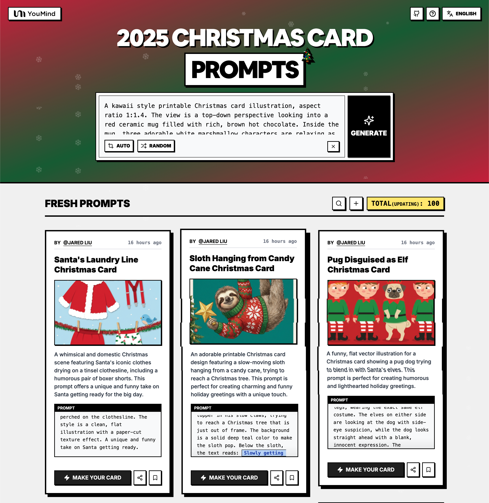

# 🚀 शानदार क्रिसमस कार्ड प्रॉम्पट्स

[](https://github.com/sindresorhus/awesome)
[](https://github.com/YouMind-OpenLab/awesome-christmas-card-prompts)
[](https://creativecommons.org/licenses/by/4.0/)
[](https://github.com/YouMind-OpenLab/awesome-christmas-card-prompts/actions)
[](docs/CONTRIBUTING.md)

> 🎨 Nano Banana Pro द्वारा बनाए गए क्रिसमस कार्ड प्रॉम्पट्स का संग्रह

> 💡 **Note**: gemini3Promo

> ⚠️ **कॉपीराइट सूचना**: सभी प्रॉम्पट्स शैक्षिक उद्देश्यों के लिए समुदाय से एकत्र किए गए हैं। यदि आपको लगता है कि कोई सामग्री आपके अधिकारों का उल्लंघन करती है, तो कृपया [एक समस्या खोलें](https://github.com/YouMind-OpenLab/awesome-christmas-card-prompts/issues/new?template=bug-report.yml) और हम इसे तुरंत हटा देंगे।

---

[](README.md) [](README_zh.md) [](README_zh-TW.md) [](README_ja-JP.md) [](README_ko-KR.md) [](README_th-TH.md) [](README_vi-VN.md) [](README_hi-IN.md) [](README_es-ES.md) [-Click%20to%20View-lightgrey)](README_es-419.md) [](README_de-DE.md) [](README_fr-FR.md) [](README_it-IT.md) [-Click%20to%20View-lightgrey)](README_pt-BR.md) [](README_pt-PT.md) [](README_tr-TR.md)

---

## 🌐 वेब गैलरी में देखें

<div align="center">



</div>

**[👉 YouMind क्रिसमस कार्ड गैलरी ब्राउज़ करें](https://youmind.com/tools/christmas-cards-maker)**

हमारी गैलरी का उपयोग क्यों करें?

| Feature | GitHub README | youmind.com गैलरी |
|---------|--------------|---------------------|
| 🎨 दृश्य लेआउट | रैखिक सूची | सुंदर Masonry ग्रिड |
| 🔍 खोजें | केवल Ctrl+F | फ़िल्टर के साथ पूर्ण-पाठ खोज |
| 🤖 AI एक-क्लिक जनरेशन | - | AI एक-क्लिक जनरेशन |
| 📱 मोबाइल | बुनियादी | पूरी तरह से उत्तरदायी |

---

## 📖 विषय सूची

- [🌐 वेब गैलरी में देखें](#-view-in-web-gallery)
- [🤔 क्रिसमस कार्ड मेकर क्या है?](#-what-is-christmas-cards-maker)
- [📊 आंकड़े](#-statistics)
- [🔥 विशेष प्रॉम्पट्स](#-featured-prompts)
- [📋 सभी प्रॉम्पट्स](#-all-prompts)
- [🤝 योगदान कैसे करें](#-how-to-contribute)
- [📄 लाइसेंस](#-license)
- [🙏 आभार](#-acknowledgements)
- [⭐ स्टार इतिहास](#-star-history)

---

## 🤔 क्रिसमस कार्ड मेकर क्या है?

**क्रिसमस कार्ड मेकर** सुंदर क्रिसमस कार्ड बनाने के लिए Google Nano Banana Pro द्वारा संचालित एक रचनात्मक उपकरण है:

- 🎯 **AI-संचालित जनरेशन** - सरल प्रॉम्पट्स के साथ आश्चर्यजनक कार्ड बनाएं
- 🎨 **विविध शैलियां** - पारंपरिक से आधुनिक, कार्टून से यथार्थवादी तक
- ⚡ **व्यक्तिगत संदेश** - अपनी खुद की शुभकामनाएं और इच्छाएं जोड़ें
- 🌈 **उच्च गुणवत्ता आउटपुट** - प्रिंट-तैयार रिज़ॉल्यूशन
- 🔧 **तेज़ निर्माण** - सेकंडों में कार्ड बनाएं
- 📐 **एकाधिक थीम** - सांता, स्नोफ्लेक्स, पेड़ और बहुत कुछ

📚 learnMore

### 🚀 Raycast एकीकरण

कुछ प्रॉम्पट्स [Raycast Snippets](https://raycast.com/help/snippets) सिंटैक्स का उपयोग करके **गतिशील तर्क** का समर्थन करते हैं। 🚀 Raycast Friendly बैज देखें!

**उदाहरण:**
```
A quote card with "{argument name="quote" default="Stay hungry, stay foolish"}"
by {argument name="author" default="Steve Jobs"}
```

Raycast में उपयोग करते समय, आप त्वरित पुनरावृत्ति के लिए तर्कों को गतिशील रूप से प्रतिस्थापित कर सकते हैं!

---

## 📊 आंकड़े

<div align="center">

| मीट्रिक | गिनती |
|--------|-------|
| 📝 कुल प्रॉम्पट्स | **140** |
| ⭐ विशेष | **6** |
| 🔄 अंतिम अपडेट | **गुरुवार, 26 मार्च 2026 को 4:58:09 pm UTC बजे** |

</div>

---

## 🔥 विशेष प्रॉम्पट्स

> ⭐ असाधारण गुणवत्ता और रचनात्मकता के लिए हमारी टीम द्वारा हाथ से चुना गया

### No. 1: कैंडी केन से लटका हुआ स्लॉथ क्रिसमस कार्ड


#### 📖 विवरण

एक प्यारा प्रिंट करने योग्य क्रिसमस कार्ड डिज़ाइन जिसमें एक धीरे-धीरे चलने वाला स्लॉथ कैंडी केन से लटका हुआ है, जो क्रिसमस ट्री तक पहुँचने की कोशिश कर रहा है। यह प्रॉम्प्ट एक अनोखे अंदाज़ के साथ आकर्षक और मज़ेदार छुट्टियों की शुभकामनाएँ बनाने के लिए एकदम सही है।

#### 📝 प्रॉम्पट

```
एक मनमोहक प्रिंट करने योग्य क्रिसमस कार्ड डिज़ाइन, आस्पेक्ट रेश्यो 1:1.4। एक प्यारा, धीरे-धीरे चलने वाला स्लॉथ एक कैंडी केन से उल्टा लटका हुआ है जो कार्ड के ऊपर क्षैतिज रूप से फैला हुआ है। स्लॉथ ने पिक्सेलयुक्त स्नोफ्लेक पैटर्न वाला एक उत्सवपूर्ण बदसूरत क्रिसमस स्वेटर पहना हुआ है। वह अपने धीमे पंजों में एक स्टार ट्री टॉपर पकड़े हुए है, जो एक क्रिसमस ट्री तक पहुँचने की कोशिश कर रहा है जो फ्रेम से ठीक बाहर है। स्लॉथ को उभारने के लिए पृष्ठभूमि एक ठोस गहरा टील रंग की है। स्लॉथ के नीचे, टेक्स्ट में लिखा है: {argument name="text" default="Slowly getting into the Spirit"} एक आरामदायक, हाथ से लिखे हुए फ़ॉन्ट में।
```

#### 🖼️ उत्पन्न चित्र

##### Image 1

<div align="center">

</div>

#### 📌 विवरण

- **लेखक:** [Jared Liu](https://x.com/jaredliu_bravo)
- **स्रोत:** [Twitter Post](null)
- **प्रकाशित:** 13 दिसंबर 2025
- **भाषाएं:** en

**[👉 अभी आज़माएं →](https://youmind.com/tools/christmas-cards-maker?prompt=%E0%A4%8F%E0%A4%95%20%E0%A4%AE%E0%A4%A8%E0%A4%AE%E0%A5%8B%E0%A4%B9%E0%A4%95%20%E0%A4%AA%E0%A5%8D%E0%A4%B0%E0%A4%BF%E0%A4%82%E0%A4%9F%20%E0%A4%95%E0%A4%B0%E0%A4%A8%E0%A5%87%20%E0%A4%AF%E0%A5%8B%E0%A4%97%E0%A5%8D%E0%A4%AF%20%E0%A4%95%E0%A5%8D%E0%A4%B0%E0%A4%BF%E0%A4%B8%E0%A4%AE%E0%A4%B8%20%E0%A4%95%E0%A4%BE%E0%A4%B0%E0%A5%8D%E0%A4%A1%20%E0%A4%A1%E0%A4%BF%E0%A4%9C%E0%A4%BC%E0%A4%BE%E0%A4%87%E0%A4%A8%2C%20%E0%A4%86%E0%A4%B8%E0%A5%8D%E0%A4%AA%E0%A5%87%E0%A4%95%E0%A5%8D%E0%A4%9F%20%E0%A4%B0%E0%A5%87%E0%A4%B6%E0%A5%8D%E0%A4%AF%E0%A5%8B%201%3A1.4%E0%A5%A4%20%E0%A4%8F%E0%A4%95%20%E0%A4%AA%E0%A5%8D%E0%A4%AF%E0%A4%BE%E0%A4%B0%E0%A4%BE%2C%20%E0%A4%A7%E0%A5%80%E0%A4%B0%E0%A5%87-%E0%A4%A7%E0%A5%80%E0%A4%B0%E0%A5%87%20%E0%A4%9A%E0%A4%B2%E0%A4%A8%E0%A5%87%20%E0%A4%B5%E0%A4%BE%E0%A4%B2%E0%A4%BE%20%E0%A4%B8%E0%A5%8D%E0%A4%B2%E0%A5%89%E0%A4%A5%20%E0%A4%8F%E0%A4%95%20%E0%A4%95%E0%A5%88%E0%A4%82%E0%A4%A1%E0%A5%80%20%E0%A4%95%E0%A5%87%E0%A4%A8%20%E0%A4%B8%E0%A5%87%20%E0%A4%89%E0%A4%B2%E0%A5%8D%E0%A4%9F%E0%A4%BE%20%E0%A4%B2%E0%A4%9F%E0%A4%95%E0%A4%BE%20%E0%A4%B9%E0%A5%81%E0%A4%86%20%E0%A4%B9%E0%A5%88%20%E0%A4%9C%E0%A5%8B%20%E0%A4%95%E0%A4%BE%E0%A4%B0%E0%A5%8D%E0%A4%A1%20%E0%A4%95%E0%A5%87%20%E0%A4%8A%E0%A4%AA%E0%A4%B0%20%E0%A4%95%E0%A5%8D%E0%A4%B7%E0%A5%88%E0%A4%A4%E0%A4%BF%E0%A4%9C%20%E0%A4%B0%E0%A5%82%E0%A4%AA%20%E0%A4%B8%E0%A5%87%20%E0%A4%AB%E0%A5%88%E0%A4%B2%E0%A4%BE%20%E0%A4%B9%E0%A5%81%E0%A4%86%20%E0%A4%B9%E0%A5%88%E0%A5%A4%20%E0%A4%B8%E0%A5%8D%E0%A4%B2%E0%A5%89%E0%A4%A5%20%E0%A4%A8%E0%A5%87%20%E0%A4%AA%E0%A4%BF%E0%A4%95%E0%A5%8D%E0%A4%B8%E0%A5%87%E0%A4%B2%E0%A4%AF%E0%A5%81%E0%A4%95%E0%A5%8D%E0%A4%A4%20%E0%A4%B8%E0%A5%8D%E0%A4%A8%E0%A5%8B%E0%A4%AB%E0%A5%8D%E0%A4%B2%E0%A5%87%E0%A4%95%20%E0%A4%AA%E0%A5%88%E0%A4%9F%E0%A4%B0%E0%A5%8D%E0%A4%A8%20%E0%A4%B5%E0%A4%BE%E0%A4%B2%E0%A4%BE%20%E0%A4%8F%E0%A4%95%20%E0%A4%89%E0%A4%A4%E0%A5%8D%E0%A4%B8%E0%A4%B5%E0%A4%AA%E0%A5%82%E0%A4%B0%E0%A5%8D%E0%A4%A3%20%E0%A4%AC%E0%A4%A6%E0%A4%B8%E0%A5%82%E0%A4%B0%E0%A4%A4%20%E0%A4%95%E0%A5%8D%E0%A4%B0%E0%A4%BF%E0%A4%B8%E0%A4%AE%E0%A4%B8%20%E0%A4%B8%E0%A5%8D%E0%A4%B5%E0%A5%87%E0%A4%9F%E0%A4%B0%20%E0%A4%AA%E0%A4%B9%E0%A4%A8%E0%A4%BE%20%E0%A4%B9%E0%A5%81%E0%A4%86%20%E0%A4%B9%E0%A5%88%E0%A5%A4%20%E0%A4%B5%E0%A4%B9%20%E0%A4%85%E0%A4%AA%E0%A4%A8%E0%A5%87%20%E0%A4%A7%E0%A5%80%E0%A4%AE%E0%A5%87%20%E0%A4%AA%E0%A4%82%E0%A4%9C%E0%A5%8B%E0%A4%82%20%E0%A4%AE%E0%A5%87%E0%A4%82%20%E0%A4%8F%E0%A4%95%20%E0%A4%B8%E0%A5%8D%E0%A4%9F%E0%A4%BE%E0%A4%B0%20%E0%A4%9F%E0%A5%8D%E0%A4%B0%E0%A5%80%20%E0%A4%9F%E0%A5%89%E0%A4%AA%E0%A4%B0%20%E0%A4%AA%E0%A4%95%E0%A4%A1%E0%A4%BC%E0%A5%87%20%E0%A4%B9%E0%A5%81%E0%A4%8F%20%E0%A4%B9%E0%A5%88%2C%20%E0%A4%9C%E0%A5%8B%20%E0%A4%8F%E0%A4%95%20%E0%A4%95%E0%A5%8D%E0%A4%B0%E0%A4%BF%E0%A4%B8%E0%A4%AE%E0%A4%B8%20%E0%A4%9F%E0%A5%8D%E0%A4%B0%E0%A5%80%20%E0%A4%A4%E0%A4%95%20%E0%A4%AA%E0%A4%B9%E0%A5%81%E0%A4%81%E0%A4%9A%E0%A4%A8%E0%A5%87%20%E0%A4%95%E0%A5%80%20%E0%A4%95%E0%A5%8B%E0%A4%B6%E0%A4%BF%E0%A4%B6%20%E0%A4%95%E0%A4%B0%20%E0%A4%B0%E0%A4%B9%E0%A4%BE%20%E0%A4%B9%E0%A5%88%20%E0%A4%9C%E0%A5%8B%20%E0%A4%AB%E0%A5%8D%E0%A4%B0%E0%A5%87%E0%A4%AE%20%E0%A4%B8%E0%A5%87%20%E0%A4%A0%E0%A5%80%E0%A4%95%20%E0%A4%AC%E0%A4%BE%E0%A4%B9%E0%A4%B0%20%E0%A4%B9%E0%A5%88%E0%A5%A4%20%E0%A4%B8%E0%A5%8D%E0%A4%B2%E0%A5%89%E0%A4%A5%20%E0%A4%95%E0%A5%8B%20%E0%A4%89%E0%A4%AD%E0%A4%BE%E0%A4%B0%E0%A4%A8%E0%A5%87%20%E0%A4%95%E0%A5%87%20%E0%A4%B2%E0%A4%BF%E0%A4%8F%20%E0%A4%AA%E0%A5%83%E0%A4%B7%E0%A5%8D%E0%A4%A0%E0%A4%AD%E0%A5%82%E0%A4%AE%E0%A4%BF%20%E0%A4%8F%E0%A4%95%20%E0%A4%A0%E0%A5%8B%E0%A4%B8%20%E0%A4%97%E0%A4%B9%E0%A4%B0%E0%A4%BE%20%E0%A4%9F%E0%A5%80%E0%A4%B2%20%E0%A4%B0%E0%A4%82%E0%A4%97%20%E0%A4%95%E0%A5%80%20%E0%A4%B9%E0%A5%88%E0%A5%A4%20%E0%A4%B8%E0%A5%8D%E0%A4%B2%E0%A5%89%E0%A4%A5%20%E0%A4%95%E0%A5%87%20%E0%A4%A8%E0%A5%80%E0%A4%9A%E0%A5%87%2C%20%E0%A4%9F%E0%A5%87%E0%A4%95%E0%A5%8D%E0%A4%B8%E0%A5%8D%E0%A4%9F%20%E0%A4%AE%E0%A5%87%E0%A4%82%20%E0%A4%B2%E0%A4%BF%E0%A4%96%E0%A4%BE%20%E0%A4%B9%E0%A5%88%3A%20%7Bargument%20name%3D%22text%22%20default%3D%22Slowly%20getting%20into%20the%20Spirit%22%7D%20%E0%A4%8F%E0%A4%95%20%E0%A4%86%E0%A4%B0%E0%A4%BE%E0%A4%AE%E0%A4%A6%E0%A4%BE%E0%A4%AF%E0%A4%95%2C%20%E0%A4%B9%E0%A4%BE%E0%A4%A5%20%E0%A4%B8%E0%A5%87%20%E0%A4%B2%E0%A4%BF%E0%A4%96%E0%A5%87%20%E0%A4%B9%E0%A5%81%E0%A4%8F%20%E0%A4%AB%E0%A4%BC%E0%A5%89%E0%A4%A8%E0%A5%8D%E0%A4%9F%20%E0%A4%AE%E0%A5%87%E0%A4%82%E0%A5%A4)**

---

### No. 2: ध्रुवीय भालू और पेंग्विन स्कार्फ क्रिसमस कार्ड


#### 📖 विवरण

एक दिल को छू लेने वाला और अनोखा क्रिसमस कार्ड कवर, जिसमें एक विशाल ध्रुवीय भालू और एक छोटे पेंग्विन के बीच एक अजीब दोस्ती को दर्शाया गया है, जो एक हास्यास्पद रूप से बड़े स्कार्फ से जुड़े हुए हैं। छुट्टियों के दौरान दोस्ती और गर्मजोशी के विषयों को व्यक्त करने के लिए आदर्श।

#### 📝 प्रॉम्पट

```
एक दिल को छू लेने वाला और मनमोहक क्रिसमस कार्ड कवर, आस्पेक्ट रेश्यो 1:1.4। एक विशाल, रोमिल सफेद ध्रुवीय भालू बाईं ओर बैठा है, और एक छोटा, गोल पेंग्विन एक साफ, बर्फीले-नीले बैकग्राउंड के सामने दाईं ओर खड़ा है। वे एक हास्यास्पद रूप से लंबी, बड़े आकार की लाल और हरी बुनी हुई स्कार्फ से जुड़े हुए हैं, जो भालू की गर्दन के चारों ओर कई बार लपेटी गई है और फिर छोटे पेंग्विन के चारों ओर कसकर लपेटने के लिए नीचे की ओर लटक रही है। पेंग्विन भालू को प्रशंसा भरी नज़रों से देख रहा है। फर और बुनी हुई ऊन की बनावट दिखाई दे रही है और मुलायम है। उनके चारों ओर हल्के सफेद बर्फ के टुकड़े धीरे-धीरे गिर रहे हैं। कोई टेक्स्ट नहीं, बस दोस्ती की एक प्यारी सी तस्वीर।
```

#### 🖼️ उत्पन्न चित्र

##### Image 1

<div align="center">

</div>

#### 📌 विवरण

- **लेखक:** [Jared Liu](https://x.com/jaredliu_bravo)
- **स्रोत:** [Twitter Post](null)
- **प्रकाशित:** 13 दिसंबर 2025
- **भाषाएं:** en

**[👉 अभी आज़माएं →](https://youmind.com/tools/christmas-cards-maker?prompt=%E0%A4%8F%E0%A4%95%20%E0%A4%A6%E0%A4%BF%E0%A4%B2%20%E0%A4%95%E0%A5%8B%20%E0%A4%9B%E0%A5%82%20%E0%A4%B2%E0%A5%87%E0%A4%A8%E0%A5%87%20%E0%A4%B5%E0%A4%BE%E0%A4%B2%E0%A4%BE%20%E0%A4%94%E0%A4%B0%20%E0%A4%AE%E0%A4%A8%E0%A4%AE%E0%A5%8B%E0%A4%B9%E0%A4%95%20%E0%A4%95%E0%A5%8D%E0%A4%B0%E0%A4%BF%E0%A4%B8%E0%A4%AE%E0%A4%B8%20%E0%A4%95%E0%A4%BE%E0%A4%B0%E0%A5%8D%E0%A4%A1%20%E0%A4%95%E0%A4%B5%E0%A4%B0%2C%20%E0%A4%86%E0%A4%B8%E0%A5%8D%E0%A4%AA%E0%A5%87%E0%A4%95%E0%A5%8D%E0%A4%9F%20%E0%A4%B0%E0%A5%87%E0%A4%B6%E0%A5%8D%E0%A4%AF%E0%A5%8B%201%3A1.4%E0%A5%A4%20%E0%A4%8F%E0%A4%95%20%E0%A4%B5%E0%A4%BF%E0%A4%B6%E0%A4%BE%E0%A4%B2%2C%20%E0%A4%B0%E0%A5%8B%E0%A4%AE%E0%A4%BF%E0%A4%B2%20%E0%A4%B8%E0%A4%AB%E0%A5%87%E0%A4%A6%20%E0%A4%A7%E0%A5%8D%E0%A4%B0%E0%A5%81%E0%A4%B5%E0%A5%80%E0%A4%AF%20%E0%A4%AD%E0%A4%BE%E0%A4%B2%E0%A5%82%20%E0%A4%AC%E0%A4%BE%E0%A4%88%E0%A4%82%20%E0%A4%93%E0%A4%B0%20%E0%A4%AC%E0%A5%88%E0%A4%A0%E0%A4%BE%20%E0%A4%B9%E0%A5%88%2C%20%E0%A4%94%E0%A4%B0%20%E0%A4%8F%E0%A4%95%20%E0%A4%9B%E0%A5%8B%E0%A4%9F%E0%A4%BE%2C%20%E0%A4%97%E0%A5%8B%E0%A4%B2%20%E0%A4%AA%E0%A5%87%E0%A4%82%E0%A4%97%E0%A5%8D%E0%A4%B5%E0%A4%BF%E0%A4%A8%20%E0%A4%8F%E0%A4%95%20%E0%A4%B8%E0%A4%BE%E0%A4%AB%2C%20%E0%A4%AC%E0%A4%B0%E0%A5%8D%E0%A4%AB%E0%A5%80%E0%A4%B2%E0%A5%87-%E0%A4%A8%E0%A5%80%E0%A4%B2%E0%A5%87%20%E0%A4%AC%E0%A5%88%E0%A4%95%E0%A4%97%E0%A5%8D%E0%A4%B0%E0%A4%BE%E0%A4%89%E0%A4%82%E0%A4%A1%20%E0%A4%95%E0%A5%87%20%E0%A4%B8%E0%A4%BE%E0%A4%AE%E0%A4%A8%E0%A5%87%20%E0%A4%A6%E0%A4%BE%E0%A4%88%E0%A4%82%20%E0%A4%93%E0%A4%B0%20%E0%A4%96%E0%A4%A1%E0%A4%BC%E0%A4%BE%20%E0%A4%B9%E0%A5%88%E0%A5%A4%20%E0%A4%B5%E0%A5%87%20%E0%A4%8F%E0%A4%95%20%E0%A4%B9%E0%A4%BE%E0%A4%B8%E0%A5%8D%E0%A4%AF%E0%A4%BE%E0%A4%B8%E0%A5%8D%E0%A4%AA%E0%A4%A6%20%E0%A4%B0%E0%A5%82%E0%A4%AA%20%E0%A4%B8%E0%A5%87%20%E0%A4%B2%E0%A4%82%E0%A4%AC%E0%A5%80%2C%20%E0%A4%AC%E0%A4%A1%E0%A4%BC%E0%A5%87%20%E0%A4%86%E0%A4%95%E0%A4%BE%E0%A4%B0%20%E0%A4%95%E0%A5%80%20%E0%A4%B2%E0%A4%BE%E0%A4%B2%20%E0%A4%94%E0%A4%B0%20%E0%A4%B9%E0%A4%B0%E0%A5%80%20%E0%A4%AC%E0%A5%81%E0%A4%A8%E0%A5%80%20%E0%A4%B9%E0%A5%81%E0%A4%88%20%E0%A4%B8%E0%A5%8D%E0%A4%95%E0%A4%BE%E0%A4%B0%E0%A5%8D%E0%A4%AB%20%E0%A4%B8%E0%A5%87%20%E0%A4%9C%E0%A5%81%E0%A4%A1%E0%A4%BC%E0%A5%87%20%E0%A4%B9%E0%A5%81%E0%A4%8F%20%E0%A4%B9%E0%A5%88%E0%A4%82%2C%20%E0%A4%9C%E0%A5%8B%20%E0%A4%AD%E0%A4%BE%E0%A4%B2%E0%A5%82%20%E0%A4%95%E0%A5%80%20%E0%A4%97%E0%A4%B0%E0%A5%8D%E0%A4%A6%E0%A4%A8%20%E0%A4%95%E0%A5%87%20%E0%A4%9A%E0%A4%BE%E0%A4%B0%E0%A5%8B%E0%A4%82%20%E0%A4%93%E0%A4%B0%20%E0%A4%95%E0%A4%88%20%E0%A4%AC%E0%A4%BE%E0%A4%B0%20%E0%A4%B2%E0%A4%AA%E0%A5%87%E0%A4%9F%E0%A5%80%20%E0%A4%97%E0%A4%88%20%E0%A4%B9%E0%A5%88%20%E0%A4%94%E0%A4%B0%20%E0%A4%AB%E0%A4%BF%E0%A4%B0%20%E0%A4%9B%E0%A5%8B%E0%A4%9F%E0%A5%87%20%E0%A4%AA%E0%A5%87%E0%A4%82%E0%A4%97%E0%A5%8D%E0%A4%B5%E0%A4%BF%E0%A4%A8%20%E0%A4%95%E0%A5%87%20%E0%A4%9A%E0%A4%BE%E0%A4%B0%E0%A5%8B%E0%A4%82%20%E0%A4%93%E0%A4%B0%20%E0%A4%95%E0%A4%B8%E0%A4%95%E0%A4%B0%20%E0%A4%B2%E0%A4%AA%E0%A5%87%E0%A4%9F%E0%A4%A8%E0%A5%87%20%E0%A4%95%E0%A5%87%20%E0%A4%B2%E0%A4%BF%E0%A4%8F%20%E0%A4%A8%E0%A5%80%E0%A4%9A%E0%A5%87%20%E0%A4%95%E0%A5%80%20%E0%A4%93%E0%A4%B0%20%E0%A4%B2%E0%A4%9F%E0%A4%95%20%E0%A4%B0%E0%A4%B9%E0%A5%80%20%E0%A4%B9%E0%A5%88%E0%A5%A4%20%E0%A4%AA%E0%A5%87%E0%A4%82%E0%A4%97%E0%A5%8D%E0%A4%B5%E0%A4%BF%E0%A4%A8%20%E0%A4%AD%E0%A4%BE%E0%A4%B2%E0%A5%82%20%E0%A4%95%E0%A5%8B%20%E0%A4%AA%E0%A5%8D%E0%A4%B0%E0%A4%B6%E0%A4%82%E0%A4%B8%E0%A4%BE%20%E0%A4%AD%E0%A4%B0%E0%A5%80%20%E0%A4%A8%E0%A4%9C%E0%A4%BC%E0%A4%B0%E0%A5%8B%E0%A4%82%20%E0%A4%B8%E0%A5%87%20%E0%A4%A6%E0%A5%87%E0%A4%96%20%E0%A4%B0%E0%A4%B9%E0%A4%BE%20%E0%A4%B9%E0%A5%88%E0%A5%A4%20%E0%A4%AB%E0%A4%B0%20%E0%A4%94%E0%A4%B0%20%E0%A4%AC%E0%A5%81%E0%A4%A8%E0%A5%80%20%E0%A4%B9%E0%A5%81%E0%A4%88%20%E0%A4%8A%E0%A4%A8%20%E0%A4%95%E0%A5%80%20%E0%A4%AC%E0%A4%A8%E0%A4%BE%E0%A4%B5%E0%A4%9F%20%E0%A4%A6%E0%A4%BF%E0%A4%96%E0%A4%BE%E0%A4%88%20%E0%A4%A6%E0%A5%87%20%E0%A4%B0%E0%A4%B9%E0%A5%80%20%E0%A4%B9%E0%A5%88%20%E0%A4%94%E0%A4%B0%20%E0%A4%AE%E0%A5%81%E0%A4%B2%E0%A4%BE%E0%A4%AF%E0%A4%AE%20%E0%A4%B9%E0%A5%88%E0%A5%A4%20%E0%A4%89%E0%A4%A8%E0%A4%95%E0%A5%87%20%E0%A4%9A%E0%A4%BE%E0%A4%B0%E0%A5%8B%E0%A4%82%20%E0%A4%93%E0%A4%B0%20%E0%A4%B9%E0%A4%B2%E0%A5%8D%E0%A4%95%E0%A5%87%20%E0%A4%B8%E0%A4%AB%E0%A5%87%E0%A4%A6%20%E0%A4%AC%E0%A4%B0%E0%A5%8D%E0%A4%AB%20%E0%A4%95%E0%A5%87%20%E0%A4%9F%E0%A5%81%E0%A4%95%E0%A4%A1%E0%A4%BC%E0%A5%87%20%E0%A4%A7%E0%A5%80%E0%A4%B0%E0%A5%87-%E0%A4%A7%E0%A5%80%E0%A4%B0%E0%A5%87%20%E0%A4%97%E0%A4%BF%E0%A4%B0%20%E0%A4%B0%E0%A4%B9%E0%A5%87%20%E0%A4%B9%E0%A5%88%E0%A4%82%E0%A5%A4%20%E0%A4%95%E0%A5%8B%E0%A4%88%20%E0%A4%9F%E0%A5%87%E0%A4%95%E0%A5%8D%E0%A4%B8%E0%A5%8D%E0%A4%9F%20%E0%A4%A8%E0%A4%B9%E0%A5%80%E0%A4%82%2C%20%E0%A4%AC%E0%A4%B8%20%E0%A4%A6%E0%A5%8B%E0%A4%B8%E0%A5%8D%E0%A4%A4%E0%A5%80%20%E0%A4%95%E0%A5%80%20%E0%A4%8F%E0%A4%95%20%E0%A4%AA%E0%A5%8D%E0%A4%AF%E0%A4%BE%E0%A4%B0%E0%A5%80%20%E0%A4%B8%E0%A5%80%20%E0%A4%A4%E0%A4%B8%E0%A5%8D%E0%A4%B5%E0%A5%80%E0%A4%B0%E0%A5%A4)**

---

### No. 3: जिंजरब्रेड योगा क्लास क्रिसमस कार्ड


#### 📖 विवरण

'योग क्लास' में पाँच प्यारे जिंजरब्रेड मैन कुकीज़ की विशेषता वाला एक हंसमुख और मनमोहक प्रिंटेबल क्रिसमस कार्ड डिज़ाइन। यह प्रॉम्प्ट हास्य और क्यूटनेस के स्पर्श के साथ दिल को छू लेने वाली छुट्टियों की शुभकामनाएँ बनाने के लिए एकदम सही है।

#### 📝 प्रॉम्पट

```
एक मज़ेदार और मनमोहक प्रिंट करने योग्य क्रिसमस कार्ड डिज़ाइन, आस्पेक्ट रेशियो 1:1.4। बैकग्राउंड एक ठोस, साफ पेस्टल मिंट ग्रीन है। चित्रण में पाँच प्यारे जिंजरब्रेड पुरुषों के कुकीज़ की "योग क्लास" दिखाई गई है। बीच वाला जिंजरब्रेड आदमी "ट्री पोज़" में एक पैर पर खड़ा है, ध्यानमग्न भाव से अपने सिर पर एक गमड्रॉप को संतुलित कर रहा है। उसके बाईं ओर, एक और कुकी "डाउनवर्ड डॉग" पोज़ करने की कोशिश कर रहा है, लेकिन उसकी बांह थोड़ी टूट गई है, जिससे स्वादिष्ट कुकी के टुकड़े दिख रहे हैं। दाईं ओर, एक जिंजरब्रेड आदमी अपनी आइसिंग वाली आँखें बंद करके "लोटस पोज़" में ध्यान कर रहा है। उन सभी में सफेद आइसिंग के विवरण और लाल रेड-हॉट कैंडी बटन हैं। शैली एक साफ, सपाट वेक्टर चित्रण है जिसमें हल्की छायाएं हैं। शीर्ष पर टेक्स्ट लिखा है: {argument name="text" default="Find Your Inner Piece"} एक चंचल, गोल सफेद फ़ॉन्ट में।
```

#### 🖼️ उत्पन्न चित्र

##### Image 1

<div align="center">

</div>

#### 📌 विवरण

- **लेखक:** [Jared Liu](https://x.com/jaredliu_bravo)
- **स्रोत:** [Twitter Post](null)
- **प्रकाशित:** 13 दिसंबर 2025
- **भाषाएं:** en

**[👉 अभी आज़माएं →](https://youmind.com/tools/christmas-cards-maker?prompt=%E0%A4%8F%E0%A4%95%20%E0%A4%AE%E0%A4%9C%E0%A4%BC%E0%A5%87%E0%A4%A6%E0%A4%BE%E0%A4%B0%20%E0%A4%94%E0%A4%B0%20%E0%A4%AE%E0%A4%A8%E0%A4%AE%E0%A5%8B%E0%A4%B9%E0%A4%95%20%E0%A4%AA%E0%A5%8D%E0%A4%B0%E0%A4%BF%E0%A4%82%E0%A4%9F%20%E0%A4%95%E0%A4%B0%E0%A4%A8%E0%A5%87%20%E0%A4%AF%E0%A5%8B%E0%A4%97%E0%A5%8D%E0%A4%AF%20%E0%A4%95%E0%A5%8D%E0%A4%B0%E0%A4%BF%E0%A4%B8%E0%A4%AE%E0%A4%B8%20%E0%A4%95%E0%A4%BE%E0%A4%B0%E0%A5%8D%E0%A4%A1%20%E0%A4%A1%E0%A4%BF%E0%A4%9C%E0%A4%BC%E0%A4%BE%E0%A4%87%E0%A4%A8%2C%20%E0%A4%86%E0%A4%B8%E0%A5%8D%E0%A4%AA%E0%A5%87%E0%A4%95%E0%A5%8D%E0%A4%9F%20%E0%A4%B0%E0%A5%87%E0%A4%B6%E0%A4%BF%E0%A4%AF%E0%A5%8B%201%3A1.4%E0%A5%A4%20%E0%A4%AC%E0%A5%88%E0%A4%95%E0%A4%97%E0%A5%8D%E0%A4%B0%E0%A4%BE%E0%A4%89%E0%A4%82%E0%A4%A1%20%E0%A4%8F%E0%A4%95%20%E0%A4%A0%E0%A5%8B%E0%A4%B8%2C%20%E0%A4%B8%E0%A4%BE%E0%A4%AB%20%E0%A4%AA%E0%A5%87%E0%A4%B8%E0%A5%8D%E0%A4%9F%E0%A4%B2%20%E0%A4%AE%E0%A4%BF%E0%A4%82%E0%A4%9F%20%E0%A4%97%E0%A5%8D%E0%A4%B0%E0%A5%80%E0%A4%A8%20%E0%A4%B9%E0%A5%88%E0%A5%A4%20%E0%A4%9A%E0%A4%BF%E0%A4%A4%E0%A5%8D%E0%A4%B0%E0%A4%A3%20%E0%A4%AE%E0%A5%87%E0%A4%82%20%E0%A4%AA%E0%A4%BE%E0%A4%81%E0%A4%9A%20%E0%A4%AA%E0%A5%8D%E0%A4%AF%E0%A4%BE%E0%A4%B0%E0%A5%87%20%E0%A4%9C%E0%A4%BF%E0%A4%82%E0%A4%9C%E0%A4%B0%E0%A4%AC%E0%A5%8D%E0%A4%B0%E0%A5%87%E0%A4%A1%20%E0%A4%AA%E0%A5%81%E0%A4%B0%E0%A5%81%E0%A4%B7%E0%A5%8B%E0%A4%82%20%E0%A4%95%E0%A5%87%20%E0%A4%95%E0%A5%81%E0%A4%95%E0%A5%80%E0%A4%9C%E0%A4%BC%20%E0%A4%95%E0%A5%80%20%22%E0%A4%AF%E0%A5%8B%E0%A4%97%20%E0%A4%95%E0%A5%8D%E0%A4%B2%E0%A4%BE%E0%A4%B8%22%20%E0%A4%A6%E0%A4%BF%E0%A4%96%E0%A4%BE%E0%A4%88%20%E0%A4%97%E0%A4%88%20%E0%A4%B9%E0%A5%88%E0%A5%A4%20%E0%A4%AC%E0%A5%80%E0%A4%9A%20%E0%A4%B5%E0%A4%BE%E0%A4%B2%E0%A4%BE%20%E0%A4%9C%E0%A4%BF%E0%A4%82%E0%A4%9C%E0%A4%B0%E0%A4%AC%E0%A5%8D%E0%A4%B0%E0%A5%87%E0%A4%A1%20%E0%A4%86%E0%A4%A6%E0%A4%AE%E0%A5%80%20%22%E0%A4%9F%E0%A5%8D%E0%A4%B0%E0%A5%80%20%E0%A4%AA%E0%A5%8B%E0%A4%9C%E0%A4%BC%22%20%E0%A4%AE%E0%A5%87%E0%A4%82%20%E0%A4%8F%E0%A4%95%20%E0%A4%AA%E0%A5%88%E0%A4%B0%20%E0%A4%AA%E0%A4%B0%20%E0%A4%96%E0%A4%A1%E0%A4%BC%E0%A4%BE%20%E0%A4%B9%E0%A5%88%2C%20%E0%A4%A7%E0%A5%8D%E0%A4%AF%E0%A4%BE%E0%A4%A8%E0%A4%AE%E0%A4%97%E0%A5%8D%E0%A4%A8%20%E0%A4%AD%E0%A4%BE%E0%A4%B5%20%E0%A4%B8%E0%A5%87%20%E0%A4%85%E0%A4%AA%E0%A4%A8%E0%A5%87%20%E0%A4%B8%E0%A4%BF%E0%A4%B0%20%E0%A4%AA%E0%A4%B0%20%E0%A4%8F%E0%A4%95%20%E0%A4%97%E0%A4%AE%E0%A4%A1%E0%A5%8D%E0%A4%B0%E0%A5%89%E0%A4%AA%20%E0%A4%95%E0%A5%8B%20%E0%A4%B8%E0%A4%82%E0%A4%A4%E0%A5%81%E0%A4%B2%E0%A4%BF%E0%A4%A4%20%E0%A4%95%E0%A4%B0%20%E0%A4%B0%E0%A4%B9%E0%A4%BE%20%E0%A4%B9%E0%A5%88%E0%A5%A4%20%E0%A4%89%E0%A4%B8%E0%A4%95%E0%A5%87%20%E0%A4%AC%E0%A4%BE%E0%A4%88%E0%A4%82%20%E0%A4%93%E0%A4%B0%2C%20%E0%A4%8F%E0%A4%95%20%E0%A4%94%E0%A4%B0%20%E0%A4%95%E0%A5%81%E0%A4%95%E0%A5%80%20%22%E0%A4%A1%E0%A4%BE%E0%A4%89%E0%A4%A8%E0%A4%B5%E0%A4%B0%E0%A5%8D%E0%A4%A1%20%E0%A4%A1%E0%A5%89%E0%A4%97%22%20%E0%A4%AA%E0%A5%8B%E0%A4%9C%E0%A4%BC%20%E0%A4%95%E0%A4%B0%E0%A4%A8%E0%A5%87%20%E0%A4%95%E0%A5%80%20%E0%A4%95%E0%A5%8B%E0%A4%B6%E0%A4%BF%E0%A4%B6%20%E0%A4%95%E0%A4%B0%20%E0%A4%B0%E0%A4%B9%E0%A4%BE%20%E0%A4%B9%E0%A5%88%2C%20%E0%A4%B2%E0%A5%87%E0%A4%95%E0%A4%BF%E0%A4%A8%20%E0%A4%89%E0%A4%B8%E0%A4%95%E0%A5%80%20%E0%A4%AC%E0%A4%BE%E0%A4%82%E0%A4%B9%20%E0%A4%A5%E0%A5%8B%E0%A4%A1%E0%A4%BC%E0%A5%80%20%E0%A4%9F%E0%A5%82%E0%A4%9F%20%E0%A4%97%E0%A4%88%20%E0%A4%B9%E0%A5%88%2C%20%E0%A4%9C%E0%A4%BF%E0%A4%B8%E0%A4%B8%E0%A5%87%20%E0%A4%B8%E0%A5%8D%E0%A4%B5%E0%A4%BE%E0%A4%A6%E0%A4%BF%E0%A4%B7%E0%A5%8D%E0%A4%9F%20%E0%A4%95%E0%A5%81%E0%A4%95%E0%A5%80%20%E0%A4%95%E0%A5%87%20%E0%A4%9F%E0%A5%81%E0%A4%95%E0%A4%A1%E0%A4%BC%E0%A5%87%20%E0%A4%A6%E0%A4%BF%E0%A4%96%20%E0%A4%B0%E0%A4%B9%E0%A5%87%20%E0%A4%B9%E0%A5%88%E0%A4%82%E0%A5%A4%20%E0%A4%A6%E0%A4%BE%E0%A4%88%E0%A4%82%20%E0%A4%93%E0%A4%B0%2C%20%E0%A4%8F%E0%A4%95%20%E0%A4%9C%E0%A4%BF%E0%A4%82%E0%A4%9C%E0%A4%B0%E0%A4%AC%E0%A5%8D%E0%A4%B0%E0%A5%87%E0%A4%A1%20%E0%A4%86%E0%A4%A6%E0%A4%AE%E0%A5%80%20%E0%A4%85%E0%A4%AA%E0%A4%A8%E0%A5%80%20%E0%A4%86%E0%A4%87%E0%A4%B8%E0%A4%BF%E0%A4%82%E0%A4%97%20%E0%A4%B5%E0%A4%BE%E0%A4%B2%E0%A5%80%20%E0%A4%86%E0%A4%81%E0%A4%96%E0%A5%87%E0%A4%82%20%E0%A4%AC%E0%A4%82%E0%A4%A6%20%E0%A4%95%E0%A4%B0%E0%A4%95%E0%A5%87%20%22%E0%A4%B2%E0%A5%8B%E0%A4%9F%E0%A4%B8%20%E0%A4%AA%E0%A5%8B%E0%A4%9C%E0%A4%BC%22%20%E0%A4%AE%E0%A5%87%E0%A4%82%20%E0%A4%A7%E0%A5%8D%E0%A4%AF%E0%A4%BE%E0%A4%A8%20%E0%A4%95%E0%A4%B0%20%E0%A4%B0%E0%A4%B9%E0%A4%BE%20%E0%A4%B9%E0%A5%88%E0%A5%A4%20%E0%A4%89%E0%A4%A8%20%E0%A4%B8%E0%A4%AD%E0%A5%80%20%E0%A4%AE%E0%A5%87%E0%A4%82%20%E0%A4%B8%E0%A4%AB%E0%A5%87%E0%A4%A6%20%E0%A4%86%E0%A4%87%E0%A4%B8%E0%A4%BF%E0%A4%82%E0%A4%97%20%E0%A4%95%E0%A5%87%20%E0%A4%B5%E0%A4%BF%E0%A4%B5%E0%A4%B0%E0%A4%A3%20%E0%A4%94%E0%A4%B0%20%E0%A4%B2%E0%A4%BE%E0%A4%B2%20%E0%A4%B0%E0%A5%87%E0%A4%A1-%E0%A4%B9%E0%A5%89%E0%A4%9F%20%E0%A4%95%E0%A5%88%E0%A4%82%E0%A4%A1%E0%A5%80%20%E0%A4%AC%E0%A4%9F%E0%A4%A8%20%E0%A4%B9%E0%A5%88%E0%A4%82%E0%A5%A4%20%E0%A4%B6%E0%A5%88%E0%A4%B2%E0%A5%80%20%E0%A4%8F%E0%A4%95%20%E0%A4%B8%E0%A4%BE%E0%A4%AB%2C%20%E0%A4%B8%E0%A4%AA%E0%A4%BE%E0%A4%9F%20%E0%A4%B5%E0%A5%87%E0%A4%95%E0%A5%8D%E0%A4%9F%E0%A4%B0%20%E0%A4%9A%E0%A4%BF%E0%A4%A4%E0%A5%8D%E0%A4%B0%E0%A4%A3%20%E0%A4%B9%E0%A5%88%20%E0%A4%9C%E0%A4%BF%E0%A4%B8%E0%A4%AE%E0%A5%87%E0%A4%82%20%E0%A4%B9%E0%A4%B2%E0%A5%8D%E0%A4%95%E0%A5%80%20%E0%A4%9B%E0%A4%BE%E0%A4%AF%E0%A4%BE%E0%A4%8F%E0%A4%82%20%E0%A4%B9%E0%A5%88%E0%A4%82%E0%A5%A4%20%E0%A4%B6%E0%A5%80%E0%A4%B0%E0%A5%8D%E0%A4%B7%20%E0%A4%AA%E0%A4%B0%20%E0%A4%9F%E0%A5%87%E0%A4%95%E0%A5%8D%E0%A4%B8%E0%A5%8D%E0%A4%9F%20%E0%A4%B2%E0%A4%BF%E0%A4%96%E0%A4%BE%20%E0%A4%B9%E0%A5%88%3A%20%7Bargument%20name%3D%22text%22%20default%3D%22Find%20Your%20Inner%20Piece%22%7D%20%E0%A4%8F%E0%A4%95%20%E0%A4%9A%E0%A4%82%E0%A4%9A%E0%A4%B2%2C%20%E0%A4%97%E0%A5%8B%E0%A4%B2%20%E0%A4%B8%E0%A4%AB%E0%A5%87%E0%A4%A6%20%E0%A4%AB%E0%A4%BC%E0%A5%89%E0%A4%A8%E0%A5%8D%E0%A4%9F%20%E0%A4%AE%E0%A5%87%E0%A4%82%E0%A5%A4)**

---

### No. 4: फेल्ट एप्लिक फॉक्स कब


#### 📖 विवरण

यह प्रॉम्प्ट एक आरामदायक, स्पर्शनीय क्रिसमस कार्ड डिज़ाइन बनाता है जो हाथ से बने फेल्ट एप्लिक स्टिचिंग जैसा दिखता है, जिसमें बर्फीले दृश्य में एक प्यारा लोमड़ी का बच्चा दिखाया गया है। अद्वितीय और कलात्मक छुट्टियों के दृश्यों के लिए बिल्कुल सही।

#### 📝 प्रॉम्पट

```
एक आरामदायक, स्पर्शनीय क्रिसमस कार्ड डिज़ाइन, आस्पेक्ट रेश्यो 1:1.4। चित्रण पूरी तरह से हस्तनिर्मित फेल्ट एप्लिक स्टिचिंग जैसा दिखता है। रोमिल फेल्ट कपड़े से बना एक प्यारा नारंगी लोमड़ी का बच्चा सफेद फेल्ट बर्फ की परतों में बैठा है, जो रंगीन बटन के गहनों से सजे एक फेल्ट क्रिसमस ट्री को देख रहा है। ऊन के रेशों और किनारों के चारों ओर की सिलाई की बनावट स्पष्ट रूप से दिखाई दे रही है। पृष्ठभूमि एक नरम नीले रंग का फेल्ट आसमान है।
```

#### 🖼️ उत्पन्न चित्र

##### Image 1

<div align="center">

</div>

#### 📌 विवरण

- **लेखक:** [Jared Liu](https://x.com/jaredliu_bravo)
- **स्रोत:** [Twitter Post](null)
- **प्रकाशित:** 15 दिसंबर 2025
- **भाषाएं:** en

**[👉 अभी आज़माएं →](https://youmind.com/tools/christmas-cards-maker?prompt=%E0%A4%8F%E0%A4%95%20%E0%A4%86%E0%A4%B0%E0%A4%BE%E0%A4%AE%E0%A4%A6%E0%A4%BE%E0%A4%AF%E0%A4%95%2C%20%E0%A4%B8%E0%A5%8D%E0%A4%AA%E0%A4%B0%E0%A5%8D%E0%A4%B6%E0%A4%A8%E0%A5%80%E0%A4%AF%20%E0%A4%95%E0%A5%8D%E0%A4%B0%E0%A4%BF%E0%A4%B8%E0%A4%AE%E0%A4%B8%20%E0%A4%95%E0%A4%BE%E0%A4%B0%E0%A5%8D%E0%A4%A1%20%E0%A4%A1%E0%A4%BF%E0%A4%9C%E0%A4%BC%E0%A4%BE%E0%A4%87%E0%A4%A8%2C%20%E0%A4%86%E0%A4%B8%E0%A5%8D%E0%A4%AA%E0%A5%87%E0%A4%95%E0%A5%8D%E0%A4%9F%20%E0%A4%B0%E0%A5%87%E0%A4%B6%E0%A5%8D%E0%A4%AF%E0%A5%8B%201%3A1.4%E0%A5%A4%20%E0%A4%9A%E0%A4%BF%E0%A4%A4%E0%A5%8D%E0%A4%B0%E0%A4%A3%20%E0%A4%AA%E0%A5%82%E0%A4%B0%E0%A5%80%20%E0%A4%A4%E0%A4%B0%E0%A4%B9%20%E0%A4%B8%E0%A5%87%20%E0%A4%B9%E0%A4%B8%E0%A5%8D%E0%A4%A4%E0%A4%A8%E0%A4%BF%E0%A4%B0%E0%A5%8D%E0%A4%AE%E0%A4%BF%E0%A4%A4%20%E0%A4%AB%E0%A5%87%E0%A4%B2%E0%A5%8D%E0%A4%9F%20%E0%A4%8F%E0%A4%AA%E0%A5%8D%E0%A4%B2%E0%A4%BF%E0%A4%95%20%E0%A4%B8%E0%A5%8D%E0%A4%9F%E0%A4%BF%E0%A4%9A%E0%A4%BF%E0%A4%82%E0%A4%97%20%E0%A4%9C%E0%A5%88%E0%A4%B8%E0%A4%BE%20%E0%A4%A6%E0%A4%BF%E0%A4%96%E0%A4%A4%E0%A4%BE%20%E0%A4%B9%E0%A5%88%E0%A5%A4%20%E0%A4%B0%E0%A5%8B%E0%A4%AE%E0%A4%BF%E0%A4%B2%20%E0%A4%AB%E0%A5%87%E0%A4%B2%E0%A5%8D%E0%A4%9F%20%E0%A4%95%E0%A4%AA%E0%A4%A1%E0%A4%BC%E0%A5%87%20%E0%A4%B8%E0%A5%87%20%E0%A4%AC%E0%A4%A8%E0%A4%BE%20%E0%A4%8F%E0%A4%95%20%E0%A4%AA%E0%A5%8D%E0%A4%AF%E0%A4%BE%E0%A4%B0%E0%A4%BE%20%E0%A4%A8%E0%A4%BE%E0%A4%B0%E0%A4%82%E0%A4%97%E0%A5%80%20%E0%A4%B2%E0%A5%8B%E0%A4%AE%E0%A4%A1%E0%A4%BC%E0%A5%80%20%E0%A4%95%E0%A4%BE%20%E0%A4%AC%E0%A4%9A%E0%A5%8D%E0%A4%9A%E0%A4%BE%20%E0%A4%B8%E0%A4%AB%E0%A5%87%E0%A4%A6%20%E0%A4%AB%E0%A5%87%E0%A4%B2%E0%A5%8D%E0%A4%9F%20%E0%A4%AC%E0%A4%B0%E0%A5%8D%E0%A4%AB%20%E0%A4%95%E0%A5%80%20%E0%A4%AA%E0%A4%B0%E0%A4%A4%E0%A5%8B%E0%A4%82%20%E0%A4%AE%E0%A5%87%E0%A4%82%20%E0%A4%AC%E0%A5%88%E0%A4%A0%E0%A4%BE%20%E0%A4%B9%E0%A5%88%2C%20%E0%A4%9C%E0%A5%8B%20%E0%A4%B0%E0%A4%82%E0%A4%97%E0%A5%80%E0%A4%A8%20%E0%A4%AC%E0%A4%9F%E0%A4%A8%20%E0%A4%95%E0%A5%87%20%E0%A4%97%E0%A4%B9%E0%A4%A8%E0%A5%8B%E0%A4%82%20%E0%A4%B8%E0%A5%87%20%E0%A4%B8%E0%A4%9C%E0%A5%87%20%E0%A4%8F%E0%A4%95%20%E0%A4%AB%E0%A5%87%E0%A4%B2%E0%A5%8D%E0%A4%9F%20%E0%A4%95%E0%A5%8D%E0%A4%B0%E0%A4%BF%E0%A4%B8%E0%A4%AE%E0%A4%B8%20%E0%A4%9F%E0%A5%8D%E0%A4%B0%E0%A5%80%20%E0%A4%95%E0%A5%8B%20%E0%A4%A6%E0%A5%87%E0%A4%96%20%E0%A4%B0%E0%A4%B9%E0%A4%BE%20%E0%A4%B9%E0%A5%88%E0%A5%A4%20%E0%A4%8A%E0%A4%A8%20%E0%A4%95%E0%A5%87%20%E0%A4%B0%E0%A5%87%E0%A4%B6%E0%A5%8B%E0%A4%82%20%E0%A4%94%E0%A4%B0%20%E0%A4%95%E0%A4%BF%E0%A4%A8%E0%A4%BE%E0%A4%B0%E0%A5%8B%E0%A4%82%20%E0%A4%95%E0%A5%87%20%E0%A4%9A%E0%A4%BE%E0%A4%B0%E0%A5%8B%E0%A4%82%20%E0%A4%93%E0%A4%B0%20%E0%A4%95%E0%A5%80%20%E0%A4%B8%E0%A4%BF%E0%A4%B2%E0%A4%BE%E0%A4%88%20%E0%A4%95%E0%A5%80%20%E0%A4%AC%E0%A4%A8%E0%A4%BE%E0%A4%B5%E0%A4%9F%20%E0%A4%B8%E0%A5%8D%E0%A4%AA%E0%A4%B7%E0%A5%8D%E0%A4%9F%20%E0%A4%B0%E0%A5%82%E0%A4%AA%20%E0%A4%B8%E0%A5%87%20%E0%A4%A6%E0%A4%BF%E0%A4%96%E0%A4%BE%E0%A4%88%20%E0%A4%A6%E0%A5%87%20%E0%A4%B0%E0%A4%B9%E0%A5%80%20%E0%A4%B9%E0%A5%88%E0%A5%A4%20%E0%A4%AA%E0%A5%83%E0%A4%B7%E0%A5%8D%E0%A4%A0%E0%A4%AD%E0%A5%82%E0%A4%AE%E0%A4%BF%20%E0%A4%8F%E0%A4%95%20%E0%A4%A8%E0%A4%B0%E0%A4%AE%20%E0%A4%A8%E0%A5%80%E0%A4%B2%E0%A5%87%20%E0%A4%B0%E0%A4%82%E0%A4%97%20%E0%A4%95%E0%A4%BE%20%E0%A4%AB%E0%A5%87%E0%A4%B2%E0%A5%8D%E0%A4%9F%20%E0%A4%86%E0%A4%B8%E0%A4%AE%E0%A4%BE%E0%A4%A8%20%E0%A4%B9%E0%A5%88%E0%A5%A4)**

---

### No. 5: रेनडियर के सींग और जोकर की नाक वाला पग


#### 📖 विवरण

यह प्रॉम्प्ट एक मज़ेदार और प्यारा प्रिंट करने योग्य कार्ड बनाता है, जिसमें एक पग का क्लोज-अप फोटोग्राफिक पोर्ट्रेट है, जो अनिच्छा से बारहसिंगे के सींग और एक चमकती लाल जोकर की नाक पहने हुए है। विनोदी और अनोखी छुट्टियों की शुभकामनाओं के लिए आदर्श।

#### 📝 प्रॉम्पट

```
एक मज़ेदार और प्यारा प्रिंट करने योग्य कार्ड, आस्पेक्ट रेशियो 1:1.4। एक मोटे पग कुत्ते के चेहरे का क्लोज-अप फोटोग्राफिक पोर्ट्रेट। यह अनिच्छा से भूरे रंग के फेल्ट रेनडियर एंटलर वाला हेडबैंड और अपनी नाक पर एक बहुत चमकीली, चमकती लाल जोकर की नाक पहने हुए है। पग गंभीर, थोड़ा निर्णायक भाव के साथ, सीधे कैमरे की ओर देख रहा है। बैकग्राउंड में धुंधली उत्सव वाली लाल बत्तियाँ हैं।
```

#### 🖼️ उत्पन्न चित्र

##### Image 1

<div align="center">

</div>

#### 📌 विवरण

- **लेखक:** [Jared Liu](https://x.com/jaredliu_bravo)
- **स्रोत:** [Twitter Post](null)
- **प्रकाशित:** 15 दिसंबर 2025
- **भाषाएं:** en

**[👉 अभी आज़माएं →](https://youmind.com/tools/christmas-cards-maker?prompt=%E0%A4%8F%E0%A4%95%20%E0%A4%AE%E0%A4%9C%E0%A4%BC%E0%A5%87%E0%A4%A6%E0%A4%BE%E0%A4%B0%20%E0%A4%94%E0%A4%B0%20%E0%A4%AA%E0%A5%8D%E0%A4%AF%E0%A4%BE%E0%A4%B0%E0%A4%BE%20%E0%A4%AA%E0%A5%8D%E0%A4%B0%E0%A4%BF%E0%A4%82%E0%A4%9F%20%E0%A4%95%E0%A4%B0%E0%A4%A8%E0%A5%87%20%E0%A4%AF%E0%A5%8B%E0%A4%97%E0%A5%8D%E0%A4%AF%20%E0%A4%95%E0%A4%BE%E0%A4%B0%E0%A5%8D%E0%A4%A1%2C%20%E0%A4%86%E0%A4%B8%E0%A5%8D%E0%A4%AA%E0%A5%87%E0%A4%95%E0%A5%8D%E0%A4%9F%20%E0%A4%B0%E0%A5%87%E0%A4%B6%E0%A4%BF%E0%A4%AF%E0%A5%8B%201%3A1.4%E0%A5%A4%20%E0%A4%8F%E0%A4%95%20%E0%A4%AE%E0%A5%8B%E0%A4%9F%E0%A5%87%20%E0%A4%AA%E0%A4%97%20%E0%A4%95%E0%A5%81%E0%A4%A4%E0%A5%8D%E0%A4%A4%E0%A5%87%20%E0%A4%95%E0%A5%87%20%E0%A4%9A%E0%A5%87%E0%A4%B9%E0%A4%B0%E0%A5%87%20%E0%A4%95%E0%A4%BE%20%E0%A4%95%E0%A5%8D%E0%A4%B2%E0%A5%8B%E0%A4%9C-%E0%A4%85%E0%A4%AA%20%E0%A4%AB%E0%A5%8B%E0%A4%9F%E0%A5%8B%E0%A4%97%E0%A5%8D%E0%A4%B0%E0%A4%BE%E0%A4%AB%E0%A4%BF%E0%A4%95%20%E0%A4%AA%E0%A5%8B%E0%A4%B0%E0%A5%8D%E0%A4%9F%E0%A5%8D%E0%A4%B0%E0%A5%87%E0%A4%9F%E0%A5%A4%20%E0%A4%AF%E0%A4%B9%20%E0%A4%85%E0%A4%A8%E0%A4%BF%E0%A4%9A%E0%A5%8D%E0%A4%9B%E0%A4%BE%20%E0%A4%B8%E0%A5%87%20%E0%A4%AD%E0%A5%82%E0%A4%B0%E0%A5%87%20%E0%A4%B0%E0%A4%82%E0%A4%97%20%E0%A4%95%E0%A5%87%20%E0%A4%AB%E0%A5%87%E0%A4%B2%E0%A5%8D%E0%A4%9F%20%E0%A4%B0%E0%A5%87%E0%A4%A8%E0%A4%A1%E0%A4%BF%E0%A4%AF%E0%A4%B0%20%E0%A4%8F%E0%A4%82%E0%A4%9F%E0%A4%B2%E0%A4%B0%20%E0%A4%B5%E0%A4%BE%E0%A4%B2%E0%A4%BE%20%E0%A4%B9%E0%A5%87%E0%A4%A1%E0%A4%AC%E0%A5%88%E0%A4%82%E0%A4%A1%20%E0%A4%94%E0%A4%B0%20%E0%A4%85%E0%A4%AA%E0%A4%A8%E0%A5%80%20%E0%A4%A8%E0%A4%BE%E0%A4%95%20%E0%A4%AA%E0%A4%B0%20%E0%A4%8F%E0%A4%95%20%E0%A4%AC%E0%A4%B9%E0%A5%81%E0%A4%A4%20%E0%A4%9A%E0%A4%AE%E0%A4%95%E0%A5%80%E0%A4%B2%E0%A5%80%2C%20%E0%A4%9A%E0%A4%AE%E0%A4%95%E0%A4%A4%E0%A5%80%20%E0%A4%B2%E0%A4%BE%E0%A4%B2%20%E0%A4%9C%E0%A5%8B%E0%A4%95%E0%A4%B0%20%E0%A4%95%E0%A5%80%20%E0%A4%A8%E0%A4%BE%E0%A4%95%20%E0%A4%AA%E0%A4%B9%E0%A4%A8%E0%A5%87%20%E0%A4%B9%E0%A5%81%E0%A4%8F%20%E0%A4%B9%E0%A5%88%E0%A5%A4%20%E0%A4%AA%E0%A4%97%20%E0%A4%97%E0%A4%82%E0%A4%AD%E0%A5%80%E0%A4%B0%2C%20%E0%A4%A5%E0%A5%8B%E0%A4%A1%E0%A4%BC%E0%A4%BE%20%E0%A4%A8%E0%A4%BF%E0%A4%B0%E0%A5%8D%E0%A4%A3%E0%A4%BE%E0%A4%AF%E0%A4%95%20%E0%A4%AD%E0%A4%BE%E0%A4%B5%20%E0%A4%95%E0%A5%87%20%E0%A4%B8%E0%A4%BE%E0%A4%A5%2C%20%E0%A4%B8%E0%A5%80%E0%A4%A7%E0%A5%87%20%E0%A4%95%E0%A5%88%E0%A4%AE%E0%A4%B0%E0%A5%87%20%E0%A4%95%E0%A5%80%20%E0%A4%93%E0%A4%B0%20%E0%A4%A6%E0%A5%87%E0%A4%96%20%E0%A4%B0%E0%A4%B9%E0%A4%BE%20%E0%A4%B9%E0%A5%88%E0%A5%A4%20%E0%A4%AC%E0%A5%88%E0%A4%95%E0%A4%97%E0%A5%8D%E0%A4%B0%E0%A4%BE%E0%A4%89%E0%A4%82%E0%A4%A1%20%E0%A4%AE%E0%A5%87%E0%A4%82%20%E0%A4%A7%E0%A5%81%E0%A4%82%E0%A4%A7%E0%A4%B2%E0%A5%80%20%E0%A4%89%E0%A4%A4%E0%A5%8D%E0%A4%B8%E0%A4%B5%20%E0%A4%B5%E0%A4%BE%E0%A4%B2%E0%A5%80%20%E0%A4%B2%E0%A4%BE%E0%A4%B2%20%E0%A4%AC%E0%A4%A4%E0%A5%8D%E0%A4%A4%E0%A4%BF%E0%A4%AF%E0%A4%BE%E0%A4%81%20%E0%A4%B9%E0%A5%88%E0%A4%82%E0%A5%A4)**

---

### No. 6: अल्पाका उपहारों से लदा हुआ


#### 📖 विवरण

यह प्रॉम्प्ट एक प्यारा और अव्यवस्थित क्रिसमस कार्ड बनाता है, जिसमें एक रोएंदार अल्पाका है जिस पर क्रिसमस के उपहारों का एक अस्थिर ढेर लदा हुआ है। हास्यपूर्ण और आकर्षक छुट्टियों की शुभकामनाओं के लिए एकदम सही।

#### 📝 प्रॉम्पट

```
एक प्यारा और अव्यवस्थित क्रिसमस कार्ड, आस्पेक्ट रेश्यो 1:1.4। एक रोमिल सफेद अल्पाका एक ठोस मिंट हरे रंग की पृष्ठभूमि के सामने खड़ा है। इसकी पीठ पर रंगीन लपेटे हुए क्रिसमस उपहारों का एक असंभव रूप से ऊंचा, अस्थिर ढेर है, जिसमें धनुष हैं जो बेतहाशा हिल रहे हैं। अल्पाका के चेहरे पर धैर्यपूर्ण, थोड़ा तनावपूर्ण भाव है, और उसके पतले पैर वजन के नीचे हल्के से कांप रहे हैं।
```

#### 🖼️ उत्पन्न चित्र

##### Image 1

<div align="center">

</div>

#### 📌 विवरण

- **लेखक:** [Jared Liu](https://x.com/jaredliu_bravo)
- **स्रोत:** [Twitter Post](null)
- **प्रकाशित:** 15 दिसंबर 2025
- **भाषाएं:** en

**[👉 अभी आज़माएं →](https://youmind.com/tools/christmas-cards-maker?prompt=%E0%A4%8F%E0%A4%95%20%E0%A4%AA%E0%A5%8D%E0%A4%AF%E0%A4%BE%E0%A4%B0%E0%A4%BE%20%E0%A4%94%E0%A4%B0%20%E0%A4%85%E0%A4%B5%E0%A5%8D%E0%A4%AF%E0%A4%B5%E0%A4%B8%E0%A5%8D%E0%A4%A5%E0%A4%BF%E0%A4%A4%20%E0%A4%95%E0%A5%8D%E0%A4%B0%E0%A4%BF%E0%A4%B8%E0%A4%AE%E0%A4%B8%20%E0%A4%95%E0%A4%BE%E0%A4%B0%E0%A5%8D%E0%A4%A1%2C%20%E0%A4%86%E0%A4%B8%E0%A5%8D%E0%A4%AA%E0%A5%87%E0%A4%95%E0%A5%8D%E0%A4%9F%20%E0%A4%B0%E0%A5%87%E0%A4%B6%E0%A5%8D%E0%A4%AF%E0%A5%8B%201%3A1.4%E0%A5%A4%20%E0%A4%8F%E0%A4%95%20%E0%A4%B0%E0%A5%8B%E0%A4%AE%E0%A4%BF%E0%A4%B2%20%E0%A4%B8%E0%A4%AB%E0%A5%87%E0%A4%A6%20%E0%A4%85%E0%A4%B2%E0%A5%8D%E0%A4%AA%E0%A4%BE%E0%A4%95%E0%A4%BE%20%E0%A4%8F%E0%A4%95%20%E0%A4%A0%E0%A5%8B%E0%A4%B8%20%E0%A4%AE%E0%A4%BF%E0%A4%82%E0%A4%9F%20%E0%A4%B9%E0%A4%B0%E0%A5%87%20%E0%A4%B0%E0%A4%82%E0%A4%97%20%E0%A4%95%E0%A5%80%20%E0%A4%AA%E0%A5%83%E0%A4%B7%E0%A5%8D%E0%A4%A0%E0%A4%AD%E0%A5%82%E0%A4%AE%E0%A4%BF%20%E0%A4%95%E0%A5%87%20%E0%A4%B8%E0%A4%BE%E0%A4%AE%E0%A4%A8%E0%A5%87%20%E0%A4%96%E0%A4%A1%E0%A4%BC%E0%A4%BE%20%E0%A4%B9%E0%A5%88%E0%A5%A4%20%E0%A4%87%E0%A4%B8%E0%A4%95%E0%A5%80%20%E0%A4%AA%E0%A5%80%E0%A4%A0%20%E0%A4%AA%E0%A4%B0%20%E0%A4%B0%E0%A4%82%E0%A4%97%E0%A5%80%E0%A4%A8%20%E0%A4%B2%E0%A4%AA%E0%A5%87%E0%A4%9F%E0%A5%87%20%E0%A4%B9%E0%A5%81%E0%A4%8F%20%E0%A4%95%E0%A5%8D%E0%A4%B0%E0%A4%BF%E0%A4%B8%E0%A4%AE%E0%A4%B8%20%E0%A4%89%E0%A4%AA%E0%A4%B9%E0%A4%BE%E0%A4%B0%E0%A5%8B%E0%A4%82%20%E0%A4%95%E0%A4%BE%20%E0%A4%8F%E0%A4%95%20%E0%A4%85%E0%A4%B8%E0%A4%82%E0%A4%AD%E0%A4%B5%20%E0%A4%B0%E0%A5%82%E0%A4%AA%20%E0%A4%B8%E0%A5%87%20%E0%A4%8A%E0%A4%82%E0%A4%9A%E0%A4%BE%2C%20%E0%A4%85%E0%A4%B8%E0%A5%8D%E0%A4%A5%E0%A4%BF%E0%A4%B0%20%E0%A4%A2%E0%A5%87%E0%A4%B0%20%E0%A4%B9%E0%A5%88%2C%20%E0%A4%9C%E0%A4%BF%E0%A4%B8%E0%A4%AE%E0%A5%87%E0%A4%82%20%E0%A4%A7%E0%A4%A8%E0%A5%81%E0%A4%B7%20%E0%A4%B9%E0%A5%88%E0%A4%82%20%E0%A4%9C%E0%A5%8B%20%E0%A4%AC%E0%A5%87%E0%A4%A4%E0%A4%B9%E0%A4%BE%E0%A4%B6%E0%A4%BE%20%E0%A4%B9%E0%A4%BF%E0%A4%B2%20%E0%A4%B0%E0%A4%B9%E0%A5%87%20%E0%A4%B9%E0%A5%88%E0%A4%82%E0%A5%A4%20%E0%A4%85%E0%A4%B2%E0%A5%8D%E0%A4%AA%E0%A4%BE%E0%A4%95%E0%A4%BE%20%E0%A4%95%E0%A5%87%20%E0%A4%9A%E0%A5%87%E0%A4%B9%E0%A4%B0%E0%A5%87%20%E0%A4%AA%E0%A4%B0%20%E0%A4%A7%E0%A5%88%E0%A4%B0%E0%A5%8D%E0%A4%AF%E0%A4%AA%E0%A5%82%E0%A4%B0%E0%A5%8D%E0%A4%A3%2C%20%E0%A4%A5%E0%A5%8B%E0%A4%A1%E0%A4%BC%E0%A4%BE%20%E0%A4%A4%E0%A4%A8%E0%A4%BE%E0%A4%B5%E0%A4%AA%E0%A5%82%E0%A4%B0%E0%A5%8D%E0%A4%A3%20%E0%A4%AD%E0%A4%BE%E0%A4%B5%20%E0%A4%B9%E0%A5%88%2C%20%E0%A4%94%E0%A4%B0%20%E0%A4%89%E0%A4%B8%E0%A4%95%E0%A5%87%20%E0%A4%AA%E0%A4%A4%E0%A4%B2%E0%A5%87%20%E0%A4%AA%E0%A5%88%E0%A4%B0%20%E0%A4%B5%E0%A4%9C%E0%A4%A8%20%E0%A4%95%E0%A5%87%20%E0%A4%A8%E0%A5%80%E0%A4%9A%E0%A5%87%20%E0%A4%B9%E0%A4%B2%E0%A5%8D%E0%A4%95%E0%A5%87%20%E0%A4%B8%E0%A5%87%20%E0%A4%95%E0%A4%BE%E0%A4%82%E0%A4%AA%20%E0%A4%B0%E0%A4%B9%E0%A5%87%20%E0%A4%B9%E0%A5%88%E0%A4%82%E0%A5%A4)**

---

## 📋 सभी प्रॉम्पट्स

> 📝 प्रकाशन तिथि के अनुसार क्रमबद्ध (नवीनतम पहले)

### No. 1: क्रिसमस बीवर्स · कंस्ट्रक्शन मैनिएक फ्रेम


#### 📖 विवरण

यह प्रॉम्प्ट एक चंचल एनिमेटेड शैली का क्रिसमस फोटो फ्रेम बनाता है, जो वर्टिकल 1:1.4 फॉर्मेट में है। बॉर्डर पर कार्टून बीवर उत्साहपूर्वक और अति-गंभीरता से उत्सव की सजावट बनाते हुए और उसे अत्यधिक इंजीनियर करते हुए दिखाई देते हैं, जिससे एक हास्यपूर्ण, प्रिंट-ऑप्टिमाइज्ड डिज़ाइन बनता है।

#### 📝 प्रॉम्पट

```
एक वर्टिकल 1:1.4 प्रिंटेबल क्रिसमस फोटो फ्रेम जिसे चंचल एनिमेटेड शैली में चित्रित किया गया है।

कोई वातावरण नहीं, केवल फ्रेम।

एक खाली फोटो प्लेसहोल्डर बीच में है, 1:1.4 अनुपात, 70% चौड़ाई, पूरी तरह से साफ।

बॉर्डर पर कार्टून बीवर उत्साहपूर्वक निर्माण करते हुए, हथौड़ा मारते हुए, और अतिरंजित गंभीरता के साथ उत्सव की सजावट को अत्यधिक इंजीनियरिंग करते हुए दिखाए गए हैं।

फ्लैट, विनोदी, प्रिंट-अनुकूलित, कोई टेक्स्ट नहीं।
```

#### 🖼️ उत्पन्न चित्र

##### Image 1

<div align="center">

</div>

#### 📌 विवरण

- **लेखक:** [Jared Liu](https://x.com/jaredliu_bravo)
- **स्रोत:** [Twitter Post](null)
- **प्रकाशित:** 15 दिसंबर 2025
- **भाषाएं:** en

**[👉 अभी आज़माएं →](https://youmind.com/tools/christmas-cards-maker?prompt=%E0%A4%8F%E0%A4%95%20%E0%A4%B5%E0%A4%B0%E0%A5%8D%E0%A4%9F%E0%A4%BF%E0%A4%95%E0%A4%B2%201%3A1.4%20%E0%A4%AA%E0%A5%8D%E0%A4%B0%E0%A4%BF%E0%A4%82%E0%A4%9F%E0%A5%87%E0%A4%AC%E0%A4%B2%20%E0%A4%95%E0%A5%8D%E0%A4%B0%E0%A4%BF%E0%A4%B8%E0%A4%AE%E0%A4%B8%20%E0%A4%AB%E0%A5%8B%E0%A4%9F%E0%A5%8B%20%E0%A4%AB%E0%A5%8D%E0%A4%B0%E0%A5%87%E0%A4%AE%20%E0%A4%9C%E0%A4%BF%E0%A4%B8%E0%A5%87%20%E0%A4%9A%E0%A4%82%E0%A4%9A%E0%A4%B2%20%E0%A4%8F%E0%A4%A8%E0%A4%BF%E0%A4%AE%E0%A5%87%E0%A4%9F%E0%A5%87%E0%A4%A1%20%E0%A4%B6%E0%A5%88%E0%A4%B2%E0%A5%80%20%E0%A4%AE%E0%A5%87%E0%A4%82%20%E0%A4%9A%E0%A4%BF%E0%A4%A4%E0%A5%8D%E0%A4%B0%E0%A4%BF%E0%A4%A4%20%E0%A4%95%E0%A4%BF%E0%A4%AF%E0%A4%BE%20%E0%A4%97%E0%A4%AF%E0%A4%BE%20%E0%A4%B9%E0%A5%88%E0%A5%A4%0A%0A%E0%A4%95%E0%A5%8B%E0%A4%88%20%E0%A4%B5%E0%A4%BE%E0%A4%A4%E0%A4%BE%E0%A4%B5%E0%A4%B0%E0%A4%A3%20%E0%A4%A8%E0%A4%B9%E0%A5%80%E0%A4%82%2C%20%E0%A4%95%E0%A5%87%E0%A4%B5%E0%A4%B2%20%E0%A4%AB%E0%A5%8D%E0%A4%B0%E0%A5%87%E0%A4%AE%E0%A5%A4%0A%0A%E0%A4%8F%E0%A4%95%20%E0%A4%96%E0%A4%BE%E0%A4%B2%E0%A5%80%20%E0%A4%AB%E0%A5%8B%E0%A4%9F%E0%A5%8B%20%E0%A4%AA%E0%A5%8D%E0%A4%B2%E0%A5%87%E0%A4%B8%E0%A4%B9%E0%A5%8B%E0%A4%B2%E0%A5%8D%E0%A4%A1%E0%A4%B0%20%E0%A4%AC%E0%A5%80%E0%A4%9A%20%E0%A4%AE%E0%A5%87%E0%A4%82%20%E0%A4%B9%E0%A5%88%2C%201%3A1.4%20%E0%A4%85%E0%A4%A8%E0%A5%81%E0%A4%AA%E0%A4%BE%E0%A4%A4%2C%2070%25%20%E0%A4%9A%E0%A5%8C%E0%A4%A1%E0%A4%BC%E0%A4%BE%E0%A4%88%2C%20%E0%A4%AA%E0%A5%82%E0%A4%B0%E0%A5%80%20%E0%A4%A4%E0%A4%B0%E0%A4%B9%20%E0%A4%B8%E0%A5%87%20%E0%A4%B8%E0%A4%BE%E0%A4%AB%E0%A5%A4%0A%0A%E0%A4%AC%E0%A5%89%E0%A4%B0%E0%A5%8D%E0%A4%A1%E0%A4%B0%20%E0%A4%AA%E0%A4%B0%20%E0%A4%95%E0%A4%BE%E0%A4%B0%E0%A5%8D%E0%A4%9F%E0%A5%82%E0%A4%A8%20%E0%A4%AC%E0%A5%80%E0%A4%B5%E0%A4%B0%20%E0%A4%89%E0%A4%A4%E0%A5%8D%E0%A4%B8%E0%A4%BE%E0%A4%B9%E0%A4%AA%E0%A5%82%E0%A4%B0%E0%A5%8D%E0%A4%B5%E0%A4%95%20%E0%A4%A8%E0%A4%BF%E0%A4%B0%E0%A5%8D%E0%A4%AE%E0%A4%BE%E0%A4%A3%20%E0%A4%95%E0%A4%B0%E0%A4%A4%E0%A5%87%20%E0%A4%B9%E0%A5%81%E0%A4%8F%2C%20%E0%A4%B9%E0%A4%A5%E0%A5%8C%E0%A4%A1%E0%A4%BC%E0%A4%BE%20%E0%A4%AE%E0%A4%BE%E0%A4%B0%E0%A4%A4%E0%A5%87%20%E0%A4%B9%E0%A5%81%E0%A4%8F%2C%20%E0%A4%94%E0%A4%B0%20%E0%A4%85%E0%A4%A4%E0%A4%BF%E0%A4%B0%E0%A4%82%E0%A4%9C%E0%A4%BF%E0%A4%A4%20%E0%A4%97%E0%A4%82%E0%A4%AD%E0%A5%80%E0%A4%B0%E0%A4%A4%E0%A4%BE%20%E0%A4%95%E0%A5%87%20%E0%A4%B8%E0%A4%BE%E0%A4%A5%20%E0%A4%89%E0%A4%A4%E0%A5%8D%E0%A4%B8%E0%A4%B5%20%E0%A4%95%E0%A5%80%20%E0%A4%B8%E0%A4%9C%E0%A4%BE%E0%A4%B5%E0%A4%9F%20%E0%A4%95%E0%A5%8B%20%E0%A4%85%E0%A4%A4%E0%A5%8D%E0%A4%AF%E0%A4%A7%E0%A4%BF%E0%A4%95%20%E0%A4%87%E0%A4%82%E0%A4%9C%E0%A5%80%E0%A4%A8%E0%A4%BF%E0%A4%AF%E0%A4%B0%E0%A4%BF%E0%A4%82%E0%A4%97%20%E0%A4%95%E0%A4%B0%E0%A4%A4%E0%A5%87%20%E0%A4%B9%E0%A5%81%E0%A4%8F%20%E0%A4%A6%E0%A4%BF%E0%A4%96%E0%A4%BE%E0%A4%8F%20%E0%A4%97%E0%A4%8F%20%E0%A4%B9%E0%A5%88%E0%A4%82%E0%A5%A4%0A%0A%E0%A4%AB%E0%A5%8D%E0%A4%B2%E0%A5%88%E0%A4%9F%2C%20%E0%A4%B5%E0%A4%BF%E0%A4%A8%E0%A5%8B%E0%A4%A6%E0%A5%80%2C%20%E0%A4%AA%E0%A5%8D%E0%A4%B0%E0%A4%BF%E0%A4%82%E0%A4%9F-%E0%A4%85%E0%A4%A8%E0%A5%81%E0%A4%95%E0%A5%82%E0%A4%B2%E0%A4%BF%E0%A4%A4%2C%20%E0%A4%95%E0%A5%8B%E0%A4%88%20%E0%A4%9F%E0%A5%87%E0%A4%95%E0%A5%8D%E0%A4%B8%E0%A5%8D%E0%A4%9F%20%E0%A4%A8%E0%A4%B9%E0%A5%80%E0%A4%82%E0%A5%A4)**

---

### No. 2: क्रिसमस कोआला · कैन-लेट-गो फ़्रेम


#### 📖 विवरण

यह प्रॉम्प्ट वर्टिकल 1:1.4 फॉर्मेट में एक एनिमेटेड क्रिसमस फोटो फ्रेम बनाता है। बॉर्डर में कार्टून कोआला आभूषणों और मालाओं को गले लगाते हुए, उन्हें छोड़ने से इनकार करते हुए, एक प्रिंट-रेडी डिज़ाइन में कोमल, आरामदायक हास्य पैदा करते हैं।

#### 📝 प्रॉम्पट

```
वर्टिकल 1:1.4 फॉर्मेट में एक प्रिंटेबल एनिमेटेड क्रिसमस फोटो फ्रेम।

केवल फ्रेम डिज़ाइन।

एक खाली फोटो प्लेसहोल्डर क्षैतिज और लंबवत दोनों तरह से केंद्रित है, 1:1.4 आस्पेक्ट रेश्यो, 70% चौड़ाई, पूरी तरह से अछूता।

बॉर्डर पर कार्टून कोआला गहनों, मालाओं और कैंडी केन्स को गले लगाते हुए, उन्हें छोड़ने से इनकार करते हुए, एक सौम्य, आरामदायक हास्य पैदा कर रहे हैं।

फ्लैट, गर्म, प्रिंट-रेडी, कोई टेक्स्ट नहीं।
```

#### 🖼️ उत्पन्न चित्र

##### Image 1

<div align="center">

</div>

#### 📌 विवरण

- **लेखक:** [Jared Liu](https://x.com/jaredliu_bravo)
- **स्रोत:** [Twitter Post](null)
- **प्रकाशित:** 15 दिसंबर 2025
- **भाषाएं:** en

**[👉 अभी आज़माएं →](https://youmind.com/tools/christmas-cards-maker?prompt=%E0%A4%B5%E0%A4%B0%E0%A5%8D%E0%A4%9F%E0%A4%BF%E0%A4%95%E0%A4%B2%201%3A1.4%20%E0%A4%AB%E0%A5%89%E0%A4%B0%E0%A5%8D%E0%A4%AE%E0%A5%87%E0%A4%9F%20%E0%A4%AE%E0%A5%87%E0%A4%82%20%E0%A4%8F%E0%A4%95%20%E0%A4%AA%E0%A5%8D%E0%A4%B0%E0%A4%BF%E0%A4%82%E0%A4%9F%E0%A5%87%E0%A4%AC%E0%A4%B2%20%E0%A4%8F%E0%A4%A8%E0%A4%BF%E0%A4%AE%E0%A5%87%E0%A4%9F%E0%A5%87%E0%A4%A1%20%E0%A4%95%E0%A5%8D%E0%A4%B0%E0%A4%BF%E0%A4%B8%E0%A4%AE%E0%A4%B8%20%E0%A4%AB%E0%A5%8B%E0%A4%9F%E0%A5%8B%20%E0%A4%AB%E0%A5%8D%E0%A4%B0%E0%A5%87%E0%A4%AE%E0%A5%A4%0A%0A%E0%A4%95%E0%A5%87%E0%A4%B5%E0%A4%B2%20%E0%A4%AB%E0%A5%8D%E0%A4%B0%E0%A5%87%E0%A4%AE%20%E0%A4%A1%E0%A4%BF%E0%A4%9C%E0%A4%BC%E0%A4%BE%E0%A4%87%E0%A4%A8%E0%A5%A4%0A%0A%E0%A4%8F%E0%A4%95%20%E0%A4%96%E0%A4%BE%E0%A4%B2%E0%A5%80%20%E0%A4%AB%E0%A5%8B%E0%A4%9F%E0%A5%8B%20%E0%A4%AA%E0%A5%8D%E0%A4%B2%E0%A5%87%E0%A4%B8%E0%A4%B9%E0%A5%8B%E0%A4%B2%E0%A5%8D%E0%A4%A1%E0%A4%B0%20%E0%A4%95%E0%A5%8D%E0%A4%B7%E0%A5%88%E0%A4%A4%E0%A4%BF%E0%A4%9C%20%E0%A4%94%E0%A4%B0%20%E0%A4%B2%E0%A4%82%E0%A4%AC%E0%A4%B5%E0%A4%A4%20%E0%A4%A6%E0%A5%8B%E0%A4%A8%E0%A5%8B%E0%A4%82%20%E0%A4%A4%E0%A4%B0%E0%A4%B9%20%E0%A4%B8%E0%A5%87%20%E0%A4%95%E0%A5%87%E0%A4%82%E0%A4%A6%E0%A5%8D%E0%A4%B0%E0%A4%BF%E0%A4%A4%20%E0%A4%B9%E0%A5%88%2C%201%3A1.4%20%E0%A4%86%E0%A4%B8%E0%A5%8D%E0%A4%AA%E0%A5%87%E0%A4%95%E0%A5%8D%E0%A4%9F%20%E0%A4%B0%E0%A5%87%E0%A4%B6%E0%A5%8D%E0%A4%AF%E0%A5%8B%2C%2070%25%20%E0%A4%9A%E0%A5%8C%E0%A4%A1%E0%A4%BC%E0%A4%BE%E0%A4%88%2C%20%E0%A4%AA%E0%A5%82%E0%A4%B0%E0%A5%80%20%E0%A4%A4%E0%A4%B0%E0%A4%B9%20%E0%A4%B8%E0%A5%87%20%E0%A4%85%E0%A4%9B%E0%A5%82%E0%A4%A4%E0%A4%BE%E0%A5%A4%0A%0A%E0%A4%AC%E0%A5%89%E0%A4%B0%E0%A5%8D%E0%A4%A1%E0%A4%B0%20%E0%A4%AA%E0%A4%B0%20%E0%A4%95%E0%A4%BE%E0%A4%B0%E0%A5%8D%E0%A4%9F%E0%A5%82%E0%A4%A8%20%E0%A4%95%E0%A5%8B%E0%A4%86%E0%A4%B2%E0%A4%BE%20%E0%A4%97%E0%A4%B9%E0%A4%A8%E0%A5%8B%E0%A4%82%2C%20%E0%A4%AE%E0%A4%BE%E0%A4%B2%E0%A4%BE%E0%A4%93%E0%A4%82%20%E0%A4%94%E0%A4%B0%20%E0%A4%95%E0%A5%88%E0%A4%82%E0%A4%A1%E0%A5%80%20%E0%A4%95%E0%A5%87%E0%A4%A8%E0%A5%8D%E0%A4%B8%20%E0%A4%95%E0%A5%8B%20%E0%A4%97%E0%A4%B2%E0%A5%87%20%E0%A4%B2%E0%A4%97%E0%A4%BE%E0%A4%A4%E0%A5%87%20%E0%A4%B9%E0%A5%81%E0%A4%8F%2C%20%E0%A4%89%E0%A4%A8%E0%A5%8D%E0%A4%B9%E0%A5%87%E0%A4%82%20%E0%A4%9B%E0%A5%8B%E0%A4%A1%E0%A4%BC%E0%A4%A8%E0%A5%87%20%E0%A4%B8%E0%A5%87%20%E0%A4%87%E0%A4%A8%E0%A4%95%E0%A4%BE%E0%A4%B0%20%E0%A4%95%E0%A4%B0%E0%A4%A4%E0%A5%87%20%E0%A4%B9%E0%A5%81%E0%A4%8F%2C%20%E0%A4%8F%E0%A4%95%20%E0%A4%B8%E0%A5%8C%E0%A4%AE%E0%A5%8D%E0%A4%AF%2C%20%E0%A4%86%E0%A4%B0%E0%A4%BE%E0%A4%AE%E0%A4%A6%E0%A4%BE%E0%A4%AF%E0%A4%95%20%E0%A4%B9%E0%A4%BE%E0%A4%B8%E0%A5%8D%E0%A4%AF%20%E0%A4%AA%E0%A5%88%E0%A4%A6%E0%A4%BE%20%E0%A4%95%E0%A4%B0%20%E0%A4%B0%E0%A4%B9%E0%A5%87%20%E0%A4%B9%E0%A5%88%E0%A4%82%E0%A5%A4%0A%0A%E0%A4%AB%E0%A5%8D%E0%A4%B2%E0%A5%88%E0%A4%9F%2C%20%E0%A4%97%E0%A4%B0%E0%A5%8D%E0%A4%AE%2C%20%E0%A4%AA%E0%A5%8D%E0%A4%B0%E0%A4%BF%E0%A4%82%E0%A4%9F-%E0%A4%B0%E0%A5%87%E0%A4%A1%E0%A5%80%2C%20%E0%A4%95%E0%A5%8B%E0%A4%88%20%E0%A4%9F%E0%A5%87%E0%A4%95%E0%A5%8D%E0%A4%B8%E0%A5%8D%E0%A4%9F%20%E0%A4%A8%E0%A4%B9%E0%A5%80%E0%A4%82%E0%A5%A4)**

---

### No. 3: क्रिसमस हेजहॉग्स + गिलहरियाँ · संयुक्त आपदा फ्रेम


#### 📖 विवरण

यह प्रॉम्प्ट वर्टिकल 1:1.4 फॉर्मेट में एक मज़ेदार एनिमेटेड स्टाइल वाला क्रिसमस फ्रेम बनाता है। बॉर्डर पर कार्टून हेजहॉग और गिलहरियाँ सजावट इकट्ठा करने के लिए होड़ कर रही हैं, जिससे गलती से फ्रेम के किनारों पर उत्सव का माहौल अस्त-व्यस्त हो जाता है।

#### 📝 प्रॉम्पट

```
एक लंबवत 1:1.4 प्रिंटेबल क्रिसमस फ्रेम जिसे हास्यपूर्ण एनिमेटेड शैली में चित्रित किया गया है।

केवल फ्रेम ही।

ठीक बीच में खाली फोटो प्लेसहोल्डर, 1:1.4, 70% चौड़ाई, साफ और खाली।

बॉर्डर में कार्टून हेजहॉग और गिलहरियाँ सजावट इकट्ठा करने के लिए प्रतिस्पर्धा कर रहे हैं, जिससे किनारों पर गलती से उत्सव का माहौल गड़बड़ हो रहा है।

फ्लैट कंपोजिशन, कोई टेक्स्ट नहीं।
```

#### 🖼️ उत्पन्न चित्र

##### Image 1

<div align="center">

</div>

#### 📌 विवरण

- **लेखक:** [Jared Liu](https://x.com/jaredliu_bravo)
- **स्रोत:** [Twitter Post](null)
- **प्रकाशित:** 15 दिसंबर 2025
- **भाषाएं:** en

**[👉 अभी आज़माएं →](https://youmind.com/tools/christmas-cards-maker?prompt=%E0%A4%8F%E0%A4%95%20%E0%A4%B2%E0%A4%82%E0%A4%AC%E0%A4%B5%E0%A4%A4%201%3A1.4%20%E0%A4%AA%E0%A5%8D%E0%A4%B0%E0%A4%BF%E0%A4%82%E0%A4%9F%E0%A5%87%E0%A4%AC%E0%A4%B2%20%E0%A4%95%E0%A5%8D%E0%A4%B0%E0%A4%BF%E0%A4%B8%E0%A4%AE%E0%A4%B8%20%E0%A4%AB%E0%A5%8D%E0%A4%B0%E0%A5%87%E0%A4%AE%20%E0%A4%9C%E0%A4%BF%E0%A4%B8%E0%A5%87%20%E0%A4%B9%E0%A4%BE%E0%A4%B8%E0%A5%8D%E0%A4%AF%E0%A4%AA%E0%A5%82%E0%A4%B0%E0%A5%8D%E0%A4%A3%20%E0%A4%8F%E0%A4%A8%E0%A4%BF%E0%A4%AE%E0%A5%87%E0%A4%9F%E0%A5%87%E0%A4%A1%20%E0%A4%B6%E0%A5%88%E0%A4%B2%E0%A5%80%20%E0%A4%AE%E0%A5%87%E0%A4%82%20%E0%A4%9A%E0%A4%BF%E0%A4%A4%E0%A5%8D%E0%A4%B0%E0%A4%BF%E0%A4%A4%20%E0%A4%95%E0%A4%BF%E0%A4%AF%E0%A4%BE%20%E0%A4%97%E0%A4%AF%E0%A4%BE%20%E0%A4%B9%E0%A5%88%E0%A5%A4%0A%0A%E0%A4%95%E0%A5%87%E0%A4%B5%E0%A4%B2%20%E0%A4%AB%E0%A5%8D%E0%A4%B0%E0%A5%87%E0%A4%AE%20%E0%A4%B9%E0%A5%80%E0%A5%A4%0A%0A%E0%A4%A0%E0%A5%80%E0%A4%95%20%E0%A4%AC%E0%A5%80%E0%A4%9A%20%E0%A4%AE%E0%A5%87%E0%A4%82%20%E0%A4%96%E0%A4%BE%E0%A4%B2%E0%A5%80%20%E0%A4%AB%E0%A5%8B%E0%A4%9F%E0%A5%8B%20%E0%A4%AA%E0%A5%8D%E0%A4%B2%E0%A5%87%E0%A4%B8%E0%A4%B9%E0%A5%8B%E0%A4%B2%E0%A5%8D%E0%A4%A1%E0%A4%B0%2C%201%3A1.4%2C%2070%25%20%E0%A4%9A%E0%A5%8C%E0%A4%A1%E0%A4%BC%E0%A4%BE%E0%A4%88%2C%20%E0%A4%B8%E0%A4%BE%E0%A4%AB%20%E0%A4%94%E0%A4%B0%20%E0%A4%96%E0%A4%BE%E0%A4%B2%E0%A5%80%E0%A5%A4%0A%0A%E0%A4%AC%E0%A5%89%E0%A4%B0%E0%A5%8D%E0%A4%A1%E0%A4%B0%20%E0%A4%AE%E0%A5%87%E0%A4%82%20%E0%A4%95%E0%A4%BE%E0%A4%B0%E0%A5%8D%E0%A4%9F%E0%A5%82%E0%A4%A8%20%E0%A4%B9%E0%A5%87%E0%A4%9C%E0%A4%B9%E0%A5%89%E0%A4%97%20%E0%A4%94%E0%A4%B0%20%E0%A4%97%E0%A4%BF%E0%A4%B2%E0%A4%B9%E0%A4%B0%E0%A4%BF%E0%A4%AF%E0%A4%BE%E0%A4%81%20%E0%A4%B8%E0%A4%9C%E0%A4%BE%E0%A4%B5%E0%A4%9F%20%E0%A4%87%E0%A4%95%E0%A4%9F%E0%A5%8D%E0%A4%A0%E0%A4%BE%20%E0%A4%95%E0%A4%B0%E0%A4%A8%E0%A5%87%20%E0%A4%95%E0%A5%87%20%E0%A4%B2%E0%A4%BF%E0%A4%8F%20%E0%A4%AA%E0%A5%8D%E0%A4%B0%E0%A4%A4%E0%A4%BF%E0%A4%B8%E0%A5%8D%E0%A4%AA%E0%A4%B0%E0%A5%8D%E0%A4%A7%E0%A4%BE%20%E0%A4%95%E0%A4%B0%20%E0%A4%B0%E0%A4%B9%E0%A5%87%20%E0%A4%B9%E0%A5%88%E0%A4%82%2C%20%E0%A4%9C%E0%A4%BF%E0%A4%B8%E0%A4%B8%E0%A5%87%20%E0%A4%95%E0%A4%BF%E0%A4%A8%E0%A4%BE%E0%A4%B0%E0%A5%8B%E0%A4%82%20%E0%A4%AA%E0%A4%B0%20%E0%A4%97%E0%A4%B2%E0%A4%A4%E0%A5%80%20%E0%A4%B8%E0%A5%87%20%E0%A4%89%E0%A4%A4%E0%A5%8D%E0%A4%B8%E0%A4%B5%20%E0%A4%95%E0%A4%BE%20%E0%A4%AE%E0%A4%BE%E0%A4%B9%E0%A5%8C%E0%A4%B2%20%E0%A4%97%E0%A4%A1%E0%A4%BC%E0%A4%AC%E0%A4%A1%E0%A4%BC%20%E0%A4%B9%E0%A5%8B%20%E0%A4%B0%E0%A4%B9%E0%A4%BE%20%E0%A4%B9%E0%A5%88%E0%A5%A4%0A%0A%E0%A4%AB%E0%A5%8D%E0%A4%B2%E0%A5%88%E0%A4%9F%20%E0%A4%95%E0%A4%82%E0%A4%AA%E0%A5%8B%E0%A4%9C%E0%A4%BF%E0%A4%B6%E0%A4%A8%2C%20%E0%A4%95%E0%A5%8B%E0%A4%88%20%E0%A4%9F%E0%A5%87%E0%A4%95%E0%A5%8D%E0%A4%B8%E0%A5%8D%E0%A4%9F%20%E0%A4%A8%E0%A4%B9%E0%A5%80%E0%A4%82%E0%A5%A4)**

---

### No. 4: क्रिसमस गिरगिट · असफल छलावरण फ़्रेम


#### 📖 विवरण

यह प्रॉम्प्ट एक हास्यपूर्ण कार्टून शैली का क्रिसमस फ्रेम बनाता है, जो वर्टिकल 1:1.4 फॉर्मेट में है। बॉर्डर में कार्टून गिरगिट हैं जो सजावट में घुलने-मिलने की असफल कोशिश कर रहे हैं, वे स्पष्ट रूप से दिखाई दे रहे हैं और भ्रमित हैं, जिससे प्रिंट-फ्रेंडली डिज़ाइन में सूक्ष्म दृश्य हास्य जुड़ जाता है।

#### 📝 प्रॉम्पट

```
एक प्रिंट करने योग्य क्रिसमस फ्रेम, वर्टिकल 1:1.4, विनोदी कार्टून शैली में।

केवल फ्रेम का चित्रण।

केंद्र में खाली फोटो प्लेसहोल्डर, 1:1.4, 70% चौड़ाई, अछूता।

बॉर्डर में कार्टून गिरगिट हैं जो गहनों, रोशनी और मालाओं में घुलने-मिलने की असफल कोशिश कर रहे हैं, जो स्पष्ट रूप से दिखाई दे रहे हैं और भ्रमित हैं, जिससे सूक्ष्म दृश्य हास्य जुड़ रहा है।

सपाट, प्रिंट-अनुकूल, कोई अक्षर नहीं।
```

#### 🖼️ उत्पन्न चित्र

##### Image 1

<div align="center">

</div>

#### 📌 विवरण

- **लेखक:** [Jared Liu](https://x.com/jaredliu_bravo)
- **स्रोत:** [Twitter Post](null)
- **प्रकाशित:** 15 दिसंबर 2025
- **भाषाएं:** en

**[👉 अभी आज़माएं →](https://youmind.com/tools/christmas-cards-maker?prompt=%E0%A4%8F%E0%A4%95%20%E0%A4%AA%E0%A5%8D%E0%A4%B0%E0%A4%BF%E0%A4%82%E0%A4%9F%20%E0%A4%95%E0%A4%B0%E0%A4%A8%E0%A5%87%20%E0%A4%AF%E0%A5%8B%E0%A4%97%E0%A5%8D%E0%A4%AF%20%E0%A4%95%E0%A5%8D%E0%A4%B0%E0%A4%BF%E0%A4%B8%E0%A4%AE%E0%A4%B8%20%E0%A4%AB%E0%A5%8D%E0%A4%B0%E0%A5%87%E0%A4%AE%2C%20%E0%A4%B5%E0%A4%B0%E0%A5%8D%E0%A4%9F%E0%A4%BF%E0%A4%95%E0%A4%B2%201%3A1.4%2C%20%E0%A4%B5%E0%A4%BF%E0%A4%A8%E0%A5%8B%E0%A4%A6%E0%A5%80%20%E0%A4%95%E0%A4%BE%E0%A4%B0%E0%A5%8D%E0%A4%9F%E0%A5%82%E0%A4%A8%20%E0%A4%B6%E0%A5%88%E0%A4%B2%E0%A5%80%20%E0%A4%AE%E0%A5%87%E0%A4%82%E0%A5%A4%0A%0A%E0%A4%95%E0%A5%87%E0%A4%B5%E0%A4%B2%20%E0%A4%AB%E0%A5%8D%E0%A4%B0%E0%A5%87%E0%A4%AE%20%E0%A4%95%E0%A4%BE%20%E0%A4%9A%E0%A4%BF%E0%A4%A4%E0%A5%8D%E0%A4%B0%E0%A4%A3%E0%A5%A4%0A%0A%E0%A4%95%E0%A5%87%E0%A4%82%E0%A4%A6%E0%A5%8D%E0%A4%B0%20%E0%A4%AE%E0%A5%87%E0%A4%82%20%E0%A4%96%E0%A4%BE%E0%A4%B2%E0%A5%80%20%E0%A4%AB%E0%A5%8B%E0%A4%9F%E0%A5%8B%20%E0%A4%AA%E0%A5%8D%E0%A4%B2%E0%A5%87%E0%A4%B8%E0%A4%B9%E0%A5%8B%E0%A4%B2%E0%A5%8D%E0%A4%A1%E0%A4%B0%2C%201%3A1.4%2C%2070%25%20%E0%A4%9A%E0%A5%8C%E0%A4%A1%E0%A4%BC%E0%A4%BE%E0%A4%88%2C%20%E0%A4%85%E0%A4%9B%E0%A5%82%E0%A4%A4%E0%A4%BE%E0%A5%A4%0A%0A%E0%A4%AC%E0%A5%89%E0%A4%B0%E0%A5%8D%E0%A4%A1%E0%A4%B0%20%E0%A4%AE%E0%A5%87%E0%A4%82%20%E0%A4%95%E0%A4%BE%E0%A4%B0%E0%A5%8D%E0%A4%9F%E0%A5%82%E0%A4%A8%20%E0%A4%97%E0%A4%BF%E0%A4%B0%E0%A4%97%E0%A4%BF%E0%A4%9F%20%E0%A4%B9%E0%A5%88%E0%A4%82%20%E0%A4%9C%E0%A5%8B%20%E0%A4%97%E0%A4%B9%E0%A4%A8%E0%A5%8B%E0%A4%82%2C%20%E0%A4%B0%E0%A5%8B%E0%A4%B6%E0%A4%A8%E0%A5%80%20%E0%A4%94%E0%A4%B0%20%E0%A4%AE%E0%A4%BE%E0%A4%B2%E0%A4%BE%E0%A4%93%E0%A4%82%20%E0%A4%AE%E0%A5%87%E0%A4%82%20%E0%A4%98%E0%A5%81%E0%A4%B2%E0%A4%A8%E0%A5%87-%E0%A4%AE%E0%A4%BF%E0%A4%B2%E0%A4%A8%E0%A5%87%20%E0%A4%95%E0%A5%80%20%E0%A4%85%E0%A4%B8%E0%A4%AB%E0%A4%B2%20%E0%A4%95%E0%A5%8B%E0%A4%B6%E0%A4%BF%E0%A4%B6%20%E0%A4%95%E0%A4%B0%20%E0%A4%B0%E0%A4%B9%E0%A5%87%20%E0%A4%B9%E0%A5%88%E0%A4%82%2C%20%E0%A4%9C%E0%A5%8B%20%E0%A4%B8%E0%A5%8D%E0%A4%AA%E0%A4%B7%E0%A5%8D%E0%A4%9F%20%E0%A4%B0%E0%A5%82%E0%A4%AA%20%E0%A4%B8%E0%A5%87%20%E0%A4%A6%E0%A4%BF%E0%A4%96%E0%A4%BE%E0%A4%88%20%E0%A4%A6%E0%A5%87%20%E0%A4%B0%E0%A4%B9%E0%A5%87%20%E0%A4%B9%E0%A5%88%E0%A4%82%20%E0%A4%94%E0%A4%B0%20%E0%A4%AD%E0%A5%8D%E0%A4%B0%E0%A4%AE%E0%A4%BF%E0%A4%A4%20%E0%A4%B9%E0%A5%88%E0%A4%82%2C%20%E0%A4%9C%E0%A4%BF%E0%A4%B8%E0%A4%B8%E0%A5%87%20%E0%A4%B8%E0%A5%82%E0%A4%95%E0%A5%8D%E0%A4%B7%E0%A5%8D%E0%A4%AE%20%E0%A4%A6%E0%A5%83%E0%A4%B6%E0%A5%8D%E0%A4%AF%20%E0%A4%B9%E0%A4%BE%E0%A4%B8%E0%A5%8D%E0%A4%AF%20%E0%A4%9C%E0%A5%81%E0%A4%A1%E0%A4%BC%20%E0%A4%B0%E0%A4%B9%E0%A4%BE%20%E0%A4%B9%E0%A5%88%E0%A5%A4%0A%0A%E0%A4%B8%E0%A4%AA%E0%A4%BE%E0%A4%9F%2C%20%E0%A4%AA%E0%A5%8D%E0%A4%B0%E0%A4%BF%E0%A4%82%E0%A4%9F-%E0%A4%85%E0%A4%A8%E0%A5%81%E0%A4%95%E0%A5%82%E0%A4%B2%2C%20%E0%A4%95%E0%A5%8B%E0%A4%88%20%E0%A4%85%E0%A4%95%E0%A5%8D%E0%A4%B7%E0%A4%B0%20%E0%A4%A8%E0%A4%B9%E0%A5%80%E0%A4%82%E0%A5%A4)**

---

### No. 5: क्रिसमस उल्लू · बहुत गंभीर फ्रेम


#### 📖 विवरण

यह प्रॉम्प्ट वर्टिकल 1:1.4 फॉर्मेट में एक एनिमेटेड स्टोरीबुक स्टाइल क्रिसमस फ्रेम बनाता है। बॉर्डर में कार्टून उल्लू हैं जो अस्त-व्यस्त सजावट को संदेह भरी नज़रों से देख रहे हैं और शुष्क हास्य के साथ छुट्टियों की अव्यवस्था पर टिप्पणी कर रहे हैं।

#### 📝 प्रॉम्पट

```
एक प्रिंट करने योग्य क्रिसमस फ्रेम चित्रण, वर्टिकल 1:1.4 में, एनिमेटेड स्टोरीबुक शैली में।

केवल फ्रेम की संरचना।

केंद्र में खाली फोटो प्लेसहोल्डर, 1:1.4, 70% चौड़ाई, अछूता।

बॉर्डर पर कार्टून उल्लू स्कार्फ और टोपी पहने हुए हैं, जो अस्त-व्यस्त सजावट को संदेह भरी नज़रों से देख रहे हैं, क्लिपबोर्ड पकड़े हुए हैं, और शुष्क हास्य के साथ छुट्टियों की अव्यवस्था का आकलन कर रहे हैं।

फ्लैट चित्रण, कोई टेक्स्ट नहीं।
```

#### 🖼️ उत्पन्न चित्र

##### Image 1

<div align="center">

</div>

#### 📌 विवरण

- **लेखक:** [Jared Liu](https://x.com/jaredliu_bravo)
- **स्रोत:** [Twitter Post](null)
- **प्रकाशित:** 15 दिसंबर 2025
- **भाषाएं:** en

**[👉 अभी आज़माएं →](https://youmind.com/tools/christmas-cards-maker?prompt=%E0%A4%8F%E0%A4%95%20%E0%A4%AA%E0%A5%8D%E0%A4%B0%E0%A4%BF%E0%A4%82%E0%A4%9F%20%E0%A4%95%E0%A4%B0%E0%A4%A8%E0%A5%87%20%E0%A4%AF%E0%A5%8B%E0%A4%97%E0%A5%8D%E0%A4%AF%20%E0%A4%95%E0%A5%8D%E0%A4%B0%E0%A4%BF%E0%A4%B8%E0%A4%AE%E0%A4%B8%20%E0%A4%AB%E0%A5%8D%E0%A4%B0%E0%A5%87%E0%A4%AE%20%E0%A4%9A%E0%A4%BF%E0%A4%A4%E0%A5%8D%E0%A4%B0%E0%A4%A3%2C%20%E0%A4%B5%E0%A4%B0%E0%A5%8D%E0%A4%9F%E0%A4%BF%E0%A4%95%E0%A4%B2%201%3A1.4%20%E0%A4%AE%E0%A5%87%E0%A4%82%2C%20%E0%A4%8F%E0%A4%A8%E0%A4%BF%E0%A4%AE%E0%A5%87%E0%A4%9F%E0%A5%87%E0%A4%A1%20%E0%A4%B8%E0%A5%8D%E0%A4%9F%E0%A5%8B%E0%A4%B0%E0%A5%80%E0%A4%AC%E0%A5%81%E0%A4%95%20%E0%A4%B6%E0%A5%88%E0%A4%B2%E0%A5%80%20%E0%A4%AE%E0%A5%87%E0%A4%82%E0%A5%A4%0A%0A%E0%A4%95%E0%A5%87%E0%A4%B5%E0%A4%B2%20%E0%A4%AB%E0%A5%8D%E0%A4%B0%E0%A5%87%E0%A4%AE%20%E0%A4%95%E0%A5%80%20%E0%A4%B8%E0%A4%82%E0%A4%B0%E0%A4%9A%E0%A4%A8%E0%A4%BE%E0%A5%A4%0A%0A%E0%A4%95%E0%A5%87%E0%A4%82%E0%A4%A6%E0%A5%8D%E0%A4%B0%20%E0%A4%AE%E0%A5%87%E0%A4%82%20%E0%A4%96%E0%A4%BE%E0%A4%B2%E0%A5%80%20%E0%A4%AB%E0%A5%8B%E0%A4%9F%E0%A5%8B%20%E0%A4%AA%E0%A5%8D%E0%A4%B2%E0%A5%87%E0%A4%B8%E0%A4%B9%E0%A5%8B%E0%A4%B2%E0%A5%8D%E0%A4%A1%E0%A4%B0%2C%201%3A1.4%2C%2070%25%20%E0%A4%9A%E0%A5%8C%E0%A4%A1%E0%A4%BC%E0%A4%BE%E0%A4%88%2C%20%E0%A4%85%E0%A4%9B%E0%A5%82%E0%A4%A4%E0%A4%BE%E0%A5%A4%0A%0A%E0%A4%AC%E0%A5%89%E0%A4%B0%E0%A5%8D%E0%A4%A1%E0%A4%B0%20%E0%A4%AA%E0%A4%B0%20%E0%A4%95%E0%A4%BE%E0%A4%B0%E0%A5%8D%E0%A4%9F%E0%A5%82%E0%A4%A8%20%E0%A4%89%E0%A4%B2%E0%A5%8D%E0%A4%B2%E0%A5%82%20%E0%A4%B8%E0%A5%8D%E0%A4%95%E0%A4%BE%E0%A4%B0%E0%A5%8D%E0%A4%AB%20%E0%A4%94%E0%A4%B0%20%E0%A4%9F%E0%A5%8B%E0%A4%AA%E0%A5%80%20%E0%A4%AA%E0%A4%B9%E0%A4%A8%E0%A5%87%20%E0%A4%B9%E0%A5%81%E0%A4%8F%20%E0%A4%B9%E0%A5%88%E0%A4%82%2C%20%E0%A4%9C%E0%A5%8B%20%E0%A4%85%E0%A4%B8%E0%A5%8D%E0%A4%A4-%E0%A4%B5%E0%A5%8D%E0%A4%AF%E0%A4%B8%E0%A5%8D%E0%A4%A4%20%E0%A4%B8%E0%A4%9C%E0%A4%BE%E0%A4%B5%E0%A4%9F%20%E0%A4%95%E0%A5%8B%20%E0%A4%B8%E0%A4%82%E0%A4%A6%E0%A5%87%E0%A4%B9%20%E0%A4%AD%E0%A4%B0%E0%A5%80%20%E0%A4%A8%E0%A4%9C%E0%A4%BC%E0%A4%B0%E0%A5%8B%E0%A4%82%20%E0%A4%B8%E0%A5%87%20%E0%A4%A6%E0%A5%87%E0%A4%96%20%E0%A4%B0%E0%A4%B9%E0%A5%87%20%E0%A4%B9%E0%A5%88%E0%A4%82%2C%20%E0%A4%95%E0%A5%8D%E0%A4%B2%E0%A4%BF%E0%A4%AA%E0%A4%AC%E0%A5%8B%E0%A4%B0%E0%A5%8D%E0%A4%A1%20%E0%A4%AA%E0%A4%95%E0%A4%A1%E0%A4%BC%E0%A5%87%20%E0%A4%B9%E0%A5%81%E0%A4%8F%20%E0%A4%B9%E0%A5%88%E0%A4%82%2C%20%E0%A4%94%E0%A4%B0%20%E0%A4%B6%E0%A5%81%E0%A4%B7%E0%A5%8D%E0%A4%95%20%E0%A4%B9%E0%A4%BE%E0%A4%B8%E0%A5%8D%E0%A4%AF%20%E0%A4%95%E0%A5%87%20%E0%A4%B8%E0%A4%BE%E0%A4%A5%20%E0%A4%9B%E0%A5%81%E0%A4%9F%E0%A5%8D%E0%A4%9F%E0%A4%BF%E0%A4%AF%E0%A5%8B%E0%A4%82%20%E0%A4%95%E0%A5%80%20%E0%A4%85%E0%A4%B5%E0%A5%8D%E0%A4%AF%E0%A4%B5%E0%A4%B8%E0%A5%8D%E0%A4%A5%E0%A4%BE%20%E0%A4%95%E0%A4%BE%20%E0%A4%86%E0%A4%95%E0%A4%B2%E0%A4%A8%20%E0%A4%95%E0%A4%B0%20%E0%A4%B0%E0%A4%B9%E0%A5%87%20%E0%A4%B9%E0%A5%88%E0%A4%82%E0%A5%A4%0A%0A%E0%A4%AB%E0%A5%8D%E0%A4%B2%E0%A5%88%E0%A4%9F%20%E0%A4%9A%E0%A4%BF%E0%A4%A4%E0%A5%8D%E0%A4%B0%E0%A4%A3%2C%20%E0%A4%95%E0%A5%8B%E0%A4%88%20%E0%A4%9F%E0%A5%87%E0%A4%95%E0%A5%8D%E0%A4%B8%E0%A5%8D%E0%A4%9F%20%E0%A4%A8%E0%A4%B9%E0%A5%80%E0%A4%82%E0%A5%A4)**

---

### No. 6: क्रिसमस ऑक्टोपस · आठ-भुजाओं वाला उन्माद फ्रेम


#### 📖 विवरण

यह प्रॉम्प्ट एक ऊर्ध्वाधर 1:1.4 फॉर्मेट में एक मज़ेदार कार्टून एनिमेशन शैली का क्रिसमस फोटो फ्रेम बनाता है। बॉर्डर पर एक कार्टून ऑक्टोपस अपनी सभी भुजाओं का उपयोग करके सजावट कर रहा है, जिसके परिणामस्वरूप चंचल उत्सव का माहौल बन रहा है।

#### 📝 प्रॉम्पट

```
एक ऊर्ध्वाधर 1:1.4 प्रिंट करने योग्य क्रिसमस फोटो फ्रेम, जिसे हास्यपूर्ण कार्टून एनिमेशन शैली में चित्रित किया गया है।

केवल फ्रेम का डिज़ाइन, कोई परिवेश नहीं।

एक खाली फोटो प्लेसहोल्डर पूरी तरह से केंद्रित है, 1:1.4 अनुपात, 70% चौड़ाई, पूरी तरह से खाली।

बॉर्डर पर एक कार्टून ऑक्टोपस है जो अपने सभी हाथों का उपयोग करके एक साथ गहने, रोशनी, कैंडी केन और सितारों को सजा रहा है, जिसके परिणामस्वरूप चंचल उत्सव का माहौल है।

सपाट, साफ, प्रिंट के लिए तैयार, कोई टाइपोग्राफी नहीं।
```

#### 🖼️ उत्पन्न चित्र

##### Image 1

<div align="center">

</div>

#### 📌 विवरण

- **लेखक:** [Jared Liu](https://x.com/jaredliu_bravo)
- **स्रोत:** [Twitter Post](null)
- **प्रकाशित:** 15 दिसंबर 2025
- **भाषाएं:** en

**[👉 अभी आज़माएं →](https://youmind.com/tools/christmas-cards-maker?prompt=%E0%A4%8F%E0%A4%95%20%E0%A4%8A%E0%A4%B0%E0%A5%8D%E0%A4%A7%E0%A5%8D%E0%A4%B5%E0%A4%BE%E0%A4%A7%E0%A4%B0%201%3A1.4%20%E0%A4%AA%E0%A5%8D%E0%A4%B0%E0%A4%BF%E0%A4%82%E0%A4%9F%20%E0%A4%95%E0%A4%B0%E0%A4%A8%E0%A5%87%20%E0%A4%AF%E0%A5%8B%E0%A4%97%E0%A5%8D%E0%A4%AF%20%E0%A4%95%E0%A5%8D%E0%A4%B0%E0%A4%BF%E0%A4%B8%E0%A4%AE%E0%A4%B8%20%E0%A4%AB%E0%A5%8B%E0%A4%9F%E0%A5%8B%20%E0%A4%AB%E0%A5%8D%E0%A4%B0%E0%A5%87%E0%A4%AE%2C%20%E0%A4%9C%E0%A4%BF%E0%A4%B8%E0%A5%87%20%E0%A4%B9%E0%A4%BE%E0%A4%B8%E0%A5%8D%E0%A4%AF%E0%A4%AA%E0%A5%82%E0%A4%B0%E0%A5%8D%E0%A4%A3%20%E0%A4%95%E0%A4%BE%E0%A4%B0%E0%A5%8D%E0%A4%9F%E0%A5%82%E0%A4%A8%20%E0%A4%8F%E0%A4%A8%E0%A4%BF%E0%A4%AE%E0%A5%87%E0%A4%B6%E0%A4%A8%20%E0%A4%B6%E0%A5%88%E0%A4%B2%E0%A5%80%20%E0%A4%AE%E0%A5%87%E0%A4%82%20%E0%A4%9A%E0%A4%BF%E0%A4%A4%E0%A5%8D%E0%A4%B0%E0%A4%BF%E0%A4%A4%20%E0%A4%95%E0%A4%BF%E0%A4%AF%E0%A4%BE%20%E0%A4%97%E0%A4%AF%E0%A4%BE%20%E0%A4%B9%E0%A5%88%E0%A5%A4%0A%0A%E0%A4%95%E0%A5%87%E0%A4%B5%E0%A4%B2%20%E0%A4%AB%E0%A5%8D%E0%A4%B0%E0%A5%87%E0%A4%AE%20%E0%A4%95%E0%A4%BE%20%E0%A4%A1%E0%A4%BF%E0%A4%9C%E0%A4%BC%E0%A4%BE%E0%A4%87%E0%A4%A8%2C%20%E0%A4%95%E0%A5%8B%E0%A4%88%20%E0%A4%AA%E0%A4%B0%E0%A4%BF%E0%A4%B5%E0%A5%87%E0%A4%B6%20%E0%A4%A8%E0%A4%B9%E0%A5%80%E0%A4%82%E0%A5%A4%0A%0A%E0%A4%8F%E0%A4%95%20%E0%A4%96%E0%A4%BE%E0%A4%B2%E0%A5%80%20%E0%A4%AB%E0%A5%8B%E0%A4%9F%E0%A5%8B%20%E0%A4%AA%E0%A5%8D%E0%A4%B2%E0%A5%87%E0%A4%B8%E0%A4%B9%E0%A5%8B%E0%A4%B2%E0%A5%8D%E0%A4%A1%E0%A4%B0%20%E0%A4%AA%E0%A5%82%E0%A4%B0%E0%A5%80%20%E0%A4%A4%E0%A4%B0%E0%A4%B9%20%E0%A4%B8%E0%A5%87%20%E0%A4%95%E0%A5%87%E0%A4%82%E0%A4%A6%E0%A5%8D%E0%A4%B0%E0%A4%BF%E0%A4%A4%20%E0%A4%B9%E0%A5%88%2C%201%3A1.4%20%E0%A4%85%E0%A4%A8%E0%A5%81%E0%A4%AA%E0%A4%BE%E0%A4%A4%2C%2070%25%20%E0%A4%9A%E0%A5%8C%E0%A4%A1%E0%A4%BC%E0%A4%BE%E0%A4%88%2C%20%E0%A4%AA%E0%A5%82%E0%A4%B0%E0%A5%80%20%E0%A4%A4%E0%A4%B0%E0%A4%B9%20%E0%A4%B8%E0%A5%87%20%E0%A4%96%E0%A4%BE%E0%A4%B2%E0%A5%80%E0%A5%A4%0A%0A%E0%A4%AC%E0%A5%89%E0%A4%B0%E0%A5%8D%E0%A4%A1%E0%A4%B0%20%E0%A4%AA%E0%A4%B0%20%E0%A4%8F%E0%A4%95%20%E0%A4%95%E0%A4%BE%E0%A4%B0%E0%A5%8D%E0%A4%9F%E0%A5%82%E0%A4%A8%20%E0%A4%91%E0%A4%95%E0%A5%8D%E0%A4%9F%E0%A5%8B%E0%A4%AA%E0%A4%B8%20%E0%A4%B9%E0%A5%88%20%E0%A4%9C%E0%A5%8B%20%E0%A4%85%E0%A4%AA%E0%A4%A8%E0%A5%87%20%E0%A4%B8%E0%A4%AD%E0%A5%80%20%E0%A4%B9%E0%A4%BE%E0%A4%A5%E0%A5%8B%E0%A4%82%20%E0%A4%95%E0%A4%BE%20%E0%A4%89%E0%A4%AA%E0%A4%AF%E0%A5%8B%E0%A4%97%20%E0%A4%95%E0%A4%B0%E0%A4%95%E0%A5%87%20%E0%A4%8F%E0%A4%95%20%E0%A4%B8%E0%A4%BE%E0%A4%A5%20%E0%A4%97%E0%A4%B9%E0%A4%A8%E0%A5%87%2C%20%E0%A4%B0%E0%A5%8B%E0%A4%B6%E0%A4%A8%E0%A5%80%2C%20%E0%A4%95%E0%A5%88%E0%A4%82%E0%A4%A1%E0%A5%80%20%E0%A4%95%E0%A5%87%E0%A4%A8%20%E0%A4%94%E0%A4%B0%20%E0%A4%B8%E0%A4%BF%E0%A4%A4%E0%A4%BE%E0%A4%B0%E0%A5%8B%E0%A4%82%20%E0%A4%95%E0%A5%8B%20%E0%A4%B8%E0%A4%9C%E0%A4%BE%20%E0%A4%B0%E0%A4%B9%E0%A4%BE%20%E0%A4%B9%E0%A5%88%2C%20%E0%A4%9C%E0%A4%BF%E0%A4%B8%E0%A4%95%E0%A5%87%20%E0%A4%AA%E0%A4%B0%E0%A4%BF%E0%A4%A3%E0%A4%BE%E0%A4%AE%E0%A4%B8%E0%A5%8D%E0%A4%B5%E0%A4%B0%E0%A5%82%E0%A4%AA%20%E0%A4%9A%E0%A4%82%E0%A4%9A%E0%A4%B2%20%E0%A4%89%E0%A4%A4%E0%A5%8D%E0%A4%B8%E0%A4%B5%20%E0%A4%95%E0%A4%BE%20%E0%A4%AE%E0%A4%BE%E0%A4%B9%E0%A5%8C%E0%A4%B2%20%E0%A4%B9%E0%A5%88%E0%A5%A4%0A%0A%E0%A4%B8%E0%A4%AA%E0%A4%BE%E0%A4%9F%2C%20%E0%A4%B8%E0%A4%BE%E0%A4%AB%2C%20%E0%A4%AA%E0%A5%8D%E0%A4%B0%E0%A4%BF%E0%A4%82%E0%A4%9F%20%E0%A4%95%E0%A5%87%20%E0%A4%B2%E0%A4%BF%E0%A4%8F%20%E0%A4%A4%E0%A5%88%E0%A4%AF%E0%A4%BE%E0%A4%B0%2C%20%E0%A4%95%E0%A5%8B%E0%A4%88%20%E0%A4%9F%E0%A4%BE%E0%A4%87%E0%A4%AA%E0%A5%8B%E0%A4%97%E0%A5%8D%E0%A4%B0%E0%A4%BE%E0%A4%AB%E0%A5%80%20%E0%A4%A8%E0%A4%B9%E0%A5%80%E0%A4%82%E0%A5%A4)**

---

### No. 7: क्रिसमस रैबिट्स · हाइपर-बिजी फ़्रेम


#### 📖 विवरण

यह प्रॉम्प्ट एक एनिमेटेड क्रिसमस फ्रेम बनाता है जो वर्टिकल 1:1.4 फॉर्मेट में है और इसमें चंचल अव्यवस्था (प्लेफुल केऑस) दिखाई गई है। बॉर्डर पर ऊर्जावान कार्टून खरगोश बहुत तेज़ी से उपहार लपेटते हुए और रिबन में उलझते हुए दिख रहे हैं, जो एक जीवंत, हास्यपूर्ण स्पर्श जोड़ता है।

#### 📝 प्रॉम्पट

```
वर्टिकल 1:1.4 फॉर्मेट में एक प्रिंटेबल एनिमेटेड क्रिसमस फ्रेम।

केवल फ्रेम का चित्रण।

केंद्र में खाली फोटो प्लेसहोल्डर, क्षैतिज + ऊर्ध्वाधर केंद्र, 1:1.4, 70% चौड़ाई, अपरिवर्तित।

बॉर्डर पर ऊर्जावान कार्टून खरगोश उपहारों को बहुत तेज़ी से पैक कर रहे हैं, रिबन में उलझ रहे हैं, गहनों को उछाल रहे हैं, और फ्रेम के किनारों पर भाग-दौड़ कर रहे हैं।

चंचल अराजकता, फ्लैट चित्रण, कोई टेक्स्ट नहीं।
```

#### 🖼️ उत्पन्न चित्र

##### Image 1

<div align="center">

</div>

#### 📌 विवरण

- **लेखक:** [Jared Liu](https://x.com/jaredliu_bravo)
- **स्रोत:** [Twitter Post](null)
- **प्रकाशित:** 15 दिसंबर 2025
- **भाषाएं:** en

**[👉 अभी आज़माएं →](https://youmind.com/tools/christmas-cards-maker?prompt=%E0%A4%B5%E0%A4%B0%E0%A5%8D%E0%A4%9F%E0%A4%BF%E0%A4%95%E0%A4%B2%201%3A1.4%20%E0%A4%AB%E0%A5%89%E0%A4%B0%E0%A5%8D%E0%A4%AE%E0%A5%87%E0%A4%9F%20%E0%A4%AE%E0%A5%87%E0%A4%82%20%E0%A4%8F%E0%A4%95%20%E0%A4%AA%E0%A5%8D%E0%A4%B0%E0%A4%BF%E0%A4%82%E0%A4%9F%E0%A5%87%E0%A4%AC%E0%A4%B2%20%E0%A4%8F%E0%A4%A8%E0%A4%BF%E0%A4%AE%E0%A5%87%E0%A4%9F%E0%A5%87%E0%A4%A1%20%E0%A4%95%E0%A5%8D%E0%A4%B0%E0%A4%BF%E0%A4%B8%E0%A4%AE%E0%A4%B8%20%E0%A4%AB%E0%A5%8D%E0%A4%B0%E0%A5%87%E0%A4%AE%E0%A5%A4%0A%0A%E0%A4%95%E0%A5%87%E0%A4%B5%E0%A4%B2%20%E0%A4%AB%E0%A5%8D%E0%A4%B0%E0%A5%87%E0%A4%AE%20%E0%A4%95%E0%A4%BE%20%E0%A4%9A%E0%A4%BF%E0%A4%A4%E0%A5%8D%E0%A4%B0%E0%A4%A3%E0%A5%A4%0A%0A%E0%A4%95%E0%A5%87%E0%A4%82%E0%A4%A6%E0%A5%8D%E0%A4%B0%20%E0%A4%AE%E0%A5%87%E0%A4%82%20%E0%A4%96%E0%A4%BE%E0%A4%B2%E0%A5%80%20%E0%A4%AB%E0%A5%8B%E0%A4%9F%E0%A5%8B%20%E0%A4%AA%E0%A5%8D%E0%A4%B2%E0%A5%87%E0%A4%B8%E0%A4%B9%E0%A5%8B%E0%A4%B2%E0%A5%8D%E0%A4%A1%E0%A4%B0%2C%20%E0%A4%95%E0%A5%8D%E0%A4%B7%E0%A5%88%E0%A4%A4%E0%A4%BF%E0%A4%9C%20%2B%20%E0%A4%8A%E0%A4%B0%E0%A5%8D%E0%A4%A7%E0%A5%8D%E0%A4%B5%E0%A4%BE%E0%A4%A7%E0%A4%B0%20%E0%A4%95%E0%A5%87%E0%A4%82%E0%A4%A6%E0%A5%8D%E0%A4%B0%2C%201%3A1.4%2C%2070%25%20%E0%A4%9A%E0%A5%8C%E0%A4%A1%E0%A4%BC%E0%A4%BE%E0%A4%88%2C%20%E0%A4%85%E0%A4%AA%E0%A4%B0%E0%A4%BF%E0%A4%B5%E0%A4%B0%E0%A5%8D%E0%A4%A4%E0%A4%BF%E0%A4%A4%E0%A5%A4%0A%0A%E0%A4%AC%E0%A5%89%E0%A4%B0%E0%A5%8D%E0%A4%A1%E0%A4%B0%20%E0%A4%AA%E0%A4%B0%20%E0%A4%8A%E0%A4%B0%E0%A5%8D%E0%A4%9C%E0%A4%BE%E0%A4%B5%E0%A4%BE%E0%A4%A8%20%E0%A4%95%E0%A4%BE%E0%A4%B0%E0%A5%8D%E0%A4%9F%E0%A5%82%E0%A4%A8%20%E0%A4%96%E0%A4%B0%E0%A4%97%E0%A5%8B%E0%A4%B6%20%E0%A4%89%E0%A4%AA%E0%A4%B9%E0%A4%BE%E0%A4%B0%E0%A5%8B%E0%A4%82%20%E0%A4%95%E0%A5%8B%20%E0%A4%AC%E0%A4%B9%E0%A5%81%E0%A4%A4%20%E0%A4%A4%E0%A5%87%E0%A4%9C%E0%A4%BC%E0%A5%80%20%E0%A4%B8%E0%A5%87%20%E0%A4%AA%E0%A5%88%E0%A4%95%20%E0%A4%95%E0%A4%B0%20%E0%A4%B0%E0%A4%B9%E0%A5%87%20%E0%A4%B9%E0%A5%88%E0%A4%82%2C%20%E0%A4%B0%E0%A4%BF%E0%A4%AC%E0%A4%A8%20%E0%A4%AE%E0%A5%87%E0%A4%82%20%E0%A4%89%E0%A4%B2%E0%A4%9D%20%E0%A4%B0%E0%A4%B9%E0%A5%87%20%E0%A4%B9%E0%A5%88%E0%A4%82%2C%20%E0%A4%97%E0%A4%B9%E0%A4%A8%E0%A5%8B%E0%A4%82%20%E0%A4%95%E0%A5%8B%20%E0%A4%89%E0%A4%9B%E0%A4%BE%E0%A4%B2%20%E0%A4%B0%E0%A4%B9%E0%A5%87%20%E0%A4%B9%E0%A5%88%E0%A4%82%2C%20%E0%A4%94%E0%A4%B0%20%E0%A4%AB%E0%A5%8D%E0%A4%B0%E0%A5%87%E0%A4%AE%20%E0%A4%95%E0%A5%87%20%E0%A4%95%E0%A4%BF%E0%A4%A8%E0%A4%BE%E0%A4%B0%E0%A5%8B%E0%A4%82%20%E0%A4%AA%E0%A4%B0%20%E0%A4%AD%E0%A4%BE%E0%A4%97-%E0%A4%A6%E0%A5%8C%E0%A4%A1%E0%A4%BC%20%E0%A4%95%E0%A4%B0%20%E0%A4%B0%E0%A4%B9%E0%A5%87%20%E0%A4%B9%E0%A5%88%E0%A4%82%E0%A5%A4%0A%0A%E0%A4%9A%E0%A4%82%E0%A4%9A%E0%A4%B2%20%E0%A4%85%E0%A4%B0%E0%A4%BE%E0%A4%9C%E0%A4%95%E0%A4%A4%E0%A4%BE%2C%20%E0%A4%AB%E0%A5%8D%E0%A4%B2%E0%A5%88%E0%A4%9F%20%E0%A4%9A%E0%A4%BF%E0%A4%A4%E0%A5%8D%E0%A4%B0%E0%A4%A3%2C%20%E0%A4%95%E0%A5%8B%E0%A4%88%20%E0%A4%9F%E0%A5%87%E0%A4%95%E0%A5%8D%E0%A4%B8%E0%A5%8D%E0%A4%9F%20%E0%A4%A8%E0%A4%B9%E0%A5%80%E0%A4%82%E0%A5%A4)**

---

### No. 8: क्रिसमस हेजहॉग्स · ऑर्नामेंट कलेक्टर फ्रेम


#### 📖 विवरण

यह प्रॉम्प्ट एक ऊर्ध्वाधर 1:1.4 फॉर्मेट में एक मज़ेदार एनिमेटेड शैली का क्रिसमस फोटो फ्रेम बनाता है। फ्रेम के बॉर्डर पर कार्टून हेजहॉग्स गलती से अपनी रीढ़ पर गहने और लाइटें इकट्ठा करते हुए दिखाई देते हैं, जिससे प्यारा, अतिरंजित दृश्य हास्य जुड़ जाता है।

#### 📝 प्रॉम्पट

```
एक ऊर्ध्वाधर 1:1.4 प्रिंटेबल क्रिसमस फोटो फ्रेम, जिसे हास्यपूर्ण एनिमेटेड शैली में चित्रित किया गया है।

कोई बाहरी वातावरण नहीं।

ठीक बीच में खाली फोटो प्लेसहोल्डर, 1:1.4, 70% चौड़ाई, पूरी तरह से साफ।

फ्रेम के बॉर्डर पर कार्टून हेजहॉग्स गलती से अपनी रीढ़ पर गहने, तारे और रोशनी इकट्ठा करते हुए दिखाई दे रहे हैं, जो एक प्यारे, अतिरंजित तरीके से हैरान और भ्रमित लग रहे हैं।

फ्लैट, प्रिंट-अनुकूलित, कोई अक्षर नहीं।
```

#### 🖼️ उत्पन्न चित्र

##### Image 1

<div align="center">

</div>

#### 📌 विवरण

- **लेखक:** [Jared Liu](https://x.com/jaredliu_bravo)
- **स्रोत:** [Twitter Post](null)
- **प्रकाशित:** 15 दिसंबर 2025
- **भाषाएं:** en

**[👉 अभी आज़माएं →](https://youmind.com/tools/christmas-cards-maker?prompt=%E0%A4%8F%E0%A4%95%20%E0%A4%8A%E0%A4%B0%E0%A5%8D%E0%A4%A7%E0%A5%8D%E0%A4%B5%E0%A4%BE%E0%A4%A7%E0%A4%B0%201%3A1.4%20%E0%A4%AA%E0%A5%8D%E0%A4%B0%E0%A4%BF%E0%A4%82%E0%A4%9F%E0%A5%87%E0%A4%AC%E0%A4%B2%20%E0%A4%95%E0%A5%8D%E0%A4%B0%E0%A4%BF%E0%A4%B8%E0%A4%AE%E0%A4%B8%20%E0%A4%AB%E0%A5%8B%E0%A4%9F%E0%A5%8B%20%E0%A4%AB%E0%A5%8D%E0%A4%B0%E0%A5%87%E0%A4%AE%2C%20%E0%A4%9C%E0%A4%BF%E0%A4%B8%E0%A5%87%20%E0%A4%B9%E0%A4%BE%E0%A4%B8%E0%A5%8D%E0%A4%AF%E0%A4%AA%E0%A5%82%E0%A4%B0%E0%A5%8D%E0%A4%A3%20%E0%A4%8F%E0%A4%A8%E0%A4%BF%E0%A4%AE%E0%A5%87%E0%A4%9F%E0%A5%87%E0%A4%A1%20%E0%A4%B6%E0%A5%88%E0%A4%B2%E0%A5%80%20%E0%A4%AE%E0%A5%87%E0%A4%82%20%E0%A4%9A%E0%A4%BF%E0%A4%A4%E0%A5%8D%E0%A4%B0%E0%A4%BF%E0%A4%A4%20%E0%A4%95%E0%A4%BF%E0%A4%AF%E0%A4%BE%20%E0%A4%97%E0%A4%AF%E0%A4%BE%20%E0%A4%B9%E0%A5%88%E0%A5%A4%0A%0A%E0%A4%95%E0%A5%8B%E0%A4%88%20%E0%A4%AC%E0%A4%BE%E0%A4%B9%E0%A4%B0%E0%A5%80%20%E0%A4%B5%E0%A4%BE%E0%A4%A4%E0%A4%BE%E0%A4%B5%E0%A4%B0%E0%A4%A3%20%E0%A4%A8%E0%A4%B9%E0%A5%80%E0%A4%82%E0%A5%A4%0A%0A%E0%A4%A0%E0%A5%80%E0%A4%95%20%E0%A4%AC%E0%A5%80%E0%A4%9A%20%E0%A4%AE%E0%A5%87%E0%A4%82%20%E0%A4%96%E0%A4%BE%E0%A4%B2%E0%A5%80%20%E0%A4%AB%E0%A5%8B%E0%A4%9F%E0%A5%8B%20%E0%A4%AA%E0%A5%8D%E0%A4%B2%E0%A5%87%E0%A4%B8%E0%A4%B9%E0%A5%8B%E0%A4%B2%E0%A5%8D%E0%A4%A1%E0%A4%B0%2C%201%3A1.4%2C%2070%25%20%E0%A4%9A%E0%A5%8C%E0%A4%A1%E0%A4%BC%E0%A4%BE%E0%A4%88%2C%20%E0%A4%AA%E0%A5%82%E0%A4%B0%E0%A5%80%20%E0%A4%A4%E0%A4%B0%E0%A4%B9%20%E0%A4%B8%E0%A5%87%20%E0%A4%B8%E0%A4%BE%E0%A4%AB%E0%A5%A4%0A%0A%E0%A4%AB%E0%A5%8D%E0%A4%B0%E0%A5%87%E0%A4%AE%20%E0%A4%95%E0%A5%87%20%E0%A4%AC%E0%A5%89%E0%A4%B0%E0%A5%8D%E0%A4%A1%E0%A4%B0%20%E0%A4%AA%E0%A4%B0%20%E0%A4%95%E0%A4%BE%E0%A4%B0%E0%A5%8D%E0%A4%9F%E0%A5%82%E0%A4%A8%20%E0%A4%B9%E0%A5%87%E0%A4%9C%E0%A4%B9%E0%A5%89%E0%A4%97%E0%A5%8D%E0%A4%B8%20%E0%A4%97%E0%A4%B2%E0%A4%A4%E0%A5%80%20%E0%A4%B8%E0%A5%87%20%E0%A4%85%E0%A4%AA%E0%A4%A8%E0%A5%80%20%E0%A4%B0%E0%A5%80%E0%A4%A2%E0%A4%BC%20%E0%A4%AA%E0%A4%B0%20%E0%A4%97%E0%A4%B9%E0%A4%A8%E0%A5%87%2C%20%E0%A4%A4%E0%A4%BE%E0%A4%B0%E0%A5%87%20%E0%A4%94%E0%A4%B0%20%E0%A4%B0%E0%A5%8B%E0%A4%B6%E0%A4%A8%E0%A5%80%20%E0%A4%87%E0%A4%95%E0%A4%9F%E0%A5%8D%E0%A4%A0%E0%A4%BE%20%E0%A4%95%E0%A4%B0%E0%A4%A4%E0%A5%87%20%E0%A4%B9%E0%A5%81%E0%A4%8F%20%E0%A4%A6%E0%A4%BF%E0%A4%96%E0%A4%BE%E0%A4%88%20%E0%A4%A6%E0%A5%87%20%E0%A4%B0%E0%A4%B9%E0%A5%87%20%E0%A4%B9%E0%A5%88%E0%A4%82%2C%20%E0%A4%9C%E0%A5%8B%20%E0%A4%8F%E0%A4%95%20%E0%A4%AA%E0%A5%8D%E0%A4%AF%E0%A4%BE%E0%A4%B0%E0%A5%87%2C%20%E0%A4%85%E0%A4%A4%E0%A4%BF%E0%A4%B0%E0%A4%82%E0%A4%9C%E0%A4%BF%E0%A4%A4%20%E0%A4%A4%E0%A4%B0%E0%A5%80%E0%A4%95%E0%A5%87%20%E0%A4%B8%E0%A5%87%20%E0%A4%B9%E0%A5%88%E0%A4%B0%E0%A4%BE%E0%A4%A8%20%E0%A4%94%E0%A4%B0%20%E0%A4%AD%E0%A5%8D%E0%A4%B0%E0%A4%AE%E0%A4%BF%E0%A4%A4%20%E0%A4%B2%E0%A4%97%20%E0%A4%B0%E0%A4%B9%E0%A5%87%20%E0%A4%B9%E0%A5%88%E0%A4%82%E0%A5%A4%0A%0A%E0%A4%AB%E0%A5%8D%E0%A4%B2%E0%A5%88%E0%A4%9F%2C%20%E0%A4%AA%E0%A5%8D%E0%A4%B0%E0%A4%BF%E0%A4%82%E0%A4%9F-%E0%A4%85%E0%A4%A8%E0%A5%81%E0%A4%95%E0%A5%82%E0%A4%B2%E0%A4%BF%E0%A4%A4%2C%20%E0%A4%95%E0%A5%8B%E0%A4%88%20%E0%A4%85%E0%A4%95%E0%A5%8D%E0%A4%B7%E0%A4%B0%20%E0%A4%A8%E0%A4%B9%E0%A5%80%E0%A4%82%E0%A5%A4)**

---

### No. 9: क्रिसमस पांडा · चिल हॉलिडे फ्रेम


#### 📖 विवरण

यह प्रॉम्प्ट एक नरम एनिमेटेड स्टोरीबुक शैली का क्रिसमस फोटो फ्रेम बनाता है, जो वर्टिकल 1:1.4 फॉर्मेट में है। बॉर्डर में चिल कार्टून पांडा आभूषणों पर आराम करते हुए और कैंडी केन को गले लगाते हुए दिखाए गए हैं, जो एक सौम्य, आरामदायक हास्य पैदा करते हैं।

#### 📝 प्रॉम्पट

```
एक प्रिंट करने योग्य क्रिसमस फोटो फ्रेम चित्रण, वर्टिकल 1:1.4 अनुपात में, एक नरम एनिमेटेड कहानी-पुस्तक शैली में बनाया गया।

केवल फ्रेम की संरचना।

एक लंबवत उन्मुख खाली फोटो प्लेसहोल्डर केंद्र में है, जिसका पहलू अनुपात 1:1.4 है, चौड़ाई 70% है, और यह पूरी तरह से खाली है।

बॉर्डर पर शांत कार्टून पांडा आभूषणों पर आराम कर रहे हैं, कैंडी केन्स को गले लगा रहे हैं, और उत्सव की सजावट में हल्की-फुल्की हास्य के साथ आधे सोए हुए हैं।

फ्लैट चित्रण, गर्म रंग पैलेट, कोई टेक्स्ट नहीं।
```

#### 🖼️ उत्पन्न चित्र

##### Image 1

<div align="center">

</div>

#### 📌 विवरण

- **लेखक:** [Jared Liu](https://x.com/jaredliu_bravo)
- **स्रोत:** [Twitter Post](null)
- **प्रकाशित:** 15 दिसंबर 2025
- **भाषाएं:** en

**[👉 अभी आज़माएं →](https://youmind.com/tools/christmas-cards-maker?prompt=%E0%A4%8F%E0%A4%95%20%E0%A4%AA%E0%A5%8D%E0%A4%B0%E0%A4%BF%E0%A4%82%E0%A4%9F%20%E0%A4%95%E0%A4%B0%E0%A4%A8%E0%A5%87%20%E0%A4%AF%E0%A5%8B%E0%A4%97%E0%A5%8D%E0%A4%AF%20%E0%A4%95%E0%A5%8D%E0%A4%B0%E0%A4%BF%E0%A4%B8%E0%A4%AE%E0%A4%B8%20%E0%A4%AB%E0%A5%8B%E0%A4%9F%E0%A5%8B%20%E0%A4%AB%E0%A5%8D%E0%A4%B0%E0%A5%87%E0%A4%AE%20%E0%A4%9A%E0%A4%BF%E0%A4%A4%E0%A5%8D%E0%A4%B0%E0%A4%A3%2C%20%E0%A4%B5%E0%A4%B0%E0%A5%8D%E0%A4%9F%E0%A4%BF%E0%A4%95%E0%A4%B2%201%3A1.4%20%E0%A4%85%E0%A4%A8%E0%A5%81%E0%A4%AA%E0%A4%BE%E0%A4%A4%20%E0%A4%AE%E0%A5%87%E0%A4%82%2C%20%E0%A4%8F%E0%A4%95%20%E0%A4%A8%E0%A4%B0%E0%A4%AE%20%E0%A4%8F%E0%A4%A8%E0%A4%BF%E0%A4%AE%E0%A5%87%E0%A4%9F%E0%A5%87%E0%A4%A1%20%E0%A4%95%E0%A4%B9%E0%A4%BE%E0%A4%A8%E0%A5%80-%E0%A4%AA%E0%A5%81%E0%A4%B8%E0%A5%8D%E0%A4%A4%E0%A4%95%20%E0%A4%B6%E0%A5%88%E0%A4%B2%E0%A5%80%20%E0%A4%AE%E0%A5%87%E0%A4%82%20%E0%A4%AC%E0%A4%A8%E0%A4%BE%E0%A4%AF%E0%A4%BE%20%E0%A4%97%E0%A4%AF%E0%A4%BE%E0%A5%A4%0A%0A%E0%A4%95%E0%A5%87%E0%A4%B5%E0%A4%B2%20%E0%A4%AB%E0%A5%8D%E0%A4%B0%E0%A5%87%E0%A4%AE%20%E0%A4%95%E0%A5%80%20%E0%A4%B8%E0%A4%82%E0%A4%B0%E0%A4%9A%E0%A4%A8%E0%A4%BE%E0%A5%A4%0A%0A%E0%A4%8F%E0%A4%95%20%E0%A4%B2%E0%A4%82%E0%A4%AC%E0%A4%B5%E0%A4%A4%20%E0%A4%89%E0%A4%A8%E0%A5%8D%E0%A4%AE%E0%A5%81%E0%A4%96%20%E0%A4%96%E0%A4%BE%E0%A4%B2%E0%A5%80%20%E0%A4%AB%E0%A5%8B%E0%A4%9F%E0%A5%8B%20%E0%A4%AA%E0%A5%8D%E0%A4%B2%E0%A5%87%E0%A4%B8%E0%A4%B9%E0%A5%8B%E0%A4%B2%E0%A5%8D%E0%A4%A1%E0%A4%B0%20%E0%A4%95%E0%A5%87%E0%A4%82%E0%A4%A6%E0%A5%8D%E0%A4%B0%20%E0%A4%AE%E0%A5%87%E0%A4%82%20%E0%A4%B9%E0%A5%88%2C%20%E0%A4%9C%E0%A4%BF%E0%A4%B8%E0%A4%95%E0%A4%BE%20%E0%A4%AA%E0%A4%B9%E0%A4%B2%E0%A5%82%20%E0%A4%85%E0%A4%A8%E0%A5%81%E0%A4%AA%E0%A4%BE%E0%A4%A4%201%3A1.4%20%E0%A4%B9%E0%A5%88%2C%20%E0%A4%9A%E0%A5%8C%E0%A4%A1%E0%A4%BC%E0%A4%BE%E0%A4%88%2070%25%20%E0%A4%B9%E0%A5%88%2C%20%E0%A4%94%E0%A4%B0%20%E0%A4%AF%E0%A4%B9%20%E0%A4%AA%E0%A5%82%E0%A4%B0%E0%A5%80%20%E0%A4%A4%E0%A4%B0%E0%A4%B9%20%E0%A4%B8%E0%A5%87%20%E0%A4%96%E0%A4%BE%E0%A4%B2%E0%A5%80%20%E0%A4%B9%E0%A5%88%E0%A5%A4%0A%0A%E0%A4%AC%E0%A5%89%E0%A4%B0%E0%A5%8D%E0%A4%A1%E0%A4%B0%20%E0%A4%AA%E0%A4%B0%20%E0%A4%B6%E0%A4%BE%E0%A4%82%E0%A4%A4%20%E0%A4%95%E0%A4%BE%E0%A4%B0%E0%A5%8D%E0%A4%9F%E0%A5%82%E0%A4%A8%20%E0%A4%AA%E0%A4%BE%E0%A4%82%E0%A4%A1%E0%A4%BE%20%E0%A4%86%E0%A4%AD%E0%A5%82%E0%A4%B7%E0%A4%A3%E0%A5%8B%E0%A4%82%20%E0%A4%AA%E0%A4%B0%20%E0%A4%86%E0%A4%B0%E0%A4%BE%E0%A4%AE%20%E0%A4%95%E0%A4%B0%20%E0%A4%B0%E0%A4%B9%E0%A5%87%20%E0%A4%B9%E0%A5%88%E0%A4%82%2C%20%E0%A4%95%E0%A5%88%E0%A4%82%E0%A4%A1%E0%A5%80%20%E0%A4%95%E0%A5%87%E0%A4%A8%E0%A5%8D%E0%A4%B8%20%E0%A4%95%E0%A5%8B%20%E0%A4%97%E0%A4%B2%E0%A5%87%20%E0%A4%B2%E0%A4%97%E0%A4%BE%20%E0%A4%B0%E0%A4%B9%E0%A5%87%20%E0%A4%B9%E0%A5%88%E0%A4%82%2C%20%E0%A4%94%E0%A4%B0%20%E0%A4%89%E0%A4%A4%E0%A5%8D%E0%A4%B8%E0%A4%B5%20%E0%A4%95%E0%A5%80%20%E0%A4%B8%E0%A4%9C%E0%A4%BE%E0%A4%B5%E0%A4%9F%20%E0%A4%AE%E0%A5%87%E0%A4%82%20%E0%A4%B9%E0%A4%B2%E0%A5%8D%E0%A4%95%E0%A5%80-%E0%A4%AB%E0%A5%81%E0%A4%B2%E0%A5%8D%E0%A4%95%E0%A5%80%20%E0%A4%B9%E0%A4%BE%E0%A4%B8%E0%A5%8D%E0%A4%AF%20%E0%A4%95%E0%A5%87%20%E0%A4%B8%E0%A4%BE%E0%A4%A5%20%E0%A4%86%E0%A4%A7%E0%A5%87%20%E0%A4%B8%E0%A5%8B%E0%A4%8F%20%E0%A4%B9%E0%A5%81%E0%A4%8F%20%E0%A4%B9%E0%A5%88%E0%A4%82%E0%A5%A4%0A%0A%E0%A4%AB%E0%A5%8D%E0%A4%B2%E0%A5%88%E0%A4%9F%20%E0%A4%9A%E0%A4%BF%E0%A4%A4%E0%A5%8D%E0%A4%B0%E0%A4%A3%2C%20%E0%A4%97%E0%A4%B0%E0%A5%8D%E0%A4%AE%20%E0%A4%B0%E0%A4%82%E0%A4%97%20%E0%A4%AA%E0%A5%88%E0%A4%B2%E0%A5%87%E0%A4%9F%2C%20%E0%A4%95%E0%A5%8B%E0%A4%88%20%E0%A4%9F%E0%A5%87%E0%A4%95%E0%A5%8D%E0%A4%B8%E0%A5%8D%E0%A4%9F%20%E0%A4%A8%E0%A4%B9%E0%A5%80%E0%A4%82%E0%A5%A4)**

---

### No. 10: क्रिसमस टर्टल · टेक-इट-स्लो फ़्रेम


#### 📖 विवरण

यह प्रॉम्प्ट शांत लेकिन विनोदी कार्टून शैली में एक वर्टिकल 1:1.4 प्रिंटेबल क्रिसमस फ्रेम बनाता है। बॉर्डर में आराम करते हुए कार्टून कछुए हैं जो अत्यधिक धीमी गति से चल रहे हैं, जो डिज़ाइन में एक सौम्य, शांतिपूर्ण हास्य जोड़ते हैं।

#### 📝 प्रॉम्पट

```
शांत लेकिन विनोदी कार्टून शैली में एक ऊर्ध्वाधर 1:1.4 प्रिंट करने योग्य क्रिसमस फ्रेम।

केवल फ्रेम का चित्रण, कोई पृष्ठभूमि दृश्य नहीं।

एक खाली फोटो प्लेसहोल्डर बिल्कुल केंद्र में, 1:1.4 अनुपात और 70% चौड़ाई के साथ, अछूता रखा गया है।

किनारे को स्कार्फ पहने हुए शांत कार्टून कछुओं से सजाया गया है, जो शांति से गहने जमा रहे हैं, छुट्टियों की रोशनी के साथ ध्यान कर रहे हैं, और अत्यधिक धीमी गति से चल रहे हैं।

सपाट, संतुलित, प्रिंट-अनुकूल, कोई टेक्स्ट नहीं।
```

#### 🖼️ उत्पन्न चित्र

##### Image 1

<div align="center">

</div>

#### 📌 विवरण

- **लेखक:** [Jared Liu](https://x.com/jaredliu_bravo)
- **स्रोत:** [Twitter Post](null)
- **प्रकाशित:** 15 दिसंबर 2025
- **भाषाएं:** en

**[👉 अभी आज़माएं →](https://youmind.com/tools/christmas-cards-maker?prompt=%E0%A4%B6%E0%A4%BE%E0%A4%82%E0%A4%A4%20%E0%A4%B2%E0%A5%87%E0%A4%95%E0%A4%BF%E0%A4%A8%20%E0%A4%B5%E0%A4%BF%E0%A4%A8%E0%A5%8B%E0%A4%A6%E0%A5%80%20%E0%A4%95%E0%A4%BE%E0%A4%B0%E0%A5%8D%E0%A4%9F%E0%A5%82%E0%A4%A8%20%E0%A4%B6%E0%A5%88%E0%A4%B2%E0%A5%80%20%E0%A4%AE%E0%A5%87%E0%A4%82%20%E0%A4%8F%E0%A4%95%20%E0%A4%8A%E0%A4%B0%E0%A5%8D%E0%A4%A7%E0%A5%8D%E0%A4%B5%E0%A4%BE%E0%A4%A7%E0%A4%B0%201%3A1.4%20%E0%A4%AA%E0%A5%8D%E0%A4%B0%E0%A4%BF%E0%A4%82%E0%A4%9F%20%E0%A4%95%E0%A4%B0%E0%A4%A8%E0%A5%87%20%E0%A4%AF%E0%A5%8B%E0%A4%97%E0%A5%8D%E0%A4%AF%20%E0%A4%95%E0%A5%8D%E0%A4%B0%E0%A4%BF%E0%A4%B8%E0%A4%AE%E0%A4%B8%20%E0%A4%AB%E0%A5%8D%E0%A4%B0%E0%A5%87%E0%A4%AE%E0%A5%A4%0A%0A%E0%A4%95%E0%A5%87%E0%A4%B5%E0%A4%B2%20%E0%A4%AB%E0%A5%8D%E0%A4%B0%E0%A5%87%E0%A4%AE%20%E0%A4%95%E0%A4%BE%20%E0%A4%9A%E0%A4%BF%E0%A4%A4%E0%A5%8D%E0%A4%B0%E0%A4%A3%2C%20%E0%A4%95%E0%A5%8B%E0%A4%88%20%E0%A4%AA%E0%A5%83%E0%A4%B7%E0%A5%8D%E0%A4%A0%E0%A4%AD%E0%A5%82%E0%A4%AE%E0%A4%BF%20%E0%A4%A6%E0%A5%83%E0%A4%B6%E0%A5%8D%E0%A4%AF%20%E0%A4%A8%E0%A4%B9%E0%A5%80%E0%A4%82%E0%A5%A4%0A%0A%E0%A4%8F%E0%A4%95%20%E0%A4%96%E0%A4%BE%E0%A4%B2%E0%A5%80%20%E0%A4%AB%E0%A5%8B%E0%A4%9F%E0%A5%8B%20%E0%A4%AA%E0%A5%8D%E0%A4%B2%E0%A5%87%E0%A4%B8%E0%A4%B9%E0%A5%8B%E0%A4%B2%E0%A5%8D%E0%A4%A1%E0%A4%B0%20%E0%A4%AC%E0%A4%BF%E0%A4%B2%E0%A5%8D%E0%A4%95%E0%A5%81%E0%A4%B2%20%E0%A4%95%E0%A5%87%E0%A4%82%E0%A4%A6%E0%A5%8D%E0%A4%B0%20%E0%A4%AE%E0%A5%87%E0%A4%82%2C%201%3A1.4%20%E0%A4%85%E0%A4%A8%E0%A5%81%E0%A4%AA%E0%A4%BE%E0%A4%A4%20%E0%A4%94%E0%A4%B0%2070%25%20%E0%A4%9A%E0%A5%8C%E0%A4%A1%E0%A4%BC%E0%A4%BE%E0%A4%88%20%E0%A4%95%E0%A5%87%20%E0%A4%B8%E0%A4%BE%E0%A4%A5%2C%20%E0%A4%85%E0%A4%9B%E0%A5%82%E0%A4%A4%E0%A4%BE%20%E0%A4%B0%E0%A4%96%E0%A4%BE%20%E0%A4%97%E0%A4%AF%E0%A4%BE%20%E0%A4%B9%E0%A5%88%E0%A5%A4%0A%0A%E0%A4%95%E0%A4%BF%E0%A4%A8%E0%A4%BE%E0%A4%B0%E0%A5%87%20%E0%A4%95%E0%A5%8B%20%E0%A4%B8%E0%A5%8D%E0%A4%95%E0%A4%BE%E0%A4%B0%E0%A5%8D%E0%A4%AB%20%E0%A4%AA%E0%A4%B9%E0%A4%A8%E0%A5%87%20%E0%A4%B9%E0%A5%81%E0%A4%8F%20%E0%A4%B6%E0%A4%BE%E0%A4%82%E0%A4%A4%20%E0%A4%95%E0%A4%BE%E0%A4%B0%E0%A5%8D%E0%A4%9F%E0%A5%82%E0%A4%A8%20%E0%A4%95%E0%A4%9B%E0%A5%81%E0%A4%93%E0%A4%82%20%E0%A4%B8%E0%A5%87%20%E0%A4%B8%E0%A4%9C%E0%A4%BE%E0%A4%AF%E0%A4%BE%20%E0%A4%97%E0%A4%AF%E0%A4%BE%20%E0%A4%B9%E0%A5%88%2C%20%E0%A4%9C%E0%A5%8B%20%E0%A4%B6%E0%A4%BE%E0%A4%82%E0%A4%A4%E0%A4%BF%20%E0%A4%B8%E0%A5%87%20%E0%A4%97%E0%A4%B9%E0%A4%A8%E0%A5%87%20%E0%A4%9C%E0%A4%AE%E0%A4%BE%20%E0%A4%B0%E0%A4%B9%E0%A5%87%20%E0%A4%B9%E0%A5%88%E0%A4%82%2C%20%E0%A4%9B%E0%A5%81%E0%A4%9F%E0%A5%8D%E0%A4%9F%E0%A4%BF%E0%A4%AF%E0%A5%8B%E0%A4%82%20%E0%A4%95%E0%A5%80%20%E0%A4%B0%E0%A5%8B%E0%A4%B6%E0%A4%A8%E0%A5%80%20%E0%A4%95%E0%A5%87%20%E0%A4%B8%E0%A4%BE%E0%A4%A5%20%E0%A4%A7%E0%A5%8D%E0%A4%AF%E0%A4%BE%E0%A4%A8%20%E0%A4%95%E0%A4%B0%20%E0%A4%B0%E0%A4%B9%E0%A5%87%20%E0%A4%B9%E0%A5%88%E0%A4%82%2C%20%E0%A4%94%E0%A4%B0%20%E0%A4%85%E0%A4%A4%E0%A5%8D%E0%A4%AF%E0%A4%A7%E0%A4%BF%E0%A4%95%20%E0%A4%A7%E0%A5%80%E0%A4%AE%E0%A5%80%20%E0%A4%97%E0%A4%A4%E0%A4%BF%20%E0%A4%B8%E0%A5%87%20%E0%A4%9A%E0%A4%B2%20%E0%A4%B0%E0%A4%B9%E0%A5%87%20%E0%A4%B9%E0%A5%88%E0%A4%82%E0%A5%A4%0A%0A%E0%A4%B8%E0%A4%AA%E0%A4%BE%E0%A4%9F%2C%20%E0%A4%B8%E0%A4%82%E0%A4%A4%E0%A5%81%E0%A4%B2%E0%A4%BF%E0%A4%A4%2C%20%E0%A4%AA%E0%A5%8D%E0%A4%B0%E0%A4%BF%E0%A4%82%E0%A4%9F-%E0%A4%85%E0%A4%A8%E0%A5%81%E0%A4%95%E0%A5%82%E0%A4%B2%2C%20%E0%A4%95%E0%A5%8B%E0%A4%88%20%E0%A4%9F%E0%A5%87%E0%A4%95%E0%A5%8D%E0%A4%B8%E0%A5%8D%E0%A4%9F%20%E0%A4%A8%E0%A4%B9%E0%A5%80%E0%A4%82%E0%A5%A4)**

---

### No. 11: क्रिसमस गिलहरियाँ · होर्डिंग उन्माद फ़्रेम


#### 📖 विवरण

यह प्रॉम्प्ट वर्टिकल 1:1.4 फॉर्मेट में एक मज़ेदार एनिमेटेड क्रिसमस फोटो फ्रेम बनाता है। बॉर्डर पर उन्मादी कार्टून गिलहरियाँ गहने जमा करती और मोज़े भरती हुई दिखाई देती हैं, जो प्रिंट-फ्रेंडली डिज़ाइन में आरामदायक हास्य जोड़ती हैं।

#### 📝 प्रॉम्पट

```
एक प्रिंट करने योग्य क्रिसमस फोटो फ्रेम चित्रण, ऊर्ध्वाधर 1:1.4 प्रारूप में, विनोदी एनिमेटेड शैली में चित्रित।

केवल फ्रेम डिज़ाइन, कोई परिवेश नहीं।

केंद्रित खाली फोटो प्लेसहोल्डर, क्षैतिज और ऊर्ध्वाधर केंद्र में, 1:1.4 आस्पेक्ट रेश्यो, 70% फ्रेम चौड़ाई, पूरी तरह से खाली।

बॉर्डर में उन्मत्त कार्टून गिलहरियाँ गहने जमा कर रही हैं, स्टॉकिंग्स भर रही हैं, नट्स को बॉबल्स के अंदर छिपा रही हैं, और सजावट के पीछे से घबराकर झाँक रही हैं।

फ्लैट चित्रण, आरामदायक हास्य, कोई टाइपोग्राफी नहीं।
```

#### 🖼️ उत्पन्न चित्र

##### Image 1

<div align="center">

</div>

#### 📌 विवरण

- **लेखक:** [Jared Liu](https://x.com/jaredliu_bravo)
- **स्रोत:** [Twitter Post](null)
- **प्रकाशित:** 15 दिसंबर 2025
- **भाषाएं:** en

**[👉 अभी आज़माएं →](https://youmind.com/tools/christmas-cards-maker?prompt=%E0%A4%8F%E0%A4%95%20%E0%A4%AA%E0%A5%8D%E0%A4%B0%E0%A4%BF%E0%A4%82%E0%A4%9F%20%E0%A4%95%E0%A4%B0%E0%A4%A8%E0%A5%87%20%E0%A4%AF%E0%A5%8B%E0%A4%97%E0%A5%8D%E0%A4%AF%20%E0%A4%95%E0%A5%8D%E0%A4%B0%E0%A4%BF%E0%A4%B8%E0%A4%AE%E0%A4%B8%20%E0%A4%AB%E0%A5%8B%E0%A4%9F%E0%A5%8B%20%E0%A4%AB%E0%A5%8D%E0%A4%B0%E0%A5%87%E0%A4%AE%20%E0%A4%9A%E0%A4%BF%E0%A4%A4%E0%A5%8D%E0%A4%B0%E0%A4%A3%2C%20%E0%A4%8A%E0%A4%B0%E0%A5%8D%E0%A4%A7%E0%A5%8D%E0%A4%B5%E0%A4%BE%E0%A4%A7%E0%A4%B0%201%3A1.4%20%E0%A4%AA%E0%A5%8D%E0%A4%B0%E0%A4%BE%E0%A4%B0%E0%A5%82%E0%A4%AA%20%E0%A4%AE%E0%A5%87%E0%A4%82%2C%20%E0%A4%B5%E0%A4%BF%E0%A4%A8%E0%A5%8B%E0%A4%A6%E0%A5%80%20%E0%A4%8F%E0%A4%A8%E0%A4%BF%E0%A4%AE%E0%A5%87%E0%A4%9F%E0%A5%87%E0%A4%A1%20%E0%A4%B6%E0%A5%88%E0%A4%B2%E0%A5%80%20%E0%A4%AE%E0%A5%87%E0%A4%82%20%E0%A4%9A%E0%A4%BF%E0%A4%A4%E0%A5%8D%E0%A4%B0%E0%A4%BF%E0%A4%A4%E0%A5%A4%0A%0A%E0%A4%95%E0%A5%87%E0%A4%B5%E0%A4%B2%20%E0%A4%AB%E0%A5%8D%E0%A4%B0%E0%A5%87%E0%A4%AE%20%E0%A4%A1%E0%A4%BF%E0%A4%9C%E0%A4%BC%E0%A4%BE%E0%A4%87%E0%A4%A8%2C%20%E0%A4%95%E0%A5%8B%E0%A4%88%20%E0%A4%AA%E0%A4%B0%E0%A4%BF%E0%A4%B5%E0%A5%87%E0%A4%B6%20%E0%A4%A8%E0%A4%B9%E0%A5%80%E0%A4%82%E0%A5%A4%0A%0A%E0%A4%95%E0%A5%87%E0%A4%82%E0%A4%A6%E0%A5%8D%E0%A4%B0%E0%A4%BF%E0%A4%A4%20%E0%A4%96%E0%A4%BE%E0%A4%B2%E0%A5%80%20%E0%A4%AB%E0%A5%8B%E0%A4%9F%E0%A5%8B%20%E0%A4%AA%E0%A5%8D%E0%A4%B2%E0%A5%87%E0%A4%B8%E0%A4%B9%E0%A5%8B%E0%A4%B2%E0%A5%8D%E0%A4%A1%E0%A4%B0%2C%20%E0%A4%95%E0%A5%8D%E0%A4%B7%E0%A5%88%E0%A4%A4%E0%A4%BF%E0%A4%9C%20%E0%A4%94%E0%A4%B0%20%E0%A4%8A%E0%A4%B0%E0%A5%8D%E0%A4%A7%E0%A5%8D%E0%A4%B5%E0%A4%BE%E0%A4%A7%E0%A4%B0%20%E0%A4%95%E0%A5%87%E0%A4%82%E0%A4%A6%E0%A5%8D%E0%A4%B0%20%E0%A4%AE%E0%A5%87%E0%A4%82%2C%201%3A1.4%20%E0%A4%86%E0%A4%B8%E0%A5%8D%E0%A4%AA%E0%A5%87%E0%A4%95%E0%A5%8D%E0%A4%9F%20%E0%A4%B0%E0%A5%87%E0%A4%B6%E0%A5%8D%E0%A4%AF%E0%A5%8B%2C%2070%25%20%E0%A4%AB%E0%A5%8D%E0%A4%B0%E0%A5%87%E0%A4%AE%20%E0%A4%9A%E0%A5%8C%E0%A4%A1%E0%A4%BC%E0%A4%BE%E0%A4%88%2C%20%E0%A4%AA%E0%A5%82%E0%A4%B0%E0%A5%80%20%E0%A4%A4%E0%A4%B0%E0%A4%B9%20%E0%A4%B8%E0%A5%87%20%E0%A4%96%E0%A4%BE%E0%A4%B2%E0%A5%80%E0%A5%A4%0A%0A%E0%A4%AC%E0%A5%89%E0%A4%B0%E0%A5%8D%E0%A4%A1%E0%A4%B0%20%E0%A4%AE%E0%A5%87%E0%A4%82%20%E0%A4%89%E0%A4%A8%E0%A5%8D%E0%A4%AE%E0%A4%A4%E0%A5%8D%E0%A4%A4%20%E0%A4%95%E0%A4%BE%E0%A4%B0%E0%A5%8D%E0%A4%9F%E0%A5%82%E0%A4%A8%20%E0%A4%97%E0%A4%BF%E0%A4%B2%E0%A4%B9%E0%A4%B0%E0%A4%BF%E0%A4%AF%E0%A4%BE%E0%A4%81%20%E0%A4%97%E0%A4%B9%E0%A4%A8%E0%A5%87%20%E0%A4%9C%E0%A4%AE%E0%A4%BE%20%E0%A4%95%E0%A4%B0%20%E0%A4%B0%E0%A4%B9%E0%A5%80%20%E0%A4%B9%E0%A5%88%E0%A4%82%2C%20%E0%A4%B8%E0%A5%8D%E0%A4%9F%E0%A5%89%E0%A4%95%E0%A4%BF%E0%A4%82%E0%A4%97%E0%A5%8D%E0%A4%B8%20%E0%A4%AD%E0%A4%B0%20%E0%A4%B0%E0%A4%B9%E0%A5%80%20%E0%A4%B9%E0%A5%88%E0%A4%82%2C%20%E0%A4%A8%E0%A4%9F%E0%A5%8D%E0%A4%B8%20%E0%A4%95%E0%A5%8B%20%E0%A4%AC%E0%A5%89%E0%A4%AC%E0%A4%B2%E0%A5%8D%E0%A4%B8%20%E0%A4%95%E0%A5%87%20%E0%A4%85%E0%A4%82%E0%A4%A6%E0%A4%B0%20%E0%A4%9B%E0%A4%BF%E0%A4%AA%E0%A4%BE%20%E0%A4%B0%E0%A4%B9%E0%A5%80%20%E0%A4%B9%E0%A5%88%E0%A4%82%2C%20%E0%A4%94%E0%A4%B0%20%E0%A4%B8%E0%A4%9C%E0%A4%BE%E0%A4%B5%E0%A4%9F%20%E0%A4%95%E0%A5%87%20%E0%A4%AA%E0%A5%80%E0%A4%9B%E0%A5%87%20%E0%A4%B8%E0%A5%87%20%E0%A4%98%E0%A4%AC%E0%A4%B0%E0%A4%BE%E0%A4%95%E0%A4%B0%20%E0%A4%9D%E0%A4%BE%E0%A4%81%E0%A4%95%20%E0%A4%B0%E0%A4%B9%E0%A5%80%20%E0%A4%B9%E0%A5%88%E0%A4%82%E0%A5%A4%0A%0A%E0%A4%AB%E0%A5%8D%E0%A4%B2%E0%A5%88%E0%A4%9F%20%E0%A4%9A%E0%A4%BF%E0%A4%A4%E0%A5%8D%E0%A4%B0%E0%A4%A3%2C%20%E0%A4%86%E0%A4%B0%E0%A4%BE%E0%A4%AE%E0%A4%A6%E0%A4%BE%E0%A4%AF%E0%A4%95%20%E0%A4%B9%E0%A4%BE%E0%A4%B8%E0%A5%8D%E0%A4%AF%2C%20%E0%A4%95%E0%A5%8B%E0%A4%88%20%E0%A4%9F%E0%A4%BE%E0%A4%87%E0%A4%AA%E0%A5%8B%E0%A4%97%E0%A5%8D%E0%A4%B0%E0%A4%BE%E0%A4%AB%E0%A5%80%20%E0%A4%A8%E0%A4%B9%E0%A5%80%E0%A4%82%E0%A5%A4)**

---

### No. 12: क्रिसमस मंकीज़ · मिसचीफ फ्रेम


#### 📖 विवरण

यह प्रॉम्प्ट चंचल कार्टून ऊर्जा के साथ एक वर्टिकल 1:1.4 प्रिंट करने योग्य एनिमेटेड क्रिसमस फोटो फ्रेम बनाता है। बॉर्डर में शरारती बंदर मालाओं पर झूलते हुए और तारे चुराते हुए दिखाए गए हैं, जिन्हें एक जीवंत एनीमेशन शैली में चित्रित किया गया है।

#### 📝 प्रॉम्पट

```
एक ऊर्ध्वाधर 1:1.4 प्रिंट करने योग्य एनिमेटेड क्रिसमस फोटो फ्रेम जिसमें चंचल कार्टून ऊर्जा है।

कोई वातावरण नहीं, केवल फ्रेम ही।

एक बड़ा खाली फोटो प्लेसहोल्डर क्षैतिज और लंबवत दोनों तरह से केंद्रित है, जिसका अनुपात 1:1.4 और चौड़ाई 70% है, पूरी तरह से खाली।

फ्रेम बॉर्डर में शरारती कार्टून बंदर मालाओं पर झूलते हुए, तारे चुराते हुए, उल्टे लटकते हुए और मूर्खतापूर्ण भाव बनाते हुए दिखाए गए हैं, जिन्हें एक जीवंत एनीमेशन शैली में चित्रित किया गया है।

फ्लैट, संतुलित, प्रिंट के लिए तैयार, कोई टेक्स्ट नहीं।
```

#### 🖼️ उत्पन्न चित्र

##### Image 1

<div align="center">

</div>

#### 📌 विवरण

- **लेखक:** [Jared Liu](https://x.com/jaredliu_bravo)
- **स्रोत:** [Twitter Post](null)
- **प्रकाशित:** 15 दिसंबर 2025
- **भाषाएं:** en

**[👉 अभी आज़माएं →](https://youmind.com/tools/christmas-cards-maker?prompt=%E0%A4%8F%E0%A4%95%20%E0%A4%8A%E0%A4%B0%E0%A5%8D%E0%A4%A7%E0%A5%8D%E0%A4%B5%E0%A4%BE%E0%A4%A7%E0%A4%B0%201%3A1.4%20%E0%A4%AA%E0%A5%8D%E0%A4%B0%E0%A4%BF%E0%A4%82%E0%A4%9F%20%E0%A4%95%E0%A4%B0%E0%A4%A8%E0%A5%87%20%E0%A4%AF%E0%A5%8B%E0%A4%97%E0%A5%8D%E0%A4%AF%20%E0%A4%8F%E0%A4%A8%E0%A4%BF%E0%A4%AE%E0%A5%87%E0%A4%9F%E0%A5%87%E0%A4%A1%20%E0%A4%95%E0%A5%8D%E0%A4%B0%E0%A4%BF%E0%A4%B8%E0%A4%AE%E0%A4%B8%20%E0%A4%AB%E0%A5%8B%E0%A4%9F%E0%A5%8B%20%E0%A4%AB%E0%A5%8D%E0%A4%B0%E0%A5%87%E0%A4%AE%20%E0%A4%9C%E0%A4%BF%E0%A4%B8%E0%A4%AE%E0%A5%87%E0%A4%82%20%E0%A4%9A%E0%A4%82%E0%A4%9A%E0%A4%B2%20%E0%A4%95%E0%A4%BE%E0%A4%B0%E0%A5%8D%E0%A4%9F%E0%A5%82%E0%A4%A8%20%E0%A4%8A%E0%A4%B0%E0%A5%8D%E0%A4%9C%E0%A4%BE%20%E0%A4%B9%E0%A5%88%E0%A5%A4%0A%0A%E0%A4%95%E0%A5%8B%E0%A4%88%20%E0%A4%B5%E0%A4%BE%E0%A4%A4%E0%A4%BE%E0%A4%B5%E0%A4%B0%E0%A4%A3%20%E0%A4%A8%E0%A4%B9%E0%A5%80%E0%A4%82%2C%20%E0%A4%95%E0%A5%87%E0%A4%B5%E0%A4%B2%20%E0%A4%AB%E0%A5%8D%E0%A4%B0%E0%A5%87%E0%A4%AE%20%E0%A4%B9%E0%A5%80%E0%A5%A4%0A%0A%E0%A4%8F%E0%A4%95%20%E0%A4%AC%E0%A4%A1%E0%A4%BC%E0%A4%BE%20%E0%A4%96%E0%A4%BE%E0%A4%B2%E0%A5%80%20%E0%A4%AB%E0%A5%8B%E0%A4%9F%E0%A5%8B%20%E0%A4%AA%E0%A5%8D%E0%A4%B2%E0%A5%87%E0%A4%B8%E0%A4%B9%E0%A5%8B%E0%A4%B2%E0%A5%8D%E0%A4%A1%E0%A4%B0%20%E0%A4%95%E0%A5%8D%E0%A4%B7%E0%A5%88%E0%A4%A4%E0%A4%BF%E0%A4%9C%20%E0%A4%94%E0%A4%B0%20%E0%A4%B2%E0%A4%82%E0%A4%AC%E0%A4%B5%E0%A4%A4%20%E0%A4%A6%E0%A5%8B%E0%A4%A8%E0%A5%8B%E0%A4%82%20%E0%A4%A4%E0%A4%B0%E0%A4%B9%20%E0%A4%B8%E0%A5%87%20%E0%A4%95%E0%A5%87%E0%A4%82%E0%A4%A6%E0%A5%8D%E0%A4%B0%E0%A4%BF%E0%A4%A4%20%E0%A4%B9%E0%A5%88%2C%20%E0%A4%9C%E0%A4%BF%E0%A4%B8%E0%A4%95%E0%A4%BE%20%E0%A4%85%E0%A4%A8%E0%A5%81%E0%A4%AA%E0%A4%BE%E0%A4%A4%201%3A1.4%20%E0%A4%94%E0%A4%B0%20%E0%A4%9A%E0%A5%8C%E0%A4%A1%E0%A4%BC%E0%A4%BE%E0%A4%88%2070%25%20%E0%A4%B9%E0%A5%88%2C%20%E0%A4%AA%E0%A5%82%E0%A4%B0%E0%A5%80%20%E0%A4%A4%E0%A4%B0%E0%A4%B9%20%E0%A4%B8%E0%A5%87%20%E0%A4%96%E0%A4%BE%E0%A4%B2%E0%A5%80%E0%A5%A4%0A%0A%E0%A4%AB%E0%A5%8D%E0%A4%B0%E0%A5%87%E0%A4%AE%20%E0%A4%AC%E0%A5%89%E0%A4%B0%E0%A5%8D%E0%A4%A1%E0%A4%B0%20%E0%A4%AE%E0%A5%87%E0%A4%82%20%E0%A4%B6%E0%A4%B0%E0%A4%BE%E0%A4%B0%E0%A4%A4%E0%A5%80%20%E0%A4%95%E0%A4%BE%E0%A4%B0%E0%A5%8D%E0%A4%9F%E0%A5%82%E0%A4%A8%20%E0%A4%AC%E0%A4%82%E0%A4%A6%E0%A4%B0%20%E0%A4%AE%E0%A4%BE%E0%A4%B2%E0%A4%BE%E0%A4%93%E0%A4%82%20%E0%A4%AA%E0%A4%B0%20%E0%A4%9D%E0%A5%82%E0%A4%B2%E0%A4%A4%E0%A5%87%20%E0%A4%B9%E0%A5%81%E0%A4%8F%2C%20%E0%A4%A4%E0%A4%BE%E0%A4%B0%E0%A5%87%20%E0%A4%9A%E0%A5%81%E0%A4%B0%E0%A4%BE%E0%A4%A4%E0%A5%87%20%E0%A4%B9%E0%A5%81%E0%A4%8F%2C%20%E0%A4%89%E0%A4%B2%E0%A5%8D%E0%A4%9F%E0%A5%87%20%E0%A4%B2%E0%A4%9F%E0%A4%95%E0%A4%A4%E0%A5%87%20%E0%A4%B9%E0%A5%81%E0%A4%8F%20%E0%A4%94%E0%A4%B0%20%E0%A4%AE%E0%A5%82%E0%A4%B0%E0%A5%8D%E0%A4%96%E0%A4%A4%E0%A4%BE%E0%A4%AA%E0%A5%82%E0%A4%B0%E0%A5%8D%E0%A4%A3%20%E0%A4%AD%E0%A4%BE%E0%A4%B5%20%E0%A4%AC%E0%A4%A8%E0%A4%BE%E0%A4%A4%E0%A5%87%20%E0%A4%B9%E0%A5%81%E0%A4%8F%20%E0%A4%A6%E0%A4%BF%E0%A4%96%E0%A4%BE%E0%A4%8F%20%E0%A4%97%E0%A4%8F%20%E0%A4%B9%E0%A5%88%E0%A4%82%2C%20%E0%A4%9C%E0%A4%BF%E0%A4%A8%E0%A5%8D%E0%A4%B9%E0%A5%87%E0%A4%82%20%E0%A4%8F%E0%A4%95%20%E0%A4%9C%E0%A5%80%E0%A4%B5%E0%A4%82%E0%A4%A4%20%E0%A4%8F%E0%A4%A8%E0%A5%80%E0%A4%AE%E0%A5%87%E0%A4%B6%E0%A4%A8%20%E0%A4%B6%E0%A5%88%E0%A4%B2%E0%A5%80%20%E0%A4%AE%E0%A5%87%E0%A4%82%20%E0%A4%9A%E0%A4%BF%E0%A4%A4%E0%A5%8D%E0%A4%B0%E0%A4%BF%E0%A4%A4%20%E0%A4%95%E0%A4%BF%E0%A4%AF%E0%A4%BE%20%E0%A4%97%E0%A4%AF%E0%A4%BE%20%E0%A4%B9%E0%A5%88%E0%A5%A4%0A%0A%E0%A4%AB%E0%A5%8D%E0%A4%B2%E0%A5%88%E0%A4%9F%2C%20%E0%A4%B8%E0%A4%82%E0%A4%A4%E0%A5%81%E0%A4%B2%E0%A4%BF%E0%A4%A4%2C%20%E0%A4%AA%E0%A5%8D%E0%A4%B0%E0%A4%BF%E0%A4%82%E0%A4%9F%20%E0%A4%95%E0%A5%87%20%E0%A4%B2%E0%A4%BF%E0%A4%8F%20%E0%A4%A4%E0%A5%88%E0%A4%AF%E0%A4%BE%E0%A4%B0%2C%20%E0%A4%95%E0%A5%8B%E0%A4%88%20%E0%A4%9F%E0%A5%87%E0%A4%95%E0%A5%8D%E0%A4%B8%E0%A5%8D%E0%A4%9F%20%E0%A4%A8%E0%A4%B9%E0%A5%80%E0%A4%82%E0%A5%A4)**

---

### No. 13: स्लो-मोशन स्नेल्स · क्रिसमस फ्रेम


#### 📖 विवरण

यह प्रॉम्प्ट एक मज़ेदार एनिमेटेड बच्चों की किताब शैली का क्रिसमस फोटो फ्रेम बनाता है, जिसमें धीरे-धीरे चलने वाले कार्टून घोंघे गहने खींच रहे हैं और चमकीले निशान छोड़ रहे हैं। यह एक वर्टिकल 1:1.4 आस्पेक्ट रेश्यो है, जो केवल फ्रेम डिज़ाइन पर केंद्रित है।

#### 📝 प्रॉम्पट

```
एक प्रिंट करने योग्य क्रिसमस फोटो फ्रेम चित्रण, लंबवत 1:1.4 आस्पेक्ट रेश्यो में, जिसे हास्यपूर्ण एनिमेटेड बच्चों की किताब शैली में बनाया गया है।

यह चित्रण केवल फ्रेम डिज़ाइन पर केंद्रित है।

ठीक केंद्र में, एक खाली फोटो प्लेसहोल्डर क्षेत्र शामिल करें, जो क्षैतिज और लंबवत रूप से केंद्रित हो, 1:1.4 आस्पेक्ट रेश्यो में, कुल चौड़ाई का 70%, पूरी तरह से साफ।

बॉर्डर में छोटे सांता टोपी पहने हुए, आभूषणों को घसीटते हुए, चमकीले निशान छोड़ते हुए, और बेतुकी धीमी गति से उत्सव की सजावट पर चढ़ते हुए धीमी गति से चलने वाले कार्टून घोंघे दिखाए गए हैं।

फ्लैट चित्रण, आरामदायक हास्य, कोई टेक्स्ट नहीं।
```

#### 🖼️ उत्पन्न चित्र

##### Image 1

<div align="center">

</div>

#### 📌 विवरण

- **लेखक:** [Jared Liu](https://x.com/jaredliu_bravo)
- **स्रोत:** [Twitter Post](null)
- **प्रकाशित:** 15 दिसंबर 2025
- **भाषाएं:** en

**[👉 अभी आज़माएं →](https://youmind.com/tools/christmas-cards-maker?prompt=%E0%A4%8F%E0%A4%95%20%E0%A4%AA%E0%A5%8D%E0%A4%B0%E0%A4%BF%E0%A4%82%E0%A4%9F%20%E0%A4%95%E0%A4%B0%E0%A4%A8%E0%A5%87%20%E0%A4%AF%E0%A5%8B%E0%A4%97%E0%A5%8D%E0%A4%AF%20%E0%A4%95%E0%A5%8D%E0%A4%B0%E0%A4%BF%E0%A4%B8%E0%A4%AE%E0%A4%B8%20%E0%A4%AB%E0%A5%8B%E0%A4%9F%E0%A5%8B%20%E0%A4%AB%E0%A5%8D%E0%A4%B0%E0%A5%87%E0%A4%AE%20%E0%A4%9A%E0%A4%BF%E0%A4%A4%E0%A5%8D%E0%A4%B0%E0%A4%A3%2C%20%E0%A4%B2%E0%A4%82%E0%A4%AC%E0%A4%B5%E0%A4%A4%201%3A1.4%20%E0%A4%86%E0%A4%B8%E0%A5%8D%E0%A4%AA%E0%A5%87%E0%A4%95%E0%A5%8D%E0%A4%9F%20%E0%A4%B0%E0%A5%87%E0%A4%B6%E0%A5%8D%E0%A4%AF%E0%A5%8B%20%E0%A4%AE%E0%A5%87%E0%A4%82%2C%20%E0%A4%9C%E0%A4%BF%E0%A4%B8%E0%A5%87%20%E0%A4%B9%E0%A4%BE%E0%A4%B8%E0%A5%8D%E0%A4%AF%E0%A4%AA%E0%A5%82%E0%A4%B0%E0%A5%8D%E0%A4%A3%20%E0%A4%8F%E0%A4%A8%E0%A4%BF%E0%A4%AE%E0%A5%87%E0%A4%9F%E0%A5%87%E0%A4%A1%20%E0%A4%AC%E0%A4%9A%E0%A5%8D%E0%A4%9A%E0%A5%8B%E0%A4%82%20%E0%A4%95%E0%A5%80%20%E0%A4%95%E0%A4%BF%E0%A4%A4%E0%A4%BE%E0%A4%AC%20%E0%A4%B6%E0%A5%88%E0%A4%B2%E0%A5%80%20%E0%A4%AE%E0%A5%87%E0%A4%82%20%E0%A4%AC%E0%A4%A8%E0%A4%BE%E0%A4%AF%E0%A4%BE%20%E0%A4%97%E0%A4%AF%E0%A4%BE%20%E0%A4%B9%E0%A5%88%E0%A5%A4%0A%0A%E0%A4%AF%E0%A4%B9%20%E0%A4%9A%E0%A4%BF%E0%A4%A4%E0%A5%8D%E0%A4%B0%E0%A4%A3%20%E0%A4%95%E0%A5%87%E0%A4%B5%E0%A4%B2%20%E0%A4%AB%E0%A5%8D%E0%A4%B0%E0%A5%87%E0%A4%AE%20%E0%A4%A1%E0%A4%BF%E0%A4%9C%E0%A4%BC%E0%A4%BE%E0%A4%87%E0%A4%A8%20%E0%A4%AA%E0%A4%B0%20%E0%A4%95%E0%A5%87%E0%A4%82%E0%A4%A6%E0%A5%8D%E0%A4%B0%E0%A4%BF%E0%A4%A4%20%E0%A4%B9%E0%A5%88%E0%A5%A4%0A%0A%E0%A4%A0%E0%A5%80%E0%A4%95%20%E0%A4%95%E0%A5%87%E0%A4%82%E0%A4%A6%E0%A5%8D%E0%A4%B0%20%E0%A4%AE%E0%A5%87%E0%A4%82%2C%20%E0%A4%8F%E0%A4%95%20%E0%A4%96%E0%A4%BE%E0%A4%B2%E0%A5%80%20%E0%A4%AB%E0%A5%8B%E0%A4%9F%E0%A5%8B%20%E0%A4%AA%E0%A5%8D%E0%A4%B2%E0%A5%87%E0%A4%B8%E0%A4%B9%E0%A5%8B%E0%A4%B2%E0%A5%8D%E0%A4%A1%E0%A4%B0%20%E0%A4%95%E0%A5%8D%E0%A4%B7%E0%A5%87%E0%A4%A4%E0%A5%8D%E0%A4%B0%20%E0%A4%B6%E0%A4%BE%E0%A4%AE%E0%A4%BF%E0%A4%B2%20%E0%A4%95%E0%A4%B0%E0%A5%87%E0%A4%82%2C%20%E0%A4%9C%E0%A5%8B%20%E0%A4%95%E0%A5%8D%E0%A4%B7%E0%A5%88%E0%A4%A4%E0%A4%BF%E0%A4%9C%20%E0%A4%94%E0%A4%B0%20%E0%A4%B2%E0%A4%82%E0%A4%AC%E0%A4%B5%E0%A4%A4%20%E0%A4%B0%E0%A5%82%E0%A4%AA%20%E0%A4%B8%E0%A5%87%20%E0%A4%95%E0%A5%87%E0%A4%82%E0%A4%A6%E0%A5%8D%E0%A4%B0%E0%A4%BF%E0%A4%A4%20%E0%A4%B9%E0%A5%8B%2C%201%3A1.4%20%E0%A4%86%E0%A4%B8%E0%A5%8D%E0%A4%AA%E0%A5%87%E0%A4%95%E0%A5%8D%E0%A4%9F%20%E0%A4%B0%E0%A5%87%E0%A4%B6%E0%A5%8D%E0%A4%AF%E0%A5%8B%20%E0%A4%AE%E0%A5%87%E0%A4%82%2C%20%E0%A4%95%E0%A5%81%E0%A4%B2%20%E0%A4%9A%E0%A5%8C%E0%A4%A1%E0%A4%BC%E0%A4%BE%E0%A4%88%20%E0%A4%95%E0%A4%BE%2070%25%2C%20%E0%A4%AA%E0%A5%82%E0%A4%B0%E0%A5%80%20%E0%A4%A4%E0%A4%B0%E0%A4%B9%20%E0%A4%B8%E0%A5%87%20%E0%A4%B8%E0%A4%BE%E0%A4%AB%E0%A5%A4%0A%0A%E0%A4%AC%E0%A5%89%E0%A4%B0%E0%A5%8D%E0%A4%A1%E0%A4%B0%20%E0%A4%AE%E0%A5%87%E0%A4%82%20%E0%A4%9B%E0%A5%8B%E0%A4%9F%E0%A5%87%20%E0%A4%B8%E0%A4%BE%E0%A4%82%E0%A4%A4%E0%A4%BE%20%E0%A4%9F%E0%A5%8B%E0%A4%AA%E0%A5%80%20%E0%A4%AA%E0%A4%B9%E0%A4%A8%E0%A5%87%20%E0%A4%B9%E0%A5%81%E0%A4%8F%2C%20%E0%A4%86%E0%A4%AD%E0%A5%82%E0%A4%B7%E0%A4%A3%E0%A5%8B%E0%A4%82%20%E0%A4%95%E0%A5%8B%20%E0%A4%98%E0%A4%B8%E0%A5%80%E0%A4%9F%E0%A4%A4%E0%A5%87%20%E0%A4%B9%E0%A5%81%E0%A4%8F%2C%20%E0%A4%9A%E0%A4%AE%E0%A4%95%E0%A5%80%E0%A4%B2%E0%A5%87%20%E0%A4%A8%E0%A4%BF%E0%A4%B6%E0%A4%BE%E0%A4%A8%20%E0%A4%9B%E0%A5%8B%E0%A4%A1%E0%A4%BC%E0%A4%A4%E0%A5%87%20%E0%A4%B9%E0%A5%81%E0%A4%8F%2C%20%E0%A4%94%E0%A4%B0%20%E0%A4%AC%E0%A5%87%E0%A4%A4%E0%A5%81%E0%A4%95%E0%A5%80%20%E0%A4%A7%E0%A5%80%E0%A4%AE%E0%A5%80%20%E0%A4%97%E0%A4%A4%E0%A4%BF%20%E0%A4%B8%E0%A5%87%20%E0%A4%89%E0%A4%A4%E0%A5%8D%E0%A4%B8%E0%A4%B5%20%E0%A4%95%E0%A5%80%20%E0%A4%B8%E0%A4%9C%E0%A4%BE%E0%A4%B5%E0%A4%9F%20%E0%A4%AA%E0%A4%B0%20%E0%A4%9A%E0%A4%A2%E0%A4%BC%E0%A4%A4%E0%A5%87%20%E0%A4%B9%E0%A5%81%E0%A4%8F%20%E0%A4%A7%E0%A5%80%E0%A4%AE%E0%A5%80%20%E0%A4%97%E0%A4%A4%E0%A4%BF%20%E0%A4%B8%E0%A5%87%20%E0%A4%9A%E0%A4%B2%E0%A4%A8%E0%A5%87%20%E0%A4%B5%E0%A4%BE%E0%A4%B2%E0%A5%87%20%E0%A4%95%E0%A4%BE%E0%A4%B0%E0%A5%8D%E0%A4%9F%E0%A5%82%E0%A4%A8%20%E0%A4%98%E0%A5%8B%E0%A4%82%E0%A4%98%E0%A5%87%20%E0%A4%A6%E0%A4%BF%E0%A4%96%E0%A4%BE%E0%A4%8F%20%E0%A4%97%E0%A4%8F%20%E0%A4%B9%E0%A5%88%E0%A4%82%E0%A5%A4%0A%0A%E0%A4%AB%E0%A5%8D%E0%A4%B2%E0%A5%88%E0%A4%9F%20%E0%A4%9A%E0%A4%BF%E0%A4%A4%E0%A5%8D%E0%A4%B0%E0%A4%A3%2C%20%E0%A4%86%E0%A4%B0%E0%A4%BE%E0%A4%AE%E0%A4%A6%E0%A4%BE%E0%A4%AF%E0%A4%95%20%E0%A4%B9%E0%A4%BE%E0%A4%B8%E0%A5%8D%E0%A4%AF%2C%20%E0%A4%95%E0%A5%8B%E0%A4%88%20%E0%A4%9F%E0%A5%87%E0%A4%95%E0%A5%8D%E0%A4%B8%E0%A5%8D%E0%A4%9F%20%E0%A4%A8%E0%A4%B9%E0%A5%80%E0%A4%82%E0%A5%A4)**

---

### No. 14: क्रिसमस डॉग्स · आउट-ऑफ-कंट्रोल फ्रेम


#### 📖 विवरण

यह प्रॉम्प्ट कार्टून एनिमेशन शैली में एक मज़ेदार, वर्टिकल 1:1.4 प्रिंट करने योग्य क्रिसमस फोटो फ्रेम बनाता है। फ्रेम की बॉर्डर में उत्साहित कार्टून कुत्ते रोशनी में उलझे हुए और सजावट गिराते हुए दिख रहे हैं, जिससे एक खुशनुमा, ऊर्जावान दृश्य बन रहा है।

#### 📝 प्रॉम्पट

```
एक ऊर्ध्वाधर 1:1.4 प्रिंट करने योग्य क्रिसमस फोटो फ्रेम, जिसे हास्यपूर्ण कार्टून एनिमेशन शैली में चित्रित किया गया है।

डिज़ाइन में केवल फ्रेम ही दिखाया गया है, जिसमें कोई पृष्ठभूमि वातावरण नहीं है।

फ्रेम के ठीक क्षैतिज और ऊर्ध्वाधर केंद्र में एक खाली फोटो प्लेसहोल्डर आरक्षित है, जिसका आस्पेक्ट रेश्यो 1:1.4 है और फ्रेम की चौड़ाई का 70% है, जो पूरी तरह से खाली और स्पष्ट रूप से परिभाषित है।

फ्रेम की सीमा में उत्साहित कार्टून कुत्ते भरे हुए हैं जो क्रिसमस की रोशनी में उलझे हुए हैं, गहनों का पीछा कर रहे हैं, सजावट गिरा रहे हैं, और अतिरंजित पोज़ में बड़े आकार के उत्सव वाले स्वेटर पहने हुए हैं।

प्रसन्नचित्त, ऊर्जावान, सपाट, और प्रिंट के लिए अनुकूलित, कोई अक्षर नहीं।
```

#### 🖼️ उत्पन्न चित्र

##### Image 1

<div align="center">

</div>

#### 📌 विवरण

- **लेखक:** [Jared Liu](https://x.com/jaredliu_bravo)
- **स्रोत:** [Twitter Post](null)
- **प्रकाशित:** 15 दिसंबर 2025
- **भाषाएं:** en

**[👉 अभी आज़माएं →](https://youmind.com/tools/christmas-cards-maker?prompt=%E0%A4%8F%E0%A4%95%20%E0%A4%8A%E0%A4%B0%E0%A5%8D%E0%A4%A7%E0%A5%8D%E0%A4%B5%E0%A4%BE%E0%A4%A7%E0%A4%B0%201%3A1.4%20%E0%A4%AA%E0%A5%8D%E0%A4%B0%E0%A4%BF%E0%A4%82%E0%A4%9F%20%E0%A4%95%E0%A4%B0%E0%A4%A8%E0%A5%87%20%E0%A4%AF%E0%A5%8B%E0%A4%97%E0%A5%8D%E0%A4%AF%20%E0%A4%95%E0%A5%8D%E0%A4%B0%E0%A4%BF%E0%A4%B8%E0%A4%AE%E0%A4%B8%20%E0%A4%AB%E0%A5%8B%E0%A4%9F%E0%A5%8B%20%E0%A4%AB%E0%A5%8D%E0%A4%B0%E0%A5%87%E0%A4%AE%2C%20%E0%A4%9C%E0%A4%BF%E0%A4%B8%E0%A5%87%20%E0%A4%B9%E0%A4%BE%E0%A4%B8%E0%A5%8D%E0%A4%AF%E0%A4%AA%E0%A5%82%E0%A4%B0%E0%A5%8D%E0%A4%A3%20%E0%A4%95%E0%A4%BE%E0%A4%B0%E0%A5%8D%E0%A4%9F%E0%A5%82%E0%A4%A8%20%E0%A4%8F%E0%A4%A8%E0%A4%BF%E0%A4%AE%E0%A5%87%E0%A4%B6%E0%A4%A8%20%E0%A4%B6%E0%A5%88%E0%A4%B2%E0%A5%80%20%E0%A4%AE%E0%A5%87%E0%A4%82%20%E0%A4%9A%E0%A4%BF%E0%A4%A4%E0%A5%8D%E0%A4%B0%E0%A4%BF%E0%A4%A4%20%E0%A4%95%E0%A4%BF%E0%A4%AF%E0%A4%BE%20%E0%A4%97%E0%A4%AF%E0%A4%BE%20%E0%A4%B9%E0%A5%88%E0%A5%A4%0A%0A%E0%A4%A1%E0%A4%BF%E0%A4%9C%E0%A4%BC%E0%A4%BE%E0%A4%87%E0%A4%A8%20%E0%A4%AE%E0%A5%87%E0%A4%82%20%E0%A4%95%E0%A5%87%E0%A4%B5%E0%A4%B2%20%E0%A4%AB%E0%A5%8D%E0%A4%B0%E0%A5%87%E0%A4%AE%20%E0%A4%B9%E0%A5%80%20%E0%A4%A6%E0%A4%BF%E0%A4%96%E0%A4%BE%E0%A4%AF%E0%A4%BE%20%E0%A4%97%E0%A4%AF%E0%A4%BE%20%E0%A4%B9%E0%A5%88%2C%20%E0%A4%9C%E0%A4%BF%E0%A4%B8%E0%A4%AE%E0%A5%87%E0%A4%82%20%E0%A4%95%E0%A5%8B%E0%A4%88%20%E0%A4%AA%E0%A5%83%E0%A4%B7%E0%A5%8D%E0%A4%A0%E0%A4%AD%E0%A5%82%E0%A4%AE%E0%A4%BF%20%E0%A4%B5%E0%A4%BE%E0%A4%A4%E0%A4%BE%E0%A4%B5%E0%A4%B0%E0%A4%A3%20%E0%A4%A8%E0%A4%B9%E0%A5%80%E0%A4%82%20%E0%A4%B9%E0%A5%88%E0%A5%A4%0A%0A%E0%A4%AB%E0%A5%8D%E0%A4%B0%E0%A5%87%E0%A4%AE%20%E0%A4%95%E0%A5%87%20%E0%A4%A0%E0%A5%80%E0%A4%95%20%E0%A4%95%E0%A5%8D%E0%A4%B7%E0%A5%88%E0%A4%A4%E0%A4%BF%E0%A4%9C%20%E0%A4%94%E0%A4%B0%20%E0%A4%8A%E0%A4%B0%E0%A5%8D%E0%A4%A7%E0%A5%8D%E0%A4%B5%E0%A4%BE%E0%A4%A7%E0%A4%B0%20%E0%A4%95%E0%A5%87%E0%A4%82%E0%A4%A6%E0%A5%8D%E0%A4%B0%20%E0%A4%AE%E0%A5%87%E0%A4%82%20%E0%A4%8F%E0%A4%95%20%E0%A4%96%E0%A4%BE%E0%A4%B2%E0%A5%80%20%E0%A4%AB%E0%A5%8B%E0%A4%9F%E0%A5%8B%20%E0%A4%AA%E0%A5%8D%E0%A4%B2%E0%A5%87%E0%A4%B8%E0%A4%B9%E0%A5%8B%E0%A4%B2%E0%A5%8D%E0%A4%A1%E0%A4%B0%20%E0%A4%86%E0%A4%B0%E0%A4%95%E0%A5%8D%E0%A4%B7%E0%A4%BF%E0%A4%A4%20%E0%A4%B9%E0%A5%88%2C%20%E0%A4%9C%E0%A4%BF%E0%A4%B8%E0%A4%95%E0%A4%BE%20%E0%A4%86%E0%A4%B8%E0%A5%8D%E0%A4%AA%E0%A5%87%E0%A4%95%E0%A5%8D%E0%A4%9F%20%E0%A4%B0%E0%A5%87%E0%A4%B6%E0%A5%8D%E0%A4%AF%E0%A5%8B%201%3A1.4%20%E0%A4%B9%E0%A5%88%20%E0%A4%94%E0%A4%B0%20%E0%A4%AB%E0%A5%8D%E0%A4%B0%E0%A5%87%E0%A4%AE%20%E0%A4%95%E0%A5%80%20%E0%A4%9A%E0%A5%8C%E0%A4%A1%E0%A4%BC%E0%A4%BE%E0%A4%88%20%E0%A4%95%E0%A4%BE%2070%25%20%E0%A4%B9%E0%A5%88%2C%20%E0%A4%9C%E0%A5%8B%20%E0%A4%AA%E0%A5%82%E0%A4%B0%E0%A5%80%20%E0%A4%A4%E0%A4%B0%E0%A4%B9%20%E0%A4%B8%E0%A5%87%20%E0%A4%96%E0%A4%BE%E0%A4%B2%E0%A5%80%20%E0%A4%94%E0%A4%B0%20%E0%A4%B8%E0%A5%8D%E0%A4%AA%E0%A4%B7%E0%A5%8D%E0%A4%9F%20%E0%A4%B0%E0%A5%82%E0%A4%AA%20%E0%A4%B8%E0%A5%87%20%E0%A4%AA%E0%A4%B0%E0%A4%BF%E0%A4%AD%E0%A4%BE%E0%A4%B7%E0%A4%BF%E0%A4%A4%20%E0%A4%B9%E0%A5%88%E0%A5%A4%0A%0A%E0%A4%AB%E0%A5%8D%E0%A4%B0%E0%A5%87%E0%A4%AE%20%E0%A4%95%E0%A5%80%20%E0%A4%B8%E0%A5%80%E0%A4%AE%E0%A4%BE%20%E0%A4%AE%E0%A5%87%E0%A4%82%20%E0%A4%89%E0%A4%A4%E0%A5%8D%E0%A4%B8%E0%A4%BE%E0%A4%B9%E0%A4%BF%E0%A4%A4%20%E0%A4%95%E0%A4%BE%E0%A4%B0%E0%A5%8D%E0%A4%9F%E0%A5%82%E0%A4%A8%20%E0%A4%95%E0%A5%81%E0%A4%A4%E0%A5%8D%E0%A4%A4%E0%A5%87%20%E0%A4%AD%E0%A4%B0%E0%A5%87%20%E0%A4%B9%E0%A5%81%E0%A4%8F%20%E0%A4%B9%E0%A5%88%E0%A4%82%20%E0%A4%9C%E0%A5%8B%20%E0%A4%95%E0%A5%8D%E0%A4%B0%E0%A4%BF%E0%A4%B8%E0%A4%AE%E0%A4%B8%20%E0%A4%95%E0%A5%80%20%E0%A4%B0%E0%A5%8B%E0%A4%B6%E0%A4%A8%E0%A5%80%20%E0%A4%AE%E0%A5%87%E0%A4%82%20%E0%A4%89%E0%A4%B2%E0%A4%9D%E0%A5%87%20%E0%A4%B9%E0%A5%81%E0%A4%8F%20%E0%A4%B9%E0%A5%88%E0%A4%82%2C%20%E0%A4%97%E0%A4%B9%E0%A4%A8%E0%A5%8B%E0%A4%82%20%E0%A4%95%E0%A4%BE%20%E0%A4%AA%E0%A5%80%E0%A4%9B%E0%A4%BE%20%E0%A4%95%E0%A4%B0%20%E0%A4%B0%E0%A4%B9%E0%A5%87%20%E0%A4%B9%E0%A5%88%E0%A4%82%2C%20%E0%A4%B8%E0%A4%9C%E0%A4%BE%E0%A4%B5%E0%A4%9F%20%E0%A4%97%E0%A4%BF%E0%A4%B0%E0%A4%BE%20%E0%A4%B0%E0%A4%B9%E0%A5%87%20%E0%A4%B9%E0%A5%88%E0%A4%82%2C%20%E0%A4%94%E0%A4%B0%20%E0%A4%85%E0%A4%A4%E0%A4%BF%E0%A4%B0%E0%A4%82%E0%A4%9C%E0%A4%BF%E0%A4%A4%20%E0%A4%AA%E0%A5%8B%E0%A4%9C%E0%A4%BC%20%E0%A4%AE%E0%A5%87%E0%A4%82%20%E0%A4%AC%E0%A4%A1%E0%A4%BC%E0%A5%87%20%E0%A4%86%E0%A4%95%E0%A4%BE%E0%A4%B0%20%E0%A4%95%E0%A5%87%20%E0%A4%89%E0%A4%A4%E0%A5%8D%E0%A4%B8%E0%A4%B5%20%E0%A4%B5%E0%A4%BE%E0%A4%B2%E0%A5%87%20%E0%A4%B8%E0%A5%8D%E0%A4%B5%E0%A5%87%E0%A4%9F%E0%A4%B0%20%E0%A4%AA%E0%A4%B9%E0%A4%A8%E0%A5%87%20%E0%A4%B9%E0%A5%81%E0%A4%8F%20%E0%A4%B9%E0%A5%88%E0%A4%82%E0%A5%A4%0A%0A%E0%A4%AA%E0%A5%8D%E0%A4%B0%E0%A4%B8%E0%A4%A8%E0%A5%8D%E0%A4%A8%E0%A4%9A%E0%A4%BF%E0%A4%A4%E0%A5%8D%E0%A4%A4%2C%20%E0%A4%8A%E0%A4%B0%E0%A5%8D%E0%A4%9C%E0%A4%BE%E0%A4%B5%E0%A4%BE%E0%A4%A8%2C%20%E0%A4%B8%E0%A4%AA%E0%A4%BE%E0%A4%9F%2C%20%E0%A4%94%E0%A4%B0%20%E0%A4%AA%E0%A5%8D%E0%A4%B0%E0%A4%BF%E0%A4%82%E0%A4%9F%20%E0%A4%95%E0%A5%87%20%E0%A4%B2%E0%A4%BF%E0%A4%8F%20%E0%A4%85%E0%A4%A8%E0%A5%81%E0%A4%95%E0%A5%82%E0%A4%B2%E0%A4%BF%E0%A4%A4%2C%20%E0%A4%95%E0%A5%8B%E0%A4%88%20%E0%A4%85%E0%A4%95%E0%A5%8D%E0%A4%B7%E0%A4%B0%20%E0%A4%A8%E0%A4%B9%E0%A5%80%E0%A4%82%E0%A5%A4)**

---

### No. 15: क्रिसमस रैकून · चालाक चोरी का फ्रेम


#### 📖 विवरण

यह प्रॉम्प्ट शरारती रैकूनों को आभूषण और कैंडी केन चुराते हुए दर्शाने वाला एक प्रिंट करने योग्य क्रिसमस फोटो फ्रेम इलस्ट्रेशन बनाता है, जो एक चंचल, अराजक छुट्टियों का माहौल पैदा करता है। इसे 1:1.4 आस्पेक्ट रेश्यो वाले एक स्टैंडअलोन फ्रेम के रूप में डिज़ाइन किया गया है, जो उच्च-गुणवत्ता वाले प्रिंट के लिए उपयुक्त है।

#### 📝 प्रॉम्पट

```
एक प्रिंटेबल क्रिसमस फोटो फ्रेम इलस्ट्रेशन जिसे विशेष रूप से एक स्टैंडअलोन फ्रेम के रूप में डिज़ाइन किया गया है, जिसका वर्टिकल 1:1.4 आस्पेक्ट रेश्यो है, जो उच्च-गुणवत्ता वाली प्रिंटिंग के लिए उपयुक्त है।

इलस्ट्रेशन केवल फ्रेम पर केंद्रित है, जिसमें कोई बाहरी वातावरण या पृष्ठभूमि का दृश्य नहीं है। शैली हास्यपूर्ण एनिमेटेड स्टोरीबुक इलस्ट्रेशन है जिसमें साफ आउटलाइन और नरम बनावट हैं।

फ्रेम के ठीक केंद्र में, एक खाली फोटो प्लेसहोल्डर क्षेत्र आरक्षित करें जो क्षैतिज और लंबवत रूप से केंद्रित हो, जिसका 1:1.4 पोर्ट्रेट आस्पेक्ट रेश्यो हो और कुल फ्रेम चौड़ाई का 70% हो, जो पूरी तरह से खाली और अछूता हो।

आसपास के फ्रेम बॉर्डर में शरारती कार्टून रैकून गहने चुराते हुए, कैंडी केन छिपाते हुए, कोनों से झांकते हुए और मालाओं से उल्टे लटकते हुए दिखाए गए हैं, जिससे एक चंचल और अव्यवस्थित छुट्टियों का माहौल बनता है।

फ्लैट कंपोजिशन, प्रिंट-फ्रेंडली रंग, कोई टेक्स्ट नहीं।
```

#### 🖼️ उत्पन्न चित्र

##### Image 1

<div align="center">

</div>

#### 📌 विवरण

- **लेखक:** [Jared Liu](https://x.com/jaredliu_bravo)
- **स्रोत:** [Twitter Post](null)
- **प्रकाशित:** 15 दिसंबर 2025
- **भाषाएं:** en

**[👉 अभी आज़माएं →](https://youmind.com/tools/christmas-cards-maker?prompt=%E0%A4%8F%E0%A4%95%20%E0%A4%AA%E0%A5%8D%E0%A4%B0%E0%A4%BF%E0%A4%82%E0%A4%9F%E0%A5%87%E0%A4%AC%E0%A4%B2%20%E0%A4%95%E0%A5%8D%E0%A4%B0%E0%A4%BF%E0%A4%B8%E0%A4%AE%E0%A4%B8%20%E0%A4%AB%E0%A5%8B%E0%A4%9F%E0%A5%8B%20%E0%A4%AB%E0%A5%8D%E0%A4%B0%E0%A5%87%E0%A4%AE%20%E0%A4%87%E0%A4%B2%E0%A4%B8%E0%A5%8D%E0%A4%9F%E0%A5%8D%E0%A4%B0%E0%A5%87%E0%A4%B6%E0%A4%A8%20%E0%A4%9C%E0%A4%BF%E0%A4%B8%E0%A5%87%20%E0%A4%B5%E0%A4%BF%E0%A4%B6%E0%A5%87%E0%A4%B7%20%E0%A4%B0%E0%A5%82%E0%A4%AA%20%E0%A4%B8%E0%A5%87%20%E0%A4%8F%E0%A4%95%20%E0%A4%B8%E0%A5%8D%E0%A4%9F%E0%A5%88%E0%A4%82%E0%A4%A1%E0%A4%85%E0%A4%B2%E0%A5%8B%E0%A4%A8%20%E0%A4%AB%E0%A5%8D%E0%A4%B0%E0%A5%87%E0%A4%AE%20%E0%A4%95%E0%A5%87%20%E0%A4%B0%E0%A5%82%E0%A4%AA%20%E0%A4%AE%E0%A5%87%E0%A4%82%20%E0%A4%A1%E0%A4%BF%E0%A4%9C%E0%A4%BC%E0%A4%BE%E0%A4%87%E0%A4%A8%20%E0%A4%95%E0%A4%BF%E0%A4%AF%E0%A4%BE%20%E0%A4%97%E0%A4%AF%E0%A4%BE%20%E0%A4%B9%E0%A5%88%2C%20%E0%A4%9C%E0%A4%BF%E0%A4%B8%E0%A4%95%E0%A4%BE%20%E0%A4%B5%E0%A4%B0%E0%A5%8D%E0%A4%9F%E0%A4%BF%E0%A4%95%E0%A4%B2%201%3A1.4%20%E0%A4%86%E0%A4%B8%E0%A5%8D%E0%A4%AA%E0%A5%87%E0%A4%95%E0%A5%8D%E0%A4%9F%20%E0%A4%B0%E0%A5%87%E0%A4%B6%E0%A5%8D%E0%A4%AF%E0%A5%8B%20%E0%A4%B9%E0%A5%88%2C%20%E0%A4%9C%E0%A5%8B%20%E0%A4%89%E0%A4%9A%E0%A5%8D%E0%A4%9A-%E0%A4%97%E0%A5%81%E0%A4%A3%E0%A4%B5%E0%A4%A4%E0%A5%8D%E0%A4%A4%E0%A4%BE%20%E0%A4%B5%E0%A4%BE%E0%A4%B2%E0%A5%80%20%E0%A4%AA%E0%A5%8D%E0%A4%B0%E0%A4%BF%E0%A4%82%E0%A4%9F%E0%A4%BF%E0%A4%82%E0%A4%97%20%E0%A4%95%E0%A5%87%20%E0%A4%B2%E0%A4%BF%E0%A4%8F%20%E0%A4%89%E0%A4%AA%E0%A4%AF%E0%A5%81%E0%A4%95%E0%A5%8D%E0%A4%A4%20%E0%A4%B9%E0%A5%88%E0%A5%A4%0A%0A%E0%A4%87%E0%A4%B2%E0%A4%B8%E0%A5%8D%E0%A4%9F%E0%A5%8D%E0%A4%B0%E0%A5%87%E0%A4%B6%E0%A4%A8%20%E0%A4%95%E0%A5%87%E0%A4%B5%E0%A4%B2%20%E0%A4%AB%E0%A5%8D%E0%A4%B0%E0%A5%87%E0%A4%AE%20%E0%A4%AA%E0%A4%B0%20%E0%A4%95%E0%A5%87%E0%A4%82%E0%A4%A6%E0%A5%8D%E0%A4%B0%E0%A4%BF%E0%A4%A4%20%E0%A4%B9%E0%A5%88%2C%20%E0%A4%9C%E0%A4%BF%E0%A4%B8%E0%A4%AE%E0%A5%87%E0%A4%82%20%E0%A4%95%E0%A5%8B%E0%A4%88%20%E0%A4%AC%E0%A4%BE%E0%A4%B9%E0%A4%B0%E0%A5%80%20%E0%A4%B5%E0%A4%BE%E0%A4%A4%E0%A4%BE%E0%A4%B5%E0%A4%B0%E0%A4%A3%20%E0%A4%AF%E0%A4%BE%20%E0%A4%AA%E0%A5%83%E0%A4%B7%E0%A5%8D%E0%A4%A0%E0%A4%AD%E0%A5%82%E0%A4%AE%E0%A4%BF%20%E0%A4%95%E0%A4%BE%20%E0%A4%A6%E0%A5%83%E0%A4%B6%E0%A5%8D%E0%A4%AF%20%E0%A4%A8%E0%A4%B9%E0%A5%80%E0%A4%82%20%E0%A4%B9%E0%A5%88%E0%A5%A4%20%E0%A4%B6%E0%A5%88%E0%A4%B2%E0%A5%80%20%E0%A4%B9%E0%A4%BE%E0%A4%B8%E0%A5%8D%E0%A4%AF%E0%A4%AA%E0%A5%82%E0%A4%B0%E0%A5%8D%E0%A4%A3%20%E0%A4%8F%E0%A4%A8%E0%A4%BF%E0%A4%AE%E0%A5%87%E0%A4%9F%E0%A5%87%E0%A4%A1%20%E0%A4%B8%E0%A5%8D%E0%A4%9F%E0%A5%8B%E0%A4%B0%E0%A5%80%E0%A4%AC%E0%A5%81%E0%A4%95%20%E0%A4%87%E0%A4%B2%E0%A4%B8%E0%A5%8D%E0%A4%9F%E0%A5%8D%E0%A4%B0%E0%A5%87%E0%A4%B6%E0%A4%A8%20%E0%A4%B9%E0%A5%88%20%E0%A4%9C%E0%A4%BF%E0%A4%B8%E0%A4%AE%E0%A5%87%E0%A4%82%20%E0%A4%B8%E0%A4%BE%E0%A4%AB%20%E0%A4%86%E0%A4%89%E0%A4%9F%E0%A4%B2%E0%A4%BE%E0%A4%87%E0%A4%A8%20%E0%A4%94%E0%A4%B0%20%E0%A4%A8%E0%A4%B0%E0%A4%AE%20%E0%A4%AC%E0%A4%A8%E0%A4%BE%E0%A4%B5%E0%A4%9F%20%E0%A4%B9%E0%A5%88%E0%A4%82%E0%A5%A4%0A%0A%E0%A4%AB%E0%A5%8D%E0%A4%B0%E0%A5%87%E0%A4%AE%20%E0%A4%95%E0%A5%87%20%E0%A4%A0%E0%A5%80%E0%A4%95%20%E0%A4%95%E0%A5%87%E0%A4%82%E0%A4%A6%E0%A5%8D%E0%A4%B0%20%E0%A4%AE%E0%A5%87%E0%A4%82%2C%20%E0%A4%8F%E0%A4%95%20%E0%A4%96%E0%A4%BE%E0%A4%B2%E0%A5%80%20%E0%A4%AB%E0%A5%8B%E0%A4%9F%E0%A5%8B%20%E0%A4%AA%E0%A5%8D%E0%A4%B2%E0%A5%87%E0%A4%B8%E0%A4%B9%E0%A5%8B%E0%A4%B2%E0%A5%8D%E0%A4%A1%E0%A4%B0%20%E0%A4%95%E0%A5%8D%E0%A4%B7%E0%A5%87%E0%A4%A4%E0%A5%8D%E0%A4%B0%20%E0%A4%86%E0%A4%B0%E0%A4%95%E0%A5%8D%E0%A4%B7%E0%A4%BF%E0%A4%A4%20%E0%A4%95%E0%A4%B0%E0%A5%87%E0%A4%82%20%E0%A4%9C%E0%A5%8B%20%E0%A4%95%E0%A5%8D%E0%A4%B7%E0%A5%88%E0%A4%A4%E0%A4%BF%E0%A4%9C%20%E0%A4%94%E0%A4%B0%20%E0%A4%B2%E0%A4%82%E0%A4%AC%E0%A4%B5%E0%A4%A4%20%E0%A4%B0%E0%A5%82%E0%A4%AA%20%E0%A4%B8%E0%A5%87%20%E0%A4%95%E0%A5%87%E0%A4%82%E0%A4%A6%E0%A5%8D%E0%A4%B0%E0%A4%BF%E0%A4%A4%20%E0%A4%B9%E0%A5%8B%2C%20%E0%A4%9C%E0%A4%BF%E0%A4%B8%E0%A4%95%E0%A4%BE%201%3A1.4%20%E0%A4%AA%E0%A5%8B%E0%A4%B0%E0%A5%8D%E0%A4%9F%E0%A5%8D%E0%A4%B0%E0%A5%87%E0%A4%9F%20%E0%A4%86%E0%A4%B8%E0%A5%8D%E0%A4%AA%E0%A5%87%E0%A4%95%E0%A5%8D%E0%A4%9F%20%E0%A4%B0%E0%A5%87%E0%A4%B6%E0%A5%8D%E0%A4%AF%E0%A5%8B%20%E0%A4%B9%E0%A5%8B%20%E0%A4%94%E0%A4%B0%20%E0%A4%95%E0%A5%81%E0%A4%B2%20%E0%A4%AB%E0%A5%8D%E0%A4%B0%E0%A5%87%E0%A4%AE%20%E0%A4%9A%E0%A5%8C%E0%A4%A1%E0%A4%BC%E0%A4%BE%E0%A4%88%20%E0%A4%95%E0%A4%BE%2070%25%20%E0%A4%B9%E0%A5%8B%2C%20%E0%A4%9C%E0%A5%8B%20%E0%A4%AA%E0%A5%82%E0%A4%B0%E0%A5%80%20%E0%A4%A4%E0%A4%B0%E0%A4%B9%20%E0%A4%B8%E0%A5%87%20%E0%A4%96%E0%A4%BE%E0%A4%B2%E0%A5%80%20%E0%A4%94%E0%A4%B0%20%E0%A4%85%E0%A4%9B%E0%A5%82%E0%A4%A4%E0%A4%BE%20%E0%A4%B9%E0%A5%8B%E0%A5%A4%0A%0A%E0%A4%86%E0%A4%B8%E0%A4%AA%E0%A4%BE%E0%A4%B8%20%E0%A4%95%E0%A5%87%20%E0%A4%AB%E0%A5%8D%E0%A4%B0%E0%A5%87%E0%A4%AE%20%E0%A4%AC%E0%A5%89%E0%A4%B0%E0%A5%8D%E0%A4%A1%E0%A4%B0%20%E0%A4%AE%E0%A5%87%E0%A4%82%20%E0%A4%B6%E0%A4%B0%E0%A4%BE%E0%A4%B0%E0%A4%A4%E0%A5%80%20%E0%A4%95%E0%A4%BE%E0%A4%B0%E0%A5%8D%E0%A4%9F%E0%A5%82%E0%A4%A8%20%E0%A4%B0%E0%A5%88%E0%A4%95%E0%A5%82%E0%A4%A8%20%E0%A4%97%E0%A4%B9%E0%A4%A8%E0%A5%87%20%E0%A4%9A%E0%A5%81%E0%A4%B0%E0%A4%BE%E0%A4%A4%E0%A5%87%20%E0%A4%B9%E0%A5%81%E0%A4%8F%2C%20%E0%A4%95%E0%A5%88%E0%A4%82%E0%A4%A1%E0%A5%80%20%E0%A4%95%E0%A5%87%E0%A4%A8%20%E0%A4%9B%E0%A4%BF%E0%A4%AA%E0%A4%BE%E0%A4%A4%E0%A5%87%20%E0%A4%B9%E0%A5%81%E0%A4%8F%2C%20%E0%A4%95%E0%A5%8B%E0%A4%A8%E0%A5%8B%E0%A4%82%20%E0%A4%B8%E0%A5%87%20%E0%A4%9D%E0%A4%BE%E0%A4%82%E0%A4%95%E0%A4%A4%E0%A5%87%20%E0%A4%B9%E0%A5%81%E0%A4%8F%20%E0%A4%94%E0%A4%B0%20%E0%A4%AE%E0%A4%BE%E0%A4%B2%E0%A4%BE%E0%A4%93%E0%A4%82%20%E0%A4%B8%E0%A5%87%20%E0%A4%89%E0%A4%B2%E0%A5%8D%E0%A4%9F%E0%A5%87%20%E0%A4%B2%E0%A4%9F%E0%A4%95%E0%A4%A4%E0%A5%87%20%E0%A4%B9%E0%A5%81%E0%A4%8F%20%E0%A4%A6%E0%A4%BF%E0%A4%96%E0%A4%BE%E0%A4%8F%20%E0%A4%97%E0%A4%8F%20%E0%A4%B9%E0%A5%88%E0%A4%82%2C%20%E0%A4%9C%E0%A4%BF%E0%A4%B8%E0%A4%B8%E0%A5%87%20%E0%A4%8F%E0%A4%95%20%E0%A4%9A%E0%A4%82%E0%A4%9A%E0%A4%B2%20%E0%A4%94%E0%A4%B0%20%E0%A4%85%E0%A4%B5%E0%A5%8D%E0%A4%AF%E0%A4%B5%E0%A4%B8%E0%A5%8D%E0%A4%A5%E0%A4%BF%E0%A4%A4%20%E0%A4%9B%E0%A5%81%E0%A4%9F%E0%A5%8D%E0%A4%9F%E0%A4%BF%E0%A4%AF%E0%A5%8B%E0%A4%82%20%E0%A4%95%E0%A4%BE%20%E0%A4%AE%E0%A4%BE%E0%A4%B9%E0%A5%8C%E0%A4%B2%20%E0%A4%AC%E0%A4%A8%E0%A4%A4%E0%A4%BE%20%E0%A4%B9%E0%A5%88%E0%A5%A4%0A%0A%E0%A4%AB%E0%A5%8D%E0%A4%B2%E0%A5%88%E0%A4%9F%20%E0%A4%95%E0%A4%82%E0%A4%AA%E0%A5%8B%E0%A4%9C%E0%A4%BF%E0%A4%B6%E0%A4%A8%2C%20%E0%A4%AA%E0%A5%8D%E0%A4%B0%E0%A4%BF%E0%A4%82%E0%A4%9F-%E0%A4%AB%E0%A5%8D%E0%A4%B0%E0%A5%87%E0%A4%82%E0%A4%A1%E0%A4%B2%E0%A5%80%20%E0%A4%B0%E0%A4%82%E0%A4%97%2C%20%E0%A4%95%E0%A5%8B%E0%A4%88%20%E0%A4%9F%E0%A5%87%E0%A4%95%E0%A5%8D%E0%A4%B8%E0%A5%8D%E0%A4%9F%20%E0%A4%A8%E0%A4%B9%E0%A5%80%E0%A4%82%E0%A5%A4)**

---

### No. 16: क्लमज़ी पेंगुइन बच्चों की किताब एनिमेशन फोटो फ्रेम


#### 📖 विवरण

यह प्रॉम्प्ट एक ऊर्ध्वाधर, प्रिंट करने योग्य क्रिसमस फोटो फ्रेम बनाता है, जिसे आकर्षक, विनोदी बच्चों की किताब एनीमेशन शैली में अनाड़ी पेंगुइन के साथ चित्रित किया गया है। डिज़ाइन पूरी तरह से फ्रेम पर केंद्रित है जिसमें एक खाली फोटो प्लेसहोल्डर है, जो प्रिंट के लिए एक आनंदमय, मज़ेदार और एनिमेटेड लुक प्रदान करता है।

#### 📝 प्रॉम्पट

```
एक ऊर्ध्वाधर 1:1.4 प्रिंट करने योग्य क्रिसमस फोटो फ्रेम, जिसे एक आकर्षक, विनोदी बच्चों की किताब एनीमेशन शैली में चित्रित किया गया है।

डिज़ाइन पूरी तरह से फ्रेम पर केंद्रित है, जिसमें सपाट चित्रण है और कोई पृष्ठभूमि वातावरण नहीं है।

एक बड़ा खाली फोटो प्लेसहोल्डर ठीक क्षैतिज और ऊर्ध्वाधर केंद्र में आरक्षित है, जिसका पोर्ट्रेट अनुपात 1:1.4 है और फ्रेम की चौड़ाई का 70% है, जिसे जानबूझकर खाली रखा गया है और सभी सजावटों से स्पष्ट रूप से अलग किया गया है।

आसपास की सीमा में अनाड़ी कार्टून पेंग्विन फिसलते हुए, गहने ढेर करते हुए, बड़े आकार के तारे पकड़े हुए, और किनारों के चारों ओर उत्सव के तत्वों के साथ चंचल रूप से बातचीत करते हुए दिखाए गए हैं।

कुल मिलाकर शैली आनंदमय, मज़ेदार, एनिमेटेड और प्रिंट-अनुकूल है, जिसमें कोई टेक्स्ट या अक्षर नहीं हैं।
```

#### 🖼️ उत्पन्न चित्र

##### Image 1

<div align="center">

</div>

#### 📌 विवरण

- **लेखक:** [Jared Liu](https://x.com/jaredliu_bravo)
- **स्रोत:** [Twitter Post](null)
- **प्रकाशित:** 15 दिसंबर 2025
- **भाषाएं:** en

**[👉 अभी आज़माएं →](https://youmind.com/tools/christmas-cards-maker?prompt=%E0%A4%8F%E0%A4%95%20%E0%A4%8A%E0%A4%B0%E0%A5%8D%E0%A4%A7%E0%A5%8D%E0%A4%B5%E0%A4%BE%E0%A4%A7%E0%A4%B0%201%3A1.4%20%E0%A4%AA%E0%A5%8D%E0%A4%B0%E0%A4%BF%E0%A4%82%E0%A4%9F%20%E0%A4%95%E0%A4%B0%E0%A4%A8%E0%A5%87%20%E0%A4%AF%E0%A5%8B%E0%A4%97%E0%A5%8D%E0%A4%AF%20%E0%A4%95%E0%A5%8D%E0%A4%B0%E0%A4%BF%E0%A4%B8%E0%A4%AE%E0%A4%B8%20%E0%A4%AB%E0%A5%8B%E0%A4%9F%E0%A5%8B%20%E0%A4%AB%E0%A5%8D%E0%A4%B0%E0%A5%87%E0%A4%AE%2C%20%E0%A4%9C%E0%A4%BF%E0%A4%B8%E0%A5%87%20%E0%A4%8F%E0%A4%95%20%E0%A4%86%E0%A4%95%E0%A4%B0%E0%A5%8D%E0%A4%B7%E0%A4%95%2C%20%E0%A4%B5%E0%A4%BF%E0%A4%A8%E0%A5%8B%E0%A4%A6%E0%A5%80%20%E0%A4%AC%E0%A4%9A%E0%A5%8D%E0%A4%9A%E0%A5%8B%E0%A4%82%20%E0%A4%95%E0%A5%80%20%E0%A4%95%E0%A4%BF%E0%A4%A4%E0%A4%BE%E0%A4%AC%20%E0%A4%8F%E0%A4%A8%E0%A5%80%E0%A4%AE%E0%A5%87%E0%A4%B6%E0%A4%A8%20%E0%A4%B6%E0%A5%88%E0%A4%B2%E0%A5%80%20%E0%A4%AE%E0%A5%87%E0%A4%82%20%E0%A4%9A%E0%A4%BF%E0%A4%A4%E0%A5%8D%E0%A4%B0%E0%A4%BF%E0%A4%A4%20%E0%A4%95%E0%A4%BF%E0%A4%AF%E0%A4%BE%20%E0%A4%97%E0%A4%AF%E0%A4%BE%20%E0%A4%B9%E0%A5%88%E0%A5%A4%0A%0A%E0%A4%A1%E0%A4%BF%E0%A4%9C%E0%A4%BC%E0%A4%BE%E0%A4%87%E0%A4%A8%20%E0%A4%AA%E0%A5%82%E0%A4%B0%E0%A5%80%20%E0%A4%A4%E0%A4%B0%E0%A4%B9%20%E0%A4%B8%E0%A5%87%20%E0%A4%AB%E0%A5%8D%E0%A4%B0%E0%A5%87%E0%A4%AE%20%E0%A4%AA%E0%A4%B0%20%E0%A4%95%E0%A5%87%E0%A4%82%E0%A4%A6%E0%A5%8D%E0%A4%B0%E0%A4%BF%E0%A4%A4%20%E0%A4%B9%E0%A5%88%2C%20%E0%A4%9C%E0%A4%BF%E0%A4%B8%E0%A4%AE%E0%A5%87%E0%A4%82%20%E0%A4%B8%E0%A4%AA%E0%A4%BE%E0%A4%9F%20%E0%A4%9A%E0%A4%BF%E0%A4%A4%E0%A5%8D%E0%A4%B0%E0%A4%A3%20%E0%A4%B9%E0%A5%88%20%E0%A4%94%E0%A4%B0%20%E0%A4%95%E0%A5%8B%E0%A4%88%20%E0%A4%AA%E0%A5%83%E0%A4%B7%E0%A5%8D%E0%A4%A0%E0%A4%AD%E0%A5%82%E0%A4%AE%E0%A4%BF%20%E0%A4%B5%E0%A4%BE%E0%A4%A4%E0%A4%BE%E0%A4%B5%E0%A4%B0%E0%A4%A3%20%E0%A4%A8%E0%A4%B9%E0%A5%80%E0%A4%82%20%E0%A4%B9%E0%A5%88%E0%A5%A4%0A%0A%E0%A4%8F%E0%A4%95%20%E0%A4%AC%E0%A4%A1%E0%A4%BC%E0%A4%BE%20%E0%A4%96%E0%A4%BE%E0%A4%B2%E0%A5%80%20%E0%A4%AB%E0%A5%8B%E0%A4%9F%E0%A5%8B%20%E0%A4%AA%E0%A5%8D%E0%A4%B2%E0%A5%87%E0%A4%B8%E0%A4%B9%E0%A5%8B%E0%A4%B2%E0%A5%8D%E0%A4%A1%E0%A4%B0%20%E0%A4%A0%E0%A5%80%E0%A4%95%20%E0%A4%95%E0%A5%8D%E0%A4%B7%E0%A5%88%E0%A4%A4%E0%A4%BF%E0%A4%9C%20%E0%A4%94%E0%A4%B0%20%E0%A4%8A%E0%A4%B0%E0%A5%8D%E0%A4%A7%E0%A5%8D%E0%A4%B5%E0%A4%BE%E0%A4%A7%E0%A4%B0%20%E0%A4%95%E0%A5%87%E0%A4%82%E0%A4%A6%E0%A5%8D%E0%A4%B0%20%E0%A4%AE%E0%A5%87%E0%A4%82%20%E0%A4%86%E0%A4%B0%E0%A4%95%E0%A5%8D%E0%A4%B7%E0%A4%BF%E0%A4%A4%20%E0%A4%B9%E0%A5%88%2C%20%E0%A4%9C%E0%A4%BF%E0%A4%B8%E0%A4%95%E0%A4%BE%20%E0%A4%AA%E0%A5%8B%E0%A4%B0%E0%A5%8D%E0%A4%9F%E0%A5%8D%E0%A4%B0%E0%A5%87%E0%A4%9F%20%E0%A4%85%E0%A4%A8%E0%A5%81%E0%A4%AA%E0%A4%BE%E0%A4%A4%201%3A1.4%20%E0%A4%B9%E0%A5%88%20%E0%A4%94%E0%A4%B0%20%E0%A4%AB%E0%A5%8D%E0%A4%B0%E0%A5%87%E0%A4%AE%20%E0%A4%95%E0%A5%80%20%E0%A4%9A%E0%A5%8C%E0%A4%A1%E0%A4%BC%E0%A4%BE%E0%A4%88%20%E0%A4%95%E0%A4%BE%2070%25%20%E0%A4%B9%E0%A5%88%2C%20%E0%A4%9C%E0%A4%BF%E0%A4%B8%E0%A5%87%20%E0%A4%9C%E0%A4%BE%E0%A4%A8%E0%A4%AC%E0%A5%82%E0%A4%9D%E0%A4%95%E0%A4%B0%20%E0%A4%96%E0%A4%BE%E0%A4%B2%E0%A5%80%20%E0%A4%B0%E0%A4%96%E0%A4%BE%20%E0%A4%97%E0%A4%AF%E0%A4%BE%20%E0%A4%B9%E0%A5%88%20%E0%A4%94%E0%A4%B0%20%E0%A4%B8%E0%A4%AD%E0%A5%80%20%E0%A4%B8%E0%A4%9C%E0%A4%BE%E0%A4%B5%E0%A4%9F%E0%A5%8B%E0%A4%82%20%E0%A4%B8%E0%A5%87%20%E0%A4%B8%E0%A5%8D%E0%A4%AA%E0%A4%B7%E0%A5%8D%E0%A4%9F%20%E0%A4%B0%E0%A5%82%E0%A4%AA%20%E0%A4%B8%E0%A5%87%20%E0%A4%85%E0%A4%B2%E0%A4%97%20%E0%A4%95%E0%A4%BF%E0%A4%AF%E0%A4%BE%20%E0%A4%97%E0%A4%AF%E0%A4%BE%20%E0%A4%B9%E0%A5%88%E0%A5%A4%0A%0A%E0%A4%86%E0%A4%B8%E0%A4%AA%E0%A4%BE%E0%A4%B8%20%E0%A4%95%E0%A5%80%20%E0%A4%B8%E0%A5%80%E0%A4%AE%E0%A4%BE%20%E0%A4%AE%E0%A5%87%E0%A4%82%20%E0%A4%85%E0%A4%A8%E0%A4%BE%E0%A4%A1%E0%A4%BC%E0%A5%80%20%E0%A4%95%E0%A4%BE%E0%A4%B0%E0%A5%8D%E0%A4%9F%E0%A5%82%E0%A4%A8%20%E0%A4%AA%E0%A5%87%E0%A4%82%E0%A4%97%E0%A5%8D%E0%A4%B5%E0%A4%BF%E0%A4%A8%20%E0%A4%AB%E0%A4%BF%E0%A4%B8%E0%A4%B2%E0%A4%A4%E0%A5%87%20%E0%A4%B9%E0%A5%81%E0%A4%8F%2C%20%E0%A4%97%E0%A4%B9%E0%A4%A8%E0%A5%87%20%E0%A4%A2%E0%A5%87%E0%A4%B0%20%E0%A4%95%E0%A4%B0%E0%A4%A4%E0%A5%87%20%E0%A4%B9%E0%A5%81%E0%A4%8F%2C%20%E0%A4%AC%E0%A4%A1%E0%A4%BC%E0%A5%87%20%E0%A4%86%E0%A4%95%E0%A4%BE%E0%A4%B0%20%E0%A4%95%E0%A5%87%20%E0%A4%A4%E0%A4%BE%E0%A4%B0%E0%A5%87%20%E0%A4%AA%E0%A4%95%E0%A4%A1%E0%A4%BC%E0%A5%87%20%E0%A4%B9%E0%A5%81%E0%A4%8F%2C%20%E0%A4%94%E0%A4%B0%20%E0%A4%95%E0%A4%BF%E0%A4%A8%E0%A4%BE%E0%A4%B0%E0%A5%8B%E0%A4%82%20%E0%A4%95%E0%A5%87%20%E0%A4%9A%E0%A4%BE%E0%A4%B0%E0%A5%8B%E0%A4%82%20%E0%A4%93%E0%A4%B0%20%E0%A4%89%E0%A4%A4%E0%A5%8D%E0%A4%B8%E0%A4%B5%20%E0%A4%95%E0%A5%87%20%E0%A4%A4%E0%A4%A4%E0%A5%8D%E0%A4%B5%E0%A5%8B%E0%A4%82%20%E0%A4%95%E0%A5%87%20%E0%A4%B8%E0%A4%BE%E0%A4%A5%20%E0%A4%9A%E0%A4%82%E0%A4%9A%E0%A4%B2%20%E0%A4%B0%E0%A5%82%E0%A4%AA%20%E0%A4%B8%E0%A5%87%20%E0%A4%AC%E0%A4%BE%E0%A4%A4%E0%A4%9A%E0%A5%80%E0%A4%A4%20%E0%A4%95%E0%A4%B0%E0%A4%A4%E0%A5%87%20%E0%A4%B9%E0%A5%81%E0%A4%8F%20%E0%A4%A6%E0%A4%BF%E0%A4%96%E0%A4%BE%E0%A4%8F%20%E0%A4%97%E0%A4%8F%20%E0%A4%B9%E0%A5%88%E0%A4%82%E0%A5%A4%0A%0A%E0%A4%95%E0%A5%81%E0%A4%B2%20%E0%A4%AE%E0%A4%BF%E0%A4%B2%E0%A4%BE%E0%A4%95%E0%A4%B0%20%E0%A4%B6%E0%A5%88%E0%A4%B2%E0%A5%80%20%E0%A4%86%E0%A4%A8%E0%A4%82%E0%A4%A6%E0%A4%AE%E0%A4%AF%2C%20%E0%A4%AE%E0%A4%9C%E0%A4%BC%E0%A5%87%E0%A4%A6%E0%A4%BE%E0%A4%B0%2C%20%E0%A4%8F%E0%A4%A8%E0%A4%BF%E0%A4%AE%E0%A5%87%E0%A4%9F%E0%A5%87%E0%A4%A1%20%E0%A4%94%E0%A4%B0%20%E0%A4%AA%E0%A5%8D%E0%A4%B0%E0%A4%BF%E0%A4%82%E0%A4%9F-%E0%A4%85%E0%A4%A8%E0%A5%81%E0%A4%95%E0%A5%82%E0%A4%B2%20%E0%A4%B9%E0%A5%88%2C%20%E0%A4%9C%E0%A4%BF%E0%A4%B8%E0%A4%AE%E0%A5%87%E0%A4%82%20%E0%A4%95%E0%A5%8B%E0%A4%88%20%E0%A4%9F%E0%A5%87%E0%A4%95%E0%A5%8D%E0%A4%B8%E0%A5%8D%E0%A4%9F%20%E0%A4%AF%E0%A4%BE%20%E0%A4%85%E0%A4%95%E0%A5%8D%E0%A4%B7%E0%A4%B0%20%E0%A4%A8%E0%A4%B9%E0%A5%80%E0%A4%82%20%E0%A4%B9%E0%A5%88%E0%A4%82%E0%A5%A4)**

---

### No. 17: फनी जिंजरब्रेड एनिमेटेड इलस्ट्रेशन फोटो फ्रेम


#### 📖 विवरण

यह प्रॉम्प्ट मज़ेदार जिंजरब्रेड कैरेक्टर वाले एक विनोदी एनिमेटेड स्टोरीबुक शैली में एक प्रिंट करने योग्य क्रिसमस फोटो फ्रेम इलस्ट्रेशन बनाता है। डिज़ाइन में केवल एक खाली फोटो प्लेसहोल्डर वाला फ्रेम दिखाया गया है, जो प्रिंटिंग के लिए एक विनोदी, आरामदायक और सनकी सौंदर्य प्रदान करता है।

#### 📝 प्रॉम्पट

```
एक प्रिंट करने योग्य क्रिसमस फोटो फ्रेम चित्रण, एक हास्यपूर्ण एनिमेटेड स्टोरीबुक शैली में बनाया गया, जिसका ऊर्ध्वाधर पहलू अनुपात 1:1.4 है।

चित्रण में केवल फ्रेम डिज़ाइन दिखाया गया है, जिसमें कोई बाहरी वातावरण या पृष्ठभूमि का दृश्य नहीं है। रंग गर्म और उत्सवपूर्ण हैं, जिसमें नरम कागज़ की बनावट है।

ठीक केंद्र में, एक खाली फोटो प्लेसहोल्डर आरक्षित करें जो क्षैतिज और लंबवत रूप से केंद्रित हो, जिसका पहलू अनुपात 1:1.4 हो और कुल फ्रेम चौड़ाई का 70% हो, पूरी तरह से खाली और अबाधित।

फ्रेम की सीमा चंचल जिंजरब्रेड पात्रों से सजी है जो अजीब पोज़ दे रहे हैं, आंशिक रूप से टूटे हुए कुकीज़, फ्रॉस्टिंग विवरण और कैंडी की सजावट, सभी को अभिव्यंजक कार्टून चेहरों के साथ बनाया गया है।

मूड हास्यपूर्ण, आरामदायक और सनकी है, मुद्रण के लिए पूरी तरह से अनुकूलित है, जिसमें कोई टाइपोग्राफी नहीं है।
```

#### 🖼️ उत्पन्न चित्र

##### Image 1

<div align="center">

</div>

#### 📌 विवरण

- **लेखक:** [Jared Liu](https://x.com/jaredliu_bravo)
- **स्रोत:** [Twitter Post](null)
- **प्रकाशित:** 15 दिसंबर 2025
- **भाषाएं:** en

**[👉 अभी आज़माएं →](https://youmind.com/tools/christmas-cards-maker?prompt=%E0%A4%8F%E0%A4%95%20%E0%A4%AA%E0%A5%8D%E0%A4%B0%E0%A4%BF%E0%A4%82%E0%A4%9F%20%E0%A4%95%E0%A4%B0%E0%A4%A8%E0%A5%87%20%E0%A4%AF%E0%A5%8B%E0%A4%97%E0%A5%8D%E0%A4%AF%20%E0%A4%95%E0%A5%8D%E0%A4%B0%E0%A4%BF%E0%A4%B8%E0%A4%AE%E0%A4%B8%20%E0%A4%AB%E0%A5%8B%E0%A4%9F%E0%A5%8B%20%E0%A4%AB%E0%A5%8D%E0%A4%B0%E0%A5%87%E0%A4%AE%20%E0%A4%9A%E0%A4%BF%E0%A4%A4%E0%A5%8D%E0%A4%B0%E0%A4%A3%2C%20%E0%A4%8F%E0%A4%95%20%E0%A4%B9%E0%A4%BE%E0%A4%B8%E0%A5%8D%E0%A4%AF%E0%A4%AA%E0%A5%82%E0%A4%B0%E0%A5%8D%E0%A4%A3%20%E0%A4%8F%E0%A4%A8%E0%A4%BF%E0%A4%AE%E0%A5%87%E0%A4%9F%E0%A5%87%E0%A4%A1%20%E0%A4%B8%E0%A5%8D%E0%A4%9F%E0%A5%8B%E0%A4%B0%E0%A5%80%E0%A4%AC%E0%A5%81%E0%A4%95%20%E0%A4%B6%E0%A5%88%E0%A4%B2%E0%A5%80%20%E0%A4%AE%E0%A5%87%E0%A4%82%20%E0%A4%AC%E0%A4%A8%E0%A4%BE%E0%A4%AF%E0%A4%BE%20%E0%A4%97%E0%A4%AF%E0%A4%BE%2C%20%E0%A4%9C%E0%A4%BF%E0%A4%B8%E0%A4%95%E0%A4%BE%20%E0%A4%8A%E0%A4%B0%E0%A5%8D%E0%A4%A7%E0%A5%8D%E0%A4%B5%E0%A4%BE%E0%A4%A7%E0%A4%B0%20%E0%A4%AA%E0%A4%B9%E0%A4%B2%E0%A5%82%20%E0%A4%85%E0%A4%A8%E0%A5%81%E0%A4%AA%E0%A4%BE%E0%A4%A4%201%3A1.4%20%E0%A4%B9%E0%A5%88%E0%A5%A4%0A%0A%E0%A4%9A%E0%A4%BF%E0%A4%A4%E0%A5%8D%E0%A4%B0%E0%A4%A3%20%E0%A4%AE%E0%A5%87%E0%A4%82%20%E0%A4%95%E0%A5%87%E0%A4%B5%E0%A4%B2%20%E0%A4%AB%E0%A5%8D%E0%A4%B0%E0%A5%87%E0%A4%AE%20%E0%A4%A1%E0%A4%BF%E0%A4%9C%E0%A4%BC%E0%A4%BE%E0%A4%87%E0%A4%A8%20%E0%A4%A6%E0%A4%BF%E0%A4%96%E0%A4%BE%E0%A4%AF%E0%A4%BE%20%E0%A4%97%E0%A4%AF%E0%A4%BE%20%E0%A4%B9%E0%A5%88%2C%20%E0%A4%9C%E0%A4%BF%E0%A4%B8%E0%A4%AE%E0%A5%87%E0%A4%82%20%E0%A4%95%E0%A5%8B%E0%A4%88%20%E0%A4%AC%E0%A4%BE%E0%A4%B9%E0%A4%B0%E0%A5%80%20%E0%A4%B5%E0%A4%BE%E0%A4%A4%E0%A4%BE%E0%A4%B5%E0%A4%B0%E0%A4%A3%20%E0%A4%AF%E0%A4%BE%20%E0%A4%AA%E0%A5%83%E0%A4%B7%E0%A5%8D%E0%A4%A0%E0%A4%AD%E0%A5%82%E0%A4%AE%E0%A4%BF%20%E0%A4%95%E0%A4%BE%20%E0%A4%A6%E0%A5%83%E0%A4%B6%E0%A5%8D%E0%A4%AF%20%E0%A4%A8%E0%A4%B9%E0%A5%80%E0%A4%82%20%E0%A4%B9%E0%A5%88%E0%A5%A4%20%E0%A4%B0%E0%A4%82%E0%A4%97%20%E0%A4%97%E0%A4%B0%E0%A5%8D%E0%A4%AE%20%E0%A4%94%E0%A4%B0%20%E0%A4%89%E0%A4%A4%E0%A5%8D%E0%A4%B8%E0%A4%B5%E0%A4%AA%E0%A5%82%E0%A4%B0%E0%A5%8D%E0%A4%A3%20%E0%A4%B9%E0%A5%88%E0%A4%82%2C%20%E0%A4%9C%E0%A4%BF%E0%A4%B8%E0%A4%AE%E0%A5%87%E0%A4%82%20%E0%A4%A8%E0%A4%B0%E0%A4%AE%20%E0%A4%95%E0%A4%BE%E0%A4%97%E0%A4%9C%E0%A4%BC%20%E0%A4%95%E0%A5%80%20%E0%A4%AC%E0%A4%A8%E0%A4%BE%E0%A4%B5%E0%A4%9F%20%E0%A4%B9%E0%A5%88%E0%A5%A4%0A%0A%E0%A4%A0%E0%A5%80%E0%A4%95%20%E0%A4%95%E0%A5%87%E0%A4%82%E0%A4%A6%E0%A5%8D%E0%A4%B0%20%E0%A4%AE%E0%A5%87%E0%A4%82%2C%20%E0%A4%8F%E0%A4%95%20%E0%A4%96%E0%A4%BE%E0%A4%B2%E0%A5%80%20%E0%A4%AB%E0%A5%8B%E0%A4%9F%E0%A5%8B%20%E0%A4%AA%E0%A5%8D%E0%A4%B2%E0%A5%87%E0%A4%B8%E0%A4%B9%E0%A5%8B%E0%A4%B2%E0%A5%8D%E0%A4%A1%E0%A4%B0%20%E0%A4%86%E0%A4%B0%E0%A4%95%E0%A5%8D%E0%A4%B7%E0%A4%BF%E0%A4%A4%20%E0%A4%95%E0%A4%B0%E0%A5%87%E0%A4%82%20%E0%A4%9C%E0%A5%8B%20%E0%A4%95%E0%A5%8D%E0%A4%B7%E0%A5%88%E0%A4%A4%E0%A4%BF%E0%A4%9C%20%E0%A4%94%E0%A4%B0%20%E0%A4%B2%E0%A4%82%E0%A4%AC%E0%A4%B5%E0%A4%A4%20%E0%A4%B0%E0%A5%82%E0%A4%AA%20%E0%A4%B8%E0%A5%87%20%E0%A4%95%E0%A5%87%E0%A4%82%E0%A4%A6%E0%A5%8D%E0%A4%B0%E0%A4%BF%E0%A4%A4%20%E0%A4%B9%E0%A5%8B%2C%20%E0%A4%9C%E0%A4%BF%E0%A4%B8%E0%A4%95%E0%A4%BE%20%E0%A4%AA%E0%A4%B9%E0%A4%B2%E0%A5%82%20%E0%A4%85%E0%A4%A8%E0%A5%81%E0%A4%AA%E0%A4%BE%E0%A4%A4%201%3A1.4%20%E0%A4%B9%E0%A5%8B%20%E0%A4%94%E0%A4%B0%20%E0%A4%95%E0%A5%81%E0%A4%B2%20%E0%A4%AB%E0%A5%8D%E0%A4%B0%E0%A5%87%E0%A4%AE%20%E0%A4%9A%E0%A5%8C%E0%A4%A1%E0%A4%BC%E0%A4%BE%E0%A4%88%20%E0%A4%95%E0%A4%BE%2070%25%20%E0%A4%B9%E0%A5%8B%2C%20%E0%A4%AA%E0%A5%82%E0%A4%B0%E0%A5%80%20%E0%A4%A4%E0%A4%B0%E0%A4%B9%20%E0%A4%B8%E0%A5%87%20%E0%A4%96%E0%A4%BE%E0%A4%B2%E0%A5%80%20%E0%A4%94%E0%A4%B0%20%E0%A4%85%E0%A4%AC%E0%A4%BE%E0%A4%A7%E0%A4%BF%E0%A4%A4%E0%A5%A4%0A%0A%E0%A4%AB%E0%A5%8D%E0%A4%B0%E0%A5%87%E0%A4%AE%20%E0%A4%95%E0%A5%80%20%E0%A4%B8%E0%A5%80%E0%A4%AE%E0%A4%BE%20%E0%A4%9A%E0%A4%82%E0%A4%9A%E0%A4%B2%20%E0%A4%9C%E0%A4%BF%E0%A4%82%E0%A4%9C%E0%A4%B0%E0%A4%AC%E0%A5%8D%E0%A4%B0%E0%A5%87%E0%A4%A1%20%E0%A4%AA%E0%A4%BE%E0%A4%A4%E0%A5%8D%E0%A4%B0%E0%A5%8B%E0%A4%82%20%E0%A4%B8%E0%A5%87%20%E0%A4%B8%E0%A4%9C%E0%A5%80%20%E0%A4%B9%E0%A5%88%20%E0%A4%9C%E0%A5%8B%20%E0%A4%85%E0%A4%9C%E0%A5%80%E0%A4%AC%20%E0%A4%AA%E0%A5%8B%E0%A4%9C%E0%A4%BC%20%E0%A4%A6%E0%A5%87%20%E0%A4%B0%E0%A4%B9%E0%A5%87%20%E0%A4%B9%E0%A5%88%E0%A4%82%2C%20%E0%A4%86%E0%A4%82%E0%A4%B6%E0%A4%BF%E0%A4%95%20%E0%A4%B0%E0%A5%82%E0%A4%AA%20%E0%A4%B8%E0%A5%87%20%E0%A4%9F%E0%A5%82%E0%A4%9F%E0%A5%87%20%E0%A4%B9%E0%A5%81%E0%A4%8F%20%E0%A4%95%E0%A5%81%E0%A4%95%E0%A5%80%E0%A4%9C%E0%A4%BC%2C%20%E0%A4%AB%E0%A5%8D%E0%A4%B0%E0%A5%89%E0%A4%B8%E0%A5%8D%E0%A4%9F%E0%A4%BF%E0%A4%82%E0%A4%97%20%E0%A4%B5%E0%A4%BF%E0%A4%B5%E0%A4%B0%E0%A4%A3%20%E0%A4%94%E0%A4%B0%20%E0%A4%95%E0%A5%88%E0%A4%82%E0%A4%A1%E0%A5%80%20%E0%A4%95%E0%A5%80%20%E0%A4%B8%E0%A4%9C%E0%A4%BE%E0%A4%B5%E0%A4%9F%2C%20%E0%A4%B8%E0%A4%AD%E0%A5%80%20%E0%A4%95%E0%A5%8B%20%E0%A4%85%E0%A4%AD%E0%A4%BF%E0%A4%B5%E0%A5%8D%E0%A4%AF%E0%A4%82%E0%A4%9C%E0%A4%95%20%E0%A4%95%E0%A4%BE%E0%A4%B0%E0%A5%8D%E0%A4%9F%E0%A5%82%E0%A4%A8%20%E0%A4%9A%E0%A5%87%E0%A4%B9%E0%A4%B0%E0%A5%8B%E0%A4%82%20%E0%A4%95%E0%A5%87%20%E0%A4%B8%E0%A4%BE%E0%A4%A5%20%E0%A4%AC%E0%A4%A8%E0%A4%BE%E0%A4%AF%E0%A4%BE%20%E0%A4%97%E0%A4%AF%E0%A4%BE%20%E0%A4%B9%E0%A5%88%E0%A5%A4%0A%0A%E0%A4%AE%E0%A5%82%E0%A4%A1%20%E0%A4%B9%E0%A4%BE%E0%A4%B8%E0%A5%8D%E0%A4%AF%E0%A4%AA%E0%A5%82%E0%A4%B0%E0%A5%8D%E0%A4%A3%2C%20%E0%A4%86%E0%A4%B0%E0%A4%BE%E0%A4%AE%E0%A4%A6%E0%A4%BE%E0%A4%AF%E0%A4%95%20%E0%A4%94%E0%A4%B0%20%E0%A4%B8%E0%A4%A8%E0%A4%95%E0%A5%80%20%E0%A4%B9%E0%A5%88%2C%20%E0%A4%AE%E0%A5%81%E0%A4%A6%E0%A5%8D%E0%A4%B0%E0%A4%A3%20%E0%A4%95%E0%A5%87%20%E0%A4%B2%E0%A4%BF%E0%A4%8F%20%E0%A4%AA%E0%A5%82%E0%A4%B0%E0%A5%80%20%E0%A4%A4%E0%A4%B0%E0%A4%B9%20%E0%A4%B8%E0%A5%87%20%E0%A4%85%E0%A4%A8%E0%A5%81%E0%A4%95%E0%A5%82%E0%A4%B2%E0%A4%BF%E0%A4%A4%20%E0%A4%B9%E0%A5%88%2C%20%E0%A4%9C%E0%A4%BF%E0%A4%B8%E0%A4%AE%E0%A5%87%E0%A4%82%20%E0%A4%95%E0%A5%8B%E0%A4%88%20%E0%A4%9F%E0%A4%BE%E0%A4%87%E0%A4%AA%E0%A5%8B%E0%A4%97%E0%A5%8D%E0%A4%B0%E0%A4%BE%E0%A4%AB%E0%A5%80%20%E0%A4%A8%E0%A4%B9%E0%A5%80%E0%A4%82%20%E0%A4%B9%E0%A5%88%E0%A5%A4)**

---

### No. 18: लेज़ी स्लॉथ स्टाइल एनिमेटेड क्रिसमस फोटो फ्रेम


#### 📖 विवरण

यह प्रॉम्प्ट आलसी स्लॉथ्स को दर्शाते हुए एक हास्यपूर्ण एनिमेटेड स्टोरीबुक शैली में एक प्रिंट करने योग्य क्रिसमस फोटो फ्रेम इलस्ट्रेशन बनाता है। इसे एक खाली फोटो प्लेसहोल्डर के साथ एक स्टैंडअलोन फ्रेम के रूप में डिज़ाइन किया गया है, जो उच्च-गुणवत्ता वाली प्रिंटिंग और छुट्टियों की तस्वीरों में हल्के-फुल्के, आरामदायक और हास्यपूर्ण स्पर्श जोड़ने के लिए एकदम सही है।

#### 📝 प्रॉम्पट

```
एक प्रिंट करने योग्य क्रिसमस फोटो फ्रेम चित्रण, जिसे विशेष रूप से एक स्टैंडअलोन फ्रेम के रूप में डिज़ाइन किया गया है, एक ऊर्ध्वाधर 1:1.4 आस्पेक्ट रेश्यो में, उच्च-गुणवत्ता वाले प्रिंट के लिए उपयुक्त।

यह चित्रण केवल फ्रेम पर केंद्रित है, जिसमें कोई बाहरी वातावरण या पृष्ठभूमि दृश्य नहीं है। शैली एक विनोदी एनिमेटेड स्टोरीबुक चित्रण है जिसमें नरम बनावट, साफ रूपरेखा और गर्म रंग हैं।

फ्रेम के ठीक केंद्र में, एक खाली फोटो प्लेसहोल्डर क्षेत्र आरक्षित करें जो क्षैतिज और लंबवत रूप से केंद्रित हो। प्लेसहोल्डर का 1:1.4 पोर्ट्रेट आस्पेक्ट रेश्यो है, जिसकी चौड़ाई कुल फ्रेम चौड़ाई के 70% के बराबर है, और यह पूरी तरह से खाली और अछूता रहना चाहिए।

आसपास के फ्रेम बॉर्डर में कैंडी केन, सदाबहार शाखाओं और उत्सव के हुक से लटके हुए चंचल कार्टून स्लॉथ दिखाए गए हैं। स्लॉथ आरामदायक बुने हुए स्वेटर और स्कार्फ पहने हुए हैं, जो आरामदेह, मज़ेदार पोज़ दे रहे हैं।

यह चित्रण हल्के-फुल्के, आरामदायक और विनोदी लगता है, जिसमें सपाट संरचना और प्रिंट-अनुकूल रंग हैं, कोई टेक्स्ट या टाइपोग्राफी नहीं है।
```

#### 🖼️ उत्पन्न चित्र

##### Image 1

<div align="center">

</div>

#### 📌 विवरण

- **लेखक:** [Jared Liu](https://x.com/jaredliu_bravo)
- **स्रोत:** [Twitter Post](null)
- **प्रकाशित:** 15 दिसंबर 2025
- **भाषाएं:** en

**[👉 अभी आज़माएं →](https://youmind.com/tools/christmas-cards-maker?prompt=%E0%A4%8F%E0%A4%95%20%E0%A4%AA%E0%A5%8D%E0%A4%B0%E0%A4%BF%E0%A4%82%E0%A4%9F%20%E0%A4%95%E0%A4%B0%E0%A4%A8%E0%A5%87%20%E0%A4%AF%E0%A5%8B%E0%A4%97%E0%A5%8D%E0%A4%AF%20%E0%A4%95%E0%A5%8D%E0%A4%B0%E0%A4%BF%E0%A4%B8%E0%A4%AE%E0%A4%B8%20%E0%A4%AB%E0%A5%8B%E0%A4%9F%E0%A5%8B%20%E0%A4%AB%E0%A5%8D%E0%A4%B0%E0%A5%87%E0%A4%AE%20%E0%A4%9A%E0%A4%BF%E0%A4%A4%E0%A5%8D%E0%A4%B0%E0%A4%A3%2C%20%E0%A4%9C%E0%A4%BF%E0%A4%B8%E0%A5%87%20%E0%A4%B5%E0%A4%BF%E0%A4%B6%E0%A5%87%E0%A4%B7%20%E0%A4%B0%E0%A5%82%E0%A4%AA%20%E0%A4%B8%E0%A5%87%20%E0%A4%8F%E0%A4%95%20%E0%A4%B8%E0%A5%8D%E0%A4%9F%E0%A5%88%E0%A4%82%E0%A4%A1%E0%A4%85%E0%A4%B2%E0%A5%8B%E0%A4%A8%20%E0%A4%AB%E0%A5%8D%E0%A4%B0%E0%A5%87%E0%A4%AE%20%E0%A4%95%E0%A5%87%20%E0%A4%B0%E0%A5%82%E0%A4%AA%20%E0%A4%AE%E0%A5%87%E0%A4%82%20%E0%A4%A1%E0%A4%BF%E0%A4%9C%E0%A4%BC%E0%A4%BE%E0%A4%87%E0%A4%A8%20%E0%A4%95%E0%A4%BF%E0%A4%AF%E0%A4%BE%20%E0%A4%97%E0%A4%AF%E0%A4%BE%20%E0%A4%B9%E0%A5%88%2C%20%E0%A4%8F%E0%A4%95%20%E0%A4%8A%E0%A4%B0%E0%A5%8D%E0%A4%A7%E0%A5%8D%E0%A4%B5%E0%A4%BE%E0%A4%A7%E0%A4%B0%201%3A1.4%20%E0%A4%86%E0%A4%B8%E0%A5%8D%E0%A4%AA%E0%A5%87%E0%A4%95%E0%A5%8D%E0%A4%9F%20%E0%A4%B0%E0%A5%87%E0%A4%B6%E0%A5%8D%E0%A4%AF%E0%A5%8B%20%E0%A4%AE%E0%A5%87%E0%A4%82%2C%20%E0%A4%89%E0%A4%9A%E0%A5%8D%E0%A4%9A-%E0%A4%97%E0%A5%81%E0%A4%A3%E0%A4%B5%E0%A4%A4%E0%A5%8D%E0%A4%A4%E0%A4%BE%20%E0%A4%B5%E0%A4%BE%E0%A4%B2%E0%A5%87%20%E0%A4%AA%E0%A5%8D%E0%A4%B0%E0%A4%BF%E0%A4%82%E0%A4%9F%20%E0%A4%95%E0%A5%87%20%E0%A4%B2%E0%A4%BF%E0%A4%8F%20%E0%A4%89%E0%A4%AA%E0%A4%AF%E0%A5%81%E0%A4%95%E0%A5%8D%E0%A4%A4%E0%A5%A4%0A%0A%E0%A4%AF%E0%A4%B9%20%E0%A4%9A%E0%A4%BF%E0%A4%A4%E0%A5%8D%E0%A4%B0%E0%A4%A3%20%E0%A4%95%E0%A5%87%E0%A4%B5%E0%A4%B2%20%E0%A4%AB%E0%A5%8D%E0%A4%B0%E0%A5%87%E0%A4%AE%20%E0%A4%AA%E0%A4%B0%20%E0%A4%95%E0%A5%87%E0%A4%82%E0%A4%A6%E0%A5%8D%E0%A4%B0%E0%A4%BF%E0%A4%A4%20%E0%A4%B9%E0%A5%88%2C%20%E0%A4%9C%E0%A4%BF%E0%A4%B8%E0%A4%AE%E0%A5%87%E0%A4%82%20%E0%A4%95%E0%A5%8B%E0%A4%88%20%E0%A4%AC%E0%A4%BE%E0%A4%B9%E0%A4%B0%E0%A5%80%20%E0%A4%B5%E0%A4%BE%E0%A4%A4%E0%A4%BE%E0%A4%B5%E0%A4%B0%E0%A4%A3%20%E0%A4%AF%E0%A4%BE%20%E0%A4%AA%E0%A5%83%E0%A4%B7%E0%A5%8D%E0%A4%A0%E0%A4%AD%E0%A5%82%E0%A4%AE%E0%A4%BF%20%E0%A4%A6%E0%A5%83%E0%A4%B6%E0%A5%8D%E0%A4%AF%20%E0%A4%A8%E0%A4%B9%E0%A5%80%E0%A4%82%20%E0%A4%B9%E0%A5%88%E0%A5%A4%20%E0%A4%B6%E0%A5%88%E0%A4%B2%E0%A5%80%20%E0%A4%8F%E0%A4%95%20%E0%A4%B5%E0%A4%BF%E0%A4%A8%E0%A5%8B%E0%A4%A6%E0%A5%80%20%E0%A4%8F%E0%A4%A8%E0%A4%BF%E0%A4%AE%E0%A5%87%E0%A4%9F%E0%A5%87%E0%A4%A1%20%E0%A4%B8%E0%A5%8D%E0%A4%9F%E0%A5%8B%E0%A4%B0%E0%A5%80%E0%A4%AC%E0%A5%81%E0%A4%95%20%E0%A4%9A%E0%A4%BF%E0%A4%A4%E0%A5%8D%E0%A4%B0%E0%A4%A3%20%E0%A4%B9%E0%A5%88%20%E0%A4%9C%E0%A4%BF%E0%A4%B8%E0%A4%AE%E0%A5%87%E0%A4%82%20%E0%A4%A8%E0%A4%B0%E0%A4%AE%20%E0%A4%AC%E0%A4%A8%E0%A4%BE%E0%A4%B5%E0%A4%9F%2C%20%E0%A4%B8%E0%A4%BE%E0%A4%AB%20%E0%A4%B0%E0%A5%82%E0%A4%AA%E0%A4%B0%E0%A5%87%E0%A4%96%E0%A4%BE%20%E0%A4%94%E0%A4%B0%20%E0%A4%97%E0%A4%B0%E0%A5%8D%E0%A4%AE%20%E0%A4%B0%E0%A4%82%E0%A4%97%20%E0%A4%B9%E0%A5%88%E0%A4%82%E0%A5%A4%0A%0A%E0%A4%AB%E0%A5%8D%E0%A4%B0%E0%A5%87%E0%A4%AE%20%E0%A4%95%E0%A5%87%20%E0%A4%A0%E0%A5%80%E0%A4%95%20%E0%A4%95%E0%A5%87%E0%A4%82%E0%A4%A6%E0%A5%8D%E0%A4%B0%20%E0%A4%AE%E0%A5%87%E0%A4%82%2C%20%E0%A4%8F%E0%A4%95%20%E0%A4%96%E0%A4%BE%E0%A4%B2%E0%A5%80%20%E0%A4%AB%E0%A5%8B%E0%A4%9F%E0%A5%8B%20%E0%A4%AA%E0%A5%8D%E0%A4%B2%E0%A5%87%E0%A4%B8%E0%A4%B9%E0%A5%8B%E0%A4%B2%E0%A5%8D%E0%A4%A1%E0%A4%B0%20%E0%A4%95%E0%A5%8D%E0%A4%B7%E0%A5%87%E0%A4%A4%E0%A5%8D%E0%A4%B0%20%E0%A4%86%E0%A4%B0%E0%A4%95%E0%A5%8D%E0%A4%B7%E0%A4%BF%E0%A4%A4%20%E0%A4%95%E0%A4%B0%E0%A5%87%E0%A4%82%20%E0%A4%9C%E0%A5%8B%20%E0%A4%95%E0%A5%8D%E0%A4%B7%E0%A5%88%E0%A4%A4%E0%A4%BF%E0%A4%9C%20%E0%A4%94%E0%A4%B0%20%E0%A4%B2%E0%A4%82%E0%A4%AC%E0%A4%B5%E0%A4%A4%20%E0%A4%B0%E0%A5%82%E0%A4%AA%20%E0%A4%B8%E0%A5%87%20%E0%A4%95%E0%A5%87%E0%A4%82%E0%A4%A6%E0%A5%8D%E0%A4%B0%E0%A4%BF%E0%A4%A4%20%E0%A4%B9%E0%A5%8B%E0%A5%A4%20%E0%A4%AA%E0%A5%8D%E0%A4%B2%E0%A5%87%E0%A4%B8%E0%A4%B9%E0%A5%8B%E0%A4%B2%E0%A5%8D%E0%A4%A1%E0%A4%B0%20%E0%A4%95%E0%A4%BE%201%3A1.4%20%E0%A4%AA%E0%A5%8B%E0%A4%B0%E0%A5%8D%E0%A4%9F%E0%A5%8D%E0%A4%B0%E0%A5%87%E0%A4%9F%20%E0%A4%86%E0%A4%B8%E0%A5%8D%E0%A4%AA%E0%A5%87%E0%A4%95%E0%A5%8D%E0%A4%9F%20%E0%A4%B0%E0%A5%87%E0%A4%B6%E0%A5%8D%E0%A4%AF%E0%A5%8B%20%E0%A4%B9%E0%A5%88%2C%20%E0%A4%9C%E0%A4%BF%E0%A4%B8%E0%A4%95%E0%A5%80%20%E0%A4%9A%E0%A5%8C%E0%A4%A1%E0%A4%BC%E0%A4%BE%E0%A4%88%20%E0%A4%95%E0%A5%81%E0%A4%B2%20%E0%A4%AB%E0%A5%8D%E0%A4%B0%E0%A5%87%E0%A4%AE%20%E0%A4%9A%E0%A5%8C%E0%A4%A1%E0%A4%BC%E0%A4%BE%E0%A4%88%20%E0%A4%95%E0%A5%87%2070%25%20%E0%A4%95%E0%A5%87%20%E0%A4%AC%E0%A4%B0%E0%A4%BE%E0%A4%AC%E0%A4%B0%20%E0%A4%B9%E0%A5%88%2C%20%E0%A4%94%E0%A4%B0%20%E0%A4%AF%E0%A4%B9%20%E0%A4%AA%E0%A5%82%E0%A4%B0%E0%A5%80%20%E0%A4%A4%E0%A4%B0%E0%A4%B9%20%E0%A4%B8%E0%A5%87%20%E0%A4%96%E0%A4%BE%E0%A4%B2%E0%A5%80%20%E0%A4%94%E0%A4%B0%20%E0%A4%85%E0%A4%9B%E0%A5%82%E0%A4%A4%E0%A4%BE%20%E0%A4%B0%E0%A4%B9%E0%A4%A8%E0%A4%BE%20%E0%A4%9A%E0%A4%BE%E0%A4%B9%E0%A4%BF%E0%A4%8F%E0%A5%A4%0A%0A%E0%A4%86%E0%A4%B8%E0%A4%AA%E0%A4%BE%E0%A4%B8%20%E0%A4%95%E0%A5%87%20%E0%A4%AB%E0%A5%8D%E0%A4%B0%E0%A5%87%E0%A4%AE%20%E0%A4%AC%E0%A5%89%E0%A4%B0%E0%A5%8D%E0%A4%A1%E0%A4%B0%20%E0%A4%AE%E0%A5%87%E0%A4%82%20%E0%A4%95%E0%A5%88%E0%A4%82%E0%A4%A1%E0%A5%80%20%E0%A4%95%E0%A5%87%E0%A4%A8%2C%20%E0%A4%B8%E0%A4%A6%E0%A4%BE%E0%A4%AC%E0%A4%B9%E0%A4%BE%E0%A4%B0%20%E0%A4%B6%E0%A4%BE%E0%A4%96%E0%A4%BE%E0%A4%93%E0%A4%82%20%E0%A4%94%E0%A4%B0%20%E0%A4%89%E0%A4%A4%E0%A5%8D%E0%A4%B8%E0%A4%B5%20%E0%A4%95%E0%A5%87%20%E0%A4%B9%E0%A5%81%E0%A4%95%20%E0%A4%B8%E0%A5%87%20%E0%A4%B2%E0%A4%9F%E0%A4%95%E0%A5%87%20%E0%A4%B9%E0%A5%81%E0%A4%8F%20%E0%A4%9A%E0%A4%82%E0%A4%9A%E0%A4%B2%20%E0%A4%95%E0%A4%BE%E0%A4%B0%E0%A5%8D%E0%A4%9F%E0%A5%82%E0%A4%A8%20%E0%A4%B8%E0%A5%8D%E0%A4%B2%E0%A5%89%E0%A4%A5%20%E0%A4%A6%E0%A4%BF%E0%A4%96%E0%A4%BE%E0%A4%8F%20%E0%A4%97%E0%A4%8F%20%E0%A4%B9%E0%A5%88%E0%A4%82%E0%A5%A4%20%E0%A4%B8%E0%A5%8D%E0%A4%B2%E0%A5%89%E0%A4%A5%20%E0%A4%86%E0%A4%B0%E0%A4%BE%E0%A4%AE%E0%A4%A6%E0%A4%BE%E0%A4%AF%E0%A4%95%20%E0%A4%AC%E0%A5%81%E0%A4%A8%E0%A5%87%20%E0%A4%B9%E0%A5%81%E0%A4%8F%20%E0%A4%B8%E0%A5%8D%E0%A4%B5%E0%A5%87%E0%A4%9F%E0%A4%B0%20%E0%A4%94%E0%A4%B0%20%E0%A4%B8%E0%A5%8D%E0%A4%95%E0%A4%BE%E0%A4%B0%E0%A5%8D%E0%A4%AB%20%E0%A4%AA%E0%A4%B9%E0%A4%A8%E0%A5%87%20%E0%A4%B9%E0%A5%81%E0%A4%8F%20%E0%A4%B9%E0%A5%88%E0%A4%82%2C%20%E0%A4%9C%E0%A5%8B%20%E0%A4%86%E0%A4%B0%E0%A4%BE%E0%A4%AE%E0%A4%A6%E0%A5%87%E0%A4%B9%2C%20%E0%A4%AE%E0%A4%9C%E0%A4%BC%E0%A5%87%E0%A4%A6%E0%A4%BE%E0%A4%B0%20%E0%A4%AA%E0%A5%8B%E0%A4%9C%E0%A4%BC%20%E0%A4%A6%E0%A5%87%20%E0%A4%B0%E0%A4%B9%E0%A5%87%20%E0%A4%B9%E0%A5%88%E0%A4%82%E0%A5%A4%0A%0A%E0%A4%AF%E0%A4%B9%20%E0%A4%9A%E0%A4%BF%E0%A4%A4%E0%A5%8D%E0%A4%B0%E0%A4%A3%20%E0%A4%B9%E0%A4%B2%E0%A5%8D%E0%A4%95%E0%A5%87-%E0%A4%AB%E0%A5%81%E0%A4%B2%E0%A5%8D%E0%A4%95%E0%A5%87%2C%20%E0%A4%86%E0%A4%B0%E0%A4%BE%E0%A4%AE%E0%A4%A6%E0%A4%BE%E0%A4%AF%E0%A4%95%20%E0%A4%94%E0%A4%B0%20%E0%A4%B5%E0%A4%BF%E0%A4%A8%E0%A5%8B%E0%A4%A6%E0%A5%80%20%E0%A4%B2%E0%A4%97%E0%A4%A4%E0%A4%BE%20%E0%A4%B9%E0%A5%88%2C%20%E0%A4%9C%E0%A4%BF%E0%A4%B8%E0%A4%AE%E0%A5%87%E0%A4%82%20%E0%A4%B8%E0%A4%AA%E0%A4%BE%E0%A4%9F%20%E0%A4%B8%E0%A4%82%E0%A4%B0%E0%A4%9A%E0%A4%A8%E0%A4%BE%20%E0%A4%94%E0%A4%B0%20%E0%A4%AA%E0%A5%8D%E0%A4%B0%E0%A4%BF%E0%A4%82%E0%A4%9F-%E0%A4%85%E0%A4%A8%E0%A5%81%E0%A4%95%E0%A5%82%E0%A4%B2%20%E0%A4%B0%E0%A4%82%E0%A4%97%20%E0%A4%B9%E0%A5%88%E0%A4%82%2C%20%E0%A4%95%E0%A5%8B%E0%A4%88%20%E0%A4%9F%E0%A5%87%E0%A4%95%E0%A5%8D%E0%A4%B8%E0%A5%8D%E0%A4%9F%20%E0%A4%AF%E0%A4%BE%20%E0%A4%9F%E0%A4%BE%E0%A4%87%E0%A4%AA%E0%A5%8B%E0%A4%97%E0%A5%8D%E0%A4%B0%E0%A4%BE%E0%A4%AB%E0%A5%80%20%E0%A4%A8%E0%A4%B9%E0%A5%80%E0%A4%82%20%E0%A4%B9%E0%A5%88%E0%A5%A4)**

---

### No. 19: चंचल पोलर बेयर कार्टून क्रिसमस फोटो फ्रेम


#### 📖 विवरण

यह प्रॉम्प्ट चंचल ध्रुवीय भालुओं की विशेषता वाला एक हास्यपूर्ण कार्टून शैली में एक प्रिंट करने योग्य एनिमेटेड क्रिसमस फोटो फ्रेम बनाता है। यह केवल प्रिंट के लिए एक फ्रेम चित्रण के रूप में डिज़ाइन किया गया है, जिसमें एक खाली फोटो प्लेसहोल्डर है, जो छुट्टियों की तस्वीरों के लिए एक हंसमुख, मज़ेदार और मैत्रीपूर्ण सौंदर्य प्रदान करता है।

#### 📝 प्रॉम्पट

```
एक प्रिंट करने योग्य एनिमेटेड क्रिसमस फोटो फ्रेम, जो वर्टिकल 1:1.4 आस्पेक्ट रेश्यो में है, जिसे विशेष रूप से प्रिंट के लिए एक फ्रेम इलस्ट्रेशन के रूप में डिज़ाइन किया गया है।

फ्रेम को गोल आकार, अभिव्यंजक पात्रों और नरम शेडिंग के साथ एक विनोदी कार्टून शैली में चित्रित किया गया है। कोई वातावरण नहीं, कोई पृष्ठभूमि दृश्य नहीं, केवल फ्रेम डिज़ाइन।

एक खाली फोटो प्लेसहोल्डर बिल्कुल क्षैतिज और ऊर्ध्वाधर केंद्र में आरक्षित है, जिसमें 1:1.4 आस्पेक्ट रेश्यो और फ्रेम की चौड़ाई का 70% है, जो पूरी तरह से खाली और साफ है।

बॉर्डर को चंचल ध्रुवीय भालुओं से सजाया गया है जो फ्रेम के किनारों पर फिसल रहे हैं, झाँक रहे हैं और चिपके हुए हैं, कैंडी केन, गहनों और स्नोबॉल के साथ एक मूर्खतापूर्ण, अतिरंजित तरीके से बातचीत कर रहे हैं।

समग्र मूड हंसमुख, मजेदार और मैत्रीपूर्ण है, जो सपाट प्रिंट करने योग्य इलस्ट्रेशन के लिए अनुकूलित है, जिसमें कोई टेक्स्ट नहीं है।
```

#### 🖼️ उत्पन्न चित्र

##### Image 1

<div align="center">

</div>

#### 📌 विवरण

- **लेखक:** [Jared Liu](https://x.com/jaredliu_bravo)
- **स्रोत:** [Twitter Post](null)
- **प्रकाशित:** 15 दिसंबर 2025
- **भाषाएं:** en

**[👉 अभी आज़माएं →](https://youmind.com/tools/christmas-cards-maker?prompt=%E0%A4%8F%E0%A4%95%20%E0%A4%AA%E0%A5%8D%E0%A4%B0%E0%A4%BF%E0%A4%82%E0%A4%9F%20%E0%A4%95%E0%A4%B0%E0%A4%A8%E0%A5%87%20%E0%A4%AF%E0%A5%8B%E0%A4%97%E0%A5%8D%E0%A4%AF%20%E0%A4%8F%E0%A4%A8%E0%A4%BF%E0%A4%AE%E0%A5%87%E0%A4%9F%E0%A5%87%E0%A4%A1%20%E0%A4%95%E0%A5%8D%E0%A4%B0%E0%A4%BF%E0%A4%B8%E0%A4%AE%E0%A4%B8%20%E0%A4%AB%E0%A5%8B%E0%A4%9F%E0%A5%8B%20%E0%A4%AB%E0%A5%8D%E0%A4%B0%E0%A5%87%E0%A4%AE%2C%20%E0%A4%9C%E0%A5%8B%20%E0%A4%B5%E0%A4%B0%E0%A5%8D%E0%A4%9F%E0%A4%BF%E0%A4%95%E0%A4%B2%201%3A1.4%20%E0%A4%86%E0%A4%B8%E0%A5%8D%E0%A4%AA%E0%A5%87%E0%A4%95%E0%A5%8D%E0%A4%9F%20%E0%A4%B0%E0%A5%87%E0%A4%B6%E0%A5%8D%E0%A4%AF%E0%A5%8B%20%E0%A4%AE%E0%A5%87%E0%A4%82%20%E0%A4%B9%E0%A5%88%2C%20%E0%A4%9C%E0%A4%BF%E0%A4%B8%E0%A5%87%20%E0%A4%B5%E0%A4%BF%E0%A4%B6%E0%A5%87%E0%A4%B7%20%E0%A4%B0%E0%A5%82%E0%A4%AA%20%E0%A4%B8%E0%A5%87%20%E0%A4%AA%E0%A5%8D%E0%A4%B0%E0%A4%BF%E0%A4%82%E0%A4%9F%20%E0%A4%95%E0%A5%87%20%E0%A4%B2%E0%A4%BF%E0%A4%8F%20%E0%A4%8F%E0%A4%95%20%E0%A4%AB%E0%A5%8D%E0%A4%B0%E0%A5%87%E0%A4%AE%20%E0%A4%87%E0%A4%B2%E0%A4%B8%E0%A5%8D%E0%A4%9F%E0%A5%8D%E0%A4%B0%E0%A5%87%E0%A4%B6%E0%A4%A8%20%E0%A4%95%E0%A5%87%20%E0%A4%B0%E0%A5%82%E0%A4%AA%20%E0%A4%AE%E0%A5%87%E0%A4%82%20%E0%A4%A1%E0%A4%BF%E0%A4%9C%E0%A4%BC%E0%A4%BE%E0%A4%87%E0%A4%A8%20%E0%A4%95%E0%A4%BF%E0%A4%AF%E0%A4%BE%20%E0%A4%97%E0%A4%AF%E0%A4%BE%20%E0%A4%B9%E0%A5%88%E0%A5%A4%0A%0A%E0%A4%AB%E0%A5%8D%E0%A4%B0%E0%A5%87%E0%A4%AE%20%E0%A4%95%E0%A5%8B%20%E0%A4%97%E0%A5%8B%E0%A4%B2%20%E0%A4%86%E0%A4%95%E0%A4%BE%E0%A4%B0%2C%20%E0%A4%85%E0%A4%AD%E0%A4%BF%E0%A4%B5%E0%A5%8D%E0%A4%AF%E0%A4%82%E0%A4%9C%E0%A4%95%20%E0%A4%AA%E0%A4%BE%E0%A4%A4%E0%A5%8D%E0%A4%B0%E0%A5%8B%E0%A4%82%20%E0%A4%94%E0%A4%B0%20%E0%A4%A8%E0%A4%B0%E0%A4%AE%20%E0%A4%B6%E0%A5%87%E0%A4%A1%E0%A4%BF%E0%A4%82%E0%A4%97%20%E0%A4%95%E0%A5%87%20%E0%A4%B8%E0%A4%BE%E0%A4%A5%20%E0%A4%8F%E0%A4%95%20%E0%A4%B5%E0%A4%BF%E0%A4%A8%E0%A5%8B%E0%A4%A6%E0%A5%80%20%E0%A4%95%E0%A4%BE%E0%A4%B0%E0%A5%8D%E0%A4%9F%E0%A5%82%E0%A4%A8%20%E0%A4%B6%E0%A5%88%E0%A4%B2%E0%A5%80%20%E0%A4%AE%E0%A5%87%E0%A4%82%20%E0%A4%9A%E0%A4%BF%E0%A4%A4%E0%A5%8D%E0%A4%B0%E0%A4%BF%E0%A4%A4%20%E0%A4%95%E0%A4%BF%E0%A4%AF%E0%A4%BE%20%E0%A4%97%E0%A4%AF%E0%A4%BE%20%E0%A4%B9%E0%A5%88%E0%A5%A4%20%E0%A4%95%E0%A5%8B%E0%A4%88%20%E0%A4%B5%E0%A4%BE%E0%A4%A4%E0%A4%BE%E0%A4%B5%E0%A4%B0%E0%A4%A3%20%E0%A4%A8%E0%A4%B9%E0%A5%80%E0%A4%82%2C%20%E0%A4%95%E0%A5%8B%E0%A4%88%20%E0%A4%AA%E0%A5%83%E0%A4%B7%E0%A5%8D%E0%A4%A0%E0%A4%AD%E0%A5%82%E0%A4%AE%E0%A4%BF%20%E0%A4%A6%E0%A5%83%E0%A4%B6%E0%A5%8D%E0%A4%AF%20%E0%A4%A8%E0%A4%B9%E0%A5%80%E0%A4%82%2C%20%E0%A4%95%E0%A5%87%E0%A4%B5%E0%A4%B2%20%E0%A4%AB%E0%A5%8D%E0%A4%B0%E0%A5%87%E0%A4%AE%20%E0%A4%A1%E0%A4%BF%E0%A4%9C%E0%A4%BC%E0%A4%BE%E0%A4%87%E0%A4%A8%E0%A5%A4%0A%0A%E0%A4%8F%E0%A4%95%20%E0%A4%96%E0%A4%BE%E0%A4%B2%E0%A5%80%20%E0%A4%AB%E0%A5%8B%E0%A4%9F%E0%A5%8B%20%E0%A4%AA%E0%A5%8D%E0%A4%B2%E0%A5%87%E0%A4%B8%E0%A4%B9%E0%A5%8B%E0%A4%B2%E0%A5%8D%E0%A4%A1%E0%A4%B0%20%E0%A4%AC%E0%A4%BF%E0%A4%B2%E0%A5%8D%E0%A4%95%E0%A5%81%E0%A4%B2%20%E0%A4%95%E0%A5%8D%E0%A4%B7%E0%A5%88%E0%A4%A4%E0%A4%BF%E0%A4%9C%20%E0%A4%94%E0%A4%B0%20%E0%A4%8A%E0%A4%B0%E0%A5%8D%E0%A4%A7%E0%A5%8D%E0%A4%B5%E0%A4%BE%E0%A4%A7%E0%A4%B0%20%E0%A4%95%E0%A5%87%E0%A4%82%E0%A4%A6%E0%A5%8D%E0%A4%B0%20%E0%A4%AE%E0%A5%87%E0%A4%82%20%E0%A4%86%E0%A4%B0%E0%A4%95%E0%A5%8D%E0%A4%B7%E0%A4%BF%E0%A4%A4%20%E0%A4%B9%E0%A5%88%2C%20%E0%A4%9C%E0%A4%BF%E0%A4%B8%E0%A4%AE%E0%A5%87%E0%A4%82%201%3A1.4%20%E0%A4%86%E0%A4%B8%E0%A5%8D%E0%A4%AA%E0%A5%87%E0%A4%95%E0%A5%8D%E0%A4%9F%20%E0%A4%B0%E0%A5%87%E0%A4%B6%E0%A5%8D%E0%A4%AF%E0%A5%8B%20%E0%A4%94%E0%A4%B0%20%E0%A4%AB%E0%A5%8D%E0%A4%B0%E0%A5%87%E0%A4%AE%20%E0%A4%95%E0%A5%80%20%E0%A4%9A%E0%A5%8C%E0%A4%A1%E0%A4%BC%E0%A4%BE%E0%A4%88%20%E0%A4%95%E0%A4%BE%2070%25%20%E0%A4%B9%E0%A5%88%2C%20%E0%A4%9C%E0%A5%8B%20%E0%A4%AA%E0%A5%82%E0%A4%B0%E0%A5%80%20%E0%A4%A4%E0%A4%B0%E0%A4%B9%20%E0%A4%B8%E0%A5%87%20%E0%A4%96%E0%A4%BE%E0%A4%B2%E0%A5%80%20%E0%A4%94%E0%A4%B0%20%E0%A4%B8%E0%A4%BE%E0%A4%AB%20%E0%A4%B9%E0%A5%88%E0%A5%A4%0A%0A%E0%A4%AC%E0%A5%89%E0%A4%B0%E0%A5%8D%E0%A4%A1%E0%A4%B0%20%E0%A4%95%E0%A5%8B%20%E0%A4%9A%E0%A4%82%E0%A4%9A%E0%A4%B2%20%E0%A4%A7%E0%A5%8D%E0%A4%B0%E0%A5%81%E0%A4%B5%E0%A5%80%E0%A4%AF%20%E0%A4%AD%E0%A4%BE%E0%A4%B2%E0%A5%81%E0%A4%93%E0%A4%82%20%E0%A4%B8%E0%A5%87%20%E0%A4%B8%E0%A4%9C%E0%A4%BE%E0%A4%AF%E0%A4%BE%20%E0%A4%97%E0%A4%AF%E0%A4%BE%20%E0%A4%B9%E0%A5%88%20%E0%A4%9C%E0%A5%8B%20%E0%A4%AB%E0%A5%8D%E0%A4%B0%E0%A5%87%E0%A4%AE%20%E0%A4%95%E0%A5%87%20%E0%A4%95%E0%A4%BF%E0%A4%A8%E0%A4%BE%E0%A4%B0%E0%A5%8B%E0%A4%82%20%E0%A4%AA%E0%A4%B0%20%E0%A4%AB%E0%A4%BF%E0%A4%B8%E0%A4%B2%20%E0%A4%B0%E0%A4%B9%E0%A5%87%20%E0%A4%B9%E0%A5%88%E0%A4%82%2C%20%E0%A4%9D%E0%A4%BE%E0%A4%81%E0%A4%95%20%E0%A4%B0%E0%A4%B9%E0%A5%87%20%E0%A4%B9%E0%A5%88%E0%A4%82%20%E0%A4%94%E0%A4%B0%20%E0%A4%9A%E0%A4%BF%E0%A4%AA%E0%A4%95%E0%A5%87%20%E0%A4%B9%E0%A5%81%E0%A4%8F%20%E0%A4%B9%E0%A5%88%E0%A4%82%2C%20%E0%A4%95%E0%A5%88%E0%A4%82%E0%A4%A1%E0%A5%80%20%E0%A4%95%E0%A5%87%E0%A4%A8%2C%20%E0%A4%97%E0%A4%B9%E0%A4%A8%E0%A5%8B%E0%A4%82%20%E0%A4%94%E0%A4%B0%20%E0%A4%B8%E0%A5%8D%E0%A4%A8%E0%A5%8B%E0%A4%AC%E0%A5%89%E0%A4%B2%20%E0%A4%95%E0%A5%87%20%E0%A4%B8%E0%A4%BE%E0%A4%A5%20%E0%A4%8F%E0%A4%95%20%E0%A4%AE%E0%A5%82%E0%A4%B0%E0%A5%8D%E0%A4%96%E0%A4%A4%E0%A4%BE%E0%A4%AA%E0%A5%82%E0%A4%B0%E0%A5%8D%E0%A4%A3%2C%20%E0%A4%85%E0%A4%A4%E0%A4%BF%E0%A4%B0%E0%A4%82%E0%A4%9C%E0%A4%BF%E0%A4%A4%20%E0%A4%A4%E0%A4%B0%E0%A5%80%E0%A4%95%E0%A5%87%20%E0%A4%B8%E0%A5%87%20%E0%A4%AC%E0%A4%BE%E0%A4%A4%E0%A4%9A%E0%A5%80%E0%A4%A4%20%E0%A4%95%E0%A4%B0%20%E0%A4%B0%E0%A4%B9%E0%A5%87%20%E0%A4%B9%E0%A5%88%E0%A4%82%E0%A5%A4%0A%0A%E0%A4%B8%E0%A4%AE%E0%A4%97%E0%A5%8D%E0%A4%B0%20%E0%A4%AE%E0%A5%82%E0%A4%A1%20%E0%A4%B9%E0%A4%82%E0%A4%B8%E0%A4%AE%E0%A5%81%E0%A4%96%2C%20%E0%A4%AE%E0%A4%9C%E0%A5%87%E0%A4%A6%E0%A4%BE%E0%A4%B0%20%E0%A4%94%E0%A4%B0%20%E0%A4%AE%E0%A5%88%E0%A4%A4%E0%A5%8D%E0%A4%B0%E0%A5%80%E0%A4%AA%E0%A5%82%E0%A4%B0%E0%A5%8D%E0%A4%A3%20%E0%A4%B9%E0%A5%88%2C%20%E0%A4%9C%E0%A5%8B%20%E0%A4%B8%E0%A4%AA%E0%A4%BE%E0%A4%9F%20%E0%A4%AA%E0%A5%8D%E0%A4%B0%E0%A4%BF%E0%A4%82%E0%A4%9F%20%E0%A4%95%E0%A4%B0%E0%A4%A8%E0%A5%87%20%E0%A4%AF%E0%A5%8B%E0%A4%97%E0%A5%8D%E0%A4%AF%20%E0%A4%87%E0%A4%B2%E0%A4%B8%E0%A5%8D%E0%A4%9F%E0%A5%8D%E0%A4%B0%E0%A5%87%E0%A4%B6%E0%A4%A8%20%E0%A4%95%E0%A5%87%20%E0%A4%B2%E0%A4%BF%E0%A4%8F%20%E0%A4%85%E0%A4%A8%E0%A5%81%E0%A4%95%E0%A5%82%E0%A4%B2%E0%A4%BF%E0%A4%A4%20%E0%A4%B9%E0%A5%88%2C%20%E0%A4%9C%E0%A4%BF%E0%A4%B8%E0%A4%AE%E0%A5%87%E0%A4%82%20%E0%A4%95%E0%A5%8B%E0%A4%88%20%E0%A4%9F%E0%A5%87%E0%A4%95%E0%A5%8D%E0%A4%B8%E0%A5%8D%E0%A4%9F%20%E0%A4%A8%E0%A4%B9%E0%A5%80%E0%A4%82%20%E0%A4%B9%E0%A5%88%E0%A5%A4)**

---

### No. 20: शरारती बिल्लियाँ क्रिसमस स्टिकर स्टाइल फोटो फ्रेम


#### 📖 विवरण

यह प्रॉम्प्ट एक ऊर्ध्वाधर, प्रिंट करने योग्य क्रिसमस फोटो फ्रेम बनाता है जिसे शरारती बिल्लियों की विशेषता वाली एक प्यारी, विनोदी एनिमेटेड स्टिकर शैली में चित्रित किया गया है। डिज़ाइन केवल फ्रेम पर केंद्रित है जिसमें बोल्ड आउटलाइन, हल्के रंग और एक खाली फोटो प्लेसहोल्डर है, जो एक चंचल और अराजक अवकाश का अनुभव कराता है।

#### 📝 प्रॉम्पट

```
एक वर्टिकल 1:1.4 प्रिंटेबल क्रिसमस फोटो फ्रेम, जिसे एक प्यारे, विनोदी एनिमेटेड स्टिकर शैली में चित्रित किया गया है।

डिज़ाइन केवल फ्रेम पर केंद्रित है, जिसमें कोई कमरा, दीवार या पर्यावरणीय संदर्भ नहीं है। चित्रण में बोल्ड आउटलाइन, हल्के रंग और अभिव्यंजक कार्टून पात्रों का उपयोग किया गया है।

ठीक बीच में, एक खाली फोटो प्लेसहोल्डर क्षेत्र क्षैतिज और लंबवत रूप से केंद्रित है, जिसमें 1:1.4 पोर्ट्रेट अनुपात और फ्रेम की 70% चौड़ाई है, जो पूरी तरह से खाली और स्पष्ट रूप से परिभाषित है।

आसपास की बॉर्डर में शरारती कार्टून बिल्लियाँ क्रिसमस की रोशनी में उलझी हुई हैं, गहनों को गिरा रही हैं, मालाओं पर चढ़ रही हैं और कोनों से झाँक रही हैं, जिससे एक चंचल और अराजक छुट्टी का माहौल बन रहा है।

रचना सपाट, संतुलित और प्रिंट-रेडी है, जिसमें कोई टेक्स्ट तत्व नहीं है।
```

#### 🖼️ उत्पन्न चित्र

##### Image 1

<div align="center">

</div>

#### 📌 विवरण

- **लेखक:** [Jared Liu](https://x.com/jaredliu_bravo)
- **स्रोत:** [Twitter Post](null)
- **प्रकाशित:** 15 दिसंबर 2025
- **भाषाएं:** en

**[👉 अभी आज़माएं →](https://youmind.com/tools/christmas-cards-maker?prompt=%E0%A4%8F%E0%A4%95%20%E0%A4%B5%E0%A4%B0%E0%A5%8D%E0%A4%9F%E0%A4%BF%E0%A4%95%E0%A4%B2%201%3A1.4%20%E0%A4%AA%E0%A5%8D%E0%A4%B0%E0%A4%BF%E0%A4%82%E0%A4%9F%E0%A5%87%E0%A4%AC%E0%A4%B2%20%E0%A4%95%E0%A5%8D%E0%A4%B0%E0%A4%BF%E0%A4%B8%E0%A4%AE%E0%A4%B8%20%E0%A4%AB%E0%A5%8B%E0%A4%9F%E0%A5%8B%20%E0%A4%AB%E0%A5%8D%E0%A4%B0%E0%A5%87%E0%A4%AE%2C%20%E0%A4%9C%E0%A4%BF%E0%A4%B8%E0%A5%87%20%E0%A4%8F%E0%A4%95%20%E0%A4%AA%E0%A5%8D%E0%A4%AF%E0%A4%BE%E0%A4%B0%E0%A5%87%2C%20%E0%A4%B5%E0%A4%BF%E0%A4%A8%E0%A5%8B%E0%A4%A6%E0%A5%80%20%E0%A4%8F%E0%A4%A8%E0%A4%BF%E0%A4%AE%E0%A5%87%E0%A4%9F%E0%A5%87%E0%A4%A1%20%E0%A4%B8%E0%A5%8D%E0%A4%9F%E0%A4%BF%E0%A4%95%E0%A4%B0%20%E0%A4%B6%E0%A5%88%E0%A4%B2%E0%A5%80%20%E0%A4%AE%E0%A5%87%E0%A4%82%20%E0%A4%9A%E0%A4%BF%E0%A4%A4%E0%A5%8D%E0%A4%B0%E0%A4%BF%E0%A4%A4%20%E0%A4%95%E0%A4%BF%E0%A4%AF%E0%A4%BE%20%E0%A4%97%E0%A4%AF%E0%A4%BE%20%E0%A4%B9%E0%A5%88%E0%A5%A4%0A%0A%E0%A4%A1%E0%A4%BF%E0%A4%9C%E0%A4%BC%E0%A4%BE%E0%A4%87%E0%A4%A8%20%E0%A4%95%E0%A5%87%E0%A4%B5%E0%A4%B2%20%E0%A4%AB%E0%A5%8D%E0%A4%B0%E0%A5%87%E0%A4%AE%20%E0%A4%AA%E0%A4%B0%20%E0%A4%95%E0%A5%87%E0%A4%82%E0%A4%A6%E0%A5%8D%E0%A4%B0%E0%A4%BF%E0%A4%A4%20%E0%A4%B9%E0%A5%88%2C%20%E0%A4%9C%E0%A4%BF%E0%A4%B8%E0%A4%AE%E0%A5%87%E0%A4%82%20%E0%A4%95%E0%A5%8B%E0%A4%88%20%E0%A4%95%E0%A4%AE%E0%A4%B0%E0%A4%BE%2C%20%E0%A4%A6%E0%A5%80%E0%A4%B5%E0%A4%BE%E0%A4%B0%20%E0%A4%AF%E0%A4%BE%20%E0%A4%AA%E0%A4%B0%E0%A5%8D%E0%A4%AF%E0%A4%BE%E0%A4%B5%E0%A4%B0%E0%A4%A3%E0%A5%80%E0%A4%AF%20%E0%A4%B8%E0%A4%82%E0%A4%A6%E0%A4%B0%E0%A5%8D%E0%A4%AD%20%E0%A4%A8%E0%A4%B9%E0%A5%80%E0%A4%82%20%E0%A4%B9%E0%A5%88%E0%A5%A4%20%E0%A4%9A%E0%A4%BF%E0%A4%A4%E0%A5%8D%E0%A4%B0%E0%A4%A3%20%E0%A4%AE%E0%A5%87%E0%A4%82%20%E0%A4%AC%E0%A5%8B%E0%A4%B2%E0%A5%8D%E0%A4%A1%20%E0%A4%86%E0%A4%89%E0%A4%9F%E0%A4%B2%E0%A4%BE%E0%A4%87%E0%A4%A8%2C%20%E0%A4%B9%E0%A4%B2%E0%A5%8D%E0%A4%95%E0%A5%87%20%E0%A4%B0%E0%A4%82%E0%A4%97%20%E0%A4%94%E0%A4%B0%20%E0%A4%85%E0%A4%AD%E0%A4%BF%E0%A4%B5%E0%A5%8D%E0%A4%AF%E0%A4%82%E0%A4%9C%E0%A4%95%20%E0%A4%95%E0%A4%BE%E0%A4%B0%E0%A5%8D%E0%A4%9F%E0%A5%82%E0%A4%A8%20%E0%A4%AA%E0%A4%BE%E0%A4%A4%E0%A5%8D%E0%A4%B0%E0%A5%8B%E0%A4%82%20%E0%A4%95%E0%A4%BE%20%E0%A4%89%E0%A4%AA%E0%A4%AF%E0%A5%8B%E0%A4%97%20%E0%A4%95%E0%A4%BF%E0%A4%AF%E0%A4%BE%20%E0%A4%97%E0%A4%AF%E0%A4%BE%20%E0%A4%B9%E0%A5%88%E0%A5%A4%0A%0A%E0%A4%A0%E0%A5%80%E0%A4%95%20%E0%A4%AC%E0%A5%80%E0%A4%9A%20%E0%A4%AE%E0%A5%87%E0%A4%82%2C%20%E0%A4%8F%E0%A4%95%20%E0%A4%96%E0%A4%BE%E0%A4%B2%E0%A5%80%20%E0%A4%AB%E0%A5%8B%E0%A4%9F%E0%A5%8B%20%E0%A4%AA%E0%A5%8D%E0%A4%B2%E0%A5%87%E0%A4%B8%E0%A4%B9%E0%A5%8B%E0%A4%B2%E0%A5%8D%E0%A4%A1%E0%A4%B0%20%E0%A4%95%E0%A5%8D%E0%A4%B7%E0%A5%87%E0%A4%A4%E0%A5%8D%E0%A4%B0%20%E0%A4%95%E0%A5%8D%E0%A4%B7%E0%A5%88%E0%A4%A4%E0%A4%BF%E0%A4%9C%20%E0%A4%94%E0%A4%B0%20%E0%A4%B2%E0%A4%82%E0%A4%AC%E0%A4%B5%E0%A4%A4%20%E0%A4%B0%E0%A5%82%E0%A4%AA%20%E0%A4%B8%E0%A5%87%20%E0%A4%95%E0%A5%87%E0%A4%82%E0%A4%A6%E0%A5%8D%E0%A4%B0%E0%A4%BF%E0%A4%A4%20%E0%A4%B9%E0%A5%88%2C%20%E0%A4%9C%E0%A4%BF%E0%A4%B8%E0%A4%AE%E0%A5%87%E0%A4%82%201%3A1.4%20%E0%A4%AA%E0%A5%8B%E0%A4%B0%E0%A5%8D%E0%A4%9F%E0%A5%8D%E0%A4%B0%E0%A5%87%E0%A4%9F%20%E0%A4%85%E0%A4%A8%E0%A5%81%E0%A4%AA%E0%A4%BE%E0%A4%A4%20%E0%A4%94%E0%A4%B0%20%E0%A4%AB%E0%A5%8D%E0%A4%B0%E0%A5%87%E0%A4%AE%20%E0%A4%95%E0%A5%80%2070%25%20%E0%A4%9A%E0%A5%8C%E0%A4%A1%E0%A4%BC%E0%A4%BE%E0%A4%88%20%E0%A4%B9%E0%A5%88%2C%20%E0%A4%9C%E0%A5%8B%20%E0%A4%AA%E0%A5%82%E0%A4%B0%E0%A5%80%20%E0%A4%A4%E0%A4%B0%E0%A4%B9%20%E0%A4%B8%E0%A5%87%20%E0%A4%96%E0%A4%BE%E0%A4%B2%E0%A5%80%20%E0%A4%94%E0%A4%B0%20%E0%A4%B8%E0%A5%8D%E0%A4%AA%E0%A4%B7%E0%A5%8D%E0%A4%9F%20%E0%A4%B0%E0%A5%82%E0%A4%AA%20%E0%A4%B8%E0%A5%87%20%E0%A4%AA%E0%A4%B0%E0%A4%BF%E0%A4%AD%E0%A4%BE%E0%A4%B7%E0%A4%BF%E0%A4%A4%20%E0%A4%B9%E0%A5%88%E0%A5%A4%0A%0A%E0%A4%86%E0%A4%B8%E0%A4%AA%E0%A4%BE%E0%A4%B8%20%E0%A4%95%E0%A5%80%20%E0%A4%AC%E0%A5%89%E0%A4%B0%E0%A5%8D%E0%A4%A1%E0%A4%B0%20%E0%A4%AE%E0%A5%87%E0%A4%82%20%E0%A4%B6%E0%A4%B0%E0%A4%BE%E0%A4%B0%E0%A4%A4%E0%A5%80%20%E0%A4%95%E0%A4%BE%E0%A4%B0%E0%A5%8D%E0%A4%9F%E0%A5%82%E0%A4%A8%20%E0%A4%AC%E0%A4%BF%E0%A4%B2%E0%A5%8D%E0%A4%B2%E0%A4%BF%E0%A4%AF%E0%A4%BE%E0%A4%81%20%E0%A4%95%E0%A5%8D%E0%A4%B0%E0%A4%BF%E0%A4%B8%E0%A4%AE%E0%A4%B8%20%E0%A4%95%E0%A5%80%20%E0%A4%B0%E0%A5%8B%E0%A4%B6%E0%A4%A8%E0%A5%80%20%E0%A4%AE%E0%A5%87%E0%A4%82%20%E0%A4%89%E0%A4%B2%E0%A4%9D%E0%A5%80%20%E0%A4%B9%E0%A5%81%E0%A4%88%20%E0%A4%B9%E0%A5%88%E0%A4%82%2C%20%E0%A4%97%E0%A4%B9%E0%A4%A8%E0%A5%8B%E0%A4%82%20%E0%A4%95%E0%A5%8B%20%E0%A4%97%E0%A4%BF%E0%A4%B0%E0%A4%BE%20%E0%A4%B0%E0%A4%B9%E0%A5%80%20%E0%A4%B9%E0%A5%88%E0%A4%82%2C%20%E0%A4%AE%E0%A4%BE%E0%A4%B2%E0%A4%BE%E0%A4%93%E0%A4%82%20%E0%A4%AA%E0%A4%B0%20%E0%A4%9A%E0%A4%A2%E0%A4%BC%20%E0%A4%B0%E0%A4%B9%E0%A5%80%20%E0%A4%B9%E0%A5%88%E0%A4%82%20%E0%A4%94%E0%A4%B0%20%E0%A4%95%E0%A5%8B%E0%A4%A8%E0%A5%8B%E0%A4%82%20%E0%A4%B8%E0%A5%87%20%E0%A4%9D%E0%A4%BE%E0%A4%81%E0%A4%95%20%E0%A4%B0%E0%A4%B9%E0%A5%80%20%E0%A4%B9%E0%A5%88%E0%A4%82%2C%20%E0%A4%9C%E0%A4%BF%E0%A4%B8%E0%A4%B8%E0%A5%87%20%E0%A4%8F%E0%A4%95%20%E0%A4%9A%E0%A4%82%E0%A4%9A%E0%A4%B2%20%E0%A4%94%E0%A4%B0%20%E0%A4%85%E0%A4%B0%E0%A4%BE%E0%A4%9C%E0%A4%95%20%E0%A4%9B%E0%A5%81%E0%A4%9F%E0%A5%8D%E0%A4%9F%E0%A5%80%20%E0%A4%95%E0%A4%BE%20%E0%A4%AE%E0%A4%BE%E0%A4%B9%E0%A5%8C%E0%A4%B2%20%E0%A4%AC%E0%A4%A8%20%E0%A4%B0%E0%A4%B9%E0%A4%BE%20%E0%A4%B9%E0%A5%88%E0%A5%A4%0A%0A%E0%A4%B0%E0%A4%9A%E0%A4%A8%E0%A4%BE%20%E0%A4%B8%E0%A4%AA%E0%A4%BE%E0%A4%9F%2C%20%E0%A4%B8%E0%A4%82%E0%A4%A4%E0%A5%81%E0%A4%B2%E0%A4%BF%E0%A4%A4%20%E0%A4%94%E0%A4%B0%20%E0%A4%AA%E0%A5%8D%E0%A4%B0%E0%A4%BF%E0%A4%82%E0%A4%9F-%E0%A4%B0%E0%A5%87%E0%A4%A1%E0%A5%80%20%E0%A4%B9%E0%A5%88%2C%20%E0%A4%9C%E0%A4%BF%E0%A4%B8%E0%A4%AE%E0%A5%87%E0%A4%82%20%E0%A4%95%E0%A5%8B%E0%A4%88%20%E0%A4%9F%E0%A5%87%E0%A4%95%E0%A5%8D%E0%A4%B8%E0%A5%8D%E0%A4%9F%20%E0%A4%A4%E0%A4%A4%E0%A5%8D%E0%A4%B5%20%E0%A4%A8%E0%A4%B9%E0%A5%80%E0%A4%82%20%E0%A4%B9%E0%A5%88%E0%A5%A4)**

---

### No. 21: क्रिसमस ट्री से चिपका कोआला


#### 📖 विवरण

यह प्रॉम्प्ट एक प्यारा प्रिंटेबल क्रिसमस कार्ड डिज़ाइन बनाता है जिसमें एक सजाए गए क्रिसमस ट्री से चिपका हुआ एक ग्रे कोआला भालू है। यह एक नरम, क्रेयॉन-ड्राइंग बनावट के साथ मीठी और मनमोहक छुट्टियों की शुभकामनाओं के लिए एकदम सही है।

#### 📝 प्रॉम्पट

```
एक प्यारा प्रिंट करने योग्य क्रिसमस कार्ड डिज़ाइन, आस्पेक्ट रेश्यो 1:1.4। एक ग्रे कोआला भालू यूकेलिप्टस के पेड़ के बजाय एक छोटे, सजे हुए क्रिसमस ट्री के तने से कसकर चिपका हुआ है, जो संतुष्ट और नींद में लग रहा है। पेड़ चमकदार चांदी की झालर और रंगीन बॉल्स से ढका हुआ है। कोआला ने एक छोटी लाल बो टाई पहनी हुई है। ठोस पेस्टल हरा बैकग्राउंड। मुलायम, क्रेयॉन ड्राइंग टेक्सचर।
```

#### 🖼️ उत्पन्न चित्र

##### Image 1

<div align="center">

</div>

#### 📌 विवरण

- **लेखक:** [Jared Liu](https://x.com/jaredliu_bravo)
- **स्रोत:** [Twitter Post](null)
- **प्रकाशित:** 15 दिसंबर 2025
- **भाषाएं:** en

**[👉 अभी आज़माएं →](https://youmind.com/tools/christmas-cards-maker?prompt=%E0%A4%8F%E0%A4%95%20%E0%A4%AA%E0%A5%8D%E0%A4%AF%E0%A4%BE%E0%A4%B0%E0%A4%BE%20%E0%A4%AA%E0%A5%8D%E0%A4%B0%E0%A4%BF%E0%A4%82%E0%A4%9F%20%E0%A4%95%E0%A4%B0%E0%A4%A8%E0%A5%87%20%E0%A4%AF%E0%A5%8B%E0%A4%97%E0%A5%8D%E0%A4%AF%20%E0%A4%95%E0%A5%8D%E0%A4%B0%E0%A4%BF%E0%A4%B8%E0%A4%AE%E0%A4%B8%20%E0%A4%95%E0%A4%BE%E0%A4%B0%E0%A5%8D%E0%A4%A1%20%E0%A4%A1%E0%A4%BF%E0%A4%9C%E0%A4%BC%E0%A4%BE%E0%A4%87%E0%A4%A8%2C%20%E0%A4%86%E0%A4%B8%E0%A5%8D%E0%A4%AA%E0%A5%87%E0%A4%95%E0%A5%8D%E0%A4%9F%20%E0%A4%B0%E0%A5%87%E0%A4%B6%E0%A5%8D%E0%A4%AF%E0%A5%8B%201%3A1.4%E0%A5%A4%20%E0%A4%8F%E0%A4%95%20%E0%A4%97%E0%A5%8D%E0%A4%B0%E0%A5%87%20%E0%A4%95%E0%A5%8B%E0%A4%86%E0%A4%B2%E0%A4%BE%20%E0%A4%AD%E0%A4%BE%E0%A4%B2%E0%A5%82%20%E0%A4%AF%E0%A5%82%E0%A4%95%E0%A5%87%E0%A4%B2%E0%A4%BF%E0%A4%AA%E0%A5%8D%E0%A4%9F%E0%A4%B8%20%E0%A4%95%E0%A5%87%20%E0%A4%AA%E0%A5%87%E0%A4%A1%E0%A4%BC%20%E0%A4%95%E0%A5%87%20%E0%A4%AC%E0%A4%9C%E0%A4%BE%E0%A4%AF%20%E0%A4%8F%E0%A4%95%20%E0%A4%9B%E0%A5%8B%E0%A4%9F%E0%A5%87%2C%20%E0%A4%B8%E0%A4%9C%E0%A5%87%20%E0%A4%B9%E0%A5%81%E0%A4%8F%20%E0%A4%95%E0%A5%8D%E0%A4%B0%E0%A4%BF%E0%A4%B8%E0%A4%AE%E0%A4%B8%20%E0%A4%9F%E0%A5%8D%E0%A4%B0%E0%A5%80%20%E0%A4%95%E0%A5%87%20%E0%A4%A4%E0%A4%A8%E0%A5%87%20%E0%A4%B8%E0%A5%87%20%E0%A4%95%E0%A4%B8%E0%A4%95%E0%A4%B0%20%E0%A4%9A%E0%A4%BF%E0%A4%AA%E0%A4%95%E0%A4%BE%20%E0%A4%B9%E0%A5%81%E0%A4%86%20%E0%A4%B9%E0%A5%88%2C%20%E0%A4%9C%E0%A5%8B%20%E0%A4%B8%E0%A4%82%E0%A4%A4%E0%A5%81%E0%A4%B7%E0%A5%8D%E0%A4%9F%20%E0%A4%94%E0%A4%B0%20%E0%A4%A8%E0%A5%80%E0%A4%82%E0%A4%A6%20%E0%A4%AE%E0%A5%87%E0%A4%82%20%E0%A4%B2%E0%A4%97%20%E0%A4%B0%E0%A4%B9%E0%A4%BE%20%E0%A4%B9%E0%A5%88%E0%A5%A4%20%E0%A4%AA%E0%A5%87%E0%A4%A1%E0%A4%BC%20%E0%A4%9A%E0%A4%AE%E0%A4%95%E0%A4%A6%E0%A4%BE%E0%A4%B0%20%E0%A4%9A%E0%A4%BE%E0%A4%82%E0%A4%A6%E0%A5%80%20%E0%A4%95%E0%A5%80%20%E0%A4%9D%E0%A4%BE%E0%A4%B2%E0%A4%B0%20%E0%A4%94%E0%A4%B0%20%E0%A4%B0%E0%A4%82%E0%A4%97%E0%A5%80%E0%A4%A8%20%E0%A4%AC%E0%A5%89%E0%A4%B2%E0%A5%8D%E0%A4%B8%20%E0%A4%B8%E0%A5%87%20%E0%A4%A2%E0%A4%95%E0%A4%BE%20%E0%A4%B9%E0%A5%81%E0%A4%86%20%E0%A4%B9%E0%A5%88%E0%A5%A4%20%E0%A4%95%E0%A5%8B%E0%A4%86%E0%A4%B2%E0%A4%BE%20%E0%A4%A8%E0%A5%87%20%E0%A4%8F%E0%A4%95%20%E0%A4%9B%E0%A5%8B%E0%A4%9F%E0%A5%80%20%E0%A4%B2%E0%A4%BE%E0%A4%B2%20%E0%A4%AC%E0%A5%8B%20%E0%A4%9F%E0%A4%BE%E0%A4%88%20%E0%A4%AA%E0%A4%B9%E0%A4%A8%E0%A5%80%20%E0%A4%B9%E0%A5%81%E0%A4%88%20%E0%A4%B9%E0%A5%88%E0%A5%A4%20%E0%A4%A0%E0%A5%8B%E0%A4%B8%20%E0%A4%AA%E0%A5%87%E0%A4%B8%E0%A5%8D%E0%A4%9F%E0%A4%B2%20%E0%A4%B9%E0%A4%B0%E0%A4%BE%20%E0%A4%AC%E0%A5%88%E0%A4%95%E0%A4%97%E0%A5%8D%E0%A4%B0%E0%A4%BE%E0%A4%89%E0%A4%82%E0%A4%A1%E0%A5%A4%20%E0%A4%AE%E0%A5%81%E0%A4%B2%E0%A4%BE%E0%A4%AF%E0%A4%AE%2C%20%E0%A4%95%E0%A5%8D%E0%A4%B0%E0%A5%87%E0%A4%AF%E0%A5%89%E0%A4%A8%20%E0%A4%A1%E0%A5%8D%E0%A4%B0%E0%A4%BE%E0%A4%87%E0%A4%82%E0%A4%97%20%E0%A4%9F%E0%A5%87%E0%A4%95%E0%A5%8D%E0%A4%B8%E0%A4%9A%E0%A4%B0%E0%A5%A4)**

---

### No. 22: लिविंग जिंजरब्रेड मेन के साथ बेयर बेकर


#### 📖 विवरण

यह प्रॉम्प्ट एक दोस्ताना भूरे भालू बेकर का आकर्षक चित्रण बनाता है जो जिंजरब्रेड मेन बना रहा है, जो जीवित हो गए हैं और रसोई में इधर-उधर भाग रहे हैं। गर्मजोशी भरे और कहानी-किताब शैली के हॉलिडे कार्ड के लिए बिल्कुल सही।

#### 📝 प्रॉम्पट

```
एक भूरे रंग के भालू बेकर का मनमोहक चित्रण, आस्पेक्ट रेशियो 1:1.4। दोस्ताना भालू ने फूलों वाला एप्रन और शेफ की टोपी पहनी हुई है, जो सफेद आटे की धूल से ढकी है। वह खुशी-खुशी एक लकड़ी की मेज पर आटा बेल रहा है, जिसके चारों ओर जिंजरब्रेड मैन कुकीज़ हैं जो जीवित हो गई हैं और रसोई के काउंटर पर हंसते हुए दौड़ रही हैं। गर्म, कहानी-किताब कला शैली।
```

#### 🖼️ उत्पन्न चित्र

##### Image 1

<div align="center">

</div>

#### 📌 विवरण

- **लेखक:** [Jared Liu](https://x.com/jaredliu_bravo)
- **स्रोत:** [Twitter Post](null)
- **प्रकाशित:** 15 दिसंबर 2025
- **भाषाएं:** en

**[👉 अभी आज़माएं →](https://youmind.com/tools/christmas-cards-maker?prompt=%E0%A4%8F%E0%A4%95%20%E0%A4%AD%E0%A5%82%E0%A4%B0%E0%A5%87%20%E0%A4%B0%E0%A4%82%E0%A4%97%20%E0%A4%95%E0%A5%87%20%E0%A4%AD%E0%A4%BE%E0%A4%B2%E0%A5%82%20%E0%A4%AC%E0%A5%87%E0%A4%95%E0%A4%B0%20%E0%A4%95%E0%A4%BE%20%E0%A4%AE%E0%A4%A8%E0%A4%AE%E0%A5%8B%E0%A4%B9%E0%A4%95%20%E0%A4%9A%E0%A4%BF%E0%A4%A4%E0%A5%8D%E0%A4%B0%E0%A4%A3%2C%20%E0%A4%86%E0%A4%B8%E0%A5%8D%E0%A4%AA%E0%A5%87%E0%A4%95%E0%A5%8D%E0%A4%9F%20%E0%A4%B0%E0%A5%87%E0%A4%B6%E0%A4%BF%E0%A4%AF%E0%A5%8B%201%3A1.4%E0%A5%A4%20%E0%A4%A6%E0%A5%8B%E0%A4%B8%E0%A5%8D%E0%A4%A4%E0%A4%BE%E0%A4%A8%E0%A4%BE%20%E0%A4%AD%E0%A4%BE%E0%A4%B2%E0%A5%82%20%E0%A4%A8%E0%A5%87%20%E0%A4%AB%E0%A5%82%E0%A4%B2%E0%A5%8B%E0%A4%82%20%E0%A4%B5%E0%A4%BE%E0%A4%B2%E0%A4%BE%20%E0%A4%8F%E0%A4%AA%E0%A5%8D%E0%A4%B0%E0%A4%A8%20%E0%A4%94%E0%A4%B0%20%E0%A4%B6%E0%A5%87%E0%A4%AB%20%E0%A4%95%E0%A5%80%20%E0%A4%9F%E0%A5%8B%E0%A4%AA%E0%A5%80%20%E0%A4%AA%E0%A4%B9%E0%A4%A8%E0%A5%80%20%E0%A4%B9%E0%A5%81%E0%A4%88%20%E0%A4%B9%E0%A5%88%2C%20%E0%A4%9C%E0%A5%8B%20%E0%A4%B8%E0%A4%AB%E0%A5%87%E0%A4%A6%20%E0%A4%86%E0%A4%9F%E0%A5%87%20%E0%A4%95%E0%A5%80%20%E0%A4%A7%E0%A5%82%E0%A4%B2%20%E0%A4%B8%E0%A5%87%20%E0%A4%A2%E0%A4%95%E0%A5%80%20%E0%A4%B9%E0%A5%88%E0%A5%A4%20%E0%A4%B5%E0%A4%B9%20%E0%A4%96%E0%A5%81%E0%A4%B6%E0%A5%80-%E0%A4%96%E0%A5%81%E0%A4%B6%E0%A5%80%20%E0%A4%8F%E0%A4%95%20%E0%A4%B2%E0%A4%95%E0%A4%A1%E0%A4%BC%E0%A5%80%20%E0%A4%95%E0%A5%80%20%E0%A4%AE%E0%A5%87%E0%A4%9C%20%E0%A4%AA%E0%A4%B0%20%E0%A4%86%E0%A4%9F%E0%A4%BE%20%E0%A4%AC%E0%A5%87%E0%A4%B2%20%E0%A4%B0%E0%A4%B9%E0%A4%BE%20%E0%A4%B9%E0%A5%88%2C%20%E0%A4%9C%E0%A4%BF%E0%A4%B8%E0%A4%95%E0%A5%87%20%E0%A4%9A%E0%A4%BE%E0%A4%B0%E0%A5%8B%E0%A4%82%20%E0%A4%93%E0%A4%B0%20%E0%A4%9C%E0%A4%BF%E0%A4%82%E0%A4%9C%E0%A4%B0%E0%A4%AC%E0%A5%8D%E0%A4%B0%E0%A5%87%E0%A4%A1%20%E0%A4%AE%E0%A5%88%E0%A4%A8%20%E0%A4%95%E0%A5%81%E0%A4%95%E0%A5%80%E0%A4%9C%E0%A4%BC%20%E0%A4%B9%E0%A5%88%E0%A4%82%20%E0%A4%9C%E0%A5%8B%20%E0%A4%9C%E0%A5%80%E0%A4%B5%E0%A4%BF%E0%A4%A4%20%E0%A4%B9%E0%A5%8B%20%E0%A4%97%E0%A4%88%20%E0%A4%B9%E0%A5%88%E0%A4%82%20%E0%A4%94%E0%A4%B0%20%E0%A4%B0%E0%A4%B8%E0%A5%8B%E0%A4%88%20%E0%A4%95%E0%A5%87%20%E0%A4%95%E0%A4%BE%E0%A4%89%E0%A4%82%E0%A4%9F%E0%A4%B0%20%E0%A4%AA%E0%A4%B0%20%E0%A4%B9%E0%A4%82%E0%A4%B8%E0%A4%A4%E0%A5%87%20%E0%A4%B9%E0%A5%81%E0%A4%8F%20%E0%A4%A6%E0%A5%8C%E0%A4%A1%E0%A4%BC%20%E0%A4%B0%E0%A4%B9%E0%A5%80%20%E0%A4%B9%E0%A5%88%E0%A4%82%E0%A5%A4%20%E0%A4%97%E0%A4%B0%E0%A5%8D%E0%A4%AE%2C%20%E0%A4%95%E0%A4%B9%E0%A4%BE%E0%A4%A8%E0%A5%80-%E0%A4%95%E0%A4%BF%E0%A4%A4%E0%A4%BE%E0%A4%AC%20%E0%A4%95%E0%A4%B2%E0%A4%BE%20%E0%A4%B6%E0%A5%88%E0%A4%B2%E0%A5%80%E0%A5%A4)**

---

### No. 23: टीकप में सोता हुआ डॉरमाउस


#### 📖 विवरण

यह प्रॉम्प्ट एक छोटे से डॉर्माउस का आरामदायक लघु क्रिसमस चित्रण बनाता है, जो एक उत्सवपूर्ण टीकप के अंदर सो रहा है। यह मीठे और नाज़ुक हॉलिडे कार्ड डिज़ाइन के लिए आदर्श है।

#### 📝 प्रॉम्पट

```
एक आरामदायक लघु क्रिसमस चित्रण, आस्पेक्ट रेश्यो 1:1.4। एक छोटी डॉर्माउस एक सिरेमिक चाय के कप के अंदर सोई हुई है, जो उत्सवपूर्ण लाल और हरे होली पैटर्न से सजाया गया है। चूहा एक छोटे हरे पत्ते के कंबल से ढका हुआ है। चाय का कप एक लकड़ी की मेज की सतह पर एक लघु मिन्स पाई के बगल में एक तश्तरी पर रखा है। वॉटरकलर और रंगीन पेंसिल शैली।
```

#### 🖼️ उत्पन्न चित्र

##### Image 1

<div align="center">

</div>

#### 📌 विवरण

- **लेखक:** [Jared Liu](https://x.com/jaredliu_bravo)
- **स्रोत:** [Twitter Post](null)
- **प्रकाशित:** 15 दिसंबर 2025
- **भाषाएं:** en

**[👉 अभी आज़माएं →](https://youmind.com/tools/christmas-cards-maker?prompt=%E0%A4%8F%E0%A4%95%20%E0%A4%86%E0%A4%B0%E0%A4%BE%E0%A4%AE%E0%A4%A6%E0%A4%BE%E0%A4%AF%E0%A4%95%20%E0%A4%B2%E0%A4%98%E0%A5%81%20%E0%A4%95%E0%A5%8D%E0%A4%B0%E0%A4%BF%E0%A4%B8%E0%A4%AE%E0%A4%B8%20%E0%A4%9A%E0%A4%BF%E0%A4%A4%E0%A5%8D%E0%A4%B0%E0%A4%A3%2C%20%E0%A4%86%E0%A4%B8%E0%A5%8D%E0%A4%AA%E0%A5%87%E0%A4%95%E0%A5%8D%E0%A4%9F%20%E0%A4%B0%E0%A5%87%E0%A4%B6%E0%A5%8D%E0%A4%AF%E0%A5%8B%201%3A1.4%E0%A5%A4%20%E0%A4%8F%E0%A4%95%20%E0%A4%9B%E0%A5%8B%E0%A4%9F%E0%A5%80%20%E0%A4%A1%E0%A5%89%E0%A4%B0%E0%A5%8D%E0%A4%AE%E0%A4%BE%E0%A4%89%E0%A4%B8%20%E0%A4%8F%E0%A4%95%20%E0%A4%B8%E0%A4%BF%E0%A4%B0%E0%A5%87%E0%A4%AE%E0%A4%BF%E0%A4%95%20%E0%A4%9A%E0%A4%BE%E0%A4%AF%20%E0%A4%95%E0%A5%87%20%E0%A4%95%E0%A4%AA%20%E0%A4%95%E0%A5%87%20%E0%A4%85%E0%A4%82%E0%A4%A6%E0%A4%B0%20%E0%A4%B8%E0%A5%8B%E0%A4%88%20%E0%A4%B9%E0%A5%81%E0%A4%88%20%E0%A4%B9%E0%A5%88%2C%20%E0%A4%9C%E0%A5%8B%20%E0%A4%89%E0%A4%A4%E0%A5%8D%E0%A4%B8%E0%A4%B5%E0%A4%AA%E0%A5%82%E0%A4%B0%E0%A5%8D%E0%A4%A3%20%E0%A4%B2%E0%A4%BE%E0%A4%B2%20%E0%A4%94%E0%A4%B0%20%E0%A4%B9%E0%A4%B0%E0%A5%87%20%E0%A4%B9%E0%A5%8B%E0%A4%B2%E0%A5%80%20%E0%A4%AA%E0%A5%88%E0%A4%9F%E0%A4%B0%E0%A5%8D%E0%A4%A8%20%E0%A4%B8%E0%A5%87%20%E0%A4%B8%E0%A4%9C%E0%A4%BE%E0%A4%AF%E0%A4%BE%20%E0%A4%97%E0%A4%AF%E0%A4%BE%20%E0%A4%B9%E0%A5%88%E0%A5%A4%20%E0%A4%9A%E0%A5%82%E0%A4%B9%E0%A4%BE%20%E0%A4%8F%E0%A4%95%20%E0%A4%9B%E0%A5%8B%E0%A4%9F%E0%A5%87%20%E0%A4%B9%E0%A4%B0%E0%A5%87%20%E0%A4%AA%E0%A4%A4%E0%A5%8D%E0%A4%A4%E0%A5%87%20%E0%A4%95%E0%A5%87%20%E0%A4%95%E0%A4%82%E0%A4%AC%E0%A4%B2%20%E0%A4%B8%E0%A5%87%20%E0%A4%A2%E0%A4%95%E0%A4%BE%20%E0%A4%B9%E0%A5%81%E0%A4%86%20%E0%A4%B9%E0%A5%88%E0%A5%A4%20%E0%A4%9A%E0%A4%BE%E0%A4%AF%20%E0%A4%95%E0%A4%BE%20%E0%A4%95%E0%A4%AA%20%E0%A4%8F%E0%A4%95%20%E0%A4%B2%E0%A4%95%E0%A4%A1%E0%A4%BC%E0%A5%80%20%E0%A4%95%E0%A5%80%20%E0%A4%AE%E0%A5%87%E0%A4%9C%20%E0%A4%95%E0%A5%80%20%E0%A4%B8%E0%A4%A4%E0%A4%B9%20%E0%A4%AA%E0%A4%B0%20%E0%A4%8F%E0%A4%95%20%E0%A4%B2%E0%A4%98%E0%A5%81%20%E0%A4%AE%E0%A4%BF%E0%A4%A8%E0%A5%8D%E0%A4%B8%20%E0%A4%AA%E0%A4%BE%E0%A4%88%20%E0%A4%95%E0%A5%87%20%E0%A4%AC%E0%A4%97%E0%A4%B2%20%E0%A4%AE%E0%A5%87%E0%A4%82%20%E0%A4%8F%E0%A4%95%20%E0%A4%A4%E0%A4%B6%E0%A5%8D%E0%A4%A4%E0%A4%B0%E0%A5%80%20%E0%A4%AA%E0%A4%B0%20%E0%A4%B0%E0%A4%96%E0%A4%BE%20%E0%A4%B9%E0%A5%88%E0%A5%A4%20%E0%A4%B5%E0%A5%89%E0%A4%9F%E0%A4%B0%E0%A4%95%E0%A4%B2%E0%A4%B0%20%E0%A4%94%E0%A4%B0%20%E0%A4%B0%E0%A4%82%E0%A4%97%E0%A5%80%E0%A4%A8%20%E0%A4%AA%E0%A5%87%E0%A4%82%E0%A4%B8%E0%A4%BF%E0%A4%B2%20%E0%A4%B6%E0%A5%88%E0%A4%B2%E0%A5%80%E0%A5%A4)**

---

### No. 24: ऑक्टोपस कोरल क्रिसमस ट्री सजा रहा है


#### 📖 विवरण

यह प्रॉम्प्ट एक मनमोहक पानी के नीचे का क्रिसमस कार्ड बनाता है, जिसमें एक दोस्ताना बैंगनी ऑक्टोपस एक कोरल 'क्रिसमस ट्री' को सजा रहा है। अनोखी और चंचल जलीय-थीम वाली छुट्टियों की शुभकामनाओं के लिए बिल्कुल सही।

#### 📝 प्रॉम्पट

```
एक सनकी पानी के नीचे का क्रिसमस कार्ड, आस्पेक्ट रेश्यो 1:1.4। एक दोस्ताना बैंगनी ऑक्टोपस अपनी सभी आठ भुजाओं का उपयोग करके एक बड़े शाखाओं वाले कोरल को सजा रहा है जो क्रिसमस ट्री जैसा दिखता है। यह शाखाओं पर चमकदार सीपियाँ, स्टारफिश और मोतियों की लड़ियाँ लटका रहा है। एक सांता हैट उसके सिर के ठीक ऊपर तैर रही है। गहरे नीले महासागर की पृष्ठभूमि के सामने बुलबुले उठ रहे हैं। प्यारा कार्टून स्टाइल।
```

#### 🖼️ उत्पन्न चित्र

##### Image 1

<div align="center">

</div>

#### 📌 विवरण

- **लेखक:** [Jared Liu](https://x.com/jaredliu_bravo)
- **स्रोत:** [Twitter Post](null)
- **प्रकाशित:** 15 दिसंबर 2025
- **भाषाएं:** en

**[👉 अभी आज़माएं →](https://youmind.com/tools/christmas-cards-maker?prompt=%E0%A4%8F%E0%A4%95%20%E0%A4%B8%E0%A4%A8%E0%A4%95%E0%A5%80%20%E0%A4%AA%E0%A4%BE%E0%A4%A8%E0%A5%80%20%E0%A4%95%E0%A5%87%20%E0%A4%A8%E0%A5%80%E0%A4%9A%E0%A5%87%20%E0%A4%95%E0%A4%BE%20%E0%A4%95%E0%A5%8D%E0%A4%B0%E0%A4%BF%E0%A4%B8%E0%A4%AE%E0%A4%B8%20%E0%A4%95%E0%A4%BE%E0%A4%B0%E0%A5%8D%E0%A4%A1%2C%20%E0%A4%86%E0%A4%B8%E0%A5%8D%E0%A4%AA%E0%A5%87%E0%A4%95%E0%A5%8D%E0%A4%9F%20%E0%A4%B0%E0%A5%87%E0%A4%B6%E0%A5%8D%E0%A4%AF%E0%A5%8B%201%3A1.4%E0%A5%A4%20%E0%A4%8F%E0%A4%95%20%E0%A4%A6%E0%A5%8B%E0%A4%B8%E0%A5%8D%E0%A4%A4%E0%A4%BE%E0%A4%A8%E0%A4%BE%20%E0%A4%AC%E0%A5%88%E0%A4%82%E0%A4%97%E0%A4%A8%E0%A5%80%20%E0%A4%91%E0%A4%95%E0%A5%8D%E0%A4%9F%E0%A5%8B%E0%A4%AA%E0%A4%B8%20%E0%A4%85%E0%A4%AA%E0%A4%A8%E0%A5%80%20%E0%A4%B8%E0%A4%AD%E0%A5%80%20%E0%A4%86%E0%A4%A0%20%E0%A4%AD%E0%A5%81%E0%A4%9C%E0%A4%BE%E0%A4%93%E0%A4%82%20%E0%A4%95%E0%A4%BE%20%E0%A4%89%E0%A4%AA%E0%A4%AF%E0%A5%8B%E0%A4%97%20%E0%A4%95%E0%A4%B0%E0%A4%95%E0%A5%87%20%E0%A4%8F%E0%A4%95%20%E0%A4%AC%E0%A4%A1%E0%A4%BC%E0%A5%87%20%E0%A4%B6%E0%A4%BE%E0%A4%96%E0%A4%BE%E0%A4%93%E0%A4%82%20%E0%A4%B5%E0%A4%BE%E0%A4%B2%E0%A5%87%20%E0%A4%95%E0%A5%8B%E0%A4%B0%E0%A4%B2%20%E0%A4%95%E0%A5%8B%20%E0%A4%B8%E0%A4%9C%E0%A4%BE%20%E0%A4%B0%E0%A4%B9%E0%A4%BE%20%E0%A4%B9%E0%A5%88%20%E0%A4%9C%E0%A5%8B%20%E0%A4%95%E0%A5%8D%E0%A4%B0%E0%A4%BF%E0%A4%B8%E0%A4%AE%E0%A4%B8%20%E0%A4%9F%E0%A5%8D%E0%A4%B0%E0%A5%80%20%E0%A4%9C%E0%A5%88%E0%A4%B8%E0%A4%BE%20%E0%A4%A6%E0%A4%BF%E0%A4%96%E0%A4%A4%E0%A4%BE%20%E0%A4%B9%E0%A5%88%E0%A5%A4%20%E0%A4%AF%E0%A4%B9%20%E0%A4%B6%E0%A4%BE%E0%A4%96%E0%A4%BE%E0%A4%93%E0%A4%82%20%E0%A4%AA%E0%A4%B0%20%E0%A4%9A%E0%A4%AE%E0%A4%95%E0%A4%A6%E0%A4%BE%E0%A4%B0%20%E0%A4%B8%E0%A5%80%E0%A4%AA%E0%A4%BF%E0%A4%AF%E0%A4%BE%E0%A4%81%2C%20%E0%A4%B8%E0%A5%8D%E0%A4%9F%E0%A4%BE%E0%A4%B0%E0%A4%AB%E0%A4%BF%E0%A4%B6%20%E0%A4%94%E0%A4%B0%20%E0%A4%AE%E0%A5%8B%E0%A4%A4%E0%A4%BF%E0%A4%AF%E0%A5%8B%E0%A4%82%20%E0%A4%95%E0%A5%80%20%E0%A4%B2%E0%A4%A1%E0%A4%BC%E0%A4%BF%E0%A4%AF%E0%A4%BE%E0%A4%81%20%E0%A4%B2%E0%A4%9F%E0%A4%95%E0%A4%BE%20%E0%A4%B0%E0%A4%B9%E0%A4%BE%20%E0%A4%B9%E0%A5%88%E0%A5%A4%20%E0%A4%8F%E0%A4%95%20%E0%A4%B8%E0%A4%BE%E0%A4%82%E0%A4%A4%E0%A4%BE%20%E0%A4%B9%E0%A5%88%E0%A4%9F%20%E0%A4%89%E0%A4%B8%E0%A4%95%E0%A5%87%20%E0%A4%B8%E0%A4%BF%E0%A4%B0%20%E0%A4%95%E0%A5%87%20%E0%A4%A0%E0%A5%80%E0%A4%95%20%E0%A4%8A%E0%A4%AA%E0%A4%B0%20%E0%A4%A4%E0%A5%88%E0%A4%B0%20%E0%A4%B0%E0%A4%B9%E0%A5%80%20%E0%A4%B9%E0%A5%88%E0%A5%A4%20%E0%A4%97%E0%A4%B9%E0%A4%B0%E0%A5%87%20%E0%A4%A8%E0%A5%80%E0%A4%B2%E0%A5%87%20%E0%A4%AE%E0%A4%B9%E0%A4%BE%E0%A4%B8%E0%A4%BE%E0%A4%97%E0%A4%B0%20%E0%A4%95%E0%A5%80%20%E0%A4%AA%E0%A5%83%E0%A4%B7%E0%A5%8D%E0%A4%A0%E0%A4%AD%E0%A5%82%E0%A4%AE%E0%A4%BF%20%E0%A4%95%E0%A5%87%20%E0%A4%B8%E0%A4%BE%E0%A4%AE%E0%A4%A8%E0%A5%87%20%E0%A4%AC%E0%A5%81%E0%A4%B2%E0%A4%AC%E0%A5%81%E0%A4%B2%E0%A5%87%20%E0%A4%89%E0%A4%A0%20%E0%A4%B0%E0%A4%B9%E0%A5%87%20%E0%A4%B9%E0%A5%88%E0%A4%82%E0%A5%A4%20%E0%A4%AA%E0%A5%8D%E0%A4%AF%E0%A4%BE%E0%A4%B0%E0%A4%BE%20%E0%A4%95%E0%A4%BE%E0%A4%B0%E0%A5%8D%E0%A4%9F%E0%A5%82%E0%A4%A8%20%E0%A4%B8%E0%A5%8D%E0%A4%9F%E0%A4%BE%E0%A4%87%E0%A4%B2%E0%A5%A4)**

---

### No. 25: जादुई बर्फीला उल्लू मेल पहुंचाते हुए


#### 📖 विवरण

यह प्रॉम्प्ट उड़ते हुए एक बर्फीले उल्लू का जादुई क्रिसमस चित्रण बनाता है, जो एक छोटा, सुंदर लाल लिफाफा ले जा रहा है। मनमोहक और सनकी हॉलिडे कार्ड डिज़ाइनों के लिए आदर्श।

#### 📝 प्रॉम्पट

```
एक जादुई क्रिसमस चित्रण, पहलू अनुपात 1:1.4। एक रोएंदार सफेद बर्फीला उल्लू, जिसकी आँखें चमकीली पीली हैं, गहरे नीले, तारों से भरे रात के आकाश में बीच उड़ान में है। उसकी चोंच में एक छोटा, सुंदर लाल लिफाफा है जिस पर सुनहरी मोम की मुहर लगी है। उसके कान के पीछे एक पंख की तरह होली की एक छोटी टहनी लगी है। शैली विस्तृत और मनमोहक है।
```

#### 🖼️ उत्पन्न चित्र

##### Image 1

<div align="center">

</div>

#### 📌 विवरण

- **लेखक:** [Jared Liu](https://x.com/jaredliu_bravo)
- **स्रोत:** [Twitter Post](null)
- **प्रकाशित:** 15 दिसंबर 2025
- **भाषाएं:** en

**[👉 अभी आज़माएं →](https://youmind.com/tools/christmas-cards-maker?prompt=%E0%A4%8F%E0%A4%95%20%E0%A4%9C%E0%A4%BE%E0%A4%A6%E0%A5%81%E0%A4%88%20%E0%A4%95%E0%A5%8D%E0%A4%B0%E0%A4%BF%E0%A4%B8%E0%A4%AE%E0%A4%B8%20%E0%A4%9A%E0%A4%BF%E0%A4%A4%E0%A5%8D%E0%A4%B0%E0%A4%A3%2C%20%E0%A4%AA%E0%A4%B9%E0%A4%B2%E0%A5%82%20%E0%A4%85%E0%A4%A8%E0%A5%81%E0%A4%AA%E0%A4%BE%E0%A4%A4%201%3A1.4%E0%A5%A4%20%E0%A4%8F%E0%A4%95%20%E0%A4%B0%E0%A5%8B%E0%A4%8F%E0%A4%82%E0%A4%A6%E0%A4%BE%E0%A4%B0%20%E0%A4%B8%E0%A4%AB%E0%A5%87%E0%A4%A6%20%E0%A4%AC%E0%A4%B0%E0%A5%8D%E0%A4%AB%E0%A5%80%E0%A4%B2%E0%A4%BE%20%E0%A4%89%E0%A4%B2%E0%A5%8D%E0%A4%B2%E0%A5%82%2C%20%E0%A4%9C%E0%A4%BF%E0%A4%B8%E0%A4%95%E0%A5%80%20%E0%A4%86%E0%A4%81%E0%A4%96%E0%A5%87%E0%A4%82%20%E0%A4%9A%E0%A4%AE%E0%A4%95%E0%A5%80%E0%A4%B2%E0%A5%80%20%E0%A4%AA%E0%A5%80%E0%A4%B2%E0%A5%80%20%E0%A4%B9%E0%A5%88%E0%A4%82%2C%20%E0%A4%97%E0%A4%B9%E0%A4%B0%E0%A5%87%20%E0%A4%A8%E0%A5%80%E0%A4%B2%E0%A5%87%2C%20%E0%A4%A4%E0%A4%BE%E0%A4%B0%E0%A5%8B%E0%A4%82%20%E0%A4%B8%E0%A5%87%20%E0%A4%AD%E0%A4%B0%E0%A5%87%20%E0%A4%B0%E0%A4%BE%E0%A4%A4%20%E0%A4%95%E0%A5%87%20%E0%A4%86%E0%A4%95%E0%A4%BE%E0%A4%B6%20%E0%A4%AE%E0%A5%87%E0%A4%82%20%E0%A4%AC%E0%A5%80%E0%A4%9A%20%E0%A4%89%E0%A4%A1%E0%A4%BC%E0%A4%BE%E0%A4%A8%20%E0%A4%AE%E0%A5%87%E0%A4%82%20%E0%A4%B9%E0%A5%88%E0%A5%A4%20%E0%A4%89%E0%A4%B8%E0%A4%95%E0%A5%80%20%E0%A4%9A%E0%A5%8B%E0%A4%82%E0%A4%9A%20%E0%A4%AE%E0%A5%87%E0%A4%82%20%E0%A4%8F%E0%A4%95%20%E0%A4%9B%E0%A5%8B%E0%A4%9F%E0%A4%BE%2C%20%E0%A4%B8%E0%A5%81%E0%A4%82%E0%A4%A6%E0%A4%B0%20%E0%A4%B2%E0%A4%BE%E0%A4%B2%20%E0%A4%B2%E0%A4%BF%E0%A4%AB%E0%A4%BE%E0%A4%AB%E0%A4%BE%20%E0%A4%B9%E0%A5%88%20%E0%A4%9C%E0%A4%BF%E0%A4%B8%20%E0%A4%AA%E0%A4%B0%20%E0%A4%B8%E0%A5%81%E0%A4%A8%E0%A4%B9%E0%A4%B0%E0%A5%80%20%E0%A4%AE%E0%A5%8B%E0%A4%AE%20%E0%A4%95%E0%A5%80%20%E0%A4%AE%E0%A5%81%E0%A4%B9%E0%A4%B0%20%E0%A4%B2%E0%A4%97%E0%A5%80%20%E0%A4%B9%E0%A5%88%E0%A5%A4%20%E0%A4%89%E0%A4%B8%E0%A4%95%E0%A5%87%20%E0%A4%95%E0%A4%BE%E0%A4%A8%20%E0%A4%95%E0%A5%87%20%E0%A4%AA%E0%A5%80%E0%A4%9B%E0%A5%87%20%E0%A4%8F%E0%A4%95%20%E0%A4%AA%E0%A4%82%E0%A4%96%20%E0%A4%95%E0%A5%80%20%E0%A4%A4%E0%A4%B0%E0%A4%B9%20%E0%A4%B9%E0%A5%8B%E0%A4%B2%E0%A5%80%20%E0%A4%95%E0%A5%80%20%E0%A4%8F%E0%A4%95%20%E0%A4%9B%E0%A5%8B%E0%A4%9F%E0%A5%80%20%E0%A4%9F%E0%A4%B9%E0%A4%A8%E0%A5%80%20%E0%A4%B2%E0%A4%97%E0%A5%80%20%E0%A4%B9%E0%A5%88%E0%A5%A4%20%E0%A4%B6%E0%A5%88%E0%A4%B2%E0%A5%80%20%E0%A4%B5%E0%A4%BF%E0%A4%B8%E0%A5%8D%E0%A4%A4%E0%A5%83%E0%A4%A4%20%E0%A4%94%E0%A4%B0%20%E0%A4%AE%E0%A4%A8%E0%A4%AE%E0%A5%8B%E0%A4%B9%E0%A4%95%20%E0%A4%B9%E0%A5%88%E0%A5%A4)**

---

### No. 26: सांता की मिठाइयाँ चुराते शरारती रैकून


#### 📖 विवरण

यह प्रॉम्प्ट एक मज़ेदार क्रिसमस कार्ड डिज़ाइन बनाता है, जिसमें दो चालाक रैकून को चिमनी के पास सांता का दूध और कुकीज़ चुराते हुए दिखाया गया है। शरारती और विनोदी छुट्टियों की शुभकामनाओं के लिए बिल्कुल सही।

#### 📝 प्रॉम्पट

```
एक मज़ेदार क्रिसमस कार्ड डिज़ाइन, आस्पेक्ट रेश्यो 1:1.4। रात के समय चिमनी के पास का एक दृश्य। दो चालाक रैकून, अपनी प्राकृतिक "डाकू मास्क" वाली निशानियों और छोटी सांता टोपी पहने हुए, रंगे हाथों पकड़े गए हैं। एक दूध का गिलास उठा रहा है, और दूसरे के मुँह में चॉकलेट चिप कुकी है, जो 'सांता के लिए' लिखी हुई प्लेट से ली गई है। आग की रोशनी से केवल उनकी आँखें ही जगमगा रही हैं। प्यारा, शरारती चित्रण शैली।
```

#### 🖼️ उत्पन्न चित्र

##### Image 1

<div align="center">

</div>

#### 📌 विवरण

- **लेखक:** [Jared Liu](https://x.com/jaredliu_bravo)
- **स्रोत:** [Twitter Post](null)
- **प्रकाशित:** 15 दिसंबर 2025
- **भाषाएं:** en

**[👉 अभी आज़माएं →](https://youmind.com/tools/christmas-cards-maker?prompt=%E0%A4%8F%E0%A4%95%20%E0%A4%AE%E0%A4%9C%E0%A4%BC%E0%A5%87%E0%A4%A6%E0%A4%BE%E0%A4%B0%20%E0%A4%95%E0%A5%8D%E0%A4%B0%E0%A4%BF%E0%A4%B8%E0%A4%AE%E0%A4%B8%20%E0%A4%95%E0%A4%BE%E0%A4%B0%E0%A5%8D%E0%A4%A1%20%E0%A4%A1%E0%A4%BF%E0%A4%9C%E0%A4%BC%E0%A4%BE%E0%A4%87%E0%A4%A8%2C%20%E0%A4%86%E0%A4%B8%E0%A5%8D%E0%A4%AA%E0%A5%87%E0%A4%95%E0%A5%8D%E0%A4%9F%20%E0%A4%B0%E0%A5%87%E0%A4%B6%E0%A5%8D%E0%A4%AF%E0%A5%8B%201%3A1.4%E0%A5%A4%20%E0%A4%B0%E0%A4%BE%E0%A4%A4%20%E0%A4%95%E0%A5%87%20%E0%A4%B8%E0%A4%AE%E0%A4%AF%20%E0%A4%9A%E0%A4%BF%E0%A4%AE%E0%A4%A8%E0%A5%80%20%E0%A4%95%E0%A5%87%20%E0%A4%AA%E0%A4%BE%E0%A4%B8%20%E0%A4%95%E0%A4%BE%20%E0%A4%8F%E0%A4%95%20%E0%A4%A6%E0%A5%83%E0%A4%B6%E0%A5%8D%E0%A4%AF%E0%A5%A4%20%E0%A4%A6%E0%A5%8B%20%E0%A4%9A%E0%A4%BE%E0%A4%B2%E0%A4%BE%E0%A4%95%20%E0%A4%B0%E0%A5%88%E0%A4%95%E0%A5%82%E0%A4%A8%2C%20%E0%A4%85%E0%A4%AA%E0%A4%A8%E0%A5%80%20%E0%A4%AA%E0%A5%8D%E0%A4%B0%E0%A4%BE%E0%A4%95%E0%A5%83%E0%A4%A4%E0%A4%BF%E0%A4%95%20%22%E0%A4%A1%E0%A4%BE%E0%A4%95%E0%A5%82%20%E0%A4%AE%E0%A4%BE%E0%A4%B8%E0%A5%8D%E0%A4%95%22%20%E0%A4%B5%E0%A4%BE%E0%A4%B2%E0%A5%80%20%E0%A4%A8%E0%A4%BF%E0%A4%B6%E0%A4%BE%E0%A4%A8%E0%A4%BF%E0%A4%AF%E0%A5%8B%E0%A4%82%20%E0%A4%94%E0%A4%B0%20%E0%A4%9B%E0%A5%8B%E0%A4%9F%E0%A5%80%20%E0%A4%B8%E0%A4%BE%E0%A4%82%E0%A4%A4%E0%A4%BE%20%E0%A4%9F%E0%A5%8B%E0%A4%AA%E0%A5%80%20%E0%A4%AA%E0%A4%B9%E0%A4%A8%E0%A5%87%20%E0%A4%B9%E0%A5%81%E0%A4%8F%2C%20%E0%A4%B0%E0%A4%82%E0%A4%97%E0%A5%87%20%E0%A4%B9%E0%A4%BE%E0%A4%A5%E0%A5%8B%E0%A4%82%20%E0%A4%AA%E0%A4%95%E0%A4%A1%E0%A4%BC%E0%A5%87%20%E0%A4%97%E0%A4%8F%20%E0%A4%B9%E0%A5%88%E0%A4%82%E0%A5%A4%20%E0%A4%8F%E0%A4%95%20%E0%A4%A6%E0%A5%82%E0%A4%A7%20%E0%A4%95%E0%A4%BE%20%E0%A4%97%E0%A4%BF%E0%A4%B2%E0%A4%BE%E0%A4%B8%20%E0%A4%89%E0%A4%A0%E0%A4%BE%20%E0%A4%B0%E0%A4%B9%E0%A4%BE%20%E0%A4%B9%E0%A5%88%2C%20%E0%A4%94%E0%A4%B0%20%E0%A4%A6%E0%A5%82%E0%A4%B8%E0%A4%B0%E0%A5%87%20%E0%A4%95%E0%A5%87%20%E0%A4%AE%E0%A5%81%E0%A4%81%E0%A4%B9%20%E0%A4%AE%E0%A5%87%E0%A4%82%20%E0%A4%9A%E0%A5%89%E0%A4%95%E0%A4%B2%E0%A5%87%E0%A4%9F%20%E0%A4%9A%E0%A4%BF%E0%A4%AA%20%E0%A4%95%E0%A5%81%E0%A4%95%E0%A5%80%20%E0%A4%B9%E0%A5%88%2C%20%E0%A4%9C%E0%A5%8B%20'%E0%A4%B8%E0%A4%BE%E0%A4%82%E0%A4%A4%E0%A4%BE%20%E0%A4%95%E0%A5%87%20%E0%A4%B2%E0%A4%BF%E0%A4%8F'%20%E0%A4%B2%E0%A4%BF%E0%A4%96%E0%A5%80%20%E0%A4%B9%E0%A5%81%E0%A4%88%20%E0%A4%AA%E0%A5%8D%E0%A4%B2%E0%A5%87%E0%A4%9F%20%E0%A4%B8%E0%A5%87%20%E0%A4%B2%E0%A5%80%20%E0%A4%97%E0%A4%88%20%E0%A4%B9%E0%A5%88%E0%A5%A4%20%E0%A4%86%E0%A4%97%20%E0%A4%95%E0%A5%80%20%E0%A4%B0%E0%A5%8B%E0%A4%B6%E0%A4%A8%E0%A5%80%20%E0%A4%B8%E0%A5%87%20%E0%A4%95%E0%A5%87%E0%A4%B5%E0%A4%B2%20%E0%A4%89%E0%A4%A8%E0%A4%95%E0%A5%80%20%E0%A4%86%E0%A4%81%E0%A4%96%E0%A5%87%E0%A4%82%20%E0%A4%B9%E0%A5%80%20%E0%A4%9C%E0%A4%97%E0%A4%AE%E0%A4%97%E0%A4%BE%20%E0%A4%B0%E0%A4%B9%E0%A5%80%20%E0%A4%B9%E0%A5%88%E0%A4%82%E0%A5%A4%20%E0%A4%AA%E0%A5%8D%E0%A4%AF%E0%A4%BE%E0%A4%B0%E0%A4%BE%2C%20%E0%A4%B6%E0%A4%B0%E0%A4%BE%E0%A4%B0%E0%A4%A4%E0%A5%80%20%E0%A4%9A%E0%A4%BF%E0%A4%A4%E0%A5%8D%E0%A4%B0%E0%A4%A3%20%E0%A4%B6%E0%A5%88%E0%A4%B2%E0%A5%80%E0%A5%A4)**

---

### No. 27: कैंडी केन के साथ पेंग्विन स्कीइंग


#### 📖 विवरण

यह प्रॉम्प्ट क्रिसमस कार्ड के लिए एक मनमोहक एक्शन इलस्ट्रेशन बनाता है, जिसमें एक हंसमुख पेंग्विन बर्फीली ढलान पर पेपरमिंट कैंडी केन को स्की के रूप में इस्तेमाल करते हुए स्कीइंग कर रहा है। मज़ेदार और गतिशील छुट्टियों के डिज़ाइनों के लिए आदर्श।

#### 📝 प्रॉम्पट

```
क्रिसमस कार्ड के लिए एक सनकी एक्शन इलस्ट्रेशन, आस्पेक्ट रेश्यो 1:1.4। एक खुशमिजाज पेंग्विन विंटेज पायलट गॉगल्स और एक उड़ता हुआ लाल स्कार्फ पहने बर्फीली ढलान पर स्कीइंग कर रहा है। स्की के बजाय, यह दो बड़ी पेपरमिंट कैंडी केन का उपयोग कर रहा है। इसके पीछे से बर्फ गतिशील रूप से उड़ रही है। बैकग्राउंड में, साधारण कार्टून देवदार के पेड़ हैं। बोल्ड आउटलाइन के साथ मजेदार, गतिशील कार्टून शैली।
```

#### 🖼️ उत्पन्न चित्र

##### Image 1

<div align="center">

</div>

#### 📌 विवरण

- **लेखक:** [Jared Liu](https://x.com/jaredliu_bravo)
- **स्रोत:** [Twitter Post](null)
- **प्रकाशित:** 15 दिसंबर 2025
- **भाषाएं:** en

**[👉 अभी आज़माएं →](https://youmind.com/tools/christmas-cards-maker?prompt=%E0%A4%95%E0%A5%8D%E0%A4%B0%E0%A4%BF%E0%A4%B8%E0%A4%AE%E0%A4%B8%20%E0%A4%95%E0%A4%BE%E0%A4%B0%E0%A5%8D%E0%A4%A1%20%E0%A4%95%E0%A5%87%20%E0%A4%B2%E0%A4%BF%E0%A4%8F%20%E0%A4%8F%E0%A4%95%20%E0%A4%B8%E0%A4%A8%E0%A4%95%E0%A5%80%20%E0%A4%8F%E0%A4%95%E0%A5%8D%E0%A4%B6%E0%A4%A8%20%E0%A4%87%E0%A4%B2%E0%A4%B8%E0%A5%8D%E0%A4%9F%E0%A5%8D%E0%A4%B0%E0%A5%87%E0%A4%B6%E0%A4%A8%2C%20%E0%A4%86%E0%A4%B8%E0%A5%8D%E0%A4%AA%E0%A5%87%E0%A4%95%E0%A5%8D%E0%A4%9F%20%E0%A4%B0%E0%A5%87%E0%A4%B6%E0%A5%8D%E0%A4%AF%E0%A5%8B%201%3A1.4%E0%A5%A4%20%E0%A4%8F%E0%A4%95%20%E0%A4%96%E0%A5%81%E0%A4%B6%E0%A4%AE%E0%A4%BF%E0%A4%9C%E0%A4%BE%E0%A4%9C%20%E0%A4%AA%E0%A5%87%E0%A4%82%E0%A4%97%E0%A5%8D%E0%A4%B5%E0%A4%BF%E0%A4%A8%20%E0%A4%B5%E0%A4%BF%E0%A4%82%E0%A4%9F%E0%A5%87%E0%A4%9C%20%E0%A4%AA%E0%A4%BE%E0%A4%AF%E0%A4%B2%E0%A4%9F%20%E0%A4%97%E0%A5%89%E0%A4%97%E0%A4%B2%E0%A5%8D%E0%A4%B8%20%E0%A4%94%E0%A4%B0%20%E0%A4%8F%E0%A4%95%20%E0%A4%89%E0%A4%A1%E0%A4%BC%E0%A4%A4%E0%A4%BE%20%E0%A4%B9%E0%A5%81%E0%A4%86%20%E0%A4%B2%E0%A4%BE%E0%A4%B2%20%E0%A4%B8%E0%A5%8D%E0%A4%95%E0%A4%BE%E0%A4%B0%E0%A5%8D%E0%A4%AB%20%E0%A4%AA%E0%A4%B9%E0%A4%A8%E0%A5%87%20%E0%A4%AC%E0%A4%B0%E0%A5%8D%E0%A4%AB%E0%A5%80%E0%A4%B2%E0%A5%80%20%E0%A4%A2%E0%A4%B2%E0%A4%BE%E0%A4%A8%20%E0%A4%AA%E0%A4%B0%20%E0%A4%B8%E0%A5%8D%E0%A4%95%E0%A5%80%E0%A4%87%E0%A4%82%E0%A4%97%20%E0%A4%95%E0%A4%B0%20%E0%A4%B0%E0%A4%B9%E0%A4%BE%20%E0%A4%B9%E0%A5%88%E0%A5%A4%20%E0%A4%B8%E0%A5%8D%E0%A4%95%E0%A5%80%20%E0%A4%95%E0%A5%87%20%E0%A4%AC%E0%A4%9C%E0%A4%BE%E0%A4%AF%2C%20%E0%A4%AF%E0%A4%B9%20%E0%A4%A6%E0%A5%8B%20%E0%A4%AC%E0%A4%A1%E0%A4%BC%E0%A5%80%20%E0%A4%AA%E0%A5%87%E0%A4%AA%E0%A4%B0%E0%A4%AE%E0%A4%BF%E0%A4%82%E0%A4%9F%20%E0%A4%95%E0%A5%88%E0%A4%82%E0%A4%A1%E0%A5%80%20%E0%A4%95%E0%A5%87%E0%A4%A8%20%E0%A4%95%E0%A4%BE%20%E0%A4%89%E0%A4%AA%E0%A4%AF%E0%A5%8B%E0%A4%97%20%E0%A4%95%E0%A4%B0%20%E0%A4%B0%E0%A4%B9%E0%A4%BE%20%E0%A4%B9%E0%A5%88%E0%A5%A4%20%E0%A4%87%E0%A4%B8%E0%A4%95%E0%A5%87%20%E0%A4%AA%E0%A5%80%E0%A4%9B%E0%A5%87%20%E0%A4%B8%E0%A5%87%20%E0%A4%AC%E0%A4%B0%E0%A5%8D%E0%A4%AB%20%E0%A4%97%E0%A4%A4%E0%A4%BF%E0%A4%B6%E0%A5%80%E0%A4%B2%20%E0%A4%B0%E0%A5%82%E0%A4%AA%20%E0%A4%B8%E0%A5%87%20%E0%A4%89%E0%A4%A1%E0%A4%BC%20%E0%A4%B0%E0%A4%B9%E0%A5%80%20%E0%A4%B9%E0%A5%88%E0%A5%A4%20%E0%A4%AC%E0%A5%88%E0%A4%95%E0%A4%97%E0%A5%8D%E0%A4%B0%E0%A4%BE%E0%A4%89%E0%A4%82%E0%A4%A1%20%E0%A4%AE%E0%A5%87%E0%A4%82%2C%20%E0%A4%B8%E0%A4%BE%E0%A4%A7%E0%A4%BE%E0%A4%B0%E0%A4%A3%20%E0%A4%95%E0%A4%BE%E0%A4%B0%E0%A5%8D%E0%A4%9F%E0%A5%82%E0%A4%A8%20%E0%A4%A6%E0%A5%87%E0%A4%B5%E0%A4%A6%E0%A4%BE%E0%A4%B0%20%E0%A4%95%E0%A5%87%20%E0%A4%AA%E0%A5%87%E0%A4%A1%E0%A4%BC%20%E0%A4%B9%E0%A5%88%E0%A4%82%E0%A5%A4%20%E0%A4%AC%E0%A5%8B%E0%A4%B2%E0%A5%8D%E0%A4%A1%20%E0%A4%86%E0%A4%89%E0%A4%9F%E0%A4%B2%E0%A4%BE%E0%A4%87%E0%A4%A8%20%E0%A4%95%E0%A5%87%20%E0%A4%B8%E0%A4%BE%E0%A4%A5%20%E0%A4%AE%E0%A4%9C%E0%A5%87%E0%A4%A6%E0%A4%BE%E0%A4%B0%2C%20%E0%A4%97%E0%A4%A4%E0%A4%BF%E0%A4%B6%E0%A5%80%E0%A4%B2%20%E0%A4%95%E0%A4%BE%E0%A4%B0%E0%A5%8D%E0%A4%9F%E0%A5%82%E0%A4%A8%20%E0%A4%B6%E0%A5%88%E0%A4%B2%E0%A5%80%E0%A5%A4)**

---

### No. 28: सोते हुए ध्रुवीय भालू


#### 📖 विवरण

यह प्रॉम्प्ट एक दिल को छू लेने वाला प्रिंट करने योग्य क्रिसमस कार्ड बनाता है, जिसमें एक माँ ध्रुवीय भालू और उसका शावक बर्फीले ढेर में आराम से सो रहे हैं। यह कोमल और नरम बच्चों की किताब शैली वाली छुट्टियों की शुभकामनाओं के लिए एकदम सही है।

#### 📝 प्रॉम्पट

```
एक दिल को छू लेने वाला प्रिंट करने योग्य क्रिसमस कार्ड, आस्पेक्ट रेशियो 1:1.4। एक बड़ी माँ ध्रुवीय भालू बर्फ के ढेर में सिकुड़कर गहरी नींद में सो रही है। एक छोटा ध्रुवीय भालू का बच्चा उसकी चौड़ी पीठ पर, एक छोटे लाल और हरे रंग की धारीदार नाइट कैप पहने हुए, गहरी नींद में सो रहा है। एक हल्की बर्फबारी उन्हें एक नरम हल्के नीले रंग की पृष्ठभूमि के सामने घेरे हुए है। शैली एक कोमल बच्चों की किताब के चित्रण जैसी है जिसमें नरम रंग हैं।
```

#### 🖼️ उत्पन्न चित्र

##### Image 1

<div align="center">

</div>

#### 📌 विवरण

- **लेखक:** [Jared Liu](https://x.com/jaredliu_bravo)
- **स्रोत:** [Twitter Post](null)
- **प्रकाशित:** 15 दिसंबर 2025
- **भाषाएं:** en

**[👉 अभी आज़माएं →](https://youmind.com/tools/christmas-cards-maker?prompt=%E0%A4%8F%E0%A4%95%20%E0%A4%A6%E0%A4%BF%E0%A4%B2%20%E0%A4%95%E0%A5%8B%20%E0%A4%9B%E0%A5%82%20%E0%A4%B2%E0%A5%87%E0%A4%A8%E0%A5%87%20%E0%A4%B5%E0%A4%BE%E0%A4%B2%E0%A4%BE%20%E0%A4%AA%E0%A5%8D%E0%A4%B0%E0%A4%BF%E0%A4%82%E0%A4%9F%20%E0%A4%95%E0%A4%B0%E0%A4%A8%E0%A5%87%20%E0%A4%AF%E0%A5%8B%E0%A4%97%E0%A5%8D%E0%A4%AF%20%E0%A4%95%E0%A5%8D%E0%A4%B0%E0%A4%BF%E0%A4%B8%E0%A4%AE%E0%A4%B8%20%E0%A4%95%E0%A4%BE%E0%A4%B0%E0%A5%8D%E0%A4%A1%2C%20%E0%A4%86%E0%A4%B8%E0%A5%8D%E0%A4%AA%E0%A5%87%E0%A4%95%E0%A5%8D%E0%A4%9F%20%E0%A4%B0%E0%A5%87%E0%A4%B6%E0%A4%BF%E0%A4%AF%E0%A5%8B%201%3A1.4%E0%A5%A4%20%E0%A4%8F%E0%A4%95%20%E0%A4%AC%E0%A4%A1%E0%A4%BC%E0%A5%80%20%E0%A4%AE%E0%A4%BE%E0%A4%81%20%E0%A4%A7%E0%A5%8D%E0%A4%B0%E0%A5%81%E0%A4%B5%E0%A5%80%E0%A4%AF%20%E0%A4%AD%E0%A4%BE%E0%A4%B2%E0%A5%82%20%E0%A4%AC%E0%A4%B0%E0%A5%8D%E0%A4%AB%20%E0%A4%95%E0%A5%87%20%E0%A4%A2%E0%A5%87%E0%A4%B0%20%E0%A4%AE%E0%A5%87%E0%A4%82%20%E0%A4%B8%E0%A4%BF%E0%A4%95%E0%A5%81%E0%A4%A1%E0%A4%BC%E0%A4%95%E0%A4%B0%20%E0%A4%97%E0%A4%B9%E0%A4%B0%E0%A5%80%20%E0%A4%A8%E0%A5%80%E0%A4%82%E0%A4%A6%20%E0%A4%AE%E0%A5%87%E0%A4%82%20%E0%A4%B8%E0%A5%8B%20%E0%A4%B0%E0%A4%B9%E0%A5%80%20%E0%A4%B9%E0%A5%88%E0%A5%A4%20%E0%A4%8F%E0%A4%95%20%E0%A4%9B%E0%A5%8B%E0%A4%9F%E0%A4%BE%20%E0%A4%A7%E0%A5%8D%E0%A4%B0%E0%A5%81%E0%A4%B5%E0%A5%80%E0%A4%AF%20%E0%A4%AD%E0%A4%BE%E0%A4%B2%E0%A5%82%20%E0%A4%95%E0%A4%BE%20%E0%A4%AC%E0%A4%9A%E0%A5%8D%E0%A4%9A%E0%A4%BE%20%E0%A4%89%E0%A4%B8%E0%A4%95%E0%A5%80%20%E0%A4%9A%E0%A5%8C%E0%A4%A1%E0%A4%BC%E0%A5%80%20%E0%A4%AA%E0%A5%80%E0%A4%A0%20%E0%A4%AA%E0%A4%B0%2C%20%E0%A4%8F%E0%A4%95%20%E0%A4%9B%E0%A5%8B%E0%A4%9F%E0%A5%87%20%E0%A4%B2%E0%A4%BE%E0%A4%B2%20%E0%A4%94%E0%A4%B0%20%E0%A4%B9%E0%A4%B0%E0%A5%87%20%E0%A4%B0%E0%A4%82%E0%A4%97%20%E0%A4%95%E0%A5%80%20%E0%A4%A7%E0%A4%BE%E0%A4%B0%E0%A5%80%E0%A4%A6%E0%A4%BE%E0%A4%B0%20%E0%A4%A8%E0%A4%BE%E0%A4%87%E0%A4%9F%20%E0%A4%95%E0%A5%88%E0%A4%AA%20%E0%A4%AA%E0%A4%B9%E0%A4%A8%E0%A5%87%20%E0%A4%B9%E0%A5%81%E0%A4%8F%2C%20%E0%A4%97%E0%A4%B9%E0%A4%B0%E0%A5%80%20%E0%A4%A8%E0%A5%80%E0%A4%82%E0%A4%A6%20%E0%A4%AE%E0%A5%87%E0%A4%82%20%E0%A4%B8%E0%A5%8B%20%E0%A4%B0%E0%A4%B9%E0%A4%BE%20%E0%A4%B9%E0%A5%88%E0%A5%A4%20%E0%A4%8F%E0%A4%95%20%E0%A4%B9%E0%A4%B2%E0%A5%8D%E0%A4%95%E0%A5%80%20%E0%A4%AC%E0%A4%B0%E0%A5%8D%E0%A4%AB%E0%A4%AC%E0%A4%BE%E0%A4%B0%E0%A5%80%20%E0%A4%89%E0%A4%A8%E0%A5%8D%E0%A4%B9%E0%A5%87%E0%A4%82%20%E0%A4%8F%E0%A4%95%20%E0%A4%A8%E0%A4%B0%E0%A4%AE%20%E0%A4%B9%E0%A4%B2%E0%A5%8D%E0%A4%95%E0%A5%87%20%E0%A4%A8%E0%A5%80%E0%A4%B2%E0%A5%87%20%E0%A4%B0%E0%A4%82%E0%A4%97%20%E0%A4%95%E0%A5%80%20%E0%A4%AA%E0%A5%83%E0%A4%B7%E0%A5%8D%E0%A4%A0%E0%A4%AD%E0%A5%82%E0%A4%AE%E0%A4%BF%20%E0%A4%95%E0%A5%87%20%E0%A4%B8%E0%A4%BE%E0%A4%AE%E0%A4%A8%E0%A5%87%20%E0%A4%98%E0%A5%87%E0%A4%B0%E0%A5%87%20%E0%A4%B9%E0%A5%81%E0%A4%8F%20%E0%A4%B9%E0%A5%88%E0%A5%A4%20%E0%A4%B6%E0%A5%88%E0%A4%B2%E0%A5%80%20%E0%A4%8F%E0%A4%95%20%E0%A4%95%E0%A5%8B%E0%A4%AE%E0%A4%B2%20%E0%A4%AC%E0%A4%9A%E0%A5%8D%E0%A4%9A%E0%A5%8B%E0%A4%82%20%E0%A4%95%E0%A5%80%20%E0%A4%95%E0%A4%BF%E0%A4%A4%E0%A4%BE%E0%A4%AC%20%E0%A4%95%E0%A5%87%20%E0%A4%9A%E0%A4%BF%E0%A4%A4%E0%A5%8D%E0%A4%B0%E0%A4%A3%20%E0%A4%9C%E0%A5%88%E0%A4%B8%E0%A5%80%20%E0%A4%B9%E0%A5%88%20%E0%A4%9C%E0%A4%BF%E0%A4%B8%E0%A4%AE%E0%A5%87%E0%A4%82%20%E0%A4%A8%E0%A4%B0%E0%A4%AE%20%E0%A4%B0%E0%A4%82%E0%A4%97%20%E0%A4%B9%E0%A5%88%E0%A4%82%E0%A5%A4)**

---

### No. 29: रिबन में उलझा टक्सीडो बिल्ली


#### 📖 विवरण

यह प्रॉम्प्ट एक शरारती टक्सीडो बिल्ली का एक मज़ेदार प्रिंट करने योग्य क्रिसमस कार्ड चित्रण बनाता है, जो उपहार के रिबन और रैपिंग पेपर में मज़ेदार तरीके से उलझी हुई है। यह हल्के-फुल्के और चंचल हॉलिडे कार्ड के लिए बेहतरीन है।

#### 📝 प्रॉम्पट

```
एक मज़ेदार प्रिंट करने योग्य क्रिसमस कार्ड का चित्र, पहलू अनुपात 1:1.4। एक शरारती काला और सफेद टक्सीडो बिल्ली एक विशाल लाल साटन उपहार रिबन और फटे हुए उत्सव के रैपिंग पेपर के एक बड़े ढेर में हास्यास्पद रूप से उलझी हुई है, जो एक साफ सफेद पृष्ठभूमि पर है। चमकदार लाल अराजकता के केंद्र से केवल उसकी चौड़ी, हैरान हरी आँखें और एक पंजा दिखाई दे रहा है। उसकी पूंछ पर टेप का एक रोल चिपका हुआ है। गतिशील कार्टून स्केच शैली।
```

#### 🖼️ उत्पन्न चित्र

##### Image 1

<div align="center">

</div>

#### 📌 विवरण

- **लेखक:** [Jared Liu](https://x.com/jaredliu_bravo)
- **स्रोत:** [Twitter Post](null)
- **प्रकाशित:** 15 दिसंबर 2025
- **भाषाएं:** en

**[👉 अभी आज़माएं →](https://youmind.com/tools/christmas-cards-maker?prompt=%E0%A4%8F%E0%A4%95%20%E0%A4%AE%E0%A4%9C%E0%A4%BC%E0%A5%87%E0%A4%A6%E0%A4%BE%E0%A4%B0%20%E0%A4%AA%E0%A5%8D%E0%A4%B0%E0%A4%BF%E0%A4%82%E0%A4%9F%20%E0%A4%95%E0%A4%B0%E0%A4%A8%E0%A5%87%20%E0%A4%AF%E0%A5%8B%E0%A4%97%E0%A5%8D%E0%A4%AF%20%E0%A4%95%E0%A5%8D%E0%A4%B0%E0%A4%BF%E0%A4%B8%E0%A4%AE%E0%A4%B8%20%E0%A4%95%E0%A4%BE%E0%A4%B0%E0%A5%8D%E0%A4%A1%20%E0%A4%95%E0%A4%BE%20%E0%A4%9A%E0%A4%BF%E0%A4%A4%E0%A5%8D%E0%A4%B0%2C%20%E0%A4%AA%E0%A4%B9%E0%A4%B2%E0%A5%82%20%E0%A4%85%E0%A4%A8%E0%A5%81%E0%A4%AA%E0%A4%BE%E0%A4%A4%201%3A1.4%E0%A5%A4%20%E0%A4%8F%E0%A4%95%20%E0%A4%B6%E0%A4%B0%E0%A4%BE%E0%A4%B0%E0%A4%A4%E0%A5%80%20%E0%A4%95%E0%A4%BE%E0%A4%B2%E0%A4%BE%20%E0%A4%94%E0%A4%B0%20%E0%A4%B8%E0%A4%AB%E0%A5%87%E0%A4%A6%20%E0%A4%9F%E0%A4%95%E0%A5%8D%E0%A4%B8%E0%A5%80%E0%A4%A1%E0%A5%8B%20%E0%A4%AC%E0%A4%BF%E0%A4%B2%E0%A5%8D%E0%A4%B2%E0%A5%80%20%E0%A4%8F%E0%A4%95%20%E0%A4%B5%E0%A4%BF%E0%A4%B6%E0%A4%BE%E0%A4%B2%20%E0%A4%B2%E0%A4%BE%E0%A4%B2%20%E0%A4%B8%E0%A4%BE%E0%A4%9F%E0%A4%A8%20%E0%A4%89%E0%A4%AA%E0%A4%B9%E0%A4%BE%E0%A4%B0%20%E0%A4%B0%E0%A4%BF%E0%A4%AC%E0%A4%A8%20%E0%A4%94%E0%A4%B0%20%E0%A4%AB%E0%A4%9F%E0%A5%87%20%E0%A4%B9%E0%A5%81%E0%A4%8F%20%E0%A4%89%E0%A4%A4%E0%A5%8D%E0%A4%B8%E0%A4%B5%20%E0%A4%95%E0%A5%87%20%E0%A4%B0%E0%A5%88%E0%A4%AA%E0%A4%BF%E0%A4%82%E0%A4%97%20%E0%A4%AA%E0%A5%87%E0%A4%AA%E0%A4%B0%20%E0%A4%95%E0%A5%87%20%E0%A4%8F%E0%A4%95%20%E0%A4%AC%E0%A4%A1%E0%A4%BC%E0%A5%87%20%E0%A4%A2%E0%A5%87%E0%A4%B0%20%E0%A4%AE%E0%A5%87%E0%A4%82%20%E0%A4%B9%E0%A4%BE%E0%A4%B8%E0%A5%8D%E0%A4%AF%E0%A4%BE%E0%A4%B8%E0%A5%8D%E0%A4%AA%E0%A4%A6%20%E0%A4%B0%E0%A5%82%E0%A4%AA%20%E0%A4%B8%E0%A5%87%20%E0%A4%89%E0%A4%B2%E0%A4%9D%E0%A5%80%20%E0%A4%B9%E0%A5%81%E0%A4%88%20%E0%A4%B9%E0%A5%88%2C%20%E0%A4%9C%E0%A5%8B%20%E0%A4%8F%E0%A4%95%20%E0%A4%B8%E0%A4%BE%E0%A4%AB%20%E0%A4%B8%E0%A4%AB%E0%A5%87%E0%A4%A6%20%E0%A4%AA%E0%A5%83%E0%A4%B7%E0%A5%8D%E0%A4%A0%E0%A4%AD%E0%A5%82%E0%A4%AE%E0%A4%BF%20%E0%A4%AA%E0%A4%B0%20%E0%A4%B9%E0%A5%88%E0%A5%A4%20%E0%A4%9A%E0%A4%AE%E0%A4%95%E0%A4%A6%E0%A4%BE%E0%A4%B0%20%E0%A4%B2%E0%A4%BE%E0%A4%B2%20%E0%A4%85%E0%A4%B0%E0%A4%BE%E0%A4%9C%E0%A4%95%E0%A4%A4%E0%A4%BE%20%E0%A4%95%E0%A5%87%20%E0%A4%95%E0%A5%87%E0%A4%82%E0%A4%A6%E0%A5%8D%E0%A4%B0%20%E0%A4%B8%E0%A5%87%20%E0%A4%95%E0%A5%87%E0%A4%B5%E0%A4%B2%20%E0%A4%89%E0%A4%B8%E0%A4%95%E0%A5%80%20%E0%A4%9A%E0%A5%8C%E0%A4%A1%E0%A4%BC%E0%A5%80%2C%20%E0%A4%B9%E0%A5%88%E0%A4%B0%E0%A4%BE%E0%A4%A8%20%E0%A4%B9%E0%A4%B0%E0%A5%80%20%E0%A4%86%E0%A4%81%E0%A4%96%E0%A5%87%E0%A4%82%20%E0%A4%94%E0%A4%B0%20%E0%A4%8F%E0%A4%95%20%E0%A4%AA%E0%A4%82%E0%A4%9C%E0%A4%BE%20%E0%A4%A6%E0%A4%BF%E0%A4%96%E0%A4%BE%E0%A4%88%20%E0%A4%A6%E0%A5%87%20%E0%A4%B0%E0%A4%B9%E0%A4%BE%20%E0%A4%B9%E0%A5%88%E0%A5%A4%20%E0%A4%89%E0%A4%B8%E0%A4%95%E0%A5%80%20%E0%A4%AA%E0%A5%82%E0%A4%82%E0%A4%9B%20%E0%A4%AA%E0%A4%B0%20%E0%A4%9F%E0%A5%87%E0%A4%AA%20%E0%A4%95%E0%A4%BE%20%E0%A4%8F%E0%A4%95%20%E0%A4%B0%E0%A5%8B%E0%A4%B2%20%E0%A4%9A%E0%A4%BF%E0%A4%AA%E0%A4%95%E0%A4%BE%20%E0%A4%B9%E0%A5%81%E0%A4%86%20%E0%A4%B9%E0%A5%88%E0%A5%A4%20%E0%A4%97%E0%A4%A4%E0%A4%BF%E0%A4%B6%E0%A5%80%E0%A4%B2%20%E0%A4%95%E0%A4%BE%E0%A4%B0%E0%A5%8D%E0%A4%9F%E0%A5%82%E0%A4%A8%20%E0%A4%B8%E0%A5%8D%E0%A4%95%E0%A5%87%E0%A4%9A%20%E0%A4%B6%E0%A5%88%E0%A4%B2%E0%A5%80%E0%A5%A4)**

---

### No. 30: जापानी हॉट स्प्रिंग में कैपिबारा


#### 📖 विवरण

यह प्रॉम्प्ट जापानी हॉट स्प्रिंग का आनंद लेते हुए एक कैपिबारा का आरामदायक और प्यारा क्रिसमस इलस्ट्रेशन बनाता है। शांत और अनोखे हॉलिडे कार्ड डिज़ाइन के लिए आदर्श।

#### 📝 प्रॉम्पट

```
एक आरामदायक और प्यारी क्रिसमस इलस्ट्रेशन, आस्पेक्ट रेश्यो 1:1.4। एक शांत कैपीबारा बर्फ से ढकी चट्टानों से घिरे एक गर्म जापानी हॉट स्प्रिंग पूल (ओन्सेन) में अपनी छाती तक शांति से बैठा है। उसने अपने सिर पर एक छोटा मुड़ा हुआ तौलिया पहना हुआ है जिसके ऊपर सांता हैट है। उसके बगल में एक युज़ु फल तैर रहा है। शैली एक गर्म, नरम एनीमे इलस्ट्रेशन है जिसमें हल्की भाप उठ रही है।
```

#### 🖼️ उत्पन्न चित्र

##### Image 1

<div align="center">

</div>

#### 📌 विवरण

- **लेखक:** [Jared Liu](https://x.com/jaredliu_bravo)
- **स्रोत:** [Twitter Post](null)
- **प्रकाशित:** 15 दिसंबर 2025
- **भाषाएं:** en

**[👉 अभी आज़माएं →](https://youmind.com/tools/christmas-cards-maker?prompt=%E0%A4%8F%E0%A4%95%20%E0%A4%86%E0%A4%B0%E0%A4%BE%E0%A4%AE%E0%A4%A6%E0%A4%BE%E0%A4%AF%E0%A4%95%20%E0%A4%94%E0%A4%B0%20%E0%A4%AA%E0%A5%8D%E0%A4%AF%E0%A4%BE%E0%A4%B0%E0%A5%80%20%E0%A4%95%E0%A5%8D%E0%A4%B0%E0%A4%BF%E0%A4%B8%E0%A4%AE%E0%A4%B8%20%E0%A4%87%E0%A4%B2%E0%A4%B8%E0%A5%8D%E0%A4%9F%E0%A5%8D%E0%A4%B0%E0%A5%87%E0%A4%B6%E0%A4%A8%2C%20%E0%A4%86%E0%A4%B8%E0%A5%8D%E0%A4%AA%E0%A5%87%E0%A4%95%E0%A5%8D%E0%A4%9F%20%E0%A4%B0%E0%A5%87%E0%A4%B6%E0%A5%8D%E0%A4%AF%E0%A5%8B%201%3A1.4%E0%A5%A4%20%E0%A4%8F%E0%A4%95%20%E0%A4%B6%E0%A4%BE%E0%A4%82%E0%A4%A4%20%E0%A4%95%E0%A5%88%E0%A4%AA%E0%A5%80%E0%A4%AC%E0%A4%BE%E0%A4%B0%E0%A4%BE%20%E0%A4%AC%E0%A4%B0%E0%A5%8D%E0%A4%AB%20%E0%A4%B8%E0%A5%87%20%E0%A4%A2%E0%A4%95%E0%A5%80%20%E0%A4%9A%E0%A4%9F%E0%A5%8D%E0%A4%9F%E0%A4%BE%E0%A4%A8%E0%A5%8B%E0%A4%82%20%E0%A4%B8%E0%A5%87%20%E0%A4%98%E0%A4%BF%E0%A4%B0%E0%A5%87%20%E0%A4%8F%E0%A4%95%20%E0%A4%97%E0%A4%B0%E0%A5%8D%E0%A4%AE%20%E0%A4%9C%E0%A4%BE%E0%A4%AA%E0%A4%BE%E0%A4%A8%E0%A5%80%20%E0%A4%B9%E0%A5%89%E0%A4%9F%20%E0%A4%B8%E0%A5%8D%E0%A4%AA%E0%A5%8D%E0%A4%B0%E0%A4%BF%E0%A4%82%E0%A4%97%20%E0%A4%AA%E0%A5%82%E0%A4%B2%20(%E0%A4%93%E0%A4%A8%E0%A5%8D%E0%A4%B8%E0%A5%87%E0%A4%A8)%20%E0%A4%AE%E0%A5%87%E0%A4%82%20%E0%A4%85%E0%A4%AA%E0%A4%A8%E0%A5%80%20%E0%A4%9B%E0%A4%BE%E0%A4%A4%E0%A5%80%20%E0%A4%A4%E0%A4%95%20%E0%A4%B6%E0%A4%BE%E0%A4%82%E0%A4%A4%E0%A4%BF%20%E0%A4%B8%E0%A5%87%20%E0%A4%AC%E0%A5%88%E0%A4%A0%E0%A4%BE%20%E0%A4%B9%E0%A5%88%E0%A5%A4%20%E0%A4%89%E0%A4%B8%E0%A4%A8%E0%A5%87%20%E0%A4%85%E0%A4%AA%E0%A4%A8%E0%A5%87%20%E0%A4%B8%E0%A4%BF%E0%A4%B0%20%E0%A4%AA%E0%A4%B0%20%E0%A4%8F%E0%A4%95%20%E0%A4%9B%E0%A5%8B%E0%A4%9F%E0%A4%BE%20%E0%A4%AE%E0%A5%81%E0%A4%A1%E0%A4%BC%E0%A4%BE%20%E0%A4%B9%E0%A5%81%E0%A4%86%20%E0%A4%A4%E0%A5%8C%E0%A4%B2%E0%A4%BF%E0%A4%AF%E0%A4%BE%20%E0%A4%AA%E0%A4%B9%E0%A4%A8%E0%A4%BE%20%E0%A4%B9%E0%A5%81%E0%A4%86%20%E0%A4%B9%E0%A5%88%20%E0%A4%9C%E0%A4%BF%E0%A4%B8%E0%A4%95%E0%A5%87%20%E0%A4%8A%E0%A4%AA%E0%A4%B0%20%E0%A4%B8%E0%A4%BE%E0%A4%82%E0%A4%A4%E0%A4%BE%20%E0%A4%B9%E0%A5%88%E0%A4%9F%20%E0%A4%B9%E0%A5%88%E0%A5%A4%20%E0%A4%89%E0%A4%B8%E0%A4%95%E0%A5%87%20%E0%A4%AC%E0%A4%97%E0%A4%B2%20%E0%A4%AE%E0%A5%87%E0%A4%82%20%E0%A4%8F%E0%A4%95%20%E0%A4%AF%E0%A5%81%E0%A4%9C%E0%A4%BC%E0%A5%81%20%E0%A4%AB%E0%A4%B2%20%E0%A4%A4%E0%A5%88%E0%A4%B0%20%E0%A4%B0%E0%A4%B9%E0%A4%BE%20%E0%A4%B9%E0%A5%88%E0%A5%A4%20%E0%A4%B6%E0%A5%88%E0%A4%B2%E0%A5%80%20%E0%A4%8F%E0%A4%95%20%E0%A4%97%E0%A4%B0%E0%A5%8D%E0%A4%AE%2C%20%E0%A4%A8%E0%A4%B0%E0%A4%AE%20%E0%A4%8F%E0%A4%A8%E0%A5%80%E0%A4%AE%E0%A5%87%20%E0%A4%87%E0%A4%B2%E0%A4%B8%E0%A5%8D%E0%A4%9F%E0%A5%8D%E0%A4%B0%E0%A5%87%E0%A4%B6%E0%A4%A8%20%E0%A4%B9%E0%A5%88%20%E0%A4%9C%E0%A4%BF%E0%A4%B8%E0%A4%AE%E0%A5%87%E0%A4%82%20%E0%A4%B9%E0%A4%B2%E0%A5%8D%E0%A4%95%E0%A5%80%20%E0%A4%AD%E0%A4%BE%E0%A4%AA%20%E0%A4%89%E0%A4%A0%20%E0%A4%B0%E0%A4%B9%E0%A5%80%20%E0%A4%B9%E0%A5%88%E0%A5%A4)**

---

### No. 31: हॉली की डाल पर गाते पक्षी


#### 📖 विवरण

यह प्रॉम्प्ट एक प्यारा और विस्तृत प्रिंट करने योग्य क्रिसमस कार्ड बनाता है जिसमें पाँच छोटे बगीचे के पक्षी छोटे सर्दियों की टोपी पहने हुए हैं और बर्फ से ढकी होली की शाखा पर गा रहे हैं। क्लासिक और आकर्षक छुट्टियों की शुभकामनाओं के लिए बिल्कुल सही।

#### 📝 प्रॉम्पट

```
एक प्यारा और विस्तृत प्रिंट करने योग्य क्रिसमस कार्ड, आस्पेक्ट रेश्यो 1:1.4। पाँच छोटे, मोटे बगीचे के पक्षी (एक रॉबिन, एक ब्लू टिट, एक गौरैया, एक गोल्डफिंच, एक रेन) लाल बेरी वाली बर्फ से ढकी होली की शाखा पर एक कतार में बैठे हैं। प्रत्येक पक्षी ने एक अलग लघु बुनी हुई सर्दियों की टोपी (बॉबल हैट, बीनी, ईयरफ्लैप हैट) पहनी हुई है और उन सभी की चोंच खुली हुई है जैसे वे गा रहे हों। शैली बनावट वाले कागज पर एक नाजुक वॉटरकलर और इंक ड्राइंग है।
```

#### 🖼️ उत्पन्न चित्र

##### Image 1

<div align="center">

</div>

#### 📌 विवरण

- **लेखक:** [Jared Liu](https://x.com/jaredliu_bravo)
- **स्रोत:** [Twitter Post](null)
- **प्रकाशित:** 15 दिसंबर 2025
- **भाषाएं:** en

**[👉 अभी आज़माएं →](https://youmind.com/tools/christmas-cards-maker?prompt=%E0%A4%8F%E0%A4%95%20%E0%A4%AA%E0%A5%8D%E0%A4%AF%E0%A4%BE%E0%A4%B0%E0%A4%BE%20%E0%A4%94%E0%A4%B0%20%E0%A4%B5%E0%A4%BF%E0%A4%B8%E0%A5%8D%E0%A4%A4%E0%A5%83%E0%A4%A4%20%E0%A4%AA%E0%A5%8D%E0%A4%B0%E0%A4%BF%E0%A4%82%E0%A4%9F%20%E0%A4%95%E0%A4%B0%E0%A4%A8%E0%A5%87%20%E0%A4%AF%E0%A5%8B%E0%A4%97%E0%A5%8D%E0%A4%AF%20%E0%A4%95%E0%A5%8D%E0%A4%B0%E0%A4%BF%E0%A4%B8%E0%A4%AE%E0%A4%B8%20%E0%A4%95%E0%A4%BE%E0%A4%B0%E0%A5%8D%E0%A4%A1%2C%20%E0%A4%86%E0%A4%B8%E0%A5%8D%E0%A4%AA%E0%A5%87%E0%A4%95%E0%A5%8D%E0%A4%9F%20%E0%A4%B0%E0%A5%87%E0%A4%B6%E0%A5%8D%E0%A4%AF%E0%A5%8B%201%3A1.4%E0%A5%A4%20%E0%A4%AA%E0%A4%BE%E0%A4%81%E0%A4%9A%20%E0%A4%9B%E0%A5%8B%E0%A4%9F%E0%A5%87%2C%20%E0%A4%AE%E0%A5%8B%E0%A4%9F%E0%A5%87%20%E0%A4%AC%E0%A4%97%E0%A5%80%E0%A4%9A%E0%A5%87%20%E0%A4%95%E0%A5%87%20%E0%A4%AA%E0%A4%95%E0%A5%8D%E0%A4%B7%E0%A5%80%20(%E0%A4%8F%E0%A4%95%20%E0%A4%B0%E0%A5%89%E0%A4%AC%E0%A4%BF%E0%A4%A8%2C%20%E0%A4%8F%E0%A4%95%20%E0%A4%AC%E0%A5%8D%E0%A4%B2%E0%A5%82%20%E0%A4%9F%E0%A4%BF%E0%A4%9F%2C%20%E0%A4%8F%E0%A4%95%20%E0%A4%97%E0%A5%8C%E0%A4%B0%E0%A5%88%E0%A4%AF%E0%A4%BE%2C%20%E0%A4%8F%E0%A4%95%20%E0%A4%97%E0%A5%8B%E0%A4%B2%E0%A5%8D%E0%A4%A1%E0%A4%AB%E0%A4%BF%E0%A4%82%E0%A4%9A%2C%20%E0%A4%8F%E0%A4%95%20%E0%A4%B0%E0%A5%87%E0%A4%A8)%20%E0%A4%B2%E0%A4%BE%E0%A4%B2%20%E0%A4%AC%E0%A5%87%E0%A4%B0%E0%A5%80%20%E0%A4%B5%E0%A4%BE%E0%A4%B2%E0%A5%80%20%E0%A4%AC%E0%A4%B0%E0%A5%8D%E0%A4%AB%20%E0%A4%B8%E0%A5%87%20%E0%A4%A2%E0%A4%95%E0%A5%80%20%E0%A4%B9%E0%A5%8B%E0%A4%B2%E0%A5%80%20%E0%A4%95%E0%A5%80%20%E0%A4%B6%E0%A4%BE%E0%A4%96%E0%A4%BE%20%E0%A4%AA%E0%A4%B0%20%E0%A4%8F%E0%A4%95%20%E0%A4%95%E0%A4%A4%E0%A4%BE%E0%A4%B0%20%E0%A4%AE%E0%A5%87%E0%A4%82%20%E0%A4%AC%E0%A5%88%E0%A4%A0%E0%A5%87%20%E0%A4%B9%E0%A5%88%E0%A4%82%E0%A5%A4%20%E0%A4%AA%E0%A5%8D%E0%A4%B0%E0%A4%A4%E0%A5%8D%E0%A4%AF%E0%A5%87%E0%A4%95%20%E0%A4%AA%E0%A4%95%E0%A5%8D%E0%A4%B7%E0%A5%80%20%E0%A4%A8%E0%A5%87%20%E0%A4%8F%E0%A4%95%20%E0%A4%85%E0%A4%B2%E0%A4%97%20%E0%A4%B2%E0%A4%98%E0%A5%81%20%E0%A4%AC%E0%A5%81%E0%A4%A8%E0%A5%80%20%E0%A4%B9%E0%A5%81%E0%A4%88%20%E0%A4%B8%E0%A4%B0%E0%A5%8D%E0%A4%A6%E0%A4%BF%E0%A4%AF%E0%A5%8B%E0%A4%82%20%E0%A4%95%E0%A5%80%20%E0%A4%9F%E0%A5%8B%E0%A4%AA%E0%A5%80%20(%E0%A4%AC%E0%A5%89%E0%A4%AC%E0%A4%B2%20%E0%A4%B9%E0%A5%88%E0%A4%9F%2C%20%E0%A4%AC%E0%A5%80%E0%A4%A8%E0%A5%80%2C%20%E0%A4%88%E0%A4%AF%E0%A4%B0%E0%A4%AB%E0%A5%8D%E0%A4%B2%E0%A5%88%E0%A4%AA%20%E0%A4%B9%E0%A5%88%E0%A4%9F)%20%E0%A4%AA%E0%A4%B9%E0%A4%A8%E0%A5%80%20%E0%A4%B9%E0%A5%81%E0%A4%88%20%E0%A4%B9%E0%A5%88%20%E0%A4%94%E0%A4%B0%20%E0%A4%89%E0%A4%A8%20%E0%A4%B8%E0%A4%AD%E0%A5%80%20%E0%A4%95%E0%A5%80%20%E0%A4%9A%E0%A5%8B%E0%A4%82%E0%A4%9A%20%E0%A4%96%E0%A5%81%E0%A4%B2%E0%A5%80%20%E0%A4%B9%E0%A5%81%E0%A4%88%20%E0%A4%B9%E0%A5%88%20%E0%A4%9C%E0%A5%88%E0%A4%B8%E0%A5%87%20%E0%A4%B5%E0%A5%87%20%E0%A4%97%E0%A4%BE%20%E0%A4%B0%E0%A4%B9%E0%A5%87%20%E0%A4%B9%E0%A5%8B%E0%A4%82%E0%A5%A4%20%E0%A4%B6%E0%A5%88%E0%A4%B2%E0%A5%80%20%E0%A4%AC%E0%A4%A8%E0%A4%BE%E0%A4%B5%E0%A4%9F%20%E0%A4%B5%E0%A4%BE%E0%A4%B2%E0%A5%87%20%E0%A4%95%E0%A4%BE%E0%A4%97%E0%A4%9C%20%E0%A4%AA%E0%A4%B0%20%E0%A4%8F%E0%A4%95%20%E0%A4%A8%E0%A4%BE%E0%A4%9C%E0%A5%81%E0%A4%95%20%E0%A4%B5%E0%A5%89%E0%A4%9F%E0%A4%B0%E0%A4%95%E0%A4%B2%E0%A4%B0%20%E0%A4%94%E0%A4%B0%20%E0%A4%87%E0%A4%82%E0%A4%95%20%E0%A4%A1%E0%A5%8D%E0%A4%B0%E0%A4%BE%E0%A4%87%E0%A4%82%E0%A4%97%20%E0%A4%B9%E0%A5%88%E0%A5%A4)**

---

### No. 32: लिफाफे में बंद एकोर्न के साथ गिलहरी


#### 📖 विवरण

यह प्रॉम्प्ट एक मनमोहक प्रिंट करने योग्य क्रिसमस कार्ड बनाता है जिसमें एक व्यस्त लाल गिलहरी सावधानी से पैक किया हुआ एकोर्न प्रस्तुत कर रही है। यह वुडलैंड के जादू के स्पर्श के साथ अनोखी और आकर्षक छुट्टियों की शुभकामनाओं के लिए एकदम सही है।

#### 📝 प्रॉम्पट

```
एक मनमोहक प्रिंट करने योग्य क्रिसमस कार्ड, आस्पेक्ट रेशियो 1:1.4। एक व्यस्त लाल गिलहरी, जिसके कान के गुच्छे फूले हुए हैं, एक हल्के सर्दियों के आकाश के सामने बर्फ से ढकी पेड़ की शाखा पर खड़ी है। इसने एक अखरोट पकड़ रखा है जिसे सुनहरे धनुष के साथ छोटे लाल कागज़ में सावधानी से लपेटा गया है, और उसे आगे की ओर प्रस्तुत कर रही है। इसके पीछे, इसी तरह लपेटे गए अखरोटों का एक ढेर एक खोखले लट्ठे के अंदर रखा हुआ है। गिलहरी ने एक छोटा हरा बुना हुआ स्कार्फ पहन रखा है। रंगीन पेंसिल टेक्सचर स्टाइल।
```

#### 🖼️ उत्पन्न चित्र

##### Image 1

<div align="center">

</div>

#### 📌 विवरण

- **लेखक:** [Jared Liu](https://x.com/jaredliu_bravo)
- **स्रोत:** [Twitter Post](null)
- **प्रकाशित:** 15 दिसंबर 2025
- **भाषाएं:** en

**[👉 अभी आज़माएं →](https://youmind.com/tools/christmas-cards-maker?prompt=%E0%A4%8F%E0%A4%95%20%E0%A4%AE%E0%A4%A8%E0%A4%AE%E0%A5%8B%E0%A4%B9%E0%A4%95%20%E0%A4%AA%E0%A5%8D%E0%A4%B0%E0%A4%BF%E0%A4%82%E0%A4%9F%20%E0%A4%95%E0%A4%B0%E0%A4%A8%E0%A5%87%20%E0%A4%AF%E0%A5%8B%E0%A4%97%E0%A5%8D%E0%A4%AF%20%E0%A4%95%E0%A5%8D%E0%A4%B0%E0%A4%BF%E0%A4%B8%E0%A4%AE%E0%A4%B8%20%E0%A4%95%E0%A4%BE%E0%A4%B0%E0%A5%8D%E0%A4%A1%2C%20%E0%A4%86%E0%A4%B8%E0%A5%8D%E0%A4%AA%E0%A5%87%E0%A4%95%E0%A5%8D%E0%A4%9F%20%E0%A4%B0%E0%A5%87%E0%A4%B6%E0%A4%BF%E0%A4%AF%E0%A5%8B%201%3A1.4%E0%A5%A4%20%E0%A4%8F%E0%A4%95%20%E0%A4%B5%E0%A5%8D%E0%A4%AF%E0%A4%B8%E0%A5%8D%E0%A4%A4%20%E0%A4%B2%E0%A4%BE%E0%A4%B2%20%E0%A4%97%E0%A4%BF%E0%A4%B2%E0%A4%B9%E0%A4%B0%E0%A5%80%2C%20%E0%A4%9C%E0%A4%BF%E0%A4%B8%E0%A4%95%E0%A5%87%20%E0%A4%95%E0%A4%BE%E0%A4%A8%20%E0%A4%95%E0%A5%87%20%E0%A4%97%E0%A5%81%E0%A4%9A%E0%A5%8D%E0%A4%9B%E0%A5%87%20%E0%A4%AB%E0%A5%82%E0%A4%B2%E0%A5%87%20%E0%A4%B9%E0%A5%81%E0%A4%8F%20%E0%A4%B9%E0%A5%88%E0%A4%82%2C%20%E0%A4%8F%E0%A4%95%20%E0%A4%B9%E0%A4%B2%E0%A5%8D%E0%A4%95%E0%A5%87%20%E0%A4%B8%E0%A4%B0%E0%A5%8D%E0%A4%A6%E0%A4%BF%E0%A4%AF%E0%A5%8B%E0%A4%82%20%E0%A4%95%E0%A5%87%20%E0%A4%86%E0%A4%95%E0%A4%BE%E0%A4%B6%20%E0%A4%95%E0%A5%87%20%E0%A4%B8%E0%A4%BE%E0%A4%AE%E0%A4%A8%E0%A5%87%20%E0%A4%AC%E0%A4%B0%E0%A5%8D%E0%A4%AB%20%E0%A4%B8%E0%A5%87%20%E0%A4%A2%E0%A4%95%E0%A5%80%20%E0%A4%AA%E0%A5%87%E0%A4%A1%E0%A4%BC%20%E0%A4%95%E0%A5%80%20%E0%A4%B6%E0%A4%BE%E0%A4%96%E0%A4%BE%20%E0%A4%AA%E0%A4%B0%20%E0%A4%96%E0%A4%A1%E0%A4%BC%E0%A5%80%20%E0%A4%B9%E0%A5%88%E0%A5%A4%20%E0%A4%87%E0%A4%B8%E0%A4%A8%E0%A5%87%20%E0%A4%8F%E0%A4%95%20%E0%A4%85%E0%A4%96%E0%A4%B0%E0%A5%8B%E0%A4%9F%20%E0%A4%AA%E0%A4%95%E0%A4%A1%E0%A4%BC%20%E0%A4%B0%E0%A4%96%E0%A4%BE%20%E0%A4%B9%E0%A5%88%20%E0%A4%9C%E0%A4%BF%E0%A4%B8%E0%A5%87%20%E0%A4%B8%E0%A5%81%E0%A4%A8%E0%A4%B9%E0%A4%B0%E0%A5%87%20%E0%A4%A7%E0%A4%A8%E0%A5%81%E0%A4%B7%20%E0%A4%95%E0%A5%87%20%E0%A4%B8%E0%A4%BE%E0%A4%A5%20%E0%A4%9B%E0%A5%8B%E0%A4%9F%E0%A5%87%20%E0%A4%B2%E0%A4%BE%E0%A4%B2%20%E0%A4%95%E0%A4%BE%E0%A4%97%E0%A4%9C%E0%A4%BC%20%E0%A4%AE%E0%A5%87%E0%A4%82%20%E0%A4%B8%E0%A4%BE%E0%A4%B5%E0%A4%A7%E0%A4%BE%E0%A4%A8%E0%A5%80%20%E0%A4%B8%E0%A5%87%20%E0%A4%B2%E0%A4%AA%E0%A5%87%E0%A4%9F%E0%A4%BE%20%E0%A4%97%E0%A4%AF%E0%A4%BE%20%E0%A4%B9%E0%A5%88%2C%20%E0%A4%94%E0%A4%B0%20%E0%A4%89%E0%A4%B8%E0%A5%87%20%E0%A4%86%E0%A4%97%E0%A5%87%20%E0%A4%95%E0%A5%80%20%E0%A4%93%E0%A4%B0%20%E0%A4%AA%E0%A5%8D%E0%A4%B0%E0%A4%B8%E0%A5%8D%E0%A4%A4%E0%A5%81%E0%A4%A4%20%E0%A4%95%E0%A4%B0%20%E0%A4%B0%E0%A4%B9%E0%A5%80%20%E0%A4%B9%E0%A5%88%E0%A5%A4%20%E0%A4%87%E0%A4%B8%E0%A4%95%E0%A5%87%20%E0%A4%AA%E0%A5%80%E0%A4%9B%E0%A5%87%2C%20%E0%A4%87%E0%A4%B8%E0%A5%80%20%E0%A4%A4%E0%A4%B0%E0%A4%B9%20%E0%A4%B2%E0%A4%AA%E0%A5%87%E0%A4%9F%E0%A5%87%20%E0%A4%97%E0%A4%8F%20%E0%A4%85%E0%A4%96%E0%A4%B0%E0%A5%8B%E0%A4%9F%E0%A5%8B%E0%A4%82%20%E0%A4%95%E0%A4%BE%20%E0%A4%8F%E0%A4%95%20%E0%A4%A2%E0%A5%87%E0%A4%B0%20%E0%A4%8F%E0%A4%95%20%E0%A4%96%E0%A5%8B%E0%A4%96%E0%A4%B2%E0%A5%87%20%E0%A4%B2%E0%A4%9F%E0%A5%8D%E0%A4%A0%E0%A5%87%20%E0%A4%95%E0%A5%87%20%E0%A4%85%E0%A4%82%E0%A4%A6%E0%A4%B0%20%E0%A4%B0%E0%A4%96%E0%A4%BE%20%E0%A4%B9%E0%A5%81%E0%A4%86%20%E0%A4%B9%E0%A5%88%E0%A5%A4%20%E0%A4%97%E0%A4%BF%E0%A4%B2%E0%A4%B9%E0%A4%B0%E0%A5%80%20%E0%A4%A8%E0%A5%87%20%E0%A4%8F%E0%A4%95%20%E0%A4%9B%E0%A5%8B%E0%A4%9F%E0%A4%BE%20%E0%A4%B9%E0%A4%B0%E0%A4%BE%20%E0%A4%AC%E0%A5%81%E0%A4%A8%E0%A4%BE%20%E0%A4%B9%E0%A5%81%E0%A4%86%20%E0%A4%B8%E0%A5%8D%E0%A4%95%E0%A4%BE%E0%A4%B0%E0%A5%8D%E0%A4%AB%20%E0%A4%AA%E0%A4%B9%E0%A4%A8%20%E0%A4%B0%E0%A4%96%E0%A4%BE%20%E0%A4%B9%E0%A5%88%E0%A5%A4%20%E0%A4%B0%E0%A4%82%E0%A4%97%E0%A5%80%E0%A4%A8%20%E0%A4%AA%E0%A5%87%E0%A4%82%E0%A4%B8%E0%A4%BF%E0%A4%B2%20%E0%A4%9F%E0%A5%87%E0%A4%95%E0%A5%8D%E0%A4%B8%E0%A4%9A%E0%A4%B0%20%E0%A4%B8%E0%A5%8D%E0%A4%9F%E0%A4%BE%E0%A4%87%E0%A4%B2%E0%A5%A4)**

---

### No. 33: चिम्नी में फंसा कॉर्गि


#### 📖 विवरण

यह प्रॉम्प्ट एक मज़ेदार क्रिसमस कार्ड इलस्ट्रेशन बनाता है जिसमें एक कॉर्गी कुत्ता चिमनी में उल्टा फँसा हुआ है। यह एक मज़ेदार और हल्के-फुल्के छुट्टियों के संदेश के लिए आदर्श है।

#### 📝 प्रॉम्पट

```
एक मज़ेदार क्रिसमस कार्ड का चित्रण, फ्लैट ग्राफिक शैली, आस्पेक्ट रेश्यो 1:1.4। एक लाल ईंट की चिमनी गहरे नीले रात के आकाश में तारों के साथ खड़ी है। चिमनी के ऊपरी छेद में एक कॉर्गी कुत्ते का रोमिल नारंगी और सफेद पिछला हिस्सा उल्टा फंसा हुआ है, जिसकी छोटी पिछली टांगें हवा में हिल रही हैं। एक छोटी सी सांता टोपी एक पैर से गिर रही है। इसके चारों ओर प्रश्न चिह्नों के आकार में धुआँ निकल रहा है।
```

#### 🖼️ उत्पन्न चित्र

##### Image 1

<div align="center">

</div>

#### 📌 विवरण

- **लेखक:** [Jared Liu](https://x.com/jaredliu_bravo)
- **स्रोत:** [Twitter Post](null)
- **प्रकाशित:** 15 दिसंबर 2025
- **भाषाएं:** en

**[👉 अभी आज़माएं →](https://youmind.com/tools/christmas-cards-maker?prompt=%E0%A4%8F%E0%A4%95%20%E0%A4%AE%E0%A4%9C%E0%A4%BC%E0%A5%87%E0%A4%A6%E0%A4%BE%E0%A4%B0%20%E0%A4%95%E0%A5%8D%E0%A4%B0%E0%A4%BF%E0%A4%B8%E0%A4%AE%E0%A4%B8%20%E0%A4%95%E0%A4%BE%E0%A4%B0%E0%A5%8D%E0%A4%A1%20%E0%A4%95%E0%A4%BE%20%E0%A4%9A%E0%A4%BF%E0%A4%A4%E0%A5%8D%E0%A4%B0%E0%A4%A3%2C%20%E0%A4%AB%E0%A5%8D%E0%A4%B2%E0%A5%88%E0%A4%9F%20%E0%A4%97%E0%A5%8D%E0%A4%B0%E0%A4%BE%E0%A4%AB%E0%A4%BF%E0%A4%95%20%E0%A4%B6%E0%A5%88%E0%A4%B2%E0%A5%80%2C%20%E0%A4%86%E0%A4%B8%E0%A5%8D%E0%A4%AA%E0%A5%87%E0%A4%95%E0%A5%8D%E0%A4%9F%20%E0%A4%B0%E0%A5%87%E0%A4%B6%E0%A5%8D%E0%A4%AF%E0%A5%8B%201%3A1.4%E0%A5%A4%20%E0%A4%8F%E0%A4%95%20%E0%A4%B2%E0%A4%BE%E0%A4%B2%20%E0%A4%88%E0%A4%82%E0%A4%9F%20%E0%A4%95%E0%A5%80%20%E0%A4%9A%E0%A4%BF%E0%A4%AE%E0%A4%A8%E0%A5%80%20%E0%A4%97%E0%A4%B9%E0%A4%B0%E0%A5%87%20%E0%A4%A8%E0%A5%80%E0%A4%B2%E0%A5%87%20%E0%A4%B0%E0%A4%BE%E0%A4%A4%20%E0%A4%95%E0%A5%87%20%E0%A4%86%E0%A4%95%E0%A4%BE%E0%A4%B6%20%E0%A4%AE%E0%A5%87%E0%A4%82%20%E0%A4%A4%E0%A4%BE%E0%A4%B0%E0%A5%8B%E0%A4%82%20%E0%A4%95%E0%A5%87%20%E0%A4%B8%E0%A4%BE%E0%A4%A5%20%E0%A4%96%E0%A4%A1%E0%A4%BC%E0%A5%80%20%E0%A4%B9%E0%A5%88%E0%A5%A4%20%E0%A4%9A%E0%A4%BF%E0%A4%AE%E0%A4%A8%E0%A5%80%20%E0%A4%95%E0%A5%87%20%E0%A4%8A%E0%A4%AA%E0%A4%B0%E0%A5%80%20%E0%A4%9B%E0%A5%87%E0%A4%A6%20%E0%A4%AE%E0%A5%87%E0%A4%82%20%E0%A4%8F%E0%A4%95%20%E0%A4%95%E0%A5%89%E0%A4%B0%E0%A5%8D%E0%A4%97%E0%A5%80%20%E0%A4%95%E0%A5%81%E0%A4%A4%E0%A5%8D%E0%A4%A4%E0%A5%87%20%E0%A4%95%E0%A4%BE%20%E0%A4%B0%E0%A5%8B%E0%A4%AE%E0%A4%BF%E0%A4%B2%20%E0%A4%A8%E0%A4%BE%E0%A4%B0%E0%A4%82%E0%A4%97%E0%A5%80%20%E0%A4%94%E0%A4%B0%20%E0%A4%B8%E0%A4%AB%E0%A5%87%E0%A4%A6%20%E0%A4%AA%E0%A4%BF%E0%A4%9B%E0%A4%B2%E0%A4%BE%20%E0%A4%B9%E0%A4%BF%E0%A4%B8%E0%A5%8D%E0%A4%B8%E0%A4%BE%20%E0%A4%89%E0%A4%B2%E0%A5%8D%E0%A4%9F%E0%A4%BE%20%E0%A4%AB%E0%A4%82%E0%A4%B8%E0%A4%BE%20%E0%A4%B9%E0%A5%81%E0%A4%86%20%E0%A4%B9%E0%A5%88%2C%20%E0%A4%9C%E0%A4%BF%E0%A4%B8%E0%A4%95%E0%A5%80%20%E0%A4%9B%E0%A5%8B%E0%A4%9F%E0%A5%80%20%E0%A4%AA%E0%A4%BF%E0%A4%9B%E0%A4%B2%E0%A5%80%20%E0%A4%9F%E0%A4%BE%E0%A4%82%E0%A4%97%E0%A5%87%E0%A4%82%20%E0%A4%B9%E0%A4%B5%E0%A4%BE%20%E0%A4%AE%E0%A5%87%E0%A4%82%20%E0%A4%B9%E0%A4%BF%E0%A4%B2%20%E0%A4%B0%E0%A4%B9%E0%A5%80%20%E0%A4%B9%E0%A5%88%E0%A4%82%E0%A5%A4%20%E0%A4%8F%E0%A4%95%20%E0%A4%9B%E0%A5%8B%E0%A4%9F%E0%A5%80%20%E0%A4%B8%E0%A5%80%20%E0%A4%B8%E0%A4%BE%E0%A4%82%E0%A4%A4%E0%A4%BE%20%E0%A4%9F%E0%A5%8B%E0%A4%AA%E0%A5%80%20%E0%A4%8F%E0%A4%95%20%E0%A4%AA%E0%A5%88%E0%A4%B0%20%E0%A4%B8%E0%A5%87%20%E0%A4%97%E0%A4%BF%E0%A4%B0%20%E0%A4%B0%E0%A4%B9%E0%A5%80%20%E0%A4%B9%E0%A5%88%E0%A5%A4%20%E0%A4%87%E0%A4%B8%E0%A4%95%E0%A5%87%20%E0%A4%9A%E0%A4%BE%E0%A4%B0%E0%A5%8B%E0%A4%82%20%E0%A4%93%E0%A4%B0%20%E0%A4%AA%E0%A5%8D%E0%A4%B0%E0%A4%B6%E0%A5%8D%E0%A4%A8%20%E0%A4%9A%E0%A4%BF%E0%A4%B9%E0%A5%8D%E0%A4%A8%E0%A5%8B%E0%A4%82%20%E0%A4%95%E0%A5%87%20%E0%A4%86%E0%A4%95%E0%A4%BE%E0%A4%B0%20%E0%A4%AE%E0%A5%87%E0%A4%82%20%E0%A4%A7%E0%A5%81%E0%A4%86%E0%A4%81%20%E0%A4%A8%E0%A4%BF%E0%A4%95%E0%A4%B2%20%E0%A4%B0%E0%A4%B9%E0%A4%BE%20%E0%A4%B9%E0%A5%88%E0%A5%A4)**

---

### No. 34: क्रिसमस लाइटों के साथ रोमिल हाइलैंड गाय


#### 📖 विवरण

यह प्रॉम्प्ट स्कॉटिश हाइलैंड गाय का एक आकर्षक और रोमिल क्रिसमस चित्रण बनाता है, जिसके बालों और सींगों में क्रिसमस की लाइटें उलझी हुई हैं। देहाती और दिल को छू लेने वाले छुट्टियों के डिज़ाइनों के लिए आदर्श।

#### 📝 प्रॉम्पट

```
एक आकर्षक और रोमिल क्रिसमस चित्रण, पहलू अनुपात 1:1.4। एक बहुत ही रोमिल अदरक स्कॉटिश हाइलैंड गाय का क्लोज-अप पोर्ट्रेट। उसके झबरा बाल उसकी आँखों को पूरी तरह से ढके हुए हैं, लेकिन चमकती हुई रंगीन उलझी हुई क्रिसमस लाइटें, और छोटे चमकदार लाल बाउबल्स, उसके बैंग्स और लंबे सींगों में फँसे हुए हैं। हल्के हिमपात के कण उसके फर पर पड़े हैं। पृष्ठभूमि एक नरम, धुंधला बर्फीला चारागाह है। चित्रकला जैसी, बनावट वाली शैली।
```

#### 🖼️ उत्पन्न चित्र

##### Image 1

<div align="center">

</div>

#### 📌 विवरण

- **लेखक:** [Jared Liu](https://x.com/jaredliu_bravo)
- **स्रोत:** [Twitter Post](null)
- **प्रकाशित:** 15 दिसंबर 2025
- **भाषाएं:** en

**[👉 अभी आज़माएं →](https://youmind.com/tools/christmas-cards-maker?prompt=%E0%A4%8F%E0%A4%95%20%E0%A4%86%E0%A4%95%E0%A4%B0%E0%A5%8D%E0%A4%B7%E0%A4%95%20%E0%A4%94%E0%A4%B0%20%E0%A4%B0%E0%A5%8B%E0%A4%AE%E0%A4%BF%E0%A4%B2%20%E0%A4%95%E0%A5%8D%E0%A4%B0%E0%A4%BF%E0%A4%B8%E0%A4%AE%E0%A4%B8%20%E0%A4%9A%E0%A4%BF%E0%A4%A4%E0%A5%8D%E0%A4%B0%E0%A4%A3%2C%20%E0%A4%AA%E0%A4%B9%E0%A4%B2%E0%A5%82%20%E0%A4%85%E0%A4%A8%E0%A5%81%E0%A4%AA%E0%A4%BE%E0%A4%A4%201%3A1.4%E0%A5%A4%20%E0%A4%8F%E0%A4%95%20%E0%A4%AC%E0%A4%B9%E0%A5%81%E0%A4%A4%20%E0%A4%B9%E0%A5%80%20%E0%A4%B0%E0%A5%8B%E0%A4%AE%E0%A4%BF%E0%A4%B2%20%E0%A4%85%E0%A4%A6%E0%A4%B0%E0%A4%95%20%E0%A4%B8%E0%A5%8D%E0%A4%95%E0%A5%89%E0%A4%9F%E0%A4%BF%E0%A4%B6%20%E0%A4%B9%E0%A4%BE%E0%A4%87%E0%A4%B2%E0%A5%88%E0%A4%82%E0%A4%A1%20%E0%A4%97%E0%A4%BE%E0%A4%AF%20%E0%A4%95%E0%A4%BE%20%E0%A4%95%E0%A5%8D%E0%A4%B2%E0%A5%8B%E0%A4%9C-%E0%A4%85%E0%A4%AA%20%E0%A4%AA%E0%A5%8B%E0%A4%B0%E0%A5%8D%E0%A4%9F%E0%A5%8D%E0%A4%B0%E0%A5%87%E0%A4%9F%E0%A5%A4%20%E0%A4%89%E0%A4%B8%E0%A4%95%E0%A5%87%20%E0%A4%9D%E0%A4%AC%E0%A4%B0%E0%A4%BE%20%E0%A4%AC%E0%A4%BE%E0%A4%B2%20%E0%A4%89%E0%A4%B8%E0%A4%95%E0%A5%80%20%E0%A4%86%E0%A4%81%E0%A4%96%E0%A5%8B%E0%A4%82%20%E0%A4%95%E0%A5%8B%20%E0%A4%AA%E0%A5%82%E0%A4%B0%E0%A5%80%20%E0%A4%A4%E0%A4%B0%E0%A4%B9%20%E0%A4%B8%E0%A5%87%20%E0%A4%A2%E0%A4%95%E0%A5%87%20%E0%A4%B9%E0%A5%81%E0%A4%8F%20%E0%A4%B9%E0%A5%88%E0%A4%82%2C%20%E0%A4%B2%E0%A5%87%E0%A4%95%E0%A4%BF%E0%A4%A8%20%E0%A4%9A%E0%A4%AE%E0%A4%95%E0%A4%A4%E0%A5%80%20%E0%A4%B9%E0%A5%81%E0%A4%88%20%E0%A4%B0%E0%A4%82%E0%A4%97%E0%A5%80%E0%A4%A8%20%E0%A4%89%E0%A4%B2%E0%A4%9D%E0%A5%80%20%E0%A4%B9%E0%A5%81%E0%A4%88%20%E0%A4%95%E0%A5%8D%E0%A4%B0%E0%A4%BF%E0%A4%B8%E0%A4%AE%E0%A4%B8%20%E0%A4%B2%E0%A4%BE%E0%A4%87%E0%A4%9F%E0%A5%87%E0%A4%82%2C%20%E0%A4%94%E0%A4%B0%20%E0%A4%9B%E0%A5%8B%E0%A4%9F%E0%A5%87%20%E0%A4%9A%E0%A4%AE%E0%A4%95%E0%A4%A6%E0%A4%BE%E0%A4%B0%20%E0%A4%B2%E0%A4%BE%E0%A4%B2%20%E0%A4%AC%E0%A4%BE%E0%A4%89%E0%A4%AC%E0%A4%B2%E0%A5%8D%E0%A4%B8%2C%20%E0%A4%89%E0%A4%B8%E0%A4%95%E0%A5%87%20%E0%A4%AC%E0%A5%88%E0%A4%82%E0%A4%97%E0%A5%8D%E0%A4%B8%20%E0%A4%94%E0%A4%B0%20%E0%A4%B2%E0%A4%82%E0%A4%AC%E0%A5%87%20%E0%A4%B8%E0%A5%80%E0%A4%82%E0%A4%97%E0%A5%8B%E0%A4%82%20%E0%A4%AE%E0%A5%87%E0%A4%82%20%E0%A4%AB%E0%A4%81%E0%A4%B8%E0%A5%87%20%E0%A4%B9%E0%A5%81%E0%A4%8F%20%E0%A4%B9%E0%A5%88%E0%A4%82%E0%A5%A4%20%E0%A4%B9%E0%A4%B2%E0%A5%8D%E0%A4%95%E0%A5%87%20%E0%A4%B9%E0%A4%BF%E0%A4%AE%E0%A4%AA%E0%A4%BE%E0%A4%A4%20%E0%A4%95%E0%A5%87%20%E0%A4%95%E0%A4%A3%20%E0%A4%89%E0%A4%B8%E0%A4%95%E0%A5%87%20%E0%A4%AB%E0%A4%B0%20%E0%A4%AA%E0%A4%B0%20%E0%A4%AA%E0%A4%A1%E0%A4%BC%E0%A5%87%20%E0%A4%B9%E0%A5%88%E0%A4%82%E0%A5%A4%20%E0%A4%AA%E0%A5%83%E0%A4%B7%E0%A5%8D%E0%A4%A0%E0%A4%AD%E0%A5%82%E0%A4%AE%E0%A4%BF%20%E0%A4%8F%E0%A4%95%20%E0%A4%A8%E0%A4%B0%E0%A4%AE%2C%20%E0%A4%A7%E0%A5%81%E0%A4%82%E0%A4%A7%E0%A4%B2%E0%A4%BE%20%E0%A4%AC%E0%A4%B0%E0%A5%8D%E0%A4%AB%E0%A5%80%E0%A4%B2%E0%A4%BE%20%E0%A4%9A%E0%A4%BE%E0%A4%B0%E0%A4%BE%E0%A4%97%E0%A4%BE%E0%A4%B9%20%E0%A4%B9%E0%A5%88%E0%A5%A4%20%E0%A4%9A%E0%A4%BF%E0%A4%A4%E0%A5%8D%E0%A4%B0%E0%A4%95%E0%A4%B2%E0%A4%BE%20%E0%A4%9C%E0%A5%88%E0%A4%B8%E0%A5%80%2C%20%E0%A4%AC%E0%A4%A8%E0%A4%BE%E0%A4%B5%E0%A4%9F%20%E0%A4%B5%E0%A4%BE%E0%A4%B2%E0%A5%80%20%E0%A4%B6%E0%A5%88%E0%A4%B2%E0%A5%80%E0%A5%A4)**

---

### No. 35: लॉन्ग डचशंड क्रिसमस कार्ड


#### 📖 विवरण

यह प्रॉम्प्ट एक क्रिसमस कार्ड के लिए एक मज़ेदार फ़्लैट वेक्टर इलस्ट्रेशन बनाता है, जिसमें एक बहुत लंबा डाशंड कुत्ता एक बेतुके ढंग से लंबा, उत्सवपूर्ण स्वेटर पहने हुए दिखाया गया है। हास्यपूर्ण छुट्टियों के संदेशों और पालतू जानवरों पर आधारित कार्डों के लिए आदर्श।

#### 📝 प्रॉम्पट

```
क्रिसमस कार्ड के लिए एक मज़ेदार फ़्लैट वेक्टर इलस्ट्रेशन, आस्पेक्ट रेशियो 1:1.4। एक बहुत लंबा भूरा डचशंड कुत्ता पूरे कार्ड पर एक ठोस हल्के नीले रंग की पृष्ठभूमि के सामने क्षैतिज रूप से फैला हुआ है। उसने एक बेतुका लंबा, लाल बुना हुआ टर्टलनेक स्वेटर पहना हुआ है जिस पर सफेद बारहसिंगों और बर्फ के टुकड़ों का दोहराया जाने वाला पैटर्न है। स्वेटर इतना लंबा है कि वह बीच में लटक रहा है और ज़मीन को छू रहा है। कुत्ता संतुष्ट दिख रहा है। नीचे टेक्स्ट लिखा है: "क्रिसमस का इंतज़ार।"
```

#### 🖼️ उत्पन्न चित्र

##### Image 1

<div align="center">

</div>

#### 📌 विवरण

- **लेखक:** [Jared Liu](https://x.com/jaredliu_bravo)
- **स्रोत:** [Twitter Post](null)
- **प्रकाशित:** 15 दिसंबर 2025
- **भाषाएं:** en

**[👉 अभी आज़माएं →](https://youmind.com/tools/christmas-cards-maker?prompt=%E0%A4%95%E0%A5%8D%E0%A4%B0%E0%A4%BF%E0%A4%B8%E0%A4%AE%E0%A4%B8%20%E0%A4%95%E0%A4%BE%E0%A4%B0%E0%A5%8D%E0%A4%A1%20%E0%A4%95%E0%A5%87%20%E0%A4%B2%E0%A4%BF%E0%A4%8F%20%E0%A4%8F%E0%A4%95%20%E0%A4%AE%E0%A4%9C%E0%A4%BC%E0%A5%87%E0%A4%A6%E0%A4%BE%E0%A4%B0%20%E0%A4%AB%E0%A4%BC%E0%A5%8D%E0%A4%B2%E0%A5%88%E0%A4%9F%20%E0%A4%B5%E0%A5%87%E0%A4%95%E0%A5%8D%E0%A4%9F%E0%A4%B0%20%E0%A4%87%E0%A4%B2%E0%A4%B8%E0%A5%8D%E0%A4%9F%E0%A5%8D%E0%A4%B0%E0%A5%87%E0%A4%B6%E0%A4%A8%2C%20%E0%A4%86%E0%A4%B8%E0%A5%8D%E0%A4%AA%E0%A5%87%E0%A4%95%E0%A5%8D%E0%A4%9F%20%E0%A4%B0%E0%A5%87%E0%A4%B6%E0%A4%BF%E0%A4%AF%E0%A5%8B%201%3A1.4%E0%A5%A4%20%E0%A4%8F%E0%A4%95%20%E0%A4%AC%E0%A4%B9%E0%A5%81%E0%A4%A4%20%E0%A4%B2%E0%A4%82%E0%A4%AC%E0%A4%BE%20%E0%A4%AD%E0%A5%82%E0%A4%B0%E0%A4%BE%20%E0%A4%A1%E0%A4%9A%E0%A4%B6%E0%A4%82%E0%A4%A1%20%E0%A4%95%E0%A5%81%E0%A4%A4%E0%A5%8D%E0%A4%A4%E0%A4%BE%20%E0%A4%AA%E0%A5%82%E0%A4%B0%E0%A5%87%20%E0%A4%95%E0%A4%BE%E0%A4%B0%E0%A5%8D%E0%A4%A1%20%E0%A4%AA%E0%A4%B0%20%E0%A4%8F%E0%A4%95%20%E0%A4%A0%E0%A5%8B%E0%A4%B8%20%E0%A4%B9%E0%A4%B2%E0%A5%8D%E0%A4%95%E0%A5%87%20%E0%A4%A8%E0%A5%80%E0%A4%B2%E0%A5%87%20%E0%A4%B0%E0%A4%82%E0%A4%97%20%E0%A4%95%E0%A5%80%20%E0%A4%AA%E0%A5%83%E0%A4%B7%E0%A5%8D%E0%A4%A0%E0%A4%AD%E0%A5%82%E0%A4%AE%E0%A4%BF%20%E0%A4%95%E0%A5%87%20%E0%A4%B8%E0%A4%BE%E0%A4%AE%E0%A4%A8%E0%A5%87%20%E0%A4%95%E0%A5%8D%E0%A4%B7%E0%A5%88%E0%A4%A4%E0%A4%BF%E0%A4%9C%20%E0%A4%B0%E0%A5%82%E0%A4%AA%20%E0%A4%B8%E0%A5%87%20%E0%A4%AB%E0%A5%88%E0%A4%B2%E0%A4%BE%20%E0%A4%B9%E0%A5%81%E0%A4%86%20%E0%A4%B9%E0%A5%88%E0%A5%A4%20%E0%A4%89%E0%A4%B8%E0%A4%A8%E0%A5%87%20%E0%A4%8F%E0%A4%95%20%E0%A4%AC%E0%A5%87%E0%A4%A4%E0%A5%81%E0%A4%95%E0%A4%BE%20%E0%A4%B2%E0%A4%82%E0%A4%AC%E0%A4%BE%2C%20%E0%A4%B2%E0%A4%BE%E0%A4%B2%20%E0%A4%AC%E0%A5%81%E0%A4%A8%E0%A4%BE%20%E0%A4%B9%E0%A5%81%E0%A4%86%20%E0%A4%9F%E0%A4%B0%E0%A5%8D%E0%A4%9F%E0%A4%B2%E0%A4%A8%E0%A5%87%E0%A4%95%20%E0%A4%B8%E0%A5%8D%E0%A4%B5%E0%A5%87%E0%A4%9F%E0%A4%B0%20%E0%A4%AA%E0%A4%B9%E0%A4%A8%E0%A4%BE%20%E0%A4%B9%E0%A5%81%E0%A4%86%20%E0%A4%B9%E0%A5%88%20%E0%A4%9C%E0%A4%BF%E0%A4%B8%20%E0%A4%AA%E0%A4%B0%20%E0%A4%B8%E0%A4%AB%E0%A5%87%E0%A4%A6%20%E0%A4%AC%E0%A4%BE%E0%A4%B0%E0%A4%B9%E0%A4%B8%E0%A4%BF%E0%A4%82%E0%A4%97%E0%A5%8B%E0%A4%82%20%E0%A4%94%E0%A4%B0%20%E0%A4%AC%E0%A4%B0%E0%A5%8D%E0%A4%AB%20%E0%A4%95%E0%A5%87%20%E0%A4%9F%E0%A5%81%E0%A4%95%E0%A4%A1%E0%A4%BC%E0%A5%8B%E0%A4%82%20%E0%A4%95%E0%A4%BE%20%E0%A4%A6%E0%A5%8B%E0%A4%B9%E0%A4%B0%E0%A4%BE%E0%A4%AF%E0%A4%BE%20%E0%A4%9C%E0%A4%BE%E0%A4%A8%E0%A5%87%20%E0%A4%B5%E0%A4%BE%E0%A4%B2%E0%A4%BE%20%E0%A4%AA%E0%A5%88%E0%A4%9F%E0%A4%B0%E0%A5%8D%E0%A4%A8%20%E0%A4%B9%E0%A5%88%E0%A5%A4%20%E0%A4%B8%E0%A5%8D%E0%A4%B5%E0%A5%87%E0%A4%9F%E0%A4%B0%20%E0%A4%87%E0%A4%A4%E0%A4%A8%E0%A4%BE%20%E0%A4%B2%E0%A4%82%E0%A4%AC%E0%A4%BE%20%E0%A4%B9%E0%A5%88%20%E0%A4%95%E0%A4%BF%20%E0%A4%B5%E0%A4%B9%20%E0%A4%AC%E0%A5%80%E0%A4%9A%20%E0%A4%AE%E0%A5%87%E0%A4%82%20%E0%A4%B2%E0%A4%9F%E0%A4%95%20%E0%A4%B0%E0%A4%B9%E0%A4%BE%20%E0%A4%B9%E0%A5%88%20%E0%A4%94%E0%A4%B0%20%E0%A4%9C%E0%A4%BC%E0%A4%AE%E0%A5%80%E0%A4%A8%20%E0%A4%95%E0%A5%8B%20%E0%A4%9B%E0%A5%82%20%E0%A4%B0%E0%A4%B9%E0%A4%BE%20%E0%A4%B9%E0%A5%88%E0%A5%A4%20%E0%A4%95%E0%A5%81%E0%A4%A4%E0%A5%8D%E0%A4%A4%E0%A4%BE%20%E0%A4%B8%E0%A4%82%E0%A4%A4%E0%A5%81%E0%A4%B7%E0%A5%8D%E0%A4%9F%20%E0%A4%A6%E0%A4%BF%E0%A4%96%20%E0%A4%B0%E0%A4%B9%E0%A4%BE%20%E0%A4%B9%E0%A5%88%E0%A5%A4%20%E0%A4%A8%E0%A5%80%E0%A4%9A%E0%A5%87%20%E0%A4%9F%E0%A5%87%E0%A4%95%E0%A5%8D%E0%A4%B8%E0%A5%8D%E0%A4%9F%20%E0%A4%B2%E0%A4%BF%E0%A4%96%E0%A4%BE%20%E0%A4%B9%E0%A5%88%3A%20%22%E0%A4%95%E0%A5%8D%E0%A4%B0%E0%A4%BF%E0%A4%B8%E0%A4%AE%E0%A4%B8%20%E0%A4%95%E0%A4%BE%20%E0%A4%87%E0%A4%82%E0%A4%A4%E0%A4%9C%E0%A4%BC%E0%A4%BE%E0%A4%B0%E0%A5%A4%22)**

---

### No. 36: मनमोहक हेजहॉग क्रिसमस कार्ड


#### 📖 विवरण

यह प्रॉम्प्ट एक विचित्र प्रिंट करने योग्य क्रिसमस कार्ड चित्रण बनाता है, जिसमें एक छोटा, गोल हेजहॉग है जिसकी रीढ़ को हास्यास्पद रूप से छोटे क्रिसमस सजावट से सजाया गया है। यह अद्वितीय और विनोदी छुट्टियों की शुभकामनाएँ बनाने के लिए एकदम सही है।

#### 📝 प्रॉम्पट

```
एक सनकी प्रिंटेबल क्रिसमस कार्ड इलस्ट्रेशन, आस्पेक्ट रेश्यो 1:1.4। एक छोटा, गोल हेजहॉग एक साफ क्रीम बैकग्राउंड पर गेंद की तरह सिकुड़ा हुआ है। उसकी रीढ़ मज़ेदार तरीके से छोटे, रंगीन क्रिसमस बॉबल्स, छोटे कैंडी केन और चमकदार टिनसेल के टुकड़ों से ढकी हुई है जो उन पर चिपक गए हैं। हेजहॉग का भाव थोड़ा भ्रमित लेकिन खुश है, जिसमें एक आँख बाहर झाँक रही है। शैली नरम बनावट के साथ एक सौम्य वॉटरकलर पेंटिंग है।
```

#### 🖼️ उत्पन्न चित्र

##### Image 1

<div align="center">

</div>

#### 📌 विवरण

- **लेखक:** [Jared Liu](https://x.com/jaredliu_bravo)
- **स्रोत:** [Twitter Post](null)
- **प्रकाशित:** 15 दिसंबर 2025
- **भाषाएं:** en

**[👉 अभी आज़माएं →](https://youmind.com/tools/christmas-cards-maker?prompt=%E0%A4%8F%E0%A4%95%20%E0%A4%B8%E0%A4%A8%E0%A4%95%E0%A5%80%20%E0%A4%AA%E0%A5%8D%E0%A4%B0%E0%A4%BF%E0%A4%82%E0%A4%9F%E0%A5%87%E0%A4%AC%E0%A4%B2%20%E0%A4%95%E0%A5%8D%E0%A4%B0%E0%A4%BF%E0%A4%B8%E0%A4%AE%E0%A4%B8%20%E0%A4%95%E0%A4%BE%E0%A4%B0%E0%A5%8D%E0%A4%A1%20%E0%A4%87%E0%A4%B2%E0%A4%B8%E0%A5%8D%E0%A4%9F%E0%A5%8D%E0%A4%B0%E0%A5%87%E0%A4%B6%E0%A4%A8%2C%20%E0%A4%86%E0%A4%B8%E0%A5%8D%E0%A4%AA%E0%A5%87%E0%A4%95%E0%A5%8D%E0%A4%9F%20%E0%A4%B0%E0%A5%87%E0%A4%B6%E0%A5%8D%E0%A4%AF%E0%A5%8B%201%3A1.4%E0%A5%A4%20%E0%A4%8F%E0%A4%95%20%E0%A4%9B%E0%A5%8B%E0%A4%9F%E0%A4%BE%2C%20%E0%A4%97%E0%A5%8B%E0%A4%B2%20%E0%A4%B9%E0%A5%87%E0%A4%9C%E0%A4%B9%E0%A5%89%E0%A4%97%20%E0%A4%8F%E0%A4%95%20%E0%A4%B8%E0%A4%BE%E0%A4%AB%20%E0%A4%95%E0%A5%8D%E0%A4%B0%E0%A5%80%E0%A4%AE%20%E0%A4%AC%E0%A5%88%E0%A4%95%E0%A4%97%E0%A5%8D%E0%A4%B0%E0%A4%BE%E0%A4%89%E0%A4%82%E0%A4%A1%20%E0%A4%AA%E0%A4%B0%20%E0%A4%97%E0%A5%87%E0%A4%82%E0%A4%A6%20%E0%A4%95%E0%A5%80%20%E0%A4%A4%E0%A4%B0%E0%A4%B9%20%E0%A4%B8%E0%A4%BF%E0%A4%95%E0%A5%81%E0%A4%A1%E0%A4%BC%E0%A4%BE%20%E0%A4%B9%E0%A5%81%E0%A4%86%20%E0%A4%B9%E0%A5%88%E0%A5%A4%20%E0%A4%89%E0%A4%B8%E0%A4%95%E0%A5%80%20%E0%A4%B0%E0%A5%80%E0%A4%A2%E0%A4%BC%20%E0%A4%AE%E0%A4%9C%E0%A4%BC%E0%A5%87%E0%A4%A6%E0%A4%BE%E0%A4%B0%20%E0%A4%A4%E0%A4%B0%E0%A5%80%E0%A4%95%E0%A5%87%20%E0%A4%B8%E0%A5%87%20%E0%A4%9B%E0%A5%8B%E0%A4%9F%E0%A5%87%2C%20%E0%A4%B0%E0%A4%82%E0%A4%97%E0%A5%80%E0%A4%A8%20%E0%A4%95%E0%A5%8D%E0%A4%B0%E0%A4%BF%E0%A4%B8%E0%A4%AE%E0%A4%B8%20%E0%A4%AC%E0%A5%89%E0%A4%AC%E0%A4%B2%E0%A5%8D%E0%A4%B8%2C%20%E0%A4%9B%E0%A5%8B%E0%A4%9F%E0%A5%87%20%E0%A4%95%E0%A5%88%E0%A4%82%E0%A4%A1%E0%A5%80%20%E0%A4%95%E0%A5%87%E0%A4%A8%20%E0%A4%94%E0%A4%B0%20%E0%A4%9A%E0%A4%AE%E0%A4%95%E0%A4%A6%E0%A4%BE%E0%A4%B0%20%E0%A4%9F%E0%A4%BF%E0%A4%A8%E0%A4%B8%E0%A5%87%E0%A4%B2%20%E0%A4%95%E0%A5%87%20%E0%A4%9F%E0%A5%81%E0%A4%95%E0%A4%A1%E0%A4%BC%E0%A5%8B%E0%A4%82%20%E0%A4%B8%E0%A5%87%20%E0%A4%A2%E0%A4%95%E0%A5%80%20%E0%A4%B9%E0%A5%81%E0%A4%88%20%E0%A4%B9%E0%A5%88%20%E0%A4%9C%E0%A5%8B%20%E0%A4%89%E0%A4%A8%20%E0%A4%AA%E0%A4%B0%20%E0%A4%9A%E0%A4%BF%E0%A4%AA%E0%A4%95%20%E0%A4%97%E0%A4%8F%20%E0%A4%B9%E0%A5%88%E0%A4%82%E0%A5%A4%20%E0%A4%B9%E0%A5%87%E0%A4%9C%E0%A4%B9%E0%A5%89%E0%A4%97%20%E0%A4%95%E0%A4%BE%20%E0%A4%AD%E0%A4%BE%E0%A4%B5%20%E0%A4%A5%E0%A5%8B%E0%A4%A1%E0%A4%BC%E0%A4%BE%20%E0%A4%AD%E0%A5%8D%E0%A4%B0%E0%A4%AE%E0%A4%BF%E0%A4%A4%20%E0%A4%B2%E0%A5%87%E0%A4%95%E0%A4%BF%E0%A4%A8%20%E0%A4%96%E0%A5%81%E0%A4%B6%20%E0%A4%B9%E0%A5%88%2C%20%E0%A4%9C%E0%A4%BF%E0%A4%B8%E0%A4%AE%E0%A5%87%E0%A4%82%20%E0%A4%8F%E0%A4%95%20%E0%A4%86%E0%A4%81%E0%A4%96%20%E0%A4%AC%E0%A4%BE%E0%A4%B9%E0%A4%B0%20%E0%A4%9D%E0%A4%BE%E0%A4%81%E0%A4%95%20%E0%A4%B0%E0%A4%B9%E0%A5%80%20%E0%A4%B9%E0%A5%88%E0%A5%A4%20%E0%A4%B6%E0%A5%88%E0%A4%B2%E0%A5%80%20%E0%A4%A8%E0%A4%B0%E0%A4%AE%20%E0%A4%AC%E0%A4%A8%E0%A4%BE%E0%A4%B5%E0%A4%9F%20%E0%A4%95%E0%A5%87%20%E0%A4%B8%E0%A4%BE%E0%A4%A5%20%E0%A4%8F%E0%A4%95%20%E0%A4%B8%E0%A5%8C%E0%A4%AE%E0%A5%8D%E0%A4%AF%20%E0%A4%B5%E0%A5%89%E0%A4%9F%E0%A4%B0%E0%A4%95%E0%A4%B2%E0%A4%B0%20%E0%A4%AA%E0%A5%87%E0%A4%82%E0%A4%9F%E0%A4%BF%E0%A4%82%E0%A4%97%20%E0%A4%B9%E0%A5%88%E0%A5%A4)**

---

### No. 37: कैंडी केन के साथ कवाई ऊदबिलाव


#### 📖 विवरण

यह प्रॉम्प्ट एक प्यारा प्रिंटेबल क्रिसमस कार्ड डिज़ाइन बनाता है जिसमें बर्फीले पानी में तैरते हुए दो प्यारे रोमिल समुद्री ऊदबिलाव एक बड़ी पेपरमिंट कैंडी केन पकड़े हुए हैं। यह प्यारे, कावई-शैली के हॉलिडे कार्ड बनाने के लिए एकदम सही है।

#### 📝 प्रॉम्पट

```
एक मनमोहक प्रिंट करने योग्य क्रिसमस कार्ड डिज़ाइन, आस्पेक्ट रेश्यो 1:1.4। दो प्यारे रोमिल समुद्री ऊदबिलाव बर्फीले नीले पानी में अपनी पीठ के बल तैर रहे हैं, और एक-दूसरे के पंजे पकड़े हुए हैं। अपनी सामान्य चट्टान के बजाय, वे मिलकर अपनी छाती पर एक बड़ी लाल और सफेद धारीदार पेपरमिंट कैंडी केन पकड़े हुए हैं। दोनों ने अपने सिर पर थोड़ी तिरछी सांता टोपी पहन रखी है। उनके चारों ओर नरम सफेद लहरें हैं। शैली नरम शेडिंग के साथ एक कावई कार्टून है।
```

#### 🖼️ उत्पन्न चित्र

##### Image 1

<div align="center">

</div>

#### 📌 विवरण

- **लेखक:** [Jared Liu](https://x.com/jaredliu_bravo)
- **स्रोत:** [Twitter Post](null)
- **प्रकाशित:** 15 दिसंबर 2025
- **भाषाएं:** en

**[👉 अभी आज़माएं →](https://youmind.com/tools/christmas-cards-maker?prompt=%E0%A4%8F%E0%A4%95%20%E0%A4%AE%E0%A4%A8%E0%A4%AE%E0%A5%8B%E0%A4%B9%E0%A4%95%20%E0%A4%AA%E0%A5%8D%E0%A4%B0%E0%A4%BF%E0%A4%82%E0%A4%9F%20%E0%A4%95%E0%A4%B0%E0%A4%A8%E0%A5%87%20%E0%A4%AF%E0%A5%8B%E0%A4%97%E0%A5%8D%E0%A4%AF%20%E0%A4%95%E0%A5%8D%E0%A4%B0%E0%A4%BF%E0%A4%B8%E0%A4%AE%E0%A4%B8%20%E0%A4%95%E0%A4%BE%E0%A4%B0%E0%A5%8D%E0%A4%A1%20%E0%A4%A1%E0%A4%BF%E0%A4%9C%E0%A4%BC%E0%A4%BE%E0%A4%87%E0%A4%A8%2C%20%E0%A4%86%E0%A4%B8%E0%A5%8D%E0%A4%AA%E0%A5%87%E0%A4%95%E0%A5%8D%E0%A4%9F%20%E0%A4%B0%E0%A5%87%E0%A4%B6%E0%A5%8D%E0%A4%AF%E0%A5%8B%201%3A1.4%E0%A5%A4%20%E0%A4%A6%E0%A5%8B%20%E0%A4%AA%E0%A5%8D%E0%A4%AF%E0%A4%BE%E0%A4%B0%E0%A5%87%20%E0%A4%B0%E0%A5%8B%E0%A4%AE%E0%A4%BF%E0%A4%B2%20%E0%A4%B8%E0%A4%AE%E0%A5%81%E0%A4%A6%E0%A5%8D%E0%A4%B0%E0%A5%80%20%E0%A4%8A%E0%A4%A6%E0%A4%AC%E0%A4%BF%E0%A4%B2%E0%A4%BE%E0%A4%B5%20%E0%A4%AC%E0%A4%B0%E0%A5%8D%E0%A4%AB%E0%A5%80%E0%A4%B2%E0%A5%87%20%E0%A4%A8%E0%A5%80%E0%A4%B2%E0%A5%87%20%E0%A4%AA%E0%A4%BE%E0%A4%A8%E0%A5%80%20%E0%A4%AE%E0%A5%87%E0%A4%82%20%E0%A4%85%E0%A4%AA%E0%A4%A8%E0%A5%80%20%E0%A4%AA%E0%A5%80%E0%A4%A0%20%E0%A4%95%E0%A5%87%20%E0%A4%AC%E0%A4%B2%20%E0%A4%A4%E0%A5%88%E0%A4%B0%20%E0%A4%B0%E0%A4%B9%E0%A5%87%20%E0%A4%B9%E0%A5%88%E0%A4%82%2C%20%E0%A4%94%E0%A4%B0%20%E0%A4%8F%E0%A4%95-%E0%A4%A6%E0%A5%82%E0%A4%B8%E0%A4%B0%E0%A5%87%20%E0%A4%95%E0%A5%87%20%E0%A4%AA%E0%A4%82%E0%A4%9C%E0%A5%87%20%E0%A4%AA%E0%A4%95%E0%A4%A1%E0%A4%BC%E0%A5%87%20%E0%A4%B9%E0%A5%81%E0%A4%8F%20%E0%A4%B9%E0%A5%88%E0%A4%82%E0%A5%A4%20%E0%A4%85%E0%A4%AA%E0%A4%A8%E0%A5%80%20%E0%A4%B8%E0%A4%BE%E0%A4%AE%E0%A4%BE%E0%A4%A8%E0%A5%8D%E0%A4%AF%20%E0%A4%9A%E0%A4%9F%E0%A5%8D%E0%A4%9F%E0%A4%BE%E0%A4%A8%20%E0%A4%95%E0%A5%87%20%E0%A4%AC%E0%A4%9C%E0%A4%BE%E0%A4%AF%2C%20%E0%A4%B5%E0%A5%87%20%E0%A4%AE%E0%A4%BF%E0%A4%B2%E0%A4%95%E0%A4%B0%20%E0%A4%85%E0%A4%AA%E0%A4%A8%E0%A5%80%20%E0%A4%9B%E0%A4%BE%E0%A4%A4%E0%A5%80%20%E0%A4%AA%E0%A4%B0%20%E0%A4%8F%E0%A4%95%20%E0%A4%AC%E0%A4%A1%E0%A4%BC%E0%A5%80%20%E0%A4%B2%E0%A4%BE%E0%A4%B2%20%E0%A4%94%E0%A4%B0%20%E0%A4%B8%E0%A4%AB%E0%A5%87%E0%A4%A6%20%E0%A4%A7%E0%A4%BE%E0%A4%B0%E0%A5%80%E0%A4%A6%E0%A4%BE%E0%A4%B0%20%E0%A4%AA%E0%A5%87%E0%A4%AA%E0%A4%B0%E0%A4%AE%E0%A4%BF%E0%A4%82%E0%A4%9F%20%E0%A4%95%E0%A5%88%E0%A4%82%E0%A4%A1%E0%A5%80%20%E0%A4%95%E0%A5%87%E0%A4%A8%20%E0%A4%AA%E0%A4%95%E0%A4%A1%E0%A4%BC%E0%A5%87%20%E0%A4%B9%E0%A5%81%E0%A4%8F%20%E0%A4%B9%E0%A5%88%E0%A4%82%E0%A5%A4%20%E0%A4%A6%E0%A5%8B%E0%A4%A8%E0%A5%8B%E0%A4%82%20%E0%A4%A8%E0%A5%87%20%E0%A4%85%E0%A4%AA%E0%A4%A8%E0%A5%87%20%E0%A4%B8%E0%A4%BF%E0%A4%B0%20%E0%A4%AA%E0%A4%B0%20%E0%A4%A5%E0%A5%8B%E0%A4%A1%E0%A4%BC%E0%A5%80%20%E0%A4%A4%E0%A4%BF%E0%A4%B0%E0%A4%9B%E0%A5%80%20%E0%A4%B8%E0%A4%BE%E0%A4%82%E0%A4%A4%E0%A4%BE%20%E0%A4%9F%E0%A5%8B%E0%A4%AA%E0%A5%80%20%E0%A4%AA%E0%A4%B9%E0%A4%A8%20%E0%A4%B0%E0%A4%96%E0%A5%80%20%E0%A4%B9%E0%A5%88%E0%A5%A4%20%E0%A4%89%E0%A4%A8%E0%A4%95%E0%A5%87%20%E0%A4%9A%E0%A4%BE%E0%A4%B0%E0%A5%8B%E0%A4%82%20%E0%A4%93%E0%A4%B0%20%E0%A4%A8%E0%A4%B0%E0%A4%AE%20%E0%A4%B8%E0%A4%AB%E0%A5%87%E0%A4%A6%20%E0%A4%B2%E0%A4%B9%E0%A4%B0%E0%A5%87%E0%A4%82%20%E0%A4%B9%E0%A5%88%E0%A4%82%E0%A5%A4%20%E0%A4%B6%E0%A5%88%E0%A4%B2%E0%A5%80%20%E0%A4%A8%E0%A4%B0%E0%A4%AE%20%E0%A4%B6%E0%A5%87%E0%A4%A1%E0%A4%BF%E0%A4%82%E0%A4%97%20%E0%A4%95%E0%A5%87%20%E0%A4%B8%E0%A4%BE%E0%A4%A5%20%E0%A4%8F%E0%A4%95%20%E0%A4%95%E0%A4%BE%E0%A4%B5%E0%A4%88%20%E0%A4%95%E0%A4%BE%E0%A4%B0%E0%A5%8D%E0%A4%9F%E0%A5%82%E0%A4%A8%20%E0%A4%B9%E0%A5%88%E0%A5%A4)**

---

### No. 38: सांता की लॉन्ड्री लाइन क्रिसमस कार्ड


#### 📖 विवरण

एक मनमोहक और घरेलू क्रिसमस का दृश्य, जिसमें सांता के प्रतिष्ठित कपड़े टिनसेल की कपड़े सुखाने वाली रस्सी पर सूख रहे हैं, जिसमें एक मज़ेदार बॉक्सर शॉर्ट्स की जोड़ी भी शामिल है। यह प्रॉम्प्ट सांता के बड़े दिन की तैयारी का एक अनोखा और मज़ेदार नज़रिया पेश करता है।

#### 📝 प्रॉम्पट

```
एक मनमोहक और घरेलू क्रिसमस का दृश्य, आस्पेक्ट रेश्यो 1:1.4। एक हल्के नीले बर्फीले आसमान की पृष्ठभूमि में उत्सव की झालर से बनी एक कपड़े की रस्सी बंधी हुई है। रस्सी पर लकड़ी की चिमटियों से सांता के प्रतिष्ठित कपड़े टंगे हुए हैं: सफेद फर ट्रिम वाली उनकी बड़ी लाल जैकेट, उनकी लाल पतलून, लाल सस्पेंडर्स की एक जोड़ी, और हरे होली के पत्तों और लाल जामुन के पैटर्न से ढके हास्यपूर्ण सफेद बॉक्सर शॉर्ट्स की एक जोड़ी। एक छोटा नीला पक्षी कपड़े की रस्सी पर बैठा है। शैली एक साफ, सपाट चित्रण है जिसमें पेपर-कट टेक्सचर प्रभाव है। सांता के तैयार होने का एक अनोखा और मजेदार तरीका।
```

#### 🖼️ उत्पन्न चित्र

##### Image 1

<div align="center">

</div>

#### 📌 विवरण

- **लेखक:** [Jared Liu](https://x.com/jaredliu_bravo)
- **स्रोत:** [Twitter Post](null)
- **प्रकाशित:** 13 दिसंबर 2025
- **भाषाएं:** en

**[👉 अभी आज़माएं →](https://youmind.com/tools/christmas-cards-maker?prompt=%E0%A4%8F%E0%A4%95%20%E0%A4%AE%E0%A4%A8%E0%A4%AE%E0%A5%8B%E0%A4%B9%E0%A4%95%20%E0%A4%94%E0%A4%B0%20%E0%A4%98%E0%A4%B0%E0%A5%87%E0%A4%B2%E0%A5%82%20%E0%A4%95%E0%A5%8D%E0%A4%B0%E0%A4%BF%E0%A4%B8%E0%A4%AE%E0%A4%B8%20%E0%A4%95%E0%A4%BE%20%E0%A4%A6%E0%A5%83%E0%A4%B6%E0%A5%8D%E0%A4%AF%2C%20%E0%A4%86%E0%A4%B8%E0%A5%8D%E0%A4%AA%E0%A5%87%E0%A4%95%E0%A5%8D%E0%A4%9F%20%E0%A4%B0%E0%A5%87%E0%A4%B6%E0%A5%8D%E0%A4%AF%E0%A5%8B%201%3A1.4%E0%A5%A4%20%E0%A4%8F%E0%A4%95%20%E0%A4%B9%E0%A4%B2%E0%A5%8D%E0%A4%95%E0%A5%87%20%E0%A4%A8%E0%A5%80%E0%A4%B2%E0%A5%87%20%E0%A4%AC%E0%A4%B0%E0%A5%8D%E0%A4%AB%E0%A5%80%E0%A4%B2%E0%A5%87%20%E0%A4%86%E0%A4%B8%E0%A4%AE%E0%A4%BE%E0%A4%A8%20%E0%A4%95%E0%A5%80%20%E0%A4%AA%E0%A5%83%E0%A4%B7%E0%A5%8D%E0%A4%A0%E0%A4%AD%E0%A5%82%E0%A4%AE%E0%A4%BF%20%E0%A4%AE%E0%A5%87%E0%A4%82%20%E0%A4%89%E0%A4%A4%E0%A5%8D%E0%A4%B8%E0%A4%B5%20%E0%A4%95%E0%A5%80%20%E0%A4%9D%E0%A4%BE%E0%A4%B2%E0%A4%B0%20%E0%A4%B8%E0%A5%87%20%E0%A4%AC%E0%A4%A8%E0%A5%80%20%E0%A4%8F%E0%A4%95%20%E0%A4%95%E0%A4%AA%E0%A4%A1%E0%A4%BC%E0%A5%87%20%E0%A4%95%E0%A5%80%20%E0%A4%B0%E0%A4%B8%E0%A5%8D%E0%A4%B8%E0%A5%80%20%E0%A4%AC%E0%A4%82%E0%A4%A7%E0%A5%80%20%E0%A4%B9%E0%A5%81%E0%A4%88%20%E0%A4%B9%E0%A5%88%E0%A5%A4%20%E0%A4%B0%E0%A4%B8%E0%A5%8D%E0%A4%B8%E0%A5%80%20%E0%A4%AA%E0%A4%B0%20%E0%A4%B2%E0%A4%95%E0%A4%A1%E0%A4%BC%E0%A5%80%20%E0%A4%95%E0%A5%80%20%E0%A4%9A%E0%A4%BF%E0%A4%AE%E0%A4%9F%E0%A4%BF%E0%A4%AF%E0%A5%8B%E0%A4%82%20%E0%A4%B8%E0%A5%87%20%E0%A4%B8%E0%A4%BE%E0%A4%82%E0%A4%A4%E0%A4%BE%20%E0%A4%95%E0%A5%87%20%E0%A4%AA%E0%A5%8D%E0%A4%B0%E0%A4%A4%E0%A4%BF%E0%A4%B7%E0%A5%8D%E0%A4%A0%E0%A4%BF%E0%A4%A4%20%E0%A4%95%E0%A4%AA%E0%A4%A1%E0%A4%BC%E0%A5%87%20%E0%A4%9F%E0%A4%82%E0%A4%97%E0%A5%87%20%E0%A4%B9%E0%A5%81%E0%A4%8F%20%E0%A4%B9%E0%A5%88%E0%A4%82%3A%20%E0%A4%B8%E0%A4%AB%E0%A5%87%E0%A4%A6%20%E0%A4%AB%E0%A4%B0%20%E0%A4%9F%E0%A5%8D%E0%A4%B0%E0%A4%BF%E0%A4%AE%20%E0%A4%B5%E0%A4%BE%E0%A4%B2%E0%A5%80%20%E0%A4%89%E0%A4%A8%E0%A4%95%E0%A5%80%20%E0%A4%AC%E0%A4%A1%E0%A4%BC%E0%A5%80%20%E0%A4%B2%E0%A4%BE%E0%A4%B2%20%E0%A4%9C%E0%A5%88%E0%A4%95%E0%A5%87%E0%A4%9F%2C%20%E0%A4%89%E0%A4%A8%E0%A4%95%E0%A5%80%20%E0%A4%B2%E0%A4%BE%E0%A4%B2%20%E0%A4%AA%E0%A4%A4%E0%A4%B2%E0%A5%82%E0%A4%A8%2C%20%E0%A4%B2%E0%A4%BE%E0%A4%B2%20%E0%A4%B8%E0%A4%B8%E0%A5%8D%E0%A4%AA%E0%A5%87%E0%A4%82%E0%A4%A1%E0%A4%B0%E0%A5%8D%E0%A4%B8%20%E0%A4%95%E0%A5%80%20%E0%A4%8F%E0%A4%95%20%E0%A4%9C%E0%A5%8B%E0%A4%A1%E0%A4%BC%E0%A5%80%2C%20%E0%A4%94%E0%A4%B0%20%E0%A4%B9%E0%A4%B0%E0%A5%87%20%E0%A4%B9%E0%A5%8B%E0%A4%B2%E0%A5%80%20%E0%A4%95%E0%A5%87%20%E0%A4%AA%E0%A4%A4%E0%A5%8D%E0%A4%A4%E0%A5%8B%E0%A4%82%20%E0%A4%94%E0%A4%B0%20%E0%A4%B2%E0%A4%BE%E0%A4%B2%20%E0%A4%9C%E0%A4%BE%E0%A4%AE%E0%A5%81%E0%A4%A8%20%E0%A4%95%E0%A5%87%20%E0%A4%AA%E0%A5%88%E0%A4%9F%E0%A4%B0%E0%A5%8D%E0%A4%A8%20%E0%A4%B8%E0%A5%87%20%E0%A4%A2%E0%A4%95%E0%A5%87%20%E0%A4%B9%E0%A4%BE%E0%A4%B8%E0%A5%8D%E0%A4%AF%E0%A4%AA%E0%A5%82%E0%A4%B0%E0%A5%8D%E0%A4%A3%20%E0%A4%B8%E0%A4%AB%E0%A5%87%E0%A4%A6%20%E0%A4%AC%E0%A5%89%E0%A4%95%E0%A5%8D%E0%A4%B8%E0%A4%B0%20%E0%A4%B6%E0%A5%89%E0%A4%B0%E0%A5%8D%E0%A4%9F%E0%A5%8D%E0%A4%B8%20%E0%A4%95%E0%A5%80%20%E0%A4%8F%E0%A4%95%20%E0%A4%9C%E0%A5%8B%E0%A4%A1%E0%A4%BC%E0%A5%80%E0%A5%A4%20%E0%A4%8F%E0%A4%95%20%E0%A4%9B%E0%A5%8B%E0%A4%9F%E0%A4%BE%20%E0%A4%A8%E0%A5%80%E0%A4%B2%E0%A4%BE%20%E0%A4%AA%E0%A4%95%E0%A5%8D%E0%A4%B7%E0%A5%80%20%E0%A4%95%E0%A4%AA%E0%A4%A1%E0%A4%BC%E0%A5%87%20%E0%A4%95%E0%A5%80%20%E0%A4%B0%E0%A4%B8%E0%A5%8D%E0%A4%B8%E0%A5%80%20%E0%A4%AA%E0%A4%B0%20%E0%A4%AC%E0%A5%88%E0%A4%A0%E0%A4%BE%20%E0%A4%B9%E0%A5%88%E0%A5%A4%20%E0%A4%B6%E0%A5%88%E0%A4%B2%E0%A5%80%20%E0%A4%8F%E0%A4%95%20%E0%A4%B8%E0%A4%BE%E0%A4%AB%2C%20%E0%A4%B8%E0%A4%AA%E0%A4%BE%E0%A4%9F%20%E0%A4%9A%E0%A4%BF%E0%A4%A4%E0%A5%8D%E0%A4%B0%E0%A4%A3%20%E0%A4%B9%E0%A5%88%20%E0%A4%9C%E0%A4%BF%E0%A4%B8%E0%A4%AE%E0%A5%87%E0%A4%82%20%E0%A4%AA%E0%A5%87%E0%A4%AA%E0%A4%B0-%E0%A4%95%E0%A4%9F%20%E0%A4%9F%E0%A5%87%E0%A4%95%E0%A5%8D%E0%A4%B8%E0%A4%9A%E0%A4%B0%20%E0%A4%AA%E0%A5%8D%E0%A4%B0%E0%A4%AD%E0%A4%BE%E0%A4%B5%20%E0%A4%B9%E0%A5%88%E0%A5%A4%20%E0%A4%B8%E0%A4%BE%E0%A4%82%E0%A4%A4%E0%A4%BE%20%E0%A4%95%E0%A5%87%20%E0%A4%A4%E0%A5%88%E0%A4%AF%E0%A4%BE%E0%A4%B0%20%E0%A4%B9%E0%A5%8B%E0%A4%A8%E0%A5%87%20%E0%A4%95%E0%A4%BE%20%E0%A4%8F%E0%A4%95%20%E0%A4%85%E0%A4%A8%E0%A5%8B%E0%A4%96%E0%A4%BE%20%E0%A4%94%E0%A4%B0%20%E0%A4%AE%E0%A4%9C%E0%A5%87%E0%A4%A6%E0%A4%BE%E0%A4%B0%20%E0%A4%A4%E0%A4%B0%E0%A5%80%E0%A4%95%E0%A4%BE%E0%A5%A4)**

---

### No. 39: एल्फ के भेष में पग डॉग क्रिसमस कार्ड


#### 📖 विवरण

क्रिसमस कार्ड के लिए एक मज़ेदार, फ़्लैट वेक्टर इलस्ट्रेशन जिसमें एक पग कुत्ता सांता के एल्व्स के साथ घुलने-मिलने की कोशिश कर रहा है। यह प्रॉम्प्ट हास्यपूर्ण और हल्के-फुल्के हॉलिडे ग्रीटिंग्स बनाने के लिए एकदम सही है।

#### 📝 प्रॉम्पट

```
क्रिसमस कार्ड के लिए एक मज़ेदार, फ़्लैट वेक्टर इलस्ट्रेशन, आस्पेक्ट रेशियो 1:1.4। इमेज में चार सांता के एल्व्स की एक क्षैतिज कतार दिखाई गई है, जिन्होंने हरे रंग की ट्यूनिक्स, लाल और सफ़ेद धारीदार टाइट्स और नुकीली टोपियाँ पहनी हुई हैं। कतार के बीच में, घुलने-मिलने की कोशिश करता हुआ, एक बेज रंग का पग कुत्ता अपने पिछले पैरों पर खड़ा है, जिसने बिल्कुल वही एल्फ़ कॉस्ट्यूम पहना हुआ है। दोनों तरफ़ के एल्व्स कुत्ते को तिरछी नज़रों से संदेह भरी निगाहों से देख रहे हैं, जबकि कुत्ता एक खाली, मासूम अभिव्यक्ति के साथ सीधा आगे देख रहा है। बैकग्राउंड एक ठोस उत्सवपूर्ण लाल रंग का है। नीचे टाइपराइटर फ़ॉन्ट में टेक्स्ट लिखा है: {argument name="text" default="Day 24: They still suspect nothing."}
```

#### 🖼️ उत्पन्न चित्र

##### Image 1

<div align="center">

</div>

#### 📌 विवरण

- **लेखक:** [Jared Liu](https://x.com/jaredliu_bravo)
- **स्रोत:** [Twitter Post](null)
- **प्रकाशित:** 13 दिसंबर 2025
- **भाषाएं:** en

**[👉 अभी आज़माएं →](https://youmind.com/tools/christmas-cards-maker?prompt=%E0%A4%95%E0%A5%8D%E0%A4%B0%E0%A4%BF%E0%A4%B8%E0%A4%AE%E0%A4%B8%20%E0%A4%95%E0%A4%BE%E0%A4%B0%E0%A5%8D%E0%A4%A1%20%E0%A4%95%E0%A5%87%20%E0%A4%B2%E0%A4%BF%E0%A4%8F%20%E0%A4%8F%E0%A4%95%20%E0%A4%AE%E0%A4%9C%E0%A4%BC%E0%A5%87%E0%A4%A6%E0%A4%BE%E0%A4%B0%2C%20%E0%A4%AB%E0%A4%BC%E0%A5%8D%E0%A4%B2%E0%A5%88%E0%A4%9F%20%E0%A4%B5%E0%A5%87%E0%A4%95%E0%A5%8D%E0%A4%9F%E0%A4%B0%20%E0%A4%87%E0%A4%B2%E0%A4%B8%E0%A5%8D%E0%A4%9F%E0%A5%8D%E0%A4%B0%E0%A5%87%E0%A4%B6%E0%A4%A8%2C%20%E0%A4%86%E0%A4%B8%E0%A5%8D%E0%A4%AA%E0%A5%87%E0%A4%95%E0%A5%8D%E0%A4%9F%20%E0%A4%B0%E0%A5%87%E0%A4%B6%E0%A4%BF%E0%A4%AF%E0%A5%8B%201%3A1.4%E0%A5%A4%20%E0%A4%87%E0%A4%AE%E0%A5%87%E0%A4%9C%20%E0%A4%AE%E0%A5%87%E0%A4%82%20%E0%A4%9A%E0%A4%BE%E0%A4%B0%20%E0%A4%B8%E0%A4%BE%E0%A4%82%E0%A4%A4%E0%A4%BE%20%E0%A4%95%E0%A5%87%20%E0%A4%8F%E0%A4%B2%E0%A5%8D%E0%A4%B5%E0%A5%8D%E0%A4%B8%20%E0%A4%95%E0%A5%80%20%E0%A4%8F%E0%A4%95%20%E0%A4%95%E0%A5%8D%E0%A4%B7%E0%A5%88%E0%A4%A4%E0%A4%BF%E0%A4%9C%20%E0%A4%95%E0%A4%A4%E0%A4%BE%E0%A4%B0%20%E0%A4%A6%E0%A4%BF%E0%A4%96%E0%A4%BE%E0%A4%88%20%E0%A4%97%E0%A4%88%20%E0%A4%B9%E0%A5%88%2C%20%E0%A4%9C%E0%A4%BF%E0%A4%A8%E0%A5%8D%E0%A4%B9%E0%A5%8B%E0%A4%82%E0%A4%A8%E0%A5%87%20%E0%A4%B9%E0%A4%B0%E0%A5%87%20%E0%A4%B0%E0%A4%82%E0%A4%97%20%E0%A4%95%E0%A5%80%20%E0%A4%9F%E0%A5%8D%E0%A4%AF%E0%A5%82%E0%A4%A8%E0%A4%BF%E0%A4%95%E0%A5%8D%E0%A4%B8%2C%20%E0%A4%B2%E0%A4%BE%E0%A4%B2%20%E0%A4%94%E0%A4%B0%20%E0%A4%B8%E0%A4%AB%E0%A4%BC%E0%A5%87%E0%A4%A6%20%E0%A4%A7%E0%A4%BE%E0%A4%B0%E0%A5%80%E0%A4%A6%E0%A4%BE%E0%A4%B0%20%E0%A4%9F%E0%A4%BE%E0%A4%87%E0%A4%9F%E0%A5%8D%E0%A4%B8%20%E0%A4%94%E0%A4%B0%20%E0%A4%A8%E0%A5%81%E0%A4%95%E0%A5%80%E0%A4%B2%E0%A5%80%20%E0%A4%9F%E0%A5%8B%E0%A4%AA%E0%A4%BF%E0%A4%AF%E0%A4%BE%E0%A4%81%20%E0%A4%AA%E0%A4%B9%E0%A4%A8%E0%A5%80%20%E0%A4%B9%E0%A5%81%E0%A4%88%20%E0%A4%B9%E0%A5%88%E0%A4%82%E0%A5%A4%20%E0%A4%95%E0%A4%A4%E0%A4%BE%E0%A4%B0%20%E0%A4%95%E0%A5%87%20%E0%A4%AC%E0%A5%80%E0%A4%9A%20%E0%A4%AE%E0%A5%87%E0%A4%82%2C%20%E0%A4%98%E0%A5%81%E0%A4%B2%E0%A4%A8%E0%A5%87-%E0%A4%AE%E0%A4%BF%E0%A4%B2%E0%A4%A8%E0%A5%87%20%E0%A4%95%E0%A5%80%20%E0%A4%95%E0%A5%8B%E0%A4%B6%E0%A4%BF%E0%A4%B6%20%E0%A4%95%E0%A4%B0%E0%A4%A4%E0%A4%BE%20%E0%A4%B9%E0%A5%81%E0%A4%86%2C%20%E0%A4%8F%E0%A4%95%20%E0%A4%AC%E0%A5%87%E0%A4%9C%20%E0%A4%B0%E0%A4%82%E0%A4%97%20%E0%A4%95%E0%A4%BE%20%E0%A4%AA%E0%A4%97%20%E0%A4%95%E0%A5%81%E0%A4%A4%E0%A5%8D%E0%A4%A4%E0%A4%BE%20%E0%A4%85%E0%A4%AA%E0%A4%A8%E0%A5%87%20%E0%A4%AA%E0%A4%BF%E0%A4%9B%E0%A4%B2%E0%A5%87%20%E0%A4%AA%E0%A5%88%E0%A4%B0%E0%A5%8B%E0%A4%82%20%E0%A4%AA%E0%A4%B0%20%E0%A4%96%E0%A4%A1%E0%A4%BC%E0%A4%BE%20%E0%A4%B9%E0%A5%88%2C%20%E0%A4%9C%E0%A4%BF%E0%A4%B8%E0%A4%A8%E0%A5%87%20%E0%A4%AC%E0%A4%BF%E0%A4%B2%E0%A5%8D%E0%A4%95%E0%A5%81%E0%A4%B2%20%E0%A4%B5%E0%A4%B9%E0%A5%80%20%E0%A4%8F%E0%A4%B2%E0%A5%8D%E0%A4%AB%E0%A4%BC%20%E0%A4%95%E0%A5%89%E0%A4%B8%E0%A5%8D%E0%A4%9F%E0%A5%8D%E0%A4%AF%E0%A5%82%E0%A4%AE%20%E0%A4%AA%E0%A4%B9%E0%A4%A8%E0%A4%BE%20%E0%A4%B9%E0%A5%81%E0%A4%86%20%E0%A4%B9%E0%A5%88%E0%A5%A4%20%E0%A4%A6%E0%A5%8B%E0%A4%A8%E0%A5%8B%E0%A4%82%20%E0%A4%A4%E0%A4%B0%E0%A4%AB%E0%A4%BC%20%E0%A4%95%E0%A5%87%20%E0%A4%8F%E0%A4%B2%E0%A5%8D%E0%A4%B5%E0%A5%8D%E0%A4%B8%20%E0%A4%95%E0%A5%81%E0%A4%A4%E0%A5%8D%E0%A4%A4%E0%A5%87%20%E0%A4%95%E0%A5%8B%20%E0%A4%A4%E0%A4%BF%E0%A4%B0%E0%A4%9B%E0%A5%80%20%E0%A4%A8%E0%A4%9C%E0%A4%BC%E0%A4%B0%E0%A5%8B%E0%A4%82%20%E0%A4%B8%E0%A5%87%20%E0%A4%B8%E0%A4%82%E0%A4%A6%E0%A5%87%E0%A4%B9%20%E0%A4%AD%E0%A4%B0%E0%A5%80%20%E0%A4%A8%E0%A4%BF%E0%A4%97%E0%A4%BE%E0%A4%B9%E0%A5%8B%E0%A4%82%20%E0%A4%B8%E0%A5%87%20%E0%A4%A6%E0%A5%87%E0%A4%96%20%E0%A4%B0%E0%A4%B9%E0%A5%87%20%E0%A4%B9%E0%A5%88%E0%A4%82%2C%20%E0%A4%9C%E0%A4%AC%E0%A4%95%E0%A4%BF%20%E0%A4%95%E0%A5%81%E0%A4%A4%E0%A5%8D%E0%A4%A4%E0%A4%BE%20%E0%A4%8F%E0%A4%95%20%E0%A4%96%E0%A4%BE%E0%A4%B2%E0%A5%80%2C%20%E0%A4%AE%E0%A4%BE%E0%A4%B8%E0%A5%82%E0%A4%AE%20%E0%A4%85%E0%A4%AD%E0%A4%BF%E0%A4%B5%E0%A5%8D%E0%A4%AF%E0%A4%95%E0%A5%8D%E0%A4%A4%E0%A4%BF%20%E0%A4%95%E0%A5%87%20%E0%A4%B8%E0%A4%BE%E0%A4%A5%20%E0%A4%B8%E0%A5%80%E0%A4%A7%E0%A4%BE%20%E0%A4%86%E0%A4%97%E0%A5%87%20%E0%A4%A6%E0%A5%87%E0%A4%96%20%E0%A4%B0%E0%A4%B9%E0%A4%BE%20%E0%A4%B9%E0%A5%88%E0%A5%A4%20%E0%A4%AC%E0%A5%88%E0%A4%95%E0%A4%97%E0%A5%8D%E0%A4%B0%E0%A4%BE%E0%A4%89%E0%A4%82%E0%A4%A1%20%E0%A4%8F%E0%A4%95%20%E0%A4%A0%E0%A5%8B%E0%A4%B8%20%E0%A4%89%E0%A4%A4%E0%A5%8D%E0%A4%B8%E0%A4%B5%E0%A4%AA%E0%A5%82%E0%A4%B0%E0%A5%8D%E0%A4%A3%20%E0%A4%B2%E0%A4%BE%E0%A4%B2%20%E0%A4%B0%E0%A4%82%E0%A4%97%20%E0%A4%95%E0%A4%BE%20%E0%A4%B9%E0%A5%88%E0%A5%A4%20%E0%A4%A8%E0%A5%80%E0%A4%9A%E0%A5%87%20%E0%A4%9F%E0%A4%BE%E0%A4%87%E0%A4%AA%E0%A4%B0%E0%A4%BE%E0%A4%87%E0%A4%9F%E0%A4%B0%20%E0%A4%AB%E0%A4%BC%E0%A5%89%E0%A4%A8%E0%A5%8D%E0%A4%9F%20%E0%A4%AE%E0%A5%87%E0%A4%82%20%E0%A4%9F%E0%A5%87%E0%A4%95%E0%A5%8D%E0%A4%B8%E0%A5%8D%E0%A4%9F%20%E0%A4%B2%E0%A4%BF%E0%A4%96%E0%A4%BE%20%E0%A4%B9%E0%A5%88%3A%20%7Bargument%20name%3D%22text%22%20default%3D%22Day%2024%3A%20They%20still%20suspect%20nothing.%22%7D)**

---

### No. 40: रेनडियर फ्लाइट स्कूल क्रिसमस कार्ड


#### 📖 विवरण

एक आकर्षक और मज़ेदार क्रिसमस कार्ड डिज़ाइन, जिसमें एक नन्हा बारहसिंगा एक छोटे रॉबिन की मदद से उड़ान स्कूल में अनाड़ी लेकिन दृढ़ प्रयास कर रहा है। यह प्रॉम्प्ट मनमोहक और प्यारी छुट्टियों के संदेश बनाने के लिए आदर्श है।

#### 📝 प्रॉम्पट

```
एक आकर्षक और मज़ेदार क्रिसमस कार्ड डिज़ाइन, आस्पेक्ट रेश्यो 1:1.4। दृश्य में "रेनडियर फ़्लाइट स्कूल" दिखाया गया है। एक प्यारा, अनाड़ी बच्चा रेनडियर, जिसकी लाल नाक थोड़ी बड़ी है, बर्फीली ज़मीन से कुछ इंच ऊपर हवा में मंडरा रहा है, उसके पैर चारों दिशाओं में फैले हुए हैं, वह घबराया हुआ लेकिन दृढ़ दिख रहा है। उसने विंटेज एविएटर गॉगल्स और एक भूरे रंग का चमड़े का हेलमेट पहना हुआ है। उसके पीछे, एक छोटी लाल रॉबिन चिड़िया अपनी चोंच का उपयोग करके रेनडियर के पिछले हिस्से को ऊपर रहने में मदद कर रही है। पृष्ठभूमि में एक साधारण, हल्का नीला सर्दियों का आकाश है जिसमें फूले हुए सफेद बादल हैं। शैली बनावट वाले कागज़ पर एक विस्तृत रंगीन पेंसिल ड्राइंग है।
```

#### 🖼️ उत्पन्न चित्र

##### Image 1

<div align="center">

</div>

#### 📌 विवरण

- **लेखक:** [Jared Liu](https://x.com/jaredliu_bravo)
- **स्रोत:** [Twitter Post](null)
- **प्रकाशित:** 13 दिसंबर 2025
- **भाषाएं:** en

**[👉 अभी आज़माएं →](https://youmind.com/tools/christmas-cards-maker?prompt=%E0%A4%8F%E0%A4%95%20%E0%A4%86%E0%A4%95%E0%A4%B0%E0%A5%8D%E0%A4%B7%E0%A4%95%20%E0%A4%94%E0%A4%B0%20%E0%A4%AE%E0%A4%9C%E0%A4%BC%E0%A5%87%E0%A4%A6%E0%A4%BE%E0%A4%B0%20%E0%A4%95%E0%A5%8D%E0%A4%B0%E0%A4%BF%E0%A4%B8%E0%A4%AE%E0%A4%B8%20%E0%A4%95%E0%A4%BE%E0%A4%B0%E0%A5%8D%E0%A4%A1%20%E0%A4%A1%E0%A4%BF%E0%A4%9C%E0%A4%BC%E0%A4%BE%E0%A4%87%E0%A4%A8%2C%20%E0%A4%86%E0%A4%B8%E0%A5%8D%E0%A4%AA%E0%A5%87%E0%A4%95%E0%A5%8D%E0%A4%9F%20%E0%A4%B0%E0%A5%87%E0%A4%B6%E0%A5%8D%E0%A4%AF%E0%A5%8B%201%3A1.4%E0%A5%A4%20%E0%A4%A6%E0%A5%83%E0%A4%B6%E0%A5%8D%E0%A4%AF%20%E0%A4%AE%E0%A5%87%E0%A4%82%20%22%E0%A4%B0%E0%A5%87%E0%A4%A8%E0%A4%A1%E0%A4%BF%E0%A4%AF%E0%A4%B0%20%E0%A4%AB%E0%A4%BC%E0%A5%8D%E0%A4%B2%E0%A4%BE%E0%A4%87%E0%A4%9F%20%E0%A4%B8%E0%A5%8D%E0%A4%95%E0%A5%82%E0%A4%B2%22%20%E0%A4%A6%E0%A4%BF%E0%A4%96%E0%A4%BE%E0%A4%AF%E0%A4%BE%20%E0%A4%97%E0%A4%AF%E0%A4%BE%20%E0%A4%B9%E0%A5%88%E0%A5%A4%20%E0%A4%8F%E0%A4%95%20%E0%A4%AA%E0%A5%8D%E0%A4%AF%E0%A4%BE%E0%A4%B0%E0%A4%BE%2C%20%E0%A4%85%E0%A4%A8%E0%A4%BE%E0%A4%A1%E0%A4%BC%E0%A5%80%20%E0%A4%AC%E0%A4%9A%E0%A5%8D%E0%A4%9A%E0%A4%BE%20%E0%A4%B0%E0%A5%87%E0%A4%A8%E0%A4%A1%E0%A4%BF%E0%A4%AF%E0%A4%B0%2C%20%E0%A4%9C%E0%A4%BF%E0%A4%B8%E0%A4%95%E0%A5%80%20%E0%A4%B2%E0%A4%BE%E0%A4%B2%20%E0%A4%A8%E0%A4%BE%E0%A4%95%20%E0%A4%A5%E0%A5%8B%E0%A4%A1%E0%A4%BC%E0%A5%80%20%E0%A4%AC%E0%A4%A1%E0%A4%BC%E0%A5%80%20%E0%A4%B9%E0%A5%88%2C%20%E0%A4%AC%E0%A4%B0%E0%A5%8D%E0%A4%AB%E0%A5%80%E0%A4%B2%E0%A5%80%20%E0%A4%9C%E0%A4%BC%E0%A4%AE%E0%A5%80%E0%A4%A8%20%E0%A4%B8%E0%A5%87%20%E0%A4%95%E0%A5%81%E0%A4%9B%20%E0%A4%87%E0%A4%82%E0%A4%9A%20%E0%A4%8A%E0%A4%AA%E0%A4%B0%20%E0%A4%B9%E0%A4%B5%E0%A4%BE%20%E0%A4%AE%E0%A5%87%E0%A4%82%20%E0%A4%AE%E0%A4%82%E0%A4%A1%E0%A4%B0%E0%A4%BE%20%E0%A4%B0%E0%A4%B9%E0%A4%BE%20%E0%A4%B9%E0%A5%88%2C%20%E0%A4%89%E0%A4%B8%E0%A4%95%E0%A5%87%20%E0%A4%AA%E0%A5%88%E0%A4%B0%20%E0%A4%9A%E0%A4%BE%E0%A4%B0%E0%A5%8B%E0%A4%82%20%E0%A4%A6%E0%A4%BF%E0%A4%B6%E0%A4%BE%E0%A4%93%E0%A4%82%20%E0%A4%AE%E0%A5%87%E0%A4%82%20%E0%A4%AB%E0%A5%88%E0%A4%B2%E0%A5%87%20%E0%A4%B9%E0%A5%81%E0%A4%8F%20%E0%A4%B9%E0%A5%88%E0%A4%82%2C%20%E0%A4%B5%E0%A4%B9%20%E0%A4%98%E0%A4%AC%E0%A4%B0%E0%A4%BE%E0%A4%AF%E0%A4%BE%20%E0%A4%B9%E0%A5%81%E0%A4%86%20%E0%A4%B2%E0%A5%87%E0%A4%95%E0%A4%BF%E0%A4%A8%20%E0%A4%A6%E0%A5%83%E0%A4%A2%E0%A4%BC%20%E0%A4%A6%E0%A4%BF%E0%A4%96%20%E0%A4%B0%E0%A4%B9%E0%A4%BE%20%E0%A4%B9%E0%A5%88%E0%A5%A4%20%E0%A4%89%E0%A4%B8%E0%A4%A8%E0%A5%87%20%E0%A4%B5%E0%A4%BF%E0%A4%82%E0%A4%9F%E0%A5%87%E0%A4%9C%20%E0%A4%8F%E0%A4%B5%E0%A4%BF%E0%A4%8F%E0%A4%9F%E0%A4%B0%20%E0%A4%97%E0%A5%89%E0%A4%97%E0%A4%B2%E0%A5%8D%E0%A4%B8%20%E0%A4%94%E0%A4%B0%20%E0%A4%8F%E0%A4%95%20%E0%A4%AD%E0%A5%82%E0%A4%B0%E0%A5%87%20%E0%A4%B0%E0%A4%82%E0%A4%97%20%E0%A4%95%E0%A4%BE%20%E0%A4%9A%E0%A4%AE%E0%A4%A1%E0%A4%BC%E0%A5%87%20%E0%A4%95%E0%A4%BE%20%E0%A4%B9%E0%A5%87%E0%A4%B2%E0%A4%AE%E0%A5%87%E0%A4%9F%20%E0%A4%AA%E0%A4%B9%E0%A4%A8%E0%A4%BE%20%E0%A4%B9%E0%A5%81%E0%A4%86%20%E0%A4%B9%E0%A5%88%E0%A5%A4%20%E0%A4%89%E0%A4%B8%E0%A4%95%E0%A5%87%20%E0%A4%AA%E0%A5%80%E0%A4%9B%E0%A5%87%2C%20%E0%A4%8F%E0%A4%95%20%E0%A4%9B%E0%A5%8B%E0%A4%9F%E0%A5%80%20%E0%A4%B2%E0%A4%BE%E0%A4%B2%20%E0%A4%B0%E0%A5%89%E0%A4%AC%E0%A4%BF%E0%A4%A8%20%E0%A4%9A%E0%A4%BF%E0%A4%A1%E0%A4%BC%E0%A4%BF%E0%A4%AF%E0%A4%BE%20%E0%A4%85%E0%A4%AA%E0%A4%A8%E0%A5%80%20%E0%A4%9A%E0%A5%8B%E0%A4%82%E0%A4%9A%20%E0%A4%95%E0%A4%BE%20%E0%A4%89%E0%A4%AA%E0%A4%AF%E0%A5%8B%E0%A4%97%20%E0%A4%95%E0%A4%B0%E0%A4%95%E0%A5%87%20%E0%A4%B0%E0%A5%87%E0%A4%A8%E0%A4%A1%E0%A4%BF%E0%A4%AF%E0%A4%B0%20%E0%A4%95%E0%A5%87%20%E0%A4%AA%E0%A4%BF%E0%A4%9B%E0%A4%B2%E0%A5%87%20%E0%A4%B9%E0%A4%BF%E0%A4%B8%E0%A5%8D%E0%A4%B8%E0%A5%87%20%E0%A4%95%E0%A5%8B%20%E0%A4%8A%E0%A4%AA%E0%A4%B0%20%E0%A4%B0%E0%A4%B9%E0%A4%A8%E0%A5%87%20%E0%A4%AE%E0%A5%87%E0%A4%82%20%E0%A4%AE%E0%A4%A6%E0%A4%A6%20%E0%A4%95%E0%A4%B0%20%E0%A4%B0%E0%A4%B9%E0%A5%80%20%E0%A4%B9%E0%A5%88%E0%A5%A4%20%E0%A4%AA%E0%A5%83%E0%A4%B7%E0%A5%8D%E0%A4%A0%E0%A4%AD%E0%A5%82%E0%A4%AE%E0%A4%BF%20%E0%A4%AE%E0%A5%87%E0%A4%82%20%E0%A4%8F%E0%A4%95%20%E0%A4%B8%E0%A4%BE%E0%A4%A7%E0%A4%BE%E0%A4%B0%E0%A4%A3%2C%20%E0%A4%B9%E0%A4%B2%E0%A5%8D%E0%A4%95%E0%A4%BE%20%E0%A4%A8%E0%A5%80%E0%A4%B2%E0%A4%BE%20%E0%A4%B8%E0%A4%B0%E0%A5%8D%E0%A4%A6%E0%A4%BF%E0%A4%AF%E0%A5%8B%E0%A4%82%20%E0%A4%95%E0%A4%BE%20%E0%A4%86%E0%A4%95%E0%A4%BE%E0%A4%B6%20%E0%A4%B9%E0%A5%88%20%E0%A4%9C%E0%A4%BF%E0%A4%B8%E0%A4%AE%E0%A5%87%E0%A4%82%20%E0%A4%AB%E0%A5%82%E0%A4%B2%E0%A5%87%20%E0%A4%B9%E0%A5%81%E0%A4%8F%20%E0%A4%B8%E0%A4%AB%E0%A5%87%E0%A4%A6%20%E0%A4%AC%E0%A4%BE%E0%A4%A6%E0%A4%B2%20%E0%A4%B9%E0%A5%88%E0%A4%82%E0%A5%A4%20%E0%A4%B6%E0%A5%88%E0%A4%B2%E0%A5%80%20%E0%A4%AC%E0%A4%A8%E0%A4%BE%E0%A4%B5%E0%A4%9F%20%E0%A4%B5%E0%A4%BE%E0%A4%B2%E0%A5%87%20%E0%A4%95%E0%A4%BE%E0%A4%97%E0%A4%9C%E0%A4%BC%20%E0%A4%AA%E0%A4%B0%20%E0%A4%8F%E0%A4%95%20%E0%A4%B5%E0%A4%BF%E0%A4%B8%E0%A5%8D%E0%A4%A4%E0%A5%83%E0%A4%A4%20%E0%A4%B0%E0%A4%82%E0%A4%97%E0%A5%80%E0%A4%A8%20%E0%A4%AA%E0%A5%87%E0%A4%82%E0%A4%B8%E0%A4%BF%E0%A4%B2%20%E0%A4%A1%E0%A5%8D%E0%A4%B0%E0%A4%BE%E0%A4%87%E0%A4%82%E0%A4%97%20%E0%A4%B9%E0%A5%88%E0%A5%A4)**

---

### No. 41: मार्शमैलो हॉट टब क्रिसमस कार्ड


#### 📖 विवरण

एक कवाई शैली का प्रिंट करने योग्य क्रिसमस कार्ड चित्रण, जिसमें हॉट चॉकलेट के मग में आराम करते हुए प्यारे मार्शमैलो पात्र दिखाए गए हैं। यह प्रॉम्प्ट एक मज़ेदार और प्यारी छवि बनाता है, जो आनंददायक छुट्टियों की शुभकामनाओं के लिए एकदम सही है।

#### 📝 प्रॉम्पट

```
एक कवाई शैली का प्रिंटेबल क्रिसमस कार्ड चित्रण, आस्पेक्ट रेश्यो 1:1.4। दृश्य ऊपर से नीचे का है, जिसमें एक लाल सिरेमिक मग में गाढ़ी, भूरी हॉट चॉकलेट भरी हुई दिख रही है। मग के अंदर, तीन प्यारे सफेद मार्शमैलो पात्र ऐसे आराम कर रहे हैं जैसे कि वह एक हॉट टब हो। एक मार्शमैलो चॉकलेट आइसिंग से बने ड्रॉ-ऑन धूप के चश्मे के साथ पीछे की ओर झुका हुआ है। दूसरा एक छोटा कैंडी केन स्नॉर्कल पहने हुए है। तीसरा चॉकलेट बार के एक चौकोर टुकड़े पर एक बेड़ा की तरह तैर रहा है। भाप के भंवर दिल के आकार में ऊपर उठ रहे हैं। मग के बाहर की पृष्ठभूमि सफेद पोल्का डॉट्स के साथ हल्के गुलाबी रंग की है। उच्च रिज़ॉल्यूशन, चमकीले रंग, वेक्टर आर्ट स्टाइल।
```

#### 🖼️ उत्पन्न चित्र

##### Image 1

<div align="center">

</div>

#### 📌 विवरण

- **लेखक:** [Jared Liu](https://x.com/jaredliu_bravo)
- **स्रोत:** [Twitter Post](null)
- **प्रकाशित:** 13 दिसंबर 2025
- **भाषाएं:** en

**[👉 अभी आज़माएं →](https://youmind.com/tools/christmas-cards-maker?prompt=%E0%A4%8F%E0%A4%95%20%E0%A4%95%E0%A4%B5%E0%A4%BE%E0%A4%88%20%E0%A4%B6%E0%A5%88%E0%A4%B2%E0%A5%80%20%E0%A4%95%E0%A4%BE%20%E0%A4%AA%E0%A5%8D%E0%A4%B0%E0%A4%BF%E0%A4%82%E0%A4%9F%E0%A5%87%E0%A4%AC%E0%A4%B2%20%E0%A4%95%E0%A5%8D%E0%A4%B0%E0%A4%BF%E0%A4%B8%E0%A4%AE%E0%A4%B8%20%E0%A4%95%E0%A4%BE%E0%A4%B0%E0%A5%8D%E0%A4%A1%20%E0%A4%9A%E0%A4%BF%E0%A4%A4%E0%A5%8D%E0%A4%B0%E0%A4%A3%2C%20%E0%A4%86%E0%A4%B8%E0%A5%8D%E0%A4%AA%E0%A5%87%E0%A4%95%E0%A5%8D%E0%A4%9F%20%E0%A4%B0%E0%A5%87%E0%A4%B6%E0%A5%8D%E0%A4%AF%E0%A5%8B%201%3A1.4%E0%A5%A4%20%E0%A4%A6%E0%A5%83%E0%A4%B6%E0%A5%8D%E0%A4%AF%20%E0%A4%8A%E0%A4%AA%E0%A4%B0%20%E0%A4%B8%E0%A5%87%20%E0%A4%A8%E0%A5%80%E0%A4%9A%E0%A5%87%20%E0%A4%95%E0%A4%BE%20%E0%A4%B9%E0%A5%88%2C%20%E0%A4%9C%E0%A4%BF%E0%A4%B8%E0%A4%AE%E0%A5%87%E0%A4%82%20%E0%A4%8F%E0%A4%95%20%E0%A4%B2%E0%A4%BE%E0%A4%B2%20%E0%A4%B8%E0%A4%BF%E0%A4%B0%E0%A5%87%E0%A4%AE%E0%A4%BF%E0%A4%95%20%E0%A4%AE%E0%A4%97%20%E0%A4%AE%E0%A5%87%E0%A4%82%20%E0%A4%97%E0%A4%BE%E0%A4%A2%E0%A4%BC%E0%A5%80%2C%20%E0%A4%AD%E0%A5%82%E0%A4%B0%E0%A5%80%20%E0%A4%B9%E0%A5%89%E0%A4%9F%20%E0%A4%9A%E0%A5%89%E0%A4%95%E0%A4%B2%E0%A5%87%E0%A4%9F%20%E0%A4%AD%E0%A4%B0%E0%A5%80%20%E0%A4%B9%E0%A5%81%E0%A4%88%20%E0%A4%A6%E0%A4%BF%E0%A4%96%20%E0%A4%B0%E0%A4%B9%E0%A5%80%20%E0%A4%B9%E0%A5%88%E0%A5%A4%20%E0%A4%AE%E0%A4%97%20%E0%A4%95%E0%A5%87%20%E0%A4%85%E0%A4%82%E0%A4%A6%E0%A4%B0%2C%20%E0%A4%A4%E0%A5%80%E0%A4%A8%20%E0%A4%AA%E0%A5%8D%E0%A4%AF%E0%A4%BE%E0%A4%B0%E0%A5%87%20%E0%A4%B8%E0%A4%AB%E0%A5%87%E0%A4%A6%20%E0%A4%AE%E0%A4%BE%E0%A4%B0%E0%A5%8D%E0%A4%B6%E0%A4%AE%E0%A5%88%E0%A4%B2%E0%A5%8B%20%E0%A4%AA%E0%A4%BE%E0%A4%A4%E0%A5%8D%E0%A4%B0%20%E0%A4%90%E0%A4%B8%E0%A5%87%20%E0%A4%86%E0%A4%B0%E0%A4%BE%E0%A4%AE%20%E0%A4%95%E0%A4%B0%20%E0%A4%B0%E0%A4%B9%E0%A5%87%20%E0%A4%B9%E0%A5%88%E0%A4%82%20%E0%A4%9C%E0%A5%88%E0%A4%B8%E0%A5%87%20%E0%A4%95%E0%A4%BF%20%E0%A4%B5%E0%A4%B9%20%E0%A4%8F%E0%A4%95%20%E0%A4%B9%E0%A5%89%E0%A4%9F%20%E0%A4%9F%E0%A4%AC%20%E0%A4%B9%E0%A5%8B%E0%A5%A4%20%E0%A4%8F%E0%A4%95%20%E0%A4%AE%E0%A4%BE%E0%A4%B0%E0%A5%8D%E0%A4%B6%E0%A4%AE%E0%A5%88%E0%A4%B2%E0%A5%8B%20%E0%A4%9A%E0%A5%89%E0%A4%95%E0%A4%B2%E0%A5%87%E0%A4%9F%20%E0%A4%86%E0%A4%87%E0%A4%B8%E0%A4%BF%E0%A4%82%E0%A4%97%20%E0%A4%B8%E0%A5%87%20%E0%A4%AC%E0%A4%A8%E0%A5%87%20%E0%A4%A1%E0%A5%8D%E0%A4%B0%E0%A5%89-%E0%A4%91%E0%A4%A8%20%E0%A4%A7%E0%A5%82%E0%A4%AA%20%E0%A4%95%E0%A5%87%20%E0%A4%9A%E0%A4%B6%E0%A5%8D%E0%A4%AE%E0%A5%87%20%E0%A4%95%E0%A5%87%20%E0%A4%B8%E0%A4%BE%E0%A4%A5%20%E0%A4%AA%E0%A5%80%E0%A4%9B%E0%A5%87%20%E0%A4%95%E0%A5%80%20%E0%A4%93%E0%A4%B0%20%E0%A4%9D%E0%A5%81%E0%A4%95%E0%A4%BE%20%E0%A4%B9%E0%A5%81%E0%A4%86%20%E0%A4%B9%E0%A5%88%E0%A5%A4%20%E0%A4%A6%E0%A5%82%E0%A4%B8%E0%A4%B0%E0%A4%BE%20%E0%A4%8F%E0%A4%95%20%E0%A4%9B%E0%A5%8B%E0%A4%9F%E0%A4%BE%20%E0%A4%95%E0%A5%88%E0%A4%82%E0%A4%A1%E0%A5%80%20%E0%A4%95%E0%A5%87%E0%A4%A8%20%E0%A4%B8%E0%A5%8D%E0%A4%A8%E0%A5%89%E0%A4%B0%E0%A5%8D%E0%A4%95%E0%A4%B2%20%E0%A4%AA%E0%A4%B9%E0%A4%A8%E0%A5%87%20%E0%A4%B9%E0%A5%81%E0%A4%8F%20%E0%A4%B9%E0%A5%88%E0%A5%A4%20%E0%A4%A4%E0%A5%80%E0%A4%B8%E0%A4%B0%E0%A4%BE%20%E0%A4%9A%E0%A5%89%E0%A4%95%E0%A4%B2%E0%A5%87%E0%A4%9F%20%E0%A4%AC%E0%A4%BE%E0%A4%B0%20%E0%A4%95%E0%A5%87%20%E0%A4%8F%E0%A4%95%20%E0%A4%9A%E0%A5%8C%E0%A4%95%E0%A5%8B%E0%A4%B0%20%E0%A4%9F%E0%A5%81%E0%A4%95%E0%A4%A1%E0%A4%BC%E0%A5%87%20%E0%A4%AA%E0%A4%B0%20%E0%A4%8F%E0%A4%95%20%E0%A4%AC%E0%A5%87%E0%A4%A1%E0%A4%BC%E0%A4%BE%20%E0%A4%95%E0%A5%80%20%E0%A4%A4%E0%A4%B0%E0%A4%B9%20%E0%A4%A4%E0%A5%88%E0%A4%B0%20%E0%A4%B0%E0%A4%B9%E0%A4%BE%20%E0%A4%B9%E0%A5%88%E0%A5%A4%20%E0%A4%AD%E0%A4%BE%E0%A4%AA%20%E0%A4%95%E0%A5%87%20%E0%A4%AD%E0%A4%82%E0%A4%B5%E0%A4%B0%20%E0%A4%A6%E0%A4%BF%E0%A4%B2%20%E0%A4%95%E0%A5%87%20%E0%A4%86%E0%A4%95%E0%A4%BE%E0%A4%B0%20%E0%A4%AE%E0%A5%87%E0%A4%82%20%E0%A4%8A%E0%A4%AA%E0%A4%B0%20%E0%A4%89%E0%A4%A0%20%E0%A4%B0%E0%A4%B9%E0%A5%87%20%E0%A4%B9%E0%A5%88%E0%A4%82%E0%A5%A4%20%E0%A4%AE%E0%A4%97%20%E0%A4%95%E0%A5%87%20%E0%A4%AC%E0%A4%BE%E0%A4%B9%E0%A4%B0%20%E0%A4%95%E0%A5%80%20%E0%A4%AA%E0%A5%83%E0%A4%B7%E0%A5%8D%E0%A4%A0%E0%A4%AD%E0%A5%82%E0%A4%AE%E0%A4%BF%20%E0%A4%B8%E0%A4%AB%E0%A5%87%E0%A4%A6%20%E0%A4%AA%E0%A5%8B%E0%A4%B2%E0%A5%8D%E0%A4%95%E0%A4%BE%20%E0%A4%A1%E0%A5%89%E0%A4%9F%E0%A5%8D%E0%A4%B8%20%E0%A4%95%E0%A5%87%20%E0%A4%B8%E0%A4%BE%E0%A4%A5%20%E0%A4%B9%E0%A4%B2%E0%A5%8D%E0%A4%95%E0%A5%87%20%E0%A4%97%E0%A5%81%E0%A4%B2%E0%A4%BE%E0%A4%AC%E0%A5%80%20%E0%A4%B0%E0%A4%82%E0%A4%97%20%E0%A4%95%E0%A5%80%20%E0%A4%B9%E0%A5%88%E0%A5%A4%20%E0%A4%89%E0%A4%9A%E0%A5%8D%E0%A4%9A%20%E0%A4%B0%E0%A4%BF%E0%A4%9C%E0%A4%BC%E0%A5%89%E0%A4%B2%E0%A5%8D%E0%A4%AF%E0%A5%82%E0%A4%B6%E0%A4%A8%2C%20%E0%A4%9A%E0%A4%AE%E0%A4%95%E0%A5%80%E0%A4%B2%E0%A5%87%20%E0%A4%B0%E0%A4%82%E0%A4%97%2C%20%E0%A4%B5%E0%A5%87%E0%A4%95%E0%A5%8D%E0%A4%9F%E0%A4%B0%20%E0%A4%86%E0%A4%B0%E0%A5%8D%E0%A4%9F%20%E0%A4%B8%E0%A5%8D%E0%A4%9F%E0%A4%BE%E0%A4%87%E0%A4%B2%E0%A5%A4)**

---

### No. 42: क्रेनबेरी क्रिसमस कार्ड के साथ हैम्स्टर


#### 📖 विवरण

एक सुंदर, प्रिंट करने योग्य क्रिसमस ग्रीटिंग कार्ड चित्रण, जो एक नरम, स्टोरीबुक वॉटरकलर शैली में है। यह प्रॉम्प्ट एक मोटे हम्सटर का दिल को छू लेने वाला दृश्य उत्पन्न करता है जो क्रैनबेरी का आनंद ले रहा है, जो आरामदायक छुट्टियों की शुभकामनाओं के लिए एकदम सही है।

#### 📝 प्रॉम्पट

```
एक उत्तम, प्रिंट करने योग्य क्रिसमस ग्रीटिंग कार्ड चित्रण, नरम, कहानी-किताब वाली वॉटरकलर शैली में, पहलू अनुपात 1:1.4। दृश्य एक मोटे, सुनहरे-भूरे हम्सटर का क्लोज-अप मैक्रो दृश्य है जिसने एक छोटी, बुनी हुई लाल सांता टोपी पहनी हुई है। हम्सटर एक पॉप्सिकल स्टिक से बनी एक छोटी लकड़ी की मेज पर बैठा है। वह दोनों पंजों से एक अकेली, चमकीली लाल क्रैनबेरी पकड़े हुए है, और भरे हुए गालों के साथ बिल्कुल प्रसन्न दिख रहा है। मेज पर, एक कप के रूप में एक थिम्बल और पनीर के टुकड़े के साथ एक छोटी प्लेट है। पृष्ठभूमि एक गर्म, मलाईदार ऑफ-व्हाइट पेपर टेक्सचर है जिसके कोनों में हल्की वॉटरकलर हॉली पत्तियां हैं। मूड आरामदायक, छोटा और दिल को छू लेने वाला है।
```

#### 🖼️ उत्पन्न चित्र

##### Image 1

<div align="center">

</div>

#### 📌 विवरण

- **लेखक:** [Jared Liu](https://x.com/jaredliu_bravo)
- **स्रोत:** [Twitter Post](null)
- **प्रकाशित:** 13 दिसंबर 2025
- **भाषाएं:** en

**[👉 अभी आज़माएं →](https://youmind.com/tools/christmas-cards-maker?prompt=%E0%A4%8F%E0%A4%95%20%E0%A4%89%E0%A4%A4%E0%A5%8D%E0%A4%A4%E0%A4%AE%2C%20%E0%A4%AA%E0%A5%8D%E0%A4%B0%E0%A4%BF%E0%A4%82%E0%A4%9F%20%E0%A4%95%E0%A4%B0%E0%A4%A8%E0%A5%87%20%E0%A4%AF%E0%A5%8B%E0%A4%97%E0%A5%8D%E0%A4%AF%20%E0%A4%95%E0%A5%8D%E0%A4%B0%E0%A4%BF%E0%A4%B8%E0%A4%AE%E0%A4%B8%20%E0%A4%97%E0%A5%8D%E0%A4%B0%E0%A5%80%E0%A4%9F%E0%A4%BF%E0%A4%82%E0%A4%97%20%E0%A4%95%E0%A4%BE%E0%A4%B0%E0%A5%8D%E0%A4%A1%20%E0%A4%9A%E0%A4%BF%E0%A4%A4%E0%A5%8D%E0%A4%B0%E0%A4%A3%2C%20%E0%A4%A8%E0%A4%B0%E0%A4%AE%2C%20%E0%A4%95%E0%A4%B9%E0%A4%BE%E0%A4%A8%E0%A5%80-%E0%A4%95%E0%A4%BF%E0%A4%A4%E0%A4%BE%E0%A4%AC%20%E0%A4%B5%E0%A4%BE%E0%A4%B2%E0%A5%80%20%E0%A4%B5%E0%A5%89%E0%A4%9F%E0%A4%B0%E0%A4%95%E0%A4%B2%E0%A4%B0%20%E0%A4%B6%E0%A5%88%E0%A4%B2%E0%A5%80%20%E0%A4%AE%E0%A5%87%E0%A4%82%2C%20%E0%A4%AA%E0%A4%B9%E0%A4%B2%E0%A5%82%20%E0%A4%85%E0%A4%A8%E0%A5%81%E0%A4%AA%E0%A4%BE%E0%A4%A4%201%3A1.4%E0%A5%A4%20%E0%A4%A6%E0%A5%83%E0%A4%B6%E0%A5%8D%E0%A4%AF%20%E0%A4%8F%E0%A4%95%20%E0%A4%AE%E0%A5%8B%E0%A4%9F%E0%A5%87%2C%20%E0%A4%B8%E0%A5%81%E0%A4%A8%E0%A4%B9%E0%A4%B0%E0%A5%87-%E0%A4%AD%E0%A5%82%E0%A4%B0%E0%A5%87%20%E0%A4%B9%E0%A4%AE%E0%A5%8D%E0%A4%B8%E0%A4%9F%E0%A4%B0%20%E0%A4%95%E0%A4%BE%20%E0%A4%95%E0%A5%8D%E0%A4%B2%E0%A5%8B%E0%A4%9C-%E0%A4%85%E0%A4%AA%20%E0%A4%AE%E0%A5%88%E0%A4%95%E0%A5%8D%E0%A4%B0%E0%A5%8B%20%E0%A4%A6%E0%A5%83%E0%A4%B6%E0%A5%8D%E0%A4%AF%20%E0%A4%B9%E0%A5%88%20%E0%A4%9C%E0%A4%BF%E0%A4%B8%E0%A4%A8%E0%A5%87%20%E0%A4%8F%E0%A4%95%20%E0%A4%9B%E0%A5%8B%E0%A4%9F%E0%A5%80%2C%20%E0%A4%AC%E0%A5%81%E0%A4%A8%E0%A5%80%20%E0%A4%B9%E0%A5%81%E0%A4%88%20%E0%A4%B2%E0%A4%BE%E0%A4%B2%20%E0%A4%B8%E0%A4%BE%E0%A4%82%E0%A4%A4%E0%A4%BE%20%E0%A4%9F%E0%A5%8B%E0%A4%AA%E0%A5%80%20%E0%A4%AA%E0%A4%B9%E0%A4%A8%E0%A5%80%20%E0%A4%B9%E0%A5%81%E0%A4%88%20%E0%A4%B9%E0%A5%88%E0%A5%A4%20%E0%A4%B9%E0%A4%AE%E0%A5%8D%E0%A4%B8%E0%A4%9F%E0%A4%B0%20%E0%A4%8F%E0%A4%95%20%E0%A4%AA%E0%A5%89%E0%A4%AA%E0%A5%8D%E0%A4%B8%E0%A4%BF%E0%A4%95%E0%A4%B2%20%E0%A4%B8%E0%A5%8D%E0%A4%9F%E0%A4%BF%E0%A4%95%20%E0%A4%B8%E0%A5%87%20%E0%A4%AC%E0%A4%A8%E0%A5%80%20%E0%A4%8F%E0%A4%95%20%E0%A4%9B%E0%A5%8B%E0%A4%9F%E0%A5%80%20%E0%A4%B2%E0%A4%95%E0%A4%A1%E0%A4%BC%E0%A5%80%20%E0%A4%95%E0%A5%80%20%E0%A4%AE%E0%A5%87%E0%A4%9C%20%E0%A4%AA%E0%A4%B0%20%E0%A4%AC%E0%A5%88%E0%A4%A0%E0%A4%BE%20%E0%A4%B9%E0%A5%88%E0%A5%A4%20%E0%A4%B5%E0%A4%B9%20%E0%A4%A6%E0%A5%8B%E0%A4%A8%E0%A5%8B%E0%A4%82%20%E0%A4%AA%E0%A4%82%E0%A4%9C%E0%A5%8B%E0%A4%82%20%E0%A4%B8%E0%A5%87%20%E0%A4%8F%E0%A4%95%20%E0%A4%85%E0%A4%95%E0%A5%87%E0%A4%B2%E0%A5%80%2C%20%E0%A4%9A%E0%A4%AE%E0%A4%95%E0%A5%80%E0%A4%B2%E0%A5%80%20%E0%A4%B2%E0%A4%BE%E0%A4%B2%20%E0%A4%95%E0%A5%8D%E0%A4%B0%E0%A5%88%E0%A4%A8%E0%A4%AC%E0%A5%87%E0%A4%B0%E0%A5%80%20%E0%A4%AA%E0%A4%95%E0%A4%A1%E0%A4%BC%E0%A5%87%20%E0%A4%B9%E0%A5%81%E0%A4%8F%20%E0%A4%B9%E0%A5%88%2C%20%E0%A4%94%E0%A4%B0%20%E0%A4%AD%E0%A4%B0%E0%A5%87%20%E0%A4%B9%E0%A5%81%E0%A4%8F%20%E0%A4%97%E0%A4%BE%E0%A4%B2%E0%A5%8B%E0%A4%82%20%E0%A4%95%E0%A5%87%20%E0%A4%B8%E0%A4%BE%E0%A4%A5%20%E0%A4%AC%E0%A4%BF%E0%A4%B2%E0%A5%8D%E0%A4%95%E0%A5%81%E0%A4%B2%20%E0%A4%AA%E0%A5%8D%E0%A4%B0%E0%A4%B8%E0%A4%A8%E0%A5%8D%E0%A4%A8%20%E0%A4%A6%E0%A4%BF%E0%A4%96%20%E0%A4%B0%E0%A4%B9%E0%A4%BE%20%E0%A4%B9%E0%A5%88%E0%A5%A4%20%E0%A4%AE%E0%A5%87%E0%A4%9C%20%E0%A4%AA%E0%A4%B0%2C%20%E0%A4%8F%E0%A4%95%20%E0%A4%95%E0%A4%AA%20%E0%A4%95%E0%A5%87%20%E0%A4%B0%E0%A5%82%E0%A4%AA%20%E0%A4%AE%E0%A5%87%E0%A4%82%20%E0%A4%8F%E0%A4%95%20%E0%A4%A5%E0%A4%BF%E0%A4%AE%E0%A5%8D%E0%A4%AC%E0%A4%B2%20%E0%A4%94%E0%A4%B0%20%E0%A4%AA%E0%A4%A8%E0%A5%80%E0%A4%B0%20%E0%A4%95%E0%A5%87%20%E0%A4%9F%E0%A5%81%E0%A4%95%E0%A4%A1%E0%A4%BC%E0%A5%87%20%E0%A4%95%E0%A5%87%20%E0%A4%B8%E0%A4%BE%E0%A4%A5%20%E0%A4%8F%E0%A4%95%20%E0%A4%9B%E0%A5%8B%E0%A4%9F%E0%A5%80%20%E0%A4%AA%E0%A5%8D%E0%A4%B2%E0%A5%87%E0%A4%9F%20%E0%A4%B9%E0%A5%88%E0%A5%A4%20%E0%A4%AA%E0%A5%83%E0%A4%B7%E0%A5%8D%E0%A4%A0%E0%A4%AD%E0%A5%82%E0%A4%AE%E0%A4%BF%20%E0%A4%8F%E0%A4%95%20%E0%A4%97%E0%A4%B0%E0%A5%8D%E0%A4%AE%2C%20%E0%A4%AE%E0%A4%B2%E0%A4%BE%E0%A4%88%E0%A4%A6%E0%A4%BE%E0%A4%B0%20%E0%A4%91%E0%A4%AB-%E0%A4%B5%E0%A5%8D%E0%A4%B9%E0%A4%BE%E0%A4%87%E0%A4%9F%20%E0%A4%AA%E0%A5%87%E0%A4%AA%E0%A4%B0%20%E0%A4%9F%E0%A5%87%E0%A4%95%E0%A5%8D%E0%A4%B8%E0%A4%9A%E0%A4%B0%20%E0%A4%B9%E0%A5%88%20%E0%A4%9C%E0%A4%BF%E0%A4%B8%E0%A4%95%E0%A5%87%20%E0%A4%95%E0%A5%8B%E0%A4%A8%E0%A5%8B%E0%A4%82%20%E0%A4%AE%E0%A5%87%E0%A4%82%20%E0%A4%B9%E0%A4%B2%E0%A5%8D%E0%A4%95%E0%A5%80%20%E0%A4%B5%E0%A5%89%E0%A4%9F%E0%A4%B0%E0%A4%95%E0%A4%B2%E0%A4%B0%20%E0%A4%B9%E0%A5%89%E0%A4%B2%E0%A5%80%20%E0%A4%AA%E0%A4%A4%E0%A5%8D%E0%A4%A4%E0%A4%BF%E0%A4%AF%E0%A4%BE%E0%A4%82%20%E0%A4%B9%E0%A5%88%E0%A4%82%E0%A5%A4%20%E0%A4%AE%E0%A5%82%E0%A4%A1%20%E0%A4%86%E0%A4%B0%E0%A4%BE%E0%A4%AE%E0%A4%A6%E0%A4%BE%E0%A4%AF%E0%A4%95%2C%20%E0%A4%9B%E0%A5%8B%E0%A4%9F%E0%A4%BE%20%E0%A4%94%E0%A4%B0%20%E0%A4%A6%E0%A4%BF%E0%A4%B2%20%E0%A4%95%E0%A5%8B%20%E0%A4%9B%E0%A5%82%20%E0%A4%B2%E0%A5%87%E0%A4%A8%E0%A5%87%20%E0%A4%B5%E0%A4%BE%E0%A4%B2%E0%A4%BE%20%E0%A4%B9%E0%A5%88%E0%A5%A4)**

---

### No. 43: क्रिसमस लाइट में बिल्ली का क्रिसमस कार्ड


#### 📖 विवरण

एक शरारती काली बिल्ली रंगीन विंटेज क्रिसमस लाइटों के जाल में उलझी हुई है, जो एक मज़ेदार और प्यारा प्रिंट करने योग्य कार्ड डिज़ाइन है। यह प्रॉम्प्ट मज़ेदार हॉलिडे कार्ड बनाने के लिए एकदम सही है जो क्रिसमस के दौरान पालतू जानवरों की चंचल अराजकता को दर्शाता है।

#### 📝 प्रॉम्पट

```
एक विनोदी और प्यारा प्रिंट करने योग्य कार्ड डिज़ाइन, आस्पेक्ट रेश्यो 1:1.4। चित्रण में एक ठोस सफेद पृष्ठभूमि के केंद्र में रंगीन विंटेज क्रिसमस लाइटों (लाल, हरे, नीले, पीले बल्ब) का एक अव्यवस्थित, उलझा हुआ गुच्छा है जो एक मोटे गोले का आकार बनाता है। इस उलझन के केंद्र से एक प्यारी काली बिल्ली निकल रही है, जिसकी आँखें चौड़ी, पीली हैं और शरारती भाव हैं। बिल्ली का एक पंजा बाहर निकला हुआ है, जो एक ढीले बल्ब को मार रहा है। एक "टू/फ्रॉम" उपहार टैग तार में उलझा हुआ है, जो बिल्ली के कान से लटक रहा है। शैली साफ लाइनों और चमकीले रंगों के साथ एक फ्लैट ग्राफिक चित्रण है। नीचे टेक्स्ट: {argument name="text" default="I Helped."} एक गंदी, खरोंच वाली काली फ़ॉन्ट में।
```

#### 🖼️ उत्पन्न चित्र

##### Image 1

<div align="center">

</div>

#### 📌 विवरण

- **लेखक:** [Jared Liu](https://x.com/jaredliu_bravo)
- **स्रोत:** [Twitter Post](null)
- **प्रकाशित:** 13 दिसंबर 2025
- **भाषाएं:** en

**[👉 अभी आज़माएं →](https://youmind.com/tools/christmas-cards-maker?prompt=%E0%A4%8F%E0%A4%95%20%E0%A4%B5%E0%A4%BF%E0%A4%A8%E0%A5%8B%E0%A4%A6%E0%A5%80%20%E0%A4%94%E0%A4%B0%20%E0%A4%AA%E0%A5%8D%E0%A4%AF%E0%A4%BE%E0%A4%B0%E0%A4%BE%20%E0%A4%AA%E0%A5%8D%E0%A4%B0%E0%A4%BF%E0%A4%82%E0%A4%9F%20%E0%A4%95%E0%A4%B0%E0%A4%A8%E0%A5%87%20%E0%A4%AF%E0%A5%8B%E0%A4%97%E0%A5%8D%E0%A4%AF%20%E0%A4%95%E0%A4%BE%E0%A4%B0%E0%A5%8D%E0%A4%A1%20%E0%A4%A1%E0%A4%BF%E0%A4%9C%E0%A4%BC%E0%A4%BE%E0%A4%87%E0%A4%A8%2C%20%E0%A4%86%E0%A4%B8%E0%A5%8D%E0%A4%AA%E0%A5%87%E0%A4%95%E0%A5%8D%E0%A4%9F%20%E0%A4%B0%E0%A5%87%E0%A4%B6%E0%A5%8D%E0%A4%AF%E0%A5%8B%201%3A1.4%E0%A5%A4%20%E0%A4%9A%E0%A4%BF%E0%A4%A4%E0%A5%8D%E0%A4%B0%E0%A4%A3%20%E0%A4%AE%E0%A5%87%E0%A4%82%20%E0%A4%8F%E0%A4%95%20%E0%A4%A0%E0%A5%8B%E0%A4%B8%20%E0%A4%B8%E0%A4%AB%E0%A5%87%E0%A4%A6%20%E0%A4%AA%E0%A5%83%E0%A4%B7%E0%A5%8D%E0%A4%A0%E0%A4%AD%E0%A5%82%E0%A4%AE%E0%A4%BF%20%E0%A4%95%E0%A5%87%20%E0%A4%95%E0%A5%87%E0%A4%82%E0%A4%A6%E0%A5%8D%E0%A4%B0%20%E0%A4%AE%E0%A5%87%E0%A4%82%20%E0%A4%B0%E0%A4%82%E0%A4%97%E0%A5%80%E0%A4%A8%20%E0%A4%B5%E0%A4%BF%E0%A4%82%E0%A4%9F%E0%A5%87%E0%A4%9C%20%E0%A4%95%E0%A5%8D%E0%A4%B0%E0%A4%BF%E0%A4%B8%E0%A4%AE%E0%A4%B8%20%E0%A4%B2%E0%A4%BE%E0%A4%87%E0%A4%9F%E0%A5%8B%E0%A4%82%20(%E0%A4%B2%E0%A4%BE%E0%A4%B2%2C%20%E0%A4%B9%E0%A4%B0%E0%A5%87%2C%20%E0%A4%A8%E0%A5%80%E0%A4%B2%E0%A5%87%2C%20%E0%A4%AA%E0%A5%80%E0%A4%B2%E0%A5%87%20%E0%A4%AC%E0%A4%B2%E0%A5%8D%E0%A4%AC)%20%E0%A4%95%E0%A4%BE%20%E0%A4%8F%E0%A4%95%20%E0%A4%85%E0%A4%B5%E0%A5%8D%E0%A4%AF%E0%A4%B5%E0%A4%B8%E0%A5%8D%E0%A4%A5%E0%A4%BF%E0%A4%A4%2C%20%E0%A4%89%E0%A4%B2%E0%A4%9D%E0%A4%BE%20%E0%A4%B9%E0%A5%81%E0%A4%86%20%E0%A4%97%E0%A5%81%E0%A4%9A%E0%A5%8D%E0%A4%9B%E0%A4%BE%20%E0%A4%B9%E0%A5%88%20%E0%A4%9C%E0%A5%8B%20%E0%A4%8F%E0%A4%95%20%E0%A4%AE%E0%A5%8B%E0%A4%9F%E0%A5%87%20%E0%A4%97%E0%A5%8B%E0%A4%B2%E0%A5%87%20%E0%A4%95%E0%A4%BE%20%E0%A4%86%E0%A4%95%E0%A4%BE%E0%A4%B0%20%E0%A4%AC%E0%A4%A8%E0%A4%BE%E0%A4%A4%E0%A4%BE%20%E0%A4%B9%E0%A5%88%E0%A5%A4%20%E0%A4%87%E0%A4%B8%20%E0%A4%89%E0%A4%B2%E0%A4%9D%E0%A4%A8%20%E0%A4%95%E0%A5%87%20%E0%A4%95%E0%A5%87%E0%A4%82%E0%A4%A6%E0%A5%8D%E0%A4%B0%20%E0%A4%B8%E0%A5%87%20%E0%A4%8F%E0%A4%95%20%E0%A4%AA%E0%A5%8D%E0%A4%AF%E0%A4%BE%E0%A4%B0%E0%A5%80%20%E0%A4%95%E0%A4%BE%E0%A4%B2%E0%A5%80%20%E0%A4%AC%E0%A4%BF%E0%A4%B2%E0%A5%8D%E0%A4%B2%E0%A5%80%20%E0%A4%A8%E0%A4%BF%E0%A4%95%E0%A4%B2%20%E0%A4%B0%E0%A4%B9%E0%A5%80%20%E0%A4%B9%E0%A5%88%2C%20%E0%A4%9C%E0%A4%BF%E0%A4%B8%E0%A4%95%E0%A5%80%20%E0%A4%86%E0%A4%81%E0%A4%96%E0%A5%87%E0%A4%82%20%E0%A4%9A%E0%A5%8C%E0%A4%A1%E0%A4%BC%E0%A5%80%2C%20%E0%A4%AA%E0%A5%80%E0%A4%B2%E0%A5%80%20%E0%A4%B9%E0%A5%88%E0%A4%82%20%E0%A4%94%E0%A4%B0%20%E0%A4%B6%E0%A4%B0%E0%A4%BE%E0%A4%B0%E0%A4%A4%E0%A5%80%20%E0%A4%AD%E0%A4%BE%E0%A4%B5%20%E0%A4%B9%E0%A5%88%E0%A4%82%E0%A5%A4%20%E0%A4%AC%E0%A4%BF%E0%A4%B2%E0%A5%8D%E0%A4%B2%E0%A5%80%20%E0%A4%95%E0%A4%BE%20%E0%A4%8F%E0%A4%95%20%E0%A4%AA%E0%A4%82%E0%A4%9C%E0%A4%BE%20%E0%A4%AC%E0%A4%BE%E0%A4%B9%E0%A4%B0%20%E0%A4%A8%E0%A4%BF%E0%A4%95%E0%A4%B2%E0%A4%BE%20%E0%A4%B9%E0%A5%81%E0%A4%86%20%E0%A4%B9%E0%A5%88%2C%20%E0%A4%9C%E0%A5%8B%20%E0%A4%8F%E0%A4%95%20%E0%A4%A2%E0%A5%80%E0%A4%B2%E0%A5%87%20%E0%A4%AC%E0%A4%B2%E0%A5%8D%E0%A4%AC%20%E0%A4%95%E0%A5%8B%20%E0%A4%AE%E0%A4%BE%E0%A4%B0%20%E0%A4%B0%E0%A4%B9%E0%A4%BE%20%E0%A4%B9%E0%A5%88%E0%A5%A4%20%E0%A4%8F%E0%A4%95%20%22%E0%A4%9F%E0%A5%82%2F%E0%A4%AB%E0%A5%8D%E0%A4%B0%E0%A5%89%E0%A4%AE%22%20%E0%A4%89%E0%A4%AA%E0%A4%B9%E0%A4%BE%E0%A4%B0%20%E0%A4%9F%E0%A5%88%E0%A4%97%20%E0%A4%A4%E0%A4%BE%E0%A4%B0%20%E0%A4%AE%E0%A5%87%E0%A4%82%20%E0%A4%89%E0%A4%B2%E0%A4%9D%E0%A4%BE%20%E0%A4%B9%E0%A5%81%E0%A4%86%20%E0%A4%B9%E0%A5%88%2C%20%E0%A4%9C%E0%A5%8B%20%E0%A4%AC%E0%A4%BF%E0%A4%B2%E0%A5%8D%E0%A4%B2%E0%A5%80%20%E0%A4%95%E0%A5%87%20%E0%A4%95%E0%A4%BE%E0%A4%A8%20%E0%A4%B8%E0%A5%87%20%E0%A4%B2%E0%A4%9F%E0%A4%95%20%E0%A4%B0%E0%A4%B9%E0%A4%BE%20%E0%A4%B9%E0%A5%88%E0%A5%A4%20%E0%A4%B6%E0%A5%88%E0%A4%B2%E0%A5%80%20%E0%A4%B8%E0%A4%BE%E0%A4%AB%20%E0%A4%B2%E0%A4%BE%E0%A4%87%E0%A4%A8%E0%A5%8B%E0%A4%82%20%E0%A4%94%E0%A4%B0%20%E0%A4%9A%E0%A4%AE%E0%A4%95%E0%A5%80%E0%A4%B2%E0%A5%87%20%E0%A4%B0%E0%A4%82%E0%A4%97%E0%A5%8B%E0%A4%82%20%E0%A4%95%E0%A5%87%20%E0%A4%B8%E0%A4%BE%E0%A4%A5%20%E0%A4%8F%E0%A4%95%20%E0%A4%AB%E0%A5%8D%E0%A4%B2%E0%A5%88%E0%A4%9F%20%E0%A4%97%E0%A5%8D%E0%A4%B0%E0%A4%BE%E0%A4%AB%E0%A4%BF%E0%A4%95%20%E0%A4%9A%E0%A4%BF%E0%A4%A4%E0%A5%8D%E0%A4%B0%E0%A4%A3%20%E0%A4%B9%E0%A5%88%E0%A5%A4%20%E0%A4%A8%E0%A5%80%E0%A4%9A%E0%A5%87%20%E0%A4%9F%E0%A5%87%E0%A4%95%E0%A5%8D%E0%A4%B8%E0%A5%8D%E0%A4%9F%3A%20%7Bargument%20name%3D%22text%22%20default%3D%22I%20Helped.%22%7D%20%E0%A4%8F%E0%A4%95%20%E0%A4%97%E0%A4%82%E0%A4%A6%E0%A5%80%2C%20%E0%A4%96%E0%A4%B0%E0%A5%8B%E0%A4%82%E0%A4%9A%20%E0%A4%B5%E0%A4%BE%E0%A4%B2%E0%A5%80%20%E0%A4%95%E0%A4%BE%E0%A4%B2%E0%A5%80%20%E0%A4%AB%E0%A4%BC%E0%A5%89%E0%A4%A8%E0%A5%8D%E0%A4%9F%20%E0%A4%AE%E0%A5%87%E0%A4%82%E0%A5%A4)**

---

### No. 44: वॉटरकलर बर्फीले केबिन का लैंडस्केप


#### 📖 विवरण

एक शांत वॉटरकलर क्रिसमस कार्ड जिसमें सूर्यास्त के समय बर्फीले खेत में एक अकेली झोपड़ी और सुंदर ढाल वाले आसमान हैं, जो शांतिपूर्ण छुट्टियों की भावनाओं को व्यक्त करने के लिए एकदम सही है।

#### 📝 प्रॉम्पट

```
एक शांत जलरंग परिदृश्य, --ar 10:14। सूर्यास्त के समय एक विशाल बर्फीले मैदान में एक अकेली झोपड़ी। आकाश {argument name="sky color 1" default="बैंगनी"}, {argument name="sky color 2" default="गुलाबी"} और {argument name="sky color 3" default="नारंगी"} का एक ग्रेडिएंट है। चिमनी से धुआँ सीधा ऊपर उठ रहा है। नरम, वेट-ऑन-वेट जलरंग तकनीक।
```

#### 🖼️ उत्पन्न चित्र

##### Image 1

<div align="center">

</div>

#### 📌 विवरण

- **लेखक:** [Jared Liu](https://x.com/jaredliu_bravo)
- **स्रोत:** [Twitter Post](null)
- **प्रकाशित:** 13 दिसंबर 2025
- **भाषाएं:** en

**[👉 अभी आज़माएं →](https://youmind.com/tools/christmas-cards-maker?prompt=%E0%A4%8F%E0%A4%95%20%E0%A4%B6%E0%A4%BE%E0%A4%82%E0%A4%A4%20%E0%A4%9C%E0%A4%B2%E0%A4%B0%E0%A4%82%E0%A4%97%20%E0%A4%AA%E0%A4%B0%E0%A4%BF%E0%A4%A6%E0%A5%83%E0%A4%B6%E0%A5%8D%E0%A4%AF%2C%20--ar%2010%3A14%E0%A5%A4%20%E0%A4%B8%E0%A5%82%E0%A4%B0%E0%A5%8D%E0%A4%AF%E0%A4%BE%E0%A4%B8%E0%A5%8D%E0%A4%A4%20%E0%A4%95%E0%A5%87%20%E0%A4%B8%E0%A4%AE%E0%A4%AF%20%E0%A4%8F%E0%A4%95%20%E0%A4%B5%E0%A4%BF%E0%A4%B6%E0%A4%BE%E0%A4%B2%20%E0%A4%AC%E0%A4%B0%E0%A5%8D%E0%A4%AB%E0%A5%80%E0%A4%B2%E0%A5%87%20%E0%A4%AE%E0%A5%88%E0%A4%A6%E0%A4%BE%E0%A4%A8%20%E0%A4%AE%E0%A5%87%E0%A4%82%20%E0%A4%8F%E0%A4%95%20%E0%A4%85%E0%A4%95%E0%A5%87%E0%A4%B2%E0%A5%80%20%E0%A4%9D%E0%A5%8B%E0%A4%AA%E0%A4%A1%E0%A4%BC%E0%A5%80%E0%A5%A4%20%E0%A4%86%E0%A4%95%E0%A4%BE%E0%A4%B6%20%7Bargument%20name%3D%22sky%20color%201%22%20default%3D%22%E0%A4%AC%E0%A5%88%E0%A4%82%E0%A4%97%E0%A4%A8%E0%A5%80%22%7D%2C%20%7Bargument%20name%3D%22sky%20color%202%22%20default%3D%22%E0%A4%97%E0%A5%81%E0%A4%B2%E0%A4%BE%E0%A4%AC%E0%A5%80%22%7D%20%E0%A4%94%E0%A4%B0%20%7Bargument%20name%3D%22sky%20color%203%22%20default%3D%22%E0%A4%A8%E0%A4%BE%E0%A4%B0%E0%A4%82%E0%A4%97%E0%A5%80%22%7D%20%E0%A4%95%E0%A4%BE%20%E0%A4%8F%E0%A4%95%20%E0%A4%97%E0%A5%8D%E0%A4%B0%E0%A5%87%E0%A4%A1%E0%A4%BF%E0%A4%8F%E0%A4%82%E0%A4%9F%20%E0%A4%B9%E0%A5%88%E0%A5%A4%20%E0%A4%9A%E0%A4%BF%E0%A4%AE%E0%A4%A8%E0%A5%80%20%E0%A4%B8%E0%A5%87%20%E0%A4%A7%E0%A5%81%E0%A4%86%E0%A4%81%20%E0%A4%B8%E0%A5%80%E0%A4%A7%E0%A4%BE%20%E0%A4%8A%E0%A4%AA%E0%A4%B0%20%E0%A4%89%E0%A4%A0%20%E0%A4%B0%E0%A4%B9%E0%A4%BE%20%E0%A4%B9%E0%A5%88%E0%A5%A4%20%E0%A4%A8%E0%A4%B0%E0%A4%AE%2C%20%E0%A4%B5%E0%A5%87%E0%A4%9F-%E0%A4%91%E0%A4%A8-%E0%A4%B5%E0%A5%87%E0%A4%9F%20%E0%A4%9C%E0%A4%B2%E0%A4%B0%E0%A4%82%E0%A4%97%20%E0%A4%A4%E0%A4%95%E0%A4%A8%E0%A5%80%E0%A4%95%E0%A5%A4)**

---

### No. 45: लक्ज़री नेवी स्नोफ्लेक मंडला कार्ड


#### 📖 विवरण

गहरे नेवी वेलवेट टेक्सचर और जटिल गोल्ड फ़ॉइल स्नोफ़्लेक मंडला डिज़ाइन वाला एक शानदार लक्ज़री क्रिसमस कार्ड, जो प्रीमियम छुट्टियों की शुभकामनाओं के लिए एकदम सही है।

#### 📝 प्रॉम्पट

```
एक उत्कृष्ट लक्जरी कार्ड डिज़ाइन, --ar 10:14। एक गहरा {argument name="background color" default="navy blue"} मखमली बनावट वाला बैकग्राउंड। केंद्र में, एक बड़ा, जटिल स्नोफ्लेक मंडला उभरे हुए {argument name="foil color" default="gold"} फ़ॉइल में प्रस्तुत किया गया है। {argument name="foil color" default="gold"} चमकदार और धात्विक दिखता है।
```

#### 🖼️ उत्पन्न चित्र

##### Image 1

<div align="center">

</div>

#### 📌 विवरण

- **लेखक:** [Jared Liu](https://x.com/jaredliu_bravo)
- **स्रोत:** [Twitter Post](null)
- **प्रकाशित:** 13 दिसंबर 2025
- **भाषाएं:** en

**[👉 अभी आज़माएं →](https://youmind.com/tools/christmas-cards-maker?prompt=%E0%A4%8F%E0%A4%95%20%E0%A4%89%E0%A4%A4%E0%A5%8D%E0%A4%95%E0%A5%83%E0%A4%B7%E0%A5%8D%E0%A4%9F%20%E0%A4%B2%E0%A4%95%E0%A5%8D%E0%A4%9C%E0%A4%B0%E0%A5%80%20%E0%A4%95%E0%A4%BE%E0%A4%B0%E0%A5%8D%E0%A4%A1%20%E0%A4%A1%E0%A4%BF%E0%A4%9C%E0%A4%BC%E0%A4%BE%E0%A4%87%E0%A4%A8%2C%20--ar%2010%3A14%E0%A5%A4%20%E0%A4%8F%E0%A4%95%20%E0%A4%97%E0%A4%B9%E0%A4%B0%E0%A4%BE%20%7Bargument%20name%3D%22background%20color%22%20default%3D%22navy%20blue%22%7D%20%E0%A4%AE%E0%A4%96%E0%A4%AE%E0%A4%B2%E0%A5%80%20%E0%A4%AC%E0%A4%A8%E0%A4%BE%E0%A4%B5%E0%A4%9F%20%E0%A4%B5%E0%A4%BE%E0%A4%B2%E0%A4%BE%20%E0%A4%AC%E0%A5%88%E0%A4%95%E0%A4%97%E0%A5%8D%E0%A4%B0%E0%A4%BE%E0%A4%89%E0%A4%82%E0%A4%A1%E0%A5%A4%20%E0%A4%95%E0%A5%87%E0%A4%82%E0%A4%A6%E0%A5%8D%E0%A4%B0%20%E0%A4%AE%E0%A5%87%E0%A4%82%2C%20%E0%A4%8F%E0%A4%95%20%E0%A4%AC%E0%A4%A1%E0%A4%BC%E0%A4%BE%2C%20%E0%A4%9C%E0%A4%9F%E0%A4%BF%E0%A4%B2%20%E0%A4%B8%E0%A5%8D%E0%A4%A8%E0%A5%8B%E0%A4%AB%E0%A5%8D%E0%A4%B2%E0%A5%87%E0%A4%95%20%E0%A4%AE%E0%A4%82%E0%A4%A1%E0%A4%B2%E0%A4%BE%20%E0%A4%89%E0%A4%AD%E0%A4%B0%E0%A5%87%20%E0%A4%B9%E0%A5%81%E0%A4%8F%20%7Bargument%20name%3D%22foil%20color%22%20default%3D%22gold%22%7D%20%E0%A4%AB%E0%A4%BC%E0%A5%89%E0%A4%87%E0%A4%B2%20%E0%A4%AE%E0%A5%87%E0%A4%82%20%E0%A4%AA%E0%A5%8D%E0%A4%B0%E0%A4%B8%E0%A5%8D%E0%A4%A4%E0%A5%81%E0%A4%A4%20%E0%A4%95%E0%A4%BF%E0%A4%AF%E0%A4%BE%20%E0%A4%97%E0%A4%AF%E0%A4%BE%20%E0%A4%B9%E0%A5%88%E0%A5%A4%20%7Bargument%20name%3D%22foil%20color%22%20default%3D%22gold%22%7D%20%E0%A4%9A%E0%A4%AE%E0%A4%95%E0%A4%A6%E0%A4%BE%E0%A4%B0%20%E0%A4%94%E0%A4%B0%20%E0%A4%A7%E0%A4%BE%E0%A4%A4%E0%A5%8D%E0%A4%B5%E0%A4%BF%E0%A4%95%20%E0%A4%A6%E0%A4%BF%E0%A4%96%E0%A4%A4%E0%A4%BE%20%E0%A4%B9%E0%A5%88%E0%A5%A4)**

---

### No. 46: विंटेज ट्रैवल पोस्टर: सर्दियों का दृश्य


#### 📖 विवरण

एक विंटेज ट्रैवल पोस्टर शैली में डिज़ाइन किया गया क्रिसमस कार्ड, जिसमें बर्फीले पहाड़ के लॉज को बोल्ड फ्लैट रंगों और स्क्रीन प्रिंट टेक्सचर एस्थेटिक्स के साथ दर्शाया गया है।

#### 📝 प्रॉम्पट

```
एक विंटेज ट्रैवल पोस्टर शैली का क्रिसमस कार्ड। एक स्कीयर के साथ बर्फीले पहाड़ी लॉज का एक शैलीबद्ध दृश्य। बोल्ड फ्लैट रंग, स्क्रीन प्रिंट टेक्सचर। नीचे टेक्स्ट: "{argument name="message" default="Winter Wonderland"}"। --ar 10:14
```

#### 🖼️ उत्पन्न चित्र

##### Image 1

<div align="center">

</div>

#### 📌 विवरण

- **लेखक:** [Jared Liu](https://x.com/jaredliu_bravo)
- **स्रोत:** [Twitter Post](null)
- **प्रकाशित:** 13 दिसंबर 2025
- **भाषाएं:** en

**[👉 अभी आज़माएं →](https://youmind.com/tools/christmas-cards-maker?prompt=%E0%A4%8F%E0%A4%95%20%E0%A4%B5%E0%A4%BF%E0%A4%82%E0%A4%9F%E0%A5%87%E0%A4%9C%20%E0%A4%9F%E0%A5%8D%E0%A4%B0%E0%A5%88%E0%A4%B5%E0%A4%B2%20%E0%A4%AA%E0%A5%8B%E0%A4%B8%E0%A5%8D%E0%A4%9F%E0%A4%B0%20%E0%A4%B6%E0%A5%88%E0%A4%B2%E0%A5%80%20%E0%A4%95%E0%A4%BE%20%E0%A4%95%E0%A5%8D%E0%A4%B0%E0%A4%BF%E0%A4%B8%E0%A4%AE%E0%A4%B8%20%E0%A4%95%E0%A4%BE%E0%A4%B0%E0%A5%8D%E0%A4%A1%E0%A5%A4%20%E0%A4%8F%E0%A4%95%20%E0%A4%B8%E0%A5%8D%E0%A4%95%E0%A5%80%E0%A4%AF%E0%A4%B0%20%E0%A4%95%E0%A5%87%20%E0%A4%B8%E0%A4%BE%E0%A4%A5%20%E0%A4%AC%E0%A4%B0%E0%A5%8D%E0%A4%AB%E0%A5%80%E0%A4%B2%E0%A5%87%20%E0%A4%AA%E0%A4%B9%E0%A4%BE%E0%A4%A1%E0%A4%BC%E0%A5%80%20%E0%A4%B2%E0%A5%89%E0%A4%9C%20%E0%A4%95%E0%A4%BE%20%E0%A4%8F%E0%A4%95%20%E0%A4%B6%E0%A5%88%E0%A4%B2%E0%A5%80%E0%A4%AC%E0%A4%A6%E0%A5%8D%E0%A4%A7%20%E0%A4%A6%E0%A5%83%E0%A4%B6%E0%A5%8D%E0%A4%AF%E0%A5%A4%20%E0%A4%AC%E0%A5%8B%E0%A4%B2%E0%A5%8D%E0%A4%A1%20%E0%A4%AB%E0%A5%8D%E0%A4%B2%E0%A5%88%E0%A4%9F%20%E0%A4%B0%E0%A4%82%E0%A4%97%2C%20%E0%A4%B8%E0%A5%8D%E0%A4%95%E0%A5%8D%E0%A4%B0%E0%A5%80%E0%A4%A8%20%E0%A4%AA%E0%A5%8D%E0%A4%B0%E0%A4%BF%E0%A4%82%E0%A4%9F%20%E0%A4%9F%E0%A5%87%E0%A4%95%E0%A5%8D%E0%A4%B8%E0%A4%9A%E0%A4%B0%E0%A5%A4%20%E0%A4%A8%E0%A5%80%E0%A4%9A%E0%A5%87%20%E0%A4%9F%E0%A5%87%E0%A4%95%E0%A5%8D%E0%A4%B8%E0%A5%8D%E0%A4%9F%3A%20%22%7Bargument%20name%3D%22message%22%20default%3D%22Winter%20Wonderland%22%7D%22%E0%A5%A4%20--ar%2010%3A14)**

---

### No. 47: नॉस्टैल्जिक खिलौनों की दुकान की खिड़की का दृश्य


#### 📖 विवरण

रात में एक खिलौने की दुकान की खिड़की का एक दिल को छू लेने वाला उदासीन चित्रण, जिसमें एक खिलौना ट्रेन और टिन के सिपाही हैं, जो एक बच्चे की आँखों से क्रिसमस के जादू को दर्शाता है।

#### 📝 प्रॉम्पट

```
रात में एक खिलौने की दुकान की खिड़की का उदासीन चित्रण। अंदर, एक खिलौना ट्रेन एक पेड़ के चारों ओर घूम रही है, और टिन के सिपाही पहरा दे रहे हैं। खिड़की का फ्रेम लकड़ी का है, और कोनों में बर्फ जमा हो रही है। अंदर से गर्म पीली रोशनी आ रही है।
```

#### 🖼️ उत्पन्न चित्र

##### Image 1

<div align="center">

</div>

#### 📌 विवरण

- **लेखक:** [Jared Liu](https://x.com/jaredliu_bravo)
- **स्रोत:** [Twitter Post](null)
- **प्रकाशित:** 13 दिसंबर 2025
- **भाषाएं:** en

**[👉 अभी आज़माएं →](https://youmind.com/tools/christmas-cards-maker?prompt=%E0%A4%B0%E0%A4%BE%E0%A4%A4%20%E0%A4%AE%E0%A5%87%E0%A4%82%20%E0%A4%8F%E0%A4%95%20%E0%A4%96%E0%A4%BF%E0%A4%B2%E0%A5%8C%E0%A4%A8%E0%A5%87%20%E0%A4%95%E0%A5%80%20%E0%A4%A6%E0%A5%81%E0%A4%95%E0%A4%BE%E0%A4%A8%20%E0%A4%95%E0%A5%80%20%E0%A4%96%E0%A4%BF%E0%A4%A1%E0%A4%BC%E0%A4%95%E0%A5%80%20%E0%A4%95%E0%A4%BE%20%E0%A4%89%E0%A4%A6%E0%A4%BE%E0%A4%B8%E0%A5%80%E0%A4%A8%20%E0%A4%9A%E0%A4%BF%E0%A4%A4%E0%A5%8D%E0%A4%B0%E0%A4%A3%E0%A5%A4%20%E0%A4%85%E0%A4%82%E0%A4%A6%E0%A4%B0%2C%20%E0%A4%8F%E0%A4%95%20%E0%A4%96%E0%A4%BF%E0%A4%B2%E0%A5%8C%E0%A4%A8%E0%A4%BE%20%E0%A4%9F%E0%A5%8D%E0%A4%B0%E0%A5%87%E0%A4%A8%20%E0%A4%8F%E0%A4%95%20%E0%A4%AA%E0%A5%87%E0%A4%A1%E0%A4%BC%20%E0%A4%95%E0%A5%87%20%E0%A4%9A%E0%A4%BE%E0%A4%B0%E0%A5%8B%E0%A4%82%20%E0%A4%93%E0%A4%B0%20%E0%A4%98%E0%A5%82%E0%A4%AE%20%E0%A4%B0%E0%A4%B9%E0%A5%80%20%E0%A4%B9%E0%A5%88%2C%20%E0%A4%94%E0%A4%B0%20%E0%A4%9F%E0%A4%BF%E0%A4%A8%20%E0%A4%95%E0%A5%87%20%E0%A4%B8%E0%A4%BF%E0%A4%AA%E0%A4%BE%E0%A4%B9%E0%A5%80%20%E0%A4%AA%E0%A4%B9%E0%A4%B0%E0%A4%BE%20%E0%A4%A6%E0%A5%87%20%E0%A4%B0%E0%A4%B9%E0%A5%87%20%E0%A4%B9%E0%A5%88%E0%A4%82%E0%A5%A4%20%E0%A4%96%E0%A4%BF%E0%A4%A1%E0%A4%BC%E0%A4%95%E0%A5%80%20%E0%A4%95%E0%A4%BE%20%E0%A4%AB%E0%A5%8D%E0%A4%B0%E0%A5%87%E0%A4%AE%20%E0%A4%B2%E0%A4%95%E0%A4%A1%E0%A4%BC%E0%A5%80%20%E0%A4%95%E0%A4%BE%20%E0%A4%B9%E0%A5%88%2C%20%E0%A4%94%E0%A4%B0%20%E0%A4%95%E0%A5%8B%E0%A4%A8%E0%A5%8B%E0%A4%82%20%E0%A4%AE%E0%A5%87%E0%A4%82%20%E0%A4%AC%E0%A4%B0%E0%A5%8D%E0%A4%AB%20%E0%A4%9C%E0%A4%AE%E0%A4%BE%20%E0%A4%B9%E0%A5%8B%20%E0%A4%B0%E0%A4%B9%E0%A5%80%20%E0%A4%B9%E0%A5%88%E0%A5%A4%20%E0%A4%85%E0%A4%82%E0%A4%A6%E0%A4%B0%20%E0%A4%B8%E0%A5%87%20%E0%A4%97%E0%A4%B0%E0%A5%8D%E0%A4%AE%20%E0%A4%AA%E0%A5%80%E0%A4%B2%E0%A5%80%20%E0%A4%B0%E0%A5%8B%E0%A4%B6%E0%A4%A8%E0%A5%80%20%E0%A4%86%20%E0%A4%B0%E0%A4%B9%E0%A5%80%20%E0%A4%B9%E0%A5%88%E0%A5%A4)**

---

### No. 48: मिड-सेंचुरी मॉडर्न क्रिसमस कार्ड


#### 📖 विवरण

एक रेट्रो ज्यामितीय क्रिसमस डिज़ाइन जिसमें मध्य-शताब्दी के आधुनिक एटॉमिक स्टारबर्स्ट और हीरे के आकार चमकीले रंगों में हैं, जो 1950 के दशक की सौंदर्यशास्त्र के प्रशंसकों के लिए एकदम सही है।

#### 📝 प्रॉम्पट

```
एक रेट्रो ज्यामितीय डिज़ाइन, --ar 10:14। {argument name="color 1" default="gold"}, {argument name="color 2" default="turquoise"}, और {argument name="color 3" default="orange"} में मध्य-शताब्दी के आधुनिक एटॉमिक स्टारबर्स्ट और हीरे के आकार, एक {argument name="background color" default="cream"} पृष्ठभूमि पर। एक रेट्रो 50 के दशक के फ़ॉन्ट में "{argument name="greeting" default="Merry Christmas"}"।
```

#### 🖼️ उत्पन्न चित्र

##### Image 1

<div align="center">

</div>

#### 📌 विवरण

- **लेखक:** [Jared Liu](https://x.com/jaredliu_bravo)
- **स्रोत:** [Twitter Post](null)
- **प्रकाशित:** 13 दिसंबर 2025
- **भाषाएं:** en

**[👉 अभी आज़माएं →](https://youmind.com/tools/christmas-cards-maker?prompt=%E0%A4%8F%E0%A4%95%20%E0%A4%B0%E0%A5%87%E0%A4%9F%E0%A5%8D%E0%A4%B0%E0%A5%8B%20%E0%A4%9C%E0%A5%8D%E0%A4%AF%E0%A4%BE%E0%A4%AE%E0%A4%BF%E0%A4%A4%E0%A5%80%E0%A4%AF%20%E0%A4%A1%E0%A4%BF%E0%A4%9C%E0%A4%BC%E0%A4%BE%E0%A4%87%E0%A4%A8%2C%20--ar%2010%3A14%E0%A5%A4%20%7Bargument%20name%3D%22color%201%22%20default%3D%22gold%22%7D%2C%20%7Bargument%20name%3D%22color%202%22%20default%3D%22turquoise%22%7D%2C%20%E0%A4%94%E0%A4%B0%20%7Bargument%20name%3D%22color%203%22%20default%3D%22orange%22%7D%20%E0%A4%AE%E0%A5%87%E0%A4%82%20%E0%A4%AE%E0%A4%A7%E0%A5%8D%E0%A4%AF-%E0%A4%B6%E0%A4%A4%E0%A4%BE%E0%A4%AC%E0%A5%8D%E0%A4%A6%E0%A5%80%20%E0%A4%95%E0%A5%87%20%E0%A4%86%E0%A4%A7%E0%A5%81%E0%A4%A8%E0%A4%BF%E0%A4%95%20%E0%A4%8F%E0%A4%9F%E0%A5%89%E0%A4%AE%E0%A4%BF%E0%A4%95%20%E0%A4%B8%E0%A5%8D%E0%A4%9F%E0%A4%BE%E0%A4%B0%E0%A4%AC%E0%A4%B0%E0%A5%8D%E0%A4%B8%E0%A5%8D%E0%A4%9F%20%E0%A4%94%E0%A4%B0%20%E0%A4%B9%E0%A5%80%E0%A4%B0%E0%A5%87%20%E0%A4%95%E0%A5%87%20%E0%A4%86%E0%A4%95%E0%A4%BE%E0%A4%B0%2C%20%E0%A4%8F%E0%A4%95%20%7Bargument%20name%3D%22background%20color%22%20default%3D%22cream%22%7D%20%E0%A4%AA%E0%A5%83%E0%A4%B7%E0%A5%8D%E0%A4%A0%E0%A4%AD%E0%A5%82%E0%A4%AE%E0%A4%BF%20%E0%A4%AA%E0%A4%B0%E0%A5%A4%20%E0%A4%8F%E0%A4%95%20%E0%A4%B0%E0%A5%87%E0%A4%9F%E0%A5%8D%E0%A4%B0%E0%A5%8B%2050%20%E0%A4%95%E0%A5%87%20%E0%A4%A6%E0%A4%B6%E0%A4%95%20%E0%A4%95%E0%A5%87%20%E0%A4%AB%E0%A4%BC%E0%A5%89%E0%A4%A8%E0%A5%8D%E0%A4%9F%20%E0%A4%AE%E0%A5%87%E0%A4%82%20%22%7Bargument%20name%3D%22greeting%22%20default%3D%22Merry%20Christmas%22%7D%22%E0%A5%A4)**

---

### No. 49: विक्टोरियन फादर क्रिसमस पोस्टकार्ड


#### 📖 विवरण

विक्टोरियन पोस्टकार्ड से प्रेरित एक विंटेज-शैली का क्रिसमस कार्ड, जिसमें पारंपरिक वेशभूषा में फादर क्रिसमस विस्तृत क्रॉस-हैचिंग कलाकृति वाले बर्फीले गाँव से गुज़र रहे हैं।

#### 📝 प्रॉम्पट

```
एक विंटेज विक्टोरियन क्रिसमस पोस्टकार्ड शैली का चित्रण, --ar 10:14। एक क्लासिक फादर क्रिसमस एक लंबी {argument name="robe color" default="green"} चोगा में, जिसमें {argument name="trim color" default="gold"} ट्रिम है, बर्फ से ढके गाँव से लालटेन लिए हुए चल रहे हैं। म्यूट रंग, पुरानी कागज़ की बनावट, विस्तृत क्रॉस-हैचिंग।
```

#### 🖼️ उत्पन्न चित्र

##### Image 1

<div align="center">

</div>

#### 📌 विवरण

- **लेखक:** [Jared Liu](https://x.com/jaredliu_bravo)
- **स्रोत:** [Twitter Post](null)
- **प्रकाशित:** 13 दिसंबर 2025
- **भाषाएं:** en

**[👉 अभी आज़माएं →](https://youmind.com/tools/christmas-cards-maker?prompt=%E0%A4%8F%E0%A4%95%20%E0%A4%B5%E0%A4%BF%E0%A4%82%E0%A4%9F%E0%A5%87%E0%A4%9C%20%E0%A4%B5%E0%A4%BF%E0%A4%95%E0%A5%8D%E0%A4%9F%E0%A5%8B%E0%A4%B0%E0%A4%BF%E0%A4%AF%E0%A4%A8%20%E0%A4%95%E0%A5%8D%E0%A4%B0%E0%A4%BF%E0%A4%B8%E0%A4%AE%E0%A4%B8%20%E0%A4%AA%E0%A5%8B%E0%A4%B8%E0%A5%8D%E0%A4%9F%E0%A4%95%E0%A4%BE%E0%A4%B0%E0%A5%8D%E0%A4%A1%20%E0%A4%B6%E0%A5%88%E0%A4%B2%E0%A5%80%20%E0%A4%95%E0%A4%BE%20%E0%A4%9A%E0%A4%BF%E0%A4%A4%E0%A5%8D%E0%A4%B0%E0%A4%A3%2C%20--ar%2010%3A14%E0%A5%A4%20%E0%A4%8F%E0%A4%95%20%E0%A4%95%E0%A5%8D%E0%A4%B2%E0%A4%BE%E0%A4%B8%E0%A4%BF%E0%A4%95%20%E0%A4%AB%E0%A4%BE%E0%A4%A6%E0%A4%B0%20%E0%A4%95%E0%A5%8D%E0%A4%B0%E0%A4%BF%E0%A4%B8%E0%A4%AE%E0%A4%B8%20%E0%A4%8F%E0%A4%95%20%E0%A4%B2%E0%A4%82%E0%A4%AC%E0%A5%80%20%7Bargument%20name%3D%22robe%20color%22%20default%3D%22green%22%7D%20%E0%A4%9A%E0%A5%8B%E0%A4%97%E0%A4%BE%20%E0%A4%AE%E0%A5%87%E0%A4%82%2C%20%E0%A4%9C%E0%A4%BF%E0%A4%B8%E0%A4%AE%E0%A5%87%E0%A4%82%20%7Bargument%20name%3D%22trim%20color%22%20default%3D%22gold%22%7D%20%E0%A4%9F%E0%A5%8D%E0%A4%B0%E0%A4%BF%E0%A4%AE%20%E0%A4%B9%E0%A5%88%2C%20%E0%A4%AC%E0%A4%B0%E0%A5%8D%E0%A4%AB%20%E0%A4%B8%E0%A5%87%20%E0%A4%A2%E0%A4%95%E0%A5%87%20%E0%A4%97%E0%A4%BE%E0%A4%81%E0%A4%B5%20%E0%A4%B8%E0%A5%87%20%E0%A4%B2%E0%A4%BE%E0%A4%B2%E0%A4%9F%E0%A5%87%E0%A4%A8%20%E0%A4%B2%E0%A4%BF%E0%A4%8F%20%E0%A4%B9%E0%A5%81%E0%A4%8F%20%E0%A4%9A%E0%A4%B2%20%E0%A4%B0%E0%A4%B9%E0%A5%87%20%E0%A4%B9%E0%A5%88%E0%A4%82%E0%A5%A4%20%E0%A4%AE%E0%A5%8D%E0%A4%AF%E0%A5%82%E0%A4%9F%20%E0%A4%B0%E0%A4%82%E0%A4%97%2C%20%E0%A4%AA%E0%A5%81%E0%A4%B0%E0%A4%BE%E0%A4%A8%E0%A5%80%20%E0%A4%95%E0%A4%BE%E0%A4%97%E0%A4%9C%E0%A4%BC%20%E0%A4%95%E0%A5%80%20%E0%A4%AC%E0%A4%A8%E0%A4%BE%E0%A4%B5%E0%A4%9F%2C%20%E0%A4%B5%E0%A4%BF%E0%A4%B8%E0%A5%8D%E0%A4%A4%E0%A5%83%E0%A4%A4%20%E0%A4%95%E0%A5%8D%E0%A4%B0%E0%A5%89%E0%A4%B8-%E0%A4%B9%E0%A5%88%E0%A4%9A%E0%A4%BF%E0%A4%82%E0%A4%97%E0%A5%A4)**

---

### No. 50: स्लीपी एनिमल्स स्टैक क्रिसमस कार्ड


#### 📖 विवरण

छुट्टियों के दौरान आराम और गर्माहट का एहसास कराने के लिए बिल्कुल सही, तीन प्यारे जानवरों का एक दिल को छू लेने वाला कार्टून चित्रण, जो एक आरामदायक रजाई के नीचे एक साथ हाइबरनेट कर रहे हैं।

#### 📝 प्रॉम्पट

```
एक प्यारा कार्टून चित्रण। तीन ऊंघते हुए जानवरों का एक ढेर: सबसे नीचे एक {argument name="bottom animal" default="भालू"}, बीच में एक {argument name="middle animal" default="लोमड़ी"}, और सबसे ऊपर एक {argument name="top animal" default="खरगोश"}, सभी एक साथ एक पैचवर्क रजाई के नीचे शीतनिद्रा में हैं। ऊपर बादलों में "{argument name="message" default="आरामदायक और उज्ज्वल"}" टेक्स्ट। --ar 10:14
```

#### 🖼️ उत्पन्न चित्र

##### Image 1

<div align="center">

</div>

#### 📌 विवरण

- **लेखक:** [Jared Liu](https://x.com/jaredliu_bravo)
- **स्रोत:** [Twitter Post](null)
- **प्रकाशित:** 13 दिसंबर 2025
- **भाषाएं:** en

**[👉 अभी आज़माएं →](https://youmind.com/tools/christmas-cards-maker?prompt=%E0%A4%8F%E0%A4%95%20%E0%A4%AA%E0%A5%8D%E0%A4%AF%E0%A4%BE%E0%A4%B0%E0%A4%BE%20%E0%A4%95%E0%A4%BE%E0%A4%B0%E0%A5%8D%E0%A4%9F%E0%A5%82%E0%A4%A8%20%E0%A4%9A%E0%A4%BF%E0%A4%A4%E0%A5%8D%E0%A4%B0%E0%A4%A3%E0%A5%A4%20%E0%A4%A4%E0%A5%80%E0%A4%A8%20%E0%A4%8A%E0%A4%82%E0%A4%98%E0%A4%A4%E0%A5%87%20%E0%A4%B9%E0%A5%81%E0%A4%8F%20%E0%A4%9C%E0%A4%BE%E0%A4%A8%E0%A4%B5%E0%A4%B0%E0%A5%8B%E0%A4%82%20%E0%A4%95%E0%A4%BE%20%E0%A4%8F%E0%A4%95%20%E0%A4%A2%E0%A5%87%E0%A4%B0%3A%20%E0%A4%B8%E0%A4%AC%E0%A4%B8%E0%A5%87%20%E0%A4%A8%E0%A5%80%E0%A4%9A%E0%A5%87%20%E0%A4%8F%E0%A4%95%20%7Bargument%20name%3D%22bottom%20animal%22%20default%3D%22%E0%A4%AD%E0%A4%BE%E0%A4%B2%E0%A5%82%22%7D%2C%20%E0%A4%AC%E0%A5%80%E0%A4%9A%20%E0%A4%AE%E0%A5%87%E0%A4%82%20%E0%A4%8F%E0%A4%95%20%7Bargument%20name%3D%22middle%20animal%22%20default%3D%22%E0%A4%B2%E0%A5%8B%E0%A4%AE%E0%A4%A1%E0%A4%BC%E0%A5%80%22%7D%2C%20%E0%A4%94%E0%A4%B0%20%E0%A4%B8%E0%A4%AC%E0%A4%B8%E0%A5%87%20%E0%A4%8A%E0%A4%AA%E0%A4%B0%20%E0%A4%8F%E0%A4%95%20%7Bargument%20name%3D%22top%20animal%22%20default%3D%22%E0%A4%96%E0%A4%B0%E0%A4%97%E0%A5%8B%E0%A4%B6%22%7D%2C%20%E0%A4%B8%E0%A4%AD%E0%A5%80%20%E0%A4%8F%E0%A4%95%20%E0%A4%B8%E0%A4%BE%E0%A4%A5%20%E0%A4%8F%E0%A4%95%20%E0%A4%AA%E0%A5%88%E0%A4%9A%E0%A4%B5%E0%A4%B0%E0%A5%8D%E0%A4%95%20%E0%A4%B0%E0%A4%9C%E0%A4%BE%E0%A4%88%20%E0%A4%95%E0%A5%87%20%E0%A4%A8%E0%A5%80%E0%A4%9A%E0%A5%87%20%E0%A4%B6%E0%A5%80%E0%A4%A4%E0%A4%A8%E0%A4%BF%E0%A4%A6%E0%A5%8D%E0%A4%B0%E0%A4%BE%20%E0%A4%AE%E0%A5%87%E0%A4%82%20%E0%A4%B9%E0%A5%88%E0%A4%82%E0%A5%A4%20%E0%A4%8A%E0%A4%AA%E0%A4%B0%20%E0%A4%AC%E0%A4%BE%E0%A4%A6%E0%A4%B2%E0%A5%8B%E0%A4%82%20%E0%A4%AE%E0%A5%87%E0%A4%82%20%22%7Bargument%20name%3D%22message%22%20default%3D%22%E0%A4%86%E0%A4%B0%E0%A4%BE%E0%A4%AE%E0%A4%A6%E0%A4%BE%E0%A4%AF%E0%A4%95%20%E0%A4%94%E0%A4%B0%20%E0%A4%89%E0%A4%9C%E0%A5%8D%E0%A4%9C%E0%A5%8D%E0%A4%B5%E0%A4%B2%22%7D%22%20%E0%A4%9F%E0%A5%87%E0%A4%95%E0%A5%8D%E0%A4%B8%E0%A5%8D%E0%A4%9F%E0%A5%A4%20--ar%2010%3A14)**

---

### No. 51: पेंगुइन क्रिसमस लाइट्स स्ट्रगल कार्ड


#### 📖 विवरण

एक मज़ेदार क्रिसमस कार्ड जिसमें एक प्यारा कार्टून पेंग्विन उलझी हुई क्रिसमस लाइटों से जूझ रहा है, जो छुट्टियों की शुभकामनाओं में हास्य जोड़ने के लिए एकदम सही है।

#### 📝 प्रॉम्पट

```
एक प्यारा और मज़ेदार प्रिंट करने योग्य क्रिसमस कार्ड, --ar 10:14। एक कार्टून पेंग्विन रंगीन क्रिसमस लाइटों के एक विशाल गोले को सुलझाने के लिए संघर्ष कर रहा है। पेंग्विन निराश लेकिन प्यारा लग रहा है। नरम नीली बर्फ की छाया के साथ सफेद पृष्ठभूमि। टेक्स्ट: "{argument name="message" default="It's that time again..."}"
```

#### 🖼️ उत्पन्न चित्र

##### Image 1

<div align="center">

</div>

#### 📌 विवरण

- **लेखक:** [Jared Liu](https://x.com/jaredliu_bravo)
- **स्रोत:** [Twitter Post](null)
- **प्रकाशित:** 13 दिसंबर 2025
- **भाषाएं:** en

**[👉 अभी आज़माएं →](https://youmind.com/tools/christmas-cards-maker?prompt=%E0%A4%8F%E0%A4%95%20%E0%A4%AA%E0%A5%8D%E0%A4%AF%E0%A4%BE%E0%A4%B0%E0%A4%BE%20%E0%A4%94%E0%A4%B0%20%E0%A4%AE%E0%A4%9C%E0%A4%BC%E0%A5%87%E0%A4%A6%E0%A4%BE%E0%A4%B0%20%E0%A4%AA%E0%A5%8D%E0%A4%B0%E0%A4%BF%E0%A4%82%E0%A4%9F%20%E0%A4%95%E0%A4%B0%E0%A4%A8%E0%A5%87%20%E0%A4%AF%E0%A5%8B%E0%A4%97%E0%A5%8D%E0%A4%AF%20%E0%A4%95%E0%A5%8D%E0%A4%B0%E0%A4%BF%E0%A4%B8%E0%A4%AE%E0%A4%B8%20%E0%A4%95%E0%A4%BE%E0%A4%B0%E0%A5%8D%E0%A4%A1%2C%20--ar%2010%3A14%E0%A5%A4%20%E0%A4%8F%E0%A4%95%20%E0%A4%95%E0%A4%BE%E0%A4%B0%E0%A5%8D%E0%A4%9F%E0%A5%82%E0%A4%A8%20%E0%A4%AA%E0%A5%87%E0%A4%82%E0%A4%97%E0%A5%8D%E0%A4%B5%E0%A4%BF%E0%A4%A8%20%E0%A4%B0%E0%A4%82%E0%A4%97%E0%A5%80%E0%A4%A8%20%E0%A4%95%E0%A5%8D%E0%A4%B0%E0%A4%BF%E0%A4%B8%E0%A4%AE%E0%A4%B8%20%E0%A4%B2%E0%A4%BE%E0%A4%87%E0%A4%9F%E0%A5%8B%E0%A4%82%20%E0%A4%95%E0%A5%87%20%E0%A4%8F%E0%A4%95%20%E0%A4%B5%E0%A4%BF%E0%A4%B6%E0%A4%BE%E0%A4%B2%20%E0%A4%97%E0%A5%8B%E0%A4%B2%E0%A5%87%20%E0%A4%95%E0%A5%8B%20%E0%A4%B8%E0%A5%81%E0%A4%B2%E0%A4%9D%E0%A4%BE%E0%A4%A8%E0%A5%87%20%E0%A4%95%E0%A5%87%20%E0%A4%B2%E0%A4%BF%E0%A4%8F%20%E0%A4%B8%E0%A4%82%E0%A4%98%E0%A4%B0%E0%A5%8D%E0%A4%B7%20%E0%A4%95%E0%A4%B0%20%E0%A4%B0%E0%A4%B9%E0%A4%BE%20%E0%A4%B9%E0%A5%88%E0%A5%A4%20%E0%A4%AA%E0%A5%87%E0%A4%82%E0%A4%97%E0%A5%8D%E0%A4%B5%E0%A4%BF%E0%A4%A8%20%E0%A4%A8%E0%A4%BF%E0%A4%B0%E0%A4%BE%E0%A4%B6%20%E0%A4%B2%E0%A5%87%E0%A4%95%E0%A4%BF%E0%A4%A8%20%E0%A4%AA%E0%A5%8D%E0%A4%AF%E0%A4%BE%E0%A4%B0%E0%A4%BE%20%E0%A4%B2%E0%A4%97%20%E0%A4%B0%E0%A4%B9%E0%A4%BE%20%E0%A4%B9%E0%A5%88%E0%A5%A4%20%E0%A4%A8%E0%A4%B0%E0%A4%AE%20%E0%A4%A8%E0%A5%80%E0%A4%B2%E0%A5%80%20%E0%A4%AC%E0%A4%B0%E0%A5%8D%E0%A4%AB%20%E0%A4%95%E0%A5%80%20%E0%A4%9B%E0%A4%BE%E0%A4%AF%E0%A4%BE%20%E0%A4%95%E0%A5%87%20%E0%A4%B8%E0%A4%BE%E0%A4%A5%20%E0%A4%B8%E0%A4%AB%E0%A5%87%E0%A4%A6%20%E0%A4%AA%E0%A5%83%E0%A4%B7%E0%A5%8D%E0%A4%A0%E0%A4%AD%E0%A5%82%E0%A4%AE%E0%A4%BF%E0%A5%A4%20%E0%A4%9F%E0%A5%87%E0%A4%95%E0%A5%8D%E0%A4%B8%E0%A5%8D%E0%A4%9F%3A%20%22%7Bargument%20name%3D%22message%22%20default%3D%22It's%20that%20time%20again...%22%7D%22)**

---

### No. 52: मॉडर्न टाइपोग्राफी क्रिसमस ट्री कार्ड


#### 📖 विवरण

एक न्यूनतम क्रिसमस कार्ड डिज़ाइन जिसमें एक ठोस पृष्ठभूमि पर पूरी तरह से हॉलिडे टाइपोग्राफी से बना एक ज्यामितीय पेड़ है, जो स्वच्छ सौंदर्यशास्त्र के साथ आधुनिक छुट्टियों की शुभकामनाओं के लिए एकदम सही है।

#### 📝 प्रॉम्पट

```
एक आधुनिक, सपाट ग्राफिक क्रिसमस कार्ड, --ar 10:14। एक ठोस {argument name="background color" default="matcha green"} बैकग्राउंड पर, एक ज्यामितीय क्रिसमस ट्री पूरी तरह से अलग-अलग वज़न और आकार के सफेद टाइपोग्राफी से बना है, जिसमें "{argument name="word 1" default="Joy"}", "{argument name="word 2" default="Love"}", "{argument name="word 3" default="Noel"}", "{argument name="word 4" default="Snow"}" जैसे छुट्टियों के शब्द लिखे हैं। इसका समग्र आकार एक साफ त्रिकोण है। न्यूनतम और बोल्ड।
```

#### 🖼️ उत्पन्न चित्र

##### Image 1

<div align="center">

</div>

#### 📌 विवरण

- **लेखक:** [Jared Liu](https://x.com/jaredliu_bravo)
- **स्रोत:** [Twitter Post](null)
- **प्रकाशित:** 13 दिसंबर 2025
- **भाषाएं:** en

**[👉 अभी आज़माएं →](https://youmind.com/tools/christmas-cards-maker?prompt=%E0%A4%8F%E0%A4%95%20%E0%A4%86%E0%A4%A7%E0%A5%81%E0%A4%A8%E0%A4%BF%E0%A4%95%2C%20%E0%A4%B8%E0%A4%AA%E0%A4%BE%E0%A4%9F%20%E0%A4%97%E0%A5%8D%E0%A4%B0%E0%A4%BE%E0%A4%AB%E0%A4%BF%E0%A4%95%20%E0%A4%95%E0%A5%8D%E0%A4%B0%E0%A4%BF%E0%A4%B8%E0%A4%AE%E0%A4%B8%20%E0%A4%95%E0%A4%BE%E0%A4%B0%E0%A5%8D%E0%A4%A1%2C%20--ar%2010%3A14%E0%A5%A4%20%E0%A4%8F%E0%A4%95%20%E0%A4%A0%E0%A5%8B%E0%A4%B8%20%7Bargument%20name%3D%22background%20color%22%20default%3D%22matcha%20green%22%7D%20%E0%A4%AC%E0%A5%88%E0%A4%95%E0%A4%97%E0%A5%8D%E0%A4%B0%E0%A4%BE%E0%A4%89%E0%A4%82%E0%A4%A1%20%E0%A4%AA%E0%A4%B0%2C%20%E0%A4%8F%E0%A4%95%20%E0%A4%9C%E0%A5%8D%E0%A4%AF%E0%A4%BE%E0%A4%AE%E0%A4%BF%E0%A4%A4%E0%A5%80%E0%A4%AF%20%E0%A4%95%E0%A5%8D%E0%A4%B0%E0%A4%BF%E0%A4%B8%E0%A4%AE%E0%A4%B8%20%E0%A4%9F%E0%A5%8D%E0%A4%B0%E0%A5%80%20%E0%A4%AA%E0%A5%82%E0%A4%B0%E0%A5%80%20%E0%A4%A4%E0%A4%B0%E0%A4%B9%20%E0%A4%B8%E0%A5%87%20%E0%A4%85%E0%A4%B2%E0%A4%97-%E0%A4%85%E0%A4%B2%E0%A4%97%20%E0%A4%B5%E0%A5%9B%E0%A4%A8%20%E0%A4%94%E0%A4%B0%20%E0%A4%86%E0%A4%95%E0%A4%BE%E0%A4%B0%20%E0%A4%95%E0%A5%87%20%E0%A4%B8%E0%A4%AB%E0%A5%87%E0%A4%A6%20%E0%A4%9F%E0%A4%BE%E0%A4%87%E0%A4%AA%E0%A5%8B%E0%A4%97%E0%A5%8D%E0%A4%B0%E0%A4%BE%E0%A4%AB%E0%A5%80%20%E0%A4%B8%E0%A5%87%20%E0%A4%AC%E0%A4%A8%E0%A4%BE%20%E0%A4%B9%E0%A5%88%2C%20%E0%A4%9C%E0%A4%BF%E0%A4%B8%E0%A4%AE%E0%A5%87%E0%A4%82%20%22%7Bargument%20name%3D%22word%201%22%20default%3D%22Joy%22%7D%22%2C%20%22%7Bargument%20name%3D%22word%202%22%20default%3D%22Love%22%7D%22%2C%20%22%7Bargument%20name%3D%22word%203%22%20default%3D%22Noel%22%7D%22%2C%20%22%7Bargument%20name%3D%22word%204%22%20default%3D%22Snow%22%7D%22%20%E0%A4%9C%E0%A5%88%E0%A4%B8%E0%A5%87%20%E0%A4%9B%E0%A5%81%E0%A4%9F%E0%A5%8D%E0%A4%9F%E0%A4%BF%E0%A4%AF%E0%A5%8B%E0%A4%82%20%E0%A4%95%E0%A5%87%20%E0%A4%B6%E0%A4%AC%E0%A5%8D%E0%A4%A6%20%E0%A4%B2%E0%A4%BF%E0%A4%96%E0%A5%87%20%E0%A4%B9%E0%A5%88%E0%A4%82%E0%A5%A4%20%E0%A4%87%E0%A4%B8%E0%A4%95%E0%A4%BE%20%E0%A4%B8%E0%A4%AE%E0%A4%97%E0%A5%8D%E0%A4%B0%20%E0%A4%86%E0%A4%95%E0%A4%BE%E0%A4%B0%20%E0%A4%8F%E0%A4%95%20%E0%A4%B8%E0%A4%BE%E0%A4%AB%20%E0%A4%A4%E0%A5%8D%E0%A4%B0%E0%A4%BF%E0%A4%95%E0%A5%8B%E0%A4%A3%20%E0%A4%B9%E0%A5%88%E0%A5%A4%20%E0%A4%A8%E0%A5%8D%E0%A4%AF%E0%A5%82%E0%A4%A8%E0%A4%A4%E0%A4%AE%20%E0%A4%94%E0%A4%B0%20%E0%A4%AC%E0%A5%8B%E0%A4%B2%E0%A5%8D%E0%A4%A1%E0%A5%A4)**

---

### No. 53: कवाई हॉट कोकोआ क्रिसमस कार्ड


#### 📖 विवरण

प्यारे मार्शमैलो के साथ हॉट कोको के एक मुस्कुराते हुए कप वाला एक मनमोहक कावई-शैली का क्रिसमस कार्ड, जो छुट्टियों की हार्दिक शुभकामनाएँ भेजने के लिए एकदम सही है।

#### 📝 प्रॉम्पट

```
एक कवाई शैली का क्रिसमस कार्ड। मार्शमैलो से भरा एक खुश, मुस्कुराता हुआ गर्म कोको का कप। मार्शमैलो के छोटे-छोटे चेहरे हैं। दिल के आकार में भाप उठ रही है। सफेद पोल्का डॉट्स के साथ पेस्टल गुलाबी पृष्ठभूमि। टेक्स्ट: "{argument name="message" default="Sending you a hug in a mug."}" --ar 10:14
```

#### 🖼️ उत्पन्न चित्र

##### Image 1

<div align="center">

</div>

#### 📌 विवरण

- **लेखक:** [Jared Liu](https://x.com/jaredliu_bravo)
- **स्रोत:** [Twitter Post](null)
- **प्रकाशित:** 13 दिसंबर 2025
- **भाषाएं:** en

**[👉 अभी आज़माएं →](https://youmind.com/tools/christmas-cards-maker?prompt=%E0%A4%8F%E0%A4%95%20%E0%A4%95%E0%A4%B5%E0%A4%BE%E0%A4%88%20%E0%A4%B6%E0%A5%88%E0%A4%B2%E0%A5%80%20%E0%A4%95%E0%A4%BE%20%E0%A4%95%E0%A5%8D%E0%A4%B0%E0%A4%BF%E0%A4%B8%E0%A4%AE%E0%A4%B8%20%E0%A4%95%E0%A4%BE%E0%A4%B0%E0%A5%8D%E0%A4%A1%E0%A5%A4%20%E0%A4%AE%E0%A4%BE%E0%A4%B0%E0%A5%8D%E0%A4%B6%E0%A4%AE%E0%A5%88%E0%A4%B2%E0%A5%8B%20%E0%A4%B8%E0%A5%87%20%E0%A4%AD%E0%A4%B0%E0%A4%BE%20%E0%A4%8F%E0%A4%95%20%E0%A4%96%E0%A5%81%E0%A4%B6%2C%20%E0%A4%AE%E0%A5%81%E0%A4%B8%E0%A5%8D%E0%A4%95%E0%A5%81%E0%A4%B0%E0%A4%BE%E0%A4%A4%E0%A4%BE%20%E0%A4%B9%E0%A5%81%E0%A4%86%20%E0%A4%97%E0%A4%B0%E0%A5%8D%E0%A4%AE%20%E0%A4%95%E0%A5%8B%E0%A4%95%E0%A5%8B%20%E0%A4%95%E0%A4%BE%20%E0%A4%95%E0%A4%AA%E0%A5%A4%20%E0%A4%AE%E0%A4%BE%E0%A4%B0%E0%A5%8D%E0%A4%B6%E0%A4%AE%E0%A5%88%E0%A4%B2%E0%A5%8B%20%E0%A4%95%E0%A5%87%20%E0%A4%9B%E0%A5%8B%E0%A4%9F%E0%A5%87-%E0%A4%9B%E0%A5%8B%E0%A4%9F%E0%A5%87%20%E0%A4%9A%E0%A5%87%E0%A4%B9%E0%A4%B0%E0%A5%87%20%E0%A4%B9%E0%A5%88%E0%A4%82%E0%A5%A4%20%E0%A4%A6%E0%A4%BF%E0%A4%B2%20%E0%A4%95%E0%A5%87%20%E0%A4%86%E0%A4%95%E0%A4%BE%E0%A4%B0%20%E0%A4%AE%E0%A5%87%E0%A4%82%20%E0%A4%AD%E0%A4%BE%E0%A4%AA%20%E0%A4%89%E0%A4%A0%20%E0%A4%B0%E0%A4%B9%E0%A5%80%20%E0%A4%B9%E0%A5%88%E0%A5%A4%20%E0%A4%B8%E0%A4%AB%E0%A5%87%E0%A4%A6%20%E0%A4%AA%E0%A5%8B%E0%A4%B2%E0%A5%8D%E0%A4%95%E0%A4%BE%20%E0%A4%A1%E0%A5%89%E0%A4%9F%E0%A5%8D%E0%A4%B8%20%E0%A4%95%E0%A5%87%20%E0%A4%B8%E0%A4%BE%E0%A4%A5%20%E0%A4%AA%E0%A5%87%E0%A4%B8%E0%A5%8D%E0%A4%9F%E0%A4%B2%20%E0%A4%97%E0%A5%81%E0%A4%B2%E0%A4%BE%E0%A4%AC%E0%A5%80%20%E0%A4%AA%E0%A5%83%E0%A4%B7%E0%A5%8D%E0%A4%A0%E0%A4%AD%E0%A5%82%E0%A4%AE%E0%A4%BF%E0%A5%A4%20%E0%A4%9F%E0%A5%87%E0%A4%95%E0%A5%8D%E0%A4%B8%E0%A5%8D%E0%A4%9F%3A%20%22%7Bargument%20name%3D%22message%22%20default%3D%22Sending%20you%20a%20hug%20in%20a%20mug.%22%7D%22%20--ar%2010%3A14)**

---

### No. 54: पार्क बेंच पर स्नोमैन और पक्षी


#### 📖 विवरण

एक पार्क बेंच पर बैठे, पक्षियों को दाना खिलाते हुए हिममानव का विस्तृत, चित्रमय चित्रण। यह शांत और दिल को छू लेने वाला सर्दियों का दृश्य एक आकर्षक ग्रीटिंग कार्ड के लिए एकदम सही है।

#### 📝 प्रॉम्पट

```
एक सुंदर और आकर्षक सर्दियों का चित्रण, जो एक प्रिंटेबल ग्रीटिंग कार्ड के लिए एकदम सही है। गाजर की नाक, कोयले की आँखें और एक मुस्कान वाला एक दोस्ताना स्नोमैन एक पुराने हरे रंग की लकड़ी की पार्क बेंच पर बैठा है, जो आंशिक रूप से नरम बर्फ से ढकी हुई है। स्नोमैन ने गहरे भूरे रंग की फेडोरा टोपी और एक गर्म लाल और पीले रंग का पैटर्न वाला स्कार्फ पहना हुआ है, जिसकी टहनी वाली बाहें बेंच पर टिकी हुई हैं।

बेंच के पीछे एक चमकीला लाल कार्डिनल बैठा है। स्नोमैन के बगल में एक छोटी सी बोरी रखी है, जिसमें से चिड़ियों का दाना बाहर निकल रहा है। कई प्यारे काले टोपी वाले चिकेडीज़ बेंच पर और सामने की बर्फीली ज़मीन पर खुशी-खुशी दाना खा रहे हैं।

पृष्ठभूमि में एक शांत, बर्फीला परिदृश्य दिखाई देता है, जिसमें देवदार के पेड़ों का जंगल एक हल्के, बादलों से घिरे आसमान के नीचे है, जहाँ बड़े, नरम बर्फ के टुकड़े धीरे-धीरे गिर रहे हैं। पूरे दृश्य में एक नरम, चित्रमय बनावट है, जिसमें एक कोमल, उभरी हुई गुणवत्ता है, जो एक दिल को छू लेने वाला और शांतिपूर्ण माहौल बनाती है।

उच्च विवरण, जटिल, सुंदर चित्रण, प्रिंटेबल गुणवत्ता। --ar 1:1.4
```

#### 🖼️ उत्पन्न चित्र

##### Image 1

<div align="center">

</div>

#### 📌 विवरण

- **लेखक:** [Jared Liu](https://x.com/jaredliu_bravo)
- **स्रोत:** [Twitter Post](null)
- **प्रकाशित:** 13 दिसंबर 2025
- **भाषाएं:** en

**[👉 अभी आज़माएं →](https://youmind.com/tools/christmas-cards-maker?prompt=%E0%A4%8F%E0%A4%95%20%E0%A4%B8%E0%A5%81%E0%A4%82%E0%A4%A6%E0%A4%B0%20%E0%A4%94%E0%A4%B0%20%E0%A4%86%E0%A4%95%E0%A4%B0%E0%A5%8D%E0%A4%B7%E0%A4%95%20%E0%A4%B8%E0%A4%B0%E0%A5%8D%E0%A4%A6%E0%A4%BF%E0%A4%AF%E0%A5%8B%E0%A4%82%20%E0%A4%95%E0%A4%BE%20%E0%A4%9A%E0%A4%BF%E0%A4%A4%E0%A5%8D%E0%A4%B0%E0%A4%A3%2C%20%E0%A4%9C%E0%A5%8B%20%E0%A4%8F%E0%A4%95%20%E0%A4%AA%E0%A5%8D%E0%A4%B0%E0%A4%BF%E0%A4%82%E0%A4%9F%E0%A5%87%E0%A4%AC%E0%A4%B2%20%E0%A4%97%E0%A5%8D%E0%A4%B0%E0%A5%80%E0%A4%9F%E0%A4%BF%E0%A4%82%E0%A4%97%20%E0%A4%95%E0%A4%BE%E0%A4%B0%E0%A5%8D%E0%A4%A1%20%E0%A4%95%E0%A5%87%20%E0%A4%B2%E0%A4%BF%E0%A4%8F%20%E0%A4%8F%E0%A4%95%E0%A4%A6%E0%A4%AE%20%E0%A4%B8%E0%A4%B9%E0%A5%80%20%E0%A4%B9%E0%A5%88%E0%A5%A4%20%E0%A4%97%E0%A4%BE%E0%A4%9C%E0%A4%B0%20%E0%A4%95%E0%A5%80%20%E0%A4%A8%E0%A4%BE%E0%A4%95%2C%20%E0%A4%95%E0%A5%8B%E0%A4%AF%E0%A4%B2%E0%A5%87%20%E0%A4%95%E0%A5%80%20%E0%A4%86%E0%A4%81%E0%A4%96%E0%A5%87%E0%A4%82%20%E0%A4%94%E0%A4%B0%20%E0%A4%8F%E0%A4%95%20%E0%A4%AE%E0%A5%81%E0%A4%B8%E0%A5%8D%E0%A4%95%E0%A4%BE%E0%A4%A8%20%E0%A4%B5%E0%A4%BE%E0%A4%B2%E0%A4%BE%20%E0%A4%8F%E0%A4%95%20%E0%A4%A6%E0%A5%8B%E0%A4%B8%E0%A5%8D%E0%A4%A4%E0%A4%BE%E0%A4%A8%E0%A4%BE%20%E0%A4%B8%E0%A5%8D%E0%A4%A8%E0%A5%8B%E0%A4%AE%E0%A5%88%E0%A4%A8%20%E0%A4%8F%E0%A4%95%20%E0%A4%AA%E0%A5%81%E0%A4%B0%E0%A4%BE%E0%A4%A8%E0%A5%87%20%E0%A4%B9%E0%A4%B0%E0%A5%87%20%E0%A4%B0%E0%A4%82%E0%A4%97%20%E0%A4%95%E0%A5%80%20%E0%A4%B2%E0%A4%95%E0%A4%A1%E0%A4%BC%E0%A5%80%20%E0%A4%95%E0%A5%80%20%E0%A4%AA%E0%A4%BE%E0%A4%B0%E0%A5%8D%E0%A4%95%20%E0%A4%AC%E0%A5%87%E0%A4%82%E0%A4%9A%20%E0%A4%AA%E0%A4%B0%20%E0%A4%AC%E0%A5%88%E0%A4%A0%E0%A4%BE%20%E0%A4%B9%E0%A5%88%2C%20%E0%A4%9C%E0%A5%8B%20%E0%A4%86%E0%A4%82%E0%A4%B6%E0%A4%BF%E0%A4%95%20%E0%A4%B0%E0%A5%82%E0%A4%AA%20%E0%A4%B8%E0%A5%87%20%E0%A4%A8%E0%A4%B0%E0%A4%AE%20%E0%A4%AC%E0%A4%B0%E0%A5%8D%E0%A4%AB%20%E0%A4%B8%E0%A5%87%20%E0%A4%A2%E0%A4%95%E0%A5%80%20%E0%A4%B9%E0%A5%81%E0%A4%88%20%E0%A4%B9%E0%A5%88%E0%A5%A4%20%E0%A4%B8%E0%A5%8D%E0%A4%A8%E0%A5%8B%E0%A4%AE%E0%A5%88%E0%A4%A8%20%E0%A4%A8%E0%A5%87%20%E0%A4%97%E0%A4%B9%E0%A4%B0%E0%A5%87%20%E0%A4%AD%E0%A5%82%E0%A4%B0%E0%A5%87%20%E0%A4%B0%E0%A4%82%E0%A4%97%20%E0%A4%95%E0%A5%80%20%E0%A4%AB%E0%A5%87%E0%A4%A1%E0%A5%8B%E0%A4%B0%E0%A4%BE%20%E0%A4%9F%E0%A5%8B%E0%A4%AA%E0%A5%80%20%E0%A4%94%E0%A4%B0%20%E0%A4%8F%E0%A4%95%20%E0%A4%97%E0%A4%B0%E0%A5%8D%E0%A4%AE%20%E0%A4%B2%E0%A4%BE%E0%A4%B2%20%E0%A4%94%E0%A4%B0%20%E0%A4%AA%E0%A5%80%E0%A4%B2%E0%A5%87%20%E0%A4%B0%E0%A4%82%E0%A4%97%20%E0%A4%95%E0%A4%BE%20%E0%A4%AA%E0%A5%88%E0%A4%9F%E0%A4%B0%E0%A5%8D%E0%A4%A8%20%E0%A4%B5%E0%A4%BE%E0%A4%B2%E0%A4%BE%20%E0%A4%B8%E0%A5%8D%E0%A4%95%E0%A4%BE%E0%A4%B0%E0%A5%8D%E0%A4%AB%20%E0%A4%AA%E0%A4%B9%E0%A4%A8%E0%A4%BE%20%E0%A4%B9%E0%A5%81%E0%A4%86%20%E0%A4%B9%E0%A5%88%2C%20%E0%A4%9C%E0%A4%BF%E0%A4%B8%E0%A4%95%E0%A5%80%20%E0%A4%9F%E0%A4%B9%E0%A4%A8%E0%A5%80%20%E0%A4%B5%E0%A4%BE%E0%A4%B2%E0%A5%80%20%E0%A4%AC%E0%A4%BE%E0%A4%B9%E0%A5%87%E0%A4%82%20%E0%A4%AC%E0%A5%87%E0%A4%82%E0%A4%9A%20%E0%A4%AA%E0%A4%B0%20%E0%A4%9F%E0%A4%BF%E0%A4%95%E0%A5%80%20%E0%A4%B9%E0%A5%81%E0%A4%88%20%E0%A4%B9%E0%A5%88%E0%A4%82%E0%A5%A4%0A%0A%E0%A4%AC%E0%A5%87%E0%A4%82%E0%A4%9A%20%E0%A4%95%E0%A5%87%20%E0%A4%AA%E0%A5%80%E0%A4%9B%E0%A5%87%20%E0%A4%8F%E0%A4%95%20%E0%A4%9A%E0%A4%AE%E0%A4%95%E0%A5%80%E0%A4%B2%E0%A4%BE%20%E0%A4%B2%E0%A4%BE%E0%A4%B2%20%E0%A4%95%E0%A4%BE%E0%A4%B0%E0%A5%8D%E0%A4%A1%E0%A4%BF%E0%A4%A8%E0%A4%B2%20%E0%A4%AC%E0%A5%88%E0%A4%A0%E0%A4%BE%20%E0%A4%B9%E0%A5%88%E0%A5%A4%20%E0%A4%B8%E0%A5%8D%E0%A4%A8%E0%A5%8B%E0%A4%AE%E0%A5%88%E0%A4%A8%20%E0%A4%95%E0%A5%87%20%E0%A4%AC%E0%A4%97%E0%A4%B2%20%E0%A4%AE%E0%A5%87%E0%A4%82%20%E0%A4%8F%E0%A4%95%20%E0%A4%9B%E0%A5%8B%E0%A4%9F%E0%A5%80%20%E0%A4%B8%E0%A5%80%20%E0%A4%AC%E0%A5%8B%E0%A4%B0%E0%A5%80%20%E0%A4%B0%E0%A4%96%E0%A5%80%20%E0%A4%B9%E0%A5%88%2C%20%E0%A4%9C%E0%A4%BF%E0%A4%B8%E0%A4%AE%E0%A5%87%E0%A4%82%20%E0%A4%B8%E0%A5%87%20%E0%A4%9A%E0%A4%BF%E0%A4%A1%E0%A4%BC%E0%A4%BF%E0%A4%AF%E0%A5%8B%E0%A4%82%20%E0%A4%95%E0%A4%BE%20%E0%A4%A6%E0%A4%BE%E0%A4%A8%E0%A4%BE%20%E0%A4%AC%E0%A4%BE%E0%A4%B9%E0%A4%B0%20%E0%A4%A8%E0%A4%BF%E0%A4%95%E0%A4%B2%20%E0%A4%B0%E0%A4%B9%E0%A4%BE%20%E0%A4%B9%E0%A5%88%E0%A5%A4%20%E0%A4%95%E0%A4%88%20%E0%A4%AA%E0%A5%8D%E0%A4%AF%E0%A4%BE%E0%A4%B0%E0%A5%87%20%E0%A4%95%E0%A4%BE%E0%A4%B2%E0%A5%87%20%E0%A4%9F%E0%A5%8B%E0%A4%AA%E0%A5%80%20%E0%A4%B5%E0%A4%BE%E0%A4%B2%E0%A5%87%20%E0%A4%9A%E0%A4%BF%E0%A4%95%E0%A5%87%E0%A4%A1%E0%A5%80%E0%A4%9C%E0%A4%BC%20%E0%A4%AC%E0%A5%87%E0%A4%82%E0%A4%9A%20%E0%A4%AA%E0%A4%B0%20%E0%A4%94%E0%A4%B0%20%E0%A4%B8%E0%A4%BE%E0%A4%AE%E0%A4%A8%E0%A5%87%20%E0%A4%95%E0%A5%80%20%E0%A4%AC%E0%A4%B0%E0%A5%8D%E0%A4%AB%E0%A5%80%E0%A4%B2%E0%A5%80%20%E0%A4%9C%E0%A4%BC%E0%A4%AE%E0%A5%80%E0%A4%A8%20%E0%A4%AA%E0%A4%B0%20%E0%A4%96%E0%A5%81%E0%A4%B6%E0%A5%80-%E0%A4%96%E0%A5%81%E0%A4%B6%E0%A5%80%20%E0%A4%A6%E0%A4%BE%E0%A4%A8%E0%A4%BE%20%E0%A4%96%E0%A4%BE%20%E0%A4%B0%E0%A4%B9%E0%A5%87%20%E0%A4%B9%E0%A5%88%E0%A4%82%E0%A5%A4%0A%0A%E0%A4%AA%E0%A5%83%E0%A4%B7%E0%A5%8D%E0%A4%A0%E0%A4%AD%E0%A5%82%E0%A4%AE%E0%A4%BF%20%E0%A4%AE%E0%A5%87%E0%A4%82%20%E0%A4%8F%E0%A4%95%20%E0%A4%B6%E0%A4%BE%E0%A4%82%E0%A4%A4%2C%20%E0%A4%AC%E0%A4%B0%E0%A5%8D%E0%A4%AB%E0%A5%80%E0%A4%B2%E0%A4%BE%20%E0%A4%AA%E0%A4%B0%E0%A4%BF%E0%A4%A6%E0%A5%83%E0%A4%B6%E0%A5%8D%E0%A4%AF%20%E0%A4%A6%E0%A4%BF%E0%A4%96%E0%A4%BE%E0%A4%88%20%E0%A4%A6%E0%A5%87%E0%A4%A4%E0%A4%BE%20%E0%A4%B9%E0%A5%88%2C%20%E0%A4%9C%E0%A4%BF%E0%A4%B8%E0%A4%AE%E0%A5%87%E0%A4%82%20%E0%A4%A6%E0%A5%87%E0%A4%B5%E0%A4%A6%E0%A4%BE%E0%A4%B0%20%E0%A4%95%E0%A5%87%20%E0%A4%AA%E0%A5%87%E0%A4%A1%E0%A4%BC%E0%A5%8B%E0%A4%82%20%E0%A4%95%E0%A4%BE%20%E0%A4%9C%E0%A4%82%E0%A4%97%E0%A4%B2%20%E0%A4%8F%E0%A4%95%20%E0%A4%B9%E0%A4%B2%E0%A5%8D%E0%A4%95%E0%A5%87%2C%20%E0%A4%AC%E0%A4%BE%E0%A4%A6%E0%A4%B2%E0%A5%8B%E0%A4%82%20%E0%A4%B8%E0%A5%87%20%E0%A4%98%E0%A4%BF%E0%A4%B0%E0%A5%87%20%E0%A4%86%E0%A4%B8%E0%A4%AE%E0%A4%BE%E0%A4%A8%20%E0%A4%95%E0%A5%87%20%E0%A4%A8%E0%A5%80%E0%A4%9A%E0%A5%87%20%E0%A4%B9%E0%A5%88%2C%20%E0%A4%9C%E0%A4%B9%E0%A4%BE%E0%A4%81%20%E0%A4%AC%E0%A4%A1%E0%A4%BC%E0%A5%87%2C%20%E0%A4%A8%E0%A4%B0%E0%A4%AE%20%E0%A4%AC%E0%A4%B0%E0%A5%8D%E0%A4%AB%20%E0%A4%95%E0%A5%87%20%E0%A4%9F%E0%A5%81%E0%A4%95%E0%A4%A1%E0%A4%BC%E0%A5%87%20%E0%A4%A7%E0%A5%80%E0%A4%B0%E0%A5%87-%E0%A4%A7%E0%A5%80%E0%A4%B0%E0%A5%87%20%E0%A4%97%E0%A4%BF%E0%A4%B0%20%E0%A4%B0%E0%A4%B9%E0%A5%87%20%E0%A4%B9%E0%A5%88%E0%A4%82%E0%A5%A4%20%E0%A4%AA%E0%A5%82%E0%A4%B0%E0%A5%87%20%E0%A4%A6%E0%A5%83%E0%A4%B6%E0%A5%8D%E0%A4%AF%20%E0%A4%AE%E0%A5%87%E0%A4%82%20%E0%A4%8F%E0%A4%95%20%E0%A4%A8%E0%A4%B0%E0%A4%AE%2C%20%E0%A4%9A%E0%A4%BF%E0%A4%A4%E0%A5%8D%E0%A4%B0%E0%A4%AE%E0%A4%AF%20%E0%A4%AC%E0%A4%A8%E0%A4%BE%E0%A4%B5%E0%A4%9F%20%E0%A4%B9%E0%A5%88%2C%20%E0%A4%9C%E0%A4%BF%E0%A4%B8%E0%A4%AE%E0%A5%87%E0%A4%82%20%E0%A4%8F%E0%A4%95%20%E0%A4%95%E0%A5%8B%E0%A4%AE%E0%A4%B2%2C%20%E0%A4%89%E0%A4%AD%E0%A4%B0%E0%A5%80%20%E0%A4%B9%E0%A5%81%E0%A4%88%20%E0%A4%97%E0%A5%81%E0%A4%A3%E0%A4%B5%E0%A4%A4%E0%A5%8D%E0%A4%A4%E0%A4%BE%20%E0%A4%B9%E0%A5%88%2C%20%E0%A4%9C%E0%A5%8B%20%E0%A4%8F%E0%A4%95%20%E0%A4%A6%E0%A4%BF%E0%A4%B2%20%E0%A4%95%E0%A5%8B%20%E0%A4%9B%E0%A5%82%20%E0%A4%B2%E0%A5%87%E0%A4%A8%E0%A5%87%20%E0%A4%B5%E0%A4%BE%E0%A4%B2%E0%A4%BE%20%E0%A4%94%E0%A4%B0%20%E0%A4%B6%E0%A4%BE%E0%A4%82%E0%A4%A4%E0%A4%BF%E0%A4%AA%E0%A5%82%E0%A4%B0%E0%A5%8D%E0%A4%A3%20%E0%A4%AE%E0%A4%BE%E0%A4%B9%E0%A5%8C%E0%A4%B2%20%E0%A4%AC%E0%A4%A8%E0%A4%BE%E0%A4%A4%E0%A5%80%20%E0%A4%B9%E0%A5%88%E0%A5%A4%0A%0A%E0%A4%89%E0%A4%9A%E0%A5%8D%E0%A4%9A%20%E0%A4%B5%E0%A4%BF%E0%A4%B5%E0%A4%B0%E0%A4%A3%2C%20%E0%A4%9C%E0%A4%9F%E0%A4%BF%E0%A4%B2%2C%20%E0%A4%B8%E0%A5%81%E0%A4%82%E0%A4%A6%E0%A4%B0%20%E0%A4%9A%E0%A4%BF%E0%A4%A4%E0%A5%8D%E0%A4%B0%E0%A4%A3%2C%20%E0%A4%AA%E0%A5%8D%E0%A4%B0%E0%A4%BF%E0%A4%82%E0%A4%9F%E0%A5%87%E0%A4%AC%E0%A4%B2%20%E0%A4%97%E0%A5%81%E0%A4%A3%E0%A4%B5%E0%A4%A4%E0%A5%8D%E0%A4%A4%E0%A4%BE%E0%A5%A4%20--ar%201%3A1.4)**

---

### No. 55: नेवी ब्लू सिल्वर फ़िलिग्री कार्ड


#### 📖 विवरण

गहरे नेवी ब्लू बैकग्राउंड वाला एक सुंदर, न्यूनतम कार्ड। इसमें एक परिष्कृत विंटर लुक के लिए अनुकूलन योग्य सफेद स्क्रिप्ट ग्रीटिंग को फ्रेम करते हुए नाजुक चांदी और हल्के नीले रंग के फ़िलिग्री स्वार्व्स हैं।

#### 📝 प्रॉम्पट

```
एक सुंदर, प्रिंट करने योग्य क्रिसमस ग्रीटिंग कार्ड डिज़ाइन, फ्लैट वेक्टर आर्ट स्टाइल में, 1:1.4 आस्पेक्ट रेश्यो के साथ। बैकग्राउंड गहरा नेवी ब्लू है।

केंद्र में, "{argument name="greeting" default="Merry Christmas"}" शब्द एक सुंदर, प्रवाहमय सफेद स्क्रिप्ट फ़ॉन्ट में लिखे गए हैं।

टेक्स्ट हल्के नीले और सिल्वर-ग्रे रंग के नाजुक, सममित फ़िलिग्री घुमावों और अलंकरणों से घिरा हुआ है। ये सजावटी बेलें स्टाइलिश सिल्वर-ग्रे पत्तियों और छोटे डॉट्स से सजी हैं जो सर्दियों की बेरी या बर्फ जैसे दिखते हैं, ये भी हल्के नीले और सिल्वर रंग के हैं। निचले किनारे पर हल्के नीले रंग की एक साधारण, पतली क्षैतिज पट्टी है।

कुल मिलाकर डिज़ाइन साफ, न्यूनतम और परिष्कृत है जिसमें एक शांत शीतकालीन रंग पैलेट है। उच्च रिज़ॉल्यूशन, तेज रेखाएं, सुरुचिपूर्ण ग्राफिक चित्रण।
```

#### 🖼️ उत्पन्न चित्र

##### Image 1

<div align="center">

</div>

#### 📌 विवरण

- **लेखक:** [Jared Liu](https://x.com/jaredliu_bravo)
- **स्रोत:** [Twitter Post](null)
- **प्रकाशित:** 13 दिसंबर 2025
- **भाषाएं:** en

**[👉 अभी आज़माएं →](https://youmind.com/tools/christmas-cards-maker?prompt=%E0%A4%8F%E0%A4%95%20%E0%A4%B8%E0%A5%81%E0%A4%82%E0%A4%A6%E0%A4%B0%2C%20%E0%A4%AA%E0%A5%8D%E0%A4%B0%E0%A4%BF%E0%A4%82%E0%A4%9F%20%E0%A4%95%E0%A4%B0%E0%A4%A8%E0%A5%87%20%E0%A4%AF%E0%A5%8B%E0%A4%97%E0%A5%8D%E0%A4%AF%20%E0%A4%95%E0%A5%8D%E0%A4%B0%E0%A4%BF%E0%A4%B8%E0%A4%AE%E0%A4%B8%20%E0%A4%97%E0%A5%8D%E0%A4%B0%E0%A5%80%E0%A4%9F%E0%A4%BF%E0%A4%82%E0%A4%97%20%E0%A4%95%E0%A4%BE%E0%A4%B0%E0%A5%8D%E0%A4%A1%20%E0%A4%A1%E0%A4%BF%E0%A4%9C%E0%A4%BC%E0%A4%BE%E0%A4%87%E0%A4%A8%2C%20%E0%A4%AB%E0%A5%8D%E0%A4%B2%E0%A5%88%E0%A4%9F%20%E0%A4%B5%E0%A5%87%E0%A4%95%E0%A5%8D%E0%A4%9F%E0%A4%B0%20%E0%A4%86%E0%A4%B0%E0%A5%8D%E0%A4%9F%20%E0%A4%B8%E0%A5%8D%E0%A4%9F%E0%A4%BE%E0%A4%87%E0%A4%B2%20%E0%A4%AE%E0%A5%87%E0%A4%82%2C%201%3A1.4%20%E0%A4%86%E0%A4%B8%E0%A5%8D%E0%A4%AA%E0%A5%87%E0%A4%95%E0%A5%8D%E0%A4%9F%20%E0%A4%B0%E0%A5%87%E0%A4%B6%E0%A5%8D%E0%A4%AF%E0%A5%8B%20%E0%A4%95%E0%A5%87%20%E0%A4%B8%E0%A4%BE%E0%A4%A5%E0%A5%A4%20%E0%A4%AC%E0%A5%88%E0%A4%95%E0%A4%97%E0%A5%8D%E0%A4%B0%E0%A4%BE%E0%A4%89%E0%A4%82%E0%A4%A1%20%E0%A4%97%E0%A4%B9%E0%A4%B0%E0%A4%BE%20%E0%A4%A8%E0%A5%87%E0%A4%B5%E0%A5%80%20%E0%A4%AC%E0%A5%8D%E0%A4%B2%E0%A5%82%20%E0%A4%B9%E0%A5%88%E0%A5%A4%0A%0A%E0%A4%95%E0%A5%87%E0%A4%82%E0%A4%A6%E0%A5%8D%E0%A4%B0%20%E0%A4%AE%E0%A5%87%E0%A4%82%2C%20%22%7Bargument%20name%3D%22greeting%22%20default%3D%22Merry%20Christmas%22%7D%22%20%E0%A4%B6%E0%A4%AC%E0%A5%8D%E0%A4%A6%20%E0%A4%8F%E0%A4%95%20%E0%A4%B8%E0%A5%81%E0%A4%82%E0%A4%A6%E0%A4%B0%2C%20%E0%A4%AA%E0%A5%8D%E0%A4%B0%E0%A4%B5%E0%A4%BE%E0%A4%B9%E0%A4%AE%E0%A4%AF%20%E0%A4%B8%E0%A4%AB%E0%A5%87%E0%A4%A6%20%E0%A4%B8%E0%A5%8D%E0%A4%95%E0%A5%8D%E0%A4%B0%E0%A4%BF%E0%A4%AA%E0%A5%8D%E0%A4%9F%20%E0%A4%AB%E0%A4%BC%E0%A5%89%E0%A4%A8%E0%A5%8D%E0%A4%9F%20%E0%A4%AE%E0%A5%87%E0%A4%82%20%E0%A4%B2%E0%A4%BF%E0%A4%96%E0%A5%87%20%E0%A4%97%E0%A4%8F%20%E0%A4%B9%E0%A5%88%E0%A4%82%E0%A5%A4%0A%0A%E0%A4%9F%E0%A5%87%E0%A4%95%E0%A5%8D%E0%A4%B8%E0%A5%8D%E0%A4%9F%20%E0%A4%B9%E0%A4%B2%E0%A5%8D%E0%A4%95%E0%A5%87%20%E0%A4%A8%E0%A5%80%E0%A4%B2%E0%A5%87%20%E0%A4%94%E0%A4%B0%20%E0%A4%B8%E0%A4%BF%E0%A4%B2%E0%A5%8D%E0%A4%B5%E0%A4%B0-%E0%A4%97%E0%A5%8D%E0%A4%B0%E0%A5%87%20%E0%A4%B0%E0%A4%82%E0%A4%97%20%E0%A4%95%E0%A5%87%20%E0%A4%A8%E0%A4%BE%E0%A4%9C%E0%A5%81%E0%A4%95%2C%20%E0%A4%B8%E0%A4%AE%E0%A4%AE%E0%A4%BF%E0%A4%A4%20%E0%A4%AB%E0%A4%BC%E0%A4%BF%E0%A4%B2%E0%A4%BF%E0%A4%97%E0%A5%8D%E0%A4%B0%E0%A5%80%20%E0%A4%98%E0%A5%81%E0%A4%AE%E0%A4%BE%E0%A4%B5%E0%A5%8B%E0%A4%82%20%E0%A4%94%E0%A4%B0%20%E0%A4%85%E0%A4%B2%E0%A4%82%E0%A4%95%E0%A4%B0%E0%A4%A3%E0%A5%8B%E0%A4%82%20%E0%A4%B8%E0%A5%87%20%E0%A4%98%E0%A4%BF%E0%A4%B0%E0%A4%BE%20%E0%A4%B9%E0%A5%81%E0%A4%86%20%E0%A4%B9%E0%A5%88%E0%A5%A4%20%E0%A4%AF%E0%A5%87%20%E0%A4%B8%E0%A4%9C%E0%A4%BE%E0%A4%B5%E0%A4%9F%E0%A5%80%20%E0%A4%AC%E0%A5%87%E0%A4%B2%E0%A5%87%E0%A4%82%20%E0%A4%B8%E0%A5%8D%E0%A4%9F%E0%A4%BE%E0%A4%87%E0%A4%B2%E0%A4%BF%E0%A4%B6%20%E0%A4%B8%E0%A4%BF%E0%A4%B2%E0%A5%8D%E0%A4%B5%E0%A4%B0-%E0%A4%97%E0%A5%8D%E0%A4%B0%E0%A5%87%20%E0%A4%AA%E0%A4%A4%E0%A5%8D%E0%A4%A4%E0%A4%BF%E0%A4%AF%E0%A5%8B%E0%A4%82%20%E0%A4%94%E0%A4%B0%20%E0%A4%9B%E0%A5%8B%E0%A4%9F%E0%A5%87%20%E0%A4%A1%E0%A5%89%E0%A4%9F%E0%A5%8D%E0%A4%B8%20%E0%A4%B8%E0%A5%87%20%E0%A4%B8%E0%A4%9C%E0%A5%80%20%E0%A4%B9%E0%A5%88%E0%A4%82%20%E0%A4%9C%E0%A5%8B%20%E0%A4%B8%E0%A4%B0%E0%A5%8D%E0%A4%A6%E0%A4%BF%E0%A4%AF%E0%A5%8B%E0%A4%82%20%E0%A4%95%E0%A5%80%20%E0%A4%AC%E0%A5%87%E0%A4%B0%E0%A5%80%20%E0%A4%AF%E0%A4%BE%20%E0%A4%AC%E0%A4%B0%E0%A5%8D%E0%A4%AB%20%E0%A4%9C%E0%A5%88%E0%A4%B8%E0%A5%87%20%E0%A4%A6%E0%A4%BF%E0%A4%96%E0%A4%A4%E0%A5%87%20%E0%A4%B9%E0%A5%88%E0%A4%82%2C%20%E0%A4%AF%E0%A5%87%20%E0%A4%AD%E0%A5%80%20%E0%A4%B9%E0%A4%B2%E0%A5%8D%E0%A4%95%E0%A5%87%20%E0%A4%A8%E0%A5%80%E0%A4%B2%E0%A5%87%20%E0%A4%94%E0%A4%B0%20%E0%A4%B8%E0%A4%BF%E0%A4%B2%E0%A5%8D%E0%A4%B5%E0%A4%B0%20%E0%A4%B0%E0%A4%82%E0%A4%97%20%E0%A4%95%E0%A5%87%20%E0%A4%B9%E0%A5%88%E0%A4%82%E0%A5%A4%20%E0%A4%A8%E0%A4%BF%E0%A4%9A%E0%A4%B2%E0%A5%87%20%E0%A4%95%E0%A4%BF%E0%A4%A8%E0%A4%BE%E0%A4%B0%E0%A5%87%20%E0%A4%AA%E0%A4%B0%20%E0%A4%B9%E0%A4%B2%E0%A5%8D%E0%A4%95%E0%A5%87%20%E0%A4%A8%E0%A5%80%E0%A4%B2%E0%A5%87%20%E0%A4%B0%E0%A4%82%E0%A4%97%20%E0%A4%95%E0%A5%80%20%E0%A4%8F%E0%A4%95%20%E0%A4%B8%E0%A4%BE%E0%A4%A7%E0%A4%BE%E0%A4%B0%E0%A4%A3%2C%20%E0%A4%AA%E0%A4%A4%E0%A4%B2%E0%A5%80%20%E0%A4%95%E0%A5%8D%E0%A4%B7%E0%A5%88%E0%A4%A4%E0%A4%BF%E0%A4%9C%20%E0%A4%AA%E0%A4%9F%E0%A5%8D%E0%A4%9F%E0%A5%80%20%E0%A4%B9%E0%A5%88%E0%A5%A4%0A%0A%E0%A4%95%E0%A5%81%E0%A4%B2%20%E0%A4%AE%E0%A4%BF%E0%A4%B2%E0%A4%BE%E0%A4%95%E0%A4%B0%20%E0%A4%A1%E0%A4%BF%E0%A4%9C%E0%A4%BC%E0%A4%BE%E0%A4%87%E0%A4%A8%20%E0%A4%B8%E0%A4%BE%E0%A4%AB%2C%20%E0%A4%A8%E0%A5%8D%E0%A4%AF%E0%A5%82%E0%A4%A8%E0%A4%A4%E0%A4%AE%20%E0%A4%94%E0%A4%B0%20%E0%A4%AA%E0%A4%B0%E0%A4%BF%E0%A4%B7%E0%A5%8D%E0%A4%95%E0%A5%83%E0%A4%A4%20%E0%A4%B9%E0%A5%88%20%E0%A4%9C%E0%A4%BF%E0%A4%B8%E0%A4%AE%E0%A5%87%E0%A4%82%20%E0%A4%8F%E0%A4%95%20%E0%A4%B6%E0%A4%BE%E0%A4%82%E0%A4%A4%20%E0%A4%B6%E0%A5%80%E0%A4%A4%E0%A4%95%E0%A4%BE%E0%A4%B2%E0%A5%80%E0%A4%A8%20%E0%A4%B0%E0%A4%82%E0%A4%97%20%E0%A4%AA%E0%A5%88%E0%A4%B2%E0%A5%87%E0%A4%9F%20%E0%A4%B9%E0%A5%88%E0%A5%A4%20%E0%A4%89%E0%A4%9A%E0%A5%8D%E0%A4%9A%20%E0%A4%B0%E0%A4%BF%E0%A4%9C%E0%A4%BC%E0%A5%89%E0%A4%B2%E0%A5%8D%E0%A4%AF%E0%A5%82%E0%A4%B6%E0%A4%A8%2C%20%E0%A4%A4%E0%A5%87%E0%A4%9C%20%E0%A4%B0%E0%A5%87%E0%A4%96%E0%A4%BE%E0%A4%8F%E0%A4%82%2C%20%E0%A4%B8%E0%A5%81%E0%A4%B0%E0%A5%81%E0%A4%9A%E0%A4%BF%E0%A4%AA%E0%A5%82%E0%A4%B0%E0%A5%8D%E0%A4%A3%20%E0%A4%97%E0%A5%8D%E0%A4%B0%E0%A4%BE%E0%A4%AB%E0%A4%BF%E0%A4%95%20%E0%A4%9A%E0%A4%BF%E0%A4%A4%E0%A5%8D%E0%A4%B0%E0%A4%A3%E0%A5%A4)**

---

### No. 56: चारकोल लोक कला बॉटनिकल कार्ड


#### 📖 विवरण

हाथ से पेंट किए गए लोक कला के वानस्पतिक बॉर्डर वाला एक परिष्कृत गहरा चारकोल कार्ड। सुंदर सफेद ब्रश स्क्रिप्ट ग्रीटिंग को अनुकूलित किया जा सकता है, जिससे एक स्टाइलिश और कलात्मक अवकाश डिज़ाइन बनता है।

#### 📝 प्रॉम्पट

```
एक उत्कृष्ट, प्रिंटेबल क्रिसमस कार्ड डिज़ाइन, सामने से दिखाया गया है।
पृष्ठभूमि एक ठोस गहरा चारकोल ग्रे रंग की है जिसमें मैट पेपर का टेक्सचर है।

केंद्र में, {argument name="greeting" default="Merry Christmas"} की शुभकामना एक बहती हुई सफेद ब्रश स्क्रिप्ट में सुरुचिपूर्ण ढंग से हाथ से लिखी गई है।
यह टेक्स्ट आकर्षक लोक कला शैली में उत्सवपूर्ण वनस्पतियों की घनी, हाथ से चित्रित सीमा से खूबसूरती से घिरा हुआ है। इस सीमा में शैलीबद्ध लाल पॉइन्सेटिया फूल, लाल बेरी के साथ गहरे हरे होली के पत्ते, पाइन की टहनियाँ और सुनहरी-पीली बेरी के गुच्छे शामिल हैं।

हल्की टील रंग की पत्तीदार बेलें पूरे विन्यास में बुनी हुई हैं, जो एक आधुनिक और रंगीन विरोधाभास प्रदान करती हैं। छोटे, साधारण लाल दिल डिज़ाइन में छिपे हुए हैं, जो गर्माहट का स्पर्श जोड़ते हैं।

इस चित्रण में कागज पर फ्लैट, 2D गौचे का लुक है, जिसमें अपारदर्शी रंग और एक रमणीय हस्तनिर्मित अनुभव है।

आस्पेक्ट रेशियो 1:1.4।
```

#### 🖼️ उत्पन्न चित्र

##### Image 1

<div align="center">

</div>

#### 📌 विवरण

- **लेखक:** [Jared Liu](https://x.com/jaredliu_bravo)
- **स्रोत:** [Twitter Post](null)
- **प्रकाशित:** 13 दिसंबर 2025
- **भाषाएं:** en

**[👉 अभी आज़माएं →](https://youmind.com/tools/christmas-cards-maker?prompt=%E0%A4%8F%E0%A4%95%20%E0%A4%89%E0%A4%A4%E0%A5%8D%E0%A4%95%E0%A5%83%E0%A4%B7%E0%A5%8D%E0%A4%9F%2C%20%E0%A4%AA%E0%A5%8D%E0%A4%B0%E0%A4%BF%E0%A4%82%E0%A4%9F%E0%A5%87%E0%A4%AC%E0%A4%B2%20%E0%A4%95%E0%A5%8D%E0%A4%B0%E0%A4%BF%E0%A4%B8%E0%A4%AE%E0%A4%B8%20%E0%A4%95%E0%A4%BE%E0%A4%B0%E0%A5%8D%E0%A4%A1%20%E0%A4%A1%E0%A4%BF%E0%A4%9C%E0%A4%BC%E0%A4%BE%E0%A4%87%E0%A4%A8%2C%20%E0%A4%B8%E0%A4%BE%E0%A4%AE%E0%A4%A8%E0%A5%87%20%E0%A4%B8%E0%A5%87%20%E0%A4%A6%E0%A4%BF%E0%A4%96%E0%A4%BE%E0%A4%AF%E0%A4%BE%20%E0%A4%97%E0%A4%AF%E0%A4%BE%20%E0%A4%B9%E0%A5%88%E0%A5%A4%0A%E0%A4%AA%E0%A5%83%E0%A4%B7%E0%A5%8D%E0%A4%A0%E0%A4%AD%E0%A5%82%E0%A4%AE%E0%A4%BF%20%E0%A4%8F%E0%A4%95%20%E0%A4%A0%E0%A5%8B%E0%A4%B8%20%E0%A4%97%E0%A4%B9%E0%A4%B0%E0%A4%BE%20%E0%A4%9A%E0%A4%BE%E0%A4%B0%E0%A4%95%E0%A5%8B%E0%A4%B2%20%E0%A4%97%E0%A5%8D%E0%A4%B0%E0%A5%87%20%E0%A4%B0%E0%A4%82%E0%A4%97%20%E0%A4%95%E0%A5%80%20%E0%A4%B9%E0%A5%88%20%E0%A4%9C%E0%A4%BF%E0%A4%B8%E0%A4%AE%E0%A5%87%E0%A4%82%20%E0%A4%AE%E0%A5%88%E0%A4%9F%20%E0%A4%AA%E0%A5%87%E0%A4%AA%E0%A4%B0%20%E0%A4%95%E0%A4%BE%20%E0%A4%9F%E0%A5%87%E0%A4%95%E0%A5%8D%E0%A4%B8%E0%A4%9A%E0%A4%B0%20%E0%A4%B9%E0%A5%88%E0%A5%A4%0A%0A%E0%A4%95%E0%A5%87%E0%A4%82%E0%A4%A6%E0%A5%8D%E0%A4%B0%20%E0%A4%AE%E0%A5%87%E0%A4%82%2C%20%7Bargument%20name%3D%22greeting%22%20default%3D%22Merry%20Christmas%22%7D%20%E0%A4%95%E0%A5%80%20%E0%A4%B6%E0%A5%81%E0%A4%AD%E0%A4%95%E0%A4%BE%E0%A4%AE%E0%A4%A8%E0%A4%BE%20%E0%A4%8F%E0%A4%95%20%E0%A4%AC%E0%A4%B9%E0%A4%A4%E0%A5%80%20%E0%A4%B9%E0%A5%81%E0%A4%88%20%E0%A4%B8%E0%A4%AB%E0%A5%87%E0%A4%A6%20%E0%A4%AC%E0%A5%8D%E0%A4%B0%E0%A4%B6%20%E0%A4%B8%E0%A5%8D%E0%A4%95%E0%A5%8D%E0%A4%B0%E0%A4%BF%E0%A4%AA%E0%A5%8D%E0%A4%9F%20%E0%A4%AE%E0%A5%87%E0%A4%82%20%E0%A4%B8%E0%A5%81%E0%A4%B0%E0%A5%81%E0%A4%9A%E0%A4%BF%E0%A4%AA%E0%A5%82%E0%A4%B0%E0%A5%8D%E0%A4%A3%20%E0%A4%A2%E0%A4%82%E0%A4%97%20%E0%A4%B8%E0%A5%87%20%E0%A4%B9%E0%A4%BE%E0%A4%A5%20%E0%A4%B8%E0%A5%87%20%E0%A4%B2%E0%A4%BF%E0%A4%96%E0%A5%80%20%E0%A4%97%E0%A4%88%20%E0%A4%B9%E0%A5%88%E0%A5%A4%0A%E0%A4%AF%E0%A4%B9%20%E0%A4%9F%E0%A5%87%E0%A4%95%E0%A5%8D%E0%A4%B8%E0%A5%8D%E0%A4%9F%20%E0%A4%86%E0%A4%95%E0%A4%B0%E0%A5%8D%E0%A4%B7%E0%A4%95%20%E0%A4%B2%E0%A5%8B%E0%A4%95%20%E0%A4%95%E0%A4%B2%E0%A4%BE%20%E0%A4%B6%E0%A5%88%E0%A4%B2%E0%A5%80%20%E0%A4%AE%E0%A5%87%E0%A4%82%20%E0%A4%89%E0%A4%A4%E0%A5%8D%E0%A4%B8%E0%A4%B5%E0%A4%AA%E0%A5%82%E0%A4%B0%E0%A5%8D%E0%A4%A3%20%E0%A4%B5%E0%A4%A8%E0%A4%B8%E0%A5%8D%E0%A4%AA%E0%A4%A4%E0%A4%BF%E0%A4%AF%E0%A5%8B%E0%A4%82%20%E0%A4%95%E0%A5%80%20%E0%A4%98%E0%A4%A8%E0%A5%80%2C%20%E0%A4%B9%E0%A4%BE%E0%A4%A5%20%E0%A4%B8%E0%A5%87%20%E0%A4%9A%E0%A4%BF%E0%A4%A4%E0%A5%8D%E0%A4%B0%E0%A4%BF%E0%A4%A4%20%E0%A4%B8%E0%A5%80%E0%A4%AE%E0%A4%BE%20%E0%A4%B8%E0%A5%87%20%E0%A4%96%E0%A5%82%E0%A4%AC%E0%A4%B8%E0%A5%82%E0%A4%B0%E0%A4%A4%E0%A5%80%20%E0%A4%B8%E0%A5%87%20%E0%A4%98%E0%A4%BF%E0%A4%B0%E0%A4%BE%20%E0%A4%B9%E0%A5%81%E0%A4%86%20%E0%A4%B9%E0%A5%88%E0%A5%A4%20%E0%A4%87%E0%A4%B8%20%E0%A4%B8%E0%A5%80%E0%A4%AE%E0%A4%BE%20%E0%A4%AE%E0%A5%87%E0%A4%82%20%E0%A4%B6%E0%A5%88%E0%A4%B2%E0%A5%80%E0%A4%AC%E0%A4%A6%E0%A5%8D%E0%A4%A7%20%E0%A4%B2%E0%A4%BE%E0%A4%B2%20%E0%A4%AA%E0%A5%89%E0%A4%87%E0%A4%A8%E0%A5%8D%E0%A4%B8%E0%A5%87%E0%A4%9F%E0%A4%BF%E0%A4%AF%E0%A4%BE%20%E0%A4%AB%E0%A5%82%E0%A4%B2%2C%20%E0%A4%B2%E0%A4%BE%E0%A4%B2%20%E0%A4%AC%E0%A5%87%E0%A4%B0%E0%A5%80%20%E0%A4%95%E0%A5%87%20%E0%A4%B8%E0%A4%BE%E0%A4%A5%20%E0%A4%97%E0%A4%B9%E0%A4%B0%E0%A5%87%20%E0%A4%B9%E0%A4%B0%E0%A5%87%20%E0%A4%B9%E0%A5%8B%E0%A4%B2%E0%A5%80%20%E0%A4%95%E0%A5%87%20%E0%A4%AA%E0%A4%A4%E0%A5%8D%E0%A4%A4%E0%A5%87%2C%20%E0%A4%AA%E0%A4%BE%E0%A4%87%E0%A4%A8%20%E0%A4%95%E0%A5%80%20%E0%A4%9F%E0%A4%B9%E0%A4%A8%E0%A4%BF%E0%A4%AF%E0%A4%BE%E0%A4%81%20%E0%A4%94%E0%A4%B0%20%E0%A4%B8%E0%A5%81%E0%A4%A8%E0%A4%B9%E0%A4%B0%E0%A5%80-%E0%A4%AA%E0%A5%80%E0%A4%B2%E0%A5%80%20%E0%A4%AC%E0%A5%87%E0%A4%B0%E0%A5%80%20%E0%A4%95%E0%A5%87%20%E0%A4%97%E0%A5%81%E0%A4%9A%E0%A5%8D%E0%A4%9B%E0%A5%87%20%E0%A4%B6%E0%A4%BE%E0%A4%AE%E0%A4%BF%E0%A4%B2%20%E0%A4%B9%E0%A5%88%E0%A4%82%E0%A5%A4%0A%0A%E0%A4%B9%E0%A4%B2%E0%A5%8D%E0%A4%95%E0%A5%80%20%E0%A4%9F%E0%A5%80%E0%A4%B2%20%E0%A4%B0%E0%A4%82%E0%A4%97%20%E0%A4%95%E0%A5%80%20%E0%A4%AA%E0%A4%A4%E0%A5%8D%E0%A4%A4%E0%A5%80%E0%A4%A6%E0%A4%BE%E0%A4%B0%20%E0%A4%AC%E0%A5%87%E0%A4%B2%E0%A5%87%E0%A4%82%20%E0%A4%AA%E0%A5%82%E0%A4%B0%E0%A5%87%20%E0%A4%B5%E0%A4%BF%E0%A4%A8%E0%A5%8D%E0%A4%AF%E0%A4%BE%E0%A4%B8%20%E0%A4%AE%E0%A5%87%E0%A4%82%20%E0%A4%AC%E0%A5%81%E0%A4%A8%E0%A5%80%20%E0%A4%B9%E0%A5%81%E0%A4%88%20%E0%A4%B9%E0%A5%88%E0%A4%82%2C%20%E0%A4%9C%E0%A5%8B%20%E0%A4%8F%E0%A4%95%20%E0%A4%86%E0%A4%A7%E0%A5%81%E0%A4%A8%E0%A4%BF%E0%A4%95%20%E0%A4%94%E0%A4%B0%20%E0%A4%B0%E0%A4%82%E0%A4%97%E0%A5%80%E0%A4%A8%20%E0%A4%B5%E0%A4%BF%E0%A4%B0%E0%A5%8B%E0%A4%A7%E0%A4%BE%E0%A4%AD%E0%A4%BE%E0%A4%B8%20%E0%A4%AA%E0%A5%8D%E0%A4%B0%E0%A4%A6%E0%A4%BE%E0%A4%A8%20%E0%A4%95%E0%A4%B0%E0%A4%A4%E0%A5%80%20%E0%A4%B9%E0%A5%88%E0%A4%82%E0%A5%A4%20%E0%A4%9B%E0%A5%8B%E0%A4%9F%E0%A5%87%2C%20%E0%A4%B8%E0%A4%BE%E0%A4%A7%E0%A4%BE%E0%A4%B0%E0%A4%A3%20%E0%A4%B2%E0%A4%BE%E0%A4%B2%20%E0%A4%A6%E0%A4%BF%E0%A4%B2%20%E0%A4%A1%E0%A4%BF%E0%A4%9C%E0%A4%BC%E0%A4%BE%E0%A4%87%E0%A4%A8%20%E0%A4%AE%E0%A5%87%E0%A4%82%20%E0%A4%9B%E0%A4%BF%E0%A4%AA%E0%A5%87%20%E0%A4%B9%E0%A5%81%E0%A4%8F%20%E0%A4%B9%E0%A5%88%E0%A4%82%2C%20%E0%A4%9C%E0%A5%8B%20%E0%A4%97%E0%A4%B0%E0%A5%8D%E0%A4%AE%E0%A4%BE%E0%A4%B9%E0%A4%9F%20%E0%A4%95%E0%A4%BE%20%E0%A4%B8%E0%A5%8D%E0%A4%AA%E0%A4%B0%E0%A5%8D%E0%A4%B6%20%E0%A4%9C%E0%A5%8B%E0%A4%A1%E0%A4%BC%E0%A4%A4%E0%A5%87%20%E0%A4%B9%E0%A5%88%E0%A4%82%E0%A5%A4%0A%0A%E0%A4%87%E0%A4%B8%20%E0%A4%9A%E0%A4%BF%E0%A4%A4%E0%A5%8D%E0%A4%B0%E0%A4%A3%20%E0%A4%AE%E0%A5%87%E0%A4%82%20%E0%A4%95%E0%A4%BE%E0%A4%97%E0%A4%9C%20%E0%A4%AA%E0%A4%B0%20%E0%A4%AB%E0%A5%8D%E0%A4%B2%E0%A5%88%E0%A4%9F%2C%202D%20%E0%A4%97%E0%A5%8C%E0%A4%9A%E0%A5%87%20%E0%A4%95%E0%A4%BE%20%E0%A4%B2%E0%A5%81%E0%A4%95%20%E0%A4%B9%E0%A5%88%2C%20%E0%A4%9C%E0%A4%BF%E0%A4%B8%E0%A4%AE%E0%A5%87%E0%A4%82%20%E0%A4%85%E0%A4%AA%E0%A4%BE%E0%A4%B0%E0%A4%A6%E0%A4%B0%E0%A5%8D%E0%A4%B6%E0%A5%80%20%E0%A4%B0%E0%A4%82%E0%A4%97%20%E0%A4%94%E0%A4%B0%20%E0%A4%8F%E0%A4%95%20%E0%A4%B0%E0%A4%AE%E0%A4%A3%E0%A5%80%E0%A4%AF%20%E0%A4%B9%E0%A4%B8%E0%A5%8D%E0%A4%A4%E0%A4%A8%E0%A4%BF%E0%A4%B0%E0%A5%8D%E0%A4%AE%E0%A4%BF%E0%A4%A4%20%E0%A4%85%E0%A4%A8%E0%A5%81%E0%A4%AD%E0%A4%B5%20%E0%A4%B9%E0%A5%88%E0%A5%A4%0A%0A%E0%A4%86%E0%A4%B8%E0%A5%8D%E0%A4%AA%E0%A5%87%E0%A4%95%E0%A5%8D%E0%A4%9F%20%E0%A4%B0%E0%A5%87%E0%A4%B6%E0%A4%BF%E0%A4%AF%E0%A5%8B%201%3A1.4%E0%A5%A4)**

---

### No. 57: वॉटरकलर स्नोमैन फैमिली पोर्ट्रेट


#### 📖 विवरण

एक स्नोमैन परिवार की दिल को छू लेने वाली वॉटरकलर इलस्ट्रेशन, जो एक तस्वीर के लिए पोज़ दे रहा है। इसमें अनुकूलन योग्य शुभकामनाएँ और नाम शामिल हैं, जो इसे एक प्यारा और व्यक्तिगत प्रिंट करने योग्य कार्ड बनाता है।

#### 📝 प्रॉम्पट

```
एक सुंदर, प्रिंटेबल क्रिसमस ग्रीटिंग कार्ड डिज़ाइन, आकर्षक वॉटरकलर शैली में।

केंद्र में, तीन स्नोमैन का एक प्यारा परिवार — एक पिता स्नोमैन काली टॉप हैट और प्लेड स्कार्फ में, एक माँ स्नोमैन लाल बीनी और प्लेड स्कार्फ में, और एक छोटा बच्चा स्नोमैन धारीदार लाल स्कार्फ में — बर्फ में खुशी से पोज़ दे रहे हैं। वे रंगीन पैक किए गए उपहार बक्सों से घिरे हुए हैं।

उनके पीछे लाल और सुनहरे बाउबल्स और ऊपर एक चमकते तारे के साथ एक खूबसूरती से सजाया गया क्रिसमस ट्री खड़ा है।

पृष्ठभूमि एक साफ, ठोस सफेद रंग की है जिसमें नाजुक, हल्के भूरे रंग के स्नोफ्लेक्स धीरे-धीरे गिर रहे हैं।

शीर्ष पर, '{argument name="Greeting" default="Merry Christmas"}' ग्रीटिंग एक सुरुचिपूर्ण, प्रवाहमय काली स्क्रिप्ट फ़ॉन्ट में लिखा गया है। इसके नीचे, '{argument name="Sub-greeting" default="TO A SPECIAL FAMILY"}' टेक्स्ट एक सरल, छोटे कैपिटल फ़ॉन्ट में दिखाई देता है।

नीचे, व्यक्तिगत नाम '{argument name="Names" default="James Ella Claire"}' उसी सुरुचिपूर्ण काली स्क्रिप्ट में लिखे गए हैं।

कुल मिलाकर डिज़ाइन दिल को छू लेने वाला, साफ और उत्सवपूर्ण है। फ्लैट 2D चित्रण, सामने से देखने वाला दृश्य। उच्च रिज़ॉल्यूशन, जटिल विवरण, मुद्रण के लिए एकदम सही। --ar 1:1.4
```

#### 🖼️ उत्पन्न चित्र

##### Image 1

<div align="center">

</div>

#### 📌 विवरण

- **लेखक:** [Jared Liu](https://x.com/jaredliu_bravo)
- **स्रोत:** [Twitter Post](null)
- **प्रकाशित:** 13 दिसंबर 2025
- **भाषाएं:** en

**[👉 अभी आज़माएं →](https://youmind.com/tools/christmas-cards-maker?prompt=%E0%A4%8F%E0%A4%95%20%E0%A4%B8%E0%A5%81%E0%A4%82%E0%A4%A6%E0%A4%B0%2C%20%E0%A4%AA%E0%A5%8D%E0%A4%B0%E0%A4%BF%E0%A4%82%E0%A4%9F%E0%A5%87%E0%A4%AC%E0%A4%B2%20%E0%A4%95%E0%A5%8D%E0%A4%B0%E0%A4%BF%E0%A4%B8%E0%A4%AE%E0%A4%B8%20%E0%A4%97%E0%A5%8D%E0%A4%B0%E0%A5%80%E0%A4%9F%E0%A4%BF%E0%A4%82%E0%A4%97%20%E0%A4%95%E0%A4%BE%E0%A4%B0%E0%A5%8D%E0%A4%A1%20%E0%A4%A1%E0%A4%BF%E0%A4%9C%E0%A4%BC%E0%A4%BE%E0%A4%87%E0%A4%A8%2C%20%E0%A4%86%E0%A4%95%E0%A4%B0%E0%A5%8D%E0%A4%B7%E0%A4%95%20%E0%A4%B5%E0%A5%89%E0%A4%9F%E0%A4%B0%E0%A4%95%E0%A4%B2%E0%A4%B0%20%E0%A4%B6%E0%A5%88%E0%A4%B2%E0%A5%80%20%E0%A4%AE%E0%A5%87%E0%A4%82%E0%A5%A4%0A%0A%E0%A4%95%E0%A5%87%E0%A4%82%E0%A4%A6%E0%A5%8D%E0%A4%B0%20%E0%A4%AE%E0%A5%87%E0%A4%82%2C%20%E0%A4%A4%E0%A5%80%E0%A4%A8%20%E0%A4%B8%E0%A5%8D%E0%A4%A8%E0%A5%8B%E0%A4%AE%E0%A5%88%E0%A4%A8%20%E0%A4%95%E0%A4%BE%20%E0%A4%8F%E0%A4%95%20%E0%A4%AA%E0%A5%8D%E0%A4%AF%E0%A4%BE%E0%A4%B0%E0%A4%BE%20%E0%A4%AA%E0%A4%B0%E0%A4%BF%E0%A4%B5%E0%A4%BE%E0%A4%B0%20%E2%80%94%20%E0%A4%8F%E0%A4%95%20%E0%A4%AA%E0%A4%BF%E0%A4%A4%E0%A4%BE%20%E0%A4%B8%E0%A5%8D%E0%A4%A8%E0%A5%8B%E0%A4%AE%E0%A5%88%E0%A4%A8%20%E0%A4%95%E0%A4%BE%E0%A4%B2%E0%A5%80%20%E0%A4%9F%E0%A5%89%E0%A4%AA%20%E0%A4%B9%E0%A5%88%E0%A4%9F%20%E0%A4%94%E0%A4%B0%20%E0%A4%AA%E0%A5%8D%E0%A4%B2%E0%A5%87%E0%A4%A1%20%E0%A4%B8%E0%A5%8D%E0%A4%95%E0%A4%BE%E0%A4%B0%E0%A5%8D%E0%A4%AB%20%E0%A4%AE%E0%A5%87%E0%A4%82%2C%20%E0%A4%8F%E0%A4%95%20%E0%A4%AE%E0%A4%BE%E0%A4%81%20%E0%A4%B8%E0%A5%8D%E0%A4%A8%E0%A5%8B%E0%A4%AE%E0%A5%88%E0%A4%A8%20%E0%A4%B2%E0%A4%BE%E0%A4%B2%20%E0%A4%AC%E0%A5%80%E0%A4%A8%E0%A5%80%20%E0%A4%94%E0%A4%B0%20%E0%A4%AA%E0%A5%8D%E0%A4%B2%E0%A5%87%E0%A4%A1%20%E0%A4%B8%E0%A5%8D%E0%A4%95%E0%A4%BE%E0%A4%B0%E0%A5%8D%E0%A4%AB%20%E0%A4%AE%E0%A5%87%E0%A4%82%2C%20%E0%A4%94%E0%A4%B0%20%E0%A4%8F%E0%A4%95%20%E0%A4%9B%E0%A5%8B%E0%A4%9F%E0%A4%BE%20%E0%A4%AC%E0%A4%9A%E0%A5%8D%E0%A4%9A%E0%A4%BE%20%E0%A4%B8%E0%A5%8D%E0%A4%A8%E0%A5%8B%E0%A4%AE%E0%A5%88%E0%A4%A8%20%E0%A4%A7%E0%A4%BE%E0%A4%B0%E0%A5%80%E0%A4%A6%E0%A4%BE%E0%A4%B0%20%E0%A4%B2%E0%A4%BE%E0%A4%B2%20%E0%A4%B8%E0%A5%8D%E0%A4%95%E0%A4%BE%E0%A4%B0%E0%A5%8D%E0%A4%AB%20%E0%A4%AE%E0%A5%87%E0%A4%82%20%E2%80%94%20%E0%A4%AC%E0%A4%B0%E0%A5%8D%E0%A4%AB%20%E0%A4%AE%E0%A5%87%E0%A4%82%20%E0%A4%96%E0%A5%81%E0%A4%B6%E0%A5%80%20%E0%A4%B8%E0%A5%87%20%E0%A4%AA%E0%A5%8B%E0%A4%9C%E0%A4%BC%20%E0%A4%A6%E0%A5%87%20%E0%A4%B0%E0%A4%B9%E0%A5%87%20%E0%A4%B9%E0%A5%88%E0%A4%82%E0%A5%A4%20%E0%A4%B5%E0%A5%87%20%E0%A4%B0%E0%A4%82%E0%A4%97%E0%A5%80%E0%A4%A8%20%E0%A4%AA%E0%A5%88%E0%A4%95%20%E0%A4%95%E0%A4%BF%E0%A4%8F%20%E0%A4%97%E0%A4%8F%20%E0%A4%89%E0%A4%AA%E0%A4%B9%E0%A4%BE%E0%A4%B0%20%E0%A4%AC%E0%A4%95%E0%A5%8D%E0%A4%B8%E0%A5%8B%E0%A4%82%20%E0%A4%B8%E0%A5%87%20%E0%A4%98%E0%A4%BF%E0%A4%B0%E0%A5%87%20%E0%A4%B9%E0%A5%81%E0%A4%8F%20%E0%A4%B9%E0%A5%88%E0%A4%82%E0%A5%A4%0A%0A%E0%A4%89%E0%A4%A8%E0%A4%95%E0%A5%87%20%E0%A4%AA%E0%A5%80%E0%A4%9B%E0%A5%87%20%E0%A4%B2%E0%A4%BE%E0%A4%B2%20%E0%A4%94%E0%A4%B0%20%E0%A4%B8%E0%A5%81%E0%A4%A8%E0%A4%B9%E0%A4%B0%E0%A5%87%20%E0%A4%AC%E0%A4%BE%E0%A4%89%E0%A4%AC%E0%A4%B2%E0%A5%8D%E0%A4%B8%20%E0%A4%94%E0%A4%B0%20%E0%A4%8A%E0%A4%AA%E0%A4%B0%20%E0%A4%8F%E0%A4%95%20%E0%A4%9A%E0%A4%AE%E0%A4%95%E0%A4%A4%E0%A5%87%20%E0%A4%A4%E0%A4%BE%E0%A4%B0%E0%A5%87%20%E0%A4%95%E0%A5%87%20%E0%A4%B8%E0%A4%BE%E0%A4%A5%20%E0%A4%8F%E0%A4%95%20%E0%A4%96%E0%A5%82%E0%A4%AC%E0%A4%B8%E0%A5%82%E0%A4%B0%E0%A4%A4%E0%A5%80%20%E0%A4%B8%E0%A5%87%20%E0%A4%B8%E0%A4%9C%E0%A4%BE%E0%A4%AF%E0%A4%BE%20%E0%A4%97%E0%A4%AF%E0%A4%BE%20%E0%A4%95%E0%A5%8D%E0%A4%B0%E0%A4%BF%E0%A4%B8%E0%A4%AE%E0%A4%B8%20%E0%A4%9F%E0%A5%8D%E0%A4%B0%E0%A5%80%20%E0%A4%96%E0%A4%A1%E0%A4%BC%E0%A4%BE%20%E0%A4%B9%E0%A5%88%E0%A5%A4%0A%0A%E0%A4%AA%E0%A5%83%E0%A4%B7%E0%A5%8D%E0%A4%A0%E0%A4%AD%E0%A5%82%E0%A4%AE%E0%A4%BF%20%E0%A4%8F%E0%A4%95%20%E0%A4%B8%E0%A4%BE%E0%A4%AB%2C%20%E0%A4%A0%E0%A5%8B%E0%A4%B8%20%E0%A4%B8%E0%A4%AB%E0%A5%87%E0%A4%A6%20%E0%A4%B0%E0%A4%82%E0%A4%97%20%E0%A4%95%E0%A5%80%20%E0%A4%B9%E0%A5%88%20%E0%A4%9C%E0%A4%BF%E0%A4%B8%E0%A4%AE%E0%A5%87%E0%A4%82%20%E0%A4%A8%E0%A4%BE%E0%A4%9C%E0%A5%81%E0%A4%95%2C%20%E0%A4%B9%E0%A4%B2%E0%A5%8D%E0%A4%95%E0%A5%87%20%E0%A4%AD%E0%A5%82%E0%A4%B0%E0%A5%87%20%E0%A4%B0%E0%A4%82%E0%A4%97%20%E0%A4%95%E0%A5%87%20%E0%A4%B8%E0%A5%8D%E0%A4%A8%E0%A5%8B%E0%A4%AB%E0%A5%8D%E0%A4%B2%E0%A5%87%E0%A4%95%E0%A5%8D%E0%A4%B8%20%E0%A4%A7%E0%A5%80%E0%A4%B0%E0%A5%87-%E0%A4%A7%E0%A5%80%E0%A4%B0%E0%A5%87%20%E0%A4%97%E0%A4%BF%E0%A4%B0%20%E0%A4%B0%E0%A4%B9%E0%A5%87%20%E0%A4%B9%E0%A5%88%E0%A4%82%E0%A5%A4%0A%0A%E0%A4%B6%E0%A5%80%E0%A4%B0%E0%A5%8D%E0%A4%B7%20%E0%A4%AA%E0%A4%B0%2C%20'%7Bargument%20name%3D%22Greeting%22%20default%3D%22Merry%20Christmas%22%7D'%20%E0%A4%97%E0%A5%8D%E0%A4%B0%E0%A5%80%E0%A4%9F%E0%A4%BF%E0%A4%82%E0%A4%97%20%E0%A4%8F%E0%A4%95%20%E0%A4%B8%E0%A5%81%E0%A4%B0%E0%A5%81%E0%A4%9A%E0%A4%BF%E0%A4%AA%E0%A5%82%E0%A4%B0%E0%A5%8D%E0%A4%A3%2C%20%E0%A4%AA%E0%A5%8D%E0%A4%B0%E0%A4%B5%E0%A4%BE%E0%A4%B9%E0%A4%AE%E0%A4%AF%20%E0%A4%95%E0%A4%BE%E0%A4%B2%E0%A5%80%20%E0%A4%B8%E0%A5%8D%E0%A4%95%E0%A5%8D%E0%A4%B0%E0%A4%BF%E0%A4%AA%E0%A5%8D%E0%A4%9F%20%E0%A4%AB%E0%A4%BC%E0%A5%89%E0%A4%A8%E0%A5%8D%E0%A4%9F%20%E0%A4%AE%E0%A5%87%E0%A4%82%20%E0%A4%B2%E0%A4%BF%E0%A4%96%E0%A4%BE%20%E0%A4%97%E0%A4%AF%E0%A4%BE%20%E0%A4%B9%E0%A5%88%E0%A5%A4%20%E0%A4%87%E0%A4%B8%E0%A4%95%E0%A5%87%20%E0%A4%A8%E0%A5%80%E0%A4%9A%E0%A5%87%2C%20'%7Bargument%20name%3D%22Sub-greeting%22%20default%3D%22TO%20A%20SPECIAL%20FAMILY%22%7D'%20%E0%A4%9F%E0%A5%87%E0%A4%95%E0%A5%8D%E0%A4%B8%E0%A5%8D%E0%A4%9F%20%E0%A4%8F%E0%A4%95%20%E0%A4%B8%E0%A4%B0%E0%A4%B2%2C%20%E0%A4%9B%E0%A5%8B%E0%A4%9F%E0%A5%87%20%E0%A4%95%E0%A5%88%E0%A4%AA%E0%A4%BF%E0%A4%9F%E0%A4%B2%20%E0%A4%AB%E0%A4%BC%E0%A5%89%E0%A4%A8%E0%A5%8D%E0%A4%9F%20%E0%A4%AE%E0%A5%87%E0%A4%82%20%E0%A4%A6%E0%A4%BF%E0%A4%96%E0%A4%BE%E0%A4%88%20%E0%A4%A6%E0%A5%87%E0%A4%A4%E0%A4%BE%20%E0%A4%B9%E0%A5%88%E0%A5%A4%0A%0A%E0%A4%A8%E0%A5%80%E0%A4%9A%E0%A5%87%2C%20%E0%A4%B5%E0%A5%8D%E0%A4%AF%E0%A4%95%E0%A5%8D%E0%A4%A4%E0%A4%BF%E0%A4%97%E0%A4%A4%20%E0%A4%A8%E0%A4%BE%E0%A4%AE%20'%7Bargument%20name%3D%22Names%22%20default%3D%22James%20Ella%20Claire%22%7D'%20%E0%A4%89%E0%A4%B8%E0%A5%80%20%E0%A4%B8%E0%A5%81%E0%A4%B0%E0%A5%81%E0%A4%9A%E0%A4%BF%E0%A4%AA%E0%A5%82%E0%A4%B0%E0%A5%8D%E0%A4%A3%20%E0%A4%95%E0%A4%BE%E0%A4%B2%E0%A5%80%20%E0%A4%B8%E0%A5%8D%E0%A4%95%E0%A5%8D%E0%A4%B0%E0%A4%BF%E0%A4%AA%E0%A5%8D%E0%A4%9F%20%E0%A4%AE%E0%A5%87%E0%A4%82%20%E0%A4%B2%E0%A4%BF%E0%A4%96%E0%A5%87%20%E0%A4%97%E0%A4%8F%20%E0%A4%B9%E0%A5%88%E0%A4%82%E0%A5%A4%0A%0A%E0%A4%95%E0%A5%81%E0%A4%B2%20%E0%A4%AE%E0%A4%BF%E0%A4%B2%E0%A4%BE%E0%A4%95%E0%A4%B0%20%E0%A4%A1%E0%A4%BF%E0%A4%9C%E0%A4%BC%E0%A4%BE%E0%A4%87%E0%A4%A8%20%E0%A4%A6%E0%A4%BF%E0%A4%B2%20%E0%A4%95%E0%A5%8B%20%E0%A4%9B%E0%A5%82%20%E0%A4%B2%E0%A5%87%E0%A4%A8%E0%A5%87%20%E0%A4%B5%E0%A4%BE%E0%A4%B2%E0%A4%BE%2C%20%E0%A4%B8%E0%A4%BE%E0%A4%AB%20%E0%A4%94%E0%A4%B0%20%E0%A4%89%E0%A4%A4%E0%A5%8D%E0%A4%B8%E0%A4%B5%E0%A4%AA%E0%A5%82%E0%A4%B0%E0%A5%8D%E0%A4%A3%20%E0%A4%B9%E0%A5%88%E0%A5%A4%20%E0%A4%AB%E0%A5%8D%E0%A4%B2%E0%A5%88%E0%A4%9F%202D%20%E0%A4%9A%E0%A4%BF%E0%A4%A4%E0%A5%8D%E0%A4%B0%E0%A4%A3%2C%20%E0%A4%B8%E0%A4%BE%E0%A4%AE%E0%A4%A8%E0%A5%87%20%E0%A4%B8%E0%A5%87%20%E0%A4%A6%E0%A5%87%E0%A4%96%E0%A4%A8%E0%A5%87%20%E0%A4%B5%E0%A4%BE%E0%A4%B2%E0%A4%BE%20%E0%A4%A6%E0%A5%83%E0%A4%B6%E0%A5%8D%E0%A4%AF%E0%A5%A4%20%E0%A4%89%E0%A4%9A%E0%A5%8D%E0%A4%9A%20%E0%A4%B0%E0%A4%BF%E0%A4%9C%E0%A4%BC%E0%A5%89%E0%A4%B2%E0%A5%8D%E0%A4%AF%E0%A5%82%E0%A4%B6%E0%A4%A8%2C%20%E0%A4%9C%E0%A4%9F%E0%A4%BF%E0%A4%B2%20%E0%A4%B5%E0%A4%BF%E0%A4%B5%E0%A4%B0%E0%A4%A3%2C%20%E0%A4%AE%E0%A5%81%E0%A4%A6%E0%A5%8D%E0%A4%B0%E0%A4%A3%20%E0%A4%95%E0%A5%87%20%E0%A4%B2%E0%A4%BF%E0%A4%8F%20%E0%A4%8F%E0%A4%95%E0%A4%A6%E0%A4%AE%20%E0%A4%B8%E0%A4%B9%E0%A5%80%E0%A5%A4%20--ar%201%3A1.4)**

---

### No. 58: चार लोगों का व्यक्तिगत स्नोमैन परिवार


#### 📖 विवरण

चार स्नोमैन के परिवार वाला एक साफ-सुथरा फ्लैट डिज़ाइन, जिनमें से प्रत्येक की छाती पर अनुकूलन योग्य नाम हैं। ग्रे सर्दियों की पृष्ठभूमि के सामने, यह परिवारों के लिए एक आदर्श व्यक्तिगत अवकाश कार्ड है।

#### 📝 प्रॉम्पट

```
एक आकर्षक, फ़्लैट डिज़ाइन वाला क्रिसमस कार्ड चित्रण, जिसमें बर्फीले परिदृश्य में एक पंक्ति में खड़े चार मुस्कुराते हुए स्नोमैन का परिवार दिखाया गया है। शैली साफ़-सुथरी, मनमौजी और वेक्टर जैसी है।

पृष्ठभूमि एक स्तरित सर्दियों का दृश्य है जिसमें एक मध्यम ग्रे आकाश है जो बर्फ़ के लिए छोटे सफेद बिंदुओं और सुंदर सफेद घुमावों से भरा है। आकाश के नीचे हल्के ग्रे रंग की दो घुमावदार पहाड़ियाँ हैं।

चारों स्नोमैन केंद्र में हैं। प्रत्येक दो सफेद स्नोबॉल से बना है और उसकी काली बिंदी वाली आँखें, एक गाजर की नाक और एक खुशहाल मुस्कान है। उन्हें नामों और एक्सेसरीज़ के साथ वैयक्तिकृत किया गया है:
बाईं ओर का पहला स्नोमैन लाल बीनी पहने हुए है और उसकी छाती पर {argument name="name 1" default="MARK"} नाम लिखा है।
दूसरा स्नोमैन लाल ईयरमफ़ और लाल स्कार्फ़ पहने हुए है, जिस पर {argument name="name 2" default="STACEY"} नाम लिखा है।
तीसरा स्नोमैन लाल पॉम-पॉम बीनी और लाल स्कार्फ़ पहने हुए है, जिस पर {argument name="name 3" default="OLIVIA"} नाम लिखा है।
दाईं ओर का चौथा स्नोमैन लाल बीनी पहने हुए है, जिस पर {argument name="name 4" default="NATHAN"} नाम लिखा है।

स्नोमैन के नीचे, एक साफ़ सफेद अग्रभूमि क्षेत्र में, "MERRY CHRISTMAS" टेक्स्ट एक क्लासिक काले सेरिफ़ फ़ॉन्ट में लिखा गया है।

यह छवि एक उच्च-रिज़ॉल्यूशन, उत्कृष्ट, प्रिंट करने योग्य ग्रीटिंग कार्ड डिज़ाइन है। सामने का दृश्य, पूर्ण-फ़्रेम संरचना, जिसका पहलू अनुपात 1:1.4 है।
```

#### 🖼️ उत्पन्न चित्र

##### Image 1

<div align="center">

</div>

#### 📌 विवरण

- **लेखक:** [Jared Liu](https://x.com/jaredliu_bravo)
- **स्रोत:** [Twitter Post](null)
- **प्रकाशित:** 13 दिसंबर 2025
- **भाषाएं:** en

**[👉 अभी आज़माएं →](https://youmind.com/tools/christmas-cards-maker?prompt=%E0%A4%8F%E0%A4%95%20%E0%A4%86%E0%A4%95%E0%A4%B0%E0%A5%8D%E0%A4%B7%E0%A4%95%2C%20%E0%A4%AB%E0%A4%BC%E0%A5%8D%E0%A4%B2%E0%A5%88%E0%A4%9F%20%E0%A4%A1%E0%A4%BF%E0%A4%9C%E0%A4%BC%E0%A4%BE%E0%A4%87%E0%A4%A8%20%E0%A4%B5%E0%A4%BE%E0%A4%B2%E0%A4%BE%20%E0%A4%95%E0%A5%8D%E0%A4%B0%E0%A4%BF%E0%A4%B8%E0%A4%AE%E0%A4%B8%20%E0%A4%95%E0%A4%BE%E0%A4%B0%E0%A5%8D%E0%A4%A1%20%E0%A4%9A%E0%A4%BF%E0%A4%A4%E0%A5%8D%E0%A4%B0%E0%A4%A3%2C%20%E0%A4%9C%E0%A4%BF%E0%A4%B8%E0%A4%AE%E0%A5%87%E0%A4%82%20%E0%A4%AC%E0%A4%B0%E0%A5%8D%E0%A4%AB%E0%A5%80%E0%A4%B2%E0%A5%87%20%E0%A4%AA%E0%A4%B0%E0%A4%BF%E0%A4%A6%E0%A5%83%E0%A4%B6%E0%A5%8D%E0%A4%AF%20%E0%A4%AE%E0%A5%87%E0%A4%82%20%E0%A4%8F%E0%A4%95%20%E0%A4%AA%E0%A4%82%E0%A4%95%E0%A5%8D%E0%A4%A4%E0%A4%BF%20%E0%A4%AE%E0%A5%87%E0%A4%82%20%E0%A4%96%E0%A4%A1%E0%A4%BC%E0%A5%87%20%E0%A4%9A%E0%A4%BE%E0%A4%B0%20%E0%A4%AE%E0%A5%81%E0%A4%B8%E0%A5%8D%E0%A4%95%E0%A5%81%E0%A4%B0%E0%A4%BE%E0%A4%A4%E0%A5%87%20%E0%A4%B9%E0%A5%81%E0%A4%8F%20%E0%A4%B8%E0%A5%8D%E0%A4%A8%E0%A5%8B%E0%A4%AE%E0%A5%88%E0%A4%A8%20%E0%A4%95%E0%A4%BE%20%E0%A4%AA%E0%A4%B0%E0%A4%BF%E0%A4%B5%E0%A4%BE%E0%A4%B0%20%E0%A4%A6%E0%A4%BF%E0%A4%96%E0%A4%BE%E0%A4%AF%E0%A4%BE%20%E0%A4%97%E0%A4%AF%E0%A4%BE%20%E0%A4%B9%E0%A5%88%E0%A5%A4%20%E0%A4%B6%E0%A5%88%E0%A4%B2%E0%A5%80%20%E0%A4%B8%E0%A4%BE%E0%A4%AB%E0%A4%BC-%E0%A4%B8%E0%A5%81%E0%A4%A5%E0%A4%B0%E0%A5%80%2C%20%E0%A4%AE%E0%A4%A8%E0%A4%AE%E0%A5%8C%E0%A4%9C%E0%A5%80%20%E0%A4%94%E0%A4%B0%20%E0%A4%B5%E0%A5%87%E0%A4%95%E0%A5%8D%E0%A4%9F%E0%A4%B0%20%E0%A4%9C%E0%A5%88%E0%A4%B8%E0%A5%80%20%E0%A4%B9%E0%A5%88%E0%A5%A4%0A%0A%E0%A4%AA%E0%A5%83%E0%A4%B7%E0%A5%8D%E0%A4%A0%E0%A4%AD%E0%A5%82%E0%A4%AE%E0%A4%BF%20%E0%A4%8F%E0%A4%95%20%E0%A4%B8%E0%A5%8D%E0%A4%A4%E0%A4%B0%E0%A4%BF%E0%A4%A4%20%E0%A4%B8%E0%A4%B0%E0%A5%8D%E0%A4%A6%E0%A4%BF%E0%A4%AF%E0%A5%8B%E0%A4%82%20%E0%A4%95%E0%A4%BE%20%E0%A4%A6%E0%A5%83%E0%A4%B6%E0%A5%8D%E0%A4%AF%20%E0%A4%B9%E0%A5%88%20%E0%A4%9C%E0%A4%BF%E0%A4%B8%E0%A4%AE%E0%A5%87%E0%A4%82%20%E0%A4%8F%E0%A4%95%20%E0%A4%AE%E0%A4%A7%E0%A5%8D%E0%A4%AF%E0%A4%AE%20%E0%A4%97%E0%A5%8D%E0%A4%B0%E0%A5%87%20%E0%A4%86%E0%A4%95%E0%A4%BE%E0%A4%B6%20%E0%A4%B9%E0%A5%88%20%E0%A4%9C%E0%A5%8B%20%E0%A4%AC%E0%A4%B0%E0%A5%8D%E0%A4%AB%E0%A4%BC%20%E0%A4%95%E0%A5%87%20%E0%A4%B2%E0%A4%BF%E0%A4%8F%20%E0%A4%9B%E0%A5%8B%E0%A4%9F%E0%A5%87%20%E0%A4%B8%E0%A4%AB%E0%A5%87%E0%A4%A6%20%E0%A4%AC%E0%A4%BF%E0%A4%82%E0%A4%A6%E0%A5%81%E0%A4%93%E0%A4%82%20%E0%A4%94%E0%A4%B0%20%E0%A4%B8%E0%A5%81%E0%A4%82%E0%A4%A6%E0%A4%B0%20%E0%A4%B8%E0%A4%AB%E0%A5%87%E0%A4%A6%20%E0%A4%98%E0%A5%81%E0%A4%AE%E0%A4%BE%E0%A4%B5%E0%A5%8B%E0%A4%82%20%E0%A4%B8%E0%A5%87%20%E0%A4%AD%E0%A4%B0%E0%A4%BE%20%E0%A4%B9%E0%A5%88%E0%A5%A4%20%E0%A4%86%E0%A4%95%E0%A4%BE%E0%A4%B6%20%E0%A4%95%E0%A5%87%20%E0%A4%A8%E0%A5%80%E0%A4%9A%E0%A5%87%20%E0%A4%B9%E0%A4%B2%E0%A5%8D%E0%A4%95%E0%A5%87%20%E0%A4%97%E0%A5%8D%E0%A4%B0%E0%A5%87%20%E0%A4%B0%E0%A4%82%E0%A4%97%20%E0%A4%95%E0%A5%80%20%E0%A4%A6%E0%A5%8B%20%E0%A4%98%E0%A5%81%E0%A4%AE%E0%A4%BE%E0%A4%B5%E0%A4%A6%E0%A4%BE%E0%A4%B0%20%E0%A4%AA%E0%A4%B9%E0%A4%BE%E0%A4%A1%E0%A4%BC%E0%A4%BF%E0%A4%AF%E0%A4%BE%E0%A4%81%20%E0%A4%B9%E0%A5%88%E0%A4%82%E0%A5%A4%0A%0A%E0%A4%9A%E0%A4%BE%E0%A4%B0%E0%A5%8B%E0%A4%82%20%E0%A4%B8%E0%A5%8D%E0%A4%A8%E0%A5%8B%E0%A4%AE%E0%A5%88%E0%A4%A8%20%E0%A4%95%E0%A5%87%E0%A4%82%E0%A4%A6%E0%A5%8D%E0%A4%B0%20%E0%A4%AE%E0%A5%87%E0%A4%82%20%E0%A4%B9%E0%A5%88%E0%A4%82%E0%A5%A4%20%E0%A4%AA%E0%A5%8D%E0%A4%B0%E0%A4%A4%E0%A5%8D%E0%A4%AF%E0%A5%87%E0%A4%95%20%E0%A4%A6%E0%A5%8B%20%E0%A4%B8%E0%A4%AB%E0%A5%87%E0%A4%A6%20%E0%A4%B8%E0%A5%8D%E0%A4%A8%E0%A5%8B%E0%A4%AC%E0%A5%89%E0%A4%B2%20%E0%A4%B8%E0%A5%87%20%E0%A4%AC%E0%A4%A8%E0%A4%BE%20%E0%A4%B9%E0%A5%88%20%E0%A4%94%E0%A4%B0%20%E0%A4%89%E0%A4%B8%E0%A4%95%E0%A5%80%20%E0%A4%95%E0%A4%BE%E0%A4%B2%E0%A5%80%20%E0%A4%AC%E0%A4%BF%E0%A4%82%E0%A4%A6%E0%A5%80%20%E0%A4%B5%E0%A4%BE%E0%A4%B2%E0%A5%80%20%E0%A4%86%E0%A4%81%E0%A4%96%E0%A5%87%E0%A4%82%2C%20%E0%A4%8F%E0%A4%95%20%E0%A4%97%E0%A4%BE%E0%A4%9C%E0%A4%B0%20%E0%A4%95%E0%A5%80%20%E0%A4%A8%E0%A4%BE%E0%A4%95%20%E0%A4%94%E0%A4%B0%20%E0%A4%8F%E0%A4%95%20%E0%A4%96%E0%A5%81%E0%A4%B6%E0%A4%B9%E0%A4%BE%E0%A4%B2%20%E0%A4%AE%E0%A5%81%E0%A4%B8%E0%A5%8D%E0%A4%95%E0%A4%BE%E0%A4%A8%20%E0%A4%B9%E0%A5%88%E0%A5%A4%20%E0%A4%89%E0%A4%A8%E0%A5%8D%E0%A4%B9%E0%A5%87%E0%A4%82%20%E0%A4%A8%E0%A4%BE%E0%A4%AE%E0%A5%8B%E0%A4%82%20%E0%A4%94%E0%A4%B0%20%E0%A4%8F%E0%A4%95%E0%A5%8D%E0%A4%B8%E0%A5%87%E0%A4%B8%E0%A4%B0%E0%A5%80%E0%A4%9C%E0%A4%BC%20%E0%A4%95%E0%A5%87%20%E0%A4%B8%E0%A4%BE%E0%A4%A5%20%E0%A4%B5%E0%A5%88%E0%A4%AF%E0%A4%95%E0%A5%8D%E0%A4%A4%E0%A4%BF%E0%A4%95%E0%A5%83%E0%A4%A4%20%E0%A4%95%E0%A4%BF%E0%A4%AF%E0%A4%BE%20%E0%A4%97%E0%A4%AF%E0%A4%BE%20%E0%A4%B9%E0%A5%88%3A%0A%E0%A4%AC%E0%A4%BE%E0%A4%88%E0%A4%82%20%E0%A4%93%E0%A4%B0%20%E0%A4%95%E0%A4%BE%20%E0%A4%AA%E0%A4%B9%E0%A4%B2%E0%A4%BE%20%E0%A4%B8%E0%A5%8D%E0%A4%A8%E0%A5%8B%E0%A4%AE%E0%A5%88%E0%A4%A8%20%E0%A4%B2%E0%A4%BE%E0%A4%B2%20%E0%A4%AC%E0%A5%80%E0%A4%A8%E0%A5%80%20%E0%A4%AA%E0%A4%B9%E0%A4%A8%E0%A5%87%20%E0%A4%B9%E0%A5%81%E0%A4%8F%20%E0%A4%B9%E0%A5%88%20%E0%A4%94%E0%A4%B0%20%E0%A4%89%E0%A4%B8%E0%A4%95%E0%A5%80%20%E0%A4%9B%E0%A4%BE%E0%A4%A4%E0%A5%80%20%E0%A4%AA%E0%A4%B0%20%7Bargument%20name%3D%22name%201%22%20default%3D%22MARK%22%7D%20%E0%A4%A8%E0%A4%BE%E0%A4%AE%20%E0%A4%B2%E0%A4%BF%E0%A4%96%E0%A4%BE%20%E0%A4%B9%E0%A5%88%E0%A5%A4%0A%E0%A4%A6%E0%A5%82%E0%A4%B8%E0%A4%B0%E0%A4%BE%20%E0%A4%B8%E0%A5%8D%E0%A4%A8%E0%A5%8B%E0%A4%AE%E0%A5%88%E0%A4%A8%20%E0%A4%B2%E0%A4%BE%E0%A4%B2%20%E0%A4%88%E0%A4%AF%E0%A4%B0%E0%A4%AE%E0%A4%AB%E0%A4%BC%20%E0%A4%94%E0%A4%B0%20%E0%A4%B2%E0%A4%BE%E0%A4%B2%20%E0%A4%B8%E0%A5%8D%E0%A4%95%E0%A4%BE%E0%A4%B0%E0%A5%8D%E0%A4%AB%E0%A4%BC%20%E0%A4%AA%E0%A4%B9%E0%A4%A8%E0%A5%87%20%E0%A4%B9%E0%A5%81%E0%A4%8F%20%E0%A4%B9%E0%A5%88%2C%20%E0%A4%9C%E0%A4%BF%E0%A4%B8%20%E0%A4%AA%E0%A4%B0%20%7Bargument%20name%3D%22name%202%22%20default%3D%22STACEY%22%7D%20%E0%A4%A8%E0%A4%BE%E0%A4%AE%20%E0%A4%B2%E0%A4%BF%E0%A4%96%E0%A4%BE%20%E0%A4%B9%E0%A5%88%E0%A5%A4%0A%E0%A4%A4%E0%A5%80%E0%A4%B8%E0%A4%B0%E0%A4%BE%20%E0%A4%B8%E0%A5%8D%E0%A4%A8%E0%A5%8B%E0%A4%AE%E0%A5%88%E0%A4%A8%20%E0%A4%B2%E0%A4%BE%E0%A4%B2%20%E0%A4%AA%E0%A5%89%E0%A4%AE-%E0%A4%AA%E0%A5%89%E0%A4%AE%20%E0%A4%AC%E0%A5%80%E0%A4%A8%E0%A5%80%20%E0%A4%94%E0%A4%B0%20%E0%A4%B2%E0%A4%BE%E0%A4%B2%20%E0%A4%B8%E0%A5%8D%E0%A4%95%E0%A4%BE%E0%A4%B0%E0%A5%8D%E0%A4%AB%E0%A4%BC%20%E0%A4%AA%E0%A4%B9%E0%A4%A8%E0%A5%87%20%E0%A4%B9%E0%A5%81%E0%A4%8F%20%E0%A4%B9%E0%A5%88%2C%20%E0%A4%9C%E0%A4%BF%E0%A4%B8%20%E0%A4%AA%E0%A4%B0%20%7Bargument%20name%3D%22name%203%22%20default%3D%22OLIVIA%22%7D%20%E0%A4%A8%E0%A4%BE%E0%A4%AE%20%E0%A4%B2%E0%A4%BF%E0%A4%96%E0%A4%BE%20%E0%A4%B9%E0%A5%88%E0%A5%A4%0A%E0%A4%A6%E0%A4%BE%E0%A4%88%E0%A4%82%20%E0%A4%93%E0%A4%B0%20%E0%A4%95%E0%A4%BE%20%E0%A4%9A%E0%A5%8C%E0%A4%A5%E0%A4%BE%20%E0%A4%B8%E0%A5%8D%E0%A4%A8%E0%A5%8B%E0%A4%AE%E0%A5%88%E0%A4%A8%20%E0%A4%B2%E0%A4%BE%E0%A4%B2%20%E0%A4%AC%E0%A5%80%E0%A4%A8%E0%A5%80%20%E0%A4%AA%E0%A4%B9%E0%A4%A8%E0%A5%87%20%E0%A4%B9%E0%A5%81%E0%A4%8F%20%E0%A4%B9%E0%A5%88%2C%20%E0%A4%9C%E0%A4%BF%E0%A4%B8%20%E0%A4%AA%E0%A4%B0%20%7Bargument%20name%3D%22name%204%22%20default%3D%22NATHAN%22%7D%20%E0%A4%A8%E0%A4%BE%E0%A4%AE%20%E0%A4%B2%E0%A4%BF%E0%A4%96%E0%A4%BE%20%E0%A4%B9%E0%A5%88%E0%A5%A4%0A%0A%E0%A4%B8%E0%A5%8D%E0%A4%A8%E0%A5%8B%E0%A4%AE%E0%A5%88%E0%A4%A8%20%E0%A4%95%E0%A5%87%20%E0%A4%A8%E0%A5%80%E0%A4%9A%E0%A5%87%2C%20%E0%A4%8F%E0%A4%95%20%E0%A4%B8%E0%A4%BE%E0%A4%AB%E0%A4%BC%20%E0%A4%B8%E0%A4%AB%E0%A5%87%E0%A4%A6%20%E0%A4%85%E0%A4%97%E0%A5%8D%E0%A4%B0%E0%A4%AD%E0%A5%82%E0%A4%AE%E0%A4%BF%20%E0%A4%95%E0%A5%8D%E0%A4%B7%E0%A5%87%E0%A4%A4%E0%A5%8D%E0%A4%B0%20%E0%A4%AE%E0%A5%87%E0%A4%82%2C%20%22MERRY%20CHRISTMAS%22%20%E0%A4%9F%E0%A5%87%E0%A4%95%E0%A5%8D%E0%A4%B8%E0%A5%8D%E0%A4%9F%20%E0%A4%8F%E0%A4%95%20%E0%A4%95%E0%A5%8D%E0%A4%B2%E0%A4%BE%E0%A4%B8%E0%A4%BF%E0%A4%95%20%E0%A4%95%E0%A4%BE%E0%A4%B2%E0%A5%87%20%E0%A4%B8%E0%A5%87%E0%A4%B0%E0%A4%BF%E0%A4%AB%E0%A4%BC%20%E0%A4%AB%E0%A4%BC%E0%A5%89%E0%A4%A8%E0%A5%8D%E0%A4%9F%20%E0%A4%AE%E0%A5%87%E0%A4%82%20%E0%A4%B2%E0%A4%BF%E0%A4%96%E0%A4%BE%20%E0%A4%97%E0%A4%AF%E0%A4%BE%20%E0%A4%B9%E0%A5%88%E0%A5%A4%0A%0A%E0%A4%AF%E0%A4%B9%20%E0%A4%9B%E0%A4%B5%E0%A4%BF%20%E0%A4%8F%E0%A4%95%20%E0%A4%89%E0%A4%9A%E0%A5%8D%E0%A4%9A-%E0%A4%B0%E0%A4%BF%E0%A4%9C%E0%A4%BC%E0%A5%89%E0%A4%B2%E0%A5%8D%E0%A4%AF%E0%A5%82%E0%A4%B6%E0%A4%A8%2C%20%E0%A4%89%E0%A4%A4%E0%A5%8D%E0%A4%95%E0%A5%83%E0%A4%B7%E0%A5%8D%E0%A4%9F%2C%20%E0%A4%AA%E0%A5%8D%E0%A4%B0%E0%A4%BF%E0%A4%82%E0%A4%9F%20%E0%A4%95%E0%A4%B0%E0%A4%A8%E0%A5%87%20%E0%A4%AF%E0%A5%8B%E0%A4%97%E0%A5%8D%E0%A4%AF%20%E0%A4%97%E0%A5%8D%E0%A4%B0%E0%A5%80%E0%A4%9F%E0%A4%BF%E0%A4%82%E0%A4%97%20%E0%A4%95%E0%A4%BE%E0%A4%B0%E0%A5%8D%E0%A4%A1%20%E0%A4%A1%E0%A4%BF%E0%A4%9C%E0%A4%BC%E0%A4%BE%E0%A4%87%E0%A4%A8%20%E0%A4%B9%E0%A5%88%E0%A5%A4%20%E0%A4%B8%E0%A4%BE%E0%A4%AE%E0%A4%A8%E0%A5%87%20%E0%A4%95%E0%A4%BE%20%E0%A4%A6%E0%A5%83%E0%A4%B6%E0%A5%8D%E0%A4%AF%2C%20%E0%A4%AA%E0%A5%82%E0%A4%B0%E0%A5%8D%E0%A4%A3-%E0%A4%AB%E0%A4%BC%E0%A5%8D%E0%A4%B0%E0%A5%87%E0%A4%AE%20%E0%A4%B8%E0%A4%82%E0%A4%B0%E0%A4%9A%E0%A4%A8%E0%A4%BE%2C%20%E0%A4%9C%E0%A4%BF%E0%A4%B8%E0%A4%95%E0%A4%BE%20%E0%A4%AA%E0%A4%B9%E0%A4%B2%E0%A5%82%20%E0%A4%85%E0%A4%A8%E0%A5%81%E0%A4%AA%E0%A4%BE%E0%A4%A4%201%3A1.4%20%E0%A4%B9%E0%A5%88%E0%A5%A4)**

---

### No. 59: रेनबो बॉटल ब्रश ट्रीज़


#### 📖 विवरण

एक आधुनिक न्यूनतम कार्ड जिसमें हल्के गुलाबी रंग की पृष्ठभूमि पर इंद्रधनुषी रंग के बॉटल ब्रश पेड़ों की एक पंक्ति है। अनुकूलन योग्य स्वच्छ टेक्स्ट के साथ, यह एक आकर्षक और रंगीन अवकाश डिज़ाइन प्रदान करता है।

#### 📝 प्रॉम्पट

```
एक उच्च-गुणवत्ता वाला, प्रिंट करने योग्य क्रिसमस कार्ड डिज़ाइन, न्यूनतम फ्लैट इलस्ट्रेशन शैली में, पहलू अनुपात 1:1.4।

डिज़ाइन एक ठोस, बहुत हल्के गुलाबी रंग की पृष्ठभूमि पर सेट है।
ऊपर केंद्र में, टेक्स्ट '{argument name="top text" default="MERRY CHRISTMAS"}' एक सरल, स्वच्छ, सभी-कैप्स फ़ॉन्ट में लिखा गया है। ठीक नीचे, वाक्यांश '{argument name="bottom text" default="one and all"}' एक नाजुक, अनौपचारिक हस्तलिखित स्क्रिप्ट में दिखाई देता है।

मुख्य इलस्ट्रेशन में कार्ड के निचले आधे हिस्से में छह शैलीबद्ध बॉटल ब्रश क्रिसमस पेड़ों की एक पंक्ति है। पेड़ों को घनी क्षैतिज रेखाओं की एक स्केची, स्क्रिब्ल्ड बनावट के साथ प्रस्तुत किया गया है। उन्हें बाएं से दाएं एक जीवंत इंद्रधनुषी रंग के क्रम में व्यवस्थित किया गया है: लाल, नारंगी, पीला, हरा, नीला और बैंगनी।

पेड़ों की ऊंचाई थोड़ी भिन्न है, जिससे एक हल्की, असमान रेखा बनती है। प्रत्येक पेड़ का एक साधारण तना और एक छोटा, सपाट अंडाकार स्टैंड है। टेक्स्ट और पेड़ों के स्टैंड एक ही म्यूट टॉपी ब्राउन रंग के हैं। कुल मिलाकर डिज़ाइन स्वच्छ, आधुनिक और आकर्षक है।
```

#### 🖼️ उत्पन्न चित्र

##### Image 1

<div align="center">

</div>

#### 📌 विवरण

- **लेखक:** [Jared Liu](https://x.com/jaredliu_bravo)
- **स्रोत:** [Twitter Post](null)
- **प्रकाशित:** 13 दिसंबर 2025
- **भाषाएं:** en

**[👉 अभी आज़माएं →](https://youmind.com/tools/christmas-cards-maker?prompt=%E0%A4%8F%E0%A4%95%20%E0%A4%89%E0%A4%9A%E0%A5%8D%E0%A4%9A-%E0%A4%97%E0%A5%81%E0%A4%A3%E0%A4%B5%E0%A4%A4%E0%A5%8D%E0%A4%A4%E0%A4%BE%20%E0%A4%B5%E0%A4%BE%E0%A4%B2%E0%A4%BE%2C%20%E0%A4%AA%E0%A5%8D%E0%A4%B0%E0%A4%BF%E0%A4%82%E0%A4%9F%20%E0%A4%95%E0%A4%B0%E0%A4%A8%E0%A5%87%20%E0%A4%AF%E0%A5%8B%E0%A4%97%E0%A5%8D%E0%A4%AF%20%E0%A4%95%E0%A5%8D%E0%A4%B0%E0%A4%BF%E0%A4%B8%E0%A4%AE%E0%A4%B8%20%E0%A4%95%E0%A4%BE%E0%A4%B0%E0%A5%8D%E0%A4%A1%20%E0%A4%A1%E0%A4%BF%E0%A4%9C%E0%A4%BC%E0%A4%BE%E0%A4%87%E0%A4%A8%2C%20%E0%A4%A8%E0%A5%8D%E0%A4%AF%E0%A5%82%E0%A4%A8%E0%A4%A4%E0%A4%AE%20%E0%A4%AB%E0%A5%8D%E0%A4%B2%E0%A5%88%E0%A4%9F%20%E0%A4%87%E0%A4%B2%E0%A4%B8%E0%A5%8D%E0%A4%9F%E0%A5%8D%E0%A4%B0%E0%A5%87%E0%A4%B6%E0%A4%A8%20%E0%A4%B6%E0%A5%88%E0%A4%B2%E0%A5%80%20%E0%A4%AE%E0%A5%87%E0%A4%82%2C%20%E0%A4%AA%E0%A4%B9%E0%A4%B2%E0%A5%82%20%E0%A4%85%E0%A4%A8%E0%A5%81%E0%A4%AA%E0%A4%BE%E0%A4%A4%201%3A1.4%E0%A5%A4%0A%0A%E0%A4%A1%E0%A4%BF%E0%A4%9C%E0%A4%BC%E0%A4%BE%E0%A4%87%E0%A4%A8%20%E0%A4%8F%E0%A4%95%20%E0%A4%A0%E0%A5%8B%E0%A4%B8%2C%20%E0%A4%AC%E0%A4%B9%E0%A5%81%E0%A4%A4%20%E0%A4%B9%E0%A4%B2%E0%A5%8D%E0%A4%95%E0%A5%87%20%E0%A4%97%E0%A5%81%E0%A4%B2%E0%A4%BE%E0%A4%AC%E0%A5%80%20%E0%A4%B0%E0%A4%82%E0%A4%97%20%E0%A4%95%E0%A5%80%20%E0%A4%AA%E0%A5%83%E0%A4%B7%E0%A5%8D%E0%A4%A0%E0%A4%AD%E0%A5%82%E0%A4%AE%E0%A4%BF%20%E0%A4%AA%E0%A4%B0%20%E0%A4%B8%E0%A5%87%E0%A4%9F%20%E0%A4%B9%E0%A5%88%E0%A5%A4%0A%E0%A4%8A%E0%A4%AA%E0%A4%B0%20%E0%A4%95%E0%A5%87%E0%A4%82%E0%A4%A6%E0%A5%8D%E0%A4%B0%20%E0%A4%AE%E0%A5%87%E0%A4%82%2C%20%E0%A4%9F%E0%A5%87%E0%A4%95%E0%A5%8D%E0%A4%B8%E0%A5%8D%E0%A4%9F%20'%7Bargument%20name%3D%22top%20text%22%20default%3D%22MERRY%20CHRISTMAS%22%7D'%20%E0%A4%8F%E0%A4%95%20%E0%A4%B8%E0%A4%B0%E0%A4%B2%2C%20%E0%A4%B8%E0%A5%8D%E0%A4%B5%E0%A4%9A%E0%A5%8D%E0%A4%9B%2C%20%E0%A4%B8%E0%A4%AD%E0%A5%80-%E0%A4%95%E0%A5%88%E0%A4%AA%E0%A5%8D%E0%A4%B8%20%E0%A4%AB%E0%A4%BC%E0%A5%89%E0%A4%A8%E0%A5%8D%E0%A4%9F%20%E0%A4%AE%E0%A5%87%E0%A4%82%20%E0%A4%B2%E0%A4%BF%E0%A4%96%E0%A4%BE%20%E0%A4%97%E0%A4%AF%E0%A4%BE%20%E0%A4%B9%E0%A5%88%E0%A5%A4%20%E0%A4%A0%E0%A5%80%E0%A4%95%20%E0%A4%A8%E0%A5%80%E0%A4%9A%E0%A5%87%2C%20%E0%A4%B5%E0%A4%BE%E0%A4%95%E0%A5%8D%E0%A4%AF%E0%A4%BE%E0%A4%82%E0%A4%B6%20'%7Bargument%20name%3D%22bottom%20text%22%20default%3D%22one%20and%20all%22%7D'%20%E0%A4%8F%E0%A4%95%20%E0%A4%A8%E0%A4%BE%E0%A4%9C%E0%A5%81%E0%A4%95%2C%20%E0%A4%85%E0%A4%A8%E0%A5%8C%E0%A4%AA%E0%A4%9A%E0%A4%BE%E0%A4%B0%E0%A4%BF%E0%A4%95%20%E0%A4%B9%E0%A4%B8%E0%A5%8D%E0%A4%A4%E0%A4%B2%E0%A4%BF%E0%A4%96%E0%A4%BF%E0%A4%A4%20%E0%A4%B8%E0%A5%8D%E0%A4%95%E0%A5%8D%E0%A4%B0%E0%A4%BF%E0%A4%AA%E0%A5%8D%E0%A4%9F%20%E0%A4%AE%E0%A5%87%E0%A4%82%20%E0%A4%A6%E0%A4%BF%E0%A4%96%E0%A4%BE%E0%A4%88%20%E0%A4%A6%E0%A5%87%E0%A4%A4%E0%A4%BE%20%E0%A4%B9%E0%A5%88%E0%A5%A4%0A%0A%E0%A4%AE%E0%A5%81%E0%A4%96%E0%A5%8D%E0%A4%AF%20%E0%A4%87%E0%A4%B2%E0%A4%B8%E0%A5%8D%E0%A4%9F%E0%A5%8D%E0%A4%B0%E0%A5%87%E0%A4%B6%E0%A4%A8%20%E0%A4%AE%E0%A5%87%E0%A4%82%20%E0%A4%95%E0%A4%BE%E0%A4%B0%E0%A5%8D%E0%A4%A1%20%E0%A4%95%E0%A5%87%20%E0%A4%A8%E0%A4%BF%E0%A4%9A%E0%A4%B2%E0%A5%87%20%E0%A4%86%E0%A4%A7%E0%A5%87%20%E0%A4%B9%E0%A4%BF%E0%A4%B8%E0%A5%8D%E0%A4%B8%E0%A5%87%20%E0%A4%AE%E0%A5%87%E0%A4%82%20%E0%A4%9B%E0%A4%B9%20%E0%A4%B6%E0%A5%88%E0%A4%B2%E0%A5%80%E0%A4%AC%E0%A4%A6%E0%A5%8D%E0%A4%A7%20%E0%A4%AC%E0%A5%89%E0%A4%9F%E0%A4%B2%20%E0%A4%AC%E0%A5%8D%E0%A4%B0%E0%A4%B6%20%E0%A4%95%E0%A5%8D%E0%A4%B0%E0%A4%BF%E0%A4%B8%E0%A4%AE%E0%A4%B8%20%E0%A4%AA%E0%A5%87%E0%A4%A1%E0%A4%BC%E0%A5%8B%E0%A4%82%20%E0%A4%95%E0%A5%80%20%E0%A4%8F%E0%A4%95%20%E0%A4%AA%E0%A4%82%E0%A4%95%E0%A5%8D%E0%A4%A4%E0%A4%BF%20%E0%A4%B9%E0%A5%88%E0%A5%A4%20%E0%A4%AA%E0%A5%87%E0%A4%A1%E0%A4%BC%E0%A5%8B%E0%A4%82%20%E0%A4%95%E0%A5%8B%20%E0%A4%98%E0%A4%A8%E0%A5%80%20%E0%A4%95%E0%A5%8D%E0%A4%B7%E0%A5%88%E0%A4%A4%E0%A4%BF%E0%A4%9C%20%E0%A4%B0%E0%A5%87%E0%A4%96%E0%A4%BE%E0%A4%93%E0%A4%82%20%E0%A4%95%E0%A5%80%20%E0%A4%8F%E0%A4%95%20%E0%A4%B8%E0%A5%8D%E0%A4%95%E0%A5%87%E0%A4%9A%E0%A5%80%2C%20%E0%A4%B8%E0%A5%8D%E0%A4%95%E0%A5%8D%E0%A4%B0%E0%A4%BF%E0%A4%AC%E0%A5%8D%E0%A4%B2%E0%A5%8D%E0%A4%A1%20%E0%A4%AC%E0%A4%A8%E0%A4%BE%E0%A4%B5%E0%A4%9F%20%E0%A4%95%E0%A5%87%20%E0%A4%B8%E0%A4%BE%E0%A4%A5%20%E0%A4%AA%E0%A5%8D%E0%A4%B0%E0%A4%B8%E0%A5%8D%E0%A4%A4%E0%A5%81%E0%A4%A4%20%E0%A4%95%E0%A4%BF%E0%A4%AF%E0%A4%BE%20%E0%A4%97%E0%A4%AF%E0%A4%BE%20%E0%A4%B9%E0%A5%88%E0%A5%A4%20%E0%A4%89%E0%A4%A8%E0%A5%8D%E0%A4%B9%E0%A5%87%E0%A4%82%20%E0%A4%AC%E0%A4%BE%E0%A4%8F%E0%A4%82%20%E0%A4%B8%E0%A5%87%20%E0%A4%A6%E0%A4%BE%E0%A4%8F%E0%A4%82%20%E0%A4%8F%E0%A4%95%20%E0%A4%9C%E0%A5%80%E0%A4%B5%E0%A4%82%E0%A4%A4%20%E0%A4%87%E0%A4%82%E0%A4%A6%E0%A5%8D%E0%A4%B0%E0%A4%A7%E0%A4%A8%E0%A5%81%E0%A4%B7%E0%A5%80%20%E0%A4%B0%E0%A4%82%E0%A4%97%20%E0%A4%95%E0%A5%87%20%E0%A4%95%E0%A5%8D%E0%A4%B0%E0%A4%AE%20%E0%A4%AE%E0%A5%87%E0%A4%82%20%E0%A4%B5%E0%A5%8D%E0%A4%AF%E0%A4%B5%E0%A4%B8%E0%A5%8D%E0%A4%A5%E0%A4%BF%E0%A4%A4%20%E0%A4%95%E0%A4%BF%E0%A4%AF%E0%A4%BE%20%E0%A4%97%E0%A4%AF%E0%A4%BE%20%E0%A4%B9%E0%A5%88%3A%20%E0%A4%B2%E0%A4%BE%E0%A4%B2%2C%20%E0%A4%A8%E0%A4%BE%E0%A4%B0%E0%A4%82%E0%A4%97%E0%A5%80%2C%20%E0%A4%AA%E0%A5%80%E0%A4%B2%E0%A4%BE%2C%20%E0%A4%B9%E0%A4%B0%E0%A4%BE%2C%20%E0%A4%A8%E0%A5%80%E0%A4%B2%E0%A4%BE%20%E0%A4%94%E0%A4%B0%20%E0%A4%AC%E0%A5%88%E0%A4%82%E0%A4%97%E0%A4%A8%E0%A5%80%E0%A5%A4%0A%0A%E0%A4%AA%E0%A5%87%E0%A4%A1%E0%A4%BC%E0%A5%8B%E0%A4%82%20%E0%A4%95%E0%A5%80%20%E0%A4%8A%E0%A4%82%E0%A4%9A%E0%A4%BE%E0%A4%88%20%E0%A4%A5%E0%A5%8B%E0%A4%A1%E0%A4%BC%E0%A5%80%20%E0%A4%AD%E0%A4%BF%E0%A4%A8%E0%A5%8D%E0%A4%A8%20%E0%A4%B9%E0%A5%88%2C%20%E0%A4%9C%E0%A4%BF%E0%A4%B8%E0%A4%B8%E0%A5%87%20%E0%A4%8F%E0%A4%95%20%E0%A4%B9%E0%A4%B2%E0%A5%8D%E0%A4%95%E0%A5%80%2C%20%E0%A4%85%E0%A4%B8%E0%A4%AE%E0%A4%BE%E0%A4%A8%20%E0%A4%B0%E0%A5%87%E0%A4%96%E0%A4%BE%20%E0%A4%AC%E0%A4%A8%E0%A4%A4%E0%A5%80%20%E0%A4%B9%E0%A5%88%E0%A5%A4%20%E0%A4%AA%E0%A5%8D%E0%A4%B0%E0%A4%A4%E0%A5%8D%E0%A4%AF%E0%A5%87%E0%A4%95%20%E0%A4%AA%E0%A5%87%E0%A4%A1%E0%A4%BC%20%E0%A4%95%E0%A4%BE%20%E0%A4%8F%E0%A4%95%20%E0%A4%B8%E0%A4%BE%E0%A4%A7%E0%A4%BE%E0%A4%B0%E0%A4%A3%20%E0%A4%A4%E0%A4%A8%E0%A4%BE%20%E0%A4%94%E0%A4%B0%20%E0%A4%8F%E0%A4%95%20%E0%A4%9B%E0%A5%8B%E0%A4%9F%E0%A4%BE%2C%20%E0%A4%B8%E0%A4%AA%E0%A4%BE%E0%A4%9F%20%E0%A4%85%E0%A4%82%E0%A4%A1%E0%A4%BE%E0%A4%95%E0%A4%BE%E0%A4%B0%20%E0%A4%B8%E0%A5%8D%E0%A4%9F%E0%A5%88%E0%A4%82%E0%A4%A1%20%E0%A4%B9%E0%A5%88%E0%A5%A4%20%E0%A4%9F%E0%A5%87%E0%A4%95%E0%A5%8D%E0%A4%B8%E0%A5%8D%E0%A4%9F%20%E0%A4%94%E0%A4%B0%20%E0%A4%AA%E0%A5%87%E0%A4%A1%E0%A4%BC%E0%A5%8B%E0%A4%82%20%E0%A4%95%E0%A5%87%20%E0%A4%B8%E0%A5%8D%E0%A4%9F%E0%A5%88%E0%A4%82%E0%A4%A1%20%E0%A4%8F%E0%A4%95%20%E0%A4%B9%E0%A5%80%20%E0%A4%AE%E0%A5%8D%E0%A4%AF%E0%A5%82%E0%A4%9F%20%E0%A4%9F%E0%A5%89%E0%A4%AA%E0%A5%80%20%E0%A4%AC%E0%A5%8D%E0%A4%B0%E0%A4%BE%E0%A4%89%E0%A4%A8%20%E0%A4%B0%E0%A4%82%E0%A4%97%20%E0%A4%95%E0%A5%87%20%E0%A4%B9%E0%A5%88%E0%A4%82%E0%A5%A4%20%E0%A4%95%E0%A5%81%E0%A4%B2%20%E0%A4%AE%E0%A4%BF%E0%A4%B2%E0%A4%BE%E0%A4%95%E0%A4%B0%20%E0%A4%A1%E0%A4%BF%E0%A4%9C%E0%A4%BC%E0%A4%BE%E0%A4%87%E0%A4%A8%20%E0%A4%B8%E0%A5%8D%E0%A4%B5%E0%A4%9A%E0%A5%8D%E0%A4%9B%2C%20%E0%A4%86%E0%A4%A7%E0%A5%81%E0%A4%A8%E0%A4%BF%E0%A4%95%20%E0%A4%94%E0%A4%B0%20%E0%A4%86%E0%A4%95%E0%A4%B0%E0%A5%8D%E0%A4%B7%E0%A4%95%20%E0%A4%B9%E0%A5%88%E0%A5%A4)**

---

### No. 60: हरे रंग पर सुंदर सुनहरी फ़िलिग्री ट्री


#### 📖 विवरण

एक शानदार न्यूनतम डिज़ाइन जिसमें गहरे हरे रंग की पृष्ठभूमि पर जटिल सुनहरे फ़िलिग्री घुमावों से बना एक क्रिसमस ट्री है। अनुकूलन योग्य सुनहरी स्क्रिप्ट एक परिष्कृत स्पर्श जोड़ती है।

#### 📝 प्रॉम्पट

```
एक उत्कृष्ट, प्रिंट करने योग्य क्रिसमस ग्रीटिंग कार्ड डिज़ाइन, जिसका आस्पेक्ट रेशियो 1:1.4 है। डिज़ाइन में एक ठोस, गहरा वन हरा बैकग्राउंड है।

कार्ड के केंद्र में एक खूबसूरती से स्टाइल किया गया क्रिसमस ट्री है जो जटिल, घूमते हुए सुनहरे फ़िलिग्री और रिबन से बना है। ये सुरुचिपूर्ण, बहती हुई रेखाएँ और घुमाव एक पेड़ के प्रतिष्ठित त्रिकोणीय आकार को बनाते हैं, जिसके ऊपर एक साधारण लूप है।

पेड़ को छोटे, चमकते हुए सुनहरे सितारों, स्टारबर्स्ट और छोटे डॉट्स से भव्यता से सजाया गया है जो उत्सव की रोशनी जैसे दिखते हैं। सुनहरे तत्वों में एक सूक्ष्म ग्रेडिएंट है जो उन्हें एक चमकदार, धात्विक फ़ॉइल जैसा रूप देता है।

पेड़ के नीचे, '{argument name="text" default="Merry Christmas"}' की शुभकामना एक सुरुचिपूर्ण, बहती हुई कर्सिव स्क्रिप्ट में लिखी गई है, जो पेड़ के सुनहरे रंग और बनावट से मेल खाती है।

कुल मिलाकर शैली आधुनिक, न्यूनतम और बहुत सुरुचिपूर्ण है। फ़्लैट वेक्टर ग्राफिक चित्रण।
```

#### 🖼️ उत्पन्न चित्र

##### Image 1

<div align="center">

</div>

#### 📌 विवरण

- **लेखक:** [Jared Liu](https://x.com/jaredliu_bravo)
- **स्रोत:** [Twitter Post](null)
- **प्रकाशित:** 13 दिसंबर 2025
- **भाषाएं:** en

**[👉 अभी आज़माएं →](https://youmind.com/tools/christmas-cards-maker?prompt=%E0%A4%8F%E0%A4%95%20%E0%A4%89%E0%A4%A4%E0%A5%8D%E0%A4%95%E0%A5%83%E0%A4%B7%E0%A5%8D%E0%A4%9F%2C%20%E0%A4%AA%E0%A5%8D%E0%A4%B0%E0%A4%BF%E0%A4%82%E0%A4%9F%20%E0%A4%95%E0%A4%B0%E0%A4%A8%E0%A5%87%20%E0%A4%AF%E0%A5%8B%E0%A4%97%E0%A5%8D%E0%A4%AF%20%E0%A4%95%E0%A5%8D%E0%A4%B0%E0%A4%BF%E0%A4%B8%E0%A4%AE%E0%A4%B8%20%E0%A4%97%E0%A5%8D%E0%A4%B0%E0%A5%80%E0%A4%9F%E0%A4%BF%E0%A4%82%E0%A4%97%20%E0%A4%95%E0%A4%BE%E0%A4%B0%E0%A5%8D%E0%A4%A1%20%E0%A4%A1%E0%A4%BF%E0%A4%9C%E0%A4%BC%E0%A4%BE%E0%A4%87%E0%A4%A8%2C%20%E0%A4%9C%E0%A4%BF%E0%A4%B8%E0%A4%95%E0%A4%BE%20%E0%A4%86%E0%A4%B8%E0%A5%8D%E0%A4%AA%E0%A5%87%E0%A4%95%E0%A5%8D%E0%A4%9F%20%E0%A4%B0%E0%A5%87%E0%A4%B6%E0%A4%BF%E0%A4%AF%E0%A5%8B%201%3A1.4%20%E0%A4%B9%E0%A5%88%E0%A5%A4%20%E0%A4%A1%E0%A4%BF%E0%A4%9C%E0%A4%BC%E0%A4%BE%E0%A4%87%E0%A4%A8%20%E0%A4%AE%E0%A5%87%E0%A4%82%20%E0%A4%8F%E0%A4%95%20%E0%A4%A0%E0%A5%8B%E0%A4%B8%2C%20%E0%A4%97%E0%A4%B9%E0%A4%B0%E0%A4%BE%20%E0%A4%B5%E0%A4%A8%20%E0%A4%B9%E0%A4%B0%E0%A4%BE%20%E0%A4%AC%E0%A5%88%E0%A4%95%E0%A4%97%E0%A5%8D%E0%A4%B0%E0%A4%BE%E0%A4%89%E0%A4%82%E0%A4%A1%20%E0%A4%B9%E0%A5%88%E0%A5%A4%0A%0A%E0%A4%95%E0%A4%BE%E0%A4%B0%E0%A5%8D%E0%A4%A1%20%E0%A4%95%E0%A5%87%20%E0%A4%95%E0%A5%87%E0%A4%82%E0%A4%A6%E0%A5%8D%E0%A4%B0%20%E0%A4%AE%E0%A5%87%E0%A4%82%20%E0%A4%8F%E0%A4%95%20%E0%A4%96%E0%A5%82%E0%A4%AC%E0%A4%B8%E0%A5%82%E0%A4%B0%E0%A4%A4%E0%A5%80%20%E0%A4%B8%E0%A5%87%20%E0%A4%B8%E0%A5%8D%E0%A4%9F%E0%A4%BE%E0%A4%87%E0%A4%B2%20%E0%A4%95%E0%A4%BF%E0%A4%AF%E0%A4%BE%20%E0%A4%97%E0%A4%AF%E0%A4%BE%20%E0%A4%95%E0%A5%8D%E0%A4%B0%E0%A4%BF%E0%A4%B8%E0%A4%AE%E0%A4%B8%20%E0%A4%9F%E0%A5%8D%E0%A4%B0%E0%A5%80%20%E0%A4%B9%E0%A5%88%20%E0%A4%9C%E0%A5%8B%20%E0%A4%9C%E0%A4%9F%E0%A4%BF%E0%A4%B2%2C%20%E0%A4%98%E0%A5%82%E0%A4%AE%E0%A4%A4%E0%A5%87%20%E0%A4%B9%E0%A5%81%E0%A4%8F%20%E0%A4%B8%E0%A5%81%E0%A4%A8%E0%A4%B9%E0%A4%B0%E0%A5%87%20%E0%A4%AB%E0%A4%BC%E0%A4%BF%E0%A4%B2%E0%A4%BF%E0%A4%97%E0%A5%8D%E0%A4%B0%E0%A5%80%20%E0%A4%94%E0%A4%B0%20%E0%A4%B0%E0%A4%BF%E0%A4%AC%E0%A4%A8%20%E0%A4%B8%E0%A5%87%20%E0%A4%AC%E0%A4%A8%E0%A4%BE%20%E0%A4%B9%E0%A5%88%E0%A5%A4%20%E0%A4%AF%E0%A5%87%20%E0%A4%B8%E0%A5%81%E0%A4%B0%E0%A5%81%E0%A4%9A%E0%A4%BF%E0%A4%AA%E0%A5%82%E0%A4%B0%E0%A5%8D%E0%A4%A3%2C%20%E0%A4%AC%E0%A4%B9%E0%A4%A4%E0%A5%80%20%E0%A4%B9%E0%A5%81%E0%A4%88%20%E0%A4%B0%E0%A5%87%E0%A4%96%E0%A4%BE%E0%A4%8F%E0%A4%81%20%E0%A4%94%E0%A4%B0%20%E0%A4%98%E0%A5%81%E0%A4%AE%E0%A4%BE%E0%A4%B5%20%E0%A4%8F%E0%A4%95%20%E0%A4%AA%E0%A5%87%E0%A4%A1%E0%A4%BC%20%E0%A4%95%E0%A5%87%20%E0%A4%AA%E0%A5%8D%E0%A4%B0%E0%A4%A4%E0%A4%BF%E0%A4%B7%E0%A5%8D%E0%A4%A0%E0%A4%BF%E0%A4%A4%20%E0%A4%A4%E0%A5%8D%E0%A4%B0%E0%A4%BF%E0%A4%95%E0%A5%8B%E0%A4%A3%E0%A5%80%E0%A4%AF%20%E0%A4%86%E0%A4%95%E0%A4%BE%E0%A4%B0%20%E0%A4%95%E0%A5%8B%20%E0%A4%AC%E0%A4%A8%E0%A4%BE%E0%A4%A4%E0%A5%87%20%E0%A4%B9%E0%A5%88%E0%A4%82%2C%20%E0%A4%9C%E0%A4%BF%E0%A4%B8%E0%A4%95%E0%A5%87%20%E0%A4%8A%E0%A4%AA%E0%A4%B0%20%E0%A4%8F%E0%A4%95%20%E0%A4%B8%E0%A4%BE%E0%A4%A7%E0%A4%BE%E0%A4%B0%E0%A4%A3%20%E0%A4%B2%E0%A5%82%E0%A4%AA%20%E0%A4%B9%E0%A5%88%E0%A5%A4%0A%0A%E0%A4%AA%E0%A5%87%E0%A4%A1%E0%A4%BC%20%E0%A4%95%E0%A5%8B%20%E0%A4%9B%E0%A5%8B%E0%A4%9F%E0%A5%87%2C%20%E0%A4%9A%E0%A4%AE%E0%A4%95%E0%A4%A4%E0%A5%87%20%E0%A4%B9%E0%A5%81%E0%A4%8F%20%E0%A4%B8%E0%A5%81%E0%A4%A8%E0%A4%B9%E0%A4%B0%E0%A5%87%20%E0%A4%B8%E0%A4%BF%E0%A4%A4%E0%A4%BE%E0%A4%B0%E0%A5%8B%E0%A4%82%2C%20%E0%A4%B8%E0%A5%8D%E0%A4%9F%E0%A4%BE%E0%A4%B0%E0%A4%AC%E0%A4%B0%E0%A5%8D%E0%A4%B8%E0%A5%8D%E0%A4%9F%20%E0%A4%94%E0%A4%B0%20%E0%A4%9B%E0%A5%8B%E0%A4%9F%E0%A5%87%20%E0%A4%A1%E0%A5%89%E0%A4%9F%E0%A5%8D%E0%A4%B8%20%E0%A4%B8%E0%A5%87%20%E0%A4%AD%E0%A4%B5%E0%A5%8D%E0%A4%AF%E0%A4%A4%E0%A4%BE%20%E0%A4%B8%E0%A5%87%20%E0%A4%B8%E0%A4%9C%E0%A4%BE%E0%A4%AF%E0%A4%BE%20%E0%A4%97%E0%A4%AF%E0%A4%BE%20%E0%A4%B9%E0%A5%88%20%E0%A4%9C%E0%A5%8B%20%E0%A4%89%E0%A4%A4%E0%A5%8D%E0%A4%B8%E0%A4%B5%20%E0%A4%95%E0%A5%80%20%E0%A4%B0%E0%A5%8B%E0%A4%B6%E0%A4%A8%E0%A5%80%20%E0%A4%9C%E0%A5%88%E0%A4%B8%E0%A5%87%20%E0%A4%A6%E0%A4%BF%E0%A4%96%E0%A4%A4%E0%A5%87%20%E0%A4%B9%E0%A5%88%E0%A4%82%E0%A5%A4%20%E0%A4%B8%E0%A5%81%E0%A4%A8%E0%A4%B9%E0%A4%B0%E0%A5%87%20%E0%A4%A4%E0%A4%A4%E0%A5%8D%E0%A4%B5%E0%A5%8B%E0%A4%82%20%E0%A4%AE%E0%A5%87%E0%A4%82%20%E0%A4%8F%E0%A4%95%20%E0%A4%B8%E0%A5%82%E0%A4%95%E0%A5%8D%E0%A4%B7%E0%A5%8D%E0%A4%AE%20%E0%A4%97%E0%A5%8D%E0%A4%B0%E0%A5%87%E0%A4%A1%E0%A4%BF%E0%A4%8F%E0%A4%82%E0%A4%9F%20%E0%A4%B9%E0%A5%88%20%E0%A4%9C%E0%A5%8B%20%E0%A4%89%E0%A4%A8%E0%A5%8D%E0%A4%B9%E0%A5%87%E0%A4%82%20%E0%A4%8F%E0%A4%95%20%E0%A4%9A%E0%A4%AE%E0%A4%95%E0%A4%A6%E0%A4%BE%E0%A4%B0%2C%20%E0%A4%A7%E0%A4%BE%E0%A4%A4%E0%A5%8D%E0%A4%B5%E0%A4%BF%E0%A4%95%20%E0%A4%AB%E0%A4%BC%E0%A5%89%E0%A4%87%E0%A4%B2%20%E0%A4%9C%E0%A5%88%E0%A4%B8%E0%A4%BE%20%E0%A4%B0%E0%A5%82%E0%A4%AA%20%E0%A4%A6%E0%A5%87%E0%A4%A4%E0%A4%BE%20%E0%A4%B9%E0%A5%88%E0%A5%A4%0A%0A%E0%A4%AA%E0%A5%87%E0%A4%A1%E0%A4%BC%20%E0%A4%95%E0%A5%87%20%E0%A4%A8%E0%A5%80%E0%A4%9A%E0%A5%87%2C%20'%7Bargument%20name%3D%22text%22%20default%3D%22Merry%20Christmas%22%7D'%20%E0%A4%95%E0%A5%80%20%E0%A4%B6%E0%A5%81%E0%A4%AD%E0%A4%95%E0%A4%BE%E0%A4%AE%E0%A4%A8%E0%A4%BE%20%E0%A4%8F%E0%A4%95%20%E0%A4%B8%E0%A5%81%E0%A4%B0%E0%A5%81%E0%A4%9A%E0%A4%BF%E0%A4%AA%E0%A5%82%E0%A4%B0%E0%A5%8D%E0%A4%A3%2C%20%E0%A4%AC%E0%A4%B9%E0%A4%A4%E0%A5%80%20%E0%A4%B9%E0%A5%81%E0%A4%88%20%E0%A4%95%E0%A4%B0%E0%A5%8D%E0%A4%B8%E0%A4%BF%E0%A4%B5%20%E0%A4%B8%E0%A5%8D%E0%A4%95%E0%A5%8D%E0%A4%B0%E0%A4%BF%E0%A4%AA%E0%A5%8D%E0%A4%9F%20%E0%A4%AE%E0%A5%87%E0%A4%82%20%E0%A4%B2%E0%A4%BF%E0%A4%96%E0%A5%80%20%E0%A4%97%E0%A4%88%20%E0%A4%B9%E0%A5%88%2C%20%E0%A4%9C%E0%A5%8B%20%E0%A4%AA%E0%A5%87%E0%A4%A1%E0%A4%BC%20%E0%A4%95%E0%A5%87%20%E0%A4%B8%E0%A5%81%E0%A4%A8%E0%A4%B9%E0%A4%B0%E0%A5%87%20%E0%A4%B0%E0%A4%82%E0%A4%97%20%E0%A4%94%E0%A4%B0%20%E0%A4%AC%E0%A4%A8%E0%A4%BE%E0%A4%B5%E0%A4%9F%20%E0%A4%B8%E0%A5%87%20%E0%A4%AE%E0%A5%87%E0%A4%B2%20%E0%A4%96%E0%A4%BE%E0%A4%A4%E0%A5%80%20%E0%A4%B9%E0%A5%88%E0%A5%A4%0A%0A%E0%A4%95%E0%A5%81%E0%A4%B2%20%E0%A4%AE%E0%A4%BF%E0%A4%B2%E0%A4%BE%E0%A4%95%E0%A4%B0%20%E0%A4%B6%E0%A5%88%E0%A4%B2%E0%A5%80%20%E0%A4%86%E0%A4%A7%E0%A5%81%E0%A4%A8%E0%A4%BF%E0%A4%95%2C%20%E0%A4%A8%E0%A5%8D%E0%A4%AF%E0%A5%82%E0%A4%A8%E0%A4%A4%E0%A4%AE%20%E0%A4%94%E0%A4%B0%20%E0%A4%AC%E0%A4%B9%E0%A5%81%E0%A4%A4%20%E0%A4%B8%E0%A5%81%E0%A4%B0%E0%A5%81%E0%A4%9A%E0%A4%BF%E0%A4%AA%E0%A5%82%E0%A4%B0%E0%A5%8D%E0%A4%A3%20%E0%A4%B9%E0%A5%88%E0%A5%A4%20%E0%A4%AB%E0%A4%BC%E0%A5%8D%E0%A4%B2%E0%A5%88%E0%A4%9F%20%E0%A4%B5%E0%A5%87%E0%A4%95%E0%A5%8D%E0%A4%9F%E0%A4%B0%20%E0%A4%97%E0%A5%8D%E0%A4%B0%E0%A4%BE%E0%A4%AB%E0%A4%BF%E0%A4%95%20%E0%A4%9A%E0%A4%BF%E0%A4%A4%E0%A5%8D%E0%A4%B0%E0%A4%A3%E0%A5%A4)**

---

### No. 61: व्यक्तिगत पारिवारिक स्टॉकिंग्स वॉटरकलर


#### 📖 विवरण

पाइन गार्लैंड पर लटकी हुई स्टॉकिंग्स की विशेषता वाला एक स्वच्छ वॉटरकलर डिज़ाइन। यह नामों, स्टॉकिंग पैटर्न और शुभकामनाओं के पूर्ण अनुकूलन की अनुमति देता है, जो एक व्यक्तिगत पारिवारिक कार्ड के लिए एकदम सही है।

#### 📝 प्रॉम्पट

```
एक उत्कृष्ट, प्रिंटेबल क्रिसमस ग्रीटिंग कार्ड डिज़ाइन, जो न्यूनतम वॉटरकलर शैली में है और एक साफ, ठोस सफेद पृष्ठभूमि पर सेट है।

कार्ड के ऊपरी आधे हिस्से में, एक उत्सवपूर्ण हरी पाइन माला एक सुंदर चाप में लटकी हुई है, जिसे छोटी लाल बेरीज़ और नरम, चमकती परी रोशनी से सजाया गया है। माला के केंद्र में सोने की किनारी वाला एक बड़ा, सुरुचिपूर्ण लाल धनुष प्रमुखता से दिखाया गया है।

माला से तीन व्यक्तिगत क्रिसमस स्टॉकिंग्स लटकी हुई हैं। बाईं ओर की पहली स्टॉकिंग {argument name="Stocking 1 Pattern" default="red tartan plaid"} है, जिसके सफेद कफ पर {argument name="Name 1" default="Mum"} नाम लिखा है। धनुष के ठीक नीचे वाली बीच की स्टॉकिंग {argument name="Stocking 2 Pattern" default="green tartan plaid"} है, जिसके सफेद कफ पर {argument name="Name 2" default="Liam"} नाम लिखा है। दाईं ओर की तीसरी स्टॉकिंग {argument name="Stocking 3 Pattern" default="red with white snowflakes"} है, जिसके सफेद कफ पर {argument name="Name 3" default="Dad"} नाम लिखा है। नाम एक साधारण काले फ़ॉन्ट में लिखे गए हैं।

चित्रण के नीचे, {argument name="Greeting Text" default="Merry Christmas"} ग्रीटिंग एक सुंदर, बहती हुई लाल कर्सिव स्क्रिप्ट में लिखा गया है।

समग्र डिज़ाइन एक सपाट 2D चित्रण है, जिसमें एक संतुलित और केंद्रित संरचना है। छवि को कार्ड डिज़ाइन के सामने के दृश्य के रूप में प्रस्तुत किया जाना चाहिए, जो पूरे फ्रेम को भरता हो। उच्च रिज़ॉल्यूशन, प्रिंटिंग के लिए एकदम सही। आस्पेक्ट रेश्यो 1:1.4।
```

#### 🖼️ उत्पन्न चित्र

##### Image 1

<div align="center">

</div>

#### 📌 विवरण

- **लेखक:** [Jared Liu](https://x.com/jaredliu_bravo)
- **स्रोत:** [Twitter Post](null)
- **प्रकाशित:** 13 दिसंबर 2025
- **भाषाएं:** en

**[👉 अभी आज़माएं →](https://youmind.com/tools/christmas-cards-maker?prompt=%E0%A4%8F%E0%A4%95%20%E0%A4%89%E0%A4%A4%E0%A5%8D%E0%A4%95%E0%A5%83%E0%A4%B7%E0%A5%8D%E0%A4%9F%2C%20%E0%A4%AA%E0%A5%8D%E0%A4%B0%E0%A4%BF%E0%A4%82%E0%A4%9F%E0%A5%87%E0%A4%AC%E0%A4%B2%20%E0%A4%95%E0%A5%8D%E0%A4%B0%E0%A4%BF%E0%A4%B8%E0%A4%AE%E0%A4%B8%20%E0%A4%97%E0%A5%8D%E0%A4%B0%E0%A5%80%E0%A4%9F%E0%A4%BF%E0%A4%82%E0%A4%97%20%E0%A4%95%E0%A4%BE%E0%A4%B0%E0%A5%8D%E0%A4%A1%20%E0%A4%A1%E0%A4%BF%E0%A4%9C%E0%A4%BC%E0%A4%BE%E0%A4%87%E0%A4%A8%2C%20%E0%A4%9C%E0%A5%8B%20%E0%A4%A8%E0%A5%8D%E0%A4%AF%E0%A5%82%E0%A4%A8%E0%A4%A4%E0%A4%AE%20%E0%A4%B5%E0%A5%89%E0%A4%9F%E0%A4%B0%E0%A4%95%E0%A4%B2%E0%A4%B0%20%E0%A4%B6%E0%A5%88%E0%A4%B2%E0%A5%80%20%E0%A4%AE%E0%A5%87%E0%A4%82%20%E0%A4%B9%E0%A5%88%20%E0%A4%94%E0%A4%B0%20%E0%A4%8F%E0%A4%95%20%E0%A4%B8%E0%A4%BE%E0%A4%AB%2C%20%E0%A4%A0%E0%A5%8B%E0%A4%B8%20%E0%A4%B8%E0%A4%AB%E0%A5%87%E0%A4%A6%20%E0%A4%AA%E0%A5%83%E0%A4%B7%E0%A5%8D%E0%A4%A0%E0%A4%AD%E0%A5%82%E0%A4%AE%E0%A4%BF%20%E0%A4%AA%E0%A4%B0%20%E0%A4%B8%E0%A5%87%E0%A4%9F%20%E0%A4%B9%E0%A5%88%E0%A5%A4%0A%0A%E0%A4%95%E0%A4%BE%E0%A4%B0%E0%A5%8D%E0%A4%A1%20%E0%A4%95%E0%A5%87%20%E0%A4%8A%E0%A4%AA%E0%A4%B0%E0%A5%80%20%E0%A4%86%E0%A4%A7%E0%A5%87%20%E0%A4%B9%E0%A4%BF%E0%A4%B8%E0%A5%8D%E0%A4%B8%E0%A5%87%20%E0%A4%AE%E0%A5%87%E0%A4%82%2C%20%E0%A4%8F%E0%A4%95%20%E0%A4%89%E0%A4%A4%E0%A5%8D%E0%A4%B8%E0%A4%B5%E0%A4%AA%E0%A5%82%E0%A4%B0%E0%A5%8D%E0%A4%A3%20%E0%A4%B9%E0%A4%B0%E0%A5%80%20%E0%A4%AA%E0%A4%BE%E0%A4%87%E0%A4%A8%20%E0%A4%AE%E0%A4%BE%E0%A4%B2%E0%A4%BE%20%E0%A4%8F%E0%A4%95%20%E0%A4%B8%E0%A5%81%E0%A4%82%E0%A4%A6%E0%A4%B0%20%E0%A4%9A%E0%A4%BE%E0%A4%AA%20%E0%A4%AE%E0%A5%87%E0%A4%82%20%E0%A4%B2%E0%A4%9F%E0%A4%95%E0%A5%80%20%E0%A4%B9%E0%A5%81%E0%A4%88%20%E0%A4%B9%E0%A5%88%2C%20%E0%A4%9C%E0%A4%BF%E0%A4%B8%E0%A5%87%20%E0%A4%9B%E0%A5%8B%E0%A4%9F%E0%A5%80%20%E0%A4%B2%E0%A4%BE%E0%A4%B2%20%E0%A4%AC%E0%A5%87%E0%A4%B0%E0%A5%80%E0%A4%9C%E0%A4%BC%20%E0%A4%94%E0%A4%B0%20%E0%A4%A8%E0%A4%B0%E0%A4%AE%2C%20%E0%A4%9A%E0%A4%AE%E0%A4%95%E0%A4%A4%E0%A5%80%20%E0%A4%AA%E0%A4%B0%E0%A5%80%20%E0%A4%B0%E0%A5%8B%E0%A4%B6%E0%A4%A8%E0%A5%80%20%E0%A4%B8%E0%A5%87%20%E0%A4%B8%E0%A4%9C%E0%A4%BE%E0%A4%AF%E0%A4%BE%20%E0%A4%97%E0%A4%AF%E0%A4%BE%20%E0%A4%B9%E0%A5%88%E0%A5%A4%20%E0%A4%AE%E0%A4%BE%E0%A4%B2%E0%A4%BE%20%E0%A4%95%E0%A5%87%20%E0%A4%95%E0%A5%87%E0%A4%82%E0%A4%A6%E0%A5%8D%E0%A4%B0%20%E0%A4%AE%E0%A5%87%E0%A4%82%20%E0%A4%B8%E0%A5%8B%E0%A4%A8%E0%A5%87%20%E0%A4%95%E0%A5%80%20%E0%A4%95%E0%A4%BF%E0%A4%A8%E0%A4%BE%E0%A4%B0%E0%A5%80%20%E0%A4%B5%E0%A4%BE%E0%A4%B2%E0%A4%BE%20%E0%A4%8F%E0%A4%95%20%E0%A4%AC%E0%A4%A1%E0%A4%BC%E0%A4%BE%2C%20%E0%A4%B8%E0%A5%81%E0%A4%B0%E0%A5%81%E0%A4%9A%E0%A4%BF%E0%A4%AA%E0%A5%82%E0%A4%B0%E0%A5%8D%E0%A4%A3%20%E0%A4%B2%E0%A4%BE%E0%A4%B2%20%E0%A4%A7%E0%A4%A8%E0%A5%81%E0%A4%B7%20%E0%A4%AA%E0%A5%8D%E0%A4%B0%E0%A4%AE%E0%A5%81%E0%A4%96%E0%A4%A4%E0%A4%BE%20%E0%A4%B8%E0%A5%87%20%E0%A4%A6%E0%A4%BF%E0%A4%96%E0%A4%BE%E0%A4%AF%E0%A4%BE%20%E0%A4%97%E0%A4%AF%E0%A4%BE%20%E0%A4%B9%E0%A5%88%E0%A5%A4%0A%0A%E0%A4%AE%E0%A4%BE%E0%A4%B2%E0%A4%BE%20%E0%A4%B8%E0%A5%87%20%E0%A4%A4%E0%A5%80%E0%A4%A8%20%E0%A4%B5%E0%A5%8D%E0%A4%AF%E0%A4%95%E0%A5%8D%E0%A4%A4%E0%A4%BF%E0%A4%97%E0%A4%A4%20%E0%A4%95%E0%A5%8D%E0%A4%B0%E0%A4%BF%E0%A4%B8%E0%A4%AE%E0%A4%B8%20%E0%A4%B8%E0%A5%8D%E0%A4%9F%E0%A5%89%E0%A4%95%E0%A4%BF%E0%A4%82%E0%A4%97%E0%A5%8D%E0%A4%B8%20%E0%A4%B2%E0%A4%9F%E0%A4%95%E0%A5%80%20%E0%A4%B9%E0%A5%81%E0%A4%88%20%E0%A4%B9%E0%A5%88%E0%A4%82%E0%A5%A4%20%E0%A4%AC%E0%A4%BE%E0%A4%88%E0%A4%82%20%E0%A4%93%E0%A4%B0%20%E0%A4%95%E0%A5%80%20%E0%A4%AA%E0%A4%B9%E0%A4%B2%E0%A5%80%20%E0%A4%B8%E0%A5%8D%E0%A4%9F%E0%A5%89%E0%A4%95%E0%A4%BF%E0%A4%82%E0%A4%97%20%7Bargument%20name%3D%22Stocking%201%20Pattern%22%20default%3D%22red%20tartan%20plaid%22%7D%20%E0%A4%B9%E0%A5%88%2C%20%E0%A4%9C%E0%A4%BF%E0%A4%B8%E0%A4%95%E0%A5%87%20%E0%A4%B8%E0%A4%AB%E0%A5%87%E0%A4%A6%20%E0%A4%95%E0%A4%AB%20%E0%A4%AA%E0%A4%B0%20%7Bargument%20name%3D%22Name%201%22%20default%3D%22Mum%22%7D%20%E0%A4%A8%E0%A4%BE%E0%A4%AE%20%E0%A4%B2%E0%A4%BF%E0%A4%96%E0%A4%BE%20%E0%A4%B9%E0%A5%88%E0%A5%A4%20%E0%A4%A7%E0%A4%A8%E0%A5%81%E0%A4%B7%20%E0%A4%95%E0%A5%87%20%E0%A4%A0%E0%A5%80%E0%A4%95%20%E0%A4%A8%E0%A5%80%E0%A4%9A%E0%A5%87%20%E0%A4%B5%E0%A4%BE%E0%A4%B2%E0%A5%80%20%E0%A4%AC%E0%A5%80%E0%A4%9A%20%E0%A4%95%E0%A5%80%20%E0%A4%B8%E0%A5%8D%E0%A4%9F%E0%A5%89%E0%A4%95%E0%A4%BF%E0%A4%82%E0%A4%97%20%7Bargument%20name%3D%22Stocking%202%20Pattern%22%20default%3D%22green%20tartan%20plaid%22%7D%20%E0%A4%B9%E0%A5%88%2C%20%E0%A4%9C%E0%A4%BF%E0%A4%B8%E0%A4%95%E0%A5%87%20%E0%A4%B8%E0%A4%AB%E0%A5%87%E0%A4%A6%20%E0%A4%95%E0%A4%AB%20%E0%A4%AA%E0%A4%B0%20%7Bargument%20name%3D%22Name%202%22%20default%3D%22Liam%22%7D%20%E0%A4%A8%E0%A4%BE%E0%A4%AE%20%E0%A4%B2%E0%A4%BF%E0%A4%96%E0%A4%BE%20%E0%A4%B9%E0%A5%88%E0%A5%A4%20%E0%A4%A6%E0%A4%BE%E0%A4%88%E0%A4%82%20%E0%A4%93%E0%A4%B0%20%E0%A4%95%E0%A5%80%20%E0%A4%A4%E0%A5%80%E0%A4%B8%E0%A4%B0%E0%A5%80%20%E0%A4%B8%E0%A5%8D%E0%A4%9F%E0%A5%89%E0%A4%95%E0%A4%BF%E0%A4%82%E0%A4%97%20%7Bargument%20name%3D%22Stocking%203%20Pattern%22%20default%3D%22red%20with%20white%20snowflakes%22%7D%20%E0%A4%B9%E0%A5%88%2C%20%E0%A4%9C%E0%A4%BF%E0%A4%B8%E0%A4%95%E0%A5%87%20%E0%A4%B8%E0%A4%AB%E0%A5%87%E0%A4%A6%20%E0%A4%95%E0%A4%AB%20%E0%A4%AA%E0%A4%B0%20%7Bargument%20name%3D%22Name%203%22%20default%3D%22Dad%22%7D%20%E0%A4%A8%E0%A4%BE%E0%A4%AE%20%E0%A4%B2%E0%A4%BF%E0%A4%96%E0%A4%BE%20%E0%A4%B9%E0%A5%88%E0%A5%A4%20%E0%A4%A8%E0%A4%BE%E0%A4%AE%20%E0%A4%8F%E0%A4%95%20%E0%A4%B8%E0%A4%BE%E0%A4%A7%E0%A4%BE%E0%A4%B0%E0%A4%A3%20%E0%A4%95%E0%A4%BE%E0%A4%B2%E0%A5%87%20%E0%A4%AB%E0%A4%BC%E0%A5%89%E0%A4%A8%E0%A5%8D%E0%A4%9F%20%E0%A4%AE%E0%A5%87%E0%A4%82%20%E0%A4%B2%E0%A4%BF%E0%A4%96%E0%A5%87%20%E0%A4%97%E0%A4%8F%20%E0%A4%B9%E0%A5%88%E0%A4%82%E0%A5%A4%0A%0A%E0%A4%9A%E0%A4%BF%E0%A4%A4%E0%A5%8D%E0%A4%B0%E0%A4%A3%20%E0%A4%95%E0%A5%87%20%E0%A4%A8%E0%A5%80%E0%A4%9A%E0%A5%87%2C%20%7Bargument%20name%3D%22Greeting%20Text%22%20default%3D%22Merry%20Christmas%22%7D%20%E0%A4%97%E0%A5%8D%E0%A4%B0%E0%A5%80%E0%A4%9F%E0%A4%BF%E0%A4%82%E0%A4%97%20%E0%A4%8F%E0%A4%95%20%E0%A4%B8%E0%A5%81%E0%A4%82%E0%A4%A6%E0%A4%B0%2C%20%E0%A4%AC%E0%A4%B9%E0%A4%A4%E0%A5%80%20%E0%A4%B9%E0%A5%81%E0%A4%88%20%E0%A4%B2%E0%A4%BE%E0%A4%B2%20%E0%A4%95%E0%A4%B0%E0%A5%8D%E0%A4%B8%E0%A4%BF%E0%A4%B5%20%E0%A4%B8%E0%A5%8D%E0%A4%95%E0%A5%8D%E0%A4%B0%E0%A4%BF%E0%A4%AA%E0%A5%8D%E0%A4%9F%20%E0%A4%AE%E0%A5%87%E0%A4%82%20%E0%A4%B2%E0%A4%BF%E0%A4%96%E0%A4%BE%20%E0%A4%97%E0%A4%AF%E0%A4%BE%20%E0%A4%B9%E0%A5%88%E0%A5%A4%0A%0A%E0%A4%B8%E0%A4%AE%E0%A4%97%E0%A5%8D%E0%A4%B0%20%E0%A4%A1%E0%A4%BF%E0%A4%9C%E0%A4%BC%E0%A4%BE%E0%A4%87%E0%A4%A8%20%E0%A4%8F%E0%A4%95%20%E0%A4%B8%E0%A4%AA%E0%A4%BE%E0%A4%9F%202D%20%E0%A4%9A%E0%A4%BF%E0%A4%A4%E0%A5%8D%E0%A4%B0%E0%A4%A3%20%E0%A4%B9%E0%A5%88%2C%20%E0%A4%9C%E0%A4%BF%E0%A4%B8%E0%A4%AE%E0%A5%87%E0%A4%82%20%E0%A4%8F%E0%A4%95%20%E0%A4%B8%E0%A4%82%E0%A4%A4%E0%A5%81%E0%A4%B2%E0%A4%BF%E0%A4%A4%20%E0%A4%94%E0%A4%B0%20%E0%A4%95%E0%A5%87%E0%A4%82%E0%A4%A6%E0%A5%8D%E0%A4%B0%E0%A4%BF%E0%A4%A4%20%E0%A4%B8%E0%A4%82%E0%A4%B0%E0%A4%9A%E0%A4%A8%E0%A4%BE%20%E0%A4%B9%E0%A5%88%E0%A5%A4%20%E0%A4%9B%E0%A4%B5%E0%A4%BF%20%E0%A4%95%E0%A5%8B%20%E0%A4%95%E0%A4%BE%E0%A4%B0%E0%A5%8D%E0%A4%A1%20%E0%A4%A1%E0%A4%BF%E0%A4%9C%E0%A4%BC%E0%A4%BE%E0%A4%87%E0%A4%A8%20%E0%A4%95%E0%A5%87%20%E0%A4%B8%E0%A4%BE%E0%A4%AE%E0%A4%A8%E0%A5%87%20%E0%A4%95%E0%A5%87%20%E0%A4%A6%E0%A5%83%E0%A4%B6%E0%A5%8D%E0%A4%AF%20%E0%A4%95%E0%A5%87%20%E0%A4%B0%E0%A5%82%E0%A4%AA%20%E0%A4%AE%E0%A5%87%E0%A4%82%20%E0%A4%AA%E0%A5%8D%E0%A4%B0%E0%A4%B8%E0%A5%8D%E0%A4%A4%E0%A5%81%E0%A4%A4%20%E0%A4%95%E0%A4%BF%E0%A4%AF%E0%A4%BE%20%E0%A4%9C%E0%A4%BE%E0%A4%A8%E0%A4%BE%20%E0%A4%9A%E0%A4%BE%E0%A4%B9%E0%A4%BF%E0%A4%8F%2C%20%E0%A4%9C%E0%A5%8B%20%E0%A4%AA%E0%A5%82%E0%A4%B0%E0%A5%87%20%E0%A4%AB%E0%A5%8D%E0%A4%B0%E0%A5%87%E0%A4%AE%20%E0%A4%95%E0%A5%8B%20%E0%A4%AD%E0%A4%B0%E0%A4%A4%E0%A4%BE%20%E0%A4%B9%E0%A5%8B%E0%A5%A4%20%E0%A4%89%E0%A4%9A%E0%A5%8D%E0%A4%9A%20%E0%A4%B0%E0%A4%BF%E0%A4%9C%E0%A4%BC%E0%A5%89%E0%A4%B2%E0%A5%8D%E0%A4%AF%E0%A5%82%E0%A4%B6%E0%A4%A8%2C%20%E0%A4%AA%E0%A5%8D%E0%A4%B0%E0%A4%BF%E0%A4%82%E0%A4%9F%E0%A4%BF%E0%A4%82%E0%A4%97%20%E0%A4%95%E0%A5%87%20%E0%A4%B2%E0%A4%BF%E0%A4%8F%20%E0%A4%8F%E0%A4%95%E0%A4%A6%E0%A4%AE%20%E0%A4%B8%E0%A4%B9%E0%A5%80%E0%A5%A4%20%E0%A4%86%E0%A4%B8%E0%A5%8D%E0%A4%AA%E0%A5%87%E0%A4%95%E0%A5%8D%E0%A4%9F%20%E0%A4%B0%E0%A5%87%E0%A4%B6%E0%A5%8D%E0%A4%AF%E0%A5%8B%201%3A1.4%E0%A5%A4)**

---

### No. 62: विंटेज डिज़्नी कैरेक्टर्स क्रिसमस


#### 📖 विवरण

मिकी, मिन्नी और दोस्तों का क्रिसमस ट्री के चारों ओर इकट्ठा होते हुए एक खुशनुमा विंटेज-शैली का चित्रण। चमकीले हरे रंग की पृष्ठभूमि और अनुकूलन योग्य टेक्स्ट के साथ, यह एक उदासीन और उत्सवपूर्ण हॉलिडे कार्ड है।

#### 📝 प्रॉम्पट

```
एक उत्कृष्ट, प्रिंट करने योग्य क्रिसमस ग्रीटिंग कार्ड, जिसमें क्लासिक डिज़्नी पात्र विंटेज 2D इलस्ट्रेशन शैली में हैं, आस्पेक्ट रेश्यो 1:1.4 है। समग्र मूड हर्षित और उत्सवपूर्ण है।

यह दृश्य एक जीवंत चमकीले हरे रंग की पृष्ठभूमि पर सेट है, जिस पर हल्की-सी सुनहरी चमक बिखरी हुई है। केंद्र में एक घना क्रिसमस ट्री है जो रंगीन गहनों से सजा है और जिसके ऊपर एक बड़ा, चमकता हुआ सुनहरा चमकता तारा लगा है।

प्रिय डिज़्नी पात्रों का एक समूह, सभी सांता क्लॉज़ के परिधान में, लाल सूट और सफेद फर से सजी टोपी पहने हुए, पेड़ के चारों ओर इकट्ठा हैं। ऊपर बाईं ओर, गूफी पेड़ के पीछे से झाँक रहा है, खुशी से हाथ हिला रहा है। ऊपर दाईं ओर, डोनाल्ड डक उत्साहपूर्वक एक लिपटा हुआ उपहार पकड़े हुए है।

नीचे अग्रभूमि में बाईं ओर मिन्नी माउस खड़ी है, जिसने होली एक्सेंट वाली सांता ड्रेस पहनी है, और वह एक प्यारी, शर्मीली मुद्रा में है। केंद्र में, एक बड़ा लाल सांता का थैला उपहारों से भरा हुआ है, और एक आनंदित प्लूटो उसके अंदर बैठा है, मिकी माउस की ओर देख रहा है। दाईं ओर, मिकी माउस दिल खोलकर हँस रहा है, उसके हाथ थैले पर हैं।

कार्ड के बिल्कुल नीचे, एक बोल्ड, लाल, सैन्स-सेरिफ़ फ़ॉन्ट में उत्सवपूर्ण टेक्स्ट है। पहली पंक्ति में लिखा है {argument name="Top Text" default="CAROLS and PRESENTS"}, और दूसरी पंक्ति में लिखा है {argument name="Bottom Text" default="and TREATS by the TON!"}।
```

#### 🖼️ उत्पन्न चित्र

##### Image 1

<div align="center">

</div>

#### 📌 विवरण

- **लेखक:** [Jared Liu](https://x.com/jaredliu_bravo)
- **स्रोत:** [Twitter Post](null)
- **प्रकाशित:** 13 दिसंबर 2025
- **भाषाएं:** en

**[👉 अभी आज़माएं →](https://youmind.com/tools/christmas-cards-maker?prompt=%E0%A4%8F%E0%A4%95%20%E0%A4%89%E0%A4%A4%E0%A5%8D%E0%A4%95%E0%A5%83%E0%A4%B7%E0%A5%8D%E0%A4%9F%2C%20%E0%A4%AA%E0%A5%8D%E0%A4%B0%E0%A4%BF%E0%A4%82%E0%A4%9F%20%E0%A4%95%E0%A4%B0%E0%A4%A8%E0%A5%87%20%E0%A4%AF%E0%A5%8B%E0%A4%97%E0%A5%8D%E0%A4%AF%20%E0%A4%95%E0%A5%8D%E0%A4%B0%E0%A4%BF%E0%A4%B8%E0%A4%AE%E0%A4%B8%20%E0%A4%97%E0%A5%8D%E0%A4%B0%E0%A5%80%E0%A4%9F%E0%A4%BF%E0%A4%82%E0%A4%97%20%E0%A4%95%E0%A4%BE%E0%A4%B0%E0%A5%8D%E0%A4%A1%2C%20%E0%A4%9C%E0%A4%BF%E0%A4%B8%E0%A4%AE%E0%A5%87%E0%A4%82%20%E0%A4%95%E0%A5%8D%E0%A4%B2%E0%A4%BE%E0%A4%B8%E0%A4%BF%E0%A4%95%20%E0%A4%A1%E0%A4%BF%E0%A4%9C%E0%A4%BC%E0%A5%8D%E0%A4%A8%E0%A5%80%20%E0%A4%AA%E0%A4%BE%E0%A4%A4%E0%A5%8D%E0%A4%B0%20%E0%A4%B5%E0%A4%BF%E0%A4%82%E0%A4%9F%E0%A5%87%E0%A4%9C%202D%20%E0%A4%87%E0%A4%B2%E0%A4%B8%E0%A5%8D%E0%A4%9F%E0%A5%8D%E0%A4%B0%E0%A5%87%E0%A4%B6%E0%A4%A8%20%E0%A4%B6%E0%A5%88%E0%A4%B2%E0%A5%80%20%E0%A4%AE%E0%A5%87%E0%A4%82%20%E0%A4%B9%E0%A5%88%E0%A4%82%2C%20%E0%A4%86%E0%A4%B8%E0%A5%8D%E0%A4%AA%E0%A5%87%E0%A4%95%E0%A5%8D%E0%A4%9F%20%E0%A4%B0%E0%A5%87%E0%A4%B6%E0%A5%8D%E0%A4%AF%E0%A5%8B%201%3A1.4%20%E0%A4%B9%E0%A5%88%E0%A5%A4%20%E0%A4%B8%E0%A4%AE%E0%A4%97%E0%A5%8D%E0%A4%B0%20%E0%A4%AE%E0%A5%82%E0%A4%A1%20%E0%A4%B9%E0%A4%B0%E0%A5%8D%E0%A4%B7%E0%A4%BF%E0%A4%A4%20%E0%A4%94%E0%A4%B0%20%E0%A4%89%E0%A4%A4%E0%A5%8D%E0%A4%B8%E0%A4%B5%E0%A4%AA%E0%A5%82%E0%A4%B0%E0%A5%8D%E0%A4%A3%20%E0%A4%B9%E0%A5%88%E0%A5%A4%0A%0A%E0%A4%AF%E0%A4%B9%20%E0%A4%A6%E0%A5%83%E0%A4%B6%E0%A5%8D%E0%A4%AF%20%E0%A4%8F%E0%A4%95%20%E0%A4%9C%E0%A5%80%E0%A4%B5%E0%A4%82%E0%A4%A4%20%E0%A4%9A%E0%A4%AE%E0%A4%95%E0%A5%80%E0%A4%B2%E0%A5%87%20%E0%A4%B9%E0%A4%B0%E0%A5%87%20%E0%A4%B0%E0%A4%82%E0%A4%97%20%E0%A4%95%E0%A5%80%20%E0%A4%AA%E0%A5%83%E0%A4%B7%E0%A5%8D%E0%A4%A0%E0%A4%AD%E0%A5%82%E0%A4%AE%E0%A4%BF%20%E0%A4%AA%E0%A4%B0%20%E0%A4%B8%E0%A5%87%E0%A4%9F%20%E0%A4%B9%E0%A5%88%2C%20%E0%A4%9C%E0%A4%BF%E0%A4%B8%20%E0%A4%AA%E0%A4%B0%20%E0%A4%B9%E0%A4%B2%E0%A5%8D%E0%A4%95%E0%A5%80-%E0%A4%B8%E0%A5%80%20%E0%A4%B8%E0%A5%81%E0%A4%A8%E0%A4%B9%E0%A4%B0%E0%A5%80%20%E0%A4%9A%E0%A4%AE%E0%A4%95%20%E0%A4%AC%E0%A4%BF%E0%A4%96%E0%A4%B0%E0%A5%80%20%E0%A4%B9%E0%A5%81%E0%A4%88%20%E0%A4%B9%E0%A5%88%E0%A5%A4%20%E0%A4%95%E0%A5%87%E0%A4%82%E0%A4%A6%E0%A5%8D%E0%A4%B0%20%E0%A4%AE%E0%A5%87%E0%A4%82%20%E0%A4%8F%E0%A4%95%20%E0%A4%98%E0%A4%A8%E0%A4%BE%20%E0%A4%95%E0%A5%8D%E0%A4%B0%E0%A4%BF%E0%A4%B8%E0%A4%AE%E0%A4%B8%20%E0%A4%9F%E0%A5%8D%E0%A4%B0%E0%A5%80%20%E0%A4%B9%E0%A5%88%20%E0%A4%9C%E0%A5%8B%20%E0%A4%B0%E0%A4%82%E0%A4%97%E0%A5%80%E0%A4%A8%20%E0%A4%97%E0%A4%B9%E0%A4%A8%E0%A5%8B%E0%A4%82%20%E0%A4%B8%E0%A5%87%20%E0%A4%B8%E0%A4%9C%E0%A4%BE%20%E0%A4%B9%E0%A5%88%20%E0%A4%94%E0%A4%B0%20%E0%A4%9C%E0%A4%BF%E0%A4%B8%E0%A4%95%E0%A5%87%20%E0%A4%8A%E0%A4%AA%E0%A4%B0%20%E0%A4%8F%E0%A4%95%20%E0%A4%AC%E0%A4%A1%E0%A4%BC%E0%A4%BE%2C%20%E0%A4%9A%E0%A4%AE%E0%A4%95%E0%A4%A4%E0%A4%BE%20%E0%A4%B9%E0%A5%81%E0%A4%86%20%E0%A4%B8%E0%A5%81%E0%A4%A8%E0%A4%B9%E0%A4%B0%E0%A4%BE%20%E0%A4%9A%E0%A4%AE%E0%A4%95%E0%A4%A4%E0%A4%BE%20%E0%A4%A4%E0%A4%BE%E0%A4%B0%E0%A4%BE%20%E0%A4%B2%E0%A4%97%E0%A4%BE%20%E0%A4%B9%E0%A5%88%E0%A5%A4%0A%0A%E0%A4%AA%E0%A5%8D%E0%A4%B0%E0%A4%BF%E0%A4%AF%20%E0%A4%A1%E0%A4%BF%E0%A4%9C%E0%A4%BC%E0%A5%8D%E0%A4%A8%E0%A5%80%20%E0%A4%AA%E0%A4%BE%E0%A4%A4%E0%A5%8D%E0%A4%B0%E0%A5%8B%E0%A4%82%20%E0%A4%95%E0%A4%BE%20%E0%A4%8F%E0%A4%95%20%E0%A4%B8%E0%A4%AE%E0%A5%82%E0%A4%B9%2C%20%E0%A4%B8%E0%A4%AD%E0%A5%80%20%E0%A4%B8%E0%A4%BE%E0%A4%82%E0%A4%A4%E0%A4%BE%20%E0%A4%95%E0%A5%8D%E0%A4%B2%E0%A5%89%E0%A4%9C%E0%A4%BC%20%E0%A4%95%E0%A5%87%20%E0%A4%AA%E0%A4%B0%E0%A4%BF%E0%A4%A7%E0%A4%BE%E0%A4%A8%20%E0%A4%AE%E0%A5%87%E0%A4%82%2C%20%E0%A4%B2%E0%A4%BE%E0%A4%B2%20%E0%A4%B8%E0%A5%82%E0%A4%9F%20%E0%A4%94%E0%A4%B0%20%E0%A4%B8%E0%A4%AB%E0%A5%87%E0%A4%A6%20%E0%A4%AB%E0%A4%B0%20%E0%A4%B8%E0%A5%87%20%E0%A4%B8%E0%A4%9C%E0%A5%80%20%E0%A4%9F%E0%A5%8B%E0%A4%AA%E0%A5%80%20%E0%A4%AA%E0%A4%B9%E0%A4%A8%E0%A5%87%20%E0%A4%B9%E0%A5%81%E0%A4%8F%2C%20%E0%A4%AA%E0%A5%87%E0%A4%A1%E0%A4%BC%20%E0%A4%95%E0%A5%87%20%E0%A4%9A%E0%A4%BE%E0%A4%B0%E0%A5%8B%E0%A4%82%20%E0%A4%93%E0%A4%B0%20%E0%A4%87%E0%A4%95%E0%A4%9F%E0%A5%8D%E0%A4%A0%E0%A4%BE%20%E0%A4%B9%E0%A5%88%E0%A4%82%E0%A5%A4%20%E0%A4%8A%E0%A4%AA%E0%A4%B0%20%E0%A4%AC%E0%A4%BE%E0%A4%88%E0%A4%82%20%E0%A4%93%E0%A4%B0%2C%20%E0%A4%97%E0%A5%82%E0%A4%AB%E0%A5%80%20%E0%A4%AA%E0%A5%87%E0%A4%A1%E0%A4%BC%20%E0%A4%95%E0%A5%87%20%E0%A4%AA%E0%A5%80%E0%A4%9B%E0%A5%87%20%E0%A4%B8%E0%A5%87%20%E0%A4%9D%E0%A4%BE%E0%A4%81%E0%A4%95%20%E0%A4%B0%E0%A4%B9%E0%A4%BE%20%E0%A4%B9%E0%A5%88%2C%20%E0%A4%96%E0%A5%81%E0%A4%B6%E0%A5%80%20%E0%A4%B8%E0%A5%87%20%E0%A4%B9%E0%A4%BE%E0%A4%A5%20%E0%A4%B9%E0%A4%BF%E0%A4%B2%E0%A4%BE%20%E0%A4%B0%E0%A4%B9%E0%A4%BE%20%E0%A4%B9%E0%A5%88%E0%A5%A4%20%E0%A4%8A%E0%A4%AA%E0%A4%B0%20%E0%A4%A6%E0%A4%BE%E0%A4%88%E0%A4%82%20%E0%A4%93%E0%A4%B0%2C%20%E0%A4%A1%E0%A5%8B%E0%A4%A8%E0%A4%BE%E0%A4%B2%E0%A5%8D%E0%A4%A1%20%E0%A4%A1%E0%A4%95%20%E0%A4%89%E0%A4%A4%E0%A5%8D%E0%A4%B8%E0%A4%BE%E0%A4%B9%E0%A4%AA%E0%A5%82%E0%A4%B0%E0%A5%8D%E0%A4%B5%E0%A4%95%20%E0%A4%8F%E0%A4%95%20%E0%A4%B2%E0%A4%BF%E0%A4%AA%E0%A4%9F%E0%A4%BE%20%E0%A4%B9%E0%A5%81%E0%A4%86%20%E0%A4%89%E0%A4%AA%E0%A4%B9%E0%A4%BE%E0%A4%B0%20%E0%A4%AA%E0%A4%95%E0%A4%A1%E0%A4%BC%E0%A5%87%20%E0%A4%B9%E0%A5%81%E0%A4%8F%20%E0%A4%B9%E0%A5%88%E0%A5%A4%0A%0A%E0%A4%A8%E0%A5%80%E0%A4%9A%E0%A5%87%20%E0%A4%85%E0%A4%97%E0%A5%8D%E0%A4%B0%E0%A4%AD%E0%A5%82%E0%A4%AE%E0%A4%BF%20%E0%A4%AE%E0%A5%87%E0%A4%82%20%E0%A4%AC%E0%A4%BE%E0%A4%88%E0%A4%82%20%E0%A4%93%E0%A4%B0%20%E0%A4%AE%E0%A4%BF%E0%A4%A8%E0%A5%8D%E0%A4%A8%E0%A5%80%20%E0%A4%AE%E0%A4%BE%E0%A4%89%E0%A4%B8%20%E0%A4%96%E0%A4%A1%E0%A4%BC%E0%A5%80%20%E0%A4%B9%E0%A5%88%2C%20%E0%A4%9C%E0%A4%BF%E0%A4%B8%E0%A4%A8%E0%A5%87%20%E0%A4%B9%E0%A5%8B%E0%A4%B2%E0%A5%80%20%E0%A4%8F%E0%A4%95%E0%A5%8D%E0%A4%B8%E0%A5%87%E0%A4%82%E0%A4%9F%20%E0%A4%B5%E0%A4%BE%E0%A4%B2%E0%A5%80%20%E0%A4%B8%E0%A4%BE%E0%A4%82%E0%A4%A4%E0%A4%BE%20%E0%A4%A1%E0%A5%8D%E0%A4%B0%E0%A5%87%E0%A4%B8%20%E0%A4%AA%E0%A4%B9%E0%A4%A8%E0%A5%80%20%E0%A4%B9%E0%A5%88%2C%20%E0%A4%94%E0%A4%B0%20%E0%A4%B5%E0%A4%B9%20%E0%A4%8F%E0%A4%95%20%E0%A4%AA%E0%A5%8D%E0%A4%AF%E0%A4%BE%E0%A4%B0%E0%A5%80%2C%20%E0%A4%B6%E0%A4%B0%E0%A5%8D%E0%A4%AE%E0%A5%80%E0%A4%B2%E0%A5%80%20%E0%A4%AE%E0%A5%81%E0%A4%A6%E0%A5%8D%E0%A4%B0%E0%A4%BE%20%E0%A4%AE%E0%A5%87%E0%A4%82%20%E0%A4%B9%E0%A5%88%E0%A5%A4%20%E0%A4%95%E0%A5%87%E0%A4%82%E0%A4%A6%E0%A5%8D%E0%A4%B0%20%E0%A4%AE%E0%A5%87%E0%A4%82%2C%20%E0%A4%8F%E0%A4%95%20%E0%A4%AC%E0%A4%A1%E0%A4%BC%E0%A4%BE%20%E0%A4%B2%E0%A4%BE%E0%A4%B2%20%E0%A4%B8%E0%A4%BE%E0%A4%82%E0%A4%A4%E0%A4%BE%20%E0%A4%95%E0%A4%BE%20%E0%A4%A5%E0%A5%88%E0%A4%B2%E0%A4%BE%20%E0%A4%89%E0%A4%AA%E0%A4%B9%E0%A4%BE%E0%A4%B0%E0%A5%8B%E0%A4%82%20%E0%A4%B8%E0%A5%87%20%E0%A4%AD%E0%A4%B0%E0%A4%BE%20%E0%A4%B9%E0%A5%81%E0%A4%86%20%E0%A4%B9%E0%A5%88%2C%20%E0%A4%94%E0%A4%B0%20%E0%A4%8F%E0%A4%95%20%E0%A4%86%E0%A4%A8%E0%A4%82%E0%A4%A6%E0%A4%BF%E0%A4%A4%20%E0%A4%AA%E0%A5%8D%E0%A4%B2%E0%A5%82%E0%A4%9F%E0%A5%8B%20%E0%A4%89%E0%A4%B8%E0%A4%95%E0%A5%87%20%E0%A4%85%E0%A4%82%E0%A4%A6%E0%A4%B0%20%E0%A4%AC%E0%A5%88%E0%A4%A0%E0%A4%BE%20%E0%A4%B9%E0%A5%88%2C%20%E0%A4%AE%E0%A4%BF%E0%A4%95%E0%A5%80%20%E0%A4%AE%E0%A4%BE%E0%A4%89%E0%A4%B8%20%E0%A4%95%E0%A5%80%20%E0%A4%93%E0%A4%B0%20%E0%A4%A6%E0%A5%87%E0%A4%96%20%E0%A4%B0%E0%A4%B9%E0%A4%BE%20%E0%A4%B9%E0%A5%88%E0%A5%A4%20%E0%A4%A6%E0%A4%BE%E0%A4%88%E0%A4%82%20%E0%A4%93%E0%A4%B0%2C%20%E0%A4%AE%E0%A4%BF%E0%A4%95%E0%A5%80%20%E0%A4%AE%E0%A4%BE%E0%A4%89%E0%A4%B8%20%E0%A4%A6%E0%A4%BF%E0%A4%B2%20%E0%A4%96%E0%A5%8B%E0%A4%B2%E0%A4%95%E0%A4%B0%20%E0%A4%B9%E0%A4%81%E0%A4%B8%20%E0%A4%B0%E0%A4%B9%E0%A4%BE%20%E0%A4%B9%E0%A5%88%2C%20%E0%A4%89%E0%A4%B8%E0%A4%95%E0%A5%87%20%E0%A4%B9%E0%A4%BE%E0%A4%A5%20%E0%A4%A5%E0%A5%88%E0%A4%B2%E0%A5%87%20%E0%A4%AA%E0%A4%B0%20%E0%A4%B9%E0%A5%88%E0%A4%82%E0%A5%A4%0A%0A%E0%A4%95%E0%A4%BE%E0%A4%B0%E0%A5%8D%E0%A4%A1%20%E0%A4%95%E0%A5%87%20%E0%A4%AC%E0%A4%BF%E0%A4%B2%E0%A5%8D%E0%A4%95%E0%A5%81%E0%A4%B2%20%E0%A4%A8%E0%A5%80%E0%A4%9A%E0%A5%87%2C%20%E0%A4%8F%E0%A4%95%20%E0%A4%AC%E0%A5%8B%E0%A4%B2%E0%A5%8D%E0%A4%A1%2C%20%E0%A4%B2%E0%A4%BE%E0%A4%B2%2C%20%E0%A4%B8%E0%A5%88%E0%A4%A8%E0%A5%8D%E0%A4%B8-%E0%A4%B8%E0%A5%87%E0%A4%B0%E0%A4%BF%E0%A4%AB%E0%A4%BC%20%E0%A4%AB%E0%A4%BC%E0%A5%89%E0%A4%A8%E0%A5%8D%E0%A4%9F%20%E0%A4%AE%E0%A5%87%E0%A4%82%20%E0%A4%89%E0%A4%A4%E0%A5%8D%E0%A4%B8%E0%A4%B5%E0%A4%AA%E0%A5%82%E0%A4%B0%E0%A5%8D%E0%A4%A3%20%E0%A4%9F%E0%A5%87%E0%A4%95%E0%A5%8D%E0%A4%B8%E0%A5%8D%E0%A4%9F%20%E0%A4%B9%E0%A5%88%E0%A5%A4%20%E0%A4%AA%E0%A4%B9%E0%A4%B2%E0%A5%80%20%E0%A4%AA%E0%A4%82%E0%A4%95%E0%A5%8D%E0%A4%A4%E0%A4%BF%20%E0%A4%AE%E0%A5%87%E0%A4%82%20%E0%A4%B2%E0%A4%BF%E0%A4%96%E0%A4%BE%20%E0%A4%B9%E0%A5%88%20%7Bargument%20name%3D%22Top%20Text%22%20default%3D%22CAROLS%20and%20PRESENTS%22%7D%2C%20%E0%A4%94%E0%A4%B0%20%E0%A4%A6%E0%A5%82%E0%A4%B8%E0%A4%B0%E0%A5%80%20%E0%A4%AA%E0%A4%82%E0%A4%95%E0%A5%8D%E0%A4%A4%E0%A4%BF%20%E0%A4%AE%E0%A5%87%E0%A4%82%20%E0%A4%B2%E0%A4%BF%E0%A4%96%E0%A4%BE%20%E0%A4%B9%E0%A5%88%20%7Bargument%20name%3D%22Bottom%20Text%22%20default%3D%22and%20TREATS%20by%20the%20TON!%22%7D%E0%A5%A4)**

---

### No. 63: विक्टोरियन डाई-कट फ्लोरल बुके


#### 📖 विवरण

विक्टोरियन डाई-कट स्क्रैप का अनुकरण करती हुई एक जटिल डिज़ाइन, जिसमें पॉइन्सेटिया और गुलाब का एक शानदार गुलदस्ता है। इसमें एक अनुकूलन योग्य एंटीक टैग शामिल है, जो एक विस्तृत और सुरुचिपूर्ण फूलों वाला कार्ड बनाता है।

#### 📝 प्रॉम्पट

```
एक सुंदर, मुद्रण योग्य विंटेज विक्टोरियन क्रिसमस कार्ड चित्रण, जिसे एक जटिल डाई-कट आकार के रूप में डिज़ाइन किया गया है। कलाकृति में उत्सव के फूलों का एक शानदार, स्तरित गुलदस्ता है जिसमें एक क्लासिक, सुरुचिपूर्ण अनुभव है।

एक बड़ा, चमकीला लाल पॉइन्सेटिया जिसमें नाजुक सुनहरे फ़ॉइल की रूपरेखा है, रचना के ऊपरी हिस्से पर हावी है। इसके नीचे बाईं ओर एक सुरुचिपूर्ण, क्रीमी-सफेद पॉइन्सेटिया है, जिसमें सुनहरी रूपरेखा और एक मनके वाला केंद्र भी है। दाहिनी ओर महीन सुनहरी-रेखा वाली पंखुड़ियों वाला एक गहरा, गहरा लाल गुलाब है।

यह व्यवस्था गहरे हरे होली के पत्तों, चमकीले लाल होली बेरी के छोटे गुच्छों और हल्के हरे मिस्टलेटो की टहनियों से भरी हुई है, जो एक पूर्ण और उत्सवपूर्ण रूप बनाती है। समग्र प्रभाव स्तरित, उभरा हुआ पेपरक्राफ्ट का है जिसमें सूक्ष्म छायाएं हैं जो इसे एक कोमल गहराई देती हैं।

नीचे दाईं ओर, एक छोटा, सजावटी एंटीक पेपर टैग गुलदस्ते में tucked है, जिसमें पाठ प्रदर्शित है: {argument name="greeting" default="Wish you a merry Christmas"} अलंकृत, बहु-रंगीन सुलेख में।

पूरी छवि एक सपाट, सामने से दिखने वाला दृश्य है, जो उत्कृष्ट रूप से विस्तृत और मुद्रण के लिए एकदम सही है। पहलू अनुपात 1:1.4।
```

#### 🖼️ उत्पन्न चित्र

##### Image 1

<div align="center">

</div>

#### 📌 विवरण

- **लेखक:** [Jared Liu](https://x.com/jaredliu_bravo)
- **स्रोत:** [Twitter Post](null)
- **प्रकाशित:** 13 दिसंबर 2025
- **भाषाएं:** en

**[👉 अभी आज़माएं →](https://youmind.com/tools/christmas-cards-maker?prompt=%E0%A4%8F%E0%A4%95%20%E0%A4%B8%E0%A5%81%E0%A4%82%E0%A4%A6%E0%A4%B0%2C%20%E0%A4%AE%E0%A5%81%E0%A4%A6%E0%A5%8D%E0%A4%B0%E0%A4%A3%20%E0%A4%AF%E0%A5%8B%E0%A4%97%E0%A5%8D%E0%A4%AF%20%E0%A4%B5%E0%A4%BF%E0%A4%82%E0%A4%9F%E0%A5%87%E0%A4%9C%20%E0%A4%B5%E0%A4%BF%E0%A4%95%E0%A5%8D%E0%A4%9F%E0%A5%8B%E0%A4%B0%E0%A4%BF%E0%A4%AF%E0%A4%A8%20%E0%A4%95%E0%A5%8D%E0%A4%B0%E0%A4%BF%E0%A4%B8%E0%A4%AE%E0%A4%B8%20%E0%A4%95%E0%A4%BE%E0%A4%B0%E0%A5%8D%E0%A4%A1%20%E0%A4%9A%E0%A4%BF%E0%A4%A4%E0%A5%8D%E0%A4%B0%E0%A4%A3%2C%20%E0%A4%9C%E0%A4%BF%E0%A4%B8%E0%A5%87%20%E0%A4%8F%E0%A4%95%20%E0%A4%9C%E0%A4%9F%E0%A4%BF%E0%A4%B2%20%E0%A4%A1%E0%A4%BE%E0%A4%88-%E0%A4%95%E0%A4%9F%20%E0%A4%86%E0%A4%95%E0%A4%BE%E0%A4%B0%20%E0%A4%95%E0%A5%87%20%E0%A4%B0%E0%A5%82%E0%A4%AA%20%E0%A4%AE%E0%A5%87%E0%A4%82%20%E0%A4%A1%E0%A4%BF%E0%A4%9C%E0%A4%BC%E0%A4%BE%E0%A4%87%E0%A4%A8%20%E0%A4%95%E0%A4%BF%E0%A4%AF%E0%A4%BE%20%E0%A4%97%E0%A4%AF%E0%A4%BE%20%E0%A4%B9%E0%A5%88%E0%A5%A4%20%E0%A4%95%E0%A4%B2%E0%A4%BE%E0%A4%95%E0%A5%83%E0%A4%A4%E0%A4%BF%20%E0%A4%AE%E0%A5%87%E0%A4%82%20%E0%A4%89%E0%A4%A4%E0%A5%8D%E0%A4%B8%E0%A4%B5%20%E0%A4%95%E0%A5%87%20%E0%A4%AB%E0%A5%82%E0%A4%B2%E0%A5%8B%E0%A4%82%20%E0%A4%95%E0%A4%BE%20%E0%A4%8F%E0%A4%95%20%E0%A4%B6%E0%A4%BE%E0%A4%A8%E0%A4%A6%E0%A4%BE%E0%A4%B0%2C%20%E0%A4%B8%E0%A5%8D%E0%A4%A4%E0%A4%B0%E0%A4%BF%E0%A4%A4%20%E0%A4%97%E0%A5%81%E0%A4%B2%E0%A4%A6%E0%A4%B8%E0%A5%8D%E0%A4%A4%E0%A4%BE%20%E0%A4%B9%E0%A5%88%20%E0%A4%9C%E0%A4%BF%E0%A4%B8%E0%A4%AE%E0%A5%87%E0%A4%82%20%E0%A4%8F%E0%A4%95%20%E0%A4%95%E0%A5%8D%E0%A4%B2%E0%A4%BE%E0%A4%B8%E0%A4%BF%E0%A4%95%2C%20%E0%A4%B8%E0%A5%81%E0%A4%B0%E0%A5%81%E0%A4%9A%E0%A4%BF%E0%A4%AA%E0%A5%82%E0%A4%B0%E0%A5%8D%E0%A4%A3%20%E0%A4%85%E0%A4%A8%E0%A5%81%E0%A4%AD%E0%A4%B5%20%E0%A4%B9%E0%A5%88%E0%A5%A4%0A%0A%E0%A4%8F%E0%A4%95%20%E0%A4%AC%E0%A4%A1%E0%A4%BC%E0%A4%BE%2C%20%E0%A4%9A%E0%A4%AE%E0%A4%95%E0%A5%80%E0%A4%B2%E0%A4%BE%20%E0%A4%B2%E0%A4%BE%E0%A4%B2%20%E0%A4%AA%E0%A5%89%E0%A4%87%E0%A4%A8%E0%A5%8D%E0%A4%B8%E0%A5%87%E0%A4%9F%E0%A4%BF%E0%A4%AF%E0%A4%BE%20%E0%A4%9C%E0%A4%BF%E0%A4%B8%E0%A4%AE%E0%A5%87%E0%A4%82%20%E0%A4%A8%E0%A4%BE%E0%A4%9C%E0%A5%81%E0%A4%95%20%E0%A4%B8%E0%A5%81%E0%A4%A8%E0%A4%B9%E0%A4%B0%E0%A5%87%20%E0%A4%AB%E0%A4%BC%E0%A5%89%E0%A4%87%E0%A4%B2%20%E0%A4%95%E0%A5%80%20%E0%A4%B0%E0%A5%82%E0%A4%AA%E0%A4%B0%E0%A5%87%E0%A4%96%E0%A4%BE%20%E0%A4%B9%E0%A5%88%2C%20%E0%A4%B0%E0%A4%9A%E0%A4%A8%E0%A4%BE%20%E0%A4%95%E0%A5%87%20%E0%A4%8A%E0%A4%AA%E0%A4%B0%E0%A5%80%20%E0%A4%B9%E0%A4%BF%E0%A4%B8%E0%A5%8D%E0%A4%B8%E0%A5%87%20%E0%A4%AA%E0%A4%B0%20%E0%A4%B9%E0%A4%BE%E0%A4%B5%E0%A5%80%20%E0%A4%B9%E0%A5%88%E0%A5%A4%20%E0%A4%87%E0%A4%B8%E0%A4%95%E0%A5%87%20%E0%A4%A8%E0%A5%80%E0%A4%9A%E0%A5%87%20%E0%A4%AC%E0%A4%BE%E0%A4%88%E0%A4%82%20%E0%A4%93%E0%A4%B0%20%E0%A4%8F%E0%A4%95%20%E0%A4%B8%E0%A5%81%E0%A4%B0%E0%A5%81%E0%A4%9A%E0%A4%BF%E0%A4%AA%E0%A5%82%E0%A4%B0%E0%A5%8D%E0%A4%A3%2C%20%E0%A4%95%E0%A5%8D%E0%A4%B0%E0%A5%80%E0%A4%AE%E0%A5%80-%E0%A4%B8%E0%A4%AB%E0%A5%87%E0%A4%A6%20%E0%A4%AA%E0%A5%89%E0%A4%87%E0%A4%A8%E0%A5%8D%E0%A4%B8%E0%A5%87%E0%A4%9F%E0%A4%BF%E0%A4%AF%E0%A4%BE%20%E0%A4%B9%E0%A5%88%2C%20%E0%A4%9C%E0%A4%BF%E0%A4%B8%E0%A4%AE%E0%A5%87%E0%A4%82%20%E0%A4%B8%E0%A5%81%E0%A4%A8%E0%A4%B9%E0%A4%B0%E0%A5%80%20%E0%A4%B0%E0%A5%82%E0%A4%AA%E0%A4%B0%E0%A5%87%E0%A4%96%E0%A4%BE%20%E0%A4%94%E0%A4%B0%20%E0%A4%8F%E0%A4%95%20%E0%A4%AE%E0%A4%A8%E0%A4%95%E0%A5%87%20%E0%A4%B5%E0%A4%BE%E0%A4%B2%E0%A4%BE%20%E0%A4%95%E0%A5%87%E0%A4%82%E0%A4%A6%E0%A5%8D%E0%A4%B0%20%E0%A4%AD%E0%A5%80%20%E0%A4%B9%E0%A5%88%E0%A5%A4%20%E0%A4%A6%E0%A4%BE%E0%A4%B9%E0%A4%BF%E0%A4%A8%E0%A5%80%20%E0%A4%93%E0%A4%B0%20%E0%A4%AE%E0%A4%B9%E0%A5%80%E0%A4%A8%20%E0%A4%B8%E0%A5%81%E0%A4%A8%E0%A4%B9%E0%A4%B0%E0%A5%80-%E0%A4%B0%E0%A5%87%E0%A4%96%E0%A4%BE%20%E0%A4%B5%E0%A4%BE%E0%A4%B2%E0%A5%80%20%E0%A4%AA%E0%A4%82%E0%A4%96%E0%A5%81%E0%A4%A1%E0%A4%BC%E0%A4%BF%E0%A4%AF%E0%A5%8B%E0%A4%82%20%E0%A4%B5%E0%A4%BE%E0%A4%B2%E0%A4%BE%20%E0%A4%8F%E0%A4%95%20%E0%A4%97%E0%A4%B9%E0%A4%B0%E0%A4%BE%2C%20%E0%A4%97%E0%A4%B9%E0%A4%B0%E0%A4%BE%20%E0%A4%B2%E0%A4%BE%E0%A4%B2%20%E0%A4%97%E0%A5%81%E0%A4%B2%E0%A4%BE%E0%A4%AC%20%E0%A4%B9%E0%A5%88%E0%A5%A4%0A%0A%E0%A4%AF%E0%A4%B9%20%E0%A4%B5%E0%A5%8D%E0%A4%AF%E0%A4%B5%E0%A4%B8%E0%A5%8D%E0%A4%A5%E0%A4%BE%20%E0%A4%97%E0%A4%B9%E0%A4%B0%E0%A5%87%20%E0%A4%B9%E0%A4%B0%E0%A5%87%20%E0%A4%B9%E0%A5%8B%E0%A4%B2%E0%A5%80%20%E0%A4%95%E0%A5%87%20%E0%A4%AA%E0%A4%A4%E0%A5%8D%E0%A4%A4%E0%A5%8B%E0%A4%82%2C%20%E0%A4%9A%E0%A4%AE%E0%A4%95%E0%A5%80%E0%A4%B2%E0%A5%87%20%E0%A4%B2%E0%A4%BE%E0%A4%B2%20%E0%A4%B9%E0%A5%8B%E0%A4%B2%E0%A5%80%20%E0%A4%AC%E0%A5%87%E0%A4%B0%E0%A5%80%20%E0%A4%95%E0%A5%87%20%E0%A4%9B%E0%A5%8B%E0%A4%9F%E0%A5%87%20%E0%A4%97%E0%A5%81%E0%A4%9A%E0%A5%8D%E0%A4%9B%E0%A5%8B%E0%A4%82%20%E0%A4%94%E0%A4%B0%20%E0%A4%B9%E0%A4%B2%E0%A5%8D%E0%A4%95%E0%A5%87%20%E0%A4%B9%E0%A4%B0%E0%A5%87%20%E0%A4%AE%E0%A4%BF%E0%A4%B8%E0%A5%8D%E0%A4%9F%E0%A4%B2%E0%A5%87%E0%A4%9F%E0%A5%8B%20%E0%A4%95%E0%A5%80%20%E0%A4%9F%E0%A4%B9%E0%A4%A8%E0%A4%BF%E0%A4%AF%E0%A5%8B%E0%A4%82%20%E0%A4%B8%E0%A5%87%20%E0%A4%AD%E0%A4%B0%E0%A5%80%20%E0%A4%B9%E0%A5%81%E0%A4%88%20%E0%A4%B9%E0%A5%88%2C%20%E0%A4%9C%E0%A5%8B%20%E0%A4%8F%E0%A4%95%20%E0%A4%AA%E0%A5%82%E0%A4%B0%E0%A5%8D%E0%A4%A3%20%E0%A4%94%E0%A4%B0%20%E0%A4%89%E0%A4%A4%E0%A5%8D%E0%A4%B8%E0%A4%B5%E0%A4%AA%E0%A5%82%E0%A4%B0%E0%A5%8D%E0%A4%A3%20%E0%A4%B0%E0%A5%82%E0%A4%AA%20%E0%A4%AC%E0%A4%A8%E0%A4%BE%E0%A4%A4%E0%A5%80%20%E0%A4%B9%E0%A5%88%E0%A5%A4%20%E0%A4%B8%E0%A4%AE%E0%A4%97%E0%A5%8D%E0%A4%B0%20%E0%A4%AA%E0%A5%8D%E0%A4%B0%E0%A4%AD%E0%A4%BE%E0%A4%B5%20%E0%A4%B8%E0%A5%8D%E0%A4%A4%E0%A4%B0%E0%A4%BF%E0%A4%A4%2C%20%E0%A4%89%E0%A4%AD%E0%A4%B0%E0%A4%BE%20%E0%A4%B9%E0%A5%81%E0%A4%86%20%E0%A4%AA%E0%A5%87%E0%A4%AA%E0%A4%B0%E0%A4%95%E0%A5%8D%E0%A4%B0%E0%A4%BE%E0%A4%AB%E0%A5%8D%E0%A4%9F%20%E0%A4%95%E0%A4%BE%20%E0%A4%B9%E0%A5%88%20%E0%A4%9C%E0%A4%BF%E0%A4%B8%E0%A4%AE%E0%A5%87%E0%A4%82%20%E0%A4%B8%E0%A5%82%E0%A4%95%E0%A5%8D%E0%A4%B7%E0%A5%8D%E0%A4%AE%20%E0%A4%9B%E0%A4%BE%E0%A4%AF%E0%A4%BE%E0%A4%8F%E0%A4%82%20%E0%A4%B9%E0%A5%88%E0%A4%82%20%E0%A4%9C%E0%A5%8B%20%E0%A4%87%E0%A4%B8%E0%A5%87%20%E0%A4%8F%E0%A4%95%20%E0%A4%95%E0%A5%8B%E0%A4%AE%E0%A4%B2%20%E0%A4%97%E0%A4%B9%E0%A4%B0%E0%A4%BE%E0%A4%88%20%E0%A4%A6%E0%A5%87%E0%A4%A4%E0%A5%80%20%E0%A4%B9%E0%A5%88%E0%A4%82%E0%A5%A4%0A%0A%E0%A4%A8%E0%A5%80%E0%A4%9A%E0%A5%87%20%E0%A4%A6%E0%A4%BE%E0%A4%88%E0%A4%82%20%E0%A4%93%E0%A4%B0%2C%20%E0%A4%8F%E0%A4%95%20%E0%A4%9B%E0%A5%8B%E0%A4%9F%E0%A4%BE%2C%20%E0%A4%B8%E0%A4%9C%E0%A4%BE%E0%A4%B5%E0%A4%9F%E0%A5%80%20%E0%A4%8F%E0%A4%82%E0%A4%9F%E0%A5%80%E0%A4%95%20%E0%A4%AA%E0%A5%87%E0%A4%AA%E0%A4%B0%20%E0%A4%9F%E0%A5%88%E0%A4%97%20%E0%A4%97%E0%A5%81%E0%A4%B2%E0%A4%A6%E0%A4%B8%E0%A5%8D%E0%A4%A4%E0%A5%87%20%E0%A4%AE%E0%A5%87%E0%A4%82%20tucked%20%E0%A4%B9%E0%A5%88%2C%20%E0%A4%9C%E0%A4%BF%E0%A4%B8%E0%A4%AE%E0%A5%87%E0%A4%82%20%E0%A4%AA%E0%A4%BE%E0%A4%A0%20%E0%A4%AA%E0%A5%8D%E0%A4%B0%E0%A4%A6%E0%A4%B0%E0%A5%8D%E0%A4%B6%E0%A4%BF%E0%A4%A4%20%E0%A4%B9%E0%A5%88%3A%20%7Bargument%20name%3D%22greeting%22%20default%3D%22Wish%20you%20a%20merry%20Christmas%22%7D%20%E0%A4%85%E0%A4%B2%E0%A4%82%E0%A4%95%E0%A5%83%E0%A4%A4%2C%20%E0%A4%AC%E0%A4%B9%E0%A5%81-%E0%A4%B0%E0%A4%82%E0%A4%97%E0%A5%80%E0%A4%A8%20%E0%A4%B8%E0%A5%81%E0%A4%B2%E0%A5%87%E0%A4%96%20%E0%A4%AE%E0%A5%87%E0%A4%82%E0%A5%A4%0A%0A%E0%A4%AA%E0%A5%82%E0%A4%B0%E0%A5%80%20%E0%A4%9B%E0%A4%B5%E0%A4%BF%20%E0%A4%8F%E0%A4%95%20%E0%A4%B8%E0%A4%AA%E0%A4%BE%E0%A4%9F%2C%20%E0%A4%B8%E0%A4%BE%E0%A4%AE%E0%A4%A8%E0%A5%87%20%E0%A4%B8%E0%A5%87%20%E0%A4%A6%E0%A4%BF%E0%A4%96%E0%A4%A8%E0%A5%87%20%E0%A4%B5%E0%A4%BE%E0%A4%B2%E0%A4%BE%20%E0%A4%A6%E0%A5%83%E0%A4%B6%E0%A5%8D%E0%A4%AF%20%E0%A4%B9%E0%A5%88%2C%20%E0%A4%9C%E0%A5%8B%20%E0%A4%89%E0%A4%A4%E0%A5%8D%E0%A4%95%E0%A5%83%E0%A4%B7%E0%A5%8D%E0%A4%9F%20%E0%A4%B0%E0%A5%82%E0%A4%AA%20%E0%A4%B8%E0%A5%87%20%E0%A4%B5%E0%A4%BF%E0%A4%B8%E0%A5%8D%E0%A4%A4%E0%A5%83%E0%A4%A4%20%E0%A4%94%E0%A4%B0%20%E0%A4%AE%E0%A5%81%E0%A4%A6%E0%A5%8D%E0%A4%B0%E0%A4%A3%20%E0%A4%95%E0%A5%87%20%E0%A4%B2%E0%A4%BF%E0%A4%8F%20%E0%A4%8F%E0%A4%95%E0%A4%A6%E0%A4%AE%20%E0%A4%B8%E0%A4%B9%E0%A5%80%20%E0%A4%B9%E0%A5%88%E0%A5%A4%20%E0%A4%AA%E0%A4%B9%E0%A4%B2%E0%A5%82%20%E0%A4%85%E0%A4%A8%E0%A5%81%E0%A4%AA%E0%A4%BE%E0%A4%A4%201%3A1.4%E0%A5%A4)**

---

### No. 64: आरामदायक वॉटरकलर क्रिसमस लिविंग रूम


#### 📖 विवरण

एक हल्के और हवादार वॉटरकलर पेंटिंग में एक उत्सवपूर्ण लिविंग रूम दिखाया गया है, जिसमें एक धधकती हुई चिमनी, एक सजाया हुआ पेड़ और हल्की रोशनी है। गर्म वातावरण इसे एक आदर्श आरामदायक छुट्टी कार्ड बनाता है।

#### 📝 प्रॉम्पट

```
एक सुंदर, प्रिंट करने योग्य वॉटरकलर चित्रण जिसमें एक आरामदायक और चमकीला क्रिसमस लिविंग रूम दिखाया गया है। दृश्य में दाईं ओर एक क्लासिक सफेद चिमनी है जिसमें एक गर्म, धधकती आग जल रही है। मेंटलपीस को खूबसूरती से घनी पाइन माला, लाल जामुन और एक उत्सवपूर्ण पुष्पांजलि से सजाया गया है। चिमनी के बगल में और बाईं ओर एक बड़ी, धनुषाकार खिड़की के पास, छोटे, आकर्षक क्रिसमस ट्री खड़े हैं। खिड़की से नरम, चमकीली दिन की रोशनी आ रही है। अग्रभूमि में एक लकड़ी की कुर्सी और गर्म रंग के फर्श पर एक नरम लाल गलीचे का हल्का सा संकेत दिखाई दे रहा है।

समग्र शैली हल्की और हवादार है, जिसमें पीले, हरे और लाल रंगों का एक नरम रंग पैलेट है, जिसे बनावट वाले कागज पर नाजुक, अभिव्यंजक वॉटरकलर स्ट्रोक के साथ चित्रित किया गया है।

--ar 1:1.4
```

#### 🖼️ उत्पन्न चित्र

##### Image 1

<div align="center">

</div>

#### 📌 विवरण

- **लेखक:** [Jared Liu](https://x.com/jaredliu_bravo)
- **स्रोत:** [Twitter Post](null)
- **प्रकाशित:** 13 दिसंबर 2025
- **भाषाएं:** en

**[👉 अभी आज़माएं →](https://youmind.com/tools/christmas-cards-maker?prompt=%E0%A4%8F%E0%A4%95%20%E0%A4%B8%E0%A5%81%E0%A4%82%E0%A4%A6%E0%A4%B0%2C%20%E0%A4%AA%E0%A5%8D%E0%A4%B0%E0%A4%BF%E0%A4%82%E0%A4%9F%20%E0%A4%95%E0%A4%B0%E0%A4%A8%E0%A5%87%20%E0%A4%AF%E0%A5%8B%E0%A4%97%E0%A5%8D%E0%A4%AF%20%E0%A4%B5%E0%A5%89%E0%A4%9F%E0%A4%B0%E0%A4%95%E0%A4%B2%E0%A4%B0%20%E0%A4%9A%E0%A4%BF%E0%A4%A4%E0%A5%8D%E0%A4%B0%E0%A4%A3%20%E0%A4%9C%E0%A4%BF%E0%A4%B8%E0%A4%AE%E0%A5%87%E0%A4%82%20%E0%A4%8F%E0%A4%95%20%E0%A4%86%E0%A4%B0%E0%A4%BE%E0%A4%AE%E0%A4%A6%E0%A4%BE%E0%A4%AF%E0%A4%95%20%E0%A4%94%E0%A4%B0%20%E0%A4%9A%E0%A4%AE%E0%A4%95%E0%A5%80%E0%A4%B2%E0%A4%BE%20%E0%A4%95%E0%A5%8D%E0%A4%B0%E0%A4%BF%E0%A4%B8%E0%A4%AE%E0%A4%B8%20%E0%A4%B2%E0%A4%BF%E0%A4%B5%E0%A4%BF%E0%A4%82%E0%A4%97%20%E0%A4%B0%E0%A5%82%E0%A4%AE%20%E0%A4%A6%E0%A4%BF%E0%A4%96%E0%A4%BE%E0%A4%AF%E0%A4%BE%20%E0%A4%97%E0%A4%AF%E0%A4%BE%20%E0%A4%B9%E0%A5%88%E0%A5%A4%20%E0%A4%A6%E0%A5%83%E0%A4%B6%E0%A5%8D%E0%A4%AF%20%E0%A4%AE%E0%A5%87%E0%A4%82%20%E0%A4%A6%E0%A4%BE%E0%A4%88%E0%A4%82%20%E0%A4%93%E0%A4%B0%20%E0%A4%8F%E0%A4%95%20%E0%A4%95%E0%A5%8D%E0%A4%B2%E0%A4%BE%E0%A4%B8%E0%A4%BF%E0%A4%95%20%E0%A4%B8%E0%A4%AB%E0%A5%87%E0%A4%A6%20%E0%A4%9A%E0%A4%BF%E0%A4%AE%E0%A4%A8%E0%A5%80%20%E0%A4%B9%E0%A5%88%20%E0%A4%9C%E0%A4%BF%E0%A4%B8%E0%A4%AE%E0%A5%87%E0%A4%82%20%E0%A4%8F%E0%A4%95%20%E0%A4%97%E0%A4%B0%E0%A5%8D%E0%A4%AE%2C%20%E0%A4%A7%E0%A4%A7%E0%A4%95%E0%A4%A4%E0%A5%80%20%E0%A4%86%E0%A4%97%20%E0%A4%9C%E0%A4%B2%20%E0%A4%B0%E0%A4%B9%E0%A5%80%20%E0%A4%B9%E0%A5%88%E0%A5%A4%20%E0%A4%AE%E0%A5%87%E0%A4%82%E0%A4%9F%E0%A4%B2%E0%A4%AA%E0%A5%80%E0%A4%B8%20%E0%A4%95%E0%A5%8B%20%E0%A4%96%E0%A5%82%E0%A4%AC%E0%A4%B8%E0%A5%82%E0%A4%B0%E0%A4%A4%E0%A5%80%20%E0%A4%B8%E0%A5%87%20%E0%A4%98%E0%A4%A8%E0%A5%80%20%E0%A4%AA%E0%A4%BE%E0%A4%87%E0%A4%A8%20%E0%A4%AE%E0%A4%BE%E0%A4%B2%E0%A4%BE%2C%20%E0%A4%B2%E0%A4%BE%E0%A4%B2%20%E0%A4%9C%E0%A4%BE%E0%A4%AE%E0%A5%81%E0%A4%A8%20%E0%A4%94%E0%A4%B0%20%E0%A4%8F%E0%A4%95%20%E0%A4%89%E0%A4%A4%E0%A5%8D%E0%A4%B8%E0%A4%B5%E0%A4%AA%E0%A5%82%E0%A4%B0%E0%A5%8D%E0%A4%A3%20%E0%A4%AA%E0%A5%81%E0%A4%B7%E0%A5%8D%E0%A4%AA%E0%A4%BE%E0%A4%82%E0%A4%9C%E0%A4%B2%E0%A4%BF%20%E0%A4%B8%E0%A5%87%20%E0%A4%B8%E0%A4%9C%E0%A4%BE%E0%A4%AF%E0%A4%BE%20%E0%A4%97%E0%A4%AF%E0%A4%BE%20%E0%A4%B9%E0%A5%88%E0%A5%A4%20%E0%A4%9A%E0%A4%BF%E0%A4%AE%E0%A4%A8%E0%A5%80%20%E0%A4%95%E0%A5%87%20%E0%A4%AC%E0%A4%97%E0%A4%B2%20%E0%A4%AE%E0%A5%87%E0%A4%82%20%E0%A4%94%E0%A4%B0%20%E0%A4%AC%E0%A4%BE%E0%A4%88%E0%A4%82%20%E0%A4%93%E0%A4%B0%20%E0%A4%8F%E0%A4%95%20%E0%A4%AC%E0%A4%A1%E0%A4%BC%E0%A5%80%2C%20%E0%A4%A7%E0%A4%A8%E0%A5%81%E0%A4%B7%E0%A4%BE%E0%A4%95%E0%A4%BE%E0%A4%B0%20%E0%A4%96%E0%A4%BF%E0%A4%A1%E0%A4%BC%E0%A4%95%E0%A5%80%20%E0%A4%95%E0%A5%87%20%E0%A4%AA%E0%A4%BE%E0%A4%B8%2C%20%E0%A4%9B%E0%A5%8B%E0%A4%9F%E0%A5%87%2C%20%E0%A4%86%E0%A4%95%E0%A4%B0%E0%A5%8D%E0%A4%B7%E0%A4%95%20%E0%A4%95%E0%A5%8D%E0%A4%B0%E0%A4%BF%E0%A4%B8%E0%A4%AE%E0%A4%B8%20%E0%A4%9F%E0%A5%8D%E0%A4%B0%E0%A5%80%20%E0%A4%96%E0%A4%A1%E0%A4%BC%E0%A5%87%20%E0%A4%B9%E0%A5%88%E0%A4%82%E0%A5%A4%20%E0%A4%96%E0%A4%BF%E0%A4%A1%E0%A4%BC%E0%A4%95%E0%A5%80%20%E0%A4%B8%E0%A5%87%20%E0%A4%A8%E0%A4%B0%E0%A4%AE%2C%20%E0%A4%9A%E0%A4%AE%E0%A4%95%E0%A5%80%E0%A4%B2%E0%A5%80%20%E0%A4%A6%E0%A4%BF%E0%A4%A8%20%E0%A4%95%E0%A5%80%20%E0%A4%B0%E0%A5%8B%E0%A4%B6%E0%A4%A8%E0%A5%80%20%E0%A4%86%20%E0%A4%B0%E0%A4%B9%E0%A5%80%20%E0%A4%B9%E0%A5%88%E0%A5%A4%20%E0%A4%85%E0%A4%97%E0%A5%8D%E0%A4%B0%E0%A4%AD%E0%A5%82%E0%A4%AE%E0%A4%BF%20%E0%A4%AE%E0%A5%87%E0%A4%82%20%E0%A4%8F%E0%A4%95%20%E0%A4%B2%E0%A4%95%E0%A4%A1%E0%A4%BC%E0%A5%80%20%E0%A4%95%E0%A5%80%20%E0%A4%95%E0%A5%81%E0%A4%B0%E0%A5%8D%E0%A4%B8%E0%A5%80%20%E0%A4%94%E0%A4%B0%20%E0%A4%97%E0%A4%B0%E0%A5%8D%E0%A4%AE%20%E0%A4%B0%E0%A4%82%E0%A4%97%20%E0%A4%95%E0%A5%87%20%E0%A4%AB%E0%A4%B0%E0%A5%8D%E0%A4%B6%20%E0%A4%AA%E0%A4%B0%20%E0%A4%8F%E0%A4%95%20%E0%A4%A8%E0%A4%B0%E0%A4%AE%20%E0%A4%B2%E0%A4%BE%E0%A4%B2%20%E0%A4%97%E0%A4%B2%E0%A5%80%E0%A4%9A%E0%A5%87%20%E0%A4%95%E0%A4%BE%20%E0%A4%B9%E0%A4%B2%E0%A5%8D%E0%A4%95%E0%A4%BE%20%E0%A4%B8%E0%A4%BE%20%E0%A4%B8%E0%A4%82%E0%A4%95%E0%A5%87%E0%A4%A4%20%E0%A4%A6%E0%A4%BF%E0%A4%96%E0%A4%BE%E0%A4%88%20%E0%A4%A6%E0%A5%87%20%E0%A4%B0%E0%A4%B9%E0%A4%BE%20%E0%A4%B9%E0%A5%88%E0%A5%A4%0A%0A%E0%A4%B8%E0%A4%AE%E0%A4%97%E0%A5%8D%E0%A4%B0%20%E0%A4%B6%E0%A5%88%E0%A4%B2%E0%A5%80%20%E0%A4%B9%E0%A4%B2%E0%A5%8D%E0%A4%95%E0%A5%80%20%E0%A4%94%E0%A4%B0%20%E0%A4%B9%E0%A4%B5%E0%A4%BE%E0%A4%A6%E0%A4%BE%E0%A4%B0%20%E0%A4%B9%E0%A5%88%2C%20%E0%A4%9C%E0%A4%BF%E0%A4%B8%E0%A4%AE%E0%A5%87%E0%A4%82%20%E0%A4%AA%E0%A5%80%E0%A4%B2%E0%A5%87%2C%20%E0%A4%B9%E0%A4%B0%E0%A5%87%20%E0%A4%94%E0%A4%B0%20%E0%A4%B2%E0%A4%BE%E0%A4%B2%20%E0%A4%B0%E0%A4%82%E0%A4%97%E0%A5%8B%E0%A4%82%20%E0%A4%95%E0%A4%BE%20%E0%A4%8F%E0%A4%95%20%E0%A4%A8%E0%A4%B0%E0%A4%AE%20%E0%A4%B0%E0%A4%82%E0%A4%97%20%E0%A4%AA%E0%A5%88%E0%A4%B2%E0%A5%87%E0%A4%9F%20%E0%A4%B9%E0%A5%88%2C%20%E0%A4%9C%E0%A4%BF%E0%A4%B8%E0%A5%87%20%E0%A4%AC%E0%A4%A8%E0%A4%BE%E0%A4%B5%E0%A4%9F%20%E0%A4%B5%E0%A4%BE%E0%A4%B2%E0%A5%87%20%E0%A4%95%E0%A4%BE%E0%A4%97%E0%A4%9C%20%E0%A4%AA%E0%A4%B0%20%E0%A4%A8%E0%A4%BE%E0%A4%9C%E0%A5%81%E0%A4%95%2C%20%E0%A4%85%E0%A4%AD%E0%A4%BF%E0%A4%B5%E0%A5%8D%E0%A4%AF%E0%A4%82%E0%A4%9C%E0%A4%95%20%E0%A4%B5%E0%A5%89%E0%A4%9F%E0%A4%B0%E0%A4%95%E0%A4%B2%E0%A4%B0%20%E0%A4%B8%E0%A5%8D%E0%A4%9F%E0%A5%8D%E0%A4%B0%E0%A5%8B%E0%A4%95%20%E0%A4%95%E0%A5%87%20%E0%A4%B8%E0%A4%BE%E0%A4%A5%20%E0%A4%9A%E0%A4%BF%E0%A4%A4%E0%A5%8D%E0%A4%B0%E0%A4%BF%E0%A4%A4%20%E0%A4%95%E0%A4%BF%E0%A4%AF%E0%A4%BE%20%E0%A4%97%E0%A4%AF%E0%A4%BE%20%E0%A4%B9%E0%A5%88%E0%A5%A4%0A%0A--ar%201%3A1.4)**

---

### No. 65: म्यूजिकल नोट क्रिसमस ट्री


#### 📖 विवरण

बिखरे हुए संगीत के नोट्स और स्टाफ से बने क्रिसमस ट्री के आकार वाला एक परिष्कृत मोनोक्रोम डिज़ाइन। न्यूनतम और सुंदर, इसमें अनुकूलन योग्य बहती हुई काली स्क्रिप्ट टेक्स्ट शामिल है।

#### 📝 प्रॉम्पट

```
एक खूबसूरती से डिज़ाइन किया गया, प्रिंट करने योग्य क्रिसमस कार्ड जिसमें न्यूनतम और सुरुचिपूर्ण सौंदर्य है, जिसे सामने से दिखाया गया है।

मुख्य विशेषता एक क्रिसमस ट्री है जिसे काले संगीत नोट्स और प्रतीकों के वर्गीकरण से रचनात्मक रूप से बनाया गया है। ट्रेबल क्लेफ, क्वार्टर नोट्स और आठवें नोट्स सहित नोट्स को पेड़ की त्रिकोणीय आकृति बनाने के लिए कलात्मक रूप से बिखेरा गया है। लहराती, क्षैतिज संगीत स्टाफ लाइनें उत्सव की मालाओं की तरह पेड़ पर लटकी हुई हैं, जिनके साथ और नोट्स व्यवस्थित हैं। पेड़ की चोटी पर एक अकेला, ठोस काला तारा है।

पूरा डिज़ाइन एक सूक्ष्म, महीन लिनेन बनावट वाले उच्च-गुणवत्ता वाले, ऑफ-व्हाइट पेपर पृष्ठभूमि पर सेट है।

नीचे, पेड़ के नीचे केंद्रित, {argument name="text" default="Merry Christmas"} की शुभकामना एक सुंदर, बहती हुई काली कर्सिव फ़ॉन्ट में लिखी गई है।

समग्र शैली एक स्वच्छ, मोनोक्रोम, फ्लैट 2D ग्राफिक चित्रण है, जिसमें उच्च-रिज़ॉल्यूशन, प्रिंट-रेडी गुणवत्ता है। संरचना को 1:1.4 पहलू अनुपात में फिट करने के लिए केंद्रित किया गया है।
```

#### 🖼️ उत्पन्न चित्र

##### Image 1

<div align="center">

</div>

#### 📌 विवरण

- **लेखक:** [Jared Liu](https://x.com/jaredliu_bravo)
- **स्रोत:** [Twitter Post](null)
- **प्रकाशित:** 13 दिसंबर 2025
- **भाषाएं:** en

**[👉 अभी आज़माएं →](https://youmind.com/tools/christmas-cards-maker?prompt=%E0%A4%8F%E0%A4%95%20%E0%A4%96%E0%A5%82%E0%A4%AC%E0%A4%B8%E0%A5%82%E0%A4%B0%E0%A4%A4%E0%A5%80%20%E0%A4%B8%E0%A5%87%20%E0%A4%A1%E0%A4%BF%E0%A4%9C%E0%A4%BC%E0%A4%BE%E0%A4%87%E0%A4%A8%20%E0%A4%95%E0%A4%BF%E0%A4%AF%E0%A4%BE%20%E0%A4%97%E0%A4%AF%E0%A4%BE%2C%20%E0%A4%AA%E0%A5%8D%E0%A4%B0%E0%A4%BF%E0%A4%82%E0%A4%9F%20%E0%A4%95%E0%A4%B0%E0%A4%A8%E0%A5%87%20%E0%A4%AF%E0%A5%8B%E0%A4%97%E0%A5%8D%E0%A4%AF%20%E0%A4%95%E0%A5%8D%E0%A4%B0%E0%A4%BF%E0%A4%B8%E0%A4%AE%E0%A4%B8%20%E0%A4%95%E0%A4%BE%E0%A4%B0%E0%A5%8D%E0%A4%A1%20%E0%A4%9C%E0%A4%BF%E0%A4%B8%E0%A4%AE%E0%A5%87%E0%A4%82%20%E0%A4%A8%E0%A5%8D%E0%A4%AF%E0%A5%82%E0%A4%A8%E0%A4%A4%E0%A4%AE%20%E0%A4%94%E0%A4%B0%20%E0%A4%B8%E0%A5%81%E0%A4%B0%E0%A5%81%E0%A4%9A%E0%A4%BF%E0%A4%AA%E0%A5%82%E0%A4%B0%E0%A5%8D%E0%A4%A3%20%E0%A4%B8%E0%A5%8C%E0%A4%82%E0%A4%A6%E0%A4%B0%E0%A5%8D%E0%A4%AF%20%E0%A4%B9%E0%A5%88%2C%20%E0%A4%9C%E0%A4%BF%E0%A4%B8%E0%A5%87%20%E0%A4%B8%E0%A4%BE%E0%A4%AE%E0%A4%A8%E0%A5%87%20%E0%A4%B8%E0%A5%87%20%E0%A4%A6%E0%A4%BF%E0%A4%96%E0%A4%BE%E0%A4%AF%E0%A4%BE%20%E0%A4%97%E0%A4%AF%E0%A4%BE%20%E0%A4%B9%E0%A5%88%E0%A5%A4%0A%0A%E0%A4%AE%E0%A5%81%E0%A4%96%E0%A5%8D%E0%A4%AF%20%E0%A4%B5%E0%A4%BF%E0%A4%B6%E0%A5%87%E0%A4%B7%E0%A4%A4%E0%A4%BE%20%E0%A4%8F%E0%A4%95%20%E0%A4%95%E0%A5%8D%E0%A4%B0%E0%A4%BF%E0%A4%B8%E0%A4%AE%E0%A4%B8%20%E0%A4%9F%E0%A5%8D%E0%A4%B0%E0%A5%80%20%E0%A4%B9%E0%A5%88%20%E0%A4%9C%E0%A4%BF%E0%A4%B8%E0%A5%87%20%E0%A4%95%E0%A4%BE%E0%A4%B2%E0%A5%87%20%E0%A4%B8%E0%A4%82%E0%A4%97%E0%A5%80%E0%A4%A4%20%E0%A4%A8%E0%A5%8B%E0%A4%9F%E0%A5%8D%E0%A4%B8%20%E0%A4%94%E0%A4%B0%20%E0%A4%AA%E0%A5%8D%E0%A4%B0%E0%A4%A4%E0%A5%80%E0%A4%95%E0%A5%8B%E0%A4%82%20%E0%A4%95%E0%A5%87%20%E0%A4%B5%E0%A4%B0%E0%A5%8D%E0%A4%97%E0%A5%80%E0%A4%95%E0%A4%B0%E0%A4%A3%20%E0%A4%B8%E0%A5%87%20%E0%A4%B0%E0%A4%9A%E0%A4%A8%E0%A4%BE%E0%A4%A4%E0%A5%8D%E0%A4%AE%E0%A4%95%20%E0%A4%B0%E0%A5%82%E0%A4%AA%20%E0%A4%B8%E0%A5%87%20%E0%A4%AC%E0%A4%A8%E0%A4%BE%E0%A4%AF%E0%A4%BE%20%E0%A4%97%E0%A4%AF%E0%A4%BE%20%E0%A4%B9%E0%A5%88%E0%A5%A4%20%E0%A4%9F%E0%A5%8D%E0%A4%B0%E0%A5%87%E0%A4%AC%E0%A4%B2%20%E0%A4%95%E0%A5%8D%E0%A4%B2%E0%A5%87%E0%A4%AB%2C%20%E0%A4%95%E0%A5%8D%E0%A4%B5%E0%A4%BE%E0%A4%B0%E0%A5%8D%E0%A4%9F%E0%A4%B0%20%E0%A4%A8%E0%A5%8B%E0%A4%9F%E0%A5%8D%E0%A4%B8%20%E0%A4%94%E0%A4%B0%20%E0%A4%86%E0%A4%A0%E0%A4%B5%E0%A5%87%E0%A4%82%20%E0%A4%A8%E0%A5%8B%E0%A4%9F%E0%A5%8D%E0%A4%B8%20%E0%A4%B8%E0%A4%B9%E0%A4%BF%E0%A4%A4%20%E0%A4%A8%E0%A5%8B%E0%A4%9F%E0%A5%8D%E0%A4%B8%20%E0%A4%95%E0%A5%8B%20%E0%A4%AA%E0%A5%87%E0%A4%A1%E0%A4%BC%20%E0%A4%95%E0%A5%80%20%E0%A4%A4%E0%A5%8D%E0%A4%B0%E0%A4%BF%E0%A4%95%E0%A5%8B%E0%A4%A3%E0%A5%80%E0%A4%AF%20%E0%A4%86%E0%A4%95%E0%A5%83%E0%A4%A4%E0%A4%BF%20%E0%A4%AC%E0%A4%A8%E0%A4%BE%E0%A4%A8%E0%A5%87%20%E0%A4%95%E0%A5%87%20%E0%A4%B2%E0%A4%BF%E0%A4%8F%20%E0%A4%95%E0%A4%B2%E0%A4%BE%E0%A4%A4%E0%A5%8D%E0%A4%AE%E0%A4%95%20%E0%A4%B0%E0%A5%82%E0%A4%AA%20%E0%A4%B8%E0%A5%87%20%E0%A4%AC%E0%A4%BF%E0%A4%96%E0%A5%87%E0%A4%B0%E0%A4%BE%20%E0%A4%97%E0%A4%AF%E0%A4%BE%20%E0%A4%B9%E0%A5%88%E0%A5%A4%20%E0%A4%B2%E0%A4%B9%E0%A4%B0%E0%A4%BE%E0%A4%A4%E0%A5%80%2C%20%E0%A4%95%E0%A5%8D%E0%A4%B7%E0%A5%88%E0%A4%A4%E0%A4%BF%E0%A4%9C%20%E0%A4%B8%E0%A4%82%E0%A4%97%E0%A5%80%E0%A4%A4%20%E0%A4%B8%E0%A5%8D%E0%A4%9F%E0%A4%BE%E0%A4%AB%20%E0%A4%B2%E0%A4%BE%E0%A4%87%E0%A4%A8%E0%A5%87%E0%A4%82%20%E0%A4%89%E0%A4%A4%E0%A5%8D%E0%A4%B8%E0%A4%B5%20%E0%A4%95%E0%A5%80%20%E0%A4%AE%E0%A4%BE%E0%A4%B2%E0%A4%BE%E0%A4%93%E0%A4%82%20%E0%A4%95%E0%A5%80%20%E0%A4%A4%E0%A4%B0%E0%A4%B9%20%E0%A4%AA%E0%A5%87%E0%A4%A1%E0%A4%BC%20%E0%A4%AA%E0%A4%B0%20%E0%A4%B2%E0%A4%9F%E0%A4%95%E0%A5%80%20%E0%A4%B9%E0%A5%81%E0%A4%88%20%E0%A4%B9%E0%A5%88%E0%A4%82%2C%20%E0%A4%9C%E0%A4%BF%E0%A4%A8%E0%A4%95%E0%A5%87%20%E0%A4%B8%E0%A4%BE%E0%A4%A5%20%E0%A4%94%E0%A4%B0%20%E0%A4%A8%E0%A5%8B%E0%A4%9F%E0%A5%8D%E0%A4%B8%20%E0%A4%B5%E0%A5%8D%E0%A4%AF%E0%A4%B5%E0%A4%B8%E0%A5%8D%E0%A4%A5%E0%A4%BF%E0%A4%A4%20%E0%A4%B9%E0%A5%88%E0%A4%82%E0%A5%A4%20%E0%A4%AA%E0%A5%87%E0%A4%A1%E0%A4%BC%20%E0%A4%95%E0%A5%80%20%E0%A4%9A%E0%A5%8B%E0%A4%9F%E0%A5%80%20%E0%A4%AA%E0%A4%B0%20%E0%A4%8F%E0%A4%95%20%E0%A4%85%E0%A4%95%E0%A5%87%E0%A4%B2%E0%A4%BE%2C%20%E0%A4%A0%E0%A5%8B%E0%A4%B8%20%E0%A4%95%E0%A4%BE%E0%A4%B2%E0%A4%BE%20%E0%A4%A4%E0%A4%BE%E0%A4%B0%E0%A4%BE%20%E0%A4%B9%E0%A5%88%E0%A5%A4%0A%0A%E0%A4%AA%E0%A5%82%E0%A4%B0%E0%A4%BE%20%E0%A4%A1%E0%A4%BF%E0%A4%9C%E0%A4%BC%E0%A4%BE%E0%A4%87%E0%A4%A8%20%E0%A4%8F%E0%A4%95%20%E0%A4%B8%E0%A5%82%E0%A4%95%E0%A5%8D%E0%A4%B7%E0%A5%8D%E0%A4%AE%2C%20%E0%A4%AE%E0%A4%B9%E0%A5%80%E0%A4%A8%20%E0%A4%B2%E0%A4%BF%E0%A4%A8%E0%A5%87%E0%A4%A8%20%E0%A4%AC%E0%A4%A8%E0%A4%BE%E0%A4%B5%E0%A4%9F%20%E0%A4%B5%E0%A4%BE%E0%A4%B2%E0%A5%87%20%E0%A4%89%E0%A4%9A%E0%A5%8D%E0%A4%9A-%E0%A4%97%E0%A5%81%E0%A4%A3%E0%A4%B5%E0%A4%A4%E0%A5%8D%E0%A4%A4%E0%A4%BE%20%E0%A4%B5%E0%A4%BE%E0%A4%B2%E0%A5%87%2C%20%E0%A4%91%E0%A4%AB-%E0%A4%B5%E0%A5%8D%E0%A4%B9%E0%A4%BE%E0%A4%87%E0%A4%9F%20%E0%A4%AA%E0%A5%87%E0%A4%AA%E0%A4%B0%20%E0%A4%AA%E0%A5%83%E0%A4%B7%E0%A5%8D%E0%A4%A0%E0%A4%AD%E0%A5%82%E0%A4%AE%E0%A4%BF%20%E0%A4%AA%E0%A4%B0%20%E0%A4%B8%E0%A5%87%E0%A4%9F%20%E0%A4%B9%E0%A5%88%E0%A5%A4%0A%0A%E0%A4%A8%E0%A5%80%E0%A4%9A%E0%A5%87%2C%20%E0%A4%AA%E0%A5%87%E0%A4%A1%E0%A4%BC%20%E0%A4%95%E0%A5%87%20%E0%A4%A8%E0%A5%80%E0%A4%9A%E0%A5%87%20%E0%A4%95%E0%A5%87%E0%A4%82%E0%A4%A6%E0%A5%8D%E0%A4%B0%E0%A4%BF%E0%A4%A4%2C%20%7Bargument%20name%3D%22text%22%20default%3D%22Merry%20Christmas%22%7D%20%E0%A4%95%E0%A5%80%20%E0%A4%B6%E0%A5%81%E0%A4%AD%E0%A4%95%E0%A4%BE%E0%A4%AE%E0%A4%A8%E0%A4%BE%20%E0%A4%8F%E0%A4%95%20%E0%A4%B8%E0%A5%81%E0%A4%82%E0%A4%A6%E0%A4%B0%2C%20%E0%A4%AC%E0%A4%B9%E0%A4%A4%E0%A5%80%20%E0%A4%B9%E0%A5%81%E0%A4%88%20%E0%A4%95%E0%A4%BE%E0%A4%B2%E0%A5%80%20%E0%A4%95%E0%A4%B0%E0%A5%8D%E0%A4%B8%E0%A4%BF%E0%A4%B5%20%E0%A4%AB%E0%A4%BC%E0%A5%89%E0%A4%A8%E0%A5%8D%E0%A4%9F%20%E0%A4%AE%E0%A5%87%E0%A4%82%20%E0%A4%B2%E0%A4%BF%E0%A4%96%E0%A5%80%20%E0%A4%97%E0%A4%88%20%E0%A4%B9%E0%A5%88%E0%A5%A4%0A%0A%E0%A4%B8%E0%A4%AE%E0%A4%97%E0%A5%8D%E0%A4%B0%20%E0%A4%B6%E0%A5%88%E0%A4%B2%E0%A5%80%20%E0%A4%8F%E0%A4%95%20%E0%A4%B8%E0%A5%8D%E0%A4%B5%E0%A4%9A%E0%A5%8D%E0%A4%9B%2C%20%E0%A4%AE%E0%A5%8B%E0%A4%A8%E0%A5%8B%E0%A4%95%E0%A5%8D%E0%A4%B0%E0%A5%8B%E0%A4%AE%2C%20%E0%A4%AB%E0%A5%8D%E0%A4%B2%E0%A5%88%E0%A4%9F%202D%20%E0%A4%97%E0%A5%8D%E0%A4%B0%E0%A4%BE%E0%A4%AB%E0%A4%BF%E0%A4%95%20%E0%A4%9A%E0%A4%BF%E0%A4%A4%E0%A5%8D%E0%A4%B0%E0%A4%A3%20%E0%A4%B9%E0%A5%88%2C%20%E0%A4%9C%E0%A4%BF%E0%A4%B8%E0%A4%AE%E0%A5%87%E0%A4%82%20%E0%A4%89%E0%A4%9A%E0%A5%8D%E0%A4%9A-%E0%A4%B0%E0%A4%BF%E0%A4%9C%E0%A4%BC%E0%A5%89%E0%A4%B2%E0%A5%8D%E0%A4%AF%E0%A5%82%E0%A4%B6%E0%A4%A8%2C%20%E0%A4%AA%E0%A5%8D%E0%A4%B0%E0%A4%BF%E0%A4%82%E0%A4%9F-%E0%A4%B0%E0%A5%87%E0%A4%A1%E0%A5%80%20%E0%A4%97%E0%A5%81%E0%A4%A3%E0%A4%B5%E0%A4%A4%E0%A5%8D%E0%A4%A4%E0%A4%BE%20%E0%A4%B9%E0%A5%88%E0%A5%A4%20%E0%A4%B8%E0%A4%82%E0%A4%B0%E0%A4%9A%E0%A4%A8%E0%A4%BE%20%E0%A4%95%E0%A5%8B%201%3A1.4%20%E0%A4%AA%E0%A4%B9%E0%A4%B2%E0%A5%82%20%E0%A4%85%E0%A4%A8%E0%A5%81%E0%A4%AA%E0%A4%BE%E0%A4%A4%20%E0%A4%AE%E0%A5%87%E0%A4%82%20%E0%A4%AB%E0%A4%BF%E0%A4%9F%20%E0%A4%95%E0%A4%B0%E0%A4%A8%E0%A5%87%20%E0%A4%95%E0%A5%87%20%E0%A4%B2%E0%A4%BF%E0%A4%8F%20%E0%A4%95%E0%A5%87%E0%A4%82%E0%A4%A6%E0%A5%8D%E0%A4%B0%E0%A4%BF%E0%A4%A4%20%E0%A4%95%E0%A4%BF%E0%A4%AF%E0%A4%BE%20%E0%A4%97%E0%A4%AF%E0%A4%BE%20%E0%A4%B9%E0%A5%88%E0%A5%A4)**

---

### No. 66: 1950 के दशक की विंटेज हॉली रीथ


#### 📖 विवरण

लाल बेरी वाली चमकती हुई हॉली पुष्पांजलि का 1950 के दशक की क्लासिक शैली का चित्रण। इसमें कोनों पर और एक उपहार टैग पर अनुकूलन योग्य स्क्रिप्ट टेक्स्ट है, जो मध्य शताब्दी के अवकाश आकर्षण को दर्शाता है।

#### 📝 प्रॉम्पट

```
एक उत्कृष्ट, प्रिंट करने योग्य विंटेज 1950 के दशक का क्रिसमस ग्रीटिंग कार्ड, जो सामने से देखने पर एक सपाट, ऑफ-व्हाइट क्रीम पेपर बैकग्राउंड पर प्रस्तुत किया गया है।

कार्ड में केंद्र में होली के पत्तों की माला का एक हरा-भरा चित्रण है जिसमें चमकीले लाल बेरी और गहरे, गहरे हरे रंग के नुकीले पत्ते हैं। यह कलाकृति साफ लाइनों और नरम शेडिंग के साथ एक क्लासिक मध्य-शताब्दी का प्रिंट चित्रण है, जिसमें होली के पीछे से एक हल्की गर्म चमक आ रही है।

ऊपरी कोनों में, सुरुचिपूर्ण लाल कर्सिव स्क्रिप्ट में लिखा है {argument name="Top Left Text" default="Christmas"} और {argument name="Top Right Text" default="Greetings"}।

एक छोटे सफेद कागज़ का टैग जिसमें सजावटी स्कैलप्ड किनारा है, निचले पत्तों के बीच में एक साधारण, चमकीले लाल साटन रिबन से बंधा हुआ है। टैग में उसी लाल स्क्रिप्ट में संदेश है: {argument name="Tag Text" default="AND Best Wishes FOR YOU"}।

फ्लैट 2D ग्राफिक डिज़ाइन, उच्च रिज़ॉल्यूशन। --ar 1:1.4
```

#### 🖼️ उत्पन्न चित्र

##### Image 1

<div align="center">

</div>

#### 📌 विवरण

- **लेखक:** [Jared Liu](https://x.com/jaredliu_bravo)
- **स्रोत:** [Twitter Post](null)
- **प्रकाशित:** 13 दिसंबर 2025
- **भाषाएं:** en

**[👉 अभी आज़माएं →](https://youmind.com/tools/christmas-cards-maker?prompt=%E0%A4%8F%E0%A4%95%20%E0%A4%89%E0%A4%A4%E0%A5%8D%E0%A4%95%E0%A5%83%E0%A4%B7%E0%A5%8D%E0%A4%9F%2C%20%E0%A4%AA%E0%A5%8D%E0%A4%B0%E0%A4%BF%E0%A4%82%E0%A4%9F%20%E0%A4%95%E0%A4%B0%E0%A4%A8%E0%A5%87%20%E0%A4%AF%E0%A5%8B%E0%A4%97%E0%A5%8D%E0%A4%AF%20%E0%A4%B5%E0%A4%BF%E0%A4%82%E0%A4%9F%E0%A5%87%E0%A4%9C%201950%20%E0%A4%95%E0%A5%87%20%E0%A4%A6%E0%A4%B6%E0%A4%95%20%E0%A4%95%E0%A4%BE%20%E0%A4%95%E0%A5%8D%E0%A4%B0%E0%A4%BF%E0%A4%B8%E0%A4%AE%E0%A4%B8%20%E0%A4%97%E0%A5%8D%E0%A4%B0%E0%A5%80%E0%A4%9F%E0%A4%BF%E0%A4%82%E0%A4%97%20%E0%A4%95%E0%A4%BE%E0%A4%B0%E0%A5%8D%E0%A4%A1%2C%20%E0%A4%9C%E0%A5%8B%20%E0%A4%B8%E0%A4%BE%E0%A4%AE%E0%A4%A8%E0%A5%87%20%E0%A4%B8%E0%A5%87%20%E0%A4%A6%E0%A5%87%E0%A4%96%E0%A4%A8%E0%A5%87%20%E0%A4%AA%E0%A4%B0%20%E0%A4%8F%E0%A4%95%20%E0%A4%B8%E0%A4%AA%E0%A4%BE%E0%A4%9F%2C%20%E0%A4%91%E0%A4%AB-%E0%A4%B5%E0%A5%8D%E0%A4%B9%E0%A4%BE%E0%A4%87%E0%A4%9F%20%E0%A4%95%E0%A5%8D%E0%A4%B0%E0%A5%80%E0%A4%AE%20%E0%A4%AA%E0%A5%87%E0%A4%AA%E0%A4%B0%20%E0%A4%AC%E0%A5%88%E0%A4%95%E0%A4%97%E0%A5%8D%E0%A4%B0%E0%A4%BE%E0%A4%89%E0%A4%82%E0%A4%A1%20%E0%A4%AA%E0%A4%B0%20%E0%A4%AA%E0%A5%8D%E0%A4%B0%E0%A4%B8%E0%A5%8D%E0%A4%A4%E0%A5%81%E0%A4%A4%20%E0%A4%95%E0%A4%BF%E0%A4%AF%E0%A4%BE%20%E0%A4%97%E0%A4%AF%E0%A4%BE%20%E0%A4%B9%E0%A5%88%E0%A5%A4%0A%0A%E0%A4%95%E0%A4%BE%E0%A4%B0%E0%A5%8D%E0%A4%A1%20%E0%A4%AE%E0%A5%87%E0%A4%82%20%E0%A4%95%E0%A5%87%E0%A4%82%E0%A4%A6%E0%A5%8D%E0%A4%B0%20%E0%A4%AE%E0%A5%87%E0%A4%82%20%E0%A4%B9%E0%A5%8B%E0%A4%B2%E0%A5%80%20%E0%A4%95%E0%A5%87%20%E0%A4%AA%E0%A4%A4%E0%A5%8D%E0%A4%A4%E0%A5%8B%E0%A4%82%20%E0%A4%95%E0%A5%80%20%E0%A4%AE%E0%A4%BE%E0%A4%B2%E0%A4%BE%20%E0%A4%95%E0%A4%BE%20%E0%A4%8F%E0%A4%95%20%E0%A4%B9%E0%A4%B0%E0%A4%BE-%E0%A4%AD%E0%A4%B0%E0%A4%BE%20%E0%A4%9A%E0%A4%BF%E0%A4%A4%E0%A5%8D%E0%A4%B0%E0%A4%A3%20%E0%A4%B9%E0%A5%88%20%E0%A4%9C%E0%A4%BF%E0%A4%B8%E0%A4%AE%E0%A5%87%E0%A4%82%20%E0%A4%9A%E0%A4%AE%E0%A4%95%E0%A5%80%E0%A4%B2%E0%A5%87%20%E0%A4%B2%E0%A4%BE%E0%A4%B2%20%E0%A4%AC%E0%A5%87%E0%A4%B0%E0%A5%80%20%E0%A4%94%E0%A4%B0%20%E0%A4%97%E0%A4%B9%E0%A4%B0%E0%A5%87%2C%20%E0%A4%97%E0%A4%B9%E0%A4%B0%E0%A5%87%20%E0%A4%B9%E0%A4%B0%E0%A5%87%20%E0%A4%B0%E0%A4%82%E0%A4%97%20%E0%A4%95%E0%A5%87%20%E0%A4%A8%E0%A5%81%E0%A4%95%E0%A5%80%E0%A4%B2%E0%A5%87%20%E0%A4%AA%E0%A4%A4%E0%A5%8D%E0%A4%A4%E0%A5%87%20%E0%A4%B9%E0%A5%88%E0%A4%82%E0%A5%A4%20%E0%A4%AF%E0%A4%B9%20%E0%A4%95%E0%A4%B2%E0%A4%BE%E0%A4%95%E0%A5%83%E0%A4%A4%E0%A4%BF%20%E0%A4%B8%E0%A4%BE%E0%A4%AB%20%E0%A4%B2%E0%A4%BE%E0%A4%87%E0%A4%A8%E0%A5%8B%E0%A4%82%20%E0%A4%94%E0%A4%B0%20%E0%A4%A8%E0%A4%B0%E0%A4%AE%20%E0%A4%B6%E0%A5%87%E0%A4%A1%E0%A4%BF%E0%A4%82%E0%A4%97%20%E0%A4%95%E0%A5%87%20%E0%A4%B8%E0%A4%BE%E0%A4%A5%20%E0%A4%8F%E0%A4%95%20%E0%A4%95%E0%A5%8D%E0%A4%B2%E0%A4%BE%E0%A4%B8%E0%A4%BF%E0%A4%95%20%E0%A4%AE%E0%A4%A7%E0%A5%8D%E0%A4%AF-%E0%A4%B6%E0%A4%A4%E0%A4%BE%E0%A4%AC%E0%A5%8D%E0%A4%A6%E0%A5%80%20%E0%A4%95%E0%A4%BE%20%E0%A4%AA%E0%A5%8D%E0%A4%B0%E0%A4%BF%E0%A4%82%E0%A4%9F%20%E0%A4%9A%E0%A4%BF%E0%A4%A4%E0%A5%8D%E0%A4%B0%E0%A4%A3%20%E0%A4%B9%E0%A5%88%2C%20%E0%A4%9C%E0%A4%BF%E0%A4%B8%E0%A4%AE%E0%A5%87%E0%A4%82%20%E0%A4%B9%E0%A5%8B%E0%A4%B2%E0%A5%80%20%E0%A4%95%E0%A5%87%20%E0%A4%AA%E0%A5%80%E0%A4%9B%E0%A5%87%20%E0%A4%B8%E0%A5%87%20%E0%A4%8F%E0%A4%95%20%E0%A4%B9%E0%A4%B2%E0%A5%8D%E0%A4%95%E0%A5%80%20%E0%A4%97%E0%A4%B0%E0%A5%8D%E0%A4%AE%20%E0%A4%9A%E0%A4%AE%E0%A4%95%20%E0%A4%86%20%E0%A4%B0%E0%A4%B9%E0%A5%80%20%E0%A4%B9%E0%A5%88%E0%A5%A4%0A%0A%E0%A4%8A%E0%A4%AA%E0%A4%B0%E0%A5%80%20%E0%A4%95%E0%A5%8B%E0%A4%A8%E0%A5%8B%E0%A4%82%20%E0%A4%AE%E0%A5%87%E0%A4%82%2C%20%E0%A4%B8%E0%A5%81%E0%A4%B0%E0%A5%81%E0%A4%9A%E0%A4%BF%E0%A4%AA%E0%A5%82%E0%A4%B0%E0%A5%8D%E0%A4%A3%20%E0%A4%B2%E0%A4%BE%E0%A4%B2%20%E0%A4%95%E0%A4%B0%E0%A5%8D%E0%A4%B8%E0%A4%BF%E0%A4%B5%20%E0%A4%B8%E0%A5%8D%E0%A4%95%E0%A5%8D%E0%A4%B0%E0%A4%BF%E0%A4%AA%E0%A5%8D%E0%A4%9F%20%E0%A4%AE%E0%A5%87%E0%A4%82%20%E0%A4%B2%E0%A4%BF%E0%A4%96%E0%A4%BE%20%E0%A4%B9%E0%A5%88%20%7Bargument%20name%3D%22Top%20Left%20Text%22%20default%3D%22Christmas%22%7D%20%E0%A4%94%E0%A4%B0%20%7Bargument%20name%3D%22Top%20Right%20Text%22%20default%3D%22Greetings%22%7D%E0%A5%A4%0A%0A%E0%A4%8F%E0%A4%95%20%E0%A4%9B%E0%A5%8B%E0%A4%9F%E0%A5%87%20%E0%A4%B8%E0%A4%AB%E0%A5%87%E0%A4%A6%20%E0%A4%95%E0%A4%BE%E0%A4%97%E0%A4%9C%E0%A4%BC%20%E0%A4%95%E0%A4%BE%20%E0%A4%9F%E0%A5%88%E0%A4%97%20%E0%A4%9C%E0%A4%BF%E0%A4%B8%E0%A4%AE%E0%A5%87%E0%A4%82%20%E0%A4%B8%E0%A4%9C%E0%A4%BE%E0%A4%B5%E0%A4%9F%E0%A5%80%20%E0%A4%B8%E0%A5%8D%E0%A4%95%E0%A5%88%E0%A4%B2%E0%A4%AA%E0%A5%8D%E0%A4%A1%20%E0%A4%95%E0%A4%BF%E0%A4%A8%E0%A4%BE%E0%A4%B0%E0%A4%BE%20%E0%A4%B9%E0%A5%88%2C%20%E0%A4%A8%E0%A4%BF%E0%A4%9A%E0%A4%B2%E0%A5%87%20%E0%A4%AA%E0%A4%A4%E0%A5%8D%E0%A4%A4%E0%A5%8B%E0%A4%82%20%E0%A4%95%E0%A5%87%20%E0%A4%AC%E0%A5%80%E0%A4%9A%20%E0%A4%AE%E0%A5%87%E0%A4%82%20%E0%A4%8F%E0%A4%95%20%E0%A4%B8%E0%A4%BE%E0%A4%A7%E0%A4%BE%E0%A4%B0%E0%A4%A3%2C%20%E0%A4%9A%E0%A4%AE%E0%A4%95%E0%A5%80%E0%A4%B2%E0%A5%87%20%E0%A4%B2%E0%A4%BE%E0%A4%B2%20%E0%A4%B8%E0%A4%BE%E0%A4%9F%E0%A4%A8%20%E0%A4%B0%E0%A4%BF%E0%A4%AC%E0%A4%A8%20%E0%A4%B8%E0%A5%87%20%E0%A4%AC%E0%A4%82%E0%A4%A7%E0%A4%BE%20%E0%A4%B9%E0%A5%81%E0%A4%86%20%E0%A4%B9%E0%A5%88%E0%A5%A4%20%E0%A4%9F%E0%A5%88%E0%A4%97%20%E0%A4%AE%E0%A5%87%E0%A4%82%20%E0%A4%89%E0%A4%B8%E0%A5%80%20%E0%A4%B2%E0%A4%BE%E0%A4%B2%20%E0%A4%B8%E0%A5%8D%E0%A4%95%E0%A5%8D%E0%A4%B0%E0%A4%BF%E0%A4%AA%E0%A5%8D%E0%A4%9F%20%E0%A4%AE%E0%A5%87%E0%A4%82%20%E0%A4%B8%E0%A4%82%E0%A4%A6%E0%A5%87%E0%A4%B6%20%E0%A4%B9%E0%A5%88%3A%20%7Bargument%20name%3D%22Tag%20Text%22%20default%3D%22AND%20Best%20Wishes%20FOR%20YOU%22%7D%E0%A5%A4%0A%0A%E0%A4%AB%E0%A5%8D%E0%A4%B2%E0%A5%88%E0%A4%9F%202D%20%E0%A4%97%E0%A5%8D%E0%A4%B0%E0%A4%BE%E0%A4%AB%E0%A4%BF%E0%A4%95%20%E0%A4%A1%E0%A4%BF%E0%A4%9C%E0%A4%BC%E0%A4%BE%E0%A4%87%E0%A4%A8%2C%20%E0%A4%89%E0%A4%9A%E0%A5%8D%E0%A4%9A%20%E0%A4%B0%E0%A4%BF%E0%A4%9C%E0%A4%BC%E0%A5%89%E0%A4%B2%E0%A5%8D%E0%A4%AF%E0%A5%82%E0%A4%B6%E0%A4%A8%E0%A5%A4%20--ar%201%3A1.4)**

---

### No. 67: ब्लू पर मिड-सेंचुरी फ्लॉक्ड ट्री


#### 📖 विवरण

धूल भरे नीले बैकग्राउंड पर एक फ्लॉक्ड सफेद क्रिसमस ट्री का रेट्रो गौचे-शैली चित्रण। क्लासिक गहनों और संगीत के नोट्स से सजाया गया, इसमें एक बॉबल पर अनुकूलन योग्य टेक्स्ट शामिल है।

#### 📝 प्रॉम्पट

```
एक विंटेज मध्य-शताब्दी का आधुनिक क्रिसमस कार्ड चित्रण जिसमें एक शैलीबद्ध, फ्लॉक्ड सफेद क्रिसमस ट्री दिखाया गया है। यह पेड़ एक बनावट वाले, धूल भरे नीले रंग की पृष्ठभूमि के सामने बीच में स्थित है, जिस पर हल्की बर्फ गिर रही है।

यह पेड़ क्लासिक आभूषणों की एक श्रृंखला से सजाया गया है: उत्सवपूर्ण लाल और नीले रंग के गोल बॉबल, चमचमाते सुनहरे ग्लिटर आभूषण, और लाल-सफेद धारीदार कैंडी केन। प्रत्येक आभूषण एक छोटे, साधारण काले धनुष से लटका हुआ है। सुनहरे संगीत स्टाफ का एक मनमोहक, बहता हुआ रिबन नोट्स के साथ पेड़ के चारों ओर ऊपर से नीचे तक खूबसूरती से घूम रहा है। नीले आभूषणों में से एक पर {argument name='greeting' default='Happy Holidays'} टेक्स्ट हो सकता है।

आधार पर, पेड़ एक गहरे नीले सजावटी गमले में खड़ा है जिस पर सुनहरी ज़िग-ज़ैग पैटर्न है। कलाकृति में एक पेंटरली, गौचे-ऑन-पेपर बनावट है जिसमें एक रेट्रो रंग पैलेट है।

उत्कृष्ट और प्रिंट करने योग्य डिज़ाइन, फ्लैट ग्राफिक चित्रण, सामने का दृश्य। पहलू अनुपात 1:1.4।
```

#### 🖼️ उत्पन्न चित्र

##### Image 1

<div align="center">

</div>

#### 📌 विवरण

- **लेखक:** [Jared Liu](https://x.com/jaredliu_bravo)
- **स्रोत:** [Twitter Post](null)
- **प्रकाशित:** 13 दिसंबर 2025
- **भाषाएं:** en

**[👉 अभी आज़माएं →](https://youmind.com/tools/christmas-cards-maker?prompt=%E0%A4%8F%E0%A4%95%20%E0%A4%B5%E0%A4%BF%E0%A4%82%E0%A4%9F%E0%A5%87%E0%A4%9C%20%E0%A4%AE%E0%A4%A7%E0%A5%8D%E0%A4%AF-%E0%A4%B6%E0%A4%A4%E0%A4%BE%E0%A4%AC%E0%A5%8D%E0%A4%A6%E0%A5%80%20%E0%A4%95%E0%A4%BE%20%E0%A4%86%E0%A4%A7%E0%A5%81%E0%A4%A8%E0%A4%BF%E0%A4%95%20%E0%A4%95%E0%A5%8D%E0%A4%B0%E0%A4%BF%E0%A4%B8%E0%A4%AE%E0%A4%B8%20%E0%A4%95%E0%A4%BE%E0%A4%B0%E0%A5%8D%E0%A4%A1%20%E0%A4%9A%E0%A4%BF%E0%A4%A4%E0%A5%8D%E0%A4%B0%E0%A4%A3%20%E0%A4%9C%E0%A4%BF%E0%A4%B8%E0%A4%AE%E0%A5%87%E0%A4%82%20%E0%A4%8F%E0%A4%95%20%E0%A4%B6%E0%A5%88%E0%A4%B2%E0%A5%80%E0%A4%AC%E0%A4%A6%E0%A5%8D%E0%A4%A7%2C%20%E0%A4%AB%E0%A5%8D%E0%A4%B2%E0%A5%89%E0%A4%95%E0%A5%8D%E0%A4%A1%20%E0%A4%B8%E0%A4%AB%E0%A5%87%E0%A4%A6%20%E0%A4%95%E0%A5%8D%E0%A4%B0%E0%A4%BF%E0%A4%B8%E0%A4%AE%E0%A4%B8%20%E0%A4%9F%E0%A5%8D%E0%A4%B0%E0%A5%80%20%E0%A4%A6%E0%A4%BF%E0%A4%96%E0%A4%BE%E0%A4%AF%E0%A4%BE%20%E0%A4%97%E0%A4%AF%E0%A4%BE%20%E0%A4%B9%E0%A5%88%E0%A5%A4%20%E0%A4%AF%E0%A4%B9%20%E0%A4%AA%E0%A5%87%E0%A4%A1%E0%A4%BC%20%E0%A4%8F%E0%A4%95%20%E0%A4%AC%E0%A4%A8%E0%A4%BE%E0%A4%B5%E0%A4%9F%20%E0%A4%B5%E0%A4%BE%E0%A4%B2%E0%A5%87%2C%20%E0%A4%A7%E0%A5%82%E0%A4%B2%20%E0%A4%AD%E0%A4%B0%E0%A5%87%20%E0%A4%A8%E0%A5%80%E0%A4%B2%E0%A5%87%20%E0%A4%B0%E0%A4%82%E0%A4%97%20%E0%A4%95%E0%A5%80%20%E0%A4%AA%E0%A5%83%E0%A4%B7%E0%A5%8D%E0%A4%A0%E0%A4%AD%E0%A5%82%E0%A4%AE%E0%A4%BF%20%E0%A4%95%E0%A5%87%20%E0%A4%B8%E0%A4%BE%E0%A4%AE%E0%A4%A8%E0%A5%87%20%E0%A4%AC%E0%A5%80%E0%A4%9A%20%E0%A4%AE%E0%A5%87%E0%A4%82%20%E0%A4%B8%E0%A5%8D%E0%A4%A5%E0%A4%BF%E0%A4%A4%20%E0%A4%B9%E0%A5%88%2C%20%E0%A4%9C%E0%A4%BF%E0%A4%B8%20%E0%A4%AA%E0%A4%B0%20%E0%A4%B9%E0%A4%B2%E0%A5%8D%E0%A4%95%E0%A5%80%20%E0%A4%AC%E0%A4%B0%E0%A5%8D%E0%A4%AB%20%E0%A4%97%E0%A4%BF%E0%A4%B0%20%E0%A4%B0%E0%A4%B9%E0%A5%80%20%E0%A4%B9%E0%A5%88%E0%A5%A4%0A%0A%E0%A4%AF%E0%A4%B9%20%E0%A4%AA%E0%A5%87%E0%A4%A1%E0%A4%BC%20%E0%A4%95%E0%A5%8D%E0%A4%B2%E0%A4%BE%E0%A4%B8%E0%A4%BF%E0%A4%95%20%E0%A4%86%E0%A4%AD%E0%A5%82%E0%A4%B7%E0%A4%A3%E0%A5%8B%E0%A4%82%20%E0%A4%95%E0%A5%80%20%E0%A4%8F%E0%A4%95%20%E0%A4%B6%E0%A5%8D%E0%A4%B0%E0%A5%83%E0%A4%82%E0%A4%96%E0%A4%B2%E0%A4%BE%20%E0%A4%B8%E0%A5%87%20%E0%A4%B8%E0%A4%9C%E0%A4%BE%E0%A4%AF%E0%A4%BE%20%E0%A4%97%E0%A4%AF%E0%A4%BE%20%E0%A4%B9%E0%A5%88%3A%20%E0%A4%89%E0%A4%A4%E0%A5%8D%E0%A4%B8%E0%A4%B5%E0%A4%AA%E0%A5%82%E0%A4%B0%E0%A5%8D%E0%A4%A3%20%E0%A4%B2%E0%A4%BE%E0%A4%B2%20%E0%A4%94%E0%A4%B0%20%E0%A4%A8%E0%A5%80%E0%A4%B2%E0%A5%87%20%E0%A4%B0%E0%A4%82%E0%A4%97%20%E0%A4%95%E0%A5%87%20%E0%A4%97%E0%A5%8B%E0%A4%B2%20%E0%A4%AC%E0%A5%89%E0%A4%AC%E0%A4%B2%2C%20%E0%A4%9A%E0%A4%AE%E0%A4%9A%E0%A4%AE%E0%A4%BE%E0%A4%A4%E0%A5%87%20%E0%A4%B8%E0%A5%81%E0%A4%A8%E0%A4%B9%E0%A4%B0%E0%A5%87%20%E0%A4%97%E0%A5%8D%E0%A4%B2%E0%A4%BF%E0%A4%9F%E0%A4%B0%20%E0%A4%86%E0%A4%AD%E0%A5%82%E0%A4%B7%E0%A4%A3%2C%20%E0%A4%94%E0%A4%B0%20%E0%A4%B2%E0%A4%BE%E0%A4%B2-%E0%A4%B8%E0%A4%AB%E0%A5%87%E0%A4%A6%20%E0%A4%A7%E0%A4%BE%E0%A4%B0%E0%A5%80%E0%A4%A6%E0%A4%BE%E0%A4%B0%20%E0%A4%95%E0%A5%88%E0%A4%82%E0%A4%A1%E0%A5%80%20%E0%A4%95%E0%A5%87%E0%A4%A8%E0%A5%A4%20%E0%A4%AA%E0%A5%8D%E0%A4%B0%E0%A4%A4%E0%A5%8D%E0%A4%AF%E0%A5%87%E0%A4%95%20%E0%A4%86%E0%A4%AD%E0%A5%82%E0%A4%B7%E0%A4%A3%20%E0%A4%8F%E0%A4%95%20%E0%A4%9B%E0%A5%8B%E0%A4%9F%E0%A5%87%2C%20%E0%A4%B8%E0%A4%BE%E0%A4%A7%E0%A4%BE%E0%A4%B0%E0%A4%A3%20%E0%A4%95%E0%A4%BE%E0%A4%B2%E0%A5%87%20%E0%A4%A7%E0%A4%A8%E0%A5%81%E0%A4%B7%20%E0%A4%B8%E0%A5%87%20%E0%A4%B2%E0%A4%9F%E0%A4%95%E0%A4%BE%20%E0%A4%B9%E0%A5%81%E0%A4%86%20%E0%A4%B9%E0%A5%88%E0%A5%A4%20%E0%A4%B8%E0%A5%81%E0%A4%A8%E0%A4%B9%E0%A4%B0%E0%A5%87%20%E0%A4%B8%E0%A4%82%E0%A4%97%E0%A5%80%E0%A4%A4%20%E0%A4%B8%E0%A5%8D%E0%A4%9F%E0%A4%BE%E0%A4%AB%20%E0%A4%95%E0%A4%BE%20%E0%A4%8F%E0%A4%95%20%E0%A4%AE%E0%A4%A8%E0%A4%AE%E0%A5%8B%E0%A4%B9%E0%A4%95%2C%20%E0%A4%AC%E0%A4%B9%E0%A4%A4%E0%A4%BE%20%E0%A4%B9%E0%A5%81%E0%A4%86%20%E0%A4%B0%E0%A4%BF%E0%A4%AC%E0%A4%A8%20%E0%A4%A8%E0%A5%8B%E0%A4%9F%E0%A5%8D%E0%A4%B8%20%E0%A4%95%E0%A5%87%20%E0%A4%B8%E0%A4%BE%E0%A4%A5%20%E0%A4%AA%E0%A5%87%E0%A4%A1%E0%A4%BC%20%E0%A4%95%E0%A5%87%20%E0%A4%9A%E0%A4%BE%E0%A4%B0%E0%A5%8B%E0%A4%82%20%E0%A4%93%E0%A4%B0%20%E0%A4%8A%E0%A4%AA%E0%A4%B0%20%E0%A4%B8%E0%A5%87%20%E0%A4%A8%E0%A5%80%E0%A4%9A%E0%A5%87%20%E0%A4%A4%E0%A4%95%20%E0%A4%96%E0%A5%82%E0%A4%AC%E0%A4%B8%E0%A5%82%E0%A4%B0%E0%A4%A4%E0%A5%80%20%E0%A4%B8%E0%A5%87%20%E0%A4%98%E0%A5%82%E0%A4%AE%20%E0%A4%B0%E0%A4%B9%E0%A4%BE%20%E0%A4%B9%E0%A5%88%E0%A5%A4%20%E0%A4%A8%E0%A5%80%E0%A4%B2%E0%A5%87%20%E0%A4%86%E0%A4%AD%E0%A5%82%E0%A4%B7%E0%A4%A3%E0%A5%8B%E0%A4%82%20%E0%A4%AE%E0%A5%87%E0%A4%82%20%E0%A4%B8%E0%A5%87%20%E0%A4%8F%E0%A4%95%20%E0%A4%AA%E0%A4%B0%20%7Bargument%20name%3D'greeting'%20default%3D'Happy%20Holidays'%7D%20%E0%A4%9F%E0%A5%87%E0%A4%95%E0%A5%8D%E0%A4%B8%E0%A5%8D%E0%A4%9F%20%E0%A4%B9%E0%A5%8B%20%E0%A4%B8%E0%A4%95%E0%A4%A4%E0%A4%BE%20%E0%A4%B9%E0%A5%88%E0%A5%A4%0A%0A%E0%A4%86%E0%A4%A7%E0%A4%BE%E0%A4%B0%20%E0%A4%AA%E0%A4%B0%2C%20%E0%A4%AA%E0%A5%87%E0%A4%A1%E0%A4%BC%20%E0%A4%8F%E0%A4%95%20%E0%A4%97%E0%A4%B9%E0%A4%B0%E0%A5%87%20%E0%A4%A8%E0%A5%80%E0%A4%B2%E0%A5%87%20%E0%A4%B8%E0%A4%9C%E0%A4%BE%E0%A4%B5%E0%A4%9F%E0%A5%80%20%E0%A4%97%E0%A4%AE%E0%A4%B2%E0%A5%87%20%E0%A4%AE%E0%A5%87%E0%A4%82%20%E0%A4%96%E0%A4%A1%E0%A4%BC%E0%A4%BE%20%E0%A4%B9%E0%A5%88%20%E0%A4%9C%E0%A4%BF%E0%A4%B8%20%E0%A4%AA%E0%A4%B0%20%E0%A4%B8%E0%A5%81%E0%A4%A8%E0%A4%B9%E0%A4%B0%E0%A5%80%20%E0%A4%9C%E0%A4%BC%E0%A4%BF%E0%A4%97-%E0%A4%9C%E0%A4%BC%E0%A5%88%E0%A4%97%20%E0%A4%AA%E0%A5%88%E0%A4%9F%E0%A4%B0%E0%A5%8D%E0%A4%A8%20%E0%A4%B9%E0%A5%88%E0%A5%A4%20%E0%A4%95%E0%A4%B2%E0%A4%BE%E0%A4%95%E0%A5%83%E0%A4%A4%E0%A4%BF%20%E0%A4%AE%E0%A5%87%E0%A4%82%20%E0%A4%8F%E0%A4%95%20%E0%A4%AA%E0%A5%87%E0%A4%82%E0%A4%9F%E0%A4%B0%E0%A4%B2%E0%A5%80%2C%20%E0%A4%97%E0%A5%8C%E0%A4%9A%E0%A5%87-%E0%A4%91%E0%A4%A8-%E0%A4%AA%E0%A5%87%E0%A4%AA%E0%A4%B0%20%E0%A4%AC%E0%A4%A8%E0%A4%BE%E0%A4%B5%E0%A4%9F%20%E0%A4%B9%E0%A5%88%20%E0%A4%9C%E0%A4%BF%E0%A4%B8%E0%A4%AE%E0%A5%87%E0%A4%82%20%E0%A4%8F%E0%A4%95%20%E0%A4%B0%E0%A5%87%E0%A4%9F%E0%A5%8D%E0%A4%B0%E0%A5%8B%20%E0%A4%B0%E0%A4%82%E0%A4%97%20%E0%A4%AA%E0%A5%88%E0%A4%B2%E0%A5%87%E0%A4%9F%20%E0%A4%B9%E0%A5%88%E0%A5%A4%0A%0A%E0%A4%89%E0%A4%A4%E0%A5%8D%E0%A4%95%E0%A5%83%E0%A4%B7%E0%A5%8D%E0%A4%9F%20%E0%A4%94%E0%A4%B0%20%E0%A4%AA%E0%A5%8D%E0%A4%B0%E0%A4%BF%E0%A4%82%E0%A4%9F%20%E0%A4%95%E0%A4%B0%E0%A4%A8%E0%A5%87%20%E0%A4%AF%E0%A5%8B%E0%A4%97%E0%A5%8D%E0%A4%AF%20%E0%A4%A1%E0%A4%BF%E0%A4%9C%E0%A4%BC%E0%A4%BE%E0%A4%87%E0%A4%A8%2C%20%E0%A4%AB%E0%A5%8D%E0%A4%B2%E0%A5%88%E0%A4%9F%20%E0%A4%97%E0%A5%8D%E0%A4%B0%E0%A4%BE%E0%A4%AB%E0%A4%BF%E0%A4%95%20%E0%A4%9A%E0%A4%BF%E0%A4%A4%E0%A5%8D%E0%A4%B0%E0%A4%A3%2C%20%E0%A4%B8%E0%A4%BE%E0%A4%AE%E0%A4%A8%E0%A5%87%20%E0%A4%95%E0%A4%BE%20%E0%A4%A6%E0%A5%83%E0%A4%B6%E0%A5%8D%E0%A4%AF%E0%A5%A4%20%E0%A4%AA%E0%A4%B9%E0%A4%B2%E0%A5%82%20%E0%A4%85%E0%A4%A8%E0%A5%81%E0%A4%AA%E0%A4%BE%E0%A4%A4%201%3A1.4%E0%A5%A4)**

---

### No. 68: खास रिश्तेदारों के लिए लोक कला की जुराबें


#### 📖 विवरण

पैटर्न वाले लोक कला स्टॉकिंग्स, जिन पर सुनहरे रंग के डिज़ाइन बने हैं, दर्शाने वाला एक विस्तृत फ़्लैट डिज़ाइन। यह कार्ड व्यक्तिगत शुभकामनाओं के लिए एकदम सही है, जिसमें प्राप्तकर्ता के नाम (जैसे, "भतीजी") के लिए अनुकूलन योग्य फ़ील्ड हैं।

#### 📝 प्रॉम्पट

```
एक उच्च-गुणवत्ता वाला, प्रिंट करने योग्य क्रिसमस ग्रीटिंग कार्ड चित्रण, आकर्षक, सनकी फ्लैट डिज़ाइन में, पहलू अनुपात 1:1.4।

दृश्य में एक साफ ऑफ-व्हाइट पृष्ठभूमि के सामने ऊपर से थोड़ी तिरछी रेखा में लटकी हुई तीन सजावटी क्रिसमस स्टॉकिंग्स दिखाई गई हैं। प्रत्येक स्टॉकिंग को लोक कला और रेट्रो-प्रेरित पैटर्न से विशिष्ट रूप से सजाया गया है, जिसमें लाल, गहरा हरा, गुलाबी, टील, नीला और सुनहरा रंग पैलेट का उपयोग किया गया है। स्टॉकिंग्स के किनारों और कुछ पैटर्न पर प्रमुख सुनहरे चमक वाले एक्सेंट हैं, जो उन्हें एक चमकदार, बनावट वाला एहसास देते हैं।

लाल छाती वाले छोटे, शैलीबद्ध रॉबिन्स स्टॉकिंग्स के कफ पर बैठे हैं, जो छोटे, पैक किए गए उपहार बक्सों से भरे हुए हैं। ऊपर से रंगीन मोतियों की लड़ियाँ, हीरे के आकार की मालाएँ और एक अकेला गुलाबी रेट्रो बॉबल जैसे सजावटी तत्व लटके हुए हैं।

पृष्ठभूमि सुनहरे फ़ॉइल डॉट्स और स्टारबर्स्ट से सजी है, जो एक जादुई, कंफ़ेटी जैसा माहौल बनाती है।

कार्ड के निचले भाग में टेक्स्ट प्रदर्शित है। वाक्यांश "{argument name="greeting line 1" default="To a"}" एक नाजुक काले स्क्रिप्ट में है। इसके नीचे, मुख्य ग्रीटिंग "{argument name="greeting line 2" default="WONDERFUL NIECE"}" एक बड़े, शैलीबद्ध, अपरकेस फ़ॉन्ट में है। "WONDERFUL" शब्द को सुनहरे फ़ॉइल प्रभाव में प्रस्तुत किया गया है, जबकि "NIECE" शब्द के प्रत्येक अक्षर को कार्ड के पैलेट से एक अलग ठोस रंग से भरा गया है।
```

#### 🖼️ उत्पन्न चित्र

##### Image 1

<div align="center">

</div>

#### 📌 विवरण

- **लेखक:** [Jared Liu](https://x.com/jaredliu_bravo)
- **स्रोत:** [Twitter Post](null)
- **प्रकाशित:** 13 दिसंबर 2025
- **भाषाएं:** en

**[👉 अभी आज़माएं →](https://youmind.com/tools/christmas-cards-maker?prompt=%E0%A4%8F%E0%A4%95%20%E0%A4%89%E0%A4%9A%E0%A5%8D%E0%A4%9A-%E0%A4%97%E0%A5%81%E0%A4%A3%E0%A4%B5%E0%A4%A4%E0%A5%8D%E0%A4%A4%E0%A4%BE%20%E0%A4%B5%E0%A4%BE%E0%A4%B2%E0%A4%BE%2C%20%E0%A4%AA%E0%A5%8D%E0%A4%B0%E0%A4%BF%E0%A4%82%E0%A4%9F%20%E0%A4%95%E0%A4%B0%E0%A4%A8%E0%A5%87%20%E0%A4%AF%E0%A5%8B%E0%A4%97%E0%A5%8D%E0%A4%AF%20%E0%A4%95%E0%A5%8D%E0%A4%B0%E0%A4%BF%E0%A4%B8%E0%A4%AE%E0%A4%B8%20%E0%A4%97%E0%A5%8D%E0%A4%B0%E0%A5%80%E0%A4%9F%E0%A4%BF%E0%A4%82%E0%A4%97%20%E0%A4%95%E0%A4%BE%E0%A4%B0%E0%A5%8D%E0%A4%A1%20%E0%A4%9A%E0%A4%BF%E0%A4%A4%E0%A5%8D%E0%A4%B0%E0%A4%A3%2C%20%E0%A4%86%E0%A4%95%E0%A4%B0%E0%A5%8D%E0%A4%B7%E0%A4%95%2C%20%E0%A4%B8%E0%A4%A8%E0%A4%95%E0%A5%80%20%E0%A4%AB%E0%A5%8D%E0%A4%B2%E0%A5%88%E0%A4%9F%20%E0%A4%A1%E0%A4%BF%E0%A4%9C%E0%A4%BC%E0%A4%BE%E0%A4%87%E0%A4%A8%20%E0%A4%AE%E0%A5%87%E0%A4%82%2C%20%E0%A4%AA%E0%A4%B9%E0%A4%B2%E0%A5%82%20%E0%A4%85%E0%A4%A8%E0%A5%81%E0%A4%AA%E0%A4%BE%E0%A4%A4%201%3A1.4%E0%A5%A4%0A%0A%E0%A4%A6%E0%A5%83%E0%A4%B6%E0%A5%8D%E0%A4%AF%20%E0%A4%AE%E0%A5%87%E0%A4%82%20%E0%A4%8F%E0%A4%95%20%E0%A4%B8%E0%A4%BE%E0%A4%AB%20%E0%A4%91%E0%A4%AB-%E0%A4%B5%E0%A5%8D%E0%A4%B9%E0%A4%BE%E0%A4%87%E0%A4%9F%20%E0%A4%AA%E0%A5%83%E0%A4%B7%E0%A5%8D%E0%A4%A0%E0%A4%AD%E0%A5%82%E0%A4%AE%E0%A4%BF%20%E0%A4%95%E0%A5%87%20%E0%A4%B8%E0%A4%BE%E0%A4%AE%E0%A4%A8%E0%A5%87%20%E0%A4%8A%E0%A4%AA%E0%A4%B0%20%E0%A4%B8%E0%A5%87%20%E0%A4%A5%E0%A5%8B%E0%A4%A1%E0%A4%BC%E0%A5%80%20%E0%A4%A4%E0%A4%BF%E0%A4%B0%E0%A4%9B%E0%A5%80%20%E0%A4%B0%E0%A5%87%E0%A4%96%E0%A4%BE%20%E0%A4%AE%E0%A5%87%E0%A4%82%20%E0%A4%B2%E0%A4%9F%E0%A4%95%E0%A5%80%20%E0%A4%B9%E0%A5%81%E0%A4%88%20%E0%A4%A4%E0%A5%80%E0%A4%A8%20%E0%A4%B8%E0%A4%9C%E0%A4%BE%E0%A4%B5%E0%A4%9F%E0%A5%80%20%E0%A4%95%E0%A5%8D%E0%A4%B0%E0%A4%BF%E0%A4%B8%E0%A4%AE%E0%A4%B8%20%E0%A4%B8%E0%A5%8D%E0%A4%9F%E0%A5%89%E0%A4%95%E0%A4%BF%E0%A4%82%E0%A4%97%E0%A5%8D%E0%A4%B8%20%E0%A4%A6%E0%A4%BF%E0%A4%96%E0%A4%BE%E0%A4%88%20%E0%A4%97%E0%A4%88%20%E0%A4%B9%E0%A5%88%E0%A4%82%E0%A5%A4%20%E0%A4%AA%E0%A5%8D%E0%A4%B0%E0%A4%A4%E0%A5%8D%E0%A4%AF%E0%A5%87%E0%A4%95%20%E0%A4%B8%E0%A5%8D%E0%A4%9F%E0%A5%89%E0%A4%95%E0%A4%BF%E0%A4%82%E0%A4%97%20%E0%A4%95%E0%A5%8B%20%E0%A4%B2%E0%A5%8B%E0%A4%95%20%E0%A4%95%E0%A4%B2%E0%A4%BE%20%E0%A4%94%E0%A4%B0%20%E0%A4%B0%E0%A5%87%E0%A4%9F%E0%A5%8D%E0%A4%B0%E0%A5%8B-%E0%A4%AA%E0%A5%8D%E0%A4%B0%E0%A5%87%E0%A4%B0%E0%A4%BF%E0%A4%A4%20%E0%A4%AA%E0%A5%88%E0%A4%9F%E0%A4%B0%E0%A5%8D%E0%A4%A8%20%E0%A4%B8%E0%A5%87%20%E0%A4%B5%E0%A4%BF%E0%A4%B6%E0%A4%BF%E0%A4%B7%E0%A5%8D%E0%A4%9F%20%E0%A4%B0%E0%A5%82%E0%A4%AA%20%E0%A4%B8%E0%A5%87%20%E0%A4%B8%E0%A4%9C%E0%A4%BE%E0%A4%AF%E0%A4%BE%20%E0%A4%97%E0%A4%AF%E0%A4%BE%20%E0%A4%B9%E0%A5%88%2C%20%E0%A4%9C%E0%A4%BF%E0%A4%B8%E0%A4%AE%E0%A5%87%E0%A4%82%20%E0%A4%B2%E0%A4%BE%E0%A4%B2%2C%20%E0%A4%97%E0%A4%B9%E0%A4%B0%E0%A4%BE%20%E0%A4%B9%E0%A4%B0%E0%A4%BE%2C%20%E0%A4%97%E0%A5%81%E0%A4%B2%E0%A4%BE%E0%A4%AC%E0%A5%80%2C%20%E0%A4%9F%E0%A5%80%E0%A4%B2%2C%20%E0%A4%A8%E0%A5%80%E0%A4%B2%E0%A4%BE%20%E0%A4%94%E0%A4%B0%20%E0%A4%B8%E0%A5%81%E0%A4%A8%E0%A4%B9%E0%A4%B0%E0%A4%BE%20%E0%A4%B0%E0%A4%82%E0%A4%97%20%E0%A4%AA%E0%A5%88%E0%A4%B2%E0%A5%87%E0%A4%9F%20%E0%A4%95%E0%A4%BE%20%E0%A4%89%E0%A4%AA%E0%A4%AF%E0%A5%8B%E0%A4%97%20%E0%A4%95%E0%A4%BF%E0%A4%AF%E0%A4%BE%20%E0%A4%97%E0%A4%AF%E0%A4%BE%20%E0%A4%B9%E0%A5%88%E0%A5%A4%20%E0%A4%B8%E0%A5%8D%E0%A4%9F%E0%A5%89%E0%A4%95%E0%A4%BF%E0%A4%82%E0%A4%97%E0%A5%8D%E0%A4%B8%20%E0%A4%95%E0%A5%87%20%E0%A4%95%E0%A4%BF%E0%A4%A8%E0%A4%BE%E0%A4%B0%E0%A5%8B%E0%A4%82%20%E0%A4%94%E0%A4%B0%20%E0%A4%95%E0%A5%81%E0%A4%9B%20%E0%A4%AA%E0%A5%88%E0%A4%9F%E0%A4%B0%E0%A5%8D%E0%A4%A8%20%E0%A4%AA%E0%A4%B0%20%E0%A4%AA%E0%A5%8D%E0%A4%B0%E0%A4%AE%E0%A5%81%E0%A4%96%20%E0%A4%B8%E0%A5%81%E0%A4%A8%E0%A4%B9%E0%A4%B0%E0%A5%87%20%E0%A4%9A%E0%A4%AE%E0%A4%95%20%E0%A4%B5%E0%A4%BE%E0%A4%B2%E0%A5%87%20%E0%A4%8F%E0%A4%95%E0%A5%8D%E0%A4%B8%E0%A5%87%E0%A4%82%E0%A4%9F%20%E0%A4%B9%E0%A5%88%E0%A4%82%2C%20%E0%A4%9C%E0%A5%8B%20%E0%A4%89%E0%A4%A8%E0%A5%8D%E0%A4%B9%E0%A5%87%E0%A4%82%20%E0%A4%8F%E0%A4%95%20%E0%A4%9A%E0%A4%AE%E0%A4%95%E0%A4%A6%E0%A4%BE%E0%A4%B0%2C%20%E0%A4%AC%E0%A4%A8%E0%A4%BE%E0%A4%B5%E0%A4%9F%20%E0%A4%B5%E0%A4%BE%E0%A4%B2%E0%A4%BE%20%E0%A4%8F%E0%A4%B9%E0%A4%B8%E0%A4%BE%E0%A4%B8%20%E0%A4%A6%E0%A5%87%E0%A4%A4%E0%A5%87%20%E0%A4%B9%E0%A5%88%E0%A4%82%E0%A5%A4%0A%0A%E0%A4%B2%E0%A4%BE%E0%A4%B2%20%E0%A4%9B%E0%A4%BE%E0%A4%A4%E0%A5%80%20%E0%A4%B5%E0%A4%BE%E0%A4%B2%E0%A5%87%20%E0%A4%9B%E0%A5%8B%E0%A4%9F%E0%A5%87%2C%20%E0%A4%B6%E0%A5%88%E0%A4%B2%E0%A5%80%E0%A4%AC%E0%A4%A6%E0%A5%8D%E0%A4%A7%20%E0%A4%B0%E0%A5%89%E0%A4%AC%E0%A4%BF%E0%A4%A8%E0%A5%8D%E0%A4%B8%20%E0%A4%B8%E0%A5%8D%E0%A4%9F%E0%A5%89%E0%A4%95%E0%A4%BF%E0%A4%82%E0%A4%97%E0%A5%8D%E0%A4%B8%20%E0%A4%95%E0%A5%87%20%E0%A4%95%E0%A4%AB%20%E0%A4%AA%E0%A4%B0%20%E0%A4%AC%E0%A5%88%E0%A4%A0%E0%A5%87%20%E0%A4%B9%E0%A5%88%E0%A4%82%2C%20%E0%A4%9C%E0%A5%8B%20%E0%A4%9B%E0%A5%8B%E0%A4%9F%E0%A5%87%2C%20%E0%A4%AA%E0%A5%88%E0%A4%95%20%E0%A4%95%E0%A4%BF%E0%A4%8F%20%E0%A4%97%E0%A4%8F%20%E0%A4%89%E0%A4%AA%E0%A4%B9%E0%A4%BE%E0%A4%B0%20%E0%A4%AC%E0%A4%95%E0%A5%8D%E0%A4%B8%E0%A5%8B%E0%A4%82%20%E0%A4%B8%E0%A5%87%20%E0%A4%AD%E0%A4%B0%E0%A5%87%20%E0%A4%B9%E0%A5%81%E0%A4%8F%20%E0%A4%B9%E0%A5%88%E0%A4%82%E0%A5%A4%20%E0%A4%8A%E0%A4%AA%E0%A4%B0%20%E0%A4%B8%E0%A5%87%20%E0%A4%B0%E0%A4%82%E0%A4%97%E0%A5%80%E0%A4%A8%20%E0%A4%AE%E0%A5%8B%E0%A4%A4%E0%A4%BF%E0%A4%AF%E0%A5%8B%E0%A4%82%20%E0%A4%95%E0%A5%80%20%E0%A4%B2%E0%A4%A1%E0%A4%BC%E0%A4%BF%E0%A4%AF%E0%A4%BE%E0%A4%81%2C%20%E0%A4%B9%E0%A5%80%E0%A4%B0%E0%A5%87%20%E0%A4%95%E0%A5%87%20%E0%A4%86%E0%A4%95%E0%A4%BE%E0%A4%B0%20%E0%A4%95%E0%A5%80%20%E0%A4%AE%E0%A4%BE%E0%A4%B2%E0%A4%BE%E0%A4%8F%E0%A4%81%20%E0%A4%94%E0%A4%B0%20%E0%A4%8F%E0%A4%95%20%E0%A4%85%E0%A4%95%E0%A5%87%E0%A4%B2%E0%A4%BE%20%E0%A4%97%E0%A5%81%E0%A4%B2%E0%A4%BE%E0%A4%AC%E0%A5%80%20%E0%A4%B0%E0%A5%87%E0%A4%9F%E0%A5%8D%E0%A4%B0%E0%A5%8B%20%E0%A4%AC%E0%A5%89%E0%A4%AC%E0%A4%B2%20%E0%A4%9C%E0%A5%88%E0%A4%B8%E0%A5%87%20%E0%A4%B8%E0%A4%9C%E0%A4%BE%E0%A4%B5%E0%A4%9F%E0%A5%80%20%E0%A4%A4%E0%A4%A4%E0%A5%8D%E0%A4%B5%20%E0%A4%B2%E0%A4%9F%E0%A4%95%E0%A5%87%20%E0%A4%B9%E0%A5%81%E0%A4%8F%20%E0%A4%B9%E0%A5%88%E0%A4%82%E0%A5%A4%0A%0A%E0%A4%AA%E0%A5%83%E0%A4%B7%E0%A5%8D%E0%A4%A0%E0%A4%AD%E0%A5%82%E0%A4%AE%E0%A4%BF%20%E0%A4%B8%E0%A5%81%E0%A4%A8%E0%A4%B9%E0%A4%B0%E0%A5%87%20%E0%A4%AB%E0%A4%BC%E0%A5%89%E0%A4%87%E0%A4%B2%20%E0%A4%A1%E0%A5%89%E0%A4%9F%E0%A5%8D%E0%A4%B8%20%E0%A4%94%E0%A4%B0%20%E0%A4%B8%E0%A5%8D%E0%A4%9F%E0%A4%BE%E0%A4%B0%E0%A4%AC%E0%A4%B0%E0%A5%8D%E0%A4%B8%E0%A5%8D%E0%A4%9F%20%E0%A4%B8%E0%A5%87%20%E0%A4%B8%E0%A4%9C%E0%A5%80%20%E0%A4%B9%E0%A5%88%2C%20%E0%A4%9C%E0%A5%8B%20%E0%A4%8F%E0%A4%95%20%E0%A4%9C%E0%A4%BE%E0%A4%A6%E0%A5%81%E0%A4%88%2C%20%E0%A4%95%E0%A4%82%E0%A4%AB%E0%A4%BC%E0%A5%87%E0%A4%9F%E0%A5%80%20%E0%A4%9C%E0%A5%88%E0%A4%B8%E0%A4%BE%20%E0%A4%AE%E0%A4%BE%E0%A4%B9%E0%A5%8C%E0%A4%B2%20%E0%A4%AC%E0%A4%A8%E0%A4%BE%E0%A4%A4%E0%A5%80%20%E0%A4%B9%E0%A5%88%E0%A5%A4%0A%0A%E0%A4%95%E0%A4%BE%E0%A4%B0%E0%A5%8D%E0%A4%A1%20%E0%A4%95%E0%A5%87%20%E0%A4%A8%E0%A4%BF%E0%A4%9A%E0%A4%B2%E0%A5%87%20%E0%A4%AD%E0%A4%BE%E0%A4%97%20%E0%A4%AE%E0%A5%87%E0%A4%82%20%E0%A4%9F%E0%A5%87%E0%A4%95%E0%A5%8D%E0%A4%B8%E0%A5%8D%E0%A4%9F%20%E0%A4%AA%E0%A5%8D%E0%A4%B0%E0%A4%A6%E0%A4%B0%E0%A5%8D%E0%A4%B6%E0%A4%BF%E0%A4%A4%20%E0%A4%B9%E0%A5%88%E0%A5%A4%20%E0%A4%B5%E0%A4%BE%E0%A4%95%E0%A5%8D%E0%A4%AF%E0%A4%BE%E0%A4%82%E0%A4%B6%20%22%7Bargument%20name%3D%22greeting%20line%201%22%20default%3D%22To%20a%22%7D%22%20%E0%A4%8F%E0%A4%95%20%E0%A4%A8%E0%A4%BE%E0%A4%9C%E0%A5%81%E0%A4%95%20%E0%A4%95%E0%A4%BE%E0%A4%B2%E0%A5%87%20%E0%A4%B8%E0%A5%8D%E0%A4%95%E0%A5%8D%E0%A4%B0%E0%A4%BF%E0%A4%AA%E0%A5%8D%E0%A4%9F%20%E0%A4%AE%E0%A5%87%E0%A4%82%20%E0%A4%B9%E0%A5%88%E0%A5%A4%20%E0%A4%87%E0%A4%B8%E0%A4%95%E0%A5%87%20%E0%A4%A8%E0%A5%80%E0%A4%9A%E0%A5%87%2C%20%E0%A4%AE%E0%A5%81%E0%A4%96%E0%A5%8D%E0%A4%AF%20%E0%A4%97%E0%A5%8D%E0%A4%B0%E0%A5%80%E0%A4%9F%E0%A4%BF%E0%A4%82%E0%A4%97%20%22%7Bargument%20name%3D%22greeting%20line%202%22%20default%3D%22WONDERFUL%20NIECE%22%7D%22%20%E0%A4%8F%E0%A4%95%20%E0%A4%AC%E0%A4%A1%E0%A4%BC%E0%A5%87%2C%20%E0%A4%B6%E0%A5%88%E0%A4%B2%E0%A5%80%E0%A4%AC%E0%A4%A6%E0%A5%8D%E0%A4%A7%2C%20%E0%A4%85%E0%A4%AA%E0%A4%B0%E0%A4%95%E0%A5%87%E0%A4%B8%20%E0%A4%AB%E0%A4%BC%E0%A5%89%E0%A4%A8%E0%A5%8D%E0%A4%9F%20%E0%A4%AE%E0%A5%87%E0%A4%82%20%E0%A4%B9%E0%A5%88%E0%A5%A4%20%22WONDERFUL%22%20%E0%A4%B6%E0%A4%AC%E0%A5%8D%E0%A4%A6%20%E0%A4%95%E0%A5%8B%20%E0%A4%B8%E0%A5%81%E0%A4%A8%E0%A4%B9%E0%A4%B0%E0%A5%87%20%E0%A4%AB%E0%A4%BC%E0%A5%89%E0%A4%87%E0%A4%B2%20%E0%A4%AA%E0%A5%8D%E0%A4%B0%E0%A4%AD%E0%A4%BE%E0%A4%B5%20%E0%A4%AE%E0%A5%87%E0%A4%82%20%E0%A4%AA%E0%A5%8D%E0%A4%B0%E0%A4%B8%E0%A5%8D%E0%A4%A4%E0%A5%81%E0%A4%A4%20%E0%A4%95%E0%A4%BF%E0%A4%AF%E0%A4%BE%20%E0%A4%97%E0%A4%AF%E0%A4%BE%20%E0%A4%B9%E0%A5%88%2C%20%E0%A4%9C%E0%A4%AC%E0%A4%95%E0%A4%BF%20%22NIECE%22%20%E0%A4%B6%E0%A4%AC%E0%A5%8D%E0%A4%A6%20%E0%A4%95%E0%A5%87%20%E0%A4%AA%E0%A5%8D%E0%A4%B0%E0%A4%A4%E0%A5%8D%E0%A4%AF%E0%A5%87%E0%A4%95%20%E0%A4%85%E0%A4%95%E0%A5%8D%E0%A4%B7%E0%A4%B0%20%E0%A4%95%E0%A5%8B%20%E0%A4%95%E0%A4%BE%E0%A4%B0%E0%A5%8D%E0%A4%A1%20%E0%A4%95%E0%A5%87%20%E0%A4%AA%E0%A5%88%E0%A4%B2%E0%A5%87%E0%A4%9F%20%E0%A4%B8%E0%A5%87%20%E0%A4%8F%E0%A4%95%20%E0%A4%85%E0%A4%B2%E0%A4%97%20%E0%A4%A0%E0%A5%8B%E0%A4%B8%20%E0%A4%B0%E0%A4%82%E0%A4%97%20%E0%A4%B8%E0%A5%87%20%E0%A4%AD%E0%A4%B0%E0%A4%BE%20%E0%A4%97%E0%A4%AF%E0%A4%BE%20%E0%A4%B9%E0%A5%88%E0%A5%A4)**

---

### No. 69: मिनिमलिस्ट रेनबो ब्रशस्ट्रोक ट्री


#### 📖 विवरण

रंगीन इंद्रधनुषी पेंट ब्रशस्ट्रोक से बने एक शैलीबद्ध पेड़ की विशेषता वाला एक आधुनिक, कलात्मक क्रिसमस कार्ड डिज़ाइन। न्यूनतम सौंदर्यशास्त्र को अनुकूलन योग्य सुरुचिपूर्ण काले स्क्रिप्ट द्वारा पूरक किया गया है।

#### 📝 प्रॉम्पट

```
एक न्यूनतम और कलात्मक क्रिसमस कार्ड डिज़ाइन जिसमें एक ठोस सफेद पृष्ठभूमि पर एक शैलीबद्ध क्रिसमस ट्री है। पेड़ को इंद्रधनुषी रंगों की क्षैतिज पट्टियों में व्यवस्थित अभिव्यंजक, बनावट वाले, चित्रमय ब्रशस्ट्रोक द्वारा बनाया गया है, जिसके शीर्ष पर लाल रंग से शुरू होकर, उसके बाद नारंगी, पीला, हरा, नीला और आधार पर बैंगनी रंग है। पेड़ के ऊपर एक साधारण, ठोस लाल तारा लगा है।

पेड़ के नीचे, '{argument name="text" default="Merry Christmas"}' टेक्स्ट एक नाजुक, सुरुचिपूर्ण काले कर्सिव स्क्रिप्ट में लिखा गया है। समग्र सौंदर्य आधुनिक, स्वच्छ और उत्सवपूर्ण है। उच्च-गुणवत्ता वाला प्रिंट करने योग्य चित्रण, फ्लैट डिज़ाइन। --ar 1:1.4
```

#### 🖼️ उत्पन्न चित्र

##### Image 1

<div align="center">

</div>

#### 📌 विवरण

- **लेखक:** [Jared Liu](https://x.com/jaredliu_bravo)
- **स्रोत:** [Twitter Post](null)
- **प्रकाशित:** 13 दिसंबर 2025
- **भाषाएं:** en

**[👉 अभी आज़माएं →](https://youmind.com/tools/christmas-cards-maker?prompt=%E0%A4%8F%E0%A4%95%20%E0%A4%A8%E0%A5%8D%E0%A4%AF%E0%A5%82%E0%A4%A8%E0%A4%A4%E0%A4%AE%20%E0%A4%94%E0%A4%B0%20%E0%A4%95%E0%A4%B2%E0%A4%BE%E0%A4%A4%E0%A5%8D%E0%A4%AE%E0%A4%95%20%E0%A4%95%E0%A5%8D%E0%A4%B0%E0%A4%BF%E0%A4%B8%E0%A4%AE%E0%A4%B8%20%E0%A4%95%E0%A4%BE%E0%A4%B0%E0%A5%8D%E0%A4%A1%20%E0%A4%A1%E0%A4%BF%E0%A4%9C%E0%A4%BC%E0%A4%BE%E0%A4%87%E0%A4%A8%20%E0%A4%9C%E0%A4%BF%E0%A4%B8%E0%A4%AE%E0%A5%87%E0%A4%82%20%E0%A4%8F%E0%A4%95%20%E0%A4%A0%E0%A5%8B%E0%A4%B8%20%E0%A4%B8%E0%A4%AB%E0%A5%87%E0%A4%A6%20%E0%A4%AA%E0%A5%83%E0%A4%B7%E0%A5%8D%E0%A4%A0%E0%A4%AD%E0%A5%82%E0%A4%AE%E0%A4%BF%20%E0%A4%AA%E0%A4%B0%20%E0%A4%8F%E0%A4%95%20%E0%A4%B6%E0%A5%88%E0%A4%B2%E0%A5%80%E0%A4%AC%E0%A4%A6%E0%A5%8D%E0%A4%A7%20%E0%A4%95%E0%A5%8D%E0%A4%B0%E0%A4%BF%E0%A4%B8%E0%A4%AE%E0%A4%B8%20%E0%A4%9F%E0%A5%8D%E0%A4%B0%E0%A5%80%20%E0%A4%B9%E0%A5%88%E0%A5%A4%20%E0%A4%AA%E0%A5%87%E0%A4%A1%E0%A4%BC%20%E0%A4%95%E0%A5%8B%20%E0%A4%87%E0%A4%82%E0%A4%A6%E0%A5%8D%E0%A4%B0%E0%A4%A7%E0%A4%A8%E0%A5%81%E0%A4%B7%E0%A5%80%20%E0%A4%B0%E0%A4%82%E0%A4%97%E0%A5%8B%E0%A4%82%20%E0%A4%95%E0%A5%80%20%E0%A4%95%E0%A5%8D%E0%A4%B7%E0%A5%88%E0%A4%A4%E0%A4%BF%E0%A4%9C%20%E0%A4%AA%E0%A4%9F%E0%A5%8D%E0%A4%9F%E0%A4%BF%E0%A4%AF%E0%A5%8B%E0%A4%82%20%E0%A4%AE%E0%A5%87%E0%A4%82%20%E0%A4%B5%E0%A5%8D%E0%A4%AF%E0%A4%B5%E0%A4%B8%E0%A5%8D%E0%A4%A5%E0%A4%BF%E0%A4%A4%20%E0%A4%85%E0%A4%AD%E0%A4%BF%E0%A4%B5%E0%A5%8D%E0%A4%AF%E0%A4%82%E0%A4%9C%E0%A4%95%2C%20%E0%A4%AC%E0%A4%A8%E0%A4%BE%E0%A4%B5%E0%A4%9F%20%E0%A4%B5%E0%A4%BE%E0%A4%B2%E0%A5%87%2C%20%E0%A4%9A%E0%A4%BF%E0%A4%A4%E0%A5%8D%E0%A4%B0%E0%A4%AE%E0%A4%AF%20%E0%A4%AC%E0%A5%8D%E0%A4%B0%E0%A4%B6%E0%A4%B8%E0%A5%8D%E0%A4%9F%E0%A5%8D%E0%A4%B0%E0%A5%8B%E0%A4%95%20%E0%A4%A6%E0%A5%8D%E0%A4%B5%E0%A4%BE%E0%A4%B0%E0%A4%BE%20%E0%A4%AC%E0%A4%A8%E0%A4%BE%E0%A4%AF%E0%A4%BE%20%E0%A4%97%E0%A4%AF%E0%A4%BE%20%E0%A4%B9%E0%A5%88%2C%20%E0%A4%9C%E0%A4%BF%E0%A4%B8%E0%A4%95%E0%A5%87%20%E0%A4%B6%E0%A5%80%E0%A4%B0%E0%A5%8D%E0%A4%B7%20%E0%A4%AA%E0%A4%B0%20%E0%A4%B2%E0%A4%BE%E0%A4%B2%20%E0%A4%B0%E0%A4%82%E0%A4%97%20%E0%A4%B8%E0%A5%87%20%E0%A4%B6%E0%A5%81%E0%A4%B0%E0%A5%82%20%E0%A4%B9%E0%A5%8B%E0%A4%95%E0%A4%B0%2C%20%E0%A4%89%E0%A4%B8%E0%A4%95%E0%A5%87%20%E0%A4%AC%E0%A4%BE%E0%A4%A6%20%E0%A4%A8%E0%A4%BE%E0%A4%B0%E0%A4%82%E0%A4%97%E0%A5%80%2C%20%E0%A4%AA%E0%A5%80%E0%A4%B2%E0%A4%BE%2C%20%E0%A4%B9%E0%A4%B0%E0%A4%BE%2C%20%E0%A4%A8%E0%A5%80%E0%A4%B2%E0%A4%BE%20%E0%A4%94%E0%A4%B0%20%E0%A4%86%E0%A4%A7%E0%A4%BE%E0%A4%B0%20%E0%A4%AA%E0%A4%B0%20%E0%A4%AC%E0%A5%88%E0%A4%82%E0%A4%97%E0%A4%A8%E0%A5%80%20%E0%A4%B0%E0%A4%82%E0%A4%97%20%E0%A4%B9%E0%A5%88%E0%A5%A4%20%E0%A4%AA%E0%A5%87%E0%A4%A1%E0%A4%BC%20%E0%A4%95%E0%A5%87%20%E0%A4%8A%E0%A4%AA%E0%A4%B0%20%E0%A4%8F%E0%A4%95%20%E0%A4%B8%E0%A4%BE%E0%A4%A7%E0%A4%BE%E0%A4%B0%E0%A4%A3%2C%20%E0%A4%A0%E0%A5%8B%E0%A4%B8%20%E0%A4%B2%E0%A4%BE%E0%A4%B2%20%E0%A4%A4%E0%A4%BE%E0%A4%B0%E0%A4%BE%20%E0%A4%B2%E0%A4%97%E0%A4%BE%20%E0%A4%B9%E0%A5%88%E0%A5%A4%0A%0A%E0%A4%AA%E0%A5%87%E0%A4%A1%E0%A4%BC%20%E0%A4%95%E0%A5%87%20%E0%A4%A8%E0%A5%80%E0%A4%9A%E0%A5%87%2C%20'%7Bargument%20name%3D%22text%22%20default%3D%22Merry%20Christmas%22%7D'%20%E0%A4%9F%E0%A5%87%E0%A4%95%E0%A5%8D%E0%A4%B8%E0%A5%8D%E0%A4%9F%20%E0%A4%8F%E0%A4%95%20%E0%A4%A8%E0%A4%BE%E0%A4%9C%E0%A5%81%E0%A4%95%2C%20%E0%A4%B8%E0%A5%81%E0%A4%B0%E0%A5%81%E0%A4%9A%E0%A4%BF%E0%A4%AA%E0%A5%82%E0%A4%B0%E0%A5%8D%E0%A4%A3%20%E0%A4%95%E0%A4%BE%E0%A4%B2%E0%A5%87%20%E0%A4%95%E0%A4%B0%E0%A5%8D%E0%A4%B8%E0%A4%BF%E0%A4%B5%20%E0%A4%B8%E0%A5%8D%E0%A4%95%E0%A5%8D%E0%A4%B0%E0%A4%BF%E0%A4%AA%E0%A5%8D%E0%A4%9F%20%E0%A4%AE%E0%A5%87%E0%A4%82%20%E0%A4%B2%E0%A4%BF%E0%A4%96%E0%A4%BE%20%E0%A4%97%E0%A4%AF%E0%A4%BE%20%E0%A4%B9%E0%A5%88%E0%A5%A4%20%E0%A4%B8%E0%A4%AE%E0%A4%97%E0%A5%8D%E0%A4%B0%20%E0%A4%B8%E0%A5%8C%E0%A4%82%E0%A4%A6%E0%A4%B0%E0%A5%8D%E0%A4%AF%20%E0%A4%86%E0%A4%A7%E0%A5%81%E0%A4%A8%E0%A4%BF%E0%A4%95%2C%20%E0%A4%B8%E0%A5%8D%E0%A4%B5%E0%A4%9A%E0%A5%8D%E0%A4%9B%20%E0%A4%94%E0%A4%B0%20%E0%A4%89%E0%A4%A4%E0%A5%8D%E0%A4%B8%E0%A4%B5%E0%A4%AA%E0%A5%82%E0%A4%B0%E0%A5%8D%E0%A4%A3%20%E0%A4%B9%E0%A5%88%E0%A5%A4%20%E0%A4%89%E0%A4%9A%E0%A5%8D%E0%A4%9A-%E0%A4%97%E0%A5%81%E0%A4%A3%E0%A4%B5%E0%A4%A4%E0%A5%8D%E0%A4%A4%E0%A4%BE%20%E0%A4%B5%E0%A4%BE%E0%A4%B2%E0%A4%BE%20%E0%A4%AA%E0%A5%8D%E0%A4%B0%E0%A4%BF%E0%A4%82%E0%A4%9F%20%E0%A4%95%E0%A4%B0%E0%A4%A8%E0%A5%87%20%E0%A4%AF%E0%A5%8B%E0%A4%97%E0%A5%8D%E0%A4%AF%20%E0%A4%9A%E0%A4%BF%E0%A4%A4%E0%A5%8D%E0%A4%B0%E0%A4%A3%2C%20%E0%A4%AB%E0%A5%8D%E0%A4%B2%E0%A5%88%E0%A4%9F%20%E0%A4%A1%E0%A4%BF%E0%A4%9C%E0%A4%BC%E0%A4%BE%E0%A4%87%E0%A4%A8%E0%A5%A4%20--ar%201%3A1.4)**

---

### No. 70: वैन गॉग स्टारी नाइट क्रिसमस


#### 📖 विवरण

एक अभिव्यंजक इंपेस्टो पेंटिंग जिसमें वैन गॉग की "स्टारी नाइट" शैली को एक क्रिसमस गाँव और पेड़ के दृश्य के साथ मिश्रित किया गया है। गतिशील घुमाव और जीवंत रंग एक शानदार, कलात्मक अवकाश छवि बनाते हैं।

#### 📝 प्रॉम्पट

```
विन्सेंट वैन गॉग की "द स्टेरी नाइट" की शैली में एक सुंदर क्रिसमस पेंटिंग।

बाईं ओर अग्रभूमि में, एक विशाल, शानदार हरा क्रिसमस ट्री चमकती, रंगीन रोशनी की एक श्रृंखला से सजाया गया है और उसके ऊपर एक चमकता हुआ तारा है।
दाईं ओर, एक विचित्र और आरामदायक गाँव, जिसमें एक प्रमुख चर्च का शिखर है, गहरे, घुमावदार पहाड़ों के बीच बसा हुआ है। छोटे घर अपनी खिड़कियों से गर्म रोशनी से चमक रहे हैं और उत्सव की सजावट से सजे हुए हैं।
ऊपर का आकाश गहरे नीले, सियान और सफेद रंगों का एक नाटकीय, घूमता हुआ भंवर है, जो दीप्तिमान प्रभामंडल वाले चमकदार पीले तारों से भरा है। ऊपरी दाहिने कोने में एक बड़ा, शानदार बेथलहम का तारा (Star of Bethlehem) चमक रहा है, जो सुनहरी रोशनी बिखेर रहा है।

पूरा दृश्य मोटी, अभिव्यंजक इंपेस्टो ब्रशस्ट्रोक के साथ प्रस्तुत किया गया है, जो गतिशील गति और समृद्ध बनावट का एहसास कराता है।
चमकीले रंग, अत्यधिक विस्तृत, उत्कृष्ट, प्रिंट करने योग्य गुणवत्ता। --ar 5:7
```

#### 🖼️ उत्पन्न चित्र

##### Image 1

<div align="center">

</div>

#### 📌 विवरण

- **लेखक:** [Jared Liu](https://x.com/jaredliu_bravo)
- **स्रोत:** [Twitter Post](null)
- **प्रकाशित:** 13 दिसंबर 2025
- **भाषाएं:** en

**[👉 अभी आज़माएं →](https://youmind.com/tools/christmas-cards-maker?prompt=%E0%A4%B5%E0%A4%BF%E0%A4%A8%E0%A5%8D%E0%A4%B8%E0%A5%87%E0%A4%82%E0%A4%9F%20%E0%A4%B5%E0%A5%88%E0%A4%A8%20%E0%A4%97%E0%A5%89%E0%A4%97%20%E0%A4%95%E0%A5%80%20%22%E0%A4%A6%20%E0%A4%B8%E0%A5%8D%E0%A4%9F%E0%A5%87%E0%A4%B0%E0%A5%80%20%E0%A4%A8%E0%A4%BE%E0%A4%87%E0%A4%9F%22%20%E0%A4%95%E0%A5%80%20%E0%A4%B6%E0%A5%88%E0%A4%B2%E0%A5%80%20%E0%A4%AE%E0%A5%87%E0%A4%82%20%E0%A4%8F%E0%A4%95%20%E0%A4%B8%E0%A5%81%E0%A4%82%E0%A4%A6%E0%A4%B0%20%E0%A4%95%E0%A5%8D%E0%A4%B0%E0%A4%BF%E0%A4%B8%E0%A4%AE%E0%A4%B8%20%E0%A4%AA%E0%A5%87%E0%A4%82%E0%A4%9F%E0%A4%BF%E0%A4%82%E0%A4%97%E0%A5%A4%0A%0A%E0%A4%AC%E0%A4%BE%E0%A4%88%E0%A4%82%20%E0%A4%93%E0%A4%B0%20%E0%A4%85%E0%A4%97%E0%A5%8D%E0%A4%B0%E0%A4%AD%E0%A5%82%E0%A4%AE%E0%A4%BF%20%E0%A4%AE%E0%A5%87%E0%A4%82%2C%20%E0%A4%8F%E0%A4%95%20%E0%A4%B5%E0%A4%BF%E0%A4%B6%E0%A4%BE%E0%A4%B2%2C%20%E0%A4%B6%E0%A4%BE%E0%A4%A8%E0%A4%A6%E0%A4%BE%E0%A4%B0%20%E0%A4%B9%E0%A4%B0%E0%A4%BE%20%E0%A4%95%E0%A5%8D%E0%A4%B0%E0%A4%BF%E0%A4%B8%E0%A4%AE%E0%A4%B8%20%E0%A4%9F%E0%A5%8D%E0%A4%B0%E0%A5%80%20%E0%A4%9A%E0%A4%AE%E0%A4%95%E0%A4%A4%E0%A5%80%2C%20%E0%A4%B0%E0%A4%82%E0%A4%97%E0%A5%80%E0%A4%A8%20%E0%A4%B0%E0%A5%8B%E0%A4%B6%E0%A4%A8%E0%A5%80%20%E0%A4%95%E0%A5%80%20%E0%A4%8F%E0%A4%95%20%E0%A4%B6%E0%A5%8D%E0%A4%B0%E0%A5%83%E0%A4%82%E0%A4%96%E0%A4%B2%E0%A4%BE%20%E0%A4%B8%E0%A5%87%20%E0%A4%B8%E0%A4%9C%E0%A4%BE%E0%A4%AF%E0%A4%BE%20%E0%A4%97%E0%A4%AF%E0%A4%BE%20%E0%A4%B9%E0%A5%88%20%E0%A4%94%E0%A4%B0%20%E0%A4%89%E0%A4%B8%E0%A4%95%E0%A5%87%20%E0%A4%8A%E0%A4%AA%E0%A4%B0%20%E0%A4%8F%E0%A4%95%20%E0%A4%9A%E0%A4%AE%E0%A4%95%E0%A4%A4%E0%A4%BE%20%E0%A4%B9%E0%A5%81%E0%A4%86%20%E0%A4%A4%E0%A4%BE%E0%A4%B0%E0%A4%BE%20%E0%A4%B9%E0%A5%88%E0%A5%A4%0A%E0%A4%A6%E0%A4%BE%E0%A4%88%E0%A4%82%20%E0%A4%93%E0%A4%B0%2C%20%E0%A4%8F%E0%A4%95%20%E0%A4%B5%E0%A4%BF%E0%A4%9A%E0%A4%BF%E0%A4%A4%E0%A5%8D%E0%A4%B0%20%E0%A4%94%E0%A4%B0%20%E0%A4%86%E0%A4%B0%E0%A4%BE%E0%A4%AE%E0%A4%A6%E0%A4%BE%E0%A4%AF%E0%A4%95%20%E0%A4%97%E0%A4%BE%E0%A4%81%E0%A4%B5%2C%20%E0%A4%9C%E0%A4%BF%E0%A4%B8%E0%A4%AE%E0%A5%87%E0%A4%82%20%E0%A4%8F%E0%A4%95%20%E0%A4%AA%E0%A5%8D%E0%A4%B0%E0%A4%AE%E0%A5%81%E0%A4%96%20%E0%A4%9A%E0%A4%B0%E0%A5%8D%E0%A4%9A%20%E0%A4%95%E0%A4%BE%20%E0%A4%B6%E0%A4%BF%E0%A4%96%E0%A4%B0%20%E0%A4%B9%E0%A5%88%2C%20%E0%A4%97%E0%A4%B9%E0%A4%B0%E0%A5%87%2C%20%E0%A4%98%E0%A5%81%E0%A4%AE%E0%A4%BE%E0%A4%B5%E0%A4%A6%E0%A4%BE%E0%A4%B0%20%E0%A4%AA%E0%A4%B9%E0%A4%BE%E0%A4%A1%E0%A4%BC%E0%A5%8B%E0%A4%82%20%E0%A4%95%E0%A5%87%20%E0%A4%AC%E0%A5%80%E0%A4%9A%20%E0%A4%AC%E0%A4%B8%E0%A4%BE%20%E0%A4%B9%E0%A5%81%E0%A4%86%20%E0%A4%B9%E0%A5%88%E0%A5%A4%20%E0%A4%9B%E0%A5%8B%E0%A4%9F%E0%A5%87%20%E0%A4%98%E0%A4%B0%20%E0%A4%85%E0%A4%AA%E0%A4%A8%E0%A5%80%20%E0%A4%96%E0%A4%BF%E0%A4%A1%E0%A4%BC%E0%A4%95%E0%A4%BF%E0%A4%AF%E0%A5%8B%E0%A4%82%20%E0%A4%B8%E0%A5%87%20%E0%A4%97%E0%A4%B0%E0%A5%8D%E0%A4%AE%20%E0%A4%B0%E0%A5%8B%E0%A4%B6%E0%A4%A8%E0%A5%80%20%E0%A4%B8%E0%A5%87%20%E0%A4%9A%E0%A4%AE%E0%A4%95%20%E0%A4%B0%E0%A4%B9%E0%A5%87%20%E0%A4%B9%E0%A5%88%E0%A4%82%20%E0%A4%94%E0%A4%B0%20%E0%A4%89%E0%A4%A4%E0%A5%8D%E0%A4%B8%E0%A4%B5%20%E0%A4%95%E0%A5%80%20%E0%A4%B8%E0%A4%9C%E0%A4%BE%E0%A4%B5%E0%A4%9F%20%E0%A4%B8%E0%A5%87%20%E0%A4%B8%E0%A4%9C%E0%A5%87%20%E0%A4%B9%E0%A5%81%E0%A4%8F%20%E0%A4%B9%E0%A5%88%E0%A4%82%E0%A5%A4%0A%E0%A4%8A%E0%A4%AA%E0%A4%B0%20%E0%A4%95%E0%A4%BE%20%E0%A4%86%E0%A4%95%E0%A4%BE%E0%A4%B6%20%E0%A4%97%E0%A4%B9%E0%A4%B0%E0%A5%87%20%E0%A4%A8%E0%A5%80%E0%A4%B2%E0%A5%87%2C%20%E0%A4%B8%E0%A4%BF%E0%A4%AF%E0%A4%BE%E0%A4%A8%20%E0%A4%94%E0%A4%B0%20%E0%A4%B8%E0%A4%AB%E0%A5%87%E0%A4%A6%20%E0%A4%B0%E0%A4%82%E0%A4%97%E0%A5%8B%E0%A4%82%20%E0%A4%95%E0%A4%BE%20%E0%A4%8F%E0%A4%95%20%E0%A4%A8%E0%A4%BE%E0%A4%9F%E0%A4%95%E0%A5%80%E0%A4%AF%2C%20%E0%A4%98%E0%A5%82%E0%A4%AE%E0%A4%A4%E0%A4%BE%20%E0%A4%B9%E0%A5%81%E0%A4%86%20%E0%A4%AD%E0%A4%82%E0%A4%B5%E0%A4%B0%20%E0%A4%B9%E0%A5%88%2C%20%E0%A4%9C%E0%A5%8B%20%E0%A4%A6%E0%A5%80%E0%A4%AA%E0%A5%8D%E0%A4%A4%E0%A4%BF%E0%A4%AE%E0%A4%BE%E0%A4%A8%20%E0%A4%AA%E0%A5%8D%E0%A4%B0%E0%A4%AD%E0%A4%BE%E0%A4%AE%E0%A4%82%E0%A4%A1%E0%A4%B2%20%E0%A4%B5%E0%A4%BE%E0%A4%B2%E0%A5%87%20%E0%A4%9A%E0%A4%AE%E0%A4%95%E0%A4%A6%E0%A4%BE%E0%A4%B0%20%E0%A4%AA%E0%A5%80%E0%A4%B2%E0%A5%87%20%E0%A4%A4%E0%A4%BE%E0%A4%B0%E0%A5%8B%E0%A4%82%20%E0%A4%B8%E0%A5%87%20%E0%A4%AD%E0%A4%B0%E0%A4%BE%20%E0%A4%B9%E0%A5%88%E0%A5%A4%20%E0%A4%8A%E0%A4%AA%E0%A4%B0%E0%A5%80%20%E0%A4%A6%E0%A4%BE%E0%A4%B9%E0%A4%BF%E0%A4%A8%E0%A5%87%20%E0%A4%95%E0%A5%8B%E0%A4%A8%E0%A5%87%20%E0%A4%AE%E0%A5%87%E0%A4%82%20%E0%A4%8F%E0%A4%95%20%E0%A4%AC%E0%A4%A1%E0%A4%BC%E0%A4%BE%2C%20%E0%A4%B6%E0%A4%BE%E0%A4%A8%E0%A4%A6%E0%A4%BE%E0%A4%B0%20%E0%A4%AC%E0%A5%87%E0%A4%A5%E0%A4%B2%E0%A4%B9%E0%A4%AE%20%E0%A4%95%E0%A4%BE%20%E0%A4%A4%E0%A4%BE%E0%A4%B0%E0%A4%BE%20(Star%20of%20Bethlehem)%20%E0%A4%9A%E0%A4%AE%E0%A4%95%20%E0%A4%B0%E0%A4%B9%E0%A4%BE%20%E0%A4%B9%E0%A5%88%2C%20%E0%A4%9C%E0%A5%8B%20%E0%A4%B8%E0%A5%81%E0%A4%A8%E0%A4%B9%E0%A4%B0%E0%A5%80%20%E0%A4%B0%E0%A5%8B%E0%A4%B6%E0%A4%A8%E0%A5%80%20%E0%A4%AC%E0%A4%BF%E0%A4%96%E0%A5%87%E0%A4%B0%20%E0%A4%B0%E0%A4%B9%E0%A4%BE%20%E0%A4%B9%E0%A5%88%E0%A5%A4%0A%0A%E0%A4%AA%E0%A5%82%E0%A4%B0%E0%A4%BE%20%E0%A4%A6%E0%A5%83%E0%A4%B6%E0%A5%8D%E0%A4%AF%20%E0%A4%AE%E0%A5%8B%E0%A4%9F%E0%A5%80%2C%20%E0%A4%85%E0%A4%AD%E0%A4%BF%E0%A4%B5%E0%A5%8D%E0%A4%AF%E0%A4%82%E0%A4%9C%E0%A4%95%20%E0%A4%87%E0%A4%82%E0%A4%AA%E0%A5%87%E0%A4%B8%E0%A5%8D%E0%A4%9F%E0%A5%8B%20%E0%A4%AC%E0%A5%8D%E0%A4%B0%E0%A4%B6%E0%A4%B8%E0%A5%8D%E0%A4%9F%E0%A5%8D%E0%A4%B0%E0%A5%8B%E0%A4%95%20%E0%A4%95%E0%A5%87%20%E0%A4%B8%E0%A4%BE%E0%A4%A5%20%E0%A4%AA%E0%A5%8D%E0%A4%B0%E0%A4%B8%E0%A5%8D%E0%A4%A4%E0%A5%81%E0%A4%A4%20%E0%A4%95%E0%A4%BF%E0%A4%AF%E0%A4%BE%20%E0%A4%97%E0%A4%AF%E0%A4%BE%20%E0%A4%B9%E0%A5%88%2C%20%E0%A4%9C%E0%A5%8B%20%E0%A4%97%E0%A4%A4%E0%A4%BF%E0%A4%B6%E0%A5%80%E0%A4%B2%20%E0%A4%97%E0%A4%A4%E0%A4%BF%20%E0%A4%94%E0%A4%B0%20%E0%A4%B8%E0%A4%AE%E0%A5%83%E0%A4%A6%E0%A5%8D%E0%A4%A7%20%E0%A4%AC%E0%A4%A8%E0%A4%BE%E0%A4%B5%E0%A4%9F%20%E0%A4%95%E0%A4%BE%20%E0%A4%8F%E0%A4%B9%E0%A4%B8%E0%A4%BE%E0%A4%B8%20%E0%A4%95%E0%A4%B0%E0%A4%BE%E0%A4%A4%E0%A4%BE%20%E0%A4%B9%E0%A5%88%E0%A5%A4%0A%E0%A4%9A%E0%A4%AE%E0%A4%95%E0%A5%80%E0%A4%B2%E0%A5%87%20%E0%A4%B0%E0%A4%82%E0%A4%97%2C%20%E0%A4%85%E0%A4%A4%E0%A5%8D%E0%A4%AF%E0%A4%A7%E0%A4%BF%E0%A4%95%20%E0%A4%B5%E0%A4%BF%E0%A4%B8%E0%A5%8D%E0%A4%A4%E0%A5%83%E0%A4%A4%2C%20%E0%A4%89%E0%A4%A4%E0%A5%8D%E0%A4%95%E0%A5%83%E0%A4%B7%E0%A5%8D%E0%A4%9F%2C%20%E0%A4%AA%E0%A5%8D%E0%A4%B0%E0%A4%BF%E0%A4%82%E0%A4%9F%20%E0%A4%95%E0%A4%B0%E0%A4%A8%E0%A5%87%20%E0%A4%AF%E0%A5%8B%E0%A4%97%E0%A5%8D%E0%A4%AF%20%E0%A4%97%E0%A5%81%E0%A4%A3%E0%A4%B5%E0%A4%A4%E0%A5%8D%E0%A4%A4%E0%A4%BE%E0%A5%A4%20--ar%205%3A7)**

---

### No. 71: पीनट्स स्टाइल स्नूपी और स्टॉकिंग्स


#### 📖 विवरण

पीनट्स से प्रेरित एक चंचल, कार्टून-शैली का कार्ड, जिसमें स्नूपी, वुडस्टॉक और रंगीन स्टॉकिंग्स हैं। डिज़ाइन में एक अनुकूलन योग्य मज़ाकिया संदेश या संदेश फ़ील्ड शामिल है, जो एक मज़ेदार छुट्टी की शुभकामनाओं के लिए एकदम सही है।

#### 📝 प्रॉम्पट

```
पीनट्स की आकर्षक, फ्लैट 2D शैली में एक उत्कृष्ट, प्रिंट करने योग्य क्रिसमस ग्रीटिंग कार्ड चित्रण, जिसका आस्पेक्ट रेश्यो 1:1.4 है। पूरा दृश्य सामने से एक हल्के क्रीम रंग की पृष्ठभूमि पर प्रस्तुत किया गया है, जिसमें एक सूक्ष्म कागज़ की बनावट है।

दाहिनी ओर, एक हंसमुख स्नूपी एक बड़े क्रिसमस स्टॉकिंग से झाँक रहा है। स्टॉकिंग टील रंग का है, जिसमें गहरे टील रंग का हीरे का पैटर्न है और इसमें चमकीले लाइम ग्रीन रंग का कफ, हील और टो है। स्नूपी एक लाल और सफेद धारीदार कैंडी केन पकड़े हुए है। उसके बाईं ओर एक छोटा, लाल क्रिसमस स्टॉकिंग लटका हुआ है, जिसमें गुलाबी हीरे का पैटर्न है, जिससे थोड़ा परेशान वुडस्टॉक झाँक रहा है, और उसके बगल में एक और कैंडी केन है।

ऊपर बाईं ओर, सनकी, बहुरंगी, हाथ से लिखा हुआ टेक्स्ट है: {argument name="joke setup" default="एक क्रिसमस स्टॉकिंग ने दूसरे से क्या कहा?"}। टेक्स्ट के चारों ओर सरल, रंगीन स्टारबर्स्ट हैं।

कार्ड के निचले भाग में बाईं ओर एक बड़ा, शैलीबद्ध लाइम ग्रीन क्रिसमस ट्री है, और गुलाबी, हरे और टील रंग के चमकीले रंग के उपहार बक्से का एक संग्रह है। सबसे दाहिनी ओर नीचे, तीन छोटे, सरल टील क्रिसमस ट्री आकृतियों की एक पंक्ति है। पूरा चित्रण लाल, गुलाबी, लाइम ग्रीन और टील के एक उत्सवपूर्ण और चमकीले रंग पैलेट का उपयोग करता है।
```

#### 🖼️ उत्पन्न चित्र

##### Image 1

<div align="center">

</div>

#### 📌 विवरण

- **लेखक:** [Jared Liu](https://x.com/jaredliu_bravo)
- **स्रोत:** [Twitter Post](null)
- **प्रकाशित:** 13 दिसंबर 2025
- **भाषाएं:** en

**[👉 अभी आज़माएं →](https://youmind.com/tools/christmas-cards-maker?prompt=%E0%A4%AA%E0%A5%80%E0%A4%A8%E0%A4%9F%E0%A5%8D%E0%A4%B8%20%E0%A4%95%E0%A5%80%20%E0%A4%86%E0%A4%95%E0%A4%B0%E0%A5%8D%E0%A4%B7%E0%A4%95%2C%20%E0%A4%AB%E0%A5%8D%E0%A4%B2%E0%A5%88%E0%A4%9F%202D%20%E0%A4%B6%E0%A5%88%E0%A4%B2%E0%A5%80%20%E0%A4%AE%E0%A5%87%E0%A4%82%20%E0%A4%8F%E0%A4%95%20%E0%A4%89%E0%A4%A4%E0%A5%8D%E0%A4%95%E0%A5%83%E0%A4%B7%E0%A5%8D%E0%A4%9F%2C%20%E0%A4%AA%E0%A5%8D%E0%A4%B0%E0%A4%BF%E0%A4%82%E0%A4%9F%20%E0%A4%95%E0%A4%B0%E0%A4%A8%E0%A5%87%20%E0%A4%AF%E0%A5%8B%E0%A4%97%E0%A5%8D%E0%A4%AF%20%E0%A4%95%E0%A5%8D%E0%A4%B0%E0%A4%BF%E0%A4%B8%E0%A4%AE%E0%A4%B8%20%E0%A4%97%E0%A5%8D%E0%A4%B0%E0%A5%80%E0%A4%9F%E0%A4%BF%E0%A4%82%E0%A4%97%20%E0%A4%95%E0%A4%BE%E0%A4%B0%E0%A5%8D%E0%A4%A1%20%E0%A4%9A%E0%A4%BF%E0%A4%A4%E0%A5%8D%E0%A4%B0%E0%A4%A3%2C%20%E0%A4%9C%E0%A4%BF%E0%A4%B8%E0%A4%95%E0%A4%BE%20%E0%A4%86%E0%A4%B8%E0%A5%8D%E0%A4%AA%E0%A5%87%E0%A4%95%E0%A5%8D%E0%A4%9F%20%E0%A4%B0%E0%A5%87%E0%A4%B6%E0%A5%8D%E0%A4%AF%E0%A5%8B%201%3A1.4%20%E0%A4%B9%E0%A5%88%E0%A5%A4%20%E0%A4%AA%E0%A5%82%E0%A4%B0%E0%A4%BE%20%E0%A4%A6%E0%A5%83%E0%A4%B6%E0%A5%8D%E0%A4%AF%20%E0%A4%B8%E0%A4%BE%E0%A4%AE%E0%A4%A8%E0%A5%87%20%E0%A4%B8%E0%A5%87%20%E0%A4%8F%E0%A4%95%20%E0%A4%B9%E0%A4%B2%E0%A5%8D%E0%A4%95%E0%A5%87%20%E0%A4%95%E0%A5%8D%E0%A4%B0%E0%A5%80%E0%A4%AE%20%E0%A4%B0%E0%A4%82%E0%A4%97%20%E0%A4%95%E0%A5%80%20%E0%A4%AA%E0%A5%83%E0%A4%B7%E0%A5%8D%E0%A4%A0%E0%A4%AD%E0%A5%82%E0%A4%AE%E0%A4%BF%20%E0%A4%AA%E0%A4%B0%20%E0%A4%AA%E0%A5%8D%E0%A4%B0%E0%A4%B8%E0%A5%8D%E0%A4%A4%E0%A5%81%E0%A4%A4%20%E0%A4%95%E0%A4%BF%E0%A4%AF%E0%A4%BE%20%E0%A4%97%E0%A4%AF%E0%A4%BE%20%E0%A4%B9%E0%A5%88%2C%20%E0%A4%9C%E0%A4%BF%E0%A4%B8%E0%A4%AE%E0%A5%87%E0%A4%82%20%E0%A4%8F%E0%A4%95%20%E0%A4%B8%E0%A5%82%E0%A4%95%E0%A5%8D%E0%A4%B7%E0%A5%8D%E0%A4%AE%20%E0%A4%95%E0%A4%BE%E0%A4%97%E0%A4%9C%E0%A4%BC%20%E0%A4%95%E0%A5%80%20%E0%A4%AC%E0%A4%A8%E0%A4%BE%E0%A4%B5%E0%A4%9F%20%E0%A4%B9%E0%A5%88%E0%A5%A4%0A%0A%E0%A4%A6%E0%A4%BE%E0%A4%B9%E0%A4%BF%E0%A4%A8%E0%A5%80%20%E0%A4%93%E0%A4%B0%2C%20%E0%A4%8F%E0%A4%95%20%E0%A4%B9%E0%A4%82%E0%A4%B8%E0%A4%AE%E0%A5%81%E0%A4%96%20%E0%A4%B8%E0%A5%8D%E0%A4%A8%E0%A5%82%E0%A4%AA%E0%A5%80%20%E0%A4%8F%E0%A4%95%20%E0%A4%AC%E0%A4%A1%E0%A4%BC%E0%A5%87%20%E0%A4%95%E0%A5%8D%E0%A4%B0%E0%A4%BF%E0%A4%B8%E0%A4%AE%E0%A4%B8%20%E0%A4%B8%E0%A5%8D%E0%A4%9F%E0%A5%89%E0%A4%95%E0%A4%BF%E0%A4%82%E0%A4%97%20%E0%A4%B8%E0%A5%87%20%E0%A4%9D%E0%A4%BE%E0%A4%81%E0%A4%95%20%E0%A4%B0%E0%A4%B9%E0%A4%BE%20%E0%A4%B9%E0%A5%88%E0%A5%A4%20%E0%A4%B8%E0%A5%8D%E0%A4%9F%E0%A5%89%E0%A4%95%E0%A4%BF%E0%A4%82%E0%A4%97%20%E0%A4%9F%E0%A5%80%E0%A4%B2%20%E0%A4%B0%E0%A4%82%E0%A4%97%20%E0%A4%95%E0%A4%BE%20%E0%A4%B9%E0%A5%88%2C%20%E0%A4%9C%E0%A4%BF%E0%A4%B8%E0%A4%AE%E0%A5%87%E0%A4%82%20%E0%A4%97%E0%A4%B9%E0%A4%B0%E0%A5%87%20%E0%A4%9F%E0%A5%80%E0%A4%B2%20%E0%A4%B0%E0%A4%82%E0%A4%97%20%E0%A4%95%E0%A4%BE%20%E0%A4%B9%E0%A5%80%E0%A4%B0%E0%A5%87%20%E0%A4%95%E0%A4%BE%20%E0%A4%AA%E0%A5%88%E0%A4%9F%E0%A4%B0%E0%A5%8D%E0%A4%A8%20%E0%A4%B9%E0%A5%88%20%E0%A4%94%E0%A4%B0%20%E0%A4%87%E0%A4%B8%E0%A4%AE%E0%A5%87%E0%A4%82%20%E0%A4%9A%E0%A4%AE%E0%A4%95%E0%A5%80%E0%A4%B2%E0%A5%87%20%E0%A4%B2%E0%A4%BE%E0%A4%87%E0%A4%AE%20%E0%A4%97%E0%A5%8D%E0%A4%B0%E0%A5%80%E0%A4%A8%20%E0%A4%B0%E0%A4%82%E0%A4%97%20%E0%A4%95%E0%A4%BE%20%E0%A4%95%E0%A4%AB%2C%20%E0%A4%B9%E0%A5%80%E0%A4%B2%20%E0%A4%94%E0%A4%B0%20%E0%A4%9F%E0%A5%8B%20%E0%A4%B9%E0%A5%88%E0%A5%A4%20%E0%A4%B8%E0%A5%8D%E0%A4%A8%E0%A5%82%E0%A4%AA%E0%A5%80%20%E0%A4%8F%E0%A4%95%20%E0%A4%B2%E0%A4%BE%E0%A4%B2%20%E0%A4%94%E0%A4%B0%20%E0%A4%B8%E0%A4%AB%E0%A5%87%E0%A4%A6%20%E0%A4%A7%E0%A4%BE%E0%A4%B0%E0%A5%80%E0%A4%A6%E0%A4%BE%E0%A4%B0%20%E0%A4%95%E0%A5%88%E0%A4%82%E0%A4%A1%E0%A5%80%20%E0%A4%95%E0%A5%87%E0%A4%A8%20%E0%A4%AA%E0%A4%95%E0%A4%A1%E0%A4%BC%E0%A5%87%20%E0%A4%B9%E0%A5%81%E0%A4%8F%20%E0%A4%B9%E0%A5%88%E0%A5%A4%20%E0%A4%89%E0%A4%B8%E0%A4%95%E0%A5%87%20%E0%A4%AC%E0%A4%BE%E0%A4%88%E0%A4%82%20%E0%A4%93%E0%A4%B0%20%E0%A4%8F%E0%A4%95%20%E0%A4%9B%E0%A5%8B%E0%A4%9F%E0%A4%BE%2C%20%E0%A4%B2%E0%A4%BE%E0%A4%B2%20%E0%A4%95%E0%A5%8D%E0%A4%B0%E0%A4%BF%E0%A4%B8%E0%A4%AE%E0%A4%B8%20%E0%A4%B8%E0%A5%8D%E0%A4%9F%E0%A5%89%E0%A4%95%E0%A4%BF%E0%A4%82%E0%A4%97%20%E0%A4%B2%E0%A4%9F%E0%A4%95%E0%A4%BE%20%E0%A4%B9%E0%A5%81%E0%A4%86%20%E0%A4%B9%E0%A5%88%2C%20%E0%A4%9C%E0%A4%BF%E0%A4%B8%E0%A4%AE%E0%A5%87%E0%A4%82%20%E0%A4%97%E0%A5%81%E0%A4%B2%E0%A4%BE%E0%A4%AC%E0%A5%80%20%E0%A4%B9%E0%A5%80%E0%A4%B0%E0%A5%87%20%E0%A4%95%E0%A4%BE%20%E0%A4%AA%E0%A5%88%E0%A4%9F%E0%A4%B0%E0%A5%8D%E0%A4%A8%20%E0%A4%B9%E0%A5%88%2C%20%E0%A4%9C%E0%A4%BF%E0%A4%B8%E0%A4%B8%E0%A5%87%20%E0%A4%A5%E0%A5%8B%E0%A4%A1%E0%A4%BC%E0%A4%BE%20%E0%A4%AA%E0%A4%B0%E0%A5%87%E0%A4%B6%E0%A4%BE%E0%A4%A8%20%E0%A4%B5%E0%A5%81%E0%A4%A1%E0%A4%B8%E0%A5%8D%E0%A4%9F%E0%A5%89%E0%A4%95%20%E0%A4%9D%E0%A4%BE%E0%A4%81%E0%A4%95%20%E0%A4%B0%E0%A4%B9%E0%A4%BE%20%E0%A4%B9%E0%A5%88%2C%20%E0%A4%94%E0%A4%B0%20%E0%A4%89%E0%A4%B8%E0%A4%95%E0%A5%87%20%E0%A4%AC%E0%A4%97%E0%A4%B2%20%E0%A4%AE%E0%A5%87%E0%A4%82%20%E0%A4%8F%E0%A4%95%20%E0%A4%94%E0%A4%B0%20%E0%A4%95%E0%A5%88%E0%A4%82%E0%A4%A1%E0%A5%80%20%E0%A4%95%E0%A5%87%E0%A4%A8%20%E0%A4%B9%E0%A5%88%E0%A5%A4%0A%0A%E0%A4%8A%E0%A4%AA%E0%A4%B0%20%E0%A4%AC%E0%A4%BE%E0%A4%88%E0%A4%82%20%E0%A4%93%E0%A4%B0%2C%20%E0%A4%B8%E0%A4%A8%E0%A4%95%E0%A5%80%2C%20%E0%A4%AC%E0%A4%B9%E0%A5%81%E0%A4%B0%E0%A4%82%E0%A4%97%E0%A5%80%2C%20%E0%A4%B9%E0%A4%BE%E0%A4%A5%20%E0%A4%B8%E0%A5%87%20%E0%A4%B2%E0%A4%BF%E0%A4%96%E0%A4%BE%20%E0%A4%B9%E0%A5%81%E0%A4%86%20%E0%A4%9F%E0%A5%87%E0%A4%95%E0%A5%8D%E0%A4%B8%E0%A5%8D%E0%A4%9F%20%E0%A4%B9%E0%A5%88%3A%20%7Bargument%20name%3D%22joke%20setup%22%20default%3D%22%E0%A4%8F%E0%A4%95%20%E0%A4%95%E0%A5%8D%E0%A4%B0%E0%A4%BF%E0%A4%B8%E0%A4%AE%E0%A4%B8%20%E0%A4%B8%E0%A5%8D%E0%A4%9F%E0%A5%89%E0%A4%95%E0%A4%BF%E0%A4%82%E0%A4%97%20%E0%A4%A8%E0%A5%87%20%E0%A4%A6%E0%A5%82%E0%A4%B8%E0%A4%B0%E0%A5%87%20%E0%A4%B8%E0%A5%87%20%E0%A4%95%E0%A5%8D%E0%A4%AF%E0%A4%BE%20%E0%A4%95%E0%A4%B9%E0%A4%BE%3F%22%7D%E0%A5%A4%20%E0%A4%9F%E0%A5%87%E0%A4%95%E0%A5%8D%E0%A4%B8%E0%A5%8D%E0%A4%9F%20%E0%A4%95%E0%A5%87%20%E0%A4%9A%E0%A4%BE%E0%A4%B0%E0%A5%8B%E0%A4%82%20%E0%A4%93%E0%A4%B0%20%E0%A4%B8%E0%A4%B0%E0%A4%B2%2C%20%E0%A4%B0%E0%A4%82%E0%A4%97%E0%A5%80%E0%A4%A8%20%E0%A4%B8%E0%A5%8D%E0%A4%9F%E0%A4%BE%E0%A4%B0%E0%A4%AC%E0%A4%B0%E0%A5%8D%E0%A4%B8%E0%A5%8D%E0%A4%9F%20%E0%A4%B9%E0%A5%88%E0%A4%82%E0%A5%A4%0A%0A%E0%A4%95%E0%A4%BE%E0%A4%B0%E0%A5%8D%E0%A4%A1%20%E0%A4%95%E0%A5%87%20%E0%A4%A8%E0%A4%BF%E0%A4%9A%E0%A4%B2%E0%A5%87%20%E0%A4%AD%E0%A4%BE%E0%A4%97%20%E0%A4%AE%E0%A5%87%E0%A4%82%20%E0%A4%AC%E0%A4%BE%E0%A4%88%E0%A4%82%20%E0%A4%93%E0%A4%B0%20%E0%A4%8F%E0%A4%95%20%E0%A4%AC%E0%A4%A1%E0%A4%BC%E0%A4%BE%2C%20%E0%A4%B6%E0%A5%88%E0%A4%B2%E0%A5%80%E0%A4%AC%E0%A4%A6%E0%A5%8D%E0%A4%A7%20%E0%A4%B2%E0%A4%BE%E0%A4%87%E0%A4%AE%20%E0%A4%97%E0%A5%8D%E0%A4%B0%E0%A5%80%E0%A4%A8%20%E0%A4%95%E0%A5%8D%E0%A4%B0%E0%A4%BF%E0%A4%B8%E0%A4%AE%E0%A4%B8%20%E0%A4%9F%E0%A5%8D%E0%A4%B0%E0%A5%80%20%E0%A4%B9%E0%A5%88%2C%20%E0%A4%94%E0%A4%B0%20%E0%A4%97%E0%A5%81%E0%A4%B2%E0%A4%BE%E0%A4%AC%E0%A5%80%2C%20%E0%A4%B9%E0%A4%B0%E0%A5%87%20%E0%A4%94%E0%A4%B0%20%E0%A4%9F%E0%A5%80%E0%A4%B2%20%E0%A4%B0%E0%A4%82%E0%A4%97%20%E0%A4%95%E0%A5%87%20%E0%A4%9A%E0%A4%AE%E0%A4%95%E0%A5%80%E0%A4%B2%E0%A5%87%20%E0%A4%B0%E0%A4%82%E0%A4%97%20%E0%A4%95%E0%A5%87%20%E0%A4%89%E0%A4%AA%E0%A4%B9%E0%A4%BE%E0%A4%B0%20%E0%A4%AC%E0%A4%95%E0%A5%8D%E0%A4%B8%E0%A5%87%20%E0%A4%95%E0%A4%BE%20%E0%A4%8F%E0%A4%95%20%E0%A4%B8%E0%A4%82%E0%A4%97%E0%A5%8D%E0%A4%B0%E0%A4%B9%20%E0%A4%B9%E0%A5%88%E0%A5%A4%20%E0%A4%B8%E0%A4%AC%E0%A4%B8%E0%A5%87%20%E0%A4%A6%E0%A4%BE%E0%A4%B9%E0%A4%BF%E0%A4%A8%E0%A5%80%20%E0%A4%93%E0%A4%B0%20%E0%A4%A8%E0%A5%80%E0%A4%9A%E0%A5%87%2C%20%E0%A4%A4%E0%A5%80%E0%A4%A8%20%E0%A4%9B%E0%A5%8B%E0%A4%9F%E0%A5%87%2C%20%E0%A4%B8%E0%A4%B0%E0%A4%B2%20%E0%A4%9F%E0%A5%80%E0%A4%B2%20%E0%A4%95%E0%A5%8D%E0%A4%B0%E0%A4%BF%E0%A4%B8%E0%A4%AE%E0%A4%B8%20%E0%A4%9F%E0%A5%8D%E0%A4%B0%E0%A5%80%20%E0%A4%86%E0%A4%95%E0%A5%83%E0%A4%A4%E0%A4%BF%E0%A4%AF%E0%A5%8B%E0%A4%82%20%E0%A4%95%E0%A5%80%20%E0%A4%8F%E0%A4%95%20%E0%A4%AA%E0%A4%82%E0%A4%95%E0%A5%8D%E0%A4%A4%E0%A4%BF%20%E0%A4%B9%E0%A5%88%E0%A5%A4%20%E0%A4%AA%E0%A5%82%E0%A4%B0%E0%A4%BE%20%E0%A4%9A%E0%A4%BF%E0%A4%A4%E0%A5%8D%E0%A4%B0%E0%A4%A3%20%E0%A4%B2%E0%A4%BE%E0%A4%B2%2C%20%E0%A4%97%E0%A5%81%E0%A4%B2%E0%A4%BE%E0%A4%AC%E0%A5%80%2C%20%E0%A4%B2%E0%A4%BE%E0%A4%87%E0%A4%AE%20%E0%A4%97%E0%A5%8D%E0%A4%B0%E0%A5%80%E0%A4%A8%20%E0%A4%94%E0%A4%B0%20%E0%A4%9F%E0%A5%80%E0%A4%B2%20%E0%A4%95%E0%A5%87%20%E0%A4%8F%E0%A4%95%20%E0%A4%89%E0%A4%A4%E0%A5%8D%E0%A4%B8%E0%A4%B5%E0%A4%AA%E0%A5%82%E0%A4%B0%E0%A5%8D%E0%A4%A3%20%E0%A4%94%E0%A4%B0%20%E0%A4%9A%E0%A4%AE%E0%A4%95%E0%A5%80%E0%A4%B2%E0%A5%87%20%E0%A4%B0%E0%A4%82%E0%A4%97%20%E0%A4%AA%E0%A5%88%E0%A4%B2%E0%A5%87%E0%A4%9F%20%E0%A4%95%E0%A4%BE%20%E0%A4%89%E0%A4%AA%E0%A4%AF%E0%A5%8B%E0%A4%97%20%E0%A4%95%E0%A4%B0%E0%A4%A4%E0%A4%BE%20%E0%A4%B9%E0%A5%88%E0%A5%A4)**

---

### No. 72: सनकी वॉटरकलर स्टॉकिंग गार्लैंड


#### 📖 विवरण

पाइन गार्लैंड से लटकते हुए बेमेल मोजों का एक प्यारा, मासूम-शैली का वॉटरकलर चित्रण। गुलाबी कागज़ पर बना यह आकर्षक डिज़ाइन एक खुशनुमा शुभकामना के लिए अनुकूलन योग्य क्लासिक सेरिफ़ टेक्स्ट के साथ आता है।

#### 📝 प्रॉम्पट

```
एक आकर्षक, प्रिंटेबल ग्रीटिंग कार्ड डिज़ाइन, जिसका आस्पेक्ट रेशियो 1:1.4 है। कार्ड में एक मनमोहक, हाथ से बनाया गया वॉटरकलर इलस्ट्रेशन है, जिसमें एक सहज कला शैली है, जो एक मुलायम, हल्के गुलाबी रंग के टेक्सचर्ड पेपर बैकग्राउंड पर सेट है।

ऊपरी हिस्से में क्षैतिज रूप से एक नाजुक हरी पाइन नीडल गार्लैंड फैली हुई है। गार्लैंड से छह रंगीन, बेमेल मोज़े लटके हुए हैं, जिनमें से प्रत्येक को पतली काली स्याही की रेखाओं से बनाया गया है और चमकीले वॉटरकलर से भरा गया है। मोज़े, बाएं से दाएं, इस प्रकार हैं: मोटी सफेद धारियों वाला एक लाल मोज़ा और एक टैन हील और टो; हरे रंग के टो वाला एक सफेद धब्बेदार मोज़ा; पतली भूरी क्षैतिज धारियों और लाल एक्सेंट वाला एक मोज़ा; सफेद क्रिसमस ट्री की सिल्हूट वाला एक चमकीला हरा मोज़ा; गुलाबी टो वाला एक साधारण लाल मोज़ा; और सफेद स्नोफ्लेक्स से सजा हुआ एक नीला मोज़ा।

गार्लैंड के नीचे, टेक्स्ट '{argument name="text" default="Season's Greetings"}' एक क्लासिक लाल सेरिफ़ फ़ॉन्ट में केंद्र में है।

पूरी रचना सपाट, 2D, केंद्रित और सामने से देखी गई है, जो प्रिंटिंग के लिए एकदम सही एक उत्कृष्ट और हंसमुख हॉलिडे कार्ड बनाती है।
```

#### 🖼️ उत्पन्न चित्र

##### Image 1

<div align="center">

</div>

#### 📌 विवरण

- **लेखक:** [Jared Liu](https://x.com/jaredliu_bravo)
- **स्रोत:** [Twitter Post](null)
- **प्रकाशित:** 13 दिसंबर 2025
- **भाषाएं:** en

**[👉 अभी आज़माएं →](https://youmind.com/tools/christmas-cards-maker?prompt=%E0%A4%8F%E0%A4%95%20%E0%A4%86%E0%A4%95%E0%A4%B0%E0%A5%8D%E0%A4%B7%E0%A4%95%2C%20%E0%A4%AA%E0%A5%8D%E0%A4%B0%E0%A4%BF%E0%A4%82%E0%A4%9F%E0%A5%87%E0%A4%AC%E0%A4%B2%20%E0%A4%97%E0%A5%8D%E0%A4%B0%E0%A5%80%E0%A4%9F%E0%A4%BF%E0%A4%82%E0%A4%97%20%E0%A4%95%E0%A4%BE%E0%A4%B0%E0%A5%8D%E0%A4%A1%20%E0%A4%A1%E0%A4%BF%E0%A4%9C%E0%A4%BC%E0%A4%BE%E0%A4%87%E0%A4%A8%2C%20%E0%A4%9C%E0%A4%BF%E0%A4%B8%E0%A4%95%E0%A4%BE%20%E0%A4%86%E0%A4%B8%E0%A5%8D%E0%A4%AA%E0%A5%87%E0%A4%95%E0%A5%8D%E0%A4%9F%20%E0%A4%B0%E0%A5%87%E0%A4%B6%E0%A4%BF%E0%A4%AF%E0%A5%8B%201%3A1.4%20%E0%A4%B9%E0%A5%88%E0%A5%A4%20%E0%A4%95%E0%A4%BE%E0%A4%B0%E0%A5%8D%E0%A4%A1%20%E0%A4%AE%E0%A5%87%E0%A4%82%20%E0%A4%8F%E0%A4%95%20%E0%A4%AE%E0%A4%A8%E0%A4%AE%E0%A5%8B%E0%A4%B9%E0%A4%95%2C%20%E0%A4%B9%E0%A4%BE%E0%A4%A5%20%E0%A4%B8%E0%A5%87%20%E0%A4%AC%E0%A4%A8%E0%A4%BE%E0%A4%AF%E0%A4%BE%20%E0%A4%97%E0%A4%AF%E0%A4%BE%20%E0%A4%B5%E0%A5%89%E0%A4%9F%E0%A4%B0%E0%A4%95%E0%A4%B2%E0%A4%B0%20%E0%A4%87%E0%A4%B2%E0%A4%B8%E0%A5%8D%E0%A4%9F%E0%A5%8D%E0%A4%B0%E0%A5%87%E0%A4%B6%E0%A4%A8%20%E0%A4%B9%E0%A5%88%2C%20%E0%A4%9C%E0%A4%BF%E0%A4%B8%E0%A4%AE%E0%A5%87%E0%A4%82%20%E0%A4%8F%E0%A4%95%20%E0%A4%B8%E0%A4%B9%E0%A4%9C%20%E0%A4%95%E0%A4%B2%E0%A4%BE%20%E0%A4%B6%E0%A5%88%E0%A4%B2%E0%A5%80%20%E0%A4%B9%E0%A5%88%2C%20%E0%A4%9C%E0%A5%8B%20%E0%A4%8F%E0%A4%95%20%E0%A4%AE%E0%A5%81%E0%A4%B2%E0%A4%BE%E0%A4%AF%E0%A4%AE%2C%20%E0%A4%B9%E0%A4%B2%E0%A5%8D%E0%A4%95%E0%A5%87%20%E0%A4%97%E0%A5%81%E0%A4%B2%E0%A4%BE%E0%A4%AC%E0%A5%80%20%E0%A4%B0%E0%A4%82%E0%A4%97%20%E0%A4%95%E0%A5%87%20%E0%A4%9F%E0%A5%87%E0%A4%95%E0%A5%8D%E0%A4%B8%E0%A4%9A%E0%A4%B0%E0%A5%8D%E0%A4%A1%20%E0%A4%AA%E0%A5%87%E0%A4%AA%E0%A4%B0%20%E0%A4%AC%E0%A5%88%E0%A4%95%E0%A4%97%E0%A5%8D%E0%A4%B0%E0%A4%BE%E0%A4%89%E0%A4%82%E0%A4%A1%20%E0%A4%AA%E0%A4%B0%20%E0%A4%B8%E0%A5%87%E0%A4%9F%20%E0%A4%B9%E0%A5%88%E0%A5%A4%0A%0A%E0%A4%8A%E0%A4%AA%E0%A4%B0%E0%A5%80%20%E0%A4%B9%E0%A4%BF%E0%A4%B8%E0%A5%8D%E0%A4%B8%E0%A5%87%20%E0%A4%AE%E0%A5%87%E0%A4%82%20%E0%A4%95%E0%A5%8D%E0%A4%B7%E0%A5%88%E0%A4%A4%E0%A4%BF%E0%A4%9C%20%E0%A4%B0%E0%A5%82%E0%A4%AA%20%E0%A4%B8%E0%A5%87%20%E0%A4%8F%E0%A4%95%20%E0%A4%A8%E0%A4%BE%E0%A4%9C%E0%A5%81%E0%A4%95%20%E0%A4%B9%E0%A4%B0%E0%A5%80%20%E0%A4%AA%E0%A4%BE%E0%A4%87%E0%A4%A8%20%E0%A4%A8%E0%A5%80%E0%A4%A1%E0%A4%B2%20%E0%A4%97%E0%A4%BE%E0%A4%B0%E0%A5%8D%E0%A4%B2%E0%A5%88%E0%A4%82%E0%A4%A1%20%E0%A4%AB%E0%A5%88%E0%A4%B2%E0%A5%80%20%E0%A4%B9%E0%A5%81%E0%A4%88%20%E0%A4%B9%E0%A5%88%E0%A5%A4%20%E0%A4%97%E0%A4%BE%E0%A4%B0%E0%A5%8D%E0%A4%B2%E0%A5%88%E0%A4%82%E0%A4%A1%20%E0%A4%B8%E0%A5%87%20%E0%A4%9B%E0%A4%B9%20%E0%A4%B0%E0%A4%82%E0%A4%97%E0%A5%80%E0%A4%A8%2C%20%E0%A4%AC%E0%A5%87%E0%A4%AE%E0%A5%87%E0%A4%B2%20%E0%A4%AE%E0%A5%8B%E0%A4%9C%E0%A4%BC%E0%A5%87%20%E0%A4%B2%E0%A4%9F%E0%A4%95%E0%A5%87%20%E0%A4%B9%E0%A5%81%E0%A4%8F%20%E0%A4%B9%E0%A5%88%E0%A4%82%2C%20%E0%A4%9C%E0%A4%BF%E0%A4%A8%E0%A4%AE%E0%A5%87%E0%A4%82%20%E0%A4%B8%E0%A5%87%20%E0%A4%AA%E0%A5%8D%E0%A4%B0%E0%A4%A4%E0%A5%8D%E0%A4%AF%E0%A5%87%E0%A4%95%20%E0%A4%95%E0%A5%8B%20%E0%A4%AA%E0%A4%A4%E0%A4%B2%E0%A5%80%20%E0%A4%95%E0%A4%BE%E0%A4%B2%E0%A5%80%20%E0%A4%B8%E0%A5%8D%E0%A4%AF%E0%A4%BE%E0%A4%B9%E0%A5%80%20%E0%A4%95%E0%A5%80%20%E0%A4%B0%E0%A5%87%E0%A4%96%E0%A4%BE%E0%A4%93%E0%A4%82%20%E0%A4%B8%E0%A5%87%20%E0%A4%AC%E0%A4%A8%E0%A4%BE%E0%A4%AF%E0%A4%BE%20%E0%A4%97%E0%A4%AF%E0%A4%BE%20%E0%A4%B9%E0%A5%88%20%E0%A4%94%E0%A4%B0%20%E0%A4%9A%E0%A4%AE%E0%A4%95%E0%A5%80%E0%A4%B2%E0%A5%87%20%E0%A4%B5%E0%A5%89%E0%A4%9F%E0%A4%B0%E0%A4%95%E0%A4%B2%E0%A4%B0%20%E0%A4%B8%E0%A5%87%20%E0%A4%AD%E0%A4%B0%E0%A4%BE%20%E0%A4%97%E0%A4%AF%E0%A4%BE%20%E0%A4%B9%E0%A5%88%E0%A5%A4%20%E0%A4%AE%E0%A5%8B%E0%A4%9C%E0%A4%BC%E0%A5%87%2C%20%E0%A4%AC%E0%A4%BE%E0%A4%8F%E0%A4%82%20%E0%A4%B8%E0%A5%87%20%E0%A4%A6%E0%A4%BE%E0%A4%8F%E0%A4%82%2C%20%E0%A4%87%E0%A4%B8%20%E0%A4%AA%E0%A5%8D%E0%A4%B0%E0%A4%95%E0%A4%BE%E0%A4%B0%20%E0%A4%B9%E0%A5%88%E0%A4%82%3A%20%E0%A4%AE%E0%A5%8B%E0%A4%9F%E0%A5%80%20%E0%A4%B8%E0%A4%AB%E0%A5%87%E0%A4%A6%20%E0%A4%A7%E0%A4%BE%E0%A4%B0%E0%A4%BF%E0%A4%AF%E0%A5%8B%E0%A4%82%20%E0%A4%B5%E0%A4%BE%E0%A4%B2%E0%A4%BE%20%E0%A4%8F%E0%A4%95%20%E0%A4%B2%E0%A4%BE%E0%A4%B2%20%E0%A4%AE%E0%A5%8B%E0%A4%9C%E0%A4%BC%E0%A4%BE%20%E0%A4%94%E0%A4%B0%20%E0%A4%8F%E0%A4%95%20%E0%A4%9F%E0%A5%88%E0%A4%A8%20%E0%A4%B9%E0%A5%80%E0%A4%B2%20%E0%A4%94%E0%A4%B0%20%E0%A4%9F%E0%A5%8B%3B%20%E0%A4%B9%E0%A4%B0%E0%A5%87%20%E0%A4%B0%E0%A4%82%E0%A4%97%20%E0%A4%95%E0%A5%87%20%E0%A4%9F%E0%A5%8B%20%E0%A4%B5%E0%A4%BE%E0%A4%B2%E0%A4%BE%20%E0%A4%8F%E0%A4%95%20%E0%A4%B8%E0%A4%AB%E0%A5%87%E0%A4%A6%20%E0%A4%A7%E0%A4%AC%E0%A5%8D%E0%A4%AC%E0%A5%87%E0%A4%A6%E0%A4%BE%E0%A4%B0%20%E0%A4%AE%E0%A5%8B%E0%A4%9C%E0%A4%BC%E0%A4%BE%3B%20%E0%A4%AA%E0%A4%A4%E0%A4%B2%E0%A5%80%20%E0%A4%AD%E0%A5%82%E0%A4%B0%E0%A5%80%20%E0%A4%95%E0%A5%8D%E0%A4%B7%E0%A5%88%E0%A4%A4%E0%A4%BF%E0%A4%9C%20%E0%A4%A7%E0%A4%BE%E0%A4%B0%E0%A4%BF%E0%A4%AF%E0%A5%8B%E0%A4%82%20%E0%A4%94%E0%A4%B0%20%E0%A4%B2%E0%A4%BE%E0%A4%B2%20%E0%A4%8F%E0%A4%95%E0%A5%8D%E0%A4%B8%E0%A5%87%E0%A4%82%E0%A4%9F%20%E0%A4%B5%E0%A4%BE%E0%A4%B2%E0%A4%BE%20%E0%A4%8F%E0%A4%95%20%E0%A4%AE%E0%A5%8B%E0%A4%9C%E0%A4%BC%E0%A4%BE%3B%20%E0%A4%B8%E0%A4%AB%E0%A5%87%E0%A4%A6%20%E0%A4%95%E0%A5%8D%E0%A4%B0%E0%A4%BF%E0%A4%B8%E0%A4%AE%E0%A4%B8%20%E0%A4%9F%E0%A5%8D%E0%A4%B0%E0%A5%80%20%E0%A4%95%E0%A5%80%20%E0%A4%B8%E0%A4%BF%E0%A4%B2%E0%A5%8D%E0%A4%B9%E0%A5%82%E0%A4%9F%20%E0%A4%B5%E0%A4%BE%E0%A4%B2%E0%A4%BE%20%E0%A4%8F%E0%A4%95%20%E0%A4%9A%E0%A4%AE%E0%A4%95%E0%A5%80%E0%A4%B2%E0%A4%BE%20%E0%A4%B9%E0%A4%B0%E0%A4%BE%20%E0%A4%AE%E0%A5%8B%E0%A4%9C%E0%A4%BC%E0%A4%BE%3B%20%E0%A4%97%E0%A5%81%E0%A4%B2%E0%A4%BE%E0%A4%AC%E0%A5%80%20%E0%A4%9F%E0%A5%8B%20%E0%A4%B5%E0%A4%BE%E0%A4%B2%E0%A4%BE%20%E0%A4%8F%E0%A4%95%20%E0%A4%B8%E0%A4%BE%E0%A4%A7%E0%A4%BE%E0%A4%B0%E0%A4%A3%20%E0%A4%B2%E0%A4%BE%E0%A4%B2%20%E0%A4%AE%E0%A5%8B%E0%A4%9C%E0%A4%BC%E0%A4%BE%3B%20%E0%A4%94%E0%A4%B0%20%E0%A4%B8%E0%A4%AB%E0%A5%87%E0%A4%A6%20%E0%A4%B8%E0%A5%8D%E0%A4%A8%E0%A5%8B%E0%A4%AB%E0%A5%8D%E0%A4%B2%E0%A5%87%E0%A4%95%E0%A5%8D%E0%A4%B8%20%E0%A4%B8%E0%A5%87%20%E0%A4%B8%E0%A4%9C%E0%A4%BE%20%E0%A4%B9%E0%A5%81%E0%A4%86%20%E0%A4%8F%E0%A4%95%20%E0%A4%A8%E0%A5%80%E0%A4%B2%E0%A4%BE%20%E0%A4%AE%E0%A5%8B%E0%A4%9C%E0%A4%BC%E0%A4%BE%E0%A5%A4%0A%0A%E0%A4%97%E0%A4%BE%E0%A4%B0%E0%A5%8D%E0%A4%B2%E0%A5%88%E0%A4%82%E0%A4%A1%20%E0%A4%95%E0%A5%87%20%E0%A4%A8%E0%A5%80%E0%A4%9A%E0%A5%87%2C%20%E0%A4%9F%E0%A5%87%E0%A4%95%E0%A5%8D%E0%A4%B8%E0%A5%8D%E0%A4%9F%20'%7Bargument%20name%3D%22text%22%20default%3D%22Season's%20Greetings%22%7D'%20%E0%A4%8F%E0%A4%95%20%E0%A4%95%E0%A5%8D%E0%A4%B2%E0%A4%BE%E0%A4%B8%E0%A4%BF%E0%A4%95%20%E0%A4%B2%E0%A4%BE%E0%A4%B2%20%E0%A4%B8%E0%A5%87%E0%A4%B0%E0%A4%BF%E0%A4%AB%E0%A4%BC%20%E0%A4%AB%E0%A4%BC%E0%A5%89%E0%A4%A8%E0%A5%8D%E0%A4%9F%20%E0%A4%AE%E0%A5%87%E0%A4%82%20%E0%A4%95%E0%A5%87%E0%A4%82%E0%A4%A6%E0%A5%8D%E0%A4%B0%20%E0%A4%AE%E0%A5%87%E0%A4%82%20%E0%A4%B9%E0%A5%88%E0%A5%A4%0A%0A%E0%A4%AA%E0%A5%82%E0%A4%B0%E0%A5%80%20%E0%A4%B0%E0%A4%9A%E0%A4%A8%E0%A4%BE%20%E0%A4%B8%E0%A4%AA%E0%A4%BE%E0%A4%9F%2C%202D%2C%20%E0%A4%95%E0%A5%87%E0%A4%82%E0%A4%A6%E0%A5%8D%E0%A4%B0%E0%A4%BF%E0%A4%A4%20%E0%A4%94%E0%A4%B0%20%E0%A4%B8%E0%A4%BE%E0%A4%AE%E0%A4%A8%E0%A5%87%20%E0%A4%B8%E0%A5%87%20%E0%A4%A6%E0%A5%87%E0%A4%96%E0%A5%80%20%E0%A4%97%E0%A4%88%20%E0%A4%B9%E0%A5%88%2C%20%E0%A4%9C%E0%A5%8B%20%E0%A4%AA%E0%A5%8D%E0%A4%B0%E0%A4%BF%E0%A4%82%E0%A4%9F%E0%A4%BF%E0%A4%82%E0%A4%97%20%E0%A4%95%E0%A5%87%20%E0%A4%B2%E0%A4%BF%E0%A4%8F%20%E0%A4%8F%E0%A4%95%E0%A4%A6%E0%A4%AE%20%E0%A4%B8%E0%A4%B9%E0%A5%80%20%E0%A4%8F%E0%A4%95%20%E0%A4%89%E0%A4%A4%E0%A5%8D%E0%A4%95%E0%A5%83%E0%A4%B7%E0%A5%8D%E0%A4%9F%20%E0%A4%94%E0%A4%B0%20%E0%A4%B9%E0%A4%82%E0%A4%B8%E0%A4%AE%E0%A5%81%E0%A4%96%20%E0%A4%B9%E0%A5%89%E0%A4%B2%E0%A4%BF%E0%A4%A1%E0%A5%87%20%E0%A4%95%E0%A4%BE%E0%A4%B0%E0%A5%8D%E0%A4%A1%20%E0%A4%AC%E0%A4%A8%E0%A4%BE%E0%A4%A4%E0%A5%80%20%E0%A4%B9%E0%A5%88%E0%A5%A4)**

---

### No. 73: गीतों के साथ मिड-सेंचुरी विंटर फ़ॉरेस्ट


#### 📖 विवरण

धूल भरे नीले और सेज रंग में एक शैलीबद्ध शीतकालीन वन का एक आकर्षक मध्य-शताब्दी आधुनिक ग्राफिक चित्रण। इसमें अनुकूलन योग्य छुट्टियों के गीतों या उद्धरणों के लिए डिज़ाइन किया गया एक बड़ा क्षेत्र है।

#### 📝 प्रॉम्पट

```
एक सपाट, मध्य-शताब्दी की आधुनिक ग्राफिक डिज़ाइन शैली में एक खूबसूरती से प्रिंट करने योग्य क्रिसमस कार्ड चित्रण।

छवि में हल्की बर्फबारी के नीचे एक शैलीबद्ध शीतकालीन वन दृश्य दिखाया गया है। पृष्ठभूमि हल्के, धूल भरे नीले रंग की है जिसमें पूरे में एक सूक्ष्म धब्बेदार बनावट है।

छवि के निचले दो-तिहाई हिस्से में, शैलीबद्ध पेड़ों का एक घना जंगल है। कुछ पेड़ लंबे, पतले, गहरे भूरे रंग के त्रिकोण हैं जिनमें शाखाओं पर बर्फ का प्रतिनिधित्व करने वाली क्षैतिज सफेद रेखाएँ हैं। इनके बीच में चौड़े, हल्के ऋषि-हरे त्रिकोणीय पेड़ हैं, जिनमें न्यूनतम गहरे भूरे रंग के तने और छोटी लाल जामुन से सजी शाखाएँ हैं। पेड़ स्तरित हैं, जो सपाट डिज़ाइन में गहराई का एहसास कराते हैं।

गिरती बर्फ का प्रतिनिधित्व करने वाले सफेद धब्बे पूरी छवि में बिखरे हुए हैं, जो एक विंटेज, स्क्रीन-प्रिंटेड बनावट में योगदान करते हैं।

ऊपर बाईं ओर, टेक्स्ट एक क्लासिक, गहरे भूरे रंग के सेरिफ़ फ़ॉन्ट में प्रदर्शित है:
{argument name="text" default="“I'm dreaming of a white Christmas\nWith every Christmas card I write\nMay your days be merry and bright\nAnd may all your Christmases be white”"}

समग्र सौंदर्य आकर्षक और उदासीन है, जिसमें धूल भरे नीले, गहरे भूरे, ऋषि हरे, सफेद और लाल रंग के सीमित रंग पैलेट का उपयोग किया गया है।
उच्च रिज़ॉल्यूशन, वेक्टर कला, पहलू अनुपात 1:1.4।
```

#### 🖼️ उत्पन्न चित्र

##### Image 1

<div align="center">

</div>

#### 📌 विवरण

- **लेखक:** [Jared Liu](https://x.com/jaredliu_bravo)
- **स्रोत:** [Twitter Post](null)
- **प्रकाशित:** 13 दिसंबर 2025
- **भाषाएं:** en

**[👉 अभी आज़माएं →](https://youmind.com/tools/christmas-cards-maker?prompt=%E0%A4%8F%E0%A4%95%20%E0%A4%B8%E0%A4%AA%E0%A4%BE%E0%A4%9F%2C%20%E0%A4%AE%E0%A4%A7%E0%A5%8D%E0%A4%AF-%E0%A4%B6%E0%A4%A4%E0%A4%BE%E0%A4%AC%E0%A5%8D%E0%A4%A6%E0%A5%80%20%E0%A4%95%E0%A5%80%20%E0%A4%86%E0%A4%A7%E0%A5%81%E0%A4%A8%E0%A4%BF%E0%A4%95%20%E0%A4%97%E0%A5%8D%E0%A4%B0%E0%A4%BE%E0%A4%AB%E0%A4%BF%E0%A4%95%20%E0%A4%A1%E0%A4%BF%E0%A4%9C%E0%A4%BC%E0%A4%BE%E0%A4%87%E0%A4%A8%20%E0%A4%B6%E0%A5%88%E0%A4%B2%E0%A5%80%20%E0%A4%AE%E0%A5%87%E0%A4%82%20%E0%A4%8F%E0%A4%95%20%E0%A4%96%E0%A5%82%E0%A4%AC%E0%A4%B8%E0%A5%82%E0%A4%B0%E0%A4%A4%E0%A5%80%20%E0%A4%B8%E0%A5%87%20%E0%A4%AA%E0%A5%8D%E0%A4%B0%E0%A4%BF%E0%A4%82%E0%A4%9F%20%E0%A4%95%E0%A4%B0%E0%A4%A8%E0%A5%87%20%E0%A4%AF%E0%A5%8B%E0%A4%97%E0%A5%8D%E0%A4%AF%20%E0%A4%95%E0%A5%8D%E0%A4%B0%E0%A4%BF%E0%A4%B8%E0%A4%AE%E0%A4%B8%20%E0%A4%95%E0%A4%BE%E0%A4%B0%E0%A5%8D%E0%A4%A1%20%E0%A4%9A%E0%A4%BF%E0%A4%A4%E0%A5%8D%E0%A4%B0%E0%A4%A3%E0%A5%A4%0A%0A%E0%A4%9B%E0%A4%B5%E0%A4%BF%20%E0%A4%AE%E0%A5%87%E0%A4%82%20%E0%A4%B9%E0%A4%B2%E0%A5%8D%E0%A4%95%E0%A5%80%20%E0%A4%AC%E0%A4%B0%E0%A5%8D%E0%A4%AB%E0%A4%AC%E0%A4%BE%E0%A4%B0%E0%A5%80%20%E0%A4%95%E0%A5%87%20%E0%A4%A8%E0%A5%80%E0%A4%9A%E0%A5%87%20%E0%A4%8F%E0%A4%95%20%E0%A4%B6%E0%A5%88%E0%A4%B2%E0%A5%80%E0%A4%AC%E0%A4%A6%E0%A5%8D%E0%A4%A7%20%E0%A4%B6%E0%A5%80%E0%A4%A4%E0%A4%95%E0%A4%BE%E0%A4%B2%E0%A5%80%E0%A4%A8%20%E0%A4%B5%E0%A4%A8%20%E0%A4%A6%E0%A5%83%E0%A4%B6%E0%A5%8D%E0%A4%AF%20%E0%A4%A6%E0%A4%BF%E0%A4%96%E0%A4%BE%E0%A4%AF%E0%A4%BE%20%E0%A4%97%E0%A4%AF%E0%A4%BE%20%E0%A4%B9%E0%A5%88%E0%A5%A4%20%E0%A4%AA%E0%A5%83%E0%A4%B7%E0%A5%8D%E0%A4%A0%E0%A4%AD%E0%A5%82%E0%A4%AE%E0%A4%BF%20%E0%A4%B9%E0%A4%B2%E0%A5%8D%E0%A4%95%E0%A5%87%2C%20%E0%A4%A7%E0%A5%82%E0%A4%B2%20%E0%A4%AD%E0%A4%B0%E0%A5%87%20%E0%A4%A8%E0%A5%80%E0%A4%B2%E0%A5%87%20%E0%A4%B0%E0%A4%82%E0%A4%97%20%E0%A4%95%E0%A5%80%20%E0%A4%B9%E0%A5%88%20%E0%A4%9C%E0%A4%BF%E0%A4%B8%E0%A4%AE%E0%A5%87%E0%A4%82%20%E0%A4%AA%E0%A5%82%E0%A4%B0%E0%A5%87%20%E0%A4%AE%E0%A5%87%E0%A4%82%20%E0%A4%8F%E0%A4%95%20%E0%A4%B8%E0%A5%82%E0%A4%95%E0%A5%8D%E0%A4%B7%E0%A5%8D%E0%A4%AE%20%E0%A4%A7%E0%A4%AC%E0%A5%8D%E0%A4%AC%E0%A5%87%E0%A4%A6%E0%A4%BE%E0%A4%B0%20%E0%A4%AC%E0%A4%A8%E0%A4%BE%E0%A4%B5%E0%A4%9F%20%E0%A4%B9%E0%A5%88%E0%A5%A4%0A%0A%E0%A4%9B%E0%A4%B5%E0%A4%BF%20%E0%A4%95%E0%A5%87%20%E0%A4%A8%E0%A4%BF%E0%A4%9A%E0%A4%B2%E0%A5%87%20%E0%A4%A6%E0%A5%8B-%E0%A4%A4%E0%A4%BF%E0%A4%B9%E0%A4%BE%E0%A4%88%20%E0%A4%B9%E0%A4%BF%E0%A4%B8%E0%A5%8D%E0%A4%B8%E0%A5%87%20%E0%A4%AE%E0%A5%87%E0%A4%82%2C%20%E0%A4%B6%E0%A5%88%E0%A4%B2%E0%A5%80%E0%A4%AC%E0%A4%A6%E0%A5%8D%E0%A4%A7%20%E0%A4%AA%E0%A5%87%E0%A4%A1%E0%A4%BC%E0%A5%8B%E0%A4%82%20%E0%A4%95%E0%A4%BE%20%E0%A4%8F%E0%A4%95%20%E0%A4%98%E0%A4%A8%E0%A4%BE%20%E0%A4%9C%E0%A4%82%E0%A4%97%E0%A4%B2%20%E0%A4%B9%E0%A5%88%E0%A5%A4%20%E0%A4%95%E0%A5%81%E0%A4%9B%20%E0%A4%AA%E0%A5%87%E0%A4%A1%E0%A4%BC%20%E0%A4%B2%E0%A4%82%E0%A4%AC%E0%A5%87%2C%20%E0%A4%AA%E0%A4%A4%E0%A4%B2%E0%A5%87%2C%20%E0%A4%97%E0%A4%B9%E0%A4%B0%E0%A5%87%20%E0%A4%AD%E0%A5%82%E0%A4%B0%E0%A5%87%20%E0%A4%B0%E0%A4%82%E0%A4%97%20%E0%A4%95%E0%A5%87%20%E0%A4%A4%E0%A5%8D%E0%A4%B0%E0%A4%BF%E0%A4%95%E0%A5%8B%E0%A4%A3%20%E0%A4%B9%E0%A5%88%E0%A4%82%20%E0%A4%9C%E0%A4%BF%E0%A4%A8%E0%A4%AE%E0%A5%87%E0%A4%82%20%E0%A4%B6%E0%A4%BE%E0%A4%96%E0%A4%BE%E0%A4%93%E0%A4%82%20%E0%A4%AA%E0%A4%B0%20%E0%A4%AC%E0%A4%B0%E0%A5%8D%E0%A4%AB%20%E0%A4%95%E0%A4%BE%20%E0%A4%AA%E0%A5%8D%E0%A4%B0%E0%A4%A4%E0%A4%BF%E0%A4%A8%E0%A4%BF%E0%A4%A7%E0%A4%BF%E0%A4%A4%E0%A5%8D%E0%A4%B5%20%E0%A4%95%E0%A4%B0%E0%A4%A8%E0%A5%87%20%E0%A4%B5%E0%A4%BE%E0%A4%B2%E0%A5%80%20%E0%A4%95%E0%A5%8D%E0%A4%B7%E0%A5%88%E0%A4%A4%E0%A4%BF%E0%A4%9C%20%E0%A4%B8%E0%A4%AB%E0%A5%87%E0%A4%A6%20%E0%A4%B0%E0%A5%87%E0%A4%96%E0%A4%BE%E0%A4%8F%E0%A4%81%20%E0%A4%B9%E0%A5%88%E0%A4%82%E0%A5%A4%20%E0%A4%87%E0%A4%A8%E0%A4%95%E0%A5%87%20%E0%A4%AC%E0%A5%80%E0%A4%9A%20%E0%A4%AE%E0%A5%87%E0%A4%82%20%E0%A4%9A%E0%A5%8C%E0%A4%A1%E0%A4%BC%E0%A5%87%2C%20%E0%A4%B9%E0%A4%B2%E0%A5%8D%E0%A4%95%E0%A5%87%20%E0%A4%8B%E0%A4%B7%E0%A4%BF-%E0%A4%B9%E0%A4%B0%E0%A5%87%20%E0%A4%A4%E0%A5%8D%E0%A4%B0%E0%A4%BF%E0%A4%95%E0%A5%8B%E0%A4%A3%E0%A5%80%E0%A4%AF%20%E0%A4%AA%E0%A5%87%E0%A4%A1%E0%A4%BC%20%E0%A4%B9%E0%A5%88%E0%A4%82%2C%20%E0%A4%9C%E0%A4%BF%E0%A4%A8%E0%A4%AE%E0%A5%87%E0%A4%82%20%E0%A4%A8%E0%A5%8D%E0%A4%AF%E0%A5%82%E0%A4%A8%E0%A4%A4%E0%A4%AE%20%E0%A4%97%E0%A4%B9%E0%A4%B0%E0%A5%87%20%E0%A4%AD%E0%A5%82%E0%A4%B0%E0%A5%87%20%E0%A4%B0%E0%A4%82%E0%A4%97%20%E0%A4%95%E0%A5%87%20%E0%A4%A4%E0%A4%A8%E0%A5%87%20%E0%A4%94%E0%A4%B0%20%E0%A4%9B%E0%A5%8B%E0%A4%9F%E0%A5%80%20%E0%A4%B2%E0%A4%BE%E0%A4%B2%20%E0%A4%9C%E0%A4%BE%E0%A4%AE%E0%A5%81%E0%A4%A8%20%E0%A4%B8%E0%A5%87%20%E0%A4%B8%E0%A4%9C%E0%A5%80%20%E0%A4%B6%E0%A4%BE%E0%A4%96%E0%A4%BE%E0%A4%8F%E0%A4%81%20%E0%A4%B9%E0%A5%88%E0%A4%82%E0%A5%A4%20%E0%A4%AA%E0%A5%87%E0%A4%A1%E0%A4%BC%20%E0%A4%B8%E0%A5%8D%E0%A4%A4%E0%A4%B0%E0%A4%BF%E0%A4%A4%20%E0%A4%B9%E0%A5%88%E0%A4%82%2C%20%E0%A4%9C%E0%A5%8B%20%E0%A4%B8%E0%A4%AA%E0%A4%BE%E0%A4%9F%20%E0%A4%A1%E0%A4%BF%E0%A4%9C%E0%A4%BC%E0%A4%BE%E0%A4%87%E0%A4%A8%20%E0%A4%AE%E0%A5%87%E0%A4%82%20%E0%A4%97%E0%A4%B9%E0%A4%B0%E0%A4%BE%E0%A4%88%20%E0%A4%95%E0%A4%BE%20%E0%A4%8F%E0%A4%B9%E0%A4%B8%E0%A4%BE%E0%A4%B8%20%E0%A4%95%E0%A4%B0%E0%A4%BE%E0%A4%A4%E0%A5%87%20%E0%A4%B9%E0%A5%88%E0%A4%82%E0%A5%A4%0A%0A%E0%A4%97%E0%A4%BF%E0%A4%B0%E0%A4%A4%E0%A5%80%20%E0%A4%AC%E0%A4%B0%E0%A5%8D%E0%A4%AB%20%E0%A4%95%E0%A4%BE%20%E0%A4%AA%E0%A5%8D%E0%A4%B0%E0%A4%A4%E0%A4%BF%E0%A4%A8%E0%A4%BF%E0%A4%A7%E0%A4%BF%E0%A4%A4%E0%A5%8D%E0%A4%B5%20%E0%A4%95%E0%A4%B0%E0%A4%A8%E0%A5%87%20%E0%A4%B5%E0%A4%BE%E0%A4%B2%E0%A5%87%20%E0%A4%B8%E0%A4%AB%E0%A5%87%E0%A4%A6%20%E0%A4%A7%E0%A4%AC%E0%A5%8D%E0%A4%AC%E0%A5%87%20%E0%A4%AA%E0%A5%82%E0%A4%B0%E0%A5%80%20%E0%A4%9B%E0%A4%B5%E0%A4%BF%20%E0%A4%AE%E0%A5%87%E0%A4%82%20%E0%A4%AC%E0%A4%BF%E0%A4%96%E0%A4%B0%E0%A5%87%20%E0%A4%B9%E0%A5%81%E0%A4%8F%20%E0%A4%B9%E0%A5%88%E0%A4%82%2C%20%E0%A4%9C%E0%A5%8B%20%E0%A4%8F%E0%A4%95%20%E0%A4%B5%E0%A4%BF%E0%A4%82%E0%A4%9F%E0%A5%87%E0%A4%9C%2C%20%E0%A4%B8%E0%A5%8D%E0%A4%95%E0%A5%8D%E0%A4%B0%E0%A5%80%E0%A4%A8-%E0%A4%AA%E0%A5%8D%E0%A4%B0%E0%A4%BF%E0%A4%82%E0%A4%9F%E0%A5%87%E0%A4%A1%20%E0%A4%AC%E0%A4%A8%E0%A4%BE%E0%A4%B5%E0%A4%9F%20%E0%A4%AE%E0%A5%87%E0%A4%82%20%E0%A4%AF%E0%A5%8B%E0%A4%97%E0%A4%A6%E0%A4%BE%E0%A4%A8%20%E0%A4%95%E0%A4%B0%E0%A4%A4%E0%A5%87%20%E0%A4%B9%E0%A5%88%E0%A4%82%E0%A5%A4%0A%0A%E0%A4%8A%E0%A4%AA%E0%A4%B0%20%E0%A4%AC%E0%A4%BE%E0%A4%88%E0%A4%82%20%E0%A4%93%E0%A4%B0%2C%20%E0%A4%9F%E0%A5%87%E0%A4%95%E0%A5%8D%E0%A4%B8%E0%A5%8D%E0%A4%9F%20%E0%A4%8F%E0%A4%95%20%E0%A4%95%E0%A5%8D%E0%A4%B2%E0%A4%BE%E0%A4%B8%E0%A4%BF%E0%A4%95%2C%20%E0%A4%97%E0%A4%B9%E0%A4%B0%E0%A5%87%20%E0%A4%AD%E0%A5%82%E0%A4%B0%E0%A5%87%20%E0%A4%B0%E0%A4%82%E0%A4%97%20%E0%A4%95%E0%A5%87%20%E0%A4%B8%E0%A5%87%E0%A4%B0%E0%A4%BF%E0%A4%AB%E0%A4%BC%20%E0%A4%AB%E0%A4%BC%E0%A5%89%E0%A4%A8%E0%A5%8D%E0%A4%9F%20%E0%A4%AE%E0%A5%87%E0%A4%82%20%E0%A4%AA%E0%A5%8D%E0%A4%B0%E0%A4%A6%E0%A4%B0%E0%A5%8D%E0%A4%B6%E0%A4%BF%E0%A4%A4%20%E0%A4%B9%E0%A5%88%3A%0A%7Bargument%20name%3D%22text%22%20default%3D%22%E2%80%9CI'm%20dreaming%20of%20a%20white%20Christmas%5CnWith%20every%20Christmas%20card%20I%20write%5CnMay%20your%20days%20be%20merry%20and%20bright%5CnAnd%20may%20all%20your%20Christmases%20be%20white%E2%80%9D%22%7D%0A%0A%E0%A4%B8%E0%A4%AE%E0%A4%97%E0%A5%8D%E0%A4%B0%20%E0%A4%B8%E0%A5%8C%E0%A4%82%E0%A4%A6%E0%A4%B0%E0%A5%8D%E0%A4%AF%20%E0%A4%86%E0%A4%95%E0%A4%B0%E0%A5%8D%E0%A4%B7%E0%A4%95%20%E0%A4%94%E0%A4%B0%20%E0%A4%89%E0%A4%A6%E0%A4%BE%E0%A4%B8%E0%A5%80%E0%A4%A8%20%E0%A4%B9%E0%A5%88%2C%20%E0%A4%9C%E0%A4%BF%E0%A4%B8%E0%A4%AE%E0%A5%87%E0%A4%82%20%E0%A4%A7%E0%A5%82%E0%A4%B2%20%E0%A4%AD%E0%A4%B0%E0%A5%87%20%E0%A4%A8%E0%A5%80%E0%A4%B2%E0%A5%87%2C%20%E0%A4%97%E0%A4%B9%E0%A4%B0%E0%A5%87%20%E0%A4%AD%E0%A5%82%E0%A4%B0%E0%A5%87%2C%20%E0%A4%8B%E0%A4%B7%E0%A4%BF%20%E0%A4%B9%E0%A4%B0%E0%A5%87%2C%20%E0%A4%B8%E0%A4%AB%E0%A5%87%E0%A4%A6%20%E0%A4%94%E0%A4%B0%20%E0%A4%B2%E0%A4%BE%E0%A4%B2%20%E0%A4%B0%E0%A4%82%E0%A4%97%20%E0%A4%95%E0%A5%87%20%E0%A4%B8%E0%A5%80%E0%A4%AE%E0%A4%BF%E0%A4%A4%20%E0%A4%B0%E0%A4%82%E0%A4%97%20%E0%A4%AA%E0%A5%88%E0%A4%B2%E0%A5%87%E0%A4%9F%20%E0%A4%95%E0%A4%BE%20%E0%A4%89%E0%A4%AA%E0%A4%AF%E0%A5%8B%E0%A4%97%20%E0%A4%95%E0%A4%BF%E0%A4%AF%E0%A4%BE%20%E0%A4%97%E0%A4%AF%E0%A4%BE%20%E0%A4%B9%E0%A5%88%E0%A5%A4%0A%E0%A4%89%E0%A4%9A%E0%A5%8D%E0%A4%9A%20%E0%A4%B0%E0%A4%BF%E0%A4%9C%E0%A4%BC%E0%A5%89%E0%A4%B2%E0%A5%8D%E0%A4%AF%E0%A5%82%E0%A4%B6%E0%A4%A8%2C%20%E0%A4%B5%E0%A5%87%E0%A4%95%E0%A5%8D%E0%A4%9F%E0%A4%B0%20%E0%A4%95%E0%A4%B2%E0%A4%BE%2C%20%E0%A4%AA%E0%A4%B9%E0%A4%B2%E0%A5%82%20%E0%A4%85%E0%A4%A8%E0%A5%81%E0%A4%AA%E0%A4%BE%E0%A4%A4%201%3A1.4%E0%A5%A4)**

---

### No. 74: मॉडर्न रेनबो प्राइड क्रिसमस ट्री


#### 📖 विवरण

नेवी ब्लू बैकग्राउंड पर इंद्रधनुषी धारियों से बने एक स्टाइलिश क्रिसमस ट्री की विशेषता वाला एक न्यूनतम, समावेशी कार्ड डिज़ाइन। अनुकूलन योग्य बोल्ड पीले रंग का टेक्स्ट आधुनिक उत्सव के लुक को पूरा करता है।

#### 📝 प्रॉम्पट

```
आधुनिक, फ़्लैट ग्राफिक शैली में एक सुंदर, प्रिंट करने योग्य क्रिसमस कार्ड डिज़ाइन। कार्ड में एक बनावट वाला, गहरा नेवी ब्लू बैकग्राउंड है।

कार्ड के केंद्र में इंद्रधनुषी प्राइड फ़्लैग के रंगों: लाल, नारंगी, पीला, हरा, नीला और लैवेंडर की क्षैतिज पट्टियों से बना एक शैलीबद्ध क्रिसमस ट्री है। ट्री के ऊपर एक साधारण, चमकीला पीला तारा है और इसके आधार पर एक छोटा भूरा तना है।

ट्री के नीचे, संदेश {argument name="text" default="MERRY CHRISTMAS TO ALL!"} एक साफ़, सुंदर, सुनहरे-पीले सैन्स-सेरिफ़ फ़ॉन्ट में लिखा गया है।

कुल मिलाकर सौंदर्यशास्त्र न्यूनतम, समावेशी और उत्सवपूर्ण है। कार्ड कवर का सामने का दृश्य, उच्च रिज़ॉल्यूशन, तीखे विवरण। --ar 1:1.4
```

#### 🖼️ उत्पन्न चित्र

##### Image 1

<div align="center">

</div>

#### 📌 विवरण

- **लेखक:** [Jared Liu](https://x.com/jaredliu_bravo)
- **स्रोत:** [Twitter Post](null)
- **प्रकाशित:** 13 दिसंबर 2025
- **भाषाएं:** en

**[👉 अभी आज़माएं →](https://youmind.com/tools/christmas-cards-maker?prompt=%E0%A4%86%E0%A4%A7%E0%A5%81%E0%A4%A8%E0%A4%BF%E0%A4%95%2C%20%E0%A4%AB%E0%A4%BC%E0%A5%8D%E0%A4%B2%E0%A5%88%E0%A4%9F%20%E0%A4%97%E0%A5%8D%E0%A4%B0%E0%A4%BE%E0%A4%AB%E0%A4%BF%E0%A4%95%20%E0%A4%B6%E0%A5%88%E0%A4%B2%E0%A5%80%20%E0%A4%AE%E0%A5%87%E0%A4%82%20%E0%A4%8F%E0%A4%95%20%E0%A4%B8%E0%A5%81%E0%A4%82%E0%A4%A6%E0%A4%B0%2C%20%E0%A4%AA%E0%A5%8D%E0%A4%B0%E0%A4%BF%E0%A4%82%E0%A4%9F%20%E0%A4%95%E0%A4%B0%E0%A4%A8%E0%A5%87%20%E0%A4%AF%E0%A5%8B%E0%A4%97%E0%A5%8D%E0%A4%AF%20%E0%A4%95%E0%A5%8D%E0%A4%B0%E0%A4%BF%E0%A4%B8%E0%A4%AE%E0%A4%B8%20%E0%A4%95%E0%A4%BE%E0%A4%B0%E0%A5%8D%E0%A4%A1%20%E0%A4%A1%E0%A4%BF%E0%A4%9C%E0%A4%BC%E0%A4%BE%E0%A4%87%E0%A4%A8%E0%A5%A4%20%E0%A4%95%E0%A4%BE%E0%A4%B0%E0%A5%8D%E0%A4%A1%20%E0%A4%AE%E0%A5%87%E0%A4%82%20%E0%A4%8F%E0%A4%95%20%E0%A4%AC%E0%A4%A8%E0%A4%BE%E0%A4%B5%E0%A4%9F%20%E0%A4%B5%E0%A4%BE%E0%A4%B2%E0%A4%BE%2C%20%E0%A4%97%E0%A4%B9%E0%A4%B0%E0%A4%BE%20%E0%A4%A8%E0%A5%87%E0%A4%B5%E0%A5%80%20%E0%A4%AC%E0%A5%8D%E0%A4%B2%E0%A5%82%20%E0%A4%AC%E0%A5%88%E0%A4%95%E0%A4%97%E0%A5%8D%E0%A4%B0%E0%A4%BE%E0%A4%89%E0%A4%82%E0%A4%A1%20%E0%A4%B9%E0%A5%88%E0%A5%A4%0A%0A%E0%A4%95%E0%A4%BE%E0%A4%B0%E0%A5%8D%E0%A4%A1%20%E0%A4%95%E0%A5%87%20%E0%A4%95%E0%A5%87%E0%A4%82%E0%A4%A6%E0%A5%8D%E0%A4%B0%20%E0%A4%AE%E0%A5%87%E0%A4%82%20%E0%A4%87%E0%A4%82%E0%A4%A6%E0%A5%8D%E0%A4%B0%E0%A4%A7%E0%A4%A8%E0%A5%81%E0%A4%B7%E0%A5%80%20%E0%A4%AA%E0%A5%8D%E0%A4%B0%E0%A4%BE%E0%A4%87%E0%A4%A1%20%E0%A4%AB%E0%A4%BC%E0%A5%8D%E0%A4%B2%E0%A5%88%E0%A4%97%20%E0%A4%95%E0%A5%87%20%E0%A4%B0%E0%A4%82%E0%A4%97%E0%A5%8B%E0%A4%82%3A%20%E0%A4%B2%E0%A4%BE%E0%A4%B2%2C%20%E0%A4%A8%E0%A4%BE%E0%A4%B0%E0%A4%82%E0%A4%97%E0%A5%80%2C%20%E0%A4%AA%E0%A5%80%E0%A4%B2%E0%A4%BE%2C%20%E0%A4%B9%E0%A4%B0%E0%A4%BE%2C%20%E0%A4%A8%E0%A5%80%E0%A4%B2%E0%A4%BE%20%E0%A4%94%E0%A4%B0%20%E0%A4%B2%E0%A5%88%E0%A4%B5%E0%A5%87%E0%A4%82%E0%A4%A1%E0%A4%B0%20%E0%A4%95%E0%A5%80%20%E0%A4%95%E0%A5%8D%E0%A4%B7%E0%A5%88%E0%A4%A4%E0%A4%BF%E0%A4%9C%20%E0%A4%AA%E0%A4%9F%E0%A5%8D%E0%A4%9F%E0%A4%BF%E0%A4%AF%E0%A5%8B%E0%A4%82%20%E0%A4%B8%E0%A5%87%20%E0%A4%AC%E0%A4%A8%E0%A4%BE%20%E0%A4%8F%E0%A4%95%20%E0%A4%B6%E0%A5%88%E0%A4%B2%E0%A5%80%E0%A4%AC%E0%A4%A6%E0%A5%8D%E0%A4%A7%20%E0%A4%95%E0%A5%8D%E0%A4%B0%E0%A4%BF%E0%A4%B8%E0%A4%AE%E0%A4%B8%20%E0%A4%9F%E0%A5%8D%E0%A4%B0%E0%A5%80%20%E0%A4%B9%E0%A5%88%E0%A5%A4%20%E0%A4%9F%E0%A5%8D%E0%A4%B0%E0%A5%80%20%E0%A4%95%E0%A5%87%20%E0%A4%8A%E0%A4%AA%E0%A4%B0%20%E0%A4%8F%E0%A4%95%20%E0%A4%B8%E0%A4%BE%E0%A4%A7%E0%A4%BE%E0%A4%B0%E0%A4%A3%2C%20%E0%A4%9A%E0%A4%AE%E0%A4%95%E0%A5%80%E0%A4%B2%E0%A4%BE%20%E0%A4%AA%E0%A5%80%E0%A4%B2%E0%A4%BE%20%E0%A4%A4%E0%A4%BE%E0%A4%B0%E0%A4%BE%20%E0%A4%B9%E0%A5%88%20%E0%A4%94%E0%A4%B0%20%E0%A4%87%E0%A4%B8%E0%A4%95%E0%A5%87%20%E0%A4%86%E0%A4%A7%E0%A4%BE%E0%A4%B0%20%E0%A4%AA%E0%A4%B0%20%E0%A4%8F%E0%A4%95%20%E0%A4%9B%E0%A5%8B%E0%A4%9F%E0%A4%BE%20%E0%A4%AD%E0%A5%82%E0%A4%B0%E0%A4%BE%20%E0%A4%A4%E0%A4%A8%E0%A4%BE%20%E0%A4%B9%E0%A5%88%E0%A5%A4%0A%0A%E0%A4%9F%E0%A5%8D%E0%A4%B0%E0%A5%80%20%E0%A4%95%E0%A5%87%20%E0%A4%A8%E0%A5%80%E0%A4%9A%E0%A5%87%2C%20%E0%A4%B8%E0%A4%82%E0%A4%A6%E0%A5%87%E0%A4%B6%20%7Bargument%20name%3D%22text%22%20default%3D%22MERRY%20CHRISTMAS%20TO%20ALL!%22%7D%20%E0%A4%8F%E0%A4%95%20%E0%A4%B8%E0%A4%BE%E0%A4%AB%E0%A4%BC%2C%20%E0%A4%B8%E0%A5%81%E0%A4%82%E0%A4%A6%E0%A4%B0%2C%20%E0%A4%B8%E0%A5%81%E0%A4%A8%E0%A4%B9%E0%A4%B0%E0%A5%87-%E0%A4%AA%E0%A5%80%E0%A4%B2%E0%A5%87%20%E0%A4%B8%E0%A5%88%E0%A4%A8%E0%A5%8D%E0%A4%B8-%E0%A4%B8%E0%A5%87%E0%A4%B0%E0%A4%BF%E0%A4%AB%E0%A4%BC%20%E0%A4%AB%E0%A4%BC%E0%A5%89%E0%A4%A8%E0%A5%8D%E0%A4%9F%20%E0%A4%AE%E0%A5%87%E0%A4%82%20%E0%A4%B2%E0%A4%BF%E0%A4%96%E0%A4%BE%20%E0%A4%97%E0%A4%AF%E0%A4%BE%20%E0%A4%B9%E0%A5%88%E0%A5%A4%0A%0A%E0%A4%95%E0%A5%81%E0%A4%B2%20%E0%A4%AE%E0%A4%BF%E0%A4%B2%E0%A4%BE%E0%A4%95%E0%A4%B0%20%E0%A4%B8%E0%A5%8C%E0%A4%82%E0%A4%A6%E0%A4%B0%E0%A5%8D%E0%A4%AF%E0%A4%B6%E0%A4%BE%E0%A4%B8%E0%A5%8D%E0%A4%A4%E0%A5%8D%E0%A4%B0%20%E0%A4%A8%E0%A5%8D%E0%A4%AF%E0%A5%82%E0%A4%A8%E0%A4%A4%E0%A4%AE%2C%20%E0%A4%B8%E0%A4%AE%E0%A4%BE%E0%A4%B5%E0%A5%87%E0%A4%B6%E0%A5%80%20%E0%A4%94%E0%A4%B0%20%E0%A4%89%E0%A4%A4%E0%A5%8D%E0%A4%B8%E0%A4%B5%E0%A4%AA%E0%A5%82%E0%A4%B0%E0%A5%8D%E0%A4%A3%20%E0%A4%B9%E0%A5%88%E0%A5%A4%20%E0%A4%95%E0%A4%BE%E0%A4%B0%E0%A5%8D%E0%A4%A1%20%E0%A4%95%E0%A4%B5%E0%A4%B0%20%E0%A4%95%E0%A4%BE%20%E0%A4%B8%E0%A4%BE%E0%A4%AE%E0%A4%A8%E0%A5%87%20%E0%A4%95%E0%A4%BE%20%E0%A4%A6%E0%A5%83%E0%A4%B6%E0%A5%8D%E0%A4%AF%2C%20%E0%A4%89%E0%A4%9A%E0%A5%8D%E0%A4%9A%20%E0%A4%B0%E0%A4%BF%E0%A4%9C%E0%A4%BC%E0%A5%89%E0%A4%B2%E0%A5%8D%E0%A4%AF%E0%A5%82%E0%A4%B6%E0%A4%A8%2C%20%E0%A4%A4%E0%A5%80%E0%A4%96%E0%A5%87%20%E0%A4%B5%E0%A4%BF%E0%A4%B5%E0%A4%B0%E0%A4%A3%E0%A5%A4%20--ar%201%3A1.4)**

---

### No. 75: लाल आभूषणों और बोकेह के साथ फ्लॉक्ड ट्री


#### 📖 विवरण

एक परिष्कृत कार्ड डिज़ाइन जिसमें लाल गहनों के साथ एक गुच्छेदार सफेद पेड़ का क्लोज-अप दिखाया गया है। पृष्ठभूमि एक स्वप्निल मोनोक्रोम बोकेह है, जो अनुकूलन योग्य सुरुचिपूर्ण लाल स्क्रिप्ट को उजागर करती है।

#### 📝 प्रॉम्पट

```
एक उत्कृष्ट, प्रिंट करने योग्य क्रिसमस कार्ड डिज़ाइन, सामने का दृश्य, आस्पेक्ट रेश्यो 1:1.4।

इस कंपोजीशन में बाईं ओर एक घने फ्लॉक किए हुए क्रिसमस ट्री का क्लोज-अप दिखाया गया है। शाखाएँ मोटी, मुलायम सफेद कृत्रिम बर्फ से ढकी हुई हैं। पेड़ को विभिन्न प्रकार के आभूषणों से खूबसूरती से सजाया गया है: चमकदार धात्विक लाल बॉबल्स, बनावट वाले चमकीले लाल बॉबल्स, और चिकने, मैट सफेद बॉबल्स। नीचे की ओर कुछ हरी देवदार की सुइयाँ और लाल बेरी का एक छोटा गुच्छा दिखाई दे रहा है।

दाईं ओर का बैकग्राउंड एक परिष्कृत, गहरा ग्रे मोनोक्रोम है, जो मुलायम, आउट-ऑफ-फोकस सफेद रोशनी के एक सुंदर बोकेह प्रभाव से भरा है, जो एक स्वप्निल और उत्सवपूर्ण माहौल बनाता है। छवि में एक चयनात्मक रंग शैली का उपयोग किया गया है, जहाँ केवल लाल आभूषण और टेक्स्ट जीवंत रंग में हैं, जबकि बाकी दृश्य सफेद और ग्रे के शेड्स में है।

दाईं ओर बोकेह बैकग्राउंड पर, {argument name="greeting" default="Merry Christmas"} की शुभकामना एक सुरुचिपूर्ण, बहती हुई लाल स्क्रिप्ट फ़ॉन्ट में लिखी गई है, जो आभूषणों के रंग से पूरी तरह मेल खाती है। कुल मिलाकर सौंदर्य आधुनिक, स्वच्छ और परिष्कृत है।
```

#### 🖼️ उत्पन्न चित्र

##### Image 1

<div align="center">

</div>

#### 📌 विवरण

- **लेखक:** [Jared Liu](https://x.com/jaredliu_bravo)
- **स्रोत:** [Twitter Post](null)
- **प्रकाशित:** 13 दिसंबर 2025
- **भाषाएं:** en

**[👉 अभी आज़माएं →](https://youmind.com/tools/christmas-cards-maker?prompt=%E0%A4%8F%E0%A4%95%20%E0%A4%89%E0%A4%A4%E0%A5%8D%E0%A4%95%E0%A5%83%E0%A4%B7%E0%A5%8D%E0%A4%9F%2C%20%E0%A4%AA%E0%A5%8D%E0%A4%B0%E0%A4%BF%E0%A4%82%E0%A4%9F%20%E0%A4%95%E0%A4%B0%E0%A4%A8%E0%A5%87%20%E0%A4%AF%E0%A5%8B%E0%A4%97%E0%A5%8D%E0%A4%AF%20%E0%A4%95%E0%A5%8D%E0%A4%B0%E0%A4%BF%E0%A4%B8%E0%A4%AE%E0%A4%B8%20%E0%A4%95%E0%A4%BE%E0%A4%B0%E0%A5%8D%E0%A4%A1%20%E0%A4%A1%E0%A4%BF%E0%A4%9C%E0%A4%BC%E0%A4%BE%E0%A4%87%E0%A4%A8%2C%20%E0%A4%B8%E0%A4%BE%E0%A4%AE%E0%A4%A8%E0%A5%87%20%E0%A4%95%E0%A4%BE%20%E0%A4%A6%E0%A5%83%E0%A4%B6%E0%A5%8D%E0%A4%AF%2C%20%E0%A4%86%E0%A4%B8%E0%A5%8D%E0%A4%AA%E0%A5%87%E0%A4%95%E0%A5%8D%E0%A4%9F%20%E0%A4%B0%E0%A5%87%E0%A4%B6%E0%A5%8D%E0%A4%AF%E0%A5%8B%201%3A1.4%E0%A5%A4%0A%0A%E0%A4%87%E0%A4%B8%20%E0%A4%95%E0%A4%82%E0%A4%AA%E0%A5%8B%E0%A4%9C%E0%A5%80%E0%A4%B6%E0%A4%A8%20%E0%A4%AE%E0%A5%87%E0%A4%82%20%E0%A4%AC%E0%A4%BE%E0%A4%88%E0%A4%82%20%E0%A4%93%E0%A4%B0%20%E0%A4%8F%E0%A4%95%20%E0%A4%98%E0%A4%A8%E0%A5%87%20%E0%A4%AB%E0%A5%8D%E0%A4%B2%E0%A5%89%E0%A4%95%20%E0%A4%95%E0%A4%BF%E0%A4%8F%20%E0%A4%B9%E0%A5%81%E0%A4%8F%20%E0%A4%95%E0%A5%8D%E0%A4%B0%E0%A4%BF%E0%A4%B8%E0%A4%AE%E0%A4%B8%20%E0%A4%9F%E0%A5%8D%E0%A4%B0%E0%A5%80%20%E0%A4%95%E0%A4%BE%20%E0%A4%95%E0%A5%8D%E0%A4%B2%E0%A5%8B%E0%A4%9C-%E0%A4%85%E0%A4%AA%20%E0%A4%A6%E0%A4%BF%E0%A4%96%E0%A4%BE%E0%A4%AF%E0%A4%BE%20%E0%A4%97%E0%A4%AF%E0%A4%BE%20%E0%A4%B9%E0%A5%88%E0%A5%A4%20%E0%A4%B6%E0%A4%BE%E0%A4%96%E0%A4%BE%E0%A4%8F%E0%A4%81%20%E0%A4%AE%E0%A5%8B%E0%A4%9F%E0%A5%80%2C%20%E0%A4%AE%E0%A5%81%E0%A4%B2%E0%A4%BE%E0%A4%AF%E0%A4%AE%20%E0%A4%B8%E0%A4%AB%E0%A5%87%E0%A4%A6%20%E0%A4%95%E0%A5%83%E0%A4%A4%E0%A5%8D%E0%A4%B0%E0%A4%BF%E0%A4%AE%20%E0%A4%AC%E0%A4%B0%E0%A5%8D%E0%A4%AB%20%E0%A4%B8%E0%A5%87%20%E0%A4%A2%E0%A4%95%E0%A5%80%20%E0%A4%B9%E0%A5%81%E0%A4%88%20%E0%A4%B9%E0%A5%88%E0%A4%82%E0%A5%A4%20%E0%A4%AA%E0%A5%87%E0%A4%A1%E0%A4%BC%20%E0%A4%95%E0%A5%8B%20%E0%A4%B5%E0%A4%BF%E0%A4%AD%E0%A4%BF%E0%A4%A8%E0%A5%8D%E0%A4%A8%20%E0%A4%AA%E0%A5%8D%E0%A4%B0%E0%A4%95%E0%A4%BE%E0%A4%B0%20%E0%A4%95%E0%A5%87%20%E0%A4%86%E0%A4%AD%E0%A5%82%E0%A4%B7%E0%A4%A3%E0%A5%8B%E0%A4%82%20%E0%A4%B8%E0%A5%87%20%E0%A4%96%E0%A5%82%E0%A4%AC%E0%A4%B8%E0%A5%82%E0%A4%B0%E0%A4%A4%E0%A5%80%20%E0%A4%B8%E0%A5%87%20%E0%A4%B8%E0%A4%9C%E0%A4%BE%E0%A4%AF%E0%A4%BE%20%E0%A4%97%E0%A4%AF%E0%A4%BE%20%E0%A4%B9%E0%A5%88%3A%20%E0%A4%9A%E0%A4%AE%E0%A4%95%E0%A4%A6%E0%A4%BE%E0%A4%B0%20%E0%A4%A7%E0%A4%BE%E0%A4%A4%E0%A5%8D%E0%A4%B5%E0%A4%BF%E0%A4%95%20%E0%A4%B2%E0%A4%BE%E0%A4%B2%20%E0%A4%AC%E0%A5%89%E0%A4%AC%E0%A4%B2%E0%A5%8D%E0%A4%B8%2C%20%E0%A4%AC%E0%A4%A8%E0%A4%BE%E0%A4%B5%E0%A4%9F%20%E0%A4%B5%E0%A4%BE%E0%A4%B2%E0%A5%87%20%E0%A4%9A%E0%A4%AE%E0%A4%95%E0%A5%80%E0%A4%B2%E0%A5%87%20%E0%A4%B2%E0%A4%BE%E0%A4%B2%20%E0%A4%AC%E0%A5%89%E0%A4%AC%E0%A4%B2%E0%A5%8D%E0%A4%B8%2C%20%E0%A4%94%E0%A4%B0%20%E0%A4%9A%E0%A4%BF%E0%A4%95%E0%A4%A8%E0%A5%87%2C%20%E0%A4%AE%E0%A5%88%E0%A4%9F%20%E0%A4%B8%E0%A4%AB%E0%A5%87%E0%A4%A6%20%E0%A4%AC%E0%A5%89%E0%A4%AC%E0%A4%B2%E0%A5%8D%E0%A4%B8%E0%A5%A4%20%E0%A4%A8%E0%A5%80%E0%A4%9A%E0%A5%87%20%E0%A4%95%E0%A5%80%20%E0%A4%93%E0%A4%B0%20%E0%A4%95%E0%A5%81%E0%A4%9B%20%E0%A4%B9%E0%A4%B0%E0%A5%80%20%E0%A4%A6%E0%A5%87%E0%A4%B5%E0%A4%A6%E0%A4%BE%E0%A4%B0%20%E0%A4%95%E0%A5%80%20%E0%A4%B8%E0%A5%81%E0%A4%87%E0%A4%AF%E0%A4%BE%E0%A4%81%20%E0%A4%94%E0%A4%B0%20%E0%A4%B2%E0%A4%BE%E0%A4%B2%20%E0%A4%AC%E0%A5%87%E0%A4%B0%E0%A5%80%20%E0%A4%95%E0%A4%BE%20%E0%A4%8F%E0%A4%95%20%E0%A4%9B%E0%A5%8B%E0%A4%9F%E0%A4%BE%20%E0%A4%97%E0%A5%81%E0%A4%9A%E0%A5%8D%E0%A4%9B%E0%A4%BE%20%E0%A4%A6%E0%A4%BF%E0%A4%96%E0%A4%BE%E0%A4%88%20%E0%A4%A6%E0%A5%87%20%E0%A4%B0%E0%A4%B9%E0%A4%BE%20%E0%A4%B9%E0%A5%88%E0%A5%A4%0A%0A%E0%A4%A6%E0%A4%BE%E0%A4%88%E0%A4%82%20%E0%A4%93%E0%A4%B0%20%E0%A4%95%E0%A4%BE%20%E0%A4%AC%E0%A5%88%E0%A4%95%E0%A4%97%E0%A5%8D%E0%A4%B0%E0%A4%BE%E0%A4%89%E0%A4%82%E0%A4%A1%20%E0%A4%8F%E0%A4%95%20%E0%A4%AA%E0%A4%B0%E0%A4%BF%E0%A4%B7%E0%A5%8D%E0%A4%95%E0%A5%83%E0%A4%A4%2C%20%E0%A4%97%E0%A4%B9%E0%A4%B0%E0%A4%BE%20%E0%A4%97%E0%A5%8D%E0%A4%B0%E0%A5%87%20%E0%A4%AE%E0%A5%8B%E0%A4%A8%E0%A5%8B%E0%A4%95%E0%A5%8D%E0%A4%B0%E0%A5%8B%E0%A4%AE%20%E0%A4%B9%E0%A5%88%2C%20%E0%A4%9C%E0%A5%8B%20%E0%A4%AE%E0%A5%81%E0%A4%B2%E0%A4%BE%E0%A4%AF%E0%A4%AE%2C%20%E0%A4%86%E0%A4%89%E0%A4%9F-%E0%A4%91%E0%A4%AB-%E0%A4%AB%E0%A5%8B%E0%A4%95%E0%A4%B8%20%E0%A4%B8%E0%A4%AB%E0%A5%87%E0%A4%A6%20%E0%A4%B0%E0%A5%8B%E0%A4%B6%E0%A4%A8%E0%A5%80%20%E0%A4%95%E0%A5%87%20%E0%A4%8F%E0%A4%95%20%E0%A4%B8%E0%A5%81%E0%A4%82%E0%A4%A6%E0%A4%B0%20%E0%A4%AC%E0%A5%8B%E0%A4%95%E0%A5%87%E0%A4%B9%20%E0%A4%AA%E0%A5%8D%E0%A4%B0%E0%A4%AD%E0%A4%BE%E0%A4%B5%20%E0%A4%B8%E0%A5%87%20%E0%A4%AD%E0%A4%B0%E0%A4%BE%20%E0%A4%B9%E0%A5%88%2C%20%E0%A4%9C%E0%A5%8B%20%E0%A4%8F%E0%A4%95%20%E0%A4%B8%E0%A5%8D%E0%A4%B5%E0%A4%AA%E0%A5%8D%E0%A4%A8%E0%A4%BF%E0%A4%B2%20%E0%A4%94%E0%A4%B0%20%E0%A4%89%E0%A4%A4%E0%A5%8D%E0%A4%B8%E0%A4%B5%E0%A4%AA%E0%A5%82%E0%A4%B0%E0%A5%8D%E0%A4%A3%20%E0%A4%AE%E0%A4%BE%E0%A4%B9%E0%A5%8C%E0%A4%B2%20%E0%A4%AC%E0%A4%A8%E0%A4%BE%E0%A4%A4%E0%A4%BE%20%E0%A4%B9%E0%A5%88%E0%A5%A4%20%E0%A4%9B%E0%A4%B5%E0%A4%BF%20%E0%A4%AE%E0%A5%87%E0%A4%82%20%E0%A4%8F%E0%A4%95%20%E0%A4%9A%E0%A4%AF%E0%A4%A8%E0%A4%BE%E0%A4%A4%E0%A5%8D%E0%A4%AE%E0%A4%95%20%E0%A4%B0%E0%A4%82%E0%A4%97%20%E0%A4%B6%E0%A5%88%E0%A4%B2%E0%A5%80%20%E0%A4%95%E0%A4%BE%20%E0%A4%89%E0%A4%AA%E0%A4%AF%E0%A5%8B%E0%A4%97%20%E0%A4%95%E0%A4%BF%E0%A4%AF%E0%A4%BE%20%E0%A4%97%E0%A4%AF%E0%A4%BE%20%E0%A4%B9%E0%A5%88%2C%20%E0%A4%9C%E0%A4%B9%E0%A4%BE%E0%A4%81%20%E0%A4%95%E0%A5%87%E0%A4%B5%E0%A4%B2%20%E0%A4%B2%E0%A4%BE%E0%A4%B2%20%E0%A4%86%E0%A4%AD%E0%A5%82%E0%A4%B7%E0%A4%A3%20%E0%A4%94%E0%A4%B0%20%E0%A4%9F%E0%A5%87%E0%A4%95%E0%A5%8D%E0%A4%B8%E0%A5%8D%E0%A4%9F%20%E0%A4%9C%E0%A5%80%E0%A4%B5%E0%A4%82%E0%A4%A4%20%E0%A4%B0%E0%A4%82%E0%A4%97%20%E0%A4%AE%E0%A5%87%E0%A4%82%20%E0%A4%B9%E0%A5%88%E0%A4%82%2C%20%E0%A4%9C%E0%A4%AC%E0%A4%95%E0%A4%BF%20%E0%A4%AC%E0%A4%BE%E0%A4%95%E0%A5%80%20%E0%A4%A6%E0%A5%83%E0%A4%B6%E0%A5%8D%E0%A4%AF%20%E0%A4%B8%E0%A4%AB%E0%A5%87%E0%A4%A6%20%E0%A4%94%E0%A4%B0%20%E0%A4%97%E0%A5%8D%E0%A4%B0%E0%A5%87%20%E0%A4%95%E0%A5%87%20%E0%A4%B6%E0%A5%87%E0%A4%A1%E0%A5%8D%E0%A4%B8%20%E0%A4%AE%E0%A5%87%E0%A4%82%20%E0%A4%B9%E0%A5%88%E0%A5%A4%0A%0A%E0%A4%A6%E0%A4%BE%E0%A4%88%E0%A4%82%20%E0%A4%93%E0%A4%B0%20%E0%A4%AC%E0%A5%8B%E0%A4%95%E0%A5%87%E0%A4%B9%20%E0%A4%AC%E0%A5%88%E0%A4%95%E0%A4%97%E0%A5%8D%E0%A4%B0%E0%A4%BE%E0%A4%89%E0%A4%82%E0%A4%A1%20%E0%A4%AA%E0%A4%B0%2C%20%7Bargument%20name%3D%22greeting%22%20default%3D%22Merry%20Christmas%22%7D%20%E0%A4%95%E0%A5%80%20%E0%A4%B6%E0%A5%81%E0%A4%AD%E0%A4%95%E0%A4%BE%E0%A4%AE%E0%A4%A8%E0%A4%BE%20%E0%A4%8F%E0%A4%95%20%E0%A4%B8%E0%A5%81%E0%A4%B0%E0%A5%81%E0%A4%9A%E0%A4%BF%E0%A4%AA%E0%A5%82%E0%A4%B0%E0%A5%8D%E0%A4%A3%2C%20%E0%A4%AC%E0%A4%B9%E0%A4%A4%E0%A5%80%20%E0%A4%B9%E0%A5%81%E0%A4%88%20%E0%A4%B2%E0%A4%BE%E0%A4%B2%20%E0%A4%B8%E0%A5%8D%E0%A4%95%E0%A5%8D%E0%A4%B0%E0%A4%BF%E0%A4%AA%E0%A5%8D%E0%A4%9F%20%E0%A4%AB%E0%A4%BC%E0%A5%89%E0%A4%A8%E0%A5%8D%E0%A4%9F%20%E0%A4%AE%E0%A5%87%E0%A4%82%20%E0%A4%B2%E0%A4%BF%E0%A4%96%E0%A5%80%20%E0%A4%97%E0%A4%88%20%E0%A4%B9%E0%A5%88%2C%20%E0%A4%9C%E0%A5%8B%20%E0%A4%86%E0%A4%AD%E0%A5%82%E0%A4%B7%E0%A4%A3%E0%A5%8B%E0%A4%82%20%E0%A4%95%E0%A5%87%20%E0%A4%B0%E0%A4%82%E0%A4%97%20%E0%A4%B8%E0%A5%87%20%E0%A4%AA%E0%A5%82%E0%A4%B0%E0%A5%80%20%E0%A4%A4%E0%A4%B0%E0%A4%B9%20%E0%A4%AE%E0%A5%87%E0%A4%B2%20%E0%A4%96%E0%A4%BE%E0%A4%A4%E0%A5%80%20%E0%A4%B9%E0%A5%88%E0%A5%A4%20%E0%A4%95%E0%A5%81%E0%A4%B2%20%E0%A4%AE%E0%A4%BF%E0%A4%B2%E0%A4%BE%E0%A4%95%E0%A4%B0%20%E0%A4%B8%E0%A5%8C%E0%A4%82%E0%A4%A6%E0%A4%B0%E0%A5%8D%E0%A4%AF%20%E0%A4%86%E0%A4%A7%E0%A5%81%E0%A4%A8%E0%A4%BF%E0%A4%95%2C%20%E0%A4%B8%E0%A5%8D%E0%A4%B5%E0%A4%9A%E0%A5%8D%E0%A4%9B%20%E0%A4%94%E0%A4%B0%20%E0%A4%AA%E0%A4%B0%E0%A4%BF%E0%A4%B7%E0%A5%8D%E0%A4%95%E0%A5%83%E0%A4%A4%20%E0%A4%B9%E0%A5%88%E0%A5%A4)**

---

### No. 76: शानदार बरगंडी और गोल्ड बोटैनिकल ट्री


#### 📖 विवरण

बरगंडी रंग की पृष्ठभूमि पर एक सुनहरे गमले में एक हरे-भरे वानस्पतिक पेड़ का एक क्लासिक, विस्तृत चित्रण। इसमें एक सुनहरी फ़ॉइल बैंड और शानदार अनुभव के लिए अनुकूलन योग्य सुंदर सुनहरे टेक्स्ट की सुविधा है।

#### 📝 प्रॉम्पट

```
एक प्रिंट करने योग्य, उत्कृष्ट रूप से विस्तृत क्रिसमस ग्रीटिंग कार्ड डिज़ाइन, पहलू अनुपात 1:1.4।

यह चित्रण एक समृद्ध, उत्सवपूर्ण पृष्ठभूमि के सामने एक शैलीबद्ध क्रिसमस ट्री व्यवस्था को दर्शाता है। कार्ड के बाईं ओर बनावट वाले सोने के फ़ॉइल की एक चौड़ी ऊर्ध्वाधर पट्टी है। पेड़ स्वयं सर्दियों के वनस्पतियों की एक हरी-भरी रचना है, जिसमें गहरे हरे होली के पत्ते, टील-रंग की पत्तियां, और नाजुक देवदार की सुइयां शामिल हैं, जिन्हें चमकीले सोने के लाइन वर्क और बनावट के साथ विस्तृत किया गया है। पूरी हरियाली में चमकीले लाल जामुन बिखरे हुए हैं। यह व्यवस्था एक बनावट वाले सोने के गमले में रखी गई है।

मुख्य पृष्ठभूमि एक गहरा बरगंडी लाल रंग की है जिसमें एक सूक्ष्म बनावट है, जिसे हल्के, गहरे बर्फ के पैटर्न से सजाया गया है। सफेद धब्बों का एक नाजुक झोंका, जैसे गिरती हुई बर्फ, पूरे दृश्य को ढँक लेता है। नीचे, टेक्स्ट '{argument name="text" default="Season's Greetings"}' एक सुरुचिपूर्ण, हल्के सोने के कर्सिव फ़ॉन्ट में लिखा गया है।

कुल मिलाकर शैली क्लासिक, शानदार और अत्यधिक विस्तृत है। फ्लैट 2D ग्राफिक चित्रण।
```

#### 🖼️ उत्पन्न चित्र

##### Image 1

<div align="center">

</div>

#### 📌 विवरण

- **लेखक:** [Jared Liu](https://x.com/jaredliu_bravo)
- **स्रोत:** [Twitter Post](null)
- **प्रकाशित:** 13 दिसंबर 2025
- **भाषाएं:** en

**[👉 अभी आज़माएं →](https://youmind.com/tools/christmas-cards-maker?prompt=%E0%A4%8F%E0%A4%95%20%E0%A4%AA%E0%A5%8D%E0%A4%B0%E0%A4%BF%E0%A4%82%E0%A4%9F%20%E0%A4%95%E0%A4%B0%E0%A4%A8%E0%A5%87%20%E0%A4%AF%E0%A5%8B%E0%A4%97%E0%A5%8D%E0%A4%AF%2C%20%E0%A4%89%E0%A4%A4%E0%A5%8D%E0%A4%95%E0%A5%83%E0%A4%B7%E0%A5%8D%E0%A4%9F%20%E0%A4%B0%E0%A5%82%E0%A4%AA%20%E0%A4%B8%E0%A5%87%20%E0%A4%B5%E0%A4%BF%E0%A4%B8%E0%A5%8D%E0%A4%A4%E0%A5%83%E0%A4%A4%20%E0%A4%95%E0%A5%8D%E0%A4%B0%E0%A4%BF%E0%A4%B8%E0%A4%AE%E0%A4%B8%20%E0%A4%97%E0%A5%8D%E0%A4%B0%E0%A5%80%E0%A4%9F%E0%A4%BF%E0%A4%82%E0%A4%97%20%E0%A4%95%E0%A4%BE%E0%A4%B0%E0%A5%8D%E0%A4%A1%20%E0%A4%A1%E0%A4%BF%E0%A4%9C%E0%A4%BC%E0%A4%BE%E0%A4%87%E0%A4%A8%2C%20%E0%A4%AA%E0%A4%B9%E0%A4%B2%E0%A5%82%20%E0%A4%85%E0%A4%A8%E0%A5%81%E0%A4%AA%E0%A4%BE%E0%A4%A4%201%3A1.4%E0%A5%A4%0A%0A%E0%A4%AF%E0%A4%B9%20%E0%A4%9A%E0%A4%BF%E0%A4%A4%E0%A5%8D%E0%A4%B0%E0%A4%A3%20%E0%A4%8F%E0%A4%95%20%E0%A4%B8%E0%A4%AE%E0%A5%83%E0%A4%A6%E0%A5%8D%E0%A4%A7%2C%20%E0%A4%89%E0%A4%A4%E0%A5%8D%E0%A4%B8%E0%A4%B5%E0%A4%AA%E0%A5%82%E0%A4%B0%E0%A5%8D%E0%A4%A3%20%E0%A4%AA%E0%A5%83%E0%A4%B7%E0%A5%8D%E0%A4%A0%E0%A4%AD%E0%A5%82%E0%A4%AE%E0%A4%BF%20%E0%A4%95%E0%A5%87%20%E0%A4%B8%E0%A4%BE%E0%A4%AE%E0%A4%A8%E0%A5%87%20%E0%A4%8F%E0%A4%95%20%E0%A4%B6%E0%A5%88%E0%A4%B2%E0%A5%80%E0%A4%AC%E0%A4%A6%E0%A5%8D%E0%A4%A7%20%E0%A4%95%E0%A5%8D%E0%A4%B0%E0%A4%BF%E0%A4%B8%E0%A4%AE%E0%A4%B8%20%E0%A4%9F%E0%A5%8D%E0%A4%B0%E0%A5%80%20%E0%A4%B5%E0%A5%8D%E0%A4%AF%E0%A4%B5%E0%A4%B8%E0%A5%8D%E0%A4%A5%E0%A4%BE%20%E0%A4%95%E0%A5%8B%20%E0%A4%A6%E0%A4%B0%E0%A5%8D%E0%A4%B6%E0%A4%BE%E0%A4%A4%E0%A4%BE%20%E0%A4%B9%E0%A5%88%E0%A5%A4%20%E0%A4%95%E0%A4%BE%E0%A4%B0%E0%A5%8D%E0%A4%A1%20%E0%A4%95%E0%A5%87%20%E0%A4%AC%E0%A4%BE%E0%A4%88%E0%A4%82%20%E0%A4%93%E0%A4%B0%20%E0%A4%AC%E0%A4%A8%E0%A4%BE%E0%A4%B5%E0%A4%9F%20%E0%A4%B5%E0%A4%BE%E0%A4%B2%E0%A5%87%20%E0%A4%B8%E0%A5%8B%E0%A4%A8%E0%A5%87%20%E0%A4%95%E0%A5%87%20%E0%A4%AB%E0%A4%BC%E0%A5%89%E0%A4%87%E0%A4%B2%20%E0%A4%95%E0%A5%80%20%E0%A4%8F%E0%A4%95%20%E0%A4%9A%E0%A5%8C%E0%A4%A1%E0%A4%BC%E0%A5%80%20%E0%A4%8A%E0%A4%B0%E0%A5%8D%E0%A4%A7%E0%A5%8D%E0%A4%B5%E0%A4%BE%E0%A4%A7%E0%A4%B0%20%E0%A4%AA%E0%A4%9F%E0%A5%8D%E0%A4%9F%E0%A5%80%20%E0%A4%B9%E0%A5%88%E0%A5%A4%20%E0%A4%AA%E0%A5%87%E0%A4%A1%E0%A4%BC%20%E0%A4%B8%E0%A5%8D%E0%A4%B5%E0%A4%AF%E0%A4%82%20%E0%A4%B8%E0%A4%B0%E0%A5%8D%E0%A4%A6%E0%A4%BF%E0%A4%AF%E0%A5%8B%E0%A4%82%20%E0%A4%95%E0%A5%87%20%E0%A4%B5%E0%A4%A8%E0%A4%B8%E0%A5%8D%E0%A4%AA%E0%A4%A4%E0%A4%BF%E0%A4%AF%E0%A5%8B%E0%A4%82%20%E0%A4%95%E0%A5%80%20%E0%A4%8F%E0%A4%95%20%E0%A4%B9%E0%A4%B0%E0%A5%80-%E0%A4%AD%E0%A4%B0%E0%A5%80%20%E0%A4%B0%E0%A4%9A%E0%A4%A8%E0%A4%BE%20%E0%A4%B9%E0%A5%88%2C%20%E0%A4%9C%E0%A4%BF%E0%A4%B8%E0%A4%AE%E0%A5%87%E0%A4%82%20%E0%A4%97%E0%A4%B9%E0%A4%B0%E0%A5%87%20%E0%A4%B9%E0%A4%B0%E0%A5%87%20%E0%A4%B9%E0%A5%8B%E0%A4%B2%E0%A5%80%20%E0%A4%95%E0%A5%87%20%E0%A4%AA%E0%A4%A4%E0%A5%8D%E0%A4%A4%E0%A5%87%2C%20%E0%A4%9F%E0%A5%80%E0%A4%B2-%E0%A4%B0%E0%A4%82%E0%A4%97%20%E0%A4%95%E0%A5%80%20%E0%A4%AA%E0%A4%A4%E0%A5%8D%E0%A4%A4%E0%A4%BF%E0%A4%AF%E0%A4%BE%E0%A4%82%2C%20%E0%A4%94%E0%A4%B0%20%E0%A4%A8%E0%A4%BE%E0%A4%9C%E0%A5%81%E0%A4%95%20%E0%A4%A6%E0%A5%87%E0%A4%B5%E0%A4%A6%E0%A4%BE%E0%A4%B0%20%E0%A4%95%E0%A5%80%20%E0%A4%B8%E0%A5%81%E0%A4%87%E0%A4%AF%E0%A4%BE%E0%A4%82%20%E0%A4%B6%E0%A4%BE%E0%A4%AE%E0%A4%BF%E0%A4%B2%20%E0%A4%B9%E0%A5%88%E0%A4%82%2C%20%E0%A4%9C%E0%A4%BF%E0%A4%A8%E0%A5%8D%E0%A4%B9%E0%A5%87%E0%A4%82%20%E0%A4%9A%E0%A4%AE%E0%A4%95%E0%A5%80%E0%A4%B2%E0%A5%87%20%E0%A4%B8%E0%A5%8B%E0%A4%A8%E0%A5%87%20%E0%A4%95%E0%A5%87%20%E0%A4%B2%E0%A4%BE%E0%A4%87%E0%A4%A8%20%E0%A4%B5%E0%A4%B0%E0%A5%8D%E0%A4%95%20%E0%A4%94%E0%A4%B0%20%E0%A4%AC%E0%A4%A8%E0%A4%BE%E0%A4%B5%E0%A4%9F%20%E0%A4%95%E0%A5%87%20%E0%A4%B8%E0%A4%BE%E0%A4%A5%20%E0%A4%B5%E0%A4%BF%E0%A4%B8%E0%A5%8D%E0%A4%A4%E0%A5%83%E0%A4%A4%20%E0%A4%95%E0%A4%BF%E0%A4%AF%E0%A4%BE%20%E0%A4%97%E0%A4%AF%E0%A4%BE%20%E0%A4%B9%E0%A5%88%E0%A5%A4%20%E0%A4%AA%E0%A5%82%E0%A4%B0%E0%A5%80%20%E0%A4%B9%E0%A4%B0%E0%A4%BF%E0%A4%AF%E0%A4%BE%E0%A4%B2%E0%A5%80%20%E0%A4%AE%E0%A5%87%E0%A4%82%20%E0%A4%9A%E0%A4%AE%E0%A4%95%E0%A5%80%E0%A4%B2%E0%A5%87%20%E0%A4%B2%E0%A4%BE%E0%A4%B2%20%E0%A4%9C%E0%A4%BE%E0%A4%AE%E0%A5%81%E0%A4%A8%20%E0%A4%AC%E0%A4%BF%E0%A4%96%E0%A4%B0%E0%A5%87%20%E0%A4%B9%E0%A5%81%E0%A4%8F%20%E0%A4%B9%E0%A5%88%E0%A4%82%E0%A5%A4%20%E0%A4%AF%E0%A4%B9%20%E0%A4%B5%E0%A5%8D%E0%A4%AF%E0%A4%B5%E0%A4%B8%E0%A5%8D%E0%A4%A5%E0%A4%BE%20%E0%A4%8F%E0%A4%95%20%E0%A4%AC%E0%A4%A8%E0%A4%BE%E0%A4%B5%E0%A4%9F%20%E0%A4%B5%E0%A4%BE%E0%A4%B2%E0%A5%87%20%E0%A4%B8%E0%A5%8B%E0%A4%A8%E0%A5%87%20%E0%A4%95%E0%A5%87%20%E0%A4%97%E0%A4%AE%E0%A4%B2%E0%A5%87%20%E0%A4%AE%E0%A5%87%E0%A4%82%20%E0%A4%B0%E0%A4%96%E0%A5%80%20%E0%A4%97%E0%A4%88%20%E0%A4%B9%E0%A5%88%E0%A5%A4%0A%0A%E0%A4%AE%E0%A5%81%E0%A4%96%E0%A5%8D%E0%A4%AF%20%E0%A4%AA%E0%A5%83%E0%A4%B7%E0%A5%8D%E0%A4%A0%E0%A4%AD%E0%A5%82%E0%A4%AE%E0%A4%BF%20%E0%A4%8F%E0%A4%95%20%E0%A4%97%E0%A4%B9%E0%A4%B0%E0%A4%BE%20%E0%A4%AC%E0%A4%B0%E0%A4%97%E0%A4%82%E0%A4%A1%E0%A5%80%20%E0%A4%B2%E0%A4%BE%E0%A4%B2%20%E0%A4%B0%E0%A4%82%E0%A4%97%20%E0%A4%95%E0%A5%80%20%E0%A4%B9%E0%A5%88%20%E0%A4%9C%E0%A4%BF%E0%A4%B8%E0%A4%AE%E0%A5%87%E0%A4%82%20%E0%A4%8F%E0%A4%95%20%E0%A4%B8%E0%A5%82%E0%A4%95%E0%A5%8D%E0%A4%B7%E0%A5%8D%E0%A4%AE%20%E0%A4%AC%E0%A4%A8%E0%A4%BE%E0%A4%B5%E0%A4%9F%20%E0%A4%B9%E0%A5%88%2C%20%E0%A4%9C%E0%A4%BF%E0%A4%B8%E0%A5%87%20%E0%A4%B9%E0%A4%B2%E0%A5%8D%E0%A4%95%E0%A5%87%2C%20%E0%A4%97%E0%A4%B9%E0%A4%B0%E0%A5%87%20%E0%A4%AC%E0%A4%B0%E0%A5%8D%E0%A4%AB%20%E0%A4%95%E0%A5%87%20%E0%A4%AA%E0%A5%88%E0%A4%9F%E0%A4%B0%E0%A5%8D%E0%A4%A8%20%E0%A4%B8%E0%A5%87%20%E0%A4%B8%E0%A4%9C%E0%A4%BE%E0%A4%AF%E0%A4%BE%20%E0%A4%97%E0%A4%AF%E0%A4%BE%20%E0%A4%B9%E0%A5%88%E0%A5%A4%20%E0%A4%B8%E0%A4%AB%E0%A5%87%E0%A4%A6%20%E0%A4%A7%E0%A4%AC%E0%A5%8D%E0%A4%AC%E0%A5%8B%E0%A4%82%20%E0%A4%95%E0%A4%BE%20%E0%A4%8F%E0%A4%95%20%E0%A4%A8%E0%A4%BE%E0%A4%9C%E0%A5%81%E0%A4%95%20%E0%A4%9D%E0%A5%8B%E0%A4%82%E0%A4%95%E0%A4%BE%2C%20%E0%A4%9C%E0%A5%88%E0%A4%B8%E0%A5%87%20%E0%A4%97%E0%A4%BF%E0%A4%B0%E0%A4%A4%E0%A5%80%20%E0%A4%B9%E0%A5%81%E0%A4%88%20%E0%A4%AC%E0%A4%B0%E0%A5%8D%E0%A4%AB%2C%20%E0%A4%AA%E0%A5%82%E0%A4%B0%E0%A5%87%20%E0%A4%A6%E0%A5%83%E0%A4%B6%E0%A5%8D%E0%A4%AF%20%E0%A4%95%E0%A5%8B%20%E0%A4%A2%E0%A4%81%E0%A4%95%20%E0%A4%B2%E0%A5%87%E0%A4%A4%E0%A4%BE%20%E0%A4%B9%E0%A5%88%E0%A5%A4%20%E0%A4%A8%E0%A5%80%E0%A4%9A%E0%A5%87%2C%20%E0%A4%9F%E0%A5%87%E0%A4%95%E0%A5%8D%E0%A4%B8%E0%A5%8D%E0%A4%9F%20'%7Bargument%20name%3D%22text%22%20default%3D%22Season's%20Greetings%22%7D'%20%E0%A4%8F%E0%A4%95%20%E0%A4%B8%E0%A5%81%E0%A4%B0%E0%A5%81%E0%A4%9A%E0%A4%BF%E0%A4%AA%E0%A5%82%E0%A4%B0%E0%A5%8D%E0%A4%A3%2C%20%E0%A4%B9%E0%A4%B2%E0%A5%8D%E0%A4%95%E0%A5%87%20%E0%A4%B8%E0%A5%8B%E0%A4%A8%E0%A5%87%20%E0%A4%95%E0%A5%87%20%E0%A4%95%E0%A4%B0%E0%A5%8D%E0%A4%B8%E0%A4%BF%E0%A4%B5%20%E0%A4%AB%E0%A4%BC%E0%A5%89%E0%A4%A8%E0%A5%8D%E0%A4%9F%20%E0%A4%AE%E0%A5%87%E0%A4%82%20%E0%A4%B2%E0%A4%BF%E0%A4%96%E0%A4%BE%20%E0%A4%97%E0%A4%AF%E0%A4%BE%20%E0%A4%B9%E0%A5%88%E0%A5%A4%0A%0A%E0%A4%95%E0%A5%81%E0%A4%B2%20%E0%A4%AE%E0%A4%BF%E0%A4%B2%E0%A4%BE%E0%A4%95%E0%A4%B0%20%E0%A4%B6%E0%A5%88%E0%A4%B2%E0%A5%80%20%E0%A4%95%E0%A5%8D%E0%A4%B2%E0%A4%BE%E0%A4%B8%E0%A4%BF%E0%A4%95%2C%20%E0%A4%B6%E0%A4%BE%E0%A4%A8%E0%A4%A6%E0%A4%BE%E0%A4%B0%20%E0%A4%94%E0%A4%B0%20%E0%A4%85%E0%A4%A4%E0%A5%8D%E0%A4%AF%E0%A4%A7%E0%A4%BF%E0%A4%95%20%E0%A4%B5%E0%A4%BF%E0%A4%B8%E0%A5%8D%E0%A4%A4%E0%A5%83%E0%A4%A4%20%E0%A4%B9%E0%A5%88%E0%A5%A4%20%E0%A4%AB%E0%A5%8D%E0%A4%B2%E0%A5%88%E0%A4%9F%202D%20%E0%A4%97%E0%A5%8D%E0%A4%B0%E0%A4%BE%E0%A4%AB%E0%A4%BF%E0%A4%95%20%E0%A4%9A%E0%A4%BF%E0%A4%A4%E0%A5%8D%E0%A4%B0%E0%A4%A3%E0%A5%A4)**

---

### No. 77: शानदार काला और सुनहरा अमूर्त वृक्ष


#### 📖 विवरण

गहरे काले बैकग्राउंड पर सोने की चमक और कंफ़ेटी स्ट्रोक से बने एक अमूर्त पेड़ की विशेषता वाला एक उच्च-कंट्रास्ट, शानदार क्रिसमस कार्ड। अनुकूलन योग्य सोने की टाइपोग्राफी एक सुरुचिपूर्ण फ़िनिश देती है।

#### 📝 प्रॉम्पट

```
एक उत्कृष्ट, प्रिंट करने योग्य क्रिसमस ग्रीटिंग कार्ड डिज़ाइन, जिसमें एक ठोस, गहरे काले रंग की पृष्ठभूमि पर आधुनिक, न्यूनतम सौंदर्यशास्त्र है।

केंद्रीय फोकस एक अमूर्त क्रिसमस ट्री है, जिसे चमकते हुए नकली सोने के ग्लिटर और जगमगाते कंफ़ेटी से बने ढीले, कैलीग्राफिक स्ट्रोक के साथ कलात्मक रूप से प्रस्तुत किया गया है।

पेड़ के नीचे, '{argument name="greeting" default="Merry Christmas"}' की शुभकामना सुरुचिपूर्ण, पतले सुनहरे अक्षरों में लिखी गई है। "MERRY" शब्द एक साधारण, छोटे, अपरकेस फ़ॉन्ट में है, और "Christmas" एक सुंदर, प्रवाहमय स्क्रिप्ट में है।

कुल मिलाकर डिज़ाइन उच्च-कंट्रास्ट, शानदार और स्वच्छ है। उच्च रिज़ॉल्यूशन, फ़्लैट ग्राफिक डिज़ाइन। --ar 1:1.4
```

#### 🖼️ उत्पन्न चित्र

##### Image 1

<div align="center">

</div>

#### 📌 विवरण

- **लेखक:** [Jared Liu](https://x.com/jaredliu_bravo)
- **स्रोत:** [Twitter Post](null)
- **प्रकाशित:** 13 दिसंबर 2025
- **भाषाएं:** en

**[👉 अभी आज़माएं →](https://youmind.com/tools/christmas-cards-maker?prompt=%E0%A4%8F%E0%A4%95%20%E0%A4%89%E0%A4%A4%E0%A5%8D%E0%A4%95%E0%A5%83%E0%A4%B7%E0%A5%8D%E0%A4%9F%2C%20%E0%A4%AA%E0%A5%8D%E0%A4%B0%E0%A4%BF%E0%A4%82%E0%A4%9F%20%E0%A4%95%E0%A4%B0%E0%A4%A8%E0%A5%87%20%E0%A4%AF%E0%A5%8B%E0%A4%97%E0%A5%8D%E0%A4%AF%20%E0%A4%95%E0%A5%8D%E0%A4%B0%E0%A4%BF%E0%A4%B8%E0%A4%AE%E0%A4%B8%20%E0%A4%97%E0%A5%8D%E0%A4%B0%E0%A5%80%E0%A4%9F%E0%A4%BF%E0%A4%82%E0%A4%97%20%E0%A4%95%E0%A4%BE%E0%A4%B0%E0%A5%8D%E0%A4%A1%20%E0%A4%A1%E0%A4%BF%E0%A4%9C%E0%A4%BC%E0%A4%BE%E0%A4%87%E0%A4%A8%2C%20%E0%A4%9C%E0%A4%BF%E0%A4%B8%E0%A4%AE%E0%A5%87%E0%A4%82%20%E0%A4%8F%E0%A4%95%20%E0%A4%A0%E0%A5%8B%E0%A4%B8%2C%20%E0%A4%97%E0%A4%B9%E0%A4%B0%E0%A5%87%20%E0%A4%95%E0%A4%BE%E0%A4%B2%E0%A5%87%20%E0%A4%B0%E0%A4%82%E0%A4%97%20%E0%A4%95%E0%A5%80%20%E0%A4%AA%E0%A5%83%E0%A4%B7%E0%A5%8D%E0%A4%A0%E0%A4%AD%E0%A5%82%E0%A4%AE%E0%A4%BF%20%E0%A4%AA%E0%A4%B0%20%E0%A4%86%E0%A4%A7%E0%A5%81%E0%A4%A8%E0%A4%BF%E0%A4%95%2C%20%E0%A4%A8%E0%A5%8D%E0%A4%AF%E0%A5%82%E0%A4%A8%E0%A4%A4%E0%A4%AE%20%E0%A4%B8%E0%A5%8C%E0%A4%82%E0%A4%A6%E0%A4%B0%E0%A5%8D%E0%A4%AF%E0%A4%B6%E0%A4%BE%E0%A4%B8%E0%A5%8D%E0%A4%A4%E0%A5%8D%E0%A4%B0%20%E0%A4%B9%E0%A5%88%E0%A5%A4%0A%0A%E0%A4%95%E0%A5%87%E0%A4%82%E0%A4%A6%E0%A5%8D%E0%A4%B0%E0%A5%80%E0%A4%AF%20%E0%A4%AB%E0%A5%8B%E0%A4%95%E0%A4%B8%20%E0%A4%8F%E0%A4%95%20%E0%A4%85%E0%A4%AE%E0%A5%82%E0%A4%B0%E0%A5%8D%E0%A4%A4%20%E0%A4%95%E0%A5%8D%E0%A4%B0%E0%A4%BF%E0%A4%B8%E0%A4%AE%E0%A4%B8%20%E0%A4%9F%E0%A5%8D%E0%A4%B0%E0%A5%80%20%E0%A4%B9%E0%A5%88%2C%20%E0%A4%9C%E0%A4%BF%E0%A4%B8%E0%A5%87%20%E0%A4%9A%E0%A4%AE%E0%A4%95%E0%A4%A4%E0%A5%87%20%E0%A4%B9%E0%A5%81%E0%A4%8F%20%E0%A4%A8%E0%A4%95%E0%A4%B2%E0%A5%80%20%E0%A4%B8%E0%A5%8B%E0%A4%A8%E0%A5%87%20%E0%A4%95%E0%A5%87%20%E0%A4%97%E0%A5%8D%E0%A4%B2%E0%A4%BF%E0%A4%9F%E0%A4%B0%20%E0%A4%94%E0%A4%B0%20%E0%A4%9C%E0%A4%97%E0%A4%AE%E0%A4%97%E0%A4%BE%E0%A4%A4%E0%A5%87%20%E0%A4%95%E0%A4%82%E0%A4%AB%E0%A4%BC%E0%A5%87%E0%A4%9F%E0%A5%80%20%E0%A4%B8%E0%A5%87%20%E0%A4%AC%E0%A4%A8%E0%A5%87%20%E0%A4%A2%E0%A5%80%E0%A4%B2%E0%A5%87%2C%20%E0%A4%95%E0%A5%88%E0%A4%B2%E0%A5%80%E0%A4%97%E0%A5%8D%E0%A4%B0%E0%A4%BE%E0%A4%AB%E0%A4%BF%E0%A4%95%20%E0%A4%B8%E0%A5%8D%E0%A4%9F%E0%A5%8D%E0%A4%B0%E0%A5%8B%E0%A4%95%20%E0%A4%95%E0%A5%87%20%E0%A4%B8%E0%A4%BE%E0%A4%A5%20%E0%A4%95%E0%A4%B2%E0%A4%BE%E0%A4%A4%E0%A5%8D%E0%A4%AE%E0%A4%95%20%E0%A4%B0%E0%A5%82%E0%A4%AA%20%E0%A4%B8%E0%A5%87%20%E0%A4%AA%E0%A5%8D%E0%A4%B0%E0%A4%B8%E0%A5%8D%E0%A4%A4%E0%A5%81%E0%A4%A4%20%E0%A4%95%E0%A4%BF%E0%A4%AF%E0%A4%BE%20%E0%A4%97%E0%A4%AF%E0%A4%BE%20%E0%A4%B9%E0%A5%88%E0%A5%A4%0A%0A%E0%A4%AA%E0%A5%87%E0%A4%A1%E0%A4%BC%20%E0%A4%95%E0%A5%87%20%E0%A4%A8%E0%A5%80%E0%A4%9A%E0%A5%87%2C%20'%7Bargument%20name%3D%22greeting%22%20default%3D%22Merry%20Christmas%22%7D'%20%E0%A4%95%E0%A5%80%20%E0%A4%B6%E0%A5%81%E0%A4%AD%E0%A4%95%E0%A4%BE%E0%A4%AE%E0%A4%A8%E0%A4%BE%20%E0%A4%B8%E0%A5%81%E0%A4%B0%E0%A5%81%E0%A4%9A%E0%A4%BF%E0%A4%AA%E0%A5%82%E0%A4%B0%E0%A5%8D%E0%A4%A3%2C%20%E0%A4%AA%E0%A4%A4%E0%A4%B2%E0%A5%87%20%E0%A4%B8%E0%A5%81%E0%A4%A8%E0%A4%B9%E0%A4%B0%E0%A5%87%20%E0%A4%85%E0%A4%95%E0%A5%8D%E0%A4%B7%E0%A4%B0%E0%A5%8B%E0%A4%82%20%E0%A4%AE%E0%A5%87%E0%A4%82%20%E0%A4%B2%E0%A4%BF%E0%A4%96%E0%A5%80%20%E0%A4%97%E0%A4%88%20%E0%A4%B9%E0%A5%88%E0%A5%A4%20%22MERRY%22%20%E0%A4%B6%E0%A4%AC%E0%A5%8D%E0%A4%A6%20%E0%A4%8F%E0%A4%95%20%E0%A4%B8%E0%A4%BE%E0%A4%A7%E0%A4%BE%E0%A4%B0%E0%A4%A3%2C%20%E0%A4%9B%E0%A5%8B%E0%A4%9F%E0%A5%87%2C%20%E0%A4%85%E0%A4%AA%E0%A4%B0%E0%A4%95%E0%A5%87%E0%A4%B8%20%E0%A4%AB%E0%A4%BC%E0%A5%89%E0%A4%A8%E0%A5%8D%E0%A4%9F%20%E0%A4%AE%E0%A5%87%E0%A4%82%20%E0%A4%B9%E0%A5%88%2C%20%E0%A4%94%E0%A4%B0%20%22Christmas%22%20%E0%A4%8F%E0%A4%95%20%E0%A4%B8%E0%A5%81%E0%A4%82%E0%A4%A6%E0%A4%B0%2C%20%E0%A4%AA%E0%A5%8D%E0%A4%B0%E0%A4%B5%E0%A4%BE%E0%A4%B9%E0%A4%AE%E0%A4%AF%20%E0%A4%B8%E0%A5%8D%E0%A4%95%E0%A5%8D%E0%A4%B0%E0%A4%BF%E0%A4%AA%E0%A5%8D%E0%A4%9F%20%E0%A4%AE%E0%A5%87%E0%A4%82%20%E0%A4%B9%E0%A5%88%E0%A5%A4%0A%0A%E0%A4%95%E0%A5%81%E0%A4%B2%20%E0%A4%AE%E0%A4%BF%E0%A4%B2%E0%A4%BE%E0%A4%95%E0%A4%B0%20%E0%A4%A1%E0%A4%BF%E0%A4%9C%E0%A4%BC%E0%A4%BE%E0%A4%87%E0%A4%A8%20%E0%A4%89%E0%A4%9A%E0%A5%8D%E0%A4%9A-%E0%A4%95%E0%A4%82%E0%A4%9F%E0%A5%8D%E0%A4%B0%E0%A4%BE%E0%A4%B8%E0%A5%8D%E0%A4%9F%2C%20%E0%A4%B6%E0%A4%BE%E0%A4%A8%E0%A4%A6%E0%A4%BE%E0%A4%B0%20%E0%A4%94%E0%A4%B0%20%E0%A4%B8%E0%A5%8D%E0%A4%B5%E0%A4%9A%E0%A5%8D%E0%A4%9B%20%E0%A4%B9%E0%A5%88%E0%A5%A4%20%E0%A4%89%E0%A4%9A%E0%A5%8D%E0%A4%9A%20%E0%A4%B0%E0%A4%BF%E0%A4%9C%E0%A4%BC%E0%A5%89%E0%A4%B2%E0%A5%8D%E0%A4%AF%E0%A5%82%E0%A4%B6%E0%A4%A8%2C%20%E0%A4%AB%E0%A4%BC%E0%A5%8D%E0%A4%B2%E0%A5%88%E0%A4%9F%20%E0%A4%97%E0%A5%8D%E0%A4%B0%E0%A4%BE%E0%A4%AB%E0%A4%BF%E0%A4%95%20%E0%A4%A1%E0%A4%BF%E0%A4%9C%E0%A4%BC%E0%A4%BE%E0%A4%87%E0%A4%A8%E0%A5%A4%20--ar%201%3A1.4)**

---

### No. 78: कॉर्पोरेट टाइपोग्राफी ट्री


#### 📖 विवरण

एक पेशेवर और न्यूनतम हॉलिडे कार्ड जिसमें क्रिसमस ट्री का आकार पूरी तरह से एक अनुकूलन योग्य कैलीग्राफिक उद्धरण से बना है। इसमें बरगंडी पृष्ठभूमि पर कंपनी के हस्ताक्षर के लिए जगह शामिल है।

#### 📝 प्रॉम्पट

```
एक उत्कृष्ट, प्रिंट करने योग्य कॉर्पोरेट हॉलिडे कार्ड डिज़ाइन, जिसमें आधुनिक, न्यूनतम सौंदर्य है, जिसे 1:1.4 आस्पेक्ट रेशियो वाले फ्लैट ग्राफिक के रूप में प्रस्तुत किया गया है।

पृष्ठभूमि एक ठोस, गहरा बरगंडी लाल रंग की है जिसमें सूक्ष्म मैट पेपर टेक्सचर है।

केंद्रीय फोकस एक क्रिसमस ट्री का आकार है जो पूरी तरह से टाइपोग्राफी से बना है। वाक्यांश '{argument name="Holiday Greeting" default="May Your Days Be Merry and Bright"}' एक मनमोहक, सफेद, हाथ से लिखी हुई कैलीग्राफी स्क्रिप्ट में प्रस्तुत किया गया है। शब्दों को कलात्मक रूप से पेड़ की आकृति बनाने के लिए व्यवस्थित किया गया है, जिसमें "Your," "Merry," और "Bright" सबसे प्रमुख हैं।

छोटे सफेद तारे टेक्स्ट के अंदर और आसपास बिखरे हुए हैं, जो उत्सव के पेड़ के आकार को बढ़ाते हैं और चमक का स्पर्श जोड़ते हैं। एक अकेला, बड़ा सफेद तारा सबसे ऊपर एक ट्री टॉपर के रूप में बैठा है।

पेड़ के नीचे, केंद्र में, एक साफ, सरल, सफेद सैन्स-सेरिफ़ फ़ॉन्ट में कस्टम टेक्स्ट है। यह पढ़ता है: पहली पंक्ति पर '{argument name="Closing" default="from all of us at,"}', और दूसरी पंक्ति पर '{argument name="Company Name" default="GRIFFON FINANCE CORPORATION"}'।
```

#### 🖼️ उत्पन्न चित्र

##### Image 1

<div align="center">

</div>

#### 📌 विवरण

- **लेखक:** [Jared Liu](https://x.com/jaredliu_bravo)
- **स्रोत:** [Twitter Post](null)
- **प्रकाशित:** 13 दिसंबर 2025
- **भाषाएं:** en

**[👉 अभी आज़माएं →](https://youmind.com/tools/christmas-cards-maker?prompt=%E0%A4%8F%E0%A4%95%20%E0%A4%89%E0%A4%A4%E0%A5%8D%E0%A4%95%E0%A5%83%E0%A4%B7%E0%A5%8D%E0%A4%9F%2C%20%E0%A4%AA%E0%A5%8D%E0%A4%B0%E0%A4%BF%E0%A4%82%E0%A4%9F%20%E0%A4%95%E0%A4%B0%E0%A4%A8%E0%A5%87%20%E0%A4%AF%E0%A5%8B%E0%A4%97%E0%A5%8D%E0%A4%AF%20%E0%A4%95%E0%A5%89%E0%A4%B0%E0%A5%8D%E0%A4%AA%E0%A5%8B%E0%A4%B0%E0%A5%87%E0%A4%9F%20%E0%A4%B9%E0%A5%89%E0%A4%B2%E0%A4%BF%E0%A4%A1%E0%A5%87%20%E0%A4%95%E0%A4%BE%E0%A4%B0%E0%A5%8D%E0%A4%A1%20%E0%A4%A1%E0%A4%BF%E0%A4%9C%E0%A4%BC%E0%A4%BE%E0%A4%87%E0%A4%A8%2C%20%E0%A4%9C%E0%A4%BF%E0%A4%B8%E0%A4%AE%E0%A5%87%E0%A4%82%20%E0%A4%86%E0%A4%A7%E0%A5%81%E0%A4%A8%E0%A4%BF%E0%A4%95%2C%20%E0%A4%A8%E0%A5%8D%E0%A4%AF%E0%A5%82%E0%A4%A8%E0%A4%A4%E0%A4%AE%20%E0%A4%B8%E0%A5%8C%E0%A4%82%E0%A4%A6%E0%A4%B0%E0%A5%8D%E0%A4%AF%20%E0%A4%B9%E0%A5%88%2C%20%E0%A4%9C%E0%A4%BF%E0%A4%B8%E0%A5%87%201%3A1.4%20%E0%A4%86%E0%A4%B8%E0%A5%8D%E0%A4%AA%E0%A5%87%E0%A4%95%E0%A5%8D%E0%A4%9F%20%E0%A4%B0%E0%A5%87%E0%A4%B6%E0%A4%BF%E0%A4%AF%E0%A5%8B%20%E0%A4%B5%E0%A4%BE%E0%A4%B2%E0%A5%87%20%E0%A4%AB%E0%A5%8D%E0%A4%B2%E0%A5%88%E0%A4%9F%20%E0%A4%97%E0%A5%8D%E0%A4%B0%E0%A4%BE%E0%A4%AB%E0%A4%BF%E0%A4%95%20%E0%A4%95%E0%A5%87%20%E0%A4%B0%E0%A5%82%E0%A4%AA%20%E0%A4%AE%E0%A5%87%E0%A4%82%20%E0%A4%AA%E0%A5%8D%E0%A4%B0%E0%A4%B8%E0%A5%8D%E0%A4%A4%E0%A5%81%E0%A4%A4%20%E0%A4%95%E0%A4%BF%E0%A4%AF%E0%A4%BE%20%E0%A4%97%E0%A4%AF%E0%A4%BE%20%E0%A4%B9%E0%A5%88%E0%A5%A4%0A%0A%E0%A4%AA%E0%A5%83%E0%A4%B7%E0%A5%8D%E0%A4%A0%E0%A4%AD%E0%A5%82%E0%A4%AE%E0%A4%BF%20%E0%A4%8F%E0%A4%95%20%E0%A4%A0%E0%A5%8B%E0%A4%B8%2C%20%E0%A4%97%E0%A4%B9%E0%A4%B0%E0%A4%BE%20%E0%A4%AC%E0%A4%B0%E0%A4%97%E0%A4%82%E0%A4%A1%E0%A5%80%20%E0%A4%B2%E0%A4%BE%E0%A4%B2%20%E0%A4%B0%E0%A4%82%E0%A4%97%20%E0%A4%95%E0%A5%80%20%E0%A4%B9%E0%A5%88%20%E0%A4%9C%E0%A4%BF%E0%A4%B8%E0%A4%AE%E0%A5%87%E0%A4%82%20%E0%A4%B8%E0%A5%82%E0%A4%95%E0%A5%8D%E0%A4%B7%E0%A5%8D%E0%A4%AE%20%E0%A4%AE%E0%A5%88%E0%A4%9F%20%E0%A4%AA%E0%A5%87%E0%A4%AA%E0%A4%B0%20%E0%A4%9F%E0%A5%87%E0%A4%95%E0%A5%8D%E0%A4%B8%E0%A4%9A%E0%A4%B0%20%E0%A4%B9%E0%A5%88%E0%A5%A4%0A%0A%E0%A4%95%E0%A5%87%E0%A4%82%E0%A4%A6%E0%A5%8D%E0%A4%B0%E0%A5%80%E0%A4%AF%20%E0%A4%AB%E0%A5%8B%E0%A4%95%E0%A4%B8%20%E0%A4%8F%E0%A4%95%20%E0%A4%95%E0%A5%8D%E0%A4%B0%E0%A4%BF%E0%A4%B8%E0%A4%AE%E0%A4%B8%20%E0%A4%9F%E0%A5%8D%E0%A4%B0%E0%A5%80%20%E0%A4%95%E0%A4%BE%20%E0%A4%86%E0%A4%95%E0%A4%BE%E0%A4%B0%20%E0%A4%B9%E0%A5%88%20%E0%A4%9C%E0%A5%8B%20%E0%A4%AA%E0%A5%82%E0%A4%B0%E0%A5%80%20%E0%A4%A4%E0%A4%B0%E0%A4%B9%20%E0%A4%B8%E0%A5%87%20%E0%A4%9F%E0%A4%BE%E0%A4%87%E0%A4%AA%E0%A5%8B%E0%A4%97%E0%A5%8D%E0%A4%B0%E0%A4%BE%E0%A4%AB%E0%A5%80%20%E0%A4%B8%E0%A5%87%20%E0%A4%AC%E0%A4%A8%E0%A4%BE%20%E0%A4%B9%E0%A5%88%E0%A5%A4%20%E0%A4%B5%E0%A4%BE%E0%A4%95%E0%A5%8D%E0%A4%AF%E0%A4%BE%E0%A4%82%E0%A4%B6%20'%7Bargument%20name%3D%22Holiday%20Greeting%22%20default%3D%22May%20Your%20Days%20Be%20Merry%20and%20Bright%22%7D'%20%E0%A4%8F%E0%A4%95%20%E0%A4%AE%E0%A4%A8%E0%A4%AE%E0%A5%8B%E0%A4%B9%E0%A4%95%2C%20%E0%A4%B8%E0%A4%AB%E0%A5%87%E0%A4%A6%2C%20%E0%A4%B9%E0%A4%BE%E0%A4%A5%20%E0%A4%B8%E0%A5%87%20%E0%A4%B2%E0%A4%BF%E0%A4%96%E0%A5%80%20%E0%A4%B9%E0%A5%81%E0%A4%88%20%E0%A4%95%E0%A5%88%E0%A4%B2%E0%A5%80%E0%A4%97%E0%A5%8D%E0%A4%B0%E0%A4%BE%E0%A4%AB%E0%A5%80%20%E0%A4%B8%E0%A5%8D%E0%A4%95%E0%A5%8D%E0%A4%B0%E0%A4%BF%E0%A4%AA%E0%A5%8D%E0%A4%9F%20%E0%A4%AE%E0%A5%87%E0%A4%82%20%E0%A4%AA%E0%A5%8D%E0%A4%B0%E0%A4%B8%E0%A5%8D%E0%A4%A4%E0%A5%81%E0%A4%A4%20%E0%A4%95%E0%A4%BF%E0%A4%AF%E0%A4%BE%20%E0%A4%97%E0%A4%AF%E0%A4%BE%20%E0%A4%B9%E0%A5%88%E0%A5%A4%20%E0%A4%B6%E0%A4%AC%E0%A5%8D%E0%A4%A6%E0%A5%8B%E0%A4%82%20%E0%A4%95%E0%A5%8B%20%E0%A4%95%E0%A4%B2%E0%A4%BE%E0%A4%A4%E0%A5%8D%E0%A4%AE%E0%A4%95%20%E0%A4%B0%E0%A5%82%E0%A4%AA%20%E0%A4%B8%E0%A5%87%20%E0%A4%AA%E0%A5%87%E0%A4%A1%E0%A4%BC%20%E0%A4%95%E0%A5%80%20%E0%A4%86%E0%A4%95%E0%A5%83%E0%A4%A4%E0%A4%BF%20%E0%A4%AC%E0%A4%A8%E0%A4%BE%E0%A4%A8%E0%A5%87%20%E0%A4%95%E0%A5%87%20%E0%A4%B2%E0%A4%BF%E0%A4%8F%20%E0%A4%B5%E0%A5%8D%E0%A4%AF%E0%A4%B5%E0%A4%B8%E0%A5%8D%E0%A4%A5%E0%A4%BF%E0%A4%A4%20%E0%A4%95%E0%A4%BF%E0%A4%AF%E0%A4%BE%20%E0%A4%97%E0%A4%AF%E0%A4%BE%20%E0%A4%B9%E0%A5%88%2C%20%E0%A4%9C%E0%A4%BF%E0%A4%B8%E0%A4%AE%E0%A5%87%E0%A4%82%20%22Your%2C%22%20%22Merry%2C%22%20%E0%A4%94%E0%A4%B0%20%22Bright%22%20%E0%A4%B8%E0%A4%AC%E0%A4%B8%E0%A5%87%20%E0%A4%AA%E0%A5%8D%E0%A4%B0%E0%A4%AE%E0%A5%81%E0%A4%96%20%E0%A4%B9%E0%A5%88%E0%A4%82%E0%A5%A4%0A%0A%E0%A4%9B%E0%A5%8B%E0%A4%9F%E0%A5%87%20%E0%A4%B8%E0%A4%AB%E0%A5%87%E0%A4%A6%20%E0%A4%A4%E0%A4%BE%E0%A4%B0%E0%A5%87%20%E0%A4%9F%E0%A5%87%E0%A4%95%E0%A5%8D%E0%A4%B8%E0%A5%8D%E0%A4%9F%20%E0%A4%95%E0%A5%87%20%E0%A4%85%E0%A4%82%E0%A4%A6%E0%A4%B0%20%E0%A4%94%E0%A4%B0%20%E0%A4%86%E0%A4%B8%E0%A4%AA%E0%A4%BE%E0%A4%B8%20%E0%A4%AC%E0%A4%BF%E0%A4%96%E0%A4%B0%E0%A5%87%20%E0%A4%B9%E0%A5%81%E0%A4%8F%20%E0%A4%B9%E0%A5%88%E0%A4%82%2C%20%E0%A4%9C%E0%A5%8B%20%E0%A4%89%E0%A4%A4%E0%A5%8D%E0%A4%B8%E0%A4%B5%20%E0%A4%95%E0%A5%87%20%E0%A4%AA%E0%A5%87%E0%A4%A1%E0%A4%BC%20%E0%A4%95%E0%A5%87%20%E0%A4%86%E0%A4%95%E0%A4%BE%E0%A4%B0%20%E0%A4%95%E0%A5%8B%20%E0%A4%AC%E0%A4%A2%E0%A4%BC%E0%A4%BE%E0%A4%A4%E0%A5%87%20%E0%A4%B9%E0%A5%88%E0%A4%82%20%E0%A4%94%E0%A4%B0%20%E0%A4%9A%E0%A4%AE%E0%A4%95%20%E0%A4%95%E0%A4%BE%20%E0%A4%B8%E0%A5%8D%E0%A4%AA%E0%A4%B0%E0%A5%8D%E0%A4%B6%20%E0%A4%9C%E0%A5%8B%E0%A4%A1%E0%A4%BC%E0%A4%A4%E0%A5%87%20%E0%A4%B9%E0%A5%88%E0%A4%82%E0%A5%A4%20%E0%A4%8F%E0%A4%95%20%E0%A4%85%E0%A4%95%E0%A5%87%E0%A4%B2%E0%A4%BE%2C%20%E0%A4%AC%E0%A4%A1%E0%A4%BC%E0%A4%BE%20%E0%A4%B8%E0%A4%AB%E0%A5%87%E0%A4%A6%20%E0%A4%A4%E0%A4%BE%E0%A4%B0%E0%A4%BE%20%E0%A4%B8%E0%A4%AC%E0%A4%B8%E0%A5%87%20%E0%A4%8A%E0%A4%AA%E0%A4%B0%20%E0%A4%8F%E0%A4%95%20%E0%A4%9F%E0%A5%8D%E0%A4%B0%E0%A5%80%20%E0%A4%9F%E0%A5%89%E0%A4%AA%E0%A4%B0%20%E0%A4%95%E0%A5%87%20%E0%A4%B0%E0%A5%82%E0%A4%AA%20%E0%A4%AE%E0%A5%87%E0%A4%82%20%E0%A4%AC%E0%A5%88%E0%A4%A0%E0%A4%BE%20%E0%A4%B9%E0%A5%88%E0%A5%A4%0A%0A%E0%A4%AA%E0%A5%87%E0%A4%A1%E0%A4%BC%20%E0%A4%95%E0%A5%87%20%E0%A4%A8%E0%A5%80%E0%A4%9A%E0%A5%87%2C%20%E0%A4%95%E0%A5%87%E0%A4%82%E0%A4%A6%E0%A5%8D%E0%A4%B0%20%E0%A4%AE%E0%A5%87%E0%A4%82%2C%20%E0%A4%8F%E0%A4%95%20%E0%A4%B8%E0%A4%BE%E0%A4%AB%2C%20%E0%A4%B8%E0%A4%B0%E0%A4%B2%2C%20%E0%A4%B8%E0%A4%AB%E0%A5%87%E0%A4%A6%20%E0%A4%B8%E0%A5%88%E0%A4%A8%E0%A5%8D%E0%A4%B8-%E0%A4%B8%E0%A5%87%E0%A4%B0%E0%A4%BF%E0%A4%AB%E0%A4%BC%20%E0%A4%AB%E0%A4%BC%E0%A5%89%E0%A4%A8%E0%A5%8D%E0%A4%9F%20%E0%A4%AE%E0%A5%87%E0%A4%82%20%E0%A4%95%E0%A4%B8%E0%A5%8D%E0%A4%9F%E0%A4%AE%20%E0%A4%9F%E0%A5%87%E0%A4%95%E0%A5%8D%E0%A4%B8%E0%A5%8D%E0%A4%9F%20%E0%A4%B9%E0%A5%88%E0%A5%A4%20%E0%A4%AF%E0%A4%B9%20%E0%A4%AA%E0%A4%A2%E0%A4%BC%E0%A4%A4%E0%A4%BE%20%E0%A4%B9%E0%A5%88%3A%20%E0%A4%AA%E0%A4%B9%E0%A4%B2%E0%A5%80%20%E0%A4%AA%E0%A4%82%E0%A4%95%E0%A5%8D%E0%A4%A4%E0%A4%BF%20%E0%A4%AA%E0%A4%B0%20'%7Bargument%20name%3D%22Closing%22%20default%3D%22from%20all%20of%20us%20at%2C%22%7D'%2C%20%E0%A4%94%E0%A4%B0%20%E0%A4%A6%E0%A5%82%E0%A4%B8%E0%A4%B0%E0%A5%80%20%E0%A4%AA%E0%A4%82%E0%A4%95%E0%A5%8D%E0%A4%A4%E0%A4%BF%20%E0%A4%AA%E0%A4%B0%20'%7Bargument%20name%3D%22Company%20Name%22%20default%3D%22GRIFFON%20FINANCE%20CORPORATION%22%7D'%E0%A5%A4)**

---

### No. 79: देहाती हाथ से बनी पाइन पुष्पांजलि


#### 📖 विवरण

क्रीम रंग के टेक्सचर्ड बैकग्राउंड पर रिबन के साथ एक स्केची पाइन रीथ वाला एक साफ, देहाती कार्ड डिज़ाइन। यह बोल्ड लाल कस्टमाइज़ेबल टेक्स्ट को फ्रेम करता है, जिससे एक सरल और दिल को छू लेने वाला छुट्टियों का लुक बनता है।

#### 📝 प्रॉम्पट

```
एक सुंदर प्रिंट करने योग्य क्रिसमस और नए साल का ग्रीटिंग कार्ड, आकर्षक, हाथ से बनाई गई देहाती चित्रण शैली में, उच्च रिज़ॉल्यूशन, 1:1.4 आस्पेक्ट रेश्यो।

डिज़ाइन एक हल्के क्रीम रंग की पृष्ठभूमि पर सेट है जिसमें एक सूक्ष्म, धब्बेदार कागज़ की बनावट है जो इसे एक विंटेज अनुभव देती है। गहरे हरे रंग की छाया में स्केची, हाथ से बनाई गई देवदार की शाखाओं से बनी एक उत्सवपूर्ण माला एक खुला गोलाकार फ्रेम बनाती है। देवदार की शाखाओं के बीच से पतली लाल रूपरेखा वाले सुरुचिपूर्ण सफेद रिबन बुने हुए हैं, और पत्तियों के बीच छोटे, ठोस लाल होली बेरी बिखरे हुए हैं। रिबन शैली से मेल खाता हुआ एक बड़ा, खूबसूरती से बंधा हुआ धनुष रचना के निचले केंद्र में स्थित है।

माला के केंद्र में, ग्रीटिंग {argument name="Main Greeting" default="Merry Christmas"} एक बड़े, बहते हुए लाल कर्सिव स्क्रिप्ट में लिखा गया है। इसके नीचे, शब्द {argument name="Connector" default="AND"} एक साफ, अपरकेस सैन्स-सेरिफ़ फ़ॉन्ट में दो पतली लाल क्षैतिज रेखाओं के बीच केंद्रित है। अंतिम संदेश, {argument name="Secondary Greeting" default="HAPPY NEW YEAR!"}, उसी लाल सैन्स-सेरिफ़ फ़ॉन्ट में नीचे लिखा गया है।

कुल मिलाकर सौंदर्यशास्त्र साफ, उत्सवपूर्ण और हार्दिक है जिसमें एक सपाट, ग्राफिक चित्रण गुणवत्ता है।
```

#### 🖼️ उत्पन्न चित्र

##### Image 1

<div align="center">

</div>

#### 📌 विवरण

- **लेखक:** [Jared Liu](https://x.com/jaredliu_bravo)
- **स्रोत:** [Twitter Post](null)
- **प्रकाशित:** 13 दिसंबर 2025
- **भाषाएं:** en

**[👉 अभी आज़माएं →](https://youmind.com/tools/christmas-cards-maker?prompt=%E0%A4%8F%E0%A4%95%20%E0%A4%B8%E0%A5%81%E0%A4%82%E0%A4%A6%E0%A4%B0%20%E0%A4%AA%E0%A5%8D%E0%A4%B0%E0%A4%BF%E0%A4%82%E0%A4%9F%20%E0%A4%95%E0%A4%B0%E0%A4%A8%E0%A5%87%20%E0%A4%AF%E0%A5%8B%E0%A4%97%E0%A5%8D%E0%A4%AF%20%E0%A4%95%E0%A5%8D%E0%A4%B0%E0%A4%BF%E0%A4%B8%E0%A4%AE%E0%A4%B8%20%E0%A4%94%E0%A4%B0%20%E0%A4%A8%E0%A4%8F%20%E0%A4%B8%E0%A4%BE%E0%A4%B2%20%E0%A4%95%E0%A4%BE%20%E0%A4%97%E0%A5%8D%E0%A4%B0%E0%A5%80%E0%A4%9F%E0%A4%BF%E0%A4%82%E0%A4%97%20%E0%A4%95%E0%A4%BE%E0%A4%B0%E0%A5%8D%E0%A4%A1%2C%20%E0%A4%86%E0%A4%95%E0%A4%B0%E0%A5%8D%E0%A4%B7%E0%A4%95%2C%20%E0%A4%B9%E0%A4%BE%E0%A4%A5%20%E0%A4%B8%E0%A5%87%20%E0%A4%AC%E0%A4%A8%E0%A4%BE%E0%A4%88%20%E0%A4%97%E0%A4%88%20%E0%A4%A6%E0%A5%87%E0%A4%B9%E0%A4%BE%E0%A4%A4%E0%A5%80%20%E0%A4%9A%E0%A4%BF%E0%A4%A4%E0%A5%8D%E0%A4%B0%E0%A4%A3%20%E0%A4%B6%E0%A5%88%E0%A4%B2%E0%A5%80%20%E0%A4%AE%E0%A5%87%E0%A4%82%2C%20%E0%A4%89%E0%A4%9A%E0%A5%8D%E0%A4%9A%20%E0%A4%B0%E0%A4%BF%E0%A4%9C%E0%A4%BC%E0%A5%89%E0%A4%B2%E0%A5%8D%E0%A4%AF%E0%A5%82%E0%A4%B6%E0%A4%A8%2C%201%3A1.4%20%E0%A4%86%E0%A4%B8%E0%A5%8D%E0%A4%AA%E0%A5%87%E0%A4%95%E0%A5%8D%E0%A4%9F%20%E0%A4%B0%E0%A5%87%E0%A4%B6%E0%A5%8D%E0%A4%AF%E0%A5%8B%E0%A5%A4%0A%0A%E0%A4%A1%E0%A4%BF%E0%A4%9C%E0%A4%BC%E0%A4%BE%E0%A4%87%E0%A4%A8%20%E0%A4%8F%E0%A4%95%20%E0%A4%B9%E0%A4%B2%E0%A5%8D%E0%A4%95%E0%A5%87%20%E0%A4%95%E0%A5%8D%E0%A4%B0%E0%A5%80%E0%A4%AE%20%E0%A4%B0%E0%A4%82%E0%A4%97%20%E0%A4%95%E0%A5%80%20%E0%A4%AA%E0%A5%83%E0%A4%B7%E0%A5%8D%E0%A4%A0%E0%A4%AD%E0%A5%82%E0%A4%AE%E0%A4%BF%20%E0%A4%AA%E0%A4%B0%20%E0%A4%B8%E0%A5%87%E0%A4%9F%20%E0%A4%B9%E0%A5%88%20%E0%A4%9C%E0%A4%BF%E0%A4%B8%E0%A4%AE%E0%A5%87%E0%A4%82%20%E0%A4%8F%E0%A4%95%20%E0%A4%B8%E0%A5%82%E0%A4%95%E0%A5%8D%E0%A4%B7%E0%A5%8D%E0%A4%AE%2C%20%E0%A4%A7%E0%A4%AC%E0%A5%8D%E0%A4%AC%E0%A5%87%E0%A4%A6%E0%A4%BE%E0%A4%B0%20%E0%A4%95%E0%A4%BE%E0%A4%97%E0%A4%9C%E0%A4%BC%20%E0%A4%95%E0%A5%80%20%E0%A4%AC%E0%A4%A8%E0%A4%BE%E0%A4%B5%E0%A4%9F%20%E0%A4%B9%E0%A5%88%20%E0%A4%9C%E0%A5%8B%20%E0%A4%87%E0%A4%B8%E0%A5%87%20%E0%A4%8F%E0%A4%95%20%E0%A4%B5%E0%A4%BF%E0%A4%82%E0%A4%9F%E0%A5%87%E0%A4%9C%20%E0%A4%85%E0%A4%A8%E0%A5%81%E0%A4%AD%E0%A4%B5%20%E0%A4%A6%E0%A5%87%E0%A4%A4%E0%A5%80%20%E0%A4%B9%E0%A5%88%E0%A5%A4%20%E0%A4%97%E0%A4%B9%E0%A4%B0%E0%A5%87%20%E0%A4%B9%E0%A4%B0%E0%A5%87%20%E0%A4%B0%E0%A4%82%E0%A4%97%20%E0%A4%95%E0%A5%80%20%E0%A4%9B%E0%A4%BE%E0%A4%AF%E0%A4%BE%20%E0%A4%AE%E0%A5%87%E0%A4%82%20%E0%A4%B8%E0%A5%8D%E0%A4%95%E0%A5%87%E0%A4%9A%E0%A5%80%2C%20%E0%A4%B9%E0%A4%BE%E0%A4%A5%20%E0%A4%B8%E0%A5%87%20%E0%A4%AC%E0%A4%A8%E0%A4%BE%E0%A4%88%20%E0%A4%97%E0%A4%88%20%E0%A4%A6%E0%A5%87%E0%A4%B5%E0%A4%A6%E0%A4%BE%E0%A4%B0%20%E0%A4%95%E0%A5%80%20%E0%A4%B6%E0%A4%BE%E0%A4%96%E0%A4%BE%E0%A4%93%E0%A4%82%20%E0%A4%B8%E0%A5%87%20%E0%A4%AC%E0%A4%A8%E0%A5%80%20%E0%A4%8F%E0%A4%95%20%E0%A4%89%E0%A4%A4%E0%A5%8D%E0%A4%B8%E0%A4%B5%E0%A4%AA%E0%A5%82%E0%A4%B0%E0%A5%8D%E0%A4%A3%20%E0%A4%AE%E0%A4%BE%E0%A4%B2%E0%A4%BE%20%E0%A4%8F%E0%A4%95%20%E0%A4%96%E0%A5%81%E0%A4%B2%E0%A4%BE%20%E0%A4%97%E0%A5%8B%E0%A4%B2%E0%A4%BE%E0%A4%95%E0%A4%BE%E0%A4%B0%20%E0%A4%AB%E0%A5%8D%E0%A4%B0%E0%A5%87%E0%A4%AE%20%E0%A4%AC%E0%A4%A8%E0%A4%BE%E0%A4%A4%E0%A5%80%20%E0%A4%B9%E0%A5%88%E0%A5%A4%20%E0%A4%A6%E0%A5%87%E0%A4%B5%E0%A4%A6%E0%A4%BE%E0%A4%B0%20%E0%A4%95%E0%A5%80%20%E0%A4%B6%E0%A4%BE%E0%A4%96%E0%A4%BE%E0%A4%93%E0%A4%82%20%E0%A4%95%E0%A5%87%20%E0%A4%AC%E0%A5%80%E0%A4%9A%20%E0%A4%B8%E0%A5%87%20%E0%A4%AA%E0%A4%A4%E0%A4%B2%E0%A5%80%20%E0%A4%B2%E0%A4%BE%E0%A4%B2%20%E0%A4%B0%E0%A5%82%E0%A4%AA%E0%A4%B0%E0%A5%87%E0%A4%96%E0%A4%BE%20%E0%A4%B5%E0%A4%BE%E0%A4%B2%E0%A5%87%20%E0%A4%B8%E0%A5%81%E0%A4%B0%E0%A5%81%E0%A4%9A%E0%A4%BF%E0%A4%AA%E0%A5%82%E0%A4%B0%E0%A5%8D%E0%A4%A3%20%E0%A4%B8%E0%A4%AB%E0%A5%87%E0%A4%A6%20%E0%A4%B0%E0%A4%BF%E0%A4%AC%E0%A4%A8%20%E0%A4%AC%E0%A5%81%E0%A4%A8%E0%A5%87%20%E0%A4%B9%E0%A5%81%E0%A4%8F%20%E0%A4%B9%E0%A5%88%E0%A4%82%2C%20%E0%A4%94%E0%A4%B0%20%E0%A4%AA%E0%A4%A4%E0%A5%8D%E0%A4%A4%E0%A4%BF%E0%A4%AF%E0%A5%8B%E0%A4%82%20%E0%A4%95%E0%A5%87%20%E0%A4%AC%E0%A5%80%E0%A4%9A%20%E0%A4%9B%E0%A5%8B%E0%A4%9F%E0%A5%87%2C%20%E0%A4%A0%E0%A5%8B%E0%A4%B8%20%E0%A4%B2%E0%A4%BE%E0%A4%B2%20%E0%A4%B9%E0%A5%8B%E0%A4%B2%E0%A5%80%20%E0%A4%AC%E0%A5%87%E0%A4%B0%E0%A5%80%20%E0%A4%AC%E0%A4%BF%E0%A4%96%E0%A4%B0%E0%A5%87%20%E0%A4%B9%E0%A5%81%E0%A4%8F%20%E0%A4%B9%E0%A5%88%E0%A4%82%E0%A5%A4%20%E0%A4%B0%E0%A4%BF%E0%A4%AC%E0%A4%A8%20%E0%A4%B6%E0%A5%88%E0%A4%B2%E0%A5%80%20%E0%A4%B8%E0%A5%87%20%E0%A4%AE%E0%A5%87%E0%A4%B2%20%E0%A4%96%E0%A4%BE%E0%A4%A4%E0%A4%BE%20%E0%A4%B9%E0%A5%81%E0%A4%86%20%E0%A4%8F%E0%A4%95%20%E0%A4%AC%E0%A4%A1%E0%A4%BC%E0%A4%BE%2C%20%E0%A4%96%E0%A5%82%E0%A4%AC%E0%A4%B8%E0%A5%82%E0%A4%B0%E0%A4%A4%E0%A5%80%20%E0%A4%B8%E0%A5%87%20%E0%A4%AC%E0%A4%82%E0%A4%A7%E0%A4%BE%20%E0%A4%B9%E0%A5%81%E0%A4%86%20%E0%A4%A7%E0%A4%A8%E0%A5%81%E0%A4%B7%20%E0%A4%B0%E0%A4%9A%E0%A4%A8%E0%A4%BE%20%E0%A4%95%E0%A5%87%20%E0%A4%A8%E0%A4%BF%E0%A4%9A%E0%A4%B2%E0%A5%87%20%E0%A4%95%E0%A5%87%E0%A4%82%E0%A4%A6%E0%A5%8D%E0%A4%B0%20%E0%A4%AE%E0%A5%87%E0%A4%82%20%E0%A4%B8%E0%A5%8D%E0%A4%A5%E0%A4%BF%E0%A4%A4%20%E0%A4%B9%E0%A5%88%E0%A5%A4%0A%0A%E0%A4%AE%E0%A4%BE%E0%A4%B2%E0%A4%BE%20%E0%A4%95%E0%A5%87%20%E0%A4%95%E0%A5%87%E0%A4%82%E0%A4%A6%E0%A5%8D%E0%A4%B0%20%E0%A4%AE%E0%A5%87%E0%A4%82%2C%20%E0%A4%97%E0%A5%8D%E0%A4%B0%E0%A5%80%E0%A4%9F%E0%A4%BF%E0%A4%82%E0%A4%97%20%7Bargument%20name%3D%22Main%20Greeting%22%20default%3D%22Merry%20Christmas%22%7D%20%E0%A4%8F%E0%A4%95%20%E0%A4%AC%E0%A4%A1%E0%A4%BC%E0%A5%87%2C%20%E0%A4%AC%E0%A4%B9%E0%A4%A4%E0%A5%87%20%E0%A4%B9%E0%A5%81%E0%A4%8F%20%E0%A4%B2%E0%A4%BE%E0%A4%B2%20%E0%A4%95%E0%A4%B0%E0%A5%8D%E0%A4%B8%E0%A4%BF%E0%A4%B5%20%E0%A4%B8%E0%A5%8D%E0%A4%95%E0%A5%8D%E0%A4%B0%E0%A4%BF%E0%A4%AA%E0%A5%8D%E0%A4%9F%20%E0%A4%AE%E0%A5%87%E0%A4%82%20%E0%A4%B2%E0%A4%BF%E0%A4%96%E0%A4%BE%20%E0%A4%97%E0%A4%AF%E0%A4%BE%20%E0%A4%B9%E0%A5%88%E0%A5%A4%20%E0%A4%87%E0%A4%B8%E0%A4%95%E0%A5%87%20%E0%A4%A8%E0%A5%80%E0%A4%9A%E0%A5%87%2C%20%E0%A4%B6%E0%A4%AC%E0%A5%8D%E0%A4%A6%20%7Bargument%20name%3D%22Connector%22%20default%3D%22AND%22%7D%20%E0%A4%8F%E0%A4%95%20%E0%A4%B8%E0%A4%BE%E0%A4%AB%2C%20%E0%A4%85%E0%A4%AA%E0%A4%B0%E0%A4%95%E0%A5%87%E0%A4%B8%20%E0%A4%B8%E0%A5%88%E0%A4%A8%E0%A5%8D%E0%A4%B8-%E0%A4%B8%E0%A5%87%E0%A4%B0%E0%A4%BF%E0%A4%AB%E0%A4%BC%20%E0%A4%AB%E0%A4%BC%E0%A5%89%E0%A4%A8%E0%A5%8D%E0%A4%9F%20%E0%A4%AE%E0%A5%87%E0%A4%82%20%E0%A4%A6%E0%A5%8B%20%E0%A4%AA%E0%A4%A4%E0%A4%B2%E0%A5%80%20%E0%A4%B2%E0%A4%BE%E0%A4%B2%20%E0%A4%95%E0%A5%8D%E0%A4%B7%E0%A5%88%E0%A4%A4%E0%A4%BF%E0%A4%9C%20%E0%A4%B0%E0%A5%87%E0%A4%96%E0%A4%BE%E0%A4%93%E0%A4%82%20%E0%A4%95%E0%A5%87%20%E0%A4%AC%E0%A5%80%E0%A4%9A%20%E0%A4%95%E0%A5%87%E0%A4%82%E0%A4%A6%E0%A5%8D%E0%A4%B0%E0%A4%BF%E0%A4%A4%20%E0%A4%B9%E0%A5%88%E0%A5%A4%20%E0%A4%85%E0%A4%82%E0%A4%A4%E0%A4%BF%E0%A4%AE%20%E0%A4%B8%E0%A4%82%E0%A4%A6%E0%A5%87%E0%A4%B6%2C%20%7Bargument%20name%3D%22Secondary%20Greeting%22%20default%3D%22HAPPY%20NEW%20YEAR!%22%7D%2C%20%E0%A4%89%E0%A4%B8%E0%A5%80%20%E0%A4%B2%E0%A4%BE%E0%A4%B2%20%E0%A4%B8%E0%A5%88%E0%A4%A8%E0%A5%8D%E0%A4%B8-%E0%A4%B8%E0%A5%87%E0%A4%B0%E0%A4%BF%E0%A4%AB%E0%A4%BC%20%E0%A4%AB%E0%A4%BC%E0%A5%89%E0%A4%A8%E0%A5%8D%E0%A4%9F%20%E0%A4%AE%E0%A5%87%E0%A4%82%20%E0%A4%A8%E0%A5%80%E0%A4%9A%E0%A5%87%20%E0%A4%B2%E0%A4%BF%E0%A4%96%E0%A4%BE%20%E0%A4%97%E0%A4%AF%E0%A4%BE%20%E0%A4%B9%E0%A5%88%E0%A5%A4%0A%0A%E0%A4%95%E0%A5%81%E0%A4%B2%20%E0%A4%AE%E0%A4%BF%E0%A4%B2%E0%A4%BE%E0%A4%95%E0%A4%B0%20%E0%A4%B8%E0%A5%8C%E0%A4%82%E0%A4%A6%E0%A4%B0%E0%A5%8D%E0%A4%AF%E0%A4%B6%E0%A4%BE%E0%A4%B8%E0%A5%8D%E0%A4%A4%E0%A5%8D%E0%A4%B0%20%E0%A4%B8%E0%A4%BE%E0%A4%AB%2C%20%E0%A4%89%E0%A4%A4%E0%A5%8D%E0%A4%B8%E0%A4%B5%E0%A4%AA%E0%A5%82%E0%A4%B0%E0%A5%8D%E0%A4%A3%20%E0%A4%94%E0%A4%B0%20%E0%A4%B9%E0%A4%BE%E0%A4%B0%E0%A5%8D%E0%A4%A6%E0%A4%BF%E0%A4%95%20%E0%A4%B9%E0%A5%88%20%E0%A4%9C%E0%A4%BF%E0%A4%B8%E0%A4%AE%E0%A5%87%E0%A4%82%20%E0%A4%8F%E0%A4%95%20%E0%A4%B8%E0%A4%AA%E0%A4%BE%E0%A4%9F%2C%20%E0%A4%97%E0%A5%8D%E0%A4%B0%E0%A4%BE%E0%A4%AB%E0%A4%BF%E0%A4%95%20%E0%A4%9A%E0%A4%BF%E0%A4%A4%E0%A5%8D%E0%A4%B0%E0%A4%A3%20%E0%A4%97%E0%A5%81%E0%A4%A3%E0%A4%B5%E0%A4%A4%E0%A5%8D%E0%A4%A4%E0%A4%BE%20%E0%A4%B9%E0%A5%88%E0%A5%A4)**

---

### No. 80: रेट्रो 1950 के दशक की क्रिसमस सिटी स्ट्रीट


#### 📖 विवरण

रात में एक व्यस्त, बर्फीली शहर की सड़क का 1950 के दशक का जीवंत ग्राफिक चित्रण। यह खरीदारों, विंटेज कारों और कई अनुकूलन योग्य नियॉन संकेतों के साथ रेट्रो छुट्टियों की भावना को दर्शाता है।

#### 📝 प्रॉम्पट

```
एक जीवंत और उत्कृष्ट 1950 के दशक का रेट्रो क्रिसमस कार्ड चित्रण, एक सपाट ग्राफिक शैली में। दृश्य में रात में एक हलचल भरी शहर की सड़क दिखाई गई है, जिसमें जमीन पर हल्की बर्फ गिरी हुई है और हल्की-हल्की बर्फ गिर रही है। पृष्ठभूमि में, मध्य-शताब्दी और आर्ट डेको की इमारतों की एक पंक्ति '{argument name="Department Store Name" default="Kringle's"} डिपार्टमेंट स्टोर', '{argument name="Diner Name" default="Starlight DINER"}', '{argument name="Theater Name" default="COMET"}' नामक एक थिएटर, और '{argument name="Fashion Store Name" default="Hollys"}' नामक एक दुकान के लिए रंगीन, उत्सवपूर्ण नियॉन संकेतों से चमक रही है। डिपार्टमेंट स्टोर में एक बड़ी डिस्प्ले विंडो है जिसमें खिलौनों से घिरा एक सजाया हुआ सफेद क्रिसमस ट्री है।

फुटपाथ 1950 के दशक के सर्दियों के फैशन में खुशमिजाज खरीदारों से भरे हुए हैं, जो उपहार और शॉपिंग बैग लिए हुए हैं। ऊपरी दाहिने आकाश में, एक बड़ा, चमकता हुआ पूर्णिमा का चाँद चमक रहा है क्योंकि सांता की स्लेज और बारहसिंगे सिल्हूट में उड़ते हुए गुजर रहे हैं।

अग्रभूमि में, एक क्लासिक लाल और क्रीम रंग की 1950 के दशक की स्टेशन वैगन खड़ी है, जिसका इंटीरियर रंगीन ढंग से लपेटे गए उपहारों से भरा है। दो छोटे काले कुत्तों के साथ एक जोड़ा फुटपाथ पर चल रहा है, और अधिक उपहार लिए हुए है। सड़क पर आगे, एक पीली टैक्सी अपनी छत पर एक क्रिसमस ट्री ले जा रही है। दाहिनी ओर, फुटपाथ पर एक लाल ए-फ्रेम साइन पर '{argument name="Holiday Message" default="Happy HOLIDAYS"}' संदेश प्रदर्शित है। समग्र वातावरण उत्सवपूर्ण और उदासीन है, जिसमें गहरे नीले, लाल और हरे रंगों का एक समृद्ध रंग पैलेट है। प्रिंट करने योग्य गुणवत्ता, पहलू अनुपात 1:1.4।
```

#### 🖼️ उत्पन्न चित्र

##### Image 1

<div align="center">

</div>

#### 📌 विवरण

- **लेखक:** [Jared Liu](https://x.com/jaredliu_bravo)
- **स्रोत:** [Twitter Post](null)
- **प्रकाशित:** 13 दिसंबर 2025
- **भाषाएं:** en

**[👉 अभी आज़माएं →](https://youmind.com/tools/christmas-cards-maker?prompt=%E0%A4%8F%E0%A4%95%20%E0%A4%9C%E0%A5%80%E0%A4%B5%E0%A4%82%E0%A4%A4%20%E0%A4%94%E0%A4%B0%20%E0%A4%89%E0%A4%A4%E0%A5%8D%E0%A4%95%E0%A5%83%E0%A4%B7%E0%A5%8D%E0%A4%9F%201950%20%E0%A4%95%E0%A5%87%20%E0%A4%A6%E0%A4%B6%E0%A4%95%20%E0%A4%95%E0%A4%BE%20%E0%A4%B0%E0%A5%87%E0%A4%9F%E0%A5%8D%E0%A4%B0%E0%A5%8B%20%E0%A4%95%E0%A5%8D%E0%A4%B0%E0%A4%BF%E0%A4%B8%E0%A4%AE%E0%A4%B8%20%E0%A4%95%E0%A4%BE%E0%A4%B0%E0%A5%8D%E0%A4%A1%20%E0%A4%9A%E0%A4%BF%E0%A4%A4%E0%A5%8D%E0%A4%B0%E0%A4%A3%2C%20%E0%A4%8F%E0%A4%95%20%E0%A4%B8%E0%A4%AA%E0%A4%BE%E0%A4%9F%20%E0%A4%97%E0%A5%8D%E0%A4%B0%E0%A4%BE%E0%A4%AB%E0%A4%BF%E0%A4%95%20%E0%A4%B6%E0%A5%88%E0%A4%B2%E0%A5%80%20%E0%A4%AE%E0%A5%87%E0%A4%82%E0%A5%A4%20%E0%A4%A6%E0%A5%83%E0%A4%B6%E0%A5%8D%E0%A4%AF%20%E0%A4%AE%E0%A5%87%E0%A4%82%20%E0%A4%B0%E0%A4%BE%E0%A4%A4%20%E0%A4%AE%E0%A5%87%E0%A4%82%20%E0%A4%8F%E0%A4%95%20%E0%A4%B9%E0%A4%B2%E0%A4%9A%E0%A4%B2%20%E0%A4%AD%E0%A4%B0%E0%A5%80%20%E0%A4%B6%E0%A4%B9%E0%A4%B0%20%E0%A4%95%E0%A5%80%20%E0%A4%B8%E0%A4%A1%E0%A4%BC%E0%A4%95%20%E0%A4%A6%E0%A4%BF%E0%A4%96%E0%A4%BE%E0%A4%88%20%E0%A4%97%E0%A4%88%20%E0%A4%B9%E0%A5%88%2C%20%E0%A4%9C%E0%A4%BF%E0%A4%B8%E0%A4%AE%E0%A5%87%E0%A4%82%20%E0%A4%9C%E0%A4%AE%E0%A5%80%E0%A4%A8%20%E0%A4%AA%E0%A4%B0%20%E0%A4%B9%E0%A4%B2%E0%A5%8D%E0%A4%95%E0%A5%80%20%E0%A4%AC%E0%A4%B0%E0%A5%8D%E0%A4%AB%20%E0%A4%97%E0%A4%BF%E0%A4%B0%E0%A5%80%20%E0%A4%B9%E0%A5%81%E0%A4%88%20%E0%A4%B9%E0%A5%88%20%E0%A4%94%E0%A4%B0%20%E0%A4%B9%E0%A4%B2%E0%A5%8D%E0%A4%95%E0%A5%80-%E0%A4%B9%E0%A4%B2%E0%A5%8D%E0%A4%95%E0%A5%80%20%E0%A4%AC%E0%A4%B0%E0%A5%8D%E0%A4%AB%20%E0%A4%97%E0%A4%BF%E0%A4%B0%20%E0%A4%B0%E0%A4%B9%E0%A5%80%20%E0%A4%B9%E0%A5%88%E0%A5%A4%20%E0%A4%AA%E0%A5%83%E0%A4%B7%E0%A5%8D%E0%A4%A0%E0%A4%AD%E0%A5%82%E0%A4%AE%E0%A4%BF%20%E0%A4%AE%E0%A5%87%E0%A4%82%2C%20%E0%A4%AE%E0%A4%A7%E0%A5%8D%E0%A4%AF-%E0%A4%B6%E0%A4%A4%E0%A4%BE%E0%A4%AC%E0%A5%8D%E0%A4%A6%E0%A5%80%20%E0%A4%94%E0%A4%B0%20%E0%A4%86%E0%A4%B0%E0%A5%8D%E0%A4%9F%20%E0%A4%A1%E0%A5%87%E0%A4%95%E0%A5%8B%20%E0%A4%95%E0%A5%80%20%E0%A4%87%E0%A4%AE%E0%A4%BE%E0%A4%B0%E0%A4%A4%E0%A5%8B%E0%A4%82%20%E0%A4%95%E0%A5%80%20%E0%A4%8F%E0%A4%95%20%E0%A4%AA%E0%A4%82%E0%A4%95%E0%A5%8D%E0%A4%A4%E0%A4%BF%20'%7Bargument%20name%3D%22Department%20Store%20Name%22%20default%3D%22Kringle's%22%7D%20%E0%A4%A1%E0%A4%BF%E0%A4%AA%E0%A4%BE%E0%A4%B0%E0%A5%8D%E0%A4%9F%E0%A4%AE%E0%A5%87%E0%A4%82%E0%A4%9F%20%E0%A4%B8%E0%A5%8D%E0%A4%9F%E0%A5%8B%E0%A4%B0'%2C%20'%7Bargument%20name%3D%22Diner%20Name%22%20default%3D%22Starlight%20DINER%22%7D'%2C%20'%7Bargument%20name%3D%22Theater%20Name%22%20default%3D%22COMET%22%7D'%20%E0%A4%A8%E0%A4%BE%E0%A4%AE%E0%A4%95%20%E0%A4%8F%E0%A4%95%20%E0%A4%A5%E0%A4%BF%E0%A4%8F%E0%A4%9F%E0%A4%B0%2C%20%E0%A4%94%E0%A4%B0%20'%7Bargument%20name%3D%22Fashion%20Store%20Name%22%20default%3D%22Hollys%22%7D'%20%E0%A4%A8%E0%A4%BE%E0%A4%AE%E0%A4%95%20%E0%A4%8F%E0%A4%95%20%E0%A4%A6%E0%A5%81%E0%A4%95%E0%A4%BE%E0%A4%A8%20%E0%A4%95%E0%A5%87%20%E0%A4%B2%E0%A4%BF%E0%A4%8F%20%E0%A4%B0%E0%A4%82%E0%A4%97%E0%A5%80%E0%A4%A8%2C%20%E0%A4%89%E0%A4%A4%E0%A5%8D%E0%A4%B8%E0%A4%B5%E0%A4%AA%E0%A5%82%E0%A4%B0%E0%A5%8D%E0%A4%A3%20%E0%A4%A8%E0%A4%BF%E0%A4%AF%E0%A5%89%E0%A4%A8%20%E0%A4%B8%E0%A4%82%E0%A4%95%E0%A5%87%E0%A4%A4%E0%A5%8B%E0%A4%82%20%E0%A4%B8%E0%A5%87%20%E0%A4%9A%E0%A4%AE%E0%A4%95%20%E0%A4%B0%E0%A4%B9%E0%A5%80%20%E0%A4%B9%E0%A5%88%E0%A5%A4%20%E0%A4%A1%E0%A4%BF%E0%A4%AA%E0%A4%BE%E0%A4%B0%E0%A5%8D%E0%A4%9F%E0%A4%AE%E0%A5%87%E0%A4%82%E0%A4%9F%20%E0%A4%B8%E0%A5%8D%E0%A4%9F%E0%A5%8B%E0%A4%B0%20%E0%A4%AE%E0%A5%87%E0%A4%82%20%E0%A4%8F%E0%A4%95%20%E0%A4%AC%E0%A4%A1%E0%A4%BC%E0%A5%80%20%E0%A4%A1%E0%A4%BF%E0%A4%B8%E0%A5%8D%E0%A4%AA%E0%A5%8D%E0%A4%B2%E0%A5%87%20%E0%A4%B5%E0%A4%BF%E0%A4%82%E0%A4%A1%E0%A5%8B%20%E0%A4%B9%E0%A5%88%20%E0%A4%9C%E0%A4%BF%E0%A4%B8%E0%A4%AE%E0%A5%87%E0%A4%82%20%E0%A4%96%E0%A4%BF%E0%A4%B2%E0%A5%8C%E0%A4%A8%E0%A5%8B%E0%A4%82%20%E0%A4%B8%E0%A5%87%20%E0%A4%98%E0%A4%BF%E0%A4%B0%E0%A4%BE%20%E0%A4%8F%E0%A4%95%20%E0%A4%B8%E0%A4%9C%E0%A4%BE%E0%A4%AF%E0%A4%BE%20%E0%A4%B9%E0%A5%81%E0%A4%86%20%E0%A4%B8%E0%A4%AB%E0%A5%87%E0%A4%A6%20%E0%A4%95%E0%A5%8D%E0%A4%B0%E0%A4%BF%E0%A4%B8%E0%A4%AE%E0%A4%B8%20%E0%A4%9F%E0%A5%8D%E0%A4%B0%E0%A5%80%20%E0%A4%B9%E0%A5%88%E0%A5%A4%0A%0A%E0%A4%AB%E0%A5%81%E0%A4%9F%E0%A4%AA%E0%A4%BE%E0%A4%A5%201950%20%E0%A4%95%E0%A5%87%20%E0%A4%A6%E0%A4%B6%E0%A4%95%20%E0%A4%95%E0%A5%87%20%E0%A4%B8%E0%A4%B0%E0%A5%8D%E0%A4%A6%E0%A4%BF%E0%A4%AF%E0%A5%8B%E0%A4%82%20%E0%A4%95%E0%A5%87%20%E0%A4%AB%E0%A5%88%E0%A4%B6%E0%A4%A8%20%E0%A4%AE%E0%A5%87%E0%A4%82%20%E0%A4%96%E0%A5%81%E0%A4%B6%E0%A4%AE%E0%A4%BF%E0%A4%9C%E0%A4%BE%E0%A4%9C%20%E0%A4%96%E0%A4%B0%E0%A5%80%E0%A4%A6%E0%A4%BE%E0%A4%B0%E0%A5%8B%E0%A4%82%20%E0%A4%B8%E0%A5%87%20%E0%A4%AD%E0%A4%B0%E0%A5%87%20%E0%A4%B9%E0%A5%81%E0%A4%8F%20%E0%A4%B9%E0%A5%88%E0%A4%82%2C%20%E0%A4%9C%E0%A5%8B%20%E0%A4%89%E0%A4%AA%E0%A4%B9%E0%A4%BE%E0%A4%B0%20%E0%A4%94%E0%A4%B0%20%E0%A4%B6%E0%A5%89%E0%A4%AA%E0%A4%BF%E0%A4%82%E0%A4%97%20%E0%A4%AC%E0%A5%88%E0%A4%97%20%E0%A4%B2%E0%A4%BF%E0%A4%8F%20%E0%A4%B9%E0%A5%81%E0%A4%8F%20%E0%A4%B9%E0%A5%88%E0%A4%82%E0%A5%A4%20%E0%A4%8A%E0%A4%AA%E0%A4%B0%E0%A5%80%20%E0%A4%A6%E0%A4%BE%E0%A4%B9%E0%A4%BF%E0%A4%A8%E0%A5%87%20%E0%A4%86%E0%A4%95%E0%A4%BE%E0%A4%B6%20%E0%A4%AE%E0%A5%87%E0%A4%82%2C%20%E0%A4%8F%E0%A4%95%20%E0%A4%AC%E0%A4%A1%E0%A4%BC%E0%A4%BE%2C%20%E0%A4%9A%E0%A4%AE%E0%A4%95%E0%A4%A4%E0%A4%BE%20%E0%A4%B9%E0%A5%81%E0%A4%86%20%E0%A4%AA%E0%A5%82%E0%A4%B0%E0%A5%8D%E0%A4%A3%E0%A4%BF%E0%A4%AE%E0%A4%BE%20%E0%A4%95%E0%A4%BE%20%E0%A4%9A%E0%A4%BE%E0%A4%81%E0%A4%A6%20%E0%A4%9A%E0%A4%AE%E0%A4%95%20%E0%A4%B0%E0%A4%B9%E0%A4%BE%20%E0%A4%B9%E0%A5%88%20%E0%A4%95%E0%A5%8D%E0%A4%AF%E0%A5%8B%E0%A4%82%E0%A4%95%E0%A4%BF%20%E0%A4%B8%E0%A4%BE%E0%A4%82%E0%A4%A4%E0%A4%BE%20%E0%A4%95%E0%A5%80%20%E0%A4%B8%E0%A5%8D%E0%A4%B2%E0%A5%87%E0%A4%9C%20%E0%A4%94%E0%A4%B0%20%E0%A4%AC%E0%A4%BE%E0%A4%B0%E0%A4%B9%E0%A4%B8%E0%A4%BF%E0%A4%82%E0%A4%97%E0%A5%87%20%E0%A4%B8%E0%A4%BF%E0%A4%B2%E0%A5%8D%E0%A4%B9%E0%A5%82%E0%A4%9F%20%E0%A4%AE%E0%A5%87%E0%A4%82%20%E0%A4%89%E0%A4%A1%E0%A4%BC%E0%A4%A4%E0%A5%87%20%E0%A4%B9%E0%A5%81%E0%A4%8F%20%E0%A4%97%E0%A5%81%E0%A4%9C%E0%A4%B0%20%E0%A4%B0%E0%A4%B9%E0%A5%87%20%E0%A4%B9%E0%A5%88%E0%A4%82%E0%A5%A4%0A%0A%E0%A4%85%E0%A4%97%E0%A5%8D%E0%A4%B0%E0%A4%AD%E0%A5%82%E0%A4%AE%E0%A4%BF%20%E0%A4%AE%E0%A5%87%E0%A4%82%2C%20%E0%A4%8F%E0%A4%95%20%E0%A4%95%E0%A5%8D%E0%A4%B2%E0%A4%BE%E0%A4%B8%E0%A4%BF%E0%A4%95%20%E0%A4%B2%E0%A4%BE%E0%A4%B2%20%E0%A4%94%E0%A4%B0%20%E0%A4%95%E0%A5%8D%E0%A4%B0%E0%A5%80%E0%A4%AE%20%E0%A4%B0%E0%A4%82%E0%A4%97%20%E0%A4%95%E0%A5%80%201950%20%E0%A4%95%E0%A5%87%20%E0%A4%A6%E0%A4%B6%E0%A4%95%20%E0%A4%95%E0%A5%80%20%E0%A4%B8%E0%A5%8D%E0%A4%9F%E0%A5%87%E0%A4%B6%E0%A4%A8%20%E0%A4%B5%E0%A5%88%E0%A4%97%E0%A4%A8%20%E0%A4%96%E0%A4%A1%E0%A4%BC%E0%A5%80%20%E0%A4%B9%E0%A5%88%2C%20%E0%A4%9C%E0%A4%BF%E0%A4%B8%E0%A4%95%E0%A4%BE%20%E0%A4%87%E0%A4%82%E0%A4%9F%E0%A5%80%E0%A4%B0%E0%A4%BF%E0%A4%AF%E0%A4%B0%20%E0%A4%B0%E0%A4%82%E0%A4%97%E0%A5%80%E0%A4%A8%20%E0%A4%A2%E0%A4%82%E0%A4%97%20%E0%A4%B8%E0%A5%87%20%E0%A4%B2%E0%A4%AA%E0%A5%87%E0%A4%9F%E0%A5%87%20%E0%A4%97%E0%A4%8F%20%E0%A4%89%E0%A4%AA%E0%A4%B9%E0%A4%BE%E0%A4%B0%E0%A5%8B%E0%A4%82%20%E0%A4%B8%E0%A5%87%20%E0%A4%AD%E0%A4%B0%E0%A4%BE%20%E0%A4%B9%E0%A5%88%E0%A5%A4%20%E0%A4%A6%E0%A5%8B%20%E0%A4%9B%E0%A5%8B%E0%A4%9F%E0%A5%87%20%E0%A4%95%E0%A4%BE%E0%A4%B2%E0%A5%87%20%E0%A4%95%E0%A5%81%E0%A4%A4%E0%A5%8D%E0%A4%A4%E0%A5%8B%E0%A4%82%20%E0%A4%95%E0%A5%87%20%E0%A4%B8%E0%A4%BE%E0%A4%A5%20%E0%A4%8F%E0%A4%95%20%E0%A4%9C%E0%A5%8B%E0%A4%A1%E0%A4%BC%E0%A4%BE%20%E0%A4%AB%E0%A5%81%E0%A4%9F%E0%A4%AA%E0%A4%BE%E0%A4%A5%20%E0%A4%AA%E0%A4%B0%20%E0%A4%9A%E0%A4%B2%20%E0%A4%B0%E0%A4%B9%E0%A4%BE%20%E0%A4%B9%E0%A5%88%2C%20%E0%A4%94%E0%A4%B0%20%E0%A4%85%E0%A4%A7%E0%A4%BF%E0%A4%95%20%E0%A4%89%E0%A4%AA%E0%A4%B9%E0%A4%BE%E0%A4%B0%20%E0%A4%B2%E0%A4%BF%E0%A4%8F%20%E0%A4%B9%E0%A5%81%E0%A4%8F%20%E0%A4%B9%E0%A5%88%E0%A5%A4%20%E0%A4%B8%E0%A4%A1%E0%A4%BC%E0%A4%95%20%E0%A4%AA%E0%A4%B0%20%E0%A4%86%E0%A4%97%E0%A5%87%2C%20%E0%A4%8F%E0%A4%95%20%E0%A4%AA%E0%A5%80%E0%A4%B2%E0%A5%80%20%E0%A4%9F%E0%A5%88%E0%A4%95%E0%A5%8D%E0%A4%B8%E0%A5%80%20%E0%A4%85%E0%A4%AA%E0%A4%A8%E0%A5%80%20%E0%A4%9B%E0%A4%A4%20%E0%A4%AA%E0%A4%B0%20%E0%A4%8F%E0%A4%95%20%E0%A4%95%E0%A5%8D%E0%A4%B0%E0%A4%BF%E0%A4%B8%E0%A4%AE%E0%A4%B8%20%E0%A4%9F%E0%A5%8D%E0%A4%B0%E0%A5%80%20%E0%A4%B2%E0%A5%87%20%E0%A4%9C%E0%A4%BE%20%E0%A4%B0%E0%A4%B9%E0%A5%80%20%E0%A4%B9%E0%A5%88%E0%A5%A4%20%E0%A4%A6%E0%A4%BE%E0%A4%B9%E0%A4%BF%E0%A4%A8%E0%A5%80%20%E0%A4%93%E0%A4%B0%2C%20%E0%A4%AB%E0%A5%81%E0%A4%9F%E0%A4%AA%E0%A4%BE%E0%A4%A5%20%E0%A4%AA%E0%A4%B0%20%E0%A4%8F%E0%A4%95%20%E0%A4%B2%E0%A4%BE%E0%A4%B2%20%E0%A4%8F-%E0%A4%AB%E0%A5%8D%E0%A4%B0%E0%A5%87%E0%A4%AE%20%E0%A4%B8%E0%A4%BE%E0%A4%87%E0%A4%A8%20%E0%A4%AA%E0%A4%B0%20'%7Bargument%20name%3D%22Holiday%20Message%22%20default%3D%22Happy%20HOLIDAYS%22%7D'%20%E0%A4%B8%E0%A4%82%E0%A4%A6%E0%A5%87%E0%A4%B6%20%E0%A4%AA%E0%A5%8D%E0%A4%B0%E0%A4%A6%E0%A4%B0%E0%A5%8D%E0%A4%B6%E0%A4%BF%E0%A4%A4%20%E0%A4%B9%E0%A5%88%E0%A5%A4%20%E0%A4%B8%E0%A4%AE%E0%A4%97%E0%A5%8D%E0%A4%B0%20%E0%A4%B5%E0%A4%BE%E0%A4%A4%E0%A4%BE%E0%A4%B5%E0%A4%B0%E0%A4%A3%20%E0%A4%89%E0%A4%A4%E0%A5%8D%E0%A4%B8%E0%A4%B5%E0%A4%AA%E0%A5%82%E0%A4%B0%E0%A5%8D%E0%A4%A3%20%E0%A4%94%E0%A4%B0%20%E0%A4%89%E0%A4%A6%E0%A4%BE%E0%A4%B8%E0%A5%80%E0%A4%A8%20%E0%A4%B9%E0%A5%88%2C%20%E0%A4%9C%E0%A4%BF%E0%A4%B8%E0%A4%AE%E0%A5%87%E0%A4%82%20%E0%A4%97%E0%A4%B9%E0%A4%B0%E0%A5%87%20%E0%A4%A8%E0%A5%80%E0%A4%B2%E0%A5%87%2C%20%E0%A4%B2%E0%A4%BE%E0%A4%B2%20%E0%A4%94%E0%A4%B0%20%E0%A4%B9%E0%A4%B0%E0%A5%87%20%E0%A4%B0%E0%A4%82%E0%A4%97%E0%A5%8B%E0%A4%82%20%E0%A4%95%E0%A4%BE%20%E0%A4%8F%E0%A4%95%20%E0%A4%B8%E0%A4%AE%E0%A5%83%E0%A4%A6%E0%A5%8D%E0%A4%A7%20%E0%A4%B0%E0%A4%82%E0%A4%97%20%E0%A4%AA%E0%A5%88%E0%A4%B2%E0%A5%87%E0%A4%9F%20%E0%A4%B9%E0%A5%88%E0%A5%A4%20%E0%A4%AA%E0%A5%8D%E0%A4%B0%E0%A4%BF%E0%A4%82%E0%A4%9F%20%E0%A4%95%E0%A4%B0%E0%A4%A8%E0%A5%87%20%E0%A4%AF%E0%A5%8B%E0%A4%97%E0%A5%8D%E0%A4%AF%20%E0%A4%97%E0%A5%81%E0%A4%A3%E0%A4%B5%E0%A4%A4%E0%A5%8D%E0%A4%A4%E0%A4%BE%2C%20%E0%A4%AA%E0%A4%B9%E0%A4%B2%E0%A5%82%20%E0%A4%85%E0%A4%A8%E0%A5%81%E0%A4%AA%E0%A4%BE%E0%A4%A4%201%3A1.4%E0%A5%A4)**

---

### No. 81: छत की बालकनी पर विक्टोरियन सांता


#### 📖 विवरण

बर्फ़ीली बालकनी से एक गाँव को देखते हुए सांता का एक उदासीन, अत्यधिक विस्तृत विक्टोरियन चित्रण। इसमें क्रोमोलिथोग्राफ प्रिंट का बनावट वाला एहसास है, जिसमें बर्फ़ से बना अनुकूलन योग्य टेक्स्ट है।

#### 📝 प्रॉम्पट

```
एक विंटेज विक्टोरियन क्रिसमस कार्ड का चित्रण, जिसमें एक हंसमुख सांता क्लॉज़ रात में एक बर्फीली छत की बालकनी पर एक विचित्र गाँव को निहारते हुए दिखाई दे रहे हैं। सांता एक मोटे व्यक्ति हैं जिनकी पूरी सफेद दाढ़ी और गुलाबी गाल हैं, उन्होंने सफेद फर ट्रिम और काली बेल्ट के साथ एक क्लासिक लाल सूट पहना हुआ है। वह एक छोटा पीतल का हॉर्न बजा रहे हैं और एक गहरी लकड़ी की छड़ी पकड़े हुए हैं।

उनकी पीठ पर पुराने ज़माने के खिलौनों से भरी एक बड़ी विकर टोकरी दिखाई दे रही है, जिसमें एक छोटा देवदार का पेड़ और एक ड्रम भी शामिल है। बाईं ओर, रोमन अंकों वाला एक बड़ी घड़ी के टॉवर का चेहरा दिखाई दे रहा है। सांता एक अलंकृत, बर्फ से ढकी पत्थर की रेलिंग के पीछे खड़े हैं जिसमें जटिल गॉथिक नक्काशी है।

पृष्ठभूमि में, आरामदायक गाँव में खड़ी, बर्फ से ढकी छतें और गर्म रोशनी से चमकती खिड़कियाँ हैं। रात का आकाश गहरा नीला है, जिसमें हल्की, भारी बर्फबारी पूरे दृश्य को ढके हुए है।

शीर्ष पर, {argument name="text" default="Merry Christmas"} की शुभकामना एक सजावटी, विंटेज फ़ॉन्ट में लिखी गई है, जो ऐसा प्रतीत होता है जैसे कि यह एक अंधेरे छज्जे पर बर्फ से बनी हो।

कलाकृति में पुराने कागज़ पर एक क्लासिक क्रोमो लिथोग्राफ प्रिंट का बनावट वाला एहसास है, जिसमें एक समृद्ध, थोड़ा फीका रंग पैलेट है। शैली उदासीन, उत्सवपूर्ण और जादुई है।

उत्कृष्ट और अत्यधिक विस्तृत, प्रिंट करने योग्य गुणवत्ता, पहलू अनुपात 1:1.4।
```

#### 🖼️ उत्पन्न चित्र

##### Image 1

<div align="center">

</div>

#### 📌 विवरण

- **लेखक:** [Jared Liu](https://x.com/jaredliu_bravo)
- **स्रोत:** [Twitter Post](null)
- **प्रकाशित:** 13 दिसंबर 2025
- **भाषाएं:** en

**[👉 अभी आज़माएं →](https://youmind.com/tools/christmas-cards-maker?prompt=%E0%A4%8F%E0%A4%95%20%E0%A4%B5%E0%A4%BF%E0%A4%82%E0%A4%9F%E0%A5%87%E0%A4%9C%20%E0%A4%B5%E0%A4%BF%E0%A4%95%E0%A5%8D%E0%A4%9F%E0%A5%8B%E0%A4%B0%E0%A4%BF%E0%A4%AF%E0%A4%A8%20%E0%A4%95%E0%A5%8D%E0%A4%B0%E0%A4%BF%E0%A4%B8%E0%A4%AE%E0%A4%B8%20%E0%A4%95%E0%A4%BE%E0%A4%B0%E0%A5%8D%E0%A4%A1%20%E0%A4%95%E0%A4%BE%20%E0%A4%9A%E0%A4%BF%E0%A4%A4%E0%A5%8D%E0%A4%B0%E0%A4%A3%2C%20%E0%A4%9C%E0%A4%BF%E0%A4%B8%E0%A4%AE%E0%A5%87%E0%A4%82%20%E0%A4%8F%E0%A4%95%20%E0%A4%B9%E0%A4%82%E0%A4%B8%E0%A4%AE%E0%A5%81%E0%A4%96%20%E0%A4%B8%E0%A4%BE%E0%A4%82%E0%A4%A4%E0%A4%BE%20%E0%A4%95%E0%A5%8D%E0%A4%B2%E0%A5%89%E0%A4%9C%E0%A4%BC%20%E0%A4%B0%E0%A4%BE%E0%A4%A4%20%E0%A4%AE%E0%A5%87%E0%A4%82%20%E0%A4%8F%E0%A4%95%20%E0%A4%AC%E0%A4%B0%E0%A5%8D%E0%A4%AB%E0%A5%80%E0%A4%B2%E0%A5%80%20%E0%A4%9B%E0%A4%A4%20%E0%A4%95%E0%A5%80%20%E0%A4%AC%E0%A4%BE%E0%A4%B2%E0%A4%95%E0%A4%A8%E0%A5%80%20%E0%A4%AA%E0%A4%B0%20%E0%A4%8F%E0%A4%95%20%E0%A4%B5%E0%A4%BF%E0%A4%9A%E0%A4%BF%E0%A4%A4%E0%A5%8D%E0%A4%B0%20%E0%A4%97%E0%A4%BE%E0%A4%81%E0%A4%B5%20%E0%A4%95%E0%A5%8B%20%E0%A4%A8%E0%A4%BF%E0%A4%B9%E0%A4%BE%E0%A4%B0%E0%A4%A4%E0%A5%87%20%E0%A4%B9%E0%A5%81%E0%A4%8F%20%E0%A4%A6%E0%A4%BF%E0%A4%96%E0%A4%BE%E0%A4%88%20%E0%A4%A6%E0%A5%87%20%E0%A4%B0%E0%A4%B9%E0%A5%87%20%E0%A4%B9%E0%A5%88%E0%A4%82%E0%A5%A4%20%E0%A4%B8%E0%A4%BE%E0%A4%82%E0%A4%A4%E0%A4%BE%20%E0%A4%8F%E0%A4%95%20%E0%A4%AE%E0%A5%8B%E0%A4%9F%E0%A5%87%20%E0%A4%B5%E0%A5%8D%E0%A4%AF%E0%A4%95%E0%A5%8D%E0%A4%A4%E0%A4%BF%20%E0%A4%B9%E0%A5%88%E0%A4%82%20%E0%A4%9C%E0%A4%BF%E0%A4%A8%E0%A4%95%E0%A5%80%20%E0%A4%AA%E0%A5%82%E0%A4%B0%E0%A5%80%20%E0%A4%B8%E0%A4%AB%E0%A5%87%E0%A4%A6%20%E0%A4%A6%E0%A4%BE%E0%A4%A2%E0%A4%BC%E0%A5%80%20%E0%A4%94%E0%A4%B0%20%E0%A4%97%E0%A5%81%E0%A4%B2%E0%A4%BE%E0%A4%AC%E0%A5%80%20%E0%A4%97%E0%A4%BE%E0%A4%B2%20%E0%A4%B9%E0%A5%88%E0%A4%82%2C%20%E0%A4%89%E0%A4%A8%E0%A5%8D%E0%A4%B9%E0%A5%8B%E0%A4%82%E0%A4%A8%E0%A5%87%20%E0%A4%B8%E0%A4%AB%E0%A5%87%E0%A4%A6%20%E0%A4%AB%E0%A4%B0%20%E0%A4%9F%E0%A5%8D%E0%A4%B0%E0%A4%BF%E0%A4%AE%20%E0%A4%94%E0%A4%B0%20%E0%A4%95%E0%A4%BE%E0%A4%B2%E0%A5%80%20%E0%A4%AC%E0%A5%87%E0%A4%B2%E0%A5%8D%E0%A4%9F%20%E0%A4%95%E0%A5%87%20%E0%A4%B8%E0%A4%BE%E0%A4%A5%20%E0%A4%8F%E0%A4%95%20%E0%A4%95%E0%A5%8D%E0%A4%B2%E0%A4%BE%E0%A4%B8%E0%A4%BF%E0%A4%95%20%E0%A4%B2%E0%A4%BE%E0%A4%B2%20%E0%A4%B8%E0%A5%82%E0%A4%9F%20%E0%A4%AA%E0%A4%B9%E0%A4%A8%E0%A4%BE%20%E0%A4%B9%E0%A5%81%E0%A4%86%20%E0%A4%B9%E0%A5%88%E0%A5%A4%20%E0%A4%B5%E0%A4%B9%20%E0%A4%8F%E0%A4%95%20%E0%A4%9B%E0%A5%8B%E0%A4%9F%E0%A4%BE%20%E0%A4%AA%E0%A5%80%E0%A4%A4%E0%A4%B2%20%E0%A4%95%E0%A4%BE%20%E0%A4%B9%E0%A5%89%E0%A4%B0%E0%A5%8D%E0%A4%A8%20%E0%A4%AC%E0%A4%9C%E0%A4%BE%20%E0%A4%B0%E0%A4%B9%E0%A5%87%20%E0%A4%B9%E0%A5%88%E0%A4%82%20%E0%A4%94%E0%A4%B0%20%E0%A4%8F%E0%A4%95%20%E0%A4%97%E0%A4%B9%E0%A4%B0%E0%A5%80%20%E0%A4%B2%E0%A4%95%E0%A4%A1%E0%A4%BC%E0%A5%80%20%E0%A4%95%E0%A5%80%20%E0%A4%9B%E0%A4%A1%E0%A4%BC%E0%A5%80%20%E0%A4%AA%E0%A4%95%E0%A4%A1%E0%A4%BC%E0%A5%87%20%E0%A4%B9%E0%A5%81%E0%A4%8F%20%E0%A4%B9%E0%A5%88%E0%A4%82%E0%A5%A4%0A%0A%E0%A4%89%E0%A4%A8%E0%A4%95%E0%A5%80%20%E0%A4%AA%E0%A5%80%E0%A4%A0%20%E0%A4%AA%E0%A4%B0%20%E0%A4%AA%E0%A5%81%E0%A4%B0%E0%A4%BE%E0%A4%A8%E0%A5%87%20%E0%A4%9C%E0%A4%BC%E0%A4%AE%E0%A4%BE%E0%A4%A8%E0%A5%87%20%E0%A4%95%E0%A5%87%20%E0%A4%96%E0%A4%BF%E0%A4%B2%E0%A5%8C%E0%A4%A8%E0%A5%8B%E0%A4%82%20%E0%A4%B8%E0%A5%87%20%E0%A4%AD%E0%A4%B0%E0%A5%80%20%E0%A4%8F%E0%A4%95%20%E0%A4%AC%E0%A4%A1%E0%A4%BC%E0%A5%80%20%E0%A4%B5%E0%A4%BF%E0%A4%95%E0%A4%B0%20%E0%A4%9F%E0%A5%8B%E0%A4%95%E0%A4%B0%E0%A5%80%20%E0%A4%A6%E0%A4%BF%E0%A4%96%E0%A4%BE%E0%A4%88%20%E0%A4%A6%E0%A5%87%20%E0%A4%B0%E0%A4%B9%E0%A5%80%20%E0%A4%B9%E0%A5%88%2C%20%E0%A4%9C%E0%A4%BF%E0%A4%B8%E0%A4%AE%E0%A5%87%E0%A4%82%20%E0%A4%8F%E0%A4%95%20%E0%A4%9B%E0%A5%8B%E0%A4%9F%E0%A4%BE%20%E0%A4%A6%E0%A5%87%E0%A4%B5%E0%A4%A6%E0%A4%BE%E0%A4%B0%20%E0%A4%95%E0%A4%BE%20%E0%A4%AA%E0%A5%87%E0%A4%A1%E0%A4%BC%20%E0%A4%94%E0%A4%B0%20%E0%A4%8F%E0%A4%95%20%E0%A4%A1%E0%A5%8D%E0%A4%B0%E0%A4%AE%20%E0%A4%AD%E0%A5%80%20%E0%A4%B6%E0%A4%BE%E0%A4%AE%E0%A4%BF%E0%A4%B2%20%E0%A4%B9%E0%A5%88%E0%A5%A4%20%E0%A4%AC%E0%A4%BE%E0%A4%88%E0%A4%82%20%E0%A4%93%E0%A4%B0%2C%20%E0%A4%B0%E0%A5%8B%E0%A4%AE%E0%A4%A8%20%E0%A4%85%E0%A4%82%E0%A4%95%E0%A5%8B%E0%A4%82%20%E0%A4%B5%E0%A4%BE%E0%A4%B2%E0%A4%BE%20%E0%A4%8F%E0%A4%95%20%E0%A4%AC%E0%A4%A1%E0%A4%BC%E0%A5%80%20%E0%A4%98%E0%A4%A1%E0%A4%BC%E0%A5%80%20%E0%A4%95%E0%A5%87%20%E0%A4%9F%E0%A5%89%E0%A4%B5%E0%A4%B0%20%E0%A4%95%E0%A4%BE%20%E0%A4%9A%E0%A5%87%E0%A4%B9%E0%A4%B0%E0%A4%BE%20%E0%A4%A6%E0%A4%BF%E0%A4%96%E0%A4%BE%E0%A4%88%20%E0%A4%A6%E0%A5%87%20%E0%A4%B0%E0%A4%B9%E0%A4%BE%20%E0%A4%B9%E0%A5%88%E0%A5%A4%20%E0%A4%B8%E0%A4%BE%E0%A4%82%E0%A4%A4%E0%A4%BE%20%E0%A4%8F%E0%A4%95%20%E0%A4%85%E0%A4%B2%E0%A4%82%E0%A4%95%E0%A5%83%E0%A4%A4%2C%20%E0%A4%AC%E0%A4%B0%E0%A5%8D%E0%A4%AB%20%E0%A4%B8%E0%A5%87%20%E0%A4%A2%E0%A4%95%E0%A5%80%20%E0%A4%AA%E0%A4%A4%E0%A5%8D%E0%A4%A5%E0%A4%B0%20%E0%A4%95%E0%A5%80%20%E0%A4%B0%E0%A5%87%E0%A4%B2%E0%A4%BF%E0%A4%82%E0%A4%97%20%E0%A4%95%E0%A5%87%20%E0%A4%AA%E0%A5%80%E0%A4%9B%E0%A5%87%20%E0%A4%96%E0%A4%A1%E0%A4%BC%E0%A5%87%20%E0%A4%B9%E0%A5%88%E0%A4%82%20%E0%A4%9C%E0%A4%BF%E0%A4%B8%E0%A4%AE%E0%A5%87%E0%A4%82%20%E0%A4%9C%E0%A4%9F%E0%A4%BF%E0%A4%B2%20%E0%A4%97%E0%A5%89%E0%A4%A5%E0%A4%BF%E0%A4%95%20%E0%A4%A8%E0%A4%95%E0%A5%8D%E0%A4%95%E0%A4%BE%E0%A4%B6%E0%A5%80%20%E0%A4%B9%E0%A5%88%E0%A5%A4%0A%0A%E0%A4%AA%E0%A5%83%E0%A4%B7%E0%A5%8D%E0%A4%A0%E0%A4%AD%E0%A5%82%E0%A4%AE%E0%A4%BF%20%E0%A4%AE%E0%A5%87%E0%A4%82%2C%20%E0%A4%86%E0%A4%B0%E0%A4%BE%E0%A4%AE%E0%A4%A6%E0%A4%BE%E0%A4%AF%E0%A4%95%20%E0%A4%97%E0%A4%BE%E0%A4%81%E0%A4%B5%20%E0%A4%AE%E0%A5%87%E0%A4%82%20%E0%A4%96%E0%A4%A1%E0%A4%BC%E0%A5%80%2C%20%E0%A4%AC%E0%A4%B0%E0%A5%8D%E0%A4%AB%20%E0%A4%B8%E0%A5%87%20%E0%A4%A2%E0%A4%95%E0%A5%80%20%E0%A4%9B%E0%A4%A4%E0%A5%87%E0%A4%82%20%E0%A4%94%E0%A4%B0%20%E0%A4%97%E0%A4%B0%E0%A5%8D%E0%A4%AE%20%E0%A4%B0%E0%A5%8B%E0%A4%B6%E0%A4%A8%E0%A5%80%20%E0%A4%B8%E0%A5%87%20%E0%A4%9A%E0%A4%AE%E0%A4%95%E0%A4%A4%E0%A5%80%20%E0%A4%96%E0%A4%BF%E0%A4%A1%E0%A4%BC%E0%A4%95%E0%A4%BF%E0%A4%AF%E0%A4%BE%E0%A4%81%20%E0%A4%B9%E0%A5%88%E0%A4%82%E0%A5%A4%20%E0%A4%B0%E0%A4%BE%E0%A4%A4%20%E0%A4%95%E0%A4%BE%20%E0%A4%86%E0%A4%95%E0%A4%BE%E0%A4%B6%20%E0%A4%97%E0%A4%B9%E0%A4%B0%E0%A4%BE%20%E0%A4%A8%E0%A5%80%E0%A4%B2%E0%A4%BE%20%E0%A4%B9%E0%A5%88%2C%20%E0%A4%9C%E0%A4%BF%E0%A4%B8%E0%A4%AE%E0%A5%87%E0%A4%82%20%E0%A4%B9%E0%A4%B2%E0%A5%8D%E0%A4%95%E0%A5%80%2C%20%E0%A4%AD%E0%A4%BE%E0%A4%B0%E0%A5%80%20%E0%A4%AC%E0%A4%B0%E0%A5%8D%E0%A4%AB%E0%A4%AC%E0%A4%BE%E0%A4%B0%E0%A5%80%20%E0%A4%AA%E0%A5%82%E0%A4%B0%E0%A5%87%20%E0%A4%A6%E0%A5%83%E0%A4%B6%E0%A5%8D%E0%A4%AF%20%E0%A4%95%E0%A5%8B%20%E0%A4%A2%E0%A4%95%E0%A5%87%20%E0%A4%B9%E0%A5%81%E0%A4%8F%20%E0%A4%B9%E0%A5%88%E0%A5%A4%0A%0A%E0%A4%B6%E0%A5%80%E0%A4%B0%E0%A5%8D%E0%A4%B7%20%E0%A4%AA%E0%A4%B0%2C%20%7Bargument%20name%3D%22text%22%20default%3D%22Merry%20Christmas%22%7D%20%E0%A4%95%E0%A5%80%20%E0%A4%B6%E0%A5%81%E0%A4%AD%E0%A4%95%E0%A4%BE%E0%A4%AE%E0%A4%A8%E0%A4%BE%20%E0%A4%8F%E0%A4%95%20%E0%A4%B8%E0%A4%9C%E0%A4%BE%E0%A4%B5%E0%A4%9F%E0%A5%80%2C%20%E0%A4%B5%E0%A4%BF%E0%A4%82%E0%A4%9F%E0%A5%87%E0%A4%9C%20%E0%A4%AB%E0%A4%BC%E0%A5%89%E0%A4%A8%E0%A5%8D%E0%A4%9F%20%E0%A4%AE%E0%A5%87%E0%A4%82%20%E0%A4%B2%E0%A4%BF%E0%A4%96%E0%A5%80%20%E0%A4%97%E0%A4%88%20%E0%A4%B9%E0%A5%88%2C%20%E0%A4%9C%E0%A5%8B%20%E0%A4%90%E0%A4%B8%E0%A4%BE%20%E0%A4%AA%E0%A5%8D%E0%A4%B0%E0%A4%A4%E0%A5%80%E0%A4%A4%20%E0%A4%B9%E0%A5%8B%E0%A4%A4%E0%A4%BE%20%E0%A4%B9%E0%A5%88%20%E0%A4%9C%E0%A5%88%E0%A4%B8%E0%A5%87%20%E0%A4%95%E0%A4%BF%20%E0%A4%AF%E0%A4%B9%20%E0%A4%8F%E0%A4%95%20%E0%A4%85%E0%A4%82%E0%A4%A7%E0%A5%87%E0%A4%B0%E0%A5%87%20%E0%A4%9B%E0%A4%9C%E0%A5%8D%E0%A4%9C%E0%A5%87%20%E0%A4%AA%E0%A4%B0%20%E0%A4%AC%E0%A4%B0%E0%A5%8D%E0%A4%AB%20%E0%A4%B8%E0%A5%87%20%E0%A4%AC%E0%A4%A8%E0%A5%80%20%E0%A4%B9%E0%A5%8B%E0%A5%A4%0A%0A%E0%A4%95%E0%A4%B2%E0%A4%BE%E0%A4%95%E0%A5%83%E0%A4%A4%E0%A4%BF%20%E0%A4%AE%E0%A5%87%E0%A4%82%20%E0%A4%AA%E0%A5%81%E0%A4%B0%E0%A4%BE%E0%A4%A8%E0%A5%87%20%E0%A4%95%E0%A4%BE%E0%A4%97%E0%A4%9C%E0%A4%BC%20%E0%A4%AA%E0%A4%B0%20%E0%A4%8F%E0%A4%95%20%E0%A4%95%E0%A5%8D%E0%A4%B2%E0%A4%BE%E0%A4%B8%E0%A4%BF%E0%A4%95%20%E0%A4%95%E0%A5%8D%E0%A4%B0%E0%A5%8B%E0%A4%AE%E0%A5%8B%20%E0%A4%B2%E0%A4%BF%E0%A4%A5%E0%A5%8B%E0%A4%97%E0%A5%8D%E0%A4%B0%E0%A4%BE%E0%A4%AB%20%E0%A4%AA%E0%A5%8D%E0%A4%B0%E0%A4%BF%E0%A4%82%E0%A4%9F%20%E0%A4%95%E0%A4%BE%20%E0%A4%AC%E0%A4%A8%E0%A4%BE%E0%A4%B5%E0%A4%9F%20%E0%A4%B5%E0%A4%BE%E0%A4%B2%E0%A4%BE%20%E0%A4%8F%E0%A4%B9%E0%A4%B8%E0%A4%BE%E0%A4%B8%20%E0%A4%B9%E0%A5%88%2C%20%E0%A4%9C%E0%A4%BF%E0%A4%B8%E0%A4%AE%E0%A5%87%E0%A4%82%20%E0%A4%8F%E0%A4%95%20%E0%A4%B8%E0%A4%AE%E0%A5%83%E0%A4%A6%E0%A5%8D%E0%A4%A7%2C%20%E0%A4%A5%E0%A5%8B%E0%A4%A1%E0%A4%BC%E0%A4%BE%20%E0%A4%AB%E0%A5%80%E0%A4%95%E0%A4%BE%20%E0%A4%B0%E0%A4%82%E0%A4%97%20%E0%A4%AA%E0%A5%88%E0%A4%B2%E0%A5%87%E0%A4%9F%20%E0%A4%B9%E0%A5%88%E0%A5%A4%20%E0%A4%B6%E0%A5%88%E0%A4%B2%E0%A5%80%20%E0%A4%89%E0%A4%A6%E0%A4%BE%E0%A4%B8%E0%A5%80%E0%A4%A8%2C%20%E0%A4%89%E0%A4%A4%E0%A5%8D%E0%A4%B8%E0%A4%B5%E0%A4%AA%E0%A5%82%E0%A4%B0%E0%A5%8D%E0%A4%A3%20%E0%A4%94%E0%A4%B0%20%E0%A4%9C%E0%A4%BE%E0%A4%A6%E0%A5%81%E0%A4%88%20%E0%A4%B9%E0%A5%88%E0%A5%A4%0A%0A%E0%A4%89%E0%A4%A4%E0%A5%8D%E0%A4%95%E0%A5%83%E0%A4%B7%E0%A5%8D%E0%A4%9F%20%E0%A4%94%E0%A4%B0%20%E0%A4%85%E0%A4%A4%E0%A5%8D%E0%A4%AF%E0%A4%A7%E0%A4%BF%E0%A4%95%20%E0%A4%B5%E0%A4%BF%E0%A4%B8%E0%A5%8D%E0%A4%A4%E0%A5%83%E0%A4%A4%2C%20%E0%A4%AA%E0%A5%8D%E0%A4%B0%E0%A4%BF%E0%A4%82%E0%A4%9F%20%E0%A4%95%E0%A4%B0%E0%A4%A8%E0%A5%87%20%E0%A4%AF%E0%A5%8B%E0%A4%97%E0%A5%8D%E0%A4%AF%20%E0%A4%97%E0%A5%81%E0%A4%A3%E0%A4%B5%E0%A4%A4%E0%A5%8D%E0%A4%A4%E0%A4%BE%2C%20%E0%A4%AA%E0%A4%B9%E0%A4%B2%E0%A5%82%20%E0%A4%85%E0%A4%A8%E0%A5%81%E0%A4%AA%E0%A4%BE%E0%A4%A4%201%3A1.4%E0%A5%A4)**

---

### No. 82: लेयर्ड पेपरक्राफ्ट कटआउट ट्री


#### 📖 विवरण

एक साफ ग्राफिक डिज़ाइन जिसमें लाल पृष्ठभूमि पर विभिन्न पैटर्न वाले पेड़ को दर्शाते हुए स्तरित कागज़ के कटआउट का अनुकरण किया गया है। ड्रॉप शैडो और अनुकूलन योग्य सफेद स्क्रिप्ट इसे एक आकर्षक हस्तनिर्मित अनुभव देती है।

#### 📝 प्रॉम्पट

```
एक उत्कृष्ट, प्रिंटेबल क्रिसमस ग्रीटिंग कार्ड डिज़ाइन, जो लेयर्ड पेपरक्राफ्ट और डाई-कट शैली में है, जिसे 1:1.4 आस्पेक्ट रेश्यो में प्रस्तुत किया गया है। कार्ड में एक जीवंत लाल बनावट वाला कागज़ का बैकग्राउंड है, जिस पर हल्के, मुलायम किनारों वाले हल्के लाल पोल्का डॉट्स हैं।

केंद्र में, एक स्टाइलिश क्रिसमस ट्री को कटआउट के रूप में बनाया गया है, जो नीचे विभिन्न हरे रंग की पैटर्न वाली परतों को दर्शाता है। यह ट्री चार स्टैक्ड (एक के ऊपर एक रखी हुई) सेक्शन से बना है, जिसके ऊपर एक साधारण पीला तारा लगा है। ऊपर से नीचे तक, हरे सेक्शन में अलग-अलग डिज़ाइन हैं: ठोस हल्का हरा, सफेद पोल्का डॉट्स वाला मध्यम हरा, सफेद डैश वाली सिलाई लाइनों वाला मध्यम हरा, और सफेद लहरदार लाइनों वाला गहरा हरा।

ट्री के बीच में दो जटिल, सफेद, डाई-कट स्नोफ्लेक्स हैं, जिन पर हल्का ड्रॉप शैडो है। कार्ड के ऊपरी और निचले बॉर्डर को सुंदर सफेद कागज़ के कटआउट वाले घुमावों और फ़िलिग्री से सजाया गया है, जिससे एक सजावटी फ्रेम बनता है।

सबसे नीचे, टेक्स्ट {argument name="text" default="Merry Christmas"} एक सुंदर सफेद स्क्रिप्ट फ़ॉन्ट में लिखा गया है, जिसे कटआउट प्रभाव और थोड़ी सी छाया के साथ डिज़ाइन किया गया है ताकि इसे गहराई मिल सके। लेयर्ड पेपर प्रभाव के कारण पूरी रचना साफ और ग्राफिक है, जिसमें एक आकर्षक हस्तनिर्मित अनुभव है।
```

#### 🖼️ उत्पन्न चित्र

##### Image 1

<div align="center">

</div>

#### 📌 विवरण

- **लेखक:** [Jared Liu](https://x.com/jaredliu_bravo)
- **स्रोत:** [Twitter Post](null)
- **प्रकाशित:** 13 दिसंबर 2025
- **भाषाएं:** en

**[👉 अभी आज़माएं →](https://youmind.com/tools/christmas-cards-maker?prompt=%E0%A4%8F%E0%A4%95%20%E0%A4%89%E0%A4%A4%E0%A5%8D%E0%A4%95%E0%A5%83%E0%A4%B7%E0%A5%8D%E0%A4%9F%2C%20%E0%A4%AA%E0%A5%8D%E0%A4%B0%E0%A4%BF%E0%A4%82%E0%A4%9F%E0%A5%87%E0%A4%AC%E0%A4%B2%20%E0%A4%95%E0%A5%8D%E0%A4%B0%E0%A4%BF%E0%A4%B8%E0%A4%AE%E0%A4%B8%20%E0%A4%97%E0%A5%8D%E0%A4%B0%E0%A5%80%E0%A4%9F%E0%A4%BF%E0%A4%82%E0%A4%97%20%E0%A4%95%E0%A4%BE%E0%A4%B0%E0%A5%8D%E0%A4%A1%20%E0%A4%A1%E0%A4%BF%E0%A4%9C%E0%A4%BC%E0%A4%BE%E0%A4%87%E0%A4%A8%2C%20%E0%A4%9C%E0%A5%8B%20%E0%A4%B2%E0%A5%87%E0%A4%AF%E0%A4%B0%E0%A5%8D%E0%A4%A1%20%E0%A4%AA%E0%A5%87%E0%A4%AA%E0%A4%B0%E0%A4%95%E0%A5%8D%E0%A4%B0%E0%A4%BE%E0%A4%AB%E0%A5%8D%E0%A4%9F%20%E0%A4%94%E0%A4%B0%20%E0%A4%A1%E0%A4%BE%E0%A4%88-%E0%A4%95%E0%A4%9F%20%E0%A4%B6%E0%A5%88%E0%A4%B2%E0%A5%80%20%E0%A4%AE%E0%A5%87%E0%A4%82%20%E0%A4%B9%E0%A5%88%2C%20%E0%A4%9C%E0%A4%BF%E0%A4%B8%E0%A5%87%201%3A1.4%20%E0%A4%86%E0%A4%B8%E0%A5%8D%E0%A4%AA%E0%A5%87%E0%A4%95%E0%A5%8D%E0%A4%9F%20%E0%A4%B0%E0%A5%87%E0%A4%B6%E0%A5%8D%E0%A4%AF%E0%A5%8B%20%E0%A4%AE%E0%A5%87%E0%A4%82%20%E0%A4%AA%E0%A5%8D%E0%A4%B0%E0%A4%B8%E0%A5%8D%E0%A4%A4%E0%A5%81%E0%A4%A4%20%E0%A4%95%E0%A4%BF%E0%A4%AF%E0%A4%BE%20%E0%A4%97%E0%A4%AF%E0%A4%BE%20%E0%A4%B9%E0%A5%88%E0%A5%A4%20%E0%A4%95%E0%A4%BE%E0%A4%B0%E0%A5%8D%E0%A4%A1%20%E0%A4%AE%E0%A5%87%E0%A4%82%20%E0%A4%8F%E0%A4%95%20%E0%A4%9C%E0%A5%80%E0%A4%B5%E0%A4%82%E0%A4%A4%20%E0%A4%B2%E0%A4%BE%E0%A4%B2%20%E0%A4%AC%E0%A4%A8%E0%A4%BE%E0%A4%B5%E0%A4%9F%20%E0%A4%B5%E0%A4%BE%E0%A4%B2%E0%A4%BE%20%E0%A4%95%E0%A4%BE%E0%A4%97%E0%A4%9C%E0%A4%BC%20%E0%A4%95%E0%A4%BE%20%E0%A4%AC%E0%A5%88%E0%A4%95%E0%A4%97%E0%A5%8D%E0%A4%B0%E0%A4%BE%E0%A4%89%E0%A4%82%E0%A4%A1%20%E0%A4%B9%E0%A5%88%2C%20%E0%A4%9C%E0%A4%BF%E0%A4%B8%20%E0%A4%AA%E0%A4%B0%20%E0%A4%B9%E0%A4%B2%E0%A5%8D%E0%A4%95%E0%A5%87%2C%20%E0%A4%AE%E0%A5%81%E0%A4%B2%E0%A4%BE%E0%A4%AF%E0%A4%AE%20%E0%A4%95%E0%A4%BF%E0%A4%A8%E0%A4%BE%E0%A4%B0%E0%A5%8B%E0%A4%82%20%E0%A4%B5%E0%A4%BE%E0%A4%B2%E0%A5%87%20%E0%A4%B9%E0%A4%B2%E0%A5%8D%E0%A4%95%E0%A5%87%20%E0%A4%B2%E0%A4%BE%E0%A4%B2%20%E0%A4%AA%E0%A5%8B%E0%A4%B2%E0%A5%8D%E0%A4%95%E0%A4%BE%20%E0%A4%A1%E0%A5%89%E0%A4%9F%E0%A5%8D%E0%A4%B8%20%E0%A4%B9%E0%A5%88%E0%A4%82%E0%A5%A4%0A%0A%E0%A4%95%E0%A5%87%E0%A4%82%E0%A4%A6%E0%A5%8D%E0%A4%B0%20%E0%A4%AE%E0%A5%87%E0%A4%82%2C%20%E0%A4%8F%E0%A4%95%20%E0%A4%B8%E0%A5%8D%E0%A4%9F%E0%A4%BE%E0%A4%87%E0%A4%B2%E0%A4%BF%E0%A4%B6%20%E0%A4%95%E0%A5%8D%E0%A4%B0%E0%A4%BF%E0%A4%B8%E0%A4%AE%E0%A4%B8%20%E0%A4%9F%E0%A5%8D%E0%A4%B0%E0%A5%80%20%E0%A4%95%E0%A5%8B%20%E0%A4%95%E0%A4%9F%E0%A4%86%E0%A4%89%E0%A4%9F%20%E0%A4%95%E0%A5%87%20%E0%A4%B0%E0%A5%82%E0%A4%AA%20%E0%A4%AE%E0%A5%87%E0%A4%82%20%E0%A4%AC%E0%A4%A8%E0%A4%BE%E0%A4%AF%E0%A4%BE%20%E0%A4%97%E0%A4%AF%E0%A4%BE%20%E0%A4%B9%E0%A5%88%2C%20%E0%A4%9C%E0%A5%8B%20%E0%A4%A8%E0%A5%80%E0%A4%9A%E0%A5%87%20%E0%A4%B5%E0%A4%BF%E0%A4%AD%E0%A4%BF%E0%A4%A8%E0%A5%8D%E0%A4%A8%20%E0%A4%B9%E0%A4%B0%E0%A5%87%20%E0%A4%B0%E0%A4%82%E0%A4%97%20%E0%A4%95%E0%A5%80%20%E0%A4%AA%E0%A5%88%E0%A4%9F%E0%A4%B0%E0%A5%8D%E0%A4%A8%20%E0%A4%B5%E0%A4%BE%E0%A4%B2%E0%A5%80%20%E0%A4%AA%E0%A4%B0%E0%A4%A4%E0%A5%8B%E0%A4%82%20%E0%A4%95%E0%A5%8B%20%E0%A4%A6%E0%A4%B0%E0%A5%8D%E0%A4%B6%E0%A4%BE%E0%A4%A4%E0%A4%BE%20%E0%A4%B9%E0%A5%88%E0%A5%A4%20%E0%A4%AF%E0%A4%B9%20%E0%A4%9F%E0%A5%8D%E0%A4%B0%E0%A5%80%20%E0%A4%9A%E0%A4%BE%E0%A4%B0%20%E0%A4%B8%E0%A5%8D%E0%A4%9F%E0%A5%88%E0%A4%95%E0%A5%8D%E0%A4%A1%20(%E0%A4%8F%E0%A4%95%20%E0%A4%95%E0%A5%87%20%E0%A4%8A%E0%A4%AA%E0%A4%B0%20%E0%A4%8F%E0%A4%95%20%E0%A4%B0%E0%A4%96%E0%A5%80%20%E0%A4%B9%E0%A5%81%E0%A4%88)%20%E0%A4%B8%E0%A5%87%E0%A4%95%E0%A5%8D%E0%A4%B6%E0%A4%A8%20%E0%A4%B8%E0%A5%87%20%E0%A4%AC%E0%A4%A8%E0%A4%BE%20%E0%A4%B9%E0%A5%88%2C%20%E0%A4%9C%E0%A4%BF%E0%A4%B8%E0%A4%95%E0%A5%87%20%E0%A4%8A%E0%A4%AA%E0%A4%B0%20%E0%A4%8F%E0%A4%95%20%E0%A4%B8%E0%A4%BE%E0%A4%A7%E0%A4%BE%E0%A4%B0%E0%A4%A3%20%E0%A4%AA%E0%A5%80%E0%A4%B2%E0%A4%BE%20%E0%A4%A4%E0%A4%BE%E0%A4%B0%E0%A4%BE%20%E0%A4%B2%E0%A4%97%E0%A4%BE%20%E0%A4%B9%E0%A5%88%E0%A5%A4%20%E0%A4%8A%E0%A4%AA%E0%A4%B0%20%E0%A4%B8%E0%A5%87%20%E0%A4%A8%E0%A5%80%E0%A4%9A%E0%A5%87%20%E0%A4%A4%E0%A4%95%2C%20%E0%A4%B9%E0%A4%B0%E0%A5%87%20%E0%A4%B8%E0%A5%87%E0%A4%95%E0%A5%8D%E0%A4%B6%E0%A4%A8%20%E0%A4%AE%E0%A5%87%E0%A4%82%20%E0%A4%85%E0%A4%B2%E0%A4%97-%E0%A4%85%E0%A4%B2%E0%A4%97%20%E0%A4%A1%E0%A4%BF%E0%A4%9C%E0%A4%BC%E0%A4%BE%E0%A4%87%E0%A4%A8%20%E0%A4%B9%E0%A5%88%E0%A4%82%3A%20%E0%A4%A0%E0%A5%8B%E0%A4%B8%20%E0%A4%B9%E0%A4%B2%E0%A5%8D%E0%A4%95%E0%A4%BE%20%E0%A4%B9%E0%A4%B0%E0%A4%BE%2C%20%E0%A4%B8%E0%A4%AB%E0%A5%87%E0%A4%A6%20%E0%A4%AA%E0%A5%8B%E0%A4%B2%E0%A5%8D%E0%A4%95%E0%A4%BE%20%E0%A4%A1%E0%A5%89%E0%A4%9F%E0%A5%8D%E0%A4%B8%20%E0%A4%B5%E0%A4%BE%E0%A4%B2%E0%A4%BE%20%E0%A4%AE%E0%A4%A7%E0%A5%8D%E0%A4%AF%E0%A4%AE%20%E0%A4%B9%E0%A4%B0%E0%A4%BE%2C%20%E0%A4%B8%E0%A4%AB%E0%A5%87%E0%A4%A6%20%E0%A4%A1%E0%A5%88%E0%A4%B6%20%E0%A4%B5%E0%A4%BE%E0%A4%B2%E0%A5%80%20%E0%A4%B8%E0%A4%BF%E0%A4%B2%E0%A4%BE%E0%A4%88%20%E0%A4%B2%E0%A4%BE%E0%A4%87%E0%A4%A8%E0%A5%8B%E0%A4%82%20%E0%A4%B5%E0%A4%BE%E0%A4%B2%E0%A4%BE%20%E0%A4%AE%E0%A4%A7%E0%A5%8D%E0%A4%AF%E0%A4%AE%20%E0%A4%B9%E0%A4%B0%E0%A4%BE%2C%20%E0%A4%94%E0%A4%B0%20%E0%A4%B8%E0%A4%AB%E0%A5%87%E0%A4%A6%20%E0%A4%B2%E0%A4%B9%E0%A4%B0%E0%A4%A6%E0%A4%BE%E0%A4%B0%20%E0%A4%B2%E0%A4%BE%E0%A4%87%E0%A4%A8%E0%A5%8B%E0%A4%82%20%E0%A4%B5%E0%A4%BE%E0%A4%B2%E0%A4%BE%20%E0%A4%97%E0%A4%B9%E0%A4%B0%E0%A4%BE%20%E0%A4%B9%E0%A4%B0%E0%A4%BE%E0%A5%A4%0A%0A%E0%A4%9F%E0%A5%8D%E0%A4%B0%E0%A5%80%20%E0%A4%95%E0%A5%87%20%E0%A4%AC%E0%A5%80%E0%A4%9A%20%E0%A4%AE%E0%A5%87%E0%A4%82%20%E0%A4%A6%E0%A5%8B%20%E0%A4%9C%E0%A4%9F%E0%A4%BF%E0%A4%B2%2C%20%E0%A4%B8%E0%A4%AB%E0%A5%87%E0%A4%A6%2C%20%E0%A4%A1%E0%A4%BE%E0%A4%88-%E0%A4%95%E0%A4%9F%20%E0%A4%B8%E0%A5%8D%E0%A4%A8%E0%A5%8B%E0%A4%AB%E0%A5%8D%E0%A4%B2%E0%A5%87%E0%A4%95%E0%A5%8D%E0%A4%B8%20%E0%A4%B9%E0%A5%88%E0%A4%82%2C%20%E0%A4%9C%E0%A4%BF%E0%A4%A8%20%E0%A4%AA%E0%A4%B0%20%E0%A4%B9%E0%A4%B2%E0%A5%8D%E0%A4%95%E0%A4%BE%20%E0%A4%A1%E0%A5%8D%E0%A4%B0%E0%A5%89%E0%A4%AA%20%E0%A4%B6%E0%A5%88%E0%A4%A1%E0%A5%8B%20%E0%A4%B9%E0%A5%88%E0%A5%A4%20%E0%A4%95%E0%A4%BE%E0%A4%B0%E0%A5%8D%E0%A4%A1%20%E0%A4%95%E0%A5%87%20%E0%A4%8A%E0%A4%AA%E0%A4%B0%E0%A5%80%20%E0%A4%94%E0%A4%B0%20%E0%A4%A8%E0%A4%BF%E0%A4%9A%E0%A4%B2%E0%A5%87%20%E0%A4%AC%E0%A5%89%E0%A4%B0%E0%A5%8D%E0%A4%A1%E0%A4%B0%20%E0%A4%95%E0%A5%8B%20%E0%A4%B8%E0%A5%81%E0%A4%82%E0%A4%A6%E0%A4%B0%20%E0%A4%B8%E0%A4%AB%E0%A5%87%E0%A4%A6%20%E0%A4%95%E0%A4%BE%E0%A4%97%E0%A4%9C%E0%A4%BC%20%E0%A4%95%E0%A5%87%20%E0%A4%95%E0%A4%9F%E0%A4%86%E0%A4%89%E0%A4%9F%20%E0%A4%B5%E0%A4%BE%E0%A4%B2%E0%A5%87%20%E0%A4%98%E0%A5%81%E0%A4%AE%E0%A4%BE%E0%A4%B5%E0%A5%8B%E0%A4%82%20%E0%A4%94%E0%A4%B0%20%E0%A4%AB%E0%A4%BC%E0%A4%BF%E0%A4%B2%E0%A4%BF%E0%A4%97%E0%A5%8D%E0%A4%B0%E0%A5%80%20%E0%A4%B8%E0%A5%87%20%E0%A4%B8%E0%A4%9C%E0%A4%BE%E0%A4%AF%E0%A4%BE%20%E0%A4%97%E0%A4%AF%E0%A4%BE%20%E0%A4%B9%E0%A5%88%2C%20%E0%A4%9C%E0%A4%BF%E0%A4%B8%E0%A4%B8%E0%A5%87%20%E0%A4%8F%E0%A4%95%20%E0%A4%B8%E0%A4%9C%E0%A4%BE%E0%A4%B5%E0%A4%9F%E0%A5%80%20%E0%A4%AB%E0%A5%8D%E0%A4%B0%E0%A5%87%E0%A4%AE%20%E0%A4%AC%E0%A4%A8%E0%A4%A4%E0%A4%BE%20%E0%A4%B9%E0%A5%88%E0%A5%A4%0A%0A%E0%A4%B8%E0%A4%AC%E0%A4%B8%E0%A5%87%20%E0%A4%A8%E0%A5%80%E0%A4%9A%E0%A5%87%2C%20%E0%A4%9F%E0%A5%87%E0%A4%95%E0%A5%8D%E0%A4%B8%E0%A5%8D%E0%A4%9F%20%7Bargument%20name%3D%22text%22%20default%3D%22Merry%20Christmas%22%7D%20%E0%A4%8F%E0%A4%95%20%E0%A4%B8%E0%A5%81%E0%A4%82%E0%A4%A6%E0%A4%B0%20%E0%A4%B8%E0%A4%AB%E0%A5%87%E0%A4%A6%20%E0%A4%B8%E0%A5%8D%E0%A4%95%E0%A5%8D%E0%A4%B0%E0%A4%BF%E0%A4%AA%E0%A5%8D%E0%A4%9F%20%E0%A4%AB%E0%A4%BC%E0%A5%89%E0%A4%A8%E0%A5%8D%E0%A4%9F%20%E0%A4%AE%E0%A5%87%E0%A4%82%20%E0%A4%B2%E0%A4%BF%E0%A4%96%E0%A4%BE%20%E0%A4%97%E0%A4%AF%E0%A4%BE%20%E0%A4%B9%E0%A5%88%2C%20%E0%A4%9C%E0%A4%BF%E0%A4%B8%E0%A5%87%20%E0%A4%95%E0%A4%9F%E0%A4%86%E0%A4%89%E0%A4%9F%20%E0%A4%AA%E0%A5%8D%E0%A4%B0%E0%A4%AD%E0%A4%BE%E0%A4%B5%20%E0%A4%94%E0%A4%B0%20%E0%A4%A5%E0%A5%8B%E0%A4%A1%E0%A4%BC%E0%A5%80%20%E0%A4%B8%E0%A5%80%20%E0%A4%9B%E0%A4%BE%E0%A4%AF%E0%A4%BE%20%E0%A4%95%E0%A5%87%20%E0%A4%B8%E0%A4%BE%E0%A4%A5%20%E0%A4%A1%E0%A4%BF%E0%A4%9C%E0%A4%BC%E0%A4%BE%E0%A4%87%E0%A4%A8%20%E0%A4%95%E0%A4%BF%E0%A4%AF%E0%A4%BE%20%E0%A4%97%E0%A4%AF%E0%A4%BE%20%E0%A4%B9%E0%A5%88%20%E0%A4%A4%E0%A4%BE%E0%A4%95%E0%A4%BF%20%E0%A4%87%E0%A4%B8%E0%A5%87%20%E0%A4%97%E0%A4%B9%E0%A4%B0%E0%A4%BE%E0%A4%88%20%E0%A4%AE%E0%A4%BF%E0%A4%B2%20%E0%A4%B8%E0%A4%95%E0%A5%87%E0%A5%A4%20%E0%A4%B2%E0%A5%87%E0%A4%AF%E0%A4%B0%E0%A5%8D%E0%A4%A1%20%E0%A4%AA%E0%A5%87%E0%A4%AA%E0%A4%B0%20%E0%A4%AA%E0%A5%8D%E0%A4%B0%E0%A4%AD%E0%A4%BE%E0%A4%B5%20%E0%A4%95%E0%A5%87%20%E0%A4%95%E0%A4%BE%E0%A4%B0%E0%A4%A3%20%E0%A4%AA%E0%A5%82%E0%A4%B0%E0%A5%80%20%E0%A4%B0%E0%A4%9A%E0%A4%A8%E0%A4%BE%20%E0%A4%B8%E0%A4%BE%E0%A4%AB%20%E0%A4%94%E0%A4%B0%20%E0%A4%97%E0%A5%8D%E0%A4%B0%E0%A4%BE%E0%A4%AB%E0%A4%BF%E0%A4%95%20%E0%A4%B9%E0%A5%88%2C%20%E0%A4%9C%E0%A4%BF%E0%A4%B8%E0%A4%AE%E0%A5%87%E0%A4%82%20%E0%A4%8F%E0%A4%95%20%E0%A4%86%E0%A4%95%E0%A4%B0%E0%A5%8D%E0%A4%B7%E0%A4%95%20%E0%A4%B9%E0%A4%B8%E0%A5%8D%E0%A4%A4%E0%A4%A8%E0%A4%BF%E0%A4%B0%E0%A5%8D%E0%A4%AE%E0%A4%BF%E0%A4%A4%20%E0%A4%85%E0%A4%A8%E0%A5%81%E0%A4%AD%E0%A4%B5%20%E0%A4%B9%E0%A5%88%E0%A5%A4)**

---

### No. 83: प्यारा डूडल रेनडियर चेहरा


#### 📖 विवरण

धारीदार कागज़ पर लाल नाक वाले बारहसिंगे के चेहरे का एक सरल, मनमोहक हाथ से बना डूडल। इसकी स्वच्छ वेक्टर शैली और अनुकूलन योग्य मैत्रीपूर्ण लाल स्क्रिप्ट इसे एक आदर्श कैज़ुअल हॉलिडे कार्ड बनाती है।

#### 📝 प्रॉम्पट

```
एक सुंदर, प्रिंट करने योग्य क्रिसमस ग्रीटिंग कार्ड डिज़ाइन, सपाट, सामने के दृश्य में। यह चित्रण एक आकर्षक हाथ से बनी डूडल शैली में है, जिसमें मोटी काली रूपरेखाएँ और एक सरल, उत्सवपूर्ण रंग पैलेट है।

निचले आधे हिस्से के केंद्र में एक प्यारे कार्टून बारहसिंगे का सिर है, जिसमें साधारण सींग और एक प्रमुख, चमकीली लाल नाक है।
बारहसिंगे के ऊपर, "{argument name="text" default="Merry Christmas"}" शब्द एक दोस्ताना, लाल, हस्तलिखित लिपि में लिखे गए हैं।
पृष्ठभूमि एक ऑफ-व्हाइट कागज़ की बनावट है, जिसमें पतली, तिरछी बेज धारियों का एक सूक्ष्म पैटर्न है।

कुल मिलाकर सौंदर्यशास्त्र स्वच्छ, मनमौजी और छुट्टी के कार्ड के लिए एकदम सही है। मैट फ़िनिश के साथ उच्च गुणवत्ता वाली 2D वेक्टर कला। --ar 1:1.4
```

#### 🖼️ उत्पन्न चित्र

##### Image 1

<div align="center">

</div>

#### 📌 विवरण

- **लेखक:** [Jared Liu](https://x.com/jaredliu_bravo)
- **स्रोत:** [Twitter Post](null)
- **प्रकाशित:** 13 दिसंबर 2025
- **भाषाएं:** en

**[👉 अभी आज़माएं →](https://youmind.com/tools/christmas-cards-maker?prompt=%E0%A4%8F%E0%A4%95%20%E0%A4%B8%E0%A5%81%E0%A4%82%E0%A4%A6%E0%A4%B0%2C%20%E0%A4%AA%E0%A5%8D%E0%A4%B0%E0%A4%BF%E0%A4%82%E0%A4%9F%20%E0%A4%95%E0%A4%B0%E0%A4%A8%E0%A5%87%20%E0%A4%AF%E0%A5%8B%E0%A4%97%E0%A5%8D%E0%A4%AF%20%E0%A4%95%E0%A5%8D%E0%A4%B0%E0%A4%BF%E0%A4%B8%E0%A4%AE%E0%A4%B8%20%E0%A4%97%E0%A5%8D%E0%A4%B0%E0%A5%80%E0%A4%9F%E0%A4%BF%E0%A4%82%E0%A4%97%20%E0%A4%95%E0%A4%BE%E0%A4%B0%E0%A5%8D%E0%A4%A1%20%E0%A4%A1%E0%A4%BF%E0%A4%9C%E0%A4%BC%E0%A4%BE%E0%A4%87%E0%A4%A8%2C%20%E0%A4%B8%E0%A4%AA%E0%A4%BE%E0%A4%9F%2C%20%E0%A4%B8%E0%A4%BE%E0%A4%AE%E0%A4%A8%E0%A5%87%20%E0%A4%95%E0%A5%87%20%E0%A4%A6%E0%A5%83%E0%A4%B6%E0%A5%8D%E0%A4%AF%20%E0%A4%AE%E0%A5%87%E0%A4%82%E0%A5%A4%20%E0%A4%AF%E0%A4%B9%20%E0%A4%9A%E0%A4%BF%E0%A4%A4%E0%A5%8D%E0%A4%B0%E0%A4%A3%20%E0%A4%8F%E0%A4%95%20%E0%A4%86%E0%A4%95%E0%A4%B0%E0%A5%8D%E0%A4%B7%E0%A4%95%20%E0%A4%B9%E0%A4%BE%E0%A4%A5%20%E0%A4%B8%E0%A5%87%20%E0%A4%AC%E0%A4%A8%E0%A5%80%20%E0%A4%A1%E0%A5%82%E0%A4%A1%E0%A4%B2%20%E0%A4%B6%E0%A5%88%E0%A4%B2%E0%A5%80%20%E0%A4%AE%E0%A5%87%E0%A4%82%20%E0%A4%B9%E0%A5%88%2C%20%E0%A4%9C%E0%A4%BF%E0%A4%B8%E0%A4%AE%E0%A5%87%E0%A4%82%20%E0%A4%AE%E0%A5%8B%E0%A4%9F%E0%A5%80%20%E0%A4%95%E0%A4%BE%E0%A4%B2%E0%A5%80%20%E0%A4%B0%E0%A5%82%E0%A4%AA%E0%A4%B0%E0%A5%87%E0%A4%96%E0%A4%BE%E0%A4%8F%E0%A4%81%20%E0%A4%94%E0%A4%B0%20%E0%A4%8F%E0%A4%95%20%E0%A4%B8%E0%A4%B0%E0%A4%B2%2C%20%E0%A4%89%E0%A4%A4%E0%A5%8D%E0%A4%B8%E0%A4%B5%E0%A4%AA%E0%A5%82%E0%A4%B0%E0%A5%8D%E0%A4%A3%20%E0%A4%B0%E0%A4%82%E0%A4%97%20%E0%A4%AA%E0%A5%88%E0%A4%B2%E0%A5%87%E0%A4%9F%20%E0%A4%B9%E0%A5%88%E0%A5%A4%0A%0A%E0%A4%A8%E0%A4%BF%E0%A4%9A%E0%A4%B2%E0%A5%87%20%E0%A4%86%E0%A4%A7%E0%A5%87%20%E0%A4%B9%E0%A4%BF%E0%A4%B8%E0%A5%8D%E0%A4%B8%E0%A5%87%20%E0%A4%95%E0%A5%87%20%E0%A4%95%E0%A5%87%E0%A4%82%E0%A4%A6%E0%A5%8D%E0%A4%B0%20%E0%A4%AE%E0%A5%87%E0%A4%82%20%E0%A4%8F%E0%A4%95%20%E0%A4%AA%E0%A5%8D%E0%A4%AF%E0%A4%BE%E0%A4%B0%E0%A5%87%20%E0%A4%95%E0%A4%BE%E0%A4%B0%E0%A5%8D%E0%A4%9F%E0%A5%82%E0%A4%A8%20%E0%A4%AC%E0%A4%BE%E0%A4%B0%E0%A4%B9%E0%A4%B8%E0%A4%BF%E0%A4%82%E0%A4%97%E0%A5%87%20%E0%A4%95%E0%A4%BE%20%E0%A4%B8%E0%A4%BF%E0%A4%B0%20%E0%A4%B9%E0%A5%88%2C%20%E0%A4%9C%E0%A4%BF%E0%A4%B8%E0%A4%AE%E0%A5%87%E0%A4%82%20%E0%A4%B8%E0%A4%BE%E0%A4%A7%E0%A4%BE%E0%A4%B0%E0%A4%A3%20%E0%A4%B8%E0%A5%80%E0%A4%82%E0%A4%97%20%E0%A4%94%E0%A4%B0%20%E0%A4%8F%E0%A4%95%20%E0%A4%AA%E0%A5%8D%E0%A4%B0%E0%A4%AE%E0%A5%81%E0%A4%96%2C%20%E0%A4%9A%E0%A4%AE%E0%A4%95%E0%A5%80%E0%A4%B2%E0%A5%80%20%E0%A4%B2%E0%A4%BE%E0%A4%B2%20%E0%A4%A8%E0%A4%BE%E0%A4%95%20%E0%A4%B9%E0%A5%88%E0%A5%A4%0A%E0%A4%AC%E0%A4%BE%E0%A4%B0%E0%A4%B9%E0%A4%B8%E0%A4%BF%E0%A4%82%E0%A4%97%E0%A5%87%20%E0%A4%95%E0%A5%87%20%E0%A4%8A%E0%A4%AA%E0%A4%B0%2C%20%22%7Bargument%20name%3D%22text%22%20default%3D%22Merry%20Christmas%22%7D%22%20%E0%A4%B6%E0%A4%AC%E0%A5%8D%E0%A4%A6%20%E0%A4%8F%E0%A4%95%20%E0%A4%A6%E0%A5%8B%E0%A4%B8%E0%A5%8D%E0%A4%A4%E0%A4%BE%E0%A4%A8%E0%A4%BE%2C%20%E0%A4%B2%E0%A4%BE%E0%A4%B2%2C%20%E0%A4%B9%E0%A4%B8%E0%A5%8D%E0%A4%A4%E0%A4%B2%E0%A4%BF%E0%A4%96%E0%A4%BF%E0%A4%A4%20%E0%A4%B2%E0%A4%BF%E0%A4%AA%E0%A4%BF%20%E0%A4%AE%E0%A5%87%E0%A4%82%20%E0%A4%B2%E0%A4%BF%E0%A4%96%E0%A5%87%20%E0%A4%97%E0%A4%8F%20%E0%A4%B9%E0%A5%88%E0%A4%82%E0%A5%A4%0A%E0%A4%AA%E0%A5%83%E0%A4%B7%E0%A5%8D%E0%A4%A0%E0%A4%AD%E0%A5%82%E0%A4%AE%E0%A4%BF%20%E0%A4%8F%E0%A4%95%20%E0%A4%91%E0%A4%AB-%E0%A4%B5%E0%A5%8D%E0%A4%B9%E0%A4%BE%E0%A4%87%E0%A4%9F%20%E0%A4%95%E0%A4%BE%E0%A4%97%E0%A4%9C%E0%A4%BC%20%E0%A4%95%E0%A5%80%20%E0%A4%AC%E0%A4%A8%E0%A4%BE%E0%A4%B5%E0%A4%9F%20%E0%A4%B9%E0%A5%88%2C%20%E0%A4%9C%E0%A4%BF%E0%A4%B8%E0%A4%AE%E0%A5%87%E0%A4%82%20%E0%A4%AA%E0%A4%A4%E0%A4%B2%E0%A5%80%2C%20%E0%A4%A4%E0%A4%BF%E0%A4%B0%E0%A4%9B%E0%A5%80%20%E0%A4%AC%E0%A5%87%E0%A4%9C%20%E0%A4%A7%E0%A4%BE%E0%A4%B0%E0%A4%BF%E0%A4%AF%E0%A5%8B%E0%A4%82%20%E0%A4%95%E0%A4%BE%20%E0%A4%8F%E0%A4%95%20%E0%A4%B8%E0%A5%82%E0%A4%95%E0%A5%8D%E0%A4%B7%E0%A5%8D%E0%A4%AE%20%E0%A4%AA%E0%A5%88%E0%A4%9F%E0%A4%B0%E0%A5%8D%E0%A4%A8%20%E0%A4%B9%E0%A5%88%E0%A5%A4%0A%0A%E0%A4%95%E0%A5%81%E0%A4%B2%20%E0%A4%AE%E0%A4%BF%E0%A4%B2%E0%A4%BE%E0%A4%95%E0%A4%B0%20%E0%A4%B8%E0%A5%8C%E0%A4%82%E0%A4%A6%E0%A4%B0%E0%A5%8D%E0%A4%AF%E0%A4%B6%E0%A4%BE%E0%A4%B8%E0%A5%8D%E0%A4%A4%E0%A5%8D%E0%A4%B0%20%E0%A4%B8%E0%A5%8D%E0%A4%B5%E0%A4%9A%E0%A5%8D%E0%A4%9B%2C%20%E0%A4%AE%E0%A4%A8%E0%A4%AE%E0%A5%8C%E0%A4%9C%E0%A5%80%20%E0%A4%94%E0%A4%B0%20%E0%A4%9B%E0%A5%81%E0%A4%9F%E0%A5%8D%E0%A4%9F%E0%A5%80%20%E0%A4%95%E0%A5%87%20%E0%A4%95%E0%A4%BE%E0%A4%B0%E0%A5%8D%E0%A4%A1%20%E0%A4%95%E0%A5%87%20%E0%A4%B2%E0%A4%BF%E0%A4%8F%20%E0%A4%8F%E0%A4%95%E0%A4%A6%E0%A4%AE%20%E0%A4%B8%E0%A4%B9%E0%A5%80%20%E0%A4%B9%E0%A5%88%E0%A5%A4%20%E0%A4%AE%E0%A5%88%E0%A4%9F%20%E0%A4%AB%E0%A4%BC%E0%A4%BF%E0%A4%A8%E0%A4%BF%E0%A4%B6%20%E0%A4%95%E0%A5%87%20%E0%A4%B8%E0%A4%BE%E0%A4%A5%20%E0%A4%89%E0%A4%9A%E0%A5%8D%E0%A4%9A%20%E0%A4%97%E0%A5%81%E0%A4%A3%E0%A4%B5%E0%A4%A4%E0%A5%8D%E0%A4%A4%E0%A4%BE%20%E0%A4%B5%E0%A4%BE%E0%A4%B2%E0%A5%80%202D%20%E0%A4%B5%E0%A5%87%E0%A4%95%E0%A5%8D%E0%A4%9F%E0%A4%B0%20%E0%A4%95%E0%A4%B2%E0%A4%BE%E0%A5%A4%20--ar%201%3A1.4)**

---

### No. 84: विंटेज स्लेडिंग बच्चे


#### 📖 विवरण

प्रसन्न बच्चों को पहाड़ी से नीचे स्लेजिंग करते हुए दर्शाने वाला एक क्लासिक क्रोमो लिथोग्राफ शैली का चित्रण। सोने की पन्नी के विवरण और अनुकूलन योग्य विंटेज अक्षरों से सुसज्जित, यह पारंपरिक क्रिसमस की गर्माहट को दर्शाता है।

#### 📝 प्रॉम्पट

```
एक खूबसूरत और प्रिंट करने योग्य विंटेज क्रिसमस पोस्टकार्ड, क्लासिक क्रोमो लिथोग्राफ चित्रण शैली में, आस्पेक्ट रेश्यो 1:1.4।

दृश्य में दो खुश बच्चे, एक लड़का और एक लड़की, एक कोमल, बर्फ से ढकी पहाड़ी से एक साथ स्लेजिंग करते हुए दिखाई दे रहे हैं। सामने वाला लड़का, लाल नुकीली टोपी और सफेद पैटर्न वाली शर्ट पहने हुए, घुमावदार रनर वाली एक पारंपरिक लकड़ी की स्लेज को चला रहा है। उसके पीछे गोरी लड़की बैठी है, जिसने सफेद बिंदीदार बोनट, लाल जैकेट और बैंगनी स्कर्ट पहनी हुई है, और वह मुस्कुराते हुए पकड़े हुए है।

पृष्ठभूमि में बर्फ से ढके पेड़ों वाला एक विचित्र सर्दियों का जंगल दिखाई दे रहा है। अग्रभूमि में दाईं ओर एक देहाती लकड़ी की संरचना का कोना और स्लेज के निशानों वाली नरम बर्फ शामिल है। पूरे चित्रण में एक उदासीन, गर्म एहसास है, जिसमें बच्चों के कपड़ों और स्लेज पर नाजुक सोने की पन्नी के लहजे हैं।

नीचे, सुंदर सुनहरे कर्सिव अक्षरों में लिखा है {argument name='text' default='Fröhliche Weihnachten'}।
```

#### 🖼️ उत्पन्न चित्र

##### Image 1

<div align="center">

</div>

#### 📌 विवरण

- **लेखक:** [Jared Liu](https://x.com/jaredliu_bravo)
- **स्रोत:** [Twitter Post](null)
- **प्रकाशित:** 13 दिसंबर 2025
- **भाषाएं:** en

**[👉 अभी आज़माएं →](https://youmind.com/tools/christmas-cards-maker?prompt=%E0%A4%8F%E0%A4%95%20%E0%A4%96%E0%A5%82%E0%A4%AC%E0%A4%B8%E0%A5%82%E0%A4%B0%E0%A4%A4%20%E0%A4%94%E0%A4%B0%20%E0%A4%AA%E0%A5%8D%E0%A4%B0%E0%A4%BF%E0%A4%82%E0%A4%9F%20%E0%A4%95%E0%A4%B0%E0%A4%A8%E0%A5%87%20%E0%A4%AF%E0%A5%8B%E0%A4%97%E0%A5%8D%E0%A4%AF%20%E0%A4%B5%E0%A4%BF%E0%A4%82%E0%A4%9F%E0%A5%87%E0%A4%9C%20%E0%A4%95%E0%A5%8D%E0%A4%B0%E0%A4%BF%E0%A4%B8%E0%A4%AE%E0%A4%B8%20%E0%A4%AA%E0%A5%8B%E0%A4%B8%E0%A5%8D%E0%A4%9F%E0%A4%95%E0%A4%BE%E0%A4%B0%E0%A5%8D%E0%A4%A1%2C%20%E0%A4%95%E0%A5%8D%E0%A4%B2%E0%A4%BE%E0%A4%B8%E0%A4%BF%E0%A4%95%20%E0%A4%95%E0%A5%8D%E0%A4%B0%E0%A5%8B%E0%A4%AE%E0%A5%8B%20%E0%A4%B2%E0%A4%BF%E0%A4%A5%E0%A5%8B%E0%A4%97%E0%A5%8D%E0%A4%B0%E0%A4%BE%E0%A4%AB%20%E0%A4%9A%E0%A4%BF%E0%A4%A4%E0%A5%8D%E0%A4%B0%E0%A4%A3%20%E0%A4%B6%E0%A5%88%E0%A4%B2%E0%A5%80%20%E0%A4%AE%E0%A5%87%E0%A4%82%2C%20%E0%A4%86%E0%A4%B8%E0%A5%8D%E0%A4%AA%E0%A5%87%E0%A4%95%E0%A5%8D%E0%A4%9F%20%E0%A4%B0%E0%A5%87%E0%A4%B6%E0%A5%8D%E0%A4%AF%E0%A5%8B%201%3A1.4%E0%A5%A4%0A%0A%E0%A4%A6%E0%A5%83%E0%A4%B6%E0%A5%8D%E0%A4%AF%20%E0%A4%AE%E0%A5%87%E0%A4%82%20%E0%A4%A6%E0%A5%8B%20%E0%A4%96%E0%A5%81%E0%A4%B6%20%E0%A4%AC%E0%A4%9A%E0%A5%8D%E0%A4%9A%E0%A5%87%2C%20%E0%A4%8F%E0%A4%95%20%E0%A4%B2%E0%A4%A1%E0%A4%BC%E0%A4%95%E0%A4%BE%20%E0%A4%94%E0%A4%B0%20%E0%A4%8F%E0%A4%95%20%E0%A4%B2%E0%A4%A1%E0%A4%BC%E0%A4%95%E0%A5%80%2C%20%E0%A4%8F%E0%A4%95%20%E0%A4%95%E0%A5%8B%E0%A4%AE%E0%A4%B2%2C%20%E0%A4%AC%E0%A4%B0%E0%A5%8D%E0%A4%AB%20%E0%A4%B8%E0%A5%87%20%E0%A4%A2%E0%A4%95%E0%A5%80%20%E0%A4%AA%E0%A4%B9%E0%A4%BE%E0%A4%A1%E0%A4%BC%E0%A5%80%20%E0%A4%B8%E0%A5%87%20%E0%A4%8F%E0%A4%95%20%E0%A4%B8%E0%A4%BE%E0%A4%A5%20%E0%A4%B8%E0%A5%8D%E0%A4%B2%E0%A5%87%E0%A4%9C%E0%A4%BF%E0%A4%82%E0%A4%97%20%E0%A4%95%E0%A4%B0%E0%A4%A4%E0%A5%87%20%E0%A4%B9%E0%A5%81%E0%A4%8F%20%E0%A4%A6%E0%A4%BF%E0%A4%96%E0%A4%BE%E0%A4%88%20%E0%A4%A6%E0%A5%87%20%E0%A4%B0%E0%A4%B9%E0%A5%87%20%E0%A4%B9%E0%A5%88%E0%A4%82%E0%A5%A4%20%E0%A4%B8%E0%A4%BE%E0%A4%AE%E0%A4%A8%E0%A5%87%20%E0%A4%B5%E0%A4%BE%E0%A4%B2%E0%A4%BE%20%E0%A4%B2%E0%A4%A1%E0%A4%BC%E0%A4%95%E0%A4%BE%2C%20%E0%A4%B2%E0%A4%BE%E0%A4%B2%20%E0%A4%A8%E0%A5%81%E0%A4%95%E0%A5%80%E0%A4%B2%E0%A5%80%20%E0%A4%9F%E0%A5%8B%E0%A4%AA%E0%A5%80%20%E0%A4%94%E0%A4%B0%20%E0%A4%B8%E0%A4%AB%E0%A5%87%E0%A4%A6%20%E0%A4%AA%E0%A5%88%E0%A4%9F%E0%A4%B0%E0%A5%8D%E0%A4%A8%20%E0%A4%B5%E0%A4%BE%E0%A4%B2%E0%A5%80%20%E0%A4%B6%E0%A4%B0%E0%A5%8D%E0%A4%9F%20%E0%A4%AA%E0%A4%B9%E0%A4%A8%E0%A5%87%20%E0%A4%B9%E0%A5%81%E0%A4%8F%2C%20%E0%A4%98%E0%A5%81%E0%A4%AE%E0%A4%BE%E0%A4%B5%E0%A4%A6%E0%A4%BE%E0%A4%B0%20%E0%A4%B0%E0%A4%A8%E0%A4%B0%20%E0%A4%B5%E0%A4%BE%E0%A4%B2%E0%A5%80%20%E0%A4%8F%E0%A4%95%20%E0%A4%AA%E0%A4%BE%E0%A4%B0%E0%A4%82%E0%A4%AA%E0%A4%B0%E0%A4%BF%E0%A4%95%20%E0%A4%B2%E0%A4%95%E0%A4%A1%E0%A4%BC%E0%A5%80%20%E0%A4%95%E0%A5%80%20%E0%A4%B8%E0%A5%8D%E0%A4%B2%E0%A5%87%E0%A4%9C%20%E0%A4%95%E0%A5%8B%20%E0%A4%9A%E0%A4%B2%E0%A4%BE%20%E0%A4%B0%E0%A4%B9%E0%A4%BE%20%E0%A4%B9%E0%A5%88%E0%A5%A4%20%E0%A4%89%E0%A4%B8%E0%A4%95%E0%A5%87%20%E0%A4%AA%E0%A5%80%E0%A4%9B%E0%A5%87%20%E0%A4%97%E0%A5%8B%E0%A4%B0%E0%A5%80%20%E0%A4%B2%E0%A4%A1%E0%A4%BC%E0%A4%95%E0%A5%80%20%E0%A4%AC%E0%A5%88%E0%A4%A0%E0%A5%80%20%E0%A4%B9%E0%A5%88%2C%20%E0%A4%9C%E0%A4%BF%E0%A4%B8%E0%A4%A8%E0%A5%87%20%E0%A4%B8%E0%A4%AB%E0%A5%87%E0%A4%A6%20%E0%A4%AC%E0%A4%BF%E0%A4%82%E0%A4%A6%E0%A5%80%E0%A4%A6%E0%A4%BE%E0%A4%B0%20%E0%A4%AC%E0%A5%8B%E0%A4%A8%E0%A4%9F%2C%20%E0%A4%B2%E0%A4%BE%E0%A4%B2%20%E0%A4%9C%E0%A5%88%E0%A4%95%E0%A5%87%E0%A4%9F%20%E0%A4%94%E0%A4%B0%20%E0%A4%AC%E0%A5%88%E0%A4%82%E0%A4%97%E0%A4%A8%E0%A5%80%20%E0%A4%B8%E0%A5%8D%E0%A4%95%E0%A4%B0%E0%A5%8D%E0%A4%9F%20%E0%A4%AA%E0%A4%B9%E0%A4%A8%E0%A5%80%20%E0%A4%B9%E0%A5%81%E0%A4%88%20%E0%A4%B9%E0%A5%88%2C%20%E0%A4%94%E0%A4%B0%20%E0%A4%B5%E0%A4%B9%20%E0%A4%AE%E0%A5%81%E0%A4%B8%E0%A5%8D%E0%A4%95%E0%A5%81%E0%A4%B0%E0%A4%BE%E0%A4%A4%E0%A5%87%20%E0%A4%B9%E0%A5%81%E0%A4%8F%20%E0%A4%AA%E0%A4%95%E0%A4%A1%E0%A4%BC%E0%A5%87%20%E0%A4%B9%E0%A5%81%E0%A4%8F%20%E0%A4%B9%E0%A5%88%E0%A5%A4%0A%0A%E0%A4%AA%E0%A5%83%E0%A4%B7%E0%A5%8D%E0%A4%A0%E0%A4%AD%E0%A5%82%E0%A4%AE%E0%A4%BF%20%E0%A4%AE%E0%A5%87%E0%A4%82%20%E0%A4%AC%E0%A4%B0%E0%A5%8D%E0%A4%AB%20%E0%A4%B8%E0%A5%87%20%E0%A4%A2%E0%A4%95%E0%A5%87%20%E0%A4%AA%E0%A5%87%E0%A4%A1%E0%A4%BC%E0%A5%8B%E0%A4%82%20%E0%A4%B5%E0%A4%BE%E0%A4%B2%E0%A4%BE%20%E0%A4%8F%E0%A4%95%20%E0%A4%B5%E0%A4%BF%E0%A4%9A%E0%A4%BF%E0%A4%A4%E0%A5%8D%E0%A4%B0%20%E0%A4%B8%E0%A4%B0%E0%A5%8D%E0%A4%A6%E0%A4%BF%E0%A4%AF%E0%A5%8B%E0%A4%82%20%E0%A4%95%E0%A4%BE%20%E0%A4%9C%E0%A4%82%E0%A4%97%E0%A4%B2%20%E0%A4%A6%E0%A4%BF%E0%A4%96%E0%A4%BE%E0%A4%88%20%E0%A4%A6%E0%A5%87%20%E0%A4%B0%E0%A4%B9%E0%A4%BE%20%E0%A4%B9%E0%A5%88%E0%A5%A4%20%E0%A4%85%E0%A4%97%E0%A5%8D%E0%A4%B0%E0%A4%AD%E0%A5%82%E0%A4%AE%E0%A4%BF%20%E0%A4%AE%E0%A5%87%E0%A4%82%20%E0%A4%A6%E0%A4%BE%E0%A4%88%E0%A4%82%20%E0%A4%93%E0%A4%B0%20%E0%A4%8F%E0%A4%95%20%E0%A4%A6%E0%A5%87%E0%A4%B9%E0%A4%BE%E0%A4%A4%E0%A5%80%20%E0%A4%B2%E0%A4%95%E0%A4%A1%E0%A4%BC%E0%A5%80%20%E0%A4%95%E0%A5%80%20%E0%A4%B8%E0%A4%82%E0%A4%B0%E0%A4%9A%E0%A4%A8%E0%A4%BE%20%E0%A4%95%E0%A4%BE%20%E0%A4%95%E0%A5%8B%E0%A4%A8%E0%A4%BE%20%E0%A4%94%E0%A4%B0%20%E0%A4%B8%E0%A5%8D%E0%A4%B2%E0%A5%87%E0%A4%9C%20%E0%A4%95%E0%A5%87%20%E0%A4%A8%E0%A4%BF%E0%A4%B6%E0%A4%BE%E0%A4%A8%E0%A5%8B%E0%A4%82%20%E0%A4%B5%E0%A4%BE%E0%A4%B2%E0%A5%80%20%E0%A4%A8%E0%A4%B0%E0%A4%AE%20%E0%A4%AC%E0%A4%B0%E0%A5%8D%E0%A4%AB%20%E0%A4%B6%E0%A4%BE%E0%A4%AE%E0%A4%BF%E0%A4%B2%20%E0%A4%B9%E0%A5%88%E0%A5%A4%20%E0%A4%AA%E0%A5%82%E0%A4%B0%E0%A5%87%20%E0%A4%9A%E0%A4%BF%E0%A4%A4%E0%A5%8D%E0%A4%B0%E0%A4%A3%20%E0%A4%AE%E0%A5%87%E0%A4%82%20%E0%A4%8F%E0%A4%95%20%E0%A4%89%E0%A4%A6%E0%A4%BE%E0%A4%B8%E0%A5%80%E0%A4%A8%2C%20%E0%A4%97%E0%A4%B0%E0%A5%8D%E0%A4%AE%20%E0%A4%8F%E0%A4%B9%E0%A4%B8%E0%A4%BE%E0%A4%B8%20%E0%A4%B9%E0%A5%88%2C%20%E0%A4%9C%E0%A4%BF%E0%A4%B8%E0%A4%AE%E0%A5%87%E0%A4%82%20%E0%A4%AC%E0%A4%9A%E0%A5%8D%E0%A4%9A%E0%A5%8B%E0%A4%82%20%E0%A4%95%E0%A5%87%20%E0%A4%95%E0%A4%AA%E0%A4%A1%E0%A4%BC%E0%A5%8B%E0%A4%82%20%E0%A4%94%E0%A4%B0%20%E0%A4%B8%E0%A5%8D%E0%A4%B2%E0%A5%87%E0%A4%9C%20%E0%A4%AA%E0%A4%B0%20%E0%A4%A8%E0%A4%BE%E0%A4%9C%E0%A5%81%E0%A4%95%20%E0%A4%B8%E0%A5%8B%E0%A4%A8%E0%A5%87%20%E0%A4%95%E0%A5%80%20%E0%A4%AA%E0%A4%A8%E0%A5%8D%E0%A4%A8%E0%A5%80%20%E0%A4%95%E0%A5%87%20%E0%A4%B2%E0%A4%B9%E0%A4%9C%E0%A5%87%20%E0%A4%B9%E0%A5%88%E0%A4%82%E0%A5%A4%0A%0A%E0%A4%A8%E0%A5%80%E0%A4%9A%E0%A5%87%2C%20%E0%A4%B8%E0%A5%81%E0%A4%82%E0%A4%A6%E0%A4%B0%20%E0%A4%B8%E0%A5%81%E0%A4%A8%E0%A4%B9%E0%A4%B0%E0%A5%87%20%E0%A4%95%E0%A4%B0%E0%A5%8D%E0%A4%B8%E0%A4%BF%E0%A4%B5%20%E0%A4%85%E0%A4%95%E0%A5%8D%E0%A4%B7%E0%A4%B0%E0%A5%8B%E0%A4%82%20%E0%A4%AE%E0%A5%87%E0%A4%82%20%E0%A4%B2%E0%A4%BF%E0%A4%96%E0%A4%BE%20%E0%A4%B9%E0%A5%88%20%7Bargument%20name%3D'text'%20default%3D'Fr%C3%B6hliche%20Weihnachten'%7D%E0%A5%A4)**

---

### No. 85: उत्तरी ध्रुव के साइन पर मज़ेदार सांता


#### 📖 विवरण

एक मज़ेदार कार्टून कार्ड जिसमें सांता क्लॉज़ शरारती अंदाज़ में कैंडी केन नॉर्थ पोल साइन से चिपके हुए हैं। इसमें मज़ाकिया या हास्यपूर्ण छुट्टियों के संदेशों के लिए एकदम सही अनुकूलन योग्य स्टैक्ड टेक्स्ट लेआउट शामिल है।

#### 📝 प्रॉम्पट

```
एक उच्च-रिज़ॉल्यूशन वाला, प्रिंट करने योग्य, विनोदी क्रिसमस ग्रीटिंग कार्ड डिज़ाइन, जो 1:1.4 आस्पेक्ट रेशियो में है और फ्लैट डिजिटल इलस्ट्रेशन शैली में बनाया गया है।

दृश्य में एक शरारती कार्टून सांता क्लॉज़ को दिखाया गया है जो एक लाल और सफेद धारीदार कैंडी केन पोल से चंचलता से चिपका हुआ है, जो बर्फीले परिदृश्य में खड़ा है। सांता मुस्कुरा रहा है और आँख मार रहा है, उसने अपना क्लासिक लाल सूट, टोपी और काले जूते पहने हुए हैं। पोल के शीर्ष पर एक छोटा लकड़ी का संकेत है जो बाईं ओर "NORTH POLE" शब्दों के साथ इशारा कर रहा है।

पृष्ठभूमि एक जीवंत टील-नीला आकाश है जिसमें नरम, गिरते हुए बर्फ के कण एक बर्फीला एहसास पैदा कर रहे हैं। ज़मीन सफेद बर्फ के साधारण टीलों से ढकी हुई है जिसमें हल्के नीले रंग की छाया है।

कार्ड के बाईं ओर, पाठ लंबवत रूप से व्यवस्थित है। शीर्ष पर, एक साधारण काले सैन्स-सेरिफ़ फ़ॉन्ट में, शब्द हैं "{argument name="top text" default="I got"}"। इसके नीचे, वाक्यांश "{argument name="colorful phrase" default="Ho Ho Ho's"}" एक चंचल, बोल्ड फ़ॉन्ट में लिखा गया है जिसमें प्रत्येक शब्द एक अलग रंग में है। इसके नीचे, वाक्यांश का अंतिम भाग, "{argument name="bottom text" default="In Different Area Codes"}", शीर्ष पंक्ति के समान काले फ़ॉन्ट में लंबवत रूप से ढेर किया गया है।
```

#### 🖼️ उत्पन्न चित्र

##### Image 1

<div align="center">

</div>

#### 📌 विवरण

- **लेखक:** [Jared Liu](https://x.com/jaredliu_bravo)
- **स्रोत:** [Twitter Post](null)
- **प्रकाशित:** 13 दिसंबर 2025
- **भाषाएं:** en

**[👉 अभी आज़माएं →](https://youmind.com/tools/christmas-cards-maker?prompt=%E0%A4%8F%E0%A4%95%20%E0%A4%89%E0%A4%9A%E0%A5%8D%E0%A4%9A-%E0%A4%B0%E0%A4%BF%E0%A4%9C%E0%A4%BC%E0%A5%89%E0%A4%B2%E0%A5%8D%E0%A4%AF%E0%A5%82%E0%A4%B6%E0%A4%A8%20%E0%A4%B5%E0%A4%BE%E0%A4%B2%E0%A4%BE%2C%20%E0%A4%AA%E0%A5%8D%E0%A4%B0%E0%A4%BF%E0%A4%82%E0%A4%9F%20%E0%A4%95%E0%A4%B0%E0%A4%A8%E0%A5%87%20%E0%A4%AF%E0%A5%8B%E0%A4%97%E0%A5%8D%E0%A4%AF%2C%20%E0%A4%B5%E0%A4%BF%E0%A4%A8%E0%A5%8B%E0%A4%A6%E0%A5%80%20%E0%A4%95%E0%A5%8D%E0%A4%B0%E0%A4%BF%E0%A4%B8%E0%A4%AE%E0%A4%B8%20%E0%A4%97%E0%A5%8D%E0%A4%B0%E0%A5%80%E0%A4%9F%E0%A4%BF%E0%A4%82%E0%A4%97%20%E0%A4%95%E0%A4%BE%E0%A4%B0%E0%A5%8D%E0%A4%A1%20%E0%A4%A1%E0%A4%BF%E0%A4%9C%E0%A4%BC%E0%A4%BE%E0%A4%87%E0%A4%A8%2C%20%E0%A4%9C%E0%A5%8B%201%3A1.4%20%E0%A4%86%E0%A4%B8%E0%A5%8D%E0%A4%AA%E0%A5%87%E0%A4%95%E0%A5%8D%E0%A4%9F%20%E0%A4%B0%E0%A5%87%E0%A4%B6%E0%A4%BF%E0%A4%AF%E0%A5%8B%20%E0%A4%AE%E0%A5%87%E0%A4%82%20%E0%A4%B9%E0%A5%88%20%E0%A4%94%E0%A4%B0%20%E0%A4%AB%E0%A5%8D%E0%A4%B2%E0%A5%88%E0%A4%9F%20%E0%A4%A1%E0%A4%BF%E0%A4%9C%E0%A4%BF%E0%A4%9F%E0%A4%B2%20%E0%A4%87%E0%A4%B2%E0%A4%B8%E0%A5%8D%E0%A4%9F%E0%A5%8D%E0%A4%B0%E0%A5%87%E0%A4%B6%E0%A4%A8%20%E0%A4%B6%E0%A5%88%E0%A4%B2%E0%A5%80%20%E0%A4%AE%E0%A5%87%E0%A4%82%20%E0%A4%AC%E0%A4%A8%E0%A4%BE%E0%A4%AF%E0%A4%BE%20%E0%A4%97%E0%A4%AF%E0%A4%BE%20%E0%A4%B9%E0%A5%88%E0%A5%A4%0A%0A%E0%A4%A6%E0%A5%83%E0%A4%B6%E0%A5%8D%E0%A4%AF%20%E0%A4%AE%E0%A5%87%E0%A4%82%20%E0%A4%8F%E0%A4%95%20%E0%A4%B6%E0%A4%B0%E0%A4%BE%E0%A4%B0%E0%A4%A4%E0%A5%80%20%E0%A4%95%E0%A4%BE%E0%A4%B0%E0%A5%8D%E0%A4%9F%E0%A5%82%E0%A4%A8%20%E0%A4%B8%E0%A4%BE%E0%A4%82%E0%A4%A4%E0%A4%BE%20%E0%A4%95%E0%A5%8D%E0%A4%B2%E0%A5%89%E0%A4%9C%E0%A4%BC%20%E0%A4%95%E0%A5%8B%20%E0%A4%A6%E0%A4%BF%E0%A4%96%E0%A4%BE%E0%A4%AF%E0%A4%BE%20%E0%A4%97%E0%A4%AF%E0%A4%BE%20%E0%A4%B9%E0%A5%88%20%E0%A4%9C%E0%A5%8B%20%E0%A4%8F%E0%A4%95%20%E0%A4%B2%E0%A4%BE%E0%A4%B2%20%E0%A4%94%E0%A4%B0%20%E0%A4%B8%E0%A4%AB%E0%A5%87%E0%A4%A6%20%E0%A4%A7%E0%A4%BE%E0%A4%B0%E0%A5%80%E0%A4%A6%E0%A4%BE%E0%A4%B0%20%E0%A4%95%E0%A5%88%E0%A4%82%E0%A4%A1%E0%A5%80%20%E0%A4%95%E0%A5%87%E0%A4%A8%20%E0%A4%AA%E0%A5%8B%E0%A4%B2%20%E0%A4%B8%E0%A5%87%20%E0%A4%9A%E0%A4%82%E0%A4%9A%E0%A4%B2%E0%A4%A4%E0%A4%BE%20%E0%A4%B8%E0%A5%87%20%E0%A4%9A%E0%A4%BF%E0%A4%AA%E0%A4%95%E0%A4%BE%20%E0%A4%B9%E0%A5%81%E0%A4%86%20%E0%A4%B9%E0%A5%88%2C%20%E0%A4%9C%E0%A5%8B%20%E0%A4%AC%E0%A4%B0%E0%A5%8D%E0%A4%AB%E0%A5%80%E0%A4%B2%E0%A5%87%20%E0%A4%AA%E0%A4%B0%E0%A4%BF%E0%A4%A6%E0%A5%83%E0%A4%B6%E0%A5%8D%E0%A4%AF%20%E0%A4%AE%E0%A5%87%E0%A4%82%20%E0%A4%96%E0%A4%A1%E0%A4%BC%E0%A4%BE%20%E0%A4%B9%E0%A5%88%E0%A5%A4%20%E0%A4%B8%E0%A4%BE%E0%A4%82%E0%A4%A4%E0%A4%BE%20%E0%A4%AE%E0%A5%81%E0%A4%B8%E0%A5%8D%E0%A4%95%E0%A5%81%E0%A4%B0%E0%A4%BE%20%E0%A4%B0%E0%A4%B9%E0%A4%BE%20%E0%A4%B9%E0%A5%88%20%E0%A4%94%E0%A4%B0%20%E0%A4%86%E0%A4%81%E0%A4%96%20%E0%A4%AE%E0%A4%BE%E0%A4%B0%20%E0%A4%B0%E0%A4%B9%E0%A4%BE%20%E0%A4%B9%E0%A5%88%2C%20%E0%A4%89%E0%A4%B8%E0%A4%A8%E0%A5%87%20%E0%A4%85%E0%A4%AA%E0%A4%A8%E0%A4%BE%20%E0%A4%95%E0%A5%8D%E0%A4%B2%E0%A4%BE%E0%A4%B8%E0%A4%BF%E0%A4%95%20%E0%A4%B2%E0%A4%BE%E0%A4%B2%20%E0%A4%B8%E0%A5%82%E0%A4%9F%2C%20%E0%A4%9F%E0%A5%8B%E0%A4%AA%E0%A5%80%20%E0%A4%94%E0%A4%B0%20%E0%A4%95%E0%A4%BE%E0%A4%B2%E0%A5%87%20%E0%A4%9C%E0%A5%82%E0%A4%A4%E0%A5%87%20%E0%A4%AA%E0%A4%B9%E0%A4%A8%E0%A5%87%20%E0%A4%B9%E0%A5%81%E0%A4%8F%20%E0%A4%B9%E0%A5%88%E0%A4%82%E0%A5%A4%20%E0%A4%AA%E0%A5%8B%E0%A4%B2%20%E0%A4%95%E0%A5%87%20%E0%A4%B6%E0%A5%80%E0%A4%B0%E0%A5%8D%E0%A4%B7%20%E0%A4%AA%E0%A4%B0%20%E0%A4%8F%E0%A4%95%20%E0%A4%9B%E0%A5%8B%E0%A4%9F%E0%A4%BE%20%E0%A4%B2%E0%A4%95%E0%A4%A1%E0%A4%BC%E0%A5%80%20%E0%A4%95%E0%A4%BE%20%E0%A4%B8%E0%A4%82%E0%A4%95%E0%A5%87%E0%A4%A4%20%E0%A4%B9%E0%A5%88%20%E0%A4%9C%E0%A5%8B%20%E0%A4%AC%E0%A4%BE%E0%A4%88%E0%A4%82%20%E0%A4%93%E0%A4%B0%20%22NORTH%20POLE%22%20%E0%A4%B6%E0%A4%AC%E0%A5%8D%E0%A4%A6%E0%A5%8B%E0%A4%82%20%E0%A4%95%E0%A5%87%20%E0%A4%B8%E0%A4%BE%E0%A4%A5%20%E0%A4%87%E0%A4%B6%E0%A4%BE%E0%A4%B0%E0%A4%BE%20%E0%A4%95%E0%A4%B0%20%E0%A4%B0%E0%A4%B9%E0%A4%BE%20%E0%A4%B9%E0%A5%88%E0%A5%A4%0A%0A%E0%A4%AA%E0%A5%83%E0%A4%B7%E0%A5%8D%E0%A4%A0%E0%A4%AD%E0%A5%82%E0%A4%AE%E0%A4%BF%20%E0%A4%8F%E0%A4%95%20%E0%A4%9C%E0%A5%80%E0%A4%B5%E0%A4%82%E0%A4%A4%20%E0%A4%9F%E0%A5%80%E0%A4%B2-%E0%A4%A8%E0%A5%80%E0%A4%B2%E0%A4%BE%20%E0%A4%86%E0%A4%95%E0%A4%BE%E0%A4%B6%20%E0%A4%B9%E0%A5%88%20%E0%A4%9C%E0%A4%BF%E0%A4%B8%E0%A4%AE%E0%A5%87%E0%A4%82%20%E0%A4%A8%E0%A4%B0%E0%A4%AE%2C%20%E0%A4%97%E0%A4%BF%E0%A4%B0%E0%A4%A4%E0%A5%87%20%E0%A4%B9%E0%A5%81%E0%A4%8F%20%E0%A4%AC%E0%A4%B0%E0%A5%8D%E0%A4%AB%20%E0%A4%95%E0%A5%87%20%E0%A4%95%E0%A4%A3%20%E0%A4%8F%E0%A4%95%20%E0%A4%AC%E0%A4%B0%E0%A5%8D%E0%A4%AB%E0%A5%80%E0%A4%B2%E0%A4%BE%20%E0%A4%8F%E0%A4%B9%E0%A4%B8%E0%A4%BE%E0%A4%B8%20%E0%A4%AA%E0%A5%88%E0%A4%A6%E0%A4%BE%20%E0%A4%95%E0%A4%B0%20%E0%A4%B0%E0%A4%B9%E0%A5%87%20%E0%A4%B9%E0%A5%88%E0%A4%82%E0%A5%A4%20%E0%A4%9C%E0%A4%BC%E0%A4%AE%E0%A5%80%E0%A4%A8%20%E0%A4%B8%E0%A4%AB%E0%A5%87%E0%A4%A6%20%E0%A4%AC%E0%A4%B0%E0%A5%8D%E0%A4%AB%20%E0%A4%95%E0%A5%87%20%E0%A4%B8%E0%A4%BE%E0%A4%A7%E0%A4%BE%E0%A4%B0%E0%A4%A3%20%E0%A4%9F%E0%A5%80%E0%A4%B2%E0%A5%8B%E0%A4%82%20%E0%A4%B8%E0%A5%87%20%E0%A4%A2%E0%A4%95%E0%A5%80%20%E0%A4%B9%E0%A5%81%E0%A4%88%20%E0%A4%B9%E0%A5%88%20%E0%A4%9C%E0%A4%BF%E0%A4%B8%E0%A4%AE%E0%A5%87%E0%A4%82%20%E0%A4%B9%E0%A4%B2%E0%A5%8D%E0%A4%95%E0%A5%87%20%E0%A4%A8%E0%A5%80%E0%A4%B2%E0%A5%87%20%E0%A4%B0%E0%A4%82%E0%A4%97%20%E0%A4%95%E0%A5%80%20%E0%A4%9B%E0%A4%BE%E0%A4%AF%E0%A4%BE%20%E0%A4%B9%E0%A5%88%E0%A5%A4%0A%0A%E0%A4%95%E0%A4%BE%E0%A4%B0%E0%A5%8D%E0%A4%A1%20%E0%A4%95%E0%A5%87%20%E0%A4%AC%E0%A4%BE%E0%A4%88%E0%A4%82%20%E0%A4%93%E0%A4%B0%2C%20%E0%A4%AA%E0%A4%BE%E0%A4%A0%20%E0%A4%B2%E0%A4%82%E0%A4%AC%E0%A4%B5%E0%A4%A4%20%E0%A4%B0%E0%A5%82%E0%A4%AA%20%E0%A4%B8%E0%A5%87%20%E0%A4%B5%E0%A5%8D%E0%A4%AF%E0%A4%B5%E0%A4%B8%E0%A5%8D%E0%A4%A5%E0%A4%BF%E0%A4%A4%20%E0%A4%B9%E0%A5%88%E0%A5%A4%20%E0%A4%B6%E0%A5%80%E0%A4%B0%E0%A5%8D%E0%A4%B7%20%E0%A4%AA%E0%A4%B0%2C%20%E0%A4%8F%E0%A4%95%20%E0%A4%B8%E0%A4%BE%E0%A4%A7%E0%A4%BE%E0%A4%B0%E0%A4%A3%20%E0%A4%95%E0%A4%BE%E0%A4%B2%E0%A5%87%20%E0%A4%B8%E0%A5%88%E0%A4%A8%E0%A5%8D%E0%A4%B8-%E0%A4%B8%E0%A5%87%E0%A4%B0%E0%A4%BF%E0%A4%AB%E0%A4%BC%20%E0%A4%AB%E0%A4%BC%E0%A5%89%E0%A4%A8%E0%A5%8D%E0%A4%9F%20%E0%A4%AE%E0%A5%87%E0%A4%82%2C%20%E0%A4%B6%E0%A4%AC%E0%A5%8D%E0%A4%A6%20%E0%A4%B9%E0%A5%88%E0%A4%82%20%22%7Bargument%20name%3D%22top%20text%22%20default%3D%22I%20got%22%7D%22%E0%A5%A4%20%E0%A4%87%E0%A4%B8%E0%A4%95%E0%A5%87%20%E0%A4%A8%E0%A5%80%E0%A4%9A%E0%A5%87%2C%20%E0%A4%B5%E0%A4%BE%E0%A4%95%E0%A5%8D%E0%A4%AF%E0%A4%BE%E0%A4%82%E0%A4%B6%20%22%7Bargument%20name%3D%22colorful%20phrase%22%20default%3D%22Ho%20Ho%20Ho's%22%7D%22%20%E0%A4%8F%E0%A4%95%20%E0%A4%9A%E0%A4%82%E0%A4%9A%E0%A4%B2%2C%20%E0%A4%AC%E0%A5%8B%E0%A4%B2%E0%A5%8D%E0%A4%A1%20%E0%A4%AB%E0%A4%BC%E0%A5%89%E0%A4%A8%E0%A5%8D%E0%A4%9F%20%E0%A4%AE%E0%A5%87%E0%A4%82%20%E0%A4%B2%E0%A4%BF%E0%A4%96%E0%A4%BE%20%E0%A4%97%E0%A4%AF%E0%A4%BE%20%E0%A4%B9%E0%A5%88%20%E0%A4%9C%E0%A4%BF%E0%A4%B8%E0%A4%AE%E0%A5%87%E0%A4%82%20%E0%A4%AA%E0%A5%8D%E0%A4%B0%E0%A4%A4%E0%A5%8D%E0%A4%AF%E0%A5%87%E0%A4%95%20%E0%A4%B6%E0%A4%AC%E0%A5%8D%E0%A4%A6%20%E0%A4%8F%E0%A4%95%20%E0%A4%85%E0%A4%B2%E0%A4%97%20%E0%A4%B0%E0%A4%82%E0%A4%97%20%E0%A4%AE%E0%A5%87%E0%A4%82%20%E0%A4%B9%E0%A5%88%E0%A5%A4%20%E0%A4%87%E0%A4%B8%E0%A4%95%E0%A5%87%20%E0%A4%A8%E0%A5%80%E0%A4%9A%E0%A5%87%2C%20%E0%A4%B5%E0%A4%BE%E0%A4%95%E0%A5%8D%E0%A4%AF%E0%A4%BE%E0%A4%82%E0%A4%B6%20%E0%A4%95%E0%A4%BE%20%E0%A4%85%E0%A4%82%E0%A4%A4%E0%A4%BF%E0%A4%AE%20%E0%A4%AD%E0%A4%BE%E0%A4%97%2C%20%22%7Bargument%20name%3D%22bottom%20text%22%20default%3D%22In%20Different%20Area%20Codes%22%7D%22%2C%20%E0%A4%B6%E0%A5%80%E0%A4%B0%E0%A5%8D%E0%A4%B7%20%E0%A4%AA%E0%A4%82%E0%A4%95%E0%A5%8D%E0%A4%A4%E0%A4%BF%20%E0%A4%95%E0%A5%87%20%E0%A4%B8%E0%A4%AE%E0%A4%BE%E0%A4%A8%20%E0%A4%95%E0%A4%BE%E0%A4%B2%E0%A5%87%20%E0%A4%AB%E0%A4%BC%E0%A5%89%E0%A4%A8%E0%A5%8D%E0%A4%9F%20%E0%A4%AE%E0%A5%87%E0%A4%82%20%E0%A4%B2%E0%A4%82%E0%A4%AC%E0%A4%B5%E0%A4%A4%20%E0%A4%B0%E0%A5%82%E0%A4%AA%20%E0%A4%B8%E0%A5%87%20%E0%A4%A2%E0%A5%87%E0%A4%B0%20%E0%A4%95%E0%A4%BF%E0%A4%AF%E0%A4%BE%20%E0%A4%97%E0%A4%AF%E0%A4%BE%20%E0%A4%B9%E0%A5%88%E0%A5%A4)**

---

### No. 86: रेट्रो मिड-सेंचुरी लाइट्स और गार्लैंड


#### 📖 विवरण

क्रीम रंग की पृष्ठभूमि वाला एक साफ, सपाट वेक्टर डिज़ाइन, जिसमें विंटेज लाइटें, एक हॉली गार्लैंड और अनुकूलन योग्य बोल्ड रेट्रो टाइपोग्राफी है। यह एक आकर्षक, उदासीन मध्य-शताब्दी का अनुभव देता है।

#### 📝 प्रॉम्पट

```
1:1.4 आस्पेक्ट रेश्यो वाला एक सुंदर, प्रिंट करने योग्य रेट्रो हॉलिडे ग्रीटिंग कार्ड इलस्ट्रेशन। डिज़ाइन में एक सपाट, ठोस क्रीम रंग की पृष्ठभूमि है।

ऊपर की ओर लाल बेरी और बीच में बंधी एक बड़ी लाल धनुष के साथ एक उत्सवपूर्ण हरी होली माला लटकी हुई है। लाल, सुनहरे पीले और हरे रंग की रंगीन, विंटेज-शैली की क्रिसमस लाइटों की एक स्ट्रिंग एक पतले काले तार पर माला से लटक रही है।

कार्ड के केंद्र में, टेक्स्ट {argument name="main text" default="HAPPY HOLIDAYS"} एक बोल्ड, क्लासिक लाल सेरिफ़ फ़ॉन्ट में प्रदर्शित है, जिसके दोनों ओर सनकी टील मिड-सेंचुरी मॉडर्न स्टाइल स्टारबर्स्ट से सजाया गया है।

इसके नीचे, संदेश {argument name="sub-text" default="WE WISH YOU AND THE WORLD PEACE AND LOVE THIS HOLIDAY SEASON."} एक सरल, स्वच्छ काले सैन्स-सेरिफ़ फ़ॉन्ट में लिखा गया है।

कुल मिलाकर सौंदर्यशास्त्र स्वच्छ, ग्राफिक और आकर्षक रूप से उदासीन है, एक फ्लैट वेक्टर आर्ट स्टाइल में।
```

#### 🖼️ उत्पन्न चित्र

##### Image 1

<div align="center">

</div>

#### 📌 विवरण

- **लेखक:** [Jared Liu](https://x.com/jaredliu_bravo)
- **स्रोत:** [Twitter Post](null)
- **प्रकाशित:** 13 दिसंबर 2025
- **भाषाएं:** en

**[👉 अभी आज़माएं →](https://youmind.com/tools/christmas-cards-maker?prompt=1%3A1.4%20%E0%A4%86%E0%A4%B8%E0%A5%8D%E0%A4%AA%E0%A5%87%E0%A4%95%E0%A5%8D%E0%A4%9F%20%E0%A4%B0%E0%A5%87%E0%A4%B6%E0%A5%8D%E0%A4%AF%E0%A5%8B%20%E0%A4%B5%E0%A4%BE%E0%A4%B2%E0%A4%BE%20%E0%A4%8F%E0%A4%95%20%E0%A4%B8%E0%A5%81%E0%A4%82%E0%A4%A6%E0%A4%B0%2C%20%E0%A4%AA%E0%A5%8D%E0%A4%B0%E0%A4%BF%E0%A4%82%E0%A4%9F%20%E0%A4%95%E0%A4%B0%E0%A4%A8%E0%A5%87%20%E0%A4%AF%E0%A5%8B%E0%A4%97%E0%A5%8D%E0%A4%AF%20%E0%A4%B0%E0%A5%87%E0%A4%9F%E0%A5%8D%E0%A4%B0%E0%A5%8B%20%E0%A4%B9%E0%A5%89%E0%A4%B2%E0%A4%BF%E0%A4%A1%E0%A5%87%20%E0%A4%97%E0%A5%8D%E0%A4%B0%E0%A5%80%E0%A4%9F%E0%A4%BF%E0%A4%82%E0%A4%97%20%E0%A4%95%E0%A4%BE%E0%A4%B0%E0%A5%8D%E0%A4%A1%20%E0%A4%87%E0%A4%B2%E0%A4%B8%E0%A5%8D%E0%A4%9F%E0%A5%8D%E0%A4%B0%E0%A5%87%E0%A4%B6%E0%A4%A8%E0%A5%A4%20%E0%A4%A1%E0%A4%BF%E0%A4%9C%E0%A4%BC%E0%A4%BE%E0%A4%87%E0%A4%A8%20%E0%A4%AE%E0%A5%87%E0%A4%82%20%E0%A4%8F%E0%A4%95%20%E0%A4%B8%E0%A4%AA%E0%A4%BE%E0%A4%9F%2C%20%E0%A4%A0%E0%A5%8B%E0%A4%B8%20%E0%A4%95%E0%A5%8D%E0%A4%B0%E0%A5%80%E0%A4%AE%20%E0%A4%B0%E0%A4%82%E0%A4%97%20%E0%A4%95%E0%A5%80%20%E0%A4%AA%E0%A5%83%E0%A4%B7%E0%A5%8D%E0%A4%A0%E0%A4%AD%E0%A5%82%E0%A4%AE%E0%A4%BF%20%E0%A4%B9%E0%A5%88%E0%A5%A4%0A%0A%E0%A4%8A%E0%A4%AA%E0%A4%B0%20%E0%A4%95%E0%A5%80%20%E0%A4%93%E0%A4%B0%20%E0%A4%B2%E0%A4%BE%E0%A4%B2%20%E0%A4%AC%E0%A5%87%E0%A4%B0%E0%A5%80%20%E0%A4%94%E0%A4%B0%20%E0%A4%AC%E0%A5%80%E0%A4%9A%20%E0%A4%AE%E0%A5%87%E0%A4%82%20%E0%A4%AC%E0%A4%82%E0%A4%A7%E0%A5%80%20%E0%A4%8F%E0%A4%95%20%E0%A4%AC%E0%A4%A1%E0%A4%BC%E0%A5%80%20%E0%A4%B2%E0%A4%BE%E0%A4%B2%20%E0%A4%A7%E0%A4%A8%E0%A5%81%E0%A4%B7%20%E0%A4%95%E0%A5%87%20%E0%A4%B8%E0%A4%BE%E0%A4%A5%20%E0%A4%8F%E0%A4%95%20%E0%A4%89%E0%A4%A4%E0%A5%8D%E0%A4%B8%E0%A4%B5%E0%A4%AA%E0%A5%82%E0%A4%B0%E0%A5%8D%E0%A4%A3%20%E0%A4%B9%E0%A4%B0%E0%A5%80%20%E0%A4%B9%E0%A5%8B%E0%A4%B2%E0%A5%80%20%E0%A4%AE%E0%A4%BE%E0%A4%B2%E0%A4%BE%20%E0%A4%B2%E0%A4%9F%E0%A4%95%E0%A5%80%20%E0%A4%B9%E0%A5%81%E0%A4%88%20%E0%A4%B9%E0%A5%88%E0%A5%A4%20%E0%A4%B2%E0%A4%BE%E0%A4%B2%2C%20%E0%A4%B8%E0%A5%81%E0%A4%A8%E0%A4%B9%E0%A4%B0%E0%A5%87%20%E0%A4%AA%E0%A5%80%E0%A4%B2%E0%A5%87%20%E0%A4%94%E0%A4%B0%20%E0%A4%B9%E0%A4%B0%E0%A5%87%20%E0%A4%B0%E0%A4%82%E0%A4%97%20%E0%A4%95%E0%A5%80%20%E0%A4%B0%E0%A4%82%E0%A4%97%E0%A5%80%E0%A4%A8%2C%20%E0%A4%B5%E0%A4%BF%E0%A4%82%E0%A4%9F%E0%A5%87%E0%A4%9C-%E0%A4%B6%E0%A5%88%E0%A4%B2%E0%A5%80%20%E0%A4%95%E0%A5%80%20%E0%A4%95%E0%A5%8D%E0%A4%B0%E0%A4%BF%E0%A4%B8%E0%A4%AE%E0%A4%B8%20%E0%A4%B2%E0%A4%BE%E0%A4%87%E0%A4%9F%E0%A5%8B%E0%A4%82%20%E0%A4%95%E0%A5%80%20%E0%A4%8F%E0%A4%95%20%E0%A4%B8%E0%A5%8D%E0%A4%9F%E0%A5%8D%E0%A4%B0%E0%A4%BF%E0%A4%82%E0%A4%97%20%E0%A4%8F%E0%A4%95%20%E0%A4%AA%E0%A4%A4%E0%A4%B2%E0%A5%87%20%E0%A4%95%E0%A4%BE%E0%A4%B2%E0%A5%87%20%E0%A4%A4%E0%A4%BE%E0%A4%B0%20%E0%A4%AA%E0%A4%B0%20%E0%A4%AE%E0%A4%BE%E0%A4%B2%E0%A4%BE%20%E0%A4%B8%E0%A5%87%20%E0%A4%B2%E0%A4%9F%E0%A4%95%20%E0%A4%B0%E0%A4%B9%E0%A5%80%20%E0%A4%B9%E0%A5%88%E0%A5%A4%0A%0A%E0%A4%95%E0%A4%BE%E0%A4%B0%E0%A5%8D%E0%A4%A1%20%E0%A4%95%E0%A5%87%20%E0%A4%95%E0%A5%87%E0%A4%82%E0%A4%A6%E0%A5%8D%E0%A4%B0%20%E0%A4%AE%E0%A5%87%E0%A4%82%2C%20%E0%A4%9F%E0%A5%87%E0%A4%95%E0%A5%8D%E0%A4%B8%E0%A5%8D%E0%A4%9F%20%7Bargument%20name%3D%22main%20text%22%20default%3D%22HAPPY%20HOLIDAYS%22%7D%20%E0%A4%8F%E0%A4%95%20%E0%A4%AC%E0%A5%8B%E0%A4%B2%E0%A5%8D%E0%A4%A1%2C%20%E0%A4%95%E0%A5%8D%E0%A4%B2%E0%A4%BE%E0%A4%B8%E0%A4%BF%E0%A4%95%20%E0%A4%B2%E0%A4%BE%E0%A4%B2%20%E0%A4%B8%E0%A5%87%E0%A4%B0%E0%A4%BF%E0%A4%AB%E0%A4%BC%20%E0%A4%AB%E0%A4%BC%E0%A5%89%E0%A4%A8%E0%A5%8D%E0%A4%9F%20%E0%A4%AE%E0%A5%87%E0%A4%82%20%E0%A4%AA%E0%A5%8D%E0%A4%B0%E0%A4%A6%E0%A4%B0%E0%A5%8D%E0%A4%B6%E0%A4%BF%E0%A4%A4%20%E0%A4%B9%E0%A5%88%2C%20%E0%A4%9C%E0%A4%BF%E0%A4%B8%E0%A4%95%E0%A5%87%20%E0%A4%A6%E0%A5%8B%E0%A4%A8%E0%A5%8B%E0%A4%82%20%E0%A4%93%E0%A4%B0%20%E0%A4%B8%E0%A4%A8%E0%A4%95%E0%A5%80%20%E0%A4%9F%E0%A5%80%E0%A4%B2%20%E0%A4%AE%E0%A4%BF%E0%A4%A1-%E0%A4%B8%E0%A5%87%E0%A4%82%E0%A4%9A%E0%A5%81%E0%A4%B0%E0%A5%80%20%E0%A4%AE%E0%A5%89%E0%A4%A1%E0%A4%B0%E0%A5%8D%E0%A4%A8%20%E0%A4%B8%E0%A5%8D%E0%A4%9F%E0%A4%BE%E0%A4%87%E0%A4%B2%20%E0%A4%B8%E0%A5%8D%E0%A4%9F%E0%A4%BE%E0%A4%B0%E0%A4%AC%E0%A4%B0%E0%A5%8D%E0%A4%B8%E0%A5%8D%E0%A4%9F%20%E0%A4%B8%E0%A5%87%20%E0%A4%B8%E0%A4%9C%E0%A4%BE%E0%A4%AF%E0%A4%BE%20%E0%A4%97%E0%A4%AF%E0%A4%BE%20%E0%A4%B9%E0%A5%88%E0%A5%A4%0A%0A%E0%A4%87%E0%A4%B8%E0%A4%95%E0%A5%87%20%E0%A4%A8%E0%A5%80%E0%A4%9A%E0%A5%87%2C%20%E0%A4%B8%E0%A4%82%E0%A4%A6%E0%A5%87%E0%A4%B6%20%7Bargument%20name%3D%22sub-text%22%20default%3D%22WE%20WISH%20YOU%20AND%20THE%20WORLD%20PEACE%20AND%20LOVE%20THIS%20HOLIDAY%20SEASON.%22%7D%20%E0%A4%8F%E0%A4%95%20%E0%A4%B8%E0%A4%B0%E0%A4%B2%2C%20%E0%A4%B8%E0%A5%8D%E0%A4%B5%E0%A4%9A%E0%A5%8D%E0%A4%9B%20%E0%A4%95%E0%A4%BE%E0%A4%B2%E0%A5%87%20%E0%A4%B8%E0%A5%88%E0%A4%A8%E0%A5%8D%E0%A4%B8-%E0%A4%B8%E0%A5%87%E0%A4%B0%E0%A4%BF%E0%A4%AB%E0%A4%BC%20%E0%A4%AB%E0%A4%BC%E0%A5%89%E0%A4%A8%E0%A5%8D%E0%A4%9F%20%E0%A4%AE%E0%A5%87%E0%A4%82%20%E0%A4%B2%E0%A4%BF%E0%A4%96%E0%A4%BE%20%E0%A4%97%E0%A4%AF%E0%A4%BE%20%E0%A4%B9%E0%A5%88%E0%A5%A4%0A%0A%E0%A4%95%E0%A5%81%E0%A4%B2%20%E0%A4%AE%E0%A4%BF%E0%A4%B2%E0%A4%BE%E0%A4%95%E0%A4%B0%20%E0%A4%B8%E0%A5%8C%E0%A4%82%E0%A4%A6%E0%A4%B0%E0%A5%8D%E0%A4%AF%E0%A4%B6%E0%A4%BE%E0%A4%B8%E0%A5%8D%E0%A4%A4%E0%A5%8D%E0%A4%B0%20%E0%A4%B8%E0%A5%8D%E0%A4%B5%E0%A4%9A%E0%A5%8D%E0%A4%9B%2C%20%E0%A4%97%E0%A5%8D%E0%A4%B0%E0%A4%BE%E0%A4%AB%E0%A4%BF%E0%A4%95%20%E0%A4%94%E0%A4%B0%20%E0%A4%86%E0%A4%95%E0%A4%B0%E0%A5%8D%E0%A4%B7%E0%A4%95%20%E0%A4%B0%E0%A5%82%E0%A4%AA%20%E0%A4%B8%E0%A5%87%20%E0%A4%89%E0%A4%A6%E0%A4%BE%E0%A4%B8%E0%A5%80%E0%A4%A8%20%E0%A4%B9%E0%A5%88%2C%20%E0%A4%8F%E0%A4%95%20%E0%A4%AB%E0%A5%8D%E0%A4%B2%E0%A5%88%E0%A4%9F%20%E0%A4%B5%E0%A5%87%E0%A4%95%E0%A5%8D%E0%A4%9F%E0%A4%B0%20%E0%A4%86%E0%A4%B0%E0%A5%8D%E0%A4%9F%20%E0%A4%B8%E0%A5%8D%E0%A4%9F%E0%A4%BE%E0%A4%87%E0%A4%B2%20%E0%A4%AE%E0%A5%87%E0%A4%82%E0%A5%A4)**

---

### No. 87: रात में विंटेज शशिंग सांता


#### 📖 विवरण

बर्फीले गाँव की रात में सांता क्लॉज़ की एक क्लासिक चित्रमय प्रस्तुति, जिसमें वह अपनी उंगली होठों पर रखकर चुप रहने का इशारा कर रहे हैं। इस पुरानी यादों से भरी विंटेज-शैली के कार्ड में अनुकूलन योग्य सुरुचिपूर्ण स्क्रिप्ट टेक्स्ट है।

#### 📝 प्रॉम्पट

```
एक क्लासिक, चित्रमय शैली में एक सुंदर, प्रिंट करने योग्य विंटेज क्रिसमस कार्ड चित्रण, पहलू अनुपात 1:1.4।

दृश्य एक विचित्र गाँव में एक जादुई सर्दियों की रात को दर्शाता है। एक हंसमुख सांता क्लॉज़ केंद्रीय आकृति है, जो अपनी पारंपरिक लाल पोशाक में सफेद फर ट्रिम के साथ है, और अपनी उंगली को अपने होठों पर रखकर चुप रहने का इशारा कर रहा है। वह अपने कंधे पर उपहारों से भरा एक बड़ा हरा बोरा लिए हुए है।

उसके बाईं ओर, गाजर की नाक, लाल स्कार्फ और एक छोटी टोपी वाला एक हंसमुख स्नोमैन एक अलंकृत, पुराने जमाने के लैंपपोस्ट के बगल में खड़ा है। लैंपपोस्ट जला हुआ है, जो बर्फ पर एक गर्म, सुनहरी चमक डाल रहा है, और एक उत्सवपूर्ण माला और एक बड़े लाल धनुष से सजाया गया है। स्नोमैन के आधार पर बर्फ में एक छोटा, लिपटा हुआ उपहार रखा है।

गहरे नीले रात के आकाश से भारी, नरम बर्फ के टुकड़े गिर रहे हैं, जो दृश्य और पृष्ठभूमि में गाँव के घरों को ढक रहे हैं, जिनकी खिड़कियाँ गर्मजोशी से चमक रही हैं। समग्र वातावरण शांतिपूर्ण, उदासीन और छुट्टियों की भावना से भरा है।

ऊपरी दाहिने कोने में, पाठ एक सुंदर, सफेद कर्सिव स्क्रिप्ट में लिखा गया है: {argument name="Text" default="Happy Holidays"}।
```

#### 🖼️ उत्पन्न चित्र

##### Image 1

<div align="center">

</div>

#### 📌 विवरण

- **लेखक:** [Jared Liu](https://x.com/jaredliu_bravo)
- **स्रोत:** [Twitter Post](null)
- **प्रकाशित:** 13 दिसंबर 2025
- **भाषाएं:** en

**[👉 अभी आज़माएं →](https://youmind.com/tools/christmas-cards-maker?prompt=%E0%A4%8F%E0%A4%95%20%E0%A4%95%E0%A5%8D%E0%A4%B2%E0%A4%BE%E0%A4%B8%E0%A4%BF%E0%A4%95%2C%20%E0%A4%9A%E0%A4%BF%E0%A4%A4%E0%A5%8D%E0%A4%B0%E0%A4%AE%E0%A4%AF%20%E0%A4%B6%E0%A5%88%E0%A4%B2%E0%A5%80%20%E0%A4%AE%E0%A5%87%E0%A4%82%20%E0%A4%8F%E0%A4%95%20%E0%A4%B8%E0%A5%81%E0%A4%82%E0%A4%A6%E0%A4%B0%2C%20%E0%A4%AA%E0%A5%8D%E0%A4%B0%E0%A4%BF%E0%A4%82%E0%A4%9F%20%E0%A4%95%E0%A4%B0%E0%A4%A8%E0%A5%87%20%E0%A4%AF%E0%A5%8B%E0%A4%97%E0%A5%8D%E0%A4%AF%20%E0%A4%B5%E0%A4%BF%E0%A4%82%E0%A4%9F%E0%A5%87%E0%A4%9C%20%E0%A4%95%E0%A5%8D%E0%A4%B0%E0%A4%BF%E0%A4%B8%E0%A4%AE%E0%A4%B8%20%E0%A4%95%E0%A4%BE%E0%A4%B0%E0%A5%8D%E0%A4%A1%20%E0%A4%9A%E0%A4%BF%E0%A4%A4%E0%A5%8D%E0%A4%B0%E0%A4%A3%2C%20%E0%A4%AA%E0%A4%B9%E0%A4%B2%E0%A5%82%20%E0%A4%85%E0%A4%A8%E0%A5%81%E0%A4%AA%E0%A4%BE%E0%A4%A4%201%3A1.4%E0%A5%A4%0A%0A%E0%A4%A6%E0%A5%83%E0%A4%B6%E0%A5%8D%E0%A4%AF%20%E0%A4%8F%E0%A4%95%20%E0%A4%B5%E0%A4%BF%E0%A4%9A%E0%A4%BF%E0%A4%A4%E0%A5%8D%E0%A4%B0%20%E0%A4%97%E0%A4%BE%E0%A4%81%E0%A4%B5%20%E0%A4%AE%E0%A5%87%E0%A4%82%20%E0%A4%8F%E0%A4%95%20%E0%A4%9C%E0%A4%BE%E0%A4%A6%E0%A5%81%E0%A4%88%20%E0%A4%B8%E0%A4%B0%E0%A5%8D%E0%A4%A6%E0%A4%BF%E0%A4%AF%E0%A5%8B%E0%A4%82%20%E0%A4%95%E0%A5%80%20%E0%A4%B0%E0%A4%BE%E0%A4%A4%20%E0%A4%95%E0%A5%8B%20%E0%A4%A6%E0%A4%B0%E0%A5%8D%E0%A4%B6%E0%A4%BE%E0%A4%A4%E0%A4%BE%20%E0%A4%B9%E0%A5%88%E0%A5%A4%20%E0%A4%8F%E0%A4%95%20%E0%A4%B9%E0%A4%82%E0%A4%B8%E0%A4%AE%E0%A5%81%E0%A4%96%20%E0%A4%B8%E0%A4%BE%E0%A4%82%E0%A4%A4%E0%A4%BE%20%E0%A4%95%E0%A5%8D%E0%A4%B2%E0%A5%89%E0%A4%9C%E0%A4%BC%20%E0%A4%95%E0%A5%87%E0%A4%82%E0%A4%A6%E0%A5%8D%E0%A4%B0%E0%A5%80%E0%A4%AF%20%E0%A4%86%E0%A4%95%E0%A5%83%E0%A4%A4%E0%A4%BF%20%E0%A4%B9%E0%A5%88%2C%20%E0%A4%9C%E0%A5%8B%20%E0%A4%85%E0%A4%AA%E0%A4%A8%E0%A5%80%20%E0%A4%AA%E0%A4%BE%E0%A4%B0%E0%A4%82%E0%A4%AA%E0%A4%B0%E0%A4%BF%E0%A4%95%20%E0%A4%B2%E0%A4%BE%E0%A4%B2%20%E0%A4%AA%E0%A5%8B%E0%A4%B6%E0%A4%BE%E0%A4%95%20%E0%A4%AE%E0%A5%87%E0%A4%82%20%E0%A4%B8%E0%A4%AB%E0%A5%87%E0%A4%A6%20%E0%A4%AB%E0%A4%B0%20%E0%A4%9F%E0%A5%8D%E0%A4%B0%E0%A4%BF%E0%A4%AE%20%E0%A4%95%E0%A5%87%20%E0%A4%B8%E0%A4%BE%E0%A4%A5%20%E0%A4%B9%E0%A5%88%2C%20%E0%A4%94%E0%A4%B0%20%E0%A4%85%E0%A4%AA%E0%A4%A8%E0%A5%80%20%E0%A4%89%E0%A4%82%E0%A4%97%E0%A4%B2%E0%A5%80%20%E0%A4%95%E0%A5%8B%20%E0%A4%85%E0%A4%AA%E0%A4%A8%E0%A5%87%20%E0%A4%B9%E0%A5%8B%E0%A4%A0%E0%A5%8B%E0%A4%82%20%E0%A4%AA%E0%A4%B0%20%E0%A4%B0%E0%A4%96%E0%A4%95%E0%A4%B0%20%E0%A4%9A%E0%A5%81%E0%A4%AA%20%E0%A4%B0%E0%A4%B9%E0%A4%A8%E0%A5%87%20%E0%A4%95%E0%A4%BE%20%E0%A4%87%E0%A4%B6%E0%A4%BE%E0%A4%B0%E0%A4%BE%20%E0%A4%95%E0%A4%B0%20%E0%A4%B0%E0%A4%B9%E0%A4%BE%20%E0%A4%B9%E0%A5%88%E0%A5%A4%20%E0%A4%B5%E0%A4%B9%20%E0%A4%85%E0%A4%AA%E0%A4%A8%E0%A5%87%20%E0%A4%95%E0%A4%82%E0%A4%A7%E0%A5%87%20%E0%A4%AA%E0%A4%B0%20%E0%A4%89%E0%A4%AA%E0%A4%B9%E0%A4%BE%E0%A4%B0%E0%A5%8B%E0%A4%82%20%E0%A4%B8%E0%A5%87%20%E0%A4%AD%E0%A4%B0%E0%A4%BE%20%E0%A4%8F%E0%A4%95%20%E0%A4%AC%E0%A4%A1%E0%A4%BC%E0%A4%BE%20%E0%A4%B9%E0%A4%B0%E0%A4%BE%20%E0%A4%AC%E0%A5%8B%E0%A4%B0%E0%A4%BE%20%E0%A4%B2%E0%A4%BF%E0%A4%8F%20%E0%A4%B9%E0%A5%81%E0%A4%8F%20%E0%A4%B9%E0%A5%88%E0%A5%A4%0A%0A%E0%A4%89%E0%A4%B8%E0%A4%95%E0%A5%87%20%E0%A4%AC%E0%A4%BE%E0%A4%88%E0%A4%82%20%E0%A4%93%E0%A4%B0%2C%20%E0%A4%97%E0%A4%BE%E0%A4%9C%E0%A4%B0%20%E0%A4%95%E0%A5%80%20%E0%A4%A8%E0%A4%BE%E0%A4%95%2C%20%E0%A4%B2%E0%A4%BE%E0%A4%B2%20%E0%A4%B8%E0%A5%8D%E0%A4%95%E0%A4%BE%E0%A4%B0%E0%A5%8D%E0%A4%AB%20%E0%A4%94%E0%A4%B0%20%E0%A4%8F%E0%A4%95%20%E0%A4%9B%E0%A5%8B%E0%A4%9F%E0%A5%80%20%E0%A4%9F%E0%A5%8B%E0%A4%AA%E0%A5%80%20%E0%A4%B5%E0%A4%BE%E0%A4%B2%E0%A4%BE%20%E0%A4%8F%E0%A4%95%20%E0%A4%B9%E0%A4%82%E0%A4%B8%E0%A4%AE%E0%A5%81%E0%A4%96%20%E0%A4%B8%E0%A5%8D%E0%A4%A8%E0%A5%8B%E0%A4%AE%E0%A5%88%E0%A4%A8%20%E0%A4%8F%E0%A4%95%20%E0%A4%85%E0%A4%B2%E0%A4%82%E0%A4%95%E0%A5%83%E0%A4%A4%2C%20%E0%A4%AA%E0%A5%81%E0%A4%B0%E0%A4%BE%E0%A4%A8%E0%A5%87%20%E0%A4%9C%E0%A4%AE%E0%A4%BE%E0%A4%A8%E0%A5%87%20%E0%A4%95%E0%A5%87%20%E0%A4%B2%E0%A5%88%E0%A4%82%E0%A4%AA%E0%A4%AA%E0%A5%8B%E0%A4%B8%E0%A5%8D%E0%A4%9F%20%E0%A4%95%E0%A5%87%20%E0%A4%AC%E0%A4%97%E0%A4%B2%20%E0%A4%AE%E0%A5%87%E0%A4%82%20%E0%A4%96%E0%A4%A1%E0%A4%BC%E0%A4%BE%20%E0%A4%B9%E0%A5%88%E0%A5%A4%20%E0%A4%B2%E0%A5%88%E0%A4%82%E0%A4%AA%E0%A4%AA%E0%A5%8B%E0%A4%B8%E0%A5%8D%E0%A4%9F%20%E0%A4%9C%E0%A4%B2%E0%A4%BE%20%E0%A4%B9%E0%A5%81%E0%A4%86%20%E0%A4%B9%E0%A5%88%2C%20%E0%A4%9C%E0%A5%8B%20%E0%A4%AC%E0%A4%B0%E0%A5%8D%E0%A4%AB%20%E0%A4%AA%E0%A4%B0%20%E0%A4%8F%E0%A4%95%20%E0%A4%97%E0%A4%B0%E0%A5%8D%E0%A4%AE%2C%20%E0%A4%B8%E0%A5%81%E0%A4%A8%E0%A4%B9%E0%A4%B0%E0%A5%80%20%E0%A4%9A%E0%A4%AE%E0%A4%95%20%E0%A4%A1%E0%A4%BE%E0%A4%B2%20%E0%A4%B0%E0%A4%B9%E0%A4%BE%20%E0%A4%B9%E0%A5%88%2C%20%E0%A4%94%E0%A4%B0%20%E0%A4%8F%E0%A4%95%20%E0%A4%89%E0%A4%A4%E0%A5%8D%E0%A4%B8%E0%A4%B5%E0%A4%AA%E0%A5%82%E0%A4%B0%E0%A5%8D%E0%A4%A3%20%E0%A4%AE%E0%A4%BE%E0%A4%B2%E0%A4%BE%20%E0%A4%94%E0%A4%B0%20%E0%A4%8F%E0%A4%95%20%E0%A4%AC%E0%A4%A1%E0%A4%BC%E0%A5%87%20%E0%A4%B2%E0%A4%BE%E0%A4%B2%20%E0%A4%A7%E0%A4%A8%E0%A5%81%E0%A4%B7%20%E0%A4%B8%E0%A5%87%20%E0%A4%B8%E0%A4%9C%E0%A4%BE%E0%A4%AF%E0%A4%BE%20%E0%A4%97%E0%A4%AF%E0%A4%BE%20%E0%A4%B9%E0%A5%88%E0%A5%A4%20%E0%A4%B8%E0%A5%8D%E0%A4%A8%E0%A5%8B%E0%A4%AE%E0%A5%88%E0%A4%A8%20%E0%A4%95%E0%A5%87%20%E0%A4%86%E0%A4%A7%E0%A4%BE%E0%A4%B0%20%E0%A4%AA%E0%A4%B0%20%E0%A4%AC%E0%A4%B0%E0%A5%8D%E0%A4%AB%20%E0%A4%AE%E0%A5%87%E0%A4%82%20%E0%A4%8F%E0%A4%95%20%E0%A4%9B%E0%A5%8B%E0%A4%9F%E0%A4%BE%2C%20%E0%A4%B2%E0%A4%BF%E0%A4%AA%E0%A4%9F%E0%A4%BE%20%E0%A4%B9%E0%A5%81%E0%A4%86%20%E0%A4%89%E0%A4%AA%E0%A4%B9%E0%A4%BE%E0%A4%B0%20%E0%A4%B0%E0%A4%96%E0%A4%BE%20%E0%A4%B9%E0%A5%88%E0%A5%A4%0A%0A%E0%A4%97%E0%A4%B9%E0%A4%B0%E0%A5%87%20%E0%A4%A8%E0%A5%80%E0%A4%B2%E0%A5%87%20%E0%A4%B0%E0%A4%BE%E0%A4%A4%20%E0%A4%95%E0%A5%87%20%E0%A4%86%E0%A4%95%E0%A4%BE%E0%A4%B6%20%E0%A4%B8%E0%A5%87%20%E0%A4%AD%E0%A4%BE%E0%A4%B0%E0%A5%80%2C%20%E0%A4%A8%E0%A4%B0%E0%A4%AE%20%E0%A4%AC%E0%A4%B0%E0%A5%8D%E0%A4%AB%20%E0%A4%95%E0%A5%87%20%E0%A4%9F%E0%A5%81%E0%A4%95%E0%A4%A1%E0%A4%BC%E0%A5%87%20%E0%A4%97%E0%A4%BF%E0%A4%B0%20%E0%A4%B0%E0%A4%B9%E0%A5%87%20%E0%A4%B9%E0%A5%88%E0%A4%82%2C%20%E0%A4%9C%E0%A5%8B%20%E0%A4%A6%E0%A5%83%E0%A4%B6%E0%A5%8D%E0%A4%AF%20%E0%A4%94%E0%A4%B0%20%E0%A4%AA%E0%A5%83%E0%A4%B7%E0%A5%8D%E0%A4%A0%E0%A4%AD%E0%A5%82%E0%A4%AE%E0%A4%BF%20%E0%A4%AE%E0%A5%87%E0%A4%82%20%E0%A4%97%E0%A4%BE%E0%A4%81%E0%A4%B5%20%E0%A4%95%E0%A5%87%20%E0%A4%98%E0%A4%B0%E0%A5%8B%E0%A4%82%20%E0%A4%95%E0%A5%8B%20%E0%A4%A2%E0%A4%95%20%E0%A4%B0%E0%A4%B9%E0%A5%87%20%E0%A4%B9%E0%A5%88%E0%A4%82%2C%20%E0%A4%9C%E0%A4%BF%E0%A4%A8%E0%A4%95%E0%A5%80%20%E0%A4%96%E0%A4%BF%E0%A4%A1%E0%A4%BC%E0%A4%95%E0%A4%BF%E0%A4%AF%E0%A4%BE%E0%A4%81%20%E0%A4%97%E0%A4%B0%E0%A5%8D%E0%A4%AE%E0%A4%9C%E0%A5%8B%E0%A4%B6%E0%A5%80%20%E0%A4%B8%E0%A5%87%20%E0%A4%9A%E0%A4%AE%E0%A4%95%20%E0%A4%B0%E0%A4%B9%E0%A5%80%20%E0%A4%B9%E0%A5%88%E0%A4%82%E0%A5%A4%20%E0%A4%B8%E0%A4%AE%E0%A4%97%E0%A5%8D%E0%A4%B0%20%E0%A4%B5%E0%A4%BE%E0%A4%A4%E0%A4%BE%E0%A4%B5%E0%A4%B0%E0%A4%A3%20%E0%A4%B6%E0%A4%BE%E0%A4%82%E0%A4%A4%E0%A4%BF%E0%A4%AA%E0%A5%82%E0%A4%B0%E0%A5%8D%E0%A4%A3%2C%20%E0%A4%89%E0%A4%A6%E0%A4%BE%E0%A4%B8%E0%A5%80%E0%A4%A8%20%E0%A4%94%E0%A4%B0%20%E0%A4%9B%E0%A5%81%E0%A4%9F%E0%A5%8D%E0%A4%9F%E0%A4%BF%E0%A4%AF%E0%A5%8B%E0%A4%82%20%E0%A4%95%E0%A5%80%20%E0%A4%AD%E0%A4%BE%E0%A4%B5%E0%A4%A8%E0%A4%BE%20%E0%A4%B8%E0%A5%87%20%E0%A4%AD%E0%A4%B0%E0%A4%BE%20%E0%A4%B9%E0%A5%88%E0%A5%A4%0A%0A%E0%A4%8A%E0%A4%AA%E0%A4%B0%E0%A5%80%20%E0%A4%A6%E0%A4%BE%E0%A4%B9%E0%A4%BF%E0%A4%A8%E0%A5%87%20%E0%A4%95%E0%A5%8B%E0%A4%A8%E0%A5%87%20%E0%A4%AE%E0%A5%87%E0%A4%82%2C%20%E0%A4%AA%E0%A4%BE%E0%A4%A0%20%E0%A4%8F%E0%A4%95%20%E0%A4%B8%E0%A5%81%E0%A4%82%E0%A4%A6%E0%A4%B0%2C%20%E0%A4%B8%E0%A4%AB%E0%A5%87%E0%A4%A6%20%E0%A4%95%E0%A4%B0%E0%A5%8D%E0%A4%B8%E0%A4%BF%E0%A4%B5%20%E0%A4%B8%E0%A5%8D%E0%A4%95%E0%A5%8D%E0%A4%B0%E0%A4%BF%E0%A4%AA%E0%A5%8D%E0%A4%9F%20%E0%A4%AE%E0%A5%87%E0%A4%82%20%E0%A4%B2%E0%A4%BF%E0%A4%96%E0%A4%BE%20%E0%A4%97%E0%A4%AF%E0%A4%BE%20%E0%A4%B9%E0%A5%88%3A%20%7Bargument%20name%3D%22Text%22%20default%3D%22Happy%20Holidays%22%7D%E0%A5%A4)**

---

### No. 88: मनमोहक वन पशुओं का जमावड़ा


#### 📖 विवरण

बर्फ़ में सजे हुए पेड़ के चारों ओर इकट्ठा होते हुए वन जीवों का एक कहानी-किताब शैली का वॉटरकलर चित्रण। इसमें उत्सव के परिधानों में भालू, हिरण और पक्षी शामिल हैं, और एक आकर्षक शुभकामना के लिए अनुकूलन योग्य टेक्स्ट भी है।

#### 📝 प्रॉम्पट

```
छुट्टियों के ग्रीटिंग कार्ड के लिए एक उत्कृष्ट और प्रिंट करने योग्य वॉटरकलर चित्रण, पहलू अनुपात 1:1.4। शैली आकर्षक, मनमौजी और कहानी-किताब जैसी है, जिसमें एक नरम, सौम्य रंग पैलेट है।

दृश्य में हल्की बर्फबारी के दौरान बर्फीले सर्दियों के जंगल में वन जानवरों का एक हंसमुख जमावड़ा दिखाया गया है। केंद्र में, एक खूबसूरती से सजाया गया क्रिसमस ट्री लाल गहनों, स्नोफ्लेक कटआउट, कुकी सितारों, पाइनकोन और ऊपर एक देहाती टहनी के तारे से सजाया गया है।

एक बड़ा काला भालू, सांता टोपी और एक आरामदायक लाल स्कार्फ पहने हुए, पेड़ की प्रशंसा करते हुए अपने पिछले पैरों पर खड़ा है। उसके बगल में एक छोटा भालू का बच्चा, हरा स्कार्फ पहने हुए, खुशी से हाथ हिला रहा है। बाईं ओर, एक सुंदर हिरणी एक बड़ी लाल और सफेद धारीदार धनुष के साथ एक होली पुष्पांजलि पहने हुए है, और एक छोटा, प्यारा सफेद उल्लू लाल स्कार्फ के साथ उसकी पीठ पर बैठा है। उनके सामने, सांता टोपी वाला एक छोटा हिरण शांति से बर्फ में लेटा हुआ है।

दाईं ओर, सांता टोपी और अपनी गर्दन के चारों ओर एक उत्सवपूर्ण सदाबहार पुष्पांजलि के साथ एक और बड़ा काला भालू आगे चल रहा है, अपनी पीठ पर लाल बुनी हुई टोपी में एक छोटा बच्चा ले जा रहा है। अग्रभूमि में सांता टोपी में एक प्यारा रैकून एक स्नोफ्लेक पकड़े हुए, एक गिलहरी, एक बटेर और कई चमकीले लाल कार्डिनल हैं।

पृष्ठभूमि में नरम, मंद सदाबहार और नंगे बर्च के पेड़ हैं, जहाँ उत्सवपूर्ण स्कार्फ और कार्डिनल में उल्लू सहित अधिक पक्षी शाखाओं पर बैठे हैं। पूरे दृश्य में कागज पर एक नरम वॉटरकलर बनावट है।

ऊपर बाईं ओर, '{argument name="text" default="Happy Holidays!"}' पाठ एक सुरुचिपूर्ण, बहती हुई लाल कर्सिव लिपि में लिखा गया है।
```

#### 🖼️ उत्पन्न चित्र

##### Image 1

<div align="center">

</div>

#### 📌 विवरण

- **लेखक:** [Jared Liu](https://x.com/jaredliu_bravo)
- **स्रोत:** [Twitter Post](null)
- **प्रकाशित:** 13 दिसंबर 2025
- **भाषाएं:** en

**[👉 अभी आज़माएं →](https://youmind.com/tools/christmas-cards-maker?prompt=%E0%A4%9B%E0%A5%81%E0%A4%9F%E0%A5%8D%E0%A4%9F%E0%A4%BF%E0%A4%AF%E0%A5%8B%E0%A4%82%20%E0%A4%95%E0%A5%87%20%E0%A4%97%E0%A5%8D%E0%A4%B0%E0%A5%80%E0%A4%9F%E0%A4%BF%E0%A4%82%E0%A4%97%20%E0%A4%95%E0%A4%BE%E0%A4%B0%E0%A5%8D%E0%A4%A1%20%E0%A4%95%E0%A5%87%20%E0%A4%B2%E0%A4%BF%E0%A4%8F%20%E0%A4%8F%E0%A4%95%20%E0%A4%89%E0%A4%A4%E0%A5%8D%E0%A4%95%E0%A5%83%E0%A4%B7%E0%A5%8D%E0%A4%9F%20%E0%A4%94%E0%A4%B0%20%E0%A4%AA%E0%A5%8D%E0%A4%B0%E0%A4%BF%E0%A4%82%E0%A4%9F%20%E0%A4%95%E0%A4%B0%E0%A4%A8%E0%A5%87%20%E0%A4%AF%E0%A5%8B%E0%A4%97%E0%A5%8D%E0%A4%AF%20%E0%A4%B5%E0%A5%89%E0%A4%9F%E0%A4%B0%E0%A4%95%E0%A4%B2%E0%A4%B0%20%E0%A4%9A%E0%A4%BF%E0%A4%A4%E0%A5%8D%E0%A4%B0%E0%A4%A3%2C%20%E0%A4%AA%E0%A4%B9%E0%A4%B2%E0%A5%82%20%E0%A4%85%E0%A4%A8%E0%A5%81%E0%A4%AA%E0%A4%BE%E0%A4%A4%201%3A1.4%E0%A5%A4%20%E0%A4%B6%E0%A5%88%E0%A4%B2%E0%A5%80%20%E0%A4%86%E0%A4%95%E0%A4%B0%E0%A5%8D%E0%A4%B7%E0%A4%95%2C%20%E0%A4%AE%E0%A4%A8%E0%A4%AE%E0%A5%8C%E0%A4%9C%E0%A5%80%20%E0%A4%94%E0%A4%B0%20%E0%A4%95%E0%A4%B9%E0%A4%BE%E0%A4%A8%E0%A5%80-%E0%A4%95%E0%A4%BF%E0%A4%A4%E0%A4%BE%E0%A4%AC%20%E0%A4%9C%E0%A5%88%E0%A4%B8%E0%A5%80%20%E0%A4%B9%E0%A5%88%2C%20%E0%A4%9C%E0%A4%BF%E0%A4%B8%E0%A4%AE%E0%A5%87%E0%A4%82%20%E0%A4%8F%E0%A4%95%20%E0%A4%A8%E0%A4%B0%E0%A4%AE%2C%20%E0%A4%B8%E0%A5%8C%E0%A4%AE%E0%A5%8D%E0%A4%AF%20%E0%A4%B0%E0%A4%82%E0%A4%97%20%E0%A4%AA%E0%A5%88%E0%A4%B2%E0%A5%87%E0%A4%9F%20%E0%A4%B9%E0%A5%88%E0%A5%A4%0A%0A%E0%A4%A6%E0%A5%83%E0%A4%B6%E0%A5%8D%E0%A4%AF%20%E0%A4%AE%E0%A5%87%E0%A4%82%20%E0%A4%B9%E0%A4%B2%E0%A5%8D%E0%A4%95%E0%A5%80%20%E0%A4%AC%E0%A4%B0%E0%A5%8D%E0%A4%AB%E0%A4%AC%E0%A4%BE%E0%A4%B0%E0%A5%80%20%E0%A4%95%E0%A5%87%20%E0%A4%A6%E0%A5%8C%E0%A4%B0%E0%A4%BE%E0%A4%A8%20%E0%A4%AC%E0%A4%B0%E0%A5%8D%E0%A4%AB%E0%A5%80%E0%A4%B2%E0%A5%87%20%E0%A4%B8%E0%A4%B0%E0%A5%8D%E0%A4%A6%E0%A4%BF%E0%A4%AF%E0%A5%8B%E0%A4%82%20%E0%A4%95%E0%A5%87%20%E0%A4%9C%E0%A4%82%E0%A4%97%E0%A4%B2%20%E0%A4%AE%E0%A5%87%E0%A4%82%20%E0%A4%B5%E0%A4%A8%20%E0%A4%9C%E0%A4%BE%E0%A4%A8%E0%A4%B5%E0%A4%B0%E0%A5%8B%E0%A4%82%20%E0%A4%95%E0%A4%BE%20%E0%A4%8F%E0%A4%95%20%E0%A4%B9%E0%A4%82%E0%A4%B8%E0%A4%AE%E0%A5%81%E0%A4%96%20%E0%A4%9C%E0%A4%AE%E0%A4%BE%E0%A4%B5%E0%A4%A1%E0%A4%BC%E0%A4%BE%20%E0%A4%A6%E0%A4%BF%E0%A4%96%E0%A4%BE%E0%A4%AF%E0%A4%BE%20%E0%A4%97%E0%A4%AF%E0%A4%BE%20%E0%A4%B9%E0%A5%88%E0%A5%A4%20%E0%A4%95%E0%A5%87%E0%A4%82%E0%A4%A6%E0%A5%8D%E0%A4%B0%20%E0%A4%AE%E0%A5%87%E0%A4%82%2C%20%E0%A4%8F%E0%A4%95%20%E0%A4%96%E0%A5%82%E0%A4%AC%E0%A4%B8%E0%A5%82%E0%A4%B0%E0%A4%A4%E0%A5%80%20%E0%A4%B8%E0%A5%87%20%E0%A4%B8%E0%A4%9C%E0%A4%BE%E0%A4%AF%E0%A4%BE%20%E0%A4%97%E0%A4%AF%E0%A4%BE%20%E0%A4%95%E0%A5%8D%E0%A4%B0%E0%A4%BF%E0%A4%B8%E0%A4%AE%E0%A4%B8%20%E0%A4%9F%E0%A5%8D%E0%A4%B0%E0%A5%80%20%E0%A4%B2%E0%A4%BE%E0%A4%B2%20%E0%A4%97%E0%A4%B9%E0%A4%A8%E0%A5%8B%E0%A4%82%2C%20%E0%A4%B8%E0%A5%8D%E0%A4%A8%E0%A5%8B%E0%A4%AB%E0%A5%8D%E0%A4%B2%E0%A5%87%E0%A4%95%20%E0%A4%95%E0%A4%9F%E0%A4%86%E0%A4%89%E0%A4%9F%2C%20%E0%A4%95%E0%A5%81%E0%A4%95%E0%A5%80%20%E0%A4%B8%E0%A4%BF%E0%A4%A4%E0%A4%BE%E0%A4%B0%E0%A5%8B%E0%A4%82%2C%20%E0%A4%AA%E0%A4%BE%E0%A4%87%E0%A4%A8%E0%A4%95%E0%A5%8B%E0%A4%A8%20%E0%A4%94%E0%A4%B0%20%E0%A4%8A%E0%A4%AA%E0%A4%B0%20%E0%A4%8F%E0%A4%95%20%E0%A4%A6%E0%A5%87%E0%A4%B9%E0%A4%BE%E0%A4%A4%E0%A5%80%20%E0%A4%9F%E0%A4%B9%E0%A4%A8%E0%A5%80%20%E0%A4%95%E0%A5%87%20%E0%A4%A4%E0%A4%BE%E0%A4%B0%E0%A5%87%20%E0%A4%B8%E0%A5%87%20%E0%A4%B8%E0%A4%9C%E0%A4%BE%E0%A4%AF%E0%A4%BE%20%E0%A4%97%E0%A4%AF%E0%A4%BE%20%E0%A4%B9%E0%A5%88%E0%A5%A4%0A%0A%E0%A4%8F%E0%A4%95%20%E0%A4%AC%E0%A4%A1%E0%A4%BC%E0%A4%BE%20%E0%A4%95%E0%A4%BE%E0%A4%B2%E0%A4%BE%20%E0%A4%AD%E0%A4%BE%E0%A4%B2%E0%A5%82%2C%20%E0%A4%B8%E0%A4%BE%E0%A4%82%E0%A4%A4%E0%A4%BE%20%E0%A4%9F%E0%A5%8B%E0%A4%AA%E0%A5%80%20%E0%A4%94%E0%A4%B0%20%E0%A4%8F%E0%A4%95%20%E0%A4%86%E0%A4%B0%E0%A4%BE%E0%A4%AE%E0%A4%A6%E0%A4%BE%E0%A4%AF%E0%A4%95%20%E0%A4%B2%E0%A4%BE%E0%A4%B2%20%E0%A4%B8%E0%A5%8D%E0%A4%95%E0%A4%BE%E0%A4%B0%E0%A5%8D%E0%A4%AB%20%E0%A4%AA%E0%A4%B9%E0%A4%A8%E0%A5%87%20%E0%A4%B9%E0%A5%81%E0%A4%8F%2C%20%E0%A4%AA%E0%A5%87%E0%A4%A1%E0%A4%BC%20%E0%A4%95%E0%A5%80%20%E0%A4%AA%E0%A5%8D%E0%A4%B0%E0%A4%B6%E0%A4%82%E0%A4%B8%E0%A4%BE%20%E0%A4%95%E0%A4%B0%E0%A4%A4%E0%A5%87%20%E0%A4%B9%E0%A5%81%E0%A4%8F%20%E0%A4%85%E0%A4%AA%E0%A4%A8%E0%A5%87%20%E0%A4%AA%E0%A4%BF%E0%A4%9B%E0%A4%B2%E0%A5%87%20%E0%A4%AA%E0%A5%88%E0%A4%B0%E0%A5%8B%E0%A4%82%20%E0%A4%AA%E0%A4%B0%20%E0%A4%96%E0%A4%A1%E0%A4%BC%E0%A4%BE%20%E0%A4%B9%E0%A5%88%E0%A5%A4%20%E0%A4%89%E0%A4%B8%E0%A4%95%E0%A5%87%20%E0%A4%AC%E0%A4%97%E0%A4%B2%20%E0%A4%AE%E0%A5%87%E0%A4%82%20%E0%A4%8F%E0%A4%95%20%E0%A4%9B%E0%A5%8B%E0%A4%9F%E0%A4%BE%20%E0%A4%AD%E0%A4%BE%E0%A4%B2%E0%A5%82%20%E0%A4%95%E0%A4%BE%20%E0%A4%AC%E0%A4%9A%E0%A5%8D%E0%A4%9A%E0%A4%BE%2C%20%E0%A4%B9%E0%A4%B0%E0%A4%BE%20%E0%A4%B8%E0%A5%8D%E0%A4%95%E0%A4%BE%E0%A4%B0%E0%A5%8D%E0%A4%AB%20%E0%A4%AA%E0%A4%B9%E0%A4%A8%E0%A5%87%20%E0%A4%B9%E0%A5%81%E0%A4%8F%2C%20%E0%A4%96%E0%A5%81%E0%A4%B6%E0%A5%80%20%E0%A4%B8%E0%A5%87%20%E0%A4%B9%E0%A4%BE%E0%A4%A5%20%E0%A4%B9%E0%A4%BF%E0%A4%B2%E0%A4%BE%20%E0%A4%B0%E0%A4%B9%E0%A4%BE%20%E0%A4%B9%E0%A5%88%E0%A5%A4%20%E0%A4%AC%E0%A4%BE%E0%A4%88%E0%A4%82%20%E0%A4%93%E0%A4%B0%2C%20%E0%A4%8F%E0%A4%95%20%E0%A4%B8%E0%A5%81%E0%A4%82%E0%A4%A6%E0%A4%B0%20%E0%A4%B9%E0%A4%BF%E0%A4%B0%E0%A4%A3%E0%A5%80%20%E0%A4%8F%E0%A4%95%20%E0%A4%AC%E0%A4%A1%E0%A4%BC%E0%A5%80%20%E0%A4%B2%E0%A4%BE%E0%A4%B2%20%E0%A4%94%E0%A4%B0%20%E0%A4%B8%E0%A4%AB%E0%A5%87%E0%A4%A6%20%E0%A4%A7%E0%A4%BE%E0%A4%B0%E0%A5%80%E0%A4%A6%E0%A4%BE%E0%A4%B0%20%E0%A4%A7%E0%A4%A8%E0%A5%81%E0%A4%B7%20%E0%A4%95%E0%A5%87%20%E0%A4%B8%E0%A4%BE%E0%A4%A5%20%E0%A4%8F%E0%A4%95%20%E0%A4%B9%E0%A5%8B%E0%A4%B2%E0%A5%80%20%E0%A4%AA%E0%A5%81%E0%A4%B7%E0%A5%8D%E0%A4%AA%E0%A4%BE%E0%A4%82%E0%A4%9C%E0%A4%B2%E0%A4%BF%20%E0%A4%AA%E0%A4%B9%E0%A4%A8%E0%A5%87%20%E0%A4%B9%E0%A5%81%E0%A4%8F%20%E0%A4%B9%E0%A5%88%2C%20%E0%A4%94%E0%A4%B0%20%E0%A4%8F%E0%A4%95%20%E0%A4%9B%E0%A5%8B%E0%A4%9F%E0%A4%BE%2C%20%E0%A4%AA%E0%A5%8D%E0%A4%AF%E0%A4%BE%E0%A4%B0%E0%A4%BE%20%E0%A4%B8%E0%A4%AB%E0%A5%87%E0%A4%A6%20%E0%A4%89%E0%A4%B2%E0%A5%8D%E0%A4%B2%E0%A5%82%20%E0%A4%B2%E0%A4%BE%E0%A4%B2%20%E0%A4%B8%E0%A5%8D%E0%A4%95%E0%A4%BE%E0%A4%B0%E0%A5%8D%E0%A4%AB%20%E0%A4%95%E0%A5%87%20%E0%A4%B8%E0%A4%BE%E0%A4%A5%20%E0%A4%89%E0%A4%B8%E0%A4%95%E0%A5%80%20%E0%A4%AA%E0%A5%80%E0%A4%A0%20%E0%A4%AA%E0%A4%B0%20%E0%A4%AC%E0%A5%88%E0%A4%A0%E0%A4%BE%20%E0%A4%B9%E0%A5%88%E0%A5%A4%20%E0%A4%89%E0%A4%A8%E0%A4%95%E0%A5%87%20%E0%A4%B8%E0%A4%BE%E0%A4%AE%E0%A4%A8%E0%A5%87%2C%20%E0%A4%B8%E0%A4%BE%E0%A4%82%E0%A4%A4%E0%A4%BE%20%E0%A4%9F%E0%A5%8B%E0%A4%AA%E0%A5%80%20%E0%A4%B5%E0%A4%BE%E0%A4%B2%E0%A4%BE%20%E0%A4%8F%E0%A4%95%20%E0%A4%9B%E0%A5%8B%E0%A4%9F%E0%A4%BE%20%E0%A4%B9%E0%A4%BF%E0%A4%B0%E0%A4%A3%20%E0%A4%B6%E0%A4%BE%E0%A4%82%E0%A4%A4%E0%A4%BF%20%E0%A4%B8%E0%A5%87%20%E0%A4%AC%E0%A4%B0%E0%A5%8D%E0%A4%AB%20%E0%A4%AE%E0%A5%87%E0%A4%82%20%E0%A4%B2%E0%A5%87%E0%A4%9F%E0%A4%BE%20%E0%A4%B9%E0%A5%81%E0%A4%86%20%E0%A4%B9%E0%A5%88%E0%A5%A4%0A%0A%E0%A4%A6%E0%A4%BE%E0%A4%88%E0%A4%82%20%E0%A4%93%E0%A4%B0%2C%20%E0%A4%B8%E0%A4%BE%E0%A4%82%E0%A4%A4%E0%A4%BE%20%E0%A4%9F%E0%A5%8B%E0%A4%AA%E0%A5%80%20%E0%A4%94%E0%A4%B0%20%E0%A4%85%E0%A4%AA%E0%A4%A8%E0%A5%80%20%E0%A4%97%E0%A4%B0%E0%A5%8D%E0%A4%A6%E0%A4%A8%20%E0%A4%95%E0%A5%87%20%E0%A4%9A%E0%A4%BE%E0%A4%B0%E0%A5%8B%E0%A4%82%20%E0%A4%93%E0%A4%B0%20%E0%A4%8F%E0%A4%95%20%E0%A4%89%E0%A4%A4%E0%A5%8D%E0%A4%B8%E0%A4%B5%E0%A4%AA%E0%A5%82%E0%A4%B0%E0%A5%8D%E0%A4%A3%20%E0%A4%B8%E0%A4%A6%E0%A4%BE%E0%A4%AC%E0%A4%B9%E0%A4%BE%E0%A4%B0%20%E0%A4%AA%E0%A5%81%E0%A4%B7%E0%A5%8D%E0%A4%AA%E0%A4%BE%E0%A4%82%E0%A4%9C%E0%A4%B2%E0%A4%BF%20%E0%A4%95%E0%A5%87%20%E0%A4%B8%E0%A4%BE%E0%A4%A5%20%E0%A4%8F%E0%A4%95%20%E0%A4%94%E0%A4%B0%20%E0%A4%AC%E0%A4%A1%E0%A4%BC%E0%A4%BE%20%E0%A4%95%E0%A4%BE%E0%A4%B2%E0%A4%BE%20%E0%A4%AD%E0%A4%BE%E0%A4%B2%E0%A5%82%20%E0%A4%86%E0%A4%97%E0%A5%87%20%E0%A4%9A%E0%A4%B2%20%E0%A4%B0%E0%A4%B9%E0%A4%BE%20%E0%A4%B9%E0%A5%88%2C%20%E0%A4%85%E0%A4%AA%E0%A4%A8%E0%A5%80%20%E0%A4%AA%E0%A5%80%E0%A4%A0%20%E0%A4%AA%E0%A4%B0%20%E0%A4%B2%E0%A4%BE%E0%A4%B2%20%E0%A4%AC%E0%A5%81%E0%A4%A8%E0%A5%80%20%E0%A4%B9%E0%A5%81%E0%A4%88%20%E0%A4%9F%E0%A5%8B%E0%A4%AA%E0%A5%80%20%E0%A4%AE%E0%A5%87%E0%A4%82%20%E0%A4%8F%E0%A4%95%20%E0%A4%9B%E0%A5%8B%E0%A4%9F%E0%A4%BE%20%E0%A4%AC%E0%A4%9A%E0%A5%8D%E0%A4%9A%E0%A4%BE%20%E0%A4%B2%E0%A5%87%20%E0%A4%9C%E0%A4%BE%20%E0%A4%B0%E0%A4%B9%E0%A4%BE%20%E0%A4%B9%E0%A5%88%E0%A5%A4%20%E0%A4%85%E0%A4%97%E0%A5%8D%E0%A4%B0%E0%A4%AD%E0%A5%82%E0%A4%AE%E0%A4%BF%20%E0%A4%AE%E0%A5%87%E0%A4%82%20%E0%A4%B8%E0%A4%BE%E0%A4%82%E0%A4%A4%E0%A4%BE%20%E0%A4%9F%E0%A5%8B%E0%A4%AA%E0%A5%80%20%E0%A4%AE%E0%A5%87%E0%A4%82%20%E0%A4%8F%E0%A4%95%20%E0%A4%AA%E0%A5%8D%E0%A4%AF%E0%A4%BE%E0%A4%B0%E0%A4%BE%20%E0%A4%B0%E0%A5%88%E0%A4%95%E0%A5%82%E0%A4%A8%20%E0%A4%8F%E0%A4%95%20%E0%A4%B8%E0%A5%8D%E0%A4%A8%E0%A5%8B%E0%A4%AB%E0%A5%8D%E0%A4%B2%E0%A5%87%E0%A4%95%20%E0%A4%AA%E0%A4%95%E0%A4%A1%E0%A4%BC%E0%A5%87%20%E0%A4%B9%E0%A5%81%E0%A4%8F%2C%20%E0%A4%8F%E0%A4%95%20%E0%A4%97%E0%A4%BF%E0%A4%B2%E0%A4%B9%E0%A4%B0%E0%A5%80%2C%20%E0%A4%8F%E0%A4%95%20%E0%A4%AC%E0%A4%9F%E0%A5%87%E0%A4%B0%20%E0%A4%94%E0%A4%B0%20%E0%A4%95%E0%A4%88%20%E0%A4%9A%E0%A4%AE%E0%A4%95%E0%A5%80%E0%A4%B2%E0%A5%87%20%E0%A4%B2%E0%A4%BE%E0%A4%B2%20%E0%A4%95%E0%A4%BE%E0%A4%B0%E0%A5%8D%E0%A4%A1%E0%A4%BF%E0%A4%A8%E0%A4%B2%20%E0%A4%B9%E0%A5%88%E0%A4%82%E0%A5%A4%0A%0A%E0%A4%AA%E0%A5%83%E0%A4%B7%E0%A5%8D%E0%A4%A0%E0%A4%AD%E0%A5%82%E0%A4%AE%E0%A4%BF%20%E0%A4%AE%E0%A5%87%E0%A4%82%20%E0%A4%A8%E0%A4%B0%E0%A4%AE%2C%20%E0%A4%AE%E0%A4%82%E0%A4%A6%20%E0%A4%B8%E0%A4%A6%E0%A4%BE%E0%A4%AC%E0%A4%B9%E0%A4%BE%E0%A4%B0%20%E0%A4%94%E0%A4%B0%20%E0%A4%A8%E0%A4%82%E0%A4%97%E0%A5%87%20%E0%A4%AC%E0%A4%B0%E0%A5%8D%E0%A4%9A%20%E0%A4%95%E0%A5%87%20%E0%A4%AA%E0%A5%87%E0%A4%A1%E0%A4%BC%20%E0%A4%B9%E0%A5%88%E0%A4%82%2C%20%E0%A4%9C%E0%A4%B9%E0%A4%BE%E0%A4%81%20%E0%A4%89%E0%A4%A4%E0%A5%8D%E0%A4%B8%E0%A4%B5%E0%A4%AA%E0%A5%82%E0%A4%B0%E0%A5%8D%E0%A4%A3%20%E0%A4%B8%E0%A5%8D%E0%A4%95%E0%A4%BE%E0%A4%B0%E0%A5%8D%E0%A4%AB%20%E0%A4%94%E0%A4%B0%20%E0%A4%95%E0%A4%BE%E0%A4%B0%E0%A5%8D%E0%A4%A1%E0%A4%BF%E0%A4%A8%E0%A4%B2%20%E0%A4%AE%E0%A5%87%E0%A4%82%20%E0%A4%89%E0%A4%B2%E0%A5%8D%E0%A4%B2%E0%A5%82%20%E0%A4%B8%E0%A4%B9%E0%A4%BF%E0%A4%A4%20%E0%A4%85%E0%A4%A7%E0%A4%BF%E0%A4%95%20%E0%A4%AA%E0%A4%95%E0%A5%8D%E0%A4%B7%E0%A5%80%20%E0%A4%B6%E0%A4%BE%E0%A4%96%E0%A4%BE%E0%A4%93%E0%A4%82%20%E0%A4%AA%E0%A4%B0%20%E0%A4%AC%E0%A5%88%E0%A4%A0%E0%A5%87%20%E0%A4%B9%E0%A5%88%E0%A4%82%E0%A5%A4%20%E0%A4%AA%E0%A5%82%E0%A4%B0%E0%A5%87%20%E0%A4%A6%E0%A5%83%E0%A4%B6%E0%A5%8D%E0%A4%AF%20%E0%A4%AE%E0%A5%87%E0%A4%82%20%E0%A4%95%E0%A4%BE%E0%A4%97%E0%A4%9C%20%E0%A4%AA%E0%A4%B0%20%E0%A4%8F%E0%A4%95%20%E0%A4%A8%E0%A4%B0%E0%A4%AE%20%E0%A4%B5%E0%A5%89%E0%A4%9F%E0%A4%B0%E0%A4%95%E0%A4%B2%E0%A4%B0%20%E0%A4%AC%E0%A4%A8%E0%A4%BE%E0%A4%B5%E0%A4%9F%20%E0%A4%B9%E0%A5%88%E0%A5%A4%0A%0A%E0%A4%8A%E0%A4%AA%E0%A4%B0%20%E0%A4%AC%E0%A4%BE%E0%A4%88%E0%A4%82%20%E0%A4%93%E0%A4%B0%2C%20'%7Bargument%20name%3D%22text%22%20default%3D%22Happy%20Holidays!%22%7D'%20%E0%A4%AA%E0%A4%BE%E0%A4%A0%20%E0%A4%8F%E0%A4%95%20%E0%A4%B8%E0%A5%81%E0%A4%B0%E0%A5%81%E0%A4%9A%E0%A4%BF%E0%A4%AA%E0%A5%82%E0%A4%B0%E0%A5%8D%E0%A4%A3%2C%20%E0%A4%AC%E0%A4%B9%E0%A4%A4%E0%A5%80%20%E0%A4%B9%E0%A5%81%E0%A4%88%20%E0%A4%B2%E0%A4%BE%E0%A4%B2%20%E0%A4%95%E0%A4%B0%E0%A5%8D%E0%A4%B8%E0%A4%BF%E0%A4%B5%20%E0%A4%B2%E0%A4%BF%E0%A4%AA%E0%A4%BF%20%E0%A4%AE%E0%A5%87%E0%A4%82%20%E0%A4%B2%E0%A4%BF%E0%A4%96%E0%A4%BE%20%E0%A4%97%E0%A4%AF%E0%A4%BE%20%E0%A4%B9%E0%A5%88%E0%A5%A4)**

---

### No. 89: जादुई चमकता जंगल और स्नोमैन


#### 📖 विवरण

बर्फ़ीले जंगल में एक स्नोमैन और एक जगमगाते क्रिसमस ट्री को दर्शाने वाला एक फ़ोटोरियलिस्टिक लेकिन मनमोहक सर्दियों की रात का दृश्य। जादुई चमक और अनुकूलन योग्य सुंदर टेक्स्ट इसे एक आकर्षक हॉलिडे कार्ड बनाते हैं।

#### 📝 प्रॉम्पट

```
एक सुंदर, प्रिंट करने योग्य हॉलिडे ग्रीटिंग कार्ड डिज़ाइन, पहलू अनुपात 1:1.4।

एक गहरे, बर्फीले जंगल में एक जादुई सर्दियों की रात का दृश्य। बाईं ओर, गाजर की नाक वाला एक आकर्षक स्नोमैन, जिसने काली टॉप हैट और रंगीन प्लेड स्कार्फ पहना हुआ है, दाईं ओर एक जगमगाते क्रिसमस ट्री की ओर देख रहा है। सदाबहार पेड़ बर्फ से ढका हुआ है और चमकीली, चमकती बहुरंगी क्रिसमस लाइटों से सजा हुआ है जो आसपास की नरम, पाउडर वाली बर्फ पर एक गर्म, रंगीन चमक बिखेर रही हैं। पेड़ के शीर्ष पर एक चमकदार, बहु-नुकीला तारा चमक रहा है।

गहरे नीले और बैंगनी रंग के पैलेट के साथ वातावरण शांत और मनमोहक है। बर्फ से ढके चीड़ के पेड़ों की पृष्ठभूमि हल्की धुंधली है। ऊपर बाईं ओर, '{argument name="Text" default="Happy Holidays"}' टेक्स्ट एक सुरुचिपूर्ण, बहती हुई सफेद स्क्रिप्ट में लिखा गया है। पूरी छवि एक मोटी नेवी ब्लू बॉर्डर से घिरी हुई है जिसमें एक नाजुक सफेद अंदरूनी रेखा है।

एक सनकी स्पर्श के साथ फोटोरियलिस्टिक, उच्च विवरण, जादुई चमक।
```

#### 🖼️ उत्पन्न चित्र

##### Image 1

<div align="center">

</div>

#### 📌 विवरण

- **लेखक:** [Jared Liu](https://x.com/jaredliu_bravo)
- **स्रोत:** [Twitter Post](null)
- **प्रकाशित:** 13 दिसंबर 2025
- **भाषाएं:** en

**[👉 अभी आज़माएं →](https://youmind.com/tools/christmas-cards-maker?prompt=%E0%A4%8F%E0%A4%95%20%E0%A4%B8%E0%A5%81%E0%A4%82%E0%A4%A6%E0%A4%B0%2C%20%E0%A4%AA%E0%A5%8D%E0%A4%B0%E0%A4%BF%E0%A4%82%E0%A4%9F%20%E0%A4%95%E0%A4%B0%E0%A4%A8%E0%A5%87%20%E0%A4%AF%E0%A5%8B%E0%A4%97%E0%A5%8D%E0%A4%AF%20%E0%A4%B9%E0%A5%89%E0%A4%B2%E0%A4%BF%E0%A4%A1%E0%A5%87%20%E0%A4%97%E0%A5%8D%E0%A4%B0%E0%A5%80%E0%A4%9F%E0%A4%BF%E0%A4%82%E0%A4%97%20%E0%A4%95%E0%A4%BE%E0%A4%B0%E0%A5%8D%E0%A4%A1%20%E0%A4%A1%E0%A4%BF%E0%A4%9C%E0%A4%BC%E0%A4%BE%E0%A4%87%E0%A4%A8%2C%20%E0%A4%AA%E0%A4%B9%E0%A4%B2%E0%A5%82%20%E0%A4%85%E0%A4%A8%E0%A5%81%E0%A4%AA%E0%A4%BE%E0%A4%A4%201%3A1.4%E0%A5%A4%0A%0A%E0%A4%8F%E0%A4%95%20%E0%A4%97%E0%A4%B9%E0%A4%B0%E0%A5%87%2C%20%E0%A4%AC%E0%A4%B0%E0%A5%8D%E0%A4%AB%E0%A5%80%E0%A4%B2%E0%A5%87%20%E0%A4%9C%E0%A4%82%E0%A4%97%E0%A4%B2%20%E0%A4%AE%E0%A5%87%E0%A4%82%20%E0%A4%8F%E0%A4%95%20%E0%A4%9C%E0%A4%BE%E0%A4%A6%E0%A5%81%E0%A4%88%20%E0%A4%B8%E0%A4%B0%E0%A5%8D%E0%A4%A6%E0%A4%BF%E0%A4%AF%E0%A5%8B%E0%A4%82%20%E0%A4%95%E0%A5%80%20%E0%A4%B0%E0%A4%BE%E0%A4%A4%20%E0%A4%95%E0%A4%BE%20%E0%A4%A6%E0%A5%83%E0%A4%B6%E0%A5%8D%E0%A4%AF%E0%A5%A4%20%E0%A4%AC%E0%A4%BE%E0%A4%88%E0%A4%82%20%E0%A4%93%E0%A4%B0%2C%20%E0%A4%97%E0%A4%BE%E0%A4%9C%E0%A4%B0%20%E0%A4%95%E0%A5%80%20%E0%A4%A8%E0%A4%BE%E0%A4%95%20%E0%A4%B5%E0%A4%BE%E0%A4%B2%E0%A4%BE%20%E0%A4%8F%E0%A4%95%20%E0%A4%86%E0%A4%95%E0%A4%B0%E0%A5%8D%E0%A4%B7%E0%A4%95%20%E0%A4%B8%E0%A5%8D%E0%A4%A8%E0%A5%8B%E0%A4%AE%E0%A5%88%E0%A4%A8%2C%20%E0%A4%9C%E0%A4%BF%E0%A4%B8%E0%A4%A8%E0%A5%87%20%E0%A4%95%E0%A4%BE%E0%A4%B2%E0%A5%80%20%E0%A4%9F%E0%A5%89%E0%A4%AA%20%E0%A4%B9%E0%A5%88%E0%A4%9F%20%E0%A4%94%E0%A4%B0%20%E0%A4%B0%E0%A4%82%E0%A4%97%E0%A5%80%E0%A4%A8%20%E0%A4%AA%E0%A5%8D%E0%A4%B2%E0%A5%87%E0%A4%A1%20%E0%A4%B8%E0%A5%8D%E0%A4%95%E0%A4%BE%E0%A4%B0%E0%A5%8D%E0%A4%AB%20%E0%A4%AA%E0%A4%B9%E0%A4%A8%E0%A4%BE%20%E0%A4%B9%E0%A5%81%E0%A4%86%20%E0%A4%B9%E0%A5%88%2C%20%E0%A4%A6%E0%A4%BE%E0%A4%88%E0%A4%82%20%E0%A4%93%E0%A4%B0%20%E0%A4%8F%E0%A4%95%20%E0%A4%9C%E0%A4%97%E0%A4%AE%E0%A4%97%E0%A4%BE%E0%A4%A4%E0%A5%87%20%E0%A4%95%E0%A5%8D%E0%A4%B0%E0%A4%BF%E0%A4%B8%E0%A4%AE%E0%A4%B8%20%E0%A4%9F%E0%A5%8D%E0%A4%B0%E0%A5%80%20%E0%A4%95%E0%A5%80%20%E0%A4%93%E0%A4%B0%20%E0%A4%A6%E0%A5%87%E0%A4%96%20%E0%A4%B0%E0%A4%B9%E0%A4%BE%20%E0%A4%B9%E0%A5%88%E0%A5%A4%20%E0%A4%B8%E0%A4%A6%E0%A4%BE%E0%A4%AC%E0%A4%B9%E0%A4%BE%E0%A4%B0%20%E0%A4%AA%E0%A5%87%E0%A4%A1%E0%A4%BC%20%E0%A4%AC%E0%A4%B0%E0%A5%8D%E0%A4%AB%20%E0%A4%B8%E0%A5%87%20%E0%A4%A2%E0%A4%95%E0%A4%BE%20%E0%A4%B9%E0%A5%81%E0%A4%86%20%E0%A4%B9%E0%A5%88%20%E0%A4%94%E0%A4%B0%20%E0%A4%9A%E0%A4%AE%E0%A4%95%E0%A5%80%E0%A4%B2%E0%A5%80%2C%20%E0%A4%9A%E0%A4%AE%E0%A4%95%E0%A4%A4%E0%A5%80%20%E0%A4%AC%E0%A4%B9%E0%A5%81%E0%A4%B0%E0%A4%82%E0%A4%97%E0%A5%80%20%E0%A4%95%E0%A5%8D%E0%A4%B0%E0%A4%BF%E0%A4%B8%E0%A4%AE%E0%A4%B8%20%E0%A4%B2%E0%A4%BE%E0%A4%87%E0%A4%9F%E0%A5%8B%E0%A4%82%20%E0%A4%B8%E0%A5%87%20%E0%A4%B8%E0%A4%9C%E0%A4%BE%20%E0%A4%B9%E0%A5%81%E0%A4%86%20%E0%A4%B9%E0%A5%88%20%E0%A4%9C%E0%A5%8B%20%E0%A4%86%E0%A4%B8%E0%A4%AA%E0%A4%BE%E0%A4%B8%20%E0%A4%95%E0%A5%80%20%E0%A4%A8%E0%A4%B0%E0%A4%AE%2C%20%E0%A4%AA%E0%A4%BE%E0%A4%89%E0%A4%A1%E0%A4%B0%20%E0%A4%B5%E0%A4%BE%E0%A4%B2%E0%A5%80%20%E0%A4%AC%E0%A4%B0%E0%A5%8D%E0%A4%AB%20%E0%A4%AA%E0%A4%B0%20%E0%A4%8F%E0%A4%95%20%E0%A4%97%E0%A4%B0%E0%A5%8D%E0%A4%AE%2C%20%E0%A4%B0%E0%A4%82%E0%A4%97%E0%A5%80%E0%A4%A8%20%E0%A4%9A%E0%A4%AE%E0%A4%95%20%E0%A4%AC%E0%A4%BF%E0%A4%96%E0%A5%87%E0%A4%B0%20%E0%A4%B0%E0%A4%B9%E0%A5%80%20%E0%A4%B9%E0%A5%88%E0%A4%82%E0%A5%A4%20%E0%A4%AA%E0%A5%87%E0%A4%A1%E0%A4%BC%20%E0%A4%95%E0%A5%87%20%E0%A4%B6%E0%A5%80%E0%A4%B0%E0%A5%8D%E0%A4%B7%20%E0%A4%AA%E0%A4%B0%20%E0%A4%8F%E0%A4%95%20%E0%A4%9A%E0%A4%AE%E0%A4%95%E0%A4%A6%E0%A4%BE%E0%A4%B0%2C%20%E0%A4%AC%E0%A4%B9%E0%A5%81-%E0%A4%A8%E0%A5%81%E0%A4%95%E0%A5%80%E0%A4%B2%E0%A4%BE%20%E0%A4%A4%E0%A4%BE%E0%A4%B0%E0%A4%BE%20%E0%A4%9A%E0%A4%AE%E0%A4%95%20%E0%A4%B0%E0%A4%B9%E0%A4%BE%20%E0%A4%B9%E0%A5%88%E0%A5%A4%0A%0A%E0%A4%97%E0%A4%B9%E0%A4%B0%E0%A5%87%20%E0%A4%A8%E0%A5%80%E0%A4%B2%E0%A5%87%20%E0%A4%94%E0%A4%B0%20%E0%A4%AC%E0%A5%88%E0%A4%82%E0%A4%97%E0%A4%A8%E0%A5%80%20%E0%A4%B0%E0%A4%82%E0%A4%97%20%E0%A4%95%E0%A5%87%20%E0%A4%AA%E0%A5%88%E0%A4%B2%E0%A5%87%E0%A4%9F%20%E0%A4%95%E0%A5%87%20%E0%A4%B8%E0%A4%BE%E0%A4%A5%20%E0%A4%B5%E0%A4%BE%E0%A4%A4%E0%A4%BE%E0%A4%B5%E0%A4%B0%E0%A4%A3%20%E0%A4%B6%E0%A4%BE%E0%A4%82%E0%A4%A4%20%E0%A4%94%E0%A4%B0%20%E0%A4%AE%E0%A4%A8%E0%A4%AE%E0%A5%8B%E0%A4%B9%E0%A4%95%20%E0%A4%B9%E0%A5%88%E0%A5%A4%20%E0%A4%AC%E0%A4%B0%E0%A5%8D%E0%A4%AB%20%E0%A4%B8%E0%A5%87%20%E0%A4%A2%E0%A4%95%E0%A5%87%20%E0%A4%9A%E0%A5%80%E0%A4%A1%E0%A4%BC%20%E0%A4%95%E0%A5%87%20%E0%A4%AA%E0%A5%87%E0%A4%A1%E0%A4%BC%E0%A5%8B%E0%A4%82%20%E0%A4%95%E0%A5%80%20%E0%A4%AA%E0%A5%83%E0%A4%B7%E0%A5%8D%E0%A4%A0%E0%A4%AD%E0%A5%82%E0%A4%AE%E0%A4%BF%20%E0%A4%B9%E0%A4%B2%E0%A5%8D%E0%A4%95%E0%A5%80%20%E0%A4%A7%E0%A5%81%E0%A4%82%E0%A4%A7%E0%A4%B2%E0%A5%80%20%E0%A4%B9%E0%A5%88%E0%A5%A4%20%E0%A4%8A%E0%A4%AA%E0%A4%B0%20%E0%A4%AC%E0%A4%BE%E0%A4%88%E0%A4%82%20%E0%A4%93%E0%A4%B0%2C%20'%7Bargument%20name%3D%22Text%22%20default%3D%22Happy%20Holidays%22%7D'%20%E0%A4%9F%E0%A5%87%E0%A4%95%E0%A5%8D%E0%A4%B8%E0%A5%8D%E0%A4%9F%20%E0%A4%8F%E0%A4%95%20%E0%A4%B8%E0%A5%81%E0%A4%B0%E0%A5%81%E0%A4%9A%E0%A4%BF%E0%A4%AA%E0%A5%82%E0%A4%B0%E0%A5%8D%E0%A4%A3%2C%20%E0%A4%AC%E0%A4%B9%E0%A4%A4%E0%A5%80%20%E0%A4%B9%E0%A5%81%E0%A4%88%20%E0%A4%B8%E0%A4%AB%E0%A5%87%E0%A4%A6%20%E0%A4%B8%E0%A5%8D%E0%A4%95%E0%A5%8D%E0%A4%B0%E0%A4%BF%E0%A4%AA%E0%A5%8D%E0%A4%9F%20%E0%A4%AE%E0%A5%87%E0%A4%82%20%E0%A4%B2%E0%A4%BF%E0%A4%96%E0%A4%BE%20%E0%A4%97%E0%A4%AF%E0%A4%BE%20%E0%A4%B9%E0%A5%88%E0%A5%A4%20%E0%A4%AA%E0%A5%82%E0%A4%B0%E0%A5%80%20%E0%A4%9B%E0%A4%B5%E0%A4%BF%20%E0%A4%8F%E0%A4%95%20%E0%A4%AE%E0%A5%8B%E0%A4%9F%E0%A5%80%20%E0%A4%A8%E0%A5%87%E0%A4%B5%E0%A5%80%20%E0%A4%AC%E0%A5%8D%E0%A4%B2%E0%A5%82%20%E0%A4%AC%E0%A5%89%E0%A4%B0%E0%A5%8D%E0%A4%A1%E0%A4%B0%20%E0%A4%B8%E0%A5%87%20%E0%A4%98%E0%A4%BF%E0%A4%B0%E0%A5%80%20%E0%A4%B9%E0%A5%81%E0%A4%88%20%E0%A4%B9%E0%A5%88%20%E0%A4%9C%E0%A4%BF%E0%A4%B8%E0%A4%AE%E0%A5%87%E0%A4%82%20%E0%A4%8F%E0%A4%95%20%E0%A4%A8%E0%A4%BE%E0%A4%9C%E0%A5%81%E0%A4%95%20%E0%A4%B8%E0%A4%AB%E0%A5%87%E0%A4%A6%20%E0%A4%85%E0%A4%82%E0%A4%A6%E0%A4%B0%E0%A5%82%E0%A4%A8%E0%A5%80%20%E0%A4%B0%E0%A5%87%E0%A4%96%E0%A4%BE%20%E0%A4%B9%E0%A5%88%E0%A5%A4%0A%0A%E0%A4%8F%E0%A4%95%20%E0%A4%B8%E0%A4%A8%E0%A4%95%E0%A5%80%20%E0%A4%B8%E0%A5%8D%E0%A4%AA%E0%A4%B0%E0%A5%8D%E0%A4%B6%20%E0%A4%95%E0%A5%87%20%E0%A4%B8%E0%A4%BE%E0%A4%A5%20%E0%A4%AB%E0%A5%8B%E0%A4%9F%E0%A5%8B%E0%A4%B0%E0%A4%BF%E0%A4%AF%E0%A4%B2%E0%A4%BF%E0%A4%B8%E0%A5%8D%E0%A4%9F%E0%A4%BF%E0%A4%95%2C%20%E0%A4%89%E0%A4%9A%E0%A5%8D%E0%A4%9A%20%E0%A4%B5%E0%A4%BF%E0%A4%B5%E0%A4%B0%E0%A4%A3%2C%20%E0%A4%9C%E0%A4%BE%E0%A4%A6%E0%A5%81%E0%A4%88%20%E0%A4%9A%E0%A4%AE%E0%A4%95%E0%A5%A4)**

---

### No. 90: मिड-सेंचुरी मॉडर्न होमकमिंग


#### 📖 विवरण

बर्फीले गाँव में एक आरामदायक घर में पहुँचते हुए परिवार का उदासीन, गौचे-शैली का मध्य-शताब्दी का चित्रण। यह दृश्य छुट्टियों के मिलनसार माहौल को दर्शाता है, जिसमें आकाश में अनुकूलन योग्य स्क्रिप्ट है।

#### 📝 प्रॉम्पट

```
एक सुंदर और प्रिंट करने योग्य मध्य-शताब्दी आधुनिक क्रिसमस कार्ड चित्रण, जिसमें एक ऊँचे कोण से एक दिल को छू लेने वाला, बर्फीला रात का गाँव का दृश्य दिखाया गया है।

एक परिवार छुट्टियों के लिए एक क्लासिक 1950 के रेट्रो लाल स्टेशन वैगन में घर पहुँचता है, जिसकी हेडलाइट्स बर्फ पर एक गर्म चमक डाल रही हैं। लोग एक आरामदायक, पीले दो मंजिला घर के बाहर खुशी-खुशी एक-दूसरे का अभिवादन कर रहे हैं, जिसकी छत बर्फ से ढकी है और एक लाल ईंट की चिमनी से धुआँ निकल रहा है। घर की खिड़कियाँ अंदर से खुशी से रोशन हैं, और छोटी मालाओं से सजी हैं।

बाईं ओर, एक बड़ा बाहरी क्रिसमस ट्री रंगीन गहनों और ऊपर एक चमकते तारे से सजा है, जिसके चारों ओर छोटे, बर्फ से ढके सदाबहार पेड़ हैं। दूर, गहरे नीले तारों वाले आकाश के नीचे, एक बर्फीली पहाड़ी पर अन्य साधारण घर हैं। अग्रभूमि को नंगे सर्दियों के पेड़ों की अंधेरी, छायादार शाखाओं से बनाया गया है जहाँ कुछ छोटे पक्षी बैठे हैं।

आकाश में सुरुचिपूर्ण सफेद कर्सिव स्क्रिप्ट में लिखा है {argument name="Text" default="Season's Greetings"}।

शैली स्टाइलिश और उदासीन है, जिसमें विंटेज गौचे या स्क्रीन प्रिंट का साफ, ग्राफिक अनुभव है। रंग पैलेट गहरे नीले, चमकीले लाल और गर्म पीले रंगों से भरपूर है।

--ar 1:1.4
```

#### 🖼️ उत्पन्न चित्र

##### Image 1

<div align="center">

</div>

#### 📌 विवरण

- **लेखक:** [Jared Liu](https://x.com/jaredliu_bravo)
- **स्रोत:** [Twitter Post](null)
- **प्रकाशित:** 13 दिसंबर 2025
- **भाषाएं:** en

**[👉 अभी आज़माएं →](https://youmind.com/tools/christmas-cards-maker?prompt=%E0%A4%8F%E0%A4%95%20%E0%A4%B8%E0%A5%81%E0%A4%82%E0%A4%A6%E0%A4%B0%20%E0%A4%94%E0%A4%B0%20%E0%A4%AA%E0%A5%8D%E0%A4%B0%E0%A4%BF%E0%A4%82%E0%A4%9F%20%E0%A4%95%E0%A4%B0%E0%A4%A8%E0%A5%87%20%E0%A4%AF%E0%A5%8B%E0%A4%97%E0%A5%8D%E0%A4%AF%20%E0%A4%AE%E0%A4%A7%E0%A5%8D%E0%A4%AF-%E0%A4%B6%E0%A4%A4%E0%A4%BE%E0%A4%AC%E0%A5%8D%E0%A4%A6%E0%A5%80%20%E0%A4%86%E0%A4%A7%E0%A5%81%E0%A4%A8%E0%A4%BF%E0%A4%95%20%E0%A4%95%E0%A5%8D%E0%A4%B0%E0%A4%BF%E0%A4%B8%E0%A4%AE%E0%A4%B8%20%E0%A4%95%E0%A4%BE%E0%A4%B0%E0%A5%8D%E0%A4%A1%20%E0%A4%9A%E0%A4%BF%E0%A4%A4%E0%A5%8D%E0%A4%B0%E0%A4%A3%2C%20%E0%A4%9C%E0%A4%BF%E0%A4%B8%E0%A4%AE%E0%A5%87%E0%A4%82%20%E0%A4%8F%E0%A4%95%20%E0%A4%8A%E0%A4%81%E0%A4%9A%E0%A5%87%20%E0%A4%95%E0%A5%8B%E0%A4%A3%20%E0%A4%B8%E0%A5%87%20%E0%A4%8F%E0%A4%95%20%E0%A4%A6%E0%A4%BF%E0%A4%B2%20%E0%A4%95%E0%A5%8B%20%E0%A4%9B%E0%A5%82%20%E0%A4%B2%E0%A5%87%E0%A4%A8%E0%A5%87%20%E0%A4%B5%E0%A4%BE%E0%A4%B2%E0%A4%BE%2C%20%E0%A4%AC%E0%A4%B0%E0%A5%8D%E0%A4%AB%E0%A5%80%E0%A4%B2%E0%A4%BE%20%E0%A4%B0%E0%A4%BE%E0%A4%A4%20%E0%A4%95%E0%A4%BE%20%E0%A4%97%E0%A4%BE%E0%A4%81%E0%A4%B5%20%E0%A4%95%E0%A4%BE%20%E0%A4%A6%E0%A5%83%E0%A4%B6%E0%A5%8D%E0%A4%AF%20%E0%A4%A6%E0%A4%BF%E0%A4%96%E0%A4%BE%E0%A4%AF%E0%A4%BE%20%E0%A4%97%E0%A4%AF%E0%A4%BE%20%E0%A4%B9%E0%A5%88%E0%A5%A4%0A%0A%E0%A4%8F%E0%A4%95%20%E0%A4%AA%E0%A4%B0%E0%A4%BF%E0%A4%B5%E0%A4%BE%E0%A4%B0%20%E0%A4%9B%E0%A5%81%E0%A4%9F%E0%A5%8D%E0%A4%9F%E0%A4%BF%E0%A4%AF%E0%A5%8B%E0%A4%82%20%E0%A4%95%E0%A5%87%20%E0%A4%B2%E0%A4%BF%E0%A4%8F%20%E0%A4%8F%E0%A4%95%20%E0%A4%95%E0%A5%8D%E0%A4%B2%E0%A4%BE%E0%A4%B8%E0%A4%BF%E0%A4%95%201950%20%E0%A4%95%E0%A5%87%20%E0%A4%B0%E0%A5%87%E0%A4%9F%E0%A5%8D%E0%A4%B0%E0%A5%8B%20%E0%A4%B2%E0%A4%BE%E0%A4%B2%20%E0%A4%B8%E0%A5%8D%E0%A4%9F%E0%A5%87%E0%A4%B6%E0%A4%A8%20%E0%A4%B5%E0%A5%88%E0%A4%97%E0%A4%A8%20%E0%A4%AE%E0%A5%87%E0%A4%82%20%E0%A4%98%E0%A4%B0%20%E0%A4%AA%E0%A4%B9%E0%A5%81%E0%A4%81%E0%A4%9A%E0%A4%A4%E0%A4%BE%20%E0%A4%B9%E0%A5%88%2C%20%E0%A4%9C%E0%A4%BF%E0%A4%B8%E0%A4%95%E0%A5%80%20%E0%A4%B9%E0%A5%87%E0%A4%A1%E0%A4%B2%E0%A4%BE%E0%A4%87%E0%A4%9F%E0%A5%8D%E0%A4%B8%20%E0%A4%AC%E0%A4%B0%E0%A5%8D%E0%A4%AB%20%E0%A4%AA%E0%A4%B0%20%E0%A4%8F%E0%A4%95%20%E0%A4%97%E0%A4%B0%E0%A5%8D%E0%A4%AE%20%E0%A4%9A%E0%A4%AE%E0%A4%95%20%E0%A4%A1%E0%A4%BE%E0%A4%B2%20%E0%A4%B0%E0%A4%B9%E0%A5%80%20%E0%A4%B9%E0%A5%88%E0%A4%82%E0%A5%A4%20%E0%A4%B2%E0%A5%8B%E0%A4%97%20%E0%A4%8F%E0%A4%95%20%E0%A4%86%E0%A4%B0%E0%A4%BE%E0%A4%AE%E0%A4%A6%E0%A4%BE%E0%A4%AF%E0%A4%95%2C%20%E0%A4%AA%E0%A5%80%E0%A4%B2%E0%A5%87%20%E0%A4%A6%E0%A5%8B%20%E0%A4%AE%E0%A4%82%E0%A4%9C%E0%A4%BF%E0%A4%B2%E0%A4%BE%20%E0%A4%98%E0%A4%B0%20%E0%A4%95%E0%A5%87%20%E0%A4%AC%E0%A4%BE%E0%A4%B9%E0%A4%B0%20%E0%A4%96%E0%A5%81%E0%A4%B6%E0%A5%80-%E0%A4%96%E0%A5%81%E0%A4%B6%E0%A5%80%20%E0%A4%8F%E0%A4%95-%E0%A4%A6%E0%A5%82%E0%A4%B8%E0%A4%B0%E0%A5%87%20%E0%A4%95%E0%A4%BE%20%E0%A4%85%E0%A4%AD%E0%A4%BF%E0%A4%B5%E0%A4%BE%E0%A4%A6%E0%A4%A8%20%E0%A4%95%E0%A4%B0%20%E0%A4%B0%E0%A4%B9%E0%A5%87%20%E0%A4%B9%E0%A5%88%E0%A4%82%2C%20%E0%A4%9C%E0%A4%BF%E0%A4%B8%E0%A4%95%E0%A5%80%20%E0%A4%9B%E0%A4%A4%20%E0%A4%AC%E0%A4%B0%E0%A5%8D%E0%A4%AB%20%E0%A4%B8%E0%A5%87%20%E0%A4%A2%E0%A4%95%E0%A5%80%20%E0%A4%B9%E0%A5%88%20%E0%A4%94%E0%A4%B0%20%E0%A4%8F%E0%A4%95%20%E0%A4%B2%E0%A4%BE%E0%A4%B2%20%E0%A4%88%E0%A4%82%E0%A4%9F%20%E0%A4%95%E0%A5%80%20%E0%A4%9A%E0%A4%BF%E0%A4%AE%E0%A4%A8%E0%A5%80%20%E0%A4%B8%E0%A5%87%20%E0%A4%A7%E0%A5%81%E0%A4%86%E0%A4%81%20%E0%A4%A8%E0%A4%BF%E0%A4%95%E0%A4%B2%20%E0%A4%B0%E0%A4%B9%E0%A4%BE%20%E0%A4%B9%E0%A5%88%E0%A5%A4%20%E0%A4%98%E0%A4%B0%20%E0%A4%95%E0%A5%80%20%E0%A4%96%E0%A4%BF%E0%A4%A1%E0%A4%BC%E0%A4%95%E0%A4%BF%E0%A4%AF%E0%A4%BE%E0%A4%81%20%E0%A4%85%E0%A4%82%E0%A4%A6%E0%A4%B0%20%E0%A4%B8%E0%A5%87%20%E0%A4%96%E0%A5%81%E0%A4%B6%E0%A5%80%20%E0%A4%B8%E0%A5%87%20%E0%A4%B0%E0%A5%8B%E0%A4%B6%E0%A4%A8%20%E0%A4%B9%E0%A5%88%E0%A4%82%2C%20%E0%A4%94%E0%A4%B0%20%E0%A4%9B%E0%A5%8B%E0%A4%9F%E0%A5%80%20%E0%A4%AE%E0%A4%BE%E0%A4%B2%E0%A4%BE%E0%A4%93%E0%A4%82%20%E0%A4%B8%E0%A5%87%20%E0%A4%B8%E0%A4%9C%E0%A5%80%20%E0%A4%B9%E0%A5%88%E0%A4%82%E0%A5%A4%0A%0A%E0%A4%AC%E0%A4%BE%E0%A4%88%E0%A4%82%20%E0%A4%93%E0%A4%B0%2C%20%E0%A4%8F%E0%A4%95%20%E0%A4%AC%E0%A4%A1%E0%A4%BC%E0%A4%BE%20%E0%A4%AC%E0%A4%BE%E0%A4%B9%E0%A4%B0%E0%A5%80%20%E0%A4%95%E0%A5%8D%E0%A4%B0%E0%A4%BF%E0%A4%B8%E0%A4%AE%E0%A4%B8%20%E0%A4%9F%E0%A5%8D%E0%A4%B0%E0%A5%80%20%E0%A4%B0%E0%A4%82%E0%A4%97%E0%A5%80%E0%A4%A8%20%E0%A4%97%E0%A4%B9%E0%A4%A8%E0%A5%8B%E0%A4%82%20%E0%A4%94%E0%A4%B0%20%E0%A4%8A%E0%A4%AA%E0%A4%B0%20%E0%A4%8F%E0%A4%95%20%E0%A4%9A%E0%A4%AE%E0%A4%95%E0%A4%A4%E0%A5%87%20%E0%A4%A4%E0%A4%BE%E0%A4%B0%E0%A5%87%20%E0%A4%B8%E0%A5%87%20%E0%A4%B8%E0%A4%9C%E0%A4%BE%20%E0%A4%B9%E0%A5%88%2C%20%E0%A4%9C%E0%A4%BF%E0%A4%B8%E0%A4%95%E0%A5%87%20%E0%A4%9A%E0%A4%BE%E0%A4%B0%E0%A5%8B%E0%A4%82%20%E0%A4%93%E0%A4%B0%20%E0%A4%9B%E0%A5%8B%E0%A4%9F%E0%A5%87%2C%20%E0%A4%AC%E0%A4%B0%E0%A5%8D%E0%A4%AB%20%E0%A4%B8%E0%A5%87%20%E0%A4%A2%E0%A4%95%E0%A5%87%20%E0%A4%B8%E0%A4%A6%E0%A4%BE%E0%A4%AC%E0%A4%B9%E0%A4%BE%E0%A4%B0%20%E0%A4%AA%E0%A5%87%E0%A4%A1%E0%A4%BC%20%E0%A4%B9%E0%A5%88%E0%A4%82%E0%A5%A4%20%E0%A4%A6%E0%A5%82%E0%A4%B0%2C%20%E0%A4%97%E0%A4%B9%E0%A4%B0%E0%A5%87%20%E0%A4%A8%E0%A5%80%E0%A4%B2%E0%A5%87%20%E0%A4%A4%E0%A4%BE%E0%A4%B0%E0%A5%8B%E0%A4%82%20%E0%A4%B5%E0%A4%BE%E0%A4%B2%E0%A5%87%20%E0%A4%86%E0%A4%95%E0%A4%BE%E0%A4%B6%20%E0%A4%95%E0%A5%87%20%E0%A4%A8%E0%A5%80%E0%A4%9A%E0%A5%87%2C%20%E0%A4%8F%E0%A4%95%20%E0%A4%AC%E0%A4%B0%E0%A5%8D%E0%A4%AB%E0%A5%80%E0%A4%B2%E0%A5%80%20%E0%A4%AA%E0%A4%B9%E0%A4%BE%E0%A4%A1%E0%A4%BC%E0%A5%80%20%E0%A4%AA%E0%A4%B0%20%E0%A4%85%E0%A4%A8%E0%A5%8D%E0%A4%AF%20%E0%A4%B8%E0%A4%BE%E0%A4%A7%E0%A4%BE%E0%A4%B0%E0%A4%A3%20%E0%A4%98%E0%A4%B0%20%E0%A4%B9%E0%A5%88%E0%A4%82%E0%A5%A4%20%E0%A4%85%E0%A4%97%E0%A5%8D%E0%A4%B0%E0%A4%AD%E0%A5%82%E0%A4%AE%E0%A4%BF%20%E0%A4%95%E0%A5%8B%20%E0%A4%A8%E0%A4%82%E0%A4%97%E0%A5%87%20%E0%A4%B8%E0%A4%B0%E0%A5%8D%E0%A4%A6%E0%A4%BF%E0%A4%AF%E0%A5%8B%E0%A4%82%20%E0%A4%95%E0%A5%87%20%E0%A4%AA%E0%A5%87%E0%A4%A1%E0%A4%BC%E0%A5%8B%E0%A4%82%20%E0%A4%95%E0%A5%80%20%E0%A4%85%E0%A4%82%E0%A4%A7%E0%A5%87%E0%A4%B0%E0%A5%80%2C%20%E0%A4%9B%E0%A4%BE%E0%A4%AF%E0%A4%BE%E0%A4%A6%E0%A4%BE%E0%A4%B0%20%E0%A4%B6%E0%A4%BE%E0%A4%96%E0%A4%BE%E0%A4%93%E0%A4%82%20%E0%A4%B8%E0%A5%87%20%E0%A4%AC%E0%A4%A8%E0%A4%BE%E0%A4%AF%E0%A4%BE%20%E0%A4%97%E0%A4%AF%E0%A4%BE%20%E0%A4%B9%E0%A5%88%20%E0%A4%9C%E0%A4%B9%E0%A4%BE%E0%A4%81%20%E0%A4%95%E0%A5%81%E0%A4%9B%20%E0%A4%9B%E0%A5%8B%E0%A4%9F%E0%A5%87%20%E0%A4%AA%E0%A4%95%E0%A5%8D%E0%A4%B7%E0%A5%80%20%E0%A4%AC%E0%A5%88%E0%A4%A0%E0%A5%87%20%E0%A4%B9%E0%A5%88%E0%A4%82%E0%A5%A4%0A%0A%E0%A4%86%E0%A4%95%E0%A4%BE%E0%A4%B6%20%E0%A4%AE%E0%A5%87%E0%A4%82%20%E0%A4%B8%E0%A5%81%E0%A4%B0%E0%A5%81%E0%A4%9A%E0%A4%BF%E0%A4%AA%E0%A5%82%E0%A4%B0%E0%A5%8D%E0%A4%A3%20%E0%A4%B8%E0%A4%AB%E0%A5%87%E0%A4%A6%20%E0%A4%95%E0%A4%B0%E0%A5%8D%E0%A4%B8%E0%A4%BF%E0%A4%B5%20%E0%A4%B8%E0%A5%8D%E0%A4%95%E0%A5%8D%E0%A4%B0%E0%A4%BF%E0%A4%AA%E0%A5%8D%E0%A4%9F%20%E0%A4%AE%E0%A5%87%E0%A4%82%20%E0%A4%B2%E0%A4%BF%E0%A4%96%E0%A4%BE%20%E0%A4%B9%E0%A5%88%20%7Bargument%20name%3D%22Text%22%20default%3D%22Season's%20Greetings%22%7D%E0%A5%A4%0A%0A%E0%A4%B6%E0%A5%88%E0%A4%B2%E0%A5%80%20%E0%A4%B8%E0%A5%8D%E0%A4%9F%E0%A4%BE%E0%A4%87%E0%A4%B2%E0%A4%BF%E0%A4%B6%20%E0%A4%94%E0%A4%B0%20%E0%A4%89%E0%A4%A6%E0%A4%BE%E0%A4%B8%E0%A5%80%E0%A4%A8%20%E0%A4%B9%E0%A5%88%2C%20%E0%A4%9C%E0%A4%BF%E0%A4%B8%E0%A4%AE%E0%A5%87%E0%A4%82%20%E0%A4%B5%E0%A4%BF%E0%A4%82%E0%A4%9F%E0%A5%87%E0%A4%9C%20%E0%A4%97%E0%A5%8C%E0%A4%9A%E0%A5%87%20%E0%A4%AF%E0%A4%BE%20%E0%A4%B8%E0%A5%8D%E0%A4%95%E0%A5%8D%E0%A4%B0%E0%A5%80%E0%A4%A8%20%E0%A4%AA%E0%A5%8D%E0%A4%B0%E0%A4%BF%E0%A4%82%E0%A4%9F%20%E0%A4%95%E0%A4%BE%20%E0%A4%B8%E0%A4%BE%E0%A4%AB%2C%20%E0%A4%97%E0%A5%8D%E0%A4%B0%E0%A4%BE%E0%A4%AB%E0%A4%BF%E0%A4%95%20%E0%A4%85%E0%A4%A8%E0%A5%81%E0%A4%AD%E0%A4%B5%20%E0%A4%B9%E0%A5%88%E0%A5%A4%20%E0%A4%B0%E0%A4%82%E0%A4%97%20%E0%A4%AA%E0%A5%88%E0%A4%B2%E0%A5%87%E0%A4%9F%20%E0%A4%97%E0%A4%B9%E0%A4%B0%E0%A5%87%20%E0%A4%A8%E0%A5%80%E0%A4%B2%E0%A5%87%2C%20%E0%A4%9A%E0%A4%AE%E0%A4%95%E0%A5%80%E0%A4%B2%E0%A5%87%20%E0%A4%B2%E0%A4%BE%E0%A4%B2%20%E0%A4%94%E0%A4%B0%20%E0%A4%97%E0%A4%B0%E0%A5%8D%E0%A4%AE%20%E0%A4%AA%E0%A5%80%E0%A4%B2%E0%A5%87%20%E0%A4%B0%E0%A4%82%E0%A4%97%E0%A5%8B%E0%A4%82%20%E0%A4%B8%E0%A5%87%20%E0%A4%AD%E0%A4%B0%E0%A4%AA%E0%A5%82%E0%A4%B0%20%E0%A4%B9%E0%A5%88%E0%A5%A4%0A%0A--ar%201%3A1.4)**

---

### No. 91: आधुनिक स्कैंडिनेवियाई लोक कला रेनडियर


#### 📖 विवरण

स्कैंडिनेवियाई लोक कला शैली में एक जीवंत, सपाट वेक्टर चित्रण। इसमें एक पैटर्न वाला बारहसिंगा और चैती रंग का पेड़ है, जिसमें अनुकूलन योग्य चंचल टेक्स्ट है, जो एक सनकी और आधुनिक उत्सव का रूप बनाता है।

#### 📝 प्रॉम्पट

```
एक आधुनिक स्कैंडिनेवियाई लोक कला शैली में, सामने से देखा गया एक सनकी और उत्कृष्ट क्रिसमस कार्ड चित्रण।

डिज़ाइन में एक सादे, ऑफ-व्हाइट बैकग्राउंड पर एक अत्यधिक शैलीबद्ध बारहसिंगा दिखाया गया है। बारहसिंगा का शरीर गहरे नीले, लाल, नारंगी और टील रंगों में जटिल और रंगीन पैटर्न का एक कैनवास है। बारहसिंगा की पीठ पर एक छोटा, आकर्षक लोक कला पक्षी बैठा है। बारहसिंगा के बड़े, गहरे नीले सींग रंगीन लटकते क्रिसमस बॉबल्स और गहनों से सनकी ढंग से सजाए गए हैं।

बारहसिंगा के दाहिनी ओर एक साधारण, ज्यामितीय टील क्रिसमस ट्री खड़ा है, जो एक साधारण पैटर्न से सजाया गया है।

कार्ड के निचले भाग में, ग्रीटिंग {argument name="text" default="MERRY CHRISTMAS"} एक चंचल, हाथ से लिखे हुए सैन्स-सेरिफ़ फ़ॉन्ट में लिखा गया है, जिसमें प्रत्येक अक्षर एक अलग जीवंत रंग में है।

कुल मिलाकर सौंदर्य एक फ्लैट वेक्टर चित्रण है जिसमें बोल्ड रंग और एक सूक्ष्म स्क्रीन प्रिंट बनावट है, जो इसे छपाई के लिए एकदम सही बनाता है।

उत्कृष्ट, प्रिंट करने योग्य, आस्पेक्ट रेशियो 1:1.4।
```

#### 🖼️ उत्पन्न चित्र

##### Image 1

<div align="center">

</div>

#### 📌 विवरण

- **लेखक:** [Jared Liu](https://x.com/jaredliu_bravo)
- **स्रोत:** [Twitter Post](null)
- **प्रकाशित:** 13 दिसंबर 2025
- **भाषाएं:** en

**[👉 अभी आज़माएं →](https://youmind.com/tools/christmas-cards-maker?prompt=%E0%A4%8F%E0%A4%95%20%E0%A4%86%E0%A4%A7%E0%A5%81%E0%A4%A8%E0%A4%BF%E0%A4%95%20%E0%A4%B8%E0%A5%8D%E0%A4%95%E0%A5%88%E0%A4%82%E0%A4%A1%E0%A4%BF%E0%A4%A8%E0%A5%87%E0%A4%B5%E0%A4%BF%E0%A4%AF%E0%A4%BE%E0%A4%88%20%E0%A4%B2%E0%A5%8B%E0%A4%95%20%E0%A4%95%E0%A4%B2%E0%A4%BE%20%E0%A4%B6%E0%A5%88%E0%A4%B2%E0%A5%80%20%E0%A4%AE%E0%A5%87%E0%A4%82%2C%20%E0%A4%B8%E0%A4%BE%E0%A4%AE%E0%A4%A8%E0%A5%87%20%E0%A4%B8%E0%A5%87%20%E0%A4%A6%E0%A5%87%E0%A4%96%E0%A4%BE%20%E0%A4%97%E0%A4%AF%E0%A4%BE%20%E0%A4%8F%E0%A4%95%20%E0%A4%B8%E0%A4%A8%E0%A4%95%E0%A5%80%20%E0%A4%94%E0%A4%B0%20%E0%A4%89%E0%A4%A4%E0%A5%8D%E0%A4%95%E0%A5%83%E0%A4%B7%E0%A5%8D%E0%A4%9F%20%E0%A4%95%E0%A5%8D%E0%A4%B0%E0%A4%BF%E0%A4%B8%E0%A4%AE%E0%A4%B8%20%E0%A4%95%E0%A4%BE%E0%A4%B0%E0%A5%8D%E0%A4%A1%20%E0%A4%9A%E0%A4%BF%E0%A4%A4%E0%A5%8D%E0%A4%B0%E0%A4%A3%E0%A5%A4%0A%0A%E0%A4%A1%E0%A4%BF%E0%A4%9C%E0%A4%BC%E0%A4%BE%E0%A4%87%E0%A4%A8%20%E0%A4%AE%E0%A5%87%E0%A4%82%20%E0%A4%8F%E0%A4%95%20%E0%A4%B8%E0%A4%BE%E0%A4%A6%E0%A5%87%2C%20%E0%A4%91%E0%A4%AB-%E0%A4%B5%E0%A5%8D%E0%A4%B9%E0%A4%BE%E0%A4%87%E0%A4%9F%20%E0%A4%AC%E0%A5%88%E0%A4%95%E0%A4%97%E0%A5%8D%E0%A4%B0%E0%A4%BE%E0%A4%89%E0%A4%82%E0%A4%A1%20%E0%A4%AA%E0%A4%B0%20%E0%A4%8F%E0%A4%95%20%E0%A4%85%E0%A4%A4%E0%A5%8D%E0%A4%AF%E0%A4%A7%E0%A4%BF%E0%A4%95%20%E0%A4%B6%E0%A5%88%E0%A4%B2%E0%A5%80%E0%A4%AC%E0%A4%A6%E0%A5%8D%E0%A4%A7%20%E0%A4%AC%E0%A4%BE%E0%A4%B0%E0%A4%B9%E0%A4%B8%E0%A4%BF%E0%A4%82%E0%A4%97%E0%A4%BE%20%E0%A4%A6%E0%A4%BF%E0%A4%96%E0%A4%BE%E0%A4%AF%E0%A4%BE%20%E0%A4%97%E0%A4%AF%E0%A4%BE%20%E0%A4%B9%E0%A5%88%E0%A5%A4%20%E0%A4%AC%E0%A4%BE%E0%A4%B0%E0%A4%B9%E0%A4%B8%E0%A4%BF%E0%A4%82%E0%A4%97%E0%A4%BE%20%E0%A4%95%E0%A4%BE%20%E0%A4%B6%E0%A4%B0%E0%A5%80%E0%A4%B0%20%E0%A4%97%E0%A4%B9%E0%A4%B0%E0%A5%87%20%E0%A4%A8%E0%A5%80%E0%A4%B2%E0%A5%87%2C%20%E0%A4%B2%E0%A4%BE%E0%A4%B2%2C%20%E0%A4%A8%E0%A4%BE%E0%A4%B0%E0%A4%82%E0%A4%97%E0%A5%80%20%E0%A4%94%E0%A4%B0%20%E0%A4%9F%E0%A5%80%E0%A4%B2%20%E0%A4%B0%E0%A4%82%E0%A4%97%E0%A5%8B%E0%A4%82%20%E0%A4%AE%E0%A5%87%E0%A4%82%20%E0%A4%9C%E0%A4%9F%E0%A4%BF%E0%A4%B2%20%E0%A4%94%E0%A4%B0%20%E0%A4%B0%E0%A4%82%E0%A4%97%E0%A5%80%E0%A4%A8%20%E0%A4%AA%E0%A5%88%E0%A4%9F%E0%A4%B0%E0%A5%8D%E0%A4%A8%20%E0%A4%95%E0%A4%BE%20%E0%A4%8F%E0%A4%95%20%E0%A4%95%E0%A5%88%E0%A4%A8%E0%A4%B5%E0%A4%BE%E0%A4%B8%20%E0%A4%B9%E0%A5%88%E0%A5%A4%20%E0%A4%AC%E0%A4%BE%E0%A4%B0%E0%A4%B9%E0%A4%B8%E0%A4%BF%E0%A4%82%E0%A4%97%E0%A4%BE%20%E0%A4%95%E0%A5%80%20%E0%A4%AA%E0%A5%80%E0%A4%A0%20%E0%A4%AA%E0%A4%B0%20%E0%A4%8F%E0%A4%95%20%E0%A4%9B%E0%A5%8B%E0%A4%9F%E0%A4%BE%2C%20%E0%A4%86%E0%A4%95%E0%A4%B0%E0%A5%8D%E0%A4%B7%E0%A4%95%20%E0%A4%B2%E0%A5%8B%E0%A4%95%20%E0%A4%95%E0%A4%B2%E0%A4%BE%20%E0%A4%AA%E0%A4%95%E0%A5%8D%E0%A4%B7%E0%A5%80%20%E0%A4%AC%E0%A5%88%E0%A4%A0%E0%A4%BE%20%E0%A4%B9%E0%A5%88%E0%A5%A4%20%E0%A4%AC%E0%A4%BE%E0%A4%B0%E0%A4%B9%E0%A4%B8%E0%A4%BF%E0%A4%82%E0%A4%97%E0%A4%BE%20%E0%A4%95%E0%A5%87%20%E0%A4%AC%E0%A4%A1%E0%A4%BC%E0%A5%87%2C%20%E0%A4%97%E0%A4%B9%E0%A4%B0%E0%A5%87%20%E0%A4%A8%E0%A5%80%E0%A4%B2%E0%A5%87%20%E0%A4%B8%E0%A5%80%E0%A4%82%E0%A4%97%20%E0%A4%B0%E0%A4%82%E0%A4%97%E0%A5%80%E0%A4%A8%20%E0%A4%B2%E0%A4%9F%E0%A4%95%E0%A4%A4%E0%A5%87%20%E0%A4%95%E0%A5%8D%E0%A4%B0%E0%A4%BF%E0%A4%B8%E0%A4%AE%E0%A4%B8%20%E0%A4%AC%E0%A5%89%E0%A4%AC%E0%A4%B2%E0%A5%8D%E0%A4%B8%20%E0%A4%94%E0%A4%B0%20%E0%A4%97%E0%A4%B9%E0%A4%A8%E0%A5%8B%E0%A4%82%20%E0%A4%B8%E0%A5%87%20%E0%A4%B8%E0%A4%A8%E0%A4%95%E0%A5%80%20%E0%A4%A2%E0%A4%82%E0%A4%97%20%E0%A4%B8%E0%A5%87%20%E0%A4%B8%E0%A4%9C%E0%A4%BE%E0%A4%8F%20%E0%A4%97%E0%A4%8F%20%E0%A4%B9%E0%A5%88%E0%A4%82%E0%A5%A4%0A%0A%E0%A4%AC%E0%A4%BE%E0%A4%B0%E0%A4%B9%E0%A4%B8%E0%A4%BF%E0%A4%82%E0%A4%97%E0%A4%BE%20%E0%A4%95%E0%A5%87%20%E0%A4%A6%E0%A4%BE%E0%A4%B9%E0%A4%BF%E0%A4%A8%E0%A5%80%20%E0%A4%93%E0%A4%B0%20%E0%A4%8F%E0%A4%95%20%E0%A4%B8%E0%A4%BE%E0%A4%A7%E0%A4%BE%E0%A4%B0%E0%A4%A3%2C%20%E0%A4%9C%E0%A5%8D%E0%A4%AF%E0%A4%BE%E0%A4%AE%E0%A4%BF%E0%A4%A4%E0%A5%80%E0%A4%AF%20%E0%A4%9F%E0%A5%80%E0%A4%B2%20%E0%A4%95%E0%A5%8D%E0%A4%B0%E0%A4%BF%E0%A4%B8%E0%A4%AE%E0%A4%B8%20%E0%A4%9F%E0%A5%8D%E0%A4%B0%E0%A5%80%20%E0%A4%96%E0%A4%A1%E0%A4%BC%E0%A4%BE%20%E0%A4%B9%E0%A5%88%2C%20%E0%A4%9C%E0%A5%8B%20%E0%A4%8F%E0%A4%95%20%E0%A4%B8%E0%A4%BE%E0%A4%A7%E0%A4%BE%E0%A4%B0%E0%A4%A3%20%E0%A4%AA%E0%A5%88%E0%A4%9F%E0%A4%B0%E0%A5%8D%E0%A4%A8%20%E0%A4%B8%E0%A5%87%20%E0%A4%B8%E0%A4%9C%E0%A4%BE%E0%A4%AF%E0%A4%BE%20%E0%A4%97%E0%A4%AF%E0%A4%BE%20%E0%A4%B9%E0%A5%88%E0%A5%A4%0A%0A%E0%A4%95%E0%A4%BE%E0%A4%B0%E0%A5%8D%E0%A4%A1%20%E0%A4%95%E0%A5%87%20%E0%A4%A8%E0%A4%BF%E0%A4%9A%E0%A4%B2%E0%A5%87%20%E0%A4%AD%E0%A4%BE%E0%A4%97%20%E0%A4%AE%E0%A5%87%E0%A4%82%2C%20%E0%A4%97%E0%A5%8D%E0%A4%B0%E0%A5%80%E0%A4%9F%E0%A4%BF%E0%A4%82%E0%A4%97%20%7Bargument%20name%3D%22text%22%20default%3D%22MERRY%20CHRISTMAS%22%7D%20%E0%A4%8F%E0%A4%95%20%E0%A4%9A%E0%A4%82%E0%A4%9A%E0%A4%B2%2C%20%E0%A4%B9%E0%A4%BE%E0%A4%A5%20%E0%A4%B8%E0%A5%87%20%E0%A4%B2%E0%A4%BF%E0%A4%96%E0%A5%87%20%E0%A4%B9%E0%A5%81%E0%A4%8F%20%E0%A4%B8%E0%A5%88%E0%A4%A8%E0%A5%8D%E0%A4%B8-%E0%A4%B8%E0%A5%87%E0%A4%B0%E0%A4%BF%E0%A4%AB%E0%A4%BC%20%E0%A4%AB%E0%A4%BC%E0%A5%89%E0%A4%A8%E0%A5%8D%E0%A4%9F%20%E0%A4%AE%E0%A5%87%E0%A4%82%20%E0%A4%B2%E0%A4%BF%E0%A4%96%E0%A4%BE%20%E0%A4%97%E0%A4%AF%E0%A4%BE%20%E0%A4%B9%E0%A5%88%2C%20%E0%A4%9C%E0%A4%BF%E0%A4%B8%E0%A4%AE%E0%A5%87%E0%A4%82%20%E0%A4%AA%E0%A5%8D%E0%A4%B0%E0%A4%A4%E0%A5%8D%E0%A4%AF%E0%A5%87%E0%A4%95%20%E0%A4%85%E0%A4%95%E0%A5%8D%E0%A4%B7%E0%A4%B0%20%E0%A4%8F%E0%A4%95%20%E0%A4%85%E0%A4%B2%E0%A4%97%20%E0%A4%9C%E0%A5%80%E0%A4%B5%E0%A4%82%E0%A4%A4%20%E0%A4%B0%E0%A4%82%E0%A4%97%20%E0%A4%AE%E0%A5%87%E0%A4%82%20%E0%A4%B9%E0%A5%88%E0%A5%A4%0A%0A%E0%A4%95%E0%A5%81%E0%A4%B2%20%E0%A4%AE%E0%A4%BF%E0%A4%B2%E0%A4%BE%E0%A4%95%E0%A4%B0%20%E0%A4%B8%E0%A5%8C%E0%A4%82%E0%A4%A6%E0%A4%B0%E0%A5%8D%E0%A4%AF%20%E0%A4%8F%E0%A4%95%20%E0%A4%AB%E0%A5%8D%E0%A4%B2%E0%A5%88%E0%A4%9F%20%E0%A4%B5%E0%A5%87%E0%A4%95%E0%A5%8D%E0%A4%9F%E0%A4%B0%20%E0%A4%9A%E0%A4%BF%E0%A4%A4%E0%A5%8D%E0%A4%B0%E0%A4%A3%20%E0%A4%B9%E0%A5%88%20%E0%A4%9C%E0%A4%BF%E0%A4%B8%E0%A4%AE%E0%A5%87%E0%A4%82%20%E0%A4%AC%E0%A5%8B%E0%A4%B2%E0%A5%8D%E0%A4%A1%20%E0%A4%B0%E0%A4%82%E0%A4%97%20%E0%A4%94%E0%A4%B0%20%E0%A4%8F%E0%A4%95%20%E0%A4%B8%E0%A5%82%E0%A4%95%E0%A5%8D%E0%A4%B7%E0%A5%8D%E0%A4%AE%20%E0%A4%B8%E0%A5%8D%E0%A4%95%E0%A5%8D%E0%A4%B0%E0%A5%80%E0%A4%A8%20%E0%A4%AA%E0%A5%8D%E0%A4%B0%E0%A4%BF%E0%A4%82%E0%A4%9F%20%E0%A4%AC%E0%A4%A8%E0%A4%BE%E0%A4%B5%E0%A4%9F%20%E0%A4%B9%E0%A5%88%2C%20%E0%A4%9C%E0%A5%8B%20%E0%A4%87%E0%A4%B8%E0%A5%87%20%E0%A4%9B%E0%A4%AA%E0%A4%BE%E0%A4%88%20%E0%A4%95%E0%A5%87%20%E0%A4%B2%E0%A4%BF%E0%A4%8F%20%E0%A4%8F%E0%A4%95%E0%A4%A6%E0%A4%AE%20%E0%A4%B8%E0%A4%B9%E0%A5%80%20%E0%A4%AC%E0%A4%A8%E0%A4%BE%E0%A4%A4%E0%A4%BE%20%E0%A4%B9%E0%A5%88%E0%A5%A4%0A%0A%E0%A4%89%E0%A4%A4%E0%A5%8D%E0%A4%95%E0%A5%83%E0%A4%B7%E0%A5%8D%E0%A4%9F%2C%20%E0%A4%AA%E0%A5%8D%E0%A4%B0%E0%A4%BF%E0%A4%82%E0%A4%9F%20%E0%A4%95%E0%A4%B0%E0%A4%A8%E0%A5%87%20%E0%A4%AF%E0%A5%8B%E0%A4%97%E0%A5%8D%E0%A4%AF%2C%20%E0%A4%86%E0%A4%B8%E0%A5%8D%E0%A4%AA%E0%A5%87%E0%A4%95%E0%A5%8D%E0%A4%9F%20%E0%A4%B0%E0%A5%87%E0%A4%B6%E0%A4%BF%E0%A4%AF%E0%A5%8B%201%3A1.4%E0%A5%A4)**

---

### No. 92: आर्ट डेको बरगंडी और गोल्ड कार्ड


#### 📖 विवरण

एक गहरे बरगंडी बैकग्राउंड पर एक परिष्कृत आर्ट डेको ग्राफिक डिज़ाइन। इसमें सुनहरे मेहराब, ज्यामितीय लटकते आभूषण और अनुकूलन योग्य सुरुचिपूर्ण स्क्रिप्ट शामिल है, जो एक शानदार हॉलिडे कार्ड के लिए एकदम सही है।

#### 📝 प्रॉम्पट

```
एक सपाट ग्राफिक, आर्ट डेको शैली में खूबसूरती से विस्तृत क्रिसमस ग्रीटिंग कार्ड का चित्रण। रचना ऊर्ध्वाधर है जिसका पहलू अनुपात 1:1.4 है, जो मुद्रण के लिए एकदम सही है।

पृष्ठभूमि एक ठोस, गहरा बरगंडी लाल रंग की है। एक प्रमुख सुनहरा मेहराब कार्ड के ऊपरी आधे हिस्से को फ्रेम करता है, जो छोटे, बिखरे हुए सुनहरे सितारों और चमक से सजाया गया है। मेहराब के शीर्ष पर एक बड़ा, चमकदार सुनहरा तारा है।

गहरे हरे, क्रीम और सुनहरे रंगों में पाँच विंटेज-शैली के क्रिसमस के गहने नाजुक सुनहरे धागों और धनुषों से मेहराब से लटके हुए हैं। प्रत्येक गहने का एक अनूठा आकार और जटिल ज्यामितीय पैटर्न है।

लटकते हुए गहनों के नीचे, {argument name="Greeting" default="Merry Christmas"} की शुभकामना एक सुरुचिपूर्ण, प्रवाहित सुनहरी लिपि में लिखी गई है।

पूरा डिज़ाइन एक परिष्कृत दोहरी सुनहरी रेखा सीमा से घिरा हुआ है। आंतरिक सीमा में 'x' और बिंदुओं का एक दोहराव वाला पैटर्न है, जिसके नीचे एक साधारण दिल का आकार केंद्रित है। कार्ड के ऊपरी कोनों में विकिरण करती हुई रेखाओं वाली दो सुनहरी घंटियाँ रखी गई हैं। सभी रेखाओं और पाठ पर धात्विक सुनहरी फिनिश के साथ समग्र सौंदर्य साफ, उत्सवपूर्ण और परिष्कृत है।
```

#### 🖼️ उत्पन्न चित्र

##### Image 1

<div align="center">

</div>

#### 📌 विवरण

- **लेखक:** [Jared Liu](https://x.com/jaredliu_bravo)
- **स्रोत:** [Twitter Post](null)
- **प्रकाशित:** 13 दिसंबर 2025
- **भाषाएं:** en

**[👉 अभी आज़माएं →](https://youmind.com/tools/christmas-cards-maker?prompt=%E0%A4%8F%E0%A4%95%20%E0%A4%B8%E0%A4%AA%E0%A4%BE%E0%A4%9F%20%E0%A4%97%E0%A5%8D%E0%A4%B0%E0%A4%BE%E0%A4%AB%E0%A4%BF%E0%A4%95%2C%20%E0%A4%86%E0%A4%B0%E0%A5%8D%E0%A4%9F%20%E0%A4%A1%E0%A5%87%E0%A4%95%E0%A5%8B%20%E0%A4%B6%E0%A5%88%E0%A4%B2%E0%A5%80%20%E0%A4%AE%E0%A5%87%E0%A4%82%20%E0%A4%96%E0%A5%82%E0%A4%AC%E0%A4%B8%E0%A5%82%E0%A4%B0%E0%A4%A4%E0%A5%80%20%E0%A4%B8%E0%A5%87%20%E0%A4%B5%E0%A4%BF%E0%A4%B8%E0%A5%8D%E0%A4%A4%E0%A5%83%E0%A4%A4%20%E0%A4%95%E0%A5%8D%E0%A4%B0%E0%A4%BF%E0%A4%B8%E0%A4%AE%E0%A4%B8%20%E0%A4%97%E0%A5%8D%E0%A4%B0%E0%A5%80%E0%A4%9F%E0%A4%BF%E0%A4%82%E0%A4%97%20%E0%A4%95%E0%A4%BE%E0%A4%B0%E0%A5%8D%E0%A4%A1%20%E0%A4%95%E0%A4%BE%20%E0%A4%9A%E0%A4%BF%E0%A4%A4%E0%A5%8D%E0%A4%B0%E0%A4%A3%E0%A5%A4%20%E0%A4%B0%E0%A4%9A%E0%A4%A8%E0%A4%BE%20%E0%A4%8A%E0%A4%B0%E0%A5%8D%E0%A4%A7%E0%A5%8D%E0%A4%B5%E0%A4%BE%E0%A4%A7%E0%A4%B0%20%E0%A4%B9%E0%A5%88%20%E0%A4%9C%E0%A4%BF%E0%A4%B8%E0%A4%95%E0%A4%BE%20%E0%A4%AA%E0%A4%B9%E0%A4%B2%E0%A5%82%20%E0%A4%85%E0%A4%A8%E0%A5%81%E0%A4%AA%E0%A4%BE%E0%A4%A4%201%3A1.4%20%E0%A4%B9%E0%A5%88%2C%20%E0%A4%9C%E0%A5%8B%20%E0%A4%AE%E0%A5%81%E0%A4%A6%E0%A5%8D%E0%A4%B0%E0%A4%A3%20%E0%A4%95%E0%A5%87%20%E0%A4%B2%E0%A4%BF%E0%A4%8F%20%E0%A4%8F%E0%A4%95%E0%A4%A6%E0%A4%AE%20%E0%A4%B8%E0%A4%B9%E0%A5%80%20%E0%A4%B9%E0%A5%88%E0%A5%A4%0A%0A%E0%A4%AA%E0%A5%83%E0%A4%B7%E0%A5%8D%E0%A4%A0%E0%A4%AD%E0%A5%82%E0%A4%AE%E0%A4%BF%20%E0%A4%8F%E0%A4%95%20%E0%A4%A0%E0%A5%8B%E0%A4%B8%2C%20%E0%A4%97%E0%A4%B9%E0%A4%B0%E0%A4%BE%20%E0%A4%AC%E0%A4%B0%E0%A4%97%E0%A4%82%E0%A4%A1%E0%A5%80%20%E0%A4%B2%E0%A4%BE%E0%A4%B2%20%E0%A4%B0%E0%A4%82%E0%A4%97%20%E0%A4%95%E0%A5%80%20%E0%A4%B9%E0%A5%88%E0%A5%A4%20%E0%A4%8F%E0%A4%95%20%E0%A4%AA%E0%A5%8D%E0%A4%B0%E0%A4%AE%E0%A5%81%E0%A4%96%20%E0%A4%B8%E0%A5%81%E0%A4%A8%E0%A4%B9%E0%A4%B0%E0%A4%BE%20%E0%A4%AE%E0%A5%87%E0%A4%B9%E0%A4%B0%E0%A4%BE%E0%A4%AC%20%E0%A4%95%E0%A4%BE%E0%A4%B0%E0%A5%8D%E0%A4%A1%20%E0%A4%95%E0%A5%87%20%E0%A4%8A%E0%A4%AA%E0%A4%B0%E0%A5%80%20%E0%A4%86%E0%A4%A7%E0%A5%87%20%E0%A4%B9%E0%A4%BF%E0%A4%B8%E0%A5%8D%E0%A4%B8%E0%A5%87%20%E0%A4%95%E0%A5%8B%20%E0%A4%AB%E0%A5%8D%E0%A4%B0%E0%A5%87%E0%A4%AE%20%E0%A4%95%E0%A4%B0%E0%A4%A4%E0%A4%BE%20%E0%A4%B9%E0%A5%88%2C%20%E0%A4%9C%E0%A5%8B%20%E0%A4%9B%E0%A5%8B%E0%A4%9F%E0%A5%87%2C%20%E0%A4%AC%E0%A4%BF%E0%A4%96%E0%A4%B0%E0%A5%87%20%E0%A4%B9%E0%A5%81%E0%A4%8F%20%E0%A4%B8%E0%A5%81%E0%A4%A8%E0%A4%B9%E0%A4%B0%E0%A5%87%20%E0%A4%B8%E0%A4%BF%E0%A4%A4%E0%A4%BE%E0%A4%B0%E0%A5%8B%E0%A4%82%20%E0%A4%94%E0%A4%B0%20%E0%A4%9A%E0%A4%AE%E0%A4%95%20%E0%A4%B8%E0%A5%87%20%E0%A4%B8%E0%A4%9C%E0%A4%BE%E0%A4%AF%E0%A4%BE%20%E0%A4%97%E0%A4%AF%E0%A4%BE%20%E0%A4%B9%E0%A5%88%E0%A5%A4%20%E0%A4%AE%E0%A5%87%E0%A4%B9%E0%A4%B0%E0%A4%BE%E0%A4%AC%20%E0%A4%95%E0%A5%87%20%E0%A4%B6%E0%A5%80%E0%A4%B0%E0%A5%8D%E0%A4%B7%20%E0%A4%AA%E0%A4%B0%20%E0%A4%8F%E0%A4%95%20%E0%A4%AC%E0%A4%A1%E0%A4%BC%E0%A4%BE%2C%20%E0%A4%9A%E0%A4%AE%E0%A4%95%E0%A4%A6%E0%A4%BE%E0%A4%B0%20%E0%A4%B8%E0%A5%81%E0%A4%A8%E0%A4%B9%E0%A4%B0%E0%A4%BE%20%E0%A4%A4%E0%A4%BE%E0%A4%B0%E0%A4%BE%20%E0%A4%B9%E0%A5%88%E0%A5%A4%0A%0A%E0%A4%97%E0%A4%B9%E0%A4%B0%E0%A5%87%20%E0%A4%B9%E0%A4%B0%E0%A5%87%2C%20%E0%A4%95%E0%A5%8D%E0%A4%B0%E0%A5%80%E0%A4%AE%20%E0%A4%94%E0%A4%B0%20%E0%A4%B8%E0%A5%81%E0%A4%A8%E0%A4%B9%E0%A4%B0%E0%A5%87%20%E0%A4%B0%E0%A4%82%E0%A4%97%E0%A5%8B%E0%A4%82%20%E0%A4%AE%E0%A5%87%E0%A4%82%20%E0%A4%AA%E0%A4%BE%E0%A4%81%E0%A4%9A%20%E0%A4%B5%E0%A4%BF%E0%A4%82%E0%A4%9F%E0%A5%87%E0%A4%9C-%E0%A4%B6%E0%A5%88%E0%A4%B2%E0%A5%80%20%E0%A4%95%E0%A5%87%20%E0%A4%95%E0%A5%8D%E0%A4%B0%E0%A4%BF%E0%A4%B8%E0%A4%AE%E0%A4%B8%20%E0%A4%95%E0%A5%87%20%E0%A4%97%E0%A4%B9%E0%A4%A8%E0%A5%87%20%E0%A4%A8%E0%A4%BE%E0%A4%9C%E0%A5%81%E0%A4%95%20%E0%A4%B8%E0%A5%81%E0%A4%A8%E0%A4%B9%E0%A4%B0%E0%A5%87%20%E0%A4%A7%E0%A4%BE%E0%A4%97%E0%A5%8B%E0%A4%82%20%E0%A4%94%E0%A4%B0%20%E0%A4%A7%E0%A4%A8%E0%A5%81%E0%A4%B7%E0%A5%8B%E0%A4%82%20%E0%A4%B8%E0%A5%87%20%E0%A4%AE%E0%A5%87%E0%A4%B9%E0%A4%B0%E0%A4%BE%E0%A4%AC%20%E0%A4%B8%E0%A5%87%20%E0%A4%B2%E0%A4%9F%E0%A4%95%E0%A5%87%20%E0%A4%B9%E0%A5%81%E0%A4%8F%20%E0%A4%B9%E0%A5%88%E0%A4%82%E0%A5%A4%20%E0%A4%AA%E0%A5%8D%E0%A4%B0%E0%A4%A4%E0%A5%8D%E0%A4%AF%E0%A5%87%E0%A4%95%20%E0%A4%97%E0%A4%B9%E0%A4%A8%E0%A5%87%20%E0%A4%95%E0%A4%BE%20%E0%A4%8F%E0%A4%95%20%E0%A4%85%E0%A4%A8%E0%A5%82%E0%A4%A0%E0%A4%BE%20%E0%A4%86%E0%A4%95%E0%A4%BE%E0%A4%B0%20%E0%A4%94%E0%A4%B0%20%E0%A4%9C%E0%A4%9F%E0%A4%BF%E0%A4%B2%20%E0%A4%9C%E0%A5%8D%E0%A4%AF%E0%A4%BE%E0%A4%AE%E0%A4%BF%E0%A4%A4%E0%A5%80%E0%A4%AF%20%E0%A4%AA%E0%A5%88%E0%A4%9F%E0%A4%B0%E0%A5%8D%E0%A4%A8%20%E0%A4%B9%E0%A5%88%E0%A5%A4%0A%0A%E0%A4%B2%E0%A4%9F%E0%A4%95%E0%A4%A4%E0%A5%87%20%E0%A4%B9%E0%A5%81%E0%A4%8F%20%E0%A4%97%E0%A4%B9%E0%A4%A8%E0%A5%8B%E0%A4%82%20%E0%A4%95%E0%A5%87%20%E0%A4%A8%E0%A5%80%E0%A4%9A%E0%A5%87%2C%20%7Bargument%20name%3D%22Greeting%22%20default%3D%22Merry%20Christmas%22%7D%20%E0%A4%95%E0%A5%80%20%E0%A4%B6%E0%A5%81%E0%A4%AD%E0%A4%95%E0%A4%BE%E0%A4%AE%E0%A4%A8%E0%A4%BE%20%E0%A4%8F%E0%A4%95%20%E0%A4%B8%E0%A5%81%E0%A4%B0%E0%A5%81%E0%A4%9A%E0%A4%BF%E0%A4%AA%E0%A5%82%E0%A4%B0%E0%A5%8D%E0%A4%A3%2C%20%E0%A4%AA%E0%A5%8D%E0%A4%B0%E0%A4%B5%E0%A4%BE%E0%A4%B9%E0%A4%BF%E0%A4%A4%20%E0%A4%B8%E0%A5%81%E0%A4%A8%E0%A4%B9%E0%A4%B0%E0%A5%80%20%E0%A4%B2%E0%A4%BF%E0%A4%AA%E0%A4%BF%20%E0%A4%AE%E0%A5%87%E0%A4%82%20%E0%A4%B2%E0%A4%BF%E0%A4%96%E0%A5%80%20%E0%A4%97%E0%A4%88%20%E0%A4%B9%E0%A5%88%E0%A5%A4%0A%0A%E0%A4%AA%E0%A5%82%E0%A4%B0%E0%A4%BE%20%E0%A4%A1%E0%A4%BF%E0%A4%9C%E0%A4%BC%E0%A4%BE%E0%A4%87%E0%A4%A8%20%E0%A4%8F%E0%A4%95%20%E0%A4%AA%E0%A4%B0%E0%A4%BF%E0%A4%B7%E0%A5%8D%E0%A4%95%E0%A5%83%E0%A4%A4%20%E0%A4%A6%E0%A5%8B%E0%A4%B9%E0%A4%B0%E0%A5%80%20%E0%A4%B8%E0%A5%81%E0%A4%A8%E0%A4%B9%E0%A4%B0%E0%A5%80%20%E0%A4%B0%E0%A5%87%E0%A4%96%E0%A4%BE%20%E0%A4%B8%E0%A5%80%E0%A4%AE%E0%A4%BE%20%E0%A4%B8%E0%A5%87%20%E0%A4%98%E0%A4%BF%E0%A4%B0%E0%A4%BE%20%E0%A4%B9%E0%A5%81%E0%A4%86%20%E0%A4%B9%E0%A5%88%E0%A5%A4%20%E0%A4%86%E0%A4%82%E0%A4%A4%E0%A4%B0%E0%A4%BF%E0%A4%95%20%E0%A4%B8%E0%A5%80%E0%A4%AE%E0%A4%BE%20%E0%A4%AE%E0%A5%87%E0%A4%82%20'x'%20%E0%A4%94%E0%A4%B0%20%E0%A4%AC%E0%A4%BF%E0%A4%82%E0%A4%A6%E0%A5%81%E0%A4%93%E0%A4%82%20%E0%A4%95%E0%A4%BE%20%E0%A4%8F%E0%A4%95%20%E0%A4%A6%E0%A5%8B%E0%A4%B9%E0%A4%B0%E0%A4%BE%E0%A4%B5%20%E0%A4%B5%E0%A4%BE%E0%A4%B2%E0%A4%BE%20%E0%A4%AA%E0%A5%88%E0%A4%9F%E0%A4%B0%E0%A5%8D%E0%A4%A8%20%E0%A4%B9%E0%A5%88%2C%20%E0%A4%9C%E0%A4%BF%E0%A4%B8%E0%A4%95%E0%A5%87%20%E0%A4%A8%E0%A5%80%E0%A4%9A%E0%A5%87%20%E0%A4%8F%E0%A4%95%20%E0%A4%B8%E0%A4%BE%E0%A4%A7%E0%A4%BE%E0%A4%B0%E0%A4%A3%20%E0%A4%A6%E0%A4%BF%E0%A4%B2%20%E0%A4%95%E0%A4%BE%20%E0%A4%86%E0%A4%95%E0%A4%BE%E0%A4%B0%20%E0%A4%95%E0%A5%87%E0%A4%82%E0%A4%A6%E0%A5%8D%E0%A4%B0%E0%A4%BF%E0%A4%A4%20%E0%A4%B9%E0%A5%88%E0%A5%A4%20%E0%A4%95%E0%A4%BE%E0%A4%B0%E0%A5%8D%E0%A4%A1%20%E0%A4%95%E0%A5%87%20%E0%A4%8A%E0%A4%AA%E0%A4%B0%E0%A5%80%20%E0%A4%95%E0%A5%8B%E0%A4%A8%E0%A5%8B%E0%A4%82%20%E0%A4%AE%E0%A5%87%E0%A4%82%20%E0%A4%B5%E0%A4%BF%E0%A4%95%E0%A4%BF%E0%A4%B0%E0%A4%A3%20%E0%A4%95%E0%A4%B0%E0%A4%A4%E0%A5%80%20%E0%A4%B9%E0%A5%81%E0%A4%88%20%E0%A4%B0%E0%A5%87%E0%A4%96%E0%A4%BE%E0%A4%93%E0%A4%82%20%E0%A4%B5%E0%A4%BE%E0%A4%B2%E0%A5%80%20%E0%A4%A6%E0%A5%8B%20%E0%A4%B8%E0%A5%81%E0%A4%A8%E0%A4%B9%E0%A4%B0%E0%A5%80%20%E0%A4%98%E0%A4%82%E0%A4%9F%E0%A4%BF%E0%A4%AF%E0%A4%BE%E0%A4%81%20%E0%A4%B0%E0%A4%96%E0%A5%80%20%E0%A4%97%E0%A4%88%20%E0%A4%B9%E0%A5%88%E0%A4%82%E0%A5%A4%20%E0%A4%B8%E0%A4%AD%E0%A5%80%20%E0%A4%B0%E0%A5%87%E0%A4%96%E0%A4%BE%E0%A4%93%E0%A4%82%20%E0%A4%94%E0%A4%B0%20%E0%A4%AA%E0%A4%BE%E0%A4%A0%20%E0%A4%AA%E0%A4%B0%20%E0%A4%A7%E0%A4%BE%E0%A4%A4%E0%A5%8D%E0%A4%B5%E0%A4%BF%E0%A4%95%20%E0%A4%B8%E0%A5%81%E0%A4%A8%E0%A4%B9%E0%A4%B0%E0%A5%80%20%E0%A4%AB%E0%A4%BF%E0%A4%A8%E0%A4%BF%E0%A4%B6%20%E0%A4%95%E0%A5%87%20%E0%A4%B8%E0%A4%BE%E0%A4%A5%20%E0%A4%B8%E0%A4%AE%E0%A4%97%E0%A5%8D%E0%A4%B0%20%E0%A4%B8%E0%A5%8C%E0%A4%82%E0%A4%A6%E0%A4%B0%E0%A5%8D%E0%A4%AF%20%E0%A4%B8%E0%A4%BE%E0%A4%AB%2C%20%E0%A4%89%E0%A4%A4%E0%A5%8D%E0%A4%B8%E0%A4%B5%E0%A4%AA%E0%A5%82%E0%A4%B0%E0%A5%8D%E0%A4%A3%20%E0%A4%94%E0%A4%B0%20%E0%A4%AA%E0%A4%B0%E0%A4%BF%E0%A4%B7%E0%A5%8D%E0%A4%95%E0%A5%83%E0%A4%A4%20%E0%A4%B9%E0%A5%88%E0%A5%A4)**

---

### No. 93: स्नोमैन के साथ विंटेज विंटर सीन


#### 📖 विवरण

एक उदासीन रेट्रो ग्रीटिंग कार्ड चित्रण जिसमें बच्चे और एक स्नोमैन सर्दियों के परिदृश्य में दिखाए गए हैं। होली बॉर्डर से घिरा और अनुकूलन योग्य टेक्स्ट की विशेषता वाला, यह एक क्लासिक क्रोमोलिथोग्राफ प्रिंट की नकल करता है।

#### 📝 प्रॉम्पट

```
एक क्लासिक क्रोमो लिथोग्राफ प्रिंट शैली में एक विंटेज क्रिसमस पोस्टकार्ड चित्रण, जिसमें एक दिल को छू लेने वाला सर्दियों का दृश्य है, आस्पेक्ट रेश्यो 1:1.4।

पूरी छवि एक हल्के पुराने, ऑफ-व्हाइट पेपर बैकग्राउंड पर हरे होली के पत्तों और चमकीले लाल जामुनों की एक सजावटी, निरंतर सीमा से घिरी हुई है।

केंद्रीय दृश्य एक शांत टील-नीले आकाश के नीचे एक बर्फीले परिदृश्य को दर्शाता है। बीच में, एक दोस्ताना, गोल-मटोल स्नोमैन एक गहरे, चौड़ी-किनारी वाली टोपी पहने हुए है जो होली की टहनी से सजी है और उसके मुंह में एक पाइप है। एक छोटा बच्चा लाल कोट और नीली टोपी में स्नोमैन के बाईं ओर से चंचलता से झाँक रहा है, जिसके हाथ में एक स्नोबॉल है।

दाहिनी अग्रभूमि में, एक छोटा लड़का भूरे रंग की जैकेट पहने हुए है जिसमें एक सफेद नाविक कॉलर, नीले निकर्स, एक पोम-पोम के साथ एक चमकीली लाल बेरेट और ऊँचे भूरे जूते हैं, जो एक छोटा फावड़ा पकड़े हुए दर्शक की ओर देख रहा है।

पृष्ठभूमि में नंगे, नाजुक सर्दियों के पेड़ खड़े हैं। बाईं ओर नीचे की अग्रभूमि में बर्फ पर होली से भरी एक छोटी विकर टोकरी रखी है।

ऊपर बाईं ओर, सुनहरे-लाल रंग में {argument name="greeting" default="A Merry Christmas"} लिखा हुआ है।

कुल मिलाकर सौंदर्यशास्त्र सपाट, 2D, आकर्षक और उदासीन है, जिसमें एक सुंदर, उच्च-गुणवत्ता वाले, प्रिंट करने योग्य रेट्रो ग्रीटिंग कार्ड की स्टिपल्ड बनावट और रंग पैलेट है।
```

#### 🖼️ उत्पन्न चित्र

##### Image 1

<div align="center">

</div>

#### 📌 विवरण

- **लेखक:** [Jared Liu](https://x.com/jaredliu_bravo)
- **स्रोत:** [Twitter Post](null)
- **प्रकाशित:** 13 दिसंबर 2025
- **भाषाएं:** en

**[👉 अभी आज़माएं →](https://youmind.com/tools/christmas-cards-maker?prompt=%E0%A4%8F%E0%A4%95%20%E0%A4%95%E0%A5%8D%E0%A4%B2%E0%A4%BE%E0%A4%B8%E0%A4%BF%E0%A4%95%20%E0%A4%95%E0%A5%8D%E0%A4%B0%E0%A5%8B%E0%A4%AE%E0%A5%8B%20%E0%A4%B2%E0%A4%BF%E0%A4%A5%E0%A5%8B%E0%A4%97%E0%A5%8D%E0%A4%B0%E0%A4%BE%E0%A4%AB%20%E0%A4%AA%E0%A5%8D%E0%A4%B0%E0%A4%BF%E0%A4%82%E0%A4%9F%20%E0%A4%B6%E0%A5%88%E0%A4%B2%E0%A5%80%20%E0%A4%AE%E0%A5%87%E0%A4%82%20%E0%A4%8F%E0%A4%95%20%E0%A4%B5%E0%A4%BF%E0%A4%82%E0%A4%9F%E0%A5%87%E0%A4%9C%20%E0%A4%95%E0%A5%8D%E0%A4%B0%E0%A4%BF%E0%A4%B8%E0%A4%AE%E0%A4%B8%20%E0%A4%AA%E0%A5%8B%E0%A4%B8%E0%A5%8D%E0%A4%9F%E0%A4%95%E0%A4%BE%E0%A4%B0%E0%A5%8D%E0%A4%A1%20%E0%A4%9A%E0%A4%BF%E0%A4%A4%E0%A5%8D%E0%A4%B0%E0%A4%A3%2C%20%E0%A4%9C%E0%A4%BF%E0%A4%B8%E0%A4%AE%E0%A5%87%E0%A4%82%20%E0%A4%8F%E0%A4%95%20%E0%A4%A6%E0%A4%BF%E0%A4%B2%20%E0%A4%95%E0%A5%8B%20%E0%A4%9B%E0%A5%82%20%E0%A4%B2%E0%A5%87%E0%A4%A8%E0%A5%87%20%E0%A4%B5%E0%A4%BE%E0%A4%B2%E0%A4%BE%20%E0%A4%B8%E0%A4%B0%E0%A5%8D%E0%A4%A6%E0%A4%BF%E0%A4%AF%E0%A5%8B%E0%A4%82%20%E0%A4%95%E0%A4%BE%20%E0%A4%A6%E0%A5%83%E0%A4%B6%E0%A5%8D%E0%A4%AF%20%E0%A4%B9%E0%A5%88%2C%20%E0%A4%86%E0%A4%B8%E0%A5%8D%E0%A4%AA%E0%A5%87%E0%A4%95%E0%A5%8D%E0%A4%9F%20%E0%A4%B0%E0%A5%87%E0%A4%B6%E0%A5%8D%E0%A4%AF%E0%A5%8B%201%3A1.4%E0%A5%A4%0A%0A%E0%A4%AA%E0%A5%82%E0%A4%B0%E0%A5%80%20%E0%A4%9B%E0%A4%B5%E0%A4%BF%20%E0%A4%8F%E0%A4%95%20%E0%A4%B9%E0%A4%B2%E0%A5%8D%E0%A4%95%E0%A5%87%20%E0%A4%AA%E0%A5%81%E0%A4%B0%E0%A4%BE%E0%A4%A8%E0%A5%87%2C%20%E0%A4%91%E0%A4%AB-%E0%A4%B5%E0%A5%8D%E0%A4%B9%E0%A4%BE%E0%A4%87%E0%A4%9F%20%E0%A4%AA%E0%A5%87%E0%A4%AA%E0%A4%B0%20%E0%A4%AC%E0%A5%88%E0%A4%95%E0%A4%97%E0%A5%8D%E0%A4%B0%E0%A4%BE%E0%A4%89%E0%A4%82%E0%A4%A1%20%E0%A4%AA%E0%A4%B0%20%E0%A4%B9%E0%A4%B0%E0%A5%87%20%E0%A4%B9%E0%A5%8B%E0%A4%B2%E0%A5%80%20%E0%A4%95%E0%A5%87%20%E0%A4%AA%E0%A4%A4%E0%A5%8D%E0%A4%A4%E0%A5%8B%E0%A4%82%20%E0%A4%94%E0%A4%B0%20%E0%A4%9A%E0%A4%AE%E0%A4%95%E0%A5%80%E0%A4%B2%E0%A5%87%20%E0%A4%B2%E0%A4%BE%E0%A4%B2%20%E0%A4%9C%E0%A4%BE%E0%A4%AE%E0%A5%81%E0%A4%A8%E0%A5%8B%E0%A4%82%20%E0%A4%95%E0%A5%80%20%E0%A4%8F%E0%A4%95%20%E0%A4%B8%E0%A4%9C%E0%A4%BE%E0%A4%B5%E0%A4%9F%E0%A5%80%2C%20%E0%A4%A8%E0%A4%BF%E0%A4%B0%E0%A4%82%E0%A4%A4%E0%A4%B0%20%E0%A4%B8%E0%A5%80%E0%A4%AE%E0%A4%BE%20%E0%A4%B8%E0%A5%87%20%E0%A4%98%E0%A4%BF%E0%A4%B0%E0%A5%80%20%E0%A4%B9%E0%A5%81%E0%A4%88%20%E0%A4%B9%E0%A5%88%E0%A5%A4%0A%0A%E0%A4%95%E0%A5%87%E0%A4%82%E0%A4%A6%E0%A5%8D%E0%A4%B0%E0%A5%80%E0%A4%AF%20%E0%A4%A6%E0%A5%83%E0%A4%B6%E0%A5%8D%E0%A4%AF%20%E0%A4%8F%E0%A4%95%20%E0%A4%B6%E0%A4%BE%E0%A4%82%E0%A4%A4%20%E0%A4%9F%E0%A5%80%E0%A4%B2-%E0%A4%A8%E0%A5%80%E0%A4%B2%E0%A5%87%20%E0%A4%86%E0%A4%95%E0%A4%BE%E0%A4%B6%20%E0%A4%95%E0%A5%87%20%E0%A4%A8%E0%A5%80%E0%A4%9A%E0%A5%87%20%E0%A4%8F%E0%A4%95%20%E0%A4%AC%E0%A4%B0%E0%A5%8D%E0%A4%AB%E0%A5%80%E0%A4%B2%E0%A5%87%20%E0%A4%AA%E0%A4%B0%E0%A4%BF%E0%A4%A6%E0%A5%83%E0%A4%B6%E0%A5%8D%E0%A4%AF%20%E0%A4%95%E0%A5%8B%20%E0%A4%A6%E0%A4%B0%E0%A5%8D%E0%A4%B6%E0%A4%BE%E0%A4%A4%E0%A4%BE%20%E0%A4%B9%E0%A5%88%E0%A5%A4%20%E0%A4%AC%E0%A5%80%E0%A4%9A%20%E0%A4%AE%E0%A5%87%E0%A4%82%2C%20%E0%A4%8F%E0%A4%95%20%E0%A4%A6%E0%A5%8B%E0%A4%B8%E0%A5%8D%E0%A4%A4%E0%A4%BE%E0%A4%A8%E0%A4%BE%2C%20%E0%A4%97%E0%A5%8B%E0%A4%B2-%E0%A4%AE%E0%A4%9F%E0%A5%8B%E0%A4%B2%20%E0%A4%B8%E0%A5%8D%E0%A4%A8%E0%A5%8B%E0%A4%AE%E0%A5%88%E0%A4%A8%20%E0%A4%8F%E0%A4%95%20%E0%A4%97%E0%A4%B9%E0%A4%B0%E0%A5%87%2C%20%E0%A4%9A%E0%A5%8C%E0%A4%A1%E0%A4%BC%E0%A5%80-%E0%A4%95%E0%A4%BF%E0%A4%A8%E0%A4%BE%E0%A4%B0%E0%A5%80%20%E0%A4%B5%E0%A4%BE%E0%A4%B2%E0%A5%80%20%E0%A4%9F%E0%A5%8B%E0%A4%AA%E0%A5%80%20%E0%A4%AA%E0%A4%B9%E0%A4%A8%E0%A5%87%20%E0%A4%B9%E0%A5%81%E0%A4%8F%20%E0%A4%B9%E0%A5%88%20%E0%A4%9C%E0%A5%8B%20%E0%A4%B9%E0%A5%8B%E0%A4%B2%E0%A5%80%20%E0%A4%95%E0%A5%80%20%E0%A4%9F%E0%A4%B9%E0%A4%A8%E0%A5%80%20%E0%A4%B8%E0%A5%87%20%E0%A4%B8%E0%A4%9C%E0%A5%80%20%E0%A4%B9%E0%A5%88%20%E0%A4%94%E0%A4%B0%20%E0%A4%89%E0%A4%B8%E0%A4%95%E0%A5%87%20%E0%A4%AE%E0%A5%81%E0%A4%82%E0%A4%B9%20%E0%A4%AE%E0%A5%87%E0%A4%82%20%E0%A4%8F%E0%A4%95%20%E0%A4%AA%E0%A4%BE%E0%A4%87%E0%A4%AA%20%E0%A4%B9%E0%A5%88%E0%A5%A4%20%E0%A4%8F%E0%A4%95%20%E0%A4%9B%E0%A5%8B%E0%A4%9F%E0%A4%BE%20%E0%A4%AC%E0%A4%9A%E0%A5%8D%E0%A4%9A%E0%A4%BE%20%E0%A4%B2%E0%A4%BE%E0%A4%B2%20%E0%A4%95%E0%A5%8B%E0%A4%9F%20%E0%A4%94%E0%A4%B0%20%E0%A4%A8%E0%A5%80%E0%A4%B2%E0%A5%80%20%E0%A4%9F%E0%A5%8B%E0%A4%AA%E0%A5%80%20%E0%A4%AE%E0%A5%87%E0%A4%82%20%E0%A4%B8%E0%A5%8D%E0%A4%A8%E0%A5%8B%E0%A4%AE%E0%A5%88%E0%A4%A8%20%E0%A4%95%E0%A5%87%20%E0%A4%AC%E0%A4%BE%E0%A4%88%E0%A4%82%20%E0%A4%93%E0%A4%B0%20%E0%A4%B8%E0%A5%87%20%E0%A4%9A%E0%A4%82%E0%A4%9A%E0%A4%B2%E0%A4%A4%E0%A4%BE%20%E0%A4%B8%E0%A5%87%20%E0%A4%9D%E0%A4%BE%E0%A4%81%E0%A4%95%20%E0%A4%B0%E0%A4%B9%E0%A4%BE%20%E0%A4%B9%E0%A5%88%2C%20%E0%A4%9C%E0%A4%BF%E0%A4%B8%E0%A4%95%E0%A5%87%20%E0%A4%B9%E0%A4%BE%E0%A4%A5%20%E0%A4%AE%E0%A5%87%E0%A4%82%20%E0%A4%8F%E0%A4%95%20%E0%A4%B8%E0%A5%8D%E0%A4%A8%E0%A5%8B%E0%A4%AC%E0%A5%89%E0%A4%B2%20%E0%A4%B9%E0%A5%88%E0%A5%A4%0A%0A%E0%A4%A6%E0%A4%BE%E0%A4%B9%E0%A4%BF%E0%A4%A8%E0%A5%80%20%E0%A4%85%E0%A4%97%E0%A5%8D%E0%A4%B0%E0%A4%AD%E0%A5%82%E0%A4%AE%E0%A4%BF%20%E0%A4%AE%E0%A5%87%E0%A4%82%2C%20%E0%A4%8F%E0%A4%95%20%E0%A4%9B%E0%A5%8B%E0%A4%9F%E0%A4%BE%20%E0%A4%B2%E0%A4%A1%E0%A4%BC%E0%A4%95%E0%A4%BE%20%E0%A4%AD%E0%A5%82%E0%A4%B0%E0%A5%87%20%E0%A4%B0%E0%A4%82%E0%A4%97%20%E0%A4%95%E0%A5%80%20%E0%A4%9C%E0%A5%88%E0%A4%95%E0%A5%87%E0%A4%9F%20%E0%A4%AA%E0%A4%B9%E0%A4%A8%E0%A5%87%20%E0%A4%B9%E0%A5%81%E0%A4%8F%20%E0%A4%B9%E0%A5%88%20%E0%A4%9C%E0%A4%BF%E0%A4%B8%E0%A4%AE%E0%A5%87%E0%A4%82%20%E0%A4%8F%E0%A4%95%20%E0%A4%B8%E0%A4%AB%E0%A5%87%E0%A4%A6%20%E0%A4%A8%E0%A4%BE%E0%A4%B5%E0%A4%BF%E0%A4%95%20%E0%A4%95%E0%A5%89%E0%A4%B2%E0%A4%B0%2C%20%E0%A4%A8%E0%A5%80%E0%A4%B2%E0%A5%87%20%E0%A4%A8%E0%A4%BF%E0%A4%95%E0%A4%B0%E0%A5%8D%E0%A4%B8%2C%20%E0%A4%8F%E0%A4%95%20%E0%A4%AA%E0%A5%8B%E0%A4%AE-%E0%A4%AA%E0%A5%8B%E0%A4%AE%20%E0%A4%95%E0%A5%87%20%E0%A4%B8%E0%A4%BE%E0%A4%A5%20%E0%A4%8F%E0%A4%95%20%E0%A4%9A%E0%A4%AE%E0%A4%95%E0%A5%80%E0%A4%B2%E0%A5%80%20%E0%A4%B2%E0%A4%BE%E0%A4%B2%20%E0%A4%AC%E0%A5%87%E0%A4%B0%E0%A5%87%E0%A4%9F%20%E0%A4%94%E0%A4%B0%20%E0%A4%8A%E0%A4%81%E0%A4%9A%E0%A5%87%20%E0%A4%AD%E0%A5%82%E0%A4%B0%E0%A5%87%20%E0%A4%9C%E0%A5%82%E0%A4%A4%E0%A5%87%20%E0%A4%B9%E0%A5%88%E0%A4%82%2C%20%E0%A4%9C%E0%A5%8B%20%E0%A4%8F%E0%A4%95%20%E0%A4%9B%E0%A5%8B%E0%A4%9F%E0%A4%BE%20%E0%A4%AB%E0%A4%BE%E0%A4%B5%E0%A4%A1%E0%A4%BC%E0%A4%BE%20%E0%A4%AA%E0%A4%95%E0%A4%A1%E0%A4%BC%E0%A5%87%20%E0%A4%B9%E0%A5%81%E0%A4%8F%20%E0%A4%A6%E0%A4%B0%E0%A5%8D%E0%A4%B6%E0%A4%95%20%E0%A4%95%E0%A5%80%20%E0%A4%93%E0%A4%B0%20%E0%A4%A6%E0%A5%87%E0%A4%96%20%E0%A4%B0%E0%A4%B9%E0%A4%BE%20%E0%A4%B9%E0%A5%88%E0%A5%A4%0A%0A%E0%A4%AA%E0%A5%83%E0%A4%B7%E0%A5%8D%E0%A4%A0%E0%A4%AD%E0%A5%82%E0%A4%AE%E0%A4%BF%20%E0%A4%AE%E0%A5%87%E0%A4%82%20%E0%A4%A8%E0%A4%82%E0%A4%97%E0%A5%87%2C%20%E0%A4%A8%E0%A4%BE%E0%A4%9C%E0%A5%81%E0%A4%95%20%E0%A4%B8%E0%A4%B0%E0%A5%8D%E0%A4%A6%E0%A4%BF%E0%A4%AF%E0%A5%8B%E0%A4%82%20%E0%A4%95%E0%A5%87%20%E0%A4%AA%E0%A5%87%E0%A4%A1%E0%A4%BC%20%E0%A4%96%E0%A4%A1%E0%A4%BC%E0%A5%87%20%E0%A4%B9%E0%A5%88%E0%A4%82%E0%A5%A4%20%E0%A4%AC%E0%A4%BE%E0%A4%88%E0%A4%82%20%E0%A4%93%E0%A4%B0%20%E0%A4%A8%E0%A5%80%E0%A4%9A%E0%A5%87%20%E0%A4%95%E0%A5%80%20%E0%A4%85%E0%A4%97%E0%A5%8D%E0%A4%B0%E0%A4%AD%E0%A5%82%E0%A4%AE%E0%A4%BF%20%E0%A4%AE%E0%A5%87%E0%A4%82%20%E0%A4%AC%E0%A4%B0%E0%A5%8D%E0%A4%AB%20%E0%A4%AA%E0%A4%B0%20%E0%A4%B9%E0%A5%8B%E0%A4%B2%E0%A5%80%20%E0%A4%B8%E0%A5%87%20%E0%A4%AD%E0%A4%B0%E0%A5%80%20%E0%A4%8F%E0%A4%95%20%E0%A4%9B%E0%A5%8B%E0%A4%9F%E0%A5%80%20%E0%A4%B5%E0%A4%BF%E0%A4%95%E0%A4%B0%20%E0%A4%9F%E0%A5%8B%E0%A4%95%E0%A4%B0%E0%A5%80%20%E0%A4%B0%E0%A4%96%E0%A5%80%20%E0%A4%B9%E0%A5%88%E0%A5%A4%0A%0A%E0%A4%8A%E0%A4%AA%E0%A4%B0%20%E0%A4%AC%E0%A4%BE%E0%A4%88%E0%A4%82%20%E0%A4%93%E0%A4%B0%2C%20%E0%A4%B8%E0%A5%81%E0%A4%A8%E0%A4%B9%E0%A4%B0%E0%A5%87-%E0%A4%B2%E0%A4%BE%E0%A4%B2%20%E0%A4%B0%E0%A4%82%E0%A4%97%20%E0%A4%AE%E0%A5%87%E0%A4%82%20%7Bargument%20name%3D%22greeting%22%20default%3D%22A%20Merry%20Christmas%22%7D%20%E0%A4%B2%E0%A4%BF%E0%A4%96%E0%A4%BE%20%E0%A4%B9%E0%A5%81%E0%A4%86%20%E0%A4%B9%E0%A5%88%E0%A5%A4%0A%0A%E0%A4%95%E0%A5%81%E0%A4%B2%20%E0%A4%AE%E0%A4%BF%E0%A4%B2%E0%A4%BE%E0%A4%95%E0%A4%B0%20%E0%A4%B8%E0%A5%8C%E0%A4%82%E0%A4%A6%E0%A4%B0%E0%A5%8D%E0%A4%AF%E0%A4%B6%E0%A4%BE%E0%A4%B8%E0%A5%8D%E0%A4%A4%E0%A5%8D%E0%A4%B0%20%E0%A4%B8%E0%A4%AA%E0%A4%BE%E0%A4%9F%2C%202D%2C%20%E0%A4%86%E0%A4%95%E0%A4%B0%E0%A5%8D%E0%A4%B7%E0%A4%95%20%E0%A4%94%E0%A4%B0%20%E0%A4%89%E0%A4%A6%E0%A4%BE%E0%A4%B8%E0%A5%80%E0%A4%A8%20%E0%A4%B9%E0%A5%88%2C%20%E0%A4%9C%E0%A4%BF%E0%A4%B8%E0%A4%AE%E0%A5%87%E0%A4%82%20%E0%A4%8F%E0%A4%95%20%E0%A4%B8%E0%A5%81%E0%A4%82%E0%A4%A6%E0%A4%B0%2C%20%E0%A4%89%E0%A4%9A%E0%A5%8D%E0%A4%9A-%E0%A4%97%E0%A5%81%E0%A4%A3%E0%A4%B5%E0%A4%A4%E0%A5%8D%E0%A4%A4%E0%A4%BE%20%E0%A4%B5%E0%A4%BE%E0%A4%B2%E0%A5%87%2C%20%E0%A4%AA%E0%A5%8D%E0%A4%B0%E0%A4%BF%E0%A4%82%E0%A4%9F%20%E0%A4%95%E0%A4%B0%E0%A4%A8%E0%A5%87%20%E0%A4%AF%E0%A5%8B%E0%A4%97%E0%A5%8D%E0%A4%AF%20%E0%A4%B0%E0%A5%87%E0%A4%9F%E0%A5%8D%E0%A4%B0%E0%A5%8B%20%E0%A4%97%E0%A5%8D%E0%A4%B0%E0%A5%80%E0%A4%9F%E0%A4%BF%E0%A4%82%E0%A4%97%20%E0%A4%95%E0%A4%BE%E0%A4%B0%E0%A5%8D%E0%A4%A1%20%E0%A4%95%E0%A5%80%20%E0%A4%B8%E0%A5%8D%E0%A4%9F%E0%A4%BF%E0%A4%AA%E0%A4%B2%E0%A5%8D%E0%A4%A1%20%E0%A4%AC%E0%A4%A8%E0%A4%BE%E0%A4%B5%E0%A4%9F%20%E0%A4%94%E0%A4%B0%20%E0%A4%B0%E0%A4%82%E0%A4%97%20%E0%A4%AA%E0%A5%88%E0%A4%B2%E0%A5%87%E0%A4%9F%20%E0%A4%B9%E0%A5%88%E0%A5%A4)**

---

### No. 94: विक्टोरियन बच्चे और स्नोमैन


#### 📖 विवरण

बच्चों को स्नोमैन के साथ खेलते हुए दर्शाने वाला एक खूबसूरती से विस्तृत, पुराने कागज़ की शैली का विक्टोरियन चित्रण। अनुकूलन योग्य सोने की पत्ती की लिखावट उदासीन, क्रोमोलिथोग्राफ अनुभव को बढ़ाती है।

#### 📝 प्रॉम्पट

```
एक सुंदर क्रोमोलिथोग्राफ शैली में एक विंटेज विक्टोरियन क्रिसमस कार्ड चित्रण, प्रिंट करने योग्य और उत्कृष्ट, पहलू अनुपात 1:1.4।

मनमोहक सर्दियों के दृश्य में एक बर्फीले बगीचे में दो बच्चे और एक स्नोमैन हैं। अग्रभूमि में, एक बच्चा लाल पोल्का-डॉट कोट पहने हुए है, जिसमें सफेद फर-लाइन वाला हुड है, वह एक छोटी लकड़ी की स्लेज पर झुका हुआ है, और हरे कंबल में लिपटी एक गुड़िया को अंदर रख रहा है। पास में भूरे घुंघराले बालों वाली एक छोटी लड़की खड़ी है, जिसने सफेद फर ट्रिम और सुनहरे विवरण के साथ एक हल्का नीला कोट और एक मैचिंग रफल्ड बोनट पहना हुआ है। उसने एक छोटा सदाबहार पौधा पकड़ा हुआ है।

उनके बीच बटन आँखों वाला एक दोस्ताना स्नोमैन खड़ा है, जिसने टोपी के रूप में एक भूरा बर्तन और एक सुनहरी बेल्ट पहनी हुई है। पृष्ठभूमि में एक बर्फीला परिदृश्य दिखाई दे रहा है, जिसमें बाईं ओर एक बड़ा, नंगा पेड़ का तना और दाईं ओर एक अलंकृत लोहे के गेट के साथ एक बर्फ से ढका पत्थर का गेटपोस्ट है।

पूरे चित्रण में एक नरम, स्टिपल्ड बनावट और एक उदासीन, पुरानी कागज़ की अनुभूति है। रंग पैलेट लाल, नीले और भूरे रंग के साथ मंद है। पेड़ के तने, कपड़ों के विवरण और स्नोमैन की बेल्ट पर सूक्ष्म, चमकते सुनहरे चमक के लहजे हैं। सबसे नीचे, सुरुचिपूर्ण, कर्सिव सोने के पत्तों की लिखावट में {argument name='text' default='A Merry Christmas'} लिखा है।
```

#### 🖼️ उत्पन्न चित्र

##### Image 1

<div align="center">

</div>

#### 📌 विवरण

- **लेखक:** [Jared Liu](https://x.com/jaredliu_bravo)
- **स्रोत:** [Twitter Post](null)
- **प्रकाशित:** 13 दिसंबर 2025
- **भाषाएं:** en

**[👉 अभी आज़माएं →](https://youmind.com/tools/christmas-cards-maker?prompt=%E0%A4%8F%E0%A4%95%20%E0%A4%B8%E0%A5%81%E0%A4%82%E0%A4%A6%E0%A4%B0%20%E0%A4%95%E0%A5%8D%E0%A4%B0%E0%A5%8B%E0%A4%AE%E0%A5%8B%E0%A4%B2%E0%A4%BF%E0%A4%A5%E0%A5%8B%E0%A4%97%E0%A5%8D%E0%A4%B0%E0%A4%BE%E0%A4%AB%20%E0%A4%B6%E0%A5%88%E0%A4%B2%E0%A5%80%20%E0%A4%AE%E0%A5%87%E0%A4%82%20%E0%A4%8F%E0%A4%95%20%E0%A4%B5%E0%A4%BF%E0%A4%82%E0%A4%9F%E0%A5%87%E0%A4%9C%20%E0%A4%B5%E0%A4%BF%E0%A4%95%E0%A5%8D%E0%A4%9F%E0%A5%8B%E0%A4%B0%E0%A4%BF%E0%A4%AF%E0%A4%A8%20%E0%A4%95%E0%A5%8D%E0%A4%B0%E0%A4%BF%E0%A4%B8%E0%A4%AE%E0%A4%B8%20%E0%A4%95%E0%A4%BE%E0%A4%B0%E0%A5%8D%E0%A4%A1%20%E0%A4%9A%E0%A4%BF%E0%A4%A4%E0%A5%8D%E0%A4%B0%E0%A4%A3%2C%20%E0%A4%AA%E0%A5%8D%E0%A4%B0%E0%A4%BF%E0%A4%82%E0%A4%9F%20%E0%A4%95%E0%A4%B0%E0%A4%A8%E0%A5%87%20%E0%A4%AF%E0%A5%8B%E0%A4%97%E0%A5%8D%E0%A4%AF%20%E0%A4%94%E0%A4%B0%20%E0%A4%89%E0%A4%A4%E0%A5%8D%E0%A4%95%E0%A5%83%E0%A4%B7%E0%A5%8D%E0%A4%9F%2C%20%E0%A4%AA%E0%A4%B9%E0%A4%B2%E0%A5%82%20%E0%A4%85%E0%A4%A8%E0%A5%81%E0%A4%AA%E0%A4%BE%E0%A4%A4%201%3A1.4%E0%A5%A4%0A%0A%E0%A4%AE%E0%A4%A8%E0%A4%AE%E0%A5%8B%E0%A4%B9%E0%A4%95%20%E0%A4%B8%E0%A4%B0%E0%A5%8D%E0%A4%A6%E0%A4%BF%E0%A4%AF%E0%A5%8B%E0%A4%82%20%E0%A4%95%E0%A5%87%20%E0%A4%A6%E0%A5%83%E0%A4%B6%E0%A5%8D%E0%A4%AF%20%E0%A4%AE%E0%A5%87%E0%A4%82%20%E0%A4%8F%E0%A4%95%20%E0%A4%AC%E0%A4%B0%E0%A5%8D%E0%A4%AB%E0%A5%80%E0%A4%B2%E0%A5%87%20%E0%A4%AC%E0%A4%97%E0%A5%80%E0%A4%9A%E0%A5%87%20%E0%A4%AE%E0%A5%87%E0%A4%82%20%E0%A4%A6%E0%A5%8B%20%E0%A4%AC%E0%A4%9A%E0%A5%8D%E0%A4%9A%E0%A5%87%20%E0%A4%94%E0%A4%B0%20%E0%A4%8F%E0%A4%95%20%E0%A4%B8%E0%A5%8D%E0%A4%A8%E0%A5%8B%E0%A4%AE%E0%A5%88%E0%A4%A8%20%E0%A4%B9%E0%A5%88%E0%A4%82%E0%A5%A4%20%E0%A4%85%E0%A4%97%E0%A5%8D%E0%A4%B0%E0%A4%AD%E0%A5%82%E0%A4%AE%E0%A4%BF%20%E0%A4%AE%E0%A5%87%E0%A4%82%2C%20%E0%A4%8F%E0%A4%95%20%E0%A4%AC%E0%A4%9A%E0%A5%8D%E0%A4%9A%E0%A4%BE%20%E0%A4%B2%E0%A4%BE%E0%A4%B2%20%E0%A4%AA%E0%A5%8B%E0%A4%B2%E0%A5%8D%E0%A4%95%E0%A4%BE-%E0%A4%A1%E0%A5%89%E0%A4%9F%20%E0%A4%95%E0%A5%8B%E0%A4%9F%20%E0%A4%AA%E0%A4%B9%E0%A4%A8%E0%A5%87%20%E0%A4%B9%E0%A5%81%E0%A4%8F%20%E0%A4%B9%E0%A5%88%2C%20%E0%A4%9C%E0%A4%BF%E0%A4%B8%E0%A4%AE%E0%A5%87%E0%A4%82%20%E0%A4%B8%E0%A4%AB%E0%A5%87%E0%A4%A6%20%E0%A4%AB%E0%A4%B0-%E0%A4%B2%E0%A4%BE%E0%A4%87%E0%A4%A8%20%E0%A4%B5%E0%A4%BE%E0%A4%B2%E0%A4%BE%20%E0%A4%B9%E0%A5%81%E0%A4%A1%20%E0%A4%B9%E0%A5%88%2C%20%E0%A4%B5%E0%A4%B9%20%E0%A4%8F%E0%A4%95%20%E0%A4%9B%E0%A5%8B%E0%A4%9F%E0%A5%80%20%E0%A4%B2%E0%A4%95%E0%A4%A1%E0%A4%BC%E0%A5%80%20%E0%A4%95%E0%A5%80%20%E0%A4%B8%E0%A5%8D%E0%A4%B2%E0%A5%87%E0%A4%9C%20%E0%A4%AA%E0%A4%B0%20%E0%A4%9D%E0%A5%81%E0%A4%95%E0%A4%BE%20%E0%A4%B9%E0%A5%81%E0%A4%86%20%E0%A4%B9%E0%A5%88%2C%20%E0%A4%94%E0%A4%B0%20%E0%A4%B9%E0%A4%B0%E0%A5%87%20%E0%A4%95%E0%A4%82%E0%A4%AC%E0%A4%B2%20%E0%A4%AE%E0%A5%87%E0%A4%82%20%E0%A4%B2%E0%A4%BF%E0%A4%AA%E0%A4%9F%E0%A5%80%20%E0%A4%8F%E0%A4%95%20%E0%A4%97%E0%A5%81%E0%A4%A1%E0%A4%BC%E0%A4%BF%E0%A4%AF%E0%A4%BE%20%E0%A4%95%E0%A5%8B%20%E0%A4%85%E0%A4%82%E0%A4%A6%E0%A4%B0%20%E0%A4%B0%E0%A4%96%20%E0%A4%B0%E0%A4%B9%E0%A4%BE%20%E0%A4%B9%E0%A5%88%E0%A5%A4%20%E0%A4%AA%E0%A4%BE%E0%A4%B8%20%E0%A4%AE%E0%A5%87%E0%A4%82%20%E0%A4%AD%E0%A5%82%E0%A4%B0%E0%A5%87%20%E0%A4%98%E0%A5%81%E0%A4%82%E0%A4%98%E0%A4%B0%E0%A4%BE%E0%A4%B2%E0%A5%87%20%E0%A4%AC%E0%A4%BE%E0%A4%B2%E0%A5%8B%E0%A4%82%20%E0%A4%B5%E0%A4%BE%E0%A4%B2%E0%A5%80%20%E0%A4%8F%E0%A4%95%20%E0%A4%9B%E0%A5%8B%E0%A4%9F%E0%A5%80%20%E0%A4%B2%E0%A4%A1%E0%A4%BC%E0%A4%95%E0%A5%80%20%E0%A4%96%E0%A4%A1%E0%A4%BC%E0%A5%80%20%E0%A4%B9%E0%A5%88%2C%20%E0%A4%9C%E0%A4%BF%E0%A4%B8%E0%A4%A8%E0%A5%87%20%E0%A4%B8%E0%A4%AB%E0%A5%87%E0%A4%A6%20%E0%A4%AB%E0%A4%B0%20%E0%A4%9F%E0%A5%8D%E0%A4%B0%E0%A4%BF%E0%A4%AE%20%E0%A4%94%E0%A4%B0%20%E0%A4%B8%E0%A5%81%E0%A4%A8%E0%A4%B9%E0%A4%B0%E0%A5%87%20%E0%A4%B5%E0%A4%BF%E0%A4%B5%E0%A4%B0%E0%A4%A3%20%E0%A4%95%E0%A5%87%20%E0%A4%B8%E0%A4%BE%E0%A4%A5%20%E0%A4%8F%E0%A4%95%20%E0%A4%B9%E0%A4%B2%E0%A5%8D%E0%A4%95%E0%A4%BE%20%E0%A4%A8%E0%A5%80%E0%A4%B2%E0%A4%BE%20%E0%A4%95%E0%A5%8B%E0%A4%9F%20%E0%A4%94%E0%A4%B0%20%E0%A4%8F%E0%A4%95%20%E0%A4%AE%E0%A5%88%E0%A4%9A%E0%A4%BF%E0%A4%82%E0%A4%97%20%E0%A4%B0%E0%A4%AB%E0%A4%B2%E0%A5%8D%E0%A4%A1%20%E0%A4%AC%E0%A5%8B%E0%A4%A8%E0%A4%9F%20%E0%A4%AA%E0%A4%B9%E0%A4%A8%E0%A4%BE%20%E0%A4%B9%E0%A5%81%E0%A4%86%20%E0%A4%B9%E0%A5%88%E0%A5%A4%20%E0%A4%89%E0%A4%B8%E0%A4%A8%E0%A5%87%20%E0%A4%8F%E0%A4%95%20%E0%A4%9B%E0%A5%8B%E0%A4%9F%E0%A4%BE%20%E0%A4%B8%E0%A4%A6%E0%A4%BE%E0%A4%AC%E0%A4%B9%E0%A4%BE%E0%A4%B0%20%E0%A4%AA%E0%A5%8C%E0%A4%A7%E0%A4%BE%20%E0%A4%AA%E0%A4%95%E0%A4%A1%E0%A4%BC%E0%A4%BE%20%E0%A4%B9%E0%A5%81%E0%A4%86%20%E0%A4%B9%E0%A5%88%E0%A5%A4%0A%0A%E0%A4%89%E0%A4%A8%E0%A4%95%E0%A5%87%20%E0%A4%AC%E0%A5%80%E0%A4%9A%20%E0%A4%AC%E0%A4%9F%E0%A4%A8%20%E0%A4%86%E0%A4%81%E0%A4%96%E0%A5%8B%E0%A4%82%20%E0%A4%B5%E0%A4%BE%E0%A4%B2%E0%A4%BE%20%E0%A4%8F%E0%A4%95%20%E0%A4%A6%E0%A5%8B%E0%A4%B8%E0%A5%8D%E0%A4%A4%E0%A4%BE%E0%A4%A8%E0%A4%BE%20%E0%A4%B8%E0%A5%8D%E0%A4%A8%E0%A5%8B%E0%A4%AE%E0%A5%88%E0%A4%A8%20%E0%A4%96%E0%A4%A1%E0%A4%BC%E0%A4%BE%20%E0%A4%B9%E0%A5%88%2C%20%E0%A4%9C%E0%A4%BF%E0%A4%B8%E0%A4%A8%E0%A5%87%20%E0%A4%9F%E0%A5%8B%E0%A4%AA%E0%A5%80%20%E0%A4%95%E0%A5%87%20%E0%A4%B0%E0%A5%82%E0%A4%AA%20%E0%A4%AE%E0%A5%87%E0%A4%82%20%E0%A4%8F%E0%A4%95%20%E0%A4%AD%E0%A5%82%E0%A4%B0%E0%A4%BE%20%E0%A4%AC%E0%A4%B0%E0%A5%8D%E0%A4%A4%E0%A4%A8%20%E0%A4%94%E0%A4%B0%20%E0%A4%8F%E0%A4%95%20%E0%A4%B8%E0%A5%81%E0%A4%A8%E0%A4%B9%E0%A4%B0%E0%A5%80%20%E0%A4%AC%E0%A5%87%E0%A4%B2%E0%A5%8D%E0%A4%9F%20%E0%A4%AA%E0%A4%B9%E0%A4%A8%E0%A5%80%20%E0%A4%B9%E0%A5%81%E0%A4%88%20%E0%A4%B9%E0%A5%88%E0%A5%A4%20%E0%A4%AA%E0%A5%83%E0%A4%B7%E0%A5%8D%E0%A4%A0%E0%A4%AD%E0%A5%82%E0%A4%AE%E0%A4%BF%20%E0%A4%AE%E0%A5%87%E0%A4%82%20%E0%A4%8F%E0%A4%95%20%E0%A4%AC%E0%A4%B0%E0%A5%8D%E0%A4%AB%E0%A5%80%E0%A4%B2%E0%A4%BE%20%E0%A4%AA%E0%A4%B0%E0%A4%BF%E0%A4%A6%E0%A5%83%E0%A4%B6%E0%A5%8D%E0%A4%AF%20%E0%A4%A6%E0%A4%BF%E0%A4%96%E0%A4%BE%E0%A4%88%20%E0%A4%A6%E0%A5%87%20%E0%A4%B0%E0%A4%B9%E0%A4%BE%20%E0%A4%B9%E0%A5%88%2C%20%E0%A4%9C%E0%A4%BF%E0%A4%B8%E0%A4%AE%E0%A5%87%E0%A4%82%20%E0%A4%AC%E0%A4%BE%E0%A4%88%E0%A4%82%20%E0%A4%93%E0%A4%B0%20%E0%A4%8F%E0%A4%95%20%E0%A4%AC%E0%A4%A1%E0%A4%BC%E0%A4%BE%2C%20%E0%A4%A8%E0%A4%82%E0%A4%97%E0%A4%BE%20%E0%A4%AA%E0%A5%87%E0%A4%A1%E0%A4%BC%20%E0%A4%95%E0%A4%BE%20%E0%A4%A4%E0%A4%A8%E0%A4%BE%20%E0%A4%94%E0%A4%B0%20%E0%A4%A6%E0%A4%BE%E0%A4%88%E0%A4%82%20%E0%A4%93%E0%A4%B0%20%E0%A4%8F%E0%A4%95%20%E0%A4%85%E0%A4%B2%E0%A4%82%E0%A4%95%E0%A5%83%E0%A4%A4%20%E0%A4%B2%E0%A5%8B%E0%A4%B9%E0%A5%87%20%E0%A4%95%E0%A5%87%20%E0%A4%97%E0%A5%87%E0%A4%9F%20%E0%A4%95%E0%A5%87%20%E0%A4%B8%E0%A4%BE%E0%A4%A5%20%E0%A4%8F%E0%A4%95%20%E0%A4%AC%E0%A4%B0%E0%A5%8D%E0%A4%AB%20%E0%A4%B8%E0%A5%87%20%E0%A4%A2%E0%A4%95%E0%A4%BE%20%E0%A4%AA%E0%A4%A4%E0%A5%8D%E0%A4%A5%E0%A4%B0%20%E0%A4%95%E0%A4%BE%20%E0%A4%97%E0%A5%87%E0%A4%9F%E0%A4%AA%E0%A5%8B%E0%A4%B8%E0%A5%8D%E0%A4%9F%20%E0%A4%B9%E0%A5%88%E0%A5%A4%0A%0A%E0%A4%AA%E0%A5%82%E0%A4%B0%E0%A5%87%20%E0%A4%9A%E0%A4%BF%E0%A4%A4%E0%A5%8D%E0%A4%B0%E0%A4%A3%20%E0%A4%AE%E0%A5%87%E0%A4%82%20%E0%A4%8F%E0%A4%95%20%E0%A4%A8%E0%A4%B0%E0%A4%AE%2C%20%E0%A4%B8%E0%A5%8D%E0%A4%9F%E0%A4%BF%E0%A4%AA%E0%A4%B2%E0%A5%8D%E0%A4%A1%20%E0%A4%AC%E0%A4%A8%E0%A4%BE%E0%A4%B5%E0%A4%9F%20%E0%A4%94%E0%A4%B0%20%E0%A4%8F%E0%A4%95%20%E0%A4%89%E0%A4%A6%E0%A4%BE%E0%A4%B8%E0%A5%80%E0%A4%A8%2C%20%E0%A4%AA%E0%A5%81%E0%A4%B0%E0%A4%BE%E0%A4%A8%E0%A5%80%20%E0%A4%95%E0%A4%BE%E0%A4%97%E0%A4%9C%E0%A4%BC%20%E0%A4%95%E0%A5%80%20%E0%A4%85%E0%A4%A8%E0%A5%81%E0%A4%AD%E0%A5%82%E0%A4%A4%E0%A4%BF%20%E0%A4%B9%E0%A5%88%E0%A5%A4%20%E0%A4%B0%E0%A4%82%E0%A4%97%20%E0%A4%AA%E0%A5%88%E0%A4%B2%E0%A5%87%E0%A4%9F%20%E0%A4%B2%E0%A4%BE%E0%A4%B2%2C%20%E0%A4%A8%E0%A5%80%E0%A4%B2%E0%A5%87%20%E0%A4%94%E0%A4%B0%20%E0%A4%AD%E0%A5%82%E0%A4%B0%E0%A5%87%20%E0%A4%B0%E0%A4%82%E0%A4%97%20%E0%A4%95%E0%A5%87%20%E0%A4%B8%E0%A4%BE%E0%A4%A5%20%E0%A4%AE%E0%A4%82%E0%A4%A6%20%E0%A4%B9%E0%A5%88%E0%A5%A4%20%E0%A4%AA%E0%A5%87%E0%A4%A1%E0%A4%BC%20%E0%A4%95%E0%A5%87%20%E0%A4%A4%E0%A4%A8%E0%A5%87%2C%20%E0%A4%95%E0%A4%AA%E0%A4%A1%E0%A4%BC%E0%A5%8B%E0%A4%82%20%E0%A4%95%E0%A5%87%20%E0%A4%B5%E0%A4%BF%E0%A4%B5%E0%A4%B0%E0%A4%A3%20%E0%A4%94%E0%A4%B0%20%E0%A4%B8%E0%A5%8D%E0%A4%A8%E0%A5%8B%E0%A4%AE%E0%A5%88%E0%A4%A8%20%E0%A4%95%E0%A5%80%20%E0%A4%AC%E0%A5%87%E0%A4%B2%E0%A5%8D%E0%A4%9F%20%E0%A4%AA%E0%A4%B0%20%E0%A4%B8%E0%A5%82%E0%A4%95%E0%A5%8D%E0%A4%B7%E0%A5%8D%E0%A4%AE%2C%20%E0%A4%9A%E0%A4%AE%E0%A4%95%E0%A4%A4%E0%A5%87%20%E0%A4%B8%E0%A5%81%E0%A4%A8%E0%A4%B9%E0%A4%B0%E0%A5%87%20%E0%A4%9A%E0%A4%AE%E0%A4%95%20%E0%A4%95%E0%A5%87%20%E0%A4%B2%E0%A4%B9%E0%A4%9C%E0%A5%87%20%E0%A4%B9%E0%A5%88%E0%A4%82%E0%A5%A4%20%E0%A4%B8%E0%A4%AC%E0%A4%B8%E0%A5%87%20%E0%A4%A8%E0%A5%80%E0%A4%9A%E0%A5%87%2C%20%E0%A4%B8%E0%A5%81%E0%A4%B0%E0%A5%81%E0%A4%9A%E0%A4%BF%E0%A4%AA%E0%A5%82%E0%A4%B0%E0%A5%8D%E0%A4%A3%2C%20%E0%A4%95%E0%A4%B0%E0%A5%8D%E0%A4%B8%E0%A4%BF%E0%A4%B5%20%E0%A4%B8%E0%A5%8B%E0%A4%A8%E0%A5%87%20%E0%A4%95%E0%A5%87%20%E0%A4%AA%E0%A4%A4%E0%A5%8D%E0%A4%A4%E0%A5%8B%E0%A4%82%20%E0%A4%95%E0%A5%80%20%E0%A4%B2%E0%A4%BF%E0%A4%96%E0%A4%BE%E0%A4%B5%E0%A4%9F%20%E0%A4%AE%E0%A5%87%E0%A4%82%20%7Bargument%20name%3D'text'%20default%3D'A%20Merry%20Christmas'%7D%20%E0%A4%B2%E0%A4%BF%E0%A4%96%E0%A4%BE%20%E0%A4%B9%E0%A5%88%E0%A5%A4)**

---

### No. 95: मिनिमलिस्ट बॉटनिकल इंक और वॉटरकलर


#### 📖 विवरण

बारीक इंक लाइनों और सर्दियों के वनस्पतियों के वॉटरकलर वॉश से युक्त एक परिष्कृत कार्ड डिज़ाइन। बीच में एक बैनर अनुकूलन योग्य आधुनिक कैलिग्राफी ग्रीटिंग प्रदर्शित करता है, जो न्यूनतमता को हस्तनिर्मित आकर्षण के साथ जोड़ता है।

#### 📝 प्रॉम्पट

```
एक छापने योग्य, उत्कृष्ट क्रिसमस ग्रीटिंग कार्ड डिज़ाइन, जो 1:1.4 आस्पेक्ट रेश्यो के साथ सामने से दिखाया गया है।

शैली एक सुंदर, स्वच्छ मिश्रण है जिसमें न्यूनतम वॉटरकलर और महीन इंक लाइन आर्ट को एक बनावट वाले सफेद वॉटरकलर पेपर बैकग्राउंड पर प्रस्तुत किया गया है। एक कुरकुरा सफेद बैनर बीच में क्षैतिज रूप से चलता है, जो ऊपर और नीचे एक नाजुक, हल्के-नीले वॉटरकलर लाइन से खूबसूरती से घिरा हुआ है। इस बैनर के केंद्र में '{argument name="greeting" default="Merry Christmas"}' टेक्स्ट एक सुरुचिपूर्ण, आधुनिक काली कैलीग्राफी स्क्रिप्ट में है।

बैनर के ऊपर और नीचे, सर्दियों के पौधों का एक हल्का और हवादार पैटर्न बिखरा हुआ है। इस पैटर्न में दो शैलियों में पत्तियों वाली नाजुक शाखाएँ हैं: कुछ साधारण काली इंक आउटलाइन हैं, जबकि अन्य धूल भरे नीले, टील और पेरिंकल के नरम, पारदर्शी वॉटरकलर वॉश से भरी हुई हैं। छोटे, जीवंत लाल वॉटरकलर डॉट्स जामुन का प्रतिनिधित्व करते हैं, जो एक साथ गुच्छों में हैं और छोटे, कलात्मक लाल छींटों से सजे हुए हैं, जिससे इसे एक आकर्षक हस्तनिर्मित गुणवत्ता मिलती है।

फ्लैट 2D इलस्ट्रेशन, उच्च रिज़ॉल्यूशन, प्रिंटिंग के लिए एकदम सही।
```

#### 🖼️ उत्पन्न चित्र

##### Image 1

<div align="center">

</div>

#### 📌 विवरण

- **लेखक:** [Jared Liu](https://x.com/jaredliu_bravo)
- **स्रोत:** [Twitter Post](null)
- **प्रकाशित:** 13 दिसंबर 2025
- **भाषाएं:** en

**[👉 अभी आज़माएं →](https://youmind.com/tools/christmas-cards-maker?prompt=%E0%A4%8F%E0%A4%95%20%E0%A4%9B%E0%A4%BE%E0%A4%AA%E0%A4%A8%E0%A5%87%20%E0%A4%AF%E0%A5%8B%E0%A4%97%E0%A5%8D%E0%A4%AF%2C%20%E0%A4%89%E0%A4%A4%E0%A5%8D%E0%A4%95%E0%A5%83%E0%A4%B7%E0%A5%8D%E0%A4%9F%20%E0%A4%95%E0%A5%8D%E0%A4%B0%E0%A4%BF%E0%A4%B8%E0%A4%AE%E0%A4%B8%20%E0%A4%97%E0%A5%8D%E0%A4%B0%E0%A5%80%E0%A4%9F%E0%A4%BF%E0%A4%82%E0%A4%97%20%E0%A4%95%E0%A4%BE%E0%A4%B0%E0%A5%8D%E0%A4%A1%20%E0%A4%A1%E0%A4%BF%E0%A4%9C%E0%A4%BC%E0%A4%BE%E0%A4%87%E0%A4%A8%2C%20%E0%A4%9C%E0%A5%8B%201%3A1.4%20%E0%A4%86%E0%A4%B8%E0%A5%8D%E0%A4%AA%E0%A5%87%E0%A4%95%E0%A5%8D%E0%A4%9F%20%E0%A4%B0%E0%A5%87%E0%A4%B6%E0%A5%8D%E0%A4%AF%E0%A5%8B%20%E0%A4%95%E0%A5%87%20%E0%A4%B8%E0%A4%BE%E0%A4%A5%20%E0%A4%B8%E0%A4%BE%E0%A4%AE%E0%A4%A8%E0%A5%87%20%E0%A4%B8%E0%A5%87%20%E0%A4%A6%E0%A4%BF%E0%A4%96%E0%A4%BE%E0%A4%AF%E0%A4%BE%20%E0%A4%97%E0%A4%AF%E0%A4%BE%20%E0%A4%B9%E0%A5%88%E0%A5%A4%0A%0A%E0%A4%B6%E0%A5%88%E0%A4%B2%E0%A5%80%20%E0%A4%8F%E0%A4%95%20%E0%A4%B8%E0%A5%81%E0%A4%82%E0%A4%A6%E0%A4%B0%2C%20%E0%A4%B8%E0%A5%8D%E0%A4%B5%E0%A4%9A%E0%A5%8D%E0%A4%9B%20%E0%A4%AE%E0%A4%BF%E0%A4%B6%E0%A5%8D%E0%A4%B0%E0%A4%A3%20%E0%A4%B9%E0%A5%88%20%E0%A4%9C%E0%A4%BF%E0%A4%B8%E0%A4%AE%E0%A5%87%E0%A4%82%20%E0%A4%A8%E0%A5%8D%E0%A4%AF%E0%A5%82%E0%A4%A8%E0%A4%A4%E0%A4%AE%20%E0%A4%B5%E0%A5%89%E0%A4%9F%E0%A4%B0%E0%A4%95%E0%A4%B2%E0%A4%B0%20%E0%A4%94%E0%A4%B0%20%E0%A4%AE%E0%A4%B9%E0%A5%80%E0%A4%A8%20%E0%A4%87%E0%A4%82%E0%A4%95%20%E0%A4%B2%E0%A4%BE%E0%A4%87%E0%A4%A8%20%E0%A4%86%E0%A4%B0%E0%A5%8D%E0%A4%9F%20%E0%A4%95%E0%A5%8B%20%E0%A4%8F%E0%A4%95%20%E0%A4%AC%E0%A4%A8%E0%A4%BE%E0%A4%B5%E0%A4%9F%20%E0%A4%B5%E0%A4%BE%E0%A4%B2%E0%A5%87%20%E0%A4%B8%E0%A4%AB%E0%A5%87%E0%A4%A6%20%E0%A4%B5%E0%A5%89%E0%A4%9F%E0%A4%B0%E0%A4%95%E0%A4%B2%E0%A4%B0%20%E0%A4%AA%E0%A5%87%E0%A4%AA%E0%A4%B0%20%E0%A4%AC%E0%A5%88%E0%A4%95%E0%A4%97%E0%A5%8D%E0%A4%B0%E0%A4%BE%E0%A4%89%E0%A4%82%E0%A4%A1%20%E0%A4%AA%E0%A4%B0%20%E0%A4%AA%E0%A5%8D%E0%A4%B0%E0%A4%B8%E0%A5%8D%E0%A4%A4%E0%A5%81%E0%A4%A4%20%E0%A4%95%E0%A4%BF%E0%A4%AF%E0%A4%BE%20%E0%A4%97%E0%A4%AF%E0%A4%BE%20%E0%A4%B9%E0%A5%88%E0%A5%A4%20%E0%A4%8F%E0%A4%95%20%E0%A4%95%E0%A5%81%E0%A4%B0%E0%A4%95%E0%A5%81%E0%A4%B0%E0%A4%BE%20%E0%A4%B8%E0%A4%AB%E0%A5%87%E0%A4%A6%20%E0%A4%AC%E0%A5%88%E0%A4%A8%E0%A4%B0%20%E0%A4%AC%E0%A5%80%E0%A4%9A%20%E0%A4%AE%E0%A5%87%E0%A4%82%20%E0%A4%95%E0%A5%8D%E0%A4%B7%E0%A5%88%E0%A4%A4%E0%A4%BF%E0%A4%9C%20%E0%A4%B0%E0%A5%82%E0%A4%AA%20%E0%A4%B8%E0%A5%87%20%E0%A4%9A%E0%A4%B2%E0%A4%A4%E0%A4%BE%20%E0%A4%B9%E0%A5%88%2C%20%E0%A4%9C%E0%A5%8B%20%E0%A4%8A%E0%A4%AA%E0%A4%B0%20%E0%A4%94%E0%A4%B0%20%E0%A4%A8%E0%A5%80%E0%A4%9A%E0%A5%87%20%E0%A4%8F%E0%A4%95%20%E0%A4%A8%E0%A4%BE%E0%A4%9C%E0%A5%81%E0%A4%95%2C%20%E0%A4%B9%E0%A4%B2%E0%A5%8D%E0%A4%95%E0%A5%87-%E0%A4%A8%E0%A5%80%E0%A4%B2%E0%A5%87%20%E0%A4%B5%E0%A5%89%E0%A4%9F%E0%A4%B0%E0%A4%95%E0%A4%B2%E0%A4%B0%20%E0%A4%B2%E0%A4%BE%E0%A4%87%E0%A4%A8%20%E0%A4%B8%E0%A5%87%20%E0%A4%96%E0%A5%82%E0%A4%AC%E0%A4%B8%E0%A5%82%E0%A4%B0%E0%A4%A4%E0%A5%80%20%E0%A4%B8%E0%A5%87%20%E0%A4%98%E0%A4%BF%E0%A4%B0%E0%A4%BE%20%E0%A4%B9%E0%A5%81%E0%A4%86%20%E0%A4%B9%E0%A5%88%E0%A5%A4%20%E0%A4%87%E0%A4%B8%20%E0%A4%AC%E0%A5%88%E0%A4%A8%E0%A4%B0%20%E0%A4%95%E0%A5%87%20%E0%A4%95%E0%A5%87%E0%A4%82%E0%A4%A6%E0%A5%8D%E0%A4%B0%20%E0%A4%AE%E0%A5%87%E0%A4%82%20'%7Bargument%20name%3D%22greeting%22%20default%3D%22Merry%20Christmas%22%7D'%20%E0%A4%9F%E0%A5%87%E0%A4%95%E0%A5%8D%E0%A4%B8%E0%A5%8D%E0%A4%9F%20%E0%A4%8F%E0%A4%95%20%E0%A4%B8%E0%A5%81%E0%A4%B0%E0%A5%81%E0%A4%9A%E0%A4%BF%E0%A4%AA%E0%A5%82%E0%A4%B0%E0%A5%8D%E0%A4%A3%2C%20%E0%A4%86%E0%A4%A7%E0%A5%81%E0%A4%A8%E0%A4%BF%E0%A4%95%20%E0%A4%95%E0%A4%BE%E0%A4%B2%E0%A5%80%20%E0%A4%95%E0%A5%88%E0%A4%B2%E0%A5%80%E0%A4%97%E0%A5%8D%E0%A4%B0%E0%A4%BE%E0%A4%AB%E0%A5%80%20%E0%A4%B8%E0%A5%8D%E0%A4%95%E0%A5%8D%E0%A4%B0%E0%A4%BF%E0%A4%AA%E0%A5%8D%E0%A4%9F%20%E0%A4%AE%E0%A5%87%E0%A4%82%20%E0%A4%B9%E0%A5%88%E0%A5%A4%0A%0A%E0%A4%AC%E0%A5%88%E0%A4%A8%E0%A4%B0%20%E0%A4%95%E0%A5%87%20%E0%A4%8A%E0%A4%AA%E0%A4%B0%20%E0%A4%94%E0%A4%B0%20%E0%A4%A8%E0%A5%80%E0%A4%9A%E0%A5%87%2C%20%E0%A4%B8%E0%A4%B0%E0%A5%8D%E0%A4%A6%E0%A4%BF%E0%A4%AF%E0%A5%8B%E0%A4%82%20%E0%A4%95%E0%A5%87%20%E0%A4%AA%E0%A5%8C%E0%A4%A7%E0%A5%8B%E0%A4%82%20%E0%A4%95%E0%A4%BE%20%E0%A4%8F%E0%A4%95%20%E0%A4%B9%E0%A4%B2%E0%A5%8D%E0%A4%95%E0%A4%BE%20%E0%A4%94%E0%A4%B0%20%E0%A4%B9%E0%A4%B5%E0%A4%BE%E0%A4%A6%E0%A4%BE%E0%A4%B0%20%E0%A4%AA%E0%A5%88%E0%A4%9F%E0%A4%B0%E0%A5%8D%E0%A4%A8%20%E0%A4%AC%E0%A4%BF%E0%A4%96%E0%A4%B0%E0%A4%BE%20%E0%A4%B9%E0%A5%81%E0%A4%86%20%E0%A4%B9%E0%A5%88%E0%A5%A4%20%E0%A4%87%E0%A4%B8%20%E0%A4%AA%E0%A5%88%E0%A4%9F%E0%A4%B0%E0%A5%8D%E0%A4%A8%20%E0%A4%AE%E0%A5%87%E0%A4%82%20%E0%A4%A6%E0%A5%8B%20%E0%A4%B6%E0%A5%88%E0%A4%B2%E0%A4%BF%E0%A4%AF%E0%A5%8B%E0%A4%82%20%E0%A4%AE%E0%A5%87%E0%A4%82%20%E0%A4%AA%E0%A4%A4%E0%A5%8D%E0%A4%A4%E0%A4%BF%E0%A4%AF%E0%A5%8B%E0%A4%82%20%E0%A4%B5%E0%A4%BE%E0%A4%B2%E0%A5%80%20%E0%A4%A8%E0%A4%BE%E0%A4%9C%E0%A5%81%E0%A4%95%20%E0%A4%B6%E0%A4%BE%E0%A4%96%E0%A4%BE%E0%A4%8F%E0%A4%81%20%E0%A4%B9%E0%A5%88%E0%A4%82%3A%20%E0%A4%95%E0%A5%81%E0%A4%9B%20%E0%A4%B8%E0%A4%BE%E0%A4%A7%E0%A4%BE%E0%A4%B0%E0%A4%A3%20%E0%A4%95%E0%A4%BE%E0%A4%B2%E0%A5%80%20%E0%A4%87%E0%A4%82%E0%A4%95%20%E0%A4%86%E0%A4%89%E0%A4%9F%E0%A4%B2%E0%A4%BE%E0%A4%87%E0%A4%A8%20%E0%A4%B9%E0%A5%88%E0%A4%82%2C%20%E0%A4%9C%E0%A4%AC%E0%A4%95%E0%A4%BF%20%E0%A4%85%E0%A4%A8%E0%A5%8D%E0%A4%AF%20%E0%A4%A7%E0%A5%82%E0%A4%B2%20%E0%A4%AD%E0%A4%B0%E0%A5%87%20%E0%A4%A8%E0%A5%80%E0%A4%B2%E0%A5%87%2C%20%E0%A4%9F%E0%A5%80%E0%A4%B2%20%E0%A4%94%E0%A4%B0%20%E0%A4%AA%E0%A5%87%E0%A4%B0%E0%A4%BF%E0%A4%82%E0%A4%95%E0%A4%B2%20%E0%A4%95%E0%A5%87%20%E0%A4%A8%E0%A4%B0%E0%A4%AE%2C%20%E0%A4%AA%E0%A4%BE%E0%A4%B0%E0%A4%A6%E0%A4%B0%E0%A5%8D%E0%A4%B6%E0%A5%80%20%E0%A4%B5%E0%A5%89%E0%A4%9F%E0%A4%B0%E0%A4%95%E0%A4%B2%E0%A4%B0%20%E0%A4%B5%E0%A5%89%E0%A4%B6%20%E0%A4%B8%E0%A5%87%20%E0%A4%AD%E0%A4%B0%E0%A5%80%20%E0%A4%B9%E0%A5%81%E0%A4%88%20%E0%A4%B9%E0%A5%88%E0%A4%82%E0%A5%A4%20%E0%A4%9B%E0%A5%8B%E0%A4%9F%E0%A5%87%2C%20%E0%A4%9C%E0%A5%80%E0%A4%B5%E0%A4%82%E0%A4%A4%20%E0%A4%B2%E0%A4%BE%E0%A4%B2%20%E0%A4%B5%E0%A5%89%E0%A4%9F%E0%A4%B0%E0%A4%95%E0%A4%B2%E0%A4%B0%20%E0%A4%A1%E0%A5%89%E0%A4%9F%E0%A5%8D%E0%A4%B8%20%E0%A4%9C%E0%A4%BE%E0%A4%AE%E0%A5%81%E0%A4%A8%20%E0%A4%95%E0%A4%BE%20%E0%A4%AA%E0%A5%8D%E0%A4%B0%E0%A4%A4%E0%A4%BF%E0%A4%A8%E0%A4%BF%E0%A4%A7%E0%A4%BF%E0%A4%A4%E0%A5%8D%E0%A4%B5%20%E0%A4%95%E0%A4%B0%E0%A4%A4%E0%A5%87%20%E0%A4%B9%E0%A5%88%E0%A4%82%2C%20%E0%A4%9C%E0%A5%8B%20%E0%A4%8F%E0%A4%95%20%E0%A4%B8%E0%A4%BE%E0%A4%A5%20%E0%A4%97%E0%A5%81%E0%A4%9A%E0%A5%8D%E0%A4%9B%E0%A5%8B%E0%A4%82%20%E0%A4%AE%E0%A5%87%E0%A4%82%20%E0%A4%B9%E0%A5%88%E0%A4%82%20%E0%A4%94%E0%A4%B0%20%E0%A4%9B%E0%A5%8B%E0%A4%9F%E0%A5%87%2C%20%E0%A4%95%E0%A4%B2%E0%A4%BE%E0%A4%A4%E0%A5%8D%E0%A4%AE%E0%A4%95%20%E0%A4%B2%E0%A4%BE%E0%A4%B2%20%E0%A4%9B%E0%A5%80%E0%A4%82%E0%A4%9F%E0%A5%8B%E0%A4%82%20%E0%A4%B8%E0%A5%87%20%E0%A4%B8%E0%A4%9C%E0%A5%87%20%E0%A4%B9%E0%A5%81%E0%A4%8F%20%E0%A4%B9%E0%A5%88%E0%A4%82%2C%20%E0%A4%9C%E0%A4%BF%E0%A4%B8%E0%A4%B8%E0%A5%87%20%E0%A4%87%E0%A4%B8%E0%A5%87%20%E0%A4%8F%E0%A4%95%20%E0%A4%86%E0%A4%95%E0%A4%B0%E0%A5%8D%E0%A4%B7%E0%A4%95%20%E0%A4%B9%E0%A4%B8%E0%A5%8D%E0%A4%A4%E0%A4%A8%E0%A4%BF%E0%A4%B0%E0%A5%8D%E0%A4%AE%E0%A4%BF%E0%A4%A4%20%E0%A4%97%E0%A5%81%E0%A4%A3%E0%A4%B5%E0%A4%A4%E0%A5%8D%E0%A4%A4%E0%A4%BE%20%E0%A4%AE%E0%A4%BF%E0%A4%B2%E0%A4%A4%E0%A5%80%20%E0%A4%B9%E0%A5%88%E0%A5%A4%0A%0A%E0%A4%AB%E0%A5%8D%E0%A4%B2%E0%A5%88%E0%A4%9F%202D%20%E0%A4%87%E0%A4%B2%E0%A4%B8%E0%A5%8D%E0%A4%9F%E0%A5%8D%E0%A4%B0%E0%A5%87%E0%A4%B6%E0%A4%A8%2C%20%E0%A4%89%E0%A4%9A%E0%A5%8D%E0%A4%9A%20%E0%A4%B0%E0%A4%BF%E0%A4%9C%E0%A4%BC%E0%A5%89%E0%A4%B2%E0%A5%8D%E0%A4%AF%E0%A5%82%E0%A4%B6%E0%A4%A8%2C%20%E0%A4%AA%E0%A5%8D%E0%A4%B0%E0%A4%BF%E0%A4%82%E0%A4%9F%E0%A4%BF%E0%A4%82%E0%A4%97%20%E0%A4%95%E0%A5%87%20%E0%A4%B2%E0%A4%BF%E0%A4%8F%20%E0%A4%8F%E0%A4%95%E0%A4%A6%E0%A4%AE%20%E0%A4%B8%E0%A4%B9%E0%A5%80%E0%A5%A4)**

---

### No. 96: विंटेज क्रोमो लिथोग्राफ बिल्ली के बच्चे


#### 📖 विवरण

दूध पीते हुए प्यारे बिल्ली के बच्चों का एक पुरानी यादों वाला, सदी के मोड़ की शैली का चित्रण। यह एक विंटेज क्रोमो लिथोग्राफ पोस्टकार्ड के आकर्षण को दर्शाता है, जिसमें अनुकूलन योग्य सुंदर स्क्रिप्ट भी शामिल है।

#### 📝 प्रॉम्पट

```
एक सुंदर, प्रिंटेबल विंटेज क्रिसमस पोस्टकार्ड चित्रण, जो 20वीं सदी की शुरुआत की क्रोमोलीथोग्राफ शैली में है। इस छवि में एक दिल को छू लेने वाला दृश्य है, जिसमें छह प्यारे, रोमिल बिल्ली के बच्चे एक बड़े सफेद सिरेमिक कटोरे में दूध के चारों ओर इकट्ठे हुए हैं, जो एक नरम, बनावट वाले, गर्म ऑफ-व्हाइट बैकग्राउंड पर है।

बाईं ओर एक भूरा टैबी बिल्ली का बच्चा खड़ा है। कटोरे के ऊपर, दो और टैबी बिल्ली के बच्चे पीने के लिए झुके हुए हैं, जिनमें से एक ने एक छोटा पीला रिबन पहना है। एक गहरा, लगभग काला बिल्ली का बच्चा, जिसने एक छोटा हरा रिबन पहना है, दूध तक पहुँचने के लिए अपने पिछले पैरों पर खड़ा है। दाईं ओर, एक बड़ा लाल धनुष पहने हुए एक टॉर्टोइशेल बिल्ली का बच्चा कटोरे के किनारे से चिपका हुआ है। नीचे, एक छोटा टैबी बिल्ली का बच्चा फर्श पर बैठा है, दूसरों को देख रहा है।

कुल मिलाकर, यह आकर्षक और उदासीन लगता है, जिसमें विस्तृत, चित्रमय फर और हल्की परछाइयाँ हैं। ऊपर बाईं ओर, सुंदर लाल कर्सिव स्क्रिप्ट में लिखा है: {argument name="text" default="A Happy Christmas"}। --ar 1:1.4
```

#### 🖼️ उत्पन्न चित्र

##### Image 1

<div align="center">

</div>

#### 📌 विवरण

- **लेखक:** [Jared Liu](https://x.com/jaredliu_bravo)
- **स्रोत:** [Twitter Post](null)
- **प्रकाशित:** 13 दिसंबर 2025
- **भाषाएं:** en

**[👉 अभी आज़माएं →](https://youmind.com/tools/christmas-cards-maker?prompt=%E0%A4%8F%E0%A4%95%20%E0%A4%B8%E0%A5%81%E0%A4%82%E0%A4%A6%E0%A4%B0%2C%20%E0%A4%AA%E0%A5%8D%E0%A4%B0%E0%A4%BF%E0%A4%82%E0%A4%9F%E0%A5%87%E0%A4%AC%E0%A4%B2%20%E0%A4%B5%E0%A4%BF%E0%A4%82%E0%A4%9F%E0%A5%87%E0%A4%9C%20%E0%A4%95%E0%A5%8D%E0%A4%B0%E0%A4%BF%E0%A4%B8%E0%A4%AE%E0%A4%B8%20%E0%A4%AA%E0%A5%8B%E0%A4%B8%E0%A5%8D%E0%A4%9F%E0%A4%95%E0%A4%BE%E0%A4%B0%E0%A5%8D%E0%A4%A1%20%E0%A4%9A%E0%A4%BF%E0%A4%A4%E0%A5%8D%E0%A4%B0%E0%A4%A3%2C%20%E0%A4%9C%E0%A5%8B%2020%E0%A4%B5%E0%A5%80%E0%A4%82%20%E0%A4%B8%E0%A4%A6%E0%A5%80%20%E0%A4%95%E0%A5%80%20%E0%A4%B6%E0%A5%81%E0%A4%B0%E0%A5%81%E0%A4%86%E0%A4%A4%20%E0%A4%95%E0%A5%80%20%E0%A4%95%E0%A5%8D%E0%A4%B0%E0%A5%8B%E0%A4%AE%E0%A5%8B%E0%A4%B2%E0%A5%80%E0%A4%A5%E0%A5%8B%E0%A4%97%E0%A5%8D%E0%A4%B0%E0%A4%BE%E0%A4%AB%20%E0%A4%B6%E0%A5%88%E0%A4%B2%E0%A5%80%20%E0%A4%AE%E0%A5%87%E0%A4%82%20%E0%A4%B9%E0%A5%88%E0%A5%A4%20%E0%A4%87%E0%A4%B8%20%E0%A4%9B%E0%A4%B5%E0%A4%BF%20%E0%A4%AE%E0%A5%87%E0%A4%82%20%E0%A4%8F%E0%A4%95%20%E0%A4%A6%E0%A4%BF%E0%A4%B2%20%E0%A4%95%E0%A5%8B%20%E0%A4%9B%E0%A5%82%20%E0%A4%B2%E0%A5%87%E0%A4%A8%E0%A5%87%20%E0%A4%B5%E0%A4%BE%E0%A4%B2%E0%A4%BE%20%E0%A4%A6%E0%A5%83%E0%A4%B6%E0%A5%8D%E0%A4%AF%20%E0%A4%B9%E0%A5%88%2C%20%E0%A4%9C%E0%A4%BF%E0%A4%B8%E0%A4%AE%E0%A5%87%E0%A4%82%20%E0%A4%9B%E0%A4%B9%20%E0%A4%AA%E0%A5%8D%E0%A4%AF%E0%A4%BE%E0%A4%B0%E0%A5%87%2C%20%E0%A4%B0%E0%A5%8B%E0%A4%AE%E0%A4%BF%E0%A4%B2%20%E0%A4%AC%E0%A4%BF%E0%A4%B2%E0%A5%8D%E0%A4%B2%E0%A5%80%20%E0%A4%95%E0%A5%87%20%E0%A4%AC%E0%A4%9A%E0%A5%8D%E0%A4%9A%E0%A5%87%20%E0%A4%8F%E0%A4%95%20%E0%A4%AC%E0%A4%A1%E0%A4%BC%E0%A5%87%20%E0%A4%B8%E0%A4%AB%E0%A5%87%E0%A4%A6%20%E0%A4%B8%E0%A4%BF%E0%A4%B0%E0%A5%87%E0%A4%AE%E0%A4%BF%E0%A4%95%20%E0%A4%95%E0%A4%9F%E0%A5%8B%E0%A4%B0%E0%A5%87%20%E0%A4%AE%E0%A5%87%E0%A4%82%20%E0%A4%A6%E0%A5%82%E0%A4%A7%20%E0%A4%95%E0%A5%87%20%E0%A4%9A%E0%A4%BE%E0%A4%B0%E0%A5%8B%E0%A4%82%20%E0%A4%93%E0%A4%B0%20%E0%A4%87%E0%A4%95%E0%A4%9F%E0%A5%8D%E0%A4%A0%E0%A5%87%20%E0%A4%B9%E0%A5%81%E0%A4%8F%20%E0%A4%B9%E0%A5%88%E0%A4%82%2C%20%E0%A4%9C%E0%A5%8B%20%E0%A4%8F%E0%A4%95%20%E0%A4%A8%E0%A4%B0%E0%A4%AE%2C%20%E0%A4%AC%E0%A4%A8%E0%A4%BE%E0%A4%B5%E0%A4%9F%20%E0%A4%B5%E0%A4%BE%E0%A4%B2%E0%A5%87%2C%20%E0%A4%97%E0%A4%B0%E0%A5%8D%E0%A4%AE%20%E0%A4%91%E0%A4%AB-%E0%A4%B5%E0%A5%8D%E0%A4%B9%E0%A4%BE%E0%A4%87%E0%A4%9F%20%E0%A4%AC%E0%A5%88%E0%A4%95%E0%A4%97%E0%A5%8D%E0%A4%B0%E0%A4%BE%E0%A4%89%E0%A4%82%E0%A4%A1%20%E0%A4%AA%E0%A4%B0%20%E0%A4%B9%E0%A5%88%E0%A5%A4%0A%0A%E0%A4%AC%E0%A4%BE%E0%A4%88%E0%A4%82%20%E0%A4%93%E0%A4%B0%20%E0%A4%8F%E0%A4%95%20%E0%A4%AD%E0%A5%82%E0%A4%B0%E0%A4%BE%20%E0%A4%9F%E0%A5%88%E0%A4%AC%E0%A5%80%20%E0%A4%AC%E0%A4%BF%E0%A4%B2%E0%A5%8D%E0%A4%B2%E0%A5%80%20%E0%A4%95%E0%A4%BE%20%E0%A4%AC%E0%A4%9A%E0%A5%8D%E0%A4%9A%E0%A4%BE%20%E0%A4%96%E0%A4%A1%E0%A4%BC%E0%A4%BE%20%E0%A4%B9%E0%A5%88%E0%A5%A4%20%E0%A4%95%E0%A4%9F%E0%A5%8B%E0%A4%B0%E0%A5%87%20%E0%A4%95%E0%A5%87%20%E0%A4%8A%E0%A4%AA%E0%A4%B0%2C%20%E0%A4%A6%E0%A5%8B%20%E0%A4%94%E0%A4%B0%20%E0%A4%9F%E0%A5%88%E0%A4%AC%E0%A5%80%20%E0%A4%AC%E0%A4%BF%E0%A4%B2%E0%A5%8D%E0%A4%B2%E0%A5%80%20%E0%A4%95%E0%A5%87%20%E0%A4%AC%E0%A4%9A%E0%A5%8D%E0%A4%9A%E0%A5%87%20%E0%A4%AA%E0%A5%80%E0%A4%A8%E0%A5%87%20%E0%A4%95%E0%A5%87%20%E0%A4%B2%E0%A4%BF%E0%A4%8F%20%E0%A4%9D%E0%A5%81%E0%A4%95%E0%A5%87%20%E0%A4%B9%E0%A5%81%E0%A4%8F%20%E0%A4%B9%E0%A5%88%E0%A4%82%2C%20%E0%A4%9C%E0%A4%BF%E0%A4%A8%E0%A4%AE%E0%A5%87%E0%A4%82%20%E0%A4%B8%E0%A5%87%20%E0%A4%8F%E0%A4%95%20%E0%A4%A8%E0%A5%87%20%E0%A4%8F%E0%A4%95%20%E0%A4%9B%E0%A5%8B%E0%A4%9F%E0%A4%BE%20%E0%A4%AA%E0%A5%80%E0%A4%B2%E0%A4%BE%20%E0%A4%B0%E0%A4%BF%E0%A4%AC%E0%A4%A8%20%E0%A4%AA%E0%A4%B9%E0%A4%A8%E0%A4%BE%20%E0%A4%B9%E0%A5%88%E0%A5%A4%20%E0%A4%8F%E0%A4%95%20%E0%A4%97%E0%A4%B9%E0%A4%B0%E0%A4%BE%2C%20%E0%A4%B2%E0%A4%97%E0%A4%AD%E0%A4%97%20%E0%A4%95%E0%A4%BE%E0%A4%B2%E0%A4%BE%20%E0%A4%AC%E0%A4%BF%E0%A4%B2%E0%A5%8D%E0%A4%B2%E0%A5%80%20%E0%A4%95%E0%A4%BE%20%E0%A4%AC%E0%A4%9A%E0%A5%8D%E0%A4%9A%E0%A4%BE%2C%20%E0%A4%9C%E0%A4%BF%E0%A4%B8%E0%A4%A8%E0%A5%87%20%E0%A4%8F%E0%A4%95%20%E0%A4%9B%E0%A5%8B%E0%A4%9F%E0%A4%BE%20%E0%A4%B9%E0%A4%B0%E0%A4%BE%20%E0%A4%B0%E0%A4%BF%E0%A4%AC%E0%A4%A8%20%E0%A4%AA%E0%A4%B9%E0%A4%A8%E0%A4%BE%20%E0%A4%B9%E0%A5%88%2C%20%E0%A4%A6%E0%A5%82%E0%A4%A7%20%E0%A4%A4%E0%A4%95%20%E0%A4%AA%E0%A4%B9%E0%A5%81%E0%A4%81%E0%A4%9A%E0%A4%A8%E0%A5%87%20%E0%A4%95%E0%A5%87%20%E0%A4%B2%E0%A4%BF%E0%A4%8F%20%E0%A4%85%E0%A4%AA%E0%A4%A8%E0%A5%87%20%E0%A4%AA%E0%A4%BF%E0%A4%9B%E0%A4%B2%E0%A5%87%20%E0%A4%AA%E0%A5%88%E0%A4%B0%E0%A5%8B%E0%A4%82%20%E0%A4%AA%E0%A4%B0%20%E0%A4%96%E0%A4%A1%E0%A4%BC%E0%A4%BE%20%E0%A4%B9%E0%A5%88%E0%A5%A4%20%E0%A4%A6%E0%A4%BE%E0%A4%88%E0%A4%82%20%E0%A4%93%E0%A4%B0%2C%20%E0%A4%8F%E0%A4%95%20%E0%A4%AC%E0%A4%A1%E0%A4%BC%E0%A4%BE%20%E0%A4%B2%E0%A4%BE%E0%A4%B2%20%E0%A4%A7%E0%A4%A8%E0%A5%81%E0%A4%B7%20%E0%A4%AA%E0%A4%B9%E0%A4%A8%E0%A5%87%20%E0%A4%B9%E0%A5%81%E0%A4%8F%20%E0%A4%8F%E0%A4%95%20%E0%A4%9F%E0%A5%89%E0%A4%B0%E0%A5%8D%E0%A4%9F%E0%A5%8B%E0%A4%87%E0%A4%B6%E0%A5%87%E0%A4%B2%20%E0%A4%AC%E0%A4%BF%E0%A4%B2%E0%A5%8D%E0%A4%B2%E0%A5%80%20%E0%A4%95%E0%A4%BE%20%E0%A4%AC%E0%A4%9A%E0%A5%8D%E0%A4%9A%E0%A4%BE%20%E0%A4%95%E0%A4%9F%E0%A5%8B%E0%A4%B0%E0%A5%87%20%E0%A4%95%E0%A5%87%20%E0%A4%95%E0%A4%BF%E0%A4%A8%E0%A4%BE%E0%A4%B0%E0%A5%87%20%E0%A4%B8%E0%A5%87%20%E0%A4%9A%E0%A4%BF%E0%A4%AA%E0%A4%95%E0%A4%BE%20%E0%A4%B9%E0%A5%81%E0%A4%86%20%E0%A4%B9%E0%A5%88%E0%A5%A4%20%E0%A4%A8%E0%A5%80%E0%A4%9A%E0%A5%87%2C%20%E0%A4%8F%E0%A4%95%20%E0%A4%9B%E0%A5%8B%E0%A4%9F%E0%A4%BE%20%E0%A4%9F%E0%A5%88%E0%A4%AC%E0%A5%80%20%E0%A4%AC%E0%A4%BF%E0%A4%B2%E0%A5%8D%E0%A4%B2%E0%A5%80%20%E0%A4%95%E0%A4%BE%20%E0%A4%AC%E0%A4%9A%E0%A5%8D%E0%A4%9A%E0%A4%BE%20%E0%A4%AB%E0%A4%B0%E0%A5%8D%E0%A4%B6%20%E0%A4%AA%E0%A4%B0%20%E0%A4%AC%E0%A5%88%E0%A4%A0%E0%A4%BE%20%E0%A4%B9%E0%A5%88%2C%20%E0%A4%A6%E0%A5%82%E0%A4%B8%E0%A4%B0%E0%A5%8B%E0%A4%82%20%E0%A4%95%E0%A5%8B%20%E0%A4%A6%E0%A5%87%E0%A4%96%20%E0%A4%B0%E0%A4%B9%E0%A4%BE%20%E0%A4%B9%E0%A5%88%E0%A5%A4%0A%0A%E0%A4%95%E0%A5%81%E0%A4%B2%20%E0%A4%AE%E0%A4%BF%E0%A4%B2%E0%A4%BE%E0%A4%95%E0%A4%B0%2C%20%E0%A4%AF%E0%A4%B9%20%E0%A4%86%E0%A4%95%E0%A4%B0%E0%A5%8D%E0%A4%B7%E0%A4%95%20%E0%A4%94%E0%A4%B0%20%E0%A4%89%E0%A4%A6%E0%A4%BE%E0%A4%B8%E0%A5%80%E0%A4%A8%20%E0%A4%B2%E0%A4%97%E0%A4%A4%E0%A4%BE%20%E0%A4%B9%E0%A5%88%2C%20%E0%A4%9C%E0%A4%BF%E0%A4%B8%E0%A4%AE%E0%A5%87%E0%A4%82%20%E0%A4%B5%E0%A4%BF%E0%A4%B8%E0%A5%8D%E0%A4%A4%E0%A5%83%E0%A4%A4%2C%20%E0%A4%9A%E0%A4%BF%E0%A4%A4%E0%A5%8D%E0%A4%B0%E0%A4%AE%E0%A4%AF%20%E0%A4%AB%E0%A4%B0%20%E0%A4%94%E0%A4%B0%20%E0%A4%B9%E0%A4%B2%E0%A5%8D%E0%A4%95%E0%A5%80%20%E0%A4%AA%E0%A4%B0%E0%A4%9B%E0%A4%BE%E0%A4%87%E0%A4%AF%E0%A4%BE%E0%A4%81%20%E0%A4%B9%E0%A5%88%E0%A4%82%E0%A5%A4%20%E0%A4%8A%E0%A4%AA%E0%A4%B0%20%E0%A4%AC%E0%A4%BE%E0%A4%88%E0%A4%82%20%E0%A4%93%E0%A4%B0%2C%20%E0%A4%B8%E0%A5%81%E0%A4%82%E0%A4%A6%E0%A4%B0%20%E0%A4%B2%E0%A4%BE%E0%A4%B2%20%E0%A4%95%E0%A4%B0%E0%A5%8D%E0%A4%B8%E0%A4%BF%E0%A4%B5%20%E0%A4%B8%E0%A5%8D%E0%A4%95%E0%A5%8D%E0%A4%B0%E0%A4%BF%E0%A4%AA%E0%A5%8D%E0%A4%9F%20%E0%A4%AE%E0%A5%87%E0%A4%82%20%E0%A4%B2%E0%A4%BF%E0%A4%96%E0%A4%BE%20%E0%A4%B9%E0%A5%88%3A%20%7Bargument%20name%3D%22text%22%20default%3D%22A%20Happy%20Christmas%22%7D%E0%A5%A4%20--ar%201%3A1.4)**

---

### No. 97: आधुनिक पॉइंटिलिज्म क्रिसमस ट्री


#### 📖 विवरण

एक साफ, उच्च-रिज़ॉल्यूशन वाला वेक्टर चित्रण, जिसमें रंगीन पॉइंटिलिज़्म डॉट तकनीक का उपयोग करके एक न्यूनतम क्रिसमस ट्री बनाया गया है। सफेद पृष्ठभूमि पर सरल त्रिकोणीय आकार एक आधुनिक सौंदर्य प्रदान करता है।

#### 📝 प्रॉम्पट

```
एक न्यूनतम और आधुनिक क्रिसमस ग्रीटिंग कार्ड डिज़ाइन, जिसे सपाट, सामने से देखने वाले दृश्य में प्रस्तुत किया गया है।

कार्ड के केंद्र में, एक साफ, ठोस सफेद पृष्ठभूमि पर, एक शैलीबद्ध क्रिसमस ट्री है। यह ट्री पॉइंटिलिज्म तकनीक का उपयोग करके बनाया गया है, जिसमें लाल, सेज ग्रीन और गहरे नीले रंग के उत्सवपूर्ण पैलेट में छोटे, रंगीन डॉट्स शामिल हैं। डॉट्स को एक साधारण त्रिकोणीय आकार बनाने के लिए व्यवस्थित किया गया है। ट्री के आधार पर एक छोटा, ठोस गहरा नीला तना है।

कुल मिलाकर शैली साफ, ग्राफिक और सुरुचिपूर्ण है। यह एक उच्च-रिज़ॉल्यूशन वेक्टर इलस्ट्रेशन है, जो प्रिंटिंग के लिए एकदम सही है।

डिज़ाइन को फ्रेम को भरना चाहिए, जिसे 1:1.4 आस्पेक्ट रेश्यो पर बनाया गया है।
```

#### 🖼️ उत्पन्न चित्र

##### Image 1

<div align="center">

</div>

#### 📌 विवरण

- **लेखक:** [Jared Liu](https://x.com/jaredliu_bravo)
- **स्रोत:** [Twitter Post](null)
- **प्रकाशित:** 13 दिसंबर 2025
- **भाषाएं:** en

**[👉 अभी आज़माएं →](https://youmind.com/tools/christmas-cards-maker?prompt=%E0%A4%8F%E0%A4%95%20%E0%A4%A8%E0%A5%8D%E0%A4%AF%E0%A5%82%E0%A4%A8%E0%A4%A4%E0%A4%AE%20%E0%A4%94%E0%A4%B0%20%E0%A4%86%E0%A4%A7%E0%A5%81%E0%A4%A8%E0%A4%BF%E0%A4%95%20%E0%A4%95%E0%A5%8D%E0%A4%B0%E0%A4%BF%E0%A4%B8%E0%A4%AE%E0%A4%B8%20%E0%A4%97%E0%A5%8D%E0%A4%B0%E0%A5%80%E0%A4%9F%E0%A4%BF%E0%A4%82%E0%A4%97%20%E0%A4%95%E0%A4%BE%E0%A4%B0%E0%A5%8D%E0%A4%A1%20%E0%A4%A1%E0%A4%BF%E0%A4%9C%E0%A4%BC%E0%A4%BE%E0%A4%87%E0%A4%A8%2C%20%E0%A4%9C%E0%A4%BF%E0%A4%B8%E0%A5%87%20%E0%A4%B8%E0%A4%AA%E0%A4%BE%E0%A4%9F%2C%20%E0%A4%B8%E0%A4%BE%E0%A4%AE%E0%A4%A8%E0%A5%87%20%E0%A4%B8%E0%A5%87%20%E0%A4%A6%E0%A5%87%E0%A4%96%E0%A4%A8%E0%A5%87%20%E0%A4%B5%E0%A4%BE%E0%A4%B2%E0%A5%87%20%E0%A4%A6%E0%A5%83%E0%A4%B6%E0%A5%8D%E0%A4%AF%20%E0%A4%AE%E0%A5%87%E0%A4%82%20%E0%A4%AA%E0%A5%8D%E0%A4%B0%E0%A4%B8%E0%A5%8D%E0%A4%A4%E0%A5%81%E0%A4%A4%20%E0%A4%95%E0%A4%BF%E0%A4%AF%E0%A4%BE%20%E0%A4%97%E0%A4%AF%E0%A4%BE%20%E0%A4%B9%E0%A5%88%E0%A5%A4%0A%0A%E0%A4%95%E0%A4%BE%E0%A4%B0%E0%A5%8D%E0%A4%A1%20%E0%A4%95%E0%A5%87%20%E0%A4%95%E0%A5%87%E0%A4%82%E0%A4%A6%E0%A5%8D%E0%A4%B0%20%E0%A4%AE%E0%A5%87%E0%A4%82%2C%20%E0%A4%8F%E0%A4%95%20%E0%A4%B8%E0%A4%BE%E0%A4%AB%2C%20%E0%A4%A0%E0%A5%8B%E0%A4%B8%20%E0%A4%B8%E0%A4%AB%E0%A5%87%E0%A4%A6%20%E0%A4%AA%E0%A5%83%E0%A4%B7%E0%A5%8D%E0%A4%A0%E0%A4%AD%E0%A5%82%E0%A4%AE%E0%A4%BF%20%E0%A4%AA%E0%A4%B0%2C%20%E0%A4%8F%E0%A4%95%20%E0%A4%B6%E0%A5%88%E0%A4%B2%E0%A5%80%E0%A4%AC%E0%A4%A6%E0%A5%8D%E0%A4%A7%20%E0%A4%95%E0%A5%8D%E0%A4%B0%E0%A4%BF%E0%A4%B8%E0%A4%AE%E0%A4%B8%20%E0%A4%9F%E0%A5%8D%E0%A4%B0%E0%A5%80%20%E0%A4%B9%E0%A5%88%E0%A5%A4%20%E0%A4%AF%E0%A4%B9%20%E0%A4%9F%E0%A5%8D%E0%A4%B0%E0%A5%80%20%E0%A4%AA%E0%A5%89%E0%A4%87%E0%A4%82%E0%A4%9F%E0%A4%BF%E0%A4%B2%E0%A4%BF%E0%A4%9C%E0%A5%8D%E0%A4%AE%20%E0%A4%A4%E0%A4%95%E0%A4%A8%E0%A5%80%E0%A4%95%20%E0%A4%95%E0%A4%BE%20%E0%A4%89%E0%A4%AA%E0%A4%AF%E0%A5%8B%E0%A4%97%20%E0%A4%95%E0%A4%B0%E0%A4%95%E0%A5%87%20%E0%A4%AC%E0%A4%A8%E0%A4%BE%E0%A4%AF%E0%A4%BE%20%E0%A4%97%E0%A4%AF%E0%A4%BE%20%E0%A4%B9%E0%A5%88%2C%20%E0%A4%9C%E0%A4%BF%E0%A4%B8%E0%A4%AE%E0%A5%87%E0%A4%82%20%E0%A4%B2%E0%A4%BE%E0%A4%B2%2C%20%E0%A4%B8%E0%A5%87%E0%A4%9C%20%E0%A4%97%E0%A5%8D%E0%A4%B0%E0%A5%80%E0%A4%A8%20%E0%A4%94%E0%A4%B0%20%E0%A4%97%E0%A4%B9%E0%A4%B0%E0%A5%87%20%E0%A4%A8%E0%A5%80%E0%A4%B2%E0%A5%87%20%E0%A4%B0%E0%A4%82%E0%A4%97%20%E0%A4%95%E0%A5%87%20%E0%A4%89%E0%A4%A4%E0%A5%8D%E0%A4%B8%E0%A4%B5%E0%A4%AA%E0%A5%82%E0%A4%B0%E0%A5%8D%E0%A4%A3%20%E0%A4%AA%E0%A5%88%E0%A4%B2%E0%A5%87%E0%A4%9F%20%E0%A4%AE%E0%A5%87%E0%A4%82%20%E0%A4%9B%E0%A5%8B%E0%A4%9F%E0%A5%87%2C%20%E0%A4%B0%E0%A4%82%E0%A4%97%E0%A5%80%E0%A4%A8%20%E0%A4%A1%E0%A5%89%E0%A4%9F%E0%A5%8D%E0%A4%B8%20%E0%A4%B6%E0%A4%BE%E0%A4%AE%E0%A4%BF%E0%A4%B2%20%E0%A4%B9%E0%A5%88%E0%A4%82%E0%A5%A4%20%E0%A4%A1%E0%A5%89%E0%A4%9F%E0%A5%8D%E0%A4%B8%20%E0%A4%95%E0%A5%8B%20%E0%A4%8F%E0%A4%95%20%E0%A4%B8%E0%A4%BE%E0%A4%A7%E0%A4%BE%E0%A4%B0%E0%A4%A3%20%E0%A4%A4%E0%A5%8D%E0%A4%B0%E0%A4%BF%E0%A4%95%E0%A5%8B%E0%A4%A3%E0%A5%80%E0%A4%AF%20%E0%A4%86%E0%A4%95%E0%A4%BE%E0%A4%B0%20%E0%A4%AC%E0%A4%A8%E0%A4%BE%E0%A4%A8%E0%A5%87%20%E0%A4%95%E0%A5%87%20%E0%A4%B2%E0%A4%BF%E0%A4%8F%20%E0%A4%B5%E0%A5%8D%E0%A4%AF%E0%A4%B5%E0%A4%B8%E0%A5%8D%E0%A4%A5%E0%A4%BF%E0%A4%A4%20%E0%A4%95%E0%A4%BF%E0%A4%AF%E0%A4%BE%20%E0%A4%97%E0%A4%AF%E0%A4%BE%20%E0%A4%B9%E0%A5%88%E0%A5%A4%20%E0%A4%9F%E0%A5%8D%E0%A4%B0%E0%A5%80%20%E0%A4%95%E0%A5%87%20%E0%A4%86%E0%A4%A7%E0%A4%BE%E0%A4%B0%20%E0%A4%AA%E0%A4%B0%20%E0%A4%8F%E0%A4%95%20%E0%A4%9B%E0%A5%8B%E0%A4%9F%E0%A4%BE%2C%20%E0%A4%A0%E0%A5%8B%E0%A4%B8%20%E0%A4%97%E0%A4%B9%E0%A4%B0%E0%A4%BE%20%E0%A4%A8%E0%A5%80%E0%A4%B2%E0%A4%BE%20%E0%A4%A4%E0%A4%A8%E0%A4%BE%20%E0%A4%B9%E0%A5%88%E0%A5%A4%0A%0A%E0%A4%95%E0%A5%81%E0%A4%B2%20%E0%A4%AE%E0%A4%BF%E0%A4%B2%E0%A4%BE%E0%A4%95%E0%A4%B0%20%E0%A4%B6%E0%A5%88%E0%A4%B2%E0%A5%80%20%E0%A4%B8%E0%A4%BE%E0%A4%AB%2C%20%E0%A4%97%E0%A5%8D%E0%A4%B0%E0%A4%BE%E0%A4%AB%E0%A4%BF%E0%A4%95%20%E0%A4%94%E0%A4%B0%20%E0%A4%B8%E0%A5%81%E0%A4%B0%E0%A5%81%E0%A4%9A%E0%A4%BF%E0%A4%AA%E0%A5%82%E0%A4%B0%E0%A5%8D%E0%A4%A3%20%E0%A4%B9%E0%A5%88%E0%A5%A4%20%E0%A4%AF%E0%A4%B9%20%E0%A4%8F%E0%A4%95%20%E0%A4%89%E0%A4%9A%E0%A5%8D%E0%A4%9A-%E0%A4%B0%E0%A4%BF%E0%A4%9C%E0%A4%BC%E0%A5%89%E0%A4%B2%E0%A5%8D%E0%A4%AF%E0%A5%82%E0%A4%B6%E0%A4%A8%20%E0%A4%B5%E0%A5%87%E0%A4%95%E0%A5%8D%E0%A4%9F%E0%A4%B0%20%E0%A4%87%E0%A4%B2%E0%A4%B8%E0%A5%8D%E0%A4%9F%E0%A5%8D%E0%A4%B0%E0%A5%87%E0%A4%B6%E0%A4%A8%20%E0%A4%B9%E0%A5%88%2C%20%E0%A4%9C%E0%A5%8B%20%E0%A4%AA%E0%A5%8D%E0%A4%B0%E0%A4%BF%E0%A4%82%E0%A4%9F%E0%A4%BF%E0%A4%82%E0%A4%97%20%E0%A4%95%E0%A5%87%20%E0%A4%B2%E0%A4%BF%E0%A4%8F%20%E0%A4%8F%E0%A4%95%E0%A4%A6%E0%A4%AE%20%E0%A4%B8%E0%A4%B9%E0%A5%80%20%E0%A4%B9%E0%A5%88%E0%A5%A4%0A%0A%E0%A4%A1%E0%A4%BF%E0%A4%9C%E0%A4%BC%E0%A4%BE%E0%A4%87%E0%A4%A8%20%E0%A4%95%E0%A5%8B%20%E0%A4%AB%E0%A5%8D%E0%A4%B0%E0%A5%87%E0%A4%AE%20%E0%A4%95%E0%A5%8B%20%E0%A4%AD%E0%A4%B0%E0%A4%A8%E0%A4%BE%20%E0%A4%9A%E0%A4%BE%E0%A4%B9%E0%A4%BF%E0%A4%8F%2C%20%E0%A4%9C%E0%A4%BF%E0%A4%B8%E0%A5%87%201%3A1.4%20%E0%A4%86%E0%A4%B8%E0%A5%8D%E0%A4%AA%E0%A5%87%E0%A4%95%E0%A5%8D%E0%A4%9F%20%E0%A4%B0%E0%A5%87%E0%A4%B6%E0%A5%8D%E0%A4%AF%E0%A5%8B%20%E0%A4%AA%E0%A4%B0%20%E0%A4%AC%E0%A4%A8%E0%A4%BE%E0%A4%AF%E0%A4%BE%20%E0%A4%97%E0%A4%AF%E0%A4%BE%20%E0%A4%B9%E0%A5%88%E0%A5%A4)**

---

### No. 98: वॉटरकलर पोलर बेयर मदर एंड कब


#### 📖 विवरण

तारों भरी रात के नीचे एक माँ ध्रुवीय भालू और उसके शावक का दिल को छू लेने वाला चित्रमय चित्रण। नरम वॉटरकलर बनावट और सुनहरे फ़ॉइल स्क्रिप्ट ग्रीटिंग इसे एक मार्मिक अवकाश कार्ड बनाते हैं।

#### 📝 प्रॉम्पट

```
एक सुंदर, प्रिंटेबल वॉटरकलर ग्रीटिंग कार्ड इलस्ट्रेशन, आस्पेक्ट रेश्यो 1:1.4।
दृश्य में एक माँ ध्रुवीय भालू और उसका शावक एक साथ साफ सफेद बर्फ के बिस्तर पर बैठे हुए एक दिल को छू लेने वाला पल दर्शाया गया है, जो फ्रेम के निचले हिस्से को ढके हुए है।
भालुओं को ऑफ-व्हाइट, क्रीम और हल्के ग्रे रंगों का उपयोग करके, टेक्सचर और गहराई बनाने के लिए, दृश्यमान ब्रशस्ट्रोक के साथ एक चित्रमय शैली में प्रस्तुत किया गया है।
पृष्ठभूमि एक गहरा, मूडी रात का आकाश है जिसमें पन्ना हरे, गहरे टील और काले रंग का एक समृद्ध वॉटरकलर वॉश है।
पूरे आकाश में छोटे, सुरुचिपूर्ण, शैलीबद्ध तारे चमकते हुए सुनहरे फ़ॉइल में बिखरे हुए हैं।
ऊपर बाईं ओर, '{argument name="greeting" default="merry christmas"}' शब्द एक नाजुक, हस्तलिखित सुनहरे फ़ॉइल स्क्रिप्ट में लिखे गए हैं।
फ्लैट 2D इलस्ट्रेशन, आकर्षक और कलात्मक, उच्च विवरण।
```

#### 🖼️ उत्पन्न चित्र

##### Image 1

<div align="center">

</div>

#### 📌 विवरण

- **लेखक:** [Jared Liu](https://x.com/jaredliu_bravo)
- **स्रोत:** [Twitter Post](null)
- **प्रकाशित:** 13 दिसंबर 2025
- **भाषाएं:** en

**[👉 अभी आज़माएं →](https://youmind.com/tools/christmas-cards-maker?prompt=%E0%A4%8F%E0%A4%95%20%E0%A4%B8%E0%A5%81%E0%A4%82%E0%A4%A6%E0%A4%B0%2C%20%E0%A4%AA%E0%A5%8D%E0%A4%B0%E0%A4%BF%E0%A4%82%E0%A4%9F%E0%A5%87%E0%A4%AC%E0%A4%B2%20%E0%A4%B5%E0%A5%89%E0%A4%9F%E0%A4%B0%E0%A4%95%E0%A4%B2%E0%A4%B0%20%E0%A4%97%E0%A5%8D%E0%A4%B0%E0%A5%80%E0%A4%9F%E0%A4%BF%E0%A4%82%E0%A4%97%20%E0%A4%95%E0%A4%BE%E0%A4%B0%E0%A5%8D%E0%A4%A1%20%E0%A4%87%E0%A4%B2%E0%A4%B8%E0%A5%8D%E0%A4%9F%E0%A5%8D%E0%A4%B0%E0%A5%87%E0%A4%B6%E0%A4%A8%2C%20%E0%A4%86%E0%A4%B8%E0%A5%8D%E0%A4%AA%E0%A5%87%E0%A4%95%E0%A5%8D%E0%A4%9F%20%E0%A4%B0%E0%A5%87%E0%A4%B6%E0%A5%8D%E0%A4%AF%E0%A5%8B%201%3A1.4%E0%A5%A4%0A%E0%A4%A6%E0%A5%83%E0%A4%B6%E0%A5%8D%E0%A4%AF%20%E0%A4%AE%E0%A5%87%E0%A4%82%20%E0%A4%8F%E0%A4%95%20%E0%A4%AE%E0%A4%BE%E0%A4%81%20%E0%A4%A7%E0%A5%8D%E0%A4%B0%E0%A5%81%E0%A4%B5%E0%A5%80%E0%A4%AF%20%E0%A4%AD%E0%A4%BE%E0%A4%B2%E0%A5%82%20%E0%A4%94%E0%A4%B0%20%E0%A4%89%E0%A4%B8%E0%A4%95%E0%A4%BE%20%E0%A4%B6%E0%A4%BE%E0%A4%B5%E0%A4%95%20%E0%A4%8F%E0%A4%95%20%E0%A4%B8%E0%A4%BE%E0%A4%A5%20%E0%A4%B8%E0%A4%BE%E0%A4%AB%20%E0%A4%B8%E0%A4%AB%E0%A5%87%E0%A4%A6%20%E0%A4%AC%E0%A4%B0%E0%A5%8D%E0%A4%AB%20%E0%A4%95%E0%A5%87%20%E0%A4%AC%E0%A4%BF%E0%A4%B8%E0%A5%8D%E0%A4%A4%E0%A4%B0%20%E0%A4%AA%E0%A4%B0%20%E0%A4%AC%E0%A5%88%E0%A4%A0%E0%A5%87%20%E0%A4%B9%E0%A5%81%E0%A4%8F%20%E0%A4%8F%E0%A4%95%20%E0%A4%A6%E0%A4%BF%E0%A4%B2%20%E0%A4%95%E0%A5%8B%20%E0%A4%9B%E0%A5%82%20%E0%A4%B2%E0%A5%87%E0%A4%A8%E0%A5%87%20%E0%A4%B5%E0%A4%BE%E0%A4%B2%E0%A4%BE%20%E0%A4%AA%E0%A4%B2%20%E0%A4%A6%E0%A4%B0%E0%A5%8D%E0%A4%B6%E0%A4%BE%E0%A4%AF%E0%A4%BE%20%E0%A4%97%E0%A4%AF%E0%A4%BE%20%E0%A4%B9%E0%A5%88%2C%20%E0%A4%9C%E0%A5%8B%20%E0%A4%AB%E0%A5%8D%E0%A4%B0%E0%A5%87%E0%A4%AE%20%E0%A4%95%E0%A5%87%20%E0%A4%A8%E0%A4%BF%E0%A4%9A%E0%A4%B2%E0%A5%87%20%E0%A4%B9%E0%A4%BF%E0%A4%B8%E0%A5%8D%E0%A4%B8%E0%A5%87%20%E0%A4%95%E0%A5%8B%20%E0%A4%A2%E0%A4%95%E0%A5%87%20%E0%A4%B9%E0%A5%81%E0%A4%8F%20%E0%A4%B9%E0%A5%88%E0%A5%A4%0A%E0%A4%AD%E0%A4%BE%E0%A4%B2%E0%A5%81%E0%A4%93%E0%A4%82%20%E0%A4%95%E0%A5%8B%20%E0%A4%91%E0%A4%AB-%E0%A4%B5%E0%A5%8D%E0%A4%B9%E0%A4%BE%E0%A4%87%E0%A4%9F%2C%20%E0%A4%95%E0%A5%8D%E0%A4%B0%E0%A5%80%E0%A4%AE%20%E0%A4%94%E0%A4%B0%20%E0%A4%B9%E0%A4%B2%E0%A5%8D%E0%A4%95%E0%A5%87%20%E0%A4%97%E0%A5%8D%E0%A4%B0%E0%A5%87%20%E0%A4%B0%E0%A4%82%E0%A4%97%E0%A5%8B%E0%A4%82%20%E0%A4%95%E0%A4%BE%20%E0%A4%89%E0%A4%AA%E0%A4%AF%E0%A5%8B%E0%A4%97%20%E0%A4%95%E0%A4%B0%E0%A4%95%E0%A5%87%2C%20%E0%A4%9F%E0%A5%87%E0%A4%95%E0%A5%8D%E0%A4%B8%E0%A4%9A%E0%A4%B0%20%E0%A4%94%E0%A4%B0%20%E0%A4%97%E0%A4%B9%E0%A4%B0%E0%A4%BE%E0%A4%88%20%E0%A4%AC%E0%A4%A8%E0%A4%BE%E0%A4%A8%E0%A5%87%20%E0%A4%95%E0%A5%87%20%E0%A4%B2%E0%A4%BF%E0%A4%8F%2C%20%E0%A4%A6%E0%A5%83%E0%A4%B6%E0%A5%8D%E0%A4%AF%E0%A4%AE%E0%A4%BE%E0%A4%A8%20%E0%A4%AC%E0%A5%8D%E0%A4%B0%E0%A4%B6%E0%A4%B8%E0%A5%8D%E0%A4%9F%E0%A5%8D%E0%A4%B0%E0%A5%8B%E0%A4%95%20%E0%A4%95%E0%A5%87%20%E0%A4%B8%E0%A4%BE%E0%A4%A5%20%E0%A4%8F%E0%A4%95%20%E0%A4%9A%E0%A4%BF%E0%A4%A4%E0%A5%8D%E0%A4%B0%E0%A4%AE%E0%A4%AF%20%E0%A4%B6%E0%A5%88%E0%A4%B2%E0%A5%80%20%E0%A4%AE%E0%A5%87%E0%A4%82%20%E0%A4%AA%E0%A5%8D%E0%A4%B0%E0%A4%B8%E0%A5%8D%E0%A4%A4%E0%A5%81%E0%A4%A4%20%E0%A4%95%E0%A4%BF%E0%A4%AF%E0%A4%BE%20%E0%A4%97%E0%A4%AF%E0%A4%BE%20%E0%A4%B9%E0%A5%88%E0%A5%A4%0A%E0%A4%AA%E0%A5%83%E0%A4%B7%E0%A5%8D%E0%A4%A0%E0%A4%AD%E0%A5%82%E0%A4%AE%E0%A4%BF%20%E0%A4%8F%E0%A4%95%20%E0%A4%97%E0%A4%B9%E0%A4%B0%E0%A4%BE%2C%20%E0%A4%AE%E0%A5%82%E0%A4%A1%E0%A5%80%20%E0%A4%B0%E0%A4%BE%E0%A4%A4%20%E0%A4%95%E0%A4%BE%20%E0%A4%86%E0%A4%95%E0%A4%BE%E0%A4%B6%20%E0%A4%B9%E0%A5%88%20%E0%A4%9C%E0%A4%BF%E0%A4%B8%E0%A4%AE%E0%A5%87%E0%A4%82%20%E0%A4%AA%E0%A4%A8%E0%A5%8D%E0%A4%A8%E0%A4%BE%20%E0%A4%B9%E0%A4%B0%E0%A5%87%2C%20%E0%A4%97%E0%A4%B9%E0%A4%B0%E0%A5%87%20%E0%A4%9F%E0%A5%80%E0%A4%B2%20%E0%A4%94%E0%A4%B0%20%E0%A4%95%E0%A4%BE%E0%A4%B2%E0%A5%87%20%E0%A4%B0%E0%A4%82%E0%A4%97%20%E0%A4%95%E0%A4%BE%20%E0%A4%8F%E0%A4%95%20%E0%A4%B8%E0%A4%AE%E0%A5%83%E0%A4%A6%E0%A5%8D%E0%A4%A7%20%E0%A4%B5%E0%A5%89%E0%A4%9F%E0%A4%B0%E0%A4%95%E0%A4%B2%E0%A4%B0%20%E0%A4%B5%E0%A5%89%E0%A4%B6%20%E0%A4%B9%E0%A5%88%E0%A5%A4%0A%E0%A4%AA%E0%A5%82%E0%A4%B0%E0%A5%87%20%E0%A4%86%E0%A4%95%E0%A4%BE%E0%A4%B6%20%E0%A4%AE%E0%A5%87%E0%A4%82%20%E0%A4%9B%E0%A5%8B%E0%A4%9F%E0%A5%87%2C%20%E0%A4%B8%E0%A5%81%E0%A4%B0%E0%A5%81%E0%A4%9A%E0%A4%BF%E0%A4%AA%E0%A5%82%E0%A4%B0%E0%A5%8D%E0%A4%A3%2C%20%E0%A4%B6%E0%A5%88%E0%A4%B2%E0%A5%80%E0%A4%AC%E0%A4%A6%E0%A5%8D%E0%A4%A7%20%E0%A4%A4%E0%A4%BE%E0%A4%B0%E0%A5%87%20%E0%A4%9A%E0%A4%AE%E0%A4%95%E0%A4%A4%E0%A5%87%20%E0%A4%B9%E0%A5%81%E0%A4%8F%20%E0%A4%B8%E0%A5%81%E0%A4%A8%E0%A4%B9%E0%A4%B0%E0%A5%87%20%E0%A4%AB%E0%A4%BC%E0%A5%89%E0%A4%87%E0%A4%B2%20%E0%A4%AE%E0%A5%87%E0%A4%82%20%E0%A4%AC%E0%A4%BF%E0%A4%96%E0%A4%B0%E0%A5%87%20%E0%A4%B9%E0%A5%81%E0%A4%8F%20%E0%A4%B9%E0%A5%88%E0%A4%82%E0%A5%A4%0A%E0%A4%8A%E0%A4%AA%E0%A4%B0%20%E0%A4%AC%E0%A4%BE%E0%A4%88%E0%A4%82%20%E0%A4%93%E0%A4%B0%2C%20'%7Bargument%20name%3D%22greeting%22%20default%3D%22merry%20christmas%22%7D'%20%E0%A4%B6%E0%A4%AC%E0%A5%8D%E0%A4%A6%20%E0%A4%8F%E0%A4%95%20%E0%A4%A8%E0%A4%BE%E0%A4%9C%E0%A5%81%E0%A4%95%2C%20%E0%A4%B9%E0%A4%B8%E0%A5%8D%E0%A4%A4%E0%A4%B2%E0%A4%BF%E0%A4%96%E0%A4%BF%E0%A4%A4%20%E0%A4%B8%E0%A5%81%E0%A4%A8%E0%A4%B9%E0%A4%B0%E0%A5%87%20%E0%A4%AB%E0%A4%BC%E0%A5%89%E0%A4%87%E0%A4%B2%20%E0%A4%B8%E0%A5%8D%E0%A4%95%E0%A5%8D%E0%A4%B0%E0%A4%BF%E0%A4%AA%E0%A5%8D%E0%A4%9F%20%E0%A4%AE%E0%A5%87%E0%A4%82%20%E0%A4%B2%E0%A4%BF%E0%A4%96%E0%A5%87%20%E0%A4%97%E0%A4%8F%20%E0%A4%B9%E0%A5%88%E0%A4%82%E0%A5%A4%0A%E0%A4%AB%E0%A5%8D%E0%A4%B2%E0%A5%88%E0%A4%9F%202D%20%E0%A4%87%E0%A4%B2%E0%A4%B8%E0%A5%8D%E0%A4%9F%E0%A5%8D%E0%A4%B0%E0%A5%87%E0%A4%B6%E0%A4%A8%2C%20%E0%A4%86%E0%A4%95%E0%A4%B0%E0%A5%8D%E0%A4%B7%E0%A4%95%20%E0%A4%94%E0%A4%B0%20%E0%A4%95%E0%A4%B2%E0%A4%BE%E0%A4%A4%E0%A5%8D%E0%A4%AE%E0%A4%95%2C%20%E0%A4%89%E0%A4%9A%E0%A5%8D%E0%A4%9A%20%E0%A4%B5%E0%A4%BF%E0%A4%B5%E0%A4%B0%E0%A4%A3%E0%A5%A4)**

---

### No. 99: कवाई पिंक पिग और जिंजरब्रेड डूडल


#### 📖 विवरण

एक हलचल भरा, प्यारा डूडल आर्ट सीन जिसमें जिंजरब्रेड हाउस, सांता पिग्स और पेस्टल विंटर वंडरलैंड में डोनट्स हैं। बोल्ड आउटलाइन और मनमौजी पात्र एक उत्सवपूर्ण और दिल को छू लेने वाला माहौल बनाते हैं।

#### 📝 प्रॉम्पट

```
1:1.4 आस्पेक्ट रेश्यो में एक सुंदर, प्रिंट करने योग्य, उच्च-गुणवत्ता वाला कवाई क्रिसमस चित्रण।

यह दृश्य एक मनमोहक सर्दियों की वंडरलैंड है, जिसमें एक प्यारा डूडल आर्ट स्टाइल, बोल्ड आउटलाइन और एक सॉफ्ट पेस्टल कलर पैलेट है। केंद्र में एक विस्तृत जिंजरब्रेड हाउस है जो बर्फीली सफेद आइसिंग से ढका हुआ है। एक विशाल, प्यारा गुलाबी सुअर सांता सूट और टोपी पहने हुए घर के पीछे शरारती ढंग से खड़ा है।

बर्फीले अग्रभूमि में, सांता टोपी पहने दो खुश जिंजरब्रेड पुरुष बड़े, गुलाबी फ्रॉस्टेड डोनट्स पर बैठे हैं। बाईं ओर सांता टोपी और नीले स्कार्फ वाला एक प्यारा स्नोमैन मुस्कुरा रहा है। बर्फ को कैंडी केन, एक बड़ी घुमावदार लॉलीपॉप और रंगीन स्प्रिंकल्स से सजाया गया है। दाईं ओर एक हंसमुख क्रिसमस ट्री खड़ा है।

हल्का नीला आकाश गिरती हुई बर्फ से भरा है, और एक जिंजरब्रेड सांता क्लॉज़ अपनी स्लेज में उड़ रहा है, जिसे एक जिंजरब्रेड बारहसिंगा खींच रहा है। पूरा दृश्य छोटे, गोल गुलाबी सूअरों और प्यारे भूरे भालुओं से भरा है, जो छत पर, कैंडी केन पर चढ़ते हुए, और यहां तक कि सांता की स्लेज से छोटे उपहारों के साथ गिरते हुए भी पाए जाते हैं। सभी पात्रों के सरल, joyful भाव और गुलाबी गाल हैं, जो एक उत्सवपूर्ण और दिल को छू लेने वाला माहौल बनाते हैं।
```

#### 🖼️ उत्पन्न चित्र

##### Image 1

<div align="center">

</div>

#### 📌 विवरण

- **लेखक:** [Jared Liu](https://x.com/jaredliu_bravo)
- **स्रोत:** [Twitter Post](null)
- **प्रकाशित:** 13 दिसंबर 2025
- **भाषाएं:** en

**[👉 अभी आज़माएं →](https://youmind.com/tools/christmas-cards-maker?prompt=1%3A1.4%20%E0%A4%86%E0%A4%B8%E0%A5%8D%E0%A4%AA%E0%A5%87%E0%A4%95%E0%A5%8D%E0%A4%9F%20%E0%A4%B0%E0%A5%87%E0%A4%B6%E0%A5%8D%E0%A4%AF%E0%A5%8B%20%E0%A4%AE%E0%A5%87%E0%A4%82%20%E0%A4%8F%E0%A4%95%20%E0%A4%B8%E0%A5%81%E0%A4%82%E0%A4%A6%E0%A4%B0%2C%20%E0%A4%AA%E0%A5%8D%E0%A4%B0%E0%A4%BF%E0%A4%82%E0%A4%9F%20%E0%A4%95%E0%A4%B0%E0%A4%A8%E0%A5%87%20%E0%A4%AF%E0%A5%8B%E0%A4%97%E0%A5%8D%E0%A4%AF%2C%20%E0%A4%89%E0%A4%9A%E0%A5%8D%E0%A4%9A-%E0%A4%97%E0%A5%81%E0%A4%A3%E0%A4%B5%E0%A4%A4%E0%A5%8D%E0%A4%A4%E0%A4%BE%20%E0%A4%B5%E0%A4%BE%E0%A4%B2%E0%A4%BE%20%E0%A4%95%E0%A4%B5%E0%A4%BE%E0%A4%88%20%E0%A4%95%E0%A5%8D%E0%A4%B0%E0%A4%BF%E0%A4%B8%E0%A4%AE%E0%A4%B8%20%E0%A4%9A%E0%A4%BF%E0%A4%A4%E0%A5%8D%E0%A4%B0%E0%A4%A3%E0%A5%A4%0A%0A%E0%A4%AF%E0%A4%B9%20%E0%A4%A6%E0%A5%83%E0%A4%B6%E0%A5%8D%E0%A4%AF%20%E0%A4%8F%E0%A4%95%20%E0%A4%AE%E0%A4%A8%E0%A4%AE%E0%A5%8B%E0%A4%B9%E0%A4%95%20%E0%A4%B8%E0%A4%B0%E0%A5%8D%E0%A4%A6%E0%A4%BF%E0%A4%AF%E0%A5%8B%E0%A4%82%20%E0%A4%95%E0%A5%80%20%E0%A4%B5%E0%A4%82%E0%A4%A1%E0%A4%B0%E0%A4%B2%E0%A5%88%E0%A4%82%E0%A4%A1%20%E0%A4%B9%E0%A5%88%2C%20%E0%A4%9C%E0%A4%BF%E0%A4%B8%E0%A4%AE%E0%A5%87%E0%A4%82%20%E0%A4%8F%E0%A4%95%20%E0%A4%AA%E0%A5%8D%E0%A4%AF%E0%A4%BE%E0%A4%B0%E0%A4%BE%20%E0%A4%A1%E0%A5%82%E0%A4%A1%E0%A4%B2%20%E0%A4%86%E0%A4%B0%E0%A5%8D%E0%A4%9F%20%E0%A4%B8%E0%A5%8D%E0%A4%9F%E0%A4%BE%E0%A4%87%E0%A4%B2%2C%20%E0%A4%AC%E0%A5%8B%E0%A4%B2%E0%A5%8D%E0%A4%A1%20%E0%A4%86%E0%A4%89%E0%A4%9F%E0%A4%B2%E0%A4%BE%E0%A4%87%E0%A4%A8%20%E0%A4%94%E0%A4%B0%20%E0%A4%8F%E0%A4%95%20%E0%A4%B8%E0%A5%89%E0%A4%AB%E0%A5%8D%E0%A4%9F%20%E0%A4%AA%E0%A5%87%E0%A4%B8%E0%A5%8D%E0%A4%9F%E0%A4%B2%20%E0%A4%95%E0%A4%B2%E0%A4%B0%20%E0%A4%AA%E0%A5%88%E0%A4%B2%E0%A5%87%E0%A4%9F%20%E0%A4%B9%E0%A5%88%E0%A5%A4%20%E0%A4%95%E0%A5%87%E0%A4%82%E0%A4%A6%E0%A5%8D%E0%A4%B0%20%E0%A4%AE%E0%A5%87%E0%A4%82%20%E0%A4%8F%E0%A4%95%20%E0%A4%B5%E0%A4%BF%E0%A4%B8%E0%A5%8D%E0%A4%A4%E0%A5%83%E0%A4%A4%20%E0%A4%9C%E0%A4%BF%E0%A4%82%E0%A4%9C%E0%A4%B0%E0%A4%AC%E0%A5%8D%E0%A4%B0%E0%A5%87%E0%A4%A1%20%E0%A4%B9%E0%A4%BE%E0%A4%89%E0%A4%B8%20%E0%A4%B9%E0%A5%88%20%E0%A4%9C%E0%A5%8B%20%E0%A4%AC%E0%A4%B0%E0%A5%8D%E0%A4%AB%E0%A5%80%E0%A4%B2%E0%A5%80%20%E0%A4%B8%E0%A4%AB%E0%A5%87%E0%A4%A6%20%E0%A4%86%E0%A4%87%E0%A4%B8%E0%A4%BF%E0%A4%82%E0%A4%97%20%E0%A4%B8%E0%A5%87%20%E0%A4%A2%E0%A4%95%E0%A4%BE%20%E0%A4%B9%E0%A5%81%E0%A4%86%20%E0%A4%B9%E0%A5%88%E0%A5%A4%20%E0%A4%8F%E0%A4%95%20%E0%A4%B5%E0%A4%BF%E0%A4%B6%E0%A4%BE%E0%A4%B2%2C%20%E0%A4%AA%E0%A5%8D%E0%A4%AF%E0%A4%BE%E0%A4%B0%E0%A4%BE%20%E0%A4%97%E0%A5%81%E0%A4%B2%E0%A4%BE%E0%A4%AC%E0%A5%80%20%E0%A4%B8%E0%A5%81%E0%A4%85%E0%A4%B0%20%E0%A4%B8%E0%A4%BE%E0%A4%82%E0%A4%A4%E0%A4%BE%20%E0%A4%B8%E0%A5%82%E0%A4%9F%20%E0%A4%94%E0%A4%B0%20%E0%A4%9F%E0%A5%8B%E0%A4%AA%E0%A5%80%20%E0%A4%AA%E0%A4%B9%E0%A4%A8%E0%A5%87%20%E0%A4%B9%E0%A5%81%E0%A4%8F%20%E0%A4%98%E0%A4%B0%20%E0%A4%95%E0%A5%87%20%E0%A4%AA%E0%A5%80%E0%A4%9B%E0%A5%87%20%E0%A4%B6%E0%A4%B0%E0%A4%BE%E0%A4%B0%E0%A4%A4%E0%A5%80%20%E0%A4%A2%E0%A4%82%E0%A4%97%20%E0%A4%B8%E0%A5%87%20%E0%A4%96%E0%A4%A1%E0%A4%BC%E0%A4%BE%20%E0%A4%B9%E0%A5%88%E0%A5%A4%0A%0A%E0%A4%AC%E0%A4%B0%E0%A5%8D%E0%A4%AB%E0%A5%80%E0%A4%B2%E0%A5%87%20%E0%A4%85%E0%A4%97%E0%A5%8D%E0%A4%B0%E0%A4%AD%E0%A5%82%E0%A4%AE%E0%A4%BF%20%E0%A4%AE%E0%A5%87%E0%A4%82%2C%20%E0%A4%B8%E0%A4%BE%E0%A4%82%E0%A4%A4%E0%A4%BE%20%E0%A4%9F%E0%A5%8B%E0%A4%AA%E0%A5%80%20%E0%A4%AA%E0%A4%B9%E0%A4%A8%E0%A5%87%20%E0%A4%A6%E0%A5%8B%20%E0%A4%96%E0%A5%81%E0%A4%B6%20%E0%A4%9C%E0%A4%BF%E0%A4%82%E0%A4%9C%E0%A4%B0%E0%A4%AC%E0%A5%8D%E0%A4%B0%E0%A5%87%E0%A4%A1%20%E0%A4%AA%E0%A5%81%E0%A4%B0%E0%A5%81%E0%A4%B7%20%E0%A4%AC%E0%A4%A1%E0%A4%BC%E0%A5%87%2C%20%E0%A4%97%E0%A5%81%E0%A4%B2%E0%A4%BE%E0%A4%AC%E0%A5%80%20%E0%A4%AB%E0%A5%8D%E0%A4%B0%E0%A5%89%E0%A4%B8%E0%A5%8D%E0%A4%9F%E0%A5%87%E0%A4%A1%20%E0%A4%A1%E0%A5%8B%E0%A4%A8%E0%A4%9F%E0%A5%8D%E0%A4%B8%20%E0%A4%AA%E0%A4%B0%20%E0%A4%AC%E0%A5%88%E0%A4%A0%E0%A5%87%20%E0%A4%B9%E0%A5%88%E0%A4%82%E0%A5%A4%20%E0%A4%AC%E0%A4%BE%E0%A4%88%E0%A4%82%20%E0%A4%93%E0%A4%B0%20%E0%A4%B8%E0%A4%BE%E0%A4%82%E0%A4%A4%E0%A4%BE%20%E0%A4%9F%E0%A5%8B%E0%A4%AA%E0%A5%80%20%E0%A4%94%E0%A4%B0%20%E0%A4%A8%E0%A5%80%E0%A4%B2%E0%A5%87%20%E0%A4%B8%E0%A5%8D%E0%A4%95%E0%A4%BE%E0%A4%B0%E0%A5%8D%E0%A4%AB%20%E0%A4%B5%E0%A4%BE%E0%A4%B2%E0%A4%BE%20%E0%A4%8F%E0%A4%95%20%E0%A4%AA%E0%A5%8D%E0%A4%AF%E0%A4%BE%E0%A4%B0%E0%A4%BE%20%E0%A4%B8%E0%A5%8D%E0%A4%A8%E0%A5%8B%E0%A4%AE%E0%A5%88%E0%A4%A8%20%E0%A4%AE%E0%A5%81%E0%A4%B8%E0%A5%8D%E0%A4%95%E0%A5%81%E0%A4%B0%E0%A4%BE%20%E0%A4%B0%E0%A4%B9%E0%A4%BE%20%E0%A4%B9%E0%A5%88%E0%A5%A4%20%E0%A4%AC%E0%A4%B0%E0%A5%8D%E0%A4%AB%20%E0%A4%95%E0%A5%8B%20%E0%A4%95%E0%A5%88%E0%A4%82%E0%A4%A1%E0%A5%80%20%E0%A4%95%E0%A5%87%E0%A4%A8%2C%20%E0%A4%8F%E0%A4%95%20%E0%A4%AC%E0%A4%A1%E0%A4%BC%E0%A5%80%20%E0%A4%98%E0%A5%81%E0%A4%AE%E0%A4%BE%E0%A4%B5%E0%A4%A6%E0%A4%BE%E0%A4%B0%20%E0%A4%B2%E0%A5%89%E0%A4%B2%E0%A5%80%E0%A4%AA%E0%A5%89%E0%A4%AA%20%E0%A4%94%E0%A4%B0%20%E0%A4%B0%E0%A4%82%E0%A4%97%E0%A5%80%E0%A4%A8%20%E0%A4%B8%E0%A5%8D%E0%A4%AA%E0%A5%8D%E0%A4%B0%E0%A4%BF%E0%A4%82%E0%A4%95%E0%A4%B2%E0%A5%8D%E0%A4%B8%20%E0%A4%B8%E0%A5%87%20%E0%A4%B8%E0%A4%9C%E0%A4%BE%E0%A4%AF%E0%A4%BE%20%E0%A4%97%E0%A4%AF%E0%A4%BE%20%E0%A4%B9%E0%A5%88%E0%A5%A4%20%E0%A4%A6%E0%A4%BE%E0%A4%88%E0%A4%82%20%E0%A4%93%E0%A4%B0%20%E0%A4%8F%E0%A4%95%20%E0%A4%B9%E0%A4%82%E0%A4%B8%E0%A4%AE%E0%A5%81%E0%A4%96%20%E0%A4%95%E0%A5%8D%E0%A4%B0%E0%A4%BF%E0%A4%B8%E0%A4%AE%E0%A4%B8%20%E0%A4%9F%E0%A5%8D%E0%A4%B0%E0%A5%80%20%E0%A4%96%E0%A4%A1%E0%A4%BC%E0%A4%BE%20%E0%A4%B9%E0%A5%88%E0%A5%A4%0A%0A%E0%A4%B9%E0%A4%B2%E0%A5%8D%E0%A4%95%E0%A4%BE%20%E0%A4%A8%E0%A5%80%E0%A4%B2%E0%A4%BE%20%E0%A4%86%E0%A4%95%E0%A4%BE%E0%A4%B6%20%E0%A4%97%E0%A4%BF%E0%A4%B0%E0%A4%A4%E0%A5%80%20%E0%A4%B9%E0%A5%81%E0%A4%88%20%E0%A4%AC%E0%A4%B0%E0%A5%8D%E0%A4%AB%20%E0%A4%B8%E0%A5%87%20%E0%A4%AD%E0%A4%B0%E0%A4%BE%20%E0%A4%B9%E0%A5%88%2C%20%E0%A4%94%E0%A4%B0%20%E0%A4%8F%E0%A4%95%20%E0%A4%9C%E0%A4%BF%E0%A4%82%E0%A4%9C%E0%A4%B0%E0%A4%AC%E0%A5%8D%E0%A4%B0%E0%A5%87%E0%A4%A1%20%E0%A4%B8%E0%A4%BE%E0%A4%82%E0%A4%A4%E0%A4%BE%20%E0%A4%95%E0%A5%8D%E0%A4%B2%E0%A5%89%E0%A4%9C%E0%A4%BC%20%E0%A4%85%E0%A4%AA%E0%A4%A8%E0%A5%80%20%E0%A4%B8%E0%A5%8D%E0%A4%B2%E0%A5%87%E0%A4%9C%20%E0%A4%AE%E0%A5%87%E0%A4%82%20%E0%A4%89%E0%A4%A1%E0%A4%BC%20%E0%A4%B0%E0%A4%B9%E0%A4%BE%20%E0%A4%B9%E0%A5%88%2C%20%E0%A4%9C%E0%A4%BF%E0%A4%B8%E0%A5%87%20%E0%A4%8F%E0%A4%95%20%E0%A4%9C%E0%A4%BF%E0%A4%82%E0%A4%9C%E0%A4%B0%E0%A4%AC%E0%A5%8D%E0%A4%B0%E0%A5%87%E0%A4%A1%20%E0%A4%AC%E0%A4%BE%E0%A4%B0%E0%A4%B9%E0%A4%B8%E0%A4%BF%E0%A4%82%E0%A4%97%E0%A4%BE%20%E0%A4%96%E0%A5%80%E0%A4%82%E0%A4%9A%20%E0%A4%B0%E0%A4%B9%E0%A4%BE%20%E0%A4%B9%E0%A5%88%E0%A5%A4%20%E0%A4%AA%E0%A5%82%E0%A4%B0%E0%A4%BE%20%E0%A4%A6%E0%A5%83%E0%A4%B6%E0%A5%8D%E0%A4%AF%20%E0%A4%9B%E0%A5%8B%E0%A4%9F%E0%A5%87%2C%20%E0%A4%97%E0%A5%8B%E0%A4%B2%20%E0%A4%97%E0%A5%81%E0%A4%B2%E0%A4%BE%E0%A4%AC%E0%A5%80%20%E0%A4%B8%E0%A5%82%E0%A4%85%E0%A4%B0%E0%A5%8B%E0%A4%82%20%E0%A4%94%E0%A4%B0%20%E0%A4%AA%E0%A5%8D%E0%A4%AF%E0%A4%BE%E0%A4%B0%E0%A5%87%20%E0%A4%AD%E0%A5%82%E0%A4%B0%E0%A5%87%20%E0%A4%AD%E0%A4%BE%E0%A4%B2%E0%A5%81%E0%A4%93%E0%A4%82%20%E0%A4%B8%E0%A5%87%20%E0%A4%AD%E0%A4%B0%E0%A4%BE%20%E0%A4%B9%E0%A5%88%2C%20%E0%A4%9C%E0%A5%8B%20%E0%A4%9B%E0%A4%A4%20%E0%A4%AA%E0%A4%B0%2C%20%E0%A4%95%E0%A5%88%E0%A4%82%E0%A4%A1%E0%A5%80%20%E0%A4%95%E0%A5%87%E0%A4%A8%20%E0%A4%AA%E0%A4%B0%20%E0%A4%9A%E0%A4%A2%E0%A4%BC%E0%A4%A4%E0%A5%87%20%E0%A4%B9%E0%A5%81%E0%A4%8F%2C%20%E0%A4%94%E0%A4%B0%20%E0%A4%AF%E0%A4%B9%E0%A4%BE%E0%A4%82%20%E0%A4%A4%E0%A4%95%20%E0%A4%95%E0%A4%BF%20%E0%A4%B8%E0%A4%BE%E0%A4%82%E0%A4%A4%E0%A4%BE%20%E0%A4%95%E0%A5%80%20%E0%A4%B8%E0%A5%8D%E0%A4%B2%E0%A5%87%E0%A4%9C%20%E0%A4%B8%E0%A5%87%20%E0%A4%9B%E0%A5%8B%E0%A4%9F%E0%A5%87%20%E0%A4%89%E0%A4%AA%E0%A4%B9%E0%A4%BE%E0%A4%B0%E0%A5%8B%E0%A4%82%20%E0%A4%95%E0%A5%87%20%E0%A4%B8%E0%A4%BE%E0%A4%A5%20%E0%A4%97%E0%A4%BF%E0%A4%B0%E0%A4%A4%E0%A5%87%20%E0%A4%B9%E0%A5%81%E0%A4%8F%20%E0%A4%AD%E0%A5%80%20%E0%A4%AA%E0%A4%BE%E0%A4%8F%20%E0%A4%9C%E0%A4%BE%E0%A4%A4%E0%A5%87%20%E0%A4%B9%E0%A5%88%E0%A4%82%E0%A5%A4%20%E0%A4%B8%E0%A4%AD%E0%A5%80%20%E0%A4%AA%E0%A4%BE%E0%A4%A4%E0%A5%8D%E0%A4%B0%E0%A5%8B%E0%A4%82%20%E0%A4%95%E0%A5%87%20%E0%A4%B8%E0%A4%B0%E0%A4%B2%2C%20joyful%20%E0%A4%AD%E0%A4%BE%E0%A4%B5%20%E0%A4%94%E0%A4%B0%20%E0%A4%97%E0%A5%81%E0%A4%B2%E0%A4%BE%E0%A4%AC%E0%A5%80%20%E0%A4%97%E0%A4%BE%E0%A4%B2%20%E0%A4%B9%E0%A5%88%E0%A4%82%2C%20%E0%A4%9C%E0%A5%8B%20%E0%A4%8F%E0%A4%95%20%E0%A4%89%E0%A4%A4%E0%A5%8D%E0%A4%B8%E0%A4%B5%E0%A4%AA%E0%A5%82%E0%A4%B0%E0%A5%8D%E0%A4%A3%20%E0%A4%94%E0%A4%B0%20%E0%A4%A6%E0%A4%BF%E0%A4%B2%20%E0%A4%95%E0%A5%8B%20%E0%A4%9B%E0%A5%82%20%E0%A4%B2%E0%A5%87%E0%A4%A8%E0%A5%87%20%E0%A4%B5%E0%A4%BE%E0%A4%B2%E0%A4%BE%20%E0%A4%AE%E0%A4%BE%E0%A4%B9%E0%A5%8C%E0%A4%B2%20%E0%A4%AC%E0%A4%A8%E0%A4%BE%E0%A4%A4%E0%A5%87%20%E0%A4%B9%E0%A5%88%E0%A4%82%E0%A5%A4)**

---

### No. 100: ऑरोरा बोरेलिस के नीचे ध्रुवीय भालू


#### 📖 विवरण

बर्फ पर एक माँ ध्रुवीय भालू और शावक का जादुई जलरंग चित्रण, जो बेथलहम के तारे और एक जीवंत अरोरा बोरेलिस को देख रहे हैं। इसमें अनुकूलन योग्य सुनहरे कर्सिव टेक्स्ट की सुविधा है।

#### 📝 प्रॉम्पट

```
एक माँ ध्रुवीय भालू और उसके शावक का एक सनकी और मनमोहक क्रिसमस कार्ड चित्रण। वे बाईं ओर नीचे एक छोटे, हल्के नीले रंग के बर्फ के टुकड़े पर खड़े हैं, जादुई रात के आकाश को आश्चर्य से देख रहे हैं।

आकाश गहरे नेवी ब्लू, चमकीले फ़िरोज़ी और एक नरम बैंगनी ऑरोरा बोरेलिस प्रभाव का एक सुंदर, चित्रमय ग्रेडिएंट है। यह ऊपर दाईं ओर एक बड़े, दीप्तिमान सुनहरे बेथलहम के तारे से भरा है, जिसके चारों ओर छोटे सुनहरे तारे और नाजुक, सफेद बर्फ के टुकड़े जैसे तारे हैं।

समुद्र गहरे, गहरे नीले रंग का है जिसमें क्षैतिज ब्रशस्ट्रोक और नीचे तारों की रोशनी के चमकते प्रतिबिंब हैं।

ऊपर बाईं ओर, टेक्स्ट {argument name="greeting text" default="Merry Christmas"} एक सुरुचिपूर्ण, सुनहरी कर्सिव स्क्रिप्ट में लिखा गया है।

यह कलाकृति एक आकर्षक वॉटरकलर और गौचे शैली में है, जिसमें दृश्यमान बनावट और एक दिल को छू लेने वाला एहसास है। उच्च विवरण, सुंदर, प्रिंट-रेडी। पहलू अनुपात 1:1.4।
```

#### 🖼️ उत्पन्न चित्र

##### Image 1

<div align="center">

</div>

#### 📌 विवरण

- **लेखक:** [Jared Liu](https://x.com/jaredliu_bravo)
- **स्रोत:** [Twitter Post](null)
- **प्रकाशित:** 13 दिसंबर 2025
- **भाषाएं:** en

**[👉 अभी आज़माएं →](https://youmind.com/tools/christmas-cards-maker?prompt=%E0%A4%8F%E0%A4%95%20%E0%A4%AE%E0%A4%BE%E0%A4%81%20%E0%A4%A7%E0%A5%8D%E0%A4%B0%E0%A5%81%E0%A4%B5%E0%A5%80%E0%A4%AF%20%E0%A4%AD%E0%A4%BE%E0%A4%B2%E0%A5%82%20%E0%A4%94%E0%A4%B0%20%E0%A4%89%E0%A4%B8%E0%A4%95%E0%A5%87%20%E0%A4%B6%E0%A4%BE%E0%A4%B5%E0%A4%95%20%E0%A4%95%E0%A4%BE%20%E0%A4%8F%E0%A4%95%20%E0%A4%B8%E0%A4%A8%E0%A4%95%E0%A5%80%20%E0%A4%94%E0%A4%B0%20%E0%A4%AE%E0%A4%A8%E0%A4%AE%E0%A5%8B%E0%A4%B9%E0%A4%95%20%E0%A4%95%E0%A5%8D%E0%A4%B0%E0%A4%BF%E0%A4%B8%E0%A4%AE%E0%A4%B8%20%E0%A4%95%E0%A4%BE%E0%A4%B0%E0%A5%8D%E0%A4%A1%20%E0%A4%9A%E0%A4%BF%E0%A4%A4%E0%A5%8D%E0%A4%B0%E0%A4%A3%E0%A5%A4%20%E0%A4%B5%E0%A5%87%20%E0%A4%AC%E0%A4%BE%E0%A4%88%E0%A4%82%20%E0%A4%93%E0%A4%B0%20%E0%A4%A8%E0%A5%80%E0%A4%9A%E0%A5%87%20%E0%A4%8F%E0%A4%95%20%E0%A4%9B%E0%A5%8B%E0%A4%9F%E0%A5%87%2C%20%E0%A4%B9%E0%A4%B2%E0%A5%8D%E0%A4%95%E0%A5%87%20%E0%A4%A8%E0%A5%80%E0%A4%B2%E0%A5%87%20%E0%A4%B0%E0%A4%82%E0%A4%97%20%E0%A4%95%E0%A5%87%20%E0%A4%AC%E0%A4%B0%E0%A5%8D%E0%A4%AB%20%E0%A4%95%E0%A5%87%20%E0%A4%9F%E0%A5%81%E0%A4%95%E0%A4%A1%E0%A4%BC%E0%A5%87%20%E0%A4%AA%E0%A4%B0%20%E0%A4%96%E0%A4%A1%E0%A4%BC%E0%A5%87%20%E0%A4%B9%E0%A5%88%E0%A4%82%2C%20%E0%A4%9C%E0%A4%BE%E0%A4%A6%E0%A5%81%E0%A4%88%20%E0%A4%B0%E0%A4%BE%E0%A4%A4%20%E0%A4%95%E0%A5%87%20%E0%A4%86%E0%A4%95%E0%A4%BE%E0%A4%B6%20%E0%A4%95%E0%A5%8B%20%E0%A4%86%E0%A4%B6%E0%A5%8D%E0%A4%9A%E0%A4%B0%E0%A5%8D%E0%A4%AF%20%E0%A4%B8%E0%A5%87%20%E0%A4%A6%E0%A5%87%E0%A4%96%20%E0%A4%B0%E0%A4%B9%E0%A5%87%20%E0%A4%B9%E0%A5%88%E0%A4%82%E0%A5%A4%0A%0A%E0%A4%86%E0%A4%95%E0%A4%BE%E0%A4%B6%20%E0%A4%97%E0%A4%B9%E0%A4%B0%E0%A5%87%20%E0%A4%A8%E0%A5%87%E0%A4%B5%E0%A5%80%20%E0%A4%AC%E0%A5%8D%E0%A4%B2%E0%A5%82%2C%20%E0%A4%9A%E0%A4%AE%E0%A4%95%E0%A5%80%E0%A4%B2%E0%A5%87%20%E0%A4%AB%E0%A4%BC%E0%A4%BF%E0%A4%B0%E0%A5%8B%E0%A4%9C%E0%A4%BC%E0%A5%80%20%E0%A4%94%E0%A4%B0%20%E0%A4%8F%E0%A4%95%20%E0%A4%A8%E0%A4%B0%E0%A4%AE%20%E0%A4%AC%E0%A5%88%E0%A4%82%E0%A4%97%E0%A4%A8%E0%A5%80%20%E0%A4%91%E0%A4%B0%E0%A5%8B%E0%A4%B0%E0%A4%BE%20%E0%A4%AC%E0%A5%8B%E0%A4%B0%E0%A5%87%E0%A4%B2%E0%A4%BF%E0%A4%B8%20%E0%A4%AA%E0%A5%8D%E0%A4%B0%E0%A4%AD%E0%A4%BE%E0%A4%B5%20%E0%A4%95%E0%A4%BE%20%E0%A4%8F%E0%A4%95%20%E0%A4%B8%E0%A5%81%E0%A4%82%E0%A4%A6%E0%A4%B0%2C%20%E0%A4%9A%E0%A4%BF%E0%A4%A4%E0%A5%8D%E0%A4%B0%E0%A4%AE%E0%A4%AF%20%E0%A4%97%E0%A5%8D%E0%A4%B0%E0%A5%87%E0%A4%A1%E0%A4%BF%E0%A4%8F%E0%A4%82%E0%A4%9F%20%E0%A4%B9%E0%A5%88%E0%A5%A4%20%E0%A4%AF%E0%A4%B9%20%E0%A4%8A%E0%A4%AA%E0%A4%B0%20%E0%A4%A6%E0%A4%BE%E0%A4%88%E0%A4%82%20%E0%A4%93%E0%A4%B0%20%E0%A4%8F%E0%A4%95%20%E0%A4%AC%E0%A4%A1%E0%A4%BC%E0%A5%87%2C%20%E0%A4%A6%E0%A5%80%E0%A4%AA%E0%A5%8D%E0%A4%A4%E0%A4%BF%E0%A4%AE%E0%A4%BE%E0%A4%A8%20%E0%A4%B8%E0%A5%81%E0%A4%A8%E0%A4%B9%E0%A4%B0%E0%A5%87%20%E0%A4%AC%E0%A5%87%E0%A4%A5%E0%A4%B2%E0%A4%B9%E0%A4%AE%20%E0%A4%95%E0%A5%87%20%E0%A4%A4%E0%A4%BE%E0%A4%B0%E0%A5%87%20%E0%A4%B8%E0%A5%87%20%E0%A4%AD%E0%A4%B0%E0%A4%BE%20%E0%A4%B9%E0%A5%88%2C%20%E0%A4%9C%E0%A4%BF%E0%A4%B8%E0%A4%95%E0%A5%87%20%E0%A4%9A%E0%A4%BE%E0%A4%B0%E0%A5%8B%E0%A4%82%20%E0%A4%93%E0%A4%B0%20%E0%A4%9B%E0%A5%8B%E0%A4%9F%E0%A5%87%20%E0%A4%B8%E0%A5%81%E0%A4%A8%E0%A4%B9%E0%A4%B0%E0%A5%87%20%E0%A4%A4%E0%A4%BE%E0%A4%B0%E0%A5%87%20%E0%A4%94%E0%A4%B0%20%E0%A4%A8%E0%A4%BE%E0%A4%9C%E0%A5%81%E0%A4%95%2C%20%E0%A4%B8%E0%A4%AB%E0%A5%87%E0%A4%A6%20%E0%A4%AC%E0%A4%B0%E0%A5%8D%E0%A4%AB%20%E0%A4%95%E0%A5%87%20%E0%A4%9F%E0%A5%81%E0%A4%95%E0%A4%A1%E0%A4%BC%E0%A5%87%20%E0%A4%9C%E0%A5%88%E0%A4%B8%E0%A5%87%20%E0%A4%A4%E0%A4%BE%E0%A4%B0%E0%A5%87%20%E0%A4%B9%E0%A5%88%E0%A4%82%E0%A5%A4%0A%0A%E0%A4%B8%E0%A4%AE%E0%A5%81%E0%A4%A6%E0%A5%8D%E0%A4%B0%20%E0%A4%97%E0%A4%B9%E0%A4%B0%E0%A5%87%2C%20%E0%A4%97%E0%A4%B9%E0%A4%B0%E0%A5%87%20%E0%A4%A8%E0%A5%80%E0%A4%B2%E0%A5%87%20%E0%A4%B0%E0%A4%82%E0%A4%97%20%E0%A4%95%E0%A4%BE%20%E0%A4%B9%E0%A5%88%20%E0%A4%9C%E0%A4%BF%E0%A4%B8%E0%A4%AE%E0%A5%87%E0%A4%82%20%E0%A4%95%E0%A5%8D%E0%A4%B7%E0%A5%88%E0%A4%A4%E0%A4%BF%E0%A4%9C%20%E0%A4%AC%E0%A5%8D%E0%A4%B0%E0%A4%B6%E0%A4%B8%E0%A5%8D%E0%A4%9F%E0%A5%8D%E0%A4%B0%E0%A5%8B%E0%A4%95%20%E0%A4%94%E0%A4%B0%20%E0%A4%A8%E0%A5%80%E0%A4%9A%E0%A5%87%20%E0%A4%A4%E0%A4%BE%E0%A4%B0%E0%A5%8B%E0%A4%82%20%E0%A4%95%E0%A5%80%20%E0%A4%B0%E0%A5%8B%E0%A4%B6%E0%A4%A8%E0%A5%80%20%E0%A4%95%E0%A5%87%20%E0%A4%9A%E0%A4%AE%E0%A4%95%E0%A4%A4%E0%A5%87%20%E0%A4%AA%E0%A5%8D%E0%A4%B0%E0%A4%A4%E0%A4%BF%E0%A4%AC%E0%A4%BF%E0%A4%82%E0%A4%AC%20%E0%A4%B9%E0%A5%88%E0%A4%82%E0%A5%A4%0A%0A%E0%A4%8A%E0%A4%AA%E0%A4%B0%20%E0%A4%AC%E0%A4%BE%E0%A4%88%E0%A4%82%20%E0%A4%93%E0%A4%B0%2C%20%E0%A4%9F%E0%A5%87%E0%A4%95%E0%A5%8D%E0%A4%B8%E0%A5%8D%E0%A4%9F%20%7Bargument%20name%3D%22greeting%20text%22%20default%3D%22Merry%20Christmas%22%7D%20%E0%A4%8F%E0%A4%95%20%E0%A4%B8%E0%A5%81%E0%A4%B0%E0%A5%81%E0%A4%9A%E0%A4%BF%E0%A4%AA%E0%A5%82%E0%A4%B0%E0%A5%8D%E0%A4%A3%2C%20%E0%A4%B8%E0%A5%81%E0%A4%A8%E0%A4%B9%E0%A4%B0%E0%A5%80%20%E0%A4%95%E0%A4%B0%E0%A5%8D%E0%A4%B8%E0%A4%BF%E0%A4%B5%20%E0%A4%B8%E0%A5%8D%E0%A4%95%E0%A5%8D%E0%A4%B0%E0%A4%BF%E0%A4%AA%E0%A5%8D%E0%A4%9F%20%E0%A4%AE%E0%A5%87%E0%A4%82%20%E0%A4%B2%E0%A4%BF%E0%A4%96%E0%A4%BE%20%E0%A4%97%E0%A4%AF%E0%A4%BE%20%E0%A4%B9%E0%A5%88%E0%A5%A4%0A%0A%E0%A4%AF%E0%A4%B9%20%E0%A4%95%E0%A4%B2%E0%A4%BE%E0%A4%95%E0%A5%83%E0%A4%A4%E0%A4%BF%20%E0%A4%8F%E0%A4%95%20%E0%A4%86%E0%A4%95%E0%A4%B0%E0%A5%8D%E0%A4%B7%E0%A4%95%20%E0%A4%B5%E0%A5%89%E0%A4%9F%E0%A4%B0%E0%A4%95%E0%A4%B2%E0%A4%B0%20%E0%A4%94%E0%A4%B0%20%E0%A4%97%E0%A5%8C%E0%A4%9A%E0%A5%87%20%E0%A4%B6%E0%A5%88%E0%A4%B2%E0%A5%80%20%E0%A4%AE%E0%A5%87%E0%A4%82%20%E0%A4%B9%E0%A5%88%2C%20%E0%A4%9C%E0%A4%BF%E0%A4%B8%E0%A4%AE%E0%A5%87%E0%A4%82%20%E0%A4%A6%E0%A5%83%E0%A4%B6%E0%A5%8D%E0%A4%AF%E0%A4%AE%E0%A4%BE%E0%A4%A8%20%E0%A4%AC%E0%A4%A8%E0%A4%BE%E0%A4%B5%E0%A4%9F%20%E0%A4%94%E0%A4%B0%20%E0%A4%8F%E0%A4%95%20%E0%A4%A6%E0%A4%BF%E0%A4%B2%20%E0%A4%95%E0%A5%8B%20%E0%A4%9B%E0%A5%82%20%E0%A4%B2%E0%A5%87%E0%A4%A8%E0%A5%87%20%E0%A4%B5%E0%A4%BE%E0%A4%B2%E0%A4%BE%20%E0%A4%8F%E0%A4%B9%E0%A4%B8%E0%A4%BE%E0%A4%B8%20%E0%A4%B9%E0%A5%88%E0%A5%A4%20%E0%A4%89%E0%A4%9A%E0%A5%8D%E0%A4%9A%20%E0%A4%B5%E0%A4%BF%E0%A4%B5%E0%A4%B0%E0%A4%A3%2C%20%E0%A4%B8%E0%A5%81%E0%A4%82%E0%A4%A6%E0%A4%B0%2C%20%E0%A4%AA%E0%A5%8D%E0%A4%B0%E0%A4%BF%E0%A4%82%E0%A4%9F-%E0%A4%B0%E0%A5%87%E0%A4%A1%E0%A5%80%E0%A5%A4%20%E0%A4%AA%E0%A4%B9%E0%A4%B2%E0%A5%82%20%E0%A4%85%E0%A4%A8%E0%A5%81%E0%A4%AA%E0%A4%BE%E0%A4%A4%201%3A1.4%E0%A5%A4)**

---

### No. 101: जिंजरब्रेड कुकीज़ की तिकड़ी


#### 📖 विवरण

तीन जिंजरब्रेड कुकीज़ का एक प्यारा फ्लैट वेक्टर चित्रण, जिसमें अलग-अलग भाव हैं, और एक मज़ाकिया ढंग से कटी हुई कुकी भी शामिल है। इसमें एक मज़ेदार छुट्टी संदेश के लिए एक अनुकूलन योग्य टेक्स्ट फ़ील्ड भी है।

#### 📝 प्रॉम्पट

```
एक आकर्षक और विनोदी क्रिसमस कार्ड डिज़ाइन, जो फ़्लैट वेक्टर इलस्ट्रेशन शैली में है। इस दृश्य में तीन प्यारे जिंजरब्रेड मैन कुकीज़ एक सादे सफेद पृष्ठभूमि के सामने एक क्षैतिज पंक्ति में खड़े हैं।

बाएं से दाएं: पहली जिंजरब्रेड कुकी एक लड़की है, जो खुले मुंह से खुशी-खुशी मुस्कुरा रही है, जिसे दो गुलाबी दिल वाले बटनों और उसके सिर पर होली की टहनी से सजाया गया है। बीच वाला जिंजरब्रेड मैन एक लाल सांता टोपी और एक मैचिंग लाल स्कार्फ पहने हुए है, जिसमें हरे बटन और एक हंसमुख मुस्कान है। तीसरे जिंजरब्रेड मैन के चेहरे पर एक गोल खुला मुंह है, जो हैरान है, उसने लाल और हरे रंग की बो टाई पहनी हुई है, और उसके पैर में से एक बड़ा टुकड़ा कटा हुआ है और crumbs (टुकड़े) गिर रहे हैं।

कुकीज़ के नीचे, एक साधारण, हस्तलिखित फ़ॉन्ट में टेक्स्ट लिखा है {argument name='text' default='HO HO OH ...'}।

डिज़ाइन साफ़-सुथरा है, जिसमें बोल्ड आउटलाइन और भूरे, लाल, हरे और गुलाबी रंगों का एक उत्सवपूर्ण पैलेट है। उत्कृष्ट और प्रिंट करने योग्य गुणवत्ता, 1:1.4 आस्पेक्ट रेश्यो।
```

#### 🖼️ उत्पन्न चित्र

##### Image 1

<div align="center">

</div>

#### 📌 विवरण

- **लेखक:** [Jared Liu](https://x.com/jaredliu_bravo)
- **स्रोत:** [Twitter Post](null)
- **प्रकाशित:** 13 दिसंबर 2025
- **भाषाएं:** en

**[👉 अभी आज़माएं →](https://youmind.com/tools/christmas-cards-maker?prompt=%E0%A4%8F%E0%A4%95%20%E0%A4%86%E0%A4%95%E0%A4%B0%E0%A5%8D%E0%A4%B7%E0%A4%95%20%E0%A4%94%E0%A4%B0%20%E0%A4%B5%E0%A4%BF%E0%A4%A8%E0%A5%8B%E0%A4%A6%E0%A5%80%20%E0%A4%95%E0%A5%8D%E0%A4%B0%E0%A4%BF%E0%A4%B8%E0%A4%AE%E0%A4%B8%20%E0%A4%95%E0%A4%BE%E0%A4%B0%E0%A5%8D%E0%A4%A1%20%E0%A4%A1%E0%A4%BF%E0%A4%9C%E0%A4%BC%E0%A4%BE%E0%A4%87%E0%A4%A8%2C%20%E0%A4%9C%E0%A5%8B%20%E0%A4%AB%E0%A4%BC%E0%A5%8D%E0%A4%B2%E0%A5%88%E0%A4%9F%20%E0%A4%B5%E0%A5%87%E0%A4%95%E0%A5%8D%E0%A4%9F%E0%A4%B0%20%E0%A4%87%E0%A4%B2%E0%A4%B8%E0%A5%8D%E0%A4%9F%E0%A5%8D%E0%A4%B0%E0%A5%87%E0%A4%B6%E0%A4%A8%20%E0%A4%B6%E0%A5%88%E0%A4%B2%E0%A5%80%20%E0%A4%AE%E0%A5%87%E0%A4%82%20%E0%A4%B9%E0%A5%88%E0%A5%A4%20%E0%A4%87%E0%A4%B8%20%E0%A4%A6%E0%A5%83%E0%A4%B6%E0%A5%8D%E0%A4%AF%20%E0%A4%AE%E0%A5%87%E0%A4%82%20%E0%A4%A4%E0%A5%80%E0%A4%A8%20%E0%A4%AA%E0%A5%8D%E0%A4%AF%E0%A4%BE%E0%A4%B0%E0%A5%87%20%E0%A4%9C%E0%A4%BF%E0%A4%82%E0%A4%9C%E0%A4%B0%E0%A4%AC%E0%A5%8D%E0%A4%B0%E0%A5%87%E0%A4%A1%20%E0%A4%AE%E0%A5%88%E0%A4%A8%20%E0%A4%95%E0%A5%81%E0%A4%95%E0%A5%80%E0%A4%9C%E0%A4%BC%20%E0%A4%8F%E0%A4%95%20%E0%A4%B8%E0%A4%BE%E0%A4%A6%E0%A5%87%20%E0%A4%B8%E0%A4%AB%E0%A5%87%E0%A4%A6%20%E0%A4%AA%E0%A5%83%E0%A4%B7%E0%A5%8D%E0%A4%A0%E0%A4%AD%E0%A5%82%E0%A4%AE%E0%A4%BF%20%E0%A4%95%E0%A5%87%20%E0%A4%B8%E0%A4%BE%E0%A4%AE%E0%A4%A8%E0%A5%87%20%E0%A4%8F%E0%A4%95%20%E0%A4%95%E0%A5%8D%E0%A4%B7%E0%A5%88%E0%A4%A4%E0%A4%BF%E0%A4%9C%20%E0%A4%AA%E0%A4%82%E0%A4%95%E0%A5%8D%E0%A4%A4%E0%A4%BF%20%E0%A4%AE%E0%A5%87%E0%A4%82%20%E0%A4%96%E0%A4%A1%E0%A4%BC%E0%A5%87%20%E0%A4%B9%E0%A5%88%E0%A4%82%E0%A5%A4%0A%0A%E0%A4%AC%E0%A4%BE%E0%A4%8F%E0%A4%82%20%E0%A4%B8%E0%A5%87%20%E0%A4%A6%E0%A4%BE%E0%A4%8F%E0%A4%82%3A%20%E0%A4%AA%E0%A4%B9%E0%A4%B2%E0%A5%80%20%E0%A4%9C%E0%A4%BF%E0%A4%82%E0%A4%9C%E0%A4%B0%E0%A4%AC%E0%A5%8D%E0%A4%B0%E0%A5%87%E0%A4%A1%20%E0%A4%95%E0%A5%81%E0%A4%95%E0%A5%80%20%E0%A4%8F%E0%A4%95%20%E0%A4%B2%E0%A4%A1%E0%A4%BC%E0%A4%95%E0%A5%80%20%E0%A4%B9%E0%A5%88%2C%20%E0%A4%9C%E0%A5%8B%20%E0%A4%96%E0%A5%81%E0%A4%B2%E0%A5%87%20%E0%A4%AE%E0%A5%81%E0%A4%82%E0%A4%B9%20%E0%A4%B8%E0%A5%87%20%E0%A4%96%E0%A5%81%E0%A4%B6%E0%A5%80-%E0%A4%96%E0%A5%81%E0%A4%B6%E0%A5%80%20%E0%A4%AE%E0%A5%81%E0%A4%B8%E0%A5%8D%E0%A4%95%E0%A5%81%E0%A4%B0%E0%A4%BE%20%E0%A4%B0%E0%A4%B9%E0%A5%80%20%E0%A4%B9%E0%A5%88%2C%20%E0%A4%9C%E0%A4%BF%E0%A4%B8%E0%A5%87%20%E0%A4%A6%E0%A5%8B%20%E0%A4%97%E0%A5%81%E0%A4%B2%E0%A4%BE%E0%A4%AC%E0%A5%80%20%E0%A4%A6%E0%A4%BF%E0%A4%B2%20%E0%A4%B5%E0%A4%BE%E0%A4%B2%E0%A5%87%20%E0%A4%AC%E0%A4%9F%E0%A4%A8%E0%A5%8B%E0%A4%82%20%E0%A4%94%E0%A4%B0%20%E0%A4%89%E0%A4%B8%E0%A4%95%E0%A5%87%20%E0%A4%B8%E0%A4%BF%E0%A4%B0%20%E0%A4%AA%E0%A4%B0%20%E0%A4%B9%E0%A5%8B%E0%A4%B2%E0%A5%80%20%E0%A4%95%E0%A5%80%20%E0%A4%9F%E0%A4%B9%E0%A4%A8%E0%A5%80%20%E0%A4%B8%E0%A5%87%20%E0%A4%B8%E0%A4%9C%E0%A4%BE%E0%A4%AF%E0%A4%BE%20%E0%A4%97%E0%A4%AF%E0%A4%BE%20%E0%A4%B9%E0%A5%88%E0%A5%A4%20%E0%A4%AC%E0%A5%80%E0%A4%9A%20%E0%A4%B5%E0%A4%BE%E0%A4%B2%E0%A4%BE%20%E0%A4%9C%E0%A4%BF%E0%A4%82%E0%A4%9C%E0%A4%B0%E0%A4%AC%E0%A5%8D%E0%A4%B0%E0%A5%87%E0%A4%A1%20%E0%A4%AE%E0%A5%88%E0%A4%A8%20%E0%A4%8F%E0%A4%95%20%E0%A4%B2%E0%A4%BE%E0%A4%B2%20%E0%A4%B8%E0%A4%BE%E0%A4%82%E0%A4%A4%E0%A4%BE%20%E0%A4%9F%E0%A5%8B%E0%A4%AA%E0%A5%80%20%E0%A4%94%E0%A4%B0%20%E0%A4%8F%E0%A4%95%20%E0%A4%AE%E0%A5%88%E0%A4%9A%E0%A4%BF%E0%A4%82%E0%A4%97%20%E0%A4%B2%E0%A4%BE%E0%A4%B2%20%E0%A4%B8%E0%A5%8D%E0%A4%95%E0%A4%BE%E0%A4%B0%E0%A5%8D%E0%A4%AB%20%E0%A4%AA%E0%A4%B9%E0%A4%A8%E0%A5%87%20%E0%A4%B9%E0%A5%81%E0%A4%8F%20%E0%A4%B9%E0%A5%88%2C%20%E0%A4%9C%E0%A4%BF%E0%A4%B8%E0%A4%AE%E0%A5%87%E0%A4%82%20%E0%A4%B9%E0%A4%B0%E0%A5%87%20%E0%A4%AC%E0%A4%9F%E0%A4%A8%20%E0%A4%94%E0%A4%B0%20%E0%A4%8F%E0%A4%95%20%E0%A4%B9%E0%A4%82%E0%A4%B8%E0%A4%AE%E0%A5%81%E0%A4%96%20%E0%A4%AE%E0%A5%81%E0%A4%B8%E0%A5%8D%E0%A4%95%E0%A4%BE%E0%A4%A8%20%E0%A4%B9%E0%A5%88%E0%A5%A4%20%E0%A4%A4%E0%A5%80%E0%A4%B8%E0%A4%B0%E0%A5%87%20%E0%A4%9C%E0%A4%BF%E0%A4%82%E0%A4%9C%E0%A4%B0%E0%A4%AC%E0%A5%8D%E0%A4%B0%E0%A5%87%E0%A4%A1%20%E0%A4%AE%E0%A5%88%E0%A4%A8%20%E0%A4%95%E0%A5%87%20%E0%A4%9A%E0%A5%87%E0%A4%B9%E0%A4%B0%E0%A5%87%20%E0%A4%AA%E0%A4%B0%20%E0%A4%8F%E0%A4%95%20%E0%A4%97%E0%A5%8B%E0%A4%B2%20%E0%A4%96%E0%A5%81%E0%A4%B2%E0%A4%BE%20%E0%A4%AE%E0%A5%81%E0%A4%82%E0%A4%B9%20%E0%A4%B9%E0%A5%88%2C%20%E0%A4%9C%E0%A5%8B%20%E0%A4%B9%E0%A5%88%E0%A4%B0%E0%A4%BE%E0%A4%A8%20%E0%A4%B9%E0%A5%88%2C%20%E0%A4%89%E0%A4%B8%E0%A4%A8%E0%A5%87%20%E0%A4%B2%E0%A4%BE%E0%A4%B2%20%E0%A4%94%E0%A4%B0%20%E0%A4%B9%E0%A4%B0%E0%A5%87%20%E0%A4%B0%E0%A4%82%E0%A4%97%20%E0%A4%95%E0%A5%80%20%E0%A4%AC%E0%A5%8B%20%E0%A4%9F%E0%A4%BE%E0%A4%88%20%E0%A4%AA%E0%A4%B9%E0%A4%A8%E0%A5%80%20%E0%A4%B9%E0%A5%81%E0%A4%88%20%E0%A4%B9%E0%A5%88%2C%20%E0%A4%94%E0%A4%B0%20%E0%A4%89%E0%A4%B8%E0%A4%95%E0%A5%87%20%E0%A4%AA%E0%A5%88%E0%A4%B0%20%E0%A4%AE%E0%A5%87%E0%A4%82%20%E0%A4%B8%E0%A5%87%20%E0%A4%8F%E0%A4%95%20%E0%A4%AC%E0%A4%A1%E0%A4%BC%E0%A4%BE%20%E0%A4%9F%E0%A5%81%E0%A4%95%E0%A4%A1%E0%A4%BC%E0%A4%BE%20%E0%A4%95%E0%A4%9F%E0%A4%BE%20%E0%A4%B9%E0%A5%81%E0%A4%86%20%E0%A4%B9%E0%A5%88%20%E0%A4%94%E0%A4%B0%20crumbs%20(%E0%A4%9F%E0%A5%81%E0%A4%95%E0%A4%A1%E0%A4%BC%E0%A5%87)%20%E0%A4%97%E0%A4%BF%E0%A4%B0%20%E0%A4%B0%E0%A4%B9%E0%A5%87%20%E0%A4%B9%E0%A5%88%E0%A4%82%E0%A5%A4%0A%0A%E0%A4%95%E0%A5%81%E0%A4%95%E0%A5%80%E0%A4%9C%E0%A4%BC%20%E0%A4%95%E0%A5%87%20%E0%A4%A8%E0%A5%80%E0%A4%9A%E0%A5%87%2C%20%E0%A4%8F%E0%A4%95%20%E0%A4%B8%E0%A4%BE%E0%A4%A7%E0%A4%BE%E0%A4%B0%E0%A4%A3%2C%20%E0%A4%B9%E0%A4%B8%E0%A5%8D%E0%A4%A4%E0%A4%B2%E0%A4%BF%E0%A4%96%E0%A4%BF%E0%A4%A4%20%E0%A4%AB%E0%A4%BC%E0%A5%89%E0%A4%A8%E0%A5%8D%E0%A4%9F%20%E0%A4%AE%E0%A5%87%E0%A4%82%20%E0%A4%9F%E0%A5%87%E0%A4%95%E0%A5%8D%E0%A4%B8%E0%A5%8D%E0%A4%9F%20%E0%A4%B2%E0%A4%BF%E0%A4%96%E0%A4%BE%20%E0%A4%B9%E0%A5%88%20%7Bargument%20name%3D'text'%20default%3D'HO%20HO%20OH%20...'%7D%E0%A5%A4%0A%0A%E0%A4%A1%E0%A4%BF%E0%A4%9C%E0%A4%BC%E0%A4%BE%E0%A4%87%E0%A4%A8%20%E0%A4%B8%E0%A4%BE%E0%A4%AB%E0%A4%BC-%E0%A4%B8%E0%A5%81%E0%A4%A5%E0%A4%B0%E0%A4%BE%20%E0%A4%B9%E0%A5%88%2C%20%E0%A4%9C%E0%A4%BF%E0%A4%B8%E0%A4%AE%E0%A5%87%E0%A4%82%20%E0%A4%AC%E0%A5%8B%E0%A4%B2%E0%A5%8D%E0%A4%A1%20%E0%A4%86%E0%A4%89%E0%A4%9F%E0%A4%B2%E0%A4%BE%E0%A4%87%E0%A4%A8%20%E0%A4%94%E0%A4%B0%20%E0%A4%AD%E0%A5%82%E0%A4%B0%E0%A5%87%2C%20%E0%A4%B2%E0%A4%BE%E0%A4%B2%2C%20%E0%A4%B9%E0%A4%B0%E0%A5%87%20%E0%A4%94%E0%A4%B0%20%E0%A4%97%E0%A5%81%E0%A4%B2%E0%A4%BE%E0%A4%AC%E0%A5%80%20%E0%A4%B0%E0%A4%82%E0%A4%97%E0%A5%8B%E0%A4%82%20%E0%A4%95%E0%A4%BE%20%E0%A4%8F%E0%A4%95%20%E0%A4%89%E0%A4%A4%E0%A5%8D%E0%A4%B8%E0%A4%B5%E0%A4%AA%E0%A5%82%E0%A4%B0%E0%A5%8D%E0%A4%A3%20%E0%A4%AA%E0%A5%88%E0%A4%B2%E0%A5%87%E0%A4%9F%20%E0%A4%B9%E0%A5%88%E0%A5%A4%20%E0%A4%89%E0%A4%A4%E0%A5%8D%E0%A4%95%E0%A5%83%E0%A4%B7%E0%A5%8D%E0%A4%9F%20%E0%A4%94%E0%A4%B0%20%E0%A4%AA%E0%A5%8D%E0%A4%B0%E0%A4%BF%E0%A4%82%E0%A4%9F%20%E0%A4%95%E0%A4%B0%E0%A4%A8%E0%A5%87%20%E0%A4%AF%E0%A5%8B%E0%A4%97%E0%A5%8D%E0%A4%AF%20%E0%A4%97%E0%A5%81%E0%A4%A3%E0%A4%B5%E0%A4%A4%E0%A5%8D%E0%A4%A4%E0%A4%BE%2C%201%3A1.4%20%E0%A4%86%E0%A4%B8%E0%A5%8D%E0%A4%AA%E0%A5%87%E0%A4%95%E0%A5%8D%E0%A4%9F%20%E0%A4%B0%E0%A5%87%E0%A4%B6%E0%A5%8D%E0%A4%AF%E0%A5%8B%E0%A5%A4)**

---

### No. 102: शानदार काला और सुनहरा कॉर्पोरेट कार्ड


#### 📖 विवरण

कॉर्पोरेट शुभकामनाओं के लिए उपयुक्त एक परिष्कृत काला और सुनहरा ग्लिटर कार्ड डिज़ाइन। इसमें झरते हुए स्नोफ्लेक्स, सुरुचिपूर्ण टाइपोग्राफी और अनुकूलन योग्य कंपनी के नाम के लिए एक गोल्ड फ़ॉइल ब्लॉक है।

#### 📝 प्रॉम्पट

```
एक सुंदर और शानदार क्रिसमस और नए साल के ग्रीटिंग कार्ड का डिज़ाइन, जिसे एक फ्लैट ग्राफिक के रूप में प्रस्तुत किया गया है, उच्च रिज़ॉल्यूशन वाला और छपाई के लिए एकदम सही। डिज़ाइन में एक गहरा काला बैकग्राउंड है जिस पर बारीक सुनहरी चमक वाली धूल और नरम बोकेह लाइटें बिखरी हुई हैं।

बड़े, जटिल हिमखंड, जिनमें सुनहरी चमक वाला टेक्सचर है, कार्ड के ऊपर से नीचे की ओर गिरते हुए एक सुंदर, उत्सवपूर्ण बॉर्डर बनाते हैं। केंद्र में, "merry" टेक्स्ट एक बहती हुई, हस्तलिखित सुनहरी चमक वाली स्क्रिप्ट में प्रस्तुत किया गया है, जिसके बाद "CHRISTMAS" एक बोल्ड, उभरे हुए सुनहरे सेरिफ़ फ़ॉन्ट में है। इसके नीचे, "and Happy New Year." वाक्यांश एक नाजुक, पतली सुनहरी स्क्रिप्ट में लिखा गया है।

नीचे की ओर एक क्षैतिज आयताकार ब्लॉक है जिसमें ब्रश किया हुआ सुनहरा फ़ॉइल फ़िनिश है। इस ब्लॉक के अंदर, कस्टम टेक्स्ट: {argument name="Company Name" default="Crestline ENTERTAINMENT, INC."} एक साधारण काले फ़ॉन्ट में है।

कुल मिलाकर सौंदर्यबोध परिष्कृत और उत्सवपूर्ण है, जिसमें काले और सुनहरे चमक के बीच एक मजबूत विरोधाभास है। आस्पेक्ट रेश्यो 1:1.4।
```

#### 🖼️ उत्पन्न चित्र

##### Image 1

<div align="center">

</div>

#### 📌 विवरण

- **लेखक:** [Jared Liu](https://x.com/jaredliu_bravo)
- **स्रोत:** [Twitter Post](null)
- **प्रकाशित:** 13 दिसंबर 2025
- **भाषाएं:** en

**[👉 अभी आज़माएं →](https://youmind.com/tools/christmas-cards-maker?prompt=%E0%A4%8F%E0%A4%95%20%E0%A4%B8%E0%A5%81%E0%A4%82%E0%A4%A6%E0%A4%B0%20%E0%A4%94%E0%A4%B0%20%E0%A4%B6%E0%A4%BE%E0%A4%A8%E0%A4%A6%E0%A4%BE%E0%A4%B0%20%E0%A4%95%E0%A5%8D%E0%A4%B0%E0%A4%BF%E0%A4%B8%E0%A4%AE%E0%A4%B8%20%E0%A4%94%E0%A4%B0%20%E0%A4%A8%E0%A4%8F%20%E0%A4%B8%E0%A4%BE%E0%A4%B2%20%E0%A4%95%E0%A5%87%20%E0%A4%97%E0%A5%8D%E0%A4%B0%E0%A5%80%E0%A4%9F%E0%A4%BF%E0%A4%82%E0%A4%97%20%E0%A4%95%E0%A4%BE%E0%A4%B0%E0%A5%8D%E0%A4%A1%20%E0%A4%95%E0%A4%BE%20%E0%A4%A1%E0%A4%BF%E0%A4%9C%E0%A4%BC%E0%A4%BE%E0%A4%87%E0%A4%A8%2C%20%E0%A4%9C%E0%A4%BF%E0%A4%B8%E0%A5%87%20%E0%A4%8F%E0%A4%95%20%E0%A4%AB%E0%A5%8D%E0%A4%B2%E0%A5%88%E0%A4%9F%20%E0%A4%97%E0%A5%8D%E0%A4%B0%E0%A4%BE%E0%A4%AB%E0%A4%BF%E0%A4%95%20%E0%A4%95%E0%A5%87%20%E0%A4%B0%E0%A5%82%E0%A4%AA%20%E0%A4%AE%E0%A5%87%E0%A4%82%20%E0%A4%AA%E0%A5%8D%E0%A4%B0%E0%A4%B8%E0%A5%8D%E0%A4%A4%E0%A5%81%E0%A4%A4%20%E0%A4%95%E0%A4%BF%E0%A4%AF%E0%A4%BE%20%E0%A4%97%E0%A4%AF%E0%A4%BE%20%E0%A4%B9%E0%A5%88%2C%20%E0%A4%89%E0%A4%9A%E0%A5%8D%E0%A4%9A%20%E0%A4%B0%E0%A4%BF%E0%A4%9C%E0%A4%BC%E0%A5%89%E0%A4%B2%E0%A5%8D%E0%A4%AF%E0%A5%82%E0%A4%B6%E0%A4%A8%20%E0%A4%B5%E0%A4%BE%E0%A4%B2%E0%A4%BE%20%E0%A4%94%E0%A4%B0%20%E0%A4%9B%E0%A4%AA%E0%A4%BE%E0%A4%88%20%E0%A4%95%E0%A5%87%20%E0%A4%B2%E0%A4%BF%E0%A4%8F%20%E0%A4%8F%E0%A4%95%E0%A4%A6%E0%A4%AE%20%E0%A4%B8%E0%A4%B9%E0%A5%80%E0%A5%A4%20%E0%A4%A1%E0%A4%BF%E0%A4%9C%E0%A4%BC%E0%A4%BE%E0%A4%87%E0%A4%A8%20%E0%A4%AE%E0%A5%87%E0%A4%82%20%E0%A4%8F%E0%A4%95%20%E0%A4%97%E0%A4%B9%E0%A4%B0%E0%A4%BE%20%E0%A4%95%E0%A4%BE%E0%A4%B2%E0%A4%BE%20%E0%A4%AC%E0%A5%88%E0%A4%95%E0%A4%97%E0%A5%8D%E0%A4%B0%E0%A4%BE%E0%A4%89%E0%A4%82%E0%A4%A1%20%E0%A4%B9%E0%A5%88%20%E0%A4%9C%E0%A4%BF%E0%A4%B8%20%E0%A4%AA%E0%A4%B0%20%E0%A4%AC%E0%A4%BE%E0%A4%B0%E0%A5%80%E0%A4%95%20%E0%A4%B8%E0%A5%81%E0%A4%A8%E0%A4%B9%E0%A4%B0%E0%A5%80%20%E0%A4%9A%E0%A4%AE%E0%A4%95%20%E0%A4%B5%E0%A4%BE%E0%A4%B2%E0%A5%80%20%E0%A4%A7%E0%A5%82%E0%A4%B2%20%E0%A4%94%E0%A4%B0%20%E0%A4%A8%E0%A4%B0%E0%A4%AE%20%E0%A4%AC%E0%A5%8B%E0%A4%95%E0%A5%87%E0%A4%B9%20%E0%A4%B2%E0%A4%BE%E0%A4%87%E0%A4%9F%E0%A5%87%E0%A4%82%20%E0%A4%AC%E0%A4%BF%E0%A4%96%E0%A4%B0%E0%A5%80%20%E0%A4%B9%E0%A5%81%E0%A4%88%20%E0%A4%B9%E0%A5%88%E0%A4%82%E0%A5%A4%0A%0A%E0%A4%AC%E0%A4%A1%E0%A4%BC%E0%A5%87%2C%20%E0%A4%9C%E0%A4%9F%E0%A4%BF%E0%A4%B2%20%E0%A4%B9%E0%A4%BF%E0%A4%AE%E0%A4%96%E0%A4%82%E0%A4%A1%2C%20%E0%A4%9C%E0%A4%BF%E0%A4%A8%E0%A4%AE%E0%A5%87%E0%A4%82%20%E0%A4%B8%E0%A5%81%E0%A4%A8%E0%A4%B9%E0%A4%B0%E0%A5%80%20%E0%A4%9A%E0%A4%AE%E0%A4%95%20%E0%A4%B5%E0%A4%BE%E0%A4%B2%E0%A4%BE%20%E0%A4%9F%E0%A5%87%E0%A4%95%E0%A5%8D%E0%A4%B8%E0%A4%9A%E0%A4%B0%20%E0%A4%B9%E0%A5%88%2C%20%E0%A4%95%E0%A4%BE%E0%A4%B0%E0%A5%8D%E0%A4%A1%20%E0%A4%95%E0%A5%87%20%E0%A4%8A%E0%A4%AA%E0%A4%B0%20%E0%A4%B8%E0%A5%87%20%E0%A4%A8%E0%A5%80%E0%A4%9A%E0%A5%87%20%E0%A4%95%E0%A5%80%20%E0%A4%93%E0%A4%B0%20%E0%A4%97%E0%A4%BF%E0%A4%B0%E0%A4%A4%E0%A5%87%20%E0%A4%B9%E0%A5%81%E0%A4%8F%20%E0%A4%8F%E0%A4%95%20%E0%A4%B8%E0%A5%81%E0%A4%82%E0%A4%A6%E0%A4%B0%2C%20%E0%A4%89%E0%A4%A4%E0%A5%8D%E0%A4%B8%E0%A4%B5%E0%A4%AA%E0%A5%82%E0%A4%B0%E0%A5%8D%E0%A4%A3%20%E0%A4%AC%E0%A5%89%E0%A4%B0%E0%A5%8D%E0%A4%A1%E0%A4%B0%20%E0%A4%AC%E0%A4%A8%E0%A4%BE%E0%A4%A4%E0%A5%87%20%E0%A4%B9%E0%A5%88%E0%A4%82%E0%A5%A4%20%E0%A4%95%E0%A5%87%E0%A4%82%E0%A4%A6%E0%A5%8D%E0%A4%B0%20%E0%A4%AE%E0%A5%87%E0%A4%82%2C%20%22merry%22%20%E0%A4%9F%E0%A5%87%E0%A4%95%E0%A5%8D%E0%A4%B8%E0%A5%8D%E0%A4%9F%20%E0%A4%8F%E0%A4%95%20%E0%A4%AC%E0%A4%B9%E0%A4%A4%E0%A5%80%20%E0%A4%B9%E0%A5%81%E0%A4%88%2C%20%E0%A4%B9%E0%A4%B8%E0%A5%8D%E0%A4%A4%E0%A4%B2%E0%A4%BF%E0%A4%96%E0%A4%BF%E0%A4%A4%20%E0%A4%B8%E0%A5%81%E0%A4%A8%E0%A4%B9%E0%A4%B0%E0%A5%80%20%E0%A4%9A%E0%A4%AE%E0%A4%95%20%E0%A4%B5%E0%A4%BE%E0%A4%B2%E0%A5%80%20%E0%A4%B8%E0%A5%8D%E0%A4%95%E0%A5%8D%E0%A4%B0%E0%A4%BF%E0%A4%AA%E0%A5%8D%E0%A4%9F%20%E0%A4%AE%E0%A5%87%E0%A4%82%20%E0%A4%AA%E0%A5%8D%E0%A4%B0%E0%A4%B8%E0%A5%8D%E0%A4%A4%E0%A5%81%E0%A4%A4%20%E0%A4%95%E0%A4%BF%E0%A4%AF%E0%A4%BE%20%E0%A4%97%E0%A4%AF%E0%A4%BE%20%E0%A4%B9%E0%A5%88%2C%20%E0%A4%9C%E0%A4%BF%E0%A4%B8%E0%A4%95%E0%A5%87%20%E0%A4%AC%E0%A4%BE%E0%A4%A6%20%22CHRISTMAS%22%20%E0%A4%8F%E0%A4%95%20%E0%A4%AC%E0%A5%8B%E0%A4%B2%E0%A5%8D%E0%A4%A1%2C%20%E0%A4%89%E0%A4%AD%E0%A4%B0%E0%A5%87%20%E0%A4%B9%E0%A5%81%E0%A4%8F%20%E0%A4%B8%E0%A5%81%E0%A4%A8%E0%A4%B9%E0%A4%B0%E0%A5%87%20%E0%A4%B8%E0%A5%87%E0%A4%B0%E0%A4%BF%E0%A4%AB%E0%A4%BC%20%E0%A4%AB%E0%A4%BC%E0%A5%89%E0%A4%A8%E0%A5%8D%E0%A4%9F%20%E0%A4%AE%E0%A5%87%E0%A4%82%20%E0%A4%B9%E0%A5%88%E0%A5%A4%20%E0%A4%87%E0%A4%B8%E0%A4%95%E0%A5%87%20%E0%A4%A8%E0%A5%80%E0%A4%9A%E0%A5%87%2C%20%22and%20Happy%20New%20Year.%22%20%E0%A4%B5%E0%A4%BE%E0%A4%95%E0%A5%8D%E0%A4%AF%E0%A4%BE%E0%A4%82%E0%A4%B6%20%E0%A4%8F%E0%A4%95%20%E0%A4%A8%E0%A4%BE%E0%A4%9C%E0%A5%81%E0%A4%95%2C%20%E0%A4%AA%E0%A4%A4%E0%A4%B2%E0%A5%80%20%E0%A4%B8%E0%A5%81%E0%A4%A8%E0%A4%B9%E0%A4%B0%E0%A5%80%20%E0%A4%B8%E0%A5%8D%E0%A4%95%E0%A5%8D%E0%A4%B0%E0%A4%BF%E0%A4%AA%E0%A5%8D%E0%A4%9F%20%E0%A4%AE%E0%A5%87%E0%A4%82%20%E0%A4%B2%E0%A4%BF%E0%A4%96%E0%A4%BE%20%E0%A4%97%E0%A4%AF%E0%A4%BE%20%E0%A4%B9%E0%A5%88%E0%A5%A4%0A%0A%E0%A4%A8%E0%A5%80%E0%A4%9A%E0%A5%87%20%E0%A4%95%E0%A5%80%20%E0%A4%93%E0%A4%B0%20%E0%A4%8F%E0%A4%95%20%E0%A4%95%E0%A5%8D%E0%A4%B7%E0%A5%88%E0%A4%A4%E0%A4%BF%E0%A4%9C%20%E0%A4%86%E0%A4%AF%E0%A4%A4%E0%A4%BE%E0%A4%95%E0%A4%BE%E0%A4%B0%20%E0%A4%AC%E0%A5%8D%E0%A4%B2%E0%A5%89%E0%A4%95%20%E0%A4%B9%E0%A5%88%20%E0%A4%9C%E0%A4%BF%E0%A4%B8%E0%A4%AE%E0%A5%87%E0%A4%82%20%E0%A4%AC%E0%A5%8D%E0%A4%B0%E0%A4%B6%20%E0%A4%95%E0%A4%BF%E0%A4%AF%E0%A4%BE%20%E0%A4%B9%E0%A5%81%E0%A4%86%20%E0%A4%B8%E0%A5%81%E0%A4%A8%E0%A4%B9%E0%A4%B0%E0%A4%BE%20%E0%A4%AB%E0%A4%BC%E0%A5%89%E0%A4%87%E0%A4%B2%20%E0%A4%AB%E0%A4%BC%E0%A4%BF%E0%A4%A8%E0%A4%BF%E0%A4%B6%20%E0%A4%B9%E0%A5%88%E0%A5%A4%20%E0%A4%87%E0%A4%B8%20%E0%A4%AC%E0%A5%8D%E0%A4%B2%E0%A5%89%E0%A4%95%20%E0%A4%95%E0%A5%87%20%E0%A4%85%E0%A4%82%E0%A4%A6%E0%A4%B0%2C%20%E0%A4%95%E0%A4%B8%E0%A5%8D%E0%A4%9F%E0%A4%AE%20%E0%A4%9F%E0%A5%87%E0%A4%95%E0%A5%8D%E0%A4%B8%E0%A5%8D%E0%A4%9F%3A%20%7Bargument%20name%3D%22Company%20Name%22%20default%3D%22Crestline%20ENTERTAINMENT%2C%20INC.%22%7D%20%E0%A4%8F%E0%A4%95%20%E0%A4%B8%E0%A4%BE%E0%A4%A7%E0%A4%BE%E0%A4%B0%E0%A4%A3%20%E0%A4%95%E0%A4%BE%E0%A4%B2%E0%A5%87%20%E0%A4%AB%E0%A4%BC%E0%A5%89%E0%A4%A8%E0%A5%8D%E0%A4%9F%20%E0%A4%AE%E0%A5%87%E0%A4%82%20%E0%A4%B9%E0%A5%88%E0%A5%A4%0A%0A%E0%A4%95%E0%A5%81%E0%A4%B2%20%E0%A4%AE%E0%A4%BF%E0%A4%B2%E0%A4%BE%E0%A4%95%E0%A4%B0%20%E0%A4%B8%E0%A5%8C%E0%A4%82%E0%A4%A6%E0%A4%B0%E0%A5%8D%E0%A4%AF%E0%A4%AC%E0%A5%8B%E0%A4%A7%20%E0%A4%AA%E0%A4%B0%E0%A4%BF%E0%A4%B7%E0%A5%8D%E0%A4%95%E0%A5%83%E0%A4%A4%20%E0%A4%94%E0%A4%B0%20%E0%A4%89%E0%A4%A4%E0%A5%8D%E0%A4%B8%E0%A4%B5%E0%A4%AA%E0%A5%82%E0%A4%B0%E0%A5%8D%E0%A4%A3%20%E0%A4%B9%E0%A5%88%2C%20%E0%A4%9C%E0%A4%BF%E0%A4%B8%E0%A4%AE%E0%A5%87%E0%A4%82%20%E0%A4%95%E0%A4%BE%E0%A4%B2%E0%A5%87%20%E0%A4%94%E0%A4%B0%20%E0%A4%B8%E0%A5%81%E0%A4%A8%E0%A4%B9%E0%A4%B0%E0%A5%87%20%E0%A4%9A%E0%A4%AE%E0%A4%95%20%E0%A4%95%E0%A5%87%20%E0%A4%AC%E0%A5%80%E0%A4%9A%20%E0%A4%8F%E0%A4%95%20%E0%A4%AE%E0%A4%9C%E0%A4%AC%E0%A5%82%E0%A4%A4%20%E0%A4%B5%E0%A4%BF%E0%A4%B0%E0%A5%8B%E0%A4%A7%E0%A4%BE%E0%A4%AD%E0%A4%BE%E0%A4%B8%20%E0%A4%B9%E0%A5%88%E0%A5%A4%20%E0%A4%86%E0%A4%B8%E0%A5%8D%E0%A4%AA%E0%A5%87%E0%A4%95%E0%A5%8D%E0%A4%9F%20%E0%A4%B0%E0%A5%87%E0%A4%B6%E0%A5%8D%E0%A4%AF%E0%A5%8B%201%3A1.4%E0%A5%A4)**

---

### No. 103: कॉपी स्पेस के साथ वॉटरकलर सांता


#### 📖 विवरण

सांता और क्रिसमस ट्री का एक मनमोहक वॉटरकलर चित्रण, जिसमें एक स्वप्निल अमूर्त पृष्ठभूमि पर पर्याप्त कॉपी स्पेस है। प्रिंट करने योग्य कार्ड में कस्टम टेक्स्ट या फ़ोटो जोड़ने के लिए आदर्श।

#### 📝 प्रॉम्पट

```
एक मनमोहक और दिल को छू लेने वाली शैली में एक सुंदर वॉटरकलर क्रिसमस चित्रण।
फ्रेम के दाहिनी ओर, एक हंसमुख कार्टून सांता क्लॉज़ नरम बर्फ में खड़े होकर खुशी से हाथ हिला रहा है। उसके बगल में एक लंबा, उत्सवपूर्ण क्रिसमस ट्री है जो चमकती रोशनी, रंगीन गेंदों और ऊपर एक चमकते तारे से सजा हुआ है। पेड़ के आधार पर सोने के रिबन वाले लाल कागज़ में लिपटे कई उपहार रखे हैं।

पृष्ठभूमि एक स्वप्निल, अमूर्त वॉटरकलर वॉश है, जो ऊपर गहरे टील-ब्लू से पेड़ के पीछे से निकलने वाली गर्म, सुनहरी चमक में बदल रही है। ऊपरी बाईं ओर एक बड़ा, नरम, हल्के रंग का क्षेत्र खाली छोड़ा गया है, जो पर्याप्त कॉपी स्पेस प्रदान करता है।

पूरे दृश्य में नाजुक बर्फ के टुकड़े और नरम सफेद बिंदु धीरे-धीरे गिर रहे हैं, जिससे एक जादुई, बर्फीला सर्दियों का माहौल बन रहा है। पूरी कलाकृति में नरम, मिश्रित रंगों के साथ एक दृश्यमान कागज़ की बनावट है।

उच्च रिज़ॉल्यूशन, जटिल विवरण, प्रिंट करने योग्य उत्सव कला। --ar 10:14
```

#### 🖼️ उत्पन्न चित्र

##### Image 1

<div align="center">

</div>

#### 📌 विवरण

- **लेखक:** [Jared Liu](https://x.com/jaredliu_bravo)
- **स्रोत:** [Twitter Post](null)
- **प्रकाशित:** 13 दिसंबर 2025
- **भाषाएं:** en

**[👉 अभी आज़माएं →](https://youmind.com/tools/christmas-cards-maker?prompt=%E0%A4%8F%E0%A4%95%20%E0%A4%AE%E0%A4%A8%E0%A4%AE%E0%A5%8B%E0%A4%B9%E0%A4%95%20%E0%A4%94%E0%A4%B0%20%E0%A4%A6%E0%A4%BF%E0%A4%B2%20%E0%A4%95%E0%A5%8B%20%E0%A4%9B%E0%A5%82%20%E0%A4%B2%E0%A5%87%E0%A4%A8%E0%A5%87%20%E0%A4%B5%E0%A4%BE%E0%A4%B2%E0%A5%80%20%E0%A4%B6%E0%A5%88%E0%A4%B2%E0%A5%80%20%E0%A4%AE%E0%A5%87%E0%A4%82%20%E0%A4%8F%E0%A4%95%20%E0%A4%B8%E0%A5%81%E0%A4%82%E0%A4%A6%E0%A4%B0%20%E0%A4%B5%E0%A5%89%E0%A4%9F%E0%A4%B0%E0%A4%95%E0%A4%B2%E0%A4%B0%20%E0%A4%95%E0%A5%8D%E0%A4%B0%E0%A4%BF%E0%A4%B8%E0%A4%AE%E0%A4%B8%20%E0%A4%9A%E0%A4%BF%E0%A4%A4%E0%A5%8D%E0%A4%B0%E0%A4%A3%E0%A5%A4%0A%E0%A4%AB%E0%A5%8D%E0%A4%B0%E0%A5%87%E0%A4%AE%20%E0%A4%95%E0%A5%87%20%E0%A4%A6%E0%A4%BE%E0%A4%B9%E0%A4%BF%E0%A4%A8%E0%A5%80%20%E0%A4%93%E0%A4%B0%2C%20%E0%A4%8F%E0%A4%95%20%E0%A4%B9%E0%A4%82%E0%A4%B8%E0%A4%AE%E0%A5%81%E0%A4%96%20%E0%A4%95%E0%A4%BE%E0%A4%B0%E0%A5%8D%E0%A4%9F%E0%A5%82%E0%A4%A8%20%E0%A4%B8%E0%A4%BE%E0%A4%82%E0%A4%A4%E0%A4%BE%20%E0%A4%95%E0%A5%8D%E0%A4%B2%E0%A5%89%E0%A4%9C%E0%A4%BC%20%E0%A4%A8%E0%A4%B0%E0%A4%AE%20%E0%A4%AC%E0%A4%B0%E0%A5%8D%E0%A4%AB%20%E0%A4%AE%E0%A5%87%E0%A4%82%20%E0%A4%96%E0%A4%A1%E0%A4%BC%E0%A5%87%20%E0%A4%B9%E0%A5%8B%E0%A4%95%E0%A4%B0%20%E0%A4%96%E0%A5%81%E0%A4%B6%E0%A5%80%20%E0%A4%B8%E0%A5%87%20%E0%A4%B9%E0%A4%BE%E0%A4%A5%20%E0%A4%B9%E0%A4%BF%E0%A4%B2%E0%A4%BE%20%E0%A4%B0%E0%A4%B9%E0%A4%BE%20%E0%A4%B9%E0%A5%88%E0%A5%A4%20%E0%A4%89%E0%A4%B8%E0%A4%95%E0%A5%87%20%E0%A4%AC%E0%A4%97%E0%A4%B2%20%E0%A4%AE%E0%A5%87%E0%A4%82%20%E0%A4%8F%E0%A4%95%20%E0%A4%B2%E0%A4%82%E0%A4%AC%E0%A4%BE%2C%20%E0%A4%89%E0%A4%A4%E0%A5%8D%E0%A4%B8%E0%A4%B5%E0%A4%AA%E0%A5%82%E0%A4%B0%E0%A5%8D%E0%A4%A3%20%E0%A4%95%E0%A5%8D%E0%A4%B0%E0%A4%BF%E0%A4%B8%E0%A4%AE%E0%A4%B8%20%E0%A4%9F%E0%A5%8D%E0%A4%B0%E0%A5%80%20%E0%A4%B9%E0%A5%88%20%E0%A4%9C%E0%A5%8B%20%E0%A4%9A%E0%A4%AE%E0%A4%95%E0%A4%A4%E0%A5%80%20%E0%A4%B0%E0%A5%8B%E0%A4%B6%E0%A4%A8%E0%A5%80%2C%20%E0%A4%B0%E0%A4%82%E0%A4%97%E0%A5%80%E0%A4%A8%20%E0%A4%97%E0%A5%87%E0%A4%82%E0%A4%A6%E0%A5%8B%E0%A4%82%20%E0%A4%94%E0%A4%B0%20%E0%A4%8A%E0%A4%AA%E0%A4%B0%20%E0%A4%8F%E0%A4%95%20%E0%A4%9A%E0%A4%AE%E0%A4%95%E0%A4%A4%E0%A5%87%20%E0%A4%A4%E0%A4%BE%E0%A4%B0%E0%A5%87%20%E0%A4%B8%E0%A5%87%20%E0%A4%B8%E0%A4%9C%E0%A4%BE%20%E0%A4%B9%E0%A5%81%E0%A4%86%20%E0%A4%B9%E0%A5%88%E0%A5%A4%20%E0%A4%AA%E0%A5%87%E0%A4%A1%E0%A4%BC%20%E0%A4%95%E0%A5%87%20%E0%A4%86%E0%A4%A7%E0%A4%BE%E0%A4%B0%20%E0%A4%AA%E0%A4%B0%20%E0%A4%B8%E0%A5%8B%E0%A4%A8%E0%A5%87%20%E0%A4%95%E0%A5%87%20%E0%A4%B0%E0%A4%BF%E0%A4%AC%E0%A4%A8%20%E0%A4%B5%E0%A4%BE%E0%A4%B2%E0%A5%87%20%E0%A4%B2%E0%A4%BE%E0%A4%B2%20%E0%A4%95%E0%A4%BE%E0%A4%97%E0%A4%9C%E0%A4%BC%20%E0%A4%AE%E0%A5%87%E0%A4%82%20%E0%A4%B2%E0%A4%BF%E0%A4%AA%E0%A4%9F%E0%A5%87%20%E0%A4%95%E0%A4%88%20%E0%A4%89%E0%A4%AA%E0%A4%B9%E0%A4%BE%E0%A4%B0%20%E0%A4%B0%E0%A4%96%E0%A5%87%20%E0%A4%B9%E0%A5%88%E0%A4%82%E0%A5%A4%0A%0A%E0%A4%AA%E0%A5%83%E0%A4%B7%E0%A5%8D%E0%A4%A0%E0%A4%AD%E0%A5%82%E0%A4%AE%E0%A4%BF%20%E0%A4%8F%E0%A4%95%20%E0%A4%B8%E0%A5%8D%E0%A4%B5%E0%A4%AA%E0%A5%8D%E0%A4%A8%E0%A4%BF%E0%A4%B2%2C%20%E0%A4%85%E0%A4%AE%E0%A5%82%E0%A4%B0%E0%A5%8D%E0%A4%A4%20%E0%A4%B5%E0%A5%89%E0%A4%9F%E0%A4%B0%E0%A4%95%E0%A4%B2%E0%A4%B0%20%E0%A4%B5%E0%A5%89%E0%A4%B6%20%E0%A4%B9%E0%A5%88%2C%20%E0%A4%9C%E0%A5%8B%20%E0%A4%8A%E0%A4%AA%E0%A4%B0%20%E0%A4%97%E0%A4%B9%E0%A4%B0%E0%A5%87%20%E0%A4%9F%E0%A5%80%E0%A4%B2-%E0%A4%AC%E0%A5%8D%E0%A4%B2%E0%A5%82%20%E0%A4%B8%E0%A5%87%20%E0%A4%AA%E0%A5%87%E0%A4%A1%E0%A4%BC%20%E0%A4%95%E0%A5%87%20%E0%A4%AA%E0%A5%80%E0%A4%9B%E0%A5%87%20%E0%A4%B8%E0%A5%87%20%E0%A4%A8%E0%A4%BF%E0%A4%95%E0%A4%B2%E0%A4%A8%E0%A5%87%20%E0%A4%B5%E0%A4%BE%E0%A4%B2%E0%A5%80%20%E0%A4%97%E0%A4%B0%E0%A5%8D%E0%A4%AE%2C%20%E0%A4%B8%E0%A5%81%E0%A4%A8%E0%A4%B9%E0%A4%B0%E0%A5%80%20%E0%A4%9A%E0%A4%AE%E0%A4%95%20%E0%A4%AE%E0%A5%87%E0%A4%82%20%E0%A4%AC%E0%A4%A6%E0%A4%B2%20%E0%A4%B0%E0%A4%B9%E0%A5%80%20%E0%A4%B9%E0%A5%88%E0%A5%A4%20%E0%A4%8A%E0%A4%AA%E0%A4%B0%E0%A5%80%20%E0%A4%AC%E0%A4%BE%E0%A4%88%E0%A4%82%20%E0%A4%93%E0%A4%B0%20%E0%A4%8F%E0%A4%95%20%E0%A4%AC%E0%A4%A1%E0%A4%BC%E0%A4%BE%2C%20%E0%A4%A8%E0%A4%B0%E0%A4%AE%2C%20%E0%A4%B9%E0%A4%B2%E0%A5%8D%E0%A4%95%E0%A5%87%20%E0%A4%B0%E0%A4%82%E0%A4%97%20%E0%A4%95%E0%A4%BE%20%E0%A4%95%E0%A5%8D%E0%A4%B7%E0%A5%87%E0%A4%A4%E0%A5%8D%E0%A4%B0%20%E0%A4%96%E0%A4%BE%E0%A4%B2%E0%A5%80%20%E0%A4%9B%E0%A5%8B%E0%A4%A1%E0%A4%BC%E0%A4%BE%20%E0%A4%97%E0%A4%AF%E0%A4%BE%20%E0%A4%B9%E0%A5%88%2C%20%E0%A4%9C%E0%A5%8B%20%E0%A4%AA%E0%A4%B0%E0%A5%8D%E0%A4%AF%E0%A4%BE%E0%A4%AA%E0%A5%8D%E0%A4%A4%20%E0%A4%95%E0%A5%89%E0%A4%AA%E0%A5%80%20%E0%A4%B8%E0%A5%8D%E0%A4%AA%E0%A5%87%E0%A4%B8%20%E0%A4%AA%E0%A5%8D%E0%A4%B0%E0%A4%A6%E0%A4%BE%E0%A4%A8%20%E0%A4%95%E0%A4%B0%E0%A4%A4%E0%A4%BE%20%E0%A4%B9%E0%A5%88%E0%A5%A4%0A%0A%E0%A4%AA%E0%A5%82%E0%A4%B0%E0%A5%87%20%E0%A4%A6%E0%A5%83%E0%A4%B6%E0%A5%8D%E0%A4%AF%20%E0%A4%AE%E0%A5%87%E0%A4%82%20%E0%A4%A8%E0%A4%BE%E0%A4%9C%E0%A5%81%E0%A4%95%20%E0%A4%AC%E0%A4%B0%E0%A5%8D%E0%A4%AB%20%E0%A4%95%E0%A5%87%20%E0%A4%9F%E0%A5%81%E0%A4%95%E0%A4%A1%E0%A4%BC%E0%A5%87%20%E0%A4%94%E0%A4%B0%20%E0%A4%A8%E0%A4%B0%E0%A4%AE%20%E0%A4%B8%E0%A4%AB%E0%A5%87%E0%A4%A6%20%E0%A4%AC%E0%A4%BF%E0%A4%82%E0%A4%A6%E0%A5%81%20%E0%A4%A7%E0%A5%80%E0%A4%B0%E0%A5%87-%E0%A4%A7%E0%A5%80%E0%A4%B0%E0%A5%87%20%E0%A4%97%E0%A4%BF%E0%A4%B0%20%E0%A4%B0%E0%A4%B9%E0%A5%87%20%E0%A4%B9%E0%A5%88%E0%A4%82%2C%20%E0%A4%9C%E0%A4%BF%E0%A4%B8%E0%A4%B8%E0%A5%87%20%E0%A4%8F%E0%A4%95%20%E0%A4%9C%E0%A4%BE%E0%A4%A6%E0%A5%81%E0%A4%88%2C%20%E0%A4%AC%E0%A4%B0%E0%A5%8D%E0%A4%AB%E0%A5%80%E0%A4%B2%E0%A4%BE%20%E0%A4%B8%E0%A4%B0%E0%A5%8D%E0%A4%A6%E0%A4%BF%E0%A4%AF%E0%A5%8B%E0%A4%82%20%E0%A4%95%E0%A4%BE%20%E0%A4%AE%E0%A4%BE%E0%A4%B9%E0%A5%8C%E0%A4%B2%20%E0%A4%AC%E0%A4%A8%20%E0%A4%B0%E0%A4%B9%E0%A4%BE%20%E0%A4%B9%E0%A5%88%E0%A5%A4%20%E0%A4%AA%E0%A5%82%E0%A4%B0%E0%A5%80%20%E0%A4%95%E0%A4%B2%E0%A4%BE%E0%A4%95%E0%A5%83%E0%A4%A4%E0%A4%BF%20%E0%A4%AE%E0%A5%87%E0%A4%82%20%E0%A4%A8%E0%A4%B0%E0%A4%AE%2C%20%E0%A4%AE%E0%A4%BF%E0%A4%B6%E0%A5%8D%E0%A4%B0%E0%A4%BF%E0%A4%A4%20%E0%A4%B0%E0%A4%82%E0%A4%97%E0%A5%8B%E0%A4%82%20%E0%A4%95%E0%A5%87%20%E0%A4%B8%E0%A4%BE%E0%A4%A5%20%E0%A4%8F%E0%A4%95%20%E0%A4%A6%E0%A5%83%E0%A4%B6%E0%A5%8D%E0%A4%AF%E0%A4%AE%E0%A4%BE%E0%A4%A8%20%E0%A4%95%E0%A4%BE%E0%A4%97%E0%A4%9C%E0%A4%BC%20%E0%A4%95%E0%A5%80%20%E0%A4%AC%E0%A4%A8%E0%A4%BE%E0%A4%B5%E0%A4%9F%20%E0%A4%B9%E0%A5%88%E0%A5%A4%0A%0A%E0%A4%89%E0%A4%9A%E0%A5%8D%E0%A4%9A%20%E0%A4%B0%E0%A4%BF%E0%A4%9C%E0%A4%BC%E0%A5%89%E0%A4%B2%E0%A5%8D%E0%A4%AF%E0%A5%82%E0%A4%B6%E0%A4%A8%2C%20%E0%A4%9C%E0%A4%9F%E0%A4%BF%E0%A4%B2%20%E0%A4%B5%E0%A4%BF%E0%A4%B5%E0%A4%B0%E0%A4%A3%2C%20%E0%A4%AA%E0%A5%8D%E0%A4%B0%E0%A4%BF%E0%A4%82%E0%A4%9F%20%E0%A4%95%E0%A4%B0%E0%A4%A8%E0%A5%87%20%E0%A4%AF%E0%A5%8B%E0%A4%97%E0%A5%8D%E0%A4%AF%20%E0%A4%89%E0%A4%A4%E0%A5%8D%E0%A4%B8%E0%A4%B5%20%E0%A4%95%E0%A4%B2%E0%A4%BE%E0%A5%A4%20--ar%2010%3A14)**

---

### No. 104: मिनिमलिस्ट वॉटरकलर फेस्टिव फॉक्स


#### 📖 विवरण

एक लाल लोमड़ी का सुरुचिपूर्ण, न्यूनतम जलरंग चित्र, जिसमें उत्सवपूर्ण हॉली की सजावट है। एक साफ़ सफ़ेद पृष्ठभूमि पर सेट, यह एक अवकाश कार्ड के लिए एक परिष्कृत और कलात्मक विकल्प है।

#### 📝 प्रॉम्पट

```
एक उत्कृष्ट, प्रिंट करने योग्य क्रिसमस ग्रीटिंग कार्ड डिज़ाइन, पहलू अनुपात 1:1.4।

कार्ड में एक साफ, ठोस सफेद पृष्ठभूमि पर एक लाल लोमड़ी का सुंदर जलरंग चित्रण है। लोमड़ी केंद्रीय बिंदु है, जिसे छाती से ऊपर बैठे हुए दिखाया गया है, जिसका सिर थोड़ा एक तरफ मुड़ा हुआ है, और वह धीरे से नीचे की ओर देख रही है।

यह कलाकृति विस्तृत लेकिन नरम जलरंग शैली में प्रस्तुत की गई है, जिसमें लोमड़ी के चमकीले नारंगी और रोमिल सफेद फर की समृद्ध बनावट को दर्शाया गया है। लोमड़ी के सिर पर हरे होली के पत्तों, चमकीले लाल जामुनों और छोटे पाइनकोन की एक नाजुक उत्सवपूर्ण व्यवस्था सुशोभित है। समग्र डिज़ाइन सुरुचिपूर्ण, कलात्मक और हृदयस्पर्शी है, जिसमें एक साफ और न्यूनतम अनुभव है जो चित्रण के आकर्षण को उजागर करता है।
```

#### 🖼️ उत्पन्न चित्र

##### Image 1

<div align="center">

</div>

#### 📌 विवरण

- **लेखक:** [Jared Liu](https://x.com/jaredliu_bravo)
- **स्रोत:** [Twitter Post](null)
- **प्रकाशित:** 13 दिसंबर 2025
- **भाषाएं:** en

**[👉 अभी आज़माएं →](https://youmind.com/tools/christmas-cards-maker?prompt=%E0%A4%8F%E0%A4%95%20%E0%A4%89%E0%A4%A4%E0%A5%8D%E0%A4%95%E0%A5%83%E0%A4%B7%E0%A5%8D%E0%A4%9F%2C%20%E0%A4%AA%E0%A5%8D%E0%A4%B0%E0%A4%BF%E0%A4%82%E0%A4%9F%20%E0%A4%95%E0%A4%B0%E0%A4%A8%E0%A5%87%20%E0%A4%AF%E0%A5%8B%E0%A4%97%E0%A5%8D%E0%A4%AF%20%E0%A4%95%E0%A5%8D%E0%A4%B0%E0%A4%BF%E0%A4%B8%E0%A4%AE%E0%A4%B8%20%E0%A4%97%E0%A5%8D%E0%A4%B0%E0%A5%80%E0%A4%9F%E0%A4%BF%E0%A4%82%E0%A4%97%20%E0%A4%95%E0%A4%BE%E0%A4%B0%E0%A5%8D%E0%A4%A1%20%E0%A4%A1%E0%A4%BF%E0%A4%9C%E0%A4%BC%E0%A4%BE%E0%A4%87%E0%A4%A8%2C%20%E0%A4%AA%E0%A4%B9%E0%A4%B2%E0%A5%82%20%E0%A4%85%E0%A4%A8%E0%A5%81%E0%A4%AA%E0%A4%BE%E0%A4%A4%201%3A1.4%E0%A5%A4%0A%0A%E0%A4%95%E0%A4%BE%E0%A4%B0%E0%A5%8D%E0%A4%A1%20%E0%A4%AE%E0%A5%87%E0%A4%82%20%E0%A4%8F%E0%A4%95%20%E0%A4%B8%E0%A4%BE%E0%A4%AB%2C%20%E0%A4%A0%E0%A5%8B%E0%A4%B8%20%E0%A4%B8%E0%A4%AB%E0%A5%87%E0%A4%A6%20%E0%A4%AA%E0%A5%83%E0%A4%B7%E0%A5%8D%E0%A4%A0%E0%A4%AD%E0%A5%82%E0%A4%AE%E0%A4%BF%20%E0%A4%AA%E0%A4%B0%20%E0%A4%8F%E0%A4%95%20%E0%A4%B2%E0%A4%BE%E0%A4%B2%20%E0%A4%B2%E0%A5%8B%E0%A4%AE%E0%A4%A1%E0%A4%BC%E0%A5%80%20%E0%A4%95%E0%A4%BE%20%E0%A4%B8%E0%A5%81%E0%A4%82%E0%A4%A6%E0%A4%B0%20%E0%A4%9C%E0%A4%B2%E0%A4%B0%E0%A4%82%E0%A4%97%20%E0%A4%9A%E0%A4%BF%E0%A4%A4%E0%A5%8D%E0%A4%B0%E0%A4%A3%20%E0%A4%B9%E0%A5%88%E0%A5%A4%20%E0%A4%B2%E0%A5%8B%E0%A4%AE%E0%A4%A1%E0%A4%BC%E0%A5%80%20%E0%A4%95%E0%A5%87%E0%A4%82%E0%A4%A6%E0%A5%8D%E0%A4%B0%E0%A5%80%E0%A4%AF%20%E0%A4%AC%E0%A4%BF%E0%A4%82%E0%A4%A6%E0%A5%81%20%E0%A4%B9%E0%A5%88%2C%20%E0%A4%9C%E0%A4%BF%E0%A4%B8%E0%A5%87%20%E0%A4%9B%E0%A4%BE%E0%A4%A4%E0%A5%80%20%E0%A4%B8%E0%A5%87%20%E0%A4%8A%E0%A4%AA%E0%A4%B0%20%E0%A4%AC%E0%A5%88%E0%A4%A0%E0%A5%87%20%E0%A4%B9%E0%A5%81%E0%A4%8F%20%E0%A4%A6%E0%A4%BF%E0%A4%96%E0%A4%BE%E0%A4%AF%E0%A4%BE%20%E0%A4%97%E0%A4%AF%E0%A4%BE%20%E0%A4%B9%E0%A5%88%2C%20%E0%A4%9C%E0%A4%BF%E0%A4%B8%E0%A4%95%E0%A4%BE%20%E0%A4%B8%E0%A4%BF%E0%A4%B0%20%E0%A4%A5%E0%A5%8B%E0%A4%A1%E0%A4%BC%E0%A4%BE%20%E0%A4%8F%E0%A4%95%20%E0%A4%A4%E0%A4%B0%E0%A4%AB%20%E0%A4%AE%E0%A5%81%E0%A4%A1%E0%A4%BC%E0%A4%BE%20%E0%A4%B9%E0%A5%81%E0%A4%86%20%E0%A4%B9%E0%A5%88%2C%20%E0%A4%94%E0%A4%B0%20%E0%A4%B5%E0%A4%B9%20%E0%A4%A7%E0%A5%80%E0%A4%B0%E0%A5%87%20%E0%A4%B8%E0%A5%87%20%E0%A4%A8%E0%A5%80%E0%A4%9A%E0%A5%87%20%E0%A4%95%E0%A5%80%20%E0%A4%93%E0%A4%B0%20%E0%A4%A6%E0%A5%87%E0%A4%96%20%E0%A4%B0%E0%A4%B9%E0%A5%80%20%E0%A4%B9%E0%A5%88%E0%A5%A4%0A%0A%E0%A4%AF%E0%A4%B9%20%E0%A4%95%E0%A4%B2%E0%A4%BE%E0%A4%95%E0%A5%83%E0%A4%A4%E0%A4%BF%20%E0%A4%B5%E0%A4%BF%E0%A4%B8%E0%A5%8D%E0%A4%A4%E0%A5%83%E0%A4%A4%20%E0%A4%B2%E0%A5%87%E0%A4%95%E0%A4%BF%E0%A4%A8%20%E0%A4%A8%E0%A4%B0%E0%A4%AE%20%E0%A4%9C%E0%A4%B2%E0%A4%B0%E0%A4%82%E0%A4%97%20%E0%A4%B6%E0%A5%88%E0%A4%B2%E0%A5%80%20%E0%A4%AE%E0%A5%87%E0%A4%82%20%E0%A4%AA%E0%A5%8D%E0%A4%B0%E0%A4%B8%E0%A5%8D%E0%A4%A4%E0%A5%81%E0%A4%A4%20%E0%A4%95%E0%A5%80%20%E0%A4%97%E0%A4%88%20%E0%A4%B9%E0%A5%88%2C%20%E0%A4%9C%E0%A4%BF%E0%A4%B8%E0%A4%AE%E0%A5%87%E0%A4%82%20%E0%A4%B2%E0%A5%8B%E0%A4%AE%E0%A4%A1%E0%A4%BC%E0%A5%80%20%E0%A4%95%E0%A5%87%20%E0%A4%9A%E0%A4%AE%E0%A4%95%E0%A5%80%E0%A4%B2%E0%A5%87%20%E0%A4%A8%E0%A4%BE%E0%A4%B0%E0%A4%82%E0%A4%97%E0%A5%80%20%E0%A4%94%E0%A4%B0%20%E0%A4%B0%E0%A5%8B%E0%A4%AE%E0%A4%BF%E0%A4%B2%20%E0%A4%B8%E0%A4%AB%E0%A5%87%E0%A4%A6%20%E0%A4%AB%E0%A4%B0%20%E0%A4%95%E0%A5%80%20%E0%A4%B8%E0%A4%AE%E0%A5%83%E0%A4%A6%E0%A5%8D%E0%A4%A7%20%E0%A4%AC%E0%A4%A8%E0%A4%BE%E0%A4%B5%E0%A4%9F%20%E0%A4%95%E0%A5%8B%20%E0%A4%A6%E0%A4%B0%E0%A5%8D%E0%A4%B6%E0%A4%BE%E0%A4%AF%E0%A4%BE%20%E0%A4%97%E0%A4%AF%E0%A4%BE%20%E0%A4%B9%E0%A5%88%E0%A5%A4%20%E0%A4%B2%E0%A5%8B%E0%A4%AE%E0%A4%A1%E0%A4%BC%E0%A5%80%20%E0%A4%95%E0%A5%87%20%E0%A4%B8%E0%A4%BF%E0%A4%B0%20%E0%A4%AA%E0%A4%B0%20%E0%A4%B9%E0%A4%B0%E0%A5%87%20%E0%A4%B9%E0%A5%8B%E0%A4%B2%E0%A5%80%20%E0%A4%95%E0%A5%87%20%E0%A4%AA%E0%A4%A4%E0%A5%8D%E0%A4%A4%E0%A5%8B%E0%A4%82%2C%20%E0%A4%9A%E0%A4%AE%E0%A4%95%E0%A5%80%E0%A4%B2%E0%A5%87%20%E0%A4%B2%E0%A4%BE%E0%A4%B2%20%E0%A4%9C%E0%A4%BE%E0%A4%AE%E0%A5%81%E0%A4%A8%E0%A5%8B%E0%A4%82%20%E0%A4%94%E0%A4%B0%20%E0%A4%9B%E0%A5%8B%E0%A4%9F%E0%A5%87%20%E0%A4%AA%E0%A4%BE%E0%A4%87%E0%A4%A8%E0%A4%95%E0%A5%8B%E0%A4%A8%20%E0%A4%95%E0%A5%80%20%E0%A4%8F%E0%A4%95%20%E0%A4%A8%E0%A4%BE%E0%A4%9C%E0%A5%81%E0%A4%95%20%E0%A4%89%E0%A4%A4%E0%A5%8D%E0%A4%B8%E0%A4%B5%E0%A4%AA%E0%A5%82%E0%A4%B0%E0%A5%8D%E0%A4%A3%20%E0%A4%B5%E0%A5%8D%E0%A4%AF%E0%A4%B5%E0%A4%B8%E0%A5%8D%E0%A4%A5%E0%A4%BE%20%E0%A4%B8%E0%A5%81%E0%A4%B6%E0%A5%8B%E0%A4%AD%E0%A4%BF%E0%A4%A4%20%E0%A4%B9%E0%A5%88%E0%A5%A4%20%E0%A4%B8%E0%A4%AE%E0%A4%97%E0%A5%8D%E0%A4%B0%20%E0%A4%A1%E0%A4%BF%E0%A4%9C%E0%A4%BC%E0%A4%BE%E0%A4%87%E0%A4%A8%20%E0%A4%B8%E0%A5%81%E0%A4%B0%E0%A5%81%E0%A4%9A%E0%A4%BF%E0%A4%AA%E0%A5%82%E0%A4%B0%E0%A5%8D%E0%A4%A3%2C%20%E0%A4%95%E0%A4%B2%E0%A4%BE%E0%A4%A4%E0%A5%8D%E0%A4%AE%E0%A4%95%20%E0%A4%94%E0%A4%B0%20%E0%A4%B9%E0%A5%83%E0%A4%A6%E0%A4%AF%E0%A4%B8%E0%A5%8D%E0%A4%AA%E0%A4%B0%E0%A5%8D%E0%A4%B6%E0%A5%80%20%E0%A4%B9%E0%A5%88%2C%20%E0%A4%9C%E0%A4%BF%E0%A4%B8%E0%A4%AE%E0%A5%87%E0%A4%82%20%E0%A4%8F%E0%A4%95%20%E0%A4%B8%E0%A4%BE%E0%A4%AB%20%E0%A4%94%E0%A4%B0%20%E0%A4%A8%E0%A5%8D%E0%A4%AF%E0%A5%82%E0%A4%A8%E0%A4%A4%E0%A4%AE%20%E0%A4%85%E0%A4%A8%E0%A5%81%E0%A4%AD%E0%A4%B5%20%E0%A4%B9%E0%A5%88%20%E0%A4%9C%E0%A5%8B%20%E0%A4%9A%E0%A4%BF%E0%A4%A4%E0%A5%8D%E0%A4%B0%E0%A4%A3%20%E0%A4%95%E0%A5%87%20%E0%A4%86%E0%A4%95%E0%A4%B0%E0%A5%8D%E0%A4%B7%E0%A4%A3%20%E0%A4%95%E0%A5%8B%20%E0%A4%89%E0%A4%9C%E0%A4%BE%E0%A4%97%E0%A4%B0%20%E0%A4%95%E0%A4%B0%E0%A4%A4%E0%A4%BE%20%E0%A4%B9%E0%A5%88%E0%A5%A4)**

---

### No. 105: हास्यप्रद 'ओह स्नैप' जिंजरब्रेड मैन


#### 📖 विवरण

एक गिरे हुए जिंजरब्रेड मैन का मज़ेदार, फ्लैट वेक्टर कार्ड इलस्ट्रेशन जिसमें से एक बाइट ली गई है। इसमें 'ओह, स्नैप!' जैसे अनुकूलन योग्य मज़ेदार टेक्स्ट हैं, जो एक मज़ेदार हॉलिडे ग्रीटिंग के लिए हैं।

#### 📝 प्रॉम्पट

```
एक प्रिंट करने योग्य, उच्च-गुणवत्ता वाला हॉलिडे ग्रीटिंग कार्ड डिज़ाइन, पहलू अनुपात 1:1.4।

कार्ड में एक ठोस सफेद पृष्ठभूमि पर एक न्यूनतम और विनोदी चित्रण है। केंद्र में एक कार्टून जिंजरब्रेड मैन है, जो तिरछे झुका हुआ है जैसे कि वह गिर गया हो। उसकी आँखों में बड़े काले बिंदु हैं और वह आश्चर्यचकित दिख रहा है। उसके सिर के एक तरफ से एक बड़ा टुकड़ा खाया गया है, जिसमें छोटे सफेद टुकड़े दिखाई दे रहे हैं। जिंजरब्रेड मैन गर्म भूरे रंग का है जिसमें एक सूक्ष्म, दरार वाली कुकी बनावट है और उसके गाल के लिए एक साधारण लाल वृत्त है।

जिंजरब्रेड मैन के ऊपर, टेक्स्ट '{argument name="top text" default="Oh, Snap!"}' एक कैज़ुअल, हस्तलिखित लाल फ़ॉन्ट में लिखा गया है।
जिंजरब्रेड मैन के नीचे, टेक्स्ट '{argument name="bottom text" default="HAPPY HOLIDAYS"}' एक समान लाल, सभी-कैप्स हस्तलिखित फ़ॉन्ट में लिखा गया है।

कुल मिलाकर शैली एक साफ, सपाट वेक्टर चित्रण है जिसमें एक चंचल और मजाकिया एहसास है।
```

#### 🖼️ उत्पन्न चित्र

##### Image 1

<div align="center">

</div>

#### 📌 विवरण

- **लेखक:** [Jared Liu](https://x.com/jaredliu_bravo)
- **स्रोत:** [Twitter Post](null)
- **प्रकाशित:** 13 दिसंबर 2025
- **भाषाएं:** en

**[👉 अभी आज़माएं →](https://youmind.com/tools/christmas-cards-maker?prompt=%E0%A4%8F%E0%A4%95%20%E0%A4%AA%E0%A5%8D%E0%A4%B0%E0%A4%BF%E0%A4%82%E0%A4%9F%20%E0%A4%95%E0%A4%B0%E0%A4%A8%E0%A5%87%20%E0%A4%AF%E0%A5%8B%E0%A4%97%E0%A5%8D%E0%A4%AF%2C%20%E0%A4%89%E0%A4%9A%E0%A5%8D%E0%A4%9A-%E0%A4%97%E0%A5%81%E0%A4%A3%E0%A4%B5%E0%A4%A4%E0%A5%8D%E0%A4%A4%E0%A4%BE%20%E0%A4%B5%E0%A4%BE%E0%A4%B2%E0%A4%BE%20%E0%A4%B9%E0%A5%89%E0%A4%B2%E0%A4%BF%E0%A4%A1%E0%A5%87%20%E0%A4%97%E0%A5%8D%E0%A4%B0%E0%A5%80%E0%A4%9F%E0%A4%BF%E0%A4%82%E0%A4%97%20%E0%A4%95%E0%A4%BE%E0%A4%B0%E0%A5%8D%E0%A4%A1%20%E0%A4%A1%E0%A4%BF%E0%A4%9C%E0%A4%BC%E0%A4%BE%E0%A4%87%E0%A4%A8%2C%20%E0%A4%AA%E0%A4%B9%E0%A4%B2%E0%A5%82%20%E0%A4%85%E0%A4%A8%E0%A5%81%E0%A4%AA%E0%A4%BE%E0%A4%A4%201%3A1.4%E0%A5%A4%0A%0A%E0%A4%95%E0%A4%BE%E0%A4%B0%E0%A5%8D%E0%A4%A1%20%E0%A4%AE%E0%A5%87%E0%A4%82%20%E0%A4%8F%E0%A4%95%20%E0%A4%A0%E0%A5%8B%E0%A4%B8%20%E0%A4%B8%E0%A4%AB%E0%A5%87%E0%A4%A6%20%E0%A4%AA%E0%A5%83%E0%A4%B7%E0%A5%8D%E0%A4%A0%E0%A4%AD%E0%A5%82%E0%A4%AE%E0%A4%BF%20%E0%A4%AA%E0%A4%B0%20%E0%A4%8F%E0%A4%95%20%E0%A4%A8%E0%A5%8D%E0%A4%AF%E0%A5%82%E0%A4%A8%E0%A4%A4%E0%A4%AE%20%E0%A4%94%E0%A4%B0%20%E0%A4%B5%E0%A4%BF%E0%A4%A8%E0%A5%8B%E0%A4%A6%E0%A5%80%20%E0%A4%9A%E0%A4%BF%E0%A4%A4%E0%A5%8D%E0%A4%B0%E0%A4%A3%20%E0%A4%B9%E0%A5%88%E0%A5%A4%20%E0%A4%95%E0%A5%87%E0%A4%82%E0%A4%A6%E0%A5%8D%E0%A4%B0%20%E0%A4%AE%E0%A5%87%E0%A4%82%20%E0%A4%8F%E0%A4%95%20%E0%A4%95%E0%A4%BE%E0%A4%B0%E0%A5%8D%E0%A4%9F%E0%A5%82%E0%A4%A8%20%E0%A4%9C%E0%A4%BF%E0%A4%82%E0%A4%9C%E0%A4%B0%E0%A4%AC%E0%A5%8D%E0%A4%B0%E0%A5%87%E0%A4%A1%20%E0%A4%AE%E0%A5%88%E0%A4%A8%20%E0%A4%B9%E0%A5%88%2C%20%E0%A4%9C%E0%A5%8B%20%E0%A4%A4%E0%A4%BF%E0%A4%B0%E0%A4%9B%E0%A5%87%20%E0%A4%9D%E0%A5%81%E0%A4%95%E0%A4%BE%20%E0%A4%B9%E0%A5%81%E0%A4%86%20%E0%A4%B9%E0%A5%88%20%E0%A4%9C%E0%A5%88%E0%A4%B8%E0%A5%87%20%E0%A4%95%E0%A4%BF%20%E0%A4%B5%E0%A4%B9%20%E0%A4%97%E0%A4%BF%E0%A4%B0%20%E0%A4%97%E0%A4%AF%E0%A4%BE%20%E0%A4%B9%E0%A5%8B%E0%A5%A4%20%E0%A4%89%E0%A4%B8%E0%A4%95%E0%A5%80%20%E0%A4%86%E0%A4%81%E0%A4%96%E0%A5%8B%E0%A4%82%20%E0%A4%AE%E0%A5%87%E0%A4%82%20%E0%A4%AC%E0%A4%A1%E0%A4%BC%E0%A5%87%20%E0%A4%95%E0%A4%BE%E0%A4%B2%E0%A5%87%20%E0%A4%AC%E0%A4%BF%E0%A4%82%E0%A4%A6%E0%A5%81%20%E0%A4%B9%E0%A5%88%E0%A4%82%20%E0%A4%94%E0%A4%B0%20%E0%A4%B5%E0%A4%B9%20%E0%A4%86%E0%A4%B6%E0%A5%8D%E0%A4%9A%E0%A4%B0%E0%A5%8D%E0%A4%AF%E0%A4%9A%E0%A4%95%E0%A4%BF%E0%A4%A4%20%E0%A4%A6%E0%A4%BF%E0%A4%96%20%E0%A4%B0%E0%A4%B9%E0%A4%BE%20%E0%A4%B9%E0%A5%88%E0%A5%A4%20%E0%A4%89%E0%A4%B8%E0%A4%95%E0%A5%87%20%E0%A4%B8%E0%A4%BF%E0%A4%B0%20%E0%A4%95%E0%A5%87%20%E0%A4%8F%E0%A4%95%20%E0%A4%A4%E0%A4%B0%E0%A4%AB%20%E0%A4%B8%E0%A5%87%20%E0%A4%8F%E0%A4%95%20%E0%A4%AC%E0%A4%A1%E0%A4%BC%E0%A4%BE%20%E0%A4%9F%E0%A5%81%E0%A4%95%E0%A4%A1%E0%A4%BC%E0%A4%BE%20%E0%A4%96%E0%A4%BE%E0%A4%AF%E0%A4%BE%20%E0%A4%97%E0%A4%AF%E0%A4%BE%20%E0%A4%B9%E0%A5%88%2C%20%E0%A4%9C%E0%A4%BF%E0%A4%B8%E0%A4%AE%E0%A5%87%E0%A4%82%20%E0%A4%9B%E0%A5%8B%E0%A4%9F%E0%A5%87%20%E0%A4%B8%E0%A4%AB%E0%A5%87%E0%A4%A6%20%E0%A4%9F%E0%A5%81%E0%A4%95%E0%A4%A1%E0%A4%BC%E0%A5%87%20%E0%A4%A6%E0%A4%BF%E0%A4%96%E0%A4%BE%E0%A4%88%20%E0%A4%A6%E0%A5%87%20%E0%A4%B0%E0%A4%B9%E0%A5%87%20%E0%A4%B9%E0%A5%88%E0%A4%82%E0%A5%A4%20%E0%A4%9C%E0%A4%BF%E0%A4%82%E0%A4%9C%E0%A4%B0%E0%A4%AC%E0%A5%8D%E0%A4%B0%E0%A5%87%E0%A4%A1%20%E0%A4%AE%E0%A5%88%E0%A4%A8%20%E0%A4%97%E0%A4%B0%E0%A5%8D%E0%A4%AE%20%E0%A4%AD%E0%A5%82%E0%A4%B0%E0%A5%87%20%E0%A4%B0%E0%A4%82%E0%A4%97%20%E0%A4%95%E0%A4%BE%20%E0%A4%B9%E0%A5%88%20%E0%A4%9C%E0%A4%BF%E0%A4%B8%E0%A4%AE%E0%A5%87%E0%A4%82%20%E0%A4%8F%E0%A4%95%20%E0%A4%B8%E0%A5%82%E0%A4%95%E0%A5%8D%E0%A4%B7%E0%A5%8D%E0%A4%AE%2C%20%E0%A4%A6%E0%A4%B0%E0%A4%BE%E0%A4%B0%20%E0%A4%B5%E0%A4%BE%E0%A4%B2%E0%A5%80%20%E0%A4%95%E0%A5%81%E0%A4%95%E0%A5%80%20%E0%A4%AC%E0%A4%A8%E0%A4%BE%E0%A4%B5%E0%A4%9F%20%E0%A4%B9%E0%A5%88%20%E0%A4%94%E0%A4%B0%20%E0%A4%89%E0%A4%B8%E0%A4%95%E0%A5%87%20%E0%A4%97%E0%A4%BE%E0%A4%B2%20%E0%A4%95%E0%A5%87%20%E0%A4%B2%E0%A4%BF%E0%A4%8F%20%E0%A4%8F%E0%A4%95%20%E0%A4%B8%E0%A4%BE%E0%A4%A7%E0%A4%BE%E0%A4%B0%E0%A4%A3%20%E0%A4%B2%E0%A4%BE%E0%A4%B2%20%E0%A4%B5%E0%A5%83%E0%A4%A4%E0%A5%8D%E0%A4%A4%20%E0%A4%B9%E0%A5%88%E0%A5%A4%0A%0A%E0%A4%9C%E0%A4%BF%E0%A4%82%E0%A4%9C%E0%A4%B0%E0%A4%AC%E0%A5%8D%E0%A4%B0%E0%A5%87%E0%A4%A1%20%E0%A4%AE%E0%A5%88%E0%A4%A8%20%E0%A4%95%E0%A5%87%20%E0%A4%8A%E0%A4%AA%E0%A4%B0%2C%20%E0%A4%9F%E0%A5%87%E0%A4%95%E0%A5%8D%E0%A4%B8%E0%A5%8D%E0%A4%9F%20'%7Bargument%20name%3D%22top%20text%22%20default%3D%22Oh%2C%20Snap!%22%7D'%20%E0%A4%8F%E0%A4%95%20%E0%A4%95%E0%A5%88%E0%A4%9C%E0%A4%BC%E0%A5%81%E0%A4%85%E0%A4%B2%2C%20%E0%A4%B9%E0%A4%B8%E0%A5%8D%E0%A4%A4%E0%A4%B2%E0%A4%BF%E0%A4%96%E0%A4%BF%E0%A4%A4%20%E0%A4%B2%E0%A4%BE%E0%A4%B2%20%E0%A4%AB%E0%A4%BC%E0%A5%89%E0%A4%A8%E0%A5%8D%E0%A4%9F%20%E0%A4%AE%E0%A5%87%E0%A4%82%20%E0%A4%B2%E0%A4%BF%E0%A4%96%E0%A4%BE%20%E0%A4%97%E0%A4%AF%E0%A4%BE%20%E0%A4%B9%E0%A5%88%E0%A5%A4%0A%E0%A4%9C%E0%A4%BF%E0%A4%82%E0%A4%9C%E0%A4%B0%E0%A4%AC%E0%A5%8D%E0%A4%B0%E0%A5%87%E0%A4%A1%20%E0%A4%AE%E0%A5%88%E0%A4%A8%20%E0%A4%95%E0%A5%87%20%E0%A4%A8%E0%A5%80%E0%A4%9A%E0%A5%87%2C%20%E0%A4%9F%E0%A5%87%E0%A4%95%E0%A5%8D%E0%A4%B8%E0%A5%8D%E0%A4%9F%20'%7Bargument%20name%3D%22bottom%20text%22%20default%3D%22HAPPY%20HOLIDAYS%22%7D'%20%E0%A4%8F%E0%A4%95%20%E0%A4%B8%E0%A4%AE%E0%A4%BE%E0%A4%A8%20%E0%A4%B2%E0%A4%BE%E0%A4%B2%2C%20%E0%A4%B8%E0%A4%AD%E0%A5%80-%E0%A4%95%E0%A5%88%E0%A4%AA%E0%A5%8D%E0%A4%B8%20%E0%A4%B9%E0%A4%B8%E0%A5%8D%E0%A4%A4%E0%A4%B2%E0%A4%BF%E0%A4%96%E0%A4%BF%E0%A4%A4%20%E0%A4%AB%E0%A4%BC%E0%A5%89%E0%A4%A8%E0%A5%8D%E0%A4%9F%20%E0%A4%AE%E0%A5%87%E0%A4%82%20%E0%A4%B2%E0%A4%BF%E0%A4%96%E0%A4%BE%20%E0%A4%97%E0%A4%AF%E0%A4%BE%20%E0%A4%B9%E0%A5%88%E0%A5%A4%0A%0A%E0%A4%95%E0%A5%81%E0%A4%B2%20%E0%A4%AE%E0%A4%BF%E0%A4%B2%E0%A4%BE%E0%A4%95%E0%A4%B0%20%E0%A4%B6%E0%A5%88%E0%A4%B2%E0%A5%80%20%E0%A4%8F%E0%A4%95%20%E0%A4%B8%E0%A4%BE%E0%A4%AB%2C%20%E0%A4%B8%E0%A4%AA%E0%A4%BE%E0%A4%9F%20%E0%A4%B5%E0%A5%87%E0%A4%95%E0%A5%8D%E0%A4%9F%E0%A4%B0%20%E0%A4%9A%E0%A4%BF%E0%A4%A4%E0%A5%8D%E0%A4%B0%E0%A4%A3%20%E0%A4%B9%E0%A5%88%20%E0%A4%9C%E0%A4%BF%E0%A4%B8%E0%A4%AE%E0%A5%87%E0%A4%82%20%E0%A4%8F%E0%A4%95%20%E0%A4%9A%E0%A4%82%E0%A4%9A%E0%A4%B2%20%E0%A4%94%E0%A4%B0%20%E0%A4%AE%E0%A4%9C%E0%A4%BE%E0%A4%95%E0%A4%BF%E0%A4%AF%E0%A4%BE%20%E0%A4%8F%E0%A4%B9%E0%A4%B8%E0%A4%BE%E0%A4%B8%20%E0%A4%B9%E0%A5%88%E0%A5%A4)**

---

### No. 106: बर्फ में प्यारे वॉटरकलर पेंग्विन


#### 📖 विवरण

टील रंग की पृष्ठभूमि पर बर्फीले पैच पर दो चंचल बेबी पेंग्विन का एक आकर्षक वॉटरकलर चित्रण। अनुकूलन योग्य सुंदर टेक्स्ट इसे एक प्यारा और सरल हॉलिडे कार्ड बनाता है।

#### 📝 प्रॉम्पट

```
एक सुंदर, प्रिंट करने योग्य क्रिसमस कार्ड डिज़ाइन, न्यूनतम और आकर्षक, जिसका आस्पेक्ट रेशियो 1:1.4 है।

पृष्ठभूमि एक ठोस, नरम, म्यूट टील-ब्लू रंग की है।
कार्ड के निचले भाग में, सफेद बर्फ के एक टुकड़े पर खड़े दो प्यारे छोटे पेंग्विन का एक वॉटरकलर चित्रण है। दाहिने तरफ का पेंग्विन एक छोटी लाल सांता टोपी पहने हुए है जिसमें सफेद किनारा और पोम-पोम है। बाईं तरफ के पेंग्विन ने खुशी के भाव में अपने पंख चौड़े फैला रखे हैं, और हवा में सफेद बर्फ की एक नाजुक फुहार उछाल रहा है। चित्रण एक नरम वॉटरकलर शैली में किया गया है, जिसमें मुख्य रूप से ग्रे, काले और सफेद रंगों का उपयोग किया गया है, और टोपी के लिए लाल रंग का स्पर्श है।

कार्ड के ऊपरी-मध्य क्षेत्र में, केंद्र में, टेक्स्ट {argument name="text" default="MERRY CHRISTMAS"} एक साफ, सुंदर, सभी-कैप्स सेरिफ़ फ़ॉन्ट में लिखा हुआ है।
```

#### 🖼️ उत्पन्न चित्र

##### Image 1

<div align="center">

</div>

#### 📌 विवरण

- **लेखक:** [Jared Liu](https://x.com/jaredliu_bravo)
- **स्रोत:** [Twitter Post](null)
- **प्रकाशित:** 13 दिसंबर 2025
- **भाषाएं:** en

**[👉 अभी आज़माएं →](https://youmind.com/tools/christmas-cards-maker?prompt=%E0%A4%8F%E0%A4%95%20%E0%A4%B8%E0%A5%81%E0%A4%82%E0%A4%A6%E0%A4%B0%2C%20%E0%A4%AA%E0%A5%8D%E0%A4%B0%E0%A4%BF%E0%A4%82%E0%A4%9F%20%E0%A4%95%E0%A4%B0%E0%A4%A8%E0%A5%87%20%E0%A4%AF%E0%A5%8B%E0%A4%97%E0%A5%8D%E0%A4%AF%20%E0%A4%95%E0%A5%8D%E0%A4%B0%E0%A4%BF%E0%A4%B8%E0%A4%AE%E0%A4%B8%20%E0%A4%95%E0%A4%BE%E0%A4%B0%E0%A5%8D%E0%A4%A1%20%E0%A4%A1%E0%A4%BF%E0%A4%9C%E0%A4%BC%E0%A4%BE%E0%A4%87%E0%A4%A8%2C%20%E0%A4%A8%E0%A5%8D%E0%A4%AF%E0%A5%82%E0%A4%A8%E0%A4%A4%E0%A4%AE%20%E0%A4%94%E0%A4%B0%20%E0%A4%86%E0%A4%95%E0%A4%B0%E0%A5%8D%E0%A4%B7%E0%A4%95%2C%20%E0%A4%9C%E0%A4%BF%E0%A4%B8%E0%A4%95%E0%A4%BE%20%E0%A4%86%E0%A4%B8%E0%A5%8D%E0%A4%AA%E0%A5%87%E0%A4%95%E0%A5%8D%E0%A4%9F%20%E0%A4%B0%E0%A5%87%E0%A4%B6%E0%A4%BF%E0%A4%AF%E0%A5%8B%201%3A1.4%20%E0%A4%B9%E0%A5%88%E0%A5%A4%0A%0A%E0%A4%AA%E0%A5%83%E0%A4%B7%E0%A5%8D%E0%A4%A0%E0%A4%AD%E0%A5%82%E0%A4%AE%E0%A4%BF%20%E0%A4%8F%E0%A4%95%20%E0%A4%A0%E0%A5%8B%E0%A4%B8%2C%20%E0%A4%A8%E0%A4%B0%E0%A4%AE%2C%20%E0%A4%AE%E0%A5%8D%E0%A4%AF%E0%A5%82%E0%A4%9F%20%E0%A4%9F%E0%A5%80%E0%A4%B2-%E0%A4%AC%E0%A5%8D%E0%A4%B2%E0%A5%82%20%E0%A4%B0%E0%A4%82%E0%A4%97%20%E0%A4%95%E0%A5%80%20%E0%A4%B9%E0%A5%88%E0%A5%A4%0A%E0%A4%95%E0%A4%BE%E0%A4%B0%E0%A5%8D%E0%A4%A1%20%E0%A4%95%E0%A5%87%20%E0%A4%A8%E0%A4%BF%E0%A4%9A%E0%A4%B2%E0%A5%87%20%E0%A4%AD%E0%A4%BE%E0%A4%97%20%E0%A4%AE%E0%A5%87%E0%A4%82%2C%20%E0%A4%B8%E0%A4%AB%E0%A5%87%E0%A4%A6%20%E0%A4%AC%E0%A4%B0%E0%A5%8D%E0%A4%AB%20%E0%A4%95%E0%A5%87%20%E0%A4%8F%E0%A4%95%20%E0%A4%9F%E0%A5%81%E0%A4%95%E0%A4%A1%E0%A4%BC%E0%A5%87%20%E0%A4%AA%E0%A4%B0%20%E0%A4%96%E0%A4%A1%E0%A4%BC%E0%A5%87%20%E0%A4%A6%E0%A5%8B%20%E0%A4%AA%E0%A5%8D%E0%A4%AF%E0%A4%BE%E0%A4%B0%E0%A5%87%20%E0%A4%9B%E0%A5%8B%E0%A4%9F%E0%A5%87%20%E0%A4%AA%E0%A5%87%E0%A4%82%E0%A4%97%E0%A5%8D%E0%A4%B5%E0%A4%BF%E0%A4%A8%20%E0%A4%95%E0%A4%BE%20%E0%A4%8F%E0%A4%95%20%E0%A4%B5%E0%A5%89%E0%A4%9F%E0%A4%B0%E0%A4%95%E0%A4%B2%E0%A4%B0%20%E0%A4%9A%E0%A4%BF%E0%A4%A4%E0%A5%8D%E0%A4%B0%E0%A4%A3%20%E0%A4%B9%E0%A5%88%E0%A5%A4%20%E0%A4%A6%E0%A4%BE%E0%A4%B9%E0%A4%BF%E0%A4%A8%E0%A5%87%20%E0%A4%A4%E0%A4%B0%E0%A4%AB%20%E0%A4%95%E0%A4%BE%20%E0%A4%AA%E0%A5%87%E0%A4%82%E0%A4%97%E0%A5%8D%E0%A4%B5%E0%A4%BF%E0%A4%A8%20%E0%A4%8F%E0%A4%95%20%E0%A4%9B%E0%A5%8B%E0%A4%9F%E0%A5%80%20%E0%A4%B2%E0%A4%BE%E0%A4%B2%20%E0%A4%B8%E0%A4%BE%E0%A4%82%E0%A4%A4%E0%A4%BE%20%E0%A4%9F%E0%A5%8B%E0%A4%AA%E0%A5%80%20%E0%A4%AA%E0%A4%B9%E0%A4%A8%E0%A5%87%20%E0%A4%B9%E0%A5%81%E0%A4%8F%20%E0%A4%B9%E0%A5%88%20%E0%A4%9C%E0%A4%BF%E0%A4%B8%E0%A4%AE%E0%A5%87%E0%A4%82%20%E0%A4%B8%E0%A4%AB%E0%A5%87%E0%A4%A6%20%E0%A4%95%E0%A4%BF%E0%A4%A8%E0%A4%BE%E0%A4%B0%E0%A4%BE%20%E0%A4%94%E0%A4%B0%20%E0%A4%AA%E0%A5%8B%E0%A4%AE-%E0%A4%AA%E0%A5%8B%E0%A4%AE%20%E0%A4%B9%E0%A5%88%E0%A5%A4%20%E0%A4%AC%E0%A4%BE%E0%A4%88%E0%A4%82%20%E0%A4%A4%E0%A4%B0%E0%A4%AB%20%E0%A4%95%E0%A5%87%20%E0%A4%AA%E0%A5%87%E0%A4%82%E0%A4%97%E0%A5%8D%E0%A4%B5%E0%A4%BF%E0%A4%A8%20%E0%A4%A8%E0%A5%87%20%E0%A4%96%E0%A5%81%E0%A4%B6%E0%A5%80%20%E0%A4%95%E0%A5%87%20%E0%A4%AD%E0%A4%BE%E0%A4%B5%20%E0%A4%AE%E0%A5%87%E0%A4%82%20%E0%A4%85%E0%A4%AA%E0%A4%A8%E0%A5%87%20%E0%A4%AA%E0%A4%82%E0%A4%96%20%E0%A4%9A%E0%A5%8C%E0%A4%A1%E0%A4%BC%E0%A5%87%20%E0%A4%AB%E0%A5%88%E0%A4%B2%E0%A4%BE%20%E0%A4%B0%E0%A4%96%E0%A5%87%20%E0%A4%B9%E0%A5%88%E0%A4%82%2C%20%E0%A4%94%E0%A4%B0%20%E0%A4%B9%E0%A4%B5%E0%A4%BE%20%E0%A4%AE%E0%A5%87%E0%A4%82%20%E0%A4%B8%E0%A4%AB%E0%A5%87%E0%A4%A6%20%E0%A4%AC%E0%A4%B0%E0%A5%8D%E0%A4%AB%20%E0%A4%95%E0%A5%80%20%E0%A4%8F%E0%A4%95%20%E0%A4%A8%E0%A4%BE%E0%A4%9C%E0%A5%81%E0%A4%95%20%E0%A4%AB%E0%A5%81%E0%A4%B9%E0%A4%BE%E0%A4%B0%20%E0%A4%89%E0%A4%9B%E0%A4%BE%E0%A4%B2%20%E0%A4%B0%E0%A4%B9%E0%A4%BE%20%E0%A4%B9%E0%A5%88%E0%A5%A4%20%E0%A4%9A%E0%A4%BF%E0%A4%A4%E0%A5%8D%E0%A4%B0%E0%A4%A3%20%E0%A4%8F%E0%A4%95%20%E0%A4%A8%E0%A4%B0%E0%A4%AE%20%E0%A4%B5%E0%A5%89%E0%A4%9F%E0%A4%B0%E0%A4%95%E0%A4%B2%E0%A4%B0%20%E0%A4%B6%E0%A5%88%E0%A4%B2%E0%A5%80%20%E0%A4%AE%E0%A5%87%E0%A4%82%20%E0%A4%95%E0%A4%BF%E0%A4%AF%E0%A4%BE%20%E0%A4%97%E0%A4%AF%E0%A4%BE%20%E0%A4%B9%E0%A5%88%2C%20%E0%A4%9C%E0%A4%BF%E0%A4%B8%E0%A4%AE%E0%A5%87%E0%A4%82%20%E0%A4%AE%E0%A5%81%E0%A4%96%E0%A5%8D%E0%A4%AF%20%E0%A4%B0%E0%A5%82%E0%A4%AA%20%E0%A4%B8%E0%A5%87%20%E0%A4%97%E0%A5%8D%E0%A4%B0%E0%A5%87%2C%20%E0%A4%95%E0%A4%BE%E0%A4%B2%E0%A5%87%20%E0%A4%94%E0%A4%B0%20%E0%A4%B8%E0%A4%AB%E0%A5%87%E0%A4%A6%20%E0%A4%B0%E0%A4%82%E0%A4%97%E0%A5%8B%E0%A4%82%20%E0%A4%95%E0%A4%BE%20%E0%A4%89%E0%A4%AA%E0%A4%AF%E0%A5%8B%E0%A4%97%20%E0%A4%95%E0%A4%BF%E0%A4%AF%E0%A4%BE%20%E0%A4%97%E0%A4%AF%E0%A4%BE%20%E0%A4%B9%E0%A5%88%2C%20%E0%A4%94%E0%A4%B0%20%E0%A4%9F%E0%A5%8B%E0%A4%AA%E0%A5%80%20%E0%A4%95%E0%A5%87%20%E0%A4%B2%E0%A4%BF%E0%A4%8F%20%E0%A4%B2%E0%A4%BE%E0%A4%B2%20%E0%A4%B0%E0%A4%82%E0%A4%97%20%E0%A4%95%E0%A4%BE%20%E0%A4%B8%E0%A5%8D%E0%A4%AA%E0%A4%B0%E0%A5%8D%E0%A4%B6%20%E0%A4%B9%E0%A5%88%E0%A5%A4%0A%0A%E0%A4%95%E0%A4%BE%E0%A4%B0%E0%A5%8D%E0%A4%A1%20%E0%A4%95%E0%A5%87%20%E0%A4%8A%E0%A4%AA%E0%A4%B0%E0%A5%80-%E0%A4%AE%E0%A4%A7%E0%A5%8D%E0%A4%AF%20%E0%A4%95%E0%A5%8D%E0%A4%B7%E0%A5%87%E0%A4%A4%E0%A5%8D%E0%A4%B0%20%E0%A4%AE%E0%A5%87%E0%A4%82%2C%20%E0%A4%95%E0%A5%87%E0%A4%82%E0%A4%A6%E0%A5%8D%E0%A4%B0%20%E0%A4%AE%E0%A5%87%E0%A4%82%2C%20%E0%A4%9F%E0%A5%87%E0%A4%95%E0%A5%8D%E0%A4%B8%E0%A5%8D%E0%A4%9F%20%7Bargument%20name%3D%22text%22%20default%3D%22MERRY%20CHRISTMAS%22%7D%20%E0%A4%8F%E0%A4%95%20%E0%A4%B8%E0%A4%BE%E0%A4%AB%2C%20%E0%A4%B8%E0%A5%81%E0%A4%82%E0%A4%A6%E0%A4%B0%2C%20%E0%A4%B8%E0%A4%AD%E0%A5%80-%E0%A4%95%E0%A5%88%E0%A4%AA%E0%A5%8D%E0%A4%B8%20%E0%A4%B8%E0%A5%87%E0%A4%B0%E0%A4%BF%E0%A4%AB%E0%A4%BC%20%E0%A4%AB%E0%A4%BC%E0%A5%89%E0%A4%A8%E0%A5%8D%E0%A4%9F%20%E0%A4%AE%E0%A5%87%E0%A4%82%20%E0%A4%B2%E0%A4%BF%E0%A4%96%E0%A4%BE%20%E0%A4%B9%E0%A5%81%E0%A4%86%20%E0%A4%B9%E0%A5%88%E0%A5%A4)**

---

### No. 107: स्कैंडिनेवियन नेवी और क्रीम फोक आर्ट


#### 📖 विवरण

नेवी और क्रीम रंग में एक सममित स्कैंडिनेवियाई लोक कला डिज़ाइन, जिसमें जटिल फूलों और तारों के पैटर्न से घिरे स्टाइलिश बारहसिंगे और एक क्रिसमस ट्री की विशेषता है। एक कालातीत, उच्च-गुणवत्ता वाला ग्राफिक चित्रण।

#### 📝 प्रॉम्पट

```
स्कैंडिनेवियाई लोक कला शैली में एक सुंदर, प्रिंट करने योग्य क्रिसमस कार्ड डिज़ाइन, जिसमें एक सममित संरचना है। क्रीम-ऑफ-व्हाइट रंग के दो स्टाइलिश, सुंदर हिरण एक-दूसरे के सामने हैं। उनके अलंकृत सींगों के बीच में एक सजाया हुआ क्रिसमस ट्री है।

पूरा डिज़ाइन एक गहरे नेवी ब्लू बैकग्राउंड पर सेट है। यह दृश्य जटिल लोक कला पैटर्न से भरा हुआ है, जिसमें क्रीम-सफेद फूल, पत्तीदार टहनियाँ, लटकते हुए क्रिसमस के गहने और चमकते हुए चार-नुकीले तारे शामिल हैं।

यह कलाकृति साफ, स्पष्ट रेखाओं और नेवी ब्लू और ऑफ-व्हाइट के सीमित दो-रंगों वाले पैलेट के साथ एक सपाट, 2D वेक्टर चित्रण है। कुल मिलाकर सौंदर्य आकर्षक, उत्सवपूर्ण और जटिल है, जो उच्च गुणवत्ता वाले प्रिंट के लिए एकदम सही है। --ar 1:1.4
```

#### 🖼️ उत्पन्न चित्र

##### Image 1

<div align="center">

</div>

#### 📌 विवरण

- **लेखक:** [Jared Liu](https://x.com/jaredliu_bravo)
- **स्रोत:** [Twitter Post](null)
- **प्रकाशित:** 13 दिसंबर 2025
- **भाषाएं:** en

**[👉 अभी आज़माएं →](https://youmind.com/tools/christmas-cards-maker?prompt=%E0%A4%B8%E0%A5%8D%E0%A4%95%E0%A5%88%E0%A4%82%E0%A4%A1%E0%A4%BF%E0%A4%A8%E0%A5%87%E0%A4%B5%E0%A4%BF%E0%A4%AF%E0%A4%BE%E0%A4%88%20%E0%A4%B2%E0%A5%8B%E0%A4%95%20%E0%A4%95%E0%A4%B2%E0%A4%BE%20%E0%A4%B6%E0%A5%88%E0%A4%B2%E0%A5%80%20%E0%A4%AE%E0%A5%87%E0%A4%82%20%E0%A4%8F%E0%A4%95%20%E0%A4%B8%E0%A5%81%E0%A4%82%E0%A4%A6%E0%A4%B0%2C%20%E0%A4%AA%E0%A5%8D%E0%A4%B0%E0%A4%BF%E0%A4%82%E0%A4%9F%20%E0%A4%95%E0%A4%B0%E0%A4%A8%E0%A5%87%20%E0%A4%AF%E0%A5%8B%E0%A4%97%E0%A5%8D%E0%A4%AF%20%E0%A4%95%E0%A5%8D%E0%A4%B0%E0%A4%BF%E0%A4%B8%E0%A4%AE%E0%A4%B8%20%E0%A4%95%E0%A4%BE%E0%A4%B0%E0%A5%8D%E0%A4%A1%20%E0%A4%A1%E0%A4%BF%E0%A4%9C%E0%A4%BC%E0%A4%BE%E0%A4%87%E0%A4%A8%2C%20%E0%A4%9C%E0%A4%BF%E0%A4%B8%E0%A4%AE%E0%A5%87%E0%A4%82%20%E0%A4%8F%E0%A4%95%20%E0%A4%B8%E0%A4%AE%E0%A4%AE%E0%A4%BF%E0%A4%A4%20%E0%A4%B8%E0%A4%82%E0%A4%B0%E0%A4%9A%E0%A4%A8%E0%A4%BE%20%E0%A4%B9%E0%A5%88%E0%A5%A4%20%E0%A4%95%E0%A5%8D%E0%A4%B0%E0%A5%80%E0%A4%AE-%E0%A4%91%E0%A4%AB-%E0%A4%B5%E0%A5%8D%E0%A4%B9%E0%A4%BE%E0%A4%87%E0%A4%9F%20%E0%A4%B0%E0%A4%82%E0%A4%97%20%E0%A4%95%E0%A5%87%20%E0%A4%A6%E0%A5%8B%20%E0%A4%B8%E0%A5%8D%E0%A4%9F%E0%A4%BE%E0%A4%87%E0%A4%B2%E0%A4%BF%E0%A4%B6%2C%20%E0%A4%B8%E0%A5%81%E0%A4%82%E0%A4%A6%E0%A4%B0%20%E0%A4%B9%E0%A4%BF%E0%A4%B0%E0%A4%A3%20%E0%A4%8F%E0%A4%95-%E0%A4%A6%E0%A5%82%E0%A4%B8%E0%A4%B0%E0%A5%87%20%E0%A4%95%E0%A5%87%20%E0%A4%B8%E0%A4%BE%E0%A4%AE%E0%A4%A8%E0%A5%87%20%E0%A4%B9%E0%A5%88%E0%A4%82%E0%A5%A4%20%E0%A4%89%E0%A4%A8%E0%A4%95%E0%A5%87%20%E0%A4%85%E0%A4%B2%E0%A4%82%E0%A4%95%E0%A5%83%E0%A4%A4%20%E0%A4%B8%E0%A5%80%E0%A4%82%E0%A4%97%E0%A5%8B%E0%A4%82%20%E0%A4%95%E0%A5%87%20%E0%A4%AC%E0%A5%80%E0%A4%9A%20%E0%A4%AE%E0%A5%87%E0%A4%82%20%E0%A4%8F%E0%A4%95%20%E0%A4%B8%E0%A4%9C%E0%A4%BE%E0%A4%AF%E0%A4%BE%20%E0%A4%B9%E0%A5%81%E0%A4%86%20%E0%A4%95%E0%A5%8D%E0%A4%B0%E0%A4%BF%E0%A4%B8%E0%A4%AE%E0%A4%B8%20%E0%A4%9F%E0%A5%8D%E0%A4%B0%E0%A5%80%20%E0%A4%B9%E0%A5%88%E0%A5%A4%0A%0A%E0%A4%AA%E0%A5%82%E0%A4%B0%E0%A4%BE%20%E0%A4%A1%E0%A4%BF%E0%A4%9C%E0%A4%BC%E0%A4%BE%E0%A4%87%E0%A4%A8%20%E0%A4%8F%E0%A4%95%20%E0%A4%97%E0%A4%B9%E0%A4%B0%E0%A5%87%20%E0%A4%A8%E0%A5%87%E0%A4%B5%E0%A5%80%20%E0%A4%AC%E0%A5%8D%E0%A4%B2%E0%A5%82%20%E0%A4%AC%E0%A5%88%E0%A4%95%E0%A4%97%E0%A5%8D%E0%A4%B0%E0%A4%BE%E0%A4%89%E0%A4%82%E0%A4%A1%20%E0%A4%AA%E0%A4%B0%20%E0%A4%B8%E0%A5%87%E0%A4%9F%20%E0%A4%B9%E0%A5%88%E0%A5%A4%20%E0%A4%AF%E0%A4%B9%20%E0%A4%A6%E0%A5%83%E0%A4%B6%E0%A5%8D%E0%A4%AF%20%E0%A4%9C%E0%A4%9F%E0%A4%BF%E0%A4%B2%20%E0%A4%B2%E0%A5%8B%E0%A4%95%20%E0%A4%95%E0%A4%B2%E0%A4%BE%20%E0%A4%AA%E0%A5%88%E0%A4%9F%E0%A4%B0%E0%A5%8D%E0%A4%A8%20%E0%A4%B8%E0%A5%87%20%E0%A4%AD%E0%A4%B0%E0%A4%BE%20%E0%A4%B9%E0%A5%81%E0%A4%86%20%E0%A4%B9%E0%A5%88%2C%20%E0%A4%9C%E0%A4%BF%E0%A4%B8%E0%A4%AE%E0%A5%87%E0%A4%82%20%E0%A4%95%E0%A5%8D%E0%A4%B0%E0%A5%80%E0%A4%AE-%E0%A4%B8%E0%A4%AB%E0%A5%87%E0%A4%A6%20%E0%A4%AB%E0%A5%82%E0%A4%B2%2C%20%E0%A4%AA%E0%A4%A4%E0%A5%8D%E0%A4%A4%E0%A5%80%E0%A4%A6%E0%A4%BE%E0%A4%B0%20%E0%A4%9F%E0%A4%B9%E0%A4%A8%E0%A4%BF%E0%A4%AF%E0%A4%BE%E0%A4%81%2C%20%E0%A4%B2%E0%A4%9F%E0%A4%95%E0%A4%A4%E0%A5%87%20%E0%A4%B9%E0%A5%81%E0%A4%8F%20%E0%A4%95%E0%A5%8D%E0%A4%B0%E0%A4%BF%E0%A4%B8%E0%A4%AE%E0%A4%B8%20%E0%A4%95%E0%A5%87%20%E0%A4%97%E0%A4%B9%E0%A4%A8%E0%A5%87%20%E0%A4%94%E0%A4%B0%20%E0%A4%9A%E0%A4%AE%E0%A4%95%E0%A4%A4%E0%A5%87%20%E0%A4%B9%E0%A5%81%E0%A4%8F%20%E0%A4%9A%E0%A4%BE%E0%A4%B0-%E0%A4%A8%E0%A5%81%E0%A4%95%E0%A5%80%E0%A4%B2%E0%A5%87%20%E0%A4%A4%E0%A4%BE%E0%A4%B0%E0%A5%87%20%E0%A4%B6%E0%A4%BE%E0%A4%AE%E0%A4%BF%E0%A4%B2%20%E0%A4%B9%E0%A5%88%E0%A4%82%E0%A5%A4%0A%0A%E0%A4%AF%E0%A4%B9%20%E0%A4%95%E0%A4%B2%E0%A4%BE%E0%A4%95%E0%A5%83%E0%A4%A4%E0%A4%BF%20%E0%A4%B8%E0%A4%BE%E0%A4%AB%2C%20%E0%A4%B8%E0%A5%8D%E0%A4%AA%E0%A4%B7%E0%A5%8D%E0%A4%9F%20%E0%A4%B0%E0%A5%87%E0%A4%96%E0%A4%BE%E0%A4%93%E0%A4%82%20%E0%A4%94%E0%A4%B0%20%E0%A4%A8%E0%A5%87%E0%A4%B5%E0%A5%80%20%E0%A4%AC%E0%A5%8D%E0%A4%B2%E0%A5%82%20%E0%A4%94%E0%A4%B0%20%E0%A4%91%E0%A4%AB-%E0%A4%B5%E0%A5%8D%E0%A4%B9%E0%A4%BE%E0%A4%87%E0%A4%9F%20%E0%A4%95%E0%A5%87%20%E0%A4%B8%E0%A5%80%E0%A4%AE%E0%A4%BF%E0%A4%A4%20%E0%A4%A6%E0%A5%8B-%E0%A4%B0%E0%A4%82%E0%A4%97%E0%A5%8B%E0%A4%82%20%E0%A4%B5%E0%A4%BE%E0%A4%B2%E0%A5%87%20%E0%A4%AA%E0%A5%88%E0%A4%B2%E0%A5%87%E0%A4%9F%20%E0%A4%95%E0%A5%87%20%E0%A4%B8%E0%A4%BE%E0%A4%A5%20%E0%A4%8F%E0%A4%95%20%E0%A4%B8%E0%A4%AA%E0%A4%BE%E0%A4%9F%2C%202D%20%E0%A4%B5%E0%A5%87%E0%A4%95%E0%A5%8D%E0%A4%9F%E0%A4%B0%20%E0%A4%9A%E0%A4%BF%E0%A4%A4%E0%A5%8D%E0%A4%B0%E0%A4%A3%20%E0%A4%B9%E0%A5%88%E0%A5%A4%20%E0%A4%95%E0%A5%81%E0%A4%B2%20%E0%A4%AE%E0%A4%BF%E0%A4%B2%E0%A4%BE%E0%A4%95%E0%A4%B0%20%E0%A4%B8%E0%A5%8C%E0%A4%82%E0%A4%A6%E0%A4%B0%E0%A5%8D%E0%A4%AF%20%E0%A4%86%E0%A4%95%E0%A4%B0%E0%A5%8D%E0%A4%B7%E0%A4%95%2C%20%E0%A4%89%E0%A4%A4%E0%A5%8D%E0%A4%B8%E0%A4%B5%E0%A4%AA%E0%A5%82%E0%A4%B0%E0%A5%8D%E0%A4%A3%20%E0%A4%94%E0%A4%B0%20%E0%A4%9C%E0%A4%9F%E0%A4%BF%E0%A4%B2%20%E0%A4%B9%E0%A5%88%2C%20%E0%A4%9C%E0%A5%8B%20%E0%A4%89%E0%A4%9A%E0%A5%8D%E0%A4%9A%20%E0%A4%97%E0%A5%81%E0%A4%A3%E0%A4%B5%E0%A4%A4%E0%A5%8D%E0%A4%A4%E0%A4%BE%20%E0%A4%B5%E0%A4%BE%E0%A4%B2%E0%A5%87%20%E0%A4%AA%E0%A5%8D%E0%A4%B0%E0%A4%BF%E0%A4%82%E0%A4%9F%20%E0%A4%95%E0%A5%87%20%E0%A4%B2%E0%A4%BF%E0%A4%8F%20%E0%A4%8F%E0%A4%95%E0%A4%A6%E0%A4%AE%20%E0%A4%B8%E0%A4%B9%E0%A5%80%20%E0%A4%B9%E0%A5%88%E0%A5%A4%20--ar%201%3A1.4)**

---

### No. 108: मिनिमलिस्ट नेवी स्ट्रिंग लाइट्स कार्ड


#### 📖 विवरण

गहरे नेवी ब्लू बैकग्राउंड पर वॉटरकलर लाइट्स की सुंदर हॉरिजॉन्टल स्ट्रिंग्स वाला एक मिनिमलिस्ट, ग्राफिक कार्ड डिज़ाइन। कस्टमाइज़ेबल गोल्ड कर्सिव टेक्स्ट पैटर्न में सहजता से इंटीग्रेटेड है।

#### 📝 प्रॉम्पट

```
एक सुंदर, प्रिंट करने योग्य क्रिसमस ग्रीटिंग कार्ड डिज़ाइन, पहलू अनुपात 1:1.4।
डिज़ाइन में गहरे नेवी ब्लू बैकग्राउंड पर उत्सव की रोशनी की क्षैतिज तारें हैं।

क्रिसमस लाइट बल्ब में चमकीले लाल, हल्के गुलाबी और मिंट ग्रीन रंगों के पैलेट में एक आकर्षक वॉटरकलर बनावट है। तारें एक नाजुक, लूपिंग, हाथ से खींची गई सुनहरी रेखा हैं।

केंद्र में, टेक्स्ट {argument name="text" default="merry christmas"} एक ही, सुंदर, बहती हुई सुनहरी कर्सिव स्क्रिप्ट में लिखा गया है, जो स्ट्रिंग लाइट पैटर्न के हिस्से के रूप में सहजता से एकीकृत है।

कुल मिलाकर शैली सपाट, ग्राफिक, न्यूनतम और दिल को छू लेने वाली है।
```

#### 🖼️ उत्पन्न चित्र

##### Image 1

<div align="center">

</div>

#### 📌 विवरण

- **लेखक:** [Jared Liu](https://x.com/jaredliu_bravo)
- **स्रोत:** [Twitter Post](null)
- **प्रकाशित:** 13 दिसंबर 2025
- **भाषाएं:** en

**[👉 अभी आज़माएं →](https://youmind.com/tools/christmas-cards-maker?prompt=%E0%A4%8F%E0%A4%95%20%E0%A4%B8%E0%A5%81%E0%A4%82%E0%A4%A6%E0%A4%B0%2C%20%E0%A4%AA%E0%A5%8D%E0%A4%B0%E0%A4%BF%E0%A4%82%E0%A4%9F%20%E0%A4%95%E0%A4%B0%E0%A4%A8%E0%A5%87%20%E0%A4%AF%E0%A5%8B%E0%A4%97%E0%A5%8D%E0%A4%AF%20%E0%A4%95%E0%A5%8D%E0%A4%B0%E0%A4%BF%E0%A4%B8%E0%A4%AE%E0%A4%B8%20%E0%A4%97%E0%A5%8D%E0%A4%B0%E0%A5%80%E0%A4%9F%E0%A4%BF%E0%A4%82%E0%A4%97%20%E0%A4%95%E0%A4%BE%E0%A4%B0%E0%A5%8D%E0%A4%A1%20%E0%A4%A1%E0%A4%BF%E0%A4%9C%E0%A4%BC%E0%A4%BE%E0%A4%87%E0%A4%A8%2C%20%E0%A4%AA%E0%A4%B9%E0%A4%B2%E0%A5%82%20%E0%A4%85%E0%A4%A8%E0%A5%81%E0%A4%AA%E0%A4%BE%E0%A4%A4%201%3A1.4%E0%A5%A4%0A%E0%A4%A1%E0%A4%BF%E0%A4%9C%E0%A4%BC%E0%A4%BE%E0%A4%87%E0%A4%A8%20%E0%A4%AE%E0%A5%87%E0%A4%82%20%E0%A4%97%E0%A4%B9%E0%A4%B0%E0%A5%87%20%E0%A4%A8%E0%A5%87%E0%A4%B5%E0%A5%80%20%E0%A4%AC%E0%A5%8D%E0%A4%B2%E0%A5%82%20%E0%A4%AC%E0%A5%88%E0%A4%95%E0%A4%97%E0%A5%8D%E0%A4%B0%E0%A4%BE%E0%A4%89%E0%A4%82%E0%A4%A1%20%E0%A4%AA%E0%A4%B0%20%E0%A4%89%E0%A4%A4%E0%A5%8D%E0%A4%B8%E0%A4%B5%20%E0%A4%95%E0%A5%80%20%E0%A4%B0%E0%A5%8B%E0%A4%B6%E0%A4%A8%E0%A5%80%20%E0%A4%95%E0%A5%80%20%E0%A4%95%E0%A5%8D%E0%A4%B7%E0%A5%88%E0%A4%A4%E0%A4%BF%E0%A4%9C%20%E0%A4%A4%E0%A4%BE%E0%A4%B0%E0%A5%87%E0%A4%82%20%E0%A4%B9%E0%A5%88%E0%A4%82%E0%A5%A4%0A%0A%E0%A4%95%E0%A5%8D%E0%A4%B0%E0%A4%BF%E0%A4%B8%E0%A4%AE%E0%A4%B8%20%E0%A4%B2%E0%A4%BE%E0%A4%87%E0%A4%9F%20%E0%A4%AC%E0%A4%B2%E0%A5%8D%E0%A4%AC%20%E0%A4%AE%E0%A5%87%E0%A4%82%20%E0%A4%9A%E0%A4%AE%E0%A4%95%E0%A5%80%E0%A4%B2%E0%A5%87%20%E0%A4%B2%E0%A4%BE%E0%A4%B2%2C%20%E0%A4%B9%E0%A4%B2%E0%A5%8D%E0%A4%95%E0%A5%87%20%E0%A4%97%E0%A5%81%E0%A4%B2%E0%A4%BE%E0%A4%AC%E0%A5%80%20%E0%A4%94%E0%A4%B0%20%E0%A4%AE%E0%A4%BF%E0%A4%82%E0%A4%9F%20%E0%A4%97%E0%A5%8D%E0%A4%B0%E0%A5%80%E0%A4%A8%20%E0%A4%B0%E0%A4%82%E0%A4%97%E0%A5%8B%E0%A4%82%20%E0%A4%95%E0%A5%87%20%E0%A4%AA%E0%A5%88%E0%A4%B2%E0%A5%87%E0%A4%9F%20%E0%A4%AE%E0%A5%87%E0%A4%82%20%E0%A4%8F%E0%A4%95%20%E0%A4%86%E0%A4%95%E0%A4%B0%E0%A5%8D%E0%A4%B7%E0%A4%95%20%E0%A4%B5%E0%A5%89%E0%A4%9F%E0%A4%B0%E0%A4%95%E0%A4%B2%E0%A4%B0%20%E0%A4%AC%E0%A4%A8%E0%A4%BE%E0%A4%B5%E0%A4%9F%20%E0%A4%B9%E0%A5%88%E0%A5%A4%20%E0%A4%A4%E0%A4%BE%E0%A4%B0%E0%A5%87%E0%A4%82%20%E0%A4%8F%E0%A4%95%20%E0%A4%A8%E0%A4%BE%E0%A4%9C%E0%A5%81%E0%A4%95%2C%20%E0%A4%B2%E0%A5%82%E0%A4%AA%E0%A4%BF%E0%A4%82%E0%A4%97%2C%20%E0%A4%B9%E0%A4%BE%E0%A4%A5%20%E0%A4%B8%E0%A5%87%20%E0%A4%96%E0%A5%80%E0%A4%82%E0%A4%9A%E0%A5%80%20%E0%A4%97%E0%A4%88%20%E0%A4%B8%E0%A5%81%E0%A4%A8%E0%A4%B9%E0%A4%B0%E0%A5%80%20%E0%A4%B0%E0%A5%87%E0%A4%96%E0%A4%BE%20%E0%A4%B9%E0%A5%88%E0%A4%82%E0%A5%A4%0A%0A%E0%A4%95%E0%A5%87%E0%A4%82%E0%A4%A6%E0%A5%8D%E0%A4%B0%20%E0%A4%AE%E0%A5%87%E0%A4%82%2C%20%E0%A4%9F%E0%A5%87%E0%A4%95%E0%A5%8D%E0%A4%B8%E0%A5%8D%E0%A4%9F%20%7Bargument%20name%3D%22text%22%20default%3D%22merry%20christmas%22%7D%20%E0%A4%8F%E0%A4%95%20%E0%A4%B9%E0%A5%80%2C%20%E0%A4%B8%E0%A5%81%E0%A4%82%E0%A4%A6%E0%A4%B0%2C%20%E0%A4%AC%E0%A4%B9%E0%A4%A4%E0%A5%80%20%E0%A4%B9%E0%A5%81%E0%A4%88%20%E0%A4%B8%E0%A5%81%E0%A4%A8%E0%A4%B9%E0%A4%B0%E0%A5%80%20%E0%A4%95%E0%A4%B0%E0%A5%8D%E0%A4%B8%E0%A4%BF%E0%A4%B5%20%E0%A4%B8%E0%A5%8D%E0%A4%95%E0%A5%8D%E0%A4%B0%E0%A4%BF%E0%A4%AA%E0%A5%8D%E0%A4%9F%20%E0%A4%AE%E0%A5%87%E0%A4%82%20%E0%A4%B2%E0%A4%BF%E0%A4%96%E0%A4%BE%20%E0%A4%97%E0%A4%AF%E0%A4%BE%20%E0%A4%B9%E0%A5%88%2C%20%E0%A4%9C%E0%A5%8B%20%E0%A4%B8%E0%A5%8D%E0%A4%9F%E0%A5%8D%E0%A4%B0%E0%A4%BF%E0%A4%82%E0%A4%97%20%E0%A4%B2%E0%A4%BE%E0%A4%87%E0%A4%9F%20%E0%A4%AA%E0%A5%88%E0%A4%9F%E0%A4%B0%E0%A5%8D%E0%A4%A8%20%E0%A4%95%E0%A5%87%20%E0%A4%B9%E0%A4%BF%E0%A4%B8%E0%A5%8D%E0%A4%B8%E0%A5%87%20%E0%A4%95%E0%A5%87%20%E0%A4%B0%E0%A5%82%E0%A4%AA%20%E0%A4%AE%E0%A5%87%E0%A4%82%20%E0%A4%B8%E0%A4%B9%E0%A4%9C%E0%A4%A4%E0%A4%BE%20%E0%A4%B8%E0%A5%87%20%E0%A4%8F%E0%A4%95%E0%A5%80%E0%A4%95%E0%A5%83%E0%A4%A4%20%E0%A4%B9%E0%A5%88%E0%A5%A4%0A%0A%E0%A4%95%E0%A5%81%E0%A4%B2%20%E0%A4%AE%E0%A4%BF%E0%A4%B2%E0%A4%BE%E0%A4%95%E0%A4%B0%20%E0%A4%B6%E0%A5%88%E0%A4%B2%E0%A5%80%20%E0%A4%B8%E0%A4%AA%E0%A4%BE%E0%A4%9F%2C%20%E0%A4%97%E0%A5%8D%E0%A4%B0%E0%A4%BE%E0%A4%AB%E0%A4%BF%E0%A4%95%2C%20%E0%A4%A8%E0%A5%8D%E0%A4%AF%E0%A5%82%E0%A4%A8%E0%A4%A4%E0%A4%AE%20%E0%A4%94%E0%A4%B0%20%E0%A4%A6%E0%A4%BF%E0%A4%B2%20%E0%A4%95%E0%A5%8B%20%E0%A4%9B%E0%A5%82%20%E0%A4%B2%E0%A5%87%E0%A4%A8%E0%A5%87%20%E0%A4%B5%E0%A4%BE%E0%A4%B2%E0%A5%80%20%E0%A4%B9%E0%A5%88%E0%A5%A4)**

---

### No. 109: मज़ेदार चोटिल जिंजरब्रेड मैन


#### 📖 विवरण

एक मज़ेदार, न्यूनतम कार्ड डिज़ाइन जिसमें एक प्यारा जिंजरब्रेड मैन है जिसकी एक टांग नहीं है और वह कैंडी केन की बैसाखी का उपयोग कर रहा है। 'सीज़न में बचे रहने के लिए चीयर्स' जैसे मज़ेदार टेक्स्ट को कस्टमाइज़ किया जा सकता है, जो इसके आकर्षण को बढ़ाता है।

#### 📝 प्रॉम्पट

```
एक सुंदर और मज़ेदार प्रिंट करने योग्य क्रिसमस कार्ड डिज़ाइन, पहलू अनुपात 1:1.4।

कार्ड में एक खुशहाल जिंजरब्रेड मैन का स्वच्छ, न्यूनतम कार्टून चित्रण है, जिसे सामने से देखा गया है। जिंजरब्रेड मैन का एक पैर गायब है और वह एक हाथ से खुशी-खुशी लहरा रहा है। एक लाल और सफेद धारीदार कैंडी केन सफेद ज़मीन में फँसी हुई है जहाँ उसका पैर होना चाहिए था, जिसे मज़ाकिया तौर पर बैसाखी के रूप में इस्तेमाल किया गया है।

जिंजरब्रेड मैन का एक साधारण मुस्कुराता हुआ चेहरा है, बैंगनी आइसिंग बटन हैं, और उसकी छाती पर एक लहरदार सफेद आइसिंग लाइन है। टूटे हुए पैर के ठूंठ और कैंडी केन के आधार के पास ज़मीन पर छोटे भूरे कुकी के टुकड़े बिखरे हुए हैं।

यह चित्रण एक ठोस सफेद पृष्ठभूमि पर सेट है, जिसमें चरित्र के ठीक पीछे एक सूक्ष्म, हल्का-नीला वॉटरकलर वॉश है ताकि वह उभर कर दिखे।

चित्रण के नीचे, "{argument name="text" default="CHEERS TO SURVIVING THE SEASON"}" वाक्यांश एक काले, विचित्र, अनौपचारिक, सभी-कैप्स, हाथ से लिखे हुए फ़ॉन्ट में लिखा गया है।
```

#### 🖼️ उत्पन्न चित्र

##### Image 1

<div align="center">

</div>

#### 📌 विवरण

- **लेखक:** [Jared Liu](https://x.com/jaredliu_bravo)
- **स्रोत:** [Twitter Post](null)
- **प्रकाशित:** 13 दिसंबर 2025
- **भाषाएं:** en

**[👉 अभी आज़माएं →](https://youmind.com/tools/christmas-cards-maker?prompt=%E0%A4%8F%E0%A4%95%20%E0%A4%B8%E0%A5%81%E0%A4%82%E0%A4%A6%E0%A4%B0%20%E0%A4%94%E0%A4%B0%20%E0%A4%AE%E0%A4%9C%E0%A4%BC%E0%A5%87%E0%A4%A6%E0%A4%BE%E0%A4%B0%20%E0%A4%AA%E0%A5%8D%E0%A4%B0%E0%A4%BF%E0%A4%82%E0%A4%9F%20%E0%A4%95%E0%A4%B0%E0%A4%A8%E0%A5%87%20%E0%A4%AF%E0%A5%8B%E0%A4%97%E0%A5%8D%E0%A4%AF%20%E0%A4%95%E0%A5%8D%E0%A4%B0%E0%A4%BF%E0%A4%B8%E0%A4%AE%E0%A4%B8%20%E0%A4%95%E0%A4%BE%E0%A4%B0%E0%A5%8D%E0%A4%A1%20%E0%A4%A1%E0%A4%BF%E0%A4%9C%E0%A4%BC%E0%A4%BE%E0%A4%87%E0%A4%A8%2C%20%E0%A4%AA%E0%A4%B9%E0%A4%B2%E0%A5%82%20%E0%A4%85%E0%A4%A8%E0%A5%81%E0%A4%AA%E0%A4%BE%E0%A4%A4%201%3A1.4%E0%A5%A4%0A%0A%E0%A4%95%E0%A4%BE%E0%A4%B0%E0%A5%8D%E0%A4%A1%20%E0%A4%AE%E0%A5%87%E0%A4%82%20%E0%A4%8F%E0%A4%95%20%E0%A4%96%E0%A5%81%E0%A4%B6%E0%A4%B9%E0%A4%BE%E0%A4%B2%20%E0%A4%9C%E0%A4%BF%E0%A4%82%E0%A4%9C%E0%A4%B0%E0%A4%AC%E0%A5%8D%E0%A4%B0%E0%A5%87%E0%A4%A1%20%E0%A4%AE%E0%A5%88%E0%A4%A8%20%E0%A4%95%E0%A4%BE%20%E0%A4%B8%E0%A5%8D%E0%A4%B5%E0%A4%9A%E0%A5%8D%E0%A4%9B%2C%20%E0%A4%A8%E0%A5%8D%E0%A4%AF%E0%A5%82%E0%A4%A8%E0%A4%A4%E0%A4%AE%20%E0%A4%95%E0%A4%BE%E0%A4%B0%E0%A5%8D%E0%A4%9F%E0%A5%82%E0%A4%A8%20%E0%A4%9A%E0%A4%BF%E0%A4%A4%E0%A5%8D%E0%A4%B0%E0%A4%A3%20%E0%A4%B9%E0%A5%88%2C%20%E0%A4%9C%E0%A4%BF%E0%A4%B8%E0%A5%87%20%E0%A4%B8%E0%A4%BE%E0%A4%AE%E0%A4%A8%E0%A5%87%20%E0%A4%B8%E0%A5%87%20%E0%A4%A6%E0%A5%87%E0%A4%96%E0%A4%BE%20%E0%A4%97%E0%A4%AF%E0%A4%BE%20%E0%A4%B9%E0%A5%88%E0%A5%A4%20%E0%A4%9C%E0%A4%BF%E0%A4%82%E0%A4%9C%E0%A4%B0%E0%A4%AC%E0%A5%8D%E0%A4%B0%E0%A5%87%E0%A4%A1%20%E0%A4%AE%E0%A5%88%E0%A4%A8%20%E0%A4%95%E0%A4%BE%20%E0%A4%8F%E0%A4%95%20%E0%A4%AA%E0%A5%88%E0%A4%B0%20%E0%A4%97%E0%A4%BE%E0%A4%AF%E0%A4%AC%20%E0%A4%B9%E0%A5%88%20%E0%A4%94%E0%A4%B0%20%E0%A4%B5%E0%A4%B9%20%E0%A4%8F%E0%A4%95%20%E0%A4%B9%E0%A4%BE%E0%A4%A5%20%E0%A4%B8%E0%A5%87%20%E0%A4%96%E0%A5%81%E0%A4%B6%E0%A5%80-%E0%A4%96%E0%A5%81%E0%A4%B6%E0%A5%80%20%E0%A4%B2%E0%A4%B9%E0%A4%B0%E0%A4%BE%20%E0%A4%B0%E0%A4%B9%E0%A4%BE%20%E0%A4%B9%E0%A5%88%E0%A5%A4%20%E0%A4%8F%E0%A4%95%20%E0%A4%B2%E0%A4%BE%E0%A4%B2%20%E0%A4%94%E0%A4%B0%20%E0%A4%B8%E0%A4%AB%E0%A5%87%E0%A4%A6%20%E0%A4%A7%E0%A4%BE%E0%A4%B0%E0%A5%80%E0%A4%A6%E0%A4%BE%E0%A4%B0%20%E0%A4%95%E0%A5%88%E0%A4%82%E0%A4%A1%E0%A5%80%20%E0%A4%95%E0%A5%87%E0%A4%A8%20%E0%A4%B8%E0%A4%AB%E0%A5%87%E0%A4%A6%20%E0%A4%9C%E0%A4%BC%E0%A4%AE%E0%A5%80%E0%A4%A8%20%E0%A4%AE%E0%A5%87%E0%A4%82%20%E0%A4%AB%E0%A4%81%E0%A4%B8%E0%A5%80%20%E0%A4%B9%E0%A5%81%E0%A4%88%20%E0%A4%B9%E0%A5%88%20%E0%A4%9C%E0%A4%B9%E0%A4%BE%E0%A4%81%20%E0%A4%89%E0%A4%B8%E0%A4%95%E0%A4%BE%20%E0%A4%AA%E0%A5%88%E0%A4%B0%20%E0%A4%B9%E0%A5%8B%E0%A4%A8%E0%A4%BE%20%E0%A4%9A%E0%A4%BE%E0%A4%B9%E0%A4%BF%E0%A4%8F%20%E0%A4%A5%E0%A4%BE%2C%20%E0%A4%9C%E0%A4%BF%E0%A4%B8%E0%A5%87%20%E0%A4%AE%E0%A4%9C%E0%A4%BC%E0%A4%BE%E0%A4%95%E0%A4%BF%E0%A4%AF%E0%A4%BE%20%E0%A4%A4%E0%A5%8C%E0%A4%B0%20%E0%A4%AA%E0%A4%B0%20%E0%A4%AC%E0%A5%88%E0%A4%B8%E0%A4%BE%E0%A4%96%E0%A5%80%20%E0%A4%95%E0%A5%87%20%E0%A4%B0%E0%A5%82%E0%A4%AA%20%E0%A4%AE%E0%A5%87%E0%A4%82%20%E0%A4%87%E0%A4%B8%E0%A5%8D%E0%A4%A4%E0%A5%87%E0%A4%AE%E0%A4%BE%E0%A4%B2%20%E0%A4%95%E0%A4%BF%E0%A4%AF%E0%A4%BE%20%E0%A4%97%E0%A4%AF%E0%A4%BE%20%E0%A4%B9%E0%A5%88%E0%A5%A4%0A%0A%E0%A4%9C%E0%A4%BF%E0%A4%82%E0%A4%9C%E0%A4%B0%E0%A4%AC%E0%A5%8D%E0%A4%B0%E0%A5%87%E0%A4%A1%20%E0%A4%AE%E0%A5%88%E0%A4%A8%20%E0%A4%95%E0%A4%BE%20%E0%A4%8F%E0%A4%95%20%E0%A4%B8%E0%A4%BE%E0%A4%A7%E0%A4%BE%E0%A4%B0%E0%A4%A3%20%E0%A4%AE%E0%A5%81%E0%A4%B8%E0%A5%8D%E0%A4%95%E0%A5%81%E0%A4%B0%E0%A4%BE%E0%A4%A4%E0%A4%BE%20%E0%A4%B9%E0%A5%81%E0%A4%86%20%E0%A4%9A%E0%A5%87%E0%A4%B9%E0%A4%B0%E0%A4%BE%20%E0%A4%B9%E0%A5%88%2C%20%E0%A4%AC%E0%A5%88%E0%A4%82%E0%A4%97%E0%A4%A8%E0%A5%80%20%E0%A4%86%E0%A4%87%E0%A4%B8%E0%A4%BF%E0%A4%82%E0%A4%97%20%E0%A4%AC%E0%A4%9F%E0%A4%A8%20%E0%A4%B9%E0%A5%88%E0%A4%82%2C%20%E0%A4%94%E0%A4%B0%20%E0%A4%89%E0%A4%B8%E0%A4%95%E0%A5%80%20%E0%A4%9B%E0%A4%BE%E0%A4%A4%E0%A5%80%20%E0%A4%AA%E0%A4%B0%20%E0%A4%8F%E0%A4%95%20%E0%A4%B2%E0%A4%B9%E0%A4%B0%E0%A4%A6%E0%A4%BE%E0%A4%B0%20%E0%A4%B8%E0%A4%AB%E0%A5%87%E0%A4%A6%20%E0%A4%86%E0%A4%87%E0%A4%B8%E0%A4%BF%E0%A4%82%E0%A4%97%20%E0%A4%B2%E0%A4%BE%E0%A4%87%E0%A4%A8%20%E0%A4%B9%E0%A5%88%E0%A5%A4%20%E0%A4%9F%E0%A5%82%E0%A4%9F%E0%A5%87%20%E0%A4%B9%E0%A5%81%E0%A4%8F%20%E0%A4%AA%E0%A5%88%E0%A4%B0%20%E0%A4%95%E0%A5%87%20%E0%A4%A0%E0%A5%82%E0%A4%82%E0%A4%A0%20%E0%A4%94%E0%A4%B0%20%E0%A4%95%E0%A5%88%E0%A4%82%E0%A4%A1%E0%A5%80%20%E0%A4%95%E0%A5%87%E0%A4%A8%20%E0%A4%95%E0%A5%87%20%E0%A4%86%E0%A4%A7%E0%A4%BE%E0%A4%B0%20%E0%A4%95%E0%A5%87%20%E0%A4%AA%E0%A4%BE%E0%A4%B8%20%E0%A4%9C%E0%A4%BC%E0%A4%AE%E0%A5%80%E0%A4%A8%20%E0%A4%AA%E0%A4%B0%20%E0%A4%9B%E0%A5%8B%E0%A4%9F%E0%A5%87%20%E0%A4%AD%E0%A5%82%E0%A4%B0%E0%A5%87%20%E0%A4%95%E0%A5%81%E0%A4%95%E0%A5%80%20%E0%A4%95%E0%A5%87%20%E0%A4%9F%E0%A5%81%E0%A4%95%E0%A4%A1%E0%A4%BC%E0%A5%87%20%E0%A4%AC%E0%A4%BF%E0%A4%96%E0%A4%B0%E0%A5%87%20%E0%A4%B9%E0%A5%81%E0%A4%8F%20%E0%A4%B9%E0%A5%88%E0%A4%82%E0%A5%A4%0A%0A%E0%A4%AF%E0%A4%B9%20%E0%A4%9A%E0%A4%BF%E0%A4%A4%E0%A5%8D%E0%A4%B0%E0%A4%A3%20%E0%A4%8F%E0%A4%95%20%E0%A4%A0%E0%A5%8B%E0%A4%B8%20%E0%A4%B8%E0%A4%AB%E0%A5%87%E0%A4%A6%20%E0%A4%AA%E0%A5%83%E0%A4%B7%E0%A5%8D%E0%A4%A0%E0%A4%AD%E0%A5%82%E0%A4%AE%E0%A4%BF%20%E0%A4%AA%E0%A4%B0%20%E0%A4%B8%E0%A5%87%E0%A4%9F%20%E0%A4%B9%E0%A5%88%2C%20%E0%A4%9C%E0%A4%BF%E0%A4%B8%E0%A4%AE%E0%A5%87%E0%A4%82%20%E0%A4%9A%E0%A4%B0%E0%A4%BF%E0%A4%A4%E0%A5%8D%E0%A4%B0%20%E0%A4%95%E0%A5%87%20%E0%A4%A0%E0%A5%80%E0%A4%95%20%E0%A4%AA%E0%A5%80%E0%A4%9B%E0%A5%87%20%E0%A4%8F%E0%A4%95%20%E0%A4%B8%E0%A5%82%E0%A4%95%E0%A5%8D%E0%A4%B7%E0%A5%8D%E0%A4%AE%2C%20%E0%A4%B9%E0%A4%B2%E0%A5%8D%E0%A4%95%E0%A4%BE-%E0%A4%A8%E0%A5%80%E0%A4%B2%E0%A4%BE%20%E0%A4%B5%E0%A5%89%E0%A4%9F%E0%A4%B0%E0%A4%95%E0%A4%B2%E0%A4%B0%20%E0%A4%B5%E0%A5%89%E0%A4%B6%20%E0%A4%B9%E0%A5%88%20%E0%A4%A4%E0%A4%BE%E0%A4%95%E0%A4%BF%20%E0%A4%B5%E0%A4%B9%20%E0%A4%89%E0%A4%AD%E0%A4%B0%20%E0%A4%95%E0%A4%B0%20%E0%A4%A6%E0%A4%BF%E0%A4%96%E0%A5%87%E0%A5%A4%0A%0A%E0%A4%9A%E0%A4%BF%E0%A4%A4%E0%A5%8D%E0%A4%B0%E0%A4%A3%20%E0%A4%95%E0%A5%87%20%E0%A4%A8%E0%A5%80%E0%A4%9A%E0%A5%87%2C%20%22%7Bargument%20name%3D%22text%22%20default%3D%22CHEERS%20TO%20SURVIVING%20THE%20SEASON%22%7D%22%20%E0%A4%B5%E0%A4%BE%E0%A4%95%E0%A5%8D%E0%A4%AF%E0%A4%BE%E0%A4%82%E0%A4%B6%20%E0%A4%8F%E0%A4%95%20%E0%A4%95%E0%A4%BE%E0%A4%B2%E0%A5%87%2C%20%E0%A4%B5%E0%A4%BF%E0%A4%9A%E0%A4%BF%E0%A4%A4%E0%A5%8D%E0%A4%B0%2C%20%E0%A4%85%E0%A4%A8%E0%A5%8C%E0%A4%AA%E0%A4%9A%E0%A4%BE%E0%A4%B0%E0%A4%BF%E0%A4%95%2C%20%E0%A4%B8%E0%A4%AD%E0%A5%80-%E0%A4%95%E0%A5%88%E0%A4%AA%E0%A5%8D%E0%A4%B8%2C%20%E0%A4%B9%E0%A4%BE%E0%A4%A5%20%E0%A4%B8%E0%A5%87%20%E0%A4%B2%E0%A4%BF%E0%A4%96%E0%A5%87%20%E0%A4%B9%E0%A5%81%E0%A4%8F%20%E0%A4%AB%E0%A4%BC%E0%A5%89%E0%A4%A8%E0%A5%8D%E0%A4%9F%20%E0%A4%AE%E0%A5%87%E0%A4%82%20%E0%A4%B2%E0%A4%BF%E0%A4%96%E0%A4%BE%20%E0%A4%97%E0%A4%AF%E0%A4%BE%20%E0%A4%B9%E0%A5%88%E0%A5%A4)**

---

### No. 110: नेवी ब्लू वॉटरकलर स्ट्रिंग लाइट्स


#### 📖 विवरण

एक आधुनिक ग्राफिक कार्ड जिसमें हाथ से पेंट किया हुआ आरामदायक स्पर्श है। इसमें नेवी बैकग्राउंड पर वॉटरकलर-टेक्सचर्ड क्रिसमस लाइट्स हैं, और डिज़ाइन में अनुकूलन योग्य सुंदर सुनहरे स्क्रिप्ट टेक्स्ट को एकीकृत किया गया है।

#### 📝 प्रॉम्पट

```
1:1.4 आस्पेक्ट रेश्यो वाला एक सुंदर, प्रिंट करने योग्य क्रिसमस कार्ड डिज़ाइन।

कार्ड में एक ठोस गहरा नेवी ब्लू बैकग्राउंड है, जो रात के आकाश जैसा एहसास देता है। इसे क्रिसमस लाइटों की कई क्षैतिज, लहरदार लड़ियों के पैटर्न से सजाया गया है। लड़ियाँ खुद एक नाजुक, पतली सुनहरी रेखा हैं।

लाइट बल्बों में लाल, गुलाबी और पुदीने के हरे रंग के उत्सवपूर्ण शेड्स में एक आकर्षक वॉटरकलर टेक्सचर है, जो लड़ियों के साथ बारी-बारी से व्यवस्थित हैं।

ऊपरी-मध्य भाग में, {argument name="text" default="merry christmas"} की शुभकामना एक सुरुचिपूर्ण, पतली और बहती हुई सुनहरी कर्सिव स्क्रिप्ट में लिखी गई है।

कुल मिलाकर सौंदर्यशास्त्र सपाट, ग्राफिक और आधुनिक है जिसमें एक आरामदायक, हाथ से पेंट किया गया स्पर्श है। डिज़ाइन साफ, 精美 और उच्च-रिज़ॉल्यूशन वाला है।
```

#### 🖼️ उत्पन्न चित्र

##### Image 1

<div align="center">

</div>

#### 📌 विवरण

- **लेखक:** [Jared Liu](https://x.com/jaredliu_bravo)
- **स्रोत:** [Twitter Post](null)
- **प्रकाशित:** 13 दिसंबर 2025
- **भाषाएं:** en

**[👉 अभी आज़माएं →](https://youmind.com/tools/christmas-cards-maker?prompt=1%3A1.4%20%E0%A4%86%E0%A4%B8%E0%A5%8D%E0%A4%AA%E0%A5%87%E0%A4%95%E0%A5%8D%E0%A4%9F%20%E0%A4%B0%E0%A5%87%E0%A4%B6%E0%A5%8D%E0%A4%AF%E0%A5%8B%20%E0%A4%B5%E0%A4%BE%E0%A4%B2%E0%A4%BE%20%E0%A4%8F%E0%A4%95%20%E0%A4%B8%E0%A5%81%E0%A4%82%E0%A4%A6%E0%A4%B0%2C%20%E0%A4%AA%E0%A5%8D%E0%A4%B0%E0%A4%BF%E0%A4%82%E0%A4%9F%20%E0%A4%95%E0%A4%B0%E0%A4%A8%E0%A5%87%20%E0%A4%AF%E0%A5%8B%E0%A4%97%E0%A5%8D%E0%A4%AF%20%E0%A4%95%E0%A5%8D%E0%A4%B0%E0%A4%BF%E0%A4%B8%E0%A4%AE%E0%A4%B8%20%E0%A4%95%E0%A4%BE%E0%A4%B0%E0%A5%8D%E0%A4%A1%20%E0%A4%A1%E0%A4%BF%E0%A4%9C%E0%A4%BC%E0%A4%BE%E0%A4%87%E0%A4%A8%E0%A5%A4%0A%0A%E0%A4%95%E0%A4%BE%E0%A4%B0%E0%A5%8D%E0%A4%A1%20%E0%A4%AE%E0%A5%87%E0%A4%82%20%E0%A4%8F%E0%A4%95%20%E0%A4%A0%E0%A5%8B%E0%A4%B8%20%E0%A4%97%E0%A4%B9%E0%A4%B0%E0%A4%BE%20%E0%A4%A8%E0%A5%87%E0%A4%B5%E0%A5%80%20%E0%A4%AC%E0%A5%8D%E0%A4%B2%E0%A5%82%20%E0%A4%AC%E0%A5%88%E0%A4%95%E0%A4%97%E0%A5%8D%E0%A4%B0%E0%A4%BE%E0%A4%89%E0%A4%82%E0%A4%A1%20%E0%A4%B9%E0%A5%88%2C%20%E0%A4%9C%E0%A5%8B%20%E0%A4%B0%E0%A4%BE%E0%A4%A4%20%E0%A4%95%E0%A5%87%20%E0%A4%86%E0%A4%95%E0%A4%BE%E0%A4%B6%20%E0%A4%9C%E0%A5%88%E0%A4%B8%E0%A4%BE%20%E0%A4%8F%E0%A4%B9%E0%A4%B8%E0%A4%BE%E0%A4%B8%20%E0%A4%A6%E0%A5%87%E0%A4%A4%E0%A4%BE%20%E0%A4%B9%E0%A5%88%E0%A5%A4%20%E0%A4%87%E0%A4%B8%E0%A5%87%20%E0%A4%95%E0%A5%8D%E0%A4%B0%E0%A4%BF%E0%A4%B8%E0%A4%AE%E0%A4%B8%20%E0%A4%B2%E0%A4%BE%E0%A4%87%E0%A4%9F%E0%A5%8B%E0%A4%82%20%E0%A4%95%E0%A5%80%20%E0%A4%95%E0%A4%88%20%E0%A4%95%E0%A5%8D%E0%A4%B7%E0%A5%88%E0%A4%A4%E0%A4%BF%E0%A4%9C%2C%20%E0%A4%B2%E0%A4%B9%E0%A4%B0%E0%A4%A6%E0%A4%BE%E0%A4%B0%20%E0%A4%B2%E0%A4%A1%E0%A4%BC%E0%A4%BF%E0%A4%AF%E0%A5%8B%E0%A4%82%20%E0%A4%95%E0%A5%87%20%E0%A4%AA%E0%A5%88%E0%A4%9F%E0%A4%B0%E0%A5%8D%E0%A4%A8%20%E0%A4%B8%E0%A5%87%20%E0%A4%B8%E0%A4%9C%E0%A4%BE%E0%A4%AF%E0%A4%BE%20%E0%A4%97%E0%A4%AF%E0%A4%BE%20%E0%A4%B9%E0%A5%88%E0%A5%A4%20%E0%A4%B2%E0%A4%A1%E0%A4%BC%E0%A4%BF%E0%A4%AF%E0%A4%BE%E0%A4%81%20%E0%A4%96%E0%A5%81%E0%A4%A6%20%E0%A4%8F%E0%A4%95%20%E0%A4%A8%E0%A4%BE%E0%A4%9C%E0%A5%81%E0%A4%95%2C%20%E0%A4%AA%E0%A4%A4%E0%A4%B2%E0%A5%80%20%E0%A4%B8%E0%A5%81%E0%A4%A8%E0%A4%B9%E0%A4%B0%E0%A5%80%20%E0%A4%B0%E0%A5%87%E0%A4%96%E0%A4%BE%20%E0%A4%B9%E0%A5%88%E0%A4%82%E0%A5%A4%0A%0A%E0%A4%B2%E0%A4%BE%E0%A4%87%E0%A4%9F%20%E0%A4%AC%E0%A4%B2%E0%A5%8D%E0%A4%AC%E0%A5%8B%E0%A4%82%20%E0%A4%AE%E0%A5%87%E0%A4%82%20%E0%A4%B2%E0%A4%BE%E0%A4%B2%2C%20%E0%A4%97%E0%A5%81%E0%A4%B2%E0%A4%BE%E0%A4%AC%E0%A5%80%20%E0%A4%94%E0%A4%B0%20%E0%A4%AA%E0%A5%81%E0%A4%A6%E0%A5%80%E0%A4%A8%E0%A5%87%20%E0%A4%95%E0%A5%87%20%E0%A4%B9%E0%A4%B0%E0%A5%87%20%E0%A4%B0%E0%A4%82%E0%A4%97%20%E0%A4%95%E0%A5%87%20%E0%A4%89%E0%A4%A4%E0%A5%8D%E0%A4%B8%E0%A4%B5%E0%A4%AA%E0%A5%82%E0%A4%B0%E0%A5%8D%E0%A4%A3%20%E0%A4%B6%E0%A5%87%E0%A4%A1%E0%A5%8D%E0%A4%B8%20%E0%A4%AE%E0%A5%87%E0%A4%82%20%E0%A4%8F%E0%A4%95%20%E0%A4%86%E0%A4%95%E0%A4%B0%E0%A5%8D%E0%A4%B7%E0%A4%95%20%E0%A4%B5%E0%A5%89%E0%A4%9F%E0%A4%B0%E0%A4%95%E0%A4%B2%E0%A4%B0%20%E0%A4%9F%E0%A5%87%E0%A4%95%E0%A5%8D%E0%A4%B8%E0%A4%9A%E0%A4%B0%20%E0%A4%B9%E0%A5%88%2C%20%E0%A4%9C%E0%A5%8B%20%E0%A4%B2%E0%A4%A1%E0%A4%BC%E0%A4%BF%E0%A4%AF%E0%A5%8B%E0%A4%82%20%E0%A4%95%E0%A5%87%20%E0%A4%B8%E0%A4%BE%E0%A4%A5%20%E0%A4%AC%E0%A4%BE%E0%A4%B0%E0%A5%80-%E0%A4%AC%E0%A4%BE%E0%A4%B0%E0%A5%80%20%E0%A4%B8%E0%A5%87%20%E0%A4%B5%E0%A5%8D%E0%A4%AF%E0%A4%B5%E0%A4%B8%E0%A5%8D%E0%A4%A5%E0%A4%BF%E0%A4%A4%20%E0%A4%B9%E0%A5%88%E0%A4%82%E0%A5%A4%0A%0A%E0%A4%8A%E0%A4%AA%E0%A4%B0%E0%A5%80-%E0%A4%AE%E0%A4%A7%E0%A5%8D%E0%A4%AF%20%E0%A4%AD%E0%A4%BE%E0%A4%97%20%E0%A4%AE%E0%A5%87%E0%A4%82%2C%20%7Bargument%20name%3D%22text%22%20default%3D%22merry%20christmas%22%7D%20%E0%A4%95%E0%A5%80%20%E0%A4%B6%E0%A5%81%E0%A4%AD%E0%A4%95%E0%A4%BE%E0%A4%AE%E0%A4%A8%E0%A4%BE%20%E0%A4%8F%E0%A4%95%20%E0%A4%B8%E0%A5%81%E0%A4%B0%E0%A5%81%E0%A4%9A%E0%A4%BF%E0%A4%AA%E0%A5%82%E0%A4%B0%E0%A5%8D%E0%A4%A3%2C%20%E0%A4%AA%E0%A4%A4%E0%A4%B2%E0%A5%80%20%E0%A4%94%E0%A4%B0%20%E0%A4%AC%E0%A4%B9%E0%A4%A4%E0%A5%80%20%E0%A4%B9%E0%A5%81%E0%A4%88%20%E0%A4%B8%E0%A5%81%E0%A4%A8%E0%A4%B9%E0%A4%B0%E0%A5%80%20%E0%A4%95%E0%A4%B0%E0%A5%8D%E0%A4%B8%E0%A4%BF%E0%A4%B5%20%E0%A4%B8%E0%A5%8D%E0%A4%95%E0%A5%8D%E0%A4%B0%E0%A4%BF%E0%A4%AA%E0%A5%8D%E0%A4%9F%20%E0%A4%AE%E0%A5%87%E0%A4%82%20%E0%A4%B2%E0%A4%BF%E0%A4%96%E0%A5%80%20%E0%A4%97%E0%A4%88%20%E0%A4%B9%E0%A5%88%E0%A5%A4%0A%0A%E0%A4%95%E0%A5%81%E0%A4%B2%20%E0%A4%AE%E0%A4%BF%E0%A4%B2%E0%A4%BE%E0%A4%95%E0%A4%B0%20%E0%A4%B8%E0%A5%8C%E0%A4%82%E0%A4%A6%E0%A4%B0%E0%A5%8D%E0%A4%AF%E0%A4%B6%E0%A4%BE%E0%A4%B8%E0%A5%8D%E0%A4%A4%E0%A5%8D%E0%A4%B0%20%E0%A4%B8%E0%A4%AA%E0%A4%BE%E0%A4%9F%2C%20%E0%A4%97%E0%A5%8D%E0%A4%B0%E0%A4%BE%E0%A4%AB%E0%A4%BF%E0%A4%95%20%E0%A4%94%E0%A4%B0%20%E0%A4%86%E0%A4%A7%E0%A5%81%E0%A4%A8%E0%A4%BF%E0%A4%95%20%E0%A4%B9%E0%A5%88%20%E0%A4%9C%E0%A4%BF%E0%A4%B8%E0%A4%AE%E0%A5%87%E0%A4%82%20%E0%A4%8F%E0%A4%95%20%E0%A4%86%E0%A4%B0%E0%A4%BE%E0%A4%AE%E0%A4%A6%E0%A4%BE%E0%A4%AF%E0%A4%95%2C%20%E0%A4%B9%E0%A4%BE%E0%A4%A5%20%E0%A4%B8%E0%A5%87%20%E0%A4%AA%E0%A5%87%E0%A4%82%E0%A4%9F%20%E0%A4%95%E0%A4%BF%E0%A4%AF%E0%A4%BE%20%E0%A4%97%E0%A4%AF%E0%A4%BE%20%E0%A4%B8%E0%A5%8D%E0%A4%AA%E0%A4%B0%E0%A5%8D%E0%A4%B6%20%E0%A4%B9%E0%A5%88%E0%A5%A4%20%E0%A4%A1%E0%A4%BF%E0%A4%9C%E0%A4%BC%E0%A4%BE%E0%A4%87%E0%A4%A8%20%E0%A4%B8%E0%A4%BE%E0%A4%AB%2C%20%E7%B2%BE%E7%BE%8E%20%E0%A4%94%E0%A4%B0%20%E0%A4%89%E0%A4%9A%E0%A5%8D%E0%A4%9A-%E0%A4%B0%E0%A4%BF%E0%A4%9C%E0%A4%BC%E0%A5%89%E0%A4%B2%E0%A5%8D%E0%A4%AF%E0%A5%82%E0%A4%B6%E0%A4%A8%20%E0%A4%B5%E0%A4%BE%E0%A4%B2%E0%A4%BE%20%E0%A4%B9%E0%A5%88%E0%A5%A4)**

---

### No. 111: सममित लोक कला रेनडियर


#### 📖 विवरण

एक आकर्षक, सममित लोक कला चित्रण जिसे गौचे में चित्रित किया गया है। इसमें दो आमने-सामने खड़े बारहसिंगे हैं जो सर्दियों के वनस्पतियों और पॉइन्सेटिया के घने पैटर्न से घिरे हुए हैं, जो क्लासिक हॉलिडे पैलेट में हैं।

#### 📝 प्रॉम्पट

```
एक सनकी लोक कला शैली में एक उत्कृष्ट, प्रिंट करने योग्य क्रिसमस कार्ड डिज़ाइन, गौचे चित्रण।

डिज़ाइन एक साफ सफेद पृष्ठभूमि पर पूरी तरह से सममित है। केंद्र में, ग्रे सींगों वाले दो आकर्षक हल्के-बेज रंग के बारहसिंगे एक-दूसरे के सामने नाक से नाक मिलाए खड़े हैं। उनमें से प्रत्येक ने सफेद धारीदार पैटर्न के साथ एक उत्सवपूर्ण लाल हार्नेस या स्वेटर पहना हुआ है।

बारहसिंगे सर्दियों के वनस्पतियों के एक घने और सुंदर पैटर्न से घिरे हुए हैं, जिसमें लाल जामुन के साथ गहरे हरे रंग की होली, एक शैलीबद्ध देवदार का पेड़, जैतून के हरे पत्ते और पुदीने के हरे पत्ते शामिल हैं। शैलीबद्ध लाल पॉइन्सेटिया फूल चारों ओर बिखरे हुए हैं।

पूरा सौंदर्य सपाट 2D है, जिसमें हाथ से पेंट की गई बनावट और लाल, हरे और सफेद रंग का एक क्लासिक उत्सवपूर्ण रंग पैलेट है।

उच्च विवरण, आकर्षक और दिल को छू लेने वाला, पहलू अनुपात 1:1.4।
```

#### 🖼️ उत्पन्न चित्र

##### Image 1

<div align="center">

</div>

#### 📌 विवरण

- **लेखक:** [Jared Liu](https://x.com/jaredliu_bravo)
- **स्रोत:** [Twitter Post](null)
- **प्रकाशित:** 13 दिसंबर 2025
- **भाषाएं:** en

**[👉 अभी आज़माएं →](https://youmind.com/tools/christmas-cards-maker?prompt=%E0%A4%8F%E0%A4%95%20%E0%A4%B8%E0%A4%A8%E0%A4%95%E0%A5%80%20%E0%A4%B2%E0%A5%8B%E0%A4%95%20%E0%A4%95%E0%A4%B2%E0%A4%BE%20%E0%A4%B6%E0%A5%88%E0%A4%B2%E0%A5%80%20%E0%A4%AE%E0%A5%87%E0%A4%82%20%E0%A4%8F%E0%A4%95%20%E0%A4%89%E0%A4%A4%E0%A5%8D%E0%A4%95%E0%A5%83%E0%A4%B7%E0%A5%8D%E0%A4%9F%2C%20%E0%A4%AA%E0%A5%8D%E0%A4%B0%E0%A4%BF%E0%A4%82%E0%A4%9F%20%E0%A4%95%E0%A4%B0%E0%A4%A8%E0%A5%87%20%E0%A4%AF%E0%A5%8B%E0%A4%97%E0%A5%8D%E0%A4%AF%20%E0%A4%95%E0%A5%8D%E0%A4%B0%E0%A4%BF%E0%A4%B8%E0%A4%AE%E0%A4%B8%20%E0%A4%95%E0%A4%BE%E0%A4%B0%E0%A5%8D%E0%A4%A1%20%E0%A4%A1%E0%A4%BF%E0%A4%9C%E0%A4%BC%E0%A4%BE%E0%A4%87%E0%A4%A8%2C%20%E0%A4%97%E0%A5%8C%E0%A4%9A%E0%A5%87%20%E0%A4%9A%E0%A4%BF%E0%A4%A4%E0%A5%8D%E0%A4%B0%E0%A4%A3%E0%A5%A4%0A%0A%E0%A4%A1%E0%A4%BF%E0%A4%9C%E0%A4%BC%E0%A4%BE%E0%A4%87%E0%A4%A8%20%E0%A4%8F%E0%A4%95%20%E0%A4%B8%E0%A4%BE%E0%A4%AB%20%E0%A4%B8%E0%A4%AB%E0%A5%87%E0%A4%A6%20%E0%A4%AA%E0%A5%83%E0%A4%B7%E0%A5%8D%E0%A4%A0%E0%A4%AD%E0%A5%82%E0%A4%AE%E0%A4%BF%20%E0%A4%AA%E0%A4%B0%20%E0%A4%AA%E0%A5%82%E0%A4%B0%E0%A5%80%20%E0%A4%A4%E0%A4%B0%E0%A4%B9%20%E0%A4%B8%E0%A5%87%20%E0%A4%B8%E0%A4%AE%E0%A4%AE%E0%A4%BF%E0%A4%A4%20%E0%A4%B9%E0%A5%88%E0%A5%A4%20%E0%A4%95%E0%A5%87%E0%A4%82%E0%A4%A6%E0%A5%8D%E0%A4%B0%20%E0%A4%AE%E0%A5%87%E0%A4%82%2C%20%E0%A4%97%E0%A5%8D%E0%A4%B0%E0%A5%87%20%E0%A4%B8%E0%A5%80%E0%A4%82%E0%A4%97%E0%A5%8B%E0%A4%82%20%E0%A4%B5%E0%A4%BE%E0%A4%B2%E0%A5%87%20%E0%A4%A6%E0%A5%8B%20%E0%A4%86%E0%A4%95%E0%A4%B0%E0%A5%8D%E0%A4%B7%E0%A4%95%20%E0%A4%B9%E0%A4%B2%E0%A5%8D%E0%A4%95%E0%A5%87-%E0%A4%AC%E0%A5%87%E0%A4%9C%20%E0%A4%B0%E0%A4%82%E0%A4%97%20%E0%A4%95%E0%A5%87%20%E0%A4%AC%E0%A4%BE%E0%A4%B0%E0%A4%B9%E0%A4%B8%E0%A4%BF%E0%A4%82%E0%A4%97%E0%A5%87%20%E0%A4%8F%E0%A4%95-%E0%A4%A6%E0%A5%82%E0%A4%B8%E0%A4%B0%E0%A5%87%20%E0%A4%95%E0%A5%87%20%E0%A4%B8%E0%A4%BE%E0%A4%AE%E0%A4%A8%E0%A5%87%20%E0%A4%A8%E0%A4%BE%E0%A4%95%20%E0%A4%B8%E0%A5%87%20%E0%A4%A8%E0%A4%BE%E0%A4%95%20%E0%A4%AE%E0%A4%BF%E0%A4%B2%E0%A4%BE%E0%A4%8F%20%E0%A4%96%E0%A4%A1%E0%A4%BC%E0%A5%87%20%E0%A4%B9%E0%A5%88%E0%A4%82%E0%A5%A4%20%E0%A4%89%E0%A4%A8%E0%A4%AE%E0%A5%87%E0%A4%82%20%E0%A4%B8%E0%A5%87%20%E0%A4%AA%E0%A5%8D%E0%A4%B0%E0%A4%A4%E0%A5%8D%E0%A4%AF%E0%A5%87%E0%A4%95%20%E0%A4%A8%E0%A5%87%20%E0%A4%B8%E0%A4%AB%E0%A5%87%E0%A4%A6%20%E0%A4%A7%E0%A4%BE%E0%A4%B0%E0%A5%80%E0%A4%A6%E0%A4%BE%E0%A4%B0%20%E0%A4%AA%E0%A5%88%E0%A4%9F%E0%A4%B0%E0%A5%8D%E0%A4%A8%20%E0%A4%95%E0%A5%87%20%E0%A4%B8%E0%A4%BE%E0%A4%A5%20%E0%A4%8F%E0%A4%95%20%E0%A4%89%E0%A4%A4%E0%A5%8D%E0%A4%B8%E0%A4%B5%E0%A4%AA%E0%A5%82%E0%A4%B0%E0%A5%8D%E0%A4%A3%20%E0%A4%B2%E0%A4%BE%E0%A4%B2%20%E0%A4%B9%E0%A4%BE%E0%A4%B0%E0%A5%8D%E0%A4%A8%E0%A5%87%E0%A4%B8%20%E0%A4%AF%E0%A4%BE%20%E0%A4%B8%E0%A5%8D%E0%A4%B5%E0%A5%87%E0%A4%9F%E0%A4%B0%20%E0%A4%AA%E0%A4%B9%E0%A4%A8%E0%A4%BE%20%E0%A4%B9%E0%A5%81%E0%A4%86%20%E0%A4%B9%E0%A5%88%E0%A5%A4%0A%0A%E0%A4%AC%E0%A4%BE%E0%A4%B0%E0%A4%B9%E0%A4%B8%E0%A4%BF%E0%A4%82%E0%A4%97%E0%A5%87%20%E0%A4%B8%E0%A4%B0%E0%A5%8D%E0%A4%A6%E0%A4%BF%E0%A4%AF%E0%A5%8B%E0%A4%82%20%E0%A4%95%E0%A5%87%20%E0%A4%B5%E0%A4%A8%E0%A4%B8%E0%A5%8D%E0%A4%AA%E0%A4%A4%E0%A4%BF%E0%A4%AF%E0%A5%8B%E0%A4%82%20%E0%A4%95%E0%A5%87%20%E0%A4%8F%E0%A4%95%20%E0%A4%98%E0%A4%A8%E0%A5%87%20%E0%A4%94%E0%A4%B0%20%E0%A4%B8%E0%A5%81%E0%A4%82%E0%A4%A6%E0%A4%B0%20%E0%A4%AA%E0%A5%88%E0%A4%9F%E0%A4%B0%E0%A5%8D%E0%A4%A8%20%E0%A4%B8%E0%A5%87%20%E0%A4%98%E0%A4%BF%E0%A4%B0%E0%A5%87%20%E0%A4%B9%E0%A5%81%E0%A4%8F%20%E0%A4%B9%E0%A5%88%E0%A4%82%2C%20%E0%A4%9C%E0%A4%BF%E0%A4%B8%E0%A4%AE%E0%A5%87%E0%A4%82%20%E0%A4%B2%E0%A4%BE%E0%A4%B2%20%E0%A4%9C%E0%A4%BE%E0%A4%AE%E0%A5%81%E0%A4%A8%20%E0%A4%95%E0%A5%87%20%E0%A4%B8%E0%A4%BE%E0%A4%A5%20%E0%A4%97%E0%A4%B9%E0%A4%B0%E0%A5%87%20%E0%A4%B9%E0%A4%B0%E0%A5%87%20%E0%A4%B0%E0%A4%82%E0%A4%97%20%E0%A4%95%E0%A5%80%20%E0%A4%B9%E0%A5%8B%E0%A4%B2%E0%A5%80%2C%20%E0%A4%8F%E0%A4%95%20%E0%A4%B6%E0%A5%88%E0%A4%B2%E0%A5%80%E0%A4%AC%E0%A4%A6%E0%A5%8D%E0%A4%A7%20%E0%A4%A6%E0%A5%87%E0%A4%B5%E0%A4%A6%E0%A4%BE%E0%A4%B0%20%E0%A4%95%E0%A4%BE%20%E0%A4%AA%E0%A5%87%E0%A4%A1%E0%A4%BC%2C%20%E0%A4%9C%E0%A5%88%E0%A4%A4%E0%A5%82%E0%A4%A8%20%E0%A4%95%E0%A5%87%20%E0%A4%B9%E0%A4%B0%E0%A5%87%20%E0%A4%AA%E0%A4%A4%E0%A5%8D%E0%A4%A4%E0%A5%87%20%E0%A4%94%E0%A4%B0%20%E0%A4%AA%E0%A5%81%E0%A4%A6%E0%A5%80%E0%A4%A8%E0%A5%87%20%E0%A4%95%E0%A5%87%20%E0%A4%B9%E0%A4%B0%E0%A5%87%20%E0%A4%AA%E0%A4%A4%E0%A5%8D%E0%A4%A4%E0%A5%87%20%E0%A4%B6%E0%A4%BE%E0%A4%AE%E0%A4%BF%E0%A4%B2%20%E0%A4%B9%E0%A5%88%E0%A4%82%E0%A5%A4%20%E0%A4%B6%E0%A5%88%E0%A4%B2%E0%A5%80%E0%A4%AC%E0%A4%A6%E0%A5%8D%E0%A4%A7%20%E0%A4%B2%E0%A4%BE%E0%A4%B2%20%E0%A4%AA%E0%A5%89%E0%A4%87%E0%A4%A8%E0%A5%8D%E0%A4%B8%E0%A5%87%E0%A4%9F%E0%A4%BF%E0%A4%AF%E0%A4%BE%20%E0%A4%AB%E0%A5%82%E0%A4%B2%20%E0%A4%9A%E0%A4%BE%E0%A4%B0%E0%A5%8B%E0%A4%82%20%E0%A4%93%E0%A4%B0%20%E0%A4%AC%E0%A4%BF%E0%A4%96%E0%A4%B0%E0%A5%87%20%E0%A4%B9%E0%A5%81%E0%A4%8F%20%E0%A4%B9%E0%A5%88%E0%A4%82%E0%A5%A4%0A%0A%E0%A4%AA%E0%A5%82%E0%A4%B0%E0%A4%BE%20%E0%A4%B8%E0%A5%8C%E0%A4%82%E0%A4%A6%E0%A4%B0%E0%A5%8D%E0%A4%AF%20%E0%A4%B8%E0%A4%AA%E0%A4%BE%E0%A4%9F%202D%20%E0%A4%B9%E0%A5%88%2C%20%E0%A4%9C%E0%A4%BF%E0%A4%B8%E0%A4%AE%E0%A5%87%E0%A4%82%20%E0%A4%B9%E0%A4%BE%E0%A4%A5%20%E0%A4%B8%E0%A5%87%20%E0%A4%AA%E0%A5%87%E0%A4%82%E0%A4%9F%20%E0%A4%95%E0%A5%80%20%E0%A4%97%E0%A4%88%20%E0%A4%AC%E0%A4%A8%E0%A4%BE%E0%A4%B5%E0%A4%9F%20%E0%A4%94%E0%A4%B0%20%E0%A4%B2%E0%A4%BE%E0%A4%B2%2C%20%E0%A4%B9%E0%A4%B0%E0%A5%87%20%E0%A4%94%E0%A4%B0%20%E0%A4%B8%E0%A4%AB%E0%A5%87%E0%A4%A6%20%E0%A4%B0%E0%A4%82%E0%A4%97%20%E0%A4%95%E0%A4%BE%20%E0%A4%8F%E0%A4%95%20%E0%A4%95%E0%A5%8D%E0%A4%B2%E0%A4%BE%E0%A4%B8%E0%A4%BF%E0%A4%95%20%E0%A4%89%E0%A4%A4%E0%A5%8D%E0%A4%B8%E0%A4%B5%E0%A4%AA%E0%A5%82%E0%A4%B0%E0%A5%8D%E0%A4%A3%20%E0%A4%B0%E0%A4%82%E0%A4%97%20%E0%A4%AA%E0%A5%88%E0%A4%B2%E0%A5%87%E0%A4%9F%20%E0%A4%B9%E0%A5%88%E0%A5%A4%0A%0A%E0%A4%89%E0%A4%9A%E0%A5%8D%E0%A4%9A%20%E0%A4%B5%E0%A4%BF%E0%A4%B5%E0%A4%B0%E0%A4%A3%2C%20%E0%A4%86%E0%A4%95%E0%A4%B0%E0%A5%8D%E0%A4%B7%E0%A4%95%20%E0%A4%94%E0%A4%B0%20%E0%A4%A6%E0%A4%BF%E0%A4%B2%20%E0%A4%95%E0%A5%8B%20%E0%A4%9B%E0%A5%82%20%E0%A4%B2%E0%A5%87%E0%A4%A8%E0%A5%87%20%E0%A4%B5%E0%A4%BE%E0%A4%B2%E0%A4%BE%2C%20%E0%A4%AA%E0%A4%B9%E0%A4%B2%E0%A5%82%20%E0%A4%85%E0%A4%A8%E0%A5%81%E0%A4%AA%E0%A4%BE%E0%A4%A4%201%3A1.4%E0%A5%A4)**

---

### No. 112: नेवी ब्लू और सिल्वर ग्लिटर स्नोफ्लेक्स


#### 📖 विवरण

गहरे नेवी ब्लू बैकग्राउंड पर उभरे हुए सिल्वर और गोल्ड ग्लिटर स्नोफ्लेक्स की विशेषता वाला एक सुंदर, उत्सवपूर्ण कार्ड डिज़ाइन। अनुकूलन योग्य उभरा हुआ सोने का टेक्स्ट एक अंतिम स्पर्श जोड़ता है।

#### 📝 प्रॉम्पट

```
एक सुंदर और उत्सवपूर्ण हॉलिडे ग्रीटिंग कार्ड डिज़ाइन, जिसे सपाट, सामने के दृश्य में प्रस्तुत किया गया है। पृष्ठभूमि एक गहरा, नेवी ब्लू रंग है जिसमें सूक्ष्म, गहरे नीले रंग के टोनल घुमाव गहराई का एहसास कराते हैं। चमकदार चांदी के ग्लिटर और पॉलिश किए गए मेटैलिक सोने में जटिल स्नोफ्लेक्स की एक सुंदर व्यवस्था पूरे डिज़ाइन में बिखरी हुई है। इन तत्वों में एक उभरी हुई, एम्बॉस्ड फ़ॉइल बनावट है जो उन्हें आकर्षक बनाती है।

एक बहुत बड़ा, अत्यधिक विस्तृत चांदी का ग्लिटर स्नोफ्लेक केंद्रीय बिंदु के रूप में कार्य करता है, जो मध्य से थोड़ा ऊपर है। विभिन्न आकारों और डिज़ाइनों के अन्य सोने और चांदी के स्नोफ्लेक्स, साथ ही सुंदर घुमाव और नाजुक बिंदीदार निशान, कलात्मक रूप से बिखरे हुए हैं, जिससे गति का एक जादुई एहसास होता है।

नीचे दाईं ओर, '{argument name="text" default="Happy Holidays"}' ग्रीटिंग एक क्लासी, एम्बॉस्ड सोने के फ़ॉन्ट में प्रस्तुत किया गया है।

यह एक उच्च-रिज़ॉल्यूशन, प्रिंट करने योग्य ग्राफिक चित्रण है जिसमें तेज, साफ विवरण और स्टूडियो लाइटिंग है जो मेटैलिक और ग्लिटर बनावट को उजागर करती है। --ar 1:1.4
```

#### 🖼️ उत्पन्न चित्र

##### Image 1

<div align="center">

</div>

#### 📌 विवरण

- **लेखक:** [Jared Liu](https://x.com/jaredliu_bravo)
- **स्रोत:** [Twitter Post](null)
- **प्रकाशित:** 13 दिसंबर 2025
- **भाषाएं:** en

**[👉 अभी आज़माएं →](https://youmind.com/tools/christmas-cards-maker?prompt=%E0%A4%8F%E0%A4%95%20%E0%A4%B8%E0%A5%81%E0%A4%82%E0%A4%A6%E0%A4%B0%20%E0%A4%94%E0%A4%B0%20%E0%A4%89%E0%A4%A4%E0%A5%8D%E0%A4%B8%E0%A4%B5%E0%A4%AA%E0%A5%82%E0%A4%B0%E0%A5%8D%E0%A4%A3%20%E0%A4%B9%E0%A5%89%E0%A4%B2%E0%A4%BF%E0%A4%A1%E0%A5%87%20%E0%A4%97%E0%A5%8D%E0%A4%B0%E0%A5%80%E0%A4%9F%E0%A4%BF%E0%A4%82%E0%A4%97%20%E0%A4%95%E0%A4%BE%E0%A4%B0%E0%A5%8D%E0%A4%A1%20%E0%A4%A1%E0%A4%BF%E0%A4%9C%E0%A4%BC%E0%A4%BE%E0%A4%87%E0%A4%A8%2C%20%E0%A4%9C%E0%A4%BF%E0%A4%B8%E0%A5%87%20%E0%A4%B8%E0%A4%AA%E0%A4%BE%E0%A4%9F%2C%20%E0%A4%B8%E0%A4%BE%E0%A4%AE%E0%A4%A8%E0%A5%87%20%E0%A4%95%E0%A5%87%20%E0%A4%A6%E0%A5%83%E0%A4%B6%E0%A5%8D%E0%A4%AF%20%E0%A4%AE%E0%A5%87%E0%A4%82%20%E0%A4%AA%E0%A5%8D%E0%A4%B0%E0%A4%B8%E0%A5%8D%E0%A4%A4%E0%A5%81%E0%A4%A4%20%E0%A4%95%E0%A4%BF%E0%A4%AF%E0%A4%BE%20%E0%A4%97%E0%A4%AF%E0%A4%BE%20%E0%A4%B9%E0%A5%88%E0%A5%A4%20%E0%A4%AA%E0%A5%83%E0%A4%B7%E0%A5%8D%E0%A4%A0%E0%A4%AD%E0%A5%82%E0%A4%AE%E0%A4%BF%20%E0%A4%8F%E0%A4%95%20%E0%A4%97%E0%A4%B9%E0%A4%B0%E0%A4%BE%2C%20%E0%A4%A8%E0%A5%87%E0%A4%B5%E0%A5%80%20%E0%A4%AC%E0%A5%8D%E0%A4%B2%E0%A5%82%20%E0%A4%B0%E0%A4%82%E0%A4%97%20%E0%A4%B9%E0%A5%88%20%E0%A4%9C%E0%A4%BF%E0%A4%B8%E0%A4%AE%E0%A5%87%E0%A4%82%20%E0%A4%B8%E0%A5%82%E0%A4%95%E0%A5%8D%E0%A4%B7%E0%A5%8D%E0%A4%AE%2C%20%E0%A4%97%E0%A4%B9%E0%A4%B0%E0%A5%87%20%E0%A4%A8%E0%A5%80%E0%A4%B2%E0%A5%87%20%E0%A4%B0%E0%A4%82%E0%A4%97%20%E0%A4%95%E0%A5%87%20%E0%A4%9F%E0%A5%8B%E0%A4%A8%E0%A4%B2%20%E0%A4%98%E0%A5%81%E0%A4%AE%E0%A4%BE%E0%A4%B5%20%E0%A4%97%E0%A4%B9%E0%A4%B0%E0%A4%BE%E0%A4%88%20%E0%A4%95%E0%A4%BE%20%E0%A4%8F%E0%A4%B9%E0%A4%B8%E0%A4%BE%E0%A4%B8%20%E0%A4%95%E0%A4%B0%E0%A4%BE%E0%A4%A4%E0%A5%87%20%E0%A4%B9%E0%A5%88%E0%A4%82%E0%A5%A4%20%E0%A4%9A%E0%A4%AE%E0%A4%95%E0%A4%A6%E0%A4%BE%E0%A4%B0%20%E0%A4%9A%E0%A4%BE%E0%A4%82%E0%A4%A6%E0%A5%80%20%E0%A4%95%E0%A5%87%20%E0%A4%97%E0%A5%8D%E0%A4%B2%E0%A4%BF%E0%A4%9F%E0%A4%B0%20%E0%A4%94%E0%A4%B0%20%E0%A4%AA%E0%A5%89%E0%A4%B2%E0%A4%BF%E0%A4%B6%20%E0%A4%95%E0%A4%BF%E0%A4%8F%20%E0%A4%97%E0%A4%8F%20%E0%A4%AE%E0%A5%87%E0%A4%9F%E0%A5%88%E0%A4%B2%E0%A4%BF%E0%A4%95%20%E0%A4%B8%E0%A5%8B%E0%A4%A8%E0%A5%87%20%E0%A4%AE%E0%A5%87%E0%A4%82%20%E0%A4%9C%E0%A4%9F%E0%A4%BF%E0%A4%B2%20%E0%A4%B8%E0%A5%8D%E0%A4%A8%E0%A5%8B%E0%A4%AB%E0%A5%8D%E0%A4%B2%E0%A5%87%E0%A4%95%E0%A5%8D%E0%A4%B8%20%E0%A4%95%E0%A5%80%20%E0%A4%8F%E0%A4%95%20%E0%A4%B8%E0%A5%81%E0%A4%82%E0%A4%A6%E0%A4%B0%20%E0%A4%B5%E0%A5%8D%E0%A4%AF%E0%A4%B5%E0%A4%B8%E0%A5%8D%E0%A4%A5%E0%A4%BE%20%E0%A4%AA%E0%A5%82%E0%A4%B0%E0%A5%87%20%E0%A4%A1%E0%A4%BF%E0%A4%9C%E0%A4%BC%E0%A4%BE%E0%A4%87%E0%A4%A8%20%E0%A4%AE%E0%A5%87%E0%A4%82%20%E0%A4%AC%E0%A4%BF%E0%A4%96%E0%A4%B0%E0%A5%80%20%E0%A4%B9%E0%A5%81%E0%A4%88%20%E0%A4%B9%E0%A5%88%E0%A5%A4%20%E0%A4%87%E0%A4%A8%20%E0%A4%A4%E0%A4%A4%E0%A5%8D%E0%A4%B5%E0%A5%8B%E0%A4%82%20%E0%A4%AE%E0%A5%87%E0%A4%82%20%E0%A4%8F%E0%A4%95%20%E0%A4%89%E0%A4%AD%E0%A4%B0%E0%A5%80%20%E0%A4%B9%E0%A5%81%E0%A4%88%2C%20%E0%A4%8F%E0%A4%AE%E0%A5%8D%E0%A4%AC%E0%A5%89%E0%A4%B8%E0%A5%8D%E0%A4%A1%20%E0%A4%AB%E0%A4%BC%E0%A5%89%E0%A4%87%E0%A4%B2%20%E0%A4%AC%E0%A4%A8%E0%A4%BE%E0%A4%B5%E0%A4%9F%20%E0%A4%B9%E0%A5%88%20%E0%A4%9C%E0%A5%8B%20%E0%A4%89%E0%A4%A8%E0%A5%8D%E0%A4%B9%E0%A5%87%E0%A4%82%20%E0%A4%86%E0%A4%95%E0%A4%B0%E0%A5%8D%E0%A4%B7%E0%A4%95%20%E0%A4%AC%E0%A4%A8%E0%A4%BE%E0%A4%A4%E0%A5%80%20%E0%A4%B9%E0%A5%88%E0%A5%A4%0A%0A%E0%A4%8F%E0%A4%95%20%E0%A4%AC%E0%A4%B9%E0%A5%81%E0%A4%A4%20%E0%A4%AC%E0%A4%A1%E0%A4%BC%E0%A4%BE%2C%20%E0%A4%85%E0%A4%A4%E0%A5%8D%E0%A4%AF%E0%A4%A7%E0%A4%BF%E0%A4%95%20%E0%A4%B5%E0%A4%BF%E0%A4%B8%E0%A5%8D%E0%A4%A4%E0%A5%83%E0%A4%A4%20%E0%A4%9A%E0%A4%BE%E0%A4%82%E0%A4%A6%E0%A5%80%20%E0%A4%95%E0%A4%BE%20%E0%A4%97%E0%A5%8D%E0%A4%B2%E0%A4%BF%E0%A4%9F%E0%A4%B0%20%E0%A4%B8%E0%A5%8D%E0%A4%A8%E0%A5%8B%E0%A4%AB%E0%A5%8D%E0%A4%B2%E0%A5%87%E0%A4%95%20%E0%A4%95%E0%A5%87%E0%A4%82%E0%A4%A6%E0%A5%8D%E0%A4%B0%E0%A5%80%E0%A4%AF%20%E0%A4%AC%E0%A4%BF%E0%A4%82%E0%A4%A6%E0%A5%81%20%E0%A4%95%E0%A5%87%20%E0%A4%B0%E0%A5%82%E0%A4%AA%20%E0%A4%AE%E0%A5%87%E0%A4%82%20%E0%A4%95%E0%A4%BE%E0%A4%B0%E0%A5%8D%E0%A4%AF%20%E0%A4%95%E0%A4%B0%E0%A4%A4%E0%A4%BE%20%E0%A4%B9%E0%A5%88%2C%20%E0%A4%9C%E0%A5%8B%20%E0%A4%AE%E0%A4%A7%E0%A5%8D%E0%A4%AF%20%E0%A4%B8%E0%A5%87%20%E0%A4%A5%E0%A5%8B%E0%A4%A1%E0%A4%BC%E0%A4%BE%20%E0%A4%8A%E0%A4%AA%E0%A4%B0%20%E0%A4%B9%E0%A5%88%E0%A5%A4%20%E0%A4%B5%E0%A4%BF%E0%A4%AD%E0%A4%BF%E0%A4%A8%E0%A5%8D%E0%A4%A8%20%E0%A4%86%E0%A4%95%E0%A4%BE%E0%A4%B0%E0%A5%8B%E0%A4%82%20%E0%A4%94%E0%A4%B0%20%E0%A4%A1%E0%A4%BF%E0%A4%9C%E0%A4%BC%E0%A4%BE%E0%A4%87%E0%A4%A8%E0%A5%8B%E0%A4%82%20%E0%A4%95%E0%A5%87%20%E0%A4%85%E0%A4%A8%E0%A5%8D%E0%A4%AF%20%E0%A4%B8%E0%A5%8B%E0%A4%A8%E0%A5%87%20%E0%A4%94%E0%A4%B0%20%E0%A4%9A%E0%A4%BE%E0%A4%82%E0%A4%A6%E0%A5%80%20%E0%A4%95%E0%A5%87%20%E0%A4%B8%E0%A5%8D%E0%A4%A8%E0%A5%8B%E0%A4%AB%E0%A5%8D%E0%A4%B2%E0%A5%87%E0%A4%95%E0%A5%8D%E0%A4%B8%2C%20%E0%A4%B8%E0%A4%BE%E0%A4%A5%20%E0%A4%B9%E0%A5%80%20%E0%A4%B8%E0%A5%81%E0%A4%82%E0%A4%A6%E0%A4%B0%20%E0%A4%98%E0%A5%81%E0%A4%AE%E0%A4%BE%E0%A4%B5%20%E0%A4%94%E0%A4%B0%20%E0%A4%A8%E0%A4%BE%E0%A4%9C%E0%A5%81%E0%A4%95%20%E0%A4%AC%E0%A4%BF%E0%A4%82%E0%A4%A6%E0%A5%80%E0%A4%A6%E0%A4%BE%E0%A4%B0%20%E0%A4%A8%E0%A4%BF%E0%A4%B6%E0%A4%BE%E0%A4%A8%2C%20%E0%A4%95%E0%A4%B2%E0%A4%BE%E0%A4%A4%E0%A5%8D%E0%A4%AE%E0%A4%95%20%E0%A4%B0%E0%A5%82%E0%A4%AA%20%E0%A4%B8%E0%A5%87%20%E0%A4%AC%E0%A4%BF%E0%A4%96%E0%A4%B0%E0%A5%87%20%E0%A4%B9%E0%A5%81%E0%A4%8F%20%E0%A4%B9%E0%A5%88%E0%A4%82%2C%20%E0%A4%9C%E0%A4%BF%E0%A4%B8%E0%A4%B8%E0%A5%87%20%E0%A4%97%E0%A4%A4%E0%A4%BF%20%E0%A4%95%E0%A4%BE%20%E0%A4%8F%E0%A4%95%20%E0%A4%9C%E0%A4%BE%E0%A4%A6%E0%A5%81%E0%A4%88%20%E0%A4%8F%E0%A4%B9%E0%A4%B8%E0%A4%BE%E0%A4%B8%20%E0%A4%B9%E0%A5%8B%E0%A4%A4%E0%A4%BE%20%E0%A4%B9%E0%A5%88%E0%A5%A4%0A%0A%E0%A4%A8%E0%A5%80%E0%A4%9A%E0%A5%87%20%E0%A4%A6%E0%A4%BE%E0%A4%88%E0%A4%82%20%E0%A4%93%E0%A4%B0%2C%20'%7Bargument%20name%3D%22text%22%20default%3D%22Happy%20Holidays%22%7D'%20%E0%A4%97%E0%A5%8D%E0%A4%B0%E0%A5%80%E0%A4%9F%E0%A4%BF%E0%A4%82%E0%A4%97%20%E0%A4%8F%E0%A4%95%20%E0%A4%95%E0%A5%8D%E0%A4%B2%E0%A4%BE%E0%A4%B8%E0%A5%80%2C%20%E0%A4%8F%E0%A4%AE%E0%A5%8D%E0%A4%AC%E0%A5%89%E0%A4%B8%E0%A5%8D%E0%A4%A1%20%E0%A4%B8%E0%A5%8B%E0%A4%A8%E0%A5%87%20%E0%A4%95%E0%A5%87%20%E0%A4%AB%E0%A4%BC%E0%A5%89%E0%A4%A8%E0%A5%8D%E0%A4%9F%20%E0%A4%AE%E0%A5%87%E0%A4%82%20%E0%A4%AA%E0%A5%8D%E0%A4%B0%E0%A4%B8%E0%A5%8D%E0%A4%A4%E0%A5%81%E0%A4%A4%20%E0%A4%95%E0%A4%BF%E0%A4%AF%E0%A4%BE%20%E0%A4%97%E0%A4%AF%E0%A4%BE%20%E0%A4%B9%E0%A5%88%E0%A5%A4%0A%0A%E0%A4%AF%E0%A4%B9%20%E0%A4%8F%E0%A4%95%20%E0%A4%89%E0%A4%9A%E0%A5%8D%E0%A4%9A-%E0%A4%B0%E0%A4%BF%E0%A4%9C%E0%A4%BC%E0%A5%89%E0%A4%B2%E0%A5%8D%E0%A4%AF%E0%A5%82%E0%A4%B6%E0%A4%A8%2C%20%E0%A4%AA%E0%A5%8D%E0%A4%B0%E0%A4%BF%E0%A4%82%E0%A4%9F%20%E0%A4%95%E0%A4%B0%E0%A4%A8%E0%A5%87%20%E0%A4%AF%E0%A5%8B%E0%A4%97%E0%A5%8D%E0%A4%AF%20%E0%A4%97%E0%A5%8D%E0%A4%B0%E0%A4%BE%E0%A4%AB%E0%A4%BF%E0%A4%95%20%E0%A4%9A%E0%A4%BF%E0%A4%A4%E0%A5%8D%E0%A4%B0%E0%A4%A3%20%E0%A4%B9%E0%A5%88%20%E0%A4%9C%E0%A4%BF%E0%A4%B8%E0%A4%AE%E0%A5%87%E0%A4%82%20%E0%A4%A4%E0%A5%87%E0%A4%9C%2C%20%E0%A4%B8%E0%A4%BE%E0%A4%AB%20%E0%A4%B5%E0%A4%BF%E0%A4%B5%E0%A4%B0%E0%A4%A3%20%E0%A4%94%E0%A4%B0%20%E0%A4%B8%E0%A5%8D%E0%A4%9F%E0%A5%82%E0%A4%A1%E0%A4%BF%E0%A4%AF%E0%A5%8B%20%E0%A4%B2%E0%A4%BE%E0%A4%87%E0%A4%9F%E0%A4%BF%E0%A4%82%E0%A4%97%20%E0%A4%B9%E0%A5%88%20%E0%A4%9C%E0%A5%8B%20%E0%A4%AE%E0%A5%87%E0%A4%9F%E0%A5%88%E0%A4%B2%E0%A4%BF%E0%A4%95%20%E0%A4%94%E0%A4%B0%20%E0%A4%97%E0%A5%8D%E0%A4%B2%E0%A4%BF%E0%A4%9F%E0%A4%B0%20%E0%A4%AC%E0%A4%A8%E0%A4%BE%E0%A4%B5%E0%A4%9F%20%E0%A4%95%E0%A5%8B%20%E0%A4%89%E0%A4%9C%E0%A4%BE%E0%A4%97%E0%A4%B0%20%E0%A4%95%E0%A4%B0%E0%A4%A4%E0%A5%80%20%E0%A4%B9%E0%A5%88%E0%A5%A4%20--ar%201%3A1.4)**

---

### No. 113: क्लासिक पेंटरली सांता और वुडलैंड एनिमल्स


#### 📖 विवरण

एक बर्फीले जंगल में एक स्क्रॉल पढ़ते हुए एक हंसमुख सांता क्लॉज़ की एक क्लासिक, विस्तृत पेंटिंग। वह एक लालटेन की चमक के नीचे एक सजे हुए पेड़ और जिज्ञासु जंगली जानवरों से घिरा हुआ है।

#### 📝 प्रॉम्पट

```
एक उत्कृष्ट, अत्यधिक विस्तृत मुद्रण योग्य क्रिसमस चित्रण, जो एक क्लासिक चित्रकला शैली में है। एक हंसमुख सांता क्लॉज़, अपनी पारंपरिक लाल पोशाक में सफेद फर ट्रिम के साथ, रात में एक बर्फीले जंगल के खुले स्थान पर खड़ा है, मुस्कुराते हुए एक लंबे चर्मपत्र स्क्रॉल से पढ़ रहा है।

उसके बाईं ओर एक खूबसूरती से सजाया गया क्रिसमस ट्री है, जिसकी शाखाएँ बर्फ, रंगीन बॉबल्स और रोशनी से लदी हुई हैं, जिसके ऊपर एक चमकता हुआ तारा है जो दृश्य को रोशन कर रहा है। पेड़ के आधार पर लाल, नीले और सुनहरे कागज़ में लिपटे कई उपहार रखे हुए हैं। सांता के पीछे, उसका बड़ा हरा खिलौनों का थैला बर्फ में पड़ा है।

सामने की ओर, एक विंटेज लालटेन बर्फ पर एक गर्म, सुनहरी चमक डाल रही है, जहाँ जंगली जीवों का एक आकर्षक समूह इकट्ठा हुआ है। दो जिज्ञासु गिलहरियाँ, दो रोमिल खरगोश और कई छोटे पक्षी सांता को आश्चर्य से देख रहे हैं।

हल्के हिमपात के टुकड़े हवा में गिर रहे हैं, पूरे दृश्य को ढँक रहे हैं। दूर पृष्ठभूमि में, बर्फ से ढके देवदार के पेड़ों के बीच एक चर्च के शिखर वाला एक विचित्र गाँव दिखाई दे रहा है, यह सब एक गहरे नीले सर्दियों की रात के आकाश के नीचे है। कलाकृति में एक जादुई, दिल को छू लेने वाला माहौल है, जिसमें गर्म और ठंडी रोशनी तथा समृद्ध बनावट का एक सुंदर मेल है।

--ar 1:1.4
```

#### 🖼️ उत्पन्न चित्र

##### Image 1

<div align="center">

</div>

#### 📌 विवरण

- **लेखक:** [Jared Liu](https://x.com/jaredliu_bravo)
- **स्रोत:** [Twitter Post](null)
- **प्रकाशित:** 13 दिसंबर 2025
- **भाषाएं:** en

**[👉 अभी आज़माएं →](https://youmind.com/tools/christmas-cards-maker?prompt=%E0%A4%8F%E0%A4%95%20%E0%A4%89%E0%A4%A4%E0%A5%8D%E0%A4%95%E0%A5%83%E0%A4%B7%E0%A5%8D%E0%A4%9F%2C%20%E0%A4%85%E0%A4%A4%E0%A5%8D%E0%A4%AF%E0%A4%A7%E0%A4%BF%E0%A4%95%20%E0%A4%B5%E0%A4%BF%E0%A4%B8%E0%A5%8D%E0%A4%A4%E0%A5%83%E0%A4%A4%20%E0%A4%AE%E0%A5%81%E0%A4%A6%E0%A5%8D%E0%A4%B0%E0%A4%A3%20%E0%A4%AF%E0%A5%8B%E0%A4%97%E0%A5%8D%E0%A4%AF%20%E0%A4%95%E0%A5%8D%E0%A4%B0%E0%A4%BF%E0%A4%B8%E0%A4%AE%E0%A4%B8%20%E0%A4%9A%E0%A4%BF%E0%A4%A4%E0%A5%8D%E0%A4%B0%E0%A4%A3%2C%20%E0%A4%9C%E0%A5%8B%20%E0%A4%8F%E0%A4%95%20%E0%A4%95%E0%A5%8D%E0%A4%B2%E0%A4%BE%E0%A4%B8%E0%A4%BF%E0%A4%95%20%E0%A4%9A%E0%A4%BF%E0%A4%A4%E0%A5%8D%E0%A4%B0%E0%A4%95%E0%A4%B2%E0%A4%BE%20%E0%A4%B6%E0%A5%88%E0%A4%B2%E0%A5%80%20%E0%A4%AE%E0%A5%87%E0%A4%82%20%E0%A4%B9%E0%A5%88%E0%A5%A4%20%E0%A4%8F%E0%A4%95%20%E0%A4%B9%E0%A4%82%E0%A4%B8%E0%A4%AE%E0%A5%81%E0%A4%96%20%E0%A4%B8%E0%A4%BE%E0%A4%82%E0%A4%A4%E0%A4%BE%20%E0%A4%95%E0%A5%8D%E0%A4%B2%E0%A5%89%E0%A4%9C%E0%A4%BC%2C%20%E0%A4%85%E0%A4%AA%E0%A4%A8%E0%A5%80%20%E0%A4%AA%E0%A4%BE%E0%A4%B0%E0%A4%82%E0%A4%AA%E0%A4%B0%E0%A4%BF%E0%A4%95%20%E0%A4%B2%E0%A4%BE%E0%A4%B2%20%E0%A4%AA%E0%A5%8B%E0%A4%B6%E0%A4%BE%E0%A4%95%20%E0%A4%AE%E0%A5%87%E0%A4%82%20%E0%A4%B8%E0%A4%AB%E0%A5%87%E0%A4%A6%20%E0%A4%AB%E0%A4%B0%20%E0%A4%9F%E0%A5%8D%E0%A4%B0%E0%A4%BF%E0%A4%AE%20%E0%A4%95%E0%A5%87%20%E0%A4%B8%E0%A4%BE%E0%A4%A5%2C%20%E0%A4%B0%E0%A4%BE%E0%A4%A4%20%E0%A4%AE%E0%A5%87%E0%A4%82%20%E0%A4%8F%E0%A4%95%20%E0%A4%AC%E0%A4%B0%E0%A5%8D%E0%A4%AB%E0%A5%80%E0%A4%B2%E0%A5%87%20%E0%A4%9C%E0%A4%82%E0%A4%97%E0%A4%B2%20%E0%A4%95%E0%A5%87%20%E0%A4%96%E0%A5%81%E0%A4%B2%E0%A5%87%20%E0%A4%B8%E0%A5%8D%E0%A4%A5%E0%A4%BE%E0%A4%A8%20%E0%A4%AA%E0%A4%B0%20%E0%A4%96%E0%A4%A1%E0%A4%BC%E0%A4%BE%20%E0%A4%B9%E0%A5%88%2C%20%E0%A4%AE%E0%A5%81%E0%A4%B8%E0%A5%8D%E0%A4%95%E0%A5%81%E0%A4%B0%E0%A4%BE%E0%A4%A4%E0%A5%87%20%E0%A4%B9%E0%A5%81%E0%A4%8F%20%E0%A4%8F%E0%A4%95%20%E0%A4%B2%E0%A4%82%E0%A4%AC%E0%A5%87%20%E0%A4%9A%E0%A4%B0%E0%A5%8D%E0%A4%AE%E0%A4%AA%E0%A4%A4%E0%A5%8D%E0%A4%B0%20%E0%A4%B8%E0%A5%8D%E0%A4%95%E0%A5%8D%E0%A4%B0%E0%A5%89%E0%A4%B2%20%E0%A4%B8%E0%A5%87%20%E0%A4%AA%E0%A4%A2%E0%A4%BC%20%E0%A4%B0%E0%A4%B9%E0%A4%BE%20%E0%A4%B9%E0%A5%88%E0%A5%A4%0A%0A%E0%A4%89%E0%A4%B8%E0%A4%95%E0%A5%87%20%E0%A4%AC%E0%A4%BE%E0%A4%88%E0%A4%82%20%E0%A4%93%E0%A4%B0%20%E0%A4%8F%E0%A4%95%20%E0%A4%96%E0%A5%82%E0%A4%AC%E0%A4%B8%E0%A5%82%E0%A4%B0%E0%A4%A4%E0%A5%80%20%E0%A4%B8%E0%A5%87%20%E0%A4%B8%E0%A4%9C%E0%A4%BE%E0%A4%AF%E0%A4%BE%20%E0%A4%97%E0%A4%AF%E0%A4%BE%20%E0%A4%95%E0%A5%8D%E0%A4%B0%E0%A4%BF%E0%A4%B8%E0%A4%AE%E0%A4%B8%20%E0%A4%9F%E0%A5%8D%E0%A4%B0%E0%A5%80%20%E0%A4%B9%E0%A5%88%2C%20%E0%A4%9C%E0%A4%BF%E0%A4%B8%E0%A4%95%E0%A5%80%20%E0%A4%B6%E0%A4%BE%E0%A4%96%E0%A4%BE%E0%A4%8F%E0%A4%81%20%E0%A4%AC%E0%A4%B0%E0%A5%8D%E0%A4%AB%2C%20%E0%A4%B0%E0%A4%82%E0%A4%97%E0%A5%80%E0%A4%A8%20%E0%A4%AC%E0%A5%89%E0%A4%AC%E0%A4%B2%E0%A5%8D%E0%A4%B8%20%E0%A4%94%E0%A4%B0%20%E0%A4%B0%E0%A5%8B%E0%A4%B6%E0%A4%A8%E0%A5%80%20%E0%A4%B8%E0%A5%87%20%E0%A4%B2%E0%A4%A6%E0%A5%80%20%E0%A4%B9%E0%A5%81%E0%A4%88%20%E0%A4%B9%E0%A5%88%E0%A4%82%2C%20%E0%A4%9C%E0%A4%BF%E0%A4%B8%E0%A4%95%E0%A5%87%20%E0%A4%8A%E0%A4%AA%E0%A4%B0%20%E0%A4%8F%E0%A4%95%20%E0%A4%9A%E0%A4%AE%E0%A4%95%E0%A4%A4%E0%A4%BE%20%E0%A4%B9%E0%A5%81%E0%A4%86%20%E0%A4%A4%E0%A4%BE%E0%A4%B0%E0%A4%BE%20%E0%A4%B9%E0%A5%88%20%E0%A4%9C%E0%A5%8B%20%E0%A4%A6%E0%A5%83%E0%A4%B6%E0%A5%8D%E0%A4%AF%20%E0%A4%95%E0%A5%8B%20%E0%A4%B0%E0%A5%8B%E0%A4%B6%E0%A4%A8%20%E0%A4%95%E0%A4%B0%20%E0%A4%B0%E0%A4%B9%E0%A4%BE%20%E0%A4%B9%E0%A5%88%E0%A5%A4%20%E0%A4%AA%E0%A5%87%E0%A4%A1%E0%A4%BC%20%E0%A4%95%E0%A5%87%20%E0%A4%86%E0%A4%A7%E0%A4%BE%E0%A4%B0%20%E0%A4%AA%E0%A4%B0%20%E0%A4%B2%E0%A4%BE%E0%A4%B2%2C%20%E0%A4%A8%E0%A5%80%E0%A4%B2%E0%A5%87%20%E0%A4%94%E0%A4%B0%20%E0%A4%B8%E0%A5%81%E0%A4%A8%E0%A4%B9%E0%A4%B0%E0%A5%87%20%E0%A4%95%E0%A4%BE%E0%A4%97%E0%A4%9C%E0%A4%BC%20%E0%A4%AE%E0%A5%87%E0%A4%82%20%E0%A4%B2%E0%A4%BF%E0%A4%AA%E0%A4%9F%E0%A5%87%20%E0%A4%95%E0%A4%88%20%E0%A4%89%E0%A4%AA%E0%A4%B9%E0%A4%BE%E0%A4%B0%20%E0%A4%B0%E0%A4%96%E0%A5%87%20%E0%A4%B9%E0%A5%81%E0%A4%8F%20%E0%A4%B9%E0%A5%88%E0%A4%82%E0%A5%A4%20%E0%A4%B8%E0%A4%BE%E0%A4%82%E0%A4%A4%E0%A4%BE%20%E0%A4%95%E0%A5%87%20%E0%A4%AA%E0%A5%80%E0%A4%9B%E0%A5%87%2C%20%E0%A4%89%E0%A4%B8%E0%A4%95%E0%A4%BE%20%E0%A4%AC%E0%A4%A1%E0%A4%BC%E0%A4%BE%20%E0%A4%B9%E0%A4%B0%E0%A4%BE%20%E0%A4%96%E0%A4%BF%E0%A4%B2%E0%A5%8C%E0%A4%A8%E0%A5%8B%E0%A4%82%20%E0%A4%95%E0%A4%BE%20%E0%A4%A5%E0%A5%88%E0%A4%B2%E0%A4%BE%20%E0%A4%AC%E0%A4%B0%E0%A5%8D%E0%A4%AB%20%E0%A4%AE%E0%A5%87%E0%A4%82%20%E0%A4%AA%E0%A4%A1%E0%A4%BC%E0%A4%BE%20%E0%A4%B9%E0%A5%88%E0%A5%A4%0A%0A%E0%A4%B8%E0%A4%BE%E0%A4%AE%E0%A4%A8%E0%A5%87%20%E0%A4%95%E0%A5%80%20%E0%A4%93%E0%A4%B0%2C%20%E0%A4%8F%E0%A4%95%20%E0%A4%B5%E0%A4%BF%E0%A4%82%E0%A4%9F%E0%A5%87%E0%A4%9C%20%E0%A4%B2%E0%A4%BE%E0%A4%B2%E0%A4%9F%E0%A5%87%E0%A4%A8%20%E0%A4%AC%E0%A4%B0%E0%A5%8D%E0%A4%AB%20%E0%A4%AA%E0%A4%B0%20%E0%A4%8F%E0%A4%95%20%E0%A4%97%E0%A4%B0%E0%A5%8D%E0%A4%AE%2C%20%E0%A4%B8%E0%A5%81%E0%A4%A8%E0%A4%B9%E0%A4%B0%E0%A5%80%20%E0%A4%9A%E0%A4%AE%E0%A4%95%20%E0%A4%A1%E0%A4%BE%E0%A4%B2%20%E0%A4%B0%E0%A4%B9%E0%A5%80%20%E0%A4%B9%E0%A5%88%2C%20%E0%A4%9C%E0%A4%B9%E0%A4%BE%E0%A4%81%20%E0%A4%9C%E0%A4%82%E0%A4%97%E0%A4%B2%E0%A5%80%20%E0%A4%9C%E0%A5%80%E0%A4%B5%E0%A5%8B%E0%A4%82%20%E0%A4%95%E0%A4%BE%20%E0%A4%8F%E0%A4%95%20%E0%A4%86%E0%A4%95%E0%A4%B0%E0%A5%8D%E0%A4%B7%E0%A4%95%20%E0%A4%B8%E0%A4%AE%E0%A5%82%E0%A4%B9%20%E0%A4%87%E0%A4%95%E0%A4%9F%E0%A5%8D%E0%A4%A0%E0%A4%BE%20%E0%A4%B9%E0%A5%81%E0%A4%86%20%E0%A4%B9%E0%A5%88%E0%A5%A4%20%E0%A4%A6%E0%A5%8B%20%E0%A4%9C%E0%A4%BF%E0%A4%9C%E0%A5%8D%E0%A4%9E%E0%A4%BE%E0%A4%B8%E0%A5%81%20%E0%A4%97%E0%A4%BF%E0%A4%B2%E0%A4%B9%E0%A4%B0%E0%A4%BF%E0%A4%AF%E0%A4%BE%E0%A4%81%2C%20%E0%A4%A6%E0%A5%8B%20%E0%A4%B0%E0%A5%8B%E0%A4%AE%E0%A4%BF%E0%A4%B2%20%E0%A4%96%E0%A4%B0%E0%A4%97%E0%A5%8B%E0%A4%B6%20%E0%A4%94%E0%A4%B0%20%E0%A4%95%E0%A4%88%20%E0%A4%9B%E0%A5%8B%E0%A4%9F%E0%A5%87%20%E0%A4%AA%E0%A4%95%E0%A5%8D%E0%A4%B7%E0%A5%80%20%E0%A4%B8%E0%A4%BE%E0%A4%82%E0%A4%A4%E0%A4%BE%20%E0%A4%95%E0%A5%8B%20%E0%A4%86%E0%A4%B6%E0%A5%8D%E0%A4%9A%E0%A4%B0%E0%A5%8D%E0%A4%AF%20%E0%A4%B8%E0%A5%87%20%E0%A4%A6%E0%A5%87%E0%A4%96%20%E0%A4%B0%E0%A4%B9%E0%A5%87%20%E0%A4%B9%E0%A5%88%E0%A4%82%E0%A5%A4%0A%0A%E0%A4%B9%E0%A4%B2%E0%A5%8D%E0%A4%95%E0%A5%87%20%E0%A4%B9%E0%A4%BF%E0%A4%AE%E0%A4%AA%E0%A4%BE%E0%A4%A4%20%E0%A4%95%E0%A5%87%20%E0%A4%9F%E0%A5%81%E0%A4%95%E0%A4%A1%E0%A4%BC%E0%A5%87%20%E0%A4%B9%E0%A4%B5%E0%A4%BE%20%E0%A4%AE%E0%A5%87%E0%A4%82%20%E0%A4%97%E0%A4%BF%E0%A4%B0%20%E0%A4%B0%E0%A4%B9%E0%A5%87%20%E0%A4%B9%E0%A5%88%E0%A4%82%2C%20%E0%A4%AA%E0%A5%82%E0%A4%B0%E0%A5%87%20%E0%A4%A6%E0%A5%83%E0%A4%B6%E0%A5%8D%E0%A4%AF%20%E0%A4%95%E0%A5%8B%20%E0%A4%A2%E0%A4%81%E0%A4%95%20%E0%A4%B0%E0%A4%B9%E0%A5%87%20%E0%A4%B9%E0%A5%88%E0%A4%82%E0%A5%A4%20%E0%A4%A6%E0%A5%82%E0%A4%B0%20%E0%A4%AA%E0%A5%83%E0%A4%B7%E0%A5%8D%E0%A4%A0%E0%A4%AD%E0%A5%82%E0%A4%AE%E0%A4%BF%20%E0%A4%AE%E0%A5%87%E0%A4%82%2C%20%E0%A4%AC%E0%A4%B0%E0%A5%8D%E0%A4%AB%20%E0%A4%B8%E0%A5%87%20%E0%A4%A2%E0%A4%95%E0%A5%87%20%E0%A4%A6%E0%A5%87%E0%A4%B5%E0%A4%A6%E0%A4%BE%E0%A4%B0%20%E0%A4%95%E0%A5%87%20%E0%A4%AA%E0%A5%87%E0%A4%A1%E0%A4%BC%E0%A5%8B%E0%A4%82%20%E0%A4%95%E0%A5%87%20%E0%A4%AC%E0%A5%80%E0%A4%9A%20%E0%A4%8F%E0%A4%95%20%E0%A4%9A%E0%A4%B0%E0%A5%8D%E0%A4%9A%20%E0%A4%95%E0%A5%87%20%E0%A4%B6%E0%A4%BF%E0%A4%96%E0%A4%B0%20%E0%A4%B5%E0%A4%BE%E0%A4%B2%E0%A4%BE%20%E0%A4%8F%E0%A4%95%20%E0%A4%B5%E0%A4%BF%E0%A4%9A%E0%A4%BF%E0%A4%A4%E0%A5%8D%E0%A4%B0%20%E0%A4%97%E0%A4%BE%E0%A4%81%E0%A4%B5%20%E0%A4%A6%E0%A4%BF%E0%A4%96%E0%A4%BE%E0%A4%88%20%E0%A4%A6%E0%A5%87%20%E0%A4%B0%E0%A4%B9%E0%A4%BE%20%E0%A4%B9%E0%A5%88%2C%20%E0%A4%AF%E0%A4%B9%20%E0%A4%B8%E0%A4%AC%20%E0%A4%8F%E0%A4%95%20%E0%A4%97%E0%A4%B9%E0%A4%B0%E0%A5%87%20%E0%A4%A8%E0%A5%80%E0%A4%B2%E0%A5%87%20%E0%A4%B8%E0%A4%B0%E0%A5%8D%E0%A4%A6%E0%A4%BF%E0%A4%AF%E0%A5%8B%E0%A4%82%20%E0%A4%95%E0%A5%80%20%E0%A4%B0%E0%A4%BE%E0%A4%A4%20%E0%A4%95%E0%A5%87%20%E0%A4%86%E0%A4%95%E0%A4%BE%E0%A4%B6%20%E0%A4%95%E0%A5%87%20%E0%A4%A8%E0%A5%80%E0%A4%9A%E0%A5%87%20%E0%A4%B9%E0%A5%88%E0%A5%A4%20%E0%A4%95%E0%A4%B2%E0%A4%BE%E0%A4%95%E0%A5%83%E0%A4%A4%E0%A4%BF%20%E0%A4%AE%E0%A5%87%E0%A4%82%20%E0%A4%8F%E0%A4%95%20%E0%A4%9C%E0%A4%BE%E0%A4%A6%E0%A5%81%E0%A4%88%2C%20%E0%A4%A6%E0%A4%BF%E0%A4%B2%20%E0%A4%95%E0%A5%8B%20%E0%A4%9B%E0%A5%82%20%E0%A4%B2%E0%A5%87%E0%A4%A8%E0%A5%87%20%E0%A4%B5%E0%A4%BE%E0%A4%B2%E0%A4%BE%20%E0%A4%AE%E0%A4%BE%E0%A4%B9%E0%A5%8C%E0%A4%B2%20%E0%A4%B9%E0%A5%88%2C%20%E0%A4%9C%E0%A4%BF%E0%A4%B8%E0%A4%AE%E0%A5%87%E0%A4%82%20%E0%A4%97%E0%A4%B0%E0%A5%8D%E0%A4%AE%20%E0%A4%94%E0%A4%B0%20%E0%A4%A0%E0%A4%82%E0%A4%A1%E0%A5%80%20%E0%A4%B0%E0%A5%8B%E0%A4%B6%E0%A4%A8%E0%A5%80%20%E0%A4%A4%E0%A4%A5%E0%A4%BE%20%E0%A4%B8%E0%A4%AE%E0%A5%83%E0%A4%A6%E0%A5%8D%E0%A4%A7%20%E0%A4%AC%E0%A4%A8%E0%A4%BE%E0%A4%B5%E0%A4%9F%20%E0%A4%95%E0%A4%BE%20%E0%A4%8F%E0%A4%95%20%E0%A4%B8%E0%A5%81%E0%A4%82%E0%A4%A6%E0%A4%B0%20%E0%A4%AE%E0%A5%87%E0%A4%B2%20%E0%A4%B9%E0%A5%88%E0%A5%A4%0A%0A--ar%201%3A1.4)**

---

### No. 114: फ़ॉइल टेक्स्ट के साथ आधुनिक गोल्ड हूप रीथ


#### 📖 विवरण

एक परिष्कृत और सुरुचिपूर्ण कार्ड डिज़ाइन जिसमें पेपरक्राफ्ट पॉइन्सेटिया और ग्लिटर से सजी एक आधुनिक सुनहरी अंगूठी की माला है। इसमें उच्च-स्तरीय लुक के लिए अनुकूलन योग्य सुनहरे फ़ॉइल टेक्स्ट शामिल हैं।

#### 📝 प्रॉम्पट

```
एक उत्कृष्ट और सुरुचिपूर्ण प्रिंट करने योग्य क्रिसमस कार्ड डिज़ाइन, सामने का दृश्य, फ्लैट ले। डिज़ाइन एक साफ़, न्यूनतम सफ़ेद कार्ड पृष्ठभूमि पर है।

मुख्य विशेषता एक पतली, पॉलिश की हुई सोने की अंगूठी से बनी एक आधुनिक पुष्पांजलि है। उत्सव के पत्तों की एक हरी-भरी, आयामी पेपरक्राफ्ट व्यवस्था अंगूठी के बाईं ओर से जुड़ी हुई है। इस स्तरित संरचना में छोटे सुनहरे केंद्रों वाले चमकदार लाल ग्लिटर पेपर से बने तीन प्रमुख पॉइन्सेटिया हैं, जो गहरे हरे रंग के कागज़ के पत्तों, चमकदार सुनहरे फ़ॉइल के पत्तों और नाजुक सफ़ेद कागज़ की टहनियों के मिश्रण के ऊपर स्तरित हैं। सोने की अंगूठी के शीर्ष पर क्रीम रंग के ग्रोसग्रेन रिबन का एक साधारण लूप जुड़ा हुआ है।

अंगूठी के दाहिनी ओर के अंदर, टेक्स्ट {argument name="text" default="Merry Christmas"} सुरुचिपूर्ण सुनहरे फ़ॉइल में लिखा गया है। 'Merry' शब्द एक साफ़ अपरकेस फ़ॉन्ट में है, और 'Christmas' एक प्रवाहमय स्क्रिप्ट में है।

कुल मिलाकर शैली परिष्कृत, उच्च-स्तरीय है, और ग्लिटर, फ़ॉइल और स्तरित कागज़ के साथ बनावट का जश्न मनाती है। उच्च रिज़ॉल्यूशन, प्रिंट करने योग्य गुणवत्ता, 1:1.4 आस्पेक्ट रेश्यो।
```

#### 🖼️ उत्पन्न चित्र

##### Image 1

<div align="center">

</div>

#### 📌 विवरण

- **लेखक:** [Jared Liu](https://x.com/jaredliu_bravo)
- **स्रोत:** [Twitter Post](null)
- **प्रकाशित:** 13 दिसंबर 2025
- **भाषाएं:** en

**[👉 अभी आज़माएं →](https://youmind.com/tools/christmas-cards-maker?prompt=%E0%A4%8F%E0%A4%95%20%E0%A4%89%E0%A4%A4%E0%A5%8D%E0%A4%95%E0%A5%83%E0%A4%B7%E0%A5%8D%E0%A4%9F%20%E0%A4%94%E0%A4%B0%20%E0%A4%B8%E0%A5%81%E0%A4%B0%E0%A5%81%E0%A4%9A%E0%A4%BF%E0%A4%AA%E0%A5%82%E0%A4%B0%E0%A5%8D%E0%A4%A3%20%E0%A4%AA%E0%A5%8D%E0%A4%B0%E0%A4%BF%E0%A4%82%E0%A4%9F%20%E0%A4%95%E0%A4%B0%E0%A4%A8%E0%A5%87%20%E0%A4%AF%E0%A5%8B%E0%A4%97%E0%A5%8D%E0%A4%AF%20%E0%A4%95%E0%A5%8D%E0%A4%B0%E0%A4%BF%E0%A4%B8%E0%A4%AE%E0%A4%B8%20%E0%A4%95%E0%A4%BE%E0%A4%B0%E0%A5%8D%E0%A4%A1%20%E0%A4%A1%E0%A4%BF%E0%A4%9C%E0%A4%BC%E0%A4%BE%E0%A4%87%E0%A4%A8%2C%20%E0%A4%B8%E0%A4%BE%E0%A4%AE%E0%A4%A8%E0%A5%87%20%E0%A4%95%E0%A4%BE%20%E0%A4%A6%E0%A5%83%E0%A4%B6%E0%A5%8D%E0%A4%AF%2C%20%E0%A4%AB%E0%A5%8D%E0%A4%B2%E0%A5%88%E0%A4%9F%20%E0%A4%B2%E0%A5%87%E0%A5%A4%20%E0%A4%A1%E0%A4%BF%E0%A4%9C%E0%A4%BC%E0%A4%BE%E0%A4%87%E0%A4%A8%20%E0%A4%8F%E0%A4%95%20%E0%A4%B8%E0%A4%BE%E0%A4%AB%E0%A4%BC%2C%20%E0%A4%A8%E0%A5%8D%E0%A4%AF%E0%A5%82%E0%A4%A8%E0%A4%A4%E0%A4%AE%20%E0%A4%B8%E0%A4%AB%E0%A4%BC%E0%A5%87%E0%A4%A6%20%E0%A4%95%E0%A4%BE%E0%A4%B0%E0%A5%8D%E0%A4%A1%20%E0%A4%AA%E0%A5%83%E0%A4%B7%E0%A5%8D%E0%A4%A0%E0%A4%AD%E0%A5%82%E0%A4%AE%E0%A4%BF%20%E0%A4%AA%E0%A4%B0%20%E0%A4%B9%E0%A5%88%E0%A5%A4%0A%0A%E0%A4%AE%E0%A5%81%E0%A4%96%E0%A5%8D%E0%A4%AF%20%E0%A4%B5%E0%A4%BF%E0%A4%B6%E0%A5%87%E0%A4%B7%E0%A4%A4%E0%A4%BE%20%E0%A4%8F%E0%A4%95%20%E0%A4%AA%E0%A4%A4%E0%A4%B2%E0%A5%80%2C%20%E0%A4%AA%E0%A5%89%E0%A4%B2%E0%A4%BF%E0%A4%B6%20%E0%A4%95%E0%A5%80%20%E0%A4%B9%E0%A5%81%E0%A4%88%20%E0%A4%B8%E0%A5%8B%E0%A4%A8%E0%A5%87%20%E0%A4%95%E0%A5%80%20%E0%A4%85%E0%A4%82%E0%A4%97%E0%A5%82%E0%A4%A0%E0%A5%80%20%E0%A4%B8%E0%A5%87%20%E0%A4%AC%E0%A4%A8%E0%A5%80%20%E0%A4%8F%E0%A4%95%20%E0%A4%86%E0%A4%A7%E0%A5%81%E0%A4%A8%E0%A4%BF%E0%A4%95%20%E0%A4%AA%E0%A5%81%E0%A4%B7%E0%A5%8D%E0%A4%AA%E0%A4%BE%E0%A4%82%E0%A4%9C%E0%A4%B2%E0%A4%BF%20%E0%A4%B9%E0%A5%88%E0%A5%A4%20%E0%A4%89%E0%A4%A4%E0%A5%8D%E0%A4%B8%E0%A4%B5%20%E0%A4%95%E0%A5%87%20%E0%A4%AA%E0%A4%A4%E0%A5%8D%E0%A4%A4%E0%A5%8B%E0%A4%82%20%E0%A4%95%E0%A5%80%20%E0%A4%8F%E0%A4%95%20%E0%A4%B9%E0%A4%B0%E0%A5%80-%E0%A4%AD%E0%A4%B0%E0%A5%80%2C%20%E0%A4%86%E0%A4%AF%E0%A4%BE%E0%A4%AE%E0%A5%80%20%E0%A4%AA%E0%A5%87%E0%A4%AA%E0%A4%B0%E0%A4%95%E0%A5%8D%E0%A4%B0%E0%A4%BE%E0%A4%AB%E0%A5%8D%E0%A4%9F%20%E0%A4%B5%E0%A5%8D%E0%A4%AF%E0%A4%B5%E0%A4%B8%E0%A5%8D%E0%A4%A5%E0%A4%BE%20%E0%A4%85%E0%A4%82%E0%A4%97%E0%A5%82%E0%A4%A0%E0%A5%80%20%E0%A4%95%E0%A5%87%20%E0%A4%AC%E0%A4%BE%E0%A4%88%E0%A4%82%20%E0%A4%93%E0%A4%B0%20%E0%A4%B8%E0%A5%87%20%E0%A4%9C%E0%A5%81%E0%A4%A1%E0%A4%BC%E0%A5%80%20%E0%A4%B9%E0%A5%81%E0%A4%88%20%E0%A4%B9%E0%A5%88%E0%A5%A4%20%E0%A4%87%E0%A4%B8%20%E0%A4%B8%E0%A5%8D%E0%A4%A4%E0%A4%B0%E0%A4%BF%E0%A4%A4%20%E0%A4%B8%E0%A4%82%E0%A4%B0%E0%A4%9A%E0%A4%A8%E0%A4%BE%20%E0%A4%AE%E0%A5%87%E0%A4%82%20%E0%A4%9B%E0%A5%8B%E0%A4%9F%E0%A5%87%20%E0%A4%B8%E0%A5%81%E0%A4%A8%E0%A4%B9%E0%A4%B0%E0%A5%87%20%E0%A4%95%E0%A5%87%E0%A4%82%E0%A4%A6%E0%A5%8D%E0%A4%B0%E0%A5%8B%E0%A4%82%20%E0%A4%B5%E0%A4%BE%E0%A4%B2%E0%A5%87%20%E0%A4%9A%E0%A4%AE%E0%A4%95%E0%A4%A6%E0%A4%BE%E0%A4%B0%20%E0%A4%B2%E0%A4%BE%E0%A4%B2%20%E0%A4%97%E0%A5%8D%E0%A4%B2%E0%A4%BF%E0%A4%9F%E0%A4%B0%20%E0%A4%AA%E0%A5%87%E0%A4%AA%E0%A4%B0%20%E0%A4%B8%E0%A5%87%20%E0%A4%AC%E0%A4%A8%E0%A5%87%20%E0%A4%A4%E0%A5%80%E0%A4%A8%20%E0%A4%AA%E0%A5%8D%E0%A4%B0%E0%A4%AE%E0%A5%81%E0%A4%96%20%E0%A4%AA%E0%A5%89%E0%A4%87%E0%A4%A8%E0%A5%8D%E0%A4%B8%E0%A5%87%E0%A4%9F%E0%A4%BF%E0%A4%AF%E0%A4%BE%20%E0%A4%B9%E0%A5%88%E0%A4%82%2C%20%E0%A4%9C%E0%A5%8B%20%E0%A4%97%E0%A4%B9%E0%A4%B0%E0%A5%87%20%E0%A4%B9%E0%A4%B0%E0%A5%87%20%E0%A4%B0%E0%A4%82%E0%A4%97%20%E0%A4%95%E0%A5%87%20%E0%A4%95%E0%A4%BE%E0%A4%97%E0%A4%9C%E0%A4%BC%20%E0%A4%95%E0%A5%87%20%E0%A4%AA%E0%A4%A4%E0%A5%8D%E0%A4%A4%E0%A5%8B%E0%A4%82%2C%20%E0%A4%9A%E0%A4%AE%E0%A4%95%E0%A4%A6%E0%A4%BE%E0%A4%B0%20%E0%A4%B8%E0%A5%81%E0%A4%A8%E0%A4%B9%E0%A4%B0%E0%A5%87%20%E0%A4%AB%E0%A4%BC%E0%A5%89%E0%A4%87%E0%A4%B2%20%E0%A4%95%E0%A5%87%20%E0%A4%AA%E0%A4%A4%E0%A5%8D%E0%A4%A4%E0%A5%8B%E0%A4%82%20%E0%A4%94%E0%A4%B0%20%E0%A4%A8%E0%A4%BE%E0%A4%9C%E0%A5%81%E0%A4%95%20%E0%A4%B8%E0%A4%AB%E0%A4%BC%E0%A5%87%E0%A4%A6%20%E0%A4%95%E0%A4%BE%E0%A4%97%E0%A4%9C%E0%A4%BC%20%E0%A4%95%E0%A5%80%20%E0%A4%9F%E0%A4%B9%E0%A4%A8%E0%A4%BF%E0%A4%AF%E0%A5%8B%E0%A4%82%20%E0%A4%95%E0%A5%87%20%E0%A4%AE%E0%A4%BF%E0%A4%B6%E0%A5%8D%E0%A4%B0%E0%A4%A3%20%E0%A4%95%E0%A5%87%20%E0%A4%8A%E0%A4%AA%E0%A4%B0%20%E0%A4%B8%E0%A5%8D%E0%A4%A4%E0%A4%B0%E0%A4%BF%E0%A4%A4%20%E0%A4%B9%E0%A5%88%E0%A4%82%E0%A5%A4%20%E0%A4%B8%E0%A5%8B%E0%A4%A8%E0%A5%87%20%E0%A4%95%E0%A5%80%20%E0%A4%85%E0%A4%82%E0%A4%97%E0%A5%82%E0%A4%A0%E0%A5%80%20%E0%A4%95%E0%A5%87%20%E0%A4%B6%E0%A5%80%E0%A4%B0%E0%A5%8D%E0%A4%B7%20%E0%A4%AA%E0%A4%B0%20%E0%A4%95%E0%A5%8D%E0%A4%B0%E0%A5%80%E0%A4%AE%20%E0%A4%B0%E0%A4%82%E0%A4%97%20%E0%A4%95%E0%A5%87%20%E0%A4%97%E0%A5%8D%E0%A4%B0%E0%A5%8B%E0%A4%B8%E0%A4%97%E0%A5%8D%E0%A4%B0%E0%A5%87%E0%A4%A8%20%E0%A4%B0%E0%A4%BF%E0%A4%AC%E0%A4%A8%20%E0%A4%95%E0%A4%BE%20%E0%A4%8F%E0%A4%95%20%E0%A4%B8%E0%A4%BE%E0%A4%A7%E0%A4%BE%E0%A4%B0%E0%A4%A3%20%E0%A4%B2%E0%A5%82%E0%A4%AA%20%E0%A4%9C%E0%A5%81%E0%A4%A1%E0%A4%BC%E0%A4%BE%20%E0%A4%B9%E0%A5%81%E0%A4%86%20%E0%A4%B9%E0%A5%88%E0%A5%A4%0A%0A%E0%A4%85%E0%A4%82%E0%A4%97%E0%A5%82%E0%A4%A0%E0%A5%80%20%E0%A4%95%E0%A5%87%20%E0%A4%A6%E0%A4%BE%E0%A4%B9%E0%A4%BF%E0%A4%A8%E0%A5%80%20%E0%A4%93%E0%A4%B0%20%E0%A4%95%E0%A5%87%20%E0%A4%85%E0%A4%82%E0%A4%A6%E0%A4%B0%2C%20%E0%A4%9F%E0%A5%87%E0%A4%95%E0%A5%8D%E0%A4%B8%E0%A5%8D%E0%A4%9F%20%7Bargument%20name%3D%22text%22%20default%3D%22Merry%20Christmas%22%7D%20%E0%A4%B8%E0%A5%81%E0%A4%B0%E0%A5%81%E0%A4%9A%E0%A4%BF%E0%A4%AA%E0%A5%82%E0%A4%B0%E0%A5%8D%E0%A4%A3%20%E0%A4%B8%E0%A5%81%E0%A4%A8%E0%A4%B9%E0%A4%B0%E0%A5%87%20%E0%A4%AB%E0%A4%BC%E0%A5%89%E0%A4%87%E0%A4%B2%20%E0%A4%AE%E0%A5%87%E0%A4%82%20%E0%A4%B2%E0%A4%BF%E0%A4%96%E0%A4%BE%20%E0%A4%97%E0%A4%AF%E0%A4%BE%20%E0%A4%B9%E0%A5%88%E0%A5%A4%20'Merry'%20%E0%A4%B6%E0%A4%AC%E0%A5%8D%E0%A4%A6%20%E0%A4%8F%E0%A4%95%20%E0%A4%B8%E0%A4%BE%E0%A4%AB%E0%A4%BC%20%E0%A4%85%E0%A4%AA%E0%A4%B0%E0%A4%95%E0%A5%87%E0%A4%B8%20%E0%A4%AB%E0%A4%BC%E0%A5%89%E0%A4%A8%E0%A5%8D%E0%A4%9F%20%E0%A4%AE%E0%A5%87%E0%A4%82%20%E0%A4%B9%E0%A5%88%2C%20%E0%A4%94%E0%A4%B0%20'Christmas'%20%E0%A4%8F%E0%A4%95%20%E0%A4%AA%E0%A5%8D%E0%A4%B0%E0%A4%B5%E0%A4%BE%E0%A4%B9%E0%A4%AE%E0%A4%AF%20%E0%A4%B8%E0%A5%8D%E0%A4%95%E0%A5%8D%E0%A4%B0%E0%A4%BF%E0%A4%AA%E0%A5%8D%E0%A4%9F%20%E0%A4%AE%E0%A5%87%E0%A4%82%20%E0%A4%B9%E0%A5%88%E0%A5%A4%0A%0A%E0%A4%95%E0%A5%81%E0%A4%B2%20%E0%A4%AE%E0%A4%BF%E0%A4%B2%E0%A4%BE%E0%A4%95%E0%A4%B0%20%E0%A4%B6%E0%A5%88%E0%A4%B2%E0%A5%80%20%E0%A4%AA%E0%A4%B0%E0%A4%BF%E0%A4%B7%E0%A5%8D%E0%A4%95%E0%A5%83%E0%A4%A4%2C%20%E0%A4%89%E0%A4%9A%E0%A5%8D%E0%A4%9A-%E0%A4%B8%E0%A5%8D%E0%A4%A4%E0%A4%B0%E0%A5%80%E0%A4%AF%20%E0%A4%B9%E0%A5%88%2C%20%E0%A4%94%E0%A4%B0%20%E0%A4%97%E0%A5%8D%E0%A4%B2%E0%A4%BF%E0%A4%9F%E0%A4%B0%2C%20%E0%A4%AB%E0%A4%BC%E0%A5%89%E0%A4%87%E0%A4%B2%20%E0%A4%94%E0%A4%B0%20%E0%A4%B8%E0%A5%8D%E0%A4%A4%E0%A4%B0%E0%A4%BF%E0%A4%A4%20%E0%A4%95%E0%A4%BE%E0%A4%97%E0%A4%9C%E0%A4%BC%20%E0%A4%95%E0%A5%87%20%E0%A4%B8%E0%A4%BE%E0%A4%A5%20%E0%A4%AC%E0%A4%A8%E0%A4%BE%E0%A4%B5%E0%A4%9F%20%E0%A4%95%E0%A4%BE%20%E0%A4%9C%E0%A4%B6%E0%A5%8D%E0%A4%A8%20%E0%A4%AE%E0%A4%A8%E0%A4%BE%E0%A4%A4%E0%A5%80%20%E0%A4%B9%E0%A5%88%E0%A5%A4%20%E0%A4%89%E0%A4%9A%E0%A5%8D%E0%A4%9A%20%E0%A4%B0%E0%A4%BF%E0%A4%9C%E0%A4%BC%E0%A5%89%E0%A4%B2%E0%A5%8D%E0%A4%AF%E0%A5%82%E0%A4%B6%E0%A4%A8%2C%20%E0%A4%AA%E0%A5%8D%E0%A4%B0%E0%A4%BF%E0%A4%82%E0%A4%9F%20%E0%A4%95%E0%A4%B0%E0%A4%A8%E0%A5%87%20%E0%A4%AF%E0%A5%8B%E0%A4%97%E0%A5%8D%E0%A4%AF%20%E0%A4%97%E0%A5%81%E0%A4%A3%E0%A4%B5%E0%A4%A4%E0%A5%8D%E0%A4%A4%E0%A4%BE%2C%201%3A1.4%20%E0%A4%86%E0%A4%B8%E0%A5%8D%E0%A4%AA%E0%A5%87%E0%A4%95%E0%A5%8D%E0%A4%9F%20%E0%A4%B0%E0%A5%87%E0%A4%B6%E0%A5%8D%E0%A4%AF%E0%A5%8B%E0%A5%A4)**

---

### No. 115: पेपर क्विलिंग क्रिसमस बेल्स


#### 📖 विवरण

एक अत्यधिक विस्तृत प्रिंटेबल कार्ड डिज़ाइन जो जटिल पेपर क्विलिंग कला के स्वरूप का अनुकरण करता है। इसमें दो सुनहरी क्रिसमस घंटियाँ, एक लाल धनुष और होली, साथ ही अनुकूलन योग्य टेक्स्ट शामिल है।

#### 📝 प्रॉम्पट

```
एक सुंदर, उच्च-गुणवत्ता वाला, प्रिंट करने योग्य क्रिसमस ग्रीटिंग कार्ड, जो एक सपाट लेआउट, ऊपर से नीचे के दृश्य में प्रस्तुत किया गया है। कार्ड में एक जटिल और सुरुचिपूर्ण पेपर क्विलिंग डिज़ाइन दिखाया गया है। केंद्रबिंदु में दो बड़ी, चमकीली सुनहरी-पीली क्रिसमस घंटियाँ हैं, जो सावधानीपूर्वक क्विल्ड पेपर स्ट्रिप्स से तैयार की गई हैं, जिनमें गहरे भूरे रंग के किनारे और नाजुक कुंडलित क्लैपर हैं।

घंटियों के शीर्ष पर एक गहरा लाल पेपर से बना एक बड़ा, शानदार धनुष बंधा हुआ है, जिसके किनारे महीन सुनहरी चमक से जगमगा रहे हैं। धनुष के पीछे से गहरे हरे रंग की होली की पत्तियों की उत्सवपूर्ण व्यवस्थाएं निकल रही हैं, जिनमें स्पष्ट रूपरेखा और चमकीले लाल जामुन के गुच्छे हैं, ये सभी उसी विस्तृत पेपर क्विलिंग तकनीक से बनाए गए हैं, जिससे कला को एक सूक्ष्म 3D रिलीफ प्रभाव मिलता है।

पूरी कलाकृति एक साफ, बनावट वाले सफेद कार्डस्टॉक पृष्ठभूमि पर लगाई गई है, जिसके चारों ओर एक साधारण, कुरकुरा लाल बॉर्डर है। दृश्य उज्ज्वल, समान और नरम रोशनी से प्रकाशित है। ऊपरी दाहिने कोने में, टेक्स्ट प्रदर्शित करें: {argument name="Text" default="Christmas Bells"}।

समग्र सौंदर्य हस्तनिर्मित, उत्सवपूर्ण और असाधारण रूप से विस्तृत है। पहलू अनुपात 1:1.4।
```

#### 🖼️ उत्पन्न चित्र

##### Image 1

<div align="center">

</div>

#### 📌 विवरण

- **लेखक:** [Jared Liu](https://x.com/jaredliu_bravo)
- **स्रोत:** [Twitter Post](null)
- **प्रकाशित:** 13 दिसंबर 2025
- **भाषाएं:** en

**[👉 अभी आज़माएं →](https://youmind.com/tools/christmas-cards-maker?prompt=%E0%A4%8F%E0%A4%95%20%E0%A4%B8%E0%A5%81%E0%A4%82%E0%A4%A6%E0%A4%B0%2C%20%E0%A4%89%E0%A4%9A%E0%A5%8D%E0%A4%9A-%E0%A4%97%E0%A5%81%E0%A4%A3%E0%A4%B5%E0%A4%A4%E0%A5%8D%E0%A4%A4%E0%A4%BE%20%E0%A4%B5%E0%A4%BE%E0%A4%B2%E0%A4%BE%2C%20%E0%A4%AA%E0%A5%8D%E0%A4%B0%E0%A4%BF%E0%A4%82%E0%A4%9F%20%E0%A4%95%E0%A4%B0%E0%A4%A8%E0%A5%87%20%E0%A4%AF%E0%A5%8B%E0%A4%97%E0%A5%8D%E0%A4%AF%20%E0%A4%95%E0%A5%8D%E0%A4%B0%E0%A4%BF%E0%A4%B8%E0%A4%AE%E0%A4%B8%20%E0%A4%97%E0%A5%8D%E0%A4%B0%E0%A5%80%E0%A4%9F%E0%A4%BF%E0%A4%82%E0%A4%97%20%E0%A4%95%E0%A4%BE%E0%A4%B0%E0%A5%8D%E0%A4%A1%2C%20%E0%A4%9C%E0%A5%8B%20%E0%A4%8F%E0%A4%95%20%E0%A4%B8%E0%A4%AA%E0%A4%BE%E0%A4%9F%20%E0%A4%B2%E0%A5%87%E0%A4%86%E0%A4%89%E0%A4%9F%2C%20%E0%A4%8A%E0%A4%AA%E0%A4%B0%20%E0%A4%B8%E0%A5%87%20%E0%A4%A8%E0%A5%80%E0%A4%9A%E0%A5%87%20%E0%A4%95%E0%A5%87%20%E0%A4%A6%E0%A5%83%E0%A4%B6%E0%A5%8D%E0%A4%AF%20%E0%A4%AE%E0%A5%87%E0%A4%82%20%E0%A4%AA%E0%A5%8D%E0%A4%B0%E0%A4%B8%E0%A5%8D%E0%A4%A4%E0%A5%81%E0%A4%A4%20%E0%A4%95%E0%A4%BF%E0%A4%AF%E0%A4%BE%20%E0%A4%97%E0%A4%AF%E0%A4%BE%20%E0%A4%B9%E0%A5%88%E0%A5%A4%20%E0%A4%95%E0%A4%BE%E0%A4%B0%E0%A5%8D%E0%A4%A1%20%E0%A4%AE%E0%A5%87%E0%A4%82%20%E0%A4%8F%E0%A4%95%20%E0%A4%9C%E0%A4%9F%E0%A4%BF%E0%A4%B2%20%E0%A4%94%E0%A4%B0%20%E0%A4%B8%E0%A5%81%E0%A4%B0%E0%A5%81%E0%A4%9A%E0%A4%BF%E0%A4%AA%E0%A5%82%E0%A4%B0%E0%A5%8D%E0%A4%A3%20%E0%A4%AA%E0%A5%87%E0%A4%AA%E0%A4%B0%20%E0%A4%95%E0%A5%8D%E0%A4%B5%E0%A4%BF%E0%A4%B2%E0%A4%BF%E0%A4%82%E0%A4%97%20%E0%A4%A1%E0%A4%BF%E0%A4%9C%E0%A4%BC%E0%A4%BE%E0%A4%87%E0%A4%A8%20%E0%A4%A6%E0%A4%BF%E0%A4%96%E0%A4%BE%E0%A4%AF%E0%A4%BE%20%E0%A4%97%E0%A4%AF%E0%A4%BE%20%E0%A4%B9%E0%A5%88%E0%A5%A4%20%E0%A4%95%E0%A5%87%E0%A4%82%E0%A4%A6%E0%A5%8D%E0%A4%B0%E0%A4%AC%E0%A4%BF%E0%A4%82%E0%A4%A6%E0%A5%81%20%E0%A4%AE%E0%A5%87%E0%A4%82%20%E0%A4%A6%E0%A5%8B%20%E0%A4%AC%E0%A4%A1%E0%A4%BC%E0%A5%80%2C%20%E0%A4%9A%E0%A4%AE%E0%A4%95%E0%A5%80%E0%A4%B2%E0%A5%80%20%E0%A4%B8%E0%A5%81%E0%A4%A8%E0%A4%B9%E0%A4%B0%E0%A5%80-%E0%A4%AA%E0%A5%80%E0%A4%B2%E0%A5%80%20%E0%A4%95%E0%A5%8D%E0%A4%B0%E0%A4%BF%E0%A4%B8%E0%A4%AE%E0%A4%B8%20%E0%A4%98%E0%A4%82%E0%A4%9F%E0%A4%BF%E0%A4%AF%E0%A4%BE%E0%A4%81%20%E0%A4%B9%E0%A5%88%E0%A4%82%2C%20%E0%A4%9C%E0%A5%8B%20%E0%A4%B8%E0%A4%BE%E0%A4%B5%E0%A4%A7%E0%A4%BE%E0%A4%A8%E0%A5%80%E0%A4%AA%E0%A5%82%E0%A4%B0%E0%A5%8D%E0%A4%B5%E0%A4%95%20%E0%A4%95%E0%A5%8D%E0%A4%B5%E0%A4%BF%E0%A4%B2%E0%A5%8D%E0%A4%A1%20%E0%A4%AA%E0%A5%87%E0%A4%AA%E0%A4%B0%20%E0%A4%B8%E0%A5%8D%E0%A4%9F%E0%A5%8D%E0%A4%B0%E0%A4%BF%E0%A4%AA%E0%A5%8D%E0%A4%B8%20%E0%A4%B8%E0%A5%87%20%E0%A4%A4%E0%A5%88%E0%A4%AF%E0%A4%BE%E0%A4%B0%20%E0%A4%95%E0%A5%80%20%E0%A4%97%E0%A4%88%20%E0%A4%B9%E0%A5%88%E0%A4%82%2C%20%E0%A4%9C%E0%A4%BF%E0%A4%A8%E0%A4%AE%E0%A5%87%E0%A4%82%20%E0%A4%97%E0%A4%B9%E0%A4%B0%E0%A5%87%20%E0%A4%AD%E0%A5%82%E0%A4%B0%E0%A5%87%20%E0%A4%B0%E0%A4%82%E0%A4%97%20%E0%A4%95%E0%A5%87%20%E0%A4%95%E0%A4%BF%E0%A4%A8%E0%A4%BE%E0%A4%B0%E0%A5%87%20%E0%A4%94%E0%A4%B0%20%E0%A4%A8%E0%A4%BE%E0%A4%9C%E0%A5%81%E0%A4%95%20%E0%A4%95%E0%A5%81%E0%A4%82%E0%A4%A1%E0%A4%B2%E0%A4%BF%E0%A4%A4%20%E0%A4%95%E0%A5%8D%E0%A4%B2%E0%A5%88%E0%A4%AA%E0%A4%B0%20%E0%A4%B9%E0%A5%88%E0%A4%82%E0%A5%A4%0A%0A%E0%A4%98%E0%A4%82%E0%A4%9F%E0%A4%BF%E0%A4%AF%E0%A5%8B%E0%A4%82%20%E0%A4%95%E0%A5%87%20%E0%A4%B6%E0%A5%80%E0%A4%B0%E0%A5%8D%E0%A4%B7%20%E0%A4%AA%E0%A4%B0%20%E0%A4%8F%E0%A4%95%20%E0%A4%97%E0%A4%B9%E0%A4%B0%E0%A4%BE%20%E0%A4%B2%E0%A4%BE%E0%A4%B2%20%E0%A4%AA%E0%A5%87%E0%A4%AA%E0%A4%B0%20%E0%A4%B8%E0%A5%87%20%E0%A4%AC%E0%A4%A8%E0%A4%BE%20%E0%A4%8F%E0%A4%95%20%E0%A4%AC%E0%A4%A1%E0%A4%BC%E0%A4%BE%2C%20%E0%A4%B6%E0%A4%BE%E0%A4%A8%E0%A4%A6%E0%A4%BE%E0%A4%B0%20%E0%A4%A7%E0%A4%A8%E0%A5%81%E0%A4%B7%20%E0%A4%AC%E0%A4%82%E0%A4%A7%E0%A4%BE%20%E0%A4%B9%E0%A5%81%E0%A4%86%20%E0%A4%B9%E0%A5%88%2C%20%E0%A4%9C%E0%A4%BF%E0%A4%B8%E0%A4%95%E0%A5%87%20%E0%A4%95%E0%A4%BF%E0%A4%A8%E0%A4%BE%E0%A4%B0%E0%A5%87%20%E0%A4%AE%E0%A4%B9%E0%A5%80%E0%A4%A8%20%E0%A4%B8%E0%A5%81%E0%A4%A8%E0%A4%B9%E0%A4%B0%E0%A5%80%20%E0%A4%9A%E0%A4%AE%E0%A4%95%20%E0%A4%B8%E0%A5%87%20%E0%A4%9C%E0%A4%97%E0%A4%AE%E0%A4%97%E0%A4%BE%20%E0%A4%B0%E0%A4%B9%E0%A5%87%20%E0%A4%B9%E0%A5%88%E0%A4%82%E0%A5%A4%20%E0%A4%A7%E0%A4%A8%E0%A5%81%E0%A4%B7%20%E0%A4%95%E0%A5%87%20%E0%A4%AA%E0%A5%80%E0%A4%9B%E0%A5%87%20%E0%A4%B8%E0%A5%87%20%E0%A4%97%E0%A4%B9%E0%A4%B0%E0%A5%87%20%E0%A4%B9%E0%A4%B0%E0%A5%87%20%E0%A4%B0%E0%A4%82%E0%A4%97%20%E0%A4%95%E0%A5%80%20%E0%A4%B9%E0%A5%8B%E0%A4%B2%E0%A5%80%20%E0%A4%95%E0%A5%80%20%E0%A4%AA%E0%A4%A4%E0%A5%8D%E0%A4%A4%E0%A4%BF%E0%A4%AF%E0%A5%8B%E0%A4%82%20%E0%A4%95%E0%A5%80%20%E0%A4%89%E0%A4%A4%E0%A5%8D%E0%A4%B8%E0%A4%B5%E0%A4%AA%E0%A5%82%E0%A4%B0%E0%A5%8D%E0%A4%A3%20%E0%A4%B5%E0%A5%8D%E0%A4%AF%E0%A4%B5%E0%A4%B8%E0%A5%8D%E0%A4%A5%E0%A4%BE%E0%A4%8F%E0%A4%82%20%E0%A4%A8%E0%A4%BF%E0%A4%95%E0%A4%B2%20%E0%A4%B0%E0%A4%B9%E0%A5%80%20%E0%A4%B9%E0%A5%88%E0%A4%82%2C%20%E0%A4%9C%E0%A4%BF%E0%A4%A8%E0%A4%AE%E0%A5%87%E0%A4%82%20%E0%A4%B8%E0%A5%8D%E0%A4%AA%E0%A4%B7%E0%A5%8D%E0%A4%9F%20%E0%A4%B0%E0%A5%82%E0%A4%AA%E0%A4%B0%E0%A5%87%E0%A4%96%E0%A4%BE%20%E0%A4%94%E0%A4%B0%20%E0%A4%9A%E0%A4%AE%E0%A4%95%E0%A5%80%E0%A4%B2%E0%A5%87%20%E0%A4%B2%E0%A4%BE%E0%A4%B2%20%E0%A4%9C%E0%A4%BE%E0%A4%AE%E0%A5%81%E0%A4%A8%20%E0%A4%95%E0%A5%87%20%E0%A4%97%E0%A5%81%E0%A4%9A%E0%A5%8D%E0%A4%9B%E0%A5%87%20%E0%A4%B9%E0%A5%88%E0%A4%82%2C%20%E0%A4%AF%E0%A5%87%20%E0%A4%B8%E0%A4%AD%E0%A5%80%20%E0%A4%89%E0%A4%B8%E0%A5%80%20%E0%A4%B5%E0%A4%BF%E0%A4%B8%E0%A5%8D%E0%A4%A4%E0%A5%83%E0%A4%A4%20%E0%A4%AA%E0%A5%87%E0%A4%AA%E0%A4%B0%20%E0%A4%95%E0%A5%8D%E0%A4%B5%E0%A4%BF%E0%A4%B2%E0%A4%BF%E0%A4%82%E0%A4%97%20%E0%A4%A4%E0%A4%95%E0%A4%A8%E0%A5%80%E0%A4%95%20%E0%A4%B8%E0%A5%87%20%E0%A4%AC%E0%A4%A8%E0%A4%BE%E0%A4%8F%20%E0%A4%97%E0%A4%8F%20%E0%A4%B9%E0%A5%88%E0%A4%82%2C%20%E0%A4%9C%E0%A4%BF%E0%A4%B8%E0%A4%B8%E0%A5%87%20%E0%A4%95%E0%A4%B2%E0%A4%BE%20%E0%A4%95%E0%A5%8B%20%E0%A4%8F%E0%A4%95%20%E0%A4%B8%E0%A5%82%E0%A4%95%E0%A5%8D%E0%A4%B7%E0%A5%8D%E0%A4%AE%203D%20%E0%A4%B0%E0%A4%BF%E0%A4%B2%E0%A5%80%E0%A4%AB%20%E0%A4%AA%E0%A5%8D%E0%A4%B0%E0%A4%AD%E0%A4%BE%E0%A4%B5%20%E0%A4%AE%E0%A4%BF%E0%A4%B2%E0%A4%A4%E0%A4%BE%20%E0%A4%B9%E0%A5%88%E0%A5%A4%0A%0A%E0%A4%AA%E0%A5%82%E0%A4%B0%E0%A5%80%20%E0%A4%95%E0%A4%B2%E0%A4%BE%E0%A4%95%E0%A5%83%E0%A4%A4%E0%A4%BF%20%E0%A4%8F%E0%A4%95%20%E0%A4%B8%E0%A4%BE%E0%A4%AB%2C%20%E0%A4%AC%E0%A4%A8%E0%A4%BE%E0%A4%B5%E0%A4%9F%20%E0%A4%B5%E0%A4%BE%E0%A4%B2%E0%A5%87%20%E0%A4%B8%E0%A4%AB%E0%A5%87%E0%A4%A6%20%E0%A4%95%E0%A4%BE%E0%A4%B0%E0%A5%8D%E0%A4%A1%E0%A4%B8%E0%A5%8D%E0%A4%9F%E0%A5%89%E0%A4%95%20%E0%A4%AA%E0%A5%83%E0%A4%B7%E0%A5%8D%E0%A4%A0%E0%A4%AD%E0%A5%82%E0%A4%AE%E0%A4%BF%20%E0%A4%AA%E0%A4%B0%20%E0%A4%B2%E0%A4%97%E0%A4%BE%E0%A4%88%20%E0%A4%97%E0%A4%88%20%E0%A4%B9%E0%A5%88%2C%20%E0%A4%9C%E0%A4%BF%E0%A4%B8%E0%A4%95%E0%A5%87%20%E0%A4%9A%E0%A4%BE%E0%A4%B0%E0%A5%8B%E0%A4%82%20%E0%A4%93%E0%A4%B0%20%E0%A4%8F%E0%A4%95%20%E0%A4%B8%E0%A4%BE%E0%A4%A7%E0%A4%BE%E0%A4%B0%E0%A4%A3%2C%20%E0%A4%95%E0%A5%81%E0%A4%B0%E0%A4%95%E0%A5%81%E0%A4%B0%E0%A4%BE%20%E0%A4%B2%E0%A4%BE%E0%A4%B2%20%E0%A4%AC%E0%A5%89%E0%A4%B0%E0%A5%8D%E0%A4%A1%E0%A4%B0%20%E0%A4%B9%E0%A5%88%E0%A5%A4%20%E0%A4%A6%E0%A5%83%E0%A4%B6%E0%A5%8D%E0%A4%AF%20%E0%A4%89%E0%A4%9C%E0%A5%8D%E0%A4%9C%E0%A5%8D%E0%A4%B5%E0%A4%B2%2C%20%E0%A4%B8%E0%A4%AE%E0%A4%BE%E0%A4%A8%20%E0%A4%94%E0%A4%B0%20%E0%A4%A8%E0%A4%B0%E0%A4%AE%20%E0%A4%B0%E0%A5%8B%E0%A4%B6%E0%A4%A8%E0%A5%80%20%E0%A4%B8%E0%A5%87%20%E0%A4%AA%E0%A5%8D%E0%A4%B0%E0%A4%95%E0%A4%BE%E0%A4%B6%E0%A4%BF%E0%A4%A4%20%E0%A4%B9%E0%A5%88%E0%A5%A4%20%E0%A4%8A%E0%A4%AA%E0%A4%B0%E0%A5%80%20%E0%A4%A6%E0%A4%BE%E0%A4%B9%E0%A4%BF%E0%A4%A8%E0%A5%87%20%E0%A4%95%E0%A5%8B%E0%A4%A8%E0%A5%87%20%E0%A4%AE%E0%A5%87%E0%A4%82%2C%20%E0%A4%9F%E0%A5%87%E0%A4%95%E0%A5%8D%E0%A4%B8%E0%A5%8D%E0%A4%9F%20%E0%A4%AA%E0%A5%8D%E0%A4%B0%E0%A4%A6%E0%A4%B0%E0%A5%8D%E0%A4%B6%E0%A4%BF%E0%A4%A4%20%E0%A4%95%E0%A4%B0%E0%A5%87%E0%A4%82%3A%20%7Bargument%20name%3D%22Text%22%20default%3D%22Christmas%20Bells%22%7D%E0%A5%A4%0A%0A%E0%A4%B8%E0%A4%AE%E0%A4%97%E0%A5%8D%E0%A4%B0%20%E0%A4%B8%E0%A5%8C%E0%A4%82%E0%A4%A6%E0%A4%B0%E0%A5%8D%E0%A4%AF%20%E0%A4%B9%E0%A4%B8%E0%A5%8D%E0%A4%A4%E0%A4%A8%E0%A4%BF%E0%A4%B0%E0%A5%8D%E0%A4%AE%E0%A4%BF%E0%A4%A4%2C%20%E0%A4%89%E0%A4%A4%E0%A5%8D%E0%A4%B8%E0%A4%B5%E0%A4%AA%E0%A5%82%E0%A4%B0%E0%A5%8D%E0%A4%A3%20%E0%A4%94%E0%A4%B0%20%E0%A4%85%E0%A4%B8%E0%A4%BE%E0%A4%A7%E0%A4%BE%E0%A4%B0%E0%A4%A3%20%E0%A4%B0%E0%A5%82%E0%A4%AA%20%E0%A4%B8%E0%A5%87%20%E0%A4%B5%E0%A4%BF%E0%A4%B8%E0%A5%8D%E0%A4%A4%E0%A5%83%E0%A4%A4%20%E0%A4%B9%E0%A5%88%E0%A5%A4%20%E0%A4%AA%E0%A4%B9%E0%A4%B2%E0%A5%82%20%E0%A4%85%E0%A4%A8%E0%A5%81%E0%A4%AA%E0%A4%BE%E0%A4%A4%201%3A1.4%E0%A5%A4)**

---

### No. 116: विंटेज वॉटरकलर विंटर विलेज चर्च


#### 📖 विवरण

एक शांत सर्दियों की रात की पुरानी यादों वाली विंटेज-शैली की वॉटरकलर पेंटिंग। इसमें गोधूलि बेला में एक बर्फीला रास्ता दिखाया गया है जो एक चमकते हुए गाँव के चर्च की ओर जाता है, जिसके बॉर्डर में अनुकूलन योग्य सिल्वर स्क्रिप्ट टेक्स्ट भी है।

#### 📝 प्रॉम्पट

```
एक सुंदर, प्रिंट करने योग्य क्रिसमस कार्ड डिज़ाइन, क्लासिक विंटेज वॉटरकलर शैली में, जो एक शांत और सुकून भरी सर्दियों की रात को दर्शाता है। यह दृश्य एक रास्ते से देखा गया है, जिसके बाईं ओर बड़े, भारी, बर्फ से लदी सदाबहार शाखाएँ हैं।

मध्य-भूमि में, एक बर्फ से ढका रास्ता एक देहाती लकड़ी के गेट से होकर एक विचित्र गाँव की ओर जाता है, जो नंगे सर्दियों के पेड़ों के बीच बसा हुआ है। एक ऊँची मीनार वाला एक आकर्षक पत्थर का चर्च मुख्य आकर्षण है, जिसकी खिड़कियों से गर्म, आमंत्रित रोशनी चमक रही है। चर्च के पीछे क्षितिज पर एक हल्की नारंगी और लाल चमक है, जो सूर्यास्त या गाँव की गर्माहट का सुझाव देती है।

आकाश गहरा गोधूलि नीला है, जिसमें धीरे-धीरे गिरती बर्फ है जो पूरे दृश्य में चमक रही है। समग्र मूड शांत, आरामदायक और उदासीन है।

यह चित्रण नीचे एक चौड़ी सफेद सीमा के साथ प्रस्तुत किया गया है। इस सफेद स्थान पर, टेक्स्ट {argument name="text" default="Merry Christmas"} एक सुंदर, चांदी, बहती हुई कर्सिव लिपि में लिखा गया है।

फाइन आर्ट इलस्ट्रेशन, विस्तृत, उच्च रिज़ॉल्यूशन, नरम बनावट। --ar 1:1.4
```

#### 🖼️ उत्पन्न चित्र

##### Image 1

<div align="center">

</div>

#### 📌 विवरण

- **लेखक:** [Jared Liu](https://x.com/jaredliu_bravo)
- **स्रोत:** [Twitter Post](null)
- **प्रकाशित:** 13 दिसंबर 2025
- **भाषाएं:** en

**[👉 अभी आज़माएं →](https://youmind.com/tools/christmas-cards-maker?prompt=%E0%A4%8F%E0%A4%95%20%E0%A4%B8%E0%A5%81%E0%A4%82%E0%A4%A6%E0%A4%B0%2C%20%E0%A4%AA%E0%A5%8D%E0%A4%B0%E0%A4%BF%E0%A4%82%E0%A4%9F%20%E0%A4%95%E0%A4%B0%E0%A4%A8%E0%A5%87%20%E0%A4%AF%E0%A5%8B%E0%A4%97%E0%A5%8D%E0%A4%AF%20%E0%A4%95%E0%A5%8D%E0%A4%B0%E0%A4%BF%E0%A4%B8%E0%A4%AE%E0%A4%B8%20%E0%A4%95%E0%A4%BE%E0%A4%B0%E0%A5%8D%E0%A4%A1%20%E0%A4%A1%E0%A4%BF%E0%A4%9C%E0%A4%BC%E0%A4%BE%E0%A4%87%E0%A4%A8%2C%20%E0%A4%95%E0%A5%8D%E0%A4%B2%E0%A4%BE%E0%A4%B8%E0%A4%BF%E0%A4%95%20%E0%A4%B5%E0%A4%BF%E0%A4%82%E0%A4%9F%E0%A5%87%E0%A4%9C%20%E0%A4%B5%E0%A5%89%E0%A4%9F%E0%A4%B0%E0%A4%95%E0%A4%B2%E0%A4%B0%20%E0%A4%B6%E0%A5%88%E0%A4%B2%E0%A5%80%20%E0%A4%AE%E0%A5%87%E0%A4%82%2C%20%E0%A4%9C%E0%A5%8B%20%E0%A4%8F%E0%A4%95%20%E0%A4%B6%E0%A4%BE%E0%A4%82%E0%A4%A4%20%E0%A4%94%E0%A4%B0%20%E0%A4%B8%E0%A5%81%E0%A4%95%E0%A5%82%E0%A4%A8%20%E0%A4%AD%E0%A4%B0%E0%A5%80%20%E0%A4%B8%E0%A4%B0%E0%A5%8D%E0%A4%A6%E0%A4%BF%E0%A4%AF%E0%A5%8B%E0%A4%82%20%E0%A4%95%E0%A5%80%20%E0%A4%B0%E0%A4%BE%E0%A4%A4%20%E0%A4%95%E0%A5%8B%20%E0%A4%A6%E0%A4%B0%E0%A5%8D%E0%A4%B6%E0%A4%BE%E0%A4%A4%E0%A4%BE%20%E0%A4%B9%E0%A5%88%E0%A5%A4%20%E0%A4%AF%E0%A4%B9%20%E0%A4%A6%E0%A5%83%E0%A4%B6%E0%A5%8D%E0%A4%AF%20%E0%A4%8F%E0%A4%95%20%E0%A4%B0%E0%A4%BE%E0%A4%B8%E0%A5%8D%E0%A4%A4%E0%A5%87%20%E0%A4%B8%E0%A5%87%20%E0%A4%A6%E0%A5%87%E0%A4%96%E0%A4%BE%20%E0%A4%97%E0%A4%AF%E0%A4%BE%20%E0%A4%B9%E0%A5%88%2C%20%E0%A4%9C%E0%A4%BF%E0%A4%B8%E0%A4%95%E0%A5%87%20%E0%A4%AC%E0%A4%BE%E0%A4%88%E0%A4%82%20%E0%A4%93%E0%A4%B0%20%E0%A4%AC%E0%A4%A1%E0%A4%BC%E0%A5%87%2C%20%E0%A4%AD%E0%A4%BE%E0%A4%B0%E0%A5%80%2C%20%E0%A4%AC%E0%A4%B0%E0%A5%8D%E0%A4%AB%20%E0%A4%B8%E0%A5%87%20%E0%A4%B2%E0%A4%A6%E0%A5%80%20%E0%A4%B8%E0%A4%A6%E0%A4%BE%E0%A4%AC%E0%A4%B9%E0%A4%BE%E0%A4%B0%20%E0%A4%B6%E0%A4%BE%E0%A4%96%E0%A4%BE%E0%A4%8F%E0%A4%81%20%E0%A4%B9%E0%A5%88%E0%A4%82%E0%A5%A4%0A%0A%E0%A4%AE%E0%A4%A7%E0%A5%8D%E0%A4%AF-%E0%A4%AD%E0%A5%82%E0%A4%AE%E0%A4%BF%20%E0%A4%AE%E0%A5%87%E0%A4%82%2C%20%E0%A4%8F%E0%A4%95%20%E0%A4%AC%E0%A4%B0%E0%A5%8D%E0%A4%AB%20%E0%A4%B8%E0%A5%87%20%E0%A4%A2%E0%A4%95%E0%A4%BE%20%E0%A4%B0%E0%A4%BE%E0%A4%B8%E0%A5%8D%E0%A4%A4%E0%A4%BE%20%E0%A4%8F%E0%A4%95%20%E0%A4%A6%E0%A5%87%E0%A4%B9%E0%A4%BE%E0%A4%A4%E0%A5%80%20%E0%A4%B2%E0%A4%95%E0%A4%A1%E0%A4%BC%E0%A5%80%20%E0%A4%95%E0%A5%87%20%E0%A4%97%E0%A5%87%E0%A4%9F%20%E0%A4%B8%E0%A5%87%20%E0%A4%B9%E0%A5%8B%E0%A4%95%E0%A4%B0%20%E0%A4%8F%E0%A4%95%20%E0%A4%B5%E0%A4%BF%E0%A4%9A%E0%A4%BF%E0%A4%A4%E0%A5%8D%E0%A4%B0%20%E0%A4%97%E0%A4%BE%E0%A4%81%E0%A4%B5%20%E0%A4%95%E0%A5%80%20%E0%A4%93%E0%A4%B0%20%E0%A4%9C%E0%A4%BE%E0%A4%A4%E0%A4%BE%20%E0%A4%B9%E0%A5%88%2C%20%E0%A4%9C%E0%A5%8B%20%E0%A4%A8%E0%A4%82%E0%A4%97%E0%A5%87%20%E0%A4%B8%E0%A4%B0%E0%A5%8D%E0%A4%A6%E0%A4%BF%E0%A4%AF%E0%A5%8B%E0%A4%82%20%E0%A4%95%E0%A5%87%20%E0%A4%AA%E0%A5%87%E0%A4%A1%E0%A4%BC%E0%A5%8B%E0%A4%82%20%E0%A4%95%E0%A5%87%20%E0%A4%AC%E0%A5%80%E0%A4%9A%20%E0%A4%AC%E0%A4%B8%E0%A4%BE%20%E0%A4%B9%E0%A5%81%E0%A4%86%20%E0%A4%B9%E0%A5%88%E0%A5%A4%20%E0%A4%8F%E0%A4%95%20%E0%A4%8A%E0%A4%81%E0%A4%9A%E0%A5%80%20%E0%A4%AE%E0%A5%80%E0%A4%A8%E0%A4%BE%E0%A4%B0%20%E0%A4%B5%E0%A4%BE%E0%A4%B2%E0%A4%BE%20%E0%A4%8F%E0%A4%95%20%E0%A4%86%E0%A4%95%E0%A4%B0%E0%A5%8D%E0%A4%B7%E0%A4%95%20%E0%A4%AA%E0%A4%A4%E0%A5%8D%E0%A4%A5%E0%A4%B0%20%E0%A4%95%E0%A4%BE%20%E0%A4%9A%E0%A4%B0%E0%A5%8D%E0%A4%9A%20%E0%A4%AE%E0%A5%81%E0%A4%96%E0%A5%8D%E0%A4%AF%20%E0%A4%86%E0%A4%95%E0%A4%B0%E0%A5%8D%E0%A4%B7%E0%A4%A3%20%E0%A4%B9%E0%A5%88%2C%20%E0%A4%9C%E0%A4%BF%E0%A4%B8%E0%A4%95%E0%A5%80%20%E0%A4%96%E0%A4%BF%E0%A4%A1%E0%A4%BC%E0%A4%95%E0%A4%BF%E0%A4%AF%E0%A5%8B%E0%A4%82%20%E0%A4%B8%E0%A5%87%20%E0%A4%97%E0%A4%B0%E0%A5%8D%E0%A4%AE%2C%20%E0%A4%86%E0%A4%AE%E0%A4%82%E0%A4%A4%E0%A5%8D%E0%A4%B0%E0%A4%BF%E0%A4%A4%20%E0%A4%B0%E0%A5%8B%E0%A4%B6%E0%A4%A8%E0%A5%80%20%E0%A4%9A%E0%A4%AE%E0%A4%95%20%E0%A4%B0%E0%A4%B9%E0%A5%80%20%E0%A4%B9%E0%A5%88%E0%A5%A4%20%E0%A4%9A%E0%A4%B0%E0%A5%8D%E0%A4%9A%20%E0%A4%95%E0%A5%87%20%E0%A4%AA%E0%A5%80%E0%A4%9B%E0%A5%87%20%E0%A4%95%E0%A5%8D%E0%A4%B7%E0%A4%BF%E0%A4%A4%E0%A4%BF%E0%A4%9C%20%E0%A4%AA%E0%A4%B0%20%E0%A4%8F%E0%A4%95%20%E0%A4%B9%E0%A4%B2%E0%A5%8D%E0%A4%95%E0%A5%80%20%E0%A4%A8%E0%A4%BE%E0%A4%B0%E0%A4%82%E0%A4%97%E0%A5%80%20%E0%A4%94%E0%A4%B0%20%E0%A4%B2%E0%A4%BE%E0%A4%B2%20%E0%A4%9A%E0%A4%AE%E0%A4%95%20%E0%A4%B9%E0%A5%88%2C%20%E0%A4%9C%E0%A5%8B%20%E0%A4%B8%E0%A5%82%E0%A4%B0%E0%A5%8D%E0%A4%AF%E0%A4%BE%E0%A4%B8%E0%A5%8D%E0%A4%A4%20%E0%A4%AF%E0%A4%BE%20%E0%A4%97%E0%A4%BE%E0%A4%81%E0%A4%B5%20%E0%A4%95%E0%A5%80%20%E0%A4%97%E0%A4%B0%E0%A5%8D%E0%A4%AE%E0%A4%BE%E0%A4%B9%E0%A4%9F%20%E0%A4%95%E0%A4%BE%20%E0%A4%B8%E0%A5%81%E0%A4%9D%E0%A4%BE%E0%A4%B5%20%E0%A4%A6%E0%A5%87%E0%A4%A4%E0%A5%80%20%E0%A4%B9%E0%A5%88%E0%A5%A4%0A%0A%E0%A4%86%E0%A4%95%E0%A4%BE%E0%A4%B6%20%E0%A4%97%E0%A4%B9%E0%A4%B0%E0%A4%BE%20%E0%A4%97%E0%A5%8B%E0%A4%A7%E0%A5%82%E0%A4%B2%E0%A4%BF%20%E0%A4%A8%E0%A5%80%E0%A4%B2%E0%A4%BE%20%E0%A4%B9%E0%A5%88%2C%20%E0%A4%9C%E0%A4%BF%E0%A4%B8%E0%A4%AE%E0%A5%87%E0%A4%82%20%E0%A4%A7%E0%A5%80%E0%A4%B0%E0%A5%87-%E0%A4%A7%E0%A5%80%E0%A4%B0%E0%A5%87%20%E0%A4%97%E0%A4%BF%E0%A4%B0%E0%A4%A4%E0%A5%80%20%E0%A4%AC%E0%A4%B0%E0%A5%8D%E0%A4%AB%20%E0%A4%B9%E0%A5%88%20%E0%A4%9C%E0%A5%8B%20%E0%A4%AA%E0%A5%82%E0%A4%B0%E0%A5%87%20%E0%A4%A6%E0%A5%83%E0%A4%B6%E0%A5%8D%E0%A4%AF%20%E0%A4%AE%E0%A5%87%E0%A4%82%20%E0%A4%9A%E0%A4%AE%E0%A4%95%20%E0%A4%B0%E0%A4%B9%E0%A5%80%20%E0%A4%B9%E0%A5%88%E0%A5%A4%20%E0%A4%B8%E0%A4%AE%E0%A4%97%E0%A5%8D%E0%A4%B0%20%E0%A4%AE%E0%A5%82%E0%A4%A1%20%E0%A4%B6%E0%A4%BE%E0%A4%82%E0%A4%A4%2C%20%E0%A4%86%E0%A4%B0%E0%A4%BE%E0%A4%AE%E0%A4%A6%E0%A4%BE%E0%A4%AF%E0%A4%95%20%E0%A4%94%E0%A4%B0%20%E0%A4%89%E0%A4%A6%E0%A4%BE%E0%A4%B8%E0%A5%80%E0%A4%A8%20%E0%A4%B9%E0%A5%88%E0%A5%A4%0A%0A%E0%A4%AF%E0%A4%B9%20%E0%A4%9A%E0%A4%BF%E0%A4%A4%E0%A5%8D%E0%A4%B0%E0%A4%A3%20%E0%A4%A8%E0%A5%80%E0%A4%9A%E0%A5%87%20%E0%A4%8F%E0%A4%95%20%E0%A4%9A%E0%A5%8C%E0%A4%A1%E0%A4%BC%E0%A5%80%20%E0%A4%B8%E0%A4%AB%E0%A5%87%E0%A4%A6%20%E0%A4%B8%E0%A5%80%E0%A4%AE%E0%A4%BE%20%E0%A4%95%E0%A5%87%20%E0%A4%B8%E0%A4%BE%E0%A4%A5%20%E0%A4%AA%E0%A5%8D%E0%A4%B0%E0%A4%B8%E0%A5%8D%E0%A4%A4%E0%A5%81%E0%A4%A4%20%E0%A4%95%E0%A4%BF%E0%A4%AF%E0%A4%BE%20%E0%A4%97%E0%A4%AF%E0%A4%BE%20%E0%A4%B9%E0%A5%88%E0%A5%A4%20%E0%A4%87%E0%A4%B8%20%E0%A4%B8%E0%A4%AB%E0%A5%87%E0%A4%A6%20%E0%A4%B8%E0%A5%8D%E0%A4%A5%E0%A4%BE%E0%A4%A8%20%E0%A4%AA%E0%A4%B0%2C%20%E0%A4%9F%E0%A5%87%E0%A4%95%E0%A5%8D%E0%A4%B8%E0%A5%8D%E0%A4%9F%20%7Bargument%20name%3D%22text%22%20default%3D%22Merry%20Christmas%22%7D%20%E0%A4%8F%E0%A4%95%20%E0%A4%B8%E0%A5%81%E0%A4%82%E0%A4%A6%E0%A4%B0%2C%20%E0%A4%9A%E0%A4%BE%E0%A4%82%E0%A4%A6%E0%A5%80%2C%20%E0%A4%AC%E0%A4%B9%E0%A4%A4%E0%A5%80%20%E0%A4%B9%E0%A5%81%E0%A4%88%20%E0%A4%95%E0%A4%B0%E0%A5%8D%E0%A4%B8%E0%A4%BF%E0%A4%B5%20%E0%A4%B2%E0%A4%BF%E0%A4%AA%E0%A4%BF%20%E0%A4%AE%E0%A5%87%E0%A4%82%20%E0%A4%B2%E0%A4%BF%E0%A4%96%E0%A4%BE%20%E0%A4%97%E0%A4%AF%E0%A4%BE%20%E0%A4%B9%E0%A5%88%E0%A5%A4%0A%0A%E0%A4%AB%E0%A4%BE%E0%A4%87%E0%A4%A8%20%E0%A4%86%E0%A4%B0%E0%A5%8D%E0%A4%9F%20%E0%A4%87%E0%A4%B2%E0%A4%B8%E0%A5%8D%E0%A4%9F%E0%A5%8D%E0%A4%B0%E0%A5%87%E0%A4%B6%E0%A4%A8%2C%20%E0%A4%B5%E0%A4%BF%E0%A4%B8%E0%A5%8D%E0%A4%A4%E0%A5%83%E0%A4%A4%2C%20%E0%A4%89%E0%A4%9A%E0%A5%8D%E0%A4%9A%20%E0%A4%B0%E0%A4%BF%E0%A4%9C%E0%A4%BC%E0%A5%89%E0%A4%B2%E0%A5%8D%E0%A4%AF%E0%A5%82%E0%A4%B6%E0%A4%A8%2C%20%E0%A4%A8%E0%A4%B0%E0%A4%AE%20%E0%A4%AC%E0%A4%A8%E0%A4%BE%E0%A4%B5%E0%A4%9F%E0%A5%A4%20--ar%201%3A1.4)**

---

### No. 117: रात में शांत वनवासी जानवर


#### 📖 विवरण

रात में एक शांत जंगली दृश्य का विस्तृत चित्रमय चित्रण। इसमें बेथलहम का तारा एक बर्फ से ढके पेड़ के ऊपर चमकता हुआ दिखाया गया है, जिसके चारों ओर हिरण के बच्चे, खरगोश और कार्डिनल जैसे दोस्ताना जानवर हैं।

#### 📝 प्रॉम्पट

```
एक उत्कृष्ट, प्रिंट करने योग्य क्रिसमस ग्रीटिंग कार्ड चित्रण, जिसमें रात में एक शांत वुडलैंड दृश्य दिखाया गया है, जो एक क्लासिक, विस्तृत चित्रकला शैली में है।

दृश्य में गहरे नीले तारों वाले आकाश के नीचे बर्फ से ढका परिदृश्य है, जिसके ऊपरी बाईं ओर एक बड़ा, शानदार आठ-नुकीला तारा, बेथलहम का तारा, चमक रहा है। केंद्र में, बर्फ से लदा एक सदाबहार पेड़ विभिन्न प्रकार के दोस्ताना जानवरों से सजा हुआ है।

बाईं ओर एक कोमल, धब्बेदार हिरण खड़ा है। पेड़ के आधार पर एक रोमिल भूरा खरगोश, एक जिज्ञासु रैकून और बर्फीली जमीन पर दो लाल कार्डिनल पक्षी एकत्र हैं। पेड़ में सबसे ऊपर एक सफेद कबूतर, एक और लाल कार्डिनल, एक काली टोपी वाला चिकडी और निचली शाखाओं पर एक चमकीला ब्लू बर्ड बैठा है। एक दूसरा चिकडी पेड़ के पास आते हुए, बीच हवा में कैद है।

पृष्ठभूमि में बर्फ से ढके देवदार के पेड़ों का एक दूर का जंगल दिखाई दे रहा है। रोशनी नरम और जादुई है, जो बेदाग बर्फ पर हल्की नीली छाया डाल रही है। समग्र माहौल शांत, सामंजस्यपूर्ण और दिल को छू लेने वाला है।

--ar 1:1.4
```

#### 🖼️ उत्पन्न चित्र

##### Image 1

<div align="center">

</div>

#### 📌 विवरण

- **लेखक:** [Jared Liu](https://x.com/jaredliu_bravo)
- **स्रोत:** [Twitter Post](null)
- **प्रकाशित:** 13 दिसंबर 2025
- **भाषाएं:** en

**[👉 अभी आज़माएं →](https://youmind.com/tools/christmas-cards-maker?prompt=%E0%A4%8F%E0%A4%95%20%E0%A4%89%E0%A4%A4%E0%A5%8D%E0%A4%95%E0%A5%83%E0%A4%B7%E0%A5%8D%E0%A4%9F%2C%20%E0%A4%AA%E0%A5%8D%E0%A4%B0%E0%A4%BF%E0%A4%82%E0%A4%9F%20%E0%A4%95%E0%A4%B0%E0%A4%A8%E0%A5%87%20%E0%A4%AF%E0%A5%8B%E0%A4%97%E0%A5%8D%E0%A4%AF%20%E0%A4%95%E0%A5%8D%E0%A4%B0%E0%A4%BF%E0%A4%B8%E0%A4%AE%E0%A4%B8%20%E0%A4%97%E0%A5%8D%E0%A4%B0%E0%A5%80%E0%A4%9F%E0%A4%BF%E0%A4%82%E0%A4%97%20%E0%A4%95%E0%A4%BE%E0%A4%B0%E0%A5%8D%E0%A4%A1%20%E0%A4%9A%E0%A4%BF%E0%A4%A4%E0%A5%8D%E0%A4%B0%E0%A4%A3%2C%20%E0%A4%9C%E0%A4%BF%E0%A4%B8%E0%A4%AE%E0%A5%87%E0%A4%82%20%E0%A4%B0%E0%A4%BE%E0%A4%A4%20%E0%A4%AE%E0%A5%87%E0%A4%82%20%E0%A4%8F%E0%A4%95%20%E0%A4%B6%E0%A4%BE%E0%A4%82%E0%A4%A4%20%E0%A4%B5%E0%A5%81%E0%A4%A1%E0%A4%B2%E0%A5%88%E0%A4%82%E0%A4%A1%20%E0%A4%A6%E0%A5%83%E0%A4%B6%E0%A5%8D%E0%A4%AF%20%E0%A4%A6%E0%A4%BF%E0%A4%96%E0%A4%BE%E0%A4%AF%E0%A4%BE%20%E0%A4%97%E0%A4%AF%E0%A4%BE%20%E0%A4%B9%E0%A5%88%2C%20%E0%A4%9C%E0%A5%8B%20%E0%A4%8F%E0%A4%95%20%E0%A4%95%E0%A5%8D%E0%A4%B2%E0%A4%BE%E0%A4%B8%E0%A4%BF%E0%A4%95%2C%20%E0%A4%B5%E0%A4%BF%E0%A4%B8%E0%A5%8D%E0%A4%A4%E0%A5%83%E0%A4%A4%20%E0%A4%9A%E0%A4%BF%E0%A4%A4%E0%A5%8D%E0%A4%B0%E0%A4%95%E0%A4%B2%E0%A4%BE%20%E0%A4%B6%E0%A5%88%E0%A4%B2%E0%A5%80%20%E0%A4%AE%E0%A5%87%E0%A4%82%20%E0%A4%B9%E0%A5%88%E0%A5%A4%0A%0A%E0%A4%A6%E0%A5%83%E0%A4%B6%E0%A5%8D%E0%A4%AF%20%E0%A4%AE%E0%A5%87%E0%A4%82%20%E0%A4%97%E0%A4%B9%E0%A4%B0%E0%A5%87%20%E0%A4%A8%E0%A5%80%E0%A4%B2%E0%A5%87%20%E0%A4%A4%E0%A4%BE%E0%A4%B0%E0%A5%8B%E0%A4%82%20%E0%A4%B5%E0%A4%BE%E0%A4%B2%E0%A5%87%20%E0%A4%86%E0%A4%95%E0%A4%BE%E0%A4%B6%20%E0%A4%95%E0%A5%87%20%E0%A4%A8%E0%A5%80%E0%A4%9A%E0%A5%87%20%E0%A4%AC%E0%A4%B0%E0%A5%8D%E0%A4%AB%20%E0%A4%B8%E0%A5%87%20%E0%A4%A2%E0%A4%95%E0%A4%BE%20%E0%A4%AA%E0%A4%B0%E0%A4%BF%E0%A4%A6%E0%A5%83%E0%A4%B6%E0%A5%8D%E0%A4%AF%20%E0%A4%B9%E0%A5%88%2C%20%E0%A4%9C%E0%A4%BF%E0%A4%B8%E0%A4%95%E0%A5%87%20%E0%A4%8A%E0%A4%AA%E0%A4%B0%E0%A5%80%20%E0%A4%AC%E0%A4%BE%E0%A4%88%E0%A4%82%20%E0%A4%93%E0%A4%B0%20%E0%A4%8F%E0%A4%95%20%E0%A4%AC%E0%A4%A1%E0%A4%BC%E0%A4%BE%2C%20%E0%A4%B6%E0%A4%BE%E0%A4%A8%E0%A4%A6%E0%A4%BE%E0%A4%B0%20%E0%A4%86%E0%A4%A0-%E0%A4%A8%E0%A5%81%E0%A4%95%E0%A5%80%E0%A4%B2%E0%A4%BE%20%E0%A4%A4%E0%A4%BE%E0%A4%B0%E0%A4%BE%2C%20%E0%A4%AC%E0%A5%87%E0%A4%A5%E0%A4%B2%E0%A4%B9%E0%A4%AE%20%E0%A4%95%E0%A4%BE%20%E0%A4%A4%E0%A4%BE%E0%A4%B0%E0%A4%BE%2C%20%E0%A4%9A%E0%A4%AE%E0%A4%95%20%E0%A4%B0%E0%A4%B9%E0%A4%BE%20%E0%A4%B9%E0%A5%88%E0%A5%A4%20%E0%A4%95%E0%A5%87%E0%A4%82%E0%A4%A6%E0%A5%8D%E0%A4%B0%20%E0%A4%AE%E0%A5%87%E0%A4%82%2C%20%E0%A4%AC%E0%A4%B0%E0%A5%8D%E0%A4%AB%20%E0%A4%B8%E0%A5%87%20%E0%A4%B2%E0%A4%A6%E0%A4%BE%20%E0%A4%8F%E0%A4%95%20%E0%A4%B8%E0%A4%A6%E0%A4%BE%E0%A4%AC%E0%A4%B9%E0%A4%BE%E0%A4%B0%20%E0%A4%AA%E0%A5%87%E0%A4%A1%E0%A4%BC%20%E0%A4%B5%E0%A4%BF%E0%A4%AD%E0%A4%BF%E0%A4%A8%E0%A5%8D%E0%A4%A8%20%E0%A4%AA%E0%A5%8D%E0%A4%B0%E0%A4%95%E0%A4%BE%E0%A4%B0%20%E0%A4%95%E0%A5%87%20%E0%A4%A6%E0%A5%8B%E0%A4%B8%E0%A5%8D%E0%A4%A4%E0%A4%BE%E0%A4%A8%E0%A4%BE%20%E0%A4%9C%E0%A4%BE%E0%A4%A8%E0%A4%B5%E0%A4%B0%E0%A5%8B%E0%A4%82%20%E0%A4%B8%E0%A5%87%20%E0%A4%B8%E0%A4%9C%E0%A4%BE%20%E0%A4%B9%E0%A5%81%E0%A4%86%20%E0%A4%B9%E0%A5%88%E0%A5%A4%0A%0A%E0%A4%AC%E0%A4%BE%E0%A4%88%E0%A4%82%20%E0%A4%93%E0%A4%B0%20%E0%A4%8F%E0%A4%95%20%E0%A4%95%E0%A5%8B%E0%A4%AE%E0%A4%B2%2C%20%E0%A4%A7%E0%A4%AC%E0%A5%8D%E0%A4%AC%E0%A5%87%E0%A4%A6%E0%A4%BE%E0%A4%B0%20%E0%A4%B9%E0%A4%BF%E0%A4%B0%E0%A4%A3%20%E0%A4%96%E0%A4%A1%E0%A4%BC%E0%A4%BE%20%E0%A4%B9%E0%A5%88%E0%A5%A4%20%E0%A4%AA%E0%A5%87%E0%A4%A1%E0%A4%BC%20%E0%A4%95%E0%A5%87%20%E0%A4%86%E0%A4%A7%E0%A4%BE%E0%A4%B0%20%E0%A4%AA%E0%A4%B0%20%E0%A4%8F%E0%A4%95%20%E0%A4%B0%E0%A5%8B%E0%A4%AE%E0%A4%BF%E0%A4%B2%20%E0%A4%AD%E0%A5%82%E0%A4%B0%E0%A4%BE%20%E0%A4%96%E0%A4%B0%E0%A4%97%E0%A5%8B%E0%A4%B6%2C%20%E0%A4%8F%E0%A4%95%20%E0%A4%9C%E0%A4%BF%E0%A4%9C%E0%A5%8D%E0%A4%9E%E0%A4%BE%E0%A4%B8%E0%A5%81%20%E0%A4%B0%E0%A5%88%E0%A4%95%E0%A5%82%E0%A4%A8%20%E0%A4%94%E0%A4%B0%20%E0%A4%AC%E0%A4%B0%E0%A5%8D%E0%A4%AB%E0%A5%80%E0%A4%B2%E0%A5%80%20%E0%A4%9C%E0%A4%AE%E0%A5%80%E0%A4%A8%20%E0%A4%AA%E0%A4%B0%20%E0%A4%A6%E0%A5%8B%20%E0%A4%B2%E0%A4%BE%E0%A4%B2%20%E0%A4%95%E0%A4%BE%E0%A4%B0%E0%A5%8D%E0%A4%A1%E0%A4%BF%E0%A4%A8%E0%A4%B2%20%E0%A4%AA%E0%A4%95%E0%A5%8D%E0%A4%B7%E0%A5%80%20%E0%A4%8F%E0%A4%95%E0%A4%A4%E0%A5%8D%E0%A4%B0%20%E0%A4%B9%E0%A5%88%E0%A4%82%E0%A5%A4%20%E0%A4%AA%E0%A5%87%E0%A4%A1%E0%A4%BC%20%E0%A4%AE%E0%A5%87%E0%A4%82%20%E0%A4%B8%E0%A4%AC%E0%A4%B8%E0%A5%87%20%E0%A4%8A%E0%A4%AA%E0%A4%B0%20%E0%A4%8F%E0%A4%95%20%E0%A4%B8%E0%A4%AB%E0%A5%87%E0%A4%A6%20%E0%A4%95%E0%A4%AC%E0%A5%82%E0%A4%A4%E0%A4%B0%2C%20%E0%A4%8F%E0%A4%95%20%E0%A4%94%E0%A4%B0%20%E0%A4%B2%E0%A4%BE%E0%A4%B2%20%E0%A4%95%E0%A4%BE%E0%A4%B0%E0%A5%8D%E0%A4%A1%E0%A4%BF%E0%A4%A8%E0%A4%B2%2C%20%E0%A4%8F%E0%A4%95%20%E0%A4%95%E0%A4%BE%E0%A4%B2%E0%A5%80%20%E0%A4%9F%E0%A5%8B%E0%A4%AA%E0%A5%80%20%E0%A4%B5%E0%A4%BE%E0%A4%B2%E0%A4%BE%20%E0%A4%9A%E0%A4%BF%E0%A4%95%E0%A4%A1%E0%A5%80%20%E0%A4%94%E0%A4%B0%20%E0%A4%A8%E0%A4%BF%E0%A4%9A%E0%A4%B2%E0%A5%80%20%E0%A4%B6%E0%A4%BE%E0%A4%96%E0%A4%BE%E0%A4%93%E0%A4%82%20%E0%A4%AA%E0%A4%B0%20%E0%A4%8F%E0%A4%95%20%E0%A4%9A%E0%A4%AE%E0%A4%95%E0%A5%80%E0%A4%B2%E0%A4%BE%20%E0%A4%AC%E0%A5%8D%E0%A4%B2%E0%A5%82%20%E0%A4%AC%E0%A4%B0%E0%A5%8D%E0%A4%A1%20%E0%A4%AC%E0%A5%88%E0%A4%A0%E0%A4%BE%20%E0%A4%B9%E0%A5%88%E0%A5%A4%20%E0%A4%8F%E0%A4%95%20%E0%A4%A6%E0%A5%82%E0%A4%B8%E0%A4%B0%E0%A4%BE%20%E0%A4%9A%E0%A4%BF%E0%A4%95%E0%A4%A1%E0%A5%80%20%E0%A4%AA%E0%A5%87%E0%A4%A1%E0%A4%BC%20%E0%A4%95%E0%A5%87%20%E0%A4%AA%E0%A4%BE%E0%A4%B8%20%E0%A4%86%E0%A4%A4%E0%A5%87%20%E0%A4%B9%E0%A5%81%E0%A4%8F%2C%20%E0%A4%AC%E0%A5%80%E0%A4%9A%20%E0%A4%B9%E0%A4%B5%E0%A4%BE%20%E0%A4%AE%E0%A5%87%E0%A4%82%20%E0%A4%95%E0%A5%88%E0%A4%A6%20%E0%A4%B9%E0%A5%88%E0%A5%A4%0A%0A%E0%A4%AA%E0%A5%83%E0%A4%B7%E0%A5%8D%E0%A4%A0%E0%A4%AD%E0%A5%82%E0%A4%AE%E0%A4%BF%20%E0%A4%AE%E0%A5%87%E0%A4%82%20%E0%A4%AC%E0%A4%B0%E0%A5%8D%E0%A4%AB%20%E0%A4%B8%E0%A5%87%20%E0%A4%A2%E0%A4%95%E0%A5%87%20%E0%A4%A6%E0%A5%87%E0%A4%B5%E0%A4%A6%E0%A4%BE%E0%A4%B0%20%E0%A4%95%E0%A5%87%20%E0%A4%AA%E0%A5%87%E0%A4%A1%E0%A4%BC%E0%A5%8B%E0%A4%82%20%E0%A4%95%E0%A4%BE%20%E0%A4%8F%E0%A4%95%20%E0%A4%A6%E0%A5%82%E0%A4%B0%20%E0%A4%95%E0%A4%BE%20%E0%A4%9C%E0%A4%82%E0%A4%97%E0%A4%B2%20%E0%A4%A6%E0%A4%BF%E0%A4%96%E0%A4%BE%E0%A4%88%20%E0%A4%A6%E0%A5%87%20%E0%A4%B0%E0%A4%B9%E0%A4%BE%20%E0%A4%B9%E0%A5%88%E0%A5%A4%20%E0%A4%B0%E0%A5%8B%E0%A4%B6%E0%A4%A8%E0%A5%80%20%E0%A4%A8%E0%A4%B0%E0%A4%AE%20%E0%A4%94%E0%A4%B0%20%E0%A4%9C%E0%A4%BE%E0%A4%A6%E0%A5%81%E0%A4%88%20%E0%A4%B9%E0%A5%88%2C%20%E0%A4%9C%E0%A5%8B%20%E0%A4%AC%E0%A5%87%E0%A4%A6%E0%A4%BE%E0%A4%97%20%E0%A4%AC%E0%A4%B0%E0%A5%8D%E0%A4%AB%20%E0%A4%AA%E0%A4%B0%20%E0%A4%B9%E0%A4%B2%E0%A5%8D%E0%A4%95%E0%A5%80%20%E0%A4%A8%E0%A5%80%E0%A4%B2%E0%A5%80%20%E0%A4%9B%E0%A4%BE%E0%A4%AF%E0%A4%BE%20%E0%A4%A1%E0%A4%BE%E0%A4%B2%20%E0%A4%B0%E0%A4%B9%E0%A5%80%20%E0%A4%B9%E0%A5%88%E0%A5%A4%20%E0%A4%B8%E0%A4%AE%E0%A4%97%E0%A5%8D%E0%A4%B0%20%E0%A4%AE%E0%A4%BE%E0%A4%B9%E0%A5%8C%E0%A4%B2%20%E0%A4%B6%E0%A4%BE%E0%A4%82%E0%A4%A4%2C%20%E0%A4%B8%E0%A4%BE%E0%A4%AE%E0%A4%82%E0%A4%9C%E0%A4%B8%E0%A5%8D%E0%A4%AF%E0%A4%AA%E0%A5%82%E0%A4%B0%E0%A5%8D%E0%A4%A3%20%E0%A4%94%E0%A4%B0%20%E0%A4%A6%E0%A4%BF%E0%A4%B2%20%E0%A4%95%E0%A5%8B%20%E0%A4%9B%E0%A5%82%20%E0%A4%B2%E0%A5%87%E0%A4%A8%E0%A5%87%20%E0%A4%B5%E0%A4%BE%E0%A4%B2%E0%A4%BE%20%E0%A4%B9%E0%A5%88%E0%A5%A4%0A%0A--ar%201%3A1.4)**

---

### No. 118: सुंदर वॉटरकलर पॉटेड क्रिसमस ट्री


#### 📖 विवरण

एक सुनहरे गमले में सजे हुए फर के पेड़ का एक आकर्षक और सुंदर वॉटरकलर चित्रण। इस दृश्य में हल्की बर्फ, कोमल ब्रशस्ट्रोक और एक गर्म, बनावट वाली ऑफ-व्हाइट पृष्ठभूमि है।

#### 📝 प्रॉम्पट

```
एक आकर्षक और सुंदर वॉटरकलर क्रिसमस ट्री का चित्रण, जो एक प्रिंटेबल ग्रीटिंग कार्ड के लिए एकदम सही है। इस दृश्य में एक घना, हरा फर ट्री एक साधारण सुनहरे गमले में बीच में रखा गया है।

पेड़ को एक नाजुक लाल रिबन से खूबसूरती से सजाया गया है, जो उसकी शाखाओं के चारों ओर खूबसूरती से लिपटा हुआ है। पेड़ पर छोटे, चमकदार लाल बॉबल्स, धारीदार सुनहरे गहने और छोटे सफेद तारे लगे हुए हैं। पेड़ के ऊपर एक प्रमुख, उत्सवपूर्ण लाल धनुष लगा हुआ है, और एक मिलता-जुलता धनुष नीचे के पास बंधा हुआ है।

पेड़ बर्फ के एक हल्के से चित्रित पैच पर टिका हुआ है। पृष्ठभूमि एक गर्म, बनावट वाला ऑफ-व्हाइट पेपर है, जिसमें हल्के, धुंधले सफेद धब्बे हल्की बर्फबारी का सुझाव देते हैं, जिससे एक आरामदायक और शांत वातावरण बनता है।

कुल मिलाकर शैली नरम और हाथ से चित्रित है, जिसमें हल्के ब्रशस्ट्रोक और एक गर्म, शांत रंग पैलेट है। उत्कृष्ट विवरण, उच्च रिज़ॉल्यूशन, प्रिंटेबल गुणवत्ता, पहलू अनुपात 1:1.4।
```

#### 🖼️ उत्पन्न चित्र

##### Image 1

<div align="center">

</div>

#### 📌 विवरण

- **लेखक:** [Jared Liu](https://x.com/jaredliu_bravo)
- **स्रोत:** [Twitter Post](null)
- **प्रकाशित:** 13 दिसंबर 2025
- **भाषाएं:** en

**[👉 अभी आज़माएं →](https://youmind.com/tools/christmas-cards-maker?prompt=%E0%A4%8F%E0%A4%95%20%E0%A4%86%E0%A4%95%E0%A4%B0%E0%A5%8D%E0%A4%B7%E0%A4%95%20%E0%A4%94%E0%A4%B0%20%E0%A4%B8%E0%A5%81%E0%A4%82%E0%A4%A6%E0%A4%B0%20%E0%A4%B5%E0%A5%89%E0%A4%9F%E0%A4%B0%E0%A4%95%E0%A4%B2%E0%A4%B0%20%E0%A4%95%E0%A5%8D%E0%A4%B0%E0%A4%BF%E0%A4%B8%E0%A4%AE%E0%A4%B8%20%E0%A4%9F%E0%A5%8D%E0%A4%B0%E0%A5%80%20%E0%A4%95%E0%A4%BE%20%E0%A4%9A%E0%A4%BF%E0%A4%A4%E0%A5%8D%E0%A4%B0%E0%A4%A3%2C%20%E0%A4%9C%E0%A5%8B%20%E0%A4%8F%E0%A4%95%20%E0%A4%AA%E0%A5%8D%E0%A4%B0%E0%A4%BF%E0%A4%82%E0%A4%9F%E0%A5%87%E0%A4%AC%E0%A4%B2%20%E0%A4%97%E0%A5%8D%E0%A4%B0%E0%A5%80%E0%A4%9F%E0%A4%BF%E0%A4%82%E0%A4%97%20%E0%A4%95%E0%A4%BE%E0%A4%B0%E0%A5%8D%E0%A4%A1%20%E0%A4%95%E0%A5%87%20%E0%A4%B2%E0%A4%BF%E0%A4%8F%20%E0%A4%8F%E0%A4%95%E0%A4%A6%E0%A4%AE%20%E0%A4%B8%E0%A4%B9%E0%A5%80%20%E0%A4%B9%E0%A5%88%E0%A5%A4%20%E0%A4%87%E0%A4%B8%20%E0%A4%A6%E0%A5%83%E0%A4%B6%E0%A5%8D%E0%A4%AF%20%E0%A4%AE%E0%A5%87%E0%A4%82%20%E0%A4%8F%E0%A4%95%20%E0%A4%98%E0%A4%A8%E0%A4%BE%2C%20%E0%A4%B9%E0%A4%B0%E0%A4%BE%20%E0%A4%AB%E0%A4%B0%20%E0%A4%9F%E0%A5%8D%E0%A4%B0%E0%A5%80%20%E0%A4%8F%E0%A4%95%20%E0%A4%B8%E0%A4%BE%E0%A4%A7%E0%A4%BE%E0%A4%B0%E0%A4%A3%20%E0%A4%B8%E0%A5%81%E0%A4%A8%E0%A4%B9%E0%A4%B0%E0%A5%87%20%E0%A4%97%E0%A4%AE%E0%A4%B2%E0%A5%87%20%E0%A4%AE%E0%A5%87%E0%A4%82%20%E0%A4%AC%E0%A5%80%E0%A4%9A%20%E0%A4%AE%E0%A5%87%E0%A4%82%20%E0%A4%B0%E0%A4%96%E0%A4%BE%20%E0%A4%97%E0%A4%AF%E0%A4%BE%20%E0%A4%B9%E0%A5%88%E0%A5%A4%0A%0A%E0%A4%AA%E0%A5%87%E0%A4%A1%E0%A4%BC%20%E0%A4%95%E0%A5%8B%20%E0%A4%8F%E0%A4%95%20%E0%A4%A8%E0%A4%BE%E0%A4%9C%E0%A5%81%E0%A4%95%20%E0%A4%B2%E0%A4%BE%E0%A4%B2%20%E0%A4%B0%E0%A4%BF%E0%A4%AC%E0%A4%A8%20%E0%A4%B8%E0%A5%87%20%E0%A4%96%E0%A5%82%E0%A4%AC%E0%A4%B8%E0%A5%82%E0%A4%B0%E0%A4%A4%E0%A5%80%20%E0%A4%B8%E0%A5%87%20%E0%A4%B8%E0%A4%9C%E0%A4%BE%E0%A4%AF%E0%A4%BE%20%E0%A4%97%E0%A4%AF%E0%A4%BE%20%E0%A4%B9%E0%A5%88%2C%20%E0%A4%9C%E0%A5%8B%20%E0%A4%89%E0%A4%B8%E0%A4%95%E0%A5%80%20%E0%A4%B6%E0%A4%BE%E0%A4%96%E0%A4%BE%E0%A4%93%E0%A4%82%20%E0%A4%95%E0%A5%87%20%E0%A4%9A%E0%A4%BE%E0%A4%B0%E0%A5%8B%E0%A4%82%20%E0%A4%93%E0%A4%B0%20%E0%A4%96%E0%A5%82%E0%A4%AC%E0%A4%B8%E0%A5%82%E0%A4%B0%E0%A4%A4%E0%A5%80%20%E0%A4%B8%E0%A5%87%20%E0%A4%B2%E0%A4%BF%E0%A4%AA%E0%A4%9F%E0%A4%BE%20%E0%A4%B9%E0%A5%81%E0%A4%86%20%E0%A4%B9%E0%A5%88%E0%A5%A4%20%E0%A4%AA%E0%A5%87%E0%A4%A1%E0%A4%BC%20%E0%A4%AA%E0%A4%B0%20%E0%A4%9B%E0%A5%8B%E0%A4%9F%E0%A5%87%2C%20%E0%A4%9A%E0%A4%AE%E0%A4%95%E0%A4%A6%E0%A4%BE%E0%A4%B0%20%E0%A4%B2%E0%A4%BE%E0%A4%B2%20%E0%A4%AC%E0%A5%89%E0%A4%AC%E0%A4%B2%E0%A5%8D%E0%A4%B8%2C%20%E0%A4%A7%E0%A4%BE%E0%A4%B0%E0%A5%80%E0%A4%A6%E0%A4%BE%E0%A4%B0%20%E0%A4%B8%E0%A5%81%E0%A4%A8%E0%A4%B9%E0%A4%B0%E0%A5%87%20%E0%A4%97%E0%A4%B9%E0%A4%A8%E0%A5%87%20%E0%A4%94%E0%A4%B0%20%E0%A4%9B%E0%A5%8B%E0%A4%9F%E0%A5%87%20%E0%A4%B8%E0%A4%AB%E0%A5%87%E0%A4%A6%20%E0%A4%A4%E0%A4%BE%E0%A4%B0%E0%A5%87%20%E0%A4%B2%E0%A4%97%E0%A5%87%20%E0%A4%B9%E0%A5%81%E0%A4%8F%20%E0%A4%B9%E0%A5%88%E0%A4%82%E0%A5%A4%20%E0%A4%AA%E0%A5%87%E0%A4%A1%E0%A4%BC%20%E0%A4%95%E0%A5%87%20%E0%A4%8A%E0%A4%AA%E0%A4%B0%20%E0%A4%8F%E0%A4%95%20%E0%A4%AA%E0%A5%8D%E0%A4%B0%E0%A4%AE%E0%A5%81%E0%A4%96%2C%20%E0%A4%89%E0%A4%A4%E0%A5%8D%E0%A4%B8%E0%A4%B5%E0%A4%AA%E0%A5%82%E0%A4%B0%E0%A5%8D%E0%A4%A3%20%E0%A4%B2%E0%A4%BE%E0%A4%B2%20%E0%A4%A7%E0%A4%A8%E0%A5%81%E0%A4%B7%20%E0%A4%B2%E0%A4%97%E0%A4%BE%20%E0%A4%B9%E0%A5%81%E0%A4%86%20%E0%A4%B9%E0%A5%88%2C%20%E0%A4%94%E0%A4%B0%20%E0%A4%8F%E0%A4%95%20%E0%A4%AE%E0%A4%BF%E0%A4%B2%E0%A4%A4%E0%A4%BE-%E0%A4%9C%E0%A5%81%E0%A4%B2%E0%A4%A4%E0%A4%BE%20%E0%A4%A7%E0%A4%A8%E0%A5%81%E0%A4%B7%20%E0%A4%A8%E0%A5%80%E0%A4%9A%E0%A5%87%20%E0%A4%95%E0%A5%87%20%E0%A4%AA%E0%A4%BE%E0%A4%B8%20%E0%A4%AC%E0%A4%82%E0%A4%A7%E0%A4%BE%20%E0%A4%B9%E0%A5%81%E0%A4%86%20%E0%A4%B9%E0%A5%88%E0%A5%A4%0A%0A%E0%A4%AA%E0%A5%87%E0%A4%A1%E0%A4%BC%20%E0%A4%AC%E0%A4%B0%E0%A5%8D%E0%A4%AB%20%E0%A4%95%E0%A5%87%20%E0%A4%8F%E0%A4%95%20%E0%A4%B9%E0%A4%B2%E0%A5%8D%E0%A4%95%E0%A5%87%20%E0%A4%B8%E0%A5%87%20%E0%A4%9A%E0%A4%BF%E0%A4%A4%E0%A5%8D%E0%A4%B0%E0%A4%BF%E0%A4%A4%20%E0%A4%AA%E0%A5%88%E0%A4%9A%20%E0%A4%AA%E0%A4%B0%20%E0%A4%9F%E0%A4%BF%E0%A4%95%E0%A4%BE%20%E0%A4%B9%E0%A5%81%E0%A4%86%20%E0%A4%B9%E0%A5%88%E0%A5%A4%20%E0%A4%AA%E0%A5%83%E0%A4%B7%E0%A5%8D%E0%A4%A0%E0%A4%AD%E0%A5%82%E0%A4%AE%E0%A4%BF%20%E0%A4%8F%E0%A4%95%20%E0%A4%97%E0%A4%B0%E0%A5%8D%E0%A4%AE%2C%20%E0%A4%AC%E0%A4%A8%E0%A4%BE%E0%A4%B5%E0%A4%9F%20%E0%A4%B5%E0%A4%BE%E0%A4%B2%E0%A4%BE%20%E0%A4%91%E0%A4%AB-%E0%A4%B5%E0%A5%8D%E0%A4%B9%E0%A4%BE%E0%A4%87%E0%A4%9F%20%E0%A4%AA%E0%A5%87%E0%A4%AA%E0%A4%B0%20%E0%A4%B9%E0%A5%88%2C%20%E0%A4%9C%E0%A4%BF%E0%A4%B8%E0%A4%AE%E0%A5%87%E0%A4%82%20%E0%A4%B9%E0%A4%B2%E0%A5%8D%E0%A4%95%E0%A5%87%2C%20%E0%A4%A7%E0%A5%81%E0%A4%82%E0%A4%A7%E0%A4%B2%E0%A5%87%20%E0%A4%B8%E0%A4%AB%E0%A5%87%E0%A4%A6%20%E0%A4%A7%E0%A4%AC%E0%A5%8D%E0%A4%AC%E0%A5%87%20%E0%A4%B9%E0%A4%B2%E0%A5%8D%E0%A4%95%E0%A5%80%20%E0%A4%AC%E0%A4%B0%E0%A5%8D%E0%A4%AB%E0%A4%AC%E0%A4%BE%E0%A4%B0%E0%A5%80%20%E0%A4%95%E0%A4%BE%20%E0%A4%B8%E0%A5%81%E0%A4%9D%E0%A4%BE%E0%A4%B5%20%E0%A4%A6%E0%A5%87%E0%A4%A4%E0%A5%87%20%E0%A4%B9%E0%A5%88%E0%A4%82%2C%20%E0%A4%9C%E0%A4%BF%E0%A4%B8%E0%A4%B8%E0%A5%87%20%E0%A4%8F%E0%A4%95%20%E0%A4%86%E0%A4%B0%E0%A4%BE%E0%A4%AE%E0%A4%A6%E0%A4%BE%E0%A4%AF%E0%A4%95%20%E0%A4%94%E0%A4%B0%20%E0%A4%B6%E0%A4%BE%E0%A4%82%E0%A4%A4%20%E0%A4%B5%E0%A4%BE%E0%A4%A4%E0%A4%BE%E0%A4%B5%E0%A4%B0%E0%A4%A3%20%E0%A4%AC%E0%A4%A8%E0%A4%A4%E0%A4%BE%20%E0%A4%B9%E0%A5%88%E0%A5%A4%0A%0A%E0%A4%95%E0%A5%81%E0%A4%B2%20%E0%A4%AE%E0%A4%BF%E0%A4%B2%E0%A4%BE%E0%A4%95%E0%A4%B0%20%E0%A4%B6%E0%A5%88%E0%A4%B2%E0%A5%80%20%E0%A4%A8%E0%A4%B0%E0%A4%AE%20%E0%A4%94%E0%A4%B0%20%E0%A4%B9%E0%A4%BE%E0%A4%A5%20%E0%A4%B8%E0%A5%87%20%E0%A4%9A%E0%A4%BF%E0%A4%A4%E0%A5%8D%E0%A4%B0%E0%A4%BF%E0%A4%A4%20%E0%A4%B9%E0%A5%88%2C%20%E0%A4%9C%E0%A4%BF%E0%A4%B8%E0%A4%AE%E0%A5%87%E0%A4%82%20%E0%A4%B9%E0%A4%B2%E0%A5%8D%E0%A4%95%E0%A5%87%20%E0%A4%AC%E0%A5%8D%E0%A4%B0%E0%A4%B6%E0%A4%B8%E0%A5%8D%E0%A4%9F%E0%A5%8D%E0%A4%B0%E0%A5%8B%E0%A4%95%20%E0%A4%94%E0%A4%B0%20%E0%A4%8F%E0%A4%95%20%E0%A4%97%E0%A4%B0%E0%A5%8D%E0%A4%AE%2C%20%E0%A4%B6%E0%A4%BE%E0%A4%82%E0%A4%A4%20%E0%A4%B0%E0%A4%82%E0%A4%97%20%E0%A4%AA%E0%A5%88%E0%A4%B2%E0%A5%87%E0%A4%9F%20%E0%A4%B9%E0%A5%88%E0%A5%A4%20%E0%A4%89%E0%A4%A4%E0%A5%8D%E0%A4%95%E0%A5%83%E0%A4%B7%E0%A5%8D%E0%A4%9F%20%E0%A4%B5%E0%A4%BF%E0%A4%B5%E0%A4%B0%E0%A4%A3%2C%20%E0%A4%89%E0%A4%9A%E0%A5%8D%E0%A4%9A%20%E0%A4%B0%E0%A4%BF%E0%A4%9C%E0%A4%BC%E0%A5%89%E0%A4%B2%E0%A5%8D%E0%A4%AF%E0%A5%82%E0%A4%B6%E0%A4%A8%2C%20%E0%A4%AA%E0%A5%8D%E0%A4%B0%E0%A4%BF%E0%A4%82%E0%A4%9F%E0%A5%87%E0%A4%AC%E0%A4%B2%20%E0%A4%97%E0%A5%81%E0%A4%A3%E0%A4%B5%E0%A4%A4%E0%A5%8D%E0%A4%A4%E0%A4%BE%2C%20%E0%A4%AA%E0%A4%B9%E0%A4%B2%E0%A5%82%20%E0%A4%85%E0%A4%A8%E0%A5%81%E0%A4%AA%E0%A4%BE%E0%A4%A4%201%3A1.4%E0%A5%A4)**

---

### No. 119: मिनिमलिस्ट वॉटरकलर स्नोफ्लेक कार्ड


#### 📖 विवरण

ऑफ-व्हाइट पेपर पर एक ही, अत्यधिक विस्तृत नीले वॉटरकलर स्नोफ्लेक पर केंद्रित एक न्यूनतम और कलात्मक कार्ड डिज़ाइन। इसमें नीचे अनुकूलन योग्य कर्सिव टेक्स्ट शामिल है।

#### 📝 प्रॉम्पट

```
एक उत्कृष्ट और प्रिंटेबल क्रिसमस ग्रीटिंग कार्ड डिज़ाइन, जो सपाट, सामने से दिखने वाले दृश्य में प्रस्तुत किया गया है, जिसका आस्पेक्ट रेशियो 1:1.4 है।

कलाकृति में एक अकेला, बड़ा और अत्यधिक विस्तृत वॉटरकलर स्नोफ्लेक केंद्रीय फोकस के रूप में है। इसे इंडिगो, रॉयल ब्लू और हल्के सेरुलियन ब्लू के नाजुक वॉश से चित्रित किया गया है, जो कागज़ पर वॉटरकलर पेंट की सुंदर पारदर्शिता और ब्लीडिंग प्रभावों को दर्शाता है।

पृष्ठभूमि एक साफ, थोड़ी बनावट वाला ऑफ-व्हाइट कागज़ है। केंद्रीय स्नोफ्लेक के चारों ओर छोटे, नरम नीले डॉट्स का एक छिड़काव है, जो गिरती हुई बर्फ का कोमल भ्रम पैदा करता है।

नीचे, सुरुचिपूर्ण कर्सिव टेक्स्ट लिखा है: {argument name="text" default="Merry Christmas"}।

कुल मिलाकर शैली न्यूनतम, कलात्मक और शांत है, जिसमें हस्तनिर्मित अनुभव है, जो उच्च-गुणवत्ता वाले प्रिंट के लिए एकदम सही है।
```

#### 🖼️ उत्पन्न चित्र

##### Image 1

<div align="center">

</div>

#### 📌 विवरण

- **लेखक:** [Jared Liu](https://x.com/jaredliu_bravo)
- **स्रोत:** [Twitter Post](null)
- **प्रकाशित:** 13 दिसंबर 2025
- **भाषाएं:** en

**[👉 अभी आज़माएं →](https://youmind.com/tools/christmas-cards-maker?prompt=%E0%A4%8F%E0%A4%95%20%E0%A4%89%E0%A4%A4%E0%A5%8D%E0%A4%95%E0%A5%83%E0%A4%B7%E0%A5%8D%E0%A4%9F%20%E0%A4%94%E0%A4%B0%20%E0%A4%AA%E0%A5%8D%E0%A4%B0%E0%A4%BF%E0%A4%82%E0%A4%9F%E0%A5%87%E0%A4%AC%E0%A4%B2%20%E0%A4%95%E0%A5%8D%E0%A4%B0%E0%A4%BF%E0%A4%B8%E0%A4%AE%E0%A4%B8%20%E0%A4%97%E0%A5%8D%E0%A4%B0%E0%A5%80%E0%A4%9F%E0%A4%BF%E0%A4%82%E0%A4%97%20%E0%A4%95%E0%A4%BE%E0%A4%B0%E0%A5%8D%E0%A4%A1%20%E0%A4%A1%E0%A4%BF%E0%A4%9C%E0%A4%BC%E0%A4%BE%E0%A4%87%E0%A4%A8%2C%20%E0%A4%9C%E0%A5%8B%20%E0%A4%B8%E0%A4%AA%E0%A4%BE%E0%A4%9F%2C%20%E0%A4%B8%E0%A4%BE%E0%A4%AE%E0%A4%A8%E0%A5%87%20%E0%A4%B8%E0%A5%87%20%E0%A4%A6%E0%A4%BF%E0%A4%96%E0%A4%A8%E0%A5%87%20%E0%A4%B5%E0%A4%BE%E0%A4%B2%E0%A5%87%20%E0%A4%A6%E0%A5%83%E0%A4%B6%E0%A5%8D%E0%A4%AF%20%E0%A4%AE%E0%A5%87%E0%A4%82%20%E0%A4%AA%E0%A5%8D%E0%A4%B0%E0%A4%B8%E0%A5%8D%E0%A4%A4%E0%A5%81%E0%A4%A4%20%E0%A4%95%E0%A4%BF%E0%A4%AF%E0%A4%BE%20%E0%A4%97%E0%A4%AF%E0%A4%BE%20%E0%A4%B9%E0%A5%88%2C%20%E0%A4%9C%E0%A4%BF%E0%A4%B8%E0%A4%95%E0%A4%BE%20%E0%A4%86%E0%A4%B8%E0%A5%8D%E0%A4%AA%E0%A5%87%E0%A4%95%E0%A5%8D%E0%A4%9F%20%E0%A4%B0%E0%A5%87%E0%A4%B6%E0%A4%BF%E0%A4%AF%E0%A5%8B%201%3A1.4%20%E0%A4%B9%E0%A5%88%E0%A5%A4%0A%0A%E0%A4%95%E0%A4%B2%E0%A4%BE%E0%A4%95%E0%A5%83%E0%A4%A4%E0%A4%BF%20%E0%A4%AE%E0%A5%87%E0%A4%82%20%E0%A4%8F%E0%A4%95%20%E0%A4%85%E0%A4%95%E0%A5%87%E0%A4%B2%E0%A4%BE%2C%20%E0%A4%AC%E0%A4%A1%E0%A4%BC%E0%A4%BE%20%E0%A4%94%E0%A4%B0%20%E0%A4%85%E0%A4%A4%E0%A5%8D%E0%A4%AF%E0%A4%A7%E0%A4%BF%E0%A4%95%20%E0%A4%B5%E0%A4%BF%E0%A4%B8%E0%A5%8D%E0%A4%A4%E0%A5%83%E0%A4%A4%20%E0%A4%B5%E0%A5%89%E0%A4%9F%E0%A4%B0%E0%A4%95%E0%A4%B2%E0%A4%B0%20%E0%A4%B8%E0%A5%8D%E0%A4%A8%E0%A5%8B%E0%A4%AB%E0%A5%8D%E0%A4%B2%E0%A5%87%E0%A4%95%20%E0%A4%95%E0%A5%87%E0%A4%82%E0%A4%A6%E0%A5%8D%E0%A4%B0%E0%A5%80%E0%A4%AF%20%E0%A4%AB%E0%A5%8B%E0%A4%95%E0%A4%B8%20%E0%A4%95%E0%A5%87%20%E0%A4%B0%E0%A5%82%E0%A4%AA%20%E0%A4%AE%E0%A5%87%E0%A4%82%20%E0%A4%B9%E0%A5%88%E0%A5%A4%20%E0%A4%87%E0%A4%B8%E0%A5%87%20%E0%A4%87%E0%A4%82%E0%A4%A1%E0%A4%BF%E0%A4%97%E0%A5%8B%2C%20%E0%A4%B0%E0%A5%89%E0%A4%AF%E0%A4%B2%20%E0%A4%AC%E0%A5%8D%E0%A4%B2%E0%A5%82%20%E0%A4%94%E0%A4%B0%20%E0%A4%B9%E0%A4%B2%E0%A5%8D%E0%A4%95%E0%A5%87%20%E0%A4%B8%E0%A5%87%E0%A4%B0%E0%A5%81%E0%A4%B2%E0%A4%BF%E0%A4%AF%E0%A4%A8%20%E0%A4%AC%E0%A5%8D%E0%A4%B2%E0%A5%82%20%E0%A4%95%E0%A5%87%20%E0%A4%A8%E0%A4%BE%E0%A4%9C%E0%A5%81%E0%A4%95%20%E0%A4%B5%E0%A5%89%E0%A4%B6%20%E0%A4%B8%E0%A5%87%20%E0%A4%9A%E0%A4%BF%E0%A4%A4%E0%A5%8D%E0%A4%B0%E0%A4%BF%E0%A4%A4%20%E0%A4%95%E0%A4%BF%E0%A4%AF%E0%A4%BE%20%E0%A4%97%E0%A4%AF%E0%A4%BE%20%E0%A4%B9%E0%A5%88%2C%20%E0%A4%9C%E0%A5%8B%20%E0%A4%95%E0%A4%BE%E0%A4%97%E0%A4%9C%E0%A4%BC%20%E0%A4%AA%E0%A4%B0%20%E0%A4%B5%E0%A5%89%E0%A4%9F%E0%A4%B0%E0%A4%95%E0%A4%B2%E0%A4%B0%20%E0%A4%AA%E0%A5%87%E0%A4%82%E0%A4%9F%20%E0%A4%95%E0%A5%80%20%E0%A4%B8%E0%A5%81%E0%A4%82%E0%A4%A6%E0%A4%B0%20%E0%A4%AA%E0%A4%BE%E0%A4%B0%E0%A4%A6%E0%A4%B0%E0%A5%8D%E0%A4%B6%E0%A4%BF%E0%A4%A4%E0%A4%BE%20%E0%A4%94%E0%A4%B0%20%E0%A4%AC%E0%A5%8D%E0%A4%B2%E0%A5%80%E0%A4%A1%E0%A4%BF%E0%A4%82%E0%A4%97%20%E0%A4%AA%E0%A5%8D%E0%A4%B0%E0%A4%AD%E0%A4%BE%E0%A4%B5%E0%A5%8B%E0%A4%82%20%E0%A4%95%E0%A5%8B%20%E0%A4%A6%E0%A4%B0%E0%A5%8D%E0%A4%B6%E0%A4%BE%E0%A4%A4%E0%A4%BE%20%E0%A4%B9%E0%A5%88%E0%A5%A4%0A%0A%E0%A4%AA%E0%A5%83%E0%A4%B7%E0%A5%8D%E0%A4%A0%E0%A4%AD%E0%A5%82%E0%A4%AE%E0%A4%BF%20%E0%A4%8F%E0%A4%95%20%E0%A4%B8%E0%A4%BE%E0%A4%AB%2C%20%E0%A4%A5%E0%A5%8B%E0%A4%A1%E0%A4%BC%E0%A5%80%20%E0%A4%AC%E0%A4%A8%E0%A4%BE%E0%A4%B5%E0%A4%9F%20%E0%A4%B5%E0%A4%BE%E0%A4%B2%E0%A4%BE%20%E0%A4%91%E0%A4%AB-%E0%A4%B5%E0%A5%8D%E0%A4%B9%E0%A4%BE%E0%A4%87%E0%A4%9F%20%E0%A4%95%E0%A4%BE%E0%A4%97%E0%A4%9C%E0%A4%BC%20%E0%A4%B9%E0%A5%88%E0%A5%A4%20%E0%A4%95%E0%A5%87%E0%A4%82%E0%A4%A6%E0%A5%8D%E0%A4%B0%E0%A5%80%E0%A4%AF%20%E0%A4%B8%E0%A5%8D%E0%A4%A8%E0%A5%8B%E0%A4%AB%E0%A5%8D%E0%A4%B2%E0%A5%87%E0%A4%95%20%E0%A4%95%E0%A5%87%20%E0%A4%9A%E0%A4%BE%E0%A4%B0%E0%A5%8B%E0%A4%82%20%E0%A4%93%E0%A4%B0%20%E0%A4%9B%E0%A5%8B%E0%A4%9F%E0%A5%87%2C%20%E0%A4%A8%E0%A4%B0%E0%A4%AE%20%E0%A4%A8%E0%A5%80%E0%A4%B2%E0%A5%87%20%E0%A4%A1%E0%A5%89%E0%A4%9F%E0%A5%8D%E0%A4%B8%20%E0%A4%95%E0%A4%BE%20%E0%A4%8F%E0%A4%95%20%E0%A4%9B%E0%A4%BF%E0%A4%A1%E0%A4%BC%E0%A4%95%E0%A4%BE%E0%A4%B5%20%E0%A4%B9%E0%A5%88%2C%20%E0%A4%9C%E0%A5%8B%20%E0%A4%97%E0%A4%BF%E0%A4%B0%E0%A4%A4%E0%A5%80%20%E0%A4%B9%E0%A5%81%E0%A4%88%20%E0%A4%AC%E0%A4%B0%E0%A5%8D%E0%A4%AB%20%E0%A4%95%E0%A4%BE%20%E0%A4%95%E0%A5%8B%E0%A4%AE%E0%A4%B2%20%E0%A4%AD%E0%A5%8D%E0%A4%B0%E0%A4%AE%20%E0%A4%AA%E0%A5%88%E0%A4%A6%E0%A4%BE%20%E0%A4%95%E0%A4%B0%E0%A4%A4%E0%A4%BE%20%E0%A4%B9%E0%A5%88%E0%A5%A4%0A%0A%E0%A4%A8%E0%A5%80%E0%A4%9A%E0%A5%87%2C%20%E0%A4%B8%E0%A5%81%E0%A4%B0%E0%A5%81%E0%A4%9A%E0%A4%BF%E0%A4%AA%E0%A5%82%E0%A4%B0%E0%A5%8D%E0%A4%A3%20%E0%A4%95%E0%A4%B0%E0%A5%8D%E0%A4%B8%E0%A4%BF%E0%A4%B5%20%E0%A4%9F%E0%A5%87%E0%A4%95%E0%A5%8D%E0%A4%B8%E0%A5%8D%E0%A4%9F%20%E0%A4%B2%E0%A4%BF%E0%A4%96%E0%A4%BE%20%E0%A4%B9%E0%A5%88%3A%20%7Bargument%20name%3D%22text%22%20default%3D%22Merry%20Christmas%22%7D%E0%A5%A4%0A%0A%E0%A4%95%E0%A5%81%E0%A4%B2%20%E0%A4%AE%E0%A4%BF%E0%A4%B2%E0%A4%BE%E0%A4%95%E0%A4%B0%20%E0%A4%B6%E0%A5%88%E0%A4%B2%E0%A5%80%20%E0%A4%A8%E0%A5%8D%E0%A4%AF%E0%A5%82%E0%A4%A8%E0%A4%A4%E0%A4%AE%2C%20%E0%A4%95%E0%A4%B2%E0%A4%BE%E0%A4%A4%E0%A5%8D%E0%A4%AE%E0%A4%95%20%E0%A4%94%E0%A4%B0%20%E0%A4%B6%E0%A4%BE%E0%A4%82%E0%A4%A4%20%E0%A4%B9%E0%A5%88%2C%20%E0%A4%9C%E0%A4%BF%E0%A4%B8%E0%A4%AE%E0%A5%87%E0%A4%82%20%E0%A4%B9%E0%A4%B8%E0%A5%8D%E0%A4%A4%E0%A4%A8%E0%A4%BF%E0%A4%B0%E0%A5%8D%E0%A4%AE%E0%A4%BF%E0%A4%A4%20%E0%A4%85%E0%A4%A8%E0%A5%81%E0%A4%AD%E0%A4%B5%20%E0%A4%B9%E0%A5%88%2C%20%E0%A4%9C%E0%A5%8B%20%E0%A4%89%E0%A4%9A%E0%A5%8D%E0%A4%9A-%E0%A4%97%E0%A5%81%E0%A4%A3%E0%A4%B5%E0%A4%A4%E0%A5%8D%E0%A4%A4%E0%A4%BE%20%E0%A4%B5%E0%A4%BE%E0%A4%B2%E0%A5%87%20%E0%A4%AA%E0%A5%8D%E0%A4%B0%E0%A4%BF%E0%A4%82%E0%A4%9F%20%E0%A4%95%E0%A5%87%20%E0%A4%B2%E0%A4%BF%E0%A4%8F%20%E0%A4%8F%E0%A4%95%E0%A4%A6%E0%A4%AE%20%E0%A4%B8%E0%A4%B9%E0%A5%80%20%E0%A4%B9%E0%A5%88%E0%A5%A4)**

---

### No. 120: मिनिमलिस्ट हैंगिंग ऑर्नामेंट्स ग्राफिक


#### 📖 विवरण

एक साफ, आधुनिक फ्लैट ग्राफिक डिज़ाइन जिसमें एक ठोस सफेद पृष्ठभूमि के सामने तारों से लटके हुए पाँच अलग-अलग क्रिसमस के गहने हैं, और नीचे अनुकूलन योग्य सुंदर स्क्रिप्ट टेक्स्ट है।

#### 📝 प्रॉम्पट

```
एक उत्कृष्ट, प्रिंट करने योग्य क्रिसमस कार्ड डिज़ाइन, जिसमें आधुनिक, न्यूनतम फ्लैट ग्राफिक शैली है, जिसका आस्पेक्ट रेश्यो 1:1.4 है।
डिज़ाइन एक साफ, ठोस सफेद पृष्ठभूमि पर सेट है।

ऊपर की ओर, पांच क्रिसमस के गहने पतली काली डोरियों से अलग-अलग ऊंचाइयों पर लटके हुए हैं।
बाएं से दाएं, गहने इस प्रकार हैं: चमकते हुए चांदी के ग्लिटर स्नोफ्लेक्स वाला एक बड़ा हरा बाउबल; एक छोटा, सादा लाल बाउबल; पूरी तरह से चमकदार चांदी के ग्लिटर से ढका एक छोटा बाउबल; एक बड़ा लाल बाउबल जिसमें बीच में एक सफेद स्नोफ्लेक कटआउट है; और एक मध्यम आकार का, सादा हरा बाउबल।

गहनों के ठीक नीचे, टेक्स्ट {argument name="Greeting" default="Merry Christmas"} एक बहते हुए, काले स्क्रिप्ट फ़ॉन्ट में सुरुचिपूर्ण ढंग से लिखा गया है।
```

#### 🖼️ उत्पन्न चित्र

##### Image 1

<div align="center">

</div>

#### 📌 विवरण

- **लेखक:** [Jared Liu](https://x.com/jaredliu_bravo)
- **स्रोत:** [Twitter Post](null)
- **प्रकाशित:** 13 दिसंबर 2025
- **भाषाएं:** en

**[👉 अभी आज़माएं →](https://youmind.com/tools/christmas-cards-maker?prompt=%E0%A4%8F%E0%A4%95%20%E0%A4%89%E0%A4%A4%E0%A5%8D%E0%A4%95%E0%A5%83%E0%A4%B7%E0%A5%8D%E0%A4%9F%2C%20%E0%A4%AA%E0%A5%8D%E0%A4%B0%E0%A4%BF%E0%A4%82%E0%A4%9F%20%E0%A4%95%E0%A4%B0%E0%A4%A8%E0%A5%87%20%E0%A4%AF%E0%A5%8B%E0%A4%97%E0%A5%8D%E0%A4%AF%20%E0%A4%95%E0%A5%8D%E0%A4%B0%E0%A4%BF%E0%A4%B8%E0%A4%AE%E0%A4%B8%20%E0%A4%95%E0%A4%BE%E0%A4%B0%E0%A5%8D%E0%A4%A1%20%E0%A4%A1%E0%A4%BF%E0%A4%9C%E0%A4%BC%E0%A4%BE%E0%A4%87%E0%A4%A8%2C%20%E0%A4%9C%E0%A4%BF%E0%A4%B8%E0%A4%AE%E0%A5%87%E0%A4%82%20%E0%A4%86%E0%A4%A7%E0%A5%81%E0%A4%A8%E0%A4%BF%E0%A4%95%2C%20%E0%A4%A8%E0%A5%8D%E0%A4%AF%E0%A5%82%E0%A4%A8%E0%A4%A4%E0%A4%AE%20%E0%A4%AB%E0%A5%8D%E0%A4%B2%E0%A5%88%E0%A4%9F%20%E0%A4%97%E0%A5%8D%E0%A4%B0%E0%A4%BE%E0%A4%AB%E0%A4%BF%E0%A4%95%20%E0%A4%B6%E0%A5%88%E0%A4%B2%E0%A5%80%20%E0%A4%B9%E0%A5%88%2C%20%E0%A4%9C%E0%A4%BF%E0%A4%B8%E0%A4%95%E0%A4%BE%20%E0%A4%86%E0%A4%B8%E0%A5%8D%E0%A4%AA%E0%A5%87%E0%A4%95%E0%A5%8D%E0%A4%9F%20%E0%A4%B0%E0%A5%87%E0%A4%B6%E0%A5%8D%E0%A4%AF%E0%A5%8B%201%3A1.4%20%E0%A4%B9%E0%A5%88%E0%A5%A4%0A%E0%A4%A1%E0%A4%BF%E0%A4%9C%E0%A4%BC%E0%A4%BE%E0%A4%87%E0%A4%A8%20%E0%A4%8F%E0%A4%95%20%E0%A4%B8%E0%A4%BE%E0%A4%AB%2C%20%E0%A4%A0%E0%A5%8B%E0%A4%B8%20%E0%A4%B8%E0%A4%AB%E0%A5%87%E0%A4%A6%20%E0%A4%AA%E0%A5%83%E0%A4%B7%E0%A5%8D%E0%A4%A0%E0%A4%AD%E0%A5%82%E0%A4%AE%E0%A4%BF%20%E0%A4%AA%E0%A4%B0%20%E0%A4%B8%E0%A5%87%E0%A4%9F%20%E0%A4%B9%E0%A5%88%E0%A5%A4%0A%0A%E0%A4%8A%E0%A4%AA%E0%A4%B0%20%E0%A4%95%E0%A5%80%20%E0%A4%93%E0%A4%B0%2C%20%E0%A4%AA%E0%A4%BE%E0%A4%82%E0%A4%9A%20%E0%A4%95%E0%A5%8D%E0%A4%B0%E0%A4%BF%E0%A4%B8%E0%A4%AE%E0%A4%B8%20%E0%A4%95%E0%A5%87%20%E0%A4%97%E0%A4%B9%E0%A4%A8%E0%A5%87%20%E0%A4%AA%E0%A4%A4%E0%A4%B2%E0%A5%80%20%E0%A4%95%E0%A4%BE%E0%A4%B2%E0%A5%80%20%E0%A4%A1%E0%A5%8B%E0%A4%B0%E0%A4%BF%E0%A4%AF%E0%A5%8B%E0%A4%82%20%E0%A4%B8%E0%A5%87%20%E0%A4%85%E0%A4%B2%E0%A4%97-%E0%A4%85%E0%A4%B2%E0%A4%97%20%E0%A4%8A%E0%A4%82%E0%A4%9A%E0%A4%BE%E0%A4%87%E0%A4%AF%E0%A5%8B%E0%A4%82%20%E0%A4%AA%E0%A4%B0%20%E0%A4%B2%E0%A4%9F%E0%A4%95%E0%A5%87%20%E0%A4%B9%E0%A5%81%E0%A4%8F%20%E0%A4%B9%E0%A5%88%E0%A4%82%E0%A5%A4%0A%E0%A4%AC%E0%A4%BE%E0%A4%8F%E0%A4%82%20%E0%A4%B8%E0%A5%87%20%E0%A4%A6%E0%A4%BE%E0%A4%8F%E0%A4%82%2C%20%E0%A4%97%E0%A4%B9%E0%A4%A8%E0%A5%87%20%E0%A4%87%E0%A4%B8%20%E0%A4%AA%E0%A5%8D%E0%A4%B0%E0%A4%95%E0%A4%BE%E0%A4%B0%20%E0%A4%B9%E0%A5%88%E0%A4%82%3A%20%E0%A4%9A%E0%A4%AE%E0%A4%95%E0%A4%A4%E0%A5%87%20%E0%A4%B9%E0%A5%81%E0%A4%8F%20%E0%A4%9A%E0%A4%BE%E0%A4%82%E0%A4%A6%E0%A5%80%20%E0%A4%95%E0%A5%87%20%E0%A4%97%E0%A5%8D%E0%A4%B2%E0%A4%BF%E0%A4%9F%E0%A4%B0%20%E0%A4%B8%E0%A5%8D%E0%A4%A8%E0%A5%8B%E0%A4%AB%E0%A5%8D%E0%A4%B2%E0%A5%87%E0%A4%95%E0%A5%8D%E0%A4%B8%20%E0%A4%B5%E0%A4%BE%E0%A4%B2%E0%A4%BE%20%E0%A4%8F%E0%A4%95%20%E0%A4%AC%E0%A4%A1%E0%A4%BC%E0%A4%BE%20%E0%A4%B9%E0%A4%B0%E0%A4%BE%20%E0%A4%AC%E0%A4%BE%E0%A4%89%E0%A4%AC%E0%A4%B2%3B%20%E0%A4%8F%E0%A4%95%20%E0%A4%9B%E0%A5%8B%E0%A4%9F%E0%A4%BE%2C%20%E0%A4%B8%E0%A4%BE%E0%A4%A6%E0%A4%BE%20%E0%A4%B2%E0%A4%BE%E0%A4%B2%20%E0%A4%AC%E0%A4%BE%E0%A4%89%E0%A4%AC%E0%A4%B2%3B%20%E0%A4%AA%E0%A5%82%E0%A4%B0%E0%A5%80%20%E0%A4%A4%E0%A4%B0%E0%A4%B9%20%E0%A4%B8%E0%A5%87%20%E0%A4%9A%E0%A4%AE%E0%A4%95%E0%A4%A6%E0%A4%BE%E0%A4%B0%20%E0%A4%9A%E0%A4%BE%E0%A4%82%E0%A4%A6%E0%A5%80%20%E0%A4%95%E0%A5%87%20%E0%A4%97%E0%A5%8D%E0%A4%B2%E0%A4%BF%E0%A4%9F%E0%A4%B0%20%E0%A4%B8%E0%A5%87%20%E0%A4%A2%E0%A4%95%E0%A4%BE%20%E0%A4%8F%E0%A4%95%20%E0%A4%9B%E0%A5%8B%E0%A4%9F%E0%A4%BE%20%E0%A4%AC%E0%A4%BE%E0%A4%89%E0%A4%AC%E0%A4%B2%3B%20%E0%A4%8F%E0%A4%95%20%E0%A4%AC%E0%A4%A1%E0%A4%BC%E0%A4%BE%20%E0%A4%B2%E0%A4%BE%E0%A4%B2%20%E0%A4%AC%E0%A4%BE%E0%A4%89%E0%A4%AC%E0%A4%B2%20%E0%A4%9C%E0%A4%BF%E0%A4%B8%E0%A4%AE%E0%A5%87%E0%A4%82%20%E0%A4%AC%E0%A5%80%E0%A4%9A%20%E0%A4%AE%E0%A5%87%E0%A4%82%20%E0%A4%8F%E0%A4%95%20%E0%A4%B8%E0%A4%AB%E0%A5%87%E0%A4%A6%20%E0%A4%B8%E0%A5%8D%E0%A4%A8%E0%A5%8B%E0%A4%AB%E0%A5%8D%E0%A4%B2%E0%A5%87%E0%A4%95%20%E0%A4%95%E0%A4%9F%E0%A4%86%E0%A4%89%E0%A4%9F%20%E0%A4%B9%E0%A5%88%3B%20%E0%A4%94%E0%A4%B0%20%E0%A4%8F%E0%A4%95%20%E0%A4%AE%E0%A4%A7%E0%A5%8D%E0%A4%AF%E0%A4%AE%20%E0%A4%86%E0%A4%95%E0%A4%BE%E0%A4%B0%20%E0%A4%95%E0%A4%BE%2C%20%E0%A4%B8%E0%A4%BE%E0%A4%A6%E0%A4%BE%20%E0%A4%B9%E0%A4%B0%E0%A4%BE%20%E0%A4%AC%E0%A4%BE%E0%A4%89%E0%A4%AC%E0%A4%B2%E0%A5%A4%0A%0A%E0%A4%97%E0%A4%B9%E0%A4%A8%E0%A5%8B%E0%A4%82%20%E0%A4%95%E0%A5%87%20%E0%A4%A0%E0%A5%80%E0%A4%95%20%E0%A4%A8%E0%A5%80%E0%A4%9A%E0%A5%87%2C%20%E0%A4%9F%E0%A5%87%E0%A4%95%E0%A5%8D%E0%A4%B8%E0%A5%8D%E0%A4%9F%20%7Bargument%20name%3D%22Greeting%22%20default%3D%22Merry%20Christmas%22%7D%20%E0%A4%8F%E0%A4%95%20%E0%A4%AC%E0%A4%B9%E0%A4%A4%E0%A5%87%20%E0%A4%B9%E0%A5%81%E0%A4%8F%2C%20%E0%A4%95%E0%A4%BE%E0%A4%B2%E0%A5%87%20%E0%A4%B8%E0%A5%8D%E0%A4%95%E0%A5%8D%E0%A4%B0%E0%A4%BF%E0%A4%AA%E0%A5%8D%E0%A4%9F%20%E0%A4%AB%E0%A4%BC%E0%A5%89%E0%A4%A8%E0%A5%8D%E0%A4%9F%20%E0%A4%AE%E0%A5%87%E0%A4%82%20%E0%A4%B8%E0%A5%81%E0%A4%B0%E0%A5%81%E0%A4%9A%E0%A4%BF%E0%A4%AA%E0%A5%82%E0%A4%B0%E0%A5%8D%E0%A4%A3%20%E0%A4%A2%E0%A4%82%E0%A4%97%20%E0%A4%B8%E0%A5%87%20%E0%A4%B2%E0%A4%BF%E0%A4%96%E0%A4%BE%20%E0%A4%97%E0%A4%AF%E0%A4%BE%20%E0%A4%B9%E0%A5%88%E0%A5%A4)**

---

---

## 📚 अधिक प्रॉम्पट्स उपलब्ध

<div align="center">

### 🎯 14 और प्रॉम्पट्स यहां नहीं दिखाए गए हैं

Due to GitHub's content length limitations, we can only display the first 120 regular prompts in this README.

**[👉 हमारी वेब गैलरी में सभी प्रॉम्पट्स देखें](https://youmind.com/tools/christmas-cards-maker)**

The gallery features:

✨ सुंदर Masonry ग्रिड लेआउट

🔍 पूर्ण-पाठ खोज और फ़िल्टर

🌍 17 भाषाओं का समर्थन

📱 मोबाइल-अनुकूलित अनुभव

</div>

---

## 🤝 योगदान कैसे करें

हम योगदान का स्वागत करते हैं! आप निम्नलिखित तरीकों से प्रॉम्पट्स जमा कर सकते हैं:

### 🐛 GitHub Issue

1. Click [**नया प्रॉम्पट जमा करें**](https://github.com/YouMind-OpenLab/awesome-christmas-card-prompts/issues/new?template=submit-prompt.yml)
2. प्रॉम्पट विवरण और छवि के साथ फॉर्म भरें
3. जमा करें और टीम समीक्षा की प्रतीक्षा करें
4. यदि अनुमोदित (हम `approved` लेबल जोड़ेंगे), तो यह स्वचालित रूप से CMS के साथ सिंक हो जाएगा
5. आपका प्रॉम्पट 4 घंटे के भीतर README में दिखाई देगा

**नोट:** गुणवत्ता नियंत्रण सुनिश्चित करने के लिए हम केवल GitHub Issues के माध्यम से जमा स्वीकार करते हैं।

विस्तृत दिशानिर्देशों के लिए [CONTRIBUTING.md](docs/CONTRIBUTING.md) देखें।

---

## 📄 लाइसेंस

[CC BY 4.0](https://creativecommons.org/licenses/by/4.0/) के तहत लाइसेंस प्राप्त।

---

## 🙏 आभार

- [Payload CMS](https://payloadcms.com/)
- [youmind.com](https://youmind.com)

---

## ⭐ स्टार इतिहास

[](https://star-history.com/#YouMind-OpenLab/awesome-christmas-card-prompts&Date)

---

<div align="center">

**[🌐 वेब गैलरी में देखें](https://youmind.com/tools/christmas-cards-maker)** •
**[📝 एक प्रॉम्पट जमा करें](https://github.com/YouMind-OpenLab/awesome-christmas-card-prompts/issues/new?template=submit-prompt.yml)** •
**[⭐ इस रिपॉजिटरी को स्टार करें](https://github.com/YouMind-OpenLab/awesome-christmas-card-prompts)**

<sub>🤖 यह README स्वचालित रूप से जेनरेट किया गया है। अंतिम अपडेट: 2026-03-26T16:58:09.217Z</sub>

</div>
