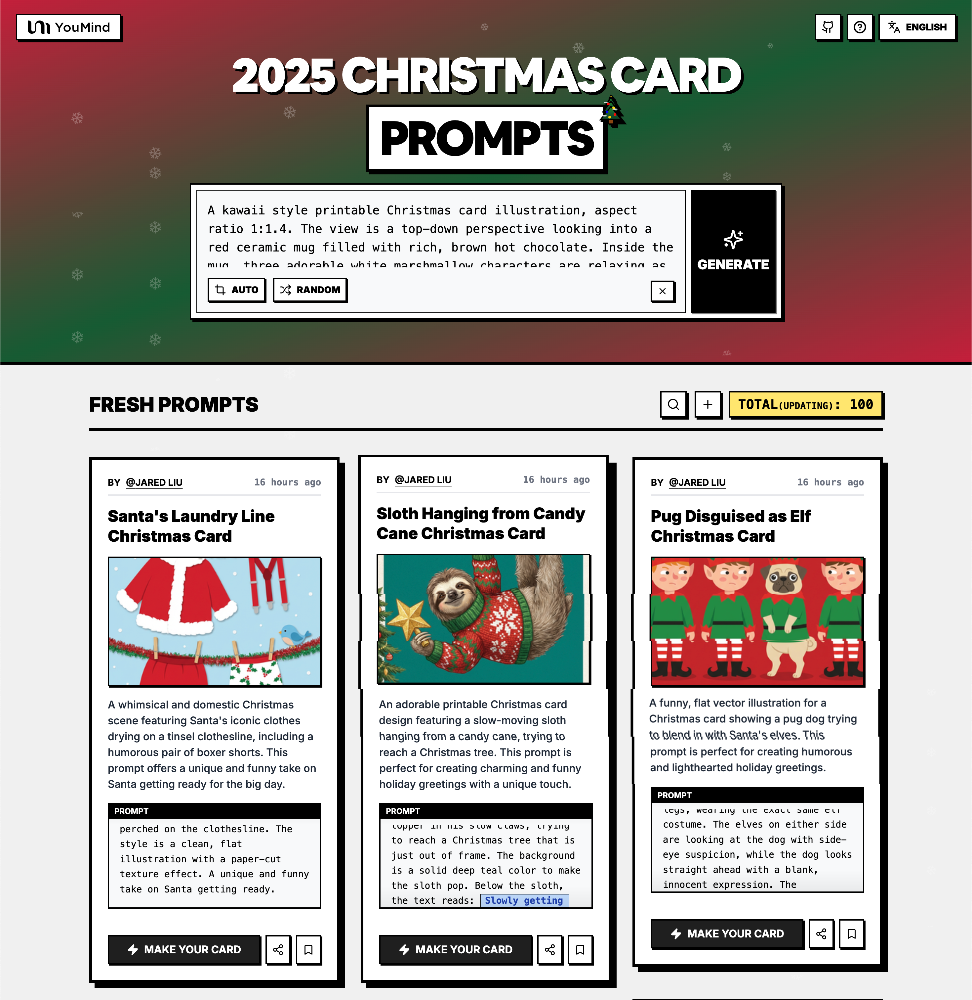

# 🚀 Prompts Incríveis de Cartões de Natal

[](https://github.com/sindresorhus/awesome)
[](https://github.com/YouMind-OpenLab/awesome-christmas-card-prompts)
[](https://creativecommons.org/licenses/by/4.0/)
[](https://github.com/YouMind-OpenLab/awesome-christmas-card-prompts/actions)
[](docs/CONTRIBUTING.md)

> 🎨 Uma coleção curada de prompts de cartões de Natal criados com Nano Banana Pro

> 💡 **Note**: 

> ⚠️ **Aviso de Direitos Autorais**: Todos os prompts são coletados da comunidade para fins educacionais. Se você acredita que algum conteúdo infringe seus direitos, por favor [abra uma issue](https://github.com/YouMind-OpenLab/awesome-christmas-card-prompts/issues/new?template=bug-report.yml) e nós o removeremos prontamente.

---

[](README.md) [](README_zh.md) [](README_zh-TW.md) [](README_ja-JP.md) [](README_ko-KR.md) [](README_th-TH.md) [](README_vi-VN.md) [](README_hi-IN.md) [](README_es-ES.md) [-Click%20to%20View-lightgrey)](README_es-419.md) [](README_de-DE.md) [](README_fr-FR.md) [](README_it-IT.md) [-Click%20to%20View-lightgrey)](README_pt-BR.md) [](README_pt-PT.md) [](README_tr-TR.md)

---

## 🌐 Ver na galeria web

<div align="center">



</div>

**[👉 Navegar na galeria YouMind de Cartões de Natal](https://youmind.com/tools/christmas-cards-maker)**

Por que usar nossa galeria?

| Feature | GitHub README | Galeria youmind.com |
|---------|--------------|---------------------|
| 🎨 Layout visual | Lista linear | Bela grade Masonry |
| 🔍 Buscar | Apenas Ctrl+F | Busca de texto completo com filtros |
| 🤖 Geração IA com um clique | - | Geração IA com um clique |
| 📱 Móvel | Básico | Totalmente responsivo |

---

## 📖 Índice

- [🌐 Ver na galeria web](#-view-in-web-gallery)
- [🤔 O que é o Criador de Cartões de Natal?](#-what-is-christmas-cards-maker)
- [📊 Estatísticas](#-statistics)
- [🔥 Prompts em destaque](#-featured-prompts)
- [📋 Todos os prompts](#-all-prompts)
- [🤝 Como contribuir](#-how-to-contribute)
- [📄 Licença](#-license)
- [🙏 Agradecimentos](#-acknowledgements)
- [⭐ Histórico de estrelas](#-star-history)

---

## 🤔 O que é o Criador de Cartões de Natal?

**Criador de Cartões de Natal** é uma ferramenta criativa alimentada pelo Google Nano Banana Pro para criar belos cartões de Natal:

- 🎯 **Geração com IA** - Crie cartões incríveis com prompts simples
- 🎨 **Estilos diversos** - Do tradicional ao moderno, do cartoon ao realista
- ⚡ **Mensagens personalizadas** - Adicione suas próprias saudações e desejos
- 🌈 **Saída de alta qualidade** - Resolução pronta para impressão
- 🔧 **Criação rápida** - Gere cartões em segundos
- 📐 **Múltiplos temas** - Papai Noel, flocos de neve, árvores e mais

📚 

### 🚀 Integração com Raycast

Alguns prompts suportam **argumentos dinâmicos** usando a sintaxe [Raycast Snippets](https://raycast.com/help/snippets). Procure o emblema 🚀 Raycast Friendly!

**Exemplo:**
```
A quote card with "{argument name="quote" default="Stay hungry, stay foolish"}"
by {argument name="author" default="Steve Jobs"}
```

Quando usado no Raycast, você pode substituir dinamicamente os argumentos para iterações rápidas!

---

## 📊 Estatísticas

<div align="center">

| Métrica | Contagem |
|--------|-------|
| 📝 Total de prompts | **140** |
| ⭐ Destaque | **6** |
| 🔄 Última atualização | **quarta-feira, 25 de fevereiro de 2026 às 05:21:49 UTC** |

</div>

---

## 🔥 Prompts em destaque

> ⭐ Selecionados à mão pela nossa equipe por qualidade e criatividade excepcionais

### No. 1: Cartão de Natal de Preguiça Pendurada em Bengala Doce


#### 📖 Descrição

Um adorável design de cartão de Natal para imprimir, com uma preguiça lenta pendurada numa bengala doce, a tentar alcançar uma árvore de Natal. Este prompt é perfeito para criar cumprimentos de Natal charmosos e engraçados com um toque único.

#### 📝 Prompt

```
Um adorável design de cartão de Natal para imprimir, proporção 1:1,4. Uma preguiça fofa e de movimentos lentos está pendurada de cabeça para baixo em uma bengala doce que se estende horizontalmente pela parte superior do cartão. A preguiça está usando um suéter feio de Natal festivo com um padrão de floco de neve pixelado. Ela segura uma estrela para o topo da árvore com suas garras lentas, tentando alcançar uma árvore de Natal que está um pouco fora do enquadramento. O fundo é de uma cor verde-azulado profundo para fazer a preguiça se destacar. Abaixo da preguiça, o texto diz: {argument name="text" default="Entrando lentamente no espírito"} em uma fonte relaxada e manuscrita.
```

#### 🖼️ Imagens geradas

##### Image 1

<div align="center">

</div>

#### 📌 Detalhes

- **Autor:** [Jared Liu](https://x.com/jaredliu_bravo)
- **Fonte:** [Twitter Post](null)
- **Publicado:** 13 de dezembro de 2025
- **Idiomas:** en

**[👉 Experimente agora →](https://youmind.com/tools/christmas-cards-maker?prompt=Um%20ador%C3%A1vel%20design%20de%20cart%C3%A3o%20de%20Natal%20para%20imprimir%2C%20propor%C3%A7%C3%A3o%201%3A1%2C4.%20Uma%20pregui%C3%A7a%20fofa%20e%20de%20movimentos%20lentos%20est%C3%A1%20pendurada%20de%20cabe%C3%A7a%20para%20baixo%20em%20uma%20bengala%20doce%20que%20se%20estende%20horizontalmente%20pela%20parte%20superior%20do%20cart%C3%A3o.%20A%20pregui%C3%A7a%20est%C3%A1%20usando%20um%20su%C3%A9ter%20feio%20de%20Natal%20festivo%20com%20um%20padr%C3%A3o%20de%20floco%20de%20neve%20pixelado.%20Ela%20segura%20uma%20estrela%20para%20o%20topo%20da%20%C3%A1rvore%20com%20suas%20garras%20lentas%2C%20tentando%20alcan%C3%A7ar%20uma%20%C3%A1rvore%20de%20Natal%20que%20est%C3%A1%20um%20pouco%20fora%20do%20enquadramento.%20O%20fundo%20%C3%A9%20de%20uma%20cor%20verde-azulado%20profundo%20para%20fazer%20a%20pregui%C3%A7a%20se%20destacar.%20Abaixo%20da%20pregui%C3%A7a%2C%20o%20texto%20diz%3A%20%7Bargument%20name%3D%22text%22%20default%3D%22Entrando%20lentamente%20no%20esp%C3%ADrito%22%7D%20em%20uma%20fonte%20relaxada%20e%20manuscrita.)**

---

### No. 2: Cartão de Natal com Cachecol de Urso Polar e Pinguim


#### 📖 Descrição

Uma capa de cartão de Natal comovente e caprichosa que retrata uma amizade improvável entre um urso polar enorme e um pequeno pinguim, conectados por um cachecol comicamente grande. Ideal para transmitir temas de amizade e carinho durante as festas.

#### 📝 Prompt

```
Uma capa de cartão de Natal comovente e caprichosa, proporção de 1:1,4. Um urso polar branco, enorme e fofo, está sentado à esquerda, e um pinguim pequeno e redondo está à direita, contra um fundo azul-gelo limpo. Eles estão conectados por um cachecol de malha vermelho e verde, comicamente longo e superdimensionado, que está enrolado várias vezes no pescoço do urso e depois desce para envolver confortavelmente o pequeno pinguim. O pinguim está olhando para o urso com admiração. A textura da pele e da lã de malha é visível e macia. Flocos de neve brancos e simples caem suavemente ao redor deles. Sem texto, apenas uma doce imagem de amizade.
```

#### 🖼️ Imagens geradas

##### Image 1

<div align="center">

</div>

#### 📌 Detalhes

- **Autor:** [Jared Liu](https://x.com/jaredliu_bravo)
- **Fonte:** [Twitter Post](null)
- **Publicado:** 13 de dezembro de 2025
- **Idiomas:** en

**[👉 Experimente agora →](https://youmind.com/tools/christmas-cards-maker?prompt=Uma%20capa%20de%20cart%C3%A3o%20de%20Natal%20comovente%20e%20caprichosa%2C%20propor%C3%A7%C3%A3o%20de%201%3A1%2C4.%20Um%20urso%20polar%20branco%2C%20enorme%20e%20fofo%2C%20est%C3%A1%20sentado%20%C3%A0%20esquerda%2C%20e%20um%20pinguim%20pequeno%20e%20redondo%20est%C3%A1%20%C3%A0%20direita%2C%20contra%20um%20fundo%20azul-gelo%20limpo.%20Eles%20est%C3%A3o%20conectados%20por%20um%20cachecol%20de%20malha%20vermelho%20e%20verde%2C%20comicamente%20longo%20e%20superdimensionado%2C%20que%20est%C3%A1%20enrolado%20v%C3%A1rias%20vezes%20no%20pesco%C3%A7o%20do%20urso%20e%20depois%20desce%20para%20envolver%20confortavelmente%20o%20pequeno%20pinguim.%20O%20pinguim%20est%C3%A1%20olhando%20para%20o%20urso%20com%20admira%C3%A7%C3%A3o.%20A%20textura%20da%20pele%20e%20da%20l%C3%A3%20de%20malha%20%C3%A9%20vis%C3%ADvel%20e%20macia.%20Flocos%20de%20neve%20brancos%20e%20simples%20caem%20suavemente%20ao%20redor%20deles.%20Sem%20texto%2C%20apenas%20uma%20doce%20imagem%20de%20amizade.)**

---

### No. 3: Cartão de Natal da Aula de Yoga de Biscoito de Gengibre


#### 📖 Descrição

Um design de cartão de Natal imprimível, alegre e adorável, com cinco biscoitos fofos de boneco de gengibre em uma "Aula de Yoga". Este prompt é perfeito para criar saudações natalinas emocionantes com um toque de humor e fofura.

#### 📝 Prompt

```
Um design de cartão de Natal imprimível, divertido e adorável, com proporção de 1:1,4. O fundo é um verde menta pastel sólido e limpo. A ilustração apresenta uma "Aula de Yoga" com cinco biscoitos fofos de gengibre. O biscoito de gengibre central está em pé sobre uma perna na "Postura da Árvore", equilibrando uma jujuba na cabeça com uma expressão concentrada. À sua esquerda, outro biscoito está tentando a postura "Cachorro Olhando para Baixo", mas seu braço desmoronou ligeiramente, revelando deliciosas migalhas de biscoito. À direita, um biscoito de gengibre está meditando na "posição de Lótus" com os olhos de glacê fechados. Todos eles têm detalhes de glacê branco e botões de bala vermelha. O estilo é uma ilustração vetorial limpa e plana com sombras suaves. O texto na parte superior diz: {argument name="text" default="Encontre Sua Paz Interior"} em uma fonte branca divertida e arredondada.
```

#### 🖼️ Imagens geradas

##### Image 1

<div align="center">

</div>

#### 📌 Detalhes

- **Autor:** [Jared Liu](https://x.com/jaredliu_bravo)
- **Fonte:** [Twitter Post](null)
- **Publicado:** 13 de dezembro de 2025
- **Idiomas:** en

**[👉 Experimente agora →](https://youmind.com/tools/christmas-cards-maker?prompt=Um%20design%20de%20cart%C3%A3o%20de%20Natal%20imprim%C3%ADvel%2C%20divertido%20e%20ador%C3%A1vel%2C%20com%20propor%C3%A7%C3%A3o%20de%201%3A1%2C4.%20O%20fundo%20%C3%A9%20um%20verde%20menta%20pastel%20s%C3%B3lido%20e%20limpo.%20A%20ilustra%C3%A7%C3%A3o%20apresenta%20uma%20%22Aula%20de%20Yoga%22%20com%20cinco%20biscoitos%20fofos%20de%20gengibre.%20O%20biscoito%20de%20gengibre%20central%20est%C3%A1%20em%20p%C3%A9%20sobre%20uma%20perna%20na%20%22Postura%20da%20%C3%81rvore%22%2C%20equilibrando%20uma%20jujuba%20na%20cabe%C3%A7a%20com%20uma%20express%C3%A3o%20concentrada.%20%C3%80%20sua%20esquerda%2C%20outro%20biscoito%20est%C3%A1%20tentando%20a%20postura%20%22Cachorro%20Olhando%20para%20Baixo%22%2C%20mas%20seu%20bra%C3%A7o%20desmoronou%20ligeiramente%2C%20revelando%20deliciosas%20migalhas%20de%20biscoito.%20%C3%80%20direita%2C%20um%20biscoito%20de%20gengibre%20est%C3%A1%20meditando%20na%20%22posi%C3%A7%C3%A3o%20de%20L%C3%B3tus%22%20com%20os%20olhos%20de%20glac%C3%AA%20fechados.%20Todos%20eles%20t%C3%AAm%20detalhes%20de%20glac%C3%AA%20branco%20e%20bot%C3%B5es%20de%20bala%20vermelha.%20O%20estilo%20%C3%A9%20uma%20ilustra%C3%A7%C3%A3o%20vetorial%20limpa%20e%20plana%20com%20sombras%20suaves.%20O%20texto%20na%20parte%20superior%20diz%3A%20%7Bargument%20name%3D%22text%22%20default%3D%22Encontre%20Sua%20Paz%20Interior%22%7D%20em%20uma%20fonte%20branca%20divertida%20e%20arredondada.)**

---

### No. 4: Raposa Filhote em Feltro Aplicado


#### 📖 Descrição

Este prompt cria um design de cartão de Natal aconchegante e tátil que se assemelha a uma costura de aplique de feltro feita à mão, apresentando um filhote de raposa fofo em uma cena nevada. Perfeito para visuais de feriado únicos e artesanais.

#### 📝 Prompt

```
Um design de cartão de Natal acolhedor e tátil, proporção 1:1.4. A ilustração parece inteiramente uma costura de apliques de feltro feitos à mão. Um filhote de raposa laranja fofo, feito de tecido de feltro felpudo, está sentado em camadas de neve de feltro branco, olhando para uma árvore de Natal de feltro decorada com enfeites de botões coloridos. A textura das fibras de lã e a costura nas bordas são claramente visíveis. O fundo é um céu de feltro azul suave.
```

#### 🖼️ Imagens geradas

##### Image 1

<div align="center">

</div>

#### 📌 Detalhes

- **Autor:** [Jared Liu](https://x.com/jaredliu_bravo)
- **Fonte:** [Twitter Post](null)
- **Publicado:** 15 de dezembro de 2025
- **Idiomas:** en

**[👉 Experimente agora →](https://youmind.com/tools/christmas-cards-maker?prompt=Um%20design%20de%20cart%C3%A3o%20de%20Natal%20acolhedor%20e%20t%C3%A1til%2C%20propor%C3%A7%C3%A3o%201%3A1.4.%20A%20ilustra%C3%A7%C3%A3o%20parece%20inteiramente%20uma%20costura%20de%20apliques%20de%20feltro%20feitos%20%C3%A0%20m%C3%A3o.%20Um%20filhote%20de%20raposa%20laranja%20fofo%2C%20feito%20de%20tecido%20de%20feltro%20felpudo%2C%20est%C3%A1%20sentado%20em%20camadas%20de%20neve%20de%20feltro%20branco%2C%20olhando%20para%20uma%20%C3%A1rvore%20de%20Natal%20de%20feltro%20decorada%20com%20enfeites%20de%20bot%C3%B5es%20coloridos.%20A%20textura%20das%20fibras%20de%20l%C3%A3%20e%20a%20costura%20nas%20bordas%20s%C3%A3o%20claramente%20vis%C3%ADveis.%20O%20fundo%20%C3%A9%20um%20c%C3%A9u%20de%20feltro%20azul%20suave.)**

---

### No. 5: Pug com Chifres de Rena e Nariz de Palhaço


#### 📖 Descrição

Este prompt gera um cartão imprimível divertido e fofo, apresentando um retrato fotográfico em close-up de um pug relutantemente usando chifres de rena e um nariz de palhaço vermelho brilhante. Ideal para cumprimentos de feriado bem-humorados e peculiares.

#### 📝 Prompt

```
Um cartão imprimível engraçado e fofo, proporção 1:1,4. Um retrato fotográfico em close-up do rosto de um pug gordinho. Ele está relutantemente usando uma tiara com chifres de rena de feltro marrom e um nariz de palhaço vermelho muito brilhante e luminoso sobre o seu próprio nariz. O pug tem uma expressão séria e ligeiramente julgadora, olhando diretamente para a câmera. O fundo são luzes festivas vermelhas desfocadas.
```

#### 🖼️ Imagens geradas

##### Image 1

<div align="center">

</div>

#### 📌 Detalhes

- **Autor:** [Jared Liu](https://x.com/jaredliu_bravo)
- **Fonte:** [Twitter Post](null)
- **Publicado:** 15 de dezembro de 2025
- **Idiomas:** en

**[👉 Experimente agora →](https://youmind.com/tools/christmas-cards-maker?prompt=Um%20cart%C3%A3o%20imprim%C3%ADvel%20engra%C3%A7ado%20e%20fofo%2C%20propor%C3%A7%C3%A3o%201%3A1%2C4.%20Um%20retrato%20fotogr%C3%A1fico%20em%20close-up%20do%20rosto%20de%20um%20pug%20gordinho.%20Ele%20est%C3%A1%20relutantemente%20usando%20uma%20tiara%20com%20chifres%20de%20rena%20de%20feltro%20marrom%20e%20um%20nariz%20de%20palha%C3%A7o%20vermelho%20muito%20brilhante%20e%20luminoso%20sobre%20o%20seu%20pr%C3%B3prio%20nariz.%20O%20pug%20tem%20uma%20express%C3%A3o%20s%C3%A9ria%20e%20ligeiramente%20julgadora%2C%20olhando%20diretamente%20para%20a%20c%C3%A2mera.%20O%20fundo%20s%C3%A3o%20luzes%20festivas%20vermelhas%20desfocadas.)**

---

### No. 6: Alpaca Sobrecarga de Presentes


#### 📖 Descrição

Este prompt cria um cartão de Natal fofo e caótico, apresentando uma alpaca fofinha sobrecarregada com uma pilha precária de presentes de Natal. Perfeito para saudações de fim de ano bem-humoradas e charmosas.

#### 📝 Prompt

```
Um cartão de Natal fofo e caótico, proporção 1:1,4. Uma alpaca branca e fofa está em pé contra um fundo verde-menta sólido. Suas costas estão sobrecarregadas com uma pilha impossivelmente alta e precária de presentes de Natal coloridos embrulhados com laços que balançam descontroladamente. A alpaca tem uma expressão paciente, ligeiramente tensa, e suas pernas finas tremem levemente sob o peso.
```

#### 🖼️ Imagens geradas

##### Image 1

<div align="center">

</div>

#### 📌 Detalhes

- **Autor:** [Jared Liu](https://x.com/jaredliu_bravo)
- **Fonte:** [Twitter Post](null)
- **Publicado:** 15 de dezembro de 2025
- **Idiomas:** en

**[👉 Experimente agora →](https://youmind.com/tools/christmas-cards-maker?prompt=Um%20cart%C3%A3o%20de%20Natal%20fofo%20e%20ca%C3%B3tico%2C%20propor%C3%A7%C3%A3o%201%3A1%2C4.%20Uma%20alpaca%20branca%20e%20fofa%20est%C3%A1%20em%20p%C3%A9%20contra%20um%20fundo%20verde-menta%20s%C3%B3lido.%20Suas%20costas%20est%C3%A3o%20sobrecarregadas%20com%20uma%20pilha%20impossivelmente%20alta%20e%20prec%C3%A1ria%20de%20presentes%20de%20Natal%20coloridos%20embrulhados%20com%20la%C3%A7os%20que%20balan%C3%A7am%20descontroladamente.%20A%20alpaca%20tem%20uma%20express%C3%A3o%20paciente%2C%20ligeiramente%20tensa%2C%20e%20suas%20pernas%20finas%20tremem%20levemente%20sob%20o%20peso.)**

---

## 📋 Todos os prompts

> 📝 Ordenado por data de publicação (mais recente primeiro)

### No. 1: Castores de Natal · Moldura de Maníaco por Construção


#### 📖 Descrição

Este prompt gera uma moldura de foto de Natal com estilo animado e divertido, em formato vertical 1:1.4. A borda mostra castores de desenho animado construindo e super-engenheirando decorações festivas com entusiasmo e seriedade exagerada, criando um design bem-humorado e otimizado para impressão.

#### 📝 Prompt

```
Uma moldura de foto de Natal vertical 1:1.4 imprimível, ilustrada em um estilo animado e divertido.

Sem ambiente, apenas a moldura.

Um espaço reservado para foto em branco está centralizado, proporção 1:1.4, 70% da largura, completamente limpo.

A borda mostra castores de desenho animado construindo, martelando e super-engenheirando decorações festivas com seriedade exagerada.

Plano, bem-humorado, otimizado para impressão, sem texto.
```

#### 🖼️ Imagens geradas

##### Image 1

<div align="center">

</div>

#### 📌 Detalhes

- **Autor:** [Jared Liu](https://x.com/jaredliu_bravo)
- **Fonte:** [Twitter Post](null)
- **Publicado:** 15 de dezembro de 2025
- **Idiomas:** en

**[👉 Experimente agora →](https://youmind.com/tools/christmas-cards-maker?prompt=Uma%20moldura%20de%20foto%20de%20Natal%20vertical%201%3A1.4%20imprim%C3%ADvel%2C%20ilustrada%20em%20um%20estilo%20animado%20e%20divertido.%0A%0ASem%20ambiente%2C%20apenas%20a%20moldura.%0A%0AUm%20espa%C3%A7o%20reservado%20para%20foto%20em%20branco%20est%C3%A1%20centralizado%2C%20propor%C3%A7%C3%A3o%201%3A1.4%2C%2070%25%20da%20largura%2C%20completamente%20limpo.%0A%0AA%20borda%20mostra%20castores%20de%20desenho%20animado%20construindo%2C%20martelando%20e%20super-engenheirando%20decora%C3%A7%C3%B5es%20festivas%20com%20seriedade%20exagerada.%0A%0APlano%2C%20bem-humorado%2C%20otimizado%20para%20impress%C3%A3o%2C%20sem%20texto.)**

---

### No. 2: Coalitas de Natal · Moldura Que Não Se Larga


#### 📖 Descrição

Este prompt cria uma moldura de foto de Natal animada em formato vertical 1:1.4. A borda apresenta coalas de desenho animado abraçando enfeites e guirlandas, recusando-se a soltá-los, criando um humor suave e aconchegante em um design pronto para impressão.

#### 📝 Prompt

```
Uma moldura de foto de Natal animada e imprimível em formato vertical 1:1.4.

Design apenas da moldura.

Um espaço reservado para foto em branco está centralizado horizontal e verticalmente, proporção de 1:1.4, 70% da largura, completamente intocado.

A borda apresenta coalas de desenho animado abraçando enfeites, guirlandas e bengalas doces, recusando-se a soltar, criando um humor suave e aconchegante.

Plana, quente, pronta para impressão, sem texto.
```

#### 🖼️ Imagens geradas

##### Image 1

<div align="center">

</div>

#### 📌 Detalhes

- **Autor:** [Jared Liu](https://x.com/jaredliu_bravo)
- **Fonte:** [Twitter Post](null)
- **Publicado:** 15 de dezembro de 2025
- **Idiomas:** en

**[👉 Experimente agora →](https://youmind.com/tools/christmas-cards-maker?prompt=Uma%20moldura%20de%20foto%20de%20Natal%20animada%20e%20imprim%C3%ADvel%20em%20formato%20vertical%201%3A1.4.%0A%0ADesign%20apenas%20da%20moldura.%0A%0AUm%20espa%C3%A7o%20reservado%20para%20foto%20em%20branco%20est%C3%A1%20centralizado%20horizontal%20e%20verticalmente%2C%20propor%C3%A7%C3%A3o%20de%201%3A1.4%2C%2070%25%20da%20largura%2C%20completamente%20intocado.%0A%0AA%20borda%20apresenta%20coalas%20de%20desenho%20animado%20abra%C3%A7ando%20enfeites%2C%20guirlandas%20e%20bengalas%20doces%2C%20recusando-se%20a%20soltar%2C%20criando%20um%20humor%20suave%20e%20aconchegante.%0A%0APlana%2C%20quente%2C%20pronta%20para%20impress%C3%A3o%2C%20sem%20texto.)**

---

### No. 3: Ouriços e Esquilos de Natal · Quadro Conjunto de Desastres


#### 📖 Descrição

Este prompt gera uma moldura de Natal em estilo animado e bem-humorado, no formato vertical 1:1.4. A borda apresenta ouriços e esquilos de desenho animado competindo para coletar decorações, causando acidentalmente um caos festivo ao redor das bordas da moldura.

#### 📝 Prompt

```
Uma moldura de Natal vertical 1:1.4 para impressão, ilustrada em um estilo animado e bem-humorado.

Apenas a moldura em si.

Espaço para foto em branco, centralizado, 1:1.4, 70% da largura, limpo e vazio.

A borda apresenta ouriços e esquilos em estilo cartoon competindo para coletar decorações, causando acidentalmente um caos festivo nas laterais.

Composição plana, sem texto.
```

#### 🖼️ Imagens geradas

##### Image 1

<div align="center">

</div>

#### 📌 Detalhes

- **Autor:** [Jared Liu](https://x.com/jaredliu_bravo)
- **Fonte:** [Twitter Post](null)
- **Publicado:** 15 de dezembro de 2025
- **Idiomas:** en

**[👉 Experimente agora →](https://youmind.com/tools/christmas-cards-maker?prompt=Uma%20moldura%20de%20Natal%20vertical%201%3A1.4%20para%20impress%C3%A3o%2C%20ilustrada%20em%20um%20estilo%20animado%20e%20bem-humorado.%0A%0AApenas%20a%20moldura%20em%20si.%0A%0AEspa%C3%A7o%20para%20foto%20em%20branco%2C%20centralizado%2C%201%3A1.4%2C%2070%25%20da%20largura%2C%20limpo%20e%20vazio.%0A%0AA%20borda%20apresenta%20ouri%C3%A7os%20e%20esquilos%20em%20estilo%20cartoon%20competindo%20para%20coletar%20decora%C3%A7%C3%B5es%2C%20causando%20acidentalmente%20um%20caos%20festivo%20nas%20laterais.%0A%0AComposi%C3%A7%C3%A3o%20plana%2C%20sem%20texto.)**

---

### No. 4: Camaleões de Natal · Moldura de Camuflagem Falhada


#### 📖 Descrição

Este prompt cria uma moldura de Natal bem-humorada em estilo cartoon, no formato vertical 1:1.4. A borda apresenta camaleões em estilo cartoon que tentam, sem sucesso, misturar-se com as decorações, claramente visíveis e confusos, adicionando um humor visual sutil ao design pronto para impressão.

#### 📝 Prompt

```
Uma moldura de Natal para impressão, vertical 1:1.4, em estilo de desenho animado humorístico.

Ilustração apenas da moldura.

Espaço para foto em branco centralizado, 1:1.4, 70% da largura, intocado.

A borda apresenta camaleões de desenho animado que tentam, sem sucesso, se misturar com enfeites, luzes e guirlandas, claramente visíveis e confusos, adicionando um humor visual sutil.

Plana, fácil de imprimir, sem letras.
```

#### 🖼️ Imagens geradas

##### Image 1

<div align="center">

</div>

#### 📌 Detalhes

- **Autor:** [Jared Liu](https://x.com/jaredliu_bravo)
- **Fonte:** [Twitter Post](null)
- **Publicado:** 15 de dezembro de 2025
- **Idiomas:** en

**[👉 Experimente agora →](https://youmind.com/tools/christmas-cards-maker?prompt=Uma%20moldura%20de%20Natal%20para%20impress%C3%A3o%2C%20vertical%201%3A1.4%2C%20em%20estilo%20de%20desenho%20animado%20humor%C3%ADstico.%0A%0AIlustra%C3%A7%C3%A3o%20apenas%20da%20moldura.%0A%0AEspa%C3%A7o%20para%20foto%20em%20branco%20centralizado%2C%201%3A1.4%2C%2070%25%20da%20largura%2C%20intocado.%0A%0AA%20borda%20apresenta%20camale%C3%B5es%20de%20desenho%20animado%20que%20tentam%2C%20sem%20sucesso%2C%20se%20misturar%20com%20enfeites%2C%20luzes%20e%20guirlandas%2C%20claramente%20vis%C3%ADveis%20e%20confusos%2C%20adicionando%20um%20humor%20visual%20sutil.%0A%0APlana%2C%20f%C3%A1cil%20de%20imprimir%2C%20sem%20letras.)**

---

### No. 5: Corujas de Natal · Moldura Excessivamente Séria


#### 📖 Descrição

Este prompt cria uma moldura de Natal animada no estilo de livro de histórias, em formato vertical 1:1.4. A borda apresenta corujas de desenho animado olhando ceticamente para decorações bagunçadas e julgando o caos natalino com humor seco.

#### 📝 Prompt

```
Uma ilustração de moldura de Natal para impressão em formato vertical 1:1.4, estilo livro de histórias animado.

Composição apenas da moldura.

Espaço em branco central para foto, 1:1.4, 70% da largura, intocado.

A borda apresenta corujas de desenho animado usando cachecóis e chapéus, olhando ceticamente para decorações bagunçadas, segurando pranchetas e julgando o caos natalino com humor seco.

Ilustração plana, sem texto.
```

#### 🖼️ Imagens geradas

##### Image 1

<div align="center">

</div>

#### 📌 Detalhes

- **Autor:** [Jared Liu](https://x.com/jaredliu_bravo)
- **Fonte:** [Twitter Post](null)
- **Publicado:** 15 de dezembro de 2025
- **Idiomas:** en

**[👉 Experimente agora →](https://youmind.com/tools/christmas-cards-maker?prompt=Uma%20ilustra%C3%A7%C3%A3o%20de%20moldura%20de%20Natal%20para%20impress%C3%A3o%20em%20formato%20vertical%201%3A1.4%2C%20estilo%20livro%20de%20hist%C3%B3rias%20animado.%0A%0AComposi%C3%A7%C3%A3o%20apenas%20da%20moldura.%0A%0AEspa%C3%A7o%20em%20branco%20central%20para%20foto%2C%201%3A1.4%2C%2070%25%20da%20largura%2C%20intocado.%0A%0AA%20borda%20apresenta%20corujas%20de%20desenho%20animado%20usando%20cachec%C3%B3is%20e%20chap%C3%A9us%2C%20olhando%20ceticamente%20para%20decora%C3%A7%C3%B5es%20bagun%C3%A7adas%2C%20segurando%20pranchetas%20e%20julgando%20o%20caos%20natalino%20com%20humor%20seco.%0A%0AIlustra%C3%A7%C3%A3o%20plana%2C%20sem%20texto.)**

---

### No. 6: Polvo de Natal · Frenesi de Oito Braços


#### 📖 Descrição

Este prompt gera uma moldura de foto de Natal em estilo de animação de desenho animado humorístico, no formato vertical 1:1.4. A borda apresenta um polvo de desenho animado usando todos os seus braços para decorar, resultando em um caos festivo e divertido.

#### 📝 Prompt

```
Uma moldura de foto de Natal vertical 1:1.4 imprimível, ilustrada em um estilo de animação de desenho animado bem-humorado.

Apenas o design da moldura, sem ambiente.

Um espaço reservado para foto em branco está perfeitamente centralizado, proporção 1:1.4, 70% da largura, totalmente vazio.

A borda apresenta um polvo de desenho animado usando todos os seus braços para decorar ornamentos, luzes, bengalas doces e estrelas simultaneamente, resultando em um caos festivo e divertido.

Plano, limpo, pronto para impressão, sem tipografia.
```

#### 🖼️ Imagens geradas

##### Image 1

<div align="center">

</div>

#### 📌 Detalhes

- **Autor:** [Jared Liu](https://x.com/jaredliu_bravo)
- **Fonte:** [Twitter Post](null)
- **Publicado:** 15 de dezembro de 2025
- **Idiomas:** en

**[👉 Experimente agora →](https://youmind.com/tools/christmas-cards-maker?prompt=Uma%20moldura%20de%20foto%20de%20Natal%20vertical%201%3A1.4%20imprim%C3%ADvel%2C%20ilustrada%20em%20um%20estilo%20de%20anima%C3%A7%C3%A3o%20de%20desenho%20animado%20bem-humorado.%0A%0AApenas%20o%20design%20da%20moldura%2C%20sem%20ambiente.%0A%0AUm%20espa%C3%A7o%20reservado%20para%20foto%20em%20branco%20est%C3%A1%20perfeitamente%20centralizado%2C%20propor%C3%A7%C3%A3o%201%3A1.4%2C%2070%25%20da%20largura%2C%20totalmente%20vazio.%0A%0AA%20borda%20apresenta%20um%20polvo%20de%20desenho%20animado%20usando%20todos%20os%20seus%20bra%C3%A7os%20para%20decorar%20ornamentos%2C%20luzes%2C%20bengalas%20doces%20e%20estrelas%20simultaneamente%2C%20resultando%20em%20um%20caos%20festivo%20e%20divertido.%0A%0APlano%2C%20limpo%2C%20pronto%20para%20impress%C3%A3o%2C%20sem%20tipografia.)**

---

### No. 7: Coelhos de Natal · Moldura Hiper-Ocupada


#### 📖 Descrição

Este prompt cria uma moldura de Natal animada em formato vertical 1:1.4, apresentando um caos divertido. A borda exibe coelhos de desenho animado energéticos embrulhando presentes muito rápido e tropeçando em fitas, adicionando um toque animado e bem-humorado.

#### 📝 Prompt

```
Uma moldura de Natal animada para impressão, em formato vertical 1:1.4.

Ilustração apenas da moldura.

Espaço reservado para foto em branco, centralizado, centro horizontal + vertical, 1:1.4, 70% da largura, intocado.

A borda apresenta coelhos de desenho animado enérgicos embrulhando presentes muito rápido, tropeçando em fitas, fazendo malabarismos com enfeites e correndo pelas bordas da moldura.

Caos divertido, ilustração plana, sem texto.
```

#### 🖼️ Imagens geradas

##### Image 1

<div align="center">

</div>

#### 📌 Detalhes

- **Autor:** [Jared Liu](https://x.com/jaredliu_bravo)
- **Fonte:** [Twitter Post](null)
- **Publicado:** 15 de dezembro de 2025
- **Idiomas:** en

**[👉 Experimente agora →](https://youmind.com/tools/christmas-cards-maker?prompt=Uma%20moldura%20de%20Natal%20animada%20para%20impress%C3%A3o%2C%20em%20formato%20vertical%201%3A1.4.%0A%0AIlustra%C3%A7%C3%A3o%20apenas%20da%20moldura.%0A%0AEspa%C3%A7o%20reservado%20para%20foto%20em%20branco%2C%20centralizado%2C%20centro%20horizontal%20%2B%20vertical%2C%201%3A1.4%2C%2070%25%20da%20largura%2C%20intocado.%0A%0AA%20borda%20apresenta%20coelhos%20de%20desenho%20animado%20en%C3%A9rgicos%20embrulhando%20presentes%20muito%20r%C3%A1pido%2C%20trope%C3%A7ando%20em%20fitas%2C%20fazendo%20malabarismos%20com%20enfeites%20e%20correndo%20pelas%20bordas%20da%20moldura.%0A%0ACaos%20divertido%2C%20ilustra%C3%A7%C3%A3o%20plana%2C%20sem%20texto.)**

---

### No. 8: Ouriços de Natal · Quadro Colecionador de Ornamentos


#### 📖 Descrição

Este prompt gera uma moldura de foto de Natal em estilo animado e bem-humorado, em formato vertical 1:1.4. A borda da moldura mostra ouriços de desenho animado acidentalmente coletando enfeites e luzes em seus espinhos, adicionando um humor visual fofo e exagerado.

#### 📝 Prompt

```
Uma moldura de foto de Natal vertical 1:1.4, ilustrada em um estilo animado e bem-humorado.

Sem ambiente externo.

Espaço para foto em branco, exatamente no centro, 1:1.4, 70% da largura, completamente limpo.

A borda da moldura mostra ouriços de desenho animado coletando acidentalmente enfeites, estrelas e luzes em seus espinhos, parecendo surpresos e confusos de uma forma fofa e exagerada.

Plana, otimizada para impressão, sem letras.
```

#### 🖼️ Imagens geradas

##### Image 1

<div align="center">

</div>

#### 📌 Detalhes

- **Autor:** [Jared Liu](https://x.com/jaredliu_bravo)
- **Fonte:** [Twitter Post](null)
- **Publicado:** 15 de dezembro de 2025
- **Idiomas:** en

**[👉 Experimente agora →](https://youmind.com/tools/christmas-cards-maker?prompt=Uma%20moldura%20de%20foto%20de%20Natal%20vertical%201%3A1.4%2C%20ilustrada%20em%20um%20estilo%20animado%20e%20bem-humorado.%0A%0ASem%20ambiente%20externo.%0A%0AEspa%C3%A7o%20para%20foto%20em%20branco%2C%20exatamente%20no%20centro%2C%201%3A1.4%2C%2070%25%20da%20largura%2C%20completamente%20limpo.%0A%0AA%20borda%20da%20moldura%20mostra%20ouri%C3%A7os%20de%20desenho%20animado%20coletando%20acidentalmente%20enfeites%2C%20estrelas%20e%20luzes%20em%20seus%20espinhos%2C%20parecendo%20surpresos%20e%20confusos%20de%20uma%20forma%20fofa%20e%20exagerada.%0A%0APlana%2C%20otimizada%20para%20impress%C3%A3o%2C%20sem%20letras.)**

---

### No. 9: Pandas de Natal · Moldura de Férias Relaxante


#### 📖 Descrição

Este prompt gera uma moldura de foto de Natal animada e suave, estilo livro de histórias, em formato vertical 1:1.4. A borda apresenta pandas de desenho animado relaxando em ornamentos e abraçando bengalas doces, criando um humor gentil e aconchegante.

#### 📝 Prompt

```
Uma ilustração de moldura de foto de Natal para imprimir, na proporção vertical 1:1.4, desenhada em um estilo de livro de histórias animado e suave.

Composição apenas da moldura.

Um espaço em branco para foto, orientado verticalmente, está centralizado, com proporção 1:1.4, 70% da largura, completamente vazio.

A borda apresenta pandas de desenho animado relaxando em enfeites, abraçando bengalas doces, meio adormecidos em decorações festivas com um humor gentil.

Ilustração plana, paleta de cores quentes, sem texto.
```

#### 🖼️ Imagens geradas

##### Image 1

<div align="center">

</div>

#### 📌 Detalhes

- **Autor:** [Jared Liu](https://x.com/jaredliu_bravo)
- **Fonte:** [Twitter Post](null)
- **Publicado:** 15 de dezembro de 2025
- **Idiomas:** en

**[👉 Experimente agora →](https://youmind.com/tools/christmas-cards-maker?prompt=Uma%20ilustra%C3%A7%C3%A3o%20de%20moldura%20de%20foto%20de%20Natal%20para%20imprimir%2C%20na%20propor%C3%A7%C3%A3o%20vertical%201%3A1.4%2C%20desenhada%20em%20um%20estilo%20de%20livro%20de%20hist%C3%B3rias%20animado%20e%20suave.%0A%0AComposi%C3%A7%C3%A3o%20apenas%20da%20moldura.%0A%0AUm%20espa%C3%A7o%20em%20branco%20para%20foto%2C%20orientado%20verticalmente%2C%20est%C3%A1%20centralizado%2C%20com%20propor%C3%A7%C3%A3o%201%3A1.4%2C%2070%25%20da%20largura%2C%20completamente%20vazio.%0A%0AA%20borda%20apresenta%20pandas%20de%20desenho%20animado%20relaxando%20em%20enfeites%2C%20abra%C3%A7ando%20bengalas%20doces%2C%20meio%20adormecidos%20em%20decora%C3%A7%C3%B5es%20festivas%20com%20um%20humor%20gentil.%0A%0AIlustra%C3%A7%C3%A3o%20plana%2C%20paleta%20de%20cores%20quentes%2C%20sem%20texto.)**

---

### No. 10: Tartarugas de Natal · Quadro "Vá com Calma"


#### 📖 Descrição

Este prompt cria uma moldura de Natal vertical 1:1.4 para impressão, em um estilo de desenho animado calmo e bem-humorado. A borda apresenta tartarugas de desenho animado relaxadas, movendo-se em um ritmo exageradamente lento, adicionando um humor suave e tranquilo ao design.

#### 📝 Prompt

```
Uma moldura de Natal vertical 1:1.4 para impressão, em um estilo de desenho animado calmo, mas bem-humorado.

Apenas a ilustração da moldura, sem cenário de fundo.

Um espaço em branco para foto perfeitamente centralizado, com proporção 1:1.4 e 70% de largura, intocado.

A borda é decorada com tartarugas de desenho animado relaxadas usando cachecóis, empilhando enfeites calmamente, meditando com luzes de Natal e movendo-se em um ritmo exageradamente lento.

Plana, equilibrada, amigável para impressão, sem texto.
```

#### 🖼️ Imagens geradas

##### Image 1

<div align="center">

</div>

#### 📌 Detalhes

- **Autor:** [Jared Liu](https://x.com/jaredliu_bravo)
- **Fonte:** [Twitter Post](null)
- **Publicado:** 15 de dezembro de 2025
- **Idiomas:** en

**[👉 Experimente agora →](https://youmind.com/tools/christmas-cards-maker?prompt=Uma%20moldura%20de%20Natal%20vertical%201%3A1.4%20para%20impress%C3%A3o%2C%20em%20um%20estilo%20de%20desenho%20animado%20calmo%2C%20mas%20bem-humorado.%0A%0AApenas%20a%20ilustra%C3%A7%C3%A3o%20da%20moldura%2C%20sem%20cen%C3%A1rio%20de%20fundo.%0A%0AUm%20espa%C3%A7o%20em%20branco%20para%20foto%20perfeitamente%20centralizado%2C%20com%20propor%C3%A7%C3%A3o%201%3A1.4%20e%2070%25%20de%20largura%2C%20intocado.%0A%0AA%20borda%20%C3%A9%20decorada%20com%20tartarugas%20de%20desenho%20animado%20relaxadas%20usando%20cachec%C3%B3is%2C%20empilhando%20enfeites%20calmamente%2C%20meditando%20com%20luzes%20de%20Natal%20e%20movendo-se%20em%20um%20ritmo%20exageradamente%20lento.%0A%0APlana%2C%20equilibrada%2C%20amig%C3%A1vel%20para%20impress%C3%A3o%2C%20sem%20texto.)**

---

### No. 11: Esquilos de Natal · Moldura Frenesi de Acúmulo


#### 📖 Descrição

Este prompt gera uma moldura de foto de Natal animada e bem-humorada em formato vertical 1:1.4. A borda apresenta esquilos de desenho animado frenéticos acumulando enfeites e enchendo meias, adicionando um humor aconchegante a um design pronto para impressão.

#### 📝 Prompt

```
Uma ilustração de moldura de foto de Natal imprimível em formato vertical 1:1.4, ilustrada em um estilo animado e bem-humorado.

Design apenas da moldura, sem ambiente.

Espaço reservado para foto em branco centralizado, centro horizontal e vertical, proporção 1:1.4, 70% da largura da moldura, completamente vazio.

A borda apresenta esquilos de desenho animado frenéticos acumulando enfeites, enchendo meias, escondendo nozes dentro de bolas de Natal e espiando nervosamente por trás das decorações.

Ilustração plana, humor aconchegante, sem tipografia.
```

#### 🖼️ Imagens geradas

##### Image 1

<div align="center">

</div>

#### 📌 Detalhes

- **Autor:** [Jared Liu](https://x.com/jaredliu_bravo)
- **Fonte:** [Twitter Post](null)
- **Publicado:** 15 de dezembro de 2025
- **Idiomas:** en

**[👉 Experimente agora →](https://youmind.com/tools/christmas-cards-maker?prompt=Uma%20ilustra%C3%A7%C3%A3o%20de%20moldura%20de%20foto%20de%20Natal%20imprim%C3%ADvel%20em%20formato%20vertical%201%3A1.4%2C%20ilustrada%20em%20um%20estilo%20animado%20e%20bem-humorado.%0A%0ADesign%20apenas%20da%20moldura%2C%20sem%20ambiente.%0A%0AEspa%C3%A7o%20reservado%20para%20foto%20em%20branco%20centralizado%2C%20centro%20horizontal%20e%20vertical%2C%20propor%C3%A7%C3%A3o%201%3A1.4%2C%2070%25%20da%20largura%20da%20moldura%2C%20completamente%20vazio.%0A%0AA%20borda%20apresenta%20esquilos%20de%20desenho%20animado%20fren%C3%A9ticos%20acumulando%20enfeites%2C%20enchendo%20meias%2C%20escondendo%20nozes%20dentro%20de%20bolas%20de%20Natal%20e%20espiando%20nervosamente%20por%20tr%C3%A1s%20das%20decora%C3%A7%C3%B5es.%0A%0AIlustra%C3%A7%C3%A3o%20plana%2C%20humor%20aconchegante%2C%20sem%20tipografia.)**

---

### No. 12: Macacos de Natal · Moldura da Travessura


#### 📖 Descrição

Este prompt gera uma moldura de foto de Natal animada e imprimível, vertical, na proporção 1:1,4, com uma energia de desenho animado divertida. A borda apresenta macacos atrevidos balançando em guirlandas e roubando estrelas, ilustrados em um estilo de animação vibrante.

#### 📝 Prompt

```
Uma moldura de foto de Natal animada e imprimível, vertical, 1:1.4, com uma energia de desenho animado divertida.

Sem ambiente, apenas a moldura em si.

Um grande espaço em branco para foto está centralizado horizontal e verticalmente, com proporção 1:1.4 e 70% de largura, completamente vazio.

A borda da moldura apresenta macacos de desenho animado atrevidos balançando em guirlandas, roubando estrelas, pendurados de cabeça para baixo e fazendo expressões engraçadas, ilustrados em um estilo de animação vibrante.

Plana, equilibrada, pronta para impressão, sem texto.
```

#### 🖼️ Imagens geradas

##### Image 1

<div align="center">

</div>

#### 📌 Detalhes

- **Autor:** [Jared Liu](https://x.com/jaredliu_bravo)
- **Fonte:** [Twitter Post](null)
- **Publicado:** 15 de dezembro de 2025
- **Idiomas:** en

**[👉 Experimente agora →](https://youmind.com/tools/christmas-cards-maker?prompt=Uma%20moldura%20de%20foto%20de%20Natal%20animada%20e%20imprim%C3%ADvel%2C%20vertical%2C%201%3A1.4%2C%20com%20uma%20energia%20de%20desenho%20animado%20divertida.%0A%0ASem%20ambiente%2C%20apenas%20a%20moldura%20em%20si.%0A%0AUm%20grande%20espa%C3%A7o%20em%20branco%20para%20foto%20est%C3%A1%20centralizado%20horizontal%20e%20verticalmente%2C%20com%20propor%C3%A7%C3%A3o%201%3A1.4%20e%2070%25%20de%20largura%2C%20completamente%20vazio.%0A%0AA%20borda%20da%20moldura%20apresenta%20macacos%20de%20desenho%20animado%20atrevidos%20balan%C3%A7ando%20em%20guirlandas%2C%20roubando%20estrelas%2C%20pendurados%20de%20cabe%C3%A7a%20para%20baixo%20e%20fazendo%20express%C3%B5es%20engra%C3%A7adas%2C%20ilustrados%20em%20um%20estilo%20de%20anima%C3%A7%C3%A3o%20vibrante.%0A%0APlana%2C%20equilibrada%2C%20pronta%20para%20impress%C3%A3o%2C%20sem%20texto.)**

---

### No. 13: Caracóis em Câmera Lenta · Moldura de Natal


#### 📖 Descrição

Este prompt cria uma moldura de Natal divertida em estilo de livro infantil animado, com caracóis de desenho animado a moverem-se lentamente, arrastando ornamentos e deixando rastos brilhantes. Tem uma proporção vertical de 1:1.4, focando-se apenas no design da moldura.

#### 📝 Prompt

```
Uma ilustração de moldura de foto de Natal para impressão, em uma proporção vertical de 1:1,4, desenhada em um estilo divertido de livro infantil animado.

A ilustração foca apenas no design da moldura.

No centro exato, inclua uma área em branco para a foto, centralizada horizontal e verticalmente, com proporção de 1:1,4, 70% da largura total, completamente limpa.

A borda apresenta caracóis de desenho animado em movimento lento usando minúsculos gorros de Papai Noel, arrastando enfeites, deixando rastros brilhantes e escalando decorações festivas em um ritmo absurdamente relaxado.

Ilustração plana, humor aconchegante, sem texto.
```

#### 🖼️ Imagens geradas

##### Image 1

<div align="center">

</div>

#### 📌 Detalhes

- **Autor:** [Jared Liu](https://x.com/jaredliu_bravo)
- **Fonte:** [Twitter Post](null)
- **Publicado:** 15 de dezembro de 2025
- **Idiomas:** en

**[👉 Experimente agora →](https://youmind.com/tools/christmas-cards-maker?prompt=Uma%20ilustra%C3%A7%C3%A3o%20de%20moldura%20de%20foto%20de%20Natal%20para%20impress%C3%A3o%2C%20em%20uma%20propor%C3%A7%C3%A3o%20vertical%20de%201%3A1%2C4%2C%20desenhada%20em%20um%20estilo%20divertido%20de%20livro%20infantil%20animado.%0A%0AA%20ilustra%C3%A7%C3%A3o%20foca%20apenas%20no%20design%20da%20moldura.%0A%0ANo%20centro%20exato%2C%20inclua%20uma%20%C3%A1rea%20em%20branco%20para%20a%20foto%2C%20centralizada%20horizontal%20e%20verticalmente%2C%20com%20propor%C3%A7%C3%A3o%20de%201%3A1%2C4%2C%2070%25%20da%20largura%20total%2C%20completamente%20limpa.%0A%0AA%20borda%20apresenta%20carac%C3%B3is%20de%20desenho%20animado%20em%20movimento%20lento%20usando%20min%C3%BAsculos%20gorros%20de%20Papai%20Noel%2C%20arrastando%20enfeites%2C%20deixando%20rastros%20brilhantes%20e%20escalando%20decora%C3%A7%C3%B5es%20festivas%20em%20um%20ritmo%20absurdamente%20relaxado.%0A%0AIlustra%C3%A7%C3%A3o%20plana%2C%20humor%20aconchegante%2C%20sem%20texto.)**

---

### No. 14: Cães de Natal · Moldura Fora de Controlo


#### 📖 Descrição

Este prompt gera uma moldura de foto de Natal imprimível, bem-humorada e vertical (1:1.4), em estilo de desenho animado. A borda da moldura é preenchida com cães animados de desenho animado emaranhados em luzes e derrubando decorações, criando uma cena alegre e energética.

#### 📝 Prompt

```
Uma moldura de foto de Natal vertical 1:1.4 imprimível, ilustrada em um estilo de animação de desenho animado bem-humorado.

O design mostra apenas a moldura, sem ambiente de fundo.

Um espaço reservado para foto em branco é reservado exatamente no centro horizontal e vertical, com proporção de 1:1.4 e 70% da largura da moldura, totalmente vazio e claramente definido.

A borda da moldura é preenchida com cães de desenho animado animados emaranhados em luzes de Natal, perseguindo enfeites, derrubando decorações e usando suéteres festivos grandes demais em poses exageradas.

Alegre, energético, plano e otimizado para impressão, sem letras.
```

#### 🖼️ Imagens geradas

##### Image 1

<div align="center">

</div>

#### 📌 Detalhes

- **Autor:** [Jared Liu](https://x.com/jaredliu_bravo)
- **Fonte:** [Twitter Post](null)
- **Publicado:** 15 de dezembro de 2025
- **Idiomas:** en

**[👉 Experimente agora →](https://youmind.com/tools/christmas-cards-maker?prompt=Uma%20moldura%20de%20foto%20de%20Natal%20vertical%201%3A1.4%20imprim%C3%ADvel%2C%20ilustrada%20em%20um%20estilo%20de%20anima%C3%A7%C3%A3o%20de%20desenho%20animado%20bem-humorado.%0A%0AO%20design%20mostra%20apenas%20a%20moldura%2C%20sem%20ambiente%20de%20fundo.%0A%0AUm%20espa%C3%A7o%20reservado%20para%20foto%20em%20branco%20%C3%A9%20reservado%20exatamente%20no%20centro%20horizontal%20e%20vertical%2C%20com%20propor%C3%A7%C3%A3o%20de%201%3A1.4%20e%2070%25%20da%20largura%20da%20moldura%2C%20totalmente%20vazio%20e%20claramente%20definido.%0A%0AA%20borda%20da%20moldura%20%C3%A9%20preenchida%20com%20c%C3%A3es%20de%20desenho%20animado%20animados%20emaranhados%20em%20luzes%20de%20Natal%2C%20perseguindo%20enfeites%2C%20derrubando%20decora%C3%A7%C3%B5es%20e%20usando%20su%C3%A9teres%20festivos%20grandes%20demais%20em%20poses%20exageradas.%0A%0AAlegre%2C%20energ%C3%A9tico%2C%20plano%20e%20otimizado%20para%20impress%C3%A3o%2C%20sem%20letras.)**

---

### No. 15: Guaxinins de Natal · Quadro de Roubo Furtivo


#### 📖 Descrição

Este prompt gera uma ilustração de moldura de foto de Natal imprimível com guaxinins travessos roubando enfeites e bengalas doces, criando uma atmosfera festiva divertida e caótica. Ele foi projetado como uma moldura autônoma com uma proporção de 1:1,4, adequada para impressão de alta qualidade.

#### 📝 Prompt

```
Uma ilustração de moldura de foto de Natal para impressão, projetada exclusivamente como uma moldura autônoma, em uma proporção vertical de 1:1,4, adequada para impressão de alta qualidade.

A ilustração foca apenas na moldura em si, sem ambiente externo ou cena de fundo. O estilo é uma ilustração bem-humorada de livro de histórias animado, com contornos limpos e texturas suaves.

No centro exato da moldura, reserve uma área em branco para a foto, centralizada horizontal e verticalmente, com uma proporção de retrato de 1:1,4 e 70% da largura total da moldura, completamente vazia e intocada.

A borda da moldura apresenta guaxinins de desenho animado travessos roubando enfeites, escondendo bengalas doces, espiando de cantos e pendurados de cabeça para baixo em guirlandas, criando uma atmosfera festiva caótica e divertida.

Composição plana, cores amigáveis para impressão, sem texto.
```

#### 🖼️ Imagens geradas

##### Image 1

<div align="center">

</div>

#### 📌 Detalhes

- **Autor:** [Jared Liu](https://x.com/jaredliu_bravo)
- **Fonte:** [Twitter Post](null)
- **Publicado:** 15 de dezembro de 2025
- **Idiomas:** en

**[👉 Experimente agora →](https://youmind.com/tools/christmas-cards-maker?prompt=Uma%20ilustra%C3%A7%C3%A3o%20de%20moldura%20de%20foto%20de%20Natal%20para%20impress%C3%A3o%2C%20projetada%20exclusivamente%20como%20uma%20moldura%20aut%C3%B4noma%2C%20em%20uma%20propor%C3%A7%C3%A3o%20vertical%20de%201%3A1%2C4%2C%20adequada%20para%20impress%C3%A3o%20de%20alta%20qualidade.%0A%0AA%20ilustra%C3%A7%C3%A3o%20foca%20apenas%20na%20moldura%20em%20si%2C%20sem%20ambiente%20externo%20ou%20cena%20de%20fundo.%20O%20estilo%20%C3%A9%20uma%20ilustra%C3%A7%C3%A3o%20bem-humorada%20de%20livro%20de%20hist%C3%B3rias%20animado%2C%20com%20contornos%20limpos%20e%20texturas%20suaves.%0A%0ANo%20centro%20exato%20da%20moldura%2C%20reserve%20uma%20%C3%A1rea%20em%20branco%20para%20a%20foto%2C%20centralizada%20horizontal%20e%20verticalmente%2C%20com%20uma%20propor%C3%A7%C3%A3o%20de%20retrato%20de%201%3A1%2C4%20e%2070%25%20da%20largura%20total%20da%20moldura%2C%20completamente%20vazia%20e%20intocada.%0A%0AA%20borda%20da%20moldura%20apresenta%20guaxinins%20de%20desenho%20animado%20travessos%20roubando%20enfeites%2C%20escondendo%20bengalas%20doces%2C%20espiando%20de%20cantos%20e%20pendurados%20de%20cabe%C3%A7a%20para%20baixo%20em%20guirlandas%2C%20criando%20uma%20atmosfera%20festiva%20ca%C3%B3tica%20e%20divertida.%0A%0AComposi%C3%A7%C3%A3o%20plana%2C%20cores%20amig%C3%A1veis%20para%20impress%C3%A3o%2C%20sem%20texto.)**

---

### No. 16: Clumsy Penguins: Moldura de Fotos Animada de Livro Infantil


#### 📖 Descrição

Este prompt cria uma moldura de foto de Natal vertical e imprimível, ilustrada em um estilo de animação de livro infantil charmoso e bem-humorado, apresentando pinguins desajeitados. O design foca inteiramente na moldura em si, com um espaço em branco para a foto, proporcionando um visual alegre, divertido e animado para impressão.

#### 📝 Prompt

```
Uma moldura de foto de Natal vertical 1:1.4 imprimível, ilustrada em um estilo de animação de livro infantil charmoso e bem-humorado.

O design foca inteiramente na própria moldura, com ilustração plana e sem ambiente de fundo.

Um grande espaço em branco para foto é reservado exatamente no centro horizontal e vertical, com uma proporção de retrato de 1:1.4 e 70% da largura da moldura, intencionalmente vazio e claramente separado de todas as decorações.

A borda circundante apresenta pinguins de desenho animado desajeitados escorregando, empilhando enfeites, segurando estrelas superdimensionadas e interagindo de forma divertida com elementos festivos ao redor das bordas.

O estilo geral é alegre, engraçado, animado e fácil de imprimir, sem texto ou letras.
```

#### 🖼️ Imagens geradas

##### Image 1

<div align="center">

</div>

#### 📌 Detalhes

- **Autor:** [Jared Liu](https://x.com/jaredliu_bravo)
- **Fonte:** [Twitter Post](null)
- **Publicado:** 15 de dezembro de 2025
- **Idiomas:** en

**[👉 Experimente agora →](https://youmind.com/tools/christmas-cards-maker?prompt=Uma%20moldura%20de%20foto%20de%20Natal%20vertical%201%3A1.4%20imprim%C3%ADvel%2C%20ilustrada%20em%20um%20estilo%20de%20anima%C3%A7%C3%A3o%20de%20livro%20infantil%20charmoso%20e%20bem-humorado.%0A%0AO%20design%20foca%20inteiramente%20na%20pr%C3%B3pria%20moldura%2C%20com%20ilustra%C3%A7%C3%A3o%20plana%20e%20sem%20ambiente%20de%20fundo.%0A%0AUm%20grande%20espa%C3%A7o%20em%20branco%20para%20foto%20%C3%A9%20reservado%20exatamente%20no%20centro%20horizontal%20e%20vertical%2C%20com%20uma%20propor%C3%A7%C3%A3o%20de%20retrato%20de%201%3A1.4%20e%2070%25%20da%20largura%20da%20moldura%2C%20intencionalmente%20vazio%20e%20claramente%20separado%20de%20todas%20as%20decora%C3%A7%C3%B5es.%0A%0AA%20borda%20circundante%20apresenta%20pinguins%20de%20desenho%20animado%20desajeitados%20escorregando%2C%20empilhando%20enfeites%2C%20segurando%20estrelas%20superdimensionadas%20e%20interagindo%20de%20forma%20divertida%20com%20elementos%20festivos%20ao%20redor%20das%20bordas.%0A%0AO%20estilo%20geral%20%C3%A9%20alegre%2C%20engra%C3%A7ado%2C%20animado%20e%20f%C3%A1cil%20de%20imprimir%2C%20sem%20texto%20ou%20letras.)**

---

### No. 17: Moldura de Foto Animada Engraçada de Biscoito de Gengibre


#### 📖 Descrição

Este prompt cria uma ilustração de moldura de foto de Natal imprimível em um estilo de livro de histórias animado e bem-humorado, apresentando personagens engraçados de biscoito de gengibre. O design mostra apenas a moldura com um espaço em branco para a foto, oferecendo uma estética divertida, aconchegante e caprichosa para impressão.

#### 📝 Prompt

```
Uma ilustração de moldura de foto de Natal para impressão, em uma proporção vertical de 1:1.4, criada em um estilo de livro de histórias animado e bem-humorado.

A ilustração mostra apenas o design da moldura, sem nenhum ambiente externo ou cenário de fundo. As cores são quentes e festivas, com uma textura de papel suave.

No centro exato, reserve um espaço em branco para a foto, centralizado horizontal e verticalmente, mantendo uma proporção de 1:1.4 e 70% da largura total da moldura, completamente em branco e desobstruído.

A borda da moldura é decorada com personagens de biscoito de gengibre brincalhões em poses engraçadas, biscoitos parcialmente quebrados, detalhes de glacê e decorações de doces, todos desenhados com rostos de desenho animado expressivos.

O clima é bem-humorado, aconchegante e caprichoso, totalmente otimizado para impressão, sem tipografia.
```

#### 🖼️ Imagens geradas

##### Image 1

<div align="center">

</div>

#### 📌 Detalhes

- **Autor:** [Jared Liu](https://x.com/jaredliu_bravo)
- **Fonte:** [Twitter Post](null)
- **Publicado:** 15 de dezembro de 2025
- **Idiomas:** en

**[👉 Experimente agora →](https://youmind.com/tools/christmas-cards-maker?prompt=Uma%20ilustra%C3%A7%C3%A3o%20de%20moldura%20de%20foto%20de%20Natal%20para%20impress%C3%A3o%2C%20em%20uma%20propor%C3%A7%C3%A3o%20vertical%20de%201%3A1.4%2C%20criada%20em%20um%20estilo%20de%20livro%20de%20hist%C3%B3rias%20animado%20e%20bem-humorado.%0A%0AA%20ilustra%C3%A7%C3%A3o%20mostra%20apenas%20o%20design%20da%20moldura%2C%20sem%20nenhum%20ambiente%20externo%20ou%20cen%C3%A1rio%20de%20fundo.%20As%20cores%20s%C3%A3o%20quentes%20e%20festivas%2C%20com%20uma%20textura%20de%20papel%20suave.%0A%0ANo%20centro%20exato%2C%20reserve%20um%20espa%C3%A7o%20em%20branco%20para%20a%20foto%2C%20centralizado%20horizontal%20e%20verticalmente%2C%20mantendo%20uma%20propor%C3%A7%C3%A3o%20de%201%3A1.4%20e%2070%25%20da%20largura%20total%20da%20moldura%2C%20completamente%20em%20branco%20e%20desobstru%C3%ADdo.%0A%0AA%20borda%20da%20moldura%20%C3%A9%20decorada%20com%20personagens%20de%20biscoito%20de%20gengibre%20brincalh%C3%B5es%20em%20poses%20engra%C3%A7adas%2C%20biscoitos%20parcialmente%20quebrados%2C%20detalhes%20de%20glac%C3%AA%20e%20decora%C3%A7%C3%B5es%20de%20doces%2C%20todos%20desenhados%20com%20rostos%20de%20desenho%20animado%20expressivos.%0A%0AO%20clima%20%C3%A9%20bem-humorado%2C%20aconchegante%20e%20caprichoso%2C%20totalmente%20otimizado%20para%20impress%C3%A3o%2C%20sem%20tipografia.)**

---

### No. 18: Moldura de Natal Animada Estilo Preguiça


#### 📖 Descrição

Este prompt gera uma ilustração de moldura de foto de Natal imprimível em um estilo de livro de histórias animado e bem-humorado, apresentando preguiças. Ele foi projetado como uma moldura autônoma com um espaço em branco para foto, perfeito para impressão de alta qualidade e para adicionar um toque leve, aconchegante e bem-humorado às fotos de feriado.

#### 📝 Prompt

```
Uma ilustração de moldura de foto de Natal para impressão, projetada exclusivamente como uma moldura autônoma, em uma proporção vertical de 1:1.4, adequada para impressão de alta qualidade.

A ilustração foca apenas na moldura em si, sem ambiente externo ou cena de fundo. O estilo é uma ilustração de livro de histórias animada e bem-humorada, com texturas suaves, contornos limpos e cores quentes.

No centro exato da moldura, reserve uma área em branco para a foto, centralizada horizontal e verticalmente. O espaço reservado tem uma proporção de retrato de 1:1.4, com sua largura igual a 70% da largura total da moldura, e deve permanecer completamente vazio e intocado.

A borda da moldura circundante apresenta preguiças de desenho animado brincalhonas penduradas em bengalas doces, galhos de pinheiro e ganchos festivos. As preguiças usam suéteres e cachecóis de malha aconchegantes, em poses relaxadas e engraçadas.

A ilustração transmite uma sensação de leveza, aconchego e humor, com composição plana e cores amigáveis para impressão, sem texto ou tipografia.
```

#### 🖼️ Imagens geradas

##### Image 1

<div align="center">

</div>

#### 📌 Detalhes

- **Autor:** [Jared Liu](https://x.com/jaredliu_bravo)
- **Fonte:** [Twitter Post](null)
- **Publicado:** 15 de dezembro de 2025
- **Idiomas:** en

**[👉 Experimente agora →](https://youmind.com/tools/christmas-cards-maker?prompt=Uma%20ilustra%C3%A7%C3%A3o%20de%20moldura%20de%20foto%20de%20Natal%20para%20impress%C3%A3o%2C%20projetada%20exclusivamente%20como%20uma%20moldura%20aut%C3%B4noma%2C%20em%20uma%20propor%C3%A7%C3%A3o%20vertical%20de%201%3A1.4%2C%20adequada%20para%20impress%C3%A3o%20de%20alta%20qualidade.%0A%0AA%20ilustra%C3%A7%C3%A3o%20foca%20apenas%20na%20moldura%20em%20si%2C%20sem%20ambiente%20externo%20ou%20cena%20de%20fundo.%20O%20estilo%20%C3%A9%20uma%20ilustra%C3%A7%C3%A3o%20de%20livro%20de%20hist%C3%B3rias%20animada%20e%20bem-humorada%2C%20com%20texturas%20suaves%2C%20contornos%20limpos%20e%20cores%20quentes.%0A%0ANo%20centro%20exato%20da%20moldura%2C%20reserve%20uma%20%C3%A1rea%20em%20branco%20para%20a%20foto%2C%20centralizada%20horizontal%20e%20verticalmente.%20O%20espa%C3%A7o%20reservado%20tem%20uma%20propor%C3%A7%C3%A3o%20de%20retrato%20de%201%3A1.4%2C%20com%20sua%20largura%20igual%20a%2070%25%20da%20largura%20total%20da%20moldura%2C%20e%20deve%20permanecer%20completamente%20vazio%20e%20intocado.%0A%0AA%20borda%20da%20moldura%20circundante%20apresenta%20pregui%C3%A7as%20de%20desenho%20animado%20brincalhonas%20penduradas%20em%20bengalas%20doces%2C%20galhos%20de%20pinheiro%20e%20ganchos%20festivos.%20As%20pregui%C3%A7as%20usam%20su%C3%A9teres%20e%20cachec%C3%B3is%20de%20malha%20aconchegantes%2C%20em%20poses%20relaxadas%20e%20engra%C3%A7adas.%0A%0AA%20ilustra%C3%A7%C3%A3o%20transmite%20uma%20sensa%C3%A7%C3%A3o%20de%20leveza%2C%20aconchego%20e%20humor%2C%20com%20composi%C3%A7%C3%A3o%20plana%20e%20cores%20amig%C3%A1veis%20para%20impress%C3%A3o%2C%20sem%20texto%20ou%20tipografia.)**

---

### No. 19: Moldura de Natal com Desenho Animado de Urso Polar Brincalhão


#### 📖 Descrição

Este prompt cria uma moldura de foto de Natal animada e imprimível em um estilo de desenho animado bem-humorado, apresentando ursos polares brincalhões. Ele foi projetado exclusivamente como uma ilustração de moldura para impressão, com um espaço em branco para foto, oferecendo uma estética alegre, divertida e amigável para fotos de feriado.

#### 📝 Prompt

```
Uma moldura de foto de Natal animada para impressão, em uma proporção vertical de 1:1.4, projetada exclusivamente como uma ilustração de moldura para impressão.

A moldura é ilustrada em um estilo de desenho animado divertido, com formas arredondadas, personagens expressivos e sombreamento suave. Sem ambiente, sem cena de fundo, apenas o design da moldura.

Um espaço em branco para foto é reservado exatamente no centro horizontal e vertical, com uma proporção de 1:1.4 e 70% da largura da moldura, completamente vazio e limpo.

A borda é decorada com ursos polares brincalhões deslizando, espiando e agarrando-se às bordas da moldura, interagindo com bengalas doces, enfeites e bolas de neve de uma forma boba e exagerada.

O clima geral é alegre, engraçado e amigável, otimizado para ilustração plana para impressão, sem texto.
```

#### 🖼️ Imagens geradas

##### Image 1

<div align="center">

</div>

#### 📌 Detalhes

- **Autor:** [Jared Liu](https://x.com/jaredliu_bravo)
- **Fonte:** [Twitter Post](null)
- **Publicado:** 15 de dezembro de 2025
- **Idiomas:** en

**[👉 Experimente agora →](https://youmind.com/tools/christmas-cards-maker?prompt=Uma%20moldura%20de%20foto%20de%20Natal%20animada%20para%20impress%C3%A3o%2C%20em%20uma%20propor%C3%A7%C3%A3o%20vertical%20de%201%3A1.4%2C%20projetada%20exclusivamente%20como%20uma%20ilustra%C3%A7%C3%A3o%20de%20moldura%20para%20impress%C3%A3o.%0A%0AA%20moldura%20%C3%A9%20ilustrada%20em%20um%20estilo%20de%20desenho%20animado%20divertido%2C%20com%20formas%20arredondadas%2C%20personagens%20expressivos%20e%20sombreamento%20suave.%20Sem%20ambiente%2C%20sem%20cena%20de%20fundo%2C%20apenas%20o%20design%20da%20moldura.%0A%0AUm%20espa%C3%A7o%20em%20branco%20para%20foto%20%C3%A9%20reservado%20exatamente%20no%20centro%20horizontal%20e%20vertical%2C%20com%20uma%20propor%C3%A7%C3%A3o%20de%201%3A1.4%20e%2070%25%20da%20largura%20da%20moldura%2C%20completamente%20vazio%20e%20limpo.%0A%0AA%20borda%20%C3%A9%20decorada%20com%20ursos%20polares%20brincalh%C3%B5es%20deslizando%2C%20espiando%20e%20agarrando-se%20%C3%A0s%20bordas%20da%20moldura%2C%20interagindo%20com%20bengalas%20doces%2C%20enfeites%20e%20bolas%20de%20neve%20de%20uma%20forma%20boba%20e%20exagerada.%0A%0AO%20clima%20geral%20%C3%A9%20alegre%2C%20engra%C3%A7ado%20e%20amig%C3%A1vel%2C%20otimizado%20para%20ilustra%C3%A7%C3%A3o%20plana%20para%20impress%C3%A3o%2C%20sem%20texto.)**

---

### No. 20: Moldura de Natal Estilo Adesivo Gatos Travessos


#### 📖 Descrição

Este prompt gera uma moldura de foto de Natal vertical e imprimível, ilustrada em um estilo de adesivo animado fofo e bem-humorado, apresentando gatos travessos. O design foca apenas na própria moldura, com contornos ousados, cores suaves e um espaço reservado para a foto em branco, criando uma sensação de feriado divertida e caótica.

#### 📝 Prompt

```
Uma moldura de foto de Natal vertical 1:1.4 imprimível, ilustrada em um estilo de adesivo animado fofo e bem-humorado.

O design foca apenas na moldura em si, sem contexto de cômodo, parede ou ambiente. A ilustração usa contornos fortes, cores suaves e personagens de desenho animados expressivos.

No centro exato, uma área de espaço reservado para foto em branco está centralizada horizontal e verticalmente, com uma proporção de retrato 1:1.4 e 70% da largura da moldura, completamente vazia e claramente definida.

A borda circundante apresenta gatos de desenho animados travessos emaranhados em luzes de Natal, derrubando enfeites, escalando guirlandas e espiando dos cantos, criando uma sensação de feriado divertida e caótica.

A composição permanece plana, equilibrada e pronta para impressão, sem elementos de texto.
```

#### 🖼️ Imagens geradas

##### Image 1

<div align="center">

</div>

#### 📌 Detalhes

- **Autor:** [Jared Liu](https://x.com/jaredliu_bravo)
- **Fonte:** [Twitter Post](null)
- **Publicado:** 15 de dezembro de 2025
- **Idiomas:** en

**[👉 Experimente agora →](https://youmind.com/tools/christmas-cards-maker?prompt=Uma%20moldura%20de%20foto%20de%20Natal%20vertical%201%3A1.4%20imprim%C3%ADvel%2C%20ilustrada%20em%20um%20estilo%20de%20adesivo%20animado%20fofo%20e%20bem-humorado.%0A%0AO%20design%20foca%20apenas%20na%20moldura%20em%20si%2C%20sem%20contexto%20de%20c%C3%B4modo%2C%20parede%20ou%20ambiente.%20A%20ilustra%C3%A7%C3%A3o%20usa%20contornos%20fortes%2C%20cores%20suaves%20e%20personagens%20de%20desenho%20animados%20expressivos.%0A%0ANo%20centro%20exato%2C%20uma%20%C3%A1rea%20de%20espa%C3%A7o%20reservado%20para%20foto%20em%20branco%20est%C3%A1%20centralizada%20horizontal%20e%20verticalmente%2C%20com%20uma%20propor%C3%A7%C3%A3o%20de%20retrato%201%3A1.4%20e%2070%25%20da%20largura%20da%20moldura%2C%20completamente%20vazia%20e%20claramente%20definida.%0A%0AA%20borda%20circundante%20apresenta%20gatos%20de%20desenho%20animados%20travessos%20emaranhados%20em%20luzes%20de%20Natal%2C%20derrubando%20enfeites%2C%20escalando%20guirlandas%20e%20espiando%20dos%20cantos%2C%20criando%20uma%20sensa%C3%A7%C3%A3o%20de%20feriado%20divertida%20e%20ca%C3%B3tica.%0A%0AA%20composi%C3%A7%C3%A3o%20permanece%20plana%2C%20equilibrada%20e%20pronta%20para%20impress%C3%A3o%2C%20sem%20elementos%20de%20texto.)**

---

### No. 21: Coala Agarrado à Árvore de Natal


#### 📖 Descrição

Este prompt gera um design fofo de cartão de Natal imprimível, apresentando um coala cinza agarrado a uma árvore de Natal decorada. É perfeito para saudações de fim de ano doces e encantadoras, com uma textura suave de desenho a giz de cera.

#### 📝 Prompt

```
Um design fofo de cartão de Natal para imprimir, proporção 1:1.4. Um coala cinza está agarrado firmemente ao tronco de uma pequena árvore de Natal decorada, em vez de um eucalipto, parecendo contente e sonolento. A árvore está coberta com festão prateado brilhante e bolas coloridas. O coala usa uma pequena gravata borboleta vermelha. Fundo verde pastel sólido. Textura suave de desenho a giz de cera.
```

#### 🖼️ Imagens geradas

##### Image 1

<div align="center">

</div>

#### 📌 Detalhes

- **Autor:** [Jared Liu](https://x.com/jaredliu_bravo)
- **Fonte:** [Twitter Post](null)
- **Publicado:** 15 de dezembro de 2025
- **Idiomas:** en

**[👉 Experimente agora →](https://youmind.com/tools/christmas-cards-maker?prompt=Um%20design%20fofo%20de%20cart%C3%A3o%20de%20Natal%20para%20imprimir%2C%20propor%C3%A7%C3%A3o%201%3A1.4.%20Um%20coala%20cinza%20est%C3%A1%20agarrado%20firmemente%20ao%20tronco%20de%20uma%20pequena%20%C3%A1rvore%20de%20Natal%20decorada%2C%20em%20vez%20de%20um%20eucalipto%2C%20parecendo%20contente%20e%20sonolento.%20A%20%C3%A1rvore%20est%C3%A1%20coberta%20com%20fest%C3%A3o%20prateado%20brilhante%20e%20bolas%20coloridas.%20O%20coala%20usa%20uma%20pequena%20gravata%20borboleta%20vermelha.%20Fundo%20verde%20pastel%20s%C3%B3lido.%20Textura%20suave%20de%20desenho%20a%20giz%20de%20cera.)**

---

### No. 22: Urso Padeiro com Homens de Gengibre Vivos


#### 📖 Descrição

Este prompt cria uma ilustração encantadora de um simpático urso pardo padeiro a fazer bonecos de gengibre, que ganharam vida e estão a correr pela cozinha. Perfeito para cartões de Natal acolhedores e com estilo de livro de histórias.

#### 📝 Prompt

```
Uma ilustração encantadora de um urso-pardo padeiro, proporção 1:1.4. O urso amigável usa um avental floral e um chapéu de chef, coberto de poeira de farinha branca. Ele está felizmente esticando a massa em uma mesa de madeira, cercado por biscoitos de gengibre que ganharam vida e estão correndo pela bancada da cozinha, rindo. Estilo de arte caloroso e de livro de histórias.
```

#### 🖼️ Imagens geradas

##### Image 1

<div align="center">

</div>

#### 📌 Detalhes

- **Autor:** [Jared Liu](https://x.com/jaredliu_bravo)
- **Fonte:** [Twitter Post](null)
- **Publicado:** 15 de dezembro de 2025
- **Idiomas:** en

**[👉 Experimente agora →](https://youmind.com/tools/christmas-cards-maker?prompt=Uma%20ilustra%C3%A7%C3%A3o%20encantadora%20de%20um%20urso-pardo%20padeiro%2C%20propor%C3%A7%C3%A3o%201%3A1.4.%20O%20urso%20amig%C3%A1vel%20usa%20um%20avental%20floral%20e%20um%20chap%C3%A9u%20de%20chef%2C%20coberto%20de%20poeira%20de%20farinha%20branca.%20Ele%20est%C3%A1%20felizmente%20esticando%20a%20massa%20em%20uma%20mesa%20de%20madeira%2C%20cercado%20por%20biscoitos%20de%20gengibre%20que%20ganharam%20vida%20e%20est%C3%A3o%20correndo%20pela%20bancada%20da%20cozinha%2C%20rindo.%20Estilo%20de%20arte%20caloroso%20e%20de%20livro%20de%20hist%C3%B3rias.)**

---

### No. 23: Arganaz Adormecido na Xícara de Chá


#### 📖 Descrição

Este prompt gera uma ilustração natalina aconchegante e em miniatura de um pequeno arganaz enrolado e adormecido dentro de uma xícara de chá festiva. Ideal para designs de cartões de Natal doces e delicados.

#### 📝 Prompt

```
Uma aconchegante ilustração natalina em miniatura, proporção 1:1,4. Um pequeno arganaz está aninhado e adormecido dentro de uma xícara de chá de cerâmica decorada com um padrão festivo de azevinho vermelho e verde. O rato está coberto por um pequeno cobertor de folha verde. A xícara de chá está em um pires ao lado de uma torta de frutas em miniatura sobre uma superfície de mesa de madeira. Estilo aquarela e lápis de cor.
```

#### 🖼️ Imagens geradas

##### Image 1

<div align="center">

</div>

#### 📌 Detalhes

- **Autor:** [Jared Liu](https://x.com/jaredliu_bravo)
- **Fonte:** [Twitter Post](null)
- **Publicado:** 15 de dezembro de 2025
- **Idiomas:** en

**[👉 Experimente agora →](https://youmind.com/tools/christmas-cards-maker?prompt=Uma%20aconchegante%20ilustra%C3%A7%C3%A3o%20natalina%20em%20miniatura%2C%20propor%C3%A7%C3%A3o%201%3A1%2C4.%20Um%20pequeno%20arganaz%20est%C3%A1%20aninhado%20e%20adormecido%20dentro%20de%20uma%20x%C3%ADcara%20de%20ch%C3%A1%20de%20cer%C3%A2mica%20decorada%20com%20um%20padr%C3%A3o%20festivo%20de%20azevinho%20vermelho%20e%20verde.%20O%20rato%20est%C3%A1%20coberto%20por%20um%20pequeno%20cobertor%20de%20folha%20verde.%20A%20x%C3%ADcara%20de%20ch%C3%A1%20est%C3%A1%20em%20um%20pires%20ao%20lado%20de%20uma%20torta%20de%20frutas%20em%20miniatura%20sobre%20uma%20superf%C3%ADcie%20de%20mesa%20de%20madeira.%20Estilo%20aquarela%20e%20l%C3%A1pis%20de%20cor.)**

---

### No. 24: Polvo Decorando Árvore de Natal de Coral


#### 📖 Descrição

Este prompt cria um cartão de Natal subaquático divertido, com um simpático polvo roxo a decorar uma "árvore de Natal" de coral. Perfeito para cumprimentos de Natal únicos e divertidos com tema aquático.

#### 📝 Prompt

```
Um cartão de Natal subaquático caprichoso, proporção 1:1,4. Um polvo roxo amigável está usando todos os oito braços para decorar um grande pedaço de coral ramificado que parece uma árvore de Natal. Ele está pendurando conchas brilhantes, estrelas-do-mar e colares de pérolas nos galhos. Um gorro de Papai Noel flutua logo acima de sua cabeça. Bolhas sobem contra um fundo azul profundo do oceano. Estilo de desenho animado fofo.
```

#### 🖼️ Imagens geradas

##### Image 1

<div align="center">

</div>

#### 📌 Detalhes

- **Autor:** [Jared Liu](https://x.com/jaredliu_bravo)
- **Fonte:** [Twitter Post](null)
- **Publicado:** 15 de dezembro de 2025
- **Idiomas:** en

**[👉 Experimente agora →](https://youmind.com/tools/christmas-cards-maker?prompt=Um%20cart%C3%A3o%20de%20Natal%20subaqu%C3%A1tico%20caprichoso%2C%20propor%C3%A7%C3%A3o%201%3A1%2C4.%20Um%20polvo%20roxo%20amig%C3%A1vel%20est%C3%A1%20usando%20todos%20os%20oito%20bra%C3%A7os%20para%20decorar%20um%20grande%20peda%C3%A7o%20de%20coral%20ramificado%20que%20parece%20uma%20%C3%A1rvore%20de%20Natal.%20Ele%20est%C3%A1%20pendurando%20conchas%20brilhantes%2C%20estrelas-do-mar%20e%20colares%20de%20p%C3%A9rolas%20nos%20galhos.%20Um%20gorro%20de%20Papai%20Noel%20flutua%20logo%20acima%20de%20sua%20cabe%C3%A7a.%20Bolhas%20sobem%20contra%20um%20fundo%20azul%20profundo%20do%20oceano.%20Estilo%20de%20desenho%20animado%20fofo.)**

---

### No. 25: Coruja-das-neves Mágica Entregando o Correio


#### 📖 Descrição

Este prompt gera uma ilustração mágica de Natal de uma coruja-das-neves em voo, carregando um pequeno e elegante envelope vermelho. Ideal para designs de cartões de Natal encantadores e caprichosos.

#### 📝 Prompt

```
Uma ilustração mágica de Natal, proporção 1:1,4. Uma coruja-das-neves branca e fofa com olhos amarelos brilhantes está em pleno voo contra um céu noturno azul-escuro e estrelado. Ela carrega um pequeno e elegante envelope vermelho selado com um lacre de cera dourado em seu bico. Um pequeno raminho de azevinho está preso atrás de sua orelha como uma pena. O estilo é detalhado e encantador.
```

#### 🖼️ Imagens geradas

##### Image 1

<div align="center">

</div>

#### 📌 Detalhes

- **Autor:** [Jared Liu](https://x.com/jaredliu_bravo)
- **Fonte:** [Twitter Post](null)
- **Publicado:** 15 de dezembro de 2025
- **Idiomas:** en

**[👉 Experimente agora →](https://youmind.com/tools/christmas-cards-maker?prompt=Uma%20ilustra%C3%A7%C3%A3o%20m%C3%A1gica%20de%20Natal%2C%20propor%C3%A7%C3%A3o%201%3A1%2C4.%20Uma%20coruja-das-neves%20branca%20e%20fofa%20com%20olhos%20amarelos%20brilhantes%20est%C3%A1%20em%20pleno%20voo%20contra%20um%20c%C3%A9u%20noturno%20azul-escuro%20e%20estrelado.%20Ela%20carrega%20um%20pequeno%20e%20elegante%20envelope%20vermelho%20selado%20com%20um%20lacre%20de%20cera%20dourado%20em%20seu%20bico.%20Um%20pequeno%20raminho%20de%20azevinho%20est%C3%A1%20preso%20atr%C3%A1s%20de%20sua%20orelha%20como%20uma%20pena.%20O%20estilo%20%C3%A9%20detalhado%20e%20encantador.)**

---

### No. 26: Guaxinins Furtivos Roubam os Doces do Papai Noel


#### 📖 Descrição

Este prompt cria um design divertido de cartão de Natal que retrata dois guaxinins sorrateiros sendo pegos roubando o leite e os biscoitos do Papai Noel perto de uma lareira. Perfeito para saudações de fim de ano travessas e bem-humoradas.

#### 📝 Prompt

```
Um design divertido de cartão de Natal, proporção de 1:1,4. Uma cena noturna junto a uma lareira. Dois guaxinins sorrateiros, usando suas "máscaras de bandido" naturais e pequenos gorros de Papai Noel, são pegos em flagrante. Um está levantando um copo de leite e o outro tem um biscoito de chocolate na boca, tirado de um prato com a etiqueta "Para o Papai Noel". Apenas os olhos deles são iluminados pelo fogo da lareira. Estilo de ilustração fofo e travesso.
```

#### 🖼️ Imagens geradas

##### Image 1

<div align="center">

</div>

#### 📌 Detalhes

- **Autor:** [Jared Liu](https://x.com/jaredliu_bravo)
- **Fonte:** [Twitter Post](null)
- **Publicado:** 15 de dezembro de 2025
- **Idiomas:** en

**[👉 Experimente agora →](https://youmind.com/tools/christmas-cards-maker?prompt=Um%20design%20divertido%20de%20cart%C3%A3o%20de%20Natal%2C%20propor%C3%A7%C3%A3o%20de%201%3A1%2C4.%20Uma%20cena%20noturna%20junto%20a%20uma%20lareira.%20Dois%20guaxinins%20sorrateiros%2C%20usando%20suas%20%22m%C3%A1scaras%20de%20bandido%22%20naturais%20e%20pequenos%20gorros%20de%20Papai%20Noel%2C%20s%C3%A3o%20pegos%20em%20flagrante.%20Um%20est%C3%A1%20levantando%20um%20copo%20de%20leite%20e%20o%20outro%20tem%20um%20biscoito%20de%20chocolate%20na%20boca%2C%20tirado%20de%20um%20prato%20com%20a%20etiqueta%20%22Para%20o%20Papai%20Noel%22.%20Apenas%20os%20olhos%20deles%20s%C3%A3o%20iluminados%20pelo%20fogo%20da%20lareira.%20Estilo%20de%20ilustra%C3%A7%C3%A3o%20fofo%20e%20travesso.)**

---

### No. 27: Pinguim Esquiando com Bengalas Doces


#### 📖 Descrição

Este prompt gera uma ilustração de ação extravagante para um cartão de Natal, apresentando um pinguim alegre esquiando por uma encosta nevada usando bengalas de doces de menta como esquis. Ideal para designs de férias divertidos e dinâmicos.

#### 📝 Prompt

```
Uma ilustração de ação divertida para um cartão de Natal, proporção 1:1,4. Um pinguim alegre usando óculos de aviador vintage e um cachecol vermelho voador está esquiando em uma encosta nevada. Em vez de esquis, ele está usando duas bengalas de doces de hortelã-pimenta grandes. A neve espirra dinamicamente atrás dele. Ao fundo, há pinheiros simples em estilo cartoon. Estilo de desenho animado divertido e dinâmico com contornos arrojados.
```

#### 🖼️ Imagens geradas

##### Image 1

<div align="center">

</div>

#### 📌 Detalhes

- **Autor:** [Jared Liu](https://x.com/jaredliu_bravo)
- **Fonte:** [Twitter Post](null)
- **Publicado:** 15 de dezembro de 2025
- **Idiomas:** en

**[👉 Experimente agora →](https://youmind.com/tools/christmas-cards-maker?prompt=Uma%20ilustra%C3%A7%C3%A3o%20de%20a%C3%A7%C3%A3o%20divertida%20para%20um%20cart%C3%A3o%20de%20Natal%2C%20propor%C3%A7%C3%A3o%201%3A1%2C4.%20Um%20pinguim%20alegre%20usando%20%C3%B3culos%20de%20aviador%20vintage%20e%20um%20cachecol%20vermelho%20voador%20est%C3%A1%20esquiando%20em%20uma%20encosta%20nevada.%20Em%20vez%20de%20esquis%2C%20ele%20est%C3%A1%20usando%20duas%20bengalas%20de%20doces%20de%20hortel%C3%A3-pimenta%20grandes.%20A%20neve%20espirra%20dinamicamente%20atr%C3%A1s%20dele.%20Ao%20fundo%2C%20h%C3%A1%20pinheiros%20simples%20em%20estilo%20cartoon.%20Estilo%20de%20desenho%20animado%20divertido%20e%20din%C3%A2mico%20com%20contornos%20arrojados.)**

---

### No. 28: Ursos Polares a Dormir


#### 📖 Descrição

Este prompt cria um cartão de Natal imprimível e emocionante, apresentando uma ursa polar mãe e seu filhote dormindo profundamente em um monte de neve. É perfeito para saudações de feriado com um estilo terno e suave de livro infantil.

#### 📝 Prompt

```
Um cartão de Natal imprimível e emocionante, proporção 1:1,4. Uma grande ursa polar mãe está deitada, dormindo profundamente, enroscada em um monte de neve. Um pequeno filhote de urso polar dorme tranquilamente em suas costas largas, usando um gorro de dormir listrado em miniatura vermelho e verde. Uma neve suave os envolve contra um fundo azul claro e suave. O estilo é uma ilustração terna de livro infantil com cores suaves.
```

#### 🖼️ Imagens geradas

##### Image 1

<div align="center">

</div>

#### 📌 Detalhes

- **Autor:** [Jared Liu](https://x.com/jaredliu_bravo)
- **Fonte:** [Twitter Post](null)
- **Publicado:** 15 de dezembro de 2025
- **Idiomas:** en

**[👉 Experimente agora →](https://youmind.com/tools/christmas-cards-maker?prompt=Um%20cart%C3%A3o%20de%20Natal%20imprim%C3%ADvel%20e%20emocionante%2C%20propor%C3%A7%C3%A3o%201%3A1%2C4.%20Uma%20grande%20ursa%20polar%20m%C3%A3e%20est%C3%A1%20deitada%2C%20dormindo%20profundamente%2C%20enroscada%20em%20um%20monte%20de%20neve.%20Um%20pequeno%20filhote%20de%20urso%20polar%20dorme%20tranquilamente%20em%20suas%20costas%20largas%2C%20usando%20um%20gorro%20de%20dormir%20listrado%20em%20miniatura%20vermelho%20e%20verde.%20Uma%20neve%20suave%20os%20envolve%20contra%20um%20fundo%20azul%20claro%20e%20suave.%20O%20estilo%20%C3%A9%20uma%20ilustra%C3%A7%C3%A3o%20terna%20de%20livro%20infantil%20com%20cores%20suaves.)**

---

### No. 29: Gato Tuxedo Enrolado em Fita


#### 📖 Descrição

Este prompt gera uma ilustração engraçada e imprimível para um cartão de Natal de um gato de smoking travesso hilariamente enrolado em fita de presente e papel de embrulho. É ótimo para cartões de Natal leves e divertidos.

#### 📝 Prompt

```
Uma ilustração engraçada de cartão de Natal para imprimir, proporção 1:1,4. Um gato de smoking preto e branco travesso está comicamente emaranhado em uma explosão massiva de fita de presente de cetim vermelho e papel de embrulho festivo rasgado em um fundo branco limpo. Apenas seus olhos verdes arregalados e surpresos e uma pata são visíveis do centro do caos vermelho brilhante. Um rolo de fita adesiva está preso à sua cauda. Estilo de desenho animado dinâmico.
```

#### 🖼️ Imagens geradas

##### Image 1

<div align="center">

</div>

#### 📌 Detalhes

- **Autor:** [Jared Liu](https://x.com/jaredliu_bravo)
- **Fonte:** [Twitter Post](null)
- **Publicado:** 15 de dezembro de 2025
- **Idiomas:** en

**[👉 Experimente agora →](https://youmind.com/tools/christmas-cards-maker?prompt=Uma%20ilustra%C3%A7%C3%A3o%20engra%C3%A7ada%20de%20cart%C3%A3o%20de%20Natal%20para%20imprimir%2C%20propor%C3%A7%C3%A3o%201%3A1%2C4.%20Um%20gato%20de%20smoking%20preto%20e%20branco%20travesso%20est%C3%A1%20comicamente%20emaranhado%20em%20uma%20explos%C3%A3o%20massiva%20de%20fita%20de%20presente%20de%20cetim%20vermelho%20e%20papel%20de%20embrulho%20festivo%20rasgado%20em%20um%20fundo%20branco%20limpo.%20Apenas%20seus%20olhos%20verdes%20arregalados%20e%20surpresos%20e%20uma%20pata%20s%C3%A3o%20vis%C3%ADveis%20do%20centro%20do%20caos%20vermelho%20brilhante.%20Um%20rolo%20de%20fita%20adesiva%20est%C3%A1%20preso%20%C3%A0%20sua%20cauda.%20Estilo%20de%20desenho%20animado%20din%C3%A2mico.)**

---

### No. 30: Capivara em uma fonte termal japonesa


#### 📖 Descrição

Este prompt gera uma ilustração de Natal relaxante e fofa de uma capivara desfrutando de uma fonte termal japonesa. Ideal para designs de cartões de Natal serenos e únicos.

#### 📝 Prompt

```
Uma ilustração de Natal relaxante e fofa, proporção 1:1.4. Uma capivara tranquila senta-se pacificamente até o peito em uma piscina fumegante de águas termais japonesas (onsen), cercada por rochas cobertas de neve. Ela usa uma pequena toalha dobrada na cabeça, coberta por um gorro de Papai Noel. Uma fruta yuzu flutua ao lado dela. O estilo é uma ilustração de anime quente e suave, com vapor delicado subindo.
```

#### 🖼️ Imagens geradas

##### Image 1

<div align="center">

</div>

#### 📌 Detalhes

- **Autor:** [Jared Liu](https://x.com/jaredliu_bravo)
- **Fonte:** [Twitter Post](null)
- **Publicado:** 15 de dezembro de 2025
- **Idiomas:** en

**[👉 Experimente agora →](https://youmind.com/tools/christmas-cards-maker?prompt=Uma%20ilustra%C3%A7%C3%A3o%20de%20Natal%20relaxante%20e%20fofa%2C%20propor%C3%A7%C3%A3o%201%3A1.4.%20Uma%20capivara%20tranquila%20senta-se%20pacificamente%20at%C3%A9%20o%20peito%20em%20uma%20piscina%20fumegante%20de%20%C3%A1guas%20termais%20japonesas%20(onsen)%2C%20cercada%20por%20rochas%20cobertas%20de%20neve.%20Ela%20usa%20uma%20pequena%20toalha%20dobrada%20na%20cabe%C3%A7a%2C%20coberta%20por%20um%20gorro%20de%20Papai%20Noel.%20Uma%20fruta%20yuzu%20flutua%20ao%20lado%20dela.%20O%20estilo%20%C3%A9%20uma%20ilustra%C3%A7%C3%A3o%20de%20anime%20quente%20e%20suave%2C%20com%20vapor%20delicado%20subindo.)**

---

### No. 31: Pássaros Cantando em Ramo de Azevinho


#### 📖 Descrição

Este prompt cria um cartão de Natal fofo e detalhado para impressão, apresentando cinco pequenos pássaros de jardim usando minúsculos chapéus de inverno e cantando em um galho de azevinho coberto de neve. Perfeito para saudações natalinas clássicas e encantadoras.

#### 📝 Prompt

```
Um cartão de Natal fofo e detalhado para imprimir, proporção 1:1.4. Cinco pequenos e rechonchudos pássaros de jardim (um pisco-de-peito-ruivo, um chapim-azul, um pardal, um pintassilgo, uma carriça) estão empoleirados em fila num ramo de azevinho coberto de neve com bagas vermelhas. Cada pássaro usa um gorro de inverno de malha em miniatura diferente (gorro com pompom, gorro simples, gorro com abas para as orelhas) e todos têm os bicos abertos como se estivessem a cantar. O estilo é um delicado desenho em aguarela e tinta sobre papel texturizado.
```

#### 🖼️ Imagens geradas

##### Image 1

<div align="center">

</div>

#### 📌 Detalhes

- **Autor:** [Jared Liu](https://x.com/jaredliu_bravo)
- **Fonte:** [Twitter Post](null)
- **Publicado:** 15 de dezembro de 2025
- **Idiomas:** en

**[👉 Experimente agora →](https://youmind.com/tools/christmas-cards-maker?prompt=Um%20cart%C3%A3o%20de%20Natal%20fofo%20e%20detalhado%20para%20imprimir%2C%20propor%C3%A7%C3%A3o%201%3A1.4.%20Cinco%20pequenos%20e%20rechonchudos%20p%C3%A1ssaros%20de%20jardim%20(um%20pisco-de-peito-ruivo%2C%20um%20chapim-azul%2C%20um%20pardal%2C%20um%20pintassilgo%2C%20uma%20carri%C3%A7a)%20est%C3%A3o%20empoleirados%20em%20fila%20num%20ramo%20de%20azevinho%20coberto%20de%20neve%20com%20bagas%20vermelhas.%20Cada%20p%C3%A1ssaro%20usa%20um%20gorro%20de%20inverno%20de%20malha%20em%20miniatura%20diferente%20(gorro%20com%20pompom%2C%20gorro%20simples%2C%20gorro%20com%20abas%20para%20as%20orelhas)%20e%20todos%20t%C3%AAm%20os%20bicos%20abertos%20como%20se%20estivessem%20a%20cantar.%20O%20estilo%20%C3%A9%20um%20delicado%20desenho%20em%20aguarela%20e%20tinta%20sobre%20papel%20texturizado.)**

---

### No. 32: Esquilo com Bolota Embrulhada


#### 📖 Descrição

Este prompt gera um cartão de Natal imprimível e divertido, apresentando um esquilo vermelho atarefado a oferecer uma bolota meticulosamente embrulhada. É perfeito para cumprimentos de Natal únicos e encantadores, com um toque de magia da floresta.

#### 📝 Prompt

```
Um cartão de Natal imprimível e caprichoso, proporção 1:1,4. Um esquilo vermelho atarefado com tufos de pelo nas orelhas está num galho de árvore coberto de neve contra um céu pálido de inverno. Ele segura uma única bolota meticulosamente embrulhada em papel vermelho minúsculo com um laço dourado, apresentando-a para a frente. Atrás dele, uma pilha de bolotas embrulhadas de forma semelhante está empilhada dentro de um tronco oco. O esquilo usa um pequeno cachecol de malha verde. Estilo de textura de lápis de cor.
```

#### 🖼️ Imagens geradas

##### Image 1

<div align="center">

</div>

#### 📌 Detalhes

- **Autor:** [Jared Liu](https://x.com/jaredliu_bravo)
- **Fonte:** [Twitter Post](null)
- **Publicado:** 15 de dezembro de 2025
- **Idiomas:** en

**[👉 Experimente agora →](https://youmind.com/tools/christmas-cards-maker?prompt=Um%20cart%C3%A3o%20de%20Natal%20imprim%C3%ADvel%20e%20caprichoso%2C%20propor%C3%A7%C3%A3o%201%3A1%2C4.%20Um%20esquilo%20vermelho%20atarefado%20com%20tufos%20de%20pelo%20nas%20orelhas%20est%C3%A1%20num%20galho%20de%20%C3%A1rvore%20coberto%20de%20neve%20contra%20um%20c%C3%A9u%20p%C3%A1lido%20de%20inverno.%20Ele%20segura%20uma%20%C3%BAnica%20bolota%20meticulosamente%20embrulhada%20em%20papel%20vermelho%20min%C3%BAsculo%20com%20um%20la%C3%A7o%20dourado%2C%20apresentando-a%20para%20a%20frente.%20Atr%C3%A1s%20dele%2C%20uma%20pilha%20de%20bolotas%20embrulhadas%20de%20forma%20semelhante%20est%C3%A1%20empilhada%20dentro%20de%20um%20tronco%20oco.%20O%20esquilo%20usa%20um%20pequeno%20cachecol%20de%20malha%20verde.%20Estilo%20de%20textura%20de%20l%C3%A1pis%20de%20cor.)**

---

### No. 33: Corgi Preso na Chaminé


#### 📖 Descrição

Este prompt gera uma ilustração bem-humorada para um cartão de Natal, apresentando um cão Corgi preso de cabeça para baixo numa chaminé. Ideal para uma mensagem de Natal divertida e descontraída.

#### 📝 Prompt

```
Uma ilustração bem-humorada para um cartão de Natal, em estilo gráfico plano, com proporção de 1:1,4. Uma chaminé de tijolos vermelhos se destaca contra um céu noturno azul-escuro com estrelas. Preso de cabeça para baixo na abertura superior da chaminé está o traseiro fofo, laranja e branco de um cachorro Corgi, com suas patinhas traseiras balançando no ar. Um pequeno gorro de Papai Noel está caindo de uma das patas. Fumaça em forma de pontos de interrogação sai ao redor.
```

#### 🖼️ Imagens geradas

##### Image 1

<div align="center">

</div>

#### 📌 Detalhes

- **Autor:** [Jared Liu](https://x.com/jaredliu_bravo)
- **Fonte:** [Twitter Post](null)
- **Publicado:** 15 de dezembro de 2025
- **Idiomas:** en

**[👉 Experimente agora →](https://youmind.com/tools/christmas-cards-maker?prompt=Uma%20ilustra%C3%A7%C3%A3o%20bem-humorada%20para%20um%20cart%C3%A3o%20de%20Natal%2C%20em%20estilo%20gr%C3%A1fico%20plano%2C%20com%20propor%C3%A7%C3%A3o%20de%201%3A1%2C4.%20Uma%20chamin%C3%A9%20de%20tijolos%20vermelhos%20se%20destaca%20contra%20um%20c%C3%A9u%20noturno%20azul-escuro%20com%20estrelas.%20Preso%20de%20cabe%C3%A7a%20para%20baixo%20na%20abertura%20superior%20da%20chamin%C3%A9%20est%C3%A1%20o%20traseiro%20fofo%2C%20laranja%20e%20branco%20de%20um%20cachorro%20Corgi%2C%20com%20suas%20patinhas%20traseiras%20balan%C3%A7ando%20no%20ar.%20Um%20pequeno%20gorro%20de%20Papai%20Noel%20est%C3%A1%20caindo%20de%20uma%20das%20patas.%20Fuma%C3%A7a%20em%20forma%20de%20pontos%20de%20interroga%C3%A7%C3%A3o%20sai%20ao%20redor.)**

---

### No. 34: Vaca Highland Peluda com Luzes de Natal


#### 📖 Descrição

Este prompt cria uma ilustração de Natal encantadora e fofa de uma vaca Highland escocesa com luzes de Natal emaranhadas em seu pelo e chifres. Ideal para designs de férias rústicos e acolhedores.

#### 📝 Prompt

```
Uma ilustração de Natal encantadora e fofa, proporção 1:1,4. Um retrato em close-up de uma vaca Scottish Highland ruiva super fofa e peluda. Seu pelo desgrenhado cobre completamente seus olhos, mas luzes de Natal coloridas e emaranhadas que estão brilhando, e pequenas bolas vermelhas brilhantes, estão presas em sua franja e longos chifres. Leves flocos de neve cobrem sua pelagem. O fundo é um pasto nevado suave e borrado. Estilo pictórico e texturizado.
```

#### 🖼️ Imagens geradas

##### Image 1

<div align="center">

</div>

#### 📌 Detalhes

- **Autor:** [Jared Liu](https://x.com/jaredliu_bravo)
- **Fonte:** [Twitter Post](null)
- **Publicado:** 15 de dezembro de 2025
- **Idiomas:** en

**[👉 Experimente agora →](https://youmind.com/tools/christmas-cards-maker?prompt=Uma%20ilustra%C3%A7%C3%A3o%20de%20Natal%20encantadora%20e%20fofa%2C%20propor%C3%A7%C3%A3o%201%3A1%2C4.%20Um%20retrato%20em%20close-up%20de%20uma%20vaca%20Scottish%20Highland%20ruiva%20super%20fofa%20e%20peluda.%20Seu%20pelo%20desgrenhado%20cobre%20completamente%20seus%20olhos%2C%20mas%20luzes%20de%20Natal%20coloridas%20e%20emaranhadas%20que%20est%C3%A3o%20brilhando%2C%20e%20pequenas%20bolas%20vermelhas%20brilhantes%2C%20est%C3%A3o%20presas%20em%20sua%20franja%20e%20longos%20chifres.%20Leves%20flocos%20de%20neve%20cobrem%20sua%20pelagem.%20O%20fundo%20%C3%A9%20um%20pasto%20nevado%20suave%20e%20borrado.%20Estilo%20pict%C3%B3rico%20e%20texturizado.)**

---

### No. 35: Cartão de Natal de Dachshund Comprido


#### 📖 Descrição

Este prompt cria uma ilustração vetorial plana e divertida para um cartão de Natal, retratando um cão salsicha muito comprido usando um suéter festivo absurdamente longo. Ideal para mensagens de feriado bem-humoradas e cartões com tema de animais de estimação.

#### 📝 Prompt

```
Uma ilustração vetorial plana e divertida para um cartão de Natal, proporção 1:1.4. Um cão dachshund marrom muito comprido se estende horizontalmente por todo o cartão contra um fundo azul pálido sólido. Ele está usando um suéter de gola alta de tricô vermelho absurdamente longo, com um padrão repetitivo de renas e flocos de neve brancos. O suéter é tão longo que cede no meio, tocando o chão. O cão parece contente. O texto abaixo diz: "Ansiando pelo Natal."
```

#### 🖼️ Imagens geradas

##### Image 1

<div align="center">

</div>

#### 📌 Detalhes

- **Autor:** [Jared Liu](https://x.com/jaredliu_bravo)
- **Fonte:** [Twitter Post](null)
- **Publicado:** 15 de dezembro de 2025
- **Idiomas:** en

**[👉 Experimente agora →](https://youmind.com/tools/christmas-cards-maker?prompt=Uma%20ilustra%C3%A7%C3%A3o%20vetorial%20plana%20e%20divertida%20para%20um%20cart%C3%A3o%20de%20Natal%2C%20propor%C3%A7%C3%A3o%201%3A1.4.%20Um%20c%C3%A3o%20dachshund%20marrom%20muito%20comprido%20se%20estende%20horizontalmente%20por%20todo%20o%20cart%C3%A3o%20contra%20um%20fundo%20azul%20p%C3%A1lido%20s%C3%B3lido.%20Ele%20est%C3%A1%20usando%20um%20su%C3%A9ter%20de%20gola%20alta%20de%20tric%C3%B4%20vermelho%20absurdamente%20longo%2C%20com%20um%20padr%C3%A3o%20repetitivo%20de%20renas%20e%20flocos%20de%20neve%20brancos.%20O%20su%C3%A9ter%20%C3%A9%20t%C3%A3o%20longo%20que%20cede%20no%20meio%2C%20tocando%20o%20ch%C3%A3o.%20O%20c%C3%A3o%20parece%20contente.%20O%20texto%20abaixo%20diz%3A%20%22Ansiando%20pelo%20Natal.%22)**

---

### No. 36: Cartão de Natal Ouriço Caprichoso


#### 📖 Descrição

Este prompt gera uma ilustração de cartão de Natal imprimível e divertida, apresentando um ouriço pequeno e redondo cujos espinhos são comicamente adornados com minúsculas decorações de Natal. É perfeito para criar saudações de fim de ano únicas e bem-humoradas.

#### 📝 Prompt

```
Uma ilustração caprichosa para um cartão de Natal imprimível, proporção 1:1,4. Um pequeno ouriço redondo está enrolado em uma bola sobre um fundo creme limpo. Seus espinhos estão hilariamente cobertos com minúsculas bolas de Natal coloridas, bengalas doces em miniatura e pedaços de festão brilhante que ficaram presos neles. O ouriço tem uma expressão ligeiramente confusa, mas feliz, com um olho espiando. O estilo é uma pintura suave em aquarela com texturas delicadas.
```

#### 🖼️ Imagens geradas

##### Image 1

<div align="center">

</div>

#### 📌 Detalhes

- **Autor:** [Jared Liu](https://x.com/jaredliu_bravo)
- **Fonte:** [Twitter Post](null)
- **Publicado:** 15 de dezembro de 2025
- **Idiomas:** en

**[👉 Experimente agora →](https://youmind.com/tools/christmas-cards-maker?prompt=Uma%20ilustra%C3%A7%C3%A3o%20caprichosa%20para%20um%20cart%C3%A3o%20de%20Natal%20imprim%C3%ADvel%2C%20propor%C3%A7%C3%A3o%201%3A1%2C4.%20Um%20pequeno%20ouri%C3%A7o%20redondo%20est%C3%A1%20enrolado%20em%20uma%20bola%20sobre%20um%20fundo%20creme%20limpo.%20Seus%20espinhos%20est%C3%A3o%20hilariamente%20cobertos%20com%20min%C3%BAsculas%20bolas%20de%20Natal%20coloridas%2C%20bengalas%20doces%20em%20miniatura%20e%20peda%C3%A7os%20de%20fest%C3%A3o%20brilhante%20que%20ficaram%20presos%20neles.%20O%20ouri%C3%A7o%20tem%20uma%20express%C3%A3o%20ligeiramente%20confusa%2C%20mas%20feliz%2C%20com%20um%20olho%20espiando.%20O%20estilo%20%C3%A9%20uma%20pintura%20suave%20em%20aquarela%20com%20texturas%20delicadas.)**

---

### No. 37: Lontras Kawaii com Bengala Doce


#### 📖 Descrição

Este prompt gera um adorável design de cartão de Natal imprimível, apresentando duas fofas lontras marinhas peludas flutuando em água gelada e segurando uma grande bengala doce de menta. É perfeito para criar cartões de feriado doces e estilo kawaii.

#### 📝 Prompt

```
Um adorável design de cartão de Natal para imprimir, proporção 1:1,4. Duas lontras-marinhas fofas e peludas estão flutuando de costas em água azul gelada, de mãos dadas. Em vez de sua rocha habitual, elas estão segurando juntas uma grande bengala de doces de hortelã-pimenta listrada de vermelho e branco sobre seus peitos. Ambas usam pequenos gorros de Papai Noel inclinados em suas cabeças. Ondulações brancas suaves as cercam. O estilo é um desenho animado kawaii com sombreamento suave.
```

#### 🖼️ Imagens geradas

##### Image 1

<div align="center">

</div>

#### 📌 Detalhes

- **Autor:** [Jared Liu](https://x.com/jaredliu_bravo)
- **Fonte:** [Twitter Post](null)
- **Publicado:** 15 de dezembro de 2025
- **Idiomas:** en

**[👉 Experimente agora →](https://youmind.com/tools/christmas-cards-maker?prompt=Um%20ador%C3%A1vel%20design%20de%20cart%C3%A3o%20de%20Natal%20para%20imprimir%2C%20propor%C3%A7%C3%A3o%201%3A1%2C4.%20Duas%20lontras-marinhas%20fofas%20e%20peludas%20est%C3%A3o%20flutuando%20de%20costas%20em%20%C3%A1gua%20azul%20gelada%2C%20de%20m%C3%A3os%20dadas.%20Em%20vez%20de%20sua%20rocha%20habitual%2C%20elas%20est%C3%A3o%20segurando%20juntas%20uma%20grande%20bengala%20de%20doces%20de%20hortel%C3%A3-pimenta%20listrada%20de%20vermelho%20e%20branco%20sobre%20seus%20peitos.%20Ambas%20usam%20pequenos%20gorros%20de%20Papai%20Noel%20inclinados%20em%20suas%20cabe%C3%A7as.%20Ondula%C3%A7%C3%B5es%20brancas%20suaves%20as%20cercam.%20O%20estilo%20%C3%A9%20um%20desenho%20animado%20kawaii%20com%20sombreamento%20suave.)**

---

### No. 38: Cartão de Natal "Varal do Papai Noel"


#### 📖 Descrição

Uma cena de Natal caprichosa e doméstica, com as icónicas roupas do Pai Natal a secar num estendal de enfeites, incluindo um par de boxers engraçados. Esta descrição oferece uma perspetiva única e divertida sobre o Pai Natal a preparar-se para o grande dia.

#### 📝 Prompt

```
Uma cena de Natal doméstica e caprichosa, proporção de aspeto 1:1.4. Um estendal feito de festivo espumilhão está esticado sobre um fundo de céu azul-claro nevado. Presas ao arame com molas de madeira estão as icónicas roupas do Pai Natal: o seu grande casaco vermelho com acabamento de pelo branco, as suas calças vermelhas, um par de suspensórios vermelhos e um par de cuecas boxer brancas humorísticas cobertas por um padrão de folhas de azevinho verdes e bagas vermelhas. Um pequeno pássaro azul está empoleirado no estendal. O estilo é uma ilustração limpa e plana com um efeito de textura de recorte de papel. Uma abordagem única e divertida ao Pai Natal a preparar-se.
```

#### 🖼️ Imagens geradas

##### Image 1

<div align="center">

</div>

#### 📌 Detalhes

- **Autor:** [Jared Liu](https://x.com/jaredliu_bravo)
- **Fonte:** [Twitter Post](null)
- **Publicado:** 13 de dezembro de 2025
- **Idiomas:** en

**[👉 Experimente agora →](https://youmind.com/tools/christmas-cards-maker?prompt=Uma%20cena%20de%20Natal%20dom%C3%A9stica%20e%20caprichosa%2C%20propor%C3%A7%C3%A3o%20de%20aspeto%201%3A1.4.%20Um%20estendal%20feito%20de%20festivo%20espumilh%C3%A3o%20est%C3%A1%20esticado%20sobre%20um%20fundo%20de%20c%C3%A9u%20azul-claro%20nevado.%20Presas%20ao%20arame%20com%20molas%20de%20madeira%20est%C3%A3o%20as%20ic%C3%B3nicas%20roupas%20do%20Pai%20Natal%3A%20o%20seu%20grande%20casaco%20vermelho%20com%20acabamento%20de%20pelo%20branco%2C%20as%20suas%20cal%C3%A7as%20vermelhas%2C%20um%20par%20de%20suspens%C3%B3rios%20vermelhos%20e%20um%20par%20de%20cuecas%20boxer%20brancas%20humor%C3%ADsticas%20cobertas%20por%20um%20padr%C3%A3o%20de%20folhas%20de%20azevinho%20verdes%20e%20bagas%20vermelhas.%20Um%20pequeno%20p%C3%A1ssaro%20azul%20est%C3%A1%20empoleirado%20no%20estendal.%20O%20estilo%20%C3%A9%20uma%20ilustra%C3%A7%C3%A3o%20limpa%20e%20plana%20com%20um%20efeito%20de%20textura%20de%20recorte%20de%20papel.%20Uma%20abordagem%20%C3%BAnica%20e%20divertida%20ao%20Pai%20Natal%20a%20preparar-se.)**

---

### No. 39: Cartão de Natal de Pug Disfarçado de Elfo


#### 📖 Descrição

Uma ilustração vetorial engraçada e plana para um cartão de Natal, mostrando um cão pug a tentar misturar-se com os duendes do Pai Natal. Este prompt é perfeito para criar cumprimentos de Natal bem-humorados e descontraídos.

#### 📝 Prompt

```
Uma ilustração vetorial divertida e plana para um cartão de Natal, proporção 1:1.4. A imagem mostra uma fila horizontal de quatro duendes do Papai Noel vestidos com túnicas verdes, meias listradas em vermelho e branco e chapéus pontudos. No meio da fila, tentando se misturar, está um cão Pug bege em pé nas patas traseiras, usando exatamente a mesma fantasia de duende. Os duendes de cada lado olham para o cão com desconfiança, enquanto o cão olha para a frente com uma expressão vazia e inocente. O fundo é um vermelho festivo sólido. O texto na parte inferior diz: {argument name="text" default="Dia 24: Eles ainda não suspeitam de nada."} em uma fonte de máquina de escrever.
```

#### 🖼️ Imagens geradas

##### Image 1

<div align="center">

</div>

#### 📌 Detalhes

- **Autor:** [Jared Liu](https://x.com/jaredliu_bravo)
- **Fonte:** [Twitter Post](null)
- **Publicado:** 13 de dezembro de 2025
- **Idiomas:** en

**[👉 Experimente agora →](https://youmind.com/tools/christmas-cards-maker?prompt=Uma%20ilustra%C3%A7%C3%A3o%20vetorial%20divertida%20e%20plana%20para%20um%20cart%C3%A3o%20de%20Natal%2C%20propor%C3%A7%C3%A3o%201%3A1.4.%20A%20imagem%20mostra%20uma%20fila%20horizontal%20de%20quatro%20duendes%20do%20Papai%20Noel%20vestidos%20com%20t%C3%BAnicas%20verdes%2C%20meias%20listradas%20em%20vermelho%20e%20branco%20e%20chap%C3%A9us%20pontudos.%20No%20meio%20da%20fila%2C%20tentando%20se%20misturar%2C%20est%C3%A1%20um%20c%C3%A3o%20Pug%20bege%20em%20p%C3%A9%20nas%20patas%20traseiras%2C%20usando%20exatamente%20a%20mesma%20fantasia%20de%20duende.%20Os%20duendes%20de%20cada%20lado%20olham%20para%20o%20c%C3%A3o%20com%20desconfian%C3%A7a%2C%20enquanto%20o%20c%C3%A3o%20olha%20para%20a%20frente%20com%20uma%20express%C3%A3o%20vazia%20e%20inocente.%20O%20fundo%20%C3%A9%20um%20vermelho%20festivo%20s%C3%B3lido.%20O%20texto%20na%20parte%20inferior%20diz%3A%20%7Bargument%20name%3D%22text%22%20default%3D%22Dia%2024%3A%20Eles%20ainda%20n%C3%A3o%20suspeitam%20de%20nada.%22%7D%20em%20uma%20fonte%20de%20m%C3%A1quina%20de%20escrever.)**

---

### No. 40: Cartão de Natal da Escola de Voo das Renas


#### 📖 Descrição

Um design de cartão de Natal charmoso e divertido que retrata a tentativa desajeitada, mas determinada, de um filhote de rena na escola de voo, auxiliado por um pequeno pisco. Este prompt é ideal para criar mensagens de férias caprichosas e cativantes.

#### 📝 Prompt

```
Um design de cartão de Natal charmoso e divertido, proporção 1:1,4. A cena retrata uma "Escola de Voo de Renas". Um filhote de rena fofo e desajeitado, com um nariz vermelho ligeiramente grande demais, está pairando a poucos centímetros do chão nevado, com as pernas abertas em todas as direções, parecendo em pânico, mas determinado. Ele está usando óculos de aviador vintage e um capacete de couro marrom. Atrás dele, um pequeno pássaro pisco-de-peito-ruivo está usando o bico para empurrar a parte traseira da rena para ajudá-la a se manter no ar. O fundo é um céu de inverno azul-claro simples com nuvens brancas e fofas. O estilo é um desenho detalhado a lápis de cor em papel texturizado.
```

#### 🖼️ Imagens geradas

##### Image 1

<div align="center">

</div>

#### 📌 Detalhes

- **Autor:** [Jared Liu](https://x.com/jaredliu_bravo)
- **Fonte:** [Twitter Post](null)
- **Publicado:** 13 de dezembro de 2025
- **Idiomas:** en

**[👉 Experimente agora →](https://youmind.com/tools/christmas-cards-maker?prompt=Um%20design%20de%20cart%C3%A3o%20de%20Natal%20charmoso%20e%20divertido%2C%20propor%C3%A7%C3%A3o%201%3A1%2C4.%20A%20cena%20retrata%20uma%20%22Escola%20de%20Voo%20de%20Renas%22.%20Um%20filhote%20de%20rena%20fofo%20e%20desajeitado%2C%20com%20um%20nariz%20vermelho%20ligeiramente%20grande%20demais%2C%20est%C3%A1%20pairando%20a%20poucos%20cent%C3%ADmetros%20do%20ch%C3%A3o%20nevado%2C%20com%20as%20pernas%20abertas%20em%20todas%20as%20dire%C3%A7%C3%B5es%2C%20parecendo%20em%20p%C3%A2nico%2C%20mas%20determinado.%20Ele%20est%C3%A1%20usando%20%C3%B3culos%20de%20aviador%20vintage%20e%20um%20capacete%20de%20couro%20marrom.%20Atr%C3%A1s%20dele%2C%20um%20pequeno%20p%C3%A1ssaro%20pisco-de-peito-ruivo%20est%C3%A1%20usando%20o%20bico%20para%20empurrar%20a%20parte%20traseira%20da%20rena%20para%20ajud%C3%A1-la%20a%20se%20manter%20no%20ar.%20O%20fundo%20%C3%A9%20um%20c%C3%A9u%20de%20inverno%20azul-claro%20simples%20com%20nuvens%20brancas%20e%20fofas.%20O%20estilo%20%C3%A9%20um%20desenho%20detalhado%20a%20l%C3%A1pis%20de%20cor%20em%20papel%20texturizado.)**

---

### No. 41: Cartão de Natal de Banheira de Hidromassagem de Marshmallow


#### 📖 Descrição

Uma ilustração de cartão de Natal imprimível em estilo kawaii, com adoráveis personagens de marshmallow a relaxar numa caneca de chocolate quente. Este prompt cria uma imagem divertida e doce, perfeita para saudações festivas encantadoras.

#### 📝 Prompt

```
Uma ilustração de cartão de Natal imprimível em estilo kawaii, proporção 1:1.4. A vista é de cima para baixo, olhando para uma caneca de cerâmica vermelha cheia de chocolate quente rico e marrom. Dentro da caneca, três adoráveis personagens de marshmallow branco estão relaxando como se fosse uma banheira de hidromassagem. Um marshmallow está reclinado com óculos de sol desenhados feitos de cobertura de chocolate. Outro está usando um pequeno snorkel de bengala doce. O terceiro está flutuando em um quadrado de barra de chocolate como uma jangada. Espirais de vapor sobem em forma de corações. O fundo fora da caneca é um rosa suave com bolinhas brancas. Alta resolução, cores brilhantes, estilo de arte vetorial.
```

#### 🖼️ Imagens geradas

##### Image 1

<div align="center">

</div>

#### 📌 Detalhes

- **Autor:** [Jared Liu](https://x.com/jaredliu_bravo)
- **Fonte:** [Twitter Post](null)
- **Publicado:** 13 de dezembro de 2025
- **Idiomas:** en

**[👉 Experimente agora →](https://youmind.com/tools/christmas-cards-maker?prompt=Uma%20ilustra%C3%A7%C3%A3o%20de%20cart%C3%A3o%20de%20Natal%20imprim%C3%ADvel%20em%20estilo%20kawaii%2C%20propor%C3%A7%C3%A3o%201%3A1.4.%20A%20vista%20%C3%A9%20de%20cima%20para%20baixo%2C%20olhando%20para%20uma%20caneca%20de%20cer%C3%A2mica%20vermelha%20cheia%20de%20chocolate%20quente%20rico%20e%20marrom.%20Dentro%20da%20caneca%2C%20tr%C3%AAs%20ador%C3%A1veis%20personagens%20de%20marshmallow%20branco%20est%C3%A3o%20relaxando%20como%20se%20fosse%20uma%20banheira%20de%20hidromassagem.%20Um%20marshmallow%20est%C3%A1%20reclinado%20com%20%C3%B3culos%20de%20sol%20desenhados%20feitos%20de%20cobertura%20de%20chocolate.%20Outro%20est%C3%A1%20usando%20um%20pequeno%20snorkel%20de%20bengala%20doce.%20O%20terceiro%20est%C3%A1%20flutuando%20em%20um%20quadrado%20de%20barra%20de%20chocolate%20como%20uma%20jangada.%20Espirais%20de%20vapor%20sobem%20em%20forma%20de%20cora%C3%A7%C3%B5es.%20O%20fundo%20fora%20da%20caneca%20%C3%A9%20um%20rosa%20suave%20com%20bolinhas%20brancas.%20Alta%20resolu%C3%A7%C3%A3o%2C%20cores%20brilhantes%2C%20estilo%20de%20arte%20vetorial.)**

---

### No. 42: Cartão de Natal de Hamster com Oxicoco


#### 📖 Descrição

Uma ilustração requintada e imprimível de um cartão de Natal, em um estilo suave de aquarela de livro de histórias. Este prompt gera uma cena emocionante de um hamster fofinho saboreando uma amora-vermelha, perfeita para saudações aconchegantes de fim de ano.

#### 📝 Prompt

```
Uma ilustração requintada e imprimível de um cartão de Natal, em um estilo suave de aquarela de livro de histórias, proporção 1:1.4. A cena é uma visão macro em close-up de um hamster gordinho, marrom-dourado, usando um pequeno gorro de Papai Noel vermelho de tricô. O hamster está sentado em uma mesa de madeira em miniatura feita de um palito de picolé. Ele segura uma única amora vermelha brilhante com as duas patas, parecendo absolutamente encantado com as bochechas cheias. Na mesa, há um dedal servindo como xícara e um pratinho minúsculo com um pedaço de queijo. O fundo é uma textura de papel branco-creme quente com leves folhas de azevinho em aquarela nos cantos. O clima é aconchegante, minúsculo e reconfortante.
```

#### 🖼️ Imagens geradas

##### Image 1

<div align="center">

</div>

#### 📌 Detalhes

- **Autor:** [Jared Liu](https://x.com/jaredliu_bravo)
- **Fonte:** [Twitter Post](null)
- **Publicado:** 13 de dezembro de 2025
- **Idiomas:** en

**[👉 Experimente agora →](https://youmind.com/tools/christmas-cards-maker?prompt=Uma%20ilustra%C3%A7%C3%A3o%20requintada%20e%20imprim%C3%ADvel%20de%20um%20cart%C3%A3o%20de%20Natal%2C%20em%20um%20estilo%20suave%20de%20aquarela%20de%20livro%20de%20hist%C3%B3rias%2C%20propor%C3%A7%C3%A3o%201%3A1.4.%20A%20cena%20%C3%A9%20uma%20vis%C3%A3o%20macro%20em%20close-up%20de%20um%20hamster%20gordinho%2C%20marrom-dourado%2C%20usando%20um%20pequeno%20gorro%20de%20Papai%20Noel%20vermelho%20de%20tric%C3%B4.%20O%20hamster%20est%C3%A1%20sentado%20em%20uma%20mesa%20de%20madeira%20em%20miniatura%20feita%20de%20um%20palito%20de%20picol%C3%A9.%20Ele%20segura%20uma%20%C3%BAnica%20amora%20vermelha%20brilhante%20com%20as%20duas%20patas%2C%20parecendo%20absolutamente%20encantado%20com%20as%20bochechas%20cheias.%20Na%20mesa%2C%20h%C3%A1%20um%20dedal%20servindo%20como%20x%C3%ADcara%20e%20um%20pratinho%20min%C3%BAsculo%20com%20um%20peda%C3%A7o%20de%20queijo.%20O%20fundo%20%C3%A9%20uma%20textura%20de%20papel%20branco-creme%20quente%20com%20leves%20folhas%20de%20azevinho%20em%20aquarela%20nos%20cantos.%20O%20clima%20%C3%A9%20aconchegante%2C%20min%C3%BAsculo%20e%20reconfortante.)**

---

### No. 43: Cartão de Natal Gato em Luzes de Natal


#### 📖 Descrição

Um design de cartão imprimível, divertido e fofo, com um gato preto travesso emaranhado numa confusão de luzes de Natal coloridas e vintage. Esta *prompt* é perfeita para criar cartões de Natal engraçados que capturam o caos divertido dos animais de estimação durante o Natal.

#### 📝 Prompt

```
Um design de cartão imprimível, bem-humorado e fofo, com proporção de 1:1,4. A ilustração apresenta uma bagunça caótica e emaranhada de luzes de Natal vintage coloridas (lâmpadas vermelhas, verdes, azuis e amarelas) formando uma forma de bola irregular no centro de um fundo branco sólido. Saindo do centro do emaranhado, há um gato preto fofo com olhos amarelos grandes e uma expressão travessa. O gato tem uma pata estendida, batendo em uma lâmpada solta. Uma etiqueta de presente "De/Para" está emaranhada no fio, pendurada na orelha do gato. O estilo é uma ilustração gráfica plana com linhas limpas e cores vibrantes. Texto na parte inferior: {argument name="text" default="Eu Ajudei."} em uma fonte preta bagunçada e rabiscada.
```

#### 🖼️ Imagens geradas

##### Image 1

<div align="center">

</div>

#### 📌 Detalhes

- **Autor:** [Jared Liu](https://x.com/jaredliu_bravo)
- **Fonte:** [Twitter Post](null)
- **Publicado:** 13 de dezembro de 2025
- **Idiomas:** en

**[👉 Experimente agora →](https://youmind.com/tools/christmas-cards-maker?prompt=Um%20design%20de%20cart%C3%A3o%20imprim%C3%ADvel%2C%20bem-humorado%20e%20fofo%2C%20com%20propor%C3%A7%C3%A3o%20de%201%3A1%2C4.%20A%20ilustra%C3%A7%C3%A3o%20apresenta%20uma%20bagun%C3%A7a%20ca%C3%B3tica%20e%20emaranhada%20de%20luzes%20de%20Natal%20vintage%20coloridas%20(l%C3%A2mpadas%20vermelhas%2C%20verdes%2C%20azuis%20e%20amarelas)%20formando%20uma%20forma%20de%20bola%20irregular%20no%20centro%20de%20um%20fundo%20branco%20s%C3%B3lido.%20Saindo%20do%20centro%20do%20emaranhado%2C%20h%C3%A1%20um%20gato%20preto%20fofo%20com%20olhos%20amarelos%20grandes%20e%20uma%20express%C3%A3o%20travessa.%20O%20gato%20tem%20uma%20pata%20estendida%2C%20batendo%20em%20uma%20l%C3%A2mpada%20solta.%20Uma%20etiqueta%20de%20presente%20%22De%2FPara%22%20est%C3%A1%20emaranhada%20no%20fio%2C%20pendurada%20na%20orelha%20do%20gato.%20O%20estilo%20%C3%A9%20uma%20ilustra%C3%A7%C3%A3o%20gr%C3%A1fica%20plana%20com%20linhas%20limpas%20e%20cores%20vibrantes.%20Texto%20na%20parte%20inferior%3A%20%7Bargument%20name%3D%22text%22%20default%3D%22Eu%20Ajudei.%22%7D%20em%20uma%20fonte%20preta%20bagun%C3%A7ada%20e%20rabiscada.)**

---

### No. 44: Paisagem de Cabana Nevada em Aguarela


#### 📖 Descrição

Um sereno cartão de Natal em aquarela com uma cabana solitária em um campo nevado ao pôr do sol, com belos céus em degradê, perfeito para transmitir sentimentos pacíficos de fim de ano.

#### 📝 Prompt

```
Uma paisagem serena em aquarela, --ar 10:14. Uma cabana solitária em um vasto campo nevado ao pôr do sol. O céu é um gradiente de {argument name="sky color 1" default="roxo"}, {argument name="sky color 2" default="rosa"} e {argument name="sky color 3" default="laranja"}. Fumaça sobe verticalmente da chaminé. Técnica suave de aquarela molhado sobre molhado.
```

#### 🖼️ Imagens geradas

##### Image 1

<div align="center">

</div>

#### 📌 Detalhes

- **Autor:** [Jared Liu](https://x.com/jaredliu_bravo)
- **Fonte:** [Twitter Post](null)
- **Publicado:** 13 de dezembro de 2025
- **Idiomas:** en

**[👉 Experimente agora →](https://youmind.com/tools/christmas-cards-maker?prompt=Uma%20paisagem%20serena%20em%20aquarela%2C%20--ar%2010%3A14.%20Uma%20cabana%20solit%C3%A1ria%20em%20um%20vasto%20campo%20nevado%20ao%20p%C3%B4r%20do%20sol.%20O%20c%C3%A9u%20%C3%A9%20um%20gradiente%20de%20%7Bargument%20name%3D%22sky%20color%201%22%20default%3D%22roxo%22%7D%2C%20%7Bargument%20name%3D%22sky%20color%202%22%20default%3D%22rosa%22%7D%20e%20%7Bargument%20name%3D%22sky%20color%203%22%20default%3D%22laranja%22%7D.%20Fuma%C3%A7a%20sobe%20verticalmente%20da%20chamin%C3%A9.%20T%C3%A9cnica%20suave%20de%20aquarela%20molhado%20sobre%20molhado.)**

---

### No. 45: Cartão Mandala Floco de Neve Azul Marinho de Luxo


#### 📖 Descrição

Um elegante cartão de Natal de luxo com textura de veludo azul-marinho profundo e um intrincado design de mandala de floco de neve em folha de ouro, perfeito para cumprimentos festivos premium.

#### 📝 Prompt

```
Um design de cartão de luxo requintado, --ar 10:14. Um fundo de textura de veludo {argument name="background color" default="azul marinho"} profundo. No centro, uma grande e intrincada mandala de floco de neve é renderizada em folha {argument name="foil color" default="dourada"} em relevo. A folha {argument name="foil color" default="dourada"} parece brilhante e metálica.
```

#### 🖼️ Imagens geradas

##### Image 1

<div align="center">

</div>

#### 📌 Detalhes

- **Autor:** [Jared Liu](https://x.com/jaredliu_bravo)
- **Fonte:** [Twitter Post](null)
- **Publicado:** 13 de dezembro de 2025
- **Idiomas:** en

**[👉 Experimente agora →](https://youmind.com/tools/christmas-cards-maker?prompt=Um%20design%20de%20cart%C3%A3o%20de%20luxo%20requintado%2C%20--ar%2010%3A14.%20Um%20fundo%20de%20textura%20de%20veludo%20%7Bargument%20name%3D%22background%20color%22%20default%3D%22azul%20marinho%22%7D%20profundo.%20No%20centro%2C%20uma%20grande%20e%20intrincada%20mandala%20de%20floco%20de%20neve%20%C3%A9%20renderizada%20em%20folha%20%7Bargument%20name%3D%22foil%20color%22%20default%3D%22dourada%22%7D%20em%20relevo.%20A%20folha%20%7Bargument%20name%3D%22foil%20color%22%20default%3D%22dourada%22%7D%20parece%20brilhante%20e%20met%C3%A1lica.)**

---

### No. 46: Póster de Viagem Vintage Cena de Inverno


#### 📖 Descrição

Um cartão de Natal desenhado no estilo de um poster de viagem vintage, apresentando um chalé de montanha nevado com cores sólidas e arrojadas e estética de textura de serigrafia.

#### 📝 Prompt

```
Um cartão de Natal estilo pôster de viagem vintage. Uma vista estilizada de um chalé de montanha nevado com um esquiador. Cores planas e vibrantes, textura de serigrafia. Texto na parte inferior: "{argument name="message" default="Winter Wonderland"}". --ar 10:14
```

#### 🖼️ Imagens geradas

##### Image 1

<div align="center">

</div>

#### 📌 Detalhes

- **Autor:** [Jared Liu](https://x.com/jaredliu_bravo)
- **Fonte:** [Twitter Post](null)
- **Publicado:** 13 de dezembro de 2025
- **Idiomas:** en

**[👉 Experimente agora →](https://youmind.com/tools/christmas-cards-maker?prompt=Um%20cart%C3%A3o%20de%20Natal%20estilo%20p%C3%B4ster%20de%20viagem%20vintage.%20Uma%20vista%20estilizada%20de%20um%20chal%C3%A9%20de%20montanha%20nevado%20com%20um%20esquiador.%20Cores%20planas%20e%20vibrantes%2C%20textura%20de%20serigrafia.%20Texto%20na%20parte%20inferior%3A%20%22%7Bargument%20name%3D%22message%22%20default%3D%22Winter%20Wonderland%22%7D%22.%20--ar%2010%3A14)**

---

### No. 47: Cena Nostálgica da Vitrine de uma Loja de Brinquedos


#### 📖 Descrição

Uma ilustração nostálgica e emocionante da vitrine de uma loja de brinquedos à noite, com um trem de brinquedo e soldadinhos de chumbo, capturando a magia do Natal através dos olhos de uma criança.

#### 📝 Prompt

```
Uma ilustração nostálgica da vitrine de uma loja de brinquedos à noite. Lá dentro, um trem de brinquedo circula uma árvore, e soldadinhos de chumbo fazem a guarda. A moldura da janela é de madeira, e a neve se acumula nos cantos. Um brilho amarelo quente vindo de dentro.
```

#### 🖼️ Imagens geradas

##### Image 1

<div align="center">

</div>

#### 📌 Detalhes

- **Autor:** [Jared Liu](https://x.com/jaredliu_bravo)
- **Fonte:** [Twitter Post](null)
- **Publicado:** 13 de dezembro de 2025
- **Idiomas:** en

**[👉 Experimente agora →](https://youmind.com/tools/christmas-cards-maker?prompt=Uma%20ilustra%C3%A7%C3%A3o%20nost%C3%A1lgica%20da%20vitrine%20de%20uma%20loja%20de%20brinquedos%20%C3%A0%20noite.%20L%C3%A1%20dentro%2C%20um%20trem%20de%20brinquedo%20circula%20uma%20%C3%A1rvore%2C%20e%20soldadinhos%20de%20chumbo%20fazem%20a%20guarda.%20A%20moldura%20da%20janela%20%C3%A9%20de%20madeira%2C%20e%20a%20neve%20se%20acumula%20nos%20cantos.%20Um%20brilho%20amarelo%20quente%20vindo%20de%20dentro.)**

---

### No. 48: Cartão de Natal Moderno de Meados do Século


#### 📖 Descrição

Um design de Natal geométrico retrô com explosões atômicas modernas de meados do século e formas de diamante em cores vibrantes, perfeito para fãs da estética dos anos 1950.

#### 📝 Prompt

```
Um design geométrico retrô, --ar 10:14. Explosões atômicas e formas de diamante modernas de meados do século em {argument name="color 1" default="dourado"}, {argument name="color 2" default="turquesa"} e {argument name="color 3" default="laranja"} em um fundo {argument name="background color" default="creme"}. "{argument name="greeting" default="Feliz Natal"}" em uma fonte retrô dos anos 50.
```

#### 🖼️ Imagens geradas

##### Image 1

<div align="center">

</div>

#### 📌 Detalhes

- **Autor:** [Jared Liu](https://x.com/jaredliu_bravo)
- **Fonte:** [Twitter Post](null)
- **Publicado:** 13 de dezembro de 2025
- **Idiomas:** en

**[👉 Experimente agora →](https://youmind.com/tools/christmas-cards-maker?prompt=Um%20design%20geom%C3%A9trico%20retr%C3%B4%2C%20--ar%2010%3A14.%20Explos%C3%B5es%20at%C3%B4micas%20e%20formas%20de%20diamante%20modernas%20de%20meados%20do%20s%C3%A9culo%20em%20%7Bargument%20name%3D%22color%201%22%20default%3D%22dourado%22%7D%2C%20%7Bargument%20name%3D%22color%202%22%20default%3D%22turquesa%22%7D%20e%20%7Bargument%20name%3D%22color%203%22%20default%3D%22laranja%22%7D%20em%20um%20fundo%20%7Bargument%20name%3D%22background%20color%22%20default%3D%22creme%22%7D.%20%22%7Bargument%20name%3D%22greeting%22%20default%3D%22Feliz%20Natal%22%7D%22%20em%20uma%20fonte%20retr%C3%B4%20dos%20anos%2050.)**

---

### No. 49: Cartão Postal Vitoriano do Papai Noel


#### 📖 Descrição

Um cartão de Natal em estilo vintage inspirado em postais vitorianos, apresentando o Pai Natal com vestes tradicionais a caminhar por uma aldeia nevada com uma ilustração detalhada em hachura.

#### 📝 Prompt

```
Uma ilustração estilo cartão postal de Natal vitoriano vintage, --ar 10:14. Um clássico Papai Noel em um longo manto {argument name="robe color" default="green"} com acabamento {argument name="trim color" default="gold"} caminha por uma vila nevada carregando uma lanterna. Cores suaves, textura de papel envelhecido, hachuras detalhadas.
```

#### 🖼️ Imagens geradas

##### Image 1

<div align="center">

</div>

#### 📌 Detalhes

- **Autor:** [Jared Liu](https://x.com/jaredliu_bravo)
- **Fonte:** [Twitter Post](null)
- **Publicado:** 13 de dezembro de 2025
- **Idiomas:** en

**[👉 Experimente agora →](https://youmind.com/tools/christmas-cards-maker?prompt=Uma%20ilustra%C3%A7%C3%A3o%20estilo%20cart%C3%A3o%20postal%20de%20Natal%20vitoriano%20vintage%2C%20--ar%2010%3A14.%20Um%20cl%C3%A1ssico%20Papai%20Noel%20em%20um%20longo%20manto%20%7Bargument%20name%3D%22robe%20color%22%20default%3D%22green%22%7D%20com%20acabamento%20%7Bargument%20name%3D%22trim%20color%22%20default%3D%22gold%22%7D%20caminha%20por%20uma%20vila%20nevada%20carregando%20uma%20lanterna.%20Cores%20suaves%2C%20textura%20de%20papel%20envelhecido%2C%20hachuras%20detalhadas.)**

---

### No. 50: Cartão de Natal com Animais Sonolentos Empilhados


#### 📖 Descrição

Uma ilustração de desenho animado emocionante de três animais adoráveis hibernando juntos sob um cobertor aconchegante, perfeita para transmitir conforto e aconchego durante as festas de fim de ano

#### 📝 Prompt

```
Uma ilustração de desenho animado fofa. Uma pilha de três animais sonolentos: um {argument name="bottom animal" default="urso"} na parte inferior, uma {argument name="middle animal" default="raposa"} no meio e um {argument name="top animal" default="coelho"} no topo, todos hibernando juntos sob uma colcha de retalhos. Texto "{argument name="message" default="Aconchegante e Brilhante"}" nas nuvens acima. --ar 10:14
```

#### 🖼️ Imagens geradas

##### Image 1

<div align="center">

</div>

#### 📌 Detalhes

- **Autor:** [Jared Liu](https://x.com/jaredliu_bravo)
- **Fonte:** [Twitter Post](null)
- **Publicado:** 13 de dezembro de 2025
- **Idiomas:** en

**[👉 Experimente agora →](https://youmind.com/tools/christmas-cards-maker?prompt=Uma%20ilustra%C3%A7%C3%A3o%20de%20desenho%20animado%20fofa.%20Uma%20pilha%20de%20tr%C3%AAs%20animais%20sonolentos%3A%20um%20%7Bargument%20name%3D%22bottom%20animal%22%20default%3D%22urso%22%7D%20na%20parte%20inferior%2C%20uma%20%7Bargument%20name%3D%22middle%20animal%22%20default%3D%22raposa%22%7D%20no%20meio%20e%20um%20%7Bargument%20name%3D%22top%20animal%22%20default%3D%22coelho%22%7D%20no%20topo%2C%20todos%20hibernando%20juntos%20sob%20uma%20colcha%20de%20retalhos.%20Texto%20%22%7Bargument%20name%3D%22message%22%20default%3D%22Aconchegante%20e%20Brilhante%22%7D%22%20nas%20nuvens%20acima.%20--ar%2010%3A14)**

---

### No. 51: Cartão de Luta das Luzes de Natal de Pinguim


#### 📖 Descrição

Um cartão de Natal divertido com um pinguim fofo de desenho animado a lutar com luzes de Natal emaranhadas, perfeito para adicionar humor aos cumprimentos festivos.

#### 📝 Prompt

```
Um cartão de Natal fofo e engraçado para imprimir, --ar 10:14. Um pinguim de desenho animado está a lutar para desembaraçar uma enorme bola de luzes de Natal coloridas. O pinguim parece frustrado, mas adorável. Fundo branco com sombras suaves de neve azul. Texto: "{argument name="message" default="Chegou aquela altura do ano..."}"
```

#### 🖼️ Imagens geradas

##### Image 1

<div align="center">

</div>

#### 📌 Detalhes

- **Autor:** [Jared Liu](https://x.com/jaredliu_bravo)
- **Fonte:** [Twitter Post](null)
- **Publicado:** 13 de dezembro de 2025
- **Idiomas:** en

**[👉 Experimente agora →](https://youmind.com/tools/christmas-cards-maker?prompt=Um%20cart%C3%A3o%20de%20Natal%20fofo%20e%20engra%C3%A7ado%20para%20imprimir%2C%20--ar%2010%3A14.%20Um%20pinguim%20de%20desenho%20animado%20est%C3%A1%20a%20lutar%20para%20desembara%C3%A7ar%20uma%20enorme%20bola%20de%20luzes%20de%20Natal%20coloridas.%20O%20pinguim%20parece%20frustrado%2C%20mas%20ador%C3%A1vel.%20Fundo%20branco%20com%20sombras%20suaves%20de%20neve%20azul.%20Texto%3A%20%22%7Bargument%20name%3D%22message%22%20default%3D%22Chegou%20aquela%20altura%20do%20ano...%22%7D%22)**

---

### No. 52: Cartão de Natal com Árvore de Tipografia Moderna


#### 📖 Descrição

Um design de cartão de Natal minimalista com uma árvore geométrica feita inteiramente de tipografia natalina sobre um fundo sólido, perfeito para cumprimentos de fim de ano modernos com estética clean.

#### 📝 Prompt

```
Um cartão de Natal moderno e com gráficos planos, --ar 10:14. Em um fundo sólido {argument name="background color" default="matcha green"}, uma árvore de Natal geométrica é formada inteiramente por tipografia branca de vários pesos e tamanhos, soletrando palavras natalinas como "{argument name="word 1" default="Joy"}", "{argument name="word 2" default="Love"}", "{argument name="word 3" default="Noel"}", "{argument name="word 4" default="Snow"}". A forma geral é um triângulo limpo. Minimalista e ousado.
```

#### 🖼️ Imagens geradas

##### Image 1

<div align="center">

</div>

#### 📌 Detalhes

- **Autor:** [Jared Liu](https://x.com/jaredliu_bravo)
- **Fonte:** [Twitter Post](null)
- **Publicado:** 13 de dezembro de 2025
- **Idiomas:** en

**[👉 Experimente agora →](https://youmind.com/tools/christmas-cards-maker?prompt=Um%20cart%C3%A3o%20de%20Natal%20moderno%20e%20com%20gr%C3%A1ficos%20planos%2C%20--ar%2010%3A14.%20Em%20um%20fundo%20s%C3%B3lido%20%7Bargument%20name%3D%22background%20color%22%20default%3D%22matcha%20green%22%7D%2C%20uma%20%C3%A1rvore%20de%20Natal%20geom%C3%A9trica%20%C3%A9%20formada%20inteiramente%20por%20tipografia%20branca%20de%20v%C3%A1rios%20pesos%20e%20tamanhos%2C%20soletrando%20palavras%20natalinas%20como%20%22%7Bargument%20name%3D%22word%201%22%20default%3D%22Joy%22%7D%22%2C%20%22%7Bargument%20name%3D%22word%202%22%20default%3D%22Love%22%7D%22%2C%20%22%7Bargument%20name%3D%22word%203%22%20default%3D%22Noel%22%7D%22%2C%20%22%7Bargument%20name%3D%22word%204%22%20default%3D%22Snow%22%7D%22.%20A%20forma%20geral%20%C3%A9%20um%20tri%C3%A2ngulo%20limpo.%20Minimalista%20e%20ousado.)**

---

### No. 53: Cartão de Natal Kawaii de Chocolate Quente


#### 📖 Descrição

Um adorável cartão de Natal estilo kawaii com uma chávena sorridente de chocolate quente com marshmallows fofos, perfeito para enviar votos calorosos de Boas Festas

#### 📝 Prompt

```
Um cartão de Natal estilo kawaii. Uma caneca de chocolate quente feliz e sorridente com marshmallows a banhar-se nela. Os marshmallows têm carinhas. O vapor sobe em forma de coração. Fundo rosa pastel com bolinhas brancas. Texto: "{argument name="message" default="A enviar-te um abraço numa caneca."}" --ar 10:14
```

#### 🖼️ Imagens geradas

##### Image 1

<div align="center">

</div>

#### 📌 Detalhes

- **Autor:** [Jared Liu](https://x.com/jaredliu_bravo)
- **Fonte:** [Twitter Post](null)
- **Publicado:** 13 de dezembro de 2025
- **Idiomas:** en

**[👉 Experimente agora →](https://youmind.com/tools/christmas-cards-maker?prompt=Um%20cart%C3%A3o%20de%20Natal%20estilo%20kawaii.%20Uma%20caneca%20de%20chocolate%20quente%20feliz%20e%20sorridente%20com%20marshmallows%20a%20banhar-se%20nela.%20Os%20marshmallows%20t%C3%AAm%20carinhas.%20O%20vapor%20sobe%20em%20forma%20de%20cora%C3%A7%C3%A3o.%20Fundo%20rosa%20pastel%20com%20bolinhas%20brancas.%20Texto%3A%20%22%7Bargument%20name%3D%22message%22%20default%3D%22A%20enviar-te%20um%20abra%C3%A7o%20numa%20caneca.%22%7D%22%20--ar%2010%3A14)**

---

### No. 54: Boneco de Neve e Pássaros em Banco de Parque


#### 📖 Descrição

Uma ilustração detalhada e pictórica de um boneco de neve sentado num banco de parque a alimentar pássaros. Esta cena de inverno pacífica e reconfortante é perfeita para um encantador cartão de felicitações.

#### 📝 Prompt

```
Uma ilustração de inverno linda e encantadora, perfeita para um cartão de felicitações imprimível. Um boneco de neve amigável com nariz de cenoura, olhos de carvão e um sorriso senta-se num banco de parque de madeira verde envelhecido, parcialmente coberto por neve macia. O boneco de neve está vestido com um chapéu fedora marrom escuro e um cachecol quente com padrão vermelho e amarelo, com braços de galho apoiados no banco.

Um cardeal vermelho vibrante está empoleirado no encosto do banco. Ao lado do boneco de neve, há um pequeno saco de estopa transbordando de alpiste. Vários chapins-de-touca-preta fofos estão alegremente comendo sementes no banco e no chão nevado em primeiro plano.

O fundo mostra uma paisagem nevada serena com uma floresta de pinheiros sob um céu pálido e nublado, com grandes e macios flocos de neve caindo suavemente. Toda a cena tem uma textura suave e pictórica com uma qualidade delicadamente em relevo, criando um clima acolhedor e pacífico.

Alto detalhe, ilustração intrincada e bonita, qualidade de impressão. --ar 1:1.4
```

#### 🖼️ Imagens geradas

##### Image 1

<div align="center">

</div>

#### 📌 Detalhes

- **Autor:** [Jared Liu](https://x.com/jaredliu_bravo)
- **Fonte:** [Twitter Post](null)
- **Publicado:** 13 de dezembro de 2025
- **Idiomas:** en

**[👉 Experimente agora →](https://youmind.com/tools/christmas-cards-maker?prompt=Uma%20ilustra%C3%A7%C3%A3o%20de%20inverno%20linda%20e%20encantadora%2C%20perfeita%20para%20um%20cart%C3%A3o%20de%20felicita%C3%A7%C3%B5es%20imprim%C3%ADvel.%20Um%20boneco%20de%20neve%20amig%C3%A1vel%20com%20nariz%20de%20cenoura%2C%20olhos%20de%20carv%C3%A3o%20e%20um%20sorriso%20senta-se%20num%20banco%20de%20parque%20de%20madeira%20verde%20envelhecido%2C%20parcialmente%20coberto%20por%20neve%20macia.%20O%20boneco%20de%20neve%20est%C3%A1%20vestido%20com%20um%20chap%C3%A9u%20fedora%20marrom%20escuro%20e%20um%20cachecol%20quente%20com%20padr%C3%A3o%20vermelho%20e%20amarelo%2C%20com%20bra%C3%A7os%20de%20galho%20apoiados%20no%20banco.%0A%0AUm%20cardeal%20vermelho%20vibrante%20est%C3%A1%20empoleirado%20no%20encosto%20do%20banco.%20Ao%20lado%20do%20boneco%20de%20neve%2C%20h%C3%A1%20um%20pequeno%20saco%20de%20estopa%20transbordando%20de%20alpiste.%20V%C3%A1rios%20chapins-de-touca-preta%20fofos%20est%C3%A3o%20alegremente%20comendo%20sementes%20no%20banco%20e%20no%20ch%C3%A3o%20nevado%20em%20primeiro%20plano.%0A%0AO%20fundo%20mostra%20uma%20paisagem%20nevada%20serena%20com%20uma%20floresta%20de%20pinheiros%20sob%20um%20c%C3%A9u%20p%C3%A1lido%20e%20nublado%2C%20com%20grandes%20e%20macios%20flocos%20de%20neve%20caindo%20suavemente.%20Toda%20a%20cena%20tem%20uma%20textura%20suave%20e%20pict%C3%B3rica%20com%20uma%20qualidade%20delicadamente%20em%20relevo%2C%20criando%20um%20clima%20acolhedor%20e%20pac%C3%ADfico.%0A%0AAlto%20detalhe%2C%20ilustra%C3%A7%C3%A3o%20intrincada%20e%20bonita%2C%20qualidade%20de%20impress%C3%A3o.%20--ar%201%3A1.4)**

---

### No. 55: Cartão Filigrana Azul Marinho Prateado


#### 📖 Descrição

Um cartão elegante e minimalista com um fundo azul marinho profundo. Apresenta delicados arabescos em filigrana prateada e azul claro emoldurando uma saudação personalizável em escrita branca para um visual de inverno refinado.

#### 📝 Prompt

```
Um lindo design de cartão de Natal para impressão, em estilo de arte vetorial plana, com uma proporção de 1:1,4. O fundo é um azul marinho sólido e profundo.

No centro, as palavras {argument name="greeting" default="Feliz Natal"} estão escritas em uma fonte script branca elegante e fluida.

O texto é cercado por delicados e simétricos arabescos e floreios em azul claro e cinza prateado. Essas vinhas decorativas são adornadas com folhas estilizadas em cinza prateado e pequenos pontos como bagas de inverno ou neve, também em azul claro e prata. Uma faixa horizontal fina e simples em um azul mais claro percorre a borda inferior.

O design geral é limpo, minimalista e sofisticado, com uma paleta de cores frias de inverno. Alta resolução, linhas nítidas, ilustração gráfica elegante.
```

#### 🖼️ Imagens geradas

##### Image 1

<div align="center">

</div>

#### 📌 Detalhes

- **Autor:** [Jared Liu](https://x.com/jaredliu_bravo)
- **Fonte:** [Twitter Post](null)
- **Publicado:** 13 de dezembro de 2025
- **Idiomas:** en

**[👉 Experimente agora →](https://youmind.com/tools/christmas-cards-maker?prompt=Um%20lindo%20design%20de%20cart%C3%A3o%20de%20Natal%20para%20impress%C3%A3o%2C%20em%20estilo%20de%20arte%20vetorial%20plana%2C%20com%20uma%20propor%C3%A7%C3%A3o%20de%201%3A1%2C4.%20O%20fundo%20%C3%A9%20um%20azul%20marinho%20s%C3%B3lido%20e%20profundo.%0A%0ANo%20centro%2C%20as%20palavras%20%7Bargument%20name%3D%22greeting%22%20default%3D%22Feliz%20Natal%22%7D%20est%C3%A3o%20escritas%20em%20uma%20fonte%20script%20branca%20elegante%20e%20fluida.%0A%0AO%20texto%20%C3%A9%20cercado%20por%20delicados%20e%20sim%C3%A9tricos%20arabescos%20e%20floreios%20em%20azul%20claro%20e%20cinza%20prateado.%20Essas%20vinhas%20decorativas%20s%C3%A3o%20adornadas%20com%20folhas%20estilizadas%20em%20cinza%20prateado%20e%20pequenos%20pontos%20como%20bagas%20de%20inverno%20ou%20neve%2C%20tamb%C3%A9m%20em%20azul%20claro%20e%20prata.%20Uma%20faixa%20horizontal%20fina%20e%20simples%20em%20um%20azul%20mais%20claro%20percorre%20a%20borda%20inferior.%0A%0AO%20design%20geral%20%C3%A9%20limpo%2C%20minimalista%20e%20sofisticado%2C%20com%20uma%20paleta%20de%20cores%20frias%20de%20inverno.%20Alta%20resolu%C3%A7%C3%A3o%2C%20linhas%20n%C3%ADtidas%2C%20ilustra%C3%A7%C3%A3o%20gr%C3%A1fica%20elegante.)**

---

### No. 56: Cartão Botânico de Arte Popular em Carvão


#### 📖 Descrição

Um sofisticado cartão em carvão escuro com uma borda botânica de arte popular pintada à mão. A elegante saudação em pincel branco é personalizável, criando um design de férias elegante e artístico.

#### 📝 Prompt

```
Um design requintado e imprimível de cartão de Natal, apresentado em vista frontal.
O fundo é um cinza carvão escuro sólido com uma textura de papel fosco.

No centro, a saudação {argument name="greeting" default="Feliz Natal"} é elegantemente escrita à mão com uma caligrafia fluida de pincel branco.
O texto é lindamente emoldurado por uma borda densa e pintada à mão de elementos botânicos festivos em um charmoso estilo de arte popular. Esta borda apresenta flores estilizadas de poinsétia vermelha, folhas de azevinho verde-escuras com bagas vermelhas, raminhos de pinho e cachos de bagas amarelo-douradas.

Vides folhosas em tom verde-azulado claro são entrelaçadas por toda a composição, proporcionando um contraste moderno e colorido. Pequenos e simples corações vermelhos estão inseridos no design, adicionando um toque de aconchego.

A ilustração tem um aspecto plano, 2D, de guache sobre papel, com cores opacas e uma deliciosa sensação artesanal.

Proporção de tela 1:1.4.
```

#### 🖼️ Imagens geradas

##### Image 1

<div align="center">

</div>

#### 📌 Detalhes

- **Autor:** [Jared Liu](https://x.com/jaredliu_bravo)
- **Fonte:** [Twitter Post](null)
- **Publicado:** 13 de dezembro de 2025
- **Idiomas:** en

**[👉 Experimente agora →](https://youmind.com/tools/christmas-cards-maker?prompt=Um%20design%20requintado%20e%20imprim%C3%ADvel%20de%20cart%C3%A3o%20de%20Natal%2C%20apresentado%20em%20vista%20frontal.%0AO%20fundo%20%C3%A9%20um%20cinza%20carv%C3%A3o%20escuro%20s%C3%B3lido%20com%20uma%20textura%20de%20papel%20fosco.%0A%0ANo%20centro%2C%20a%20sauda%C3%A7%C3%A3o%20%7Bargument%20name%3D%22greeting%22%20default%3D%22Feliz%20Natal%22%7D%20%C3%A9%20elegantemente%20escrita%20%C3%A0%20m%C3%A3o%20com%20uma%20caligrafia%20fluida%20de%20pincel%20branco.%0AO%20texto%20%C3%A9%20lindamente%20emoldurado%20por%20uma%20borda%20densa%20e%20pintada%20%C3%A0%20m%C3%A3o%20de%20elementos%20bot%C3%A2nicos%20festivos%20em%20um%20charmoso%20estilo%20de%20arte%20popular.%20Esta%20borda%20apresenta%20flores%20estilizadas%20de%20poins%C3%A9tia%20vermelha%2C%20folhas%20de%20azevinho%20verde-escuras%20com%20bagas%20vermelhas%2C%20raminhos%20de%20pinho%20e%20cachos%20de%20bagas%20amarelo-douradas.%0A%0AVides%20folhosas%20em%20tom%20verde-azulado%20claro%20s%C3%A3o%20entrela%C3%A7adas%20por%20toda%20a%20composi%C3%A7%C3%A3o%2C%20proporcionando%20um%20contraste%20moderno%20e%20colorido.%20Pequenos%20e%20simples%20cora%C3%A7%C3%B5es%20vermelhos%20est%C3%A3o%20inseridos%20no%20design%2C%20adicionando%20um%20toque%20de%20aconchego.%0A%0AA%20ilustra%C3%A7%C3%A3o%20tem%20um%20aspecto%20plano%2C%202D%2C%20de%20guache%20sobre%20papel%2C%20com%20cores%20opacas%20e%20uma%20deliciosa%20sensa%C3%A7%C3%A3o%20artesanal.%0A%0APropor%C3%A7%C3%A3o%20de%20tela%201%3A1.4.)**

---

### No. 57: Retrato de Família de Bonecos de Neve em Aguarela


#### 📖 Descrição

Uma ilustração em aguarela comovente de uma família de bonecos de neve a posar para uma fotografia. Inclui cumprimentos e nomes personalizáveis, tornando-a um cartão imprimível doce e personalizado.

#### 📝 Prompt

```
Um lindo design de cartão de Natal para impressão, em um charmoso estilo aquarela.

No centro, uma encantadora família de três bonecos de neve — um boneco de neve pai com cartola preta e cachecol xadrez, uma boneca de neve mãe com gorro vermelho e cachecol xadrez, e um pequeno boneco de neve criança com cachecol vermelho listrado — posam alegremente na neve. Eles estão rodeados por caixas de presente coloridas e embrulhadas.

Atrás deles, uma árvore de Natal lindamente decorada com bolas vermelhas e douradas e uma estrela brilhante no topo.

O fundo é um branco limpo e sólido com delicados flocos de neve cinza claro caindo suavemente.

No topo, a saudação '{argument name="Greeting" default="Merry Christmas"}' está escrita em uma elegante fonte script preta e fluida. Abaixo dela, o texto '{argument name="Sub-greeting" default="TO A SPECIAL FAMILY"}' aparece em uma fonte simples e menor, em letras maiúsculas.

Na parte inferior, os nomes personalizados '{argument name="Names" default="James Ella Claire"}' estão escritos na mesma elegante fonte script preta.

O design geral é emocionante, limpo e festivo. Ilustração 2D plana, vista frontal. Alta resolução, detalhes intrincados, perfeito para impressão. --ar 1:1.4
```

#### 🖼️ Imagens geradas

##### Image 1

<div align="center">

</div>

#### 📌 Detalhes

- **Autor:** [Jared Liu](https://x.com/jaredliu_bravo)
- **Fonte:** [Twitter Post](null)
- **Publicado:** 13 de dezembro de 2025
- **Idiomas:** en

**[👉 Experimente agora →](https://youmind.com/tools/christmas-cards-maker?prompt=Um%20lindo%20design%20de%20cart%C3%A3o%20de%20Natal%20para%20impress%C3%A3o%2C%20em%20um%20charmoso%20estilo%20aquarela.%0A%0ANo%20centro%2C%20uma%20encantadora%20fam%C3%ADlia%20de%20tr%C3%AAs%20bonecos%20de%20neve%20%E2%80%94%20um%20boneco%20de%20neve%20pai%20com%20cartola%20preta%20e%20cachecol%20xadrez%2C%20uma%20boneca%20de%20neve%20m%C3%A3e%20com%20gorro%20vermelho%20e%20cachecol%20xadrez%2C%20e%20um%20pequeno%20boneco%20de%20neve%20crian%C3%A7a%20com%20cachecol%20vermelho%20listrado%20%E2%80%94%20posam%20alegremente%20na%20neve.%20Eles%20est%C3%A3o%20rodeados%20por%20caixas%20de%20presente%20coloridas%20e%20embrulhadas.%0A%0AAtr%C3%A1s%20deles%2C%20uma%20%C3%A1rvore%20de%20Natal%20lindamente%20decorada%20com%20bolas%20vermelhas%20e%20douradas%20e%20uma%20estrela%20brilhante%20no%20topo.%0A%0AO%20fundo%20%C3%A9%20um%20branco%20limpo%20e%20s%C3%B3lido%20com%20delicados%20flocos%20de%20neve%20cinza%20claro%20caindo%20suavemente.%0A%0ANo%20topo%2C%20a%20sauda%C3%A7%C3%A3o%20'%7Bargument%20name%3D%22Greeting%22%20default%3D%22Merry%20Christmas%22%7D'%20est%C3%A1%20escrita%20em%20uma%20elegante%20fonte%20script%20preta%20e%20fluida.%20Abaixo%20dela%2C%20o%20texto%20'%7Bargument%20name%3D%22Sub-greeting%22%20default%3D%22TO%20A%20SPECIAL%20FAMILY%22%7D'%20aparece%20em%20uma%20fonte%20simples%20e%20menor%2C%20em%20letras%20mai%C3%BAsculas.%0A%0ANa%20parte%20inferior%2C%20os%20nomes%20personalizados%20'%7Bargument%20name%3D%22Names%22%20default%3D%22James%20Ella%20Claire%22%7D'%20est%C3%A3o%20escritos%20na%20mesma%20elegante%20fonte%20script%20preta.%0A%0AO%20design%20geral%20%C3%A9%20emocionante%2C%20limpo%20e%20festivo.%20Ilustra%C3%A7%C3%A3o%202D%20plana%2C%20vista%20frontal.%20Alta%20resolu%C3%A7%C3%A3o%2C%20detalhes%20intrincados%2C%20perfeito%20para%20impress%C3%A3o.%20--ar%201%3A1.4)**

---

### No. 58: Família de Bonecos de Neve Personalizados de Quatro Pessoas


#### 📖 Descrição

Um design limpo e plano com uma família de quatro bonecos de neve, cada um com nomes personalizáveis em seus peitos. Ambientado em um fundo cinza de inverno, é um cartão de festas personalizado perfeito para famílias.

#### 📝 Prompt

```
Uma encantadora ilustração de cartão de Natal com design plano, apresentando uma família de quatro bonecos de neve sorridentes em fila numa paisagem nevada. O estilo é limpo, caprichoso e vetorial.

O fundo é uma cena de inverno em camadas, com um céu cinzento médio cheio de pequenos pontos brancos para a neve e elegantes espirais brancas. Abaixo do céu, há duas colinas onduladas num tom mais claro de cinzento.

Os quatro bonecos de neve estão no centro. Cada um é feito de duas bolas de neve brancas e tem olhos de pontos pretos, um nariz de cenoura e um sorriso feliz. Eles são personalizados com nomes e acessórios:
O primeiro boneco de neve à esquerda usa um gorro vermelho e tem o nome {argument name="name 1" default="MARK"} no peito.
O segundo boneco de neve usa protetores de orelha vermelhos e um cachecol vermelho, com o nome {argument name="name 2" default="STACEY"}.
O terceiro boneco de neve usa um gorro vermelho com pompom e um cachecol vermelho, com o nome {argument name="name 3" default="OLIVIA"}.
O quarto boneco de neve à direita usa um gorro vermelho, com o nome {argument name="name 4" default="NATHAN"}.

Abaixo dos bonecos de neve, numa área branca e limpa em primeiro plano, o texto "MERRY CHRISTMAS" está escrito numa clássica fonte serifada preta.

A imagem é um design de cartão de felicitações de alta resolução, requintado e imprimível. Vista frontal, composição em tela cheia, com uma proporção de 1:1.4.
```

#### 🖼️ Imagens geradas

##### Image 1

<div align="center">

</div>

#### 📌 Detalhes

- **Autor:** [Jared Liu](https://x.com/jaredliu_bravo)
- **Fonte:** [Twitter Post](null)
- **Publicado:** 13 de dezembro de 2025
- **Idiomas:** en

**[👉 Experimente agora →](https://youmind.com/tools/christmas-cards-maker?prompt=Uma%20encantadora%20ilustra%C3%A7%C3%A3o%20de%20cart%C3%A3o%20de%20Natal%20com%20design%20plano%2C%20apresentando%20uma%20fam%C3%ADlia%20de%20quatro%20bonecos%20de%20neve%20sorridentes%20em%20fila%20numa%20paisagem%20nevada.%20O%20estilo%20%C3%A9%20limpo%2C%20caprichoso%20e%20vetorial.%0A%0AO%20fundo%20%C3%A9%20uma%20cena%20de%20inverno%20em%20camadas%2C%20com%20um%20c%C3%A9u%20cinzento%20m%C3%A9dio%20cheio%20de%20pequenos%20pontos%20brancos%20para%20a%20neve%20e%20elegantes%20espirais%20brancas.%20Abaixo%20do%20c%C3%A9u%2C%20h%C3%A1%20duas%20colinas%20onduladas%20num%20tom%20mais%20claro%20de%20cinzento.%0A%0AOs%20quatro%20bonecos%20de%20neve%20est%C3%A3o%20no%20centro.%20Cada%20um%20%C3%A9%20feito%20de%20duas%20bolas%20de%20neve%20brancas%20e%20tem%20olhos%20de%20pontos%20pretos%2C%20um%20nariz%20de%20cenoura%20e%20um%20sorriso%20feliz.%20Eles%20s%C3%A3o%20personalizados%20com%20nomes%20e%20acess%C3%B3rios%3A%0AO%20primeiro%20boneco%20de%20neve%20%C3%A0%20esquerda%20usa%20um%20gorro%20vermelho%20e%20tem%20o%20nome%20%7Bargument%20name%3D%22name%201%22%20default%3D%22MARK%22%7D%20no%20peito.%0AO%20segundo%20boneco%20de%20neve%20usa%20protetores%20de%20orelha%20vermelhos%20e%20um%20cachecol%20vermelho%2C%20com%20o%20nome%20%7Bargument%20name%3D%22name%202%22%20default%3D%22STACEY%22%7D.%0AO%20terceiro%20boneco%20de%20neve%20usa%20um%20gorro%20vermelho%20com%20pompom%20e%20um%20cachecol%20vermelho%2C%20com%20o%20nome%20%7Bargument%20name%3D%22name%203%22%20default%3D%22OLIVIA%22%7D.%0AO%20quarto%20boneco%20de%20neve%20%C3%A0%20direita%20usa%20um%20gorro%20vermelho%2C%20com%20o%20nome%20%7Bargument%20name%3D%22name%204%22%20default%3D%22NATHAN%22%7D.%0A%0AAbaixo%20dos%20bonecos%20de%20neve%2C%20numa%20%C3%A1rea%20branca%20e%20limpa%20em%20primeiro%20plano%2C%20o%20texto%20%22MERRY%20CHRISTMAS%22%20est%C3%A1%20escrito%20numa%20cl%C3%A1ssica%20fonte%20serifada%20preta.%0A%0AA%20imagem%20%C3%A9%20um%20design%20de%20cart%C3%A3o%20de%20felicita%C3%A7%C3%B5es%20de%20alta%20resolu%C3%A7%C3%A3o%2C%20requintado%20e%20imprim%C3%ADvel.%20Vista%20frontal%2C%20composi%C3%A7%C3%A3o%20em%20tela%20cheia%2C%20com%20uma%20propor%C3%A7%C3%A3o%20de%201%3A1.4.)**

---

### No. 59: Árvores de Escova de Garrafa Arco-Íris


#### 📖 Descrição

Um cartão minimalista moderno com uma fila de árvores de garrafa coloridas em arco-íris sobre um fundo rosa pálido. Com texto limpo personalizável, oferece um design de férias chique e colorido.

#### 📝 Prompt

```
Um design de cartão de Natal imprimível e de alta qualidade em um estilo de ilustração plana minimalista, com proporção de 1:1,4.

O design é ambientado em um fundo sólido e muito rosa-claro.
No centro superior, o texto '{argument name="top text" default="MERRY CHRISTMAS"}' está escrito em uma fonte simples, limpa e em maiúsculas. Diretamente abaixo, a frase '{argument name="bottom text" default="one and all"}' aparece em uma caligrafia delicada e casual.

A ilustração principal apresenta uma fileira de seis árvores de Natal estilizadas em forma de escova de garrafa na metade inferior do cartão. As árvores são renderizadas com uma textura esboçada e rabiscada de linhas horizontais densas. Elas são dispostas em uma vibrante ordem de cores do arco-íris da esquerda para a direita: vermelho, laranja, amarelo, verde, azul e roxo.

As árvores variam ligeiramente em altura, criando uma linha suave e irregular. Cada árvore tem um tronco simples e um pequeno suporte oval plano. O texto e os suportes das árvores são de uma cor marrom-acinzentada opaca e combinando. O design geral é limpo, moderno e charmoso.
```

#### 🖼️ Imagens geradas

##### Image 1

<div align="center">

</div>

#### 📌 Detalhes

- **Autor:** [Jared Liu](https://x.com/jaredliu_bravo)
- **Fonte:** [Twitter Post](null)
- **Publicado:** 13 de dezembro de 2025
- **Idiomas:** en

**[👉 Experimente agora →](https://youmind.com/tools/christmas-cards-maker?prompt=Um%20design%20de%20cart%C3%A3o%20de%20Natal%20imprim%C3%ADvel%20e%20de%20alta%20qualidade%20em%20um%20estilo%20de%20ilustra%C3%A7%C3%A3o%20plana%20minimalista%2C%20com%20propor%C3%A7%C3%A3o%20de%201%3A1%2C4.%0A%0AO%20design%20%C3%A9%20ambientado%20em%20um%20fundo%20s%C3%B3lido%20e%20muito%20rosa-claro.%0ANo%20centro%20superior%2C%20o%20texto%20'%7Bargument%20name%3D%22top%20text%22%20default%3D%22MERRY%20CHRISTMAS%22%7D'%20est%C3%A1%20escrito%20em%20uma%20fonte%20simples%2C%20limpa%20e%20em%20mai%C3%BAsculas.%20Diretamente%20abaixo%2C%20a%20frase%20'%7Bargument%20name%3D%22bottom%20text%22%20default%3D%22one%20and%20all%22%7D'%20aparece%20em%20uma%20caligrafia%20delicada%20e%20casual.%0A%0AA%20ilustra%C3%A7%C3%A3o%20principal%20apresenta%20uma%20fileira%20de%20seis%20%C3%A1rvores%20de%20Natal%20estilizadas%20em%20forma%20de%20escova%20de%20garrafa%20na%20metade%20inferior%20do%20cart%C3%A3o.%20As%20%C3%A1rvores%20s%C3%A3o%20renderizadas%20com%20uma%20textura%20esbo%C3%A7ada%20e%20rabiscada%20de%20linhas%20horizontais%20densas.%20Elas%20s%C3%A3o%20dispostas%20em%20uma%20vibrante%20ordem%20de%20cores%20do%20arco-%C3%ADris%20da%20esquerda%20para%20a%20direita%3A%20vermelho%2C%20laranja%2C%20amarelo%2C%20verde%2C%20azul%20e%20roxo.%0A%0AAs%20%C3%A1rvores%20variam%20ligeiramente%20em%20altura%2C%20criando%20uma%20linha%20suave%20e%20irregular.%20Cada%20%C3%A1rvore%20tem%20um%20tronco%20simples%20e%20um%20pequeno%20suporte%20oval%20plano.%20O%20texto%20e%20os%20suportes%20das%20%C3%A1rvores%20s%C3%A3o%20de%20uma%20cor%20marrom-acinzentada%20opaca%20e%20combinando.%20O%20design%20geral%20%C3%A9%20limpo%2C%20moderno%20e%20charmoso.)**

---

### No. 60: Árvore Elegante de Filigrana Dourada em Fundo Verde


#### 📖 Descrição

Um design minimalista luxuoso apresentando uma árvore de Natal formada por intrincados arabescos dourados em filigrana sobre um fundo verde-floresta. A escrita dourada personalizável adiciona um toque sofisticado.

#### 📝 Prompt

```
Um design requintado e imprimível de cartão de Natal, com proporção de 1:1,4. O design apresenta um fundo sólido em verde floresta profundo.

Centralizada no cartão, há uma árvore de Natal lindamente estilizada, composta por intrincada filigrana dourada e fitas em espiral. Essas linhas e cachos elegantes e fluidos formam a icônica forma triangular de uma árvore, encimada por um laço simples.

A árvore é ricamente decorada com pequenas estrelas douradas cintilantes, explosões de estrelas e pequenos pontos que lembram luzes festivas. Os elementos dourados possuem um gradiente sutil, conferindo-lhes uma aparência brilhante e de folha metálica.

Abaixo da árvore, a saudação '{argument name="text" default="Merry Christmas"}' está escrita em uma caligrafia cursiva elegante e fluida, combinando com a cor dourada e a textura da árvore.

O estilo geral é moderno, minimalista e muito elegante. Ilustração vetorial plana.
```

#### 🖼️ Imagens geradas

##### Image 1

<div align="center">

</div>

#### 📌 Detalhes

- **Autor:** [Jared Liu](https://x.com/jaredliu_bravo)
- **Fonte:** [Twitter Post](null)
- **Publicado:** 13 de dezembro de 2025
- **Idiomas:** en

**[👉 Experimente agora →](https://youmind.com/tools/christmas-cards-maker?prompt=Um%20design%20requintado%20e%20imprim%C3%ADvel%20de%20cart%C3%A3o%20de%20Natal%2C%20com%20propor%C3%A7%C3%A3o%20de%201%3A1%2C4.%20O%20design%20apresenta%20um%20fundo%20s%C3%B3lido%20em%20verde%20floresta%20profundo.%0A%0ACentralizada%20no%20cart%C3%A3o%2C%20h%C3%A1%20uma%20%C3%A1rvore%20de%20Natal%20lindamente%20estilizada%2C%20composta%20por%20intrincada%20filigrana%20dourada%20e%20fitas%20em%20espiral.%20Essas%20linhas%20e%20cachos%20elegantes%20e%20fluidos%20formam%20a%20ic%C3%B4nica%20forma%20triangular%20de%20uma%20%C3%A1rvore%2C%20encimada%20por%20um%20la%C3%A7o%20simples.%0A%0AA%20%C3%A1rvore%20%C3%A9%20ricamente%20decorada%20com%20pequenas%20estrelas%20douradas%20cintilantes%2C%20explos%C3%B5es%20de%20estrelas%20e%20pequenos%20pontos%20que%20lembram%20luzes%20festivas.%20Os%20elementos%20dourados%20possuem%20um%20gradiente%20sutil%2C%20conferindo-lhes%20uma%20apar%C3%AAncia%20brilhante%20e%20de%20folha%20met%C3%A1lica.%0A%0AAbaixo%20da%20%C3%A1rvore%2C%20a%20sauda%C3%A7%C3%A3o%20'%7Bargument%20name%3D%22text%22%20default%3D%22Merry%20Christmas%22%7D'%20est%C3%A1%20escrita%20em%20uma%20caligrafia%20cursiva%20elegante%20e%20fluida%2C%20combinando%20com%20a%20cor%20dourada%20e%20a%20textura%20da%20%C3%A1rvore.%0A%0AO%20estilo%20geral%20%C3%A9%20moderno%2C%20minimalista%20e%20muito%20elegante.%20Ilustra%C3%A7%C3%A3o%20vetorial%20plana.)**

---

### No. 61: Meias Personalizadas de Natal em Aguarela


#### 📖 Descrição

Um design limpo em aquarela com meias penduradas em uma guirlanda de pinho. Permite a personalização completa de nomes, padrões das meias e saudações, perfeito para um cartão de família personalizado.

#### 📝 Prompt

```
Um design requintado e imprimível de cartão de Natal em estilo aquarela minimalista, em um fundo branco sólido e limpo.

Na metade superior do cartão, uma festiva guirlanda de pinho verde pende em um arco gracioso, decorada com pequenas bagas vermelhas e luzes de fada suaves e brilhantes. Um grande e elegante laço vermelho com acabamento dourado é proeminentemente exibido no centro da guirlanda.

Penduradas na guirlanda estão três meias de Natal personalizadas. A primeira meia à esquerda é um(a) {argument name="Stocking 1 Pattern" default="xadrez tartan vermelho"}, com o nome {argument name="Name 1" default="Mãe"} em sua barra branca. A meia do meio, diretamente abaixo do laço, é um(a) {argument name="Stocking 2 Pattern" default="xadrez tartan verde"}, com o nome {argument name="Name 2" default="Liam"} em sua barra branca. A terceira meia à direita é {argument name="Stocking 3 Pattern" default="vermelha com flocos de neve brancos"}, com o nome {argument name="Name 3" default="Pai"} em sua barra branca. Os nomes são escritos em uma fonte preta simples.

Abaixo da ilustração, a saudação {argument name="Greeting Text" default="Feliz Natal"} está escrita em uma bela e fluida caligrafia cursiva vermelha.

O design geral é uma ilustração 2D plana, com uma composição equilibrada e centralizada. A imagem deve ser apresentada como uma vista frontal do design do cartão, preenchendo todo o quadro. Alta resolução, perfeita para impressão. Proporção de aspecto 1:1.4.
```

#### 🖼️ Imagens geradas

##### Image 1

<div align="center">

</div>

#### 📌 Detalhes

- **Autor:** [Jared Liu](https://x.com/jaredliu_bravo)
- **Fonte:** [Twitter Post](null)
- **Publicado:** 13 de dezembro de 2025
- **Idiomas:** en

**[👉 Experimente agora →](https://youmind.com/tools/christmas-cards-maker?prompt=Um%20design%20requintado%20e%20imprim%C3%ADvel%20de%20cart%C3%A3o%20de%20Natal%20em%20estilo%20aquarela%20minimalista%2C%20em%20um%20fundo%20branco%20s%C3%B3lido%20e%20limpo.%0A%0ANa%20metade%20superior%20do%20cart%C3%A3o%2C%20uma%20festiva%20guirlanda%20de%20pinho%20verde%20pende%20em%20um%20arco%20gracioso%2C%20decorada%20com%20pequenas%20bagas%20vermelhas%20e%20luzes%20de%20fada%20suaves%20e%20brilhantes.%20Um%20grande%20e%20elegante%20la%C3%A7o%20vermelho%20com%20acabamento%20dourado%20%C3%A9%20proeminentemente%20exibido%20no%20centro%20da%20guirlanda.%0A%0APenduradas%20na%20guirlanda%20est%C3%A3o%20tr%C3%AAs%20meias%20de%20Natal%20personalizadas.%20A%20primeira%20meia%20%C3%A0%20esquerda%20%C3%A9%20um(a)%20%7Bargument%20name%3D%22Stocking%201%20Pattern%22%20default%3D%22xadrez%20tartan%20vermelho%22%7D%2C%20com%20o%20nome%20%7Bargument%20name%3D%22Name%201%22%20default%3D%22M%C3%A3e%22%7D%20em%20sua%20barra%20branca.%20A%20meia%20do%20meio%2C%20diretamente%20abaixo%20do%20la%C3%A7o%2C%20%C3%A9%20um(a)%20%7Bargument%20name%3D%22Stocking%202%20Pattern%22%20default%3D%22xadrez%20tartan%20verde%22%7D%2C%20com%20o%20nome%20%7Bargument%20name%3D%22Name%202%22%20default%3D%22Liam%22%7D%20em%20sua%20barra%20branca.%20A%20terceira%20meia%20%C3%A0%20direita%20%C3%A9%20%7Bargument%20name%3D%22Stocking%203%20Pattern%22%20default%3D%22vermelha%20com%20flocos%20de%20neve%20brancos%22%7D%2C%20com%20o%20nome%20%7Bargument%20name%3D%22Name%203%22%20default%3D%22Pai%22%7D%20em%20sua%20barra%20branca.%20Os%20nomes%20s%C3%A3o%20escritos%20em%20uma%20fonte%20preta%20simples.%0A%0AAbaixo%20da%20ilustra%C3%A7%C3%A3o%2C%20a%20sauda%C3%A7%C3%A3o%20%7Bargument%20name%3D%22Greeting%20Text%22%20default%3D%22Feliz%20Natal%22%7D%20est%C3%A1%20escrita%20em%20uma%20bela%20e%20fluida%20caligrafia%20cursiva%20vermelha.%0A%0AO%20design%20geral%20%C3%A9%20uma%20ilustra%C3%A7%C3%A3o%202D%20plana%2C%20com%20uma%20composi%C3%A7%C3%A3o%20equilibrada%20e%20centralizada.%20A%20imagem%20deve%20ser%20apresentada%20como%20uma%20vista%20frontal%20do%20design%20do%20cart%C3%A3o%2C%20preenchendo%20todo%20o%20quadro.%20Alta%20resolu%C3%A7%C3%A3o%2C%20perfeita%20para%20impress%C3%A3o.%20Propor%C3%A7%C3%A3o%20de%20aspecto%201%3A1.4.)**

---

### No. 62: Personagens Vintage da Disney no Natal


#### 📖 Descrição

Uma ilustração alegre em estilo vintage do Mickey, Minnie e amigos reunidos em volta de uma árvore de Natal. Com um fundo verde brilhante e texto personalizável, é um cartão de festas nostálgico e festivo.

#### 📝 Prompt

```
Um requintado cartão de Natal imprimível com personagens clássicos da Disney em um estilo de ilustração 2D vintage, proporção 1:1.4. O clima geral é alegre e festivo.

A cena é ambientada em um fundo verde vibrante e brilhante, levemente salpicado com glitter dourado cintilante. No centro, ergue-se uma exuberante árvore de Natal decorada com enfeites coloridos e encimada por uma grande estrela de glitter dourado brilhante.

Um grupo de amados personagens da Disney, todos vestidos com trajes de Papai Noel com ternos vermelhos e chapéus com acabamento em pele branca, estão reunidos ao redor da árvore. No canto superior esquerdo, Pateta espreita por trás da árvore, acenando alegremente. No canto superior direito, Pato Donald segura um presente embrulhado com entusiasmo.

Em primeiro plano, na parte inferior, Minnie Mouse está à esquerda, usando um vestido de Papai Noel com um detalhe de azevinho, em uma pose doce e tímida. No centro, um grande saco vermelho do Papai Noel transborda de presentes, e um Pluto alegre senta-se dentro dele, olhando para Mickey Mouse. À direita, Mickey Mouse ri de coração, com as mãos no saco.

Na parte inferior do cartão, há um texto festivo em uma fonte sans-serif vermelha e em negrito. A primeira linha diz {argument name="Top Text" default="CAROLS and PRESENTS"}, e a segunda linha diz {argument name="Bottom Text" default="and TREATS by the TON!"}.
```

#### 🖼️ Imagens geradas

##### Image 1

<div align="center">

</div>

#### 📌 Detalhes

- **Autor:** [Jared Liu](https://x.com/jaredliu_bravo)
- **Fonte:** [Twitter Post](null)
- **Publicado:** 13 de dezembro de 2025
- **Idiomas:** en

**[👉 Experimente agora →](https://youmind.com/tools/christmas-cards-maker?prompt=Um%20requintado%20cart%C3%A3o%20de%20Natal%20imprim%C3%ADvel%20com%20personagens%20cl%C3%A1ssicos%20da%20Disney%20em%20um%20estilo%20de%20ilustra%C3%A7%C3%A3o%202D%20vintage%2C%20propor%C3%A7%C3%A3o%201%3A1.4.%20O%20clima%20geral%20%C3%A9%20alegre%20e%20festivo.%0A%0AA%20cena%20%C3%A9%20ambientada%20em%20um%20fundo%20verde%20vibrante%20e%20brilhante%2C%20levemente%20salpicado%20com%20glitter%20dourado%20cintilante.%20No%20centro%2C%20ergue-se%20uma%20exuberante%20%C3%A1rvore%20de%20Natal%20decorada%20com%20enfeites%20coloridos%20e%20encimada%20por%20uma%20grande%20estrela%20de%20glitter%20dourado%20brilhante.%0A%0AUm%20grupo%20de%20amados%20personagens%20da%20Disney%2C%20todos%20vestidos%20com%20trajes%20de%20Papai%20Noel%20com%20ternos%20vermelhos%20e%20chap%C3%A9us%20com%20acabamento%20em%20pele%20branca%2C%20est%C3%A3o%20reunidos%20ao%20redor%20da%20%C3%A1rvore.%20No%20canto%20superior%20esquerdo%2C%20Pateta%20espreita%20por%20tr%C3%A1s%20da%20%C3%A1rvore%2C%20acenando%20alegremente.%20No%20canto%20superior%20direito%2C%20Pato%20Donald%20segura%20um%20presente%20embrulhado%20com%20entusiasmo.%0A%0AEm%20primeiro%20plano%2C%20na%20parte%20inferior%2C%20Minnie%20Mouse%20est%C3%A1%20%C3%A0%20esquerda%2C%20usando%20um%20vestido%20de%20Papai%20Noel%20com%20um%20detalhe%20de%20azevinho%2C%20em%20uma%20pose%20doce%20e%20t%C3%ADmida.%20No%20centro%2C%20um%20grande%20saco%20vermelho%20do%20Papai%20Noel%20transborda%20de%20presentes%2C%20e%20um%20Pluto%20alegre%20senta-se%20dentro%20dele%2C%20olhando%20para%20Mickey%20Mouse.%20%C3%80%20direita%2C%20Mickey%20Mouse%20ri%20de%20cora%C3%A7%C3%A3o%2C%20com%20as%20m%C3%A3os%20no%20saco.%0A%0ANa%20parte%20inferior%20do%20cart%C3%A3o%2C%20h%C3%A1%20um%20texto%20festivo%20em%20uma%20fonte%20sans-serif%20vermelha%20e%20em%20negrito.%20A%20primeira%20linha%20diz%20%7Bargument%20name%3D%22Top%20Text%22%20default%3D%22CAROLS%20and%20PRESENTS%22%7D%2C%20e%20a%20segunda%20linha%20diz%20%7Bargument%20name%3D%22Bottom%20Text%22%20default%3D%22and%20TREATS%20by%20the%20TON!%22%7D.)**

---

### No. 63: Buquê Floral Vitoriano Recortado


#### 📖 Descrição

Um design intrincado simulando um recorte vitoriano, apresentando um exuberante buquê de poinsétias e rosas. Inclui uma etiqueta antiga personalizável, criando um cartão floral detalhado e elegante.

#### 📝 Prompt

```
Uma bela ilustração de cartão de Natal vitoriano vintage, para impressão, desenhada como uma intrincada forma recortada. A arte apresenta um exuberante e em camadas buquê de flores festivas com um toque clássico e elegante.

Uma grande e vibrante poinsétia vermelha com delicados contornos em folha de ouro domina a parte superior da composição. Abaixo dela, à esquerda, repousa uma elegante poinsétia branco-creme, também detalhada com contornos dourados e um centro perolado. Uma rica rosa vermelho-escura com finas pétalas delineadas em ouro está aninhada à direita.

O arranjo é preenchido com folhas de azevinho verde-escuro, pequenos cachos de bagas de azevinho vermelho-brilhante e raminhos de visco verde-claro, criando um visual completo e festivo. O efeito geral é de um trabalho em papel em camadas e em relevo, com sombras sutis que lhe conferem uma profundidade suave.

No canto inferior direito, uma pequena e decorativa etiqueta de papel antigo está inserida no buquê, exibindo o texto: {argument name="greeting" default="Wish you a merry Christmas"} em caligrafia ornamentada e multicolorida.

A imagem inteira é uma vista frontal e plana, primorosamente detalhada e perfeita para impressão. Proporção de aspeto 1:1.4.
```

#### 🖼️ Imagens geradas

##### Image 1

<div align="center">

</div>

#### 📌 Detalhes

- **Autor:** [Jared Liu](https://x.com/jaredliu_bravo)
- **Fonte:** [Twitter Post](null)
- **Publicado:** 13 de dezembro de 2025
- **Idiomas:** en

**[👉 Experimente agora →](https://youmind.com/tools/christmas-cards-maker?prompt=Uma%20bela%20ilustra%C3%A7%C3%A3o%20de%20cart%C3%A3o%20de%20Natal%20vitoriano%20vintage%2C%20para%20impress%C3%A3o%2C%20desenhada%20como%20uma%20intrincada%20forma%20recortada.%20A%20arte%20apresenta%20um%20exuberante%20e%20em%20camadas%20buqu%C3%AA%20de%20flores%20festivas%20com%20um%20toque%20cl%C3%A1ssico%20e%20elegante.%0A%0AUma%20grande%20e%20vibrante%20poins%C3%A9tia%20vermelha%20com%20delicados%20contornos%20em%20folha%20de%20ouro%20domina%20a%20parte%20superior%20da%20composi%C3%A7%C3%A3o.%20Abaixo%20dela%2C%20%C3%A0%20esquerda%2C%20repousa%20uma%20elegante%20poins%C3%A9tia%20branco-creme%2C%20tamb%C3%A9m%20detalhada%20com%20contornos%20dourados%20e%20um%20centro%20perolado.%20Uma%20rica%20rosa%20vermelho-escura%20com%20finas%20p%C3%A9talas%20delineadas%20em%20ouro%20est%C3%A1%20aninhada%20%C3%A0%20direita.%0A%0AO%20arranjo%20%C3%A9%20preenchido%20com%20folhas%20de%20azevinho%20verde-escuro%2C%20pequenos%20cachos%20de%20bagas%20de%20azevinho%20vermelho-brilhante%20e%20raminhos%20de%20visco%20verde-claro%2C%20criando%20um%20visual%20completo%20e%20festivo.%20O%20efeito%20geral%20%C3%A9%20de%20um%20trabalho%20em%20papel%20em%20camadas%20e%20em%20relevo%2C%20com%20sombras%20sutis%20que%20lhe%20conferem%20uma%20profundidade%20suave.%0A%0ANo%20canto%20inferior%20direito%2C%20uma%20pequena%20e%20decorativa%20etiqueta%20de%20papel%20antigo%20est%C3%A1%20inserida%20no%20buqu%C3%AA%2C%20exibindo%20o%20texto%3A%20%7Bargument%20name%3D%22greeting%22%20default%3D%22Wish%20you%20a%20merry%20Christmas%22%7D%20em%20caligrafia%20ornamentada%20e%20multicolorida.%0A%0AA%20imagem%20inteira%20%C3%A9%20uma%20vista%20frontal%20e%20plana%2C%20primorosamente%20detalhada%20e%20perfeita%20para%20impress%C3%A3o.%20Propor%C3%A7%C3%A3o%20de%20aspeto%201%3A1.4.)**

---

### No. 64: Sala de Estar Aconchegante de Natal em Aquarela


#### 📖 Descrição

Uma pintura em aquarela leve e arejada de uma sala de estar festiva, com uma lareira acesa, uma árvore decorada e luz suave. A atmosfera acolhedora a torna um cartão de Natal perfeito e aconchegante.

#### 📝 Prompt

```
Uma bela ilustração em aquarela, pronta para impressão, de uma sala de estar de Natal aconchegante e iluminada. A cena apresenta uma lareira branca clássica à direita com um fogo quente e crepitante. A cornija da lareira está elegantemente decorada com uma exuberante guirlanda de pinho, bagas vermelhas e uma coroa festiva. Ao lado da lareira e de uma grande janela em arco à esquerda, encontram-se pequenas e charmosas árvores de Natal. A luz suave e brilhante do dia entra pela janela. O primeiro plano mostra um vislumbre de uma cadeira de madeira e um tapete vermelho macio no chão de tons quentes.

O estilo geral é leve e arejado, com uma paleta de cores suaves de amarelos, verdes e vermelhos, pintada com pinceladas delicadas e expressivas de aquarela em papel texturizado.

--ar 1:1.4
```

#### 🖼️ Imagens geradas

##### Image 1

<div align="center">

</div>

#### 📌 Detalhes

- **Autor:** [Jared Liu](https://x.com/jaredliu_bravo)
- **Fonte:** [Twitter Post](null)
- **Publicado:** 13 de dezembro de 2025
- **Idiomas:** en

**[👉 Experimente agora →](https://youmind.com/tools/christmas-cards-maker?prompt=Uma%20bela%20ilustra%C3%A7%C3%A3o%20em%20aquarela%2C%20pronta%20para%20impress%C3%A3o%2C%20de%20uma%20sala%20de%20estar%20de%20Natal%20aconchegante%20e%20iluminada.%20A%20cena%20apresenta%20uma%20lareira%20branca%20cl%C3%A1ssica%20%C3%A0%20direita%20com%20um%20fogo%20quente%20e%20crepitante.%20A%20cornija%20da%20lareira%20est%C3%A1%20elegantemente%20decorada%20com%20uma%20exuberante%20guirlanda%20de%20pinho%2C%20bagas%20vermelhas%20e%20uma%20coroa%20festiva.%20Ao%20lado%20da%20lareira%20e%20de%20uma%20grande%20janela%20em%20arco%20%C3%A0%20esquerda%2C%20encontram-se%20pequenas%20e%20charmosas%20%C3%A1rvores%20de%20Natal.%20A%20luz%20suave%20e%20brilhante%20do%20dia%20entra%20pela%20janela.%20O%20primeiro%20plano%20mostra%20um%20vislumbre%20de%20uma%20cadeira%20de%20madeira%20e%20um%20tapete%20vermelho%20macio%20no%20ch%C3%A3o%20de%20tons%20quentes.%0A%0AO%20estilo%20geral%20%C3%A9%20leve%20e%20arejado%2C%20com%20uma%20paleta%20de%20cores%20suaves%20de%20amarelos%2C%20verdes%20e%20vermelhos%2C%20pintada%20com%20pinceladas%20delicadas%20e%20expressivas%20de%20aquarela%20em%20papel%20texturizado.%0A%0A--ar%201%3A1.4)**

---

### No. 65: Árvore de Natal com Notas Musicais


#### 📖 Descrição

Um design monocromático sofisticado com uma árvore de Natal formada por notas musicais e pautas dispersas. Minimalista e elegante, inclui texto personalizável em script preto fluido.

#### 📝 Prompt

```
Um cartão de Natal lindamente desenhado e imprimível, com uma estética minimalista e elegante, apresentado em vista frontal.

A característica principal é uma árvore de Natal criativamente formada a partir de uma variedade de notas e símbolos musicais pretos. As notas, incluindo claves de sol, semínimas e colcheias, estão artisticamente espalhadas para criar a silhueta triangular da árvore. Linhas onduladas e horizontais de pautas musicais estão dispostas sobre a árvore como guirlandas festivas, com mais notas arranjadas ao longo delas. Uma única estrela preta sólida fica no topo da árvore.

Todo o design é ambientado em um fundo de papel de alta qualidade, branco-sujo, com uma textura sutil e fina de linho.

Centralizada na parte inferior, abaixo da árvore, a saudação {argument name="text" default="Merry Christmas"} está escrita em uma fonte cursiva preta, graciosa e fluida.

O estilo geral é uma ilustração gráfica 2D limpa, monocromática e plana, com alta resolução e qualidade pronta para impressão. A composição é centralizada para se ajustar a uma proporção de aspecto de 1:1.4.
```

#### 🖼️ Imagens geradas

##### Image 1

<div align="center">

</div>

#### 📌 Detalhes

- **Autor:** [Jared Liu](https://x.com/jaredliu_bravo)
- **Fonte:** [Twitter Post](null)
- **Publicado:** 13 de dezembro de 2025
- **Idiomas:** en

**[👉 Experimente agora →](https://youmind.com/tools/christmas-cards-maker?prompt=Um%20cart%C3%A3o%20de%20Natal%20lindamente%20desenhado%20e%20imprim%C3%ADvel%2C%20com%20uma%20est%C3%A9tica%20minimalista%20e%20elegante%2C%20apresentado%20em%20vista%20frontal.%0A%0AA%20caracter%C3%ADstica%20principal%20%C3%A9%20uma%20%C3%A1rvore%20de%20Natal%20criativamente%20formada%20a%20partir%20de%20uma%20variedade%20de%20notas%20e%20s%C3%ADmbolos%20musicais%20pretos.%20As%20notas%2C%20incluindo%20claves%20de%20sol%2C%20sem%C3%ADnimas%20e%20colcheias%2C%20est%C3%A3o%20artisticamente%20espalhadas%20para%20criar%20a%20silhueta%20triangular%20da%20%C3%A1rvore.%20Linhas%20onduladas%20e%20horizontais%20de%20pautas%20musicais%20est%C3%A3o%20dispostas%20sobre%20a%20%C3%A1rvore%20como%20guirlandas%20festivas%2C%20com%20mais%20notas%20arranjadas%20ao%20longo%20delas.%20Uma%20%C3%BAnica%20estrela%20preta%20s%C3%B3lida%20fica%20no%20topo%20da%20%C3%A1rvore.%0A%0ATodo%20o%20design%20%C3%A9%20ambientado%20em%20um%20fundo%20de%20papel%20de%20alta%20qualidade%2C%20branco-sujo%2C%20com%20uma%20textura%20sutil%20e%20fina%20de%20linho.%0A%0ACentralizada%20na%20parte%20inferior%2C%20abaixo%20da%20%C3%A1rvore%2C%20a%20sauda%C3%A7%C3%A3o%20%7Bargument%20name%3D%22text%22%20default%3D%22Merry%20Christmas%22%7D%20est%C3%A1%20escrita%20em%20uma%20fonte%20cursiva%20preta%2C%20graciosa%20e%20fluida.%0A%0AO%20estilo%20geral%20%C3%A9%20uma%20ilustra%C3%A7%C3%A3o%20gr%C3%A1fica%202D%20limpa%2C%20monocrom%C3%A1tica%20e%20plana%2C%20com%20alta%20resolu%C3%A7%C3%A3o%20e%20qualidade%20pronta%20para%20impress%C3%A3o.%20A%20composi%C3%A7%C3%A3o%20%C3%A9%20centralizada%20para%20se%20ajustar%20a%20uma%20propor%C3%A7%C3%A3o%20de%20aspecto%20de%201%3A1.4.)**

---

### No. 66: Guirlanda Vintage de Azevinho Anos 50


#### 📖 Descrição

Uma ilustração clássica estilo anos 1950 de uma guirlanda de azevinho brilhante com bagas vermelhas. Apresenta texto personalizável em script nos cantos e numa etiqueta de presente, evocando o charme festivo de meados do século.

#### 📝 Prompt

```
Um requintado cartão de Natal vintage dos anos 1950, imprimível, apresentado sobre um fundo de papel creme esbranquiçado, visto de frente.

O cartão apresenta uma ilustração central e exuberante de uma coroa de azevinho com bagas vermelhas vibrantes e folhas pontiagudas verde-escuras e ricas. A arte é uma ilustração clássica de impressão de meados do século, com linhas limpas e sombreamento suave, com um brilho quente sutil por trás do azevinho.

Nos cantos superiores, uma elegante escrita cursiva vermelha diz {argument name="Top Left Text" default="Christmas"} e {argument name="Top Right Text" default="Greetings"}.

Uma pequena etiqueta de papel branca com uma borda decorativa em vieira está aninhada entre as folhas inferiores, presa com um laço de cetim vermelho brilhante e simples. A etiqueta apresenta a mensagem na mesma escrita vermelha: {argument name="Tag Text" default="AND Best Wishes FOR YOU"}.

Design gráfico 2D plano, alta resolução. --ar 1:1.4
```

#### 🖼️ Imagens geradas

##### Image 1

<div align="center">

</div>

#### 📌 Detalhes

- **Autor:** [Jared Liu](https://x.com/jaredliu_bravo)
- **Fonte:** [Twitter Post](null)
- **Publicado:** 13 de dezembro de 2025
- **Idiomas:** en

**[👉 Experimente agora →](https://youmind.com/tools/christmas-cards-maker?prompt=Um%20requintado%20cart%C3%A3o%20de%20Natal%20vintage%20dos%20anos%201950%2C%20imprim%C3%ADvel%2C%20apresentado%20sobre%20um%20fundo%20de%20papel%20creme%20esbranqui%C3%A7ado%2C%20visto%20de%20frente.%0A%0AO%20cart%C3%A3o%20apresenta%20uma%20ilustra%C3%A7%C3%A3o%20central%20e%20exuberante%20de%20uma%20coroa%20de%20azevinho%20com%20bagas%20vermelhas%20vibrantes%20e%20folhas%20pontiagudas%20verde-escuras%20e%20ricas.%20A%20arte%20%C3%A9%20uma%20ilustra%C3%A7%C3%A3o%20cl%C3%A1ssica%20de%20impress%C3%A3o%20de%20meados%20do%20s%C3%A9culo%2C%20com%20linhas%20limpas%20e%20sombreamento%20suave%2C%20com%20um%20brilho%20quente%20sutil%20por%20tr%C3%A1s%20do%20azevinho.%0A%0ANos%20cantos%20superiores%2C%20uma%20elegante%20escrita%20cursiva%20vermelha%20diz%20%7Bargument%20name%3D%22Top%20Left%20Text%22%20default%3D%22Christmas%22%7D%20e%20%7Bargument%20name%3D%22Top%20Right%20Text%22%20default%3D%22Greetings%22%7D.%0A%0AUma%20pequena%20etiqueta%20de%20papel%20branca%20com%20uma%20borda%20decorativa%20em%20vieira%20est%C3%A1%20aninhada%20entre%20as%20folhas%20inferiores%2C%20presa%20com%20um%20la%C3%A7o%20de%20cetim%20vermelho%20brilhante%20e%20simples.%20A%20etiqueta%20apresenta%20a%20mensagem%20na%20mesma%20escrita%20vermelha%3A%20%7Bargument%20name%3D%22Tag%20Text%22%20default%3D%22AND%20Best%20Wishes%20FOR%20YOU%22%7D.%0A%0ADesign%20gr%C3%A1fico%202D%20plano%2C%20alta%20resolu%C3%A7%C3%A3o.%20--ar%201%3A1.4)**

---

### No. 67: Árvore Flocada de Meados do Século em Azul


#### 📖 Descrição

Uma ilustração estilo guache retrô de uma árvore de Natal branca flocada em um fundo azul empoeirado. Adornada com enfeites clássicos e notas musicais, inclui texto personalizável em uma bola.

#### 📝 Prompt

```
Uma ilustração de cartão de Natal vintage de meados do século, com uma árvore de Natal estilizada e branca flocada. A árvore está centralizada contra um fundo azul empoeirado e texturizado, com neve caindo suavemente.

A árvore é adornada com uma variedade de ornamentos clássicos: bolas redondas em vermelho e azul festivos, ornamentos brilhantes de glitter dourado e bengalas doces listradas em vermelho e branco. Cada ornamento pende de um pequeno e simples laço preto. Uma fita caprichosa e fluida de pauta musical dourada com notas envolve graciosamente a árvore de cima a baixo. Um dos ornamentos azuis pode apresentar o texto {argument name='greeting' default='Boas Festas'}.

Na base, a árvore está em um vaso decorativo azul escuro com um padrão dourado em zigue-zague. A arte tem uma textura de pintura, guache sobre papel, com uma paleta de cores retrô.

Design requintado e imprimível, ilustração gráfica plana, vista frontal. Proporção de aspecto 1:1.4.
```

#### 🖼️ Imagens geradas

##### Image 1

<div align="center">

</div>

#### 📌 Detalhes

- **Autor:** [Jared Liu](https://x.com/jaredliu_bravo)
- **Fonte:** [Twitter Post](null)
- **Publicado:** 13 de dezembro de 2025
- **Idiomas:** en

**[👉 Experimente agora →](https://youmind.com/tools/christmas-cards-maker?prompt=Uma%20ilustra%C3%A7%C3%A3o%20de%20cart%C3%A3o%20de%20Natal%20vintage%20de%20meados%20do%20s%C3%A9culo%2C%20com%20uma%20%C3%A1rvore%20de%20Natal%20estilizada%20e%20branca%20flocada.%20A%20%C3%A1rvore%20est%C3%A1%20centralizada%20contra%20um%20fundo%20azul%20empoeirado%20e%20texturizado%2C%20com%20neve%20caindo%20suavemente.%0A%0AA%20%C3%A1rvore%20%C3%A9%20adornada%20com%20uma%20variedade%20de%20ornamentos%20cl%C3%A1ssicos%3A%20bolas%20redondas%20em%20vermelho%20e%20azul%20festivos%2C%20ornamentos%20brilhantes%20de%20glitter%20dourado%20e%20bengalas%20doces%20listradas%20em%20vermelho%20e%20branco.%20Cada%20ornamento%20pende%20de%20um%20pequeno%20e%20simples%20la%C3%A7o%20preto.%20Uma%20fita%20caprichosa%20e%20fluida%20de%20pauta%20musical%20dourada%20com%20notas%20envolve%20graciosamente%20a%20%C3%A1rvore%20de%20cima%20a%20baixo.%20Um%20dos%20ornamentos%20azuis%20pode%20apresentar%20o%20texto%20%7Bargument%20name%3D'greeting'%20default%3D'Boas%20Festas'%7D.%0A%0ANa%20base%2C%20a%20%C3%A1rvore%20est%C3%A1%20em%20um%20vaso%20decorativo%20azul%20escuro%20com%20um%20padr%C3%A3o%20dourado%20em%20zigue-zague.%20A%20arte%20tem%20uma%20textura%20de%20pintura%2C%20guache%20sobre%20papel%2C%20com%20uma%20paleta%20de%20cores%20retr%C3%B4.%0A%0ADesign%20requintado%20e%20imprim%C3%ADvel%2C%20ilustra%C3%A7%C3%A3o%20gr%C3%A1fica%20plana%2C%20vista%20frontal.%20Propor%C3%A7%C3%A3o%20de%20aspecto%201%3A1.4.)**

---

### No. 68: Meias de Arte Popular para um Parente Especial


#### 📖 Descrição

Um design plano detalhado com meias de arte popular estampadas e detalhes dourados. Este cartão é perfeito para saudações personalizadas, com campos personalizáveis para nomes de destinatários (por exemplo, "Sobrinha").

#### 📝 Prompt

```
Uma ilustração de cartão de Natal imprimível e de alta qualidade, com um design plano encantador e fantasioso, proporção 1:1.4.

A cena apresenta três meias de Natal decorativas penduradas numa ligeira linha diagonal a partir do topo, contra um fundo branco-sujo limpo. Cada meia é decorada de forma única com arte popular e padrões de inspiração retro, utilizando uma paleta de cores festivas de vermelho, verde escuro, rosa, azul-petróleo, azul e dourado. As meias têm proeminentes detalhes em glitter dourado nas suas bordas e em alguns padrões, dando-lhes uma sensação cintilante e texturizada.

Pequenos pisco-de-peito-ruivo estilizados com peitos vermelhos estão empoleirados nas bainhas das meias, que estão cheias de pequenas caixas de presente embrulhadas. Pendurados no topo estão elementos decorativos como fios de contas coloridas, guirlandas em forma de diamante e uma única bola de Natal retro rosa.

O fundo é salpicado com pontos e explosões de estrelas em folha de ouro, criando uma atmosfera mágica, semelhante a confetes.

Na parte inferior do cartão, o texto é exibido. A frase "{argument name="greeting line 1" default="To a"}" está em uma delicada caligrafia preta. Abaixo dela, a saudação principal "{argument name="greeting line 2" default="WONDERFUL NIECE"}" está em uma fonte grande, estilizada e em maiúsculas. A palavra "WONDERFUL" é renderizada com um efeito de folha de ouro, enquanto a palavra "NIECE" tem cada letra preenchida com uma cor sólida diferente da paleta do cartão.
```

#### 🖼️ Imagens geradas

##### Image 1

<div align="center">

</div>

#### 📌 Detalhes

- **Autor:** [Jared Liu](https://x.com/jaredliu_bravo)
- **Fonte:** [Twitter Post](null)
- **Publicado:** 13 de dezembro de 2025
- **Idiomas:** en

**[👉 Experimente agora →](https://youmind.com/tools/christmas-cards-maker?prompt=Uma%20ilustra%C3%A7%C3%A3o%20de%20cart%C3%A3o%20de%20Natal%20imprim%C3%ADvel%20e%20de%20alta%20qualidade%2C%20com%20um%20design%20plano%20encantador%20e%20fantasioso%2C%20propor%C3%A7%C3%A3o%201%3A1.4.%0A%0AA%20cena%20apresenta%20tr%C3%AAs%20meias%20de%20Natal%20decorativas%20penduradas%20numa%20ligeira%20linha%20diagonal%20a%20partir%20do%20topo%2C%20contra%20um%20fundo%20branco-sujo%20limpo.%20Cada%20meia%20%C3%A9%20decorada%20de%20forma%20%C3%BAnica%20com%20arte%20popular%20e%20padr%C3%B5es%20de%20inspira%C3%A7%C3%A3o%20retro%2C%20utilizando%20uma%20paleta%20de%20cores%20festivas%20de%20vermelho%2C%20verde%20escuro%2C%20rosa%2C%20azul-petr%C3%B3leo%2C%20azul%20e%20dourado.%20As%20meias%20t%C3%AAm%20proeminentes%20detalhes%20em%20glitter%20dourado%20nas%20suas%20bordas%20e%20em%20alguns%20padr%C3%B5es%2C%20dando-lhes%20uma%20sensa%C3%A7%C3%A3o%20cintilante%20e%20texturizada.%0A%0APequenos%20pisco-de-peito-ruivo%20estilizados%20com%20peitos%20vermelhos%20est%C3%A3o%20empoleirados%20nas%20bainhas%20das%20meias%2C%20que%20est%C3%A3o%20cheias%20de%20pequenas%20caixas%20de%20presente%20embrulhadas.%20Pendurados%20no%20topo%20est%C3%A3o%20elementos%20decorativos%20como%20fios%20de%20contas%20coloridas%2C%20guirlandas%20em%20forma%20de%20diamante%20e%20uma%20%C3%BAnica%20bola%20de%20Natal%20retro%20rosa.%0A%0AO%20fundo%20%C3%A9%20salpicado%20com%20pontos%20e%20explos%C3%B5es%20de%20estrelas%20em%20folha%20de%20ouro%2C%20criando%20uma%20atmosfera%20m%C3%A1gica%2C%20semelhante%20a%20confetes.%0A%0ANa%20parte%20inferior%20do%20cart%C3%A3o%2C%20o%20texto%20%C3%A9%20exibido.%20A%20frase%20%22%7Bargument%20name%3D%22greeting%20line%201%22%20default%3D%22To%20a%22%7D%22%20est%C3%A1%20em%20uma%20delicada%20caligrafia%20preta.%20Abaixo%20dela%2C%20a%20sauda%C3%A7%C3%A3o%20principal%20%22%7Bargument%20name%3D%22greeting%20line%202%22%20default%3D%22WONDERFUL%20NIECE%22%7D%22%20est%C3%A1%20em%20uma%20fonte%20grande%2C%20estilizada%20e%20em%20mai%C3%BAsculas.%20A%20palavra%20%22WONDERFUL%22%20%C3%A9%20renderizada%20com%20um%20efeito%20de%20folha%20de%20ouro%2C%20enquanto%20a%20palavra%20%22NIECE%22%20tem%20cada%20letra%20preenchida%20com%20uma%20cor%20s%C3%B3lida%20diferente%20da%20paleta%20do%20cart%C3%A3o.)**

---

### No. 69: Árvore Minimalista com Pinceladas de Arco-Íris


#### 📖 Descrição

Um design moderno e artístico para cartão de Natal, apresentando uma árvore estilizada feita com pinceladas coloridas de tinta arco-íris. A estética minimalista é complementada por uma elegante caligrafia preta personalizável.

#### 📝 Prompt

```
Um design de cartão de Natal minimalista e artístico, apresentando uma árvore de Natal estilizada em um fundo branco sólido. A árvore é formada por pinceladas expressivas, texturizadas e pictóricas, dispostas em faixas horizontais de cores do arco-íris, começando com vermelho no topo, seguido por laranja, amarelo, verde, azul e roxo na base. Uma estrela vermelha simples e sólida repousa no topo da árvore.

Abaixo da árvore, o texto '{argument name="text" default="Merry Christmas"}' está escrito em uma caligrafia cursiva preta delicada e elegante. A estética geral é moderna, limpa e festiva. Ilustração imprimível de alta qualidade, design plano. --ar 1:1.4
```

#### 🖼️ Imagens geradas

##### Image 1

<div align="center">

</div>

#### 📌 Detalhes

- **Autor:** [Jared Liu](https://x.com/jaredliu_bravo)
- **Fonte:** [Twitter Post](null)
- **Publicado:** 13 de dezembro de 2025
- **Idiomas:** en

**[👉 Experimente agora →](https://youmind.com/tools/christmas-cards-maker?prompt=Um%20design%20de%20cart%C3%A3o%20de%20Natal%20minimalista%20e%20art%C3%ADstico%2C%20apresentando%20uma%20%C3%A1rvore%20de%20Natal%20estilizada%20em%20um%20fundo%20branco%20s%C3%B3lido.%20A%20%C3%A1rvore%20%C3%A9%20formada%20por%20pinceladas%20expressivas%2C%20texturizadas%20e%20pict%C3%B3ricas%2C%20dispostas%20em%20faixas%20horizontais%20de%20cores%20do%20arco-%C3%ADris%2C%20come%C3%A7ando%20com%20vermelho%20no%20topo%2C%20seguido%20por%20laranja%2C%20amarelo%2C%20verde%2C%20azul%20e%20roxo%20na%20base.%20Uma%20estrela%20vermelha%20simples%20e%20s%C3%B3lida%20repousa%20no%20topo%20da%20%C3%A1rvore.%0A%0AAbaixo%20da%20%C3%A1rvore%2C%20o%20texto%20'%7Bargument%20name%3D%22text%22%20default%3D%22Merry%20Christmas%22%7D'%20est%C3%A1%20escrito%20em%20uma%20caligrafia%20cursiva%20preta%20delicada%20e%20elegante.%20A%20est%C3%A9tica%20geral%20%C3%A9%20moderna%2C%20limpa%20e%20festiva.%20Ilustra%C3%A7%C3%A3o%20imprim%C3%ADvel%20de%20alta%20qualidade%2C%20design%20plano.%20--ar%201%3A1.4)**

---

### No. 70: Noite Estrelada de Van Gogh no Natal


#### 📖 Descrição

Uma pintura expressiva em impasto que combina o estilo de "Noite Estrelada" de Van Gogh com uma cena de vila e árvore de Natal. Os redemoinhos dinâmicos e as cores vibrantes criam uma imagem natalina deslumbrante e artística.

#### 📝 Prompt

```
Uma bela pintura de Natal no estilo de "A Noite Estrelada" de Vincent van Gogh.

Em primeiro plano, à esquerda, uma grande e magnífica árvore de Natal verde é decorada com uma variedade de luzes coloridas e brilhantes, encimada por uma estrela cintilante.
À direita, uma aldeia pitoresca e acolhedora, com um proeminente campanário de igreja, aninha-se entre colinas escuras e ondulantes. As pequenas casas brilham com luzes quentes vindas das suas janelas e estão adornadas com decorações festivas.
O céu acima é um vórtice dramático e turbulento de azuis profundos, cianos e brancos, repleto de estrelas amarelas luminosas com halos radiantes. Uma grande e brilhante Estrela de Belém brilha intensamente no canto superior direito, projetando uma luz dourada.

Toda a cena é retratada com pinceladas espessas e expressivas de impasto, criando uma sensação de movimento dinâmico e rica textura.
Cores vibrantes, altamente detalhado, requintado, qualidade de impressão. --ar 5:7
```

#### 🖼️ Imagens geradas

##### Image 1

<div align="center">

</div>

#### 📌 Detalhes

- **Autor:** [Jared Liu](https://x.com/jaredliu_bravo)
- **Fonte:** [Twitter Post](null)
- **Publicado:** 13 de dezembro de 2025
- **Idiomas:** en

**[👉 Experimente agora →](https://youmind.com/tools/christmas-cards-maker?prompt=Uma%20bela%20pintura%20de%20Natal%20no%20estilo%20de%20%22A%20Noite%20Estrelada%22%20de%20Vincent%20van%20Gogh.%0A%0AEm%20primeiro%20plano%2C%20%C3%A0%20esquerda%2C%20uma%20grande%20e%20magn%C3%ADfica%20%C3%A1rvore%20de%20Natal%20verde%20%C3%A9%20decorada%20com%20uma%20variedade%20de%20luzes%20coloridas%20e%20brilhantes%2C%20encimada%20por%20uma%20estrela%20cintilante.%0A%C3%80%20direita%2C%20uma%20aldeia%20pitoresca%20e%20acolhedora%2C%20com%20um%20proeminente%20campan%C3%A1rio%20de%20igreja%2C%20aninha-se%20entre%20colinas%20escuras%20e%20ondulantes.%20As%20pequenas%20casas%20brilham%20com%20luzes%20quentes%20vindas%20das%20suas%20janelas%20e%20est%C3%A3o%20adornadas%20com%20decora%C3%A7%C3%B5es%20festivas.%0AO%20c%C3%A9u%20acima%20%C3%A9%20um%20v%C3%B3rtice%20dram%C3%A1tico%20e%20turbulento%20de%20azuis%20profundos%2C%20cianos%20e%20brancos%2C%20repleto%20de%20estrelas%20amarelas%20luminosas%20com%20halos%20radiantes.%20Uma%20grande%20e%20brilhante%20Estrela%20de%20Bel%C3%A9m%20brilha%20intensamente%20no%20canto%20superior%20direito%2C%20projetando%20uma%20luz%20dourada.%0A%0AToda%20a%20cena%20%C3%A9%20retratada%20com%20pinceladas%20espessas%20e%20expressivas%20de%20impasto%2C%20criando%20uma%20sensa%C3%A7%C3%A3o%20de%20movimento%20din%C3%A2mico%20e%20rica%20textura.%0ACores%20vibrantes%2C%20altamente%20detalhado%2C%20requintado%2C%20qualidade%20de%20impress%C3%A3o.%20--ar%205%3A7)**

---

### No. 71: Snoopy e Meias Estilo Peanuts


#### 📖 Descrição

Um cartão divertido em estilo desenho animado, inspirado em Peanuts, com Snoopy, Woodstock e meias coloridas. O design inclui um campo personalizável para piada ou mensagem, perfeito para uma divertida saudação de feriado.

#### 📝 Prompt

```
Uma ilustração requintada e imprimível de um cartão de Natal no charmoso estilo 2D plano de Peanuts, com uma proporção de 1:1,4. A cena inteira é apresentada de uma vista frontal contra um fundo creme suave com uma textura de papel sutil.

À direita, um Snoopy alegre espreita de uma grande meia de Natal. A meia é azul-petróleo com um padrão de losangos azul-petróleo mais escuro e tem uma borda, calcanhar e ponta verde-limão brilhantes. Snoopy está segurando uma bengala doce listrada de vermelho e branco. À sua esquerda, pendurada, está uma meia de Natal vermelha menor com um padrão de losangos rosa, da qual um Woodstock ligeiramente atordoado espreita, com outra bengala doce ao lado dele.

No canto superior esquerdo, um texto caprichoso e multicolorido desenhado à mão diz: {argument name="joke setup" default="O QUE UMA MEIA DE NATAL DISSE PARA A OUTRA?"}. O texto é cercado por explosões de estrelas simples e coloridas.

A parte inferior do cartão apresenta uma grande árvore de Natal estilizada em verde-limão à esquerda, e uma coleção de caixas de presente coloridas em rosa, verde e azul-petróleo. No canto inferior direito, há uma fileira de três pequenas e simples formas de árvores de Natal azul-petróleo. A ilustração inteira usa uma paleta de cores festiva e brilhante de vermelho, rosa, verde-limão e azul-petróleo.
```

#### 🖼️ Imagens geradas

##### Image 1

<div align="center">

</div>

#### 📌 Detalhes

- **Autor:** [Jared Liu](https://x.com/jaredliu_bravo)
- **Fonte:** [Twitter Post](null)
- **Publicado:** 13 de dezembro de 2025
- **Idiomas:** en

**[👉 Experimente agora →](https://youmind.com/tools/christmas-cards-maker?prompt=Uma%20ilustra%C3%A7%C3%A3o%20requintada%20e%20imprim%C3%ADvel%20de%20um%20cart%C3%A3o%20de%20Natal%20no%20charmoso%20estilo%202D%20plano%20de%20Peanuts%2C%20com%20uma%20propor%C3%A7%C3%A3o%20de%201%3A1%2C4.%20A%20cena%20inteira%20%C3%A9%20apresentada%20de%20uma%20vista%20frontal%20contra%20um%20fundo%20creme%20suave%20com%20uma%20textura%20de%20papel%20sutil.%0A%0A%C3%80%20direita%2C%20um%20Snoopy%20alegre%20espreita%20de%20uma%20grande%20meia%20de%20Natal.%20A%20meia%20%C3%A9%20azul-petr%C3%B3leo%20com%20um%20padr%C3%A3o%20de%20losangos%20azul-petr%C3%B3leo%20mais%20escuro%20e%20tem%20uma%20borda%2C%20calcanhar%20e%20ponta%20verde-lim%C3%A3o%20brilhantes.%20Snoopy%20est%C3%A1%20segurando%20uma%20bengala%20doce%20listrada%20de%20vermelho%20e%20branco.%20%C3%80%20sua%20esquerda%2C%20pendurada%2C%20est%C3%A1%20uma%20meia%20de%20Natal%20vermelha%20menor%20com%20um%20padr%C3%A3o%20de%20losangos%20rosa%2C%20da%20qual%20um%20Woodstock%20ligeiramente%20atordoado%20espreita%2C%20com%20outra%20bengala%20doce%20ao%20lado%20dele.%0A%0ANo%20canto%20superior%20esquerdo%2C%20um%20texto%20caprichoso%20e%20multicolorido%20desenhado%20%C3%A0%20m%C3%A3o%20diz%3A%20%7Bargument%20name%3D%22joke%20setup%22%20default%3D%22O%20QUE%20UMA%20MEIA%20DE%20NATAL%20DISSE%20PARA%20A%20OUTRA%3F%22%7D.%20O%20texto%20%C3%A9%20cercado%20por%20explos%C3%B5es%20de%20estrelas%20simples%20e%20coloridas.%0A%0AA%20parte%20inferior%20do%20cart%C3%A3o%20apresenta%20uma%20grande%20%C3%A1rvore%20de%20Natal%20estilizada%20em%20verde-lim%C3%A3o%20%C3%A0%20esquerda%2C%20e%20uma%20cole%C3%A7%C3%A3o%20de%20caixas%20de%20presente%20coloridas%20em%20rosa%2C%20verde%20e%20azul-petr%C3%B3leo.%20No%20canto%20inferior%20direito%2C%20h%C3%A1%20uma%20fileira%20de%20tr%C3%AAs%20pequenas%20e%20simples%20formas%20de%20%C3%A1rvores%20de%20Natal%20azul-petr%C3%B3leo.%20A%20ilustra%C3%A7%C3%A3o%20inteira%20usa%20uma%20paleta%20de%20cores%20festiva%20e%20brilhante%20de%20vermelho%2C%20rosa%2C%20verde-lim%C3%A3o%20e%20azul-petr%C3%B3leo.)**

---

### No. 72: Guirlanda de Meias de Aquarela Caprichosa


#### 📖 Descrição

Uma ilustração em aquarela fofa e de estilo ingênuo de meias desemparelhadas penduradas em uma guirlanda de pinho. O design caprichoso em papel rosa inclui texto serifado clássico personalizável para uma saudação alegre.

#### 📝 Prompt

```
Um encantador design de cartão de felicitações imprimível com uma proporção de 1:1,4. O cartão apresenta uma ilustração em aquarela caprichosa e desenhada à mão com um estilo de arte ingênua, em um fundo de papel texturizado macio e rosa claro.

Estendendo-se horizontalmente pela parte superior, há uma delicada guirlanda de agulhas de pinheiro verde. Seis meias coloridas e descombinadas pendem da guirlanda, cada uma desenhada com finas linhas de tinta preta e preenchida com aquarela vibrante. As meias são, da esquerda para a direita: uma meia vermelha com listras brancas grossas e calcanhar e ponta marrons; uma meia branca salpicada com a ponta verde; uma meia com finas listras horizontais marrons e detalhes em vermelho; uma meia verde vibrante com a silhueta de uma árvore de Natal branca; uma meia vermelha simples com a ponta rosa; e uma meia azul adornada com flocos de neve brancos.

Abaixo da guirlanda, o texto '{argument name="text" default="Season's Greetings"}' está centralizado em uma clássica fonte serifada vermelha.

Toda a composição é plana, 2D, centralizada e vista de frente, criando um cartão de festas requintado e alegre, perfeito para impressão.
```

#### 🖼️ Imagens geradas

##### Image 1

<div align="center">

</div>

#### 📌 Detalhes

- **Autor:** [Jared Liu](https://x.com/jaredliu_bravo)
- **Fonte:** [Twitter Post](null)
- **Publicado:** 13 de dezembro de 2025
- **Idiomas:** en

**[👉 Experimente agora →](https://youmind.com/tools/christmas-cards-maker?prompt=Um%20encantador%20design%20de%20cart%C3%A3o%20de%20felicita%C3%A7%C3%B5es%20imprim%C3%ADvel%20com%20uma%20propor%C3%A7%C3%A3o%20de%201%3A1%2C4.%20O%20cart%C3%A3o%20apresenta%20uma%20ilustra%C3%A7%C3%A3o%20em%20aquarela%20caprichosa%20e%20desenhada%20%C3%A0%20m%C3%A3o%20com%20um%20estilo%20de%20arte%20ing%C3%AAnua%2C%20em%20um%20fundo%20de%20papel%20texturizado%20macio%20e%20rosa%20claro.%0A%0AEstendendo-se%20horizontalmente%20pela%20parte%20superior%2C%20h%C3%A1%20uma%20delicada%20guirlanda%20de%20agulhas%20de%20pinheiro%20verde.%20Seis%20meias%20coloridas%20e%20descombinadas%20pendem%20da%20guirlanda%2C%20cada%20uma%20desenhada%20com%20finas%20linhas%20de%20tinta%20preta%20e%20preenchida%20com%20aquarela%20vibrante.%20As%20meias%20s%C3%A3o%2C%20da%20esquerda%20para%20a%20direita%3A%20uma%20meia%20vermelha%20com%20listras%20brancas%20grossas%20e%20calcanhar%20e%20ponta%20marrons%3B%20uma%20meia%20branca%20salpicada%20com%20a%20ponta%20verde%3B%20uma%20meia%20com%20finas%20listras%20horizontais%20marrons%20e%20detalhes%20em%20vermelho%3B%20uma%20meia%20verde%20vibrante%20com%20a%20silhueta%20de%20uma%20%C3%A1rvore%20de%20Natal%20branca%3B%20uma%20meia%20vermelha%20simples%20com%20a%20ponta%20rosa%3B%20e%20uma%20meia%20azul%20adornada%20com%20flocos%20de%20neve%20brancos.%0A%0AAbaixo%20da%20guirlanda%2C%20o%20texto%20'%7Bargument%20name%3D%22text%22%20default%3D%22Season's%20Greetings%22%7D'%20est%C3%A1%20centralizado%20em%20uma%20cl%C3%A1ssica%20fonte%20serifada%20vermelha.%0A%0AToda%20a%20composi%C3%A7%C3%A3o%20%C3%A9%20plana%2C%202D%2C%20centralizada%20e%20vista%20de%20frente%2C%20criando%20um%20cart%C3%A3o%20de%20festas%20requintado%20e%20alegre%2C%20perfeito%20para%20impress%C3%A3o.)**

---

### No. 73: Floresta de Inverno de Meados do Século com Letras


#### 📖 Descrição

Uma encantadora ilustração gráfica moderna de meados do século de uma floresta de inverno estilizada em azul empoeirado e sálvia. Apresenta uma grande área projetada para letras ou citações de feriado personalizáveis.

#### 📝 Prompt

```
Uma bela ilustração de cartão de Natal imprimível em um estilo de design gráfico plano, moderno de meados do século.

A imagem apresenta uma cena estilizada de floresta de inverno sob uma leve nevasca. O fundo é um azul claro e empoeirado com uma sutil textura salpicada por toda parte.

Nos dois terços inferiores da imagem, há uma floresta densa de árvores estilizadas. Algumas árvores são triângulos altos, finos e cinza-escuros com linhas brancas horizontais representando neve nos galhos. Intercaladas estão árvores triangulares mais largas, verde-sálvia claro, que contêm troncos e galhos minimalistas cinza-escuros adornados com pequenas bagas vermelhas. As árvores são dispostas em camadas, criando uma sensação de profundidade no design plano.

Pequenos pontos brancos representando neve caindo estão espalhados por toda a imagem, contribuindo para uma textura vintage, de serigrafia.

No canto superior esquerdo, o texto é exibido em uma fonte serifada clássica e cinza-escura:
{argument name="text" default="“I'm dreaming of a white Christmas\nWith every Christmas card I write\nMay your days be merry and bright\nAnd may all your Christmases be white”"}

A estética geral é charmosa e nostálgica, usando uma paleta de cores limitada de azul empoeirado, cinza-escuro, verde-sálvia, branco e vermelho.
Alta resolução, arte vetorial, proporção 1:1.4.
```

#### 🖼️ Imagens geradas

##### Image 1

<div align="center">

</div>

#### 📌 Detalhes

- **Autor:** [Jared Liu](https://x.com/jaredliu_bravo)
- **Fonte:** [Twitter Post](null)
- **Publicado:** 13 de dezembro de 2025
- **Idiomas:** en

**[👉 Experimente agora →](https://youmind.com/tools/christmas-cards-maker?prompt=Uma%20bela%20ilustra%C3%A7%C3%A3o%20de%20cart%C3%A3o%20de%20Natal%20imprim%C3%ADvel%20em%20um%20estilo%20de%20design%20gr%C3%A1fico%20plano%2C%20moderno%20de%20meados%20do%20s%C3%A9culo.%0A%0AA%20imagem%20apresenta%20uma%20cena%20estilizada%20de%20floresta%20de%20inverno%20sob%20uma%20leve%20nevasca.%20O%20fundo%20%C3%A9%20um%20azul%20claro%20e%20empoeirado%20com%20uma%20sutil%20textura%20salpicada%20por%20toda%20parte.%0A%0ANos%20dois%20ter%C3%A7os%20inferiores%20da%20imagem%2C%20h%C3%A1%20uma%20floresta%20densa%20de%20%C3%A1rvores%20estilizadas.%20Algumas%20%C3%A1rvores%20s%C3%A3o%20tri%C3%A2ngulos%20altos%2C%20finos%20e%20cinza-escuros%20com%20linhas%20brancas%20horizontais%20representando%20neve%20nos%20galhos.%20Intercaladas%20est%C3%A3o%20%C3%A1rvores%20triangulares%20mais%20largas%2C%20verde-s%C3%A1lvia%20claro%2C%20que%20cont%C3%AAm%20troncos%20e%20galhos%20minimalistas%20cinza-escuros%20adornados%20com%20pequenas%20bagas%20vermelhas.%20As%20%C3%A1rvores%20s%C3%A3o%20dispostas%20em%20camadas%2C%20criando%20uma%20sensa%C3%A7%C3%A3o%20de%20profundidade%20no%20design%20plano.%0A%0APequenos%20pontos%20brancos%20representando%20neve%20caindo%20est%C3%A3o%20espalhados%20por%20toda%20a%20imagem%2C%20contribuindo%20para%20uma%20textura%20vintage%2C%20de%20serigrafia.%0A%0ANo%20canto%20superior%20esquerdo%2C%20o%20texto%20%C3%A9%20exibido%20em%20uma%20fonte%20serifada%20cl%C3%A1ssica%20e%20cinza-escura%3A%0A%7Bargument%20name%3D%22text%22%20default%3D%22%E2%80%9CI'm%20dreaming%20of%20a%20white%20Christmas%5CnWith%20every%20Christmas%20card%20I%20write%5CnMay%20your%20days%20be%20merry%20and%20bright%5CnAnd%20may%20all%20your%20Christmases%20be%20white%E2%80%9D%22%7D%0A%0AA%20est%C3%A9tica%20geral%20%C3%A9%20charmosa%20e%20nost%C3%A1lgica%2C%20usando%20uma%20paleta%20de%20cores%20limitada%20de%20azul%20empoeirado%2C%20cinza-escuro%2C%20verde-s%C3%A1lvia%2C%20branco%20e%20vermelho.%0AAlta%20resolu%C3%A7%C3%A3o%2C%20arte%20vetorial%2C%20propor%C3%A7%C3%A3o%201%3A1.4.)**

---

### No. 74: Árvore de Natal Moderna com as Cores do Arco-Íris do Orgulho


#### 📖 Descrição

Um design de cartão minimalista e inclusivo, com uma árvore de Natal estilizada feita de riscas arco-íris sobre um fundo azul-marinho. Um texto em negrito amarelo personalizável completa o visual festivo e moderno.

#### 📝 Prompt

```
Um belo design de cartão de Natal imprimível em um estilo gráfico moderno e plano. O cartão apresenta um fundo texturizado em azul marinho profundo.

Centralizada no cartão, há uma árvore de Natal estilizada feita de listras horizontais nas cores da bandeira do orgulho arco-íris: vermelho, laranja, amarelo, verde, azul e lavanda. A árvore é encimada por uma estrela simples e amarelo brilhante e tem um pequeno tronco marrom na base.

Abaixo da árvore, a mensagem {argument name="text" default="FELIZ NATAL A TODOS!"} está escrita em uma fonte sans-serif dourada-amarela, limpa e elegante.

A estética geral é minimalista, inclusiva e festiva. Vista frontal da capa do cartão, alta resolução, detalhes nítidos. --ar 1:1.4
```

#### 🖼️ Imagens geradas

##### Image 1

<div align="center">

</div>

#### 📌 Detalhes

- **Autor:** [Jared Liu](https://x.com/jaredliu_bravo)
- **Fonte:** [Twitter Post](null)
- **Publicado:** 13 de dezembro de 2025
- **Idiomas:** en

**[👉 Experimente agora →](https://youmind.com/tools/christmas-cards-maker?prompt=Um%20belo%20design%20de%20cart%C3%A3o%20de%20Natal%20imprim%C3%ADvel%20em%20um%20estilo%20gr%C3%A1fico%20moderno%20e%20plano.%20O%20cart%C3%A3o%20apresenta%20um%20fundo%20texturizado%20em%20azul%20marinho%20profundo.%0A%0ACentralizada%20no%20cart%C3%A3o%2C%20h%C3%A1%20uma%20%C3%A1rvore%20de%20Natal%20estilizada%20feita%20de%20listras%20horizontais%20nas%20cores%20da%20bandeira%20do%20orgulho%20arco-%C3%ADris%3A%20vermelho%2C%20laranja%2C%20amarelo%2C%20verde%2C%20azul%20e%20lavanda.%20A%20%C3%A1rvore%20%C3%A9%20encimada%20por%20uma%20estrela%20simples%20e%20amarelo%20brilhante%20e%20tem%20um%20pequeno%20tronco%20marrom%20na%20base.%0A%0AAbaixo%20da%20%C3%A1rvore%2C%20a%20mensagem%20%7Bargument%20name%3D%22text%22%20default%3D%22FELIZ%20NATAL%20A%20TODOS!%22%7D%20est%C3%A1%20escrita%20em%20uma%20fonte%20sans-serif%20dourada-amarela%2C%20limpa%20e%20elegante.%0A%0AA%20est%C3%A9tica%20geral%20%C3%A9%20minimalista%2C%20inclusiva%20e%20festiva.%20Vista%20frontal%20da%20capa%20do%20cart%C3%A3o%2C%20alta%20resolu%C3%A7%C3%A3o%2C%20detalhes%20n%C3%ADtidos.%20--ar%201%3A1.4)**

---

### No. 75: Árvore Flocada com Enfeites Vermelhos e Efeito Bokeh


#### 📖 Descrição

Um design de cartão sofisticado apresentando um close-up de uma árvore branca flocada com enfeites vermelhos. O fundo é um bokeh monocromático sonhador, destacando uma elegante escrita vermelha personalizável.

#### 📝 Prompt

```
Um design requintado de cartão de Natal para impressão, vista frontal, proporção de aspeto 1:1.4.

A composição apresenta um close-up de uma árvore de Natal densamente flocada no lado esquerdo. Os ramos estão cobertos por neve artificial branca espessa e macia. A árvore está elegantemente decorada com uma mistura de ornamentos: bolas vermelhas metálicas brilhantes, bolas vermelhas texturizadas com glitter e bolas brancas foscas e lisas. Algumas agulhas de pinheiro verdes e um pequeno cacho de bagas vermelhas são visíveis perto da base.

O fundo à direita é um monocromático cinzento escuro sofisticado, preenchido com um belo efeito bokeh de luzes brancas suaves e desfocadas, criando uma atmosfera sonhadora e festiva. A imagem utiliza um estilo de cor seletiva, onde apenas os ornamentos vermelhos e o texto estão em cores vibrantes, enquanto o resto da cena está em tons de branco e cinzento.

Sobre o fundo bokeh à direita, a saudação {argument name="greeting" default="Feliz Natal"} está escrita numa fonte script vermelha elegante e fluida, combinando perfeitamente com a cor dos ornamentos. A estética geral é moderna, limpa e sofisticada.
```

#### 🖼️ Imagens geradas

##### Image 1

<div align="center">

</div>

#### 📌 Detalhes

- **Autor:** [Jared Liu](https://x.com/jaredliu_bravo)
- **Fonte:** [Twitter Post](null)
- **Publicado:** 13 de dezembro de 2025
- **Idiomas:** en

**[👉 Experimente agora →](https://youmind.com/tools/christmas-cards-maker?prompt=Um%20design%20requintado%20de%20cart%C3%A3o%20de%20Natal%20para%20impress%C3%A3o%2C%20vista%20frontal%2C%20propor%C3%A7%C3%A3o%20de%20aspeto%201%3A1.4.%0A%0AA%20composi%C3%A7%C3%A3o%20apresenta%20um%20close-up%20de%20uma%20%C3%A1rvore%20de%20Natal%20densamente%20flocada%20no%20lado%20esquerdo.%20Os%20ramos%20est%C3%A3o%20cobertos%20por%20neve%20artificial%20branca%20espessa%20e%20macia.%20A%20%C3%A1rvore%20est%C3%A1%20elegantemente%20decorada%20com%20uma%20mistura%20de%20ornamentos%3A%20bolas%20vermelhas%20met%C3%A1licas%20brilhantes%2C%20bolas%20vermelhas%20texturizadas%20com%20glitter%20e%20bolas%20brancas%20foscas%20e%20lisas.%20Algumas%20agulhas%20de%20pinheiro%20verdes%20e%20um%20pequeno%20cacho%20de%20bagas%20vermelhas%20s%C3%A3o%20vis%C3%ADveis%20perto%20da%20base.%0A%0AO%20fundo%20%C3%A0%20direita%20%C3%A9%20um%20monocrom%C3%A1tico%20cinzento%20escuro%20sofisticado%2C%20preenchido%20com%20um%20belo%20efeito%20bokeh%20de%20luzes%20brancas%20suaves%20e%20desfocadas%2C%20criando%20uma%20atmosfera%20sonhadora%20e%20festiva.%20A%20imagem%20utiliza%20um%20estilo%20de%20cor%20seletiva%2C%20onde%20apenas%20os%20ornamentos%20vermelhos%20e%20o%20texto%20est%C3%A3o%20em%20cores%20vibrantes%2C%20enquanto%20o%20resto%20da%20cena%20est%C3%A1%20em%20tons%20de%20branco%20e%20cinzento.%0A%0ASobre%20o%20fundo%20bokeh%20%C3%A0%20direita%2C%20a%20sauda%C3%A7%C3%A3o%20%7Bargument%20name%3D%22greeting%22%20default%3D%22Feliz%20Natal%22%7D%20est%C3%A1%20escrita%20numa%20fonte%20script%20vermelha%20elegante%20e%20fluida%2C%20combinando%20perfeitamente%20com%20a%20cor%20dos%20ornamentos.%20A%20est%C3%A9tica%20geral%20%C3%A9%20moderna%2C%20limpa%20e%20sofisticada.)**

---

### No. 76: Árvore Botânica Luxuosa Borgonha e Dourada


#### 📖 Descrição

Uma ilustração clássica e detalhada de uma árvore botânica exuberante num vaso dourado sobre um fundo cor de vinho. Apresenta uma faixa em folha de ouro e texto dourado elegante personalizável para uma sensação de luxo.

#### 📝 Prompt

```
Um design de cartão de Natal imprimível, requintadamente detalhado, com proporção de 1:1,4.

A ilustração apresenta um arranjo estilizado de árvore de Natal contra um fundo rico e festivo. No lado esquerdo do cartão, há uma larga faixa vertical de folha de ouro texturizada. A árvore em si é uma composição exuberante de botânicos de inverno, incluindo folhas de azevinho verde-escuro, folhagem em tom verde-azulado e delicadas agulhas de pinheiro detalhadas com linhas e texturas douradas cintilantes. Bagas vermelhas brilhantes estão espalhadas por toda a folhagem. O arranjo está em um vaso dourado texturizado.

O fundo principal é um vermelho bordô profundo com uma textura sutil, adornado com padrões de flocos de neve mais escuros e tênues. Uma delicada nevasca de pontos brancos, como neve caindo, cobre toda a cena. Na parte inferior, o texto '{argument name="text" default="Season's Greetings"}' está escrito em uma elegante fonte cursiva dourada clara.

O estilo geral é clássico, luxuoso e altamente detalhado. Ilustração gráfica 2D plana.
```

#### 🖼️ Imagens geradas

##### Image 1

<div align="center">

</div>

#### 📌 Detalhes

- **Autor:** [Jared Liu](https://x.com/jaredliu_bravo)
- **Fonte:** [Twitter Post](null)
- **Publicado:** 13 de dezembro de 2025
- **Idiomas:** en

**[👉 Experimente agora →](https://youmind.com/tools/christmas-cards-maker?prompt=Um%20design%20de%20cart%C3%A3o%20de%20Natal%20imprim%C3%ADvel%2C%20requintadamente%20detalhado%2C%20com%20propor%C3%A7%C3%A3o%20de%201%3A1%2C4.%0A%0AA%20ilustra%C3%A7%C3%A3o%20apresenta%20um%20arranjo%20estilizado%20de%20%C3%A1rvore%20de%20Natal%20contra%20um%20fundo%20rico%20e%20festivo.%20No%20lado%20esquerdo%20do%20cart%C3%A3o%2C%20h%C3%A1%20uma%20larga%20faixa%20vertical%20de%20folha%20de%20ouro%20texturizada.%20A%20%C3%A1rvore%20em%20si%20%C3%A9%20uma%20composi%C3%A7%C3%A3o%20exuberante%20de%20bot%C3%A2nicos%20de%20inverno%2C%20incluindo%20folhas%20de%20azevinho%20verde-escuro%2C%20folhagem%20em%20tom%20verde-azulado%20e%20delicadas%20agulhas%20de%20pinheiro%20detalhadas%20com%20linhas%20e%20texturas%20douradas%20cintilantes.%20Bagas%20vermelhas%20brilhantes%20est%C3%A3o%20espalhadas%20por%20toda%20a%20folhagem.%20O%20arranjo%20est%C3%A1%20em%20um%20vaso%20dourado%20texturizado.%0A%0AO%20fundo%20principal%20%C3%A9%20um%20vermelho%20bord%C3%B4%20profundo%20com%20uma%20textura%20sutil%2C%20adornado%20com%20padr%C3%B5es%20de%20flocos%20de%20neve%20mais%20escuros%20e%20t%C3%AAnues.%20Uma%20delicada%20nevasca%20de%20pontos%20brancos%2C%20como%20neve%20caindo%2C%20cobre%20toda%20a%20cena.%20Na%20parte%20inferior%2C%20o%20texto%20'%7Bargument%20name%3D%22text%22%20default%3D%22Season's%20Greetings%22%7D'%20est%C3%A1%20escrito%20em%20uma%20elegante%20fonte%20cursiva%20dourada%20clara.%0A%0AO%20estilo%20geral%20%C3%A9%20cl%C3%A1ssico%2C%20luxuoso%20e%20altamente%20detalhado.%20Ilustra%C3%A7%C3%A3o%20gr%C3%A1fica%202D%20plana.)**

---

### No. 77: Árvore Abstrata Luxuosa em Preto e Dourado


#### 📖 Descrição

Um cartão de Natal luxuoso e de alto contraste, com uma árvore abstrata feita de glitter dourado e traços de confete sobre um fundo preto profundo. A tipografia dourada personalizável adiciona um acabamento elegante.

#### 📝 Prompt

```
Um design requintado e imprimível de cartão de Natal, apresentando uma estética moderna e minimalista em um fundo preto sólido e profundo.

O foco central é uma árvore de Natal abstrata, artisticamente renderizada com traços soltos e caligráficos feitos de glitter falso dourado cintilante e confetes brilhantes.

Abaixo da árvore, a saudação '{argument name="greeting" default="Merry Christmas"}' está escrita em letras douradas finas e elegantes. A palavra "MERRY" está em uma fonte simples, pequena e maiúscula, e "Christmas" está em uma bela escrita fluida.

O design geral é de alto contraste, luxuoso e limpo. Design gráfico plano de alta resolução. --ar 1:1.4
```

#### 🖼️ Imagens geradas

##### Image 1

<div align="center">

</div>

#### 📌 Detalhes

- **Autor:** [Jared Liu](https://x.com/jaredliu_bravo)
- **Fonte:** [Twitter Post](null)
- **Publicado:** 13 de dezembro de 2025
- **Idiomas:** en

**[👉 Experimente agora →](https://youmind.com/tools/christmas-cards-maker?prompt=Um%20design%20requintado%20e%20imprim%C3%ADvel%20de%20cart%C3%A3o%20de%20Natal%2C%20apresentando%20uma%20est%C3%A9tica%20moderna%20e%20minimalista%20em%20um%20fundo%20preto%20s%C3%B3lido%20e%20profundo.%0A%0AO%20foco%20central%20%C3%A9%20uma%20%C3%A1rvore%20de%20Natal%20abstrata%2C%20artisticamente%20renderizada%20com%20tra%C3%A7os%20soltos%20e%20caligr%C3%A1ficos%20feitos%20de%20glitter%20falso%20dourado%20cintilante%20e%20confetes%20brilhantes.%0A%0AAbaixo%20da%20%C3%A1rvore%2C%20a%20sauda%C3%A7%C3%A3o%20'%7Bargument%20name%3D%22greeting%22%20default%3D%22Merry%20Christmas%22%7D'%20est%C3%A1%20escrita%20em%20letras%20douradas%20finas%20e%20elegantes.%20A%20palavra%20%22MERRY%22%20est%C3%A1%20em%20uma%20fonte%20simples%2C%20pequena%20e%20mai%C3%BAscula%2C%20e%20%22Christmas%22%20est%C3%A1%20em%20uma%20bela%20escrita%20fluida.%0A%0AO%20design%20geral%20%C3%A9%20de%20alto%20contraste%2C%20luxuoso%20e%20limpo.%20Design%20gr%C3%A1fico%20plano%20de%20alta%20resolu%C3%A7%C3%A3o.%20--ar%201%3A1.4)**

---

### No. 78: Árvore de Tipografia Corporativa


#### 📖 Descrição

Um cartão de Boas Festas profissional e minimalista, onde a forma da árvore de Natal é inteiramente composta por uma citação caligráfica personalizável. Inclui espaço para a assinatura da empresa sobre um fundo bordô.

#### 📝 Prompt

```
Um design requintado e imprimível de cartão de festas corporativo com uma estética moderna e minimalista, apresentado como um gráfico plano com uma proporção de 1:1.4.

O fundo é um vermelho bordô sólido e profundo com uma sutil textura de papel fosco.

O foco central é uma árvore de Natal criada inteiramente a partir de tipografia. A frase '{argument name="Holiday Greeting" default="May Your Days Be Merry and Bright"}' é renderizada em uma caligrafia branca, caprichosa e escrita à mão. As palavras são artisticamente arranjadas para formar a silhueta da árvore, com "Your", "Merry" e "Bright" sendo as mais proeminentes.

Pequenas estrelas brancas estão espalhadas dentro e ao redor do texto, realçando a forma festiva da árvore e adicionando um toque de brilho. Uma única estrela branca maior fica no topo como um ponteiro de árvore.

Abaixo da árvore, centralizado na parte inferior, há um texto personalizado em uma fonte sans-serif branca, limpa e simples. Ele diz: '{argument name="Closing" default="from all of us at,"}' na primeira linha, e '{argument name="Company Name" default="GRIFFON FINANCE CORPORATION"}' na segunda linha.
```

#### 🖼️ Imagens geradas

##### Image 1

<div align="center">

</div>

#### 📌 Detalhes

- **Autor:** [Jared Liu](https://x.com/jaredliu_bravo)
- **Fonte:** [Twitter Post](null)
- **Publicado:** 13 de dezembro de 2025
- **Idiomas:** en

**[👉 Experimente agora →](https://youmind.com/tools/christmas-cards-maker?prompt=Um%20design%20requintado%20e%20imprim%C3%ADvel%20de%20cart%C3%A3o%20de%20festas%20corporativo%20com%20uma%20est%C3%A9tica%20moderna%20e%20minimalista%2C%20apresentado%20como%20um%20gr%C3%A1fico%20plano%20com%20uma%20propor%C3%A7%C3%A3o%20de%201%3A1.4.%0A%0AO%20fundo%20%C3%A9%20um%20vermelho%20bord%C3%B4%20s%C3%B3lido%20e%20profundo%20com%20uma%20sutil%20textura%20de%20papel%20fosco.%0A%0AO%20foco%20central%20%C3%A9%20uma%20%C3%A1rvore%20de%20Natal%20criada%20inteiramente%20a%20partir%20de%20tipografia.%20A%20frase%20'%7Bargument%20name%3D%22Holiday%20Greeting%22%20default%3D%22May%20Your%20Days%20Be%20Merry%20and%20Bright%22%7D'%20%C3%A9%20renderizada%20em%20uma%20caligrafia%20branca%2C%20caprichosa%20e%20escrita%20%C3%A0%20m%C3%A3o.%20As%20palavras%20s%C3%A3o%20artisticamente%20arranjadas%20para%20formar%20a%20silhueta%20da%20%C3%A1rvore%2C%20com%20%22Your%22%2C%20%22Merry%22%20e%20%22Bright%22%20sendo%20as%20mais%20proeminentes.%0A%0APequenas%20estrelas%20brancas%20est%C3%A3o%20espalhadas%20dentro%20e%20ao%20redor%20do%20texto%2C%20real%C3%A7ando%20a%20forma%20festiva%20da%20%C3%A1rvore%20e%20adicionando%20um%20toque%20de%20brilho.%20Uma%20%C3%BAnica%20estrela%20branca%20maior%20fica%20no%20topo%20como%20um%20ponteiro%20de%20%C3%A1rvore.%0A%0AAbaixo%20da%20%C3%A1rvore%2C%20centralizado%20na%20parte%20inferior%2C%20h%C3%A1%20um%20texto%20personalizado%20em%20uma%20fonte%20sans-serif%20branca%2C%20limpa%20e%20simples.%20Ele%20diz%3A%20'%7Bargument%20name%3D%22Closing%22%20default%3D%22from%20all%20of%20us%20at%2C%22%7D'%20na%20primeira%20linha%2C%20e%20'%7Bargument%20name%3D%22Company%20Name%22%20default%3D%22GRIFFON%20FINANCE%20CORPORATION%22%7D'%20na%20segunda%20linha.)**

---

### No. 79: Guirlanda Rústica de Pinheiro Desenhada à Mão


#### 📖 Descrição

Um design de cartão rústico e limpo, com uma grinalda de pinho esboçada com fitas sobre um fundo texturizado creme. Ele emoldura um texto personalizável em vermelho forte, criando um visual de feriado simples e acolhedor.

#### 📝 Prompt

```
Um lindo cartão de Natal e Ano Novo para imprimir, com um encantador estilo de ilustração rústica desenhada à mão, em alta resolução, proporção de 1:1,4.

O design é ambientado em um fundo de cor creme claro com uma textura de papel sutil e salpicada, conferindo-lhe um toque vintage. Uma guirlanda festiva feita de galhos de pinho esboçados e desenhados à mão em tons de verde escuro forma uma moldura circular aberta. Entre os galhos de pinho, estão entrelaçadas elegantes fitas brancas com finos contornos vermelhos, e pequenas bagas de azevinho vermelhas sólidas estão espalhadas entre as folhas. Um grande laço lindamente amarrado, combinando com o estilo da fita, fica na parte inferior central da composição.

No centro da guirlanda, a saudação {argument name="Main Greeting" default="Merry Christmas"} está escrita em uma grande e fluida caligrafia cursiva vermelha. Abaixo disso, a palavra {argument name="Connector" default="AND"} está centralizada entre duas finas linhas horizontais vermelhas em uma fonte sans-serif limpa e em maiúsculas. A mensagem final, {argument name="Secondary Greeting" default="HAPPY NEW YEAR!"}, está escrita abaixo na mesma fonte sans-serif vermelha.

A estética geral é limpa, festiva e acolhedora, com uma qualidade de ilustração gráfica e plana.
```

#### 🖼️ Imagens geradas

##### Image 1

<div align="center">

</div>

#### 📌 Detalhes

- **Autor:** [Jared Liu](https://x.com/jaredliu_bravo)
- **Fonte:** [Twitter Post](null)
- **Publicado:** 13 de dezembro de 2025
- **Idiomas:** en

**[👉 Experimente agora →](https://youmind.com/tools/christmas-cards-maker?prompt=Um%20lindo%20cart%C3%A3o%20de%20Natal%20e%20Ano%20Novo%20para%20imprimir%2C%20com%20um%20encantador%20estilo%20de%20ilustra%C3%A7%C3%A3o%20r%C3%BAstica%20desenhada%20%C3%A0%20m%C3%A3o%2C%20em%20alta%20resolu%C3%A7%C3%A3o%2C%20propor%C3%A7%C3%A3o%20de%201%3A1%2C4.%0A%0AO%20design%20%C3%A9%20ambientado%20em%20um%20fundo%20de%20cor%20creme%20claro%20com%20uma%20textura%20de%20papel%20sutil%20e%20salpicada%2C%20conferindo-lhe%20um%20toque%20vintage.%20Uma%20guirlanda%20festiva%20feita%20de%20galhos%20de%20pinho%20esbo%C3%A7ados%20e%20desenhados%20%C3%A0%20m%C3%A3o%20em%20tons%20de%20verde%20escuro%20forma%20uma%20moldura%20circular%20aberta.%20Entre%20os%20galhos%20de%20pinho%2C%20est%C3%A3o%20entrela%C3%A7adas%20elegantes%20fitas%20brancas%20com%20finos%20contornos%20vermelhos%2C%20e%20pequenas%20bagas%20de%20azevinho%20vermelhas%20s%C3%B3lidas%20est%C3%A3o%20espalhadas%20entre%20as%20folhas.%20Um%20grande%20la%C3%A7o%20lindamente%20amarrado%2C%20combinando%20com%20o%20estilo%20da%20fita%2C%20fica%20na%20parte%20inferior%20central%20da%20composi%C3%A7%C3%A3o.%0A%0ANo%20centro%20da%20guirlanda%2C%20a%20sauda%C3%A7%C3%A3o%20%7Bargument%20name%3D%22Main%20Greeting%22%20default%3D%22Merry%20Christmas%22%7D%20est%C3%A1%20escrita%20em%20uma%20grande%20e%20fluida%20caligrafia%20cursiva%20vermelha.%20Abaixo%20disso%2C%20a%20palavra%20%7Bargument%20name%3D%22Connector%22%20default%3D%22AND%22%7D%20est%C3%A1%20centralizada%20entre%20duas%20finas%20linhas%20horizontais%20vermelhas%20em%20uma%20fonte%20sans-serif%20limpa%20e%20em%20mai%C3%BAsculas.%20A%20mensagem%20final%2C%20%7Bargument%20name%3D%22Secondary%20Greeting%22%20default%3D%22HAPPY%20NEW%20YEAR!%22%7D%2C%20est%C3%A1%20escrita%20abaixo%20na%20mesma%20fonte%20sans-serif%20vermelha.%0A%0AA%20est%C3%A9tica%20geral%20%C3%A9%20limpa%2C%20festiva%20e%20acolhedora%2C%20com%20uma%20qualidade%20de%20ilustra%C3%A7%C3%A3o%20gr%C3%A1fica%20e%20plana.)**

---

### No. 80: Rua da Cidade de Natal Retrô Anos 50


#### 📖 Descrição

Uma vibrante ilustração gráfica dos anos 1950 de uma rua movimentada e nevada da cidade à noite. Ela captura o espírito natalino retrô com compradores, carros antigos e vários letreiros de néon personalizáveis.

#### 📝 Prompt

```
Uma ilustração de cartão de Natal retrô vibrante e requintada dos anos 1950 em um estilo gráfico plano. A cena retrata uma rua movimentada da cidade à noite, com uma leve camada de neve no chão e flocos de neve caindo suavemente. Ao fundo, uma fileira de edifícios de meados do século e Art Deco brilham com letreiros de néon coloridos e festivos para uma '{argument name="Department Store Name" default="Kringle's"} DEPARTMENT STORE', um '{argument name="Diner Name" default="Starlight DINER"}', um teatro chamado '{argument name="Theater Name" default="COMET"}' e uma loja chamada '{argument name="Fashion Store Name" default="Hollys"}'. A loja de departamentos apresenta uma grande vitrine com uma árvore de Natal branca decorada cercada por brinquedos.

As calçadas estão repletas de compradores alegres na moda de inverno dos anos 1950, carregando presentes e sacolas de compras. No céu superior direito, uma grande lua cheia brilhante ilumina enquanto o trenó e as renas do Papai Noel voam em silhueta.

Em primeiro plano, uma clássica perua vermelha e creme dos anos 1950 está estacionada, seu interior repleto de presentes coloridamente embrulhados. Um casal com dois pequenos cães pretos caminha na calçada, segurando mais presentes. Mais adiante na rua, um táxi amarelo transporta uma árvore de Natal em seu teto. À direita, uma placa vermelha em forma de A na calçada exibe a mensagem '{argument name="Holiday Message" default="Happy HOLIDAYS"}'. A atmosfera geral é festiva e nostálgica, com uma rica paleta de cores de azuis profundos, vermelhos e verdes. Qualidade de impressão, proporção 1:1.4.
```

#### 🖼️ Imagens geradas

##### Image 1

<div align="center">

</div>

#### 📌 Detalhes

- **Autor:** [Jared Liu](https://x.com/jaredliu_bravo)
- **Fonte:** [Twitter Post](null)
- **Publicado:** 13 de dezembro de 2025
- **Idiomas:** en

**[👉 Experimente agora →](https://youmind.com/tools/christmas-cards-maker?prompt=Uma%20ilustra%C3%A7%C3%A3o%20de%20cart%C3%A3o%20de%20Natal%20retr%C3%B4%20vibrante%20e%20requintada%20dos%20anos%201950%20em%20um%20estilo%20gr%C3%A1fico%20plano.%20A%20cena%20retrata%20uma%20rua%20movimentada%20da%20cidade%20%C3%A0%20noite%2C%20com%20uma%20leve%20camada%20de%20neve%20no%20ch%C3%A3o%20e%20flocos%20de%20neve%20caindo%20suavemente.%20Ao%20fundo%2C%20uma%20fileira%20de%20edif%C3%ADcios%20de%20meados%20do%20s%C3%A9culo%20e%20Art%20Deco%20brilham%20com%20letreiros%20de%20n%C3%A9on%20coloridos%20e%20festivos%20para%20uma%20'%7Bargument%20name%3D%22Department%20Store%20Name%22%20default%3D%22Kringle's%22%7D%20DEPARTMENT%20STORE'%2C%20um%20'%7Bargument%20name%3D%22Diner%20Name%22%20default%3D%22Starlight%20DINER%22%7D'%2C%20um%20teatro%20chamado%20'%7Bargument%20name%3D%22Theater%20Name%22%20default%3D%22COMET%22%7D'%20e%20uma%20loja%20chamada%20'%7Bargument%20name%3D%22Fashion%20Store%20Name%22%20default%3D%22Hollys%22%7D'.%20A%20loja%20de%20departamentos%20apresenta%20uma%20grande%20vitrine%20com%20uma%20%C3%A1rvore%20de%20Natal%20branca%20decorada%20cercada%20por%20brinquedos.%0A%0AAs%20cal%C3%A7adas%20est%C3%A3o%20repletas%20de%20compradores%20alegres%20na%20moda%20de%20inverno%20dos%20anos%201950%2C%20carregando%20presentes%20e%20sacolas%20de%20compras.%20No%20c%C3%A9u%20superior%20direito%2C%20uma%20grande%20lua%20cheia%20brilhante%20ilumina%20enquanto%20o%20tren%C3%B3%20e%20as%20renas%20do%20Papai%20Noel%20voam%20em%20silhueta.%0A%0AEm%20primeiro%20plano%2C%20uma%20cl%C3%A1ssica%20perua%20vermelha%20e%20creme%20dos%20anos%201950%20est%C3%A1%20estacionada%2C%20seu%20interior%20repleto%20de%20presentes%20coloridamente%20embrulhados.%20Um%20casal%20com%20dois%20pequenos%20c%C3%A3es%20pretos%20caminha%20na%20cal%C3%A7ada%2C%20segurando%20mais%20presentes.%20Mais%20adiante%20na%20rua%2C%20um%20t%C3%A1xi%20amarelo%20transporta%20uma%20%C3%A1rvore%20de%20Natal%20em%20seu%20teto.%20%C3%80%20direita%2C%20uma%20placa%20vermelha%20em%20forma%20de%20A%20na%20cal%C3%A7ada%20exibe%20a%20mensagem%20'%7Bargument%20name%3D%22Holiday%20Message%22%20default%3D%22Happy%20HOLIDAYS%22%7D'.%20A%20atmosfera%20geral%20%C3%A9%20festiva%20e%20nost%C3%A1lgica%2C%20com%20uma%20rica%20paleta%20de%20cores%20de%20azuis%20profundos%2C%20vermelhos%20e%20verdes.%20Qualidade%20de%20impress%C3%A3o%2C%20propor%C3%A7%C3%A3o%201%3A1.4.)**

---

### No. 81: Papai Noel Vitoriano em Varanda de Telhado


#### 📖 Descrição

Uma ilustração vitoriana nostálgica e altamente detalhada do Papai Noel observando uma vila de uma varanda nevada. Apresenta a sensação texturizada de uma impressão cromolitográfica com texto personalizável formado por neve.

#### 📝 Prompt

```
Uma ilustração de cartão de Natal vitoriano vintage, apresentando um Papai Noel alegre em uma varanda de telhado nevado à noite, com vista para uma vila pitoresca. Papai Noel é uma figura corpulenta com uma barba branca cheia e bochechas rosadas, vestido com um clássico terno vermelho com acabamento de pele branca e um cinto preto. Ele está soprando uma pequena corneta de latão e segurando uma bengala de madeira escura.

Um grande cesto de vime cheio de brinquedos antigos, incluindo um pequeno pinheiro e um tambor, é visível em suas costas. À esquerda, parte de um grande mostrador de torre de relógio com numerais romanos é vista. Papai Noel está atrás de uma balaustrada de pedra ornamentada e coberta de neve, com intrincadas esculturas góticas.

Ao fundo, a aconchegante vila tem telhados íngremes e cobertos de neve e janelas brilhando com luz quente. O céu noturno é de um azul profundo, com uma nevasca suave e pesada cobrindo toda a cena.

No topo, a saudação {argument name="text" default="Feliz Natal"} está escrita em uma fonte decorativa e vintage, parecendo ser formada por neve em um beiral escuro.

A obra de arte tem a sensação texturizada de uma clássica impressão cromolitográfica em papel envelhecido, com uma paleta de cores rica e ligeiramente desbotada. O estilo é nostálgico, festivo e mágico.

Exquisito e altamente detalhado, qualidade de impressão, proporção de aspecto 1:1.4.
```

#### 🖼️ Imagens geradas

##### Image 1

<div align="center">

</div>

#### 📌 Detalhes

- **Autor:** [Jared Liu](https://x.com/jaredliu_bravo)
- **Fonte:** [Twitter Post](null)
- **Publicado:** 13 de dezembro de 2025
- **Idiomas:** en

**[👉 Experimente agora →](https://youmind.com/tools/christmas-cards-maker?prompt=Uma%20ilustra%C3%A7%C3%A3o%20de%20cart%C3%A3o%20de%20Natal%20vitoriano%20vintage%2C%20apresentando%20um%20Papai%20Noel%20alegre%20em%20uma%20varanda%20de%20telhado%20nevado%20%C3%A0%20noite%2C%20com%20vista%20para%20uma%20vila%20pitoresca.%20Papai%20Noel%20%C3%A9%20uma%20figura%20corpulenta%20com%20uma%20barba%20branca%20cheia%20e%20bochechas%20rosadas%2C%20vestido%20com%20um%20cl%C3%A1ssico%20terno%20vermelho%20com%20acabamento%20de%20pele%20branca%20e%20um%20cinto%20preto.%20Ele%20est%C3%A1%20soprando%20uma%20pequena%20corneta%20de%20lat%C3%A3o%20e%20segurando%20uma%20bengala%20de%20madeira%20escura.%0A%0AUm%20grande%20cesto%20de%20vime%20cheio%20de%20brinquedos%20antigos%2C%20incluindo%20um%20pequeno%20pinheiro%20e%20um%20tambor%2C%20%C3%A9%20vis%C3%ADvel%20em%20suas%20costas.%20%C3%80%20esquerda%2C%20parte%20de%20um%20grande%20mostrador%20de%20torre%20de%20rel%C3%B3gio%20com%20numerais%20romanos%20%C3%A9%20vista.%20Papai%20Noel%20est%C3%A1%20atr%C3%A1s%20de%20uma%20balaustrada%20de%20pedra%20ornamentada%20e%20coberta%20de%20neve%2C%20com%20intrincadas%20esculturas%20g%C3%B3ticas.%0A%0AAo%20fundo%2C%20a%20aconchegante%20vila%20tem%20telhados%20%C3%ADngremes%20e%20cobertos%20de%20neve%20e%20janelas%20brilhando%20com%20luz%20quente.%20O%20c%C3%A9u%20noturno%20%C3%A9%20de%20um%20azul%20profundo%2C%20com%20uma%20nevasca%20suave%20e%20pesada%20cobrindo%20toda%20a%20cena.%0A%0ANo%20topo%2C%20a%20sauda%C3%A7%C3%A3o%20%7Bargument%20name%3D%22text%22%20default%3D%22Feliz%20Natal%22%7D%20est%C3%A1%20escrita%20em%20uma%20fonte%20decorativa%20e%20vintage%2C%20parecendo%20ser%20formada%20por%20neve%20em%20um%20beiral%20escuro.%0A%0AA%20obra%20de%20arte%20tem%20a%20sensa%C3%A7%C3%A3o%20texturizada%20de%20uma%20cl%C3%A1ssica%20impress%C3%A3o%20cromolitogr%C3%A1fica%20em%20papel%20envelhecido%2C%20com%20uma%20paleta%20de%20cores%20rica%20e%20ligeiramente%20desbotada.%20O%20estilo%20%C3%A9%20nost%C3%A1lgico%2C%20festivo%20e%20m%C3%A1gico.%0A%0AExquisito%20e%20altamente%20detalhado%2C%20qualidade%20de%20impress%C3%A3o%2C%20propor%C3%A7%C3%A3o%20de%20aspecto%201%3A1.4.)**

---

### No. 82: Árvore de Recorte de Papel em Camadas


#### 📖 Descrição

Um design gráfico limpo simulando recortes de papel em camadas, apresentando uma árvore com vários padrões sobre um fundo vermelho. As sombras projetadas e a escrita branca personalizável conferem-lhe um charmoso toque artesanal.

#### 📝 Prompt

```
Um design requintado e imprimível de cartão de Natal, em estilo de camadas de papel e corte a laser, apresentado numa proporção de 1:1.4. O cartão possui um vibrante fundo de papel vermelho texturizado com discretas e suaves bolinhas vermelhas claras.

No centro, uma árvore de Natal estilizada é criada como um recorte, revelando diferentes camadas verdes estampadas por baixo. A árvore é composta por quatro seções empilhadas, encimadas por uma simples estrela amarela. De cima para baixo, as seções verdes têm designs diferentes: verde claro sólido, verde médio com bolinhas brancas, verde médio com linhas pontilhadas brancas e verde mais escuro com linhas onduladas brancas.

Flanqueando o meio da árvore, há dois intrincados flocos de neve brancos, cortados a laser, com uma sutil sombra projetada. As bordas superior e inferior do cartão são adornadas com elegantes arabescos e filigranas brancas de papel recortado, criando uma moldura decorativa.

Na parte inferior, o texto {argument name="text" default="Feliz Natal"} está escrito numa bela fonte cursiva branca, também desenhada com um efeito de recorte e uma leve sombra para dar profundidade. Toda a composição é limpa e gráfica, com uma charmosa sensação artesanal devido ao efeito de camadas de papel.
```

#### 🖼️ Imagens geradas

##### Image 1

<div align="center">

</div>

#### 📌 Detalhes

- **Autor:** [Jared Liu](https://x.com/jaredliu_bravo)
- **Fonte:** [Twitter Post](null)
- **Publicado:** 13 de dezembro de 2025
- **Idiomas:** en

**[👉 Experimente agora →](https://youmind.com/tools/christmas-cards-maker?prompt=Um%20design%20requintado%20e%20imprim%C3%ADvel%20de%20cart%C3%A3o%20de%20Natal%2C%20em%20estilo%20de%20camadas%20de%20papel%20e%20corte%20a%20laser%2C%20apresentado%20numa%20propor%C3%A7%C3%A3o%20de%201%3A1.4.%20O%20cart%C3%A3o%20possui%20um%20vibrante%20fundo%20de%20papel%20vermelho%20texturizado%20com%20discretas%20e%20suaves%20bolinhas%20vermelhas%20claras.%0A%0ANo%20centro%2C%20uma%20%C3%A1rvore%20de%20Natal%20estilizada%20%C3%A9%20criada%20como%20um%20recorte%2C%20revelando%20diferentes%20camadas%20verdes%20estampadas%20por%20baixo.%20A%20%C3%A1rvore%20%C3%A9%20composta%20por%20quatro%20se%C3%A7%C3%B5es%20empilhadas%2C%20encimadas%20por%20uma%20simples%20estrela%20amarela.%20De%20cima%20para%20baixo%2C%20as%20se%C3%A7%C3%B5es%20verdes%20t%C3%AAm%20designs%20diferentes%3A%20verde%20claro%20s%C3%B3lido%2C%20verde%20m%C3%A9dio%20com%20bolinhas%20brancas%2C%20verde%20m%C3%A9dio%20com%20linhas%20pontilhadas%20brancas%20e%20verde%20mais%20escuro%20com%20linhas%20onduladas%20brancas.%0A%0AFlanqueando%20o%20meio%20da%20%C3%A1rvore%2C%20h%C3%A1%20dois%20intrincados%20flocos%20de%20neve%20brancos%2C%20cortados%20a%20laser%2C%20com%20uma%20sutil%20sombra%20projetada.%20As%20bordas%20superior%20e%20inferior%20do%20cart%C3%A3o%20s%C3%A3o%20adornadas%20com%20elegantes%20arabescos%20e%20filigranas%20brancas%20de%20papel%20recortado%2C%20criando%20uma%20moldura%20decorativa.%0A%0ANa%20parte%20inferior%2C%20o%20texto%20%7Bargument%20name%3D%22text%22%20default%3D%22Feliz%20Natal%22%7D%20est%C3%A1%20escrito%20numa%20bela%20fonte%20cursiva%20branca%2C%20tamb%C3%A9m%20desenhada%20com%20um%20efeito%20de%20recorte%20e%20uma%20leve%20sombra%20para%20dar%20profundidade.%20Toda%20a%20composi%C3%A7%C3%A3o%20%C3%A9%20limpa%20e%20gr%C3%A1fica%2C%20com%20uma%20charmosa%20sensa%C3%A7%C3%A3o%20artesanal%20devido%20ao%20efeito%20de%20camadas%20de%20papel.)**

---

### No. 83: Rosto Fofo de Rena em Doodle


#### 📖 Descrição

Um rabisco simples e divertido, desenhado à mão, de um rosto de rena com nariz vermelho, em papel listrado. O estilo vetorial limpo e o script vermelho amigável e personalizável o tornam um cartão de Natal casual perfeito.

#### 📝 Prompt

```
Um lindo design de cartão de Natal para impressão, em uma vista frontal e plana. A ilustração é em um charmoso estilo de doodle desenhado à mão, apresentando contornos pretos grossos e uma paleta de cores simples e festiva.

Centralizada na metade inferior está a cabeça de uma rena de desenho animado fofa com chifres simples e um nariz proeminente e vermelho brilhante.
Acima da rena, as palavras {argument name="text" default="Merry Christmas"} estão escritas em uma caligrafia vermelha e amigável.
O fundo é uma textura de papel esbranquiçado com um padrão sutil de finas listras diagonais bege.

A estética geral é limpa, caprichosa e perfeita para um cartão de Natal. Arte vetorial 2D de alta qualidade com acabamento fosco. --ar 1:1.4
```

#### 🖼️ Imagens geradas

##### Image 1

<div align="center">

</div>

#### 📌 Detalhes

- **Autor:** [Jared Liu](https://x.com/jaredliu_bravo)
- **Fonte:** [Twitter Post](null)
- **Publicado:** 13 de dezembro de 2025
- **Idiomas:** en

**[👉 Experimente agora →](https://youmind.com/tools/christmas-cards-maker?prompt=Um%20lindo%20design%20de%20cart%C3%A3o%20de%20Natal%20para%20impress%C3%A3o%2C%20em%20uma%20vista%20frontal%20e%20plana.%20A%20ilustra%C3%A7%C3%A3o%20%C3%A9%20em%20um%20charmoso%20estilo%20de%20doodle%20desenhado%20%C3%A0%20m%C3%A3o%2C%20apresentando%20contornos%20pretos%20grossos%20e%20uma%20paleta%20de%20cores%20simples%20e%20festiva.%0A%0ACentralizada%20na%20metade%20inferior%20est%C3%A1%20a%20cabe%C3%A7a%20de%20uma%20rena%20de%20desenho%20animado%20fofa%20com%20chifres%20simples%20e%20um%20nariz%20proeminente%20e%20vermelho%20brilhante.%0AAcima%20da%20rena%2C%20as%20palavras%20%7Bargument%20name%3D%22text%22%20default%3D%22Merry%20Christmas%22%7D%20est%C3%A3o%20escritas%20em%20uma%20caligrafia%20vermelha%20e%20amig%C3%A1vel.%0AO%20fundo%20%C3%A9%20uma%20textura%20de%20papel%20esbranqui%C3%A7ado%20com%20um%20padr%C3%A3o%20sutil%20de%20finas%20listras%20diagonais%20bege.%0A%0AA%20est%C3%A9tica%20geral%20%C3%A9%20limpa%2C%20caprichosa%20e%20perfeita%20para%20um%20cart%C3%A3o%20de%20Natal.%20Arte%20vetorial%202D%20de%20alta%20qualidade%20com%20acabamento%20fosco.%20--ar%201%3A1.4)**

---

### No. 84: Crianças Andando de Trenó Antigo


#### 📖 Descrição

Uma ilustração clássica em estilo cromolitográfico de crianças alegres a descer uma colina de trenó. Aprimorada com detalhes em folha de ouro e letras vintage personalizáveis, captura o calor de um Natal tradicional.

#### 📝 Prompt

```
Um lindo cartão postal de Natal vintage e imprimível em um estilo clássico de ilustração cromolitográfica, proporção 1:1.4.

A cena apresenta duas crianças alegres, um menino e uma menina, descendo juntas de trenó uma colina suave coberta de neve. O menino na frente, usando um gorro vermelho pontudo e uma camisa branca estampada, dirige um trenó de madeira tradicional com patins curvos e ornamentados. A menina loira senta-se atrás dele, usando um gorro branco de bolinhas, uma jaqueta vermelha e uma saia roxa, sorrindo calorosamente enquanto se segura.

O fundo mostra uma pitoresca floresta de inverno com árvores cobertas de neve. O primeiro plano inclui o canto de uma estrutura rústica de toras à direita e neve macia com trilhas de trenó. A ilustração inteira tem uma sensação nostálgica e acolhedora, com delicados detalhes em folha de ouro nas roupas das crianças e no trenó.

Na parte inferior, uma elegante caligrafia dourada lê {argument name='text' default='Fröhliche Weihnachten'}.
```

#### 🖼️ Imagens geradas

##### Image 1

<div align="center">

</div>

#### 📌 Detalhes

- **Autor:** [Jared Liu](https://x.com/jaredliu_bravo)
- **Fonte:** [Twitter Post](null)
- **Publicado:** 13 de dezembro de 2025
- **Idiomas:** en

**[👉 Experimente agora →](https://youmind.com/tools/christmas-cards-maker?prompt=Um%20lindo%20cart%C3%A3o%20postal%20de%20Natal%20vintage%20e%20imprim%C3%ADvel%20em%20um%20estilo%20cl%C3%A1ssico%20de%20ilustra%C3%A7%C3%A3o%20cromolitogr%C3%A1fica%2C%20propor%C3%A7%C3%A3o%201%3A1.4.%0A%0AA%20cena%20apresenta%20duas%20crian%C3%A7as%20alegres%2C%20um%20menino%20e%20uma%20menina%2C%20descendo%20juntas%20de%20tren%C3%B3%20uma%20colina%20suave%20coberta%20de%20neve.%20O%20menino%20na%20frente%2C%20usando%20um%20gorro%20vermelho%20pontudo%20e%20uma%20camisa%20branca%20estampada%2C%20dirige%20um%20tren%C3%B3%20de%20madeira%20tradicional%20com%20patins%20curvos%20e%20ornamentados.%20A%20menina%20loira%20senta-se%20atr%C3%A1s%20dele%2C%20usando%20um%20gorro%20branco%20de%20bolinhas%2C%20uma%20jaqueta%20vermelha%20e%20uma%20saia%20roxa%2C%20sorrindo%20calorosamente%20enquanto%20se%20segura.%0A%0AO%20fundo%20mostra%20uma%20pitoresca%20floresta%20de%20inverno%20com%20%C3%A1rvores%20cobertas%20de%20neve.%20O%20primeiro%20plano%20inclui%20o%20canto%20de%20uma%20estrutura%20r%C3%BAstica%20de%20toras%20%C3%A0%20direita%20e%20neve%20macia%20com%20trilhas%20de%20tren%C3%B3.%20A%20ilustra%C3%A7%C3%A3o%20inteira%20tem%20uma%20sensa%C3%A7%C3%A3o%20nost%C3%A1lgica%20e%20acolhedora%2C%20com%20delicados%20detalhes%20em%20folha%20de%20ouro%20nas%20roupas%20das%20crian%C3%A7as%20e%20no%20tren%C3%B3.%0A%0ANa%20parte%20inferior%2C%20uma%20elegante%20caligrafia%20dourada%20l%C3%AA%20%7Bargument%20name%3D'text'%20default%3D'Fr%C3%B6hliche%20Weihnachten'%7D.)**

---

### No. 85: Papai Noel Bem-Humorado na Placa do Polo Norte


#### 📖 Descrição

Um cartão de desenho animado divertido com o Papai Noel agarrado de forma brincalhona a uma bengala doce que serve de placa do Polo Norte. Inclui um layout de texto empilhado personalizável, perfeito para piadas ou mensagens de Natal espirituosas.

#### 📝 Prompt

```
Um design de cartão de Natal humorístico, imprimível e de alta resolução, com proporção de 1:1,4, criado em um estilo de ilustração digital plana.

A cena apresenta um Papai Noel de desenho animado atrevido, agarrado de forma divertida a um poste de bengala doce listrado em vermelho e branco, que se encontra em uma paisagem nevada. O Papai Noel está sorrindo e piscando, vestindo seu clássico traje vermelho, gorro e botas pretas. No topo do poste, há uma pequena placa de madeira apontando para a esquerda com as palavras "NORTH POLE".

O fundo é um céu vibrante em azul-petróleo com flocos de neve caindo suavemente, criando uma atmosfera invernal. O chão é coberto por simples montes de neve branca com sombreamento azul claro.

No lado esquerdo do cartão, o texto está disposto verticalmente. No topo, em uma fonte sans-serif preta simples, estão as palavras "{argument name="top text" default="I got"}". Abaixo disso, a frase "{argument name="colorful phrase" default="Ho Ho Ho's"}" está escrita em uma fonte lúdica e em negrito, com cada palavra em uma cor diferente. Por baixo, a parte final da frase, "{argument name="bottom text" default="In Different Area Codes"}", está empilhada verticalmente na mesma fonte preta da linha superior.
```

#### 🖼️ Imagens geradas

##### Image 1

<div align="center">

</div>

#### 📌 Detalhes

- **Autor:** [Jared Liu](https://x.com/jaredliu_bravo)
- **Fonte:** [Twitter Post](null)
- **Publicado:** 13 de dezembro de 2025
- **Idiomas:** en

**[👉 Experimente agora →](https://youmind.com/tools/christmas-cards-maker?prompt=Um%20design%20de%20cart%C3%A3o%20de%20Natal%20humor%C3%ADstico%2C%20imprim%C3%ADvel%20e%20de%20alta%20resolu%C3%A7%C3%A3o%2C%20com%20propor%C3%A7%C3%A3o%20de%201%3A1%2C4%2C%20criado%20em%20um%20estilo%20de%20ilustra%C3%A7%C3%A3o%20digital%20plana.%0A%0AA%20cena%20apresenta%20um%20Papai%20Noel%20de%20desenho%20animado%20atrevido%2C%20agarrado%20de%20forma%20divertida%20a%20um%20poste%20de%20bengala%20doce%20listrado%20em%20vermelho%20e%20branco%2C%20que%20se%20encontra%20em%20uma%20paisagem%20nevada.%20O%20Papai%20Noel%20est%C3%A1%20sorrindo%20e%20piscando%2C%20vestindo%20seu%20cl%C3%A1ssico%20traje%20vermelho%2C%20gorro%20e%20botas%20pretas.%20No%20topo%20do%20poste%2C%20h%C3%A1%20uma%20pequena%20placa%20de%20madeira%20apontando%20para%20a%20esquerda%20com%20as%20palavras%20%22NORTH%20POLE%22.%0A%0AO%20fundo%20%C3%A9%20um%20c%C3%A9u%20vibrante%20em%20azul-petr%C3%B3leo%20com%20flocos%20de%20neve%20caindo%20suavemente%2C%20criando%20uma%20atmosfera%20invernal.%20O%20ch%C3%A3o%20%C3%A9%20coberto%20por%20simples%20montes%20de%20neve%20branca%20com%20sombreamento%20azul%20claro.%0A%0ANo%20lado%20esquerdo%20do%20cart%C3%A3o%2C%20o%20texto%20est%C3%A1%20disposto%20verticalmente.%20No%20topo%2C%20em%20uma%20fonte%20sans-serif%20preta%20simples%2C%20est%C3%A3o%20as%20palavras%20%22%7Bargument%20name%3D%22top%20text%22%20default%3D%22I%20got%22%7D%22.%20Abaixo%20disso%2C%20a%20frase%20%22%7Bargument%20name%3D%22colorful%20phrase%22%20default%3D%22Ho%20Ho%20Ho's%22%7D%22%20est%C3%A1%20escrita%20em%20uma%20fonte%20l%C3%BAdica%20e%20em%20negrito%2C%20com%20cada%20palavra%20em%20uma%20cor%20diferente.%20Por%20baixo%2C%20a%20parte%20final%20da%20frase%2C%20%22%7Bargument%20name%3D%22bottom%20text%22%20default%3D%22In%20Different%20Area%20Codes%22%7D%22%2C%20est%C3%A1%20empilhada%20verticalmente%20na%20mesma%20fonte%20preta%20da%20linha%20superior.)**

---

### No. 86: Luzes e Guirlandas Retrô de Meados do Século


#### 📖 Descrição

Um design vetorial limpo e plano com um fundo creme, apresentando luzes vintage, uma guirlanda de azevinho e tipografia retrô arrojada personalizável. Exala uma vibração encantadora e nostálgica de meados do século.

#### 📝 Prompt

```
Uma bela ilustração de cartão de felicitações retrô para as festas de fim de ano, imprimível, com proporção de 1:1,4. O design apresenta um fundo plano e sólido na cor creme.

Na parte superior, pende uma festiva guirlanda de azevinho verde com bagas vermelhas e um grande laço vermelho amarrado no centro. Uma sequência de luzes de Natal coloridas e de estilo vintage em vermelho, amarelo dourado e verde pende da guirlanda em um fio preto fino.

No centro do cartão, o texto {argument name="main text" default="HAPPY HOLIDAYS"} é exibido em uma fonte serifada vermelha clássica e ousada, decorada com estrelas teal extravagantes em estilo moderno de meados do século em ambos os lados.

Abaixo disso, a mensagem {argument name="sub-text" default="WE WISH YOU AND THE WORLD PEACE AND LOVE THIS HOLIDAY SEASON."} está escrita em uma fonte sans-serif preta simples e limpa.

A estética geral é limpa, gráfica e encantadoramente nostálgica, em um estilo de arte vetorial plano.
```

#### 🖼️ Imagens geradas

##### Image 1

<div align="center">

</div>

#### 📌 Detalhes

- **Autor:** [Jared Liu](https://x.com/jaredliu_bravo)
- **Fonte:** [Twitter Post](null)
- **Publicado:** 13 de dezembro de 2025
- **Idiomas:** en

**[👉 Experimente agora →](https://youmind.com/tools/christmas-cards-maker?prompt=Uma%20bela%20ilustra%C3%A7%C3%A3o%20de%20cart%C3%A3o%20de%20felicita%C3%A7%C3%B5es%20retr%C3%B4%20para%20as%20festas%20de%20fim%20de%20ano%2C%20imprim%C3%ADvel%2C%20com%20propor%C3%A7%C3%A3o%20de%201%3A1%2C4.%20O%20design%20apresenta%20um%20fundo%20plano%20e%20s%C3%B3lido%20na%20cor%20creme.%0A%0ANa%20parte%20superior%2C%20pende%20uma%20festiva%20guirlanda%20de%20azevinho%20verde%20com%20bagas%20vermelhas%20e%20um%20grande%20la%C3%A7o%20vermelho%20amarrado%20no%20centro.%20Uma%20sequ%C3%AAncia%20de%20luzes%20de%20Natal%20coloridas%20e%20de%20estilo%20vintage%20em%20vermelho%2C%20amarelo%20dourado%20e%20verde%20pende%20da%20guirlanda%20em%20um%20fio%20preto%20fino.%0A%0ANo%20centro%20do%20cart%C3%A3o%2C%20o%20texto%20%7Bargument%20name%3D%22main%20text%22%20default%3D%22HAPPY%20HOLIDAYS%22%7D%20%C3%A9%20exibido%20em%20uma%20fonte%20serifada%20vermelha%20cl%C3%A1ssica%20e%20ousada%2C%20decorada%20com%20estrelas%20teal%20extravagantes%20em%20estilo%20moderno%20de%20meados%20do%20s%C3%A9culo%20em%20ambos%20os%20lados.%0A%0AAbaixo%20disso%2C%20a%20mensagem%20%7Bargument%20name%3D%22sub-text%22%20default%3D%22WE%20WISH%20YOU%20AND%20THE%20WORLD%20PEACE%20AND%20LOVE%20THIS%20HOLIDAY%20SEASON.%22%7D%20est%C3%A1%20escrita%20em%20uma%20fonte%20sans-serif%20preta%20simples%20e%20limpa.%0A%0AA%20est%C3%A9tica%20geral%20%C3%A9%20limpa%2C%20gr%C3%A1fica%20e%20encantadoramente%20nost%C3%A1lgica%2C%20em%20um%20estilo%20de%20arte%20vetorial%20plano.)**

---

### No. 87: Pai Natal Vintage a Pedir Silêncio à Noite


#### 📖 Descrição

Uma ilustração clássica e pictórica do Pai Natal a fazer "shhh" com o dedo nos lábios, numa noite de aldeia nevada. Este cartão nostálgico de estilo vintage apresenta texto personalizável em caligrafia elegante.

#### 📝 Prompt

```
Uma bela ilustração de cartão de Natal vintage para impressão, em um estilo clássico e pictórico, proporção 1:1.4.

A cena retrata uma noite mágica de inverno em uma vila pitoresca. Um Papai Noel alegre é a figura central, vestido com seu tradicional traje vermelho com detalhes de pele branca, fazendo "shhh" com um dedo nos lábios. Ele carrega um grande saco verde cheio de presentes sobre o ombro.

À sua esquerda, um boneco de neve sorridente com um nariz de cenoura, um cachecol vermelho e um pequeno chapéu está ao lado de um poste de luz ornamentado e antigo. O poste de luz está aceso, lançando um brilho quente e dourado na neve, e está decorado com uma guirlanda festiva e um grande laço vermelho. Um pequeno presente embrulhado está na neve, na base do boneco de neve.

Flocos de neve pesados e macios caem de um céu noturno azul profundo, cobrindo a cena e as casas da vila ao fundo, cujas janelas brilham calorosamente. A atmosfera geral é pacífica, nostálgica e cheia de espírito natalino.

No canto superior direito, o texto está escrito em uma elegante caligrafia cursiva branca: {argument name="Text" default="Boas Festas"}.
```

#### 🖼️ Imagens geradas

##### Image 1

<div align="center">

</div>

#### 📌 Detalhes

- **Autor:** [Jared Liu](https://x.com/jaredliu_bravo)
- **Fonte:** [Twitter Post](null)
- **Publicado:** 13 de dezembro de 2025
- **Idiomas:** en

**[👉 Experimente agora →](https://youmind.com/tools/christmas-cards-maker?prompt=Uma%20bela%20ilustra%C3%A7%C3%A3o%20de%20cart%C3%A3o%20de%20Natal%20vintage%20para%20impress%C3%A3o%2C%20em%20um%20estilo%20cl%C3%A1ssico%20e%20pict%C3%B3rico%2C%20propor%C3%A7%C3%A3o%201%3A1.4.%0A%0AA%20cena%20retrata%20uma%20noite%20m%C3%A1gica%20de%20inverno%20em%20uma%20vila%20pitoresca.%20Um%20Papai%20Noel%20alegre%20%C3%A9%20a%20figura%20central%2C%20vestido%20com%20seu%20tradicional%20traje%20vermelho%20com%20detalhes%20de%20pele%20branca%2C%20fazendo%20%22shhh%22%20com%20um%20dedo%20nos%20l%C3%A1bios.%20Ele%20carrega%20um%20grande%20saco%20verde%20cheio%20de%20presentes%20sobre%20o%20ombro.%0A%0A%C3%80%20sua%20esquerda%2C%20um%20boneco%20de%20neve%20sorridente%20com%20um%20nariz%20de%20cenoura%2C%20um%20cachecol%20vermelho%20e%20um%20pequeno%20chap%C3%A9u%20est%C3%A1%20ao%20lado%20de%20um%20poste%20de%20luz%20ornamentado%20e%20antigo.%20O%20poste%20de%20luz%20est%C3%A1%20aceso%2C%20lan%C3%A7ando%20um%20brilho%20quente%20e%20dourado%20na%20neve%2C%20e%20est%C3%A1%20decorado%20com%20uma%20guirlanda%20festiva%20e%20um%20grande%20la%C3%A7o%20vermelho.%20Um%20pequeno%20presente%20embrulhado%20est%C3%A1%20na%20neve%2C%20na%20base%20do%20boneco%20de%20neve.%0A%0AFlocos%20de%20neve%20pesados%20e%20macios%20caem%20de%20um%20c%C3%A9u%20noturno%20azul%20profundo%2C%20cobrindo%20a%20cena%20e%20as%20casas%20da%20vila%20ao%20fundo%2C%20cujas%20janelas%20brilham%20calorosamente.%20A%20atmosfera%20geral%20%C3%A9%20pac%C3%ADfica%2C%20nost%C3%A1lgica%20e%20cheia%20de%20esp%C3%ADrito%20natalino.%0A%0ANo%20canto%20superior%20direito%2C%20o%20texto%20est%C3%A1%20escrito%20em%20uma%20elegante%20caligrafia%20cursiva%20branca%3A%20%7Bargument%20name%3D%22Text%22%20default%3D%22Boas%20Festas%22%7D.)**

---

### No. 88: Encontro de Animais Fantásticos da Floresta


#### 📖 Descrição

Uma ilustração em aquarela, estilo livro de histórias, de animais da floresta reunidos em torno de uma árvore decorada na neve. Com ursos, veados e pássaros em trajes festivos, inclui texto personalizável para uma saudação encantadora.

#### 📝 Prompt

```
Uma ilustração em aquarela requintada e imprimível para um cartão de felicitações de feriado, com proporção de 1:1,4. O estilo é encantador, fantasioso e de livro de histórias, com uma paleta de cores suaves e gentis.

A cena retrata uma alegre reunião de animais da floresta em um bosque de inverno nevado durante uma leve nevasca. No centro, uma árvore de Natal lindamente decorada é adornada com enfeites vermelhos, recortes de flocos de neve, estrelas de biscoito, pinhas e uma estrela rústica de galhos no topo.

Um grande urso preto, usando um gorro de Papai Noel e um cachecol vermelho aconchegante, está em suas patas traseiras admirando a árvore. Um pequeno filhote de urso ao lado dele, usando um cachecol verde, acena alegremente. À esquerda, uma graciosa corça usa uma guirlanda de azevinho com um grande laço listrado de vermelho e branco, e uma pequena e fofa coruja branca com um cachecol vermelho senta-se em suas costas. Na frente deles, um pequeno cervo com um gorro de Papai Noel deita-se pacificamente na neve.

À direita, outro grande urso preto com um gorro de Papai Noel e uma guirlanda festiva de sempre-vivas em volta do pescoço avança, carregando um pequeno filhote com um gorro de malha vermelho nas costas. O primeiro plano apresenta um adorável guaxinim com um gorro de Papai Noel segurando um floco de neve, um esquilo, uma codorna e vários cardeais vermelhos brilhantes.

O fundo consiste em árvores de sempre-vivas e bétulas nuas, suaves e em tons pastel, onde mais pássaros, incluindo corujas com cachecóis festivos e cardeais, estão empoleirados nos galhos. Toda a cena tem uma textura suave de aquarela no papel.

No canto superior esquerdo, o texto '{argument name="text" default="Boas Festas!"}' está escrito em uma elegante e fluida caligrafia cursiva vermelha.
```

#### 🖼️ Imagens geradas

##### Image 1

<div align="center">

</div>

#### 📌 Detalhes

- **Autor:** [Jared Liu](https://x.com/jaredliu_bravo)
- **Fonte:** [Twitter Post](null)
- **Publicado:** 13 de dezembro de 2025
- **Idiomas:** en

**[👉 Experimente agora →](https://youmind.com/tools/christmas-cards-maker?prompt=Uma%20ilustra%C3%A7%C3%A3o%20em%20aquarela%20requintada%20e%20imprim%C3%ADvel%20para%20um%20cart%C3%A3o%20de%20felicita%C3%A7%C3%B5es%20de%20feriado%2C%20com%20propor%C3%A7%C3%A3o%20de%201%3A1%2C4.%20O%20estilo%20%C3%A9%20encantador%2C%20fantasioso%20e%20de%20livro%20de%20hist%C3%B3rias%2C%20com%20uma%20paleta%20de%20cores%20suaves%20e%20gentis.%0A%0AA%20cena%20retrata%20uma%20alegre%20reuni%C3%A3o%20de%20animais%20da%20floresta%20em%20um%20bosque%20de%20inverno%20nevado%20durante%20uma%20leve%20nevasca.%20No%20centro%2C%20uma%20%C3%A1rvore%20de%20Natal%20lindamente%20decorada%20%C3%A9%20adornada%20com%20enfeites%20vermelhos%2C%20recortes%20de%20flocos%20de%20neve%2C%20estrelas%20de%20biscoito%2C%20pinhas%20e%20uma%20estrela%20r%C3%BAstica%20de%20galhos%20no%20topo.%0A%0AUm%20grande%20urso%20preto%2C%20usando%20um%20gorro%20de%20Papai%20Noel%20e%20um%20cachecol%20vermelho%20aconchegante%2C%20est%C3%A1%20em%20suas%20patas%20traseiras%20admirando%20a%20%C3%A1rvore.%20Um%20pequeno%20filhote%20de%20urso%20ao%20lado%20dele%2C%20usando%20um%20cachecol%20verde%2C%20acena%20alegremente.%20%C3%80%20esquerda%2C%20uma%20graciosa%20cor%C3%A7a%20usa%20uma%20guirlanda%20de%20azevinho%20com%20um%20grande%20la%C3%A7o%20listrado%20de%20vermelho%20e%20branco%2C%20e%20uma%20pequena%20e%20fofa%20coruja%20branca%20com%20um%20cachecol%20vermelho%20senta-se%20em%20suas%20costas.%20Na%20frente%20deles%2C%20um%20pequeno%20cervo%20com%20um%20gorro%20de%20Papai%20Noel%20deita-se%20pacificamente%20na%20neve.%0A%0A%C3%80%20direita%2C%20outro%20grande%20urso%20preto%20com%20um%20gorro%20de%20Papai%20Noel%20e%20uma%20guirlanda%20festiva%20de%20sempre-vivas%20em%20volta%20do%20pesco%C3%A7o%20avan%C3%A7a%2C%20carregando%20um%20pequeno%20filhote%20com%20um%20gorro%20de%20malha%20vermelho%20nas%20costas.%20O%20primeiro%20plano%20apresenta%20um%20ador%C3%A1vel%20guaxinim%20com%20um%20gorro%20de%20Papai%20Noel%20segurando%20um%20floco%20de%20neve%2C%20um%20esquilo%2C%20uma%20codorna%20e%20v%C3%A1rios%20cardeais%20vermelhos%20brilhantes.%0A%0AO%20fundo%20consiste%20em%20%C3%A1rvores%20de%20sempre-vivas%20e%20b%C3%A9tulas%20nuas%2C%20suaves%20e%20em%20tons%20pastel%2C%20onde%20mais%20p%C3%A1ssaros%2C%20incluindo%20corujas%20com%20cachec%C3%B3is%20festivos%20e%20cardeais%2C%20est%C3%A3o%20empoleirados%20nos%20galhos.%20Toda%20a%20cena%20tem%20uma%20textura%20suave%20de%20aquarela%20no%20papel.%0A%0ANo%20canto%20superior%20esquerdo%2C%20o%20texto%20'%7Bargument%20name%3D%22text%22%20default%3D%22Boas%20Festas!%22%7D'%20est%C3%A1%20escrito%20em%20uma%20elegante%20e%20fluida%20caligrafia%20cursiva%20vermelha.)**

---

### No. 89: Floresta Mágica Iluminada e Boneco de Neve


#### 📖 Descrição

Uma cena noturna de inverno fotorrealista, mas fantasiosa, com um boneco de neve e uma árvore de Natal iluminada em uma floresta nevada. O brilho mágico e o texto elegante personalizável a tornam um cartão de Natal encantador.

#### 📝 Prompt

```
Um lindo design de cartão de felicitações de Natal para impressão, proporção 1:1.4.

Uma cena mágica de noite de inverno em uma floresta profunda e nevada. À esquerda, um charmoso boneco de neve com nariz de cenoura, usando uma cartola preta e um cachecol xadrez colorido, olha para uma árvore de Natal brilhantemente iluminada à direita. A árvore perene está carregada de neve e adornada com luzes de Natal multicoloridas vibrantes e brilhantes que projetam um brilho quente e colorido na neve macia e pulverulenta ao redor. Uma estrela luminosa e de múltiplas pontas brilha intensamente no topo da árvore.

A atmosfera é serena e encantadora, com uma paleta de cores azul profundo e roxo. O fundo de pinheiros cobertos de neve está suavemente fora de foco. No canto superior esquerdo, o texto '{argument name="Text" default="Happy Holidays"}' está escrito em uma elegante e fluida caligrafia branca. A imagem inteira é cercada por uma espessa borda azul marinho com uma delicada linha interna branca.

Fotorrealista com um toque caprichoso, alto detalhe, brilho mágico.
```

#### 🖼️ Imagens geradas

##### Image 1

<div align="center">

</div>

#### 📌 Detalhes

- **Autor:** [Jared Liu](https://x.com/jaredliu_bravo)
- **Fonte:** [Twitter Post](null)
- **Publicado:** 13 de dezembro de 2025
- **Idiomas:** en

**[👉 Experimente agora →](https://youmind.com/tools/christmas-cards-maker?prompt=Um%20lindo%20design%20de%20cart%C3%A3o%20de%20felicita%C3%A7%C3%B5es%20de%20Natal%20para%20impress%C3%A3o%2C%20propor%C3%A7%C3%A3o%201%3A1.4.%0A%0AUma%20cena%20m%C3%A1gica%20de%20noite%20de%20inverno%20em%20uma%20floresta%20profunda%20e%20nevada.%20%C3%80%20esquerda%2C%20um%20charmoso%20boneco%20de%20neve%20com%20nariz%20de%20cenoura%2C%20usando%20uma%20cartola%20preta%20e%20um%20cachecol%20xadrez%20colorido%2C%20olha%20para%20uma%20%C3%A1rvore%20de%20Natal%20brilhantemente%20iluminada%20%C3%A0%20direita.%20A%20%C3%A1rvore%20perene%20est%C3%A1%20carregada%20de%20neve%20e%20adornada%20com%20luzes%20de%20Natal%20multicoloridas%20vibrantes%20e%20brilhantes%20que%20projetam%20um%20brilho%20quente%20e%20colorido%20na%20neve%20macia%20e%20pulverulenta%20ao%20redor.%20Uma%20estrela%20luminosa%20e%20de%20m%C3%BAltiplas%20pontas%20brilha%20intensamente%20no%20topo%20da%20%C3%A1rvore.%0A%0AA%20atmosfera%20%C3%A9%20serena%20e%20encantadora%2C%20com%20uma%20paleta%20de%20cores%20azul%20profundo%20e%20roxo.%20O%20fundo%20de%20pinheiros%20cobertos%20de%20neve%20est%C3%A1%20suavemente%20fora%20de%20foco.%20No%20canto%20superior%20esquerdo%2C%20o%20texto%20'%7Bargument%20name%3D%22Text%22%20default%3D%22Happy%20Holidays%22%7D'%20est%C3%A1%20escrito%20em%20uma%20elegante%20e%20fluida%20caligrafia%20branca.%20A%20imagem%20inteira%20%C3%A9%20cercada%20por%20uma%20espessa%20borda%20azul%20marinho%20com%20uma%20delicada%20linha%20interna%20branca.%0A%0AFotorrealista%20com%20um%20toque%20caprichoso%2C%20alto%20detalhe%2C%20brilho%20m%C3%A1gico.)**

---

### No. 90: Regresso a Casa em Estilo Moderno de Meados do Século


#### 📖 Descrição

Uma ilustração nostálgica em estilo guache de meados do século de uma família chegando a uma casa aconchegante em uma vila nevada. A cena captura o calor das reuniões de fim de ano, com um texto personalizável no céu.

#### 📝 Prompt

```
Uma bela ilustração de cartão de Natal de meados do século XX, imprimível, retratando uma emocionante cena noturna de uma vila nevada vista de cima.

Uma família chega em casa para as festas em uma clássica perua vermelha retrô dos anos 1950, com seus faróis lançando um brilho quente na neve. Pessoas se cumprimentam alegremente em frente a uma aconchegante casa amarela de dois andares com telhado coberto de neve e uma chaminé de tijolos vermelhos soltando fumaça. As janelas da casa estão alegremente iluminadas por dentro, adornadas com pequenas guirlandas.

À esquerda, uma grande árvore de Natal externa é decorada com ornamentos coloridos e uma estrela brilhante no topo, cercada por pinheiros menores cobertos de neve. Ao longe, sob um céu azul profundo e estrelado, há outras casas simples em uma colina nevada. O primeiro plano é emoldurado pelos galhos escuros e silhuetados de árvores de inverno nuas, onde alguns pequenos pássaros estão empoleirados.

Uma elegante escrita cursiva branca no céu diz {argument name="Text" default="Boas Festas"}.

O estilo é estilizado e nostálgico, com a sensação limpa e gráfica de uma pintura vintage em guache ou serigrafia. A paleta de cores é rica em azuis profundos, vermelhos vibrantes e amarelos quentes.

--ar 1:1.4
```

#### 🖼️ Imagens geradas

##### Image 1

<div align="center">

</div>

#### 📌 Detalhes

- **Autor:** [Jared Liu](https://x.com/jaredliu_bravo)
- **Fonte:** [Twitter Post](null)
- **Publicado:** 13 de dezembro de 2025
- **Idiomas:** en

**[👉 Experimente agora →](https://youmind.com/tools/christmas-cards-maker?prompt=Uma%20bela%20ilustra%C3%A7%C3%A3o%20de%20cart%C3%A3o%20de%20Natal%20de%20meados%20do%20s%C3%A9culo%20XX%2C%20imprim%C3%ADvel%2C%20retratando%20uma%20emocionante%20cena%20noturna%20de%20uma%20vila%20nevada%20vista%20de%20cima.%0A%0AUma%20fam%C3%ADlia%20chega%20em%20casa%20para%20as%20festas%20em%20uma%20cl%C3%A1ssica%20perua%20vermelha%20retr%C3%B4%20dos%20anos%201950%2C%20com%20seus%20far%C3%B3is%20lan%C3%A7ando%20um%20brilho%20quente%20na%20neve.%20Pessoas%20se%20cumprimentam%20alegremente%20em%20frente%20a%20uma%20aconchegante%20casa%20amarela%20de%20dois%20andares%20com%20telhado%20coberto%20de%20neve%20e%20uma%20chamin%C3%A9%20de%20tijolos%20vermelhos%20soltando%20fuma%C3%A7a.%20As%20janelas%20da%20casa%20est%C3%A3o%20alegremente%20iluminadas%20por%20dentro%2C%20adornadas%20com%20pequenas%20guirlandas.%0A%0A%C3%80%20esquerda%2C%20uma%20grande%20%C3%A1rvore%20de%20Natal%20externa%20%C3%A9%20decorada%20com%20ornamentos%20coloridos%20e%20uma%20estrela%20brilhante%20no%20topo%2C%20cercada%20por%20pinheiros%20menores%20cobertos%20de%20neve.%20Ao%20longe%2C%20sob%20um%20c%C3%A9u%20azul%20profundo%20e%20estrelado%2C%20h%C3%A1%20outras%20casas%20simples%20em%20uma%20colina%20nevada.%20O%20primeiro%20plano%20%C3%A9%20emoldurado%20pelos%20galhos%20escuros%20e%20silhuetados%20de%20%C3%A1rvores%20de%20inverno%20nuas%2C%20onde%20alguns%20pequenos%20p%C3%A1ssaros%20est%C3%A3o%20empoleirados.%0A%0AUma%20elegante%20escrita%20cursiva%20branca%20no%20c%C3%A9u%20diz%20%7Bargument%20name%3D%22Text%22%20default%3D%22Boas%20Festas%22%7D.%0A%0AO%20estilo%20%C3%A9%20estilizado%20e%20nost%C3%A1lgico%2C%20com%20a%20sensa%C3%A7%C3%A3o%20limpa%20e%20gr%C3%A1fica%20de%20uma%20pintura%20vintage%20em%20guache%20ou%20serigrafia.%20A%20paleta%20de%20cores%20%C3%A9%20rica%20em%20azuis%20profundos%2C%20vermelhos%20vibrantes%20e%20amarelos%20quentes.%0A%0A--ar%201%3A1.4)**

---

### No. 91: Rena de Arte Popular Escandinava Moderna


#### 📖 Descrição

Uma ilustração vetorial vibrante e plana em estilo de arte folclórica escandinava. Apresenta uma rena estampada e uma árvore verde-azulada com texto divertido personalizável, criando um visual festivo moderno e extravagante.

#### 📝 Prompt

```
Uma ilustração de cartão de Natal caprichosa e requintada em um estilo de arte folclórica escandinava moderna, vista frontal.

O design apresenta uma rena altamente estilizada em um fundo liso e esbranquiçado. O corpo da rena é uma tela de padrões intrincados e coloridos em azul escuro, vermelho, laranja e verde-azulado. Um pequeno e charmoso pássaro de arte folclórica está empoleirado nas costas da rena. Os grandes chifres azuis escuros da rena são caprichosamente decorados com coloridas bolas e ornamentos de Natal pendurados.

À direita da rena, encontra-se uma árvore de Natal verde-azulada simples e geométrica, adornada com um padrão discreto.

Na parte inferior do cartão, a saudação {argument name="text" default="MERRY CHRISTMAS"} está escrita em uma fonte sans-serif divertida e desenhada à mão, com cada letra em uma cor vibrante diferente.

A estética geral é uma ilustração vetorial plana com cores fortes e uma textura sutil de serigrafia, tornando-a perfeita para impressão.

Requintado, imprimível, proporção de aspecto 1:1.4.
```

#### 🖼️ Imagens geradas

##### Image 1

<div align="center">

</div>

#### 📌 Detalhes

- **Autor:** [Jared Liu](https://x.com/jaredliu_bravo)
- **Fonte:** [Twitter Post](null)
- **Publicado:** 13 de dezembro de 2025
- **Idiomas:** en

**[👉 Experimente agora →](https://youmind.com/tools/christmas-cards-maker?prompt=Uma%20ilustra%C3%A7%C3%A3o%20de%20cart%C3%A3o%20de%20Natal%20caprichosa%20e%20requintada%20em%20um%20estilo%20de%20arte%20folcl%C3%B3rica%20escandinava%20moderna%2C%20vista%20frontal.%0A%0AO%20design%20apresenta%20uma%20rena%20altamente%20estilizada%20em%20um%20fundo%20liso%20e%20esbranqui%C3%A7ado.%20O%20corpo%20da%20rena%20%C3%A9%20uma%20tela%20de%20padr%C3%B5es%20intrincados%20e%20coloridos%20em%20azul%20escuro%2C%20vermelho%2C%20laranja%20e%20verde-azulado.%20Um%20pequeno%20e%20charmoso%20p%C3%A1ssaro%20de%20arte%20folcl%C3%B3rica%20est%C3%A1%20empoleirado%20nas%20costas%20da%20rena.%20Os%20grandes%20chifres%20azuis%20escuros%20da%20rena%20s%C3%A3o%20caprichosamente%20decorados%20com%20coloridas%20bolas%20e%20ornamentos%20de%20Natal%20pendurados.%0A%0A%C3%80%20direita%20da%20rena%2C%20encontra-se%20uma%20%C3%A1rvore%20de%20Natal%20verde-azulada%20simples%20e%20geom%C3%A9trica%2C%20adornada%20com%20um%20padr%C3%A3o%20discreto.%0A%0ANa%20parte%20inferior%20do%20cart%C3%A3o%2C%20a%20sauda%C3%A7%C3%A3o%20%7Bargument%20name%3D%22text%22%20default%3D%22MERRY%20CHRISTMAS%22%7D%20est%C3%A1%20escrita%20em%20uma%20fonte%20sans-serif%20divertida%20e%20desenhada%20%C3%A0%20m%C3%A3o%2C%20com%20cada%20letra%20em%20uma%20cor%20vibrante%20diferente.%0A%0AA%20est%C3%A9tica%20geral%20%C3%A9%20uma%20ilustra%C3%A7%C3%A3o%20vetorial%20plana%20com%20cores%20fortes%20e%20uma%20textura%20sutil%20de%20serigrafia%2C%20tornando-a%20perfeita%20para%20impress%C3%A3o.%0A%0ARequintado%2C%20imprim%C3%ADvel%2C%20propor%C3%A7%C3%A3o%20de%20aspecto%201%3A1.4.)**

---

### No. 92: Cartão Borgonha e Dourado Art Déco


#### 📖 Descrição

Um sofisticado design gráfico Art Deco sobre um rico fundo bordô. Apresenta arcos dourados, ornamentos geométricos pendurados e uma elegante caligrafia personalizável, perfeita para um luxuoso cartão de festas.

#### 📝 Prompt

```
Uma ilustração de cartão de Natal lindamente detalhada em estilo gráfico plano, Art Deco. A composição é vertical com uma proporção de 1:1,4, perfeita para impressão.

O fundo é um vermelho borgonha sólido e rico. Um proeminente arco dourado emoldura a metade superior do cartão, decorado com pequenas estrelas douradas e brilhos espalhados. No ápice do arco, há uma estrela dourada maior e radiante.

Cinco enfeites de Natal em estilo vintage, em tons de verde escuro, creme e dourado, pendem do arco por delicados fios dourados com laços. Cada enfeite tem uma forma única e um intrincado padrão geométrico.

Abaixo dos enfeites pendurados, a saudação {argument name="Greeting" default="Feliz Natal"} está escrita em uma elegante e fluida caligrafia dourada.

Todo o design é cercado por uma sofisticada borda dupla de linha dourada. A borda interna apresenta um padrão repetitivo de 'x's e pontos, com um simples contorno de coração centralizado na parte inferior. Dois sinos dourados com linhas radiantes são colocados nos cantos superiores do cartão. A estética geral é limpa, festiva e sofisticada, com um acabamento dourado metálico em todos os traços e textos.
```

#### 🖼️ Imagens geradas

##### Image 1

<div align="center">

</div>

#### 📌 Detalhes

- **Autor:** [Jared Liu](https://x.com/jaredliu_bravo)
- **Fonte:** [Twitter Post](null)
- **Publicado:** 13 de dezembro de 2025
- **Idiomas:** en

**[👉 Experimente agora →](https://youmind.com/tools/christmas-cards-maker?prompt=Uma%20ilustra%C3%A7%C3%A3o%20de%20cart%C3%A3o%20de%20Natal%20lindamente%20detalhada%20em%20estilo%20gr%C3%A1fico%20plano%2C%20Art%20Deco.%20A%20composi%C3%A7%C3%A3o%20%C3%A9%20vertical%20com%20uma%20propor%C3%A7%C3%A3o%20de%201%3A1%2C4%2C%20perfeita%20para%20impress%C3%A3o.%0A%0AO%20fundo%20%C3%A9%20um%20vermelho%20borgonha%20s%C3%B3lido%20e%20rico.%20Um%20proeminente%20arco%20dourado%20emoldura%20a%20metade%20superior%20do%20cart%C3%A3o%2C%20decorado%20com%20pequenas%20estrelas%20douradas%20e%20brilhos%20espalhados.%20No%20%C3%A1pice%20do%20arco%2C%20h%C3%A1%20uma%20estrela%20dourada%20maior%20e%20radiante.%0A%0ACinco%20enfeites%20de%20Natal%20em%20estilo%20vintage%2C%20em%20tons%20de%20verde%20escuro%2C%20creme%20e%20dourado%2C%20pendem%20do%20arco%20por%20delicados%20fios%20dourados%20com%20la%C3%A7os.%20Cada%20enfeite%20tem%20uma%20forma%20%C3%BAnica%20e%20um%20intrincado%20padr%C3%A3o%20geom%C3%A9trico.%0A%0AAbaixo%20dos%20enfeites%20pendurados%2C%20a%20sauda%C3%A7%C3%A3o%20%7Bargument%20name%3D%22Greeting%22%20default%3D%22Feliz%20Natal%22%7D%20est%C3%A1%20escrita%20em%20uma%20elegante%20e%20fluida%20caligrafia%20dourada.%0A%0ATodo%20o%20design%20%C3%A9%20cercado%20por%20uma%20sofisticada%20borda%20dupla%20de%20linha%20dourada.%20A%20borda%20interna%20apresenta%20um%20padr%C3%A3o%20repetitivo%20de%20'x's%20e%20pontos%2C%20com%20um%20simples%20contorno%20de%20cora%C3%A7%C3%A3o%20centralizado%20na%20parte%20inferior.%20Dois%20sinos%20dourados%20com%20linhas%20radiantes%20s%C3%A3o%20colocados%20nos%20cantos%20superiores%20do%20cart%C3%A3o.%20A%20est%C3%A9tica%20geral%20%C3%A9%20limpa%2C%20festiva%20e%20sofisticada%2C%20com%20um%20acabamento%20dourado%20met%C3%A1lico%20em%20todos%20os%20tra%C3%A7os%20e%20textos.)**

---

### No. 93: Cena de Inverno Vintage com Boneco de Neve


#### 📖 Descrição

Uma ilustração nostálgica de cartão de Natal retrô mostrando crianças e um boneco de neve em uma paisagem de inverno. Emoldurada por uma borda de azevinho e com texto personalizável, ela imita uma clássica impressão cromolitográfica.

#### 📝 Prompt

```
Uma ilustração de cartão-postal de Natal vintage em estilo clássico de impressão cromolitográfica, apresentando uma cena de inverno emocionante, proporção de aspecto 1:1.4.

A imagem inteira é cercada por uma borda decorativa e contínua de folhas de azevinho verdes e bagas vermelhas brilhantes em um fundo de papel ligeiramente envelhecido e esbranquiçado.

A cena central retrata uma paisagem nevada sob um céu azul-petróleo suave. No meio, um boneco de neve amigável e irregular usa um chapéu escuro de abas largas adornado com um raminho de azevinho e tem um cachimbo na boca. Uma criança pequena com um casaco vermelho e gorro azul espreita de forma brincalhona por trás do lado esquerdo do boneco de neve, segurando uma bola de neve.

No primeiro plano direito, um menino usando uma jaqueta marrom com gola de marinheiro branca, calções azuis, uma boina vermelha vibrante com um pompom e botas marrons altas segura uma pequena pá, olhando para o observador.

Árvores de inverno nuas e delicadas se erguem ao fundo. Uma pequena cesta de vime cheia de azevinho repousa na neve no primeiro plano inferior esquerdo.

No canto superior esquerdo, uma elegante escrita cursiva lê {argument name="greeting" default="A Merry Christmas"} em um tom vermelho-dourado.

A estética geral é plana, 2D, charmosa e nostálgica, com a textura pontilhada e a paleta de cores de um lindo cartão de felicitações retrô de alta qualidade e imprimível.
```

#### 🖼️ Imagens geradas

##### Image 1

<div align="center">

</div>

#### 📌 Detalhes

- **Autor:** [Jared Liu](https://x.com/jaredliu_bravo)
- **Fonte:** [Twitter Post](null)
- **Publicado:** 13 de dezembro de 2025
- **Idiomas:** en

**[👉 Experimente agora →](https://youmind.com/tools/christmas-cards-maker?prompt=Uma%20ilustra%C3%A7%C3%A3o%20de%20cart%C3%A3o-postal%20de%20Natal%20vintage%20em%20estilo%20cl%C3%A1ssico%20de%20impress%C3%A3o%20cromolitogr%C3%A1fica%2C%20apresentando%20uma%20cena%20de%20inverno%20emocionante%2C%20propor%C3%A7%C3%A3o%20de%20aspecto%201%3A1.4.%0A%0AA%20imagem%20inteira%20%C3%A9%20cercada%20por%20uma%20borda%20decorativa%20e%20cont%C3%ADnua%20de%20folhas%20de%20azevinho%20verdes%20e%20bagas%20vermelhas%20brilhantes%20em%20um%20fundo%20de%20papel%20ligeiramente%20envelhecido%20e%20esbranqui%C3%A7ado.%0A%0AA%20cena%20central%20retrata%20uma%20paisagem%20nevada%20sob%20um%20c%C3%A9u%20azul-petr%C3%B3leo%20suave.%20No%20meio%2C%20um%20boneco%20de%20neve%20amig%C3%A1vel%20e%20irregular%20usa%20um%20chap%C3%A9u%20escuro%20de%20abas%20largas%20adornado%20com%20um%20raminho%20de%20azevinho%20e%20tem%20um%20cachimbo%20na%20boca.%20Uma%20crian%C3%A7a%20pequena%20com%20um%20casaco%20vermelho%20e%20gorro%20azul%20espreita%20de%20forma%20brincalhona%20por%20tr%C3%A1s%20do%20lado%20esquerdo%20do%20boneco%20de%20neve%2C%20segurando%20uma%20bola%20de%20neve.%0A%0ANo%20primeiro%20plano%20direito%2C%20um%20menino%20usando%20uma%20jaqueta%20marrom%20com%20gola%20de%20marinheiro%20branca%2C%20cal%C3%A7%C3%B5es%20azuis%2C%20uma%20boina%20vermelha%20vibrante%20com%20um%20pompom%20e%20botas%20marrons%20altas%20segura%20uma%20pequena%20p%C3%A1%2C%20olhando%20para%20o%20observador.%0A%0A%C3%81rvores%20de%20inverno%20nuas%20e%20delicadas%20se%20erguem%20ao%20fundo.%20Uma%20pequena%20cesta%20de%20vime%20cheia%20de%20azevinho%20repousa%20na%20neve%20no%20primeiro%20plano%20inferior%20esquerdo.%0A%0ANo%20canto%20superior%20esquerdo%2C%20uma%20elegante%20escrita%20cursiva%20l%C3%AA%20%7Bargument%20name%3D%22greeting%22%20default%3D%22A%20Merry%20Christmas%22%7D%20em%20um%20tom%20vermelho-dourado.%0A%0AA%20est%C3%A9tica%20geral%20%C3%A9%20plana%2C%202D%2C%20charmosa%20e%20nost%C3%A1lgica%2C%20com%20a%20textura%20pontilhada%20e%20a%20paleta%20de%20cores%20de%20um%20lindo%20cart%C3%A3o%20de%20felicita%C3%A7%C3%B5es%20retr%C3%B4%20de%20alta%20qualidade%20e%20imprim%C3%ADvel.)**

---

### No. 94: Crianças Vitorianas e Boneco de Neve


#### 📖 Descrição

Uma ilustração vitoriana lindamente detalhada, em estilo de papel envelhecido, de crianças brincando com um boneco de neve. Letras personalizáveis em folha de ouro realçam a sensação nostálgica de cromolitografia.

#### 📝 Prompt

```
Uma ilustração de cartão de Natal vitoriano vintage em um belo estilo cromolitográfico, imprimível e requintado, proporção de aspecto 1:1.4.

A encantadora cena de inverno apresenta duas crianças e um boneco de neve em um jardim nevado. Em primeiro plano, uma criança vestindo um casaco vermelho de bolinhas com capuz forrado de pele branca se inclina sobre um pequeno trenó de madeira, aconchegando uma boneca embrulhada em um cobertor verde. Perto dali, está uma menina com cabelo castanho encaracolado, vestida com um casaco azul claro com acabamento de pele branca e detalhes dourados, e um gorro bufante combinando. Ela segura uma pequena muda de pinheiro.

Entre eles, está um boneco de neve amigável com olhos de botão, usando um pote marrom como chapéu e um cinto dourado. O fundo mostra uma paisagem nevada com um grande tronco de árvore nu à esquerda e um pilar de portão de pedra coberto de neve com um portão de ferro ornamentado à direita.

A ilustração inteira tem uma textura suave e pontilhada e uma sensação nostálgica de papel envelhecido. A paleta de cores é suave, com vermelhos, azuis e marrons. Há sutis e brilhantes detalhes de glitter dourado no tronco da árvore, nos detalhes das roupas e no cinto do boneco de neve. Na parte inferior, uma elegante inscrição em folha de ouro cursiva diz {argument name='text' default='A Merry Christmas'}.
```

#### 🖼️ Imagens geradas

##### Image 1

<div align="center">

</div>

#### 📌 Detalhes

- **Autor:** [Jared Liu](https://x.com/jaredliu_bravo)
- **Fonte:** [Twitter Post](null)
- **Publicado:** 13 de dezembro de 2025
- **Idiomas:** en

**[👉 Experimente agora →](https://youmind.com/tools/christmas-cards-maker?prompt=Uma%20ilustra%C3%A7%C3%A3o%20de%20cart%C3%A3o%20de%20Natal%20vitoriano%20vintage%20em%20um%20belo%20estilo%20cromolitogr%C3%A1fico%2C%20imprim%C3%ADvel%20e%20requintado%2C%20propor%C3%A7%C3%A3o%20de%20aspecto%201%3A1.4.%0A%0AA%20encantadora%20cena%20de%20inverno%20apresenta%20duas%20crian%C3%A7as%20e%20um%20boneco%20de%20neve%20em%20um%20jardim%20nevado.%20Em%20primeiro%20plano%2C%20uma%20crian%C3%A7a%20vestindo%20um%20casaco%20vermelho%20de%20bolinhas%20com%20capuz%20forrado%20de%20pele%20branca%20se%20inclina%20sobre%20um%20pequeno%20tren%C3%B3%20de%20madeira%2C%20aconchegando%20uma%20boneca%20embrulhada%20em%20um%20cobertor%20verde.%20Perto%20dali%2C%20est%C3%A1%20uma%20menina%20com%20cabelo%20castanho%20encaracolado%2C%20vestida%20com%20um%20casaco%20azul%20claro%20com%20acabamento%20de%20pele%20branca%20e%20detalhes%20dourados%2C%20e%20um%20gorro%20bufante%20combinando.%20Ela%20segura%20uma%20pequena%20muda%20de%20pinheiro.%0A%0AEntre%20eles%2C%20est%C3%A1%20um%20boneco%20de%20neve%20amig%C3%A1vel%20com%20olhos%20de%20bot%C3%A3o%2C%20usando%20um%20pote%20marrom%20como%20chap%C3%A9u%20e%20um%20cinto%20dourado.%20O%20fundo%20mostra%20uma%20paisagem%20nevada%20com%20um%20grande%20tronco%20de%20%C3%A1rvore%20nu%20%C3%A0%20esquerda%20e%20um%20pilar%20de%20port%C3%A3o%20de%20pedra%20coberto%20de%20neve%20com%20um%20port%C3%A3o%20de%20ferro%20ornamentado%20%C3%A0%20direita.%0A%0AA%20ilustra%C3%A7%C3%A3o%20inteira%20tem%20uma%20textura%20suave%20e%20pontilhada%20e%20uma%20sensa%C3%A7%C3%A3o%20nost%C3%A1lgica%20de%20papel%20envelhecido.%20A%20paleta%20de%20cores%20%C3%A9%20suave%2C%20com%20vermelhos%2C%20azuis%20e%20marrons.%20H%C3%A1%20sutis%20e%20brilhantes%20detalhes%20de%20glitter%20dourado%20no%20tronco%20da%20%C3%A1rvore%2C%20nos%20detalhes%20das%20roupas%20e%20no%20cinto%20do%20boneco%20de%20neve.%20Na%20parte%20inferior%2C%20uma%20elegante%20inscri%C3%A7%C3%A3o%20em%20folha%20de%20ouro%20cursiva%20diz%20%7Bargument%20name%3D'text'%20default%3D'A%20Merry%20Christmas'%7D.)**

---

### No. 95: Tinta e Aguarela Botânica Minimalista


#### 📖 Descrição

Um design de cartão refinado com linhas finas de tinta e aguarelas botânicas de inverno. Um banner central exibe uma saudação personalizável em caligrafia moderna, combinando minimalismo com o encanto do feito à mão.

#### 📝 Prompt

```
Um design de cartão de Natal imprimível e requintado, apresentado em vista frontal com uma proporção de 1:1,4.

O estilo é uma bela e limpa mistura de aquarela minimalista e arte de linha fina a tinta sobre um fundo de papel aquarela branco texturizado. Uma faixa branca nítida atravessa horizontalmente o meio, elegantemente emoldurada por uma delicada linha de aquarela azul-claro acima e abaixo. Centralizado nesta faixa está o texto '{argument name="greeting" default="Merry Christmas"}' em uma caligrafia preta elegante e moderna.

Acima e abaixo da faixa, um padrão leve e arejado de botânicos de inverno está espalhado. Este padrão apresenta galhos delicados com folhas em dois estilos: alguns são contornos simples de tinta preta, enquanto outros são preenchidos com lavagens de aquarela suaves e translúcidas de azul empoeirado, verde-azulado e pervinca. Pequenos pontos vibrantes de aquarela vermelha representam bagas, agrupadas e acentuadas por minúsculas e artísticas salpicaduras vermelhas, conferindo-lhe uma charmosa qualidade artesanal.

Ilustração 2D plana, alta resolução, perfeita para impressão.
```

#### 🖼️ Imagens geradas

##### Image 1

<div align="center">

</div>

#### 📌 Detalhes

- **Autor:** [Jared Liu](https://x.com/jaredliu_bravo)
- **Fonte:** [Twitter Post](null)
- **Publicado:** 13 de dezembro de 2025
- **Idiomas:** en

**[👉 Experimente agora →](https://youmind.com/tools/christmas-cards-maker?prompt=Um%20design%20de%20cart%C3%A3o%20de%20Natal%20imprim%C3%ADvel%20e%20requintado%2C%20apresentado%20em%20vista%20frontal%20com%20uma%20propor%C3%A7%C3%A3o%20de%201%3A1%2C4.%0A%0AO%20estilo%20%C3%A9%20uma%20bela%20e%20limpa%20mistura%20de%20aquarela%20minimalista%20e%20arte%20de%20linha%20fina%20a%20tinta%20sobre%20um%20fundo%20de%20papel%20aquarela%20branco%20texturizado.%20Uma%20faixa%20branca%20n%C3%ADtida%20atravessa%20horizontalmente%20o%20meio%2C%20elegantemente%20emoldurada%20por%20uma%20delicada%20linha%20de%20aquarela%20azul-claro%20acima%20e%20abaixo.%20Centralizado%20nesta%20faixa%20est%C3%A1%20o%20texto%20'%7Bargument%20name%3D%22greeting%22%20default%3D%22Merry%20Christmas%22%7D'%20em%20uma%20caligrafia%20preta%20elegante%20e%20moderna.%0A%0AAcima%20e%20abaixo%20da%20faixa%2C%20um%20padr%C3%A3o%20leve%20e%20arejado%20de%20bot%C3%A2nicos%20de%20inverno%20est%C3%A1%20espalhado.%20Este%20padr%C3%A3o%20apresenta%20galhos%20delicados%20com%20folhas%20em%20dois%20estilos%3A%20alguns%20s%C3%A3o%20contornos%20simples%20de%20tinta%20preta%2C%20enquanto%20outros%20s%C3%A3o%20preenchidos%20com%20lavagens%20de%20aquarela%20suaves%20e%20transl%C3%BAcidas%20de%20azul%20empoeirado%2C%20verde-azulado%20e%20pervinca.%20Pequenos%20pontos%20vibrantes%20de%20aquarela%20vermelha%20representam%20bagas%2C%20agrupadas%20e%20acentuadas%20por%20min%C3%BAsculas%20e%20art%C3%ADsticas%20salpicaduras%20vermelhas%2C%20conferindo-lhe%20uma%20charmosa%20qualidade%20artesanal.%0A%0AIlustra%C3%A7%C3%A3o%202D%20plana%2C%20alta%20resolu%C3%A7%C3%A3o%2C%20perfeita%20para%20impress%C3%A3o.)**

---

### No. 96: Gatinhos em Cromolitografia Vintage


#### 📖 Descrição

Uma ilustração nostálgica, estilo virada do século, de gatinhos fofos bebendo leite. Evoca o charme de um cartão-postal cromolitográfico vintage, completo com uma elegante caligrafia personalizável.

#### 📝 Prompt

```
Uma ilustração requintada e imprimível de um cartão-postal de Natal vintage, em um belo estilo de cromolitografia da virada do século. A imagem apresenta uma cena emocionante de seis gatinhos adoráveis e fofos reunidos em torno de uma grande tigela de cerâmica branca com leite, sobre um fundo macio, texturizado e aconchegante em branco-sujo.

Um gatinho malhado marrom está à esquerda. No topo da tigela, mais dois gatinhos malhados se inclinam para beber, um deles com uma pequena fita amarela. Um gatinho escuro, quase preto, com uma pequena fita verde, fica em suas patas traseiras para alcançar o leite. À direita, um gatinho tartaruga com um grande laço vermelho se agarra à lateral da tigela. Na parte inferior, um pequeno gatinho malhado senta-se no chão, observando os outros.

A sensação geral é encantadora e nostálgica, com pelos detalhados e pictóricos e sombras suaves. No canto superior esquerdo, uma elegante escrita cursiva vermelha diz {argument name="text" default="A Happy Christmas"}. --ar 1:1.4
```

#### 🖼️ Imagens geradas

##### Image 1

<div align="center">

</div>

#### 📌 Detalhes

- **Autor:** [Jared Liu](https://x.com/jaredliu_bravo)
- **Fonte:** [Twitter Post](null)
- **Publicado:** 13 de dezembro de 2025
- **Idiomas:** en

**[👉 Experimente agora →](https://youmind.com/tools/christmas-cards-maker?prompt=Uma%20ilustra%C3%A7%C3%A3o%20requintada%20e%20imprim%C3%ADvel%20de%20um%20cart%C3%A3o-postal%20de%20Natal%20vintage%2C%20em%20um%20belo%20estilo%20de%20cromolitografia%20da%20virada%20do%20s%C3%A9culo.%20A%20imagem%20apresenta%20uma%20cena%20emocionante%20de%20seis%20gatinhos%20ador%C3%A1veis%20e%20fofos%20reunidos%20em%20torno%20de%20uma%20grande%20tigela%20de%20cer%C3%A2mica%20branca%20com%20leite%2C%20sobre%20um%20fundo%20macio%2C%20texturizado%20e%20aconchegante%20em%20branco-sujo.%0A%0AUm%20gatinho%20malhado%20marrom%20est%C3%A1%20%C3%A0%20esquerda.%20No%20topo%20da%20tigela%2C%20mais%20dois%20gatinhos%20malhados%20se%20inclinam%20para%20beber%2C%20um%20deles%20com%20uma%20pequena%20fita%20amarela.%20Um%20gatinho%20escuro%2C%20quase%20preto%2C%20com%20uma%20pequena%20fita%20verde%2C%20fica%20em%20suas%20patas%20traseiras%20para%20alcan%C3%A7ar%20o%20leite.%20%C3%80%20direita%2C%20um%20gatinho%20tartaruga%20com%20um%20grande%20la%C3%A7o%20vermelho%20se%20agarra%20%C3%A0%20lateral%20da%20tigela.%20Na%20parte%20inferior%2C%20um%20pequeno%20gatinho%20malhado%20senta-se%20no%20ch%C3%A3o%2C%20observando%20os%20outros.%0A%0AA%20sensa%C3%A7%C3%A3o%20geral%20%C3%A9%20encantadora%20e%20nost%C3%A1lgica%2C%20com%20pelos%20detalhados%20e%20pict%C3%B3ricos%20e%20sombras%20suaves.%20No%20canto%20superior%20esquerdo%2C%20uma%20elegante%20escrita%20cursiva%20vermelha%20diz%20%7Bargument%20name%3D%22text%22%20default%3D%22A%20Happy%20Christmas%22%7D.%20--ar%201%3A1.4)**

---

### No. 97: Árvore de Natal Pontilhismo Moderno


#### 📖 Descrição

Uma ilustração vetorial limpa e de alta resolução de uma árvore de Natal minimalista criada usando uma técnica de pontilhismo colorida. A forma triangular simples em um fundo branco oferece uma estética moderna.

#### 📝 Prompt

```
Um design de cartão de Natal minimalista e moderno, apresentado em uma vista frontal e plana.

No centro do cartão, sobre um fundo branco sólido e limpo, há uma árvore de Natal estilizada. A árvore é criada usando a técnica de pontilhismo, composta por pequenos pontos coloridos em uma paleta festiva de vermelho, verde-sálvia e azul-escuro. Os pontos são dispostos para formar uma forma triangular simples. Na base da árvore, há um tronco curto e sólido em azul-escuro.

O estilo geral é limpo, gráfico e elegante. Esta é uma ilustração vetorial de alta resolução, perfeita para impressão.

O design deve preencher o quadro, criado em uma proporção de 1:1,4.
```

#### 🖼️ Imagens geradas

##### Image 1

<div align="center">

</div>

#### 📌 Detalhes

- **Autor:** [Jared Liu](https://x.com/jaredliu_bravo)
- **Fonte:** [Twitter Post](null)
- **Publicado:** 13 de dezembro de 2025
- **Idiomas:** en

**[👉 Experimente agora →](https://youmind.com/tools/christmas-cards-maker?prompt=Um%20design%20de%20cart%C3%A3o%20de%20Natal%20minimalista%20e%20moderno%2C%20apresentado%20em%20uma%20vista%20frontal%20e%20plana.%0A%0ANo%20centro%20do%20cart%C3%A3o%2C%20sobre%20um%20fundo%20branco%20s%C3%B3lido%20e%20limpo%2C%20h%C3%A1%20uma%20%C3%A1rvore%20de%20Natal%20estilizada.%20A%20%C3%A1rvore%20%C3%A9%20criada%20usando%20a%20t%C3%A9cnica%20de%20pontilhismo%2C%20composta%20por%20pequenos%20pontos%20coloridos%20em%20uma%20paleta%20festiva%20de%20vermelho%2C%20verde-s%C3%A1lvia%20e%20azul-escuro.%20Os%20pontos%20s%C3%A3o%20dispostos%20para%20formar%20uma%20forma%20triangular%20simples.%20Na%20base%20da%20%C3%A1rvore%2C%20h%C3%A1%20um%20tronco%20curto%20e%20s%C3%B3lido%20em%20azul-escuro.%0A%0AO%20estilo%20geral%20%C3%A9%20limpo%2C%20gr%C3%A1fico%20e%20elegante.%20Esta%20%C3%A9%20uma%20ilustra%C3%A7%C3%A3o%20vetorial%20de%20alta%20resolu%C3%A7%C3%A3o%2C%20perfeita%20para%20impress%C3%A3o.%0A%0AO%20design%20deve%20preencher%20o%20quadro%2C%20criado%20em%20uma%20propor%C3%A7%C3%A3o%20de%201%3A1%2C4.)**

---

### No. 98: Mãe Ursa Polar e Filhote em Aquarela


#### 📖 Descrição

Uma ilustração comovente e pictórica de uma mãe ursa polar e seu filhote sob um céu noturno estrelado. As texturas suaves em aquarela e a saudação em letras douradas tornam este um cartão de festas emocionante.

#### 📝 Prompt

```
Uma bela ilustração de cartão de felicitações em aquarela, para impressão, proporção 1:1.4.
A cena apresenta um momento emocionante entre uma ursa polar mãe e seu filhote, sentados juntos em uma cama de neve branca e limpa que cobre a parte inferior do quadro.
Os ursos são renderizados em um estilo pictórico com pinceladas visíveis, usando tons de branco-sujo, creme e cinza suave para criar textura e profundidade.
O fundo é um céu noturno profundo e melancólico com uma rica lavagem em aquarela de verde esmeralda, azul-petróleo escuro e preto.
Espalhadas pelo céu estão pequenas, elegantes e estilizadas estrelas em folha de ouro cintilante.
No canto superior esquerdo, as palavras '{argument name="greeting" default="merry christmas"}' estão escritas em uma delicada caligrafia em folha de ouro.
Ilustração 2D plana, charmosa e artística, com alto nível de detalhe.
```

#### 🖼️ Imagens geradas

##### Image 1

<div align="center">

</div>

#### 📌 Detalhes

- **Autor:** [Jared Liu](https://x.com/jaredliu_bravo)
- **Fonte:** [Twitter Post](null)
- **Publicado:** 13 de dezembro de 2025
- **Idiomas:** en

**[👉 Experimente agora →](https://youmind.com/tools/christmas-cards-maker?prompt=Uma%20bela%20ilustra%C3%A7%C3%A3o%20de%20cart%C3%A3o%20de%20felicita%C3%A7%C3%B5es%20em%20aquarela%2C%20para%20impress%C3%A3o%2C%20propor%C3%A7%C3%A3o%201%3A1.4.%0AA%20cena%20apresenta%20um%20momento%20emocionante%20entre%20uma%20ursa%20polar%20m%C3%A3e%20e%20seu%20filhote%2C%20sentados%20juntos%20em%20uma%20cama%20de%20neve%20branca%20e%20limpa%20que%20cobre%20a%20parte%20inferior%20do%20quadro.%0AOs%20ursos%20s%C3%A3o%20renderizados%20em%20um%20estilo%20pict%C3%B3rico%20com%20pinceladas%20vis%C3%ADveis%2C%20usando%20tons%20de%20branco-sujo%2C%20creme%20e%20cinza%20suave%20para%20criar%20textura%20e%20profundidade.%0AO%20fundo%20%C3%A9%20um%20c%C3%A9u%20noturno%20profundo%20e%20melanc%C3%B3lico%20com%20uma%20rica%20lavagem%20em%20aquarela%20de%20verde%20esmeralda%2C%20azul-petr%C3%B3leo%20escuro%20e%20preto.%0AEspalhadas%20pelo%20c%C3%A9u%20est%C3%A3o%20pequenas%2C%20elegantes%20e%20estilizadas%20estrelas%20em%20folha%20de%20ouro%20cintilante.%0ANo%20canto%20superior%20esquerdo%2C%20as%20palavras%20'%7Bargument%20name%3D%22greeting%22%20default%3D%22merry%20christmas%22%7D'%20est%C3%A3o%20escritas%20em%20uma%20delicada%20caligrafia%20em%20folha%20de%20ouro.%0AIlustra%C3%A7%C3%A3o%202D%20plana%2C%20charmosa%20e%20art%C3%ADstica%2C%20com%20alto%20n%C3%ADvel%20de%20detalhe.)**

---

### No. 99: Doodle de Porco Rosa Kawaii e Biscoito de Gengibre


#### 📖 Descrição

Uma cena de arte doodle fofa e movimentada, com uma casa de pão de mel, porcos Papai Noel e donuts em um país das maravilhas de inverno em tons pastel. Os contornos marcantes e os personagens caprichosos criam uma atmosfera festiva e acolhedora.

#### 📝 Prompt

```
Uma linda ilustração kawaii de Natal, imprimível e de alta qualidade, com proporção de 1:1,4.

A cena é um país das maravilhas de inverno caprichoso em um estilo de arte fofo de doodle, com contornos ousados e uma paleta de cores pastel suaves. No centro, há uma casa de gengibre detalhada coberta com glacê branco nevado. Um porco rosa gigante e adorável, vestido com um traje e chapéu de Papai Noel, aparece de forma divertida atrás da casa.

No primeiro plano nevado, dois bonecos de gengibre felizes com chapéus de Papai Noel estão sentados em grandes donuts com cobertura rosa. Um boneco de neve fofo com um chapéu de Papai Noel e cachecol azul sorri à esquerda. A neve é decorada com bengalas doces, um grande pirulito em espiral e granulados coloridos. À direita, ergue-se uma alegre árvore de Natal.

O céu azul claro está cheio de neve caindo, e um Papai Noel de gengibre está voando em seu trenó, puxado por uma rena de gengibre. A cena inteira está repleta de pequenos porcos rosa redondos e ursos marrons fofos, encontrados no telhado, escalando bengalas doces e até caindo do trenó do Papai Noel junto com pequenos presentes. Todos os personagens têm expressões simples e alegres e bochechas rosadas, criando uma atmosfera festiva e acolhedora.
```

#### 🖼️ Imagens geradas

##### Image 1

<div align="center">

</div>

#### 📌 Detalhes

- **Autor:** [Jared Liu](https://x.com/jaredliu_bravo)
- **Fonte:** [Twitter Post](null)
- **Publicado:** 13 de dezembro de 2025
- **Idiomas:** en

**[👉 Experimente agora →](https://youmind.com/tools/christmas-cards-maker?prompt=Uma%20linda%20ilustra%C3%A7%C3%A3o%20kawaii%20de%20Natal%2C%20imprim%C3%ADvel%20e%20de%20alta%20qualidade%2C%20com%20propor%C3%A7%C3%A3o%20de%201%3A1%2C4.%0A%0AA%20cena%20%C3%A9%20um%20pa%C3%ADs%20das%20maravilhas%20de%20inverno%20caprichoso%20em%20um%20estilo%20de%20arte%20fofo%20de%20doodle%2C%20com%20contornos%20ousados%20e%20uma%20paleta%20de%20cores%20pastel%20suaves.%20No%20centro%2C%20h%C3%A1%20uma%20casa%20de%20gengibre%20detalhada%20coberta%20com%20glac%C3%AA%20branco%20nevado.%20Um%20porco%20rosa%20gigante%20e%20ador%C3%A1vel%2C%20vestido%20com%20um%20traje%20e%20chap%C3%A9u%20de%20Papai%20Noel%2C%20aparece%20de%20forma%20divertida%20atr%C3%A1s%20da%20casa.%0A%0ANo%20primeiro%20plano%20nevado%2C%20dois%20bonecos%20de%20gengibre%20felizes%20com%20chap%C3%A9us%20de%20Papai%20Noel%20est%C3%A3o%20sentados%20em%20grandes%20donuts%20com%20cobertura%20rosa.%20Um%20boneco%20de%20neve%20fofo%20com%20um%20chap%C3%A9u%20de%20Papai%20Noel%20e%20cachecol%20azul%20sorri%20%C3%A0%20esquerda.%20A%20neve%20%C3%A9%20decorada%20com%20bengalas%20doces%2C%20um%20grande%20pirulito%20em%20espiral%20e%20granulados%20coloridos.%20%C3%80%20direita%2C%20ergue-se%20uma%20alegre%20%C3%A1rvore%20de%20Natal.%0A%0AO%20c%C3%A9u%20azul%20claro%20est%C3%A1%20cheio%20de%20neve%20caindo%2C%20e%20um%20Papai%20Noel%20de%20gengibre%20est%C3%A1%20voando%20em%20seu%20tren%C3%B3%2C%20puxado%20por%20uma%20rena%20de%20gengibre.%20A%20cena%20inteira%20est%C3%A1%20repleta%20de%20pequenos%20porcos%20rosa%20redondos%20e%20ursos%20marrons%20fofos%2C%20encontrados%20no%20telhado%2C%20escalando%20bengalas%20doces%20e%20at%C3%A9%20caindo%20do%20tren%C3%B3%20do%20Papai%20Noel%20junto%20com%20pequenos%20presentes.%20Todos%20os%20personagens%20t%C3%AAm%20express%C3%B5es%20simples%20e%20alegres%20e%20bochechas%20rosadas%2C%20criando%20uma%20atmosfera%20festiva%20e%20acolhedora.)**

---

### No. 100: Ursos Polares sob a Aurora Boreal


#### 📖 Descrição

Uma ilustração mágica em aquarela de uma ursa polar mãe e seu filhote no gelo, observando a Estrela de Belém e uma aurora boreal vibrante. Apresenta texto personalizável em cursiva dourada.

#### 📝 Prompt

```
Uma ilustração de cartão de Natal caprichosa e encantadora de uma ursa polar mãe e seu filhote. Elas estão em um pequeno bloco de gelo azul-claro no canto inferior esquerdo, olhando maravilhadas para o mágico céu noturno.

O céu é um belo gradiente pictórico de azul marinho profundo, turquesa vibrante e um suave efeito de aurora boreal roxa. Ele é preenchido por uma grande e radiante Estrela de Belém dourada no canto superior direito, cercada por estrelas douradas menores e delicadas estrelas brancas em forma de floco de neve.

O oceano é de um azul escuro e profundo com pinceladas horizontais e reflexos cintilantes da luz das estrelas na parte inferior.

No canto superior esquerdo, o texto {argument name="greeting text" default="Feliz Natal"} está escrito em uma elegante caligrafia cursiva dourada.

A arte é em um charmoso estilo aquarela e guache, com texturas visíveis e uma sensação reconfortante. Alto detalhe, bonito, pronto para impressão. Proporção de aspecto 1:1.4.
```

#### 🖼️ Imagens geradas

##### Image 1

<div align="center">

</div>

#### 📌 Detalhes

- **Autor:** [Jared Liu](https://x.com/jaredliu_bravo)
- **Fonte:** [Twitter Post](null)
- **Publicado:** 13 de dezembro de 2025
- **Idiomas:** en

**[👉 Experimente agora →](https://youmind.com/tools/christmas-cards-maker?prompt=Uma%20ilustra%C3%A7%C3%A3o%20de%20cart%C3%A3o%20de%20Natal%20caprichosa%20e%20encantadora%20de%20uma%20ursa%20polar%20m%C3%A3e%20e%20seu%20filhote.%20Elas%20est%C3%A3o%20em%20um%20pequeno%20bloco%20de%20gelo%20azul-claro%20no%20canto%20inferior%20esquerdo%2C%20olhando%20maravilhadas%20para%20o%20m%C3%A1gico%20c%C3%A9u%20noturno.%0A%0AO%20c%C3%A9u%20%C3%A9%20um%20belo%20gradiente%20pict%C3%B3rico%20de%20azul%20marinho%20profundo%2C%20turquesa%20vibrante%20e%20um%20suave%20efeito%20de%20aurora%20boreal%20roxa.%20Ele%20%C3%A9%20preenchido%20por%20uma%20grande%20e%20radiante%20Estrela%20de%20Bel%C3%A9m%20dourada%20no%20canto%20superior%20direito%2C%20cercada%20por%20estrelas%20douradas%20menores%20e%20delicadas%20estrelas%20brancas%20em%20forma%20de%20floco%20de%20neve.%0A%0AO%20oceano%20%C3%A9%20de%20um%20azul%20escuro%20e%20profundo%20com%20pinceladas%20horizontais%20e%20reflexos%20cintilantes%20da%20luz%20das%20estrelas%20na%20parte%20inferior.%0A%0ANo%20canto%20superior%20esquerdo%2C%20o%20texto%20%7Bargument%20name%3D%22greeting%20text%22%20default%3D%22Feliz%20Natal%22%7D%20est%C3%A1%20escrito%20em%20uma%20elegante%20caligrafia%20cursiva%20dourada.%0A%0AA%20arte%20%C3%A9%20em%20um%20charmoso%20estilo%20aquarela%20e%20guache%2C%20com%20texturas%20vis%C3%ADveis%20e%20uma%20sensa%C3%A7%C3%A3o%20reconfortante.%20Alto%20detalhe%2C%20bonito%2C%20pronto%20para%20impress%C3%A3o.%20Propor%C3%A7%C3%A3o%20de%20aspecto%201%3A1.4.)**

---

### No. 101: Trio de Biscoitos de Gengibre


#### 📖 Descrição

Uma ilustração vetorial fofa e plana de três biscoitos de gengibre com expressões diferentes, incluindo um biscoito mordido bem-humorado. Inclui um campo de texto personalizável para uma mensagem de feriado divertida.

#### 📝 Prompt

```
Um design de cartão de Natal charmoso e bem-humorado em estilo de ilustração vetorial plana. A cena apresenta três biscoitos fofos de boneco de gengibre em uma fila horizontal contra um fundo branco liso.

Da esquerda para a direita: o primeiro biscoito de gengibre é uma menina, sorrindo alegremente com a boca aberta, decorada com dois botões de coração rosa e um raminho de azevinho na cabeça. O boneco de gengibre do meio usa um gorro de Papai Noel vermelho e um cachecol vermelho combinando, com botões verdes e um sorriso alegre. O terceiro boneco de gengibre tem uma expressão chocada com a boca redonda e aberta, usando uma gravata borboleta vermelha e verde, com uma grande mordida tirada de sua perna e migalhas caindo.

Abaixo dos biscoitos, o texto diz {argument name='text' default='HO HO OH ...'} em uma fonte simples e manuscrita.

O design é limpo, com contornos ousados e uma paleta de cores festivas de marrom, vermelho, verde e rosa. Qualidade requintada e imprimível, proporção de 1:1.4.
```

#### 🖼️ Imagens geradas

##### Image 1

<div align="center">

</div>

#### 📌 Detalhes

- **Autor:** [Jared Liu](https://x.com/jaredliu_bravo)
- **Fonte:** [Twitter Post](null)
- **Publicado:** 13 de dezembro de 2025
- **Idiomas:** en

**[👉 Experimente agora →](https://youmind.com/tools/christmas-cards-maker?prompt=Um%20design%20de%20cart%C3%A3o%20de%20Natal%20charmoso%20e%20bem-humorado%20em%20estilo%20de%20ilustra%C3%A7%C3%A3o%20vetorial%20plana.%20A%20cena%20apresenta%20tr%C3%AAs%20biscoitos%20fofos%20de%20boneco%20de%20gengibre%20em%20uma%20fila%20horizontal%20contra%20um%20fundo%20branco%20liso.%0A%0ADa%20esquerda%20para%20a%20direita%3A%20o%20primeiro%20biscoito%20de%20gengibre%20%C3%A9%20uma%20menina%2C%20sorrindo%20alegremente%20com%20a%20boca%20aberta%2C%20decorada%20com%20dois%20bot%C3%B5es%20de%20cora%C3%A7%C3%A3o%20rosa%20e%20um%20raminho%20de%20azevinho%20na%20cabe%C3%A7a.%20O%20boneco%20de%20gengibre%20do%20meio%20usa%20um%20gorro%20de%20Papai%20Noel%20vermelho%20e%20um%20cachecol%20vermelho%20combinando%2C%20com%20bot%C3%B5es%20verdes%20e%20um%20sorriso%20alegre.%20O%20terceiro%20boneco%20de%20gengibre%20tem%20uma%20express%C3%A3o%20chocada%20com%20a%20boca%20redonda%20e%20aberta%2C%20usando%20uma%20gravata%20borboleta%20vermelha%20e%20verde%2C%20com%20uma%20grande%20mordida%20tirada%20de%20sua%20perna%20e%20migalhas%20caindo.%0A%0AAbaixo%20dos%20biscoitos%2C%20o%20texto%20diz%20%7Bargument%20name%3D'text'%20default%3D'HO%20HO%20OH%20...'%7D%20em%20uma%20fonte%20simples%20e%20manuscrita.%0A%0AO%20design%20%C3%A9%20limpo%2C%20com%20contornos%20ousados%20e%20uma%20paleta%20de%20cores%20festivas%20de%20marrom%2C%20vermelho%2C%20verde%20e%20rosa.%20Qualidade%20requintada%20e%20imprim%C3%ADvel%2C%20propor%C3%A7%C3%A3o%20de%201%3A1.4.)**

---

### No. 102: Cartão Corporativo Luxuoso Preto e Dourado


#### 📖 Descrição

Um sofisticado design de cartão com glitter preto e dourado, adequado para cumprimentos corporativos. Apresenta flocos de neve em cascata, tipografia elegante e um bloco de folha de ouro para um nome de empresa personalizável.

#### 📝 Prompt

```
Um design elegante e luxuoso de cartão de Natal e Ano Novo, apresentado como um gráfico plano, de alta resolução e perfeito para impressão. O design apresenta um fundo preto profundo salpicado com finos brilhos dourados e luzes bokeh suaves.

Grandes e intrincados flocos de neve com uma textura de glitter dourado cintilante caem do topo do cartão, criando uma borda bonita e festiva. No centro, o texto "merry" é renderizado em uma caligrafia fluida de glitter dourado, seguido por "CHRISTMAS" em uma fonte serifada dourada em relevo e negrito. Abaixo disso, a frase "and Happy New Year." é escrita em uma delicada e fina caligrafia dourada.

Posicionado na parte inferior, há um bloco retangular horizontal com acabamento em folha de ouro escovado. Dentro deste bloco, aparece o texto personalizado: {argument name="Company Name" default="Crestline ENTERTAINMENT, INC."} em uma fonte preta simples.

A estética geral é sofisticada e festiva, com um forte contraste entre o preto e o dourado brilhante. Proporção de aspecto 1:1.4.
```

#### 🖼️ Imagens geradas

##### Image 1

<div align="center">

</div>

#### 📌 Detalhes

- **Autor:** [Jared Liu](https://x.com/jaredliu_bravo)
- **Fonte:** [Twitter Post](null)
- **Publicado:** 13 de dezembro de 2025
- **Idiomas:** en

**[👉 Experimente agora →](https://youmind.com/tools/christmas-cards-maker?prompt=Um%20design%20elegante%20e%20luxuoso%20de%20cart%C3%A3o%20de%20Natal%20e%20Ano%20Novo%2C%20apresentado%20como%20um%20gr%C3%A1fico%20plano%2C%20de%20alta%20resolu%C3%A7%C3%A3o%20e%20perfeito%20para%20impress%C3%A3o.%20O%20design%20apresenta%20um%20fundo%20preto%20profundo%20salpicado%20com%20finos%20brilhos%20dourados%20e%20luzes%20bokeh%20suaves.%0A%0AGrandes%20e%20intrincados%20flocos%20de%20neve%20com%20uma%20textura%20de%20glitter%20dourado%20cintilante%20caem%20do%20topo%20do%20cart%C3%A3o%2C%20criando%20uma%20borda%20bonita%20e%20festiva.%20No%20centro%2C%20o%20texto%20%22merry%22%20%C3%A9%20renderizado%20em%20uma%20caligrafia%20fluida%20de%20glitter%20dourado%2C%20seguido%20por%20%22CHRISTMAS%22%20em%20uma%20fonte%20serifada%20dourada%20em%20relevo%20e%20negrito.%20Abaixo%20disso%2C%20a%20frase%20%22and%20Happy%20New%20Year.%22%20%C3%A9%20escrita%20em%20uma%20delicada%20e%20fina%20caligrafia%20dourada.%0A%0APosicionado%20na%20parte%20inferior%2C%20h%C3%A1%20um%20bloco%20retangular%20horizontal%20com%20acabamento%20em%20folha%20de%20ouro%20escovado.%20Dentro%20deste%20bloco%2C%20aparece%20o%20texto%20personalizado%3A%20%7Bargument%20name%3D%22Company%20Name%22%20default%3D%22Crestline%20ENTERTAINMENT%2C%20INC.%22%7D%20em%20uma%20fonte%20preta%20simples.%0A%0AA%20est%C3%A9tica%20geral%20%C3%A9%20sofisticada%20e%20festiva%2C%20com%20um%20forte%20contraste%20entre%20o%20preto%20e%20o%20dourado%20brilhante.%20Propor%C3%A7%C3%A3o%20de%20aspecto%201%3A1.4.)**

---

### No. 103: Papai Noel em aquarela com espaço para texto


#### 📖 Descrição

Uma ilustração em aquarela caprichosa do Papai Noel e uma árvore de Natal com bastante espaço para texto em um fundo abstrato e sonhador. Ideal para adicionar texto ou fotos personalizados a um cartão imprimível.

#### 📝 Prompt

```
Uma bela ilustração de Natal em aquarela, em um estilo caprichoso e emocionante.
No lado direito do quadro, um Papai Noel de desenho animado alegre acena com entusiasmo, em pé na neve fofa. Ao lado dele, uma árvore de Natal alta e festiva adornada com luzes brilhantes, bolas coloridas e uma estrela cintilante no topo. Vários presentes embrulhados em papel vermelho com laços dourados estão na base da árvore.

O fundo é uma lavagem de aquarela sonhadora e abstrata, fazendo a transição de um azul-petróleo profundo no topo para um brilho dourado e quente que irradia de trás da árvore. Uma área grande, suave e de cor clara é deixada no canto superior esquerdo, proporcionando amplo espaço para texto.

Flocos de neve delicados e pontos brancos suaves caem suavemente por toda a cena, criando uma atmosfera mágica de inverno nevado. A obra de arte inteira tem uma textura de papel visível com cores suaves e mescladas.

Alta resolução, detalhes intrincados, arte festiva para impressão. --ar 10:14
```

#### 🖼️ Imagens geradas

##### Image 1

<div align="center">

</div>

#### 📌 Detalhes

- **Autor:** [Jared Liu](https://x.com/jaredliu_bravo)
- **Fonte:** [Twitter Post](null)
- **Publicado:** 13 de dezembro de 2025
- **Idiomas:** en

**[👉 Experimente agora →](https://youmind.com/tools/christmas-cards-maker?prompt=Uma%20bela%20ilustra%C3%A7%C3%A3o%20de%20Natal%20em%20aquarela%2C%20em%20um%20estilo%20caprichoso%20e%20emocionante.%0ANo%20lado%20direito%20do%20quadro%2C%20um%20Papai%20Noel%20de%20desenho%20animado%20alegre%20acena%20com%20entusiasmo%2C%20em%20p%C3%A9%20na%20neve%20fofa.%20Ao%20lado%20dele%2C%20uma%20%C3%A1rvore%20de%20Natal%20alta%20e%20festiva%20adornada%20com%20luzes%20brilhantes%2C%20bolas%20coloridas%20e%20uma%20estrela%20cintilante%20no%20topo.%20V%C3%A1rios%20presentes%20embrulhados%20em%20papel%20vermelho%20com%20la%C3%A7os%20dourados%20est%C3%A3o%20na%20base%20da%20%C3%A1rvore.%0A%0AO%20fundo%20%C3%A9%20uma%20lavagem%20de%20aquarela%20sonhadora%20e%20abstrata%2C%20fazendo%20a%20transi%C3%A7%C3%A3o%20de%20um%20azul-petr%C3%B3leo%20profundo%20no%20topo%20para%20um%20brilho%20dourado%20e%20quente%20que%20irradia%20de%20tr%C3%A1s%20da%20%C3%A1rvore.%20Uma%20%C3%A1rea%20grande%2C%20suave%20e%20de%20cor%20clara%20%C3%A9%20deixada%20no%20canto%20superior%20esquerdo%2C%20proporcionando%20amplo%20espa%C3%A7o%20para%20texto.%0A%0AFlocos%20de%20neve%20delicados%20e%20pontos%20brancos%20suaves%20caem%20suavemente%20por%20toda%20a%20cena%2C%20criando%20uma%20atmosfera%20m%C3%A1gica%20de%20inverno%20nevado.%20A%20obra%20de%20arte%20inteira%20tem%20uma%20textura%20de%20papel%20vis%C3%ADvel%20com%20cores%20suaves%20e%20mescladas.%0A%0AAlta%20resolu%C3%A7%C3%A3o%2C%20detalhes%20intrincados%2C%20arte%20festiva%20para%20impress%C3%A3o.%20--ar%2010%3A14)**

---

### No. 104: Raposa Festiva em Aguarela Minimalista


#### 📖 Descrição

Um elegante e minimalista retrato em aquarela de uma raposa vermelha usando um festivo arranjo de azevinho. Em um fundo branco e limpo, é uma escolha sofisticada e artística para um cartão de Natal.

#### 📝 Prompt

```
Um design requintado e imprimível de cartão de Natal, proporção 1:1,4.

O cartão apresenta uma bela ilustração em aquarela de uma raposa vermelha em um fundo branco sólido e limpo. A raposa é o foco central, retratada do peito para cima em uma posição sentada, com a cabeça ligeiramente virada para o lado, lançando um olhar suave e para baixo.

A obra de arte é renderizada em um estilo de aquarela detalhado, mas suave, capturando a rica textura da pelagem vibrante laranja e branca fofa da raposa. Adornando a cabeça da raposa está um delicado arranjo festivo de folhas verdes de azevinho, bagas vermelhas brilhantes e minúsculas pinhas. O design geral é elegante, artístico e emocionante, com uma sensação limpa e minimalista que realça o charme da ilustração.
```

#### 🖼️ Imagens geradas

##### Image 1

<div align="center">

</div>

#### 📌 Detalhes

- **Autor:** [Jared Liu](https://x.com/jaredliu_bravo)
- **Fonte:** [Twitter Post](null)
- **Publicado:** 13 de dezembro de 2025
- **Idiomas:** en

**[👉 Experimente agora →](https://youmind.com/tools/christmas-cards-maker?prompt=Um%20design%20requintado%20e%20imprim%C3%ADvel%20de%20cart%C3%A3o%20de%20Natal%2C%20propor%C3%A7%C3%A3o%201%3A1%2C4.%0A%0AO%20cart%C3%A3o%20apresenta%20uma%20bela%20ilustra%C3%A7%C3%A3o%20em%20aquarela%20de%20uma%20raposa%20vermelha%20em%20um%20fundo%20branco%20s%C3%B3lido%20e%20limpo.%20A%20raposa%20%C3%A9%20o%20foco%20central%2C%20retratada%20do%20peito%20para%20cima%20em%20uma%20posi%C3%A7%C3%A3o%20sentada%2C%20com%20a%20cabe%C3%A7a%20ligeiramente%20virada%20para%20o%20lado%2C%20lan%C3%A7ando%20um%20olhar%20suave%20e%20para%20baixo.%0A%0AA%20obra%20de%20arte%20%C3%A9%20renderizada%20em%20um%20estilo%20de%20aquarela%20detalhado%2C%20mas%20suave%2C%20capturando%20a%20rica%20textura%20da%20pelagem%20vibrante%20laranja%20e%20branca%20fofa%20da%20raposa.%20Adornando%20a%20cabe%C3%A7a%20da%20raposa%20est%C3%A1%20um%20delicado%20arranjo%20festivo%20de%20folhas%20verdes%20de%20azevinho%2C%20bagas%20vermelhas%20brilhantes%20e%20min%C3%BAsculas%20pinhas.%20O%20design%20geral%20%C3%A9%20elegante%2C%20art%C3%ADstico%20e%20emocionante%2C%20com%20uma%20sensa%C3%A7%C3%A3o%20limpa%20e%20minimalista%20que%20real%C3%A7a%20o%20charme%20da%20ilustra%C3%A7%C3%A3o.)**

---

### No. 105: Boneco de Gengibre Divertido 'Oh Snap'


#### 📖 Descrição

Uma ilustração vetorial plana e espirituosa de um cartão de um boneco de gengibre caído com uma mordida. Apresenta texto humorístico personalizável como "Oh, Snap!" para uma divertida saudação de feriado.

#### 📝 Prompt

```
Um design de cartão de felicitações de alta qualidade e imprimível, com proporção de 1:1,4.

O cartão apresenta uma ilustração minimalista e bem-humorada sobre um fundo branco sólido. No centro, há um boneco de gengibre de desenho animado, inclinado diagonalmente como se tivesse caído. Ele tem uma expressão de surpresa com olhos grandes de pontos pretos. Uma grande mordida foi tirada da lateral de sua cabeça, com pequenas migalhas brancas visíveis. O boneco de gengibre tem uma cor marrom quente com uma textura sutil e rachada de biscoito e tem um círculo vermelho simples como bochecha.

Acima do boneco de gengibre, o texto '{argument name="top text" default="Oh, Snap!"}' está escrito em uma fonte vermelha casual e manuscrita.
Abaixo do boneco de gengibre, o texto '{argument name="bottom text" default="HAPPY HOLIDAYS"}' está escrito em uma fonte manuscrita semelhante, em vermelho e em maiúsculas.

O estilo geral é uma ilustração vetorial limpa e plana com uma sensação divertida e espirituosa.
```

#### 🖼️ Imagens geradas

##### Image 1

<div align="center">

</div>

#### 📌 Detalhes

- **Autor:** [Jared Liu](https://x.com/jaredliu_bravo)
- **Fonte:** [Twitter Post](null)
- **Publicado:** 13 de dezembro de 2025
- **Idiomas:** en

**[👉 Experimente agora →](https://youmind.com/tools/christmas-cards-maker?prompt=Um%20design%20de%20cart%C3%A3o%20de%20felicita%C3%A7%C3%B5es%20de%20alta%20qualidade%20e%20imprim%C3%ADvel%2C%20com%20propor%C3%A7%C3%A3o%20de%201%3A1%2C4.%0A%0AO%20cart%C3%A3o%20apresenta%20uma%20ilustra%C3%A7%C3%A3o%20minimalista%20e%20bem-humorada%20sobre%20um%20fundo%20branco%20s%C3%B3lido.%20No%20centro%2C%20h%C3%A1%20um%20boneco%20de%20gengibre%20de%20desenho%20animado%2C%20inclinado%20diagonalmente%20como%20se%20tivesse%20ca%C3%ADdo.%20Ele%20tem%20uma%20express%C3%A3o%20de%20surpresa%20com%20olhos%20grandes%20de%20pontos%20pretos.%20Uma%20grande%20mordida%20foi%20tirada%20da%20lateral%20de%20sua%20cabe%C3%A7a%2C%20com%20pequenas%20migalhas%20brancas%20vis%C3%ADveis.%20O%20boneco%20de%20gengibre%20tem%20uma%20cor%20marrom%20quente%20com%20uma%20textura%20sutil%20e%20rachada%20de%20biscoito%20e%20tem%20um%20c%C3%ADrculo%20vermelho%20simples%20como%20bochecha.%0A%0AAcima%20do%20boneco%20de%20gengibre%2C%20o%20texto%20'%7Bargument%20name%3D%22top%20text%22%20default%3D%22Oh%2C%20Snap!%22%7D'%20est%C3%A1%20escrito%20em%20uma%20fonte%20vermelha%20casual%20e%20manuscrita.%0AAbaixo%20do%20boneco%20de%20gengibre%2C%20o%20texto%20'%7Bargument%20name%3D%22bottom%20text%22%20default%3D%22HAPPY%20HOLIDAYS%22%7D'%20est%C3%A1%20escrito%20em%20uma%20fonte%20manuscrita%20semelhante%2C%20em%20vermelho%20e%20em%20mai%C3%BAsculas.%0A%0AO%20estilo%20geral%20%C3%A9%20uma%20ilustra%C3%A7%C3%A3o%20vetorial%20limpa%20e%20plana%20com%20uma%20sensa%C3%A7%C3%A3o%20divertida%20e%20espirituosa.)**

---

### No. 106: Pinguins Fofos em Aquarela na Neve


#### 📖 Descrição

Uma encantadora ilustração em aquarela de dois pinguins bebês brincalhões em um monte de neve contra um fundo azul-petróleo. O texto elegante e personalizável a torna um cartão de festas doce e simples.

#### 📝 Prompt

```
Um lindo design de cartão de Natal para impressão, minimalista e charmoso, com uma proporção de 1:1,4.

O fundo é de uma cor azul-petróleo sólida, suave e discreta.
Na parte inferior do cartão, há uma ilustração em aquarela de dois adoráveis pinguins-bebês em uma camada de neve branca. O pinguim da direita está usando um pequeno gorro vermelho de Papai Noel com uma borda e pompom brancos. O pinguim da esquerda tem suas nadadeiras abertas em um gesto alegre, jogando um delicado spray de neve branca para o ar. A ilustração é feita em um estilo suave de aquarela, usando principalmente tons de cinza, preto e branco, com um toque de vermelho para o gorro.

Na área superior central do cartão, centralizado, está o texto {argument name="text" default="MERRY CHRISTMAS"} escrito em uma fonte serifada limpa, elegante e em maiúsculas.
```

#### 🖼️ Imagens geradas

##### Image 1

<div align="center">

</div>

#### 📌 Detalhes

- **Autor:** [Jared Liu](https://x.com/jaredliu_bravo)
- **Fonte:** [Twitter Post](null)
- **Publicado:** 13 de dezembro de 2025
- **Idiomas:** en

**[👉 Experimente agora →](https://youmind.com/tools/christmas-cards-maker?prompt=Um%20lindo%20design%20de%20cart%C3%A3o%20de%20Natal%20para%20impress%C3%A3o%2C%20minimalista%20e%20charmoso%2C%20com%20uma%20propor%C3%A7%C3%A3o%20de%201%3A1%2C4.%0A%0AO%20fundo%20%C3%A9%20de%20uma%20cor%20azul-petr%C3%B3leo%20s%C3%B3lida%2C%20suave%20e%20discreta.%0ANa%20parte%20inferior%20do%20cart%C3%A3o%2C%20h%C3%A1%20uma%20ilustra%C3%A7%C3%A3o%20em%20aquarela%20de%20dois%20ador%C3%A1veis%20pinguins-beb%C3%AAs%20em%20uma%20camada%20de%20neve%20branca.%20O%20pinguim%20da%20direita%20est%C3%A1%20usando%20um%20pequeno%20gorro%20vermelho%20de%20Papai%20Noel%20com%20uma%20borda%20e%20pompom%20brancos.%20O%20pinguim%20da%20esquerda%20tem%20suas%20nadadeiras%20abertas%20em%20um%20gesto%20alegre%2C%20jogando%20um%20delicado%20spray%20de%20neve%20branca%20para%20o%20ar.%20A%20ilustra%C3%A7%C3%A3o%20%C3%A9%20feita%20em%20um%20estilo%20suave%20de%20aquarela%2C%20usando%20principalmente%20tons%20de%20cinza%2C%20preto%20e%20branco%2C%20com%20um%20toque%20de%20vermelho%20para%20o%20gorro.%0A%0ANa%20%C3%A1rea%20superior%20central%20do%20cart%C3%A3o%2C%20centralizado%2C%20est%C3%A1%20o%20texto%20%7Bargument%20name%3D%22text%22%20default%3D%22MERRY%20CHRISTMAS%22%7D%20escrito%20em%20uma%20fonte%20serifada%20limpa%2C%20elegante%20e%20em%20mai%C3%BAsculas.)**

---

### No. 107: Arte Popular Escandinava em Azul Marinho e Creme


#### 📖 Descrição

Um design simétrico de arte folclórica escandinava em azul-marinho e creme, apresentando renas estilizadas e uma árvore de Natal rodeadas por intrincados padrões florais e de estrelas. Uma ilustração gráfica atemporal e de alta qualidade.

#### 📝 Prompt

```
Um belo design de cartão de Natal imprimível em estilo de arte folclórica escandinava, apresentando uma composição simétrica. Dois veados estilizados e elegantes, em uma cor branco-creme, estão um de frente para o outro. Centrada entre seus chifres ornamentados, há uma árvore de Natal decorada.

Todo o design é ambientado em um fundo azul marinho escuro sólido. A cena é densamente preenchida com intrincados padrões de arte folclórica, incluindo flores branco-creme, raminhos frondosos, bolas de Natal penduradas e estrelas cintilantes de quatro pontas.

A obra de arte é uma ilustração vetorial 2D plana, com linhas limpas e nítidas e uma paleta limitada de duas cores: azul marinho e branco-creme. A estética geral é charmosa, festiva e intrincada, perfeita para uma impressão de alta qualidade. --ar 1:1.4
```

#### 🖼️ Imagens geradas

##### Image 1

<div align="center">

</div>

#### 📌 Detalhes

- **Autor:** [Jared Liu](https://x.com/jaredliu_bravo)
- **Fonte:** [Twitter Post](null)
- **Publicado:** 13 de dezembro de 2025
- **Idiomas:** en

**[👉 Experimente agora →](https://youmind.com/tools/christmas-cards-maker?prompt=Um%20belo%20design%20de%20cart%C3%A3o%20de%20Natal%20imprim%C3%ADvel%20em%20estilo%20de%20arte%20folcl%C3%B3rica%20escandinava%2C%20apresentando%20uma%20composi%C3%A7%C3%A3o%20sim%C3%A9trica.%20Dois%20veados%20estilizados%20e%20elegantes%2C%20em%20uma%20cor%20branco-creme%2C%20est%C3%A3o%20um%20de%20frente%20para%20o%20outro.%20Centrada%20entre%20seus%20chifres%20ornamentados%2C%20h%C3%A1%20uma%20%C3%A1rvore%20de%20Natal%20decorada.%0A%0ATodo%20o%20design%20%C3%A9%20ambientado%20em%20um%20fundo%20azul%20marinho%20escuro%20s%C3%B3lido.%20A%20cena%20%C3%A9%20densamente%20preenchida%20com%20intrincados%20padr%C3%B5es%20de%20arte%20folcl%C3%B3rica%2C%20incluindo%20flores%20branco-creme%2C%20raminhos%20frondosos%2C%20bolas%20de%20Natal%20penduradas%20e%20estrelas%20cintilantes%20de%20quatro%20pontas.%0A%0AA%20obra%20de%20arte%20%C3%A9%20uma%20ilustra%C3%A7%C3%A3o%20vetorial%202D%20plana%2C%20com%20linhas%20limpas%20e%20n%C3%ADtidas%20e%20uma%20paleta%20limitada%20de%20duas%20cores%3A%20azul%20marinho%20e%20branco-creme.%20A%20est%C3%A9tica%20geral%20%C3%A9%20charmosa%2C%20festiva%20e%20intrincada%2C%20perfeita%20para%20uma%20impress%C3%A3o%20de%20alta%20qualidade.%20--ar%201%3A1.4)**

---

### No. 108: Cartão Minimalista com Luzes de Corda Azul-Marinho


#### 📖 Descrição

Um design de cartão minimalista e gráfico, com elegantes cordões horizontais de luzes em aquarela sobre um fundo azul marinho profundo. Um texto cursivo dourado personalizável é perfeitamente integrado ao padrão.

#### 📝 Prompt

```
Um belo design de cartão de Natal para impressão, proporção 1:1,4.
O design apresenta cordões horizontais de luzes festivas sobre um fundo azul marinho sólido e profundo.

As lâmpadas de Natal têm uma charmosa textura em aquarela em uma paleta de vermelho brilhante, rosa suave e verde menta. Os cordões são uma delicada linha dourada, desenhada à mão, em laços.

No centro, o texto {argument name="text" default="merry christmas"} está escrito em uma única e elegante caligrafia cursiva dourada fluida, perfeitamente integrada como parte do padrão de luzes.

O estilo geral é plano, gráfico, minimalista e acolhedor.
```

#### 🖼️ Imagens geradas

##### Image 1

<div align="center">

</div>

#### 📌 Detalhes

- **Autor:** [Jared Liu](https://x.com/jaredliu_bravo)
- **Fonte:** [Twitter Post](null)
- **Publicado:** 13 de dezembro de 2025
- **Idiomas:** en

**[👉 Experimente agora →](https://youmind.com/tools/christmas-cards-maker?prompt=Um%20belo%20design%20de%20cart%C3%A3o%20de%20Natal%20para%20impress%C3%A3o%2C%20propor%C3%A7%C3%A3o%201%3A1%2C4.%0AO%20design%20apresenta%20cord%C3%B5es%20horizontais%20de%20luzes%20festivas%20sobre%20um%20fundo%20azul%20marinho%20s%C3%B3lido%20e%20profundo.%0A%0AAs%20l%C3%A2mpadas%20de%20Natal%20t%C3%AAm%20uma%20charmosa%20textura%20em%20aquarela%20em%20uma%20paleta%20de%20vermelho%20brilhante%2C%20rosa%20suave%20e%20verde%20menta.%20Os%20cord%C3%B5es%20s%C3%A3o%20uma%20delicada%20linha%20dourada%2C%20desenhada%20%C3%A0%20m%C3%A3o%2C%20em%20la%C3%A7os.%0A%0ANo%20centro%2C%20o%20texto%20%7Bargument%20name%3D%22text%22%20default%3D%22merry%20christmas%22%7D%20est%C3%A1%20escrito%20em%20uma%20%C3%BAnica%20e%20elegante%20caligrafia%20cursiva%20dourada%20fluida%2C%20perfeitamente%20integrada%20como%20parte%20do%20padr%C3%A3o%20de%20luzes.%0A%0AO%20estilo%20geral%20%C3%A9%20plano%2C%20gr%C3%A1fico%2C%20minimalista%20e%20acolhedor.)**

---

### No. 109: Homem-Biscoito Engraçado e Ferido


#### 📖 Descrição

Um design de cartão divertido e minimalista, com um boneco de gengibre fofo com uma perna faltando, usando uma bengala de doce como muleta. Texto espirituoso e personalizável como "Saúde por sobreviver à temporada" adiciona charme.

#### 📝 Prompt

```
Um design de cartão de Natal imprimível, bonito e divertido, com proporção de 1:1,4.

O cartão apresenta uma ilustração de desenho animado limpa e minimalista de um boneco de gengibre feliz, visto de frente. O boneco de gengibre está sem uma perna e acena alegremente com um braço. Uma bengala doce listrada em vermelho e branco está fincada no chão branco onde sua perna deveria estar, usada humoristicamente como muleta.

O boneco de gengibre tem um rosto sorridente simples, botões de glacê roxos e uma linha ondulada de glacê branco no peito. Pequenas migalhas de biscoito marrons estão espalhadas no chão perto do toco da perna quebrada e da base da bengala doce.

A ilustração é ambientada em um fundo branco sólido, com uma sutil e suave aquarela azul-claro logo atrás do personagem para destacá-lo.

Abaixo da ilustração, a frase {argument name="text" default="CHEERS TO SURVIVING THE SEASON"} está escrita em uma fonte preta, peculiar, informal, em maiúsculas e com letras desenhadas à mão.
```

#### 🖼️ Imagens geradas

##### Image 1

<div align="center">

</div>

#### 📌 Detalhes

- **Autor:** [Jared Liu](https://x.com/jaredliu_bravo)
- **Fonte:** [Twitter Post](null)
- **Publicado:** 13 de dezembro de 2025
- **Idiomas:** en

**[👉 Experimente agora →](https://youmind.com/tools/christmas-cards-maker?prompt=Um%20design%20de%20cart%C3%A3o%20de%20Natal%20imprim%C3%ADvel%2C%20bonito%20e%20divertido%2C%20com%20propor%C3%A7%C3%A3o%20de%201%3A1%2C4.%0A%0AO%20cart%C3%A3o%20apresenta%20uma%20ilustra%C3%A7%C3%A3o%20de%20desenho%20animado%20limpa%20e%20minimalista%20de%20um%20boneco%20de%20gengibre%20feliz%2C%20visto%20de%20frente.%20O%20boneco%20de%20gengibre%20est%C3%A1%20sem%20uma%20perna%20e%20acena%20alegremente%20com%20um%20bra%C3%A7o.%20Uma%20bengala%20doce%20listrada%20em%20vermelho%20e%20branco%20est%C3%A1%20fincada%20no%20ch%C3%A3o%20branco%20onde%20sua%20perna%20deveria%20estar%2C%20usada%20humoristicamente%20como%20muleta.%0A%0AO%20boneco%20de%20gengibre%20tem%20um%20rosto%20sorridente%20simples%2C%20bot%C3%B5es%20de%20glac%C3%AA%20roxos%20e%20uma%20linha%20ondulada%20de%20glac%C3%AA%20branco%20no%20peito.%20Pequenas%20migalhas%20de%20biscoito%20marrons%20est%C3%A3o%20espalhadas%20no%20ch%C3%A3o%20perto%20do%20toco%20da%20perna%20quebrada%20e%20da%20base%20da%20bengala%20doce.%0A%0AA%20ilustra%C3%A7%C3%A3o%20%C3%A9%20ambientada%20em%20um%20fundo%20branco%20s%C3%B3lido%2C%20com%20uma%20sutil%20e%20suave%20aquarela%20azul-claro%20logo%20atr%C3%A1s%20do%20personagem%20para%20destac%C3%A1-lo.%0A%0AAbaixo%20da%20ilustra%C3%A7%C3%A3o%2C%20a%20frase%20%7Bargument%20name%3D%22text%22%20default%3D%22CHEERS%20TO%20SURVIVING%20THE%20SEASON%22%7D%20est%C3%A1%20escrita%20em%20uma%20fonte%20preta%2C%20peculiar%2C%20informal%2C%20em%20mai%C3%BAsculas%20e%20com%20letras%20desenhadas%20%C3%A0%20m%C3%A3o.)**

---

### No. 110: Luzes de Corda em Aguarela Azul Marinho


#### 📖 Descrição

Um cartão gráfico moderno com um toque aconchegante pintado à mão. Apresenta luzes de Natal com textura de aquarela sobre um fundo azul-marinho, com texto personalizável em caligrafia dourada elegante integrado ao design.

#### 📝 Prompt

```
Um lindo design de cartão de Natal imprimível com uma proporção de 1:1.4.

O cartão apresenta um fundo azul marinho sólido e profundo, criando uma sensação de céu noturno. É decorado com um padrão de várias cordas horizontais e onduladas de luzes de Natal. As cordas em si são uma linha dourada delicada e fina.

As lâmpadas têm uma charmosa textura de aquarela em tons festivos de vermelho, rosa e verde menta, dispostas alternadamente ao longo das cordas.

Na seção superior central, a saudação {argument name="text" default="merry christmas"} está escrita em uma elegante, fina e fluida caligrafia cursiva dourada.

A estética geral é plana, gráfica e moderna, com um toque aconchegante e pintado à mão. O design é limpo,精美 e de alta resolução.
```

#### 🖼️ Imagens geradas

##### Image 1

<div align="center">

</div>

#### 📌 Detalhes

- **Autor:** [Jared Liu](https://x.com/jaredliu_bravo)
- **Fonte:** [Twitter Post](null)
- **Publicado:** 13 de dezembro de 2025
- **Idiomas:** en

**[👉 Experimente agora →](https://youmind.com/tools/christmas-cards-maker?prompt=Um%20lindo%20design%20de%20cart%C3%A3o%20de%20Natal%20imprim%C3%ADvel%20com%20uma%20propor%C3%A7%C3%A3o%20de%201%3A1.4.%0A%0AO%20cart%C3%A3o%20apresenta%20um%20fundo%20azul%20marinho%20s%C3%B3lido%20e%20profundo%2C%20criando%20uma%20sensa%C3%A7%C3%A3o%20de%20c%C3%A9u%20noturno.%20%C3%89%20decorado%20com%20um%20padr%C3%A3o%20de%20v%C3%A1rias%20cordas%20horizontais%20e%20onduladas%20de%20luzes%20de%20Natal.%20As%20cordas%20em%20si%20s%C3%A3o%20uma%20linha%20dourada%20delicada%20e%20fina.%0A%0AAs%20l%C3%A2mpadas%20t%C3%AAm%20uma%20charmosa%20textura%20de%20aquarela%20em%20tons%20festivos%20de%20vermelho%2C%20rosa%20e%20verde%20menta%2C%20dispostas%20alternadamente%20ao%20longo%20das%20cordas.%0A%0ANa%20se%C3%A7%C3%A3o%20superior%20central%2C%20a%20sauda%C3%A7%C3%A3o%20%7Bargument%20name%3D%22text%22%20default%3D%22merry%20christmas%22%7D%20est%C3%A1%20escrita%20em%20uma%20elegante%2C%20fina%20e%20fluida%20caligrafia%20cursiva%20dourada.%0A%0AA%20est%C3%A9tica%20geral%20%C3%A9%20plana%2C%20gr%C3%A1fica%20e%20moderna%2C%20com%20um%20toque%20aconchegante%20e%20pintado%20%C3%A0%20m%C3%A3o.%20O%20design%20%C3%A9%20limpo%2C%E7%B2%BE%E7%BE%8E%20e%20de%20alta%20resolu%C3%A7%C3%A3o.)**

---

### No. 111: Rena Simétrica de Arte Popular


#### 📖 Descrição

Uma ilustração encantadora e simétrica de arte popular, pintada em guache. Apresenta duas renas de frente, rodeadas por um denso padrão de botânicos de inverno e poinsétias, numa paleta clássica de feriado.

#### 📝 Prompt

```
Um design requintado e imprimível de cartão de Natal em um estilo de arte folclórica caprichosa, ilustração em guache.

O design é perfeitamente simétrico em um fundo branco limpo. No centro, duas charmosas renas bege-claras com galhadas cinzas se encaram, nariz com nariz. Cada uma usa um arreio ou suéter vermelho festivo com padrões listrados brancos.

As renas são cercadas por um padrão denso e bonito de botânicos de inverno, incluindo azevinho verde-escuro com bagas vermelhas, um pinheiro estilizado, folhas verde-oliva e folhagem verde-menta. Flores de poinsétia vermelhas estilizadas estão espalhadas por toda parte.

Toda a estética é 2D plana, com uma textura pintada à mão e uma paleta de cores festivas clássicas de vermelho, verde e branco.

Alto detalhe, charmoso e emocionante, proporção 1:1.4.
```

#### 🖼️ Imagens geradas

##### Image 1

<div align="center">

</div>

#### 📌 Detalhes

- **Autor:** [Jared Liu](https://x.com/jaredliu_bravo)
- **Fonte:** [Twitter Post](null)
- **Publicado:** 13 de dezembro de 2025
- **Idiomas:** en

**[👉 Experimente agora →](https://youmind.com/tools/christmas-cards-maker?prompt=Um%20design%20requintado%20e%20imprim%C3%ADvel%20de%20cart%C3%A3o%20de%20Natal%20em%20um%20estilo%20de%20arte%20folcl%C3%B3rica%20caprichosa%2C%20ilustra%C3%A7%C3%A3o%20em%20guache.%0A%0AO%20design%20%C3%A9%20perfeitamente%20sim%C3%A9trico%20em%20um%20fundo%20branco%20limpo.%20No%20centro%2C%20duas%20charmosas%20renas%20bege-claras%20com%20galhadas%20cinzas%20se%20encaram%2C%20nariz%20com%20nariz.%20Cada%20uma%20usa%20um%20arreio%20ou%20su%C3%A9ter%20vermelho%20festivo%20com%20padr%C3%B5es%20listrados%20brancos.%0A%0AAs%20renas%20s%C3%A3o%20cercadas%20por%20um%20padr%C3%A3o%20denso%20e%20bonito%20de%20bot%C3%A2nicos%20de%20inverno%2C%20incluindo%20azevinho%20verde-escuro%20com%20bagas%20vermelhas%2C%20um%20pinheiro%20estilizado%2C%20folhas%20verde-oliva%20e%20folhagem%20verde-menta.%20Flores%20de%20poins%C3%A9tia%20vermelhas%20estilizadas%20est%C3%A3o%20espalhadas%20por%20toda%20parte.%0A%0AToda%20a%20est%C3%A9tica%20%C3%A9%202D%20plana%2C%20com%20uma%20textura%20pintada%20%C3%A0%20m%C3%A3o%20e%20uma%20paleta%20de%20cores%20festivas%20cl%C3%A1ssicas%20de%20vermelho%2C%20verde%20e%20branco.%0A%0AAlto%20detalhe%2C%20charmoso%20e%20emocionante%2C%20propor%C3%A7%C3%A3o%201%3A1.4.)**

---

### No. 112: Flocos de Neve Azul Marinho e Prateados com Glitter


#### 📖 Descrição

Um design de cartão elegante e festivo com flocos de neve em glitter prateado e dourado em relevo sobre um fundo azul marinho profundo. O texto dourado em relevo personalizável adiciona um toque final.

#### 📝 Prompt

```
Um design elegante e festivo de cartão de felicitações para as festas de fim de ano, apresentado em uma vista frontal e plana. O fundo é um azul marinho rico e profundo com sutis redemoinhos tonais em azul mais escuro, criando uma sensação de profundidade. Uma bela disposição de flocos de neve intrincados em glitter prateado cintilante e dourado metálico polido estão espalhados pelo design. Esses elementos têm uma textura em relevo e folheada que os faz sobressair.

Um floco de neve muito grande e altamente detalhado em glitter prateado serve como ponto focal central, ligeiramente acima do meio. Outros flocos de neve dourados e prateados de tamanhos e designs variados, juntamente com redemoinhos graciosos e delicadas trilhas pontilhadas, estão artisticamente espalhados, criando uma sensação mágica de movimento.

No canto inferior direito, a saudação '{argument name="text" default="Happy Holidays"}' é renderizada em uma fonte dourada elegante e em relevo.

Esta é uma ilustração gráfica de alta resolução e imprimível, com detalhes nítidos e limpos e iluminação de estúdio que acentua as texturas metálicas e de glitter. --ar 1:1.4
```

#### 🖼️ Imagens geradas

##### Image 1

<div align="center">

</div>

#### 📌 Detalhes

- **Autor:** [Jared Liu](https://x.com/jaredliu_bravo)
- **Fonte:** [Twitter Post](null)
- **Publicado:** 13 de dezembro de 2025
- **Idiomas:** en

**[👉 Experimente agora →](https://youmind.com/tools/christmas-cards-maker?prompt=Um%20design%20elegante%20e%20festivo%20de%20cart%C3%A3o%20de%20felicita%C3%A7%C3%B5es%20para%20as%20festas%20de%20fim%20de%20ano%2C%20apresentado%20em%20uma%20vista%20frontal%20e%20plana.%20O%20fundo%20%C3%A9%20um%20azul%20marinho%20rico%20e%20profundo%20com%20sutis%20redemoinhos%20tonais%20em%20azul%20mais%20escuro%2C%20criando%20uma%20sensa%C3%A7%C3%A3o%20de%20profundidade.%20Uma%20bela%20disposi%C3%A7%C3%A3o%20de%20flocos%20de%20neve%20intrincados%20em%20glitter%20prateado%20cintilante%20e%20dourado%20met%C3%A1lico%20polido%20est%C3%A3o%20espalhados%20pelo%20design.%20Esses%20elementos%20t%C3%AAm%20uma%20textura%20em%20relevo%20e%20folheada%20que%20os%20faz%20sobressair.%0A%0AUm%20floco%20de%20neve%20muito%20grande%20e%20altamente%20detalhado%20em%20glitter%20prateado%20serve%20como%20ponto%20focal%20central%2C%20ligeiramente%20acima%20do%20meio.%20Outros%20flocos%20de%20neve%20dourados%20e%20prateados%20de%20tamanhos%20e%20designs%20variados%2C%20juntamente%20com%20redemoinhos%20graciosos%20e%20delicadas%20trilhas%20pontilhadas%2C%20est%C3%A3o%20artisticamente%20espalhados%2C%20criando%20uma%20sensa%C3%A7%C3%A3o%20m%C3%A1gica%20de%20movimento.%0A%0ANo%20canto%20inferior%20direito%2C%20a%20sauda%C3%A7%C3%A3o%20'%7Bargument%20name%3D%22text%22%20default%3D%22Happy%20Holidays%22%7D'%20%C3%A9%20renderizada%20em%20uma%20fonte%20dourada%20elegante%20e%20em%20relevo.%0A%0AEsta%20%C3%A9%20uma%20ilustra%C3%A7%C3%A3o%20gr%C3%A1fica%20de%20alta%20resolu%C3%A7%C3%A3o%20e%20imprim%C3%ADvel%2C%20com%20detalhes%20n%C3%ADtidos%20e%20limpos%20e%20ilumina%C3%A7%C3%A3o%20de%20est%C3%BAdio%20que%20acentua%20as%20texturas%20met%C3%A1licas%20e%20de%20glitter.%20--ar%201%3A1.4)**

---

### No. 113: Papai Noel Clássico Pintado e Animais da Floresta


#### 📖 Descrição

Uma pintura clássica e detalhada de um Papai Noel alegre lendo um pergaminho em uma floresta nevada. Ele está cercado por uma árvore decorada e animais curiosos da floresta sob o brilho de uma lanterna.

#### 📝 Prompt

```
Uma ilustração de Natal requintada e altamente detalhada para impressão, em um estilo clássico de pintura. Um Papai Noel alegre, vestido com seu tradicional traje vermelho com acabamento de pele branca, está em uma clareira nevada na floresta à noite, sorrindo enquanto lê um longo pergaminho.

À sua esquerda, uma árvore de Natal lindamente decorada, com seus galhos carregados de neve, bolas coloridas e luzes, encimada por uma estrela brilhante que ilumina a cena. Vários presentes embrulhados em papel vermelho, azul e dourado estão aninhados na base da árvore. Atrás do Papai Noel, seu grande saco de brinquedos verde repousa na neve.

Em primeiro plano, uma lanterna vintage projeta um brilho quente e dourado na neve, onde um charmoso grupo de criaturas da floresta se reuniu. Dois esquilos curiosos, dois coelhos fofos e vários pequenos pássaros observam o Papai Noel com admiração.

Flocos de neve suaves caem pelo ar, cobrindo toda a cena. Ao fundo, uma vila pitoresca com uma torre de igreja é visível entre os pinheiros cobertos de neve, tudo sob um céu noturno de inverno azul profundo. A obra de arte tem uma atmosfera mágica e acolhedora, com uma bela interação de luz quente e fria e texturas ricas.

--ar 1:1.4
```

#### 🖼️ Imagens geradas

##### Image 1

<div align="center">

</div>

#### 📌 Detalhes

- **Autor:** [Jared Liu](https://x.com/jaredliu_bravo)
- **Fonte:** [Twitter Post](null)
- **Publicado:** 13 de dezembro de 2025
- **Idiomas:** en

**[👉 Experimente agora →](https://youmind.com/tools/christmas-cards-maker?prompt=Uma%20ilustra%C3%A7%C3%A3o%20de%20Natal%20requintada%20e%20altamente%20detalhada%20para%20impress%C3%A3o%2C%20em%20um%20estilo%20cl%C3%A1ssico%20de%20pintura.%20Um%20Papai%20Noel%20alegre%2C%20vestido%20com%20seu%20tradicional%20traje%20vermelho%20com%20acabamento%20de%20pele%20branca%2C%20est%C3%A1%20em%20uma%20clareira%20nevada%20na%20floresta%20%C3%A0%20noite%2C%20sorrindo%20enquanto%20l%C3%AA%20um%20longo%20pergaminho.%0A%0A%C3%80%20sua%20esquerda%2C%20uma%20%C3%A1rvore%20de%20Natal%20lindamente%20decorada%2C%20com%20seus%20galhos%20carregados%20de%20neve%2C%20bolas%20coloridas%20e%20luzes%2C%20encimada%20por%20uma%20estrela%20brilhante%20que%20ilumina%20a%20cena.%20V%C3%A1rios%20presentes%20embrulhados%20em%20papel%20vermelho%2C%20azul%20e%20dourado%20est%C3%A3o%20aninhados%20na%20base%20da%20%C3%A1rvore.%20Atr%C3%A1s%20do%20Papai%20Noel%2C%20seu%20grande%20saco%20de%20brinquedos%20verde%20repousa%20na%20neve.%0A%0AEm%20primeiro%20plano%2C%20uma%20lanterna%20vintage%20projeta%20um%20brilho%20quente%20e%20dourado%20na%20neve%2C%20onde%20um%20charmoso%20grupo%20de%20criaturas%20da%20floresta%20se%20reuniu.%20Dois%20esquilos%20curiosos%2C%20dois%20coelhos%20fofos%20e%20v%C3%A1rios%20pequenos%20p%C3%A1ssaros%20observam%20o%20Papai%20Noel%20com%20admira%C3%A7%C3%A3o.%0A%0AFlocos%20de%20neve%20suaves%20caem%20pelo%20ar%2C%20cobrindo%20toda%20a%20cena.%20Ao%20fundo%2C%20uma%20vila%20pitoresca%20com%20uma%20torre%20de%20igreja%20%C3%A9%20vis%C3%ADvel%20entre%20os%20pinheiros%20cobertos%20de%20neve%2C%20tudo%20sob%20um%20c%C3%A9u%20noturno%20de%20inverno%20azul%20profundo.%20A%20obra%20de%20arte%20tem%20uma%20atmosfera%20m%C3%A1gica%20e%20acolhedora%2C%20com%20uma%20bela%20intera%C3%A7%C3%A3o%20de%20luz%20quente%20e%20fria%20e%20texturas%20ricas.%0A%0A--ar%201%3A1.4)**

---

### No. 114: Guirlanda Moderna de Aro Dourado com Texto em Folha


#### 📖 Descrição

Um design de cartão sofisticado e elegante, com uma coroa de anel dourado moderna decorada com poinsétias de papercraft e glitter. Inclui texto personalizável em folha de ouro para um visual de alta qualidade.

#### 📝 Prompt

```
Um design requintado e elegante de cartão de Natal imprimível, vista frontal, flat lay. O design está sobre um fundo de cartão branco limpo e minimalista.

A característica principal é uma coroa de Natal moderna criada a partir de um anel fino e polido de ouro. Um arranjo exuberante e dimensional de folhagem festiva em papercraft está preso à curva esquerda do anel. Esta composição em camadas apresenta três proeminentes poinsétias feitas de papel de glitter vermelho cintilante com pequenos centros dourados, sobrepostas a uma mistura de folhas de papel verde-escuro, folhas de folha de ouro brilhante e delicados raminhos de papel branco. Um laço simples de fita de gorgorão cor creme está preso na parte superior do anel dourado.

Dentro do lado direito do anel, o texto {argument name="text" default="Merry Christmas"} está escrito em elegante folha de ouro. A palavra 'Merry' está em uma fonte limpa em maiúsculas, e 'Christmas' está em uma escrita fluida.

O estilo geral é sofisticado, de alta qualidade e celebra a textura com glitter, folha e papel em camadas. Alta resolução, qualidade de impressão, proporção de aspecto 1:1.4.
```

#### 🖼️ Imagens geradas

##### Image 1

<div align="center">

</div>

#### 📌 Detalhes

- **Autor:** [Jared Liu](https://x.com/jaredliu_bravo)
- **Fonte:** [Twitter Post](null)
- **Publicado:** 13 de dezembro de 2025
- **Idiomas:** en

**[👉 Experimente agora →](https://youmind.com/tools/christmas-cards-maker?prompt=Um%20design%20requintado%20e%20elegante%20de%20cart%C3%A3o%20de%20Natal%20imprim%C3%ADvel%2C%20vista%20frontal%2C%20flat%20lay.%20O%20design%20est%C3%A1%20sobre%20um%20fundo%20de%20cart%C3%A3o%20branco%20limpo%20e%20minimalista.%0A%0AA%20caracter%C3%ADstica%20principal%20%C3%A9%20uma%20coroa%20de%20Natal%20moderna%20criada%20a%20partir%20de%20um%20anel%20fino%20e%20polido%20de%20ouro.%20Um%20arranjo%20exuberante%20e%20dimensional%20de%20folhagem%20festiva%20em%20papercraft%20est%C3%A1%20preso%20%C3%A0%20curva%20esquerda%20do%20anel.%20Esta%20composi%C3%A7%C3%A3o%20em%20camadas%20apresenta%20tr%C3%AAs%20proeminentes%20poins%C3%A9tias%20feitas%20de%20papel%20de%20glitter%20vermelho%20cintilante%20com%20pequenos%20centros%20dourados%2C%20sobrepostas%20a%20uma%20mistura%20de%20folhas%20de%20papel%20verde-escuro%2C%20folhas%20de%20folha%20de%20ouro%20brilhante%20e%20delicados%20raminhos%20de%20papel%20branco.%20Um%20la%C3%A7o%20simples%20de%20fita%20de%20gorgor%C3%A3o%20cor%20creme%20est%C3%A1%20preso%20na%20parte%20superior%20do%20anel%20dourado.%0A%0ADentro%20do%20lado%20direito%20do%20anel%2C%20o%20texto%20%7Bargument%20name%3D%22text%22%20default%3D%22Merry%20Christmas%22%7D%20est%C3%A1%20escrito%20em%20elegante%20folha%20de%20ouro.%20A%20palavra%20'Merry'%20est%C3%A1%20em%20uma%20fonte%20limpa%20em%20mai%C3%BAsculas%2C%20e%20'Christmas'%20est%C3%A1%20em%20uma%20escrita%20fluida.%0A%0AO%20estilo%20geral%20%C3%A9%20sofisticado%2C%20de%20alta%20qualidade%20e%20celebra%20a%20textura%20com%20glitter%2C%20folha%20e%20papel%20em%20camadas.%20Alta%20resolu%C3%A7%C3%A3o%2C%20qualidade%20de%20impress%C3%A3o%2C%20propor%C3%A7%C3%A3o%20de%20aspecto%201%3A1.4.)**

---

### No. 115: Sinos de Natal em Quilling de Papel


#### 📖 Descrição

Um design de cartão imprimível altamente detalhado que simula a aparência da intrincada arte de quilling de papel. Apresenta dois sinos de Natal dourados, um laço vermelho e azevinho, juntamente com texto personalizável.

#### 📝 Prompt

```
Um lindo cartão de Natal imprimível de alta qualidade, apresentado em uma vista superior e plana. O cartão exibe um design intrincado e elegante de quilling de papel. A peça central apresenta dois grandes e vibrantes sinos de Natal amarelo-dourados, meticulosamente elaborados a partir de tiras de papel quilling, com bordas marrons ricas e delicados badalos em espiral.

Amarrado no topo dos sinos está um grande e luxuoso laço feito de papel vermelho escuro, suas bordas cintilando com um fino glitter dourado. Saindo por trás do laço, há arranjos festivos de folhas de azevinho verde-escuro com contornos definidos e cachos de bagas vermelhas brilhantes, todos criados com a mesma técnica detalhada de quilling de papel, dando à arte um sutil efeito de relevo 3D.

Toda a obra de arte é montada em um fundo de cartolina branca limpa e texturizada, emoldurada por uma borda vermelha simples e nítida. A cena é iluminada com luz brilhante, uniforme e suave. No canto superior direito, exiba o texto: {argument name="Text" default="Christmas Bells"}.

A estética geral é artesanal, festiva e excepcionalmente detalhada. Proporção 1:1.4.
```

#### 🖼️ Imagens geradas

##### Image 1

<div align="center">

</div>

#### 📌 Detalhes

- **Autor:** [Jared Liu](https://x.com/jaredliu_bravo)
- **Fonte:** [Twitter Post](null)
- **Publicado:** 13 de dezembro de 2025
- **Idiomas:** en

**[👉 Experimente agora →](https://youmind.com/tools/christmas-cards-maker?prompt=Um%20lindo%20cart%C3%A3o%20de%20Natal%20imprim%C3%ADvel%20de%20alta%20qualidade%2C%20apresentado%20em%20uma%20vista%20superior%20e%20plana.%20O%20cart%C3%A3o%20exibe%20um%20design%20intrincado%20e%20elegante%20de%20quilling%20de%20papel.%20A%20pe%C3%A7a%20central%20apresenta%20dois%20grandes%20e%20vibrantes%20sinos%20de%20Natal%20amarelo-dourados%2C%20meticulosamente%20elaborados%20a%20partir%20de%20tiras%20de%20papel%20quilling%2C%20com%20bordas%20marrons%20ricas%20e%20delicados%20badalos%20em%20espiral.%0A%0AAmarrado%20no%20topo%20dos%20sinos%20est%C3%A1%20um%20grande%20e%20luxuoso%20la%C3%A7o%20feito%20de%20papel%20vermelho%20escuro%2C%20suas%20bordas%20cintilando%20com%20um%20fino%20glitter%20dourado.%20Saindo%20por%20tr%C3%A1s%20do%20la%C3%A7o%2C%20h%C3%A1%20arranjos%20festivos%20de%20folhas%20de%20azevinho%20verde-escuro%20com%20contornos%20definidos%20e%20cachos%20de%20bagas%20vermelhas%20brilhantes%2C%20todos%20criados%20com%20a%20mesma%20t%C3%A9cnica%20detalhada%20de%20quilling%20de%20papel%2C%20dando%20%C3%A0%20arte%20um%20sutil%20efeito%20de%20relevo%203D.%0A%0AToda%20a%20obra%20de%20arte%20%C3%A9%20montada%20em%20um%20fundo%20de%20cartolina%20branca%20limpa%20e%20texturizada%2C%20emoldurada%20por%20uma%20borda%20vermelha%20simples%20e%20n%C3%ADtida.%20A%20cena%20%C3%A9%20iluminada%20com%20luz%20brilhante%2C%20uniforme%20e%20suave.%20No%20canto%20superior%20direito%2C%20exiba%20o%20texto%3A%20%7Bargument%20name%3D%22Text%22%20default%3D%22Christmas%20Bells%22%7D.%0A%0AA%20est%C3%A9tica%20geral%20%C3%A9%20artesanal%2C%20festiva%20e%20excepcionalmente%20detalhada.%20Propor%C3%A7%C3%A3o%201%3A1.4.)**

---

### No. 116: Igreja de Aldeia de Inverno em Aguarela Vintage


#### 📖 Descrição

Uma nostálgica pintura em aquarela estilo vintage de uma serena noite de inverno. Ela retrata um caminho nevado que leva a uma igreja de aldeia iluminada ao crepúsculo, completa com texto personalizável em escrita prateada na borda.

#### 📝 Prompt

```
Um belo design de cartão de Natal imprimível em um estilo clássico de aquarela vintage, capturando uma noite de inverno serena e tranquila. A cena é vista de um caminho, emoldurada à esquerda por grandes e pesados galhos de árvores perenes cobertos de neve.

No plano médio, um caminho coberto de neve passa por um portão de madeira rústico em direção a uma vila pitoresca aninhada entre árvores de inverno desfolhadas. Uma charmosa igreja de pedra com uma torre alta é o ponto focal, com uma luz quente e convidativa brilhando de suas janelas. O horizonte atrás da igreja tem um suave brilho laranja e vermelho, sugerindo o pôr do sol ou o calor da vila.

O céu é de um azul crepúsculo profundo, preenchido com neve caindo suavemente que cintila por toda a cena. O clima geral é tranquilo, aconchegante e nostálgico.

A ilustração é apresentada com uma ampla borda branca na parte inferior. Neste espaço branco, o texto {argument name="text" default="Merry Christmas"} está escrito em uma elegante caligrafia cursiva prateada e fluida.

Ilustração de arte fina, detalhada, alta resolução, texturas suaves. --ar 1:1.4
```

#### 🖼️ Imagens geradas

##### Image 1

<div align="center">

</div>

#### 📌 Detalhes

- **Autor:** [Jared Liu](https://x.com/jaredliu_bravo)
- **Fonte:** [Twitter Post](null)
- **Publicado:** 13 de dezembro de 2025
- **Idiomas:** en

**[👉 Experimente agora →](https://youmind.com/tools/christmas-cards-maker?prompt=Um%20belo%20design%20de%20cart%C3%A3o%20de%20Natal%20imprim%C3%ADvel%20em%20um%20estilo%20cl%C3%A1ssico%20de%20aquarela%20vintage%2C%20capturando%20uma%20noite%20de%20inverno%20serena%20e%20tranquila.%20A%20cena%20%C3%A9%20vista%20de%20um%20caminho%2C%20emoldurada%20%C3%A0%20esquerda%20por%20grandes%20e%20pesados%20galhos%20de%20%C3%A1rvores%20perenes%20cobertos%20de%20neve.%0A%0ANo%20plano%20m%C3%A9dio%2C%20um%20caminho%20coberto%20de%20neve%20passa%20por%20um%20port%C3%A3o%20de%20madeira%20r%C3%BAstico%20em%20dire%C3%A7%C3%A3o%20a%20uma%20vila%20pitoresca%20aninhada%20entre%20%C3%A1rvores%20de%20inverno%20desfolhadas.%20Uma%20charmosa%20igreja%20de%20pedra%20com%20uma%20torre%20alta%20%C3%A9%20o%20ponto%20focal%2C%20com%20uma%20luz%20quente%20e%20convidativa%20brilhando%20de%20suas%20janelas.%20O%20horizonte%20atr%C3%A1s%20da%20igreja%20tem%20um%20suave%20brilho%20laranja%20e%20vermelho%2C%20sugerindo%20o%20p%C3%B4r%20do%20sol%20ou%20o%20calor%20da%20vila.%0A%0AO%20c%C3%A9u%20%C3%A9%20de%20um%20azul%20crep%C3%BAsculo%20profundo%2C%20preenchido%20com%20neve%20caindo%20suavemente%20que%20cintila%20por%20toda%20a%20cena.%20O%20clima%20geral%20%C3%A9%20tranquilo%2C%20aconchegante%20e%20nost%C3%A1lgico.%0A%0AA%20ilustra%C3%A7%C3%A3o%20%C3%A9%20apresentada%20com%20uma%20ampla%20borda%20branca%20na%20parte%20inferior.%20Neste%20espa%C3%A7o%20branco%2C%20o%20texto%20%7Bargument%20name%3D%22text%22%20default%3D%22Merry%20Christmas%22%7D%20est%C3%A1%20escrito%20em%20uma%20elegante%20caligrafia%20cursiva%20prateada%20e%20fluida.%0A%0AIlustra%C3%A7%C3%A3o%20de%20arte%20fina%2C%20detalhada%2C%20alta%20resolu%C3%A7%C3%A3o%2C%20texturas%20suaves.%20--ar%201%3A1.4)**

---

### No. 117: Animais Pacíficos da Floresta à Noite


#### 📖 Descrição

Uma ilustração detalhada e pictórica de uma cena noturna pacífica na floresta. Apresenta a Estrela de Belém a brilhar sobre uma árvore coberta de neve, rodeada por animais amigáveis como um filhote de veado, um coelho e cardeais.

#### 📝 Prompt

```
Uma ilustração requintada e imprimível de um cartão de Natal com uma cena noturna de floresta pacífica, em um estilo clássico e detalhado de pintura.

A cena apresenta uma paisagem coberta de neve sob um céu estrelado azul profundo, com uma grande e brilhante estrela de oito pontas, a Estrela de Belém, a brilhar intensamente no canto superior esquerdo. Uma árvore de folha perene central, carregada de neve, é adornada com uma variedade de animais amigáveis.

Um veado pintado e gentil está à esquerda. Reunidos na base da árvore estão um coelho marrom fofo, um guaxinim curioso e dois cardeais vermelhos no chão nevado. Empoleirados na árvore estão uma pomba branca no topo, outro cardeal vermelho, um chapim-real e um pássaro-azul vibrante nos galhos inferiores. Um segundo chapim-real é capturado em pleno voo, aproximando-se da árvore.

O fundo mostra uma floresta distante de pinheiros cobertos de neve. A iluminação é suave e mágica, projetando sombras azuis suaves na neve imaculada. O clima geral é sereno, harmonioso e reconfortante.

--ar 1:1.4
```

#### 🖼️ Imagens geradas

##### Image 1

<div align="center">

</div>

#### 📌 Detalhes

- **Autor:** [Jared Liu](https://x.com/jaredliu_bravo)
- **Fonte:** [Twitter Post](null)
- **Publicado:** 13 de dezembro de 2025
- **Idiomas:** en

**[👉 Experimente agora →](https://youmind.com/tools/christmas-cards-maker?prompt=Uma%20ilustra%C3%A7%C3%A3o%20requintada%20e%20imprim%C3%ADvel%20de%20um%20cart%C3%A3o%20de%20Natal%20com%20uma%20cena%20noturna%20de%20floresta%20pac%C3%ADfica%2C%20em%20um%20estilo%20cl%C3%A1ssico%20e%20detalhado%20de%20pintura.%0A%0AA%20cena%20apresenta%20uma%20paisagem%20coberta%20de%20neve%20sob%20um%20c%C3%A9u%20estrelado%20azul%20profundo%2C%20com%20uma%20grande%20e%20brilhante%20estrela%20de%20oito%20pontas%2C%20a%20Estrela%20de%20Bel%C3%A9m%2C%20a%20brilhar%20intensamente%20no%20canto%20superior%20esquerdo.%20Uma%20%C3%A1rvore%20de%20folha%20perene%20central%2C%20carregada%20de%20neve%2C%20%C3%A9%20adornada%20com%20uma%20variedade%20de%20animais%20amig%C3%A1veis.%0A%0AUm%20veado%20pintado%20e%20gentil%20est%C3%A1%20%C3%A0%20esquerda.%20Reunidos%20na%20base%20da%20%C3%A1rvore%20est%C3%A3o%20um%20coelho%20marrom%20fofo%2C%20um%20guaxinim%20curioso%20e%20dois%20cardeais%20vermelhos%20no%20ch%C3%A3o%20nevado.%20Empoleirados%20na%20%C3%A1rvore%20est%C3%A3o%20uma%20pomba%20branca%20no%20topo%2C%20outro%20cardeal%20vermelho%2C%20um%20chapim-real%20e%20um%20p%C3%A1ssaro-azul%20vibrante%20nos%20galhos%20inferiores.%20Um%20segundo%20chapim-real%20%C3%A9%20capturado%20em%20pleno%20voo%2C%20aproximando-se%20da%20%C3%A1rvore.%0A%0AO%20fundo%20mostra%20uma%20floresta%20distante%20de%20pinheiros%20cobertos%20de%20neve.%20A%20ilumina%C3%A7%C3%A3o%20%C3%A9%20suave%20e%20m%C3%A1gica%2C%20projetando%20sombras%20azuis%20suaves%20na%20neve%20imaculada.%20O%20clima%20geral%20%C3%A9%20sereno%2C%20harmonioso%20e%20reconfortante.%0A%0A--ar%201%3A1.4)**

---

### No. 118: Elegante Árvore de Natal em Vaso com Aquarela


#### 📖 Descrição

Uma encantadora e elegante ilustração em aquarela de um pinheiro decorado em um vaso dourado. A cena apresenta neve suave, pinceladas delicadas e um fundo off-white quente e texturizado.

#### 📝 Prompt

```
Uma encantadora e elegante ilustração em aquarela de uma árvore de Natal, perfeita para um cartão de felicitações imprimível. A cena apresenta um exuberante pinheiro verde posicionado centralmente em um simples vaso dourado.

A árvore está lindamente decorada com uma delicada fita vermelha que espirala graciosamente em torno de seus galhos. Adornando a árvore, há pequenas e brilhantes bolas vermelhas, ornamentos dourados listrados e minúsculas estrelas brancas. Um proeminente e festivo laço vermelho coroa o topo da árvore, com um laço combinando amarrado perto da base.

A árvore repousa sobre uma suave camada de neve. O fundo é um papel off-white quente e texturizado, com suaves pontos brancos fora de foco que sugerem uma leve nevasca, criando uma atmosfera acolhedora e serena.

O estilo geral é suave e pintado à mão, com pinceladas delicadas e uma paleta de cores quentes e suaves. Detalhes requintados, alta resolução, qualidade de impressão, proporção de aspecto 1:1.4.
```

#### 🖼️ Imagens geradas

##### Image 1

<div align="center">

</div>

#### 📌 Detalhes

- **Autor:** [Jared Liu](https://x.com/jaredliu_bravo)
- **Fonte:** [Twitter Post](null)
- **Publicado:** 13 de dezembro de 2025
- **Idiomas:** en

**[👉 Experimente agora →](https://youmind.com/tools/christmas-cards-maker?prompt=Uma%20encantadora%20e%20elegante%20ilustra%C3%A7%C3%A3o%20em%20aquarela%20de%20uma%20%C3%A1rvore%20de%20Natal%2C%20perfeita%20para%20um%20cart%C3%A3o%20de%20felicita%C3%A7%C3%B5es%20imprim%C3%ADvel.%20A%20cena%20apresenta%20um%20exuberante%20pinheiro%20verde%20posicionado%20centralmente%20em%20um%20simples%20vaso%20dourado.%0A%0AA%20%C3%A1rvore%20est%C3%A1%20lindamente%20decorada%20com%20uma%20delicada%20fita%20vermelha%20que%20espirala%20graciosamente%20em%20torno%20de%20seus%20galhos.%20Adornando%20a%20%C3%A1rvore%2C%20h%C3%A1%20pequenas%20e%20brilhantes%20bolas%20vermelhas%2C%20ornamentos%20dourados%20listrados%20e%20min%C3%BAsculas%20estrelas%20brancas.%20Um%20proeminente%20e%20festivo%20la%C3%A7o%20vermelho%20coroa%20o%20topo%20da%20%C3%A1rvore%2C%20com%20um%20la%C3%A7o%20combinando%20amarrado%20perto%20da%20base.%0A%0AA%20%C3%A1rvore%20repousa%20sobre%20uma%20suave%20camada%20de%20neve.%20O%20fundo%20%C3%A9%20um%20papel%20off-white%20quente%20e%20texturizado%2C%20com%20suaves%20pontos%20brancos%20fora%20de%20foco%20que%20sugerem%20uma%20leve%20nevasca%2C%20criando%20uma%20atmosfera%20acolhedora%20e%20serena.%0A%0AO%20estilo%20geral%20%C3%A9%20suave%20e%20pintado%20%C3%A0%20m%C3%A3o%2C%20com%20pinceladas%20delicadas%20e%20uma%20paleta%20de%20cores%20quentes%20e%20suaves.%20Detalhes%20requintados%2C%20alta%20resolu%C3%A7%C3%A3o%2C%20qualidade%20de%20impress%C3%A3o%2C%20propor%C3%A7%C3%A3o%20de%20aspecto%201%3A1.4.)**

---

### No. 119: Cartão Minimalista de Floco de Neve em Aguarela


#### 📖 Descrição

Um design de cartão minimalista e artístico focado em um único floco de neve azul em aquarela, altamente detalhado, em papel branco-sujo. Inclui texto cursivo personalizável na parte inferior.

#### 📝 Prompt

```
Um design requintado e imprimível de cartão de Natal, apresentado em uma vista frontal e plana, com proporção de 1:1,4.

A arte apresenta um único, grande e altamente detalhado floco de neve em aquarela como foco central. Ele é pintado com delicadas pinceladas de índigo, azul-royal e azul-celeste mais claro, exibindo a bela transparência e os efeitos de sangramento da tinta aquarela no papel.

O fundo é um papel branco-off, limpo e ligeiramente texturizado. Uma pitada de pequenos pontos azuis suaves rodeia o floco de neve central, criando a suave ilusão de neve caindo.

Na parte inferior, o elegante texto em cursiva diz: {argument name="text" default="Feliz Natal"}.

O estilo geral é minimalista, artístico e sereno, com um toque artesanal, perfeito para uma impressão de alta qualidade.
```

#### 🖼️ Imagens geradas

##### Image 1

<div align="center">

</div>

#### 📌 Detalhes

- **Autor:** [Jared Liu](https://x.com/jaredliu_bravo)
- **Fonte:** [Twitter Post](null)
- **Publicado:** 13 de dezembro de 2025
- **Idiomas:** en

**[👉 Experimente agora →](https://youmind.com/tools/christmas-cards-maker?prompt=Um%20design%20requintado%20e%20imprim%C3%ADvel%20de%20cart%C3%A3o%20de%20Natal%2C%20apresentado%20em%20uma%20vista%20frontal%20e%20plana%2C%20com%20propor%C3%A7%C3%A3o%20de%201%3A1%2C4.%0A%0AA%20arte%20apresenta%20um%20%C3%BAnico%2C%20grande%20e%20altamente%20detalhado%20floco%20de%20neve%20em%20aquarela%20como%20foco%20central.%20Ele%20%C3%A9%20pintado%20com%20delicadas%20pinceladas%20de%20%C3%ADndigo%2C%20azul-royal%20e%20azul-celeste%20mais%20claro%2C%20exibindo%20a%20bela%20transpar%C3%AAncia%20e%20os%20efeitos%20de%20sangramento%20da%20tinta%20aquarela%20no%20papel.%0A%0AO%20fundo%20%C3%A9%20um%20papel%20branco-off%2C%20limpo%20e%20ligeiramente%20texturizado.%20Uma%20pitada%20de%20pequenos%20pontos%20azuis%20suaves%20rodeia%20o%20floco%20de%20neve%20central%2C%20criando%20a%20suave%20ilus%C3%A3o%20de%20neve%20caindo.%0A%0ANa%20parte%20inferior%2C%20o%20elegante%20texto%20em%20cursiva%20diz%3A%20%7Bargument%20name%3D%22text%22%20default%3D%22Feliz%20Natal%22%7D.%0A%0AO%20estilo%20geral%20%C3%A9%20minimalista%2C%20art%C3%ADstico%20e%20sereno%2C%20com%20um%20toque%20artesanal%2C%20perfeito%20para%20uma%20impress%C3%A3o%20de%20alta%20qualidade.)**

---

### No. 120: Gráfico de Ornamentos Pendurados Minimalistas


#### 📖 Descrição

Um design gráfico plano, limpo e moderno, apresentando cinco enfeites de Natal distintos pendurados em fios contra um fundo branco sólido, com texto personalizável em caligrafia elegante abaixo.

#### 📝 Prompt

```
Um design requintado e imprimível de cartão de Natal com um estilo gráfico plano moderno e minimalista, proporção 1:1.4.
O design é apresentado sobre um fundo branco sólido e limpo.

Na parte superior, cinco enfeites de Natal pendem de finos cordões pretos em alturas variadas.
Da esquerda para a direita, os enfeites são: uma grande bola verde com flocos de neve prateados cintilantes; uma pequena bola vermelha lisa; uma pequena bola completamente coberta por glitter prateado cintilante; uma grande bola vermelha com um recorte central de floco de neve branco; e uma bola verde lisa de tamanho médio.

Centralizado abaixo dos enfeites, o texto {argument name="Greeting" default="Feliz Natal"} está elegantemente escrito em uma fonte script fluida e preta.
```

#### 🖼️ Imagens geradas

##### Image 1

<div align="center">

</div>

#### 📌 Detalhes

- **Autor:** [Jared Liu](https://x.com/jaredliu_bravo)
- **Fonte:** [Twitter Post](null)
- **Publicado:** 13 de dezembro de 2025
- **Idiomas:** en

**[👉 Experimente agora →](https://youmind.com/tools/christmas-cards-maker?prompt=Um%20design%20requintado%20e%20imprim%C3%ADvel%20de%20cart%C3%A3o%20de%20Natal%20com%20um%20estilo%20gr%C3%A1fico%20plano%20moderno%20e%20minimalista%2C%20propor%C3%A7%C3%A3o%201%3A1.4.%0AO%20design%20%C3%A9%20apresentado%20sobre%20um%20fundo%20branco%20s%C3%B3lido%20e%20limpo.%0A%0ANa%20parte%20superior%2C%20cinco%20enfeites%20de%20Natal%20pendem%20de%20finos%20cord%C3%B5es%20pretos%20em%20alturas%20variadas.%0ADa%20esquerda%20para%20a%20direita%2C%20os%20enfeites%20s%C3%A3o%3A%20uma%20grande%20bola%20verde%20com%20flocos%20de%20neve%20prateados%20cintilantes%3B%20uma%20pequena%20bola%20vermelha%20lisa%3B%20uma%20pequena%20bola%20completamente%20coberta%20por%20glitter%20prateado%20cintilante%3B%20uma%20grande%20bola%20vermelha%20com%20um%20recorte%20central%20de%20floco%20de%20neve%20branco%3B%20e%20uma%20bola%20verde%20lisa%20de%20tamanho%20m%C3%A9dio.%0A%0ACentralizado%20abaixo%20dos%20enfeites%2C%20o%20texto%20%7Bargument%20name%3D%22Greeting%22%20default%3D%22Feliz%20Natal%22%7D%20est%C3%A1%20elegantemente%20escrito%20em%20uma%20fonte%20script%20fluida%20e%20preta.)**

---

---

## 📚 Mais prompts disponíveis

<div align="center">

### 🎯 14 mais prompts não mostrados aqui

Due to GitHub's content length limitations, we can only display the first 120 regular prompts in this README.

**[👉 Ver todos os prompts na nossa galeria web](https://youmind.com/tools/christmas-cards-maker)**

The gallery features:

✨ Layout de grade Masonry bonito

🔍 Busca de texto completo e filtros

🌍 Suporte para 17 idiomas

📱 Experiência otimizada para mobile

</div>

---

## 🤝 Como contribuir

Acolhemos contribuições! Você pode enviar prompts através de:

### 🐛 GitHub Issue

1. Click [**Enviar novo prompt**](https://github.com/YouMind-OpenLab/awesome-christmas-card-prompts/issues/new?template=submit-prompt.yml)
2. Preencha o formulário com os detalhes do prompt e a imagem
3. Envie e aguarde a revisão da equipe
4. Se aprovado (adicionaremos o rótulo `approved`), será sincronizado automaticamente com o CMS
5. Seu prompt aparecerá no README em 4 horas

**Nota:** Aceitamos apenas envios via GitHub Issues para garantir o controle de qualidade.

Veja [CONTRIBUTING.md](docs/CONTRIBUTING.md) para diretrizes detalhadas.

---

## 📄 Licença

Licenciado sob [CC BY 4.0](https://creativecommons.org/licenses/by/4.0/).

---

## 🙏 Agradecimentos

- [Payload CMS](https://payloadcms.com/)
- [youmind.com](https://youmind.com)

---

## ⭐ Histórico de estrelas

[](https://star-history.com/#YouMind-OpenLab/awesome-christmas-card-prompts&Date)

---

<div align="center">

**[🌐 Ver na galeria web](https://youmind.com/tools/christmas-cards-maker)** •
**[📝 Enviar um prompt](https://github.com/YouMind-OpenLab/awesome-christmas-card-prompts/issues/new?template=submit-prompt.yml)** •
**[⭐ Dar estrela a este repositório](https://github.com/YouMind-OpenLab/awesome-christmas-card-prompts)**

<sub>🤖 Este README é gerado automaticamente. Última atualização: 2026-02-25T05:21:49.876Z</sub>

</div>
