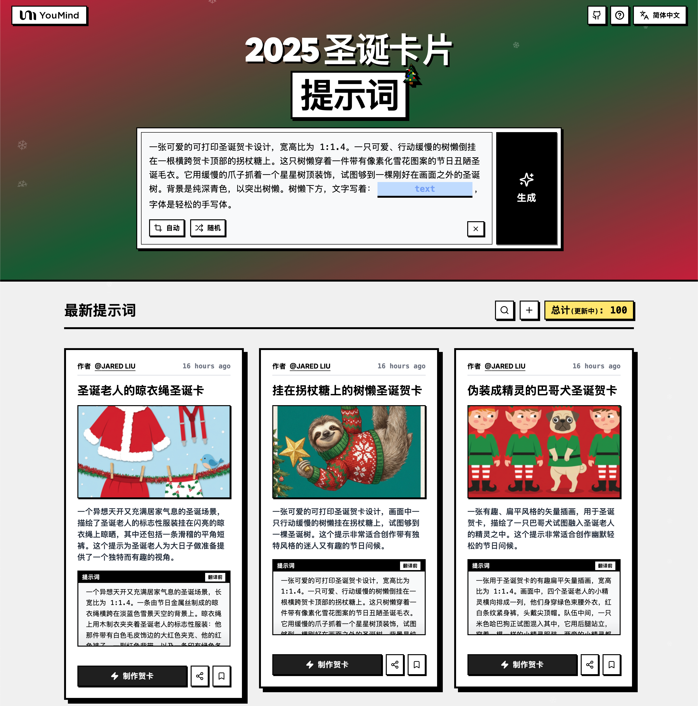

# 🚀 聖誕卡片提示詞大全

[](https://github.com/sindresorhus/awesome)
[](https://github.com/YouMind-OpenLab/awesome-christmas-card-prompts)
[](https://creativecommons.org/licenses/by/4.0/)
[](https://github.com/YouMind-OpenLab/awesome-christmas-card-prompts/actions)
[](docs/CONTRIBUTING.md)

> 🎨 精選聖誕卡片提示詞集合，使用 Nano Banana Pro 生成

> 💡 **Note**: gemini3Promo

> ⚠️ **版權聲明**：所有提示詞均收集自社區，僅供教育目的使用。如果您認為任何內容侵犯了您的權利，請[提交 issue](https://github.com/YouMind-OpenLab/awesome-christmas-card-prompts/issues/new?template=bug-report.yml)，我們將立即移除。

---

[](README.md) [](README_zh.md) [](README_zh-TW.md) [](README_ja-JP.md) [](README_ko-KR.md) [](README_th-TH.md) [](README_vi-VN.md) [](README_hi-IN.md) [](README_es-ES.md) [-Click%20to%20View-lightgrey)](README_es-419.md) [](README_de-DE.md) [](README_fr-FR.md) [](README_it-IT.md) [-Click%20to%20View-lightgrey)](README_pt-BR.md) [](README_pt-PT.md) [](README_tr-TR.md)

---

## 🌐 在網頁圖庫中查看

<div align="center">



</div>

**[👉 瀏覽 YouMind 聖誕卡片提示詞圖庫](https://youmind.com/tools/christmas-cards-maker)**

為什麼使用圖庫？

| Feature | GitHub README | youmind.com 圖庫 |
|---------|--------------|---------------------|
| 🎨 可視化佈局 | 線性列表 | 精美的瀑布流網格 |
| 🔍 搜索 | 僅 Ctrl+F | 全文搜索和篩選 |
| 🤖 AI 一鍵生圖 | - | AI 一鍵生圖 |
| 📱 移動端 | 基礎 | 完全響應式 |

---

## 📖 目錄

- [🌐 在網頁圖庫中查看](#-view-in-web-gallery)
- [🤔 什麼是聖誕卡片製作器？](#-what-is-christmas-cards-maker)
- [📊 統計數據](#-statistics)
- [🔥 精選提示詞](#-featured-prompts)
- [📋 所有提示詞](#-all-prompts)
- [🤝 如何貢獻](#-how-to-contribute)
- [📄 許可證](#-license)
- [🙏 致謝](#-acknowledgements)
- [⭐ Star 歷史](#-star-history)

---

## 🤔 什麼是聖誕卡片製作器？

**聖誕卡片製作器** 是一款由 Google Nano Banana Pro 驅動的創意工具，用於生成精美的聖誕卡片：

- 🎯 **AI 智能生成** - 簡單提示詞即可創建精美卡片
- 🎨 **多樣風格** - 從傳統到現代，卡通到寫實
- ⚡ **個性化祝福** - 添加您自己的問候和祝福
- 🌈 **高品質輸出** - 可打印級別分辨率
- 🔧 **快速創建** - 幾秒內生成卡片
- 📐 **多種主題** - 聖誕老人、雪花、聖誕樹等

📚 learnMore

### 🚀 Raycast 集成

部分提示詞支持使用 [Raycast Snippets](https://raycast.com/help/snippets) 語法的**動態參數**。尋找 🚀 Raycast Friendly 徽章！

**示例：**
```
A quote card with "{argument name="quote" default="Stay hungry, stay foolish"}"
by {argument name="author" default="Steve Jobs"}
```

在 Raycast 中使用時，您可以動態替換參數以快速迭代！

---

## 📊 統計數據

<div align="center">

| 指標 | 數量 |
|--------|-------|
| 📝 提示詞總數 | **140** |
| ⭐ 精選 | **6** |
| 🔄 最後更新 | **2025年12月29日 星期一 中午12:40:35 [UTC]** |

</div>

---

## 🔥 精選提示詞

> ⭐ 由我們的團隊精心挑選，具有卓越的質量和創造力

### No. 1: 掛在拐杖糖上的樹懶聖誕卡


#### 📖 描述

一張可愛的可列印聖誕卡片設計，內容是一隻行動緩慢的樹懶掛在拐杖糖上，試圖搆到一棵聖誕樹。這個提示非常適合製作獨特又迷人的幽默節日賀卡。

#### 📝 提示詞

```
一張可愛的可列印聖誕卡片設計，長寬比為 1:1.4。一隻可愛、動作緩慢的樹懶倒掛在卡片頂部橫向延伸的拐杖糖上。這隻樹懶穿著一件帶有像素化雪花圖案的節日醜聖誕毛衣。牠用緩慢的爪子抓著一個星星樹頂裝飾，試圖夠到一棵剛好在畫面外的聖誕樹。背景是實心的深青色，以襯托出樹懶。樹懶下方，文字以輕鬆的手寫字體寫著：「Slowly getting into the Spirit」。
```

#### 🖼️ 生成圖片

##### Image 1

<div align="center">

</div>

#### 📌 詳情

- **作者:** [Jared Liu](https://x.com/jaredliu_bravo)
- **來源:** [Twitter Post](null)
- **發布時間:** 2025年12月13日
- **多語言:** en

**[👉 立即嘗試 →](https://youmind.com/tools/christmas-cards-maker?prompt=%E4%B8%80%E5%BC%B5%E5%8F%AF%E6%84%9B%E7%9A%84%E5%8F%AF%E5%88%97%E5%8D%B0%E8%81%96%E8%AA%95%E5%8D%A1%E7%89%87%E8%A8%AD%E8%A8%88%EF%BC%8C%E9%95%B7%E5%AF%AC%E6%AF%94%E7%82%BA%201%3A1.4%E3%80%82%E4%B8%80%E9%9A%BB%E5%8F%AF%E6%84%9B%E3%80%81%E5%8B%95%E4%BD%9C%E7%B7%A9%E6%85%A2%E7%9A%84%E6%A8%B9%E6%87%B6%E5%80%92%E6%8E%9B%E5%9C%A8%E5%8D%A1%E7%89%87%E9%A0%82%E9%83%A8%E6%A9%AB%E5%90%91%E5%BB%B6%E4%BC%B8%E7%9A%84%E6%8B%90%E6%9D%96%E7%B3%96%E4%B8%8A%E3%80%82%E9%80%99%E9%9A%BB%E6%A8%B9%E6%87%B6%E7%A9%BF%E8%91%97%E4%B8%80%E4%BB%B6%E5%B8%B6%E6%9C%89%E5%83%8F%E7%B4%A0%E5%8C%96%E9%9B%AA%E8%8A%B1%E5%9C%96%E6%A1%88%E7%9A%84%E7%AF%80%E6%97%A5%E9%86%9C%E8%81%96%E8%AA%95%E6%AF%9B%E8%A1%A3%E3%80%82%E7%89%A0%E7%94%A8%E7%B7%A9%E6%85%A2%E7%9A%84%E7%88%AA%E5%AD%90%E6%8A%93%E8%91%97%E4%B8%80%E5%80%8B%E6%98%9F%E6%98%9F%E6%A8%B9%E9%A0%82%E8%A3%9D%E9%A3%BE%EF%BC%8C%E8%A9%A6%E5%9C%96%E5%A4%A0%E5%88%B0%E4%B8%80%E6%A3%B5%E5%89%9B%E5%A5%BD%E5%9C%A8%E7%95%AB%E9%9D%A2%E5%A4%96%E7%9A%84%E8%81%96%E8%AA%95%E6%A8%B9%E3%80%82%E8%83%8C%E6%99%AF%E6%98%AF%E5%AF%A6%E5%BF%83%E7%9A%84%E6%B7%B1%E9%9D%92%E8%89%B2%EF%BC%8C%E4%BB%A5%E8%A5%AF%E6%89%98%E5%87%BA%E6%A8%B9%E6%87%B6%E3%80%82%E6%A8%B9%E6%87%B6%E4%B8%8B%E6%96%B9%EF%BC%8C%E6%96%87%E5%AD%97%E4%BB%A5%E8%BC%95%E9%AC%86%E7%9A%84%E6%89%8B%E5%AF%AB%E5%AD%97%E9%AB%94%E5%AF%AB%E8%91%97%EF%BC%9A%E3%80%8CSlowly%20getting%20into%20the%20Spirit%E3%80%8D%E3%80%82)**

---

### No. 2: 北極熊與企鵝圍巾聖誕卡


#### 📖 描述

一張溫馨又奇特的聖誕卡封面，描繪了一隻巨大的北極熊和一隻小企鵝之間，因一條滑稽地過大圍巾而建立的奇特友誼。非常適合在佳節期間傳達友誼與溫暖的主題。

#### 📝 提示詞

```
一張溫馨又帶點奇思妙想的聖誕卡封面，長寬比為 1:1.4。一隻巨大、毛茸茸的白色北極熊坐在左側，一隻嬌小、圓滾滾的企鵝站在右側，背景是簡潔的冰藍色。牠們被一條滑稽地長、超大的紅綠相間針織圍巾連接起來，圍巾在北極熊的脖子上纏繞了好幾圈，然後垂下來緊緊地裹住小企鵝。企鵝仰視著北極熊，眼神中充滿了欽佩。北極熊的毛髮和針織羊毛的質感清晰可見，柔軟溫暖。簡單的白色雪花輕輕地飄落在牠們周圍。沒有文字，只有一幅關於友誼的甜蜜畫面。
```

#### 🖼️ 生成圖片

##### Image 1

<div align="center">

</div>

#### 📌 詳情

- **作者:** [Jared Liu](https://x.com/jaredliu_bravo)
- **來源:** [Twitter Post](null)
- **發布時間:** 2025年12月13日
- **多語言:** en

**[👉 立即嘗試 →](https://youmind.com/tools/christmas-cards-maker?prompt=%E4%B8%80%E5%BC%B5%E6%BA%AB%E9%A6%A8%E5%8F%88%E5%B8%B6%E9%BB%9E%E5%A5%87%E6%80%9D%E5%A6%99%E6%83%B3%E7%9A%84%E8%81%96%E8%AA%95%E5%8D%A1%E5%B0%81%E9%9D%A2%EF%BC%8C%E9%95%B7%E5%AF%AC%E6%AF%94%E7%82%BA%201%3A1.4%E3%80%82%E4%B8%80%E9%9A%BB%E5%B7%A8%E5%A4%A7%E3%80%81%E6%AF%9B%E8%8C%B8%E8%8C%B8%E7%9A%84%E7%99%BD%E8%89%B2%E5%8C%97%E6%A5%B5%E7%86%8A%E5%9D%90%E5%9C%A8%E5%B7%A6%E5%81%B4%EF%BC%8C%E4%B8%80%E9%9A%BB%E5%AC%8C%E5%B0%8F%E3%80%81%E5%9C%93%E6%BB%BE%E6%BB%BE%E7%9A%84%E4%BC%81%E9%B5%9D%E7%AB%99%E5%9C%A8%E5%8F%B3%E5%81%B4%EF%BC%8C%E8%83%8C%E6%99%AF%E6%98%AF%E7%B0%A1%E6%BD%94%E7%9A%84%E5%86%B0%E8%97%8D%E8%89%B2%E3%80%82%E7%89%A0%E5%80%91%E8%A2%AB%E4%B8%80%E6%A2%9D%E6%BB%91%E7%A8%BD%E5%9C%B0%E9%95%B7%E3%80%81%E8%B6%85%E5%A4%A7%E7%9A%84%E7%B4%85%E7%B6%A0%E7%9B%B8%E9%96%93%E9%87%9D%E7%B9%94%E5%9C%8D%E5%B7%BE%E9%80%A3%E6%8E%A5%E8%B5%B7%E4%BE%86%EF%BC%8C%E5%9C%8D%E5%B7%BE%E5%9C%A8%E5%8C%97%E6%A5%B5%E7%86%8A%E7%9A%84%E8%84%96%E5%AD%90%E4%B8%8A%E7%BA%8F%E7%B9%9E%E4%BA%86%E5%A5%BD%E5%B9%BE%E5%9C%88%EF%BC%8C%E7%84%B6%E5%BE%8C%E5%9E%82%E4%B8%8B%E4%BE%86%E7%B7%8A%E7%B7%8A%E5%9C%B0%E8%A3%B9%E4%BD%8F%E5%B0%8F%E4%BC%81%E9%B5%9D%E3%80%82%E4%BC%81%E9%B5%9D%E4%BB%B0%E8%A6%96%E8%91%97%E5%8C%97%E6%A5%B5%E7%86%8A%EF%BC%8C%E7%9C%BC%E7%A5%9E%E4%B8%AD%E5%85%85%E6%BB%BF%E4%BA%86%E6%AC%BD%E4%BD%A9%E3%80%82%E5%8C%97%E6%A5%B5%E7%86%8A%E7%9A%84%E6%AF%9B%E9%AB%AE%E5%92%8C%E9%87%9D%E7%B9%94%E7%BE%8A%E6%AF%9B%E7%9A%84%E8%B3%AA%E6%84%9F%E6%B8%85%E6%99%B0%E5%8F%AF%E8%A6%8B%EF%BC%8C%E6%9F%94%E8%BB%9F%E6%BA%AB%E6%9A%96%E3%80%82%E7%B0%A1%E5%96%AE%E7%9A%84%E7%99%BD%E8%89%B2%E9%9B%AA%E8%8A%B1%E8%BC%95%E8%BC%95%E5%9C%B0%E9%A3%84%E8%90%BD%E5%9C%A8%E7%89%A0%E5%80%91%E5%91%A8%E5%9C%8D%E3%80%82%E6%B2%92%E6%9C%89%E6%96%87%E5%AD%97%EF%BC%8C%E5%8F%AA%E6%9C%89%E4%B8%80%E5%B9%85%E9%97%9C%E6%96%BC%E5%8F%8B%E8%AA%BC%E7%9A%84%E7%94%9C%E8%9C%9C%E7%95%AB%E9%9D%A2%E3%80%82)**

---

### No. 3: 薑餅瑜伽課聖誕卡


#### 📖 描述

這是一款歡樂又可愛的可列印聖誕卡設計，卡片上印有五個正在上「瑜伽課」的可愛薑餅人餅乾。這個提示非常適合製作帶點幽默和可愛的暖心節日問候。

#### 📝 提示詞

```
一張有趣又可愛的聖誕卡片設計，可供列印，長寬比為 1:1.4。背景是純淨的粉彩薄荷綠。插圖描繪了五個可愛薑餅人的「瑜伽課」。中間的薑餅人單腳站立，擺出「樹式」姿勢，專注地用頭頂著一顆軟糖。在他的左邊，另一個薑餅人正嘗試「下犬式」姿勢，但他的手臂稍微碎裂，露出了美味的餅乾屑。右邊的薑餅人則閉著糖霜眼睛，以「蓮花坐」姿勢冥想。他們都有白色的糖霜細節和紅色的肉桂糖鈕扣。風格是簡潔、扁平的向量插圖，帶有柔和的陰影。頂部的文字寫著：{argument name="text" default="Find Your Inner Piece"}，採用俏皮、圓潤的白色字體。
```

#### 🖼️ 生成圖片

##### Image 1

<div align="center">

</div>

#### 📌 詳情

- **作者:** [Jared Liu](https://x.com/jaredliu_bravo)
- **來源:** [Twitter Post](null)
- **發布時間:** 2025年12月13日
- **多語言:** en

**[👉 立即嘗試 →](https://youmind.com/tools/christmas-cards-maker?prompt=%E4%B8%80%E5%BC%B5%E6%9C%89%E8%B6%A3%E5%8F%88%E5%8F%AF%E6%84%9B%E7%9A%84%E8%81%96%E8%AA%95%E5%8D%A1%E7%89%87%E8%A8%AD%E8%A8%88%EF%BC%8C%E5%8F%AF%E4%BE%9B%E5%88%97%E5%8D%B0%EF%BC%8C%E9%95%B7%E5%AF%AC%E6%AF%94%E7%82%BA%201%3A1.4%E3%80%82%E8%83%8C%E6%99%AF%E6%98%AF%E7%B4%94%E6%B7%A8%E7%9A%84%E7%B2%89%E5%BD%A9%E8%96%84%E8%8D%B7%E7%B6%A0%E3%80%82%E6%8F%92%E5%9C%96%E6%8F%8F%E7%B9%AA%E4%BA%86%E4%BA%94%E5%80%8B%E5%8F%AF%E6%84%9B%E8%96%91%E9%A4%85%E4%BA%BA%E7%9A%84%E3%80%8C%E7%91%9C%E4%BC%BD%E8%AA%B2%E3%80%8D%E3%80%82%E4%B8%AD%E9%96%93%E7%9A%84%E8%96%91%E9%A4%85%E4%BA%BA%E5%96%AE%E8%85%B3%E7%AB%99%E7%AB%8B%EF%BC%8C%E6%93%BA%E5%87%BA%E3%80%8C%E6%A8%B9%E5%BC%8F%E3%80%8D%E5%A7%BF%E5%8B%A2%EF%BC%8C%E5%B0%88%E6%B3%A8%E5%9C%B0%E7%94%A8%E9%A0%AD%E9%A0%82%E8%91%97%E4%B8%80%E9%A1%86%E8%BB%9F%E7%B3%96%E3%80%82%E5%9C%A8%E4%BB%96%E7%9A%84%E5%B7%A6%E9%82%8A%EF%BC%8C%E5%8F%A6%E4%B8%80%E5%80%8B%E8%96%91%E9%A4%85%E4%BA%BA%E6%AD%A3%E5%98%97%E8%A9%A6%E3%80%8C%E4%B8%8B%E7%8A%AC%E5%BC%8F%E3%80%8D%E5%A7%BF%E5%8B%A2%EF%BC%8C%E4%BD%86%E4%BB%96%E7%9A%84%E6%89%8B%E8%87%82%E7%A8%8D%E5%BE%AE%E7%A2%8E%E8%A3%82%EF%BC%8C%E9%9C%B2%E5%87%BA%E4%BA%86%E7%BE%8E%E5%91%B3%E7%9A%84%E9%A4%85%E4%B9%BE%E5%B1%91%E3%80%82%E5%8F%B3%E9%82%8A%E7%9A%84%E8%96%91%E9%A4%85%E4%BA%BA%E5%89%87%E9%96%89%E8%91%97%E7%B3%96%E9%9C%9C%E7%9C%BC%E7%9D%9B%EF%BC%8C%E4%BB%A5%E3%80%8C%E8%93%AE%E8%8A%B1%E5%9D%90%E3%80%8D%E5%A7%BF%E5%8B%A2%E5%86%A5%E6%83%B3%E3%80%82%E4%BB%96%E5%80%91%E9%83%BD%E6%9C%89%E7%99%BD%E8%89%B2%E7%9A%84%E7%B3%96%E9%9C%9C%E7%B4%B0%E7%AF%80%E5%92%8C%E7%B4%85%E8%89%B2%E7%9A%84%E8%82%89%E6%A1%82%E7%B3%96%E9%88%95%E6%89%A3%E3%80%82%E9%A2%A8%E6%A0%BC%E6%98%AF%E7%B0%A1%E6%BD%94%E3%80%81%E6%89%81%E5%B9%B3%E7%9A%84%E5%90%91%E9%87%8F%E6%8F%92%E5%9C%96%EF%BC%8C%E5%B8%B6%E6%9C%89%E6%9F%94%E5%92%8C%E7%9A%84%E9%99%B0%E5%BD%B1%E3%80%82%E9%A0%82%E9%83%A8%E7%9A%84%E6%96%87%E5%AD%97%E5%AF%AB%E8%91%97%EF%BC%9A%7Bargument%20name%3D%22text%22%20default%3D%22Find%20Your%20Inner%20Piece%22%7D%EF%BC%8C%E6%8E%A1%E7%94%A8%E4%BF%8F%E7%9A%AE%E3%80%81%E5%9C%93%E6%BD%A4%E7%9A%84%E7%99%BD%E8%89%B2%E5%AD%97%E9%AB%94%E3%80%82)**

---

### No. 4: 毛氈貼花小狐狸


#### 📖 描述

此提示能設計出溫馨、觸感十足的聖誕卡片，呈現手工毛氈貼花縫製的效果，卡片上有一隻可愛的小狐狸在雪景中。非常適合獨特且充滿巧思的節慶視覺設計。

#### 📝 提示詞

```
一張溫馨、觸感豐富的聖誕卡設計，長寬比為 1:1.4。插圖看起來完全像是手工氈布貼花縫製的。一隻可愛的橘色小狐狸幼崽，由毛茸茸的氈布製成，坐落在層層白色氈布雪中，抬頭望著一棵裝飾著彩色鈕扣飾品的氈布聖誕樹。羊毛纖維的紋理和邊緣的縫線清晰可見。背景是柔和的藍色氈布天空。
```

#### 🖼️ 生成圖片

##### Image 1

<div align="center">

</div>

#### 📌 詳情

- **作者:** [Jared Liu](https://x.com/jaredliu_bravo)
- **來源:** [Twitter Post](null)
- **發布時間:** 2025年12月15日
- **多語言:** en

**[👉 立即嘗試 →](https://youmind.com/tools/christmas-cards-maker?prompt=%E4%B8%80%E5%BC%B5%E6%BA%AB%E9%A6%A8%E3%80%81%E8%A7%B8%E6%84%9F%E8%B1%90%E5%AF%8C%E7%9A%84%E8%81%96%E8%AA%95%E5%8D%A1%E8%A8%AD%E8%A8%88%EF%BC%8C%E9%95%B7%E5%AF%AC%E6%AF%94%E7%82%BA%201%3A1.4%E3%80%82%E6%8F%92%E5%9C%96%E7%9C%8B%E8%B5%B7%E4%BE%86%E5%AE%8C%E5%85%A8%E5%83%8F%E6%98%AF%E6%89%8B%E5%B7%A5%E6%B0%88%E5%B8%83%E8%B2%BC%E8%8A%B1%E7%B8%AB%E8%A3%BD%E7%9A%84%E3%80%82%E4%B8%80%E9%9A%BB%E5%8F%AF%E6%84%9B%E7%9A%84%E6%A9%98%E8%89%B2%E5%B0%8F%E7%8B%90%E7%8B%B8%E5%B9%BC%E5%B4%BD%EF%BC%8C%E7%94%B1%E6%AF%9B%E8%8C%B8%E8%8C%B8%E7%9A%84%E6%B0%88%E5%B8%83%E8%A3%BD%E6%88%90%EF%BC%8C%E5%9D%90%E8%90%BD%E5%9C%A8%E5%B1%A4%E5%B1%A4%E7%99%BD%E8%89%B2%E6%B0%88%E5%B8%83%E9%9B%AA%E4%B8%AD%EF%BC%8C%E6%8A%AC%E9%A0%AD%E6%9C%9B%E8%91%97%E4%B8%80%E6%A3%B5%E8%A3%9D%E9%A3%BE%E8%91%97%E5%BD%A9%E8%89%B2%E9%88%95%E6%89%A3%E9%A3%BE%E5%93%81%E7%9A%84%E6%B0%88%E5%B8%83%E8%81%96%E8%AA%95%E6%A8%B9%E3%80%82%E7%BE%8A%E6%AF%9B%E7%BA%96%E7%B6%AD%E7%9A%84%E7%B4%8B%E7%90%86%E5%92%8C%E9%82%8A%E7%B7%A3%E7%9A%84%E7%B8%AB%E7%B7%9A%E6%B8%85%E6%99%B0%E5%8F%AF%E8%A6%8B%E3%80%82%E8%83%8C%E6%99%AF%E6%98%AF%E6%9F%94%E5%92%8C%E7%9A%84%E8%97%8D%E8%89%B2%E6%B0%88%E5%B8%83%E5%A4%A9%E7%A9%BA%E3%80%82)**

---

### No. 5: 戴著馴鹿角和小丑鼻子的巴哥犬


#### 📖 描述

此提示會生成一張有趣又可愛的可列印卡片，內容為一隻巴哥犬不情願地戴著馴鹿角和發光的紅色小丑鼻子，以特寫攝影肖像呈現。非常適合幽默搞怪的節日問候。

#### 📝 提示詞

```
一張有趣又可愛的可列印卡片，長寬比為 1:1.4。特寫鏡頭拍攝了一隻胖嘟嘟的巴哥犬的臉部。牠不情願地戴著一個帶有棕色毛氈馴鹿角的頭帶，以及一個非常明亮、發光的紅色小丑鼻子，蓋在牠自己的鼻子上。這隻巴哥犬表情嚴肅，略帶評判意味，直視著鏡頭。背景是模糊的節日紅色燈光。
```

#### 🖼️ 生成圖片

##### Image 1

<div align="center">

</div>

#### 📌 詳情

- **作者:** [Jared Liu](https://x.com/jaredliu_bravo)
- **來源:** [Twitter Post](null)
- **發布時間:** 2025年12月15日
- **多語言:** en

**[👉 立即嘗試 →](https://youmind.com/tools/christmas-cards-maker?prompt=%E4%B8%80%E5%BC%B5%E6%9C%89%E8%B6%A3%E5%8F%88%E5%8F%AF%E6%84%9B%E7%9A%84%E5%8F%AF%E5%88%97%E5%8D%B0%E5%8D%A1%E7%89%87%EF%BC%8C%E9%95%B7%E5%AF%AC%E6%AF%94%E7%82%BA%201%3A1.4%E3%80%82%E7%89%B9%E5%AF%AB%E9%8F%A1%E9%A0%AD%E6%8B%8D%E6%94%9D%E4%BA%86%E4%B8%80%E9%9A%BB%E8%83%96%E5%98%9F%E5%98%9F%E7%9A%84%E5%B7%B4%E5%93%A5%E7%8A%AC%E7%9A%84%E8%87%89%E9%83%A8%E3%80%82%E7%89%A0%E4%B8%8D%E6%83%85%E9%A1%98%E5%9C%B0%E6%88%B4%E8%91%97%E4%B8%80%E5%80%8B%E5%B8%B6%E6%9C%89%E6%A3%95%E8%89%B2%E6%AF%9B%E6%B0%88%E9%A6%B4%E9%B9%BF%E8%A7%92%E7%9A%84%E9%A0%AD%E5%B8%B6%EF%BC%8C%E4%BB%A5%E5%8F%8A%E4%B8%80%E5%80%8B%E9%9D%9E%E5%B8%B8%E6%98%8E%E4%BA%AE%E3%80%81%E7%99%BC%E5%85%89%E7%9A%84%E7%B4%85%E8%89%B2%E5%B0%8F%E4%B8%91%E9%BC%BB%E5%AD%90%EF%BC%8C%E8%93%8B%E5%9C%A8%E7%89%A0%E8%87%AA%E5%B7%B1%E7%9A%84%E9%BC%BB%E5%AD%90%E4%B8%8A%E3%80%82%E9%80%99%E9%9A%BB%E5%B7%B4%E5%93%A5%E7%8A%AC%E8%A1%A8%E6%83%85%E5%9A%B4%E8%82%85%EF%BC%8C%E7%95%A5%E5%B8%B6%E8%A9%95%E5%88%A4%E6%84%8F%E5%91%B3%EF%BC%8C%E7%9B%B4%E8%A6%96%E8%91%97%E9%8F%A1%E9%A0%AD%E3%80%82%E8%83%8C%E6%99%AF%E6%98%AF%E6%A8%A1%E7%B3%8A%E7%9A%84%E7%AF%80%E6%97%A5%E7%B4%85%E8%89%B2%E7%87%88%E5%85%89%E3%80%82)**

---

### No. 6: 羊駝被禮物淹沒了


#### 📖 描述

此提示會建立一張可愛又帶點混亂的聖誕卡片，卡片上有一隻毛茸茸的羊駝，身上堆滿了搖搖欲墜的聖誕禮物。非常適合幽默又迷人的節日問候。

#### 📝 提示詞

```
一張可愛又混亂的聖誕卡，長寬比為 1:1.4。一隻毛茸茸的白色羊駝站在純薄荷綠的背景前。牠的背上堆滿了高得不可思議、搖搖欲墜的彩色包裝聖誕禮物，禮物上的蝴蝶結劇烈晃動著。這隻羊駝表情耐心，略帶吃力，細長的腿在重壓下微微顫抖。
```

#### 🖼️ 生成圖片

##### Image 1

<div align="center">

</div>

#### 📌 詳情

- **作者:** [Jared Liu](https://x.com/jaredliu_bravo)
- **來源:** [Twitter Post](null)
- **發布時間:** 2025年12月15日
- **多語言:** en

**[👉 立即嘗試 →](https://youmind.com/tools/christmas-cards-maker?prompt=%E4%B8%80%E5%BC%B5%E5%8F%AF%E6%84%9B%E5%8F%88%E6%B7%B7%E4%BA%82%E7%9A%84%E8%81%96%E8%AA%95%E5%8D%A1%EF%BC%8C%E9%95%B7%E5%AF%AC%E6%AF%94%E7%82%BA%201%3A1.4%E3%80%82%E4%B8%80%E9%9A%BB%E6%AF%9B%E8%8C%B8%E8%8C%B8%E7%9A%84%E7%99%BD%E8%89%B2%E7%BE%8A%E9%A7%9D%E7%AB%99%E5%9C%A8%E7%B4%94%E8%96%84%E8%8D%B7%E7%B6%A0%E7%9A%84%E8%83%8C%E6%99%AF%E5%89%8D%E3%80%82%E7%89%A0%E7%9A%84%E8%83%8C%E4%B8%8A%E5%A0%86%E6%BB%BF%E4%BA%86%E9%AB%98%E5%BE%97%E4%B8%8D%E5%8F%AF%E6%80%9D%E8%AD%B0%E3%80%81%E6%90%96%E6%90%96%E6%AC%B2%E5%A2%9C%E7%9A%84%E5%BD%A9%E8%89%B2%E5%8C%85%E8%A3%9D%E8%81%96%E8%AA%95%E7%A6%AE%E7%89%A9%EF%BC%8C%E7%A6%AE%E7%89%A9%E4%B8%8A%E7%9A%84%E8%9D%B4%E8%9D%B6%E7%B5%90%E5%8A%87%E7%83%88%E6%99%83%E5%8B%95%E8%91%97%E3%80%82%E9%80%99%E9%9A%BB%E7%BE%8A%E9%A7%9D%E8%A1%A8%E6%83%85%E8%80%90%E5%BF%83%EF%BC%8C%E7%95%A5%E5%B8%B6%E5%90%83%E5%8A%9B%EF%BC%8C%E7%B4%B0%E9%95%B7%E7%9A%84%E8%85%BF%E5%9C%A8%E9%87%8D%E5%A3%93%E4%B8%8B%E5%BE%AE%E5%BE%AE%E9%A1%AB%E6%8A%96%E3%80%82)**

---

## 📋 所有提示詞

> 📝 按發布日期排序（最新優先）

### No. 1: 聖誕海狸 · 建築狂人頭像框


#### 📖 描述

此提示會生成一個垂直 1:1.4 比例的俏皮動畫風格聖誕相框。邊框展示卡通海狸們熱情地建造和過度設計節日裝飾，表情誇張嚴肅，創造出幽默且針對印刷優化的設計。

#### 📝 提示詞

```
一個垂直的 1:1.4 可列印聖誕相框，以俏皮的動畫風格呈現。

無背景，僅有相框。

中央有一個空白的相片預留位置，比例為 1:1.4，寬度佔 70%，完全乾淨。

邊框顯示卡通海狸熱情地建造、敲打並過度設計節慶裝飾，帶著誇張的嚴肅表情。

扁平化、幽默、針對列印優化，無文字。
```

#### 🖼️ 生成圖片

##### Image 1

<div align="center">

</div>

#### 📌 詳情

- **作者:** [Jared Liu](https://x.com/jaredliu_bravo)
- **來源:** [Twitter Post](null)
- **發布時間:** 2025年12月15日
- **多語言:** en

**[👉 立即嘗試 →](https://youmind.com/tools/christmas-cards-maker?prompt=%E4%B8%80%E5%80%8B%E5%9E%82%E7%9B%B4%E7%9A%84%201%3A1.4%20%E5%8F%AF%E5%88%97%E5%8D%B0%E8%81%96%E8%AA%95%E7%9B%B8%E6%A1%86%EF%BC%8C%E4%BB%A5%E4%BF%8F%E7%9A%AE%E7%9A%84%E5%8B%95%E7%95%AB%E9%A2%A8%E6%A0%BC%E5%91%88%E7%8F%BE%E3%80%82%0A%0A%E7%84%A1%E8%83%8C%E6%99%AF%EF%BC%8C%E5%83%85%E6%9C%89%E7%9B%B8%E6%A1%86%E3%80%82%0A%0A%E4%B8%AD%E5%A4%AE%E6%9C%89%E4%B8%80%E5%80%8B%E7%A9%BA%E7%99%BD%E7%9A%84%E7%9B%B8%E7%89%87%E9%A0%90%E7%95%99%E4%BD%8D%E7%BD%AE%EF%BC%8C%E6%AF%94%E4%BE%8B%E7%82%BA%201%3A1.4%EF%BC%8C%E5%AF%AC%E5%BA%A6%E4%BD%94%2070%25%EF%BC%8C%E5%AE%8C%E5%85%A8%E4%B9%BE%E6%B7%A8%E3%80%82%0A%0A%E9%82%8A%E6%A1%86%E9%A1%AF%E7%A4%BA%E5%8D%A1%E9%80%9A%E6%B5%B7%E7%8B%B8%E7%86%B1%E6%83%85%E5%9C%B0%E5%BB%BA%E9%80%A0%E3%80%81%E6%95%B2%E6%89%93%E4%B8%A6%E9%81%8E%E5%BA%A6%E8%A8%AD%E8%A8%88%E7%AF%80%E6%85%B6%E8%A3%9D%E9%A3%BE%EF%BC%8C%E5%B8%B6%E8%91%97%E8%AA%87%E5%BC%B5%E7%9A%84%E5%9A%B4%E8%82%85%E8%A1%A8%E6%83%85%E3%80%82%0A%0A%E6%89%81%E5%B9%B3%E5%8C%96%E3%80%81%E5%B9%BD%E9%BB%98%E3%80%81%E9%87%9D%E5%B0%8D%E5%88%97%E5%8D%B0%E5%84%AA%E5%8C%96%EF%BC%8C%E7%84%A1%E6%96%87%E5%AD%97%E3%80%82)**

---

### No. 2: 聖誕樹熊 · 愛不釋手相框


#### 📖 描述

此提示可建立一個垂直 1:1.4 比例的動畫聖誕相框。邊框設計為卡通無尾熊抱著飾品和花環不放，營造出溫馨幽默的氛圍，並可直接用於印刷。

#### 📝 提示詞

```
一個可列印的動畫聖誕相框，採用垂直 1:1.4 格式。

僅有相框設計。

一個空白的照片佔位符，水平和垂直居中，比例為 1:1.4，寬度為 70%，完全未經處理。

邊框上是卡通無尾熊抱著裝飾品、花環和拐杖糖，不肯放手，營造出溫馨、幽默的氛圍。

扁平化、溫暖、可供列印，無文字。
```

#### 🖼️ 生成圖片

##### Image 1

<div align="center">

</div>

#### 📌 詳情

- **作者:** [Jared Liu](https://x.com/jaredliu_bravo)
- **來源:** [Twitter Post](null)
- **發布時間:** 2025年12月15日
- **多語言:** en

**[👉 立即嘗試 →](https://youmind.com/tools/christmas-cards-maker?prompt=%E4%B8%80%E5%80%8B%E5%8F%AF%E5%88%97%E5%8D%B0%E7%9A%84%E5%8B%95%E7%95%AB%E8%81%96%E8%AA%95%E7%9B%B8%E6%A1%86%EF%BC%8C%E6%8E%A1%E7%94%A8%E5%9E%82%E7%9B%B4%201%3A1.4%20%E6%A0%BC%E5%BC%8F%E3%80%82%0A%0A%E5%83%85%E6%9C%89%E7%9B%B8%E6%A1%86%E8%A8%AD%E8%A8%88%E3%80%82%0A%0A%E4%B8%80%E5%80%8B%E7%A9%BA%E7%99%BD%E7%9A%84%E7%85%A7%E7%89%87%E4%BD%94%E4%BD%8D%E7%AC%A6%EF%BC%8C%E6%B0%B4%E5%B9%B3%E5%92%8C%E5%9E%82%E7%9B%B4%E5%B1%85%E4%B8%AD%EF%BC%8C%E6%AF%94%E4%BE%8B%E7%82%BA%201%3A1.4%EF%BC%8C%E5%AF%AC%E5%BA%A6%E7%82%BA%2070%25%EF%BC%8C%E5%AE%8C%E5%85%A8%E6%9C%AA%E7%B6%93%E8%99%95%E7%90%86%E3%80%82%0A%0A%E9%82%8A%E6%A1%86%E4%B8%8A%E6%98%AF%E5%8D%A1%E9%80%9A%E7%84%A1%E5%B0%BE%E7%86%8A%E6%8A%B1%E8%91%97%E8%A3%9D%E9%A3%BE%E5%93%81%E3%80%81%E8%8A%B1%E7%92%B0%E5%92%8C%E6%8B%90%E6%9D%96%E7%B3%96%EF%BC%8C%E4%B8%8D%E8%82%AF%E6%94%BE%E6%89%8B%EF%BC%8C%E7%87%9F%E9%80%A0%E5%87%BA%E6%BA%AB%E9%A6%A8%E3%80%81%E5%B9%BD%E9%BB%98%E7%9A%84%E6%B0%9B%E5%9C%8D%E3%80%82%0A%0A%E6%89%81%E5%B9%B3%E5%8C%96%E3%80%81%E6%BA%AB%E6%9A%96%E3%80%81%E5%8F%AF%E4%BE%9B%E5%88%97%E5%8D%B0%EF%BC%8C%E7%84%A1%E6%96%87%E5%AD%97%E3%80%82)**

---

### No. 3: 聖誕刺蝟 + 松鼠 · 聯合災難框架


#### 📖 描述

此提示會產生一個幽默的動畫風格聖誕相框，採用垂直 1:1.4 的格式。邊框上，卡通刺蝟和松鼠正在競相收集裝飾品，不經意間在相框邊緣製造了節日混亂。

#### 📝 提示詞

```
一個垂直的 1:1.4 可列印聖誕相框，以幽默的動畫風格繪製。

僅限相框本身。

正中央空白照片佔位符，比例為 1:1.4，寬度為 70%，簡潔空無一物。

邊框上繪有卡通刺蝟和松鼠競相收集裝飾品，不經意間在邊緣製造了節日混亂。

平面構圖，無文字。
```

#### 🖼️ 生成圖片

##### Image 1

<div align="center">

</div>

#### 📌 詳情

- **作者:** [Jared Liu](https://x.com/jaredliu_bravo)
- **來源:** [Twitter Post](null)
- **發布時間:** 2025年12月15日
- **多語言:** en

**[👉 立即嘗試 →](https://youmind.com/tools/christmas-cards-maker?prompt=%E4%B8%80%E5%80%8B%E5%9E%82%E7%9B%B4%E7%9A%84%201%3A1.4%20%E5%8F%AF%E5%88%97%E5%8D%B0%E8%81%96%E8%AA%95%E7%9B%B8%E6%A1%86%EF%BC%8C%E4%BB%A5%E5%B9%BD%E9%BB%98%E7%9A%84%E5%8B%95%E7%95%AB%E9%A2%A8%E6%A0%BC%E7%B9%AA%E8%A3%BD%E3%80%82%0A%0A%E5%83%85%E9%99%90%E7%9B%B8%E6%A1%86%E6%9C%AC%E8%BA%AB%E3%80%82%0A%0A%E6%AD%A3%E4%B8%AD%E5%A4%AE%E7%A9%BA%E7%99%BD%E7%85%A7%E7%89%87%E4%BD%94%E4%BD%8D%E7%AC%A6%EF%BC%8C%E6%AF%94%E4%BE%8B%E7%82%BA%201%3A1.4%EF%BC%8C%E5%AF%AC%E5%BA%A6%E7%82%BA%2070%25%EF%BC%8C%E7%B0%A1%E6%BD%94%E7%A9%BA%E7%84%A1%E4%B8%80%E7%89%A9%E3%80%82%0A%0A%E9%82%8A%E6%A1%86%E4%B8%8A%E7%B9%AA%E6%9C%89%E5%8D%A1%E9%80%9A%E5%88%BA%E8%9D%9F%E5%92%8C%E6%9D%BE%E9%BC%A0%E7%AB%B6%E7%9B%B8%E6%94%B6%E9%9B%86%E8%A3%9D%E9%A3%BE%E5%93%81%EF%BC%8C%E4%B8%8D%E7%B6%93%E6%84%8F%E9%96%93%E5%9C%A8%E9%82%8A%E7%B7%A3%E8%A3%BD%E9%80%A0%E4%BA%86%E7%AF%80%E6%97%A5%E6%B7%B7%E4%BA%82%E3%80%82%0A%0A%E5%B9%B3%E9%9D%A2%E6%A7%8B%E5%9C%96%EF%BC%8C%E7%84%A1%E6%96%87%E5%AD%97%E3%80%82)**

---

### No. 4: 聖誕變色龍 · 失敗的偽裝框


#### 📖 描述

這個提示會建立一個幽默的卡通風格聖誕相框，採用垂直 1:1.4 的比例。邊框上，卡通變色龍未能成功融入裝飾中，牠們清晰可見且一臉困惑，為這個方便列印的設計增添了微妙的視覺幽默感。

#### 📝 提示詞

```
一個可列印的聖誕相框，垂直 1:1.4 比例，幽默卡通風格。

僅相框插圖。

置中空白照片佔位符，比例 1:1.4，寬度 70%，未經處理。

邊框飾有卡通變色龍，牠們未能成功融入飾品、燈飾和花環中，清晰可見且一臉困惑，增添了微妙的視覺幽默感。

扁平化，適合列印，無文字。
```

#### 🖼️ 生成圖片

##### Image 1

<div align="center">

</div>

#### 📌 詳情

- **作者:** [Jared Liu](https://x.com/jaredliu_bravo)
- **來源:** [Twitter Post](null)
- **發布時間:** 2025年12月15日
- **多語言:** en

**[👉 立即嘗試 →](https://youmind.com/tools/christmas-cards-maker?prompt=%E4%B8%80%E5%80%8B%E5%8F%AF%E5%88%97%E5%8D%B0%E7%9A%84%E8%81%96%E8%AA%95%E7%9B%B8%E6%A1%86%EF%BC%8C%E5%9E%82%E7%9B%B4%201%3A1.4%20%E6%AF%94%E4%BE%8B%EF%BC%8C%E5%B9%BD%E9%BB%98%E5%8D%A1%E9%80%9A%E9%A2%A8%E6%A0%BC%E3%80%82%0A%0A%E5%83%85%E7%9B%B8%E6%A1%86%E6%8F%92%E5%9C%96%E3%80%82%0A%0A%E7%BD%AE%E4%B8%AD%E7%A9%BA%E7%99%BD%E7%85%A7%E7%89%87%E4%BD%94%E4%BD%8D%E7%AC%A6%EF%BC%8C%E6%AF%94%E4%BE%8B%201%3A1.4%EF%BC%8C%E5%AF%AC%E5%BA%A6%2070%25%EF%BC%8C%E6%9C%AA%E7%B6%93%E8%99%95%E7%90%86%E3%80%82%0A%0A%E9%82%8A%E6%A1%86%E9%A3%BE%E6%9C%89%E5%8D%A1%E9%80%9A%E8%AE%8A%E8%89%B2%E9%BE%8D%EF%BC%8C%E7%89%A0%E5%80%91%E6%9C%AA%E8%83%BD%E6%88%90%E5%8A%9F%E8%9E%8D%E5%85%A5%E9%A3%BE%E5%93%81%E3%80%81%E7%87%88%E9%A3%BE%E5%92%8C%E8%8A%B1%E7%92%B0%E4%B8%AD%EF%BC%8C%E6%B8%85%E6%99%B0%E5%8F%AF%E8%A6%8B%E4%B8%94%E4%B8%80%E8%87%89%E5%9B%B0%E6%83%91%EF%BC%8C%E5%A2%9E%E6%B7%BB%E4%BA%86%E5%BE%AE%E5%A6%99%E7%9A%84%E8%A6%96%E8%A6%BA%E5%B9%BD%E9%BB%98%E6%84%9F%E3%80%82%0A%0A%E6%89%81%E5%B9%B3%E5%8C%96%EF%BC%8C%E9%81%A9%E5%90%88%E5%88%97%E5%8D%B0%EF%BC%8C%E7%84%A1%E6%96%87%E5%AD%97%E3%80%82)**

---

### No. 5: 聖誕貓頭鷹 · 過於嚴肅的框架


#### 📖 描述

此提示會建立一個垂直 1:1.4 比例的動畫故事書風格聖誕相框。邊框上有卡通貓頭鷹，牠們懷疑地盯著雜亂的裝飾品，並以冷幽默的態度評判節日混亂。

#### 📝 提示詞

```
垂直 1:1.4 比例的可列印聖誕相框插圖，動畫故事書風格。

僅有相框構圖。

置中空白照片佔位符，比例 1:1.4，寬度 70%，未經處理。

邊框飾有戴著圍巾和帽子的卡通貓頭鷹，牠們懷疑地盯著凌亂的裝飾品，手持剪貼板，以冷幽默的態度評判著節日混亂。

平面插圖，無文字。
```

#### 🖼️ 生成圖片

##### Image 1

<div align="center">

</div>

#### 📌 詳情

- **作者:** [Jared Liu](https://x.com/jaredliu_bravo)
- **來源:** [Twitter Post](null)
- **發布時間:** 2025年12月15日
- **多語言:** en

**[👉 立即嘗試 →](https://youmind.com/tools/christmas-cards-maker?prompt=%E5%9E%82%E7%9B%B4%201%3A1.4%20%E6%AF%94%E4%BE%8B%E7%9A%84%E5%8F%AF%E5%88%97%E5%8D%B0%E8%81%96%E8%AA%95%E7%9B%B8%E6%A1%86%E6%8F%92%E5%9C%96%EF%BC%8C%E5%8B%95%E7%95%AB%E6%95%85%E4%BA%8B%E6%9B%B8%E9%A2%A8%E6%A0%BC%E3%80%82%0A%0A%E5%83%85%E6%9C%89%E7%9B%B8%E6%A1%86%E6%A7%8B%E5%9C%96%E3%80%82%0A%0A%E7%BD%AE%E4%B8%AD%E7%A9%BA%E7%99%BD%E7%85%A7%E7%89%87%E4%BD%94%E4%BD%8D%E7%AC%A6%EF%BC%8C%E6%AF%94%E4%BE%8B%201%3A1.4%EF%BC%8C%E5%AF%AC%E5%BA%A6%2070%25%EF%BC%8C%E6%9C%AA%E7%B6%93%E8%99%95%E7%90%86%E3%80%82%0A%0A%E9%82%8A%E6%A1%86%E9%A3%BE%E6%9C%89%E6%88%B4%E8%91%97%E5%9C%8D%E5%B7%BE%E5%92%8C%E5%B8%BD%E5%AD%90%E7%9A%84%E5%8D%A1%E9%80%9A%E8%B2%93%E9%A0%AD%E9%B7%B9%EF%BC%8C%E7%89%A0%E5%80%91%E6%87%B7%E7%96%91%E5%9C%B0%E7%9B%AF%E8%91%97%E5%87%8C%E4%BA%82%E7%9A%84%E8%A3%9D%E9%A3%BE%E5%93%81%EF%BC%8C%E6%89%8B%E6%8C%81%E5%89%AA%E8%B2%BC%E6%9D%BF%EF%BC%8C%E4%BB%A5%E5%86%B7%E5%B9%BD%E9%BB%98%E7%9A%84%E6%85%8B%E5%BA%A6%E8%A9%95%E5%88%A4%E8%91%97%E7%AF%80%E6%97%A5%E6%B7%B7%E4%BA%82%E3%80%82%0A%0A%E5%B9%B3%E9%9D%A2%E6%8F%92%E5%9C%96%EF%BC%8C%E7%84%A1%E6%96%87%E5%AD%97%E3%80%82)**

---

### No. 6: 聖誕章魚 · 八爪狂熱相框


#### 📖 描述

此提示會產生一張垂直 1:1.4 比例的幽默卡通動畫風格聖誕相框。邊框上有一隻卡通章魚，牠用所有的觸手來裝飾，營造出熱鬧有趣的節慶混亂氛圍。

#### 📝 提示詞

```
一個垂直的 1:1.4 可列印聖誕相框，以幽默的卡通動畫風格呈現。

只有相框設計，沒有環境。

一個空白的相片佔位符完美居中，比例為 1:1.4，寬度為 70%，完全空白。

邊框上有一隻卡通章魚，牠用所有的觸手同時裝飾著飾品、燈飾、拐杖糖和星星，營造出歡樂的節日混亂感。

扁平、簡潔、可供列印，無文字。
```

#### 🖼️ 生成圖片

##### Image 1

<div align="center">

</div>

#### 📌 詳情

- **作者:** [Jared Liu](https://x.com/jaredliu_bravo)
- **來源:** [Twitter Post](null)
- **發布時間:** 2025年12月15日
- **多語言:** en

**[👉 立即嘗試 →](https://youmind.com/tools/christmas-cards-maker?prompt=%E4%B8%80%E5%80%8B%E5%9E%82%E7%9B%B4%E7%9A%84%201%3A1.4%20%E5%8F%AF%E5%88%97%E5%8D%B0%E8%81%96%E8%AA%95%E7%9B%B8%E6%A1%86%EF%BC%8C%E4%BB%A5%E5%B9%BD%E9%BB%98%E7%9A%84%E5%8D%A1%E9%80%9A%E5%8B%95%E7%95%AB%E9%A2%A8%E6%A0%BC%E5%91%88%E7%8F%BE%E3%80%82%0A%0A%E5%8F%AA%E6%9C%89%E7%9B%B8%E6%A1%86%E8%A8%AD%E8%A8%88%EF%BC%8C%E6%B2%92%E6%9C%89%E7%92%B0%E5%A2%83%E3%80%82%0A%0A%E4%B8%80%E5%80%8B%E7%A9%BA%E7%99%BD%E7%9A%84%E7%9B%B8%E7%89%87%E4%BD%94%E4%BD%8D%E7%AC%A6%E5%AE%8C%E7%BE%8E%E5%B1%85%E4%B8%AD%EF%BC%8C%E6%AF%94%E4%BE%8B%E7%82%BA%201%3A1.4%EF%BC%8C%E5%AF%AC%E5%BA%A6%E7%82%BA%2070%25%EF%BC%8C%E5%AE%8C%E5%85%A8%E7%A9%BA%E7%99%BD%E3%80%82%0A%0A%E9%82%8A%E6%A1%86%E4%B8%8A%E6%9C%89%E4%B8%80%E9%9A%BB%E5%8D%A1%E9%80%9A%E7%AB%A0%E9%AD%9A%EF%BC%8C%E7%89%A0%E7%94%A8%E6%89%80%E6%9C%89%E7%9A%84%E8%A7%B8%E6%89%8B%E5%90%8C%E6%99%82%E8%A3%9D%E9%A3%BE%E8%91%97%E9%A3%BE%E5%93%81%E3%80%81%E7%87%88%E9%A3%BE%E3%80%81%E6%8B%90%E6%9D%96%E7%B3%96%E5%92%8C%E6%98%9F%E6%98%9F%EF%BC%8C%E7%87%9F%E9%80%A0%E5%87%BA%E6%AD%A1%E6%A8%82%E7%9A%84%E7%AF%80%E6%97%A5%E6%B7%B7%E4%BA%82%E6%84%9F%E3%80%82%0A%0A%E6%89%81%E5%B9%B3%E3%80%81%E7%B0%A1%E6%BD%94%E3%80%81%E5%8F%AF%E4%BE%9B%E5%88%97%E5%8D%B0%EF%BC%8C%E7%84%A1%E6%96%87%E5%AD%97%E3%80%82)**

---

### No. 7: 聖誕兔子 · 超級忙碌相框


#### 📖 描述

此提示會建立一個垂直 1:1.4 比例的動畫聖誕相框，其中充滿了俏皮的混亂。邊框展示了精力充沛的卡通兔子們，牠們包裝禮物包得太快，結果被緞帶絆倒，增添了活潑幽默的氣息。

#### 📝 提示詞

```
一個可列印的動畫聖誕相框，垂直 1:1.4 格式。

僅相框插圖。

置中空白照片佔位符，水平 + 垂直置中，1:1.4，70% 寬度，未經修改。

邊框特色是活潑的卡通兔子們快速地包裝禮物、被緞帶絆倒、玩弄裝飾品，並在相框邊緣奔跑。

玩味十足的混亂，扁平插畫，無文字。
```

#### 🖼️ 生成圖片

##### Image 1

<div align="center">

</div>

#### 📌 詳情

- **作者:** [Jared Liu](https://x.com/jaredliu_bravo)
- **來源:** [Twitter Post](null)
- **發布時間:** 2025年12月15日
- **多語言:** en

**[👉 立即嘗試 →](https://youmind.com/tools/christmas-cards-maker?prompt=%E4%B8%80%E5%80%8B%E5%8F%AF%E5%88%97%E5%8D%B0%E7%9A%84%E5%8B%95%E7%95%AB%E8%81%96%E8%AA%95%E7%9B%B8%E6%A1%86%EF%BC%8C%E5%9E%82%E7%9B%B4%201%3A1.4%20%E6%A0%BC%E5%BC%8F%E3%80%82%0A%0A%E5%83%85%E7%9B%B8%E6%A1%86%E6%8F%92%E5%9C%96%E3%80%82%0A%0A%E7%BD%AE%E4%B8%AD%E7%A9%BA%E7%99%BD%E7%85%A7%E7%89%87%E4%BD%94%E4%BD%8D%E7%AC%A6%EF%BC%8C%E6%B0%B4%E5%B9%B3%20%2B%20%E5%9E%82%E7%9B%B4%E7%BD%AE%E4%B8%AD%EF%BC%8C1%3A1.4%EF%BC%8C70%25%20%E5%AF%AC%E5%BA%A6%EF%BC%8C%E6%9C%AA%E7%B6%93%E4%BF%AE%E6%94%B9%E3%80%82%0A%0A%E9%82%8A%E6%A1%86%E7%89%B9%E8%89%B2%E6%98%AF%E6%B4%BB%E6%BD%91%E7%9A%84%E5%8D%A1%E9%80%9A%E5%85%94%E5%AD%90%E5%80%91%E5%BF%AB%E9%80%9F%E5%9C%B0%E5%8C%85%E8%A3%9D%E7%A6%AE%E7%89%A9%E3%80%81%E8%A2%AB%E7%B7%9E%E5%B8%B6%E7%B5%86%E5%80%92%E3%80%81%E7%8E%A9%E5%BC%84%E8%A3%9D%E9%A3%BE%E5%93%81%EF%BC%8C%E4%B8%A6%E5%9C%A8%E7%9B%B8%E6%A1%86%E9%82%8A%E7%B7%A3%E5%A5%94%E8%B7%91%E3%80%82%0A%0A%E7%8E%A9%E5%91%B3%E5%8D%81%E8%B6%B3%E7%9A%84%E6%B7%B7%E4%BA%82%EF%BC%8C%E6%89%81%E5%B9%B3%E6%8F%92%E7%95%AB%EF%BC%8C%E7%84%A1%E6%96%87%E5%AD%97%E3%80%82)**

---

### No. 8: 聖誕刺蝟 · 飾品收藏框


#### 📖 描述

此提示會產生一個幽默的動畫風格聖誕相框，採用垂直 1:1.4 格式。相框邊緣顯示卡通刺蝟不小心將飾品和燈飾收集到牠們的刺上，增添了可愛、誇張的視覺幽默感。

#### 📝 提示詞

```
一個垂直的 1:1.4 可列印聖誕相框，以幽默的動畫風格繪製。

無外部環境。

正中央空白照片佔位符，比例為 1:1.4，寬度為 70%，完全乾淨。

相框邊緣顯示卡通刺蝟不小心將飾品、星星和燈飾收集到牠們的刺上，牠們看起來驚訝又困惑，帶有可愛、誇張的表情。

扁平化，針對列印優化，無文字。
```

#### 🖼️ 生成圖片

##### Image 1

<div align="center">

</div>

#### 📌 詳情

- **作者:** [Jared Liu](https://x.com/jaredliu_bravo)
- **來源:** [Twitter Post](null)
- **發布時間:** 2025年12月15日
- **多語言:** en

**[👉 立即嘗試 →](https://youmind.com/tools/christmas-cards-maker?prompt=%E4%B8%80%E5%80%8B%E5%9E%82%E7%9B%B4%E7%9A%84%201%3A1.4%20%E5%8F%AF%E5%88%97%E5%8D%B0%E8%81%96%E8%AA%95%E7%9B%B8%E6%A1%86%EF%BC%8C%E4%BB%A5%E5%B9%BD%E9%BB%98%E7%9A%84%E5%8B%95%E7%95%AB%E9%A2%A8%E6%A0%BC%E7%B9%AA%E8%A3%BD%E3%80%82%0A%0A%E7%84%A1%E5%A4%96%E9%83%A8%E7%92%B0%E5%A2%83%E3%80%82%0A%0A%E6%AD%A3%E4%B8%AD%E5%A4%AE%E7%A9%BA%E7%99%BD%E7%85%A7%E7%89%87%E4%BD%94%E4%BD%8D%E7%AC%A6%EF%BC%8C%E6%AF%94%E4%BE%8B%E7%82%BA%201%3A1.4%EF%BC%8C%E5%AF%AC%E5%BA%A6%E7%82%BA%2070%25%EF%BC%8C%E5%AE%8C%E5%85%A8%E4%B9%BE%E6%B7%A8%E3%80%82%0A%0A%E7%9B%B8%E6%A1%86%E9%82%8A%E7%B7%A3%E9%A1%AF%E7%A4%BA%E5%8D%A1%E9%80%9A%E5%88%BA%E8%9D%9F%E4%B8%8D%E5%B0%8F%E5%BF%83%E5%B0%87%E9%A3%BE%E5%93%81%E3%80%81%E6%98%9F%E6%98%9F%E5%92%8C%E7%87%88%E9%A3%BE%E6%94%B6%E9%9B%86%E5%88%B0%E7%89%A0%E5%80%91%E7%9A%84%E5%88%BA%E4%B8%8A%EF%BC%8C%E7%89%A0%E5%80%91%E7%9C%8B%E8%B5%B7%E4%BE%86%E9%A9%9A%E8%A8%9D%E5%8F%88%E5%9B%B0%E6%83%91%EF%BC%8C%E5%B8%B6%E6%9C%89%E5%8F%AF%E6%84%9B%E3%80%81%E8%AA%87%E5%BC%B5%E7%9A%84%E8%A1%A8%E6%83%85%E3%80%82%0A%0A%E6%89%81%E5%B9%B3%E5%8C%96%EF%BC%8C%E9%87%9D%E5%B0%8D%E5%88%97%E5%8D%B0%E5%84%AA%E5%8C%96%EF%BC%8C%E7%84%A1%E6%96%87%E5%AD%97%E3%80%82)**

---

### No. 9: 聖誕熊貓 · 悠閒假日相框


#### 📖 描述

此提示會生成一張柔和動畫故事書風格的聖誕相框，採用垂直 1:1.4 的比例。邊框飾有慵懶的卡通熊貓，牠們或躺在裝飾品上，或抱著拐杖糖，營造出溫馨、舒適的幽默感。

#### 📝 提示詞

```
一個可列印的聖誕相框插圖，垂直 1:1.4 比例，以柔和的動畫故事書風格繪製。

僅包含相框。

一個垂直方向的空白照片佔位符，置中，長寬比為 1:1.4，寬度為 70%，完全空白。

邊框特色是慵懶的卡通熊貓，牠們或躺在飾品上，或抱著拐杖糖，半睡半醒地置身於節慶裝飾中，帶有溫和的幽默感。

扁平插圖，暖色調，無文字。
```

#### 🖼️ 生成圖片

##### Image 1

<div align="center">

</div>

#### 📌 詳情

- **作者:** [Jared Liu](https://x.com/jaredliu_bravo)
- **來源:** [Twitter Post](null)
- **發布時間:** 2025年12月15日
- **多語言:** en

**[👉 立即嘗試 →](https://youmind.com/tools/christmas-cards-maker?prompt=%E4%B8%80%E5%80%8B%E5%8F%AF%E5%88%97%E5%8D%B0%E7%9A%84%E8%81%96%E8%AA%95%E7%9B%B8%E6%A1%86%E6%8F%92%E5%9C%96%EF%BC%8C%E5%9E%82%E7%9B%B4%201%3A1.4%20%E6%AF%94%E4%BE%8B%EF%BC%8C%E4%BB%A5%E6%9F%94%E5%92%8C%E7%9A%84%E5%8B%95%E7%95%AB%E6%95%85%E4%BA%8B%E6%9B%B8%E9%A2%A8%E6%A0%BC%E7%B9%AA%E8%A3%BD%E3%80%82%0A%0A%E5%83%85%E5%8C%85%E5%90%AB%E7%9B%B8%E6%A1%86%E3%80%82%0A%0A%E4%B8%80%E5%80%8B%E5%9E%82%E7%9B%B4%E6%96%B9%E5%90%91%E7%9A%84%E7%A9%BA%E7%99%BD%E7%85%A7%E7%89%87%E4%BD%94%E4%BD%8D%E7%AC%A6%EF%BC%8C%E7%BD%AE%E4%B8%AD%EF%BC%8C%E9%95%B7%E5%AF%AC%E6%AF%94%E7%82%BA%201%3A1.4%EF%BC%8C%E5%AF%AC%E5%BA%A6%E7%82%BA%2070%25%EF%BC%8C%E5%AE%8C%E5%85%A8%E7%A9%BA%E7%99%BD%E3%80%82%0A%0A%E9%82%8A%E6%A1%86%E7%89%B9%E8%89%B2%E6%98%AF%E6%85%B5%E6%87%B6%E7%9A%84%E5%8D%A1%E9%80%9A%E7%86%8A%E8%B2%93%EF%BC%8C%E7%89%A0%E5%80%91%E6%88%96%E8%BA%BA%E5%9C%A8%E9%A3%BE%E5%93%81%E4%B8%8A%EF%BC%8C%E6%88%96%E6%8A%B1%E8%91%97%E6%8B%90%E6%9D%96%E7%B3%96%EF%BC%8C%E5%8D%8A%E7%9D%A1%E5%8D%8A%E9%86%92%E5%9C%B0%E7%BD%AE%E8%BA%AB%E6%96%BC%E7%AF%80%E6%85%B6%E8%A3%9D%E9%A3%BE%E4%B8%AD%EF%BC%8C%E5%B8%B6%E6%9C%89%E6%BA%AB%E5%92%8C%E7%9A%84%E5%B9%BD%E9%BB%98%E6%84%9F%E3%80%82%0A%0A%E6%89%81%E5%B9%B3%E6%8F%92%E5%9C%96%EF%BC%8C%E6%9A%96%E8%89%B2%E8%AA%BF%EF%BC%8C%E7%84%A1%E6%96%87%E5%AD%97%E3%80%82)**

---

### No. 10: 聖誕海龜 · 慢活相框


#### 📖 描述

此提示會建立一個垂直的 1:1.4 可列印聖誕相框，風格為平靜而幽默的卡通。邊框飾有悠閒的卡通烏龜，牠們以誇張的緩慢速度移動，為設計增添了溫和、寧靜的幽默感。

#### 📝 提示詞

```
一個垂直的 1:1.4 可列印聖誕相框，風格為平靜而幽默的卡通。

只有相框插圖，沒有背景場景。

一個空白的照片佔位符完美地置中，比例為 1:1.4，寬度為 70%，未經修改。

邊框裝飾著戴圍巾的悠閒卡通烏龜，牠們平靜地堆疊飾品、伴隨著節日燈光冥想，並以誇張的緩慢速度移動。

扁平、平衡、適合列印，無文字。
```

#### 🖼️ 生成圖片

##### Image 1

<div align="center">

</div>

#### 📌 詳情

- **作者:** [Jared Liu](https://x.com/jaredliu_bravo)
- **來源:** [Twitter Post](null)
- **發布時間:** 2025年12月15日
- **多語言:** en

**[👉 立即嘗試 →](https://youmind.com/tools/christmas-cards-maker?prompt=%E4%B8%80%E5%80%8B%E5%9E%82%E7%9B%B4%E7%9A%84%201%3A1.4%20%E5%8F%AF%E5%88%97%E5%8D%B0%E8%81%96%E8%AA%95%E7%9B%B8%E6%A1%86%EF%BC%8C%E9%A2%A8%E6%A0%BC%E7%82%BA%E5%B9%B3%E9%9D%9C%E8%80%8C%E5%B9%BD%E9%BB%98%E7%9A%84%E5%8D%A1%E9%80%9A%E3%80%82%0A%0A%E5%8F%AA%E6%9C%89%E7%9B%B8%E6%A1%86%E6%8F%92%E5%9C%96%EF%BC%8C%E6%B2%92%E6%9C%89%E8%83%8C%E6%99%AF%E5%A0%B4%E6%99%AF%E3%80%82%0A%0A%E4%B8%80%E5%80%8B%E7%A9%BA%E7%99%BD%E7%9A%84%E7%85%A7%E7%89%87%E4%BD%94%E4%BD%8D%E7%AC%A6%E5%AE%8C%E7%BE%8E%E5%9C%B0%E7%BD%AE%E4%B8%AD%EF%BC%8C%E6%AF%94%E4%BE%8B%E7%82%BA%201%3A1.4%EF%BC%8C%E5%AF%AC%E5%BA%A6%E7%82%BA%2070%25%EF%BC%8C%E6%9C%AA%E7%B6%93%E4%BF%AE%E6%94%B9%E3%80%82%0A%0A%E9%82%8A%E6%A1%86%E8%A3%9D%E9%A3%BE%E8%91%97%E6%88%B4%E5%9C%8D%E5%B7%BE%E7%9A%84%E6%82%A0%E9%96%92%E5%8D%A1%E9%80%9A%E7%83%8F%E9%BE%9C%EF%BC%8C%E7%89%A0%E5%80%91%E5%B9%B3%E9%9D%9C%E5%9C%B0%E5%A0%86%E7%96%8A%E9%A3%BE%E5%93%81%E3%80%81%E4%BC%B4%E9%9A%A8%E8%91%97%E7%AF%80%E6%97%A5%E7%87%88%E5%85%89%E5%86%A5%E6%83%B3%EF%BC%8C%E4%B8%A6%E4%BB%A5%E8%AA%87%E5%BC%B5%E7%9A%84%E7%B7%A9%E6%85%A2%E9%80%9F%E5%BA%A6%E7%A7%BB%E5%8B%95%E3%80%82%0A%0A%E6%89%81%E5%B9%B3%E3%80%81%E5%B9%B3%E8%A1%A1%E3%80%81%E9%81%A9%E5%90%88%E5%88%97%E5%8D%B0%EF%BC%8C%E7%84%A1%E6%96%87%E5%AD%97%E3%80%82)**

---

### No. 11: 聖誕松鼠 · 囤積狂潮畫框


#### 📖 描述

此提示會產生一個幽默的動畫聖誕相框，採用垂直 1:1.4 格式。邊框設計為卡通松鼠瘋狂地囤積飾品和塞滿聖誕襪，為這款適合列印的設計增添了溫馨的幽默感。

#### 📝 提示詞

```
一張可列印的聖誕相框插圖，採用垂直 1:1.4 格式，以幽默的動畫風格繪製。

僅有相框設計，無背景環境。

置中的空白照片佔位符，水平和垂直居中，長寬比為 1:1.4，佔相框寬度的 70%，完全空白。

邊框上繪有瘋狂的卡通松鼠，牠們正在囤積飾品、塞滿聖誕襪、將堅果藏在聖誕球裡，並從裝飾品後面緊張地偷看。

扁平插圖，溫馨幽默，無文字。
```

#### 🖼️ 生成圖片

##### Image 1

<div align="center">

</div>

#### 📌 詳情

- **作者:** [Jared Liu](https://x.com/jaredliu_bravo)
- **來源:** [Twitter Post](null)
- **發布時間:** 2025年12月15日
- **多語言:** en

**[👉 立即嘗試 →](https://youmind.com/tools/christmas-cards-maker?prompt=%E4%B8%80%E5%BC%B5%E5%8F%AF%E5%88%97%E5%8D%B0%E7%9A%84%E8%81%96%E8%AA%95%E7%9B%B8%E6%A1%86%E6%8F%92%E5%9C%96%EF%BC%8C%E6%8E%A1%E7%94%A8%E5%9E%82%E7%9B%B4%201%3A1.4%20%E6%A0%BC%E5%BC%8F%EF%BC%8C%E4%BB%A5%E5%B9%BD%E9%BB%98%E7%9A%84%E5%8B%95%E7%95%AB%E9%A2%A8%E6%A0%BC%E7%B9%AA%E8%A3%BD%E3%80%82%0A%0A%E5%83%85%E6%9C%89%E7%9B%B8%E6%A1%86%E8%A8%AD%E8%A8%88%EF%BC%8C%E7%84%A1%E8%83%8C%E6%99%AF%E7%92%B0%E5%A2%83%E3%80%82%0A%0A%E7%BD%AE%E4%B8%AD%E7%9A%84%E7%A9%BA%E7%99%BD%E7%85%A7%E7%89%87%E4%BD%94%E4%BD%8D%E7%AC%A6%EF%BC%8C%E6%B0%B4%E5%B9%B3%E5%92%8C%E5%9E%82%E7%9B%B4%E5%B1%85%E4%B8%AD%EF%BC%8C%E9%95%B7%E5%AF%AC%E6%AF%94%E7%82%BA%201%3A1.4%EF%BC%8C%E4%BD%94%E7%9B%B8%E6%A1%86%E5%AF%AC%E5%BA%A6%E7%9A%84%2070%25%EF%BC%8C%E5%AE%8C%E5%85%A8%E7%A9%BA%E7%99%BD%E3%80%82%0A%0A%E9%82%8A%E6%A1%86%E4%B8%8A%E7%B9%AA%E6%9C%89%E7%98%8B%E7%8B%82%E7%9A%84%E5%8D%A1%E9%80%9A%E6%9D%BE%E9%BC%A0%EF%BC%8C%E7%89%A0%E5%80%91%E6%AD%A3%E5%9C%A8%E5%9B%A4%E7%A9%8D%E9%A3%BE%E5%93%81%E3%80%81%E5%A1%9E%E6%BB%BF%E8%81%96%E8%AA%95%E8%A5%AA%E3%80%81%E5%B0%87%E5%A0%85%E6%9E%9C%E8%97%8F%E5%9C%A8%E8%81%96%E8%AA%95%E7%90%83%E8%A3%A1%EF%BC%8C%E4%B8%A6%E5%BE%9E%E8%A3%9D%E9%A3%BE%E5%93%81%E5%BE%8C%E9%9D%A2%E7%B7%8A%E5%BC%B5%E5%9C%B0%E5%81%B7%E7%9C%8B%E3%80%82%0A%0A%E6%89%81%E5%B9%B3%E6%8F%92%E5%9C%96%EF%BC%8C%E6%BA%AB%E9%A6%A8%E5%B9%BD%E9%BB%98%EF%BC%8C%E7%84%A1%E6%96%87%E5%AD%97%E3%80%82)**

---

### No. 12: 聖誕猴子 · 惡作劇相框


#### 📖 描述

此提示會生成一個垂直的 1:1.4 可列印動畫聖誕相框，充滿俏皮的卡通活力。邊框以活潑的動畫風格繪製，特色是調皮的猴子在花環上盪鞦韆並偷走星星。

#### 📝 提示詞

```
一個垂直的 1:1.4 可列印動畫聖誕相框，充滿俏皮的卡通活力。

無背景，僅有相框本身。

一個大型空白照片佔位符，水平和垂直居中，比例為 1:1.4，寬度為 70%，完全空白。

相框邊緣飾有活潑的卡通猴子，牠們在花環上盪鞦韆、偷星星、倒掛著，並做出滑稽的表情，以生動的動畫風格呈現。

扁平化、平衡、可供列印、無文字。
```

#### 🖼️ 生成圖片

##### Image 1

<div align="center">

</div>

#### 📌 詳情

- **作者:** [Jared Liu](https://x.com/jaredliu_bravo)
- **來源:** [Twitter Post](null)
- **發布時間:** 2025年12月15日
- **多語言:** en

**[👉 立即嘗試 →](https://youmind.com/tools/christmas-cards-maker?prompt=%E4%B8%80%E5%80%8B%E5%9E%82%E7%9B%B4%E7%9A%84%201%3A1.4%20%E5%8F%AF%E5%88%97%E5%8D%B0%E5%8B%95%E7%95%AB%E8%81%96%E8%AA%95%E7%9B%B8%E6%A1%86%EF%BC%8C%E5%85%85%E6%BB%BF%E4%BF%8F%E7%9A%AE%E7%9A%84%E5%8D%A1%E9%80%9A%E6%B4%BB%E5%8A%9B%E3%80%82%0A%0A%E7%84%A1%E8%83%8C%E6%99%AF%EF%BC%8C%E5%83%85%E6%9C%89%E7%9B%B8%E6%A1%86%E6%9C%AC%E8%BA%AB%E3%80%82%0A%0A%E4%B8%80%E5%80%8B%E5%A4%A7%E5%9E%8B%E7%A9%BA%E7%99%BD%E7%85%A7%E7%89%87%E4%BD%94%E4%BD%8D%E7%AC%A6%EF%BC%8C%E6%B0%B4%E5%B9%B3%E5%92%8C%E5%9E%82%E7%9B%B4%E5%B1%85%E4%B8%AD%EF%BC%8C%E6%AF%94%E4%BE%8B%E7%82%BA%201%3A1.4%EF%BC%8C%E5%AF%AC%E5%BA%A6%E7%82%BA%2070%25%EF%BC%8C%E5%AE%8C%E5%85%A8%E7%A9%BA%E7%99%BD%E3%80%82%0A%0A%E7%9B%B8%E6%A1%86%E9%82%8A%E7%B7%A3%E9%A3%BE%E6%9C%89%E6%B4%BB%E6%BD%91%E7%9A%84%E5%8D%A1%E9%80%9A%E7%8C%B4%E5%AD%90%EF%BC%8C%E7%89%A0%E5%80%91%E5%9C%A8%E8%8A%B1%E7%92%B0%E4%B8%8A%E7%9B%AA%E9%9E%A6%E9%9F%86%E3%80%81%E5%81%B7%E6%98%9F%E6%98%9F%E3%80%81%E5%80%92%E6%8E%9B%E8%91%97%EF%BC%8C%E4%B8%A6%E5%81%9A%E5%87%BA%E6%BB%91%E7%A8%BD%E7%9A%84%E8%A1%A8%E6%83%85%EF%BC%8C%E4%BB%A5%E7%94%9F%E5%8B%95%E7%9A%84%E5%8B%95%E7%95%AB%E9%A2%A8%E6%A0%BC%E5%91%88%E7%8F%BE%E3%80%82%0A%0A%E6%89%81%E5%B9%B3%E5%8C%96%E3%80%81%E5%B9%B3%E8%A1%A1%E3%80%81%E5%8F%AF%E4%BE%9B%E5%88%97%E5%8D%B0%E3%80%81%E7%84%A1%E6%96%87%E5%AD%97%E3%80%82)**

---

### No. 13: 慢動作蝸牛 · 聖誕相框


#### 📖 描述

此提示會建立一個幽默的動畫兒童讀物風格聖誕相框，其中有緩慢移動的卡通蝸牛拖曳著裝飾品並留下閃閃發光的痕跡。它採用垂直 1:1.4 的長寬比，僅專注於相框設計。

#### 📝 提示詞

```
一張可列印的聖誕相框插圖，採用垂直 1:1.4 的長寬比，以幽默的卡通兒童讀物風格繪製。

插圖僅聚焦於相框設計。

在正中央，包含一個空白照片佔位區，水平和垂直居中，長寬比為 1:1.4，佔總寬度的 70%，完全乾淨。

邊框特色是緩慢移動的卡通蝸牛，戴著小小的聖誕帽，拖曳著飾品，留下閃閃發光的痕跡，並以荒謬悠閒的速度攀爬節慶裝飾。

扁平插圖，溫馨幽默，無文字。
```

#### 🖼️ 生成圖片

##### Image 1

<div align="center">

</div>

#### 📌 詳情

- **作者:** [Jared Liu](https://x.com/jaredliu_bravo)
- **來源:** [Twitter Post](null)
- **發布時間:** 2025年12月15日
- **多語言:** en

**[👉 立即嘗試 →](https://youmind.com/tools/christmas-cards-maker?prompt=%E4%B8%80%E5%BC%B5%E5%8F%AF%E5%88%97%E5%8D%B0%E7%9A%84%E8%81%96%E8%AA%95%E7%9B%B8%E6%A1%86%E6%8F%92%E5%9C%96%EF%BC%8C%E6%8E%A1%E7%94%A8%E5%9E%82%E7%9B%B4%201%3A1.4%20%E7%9A%84%E9%95%B7%E5%AF%AC%E6%AF%94%EF%BC%8C%E4%BB%A5%E5%B9%BD%E9%BB%98%E7%9A%84%E5%8D%A1%E9%80%9A%E5%85%92%E7%AB%A5%E8%AE%80%E7%89%A9%E9%A2%A8%E6%A0%BC%E7%B9%AA%E8%A3%BD%E3%80%82%0A%0A%E6%8F%92%E5%9C%96%E5%83%85%E8%81%9A%E7%84%A6%E6%96%BC%E7%9B%B8%E6%A1%86%E8%A8%AD%E8%A8%88%E3%80%82%0A%0A%E5%9C%A8%E6%AD%A3%E4%B8%AD%E5%A4%AE%EF%BC%8C%E5%8C%85%E5%90%AB%E4%B8%80%E5%80%8B%E7%A9%BA%E7%99%BD%E7%85%A7%E7%89%87%E4%BD%94%E4%BD%8D%E5%8D%80%EF%BC%8C%E6%B0%B4%E5%B9%B3%E5%92%8C%E5%9E%82%E7%9B%B4%E5%B1%85%E4%B8%AD%EF%BC%8C%E9%95%B7%E5%AF%AC%E6%AF%94%E7%82%BA%201%3A1.4%EF%BC%8C%E4%BD%94%E7%B8%BD%E5%AF%AC%E5%BA%A6%E7%9A%84%2070%25%EF%BC%8C%E5%AE%8C%E5%85%A8%E4%B9%BE%E6%B7%A8%E3%80%82%0A%0A%E9%82%8A%E6%A1%86%E7%89%B9%E8%89%B2%E6%98%AF%E7%B7%A9%E6%85%A2%E7%A7%BB%E5%8B%95%E7%9A%84%E5%8D%A1%E9%80%9A%E8%9D%B8%E7%89%9B%EF%BC%8C%E6%88%B4%E8%91%97%E5%B0%8F%E5%B0%8F%E7%9A%84%E8%81%96%E8%AA%95%E5%B8%BD%EF%BC%8C%E6%8B%96%E6%9B%B3%E8%91%97%E9%A3%BE%E5%93%81%EF%BC%8C%E7%95%99%E4%B8%8B%E9%96%83%E9%96%83%E7%99%BC%E5%85%89%E7%9A%84%E7%97%95%E8%B7%A1%EF%BC%8C%E4%B8%A6%E4%BB%A5%E8%8D%92%E8%AC%AC%E6%82%A0%E9%96%92%E7%9A%84%E9%80%9F%E5%BA%A6%E6%94%80%E7%88%AC%E7%AF%80%E6%85%B6%E8%A3%9D%E9%A3%BE%E3%80%82%0A%0A%E6%89%81%E5%B9%B3%E6%8F%92%E5%9C%96%EF%BC%8C%E6%BA%AB%E9%A6%A8%E5%B9%BD%E9%BB%98%EF%BC%8C%E7%84%A1%E6%96%87%E5%AD%97%E3%80%82)**

---

### No. 14: 聖誕狗狗 · 失控相框


#### 📖 描述

此提示會產生一個幽默、垂直比例為 1:1.4 的可列印聖誕相框，風格為卡通動畫。相框邊緣充滿了興奮的卡通狗狗，牠們被燈飾纏住並撞倒了裝飾品，營造出歡樂、充滿活力的場景。

#### 📝 提示詞

```
一個垂直的 1:1.4 可列印聖誕相框，以幽默的卡通動畫風格呈現。

設計只顯示相框本身，沒有背景環境。

在水平和垂直方向的中心預留了一個空白照片佔位符，其長寬比為 1:1.4，佔相框寬度的 70%，完全空白且清晰界定。

相框邊緣充滿了興奮的卡通狗，牠們纏繞在聖誕燈飾中、追逐飾品、打翻裝飾品，並穿著誇張的超大節日毛衣。

歡快、充滿活力、扁平化，並針對列印進行了優化，沒有文字。
```

#### 🖼️ 生成圖片

##### Image 1

<div align="center">

</div>

#### 📌 詳情

- **作者:** [Jared Liu](https://x.com/jaredliu_bravo)
- **來源:** [Twitter Post](null)
- **發布時間:** 2025年12月15日
- **多語言:** en

**[👉 立即嘗試 →](https://youmind.com/tools/christmas-cards-maker?prompt=%E4%B8%80%E5%80%8B%E5%9E%82%E7%9B%B4%E7%9A%84%201%3A1.4%20%E5%8F%AF%E5%88%97%E5%8D%B0%E8%81%96%E8%AA%95%E7%9B%B8%E6%A1%86%EF%BC%8C%E4%BB%A5%E5%B9%BD%E9%BB%98%E7%9A%84%E5%8D%A1%E9%80%9A%E5%8B%95%E7%95%AB%E9%A2%A8%E6%A0%BC%E5%91%88%E7%8F%BE%E3%80%82%0A%0A%E8%A8%AD%E8%A8%88%E5%8F%AA%E9%A1%AF%E7%A4%BA%E7%9B%B8%E6%A1%86%E6%9C%AC%E8%BA%AB%EF%BC%8C%E6%B2%92%E6%9C%89%E8%83%8C%E6%99%AF%E7%92%B0%E5%A2%83%E3%80%82%0A%0A%E5%9C%A8%E6%B0%B4%E5%B9%B3%E5%92%8C%E5%9E%82%E7%9B%B4%E6%96%B9%E5%90%91%E7%9A%84%E4%B8%AD%E5%BF%83%E9%A0%90%E7%95%99%E4%BA%86%E4%B8%80%E5%80%8B%E7%A9%BA%E7%99%BD%E7%85%A7%E7%89%87%E4%BD%94%E4%BD%8D%E7%AC%A6%EF%BC%8C%E5%85%B6%E9%95%B7%E5%AF%AC%E6%AF%94%E7%82%BA%201%3A1.4%EF%BC%8C%E4%BD%94%E7%9B%B8%E6%A1%86%E5%AF%AC%E5%BA%A6%E7%9A%84%2070%25%EF%BC%8C%E5%AE%8C%E5%85%A8%E7%A9%BA%E7%99%BD%E4%B8%94%E6%B8%85%E6%99%B0%E7%95%8C%E5%AE%9A%E3%80%82%0A%0A%E7%9B%B8%E6%A1%86%E9%82%8A%E7%B7%A3%E5%85%85%E6%BB%BF%E4%BA%86%E8%88%88%E5%A5%AE%E7%9A%84%E5%8D%A1%E9%80%9A%E7%8B%97%EF%BC%8C%E7%89%A0%E5%80%91%E7%BA%8F%E7%B9%9E%E5%9C%A8%E8%81%96%E8%AA%95%E7%87%88%E9%A3%BE%E4%B8%AD%E3%80%81%E8%BF%BD%E9%80%90%E9%A3%BE%E5%93%81%E3%80%81%E6%89%93%E7%BF%BB%E8%A3%9D%E9%A3%BE%E5%93%81%EF%BC%8C%E4%B8%A6%E7%A9%BF%E8%91%97%E8%AA%87%E5%BC%B5%E7%9A%84%E8%B6%85%E5%A4%A7%E7%AF%80%E6%97%A5%E6%AF%9B%E8%A1%A3%E3%80%82%0A%0A%E6%AD%A1%E5%BF%AB%E3%80%81%E5%85%85%E6%BB%BF%E6%B4%BB%E5%8A%9B%E3%80%81%E6%89%81%E5%B9%B3%E5%8C%96%EF%BC%8C%E4%B8%A6%E9%87%9D%E5%B0%8D%E5%88%97%E5%8D%B0%E9%80%B2%E8%A1%8C%E4%BA%86%E5%84%AA%E5%8C%96%EF%BC%8C%E6%B2%92%E6%9C%89%E6%96%87%E5%AD%97%E3%80%82)**

---

### No. 15: 聖誕節浣熊 · 鬼祟盜竊框架


#### 📖 描述

此提示會生成一個可列印的聖誕相框插圖，圖中頑皮的浣熊正在偷竊飾品和拐杖糖，營造出俏皮、混亂的節日氛圍。它設計為獨立相框，長寬比為 1:1.4，適合高品質列印。

#### 📝 提示詞

```
這是一款專為獨立相框設計的可列印聖誕相框插圖，採用垂直 1:1.4 的長寬比，適合高品質列印。

此插圖僅聚焦於相框本身，沒有外部環境或背景場景。風格為幽默的動畫故事書插圖，具有清晰的輪廓和柔和的紋理。

在相框的正中央，保留一個空白的照片佔位區，該區域水平和垂直居中，長寬比為 1:1.4 的肖像模式，佔相框總寬度的 70%，完全空白且未經觸碰。

周圍的相框邊緣飾有頑皮的卡通浣熊，牠們偷竊飾品、藏匿拐杖糖、從角落偷看，並倒掛在花環上，營造出活潑混亂的節日氛圍。

扁平構圖，適合列印的色彩，無文字。
```

#### 🖼️ 生成圖片

##### Image 1

<div align="center">

</div>

#### 📌 詳情

- **作者:** [Jared Liu](https://x.com/jaredliu_bravo)
- **來源:** [Twitter Post](null)
- **發布時間:** 2025年12月15日
- **多語言:** en

**[👉 立即嘗試 →](https://youmind.com/tools/christmas-cards-maker?prompt=%E9%80%99%E6%98%AF%E4%B8%80%E6%AC%BE%E5%B0%88%E7%82%BA%E7%8D%A8%E7%AB%8B%E7%9B%B8%E6%A1%86%E8%A8%AD%E8%A8%88%E7%9A%84%E5%8F%AF%E5%88%97%E5%8D%B0%E8%81%96%E8%AA%95%E7%9B%B8%E6%A1%86%E6%8F%92%E5%9C%96%EF%BC%8C%E6%8E%A1%E7%94%A8%E5%9E%82%E7%9B%B4%201%3A1.4%20%E7%9A%84%E9%95%B7%E5%AF%AC%E6%AF%94%EF%BC%8C%E9%81%A9%E5%90%88%E9%AB%98%E5%93%81%E8%B3%AA%E5%88%97%E5%8D%B0%E3%80%82%0A%0A%E6%AD%A4%E6%8F%92%E5%9C%96%E5%83%85%E8%81%9A%E7%84%A6%E6%96%BC%E7%9B%B8%E6%A1%86%E6%9C%AC%E8%BA%AB%EF%BC%8C%E6%B2%92%E6%9C%89%E5%A4%96%E9%83%A8%E7%92%B0%E5%A2%83%E6%88%96%E8%83%8C%E6%99%AF%E5%A0%B4%E6%99%AF%E3%80%82%E9%A2%A8%E6%A0%BC%E7%82%BA%E5%B9%BD%E9%BB%98%E7%9A%84%E5%8B%95%E7%95%AB%E6%95%85%E4%BA%8B%E6%9B%B8%E6%8F%92%E5%9C%96%EF%BC%8C%E5%85%B7%E6%9C%89%E6%B8%85%E6%99%B0%E7%9A%84%E8%BC%AA%E5%BB%93%E5%92%8C%E6%9F%94%E5%92%8C%E7%9A%84%E7%B4%8B%E7%90%86%E3%80%82%0A%0A%E5%9C%A8%E7%9B%B8%E6%A1%86%E7%9A%84%E6%AD%A3%E4%B8%AD%E5%A4%AE%EF%BC%8C%E4%BF%9D%E7%95%99%E4%B8%80%E5%80%8B%E7%A9%BA%E7%99%BD%E7%9A%84%E7%85%A7%E7%89%87%E4%BD%94%E4%BD%8D%E5%8D%80%EF%BC%8C%E8%A9%B2%E5%8D%80%E5%9F%9F%E6%B0%B4%E5%B9%B3%E5%92%8C%E5%9E%82%E7%9B%B4%E5%B1%85%E4%B8%AD%EF%BC%8C%E9%95%B7%E5%AF%AC%E6%AF%94%E7%82%BA%201%3A1.4%20%E7%9A%84%E8%82%96%E5%83%8F%E6%A8%A1%E5%BC%8F%EF%BC%8C%E4%BD%94%E7%9B%B8%E6%A1%86%E7%B8%BD%E5%AF%AC%E5%BA%A6%E7%9A%84%2070%25%EF%BC%8C%E5%AE%8C%E5%85%A8%E7%A9%BA%E7%99%BD%E4%B8%94%E6%9C%AA%E7%B6%93%E8%A7%B8%E7%A2%B0%E3%80%82%0A%0A%E5%91%A8%E5%9C%8D%E7%9A%84%E7%9B%B8%E6%A1%86%E9%82%8A%E7%B7%A3%E9%A3%BE%E6%9C%89%E9%A0%91%E7%9A%AE%E7%9A%84%E5%8D%A1%E9%80%9A%E6%B5%A3%E7%86%8A%EF%BC%8C%E7%89%A0%E5%80%91%E5%81%B7%E7%AB%8A%E9%A3%BE%E5%93%81%E3%80%81%E8%97%8F%E5%8C%BF%E6%8B%90%E6%9D%96%E7%B3%96%E3%80%81%E5%BE%9E%E8%A7%92%E8%90%BD%E5%81%B7%E7%9C%8B%EF%BC%8C%E4%B8%A6%E5%80%92%E6%8E%9B%E5%9C%A8%E8%8A%B1%E7%92%B0%E4%B8%8A%EF%BC%8C%E7%87%9F%E9%80%A0%E5%87%BA%E6%B4%BB%E6%BD%91%E6%B7%B7%E4%BA%82%E7%9A%84%E7%AF%80%E6%97%A5%E6%B0%9B%E5%9C%8D%E3%80%82%0A%0A%E6%89%81%E5%B9%B3%E6%A7%8B%E5%9C%96%EF%BC%8C%E9%81%A9%E5%90%88%E5%88%97%E5%8D%B0%E7%9A%84%E8%89%B2%E5%BD%A9%EF%BC%8C%E7%84%A1%E6%96%87%E5%AD%97%E3%80%82)**

---

### No. 16: 笨拙企鵝兒童讀物動畫相框


#### 📖 描述

此提示會建立一個垂直、可列印的聖誕相框，其設計風格為迷人、幽默的兒童讀物動畫，並以笨拙的企鵝為主題。設計完全聚焦於相框本身，並帶有一個空白的照片預留位置，為列印提供歡樂、有趣且生動的外觀。

#### 📝 提示詞

```
一個垂直的 1:1.4 可列印聖誕相框，以迷人、幽默的兒童讀物動畫風格呈現。

設計完全聚焦於相框本身，採用扁平插畫，沒有背景環境。

在水平和垂直正中央保留了一個大型空白照片佔位符，比例為 1:1.4 的肖像模式，佔相框寬度的 70%，刻意留白並與所有裝飾清晰區隔。

周圍的邊框飾有笨拙的卡通企鵝，牠們正在滑倒、堆疊飾品、手持超大星星，並與邊緣的節慶元素俏皮互動。

整體風格歡樂、有趣、生動且便於列印，沒有任何文字或字樣。
```

#### 🖼️ 生成圖片

##### Image 1

<div align="center">

</div>

#### 📌 詳情

- **作者:** [Jared Liu](https://x.com/jaredliu_bravo)
- **來源:** [Twitter Post](null)
- **發布時間:** 2025年12月15日
- **多語言:** en

**[👉 立即嘗試 →](https://youmind.com/tools/christmas-cards-maker?prompt=%E4%B8%80%E5%80%8B%E5%9E%82%E7%9B%B4%E7%9A%84%201%3A1.4%20%E5%8F%AF%E5%88%97%E5%8D%B0%E8%81%96%E8%AA%95%E7%9B%B8%E6%A1%86%EF%BC%8C%E4%BB%A5%E8%BF%B7%E4%BA%BA%E3%80%81%E5%B9%BD%E9%BB%98%E7%9A%84%E5%85%92%E7%AB%A5%E8%AE%80%E7%89%A9%E5%8B%95%E7%95%AB%E9%A2%A8%E6%A0%BC%E5%91%88%E7%8F%BE%E3%80%82%0A%0A%E8%A8%AD%E8%A8%88%E5%AE%8C%E5%85%A8%E8%81%9A%E7%84%A6%E6%96%BC%E7%9B%B8%E6%A1%86%E6%9C%AC%E8%BA%AB%EF%BC%8C%E6%8E%A1%E7%94%A8%E6%89%81%E5%B9%B3%E6%8F%92%E7%95%AB%EF%BC%8C%E6%B2%92%E6%9C%89%E8%83%8C%E6%99%AF%E7%92%B0%E5%A2%83%E3%80%82%0A%0A%E5%9C%A8%E6%B0%B4%E5%B9%B3%E5%92%8C%E5%9E%82%E7%9B%B4%E6%AD%A3%E4%B8%AD%E5%A4%AE%E4%BF%9D%E7%95%99%E4%BA%86%E4%B8%80%E5%80%8B%E5%A4%A7%E5%9E%8B%E7%A9%BA%E7%99%BD%E7%85%A7%E7%89%87%E4%BD%94%E4%BD%8D%E7%AC%A6%EF%BC%8C%E6%AF%94%E4%BE%8B%E7%82%BA%201%3A1.4%20%E7%9A%84%E8%82%96%E5%83%8F%E6%A8%A1%E5%BC%8F%EF%BC%8C%E4%BD%94%E7%9B%B8%E6%A1%86%E5%AF%AC%E5%BA%A6%E7%9A%84%2070%25%EF%BC%8C%E5%88%BB%E6%84%8F%E7%95%99%E7%99%BD%E4%B8%A6%E8%88%87%E6%89%80%E6%9C%89%E8%A3%9D%E9%A3%BE%E6%B8%85%E6%99%B0%E5%8D%80%E9%9A%94%E3%80%82%0A%0A%E5%91%A8%E5%9C%8D%E7%9A%84%E9%82%8A%E6%A1%86%E9%A3%BE%E6%9C%89%E7%AC%A8%E6%8B%99%E7%9A%84%E5%8D%A1%E9%80%9A%E4%BC%81%E9%B5%9D%EF%BC%8C%E7%89%A0%E5%80%91%E6%AD%A3%E5%9C%A8%E6%BB%91%E5%80%92%E3%80%81%E5%A0%86%E7%96%8A%E9%A3%BE%E5%93%81%E3%80%81%E6%89%8B%E6%8C%81%E8%B6%85%E5%A4%A7%E6%98%9F%E6%98%9F%EF%BC%8C%E4%B8%A6%E8%88%87%E9%82%8A%E7%B7%A3%E7%9A%84%E7%AF%80%E6%85%B6%E5%85%83%E7%B4%A0%E4%BF%8F%E7%9A%AE%E4%BA%92%E5%8B%95%E3%80%82%0A%0A%E6%95%B4%E9%AB%94%E9%A2%A8%E6%A0%BC%E6%AD%A1%E6%A8%82%E3%80%81%E6%9C%89%E8%B6%A3%E3%80%81%E7%94%9F%E5%8B%95%E4%B8%94%E4%BE%BF%E6%96%BC%E5%88%97%E5%8D%B0%EF%BC%8C%E6%B2%92%E6%9C%89%E4%BB%BB%E4%BD%95%E6%96%87%E5%AD%97%E6%88%96%E5%AD%97%E6%A8%A3%E3%80%82)**

---

### No. 17: 有趣的薑餅人動畫插圖相框


#### 📖 描述

此提示會建立一個可列印的聖誕相框插圖，風格為幽默的動畫故事書，並以有趣的薑餅人角色為特色。設計僅顯示相框和空白照片佔位符，為列印提供幽默、舒適且奇特的視覺效果。

#### 📝 提示詞

```
一張可列印的聖誕相框插圖，採用垂直 1:1.4 的長寬比，以幽默的動畫故事書風格創作。

插圖僅顯示相框設計，沒有任何外部環境或背景風景。色彩溫暖且富有節慶氣息，帶有柔和的紙質紋理。

在正中央，保留一個空白的相片預留位置，水平和垂直居中，保持 1:1.4 的長寬比，佔總相框寬度的 70%，完全空白且沒有任何遮擋。

相框邊緣裝飾著俏皮的薑餅人角色，擺出滑稽的姿勢，還有部分破碎的餅乾、糖霜細節和糖果裝飾，所有這些都繪有富有表現力的卡通臉孔。

整體氛圍幽默、舒適且異想天開，完全針對列印進行了優化，沒有任何文字。
```

#### 🖼️ 生成圖片

##### Image 1

<div align="center">

</div>

#### 📌 詳情

- **作者:** [Jared Liu](https://x.com/jaredliu_bravo)
- **來源:** [Twitter Post](null)
- **發布時間:** 2025年12月15日
- **多語言:** en

**[👉 立即嘗試 →](https://youmind.com/tools/christmas-cards-maker?prompt=%E4%B8%80%E5%BC%B5%E5%8F%AF%E5%88%97%E5%8D%B0%E7%9A%84%E8%81%96%E8%AA%95%E7%9B%B8%E6%A1%86%E6%8F%92%E5%9C%96%EF%BC%8C%E6%8E%A1%E7%94%A8%E5%9E%82%E7%9B%B4%201%3A1.4%20%E7%9A%84%E9%95%B7%E5%AF%AC%E6%AF%94%EF%BC%8C%E4%BB%A5%E5%B9%BD%E9%BB%98%E7%9A%84%E5%8B%95%E7%95%AB%E6%95%85%E4%BA%8B%E6%9B%B8%E9%A2%A8%E6%A0%BC%E5%89%B5%E4%BD%9C%E3%80%82%0A%0A%E6%8F%92%E5%9C%96%E5%83%85%E9%A1%AF%E7%A4%BA%E7%9B%B8%E6%A1%86%E8%A8%AD%E8%A8%88%EF%BC%8C%E6%B2%92%E6%9C%89%E4%BB%BB%E4%BD%95%E5%A4%96%E9%83%A8%E7%92%B0%E5%A2%83%E6%88%96%E8%83%8C%E6%99%AF%E9%A2%A8%E6%99%AF%E3%80%82%E8%89%B2%E5%BD%A9%E6%BA%AB%E6%9A%96%E4%B8%94%E5%AF%8C%E6%9C%89%E7%AF%80%E6%85%B6%E6%B0%A3%E6%81%AF%EF%BC%8C%E5%B8%B6%E6%9C%89%E6%9F%94%E5%92%8C%E7%9A%84%E7%B4%99%E8%B3%AA%E7%B4%8B%E7%90%86%E3%80%82%0A%0A%E5%9C%A8%E6%AD%A3%E4%B8%AD%E5%A4%AE%EF%BC%8C%E4%BF%9D%E7%95%99%E4%B8%80%E5%80%8B%E7%A9%BA%E7%99%BD%E7%9A%84%E7%9B%B8%E7%89%87%E9%A0%90%E7%95%99%E4%BD%8D%E7%BD%AE%EF%BC%8C%E6%B0%B4%E5%B9%B3%E5%92%8C%E5%9E%82%E7%9B%B4%E5%B1%85%E4%B8%AD%EF%BC%8C%E4%BF%9D%E6%8C%81%201%3A1.4%20%E7%9A%84%E9%95%B7%E5%AF%AC%E6%AF%94%EF%BC%8C%E4%BD%94%E7%B8%BD%E7%9B%B8%E6%A1%86%E5%AF%AC%E5%BA%A6%E7%9A%84%2070%25%EF%BC%8C%E5%AE%8C%E5%85%A8%E7%A9%BA%E7%99%BD%E4%B8%94%E6%B2%92%E6%9C%89%E4%BB%BB%E4%BD%95%E9%81%AE%E6%93%8B%E3%80%82%0A%0A%E7%9B%B8%E6%A1%86%E9%82%8A%E7%B7%A3%E8%A3%9D%E9%A3%BE%E8%91%97%E4%BF%8F%E7%9A%AE%E7%9A%84%E8%96%91%E9%A4%85%E4%BA%BA%E8%A7%92%E8%89%B2%EF%BC%8C%E6%93%BA%E5%87%BA%E6%BB%91%E7%A8%BD%E7%9A%84%E5%A7%BF%E5%8B%A2%EF%BC%8C%E9%82%84%E6%9C%89%E9%83%A8%E5%88%86%E7%A0%B4%E7%A2%8E%E7%9A%84%E9%A4%85%E4%B9%BE%E3%80%81%E7%B3%96%E9%9C%9C%E7%B4%B0%E7%AF%80%E5%92%8C%E7%B3%96%E6%9E%9C%E8%A3%9D%E9%A3%BE%EF%BC%8C%E6%89%80%E6%9C%89%E9%80%99%E4%BA%9B%E9%83%BD%E7%B9%AA%E6%9C%89%E5%AF%8C%E6%9C%89%E8%A1%A8%E7%8F%BE%E5%8A%9B%E7%9A%84%E5%8D%A1%E9%80%9A%E8%87%89%E5%AD%94%E3%80%82%0A%0A%E6%95%B4%E9%AB%94%E6%B0%9B%E5%9C%8D%E5%B9%BD%E9%BB%98%E3%80%81%E8%88%92%E9%81%A9%E4%B8%94%E7%95%B0%E6%83%B3%E5%A4%A9%E9%96%8B%EF%BC%8C%E5%AE%8C%E5%85%A8%E9%87%9D%E5%B0%8D%E5%88%97%E5%8D%B0%E9%80%B2%E8%A1%8C%E4%BA%86%E5%84%AA%E5%8C%96%EF%BC%8C%E6%B2%92%E6%9C%89%E4%BB%BB%E4%BD%95%E6%96%87%E5%AD%97%E3%80%82)**

---

### No. 18: 懶惰樹懶風格動畫聖誕相框


#### 📖 描述

此提示會生成一張可列印的聖誕節相框插圖，風格為幽默的動畫故事書，主角是慵懶的樹懶。它設計為獨立的相框，帶有空白的照片佔位符，非常適合高品質列印，為您的節日照片增添輕鬆、溫馨和幽默的氣息。

#### 📝 提示詞

```
這是一款專為獨立相框設計的可列印聖誕相框插圖，採用垂直 1:1.4 的長寬比，適合高品質列印。

插圖僅聚焦於相框本身，沒有外部環境或背景場景。風格為幽默的動畫故事書插圖，具有柔和的紋理、清晰的輪廓和溫暖的色彩。

在相框的正中央，保留一個空白的照片預留區，該區域水平和垂直居中。預留區採用 1:1.4 的肖像長寬比，其寬度等於相框總寬度的 70%，並且必須保持完全空白且未被觸及。

周圍的相框邊緣飾有俏皮的卡通樹懶，牠們掛在拐杖糖、常青樹枝和節日掛鉤上。樹懶們穿著舒適的針織毛衣和圍巾，擺出輕鬆有趣的姿勢。

插圖給人一種輕鬆、舒適和幽默的感覺，採用平面構圖和適合列印的顏色，沒有任何文字或排版。
```

#### 🖼️ 生成圖片

##### Image 1

<div align="center">

</div>

#### 📌 詳情

- **作者:** [Jared Liu](https://x.com/jaredliu_bravo)
- **來源:** [Twitter Post](null)
- **發布時間:** 2025年12月15日
- **多語言:** en

**[👉 立即嘗試 →](https://youmind.com/tools/christmas-cards-maker?prompt=%E9%80%99%E6%98%AF%E4%B8%80%E6%AC%BE%E5%B0%88%E7%82%BA%E7%8D%A8%E7%AB%8B%E7%9B%B8%E6%A1%86%E8%A8%AD%E8%A8%88%E7%9A%84%E5%8F%AF%E5%88%97%E5%8D%B0%E8%81%96%E8%AA%95%E7%9B%B8%E6%A1%86%E6%8F%92%E5%9C%96%EF%BC%8C%E6%8E%A1%E7%94%A8%E5%9E%82%E7%9B%B4%201%3A1.4%20%E7%9A%84%E9%95%B7%E5%AF%AC%E6%AF%94%EF%BC%8C%E9%81%A9%E5%90%88%E9%AB%98%E5%93%81%E8%B3%AA%E5%88%97%E5%8D%B0%E3%80%82%0A%0A%E6%8F%92%E5%9C%96%E5%83%85%E8%81%9A%E7%84%A6%E6%96%BC%E7%9B%B8%E6%A1%86%E6%9C%AC%E8%BA%AB%EF%BC%8C%E6%B2%92%E6%9C%89%E5%A4%96%E9%83%A8%E7%92%B0%E5%A2%83%E6%88%96%E8%83%8C%E6%99%AF%E5%A0%B4%E6%99%AF%E3%80%82%E9%A2%A8%E6%A0%BC%E7%82%BA%E5%B9%BD%E9%BB%98%E7%9A%84%E5%8B%95%E7%95%AB%E6%95%85%E4%BA%8B%E6%9B%B8%E6%8F%92%E5%9C%96%EF%BC%8C%E5%85%B7%E6%9C%89%E6%9F%94%E5%92%8C%E7%9A%84%E7%B4%8B%E7%90%86%E3%80%81%E6%B8%85%E6%99%B0%E7%9A%84%E8%BC%AA%E5%BB%93%E5%92%8C%E6%BA%AB%E6%9A%96%E7%9A%84%E8%89%B2%E5%BD%A9%E3%80%82%0A%0A%E5%9C%A8%E7%9B%B8%E6%A1%86%E7%9A%84%E6%AD%A3%E4%B8%AD%E5%A4%AE%EF%BC%8C%E4%BF%9D%E7%95%99%E4%B8%80%E5%80%8B%E7%A9%BA%E7%99%BD%E7%9A%84%E7%85%A7%E7%89%87%E9%A0%90%E7%95%99%E5%8D%80%EF%BC%8C%E8%A9%B2%E5%8D%80%E5%9F%9F%E6%B0%B4%E5%B9%B3%E5%92%8C%E5%9E%82%E7%9B%B4%E5%B1%85%E4%B8%AD%E3%80%82%E9%A0%90%E7%95%99%E5%8D%80%E6%8E%A1%E7%94%A8%201%3A1.4%20%E7%9A%84%E8%82%96%E5%83%8F%E9%95%B7%E5%AF%AC%E6%AF%94%EF%BC%8C%E5%85%B6%E5%AF%AC%E5%BA%A6%E7%AD%89%E6%96%BC%E7%9B%B8%E6%A1%86%E7%B8%BD%E5%AF%AC%E5%BA%A6%E7%9A%84%2070%25%EF%BC%8C%E4%B8%A6%E4%B8%94%E5%BF%85%E9%A0%88%E4%BF%9D%E6%8C%81%E5%AE%8C%E5%85%A8%E7%A9%BA%E7%99%BD%E4%B8%94%E6%9C%AA%E8%A2%AB%E8%A7%B8%E5%8F%8A%E3%80%82%0A%0A%E5%91%A8%E5%9C%8D%E7%9A%84%E7%9B%B8%E6%A1%86%E9%82%8A%E7%B7%A3%E9%A3%BE%E6%9C%89%E4%BF%8F%E7%9A%AE%E7%9A%84%E5%8D%A1%E9%80%9A%E6%A8%B9%E6%87%B6%EF%BC%8C%E7%89%A0%E5%80%91%E6%8E%9B%E5%9C%A8%E6%8B%90%E6%9D%96%E7%B3%96%E3%80%81%E5%B8%B8%E9%9D%92%E6%A8%B9%E6%9E%9D%E5%92%8C%E7%AF%80%E6%97%A5%E6%8E%9B%E9%89%A4%E4%B8%8A%E3%80%82%E6%A8%B9%E6%87%B6%E5%80%91%E7%A9%BF%E8%91%97%E8%88%92%E9%81%A9%E7%9A%84%E9%87%9D%E7%B9%94%E6%AF%9B%E8%A1%A3%E5%92%8C%E5%9C%8D%E5%B7%BE%EF%BC%8C%E6%93%BA%E5%87%BA%E8%BC%95%E9%AC%86%E6%9C%89%E8%B6%A3%E7%9A%84%E5%A7%BF%E5%8B%A2%E3%80%82%0A%0A%E6%8F%92%E5%9C%96%E7%B5%A6%E4%BA%BA%E4%B8%80%E7%A8%AE%E8%BC%95%E9%AC%86%E3%80%81%E8%88%92%E9%81%A9%E5%92%8C%E5%B9%BD%E9%BB%98%E7%9A%84%E6%84%9F%E8%A6%BA%EF%BC%8C%E6%8E%A1%E7%94%A8%E5%B9%B3%E9%9D%A2%E6%A7%8B%E5%9C%96%E5%92%8C%E9%81%A9%E5%90%88%E5%88%97%E5%8D%B0%E7%9A%84%E9%A1%8F%E8%89%B2%EF%BC%8C%E6%B2%92%E6%9C%89%E4%BB%BB%E4%BD%95%E6%96%87%E5%AD%97%E6%88%96%E6%8E%92%E7%89%88%E3%80%82)**

---

### No. 19: 俏皮北極熊卡通聖誕相框


#### 📖 描述

此提示會建立一個可列印的動畫聖誕相框，採用幽默的卡通風格，並以俏皮的北極熊為特色。它專為列印而設計，僅作為相框插圖，帶有空白的照片佔位符，為節日照片提供歡樂、有趣且友善的美感。

#### 📝 提示詞

```
一個可列印的動畫聖誕相框，採用垂直 1:1.4 的長寬比，專為列印而設計，僅作為相框插圖。

相框以幽默的卡通風格繪製，具有圓潤的形狀、富有表現力的角色和柔和的陰影。沒有環境，沒有背景場景，只有相框設計。

在水平和垂直正中央保留了一個空白的照片佔位符，長寬比為 1:1.4，佔相框寬度的 70%，完全空白且乾淨。

邊框裝飾著玩耍的北極熊，牠們以滑稽誇張的方式滑行、偷看並攀附在相框邊緣，與拐杖糖、裝飾品和雪球互動。

整體氛圍歡快、有趣且友善，針對平面可列印插圖進行了優化，沒有任何文字。
```

#### 🖼️ 生成圖片

##### Image 1

<div align="center">

</div>

#### 📌 詳情

- **作者:** [Jared Liu](https://x.com/jaredliu_bravo)
- **來源:** [Twitter Post](null)
- **發布時間:** 2025年12月15日
- **多語言:** en

**[👉 立即嘗試 →](https://youmind.com/tools/christmas-cards-maker?prompt=%E4%B8%80%E5%80%8B%E5%8F%AF%E5%88%97%E5%8D%B0%E7%9A%84%E5%8B%95%E7%95%AB%E8%81%96%E8%AA%95%E7%9B%B8%E6%A1%86%EF%BC%8C%E6%8E%A1%E7%94%A8%E5%9E%82%E7%9B%B4%201%3A1.4%20%E7%9A%84%E9%95%B7%E5%AF%AC%E6%AF%94%EF%BC%8C%E5%B0%88%E7%82%BA%E5%88%97%E5%8D%B0%E8%80%8C%E8%A8%AD%E8%A8%88%EF%BC%8C%E5%83%85%E4%BD%9C%E7%82%BA%E7%9B%B8%E6%A1%86%E6%8F%92%E5%9C%96%E3%80%82%0A%0A%E7%9B%B8%E6%A1%86%E4%BB%A5%E5%B9%BD%E9%BB%98%E7%9A%84%E5%8D%A1%E9%80%9A%E9%A2%A8%E6%A0%BC%E7%B9%AA%E8%A3%BD%EF%BC%8C%E5%85%B7%E6%9C%89%E5%9C%93%E6%BD%A4%E7%9A%84%E5%BD%A2%E7%8B%80%E3%80%81%E5%AF%8C%E6%9C%89%E8%A1%A8%E7%8F%BE%E5%8A%9B%E7%9A%84%E8%A7%92%E8%89%B2%E5%92%8C%E6%9F%94%E5%92%8C%E7%9A%84%E9%99%B0%E5%BD%B1%E3%80%82%E6%B2%92%E6%9C%89%E7%92%B0%E5%A2%83%EF%BC%8C%E6%B2%92%E6%9C%89%E8%83%8C%E6%99%AF%E5%A0%B4%E6%99%AF%EF%BC%8C%E5%8F%AA%E6%9C%89%E7%9B%B8%E6%A1%86%E8%A8%AD%E8%A8%88%E3%80%82%0A%0A%E5%9C%A8%E6%B0%B4%E5%B9%B3%E5%92%8C%E5%9E%82%E7%9B%B4%E6%AD%A3%E4%B8%AD%E5%A4%AE%E4%BF%9D%E7%95%99%E4%BA%86%E4%B8%80%E5%80%8B%E7%A9%BA%E7%99%BD%E7%9A%84%E7%85%A7%E7%89%87%E4%BD%94%E4%BD%8D%E7%AC%A6%EF%BC%8C%E9%95%B7%E5%AF%AC%E6%AF%94%E7%82%BA%201%3A1.4%EF%BC%8C%E4%BD%94%E7%9B%B8%E6%A1%86%E5%AF%AC%E5%BA%A6%E7%9A%84%2070%25%EF%BC%8C%E5%AE%8C%E5%85%A8%E7%A9%BA%E7%99%BD%E4%B8%94%E4%B9%BE%E6%B7%A8%E3%80%82%0A%0A%E9%82%8A%E6%A1%86%E8%A3%9D%E9%A3%BE%E8%91%97%E7%8E%A9%E8%80%8D%E7%9A%84%E5%8C%97%E6%A5%B5%E7%86%8A%EF%BC%8C%E7%89%A0%E5%80%91%E4%BB%A5%E6%BB%91%E7%A8%BD%E8%AA%87%E5%BC%B5%E7%9A%84%E6%96%B9%E5%BC%8F%E6%BB%91%E8%A1%8C%E3%80%81%E5%81%B7%E7%9C%8B%E4%B8%A6%E6%94%80%E9%99%84%E5%9C%A8%E7%9B%B8%E6%A1%86%E9%82%8A%E7%B7%A3%EF%BC%8C%E8%88%87%E6%8B%90%E6%9D%96%E7%B3%96%E3%80%81%E8%A3%9D%E9%A3%BE%E5%93%81%E5%92%8C%E9%9B%AA%E7%90%83%E4%BA%92%E5%8B%95%E3%80%82%0A%0A%E6%95%B4%E9%AB%94%E6%B0%9B%E5%9C%8D%E6%AD%A1%E5%BF%AB%E3%80%81%E6%9C%89%E8%B6%A3%E4%B8%94%E5%8F%8B%E5%96%84%EF%BC%8C%E9%87%9D%E5%B0%8D%E5%B9%B3%E9%9D%A2%E5%8F%AF%E5%88%97%E5%8D%B0%E6%8F%92%E5%9C%96%E9%80%B2%E8%A1%8C%E4%BA%86%E5%84%AA%E5%8C%96%EF%BC%8C%E6%B2%92%E6%9C%89%E4%BB%BB%E4%BD%95%E6%96%87%E5%AD%97%E3%80%82)**

---

### No. 20: 淘氣貓咪聖誕貼紙風格相框


#### 📖 描述

此提示會生成一個垂直、可列印的聖誕相框，以可愛、幽默的動畫貼紙風格呈現，並以調皮的貓咪為特色。設計僅專注於相框本身，具有粗體輪廓、柔和色彩和空白照片佔位符，營造出俏皮而混亂的節日氛圍。

#### 📝 提示詞

```
一個垂直比例為 1:1.4 的可列印聖誕相框，以可愛、幽默的動畫貼圖風格繪製。

設計僅專注於相框本身，沒有房間、牆壁或環境背景。插圖採用粗體輪廓、柔和色彩和富有表現力的卡通人物。

在正中央，有一個空白的相片預留位置，水平和垂直居中，比例為 1:1.4 的肖像模式，佔相框寬度的 70%，完全空白且清晰定義。

周圍的邊框飾有調皮的卡通貓咪，牠們纏繞在聖誕燈飾中、打翻裝飾品、攀爬花環，並從角落探出頭來，營造出俏皮而混亂的節日氛圍。

構圖保持扁平、平衡且可供列印，沒有任何文字元素。
```

#### 🖼️ 生成圖片

##### Image 1

<div align="center">

</div>

#### 📌 詳情

- **作者:** [Jared Liu](https://x.com/jaredliu_bravo)
- **來源:** [Twitter Post](null)
- **發布時間:** 2025年12月15日
- **多語言:** en

**[👉 立即嘗試 →](https://youmind.com/tools/christmas-cards-maker?prompt=%E4%B8%80%E5%80%8B%E5%9E%82%E7%9B%B4%E6%AF%94%E4%BE%8B%E7%82%BA%201%3A1.4%20%E7%9A%84%E5%8F%AF%E5%88%97%E5%8D%B0%E8%81%96%E8%AA%95%E7%9B%B8%E6%A1%86%EF%BC%8C%E4%BB%A5%E5%8F%AF%E6%84%9B%E3%80%81%E5%B9%BD%E9%BB%98%E7%9A%84%E5%8B%95%E7%95%AB%E8%B2%BC%E5%9C%96%E9%A2%A8%E6%A0%BC%E7%B9%AA%E8%A3%BD%E3%80%82%0A%0A%E8%A8%AD%E8%A8%88%E5%83%85%E5%B0%88%E6%B3%A8%E6%96%BC%E7%9B%B8%E6%A1%86%E6%9C%AC%E8%BA%AB%EF%BC%8C%E6%B2%92%E6%9C%89%E6%88%BF%E9%96%93%E3%80%81%E7%89%86%E5%A3%81%E6%88%96%E7%92%B0%E5%A2%83%E8%83%8C%E6%99%AF%E3%80%82%E6%8F%92%E5%9C%96%E6%8E%A1%E7%94%A8%E7%B2%97%E9%AB%94%E8%BC%AA%E5%BB%93%E3%80%81%E6%9F%94%E5%92%8C%E8%89%B2%E5%BD%A9%E5%92%8C%E5%AF%8C%E6%9C%89%E8%A1%A8%E7%8F%BE%E5%8A%9B%E7%9A%84%E5%8D%A1%E9%80%9A%E4%BA%BA%E7%89%A9%E3%80%82%0A%0A%E5%9C%A8%E6%AD%A3%E4%B8%AD%E5%A4%AE%EF%BC%8C%E6%9C%89%E4%B8%80%E5%80%8B%E7%A9%BA%E7%99%BD%E7%9A%84%E7%9B%B8%E7%89%87%E9%A0%90%E7%95%99%E4%BD%8D%E7%BD%AE%EF%BC%8C%E6%B0%B4%E5%B9%B3%E5%92%8C%E5%9E%82%E7%9B%B4%E5%B1%85%E4%B8%AD%EF%BC%8C%E6%AF%94%E4%BE%8B%E7%82%BA%201%3A1.4%20%E7%9A%84%E8%82%96%E5%83%8F%E6%A8%A1%E5%BC%8F%EF%BC%8C%E4%BD%94%E7%9B%B8%E6%A1%86%E5%AF%AC%E5%BA%A6%E7%9A%84%2070%25%EF%BC%8C%E5%AE%8C%E5%85%A8%E7%A9%BA%E7%99%BD%E4%B8%94%E6%B8%85%E6%99%B0%E5%AE%9A%E7%BE%A9%E3%80%82%0A%0A%E5%91%A8%E5%9C%8D%E7%9A%84%E9%82%8A%E6%A1%86%E9%A3%BE%E6%9C%89%E8%AA%BF%E7%9A%AE%E7%9A%84%E5%8D%A1%E9%80%9A%E8%B2%93%E5%92%AA%EF%BC%8C%E7%89%A0%E5%80%91%E7%BA%8F%E7%B9%9E%E5%9C%A8%E8%81%96%E8%AA%95%E7%87%88%E9%A3%BE%E4%B8%AD%E3%80%81%E6%89%93%E7%BF%BB%E8%A3%9D%E9%A3%BE%E5%93%81%E3%80%81%E6%94%80%E7%88%AC%E8%8A%B1%E7%92%B0%EF%BC%8C%E4%B8%A6%E5%BE%9E%E8%A7%92%E8%90%BD%E6%8E%A2%E5%87%BA%E9%A0%AD%E4%BE%86%EF%BC%8C%E7%87%9F%E9%80%A0%E5%87%BA%E4%BF%8F%E7%9A%AE%E8%80%8C%E6%B7%B7%E4%BA%82%E7%9A%84%E7%AF%80%E6%97%A5%E6%B0%9B%E5%9C%8D%E3%80%82%0A%0A%E6%A7%8B%E5%9C%96%E4%BF%9D%E6%8C%81%E6%89%81%E5%B9%B3%E3%80%81%E5%B9%B3%E8%A1%A1%E4%B8%94%E5%8F%AF%E4%BE%9B%E5%88%97%E5%8D%B0%EF%BC%8C%E6%B2%92%E6%9C%89%E4%BB%BB%E4%BD%95%E6%96%87%E5%AD%97%E5%85%83%E7%B4%A0%E3%80%82)**

---

### No. 21: 抱著聖誕樹的無尾熊


#### 📖 描述

此提示會產生一張可愛的可列印聖誕卡設計，圖案是一隻灰色的無尾熊抱著一棵裝飾過的聖誕樹。它非常適合用來傳達溫馨可愛的節日問候，並帶有柔和的蠟筆繪畫質感。

#### 📝 提示詞

```
一張可愛的可列印聖誕卡設計，長寬比為 1:1.4。一隻灰色的無尾熊緊緊抱著一棵小型裝飾過的聖誕樹樹幹，而不是尤加利樹，看起來滿足又睏倦。聖誕樹上掛滿了閃亮的銀色金屬絲和彩色小飾品。無尾熊戴著一個小小的紅色領結。純色柔和的綠色背景。柔和的蠟筆畫質感。
```

#### 🖼️ 生成圖片

##### Image 1

<div align="center">

</div>

#### 📌 詳情

- **作者:** [Jared Liu](https://x.com/jaredliu_bravo)
- **來源:** [Twitter Post](null)
- **發布時間:** 2025年12月15日
- **多語言:** en

**[👉 立即嘗試 →](https://youmind.com/tools/christmas-cards-maker?prompt=%E4%B8%80%E5%BC%B5%E5%8F%AF%E6%84%9B%E7%9A%84%E5%8F%AF%E5%88%97%E5%8D%B0%E8%81%96%E8%AA%95%E5%8D%A1%E8%A8%AD%E8%A8%88%EF%BC%8C%E9%95%B7%E5%AF%AC%E6%AF%94%E7%82%BA%201%3A1.4%E3%80%82%E4%B8%80%E9%9A%BB%E7%81%B0%E8%89%B2%E7%9A%84%E7%84%A1%E5%B0%BE%E7%86%8A%E7%B7%8A%E7%B7%8A%E6%8A%B1%E8%91%97%E4%B8%80%E6%A3%B5%E5%B0%8F%E5%9E%8B%E8%A3%9D%E9%A3%BE%E9%81%8E%E7%9A%84%E8%81%96%E8%AA%95%E6%A8%B9%E6%A8%B9%E5%B9%B9%EF%BC%8C%E8%80%8C%E4%B8%8D%E6%98%AF%E5%B0%A4%E5%8A%A0%E5%88%A9%E6%A8%B9%EF%BC%8C%E7%9C%8B%E8%B5%B7%E4%BE%86%E6%BB%BF%E8%B6%B3%E5%8F%88%E7%9D%8F%E5%80%A6%E3%80%82%E8%81%96%E8%AA%95%E6%A8%B9%E4%B8%8A%E6%8E%9B%E6%BB%BF%E4%BA%86%E9%96%83%E4%BA%AE%E7%9A%84%E9%8A%80%E8%89%B2%E9%87%91%E5%B1%AC%E7%B5%B2%E5%92%8C%E5%BD%A9%E8%89%B2%E5%B0%8F%E9%A3%BE%E5%93%81%E3%80%82%E7%84%A1%E5%B0%BE%E7%86%8A%E6%88%B4%E8%91%97%E4%B8%80%E5%80%8B%E5%B0%8F%E5%B0%8F%E7%9A%84%E7%B4%85%E8%89%B2%E9%A0%98%E7%B5%90%E3%80%82%E7%B4%94%E8%89%B2%E6%9F%94%E5%92%8C%E7%9A%84%E7%B6%A0%E8%89%B2%E8%83%8C%E6%99%AF%E3%80%82%E6%9F%94%E5%92%8C%E7%9A%84%E8%A0%9F%E7%AD%86%E7%95%AB%E8%B3%AA%E6%84%9F%E3%80%82)**

---

### No. 22: 烘焙熊與活跳跳薑餅人


#### 📖 描述

此提示會生成一張迷人的插圖，描繪一隻友善的棕熊麵包師傅正在製作薑餅人，而這些薑餅人已經活了過來，在廚房裡四處奔跑。非常適合製作溫馨且具有故事書風格的節慶卡片。

#### 📝 提示詞

```
一隻迷人的棕熊麵包師傅插圖，長寬比為 1:1.4。這隻友善的熊穿著花卉圍裙和沾滿白色麵粉的廚師帽。牠正開心地在木桌上擀麵團，周圍是活過來的薑餅人餅乾，牠們在廚房櫃檯上跑來跑去，笑聲不斷。溫暖的童話書藝術風格。
```

#### 🖼️ 生成圖片

##### Image 1

<div align="center">

</div>

#### 📌 詳情

- **作者:** [Jared Liu](https://x.com/jaredliu_bravo)
- **來源:** [Twitter Post](null)
- **發布時間:** 2025年12月15日
- **多語言:** en

**[👉 立即嘗試 →](https://youmind.com/tools/christmas-cards-maker?prompt=%E4%B8%80%E9%9A%BB%E8%BF%B7%E4%BA%BA%E7%9A%84%E6%A3%95%E7%86%8A%E9%BA%B5%E5%8C%85%E5%B8%AB%E5%82%85%E6%8F%92%E5%9C%96%EF%BC%8C%E9%95%B7%E5%AF%AC%E6%AF%94%E7%82%BA%201%3A1.4%E3%80%82%E9%80%99%E9%9A%BB%E5%8F%8B%E5%96%84%E7%9A%84%E7%86%8A%E7%A9%BF%E8%91%97%E8%8A%B1%E5%8D%89%E5%9C%8D%E8%A3%99%E5%92%8C%E6%B2%BE%E6%BB%BF%E7%99%BD%E8%89%B2%E9%BA%B5%E7%B2%89%E7%9A%84%E5%BB%9A%E5%B8%AB%E5%B8%BD%E3%80%82%E7%89%A0%E6%AD%A3%E9%96%8B%E5%BF%83%E5%9C%B0%E5%9C%A8%E6%9C%A8%E6%A1%8C%E4%B8%8A%E6%93%80%E9%BA%B5%E5%9C%98%EF%BC%8C%E5%91%A8%E5%9C%8D%E6%98%AF%E6%B4%BB%E9%81%8E%E4%BE%86%E7%9A%84%E8%96%91%E9%A4%85%E4%BA%BA%E9%A4%85%E4%B9%BE%EF%BC%8C%E7%89%A0%E5%80%91%E5%9C%A8%E5%BB%9A%E6%88%BF%E6%AB%83%E6%AA%AF%E4%B8%8A%E8%B7%91%E4%BE%86%E8%B7%91%E5%8E%BB%EF%BC%8C%E7%AC%91%E8%81%B2%E4%B8%8D%E6%96%B7%E3%80%82%E6%BA%AB%E6%9A%96%E7%9A%84%E7%AB%A5%E8%A9%B1%E6%9B%B8%E8%97%9D%E8%A1%93%E9%A2%A8%E6%A0%BC%E3%80%82)**

---

### No. 23: 睡鼠在茶杯中睡著了


#### 📖 描述

此提示會生成一張溫馨的迷你聖誕插圖，描繪一隻小睡鼠蜷縮在充滿節日氣氛的茶杯中睡覺。非常適合製作甜美精緻的節日卡片設計。

#### 📝 提示詞

```
一張溫馨的迷你聖誕插畫，長寬比為 1:1.4。一隻小睡鼠蜷縮在一個陶瓷茶杯裡睡覺，茶杯上裝飾著節慶的紅綠冬青圖案。小睡鼠蓋著一條小小的綠葉毯子。茶杯放在一個碟子上，旁邊的木桌上放著一個迷你肉餡餅。水彩和色鉛筆風格。
```

#### 🖼️ 生成圖片

##### Image 1

<div align="center">

</div>

#### 📌 詳情

- **作者:** [Jared Liu](https://x.com/jaredliu_bravo)
- **來源:** [Twitter Post](null)
- **發布時間:** 2025年12月15日
- **多語言:** en

**[👉 立即嘗試 →](https://youmind.com/tools/christmas-cards-maker?prompt=%E4%B8%80%E5%BC%B5%E6%BA%AB%E9%A6%A8%E7%9A%84%E8%BF%B7%E4%BD%A0%E8%81%96%E8%AA%95%E6%8F%92%E7%95%AB%EF%BC%8C%E9%95%B7%E5%AF%AC%E6%AF%94%E7%82%BA%201%3A1.4%E3%80%82%E4%B8%80%E9%9A%BB%E5%B0%8F%E7%9D%A1%E9%BC%A0%E8%9C%B7%E7%B8%AE%E5%9C%A8%E4%B8%80%E5%80%8B%E9%99%B6%E7%93%B7%E8%8C%B6%E6%9D%AF%E8%A3%A1%E7%9D%A1%E8%A6%BA%EF%BC%8C%E8%8C%B6%E6%9D%AF%E4%B8%8A%E8%A3%9D%E9%A3%BE%E8%91%97%E7%AF%80%E6%85%B6%E7%9A%84%E7%B4%85%E7%B6%A0%E5%86%AC%E9%9D%92%E5%9C%96%E6%A1%88%E3%80%82%E5%B0%8F%E7%9D%A1%E9%BC%A0%E8%93%8B%E8%91%97%E4%B8%80%E6%A2%9D%E5%B0%8F%E5%B0%8F%E7%9A%84%E7%B6%A0%E8%91%89%E6%AF%AF%E5%AD%90%E3%80%82%E8%8C%B6%E6%9D%AF%E6%94%BE%E5%9C%A8%E4%B8%80%E5%80%8B%E7%A2%9F%E5%AD%90%E4%B8%8A%EF%BC%8C%E6%97%81%E9%82%8A%E7%9A%84%E6%9C%A8%E6%A1%8C%E4%B8%8A%E6%94%BE%E8%91%97%E4%B8%80%E5%80%8B%E8%BF%B7%E4%BD%A0%E8%82%89%E9%A4%A1%E9%A4%85%E3%80%82%E6%B0%B4%E5%BD%A9%E5%92%8C%E8%89%B2%E9%89%9B%E7%AD%86%E9%A2%A8%E6%A0%BC%E3%80%82)**

---

### No. 24: 章魚裝飾珊瑚聖誕樹


#### 📖 描述

這個提示能創造一張充滿奇思妙想的海底聖誕卡片，卡片上有一隻友善的紫色章魚正在裝飾一棵珊瑚「聖誕樹」。非常適合獨特又俏皮的海洋主題節日問候。

#### 📝 提示詞

```
一張異想天開的海底聖誕卡，長寬比為 1:1.4。一隻友善的紫色章魚正用牠的八隻手臂裝飾一塊看起來像聖誕樹的大型分枝珊瑚。牠正在樹枝上掛著閃亮的貝殼、海星和珍珠串。一頂聖誕帽正漂浮在牠的頭頂上方。氣泡在深藍色的海洋背景中升起。可愛的卡通風格。
```

#### 🖼️ 生成圖片

##### Image 1

<div align="center">

</div>

#### 📌 詳情

- **作者:** [Jared Liu](https://x.com/jaredliu_bravo)
- **來源:** [Twitter Post](null)
- **發布時間:** 2025年12月15日
- **多語言:** en

**[👉 立即嘗試 →](https://youmind.com/tools/christmas-cards-maker?prompt=%E4%B8%80%E5%BC%B5%E7%95%B0%E6%83%B3%E5%A4%A9%E9%96%8B%E7%9A%84%E6%B5%B7%E5%BA%95%E8%81%96%E8%AA%95%E5%8D%A1%EF%BC%8C%E9%95%B7%E5%AF%AC%E6%AF%94%E7%82%BA%201%3A1.4%E3%80%82%E4%B8%80%E9%9A%BB%E5%8F%8B%E5%96%84%E7%9A%84%E7%B4%AB%E8%89%B2%E7%AB%A0%E9%AD%9A%E6%AD%A3%E7%94%A8%E7%89%A0%E7%9A%84%E5%85%AB%E9%9A%BB%E6%89%8B%E8%87%82%E8%A3%9D%E9%A3%BE%E4%B8%80%E5%A1%8A%E7%9C%8B%E8%B5%B7%E4%BE%86%E5%83%8F%E8%81%96%E8%AA%95%E6%A8%B9%E7%9A%84%E5%A4%A7%E5%9E%8B%E5%88%86%E6%9E%9D%E7%8F%8A%E7%91%9A%E3%80%82%E7%89%A0%E6%AD%A3%E5%9C%A8%E6%A8%B9%E6%9E%9D%E4%B8%8A%E6%8E%9B%E8%91%97%E9%96%83%E4%BA%AE%E7%9A%84%E8%B2%9D%E6%AE%BC%E3%80%81%E6%B5%B7%E6%98%9F%E5%92%8C%E7%8F%8D%E7%8F%A0%E4%B8%B2%E3%80%82%E4%B8%80%E9%A0%82%E8%81%96%E8%AA%95%E5%B8%BD%E6%AD%A3%E6%BC%82%E6%B5%AE%E5%9C%A8%E7%89%A0%E7%9A%84%E9%A0%AD%E9%A0%82%E4%B8%8A%E6%96%B9%E3%80%82%E6%B0%A3%E6%B3%A1%E5%9C%A8%E6%B7%B1%E8%97%8D%E8%89%B2%E7%9A%84%E6%B5%B7%E6%B4%8B%E8%83%8C%E6%99%AF%E4%B8%AD%E5%8D%87%E8%B5%B7%E3%80%82%E5%8F%AF%E6%84%9B%E7%9A%84%E5%8D%A1%E9%80%9A%E9%A2%A8%E6%A0%BC%E3%80%82)**

---

### No. 25: 神奇雪鴞遞送郵件


#### 📖 描述

此提示會生成一張神奇的聖誕插畫，描繪一隻雪鴞在飛行中，攜帶著一個小巧精緻的紅色信封。非常適合用於迷人且充滿奇幻感的節日卡片設計。

#### 📝 提示詞

```
一張神奇的聖誕插畫，長寬比為 1:1.4。一隻毛茸茸的白色雪鴞，有著明亮的黃色眼睛，在深藍色、繁星點點的夜空中展翅飛翔。牠的喙中銜著一個小巧精緻的紅色信封，信封上用金色火漆封口。一小枝冬青葉像羽毛一樣插在牠的耳後。風格細膩而迷人。
```

#### 🖼️ 生成圖片

##### Image 1

<div align="center">

</div>

#### 📌 詳情

- **作者:** [Jared Liu](https://x.com/jaredliu_bravo)
- **來源:** [Twitter Post](null)
- **發布時間:** 2025年12月15日
- **多語言:** en

**[👉 立即嘗試 →](https://youmind.com/tools/christmas-cards-maker?prompt=%E4%B8%80%E5%BC%B5%E7%A5%9E%E5%A5%87%E7%9A%84%E8%81%96%E8%AA%95%E6%8F%92%E7%95%AB%EF%BC%8C%E9%95%B7%E5%AF%AC%E6%AF%94%E7%82%BA%201%3A1.4%E3%80%82%E4%B8%80%E9%9A%BB%E6%AF%9B%E8%8C%B8%E8%8C%B8%E7%9A%84%E7%99%BD%E8%89%B2%E9%9B%AA%E9%B4%9E%EF%BC%8C%E6%9C%89%E8%91%97%E6%98%8E%E4%BA%AE%E7%9A%84%E9%BB%83%E8%89%B2%E7%9C%BC%E7%9D%9B%EF%BC%8C%E5%9C%A8%E6%B7%B1%E8%97%8D%E8%89%B2%E3%80%81%E7%B9%81%E6%98%9F%E9%BB%9E%E9%BB%9E%E7%9A%84%E5%A4%9C%E7%A9%BA%E4%B8%AD%E5%B1%95%E7%BF%85%E9%A3%9B%E7%BF%94%E3%80%82%E7%89%A0%E7%9A%84%E5%96%99%E4%B8%AD%E9%8A%9C%E8%91%97%E4%B8%80%E5%80%8B%E5%B0%8F%E5%B7%A7%E7%B2%BE%E7%B7%BB%E7%9A%84%E7%B4%85%E8%89%B2%E4%BF%A1%E5%B0%81%EF%BC%8C%E4%BF%A1%E5%B0%81%E4%B8%8A%E7%94%A8%E9%87%91%E8%89%B2%E7%81%AB%E6%BC%86%E5%B0%81%E5%8F%A3%E3%80%82%E4%B8%80%E5%B0%8F%E6%9E%9D%E5%86%AC%E9%9D%92%E8%91%89%E5%83%8F%E7%BE%BD%E6%AF%9B%E4%B8%80%E6%A8%A3%E6%8F%92%E5%9C%A8%E7%89%A0%E7%9A%84%E8%80%B3%E5%BE%8C%E3%80%82%E9%A2%A8%E6%A0%BC%E7%B4%B0%E8%86%A9%E8%80%8C%E8%BF%B7%E4%BA%BA%E3%80%82)**

---

### No. 26: 狡猾的浣熊偷走聖誕老人的點心


#### 📖 描述

此提示會建立一張有趣的聖誕卡設計，描繪兩隻狡猾的浣熊在壁爐旁偷竊聖誕老人的牛奶和餅乾時被抓個正著。非常適合調皮又幽默的節日問候。

#### 📝 提示詞

```
一張有趣的聖誕卡設計，長寬比為 1:1.4。壁爐旁的夜間場景。兩隻狡猾的浣熊戴著牠們天生的「強盜面罩」斑紋和迷你聖誕帽，被當場抓包。一隻正舉著一杯牛奶，另一隻嘴裡叼著一塊巧克力碎片餅乾，這些都是從標示著「給聖誕老人」的盤子裡拿走的。只有牠們的眼睛被爐火照亮。可愛、淘氣的插畫風格。
```

#### 🖼️ 生成圖片

##### Image 1

<div align="center">

</div>

#### 📌 詳情

- **作者:** [Jared Liu](https://x.com/jaredliu_bravo)
- **來源:** [Twitter Post](null)
- **發布時間:** 2025年12月15日
- **多語言:** en

**[👉 立即嘗試 →](https://youmind.com/tools/christmas-cards-maker?prompt=%E4%B8%80%E5%BC%B5%E6%9C%89%E8%B6%A3%E7%9A%84%E8%81%96%E8%AA%95%E5%8D%A1%E8%A8%AD%E8%A8%88%EF%BC%8C%E9%95%B7%E5%AF%AC%E6%AF%94%E7%82%BA%201%3A1.4%E3%80%82%E5%A3%81%E7%88%90%E6%97%81%E7%9A%84%E5%A4%9C%E9%96%93%E5%A0%B4%E6%99%AF%E3%80%82%E5%85%A9%E9%9A%BB%E7%8B%A1%E7%8C%BE%E7%9A%84%E6%B5%A3%E7%86%8A%E6%88%B4%E8%91%97%E7%89%A0%E5%80%91%E5%A4%A9%E7%94%9F%E7%9A%84%E3%80%8C%E5%BC%B7%E7%9B%9C%E9%9D%A2%E7%BD%A9%E3%80%8D%E6%96%91%E7%B4%8B%E5%92%8C%E8%BF%B7%E4%BD%A0%E8%81%96%E8%AA%95%E5%B8%BD%EF%BC%8C%E8%A2%AB%E7%95%B6%E5%A0%B4%E6%8A%93%E5%8C%85%E3%80%82%E4%B8%80%E9%9A%BB%E6%AD%A3%E8%88%89%E8%91%97%E4%B8%80%E6%9D%AF%E7%89%9B%E5%A5%B6%EF%BC%8C%E5%8F%A6%E4%B8%80%E9%9A%BB%E5%98%B4%E8%A3%A1%E5%8F%BC%E8%91%97%E4%B8%80%E5%A1%8A%E5%B7%A7%E5%85%8B%E5%8A%9B%E7%A2%8E%E7%89%87%E9%A4%85%E4%B9%BE%EF%BC%8C%E9%80%99%E4%BA%9B%E9%83%BD%E6%98%AF%E5%BE%9E%E6%A8%99%E7%A4%BA%E8%91%97%E3%80%8C%E7%B5%A6%E8%81%96%E8%AA%95%E8%80%81%E4%BA%BA%E3%80%8D%E7%9A%84%E7%9B%A4%E5%AD%90%E8%A3%A1%E6%8B%BF%E8%B5%B0%E7%9A%84%E3%80%82%E5%8F%AA%E6%9C%89%E7%89%A0%E5%80%91%E7%9A%84%E7%9C%BC%E7%9D%9B%E8%A2%AB%E7%88%90%E7%81%AB%E7%85%A7%E4%BA%AE%E3%80%82%E5%8F%AF%E6%84%9B%E3%80%81%E6%B7%98%E6%B0%A3%E7%9A%84%E6%8F%92%E7%95%AB%E9%A2%A8%E6%A0%BC%E3%80%82)**

---

### No. 27: 企鵝與拐杖糖滑雪


#### 📖 描述

此提示會為聖誕卡片生成一張異想天開的動作插圖，內容是一隻歡快的企鵝，用薄荷糖拐杖當作滑雪板，滑下白雪皚皚的山坡。非常適合有趣且充滿活力的節日設計。

#### 📝 提示詞

```
一張用於聖誕卡的異想天開動作插圖，長寬比為 1:1.4。一隻戴著復古飛行員護目鏡和飛揚紅圍巾的歡樂企鵝，正沿著白雪皚皚的山坡滑下。牠沒有使用滑雪板，而是用兩根巨大的薄荷拐杖糖。雪花在牠身後動態地飛濺。背景是簡潔的卡通松樹。風格為有趣、動感的卡通風格，帶有粗獷的輪廓。
```

#### 🖼️ 生成圖片

##### Image 1

<div align="center">

</div>

#### 📌 詳情

- **作者:** [Jared Liu](https://x.com/jaredliu_bravo)
- **來源:** [Twitter Post](null)
- **發布時間:** 2025年12月15日
- **多語言:** en

**[👉 立即嘗試 →](https://youmind.com/tools/christmas-cards-maker?prompt=%E4%B8%80%E5%BC%B5%E7%94%A8%E6%96%BC%E8%81%96%E8%AA%95%E5%8D%A1%E7%9A%84%E7%95%B0%E6%83%B3%E5%A4%A9%E9%96%8B%E5%8B%95%E4%BD%9C%E6%8F%92%E5%9C%96%EF%BC%8C%E9%95%B7%E5%AF%AC%E6%AF%94%E7%82%BA%201%3A1.4%E3%80%82%E4%B8%80%E9%9A%BB%E6%88%B4%E8%91%97%E5%BE%A9%E5%8F%A4%E9%A3%9B%E8%A1%8C%E5%93%A1%E8%AD%B7%E7%9B%AE%E9%8F%A1%E5%92%8C%E9%A3%9B%E6%8F%9A%E7%B4%85%E5%9C%8D%E5%B7%BE%E7%9A%84%E6%AD%A1%E6%A8%82%E4%BC%81%E9%B5%9D%EF%BC%8C%E6%AD%A3%E6%B2%BF%E8%91%97%E7%99%BD%E9%9B%AA%E7%9A%9A%E7%9A%9A%E7%9A%84%E5%B1%B1%E5%9D%A1%E6%BB%91%E4%B8%8B%E3%80%82%E7%89%A0%E6%B2%92%E6%9C%89%E4%BD%BF%E7%94%A8%E6%BB%91%E9%9B%AA%E6%9D%BF%EF%BC%8C%E8%80%8C%E6%98%AF%E7%94%A8%E5%85%A9%E6%A0%B9%E5%B7%A8%E5%A4%A7%E7%9A%84%E8%96%84%E8%8D%B7%E6%8B%90%E6%9D%96%E7%B3%96%E3%80%82%E9%9B%AA%E8%8A%B1%E5%9C%A8%E7%89%A0%E8%BA%AB%E5%BE%8C%E5%8B%95%E6%85%8B%E5%9C%B0%E9%A3%9B%E6%BF%BA%E3%80%82%E8%83%8C%E6%99%AF%E6%98%AF%E7%B0%A1%E6%BD%94%E7%9A%84%E5%8D%A1%E9%80%9A%E6%9D%BE%E6%A8%B9%E3%80%82%E9%A2%A8%E6%A0%BC%E7%82%BA%E6%9C%89%E8%B6%A3%E3%80%81%E5%8B%95%E6%84%9F%E7%9A%84%E5%8D%A1%E9%80%9A%E9%A2%A8%E6%A0%BC%EF%BC%8C%E5%B8%B6%E6%9C%89%E7%B2%97%E7%8D%B7%E7%9A%84%E8%BC%AA%E5%BB%93%E3%80%82)**

---

### No. 28: 熟睡的北極熊


#### 📖 描述

這個提示會生成一張溫馨的聖誕卡片，卡片上有一隻北極熊媽媽和她的幼崽在雪堆中酣睡。這張卡片非常適合用來製作柔和、溫馨的兒童繪本風格節日賀卡。

#### 📝 提示詞

```
一張溫馨的聖誕節可列印卡片，長寬比為 1:1.4。一隻巨大的北極熊媽媽在雪堆中蜷縮著熟睡，一隻小小的北極熊寶寶戴著迷你紅白條紋睡帽，安穩地睡在媽媽寬闊的背上。柔和的淺藍色背景下，溫柔的雪花環繞著牠們。風格是柔和色彩的溫馨兒童繪本插畫。
```

#### 🖼️ 生成圖片

##### Image 1

<div align="center">

</div>

#### 📌 詳情

- **作者:** [Jared Liu](https://x.com/jaredliu_bravo)
- **來源:** [Twitter Post](null)
- **發布時間:** 2025年12月15日
- **多語言:** en

**[👉 立即嘗試 →](https://youmind.com/tools/christmas-cards-maker?prompt=%E4%B8%80%E5%BC%B5%E6%BA%AB%E9%A6%A8%E7%9A%84%E8%81%96%E8%AA%95%E7%AF%80%E5%8F%AF%E5%88%97%E5%8D%B0%E5%8D%A1%E7%89%87%EF%BC%8C%E9%95%B7%E5%AF%AC%E6%AF%94%E7%82%BA%201%3A1.4%E3%80%82%E4%B8%80%E9%9A%BB%E5%B7%A8%E5%A4%A7%E7%9A%84%E5%8C%97%E6%A5%B5%E7%86%8A%E5%AA%BD%E5%AA%BD%E5%9C%A8%E9%9B%AA%E5%A0%86%E4%B8%AD%E8%9C%B7%E7%B8%AE%E8%91%97%E7%86%9F%E7%9D%A1%EF%BC%8C%E4%B8%80%E9%9A%BB%E5%B0%8F%E5%B0%8F%E7%9A%84%E5%8C%97%E6%A5%B5%E7%86%8A%E5%AF%B6%E5%AF%B6%E6%88%B4%E8%91%97%E8%BF%B7%E4%BD%A0%E7%B4%85%E7%99%BD%E6%A2%9D%E7%B4%8B%E7%9D%A1%E5%B8%BD%EF%BC%8C%E5%AE%89%E7%A9%A9%E5%9C%B0%E7%9D%A1%E5%9C%A8%E5%AA%BD%E5%AA%BD%E5%AF%AC%E9%97%8A%E7%9A%84%E8%83%8C%E4%B8%8A%E3%80%82%E6%9F%94%E5%92%8C%E7%9A%84%E6%B7%BA%E8%97%8D%E8%89%B2%E8%83%8C%E6%99%AF%E4%B8%8B%EF%BC%8C%E6%BA%AB%E6%9F%94%E7%9A%84%E9%9B%AA%E8%8A%B1%E7%92%B0%E7%B9%9E%E8%91%97%E7%89%A0%E5%80%91%E3%80%82%E9%A2%A8%E6%A0%BC%E6%98%AF%E6%9F%94%E5%92%8C%E8%89%B2%E5%BD%A9%E7%9A%84%E6%BA%AB%E9%A6%A8%E5%85%92%E7%AB%A5%E7%B9%AA%E6%9C%AC%E6%8F%92%E7%95%AB%E3%80%82)**

---

### No. 29: 被緞帶纏住的燕尾服貓


#### 📖 描述

此提示會生成一張有趣的聖誕卡插圖，內容是一隻調皮的燕尾服貓咪，滑稽地纏在禮物緞帶和包裝紙中。非常適合輕鬆愉快的節日卡片。

#### 📝 提示詞

```
一張有趣的聖誕卡片插圖，可供列印，長寬比為 1:1.4。一隻調皮的黑白燕尾貓被一大團紅色緞帶和撕破的節慶包裝紙滑稽地纏住，背景是乾淨的白色。只有牠睜大的、驚訝的綠色眼睛和一隻爪子從閃亮的紅色混亂中心露出。一捲膠帶黏在牠的尾巴上。動態卡通素描風格。
```

#### 🖼️ 生成圖片

##### Image 1

<div align="center">

</div>

#### 📌 詳情

- **作者:** [Jared Liu](https://x.com/jaredliu_bravo)
- **來源:** [Twitter Post](null)
- **發布時間:** 2025年12月15日
- **多語言:** en

**[👉 立即嘗試 →](https://youmind.com/tools/christmas-cards-maker?prompt=%E4%B8%80%E5%BC%B5%E6%9C%89%E8%B6%A3%E7%9A%84%E8%81%96%E8%AA%95%E5%8D%A1%E7%89%87%E6%8F%92%E5%9C%96%EF%BC%8C%E5%8F%AF%E4%BE%9B%E5%88%97%E5%8D%B0%EF%BC%8C%E9%95%B7%E5%AF%AC%E6%AF%94%E7%82%BA%201%3A1.4%E3%80%82%E4%B8%80%E9%9A%BB%E8%AA%BF%E7%9A%AE%E7%9A%84%E9%BB%91%E7%99%BD%E7%87%95%E5%B0%BE%E8%B2%93%E8%A2%AB%E4%B8%80%E5%A4%A7%E5%9C%98%E7%B4%85%E8%89%B2%E7%B7%9E%E5%B8%B6%E5%92%8C%E6%92%95%E7%A0%B4%E7%9A%84%E7%AF%80%E6%85%B6%E5%8C%85%E8%A3%9D%E7%B4%99%E6%BB%91%E7%A8%BD%E5%9C%B0%E7%BA%8F%E4%BD%8F%EF%BC%8C%E8%83%8C%E6%99%AF%E6%98%AF%E4%B9%BE%E6%B7%A8%E7%9A%84%E7%99%BD%E8%89%B2%E3%80%82%E5%8F%AA%E6%9C%89%E7%89%A0%E7%9D%9C%E5%A4%A7%E7%9A%84%E3%80%81%E9%A9%9A%E8%A8%9D%E7%9A%84%E7%B6%A0%E8%89%B2%E7%9C%BC%E7%9D%9B%E5%92%8C%E4%B8%80%E9%9A%BB%E7%88%AA%E5%AD%90%E5%BE%9E%E9%96%83%E4%BA%AE%E7%9A%84%E7%B4%85%E8%89%B2%E6%B7%B7%E4%BA%82%E4%B8%AD%E5%BF%83%E9%9C%B2%E5%87%BA%E3%80%82%E4%B8%80%E6%8D%B2%E8%86%A0%E5%B8%B6%E9%BB%8F%E5%9C%A8%E7%89%A0%E7%9A%84%E5%B0%BE%E5%B7%B4%E4%B8%8A%E3%80%82%E5%8B%95%E6%85%8B%E5%8D%A1%E9%80%9A%E7%B4%A0%E6%8F%8F%E9%A2%A8%E6%A0%BC%E3%80%82)**

---

### No. 30: 日式溫泉中的水豚


#### 📖 描述

此提示會生成一張水豚在日式溫泉中享受的輕鬆可愛聖誕插圖。非常適合寧靜獨特的節日賀卡設計。

#### 📝 提示詞

```
一張輕鬆可愛的聖誕插畫，長寬比為 1:1.4。一隻悠閒的水豚平靜地坐在熱氣騰騰的日式溫泉池中，水深及胸，周圍環繞著白雪覆蓋的岩石。牠頭上戴著一條摺疊的小毛巾，上面還戴著一頂聖誕帽。一顆柚子漂浮在牠身旁。風格是溫暖、柔和的動漫插畫，伴隨著輕柔升騰的蒸汽。
```

#### 🖼️ 生成圖片

##### Image 1

<div align="center">

</div>

#### 📌 詳情

- **作者:** [Jared Liu](https://x.com/jaredliu_bravo)
- **來源:** [Twitter Post](null)
- **發布時間:** 2025年12月15日
- **多語言:** en

**[👉 立即嘗試 →](https://youmind.com/tools/christmas-cards-maker?prompt=%E4%B8%80%E5%BC%B5%E8%BC%95%E9%AC%86%E5%8F%AF%E6%84%9B%E7%9A%84%E8%81%96%E8%AA%95%E6%8F%92%E7%95%AB%EF%BC%8C%E9%95%B7%E5%AF%AC%E6%AF%94%E7%82%BA%201%3A1.4%E3%80%82%E4%B8%80%E9%9A%BB%E6%82%A0%E9%96%92%E7%9A%84%E6%B0%B4%E8%B1%9A%E5%B9%B3%E9%9D%9C%E5%9C%B0%E5%9D%90%E5%9C%A8%E7%86%B1%E6%B0%A3%E9%A8%B0%E9%A8%B0%E7%9A%84%E6%97%A5%E5%BC%8F%E6%BA%AB%E6%B3%89%E6%B1%A0%E4%B8%AD%EF%BC%8C%E6%B0%B4%E6%B7%B1%E5%8F%8A%E8%83%B8%EF%BC%8C%E5%91%A8%E5%9C%8D%E7%92%B0%E7%B9%9E%E8%91%97%E7%99%BD%E9%9B%AA%E8%A6%86%E8%93%8B%E7%9A%84%E5%B2%A9%E7%9F%B3%E3%80%82%E7%89%A0%E9%A0%AD%E4%B8%8A%E6%88%B4%E8%91%97%E4%B8%80%E6%A2%9D%E6%91%BA%E7%96%8A%E7%9A%84%E5%B0%8F%E6%AF%9B%E5%B7%BE%EF%BC%8C%E4%B8%8A%E9%9D%A2%E9%82%84%E6%88%B4%E8%91%97%E4%B8%80%E9%A0%82%E8%81%96%E8%AA%95%E5%B8%BD%E3%80%82%E4%B8%80%E9%A1%86%E6%9F%9A%E5%AD%90%E6%BC%82%E6%B5%AE%E5%9C%A8%E7%89%A0%E8%BA%AB%E6%97%81%E3%80%82%E9%A2%A8%E6%A0%BC%E6%98%AF%E6%BA%AB%E6%9A%96%E3%80%81%E6%9F%94%E5%92%8C%E7%9A%84%E5%8B%95%E6%BC%AB%E6%8F%92%E7%95%AB%EF%BC%8C%E4%BC%B4%E9%9A%A8%E8%91%97%E8%BC%95%E6%9F%94%E5%8D%87%E9%A8%B0%E7%9A%84%E8%92%B8%E6%B1%BD%E3%80%82)**

---

### No. 31: 冬青枝頭鳴禽


#### 📖 描述

此提示能製作一張可愛又精緻的聖誕卡片，卡片上印有五隻戴著迷你冬帽的小花園鳥，在白雪覆蓋的冬青樹枝上歌唱。非常適合經典迷人的節日問候。

#### 📝 提示詞

```
一張可愛又精緻的聖誕賀卡，可供列印，長寬比為 1:1.4。五隻小巧圓潤的園林鳥（一隻知更鳥、一隻藍山雀、一隻麻雀、一隻金翅雀、一隻鹪鷯）排成一列，棲息在覆蓋著白雪並結有紅色漿果的冬青樹枝上。每隻鳥都戴著一頂不同的迷你針織冬帽（絨球帽、毛帽、護耳帽），牠們都張開鳥喙，彷彿正在唱歌。風格為在紋理紙上繪製的精緻水彩和墨水畫。
```

#### 🖼️ 生成圖片

##### Image 1

<div align="center">

</div>

#### 📌 詳情

- **作者:** [Jared Liu](https://x.com/jaredliu_bravo)
- **來源:** [Twitter Post](null)
- **發布時間:** 2025年12月15日
- **多語言:** en

**[👉 立即嘗試 →](https://youmind.com/tools/christmas-cards-maker?prompt=%E4%B8%80%E5%BC%B5%E5%8F%AF%E6%84%9B%E5%8F%88%E7%B2%BE%E7%B7%BB%E7%9A%84%E8%81%96%E8%AA%95%E8%B3%80%E5%8D%A1%EF%BC%8C%E5%8F%AF%E4%BE%9B%E5%88%97%E5%8D%B0%EF%BC%8C%E9%95%B7%E5%AF%AC%E6%AF%94%E7%82%BA%201%3A1.4%E3%80%82%E4%BA%94%E9%9A%BB%E5%B0%8F%E5%B7%A7%E5%9C%93%E6%BD%A4%E7%9A%84%E5%9C%92%E6%9E%97%E9%B3%A5%EF%BC%88%E4%B8%80%E9%9A%BB%E7%9F%A5%E6%9B%B4%E9%B3%A5%E3%80%81%E4%B8%80%E9%9A%BB%E8%97%8D%E5%B1%B1%E9%9B%80%E3%80%81%E4%B8%80%E9%9A%BB%E9%BA%BB%E9%9B%80%E3%80%81%E4%B8%80%E9%9A%BB%E9%87%91%E7%BF%85%E9%9B%80%E3%80%81%E4%B8%80%E9%9A%BB%E9%B9%AA%E9%B7%AF%EF%BC%89%E6%8E%92%E6%88%90%E4%B8%80%E5%88%97%EF%BC%8C%E6%A3%B2%E6%81%AF%E5%9C%A8%E8%A6%86%E8%93%8B%E8%91%97%E7%99%BD%E9%9B%AA%E4%B8%A6%E7%B5%90%E6%9C%89%E7%B4%85%E8%89%B2%E6%BC%BF%E6%9E%9C%E7%9A%84%E5%86%AC%E9%9D%92%E6%A8%B9%E6%9E%9D%E4%B8%8A%E3%80%82%E6%AF%8F%E9%9A%BB%E9%B3%A5%E9%83%BD%E6%88%B4%E8%91%97%E4%B8%80%E9%A0%82%E4%B8%8D%E5%90%8C%E7%9A%84%E8%BF%B7%E4%BD%A0%E9%87%9D%E7%B9%94%E5%86%AC%E5%B8%BD%EF%BC%88%E7%B5%A8%E7%90%83%E5%B8%BD%E3%80%81%E6%AF%9B%E5%B8%BD%E3%80%81%E8%AD%B7%E8%80%B3%E5%B8%BD%EF%BC%89%EF%BC%8C%E7%89%A0%E5%80%91%E9%83%BD%E5%BC%B5%E9%96%8B%E9%B3%A5%E5%96%99%EF%BC%8C%E5%BD%B7%E5%BD%BF%E6%AD%A3%E5%9C%A8%E5%94%B1%E6%AD%8C%E3%80%82%E9%A2%A8%E6%A0%BC%E7%82%BA%E5%9C%A8%E7%B4%8B%E7%90%86%E7%B4%99%E4%B8%8A%E7%B9%AA%E8%A3%BD%E7%9A%84%E7%B2%BE%E7%B7%BB%E6%B0%B4%E5%BD%A9%E5%92%8C%E5%A2%A8%E6%B0%B4%E7%95%AB%E3%80%82)**

---

### No. 32: 抱著橡實的松鼠


#### 📖 描述

此提示會生成一張充滿奇思妙想的可列印聖誕卡，卡片上有一隻忙碌的紅色松鼠，正獻上一顆包裝精美的橡實。這張卡片非常適合用於獨特迷人的節日問候，並帶有一絲林地魔法的氣息。

#### 📝 提示詞

```
一張異想天開的可列印聖誕卡，長寬比為 1:1.4。一隻忙碌的紅色松鼠，耳朵上長著蓬鬆的毛簇，站在白雪覆蓋的樹枝上，背景是蒼白的冬日天空。牠手裡拿著一顆用紅色小紙精心包裹並繫上金色蝴蝶結的橡子，向前呈獻。牠身後，一堆同樣包裝好的橡子堆放在一根空心原木裡。這隻松鼠戴著一條小小的綠色針織圍巾。彩色鉛筆紋理風格。
```

#### 🖼️ 生成圖片

##### Image 1

<div align="center">

</div>

#### 📌 詳情

- **作者:** [Jared Liu](https://x.com/jaredliu_bravo)
- **來源:** [Twitter Post](null)
- **發布時間:** 2025年12月15日
- **多語言:** en

**[👉 立即嘗試 →](https://youmind.com/tools/christmas-cards-maker?prompt=%E4%B8%80%E5%BC%B5%E7%95%B0%E6%83%B3%E5%A4%A9%E9%96%8B%E7%9A%84%E5%8F%AF%E5%88%97%E5%8D%B0%E8%81%96%E8%AA%95%E5%8D%A1%EF%BC%8C%E9%95%B7%E5%AF%AC%E6%AF%94%E7%82%BA%201%3A1.4%E3%80%82%E4%B8%80%E9%9A%BB%E5%BF%99%E7%A2%8C%E7%9A%84%E7%B4%85%E8%89%B2%E6%9D%BE%E9%BC%A0%EF%BC%8C%E8%80%B3%E6%9C%B5%E4%B8%8A%E9%95%B7%E8%91%97%E8%93%AC%E9%AC%86%E7%9A%84%E6%AF%9B%E7%B0%87%EF%BC%8C%E7%AB%99%E5%9C%A8%E7%99%BD%E9%9B%AA%E8%A6%86%E8%93%8B%E7%9A%84%E6%A8%B9%E6%9E%9D%E4%B8%8A%EF%BC%8C%E8%83%8C%E6%99%AF%E6%98%AF%E8%92%BC%E7%99%BD%E7%9A%84%E5%86%AC%E6%97%A5%E5%A4%A9%E7%A9%BA%E3%80%82%E7%89%A0%E6%89%8B%E8%A3%A1%E6%8B%BF%E8%91%97%E4%B8%80%E9%A1%86%E7%94%A8%E7%B4%85%E8%89%B2%E5%B0%8F%E7%B4%99%E7%B2%BE%E5%BF%83%E5%8C%85%E8%A3%B9%E4%B8%A6%E7%B9%AB%E4%B8%8A%E9%87%91%E8%89%B2%E8%9D%B4%E8%9D%B6%E7%B5%90%E7%9A%84%E6%A9%A1%E5%AD%90%EF%BC%8C%E5%90%91%E5%89%8D%E5%91%88%E7%8D%BB%E3%80%82%E7%89%A0%E8%BA%AB%E5%BE%8C%EF%BC%8C%E4%B8%80%E5%A0%86%E5%90%8C%E6%A8%A3%E5%8C%85%E8%A3%9D%E5%A5%BD%E7%9A%84%E6%A9%A1%E5%AD%90%E5%A0%86%E6%94%BE%E5%9C%A8%E4%B8%80%E6%A0%B9%E7%A9%BA%E5%BF%83%E5%8E%9F%E6%9C%A8%E8%A3%A1%E3%80%82%E9%80%99%E9%9A%BB%E6%9D%BE%E9%BC%A0%E6%88%B4%E8%91%97%E4%B8%80%E6%A2%9D%E5%B0%8F%E5%B0%8F%E7%9A%84%E7%B6%A0%E8%89%B2%E9%87%9D%E7%B9%94%E5%9C%8D%E5%B7%BE%E3%80%82%E5%BD%A9%E8%89%B2%E9%89%9B%E7%AD%86%E7%B4%8B%E7%90%86%E9%A2%A8%E6%A0%BC%E3%80%82)**

---

### No. 33: 卡哥犬卡在煙囪裡


#### 📖 描述

此提示會生成一張幽默的聖誕卡插圖，內容是一隻柯基犬倒栽蔥卡在煙囪裡。非常適合傳遞有趣又輕鬆的節日訊息。

#### 📝 提示詞

```
一張幽默的聖誕卡插圖，採用扁平圖形風格，長寬比為 1:1.4。深藍色夜空中繁星點點，一座紅磚煙囪矗立其間。一隻柯基犬毛茸茸的橘白色屁股倒栽蔥地卡在煙囪頂部的開口中，短短的後腿在空中擺動。一頂小小的聖誕帽正從其中一隻腳上滑落。煙霧以問號的形狀在周圍冒出。
```

#### 🖼️ 生成圖片

##### Image 1

<div align="center">

</div>

#### 📌 詳情

- **作者:** [Jared Liu](https://x.com/jaredliu_bravo)
- **來源:** [Twitter Post](null)
- **發布時間:** 2025年12月15日
- **多語言:** en

**[👉 立即嘗試 →](https://youmind.com/tools/christmas-cards-maker?prompt=%E4%B8%80%E5%BC%B5%E5%B9%BD%E9%BB%98%E7%9A%84%E8%81%96%E8%AA%95%E5%8D%A1%E6%8F%92%E5%9C%96%EF%BC%8C%E6%8E%A1%E7%94%A8%E6%89%81%E5%B9%B3%E5%9C%96%E5%BD%A2%E9%A2%A8%E6%A0%BC%EF%BC%8C%E9%95%B7%E5%AF%AC%E6%AF%94%E7%82%BA%201%3A1.4%E3%80%82%E6%B7%B1%E8%97%8D%E8%89%B2%E5%A4%9C%E7%A9%BA%E4%B8%AD%E7%B9%81%E6%98%9F%E9%BB%9E%E9%BB%9E%EF%BC%8C%E4%B8%80%E5%BA%A7%E7%B4%85%E7%A3%9A%E7%85%99%E5%9B%AA%E7%9F%97%E7%AB%8B%E5%85%B6%E9%96%93%E3%80%82%E4%B8%80%E9%9A%BB%E6%9F%AF%E5%9F%BA%E7%8A%AC%E6%AF%9B%E8%8C%B8%E8%8C%B8%E7%9A%84%E6%A9%98%E7%99%BD%E8%89%B2%E5%B1%81%E8%82%A1%E5%80%92%E6%A0%BD%E8%94%A5%E5%9C%B0%E5%8D%A1%E5%9C%A8%E7%85%99%E5%9B%AA%E9%A0%82%E9%83%A8%E7%9A%84%E9%96%8B%E5%8F%A3%E4%B8%AD%EF%BC%8C%E7%9F%AD%E7%9F%AD%E7%9A%84%E5%BE%8C%E8%85%BF%E5%9C%A8%E7%A9%BA%E4%B8%AD%E6%93%BA%E5%8B%95%E3%80%82%E4%B8%80%E9%A0%82%E5%B0%8F%E5%B0%8F%E7%9A%84%E8%81%96%E8%AA%95%E5%B8%BD%E6%AD%A3%E5%BE%9E%E5%85%B6%E4%B8%AD%E4%B8%80%E9%9A%BB%E8%85%B3%E4%B8%8A%E6%BB%91%E8%90%BD%E3%80%82%E7%85%99%E9%9C%A7%E4%BB%A5%E5%95%8F%E8%99%9F%E7%9A%84%E5%BD%A2%E7%8B%80%E5%9C%A8%E5%91%A8%E5%9C%8D%E5%86%92%E5%87%BA%E3%80%82)**

---

### No. 34: 掛滿聖誕燈飾的毛茸茸高地牛


#### 📖 描述

此提示可建立一幅迷人又毛茸茸的蘇格蘭高地牛聖誕插圖，牛的毛髮和牛角上纏繞著聖誕燈飾。非常適合鄉村風格和溫馨的節日設計。

#### 📝 提示詞

```
一幅迷人又毛茸茸的聖誕插畫，長寬比為 1:1.4。特寫一頭超級蓬鬆的薑黃色蘇格蘭高地牛肖像。牠蓬亂的毛髮完全遮住了眼睛，但牠的瀏海和長角上卻纏繞著發光的彩色聖誕燈和閃亮的小紅球。輕柔的雪花灑落在牠的毛皮上。背景是柔和模糊的雪地牧場。畫風具有繪畫感和紋理感。
```

#### 🖼️ 生成圖片

##### Image 1

<div align="center">

</div>

#### 📌 詳情

- **作者:** [Jared Liu](https://x.com/jaredliu_bravo)
- **來源:** [Twitter Post](null)
- **發布時間:** 2025年12月15日
- **多語言:** en

**[👉 立即嘗試 →](https://youmind.com/tools/christmas-cards-maker?prompt=%E4%B8%80%E5%B9%85%E8%BF%B7%E4%BA%BA%E5%8F%88%E6%AF%9B%E8%8C%B8%E8%8C%B8%E7%9A%84%E8%81%96%E8%AA%95%E6%8F%92%E7%95%AB%EF%BC%8C%E9%95%B7%E5%AF%AC%E6%AF%94%E7%82%BA%201%3A1.4%E3%80%82%E7%89%B9%E5%AF%AB%E4%B8%80%E9%A0%AD%E8%B6%85%E7%B4%9A%E8%93%AC%E9%AC%86%E7%9A%84%E8%96%91%E9%BB%83%E8%89%B2%E8%98%87%E6%A0%BC%E8%98%AD%E9%AB%98%E5%9C%B0%E7%89%9B%E8%82%96%E5%83%8F%E3%80%82%E7%89%A0%E8%93%AC%E4%BA%82%E7%9A%84%E6%AF%9B%E9%AB%AE%E5%AE%8C%E5%85%A8%E9%81%AE%E4%BD%8F%E4%BA%86%E7%9C%BC%E7%9D%9B%EF%BC%8C%E4%BD%86%E7%89%A0%E7%9A%84%E7%80%8F%E6%B5%B7%E5%92%8C%E9%95%B7%E8%A7%92%E4%B8%8A%E5%8D%BB%E7%BA%8F%E7%B9%9E%E8%91%97%E7%99%BC%E5%85%89%E7%9A%84%E5%BD%A9%E8%89%B2%E8%81%96%E8%AA%95%E7%87%88%E5%92%8C%E9%96%83%E4%BA%AE%E7%9A%84%E5%B0%8F%E7%B4%85%E7%90%83%E3%80%82%E8%BC%95%E6%9F%94%E7%9A%84%E9%9B%AA%E8%8A%B1%E7%81%91%E8%90%BD%E5%9C%A8%E7%89%A0%E7%9A%84%E6%AF%9B%E7%9A%AE%E4%B8%8A%E3%80%82%E8%83%8C%E6%99%AF%E6%98%AF%E6%9F%94%E5%92%8C%E6%A8%A1%E7%B3%8A%E7%9A%84%E9%9B%AA%E5%9C%B0%E7%89%A7%E5%A0%B4%E3%80%82%E7%95%AB%E9%A2%A8%E5%85%B7%E6%9C%89%E7%B9%AA%E7%95%AB%E6%84%9F%E5%92%8C%E7%B4%8B%E7%90%86%E6%84%9F%E3%80%82)**

---

### No. 35: 長身臘腸犬聖誕卡


#### 📖 描述

此提示會為聖誕卡片建立一張有趣的扁平向量插圖，描繪一隻穿著超長節慶毛衣的超長臘腸狗。非常適合幽默的節日訊息和寵物主題卡片。

#### 📝 提示詞

```
一張用於聖誕卡的有趣扁平向量插圖，長寬比為 1:1.4。一隻非常長的棕色臘腸狗橫向伸展，佔據了整張卡片，背景是純淺藍色。牠穿著一件荒謬地長的紅色針織高領毛衣，上面有重複的白色馴鹿和雪花圖案。毛衣太長了，中間下垂到地面。這隻狗看起來很滿足。下面的文字寫著：「渴望聖誕節」。
```

#### 🖼️ 生成圖片

##### Image 1

<div align="center">

</div>

#### 📌 詳情

- **作者:** [Jared Liu](https://x.com/jaredliu_bravo)
- **來源:** [Twitter Post](null)
- **發布時間:** 2025年12月15日
- **多語言:** en

**[👉 立即嘗試 →](https://youmind.com/tools/christmas-cards-maker?prompt=%E4%B8%80%E5%BC%B5%E7%94%A8%E6%96%BC%E8%81%96%E8%AA%95%E5%8D%A1%E7%9A%84%E6%9C%89%E8%B6%A3%E6%89%81%E5%B9%B3%E5%90%91%E9%87%8F%E6%8F%92%E5%9C%96%EF%BC%8C%E9%95%B7%E5%AF%AC%E6%AF%94%E7%82%BA%201%3A1.4%E3%80%82%E4%B8%80%E9%9A%BB%E9%9D%9E%E5%B8%B8%E9%95%B7%E7%9A%84%E6%A3%95%E8%89%B2%E8%87%98%E8%85%B8%E7%8B%97%E6%A9%AB%E5%90%91%E4%BC%B8%E5%B1%95%EF%BC%8C%E4%BD%94%E6%93%9A%E4%BA%86%E6%95%B4%E5%BC%B5%E5%8D%A1%E7%89%87%EF%BC%8C%E8%83%8C%E6%99%AF%E6%98%AF%E7%B4%94%E6%B7%BA%E8%97%8D%E8%89%B2%E3%80%82%E7%89%A0%E7%A9%BF%E8%91%97%E4%B8%80%E4%BB%B6%E8%8D%92%E8%AC%AC%E5%9C%B0%E9%95%B7%E7%9A%84%E7%B4%85%E8%89%B2%E9%87%9D%E7%B9%94%E9%AB%98%E9%A0%98%E6%AF%9B%E8%A1%A3%EF%BC%8C%E4%B8%8A%E9%9D%A2%E6%9C%89%E9%87%8D%E8%A4%87%E7%9A%84%E7%99%BD%E8%89%B2%E9%A6%B4%E9%B9%BF%E5%92%8C%E9%9B%AA%E8%8A%B1%E5%9C%96%E6%A1%88%E3%80%82%E6%AF%9B%E8%A1%A3%E5%A4%AA%E9%95%B7%E4%BA%86%EF%BC%8C%E4%B8%AD%E9%96%93%E4%B8%8B%E5%9E%82%E5%88%B0%E5%9C%B0%E9%9D%A2%E3%80%82%E9%80%99%E9%9A%BB%E7%8B%97%E7%9C%8B%E8%B5%B7%E4%BE%86%E5%BE%88%E6%BB%BF%E8%B6%B3%E3%80%82%E4%B8%8B%E9%9D%A2%E7%9A%84%E6%96%87%E5%AD%97%E5%AF%AB%E8%91%97%EF%BC%9A%E3%80%8C%E6%B8%B4%E6%9C%9B%E8%81%96%E8%AA%95%E7%AF%80%E3%80%8D%E3%80%82)**

---

### No. 36: 異想天開的刺蝟聖誕卡


#### 📖 描述

此提示會生成一張異想天開的可列印聖誕卡插圖，圖中有一隻小巧圓潤的刺蝟，牠的刺上滑稽地裝飾著微型聖誕飾品。這非常適合製作獨特又幽默的節日問候。

#### 📝 提示詞

```
一張異想天開的可列印聖誕卡插圖，長寬比為 1:1.4。一隻小巧圓潤的刺蝟蜷縮成一團，置於乾淨的米色背景上。牠的刺上滑稽地掛滿了微小、色彩繽紛的聖誕小飾品、迷你拐杖糖和一些閃亮的金屬絲，這些都黏在牠的刺上。這隻刺蝟帶著一絲困惑卻又快樂的表情，一隻眼睛偷偷地張望著。風格為柔和的水彩畫，帶有溫軟的質感。
```

#### 🖼️ 生成圖片

##### Image 1

<div align="center">

</div>

#### 📌 詳情

- **作者:** [Jared Liu](https://x.com/jaredliu_bravo)
- **來源:** [Twitter Post](null)
- **發布時間:** 2025年12月15日
- **多語言:** en

**[👉 立即嘗試 →](https://youmind.com/tools/christmas-cards-maker?prompt=%E4%B8%80%E5%BC%B5%E7%95%B0%E6%83%B3%E5%A4%A9%E9%96%8B%E7%9A%84%E5%8F%AF%E5%88%97%E5%8D%B0%E8%81%96%E8%AA%95%E5%8D%A1%E6%8F%92%E5%9C%96%EF%BC%8C%E9%95%B7%E5%AF%AC%E6%AF%94%E7%82%BA%201%3A1.4%E3%80%82%E4%B8%80%E9%9A%BB%E5%B0%8F%E5%B7%A7%E5%9C%93%E6%BD%A4%E7%9A%84%E5%88%BA%E8%9D%9F%E8%9C%B7%E7%B8%AE%E6%88%90%E4%B8%80%E5%9C%98%EF%BC%8C%E7%BD%AE%E6%96%BC%E4%B9%BE%E6%B7%A8%E7%9A%84%E7%B1%B3%E8%89%B2%E8%83%8C%E6%99%AF%E4%B8%8A%E3%80%82%E7%89%A0%E7%9A%84%E5%88%BA%E4%B8%8A%E6%BB%91%E7%A8%BD%E5%9C%B0%E6%8E%9B%E6%BB%BF%E4%BA%86%E5%BE%AE%E5%B0%8F%E3%80%81%E8%89%B2%E5%BD%A9%E7%B9%BD%E7%B4%9B%E7%9A%84%E8%81%96%E8%AA%95%E5%B0%8F%E9%A3%BE%E5%93%81%E3%80%81%E8%BF%B7%E4%BD%A0%E6%8B%90%E6%9D%96%E7%B3%96%E5%92%8C%E4%B8%80%E4%BA%9B%E9%96%83%E4%BA%AE%E7%9A%84%E9%87%91%E5%B1%AC%E7%B5%B2%EF%BC%8C%E9%80%99%E4%BA%9B%E9%83%BD%E9%BB%8F%E5%9C%A8%E7%89%A0%E7%9A%84%E5%88%BA%E4%B8%8A%E3%80%82%E9%80%99%E9%9A%BB%E5%88%BA%E8%9D%9F%E5%B8%B6%E8%91%97%E4%B8%80%E7%B5%B2%E5%9B%B0%E6%83%91%E5%8D%BB%E5%8F%88%E5%BF%AB%E6%A8%82%E7%9A%84%E8%A1%A8%E6%83%85%EF%BC%8C%E4%B8%80%E9%9A%BB%E7%9C%BC%E7%9D%9B%E5%81%B7%E5%81%B7%E5%9C%B0%E5%BC%B5%E6%9C%9B%E8%91%97%E3%80%82%E9%A2%A8%E6%A0%BC%E7%82%BA%E6%9F%94%E5%92%8C%E7%9A%84%E6%B0%B4%E5%BD%A9%E7%95%AB%EF%BC%8C%E5%B8%B6%E6%9C%89%E6%BA%AB%E8%BB%9F%E7%9A%84%E8%B3%AA%E6%84%9F%E3%80%82)**

---

### No. 37: 可愛水獺與拐杖糖


#### 📖 描述

此提示會生成一張可愛的可列印聖誕卡設計，卡片上印有兩隻毛茸茸的海獺漂浮在冰冷的水中，並抱著一支大薄荷拐杖糖。這張卡片非常適合製作甜美、卡哇伊風格的節日賀卡。

#### 📝 提示詞

```
一張可愛的可列印聖誕卡設計，長寬比為 1:1.4。兩隻毛茸茸的可愛海獺仰躺在冰藍色的水中，手牽著手。牠們沒有像往常一樣拿著石頭，而是共同將一根巨大的紅白相間薄荷拐杖糖抱在胸前。兩隻海獺頭上都戴著歪斜的小聖誕帽。柔和的白色漣漪環繞著牠們。風格是柔和陰影的卡哇伊卡通。
```

#### 🖼️ 生成圖片

##### Image 1

<div align="center">

</div>

#### 📌 詳情

- **作者:** [Jared Liu](https://x.com/jaredliu_bravo)
- **來源:** [Twitter Post](null)
- **發布時間:** 2025年12月15日
- **多語言:** en

**[👉 立即嘗試 →](https://youmind.com/tools/christmas-cards-maker?prompt=%E4%B8%80%E5%BC%B5%E5%8F%AF%E6%84%9B%E7%9A%84%E5%8F%AF%E5%88%97%E5%8D%B0%E8%81%96%E8%AA%95%E5%8D%A1%E8%A8%AD%E8%A8%88%EF%BC%8C%E9%95%B7%E5%AF%AC%E6%AF%94%E7%82%BA%201%3A1.4%E3%80%82%E5%85%A9%E9%9A%BB%E6%AF%9B%E8%8C%B8%E8%8C%B8%E7%9A%84%E5%8F%AF%E6%84%9B%E6%B5%B7%E7%8D%BA%E4%BB%B0%E8%BA%BA%E5%9C%A8%E5%86%B0%E8%97%8D%E8%89%B2%E7%9A%84%E6%B0%B4%E4%B8%AD%EF%BC%8C%E6%89%8B%E7%89%BD%E8%91%97%E6%89%8B%E3%80%82%E7%89%A0%E5%80%91%E6%B2%92%E6%9C%89%E5%83%8F%E5%BE%80%E5%B8%B8%E4%B8%80%E6%A8%A3%E6%8B%BF%E8%91%97%E7%9F%B3%E9%A0%AD%EF%BC%8C%E8%80%8C%E6%98%AF%E5%85%B1%E5%90%8C%E5%B0%87%E4%B8%80%E6%A0%B9%E5%B7%A8%E5%A4%A7%E7%9A%84%E7%B4%85%E7%99%BD%E7%9B%B8%E9%96%93%E8%96%84%E8%8D%B7%E6%8B%90%E6%9D%96%E7%B3%96%E6%8A%B1%E5%9C%A8%E8%83%B8%E5%89%8D%E3%80%82%E5%85%A9%E9%9A%BB%E6%B5%B7%E7%8D%BA%E9%A0%AD%E4%B8%8A%E9%83%BD%E6%88%B4%E8%91%97%E6%AD%AA%E6%96%9C%E7%9A%84%E5%B0%8F%E8%81%96%E8%AA%95%E5%B8%BD%E3%80%82%E6%9F%94%E5%92%8C%E7%9A%84%E7%99%BD%E8%89%B2%E6%BC%A3%E6%BC%AA%E7%92%B0%E7%B9%9E%E8%91%97%E7%89%A0%E5%80%91%E3%80%82%E9%A2%A8%E6%A0%BC%E6%98%AF%E6%9F%94%E5%92%8C%E9%99%B0%E5%BD%B1%E7%9A%84%E5%8D%A1%E5%93%87%E4%BC%8A%E5%8D%A1%E9%80%9A%E3%80%82)**

---

### No. 38: 聖誕老人的曬衣繩聖誕卡


#### 📖 描述

一個充滿奇思妙想的居家聖誕場景，聖誕老人的經典服裝掛在閃閃發光的晾衣繩上晾乾，其中還包括一條幽默的四角內褲。這個提示為聖誕老人準備迎接重要日子的過程，提供了一個獨特而有趣的視角。

#### 📝 提示詞

```
一個異想天開又充滿居家感的聖誕場景，長寬比為 1:1.4。一條由節慶飾帶製成的曬衣繩，橫跨在淡藍色雪景天空的背景中。用木製衣夾夾在繩子上的是聖誕老人標誌性的服裝：他那件帶有白色毛邊的大紅外套、紅色長褲、一條紅色吊帶，以及一條印有綠色冬青葉和紅色漿果圖案的幽默白色四角內褲。一隻小藍鳥棲息在曬衣繩上。風格是簡潔、扁平的插畫，帶有剪紙紋理效果。這是聖誕老人準備就緒的獨特而有趣的詮釋。
```

#### 🖼️ 生成圖片

##### Image 1

<div align="center">

</div>

#### 📌 詳情

- **作者:** [Jared Liu](https://x.com/jaredliu_bravo)
- **來源:** [Twitter Post](null)
- **發布時間:** 2025年12月13日
- **多語言:** en

**[👉 立即嘗試 →](https://youmind.com/tools/christmas-cards-maker?prompt=%E4%B8%80%E5%80%8B%E7%95%B0%E6%83%B3%E5%A4%A9%E9%96%8B%E5%8F%88%E5%85%85%E6%BB%BF%E5%B1%85%E5%AE%B6%E6%84%9F%E7%9A%84%E8%81%96%E8%AA%95%E5%A0%B4%E6%99%AF%EF%BC%8C%E9%95%B7%E5%AF%AC%E6%AF%94%E7%82%BA%201%3A1.4%E3%80%82%E4%B8%80%E6%A2%9D%E7%94%B1%E7%AF%80%E6%85%B6%E9%A3%BE%E5%B8%B6%E8%A3%BD%E6%88%90%E7%9A%84%E6%9B%AC%E8%A1%A3%E7%B9%A9%EF%BC%8C%E6%A9%AB%E8%B7%A8%E5%9C%A8%E6%B7%A1%E8%97%8D%E8%89%B2%E9%9B%AA%E6%99%AF%E5%A4%A9%E7%A9%BA%E7%9A%84%E8%83%8C%E6%99%AF%E4%B8%AD%E3%80%82%E7%94%A8%E6%9C%A8%E8%A3%BD%E8%A1%A3%E5%A4%BE%E5%A4%BE%E5%9C%A8%E7%B9%A9%E5%AD%90%E4%B8%8A%E7%9A%84%E6%98%AF%E8%81%96%E8%AA%95%E8%80%81%E4%BA%BA%E6%A8%99%E8%AA%8C%E6%80%A7%E7%9A%84%E6%9C%8D%E8%A3%9D%EF%BC%9A%E4%BB%96%E9%82%A3%E4%BB%B6%E5%B8%B6%E6%9C%89%E7%99%BD%E8%89%B2%E6%AF%9B%E9%82%8A%E7%9A%84%E5%A4%A7%E7%B4%85%E5%A4%96%E5%A5%97%E3%80%81%E7%B4%85%E8%89%B2%E9%95%B7%E8%A4%B2%E3%80%81%E4%B8%80%E6%A2%9D%E7%B4%85%E8%89%B2%E5%90%8A%E5%B8%B6%EF%BC%8C%E4%BB%A5%E5%8F%8A%E4%B8%80%E6%A2%9D%E5%8D%B0%E6%9C%89%E7%B6%A0%E8%89%B2%E5%86%AC%E9%9D%92%E8%91%89%E5%92%8C%E7%B4%85%E8%89%B2%E6%BC%BF%E6%9E%9C%E5%9C%96%E6%A1%88%E7%9A%84%E5%B9%BD%E9%BB%98%E7%99%BD%E8%89%B2%E5%9B%9B%E8%A7%92%E5%85%A7%E8%A4%B2%E3%80%82%E4%B8%80%E9%9A%BB%E5%B0%8F%E8%97%8D%E9%B3%A5%E6%A3%B2%E6%81%AF%E5%9C%A8%E6%9B%AC%E8%A1%A3%E7%B9%A9%E4%B8%8A%E3%80%82%E9%A2%A8%E6%A0%BC%E6%98%AF%E7%B0%A1%E6%BD%94%E3%80%81%E6%89%81%E5%B9%B3%E7%9A%84%E6%8F%92%E7%95%AB%EF%BC%8C%E5%B8%B6%E6%9C%89%E5%89%AA%E7%B4%99%E7%B4%8B%E7%90%86%E6%95%88%E6%9E%9C%E3%80%82%E9%80%99%E6%98%AF%E8%81%96%E8%AA%95%E8%80%81%E4%BA%BA%E6%BA%96%E5%82%99%E5%B0%B1%E7%B7%92%E7%9A%84%E7%8D%A8%E7%89%B9%E8%80%8C%E6%9C%89%E8%B6%A3%E7%9A%84%E8%A9%AE%E9%87%8B%E3%80%82)**

---

### No. 39: 打扮成小精靈的巴哥犬聖誕卡


#### 📖 描述

一張有趣、扁平風格的聖誕卡片向量插圖，描繪一隻巴哥犬試圖融入聖誕老人的小精靈之中。這個提示非常適合創作幽默輕鬆的節日問候。

#### 📝 提示詞

```
一張用於聖誕卡的有趣扁平向量插圖，長寬比為 1:1.4。圖中顯示四個聖誕老人的小精靈橫向排成一列，他們身穿綠色束腰外衣、紅白條紋緊身褲和尖帽子。隊伍中間，一隻米色巴哥犬正試圖融入其中，牠用後腿站立，穿著一模一樣的小精靈服裝。兩旁的小精靈都斜眼懷疑地看著這隻狗，而這隻狗則面無表情、天真無邪地直視前方。背景是純粹的節慶紅色。底部文字以打字機字體寫著：「Day 24: They still suspect nothing.」。
```

#### 🖼️ 生成圖片

##### Image 1

<div align="center">

</div>

#### 📌 詳情

- **作者:** [Jared Liu](https://x.com/jaredliu_bravo)
- **來源:** [Twitter Post](null)
- **發布時間:** 2025年12月13日
- **多語言:** en

**[👉 立即嘗試 →](https://youmind.com/tools/christmas-cards-maker?prompt=%E4%B8%80%E5%BC%B5%E7%94%A8%E6%96%BC%E8%81%96%E8%AA%95%E5%8D%A1%E7%9A%84%E6%9C%89%E8%B6%A3%E6%89%81%E5%B9%B3%E5%90%91%E9%87%8F%E6%8F%92%E5%9C%96%EF%BC%8C%E9%95%B7%E5%AF%AC%E6%AF%94%E7%82%BA%201%3A1.4%E3%80%82%E5%9C%96%E4%B8%AD%E9%A1%AF%E7%A4%BA%E5%9B%9B%E5%80%8B%E8%81%96%E8%AA%95%E8%80%81%E4%BA%BA%E7%9A%84%E5%B0%8F%E7%B2%BE%E9%9D%88%E6%A9%AB%E5%90%91%E6%8E%92%E6%88%90%E4%B8%80%E5%88%97%EF%BC%8C%E4%BB%96%E5%80%91%E8%BA%AB%E7%A9%BF%E7%B6%A0%E8%89%B2%E6%9D%9F%E8%85%B0%E5%A4%96%E8%A1%A3%E3%80%81%E7%B4%85%E7%99%BD%E6%A2%9D%E7%B4%8B%E7%B7%8A%E8%BA%AB%E8%A4%B2%E5%92%8C%E5%B0%96%E5%B8%BD%E5%AD%90%E3%80%82%E9%9A%8A%E4%BC%8D%E4%B8%AD%E9%96%93%EF%BC%8C%E4%B8%80%E9%9A%BB%E7%B1%B3%E8%89%B2%E5%B7%B4%E5%93%A5%E7%8A%AC%E6%AD%A3%E8%A9%A6%E5%9C%96%E8%9E%8D%E5%85%A5%E5%85%B6%E4%B8%AD%EF%BC%8C%E7%89%A0%E7%94%A8%E5%BE%8C%E8%85%BF%E7%AB%99%E7%AB%8B%EF%BC%8C%E7%A9%BF%E8%91%97%E4%B8%80%E6%A8%A1%E4%B8%80%E6%A8%A3%E7%9A%84%E5%B0%8F%E7%B2%BE%E9%9D%88%E6%9C%8D%E8%A3%9D%E3%80%82%E5%85%A9%E6%97%81%E7%9A%84%E5%B0%8F%E7%B2%BE%E9%9D%88%E9%83%BD%E6%96%9C%E7%9C%BC%E6%87%B7%E7%96%91%E5%9C%B0%E7%9C%8B%E8%91%97%E9%80%99%E9%9A%BB%E7%8B%97%EF%BC%8C%E8%80%8C%E9%80%99%E9%9A%BB%E7%8B%97%E5%89%87%E9%9D%A2%E7%84%A1%E8%A1%A8%E6%83%85%E3%80%81%E5%A4%A9%E7%9C%9F%E7%84%A1%E9%82%AA%E5%9C%B0%E7%9B%B4%E8%A6%96%E5%89%8D%E6%96%B9%E3%80%82%E8%83%8C%E6%99%AF%E6%98%AF%E7%B4%94%E7%B2%B9%E7%9A%84%E7%AF%80%E6%85%B6%E7%B4%85%E8%89%B2%E3%80%82%E5%BA%95%E9%83%A8%E6%96%87%E5%AD%97%E4%BB%A5%E6%89%93%E5%AD%97%E6%A9%9F%E5%AD%97%E9%AB%94%E5%AF%AB%E8%91%97%EF%BC%9A%E3%80%8CDay%2024%3A%20They%20still%20suspect%20nothing.%E3%80%8D%E3%80%82)**

---

### No. 40: 馴鹿飛行學校聖誕卡


#### 📖 描述

一張迷人又有趣的聖誕卡設計，描繪了一隻小馴鹿在小知更鳥的幫助下，笨拙卻堅定地嘗試飛行學校。這個提示非常適合創作異想天開又可愛的節日訊息。

#### 📝 提示詞

```
一個迷人又有趣的聖誕卡設計，長寬比為 1:1.4。場景描繪了「馴鹿飛行學校」。一隻可愛又笨拙的小馴鹿，鼻子稍微有點大，是紅色的，牠在雪地上方幾英吋處盤旋，四肢向四面八方伸展，看起來既驚慌又堅定。牠戴著復古飛行員護目鏡和棕色皮革頭盔。在牠身後，一隻小小的紅色知更鳥正用牠的鳥喙推著馴鹿的屁股，幫助牠保持飛行。背景是簡潔的淡藍色冬日天空，點綴著蓬鬆的白雲。風格是細緻的彩色鉛筆畫，繪製在有紋理的紙上。
```

#### 🖼️ 生成圖片

##### Image 1

<div align="center">

</div>

#### 📌 詳情

- **作者:** [Jared Liu](https://x.com/jaredliu_bravo)
- **來源:** [Twitter Post](null)
- **發布時間:** 2025年12月13日
- **多語言:** en

**[👉 立即嘗試 →](https://youmind.com/tools/christmas-cards-maker?prompt=%E4%B8%80%E5%80%8B%E8%BF%B7%E4%BA%BA%E5%8F%88%E6%9C%89%E8%B6%A3%E7%9A%84%E8%81%96%E8%AA%95%E5%8D%A1%E8%A8%AD%E8%A8%88%EF%BC%8C%E9%95%B7%E5%AF%AC%E6%AF%94%E7%82%BA%201%3A1.4%E3%80%82%E5%A0%B4%E6%99%AF%E6%8F%8F%E7%B9%AA%E4%BA%86%E3%80%8C%E9%A6%B4%E9%B9%BF%E9%A3%9B%E8%A1%8C%E5%AD%B8%E6%A0%A1%E3%80%8D%E3%80%82%E4%B8%80%E9%9A%BB%E5%8F%AF%E6%84%9B%E5%8F%88%E7%AC%A8%E6%8B%99%E7%9A%84%E5%B0%8F%E9%A6%B4%E9%B9%BF%EF%BC%8C%E9%BC%BB%E5%AD%90%E7%A8%8D%E5%BE%AE%E6%9C%89%E9%BB%9E%E5%A4%A7%EF%BC%8C%E6%98%AF%E7%B4%85%E8%89%B2%E7%9A%84%EF%BC%8C%E7%89%A0%E5%9C%A8%E9%9B%AA%E5%9C%B0%E4%B8%8A%E6%96%B9%E5%B9%BE%E8%8B%B1%E5%90%8B%E8%99%95%E7%9B%A4%E6%97%8B%EF%BC%8C%E5%9B%9B%E8%82%A2%E5%90%91%E5%9B%9B%E9%9D%A2%E5%85%AB%E6%96%B9%E4%BC%B8%E5%B1%95%EF%BC%8C%E7%9C%8B%E8%B5%B7%E4%BE%86%E6%97%A2%E9%A9%9A%E6%85%8C%E5%8F%88%E5%A0%85%E5%AE%9A%E3%80%82%E7%89%A0%E6%88%B4%E8%91%97%E5%BE%A9%E5%8F%A4%E9%A3%9B%E8%A1%8C%E5%93%A1%E8%AD%B7%E7%9B%AE%E9%8F%A1%E5%92%8C%E6%A3%95%E8%89%B2%E7%9A%AE%E9%9D%A9%E9%A0%AD%E7%9B%94%E3%80%82%E5%9C%A8%E7%89%A0%E8%BA%AB%E5%BE%8C%EF%BC%8C%E4%B8%80%E9%9A%BB%E5%B0%8F%E5%B0%8F%E7%9A%84%E7%B4%85%E8%89%B2%E7%9F%A5%E6%9B%B4%E9%B3%A5%E6%AD%A3%E7%94%A8%E7%89%A0%E7%9A%84%E9%B3%A5%E5%96%99%E6%8E%A8%E8%91%97%E9%A6%B4%E9%B9%BF%E7%9A%84%E5%B1%81%E8%82%A1%EF%BC%8C%E5%B9%AB%E5%8A%A9%E7%89%A0%E4%BF%9D%E6%8C%81%E9%A3%9B%E8%A1%8C%E3%80%82%E8%83%8C%E6%99%AF%E6%98%AF%E7%B0%A1%E6%BD%94%E7%9A%84%E6%B7%A1%E8%97%8D%E8%89%B2%E5%86%AC%E6%97%A5%E5%A4%A9%E7%A9%BA%EF%BC%8C%E9%BB%9E%E7%B6%B4%E8%91%97%E8%93%AC%E9%AC%86%E7%9A%84%E7%99%BD%E9%9B%B2%E3%80%82%E9%A2%A8%E6%A0%BC%E6%98%AF%E7%B4%B0%E7%B7%BB%E7%9A%84%E5%BD%A9%E8%89%B2%E9%89%9B%E7%AD%86%E7%95%AB%EF%BC%8C%E7%B9%AA%E8%A3%BD%E5%9C%A8%E6%9C%89%E7%B4%8B%E7%90%86%E7%9A%84%E7%B4%99%E4%B8%8A%E3%80%82)**

---

### No. 41: 棉花糖熱水浴缸聖誕卡


#### 📖 描述

一張可愛風格的可列印聖誕卡插圖，描繪了可愛的棉花糖角色在熱巧克力杯中放鬆。這個提示創造了一個有趣又甜蜜的圖像，非常適合愉快的節日問候。

#### 📝 提示詞

```
一張可愛風格的可列印聖誕卡插圖，長寬比為 1:1.4。視角是俯視一個裝滿濃郁棕色熱巧克力的紅色陶瓷馬克杯。杯中，三個可愛的白色棉花糖角色正在放鬆，就像在泡熱水澡一樣。其中一個棉花糖向後靠著，戴著巧克力糖霜畫的太陽眼鏡。另一個戴著一根小小的拐杖糖呼吸管。第三個則像筏子一樣漂浮在一塊巧克力方塊上。蒸汽以心形向上繚繞。馬克杯外的背景是柔和的粉紅色，帶有白色圓點。高解析度、明亮色彩、向量藝術風格。
```

#### 🖼️ 生成圖片

##### Image 1

<div align="center">

</div>

#### 📌 詳情

- **作者:** [Jared Liu](https://x.com/jaredliu_bravo)
- **來源:** [Twitter Post](null)
- **發布時間:** 2025年12月13日
- **多語言:** en

**[👉 立即嘗試 →](https://youmind.com/tools/christmas-cards-maker?prompt=%E4%B8%80%E5%BC%B5%E5%8F%AF%E6%84%9B%E9%A2%A8%E6%A0%BC%E7%9A%84%E5%8F%AF%E5%88%97%E5%8D%B0%E8%81%96%E8%AA%95%E5%8D%A1%E6%8F%92%E5%9C%96%EF%BC%8C%E9%95%B7%E5%AF%AC%E6%AF%94%E7%82%BA%201%3A1.4%E3%80%82%E8%A6%96%E8%A7%92%E6%98%AF%E4%BF%AF%E8%A6%96%E4%B8%80%E5%80%8B%E8%A3%9D%E6%BB%BF%E6%BF%83%E9%83%81%E6%A3%95%E8%89%B2%E7%86%B1%E5%B7%A7%E5%85%8B%E5%8A%9B%E7%9A%84%E7%B4%85%E8%89%B2%E9%99%B6%E7%93%B7%E9%A6%AC%E5%85%8B%E6%9D%AF%E3%80%82%E6%9D%AF%E4%B8%AD%EF%BC%8C%E4%B8%89%E5%80%8B%E5%8F%AF%E6%84%9B%E7%9A%84%E7%99%BD%E8%89%B2%E6%A3%89%E8%8A%B1%E7%B3%96%E8%A7%92%E8%89%B2%E6%AD%A3%E5%9C%A8%E6%94%BE%E9%AC%86%EF%BC%8C%E5%B0%B1%E5%83%8F%E5%9C%A8%E6%B3%A1%E7%86%B1%E6%B0%B4%E6%BE%A1%E4%B8%80%E6%A8%A3%E3%80%82%E5%85%B6%E4%B8%AD%E4%B8%80%E5%80%8B%E6%A3%89%E8%8A%B1%E7%B3%96%E5%90%91%E5%BE%8C%E9%9D%A0%E8%91%97%EF%BC%8C%E6%88%B4%E8%91%97%E5%B7%A7%E5%85%8B%E5%8A%9B%E7%B3%96%E9%9C%9C%E7%95%AB%E7%9A%84%E5%A4%AA%E9%99%BD%E7%9C%BC%E9%8F%A1%E3%80%82%E5%8F%A6%E4%B8%80%E5%80%8B%E6%88%B4%E8%91%97%E4%B8%80%E6%A0%B9%E5%B0%8F%E5%B0%8F%E7%9A%84%E6%8B%90%E6%9D%96%E7%B3%96%E5%91%BC%E5%90%B8%E7%AE%A1%E3%80%82%E7%AC%AC%E4%B8%89%E5%80%8B%E5%89%87%E5%83%8F%E7%AD%8F%E5%AD%90%E4%B8%80%E6%A8%A3%E6%BC%82%E6%B5%AE%E5%9C%A8%E4%B8%80%E5%A1%8A%E5%B7%A7%E5%85%8B%E5%8A%9B%E6%96%B9%E5%A1%8A%E4%B8%8A%E3%80%82%E8%92%B8%E6%B1%BD%E4%BB%A5%E5%BF%83%E5%BD%A2%E5%90%91%E4%B8%8A%E7%B9%9A%E7%B9%9E%E3%80%82%E9%A6%AC%E5%85%8B%E6%9D%AF%E5%A4%96%E7%9A%84%E8%83%8C%E6%99%AF%E6%98%AF%E6%9F%94%E5%92%8C%E7%9A%84%E7%B2%89%E7%B4%85%E8%89%B2%EF%BC%8C%E5%B8%B6%E6%9C%89%E7%99%BD%E8%89%B2%E5%9C%93%E9%BB%9E%E3%80%82%E9%AB%98%E8%A7%A3%E6%9E%90%E5%BA%A6%E3%80%81%E6%98%8E%E4%BA%AE%E8%89%B2%E5%BD%A9%E3%80%81%E5%90%91%E9%87%8F%E8%97%9D%E8%A1%93%E9%A2%A8%E6%A0%BC%E3%80%82)**

---

### No. 42: 蔓越莓倉鼠聖誕卡


#### 📖 描述

一張精美、可列印的聖誕賀卡插圖，採用柔和的童話水彩風格。此提示會生成一幅胖嘟嘟的倉鼠享用蔓越莓的溫馨場景，非常適合溫馨的節日問候。

#### 📝 提示詞

```
一張精緻、可列印的聖誕賀卡插圖，採用柔和的童話水彩風格，長寬比為 1:1.4。場景是一個特寫微距視角，一隻圓滾滾、金棕色的倉鼠戴著一頂小巧的紅色針織聖誕帽。倉鼠坐在一張用冰棒棍製成的小木桌旁。牠用兩隻爪子捧著一顆鮮紅的蔓越莓，雙頰鼓鼓的，看起來非常開心。桌上，有一個用作杯子的頂針和一個放著一小塊起司的迷你盤子。背景是溫暖、奶油色的米白色紙質紋理，角落有淡淡的水彩冬青葉。氛圍溫馨、小巧而暖心。
```

#### 🖼️ 生成圖片

##### Image 1

<div align="center">

</div>

#### 📌 詳情

- **作者:** [Jared Liu](https://x.com/jaredliu_bravo)
- **來源:** [Twitter Post](null)
- **發布時間:** 2025年12月13日
- **多語言:** en

**[👉 立即嘗試 →](https://youmind.com/tools/christmas-cards-maker?prompt=%E4%B8%80%E5%BC%B5%E7%B2%BE%E7%B7%BB%E3%80%81%E5%8F%AF%E5%88%97%E5%8D%B0%E7%9A%84%E8%81%96%E8%AA%95%E8%B3%80%E5%8D%A1%E6%8F%92%E5%9C%96%EF%BC%8C%E6%8E%A1%E7%94%A8%E6%9F%94%E5%92%8C%E7%9A%84%E7%AB%A5%E8%A9%B1%E6%B0%B4%E5%BD%A9%E9%A2%A8%E6%A0%BC%EF%BC%8C%E9%95%B7%E5%AF%AC%E6%AF%94%E7%82%BA%201%3A1.4%E3%80%82%E5%A0%B4%E6%99%AF%E6%98%AF%E4%B8%80%E5%80%8B%E7%89%B9%E5%AF%AB%E5%BE%AE%E8%B7%9D%E8%A6%96%E8%A7%92%EF%BC%8C%E4%B8%80%E9%9A%BB%E5%9C%93%E6%BB%BE%E6%BB%BE%E3%80%81%E9%87%91%E6%A3%95%E8%89%B2%E7%9A%84%E5%80%89%E9%BC%A0%E6%88%B4%E8%91%97%E4%B8%80%E9%A0%82%E5%B0%8F%E5%B7%A7%E7%9A%84%E7%B4%85%E8%89%B2%E9%87%9D%E7%B9%94%E8%81%96%E8%AA%95%E5%B8%BD%E3%80%82%E5%80%89%E9%BC%A0%E5%9D%90%E5%9C%A8%E4%B8%80%E5%BC%B5%E7%94%A8%E5%86%B0%E6%A3%92%E6%A3%8D%E8%A3%BD%E6%88%90%E7%9A%84%E5%B0%8F%E6%9C%A8%E6%A1%8C%E6%97%81%E3%80%82%E7%89%A0%E7%94%A8%E5%85%A9%E9%9A%BB%E7%88%AA%E5%AD%90%E6%8D%A7%E8%91%97%E4%B8%80%E9%A1%86%E9%AE%AE%E7%B4%85%E7%9A%84%E8%94%93%E8%B6%8A%E8%8E%93%EF%BC%8C%E9%9B%99%E9%A0%B0%E9%BC%93%E9%BC%93%E7%9A%84%EF%BC%8C%E7%9C%8B%E8%B5%B7%E4%BE%86%E9%9D%9E%E5%B8%B8%E9%96%8B%E5%BF%83%E3%80%82%E6%A1%8C%E4%B8%8A%EF%BC%8C%E6%9C%89%E4%B8%80%E5%80%8B%E7%94%A8%E4%BD%9C%E6%9D%AF%E5%AD%90%E7%9A%84%E9%A0%82%E9%87%9D%E5%92%8C%E4%B8%80%E5%80%8B%E6%94%BE%E8%91%97%E4%B8%80%E5%B0%8F%E5%A1%8A%E8%B5%B7%E5%8F%B8%E7%9A%84%E8%BF%B7%E4%BD%A0%E7%9B%A4%E5%AD%90%E3%80%82%E8%83%8C%E6%99%AF%E6%98%AF%E6%BA%AB%E6%9A%96%E3%80%81%E5%A5%B6%E6%B2%B9%E8%89%B2%E7%9A%84%E7%B1%B3%E7%99%BD%E8%89%B2%E7%B4%99%E8%B3%AA%E7%B4%8B%E7%90%86%EF%BC%8C%E8%A7%92%E8%90%BD%E6%9C%89%E6%B7%A1%E6%B7%A1%E7%9A%84%E6%B0%B4%E5%BD%A9%E5%86%AC%E9%9D%92%E8%91%89%E3%80%82%E6%B0%9B%E5%9C%8D%E6%BA%AB%E9%A6%A8%E3%80%81%E5%B0%8F%E5%B7%A7%E8%80%8C%E6%9A%96%E5%BF%83%E3%80%82)**

---

### No. 43: 聖誕燈飾中的貓咪聖誕卡


#### 📖 描述

這是一個幽默可愛的可列印卡片設計，內容是一隻調皮的黑貓被五顏六色的復古聖誕燈纏住。這個提示非常適合製作有趣的節日卡片，捕捉寵物在聖誕節期間調皮搗蛋的混亂場面。

#### 📝 提示詞

```
一張幽默可愛的可列印卡片設計，長寬比為 1:1.4。插圖描繪了一團混亂、纏繞在一起的彩色復古聖誕燈（紅色、綠色、藍色、黃色燈泡），在純白色背景的中央形成一個大致的球形。一隻可愛的黑貓從纏繞的燈串中央探出頭來，牠有著大大的黃色眼睛和調皮的表情。這隻貓伸出一隻爪子，輕拍著一個鬆脫的燈泡。一個「送給/來自」的禮物標籤纏繞在電線上，從貓的耳朵垂下。風格是扁平的平面插圖，線條簡潔，色彩鮮豔。底部文字：{argument name="text" default="我幫忙了。"}，以凌亂、潦草的黑色字體呈現。
```

#### 🖼️ 生成圖片

##### Image 1

<div align="center">

</div>

#### 📌 詳情

- **作者:** [Jared Liu](https://x.com/jaredliu_bravo)
- **來源:** [Twitter Post](null)
- **發布時間:** 2025年12月13日
- **多語言:** en

**[👉 立即嘗試 →](https://youmind.com/tools/christmas-cards-maker?prompt=%E4%B8%80%E5%BC%B5%E5%B9%BD%E9%BB%98%E5%8F%AF%E6%84%9B%E7%9A%84%E5%8F%AF%E5%88%97%E5%8D%B0%E5%8D%A1%E7%89%87%E8%A8%AD%E8%A8%88%EF%BC%8C%E9%95%B7%E5%AF%AC%E6%AF%94%E7%82%BA%201%3A1.4%E3%80%82%E6%8F%92%E5%9C%96%E6%8F%8F%E7%B9%AA%E4%BA%86%E4%B8%80%E5%9C%98%E6%B7%B7%E4%BA%82%E3%80%81%E7%BA%8F%E7%B9%9E%E5%9C%A8%E4%B8%80%E8%B5%B7%E7%9A%84%E5%BD%A9%E8%89%B2%E5%BE%A9%E5%8F%A4%E8%81%96%E8%AA%95%E7%87%88%EF%BC%88%E7%B4%85%E8%89%B2%E3%80%81%E7%B6%A0%E8%89%B2%E3%80%81%E8%97%8D%E8%89%B2%E3%80%81%E9%BB%83%E8%89%B2%E7%87%88%E6%B3%A1%EF%BC%89%EF%BC%8C%E5%9C%A8%E7%B4%94%E7%99%BD%E8%89%B2%E8%83%8C%E6%99%AF%E7%9A%84%E4%B8%AD%E5%A4%AE%E5%BD%A2%E6%88%90%E4%B8%80%E5%80%8B%E5%A4%A7%E8%87%B4%E7%9A%84%E7%90%83%E5%BD%A2%E3%80%82%E4%B8%80%E9%9A%BB%E5%8F%AF%E6%84%9B%E7%9A%84%E9%BB%91%E8%B2%93%E5%BE%9E%E7%BA%8F%E7%B9%9E%E7%9A%84%E7%87%88%E4%B8%B2%E4%B8%AD%E5%A4%AE%E6%8E%A2%E5%87%BA%E9%A0%AD%E4%BE%86%EF%BC%8C%E7%89%A0%E6%9C%89%E8%91%97%E5%A4%A7%E5%A4%A7%E7%9A%84%E9%BB%83%E8%89%B2%E7%9C%BC%E7%9D%9B%E5%92%8C%E8%AA%BF%E7%9A%AE%E7%9A%84%E8%A1%A8%E6%83%85%E3%80%82%E9%80%99%E9%9A%BB%E8%B2%93%E4%BC%B8%E5%87%BA%E4%B8%80%E9%9A%BB%E7%88%AA%E5%AD%90%EF%BC%8C%E8%BC%95%E6%8B%8D%E8%91%97%E4%B8%80%E5%80%8B%E9%AC%86%E8%84%AB%E7%9A%84%E7%87%88%E6%B3%A1%E3%80%82%E4%B8%80%E5%80%8B%E3%80%8C%E9%80%81%E7%B5%A6%2F%E4%BE%86%E8%87%AA%E3%80%8D%E7%9A%84%E7%A6%AE%E7%89%A9%E6%A8%99%E7%B1%A4%E7%BA%8F%E7%B9%9E%E5%9C%A8%E9%9B%BB%E7%B7%9A%E4%B8%8A%EF%BC%8C%E5%BE%9E%E8%B2%93%E7%9A%84%E8%80%B3%E6%9C%B5%E5%9E%82%E4%B8%8B%E3%80%82%E9%A2%A8%E6%A0%BC%E6%98%AF%E6%89%81%E5%B9%B3%E7%9A%84%E5%B9%B3%E9%9D%A2%E6%8F%92%E5%9C%96%EF%BC%8C%E7%B7%9A%E6%A2%9D%E7%B0%A1%E6%BD%94%EF%BC%8C%E8%89%B2%E5%BD%A9%E9%AE%AE%E8%B1%94%E3%80%82%E5%BA%95%E9%83%A8%E6%96%87%E5%AD%97%EF%BC%9A%7Bargument%20name%3D%22text%22%20default%3D%22%E6%88%91%E5%B9%AB%E5%BF%99%E4%BA%86%E3%80%82%22%7D%EF%BC%8C%E4%BB%A5%E5%87%8C%E4%BA%82%E3%80%81%E6%BD%A6%E8%8D%89%E7%9A%84%E9%BB%91%E8%89%B2%E5%AD%97%E9%AB%94%E5%91%88%E7%8F%BE%E3%80%82)**

---

### No. 44: 水彩雪景小屋風景


#### 📖 描述

一張寧靜的水彩聖誕卡，描繪了日落時白雪皚皚的田野中，一間孤獨的小木屋，配以美麗的漸層天空，非常適合傳達寧靜的節日情懷。

#### 📝 提示詞

```
一幅寧靜的水彩風景畫，長寬比為 10:14。夕陽下，廣闊雪地中有一間孤獨的小木屋。天空是 {argument name="sky color 1" default="purple"}、{argument name="sky color 2" default="pink"} 和 {argument name="sky color 3" default="orange"} 的漸變色。煙囪冒出縷縷炊煙。柔和的濕中濕水彩技法。
```

#### 🖼️ 生成圖片

##### Image 1

<div align="center">

</div>

#### 📌 詳情

- **作者:** [Jared Liu](https://x.com/jaredliu_bravo)
- **來源:** [Twitter Post](null)
- **發布時間:** 2025年12月13日
- **多語言:** en

**[👉 立即嘗試 →](https://youmind.com/tools/christmas-cards-maker?prompt=%E4%B8%80%E5%B9%85%E5%AF%A7%E9%9D%9C%E7%9A%84%E6%B0%B4%E5%BD%A9%E9%A2%A8%E6%99%AF%E7%95%AB%EF%BC%8C%E9%95%B7%E5%AF%AC%E6%AF%94%E7%82%BA%2010%3A14%E3%80%82%E5%A4%95%E9%99%BD%E4%B8%8B%EF%BC%8C%E5%BB%A3%E9%97%8A%E9%9B%AA%E5%9C%B0%E4%B8%AD%E6%9C%89%E4%B8%80%E9%96%93%E5%AD%A4%E7%8D%A8%E7%9A%84%E5%B0%8F%E6%9C%A8%E5%B1%8B%E3%80%82%E5%A4%A9%E7%A9%BA%E6%98%AF%20%7Bargument%20name%3D%22sky%20color%201%22%20default%3D%22purple%22%7D%E3%80%81%7Bargument%20name%3D%22sky%20color%202%22%20default%3D%22pink%22%7D%20%E5%92%8C%20%7Bargument%20name%3D%22sky%20color%203%22%20default%3D%22orange%22%7D%20%E7%9A%84%E6%BC%B8%E8%AE%8A%E8%89%B2%E3%80%82%E7%85%99%E5%9B%AA%E5%86%92%E5%87%BA%E7%B8%B7%E7%B8%B7%E7%82%8A%E7%85%99%E3%80%82%E6%9F%94%E5%92%8C%E7%9A%84%E6%BF%95%E4%B8%AD%E6%BF%95%E6%B0%B4%E5%BD%A9%E6%8A%80%E6%B3%95%E3%80%82)**

---

### No. 45: 奢華海軍藍雪花曼陀羅卡片


#### 📖 描述

一張優雅奢華的聖誕卡，採用深海軍藍絲絨紋理，搭配精緻的燙金雪花曼陀羅圖案，是您傳遞高端節日問候的完美選擇。

#### 📝 提示詞

```
一張精緻奢華的卡片設計，--ar 10:14。深邃的 {argument name="background color" default="navy blue"} 絲絨質感背景。中央是一個大型、複雜的雪花曼陀羅，以浮雕的 {argument name="foil color" default="gold"} 燙金呈現。該 {argument name="foil color" default="gold"} 呈現閃亮金屬光澤。
```

#### 🖼️ 生成圖片

##### Image 1

<div align="center">

</div>

#### 📌 詳情

- **作者:** [Jared Liu](https://x.com/jaredliu_bravo)
- **來源:** [Twitter Post](null)
- **發布時間:** 2025年12月13日
- **多語言:** en

**[👉 立即嘗試 →](https://youmind.com/tools/christmas-cards-maker?prompt=%E4%B8%80%E5%BC%B5%E7%B2%BE%E7%B7%BB%E5%A5%A2%E8%8F%AF%E7%9A%84%E5%8D%A1%E7%89%87%E8%A8%AD%E8%A8%88%EF%BC%8C--ar%2010%3A14%E3%80%82%E6%B7%B1%E9%82%83%E7%9A%84%20%7Bargument%20name%3D%22background%20color%22%20default%3D%22navy%20blue%22%7D%20%E7%B5%B2%E7%B5%A8%E8%B3%AA%E6%84%9F%E8%83%8C%E6%99%AF%E3%80%82%E4%B8%AD%E5%A4%AE%E6%98%AF%E4%B8%80%E5%80%8B%E5%A4%A7%E5%9E%8B%E3%80%81%E8%A4%87%E9%9B%9C%E7%9A%84%E9%9B%AA%E8%8A%B1%E6%9B%BC%E9%99%80%E7%BE%85%EF%BC%8C%E4%BB%A5%E6%B5%AE%E9%9B%95%E7%9A%84%20%7Bargument%20name%3D%22foil%20color%22%20default%3D%22gold%22%7D%20%E7%87%99%E9%87%91%E5%91%88%E7%8F%BE%E3%80%82%E8%A9%B2%20%7Bargument%20name%3D%22foil%20color%22%20default%3D%22gold%22%7D%20%E5%91%88%E7%8F%BE%E9%96%83%E4%BA%AE%E9%87%91%E5%B1%AC%E5%85%89%E6%BE%A4%E3%80%82)**

---

### No. 46: 復古冬季旅行海報


#### 📖 描述

一張聖誕卡，設計風格為復古旅遊海報，描繪了白雪皚皚的山間小屋，採用大膽的平面色彩和網版印刷紋理美學。

#### 📝 提示詞

```
一張復古旅行海報風格的聖誕卡。圖中描繪了一座白雪皚皚的山間小屋，小屋旁有一位滑雪者，風格化處理。色彩大膽平坦，帶有絲網印刷紋理。底部文字：「{argument name="message" default="Winter Wonderland"}」。--ar 10:14
```

#### 🖼️ 生成圖片

##### Image 1

<div align="center">

</div>

#### 📌 詳情

- **作者:** [Jared Liu](https://x.com/jaredliu_bravo)
- **來源:** [Twitter Post](null)
- **發布時間:** 2025年12月13日
- **多語言:** en

**[👉 立即嘗試 →](https://youmind.com/tools/christmas-cards-maker?prompt=%E4%B8%80%E5%BC%B5%E5%BE%A9%E5%8F%A4%E6%97%85%E8%A1%8C%E6%B5%B7%E5%A0%B1%E9%A2%A8%E6%A0%BC%E7%9A%84%E8%81%96%E8%AA%95%E5%8D%A1%E3%80%82%E5%9C%96%E4%B8%AD%E6%8F%8F%E7%B9%AA%E4%BA%86%E4%B8%80%E5%BA%A7%E7%99%BD%E9%9B%AA%E7%9A%9A%E7%9A%9A%E7%9A%84%E5%B1%B1%E9%96%93%E5%B0%8F%E5%B1%8B%EF%BC%8C%E5%B0%8F%E5%B1%8B%E6%97%81%E6%9C%89%E4%B8%80%E4%BD%8D%E6%BB%91%E9%9B%AA%E8%80%85%EF%BC%8C%E9%A2%A8%E6%A0%BC%E5%8C%96%E8%99%95%E7%90%86%E3%80%82%E8%89%B2%E5%BD%A9%E5%A4%A7%E8%86%BD%E5%B9%B3%E5%9D%A6%EF%BC%8C%E5%B8%B6%E6%9C%89%E7%B5%B2%E7%B6%B2%E5%8D%B0%E5%88%B7%E7%B4%8B%E7%90%86%E3%80%82%E5%BA%95%E9%83%A8%E6%96%87%E5%AD%97%EF%BC%9A%E3%80%8C%7Bargument%20name%3D%22message%22%20default%3D%22Winter%20Wonderland%22%7D%E3%80%8D%E3%80%82--ar%2010%3A14)**

---

### No. 47: 懷舊玩具店櫥窗場景


#### 📖 描述

一幅溫馨懷舊的插畫，描繪了夜晚玩具店櫥窗裡的玩具火車和錫兵，透過孩子的眼睛捕捉聖誕節的魔幻時刻

#### 📝 提示詞

```
一幅懷舊的插畫，描繪了夜晚玩具店的櫥窗。櫥窗內，一列玩具火車繞著一棵樹行駛，錫兵們則站崗守衛。窗框是木製的，角落裡積著雪。店內透出溫暖的黃色光芒。
```

#### 🖼️ 生成圖片

##### Image 1

<div align="center">

</div>

#### 📌 詳情

- **作者:** [Jared Liu](https://x.com/jaredliu_bravo)
- **來源:** [Twitter Post](null)
- **發布時間:** 2025年12月13日
- **多語言:** en

**[👉 立即嘗試 →](https://youmind.com/tools/christmas-cards-maker?prompt=%E4%B8%80%E5%B9%85%E6%87%B7%E8%88%8A%E7%9A%84%E6%8F%92%E7%95%AB%EF%BC%8C%E6%8F%8F%E7%B9%AA%E4%BA%86%E5%A4%9C%E6%99%9A%E7%8E%A9%E5%85%B7%E5%BA%97%E7%9A%84%E6%AB%A5%E7%AA%97%E3%80%82%E6%AB%A5%E7%AA%97%E5%85%A7%EF%BC%8C%E4%B8%80%E5%88%97%E7%8E%A9%E5%85%B7%E7%81%AB%E8%BB%8A%E7%B9%9E%E8%91%97%E4%B8%80%E6%A3%B5%E6%A8%B9%E8%A1%8C%E9%A7%9B%EF%BC%8C%E9%8C%AB%E5%85%B5%E5%80%91%E5%89%87%E7%AB%99%E5%B4%97%E5%AE%88%E8%A1%9B%E3%80%82%E7%AA%97%E6%A1%86%E6%98%AF%E6%9C%A8%E8%A3%BD%E7%9A%84%EF%BC%8C%E8%A7%92%E8%90%BD%E8%A3%A1%E7%A9%8D%E8%91%97%E9%9B%AA%E3%80%82%E5%BA%97%E5%85%A7%E9%80%8F%E5%87%BA%E6%BA%AB%E6%9A%96%E7%9A%84%E9%BB%83%E8%89%B2%E5%85%89%E8%8A%92%E3%80%82)**

---

### No. 48: 世紀中期現代聖誕卡


#### 📖 描述

復古幾何聖誕設計，以中世紀現代原子星爆和鑽石形狀呈現鮮豔色彩，非常適合 1950 年代美學的愛好者。

#### 📝 提示詞

```
復古幾何設計，--ar 10:14。中世紀現代的原子星爆和菱形圖案，顏色為 {argument name="color 1" default="gold"}、{argument name="color 2" default="turquoise"} 和 {argument name="color 3" default="orange"}，背景為 {argument name="background color" default="cream"} 色。「{argument name="greeting" default="Merry Christmas"}」字樣採用復古 50 年代字體。
```

#### 🖼️ 生成圖片

##### Image 1

<div align="center">

</div>

#### 📌 詳情

- **作者:** [Jared Liu](https://x.com/jaredliu_bravo)
- **來源:** [Twitter Post](null)
- **發布時間:** 2025年12月13日
- **多語言:** en

**[👉 立即嘗試 →](https://youmind.com/tools/christmas-cards-maker?prompt=%E5%BE%A9%E5%8F%A4%E5%B9%BE%E4%BD%95%E8%A8%AD%E8%A8%88%EF%BC%8C--ar%2010%3A14%E3%80%82%E4%B8%AD%E4%B8%96%E7%B4%80%E7%8F%BE%E4%BB%A3%E7%9A%84%E5%8E%9F%E5%AD%90%E6%98%9F%E7%88%86%E5%92%8C%E8%8F%B1%E5%BD%A2%E5%9C%96%E6%A1%88%EF%BC%8C%E9%A1%8F%E8%89%B2%E7%82%BA%20%7Bargument%20name%3D%22color%201%22%20default%3D%22gold%22%7D%E3%80%81%7Bargument%20name%3D%22color%202%22%20default%3D%22turquoise%22%7D%20%E5%92%8C%20%7Bargument%20name%3D%22color%203%22%20default%3D%22orange%22%7D%EF%BC%8C%E8%83%8C%E6%99%AF%E7%82%BA%20%7Bargument%20name%3D%22background%20color%22%20default%3D%22cream%22%7D%20%E8%89%B2%E3%80%82%E3%80%8C%7Bargument%20name%3D%22greeting%22%20default%3D%22Merry%20Christmas%22%7D%E3%80%8D%E5%AD%97%E6%A8%A3%E6%8E%A1%E7%94%A8%E5%BE%A9%E5%8F%A4%2050%20%E5%B9%B4%E4%BB%A3%E5%AD%97%E9%AB%94%E3%80%82)**

---

### No. 49: 維多利亞時代的聖誕老人明信片


#### 📖 描述

一張復古風格的聖誕卡，靈感來自維多利亞時代的明信片，卡片上描繪了身穿傳統長袍的聖誕老人，漫步於白雪皚皚的村莊，並以精緻的交叉影線藝術呈現。

#### 📝 提示詞

```
一張復古維多利亞風格的聖誕明信片插圖，比例為 --ar 10:14。一位經典的聖誕老人，身穿長長的 {argument name="robe color" default="green"} 長袍，邊緣飾有 {argument name="trim color" default="gold"} 飾邊，提著燈籠走過白雪皚皚的村莊。柔和的色彩，仿舊紙張紋理，精緻的交叉陰影。
```

#### 🖼️ 生成圖片

##### Image 1

<div align="center">

</div>

#### 📌 詳情

- **作者:** [Jared Liu](https://x.com/jaredliu_bravo)
- **來源:** [Twitter Post](null)
- **發布時間:** 2025年12月13日
- **多語言:** en

**[👉 立即嘗試 →](https://youmind.com/tools/christmas-cards-maker?prompt=%E4%B8%80%E5%BC%B5%E5%BE%A9%E5%8F%A4%E7%B6%AD%E5%A4%9A%E5%88%A9%E4%BA%9E%E9%A2%A8%E6%A0%BC%E7%9A%84%E8%81%96%E8%AA%95%E6%98%8E%E4%BF%A1%E7%89%87%E6%8F%92%E5%9C%96%EF%BC%8C%E6%AF%94%E4%BE%8B%E7%82%BA%20--ar%2010%3A14%E3%80%82%E4%B8%80%E4%BD%8D%E7%B6%93%E5%85%B8%E7%9A%84%E8%81%96%E8%AA%95%E8%80%81%E4%BA%BA%EF%BC%8C%E8%BA%AB%E7%A9%BF%E9%95%B7%E9%95%B7%E7%9A%84%20%7Bargument%20name%3D%22robe%20color%22%20default%3D%22green%22%7D%20%E9%95%B7%E8%A2%8D%EF%BC%8C%E9%82%8A%E7%B7%A3%E9%A3%BE%E6%9C%89%20%7Bargument%20name%3D%22trim%20color%22%20default%3D%22gold%22%7D%20%E9%A3%BE%E9%82%8A%EF%BC%8C%E6%8F%90%E8%91%97%E7%87%88%E7%B1%A0%E8%B5%B0%E9%81%8E%E7%99%BD%E9%9B%AA%E7%9A%9A%E7%9A%9A%E7%9A%84%E6%9D%91%E8%8E%8A%E3%80%82%E6%9F%94%E5%92%8C%E7%9A%84%E8%89%B2%E5%BD%A9%EF%BC%8C%E4%BB%BF%E8%88%8A%E7%B4%99%E5%BC%B5%E7%B4%8B%E7%90%86%EF%BC%8C%E7%B2%BE%E7%B7%BB%E7%9A%84%E4%BA%A4%E5%8F%89%E9%99%B0%E5%BD%B1%E3%80%82)**

---

### No. 50: 熟睡動物疊疊樂聖誕卡


#### 📖 描述

一張溫馨的卡通插畫，描繪三隻可愛的動物在舒適的棉被下一起冬眠，非常適合在假期傳達舒適和溫暖的感受。

#### 📝 提示詞

```
可愛的卡通插圖。三隻睡眼惺忪的動物疊在一起：一隻 {argument name="bottom animal" default="熊"} 在最下面，一隻 {argument name="middle animal" default="狐狸"} 在中間，一隻 {argument name="top animal" default="兔子"} 在最上面，牠們都蓋著拼布被子一起冬眠。上方雲朵中有文字：「{argument name="message" default="溫馨明亮"}」。--ar 10:14
```

#### 🖼️ 生成圖片

##### Image 1

<div align="center">

</div>

#### 📌 詳情

- **作者:** [Jared Liu](https://x.com/jaredliu_bravo)
- **來源:** [Twitter Post](null)
- **發布時間:** 2025年12月13日
- **多語言:** en

**[👉 立即嘗試 →](https://youmind.com/tools/christmas-cards-maker?prompt=%E5%8F%AF%E6%84%9B%E7%9A%84%E5%8D%A1%E9%80%9A%E6%8F%92%E5%9C%96%E3%80%82%E4%B8%89%E9%9A%BB%E7%9D%A1%E7%9C%BC%E6%83%BA%E5%BF%AA%E7%9A%84%E5%8B%95%E7%89%A9%E7%96%8A%E5%9C%A8%E4%B8%80%E8%B5%B7%EF%BC%9A%E4%B8%80%E9%9A%BB%20%7Bargument%20name%3D%22bottom%20animal%22%20default%3D%22%E7%86%8A%22%7D%20%E5%9C%A8%E6%9C%80%E4%B8%8B%E9%9D%A2%EF%BC%8C%E4%B8%80%E9%9A%BB%20%7Bargument%20name%3D%22middle%20animal%22%20default%3D%22%E7%8B%90%E7%8B%B8%22%7D%20%E5%9C%A8%E4%B8%AD%E9%96%93%EF%BC%8C%E4%B8%80%E9%9A%BB%20%7Bargument%20name%3D%22top%20animal%22%20default%3D%22%E5%85%94%E5%AD%90%22%7D%20%E5%9C%A8%E6%9C%80%E4%B8%8A%E9%9D%A2%EF%BC%8C%E7%89%A0%E5%80%91%E9%83%BD%E8%93%8B%E8%91%97%E6%8B%BC%E5%B8%83%E8%A2%AB%E5%AD%90%E4%B8%80%E8%B5%B7%E5%86%AC%E7%9C%A0%E3%80%82%E4%B8%8A%E6%96%B9%E9%9B%B2%E6%9C%B5%E4%B8%AD%E6%9C%89%E6%96%87%E5%AD%97%EF%BC%9A%E3%80%8C%7Bargument%20name%3D%22message%22%20default%3D%22%E6%BA%AB%E9%A6%A8%E6%98%8E%E4%BA%AE%22%7D%E3%80%8D%E3%80%82--ar%2010%3A14)**

---

### No. 51: 企鵝聖誕燈飾掙扎卡


#### 📖 描述

一張幽默的聖誕卡片，上面有一隻可愛的卡通企鵝，正努力解開纏繞的聖誕燈飾，非常適合為您的節日問候增添幽默感。

#### 📝 提示詞

```
一張可愛又有趣的聖誕節可列印卡片，--ar 10:14。一隻卡通企鵝正努力解開一大團五顏六色的聖誕燈飾。這隻企鵝看起來很沮喪但又很可愛。白色背景帶有柔和的藍色雪影。文字：「{argument name="message" default="又到這個時候了..."}」
```

#### 🖼️ 生成圖片

##### Image 1

<div align="center">

</div>

#### 📌 詳情

- **作者:** [Jared Liu](https://x.com/jaredliu_bravo)
- **來源:** [Twitter Post](null)
- **發布時間:** 2025年12月13日
- **多語言:** en

**[👉 立即嘗試 →](https://youmind.com/tools/christmas-cards-maker?prompt=%E4%B8%80%E5%BC%B5%E5%8F%AF%E6%84%9B%E5%8F%88%E6%9C%89%E8%B6%A3%E7%9A%84%E8%81%96%E8%AA%95%E7%AF%80%E5%8F%AF%E5%88%97%E5%8D%B0%E5%8D%A1%E7%89%87%EF%BC%8C--ar%2010%3A14%E3%80%82%E4%B8%80%E9%9A%BB%E5%8D%A1%E9%80%9A%E4%BC%81%E9%B5%9D%E6%AD%A3%E5%8A%AA%E5%8A%9B%E8%A7%A3%E9%96%8B%E4%B8%80%E5%A4%A7%E5%9C%98%E4%BA%94%E9%A1%8F%E5%85%AD%E8%89%B2%E7%9A%84%E8%81%96%E8%AA%95%E7%87%88%E9%A3%BE%E3%80%82%E9%80%99%E9%9A%BB%E4%BC%81%E9%B5%9D%E7%9C%8B%E8%B5%B7%E4%BE%86%E5%BE%88%E6%B2%AE%E5%96%AA%E4%BD%86%E5%8F%88%E5%BE%88%E5%8F%AF%E6%84%9B%E3%80%82%E7%99%BD%E8%89%B2%E8%83%8C%E6%99%AF%E5%B8%B6%E6%9C%89%E6%9F%94%E5%92%8C%E7%9A%84%E8%97%8D%E8%89%B2%E9%9B%AA%E5%BD%B1%E3%80%82%E6%96%87%E5%AD%97%EF%BC%9A%E3%80%8C%7Bargument%20name%3D%22message%22%20default%3D%22%E5%8F%88%E5%88%B0%E9%80%99%E5%80%8B%E6%99%82%E5%80%99%E4%BA%86...%22%7D%E3%80%8D)**

---

### No. 52: 現代排版聖誕樹卡片


#### 📖 描述

一張極簡風格的聖誕卡設計，以純色背景襯托出完全由節慶字體構成的幾何樹，非常適合追求簡潔美學的現代節日問候。

#### 📝 提示詞

```
一張現代、扁平風格的聖誕卡片，--ar 10:14。在純色 {argument name="background color" default="抹茶綠"} 背景上，一棵幾何形狀的聖誕樹完全由不同粗細和大小的白色字體構成，拼寫出節日詞彙，例如「{argument name="word 1" default="Joy"}」、「{argument name="word 2" default="Love"}」、「{argument name="word 3" default="Noel"}」、「{argument name="word 4" default="Snow"}」。整體形狀是一個簡潔的三角形。極簡且大膽。
```

#### 🖼️ 生成圖片

##### Image 1

<div align="center">

</div>

#### 📌 詳情

- **作者:** [Jared Liu](https://x.com/jaredliu_bravo)
- **來源:** [Twitter Post](null)
- **發布時間:** 2025年12月13日
- **多語言:** en

**[👉 立即嘗試 →](https://youmind.com/tools/christmas-cards-maker?prompt=%E4%B8%80%E5%BC%B5%E7%8F%BE%E4%BB%A3%E3%80%81%E6%89%81%E5%B9%B3%E9%A2%A8%E6%A0%BC%E7%9A%84%E8%81%96%E8%AA%95%E5%8D%A1%E7%89%87%EF%BC%8C--ar%2010%3A14%E3%80%82%E5%9C%A8%E7%B4%94%E8%89%B2%20%7Bargument%20name%3D%22background%20color%22%20default%3D%22%E6%8A%B9%E8%8C%B6%E7%B6%A0%22%7D%20%E8%83%8C%E6%99%AF%E4%B8%8A%EF%BC%8C%E4%B8%80%E6%A3%B5%E5%B9%BE%E4%BD%95%E5%BD%A2%E7%8B%80%E7%9A%84%E8%81%96%E8%AA%95%E6%A8%B9%E5%AE%8C%E5%85%A8%E7%94%B1%E4%B8%8D%E5%90%8C%E7%B2%97%E7%B4%B0%E5%92%8C%E5%A4%A7%E5%B0%8F%E7%9A%84%E7%99%BD%E8%89%B2%E5%AD%97%E9%AB%94%E6%A7%8B%E6%88%90%EF%BC%8C%E6%8B%BC%E5%AF%AB%E5%87%BA%E7%AF%80%E6%97%A5%E8%A9%9E%E5%BD%99%EF%BC%8C%E4%BE%8B%E5%A6%82%E3%80%8C%7Bargument%20name%3D%22word%201%22%20default%3D%22Joy%22%7D%E3%80%8D%E3%80%81%E3%80%8C%7Bargument%20name%3D%22word%202%22%20default%3D%22Love%22%7D%E3%80%8D%E3%80%81%E3%80%8C%7Bargument%20name%3D%22word%203%22%20default%3D%22Noel%22%7D%E3%80%8D%E3%80%81%E3%80%8C%7Bargument%20name%3D%22word%204%22%20default%3D%22Snow%22%7D%E3%80%8D%E3%80%82%E6%95%B4%E9%AB%94%E5%BD%A2%E7%8B%80%E6%98%AF%E4%B8%80%E5%80%8B%E7%B0%A1%E6%BD%94%E7%9A%84%E4%B8%89%E8%A7%92%E5%BD%A2%E3%80%82%E6%A5%B5%E7%B0%A1%E4%B8%94%E5%A4%A7%E8%86%BD%E3%80%82)**

---

### No. 53: 可愛熱可可聖誕卡


#### 📖 描述

一張可愛的卡哇伊風格聖誕卡，上面印著一杯微笑的熱可可和可愛的棉花糖，非常適合傳遞溫馨的節日祝福。

#### 📝 提示詞

```
一張可愛風格的聖誕卡片。一個快樂、微笑的熱可可杯，裡面泡著棉花糖。棉花糖有著小小的臉。蒸汽呈心形升起。柔和的粉紅色背景，帶有白色圓點。文字：「{argument name="message" default="為您送上杯中溫暖的擁抱。"}」 --ar 10:14
```

#### 🖼️ 生成圖片

##### Image 1

<div align="center">

</div>

#### 📌 詳情

- **作者:** [Jared Liu](https://x.com/jaredliu_bravo)
- **來源:** [Twitter Post](null)
- **發布時間:** 2025年12月13日
- **多語言:** en

**[👉 立即嘗試 →](https://youmind.com/tools/christmas-cards-maker?prompt=%E4%B8%80%E5%BC%B5%E5%8F%AF%E6%84%9B%E9%A2%A8%E6%A0%BC%E7%9A%84%E8%81%96%E8%AA%95%E5%8D%A1%E7%89%87%E3%80%82%E4%B8%80%E5%80%8B%E5%BF%AB%E6%A8%82%E3%80%81%E5%BE%AE%E7%AC%91%E7%9A%84%E7%86%B1%E5%8F%AF%E5%8F%AF%E6%9D%AF%EF%BC%8C%E8%A3%A1%E9%9D%A2%E6%B3%A1%E8%91%97%E6%A3%89%E8%8A%B1%E7%B3%96%E3%80%82%E6%A3%89%E8%8A%B1%E7%B3%96%E6%9C%89%E8%91%97%E5%B0%8F%E5%B0%8F%E7%9A%84%E8%87%89%E3%80%82%E8%92%B8%E6%B1%BD%E5%91%88%E5%BF%83%E5%BD%A2%E5%8D%87%E8%B5%B7%E3%80%82%E6%9F%94%E5%92%8C%E7%9A%84%E7%B2%89%E7%B4%85%E8%89%B2%E8%83%8C%E6%99%AF%EF%BC%8C%E5%B8%B6%E6%9C%89%E7%99%BD%E8%89%B2%E5%9C%93%E9%BB%9E%E3%80%82%E6%96%87%E5%AD%97%EF%BC%9A%E3%80%8C%7Bargument%20name%3D%22message%22%20default%3D%22%E7%82%BA%E6%82%A8%E9%80%81%E4%B8%8A%E6%9D%AF%E4%B8%AD%E6%BA%AB%E6%9A%96%E7%9A%84%E6%93%81%E6%8A%B1%E3%80%82%22%7D%E3%80%8D%20--ar%2010%3A14)**

---

### No. 54: 雪人與公園長椅上的鳥兒


#### 📖 描述

一張精緻、如畫般的插圖，描繪著一個雪人坐在公園長椅上餵鳥。這個寧靜而溫馨的冬日場景，非常適合製作一張迷人的賀卡。

#### 📝 提示詞

```
一幅美麗迷人的冬季插畫，非常適合印製成賀卡。一個友善的雪人，有著紅蘿蔔鼻子、煤炭眼睛和微笑，坐在一張佈滿風霜的綠色木製公園長椅上，長椅上覆蓋著一層薄薄的軟雪。雪人戴著一頂深棕色軟呢帽，圍著一條溫暖的紅黃圖案圍巾，樹枝手臂擱在長椅上。

一隻鮮紅色的北美紅雀棲息在長椅的靠背上。雪人旁邊放著一個小麻布袋，裡面裝滿了鳥食。幾隻可愛的黑頂山雀正在長椅上和前景的雪地上開心地吃著種子。

背景是一片寧靜的雪景，松樹林在蒼白、陰沉的天空下，大片柔軟的雪花輕輕飄落。整個場景呈現出柔和的繪畫質感，帶有輕微的浮雕效果，營造出溫馨祥和的氛圍。

高細節、精緻、美麗的插畫，可列印品質。--ar 1:1.4
```

#### 🖼️ 生成圖片

##### Image 1

<div align="center">

</div>

#### 📌 詳情

- **作者:** [Jared Liu](https://x.com/jaredliu_bravo)
- **來源:** [Twitter Post](null)
- **發布時間:** 2025年12月13日
- **多語言:** en

**[👉 立即嘗試 →](https://youmind.com/tools/christmas-cards-maker?prompt=%E4%B8%80%E5%B9%85%E7%BE%8E%E9%BA%97%E8%BF%B7%E4%BA%BA%E7%9A%84%E5%86%AC%E5%AD%A3%E6%8F%92%E7%95%AB%EF%BC%8C%E9%9D%9E%E5%B8%B8%E9%81%A9%E5%90%88%E5%8D%B0%E8%A3%BD%E6%88%90%E8%B3%80%E5%8D%A1%E3%80%82%E4%B8%80%E5%80%8B%E5%8F%8B%E5%96%84%E7%9A%84%E9%9B%AA%E4%BA%BA%EF%BC%8C%E6%9C%89%E8%91%97%E7%B4%85%E8%98%BF%E8%94%94%E9%BC%BB%E5%AD%90%E3%80%81%E7%85%A4%E7%82%AD%E7%9C%BC%E7%9D%9B%E5%92%8C%E5%BE%AE%E7%AC%91%EF%BC%8C%E5%9D%90%E5%9C%A8%E4%B8%80%E5%BC%B5%E4%BD%88%E6%BB%BF%E9%A2%A8%E9%9C%9C%E7%9A%84%E7%B6%A0%E8%89%B2%E6%9C%A8%E8%A3%BD%E5%85%AC%E5%9C%92%E9%95%B7%E6%A4%85%E4%B8%8A%EF%BC%8C%E9%95%B7%E6%A4%85%E4%B8%8A%E8%A6%86%E8%93%8B%E8%91%97%E4%B8%80%E5%B1%A4%E8%96%84%E8%96%84%E7%9A%84%E8%BB%9F%E9%9B%AA%E3%80%82%E9%9B%AA%E4%BA%BA%E6%88%B4%E8%91%97%E4%B8%80%E9%A0%82%E6%B7%B1%E6%A3%95%E8%89%B2%E8%BB%9F%E5%91%A2%E5%B8%BD%EF%BC%8C%E5%9C%8D%E8%91%97%E4%B8%80%E6%A2%9D%E6%BA%AB%E6%9A%96%E7%9A%84%E7%B4%85%E9%BB%83%E5%9C%96%E6%A1%88%E5%9C%8D%E5%B7%BE%EF%BC%8C%E6%A8%B9%E6%9E%9D%E6%89%8B%E8%87%82%E6%93%B1%E5%9C%A8%E9%95%B7%E6%A4%85%E4%B8%8A%E3%80%82%0A%0A%E4%B8%80%E9%9A%BB%E9%AE%AE%E7%B4%85%E8%89%B2%E7%9A%84%E5%8C%97%E7%BE%8E%E7%B4%85%E9%9B%80%E6%A3%B2%E6%81%AF%E5%9C%A8%E9%95%B7%E6%A4%85%E7%9A%84%E9%9D%A0%E8%83%8C%E4%B8%8A%E3%80%82%E9%9B%AA%E4%BA%BA%E6%97%81%E9%82%8A%E6%94%BE%E8%91%97%E4%B8%80%E5%80%8B%E5%B0%8F%E9%BA%BB%E5%B8%83%E8%A2%8B%EF%BC%8C%E8%A3%A1%E9%9D%A2%E8%A3%9D%E6%BB%BF%E4%BA%86%E9%B3%A5%E9%A3%9F%E3%80%82%E5%B9%BE%E9%9A%BB%E5%8F%AF%E6%84%9B%E7%9A%84%E9%BB%91%E9%A0%82%E5%B1%B1%E9%9B%80%E6%AD%A3%E5%9C%A8%E9%95%B7%E6%A4%85%E4%B8%8A%E5%92%8C%E5%89%8D%E6%99%AF%E7%9A%84%E9%9B%AA%E5%9C%B0%E4%B8%8A%E9%96%8B%E5%BF%83%E5%9C%B0%E5%90%83%E8%91%97%E7%A8%AE%E5%AD%90%E3%80%82%0A%0A%E8%83%8C%E6%99%AF%E6%98%AF%E4%B8%80%E7%89%87%E5%AF%A7%E9%9D%9C%E7%9A%84%E9%9B%AA%E6%99%AF%EF%BC%8C%E6%9D%BE%E6%A8%B9%E6%9E%97%E5%9C%A8%E8%92%BC%E7%99%BD%E3%80%81%E9%99%B0%E6%B2%89%E7%9A%84%E5%A4%A9%E7%A9%BA%E4%B8%8B%EF%BC%8C%E5%A4%A7%E7%89%87%E6%9F%94%E8%BB%9F%E7%9A%84%E9%9B%AA%E8%8A%B1%E8%BC%95%E8%BC%95%E9%A3%84%E8%90%BD%E3%80%82%E6%95%B4%E5%80%8B%E5%A0%B4%E6%99%AF%E5%91%88%E7%8F%BE%E5%87%BA%E6%9F%94%E5%92%8C%E7%9A%84%E7%B9%AA%E7%95%AB%E8%B3%AA%E6%84%9F%EF%BC%8C%E5%B8%B6%E6%9C%89%E8%BC%95%E5%BE%AE%E7%9A%84%E6%B5%AE%E9%9B%95%E6%95%88%E6%9E%9C%EF%BC%8C%E7%87%9F%E9%80%A0%E5%87%BA%E6%BA%AB%E9%A6%A8%E7%A5%A5%E5%92%8C%E7%9A%84%E6%B0%9B%E5%9C%8D%E3%80%82%0A%0A%E9%AB%98%E7%B4%B0%E7%AF%80%E3%80%81%E7%B2%BE%E7%B7%BB%E3%80%81%E7%BE%8E%E9%BA%97%E7%9A%84%E6%8F%92%E7%95%AB%EF%BC%8C%E5%8F%AF%E5%88%97%E5%8D%B0%E5%93%81%E8%B3%AA%E3%80%82--ar%201%3A1.4)**

---

### No. 55: 海軍藍銀絲飾卡


#### 📖 描述

一張優雅簡約的卡片，以深海軍藍為底色。卡片上飾有精緻的銀色和淺藍色花絲漩渦圖案，環繞著可自訂的白色手寫字體問候語，營造出精緻的冬季氛圍。

#### 📝 提示詞

```
一張精美、可列印的聖誕賀卡設計，採用扁平向量藝術風格，長寬比為 1:1.4。背景為純色深海軍藍。

中央以優雅流暢的白色手寫字體寫著「{argument name="greeting" default="聖誕快樂"}」。

文字周圍環繞著精緻、對稱的淺藍色和銀灰色花絲漩渦與花飾。這些裝飾藤蔓點綴著風格化的銀灰色葉子和像冬日漿果或雪花般的小圓點，同樣是淺藍色和銀色。底部邊緣有一條簡單、纖細的淺藍色水平條紋。

整體設計簡潔、極簡且精緻，採用冷調的冬季配色。高解析度、線條銳利、優雅的圖形插畫。
```

#### 🖼️ 生成圖片

##### Image 1

<div align="center">

</div>

#### 📌 詳情

- **作者:** [Jared Liu](https://x.com/jaredliu_bravo)
- **來源:** [Twitter Post](null)
- **發布時間:** 2025年12月13日
- **多語言:** en

**[👉 立即嘗試 →](https://youmind.com/tools/christmas-cards-maker?prompt=%E4%B8%80%E5%BC%B5%E7%B2%BE%E7%BE%8E%E3%80%81%E5%8F%AF%E5%88%97%E5%8D%B0%E7%9A%84%E8%81%96%E8%AA%95%E8%B3%80%E5%8D%A1%E8%A8%AD%E8%A8%88%EF%BC%8C%E6%8E%A1%E7%94%A8%E6%89%81%E5%B9%B3%E5%90%91%E9%87%8F%E8%97%9D%E8%A1%93%E9%A2%A8%E6%A0%BC%EF%BC%8C%E9%95%B7%E5%AF%AC%E6%AF%94%E7%82%BA%201%3A1.4%E3%80%82%E8%83%8C%E6%99%AF%E7%82%BA%E7%B4%94%E8%89%B2%E6%B7%B1%E6%B5%B7%E8%BB%8D%E8%97%8D%E3%80%82%0A%0A%E4%B8%AD%E5%A4%AE%E4%BB%A5%E5%84%AA%E9%9B%85%E6%B5%81%E6%9A%A2%E7%9A%84%E7%99%BD%E8%89%B2%E6%89%8B%E5%AF%AB%E5%AD%97%E9%AB%94%E5%AF%AB%E8%91%97%E3%80%8C%7Bargument%20name%3D%22greeting%22%20default%3D%22%E8%81%96%E8%AA%95%E5%BF%AB%E6%A8%82%22%7D%E3%80%8D%E3%80%82%0A%0A%E6%96%87%E5%AD%97%E5%91%A8%E5%9C%8D%E7%92%B0%E7%B9%9E%E8%91%97%E7%B2%BE%E7%B7%BB%E3%80%81%E5%B0%8D%E7%A8%B1%E7%9A%84%E6%B7%BA%E8%97%8D%E8%89%B2%E5%92%8C%E9%8A%80%E7%81%B0%E8%89%B2%E8%8A%B1%E7%B5%B2%E6%BC%A9%E6%B8%A6%E8%88%87%E8%8A%B1%E9%A3%BE%E3%80%82%E9%80%99%E4%BA%9B%E8%A3%9D%E9%A3%BE%E8%97%A4%E8%94%93%E9%BB%9E%E7%B6%B4%E8%91%97%E9%A2%A8%E6%A0%BC%E5%8C%96%E7%9A%84%E9%8A%80%E7%81%B0%E8%89%B2%E8%91%89%E5%AD%90%E5%92%8C%E5%83%8F%E5%86%AC%E6%97%A5%E6%BC%BF%E6%9E%9C%E6%88%96%E9%9B%AA%E8%8A%B1%E8%88%AC%E7%9A%84%E5%B0%8F%E5%9C%93%E9%BB%9E%EF%BC%8C%E5%90%8C%E6%A8%A3%E6%98%AF%E6%B7%BA%E8%97%8D%E8%89%B2%E5%92%8C%E9%8A%80%E8%89%B2%E3%80%82%E5%BA%95%E9%83%A8%E9%82%8A%E7%B7%A3%E6%9C%89%E4%B8%80%E6%A2%9D%E7%B0%A1%E5%96%AE%E3%80%81%E7%BA%96%E7%B4%B0%E7%9A%84%E6%B7%BA%E8%97%8D%E8%89%B2%E6%B0%B4%E5%B9%B3%E6%A2%9D%E7%B4%8B%E3%80%82%0A%0A%E6%95%B4%E9%AB%94%E8%A8%AD%E8%A8%88%E7%B0%A1%E6%BD%94%E3%80%81%E6%A5%B5%E7%B0%A1%E4%B8%94%E7%B2%BE%E7%B7%BB%EF%BC%8C%E6%8E%A1%E7%94%A8%E5%86%B7%E8%AA%BF%E7%9A%84%E5%86%AC%E5%AD%A3%E9%85%8D%E8%89%B2%E3%80%82%E9%AB%98%E8%A7%A3%E6%9E%90%E5%BA%A6%E3%80%81%E7%B7%9A%E6%A2%9D%E9%8A%B3%E5%88%A9%E3%80%81%E5%84%AA%E9%9B%85%E7%9A%84%E5%9C%96%E5%BD%A2%E6%8F%92%E7%95%AB%E3%80%82)**

---

### No. 56: 炭筆民俗植物藝術卡


#### 📖 描述

一張精緻的深炭色卡片，飾有手繪民間藝術植物邊框。優雅的白色筆刷字體問候語可客製化，打造時尚藝術的節慶設計。

#### 📝 提示詞

```
一張精緻、可列印的聖誕卡片設計，以正面視角呈現。
背景是實心深炭灰色，帶有啞光紙質紋理。

卡片中央，以流暢的白色筆刷字體優雅地手寫著問候語 {argument name="greeting" default="Merry Christmas"}。
文字被一圈茂密、手繪的節慶植物邊框精美地框住，呈現迷人的民間藝術風格。這個邊框特色是風格化的紅色聖誕紅花朵、帶有紅色漿果的深綠色冬青葉、松枝，以及成簇的金黃色漿果。

淺青色的葉藤穿插在整個佈置中，提供了現代而多彩的對比。設計中點綴著小巧、簡約的紅色愛心，增添了一絲溫暖。

插圖呈現扁平的 2D 水粉畫紙上效果，色彩不透明，帶有令人愉悅的手工質感。

長寬比 1:1.4。
```

#### 🖼️ 生成圖片

##### Image 1

<div align="center">

</div>

#### 📌 詳情

- **作者:** [Jared Liu](https://x.com/jaredliu_bravo)
- **來源:** [Twitter Post](null)
- **發布時間:** 2025年12月13日
- **多語言:** en

**[👉 立即嘗試 →](https://youmind.com/tools/christmas-cards-maker?prompt=%E4%B8%80%E5%BC%B5%E7%B2%BE%E7%B7%BB%E3%80%81%E5%8F%AF%E5%88%97%E5%8D%B0%E7%9A%84%E8%81%96%E8%AA%95%E5%8D%A1%E7%89%87%E8%A8%AD%E8%A8%88%EF%BC%8C%E4%BB%A5%E6%AD%A3%E9%9D%A2%E8%A6%96%E8%A7%92%E5%91%88%E7%8F%BE%E3%80%82%0A%E8%83%8C%E6%99%AF%E6%98%AF%E5%AF%A6%E5%BF%83%E6%B7%B1%E7%82%AD%E7%81%B0%E8%89%B2%EF%BC%8C%E5%B8%B6%E6%9C%89%E5%95%9E%E5%85%89%E7%B4%99%E8%B3%AA%E7%B4%8B%E7%90%86%E3%80%82%0A%0A%E5%8D%A1%E7%89%87%E4%B8%AD%E5%A4%AE%EF%BC%8C%E4%BB%A5%E6%B5%81%E6%9A%A2%E7%9A%84%E7%99%BD%E8%89%B2%E7%AD%86%E5%88%B7%E5%AD%97%E9%AB%94%E5%84%AA%E9%9B%85%E5%9C%B0%E6%89%8B%E5%AF%AB%E8%91%97%E5%95%8F%E5%80%99%E8%AA%9E%20%7Bargument%20name%3D%22greeting%22%20default%3D%22Merry%20Christmas%22%7D%E3%80%82%0A%E6%96%87%E5%AD%97%E8%A2%AB%E4%B8%80%E5%9C%88%E8%8C%82%E5%AF%86%E3%80%81%E6%89%8B%E7%B9%AA%E7%9A%84%E7%AF%80%E6%85%B6%E6%A4%8D%E7%89%A9%E9%82%8A%E6%A1%86%E7%B2%BE%E7%BE%8E%E5%9C%B0%E6%A1%86%E4%BD%8F%EF%BC%8C%E5%91%88%E7%8F%BE%E8%BF%B7%E4%BA%BA%E7%9A%84%E6%B0%91%E9%96%93%E8%97%9D%E8%A1%93%E9%A2%A8%E6%A0%BC%E3%80%82%E9%80%99%E5%80%8B%E9%82%8A%E6%A1%86%E7%89%B9%E8%89%B2%E6%98%AF%E9%A2%A8%E6%A0%BC%E5%8C%96%E7%9A%84%E7%B4%85%E8%89%B2%E8%81%96%E8%AA%95%E7%B4%85%E8%8A%B1%E6%9C%B5%E3%80%81%E5%B8%B6%E6%9C%89%E7%B4%85%E8%89%B2%E6%BC%BF%E6%9E%9C%E7%9A%84%E6%B7%B1%E7%B6%A0%E8%89%B2%E5%86%AC%E9%9D%92%E8%91%89%E3%80%81%E6%9D%BE%E6%9E%9D%EF%BC%8C%E4%BB%A5%E5%8F%8A%E6%88%90%E7%B0%87%E7%9A%84%E9%87%91%E9%BB%83%E8%89%B2%E6%BC%BF%E6%9E%9C%E3%80%82%0A%0A%E6%B7%BA%E9%9D%92%E8%89%B2%E7%9A%84%E8%91%89%E8%97%A4%E7%A9%BF%E6%8F%92%E5%9C%A8%E6%95%B4%E5%80%8B%E4%BD%88%E7%BD%AE%E4%B8%AD%EF%BC%8C%E6%8F%90%E4%BE%9B%E4%BA%86%E7%8F%BE%E4%BB%A3%E8%80%8C%E5%A4%9A%E5%BD%A9%E7%9A%84%E5%B0%8D%E6%AF%94%E3%80%82%E8%A8%AD%E8%A8%88%E4%B8%AD%E9%BB%9E%E7%B6%B4%E8%91%97%E5%B0%8F%E5%B7%A7%E3%80%81%E7%B0%A1%E7%B4%84%E7%9A%84%E7%B4%85%E8%89%B2%E6%84%9B%E5%BF%83%EF%BC%8C%E5%A2%9E%E6%B7%BB%E4%BA%86%E4%B8%80%E7%B5%B2%E6%BA%AB%E6%9A%96%E3%80%82%0A%0A%E6%8F%92%E5%9C%96%E5%91%88%E7%8F%BE%E6%89%81%E5%B9%B3%E7%9A%84%202D%20%E6%B0%B4%E7%B2%89%E7%95%AB%E7%B4%99%E4%B8%8A%E6%95%88%E6%9E%9C%EF%BC%8C%E8%89%B2%E5%BD%A9%E4%B8%8D%E9%80%8F%E6%98%8E%EF%BC%8C%E5%B8%B6%E6%9C%89%E4%BB%A4%E4%BA%BA%E6%84%89%E6%82%85%E7%9A%84%E6%89%8B%E5%B7%A5%E8%B3%AA%E6%84%9F%E3%80%82%0A%0A%E9%95%B7%E5%AF%AC%E6%AF%94%201%3A1.4%E3%80%82)**

---

### No. 57: 水彩雪人家庭肖像


#### 📖 描述

一張溫馨的水彩插畫，描繪著雪人一家人擺姿勢拍照。這張可自訂問候語和姓名的卡片，讓它成為一張甜蜜又個人化的可列印卡片。

#### 📝 提示詞

```
一張精美、可列印的聖誕賀卡設計，採用迷人的水彩風格。

卡片中央，一家三口可愛的雪人——戴著黑色高帽和格子圍巾的雪人爸爸、戴著紅色毛帽和格子圍巾的雪人媽媽，以及戴著條紋紅色圍巾的小雪人寶寶——在雪中開心地擺姿勢。他們被五顏六色的禮物盒環繞著。

他們身後是一棵裝飾精美的聖誕樹，上面掛著紅色和金色的聖誕球，頂端還有一顆閃亮的星星。

背景是簡潔的純白色，點綴著細緻、淺灰色的雪花輕輕飄落。

卡片頂部，以優雅流暢的黑色手寫字體寫著「{argument name="Greeting" default="Merry Christmas"}」。下方則以簡潔、較小的全大寫字體寫著「{argument name="Sub-greeting" default="TO A SPECIAL FAMILY"}」。

卡片底部，以相同的優雅黑色手寫字體寫著個人化的名字「{argument name="Names" default="James Ella Claire"}」。

整體設計溫馨、簡潔且充滿節慶氣氛。扁平 2D 插畫，正面視角。高解析度，細緻入微，非常適合列印。--ar 1:1.4
```

#### 🖼️ 生成圖片

##### Image 1

<div align="center">

</div>

#### 📌 詳情

- **作者:** [Jared Liu](https://x.com/jaredliu_bravo)
- **來源:** [Twitter Post](null)
- **發布時間:** 2025年12月13日
- **多語言:** en

**[👉 立即嘗試 →](https://youmind.com/tools/christmas-cards-maker?prompt=%E4%B8%80%E5%BC%B5%E7%B2%BE%E7%BE%8E%E3%80%81%E5%8F%AF%E5%88%97%E5%8D%B0%E7%9A%84%E8%81%96%E8%AA%95%E8%B3%80%E5%8D%A1%E8%A8%AD%E8%A8%88%EF%BC%8C%E6%8E%A1%E7%94%A8%E8%BF%B7%E4%BA%BA%E7%9A%84%E6%B0%B4%E5%BD%A9%E9%A2%A8%E6%A0%BC%E3%80%82%0A%0A%E5%8D%A1%E7%89%87%E4%B8%AD%E5%A4%AE%EF%BC%8C%E4%B8%80%E5%AE%B6%E4%B8%89%E5%8F%A3%E5%8F%AF%E6%84%9B%E7%9A%84%E9%9B%AA%E4%BA%BA%E2%80%94%E2%80%94%E6%88%B4%E8%91%97%E9%BB%91%E8%89%B2%E9%AB%98%E5%B8%BD%E5%92%8C%E6%A0%BC%E5%AD%90%E5%9C%8D%E5%B7%BE%E7%9A%84%E9%9B%AA%E4%BA%BA%E7%88%B8%E7%88%B8%E3%80%81%E6%88%B4%E8%91%97%E7%B4%85%E8%89%B2%E6%AF%9B%E5%B8%BD%E5%92%8C%E6%A0%BC%E5%AD%90%E5%9C%8D%E5%B7%BE%E7%9A%84%E9%9B%AA%E4%BA%BA%E5%AA%BD%E5%AA%BD%EF%BC%8C%E4%BB%A5%E5%8F%8A%E6%88%B4%E8%91%97%E6%A2%9D%E7%B4%8B%E7%B4%85%E8%89%B2%E5%9C%8D%E5%B7%BE%E7%9A%84%E5%B0%8F%E9%9B%AA%E4%BA%BA%E5%AF%B6%E5%AF%B6%E2%80%94%E2%80%94%E5%9C%A8%E9%9B%AA%E4%B8%AD%E9%96%8B%E5%BF%83%E5%9C%B0%E6%93%BA%E5%A7%BF%E5%8B%A2%E3%80%82%E4%BB%96%E5%80%91%E8%A2%AB%E4%BA%94%E9%A1%8F%E5%85%AD%E8%89%B2%E7%9A%84%E7%A6%AE%E7%89%A9%E7%9B%92%E7%92%B0%E7%B9%9E%E8%91%97%E3%80%82%0A%0A%E4%BB%96%E5%80%91%E8%BA%AB%E5%BE%8C%E6%98%AF%E4%B8%80%E6%A3%B5%E8%A3%9D%E9%A3%BE%E7%B2%BE%E7%BE%8E%E7%9A%84%E8%81%96%E8%AA%95%E6%A8%B9%EF%BC%8C%E4%B8%8A%E9%9D%A2%E6%8E%9B%E8%91%97%E7%B4%85%E8%89%B2%E5%92%8C%E9%87%91%E8%89%B2%E7%9A%84%E8%81%96%E8%AA%95%E7%90%83%EF%BC%8C%E9%A0%82%E7%AB%AF%E9%82%84%E6%9C%89%E4%B8%80%E9%A1%86%E9%96%83%E4%BA%AE%E7%9A%84%E6%98%9F%E6%98%9F%E3%80%82%0A%0A%E8%83%8C%E6%99%AF%E6%98%AF%E7%B0%A1%E6%BD%94%E7%9A%84%E7%B4%94%E7%99%BD%E8%89%B2%EF%BC%8C%E9%BB%9E%E7%B6%B4%E8%91%97%E7%B4%B0%E7%B7%BB%E3%80%81%E6%B7%BA%E7%81%B0%E8%89%B2%E7%9A%84%E9%9B%AA%E8%8A%B1%E8%BC%95%E8%BC%95%E9%A3%84%E8%90%BD%E3%80%82%0A%0A%E5%8D%A1%E7%89%87%E9%A0%82%E9%83%A8%EF%BC%8C%E4%BB%A5%E5%84%AA%E9%9B%85%E6%B5%81%E6%9A%A2%E7%9A%84%E9%BB%91%E8%89%B2%E6%89%8B%E5%AF%AB%E5%AD%97%E9%AB%94%E5%AF%AB%E8%91%97%E3%80%8C%7Bargument%20name%3D%22Greeting%22%20default%3D%22Merry%20Christmas%22%7D%E3%80%8D%E3%80%82%E4%B8%8B%E6%96%B9%E5%89%87%E4%BB%A5%E7%B0%A1%E6%BD%94%E3%80%81%E8%BC%83%E5%B0%8F%E7%9A%84%E5%85%A8%E5%A4%A7%E5%AF%AB%E5%AD%97%E9%AB%94%E5%AF%AB%E8%91%97%E3%80%8C%7Bargument%20name%3D%22Sub-greeting%22%20default%3D%22TO%20A%20SPECIAL%20FAMILY%22%7D%E3%80%8D%E3%80%82%0A%0A%E5%8D%A1%E7%89%87%E5%BA%95%E9%83%A8%EF%BC%8C%E4%BB%A5%E7%9B%B8%E5%90%8C%E7%9A%84%E5%84%AA%E9%9B%85%E9%BB%91%E8%89%B2%E6%89%8B%E5%AF%AB%E5%AD%97%E9%AB%94%E5%AF%AB%E8%91%97%E5%80%8B%E4%BA%BA%E5%8C%96%E7%9A%84%E5%90%8D%E5%AD%97%E3%80%8C%7Bargument%20name%3D%22Names%22%20default%3D%22James%20Ella%20Claire%22%7D%E3%80%8D%E3%80%82%0A%0A%E6%95%B4%E9%AB%94%E8%A8%AD%E8%A8%88%E6%BA%AB%E9%A6%A8%E3%80%81%E7%B0%A1%E6%BD%94%E4%B8%94%E5%85%85%E6%BB%BF%E7%AF%80%E6%85%B6%E6%B0%A3%E6%B0%9B%E3%80%82%E6%89%81%E5%B9%B3%202D%20%E6%8F%92%E7%95%AB%EF%BC%8C%E6%AD%A3%E9%9D%A2%E8%A6%96%E8%A7%92%E3%80%82%E9%AB%98%E8%A7%A3%E6%9E%90%E5%BA%A6%EF%BC%8C%E7%B4%B0%E7%B7%BB%E5%85%A5%E5%BE%AE%EF%BC%8C%E9%9D%9E%E5%B8%B8%E9%81%A9%E5%90%88%E5%88%97%E5%8D%B0%E3%80%82--ar%201%3A1.4)**

---

### No. 58: 四人家庭客製化雪人


#### 📖 描述

簡潔的扁平化設計，呈現一家四口雪人，每個雪人的胸前都可自訂姓名。以灰色冬季背景為襯，是家庭專屬的完美個人化節日賀卡。

#### 📝 提示詞

```
一張迷人的扁平設計聖誕卡插圖，描繪了四個微笑的雪人家庭，排成一列站在雪景中。風格簡潔、奇特，且具向量感。

背景是分層的冬季場景，中灰色天空佈滿了小小的白色雪點和優雅的白色漩渦。天空下方是兩座淺灰色起伏的山丘。

四個雪人位於中央。每個雪人由兩個白色雪球組成，有黑色圓點眼睛、一個紅蘿蔔鼻子和一個開心的笑容。它們都用名字和配件進行了個性化設計：
左邊的第一個雪人戴著紅色毛帽，胸前寫著 {argument name="name 1" default="MARK"}。
第二個雪人戴著紅色耳罩和紅色圍巾，名字是 {argument name="name 2" default="STACEY"}。
第三個雪人戴著紅色絨球毛帽和紅色圍巾，名字是 {argument name="name 3" default="OLIVIA"}。
右邊的第四個雪人戴著紅色毛帽，名字是 {argument name="name 4" default="NATHAN"}。

雪人下方，在簡潔的白色前景區域，以經典的黑色襯線字體寫著「MERRY CHRISTMAS」。

這張圖片是高解析度、精緻、可列印的賀卡設計。正面視圖，全幅構圖，長寬比為 1:1.4。
```

#### 🖼️ 生成圖片

##### Image 1

<div align="center">

</div>

#### 📌 詳情

- **作者:** [Jared Liu](https://x.com/jaredliu_bravo)
- **來源:** [Twitter Post](null)
- **發布時間:** 2025年12月13日
- **多語言:** en

**[👉 立即嘗試 →](https://youmind.com/tools/christmas-cards-maker?prompt=%E4%B8%80%E5%BC%B5%E8%BF%B7%E4%BA%BA%E7%9A%84%E6%89%81%E5%B9%B3%E8%A8%AD%E8%A8%88%E8%81%96%E8%AA%95%E5%8D%A1%E6%8F%92%E5%9C%96%EF%BC%8C%E6%8F%8F%E7%B9%AA%E4%BA%86%E5%9B%9B%E5%80%8B%E5%BE%AE%E7%AC%91%E7%9A%84%E9%9B%AA%E4%BA%BA%E5%AE%B6%E5%BA%AD%EF%BC%8C%E6%8E%92%E6%88%90%E4%B8%80%E5%88%97%E7%AB%99%E5%9C%A8%E9%9B%AA%E6%99%AF%E4%B8%AD%E3%80%82%E9%A2%A8%E6%A0%BC%E7%B0%A1%E6%BD%94%E3%80%81%E5%A5%87%E7%89%B9%EF%BC%8C%E4%B8%94%E5%85%B7%E5%90%91%E9%87%8F%E6%84%9F%E3%80%82%0A%0A%E8%83%8C%E6%99%AF%E6%98%AF%E5%88%86%E5%B1%A4%E7%9A%84%E5%86%AC%E5%AD%A3%E5%A0%B4%E6%99%AF%EF%BC%8C%E4%B8%AD%E7%81%B0%E8%89%B2%E5%A4%A9%E7%A9%BA%E4%BD%88%E6%BB%BF%E4%BA%86%E5%B0%8F%E5%B0%8F%E7%9A%84%E7%99%BD%E8%89%B2%E9%9B%AA%E9%BB%9E%E5%92%8C%E5%84%AA%E9%9B%85%E7%9A%84%E7%99%BD%E8%89%B2%E6%BC%A9%E6%B8%A6%E3%80%82%E5%A4%A9%E7%A9%BA%E4%B8%8B%E6%96%B9%E6%98%AF%E5%85%A9%E5%BA%A7%E6%B7%BA%E7%81%B0%E8%89%B2%E8%B5%B7%E4%BC%8F%E7%9A%84%E5%B1%B1%E4%B8%98%E3%80%82%0A%0A%E5%9B%9B%E5%80%8B%E9%9B%AA%E4%BA%BA%E4%BD%8D%E6%96%BC%E4%B8%AD%E5%A4%AE%E3%80%82%E6%AF%8F%E5%80%8B%E9%9B%AA%E4%BA%BA%E7%94%B1%E5%85%A9%E5%80%8B%E7%99%BD%E8%89%B2%E9%9B%AA%E7%90%83%E7%B5%84%E6%88%90%EF%BC%8C%E6%9C%89%E9%BB%91%E8%89%B2%E5%9C%93%E9%BB%9E%E7%9C%BC%E7%9D%9B%E3%80%81%E4%B8%80%E5%80%8B%E7%B4%85%E8%98%BF%E8%94%94%E9%BC%BB%E5%AD%90%E5%92%8C%E4%B8%80%E5%80%8B%E9%96%8B%E5%BF%83%E7%9A%84%E7%AC%91%E5%AE%B9%E3%80%82%E5%AE%83%E5%80%91%E9%83%BD%E7%94%A8%E5%90%8D%E5%AD%97%E5%92%8C%E9%85%8D%E4%BB%B6%E9%80%B2%E8%A1%8C%E4%BA%86%E5%80%8B%E6%80%A7%E5%8C%96%E8%A8%AD%E8%A8%88%EF%BC%9A%0A%E5%B7%A6%E9%82%8A%E7%9A%84%E7%AC%AC%E4%B8%80%E5%80%8B%E9%9B%AA%E4%BA%BA%E6%88%B4%E8%91%97%E7%B4%85%E8%89%B2%E6%AF%9B%E5%B8%BD%EF%BC%8C%E8%83%B8%E5%89%8D%E5%AF%AB%E8%91%97%20%7Bargument%20name%3D%22name%201%22%20default%3D%22MARK%22%7D%E3%80%82%0A%E7%AC%AC%E4%BA%8C%E5%80%8B%E9%9B%AA%E4%BA%BA%E6%88%B4%E8%91%97%E7%B4%85%E8%89%B2%E8%80%B3%E7%BD%A9%E5%92%8C%E7%B4%85%E8%89%B2%E5%9C%8D%E5%B7%BE%EF%BC%8C%E5%90%8D%E5%AD%97%E6%98%AF%20%7Bargument%20name%3D%22name%202%22%20default%3D%22STACEY%22%7D%E3%80%82%0A%E7%AC%AC%E4%B8%89%E5%80%8B%E9%9B%AA%E4%BA%BA%E6%88%B4%E8%91%97%E7%B4%85%E8%89%B2%E7%B5%A8%E7%90%83%E6%AF%9B%E5%B8%BD%E5%92%8C%E7%B4%85%E8%89%B2%E5%9C%8D%E5%B7%BE%EF%BC%8C%E5%90%8D%E5%AD%97%E6%98%AF%20%7Bargument%20name%3D%22name%203%22%20default%3D%22OLIVIA%22%7D%E3%80%82%0A%E5%8F%B3%E9%82%8A%E7%9A%84%E7%AC%AC%E5%9B%9B%E5%80%8B%E9%9B%AA%E4%BA%BA%E6%88%B4%E8%91%97%E7%B4%85%E8%89%B2%E6%AF%9B%E5%B8%BD%EF%BC%8C%E5%90%8D%E5%AD%97%E6%98%AF%20%7Bargument%20name%3D%22name%204%22%20default%3D%22NATHAN%22%7D%E3%80%82%0A%0A%E9%9B%AA%E4%BA%BA%E4%B8%8B%E6%96%B9%EF%BC%8C%E5%9C%A8%E7%B0%A1%E6%BD%94%E7%9A%84%E7%99%BD%E8%89%B2%E5%89%8D%E6%99%AF%E5%8D%80%E5%9F%9F%EF%BC%8C%E4%BB%A5%E7%B6%93%E5%85%B8%E7%9A%84%E9%BB%91%E8%89%B2%E8%A5%AF%E7%B7%9A%E5%AD%97%E9%AB%94%E5%AF%AB%E8%91%97%E3%80%8CMERRY%20CHRISTMAS%E3%80%8D%E3%80%82%0A%0A%E9%80%99%E5%BC%B5%E5%9C%96%E7%89%87%E6%98%AF%E9%AB%98%E8%A7%A3%E6%9E%90%E5%BA%A6%E3%80%81%E7%B2%BE%E7%B7%BB%E3%80%81%E5%8F%AF%E5%88%97%E5%8D%B0%E7%9A%84%E8%B3%80%E5%8D%A1%E8%A8%AD%E8%A8%88%E3%80%82%E6%AD%A3%E9%9D%A2%E8%A6%96%E5%9C%96%EF%BC%8C%E5%85%A8%E5%B9%85%E6%A7%8B%E5%9C%96%EF%BC%8C%E9%95%B7%E5%AF%AC%E6%AF%94%E7%82%BA%201%3A1.4%E3%80%82)**

---

### No. 59: 彩虹瓶刷樹


#### 📖 描述

一張現代簡約的卡片，淺粉色背景上有一排彩虹色的瓶刷樹。搭配可自訂的簡潔文字，呈現時尚多彩的節日設計。

#### 📝 提示詞

```
高品質、可列印的聖誕卡設計，採用簡約扁平插畫風格，長寬比為 1:1.4。

設計以純色、極淺的粉紅色背景呈現。
卡片頂部中央，以簡潔、清晰的全大寫字體寫著「{argument name="top text" default="MERRY CHRISTMAS"}」。正下方，則以精緻、隨性的手寫字體呈現「{argument name="bottom text" default="one and all"}」這段文字。

主要插圖在卡片下半部呈現一排六棵風格化的瓶刷聖誕樹。這些樹以密集的水平線條，呈現出素描般的塗鴉紋理。它們從左到右依鮮豔的彩虹色順序排列：紅色、橙色、黃色、綠色、藍色和紫色。

這些樹的高度略有不同，形成柔和、不規則的線條。每棵樹都有簡單的樹幹和一個小巧、扁平的橢圓形底座。文字和樹的底座均為相配的柔和灰褐色。整體設計簡潔、現代且迷人。
```

#### 🖼️ 生成圖片

##### Image 1

<div align="center">

</div>

#### 📌 詳情

- **作者:** [Jared Liu](https://x.com/jaredliu_bravo)
- **來源:** [Twitter Post](null)
- **發布時間:** 2025年12月13日
- **多語言:** en

**[👉 立即嘗試 →](https://youmind.com/tools/christmas-cards-maker?prompt=%E9%AB%98%E5%93%81%E8%B3%AA%E3%80%81%E5%8F%AF%E5%88%97%E5%8D%B0%E7%9A%84%E8%81%96%E8%AA%95%E5%8D%A1%E8%A8%AD%E8%A8%88%EF%BC%8C%E6%8E%A1%E7%94%A8%E7%B0%A1%E7%B4%84%E6%89%81%E5%B9%B3%E6%8F%92%E7%95%AB%E9%A2%A8%E6%A0%BC%EF%BC%8C%E9%95%B7%E5%AF%AC%E6%AF%94%E7%82%BA%201%3A1.4%E3%80%82%0A%0A%E8%A8%AD%E8%A8%88%E4%BB%A5%E7%B4%94%E8%89%B2%E3%80%81%E6%A5%B5%E6%B7%BA%E7%9A%84%E7%B2%89%E7%B4%85%E8%89%B2%E8%83%8C%E6%99%AF%E5%91%88%E7%8F%BE%E3%80%82%0A%E5%8D%A1%E7%89%87%E9%A0%82%E9%83%A8%E4%B8%AD%E5%A4%AE%EF%BC%8C%E4%BB%A5%E7%B0%A1%E6%BD%94%E3%80%81%E6%B8%85%E6%99%B0%E7%9A%84%E5%85%A8%E5%A4%A7%E5%AF%AB%E5%AD%97%E9%AB%94%E5%AF%AB%E8%91%97%E3%80%8C%7Bargument%20name%3D%22top%20text%22%20default%3D%22MERRY%20CHRISTMAS%22%7D%E3%80%8D%E3%80%82%E6%AD%A3%E4%B8%8B%E6%96%B9%EF%BC%8C%E5%89%87%E4%BB%A5%E7%B2%BE%E7%B7%BB%E3%80%81%E9%9A%A8%E6%80%A7%E7%9A%84%E6%89%8B%E5%AF%AB%E5%AD%97%E9%AB%94%E5%91%88%E7%8F%BE%E3%80%8C%7Bargument%20name%3D%22bottom%20text%22%20default%3D%22one%20and%20all%22%7D%E3%80%8D%E9%80%99%E6%AE%B5%E6%96%87%E5%AD%97%E3%80%82%0A%0A%E4%B8%BB%E8%A6%81%E6%8F%92%E5%9C%96%E5%9C%A8%E5%8D%A1%E7%89%87%E4%B8%8B%E5%8D%8A%E9%83%A8%E5%91%88%E7%8F%BE%E4%B8%80%E6%8E%92%E5%85%AD%E6%A3%B5%E9%A2%A8%E6%A0%BC%E5%8C%96%E7%9A%84%E7%93%B6%E5%88%B7%E8%81%96%E8%AA%95%E6%A8%B9%E3%80%82%E9%80%99%E4%BA%9B%E6%A8%B9%E4%BB%A5%E5%AF%86%E9%9B%86%E7%9A%84%E6%B0%B4%E5%B9%B3%E7%B7%9A%E6%A2%9D%EF%BC%8C%E5%91%88%E7%8F%BE%E5%87%BA%E7%B4%A0%E6%8F%8F%E8%88%AC%E7%9A%84%E5%A1%97%E9%B4%89%E7%B4%8B%E7%90%86%E3%80%82%E5%AE%83%E5%80%91%E5%BE%9E%E5%B7%A6%E5%88%B0%E5%8F%B3%E4%BE%9D%E9%AE%AE%E8%B1%94%E7%9A%84%E5%BD%A9%E8%99%B9%E8%89%B2%E9%A0%86%E5%BA%8F%E6%8E%92%E5%88%97%EF%BC%9A%E7%B4%85%E8%89%B2%E3%80%81%E6%A9%99%E8%89%B2%E3%80%81%E9%BB%83%E8%89%B2%E3%80%81%E7%B6%A0%E8%89%B2%E3%80%81%E8%97%8D%E8%89%B2%E5%92%8C%E7%B4%AB%E8%89%B2%E3%80%82%0A%0A%E9%80%99%E4%BA%9B%E6%A8%B9%E7%9A%84%E9%AB%98%E5%BA%A6%E7%95%A5%E6%9C%89%E4%B8%8D%E5%90%8C%EF%BC%8C%E5%BD%A2%E6%88%90%E6%9F%94%E5%92%8C%E3%80%81%E4%B8%8D%E8%A6%8F%E5%89%87%E7%9A%84%E7%B7%9A%E6%A2%9D%E3%80%82%E6%AF%8F%E6%A3%B5%E6%A8%B9%E9%83%BD%E6%9C%89%E7%B0%A1%E5%96%AE%E7%9A%84%E6%A8%B9%E5%B9%B9%E5%92%8C%E4%B8%80%E5%80%8B%E5%B0%8F%E5%B7%A7%E3%80%81%E6%89%81%E5%B9%B3%E7%9A%84%E6%A9%A2%E5%9C%93%E5%BD%A2%E5%BA%95%E5%BA%A7%E3%80%82%E6%96%87%E5%AD%97%E5%92%8C%E6%A8%B9%E7%9A%84%E5%BA%95%E5%BA%A7%E5%9D%87%E7%82%BA%E7%9B%B8%E9%85%8D%E7%9A%84%E6%9F%94%E5%92%8C%E7%81%B0%E8%A4%90%E8%89%B2%E3%80%82%E6%95%B4%E9%AB%94%E8%A8%AD%E8%A8%88%E7%B0%A1%E6%BD%94%E3%80%81%E7%8F%BE%E4%BB%A3%E4%B8%94%E8%BF%B7%E4%BA%BA%E3%80%82)**

---

### No. 60: 優雅的金色花絲樹在綠色背景上


#### 📖 描述

奢華簡約的設計，以精緻的金色花絲漩渦在森林綠背景上勾勒出聖誕樹的形狀。可客製化的金色字體增添了精緻感。

#### 📝 提示詞

```
一張精緻、可列印的聖誕賀卡設計，長寬比為 1:1.4。設計採用實心深森林綠背景。

卡片中央是一棵造型優美的聖誕樹，由精緻、盤旋的金色花絲和緞帶構成。這些優雅、流暢的線條和捲曲形成了樹木標誌性的三角形狀，頂部飾有一個簡單的環。

聖誕樹上裝飾著華麗的小巧閃爍金星、星爆和微小圓點，這些都像節日燈飾。金色元素帶有微妙的漸變效果，賦予它們閃亮、金屬箔般的外觀。

樹下方，以優雅、流暢的草書字體寫著問候語「{argument name="text" default="Merry Christmas"}」，其顏色和質感與金色的樹木相得益彰。

整體風格現代、簡約且非常優雅。平面向量圖形插畫。
```

#### 🖼️ 生成圖片

##### Image 1

<div align="center">

</div>

#### 📌 詳情

- **作者:** [Jared Liu](https://x.com/jaredliu_bravo)
- **來源:** [Twitter Post](null)
- **發布時間:** 2025年12月13日
- **多語言:** en

**[👉 立即嘗試 →](https://youmind.com/tools/christmas-cards-maker?prompt=%E4%B8%80%E5%BC%B5%E7%B2%BE%E7%B7%BB%E3%80%81%E5%8F%AF%E5%88%97%E5%8D%B0%E7%9A%84%E8%81%96%E8%AA%95%E8%B3%80%E5%8D%A1%E8%A8%AD%E8%A8%88%EF%BC%8C%E9%95%B7%E5%AF%AC%E6%AF%94%E7%82%BA%201%3A1.4%E3%80%82%E8%A8%AD%E8%A8%88%E6%8E%A1%E7%94%A8%E5%AF%A6%E5%BF%83%E6%B7%B1%E6%A3%AE%E6%9E%97%E7%B6%A0%E8%83%8C%E6%99%AF%E3%80%82%0A%0A%E5%8D%A1%E7%89%87%E4%B8%AD%E5%A4%AE%E6%98%AF%E4%B8%80%E6%A3%B5%E9%80%A0%E5%9E%8B%E5%84%AA%E7%BE%8E%E7%9A%84%E8%81%96%E8%AA%95%E6%A8%B9%EF%BC%8C%E7%94%B1%E7%B2%BE%E7%B7%BB%E3%80%81%E7%9B%A4%E6%97%8B%E7%9A%84%E9%87%91%E8%89%B2%E8%8A%B1%E7%B5%B2%E5%92%8C%E7%B7%9E%E5%B8%B6%E6%A7%8B%E6%88%90%E3%80%82%E9%80%99%E4%BA%9B%E5%84%AA%E9%9B%85%E3%80%81%E6%B5%81%E6%9A%A2%E7%9A%84%E7%B7%9A%E6%A2%9D%E5%92%8C%E6%8D%B2%E6%9B%B2%E5%BD%A2%E6%88%90%E4%BA%86%E6%A8%B9%E6%9C%A8%E6%A8%99%E8%AA%8C%E6%80%A7%E7%9A%84%E4%B8%89%E8%A7%92%E5%BD%A2%E7%8B%80%EF%BC%8C%E9%A0%82%E9%83%A8%E9%A3%BE%E6%9C%89%E4%B8%80%E5%80%8B%E7%B0%A1%E5%96%AE%E7%9A%84%E7%92%B0%E3%80%82%0A%0A%E8%81%96%E8%AA%95%E6%A8%B9%E4%B8%8A%E8%A3%9D%E9%A3%BE%E8%91%97%E8%8F%AF%E9%BA%97%E7%9A%84%E5%B0%8F%E5%B7%A7%E9%96%83%E7%88%8D%E9%87%91%E6%98%9F%E3%80%81%E6%98%9F%E7%88%86%E5%92%8C%E5%BE%AE%E5%B0%8F%E5%9C%93%E9%BB%9E%EF%BC%8C%E9%80%99%E4%BA%9B%E9%83%BD%E5%83%8F%E7%AF%80%E6%97%A5%E7%87%88%E9%A3%BE%E3%80%82%E9%87%91%E8%89%B2%E5%85%83%E7%B4%A0%E5%B8%B6%E6%9C%89%E5%BE%AE%E5%A6%99%E7%9A%84%E6%BC%B8%E8%AE%8A%E6%95%88%E6%9E%9C%EF%BC%8C%E8%B3%A6%E4%BA%88%E5%AE%83%E5%80%91%E9%96%83%E4%BA%AE%E3%80%81%E9%87%91%E5%B1%AC%E7%AE%94%E8%88%AC%E7%9A%84%E5%A4%96%E8%A7%80%E3%80%82%0A%0A%E6%A8%B9%E4%B8%8B%E6%96%B9%EF%BC%8C%E4%BB%A5%E5%84%AA%E9%9B%85%E3%80%81%E6%B5%81%E6%9A%A2%E7%9A%84%E8%8D%89%E6%9B%B8%E5%AD%97%E9%AB%94%E5%AF%AB%E8%91%97%E5%95%8F%E5%80%99%E8%AA%9E%E3%80%8C%7Bargument%20name%3D%22text%22%20default%3D%22Merry%20Christmas%22%7D%E3%80%8D%EF%BC%8C%E5%85%B6%E9%A1%8F%E8%89%B2%E5%92%8C%E8%B3%AA%E6%84%9F%E8%88%87%E9%87%91%E8%89%B2%E7%9A%84%E6%A8%B9%E6%9C%A8%E7%9B%B8%E5%BE%97%E7%9B%8A%E5%BD%B0%E3%80%82%0A%0A%E6%95%B4%E9%AB%94%E9%A2%A8%E6%A0%BC%E7%8F%BE%E4%BB%A3%E3%80%81%E7%B0%A1%E7%B4%84%E4%B8%94%E9%9D%9E%E5%B8%B8%E5%84%AA%E9%9B%85%E3%80%82%E5%B9%B3%E9%9D%A2%E5%90%91%E9%87%8F%E5%9C%96%E5%BD%A2%E6%8F%92%E7%95%AB%E3%80%82)**

---

### No. 61: 個人化家庭聖誕襪水彩畫


#### 📖 描述

簡潔的水彩設計，松樹花環上掛著聖誕襪。可完全自訂姓名、聖誕襪圖案和問候語，是製作個人化家庭卡片的完美選擇。

#### 📝 提示詞

```
一張精美、可列印的聖誕賀卡設計，採用簡約水彩風格，襯托在乾淨的純白色背景上。

卡片上半部，一串節慶氣息的綠色松樹花環優雅地懸掛成弧形，點綴著小巧的紅色漿果和柔和發光的仙女燈。花環中央顯著地飾有一個大而優雅的紅色蝴蝶結，邊緣鑲有金色飾邊。

花環下方懸掛著三隻個人化的聖誕襪。左邊第一隻襪子是 {argument name="Stocking 1 Pattern" default="red tartan plaid"} 圖案，白色襪口上寫著 {argument name="Name 1" default="Mum"} 的名字。中間的襪子，正好在蝴蝶結下方，是 {argument name="Stocking 2 Pattern" default="green tartan plaid"} 圖案，白色襪口上寫著 {argument name="Name 2" default="Liam"} 的名字。右邊第三隻襪子是 {argument name="Stocking 3 Pattern" default="red with white snowflakes"} 圖案，白色襪口上寫著 {argument name="Name 3" default="Dad"} 的名字。名字均以簡潔的黑色字體書寫。

插圖下方，賀詞 {argument name="Greeting Text" default="Merry Christmas"} 以優美流暢的紅色草書字體書寫。

整體設計為扁平的 2D 插圖，構圖平衡且居中。圖像應呈現為卡片設計的正面視圖，填滿整個畫面。高解析度，非常適合列印。長寬比 1:1.4。
```

#### 🖼️ 生成圖片

##### Image 1

<div align="center">

</div>

#### 📌 詳情

- **作者:** [Jared Liu](https://x.com/jaredliu_bravo)
- **來源:** [Twitter Post](null)
- **發布時間:** 2025年12月13日
- **多語言:** en

**[👉 立即嘗試 →](https://youmind.com/tools/christmas-cards-maker?prompt=%E4%B8%80%E5%BC%B5%E7%B2%BE%E7%BE%8E%E3%80%81%E5%8F%AF%E5%88%97%E5%8D%B0%E7%9A%84%E8%81%96%E8%AA%95%E8%B3%80%E5%8D%A1%E8%A8%AD%E8%A8%88%EF%BC%8C%E6%8E%A1%E7%94%A8%E7%B0%A1%E7%B4%84%E6%B0%B4%E5%BD%A9%E9%A2%A8%E6%A0%BC%EF%BC%8C%E8%A5%AF%E6%89%98%E5%9C%A8%E4%B9%BE%E6%B7%A8%E7%9A%84%E7%B4%94%E7%99%BD%E8%89%B2%E8%83%8C%E6%99%AF%E4%B8%8A%E3%80%82%0A%0A%E5%8D%A1%E7%89%87%E4%B8%8A%E5%8D%8A%E9%83%A8%EF%BC%8C%E4%B8%80%E4%B8%B2%E7%AF%80%E6%85%B6%E6%B0%A3%E6%81%AF%E7%9A%84%E7%B6%A0%E8%89%B2%E6%9D%BE%E6%A8%B9%E8%8A%B1%E7%92%B0%E5%84%AA%E9%9B%85%E5%9C%B0%E6%87%B8%E6%8E%9B%E6%88%90%E5%BC%A7%E5%BD%A2%EF%BC%8C%E9%BB%9E%E7%B6%B4%E8%91%97%E5%B0%8F%E5%B7%A7%E7%9A%84%E7%B4%85%E8%89%B2%E6%BC%BF%E6%9E%9C%E5%92%8C%E6%9F%94%E5%92%8C%E7%99%BC%E5%85%89%E7%9A%84%E4%BB%99%E5%A5%B3%E7%87%88%E3%80%82%E8%8A%B1%E7%92%B0%E4%B8%AD%E5%A4%AE%E9%A1%AF%E8%91%97%E5%9C%B0%E9%A3%BE%E6%9C%89%E4%B8%80%E5%80%8B%E5%A4%A7%E8%80%8C%E5%84%AA%E9%9B%85%E7%9A%84%E7%B4%85%E8%89%B2%E8%9D%B4%E8%9D%B6%E7%B5%90%EF%BC%8C%E9%82%8A%E7%B7%A3%E9%91%B2%E6%9C%89%E9%87%91%E8%89%B2%E9%A3%BE%E9%82%8A%E3%80%82%0A%0A%E8%8A%B1%E7%92%B0%E4%B8%8B%E6%96%B9%E6%87%B8%E6%8E%9B%E8%91%97%E4%B8%89%E9%9A%BB%E5%80%8B%E4%BA%BA%E5%8C%96%E7%9A%84%E8%81%96%E8%AA%95%E8%A5%AA%E3%80%82%E5%B7%A6%E9%82%8A%E7%AC%AC%E4%B8%80%E9%9A%BB%E8%A5%AA%E5%AD%90%E6%98%AF%20%7Bargument%20name%3D%22Stocking%201%20Pattern%22%20default%3D%22red%20tartan%20plaid%22%7D%20%E5%9C%96%E6%A1%88%EF%BC%8C%E7%99%BD%E8%89%B2%E8%A5%AA%E5%8F%A3%E4%B8%8A%E5%AF%AB%E8%91%97%20%7Bargument%20name%3D%22Name%201%22%20default%3D%22Mum%22%7D%20%E7%9A%84%E5%90%8D%E5%AD%97%E3%80%82%E4%B8%AD%E9%96%93%E7%9A%84%E8%A5%AA%E5%AD%90%EF%BC%8C%E6%AD%A3%E5%A5%BD%E5%9C%A8%E8%9D%B4%E8%9D%B6%E7%B5%90%E4%B8%8B%E6%96%B9%EF%BC%8C%E6%98%AF%20%7Bargument%20name%3D%22Stocking%202%20Pattern%22%20default%3D%22green%20tartan%20plaid%22%7D%20%E5%9C%96%E6%A1%88%EF%BC%8C%E7%99%BD%E8%89%B2%E8%A5%AA%E5%8F%A3%E4%B8%8A%E5%AF%AB%E8%91%97%20%7Bargument%20name%3D%22Name%202%22%20default%3D%22Liam%22%7D%20%E7%9A%84%E5%90%8D%E5%AD%97%E3%80%82%E5%8F%B3%E9%82%8A%E7%AC%AC%E4%B8%89%E9%9A%BB%E8%A5%AA%E5%AD%90%E6%98%AF%20%7Bargument%20name%3D%22Stocking%203%20Pattern%22%20default%3D%22red%20with%20white%20snowflakes%22%7D%20%E5%9C%96%E6%A1%88%EF%BC%8C%E7%99%BD%E8%89%B2%E8%A5%AA%E5%8F%A3%E4%B8%8A%E5%AF%AB%E8%91%97%20%7Bargument%20name%3D%22Name%203%22%20default%3D%22Dad%22%7D%20%E7%9A%84%E5%90%8D%E5%AD%97%E3%80%82%E5%90%8D%E5%AD%97%E5%9D%87%E4%BB%A5%E7%B0%A1%E6%BD%94%E7%9A%84%E9%BB%91%E8%89%B2%E5%AD%97%E9%AB%94%E6%9B%B8%E5%AF%AB%E3%80%82%0A%0A%E6%8F%92%E5%9C%96%E4%B8%8B%E6%96%B9%EF%BC%8C%E8%B3%80%E8%A9%9E%20%7Bargument%20name%3D%22Greeting%20Text%22%20default%3D%22Merry%20Christmas%22%7D%20%E4%BB%A5%E5%84%AA%E7%BE%8E%E6%B5%81%E6%9A%A2%E7%9A%84%E7%B4%85%E8%89%B2%E8%8D%89%E6%9B%B8%E5%AD%97%E9%AB%94%E6%9B%B8%E5%AF%AB%E3%80%82%0A%0A%E6%95%B4%E9%AB%94%E8%A8%AD%E8%A8%88%E7%82%BA%E6%89%81%E5%B9%B3%E7%9A%84%202D%20%E6%8F%92%E5%9C%96%EF%BC%8C%E6%A7%8B%E5%9C%96%E5%B9%B3%E8%A1%A1%E4%B8%94%E5%B1%85%E4%B8%AD%E3%80%82%E5%9C%96%E5%83%8F%E6%87%89%E5%91%88%E7%8F%BE%E7%82%BA%E5%8D%A1%E7%89%87%E8%A8%AD%E8%A8%88%E7%9A%84%E6%AD%A3%E9%9D%A2%E8%A6%96%E5%9C%96%EF%BC%8C%E5%A1%AB%E6%BB%BF%E6%95%B4%E5%80%8B%E7%95%AB%E9%9D%A2%E3%80%82%E9%AB%98%E8%A7%A3%E6%9E%90%E5%BA%A6%EF%BC%8C%E9%9D%9E%E5%B8%B8%E9%81%A9%E5%90%88%E5%88%97%E5%8D%B0%E3%80%82%E9%95%B7%E5%AF%AC%E6%AF%94%201%3A1.4%E3%80%82)**

---

### No. 62: 復古迪士尼角色聖誕節


#### 📖 描述

一張歡快的復古風格插圖，米奇、米妮和朋友們圍繞著聖誕樹。搭配明亮的綠色背景和可自訂的文字，這是一張充滿懷舊與節慶氣氛的聖誕卡片。

#### 📝 提示詞

```
一張精緻、可列印的聖誕賀卡，以經典迪士尼角色為主題，採用復古 2D 插畫風格，長寬比為 1:1.4。整體氛圍歡樂且充滿節慶氣息。

場景設定在充滿活力的亮綠色背景前，背景上點綴著閃爍的金色亮粉。中央矗立著一棵鬱鬱蔥蔥的聖誕樹，樹上裝飾著五彩繽紛的飾品，樹頂則是一顆巨大、閃耀的金色亮粉星星。

一群深受喜愛的迪士尼角色，全部身穿聖誕老人服裝，紅色套裝和帽子邊緣飾有白色毛皮，圍繞著聖誕樹。左上方，高飛從樹後探出頭來，開心地揮手。右上角，唐老鴨興奮地抱著一份包裝好的禮物。

在前景底部，米妮站在左側，身穿帶有冬青裝飾的聖誕裙，擺出甜美害羞的姿勢。中央，一個巨大的紅色聖誕老人麻布袋裡裝滿了禮物，快樂的布魯托坐在裡面，抬頭看著米奇。右側，米奇開懷大笑，雙手放在麻布袋上。

賀卡的最底部，有著粗體、紅色、無襯線字體的節慶文字。第一行寫著 {argument name="Top Text" default="CAROLS and PRESENTS"}，第二行寫著 {argument name="Bottom Text" default="and TREATS by the TON!"}。
```

#### 🖼️ 生成圖片

##### Image 1

<div align="center">

</div>

#### 📌 詳情

- **作者:** [Jared Liu](https://x.com/jaredliu_bravo)
- **來源:** [Twitter Post](null)
- **發布時間:** 2025年12月13日
- **多語言:** en

**[👉 立即嘗試 →](https://youmind.com/tools/christmas-cards-maker?prompt=%E4%B8%80%E5%BC%B5%E7%B2%BE%E7%B7%BB%E3%80%81%E5%8F%AF%E5%88%97%E5%8D%B0%E7%9A%84%E8%81%96%E8%AA%95%E8%B3%80%E5%8D%A1%EF%BC%8C%E4%BB%A5%E7%B6%93%E5%85%B8%E8%BF%AA%E5%A3%AB%E5%B0%BC%E8%A7%92%E8%89%B2%E7%82%BA%E4%B8%BB%E9%A1%8C%EF%BC%8C%E6%8E%A1%E7%94%A8%E5%BE%A9%E5%8F%A4%202D%20%E6%8F%92%E7%95%AB%E9%A2%A8%E6%A0%BC%EF%BC%8C%E9%95%B7%E5%AF%AC%E6%AF%94%E7%82%BA%201%3A1.4%E3%80%82%E6%95%B4%E9%AB%94%E6%B0%9B%E5%9C%8D%E6%AD%A1%E6%A8%82%E4%B8%94%E5%85%85%E6%BB%BF%E7%AF%80%E6%85%B6%E6%B0%A3%E6%81%AF%E3%80%82%0A%0A%E5%A0%B4%E6%99%AF%E8%A8%AD%E5%AE%9A%E5%9C%A8%E5%85%85%E6%BB%BF%E6%B4%BB%E5%8A%9B%E7%9A%84%E4%BA%AE%E7%B6%A0%E8%89%B2%E8%83%8C%E6%99%AF%E5%89%8D%EF%BC%8C%E8%83%8C%E6%99%AF%E4%B8%8A%E9%BB%9E%E7%B6%B4%E8%91%97%E9%96%83%E7%88%8D%E7%9A%84%E9%87%91%E8%89%B2%E4%BA%AE%E7%B2%89%E3%80%82%E4%B8%AD%E5%A4%AE%E7%9F%97%E7%AB%8B%E8%91%97%E4%B8%80%E6%A3%B5%E9%AC%B1%E9%AC%B1%E8%94%A5%E8%94%A5%E7%9A%84%E8%81%96%E8%AA%95%E6%A8%B9%EF%BC%8C%E6%A8%B9%E4%B8%8A%E8%A3%9D%E9%A3%BE%E8%91%97%E4%BA%94%E5%BD%A9%E7%B9%BD%E7%B4%9B%E7%9A%84%E9%A3%BE%E5%93%81%EF%BC%8C%E6%A8%B9%E9%A0%82%E5%89%87%E6%98%AF%E4%B8%80%E9%A1%86%E5%B7%A8%E5%A4%A7%E3%80%81%E9%96%83%E8%80%80%E7%9A%84%E9%87%91%E8%89%B2%E4%BA%AE%E7%B2%89%E6%98%9F%E6%98%9F%E3%80%82%0A%0A%E4%B8%80%E7%BE%A4%E6%B7%B1%E5%8F%97%E5%96%9C%E6%84%9B%E7%9A%84%E8%BF%AA%E5%A3%AB%E5%B0%BC%E8%A7%92%E8%89%B2%EF%BC%8C%E5%85%A8%E9%83%A8%E8%BA%AB%E7%A9%BF%E8%81%96%E8%AA%95%E8%80%81%E4%BA%BA%E6%9C%8D%E8%A3%9D%EF%BC%8C%E7%B4%85%E8%89%B2%E5%A5%97%E8%A3%9D%E5%92%8C%E5%B8%BD%E5%AD%90%E9%82%8A%E7%B7%A3%E9%A3%BE%E6%9C%89%E7%99%BD%E8%89%B2%E6%AF%9B%E7%9A%AE%EF%BC%8C%E5%9C%8D%E7%B9%9E%E8%91%97%E8%81%96%E8%AA%95%E6%A8%B9%E3%80%82%E5%B7%A6%E4%B8%8A%E6%96%B9%EF%BC%8C%E9%AB%98%E9%A3%9B%E5%BE%9E%E6%A8%B9%E5%BE%8C%E6%8E%A2%E5%87%BA%E9%A0%AD%E4%BE%86%EF%BC%8C%E9%96%8B%E5%BF%83%E5%9C%B0%E6%8F%AE%E6%89%8B%E3%80%82%E5%8F%B3%E4%B8%8A%E8%A7%92%EF%BC%8C%E5%94%90%E8%80%81%E9%B4%A8%E8%88%88%E5%A5%AE%E5%9C%B0%E6%8A%B1%E8%91%97%E4%B8%80%E4%BB%BD%E5%8C%85%E8%A3%9D%E5%A5%BD%E7%9A%84%E7%A6%AE%E7%89%A9%E3%80%82%0A%0A%E5%9C%A8%E5%89%8D%E6%99%AF%E5%BA%95%E9%83%A8%EF%BC%8C%E7%B1%B3%E5%A6%AE%E7%AB%99%E5%9C%A8%E5%B7%A6%E5%81%B4%EF%BC%8C%E8%BA%AB%E7%A9%BF%E5%B8%B6%E6%9C%89%E5%86%AC%E9%9D%92%E8%A3%9D%E9%A3%BE%E7%9A%84%E8%81%96%E8%AA%95%E8%A3%99%EF%BC%8C%E6%93%BA%E5%87%BA%E7%94%9C%E7%BE%8E%E5%AE%B3%E7%BE%9E%E7%9A%84%E5%A7%BF%E5%8B%A2%E3%80%82%E4%B8%AD%E5%A4%AE%EF%BC%8C%E4%B8%80%E5%80%8B%E5%B7%A8%E5%A4%A7%E7%9A%84%E7%B4%85%E8%89%B2%E8%81%96%E8%AA%95%E8%80%81%E4%BA%BA%E9%BA%BB%E5%B8%83%E8%A2%8B%E8%A3%A1%E8%A3%9D%E6%BB%BF%E4%BA%86%E7%A6%AE%E7%89%A9%EF%BC%8C%E5%BF%AB%E6%A8%82%E7%9A%84%E5%B8%83%E9%AD%AF%E6%89%98%E5%9D%90%E5%9C%A8%E8%A3%A1%E9%9D%A2%EF%BC%8C%E6%8A%AC%E9%A0%AD%E7%9C%8B%E8%91%97%E7%B1%B3%E5%A5%87%E3%80%82%E5%8F%B3%E5%81%B4%EF%BC%8C%E7%B1%B3%E5%A5%87%E9%96%8B%E6%87%B7%E5%A4%A7%E7%AC%91%EF%BC%8C%E9%9B%99%E6%89%8B%E6%94%BE%E5%9C%A8%E9%BA%BB%E5%B8%83%E8%A2%8B%E4%B8%8A%E3%80%82%0A%0A%E8%B3%80%E5%8D%A1%E7%9A%84%E6%9C%80%E5%BA%95%E9%83%A8%EF%BC%8C%E6%9C%89%E8%91%97%E7%B2%97%E9%AB%94%E3%80%81%E7%B4%85%E8%89%B2%E3%80%81%E7%84%A1%E8%A5%AF%E7%B7%9A%E5%AD%97%E9%AB%94%E7%9A%84%E7%AF%80%E6%85%B6%E6%96%87%E5%AD%97%E3%80%82%E7%AC%AC%E4%B8%80%E8%A1%8C%E5%AF%AB%E8%91%97%20%7Bargument%20name%3D%22Top%20Text%22%20default%3D%22CAROLS%20and%20PRESENTS%22%7D%EF%BC%8C%E7%AC%AC%E4%BA%8C%E8%A1%8C%E5%AF%AB%E8%91%97%20%7Bargument%20name%3D%22Bottom%20Text%22%20default%3D%22and%20TREATS%20by%20the%20TON!%22%7D%E3%80%82)**

---

### No. 63: 維多利亞式模切花束


#### 📖 描述

精緻的設計模擬維多利亞時代的模切剪貼畫，呈現鬱鬱蔥蔥的聖誕紅和玫瑰花束。它包含一個可自訂的復古標籤，打造出一張細緻優雅的花卉卡片。

#### 📝 提示詞

```
一張精美、可列印的復古維多利亞聖誕卡插圖，設計成複雜的模切形狀。這幅藝術作品呈現出鬱鬱蔥蔥、層次豐富的節日花束，帶有經典優雅的感覺。

構圖的上方是一朵碩大、鮮豔的紅色聖誕紅，帶有精緻的金色箔邊。在其下方左側，是一朵優雅的奶油白色聖誕紅，同樣以金色輪廓和珠飾中心點綴。右側則依偎著一朵濃郁的深紅色玫瑰，花瓣帶有細緻的金色線條。

花束中點綴著深綠色的冬青葉、小簇鮮紅的冬青漿果和淺綠色的槲寄生枝條，營造出飽滿而節日的氛圍。整體效果像是分層的浮雕紙藝，帶有微妙的陰影，賦予其柔和的深度。

在右下角，一個小巧的裝飾性仿古紙標籤巧妙地藏在花束中，上面以華麗的多色書法顯示著文字：{argument name="greeting" default="Wish you a merry Christmas"}。

整幅圖像為平面、正面視角，細節精緻，非常適合列印。長寬比為 1:1.4。
```

#### 🖼️ 生成圖片

##### Image 1

<div align="center">

</div>

#### 📌 詳情

- **作者:** [Jared Liu](https://x.com/jaredliu_bravo)
- **來源:** [Twitter Post](null)
- **發布時間:** 2025年12月13日
- **多語言:** en

**[👉 立即嘗試 →](https://youmind.com/tools/christmas-cards-maker?prompt=%E4%B8%80%E5%BC%B5%E7%B2%BE%E7%BE%8E%E3%80%81%E5%8F%AF%E5%88%97%E5%8D%B0%E7%9A%84%E5%BE%A9%E5%8F%A4%E7%B6%AD%E5%A4%9A%E5%88%A9%E4%BA%9E%E8%81%96%E8%AA%95%E5%8D%A1%E6%8F%92%E5%9C%96%EF%BC%8C%E8%A8%AD%E8%A8%88%E6%88%90%E8%A4%87%E9%9B%9C%E7%9A%84%E6%A8%A1%E5%88%87%E5%BD%A2%E7%8B%80%E3%80%82%E9%80%99%E5%B9%85%E8%97%9D%E8%A1%93%E4%BD%9C%E5%93%81%E5%91%88%E7%8F%BE%E5%87%BA%E9%AC%B1%E9%AC%B1%E8%94%A5%E8%94%A5%E3%80%81%E5%B1%A4%E6%AC%A1%E8%B1%90%E5%AF%8C%E7%9A%84%E7%AF%80%E6%97%A5%E8%8A%B1%E6%9D%9F%EF%BC%8C%E5%B8%B6%E6%9C%89%E7%B6%93%E5%85%B8%E5%84%AA%E9%9B%85%E7%9A%84%E6%84%9F%E8%A6%BA%E3%80%82%0A%0A%E6%A7%8B%E5%9C%96%E7%9A%84%E4%B8%8A%E6%96%B9%E6%98%AF%E4%B8%80%E6%9C%B5%E7%A2%A9%E5%A4%A7%E3%80%81%E9%AE%AE%E8%B1%94%E7%9A%84%E7%B4%85%E8%89%B2%E8%81%96%E8%AA%95%E7%B4%85%EF%BC%8C%E5%B8%B6%E6%9C%89%E7%B2%BE%E7%B7%BB%E7%9A%84%E9%87%91%E8%89%B2%E7%AE%94%E9%82%8A%E3%80%82%E5%9C%A8%E5%85%B6%E4%B8%8B%E6%96%B9%E5%B7%A6%E5%81%B4%EF%BC%8C%E6%98%AF%E4%B8%80%E6%9C%B5%E5%84%AA%E9%9B%85%E7%9A%84%E5%A5%B6%E6%B2%B9%E7%99%BD%E8%89%B2%E8%81%96%E8%AA%95%E7%B4%85%EF%BC%8C%E5%90%8C%E6%A8%A3%E4%BB%A5%E9%87%91%E8%89%B2%E8%BC%AA%E5%BB%93%E5%92%8C%E7%8F%A0%E9%A3%BE%E4%B8%AD%E5%BF%83%E9%BB%9E%E7%B6%B4%E3%80%82%E5%8F%B3%E5%81%B4%E5%89%87%E4%BE%9D%E5%81%8E%E8%91%97%E4%B8%80%E6%9C%B5%E6%BF%83%E9%83%81%E7%9A%84%E6%B7%B1%E7%B4%85%E8%89%B2%E7%8E%AB%E7%91%B0%EF%BC%8C%E8%8A%B1%E7%93%A3%E5%B8%B6%E6%9C%89%E7%B4%B0%E7%B7%BB%E7%9A%84%E9%87%91%E8%89%B2%E7%B7%9A%E6%A2%9D%E3%80%82%0A%0A%E8%8A%B1%E6%9D%9F%E4%B8%AD%E9%BB%9E%E7%B6%B4%E8%91%97%E6%B7%B1%E7%B6%A0%E8%89%B2%E7%9A%84%E5%86%AC%E9%9D%92%E8%91%89%E3%80%81%E5%B0%8F%E7%B0%87%E9%AE%AE%E7%B4%85%E7%9A%84%E5%86%AC%E9%9D%92%E6%BC%BF%E6%9E%9C%E5%92%8C%E6%B7%BA%E7%B6%A0%E8%89%B2%E7%9A%84%E6%A7%B2%E5%AF%84%E7%94%9F%E6%9E%9D%E6%A2%9D%EF%BC%8C%E7%87%9F%E9%80%A0%E5%87%BA%E9%A3%BD%E6%BB%BF%E8%80%8C%E7%AF%80%E6%97%A5%E7%9A%84%E6%B0%9B%E5%9C%8D%E3%80%82%E6%95%B4%E9%AB%94%E6%95%88%E6%9E%9C%E5%83%8F%E6%98%AF%E5%88%86%E5%B1%A4%E7%9A%84%E6%B5%AE%E9%9B%95%E7%B4%99%E8%97%9D%EF%BC%8C%E5%B8%B6%E6%9C%89%E5%BE%AE%E5%A6%99%E7%9A%84%E9%99%B0%E5%BD%B1%EF%BC%8C%E8%B3%A6%E4%BA%88%E5%85%B6%E6%9F%94%E5%92%8C%E7%9A%84%E6%B7%B1%E5%BA%A6%E3%80%82%0A%0A%E5%9C%A8%E5%8F%B3%E4%B8%8B%E8%A7%92%EF%BC%8C%E4%B8%80%E5%80%8B%E5%B0%8F%E5%B7%A7%E7%9A%84%E8%A3%9D%E9%A3%BE%E6%80%A7%E4%BB%BF%E5%8F%A4%E7%B4%99%E6%A8%99%E7%B1%A4%E5%B7%A7%E5%A6%99%E5%9C%B0%E8%97%8F%E5%9C%A8%E8%8A%B1%E6%9D%9F%E4%B8%AD%EF%BC%8C%E4%B8%8A%E9%9D%A2%E4%BB%A5%E8%8F%AF%E9%BA%97%E7%9A%84%E5%A4%9A%E8%89%B2%E6%9B%B8%E6%B3%95%E9%A1%AF%E7%A4%BA%E8%91%97%E6%96%87%E5%AD%97%EF%BC%9A%7Bargument%20name%3D%22greeting%22%20default%3D%22Wish%20you%20a%20merry%20Christmas%22%7D%E3%80%82%0A%0A%E6%95%B4%E5%B9%85%E5%9C%96%E5%83%8F%E7%82%BA%E5%B9%B3%E9%9D%A2%E3%80%81%E6%AD%A3%E9%9D%A2%E8%A6%96%E8%A7%92%EF%BC%8C%E7%B4%B0%E7%AF%80%E7%B2%BE%E7%B7%BB%EF%BC%8C%E9%9D%9E%E5%B8%B8%E9%81%A9%E5%90%88%E5%88%97%E5%8D%B0%E3%80%82%E9%95%B7%E5%AF%AC%E6%AF%94%E7%82%BA%201%3A1.4%E3%80%82)**

---

### No. 64: 溫馨水彩聖誕客廳


#### 📖 描述

一幅輕盈通透的水彩畫，描繪著一個充滿節日氣氛的客廳，壁爐裡爐火熊熊，裝飾精美的聖誕樹閃耀著柔和的光芒。溫馨的氛圍使其成為一張完美的溫馨節日賀卡。

#### 📝 提示詞

```
一幅美麗、可列印的水彩插畫，描繪著溫馨明亮的聖誕客廳。畫面右側有一個經典的白色壁爐，裡面燃燒著溫暖的爐火。壁爐架上裝飾著茂密的松樹花環、紅色漿果和一個節慶花圈。壁爐旁和左側的大型拱形窗戶邊，擺放著小巧迷人的聖誕樹。柔和明亮的日光透過窗戶灑落進來。前景隱約可見一張木椅和鋪在暖色調地板上的柔軟紅色地毯。

整體風格輕盈通透，採用柔和的黃色、綠色和紅色調，以細膩、富有表現力的水彩筆觸繪製在紋理紙上。

--ar 1:1.4
```

#### 🖼️ 生成圖片

##### Image 1

<div align="center">

</div>

#### 📌 詳情

- **作者:** [Jared Liu](https://x.com/jaredliu_bravo)
- **來源:** [Twitter Post](null)
- **發布時間:** 2025年12月13日
- **多語言:** en

**[👉 立即嘗試 →](https://youmind.com/tools/christmas-cards-maker?prompt=%E4%B8%80%E5%B9%85%E7%BE%8E%E9%BA%97%E3%80%81%E5%8F%AF%E5%88%97%E5%8D%B0%E7%9A%84%E6%B0%B4%E5%BD%A9%E6%8F%92%E7%95%AB%EF%BC%8C%E6%8F%8F%E7%B9%AA%E8%91%97%E6%BA%AB%E9%A6%A8%E6%98%8E%E4%BA%AE%E7%9A%84%E8%81%96%E8%AA%95%E5%AE%A2%E5%BB%B3%E3%80%82%E7%95%AB%E9%9D%A2%E5%8F%B3%E5%81%B4%E6%9C%89%E4%B8%80%E5%80%8B%E7%B6%93%E5%85%B8%E7%9A%84%E7%99%BD%E8%89%B2%E5%A3%81%E7%88%90%EF%BC%8C%E8%A3%A1%E9%9D%A2%E7%87%83%E7%87%92%E8%91%97%E6%BA%AB%E6%9A%96%E7%9A%84%E7%88%90%E7%81%AB%E3%80%82%E5%A3%81%E7%88%90%E6%9E%B6%E4%B8%8A%E8%A3%9D%E9%A3%BE%E8%91%97%E8%8C%82%E5%AF%86%E7%9A%84%E6%9D%BE%E6%A8%B9%E8%8A%B1%E7%92%B0%E3%80%81%E7%B4%85%E8%89%B2%E6%BC%BF%E6%9E%9C%E5%92%8C%E4%B8%80%E5%80%8B%E7%AF%80%E6%85%B6%E8%8A%B1%E5%9C%88%E3%80%82%E5%A3%81%E7%88%90%E6%97%81%E5%92%8C%E5%B7%A6%E5%81%B4%E7%9A%84%E5%A4%A7%E5%9E%8B%E6%8B%B1%E5%BD%A2%E7%AA%97%E6%88%B6%E9%82%8A%EF%BC%8C%E6%93%BA%E6%94%BE%E8%91%97%E5%B0%8F%E5%B7%A7%E8%BF%B7%E4%BA%BA%E7%9A%84%E8%81%96%E8%AA%95%E6%A8%B9%E3%80%82%E6%9F%94%E5%92%8C%E6%98%8E%E4%BA%AE%E7%9A%84%E6%97%A5%E5%85%89%E9%80%8F%E9%81%8E%E7%AA%97%E6%88%B6%E7%81%91%E8%90%BD%E9%80%B2%E4%BE%86%E3%80%82%E5%89%8D%E6%99%AF%E9%9A%B1%E7%B4%84%E5%8F%AF%E8%A6%8B%E4%B8%80%E5%BC%B5%E6%9C%A8%E6%A4%85%E5%92%8C%E9%8B%AA%E5%9C%A8%E6%9A%96%E8%89%B2%E8%AA%BF%E5%9C%B0%E6%9D%BF%E4%B8%8A%E7%9A%84%E6%9F%94%E8%BB%9F%E7%B4%85%E8%89%B2%E5%9C%B0%E6%AF%AF%E3%80%82%0A%0A%E6%95%B4%E9%AB%94%E9%A2%A8%E6%A0%BC%E8%BC%95%E7%9B%88%E9%80%9A%E9%80%8F%EF%BC%8C%E6%8E%A1%E7%94%A8%E6%9F%94%E5%92%8C%E7%9A%84%E9%BB%83%E8%89%B2%E3%80%81%E7%B6%A0%E8%89%B2%E5%92%8C%E7%B4%85%E8%89%B2%E8%AA%BF%EF%BC%8C%E4%BB%A5%E7%B4%B0%E8%86%A9%E3%80%81%E5%AF%8C%E6%9C%89%E8%A1%A8%E7%8F%BE%E5%8A%9B%E7%9A%84%E6%B0%B4%E5%BD%A9%E7%AD%86%E8%A7%B8%E7%B9%AA%E8%A3%BD%E5%9C%A8%E7%B4%8B%E7%90%86%E7%B4%99%E4%B8%8A%E3%80%82%0A%0A--ar%201%3A1.4)**

---

### No. 65: 音符聖誕樹


#### 📖 描述

精緻的單色設計，以散落的音符和五線譜構成聖誕樹形狀。簡約優雅，並包含可自訂的流暢黑色手寫字體。

#### 📝 提示詞

```
一張設計精美、可列印的聖誕卡片，以簡約優雅的風格呈現，並採正面視角。

主要特色是一棵由各式黑色音符和符號巧妙組成的聖誕樹。這些音符包括高音譜號、四分音符和八分音符，藝術性地散佈開來，形成樹的三角形輪廓。波浪狀的水平五線譜線條像節日花環一樣懸掛在樹上，上面也排列著更多的音符。一顆實心的黑色星星則位於樹的最頂端。

整個設計以高品質的米白色紙張為背景，帶有細緻的亞麻紋理。

在樹的下方中央，以優雅流暢的黑色草書字體寫著問候語「{argument name="text" default="Merry Christmas"}」。

整體風格是簡潔、單色、扁平的 2D 圖形插畫，具有高解析度、可供列印的品質。構圖居中以符合 1:1.4 的長寬比。
```

#### 🖼️ 生成圖片

##### Image 1

<div align="center">

</div>

#### 📌 詳情

- **作者:** [Jared Liu](https://x.com/jaredliu_bravo)
- **來源:** [Twitter Post](null)
- **發布時間:** 2025年12月13日
- **多語言:** en

**[👉 立即嘗試 →](https://youmind.com/tools/christmas-cards-maker?prompt=%E4%B8%80%E5%BC%B5%E8%A8%AD%E8%A8%88%E7%B2%BE%E7%BE%8E%E3%80%81%E5%8F%AF%E5%88%97%E5%8D%B0%E7%9A%84%E8%81%96%E8%AA%95%E5%8D%A1%E7%89%87%EF%BC%8C%E4%BB%A5%E7%B0%A1%E7%B4%84%E5%84%AA%E9%9B%85%E7%9A%84%E9%A2%A8%E6%A0%BC%E5%91%88%E7%8F%BE%EF%BC%8C%E4%B8%A6%E6%8E%A1%E6%AD%A3%E9%9D%A2%E8%A6%96%E8%A7%92%E3%80%82%0A%0A%E4%B8%BB%E8%A6%81%E7%89%B9%E8%89%B2%E6%98%AF%E4%B8%80%E6%A3%B5%E7%94%B1%E5%90%84%E5%BC%8F%E9%BB%91%E8%89%B2%E9%9F%B3%E7%AC%A6%E5%92%8C%E7%AC%A6%E8%99%9F%E5%B7%A7%E5%A6%99%E7%B5%84%E6%88%90%E7%9A%84%E8%81%96%E8%AA%95%E6%A8%B9%E3%80%82%E9%80%99%E4%BA%9B%E9%9F%B3%E7%AC%A6%E5%8C%85%E6%8B%AC%E9%AB%98%E9%9F%B3%E8%AD%9C%E8%99%9F%E3%80%81%E5%9B%9B%E5%88%86%E9%9F%B3%E7%AC%A6%E5%92%8C%E5%85%AB%E5%88%86%E9%9F%B3%E7%AC%A6%EF%BC%8C%E8%97%9D%E8%A1%93%E6%80%A7%E5%9C%B0%E6%95%A3%E4%BD%88%E9%96%8B%E4%BE%86%EF%BC%8C%E5%BD%A2%E6%88%90%E6%A8%B9%E7%9A%84%E4%B8%89%E8%A7%92%E5%BD%A2%E8%BC%AA%E5%BB%93%E3%80%82%E6%B3%A2%E6%B5%AA%E7%8B%80%E7%9A%84%E6%B0%B4%E5%B9%B3%E4%BA%94%E7%B7%9A%E8%AD%9C%E7%B7%9A%E6%A2%9D%E5%83%8F%E7%AF%80%E6%97%A5%E8%8A%B1%E7%92%B0%E4%B8%80%E6%A8%A3%E6%87%B8%E6%8E%9B%E5%9C%A8%E6%A8%B9%E4%B8%8A%EF%BC%8C%E4%B8%8A%E9%9D%A2%E4%B9%9F%E6%8E%92%E5%88%97%E8%91%97%E6%9B%B4%E5%A4%9A%E7%9A%84%E9%9F%B3%E7%AC%A6%E3%80%82%E4%B8%80%E9%A1%86%E5%AF%A6%E5%BF%83%E7%9A%84%E9%BB%91%E8%89%B2%E6%98%9F%E6%98%9F%E5%89%87%E4%BD%8D%E6%96%BC%E6%A8%B9%E7%9A%84%E6%9C%80%E9%A0%82%E7%AB%AF%E3%80%82%0A%0A%E6%95%B4%E5%80%8B%E8%A8%AD%E8%A8%88%E4%BB%A5%E9%AB%98%E5%93%81%E8%B3%AA%E7%9A%84%E7%B1%B3%E7%99%BD%E8%89%B2%E7%B4%99%E5%BC%B5%E7%82%BA%E8%83%8C%E6%99%AF%EF%BC%8C%E5%B8%B6%E6%9C%89%E7%B4%B0%E7%B7%BB%E7%9A%84%E4%BA%9E%E9%BA%BB%E7%B4%8B%E7%90%86%E3%80%82%0A%0A%E5%9C%A8%E6%A8%B9%E7%9A%84%E4%B8%8B%E6%96%B9%E4%B8%AD%E5%A4%AE%EF%BC%8C%E4%BB%A5%E5%84%AA%E9%9B%85%E6%B5%81%E6%9A%A2%E7%9A%84%E9%BB%91%E8%89%B2%E8%8D%89%E6%9B%B8%E5%AD%97%E9%AB%94%E5%AF%AB%E8%91%97%E5%95%8F%E5%80%99%E8%AA%9E%E3%80%8C%7Bargument%20name%3D%22text%22%20default%3D%22Merry%20Christmas%22%7D%E3%80%8D%E3%80%82%0A%0A%E6%95%B4%E9%AB%94%E9%A2%A8%E6%A0%BC%E6%98%AF%E7%B0%A1%E6%BD%94%E3%80%81%E5%96%AE%E8%89%B2%E3%80%81%E6%89%81%E5%B9%B3%E7%9A%84%202D%20%E5%9C%96%E5%BD%A2%E6%8F%92%E7%95%AB%EF%BC%8C%E5%85%B7%E6%9C%89%E9%AB%98%E8%A7%A3%E6%9E%90%E5%BA%A6%E3%80%81%E5%8F%AF%E4%BE%9B%E5%88%97%E5%8D%B0%E7%9A%84%E5%93%81%E8%B3%AA%E3%80%82%E6%A7%8B%E5%9C%96%E5%B1%85%E4%B8%AD%E4%BB%A5%E7%AC%A6%E5%90%88%201%3A1.4%20%E7%9A%84%E9%95%B7%E5%AF%AC%E6%AF%94%E3%80%82)**

---

### No. 66: 1950 年代復古冬青花環


#### 📖 描述

一幅經典的 1950 年代風格插畫，描繪著一個閃閃發光的冬青花環，上面點綴著紅色漿果。它在角落和禮物標籤上配有可自訂的草書文字，喚起中世紀的節日魅力。

#### 📝 提示詞

```
一張精美、可列印的 1950 年代復古聖誕賀卡，置於平面米白色紙張背景上，正面視角。

卡片中央是鬱鬱蔥蔥的冬青花環插畫，點綴著鮮豔的紅色漿果和濃郁的深綠色尖刺葉片。這幅藝術作品是經典的世紀中期版畫插畫，線條簡潔，陰影柔和，冬青後方透出微妙的暖光。

在頂部角落，優雅的紅色草書寫著 {argument name="Top Left Text" default="Christmas"} 和 {argument name="Top Right Text" default="Greetings"}。

一片帶有裝飾性扇貝邊緣的小白紙標籤，繫著一個簡單、鮮紅色的緞帶蝴蝶結，依偎在下方的葉片中。標籤上以相同的紅色字體寫著訊息：{argument name="Tag Text" default="AND Best Wishes FOR YOU"}。

平面 2D 圖形設計，高解析度。--ar 1:1.4
```

#### 🖼️ 生成圖片

##### Image 1

<div align="center">

</div>

#### 📌 詳情

- **作者:** [Jared Liu](https://x.com/jaredliu_bravo)
- **來源:** [Twitter Post](null)
- **發布時間:** 2025年12月13日
- **多語言:** en

**[👉 立即嘗試 →](https://youmind.com/tools/christmas-cards-maker?prompt=%E4%B8%80%E5%BC%B5%E7%B2%BE%E7%BE%8E%E3%80%81%E5%8F%AF%E5%88%97%E5%8D%B0%E7%9A%84%201950%20%E5%B9%B4%E4%BB%A3%E5%BE%A9%E5%8F%A4%E8%81%96%E8%AA%95%E8%B3%80%E5%8D%A1%EF%BC%8C%E7%BD%AE%E6%96%BC%E5%B9%B3%E9%9D%A2%E7%B1%B3%E7%99%BD%E8%89%B2%E7%B4%99%E5%BC%B5%E8%83%8C%E6%99%AF%E4%B8%8A%EF%BC%8C%E6%AD%A3%E9%9D%A2%E8%A6%96%E8%A7%92%E3%80%82%0A%0A%E5%8D%A1%E7%89%87%E4%B8%AD%E5%A4%AE%E6%98%AF%E9%AC%B1%E9%AC%B1%E8%94%A5%E8%94%A5%E7%9A%84%E5%86%AC%E9%9D%92%E8%8A%B1%E7%92%B0%E6%8F%92%E7%95%AB%EF%BC%8C%E9%BB%9E%E7%B6%B4%E8%91%97%E9%AE%AE%E8%B1%94%E7%9A%84%E7%B4%85%E8%89%B2%E6%BC%BF%E6%9E%9C%E5%92%8C%E6%BF%83%E9%83%81%E7%9A%84%E6%B7%B1%E7%B6%A0%E8%89%B2%E5%B0%96%E5%88%BA%E8%91%89%E7%89%87%E3%80%82%E9%80%99%E5%B9%85%E8%97%9D%E8%A1%93%E4%BD%9C%E5%93%81%E6%98%AF%E7%B6%93%E5%85%B8%E7%9A%84%E4%B8%96%E7%B4%80%E4%B8%AD%E6%9C%9F%E7%89%88%E7%95%AB%E6%8F%92%E7%95%AB%EF%BC%8C%E7%B7%9A%E6%A2%9D%E7%B0%A1%E6%BD%94%EF%BC%8C%E9%99%B0%E5%BD%B1%E6%9F%94%E5%92%8C%EF%BC%8C%E5%86%AC%E9%9D%92%E5%BE%8C%E6%96%B9%E9%80%8F%E5%87%BA%E5%BE%AE%E5%A6%99%E7%9A%84%E6%9A%96%E5%85%89%E3%80%82%0A%0A%E5%9C%A8%E9%A0%82%E9%83%A8%E8%A7%92%E8%90%BD%EF%BC%8C%E5%84%AA%E9%9B%85%E7%9A%84%E7%B4%85%E8%89%B2%E8%8D%89%E6%9B%B8%E5%AF%AB%E8%91%97%20%7Bargument%20name%3D%22Top%20Left%20Text%22%20default%3D%22Christmas%22%7D%20%E5%92%8C%20%7Bargument%20name%3D%22Top%20Right%20Text%22%20default%3D%22Greetings%22%7D%E3%80%82%0A%0A%E4%B8%80%E7%89%87%E5%B8%B6%E6%9C%89%E8%A3%9D%E9%A3%BE%E6%80%A7%E6%89%87%E8%B2%9D%E9%82%8A%E7%B7%A3%E7%9A%84%E5%B0%8F%E7%99%BD%E7%B4%99%E6%A8%99%E7%B1%A4%EF%BC%8C%E7%B9%AB%E8%91%97%E4%B8%80%E5%80%8B%E7%B0%A1%E5%96%AE%E3%80%81%E9%AE%AE%E7%B4%85%E8%89%B2%E7%9A%84%E7%B7%9E%E5%B8%B6%E8%9D%B4%E8%9D%B6%E7%B5%90%EF%BC%8C%E4%BE%9D%E5%81%8E%E5%9C%A8%E4%B8%8B%E6%96%B9%E7%9A%84%E8%91%89%E7%89%87%E4%B8%AD%E3%80%82%E6%A8%99%E7%B1%A4%E4%B8%8A%E4%BB%A5%E7%9B%B8%E5%90%8C%E7%9A%84%E7%B4%85%E8%89%B2%E5%AD%97%E9%AB%94%E5%AF%AB%E8%91%97%E8%A8%8A%E6%81%AF%EF%BC%9A%7Bargument%20name%3D%22Tag%20Text%22%20default%3D%22AND%20Best%20Wishes%20FOR%20YOU%22%7D%E3%80%82%0A%0A%E5%B9%B3%E9%9D%A2%202D%20%E5%9C%96%E5%BD%A2%E8%A8%AD%E8%A8%88%EF%BC%8C%E9%AB%98%E8%A7%A3%E6%9E%90%E5%BA%A6%E3%80%82--ar%201%3A1.4)**

---

### No. 67: 中世紀藍色植絨樹


#### 📖 描述

以復古水粉風格繪製的插圖，描繪了一棵植絨的白色聖誕樹，置於灰藍色背景上。樹上裝飾著經典飾品和音符，其中一個聖誕球上還有可自訂的文字。

#### 📝 提示詞

```
一張復古的中世紀現代聖誕卡插圖，描繪了一棵風格化、植絨的白色聖誕樹。聖誕樹置於紋理化的灰藍色背景中央，伴隨著輕柔飄落的雪花。

聖誕樹上裝飾著一系列經典飾品：節慶的紅色和藍色圓形小飾球、閃閃發光的金色亮片飾品，以及紅白相間的拐杖糖。每個飾品都懸掛在一個小巧簡潔的黑色蝴蝶結上。一條異想天開、流暢的金色音符五線譜絲帶優雅地從上到下環繞著聖誕樹。其中一個藍色飾品上可以印有文字「{argument name='greeting' default='Happy Holidays'}」。

樹的底部是一個深藍色裝飾盆，上面有金色鋸齒圖案。這幅藝術作品具有繪畫般的、水粉畫在紙上的質感，並採用復古的色彩搭配。

精美且可列印的設計，平面圖形插圖，正面視角。長寬比 1:1.4。
```

#### 🖼️ 生成圖片

##### Image 1

<div align="center">

</div>

#### 📌 詳情

- **作者:** [Jared Liu](https://x.com/jaredliu_bravo)
- **來源:** [Twitter Post](null)
- **發布時間:** 2025年12月13日
- **多語言:** en

**[👉 立即嘗試 →](https://youmind.com/tools/christmas-cards-maker?prompt=%E4%B8%80%E5%BC%B5%E5%BE%A9%E5%8F%A4%E7%9A%84%E4%B8%AD%E4%B8%96%E7%B4%80%E7%8F%BE%E4%BB%A3%E8%81%96%E8%AA%95%E5%8D%A1%E6%8F%92%E5%9C%96%EF%BC%8C%E6%8F%8F%E7%B9%AA%E4%BA%86%E4%B8%80%E6%A3%B5%E9%A2%A8%E6%A0%BC%E5%8C%96%E3%80%81%E6%A4%8D%E7%B5%A8%E7%9A%84%E7%99%BD%E8%89%B2%E8%81%96%E8%AA%95%E6%A8%B9%E3%80%82%E8%81%96%E8%AA%95%E6%A8%B9%E7%BD%AE%E6%96%BC%E7%B4%8B%E7%90%86%E5%8C%96%E7%9A%84%E7%81%B0%E8%97%8D%E8%89%B2%E8%83%8C%E6%99%AF%E4%B8%AD%E5%A4%AE%EF%BC%8C%E4%BC%B4%E9%9A%A8%E8%91%97%E8%BC%95%E6%9F%94%E9%A3%84%E8%90%BD%E7%9A%84%E9%9B%AA%E8%8A%B1%E3%80%82%0A%0A%E8%81%96%E8%AA%95%E6%A8%B9%E4%B8%8A%E8%A3%9D%E9%A3%BE%E8%91%97%E4%B8%80%E7%B3%BB%E5%88%97%E7%B6%93%E5%85%B8%E9%A3%BE%E5%93%81%EF%BC%9A%E7%AF%80%E6%85%B6%E7%9A%84%E7%B4%85%E8%89%B2%E5%92%8C%E8%97%8D%E8%89%B2%E5%9C%93%E5%BD%A2%E5%B0%8F%E9%A3%BE%E7%90%83%E3%80%81%E9%96%83%E9%96%83%E7%99%BC%E5%85%89%E7%9A%84%E9%87%91%E8%89%B2%E4%BA%AE%E7%89%87%E9%A3%BE%E5%93%81%EF%BC%8C%E4%BB%A5%E5%8F%8A%E7%B4%85%E7%99%BD%E7%9B%B8%E9%96%93%E7%9A%84%E6%8B%90%E6%9D%96%E7%B3%96%E3%80%82%E6%AF%8F%E5%80%8B%E9%A3%BE%E5%93%81%E9%83%BD%E6%87%B8%E6%8E%9B%E5%9C%A8%E4%B8%80%E5%80%8B%E5%B0%8F%E5%B7%A7%E7%B0%A1%E6%BD%94%E7%9A%84%E9%BB%91%E8%89%B2%E8%9D%B4%E8%9D%B6%E7%B5%90%E4%B8%8A%E3%80%82%E4%B8%80%E6%A2%9D%E7%95%B0%E6%83%B3%E5%A4%A9%E9%96%8B%E3%80%81%E6%B5%81%E6%9A%A2%E7%9A%84%E9%87%91%E8%89%B2%E9%9F%B3%E7%AC%A6%E4%BA%94%E7%B7%9A%E8%AD%9C%E7%B5%B2%E5%B8%B6%E5%84%AA%E9%9B%85%E5%9C%B0%E5%BE%9E%E4%B8%8A%E5%88%B0%E4%B8%8B%E7%92%B0%E7%B9%9E%E8%91%97%E8%81%96%E8%AA%95%E6%A8%B9%E3%80%82%E5%85%B6%E4%B8%AD%E4%B8%80%E5%80%8B%E8%97%8D%E8%89%B2%E9%A3%BE%E5%93%81%E4%B8%8A%E5%8F%AF%E4%BB%A5%E5%8D%B0%E6%9C%89%E6%96%87%E5%AD%97%E3%80%8C%7Bargument%20name%3D'greeting'%20default%3D'Happy%20Holidays'%7D%E3%80%8D%E3%80%82%0A%0A%E6%A8%B9%E7%9A%84%E5%BA%95%E9%83%A8%E6%98%AF%E4%B8%80%E5%80%8B%E6%B7%B1%E8%97%8D%E8%89%B2%E8%A3%9D%E9%A3%BE%E7%9B%86%EF%BC%8C%E4%B8%8A%E9%9D%A2%E6%9C%89%E9%87%91%E8%89%B2%E9%8B%B8%E9%BD%92%E5%9C%96%E6%A1%88%E3%80%82%E9%80%99%E5%B9%85%E8%97%9D%E8%A1%93%E4%BD%9C%E5%93%81%E5%85%B7%E6%9C%89%E7%B9%AA%E7%95%AB%E8%88%AC%E7%9A%84%E3%80%81%E6%B0%B4%E7%B2%89%E7%95%AB%E5%9C%A8%E7%B4%99%E4%B8%8A%E7%9A%84%E8%B3%AA%E6%84%9F%EF%BC%8C%E4%B8%A6%E6%8E%A1%E7%94%A8%E5%BE%A9%E5%8F%A4%E7%9A%84%E8%89%B2%E5%BD%A9%E6%90%AD%E9%85%8D%E3%80%82%0A%0A%E7%B2%BE%E7%BE%8E%E4%B8%94%E5%8F%AF%E5%88%97%E5%8D%B0%E7%9A%84%E8%A8%AD%E8%A8%88%EF%BC%8C%E5%B9%B3%E9%9D%A2%E5%9C%96%E5%BD%A2%E6%8F%92%E5%9C%96%EF%BC%8C%E6%AD%A3%E9%9D%A2%E8%A6%96%E8%A7%92%E3%80%82%E9%95%B7%E5%AF%AC%E6%AF%94%201%3A1.4%E3%80%82)**

---

### No. 68: 獻給特別親友的民俗藝術襪


#### 📖 描述

一張精緻的扁平化設計卡片，飾有圖案化的民俗藝術聖誕襪和金色點綴。這張卡片非常適合個人化問候，可自訂收件人姓名欄位（例如：「姪女」）。

#### 📝 提示詞

```
一張高品質、可列印的聖誕賀卡插圖，採用迷人、異想天開的扁平化設計，長寬比為 1:1.4。

畫面呈現三隻裝飾性聖誕襪，從上方以略微傾斜的對角線懸掛在簡潔的米白色背景上。每隻聖誕襪都以民間藝術和復古風格的圖案獨特裝飾，並採用節慶色彩，包括紅色、深綠色、粉紅色、青綠色、藍色和金色。聖誕襪的邊緣和部分圖案上帶有顯眼的金色閃粉點綴，營造出閃閃發光、富有質感的感覺。

小巧、風格化的紅胸知更鳥棲息在聖誕襪的襪口上，襪子裡裝滿了小巧、包裝好的禮物盒。從上方垂墜著裝飾元素，例如彩色珠串、菱形花環和一個粉紅色復古小吊飾。

背景點綴著金色箔片圓點和星爆圖案，營造出神奇、像灑滿紙屑般的氛圍。

賀卡的底部顯示文字。短語「{argument name="greeting line 1" default="To a"}」以精緻的黑色手寫字體呈現。其下方是主要問候語「{argument name="greeting line 2" default="WONDERFUL NIECE"}」，採用大型、風格化的全大寫字體。「WONDERFUL」一詞呈現金色箔片效果，而「NIECE」一詞的每個字母則填滿了賀卡調色盤中不同的純色。
```

#### 🖼️ 生成圖片

##### Image 1

<div align="center">

</div>

#### 📌 詳情

- **作者:** [Jared Liu](https://x.com/jaredliu_bravo)
- **來源:** [Twitter Post](null)
- **發布時間:** 2025年12月13日
- **多語言:** en

**[👉 立即嘗試 →](https://youmind.com/tools/christmas-cards-maker?prompt=%E4%B8%80%E5%BC%B5%E9%AB%98%E5%93%81%E8%B3%AA%E3%80%81%E5%8F%AF%E5%88%97%E5%8D%B0%E7%9A%84%E8%81%96%E8%AA%95%E8%B3%80%E5%8D%A1%E6%8F%92%E5%9C%96%EF%BC%8C%E6%8E%A1%E7%94%A8%E8%BF%B7%E4%BA%BA%E3%80%81%E7%95%B0%E6%83%B3%E5%A4%A9%E9%96%8B%E7%9A%84%E6%89%81%E5%B9%B3%E5%8C%96%E8%A8%AD%E8%A8%88%EF%BC%8C%E9%95%B7%E5%AF%AC%E6%AF%94%E7%82%BA%201%3A1.4%E3%80%82%0A%0A%E7%95%AB%E9%9D%A2%E5%91%88%E7%8F%BE%E4%B8%89%E9%9A%BB%E8%A3%9D%E9%A3%BE%E6%80%A7%E8%81%96%E8%AA%95%E8%A5%AA%EF%BC%8C%E5%BE%9E%E4%B8%8A%E6%96%B9%E4%BB%A5%E7%95%A5%E5%BE%AE%E5%82%BE%E6%96%9C%E7%9A%84%E5%B0%8D%E8%A7%92%E7%B7%9A%E6%87%B8%E6%8E%9B%E5%9C%A8%E7%B0%A1%E6%BD%94%E7%9A%84%E7%B1%B3%E7%99%BD%E8%89%B2%E8%83%8C%E6%99%AF%E4%B8%8A%E3%80%82%E6%AF%8F%E9%9A%BB%E8%81%96%E8%AA%95%E8%A5%AA%E9%83%BD%E4%BB%A5%E6%B0%91%E9%96%93%E8%97%9D%E8%A1%93%E5%92%8C%E5%BE%A9%E5%8F%A4%E9%A2%A8%E6%A0%BC%E7%9A%84%E5%9C%96%E6%A1%88%E7%8D%A8%E7%89%B9%E8%A3%9D%E9%A3%BE%EF%BC%8C%E4%B8%A6%E6%8E%A1%E7%94%A8%E7%AF%80%E6%85%B6%E8%89%B2%E5%BD%A9%EF%BC%8C%E5%8C%85%E6%8B%AC%E7%B4%85%E8%89%B2%E3%80%81%E6%B7%B1%E7%B6%A0%E8%89%B2%E3%80%81%E7%B2%89%E7%B4%85%E8%89%B2%E3%80%81%E9%9D%92%E7%B6%A0%E8%89%B2%E3%80%81%E8%97%8D%E8%89%B2%E5%92%8C%E9%87%91%E8%89%B2%E3%80%82%E8%81%96%E8%AA%95%E8%A5%AA%E7%9A%84%E9%82%8A%E7%B7%A3%E5%92%8C%E9%83%A8%E5%88%86%E5%9C%96%E6%A1%88%E4%B8%8A%E5%B8%B6%E6%9C%89%E9%A1%AF%E7%9C%BC%E7%9A%84%E9%87%91%E8%89%B2%E9%96%83%E7%B2%89%E9%BB%9E%E7%B6%B4%EF%BC%8C%E7%87%9F%E9%80%A0%E5%87%BA%E9%96%83%E9%96%83%E7%99%BC%E5%85%89%E3%80%81%E5%AF%8C%E6%9C%89%E8%B3%AA%E6%84%9F%E7%9A%84%E6%84%9F%E8%A6%BA%E3%80%82%0A%0A%E5%B0%8F%E5%B7%A7%E3%80%81%E9%A2%A8%E6%A0%BC%E5%8C%96%E7%9A%84%E7%B4%85%E8%83%B8%E7%9F%A5%E6%9B%B4%E9%B3%A5%E6%A3%B2%E6%81%AF%E5%9C%A8%E8%81%96%E8%AA%95%E8%A5%AA%E7%9A%84%E8%A5%AA%E5%8F%A3%E4%B8%8A%EF%BC%8C%E8%A5%AA%E5%AD%90%E8%A3%A1%E8%A3%9D%E6%BB%BF%E4%BA%86%E5%B0%8F%E5%B7%A7%E3%80%81%E5%8C%85%E8%A3%9D%E5%A5%BD%E7%9A%84%E7%A6%AE%E7%89%A9%E7%9B%92%E3%80%82%E5%BE%9E%E4%B8%8A%E6%96%B9%E5%9E%82%E5%A2%9C%E8%91%97%E8%A3%9D%E9%A3%BE%E5%85%83%E7%B4%A0%EF%BC%8C%E4%BE%8B%E5%A6%82%E5%BD%A9%E8%89%B2%E7%8F%A0%E4%B8%B2%E3%80%81%E8%8F%B1%E5%BD%A2%E8%8A%B1%E7%92%B0%E5%92%8C%E4%B8%80%E5%80%8B%E7%B2%89%E7%B4%85%E8%89%B2%E5%BE%A9%E5%8F%A4%E5%B0%8F%E5%90%8A%E9%A3%BE%E3%80%82%0A%0A%E8%83%8C%E6%99%AF%E9%BB%9E%E7%B6%B4%E8%91%97%E9%87%91%E8%89%B2%E7%AE%94%E7%89%87%E5%9C%93%E9%BB%9E%E5%92%8C%E6%98%9F%E7%88%86%E5%9C%96%E6%A1%88%EF%BC%8C%E7%87%9F%E9%80%A0%E5%87%BA%E7%A5%9E%E5%A5%87%E3%80%81%E5%83%8F%E7%81%91%E6%BB%BF%E7%B4%99%E5%B1%91%E8%88%AC%E7%9A%84%E6%B0%9B%E5%9C%8D%E3%80%82%0A%0A%E8%B3%80%E5%8D%A1%E7%9A%84%E5%BA%95%E9%83%A8%E9%A1%AF%E7%A4%BA%E6%96%87%E5%AD%97%E3%80%82%E7%9F%AD%E8%AA%9E%E3%80%8C%7Bargument%20name%3D%22greeting%20line%201%22%20default%3D%22To%20a%22%7D%E3%80%8D%E4%BB%A5%E7%B2%BE%E7%B7%BB%E7%9A%84%E9%BB%91%E8%89%B2%E6%89%8B%E5%AF%AB%E5%AD%97%E9%AB%94%E5%91%88%E7%8F%BE%E3%80%82%E5%85%B6%E4%B8%8B%E6%96%B9%E6%98%AF%E4%B8%BB%E8%A6%81%E5%95%8F%E5%80%99%E8%AA%9E%E3%80%8C%7Bargument%20name%3D%22greeting%20line%202%22%20default%3D%22WONDERFUL%20NIECE%22%7D%E3%80%8D%EF%BC%8C%E6%8E%A1%E7%94%A8%E5%A4%A7%E5%9E%8B%E3%80%81%E9%A2%A8%E6%A0%BC%E5%8C%96%E7%9A%84%E5%85%A8%E5%A4%A7%E5%AF%AB%E5%AD%97%E9%AB%94%E3%80%82%E3%80%8CWONDERFUL%E3%80%8D%E4%B8%80%E8%A9%9E%E5%91%88%E7%8F%BE%E9%87%91%E8%89%B2%E7%AE%94%E7%89%87%E6%95%88%E6%9E%9C%EF%BC%8C%E8%80%8C%E3%80%8CNIECE%E3%80%8D%E4%B8%80%E8%A9%9E%E7%9A%84%E6%AF%8F%E5%80%8B%E5%AD%97%E6%AF%8D%E5%89%87%E5%A1%AB%E6%BB%BF%E4%BA%86%E8%B3%80%E5%8D%A1%E8%AA%BF%E8%89%B2%E7%9B%A4%E4%B8%AD%E4%B8%8D%E5%90%8C%E7%9A%84%E7%B4%94%E8%89%B2%E3%80%82)**

---

### No. 69: 簡約彩虹筆觸樹


#### 📖 描述

一張現代藝術風格的聖誕卡片設計，特色是採用彩色彩虹筆觸繪製的風格化樹木。簡約美學與可自訂的優雅黑色手寫字體相得益彰。

#### 📝 提示詞

```
一張簡約而富有藝術感的聖誕卡設計，以純白色背景襯托風格化的聖誕樹。這棵樹由富有表現力、有紋理、如畫般的筆觸構成，以彩虹色的水平條紋排列，頂部是紅色，接著是橙色、黃色、綠色、藍色，底部是紫色。樹頂上有一顆簡潔的實心紅色星星。

樹下方，以精緻優雅的黑色草書字體寫著「{argument name="text" default="Merry Christmas"}」。整體美學現代、簡潔且充滿節日氣氛。高品質可列印插圖，扁平化設計。--ar 1:1.4
```

#### 🖼️ 生成圖片

##### Image 1

<div align="center">

</div>

#### 📌 詳情

- **作者:** [Jared Liu](https://x.com/jaredliu_bravo)
- **來源:** [Twitter Post](null)
- **發布時間:** 2025年12月13日
- **多語言:** en

**[👉 立即嘗試 →](https://youmind.com/tools/christmas-cards-maker?prompt=%E4%B8%80%E5%BC%B5%E7%B0%A1%E7%B4%84%E8%80%8C%E5%AF%8C%E6%9C%89%E8%97%9D%E8%A1%93%E6%84%9F%E7%9A%84%E8%81%96%E8%AA%95%E5%8D%A1%E8%A8%AD%E8%A8%88%EF%BC%8C%E4%BB%A5%E7%B4%94%E7%99%BD%E8%89%B2%E8%83%8C%E6%99%AF%E8%A5%AF%E6%89%98%E9%A2%A8%E6%A0%BC%E5%8C%96%E7%9A%84%E8%81%96%E8%AA%95%E6%A8%B9%E3%80%82%E9%80%99%E6%A3%B5%E6%A8%B9%E7%94%B1%E5%AF%8C%E6%9C%89%E8%A1%A8%E7%8F%BE%E5%8A%9B%E3%80%81%E6%9C%89%E7%B4%8B%E7%90%86%E3%80%81%E5%A6%82%E7%95%AB%E8%88%AC%E7%9A%84%E7%AD%86%E8%A7%B8%E6%A7%8B%E6%88%90%EF%BC%8C%E4%BB%A5%E5%BD%A9%E8%99%B9%E8%89%B2%E7%9A%84%E6%B0%B4%E5%B9%B3%E6%A2%9D%E7%B4%8B%E6%8E%92%E5%88%97%EF%BC%8C%E9%A0%82%E9%83%A8%E6%98%AF%E7%B4%85%E8%89%B2%EF%BC%8C%E6%8E%A5%E8%91%97%E6%98%AF%E6%A9%99%E8%89%B2%E3%80%81%E9%BB%83%E8%89%B2%E3%80%81%E7%B6%A0%E8%89%B2%E3%80%81%E8%97%8D%E8%89%B2%EF%BC%8C%E5%BA%95%E9%83%A8%E6%98%AF%E7%B4%AB%E8%89%B2%E3%80%82%E6%A8%B9%E9%A0%82%E4%B8%8A%E6%9C%89%E4%B8%80%E9%A1%86%E7%B0%A1%E6%BD%94%E7%9A%84%E5%AF%A6%E5%BF%83%E7%B4%85%E8%89%B2%E6%98%9F%E6%98%9F%E3%80%82%0A%0A%E6%A8%B9%E4%B8%8B%E6%96%B9%EF%BC%8C%E4%BB%A5%E7%B2%BE%E7%B7%BB%E5%84%AA%E9%9B%85%E7%9A%84%E9%BB%91%E8%89%B2%E8%8D%89%E6%9B%B8%E5%AD%97%E9%AB%94%E5%AF%AB%E8%91%97%E3%80%8C%7Bargument%20name%3D%22text%22%20default%3D%22Merry%20Christmas%22%7D%E3%80%8D%E3%80%82%E6%95%B4%E9%AB%94%E7%BE%8E%E5%AD%B8%E7%8F%BE%E4%BB%A3%E3%80%81%E7%B0%A1%E6%BD%94%E4%B8%94%E5%85%85%E6%BB%BF%E7%AF%80%E6%97%A5%E6%B0%A3%E6%B0%9B%E3%80%82%E9%AB%98%E5%93%81%E8%B3%AA%E5%8F%AF%E5%88%97%E5%8D%B0%E6%8F%92%E5%9C%96%EF%BC%8C%E6%89%81%E5%B9%B3%E5%8C%96%E8%A8%AD%E8%A8%88%E3%80%82--ar%201%3A1.4)**

---

### No. 70: 梵谷星夜聖誕


#### 📖 描述

一幅富有表現力的厚塗畫作，將梵谷《星夜》的風格與聖誕村莊和聖誕樹的場景融為一體。動態的漩渦和鮮豔的色彩營造出令人驚嘆、充滿藝術感的節日景象。

#### 📝 提示詞

```
一幅梵谷《星夜》風格的精美聖誕畫作。

前景左側是一棵高大華麗的綠色聖誕樹，上面裝飾著閃爍的彩色燈飾，樹頂則是一顆閃耀的星星。
右側，一個古樸舒適的村莊坐落在連綿起伏的黑暗山丘中，其中一座教堂的尖頂格外醒目。小房子的窗戶透出溫暖的燈光，並掛滿了節慶裝飾。
上方的天空是戲劇性、漩渦狀的深藍、青色和白色，佈滿了帶有光暈的明亮黃色星星。一顆巨大而璀璨的伯利恆之星在右上角閃耀，灑下金色的光芒。

整個場景以厚重、富有表現力的厚塗筆觸呈現，營造出動態的流動感和豐富的紋理。
色彩鮮明，細節豐富，精緻，可列印品質。--ar 5:7
```

#### 🖼️ 生成圖片

##### Image 1

<div align="center">

</div>

#### 📌 詳情

- **作者:** [Jared Liu](https://x.com/jaredliu_bravo)
- **來源:** [Twitter Post](null)
- **發布時間:** 2025年12月13日
- **多語言:** en

**[👉 立即嘗試 →](https://youmind.com/tools/christmas-cards-maker?prompt=%E4%B8%80%E5%B9%85%E6%A2%B5%E8%B0%B7%E3%80%8A%E6%98%9F%E5%A4%9C%E3%80%8B%E9%A2%A8%E6%A0%BC%E7%9A%84%E7%B2%BE%E7%BE%8E%E8%81%96%E8%AA%95%E7%95%AB%E4%BD%9C%E3%80%82%0A%0A%E5%89%8D%E6%99%AF%E5%B7%A6%E5%81%B4%E6%98%AF%E4%B8%80%E6%A3%B5%E9%AB%98%E5%A4%A7%E8%8F%AF%E9%BA%97%E7%9A%84%E7%B6%A0%E8%89%B2%E8%81%96%E8%AA%95%E6%A8%B9%EF%BC%8C%E4%B8%8A%E9%9D%A2%E8%A3%9D%E9%A3%BE%E8%91%97%E9%96%83%E7%88%8D%E7%9A%84%E5%BD%A9%E8%89%B2%E7%87%88%E9%A3%BE%EF%BC%8C%E6%A8%B9%E9%A0%82%E5%89%87%E6%98%AF%E4%B8%80%E9%A1%86%E9%96%83%E8%80%80%E7%9A%84%E6%98%9F%E6%98%9F%E3%80%82%0A%E5%8F%B3%E5%81%B4%EF%BC%8C%E4%B8%80%E5%80%8B%E5%8F%A4%E6%A8%B8%E8%88%92%E9%81%A9%E7%9A%84%E6%9D%91%E8%8E%8A%E5%9D%90%E8%90%BD%E5%9C%A8%E9%80%A3%E7%B6%BF%E8%B5%B7%E4%BC%8F%E7%9A%84%E9%BB%91%E6%9A%97%E5%B1%B1%E4%B8%98%E4%B8%AD%EF%BC%8C%E5%85%B6%E4%B8%AD%E4%B8%80%E5%BA%A7%E6%95%99%E5%A0%82%E7%9A%84%E5%B0%96%E9%A0%82%E6%A0%BC%E5%A4%96%E9%86%92%E7%9B%AE%E3%80%82%E5%B0%8F%E6%88%BF%E5%AD%90%E7%9A%84%E7%AA%97%E6%88%B6%E9%80%8F%E5%87%BA%E6%BA%AB%E6%9A%96%E7%9A%84%E7%87%88%E5%85%89%EF%BC%8C%E4%B8%A6%E6%8E%9B%E6%BB%BF%E4%BA%86%E7%AF%80%E6%85%B6%E8%A3%9D%E9%A3%BE%E3%80%82%0A%E4%B8%8A%E6%96%B9%E7%9A%84%E5%A4%A9%E7%A9%BA%E6%98%AF%E6%88%B2%E5%8A%87%E6%80%A7%E3%80%81%E6%BC%A9%E6%B8%A6%E7%8B%80%E7%9A%84%E6%B7%B1%E8%97%8D%E3%80%81%E9%9D%92%E8%89%B2%E5%92%8C%E7%99%BD%E8%89%B2%EF%BC%8C%E4%BD%88%E6%BB%BF%E4%BA%86%E5%B8%B6%E6%9C%89%E5%85%89%E6%9A%88%E7%9A%84%E6%98%8E%E4%BA%AE%E9%BB%83%E8%89%B2%E6%98%9F%E6%98%9F%E3%80%82%E4%B8%80%E9%A1%86%E5%B7%A8%E5%A4%A7%E8%80%8C%E7%92%80%E7%92%A8%E7%9A%84%E4%BC%AF%E5%88%A9%E6%81%86%E4%B9%8B%E6%98%9F%E5%9C%A8%E5%8F%B3%E4%B8%8A%E8%A7%92%E9%96%83%E8%80%80%EF%BC%8C%E7%81%91%E4%B8%8B%E9%87%91%E8%89%B2%E7%9A%84%E5%85%89%E8%8A%92%E3%80%82%0A%0A%E6%95%B4%E5%80%8B%E5%A0%B4%E6%99%AF%E4%BB%A5%E5%8E%9A%E9%87%8D%E3%80%81%E5%AF%8C%E6%9C%89%E8%A1%A8%E7%8F%BE%E5%8A%9B%E7%9A%84%E5%8E%9A%E5%A1%97%E7%AD%86%E8%A7%B8%E5%91%88%E7%8F%BE%EF%BC%8C%E7%87%9F%E9%80%A0%E5%87%BA%E5%8B%95%E6%85%8B%E7%9A%84%E6%B5%81%E5%8B%95%E6%84%9F%E5%92%8C%E8%B1%90%E5%AF%8C%E7%9A%84%E7%B4%8B%E7%90%86%E3%80%82%0A%E8%89%B2%E5%BD%A9%E9%AE%AE%E6%98%8E%EF%BC%8C%E7%B4%B0%E7%AF%80%E8%B1%90%E5%AF%8C%EF%BC%8C%E7%B2%BE%E7%B7%BB%EF%BC%8C%E5%8F%AF%E5%88%97%E5%8D%B0%E5%93%81%E8%B3%AA%E3%80%82--ar%205%3A7)**

---

### No. 71: 花生漫畫風格史努比與聖誕襪


#### 📖 描述

一張俏皮的卡通風格卡片，靈感來自《花生漫畫》，上面有史努比、糊塗塌客和色彩繽紛的聖誕襪。設計包含一個可自訂的笑話或訊息欄位，非常適合有趣的節日問候。

#### 📝 提示詞

```
一張精美、可列印的聖誕賀卡插圖，採用迷人的《花生漫畫》扁平 2D 風格，長寬比為 1:1.4。整個場景以正面視角呈現，背景為柔和的奶油色，帶有細微的紙張紋理。

右側，一隻歡快的史努比從一個大聖誕襪中探出頭來。襪子是青綠色的，帶有深青綠色的菱形圖案，襪口、襪跟和襪尖是明亮的萊姆綠色。史努比手裡拿著一根紅白相間的拐杖糖。在他左邊掛著一個較小的紅色聖誕襪，上面有粉紅色的菱形圖案，一隻略顯慌亂的伍德斯托克從中探出頭來，旁邊還有另一根拐杖糖。

左上角是異想天開、色彩繽紛的手繪文字，寫著：「{argument name="joke setup" default="WHAT DID ONE CHRISTMAS STOCKING SAY TO THE OTHER?"}」。文字周圍環繞著簡單、色彩鮮豔的星爆圖案。

卡片底部左側是一棵大型、風格化的萊姆綠色聖誕樹，右側是一堆粉紅色、綠色和青綠色的鮮豔禮物盒。最右下角有一排三個小巧、簡單的青綠色聖誕樹形狀。整個插圖採用了節日氣氛濃厚的鮮豔色彩，包括紅色、粉紅色、萊姆綠色和青綠色。
```

#### 🖼️ 生成圖片

##### Image 1

<div align="center">

</div>

#### 📌 詳情

- **作者:** [Jared Liu](https://x.com/jaredliu_bravo)
- **來源:** [Twitter Post](null)
- **發布時間:** 2025年12月13日
- **多語言:** en

**[👉 立即嘗試 →](https://youmind.com/tools/christmas-cards-maker?prompt=%E4%B8%80%E5%BC%B5%E7%B2%BE%E7%BE%8E%E3%80%81%E5%8F%AF%E5%88%97%E5%8D%B0%E7%9A%84%E8%81%96%E8%AA%95%E8%B3%80%E5%8D%A1%E6%8F%92%E5%9C%96%EF%BC%8C%E6%8E%A1%E7%94%A8%E8%BF%B7%E4%BA%BA%E7%9A%84%E3%80%8A%E8%8A%B1%E7%94%9F%E6%BC%AB%E7%95%AB%E3%80%8B%E6%89%81%E5%B9%B3%202D%20%E9%A2%A8%E6%A0%BC%EF%BC%8C%E9%95%B7%E5%AF%AC%E6%AF%94%E7%82%BA%201%3A1.4%E3%80%82%E6%95%B4%E5%80%8B%E5%A0%B4%E6%99%AF%E4%BB%A5%E6%AD%A3%E9%9D%A2%E8%A6%96%E8%A7%92%E5%91%88%E7%8F%BE%EF%BC%8C%E8%83%8C%E6%99%AF%E7%82%BA%E6%9F%94%E5%92%8C%E7%9A%84%E5%A5%B6%E6%B2%B9%E8%89%B2%EF%BC%8C%E5%B8%B6%E6%9C%89%E7%B4%B0%E5%BE%AE%E7%9A%84%E7%B4%99%E5%BC%B5%E7%B4%8B%E7%90%86%E3%80%82%0A%0A%E5%8F%B3%E5%81%B4%EF%BC%8C%E4%B8%80%E9%9A%BB%E6%AD%A1%E5%BF%AB%E7%9A%84%E5%8F%B2%E5%8A%AA%E6%AF%94%E5%BE%9E%E4%B8%80%E5%80%8B%E5%A4%A7%E8%81%96%E8%AA%95%E8%A5%AA%E4%B8%AD%E6%8E%A2%E5%87%BA%E9%A0%AD%E4%BE%86%E3%80%82%E8%A5%AA%E5%AD%90%E6%98%AF%E9%9D%92%E7%B6%A0%E8%89%B2%E7%9A%84%EF%BC%8C%E5%B8%B6%E6%9C%89%E6%B7%B1%E9%9D%92%E7%B6%A0%E8%89%B2%E7%9A%84%E8%8F%B1%E5%BD%A2%E5%9C%96%E6%A1%88%EF%BC%8C%E8%A5%AA%E5%8F%A3%E3%80%81%E8%A5%AA%E8%B7%9F%E5%92%8C%E8%A5%AA%E5%B0%96%E6%98%AF%E6%98%8E%E4%BA%AE%E7%9A%84%E8%90%8A%E5%A7%86%E7%B6%A0%E8%89%B2%E3%80%82%E5%8F%B2%E5%8A%AA%E6%AF%94%E6%89%8B%E8%A3%A1%E6%8B%BF%E8%91%97%E4%B8%80%E6%A0%B9%E7%B4%85%E7%99%BD%E7%9B%B8%E9%96%93%E7%9A%84%E6%8B%90%E6%9D%96%E7%B3%96%E3%80%82%E5%9C%A8%E4%BB%96%E5%B7%A6%E9%82%8A%E6%8E%9B%E8%91%97%E4%B8%80%E5%80%8B%E8%BC%83%E5%B0%8F%E7%9A%84%E7%B4%85%E8%89%B2%E8%81%96%E8%AA%95%E8%A5%AA%EF%BC%8C%E4%B8%8A%E9%9D%A2%E6%9C%89%E7%B2%89%E7%B4%85%E8%89%B2%E7%9A%84%E8%8F%B1%E5%BD%A2%E5%9C%96%E6%A1%88%EF%BC%8C%E4%B8%80%E9%9A%BB%E7%95%A5%E9%A1%AF%E6%85%8C%E4%BA%82%E7%9A%84%E4%BC%8D%E5%BE%B7%E6%96%AF%E6%89%98%E5%85%8B%E5%BE%9E%E4%B8%AD%E6%8E%A2%E5%87%BA%E9%A0%AD%E4%BE%86%EF%BC%8C%E6%97%81%E9%82%8A%E9%82%84%E6%9C%89%E5%8F%A6%E4%B8%80%E6%A0%B9%E6%8B%90%E6%9D%96%E7%B3%96%E3%80%82%0A%0A%E5%B7%A6%E4%B8%8A%E8%A7%92%E6%98%AF%E7%95%B0%E6%83%B3%E5%A4%A9%E9%96%8B%E3%80%81%E8%89%B2%E5%BD%A9%E7%B9%BD%E7%B4%9B%E7%9A%84%E6%89%8B%E7%B9%AA%E6%96%87%E5%AD%97%EF%BC%8C%E5%AF%AB%E8%91%97%EF%BC%9A%E3%80%8C%7Bargument%20name%3D%22joke%20setup%22%20default%3D%22WHAT%20DID%20ONE%20CHRISTMAS%20STOCKING%20SAY%20TO%20THE%20OTHER%3F%22%7D%E3%80%8D%E3%80%82%E6%96%87%E5%AD%97%E5%91%A8%E5%9C%8D%E7%92%B0%E7%B9%9E%E8%91%97%E7%B0%A1%E5%96%AE%E3%80%81%E8%89%B2%E5%BD%A9%E9%AE%AE%E8%B1%94%E7%9A%84%E6%98%9F%E7%88%86%E5%9C%96%E6%A1%88%E3%80%82%0A%0A%E5%8D%A1%E7%89%87%E5%BA%95%E9%83%A8%E5%B7%A6%E5%81%B4%E6%98%AF%E4%B8%80%E6%A3%B5%E5%A4%A7%E5%9E%8B%E3%80%81%E9%A2%A8%E6%A0%BC%E5%8C%96%E7%9A%84%E8%90%8A%E5%A7%86%E7%B6%A0%E8%89%B2%E8%81%96%E8%AA%95%E6%A8%B9%EF%BC%8C%E5%8F%B3%E5%81%B4%E6%98%AF%E4%B8%80%E5%A0%86%E7%B2%89%E7%B4%85%E8%89%B2%E3%80%81%E7%B6%A0%E8%89%B2%E5%92%8C%E9%9D%92%E7%B6%A0%E8%89%B2%E7%9A%84%E9%AE%AE%E8%B1%94%E7%A6%AE%E7%89%A9%E7%9B%92%E3%80%82%E6%9C%80%E5%8F%B3%E4%B8%8B%E8%A7%92%E6%9C%89%E4%B8%80%E6%8E%92%E4%B8%89%E5%80%8B%E5%B0%8F%E5%B7%A7%E3%80%81%E7%B0%A1%E5%96%AE%E7%9A%84%E9%9D%92%E7%B6%A0%E8%89%B2%E8%81%96%E8%AA%95%E6%A8%B9%E5%BD%A2%E7%8B%80%E3%80%82%E6%95%B4%E5%80%8B%E6%8F%92%E5%9C%96%E6%8E%A1%E7%94%A8%E4%BA%86%E7%AF%80%E6%97%A5%E6%B0%A3%E6%B0%9B%E6%BF%83%E5%8E%9A%E7%9A%84%E9%AE%AE%E8%B1%94%E8%89%B2%E5%BD%A9%EF%BC%8C%E5%8C%85%E6%8B%AC%E7%B4%85%E8%89%B2%E3%80%81%E7%B2%89%E7%B4%85%E8%89%B2%E3%80%81%E8%90%8A%E5%A7%86%E7%B6%A0%E8%89%B2%E5%92%8C%E9%9D%92%E7%B6%A0%E8%89%B2%E3%80%82)**

---

### No. 72: 奇想水彩聖誕襪花環


#### 📖 描述

一幅可愛、天真風格的水彩插畫，描繪著掛在松樹花環上的不搭襪子。粉紅色紙上的奇特設計包含可自訂的經典襯線字體，用於傳達歡快的問候。

#### 📝 提示詞

```
一張迷人、可列印的賀卡設計，長寬比為 1:1.4。這張卡片以柔和的淺粉色紋理紙為背景，呈現出異想天開、手繪水彩插圖的樸拙藝術風格。

卡片上半部橫向延伸著一條精緻的綠色松針花環。花環上掛著六隻色彩繽紛、不對稱的襪子，每隻襪子都以細膩的黑色墨線勾勒，並填滿鮮豔的水彩。從左到右依序是：一隻帶有粗白條紋和棕褐色襪跟、襪尖的紅色襪子；一隻帶有綠色襪尖的白色斑點襪子；一隻帶有細棕色橫條紋和紅色點綴的襪子；一隻以白色聖誕樹剪影為特色的鮮綠色襪子；一隻帶有粉紅色襪尖的簡單紅色襪子；以及一隻飾有白色雪花的藍色襪子。

花環下方，文字「{argument name="text" default="Season's Greetings"}」以經典的紅色襯線字體置中。

整體構圖扁平、2D、置中並從正面視角呈現，營造出一張精緻歡快的節日賀卡，非常適合列印。
```

#### 🖼️ 生成圖片

##### Image 1

<div align="center">

</div>

#### 📌 詳情

- **作者:** [Jared Liu](https://x.com/jaredliu_bravo)
- **來源:** [Twitter Post](null)
- **發布時間:** 2025年12月13日
- **多語言:** en

**[👉 立即嘗試 →](https://youmind.com/tools/christmas-cards-maker?prompt=%E4%B8%80%E5%BC%B5%E8%BF%B7%E4%BA%BA%E3%80%81%E5%8F%AF%E5%88%97%E5%8D%B0%E7%9A%84%E8%B3%80%E5%8D%A1%E8%A8%AD%E8%A8%88%EF%BC%8C%E9%95%B7%E5%AF%AC%E6%AF%94%E7%82%BA%201%3A1.4%E3%80%82%E9%80%99%E5%BC%B5%E5%8D%A1%E7%89%87%E4%BB%A5%E6%9F%94%E5%92%8C%E7%9A%84%E6%B7%BA%E7%B2%89%E8%89%B2%E7%B4%8B%E7%90%86%E7%B4%99%E7%82%BA%E8%83%8C%E6%99%AF%EF%BC%8C%E5%91%88%E7%8F%BE%E5%87%BA%E7%95%B0%E6%83%B3%E5%A4%A9%E9%96%8B%E3%80%81%E6%89%8B%E7%B9%AA%E6%B0%B4%E5%BD%A9%E6%8F%92%E5%9C%96%E7%9A%84%E6%A8%B8%E6%8B%99%E8%97%9D%E8%A1%93%E9%A2%A8%E6%A0%BC%E3%80%82%0A%0A%E5%8D%A1%E7%89%87%E4%B8%8A%E5%8D%8A%E9%83%A8%E6%A9%AB%E5%90%91%E5%BB%B6%E4%BC%B8%E8%91%97%E4%B8%80%E6%A2%9D%E7%B2%BE%E7%B7%BB%E7%9A%84%E7%B6%A0%E8%89%B2%E6%9D%BE%E9%87%9D%E8%8A%B1%E7%92%B0%E3%80%82%E8%8A%B1%E7%92%B0%E4%B8%8A%E6%8E%9B%E8%91%97%E5%85%AD%E9%9A%BB%E8%89%B2%E5%BD%A9%E7%B9%BD%E7%B4%9B%E3%80%81%E4%B8%8D%E5%B0%8D%E7%A8%B1%E7%9A%84%E8%A5%AA%E5%AD%90%EF%BC%8C%E6%AF%8F%E9%9A%BB%E8%A5%AA%E5%AD%90%E9%83%BD%E4%BB%A5%E7%B4%B0%E8%86%A9%E7%9A%84%E9%BB%91%E8%89%B2%E5%A2%A8%E7%B7%9A%E5%8B%BE%E5%8B%92%EF%BC%8C%E4%B8%A6%E5%A1%AB%E6%BB%BF%E9%AE%AE%E8%B1%94%E7%9A%84%E6%B0%B4%E5%BD%A9%E3%80%82%E5%BE%9E%E5%B7%A6%E5%88%B0%E5%8F%B3%E4%BE%9D%E5%BA%8F%E6%98%AF%EF%BC%9A%E4%B8%80%E9%9A%BB%E5%B8%B6%E6%9C%89%E7%B2%97%E7%99%BD%E6%A2%9D%E7%B4%8B%E5%92%8C%E6%A3%95%E8%A4%90%E8%89%B2%E8%A5%AA%E8%B7%9F%E3%80%81%E8%A5%AA%E5%B0%96%E7%9A%84%E7%B4%85%E8%89%B2%E8%A5%AA%E5%AD%90%EF%BC%9B%E4%B8%80%E9%9A%BB%E5%B8%B6%E6%9C%89%E7%B6%A0%E8%89%B2%E8%A5%AA%E5%B0%96%E7%9A%84%E7%99%BD%E8%89%B2%E6%96%91%E9%BB%9E%E8%A5%AA%E5%AD%90%EF%BC%9B%E4%B8%80%E9%9A%BB%E5%B8%B6%E6%9C%89%E7%B4%B0%E6%A3%95%E8%89%B2%E6%A9%AB%E6%A2%9D%E7%B4%8B%E5%92%8C%E7%B4%85%E8%89%B2%E9%BB%9E%E7%B6%B4%E7%9A%84%E8%A5%AA%E5%AD%90%EF%BC%9B%E4%B8%80%E9%9A%BB%E4%BB%A5%E7%99%BD%E8%89%B2%E8%81%96%E8%AA%95%E6%A8%B9%E5%89%AA%E5%BD%B1%E7%82%BA%E7%89%B9%E8%89%B2%E7%9A%84%E9%AE%AE%E7%B6%A0%E8%89%B2%E8%A5%AA%E5%AD%90%EF%BC%9B%E4%B8%80%E9%9A%BB%E5%B8%B6%E6%9C%89%E7%B2%89%E7%B4%85%E8%89%B2%E8%A5%AA%E5%B0%96%E7%9A%84%E7%B0%A1%E5%96%AE%E7%B4%85%E8%89%B2%E8%A5%AA%E5%AD%90%EF%BC%9B%E4%BB%A5%E5%8F%8A%E4%B8%80%E9%9A%BB%E9%A3%BE%E6%9C%89%E7%99%BD%E8%89%B2%E9%9B%AA%E8%8A%B1%E7%9A%84%E8%97%8D%E8%89%B2%E8%A5%AA%E5%AD%90%E3%80%82%0A%0A%E8%8A%B1%E7%92%B0%E4%B8%8B%E6%96%B9%EF%BC%8C%E6%96%87%E5%AD%97%E3%80%8C%7Bargument%20name%3D%22text%22%20default%3D%22Season's%20Greetings%22%7D%E3%80%8D%E4%BB%A5%E7%B6%93%E5%85%B8%E7%9A%84%E7%B4%85%E8%89%B2%E8%A5%AF%E7%B7%9A%E5%AD%97%E9%AB%94%E7%BD%AE%E4%B8%AD%E3%80%82%0A%0A%E6%95%B4%E9%AB%94%E6%A7%8B%E5%9C%96%E6%89%81%E5%B9%B3%E3%80%812D%E3%80%81%E7%BD%AE%E4%B8%AD%E4%B8%A6%E5%BE%9E%E6%AD%A3%E9%9D%A2%E8%A6%96%E8%A7%92%E5%91%88%E7%8F%BE%EF%BC%8C%E7%87%9F%E9%80%A0%E5%87%BA%E4%B8%80%E5%BC%B5%E7%B2%BE%E7%B7%BB%E6%AD%A1%E5%BF%AB%E7%9A%84%E7%AF%80%E6%97%A5%E8%B3%80%E5%8D%A1%EF%BC%8C%E9%9D%9E%E5%B8%B8%E9%81%A9%E5%90%88%E5%88%97%E5%8D%B0%E3%80%82)**

---

### No. 73: 世紀中期冬日森林與歌詞


#### 📖 描述

一幅迷人的世紀中期現代風格圖案插畫，呈現出塵藍與鼠尾草綠色調的風格化冬季森林。它設有一個大面積區域，可供自訂節日歌詞或引言。

#### 📝 提示詞

```
一張精美的聖誕卡片插畫，採用扁平、中世紀現代的平面設計風格，可供列印。

圖片描繪了在輕柔雪花下的風格化冬季森林場景。背景是淺灰藍色，帶有細微的斑點紋理。

在圖片的下方三分之二處，是一片茂密的風格化樹林。有些樹木是高瘦的深灰色三角形，上面有白色橫線代表樹枝上的積雪。其間點綴著較寬的淺鼠尾草綠色三角形樹木，這些樹木帶有簡約的深灰色樹幹和樹枝，上面裝飾著小紅莓。樹木層次分明，在扁平設計中營造出深度感。

代表飄雪的白色斑點散佈在整個圖片中，營造出復古的絲網印刷質感。

左上方以經典的深灰色襯線字體顯示文字：
{argument name="text" default="「我夢想著一個白色聖誕\n在我寫的每一張聖誕卡片上\n願你的日子歡樂明亮\n願你的每個聖誕節都是白色的」"}

整體美學迷人且懷舊，採用了有限的調色板，包括灰藍色、深灰色、鼠尾草綠色、白色和紅色。
高解析度、向量藝術、長寬比 1:1.4。
```

#### 🖼️ 生成圖片

##### Image 1

<div align="center">

</div>

#### 📌 詳情

- **作者:** [Jared Liu](https://x.com/jaredliu_bravo)
- **來源:** [Twitter Post](null)
- **發布時間:** 2025年12月13日
- **多語言:** en

**[👉 立即嘗試 →](https://youmind.com/tools/christmas-cards-maker?prompt=%E4%B8%80%E5%BC%B5%E7%B2%BE%E7%BE%8E%E7%9A%84%E8%81%96%E8%AA%95%E5%8D%A1%E7%89%87%E6%8F%92%E7%95%AB%EF%BC%8C%E6%8E%A1%E7%94%A8%E6%89%81%E5%B9%B3%E3%80%81%E4%B8%AD%E4%B8%96%E7%B4%80%E7%8F%BE%E4%BB%A3%E7%9A%84%E5%B9%B3%E9%9D%A2%E8%A8%AD%E8%A8%88%E9%A2%A8%E6%A0%BC%EF%BC%8C%E5%8F%AF%E4%BE%9B%E5%88%97%E5%8D%B0%E3%80%82%0A%0A%E5%9C%96%E7%89%87%E6%8F%8F%E7%B9%AA%E4%BA%86%E5%9C%A8%E8%BC%95%E6%9F%94%E9%9B%AA%E8%8A%B1%E4%B8%8B%E7%9A%84%E9%A2%A8%E6%A0%BC%E5%8C%96%E5%86%AC%E5%AD%A3%E6%A3%AE%E6%9E%97%E5%A0%B4%E6%99%AF%E3%80%82%E8%83%8C%E6%99%AF%E6%98%AF%E6%B7%BA%E7%81%B0%E8%97%8D%E8%89%B2%EF%BC%8C%E5%B8%B6%E6%9C%89%E7%B4%B0%E5%BE%AE%E7%9A%84%E6%96%91%E9%BB%9E%E7%B4%8B%E7%90%86%E3%80%82%0A%0A%E5%9C%A8%E5%9C%96%E7%89%87%E7%9A%84%E4%B8%8B%E6%96%B9%E4%B8%89%E5%88%86%E4%B9%8B%E4%BA%8C%E8%99%95%EF%BC%8C%E6%98%AF%E4%B8%80%E7%89%87%E8%8C%82%E5%AF%86%E7%9A%84%E9%A2%A8%E6%A0%BC%E5%8C%96%E6%A8%B9%E6%9E%97%E3%80%82%E6%9C%89%E4%BA%9B%E6%A8%B9%E6%9C%A8%E6%98%AF%E9%AB%98%E7%98%A6%E7%9A%84%E6%B7%B1%E7%81%B0%E8%89%B2%E4%B8%89%E8%A7%92%E5%BD%A2%EF%BC%8C%E4%B8%8A%E9%9D%A2%E6%9C%89%E7%99%BD%E8%89%B2%E6%A9%AB%E7%B7%9A%E4%BB%A3%E8%A1%A8%E6%A8%B9%E6%9E%9D%E4%B8%8A%E7%9A%84%E7%A9%8D%E9%9B%AA%E3%80%82%E5%85%B6%E9%96%93%E9%BB%9E%E7%B6%B4%E8%91%97%E8%BC%83%E5%AF%AC%E7%9A%84%E6%B7%BA%E9%BC%A0%E5%B0%BE%E8%8D%89%E7%B6%A0%E8%89%B2%E4%B8%89%E8%A7%92%E5%BD%A2%E6%A8%B9%E6%9C%A8%EF%BC%8C%E9%80%99%E4%BA%9B%E6%A8%B9%E6%9C%A8%E5%B8%B6%E6%9C%89%E7%B0%A1%E7%B4%84%E7%9A%84%E6%B7%B1%E7%81%B0%E8%89%B2%E6%A8%B9%E5%B9%B9%E5%92%8C%E6%A8%B9%E6%9E%9D%EF%BC%8C%E4%B8%8A%E9%9D%A2%E8%A3%9D%E9%A3%BE%E8%91%97%E5%B0%8F%E7%B4%85%E8%8E%93%E3%80%82%E6%A8%B9%E6%9C%A8%E5%B1%A4%E6%AC%A1%E5%88%86%E6%98%8E%EF%BC%8C%E5%9C%A8%E6%89%81%E5%B9%B3%E8%A8%AD%E8%A8%88%E4%B8%AD%E7%87%9F%E9%80%A0%E5%87%BA%E6%B7%B1%E5%BA%A6%E6%84%9F%E3%80%82%0A%0A%E4%BB%A3%E8%A1%A8%E9%A3%84%E9%9B%AA%E7%9A%84%E7%99%BD%E8%89%B2%E6%96%91%E9%BB%9E%E6%95%A3%E4%BD%88%E5%9C%A8%E6%95%B4%E5%80%8B%E5%9C%96%E7%89%87%E4%B8%AD%EF%BC%8C%E7%87%9F%E9%80%A0%E5%87%BA%E5%BE%A9%E5%8F%A4%E7%9A%84%E7%B5%B2%E7%B6%B2%E5%8D%B0%E5%88%B7%E8%B3%AA%E6%84%9F%E3%80%82%0A%0A%E5%B7%A6%E4%B8%8A%E6%96%B9%E4%BB%A5%E7%B6%93%E5%85%B8%E7%9A%84%E6%B7%B1%E7%81%B0%E8%89%B2%E8%A5%AF%E7%B7%9A%E5%AD%97%E9%AB%94%E9%A1%AF%E7%A4%BA%E6%96%87%E5%AD%97%EF%BC%9A%0A%7Bargument%20name%3D%22text%22%20default%3D%22%E3%80%8C%E6%88%91%E5%A4%A2%E6%83%B3%E8%91%97%E4%B8%80%E5%80%8B%E7%99%BD%E8%89%B2%E8%81%96%E8%AA%95%5Cn%E5%9C%A8%E6%88%91%E5%AF%AB%E7%9A%84%E6%AF%8F%E4%B8%80%E5%BC%B5%E8%81%96%E8%AA%95%E5%8D%A1%E7%89%87%E4%B8%8A%5Cn%E9%A1%98%E4%BD%A0%E7%9A%84%E6%97%A5%E5%AD%90%E6%AD%A1%E6%A8%82%E6%98%8E%E4%BA%AE%5Cn%E9%A1%98%E4%BD%A0%E7%9A%84%E6%AF%8F%E5%80%8B%E8%81%96%E8%AA%95%E7%AF%80%E9%83%BD%E6%98%AF%E7%99%BD%E8%89%B2%E7%9A%84%E3%80%8D%22%7D%0A%0A%E6%95%B4%E9%AB%94%E7%BE%8E%E5%AD%B8%E8%BF%B7%E4%BA%BA%E4%B8%94%E6%87%B7%E8%88%8A%EF%BC%8C%E6%8E%A1%E7%94%A8%E4%BA%86%E6%9C%89%E9%99%90%E7%9A%84%E8%AA%BF%E8%89%B2%E6%9D%BF%EF%BC%8C%E5%8C%85%E6%8B%AC%E7%81%B0%E8%97%8D%E8%89%B2%E3%80%81%E6%B7%B1%E7%81%B0%E8%89%B2%E3%80%81%E9%BC%A0%E5%B0%BE%E8%8D%89%E7%B6%A0%E8%89%B2%E3%80%81%E7%99%BD%E8%89%B2%E5%92%8C%E7%B4%85%E8%89%B2%E3%80%82%0A%E9%AB%98%E8%A7%A3%E6%9E%90%E5%BA%A6%E3%80%81%E5%90%91%E9%87%8F%E8%97%9D%E8%A1%93%E3%80%81%E9%95%B7%E5%AF%AC%E6%AF%94%201%3A1.4%E3%80%82)**

---

### No. 74: 現代彩虹驕傲聖誕樹


#### 📖 描述

一張簡約、具包容性的卡片設計，以海軍藍背景襯托出由彩虹條紋組成的風格化聖誕樹。可自訂的粗體黃色文字為其增添了現代節慶氣息。

#### 📝 提示詞

```
這是一款以現代扁平化圖形風格設計的精美可列印聖誕卡。卡片採用紋理深海軍藍色背景。

卡片中央是一棵風格化的聖誕樹，由彩虹驕傲旗的顏色（紅、橙、黃、綠、藍和薰衣草色）組成的水平條紋構成。樹頂飾有一顆簡潔明亮的黃色星星，樹底部則有一個小小的棕色樹幹。

樹下方以簡潔、優雅的金色無襯線字體寫著訊息 {argument name="text" default="MERRY CHRISTMAS TO ALL!"}。

整體美學風格簡約、包容且充滿節慶氣氛。卡片封面正面視圖，高解析度，細節清晰。--ar 1:1.4
```

#### 🖼️ 生成圖片

##### Image 1

<div align="center">

</div>

#### 📌 詳情

- **作者:** [Jared Liu](https://x.com/jaredliu_bravo)
- **來源:** [Twitter Post](null)
- **發布時間:** 2025年12月13日
- **多語言:** en

**[👉 立即嘗試 →](https://youmind.com/tools/christmas-cards-maker?prompt=%E9%80%99%E6%98%AF%E4%B8%80%E6%AC%BE%E4%BB%A5%E7%8F%BE%E4%BB%A3%E6%89%81%E5%B9%B3%E5%8C%96%E5%9C%96%E5%BD%A2%E9%A2%A8%E6%A0%BC%E8%A8%AD%E8%A8%88%E7%9A%84%E7%B2%BE%E7%BE%8E%E5%8F%AF%E5%88%97%E5%8D%B0%E8%81%96%E8%AA%95%E5%8D%A1%E3%80%82%E5%8D%A1%E7%89%87%E6%8E%A1%E7%94%A8%E7%B4%8B%E7%90%86%E6%B7%B1%E6%B5%B7%E8%BB%8D%E8%97%8D%E8%89%B2%E8%83%8C%E6%99%AF%E3%80%82%0A%0A%E5%8D%A1%E7%89%87%E4%B8%AD%E5%A4%AE%E6%98%AF%E4%B8%80%E6%A3%B5%E9%A2%A8%E6%A0%BC%E5%8C%96%E7%9A%84%E8%81%96%E8%AA%95%E6%A8%B9%EF%BC%8C%E7%94%B1%E5%BD%A9%E8%99%B9%E9%A9%95%E5%82%B2%E6%97%97%E7%9A%84%E9%A1%8F%E8%89%B2%EF%BC%88%E7%B4%85%E3%80%81%E6%A9%99%E3%80%81%E9%BB%83%E3%80%81%E7%B6%A0%E3%80%81%E8%97%8D%E5%92%8C%E8%96%B0%E8%A1%A3%E8%8D%89%E8%89%B2%EF%BC%89%E7%B5%84%E6%88%90%E7%9A%84%E6%B0%B4%E5%B9%B3%E6%A2%9D%E7%B4%8B%E6%A7%8B%E6%88%90%E3%80%82%E6%A8%B9%E9%A0%82%E9%A3%BE%E6%9C%89%E4%B8%80%E9%A1%86%E7%B0%A1%E6%BD%94%E6%98%8E%E4%BA%AE%E7%9A%84%E9%BB%83%E8%89%B2%E6%98%9F%E6%98%9F%EF%BC%8C%E6%A8%B9%E5%BA%95%E9%83%A8%E5%89%87%E6%9C%89%E4%B8%80%E5%80%8B%E5%B0%8F%E5%B0%8F%E7%9A%84%E6%A3%95%E8%89%B2%E6%A8%B9%E5%B9%B9%E3%80%82%0A%0A%E6%A8%B9%E4%B8%8B%E6%96%B9%E4%BB%A5%E7%B0%A1%E6%BD%94%E3%80%81%E5%84%AA%E9%9B%85%E7%9A%84%E9%87%91%E8%89%B2%E7%84%A1%E8%A5%AF%E7%B7%9A%E5%AD%97%E9%AB%94%E5%AF%AB%E8%91%97%E8%A8%8A%E6%81%AF%20%7Bargument%20name%3D%22text%22%20default%3D%22MERRY%20CHRISTMAS%20TO%20ALL!%22%7D%E3%80%82%0A%0A%E6%95%B4%E9%AB%94%E7%BE%8E%E5%AD%B8%E9%A2%A8%E6%A0%BC%E7%B0%A1%E7%B4%84%E3%80%81%E5%8C%85%E5%AE%B9%E4%B8%94%E5%85%85%E6%BB%BF%E7%AF%80%E6%85%B6%E6%B0%A3%E6%B0%9B%E3%80%82%E5%8D%A1%E7%89%87%E5%B0%81%E9%9D%A2%E6%AD%A3%E9%9D%A2%E8%A6%96%E5%9C%96%EF%BC%8C%E9%AB%98%E8%A7%A3%E6%9E%90%E5%BA%A6%EF%BC%8C%E7%B4%B0%E7%AF%80%E6%B8%85%E6%99%B0%E3%80%82--ar%201%3A1.4)**

---

### No. 75: 植絨樹與紅色飾品和散景


#### 📖 描述

精緻的卡片設計，特寫一棵植絨白樹，上面掛著紅色飾品。背景是夢幻般的單色散景，突顯可自訂的優雅紅色手寫字體。

#### 📝 提示詞

```
一張精美、可列印的聖誕卡設計，正面視角，長寬比為 1:1.4。

構圖特點是左側有一棵佈滿厚重植絨的聖誕樹特寫。樹枝上覆蓋著厚實、柔軟的白色人造雪。聖誕樹裝飾優雅，混合了多種飾品：光澤的金屬紅色圓球、有紋理的閃亮紅色圓球，以及光滑的啞光白色圓球。底部附近可見幾根綠色松針和一小簇紅色漿果。

右側背景是精緻的深灰色單色調，充滿了柔和、失焦的白色光斑散景效果，營造出夢幻般的節日氛圍。圖像採用選擇性色彩風格，只有紅色飾品和文字呈現鮮豔的色彩，而場景的其餘部分則為白色和灰色調。

在右側的散景背景上，問候語 {argument name="greeting" default="Merry Christmas"} 以優雅流暢的紅色手寫字體書寫，與飾品的顏色完美搭配。整體美學風格現代、簡潔且精緻。
```

#### 🖼️ 生成圖片

##### Image 1

<div align="center">

</div>

#### 📌 詳情

- **作者:** [Jared Liu](https://x.com/jaredliu_bravo)
- **來源:** [Twitter Post](null)
- **發布時間:** 2025年12月13日
- **多語言:** en

**[👉 立即嘗試 →](https://youmind.com/tools/christmas-cards-maker?prompt=%E4%B8%80%E5%BC%B5%E7%B2%BE%E7%BE%8E%E3%80%81%E5%8F%AF%E5%88%97%E5%8D%B0%E7%9A%84%E8%81%96%E8%AA%95%E5%8D%A1%E8%A8%AD%E8%A8%88%EF%BC%8C%E6%AD%A3%E9%9D%A2%E8%A6%96%E8%A7%92%EF%BC%8C%E9%95%B7%E5%AF%AC%E6%AF%94%E7%82%BA%201%3A1.4%E3%80%82%0A%0A%E6%A7%8B%E5%9C%96%E7%89%B9%E9%BB%9E%E6%98%AF%E5%B7%A6%E5%81%B4%E6%9C%89%E4%B8%80%E6%A3%B5%E4%BD%88%E6%BB%BF%E5%8E%9A%E9%87%8D%E6%A4%8D%E7%B5%A8%E7%9A%84%E8%81%96%E8%AA%95%E6%A8%B9%E7%89%B9%E5%AF%AB%E3%80%82%E6%A8%B9%E6%9E%9D%E4%B8%8A%E8%A6%86%E8%93%8B%E8%91%97%E5%8E%9A%E5%AF%A6%E3%80%81%E6%9F%94%E8%BB%9F%E7%9A%84%E7%99%BD%E8%89%B2%E4%BA%BA%E9%80%A0%E9%9B%AA%E3%80%82%E8%81%96%E8%AA%95%E6%A8%B9%E8%A3%9D%E9%A3%BE%E5%84%AA%E9%9B%85%EF%BC%8C%E6%B7%B7%E5%90%88%E4%BA%86%E5%A4%9A%E7%A8%AE%E9%A3%BE%E5%93%81%EF%BC%9A%E5%85%89%E6%BE%A4%E7%9A%84%E9%87%91%E5%B1%AC%E7%B4%85%E8%89%B2%E5%9C%93%E7%90%83%E3%80%81%E6%9C%89%E7%B4%8B%E7%90%86%E7%9A%84%E9%96%83%E4%BA%AE%E7%B4%85%E8%89%B2%E5%9C%93%E7%90%83%EF%BC%8C%E4%BB%A5%E5%8F%8A%E5%85%89%E6%BB%91%E7%9A%84%E5%95%9E%E5%85%89%E7%99%BD%E8%89%B2%E5%9C%93%E7%90%83%E3%80%82%E5%BA%95%E9%83%A8%E9%99%84%E8%BF%91%E5%8F%AF%E8%A6%8B%E5%B9%BE%E6%A0%B9%E7%B6%A0%E8%89%B2%E6%9D%BE%E9%87%9D%E5%92%8C%E4%B8%80%E5%B0%8F%E7%B0%87%E7%B4%85%E8%89%B2%E6%BC%BF%E6%9E%9C%E3%80%82%0A%0A%E5%8F%B3%E5%81%B4%E8%83%8C%E6%99%AF%E6%98%AF%E7%B2%BE%E7%B7%BB%E7%9A%84%E6%B7%B1%E7%81%B0%E8%89%B2%E5%96%AE%E8%89%B2%E8%AA%BF%EF%BC%8C%E5%85%85%E6%BB%BF%E4%BA%86%E6%9F%94%E5%92%8C%E3%80%81%E5%A4%B1%E7%84%A6%E7%9A%84%E7%99%BD%E8%89%B2%E5%85%89%E6%96%91%E6%95%A3%E6%99%AF%E6%95%88%E6%9E%9C%EF%BC%8C%E7%87%9F%E9%80%A0%E5%87%BA%E5%A4%A2%E5%B9%BB%E8%88%AC%E7%9A%84%E7%AF%80%E6%97%A5%E6%B0%9B%E5%9C%8D%E3%80%82%E5%9C%96%E5%83%8F%E6%8E%A1%E7%94%A8%E9%81%B8%E6%93%87%E6%80%A7%E8%89%B2%E5%BD%A9%E9%A2%A8%E6%A0%BC%EF%BC%8C%E5%8F%AA%E6%9C%89%E7%B4%85%E8%89%B2%E9%A3%BE%E5%93%81%E5%92%8C%E6%96%87%E5%AD%97%E5%91%88%E7%8F%BE%E9%AE%AE%E8%B1%94%E7%9A%84%E8%89%B2%E5%BD%A9%EF%BC%8C%E8%80%8C%E5%A0%B4%E6%99%AF%E7%9A%84%E5%85%B6%E9%A4%98%E9%83%A8%E5%88%86%E5%89%87%E7%82%BA%E7%99%BD%E8%89%B2%E5%92%8C%E7%81%B0%E8%89%B2%E8%AA%BF%E3%80%82%0A%0A%E5%9C%A8%E5%8F%B3%E5%81%B4%E7%9A%84%E6%95%A3%E6%99%AF%E8%83%8C%E6%99%AF%E4%B8%8A%EF%BC%8C%E5%95%8F%E5%80%99%E8%AA%9E%20%7Bargument%20name%3D%22greeting%22%20default%3D%22Merry%20Christmas%22%7D%20%E4%BB%A5%E5%84%AA%E9%9B%85%E6%B5%81%E6%9A%A2%E7%9A%84%E7%B4%85%E8%89%B2%E6%89%8B%E5%AF%AB%E5%AD%97%E9%AB%94%E6%9B%B8%E5%AF%AB%EF%BC%8C%E8%88%87%E9%A3%BE%E5%93%81%E7%9A%84%E9%A1%8F%E8%89%B2%E5%AE%8C%E7%BE%8E%E6%90%AD%E9%85%8D%E3%80%82%E6%95%B4%E9%AB%94%E7%BE%8E%E5%AD%B8%E9%A2%A8%E6%A0%BC%E7%8F%BE%E4%BB%A3%E3%80%81%E7%B0%A1%E6%BD%94%E4%B8%94%E7%B2%BE%E7%B7%BB%E3%80%82)**

---

### No. 76: 奢華勃艮第金色植物樹


#### 📖 描述

一幅經典、細緻的植物樹插畫，置於勃艮第色背景上，金色花盆中綠意盎然。設計特色為金箔飾帶和可自訂的優雅金色文字，營造奢華質感。

#### 📝 提示詞

```
一張可列印、精緻細膩的聖誕賀卡設計，長寬比為 1:1.4。

插圖以華麗、節慶感十足的背景襯托著風格化的聖誕樹佈置。卡片左側是一條寬闊的垂直紋理金色箔帶。聖誕樹本身是由鬱鬱蔥蔥的冬季植物組成，包括深綠色的冬青葉、青綠色的葉子，以及以閃爍金色線條和紋理點綴的精緻松針。鮮紅色的漿果散佈在綠葉之間。整個佈置置於一個有紋理的金色花盆中。

主背景是深勃艮第紅色，帶有微妙的紋理，並飾有淡淡的深色雪花圖案。細膩的白色斑點，如同飄落的雪花，覆蓋著整個場景。底部以優雅的淺金色草書字體寫著「{argument name="text" default="Season's Greetings"}」。

整體風格經典、奢華且細節豐富。平面 2D 圖形插畫。
```

#### 🖼️ 生成圖片

##### Image 1

<div align="center">

</div>

#### 📌 詳情

- **作者:** [Jared Liu](https://x.com/jaredliu_bravo)
- **來源:** [Twitter Post](null)
- **發布時間:** 2025年12月13日
- **多語言:** en

**[👉 立即嘗試 →](https://youmind.com/tools/christmas-cards-maker?prompt=%E4%B8%80%E5%BC%B5%E5%8F%AF%E5%88%97%E5%8D%B0%E3%80%81%E7%B2%BE%E7%B7%BB%E7%B4%B0%E8%86%A9%E7%9A%84%E8%81%96%E8%AA%95%E8%B3%80%E5%8D%A1%E8%A8%AD%E8%A8%88%EF%BC%8C%E9%95%B7%E5%AF%AC%E6%AF%94%E7%82%BA%201%3A1.4%E3%80%82%0A%0A%E6%8F%92%E5%9C%96%E4%BB%A5%E8%8F%AF%E9%BA%97%E3%80%81%E7%AF%80%E6%85%B6%E6%84%9F%E5%8D%81%E8%B6%B3%E7%9A%84%E8%83%8C%E6%99%AF%E8%A5%AF%E6%89%98%E8%91%97%E9%A2%A8%E6%A0%BC%E5%8C%96%E7%9A%84%E8%81%96%E8%AA%95%E6%A8%B9%E4%BD%88%E7%BD%AE%E3%80%82%E5%8D%A1%E7%89%87%E5%B7%A6%E5%81%B4%E6%98%AF%E4%B8%80%E6%A2%9D%E5%AF%AC%E9%97%8A%E7%9A%84%E5%9E%82%E7%9B%B4%E7%B4%8B%E7%90%86%E9%87%91%E8%89%B2%E7%AE%94%E5%B8%B6%E3%80%82%E8%81%96%E8%AA%95%E6%A8%B9%E6%9C%AC%E8%BA%AB%E6%98%AF%E7%94%B1%E9%AC%B1%E9%AC%B1%E8%94%A5%E8%94%A5%E7%9A%84%E5%86%AC%E5%AD%A3%E6%A4%8D%E7%89%A9%E7%B5%84%E6%88%90%EF%BC%8C%E5%8C%85%E6%8B%AC%E6%B7%B1%E7%B6%A0%E8%89%B2%E7%9A%84%E5%86%AC%E9%9D%92%E8%91%89%E3%80%81%E9%9D%92%E7%B6%A0%E8%89%B2%E7%9A%84%E8%91%89%E5%AD%90%EF%BC%8C%E4%BB%A5%E5%8F%8A%E4%BB%A5%E9%96%83%E7%88%8D%E9%87%91%E8%89%B2%E7%B7%9A%E6%A2%9D%E5%92%8C%E7%B4%8B%E7%90%86%E9%BB%9E%E7%B6%B4%E7%9A%84%E7%B2%BE%E7%B7%BB%E6%9D%BE%E9%87%9D%E3%80%82%E9%AE%AE%E7%B4%85%E8%89%B2%E7%9A%84%E6%BC%BF%E6%9E%9C%E6%95%A3%E4%BD%88%E5%9C%A8%E7%B6%A0%E8%91%89%E4%B9%8B%E9%96%93%E3%80%82%E6%95%B4%E5%80%8B%E4%BD%88%E7%BD%AE%E7%BD%AE%E6%96%BC%E4%B8%80%E5%80%8B%E6%9C%89%E7%B4%8B%E7%90%86%E7%9A%84%E9%87%91%E8%89%B2%E8%8A%B1%E7%9B%86%E4%B8%AD%E3%80%82%0A%0A%E4%B8%BB%E8%83%8C%E6%99%AF%E6%98%AF%E6%B7%B1%E5%8B%83%E8%89%AE%E7%AC%AC%E7%B4%85%E8%89%B2%EF%BC%8C%E5%B8%B6%E6%9C%89%E5%BE%AE%E5%A6%99%E7%9A%84%E7%B4%8B%E7%90%86%EF%BC%8C%E4%B8%A6%E9%A3%BE%E6%9C%89%E6%B7%A1%E6%B7%A1%E7%9A%84%E6%B7%B1%E8%89%B2%E9%9B%AA%E8%8A%B1%E5%9C%96%E6%A1%88%E3%80%82%E7%B4%B0%E8%86%A9%E7%9A%84%E7%99%BD%E8%89%B2%E6%96%91%E9%BB%9E%EF%BC%8C%E5%A6%82%E5%90%8C%E9%A3%84%E8%90%BD%E7%9A%84%E9%9B%AA%E8%8A%B1%EF%BC%8C%E8%A6%86%E8%93%8B%E8%91%97%E6%95%B4%E5%80%8B%E5%A0%B4%E6%99%AF%E3%80%82%E5%BA%95%E9%83%A8%E4%BB%A5%E5%84%AA%E9%9B%85%E7%9A%84%E6%B7%BA%E9%87%91%E8%89%B2%E8%8D%89%E6%9B%B8%E5%AD%97%E9%AB%94%E5%AF%AB%E8%91%97%E3%80%8C%7Bargument%20name%3D%22text%22%20default%3D%22Season's%20Greetings%22%7D%E3%80%8D%E3%80%82%0A%0A%E6%95%B4%E9%AB%94%E9%A2%A8%E6%A0%BC%E7%B6%93%E5%85%B8%E3%80%81%E5%A5%A2%E8%8F%AF%E4%B8%94%E7%B4%B0%E7%AF%80%E8%B1%90%E5%AF%8C%E3%80%82%E5%B9%B3%E9%9D%A2%202D%20%E5%9C%96%E5%BD%A2%E6%8F%92%E7%95%AB%E3%80%82)**

---

### No. 77: 奢華黑金抽象樹


#### 📖 描述

一張高對比、奢華的聖誕卡片，以深黑色背景襯托由金色閃粉和五彩紙屑筆觸構成的抽象樹。可自訂的金色字體增添優雅的點睛之筆。

#### 📝 提示詞

```
一張精緻、可列印的聖誕賀卡設計，以現代、簡約的美學呈現於純粹的深黑色背景上。

核心焦點是一棵抽象的聖誕樹，以閃爍的仿金箔和閃亮碎紙構成的鬆散、書法筆觸巧妙地描繪。

樹下，賀詞「{argument name="greeting" default="Merry Christmas"}」以優雅、纖細的金色字體書寫。「MERRY」採用簡潔、小巧的大寫字體，而「Christmas」則以優美的流暢手寫體呈現。

整體設計對比鮮明、奢華且簡潔。高解析度，平面圖形設計。--ar 1:1.4
```

#### 🖼️ 生成圖片

##### Image 1

<div align="center">

</div>

#### 📌 詳情

- **作者:** [Jared Liu](https://x.com/jaredliu_bravo)
- **來源:** [Twitter Post](null)
- **發布時間:** 2025年12月13日
- **多語言:** en

**[👉 立即嘗試 →](https://youmind.com/tools/christmas-cards-maker?prompt=%E4%B8%80%E5%BC%B5%E7%B2%BE%E7%B7%BB%E3%80%81%E5%8F%AF%E5%88%97%E5%8D%B0%E7%9A%84%E8%81%96%E8%AA%95%E8%B3%80%E5%8D%A1%E8%A8%AD%E8%A8%88%EF%BC%8C%E4%BB%A5%E7%8F%BE%E4%BB%A3%E3%80%81%E7%B0%A1%E7%B4%84%E7%9A%84%E7%BE%8E%E5%AD%B8%E5%91%88%E7%8F%BE%E6%96%BC%E7%B4%94%E7%B2%B9%E7%9A%84%E6%B7%B1%E9%BB%91%E8%89%B2%E8%83%8C%E6%99%AF%E4%B8%8A%E3%80%82%0A%0A%E6%A0%B8%E5%BF%83%E7%84%A6%E9%BB%9E%E6%98%AF%E4%B8%80%E6%A3%B5%E6%8A%BD%E8%B1%A1%E7%9A%84%E8%81%96%E8%AA%95%E6%A8%B9%EF%BC%8C%E4%BB%A5%E9%96%83%E7%88%8D%E7%9A%84%E4%BB%BF%E9%87%91%E7%AE%94%E5%92%8C%E9%96%83%E4%BA%AE%E7%A2%8E%E7%B4%99%E6%A7%8B%E6%88%90%E7%9A%84%E9%AC%86%E6%95%A3%E3%80%81%E6%9B%B8%E6%B3%95%E7%AD%86%E8%A7%B8%E5%B7%A7%E5%A6%99%E5%9C%B0%E6%8F%8F%E7%B9%AA%E3%80%82%0A%0A%E6%A8%B9%E4%B8%8B%EF%BC%8C%E8%B3%80%E8%A9%9E%E3%80%8C%7Bargument%20name%3D%22greeting%22%20default%3D%22Merry%20Christmas%22%7D%E3%80%8D%E4%BB%A5%E5%84%AA%E9%9B%85%E3%80%81%E7%BA%96%E7%B4%B0%E7%9A%84%E9%87%91%E8%89%B2%E5%AD%97%E9%AB%94%E6%9B%B8%E5%AF%AB%E3%80%82%E3%80%8CMERRY%E3%80%8D%E6%8E%A1%E7%94%A8%E7%B0%A1%E6%BD%94%E3%80%81%E5%B0%8F%E5%B7%A7%E7%9A%84%E5%A4%A7%E5%AF%AB%E5%AD%97%E9%AB%94%EF%BC%8C%E8%80%8C%E3%80%8CChristmas%E3%80%8D%E5%89%87%E4%BB%A5%E5%84%AA%E7%BE%8E%E7%9A%84%E6%B5%81%E6%9A%A2%E6%89%8B%E5%AF%AB%E9%AB%94%E5%91%88%E7%8F%BE%E3%80%82%0A%0A%E6%95%B4%E9%AB%94%E8%A8%AD%E8%A8%88%E5%B0%8D%E6%AF%94%E9%AE%AE%E6%98%8E%E3%80%81%E5%A5%A2%E8%8F%AF%E4%B8%94%E7%B0%A1%E6%BD%94%E3%80%82%E9%AB%98%E8%A7%A3%E6%9E%90%E5%BA%A6%EF%BC%8C%E5%B9%B3%E9%9D%A2%E5%9C%96%E5%BD%A2%E8%A8%AD%E8%A8%88%E3%80%82--ar%201%3A1.4)**

---

### No. 78: 企業字體樹


#### 📖 描述

一張專業簡約的節日賀卡，聖誕樹的形狀完全由可自訂的書法引言構成。勃艮第酒紅色背景上預留了公司簽名空間。

#### 📝 提示詞

```
一張精美、可列印的企業節日賀卡設計，呈現出現代、極簡主義的美學風格，以平面圖形形式呈現，長寬比為 1:1.4。

背景為純色、深勃艮第紅色，帶有微妙的啞光紙張紋理。

核心焦點是一棵完全由文字構成的聖誕樹形狀。短語「{argument name="Holiday Greeting" default="May Your Days Be Merry and Bright"}」以異想天開的白色手寫書法字體呈現。文字巧妙地排列成樹的輪廓，「Your」、「Merry」和「Bright」最為突出。

小小的白色星星散佈在文字內部和周圍，增強了節日樹的形狀，並增添了一絲閃爍。一顆較大的白色星星作為樹頂裝飾，位於最頂端。

樹的下方，底部中央，是使用簡潔、簡單的白色無襯線字體呈現的自訂文字。第一行寫著：「{argument name="Closing" default="from all of us at,"}」，第二行寫著：「{argument name="Company Name" default="GRIFFON FINANCE CORPORATION"}」。
```

#### 🖼️ 生成圖片

##### Image 1

<div align="center">

</div>

#### 📌 詳情

- **作者:** [Jared Liu](https://x.com/jaredliu_bravo)
- **來源:** [Twitter Post](null)
- **發布時間:** 2025年12月13日
- **多語言:** en

**[👉 立即嘗試 →](https://youmind.com/tools/christmas-cards-maker?prompt=%E4%B8%80%E5%BC%B5%E7%B2%BE%E7%BE%8E%E3%80%81%E5%8F%AF%E5%88%97%E5%8D%B0%E7%9A%84%E4%BC%81%E6%A5%AD%E7%AF%80%E6%97%A5%E8%B3%80%E5%8D%A1%E8%A8%AD%E8%A8%88%EF%BC%8C%E5%91%88%E7%8F%BE%E5%87%BA%E7%8F%BE%E4%BB%A3%E3%80%81%E6%A5%B5%E7%B0%A1%E4%B8%BB%E7%BE%A9%E7%9A%84%E7%BE%8E%E5%AD%B8%E9%A2%A8%E6%A0%BC%EF%BC%8C%E4%BB%A5%E5%B9%B3%E9%9D%A2%E5%9C%96%E5%BD%A2%E5%BD%A2%E5%BC%8F%E5%91%88%E7%8F%BE%EF%BC%8C%E9%95%B7%E5%AF%AC%E6%AF%94%E7%82%BA%201%3A1.4%E3%80%82%0A%0A%E8%83%8C%E6%99%AF%E7%82%BA%E7%B4%94%E8%89%B2%E3%80%81%E6%B7%B1%E5%8B%83%E8%89%AE%E7%AC%AC%E7%B4%85%E8%89%B2%EF%BC%8C%E5%B8%B6%E6%9C%89%E5%BE%AE%E5%A6%99%E7%9A%84%E5%95%9E%E5%85%89%E7%B4%99%E5%BC%B5%E7%B4%8B%E7%90%86%E3%80%82%0A%0A%E6%A0%B8%E5%BF%83%E7%84%A6%E9%BB%9E%E6%98%AF%E4%B8%80%E6%A3%B5%E5%AE%8C%E5%85%A8%E7%94%B1%E6%96%87%E5%AD%97%E6%A7%8B%E6%88%90%E7%9A%84%E8%81%96%E8%AA%95%E6%A8%B9%E5%BD%A2%E7%8B%80%E3%80%82%E7%9F%AD%E8%AA%9E%E3%80%8C%7Bargument%20name%3D%22Holiday%20Greeting%22%20default%3D%22May%20Your%20Days%20Be%20Merry%20and%20Bright%22%7D%E3%80%8D%E4%BB%A5%E7%95%B0%E6%83%B3%E5%A4%A9%E9%96%8B%E7%9A%84%E7%99%BD%E8%89%B2%E6%89%8B%E5%AF%AB%E6%9B%B8%E6%B3%95%E5%AD%97%E9%AB%94%E5%91%88%E7%8F%BE%E3%80%82%E6%96%87%E5%AD%97%E5%B7%A7%E5%A6%99%E5%9C%B0%E6%8E%92%E5%88%97%E6%88%90%E6%A8%B9%E7%9A%84%E8%BC%AA%E5%BB%93%EF%BC%8C%E3%80%8CYour%E3%80%8D%E3%80%81%E3%80%8CMerry%E3%80%8D%E5%92%8C%E3%80%8CBright%E3%80%8D%E6%9C%80%E7%82%BA%E7%AA%81%E5%87%BA%E3%80%82%0A%0A%E5%B0%8F%E5%B0%8F%E7%9A%84%E7%99%BD%E8%89%B2%E6%98%9F%E6%98%9F%E6%95%A3%E4%BD%88%E5%9C%A8%E6%96%87%E5%AD%97%E5%85%A7%E9%83%A8%E5%92%8C%E5%91%A8%E5%9C%8D%EF%BC%8C%E5%A2%9E%E5%BC%B7%E4%BA%86%E7%AF%80%E6%97%A5%E6%A8%B9%E7%9A%84%E5%BD%A2%E7%8B%80%EF%BC%8C%E4%B8%A6%E5%A2%9E%E6%B7%BB%E4%BA%86%E4%B8%80%E7%B5%B2%E9%96%83%E7%88%8D%E3%80%82%E4%B8%80%E9%A1%86%E8%BC%83%E5%A4%A7%E7%9A%84%E7%99%BD%E8%89%B2%E6%98%9F%E6%98%9F%E4%BD%9C%E7%82%BA%E6%A8%B9%E9%A0%82%E8%A3%9D%E9%A3%BE%EF%BC%8C%E4%BD%8D%E6%96%BC%E6%9C%80%E9%A0%82%E7%AB%AF%E3%80%82%0A%0A%E6%A8%B9%E7%9A%84%E4%B8%8B%E6%96%B9%EF%BC%8C%E5%BA%95%E9%83%A8%E4%B8%AD%E5%A4%AE%EF%BC%8C%E6%98%AF%E4%BD%BF%E7%94%A8%E7%B0%A1%E6%BD%94%E3%80%81%E7%B0%A1%E5%96%AE%E7%9A%84%E7%99%BD%E8%89%B2%E7%84%A1%E8%A5%AF%E7%B7%9A%E5%AD%97%E9%AB%94%E5%91%88%E7%8F%BE%E7%9A%84%E8%87%AA%E8%A8%82%E6%96%87%E5%AD%97%E3%80%82%E7%AC%AC%E4%B8%80%E8%A1%8C%E5%AF%AB%E8%91%97%EF%BC%9A%E3%80%8C%7Bargument%20name%3D%22Closing%22%20default%3D%22from%20all%20of%20us%20at%2C%22%7D%E3%80%8D%EF%BC%8C%E7%AC%AC%E4%BA%8C%E8%A1%8C%E5%AF%AB%E8%91%97%EF%BC%9A%E3%80%8C%7Bargument%20name%3D%22Company%20Name%22%20default%3D%22GRIFFON%20FINANCE%20CORPORATION%22%7D%E3%80%8D%E3%80%82)**

---

### No. 79: 質樸手繪松樹花圈


#### 📖 描述

這款簡潔質樸的卡片設計，以手繪風格的松樹花圈搭配緞帶，襯托在米色紋理背景上。它框住了醒目的紅色可自訂文字，營造出簡約而溫馨的節日氛圍。

#### 📝 提示詞

```
一張精美可列印的聖誕與新年賀卡，採用迷人手繪的鄉村插畫風格，高解析度，長寬比為 1:1.4。

設計以淺米色背景為底，帶有細微的斑點紙質紋理，營造出復古的感覺。一個由深綠色手繪松枝組成的節慶花圈，形成一個開放的圓形框架。花圈中交織著優雅的白色緞帶，帶有細紅邊，小巧實心的紅色冬青漿果點綴其間。一個與緞帶風格相符的巨大精美蝴蝶結，位於構圖的底部中央。

在花圈的中央，祝賀語 {argument name="Main Greeting" default="Merry Christmas"} 以大而流暢的紅色草書字體書寫。下方，單字 {argument name="Connector" default="AND"} 以簡潔的大寫無襯線字體，置於兩條細紅色水平線之間。最後的訊息 {argument name="Secondary Greeting" default="HAPPY NEW YEAR!"} 則以相同的紅色無襯線字體書寫在下方。

整體美學簡潔、充滿節慶氣氛且溫馨，帶有扁平的圖形插畫質感。
```

#### 🖼️ 生成圖片

##### Image 1

<div align="center">

</div>

#### 📌 詳情

- **作者:** [Jared Liu](https://x.com/jaredliu_bravo)
- **來源:** [Twitter Post](null)
- **發布時間:** 2025年12月13日
- **多語言:** en

**[👉 立即嘗試 →](https://youmind.com/tools/christmas-cards-maker?prompt=%E4%B8%80%E5%BC%B5%E7%B2%BE%E7%BE%8E%E5%8F%AF%E5%88%97%E5%8D%B0%E7%9A%84%E8%81%96%E8%AA%95%E8%88%87%E6%96%B0%E5%B9%B4%E8%B3%80%E5%8D%A1%EF%BC%8C%E6%8E%A1%E7%94%A8%E8%BF%B7%E4%BA%BA%E6%89%8B%E7%B9%AA%E7%9A%84%E9%84%89%E6%9D%91%E6%8F%92%E7%95%AB%E9%A2%A8%E6%A0%BC%EF%BC%8C%E9%AB%98%E8%A7%A3%E6%9E%90%E5%BA%A6%EF%BC%8C%E9%95%B7%E5%AF%AC%E6%AF%94%E7%82%BA%201%3A1.4%E3%80%82%0A%0A%E8%A8%AD%E8%A8%88%E4%BB%A5%E6%B7%BA%E7%B1%B3%E8%89%B2%E8%83%8C%E6%99%AF%E7%82%BA%E5%BA%95%EF%BC%8C%E5%B8%B6%E6%9C%89%E7%B4%B0%E5%BE%AE%E7%9A%84%E6%96%91%E9%BB%9E%E7%B4%99%E8%B3%AA%E7%B4%8B%E7%90%86%EF%BC%8C%E7%87%9F%E9%80%A0%E5%87%BA%E5%BE%A9%E5%8F%A4%E7%9A%84%E6%84%9F%E8%A6%BA%E3%80%82%E4%B8%80%E5%80%8B%E7%94%B1%E6%B7%B1%E7%B6%A0%E8%89%B2%E6%89%8B%E7%B9%AA%E6%9D%BE%E6%9E%9D%E7%B5%84%E6%88%90%E7%9A%84%E7%AF%80%E6%85%B6%E8%8A%B1%E5%9C%88%EF%BC%8C%E5%BD%A2%E6%88%90%E4%B8%80%E5%80%8B%E9%96%8B%E6%94%BE%E7%9A%84%E5%9C%93%E5%BD%A2%E6%A1%86%E6%9E%B6%E3%80%82%E8%8A%B1%E5%9C%88%E4%B8%AD%E4%BA%A4%E7%B9%94%E8%91%97%E5%84%AA%E9%9B%85%E7%9A%84%E7%99%BD%E8%89%B2%E7%B7%9E%E5%B8%B6%EF%BC%8C%E5%B8%B6%E6%9C%89%E7%B4%B0%E7%B4%85%E9%82%8A%EF%BC%8C%E5%B0%8F%E5%B7%A7%E5%AF%A6%E5%BF%83%E7%9A%84%E7%B4%85%E8%89%B2%E5%86%AC%E9%9D%92%E6%BC%BF%E6%9E%9C%E9%BB%9E%E7%B6%B4%E5%85%B6%E9%96%93%E3%80%82%E4%B8%80%E5%80%8B%E8%88%87%E7%B7%9E%E5%B8%B6%E9%A2%A8%E6%A0%BC%E7%9B%B8%E7%AC%A6%E7%9A%84%E5%B7%A8%E5%A4%A7%E7%B2%BE%E7%BE%8E%E8%9D%B4%E8%9D%B6%E7%B5%90%EF%BC%8C%E4%BD%8D%E6%96%BC%E6%A7%8B%E5%9C%96%E7%9A%84%E5%BA%95%E9%83%A8%E4%B8%AD%E5%A4%AE%E3%80%82%0A%0A%E5%9C%A8%E8%8A%B1%E5%9C%88%E7%9A%84%E4%B8%AD%E5%A4%AE%EF%BC%8C%E7%A5%9D%E8%B3%80%E8%AA%9E%20%7Bargument%20name%3D%22Main%20Greeting%22%20default%3D%22Merry%20Christmas%22%7D%20%E4%BB%A5%E5%A4%A7%E8%80%8C%E6%B5%81%E6%9A%A2%E7%9A%84%E7%B4%85%E8%89%B2%E8%8D%89%E6%9B%B8%E5%AD%97%E9%AB%94%E6%9B%B8%E5%AF%AB%E3%80%82%E4%B8%8B%E6%96%B9%EF%BC%8C%E5%96%AE%E5%AD%97%20%7Bargument%20name%3D%22Connector%22%20default%3D%22AND%22%7D%20%E4%BB%A5%E7%B0%A1%E6%BD%94%E7%9A%84%E5%A4%A7%E5%AF%AB%E7%84%A1%E8%A5%AF%E7%B7%9A%E5%AD%97%E9%AB%94%EF%BC%8C%E7%BD%AE%E6%96%BC%E5%85%A9%E6%A2%9D%E7%B4%B0%E7%B4%85%E8%89%B2%E6%B0%B4%E5%B9%B3%E7%B7%9A%E4%B9%8B%E9%96%93%E3%80%82%E6%9C%80%E5%BE%8C%E7%9A%84%E8%A8%8A%E6%81%AF%20%7Bargument%20name%3D%22Secondary%20Greeting%22%20default%3D%22HAPPY%20NEW%20YEAR!%22%7D%20%E5%89%87%E4%BB%A5%E7%9B%B8%E5%90%8C%E7%9A%84%E7%B4%85%E8%89%B2%E7%84%A1%E8%A5%AF%E7%B7%9A%E5%AD%97%E9%AB%94%E6%9B%B8%E5%AF%AB%E5%9C%A8%E4%B8%8B%E6%96%B9%E3%80%82%0A%0A%E6%95%B4%E9%AB%94%E7%BE%8E%E5%AD%B8%E7%B0%A1%E6%BD%94%E3%80%81%E5%85%85%E6%BB%BF%E7%AF%80%E6%85%B6%E6%B0%A3%E6%B0%9B%E4%B8%94%E6%BA%AB%E9%A6%A8%EF%BC%8C%E5%B8%B6%E6%9C%89%E6%89%81%E5%B9%B3%E7%9A%84%E5%9C%96%E5%BD%A2%E6%8F%92%E7%95%AB%E8%B3%AA%E6%84%9F%E3%80%82)**

---

### No. 80: 復古 1950 年代聖誕城市街景


#### 📖 描述

一幅充滿活力的 1950 年代平面插畫，描繪了夜晚繁忙且白雪皚皚的城市街道。它捕捉了復古的節日氣氛，畫面中有購物者、老爺車和多個可自訂的霓虹燈招牌。

#### 📝 提示詞

```
一幅生動精緻的 1950 年代復古聖誕卡插畫，採用扁平圖形風格。場景描繪了夜晚熙熙攘攘的城市街道，地面上覆蓋著一層薄薄的雪，輕柔的雪花飄落。背景中，一排中世紀和裝飾藝術風格的建築閃爍著色彩繽紛、充滿節日氣氛的霓虹燈招牌，包括「{argument name="Department Store Name" default="Kringle's"} DEPARTMENT STORE」、「{argument name="Diner Name" default="Starlight DINER"}」、一家名為「{argument name="Theater Name" default="COMET"}」的劇院，以及一家名為「{argument name="Fashion Store Name" default="Hollys"}」的商店。百貨公司有一個大型櫥窗，裡面擺放著一棵裝飾好的白色聖誕樹，周圍環繞著玩具。

人行道上擠滿了穿著 1950 年代冬季時尚服飾的歡樂購物者，他們提著禮物和購物袋。在右上方的天空中，一輪巨大而皎潔的滿月高掛，聖誕老人的雪橇和馴鹿以剪影的形式飛過。

前景中停放著一輛經典的紅米色 1950 年代旅行車，車內裝滿了色彩繽紛的包裝禮物。一對夫婦帶著兩隻小黑狗在人行道上行走，手裡還拿著更多禮物。街道更遠處，一輛黃色計程車的車頂載著一棵聖誕樹。右側，人行道上的一個紅色 A 形招牌顯示著「{argument name="Holiday Message" default="Happy HOLIDAYS"}」的訊息。整體氛圍充滿節日和懷舊氣息，色彩豐富，包括深藍色、紅色和綠色。可列印品質，長寬比 1:1.4。
```

#### 🖼️ 生成圖片

##### Image 1

<div align="center">

</div>

#### 📌 詳情

- **作者:** [Jared Liu](https://x.com/jaredliu_bravo)
- **來源:** [Twitter Post](null)
- **發布時間:** 2025年12月13日
- **多語言:** en

**[👉 立即嘗試 →](https://youmind.com/tools/christmas-cards-maker?prompt=%E4%B8%80%E5%B9%85%E7%94%9F%E5%8B%95%E7%B2%BE%E7%B7%BB%E7%9A%84%201950%20%E5%B9%B4%E4%BB%A3%E5%BE%A9%E5%8F%A4%E8%81%96%E8%AA%95%E5%8D%A1%E6%8F%92%E7%95%AB%EF%BC%8C%E6%8E%A1%E7%94%A8%E6%89%81%E5%B9%B3%E5%9C%96%E5%BD%A2%E9%A2%A8%E6%A0%BC%E3%80%82%E5%A0%B4%E6%99%AF%E6%8F%8F%E7%B9%AA%E4%BA%86%E5%A4%9C%E6%99%9A%E7%86%99%E7%86%99%E6%94%98%E6%94%98%E7%9A%84%E5%9F%8E%E5%B8%82%E8%A1%97%E9%81%93%EF%BC%8C%E5%9C%B0%E9%9D%A2%E4%B8%8A%E8%A6%86%E8%93%8B%E8%91%97%E4%B8%80%E5%B1%A4%E8%96%84%E8%96%84%E7%9A%84%E9%9B%AA%EF%BC%8C%E8%BC%95%E6%9F%94%E7%9A%84%E9%9B%AA%E8%8A%B1%E9%A3%84%E8%90%BD%E3%80%82%E8%83%8C%E6%99%AF%E4%B8%AD%EF%BC%8C%E4%B8%80%E6%8E%92%E4%B8%AD%E4%B8%96%E7%B4%80%E5%92%8C%E8%A3%9D%E9%A3%BE%E8%97%9D%E8%A1%93%E9%A2%A8%E6%A0%BC%E7%9A%84%E5%BB%BA%E7%AF%89%E9%96%83%E7%88%8D%E8%91%97%E8%89%B2%E5%BD%A9%E7%B9%BD%E7%B4%9B%E3%80%81%E5%85%85%E6%BB%BF%E7%AF%80%E6%97%A5%E6%B0%A3%E6%B0%9B%E7%9A%84%E9%9C%93%E8%99%B9%E7%87%88%E6%8B%9B%E7%89%8C%EF%BC%8C%E5%8C%85%E6%8B%AC%E3%80%8C%7Bargument%20name%3D%22Department%20Store%20Name%22%20default%3D%22Kringle's%22%7D%20DEPARTMENT%20STORE%E3%80%8D%E3%80%81%E3%80%8C%7Bargument%20name%3D%22Diner%20Name%22%20default%3D%22Starlight%20DINER%22%7D%E3%80%8D%E3%80%81%E4%B8%80%E5%AE%B6%E5%90%8D%E7%82%BA%E3%80%8C%7Bargument%20name%3D%22Theater%20Name%22%20default%3D%22COMET%22%7D%E3%80%8D%E7%9A%84%E5%8A%87%E9%99%A2%EF%BC%8C%E4%BB%A5%E5%8F%8A%E4%B8%80%E5%AE%B6%E5%90%8D%E7%82%BA%E3%80%8C%7Bargument%20name%3D%22Fashion%20Store%20Name%22%20default%3D%22Hollys%22%7D%E3%80%8D%E7%9A%84%E5%95%86%E5%BA%97%E3%80%82%E7%99%BE%E8%B2%A8%E5%85%AC%E5%8F%B8%E6%9C%89%E4%B8%80%E5%80%8B%E5%A4%A7%E5%9E%8B%E6%AB%A5%E7%AA%97%EF%BC%8C%E8%A3%A1%E9%9D%A2%E6%93%BA%E6%94%BE%E8%91%97%E4%B8%80%E6%A3%B5%E8%A3%9D%E9%A3%BE%E5%A5%BD%E7%9A%84%E7%99%BD%E8%89%B2%E8%81%96%E8%AA%95%E6%A8%B9%EF%BC%8C%E5%91%A8%E5%9C%8D%E7%92%B0%E7%B9%9E%E8%91%97%E7%8E%A9%E5%85%B7%E3%80%82%0A%0A%E4%BA%BA%E8%A1%8C%E9%81%93%E4%B8%8A%E6%93%A0%E6%BB%BF%E4%BA%86%E7%A9%BF%E8%91%97%201950%20%E5%B9%B4%E4%BB%A3%E5%86%AC%E5%AD%A3%E6%99%82%E5%B0%9A%E6%9C%8D%E9%A3%BE%E7%9A%84%E6%AD%A1%E6%A8%82%E8%B3%BC%E7%89%A9%E8%80%85%EF%BC%8C%E4%BB%96%E5%80%91%E6%8F%90%E8%91%97%E7%A6%AE%E7%89%A9%E5%92%8C%E8%B3%BC%E7%89%A9%E8%A2%8B%E3%80%82%E5%9C%A8%E5%8F%B3%E4%B8%8A%E6%96%B9%E7%9A%84%E5%A4%A9%E7%A9%BA%E4%B8%AD%EF%BC%8C%E4%B8%80%E8%BC%AA%E5%B7%A8%E5%A4%A7%E8%80%8C%E7%9A%8E%E6%BD%94%E7%9A%84%E6%BB%BF%E6%9C%88%E9%AB%98%E6%8E%9B%EF%BC%8C%E8%81%96%E8%AA%95%E8%80%81%E4%BA%BA%E7%9A%84%E9%9B%AA%E6%A9%87%E5%92%8C%E9%A6%B4%E9%B9%BF%E4%BB%A5%E5%89%AA%E5%BD%B1%E7%9A%84%E5%BD%A2%E5%BC%8F%E9%A3%9B%E9%81%8E%E3%80%82%0A%0A%E5%89%8D%E6%99%AF%E4%B8%AD%E5%81%9C%E6%94%BE%E8%91%97%E4%B8%80%E8%BC%9B%E7%B6%93%E5%85%B8%E7%9A%84%E7%B4%85%E7%B1%B3%E8%89%B2%201950%20%E5%B9%B4%E4%BB%A3%E6%97%85%E8%A1%8C%E8%BB%8A%EF%BC%8C%E8%BB%8A%E5%85%A7%E8%A3%9D%E6%BB%BF%E4%BA%86%E8%89%B2%E5%BD%A9%E7%B9%BD%E7%B4%9B%E7%9A%84%E5%8C%85%E8%A3%9D%E7%A6%AE%E7%89%A9%E3%80%82%E4%B8%80%E5%B0%8D%E5%A4%AB%E5%A9%A6%E5%B8%B6%E8%91%97%E5%85%A9%E9%9A%BB%E5%B0%8F%E9%BB%91%E7%8B%97%E5%9C%A8%E4%BA%BA%E8%A1%8C%E9%81%93%E4%B8%8A%E8%A1%8C%E8%B5%B0%EF%BC%8C%E6%89%8B%E8%A3%A1%E9%82%84%E6%8B%BF%E8%91%97%E6%9B%B4%E5%A4%9A%E7%A6%AE%E7%89%A9%E3%80%82%E8%A1%97%E9%81%93%E6%9B%B4%E9%81%A0%E8%99%95%EF%BC%8C%E4%B8%80%E8%BC%9B%E9%BB%83%E8%89%B2%E8%A8%88%E7%A8%8B%E8%BB%8A%E7%9A%84%E8%BB%8A%E9%A0%82%E8%BC%89%E8%91%97%E4%B8%80%E6%A3%B5%E8%81%96%E8%AA%95%E6%A8%B9%E3%80%82%E5%8F%B3%E5%81%B4%EF%BC%8C%E4%BA%BA%E8%A1%8C%E9%81%93%E4%B8%8A%E7%9A%84%E4%B8%80%E5%80%8B%E7%B4%85%E8%89%B2%20A%20%E5%BD%A2%E6%8B%9B%E7%89%8C%E9%A1%AF%E7%A4%BA%E8%91%97%E3%80%8C%7Bargument%20name%3D%22Holiday%20Message%22%20default%3D%22Happy%20HOLIDAYS%22%7D%E3%80%8D%E7%9A%84%E8%A8%8A%E6%81%AF%E3%80%82%E6%95%B4%E9%AB%94%E6%B0%9B%E5%9C%8D%E5%85%85%E6%BB%BF%E7%AF%80%E6%97%A5%E5%92%8C%E6%87%B7%E8%88%8A%E6%B0%A3%E6%81%AF%EF%BC%8C%E8%89%B2%E5%BD%A9%E8%B1%90%E5%AF%8C%EF%BC%8C%E5%8C%85%E6%8B%AC%E6%B7%B1%E8%97%8D%E8%89%B2%E3%80%81%E7%B4%85%E8%89%B2%E5%92%8C%E7%B6%A0%E8%89%B2%E3%80%82%E5%8F%AF%E5%88%97%E5%8D%B0%E5%93%81%E8%B3%AA%EF%BC%8C%E9%95%B7%E5%AF%AC%E6%AF%94%201%3A1.4%E3%80%82)**

---

### No. 81: 維多利亞時代的聖誕老人在屋頂陽台


#### 📖 描述

一張懷舊、細節豐富的維多利亞風格插畫，描繪了聖誕老人在白雪皚皚的陽台上俯瞰村莊的景象。作品呈現出石版印刷的紋理質感，並可自訂由雪花構成的文字。

#### 📝 提示詞

```
一張復古維多利亞風格的聖誕卡插圖，描繪了聖誕老人在夜晚白雪皚皚的屋頂陽台上，俯瞰著一個古樸的村莊。聖誕老人身材圓胖，留著濃密的白鬍子，臉頰紅潤，身穿經典的紅色套裝，配有白色毛皮飾邊和黑色腰帶。他正在吹奏一個小小的黃銅號角，手裡拿著一根深色木製手杖。

他背上背著一個裝滿老式玩具的大柳條籃，其中包括一棵小聖誕樹和一個鼓。左邊可以看到部分帶有羅馬數字的大鐘樓面。聖誕老人站在一個華麗、被雪覆蓋的石製欄杆後面，欄杆上雕刻著精緻的哥德式圖案。

背景中，舒適的村莊有著陡峭、白雪覆蓋的屋頂，窗戶透出溫暖的光芒。夜空深藍，輕柔而厚重的雪花覆蓋了整個場景。

頂部以裝飾性的復古字體寫著「Merry Christmas」的問候語，看起來像是深色屋簷上的雪花形成的。

這幅藝術作品具有經典石版印刷品在舊紙張上的質感，色彩豐富，略微褪色。風格懷舊、節日氣氛濃厚且充滿魔幻。

精美且高度細緻，可列印品質，長寬比為 1:1.4。
```

#### 🖼️ 生成圖片

##### Image 1

<div align="center">

</div>

#### 📌 詳情

- **作者:** [Jared Liu](https://x.com/jaredliu_bravo)
- **來源:** [Twitter Post](null)
- **發布時間:** 2025年12月13日
- **多語言:** en

**[👉 立即嘗試 →](https://youmind.com/tools/christmas-cards-maker?prompt=%E4%B8%80%E5%BC%B5%E5%BE%A9%E5%8F%A4%E7%B6%AD%E5%A4%9A%E5%88%A9%E4%BA%9E%E9%A2%A8%E6%A0%BC%E7%9A%84%E8%81%96%E8%AA%95%E5%8D%A1%E6%8F%92%E5%9C%96%EF%BC%8C%E6%8F%8F%E7%B9%AA%E4%BA%86%E8%81%96%E8%AA%95%E8%80%81%E4%BA%BA%E5%9C%A8%E5%A4%9C%E6%99%9A%E7%99%BD%E9%9B%AA%E7%9A%9A%E7%9A%9A%E7%9A%84%E5%B1%8B%E9%A0%82%E9%99%BD%E5%8F%B0%E4%B8%8A%EF%BC%8C%E4%BF%AF%E7%9E%B0%E8%91%97%E4%B8%80%E5%80%8B%E5%8F%A4%E6%A8%B8%E7%9A%84%E6%9D%91%E8%8E%8A%E3%80%82%E8%81%96%E8%AA%95%E8%80%81%E4%BA%BA%E8%BA%AB%E6%9D%90%E5%9C%93%E8%83%96%EF%BC%8C%E7%95%99%E8%91%97%E6%BF%83%E5%AF%86%E7%9A%84%E7%99%BD%E9%AC%8D%E5%AD%90%EF%BC%8C%E8%87%89%E9%A0%B0%E7%B4%85%E6%BD%A4%EF%BC%8C%E8%BA%AB%E7%A9%BF%E7%B6%93%E5%85%B8%E7%9A%84%E7%B4%85%E8%89%B2%E5%A5%97%E8%A3%9D%EF%BC%8C%E9%85%8D%E6%9C%89%E7%99%BD%E8%89%B2%E6%AF%9B%E7%9A%AE%E9%A3%BE%E9%82%8A%E5%92%8C%E9%BB%91%E8%89%B2%E8%85%B0%E5%B8%B6%E3%80%82%E4%BB%96%E6%AD%A3%E5%9C%A8%E5%90%B9%E5%A5%8F%E4%B8%80%E5%80%8B%E5%B0%8F%E5%B0%8F%E7%9A%84%E9%BB%83%E9%8A%85%E8%99%9F%E8%A7%92%EF%BC%8C%E6%89%8B%E8%A3%A1%E6%8B%BF%E8%91%97%E4%B8%80%E6%A0%B9%E6%B7%B1%E8%89%B2%E6%9C%A8%E8%A3%BD%E6%89%8B%E6%9D%96%E3%80%82%0A%0A%E4%BB%96%E8%83%8C%E4%B8%8A%E8%83%8C%E8%91%97%E4%B8%80%E5%80%8B%E8%A3%9D%E6%BB%BF%E8%80%81%E5%BC%8F%E7%8E%A9%E5%85%B7%E7%9A%84%E5%A4%A7%E6%9F%B3%E6%A2%9D%E7%B1%83%EF%BC%8C%E5%85%B6%E4%B8%AD%E5%8C%85%E6%8B%AC%E4%B8%80%E6%A3%B5%E5%B0%8F%E8%81%96%E8%AA%95%E6%A8%B9%E5%92%8C%E4%B8%80%E5%80%8B%E9%BC%93%E3%80%82%E5%B7%A6%E9%82%8A%E5%8F%AF%E4%BB%A5%E7%9C%8B%E5%88%B0%E9%83%A8%E5%88%86%E5%B8%B6%E6%9C%89%E7%BE%85%E9%A6%AC%E6%95%B8%E5%AD%97%E7%9A%84%E5%A4%A7%E9%90%98%E6%A8%93%E9%9D%A2%E3%80%82%E8%81%96%E8%AA%95%E8%80%81%E4%BA%BA%E7%AB%99%E5%9C%A8%E4%B8%80%E5%80%8B%E8%8F%AF%E9%BA%97%E3%80%81%E8%A2%AB%E9%9B%AA%E8%A6%86%E8%93%8B%E7%9A%84%E7%9F%B3%E8%A3%BD%E6%AC%84%E6%9D%86%E5%BE%8C%E9%9D%A2%EF%BC%8C%E6%AC%84%E6%9D%86%E4%B8%8A%E9%9B%95%E5%88%BB%E8%91%97%E7%B2%BE%E7%B7%BB%E7%9A%84%E5%93%A5%E5%BE%B7%E5%BC%8F%E5%9C%96%E6%A1%88%E3%80%82%0A%0A%E8%83%8C%E6%99%AF%E4%B8%AD%EF%BC%8C%E8%88%92%E9%81%A9%E7%9A%84%E6%9D%91%E8%8E%8A%E6%9C%89%E8%91%97%E9%99%A1%E5%B3%AD%E3%80%81%E7%99%BD%E9%9B%AA%E8%A6%86%E8%93%8B%E7%9A%84%E5%B1%8B%E9%A0%82%EF%BC%8C%E7%AA%97%E6%88%B6%E9%80%8F%E5%87%BA%E6%BA%AB%E6%9A%96%E7%9A%84%E5%85%89%E8%8A%92%E3%80%82%E5%A4%9C%E7%A9%BA%E6%B7%B1%E8%97%8D%EF%BC%8C%E8%BC%95%E6%9F%94%E8%80%8C%E5%8E%9A%E9%87%8D%E7%9A%84%E9%9B%AA%E8%8A%B1%E8%A6%86%E8%93%8B%E4%BA%86%E6%95%B4%E5%80%8B%E5%A0%B4%E6%99%AF%E3%80%82%0A%0A%E9%A0%82%E9%83%A8%E4%BB%A5%E8%A3%9D%E9%A3%BE%E6%80%A7%E7%9A%84%E5%BE%A9%E5%8F%A4%E5%AD%97%E9%AB%94%E5%AF%AB%E8%91%97%E3%80%8CMerry%20Christmas%E3%80%8D%E7%9A%84%E5%95%8F%E5%80%99%E8%AA%9E%EF%BC%8C%E7%9C%8B%E8%B5%B7%E4%BE%86%E5%83%8F%E6%98%AF%E6%B7%B1%E8%89%B2%E5%B1%8B%E7%B0%B7%E4%B8%8A%E7%9A%84%E9%9B%AA%E8%8A%B1%E5%BD%A2%E6%88%90%E7%9A%84%E3%80%82%0A%0A%E9%80%99%E5%B9%85%E8%97%9D%E8%A1%93%E4%BD%9C%E5%93%81%E5%85%B7%E6%9C%89%E7%B6%93%E5%85%B8%E7%9F%B3%E7%89%88%E5%8D%B0%E5%88%B7%E5%93%81%E5%9C%A8%E8%88%8A%E7%B4%99%E5%BC%B5%E4%B8%8A%E7%9A%84%E8%B3%AA%E6%84%9F%EF%BC%8C%E8%89%B2%E5%BD%A9%E8%B1%90%E5%AF%8C%EF%BC%8C%E7%95%A5%E5%BE%AE%E8%A4%AA%E8%89%B2%E3%80%82%E9%A2%A8%E6%A0%BC%E6%87%B7%E8%88%8A%E3%80%81%E7%AF%80%E6%97%A5%E6%B0%A3%E6%B0%9B%E6%BF%83%E5%8E%9A%E4%B8%94%E5%85%85%E6%BB%BF%E9%AD%94%E5%B9%BB%E3%80%82%0A%0A%E7%B2%BE%E7%BE%8E%E4%B8%94%E9%AB%98%E5%BA%A6%E7%B4%B0%E7%B7%BB%EF%BC%8C%E5%8F%AF%E5%88%97%E5%8D%B0%E5%93%81%E8%B3%AA%EF%BC%8C%E9%95%B7%E5%AF%AC%E6%AF%94%E7%82%BA%201%3A1.4%E3%80%82)**

---

### No. 82: 分層紙藝剪影樹


#### 📖 描述

簡潔的平面設計模擬了分層的剪紙效果，在紅色背景上呈現一棵帶有各種圖案的樹。其陰影和可自訂的白色文字賦予它迷人的手工質感。

#### 📝 提示詞

```
這是一款精緻、可列印的聖誕賀卡設計，採用分層紙藝和模切風格，呈現 1:1.4 的長寬比。卡片以鮮豔的紅色紋理紙為背景，帶有淡淡的、柔和邊緣的淺紅色圓點。

卡片中央是一棵風格化的聖誕樹，以鏤空形式呈現，露出下方不同綠色圖案的層次。這棵樹由四個堆疊的部分組成，頂部是一顆簡單的黃色星星。從上到下，綠色部分有不同的設計：純淺綠色、帶有白色圓點的中綠色、帶有白色虛線縫線的中綠色，以及帶有白色波浪線的深綠色。

聖誕樹中間的兩側是兩片精緻的白色模切雪花，帶有微妙的陰影。卡片的頂部和底部邊緣飾有優雅的白色剪紙漩渦和花絲，形成一個裝飾性邊框。

底部是文字 {argument name="text" default="Merry Christmas"}，以美麗的白色手寫字體書寫，同樣採用鏤空效果和輕微陰影設計，賦予其深度。整個構圖簡潔而富有圖形感，由於分層紙藝效果，帶有迷人的手工製作質感。
```

#### 🖼️ 生成圖片

##### Image 1

<div align="center">

</div>

#### 📌 詳情

- **作者:** [Jared Liu](https://x.com/jaredliu_bravo)
- **來源:** [Twitter Post](null)
- **發布時間:** 2025年12月13日
- **多語言:** en

**[👉 立即嘗試 →](https://youmind.com/tools/christmas-cards-maker?prompt=%E9%80%99%E6%98%AF%E4%B8%80%E6%AC%BE%E7%B2%BE%E7%B7%BB%E3%80%81%E5%8F%AF%E5%88%97%E5%8D%B0%E7%9A%84%E8%81%96%E8%AA%95%E8%B3%80%E5%8D%A1%E8%A8%AD%E8%A8%88%EF%BC%8C%E6%8E%A1%E7%94%A8%E5%88%86%E5%B1%A4%E7%B4%99%E8%97%9D%E5%92%8C%E6%A8%A1%E5%88%87%E9%A2%A8%E6%A0%BC%EF%BC%8C%E5%91%88%E7%8F%BE%201%3A1.4%20%E7%9A%84%E9%95%B7%E5%AF%AC%E6%AF%94%E3%80%82%E5%8D%A1%E7%89%87%E4%BB%A5%E9%AE%AE%E8%B1%94%E7%9A%84%E7%B4%85%E8%89%B2%E7%B4%8B%E7%90%86%E7%B4%99%E7%82%BA%E8%83%8C%E6%99%AF%EF%BC%8C%E5%B8%B6%E6%9C%89%E6%B7%A1%E6%B7%A1%E7%9A%84%E3%80%81%E6%9F%94%E5%92%8C%E9%82%8A%E7%B7%A3%E7%9A%84%E6%B7%BA%E7%B4%85%E8%89%B2%E5%9C%93%E9%BB%9E%E3%80%82%0A%0A%E5%8D%A1%E7%89%87%E4%B8%AD%E5%A4%AE%E6%98%AF%E4%B8%80%E6%A3%B5%E9%A2%A8%E6%A0%BC%E5%8C%96%E7%9A%84%E8%81%96%E8%AA%95%E6%A8%B9%EF%BC%8C%E4%BB%A5%E9%8F%A4%E7%A9%BA%E5%BD%A2%E5%BC%8F%E5%91%88%E7%8F%BE%EF%BC%8C%E9%9C%B2%E5%87%BA%E4%B8%8B%E6%96%B9%E4%B8%8D%E5%90%8C%E7%B6%A0%E8%89%B2%E5%9C%96%E6%A1%88%E7%9A%84%E5%B1%A4%E6%AC%A1%E3%80%82%E9%80%99%E6%A3%B5%E6%A8%B9%E7%94%B1%E5%9B%9B%E5%80%8B%E5%A0%86%E7%96%8A%E7%9A%84%E9%83%A8%E5%88%86%E7%B5%84%E6%88%90%EF%BC%8C%E9%A0%82%E9%83%A8%E6%98%AF%E4%B8%80%E9%A1%86%E7%B0%A1%E5%96%AE%E7%9A%84%E9%BB%83%E8%89%B2%E6%98%9F%E6%98%9F%E3%80%82%E5%BE%9E%E4%B8%8A%E5%88%B0%E4%B8%8B%EF%BC%8C%E7%B6%A0%E8%89%B2%E9%83%A8%E5%88%86%E6%9C%89%E4%B8%8D%E5%90%8C%E7%9A%84%E8%A8%AD%E8%A8%88%EF%BC%9A%E7%B4%94%E6%B7%BA%E7%B6%A0%E8%89%B2%E3%80%81%E5%B8%B6%E6%9C%89%E7%99%BD%E8%89%B2%E5%9C%93%E9%BB%9E%E7%9A%84%E4%B8%AD%E7%B6%A0%E8%89%B2%E3%80%81%E5%B8%B6%E6%9C%89%E7%99%BD%E8%89%B2%E8%99%9B%E7%B7%9A%E7%B8%AB%E7%B7%9A%E7%9A%84%E4%B8%AD%E7%B6%A0%E8%89%B2%EF%BC%8C%E4%BB%A5%E5%8F%8A%E5%B8%B6%E6%9C%89%E7%99%BD%E8%89%B2%E6%B3%A2%E6%B5%AA%E7%B7%9A%E7%9A%84%E6%B7%B1%E7%B6%A0%E8%89%B2%E3%80%82%0A%0A%E8%81%96%E8%AA%95%E6%A8%B9%E4%B8%AD%E9%96%93%E7%9A%84%E5%85%A9%E5%81%B4%E6%98%AF%E5%85%A9%E7%89%87%E7%B2%BE%E7%B7%BB%E7%9A%84%E7%99%BD%E8%89%B2%E6%A8%A1%E5%88%87%E9%9B%AA%E8%8A%B1%EF%BC%8C%E5%B8%B6%E6%9C%89%E5%BE%AE%E5%A6%99%E7%9A%84%E9%99%B0%E5%BD%B1%E3%80%82%E5%8D%A1%E7%89%87%E7%9A%84%E9%A0%82%E9%83%A8%E5%92%8C%E5%BA%95%E9%83%A8%E9%82%8A%E7%B7%A3%E9%A3%BE%E6%9C%89%E5%84%AA%E9%9B%85%E7%9A%84%E7%99%BD%E8%89%B2%E5%89%AA%E7%B4%99%E6%BC%A9%E6%B8%A6%E5%92%8C%E8%8A%B1%E7%B5%B2%EF%BC%8C%E5%BD%A2%E6%88%90%E4%B8%80%E5%80%8B%E8%A3%9D%E9%A3%BE%E6%80%A7%E9%82%8A%E6%A1%86%E3%80%82%0A%0A%E5%BA%95%E9%83%A8%E6%98%AF%E6%96%87%E5%AD%97%20%7Bargument%20name%3D%22text%22%20default%3D%22Merry%20Christmas%22%7D%EF%BC%8C%E4%BB%A5%E7%BE%8E%E9%BA%97%E7%9A%84%E7%99%BD%E8%89%B2%E6%89%8B%E5%AF%AB%E5%AD%97%E9%AB%94%E6%9B%B8%E5%AF%AB%EF%BC%8C%E5%90%8C%E6%A8%A3%E6%8E%A1%E7%94%A8%E9%8F%A4%E7%A9%BA%E6%95%88%E6%9E%9C%E5%92%8C%E8%BC%95%E5%BE%AE%E9%99%B0%E5%BD%B1%E8%A8%AD%E8%A8%88%EF%BC%8C%E8%B3%A6%E4%BA%88%E5%85%B6%E6%B7%B1%E5%BA%A6%E3%80%82%E6%95%B4%E5%80%8B%E6%A7%8B%E5%9C%96%E7%B0%A1%E6%BD%94%E8%80%8C%E5%AF%8C%E6%9C%89%E5%9C%96%E5%BD%A2%E6%84%9F%EF%BC%8C%E7%94%B1%E6%96%BC%E5%88%86%E5%B1%A4%E7%B4%99%E8%97%9D%E6%95%88%E6%9E%9C%EF%BC%8C%E5%B8%B6%E6%9C%89%E8%BF%B7%E4%BA%BA%E7%9A%84%E6%89%8B%E5%B7%A5%E8%A3%BD%E4%BD%9C%E8%B3%AA%E6%84%9F%E3%80%82)**

---

### No. 83: 可愛塗鴉馴鹿臉


#### 📖 描述

一張簡單、異想天開的手繪馴鹿臉塗鴉，有著紅色的鼻子，置於條紋紙上。簡潔的向量風格和可自訂的友善紅色字體，使其成為完美的休閒節日卡片。

#### 📝 提示詞

```
一張精美、可列印的聖誕賀卡設計，採用扁平、正面視角。插圖為迷人的手繪塗鴉風格，特色是粗黑的輪廓線條和簡潔、節慶的色彩搭配。

在下半部中央，是一隻可愛卡通馴鹿的頭部，牠有著簡單的鹿角和一個顯眼、鮮紅的鼻子。
在馴鹿上方，以友善、紅色的手寫字體寫著「Merry Christmas」。
背景是米白色的紙質紋理，帶有細微的米色斜條紋圖案。

整體美學簡潔、異想天開，非常適合節日賀卡。高品質 2D 向量藝術，帶有啞光飾面。--ar 1:1.4
```

#### 🖼️ 生成圖片

##### Image 1

<div align="center">

</div>

#### 📌 詳情

- **作者:** [Jared Liu](https://x.com/jaredliu_bravo)
- **來源:** [Twitter Post](null)
- **發布時間:** 2025年12月13日
- **多語言:** en

**[👉 立即嘗試 →](https://youmind.com/tools/christmas-cards-maker?prompt=%E4%B8%80%E5%BC%B5%E7%B2%BE%E7%BE%8E%E3%80%81%E5%8F%AF%E5%88%97%E5%8D%B0%E7%9A%84%E8%81%96%E8%AA%95%E8%B3%80%E5%8D%A1%E8%A8%AD%E8%A8%88%EF%BC%8C%E6%8E%A1%E7%94%A8%E6%89%81%E5%B9%B3%E3%80%81%E6%AD%A3%E9%9D%A2%E8%A6%96%E8%A7%92%E3%80%82%E6%8F%92%E5%9C%96%E7%82%BA%E8%BF%B7%E4%BA%BA%E7%9A%84%E6%89%8B%E7%B9%AA%E5%A1%97%E9%B4%89%E9%A2%A8%E6%A0%BC%EF%BC%8C%E7%89%B9%E8%89%B2%E6%98%AF%E7%B2%97%E9%BB%91%E7%9A%84%E8%BC%AA%E5%BB%93%E7%B7%9A%E6%A2%9D%E5%92%8C%E7%B0%A1%E6%BD%94%E3%80%81%E7%AF%80%E6%85%B6%E7%9A%84%E8%89%B2%E5%BD%A9%E6%90%AD%E9%85%8D%E3%80%82%0A%0A%E5%9C%A8%E4%B8%8B%E5%8D%8A%E9%83%A8%E4%B8%AD%E5%A4%AE%EF%BC%8C%E6%98%AF%E4%B8%80%E9%9A%BB%E5%8F%AF%E6%84%9B%E5%8D%A1%E9%80%9A%E9%A6%B4%E9%B9%BF%E7%9A%84%E9%A0%AD%E9%83%A8%EF%BC%8C%E7%89%A0%E6%9C%89%E8%91%97%E7%B0%A1%E5%96%AE%E7%9A%84%E9%B9%BF%E8%A7%92%E5%92%8C%E4%B8%80%E5%80%8B%E9%A1%AF%E7%9C%BC%E3%80%81%E9%AE%AE%E7%B4%85%E7%9A%84%E9%BC%BB%E5%AD%90%E3%80%82%0A%E5%9C%A8%E9%A6%B4%E9%B9%BF%E4%B8%8A%E6%96%B9%EF%BC%8C%E4%BB%A5%E5%8F%8B%E5%96%84%E3%80%81%E7%B4%85%E8%89%B2%E7%9A%84%E6%89%8B%E5%AF%AB%E5%AD%97%E9%AB%94%E5%AF%AB%E8%91%97%E3%80%8CMerry%20Christmas%E3%80%8D%E3%80%82%0A%E8%83%8C%E6%99%AF%E6%98%AF%E7%B1%B3%E7%99%BD%E8%89%B2%E7%9A%84%E7%B4%99%E8%B3%AA%E7%B4%8B%E7%90%86%EF%BC%8C%E5%B8%B6%E6%9C%89%E7%B4%B0%E5%BE%AE%E7%9A%84%E7%B1%B3%E8%89%B2%E6%96%9C%E6%A2%9D%E7%B4%8B%E5%9C%96%E6%A1%88%E3%80%82%0A%0A%E6%95%B4%E9%AB%94%E7%BE%8E%E5%AD%B8%E7%B0%A1%E6%BD%94%E3%80%81%E7%95%B0%E6%83%B3%E5%A4%A9%E9%96%8B%EF%BC%8C%E9%9D%9E%E5%B8%B8%E9%81%A9%E5%90%88%E7%AF%80%E6%97%A5%E8%B3%80%E5%8D%A1%E3%80%82%E9%AB%98%E5%93%81%E8%B3%AA%202D%20%E5%90%91%E9%87%8F%E8%97%9D%E8%A1%93%EF%BC%8C%E5%B8%B6%E6%9C%89%E5%95%9E%E5%85%89%E9%A3%BE%E9%9D%A2%E3%80%82--ar%201%3A1.4)**

---

### No. 84: 復古雪橇兒童


#### 📖 描述

一幅經典的彩色石版畫風格插圖，描繪著歡樂的孩童們沿著山坡滑雪橇。這幅畫作以燙金細節和可自訂的復古字體點綴，捕捉了傳統聖誕節的溫馨氛圍。

#### 📝 提示詞

```
一張精美且可列印的復古聖誕明信片，採用經典的彩色石版畫風格，長寬比為 1:1.4。

畫面中，兩個歡樂的孩子，一男一女，正一起乘坐雪橇滑下一個平緩的雪坡。男孩在前，戴著紅色尖帽，穿著白色圖案襯衫，操控著一輛帶有華麗弧形滑板的傳統木製雪橇。金髮女孩坐在他身後，戴著白色圓點軟帽，穿著紅色夾克和紫色裙子，笑容溫暖地緊抓著。

背景是一片古樸的冬日森林，樹木覆蓋著白雪。前景右側有一棟質樸的木屋一角，以及帶有雪橇軌跡的鬆軟積雪。整幅插畫散發著懷舊而溫馨的氛圍，孩子們的衣服和雪橇上點綴著精緻的燙金細節。

底部以優雅的金色草書寫著 {argument name='text' default='Fröhliche Weihnachten'}。
```

#### 🖼️ 生成圖片

##### Image 1

<div align="center">

</div>

#### 📌 詳情

- **作者:** [Jared Liu](https://x.com/jaredliu_bravo)
- **來源:** [Twitter Post](null)
- **發布時間:** 2025年12月13日
- **多語言:** en

**[👉 立即嘗試 →](https://youmind.com/tools/christmas-cards-maker?prompt=%E4%B8%80%E5%BC%B5%E7%B2%BE%E7%BE%8E%E4%B8%94%E5%8F%AF%E5%88%97%E5%8D%B0%E7%9A%84%E5%BE%A9%E5%8F%A4%E8%81%96%E8%AA%95%E6%98%8E%E4%BF%A1%E7%89%87%EF%BC%8C%E6%8E%A1%E7%94%A8%E7%B6%93%E5%85%B8%E7%9A%84%E5%BD%A9%E8%89%B2%E7%9F%B3%E7%89%88%E7%95%AB%E9%A2%A8%E6%A0%BC%EF%BC%8C%E9%95%B7%E5%AF%AC%E6%AF%94%E7%82%BA%201%3A1.4%E3%80%82%0A%0A%E7%95%AB%E9%9D%A2%E4%B8%AD%EF%BC%8C%E5%85%A9%E5%80%8B%E6%AD%A1%E6%A8%82%E7%9A%84%E5%AD%A9%E5%AD%90%EF%BC%8C%E4%B8%80%E7%94%B7%E4%B8%80%E5%A5%B3%EF%BC%8C%E6%AD%A3%E4%B8%80%E8%B5%B7%E4%B9%98%E5%9D%90%E9%9B%AA%E6%A9%87%E6%BB%91%E4%B8%8B%E4%B8%80%E5%80%8B%E5%B9%B3%E7%B7%A9%E7%9A%84%E9%9B%AA%E5%9D%A1%E3%80%82%E7%94%B7%E5%AD%A9%E5%9C%A8%E5%89%8D%EF%BC%8C%E6%88%B4%E8%91%97%E7%B4%85%E8%89%B2%E5%B0%96%E5%B8%BD%EF%BC%8C%E7%A9%BF%E8%91%97%E7%99%BD%E8%89%B2%E5%9C%96%E6%A1%88%E8%A5%AF%E8%A1%AB%EF%BC%8C%E6%93%8D%E6%8E%A7%E8%91%97%E4%B8%80%E8%BC%9B%E5%B8%B6%E6%9C%89%E8%8F%AF%E9%BA%97%E5%BC%A7%E5%BD%A2%E6%BB%91%E6%9D%BF%E7%9A%84%E5%82%B3%E7%B5%B1%E6%9C%A8%E8%A3%BD%E9%9B%AA%E6%A9%87%E3%80%82%E9%87%91%E9%AB%AE%E5%A5%B3%E5%AD%A9%E5%9D%90%E5%9C%A8%E4%BB%96%E8%BA%AB%E5%BE%8C%EF%BC%8C%E6%88%B4%E8%91%97%E7%99%BD%E8%89%B2%E5%9C%93%E9%BB%9E%E8%BB%9F%E5%B8%BD%EF%BC%8C%E7%A9%BF%E8%91%97%E7%B4%85%E8%89%B2%E5%A4%BE%E5%85%8B%E5%92%8C%E7%B4%AB%E8%89%B2%E8%A3%99%E5%AD%90%EF%BC%8C%E7%AC%91%E5%AE%B9%E6%BA%AB%E6%9A%96%E5%9C%B0%E7%B7%8A%E6%8A%93%E8%91%97%E3%80%82%0A%0A%E8%83%8C%E6%99%AF%E6%98%AF%E4%B8%80%E7%89%87%E5%8F%A4%E6%A8%B8%E7%9A%84%E5%86%AC%E6%97%A5%E6%A3%AE%E6%9E%97%EF%BC%8C%E6%A8%B9%E6%9C%A8%E8%A6%86%E8%93%8B%E8%91%97%E7%99%BD%E9%9B%AA%E3%80%82%E5%89%8D%E6%99%AF%E5%8F%B3%E5%81%B4%E6%9C%89%E4%B8%80%E6%A3%9F%E8%B3%AA%E6%A8%B8%E7%9A%84%E6%9C%A8%E5%B1%8B%E4%B8%80%E8%A7%92%EF%BC%8C%E4%BB%A5%E5%8F%8A%E5%B8%B6%E6%9C%89%E9%9B%AA%E6%A9%87%E8%BB%8C%E8%B7%A1%E7%9A%84%E9%AC%86%E8%BB%9F%E7%A9%8D%E9%9B%AA%E3%80%82%E6%95%B4%E5%B9%85%E6%8F%92%E7%95%AB%E6%95%A3%E7%99%BC%E8%91%97%E6%87%B7%E8%88%8A%E8%80%8C%E6%BA%AB%E9%A6%A8%E7%9A%84%E6%B0%9B%E5%9C%8D%EF%BC%8C%E5%AD%A9%E5%AD%90%E5%80%91%E7%9A%84%E8%A1%A3%E6%9C%8D%E5%92%8C%E9%9B%AA%E6%A9%87%E4%B8%8A%E9%BB%9E%E7%B6%B4%E8%91%97%E7%B2%BE%E7%B7%BB%E7%9A%84%E7%87%99%E9%87%91%E7%B4%B0%E7%AF%80%E3%80%82%0A%0A%E5%BA%95%E9%83%A8%E4%BB%A5%E5%84%AA%E9%9B%85%E7%9A%84%E9%87%91%E8%89%B2%E8%8D%89%E6%9B%B8%E5%AF%AB%E8%91%97%20%7Bargument%20name%3D'text'%20default%3D'Fr%C3%B6hliche%20Weihnachten'%7D%E3%80%82)**

---

### No. 85: 北極標誌上的幽默聖誕老人


#### 📖 描述

一張有趣的卡通卡片，上面畫著聖誕老人俏皮地攀附在拐杖糖造型的北極標誌上。它包含一個可自訂的堆疊文字佈局，非常適合寫笑話或詼諧的節日訊息。

#### 📝 提示詞

```
一張高解析度、可列印、幽默的聖誕賀卡設計，採用 1:1.4 的長寬比，以扁平的數位插畫風格創作。

畫面中，一個調皮的卡通聖誕老人正俏皮地攀附在一根紅白相間的拐杖糖柱上，這根糖柱矗立在白雪皚皚的風景中。聖誕老人面帶微笑並眨著眼睛，身穿經典的紅色套裝、帽子和黑色靴子。糖柱頂端有一個指向左邊的小木牌，上面寫著「NORTH POLE」。

背景是充滿活力的青藍色天空，柔和的雪花飄落，營造出冬日氛圍。地面覆蓋著簡單的白色雪堆，帶有淺藍色陰影。

卡片左側的文字垂直排列。頂部以簡潔的黑色無襯線字體寫著「{argument name="top text" default="I got"}」。下方，「{argument name="colorful phrase" default="Ho Ho Ho's"}」這句話以俏皮、粗體的字體書寫，每個字都採用不同的顏色。最下方，這句話的最後一部分「{argument name="bottom text" default="In Different Area Codes"}」以與頂行相同的黑色字體垂直堆疊。
```

#### 🖼️ 生成圖片

##### Image 1

<div align="center">

</div>

#### 📌 詳情

- **作者:** [Jared Liu](https://x.com/jaredliu_bravo)
- **來源:** [Twitter Post](null)
- **發布時間:** 2025年12月13日
- **多語言:** en

**[👉 立即嘗試 →](https://youmind.com/tools/christmas-cards-maker?prompt=%E4%B8%80%E5%BC%B5%E9%AB%98%E8%A7%A3%E6%9E%90%E5%BA%A6%E3%80%81%E5%8F%AF%E5%88%97%E5%8D%B0%E3%80%81%E5%B9%BD%E9%BB%98%E7%9A%84%E8%81%96%E8%AA%95%E8%B3%80%E5%8D%A1%E8%A8%AD%E8%A8%88%EF%BC%8C%E6%8E%A1%E7%94%A8%201%3A1.4%20%E7%9A%84%E9%95%B7%E5%AF%AC%E6%AF%94%EF%BC%8C%E4%BB%A5%E6%89%81%E5%B9%B3%E7%9A%84%E6%95%B8%E4%BD%8D%E6%8F%92%E7%95%AB%E9%A2%A8%E6%A0%BC%E5%89%B5%E4%BD%9C%E3%80%82%0A%0A%E7%95%AB%E9%9D%A2%E4%B8%AD%EF%BC%8C%E4%B8%80%E5%80%8B%E8%AA%BF%E7%9A%AE%E7%9A%84%E5%8D%A1%E9%80%9A%E8%81%96%E8%AA%95%E8%80%81%E4%BA%BA%E6%AD%A3%E4%BF%8F%E7%9A%AE%E5%9C%B0%E6%94%80%E9%99%84%E5%9C%A8%E4%B8%80%E6%A0%B9%E7%B4%85%E7%99%BD%E7%9B%B8%E9%96%93%E7%9A%84%E6%8B%90%E6%9D%96%E7%B3%96%E6%9F%B1%E4%B8%8A%EF%BC%8C%E9%80%99%E6%A0%B9%E7%B3%96%E6%9F%B1%E7%9F%97%E7%AB%8B%E5%9C%A8%E7%99%BD%E9%9B%AA%E7%9A%9A%E7%9A%9A%E7%9A%84%E9%A2%A8%E6%99%AF%E4%B8%AD%E3%80%82%E8%81%96%E8%AA%95%E8%80%81%E4%BA%BA%E9%9D%A2%E5%B8%B6%E5%BE%AE%E7%AC%91%E4%B8%A6%E7%9C%A8%E8%91%97%E7%9C%BC%E7%9D%9B%EF%BC%8C%E8%BA%AB%E7%A9%BF%E7%B6%93%E5%85%B8%E7%9A%84%E7%B4%85%E8%89%B2%E5%A5%97%E8%A3%9D%E3%80%81%E5%B8%BD%E5%AD%90%E5%92%8C%E9%BB%91%E8%89%B2%E9%9D%B4%E5%AD%90%E3%80%82%E7%B3%96%E6%9F%B1%E9%A0%82%E7%AB%AF%E6%9C%89%E4%B8%80%E5%80%8B%E6%8C%87%E5%90%91%E5%B7%A6%E9%82%8A%E7%9A%84%E5%B0%8F%E6%9C%A8%E7%89%8C%EF%BC%8C%E4%B8%8A%E9%9D%A2%E5%AF%AB%E8%91%97%E3%80%8CNORTH%20POLE%E3%80%8D%E3%80%82%0A%0A%E8%83%8C%E6%99%AF%E6%98%AF%E5%85%85%E6%BB%BF%E6%B4%BB%E5%8A%9B%E7%9A%84%E9%9D%92%E8%97%8D%E8%89%B2%E5%A4%A9%E7%A9%BA%EF%BC%8C%E6%9F%94%E5%92%8C%E7%9A%84%E9%9B%AA%E8%8A%B1%E9%A3%84%E8%90%BD%EF%BC%8C%E7%87%9F%E9%80%A0%E5%87%BA%E5%86%AC%E6%97%A5%E6%B0%9B%E5%9C%8D%E3%80%82%E5%9C%B0%E9%9D%A2%E8%A6%86%E8%93%8B%E8%91%97%E7%B0%A1%E5%96%AE%E7%9A%84%E7%99%BD%E8%89%B2%E9%9B%AA%E5%A0%86%EF%BC%8C%E5%B8%B6%E6%9C%89%E6%B7%BA%E8%97%8D%E8%89%B2%E9%99%B0%E5%BD%B1%E3%80%82%0A%0A%E5%8D%A1%E7%89%87%E5%B7%A6%E5%81%B4%E7%9A%84%E6%96%87%E5%AD%97%E5%9E%82%E7%9B%B4%E6%8E%92%E5%88%97%E3%80%82%E9%A0%82%E9%83%A8%E4%BB%A5%E7%B0%A1%E6%BD%94%E7%9A%84%E9%BB%91%E8%89%B2%E7%84%A1%E8%A5%AF%E7%B7%9A%E5%AD%97%E9%AB%94%E5%AF%AB%E8%91%97%E3%80%8C%7Bargument%20name%3D%22top%20text%22%20default%3D%22I%20got%22%7D%E3%80%8D%E3%80%82%E4%B8%8B%E6%96%B9%EF%BC%8C%E3%80%8C%7Bargument%20name%3D%22colorful%20phrase%22%20default%3D%22Ho%20Ho%20Ho's%22%7D%E3%80%8D%E9%80%99%E5%8F%A5%E8%A9%B1%E4%BB%A5%E4%BF%8F%E7%9A%AE%E3%80%81%E7%B2%97%E9%AB%94%E7%9A%84%E5%AD%97%E9%AB%94%E6%9B%B8%E5%AF%AB%EF%BC%8C%E6%AF%8F%E5%80%8B%E5%AD%97%E9%83%BD%E6%8E%A1%E7%94%A8%E4%B8%8D%E5%90%8C%E7%9A%84%E9%A1%8F%E8%89%B2%E3%80%82%E6%9C%80%E4%B8%8B%E6%96%B9%EF%BC%8C%E9%80%99%E5%8F%A5%E8%A9%B1%E7%9A%84%E6%9C%80%E5%BE%8C%E4%B8%80%E9%83%A8%E5%88%86%E3%80%8C%7Bargument%20name%3D%22bottom%20text%22%20default%3D%22In%20Different%20Area%20Codes%22%7D%E3%80%8D%E4%BB%A5%E8%88%87%E9%A0%82%E8%A1%8C%E7%9B%B8%E5%90%8C%E7%9A%84%E9%BB%91%E8%89%B2%E5%AD%97%E9%AB%94%E5%9E%82%E7%9B%B4%E5%A0%86%E7%96%8A%E3%80%82)**

---

### No. 86: 復古中世紀燈飾和花環


#### 📖 描述

簡潔、扁平的向量設計，米色背景，搭配復古燈飾、冬青花環和可自訂的粗體復古字體。散發著迷人、懷舊的世紀中期氛圍。

#### 📝 提示詞

```
一張精美、可列印的復古節慶賀卡插圖，長寬比為 1:1.4。設計採用平面、純色的米白色背景。

頂部掛著一串節慶氣氛濃厚的綠色冬青花環，上面點綴著紅色漿果，中央繫著一個大大的紅色蝴蝶結。一串色彩繽紛、復古風格的聖誕燈飾，以紅色、金黃色和綠色為主，用細黑線從花環上垂墜而下。

賀卡中央，文字「{argument name="main text" default="HAPPY HOLIDAYS"}」以粗體、經典的紅色襯線字體呈現，兩側裝飾著異想天開的青綠色中世紀現代風格星爆圖案。

下方是訊息「{argument name="sub-text" default="WE WISH YOU AND THE WORLD PEACE AND LOVE THIS HOLIDAY SEASON."}」，以簡潔、清晰的黑色無襯線字體書寫。

整體美學風格簡潔、圖形化，帶有迷人的懷舊感，採用平面向量藝術風格。
```

#### 🖼️ 生成圖片

##### Image 1

<div align="center">

</div>

#### 📌 詳情

- **作者:** [Jared Liu](https://x.com/jaredliu_bravo)
- **來源:** [Twitter Post](null)
- **發布時間:** 2025年12月13日
- **多語言:** en

**[👉 立即嘗試 →](https://youmind.com/tools/christmas-cards-maker?prompt=%E4%B8%80%E5%BC%B5%E7%B2%BE%E7%BE%8E%E3%80%81%E5%8F%AF%E5%88%97%E5%8D%B0%E7%9A%84%E5%BE%A9%E5%8F%A4%E7%AF%80%E6%85%B6%E8%B3%80%E5%8D%A1%E6%8F%92%E5%9C%96%EF%BC%8C%E9%95%B7%E5%AF%AC%E6%AF%94%E7%82%BA%201%3A1.4%E3%80%82%E8%A8%AD%E8%A8%88%E6%8E%A1%E7%94%A8%E5%B9%B3%E9%9D%A2%E3%80%81%E7%B4%94%E8%89%B2%E7%9A%84%E7%B1%B3%E7%99%BD%E8%89%B2%E8%83%8C%E6%99%AF%E3%80%82%0A%0A%E9%A0%82%E9%83%A8%E6%8E%9B%E8%91%97%E4%B8%80%E4%B8%B2%E7%AF%80%E6%85%B6%E6%B0%A3%E6%B0%9B%E6%BF%83%E5%8E%9A%E7%9A%84%E7%B6%A0%E8%89%B2%E5%86%AC%E9%9D%92%E8%8A%B1%E7%92%B0%EF%BC%8C%E4%B8%8A%E9%9D%A2%E9%BB%9E%E7%B6%B4%E8%91%97%E7%B4%85%E8%89%B2%E6%BC%BF%E6%9E%9C%EF%BC%8C%E4%B8%AD%E5%A4%AE%E7%B9%AB%E8%91%97%E4%B8%80%E5%80%8B%E5%A4%A7%E5%A4%A7%E7%9A%84%E7%B4%85%E8%89%B2%E8%9D%B4%E8%9D%B6%E7%B5%90%E3%80%82%E4%B8%80%E4%B8%B2%E8%89%B2%E5%BD%A9%E7%B9%BD%E7%B4%9B%E3%80%81%E5%BE%A9%E5%8F%A4%E9%A2%A8%E6%A0%BC%E7%9A%84%E8%81%96%E8%AA%95%E7%87%88%E9%A3%BE%EF%BC%8C%E4%BB%A5%E7%B4%85%E8%89%B2%E3%80%81%E9%87%91%E9%BB%83%E8%89%B2%E5%92%8C%E7%B6%A0%E8%89%B2%E7%82%BA%E4%B8%BB%EF%BC%8C%E7%94%A8%E7%B4%B0%E9%BB%91%E7%B7%9A%E5%BE%9E%E8%8A%B1%E7%92%B0%E4%B8%8A%E5%9E%82%E5%A2%9C%E8%80%8C%E4%B8%8B%E3%80%82%0A%0A%E8%B3%80%E5%8D%A1%E4%B8%AD%E5%A4%AE%EF%BC%8C%E6%96%87%E5%AD%97%E3%80%8C%7Bargument%20name%3D%22main%20text%22%20default%3D%22HAPPY%20HOLIDAYS%22%7D%E3%80%8D%E4%BB%A5%E7%B2%97%E9%AB%94%E3%80%81%E7%B6%93%E5%85%B8%E7%9A%84%E7%B4%85%E8%89%B2%E8%A5%AF%E7%B7%9A%E5%AD%97%E9%AB%94%E5%91%88%E7%8F%BE%EF%BC%8C%E5%85%A9%E5%81%B4%E8%A3%9D%E9%A3%BE%E8%91%97%E7%95%B0%E6%83%B3%E5%A4%A9%E9%96%8B%E7%9A%84%E9%9D%92%E7%B6%A0%E8%89%B2%E4%B8%AD%E4%B8%96%E7%B4%80%E7%8F%BE%E4%BB%A3%E9%A2%A8%E6%A0%BC%E6%98%9F%E7%88%86%E5%9C%96%E6%A1%88%E3%80%82%0A%0A%E4%B8%8B%E6%96%B9%E6%98%AF%E8%A8%8A%E6%81%AF%E3%80%8C%7Bargument%20name%3D%22sub-text%22%20default%3D%22WE%20WISH%20YOU%20AND%20THE%20WORLD%20PEACE%20AND%20LOVE%20THIS%20HOLIDAY%20SEASON.%22%7D%E3%80%8D%EF%BC%8C%E4%BB%A5%E7%B0%A1%E6%BD%94%E3%80%81%E6%B8%85%E6%99%B0%E7%9A%84%E9%BB%91%E8%89%B2%E7%84%A1%E8%A5%AF%E7%B7%9A%E5%AD%97%E9%AB%94%E6%9B%B8%E5%AF%AB%E3%80%82%0A%0A%E6%95%B4%E9%AB%94%E7%BE%8E%E5%AD%B8%E9%A2%A8%E6%A0%BC%E7%B0%A1%E6%BD%94%E3%80%81%E5%9C%96%E5%BD%A2%E5%8C%96%EF%BC%8C%E5%B8%B6%E6%9C%89%E8%BF%B7%E4%BA%BA%E7%9A%84%E6%87%B7%E8%88%8A%E6%84%9F%EF%BC%8C%E6%8E%A1%E7%94%A8%E5%B9%B3%E9%9D%A2%E5%90%91%E9%87%8F%E8%97%9D%E8%A1%93%E9%A2%A8%E6%A0%BC%E3%80%82)**

---

### No. 87: 夜間復古噤聲聖誕老人


#### 📖 描述

在白雪皚皚的村莊夜晚，聖誕老人將一根手指放在唇邊，示意大家安靜，這是一幅經典的繪畫風格插圖。這張懷舊的復古風格卡片印有可自訂的優雅手寫文字。

#### 📝 提示詞

```
一張精美、可列印的復古聖誕卡片插圖，風格經典、如畫，長寬比為 1:1.4。

場景描繪了一個古樸村莊裡神奇的冬夜。一位和藹可親的聖誕老人是中心人物，他身穿傳統的紅色套裝，鑲有白色毛邊，食指抵唇示意大家安靜。他肩上扛著一個裝滿禮物的大綠色麻袋。

在他的左邊，一個快樂的雪人，有著紅蘿蔔鼻子、紅色圍巾和小帽子，站在一盞華麗、老式的路燈旁。路燈亮著，在雪地上投下溫暖的金光，並裝飾著一個節慶花環和大紅色蝴蝶結。雪人底部雪地裡放著一個小小的包裝好的禮物。

厚重、柔軟的雪花從深藍色的夜空中飄落，覆蓋了整個場景和背景中的村莊房屋，房屋的窗戶散發著溫暖的光芒。整體氛圍寧靜、懷舊，充滿節日氣氛。

在右上角，以優雅的白色草書字體寫著文字：{argument name="Text" default="Happy Holidays"}。
```

#### 🖼️ 生成圖片

##### Image 1

<div align="center">

</div>

#### 📌 詳情

- **作者:** [Jared Liu](https://x.com/jaredliu_bravo)
- **來源:** [Twitter Post](null)
- **發布時間:** 2025年12月13日
- **多語言:** en

**[👉 立即嘗試 →](https://youmind.com/tools/christmas-cards-maker?prompt=%E4%B8%80%E5%BC%B5%E7%B2%BE%E7%BE%8E%E3%80%81%E5%8F%AF%E5%88%97%E5%8D%B0%E7%9A%84%E5%BE%A9%E5%8F%A4%E8%81%96%E8%AA%95%E5%8D%A1%E7%89%87%E6%8F%92%E5%9C%96%EF%BC%8C%E9%A2%A8%E6%A0%BC%E7%B6%93%E5%85%B8%E3%80%81%E5%A6%82%E7%95%AB%EF%BC%8C%E9%95%B7%E5%AF%AC%E6%AF%94%E7%82%BA%201%3A1.4%E3%80%82%0A%0A%E5%A0%B4%E6%99%AF%E6%8F%8F%E7%B9%AA%E4%BA%86%E4%B8%80%E5%80%8B%E5%8F%A4%E6%A8%B8%E6%9D%91%E8%8E%8A%E8%A3%A1%E7%A5%9E%E5%A5%87%E7%9A%84%E5%86%AC%E5%A4%9C%E3%80%82%E4%B8%80%E4%BD%8D%E5%92%8C%E8%97%B9%E5%8F%AF%E8%A6%AA%E7%9A%84%E8%81%96%E8%AA%95%E8%80%81%E4%BA%BA%E6%98%AF%E4%B8%AD%E5%BF%83%E4%BA%BA%E7%89%A9%EF%BC%8C%E4%BB%96%E8%BA%AB%E7%A9%BF%E5%82%B3%E7%B5%B1%E7%9A%84%E7%B4%85%E8%89%B2%E5%A5%97%E8%A3%9D%EF%BC%8C%E9%91%B2%E6%9C%89%E7%99%BD%E8%89%B2%E6%AF%9B%E9%82%8A%EF%BC%8C%E9%A3%9F%E6%8C%87%E6%8A%B5%E5%94%87%E7%A4%BA%E6%84%8F%E5%A4%A7%E5%AE%B6%E5%AE%89%E9%9D%9C%E3%80%82%E4%BB%96%E8%82%A9%E4%B8%8A%E6%89%9B%E8%91%97%E4%B8%80%E5%80%8B%E8%A3%9D%E6%BB%BF%E7%A6%AE%E7%89%A9%E7%9A%84%E5%A4%A7%E7%B6%A0%E8%89%B2%E9%BA%BB%E8%A2%8B%E3%80%82%0A%0A%E5%9C%A8%E4%BB%96%E7%9A%84%E5%B7%A6%E9%82%8A%EF%BC%8C%E4%B8%80%E5%80%8B%E5%BF%AB%E6%A8%82%E7%9A%84%E9%9B%AA%E4%BA%BA%EF%BC%8C%E6%9C%89%E8%91%97%E7%B4%85%E8%98%BF%E8%94%94%E9%BC%BB%E5%AD%90%E3%80%81%E7%B4%85%E8%89%B2%E5%9C%8D%E5%B7%BE%E5%92%8C%E5%B0%8F%E5%B8%BD%E5%AD%90%EF%BC%8C%E7%AB%99%E5%9C%A8%E4%B8%80%E7%9B%9E%E8%8F%AF%E9%BA%97%E3%80%81%E8%80%81%E5%BC%8F%E7%9A%84%E8%B7%AF%E7%87%88%E6%97%81%E3%80%82%E8%B7%AF%E7%87%88%E4%BA%AE%E8%91%97%EF%BC%8C%E5%9C%A8%E9%9B%AA%E5%9C%B0%E4%B8%8A%E6%8A%95%E4%B8%8B%E6%BA%AB%E6%9A%96%E7%9A%84%E9%87%91%E5%85%89%EF%BC%8C%E4%B8%A6%E8%A3%9D%E9%A3%BE%E8%91%97%E4%B8%80%E5%80%8B%E7%AF%80%E6%85%B6%E8%8A%B1%E7%92%B0%E5%92%8C%E5%A4%A7%E7%B4%85%E8%89%B2%E8%9D%B4%E8%9D%B6%E7%B5%90%E3%80%82%E9%9B%AA%E4%BA%BA%E5%BA%95%E9%83%A8%E9%9B%AA%E5%9C%B0%E8%A3%A1%E6%94%BE%E8%91%97%E4%B8%80%E5%80%8B%E5%B0%8F%E5%B0%8F%E7%9A%84%E5%8C%85%E8%A3%9D%E5%A5%BD%E7%9A%84%E7%A6%AE%E7%89%A9%E3%80%82%0A%0A%E5%8E%9A%E9%87%8D%E3%80%81%E6%9F%94%E8%BB%9F%E7%9A%84%E9%9B%AA%E8%8A%B1%E5%BE%9E%E6%B7%B1%E8%97%8D%E8%89%B2%E7%9A%84%E5%A4%9C%E7%A9%BA%E4%B8%AD%E9%A3%84%E8%90%BD%EF%BC%8C%E8%A6%86%E8%93%8B%E4%BA%86%E6%95%B4%E5%80%8B%E5%A0%B4%E6%99%AF%E5%92%8C%E8%83%8C%E6%99%AF%E4%B8%AD%E7%9A%84%E6%9D%91%E8%8E%8A%E6%88%BF%E5%B1%8B%EF%BC%8C%E6%88%BF%E5%B1%8B%E7%9A%84%E7%AA%97%E6%88%B6%E6%95%A3%E7%99%BC%E8%91%97%E6%BA%AB%E6%9A%96%E7%9A%84%E5%85%89%E8%8A%92%E3%80%82%E6%95%B4%E9%AB%94%E6%B0%9B%E5%9C%8D%E5%AF%A7%E9%9D%9C%E3%80%81%E6%87%B7%E8%88%8A%EF%BC%8C%E5%85%85%E6%BB%BF%E7%AF%80%E6%97%A5%E6%B0%A3%E6%B0%9B%E3%80%82%0A%0A%E5%9C%A8%E5%8F%B3%E4%B8%8A%E8%A7%92%EF%BC%8C%E4%BB%A5%E5%84%AA%E9%9B%85%E7%9A%84%E7%99%BD%E8%89%B2%E8%8D%89%E6%9B%B8%E5%AD%97%E9%AB%94%E5%AF%AB%E8%91%97%E6%96%87%E5%AD%97%EF%BC%9A%7Bargument%20name%3D%22Text%22%20default%3D%22Happy%20Holidays%22%7D%E3%80%82)**

---

### No. 88: 奇幻森林動物聚會


#### 📖 描述

一幅故事書風格的水彩插畫，描繪了森林動物們在雪中圍繞著一棵裝飾過的樹。畫中有穿著節慶服飾的熊、鹿和鳥，並包含可自訂的文字，適合做為迷人的問候。

#### 📝 提示詞

```
一張精緻且可列印的水彩插畫，用於節日賀卡，長寬比為 1:1.4。風格迷人、奇幻且富有故事書般的感覺，色彩柔和而溫暖。

場景描繪了在飄著小雪的冬日雪地林間，一群歡樂的森林動物正在聚會。畫面中央是一棵裝飾精美的聖誕樹，上面掛滿了紅色飾品、雪花剪紙、餅乾星星、松果，樹頂則是一顆質樸的樹枝星星。

一隻戴著聖誕帽和舒適紅色圍巾的大黑熊，用後腿站立著欣賞聖誕樹。旁邊一隻戴著綠色圍巾的小熊寶寶，正歡快地揮舞著。左側，一隻優雅的母鹿戴著一個帶有紅白條紋大蝴蝶結的冬青花環，一隻戴著紅色圍巾的嬌小可愛白貓頭鷹則坐在牠的背上。牠們前方，一隻戴著聖誕帽的小鹿安詳地躺在雪中。

右側，另一隻戴著聖誕帽、脖子上掛著節日常青樹花環的大黑熊正向前走，背上馱著一隻戴著紅色針織帽的小熊寶寶。前景中有一隻戴著聖誕帽、手持雪花的可愛浣熊、一隻松鼠、一隻鵪鶉和幾隻鮮紅的北美紅雀。

背景是柔和、色調較暗的常青樹和光禿禿的樺樹，樹枝上棲息著更多鳥類，包括戴著節日圍巾的貓頭鷹和北美紅雀。整個場景呈現出柔和的水彩紙質紋理。

左上角以優雅流暢的紅色草書字體寫著「{argument name="text" default="Happy Holidays!"}」。
```

#### 🖼️ 生成圖片

##### Image 1

<div align="center">

</div>

#### 📌 詳情

- **作者:** [Jared Liu](https://x.com/jaredliu_bravo)
- **來源:** [Twitter Post](null)
- **發布時間:** 2025年12月13日
- **多語言:** en

**[👉 立即嘗試 →](https://youmind.com/tools/christmas-cards-maker?prompt=%E4%B8%80%E5%BC%B5%E7%B2%BE%E7%B7%BB%E4%B8%94%E5%8F%AF%E5%88%97%E5%8D%B0%E7%9A%84%E6%B0%B4%E5%BD%A9%E6%8F%92%E7%95%AB%EF%BC%8C%E7%94%A8%E6%96%BC%E7%AF%80%E6%97%A5%E8%B3%80%E5%8D%A1%EF%BC%8C%E9%95%B7%E5%AF%AC%E6%AF%94%E7%82%BA%201%3A1.4%E3%80%82%E9%A2%A8%E6%A0%BC%E8%BF%B7%E4%BA%BA%E3%80%81%E5%A5%87%E5%B9%BB%E4%B8%94%E5%AF%8C%E6%9C%89%E6%95%85%E4%BA%8B%E6%9B%B8%E8%88%AC%E7%9A%84%E6%84%9F%E8%A6%BA%EF%BC%8C%E8%89%B2%E5%BD%A9%E6%9F%94%E5%92%8C%E8%80%8C%E6%BA%AB%E6%9A%96%E3%80%82%0A%0A%E5%A0%B4%E6%99%AF%E6%8F%8F%E7%B9%AA%E4%BA%86%E5%9C%A8%E9%A3%84%E8%91%97%E5%B0%8F%E9%9B%AA%E7%9A%84%E5%86%AC%E6%97%A5%E9%9B%AA%E5%9C%B0%E6%9E%97%E9%96%93%EF%BC%8C%E4%B8%80%E7%BE%A4%E6%AD%A1%E6%A8%82%E7%9A%84%E6%A3%AE%E6%9E%97%E5%8B%95%E7%89%A9%E6%AD%A3%E5%9C%A8%E8%81%9A%E6%9C%83%E3%80%82%E7%95%AB%E9%9D%A2%E4%B8%AD%E5%A4%AE%E6%98%AF%E4%B8%80%E6%A3%B5%E8%A3%9D%E9%A3%BE%E7%B2%BE%E7%BE%8E%E7%9A%84%E8%81%96%E8%AA%95%E6%A8%B9%EF%BC%8C%E4%B8%8A%E9%9D%A2%E6%8E%9B%E6%BB%BF%E4%BA%86%E7%B4%85%E8%89%B2%E9%A3%BE%E5%93%81%E3%80%81%E9%9B%AA%E8%8A%B1%E5%89%AA%E7%B4%99%E3%80%81%E9%A4%85%E4%B9%BE%E6%98%9F%E6%98%9F%E3%80%81%E6%9D%BE%E6%9E%9C%EF%BC%8C%E6%A8%B9%E9%A0%82%E5%89%87%E6%98%AF%E4%B8%80%E9%A1%86%E8%B3%AA%E6%A8%B8%E7%9A%84%E6%A8%B9%E6%9E%9D%E6%98%9F%E6%98%9F%E3%80%82%0A%0A%E4%B8%80%E9%9A%BB%E6%88%B4%E8%91%97%E8%81%96%E8%AA%95%E5%B8%BD%E5%92%8C%E8%88%92%E9%81%A9%E7%B4%85%E8%89%B2%E5%9C%8D%E5%B7%BE%E7%9A%84%E5%A4%A7%E9%BB%91%E7%86%8A%EF%BC%8C%E7%94%A8%E5%BE%8C%E8%85%BF%E7%AB%99%E7%AB%8B%E8%91%97%E6%AC%A3%E8%B3%9E%E8%81%96%E8%AA%95%E6%A8%B9%E3%80%82%E6%97%81%E9%82%8A%E4%B8%80%E9%9A%BB%E6%88%B4%E8%91%97%E7%B6%A0%E8%89%B2%E5%9C%8D%E5%B7%BE%E7%9A%84%E5%B0%8F%E7%86%8A%E5%AF%B6%E5%AF%B6%EF%BC%8C%E6%AD%A3%E6%AD%A1%E5%BF%AB%E5%9C%B0%E6%8F%AE%E8%88%9E%E8%91%97%E3%80%82%E5%B7%A6%E5%81%B4%EF%BC%8C%E4%B8%80%E9%9A%BB%E5%84%AA%E9%9B%85%E7%9A%84%E6%AF%8D%E9%B9%BF%E6%88%B4%E8%91%97%E4%B8%80%E5%80%8B%E5%B8%B6%E6%9C%89%E7%B4%85%E7%99%BD%E6%A2%9D%E7%B4%8B%E5%A4%A7%E8%9D%B4%E8%9D%B6%E7%B5%90%E7%9A%84%E5%86%AC%E9%9D%92%E8%8A%B1%E7%92%B0%EF%BC%8C%E4%B8%80%E9%9A%BB%E6%88%B4%E8%91%97%E7%B4%85%E8%89%B2%E5%9C%8D%E5%B7%BE%E7%9A%84%E5%AC%8C%E5%B0%8F%E5%8F%AF%E6%84%9B%E7%99%BD%E8%B2%93%E9%A0%AD%E9%B7%B9%E5%89%87%E5%9D%90%E5%9C%A8%E7%89%A0%E7%9A%84%E8%83%8C%E4%B8%8A%E3%80%82%E7%89%A0%E5%80%91%E5%89%8D%E6%96%B9%EF%BC%8C%E4%B8%80%E9%9A%BB%E6%88%B4%E8%91%97%E8%81%96%E8%AA%95%E5%B8%BD%E7%9A%84%E5%B0%8F%E9%B9%BF%E5%AE%89%E8%A9%B3%E5%9C%B0%E8%BA%BA%E5%9C%A8%E9%9B%AA%E4%B8%AD%E3%80%82%0A%0A%E5%8F%B3%E5%81%B4%EF%BC%8C%E5%8F%A6%E4%B8%80%E9%9A%BB%E6%88%B4%E8%91%97%E8%81%96%E8%AA%95%E5%B8%BD%E3%80%81%E8%84%96%E5%AD%90%E4%B8%8A%E6%8E%9B%E8%91%97%E7%AF%80%E6%97%A5%E5%B8%B8%E9%9D%92%E6%A8%B9%E8%8A%B1%E7%92%B0%E7%9A%84%E5%A4%A7%E9%BB%91%E7%86%8A%E6%AD%A3%E5%90%91%E5%89%8D%E8%B5%B0%EF%BC%8C%E8%83%8C%E4%B8%8A%E9%A6%B1%E8%91%97%E4%B8%80%E9%9A%BB%E6%88%B4%E8%91%97%E7%B4%85%E8%89%B2%E9%87%9D%E7%B9%94%E5%B8%BD%E7%9A%84%E5%B0%8F%E7%86%8A%E5%AF%B6%E5%AF%B6%E3%80%82%E5%89%8D%E6%99%AF%E4%B8%AD%E6%9C%89%E4%B8%80%E9%9A%BB%E6%88%B4%E8%91%97%E8%81%96%E8%AA%95%E5%B8%BD%E3%80%81%E6%89%8B%E6%8C%81%E9%9B%AA%E8%8A%B1%E7%9A%84%E5%8F%AF%E6%84%9B%E6%B5%A3%E7%86%8A%E3%80%81%E4%B8%80%E9%9A%BB%E6%9D%BE%E9%BC%A0%E3%80%81%E4%B8%80%E9%9A%BB%E9%B5%AA%E9%B6%89%E5%92%8C%E5%B9%BE%E9%9A%BB%E9%AE%AE%E7%B4%85%E7%9A%84%E5%8C%97%E7%BE%8E%E7%B4%85%E9%9B%80%E3%80%82%0A%0A%E8%83%8C%E6%99%AF%E6%98%AF%E6%9F%94%E5%92%8C%E3%80%81%E8%89%B2%E8%AA%BF%E8%BC%83%E6%9A%97%E7%9A%84%E5%B8%B8%E9%9D%92%E6%A8%B9%E5%92%8C%E5%85%89%E7%A6%BF%E7%A6%BF%E7%9A%84%E6%A8%BA%E6%A8%B9%EF%BC%8C%E6%A8%B9%E6%9E%9D%E4%B8%8A%E6%A3%B2%E6%81%AF%E8%91%97%E6%9B%B4%E5%A4%9A%E9%B3%A5%E9%A1%9E%EF%BC%8C%E5%8C%85%E6%8B%AC%E6%88%B4%E8%91%97%E7%AF%80%E6%97%A5%E5%9C%8D%E5%B7%BE%E7%9A%84%E8%B2%93%E9%A0%AD%E9%B7%B9%E5%92%8C%E5%8C%97%E7%BE%8E%E7%B4%85%E9%9B%80%E3%80%82%E6%95%B4%E5%80%8B%E5%A0%B4%E6%99%AF%E5%91%88%E7%8F%BE%E5%87%BA%E6%9F%94%E5%92%8C%E7%9A%84%E6%B0%B4%E5%BD%A9%E7%B4%99%E8%B3%AA%E7%B4%8B%E7%90%86%E3%80%82%0A%0A%E5%B7%A6%E4%B8%8A%E8%A7%92%E4%BB%A5%E5%84%AA%E9%9B%85%E6%B5%81%E6%9A%A2%E7%9A%84%E7%B4%85%E8%89%B2%E8%8D%89%E6%9B%B8%E5%AD%97%E9%AB%94%E5%AF%AB%E8%91%97%E3%80%8C%7Bargument%20name%3D%22text%22%20default%3D%22Happy%20Holidays!%22%7D%E3%80%8D%E3%80%82)**

---

### No. 89: 奇幻發光森林與雪人


#### 📖 描述

一個寫實卻又充滿奇幻色彩的冬夜場景，在白雪皚皚的森林中，一個雪人與一棵燈火通明的聖誕樹相映成趣。魔幻的光芒和可自訂的優雅文字，使其成為一張迷人的節日賀卡。

#### 📝 提示詞

```
一張精美可列印的節日賀卡設計，長寬比為 1:1.4。

深邃雪林中的魔幻冬夜場景。左側，一個迷人的雪人，有著紅蘿蔔鼻子，戴著黑色高帽和彩色格紋圍巾，凝視著右側一棵燈火通明的聖誕樹。這棵常青樹覆蓋著白雪，裝飾著鮮豔、閃爍的多彩聖誕燈，為周圍柔軟的粉狀積雪投下溫暖、繽紛的光芒。樹頂閃耀著一顆璀璨奪目的多角星。

整體氛圍寧靜而迷人，以深藍和紫色為主色調。背景中的積雪松樹柔和地虛化。左上方，文字「{argument name="Text" default="Happy Holidays"}」以優雅流暢的白色手寫字體呈現。整張圖片由厚實的海軍藍邊框包圍，內襯一條精緻的白色細線。

寫實風格帶有一絲奇幻色彩，細節豐富，散發著魔幻光芒。
```

#### 🖼️ 生成圖片

##### Image 1

<div align="center">

</div>

#### 📌 詳情

- **作者:** [Jared Liu](https://x.com/jaredliu_bravo)
- **來源:** [Twitter Post](null)
- **發布時間:** 2025年12月13日
- **多語言:** en

**[👉 立即嘗試 →](https://youmind.com/tools/christmas-cards-maker?prompt=%E4%B8%80%E5%BC%B5%E7%B2%BE%E7%BE%8E%E5%8F%AF%E5%88%97%E5%8D%B0%E7%9A%84%E7%AF%80%E6%97%A5%E8%B3%80%E5%8D%A1%E8%A8%AD%E8%A8%88%EF%BC%8C%E9%95%B7%E5%AF%AC%E6%AF%94%E7%82%BA%201%3A1.4%E3%80%82%0A%0A%E6%B7%B1%E9%82%83%E9%9B%AA%E6%9E%97%E4%B8%AD%E7%9A%84%E9%AD%94%E5%B9%BB%E5%86%AC%E5%A4%9C%E5%A0%B4%E6%99%AF%E3%80%82%E5%B7%A6%E5%81%B4%EF%BC%8C%E4%B8%80%E5%80%8B%E8%BF%B7%E4%BA%BA%E7%9A%84%E9%9B%AA%E4%BA%BA%EF%BC%8C%E6%9C%89%E8%91%97%E7%B4%85%E8%98%BF%E8%94%94%E9%BC%BB%E5%AD%90%EF%BC%8C%E6%88%B4%E8%91%97%E9%BB%91%E8%89%B2%E9%AB%98%E5%B8%BD%E5%92%8C%E5%BD%A9%E8%89%B2%E6%A0%BC%E7%B4%8B%E5%9C%8D%E5%B7%BE%EF%BC%8C%E5%87%9D%E8%A6%96%E8%91%97%E5%8F%B3%E5%81%B4%E4%B8%80%E6%A3%B5%E7%87%88%E7%81%AB%E9%80%9A%E6%98%8E%E7%9A%84%E8%81%96%E8%AA%95%E6%A8%B9%E3%80%82%E9%80%99%E6%A3%B5%E5%B8%B8%E9%9D%92%E6%A8%B9%E8%A6%86%E8%93%8B%E8%91%97%E7%99%BD%E9%9B%AA%EF%BC%8C%E8%A3%9D%E9%A3%BE%E8%91%97%E9%AE%AE%E8%B1%94%E3%80%81%E9%96%83%E7%88%8D%E7%9A%84%E5%A4%9A%E5%BD%A9%E8%81%96%E8%AA%95%E7%87%88%EF%BC%8C%E7%82%BA%E5%91%A8%E5%9C%8D%E6%9F%94%E8%BB%9F%E7%9A%84%E7%B2%89%E7%8B%80%E7%A9%8D%E9%9B%AA%E6%8A%95%E4%B8%8B%E6%BA%AB%E6%9A%96%E3%80%81%E7%B9%BD%E7%B4%9B%E7%9A%84%E5%85%89%E8%8A%92%E3%80%82%E6%A8%B9%E9%A0%82%E9%96%83%E8%80%80%E8%91%97%E4%B8%80%E9%A1%86%E7%92%80%E7%92%A8%E5%A5%AA%E7%9B%AE%E7%9A%84%E5%A4%9A%E8%A7%92%E6%98%9F%E3%80%82%0A%0A%E6%95%B4%E9%AB%94%E6%B0%9B%E5%9C%8D%E5%AF%A7%E9%9D%9C%E8%80%8C%E8%BF%B7%E4%BA%BA%EF%BC%8C%E4%BB%A5%E6%B7%B1%E8%97%8D%E5%92%8C%E7%B4%AB%E8%89%B2%E7%82%BA%E4%B8%BB%E8%89%B2%E8%AA%BF%E3%80%82%E8%83%8C%E6%99%AF%E4%B8%AD%E7%9A%84%E7%A9%8D%E9%9B%AA%E6%9D%BE%E6%A8%B9%E6%9F%94%E5%92%8C%E5%9C%B0%E8%99%9B%E5%8C%96%E3%80%82%E5%B7%A6%E4%B8%8A%E6%96%B9%EF%BC%8C%E6%96%87%E5%AD%97%E3%80%8C%7Bargument%20name%3D%22Text%22%20default%3D%22Happy%20Holidays%22%7D%E3%80%8D%E4%BB%A5%E5%84%AA%E9%9B%85%E6%B5%81%E6%9A%A2%E7%9A%84%E7%99%BD%E8%89%B2%E6%89%8B%E5%AF%AB%E5%AD%97%E9%AB%94%E5%91%88%E7%8F%BE%E3%80%82%E6%95%B4%E5%BC%B5%E5%9C%96%E7%89%87%E7%94%B1%E5%8E%9A%E5%AF%A6%E7%9A%84%E6%B5%B7%E8%BB%8D%E8%97%8D%E9%82%8A%E6%A1%86%E5%8C%85%E5%9C%8D%EF%BC%8C%E5%85%A7%E8%A5%AF%E4%B8%80%E6%A2%9D%E7%B2%BE%E7%B7%BB%E7%9A%84%E7%99%BD%E8%89%B2%E7%B4%B0%E7%B7%9A%E3%80%82%0A%0A%E5%AF%AB%E5%AF%A6%E9%A2%A8%E6%A0%BC%E5%B8%B6%E6%9C%89%E4%B8%80%E7%B5%B2%E5%A5%87%E5%B9%BB%E8%89%B2%E5%BD%A9%EF%BC%8C%E7%B4%B0%E7%AF%80%E8%B1%90%E5%AF%8C%EF%BC%8C%E6%95%A3%E7%99%BC%E8%91%97%E9%AD%94%E5%B9%BB%E5%85%89%E8%8A%92%E3%80%82)**

---

### No. 90: 世紀中期現代風返校日


#### 📖 描述

一幅懷舊的、水粉風格的世紀中期插畫，描繪一個家庭抵達白雪皚皚村莊中一間溫馨的家。場景捕捉了節日聚會的溫暖氛圍，天空中有可自訂的文字。

#### 📝 提示詞

```
一張精美且可列印的世紀中期現代聖誕卡插圖，從高角度描繪了一個溫馨、白雪皚皚的夜間村莊場景。

一個家庭乘坐經典的 1950 年代復古紅色旅行車回家過節，車頭燈在雪地上投下溫暖的光芒。人們在一棟舒適的黃色兩層樓房外歡快地互相問候，屋頂覆蓋著白雪，紅磚煙囪冒著煙。房子的窗戶從內部透出歡快的燈光，並裝飾著小花環。

左邊是一棵大型戶外聖誕樹，上面裝飾著五彩繽紛的飾品和一顆閃爍的星星，周圍環繞著較小的、覆蓋著白雪的常青樹。遠處，在深藍色的星空下，雪坡上還有其他簡樸的房屋。前景由光禿禿的冬季樹木的黑色剪影樹枝構成，幾隻小鳥棲息其上。

天空中優雅的白色草書寫著 {argument name="Text" default="Season's Greetings"}。

風格是風格化且懷舊的，帶有復古水粉畫或絲網印刷的簡潔、圖形感。調色板豐富，有深藍色、鮮紅色和暖黃色。

--ar 1:1.4
```

#### 🖼️ 生成圖片

##### Image 1

<div align="center">

</div>

#### 📌 詳情

- **作者:** [Jared Liu](https://x.com/jaredliu_bravo)
- **來源:** [Twitter Post](null)
- **發布時間:** 2025年12月13日
- **多語言:** en

**[👉 立即嘗試 →](https://youmind.com/tools/christmas-cards-maker?prompt=%E4%B8%80%E5%BC%B5%E7%B2%BE%E7%BE%8E%E4%B8%94%E5%8F%AF%E5%88%97%E5%8D%B0%E7%9A%84%E4%B8%96%E7%B4%80%E4%B8%AD%E6%9C%9F%E7%8F%BE%E4%BB%A3%E8%81%96%E8%AA%95%E5%8D%A1%E6%8F%92%E5%9C%96%EF%BC%8C%E5%BE%9E%E9%AB%98%E8%A7%92%E5%BA%A6%E6%8F%8F%E7%B9%AA%E4%BA%86%E4%B8%80%E5%80%8B%E6%BA%AB%E9%A6%A8%E3%80%81%E7%99%BD%E9%9B%AA%E7%9A%9A%E7%9A%9A%E7%9A%84%E5%A4%9C%E9%96%93%E6%9D%91%E8%8E%8A%E5%A0%B4%E6%99%AF%E3%80%82%0A%0A%E4%B8%80%E5%80%8B%E5%AE%B6%E5%BA%AD%E4%B9%98%E5%9D%90%E7%B6%93%E5%85%B8%E7%9A%84%201950%20%E5%B9%B4%E4%BB%A3%E5%BE%A9%E5%8F%A4%E7%B4%85%E8%89%B2%E6%97%85%E8%A1%8C%E8%BB%8A%E5%9B%9E%E5%AE%B6%E9%81%8E%E7%AF%80%EF%BC%8C%E8%BB%8A%E9%A0%AD%E7%87%88%E5%9C%A8%E9%9B%AA%E5%9C%B0%E4%B8%8A%E6%8A%95%E4%B8%8B%E6%BA%AB%E6%9A%96%E7%9A%84%E5%85%89%E8%8A%92%E3%80%82%E4%BA%BA%E5%80%91%E5%9C%A8%E4%B8%80%E6%A3%9F%E8%88%92%E9%81%A9%E7%9A%84%E9%BB%83%E8%89%B2%E5%85%A9%E5%B1%A4%E6%A8%93%E6%88%BF%E5%A4%96%E6%AD%A1%E5%BF%AB%E5%9C%B0%E4%BA%92%E7%9B%B8%E5%95%8F%E5%80%99%EF%BC%8C%E5%B1%8B%E9%A0%82%E8%A6%86%E8%93%8B%E8%91%97%E7%99%BD%E9%9B%AA%EF%BC%8C%E7%B4%85%E7%A3%9A%E7%85%99%E5%9B%AA%E5%86%92%E8%91%97%E7%85%99%E3%80%82%E6%88%BF%E5%AD%90%E7%9A%84%E7%AA%97%E6%88%B6%E5%BE%9E%E5%85%A7%E9%83%A8%E9%80%8F%E5%87%BA%E6%AD%A1%E5%BF%AB%E7%9A%84%E7%87%88%E5%85%89%EF%BC%8C%E4%B8%A6%E8%A3%9D%E9%A3%BE%E8%91%97%E5%B0%8F%E8%8A%B1%E7%92%B0%E3%80%82%0A%0A%E5%B7%A6%E9%82%8A%E6%98%AF%E4%B8%80%E6%A3%B5%E5%A4%A7%E5%9E%8B%E6%88%B6%E5%A4%96%E8%81%96%E8%AA%95%E6%A8%B9%EF%BC%8C%E4%B8%8A%E9%9D%A2%E8%A3%9D%E9%A3%BE%E8%91%97%E4%BA%94%E5%BD%A9%E7%B9%BD%E7%B4%9B%E7%9A%84%E9%A3%BE%E5%93%81%E5%92%8C%E4%B8%80%E9%A1%86%E9%96%83%E7%88%8D%E7%9A%84%E6%98%9F%E6%98%9F%EF%BC%8C%E5%91%A8%E5%9C%8D%E7%92%B0%E7%B9%9E%E8%91%97%E8%BC%83%E5%B0%8F%E7%9A%84%E3%80%81%E8%A6%86%E8%93%8B%E8%91%97%E7%99%BD%E9%9B%AA%E7%9A%84%E5%B8%B8%E9%9D%92%E6%A8%B9%E3%80%82%E9%81%A0%E8%99%95%EF%BC%8C%E5%9C%A8%E6%B7%B1%E8%97%8D%E8%89%B2%E7%9A%84%E6%98%9F%E7%A9%BA%E4%B8%8B%EF%BC%8C%E9%9B%AA%E5%9D%A1%E4%B8%8A%E9%82%84%E6%9C%89%E5%85%B6%E4%BB%96%E7%B0%A1%E6%A8%B8%E7%9A%84%E6%88%BF%E5%B1%8B%E3%80%82%E5%89%8D%E6%99%AF%E7%94%B1%E5%85%89%E7%A6%BF%E7%A6%BF%E7%9A%84%E5%86%AC%E5%AD%A3%E6%A8%B9%E6%9C%A8%E7%9A%84%E9%BB%91%E8%89%B2%E5%89%AA%E5%BD%B1%E6%A8%B9%E6%9E%9D%E6%A7%8B%E6%88%90%EF%BC%8C%E5%B9%BE%E9%9A%BB%E5%B0%8F%E9%B3%A5%E6%A3%B2%E6%81%AF%E5%85%B6%E4%B8%8A%E3%80%82%0A%0A%E5%A4%A9%E7%A9%BA%E4%B8%AD%E5%84%AA%E9%9B%85%E7%9A%84%E7%99%BD%E8%89%B2%E8%8D%89%E6%9B%B8%E5%AF%AB%E8%91%97%20%7Bargument%20name%3D%22Text%22%20default%3D%22Season's%20Greetings%22%7D%E3%80%82%0A%0A%E9%A2%A8%E6%A0%BC%E6%98%AF%E9%A2%A8%E6%A0%BC%E5%8C%96%E4%B8%94%E6%87%B7%E8%88%8A%E7%9A%84%EF%BC%8C%E5%B8%B6%E6%9C%89%E5%BE%A9%E5%8F%A4%E6%B0%B4%E7%B2%89%E7%95%AB%E6%88%96%E7%B5%B2%E7%B6%B2%E5%8D%B0%E5%88%B7%E7%9A%84%E7%B0%A1%E6%BD%94%E3%80%81%E5%9C%96%E5%BD%A2%E6%84%9F%E3%80%82%E8%AA%BF%E8%89%B2%E6%9D%BF%E8%B1%90%E5%AF%8C%EF%BC%8C%E6%9C%89%E6%B7%B1%E8%97%8D%E8%89%B2%E3%80%81%E9%AE%AE%E7%B4%85%E8%89%B2%E5%92%8C%E6%9A%96%E9%BB%83%E8%89%B2%E3%80%82%0A%0A--ar%201%3A1.4)**

---

### No. 91: 現代斯堪地那維亞民間藝術馴鹿


#### 📖 描述

一幅充滿活力、扁平風格的斯堪的納維亞民間藝術向量插圖。圖中有一隻帶有圖案的馴鹿和一棵青綠色的樹，搭配可自訂的俏皮文字，營造出奇特而現代的節日氛圍。

#### 📝 提示詞

```
一張奇特精美的聖誕卡插圖，採用現代斯堪的納維亞民間藝術風格，正面視角。

設計特色是一隻高度風格化的馴鹿，置於樸素的米白色背景上。馴鹿的身體是深藍色、紅色、橙色和青綠色錯綜複雜且色彩繽紛的圖案畫布。一隻小巧迷人的民間藝術小鳥棲息在馴鹿的背上。馴鹿巨大的深藍色鹿角上，奇特地裝飾著色彩繽紛的聖誕小飾品和掛飾。

馴鹿的右側是一棵簡約、幾何形狀的青綠色聖誕樹，上面裝飾著簡單的圖案。

卡片底部以俏皮的手繪無襯線字體寫著問候語 {argument name="text" default="MERRY CHRISTMAS"}，每個字母都採用不同的鮮豔色彩。

整體美學是扁平的向量插圖，色彩大膽，帶有微妙的絲網印刷紋理，非常適合印刷。

精美、可印刷、長寬比 1:1.4。
```

#### 🖼️ 生成圖片

##### Image 1

<div align="center">

</div>

#### 📌 詳情

- **作者:** [Jared Liu](https://x.com/jaredliu_bravo)
- **來源:** [Twitter Post](null)
- **發布時間:** 2025年12月13日
- **多語言:** en

**[👉 立即嘗試 →](https://youmind.com/tools/christmas-cards-maker?prompt=%E4%B8%80%E5%BC%B5%E5%A5%87%E7%89%B9%E7%B2%BE%E7%BE%8E%E7%9A%84%E8%81%96%E8%AA%95%E5%8D%A1%E6%8F%92%E5%9C%96%EF%BC%8C%E6%8E%A1%E7%94%A8%E7%8F%BE%E4%BB%A3%E6%96%AF%E5%A0%AA%E7%9A%84%E7%B4%8D%E7%B6%AD%E4%BA%9E%E6%B0%91%E9%96%93%E8%97%9D%E8%A1%93%E9%A2%A8%E6%A0%BC%EF%BC%8C%E6%AD%A3%E9%9D%A2%E8%A6%96%E8%A7%92%E3%80%82%0A%0A%E8%A8%AD%E8%A8%88%E7%89%B9%E8%89%B2%E6%98%AF%E4%B8%80%E9%9A%BB%E9%AB%98%E5%BA%A6%E9%A2%A8%E6%A0%BC%E5%8C%96%E7%9A%84%E9%A6%B4%E9%B9%BF%EF%BC%8C%E7%BD%AE%E6%96%BC%E6%A8%B8%E7%B4%A0%E7%9A%84%E7%B1%B3%E7%99%BD%E8%89%B2%E8%83%8C%E6%99%AF%E4%B8%8A%E3%80%82%E9%A6%B4%E9%B9%BF%E7%9A%84%E8%BA%AB%E9%AB%94%E6%98%AF%E6%B7%B1%E8%97%8D%E8%89%B2%E3%80%81%E7%B4%85%E8%89%B2%E3%80%81%E6%A9%99%E8%89%B2%E5%92%8C%E9%9D%92%E7%B6%A0%E8%89%B2%E9%8C%AF%E7%B6%9C%E8%A4%87%E9%9B%9C%E4%B8%94%E8%89%B2%E5%BD%A9%E7%B9%BD%E7%B4%9B%E7%9A%84%E5%9C%96%E6%A1%88%E7%95%AB%E5%B8%83%E3%80%82%E4%B8%80%E9%9A%BB%E5%B0%8F%E5%B7%A7%E8%BF%B7%E4%BA%BA%E7%9A%84%E6%B0%91%E9%96%93%E8%97%9D%E8%A1%93%E5%B0%8F%E9%B3%A5%E6%A3%B2%E6%81%AF%E5%9C%A8%E9%A6%B4%E9%B9%BF%E7%9A%84%E8%83%8C%E4%B8%8A%E3%80%82%E9%A6%B4%E9%B9%BF%E5%B7%A8%E5%A4%A7%E7%9A%84%E6%B7%B1%E8%97%8D%E8%89%B2%E9%B9%BF%E8%A7%92%E4%B8%8A%EF%BC%8C%E5%A5%87%E7%89%B9%E5%9C%B0%E8%A3%9D%E9%A3%BE%E8%91%97%E8%89%B2%E5%BD%A9%E7%B9%BD%E7%B4%9B%E7%9A%84%E8%81%96%E8%AA%95%E5%B0%8F%E9%A3%BE%E5%93%81%E5%92%8C%E6%8E%9B%E9%A3%BE%E3%80%82%0A%0A%E9%A6%B4%E9%B9%BF%E7%9A%84%E5%8F%B3%E5%81%B4%E6%98%AF%E4%B8%80%E6%A3%B5%E7%B0%A1%E7%B4%84%E3%80%81%E5%B9%BE%E4%BD%95%E5%BD%A2%E7%8B%80%E7%9A%84%E9%9D%92%E7%B6%A0%E8%89%B2%E8%81%96%E8%AA%95%E6%A8%B9%EF%BC%8C%E4%B8%8A%E9%9D%A2%E8%A3%9D%E9%A3%BE%E8%91%97%E7%B0%A1%E5%96%AE%E7%9A%84%E5%9C%96%E6%A1%88%E3%80%82%0A%0A%E5%8D%A1%E7%89%87%E5%BA%95%E9%83%A8%E4%BB%A5%E4%BF%8F%E7%9A%AE%E7%9A%84%E6%89%8B%E7%B9%AA%E7%84%A1%E8%A5%AF%E7%B7%9A%E5%AD%97%E9%AB%94%E5%AF%AB%E8%91%97%E5%95%8F%E5%80%99%E8%AA%9E%20%7Bargument%20name%3D%22text%22%20default%3D%22MERRY%20CHRISTMAS%22%7D%EF%BC%8C%E6%AF%8F%E5%80%8B%E5%AD%97%E6%AF%8D%E9%83%BD%E6%8E%A1%E7%94%A8%E4%B8%8D%E5%90%8C%E7%9A%84%E9%AE%AE%E8%B1%94%E8%89%B2%E5%BD%A9%E3%80%82%0A%0A%E6%95%B4%E9%AB%94%E7%BE%8E%E5%AD%B8%E6%98%AF%E6%89%81%E5%B9%B3%E7%9A%84%E5%90%91%E9%87%8F%E6%8F%92%E5%9C%96%EF%BC%8C%E8%89%B2%E5%BD%A9%E5%A4%A7%E8%86%BD%EF%BC%8C%E5%B8%B6%E6%9C%89%E5%BE%AE%E5%A6%99%E7%9A%84%E7%B5%B2%E7%B6%B2%E5%8D%B0%E5%88%B7%E7%B4%8B%E7%90%86%EF%BC%8C%E9%9D%9E%E5%B8%B8%E9%81%A9%E5%90%88%E5%8D%B0%E5%88%B7%E3%80%82%0A%0A%E7%B2%BE%E7%BE%8E%E3%80%81%E5%8F%AF%E5%8D%B0%E5%88%B7%E3%80%81%E9%95%B7%E5%AF%AC%E6%AF%94%201%3A1.4%E3%80%82)**

---

### No. 92: 裝飾藝術風勃艮第金色卡片


#### 📖 描述

在華麗的勃艮第酒紅色背景上，飾以精緻的裝飾藝術風格圖形設計。其特色包括金色拱門、幾何垂墜飾品，以及可自訂的優雅手寫字體，非常適合製作奢華的節慶卡片。

#### 📝 提示詞

```
這是一張精美細緻的聖誕賀卡插圖，採用扁平化圖形和裝飾藝術風格。構圖為垂直方向，長寬比為 1:1.4，非常適合印刷。

背景是純粹而濃郁的勃艮第紅色。一個醒目的金色拱門框住了卡片的上半部分，上面點綴著零星的小金星和閃光。拱門的頂點是一顆更大、閃耀的金色星星。

五個復古風格的聖誕飾品，以深綠色、奶油色和金色為主，由精緻的金色細線和蝴蝶結從拱門上垂下。每個飾品都有獨特的形狀和複雜的幾何圖案。

在垂掛的飾品下方，賀詞「{argument name="Greeting" default="聖誕快樂"}」以優雅流暢的金色手寫字體書寫。

整個設計由精緻的雙層金線邊框包圍。內邊框飾有重複的「x」和點狀圖案，底部中央有一個簡單的心形輪廓。卡片頂部角落放置了兩個帶有放射狀線條的金色鈴鐺。整體美學簡潔、充滿節日氣氛且精緻，所有線條和文字都帶有金屬金色光澤。
```

#### 🖼️ 生成圖片

##### Image 1

<div align="center">

</div>

#### 📌 詳情

- **作者:** [Jared Liu](https://x.com/jaredliu_bravo)
- **來源:** [Twitter Post](null)
- **發布時間:** 2025年12月13日
- **多語言:** en

**[👉 立即嘗試 →](https://youmind.com/tools/christmas-cards-maker?prompt=%E9%80%99%E6%98%AF%E4%B8%80%E5%BC%B5%E7%B2%BE%E7%BE%8E%E7%B4%B0%E7%B7%BB%E7%9A%84%E8%81%96%E8%AA%95%E8%B3%80%E5%8D%A1%E6%8F%92%E5%9C%96%EF%BC%8C%E6%8E%A1%E7%94%A8%E6%89%81%E5%B9%B3%E5%8C%96%E5%9C%96%E5%BD%A2%E5%92%8C%E8%A3%9D%E9%A3%BE%E8%97%9D%E8%A1%93%E9%A2%A8%E6%A0%BC%E3%80%82%E6%A7%8B%E5%9C%96%E7%82%BA%E5%9E%82%E7%9B%B4%E6%96%B9%E5%90%91%EF%BC%8C%E9%95%B7%E5%AF%AC%E6%AF%94%E7%82%BA%201%3A1.4%EF%BC%8C%E9%9D%9E%E5%B8%B8%E9%81%A9%E5%90%88%E5%8D%B0%E5%88%B7%E3%80%82%0A%0A%E8%83%8C%E6%99%AF%E6%98%AF%E7%B4%94%E7%B2%B9%E8%80%8C%E6%BF%83%E9%83%81%E7%9A%84%E5%8B%83%E8%89%AE%E7%AC%AC%E7%B4%85%E8%89%B2%E3%80%82%E4%B8%80%E5%80%8B%E9%86%92%E7%9B%AE%E7%9A%84%E9%87%91%E8%89%B2%E6%8B%B1%E9%96%80%E6%A1%86%E4%BD%8F%E4%BA%86%E5%8D%A1%E7%89%87%E7%9A%84%E4%B8%8A%E5%8D%8A%E9%83%A8%E5%88%86%EF%BC%8C%E4%B8%8A%E9%9D%A2%E9%BB%9E%E7%B6%B4%E8%91%97%E9%9B%B6%E6%98%9F%E7%9A%84%E5%B0%8F%E9%87%91%E6%98%9F%E5%92%8C%E9%96%83%E5%85%89%E3%80%82%E6%8B%B1%E9%96%80%E7%9A%84%E9%A0%82%E9%BB%9E%E6%98%AF%E4%B8%80%E9%A1%86%E6%9B%B4%E5%A4%A7%E3%80%81%E9%96%83%E8%80%80%E7%9A%84%E9%87%91%E8%89%B2%E6%98%9F%E6%98%9F%E3%80%82%0A%0A%E4%BA%94%E5%80%8B%E5%BE%A9%E5%8F%A4%E9%A2%A8%E6%A0%BC%E7%9A%84%E8%81%96%E8%AA%95%E9%A3%BE%E5%93%81%EF%BC%8C%E4%BB%A5%E6%B7%B1%E7%B6%A0%E8%89%B2%E3%80%81%E5%A5%B6%E6%B2%B9%E8%89%B2%E5%92%8C%E9%87%91%E8%89%B2%E7%82%BA%E4%B8%BB%EF%BC%8C%E7%94%B1%E7%B2%BE%E7%B7%BB%E7%9A%84%E9%87%91%E8%89%B2%E7%B4%B0%E7%B7%9A%E5%92%8C%E8%9D%B4%E8%9D%B6%E7%B5%90%E5%BE%9E%E6%8B%B1%E9%96%80%E4%B8%8A%E5%9E%82%E4%B8%8B%E3%80%82%E6%AF%8F%E5%80%8B%E9%A3%BE%E5%93%81%E9%83%BD%E6%9C%89%E7%8D%A8%E7%89%B9%E7%9A%84%E5%BD%A2%E7%8B%80%E5%92%8C%E8%A4%87%E9%9B%9C%E7%9A%84%E5%B9%BE%E4%BD%95%E5%9C%96%E6%A1%88%E3%80%82%0A%0A%E5%9C%A8%E5%9E%82%E6%8E%9B%E7%9A%84%E9%A3%BE%E5%93%81%E4%B8%8B%E6%96%B9%EF%BC%8C%E8%B3%80%E8%A9%9E%E3%80%8C%7Bargument%20name%3D%22Greeting%22%20default%3D%22%E8%81%96%E8%AA%95%E5%BF%AB%E6%A8%82%22%7D%E3%80%8D%E4%BB%A5%E5%84%AA%E9%9B%85%E6%B5%81%E6%9A%A2%E7%9A%84%E9%87%91%E8%89%B2%E6%89%8B%E5%AF%AB%E5%AD%97%E9%AB%94%E6%9B%B8%E5%AF%AB%E3%80%82%0A%0A%E6%95%B4%E5%80%8B%E8%A8%AD%E8%A8%88%E7%94%B1%E7%B2%BE%E7%B7%BB%E7%9A%84%E9%9B%99%E5%B1%A4%E9%87%91%E7%B7%9A%E9%82%8A%E6%A1%86%E5%8C%85%E5%9C%8D%E3%80%82%E5%85%A7%E9%82%8A%E6%A1%86%E9%A3%BE%E6%9C%89%E9%87%8D%E8%A4%87%E7%9A%84%E3%80%8Cx%E3%80%8D%E5%92%8C%E9%BB%9E%E7%8B%80%E5%9C%96%E6%A1%88%EF%BC%8C%E5%BA%95%E9%83%A8%E4%B8%AD%E5%A4%AE%E6%9C%89%E4%B8%80%E5%80%8B%E7%B0%A1%E5%96%AE%E7%9A%84%E5%BF%83%E5%BD%A2%E8%BC%AA%E5%BB%93%E3%80%82%E5%8D%A1%E7%89%87%E9%A0%82%E9%83%A8%E8%A7%92%E8%90%BD%E6%94%BE%E7%BD%AE%E4%BA%86%E5%85%A9%E5%80%8B%E5%B8%B6%E6%9C%89%E6%94%BE%E5%B0%84%E7%8B%80%E7%B7%9A%E6%A2%9D%E7%9A%84%E9%87%91%E8%89%B2%E9%88%B4%E9%90%BA%E3%80%82%E6%95%B4%E9%AB%94%E7%BE%8E%E5%AD%B8%E7%B0%A1%E6%BD%94%E3%80%81%E5%85%85%E6%BB%BF%E7%AF%80%E6%97%A5%E6%B0%A3%E6%B0%9B%E4%B8%94%E7%B2%BE%E7%B7%BB%EF%BC%8C%E6%89%80%E6%9C%89%E7%B7%9A%E6%A2%9D%E5%92%8C%E6%96%87%E5%AD%97%E9%83%BD%E5%B8%B6%E6%9C%89%E9%87%91%E5%B1%AC%E9%87%91%E8%89%B2%E5%85%89%E6%BE%A4%E3%80%82)**

---

### No. 93: 復古雪人冬季場景


#### 📖 描述

一張懷舊復古的賀卡插圖，描繪了在冬日風景中的孩童與雪人。邊框以冬青點綴，並可自訂文字，模仿經典的彩色石版印刷品。

#### 📝 提示詞

```
一張經典的彩色石版印刷風格復古聖誕明信片插圖，描繪著溫馨的冬日場景，長寬比為 1:1.4。

整張圖片被裝飾性的連續邊框包圍，邊框由綠色冬青葉和鮮紅色漿果組成，襯托在略帶陳舊的米白色紙張背景上。

中央場景描繪了在柔和的青藍色天空下的雪景。畫面中央，一個友善、圓胖的雪人戴著一頂飾有冬青小枝的深色寬邊帽，嘴裡叼著一根煙斗。一個穿著紅色外套和藍色帽子的小孩俏皮地從雪人左側探出頭來，手裡拿著一個雪球。

在右前景，一個穿著白色水手領棕色夾克、藍色燈籠褲、戴著帶絨球的鮮紅色貝雷帽和高筒棕色靴子的小男孩，手裡拿著一把小鏟子，望向觀看者。

背景中矗立著光禿、纖細的冬日樹木。左下前景的雪地上放著一個裝滿冬青的小柳條籃。

左上方，優雅的草書字體以金紅色寫著「{argument name="greeting" default="A Merry Christmas"}」。

整體美學風格扁平、2D、迷人且懷舊，帶有美麗、高品質、可列印的復古賀卡所特有的點彩紋理和色彩調色板。
```

#### 🖼️ 生成圖片

##### Image 1

<div align="center">

</div>

#### 📌 詳情

- **作者:** [Jared Liu](https://x.com/jaredliu_bravo)
- **來源:** [Twitter Post](null)
- **發布時間:** 2025年12月13日
- **多語言:** en

**[👉 立即嘗試 →](https://youmind.com/tools/christmas-cards-maker?prompt=%E4%B8%80%E5%BC%B5%E7%B6%93%E5%85%B8%E7%9A%84%E5%BD%A9%E8%89%B2%E7%9F%B3%E7%89%88%E5%8D%B0%E5%88%B7%E9%A2%A8%E6%A0%BC%E5%BE%A9%E5%8F%A4%E8%81%96%E8%AA%95%E6%98%8E%E4%BF%A1%E7%89%87%E6%8F%92%E5%9C%96%EF%BC%8C%E6%8F%8F%E7%B9%AA%E8%91%97%E6%BA%AB%E9%A6%A8%E7%9A%84%E5%86%AC%E6%97%A5%E5%A0%B4%E6%99%AF%EF%BC%8C%E9%95%B7%E5%AF%AC%E6%AF%94%E7%82%BA%201%3A1.4%E3%80%82%0A%0A%E6%95%B4%E5%BC%B5%E5%9C%96%E7%89%87%E8%A2%AB%E8%A3%9D%E9%A3%BE%E6%80%A7%E7%9A%84%E9%80%A3%E7%BA%8C%E9%82%8A%E6%A1%86%E5%8C%85%E5%9C%8D%EF%BC%8C%E9%82%8A%E6%A1%86%E7%94%B1%E7%B6%A0%E8%89%B2%E5%86%AC%E9%9D%92%E8%91%89%E5%92%8C%E9%AE%AE%E7%B4%85%E8%89%B2%E6%BC%BF%E6%9E%9C%E7%B5%84%E6%88%90%EF%BC%8C%E8%A5%AF%E6%89%98%E5%9C%A8%E7%95%A5%E5%B8%B6%E9%99%B3%E8%88%8A%E7%9A%84%E7%B1%B3%E7%99%BD%E8%89%B2%E7%B4%99%E5%BC%B5%E8%83%8C%E6%99%AF%E4%B8%8A%E3%80%82%0A%0A%E4%B8%AD%E5%A4%AE%E5%A0%B4%E6%99%AF%E6%8F%8F%E7%B9%AA%E4%BA%86%E5%9C%A8%E6%9F%94%E5%92%8C%E7%9A%84%E9%9D%92%E8%97%8D%E8%89%B2%E5%A4%A9%E7%A9%BA%E4%B8%8B%E7%9A%84%E9%9B%AA%E6%99%AF%E3%80%82%E7%95%AB%E9%9D%A2%E4%B8%AD%E5%A4%AE%EF%BC%8C%E4%B8%80%E5%80%8B%E5%8F%8B%E5%96%84%E3%80%81%E5%9C%93%E8%83%96%E7%9A%84%E9%9B%AA%E4%BA%BA%E6%88%B4%E8%91%97%E4%B8%80%E9%A0%82%E9%A3%BE%E6%9C%89%E5%86%AC%E9%9D%92%E5%B0%8F%E6%9E%9D%E7%9A%84%E6%B7%B1%E8%89%B2%E5%AF%AC%E9%82%8A%E5%B8%BD%EF%BC%8C%E5%98%B4%E8%A3%A1%E5%8F%BC%E8%91%97%E4%B8%80%E6%A0%B9%E7%85%99%E6%96%97%E3%80%82%E4%B8%80%E5%80%8B%E7%A9%BF%E8%91%97%E7%B4%85%E8%89%B2%E5%A4%96%E5%A5%97%E5%92%8C%E8%97%8D%E8%89%B2%E5%B8%BD%E5%AD%90%E7%9A%84%E5%B0%8F%E5%AD%A9%E4%BF%8F%E7%9A%AE%E5%9C%B0%E5%BE%9E%E9%9B%AA%E4%BA%BA%E5%B7%A6%E5%81%B4%E6%8E%A2%E5%87%BA%E9%A0%AD%E4%BE%86%EF%BC%8C%E6%89%8B%E8%A3%A1%E6%8B%BF%E8%91%97%E4%B8%80%E5%80%8B%E9%9B%AA%E7%90%83%E3%80%82%0A%0A%E5%9C%A8%E5%8F%B3%E5%89%8D%E6%99%AF%EF%BC%8C%E4%B8%80%E5%80%8B%E7%A9%BF%E8%91%97%E7%99%BD%E8%89%B2%E6%B0%B4%E6%89%8B%E9%A0%98%E6%A3%95%E8%89%B2%E5%A4%BE%E5%85%8B%E3%80%81%E8%97%8D%E8%89%B2%E7%87%88%E7%B1%A0%E8%A4%B2%E3%80%81%E6%88%B4%E8%91%97%E5%B8%B6%E7%B5%A8%E7%90%83%E7%9A%84%E9%AE%AE%E7%B4%85%E8%89%B2%E8%B2%9D%E9%9B%B7%E5%B8%BD%E5%92%8C%E9%AB%98%E7%AD%92%E6%A3%95%E8%89%B2%E9%9D%B4%E5%AD%90%E7%9A%84%E5%B0%8F%E7%94%B7%E5%AD%A9%EF%BC%8C%E6%89%8B%E8%A3%A1%E6%8B%BF%E8%91%97%E4%B8%80%E6%8A%8A%E5%B0%8F%E9%8F%9F%E5%AD%90%EF%BC%8C%E6%9C%9B%E5%90%91%E8%A7%80%E7%9C%8B%E8%80%85%E3%80%82%0A%0A%E8%83%8C%E6%99%AF%E4%B8%AD%E7%9F%97%E7%AB%8B%E8%91%97%E5%85%89%E7%A6%BF%E3%80%81%E7%BA%96%E7%B4%B0%E7%9A%84%E5%86%AC%E6%97%A5%E6%A8%B9%E6%9C%A8%E3%80%82%E5%B7%A6%E4%B8%8B%E5%89%8D%E6%99%AF%E7%9A%84%E9%9B%AA%E5%9C%B0%E4%B8%8A%E6%94%BE%E8%91%97%E4%B8%80%E5%80%8B%E8%A3%9D%E6%BB%BF%E5%86%AC%E9%9D%92%E7%9A%84%E5%B0%8F%E6%9F%B3%E6%A2%9D%E7%B1%83%E3%80%82%0A%0A%E5%B7%A6%E4%B8%8A%E6%96%B9%EF%BC%8C%E5%84%AA%E9%9B%85%E7%9A%84%E8%8D%89%E6%9B%B8%E5%AD%97%E9%AB%94%E4%BB%A5%E9%87%91%E7%B4%85%E8%89%B2%E5%AF%AB%E8%91%97%E3%80%8C%7Bargument%20name%3D%22greeting%22%20default%3D%22A%20Merry%20Christmas%22%7D%E3%80%8D%E3%80%82%0A%0A%E6%95%B4%E9%AB%94%E7%BE%8E%E5%AD%B8%E9%A2%A8%E6%A0%BC%E6%89%81%E5%B9%B3%E3%80%812D%E3%80%81%E8%BF%B7%E4%BA%BA%E4%B8%94%E6%87%B7%E8%88%8A%EF%BC%8C%E5%B8%B6%E6%9C%89%E7%BE%8E%E9%BA%97%E3%80%81%E9%AB%98%E5%93%81%E8%B3%AA%E3%80%81%E5%8F%AF%E5%88%97%E5%8D%B0%E7%9A%84%E5%BE%A9%E5%8F%A4%E8%B3%80%E5%8D%A1%E6%89%80%E7%89%B9%E6%9C%89%E7%9A%84%E9%BB%9E%E5%BD%A9%E7%B4%8B%E7%90%86%E5%92%8C%E8%89%B2%E5%BD%A9%E8%AA%BF%E8%89%B2%E6%9D%BF%E3%80%82)**

---

### No. 94: 維多利亞時代的兒童與雪人


#### 📖 描述

一張精美細緻、仿舊紙風格的維多利亞時代插畫，描繪著孩童們堆雪人的場景。可自訂的燙金字樣，更添懷舊的石版印刷質感。

#### 📝 提示詞

```
一張復古維多利亞風格的聖誕卡片插畫，採用精美的珂羅版印刷風格，可列印且精緻，長寬比為 1:1.4。

迷人的冬日場景中，兩個孩子和一個雪人在白雪皚皚的花園裡。前景中，一個穿著紅色波點外套、戴著白色毛邊兜帽的孩子，彎腰在一輛小木雪橇上，為一個裹著綠色毯子的洋娃娃蓋好被子。旁邊站著一個留著棕色捲髮的小女孩，她穿著淺藍色外套，外套飾有白色毛邊和金色細節，頭戴一頂相配的荷葉邊軟帽。她手裡拿著一棵小小的常青樹苗。

他們之間站著一個友善的雪人，它有鈕扣眼睛，頭戴一個棕色花盆作帽子，腰繫一條金色腰帶。背景是一片白雪皚皚的風景，左邊是一棵光禿禿的大樹幹，右邊是一個覆蓋著白雪的石製門柱，上面有一扇華麗的鐵門。

整個插畫呈現柔和的點畫紋理和懷舊的舊紙質感。色彩柔和，以紅色、藍色和棕色為主。樹幹、服裝細節和雪人腰帶上點綴著微妙、閃爍的金色亮粉。底部是優雅的金色草書字體，寫著 {argument name='text' default='A Merry Christmas'}。
```

#### 🖼️ 生成圖片

##### Image 1

<div align="center">

</div>

#### 📌 詳情

- **作者:** [Jared Liu](https://x.com/jaredliu_bravo)
- **來源:** [Twitter Post](null)
- **發布時間:** 2025年12月13日
- **多語言:** en

**[👉 立即嘗試 →](https://youmind.com/tools/christmas-cards-maker?prompt=%E4%B8%80%E5%BC%B5%E5%BE%A9%E5%8F%A4%E7%B6%AD%E5%A4%9A%E5%88%A9%E4%BA%9E%E9%A2%A8%E6%A0%BC%E7%9A%84%E8%81%96%E8%AA%95%E5%8D%A1%E7%89%87%E6%8F%92%E7%95%AB%EF%BC%8C%E6%8E%A1%E7%94%A8%E7%B2%BE%E7%BE%8E%E7%9A%84%E7%8F%82%E7%BE%85%E7%89%88%E5%8D%B0%E5%88%B7%E9%A2%A8%E6%A0%BC%EF%BC%8C%E5%8F%AF%E5%88%97%E5%8D%B0%E4%B8%94%E7%B2%BE%E7%B7%BB%EF%BC%8C%E9%95%B7%E5%AF%AC%E6%AF%94%E7%82%BA%201%3A1.4%E3%80%82%0A%0A%E8%BF%B7%E4%BA%BA%E7%9A%84%E5%86%AC%E6%97%A5%E5%A0%B4%E6%99%AF%E4%B8%AD%EF%BC%8C%E5%85%A9%E5%80%8B%E5%AD%A9%E5%AD%90%E5%92%8C%E4%B8%80%E5%80%8B%E9%9B%AA%E4%BA%BA%E5%9C%A8%E7%99%BD%E9%9B%AA%E7%9A%9A%E7%9A%9A%E7%9A%84%E8%8A%B1%E5%9C%92%E8%A3%A1%E3%80%82%E5%89%8D%E6%99%AF%E4%B8%AD%EF%BC%8C%E4%B8%80%E5%80%8B%E7%A9%BF%E8%91%97%E7%B4%85%E8%89%B2%E6%B3%A2%E9%BB%9E%E5%A4%96%E5%A5%97%E3%80%81%E6%88%B4%E8%91%97%E7%99%BD%E8%89%B2%E6%AF%9B%E9%82%8A%E5%85%9C%E5%B8%BD%E7%9A%84%E5%AD%A9%E5%AD%90%EF%BC%8C%E5%BD%8E%E8%85%B0%E5%9C%A8%E4%B8%80%E8%BC%9B%E5%B0%8F%E6%9C%A8%E9%9B%AA%E6%A9%87%E4%B8%8A%EF%BC%8C%E7%82%BA%E4%B8%80%E5%80%8B%E8%A3%B9%E8%91%97%E7%B6%A0%E8%89%B2%E6%AF%AF%E5%AD%90%E7%9A%84%E6%B4%8B%E5%A8%83%E5%A8%83%E8%93%8B%E5%A5%BD%E8%A2%AB%E5%AD%90%E3%80%82%E6%97%81%E9%82%8A%E7%AB%99%E8%91%97%E4%B8%80%E5%80%8B%E7%95%99%E8%91%97%E6%A3%95%E8%89%B2%E6%8D%B2%E9%AB%AE%E7%9A%84%E5%B0%8F%E5%A5%B3%E5%AD%A9%EF%BC%8C%E5%A5%B9%E7%A9%BF%E8%91%97%E6%B7%BA%E8%97%8D%E8%89%B2%E5%A4%96%E5%A5%97%EF%BC%8C%E5%A4%96%E5%A5%97%E9%A3%BE%E6%9C%89%E7%99%BD%E8%89%B2%E6%AF%9B%E9%82%8A%E5%92%8C%E9%87%91%E8%89%B2%E7%B4%B0%E7%AF%80%EF%BC%8C%E9%A0%AD%E6%88%B4%E4%B8%80%E9%A0%82%E7%9B%B8%E9%85%8D%E7%9A%84%E8%8D%B7%E8%91%89%E9%82%8A%E8%BB%9F%E5%B8%BD%E3%80%82%E5%A5%B9%E6%89%8B%E8%A3%A1%E6%8B%BF%E8%91%97%E4%B8%80%E6%A3%B5%E5%B0%8F%E5%B0%8F%E7%9A%84%E5%B8%B8%E9%9D%92%E6%A8%B9%E8%8B%97%E3%80%82%0A%0A%E4%BB%96%E5%80%91%E4%B9%8B%E9%96%93%E7%AB%99%E8%91%97%E4%B8%80%E5%80%8B%E5%8F%8B%E5%96%84%E7%9A%84%E9%9B%AA%E4%BA%BA%EF%BC%8C%E5%AE%83%E6%9C%89%E9%88%95%E6%89%A3%E7%9C%BC%E7%9D%9B%EF%BC%8C%E9%A0%AD%E6%88%B4%E4%B8%80%E5%80%8B%E6%A3%95%E8%89%B2%E8%8A%B1%E7%9B%86%E4%BD%9C%E5%B8%BD%E5%AD%90%EF%BC%8C%E8%85%B0%E7%B9%AB%E4%B8%80%E6%A2%9D%E9%87%91%E8%89%B2%E8%85%B0%E5%B8%B6%E3%80%82%E8%83%8C%E6%99%AF%E6%98%AF%E4%B8%80%E7%89%87%E7%99%BD%E9%9B%AA%E7%9A%9A%E7%9A%9A%E7%9A%84%E9%A2%A8%E6%99%AF%EF%BC%8C%E5%B7%A6%E9%82%8A%E6%98%AF%E4%B8%80%E6%A3%B5%E5%85%89%E7%A6%BF%E7%A6%BF%E7%9A%84%E5%A4%A7%E6%A8%B9%E5%B9%B9%EF%BC%8C%E5%8F%B3%E9%82%8A%E6%98%AF%E4%B8%80%E5%80%8B%E8%A6%86%E8%93%8B%E8%91%97%E7%99%BD%E9%9B%AA%E7%9A%84%E7%9F%B3%E8%A3%BD%E9%96%80%E6%9F%B1%EF%BC%8C%E4%B8%8A%E9%9D%A2%E6%9C%89%E4%B8%80%E6%89%87%E8%8F%AF%E9%BA%97%E7%9A%84%E9%90%B5%E9%96%80%E3%80%82%0A%0A%E6%95%B4%E5%80%8B%E6%8F%92%E7%95%AB%E5%91%88%E7%8F%BE%E6%9F%94%E5%92%8C%E7%9A%84%E9%BB%9E%E7%95%AB%E7%B4%8B%E7%90%86%E5%92%8C%E6%87%B7%E8%88%8A%E7%9A%84%E8%88%8A%E7%B4%99%E8%B3%AA%E6%84%9F%E3%80%82%E8%89%B2%E5%BD%A9%E6%9F%94%E5%92%8C%EF%BC%8C%E4%BB%A5%E7%B4%85%E8%89%B2%E3%80%81%E8%97%8D%E8%89%B2%E5%92%8C%E6%A3%95%E8%89%B2%E7%82%BA%E4%B8%BB%E3%80%82%E6%A8%B9%E5%B9%B9%E3%80%81%E6%9C%8D%E8%A3%9D%E7%B4%B0%E7%AF%80%E5%92%8C%E9%9B%AA%E4%BA%BA%E8%85%B0%E5%B8%B6%E4%B8%8A%E9%BB%9E%E7%B6%B4%E8%91%97%E5%BE%AE%E5%A6%99%E3%80%81%E9%96%83%E7%88%8D%E7%9A%84%E9%87%91%E8%89%B2%E4%BA%AE%E7%B2%89%E3%80%82%E5%BA%95%E9%83%A8%E6%98%AF%E5%84%AA%E9%9B%85%E7%9A%84%E9%87%91%E8%89%B2%E8%8D%89%E6%9B%B8%E5%AD%97%E9%AB%94%EF%BC%8C%E5%AF%AB%E8%91%97%20%7Bargument%20name%3D'text'%20default%3D'A%20Merry%20Christmas'%7D%E3%80%82)**

---

### No. 95: 極簡植物水墨與水彩


#### 📖 描述

精緻的卡片設計，以細膩的墨線和水彩暈染描繪冬季植物。中央的橫幅展示了可自訂的現代書法問候語，將極簡主義與手作魅力完美結合。

#### 📝 提示詞

```
一張可列印的精美聖誕賀卡設計，以正面視圖呈現，長寬比為 1:1.4。

風格融合了簡約水彩和精緻墨線藝術，背景為紋理白色水彩紙，呈現出美麗、清新的感覺。一張清晰的白色橫幅水平貫穿中間，上方和下方各有一條精緻的淺藍色水彩線條，將其巧妙地框住。橫幅中央是文字「{argument name="greeting" default="Merry Christmas"}」，採用優雅、現代的黑色書法字體。

橫幅的上方和下方散佈著輕盈飄逸的冬季植物圖案。此圖案以精緻的樹枝和兩種風格的葉子為特色：有些是簡單的黑色墨線輪廓，而另一些則填充了柔和、半透明的灰藍色、青色和長春花色水彩暈染。小巧、鮮豔的紅色水彩點代表漿果，簇擁在一起，並點綴著微小的藝術紅色飛濺，賦予其迷人的手工質感。

平面 2D 插圖，高解析度，非常適合列印。
```

#### 🖼️ 生成圖片

##### Image 1

<div align="center">

</div>

#### 📌 詳情

- **作者:** [Jared Liu](https://x.com/jaredliu_bravo)
- **來源:** [Twitter Post](null)
- **發布時間:** 2025年12月13日
- **多語言:** en

**[👉 立即嘗試 →](https://youmind.com/tools/christmas-cards-maker?prompt=%E4%B8%80%E5%BC%B5%E5%8F%AF%E5%88%97%E5%8D%B0%E7%9A%84%E7%B2%BE%E7%BE%8E%E8%81%96%E8%AA%95%E8%B3%80%E5%8D%A1%E8%A8%AD%E8%A8%88%EF%BC%8C%E4%BB%A5%E6%AD%A3%E9%9D%A2%E8%A6%96%E5%9C%96%E5%91%88%E7%8F%BE%EF%BC%8C%E9%95%B7%E5%AF%AC%E6%AF%94%E7%82%BA%201%3A1.4%E3%80%82%0A%0A%E9%A2%A8%E6%A0%BC%E8%9E%8D%E5%90%88%E4%BA%86%E7%B0%A1%E7%B4%84%E6%B0%B4%E5%BD%A9%E5%92%8C%E7%B2%BE%E7%B7%BB%E5%A2%A8%E7%B7%9A%E8%97%9D%E8%A1%93%EF%BC%8C%E8%83%8C%E6%99%AF%E7%82%BA%E7%B4%8B%E7%90%86%E7%99%BD%E8%89%B2%E6%B0%B4%E5%BD%A9%E7%B4%99%EF%BC%8C%E5%91%88%E7%8F%BE%E5%87%BA%E7%BE%8E%E9%BA%97%E3%80%81%E6%B8%85%E6%96%B0%E7%9A%84%E6%84%9F%E8%A6%BA%E3%80%82%E4%B8%80%E5%BC%B5%E6%B8%85%E6%99%B0%E7%9A%84%E7%99%BD%E8%89%B2%E6%A9%AB%E5%B9%85%E6%B0%B4%E5%B9%B3%E8%B2%AB%E7%A9%BF%E4%B8%AD%E9%96%93%EF%BC%8C%E4%B8%8A%E6%96%B9%E5%92%8C%E4%B8%8B%E6%96%B9%E5%90%84%E6%9C%89%E4%B8%80%E6%A2%9D%E7%B2%BE%E7%B7%BB%E7%9A%84%E6%B7%BA%E8%97%8D%E8%89%B2%E6%B0%B4%E5%BD%A9%E7%B7%9A%E6%A2%9D%EF%BC%8C%E5%B0%87%E5%85%B6%E5%B7%A7%E5%A6%99%E5%9C%B0%E6%A1%86%E4%BD%8F%E3%80%82%E6%A9%AB%E5%B9%85%E4%B8%AD%E5%A4%AE%E6%98%AF%E6%96%87%E5%AD%97%E3%80%8C%7Bargument%20name%3D%22greeting%22%20default%3D%22Merry%20Christmas%22%7D%E3%80%8D%EF%BC%8C%E6%8E%A1%E7%94%A8%E5%84%AA%E9%9B%85%E3%80%81%E7%8F%BE%E4%BB%A3%E7%9A%84%E9%BB%91%E8%89%B2%E6%9B%B8%E6%B3%95%E5%AD%97%E9%AB%94%E3%80%82%0A%0A%E6%A9%AB%E5%B9%85%E7%9A%84%E4%B8%8A%E6%96%B9%E5%92%8C%E4%B8%8B%E6%96%B9%E6%95%A3%E4%BD%88%E8%91%97%E8%BC%95%E7%9B%88%E9%A3%84%E9%80%B8%E7%9A%84%E5%86%AC%E5%AD%A3%E6%A4%8D%E7%89%A9%E5%9C%96%E6%A1%88%E3%80%82%E6%AD%A4%E5%9C%96%E6%A1%88%E4%BB%A5%E7%B2%BE%E7%B7%BB%E7%9A%84%E6%A8%B9%E6%9E%9D%E5%92%8C%E5%85%A9%E7%A8%AE%E9%A2%A8%E6%A0%BC%E7%9A%84%E8%91%89%E5%AD%90%E7%82%BA%E7%89%B9%E8%89%B2%EF%BC%9A%E6%9C%89%E4%BA%9B%E6%98%AF%E7%B0%A1%E5%96%AE%E7%9A%84%E9%BB%91%E8%89%B2%E5%A2%A8%E7%B7%9A%E8%BC%AA%E5%BB%93%EF%BC%8C%E8%80%8C%E5%8F%A6%E4%B8%80%E4%BA%9B%E5%89%87%E5%A1%AB%E5%85%85%E4%BA%86%E6%9F%94%E5%92%8C%E3%80%81%E5%8D%8A%E9%80%8F%E6%98%8E%E7%9A%84%E7%81%B0%E8%97%8D%E8%89%B2%E3%80%81%E9%9D%92%E8%89%B2%E5%92%8C%E9%95%B7%E6%98%A5%E8%8A%B1%E8%89%B2%E6%B0%B4%E5%BD%A9%E6%9A%88%E6%9F%93%E3%80%82%E5%B0%8F%E5%B7%A7%E3%80%81%E9%AE%AE%E8%B1%94%E7%9A%84%E7%B4%85%E8%89%B2%E6%B0%B4%E5%BD%A9%E9%BB%9E%E4%BB%A3%E8%A1%A8%E6%BC%BF%E6%9E%9C%EF%BC%8C%E7%B0%87%E6%93%81%E5%9C%A8%E4%B8%80%E8%B5%B7%EF%BC%8C%E4%B8%A6%E9%BB%9E%E7%B6%B4%E8%91%97%E5%BE%AE%E5%B0%8F%E7%9A%84%E8%97%9D%E8%A1%93%E7%B4%85%E8%89%B2%E9%A3%9B%E6%BF%BA%EF%BC%8C%E8%B3%A6%E4%BA%88%E5%85%B6%E8%BF%B7%E4%BA%BA%E7%9A%84%E6%89%8B%E5%B7%A5%E8%B3%AA%E6%84%9F%E3%80%82%0A%0A%E5%B9%B3%E9%9D%A2%202D%20%E6%8F%92%E5%9C%96%EF%BC%8C%E9%AB%98%E8%A7%A3%E6%9E%90%E5%BA%A6%EF%BC%8C%E9%9D%9E%E5%B8%B8%E9%81%A9%E5%90%88%E5%88%97%E5%8D%B0%E3%80%82)**

---

### No. 96: 復古彩色石版印刷小貓


#### 📖 描述

一幅懷舊的世紀之交風格插畫，描繪著毛茸茸的小貓喝牛奶的場景。它喚起了老式彩色石版印刷明信片的魅力，並配有可自訂的優雅手寫字體。

#### 📝 提示詞

```
一張精美、可列印的復古聖誕明信片插圖，風格為世紀之交的華麗彩色石版畫。圖像呈現溫馨的場景，六隻可愛、毛茸茸的小貓圍繞著一個大大的白色陶瓷牛奶碗，背景是柔軟、有紋理、溫暖的米白色。

左側站著一隻棕色虎斑小貓。碗的上方，另外兩隻虎斑小貓彎下身子喝奶，其中一隻繫著一條小小的黃色緞帶。一隻深色、幾乎是黑色的小貓，繫著一條小小的綠色緞帶，正用後腿站立著夠牛奶。右側，一隻玳瑁小貓繫著一個大大的紅色蝴蝶結，正攀附在碗邊。碗的下方，一隻小小的虎斑小貓坐在地上，看著其他小貓。

整體感覺迷人且懷舊，毛髮描繪細緻如畫，陰影柔和。左上角有優雅的紅色草書字樣：「{argument name="text" default="A Happy Christmas"}」。--ar 1:1.4
```

#### 🖼️ 生成圖片

##### Image 1

<div align="center">

</div>

#### 📌 詳情

- **作者:** [Jared Liu](https://x.com/jaredliu_bravo)
- **來源:** [Twitter Post](null)
- **發布時間:** 2025年12月13日
- **多語言:** en

**[👉 立即嘗試 →](https://youmind.com/tools/christmas-cards-maker?prompt=%E4%B8%80%E5%BC%B5%E7%B2%BE%E7%BE%8E%E3%80%81%E5%8F%AF%E5%88%97%E5%8D%B0%E7%9A%84%E5%BE%A9%E5%8F%A4%E8%81%96%E8%AA%95%E6%98%8E%E4%BF%A1%E7%89%87%E6%8F%92%E5%9C%96%EF%BC%8C%E9%A2%A8%E6%A0%BC%E7%82%BA%E4%B8%96%E7%B4%80%E4%B9%8B%E4%BA%A4%E7%9A%84%E8%8F%AF%E9%BA%97%E5%BD%A9%E8%89%B2%E7%9F%B3%E7%89%88%E7%95%AB%E3%80%82%E5%9C%96%E5%83%8F%E5%91%88%E7%8F%BE%E6%BA%AB%E9%A6%A8%E7%9A%84%E5%A0%B4%E6%99%AF%EF%BC%8C%E5%85%AD%E9%9A%BB%E5%8F%AF%E6%84%9B%E3%80%81%E6%AF%9B%E8%8C%B8%E8%8C%B8%E7%9A%84%E5%B0%8F%E8%B2%93%E5%9C%8D%E7%B9%9E%E8%91%97%E4%B8%80%E5%80%8B%E5%A4%A7%E5%A4%A7%E7%9A%84%E7%99%BD%E8%89%B2%E9%99%B6%E7%93%B7%E7%89%9B%E5%A5%B6%E7%A2%97%EF%BC%8C%E8%83%8C%E6%99%AF%E6%98%AF%E6%9F%94%E8%BB%9F%E3%80%81%E6%9C%89%E7%B4%8B%E7%90%86%E3%80%81%E6%BA%AB%E6%9A%96%E7%9A%84%E7%B1%B3%E7%99%BD%E8%89%B2%E3%80%82%0A%0A%E5%B7%A6%E5%81%B4%E7%AB%99%E8%91%97%E4%B8%80%E9%9A%BB%E6%A3%95%E8%89%B2%E8%99%8E%E6%96%91%E5%B0%8F%E8%B2%93%E3%80%82%E7%A2%97%E7%9A%84%E4%B8%8A%E6%96%B9%EF%BC%8C%E5%8F%A6%E5%A4%96%E5%85%A9%E9%9A%BB%E8%99%8E%E6%96%91%E5%B0%8F%E8%B2%93%E5%BD%8E%E4%B8%8B%E8%BA%AB%E5%AD%90%E5%96%9D%E5%A5%B6%EF%BC%8C%E5%85%B6%E4%B8%AD%E4%B8%80%E9%9A%BB%E7%B9%AB%E8%91%97%E4%B8%80%E6%A2%9D%E5%B0%8F%E5%B0%8F%E7%9A%84%E9%BB%83%E8%89%B2%E7%B7%9E%E5%B8%B6%E3%80%82%E4%B8%80%E9%9A%BB%E6%B7%B1%E8%89%B2%E3%80%81%E5%B9%BE%E4%B9%8E%E6%98%AF%E9%BB%91%E8%89%B2%E7%9A%84%E5%B0%8F%E8%B2%93%EF%BC%8C%E7%B9%AB%E8%91%97%E4%B8%80%E6%A2%9D%E5%B0%8F%E5%B0%8F%E7%9A%84%E7%B6%A0%E8%89%B2%E7%B7%9E%E5%B8%B6%EF%BC%8C%E6%AD%A3%E7%94%A8%E5%BE%8C%E8%85%BF%E7%AB%99%E7%AB%8B%E8%91%97%E5%A4%A0%E7%89%9B%E5%A5%B6%E3%80%82%E5%8F%B3%E5%81%B4%EF%BC%8C%E4%B8%80%E9%9A%BB%E7%8E%B3%E7%91%81%E5%B0%8F%E8%B2%93%E7%B9%AB%E8%91%97%E4%B8%80%E5%80%8B%E5%A4%A7%E5%A4%A7%E7%9A%84%E7%B4%85%E8%89%B2%E8%9D%B4%E8%9D%B6%E7%B5%90%EF%BC%8C%E6%AD%A3%E6%94%80%E9%99%84%E5%9C%A8%E7%A2%97%E9%82%8A%E3%80%82%E7%A2%97%E7%9A%84%E4%B8%8B%E6%96%B9%EF%BC%8C%E4%B8%80%E9%9A%BB%E5%B0%8F%E5%B0%8F%E7%9A%84%E8%99%8E%E6%96%91%E5%B0%8F%E8%B2%93%E5%9D%90%E5%9C%A8%E5%9C%B0%E4%B8%8A%EF%BC%8C%E7%9C%8B%E8%91%97%E5%85%B6%E4%BB%96%E5%B0%8F%E8%B2%93%E3%80%82%0A%0A%E6%95%B4%E9%AB%94%E6%84%9F%E8%A6%BA%E8%BF%B7%E4%BA%BA%E4%B8%94%E6%87%B7%E8%88%8A%EF%BC%8C%E6%AF%9B%E9%AB%AE%E6%8F%8F%E7%B9%AA%E7%B4%B0%E7%B7%BB%E5%A6%82%E7%95%AB%EF%BC%8C%E9%99%B0%E5%BD%B1%E6%9F%94%E5%92%8C%E3%80%82%E5%B7%A6%E4%B8%8A%E8%A7%92%E6%9C%89%E5%84%AA%E9%9B%85%E7%9A%84%E7%B4%85%E8%89%B2%E8%8D%89%E6%9B%B8%E5%AD%97%E6%A8%A3%EF%BC%9A%E3%80%8C%7Bargument%20name%3D%22text%22%20default%3D%22A%20Happy%20Christmas%22%7D%E3%80%8D%E3%80%82--ar%201%3A1.4)**

---

### No. 97: 現代點彩聖誕樹


#### 📖 描述

以繽紛點彩技法繪製的簡約聖誕樹向量圖，線條清晰、解析度高。白色背景上的簡潔三角形狀呈現出現代美學。

#### 📝 提示詞

```
一張簡約現代的聖誕賀卡設計，以平面、正面視角呈現。

賀卡中央是純淨的實心白色背景，上面有一棵風格化的聖誕樹。這棵樹採用點畫法（pointillism）創作，由紅色、鼠尾草綠和深藍色等節慶色彩的小圓點組成。這些圓點排列成一個簡單的三角形。樹的底部是一個短小的實心深藍色樹幹。

整體風格簡潔、圖形化且優雅。這是一張高解析度的向量插圖，非常適合印刷。

設計應填滿畫框，以 1:1.4 的長寬比創建。
```

#### 🖼️ 生成圖片

##### Image 1

<div align="center">

</div>

#### 📌 詳情

- **作者:** [Jared Liu](https://x.com/jaredliu_bravo)
- **來源:** [Twitter Post](null)
- **發布時間:** 2025年12月13日
- **多語言:** en

**[👉 立即嘗試 →](https://youmind.com/tools/christmas-cards-maker?prompt=%E4%B8%80%E5%BC%B5%E7%B0%A1%E7%B4%84%E7%8F%BE%E4%BB%A3%E7%9A%84%E8%81%96%E8%AA%95%E8%B3%80%E5%8D%A1%E8%A8%AD%E8%A8%88%EF%BC%8C%E4%BB%A5%E5%B9%B3%E9%9D%A2%E3%80%81%E6%AD%A3%E9%9D%A2%E8%A6%96%E8%A7%92%E5%91%88%E7%8F%BE%E3%80%82%0A%0A%E8%B3%80%E5%8D%A1%E4%B8%AD%E5%A4%AE%E6%98%AF%E7%B4%94%E6%B7%A8%E7%9A%84%E5%AF%A6%E5%BF%83%E7%99%BD%E8%89%B2%E8%83%8C%E6%99%AF%EF%BC%8C%E4%B8%8A%E9%9D%A2%E6%9C%89%E4%B8%80%E6%A3%B5%E9%A2%A8%E6%A0%BC%E5%8C%96%E7%9A%84%E8%81%96%E8%AA%95%E6%A8%B9%E3%80%82%E9%80%99%E6%A3%B5%E6%A8%B9%E6%8E%A1%E7%94%A8%E9%BB%9E%E7%95%AB%E6%B3%95%EF%BC%88pointillism%EF%BC%89%E5%89%B5%E4%BD%9C%EF%BC%8C%E7%94%B1%E7%B4%85%E8%89%B2%E3%80%81%E9%BC%A0%E5%B0%BE%E8%8D%89%E7%B6%A0%E5%92%8C%E6%B7%B1%E8%97%8D%E8%89%B2%E7%AD%89%E7%AF%80%E6%85%B6%E8%89%B2%E5%BD%A9%E7%9A%84%E5%B0%8F%E5%9C%93%E9%BB%9E%E7%B5%84%E6%88%90%E3%80%82%E9%80%99%E4%BA%9B%E5%9C%93%E9%BB%9E%E6%8E%92%E5%88%97%E6%88%90%E4%B8%80%E5%80%8B%E7%B0%A1%E5%96%AE%E7%9A%84%E4%B8%89%E8%A7%92%E5%BD%A2%E3%80%82%E6%A8%B9%E7%9A%84%E5%BA%95%E9%83%A8%E6%98%AF%E4%B8%80%E5%80%8B%E7%9F%AD%E5%B0%8F%E7%9A%84%E5%AF%A6%E5%BF%83%E6%B7%B1%E8%97%8D%E8%89%B2%E6%A8%B9%E5%B9%B9%E3%80%82%0A%0A%E6%95%B4%E9%AB%94%E9%A2%A8%E6%A0%BC%E7%B0%A1%E6%BD%94%E3%80%81%E5%9C%96%E5%BD%A2%E5%8C%96%E4%B8%94%E5%84%AA%E9%9B%85%E3%80%82%E9%80%99%E6%98%AF%E4%B8%80%E5%BC%B5%E9%AB%98%E8%A7%A3%E6%9E%90%E5%BA%A6%E7%9A%84%E5%90%91%E9%87%8F%E6%8F%92%E5%9C%96%EF%BC%8C%E9%9D%9E%E5%B8%B8%E9%81%A9%E5%90%88%E5%8D%B0%E5%88%B7%E3%80%82%0A%0A%E8%A8%AD%E8%A8%88%E6%87%89%E5%A1%AB%E6%BB%BF%E7%95%AB%E6%A1%86%EF%BC%8C%E4%BB%A5%201%3A1.4%20%E7%9A%84%E9%95%B7%E5%AF%AC%E6%AF%94%E5%89%B5%E5%BB%BA%E3%80%82)**

---

### No. 98: 水彩北極熊母子


#### 📖 描述

在星光熠熠的夜空下，一幅溫馨的彩繪插畫，描繪著一隻北極熊媽媽和她的幼崽。柔和的水彩紋理和燙金字體的問候語，讓這張卡片成為一張感人的節日賀卡。

#### 📝 提示詞

```
一張美麗、可列印的水彩賀卡插圖，長寬比為 1:1.4。
畫面呈現了北極熊媽媽和她的幼崽之間溫馨的時刻，牠們一同坐在覆蓋畫面底部的潔白雪地上。
熊隻以繪畫風格呈現，帶有明顯的筆觸，使用米白、奶油色和柔和的灰色調來營造質感和深度。
背景是深邃、憂鬱的夜空，以祖母綠、深青色和黑色水彩暈染，營造出豐富的層次感。
夜空中散佈著小巧、優雅、風格化的金色箔片星星，閃爍著光芒。
在左上方，以精緻的手寫金色箔片字體寫著「{argument name="greeting" default="merry christmas"}」。
扁平 2D 插圖，迷人且富有藝術感，細節豐富。
```

#### 🖼️ 生成圖片

##### Image 1

<div align="center">

</div>

#### 📌 詳情

- **作者:** [Jared Liu](https://x.com/jaredliu_bravo)
- **來源:** [Twitter Post](null)
- **發布時間:** 2025年12月13日
- **多語言:** en

**[👉 立即嘗試 →](https://youmind.com/tools/christmas-cards-maker?prompt=%E4%B8%80%E5%BC%B5%E7%BE%8E%E9%BA%97%E3%80%81%E5%8F%AF%E5%88%97%E5%8D%B0%E7%9A%84%E6%B0%B4%E5%BD%A9%E8%B3%80%E5%8D%A1%E6%8F%92%E5%9C%96%EF%BC%8C%E9%95%B7%E5%AF%AC%E6%AF%94%E7%82%BA%201%3A1.4%E3%80%82%0A%E7%95%AB%E9%9D%A2%E5%91%88%E7%8F%BE%E4%BA%86%E5%8C%97%E6%A5%B5%E7%86%8A%E5%AA%BD%E5%AA%BD%E5%92%8C%E5%A5%B9%E7%9A%84%E5%B9%BC%E5%B4%BD%E4%B9%8B%E9%96%93%E6%BA%AB%E9%A6%A8%E7%9A%84%E6%99%82%E5%88%BB%EF%BC%8C%E7%89%A0%E5%80%91%E4%B8%80%E5%90%8C%E5%9D%90%E5%9C%A8%E8%A6%86%E8%93%8B%E7%95%AB%E9%9D%A2%E5%BA%95%E9%83%A8%E7%9A%84%E6%BD%94%E7%99%BD%E9%9B%AA%E5%9C%B0%E4%B8%8A%E3%80%82%0A%E7%86%8A%E9%9A%BB%E4%BB%A5%E7%B9%AA%E7%95%AB%E9%A2%A8%E6%A0%BC%E5%91%88%E7%8F%BE%EF%BC%8C%E5%B8%B6%E6%9C%89%E6%98%8E%E9%A1%AF%E7%9A%84%E7%AD%86%E8%A7%B8%EF%BC%8C%E4%BD%BF%E7%94%A8%E7%B1%B3%E7%99%BD%E3%80%81%E5%A5%B6%E6%B2%B9%E8%89%B2%E5%92%8C%E6%9F%94%E5%92%8C%E7%9A%84%E7%81%B0%E8%89%B2%E8%AA%BF%E4%BE%86%E7%87%9F%E9%80%A0%E8%B3%AA%E6%84%9F%E5%92%8C%E6%B7%B1%E5%BA%A6%E3%80%82%0A%E8%83%8C%E6%99%AF%E6%98%AF%E6%B7%B1%E9%82%83%E3%80%81%E6%86%82%E9%AC%B1%E7%9A%84%E5%A4%9C%E7%A9%BA%EF%BC%8C%E4%BB%A5%E7%A5%96%E6%AF%8D%E7%B6%A0%E3%80%81%E6%B7%B1%E9%9D%92%E8%89%B2%E5%92%8C%E9%BB%91%E8%89%B2%E6%B0%B4%E5%BD%A9%E6%9A%88%E6%9F%93%EF%BC%8C%E7%87%9F%E9%80%A0%E5%87%BA%E8%B1%90%E5%AF%8C%E7%9A%84%E5%B1%A4%E6%AC%A1%E6%84%9F%E3%80%82%0A%E5%A4%9C%E7%A9%BA%E4%B8%AD%E6%95%A3%E4%BD%88%E8%91%97%E5%B0%8F%E5%B7%A7%E3%80%81%E5%84%AA%E9%9B%85%E3%80%81%E9%A2%A8%E6%A0%BC%E5%8C%96%E7%9A%84%E9%87%91%E8%89%B2%E7%AE%94%E7%89%87%E6%98%9F%E6%98%9F%EF%BC%8C%E9%96%83%E7%88%8D%E8%91%97%E5%85%89%E8%8A%92%E3%80%82%0A%E5%9C%A8%E5%B7%A6%E4%B8%8A%E6%96%B9%EF%BC%8C%E4%BB%A5%E7%B2%BE%E7%B7%BB%E7%9A%84%E6%89%8B%E5%AF%AB%E9%87%91%E8%89%B2%E7%AE%94%E7%89%87%E5%AD%97%E9%AB%94%E5%AF%AB%E8%91%97%E3%80%8C%7Bargument%20name%3D%22greeting%22%20default%3D%22merry%20christmas%22%7D%E3%80%8D%E3%80%82%0A%E6%89%81%E5%B9%B3%202D%20%E6%8F%92%E5%9C%96%EF%BC%8C%E8%BF%B7%E4%BA%BA%E4%B8%94%E5%AF%8C%E6%9C%89%E8%97%9D%E8%A1%93%E6%84%9F%EF%BC%8C%E7%B4%B0%E7%AF%80%E8%B1%90%E5%AF%8C%E3%80%82)**

---

### No. 99: 可愛粉紅豬與薑餅塗鴉


#### 📖 描述

一個熱鬧可愛的塗鴉藝術場景，在柔和色調的冬日仙境中，有薑餅屋、聖誕豬和甜甜圈。大膽的輪廓和奇特的角色營造出節日般的溫馨氛圍。

#### 📝 提示詞

```
一張精美、可列印、高品質的可愛聖誕插畫，比例為 1:1.4。

場景是一個異想天開的冬季仙境，採用可愛的塗鴉藝術風格，具有粗獷的輪廓和柔和的粉彩調色板。中央是一棟細緻的薑餅屋，上面覆蓋著雪白的糖霜。一隻巨大、可愛的粉紅色豬，穿著聖誕老人服裝和帽子，俏皮地矗立在屋子後面。

在白雪皚皚的前景中，兩個戴著聖誕帽的快樂薑餅人坐在大大的粉紅色糖霜甜甜圈上。左邊一個戴著聖誕帽和藍色圍巾的可愛雪人正在微笑。雪地上裝飾著拐杖糖、一個大大的螺旋棒棒糖和五彩繽紛的糖珠。右邊矗立著一棵歡快的聖誕樹。

淡藍色的天空飄著雪花，一個薑餅聖誕老人正乘坐著由薑餅馴鹿拉動的雪橇飛過。整個場景充滿了小小的圓形粉紅色豬和可愛的棕色熊，牠們出現在屋頂上、爬著拐杖糖，甚至和一些小禮物一起從聖誕老人的雪橇上掉下來。所有角色都帶著簡單、歡樂的表情和紅潤的臉頰，營造出節日和溫馨的氛圍。
```

#### 🖼️ 生成圖片

##### Image 1

<div align="center">

</div>

#### 📌 詳情

- **作者:** [Jared Liu](https://x.com/jaredliu_bravo)
- **來源:** [Twitter Post](null)
- **發布時間:** 2025年12月13日
- **多語言:** en

**[👉 立即嘗試 →](https://youmind.com/tools/christmas-cards-maker?prompt=%E4%B8%80%E5%BC%B5%E7%B2%BE%E7%BE%8E%E3%80%81%E5%8F%AF%E5%88%97%E5%8D%B0%E3%80%81%E9%AB%98%E5%93%81%E8%B3%AA%E7%9A%84%E5%8F%AF%E6%84%9B%E8%81%96%E8%AA%95%E6%8F%92%E7%95%AB%EF%BC%8C%E6%AF%94%E4%BE%8B%E7%82%BA%201%3A1.4%E3%80%82%0A%0A%E5%A0%B4%E6%99%AF%E6%98%AF%E4%B8%80%E5%80%8B%E7%95%B0%E6%83%B3%E5%A4%A9%E9%96%8B%E7%9A%84%E5%86%AC%E5%AD%A3%E4%BB%99%E5%A2%83%EF%BC%8C%E6%8E%A1%E7%94%A8%E5%8F%AF%E6%84%9B%E7%9A%84%E5%A1%97%E9%B4%89%E8%97%9D%E8%A1%93%E9%A2%A8%E6%A0%BC%EF%BC%8C%E5%85%B7%E6%9C%89%E7%B2%97%E7%8D%B7%E7%9A%84%E8%BC%AA%E5%BB%93%E5%92%8C%E6%9F%94%E5%92%8C%E7%9A%84%E7%B2%89%E5%BD%A9%E8%AA%BF%E8%89%B2%E6%9D%BF%E3%80%82%E4%B8%AD%E5%A4%AE%E6%98%AF%E4%B8%80%E6%A3%9F%E7%B4%B0%E7%B7%BB%E7%9A%84%E8%96%91%E9%A4%85%E5%B1%8B%EF%BC%8C%E4%B8%8A%E9%9D%A2%E8%A6%86%E8%93%8B%E8%91%97%E9%9B%AA%E7%99%BD%E7%9A%84%E7%B3%96%E9%9C%9C%E3%80%82%E4%B8%80%E9%9A%BB%E5%B7%A8%E5%A4%A7%E3%80%81%E5%8F%AF%E6%84%9B%E7%9A%84%E7%B2%89%E7%B4%85%E8%89%B2%E8%B1%AC%EF%BC%8C%E7%A9%BF%E8%91%97%E8%81%96%E8%AA%95%E8%80%81%E4%BA%BA%E6%9C%8D%E8%A3%9D%E5%92%8C%E5%B8%BD%E5%AD%90%EF%BC%8C%E4%BF%8F%E7%9A%AE%E5%9C%B0%E7%9F%97%E7%AB%8B%E5%9C%A8%E5%B1%8B%E5%AD%90%E5%BE%8C%E9%9D%A2%E3%80%82%0A%0A%E5%9C%A8%E7%99%BD%E9%9B%AA%E7%9A%9A%E7%9A%9A%E7%9A%84%E5%89%8D%E6%99%AF%E4%B8%AD%EF%BC%8C%E5%85%A9%E5%80%8B%E6%88%B4%E8%91%97%E8%81%96%E8%AA%95%E5%B8%BD%E7%9A%84%E5%BF%AB%E6%A8%82%E8%96%91%E9%A4%85%E4%BA%BA%E5%9D%90%E5%9C%A8%E5%A4%A7%E5%A4%A7%E7%9A%84%E7%B2%89%E7%B4%85%E8%89%B2%E7%B3%96%E9%9C%9C%E7%94%9C%E7%94%9C%E5%9C%88%E4%B8%8A%E3%80%82%E5%B7%A6%E9%82%8A%E4%B8%80%E5%80%8B%E6%88%B4%E8%91%97%E8%81%96%E8%AA%95%E5%B8%BD%E5%92%8C%E8%97%8D%E8%89%B2%E5%9C%8D%E5%B7%BE%E7%9A%84%E5%8F%AF%E6%84%9B%E9%9B%AA%E4%BA%BA%E6%AD%A3%E5%9C%A8%E5%BE%AE%E7%AC%91%E3%80%82%E9%9B%AA%E5%9C%B0%E4%B8%8A%E8%A3%9D%E9%A3%BE%E8%91%97%E6%8B%90%E6%9D%96%E7%B3%96%E3%80%81%E4%B8%80%E5%80%8B%E5%A4%A7%E5%A4%A7%E7%9A%84%E8%9E%BA%E6%97%8B%E6%A3%92%E6%A3%92%E7%B3%96%E5%92%8C%E4%BA%94%E5%BD%A9%E7%B9%BD%E7%B4%9B%E7%9A%84%E7%B3%96%E7%8F%A0%E3%80%82%E5%8F%B3%E9%82%8A%E7%9F%97%E7%AB%8B%E8%91%97%E4%B8%80%E6%A3%B5%E6%AD%A1%E5%BF%AB%E7%9A%84%E8%81%96%E8%AA%95%E6%A8%B9%E3%80%82%0A%0A%E6%B7%A1%E8%97%8D%E8%89%B2%E7%9A%84%E5%A4%A9%E7%A9%BA%E9%A3%84%E8%91%97%E9%9B%AA%E8%8A%B1%EF%BC%8C%E4%B8%80%E5%80%8B%E8%96%91%E9%A4%85%E8%81%96%E8%AA%95%E8%80%81%E4%BA%BA%E6%AD%A3%E4%B9%98%E5%9D%90%E8%91%97%E7%94%B1%E8%96%91%E9%A4%85%E9%A6%B4%E9%B9%BF%E6%8B%89%E5%8B%95%E7%9A%84%E9%9B%AA%E6%A9%87%E9%A3%9B%E9%81%8E%E3%80%82%E6%95%B4%E5%80%8B%E5%A0%B4%E6%99%AF%E5%85%85%E6%BB%BF%E4%BA%86%E5%B0%8F%E5%B0%8F%E7%9A%84%E5%9C%93%E5%BD%A2%E7%B2%89%E7%B4%85%E8%89%B2%E8%B1%AC%E5%92%8C%E5%8F%AF%E6%84%9B%E7%9A%84%E6%A3%95%E8%89%B2%E7%86%8A%EF%BC%8C%E7%89%A0%E5%80%91%E5%87%BA%E7%8F%BE%E5%9C%A8%E5%B1%8B%E9%A0%82%E4%B8%8A%E3%80%81%E7%88%AC%E8%91%97%E6%8B%90%E6%9D%96%E7%B3%96%EF%BC%8C%E7%94%9A%E8%87%B3%E5%92%8C%E4%B8%80%E4%BA%9B%E5%B0%8F%E7%A6%AE%E7%89%A9%E4%B8%80%E8%B5%B7%E5%BE%9E%E8%81%96%E8%AA%95%E8%80%81%E4%BA%BA%E7%9A%84%E9%9B%AA%E6%A9%87%E4%B8%8A%E6%8E%89%E4%B8%8B%E4%BE%86%E3%80%82%E6%89%80%E6%9C%89%E8%A7%92%E8%89%B2%E9%83%BD%E5%B8%B6%E8%91%97%E7%B0%A1%E5%96%AE%E3%80%81%E6%AD%A1%E6%A8%82%E7%9A%84%E8%A1%A8%E6%83%85%E5%92%8C%E7%B4%85%E6%BD%A4%E7%9A%84%E8%87%89%E9%A0%B0%EF%BC%8C%E7%87%9F%E9%80%A0%E5%87%BA%E7%AF%80%E6%97%A5%E5%92%8C%E6%BA%AB%E9%A6%A8%E7%9A%84%E6%B0%9B%E5%9C%8D%E3%80%82)**

---

### No. 100: 北極光下的北極熊


#### 📖 描述

一幅神奇的水彩插畫，描繪著一隻北極熊媽媽和幼崽在冰上凝視著伯利恆之星和絢麗的北極光。特色是可自訂的金色草書文字。

#### 📝 提示詞

```
一張充滿奇幻魅力的聖誕卡片插畫，描繪了一隻北極熊媽媽和她的幼崽。牠們站在左下方一塊小小的淺藍色浮冰上，仰望著奇妙的夜空，眼中充滿了驚奇。

夜空呈現出美麗如畫的漸層，由深海藍、鮮豔的青綠色和柔和的紫色北極光效果構成。右上角有一顆巨大而閃耀的金色伯利恆之星，周圍環繞著較小的金色星星和精緻如雪花般的白色星星。

海洋是深沉的暗藍色，帶有水平的筆觸，底部閃爍著星光的倒影。

左上角以優雅的金色草書寫著「{argument name="greeting text" default="Merry Christmas"}」。

這幅藝術作品採用迷人的水彩和水粉風格，具有清晰可見的紋理和溫馨的感覺。細節豐富、精美，可供印刷。長寬比為 1:1.4。
```

#### 🖼️ 生成圖片

##### Image 1

<div align="center">

</div>

#### 📌 詳情

- **作者:** [Jared Liu](https://x.com/jaredliu_bravo)
- **來源:** [Twitter Post](null)
- **發布時間:** 2025年12月13日
- **多語言:** en

**[👉 立即嘗試 →](https://youmind.com/tools/christmas-cards-maker?prompt=%E4%B8%80%E5%BC%B5%E5%85%85%E6%BB%BF%E5%A5%87%E5%B9%BB%E9%AD%85%E5%8A%9B%E7%9A%84%E8%81%96%E8%AA%95%E5%8D%A1%E7%89%87%E6%8F%92%E7%95%AB%EF%BC%8C%E6%8F%8F%E7%B9%AA%E4%BA%86%E4%B8%80%E9%9A%BB%E5%8C%97%E6%A5%B5%E7%86%8A%E5%AA%BD%E5%AA%BD%E5%92%8C%E5%A5%B9%E7%9A%84%E5%B9%BC%E5%B4%BD%E3%80%82%E7%89%A0%E5%80%91%E7%AB%99%E5%9C%A8%E5%B7%A6%E4%B8%8B%E6%96%B9%E4%B8%80%E5%A1%8A%E5%B0%8F%E5%B0%8F%E7%9A%84%E6%B7%BA%E8%97%8D%E8%89%B2%E6%B5%AE%E5%86%B0%E4%B8%8A%EF%BC%8C%E4%BB%B0%E6%9C%9B%E8%91%97%E5%A5%87%E5%A6%99%E7%9A%84%E5%A4%9C%E7%A9%BA%EF%BC%8C%E7%9C%BC%E4%B8%AD%E5%85%85%E6%BB%BF%E4%BA%86%E9%A9%9A%E5%A5%87%E3%80%82%0A%0A%E5%A4%9C%E7%A9%BA%E5%91%88%E7%8F%BE%E5%87%BA%E7%BE%8E%E9%BA%97%E5%A6%82%E7%95%AB%E7%9A%84%E6%BC%B8%E5%B1%A4%EF%BC%8C%E7%94%B1%E6%B7%B1%E6%B5%B7%E8%97%8D%E3%80%81%E9%AE%AE%E8%B1%94%E7%9A%84%E9%9D%92%E7%B6%A0%E8%89%B2%E5%92%8C%E6%9F%94%E5%92%8C%E7%9A%84%E7%B4%AB%E8%89%B2%E5%8C%97%E6%A5%B5%E5%85%89%E6%95%88%E6%9E%9C%E6%A7%8B%E6%88%90%E3%80%82%E5%8F%B3%E4%B8%8A%E8%A7%92%E6%9C%89%E4%B8%80%E9%A1%86%E5%B7%A8%E5%A4%A7%E8%80%8C%E9%96%83%E8%80%80%E7%9A%84%E9%87%91%E8%89%B2%E4%BC%AF%E5%88%A9%E6%81%86%E4%B9%8B%E6%98%9F%EF%BC%8C%E5%91%A8%E5%9C%8D%E7%92%B0%E7%B9%9E%E8%91%97%E8%BC%83%E5%B0%8F%E7%9A%84%E9%87%91%E8%89%B2%E6%98%9F%E6%98%9F%E5%92%8C%E7%B2%BE%E7%B7%BB%E5%A6%82%E9%9B%AA%E8%8A%B1%E8%88%AC%E7%9A%84%E7%99%BD%E8%89%B2%E6%98%9F%E6%98%9F%E3%80%82%0A%0A%E6%B5%B7%E6%B4%8B%E6%98%AF%E6%B7%B1%E6%B2%89%E7%9A%84%E6%9A%97%E8%97%8D%E8%89%B2%EF%BC%8C%E5%B8%B6%E6%9C%89%E6%B0%B4%E5%B9%B3%E7%9A%84%E7%AD%86%E8%A7%B8%EF%BC%8C%E5%BA%95%E9%83%A8%E9%96%83%E7%88%8D%E8%91%97%E6%98%9F%E5%85%89%E7%9A%84%E5%80%92%E5%BD%B1%E3%80%82%0A%0A%E5%B7%A6%E4%B8%8A%E8%A7%92%E4%BB%A5%E5%84%AA%E9%9B%85%E7%9A%84%E9%87%91%E8%89%B2%E8%8D%89%E6%9B%B8%E5%AF%AB%E8%91%97%E3%80%8C%7Bargument%20name%3D%22greeting%20text%22%20default%3D%22Merry%20Christmas%22%7D%E3%80%8D%E3%80%82%0A%0A%E9%80%99%E5%B9%85%E8%97%9D%E8%A1%93%E4%BD%9C%E5%93%81%E6%8E%A1%E7%94%A8%E8%BF%B7%E4%BA%BA%E7%9A%84%E6%B0%B4%E5%BD%A9%E5%92%8C%E6%B0%B4%E7%B2%89%E9%A2%A8%E6%A0%BC%EF%BC%8C%E5%85%B7%E6%9C%89%E6%B8%85%E6%99%B0%E5%8F%AF%E8%A6%8B%E7%9A%84%E7%B4%8B%E7%90%86%E5%92%8C%E6%BA%AB%E9%A6%A8%E7%9A%84%E6%84%9F%E8%A6%BA%E3%80%82%E7%B4%B0%E7%AF%80%E8%B1%90%E5%AF%8C%E3%80%81%E7%B2%BE%E7%BE%8E%EF%BC%8C%E5%8F%AF%E4%BE%9B%E5%8D%B0%E5%88%B7%E3%80%82%E9%95%B7%E5%AF%AC%E6%AF%94%E7%82%BA%201%3A1.4%E3%80%82)**

---

### No. 101: 薑餅人三重奏


#### 📖 描述

三塊薑餅人餅乾的可愛扁平向量插圖，每塊都有不同的表情，其中一塊被咬了一口，看起來很幽默。它包含一個可自訂的文字欄位，可用於輸入有趣的節日訊息。

#### 📝 提示詞

```
這是一款迷人又幽默的聖誕卡設計，採用扁平向量插畫風格。畫面中，三塊可愛的薑餅人餅乾排成一列，站在純白色背景前。

由左至右：第一塊薑餅餅乾是個女孩，她開心地張嘴微笑，身上裝飾著兩顆粉紅色心形鈕扣，頭上還有一小枝冬青。中間的薑餅人戴著紅色聖誕帽和相配的紅色圍巾，配有綠色鈕扣和開朗的笑容。第三塊薑餅人則是一臉震驚的表情，嘴巴圓圓地張開，戴著紅綠相間的領結，腿上被咬掉一大塊，餅乾屑正往下掉。

餅乾下方，以簡潔的手寫字體寫著「{argument name='text' default='HO HO OH ...'}」。

設計簡潔，線條粗獷，色彩繽紛，採用棕色、紅色、綠色和粉紅色等節慶色調。品質精美，可供印刷，長寬比為 1:1.4。
```

#### 🖼️ 生成圖片

##### Image 1

<div align="center">

</div>

#### 📌 詳情

- **作者:** [Jared Liu](https://x.com/jaredliu_bravo)
- **來源:** [Twitter Post](null)
- **發布時間:** 2025年12月13日
- **多語言:** en

**[👉 立即嘗試 →](https://youmind.com/tools/christmas-cards-maker?prompt=%E9%80%99%E6%98%AF%E4%B8%80%E6%AC%BE%E8%BF%B7%E4%BA%BA%E5%8F%88%E5%B9%BD%E9%BB%98%E7%9A%84%E8%81%96%E8%AA%95%E5%8D%A1%E8%A8%AD%E8%A8%88%EF%BC%8C%E6%8E%A1%E7%94%A8%E6%89%81%E5%B9%B3%E5%90%91%E9%87%8F%E6%8F%92%E7%95%AB%E9%A2%A8%E6%A0%BC%E3%80%82%E7%95%AB%E9%9D%A2%E4%B8%AD%EF%BC%8C%E4%B8%89%E5%A1%8A%E5%8F%AF%E6%84%9B%E7%9A%84%E8%96%91%E9%A4%85%E4%BA%BA%E9%A4%85%E4%B9%BE%E6%8E%92%E6%88%90%E4%B8%80%E5%88%97%EF%BC%8C%E7%AB%99%E5%9C%A8%E7%B4%94%E7%99%BD%E8%89%B2%E8%83%8C%E6%99%AF%E5%89%8D%E3%80%82%0A%0A%E7%94%B1%E5%B7%A6%E8%87%B3%E5%8F%B3%EF%BC%9A%E7%AC%AC%E4%B8%80%E5%A1%8A%E8%96%91%E9%A4%85%E9%A4%85%E4%B9%BE%E6%98%AF%E5%80%8B%E5%A5%B3%E5%AD%A9%EF%BC%8C%E5%A5%B9%E9%96%8B%E5%BF%83%E5%9C%B0%E5%BC%B5%E5%98%B4%E5%BE%AE%E7%AC%91%EF%BC%8C%E8%BA%AB%E4%B8%8A%E8%A3%9D%E9%A3%BE%E8%91%97%E5%85%A9%E9%A1%86%E7%B2%89%E7%B4%85%E8%89%B2%E5%BF%83%E5%BD%A2%E9%88%95%E6%89%A3%EF%BC%8C%E9%A0%AD%E4%B8%8A%E9%82%84%E6%9C%89%E4%B8%80%E5%B0%8F%E6%9E%9D%E5%86%AC%E9%9D%92%E3%80%82%E4%B8%AD%E9%96%93%E7%9A%84%E8%96%91%E9%A4%85%E4%BA%BA%E6%88%B4%E8%91%97%E7%B4%85%E8%89%B2%E8%81%96%E8%AA%95%E5%B8%BD%E5%92%8C%E7%9B%B8%E9%85%8D%E7%9A%84%E7%B4%85%E8%89%B2%E5%9C%8D%E5%B7%BE%EF%BC%8C%E9%85%8D%E6%9C%89%E7%B6%A0%E8%89%B2%E9%88%95%E6%89%A3%E5%92%8C%E9%96%8B%E6%9C%97%E7%9A%84%E7%AC%91%E5%AE%B9%E3%80%82%E7%AC%AC%E4%B8%89%E5%A1%8A%E8%96%91%E9%A4%85%E4%BA%BA%E5%89%87%E6%98%AF%E4%B8%80%E8%87%89%E9%9C%87%E9%A9%9A%E7%9A%84%E8%A1%A8%E6%83%85%EF%BC%8C%E5%98%B4%E5%B7%B4%E5%9C%93%E5%9C%93%E5%9C%B0%E5%BC%B5%E9%96%8B%EF%BC%8C%E6%88%B4%E8%91%97%E7%B4%85%E7%B6%A0%E7%9B%B8%E9%96%93%E7%9A%84%E9%A0%98%E7%B5%90%EF%BC%8C%E8%85%BF%E4%B8%8A%E8%A2%AB%E5%92%AC%E6%8E%89%E4%B8%80%E5%A4%A7%E5%A1%8A%EF%BC%8C%E9%A4%85%E4%B9%BE%E5%B1%91%E6%AD%A3%E5%BE%80%E4%B8%8B%E6%8E%89%E3%80%82%0A%0A%E9%A4%85%E4%B9%BE%E4%B8%8B%E6%96%B9%EF%BC%8C%E4%BB%A5%E7%B0%A1%E6%BD%94%E7%9A%84%E6%89%8B%E5%AF%AB%E5%AD%97%E9%AB%94%E5%AF%AB%E8%91%97%E3%80%8C%7Bargument%20name%3D'text'%20default%3D'HO%20HO%20OH%20...'%7D%E3%80%8D%E3%80%82%0A%0A%E8%A8%AD%E8%A8%88%E7%B0%A1%E6%BD%94%EF%BC%8C%E7%B7%9A%E6%A2%9D%E7%B2%97%E7%8D%B7%EF%BC%8C%E8%89%B2%E5%BD%A9%E7%B9%BD%E7%B4%9B%EF%BC%8C%E6%8E%A1%E7%94%A8%E6%A3%95%E8%89%B2%E3%80%81%E7%B4%85%E8%89%B2%E3%80%81%E7%B6%A0%E8%89%B2%E5%92%8C%E7%B2%89%E7%B4%85%E8%89%B2%E7%AD%89%E7%AF%80%E6%85%B6%E8%89%B2%E8%AA%BF%E3%80%82%E5%93%81%E8%B3%AA%E7%B2%BE%E7%BE%8E%EF%BC%8C%E5%8F%AF%E4%BE%9B%E5%8D%B0%E5%88%B7%EF%BC%8C%E9%95%B7%E5%AF%AC%E6%AF%94%E7%82%BA%201%3A1.4%E3%80%82)**

---

### No. 102: 奢華黑金企業卡


#### 📖 描述

一款精緻的黑金色閃光卡片設計，適合企業賀卡。卡片上飾有層疊的雪花、優雅的字體，並留有燙金區塊，可自訂公司名稱。

#### 📝 提示詞

```
一款優雅奢華的聖誕及新年賀卡設計，以平面圖形呈現，高解析度且非常適合印刷。設計採用深黑色背景，點綴著細緻的金色閃粉和柔和的散景光點。

大型、精緻的雪花，帶有閃爍的金色閃粉紋理，從卡片頂部傾瀉而下，營造出美麗的節日邊框。卡片中央，「merry」字樣以流暢的手寫金色閃粉字體呈現，隨後是粗體浮雕金色襯線字體的「CHRISTMAS」。下方，「and Happy New Year.」則以精緻纖細的金色字體書寫。

卡片底部設有一個拉絲金箔飾面的水平矩形區塊。此區塊內，以簡潔的黑色字體呈現自訂文字：{argument name="Company Name" default="Crestline ENTERTAINMENT, INC."}。

整體美學精緻且充滿慶祝氛圍，黑色與閃爍金色之間形成強烈對比。長寬比為 1:1.4。
```

#### 🖼️ 生成圖片

##### Image 1

<div align="center">

</div>

#### 📌 詳情

- **作者:** [Jared Liu](https://x.com/jaredliu_bravo)
- **來源:** [Twitter Post](null)
- **發布時間:** 2025年12月13日
- **多語言:** en

**[👉 立即嘗試 →](https://youmind.com/tools/christmas-cards-maker?prompt=%E4%B8%80%E6%AC%BE%E5%84%AA%E9%9B%85%E5%A5%A2%E8%8F%AF%E7%9A%84%E8%81%96%E8%AA%95%E5%8F%8A%E6%96%B0%E5%B9%B4%E8%B3%80%E5%8D%A1%E8%A8%AD%E8%A8%88%EF%BC%8C%E4%BB%A5%E5%B9%B3%E9%9D%A2%E5%9C%96%E5%BD%A2%E5%91%88%E7%8F%BE%EF%BC%8C%E9%AB%98%E8%A7%A3%E6%9E%90%E5%BA%A6%E4%B8%94%E9%9D%9E%E5%B8%B8%E9%81%A9%E5%90%88%E5%8D%B0%E5%88%B7%E3%80%82%E8%A8%AD%E8%A8%88%E6%8E%A1%E7%94%A8%E6%B7%B1%E9%BB%91%E8%89%B2%E8%83%8C%E6%99%AF%EF%BC%8C%E9%BB%9E%E7%B6%B4%E8%91%97%E7%B4%B0%E7%B7%BB%E7%9A%84%E9%87%91%E8%89%B2%E9%96%83%E7%B2%89%E5%92%8C%E6%9F%94%E5%92%8C%E7%9A%84%E6%95%A3%E6%99%AF%E5%85%89%E9%BB%9E%E3%80%82%0A%0A%E5%A4%A7%E5%9E%8B%E3%80%81%E7%B2%BE%E7%B7%BB%E7%9A%84%E9%9B%AA%E8%8A%B1%EF%BC%8C%E5%B8%B6%E6%9C%89%E9%96%83%E7%88%8D%E7%9A%84%E9%87%91%E8%89%B2%E9%96%83%E7%B2%89%E7%B4%8B%E7%90%86%EF%BC%8C%E5%BE%9E%E5%8D%A1%E7%89%87%E9%A0%82%E9%83%A8%E5%82%BE%E7%80%89%E8%80%8C%E4%B8%8B%EF%BC%8C%E7%87%9F%E9%80%A0%E5%87%BA%E7%BE%8E%E9%BA%97%E7%9A%84%E7%AF%80%E6%97%A5%E9%82%8A%E6%A1%86%E3%80%82%E5%8D%A1%E7%89%87%E4%B8%AD%E5%A4%AE%EF%BC%8C%E3%80%8Cmerry%E3%80%8D%E5%AD%97%E6%A8%A3%E4%BB%A5%E6%B5%81%E6%9A%A2%E7%9A%84%E6%89%8B%E5%AF%AB%E9%87%91%E8%89%B2%E9%96%83%E7%B2%89%E5%AD%97%E9%AB%94%E5%91%88%E7%8F%BE%EF%BC%8C%E9%9A%A8%E5%BE%8C%E6%98%AF%E7%B2%97%E9%AB%94%E6%B5%AE%E9%9B%95%E9%87%91%E8%89%B2%E8%A5%AF%E7%B7%9A%E5%AD%97%E9%AB%94%E7%9A%84%E3%80%8CCHRISTMAS%E3%80%8D%E3%80%82%E4%B8%8B%E6%96%B9%EF%BC%8C%E3%80%8Cand%20Happy%20New%20Year.%E3%80%8D%E5%89%87%E4%BB%A5%E7%B2%BE%E7%B7%BB%E7%BA%96%E7%B4%B0%E7%9A%84%E9%87%91%E8%89%B2%E5%AD%97%E9%AB%94%E6%9B%B8%E5%AF%AB%E3%80%82%0A%0A%E5%8D%A1%E7%89%87%E5%BA%95%E9%83%A8%E8%A8%AD%E6%9C%89%E4%B8%80%E5%80%8B%E6%8B%89%E7%B5%B2%E9%87%91%E7%AE%94%E9%A3%BE%E9%9D%A2%E7%9A%84%E6%B0%B4%E5%B9%B3%E7%9F%A9%E5%BD%A2%E5%8D%80%E5%A1%8A%E3%80%82%E6%AD%A4%E5%8D%80%E5%A1%8A%E5%85%A7%EF%BC%8C%E4%BB%A5%E7%B0%A1%E6%BD%94%E7%9A%84%E9%BB%91%E8%89%B2%E5%AD%97%E9%AB%94%E5%91%88%E7%8F%BE%E8%87%AA%E8%A8%82%E6%96%87%E5%AD%97%EF%BC%9A%7Bargument%20name%3D%22Company%20Name%22%20default%3D%22Crestline%20ENTERTAINMENT%2C%20INC.%22%7D%E3%80%82%0A%0A%E6%95%B4%E9%AB%94%E7%BE%8E%E5%AD%B8%E7%B2%BE%E7%B7%BB%E4%B8%94%E5%85%85%E6%BB%BF%E6%85%B6%E7%A5%9D%E6%B0%9B%E5%9C%8D%EF%BC%8C%E9%BB%91%E8%89%B2%E8%88%87%E9%96%83%E7%88%8D%E9%87%91%E8%89%B2%E4%B9%8B%E9%96%93%E5%BD%A2%E6%88%90%E5%BC%B7%E7%83%88%E5%B0%8D%E6%AF%94%E3%80%82%E9%95%B7%E5%AF%AC%E6%AF%94%E7%82%BA%201%3A1.4%E3%80%82)**

---

### No. 103: 水彩聖誕老人與文案空間


#### 📖 描述

一張異想天開的水彩插畫，描繪了聖誕老人和聖誕樹，在夢幻般的抽象背景上留有充足的文案空間。非常適合在可列印卡片上添加自訂文字或照片。

#### 📝 提示詞

```
一幅精美的水彩聖誕插畫，風格奇幻而溫馨。
畫面右側，一位樂呵呵的卡通聖誕老人站在鬆軟的雪地裡，開心地揮手。他身旁是一棵高大而充滿節日氣氛的聖誕樹，樹上裝飾著閃爍的燈光、五彩繽紛的聖誕球，樹頂還有一顆閃亮的星星。樹根處擺放著幾個用紅色包裝紙和金色蝴蝶結包裹的禮物。

背景是夢幻般的抽象水彩暈染，從頂部的深青藍色漸變到聖誕樹後方散發出的溫暖金色光芒。左上方留有一大片柔和的淺色區域，提供了充足的文案空間。

細膩的雪花和柔和的白色圓點輕輕飄落在整個場景中，營造出一個神奇的雪國冬日氛圍。整幅作品呈現出明顯的紙張紋理和柔和、融合的色彩。

高解析度、精緻細節、可列印的節慶藝術。--ar 10:14
```

#### 🖼️ 生成圖片

##### Image 1

<div align="center">

</div>

#### 📌 詳情

- **作者:** [Jared Liu](https://x.com/jaredliu_bravo)
- **來源:** [Twitter Post](null)
- **發布時間:** 2025年12月13日
- **多語言:** en

**[👉 立即嘗試 →](https://youmind.com/tools/christmas-cards-maker?prompt=%E4%B8%80%E5%B9%85%E7%B2%BE%E7%BE%8E%E7%9A%84%E6%B0%B4%E5%BD%A9%E8%81%96%E8%AA%95%E6%8F%92%E7%95%AB%EF%BC%8C%E9%A2%A8%E6%A0%BC%E5%A5%87%E5%B9%BB%E8%80%8C%E6%BA%AB%E9%A6%A8%E3%80%82%0A%E7%95%AB%E9%9D%A2%E5%8F%B3%E5%81%B4%EF%BC%8C%E4%B8%80%E4%BD%8D%E6%A8%82%E5%91%B5%E5%91%B5%E7%9A%84%E5%8D%A1%E9%80%9A%E8%81%96%E8%AA%95%E8%80%81%E4%BA%BA%E7%AB%99%E5%9C%A8%E9%AC%86%E8%BB%9F%E7%9A%84%E9%9B%AA%E5%9C%B0%E8%A3%A1%EF%BC%8C%E9%96%8B%E5%BF%83%E5%9C%B0%E6%8F%AE%E6%89%8B%E3%80%82%E4%BB%96%E8%BA%AB%E6%97%81%E6%98%AF%E4%B8%80%E6%A3%B5%E9%AB%98%E5%A4%A7%E8%80%8C%E5%85%85%E6%BB%BF%E7%AF%80%E6%97%A5%E6%B0%A3%E6%B0%9B%E7%9A%84%E8%81%96%E8%AA%95%E6%A8%B9%EF%BC%8C%E6%A8%B9%E4%B8%8A%E8%A3%9D%E9%A3%BE%E8%91%97%E9%96%83%E7%88%8D%E7%9A%84%E7%87%88%E5%85%89%E3%80%81%E4%BA%94%E5%BD%A9%E7%B9%BD%E7%B4%9B%E7%9A%84%E8%81%96%E8%AA%95%E7%90%83%EF%BC%8C%E6%A8%B9%E9%A0%82%E9%82%84%E6%9C%89%E4%B8%80%E9%A1%86%E9%96%83%E4%BA%AE%E7%9A%84%E6%98%9F%E6%98%9F%E3%80%82%E6%A8%B9%E6%A0%B9%E8%99%95%E6%93%BA%E6%94%BE%E8%91%97%E5%B9%BE%E5%80%8B%E7%94%A8%E7%B4%85%E8%89%B2%E5%8C%85%E8%A3%9D%E7%B4%99%E5%92%8C%E9%87%91%E8%89%B2%E8%9D%B4%E8%9D%B6%E7%B5%90%E5%8C%85%E8%A3%B9%E7%9A%84%E7%A6%AE%E7%89%A9%E3%80%82%0A%0A%E8%83%8C%E6%99%AF%E6%98%AF%E5%A4%A2%E5%B9%BB%E8%88%AC%E7%9A%84%E6%8A%BD%E8%B1%A1%E6%B0%B4%E5%BD%A9%E6%9A%88%E6%9F%93%EF%BC%8C%E5%BE%9E%E9%A0%82%E9%83%A8%E7%9A%84%E6%B7%B1%E9%9D%92%E8%97%8D%E8%89%B2%E6%BC%B8%E8%AE%8A%E5%88%B0%E8%81%96%E8%AA%95%E6%A8%B9%E5%BE%8C%E6%96%B9%E6%95%A3%E7%99%BC%E5%87%BA%E7%9A%84%E6%BA%AB%E6%9A%96%E9%87%91%E8%89%B2%E5%85%89%E8%8A%92%E3%80%82%E5%B7%A6%E4%B8%8A%E6%96%B9%E7%95%99%E6%9C%89%E4%B8%80%E5%A4%A7%E7%89%87%E6%9F%94%E5%92%8C%E7%9A%84%E6%B7%BA%E8%89%B2%E5%8D%80%E5%9F%9F%EF%BC%8C%E6%8F%90%E4%BE%9B%E4%BA%86%E5%85%85%E8%B6%B3%E7%9A%84%E6%96%87%E6%A1%88%E7%A9%BA%E9%96%93%E3%80%82%0A%0A%E7%B4%B0%E8%86%A9%E7%9A%84%E9%9B%AA%E8%8A%B1%E5%92%8C%E6%9F%94%E5%92%8C%E7%9A%84%E7%99%BD%E8%89%B2%E5%9C%93%E9%BB%9E%E8%BC%95%E8%BC%95%E9%A3%84%E8%90%BD%E5%9C%A8%E6%95%B4%E5%80%8B%E5%A0%B4%E6%99%AF%E4%B8%AD%EF%BC%8C%E7%87%9F%E9%80%A0%E5%87%BA%E4%B8%80%E5%80%8B%E7%A5%9E%E5%A5%87%E7%9A%84%E9%9B%AA%E5%9C%8B%E5%86%AC%E6%97%A5%E6%B0%9B%E5%9C%8D%E3%80%82%E6%95%B4%E5%B9%85%E4%BD%9C%E5%93%81%E5%91%88%E7%8F%BE%E5%87%BA%E6%98%8E%E9%A1%AF%E7%9A%84%E7%B4%99%E5%BC%B5%E7%B4%8B%E7%90%86%E5%92%8C%E6%9F%94%E5%92%8C%E3%80%81%E8%9E%8D%E5%90%88%E7%9A%84%E8%89%B2%E5%BD%A9%E3%80%82%0A%0A%E9%AB%98%E8%A7%A3%E6%9E%90%E5%BA%A6%E3%80%81%E7%B2%BE%E7%B7%BB%E7%B4%B0%E7%AF%80%E3%80%81%E5%8F%AF%E5%88%97%E5%8D%B0%E7%9A%84%E7%AF%80%E6%85%B6%E8%97%9D%E8%A1%93%E3%80%82--ar%2010%3A14)**

---

### No. 104: 簡約水彩節慶狐狸


#### 📖 描述

一幅優雅、極簡的水彩畫，描繪了一隻戴著節慶冬青花飾的紅狐狸。以簡潔的白色背景襯托，是節日賀卡精緻且富有藝術感的選擇。

#### 📝 提示詞

```
一張精美、可列印的聖誕賀卡設計，長寬比為 1:1.4。

賀卡上有一幅美麗的水彩插畫，描繪了一隻紅狐狸，背景是簡潔的純白色。狐狸是畫面的焦點，以坐姿呈現胸部以上的部分，頭部略微轉向一側，眼神溫柔地向下凝視。

這幅藝術作品以細膩而柔和的水彩風格繪製，捕捉了狐狸鮮豔的橘色和蓬鬆的白色皮毛的豐富質感。狐狸頭上裝飾著精緻的節日花飾，包括綠色的冬青葉、鮮紅的漿果和迷你松果。整體設計優雅、富有藝術感且溫馨，帶有簡潔而極簡的風格，突顯了插畫的魅力。
```

#### 🖼️ 生成圖片

##### Image 1

<div align="center">

</div>

#### 📌 詳情

- **作者:** [Jared Liu](https://x.com/jaredliu_bravo)
- **來源:** [Twitter Post](null)
- **發布時間:** 2025年12月13日
- **多語言:** en

**[👉 立即嘗試 →](https://youmind.com/tools/christmas-cards-maker?prompt=%E4%B8%80%E5%BC%B5%E7%B2%BE%E7%BE%8E%E3%80%81%E5%8F%AF%E5%88%97%E5%8D%B0%E7%9A%84%E8%81%96%E8%AA%95%E8%B3%80%E5%8D%A1%E8%A8%AD%E8%A8%88%EF%BC%8C%E9%95%B7%E5%AF%AC%E6%AF%94%E7%82%BA%201%3A1.4%E3%80%82%0A%0A%E8%B3%80%E5%8D%A1%E4%B8%8A%E6%9C%89%E4%B8%80%E5%B9%85%E7%BE%8E%E9%BA%97%E7%9A%84%E6%B0%B4%E5%BD%A9%E6%8F%92%E7%95%AB%EF%BC%8C%E6%8F%8F%E7%B9%AA%E4%BA%86%E4%B8%80%E9%9A%BB%E7%B4%85%E7%8B%90%E7%8B%B8%EF%BC%8C%E8%83%8C%E6%99%AF%E6%98%AF%E7%B0%A1%E6%BD%94%E7%9A%84%E7%B4%94%E7%99%BD%E8%89%B2%E3%80%82%E7%8B%90%E7%8B%B8%E6%98%AF%E7%95%AB%E9%9D%A2%E7%9A%84%E7%84%A6%E9%BB%9E%EF%BC%8C%E4%BB%A5%E5%9D%90%E5%A7%BF%E5%91%88%E7%8F%BE%E8%83%B8%E9%83%A8%E4%BB%A5%E4%B8%8A%E7%9A%84%E9%83%A8%E5%88%86%EF%BC%8C%E9%A0%AD%E9%83%A8%E7%95%A5%E5%BE%AE%E8%BD%89%E5%90%91%E4%B8%80%E5%81%B4%EF%BC%8C%E7%9C%BC%E7%A5%9E%E6%BA%AB%E6%9F%94%E5%9C%B0%E5%90%91%E4%B8%8B%E5%87%9D%E8%A6%96%E3%80%82%0A%0A%E9%80%99%E5%B9%85%E8%97%9D%E8%A1%93%E4%BD%9C%E5%93%81%E4%BB%A5%E7%B4%B0%E8%86%A9%E8%80%8C%E6%9F%94%E5%92%8C%E7%9A%84%E6%B0%B4%E5%BD%A9%E9%A2%A8%E6%A0%BC%E7%B9%AA%E8%A3%BD%EF%BC%8C%E6%8D%95%E6%8D%89%E4%BA%86%E7%8B%90%E7%8B%B8%E9%AE%AE%E8%B1%94%E7%9A%84%E6%A9%98%E8%89%B2%E5%92%8C%E8%93%AC%E9%AC%86%E7%9A%84%E7%99%BD%E8%89%B2%E7%9A%AE%E6%AF%9B%E7%9A%84%E8%B1%90%E5%AF%8C%E8%B3%AA%E6%84%9F%E3%80%82%E7%8B%90%E7%8B%B8%E9%A0%AD%E4%B8%8A%E8%A3%9D%E9%A3%BE%E8%91%97%E7%B2%BE%E7%B7%BB%E7%9A%84%E7%AF%80%E6%97%A5%E8%8A%B1%E9%A3%BE%EF%BC%8C%E5%8C%85%E6%8B%AC%E7%B6%A0%E8%89%B2%E7%9A%84%E5%86%AC%E9%9D%92%E8%91%89%E3%80%81%E9%AE%AE%E7%B4%85%E7%9A%84%E6%BC%BF%E6%9E%9C%E5%92%8C%E8%BF%B7%E4%BD%A0%E6%9D%BE%E6%9E%9C%E3%80%82%E6%95%B4%E9%AB%94%E8%A8%AD%E8%A8%88%E5%84%AA%E9%9B%85%E3%80%81%E5%AF%8C%E6%9C%89%E8%97%9D%E8%A1%93%E6%84%9F%E4%B8%94%E6%BA%AB%E9%A6%A8%EF%BC%8C%E5%B8%B6%E6%9C%89%E7%B0%A1%E6%BD%94%E8%80%8C%E6%A5%B5%E7%B0%A1%E7%9A%84%E9%A2%A8%E6%A0%BC%EF%BC%8C%E7%AA%81%E9%A1%AF%E4%BA%86%E6%8F%92%E7%95%AB%E7%9A%84%E9%AD%85%E5%8A%9B%E3%80%82)**

---

### No. 105: 幽默的「哎呀，斷了」薑餅人


#### 📖 描述

一張詼諧、扁平風格的向量卡片插圖，描繪了一個被咬了一口的倒下薑餅人。它帶有可自訂的幽默文字，例如「Oh, Snap!」，適合作為有趣的節日問候。

#### 📝 提示詞

```
一張可列印、高品質的節日賀卡設計，長寬比為 1:1.4。

賀卡以純白色背景為底，呈現簡約而幽默的插圖。中央是一個卡通薑餅人，斜向傾倒，彷彿跌倒了。他帶著驚訝的表情，有著大大的黑色圓點眼睛。頭部側面被咬掉一大塊，露出細小的白色碎屑。薑餅人呈現溫暖的棕色，帶有細微的餅乾裂紋質感，臉頰上只有一個簡單的紅色圓圈。

薑餅人上方，以隨性手寫的紅色字體寫著「{argument name="top text" default="Oh, Snap!"}」。
薑餅人下方，以類似的紅色全大寫手寫字體寫著「{argument name="bottom text" default="HAPPY HOLIDAYS"}」。

整體風格是簡潔、扁平的向量插圖，帶有俏皮和機智的感覺。
```

#### 🖼️ 生成圖片

##### Image 1

<div align="center">

</div>

#### 📌 詳情

- **作者:** [Jared Liu](https://x.com/jaredliu_bravo)
- **來源:** [Twitter Post](null)
- **發布時間:** 2025年12月13日
- **多語言:** en

**[👉 立即嘗試 →](https://youmind.com/tools/christmas-cards-maker?prompt=%E4%B8%80%E5%BC%B5%E5%8F%AF%E5%88%97%E5%8D%B0%E3%80%81%E9%AB%98%E5%93%81%E8%B3%AA%E7%9A%84%E7%AF%80%E6%97%A5%E8%B3%80%E5%8D%A1%E8%A8%AD%E8%A8%88%EF%BC%8C%E9%95%B7%E5%AF%AC%E6%AF%94%E7%82%BA%201%3A1.4%E3%80%82%0A%0A%E8%B3%80%E5%8D%A1%E4%BB%A5%E7%B4%94%E7%99%BD%E8%89%B2%E8%83%8C%E6%99%AF%E7%82%BA%E5%BA%95%EF%BC%8C%E5%91%88%E7%8F%BE%E7%B0%A1%E7%B4%84%E8%80%8C%E5%B9%BD%E9%BB%98%E7%9A%84%E6%8F%92%E5%9C%96%E3%80%82%E4%B8%AD%E5%A4%AE%E6%98%AF%E4%B8%80%E5%80%8B%E5%8D%A1%E9%80%9A%E8%96%91%E9%A4%85%E4%BA%BA%EF%BC%8C%E6%96%9C%E5%90%91%E5%82%BE%E5%80%92%EF%BC%8C%E5%BD%B7%E5%BD%BF%E8%B7%8C%E5%80%92%E4%BA%86%E3%80%82%E4%BB%96%E5%B8%B6%E8%91%97%E9%A9%9A%E8%A8%9D%E7%9A%84%E8%A1%A8%E6%83%85%EF%BC%8C%E6%9C%89%E8%91%97%E5%A4%A7%E5%A4%A7%E7%9A%84%E9%BB%91%E8%89%B2%E5%9C%93%E9%BB%9E%E7%9C%BC%E7%9D%9B%E3%80%82%E9%A0%AD%E9%83%A8%E5%81%B4%E9%9D%A2%E8%A2%AB%E5%92%AC%E6%8E%89%E4%B8%80%E5%A4%A7%E5%A1%8A%EF%BC%8C%E9%9C%B2%E5%87%BA%E7%B4%B0%E5%B0%8F%E7%9A%84%E7%99%BD%E8%89%B2%E7%A2%8E%E5%B1%91%E3%80%82%E8%96%91%E9%A4%85%E4%BA%BA%E5%91%88%E7%8F%BE%E6%BA%AB%E6%9A%96%E7%9A%84%E6%A3%95%E8%89%B2%EF%BC%8C%E5%B8%B6%E6%9C%89%E7%B4%B0%E5%BE%AE%E7%9A%84%E9%A4%85%E4%B9%BE%E8%A3%82%E7%B4%8B%E8%B3%AA%E6%84%9F%EF%BC%8C%E8%87%89%E9%A0%B0%E4%B8%8A%E5%8F%AA%E6%9C%89%E4%B8%80%E5%80%8B%E7%B0%A1%E5%96%AE%E7%9A%84%E7%B4%85%E8%89%B2%E5%9C%93%E5%9C%88%E3%80%82%0A%0A%E8%96%91%E9%A4%85%E4%BA%BA%E4%B8%8A%E6%96%B9%EF%BC%8C%E4%BB%A5%E9%9A%A8%E6%80%A7%E6%89%8B%E5%AF%AB%E7%9A%84%E7%B4%85%E8%89%B2%E5%AD%97%E9%AB%94%E5%AF%AB%E8%91%97%E3%80%8C%7Bargument%20name%3D%22top%20text%22%20default%3D%22Oh%2C%20Snap!%22%7D%E3%80%8D%E3%80%82%0A%E8%96%91%E9%A4%85%E4%BA%BA%E4%B8%8B%E6%96%B9%EF%BC%8C%E4%BB%A5%E9%A1%9E%E4%BC%BC%E7%9A%84%E7%B4%85%E8%89%B2%E5%85%A8%E5%A4%A7%E5%AF%AB%E6%89%8B%E5%AF%AB%E5%AD%97%E9%AB%94%E5%AF%AB%E8%91%97%E3%80%8C%7Bargument%20name%3D%22bottom%20text%22%20default%3D%22HAPPY%20HOLIDAYS%22%7D%E3%80%8D%E3%80%82%0A%0A%E6%95%B4%E9%AB%94%E9%A2%A8%E6%A0%BC%E6%98%AF%E7%B0%A1%E6%BD%94%E3%80%81%E6%89%81%E5%B9%B3%E7%9A%84%E5%90%91%E9%87%8F%E6%8F%92%E5%9C%96%EF%BC%8C%E5%B8%B6%E6%9C%89%E4%BF%8F%E7%9A%AE%E5%92%8C%E6%A9%9F%E6%99%BA%E7%9A%84%E6%84%9F%E8%A6%BA%E3%80%82)**

---

### No. 106: 雪地裡可愛的水彩企鵝


#### 📖 描述

一張迷人的水彩插畫，描繪了兩隻頑皮的企鵝寶寶在雪地上，背景是青綠色。可自訂的優雅文字使其成為一張甜美簡約的節日賀卡。

#### 📝 提示詞

```
一張精美、可列印的聖誕卡片設計，簡約而迷人，長寬比為 1:1.4。

背景是純色、柔和、低飽和度的青藍色。
卡片底部有一幅水彩插畫，描繪兩隻可愛的小企鵝站在一片白雪上。右邊的企鵝戴著一頂帶有白色邊緣和絨球的小紅聖誕帽。左邊的企鵝雙鰭張開，做出歡快的姿勢，將細緻的白雪灑向空中。插畫採用柔和的水彩風格，主要使用灰色、黑色和白色調，帽子則點綴一抹紅色。

卡片中上部，置中位置，是文字 {argument name="text" default="MERRY CHRISTMAS"}，以簡潔、優雅、全大寫的襯線字體書寫。
```

#### 🖼️ 生成圖片

##### Image 1

<div align="center">

</div>

#### 📌 詳情

- **作者:** [Jared Liu](https://x.com/jaredliu_bravo)
- **來源:** [Twitter Post](null)
- **發布時間:** 2025年12月13日
- **多語言:** en

**[👉 立即嘗試 →](https://youmind.com/tools/christmas-cards-maker?prompt=%E4%B8%80%E5%BC%B5%E7%B2%BE%E7%BE%8E%E3%80%81%E5%8F%AF%E5%88%97%E5%8D%B0%E7%9A%84%E8%81%96%E8%AA%95%E5%8D%A1%E7%89%87%E8%A8%AD%E8%A8%88%EF%BC%8C%E7%B0%A1%E7%B4%84%E8%80%8C%E8%BF%B7%E4%BA%BA%EF%BC%8C%E9%95%B7%E5%AF%AC%E6%AF%94%E7%82%BA%201%3A1.4%E3%80%82%0A%0A%E8%83%8C%E6%99%AF%E6%98%AF%E7%B4%94%E8%89%B2%E3%80%81%E6%9F%94%E5%92%8C%E3%80%81%E4%BD%8E%E9%A3%BD%E5%92%8C%E5%BA%A6%E7%9A%84%E9%9D%92%E8%97%8D%E8%89%B2%E3%80%82%0A%E5%8D%A1%E7%89%87%E5%BA%95%E9%83%A8%E6%9C%89%E4%B8%80%E5%B9%85%E6%B0%B4%E5%BD%A9%E6%8F%92%E7%95%AB%EF%BC%8C%E6%8F%8F%E7%B9%AA%E5%85%A9%E9%9A%BB%E5%8F%AF%E6%84%9B%E7%9A%84%E5%B0%8F%E4%BC%81%E9%B5%9D%E7%AB%99%E5%9C%A8%E4%B8%80%E7%89%87%E7%99%BD%E9%9B%AA%E4%B8%8A%E3%80%82%E5%8F%B3%E9%82%8A%E7%9A%84%E4%BC%81%E9%B5%9D%E6%88%B4%E8%91%97%E4%B8%80%E9%A0%82%E5%B8%B6%E6%9C%89%E7%99%BD%E8%89%B2%E9%82%8A%E7%B7%A3%E5%92%8C%E7%B5%A8%E7%90%83%E7%9A%84%E5%B0%8F%E7%B4%85%E8%81%96%E8%AA%95%E5%B8%BD%E3%80%82%E5%B7%A6%E9%82%8A%E7%9A%84%E4%BC%81%E9%B5%9D%E9%9B%99%E9%B0%AD%E5%BC%B5%E9%96%8B%EF%BC%8C%E5%81%9A%E5%87%BA%E6%AD%A1%E5%BF%AB%E7%9A%84%E5%A7%BF%E5%8B%A2%EF%BC%8C%E5%B0%87%E7%B4%B0%E7%B7%BB%E7%9A%84%E7%99%BD%E9%9B%AA%E7%81%91%E5%90%91%E7%A9%BA%E4%B8%AD%E3%80%82%E6%8F%92%E7%95%AB%E6%8E%A1%E7%94%A8%E6%9F%94%E5%92%8C%E7%9A%84%E6%B0%B4%E5%BD%A9%E9%A2%A8%E6%A0%BC%EF%BC%8C%E4%B8%BB%E8%A6%81%E4%BD%BF%E7%94%A8%E7%81%B0%E8%89%B2%E3%80%81%E9%BB%91%E8%89%B2%E5%92%8C%E7%99%BD%E8%89%B2%E8%AA%BF%EF%BC%8C%E5%B8%BD%E5%AD%90%E5%89%87%E9%BB%9E%E7%B6%B4%E4%B8%80%E6%8A%B9%E7%B4%85%E8%89%B2%E3%80%82%0A%0A%E5%8D%A1%E7%89%87%E4%B8%AD%E4%B8%8A%E9%83%A8%EF%BC%8C%E7%BD%AE%E4%B8%AD%E4%BD%8D%E7%BD%AE%EF%BC%8C%E6%98%AF%E6%96%87%E5%AD%97%20%7Bargument%20name%3D%22text%22%20default%3D%22MERRY%20CHRISTMAS%22%7D%EF%BC%8C%E4%BB%A5%E7%B0%A1%E6%BD%94%E3%80%81%E5%84%AA%E9%9B%85%E3%80%81%E5%85%A8%E5%A4%A7%E5%AF%AB%E7%9A%84%E8%A5%AF%E7%B7%9A%E5%AD%97%E9%AB%94%E6%9B%B8%E5%AF%AB%E3%80%82)**

---

### No. 107: 斯堪地那維亞海軍藍與奶油色民間藝術


#### 📖 描述

海軍藍和米色相間的對稱斯堪地那維亞民間藝術設計，以風格化的馴鹿和聖誕樹為特色，周圍環繞著精緻的花卉和星星圖案。這是一幅永恆且高品質的圖形插畫。

#### 📝 提示詞

```
一張精美的可列印聖誕卡設計，採用斯堪地那維亞民間藝術風格，呈現對稱構圖。兩隻風格化、優雅的馴鹿，呈奶油米白色，彼此相對。牠們華麗的鹿角之間，中央是一棵裝飾過的聖誕樹。

整個設計以純深海軍藍色為背景。場景中密佈著複雜的民間藝術圖案，包括奶油白色花朵、帶葉小枝、懸掛的聖誕飾品和閃爍的四角星。

這幅藝術品是扁平的 2D 向量插圖，線條清晰俐落，採用海軍藍和米白兩種有限的顏色。整體美學迷人、充滿節慶氣氛且精緻，非常適合高品質印刷。--ar 1:1.4
```

#### 🖼️ 生成圖片

##### Image 1

<div align="center">

</div>

#### 📌 詳情

- **作者:** [Jared Liu](https://x.com/jaredliu_bravo)
- **來源:** [Twitter Post](null)
- **發布時間:** 2025年12月13日
- **多語言:** en

**[👉 立即嘗試 →](https://youmind.com/tools/christmas-cards-maker?prompt=%E4%B8%80%E5%BC%B5%E7%B2%BE%E7%BE%8E%E7%9A%84%E5%8F%AF%E5%88%97%E5%8D%B0%E8%81%96%E8%AA%95%E5%8D%A1%E8%A8%AD%E8%A8%88%EF%BC%8C%E6%8E%A1%E7%94%A8%E6%96%AF%E5%A0%AA%E5%9C%B0%E9%82%A3%E7%B6%AD%E4%BA%9E%E6%B0%91%E9%96%93%E8%97%9D%E8%A1%93%E9%A2%A8%E6%A0%BC%EF%BC%8C%E5%91%88%E7%8F%BE%E5%B0%8D%E7%A8%B1%E6%A7%8B%E5%9C%96%E3%80%82%E5%85%A9%E9%9A%BB%E9%A2%A8%E6%A0%BC%E5%8C%96%E3%80%81%E5%84%AA%E9%9B%85%E7%9A%84%E9%A6%B4%E9%B9%BF%EF%BC%8C%E5%91%88%E5%A5%B6%E6%B2%B9%E7%B1%B3%E7%99%BD%E8%89%B2%EF%BC%8C%E5%BD%BC%E6%AD%A4%E7%9B%B8%E5%B0%8D%E3%80%82%E7%89%A0%E5%80%91%E8%8F%AF%E9%BA%97%E7%9A%84%E9%B9%BF%E8%A7%92%E4%B9%8B%E9%96%93%EF%BC%8C%E4%B8%AD%E5%A4%AE%E6%98%AF%E4%B8%80%E6%A3%B5%E8%A3%9D%E9%A3%BE%E9%81%8E%E7%9A%84%E8%81%96%E8%AA%95%E6%A8%B9%E3%80%82%0A%0A%E6%95%B4%E5%80%8B%E8%A8%AD%E8%A8%88%E4%BB%A5%E7%B4%94%E6%B7%B1%E6%B5%B7%E8%BB%8D%E8%97%8D%E8%89%B2%E7%82%BA%E8%83%8C%E6%99%AF%E3%80%82%E5%A0%B4%E6%99%AF%E4%B8%AD%E5%AF%86%E4%BD%88%E8%91%97%E8%A4%87%E9%9B%9C%E7%9A%84%E6%B0%91%E9%96%93%E8%97%9D%E8%A1%93%E5%9C%96%E6%A1%88%EF%BC%8C%E5%8C%85%E6%8B%AC%E5%A5%B6%E6%B2%B9%E7%99%BD%E8%89%B2%E8%8A%B1%E6%9C%B5%E3%80%81%E5%B8%B6%E8%91%89%E5%B0%8F%E6%9E%9D%E3%80%81%E6%87%B8%E6%8E%9B%E7%9A%84%E8%81%96%E8%AA%95%E9%A3%BE%E5%93%81%E5%92%8C%E9%96%83%E7%88%8D%E7%9A%84%E5%9B%9B%E8%A7%92%E6%98%9F%E3%80%82%0A%0A%E9%80%99%E5%B9%85%E8%97%9D%E8%A1%93%E5%93%81%E6%98%AF%E6%89%81%E5%B9%B3%E7%9A%84%202D%20%E5%90%91%E9%87%8F%E6%8F%92%E5%9C%96%EF%BC%8C%E7%B7%9A%E6%A2%9D%E6%B8%85%E6%99%B0%E4%BF%90%E8%90%BD%EF%BC%8C%E6%8E%A1%E7%94%A8%E6%B5%B7%E8%BB%8D%E8%97%8D%E5%92%8C%E7%B1%B3%E7%99%BD%E5%85%A9%E7%A8%AE%E6%9C%89%E9%99%90%E7%9A%84%E9%A1%8F%E8%89%B2%E3%80%82%E6%95%B4%E9%AB%94%E7%BE%8E%E5%AD%B8%E8%BF%B7%E4%BA%BA%E3%80%81%E5%85%85%E6%BB%BF%E7%AF%80%E6%85%B6%E6%B0%A3%E6%B0%9B%E4%B8%94%E7%B2%BE%E7%B7%BB%EF%BC%8C%E9%9D%9E%E5%B8%B8%E9%81%A9%E5%90%88%E9%AB%98%E5%93%81%E8%B3%AA%E5%8D%B0%E5%88%B7%E3%80%82--ar%201%3A1.4)**

---

### No. 108: 簡約海軍藍串燈卡片


#### 📖 描述

一張簡約的顯示卡設計，以深海軍藍為背景，襯托著優雅的水平水彩燈串。可自訂的金色草書文字無縫融入圖案之中。

#### 📝 提示詞

```
一款精美可列印的聖誕賀卡設計，長寬比為 1:1.4。
設計特色為在純深海軍藍背景上，水平排列的節慶燈串。

聖誕燈泡採用迷人的水彩紋理，色彩包括亮紅色、柔和粉色和薄荷綠。燈串則是由精緻、環繞、手繪的金色線條構成。

在卡片中央，文字 {argument name="text" default="merry christmas"} 以單一、優雅、流暢的金色草書字體書寫，完美融入燈串圖案之中。

整體風格為扁平、圖形化、極簡且溫馨。
```

#### 🖼️ 生成圖片

##### Image 1

<div align="center">

</div>

#### 📌 詳情

- **作者:** [Jared Liu](https://x.com/jaredliu_bravo)
- **來源:** [Twitter Post](null)
- **發布時間:** 2025年12月13日
- **多語言:** en

**[👉 立即嘗試 →](https://youmind.com/tools/christmas-cards-maker?prompt=%E4%B8%80%E6%AC%BE%E7%B2%BE%E7%BE%8E%E5%8F%AF%E5%88%97%E5%8D%B0%E7%9A%84%E8%81%96%E8%AA%95%E8%B3%80%E5%8D%A1%E8%A8%AD%E8%A8%88%EF%BC%8C%E9%95%B7%E5%AF%AC%E6%AF%94%E7%82%BA%201%3A1.4%E3%80%82%0A%E8%A8%AD%E8%A8%88%E7%89%B9%E8%89%B2%E7%82%BA%E5%9C%A8%E7%B4%94%E6%B7%B1%E6%B5%B7%E8%BB%8D%E8%97%8D%E8%83%8C%E6%99%AF%E4%B8%8A%EF%BC%8C%E6%B0%B4%E5%B9%B3%E6%8E%92%E5%88%97%E7%9A%84%E7%AF%80%E6%85%B6%E7%87%88%E4%B8%B2%E3%80%82%0A%0A%E8%81%96%E8%AA%95%E7%87%88%E6%B3%A1%E6%8E%A1%E7%94%A8%E8%BF%B7%E4%BA%BA%E7%9A%84%E6%B0%B4%E5%BD%A9%E7%B4%8B%E7%90%86%EF%BC%8C%E8%89%B2%E5%BD%A9%E5%8C%85%E6%8B%AC%E4%BA%AE%E7%B4%85%E8%89%B2%E3%80%81%E6%9F%94%E5%92%8C%E7%B2%89%E8%89%B2%E5%92%8C%E8%96%84%E8%8D%B7%E7%B6%A0%E3%80%82%E7%87%88%E4%B8%B2%E5%89%87%E6%98%AF%E7%94%B1%E7%B2%BE%E7%B7%BB%E3%80%81%E7%92%B0%E7%B9%9E%E3%80%81%E6%89%8B%E7%B9%AA%E7%9A%84%E9%87%91%E8%89%B2%E7%B7%9A%E6%A2%9D%E6%A7%8B%E6%88%90%E3%80%82%0A%0A%E5%9C%A8%E5%8D%A1%E7%89%87%E4%B8%AD%E5%A4%AE%EF%BC%8C%E6%96%87%E5%AD%97%20%7Bargument%20name%3D%22text%22%20default%3D%22merry%20christmas%22%7D%20%E4%BB%A5%E5%96%AE%E4%B8%80%E3%80%81%E5%84%AA%E9%9B%85%E3%80%81%E6%B5%81%E6%9A%A2%E7%9A%84%E9%87%91%E8%89%B2%E8%8D%89%E6%9B%B8%E5%AD%97%E9%AB%94%E6%9B%B8%E5%AF%AB%EF%BC%8C%E5%AE%8C%E7%BE%8E%E8%9E%8D%E5%85%A5%E7%87%88%E4%B8%B2%E5%9C%96%E6%A1%88%E4%B9%8B%E4%B8%AD%E3%80%82%0A%0A%E6%95%B4%E9%AB%94%E9%A2%A8%E6%A0%BC%E7%82%BA%E6%89%81%E5%B9%B3%E3%80%81%E5%9C%96%E5%BD%A2%E5%8C%96%E3%80%81%E6%A5%B5%E7%B0%A1%E4%B8%94%E6%BA%AB%E9%A6%A8%E3%80%82)**

---

### No. 109: 受傷的搞笑薑餅人


#### 📖 描述

一張幽默、簡約的卡片設計，特色是一個可愛的薑餅人，少了一條腿，正用拐杖糖當拐杖。可自訂的俏皮文字，例如「慶祝熬過這個季節」，更增添了魅力。

#### 📝 提示詞

```
一張精美又有趣的聖誕卡片設計，可供列印，長寬比為 1:1.4。

卡片上有一幅簡潔、極簡風格的卡通插圖，描繪了一個快樂的薑餅人，從正面視角呈現。這個薑餅人少了一條腿，正開心地揮舞著一隻手臂。一根紅白相間的拐杖糖插在他斷腿處的白色地面上，幽默地充當拐杖。

薑餅人有著簡單的笑臉、紫色的糖霜鈕扣，胸前還有一條波浪狀的白色糖霜線。斷腿處和拐杖糖底部附近的地面上散落著細小的棕色餅乾屑。

插圖以純白色背景為襯托，角色後方有一抹柔和的淡藍色水彩暈染，使其更加突出。

插圖下方，以黑色、古怪、非正式、全大寫的手寫字體寫著「{argument name="text" default="CHEERS TO SURVIVING THE SEASON"}」。
```

#### 🖼️ 生成圖片

##### Image 1

<div align="center">

</div>

#### 📌 詳情

- **作者:** [Jared Liu](https://x.com/jaredliu_bravo)
- **來源:** [Twitter Post](null)
- **發布時間:** 2025年12月13日
- **多語言:** en

**[👉 立即嘗試 →](https://youmind.com/tools/christmas-cards-maker?prompt=%E4%B8%80%E5%BC%B5%E7%B2%BE%E7%BE%8E%E5%8F%88%E6%9C%89%E8%B6%A3%E7%9A%84%E8%81%96%E8%AA%95%E5%8D%A1%E7%89%87%E8%A8%AD%E8%A8%88%EF%BC%8C%E5%8F%AF%E4%BE%9B%E5%88%97%E5%8D%B0%EF%BC%8C%E9%95%B7%E5%AF%AC%E6%AF%94%E7%82%BA%201%3A1.4%E3%80%82%0A%0A%E5%8D%A1%E7%89%87%E4%B8%8A%E6%9C%89%E4%B8%80%E5%B9%85%E7%B0%A1%E6%BD%94%E3%80%81%E6%A5%B5%E7%B0%A1%E9%A2%A8%E6%A0%BC%E7%9A%84%E5%8D%A1%E9%80%9A%E6%8F%92%E5%9C%96%EF%BC%8C%E6%8F%8F%E7%B9%AA%E4%BA%86%E4%B8%80%E5%80%8B%E5%BF%AB%E6%A8%82%E7%9A%84%E8%96%91%E9%A4%85%E4%BA%BA%EF%BC%8C%E5%BE%9E%E6%AD%A3%E9%9D%A2%E8%A6%96%E8%A7%92%E5%91%88%E7%8F%BE%E3%80%82%E9%80%99%E5%80%8B%E8%96%91%E9%A4%85%E4%BA%BA%E5%B0%91%E4%BA%86%E4%B8%80%E6%A2%9D%E8%85%BF%EF%BC%8C%E6%AD%A3%E9%96%8B%E5%BF%83%E5%9C%B0%E6%8F%AE%E8%88%9E%E8%91%97%E4%B8%80%E9%9A%BB%E6%89%8B%E8%87%82%E3%80%82%E4%B8%80%E6%A0%B9%E7%B4%85%E7%99%BD%E7%9B%B8%E9%96%93%E7%9A%84%E6%8B%90%E6%9D%96%E7%B3%96%E6%8F%92%E5%9C%A8%E4%BB%96%E6%96%B7%E8%85%BF%E8%99%95%E7%9A%84%E7%99%BD%E8%89%B2%E5%9C%B0%E9%9D%A2%E4%B8%8A%EF%BC%8C%E5%B9%BD%E9%BB%98%E5%9C%B0%E5%85%85%E7%95%B6%E6%8B%90%E6%9D%96%E3%80%82%0A%0A%E8%96%91%E9%A4%85%E4%BA%BA%E6%9C%89%E8%91%97%E7%B0%A1%E5%96%AE%E7%9A%84%E7%AC%91%E8%87%89%E3%80%81%E7%B4%AB%E8%89%B2%E7%9A%84%E7%B3%96%E9%9C%9C%E9%88%95%E6%89%A3%EF%BC%8C%E8%83%B8%E5%89%8D%E9%82%84%E6%9C%89%E4%B8%80%E6%A2%9D%E6%B3%A2%E6%B5%AA%E7%8B%80%E7%9A%84%E7%99%BD%E8%89%B2%E7%B3%96%E9%9C%9C%E7%B7%9A%E3%80%82%E6%96%B7%E8%85%BF%E8%99%95%E5%92%8C%E6%8B%90%E6%9D%96%E7%B3%96%E5%BA%95%E9%83%A8%E9%99%84%E8%BF%91%E7%9A%84%E5%9C%B0%E9%9D%A2%E4%B8%8A%E6%95%A3%E8%90%BD%E8%91%97%E7%B4%B0%E5%B0%8F%E7%9A%84%E6%A3%95%E8%89%B2%E9%A4%85%E4%B9%BE%E5%B1%91%E3%80%82%0A%0A%E6%8F%92%E5%9C%96%E4%BB%A5%E7%B4%94%E7%99%BD%E8%89%B2%E8%83%8C%E6%99%AF%E7%82%BA%E8%A5%AF%E6%89%98%EF%BC%8C%E8%A7%92%E8%89%B2%E5%BE%8C%E6%96%B9%E6%9C%89%E4%B8%80%E6%8A%B9%E6%9F%94%E5%92%8C%E7%9A%84%E6%B7%A1%E8%97%8D%E8%89%B2%E6%B0%B4%E5%BD%A9%E6%9A%88%E6%9F%93%EF%BC%8C%E4%BD%BF%E5%85%B6%E6%9B%B4%E5%8A%A0%E7%AA%81%E5%87%BA%E3%80%82%0A%0A%E6%8F%92%E5%9C%96%E4%B8%8B%E6%96%B9%EF%BC%8C%E4%BB%A5%E9%BB%91%E8%89%B2%E3%80%81%E5%8F%A4%E6%80%AA%E3%80%81%E9%9D%9E%E6%AD%A3%E5%BC%8F%E3%80%81%E5%85%A8%E5%A4%A7%E5%AF%AB%E7%9A%84%E6%89%8B%E5%AF%AB%E5%AD%97%E9%AB%94%E5%AF%AB%E8%91%97%E3%80%8C%7Bargument%20name%3D%22text%22%20default%3D%22CHEERS%20TO%20SURVIVING%20THE%20SEASON%22%7D%E3%80%8D%E3%80%82)**

---

### No. 110: 海軍藍水彩弦燈


#### 📖 描述

一張具有溫馨手繪風格的現代感賀卡。以海軍藍為底，點綴著水彩質感的聖誕燈飾，並融入可自訂的優雅金色手寫字體。

#### 📝 提示詞

```
一張精美、可列印的聖誕卡片設計，長寬比為 1:1.4。

卡片採用實心深海軍藍背景，營造出夜空的感覺。卡片上裝飾著多條水平波浪狀的聖誕燈串圖案。燈串本身是精緻、纖細的金色線條。

燈泡具有迷人的水彩紋理，呈現節慶的紅色、粉紅色和薄荷綠色調，沿著燈串交替排列。

在卡片中上部分，以優雅、纖細、流暢的金色草書字體寫著問候語 {argument name="text" default="merry christmas"}。

整體美學是扁平、圖形化、現代的，帶有一絲舒適的手繪感。設計簡潔、精美且高解析度。
```

#### 🖼️ 生成圖片

##### Image 1

<div align="center">

</div>

#### 📌 詳情

- **作者:** [Jared Liu](https://x.com/jaredliu_bravo)
- **來源:** [Twitter Post](null)
- **發布時間:** 2025年12月13日
- **多語言:** en

**[👉 立即嘗試 →](https://youmind.com/tools/christmas-cards-maker?prompt=%E4%B8%80%E5%BC%B5%E7%B2%BE%E7%BE%8E%E3%80%81%E5%8F%AF%E5%88%97%E5%8D%B0%E7%9A%84%E8%81%96%E8%AA%95%E5%8D%A1%E7%89%87%E8%A8%AD%E8%A8%88%EF%BC%8C%E9%95%B7%E5%AF%AC%E6%AF%94%E7%82%BA%201%3A1.4%E3%80%82%0A%0A%E5%8D%A1%E7%89%87%E6%8E%A1%E7%94%A8%E5%AF%A6%E5%BF%83%E6%B7%B1%E6%B5%B7%E8%BB%8D%E8%97%8D%E8%83%8C%E6%99%AF%EF%BC%8C%E7%87%9F%E9%80%A0%E5%87%BA%E5%A4%9C%E7%A9%BA%E7%9A%84%E6%84%9F%E8%A6%BA%E3%80%82%E5%8D%A1%E7%89%87%E4%B8%8A%E8%A3%9D%E9%A3%BE%E8%91%97%E5%A4%9A%E6%A2%9D%E6%B0%B4%E5%B9%B3%E6%B3%A2%E6%B5%AA%E7%8B%80%E7%9A%84%E8%81%96%E8%AA%95%E7%87%88%E4%B8%B2%E5%9C%96%E6%A1%88%E3%80%82%E7%87%88%E4%B8%B2%E6%9C%AC%E8%BA%AB%E6%98%AF%E7%B2%BE%E7%B7%BB%E3%80%81%E7%BA%96%E7%B4%B0%E7%9A%84%E9%87%91%E8%89%B2%E7%B7%9A%E6%A2%9D%E3%80%82%0A%0A%E7%87%88%E6%B3%A1%E5%85%B7%E6%9C%89%E8%BF%B7%E4%BA%BA%E7%9A%84%E6%B0%B4%E5%BD%A9%E7%B4%8B%E7%90%86%EF%BC%8C%E5%91%88%E7%8F%BE%E7%AF%80%E6%85%B6%E7%9A%84%E7%B4%85%E8%89%B2%E3%80%81%E7%B2%89%E7%B4%85%E8%89%B2%E5%92%8C%E8%96%84%E8%8D%B7%E7%B6%A0%E8%89%B2%E8%AA%BF%EF%BC%8C%E6%B2%BF%E8%91%97%E7%87%88%E4%B8%B2%E4%BA%A4%E6%9B%BF%E6%8E%92%E5%88%97%E3%80%82%0A%0A%E5%9C%A8%E5%8D%A1%E7%89%87%E4%B8%AD%E4%B8%8A%E9%83%A8%E5%88%86%EF%BC%8C%E4%BB%A5%E5%84%AA%E9%9B%85%E3%80%81%E7%BA%96%E7%B4%B0%E3%80%81%E6%B5%81%E6%9A%A2%E7%9A%84%E9%87%91%E8%89%B2%E8%8D%89%E6%9B%B8%E5%AD%97%E9%AB%94%E5%AF%AB%E8%91%97%E5%95%8F%E5%80%99%E8%AA%9E%20%7Bargument%20name%3D%22text%22%20default%3D%22merry%20christmas%22%7D%E3%80%82%0A%0A%E6%95%B4%E9%AB%94%E7%BE%8E%E5%AD%B8%E6%98%AF%E6%89%81%E5%B9%B3%E3%80%81%E5%9C%96%E5%BD%A2%E5%8C%96%E3%80%81%E7%8F%BE%E4%BB%A3%E7%9A%84%EF%BC%8C%E5%B8%B6%E6%9C%89%E4%B8%80%E7%B5%B2%E8%88%92%E9%81%A9%E7%9A%84%E6%89%8B%E7%B9%AA%E6%84%9F%E3%80%82%E8%A8%AD%E8%A8%88%E7%B0%A1%E6%BD%94%E3%80%81%E7%B2%BE%E7%BE%8E%E4%B8%94%E9%AB%98%E8%A7%A3%E6%9E%90%E5%BA%A6%E3%80%82)**

---

### No. 111: 對稱的民間藝術馴鹿


#### 📖 描述

一幅迷人、對稱的民間藝術插畫，以水粉顏料繪製。畫中兩隻馴鹿面對面，周圍環繞著密集的冬季植物圖案和聖誕紅，色彩採用經典的節慶色調。

#### 📝 提示詞

```
一款精緻、可列印的聖誕卡片設計，採用異想天開的民間藝術風格和水粉插畫。

設計在簡潔的白色背景上呈現完美對稱。中央有兩隻迷人的淺米色馴鹿，長著灰色鹿角，鼻尖相對。牠們各自穿著一件帶有白色條紋圖案的節慶紅色挽具或毛衣。

馴鹿被濃密而美麗的冬季植物圖案環繞，包括深綠色帶紅漿果的冬青、一棵風格化的冷杉樹、橄欖綠色的葉子和薄荷綠色的植物。風格化的紅色聖誕紅花朵點綴其間。

整體美學呈現平面 2D 效果，帶有手繪質感和經典的紅、綠、白節慶調色板。

高細節、迷人且溫馨，長寬比為 1:1.4。
```

#### 🖼️ 生成圖片

##### Image 1

<div align="center">

</div>

#### 📌 詳情

- **作者:** [Jared Liu](https://x.com/jaredliu_bravo)
- **來源:** [Twitter Post](null)
- **發布時間:** 2025年12月13日
- **多語言:** en

**[👉 立即嘗試 →](https://youmind.com/tools/christmas-cards-maker?prompt=%E4%B8%80%E6%AC%BE%E7%B2%BE%E7%B7%BB%E3%80%81%E5%8F%AF%E5%88%97%E5%8D%B0%E7%9A%84%E8%81%96%E8%AA%95%E5%8D%A1%E7%89%87%E8%A8%AD%E8%A8%88%EF%BC%8C%E6%8E%A1%E7%94%A8%E7%95%B0%E6%83%B3%E5%A4%A9%E9%96%8B%E7%9A%84%E6%B0%91%E9%96%93%E8%97%9D%E8%A1%93%E9%A2%A8%E6%A0%BC%E5%92%8C%E6%B0%B4%E7%B2%89%E6%8F%92%E7%95%AB%E3%80%82%0A%0A%E8%A8%AD%E8%A8%88%E5%9C%A8%E7%B0%A1%E6%BD%94%E7%9A%84%E7%99%BD%E8%89%B2%E8%83%8C%E6%99%AF%E4%B8%8A%E5%91%88%E7%8F%BE%E5%AE%8C%E7%BE%8E%E5%B0%8D%E7%A8%B1%E3%80%82%E4%B8%AD%E5%A4%AE%E6%9C%89%E5%85%A9%E9%9A%BB%E8%BF%B7%E4%BA%BA%E7%9A%84%E6%B7%BA%E7%B1%B3%E8%89%B2%E9%A6%B4%E9%B9%BF%EF%BC%8C%E9%95%B7%E8%91%97%E7%81%B0%E8%89%B2%E9%B9%BF%E8%A7%92%EF%BC%8C%E9%BC%BB%E5%B0%96%E7%9B%B8%E5%B0%8D%E3%80%82%E7%89%A0%E5%80%91%E5%90%84%E8%87%AA%E7%A9%BF%E8%91%97%E4%B8%80%E4%BB%B6%E5%B8%B6%E6%9C%89%E7%99%BD%E8%89%B2%E6%A2%9D%E7%B4%8B%E5%9C%96%E6%A1%88%E7%9A%84%E7%AF%80%E6%85%B6%E7%B4%85%E8%89%B2%E6%8C%BD%E5%85%B7%E6%88%96%E6%AF%9B%E8%A1%A3%E3%80%82%0A%0A%E9%A6%B4%E9%B9%BF%E8%A2%AB%E6%BF%83%E5%AF%86%E8%80%8C%E7%BE%8E%E9%BA%97%E7%9A%84%E5%86%AC%E5%AD%A3%E6%A4%8D%E7%89%A9%E5%9C%96%E6%A1%88%E7%92%B0%E7%B9%9E%EF%BC%8C%E5%8C%85%E6%8B%AC%E6%B7%B1%E7%B6%A0%E8%89%B2%E5%B8%B6%E7%B4%85%E6%BC%BF%E6%9E%9C%E7%9A%84%E5%86%AC%E9%9D%92%E3%80%81%E4%B8%80%E6%A3%B5%E9%A2%A8%E6%A0%BC%E5%8C%96%E7%9A%84%E5%86%B7%E6%9D%89%E6%A8%B9%E3%80%81%E6%A9%84%E6%AC%96%E7%B6%A0%E8%89%B2%E7%9A%84%E8%91%89%E5%AD%90%E5%92%8C%E8%96%84%E8%8D%B7%E7%B6%A0%E8%89%B2%E7%9A%84%E6%A4%8D%E7%89%A9%E3%80%82%E9%A2%A8%E6%A0%BC%E5%8C%96%E7%9A%84%E7%B4%85%E8%89%B2%E8%81%96%E8%AA%95%E7%B4%85%E8%8A%B1%E6%9C%B5%E9%BB%9E%E7%B6%B4%E5%85%B6%E9%96%93%E3%80%82%0A%0A%E6%95%B4%E9%AB%94%E7%BE%8E%E5%AD%B8%E5%91%88%E7%8F%BE%E5%B9%B3%E9%9D%A2%202D%20%E6%95%88%E6%9E%9C%EF%BC%8C%E5%B8%B6%E6%9C%89%E6%89%8B%E7%B9%AA%E8%B3%AA%E6%84%9F%E5%92%8C%E7%B6%93%E5%85%B8%E7%9A%84%E7%B4%85%E3%80%81%E7%B6%A0%E3%80%81%E7%99%BD%E7%AF%80%E6%85%B6%E8%AA%BF%E8%89%B2%E6%9D%BF%E3%80%82%0A%0A%E9%AB%98%E7%B4%B0%E7%AF%80%E3%80%81%E8%BF%B7%E4%BA%BA%E4%B8%94%E6%BA%AB%E9%A6%A8%EF%BC%8C%E9%95%B7%E5%AF%AC%E6%AF%94%E7%82%BA%201%3A1.4%E3%80%82)**

---

### No. 112: 海軍藍和銀色閃光雪花


#### 📖 描述

優雅、充滿節慶氣息的卡片設計，深藍色背景上飾有浮雕銀色和金色閃光雪花。可自訂的浮雕金色文字增添了點睛之筆。

#### 📝 提示詞

```
一款優雅且充滿節慶氣氛的賀卡設計，以平面、正面視角呈現。背景是豐富、深邃的海軍藍，帶有微妙、更深的藍色漩渦，營造出深度感。精緻的雪花以閃爍的銀色亮粉和拋光的金屬金色巧妙地散佈在設計中。這些元素具有凸起的壓紋燙金質感，使其格外醒目。

一張非常大、高度精緻的銀色亮粉雪花作為視覺焦點，位於略高於中間的位置。其他大小和設計各異的金色和銀色雪花，以及優雅的漩渦和精緻的點狀軌跡，巧妙地散佈其間，營造出神奇的動態感。

在右下角，賀詞「{argument name="text" default="Happy Holidays"}」以經典的壓紋金色字體呈現。

這是一張高解析度、可列印的圖形插畫，具有清晰、乾淨的細節和攝影棚燈光，突顯了金屬和亮粉的質感。--ar 1:1.4
```

#### 🖼️ 生成圖片

##### Image 1

<div align="center">

</div>

#### 📌 詳情

- **作者:** [Jared Liu](https://x.com/jaredliu_bravo)
- **來源:** [Twitter Post](null)
- **發布時間:** 2025年12月13日
- **多語言:** en

**[👉 立即嘗試 →](https://youmind.com/tools/christmas-cards-maker?prompt=%E4%B8%80%E6%AC%BE%E5%84%AA%E9%9B%85%E4%B8%94%E5%85%85%E6%BB%BF%E7%AF%80%E6%85%B6%E6%B0%A3%E6%B0%9B%E7%9A%84%E8%B3%80%E5%8D%A1%E8%A8%AD%E8%A8%88%EF%BC%8C%E4%BB%A5%E5%B9%B3%E9%9D%A2%E3%80%81%E6%AD%A3%E9%9D%A2%E8%A6%96%E8%A7%92%E5%91%88%E7%8F%BE%E3%80%82%E8%83%8C%E6%99%AF%E6%98%AF%E8%B1%90%E5%AF%8C%E3%80%81%E6%B7%B1%E9%82%83%E7%9A%84%E6%B5%B7%E8%BB%8D%E8%97%8D%EF%BC%8C%E5%B8%B6%E6%9C%89%E5%BE%AE%E5%A6%99%E3%80%81%E6%9B%B4%E6%B7%B1%E7%9A%84%E8%97%8D%E8%89%B2%E6%BC%A9%E6%B8%A6%EF%BC%8C%E7%87%9F%E9%80%A0%E5%87%BA%E6%B7%B1%E5%BA%A6%E6%84%9F%E3%80%82%E7%B2%BE%E7%B7%BB%E7%9A%84%E9%9B%AA%E8%8A%B1%E4%BB%A5%E9%96%83%E7%88%8D%E7%9A%84%E9%8A%80%E8%89%B2%E4%BA%AE%E7%B2%89%E5%92%8C%E6%8B%8B%E5%85%89%E7%9A%84%E9%87%91%E5%B1%AC%E9%87%91%E8%89%B2%E5%B7%A7%E5%A6%99%E5%9C%B0%E6%95%A3%E4%BD%88%E5%9C%A8%E8%A8%AD%E8%A8%88%E4%B8%AD%E3%80%82%E9%80%99%E4%BA%9B%E5%85%83%E7%B4%A0%E5%85%B7%E6%9C%89%E5%87%B8%E8%B5%B7%E7%9A%84%E5%A3%93%E7%B4%8B%E7%87%99%E9%87%91%E8%B3%AA%E6%84%9F%EF%BC%8C%E4%BD%BF%E5%85%B6%E6%A0%BC%E5%A4%96%E9%86%92%E7%9B%AE%E3%80%82%0A%0A%E4%B8%80%E5%BC%B5%E9%9D%9E%E5%B8%B8%E5%A4%A7%E3%80%81%E9%AB%98%E5%BA%A6%E7%B2%BE%E7%B7%BB%E7%9A%84%E9%8A%80%E8%89%B2%E4%BA%AE%E7%B2%89%E9%9B%AA%E8%8A%B1%E4%BD%9C%E7%82%BA%E8%A6%96%E8%A6%BA%E7%84%A6%E9%BB%9E%EF%BC%8C%E4%BD%8D%E6%96%BC%E7%95%A5%E9%AB%98%E6%96%BC%E4%B8%AD%E9%96%93%E7%9A%84%E4%BD%8D%E7%BD%AE%E3%80%82%E5%85%B6%E4%BB%96%E5%A4%A7%E5%B0%8F%E5%92%8C%E8%A8%AD%E8%A8%88%E5%90%84%E7%95%B0%E7%9A%84%E9%87%91%E8%89%B2%E5%92%8C%E9%8A%80%E8%89%B2%E9%9B%AA%E8%8A%B1%EF%BC%8C%E4%BB%A5%E5%8F%8A%E5%84%AA%E9%9B%85%E7%9A%84%E6%BC%A9%E6%B8%A6%E5%92%8C%E7%B2%BE%E7%B7%BB%E7%9A%84%E9%BB%9E%E7%8B%80%E8%BB%8C%E8%B7%A1%EF%BC%8C%E5%B7%A7%E5%A6%99%E5%9C%B0%E6%95%A3%E4%BD%88%E5%85%B6%E9%96%93%EF%BC%8C%E7%87%9F%E9%80%A0%E5%87%BA%E7%A5%9E%E5%A5%87%E7%9A%84%E5%8B%95%E6%85%8B%E6%84%9F%E3%80%82%0A%0A%E5%9C%A8%E5%8F%B3%E4%B8%8B%E8%A7%92%EF%BC%8C%E8%B3%80%E8%A9%9E%E3%80%8C%7Bargument%20name%3D%22text%22%20default%3D%22Happy%20Holidays%22%7D%E3%80%8D%E4%BB%A5%E7%B6%93%E5%85%B8%E7%9A%84%E5%A3%93%E7%B4%8B%E9%87%91%E8%89%B2%E5%AD%97%E9%AB%94%E5%91%88%E7%8F%BE%E3%80%82%0A%0A%E9%80%99%E6%98%AF%E4%B8%80%E5%BC%B5%E9%AB%98%E8%A7%A3%E6%9E%90%E5%BA%A6%E3%80%81%E5%8F%AF%E5%88%97%E5%8D%B0%E7%9A%84%E5%9C%96%E5%BD%A2%E6%8F%92%E7%95%AB%EF%BC%8C%E5%85%B7%E6%9C%89%E6%B8%85%E6%99%B0%E3%80%81%E4%B9%BE%E6%B7%A8%E7%9A%84%E7%B4%B0%E7%AF%80%E5%92%8C%E6%94%9D%E5%BD%B1%E6%A3%9A%E7%87%88%E5%85%89%EF%BC%8C%E7%AA%81%E9%A1%AF%E4%BA%86%E9%87%91%E5%B1%AC%E5%92%8C%E4%BA%AE%E7%B2%89%E7%9A%84%E8%B3%AA%E6%84%9F%E3%80%82--ar%201%3A1.4)**

---

### No. 113: 經典畫風聖誕老人與森林動物


#### 📖 描述

一幅經典、細緻的畫作，描繪了聖誕老人在白雪皚皚的森林中，愉快地閱讀著捲軸。他被一棵裝飾好的聖誕樹和一群好奇的森林動物環繞著，在燈籠的光芒下顯得格外溫馨。

#### 📝 提示詞

```
一幅精美、細緻入微的聖誕插畫，以經典的繪畫風格呈現。在一個白雪皚皚的森林空地，夜幕低垂，一位身穿傳統紅色套裝、鑲有白色毛邊的聖誕老人，正笑容滿面地閱讀著一卷長長的羊皮紙。

在他的左邊，是一棵裝飾精美的聖誕樹，樹枝上覆蓋著白雪、五彩繽紛的聖誕球和燈飾，樹頂上閃耀著一顆照亮整個場景的星星。樹根處擺放著幾個用紅色、藍色和金色包裝紙包裹的禮物。聖誕老人身後，他那巨大的綠色玩具袋靜靜地躺在雪地上。

前景中，一盞復古燈籠在雪地上投射出溫暖的金光，一群可愛的森林動物聚集在此。兩隻好奇的松鼠、兩隻毛茸茸的兔子和幾隻小鳥正好奇地看著聖誕老人。

輕柔的雪花飄落，覆蓋了整個場景。遠處的背景中，在白雪覆蓋的松樹之間，隱約可見一個帶有教堂尖頂的古樸村莊，一切都籠罩在深藍色的冬夜天空下。這幅藝術作品營造出魔幻而溫馨的氛圍，暖光與冷光交織，質感豐富。

--ar 1:1.4
```

#### 🖼️ 生成圖片

##### Image 1

<div align="center">

</div>

#### 📌 詳情

- **作者:** [Jared Liu](https://x.com/jaredliu_bravo)
- **來源:** [Twitter Post](null)
- **發布時間:** 2025年12月13日
- **多語言:** en

**[👉 立即嘗試 →](https://youmind.com/tools/christmas-cards-maker?prompt=%E4%B8%80%E5%B9%85%E7%B2%BE%E7%BE%8E%E3%80%81%E7%B4%B0%E7%B7%BB%E5%85%A5%E5%BE%AE%E7%9A%84%E8%81%96%E8%AA%95%E6%8F%92%E7%95%AB%EF%BC%8C%E4%BB%A5%E7%B6%93%E5%85%B8%E7%9A%84%E7%B9%AA%E7%95%AB%E9%A2%A8%E6%A0%BC%E5%91%88%E7%8F%BE%E3%80%82%E5%9C%A8%E4%B8%80%E5%80%8B%E7%99%BD%E9%9B%AA%E7%9A%9A%E7%9A%9A%E7%9A%84%E6%A3%AE%E6%9E%97%E7%A9%BA%E5%9C%B0%EF%BC%8C%E5%A4%9C%E5%B9%95%E4%BD%8E%E5%9E%82%EF%BC%8C%E4%B8%80%E4%BD%8D%E8%BA%AB%E7%A9%BF%E5%82%B3%E7%B5%B1%E7%B4%85%E8%89%B2%E5%A5%97%E8%A3%9D%E3%80%81%E9%91%B2%E6%9C%89%E7%99%BD%E8%89%B2%E6%AF%9B%E9%82%8A%E7%9A%84%E8%81%96%E8%AA%95%E8%80%81%E4%BA%BA%EF%BC%8C%E6%AD%A3%E7%AC%91%E5%AE%B9%E6%BB%BF%E9%9D%A2%E5%9C%B0%E9%96%B1%E8%AE%80%E8%91%97%E4%B8%80%E5%8D%B7%E9%95%B7%E9%95%B7%E7%9A%84%E7%BE%8A%E7%9A%AE%E7%B4%99%E3%80%82%0A%0A%E5%9C%A8%E4%BB%96%E7%9A%84%E5%B7%A6%E9%82%8A%EF%BC%8C%E6%98%AF%E4%B8%80%E6%A3%B5%E8%A3%9D%E9%A3%BE%E7%B2%BE%E7%BE%8E%E7%9A%84%E8%81%96%E8%AA%95%E6%A8%B9%EF%BC%8C%E6%A8%B9%E6%9E%9D%E4%B8%8A%E8%A6%86%E8%93%8B%E8%91%97%E7%99%BD%E9%9B%AA%E3%80%81%E4%BA%94%E5%BD%A9%E7%B9%BD%E7%B4%9B%E7%9A%84%E8%81%96%E8%AA%95%E7%90%83%E5%92%8C%E7%87%88%E9%A3%BE%EF%BC%8C%E6%A8%B9%E9%A0%82%E4%B8%8A%E9%96%83%E8%80%80%E8%91%97%E4%B8%80%E9%A1%86%E7%85%A7%E4%BA%AE%E6%95%B4%E5%80%8B%E5%A0%B4%E6%99%AF%E7%9A%84%E6%98%9F%E6%98%9F%E3%80%82%E6%A8%B9%E6%A0%B9%E8%99%95%E6%93%BA%E6%94%BE%E8%91%97%E5%B9%BE%E5%80%8B%E7%94%A8%E7%B4%85%E8%89%B2%E3%80%81%E8%97%8D%E8%89%B2%E5%92%8C%E9%87%91%E8%89%B2%E5%8C%85%E8%A3%9D%E7%B4%99%E5%8C%85%E8%A3%B9%E7%9A%84%E7%A6%AE%E7%89%A9%E3%80%82%E8%81%96%E8%AA%95%E8%80%81%E4%BA%BA%E8%BA%AB%E5%BE%8C%EF%BC%8C%E4%BB%96%E9%82%A3%E5%B7%A8%E5%A4%A7%E7%9A%84%E7%B6%A0%E8%89%B2%E7%8E%A9%E5%85%B7%E8%A2%8B%E9%9D%9C%E9%9D%9C%E5%9C%B0%E8%BA%BA%E5%9C%A8%E9%9B%AA%E5%9C%B0%E4%B8%8A%E3%80%82%0A%0A%E5%89%8D%E6%99%AF%E4%B8%AD%EF%BC%8C%E4%B8%80%E7%9B%9E%E5%BE%A9%E5%8F%A4%E7%87%88%E7%B1%A0%E5%9C%A8%E9%9B%AA%E5%9C%B0%E4%B8%8A%E6%8A%95%E5%B0%84%E5%87%BA%E6%BA%AB%E6%9A%96%E7%9A%84%E9%87%91%E5%85%89%EF%BC%8C%E4%B8%80%E7%BE%A4%E5%8F%AF%E6%84%9B%E7%9A%84%E6%A3%AE%E6%9E%97%E5%8B%95%E7%89%A9%E8%81%9A%E9%9B%86%E5%9C%A8%E6%AD%A4%E3%80%82%E5%85%A9%E9%9A%BB%E5%A5%BD%E5%A5%87%E7%9A%84%E6%9D%BE%E9%BC%A0%E3%80%81%E5%85%A9%E9%9A%BB%E6%AF%9B%E8%8C%B8%E8%8C%B8%E7%9A%84%E5%85%94%E5%AD%90%E5%92%8C%E5%B9%BE%E9%9A%BB%E5%B0%8F%E9%B3%A5%E6%AD%A3%E5%A5%BD%E5%A5%87%E5%9C%B0%E7%9C%8B%E8%91%97%E8%81%96%E8%AA%95%E8%80%81%E4%BA%BA%E3%80%82%0A%0A%E8%BC%95%E6%9F%94%E7%9A%84%E9%9B%AA%E8%8A%B1%E9%A3%84%E8%90%BD%EF%BC%8C%E8%A6%86%E8%93%8B%E4%BA%86%E6%95%B4%E5%80%8B%E5%A0%B4%E6%99%AF%E3%80%82%E9%81%A0%E8%99%95%E7%9A%84%E8%83%8C%E6%99%AF%E4%B8%AD%EF%BC%8C%E5%9C%A8%E7%99%BD%E9%9B%AA%E8%A6%86%E8%93%8B%E7%9A%84%E6%9D%BE%E6%A8%B9%E4%B9%8B%E9%96%93%EF%BC%8C%E9%9A%B1%E7%B4%84%E5%8F%AF%E8%A6%8B%E4%B8%80%E5%80%8B%E5%B8%B6%E6%9C%89%E6%95%99%E5%A0%82%E5%B0%96%E9%A0%82%E7%9A%84%E5%8F%A4%E6%A8%B8%E6%9D%91%E8%8E%8A%EF%BC%8C%E4%B8%80%E5%88%87%E9%83%BD%E7%B1%A0%E7%BD%A9%E5%9C%A8%E6%B7%B1%E8%97%8D%E8%89%B2%E7%9A%84%E5%86%AC%E5%A4%9C%E5%A4%A9%E7%A9%BA%E4%B8%8B%E3%80%82%E9%80%99%E5%B9%85%E8%97%9D%E8%A1%93%E4%BD%9C%E5%93%81%E7%87%9F%E9%80%A0%E5%87%BA%E9%AD%94%E5%B9%BB%E8%80%8C%E6%BA%AB%E9%A6%A8%E7%9A%84%E6%B0%9B%E5%9C%8D%EF%BC%8C%E6%9A%96%E5%85%89%E8%88%87%E5%86%B7%E5%85%89%E4%BA%A4%E7%B9%94%EF%BC%8C%E8%B3%AA%E6%84%9F%E8%B1%90%E5%AF%8C%E3%80%82%0A%0A--ar%201%3A1.4)**

---

### No. 114: 現代金色圓環花圈搭配燙金文字


#### 📖 描述

精緻優雅的卡片設計，以現代金色圓環花圈為特色，並飾有紙藝聖誕紅和閃粉。它包含可自訂的燙金文字，營造出高雅的質感。

#### 📝 提示詞

```
一張精緻優雅的可列印聖誕卡設計，正面視圖，平放。設計置於簡潔、極簡的白色卡片背景上。

主要特色是一個由纖細、拋光金色圓環構成的現代花圈。圓環左側彎曲處附著一個鬱鬱蔥蔥、立體的紙藝節慶植物佈置。這個分層的構圖包含三朵突出的聖誕紅，由閃亮的紅色亮粉紙製成，中心帶有微小的金色點綴，層疊在深綠色紙葉、閃亮金色箔片葉和精緻白色紙枝條的混合物之上。金色圓環頂部繫著一個簡單的米色羅緞絲帶環。

圓環右側內部，以優雅的金色箔片書寫著「Merry Christmas」字樣。「Merry」採用簡潔的大寫字體，「Christmas」則為流暢的草書字體。

整體風格精緻、高端，並透過亮粉、箔片和分層紙張展現質感。高解析度，可列印品質，長寬比為 1:1.4。
```

#### 🖼️ 生成圖片

##### Image 1

<div align="center">

</div>

#### 📌 詳情

- **作者:** [Jared Liu](https://x.com/jaredliu_bravo)
- **來源:** [Twitter Post](null)
- **發布時間:** 2025年12月13日
- **多語言:** en

**[👉 立即嘗試 →](https://youmind.com/tools/christmas-cards-maker?prompt=%E4%B8%80%E5%BC%B5%E7%B2%BE%E7%B7%BB%E5%84%AA%E9%9B%85%E7%9A%84%E5%8F%AF%E5%88%97%E5%8D%B0%E8%81%96%E8%AA%95%E5%8D%A1%E8%A8%AD%E8%A8%88%EF%BC%8C%E6%AD%A3%E9%9D%A2%E8%A6%96%E5%9C%96%EF%BC%8C%E5%B9%B3%E6%94%BE%E3%80%82%E8%A8%AD%E8%A8%88%E7%BD%AE%E6%96%BC%E7%B0%A1%E6%BD%94%E3%80%81%E6%A5%B5%E7%B0%A1%E7%9A%84%E7%99%BD%E8%89%B2%E5%8D%A1%E7%89%87%E8%83%8C%E6%99%AF%E4%B8%8A%E3%80%82%0A%0A%E4%B8%BB%E8%A6%81%E7%89%B9%E8%89%B2%E6%98%AF%E4%B8%80%E5%80%8B%E7%94%B1%E7%BA%96%E7%B4%B0%E3%80%81%E6%8B%8B%E5%85%89%E9%87%91%E8%89%B2%E5%9C%93%E7%92%B0%E6%A7%8B%E6%88%90%E7%9A%84%E7%8F%BE%E4%BB%A3%E8%8A%B1%E5%9C%88%E3%80%82%E5%9C%93%E7%92%B0%E5%B7%A6%E5%81%B4%E5%BD%8E%E6%9B%B2%E8%99%95%E9%99%84%E8%91%97%E4%B8%80%E5%80%8B%E9%AC%B1%E9%AC%B1%E8%94%A5%E8%94%A5%E3%80%81%E7%AB%8B%E9%AB%94%E7%9A%84%E7%B4%99%E8%97%9D%E7%AF%80%E6%85%B6%E6%A4%8D%E7%89%A9%E4%BD%88%E7%BD%AE%E3%80%82%E9%80%99%E5%80%8B%E5%88%86%E5%B1%A4%E7%9A%84%E6%A7%8B%E5%9C%96%E5%8C%85%E5%90%AB%E4%B8%89%E6%9C%B5%E7%AA%81%E5%87%BA%E7%9A%84%E8%81%96%E8%AA%95%E7%B4%85%EF%BC%8C%E7%94%B1%E9%96%83%E4%BA%AE%E7%9A%84%E7%B4%85%E8%89%B2%E4%BA%AE%E7%B2%89%E7%B4%99%E8%A3%BD%E6%88%90%EF%BC%8C%E4%B8%AD%E5%BF%83%E5%B8%B6%E6%9C%89%E5%BE%AE%E5%B0%8F%E7%9A%84%E9%87%91%E8%89%B2%E9%BB%9E%E7%B6%B4%EF%BC%8C%E5%B1%A4%E7%96%8A%E5%9C%A8%E6%B7%B1%E7%B6%A0%E8%89%B2%E7%B4%99%E8%91%89%E3%80%81%E9%96%83%E4%BA%AE%E9%87%91%E8%89%B2%E7%AE%94%E7%89%87%E8%91%89%E5%92%8C%E7%B2%BE%E7%B7%BB%E7%99%BD%E8%89%B2%E7%B4%99%E6%9E%9D%E6%A2%9D%E7%9A%84%E6%B7%B7%E5%90%88%E7%89%A9%E4%B9%8B%E4%B8%8A%E3%80%82%E9%87%91%E8%89%B2%E5%9C%93%E7%92%B0%E9%A0%82%E9%83%A8%E7%B9%AB%E8%91%97%E4%B8%80%E5%80%8B%E7%B0%A1%E5%96%AE%E7%9A%84%E7%B1%B3%E8%89%B2%E7%BE%85%E7%B7%9E%E7%B5%B2%E5%B8%B6%E7%92%B0%E3%80%82%0A%0A%E5%9C%93%E7%92%B0%E5%8F%B3%E5%81%B4%E5%85%A7%E9%83%A8%EF%BC%8C%E4%BB%A5%E5%84%AA%E9%9B%85%E7%9A%84%E9%87%91%E8%89%B2%E7%AE%94%E7%89%87%E6%9B%B8%E5%AF%AB%E8%91%97%E3%80%8CMerry%20Christmas%E3%80%8D%E5%AD%97%E6%A8%A3%E3%80%82%E3%80%8CMerry%E3%80%8D%E6%8E%A1%E7%94%A8%E7%B0%A1%E6%BD%94%E7%9A%84%E5%A4%A7%E5%AF%AB%E5%AD%97%E9%AB%94%EF%BC%8C%E3%80%8CChristmas%E3%80%8D%E5%89%87%E7%82%BA%E6%B5%81%E6%9A%A2%E7%9A%84%E8%8D%89%E6%9B%B8%E5%AD%97%E9%AB%94%E3%80%82%0A%0A%E6%95%B4%E9%AB%94%E9%A2%A8%E6%A0%BC%E7%B2%BE%E7%B7%BB%E3%80%81%E9%AB%98%E7%AB%AF%EF%BC%8C%E4%B8%A6%E9%80%8F%E9%81%8E%E4%BA%AE%E7%B2%89%E3%80%81%E7%AE%94%E7%89%87%E5%92%8C%E5%88%86%E5%B1%A4%E7%B4%99%E5%BC%B5%E5%B1%95%E7%8F%BE%E8%B3%AA%E6%84%9F%E3%80%82%E9%AB%98%E8%A7%A3%E6%9E%90%E5%BA%A6%EF%BC%8C%E5%8F%AF%E5%88%97%E5%8D%B0%E5%93%81%E8%B3%AA%EF%BC%8C%E9%95%B7%E5%AF%AC%E6%AF%94%E7%82%BA%201%3A1.4%E3%80%82)**

---

### No. 115: 紙捲聖誕鈴鐺


#### 📖 描述

這是一款高度精緻的可列印卡片設計，模擬了精巧的紙藝捲紙外觀。卡片上飾有兩個金色聖誕鈴鐺、一個紅色蝴蝶結和冬青，並可自訂文字。

#### 📝 提示詞

```
一張精美、高品質、可列印的聖誕賀卡，以平放、俯視的角度呈現。卡片展示了精緻優雅的捲紙設計。核心部分是兩個大型、鮮豔的金黃色聖誕鐘，由捲紙條精心製作而成，帶有豐富的棕色邊緣和精緻的捲曲鐘舌。

聖誕鐘的頂部繫著一個由深紅色紙製成的大而華麗的蝴蝶結，邊緣閃爍著細緻的金色亮粉。蝴蝶結後方散落著節慶氣氛濃厚的深綠色冬青葉，輪廓分明，並簇擁著鮮紅色的漿果，所有這些都採用相同的精細捲紙技術製作，賦予作品微妙的 3D 浮雕效果。

整個藝術品安裝在乾淨、有紋理的白色卡紙背景上，並由簡潔、清晰的紅色邊框框住。場景以明亮、均勻、柔和的光線照亮。在右上角顯示文字：{argument name="Text" default="Christmas Bells"}。

整體美學風格是手工製作、節慶感十足且細節異常豐富。長寬比為 1:1.4。
```

#### 🖼️ 生成圖片

##### Image 1

<div align="center">

</div>

#### 📌 詳情

- **作者:** [Jared Liu](https://x.com/jaredliu_bravo)
- **來源:** [Twitter Post](null)
- **發布時間:** 2025年12月13日
- **多語言:** en

**[👉 立即嘗試 →](https://youmind.com/tools/christmas-cards-maker?prompt=%E4%B8%80%E5%BC%B5%E7%B2%BE%E7%BE%8E%E3%80%81%E9%AB%98%E5%93%81%E8%B3%AA%E3%80%81%E5%8F%AF%E5%88%97%E5%8D%B0%E7%9A%84%E8%81%96%E8%AA%95%E8%B3%80%E5%8D%A1%EF%BC%8C%E4%BB%A5%E5%B9%B3%E6%94%BE%E3%80%81%E4%BF%AF%E8%A6%96%E7%9A%84%E8%A7%92%E5%BA%A6%E5%91%88%E7%8F%BE%E3%80%82%E5%8D%A1%E7%89%87%E5%B1%95%E7%A4%BA%E4%BA%86%E7%B2%BE%E7%B7%BB%E5%84%AA%E9%9B%85%E7%9A%84%E6%8D%B2%E7%B4%99%E8%A8%AD%E8%A8%88%E3%80%82%E6%A0%B8%E5%BF%83%E9%83%A8%E5%88%86%E6%98%AF%E5%85%A9%E5%80%8B%E5%A4%A7%E5%9E%8B%E3%80%81%E9%AE%AE%E8%B1%94%E7%9A%84%E9%87%91%E9%BB%83%E8%89%B2%E8%81%96%E8%AA%95%E9%90%98%EF%BC%8C%E7%94%B1%E6%8D%B2%E7%B4%99%E6%A2%9D%E7%B2%BE%E5%BF%83%E8%A3%BD%E4%BD%9C%E8%80%8C%E6%88%90%EF%BC%8C%E5%B8%B6%E6%9C%89%E8%B1%90%E5%AF%8C%E7%9A%84%E6%A3%95%E8%89%B2%E9%82%8A%E7%B7%A3%E5%92%8C%E7%B2%BE%E7%B7%BB%E7%9A%84%E6%8D%B2%E6%9B%B2%E9%90%98%E8%88%8C%E3%80%82%0A%0A%E8%81%96%E8%AA%95%E9%90%98%E7%9A%84%E9%A0%82%E9%83%A8%E7%B9%AB%E8%91%97%E4%B8%80%E5%80%8B%E7%94%B1%E6%B7%B1%E7%B4%85%E8%89%B2%E7%B4%99%E8%A3%BD%E6%88%90%E7%9A%84%E5%A4%A7%E8%80%8C%E8%8F%AF%E9%BA%97%E7%9A%84%E8%9D%B4%E8%9D%B6%E7%B5%90%EF%BC%8C%E9%82%8A%E7%B7%A3%E9%96%83%E7%88%8D%E8%91%97%E7%B4%B0%E7%B7%BB%E7%9A%84%E9%87%91%E8%89%B2%E4%BA%AE%E7%B2%89%E3%80%82%E8%9D%B4%E8%9D%B6%E7%B5%90%E5%BE%8C%E6%96%B9%E6%95%A3%E8%90%BD%E8%91%97%E7%AF%80%E6%85%B6%E6%B0%A3%E6%B0%9B%E6%BF%83%E5%8E%9A%E7%9A%84%E6%B7%B1%E7%B6%A0%E8%89%B2%E5%86%AC%E9%9D%92%E8%91%89%EF%BC%8C%E8%BC%AA%E5%BB%93%E5%88%86%E6%98%8E%EF%BC%8C%E4%B8%A6%E7%B0%87%E6%93%81%E8%91%97%E9%AE%AE%E7%B4%85%E8%89%B2%E7%9A%84%E6%BC%BF%E6%9E%9C%EF%BC%8C%E6%89%80%E6%9C%89%E9%80%99%E4%BA%9B%E9%83%BD%E6%8E%A1%E7%94%A8%E7%9B%B8%E5%90%8C%E7%9A%84%E7%B2%BE%E7%B4%B0%E6%8D%B2%E7%B4%99%E6%8A%80%E8%A1%93%E8%A3%BD%E4%BD%9C%EF%BC%8C%E8%B3%A6%E4%BA%88%E4%BD%9C%E5%93%81%E5%BE%AE%E5%A6%99%E7%9A%84%203D%20%E6%B5%AE%E9%9B%95%E6%95%88%E6%9E%9C%E3%80%82%0A%0A%E6%95%B4%E5%80%8B%E8%97%9D%E8%A1%93%E5%93%81%E5%AE%89%E8%A3%9D%E5%9C%A8%E4%B9%BE%E6%B7%A8%E3%80%81%E6%9C%89%E7%B4%8B%E7%90%86%E7%9A%84%E7%99%BD%E8%89%B2%E5%8D%A1%E7%B4%99%E8%83%8C%E6%99%AF%E4%B8%8A%EF%BC%8C%E4%B8%A6%E7%94%B1%E7%B0%A1%E6%BD%94%E3%80%81%E6%B8%85%E6%99%B0%E7%9A%84%E7%B4%85%E8%89%B2%E9%82%8A%E6%A1%86%E6%A1%86%E4%BD%8F%E3%80%82%E5%A0%B4%E6%99%AF%E4%BB%A5%E6%98%8E%E4%BA%AE%E3%80%81%E5%9D%87%E5%8B%BB%E3%80%81%E6%9F%94%E5%92%8C%E7%9A%84%E5%85%89%E7%B7%9A%E7%85%A7%E4%BA%AE%E3%80%82%E5%9C%A8%E5%8F%B3%E4%B8%8A%E8%A7%92%E9%A1%AF%E7%A4%BA%E6%96%87%E5%AD%97%EF%BC%9A%7Bargument%20name%3D%22Text%22%20default%3D%22Christmas%20Bells%22%7D%E3%80%82%0A%0A%E6%95%B4%E9%AB%94%E7%BE%8E%E5%AD%B8%E9%A2%A8%E6%A0%BC%E6%98%AF%E6%89%8B%E5%B7%A5%E8%A3%BD%E4%BD%9C%E3%80%81%E7%AF%80%E6%85%B6%E6%84%9F%E5%8D%81%E8%B6%B3%E4%B8%94%E7%B4%B0%E7%AF%80%E7%95%B0%E5%B8%B8%E8%B1%90%E5%AF%8C%E3%80%82%E9%95%B7%E5%AF%AC%E6%AF%94%E7%82%BA%201%3A1.4%E3%80%82)**

---

### No. 116: 復古水彩冬日鄉村教堂


#### 📖 描述

一幅懷舊復古風格的水彩畫，描繪著寧靜的冬夜。畫中呈現一條白雪皚皚的小徑，通往暮色中閃耀的鄉村教堂，邊框上還有可自訂的銀色手寫文字。

#### 📝 提示詞

```
一張精美的可列印聖誕卡設計，採用經典復古水彩風格，捕捉了寧靜祥和的冬夜。場景是從一條小徑望去，左側是覆蓋著厚厚白雪的常青樹枝。

在中景，一條白雪皚皚的小徑穿過一道質樸的木門，通向一個坐落在光禿禿冬樹叢中的古雅村莊。一座迷人的石砌教堂，高聳的尖頂是視覺焦點，窗戶透出溫暖誘人的光芒。教堂後方的地平線泛著柔和的橙紅色光芒，暗示著日落或村莊的溫暖。

天空是深邃的暮光藍，飄灑著輕柔的雪花，在整個場景中閃爍。整體氛圍是寧靜、舒適且懷舊的。

插畫下方留有寬闊的白色邊框。在這片白色空間上，以優雅的銀色流暢草書寫著「{argument name="text" default="Merry Christmas"}」。

美術插畫，細緻，高解析度，柔和紋理。--ar 1:1.4
```

#### 🖼️ 生成圖片

##### Image 1

<div align="center">

</div>

#### 📌 詳情

- **作者:** [Jared Liu](https://x.com/jaredliu_bravo)
- **來源:** [Twitter Post](null)
- **發布時間:** 2025年12月13日
- **多語言:** en

**[👉 立即嘗試 →](https://youmind.com/tools/christmas-cards-maker?prompt=%E4%B8%80%E5%BC%B5%E7%B2%BE%E7%BE%8E%E7%9A%84%E5%8F%AF%E5%88%97%E5%8D%B0%E8%81%96%E8%AA%95%E5%8D%A1%E8%A8%AD%E8%A8%88%EF%BC%8C%E6%8E%A1%E7%94%A8%E7%B6%93%E5%85%B8%E5%BE%A9%E5%8F%A4%E6%B0%B4%E5%BD%A9%E9%A2%A8%E6%A0%BC%EF%BC%8C%E6%8D%95%E6%8D%89%E4%BA%86%E5%AF%A7%E9%9D%9C%E7%A5%A5%E5%92%8C%E7%9A%84%E5%86%AC%E5%A4%9C%E3%80%82%E5%A0%B4%E6%99%AF%E6%98%AF%E5%BE%9E%E4%B8%80%E6%A2%9D%E5%B0%8F%E5%BE%91%E6%9C%9B%E5%8E%BB%EF%BC%8C%E5%B7%A6%E5%81%B4%E6%98%AF%E8%A6%86%E8%93%8B%E8%91%97%E5%8E%9A%E5%8E%9A%E7%99%BD%E9%9B%AA%E7%9A%84%E5%B8%B8%E9%9D%92%E6%A8%B9%E6%9E%9D%E3%80%82%0A%0A%E5%9C%A8%E4%B8%AD%E6%99%AF%EF%BC%8C%E4%B8%80%E6%A2%9D%E7%99%BD%E9%9B%AA%E7%9A%9A%E7%9A%9A%E7%9A%84%E5%B0%8F%E5%BE%91%E7%A9%BF%E9%81%8E%E4%B8%80%E9%81%93%E8%B3%AA%E6%A8%B8%E7%9A%84%E6%9C%A8%E9%96%80%EF%BC%8C%E9%80%9A%E5%90%91%E4%B8%80%E5%80%8B%E5%9D%90%E8%90%BD%E5%9C%A8%E5%85%89%E7%A6%BF%E7%A6%BF%E5%86%AC%E6%A8%B9%E5%8F%A2%E4%B8%AD%E7%9A%84%E5%8F%A4%E9%9B%85%E6%9D%91%E8%8E%8A%E3%80%82%E4%B8%80%E5%BA%A7%E8%BF%B7%E4%BA%BA%E7%9A%84%E7%9F%B3%E7%A0%8C%E6%95%99%E5%A0%82%EF%BC%8C%E9%AB%98%E8%81%B3%E7%9A%84%E5%B0%96%E9%A0%82%E6%98%AF%E8%A6%96%E8%A6%BA%E7%84%A6%E9%BB%9E%EF%BC%8C%E7%AA%97%E6%88%B6%E9%80%8F%E5%87%BA%E6%BA%AB%E6%9A%96%E8%AA%98%E4%BA%BA%E7%9A%84%E5%85%89%E8%8A%92%E3%80%82%E6%95%99%E5%A0%82%E5%BE%8C%E6%96%B9%E7%9A%84%E5%9C%B0%E5%B9%B3%E7%B7%9A%E6%B3%9B%E8%91%97%E6%9F%94%E5%92%8C%E7%9A%84%E6%A9%99%E7%B4%85%E8%89%B2%E5%85%89%E8%8A%92%EF%BC%8C%E6%9A%97%E7%A4%BA%E8%91%97%E6%97%A5%E8%90%BD%E6%88%96%E6%9D%91%E8%8E%8A%E7%9A%84%E6%BA%AB%E6%9A%96%E3%80%82%0A%0A%E5%A4%A9%E7%A9%BA%E6%98%AF%E6%B7%B1%E9%82%83%E7%9A%84%E6%9A%AE%E5%85%89%E8%97%8D%EF%BC%8C%E9%A3%84%E7%81%91%E8%91%97%E8%BC%95%E6%9F%94%E7%9A%84%E9%9B%AA%E8%8A%B1%EF%BC%8C%E5%9C%A8%E6%95%B4%E5%80%8B%E5%A0%B4%E6%99%AF%E4%B8%AD%E9%96%83%E7%88%8D%E3%80%82%E6%95%B4%E9%AB%94%E6%B0%9B%E5%9C%8D%E6%98%AF%E5%AF%A7%E9%9D%9C%E3%80%81%E8%88%92%E9%81%A9%E4%B8%94%E6%87%B7%E8%88%8A%E7%9A%84%E3%80%82%0A%0A%E6%8F%92%E7%95%AB%E4%B8%8B%E6%96%B9%E7%95%99%E6%9C%89%E5%AF%AC%E9%97%8A%E7%9A%84%E7%99%BD%E8%89%B2%E9%82%8A%E6%A1%86%E3%80%82%E5%9C%A8%E9%80%99%E7%89%87%E7%99%BD%E8%89%B2%E7%A9%BA%E9%96%93%E4%B8%8A%EF%BC%8C%E4%BB%A5%E5%84%AA%E9%9B%85%E7%9A%84%E9%8A%80%E8%89%B2%E6%B5%81%E6%9A%A2%E8%8D%89%E6%9B%B8%E5%AF%AB%E8%91%97%E3%80%8C%7Bargument%20name%3D%22text%22%20default%3D%22Merry%20Christmas%22%7D%E3%80%8D%E3%80%82%0A%0A%E7%BE%8E%E8%A1%93%E6%8F%92%E7%95%AB%EF%BC%8C%E7%B4%B0%E7%B7%BB%EF%BC%8C%E9%AB%98%E8%A7%A3%E6%9E%90%E5%BA%A6%EF%BC%8C%E6%9F%94%E5%92%8C%E7%B4%8B%E7%90%86%E3%80%82--ar%201%3A1.4)**

---

### No. 117: 夜間寧靜的林地動物


#### 📖 描述

一幅細膩的繪畫風格插圖，描繪了夜晚寧靜的林地景色。畫面中，伯利恆之星在被白雪覆蓋的樹上閃耀，周圍環繞著友善的動物，如小鹿、兔子和北美紅雀。

#### 📝 提示詞

```
一張精美、可列印的聖誕賀卡插圖，描繪了夜晚寧靜的林地場景，風格經典且細膩。

場景中，白雪皚皚的大地在深藍色的星空下延伸，左上方一顆巨大而璀璨的八角星——伯利恆之星——閃耀著光芒。畫面中央，一棵覆滿白雪的常青樹上棲息著各種友善的動物。

左側站著一隻溫馴的斑點小鹿。樹下聚集著一隻毛茸茸的棕色兔子、一隻好奇的浣熊，以及兩隻紅色的北美紅雀在雪地上。樹頂棲息著一隻白鴿，樹上還有另一隻北美紅雀、一隻黑帽山雀，以及低矮樹枝上的一隻鮮豔藍鳥。第二隻山雀正展翅飛向樹木。

背景是遠處覆蓋著白雪的松樹林。光線柔和而富有魔幻感，在潔白的雪地上投下淺藍色的陰影。整體氛圍寧靜、和諧且溫馨。

--ar 1:1.4
```

#### 🖼️ 生成圖片

##### Image 1

<div align="center">

</div>

#### 📌 詳情

- **作者:** [Jared Liu](https://x.com/jaredliu_bravo)
- **來源:** [Twitter Post](null)
- **發布時間:** 2025年12月13日
- **多語言:** en

**[👉 立即嘗試 →](https://youmind.com/tools/christmas-cards-maker?prompt=%E4%B8%80%E5%BC%B5%E7%B2%BE%E7%BE%8E%E3%80%81%E5%8F%AF%E5%88%97%E5%8D%B0%E7%9A%84%E8%81%96%E8%AA%95%E8%B3%80%E5%8D%A1%E6%8F%92%E5%9C%96%EF%BC%8C%E6%8F%8F%E7%B9%AA%E4%BA%86%E5%A4%9C%E6%99%9A%E5%AF%A7%E9%9D%9C%E7%9A%84%E6%9E%97%E5%9C%B0%E5%A0%B4%E6%99%AF%EF%BC%8C%E9%A2%A8%E6%A0%BC%E7%B6%93%E5%85%B8%E4%B8%94%E7%B4%B0%E8%86%A9%E3%80%82%0A%0A%E5%A0%B4%E6%99%AF%E4%B8%AD%EF%BC%8C%E7%99%BD%E9%9B%AA%E7%9A%9A%E7%9A%9A%E7%9A%84%E5%A4%A7%E5%9C%B0%E5%9C%A8%E6%B7%B1%E8%97%8D%E8%89%B2%E7%9A%84%E6%98%9F%E7%A9%BA%E4%B8%8B%E5%BB%B6%E4%BC%B8%EF%BC%8C%E5%B7%A6%E4%B8%8A%E6%96%B9%E4%B8%80%E9%A1%86%E5%B7%A8%E5%A4%A7%E8%80%8C%E7%92%80%E7%92%A8%E7%9A%84%E5%85%AB%E8%A7%92%E6%98%9F%E2%80%94%E2%80%94%E4%BC%AF%E5%88%A9%E6%81%86%E4%B9%8B%E6%98%9F%E2%80%94%E2%80%94%E9%96%83%E8%80%80%E8%91%97%E5%85%89%E8%8A%92%E3%80%82%E7%95%AB%E9%9D%A2%E4%B8%AD%E5%A4%AE%EF%BC%8C%E4%B8%80%E6%A3%B5%E8%A6%86%E6%BB%BF%E7%99%BD%E9%9B%AA%E7%9A%84%E5%B8%B8%E9%9D%92%E6%A8%B9%E4%B8%8A%E6%A3%B2%E6%81%AF%E8%91%97%E5%90%84%E7%A8%AE%E5%8F%8B%E5%96%84%E7%9A%84%E5%8B%95%E7%89%A9%E3%80%82%0A%0A%E5%B7%A6%E5%81%B4%E7%AB%99%E8%91%97%E4%B8%80%E9%9A%BB%E6%BA%AB%E9%A6%B4%E7%9A%84%E6%96%91%E9%BB%9E%E5%B0%8F%E9%B9%BF%E3%80%82%E6%A8%B9%E4%B8%8B%E8%81%9A%E9%9B%86%E8%91%97%E4%B8%80%E9%9A%BB%E6%AF%9B%E8%8C%B8%E8%8C%B8%E7%9A%84%E6%A3%95%E8%89%B2%E5%85%94%E5%AD%90%E3%80%81%E4%B8%80%E9%9A%BB%E5%A5%BD%E5%A5%87%E7%9A%84%E6%B5%A3%E7%86%8A%EF%BC%8C%E4%BB%A5%E5%8F%8A%E5%85%A9%E9%9A%BB%E7%B4%85%E8%89%B2%E7%9A%84%E5%8C%97%E7%BE%8E%E7%B4%85%E9%9B%80%E5%9C%A8%E9%9B%AA%E5%9C%B0%E4%B8%8A%E3%80%82%E6%A8%B9%E9%A0%82%E6%A3%B2%E6%81%AF%E8%91%97%E4%B8%80%E9%9A%BB%E7%99%BD%E9%B4%BF%EF%BC%8C%E6%A8%B9%E4%B8%8A%E9%82%84%E6%9C%89%E5%8F%A6%E4%B8%80%E9%9A%BB%E5%8C%97%E7%BE%8E%E7%B4%85%E9%9B%80%E3%80%81%E4%B8%80%E9%9A%BB%E9%BB%91%E5%B8%BD%E5%B1%B1%E9%9B%80%EF%BC%8C%E4%BB%A5%E5%8F%8A%E4%BD%8E%E7%9F%AE%E6%A8%B9%E6%9E%9D%E4%B8%8A%E7%9A%84%E4%B8%80%E9%9A%BB%E9%AE%AE%E8%B1%94%E8%97%8D%E9%B3%A5%E3%80%82%E7%AC%AC%E4%BA%8C%E9%9A%BB%E5%B1%B1%E9%9B%80%E6%AD%A3%E5%B1%95%E7%BF%85%E9%A3%9B%E5%90%91%E6%A8%B9%E6%9C%A8%E3%80%82%0A%0A%E8%83%8C%E6%99%AF%E6%98%AF%E9%81%A0%E8%99%95%E8%A6%86%E8%93%8B%E8%91%97%E7%99%BD%E9%9B%AA%E7%9A%84%E6%9D%BE%E6%A8%B9%E6%9E%97%E3%80%82%E5%85%89%E7%B7%9A%E6%9F%94%E5%92%8C%E8%80%8C%E5%AF%8C%E6%9C%89%E9%AD%94%E5%B9%BB%E6%84%9F%EF%BC%8C%E5%9C%A8%E6%BD%94%E7%99%BD%E7%9A%84%E9%9B%AA%E5%9C%B0%E4%B8%8A%E6%8A%95%E4%B8%8B%E6%B7%BA%E8%97%8D%E8%89%B2%E7%9A%84%E9%99%B0%E5%BD%B1%E3%80%82%E6%95%B4%E9%AB%94%E6%B0%9B%E5%9C%8D%E5%AF%A7%E9%9D%9C%E3%80%81%E5%92%8C%E8%AB%A7%E4%B8%94%E6%BA%AB%E9%A6%A8%E3%80%82%0A%0A--ar%201%3A1.4)**

---

### No. 118: 優雅水彩盆栽聖誕樹


#### 📖 描述

一幅迷人優雅的水彩插畫，描繪了一棵裝飾精美的冷杉樹，栽種在一個金色花盆中。場景中點綴著柔和的雪花，筆觸輕柔，背景是溫暖且富有紋理的米白色。

#### 📝 提示詞

```
一幅迷人優雅的水彩聖誕樹插畫，非常適合製作可列印的賀卡。畫面中央是一棵鬱鬱蔥蔥的綠色冷杉樹，置於一個簡約的金色花盆中。

聖誕樹裝飾精美，一條精緻的紅色緞帶優雅地盤旋纏繞在樹枝上。樹上點綴著閃亮的小紅球、條紋金色飾品和微小的白色星星。樹頂上是一個醒目、喜慶的紅色蝴蝶結，樹根附近也繫著一個相配的蝴蝶結。

聖誕樹坐落在一片柔和描繪的雪地上。背景是溫暖、有紋理的米白色紙張，柔和、失焦的白色斑點暗示著輕柔的雪花飄落，營造出舒適寧靜的氛圍。

整體風格柔和且手繪感十足，筆觸輕柔，色彩溫暖而柔和。細節精緻，高解析度，可列印品質，長寬比為 1:1.4。
```

#### 🖼️ 生成圖片

##### Image 1

<div align="center">

</div>

#### 📌 詳情

- **作者:** [Jared Liu](https://x.com/jaredliu_bravo)
- **來源:** [Twitter Post](null)
- **發布時間:** 2025年12月13日
- **多語言:** en

**[👉 立即嘗試 →](https://youmind.com/tools/christmas-cards-maker?prompt=%E4%B8%80%E5%B9%85%E8%BF%B7%E4%BA%BA%E5%84%AA%E9%9B%85%E7%9A%84%E6%B0%B4%E5%BD%A9%E8%81%96%E8%AA%95%E6%A8%B9%E6%8F%92%E7%95%AB%EF%BC%8C%E9%9D%9E%E5%B8%B8%E9%81%A9%E5%90%88%E8%A3%BD%E4%BD%9C%E5%8F%AF%E5%88%97%E5%8D%B0%E7%9A%84%E8%B3%80%E5%8D%A1%E3%80%82%E7%95%AB%E9%9D%A2%E4%B8%AD%E5%A4%AE%E6%98%AF%E4%B8%80%E6%A3%B5%E9%AC%B1%E9%AC%B1%E8%94%A5%E8%94%A5%E7%9A%84%E7%B6%A0%E8%89%B2%E5%86%B7%E6%9D%89%E6%A8%B9%EF%BC%8C%E7%BD%AE%E6%96%BC%E4%B8%80%E5%80%8B%E7%B0%A1%E7%B4%84%E7%9A%84%E9%87%91%E8%89%B2%E8%8A%B1%E7%9B%86%E4%B8%AD%E3%80%82%0A%0A%E8%81%96%E8%AA%95%E6%A8%B9%E8%A3%9D%E9%A3%BE%E7%B2%BE%E7%BE%8E%EF%BC%8C%E4%B8%80%E6%A2%9D%E7%B2%BE%E7%B7%BB%E7%9A%84%E7%B4%85%E8%89%B2%E7%B7%9E%E5%B8%B6%E5%84%AA%E9%9B%85%E5%9C%B0%E7%9B%A4%E6%97%8B%E7%BA%8F%E7%B9%9E%E5%9C%A8%E6%A8%B9%E6%9E%9D%E4%B8%8A%E3%80%82%E6%A8%B9%E4%B8%8A%E9%BB%9E%E7%B6%B4%E8%91%97%E9%96%83%E4%BA%AE%E7%9A%84%E5%B0%8F%E7%B4%85%E7%90%83%E3%80%81%E6%A2%9D%E7%B4%8B%E9%87%91%E8%89%B2%E9%A3%BE%E5%93%81%E5%92%8C%E5%BE%AE%E5%B0%8F%E7%9A%84%E7%99%BD%E8%89%B2%E6%98%9F%E6%98%9F%E3%80%82%E6%A8%B9%E9%A0%82%E4%B8%8A%E6%98%AF%E4%B8%80%E5%80%8B%E9%86%92%E7%9B%AE%E3%80%81%E5%96%9C%E6%85%B6%E7%9A%84%E7%B4%85%E8%89%B2%E8%9D%B4%E8%9D%B6%E7%B5%90%EF%BC%8C%E6%A8%B9%E6%A0%B9%E9%99%84%E8%BF%91%E4%B9%9F%E7%B9%AB%E8%91%97%E4%B8%80%E5%80%8B%E7%9B%B8%E9%85%8D%E7%9A%84%E8%9D%B4%E8%9D%B6%E7%B5%90%E3%80%82%0A%0A%E8%81%96%E8%AA%95%E6%A8%B9%E5%9D%90%E8%90%BD%E5%9C%A8%E4%B8%80%E7%89%87%E6%9F%94%E5%92%8C%E6%8F%8F%E7%B9%AA%E7%9A%84%E9%9B%AA%E5%9C%B0%E4%B8%8A%E3%80%82%E8%83%8C%E6%99%AF%E6%98%AF%E6%BA%AB%E6%9A%96%E3%80%81%E6%9C%89%E7%B4%8B%E7%90%86%E7%9A%84%E7%B1%B3%E7%99%BD%E8%89%B2%E7%B4%99%E5%BC%B5%EF%BC%8C%E6%9F%94%E5%92%8C%E3%80%81%E5%A4%B1%E7%84%A6%E7%9A%84%E7%99%BD%E8%89%B2%E6%96%91%E9%BB%9E%E6%9A%97%E7%A4%BA%E8%91%97%E8%BC%95%E6%9F%94%E7%9A%84%E9%9B%AA%E8%8A%B1%E9%A3%84%E8%90%BD%EF%BC%8C%E7%87%9F%E9%80%A0%E5%87%BA%E8%88%92%E9%81%A9%E5%AF%A7%E9%9D%9C%E7%9A%84%E6%B0%9B%E5%9C%8D%E3%80%82%0A%0A%E6%95%B4%E9%AB%94%E9%A2%A8%E6%A0%BC%E6%9F%94%E5%92%8C%E4%B8%94%E6%89%8B%E7%B9%AA%E6%84%9F%E5%8D%81%E8%B6%B3%EF%BC%8C%E7%AD%86%E8%A7%B8%E8%BC%95%E6%9F%94%EF%BC%8C%E8%89%B2%E5%BD%A9%E6%BA%AB%E6%9A%96%E8%80%8C%E6%9F%94%E5%92%8C%E3%80%82%E7%B4%B0%E7%AF%80%E7%B2%BE%E7%B7%BB%EF%BC%8C%E9%AB%98%E8%A7%A3%E6%9E%90%E5%BA%A6%EF%BC%8C%E5%8F%AF%E5%88%97%E5%8D%B0%E5%93%81%E8%B3%AA%EF%BC%8C%E9%95%B7%E5%AF%AC%E6%AF%94%E7%82%BA%201%3A1.4%E3%80%82)**

---

### No. 119: 簡約水彩雪花卡片


#### 📖 描述

一張簡約且富有藝術感的卡片設計，以單一、高度精緻的藍色水彩雪花為主題，襯托在米白色紙張上。底部包含可自訂的草書文字。

#### 📝 提示詞

```
一張精緻且可列印的聖誕賀卡設計，以平面、正面視角呈現，長寬比為 1:1.4。

作品以單一、巨大且細節豐富的水彩雪花為視覺焦點。雪花以靛藍、寶藍和淺天藍色的細膩水彩暈染而成，展現了水彩顏料在紙上美麗的透明感和渲染效果。

背景是乾淨、略帶紋理的米白色紙張。中央雪花周圍點綴著細小的柔和藍點，營造出輕柔的飄雪幻象。

底部是優雅的草書文字：{argument name="text" default="Merry Christmas"}。

整體風格簡約、藝術且寧靜，帶有手工質感，非常適合高品質印刷。
```

#### 🖼️ 生成圖片

##### Image 1

<div align="center">

</div>

#### 📌 詳情

- **作者:** [Jared Liu](https://x.com/jaredliu_bravo)
- **來源:** [Twitter Post](null)
- **發布時間:** 2025年12月13日
- **多語言:** en

**[👉 立即嘗試 →](https://youmind.com/tools/christmas-cards-maker?prompt=%E4%B8%80%E5%BC%B5%E7%B2%BE%E7%B7%BB%E4%B8%94%E5%8F%AF%E5%88%97%E5%8D%B0%E7%9A%84%E8%81%96%E8%AA%95%E8%B3%80%E5%8D%A1%E8%A8%AD%E8%A8%88%EF%BC%8C%E4%BB%A5%E5%B9%B3%E9%9D%A2%E3%80%81%E6%AD%A3%E9%9D%A2%E8%A6%96%E8%A7%92%E5%91%88%E7%8F%BE%EF%BC%8C%E9%95%B7%E5%AF%AC%E6%AF%94%E7%82%BA%201%3A1.4%E3%80%82%0A%0A%E4%BD%9C%E5%93%81%E4%BB%A5%E5%96%AE%E4%B8%80%E3%80%81%E5%B7%A8%E5%A4%A7%E4%B8%94%E7%B4%B0%E7%AF%80%E8%B1%90%E5%AF%8C%E7%9A%84%E6%B0%B4%E5%BD%A9%E9%9B%AA%E8%8A%B1%E7%82%BA%E8%A6%96%E8%A6%BA%E7%84%A6%E9%BB%9E%E3%80%82%E9%9B%AA%E8%8A%B1%E4%BB%A5%E9%9D%9B%E8%97%8D%E3%80%81%E5%AF%B6%E8%97%8D%E5%92%8C%E6%B7%BA%E5%A4%A9%E8%97%8D%E8%89%B2%E7%9A%84%E7%B4%B0%E8%86%A9%E6%B0%B4%E5%BD%A9%E6%9A%88%E6%9F%93%E8%80%8C%E6%88%90%EF%BC%8C%E5%B1%95%E7%8F%BE%E4%BA%86%E6%B0%B4%E5%BD%A9%E9%A1%8F%E6%96%99%E5%9C%A8%E7%B4%99%E4%B8%8A%E7%BE%8E%E9%BA%97%E7%9A%84%E9%80%8F%E6%98%8E%E6%84%9F%E5%92%8C%E6%B8%B2%E6%9F%93%E6%95%88%E6%9E%9C%E3%80%82%0A%0A%E8%83%8C%E6%99%AF%E6%98%AF%E4%B9%BE%E6%B7%A8%E3%80%81%E7%95%A5%E5%B8%B6%E7%B4%8B%E7%90%86%E7%9A%84%E7%B1%B3%E7%99%BD%E8%89%B2%E7%B4%99%E5%BC%B5%E3%80%82%E4%B8%AD%E5%A4%AE%E9%9B%AA%E8%8A%B1%E5%91%A8%E5%9C%8D%E9%BB%9E%E7%B6%B4%E8%91%97%E7%B4%B0%E5%B0%8F%E7%9A%84%E6%9F%94%E5%92%8C%E8%97%8D%E9%BB%9E%EF%BC%8C%E7%87%9F%E9%80%A0%E5%87%BA%E8%BC%95%E6%9F%94%E7%9A%84%E9%A3%84%E9%9B%AA%E5%B9%BB%E8%B1%A1%E3%80%82%0A%0A%E5%BA%95%E9%83%A8%E6%98%AF%E5%84%AA%E9%9B%85%E7%9A%84%E8%8D%89%E6%9B%B8%E6%96%87%E5%AD%97%EF%BC%9A%7Bargument%20name%3D%22text%22%20default%3D%22Merry%20Christmas%22%7D%E3%80%82%0A%0A%E6%95%B4%E9%AB%94%E9%A2%A8%E6%A0%BC%E7%B0%A1%E7%B4%84%E3%80%81%E8%97%9D%E8%A1%93%E4%B8%94%E5%AF%A7%E9%9D%9C%EF%BC%8C%E5%B8%B6%E6%9C%89%E6%89%8B%E5%B7%A5%E8%B3%AA%E6%84%9F%EF%BC%8C%E9%9D%9E%E5%B8%B8%E9%81%A9%E5%90%88%E9%AB%98%E5%93%81%E8%B3%AA%E5%8D%B0%E5%88%B7%E3%80%82)**

---

### No. 120: 簡約懸掛飾品圖案


#### 📖 描述

簡潔、現代的平面圖形設計，五個獨特的聖誕飾品懸掛在繩子上，背景為純白色，下方有可自訂的優雅手寫字體文字。

#### 📝 提示詞

```
一張精美可列印的聖誕卡設計，採用現代簡約的平面圖形風格，長寬比為 1:1.4。
設計以簡潔的純白色背景呈現。

卡片頂部，五個聖誕飾品以不同高度懸掛在細長的黑線上。
從左到右，這些飾品分別是：一個帶有閃爍銀色雪花的大綠色圓球；一個小的純紅色圓球；一個完全覆蓋著閃亮銀色亮粉的小圓球；一個帶有中央白色雪花鏤空的大紅色圓球；以及一個中等大小的純綠色圓球。

飾品下方中央，以流暢的黑色手寫字體優雅地寫著「{argument name="Greeting" default="Merry Christmas"}」。
```

#### 🖼️ 生成圖片

##### Image 1

<div align="center">

</div>

#### 📌 詳情

- **作者:** [Jared Liu](https://x.com/jaredliu_bravo)
- **來源:** [Twitter Post](null)
- **發布時間:** 2025年12月13日
- **多語言:** en

**[👉 立即嘗試 →](https://youmind.com/tools/christmas-cards-maker?prompt=%E4%B8%80%E5%BC%B5%E7%B2%BE%E7%BE%8E%E5%8F%AF%E5%88%97%E5%8D%B0%E7%9A%84%E8%81%96%E8%AA%95%E5%8D%A1%E8%A8%AD%E8%A8%88%EF%BC%8C%E6%8E%A1%E7%94%A8%E7%8F%BE%E4%BB%A3%E7%B0%A1%E7%B4%84%E7%9A%84%E5%B9%B3%E9%9D%A2%E5%9C%96%E5%BD%A2%E9%A2%A8%E6%A0%BC%EF%BC%8C%E9%95%B7%E5%AF%AC%E6%AF%94%E7%82%BA%201%3A1.4%E3%80%82%0A%E8%A8%AD%E8%A8%88%E4%BB%A5%E7%B0%A1%E6%BD%94%E7%9A%84%E7%B4%94%E7%99%BD%E8%89%B2%E8%83%8C%E6%99%AF%E5%91%88%E7%8F%BE%E3%80%82%0A%0A%E5%8D%A1%E7%89%87%E9%A0%82%E9%83%A8%EF%BC%8C%E4%BA%94%E5%80%8B%E8%81%96%E8%AA%95%E9%A3%BE%E5%93%81%E4%BB%A5%E4%B8%8D%E5%90%8C%E9%AB%98%E5%BA%A6%E6%87%B8%E6%8E%9B%E5%9C%A8%E7%B4%B0%E9%95%B7%E7%9A%84%E9%BB%91%E7%B7%9A%E4%B8%8A%E3%80%82%0A%E5%BE%9E%E5%B7%A6%E5%88%B0%E5%8F%B3%EF%BC%8C%E9%80%99%E4%BA%9B%E9%A3%BE%E5%93%81%E5%88%86%E5%88%A5%E6%98%AF%EF%BC%9A%E4%B8%80%E5%80%8B%E5%B8%B6%E6%9C%89%E9%96%83%E7%88%8D%E9%8A%80%E8%89%B2%E9%9B%AA%E8%8A%B1%E7%9A%84%E5%A4%A7%E7%B6%A0%E8%89%B2%E5%9C%93%E7%90%83%EF%BC%9B%E4%B8%80%E5%80%8B%E5%B0%8F%E7%9A%84%E7%B4%94%E7%B4%85%E8%89%B2%E5%9C%93%E7%90%83%EF%BC%9B%E4%B8%80%E5%80%8B%E5%AE%8C%E5%85%A8%E8%A6%86%E8%93%8B%E8%91%97%E9%96%83%E4%BA%AE%E9%8A%80%E8%89%B2%E4%BA%AE%E7%B2%89%E7%9A%84%E5%B0%8F%E5%9C%93%E7%90%83%EF%BC%9B%E4%B8%80%E5%80%8B%E5%B8%B6%E6%9C%89%E4%B8%AD%E5%A4%AE%E7%99%BD%E8%89%B2%E9%9B%AA%E8%8A%B1%E9%8F%A4%E7%A9%BA%E7%9A%84%E5%A4%A7%E7%B4%85%E8%89%B2%E5%9C%93%E7%90%83%EF%BC%9B%E4%BB%A5%E5%8F%8A%E4%B8%80%E5%80%8B%E4%B8%AD%E7%AD%89%E5%A4%A7%E5%B0%8F%E7%9A%84%E7%B4%94%E7%B6%A0%E8%89%B2%E5%9C%93%E7%90%83%E3%80%82%0A%0A%E9%A3%BE%E5%93%81%E4%B8%8B%E6%96%B9%E4%B8%AD%E5%A4%AE%EF%BC%8C%E4%BB%A5%E6%B5%81%E6%9A%A2%E7%9A%84%E9%BB%91%E8%89%B2%E6%89%8B%E5%AF%AB%E5%AD%97%E9%AB%94%E5%84%AA%E9%9B%85%E5%9C%B0%E5%AF%AB%E8%91%97%E3%80%8C%7Bargument%20name%3D%22Greeting%22%20default%3D%22Merry%20Christmas%22%7D%E3%80%8D%E3%80%82)**

---

---

## 📚 更多提示詞

<div align="center">

### 🎯 14 更多提示詞未在此顯示

Due to GitHub's content length limitations, we can only display the first 120 regular prompts in this README.

**[👉 在網頁圖庫中查看所有提示詞](https://youmind.com/tools/christmas-cards-maker)**

The gallery features:

✨ 精美的瀑布流網格佈局

🔍 全文搜索和篩選

🌍 支持 17 種語言

📱 移動端優化體驗

</div>

---

## 🤝 如何貢獻

我們歡迎貢獻！您可以通過以下方式提交提示詞：

### 🐛 GitHub Issue

1. Click [**提交新提示詞**](https://github.com/YouMind-OpenLab/awesome-christmas-card-prompts/issues/new?template=submit-prompt.yml)
2. 填寫表單，包含提示詞詳情和圖片
3. 提交並等待團隊審核
4. 如果通過審核（我們會添加 `approved` 標籤），它將自動同步到 CMS
5. 您的提示詞將在 4 小時內出現在 README 中

**注意：** 我們僅接受通過 GitHub Issues 提交的內容，以確保質量控制。

查看 [CONTRIBUTING.md](docs/CONTRIBUTING.md) 了解詳細指南。

---

## 📄 許可證

根據 [CC BY 4.0](https://creativecommons.org/licenses/by/4.0/) 許可。

---

## 🙏 致謝

- [Payload CMS](https://payloadcms.com/)
- [youmind.com](https://youmind.com)

---

## ⭐ Star 歷史

[](https://star-history.com/#YouMind-OpenLab/awesome-christmas-card-prompts&Date)

---

<div align="center">

**[🌐 在網頁圖庫中查看](https://youmind.com/tools/christmas-cards-maker)** •
**[📝 提交提示詞](https://github.com/YouMind-OpenLab/awesome-christmas-card-prompts/issues/new?template=submit-prompt.yml)** •
**[⭐ 給倉庫點星](https://github.com/YouMind-OpenLab/awesome-christmas-card-prompts)**

<sub>🤖 此 README 自動生成。最後更新： 2025-12-29T12:40:35.834Z</sub>

</div>
