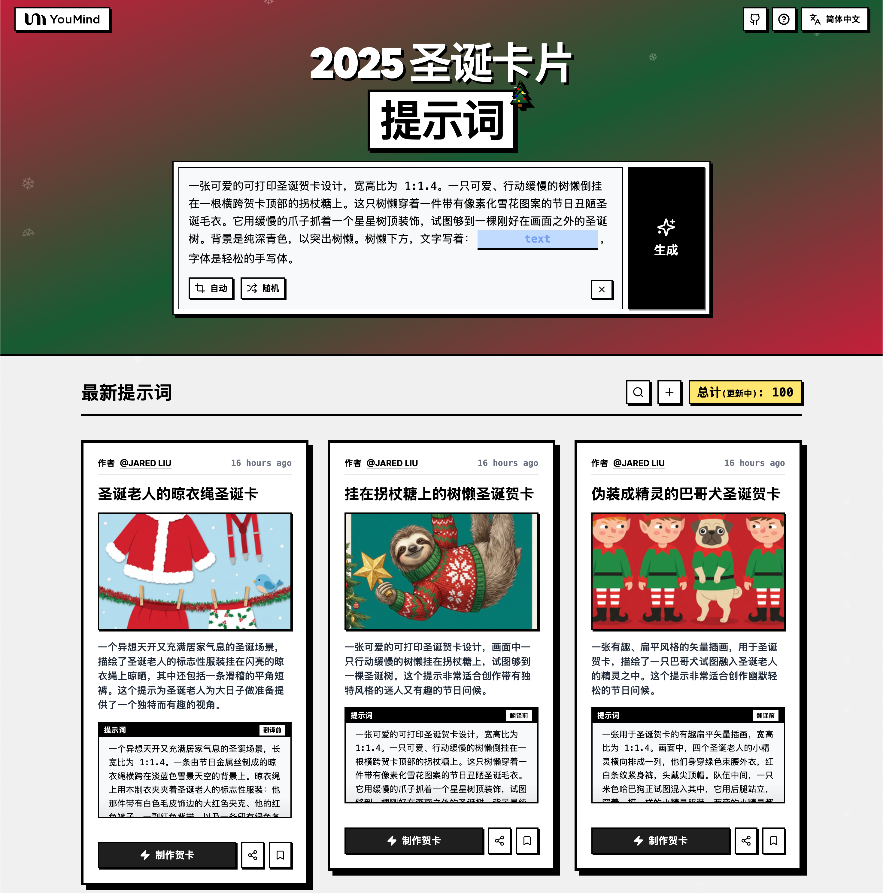

# 🚀 圣诞卡片提示词大全

[](https://github.com/sindresorhus/awesome)
[](https://github.com/YouMind-OpenLab/awesome-christmas-card-prompts)
[](https://creativecommons.org/licenses/by/4.0/)
[](https://github.com/YouMind-OpenLab/awesome-christmas-card-prompts/actions)
[](docs/CONTRIBUTING.md)

> 🎨 精选圣诞卡片提示词集合，使用 Nano Banana Pro 生成

> 💡 **Note**: gemini3Promo

> ⚠️ **版权声明**：所有提示词均收集自社区，仅供教育目的使用。如果您认为任何内容侵犯了您的权利，请[提交 issue](https://github.com/YouMind-OpenLab/awesome-christmas-card-prompts/issues/new?template=bug-report.yml)，我们将立即移除。

---

[](README.md) [](README_zh.md) [](README_zh-TW.md) [](README_ja-JP.md) [](README_ko-KR.md) [](README_th-TH.md) [](README_vi-VN.md) [](README_hi-IN.md) [](README_es-ES.md) [-Click%20to%20View-lightgrey)](README_es-419.md) [](README_de-DE.md) [](README_fr-FR.md) [](README_it-IT.md) [-Click%20to%20View-lightgrey)](README_pt-BR.md) [](README_pt-PT.md) [](README_tr-TR.md)

---

## 🌐 在网页图库中查看

<div align="center">



</div>

**[👉 浏览 YouMind 圣诞卡片提示词图库](https://youmind.com/tools/christmas-cards-maker)**

为什么使用图库？

| Feature | GitHub README | youmind.com 图库 |
|---------|--------------|---------------------|
| 🎨 可视化布局 | 线性列表 | 精美的瀑布流网格 |
| 🔍 搜索 | 仅 Ctrl+F | 全文搜索和筛选 |
| 🤖 AI 一键生图 | - | AI 一键生图 |
| 📱 移动端 | 基础 | 完全响应式 |

---

## 📖 目录

- [🌐 在网页图库中查看](#-view-in-web-gallery)
- [🤔 什么是圣诞卡片制作器？](#-what-is-christmas-cards-maker)
- [📊 统计数据](#-statistics)
- [🔥 精选提示词](#-featured-prompts)
- [📋 所有提示词](#-all-prompts)
- [🤝 如何贡献](#-how-to-contribute)
- [📄 许可证](#-license)
- [🙏 致谢](#-acknowledgements)
- [⭐ Star 历史](#-star-history)

---

## 🤔 什么是圣诞卡片制作器？

**圣诞卡片制作器** 是一款由 Google Nano Banana Pro 驱动的创意工具，用于生成精美的圣诞卡片：

- 🎯 **AI 智能生成** - 简单提示词即可创建精美卡片
- 🎨 **多样风格** - 从传统到现代，卡通到写实
- ⚡ **个性化祝福** - 添加您自己的问候和祝福
- 🌈 **高品质输出** - 可打印级别分辨率
- 🔧 **快速创建** - 几秒内生成卡片
- 📐 **多种主题** - 圣诞老人、雪花、圣诞树等

📚 learnMore

### 🚀 Raycast 集成

部分提示词支持使用 [Raycast Snippets](https://raycast.com/help/snippets) 语法的**动态参数**。寻找 🚀 Raycast Friendly 徽章！

**示例：**
```
A quote card with "{argument name="quote" default="Stay hungry, stay foolish"}"
by {argument name="author" default="Steve Jobs"}
```

在 Raycast 中使用时，您可以动态替换参数以快速迭代！

---

## 📊 统计数据

<div align="center">

| 指标 | 数量 |
|--------|-------|
| 📝 提示词总数 | **140** |
| ⭐ 精选 | **6** |
| 🔄 最后更新 | **2026年4月28日星期二 UTC 02:42:19** |

</div>

---

## 🔥 精选提示词

> ⭐ 由我们的团队精心挑选，具有卓越的质量和创造力

### No. 1: 挂在拐杖糖上的树懒圣诞贺卡


#### 📖 描述

一张可爱的可打印圣诞贺卡设计，画面中一只行动缓慢的树懒挂在拐杖糖上，试图够到一棵圣诞树。这个提示非常适合创作带有独特风格的迷人又有趣的节日问候。

#### 📝 提示词

```
一张可爱的可打印圣诞贺卡设计，宽高比为 1:1.4。一只可爱、行动缓慢的树懒倒挂在一根横跨贺卡顶部的拐杖糖上。这只树懒穿着一件带有像素化雪花图案的节日丑陋圣诞毛衣。它用缓慢的爪子抓着一个星星树顶装饰，试图够到一棵刚好在画面之外的圣诞树。背景是纯深青色，以突出树懒。树懒下方，文字写着：{argument name="text" default="Slowly getting into the Spirit"}，字体是轻松的手写体。
```

#### 🖼️ 生成图片

##### Image 1

<div align="center">

</div>

#### 📌 详情

- **作者:** [Jared Liu](https://x.com/jaredliu_bravo)
- **来源:** [Twitter Post](null)
- **发布时间:** 2025年12月13日
- **多语言:** en

**[👉 立即尝试 →](https://youmind.com/tools/christmas-cards-maker?prompt=%E4%B8%80%E5%BC%A0%E5%8F%AF%E7%88%B1%E7%9A%84%E5%8F%AF%E6%89%93%E5%8D%B0%E5%9C%A3%E8%AF%9E%E8%B4%BA%E5%8D%A1%E8%AE%BE%E8%AE%A1%EF%BC%8C%E5%AE%BD%E9%AB%98%E6%AF%94%E4%B8%BA%201%3A1.4%E3%80%82%E4%B8%80%E5%8F%AA%E5%8F%AF%E7%88%B1%E3%80%81%E8%A1%8C%E5%8A%A8%E7%BC%93%E6%85%A2%E7%9A%84%E6%A0%91%E6%87%92%E5%80%92%E6%8C%82%E5%9C%A8%E4%B8%80%E6%A0%B9%E6%A8%AA%E8%B7%A8%E8%B4%BA%E5%8D%A1%E9%A1%B6%E9%83%A8%E7%9A%84%E6%8B%90%E6%9D%96%E7%B3%96%E4%B8%8A%E3%80%82%E8%BF%99%E5%8F%AA%E6%A0%91%E6%87%92%E7%A9%BF%E7%9D%80%E4%B8%80%E4%BB%B6%E5%B8%A6%E6%9C%89%E5%83%8F%E7%B4%A0%E5%8C%96%E9%9B%AA%E8%8A%B1%E5%9B%BE%E6%A1%88%E7%9A%84%E8%8A%82%E6%97%A5%E4%B8%91%E9%99%8B%E5%9C%A3%E8%AF%9E%E6%AF%9B%E8%A1%A3%E3%80%82%E5%AE%83%E7%94%A8%E7%BC%93%E6%85%A2%E7%9A%84%E7%88%AA%E5%AD%90%E6%8A%93%E7%9D%80%E4%B8%80%E4%B8%AA%E6%98%9F%E6%98%9F%E6%A0%91%E9%A1%B6%E8%A3%85%E9%A5%B0%EF%BC%8C%E8%AF%95%E5%9B%BE%E5%A4%9F%E5%88%B0%E4%B8%80%E6%A3%B5%E5%88%9A%E5%A5%BD%E5%9C%A8%E7%94%BB%E9%9D%A2%E4%B9%8B%E5%A4%96%E7%9A%84%E5%9C%A3%E8%AF%9E%E6%A0%91%E3%80%82%E8%83%8C%E6%99%AF%E6%98%AF%E7%BA%AF%E6%B7%B1%E9%9D%92%E8%89%B2%EF%BC%8C%E4%BB%A5%E7%AA%81%E5%87%BA%E6%A0%91%E6%87%92%E3%80%82%E6%A0%91%E6%87%92%E4%B8%8B%E6%96%B9%EF%BC%8C%E6%96%87%E5%AD%97%E5%86%99%E7%9D%80%EF%BC%9A%7Bargument%20name%3D%22text%22%20default%3D%22Slowly%20getting%20into%20the%20Spirit%22%7D%EF%BC%8C%E5%AD%97%E4%BD%93%E6%98%AF%E8%BD%BB%E6%9D%BE%E7%9A%84%E6%89%8B%E5%86%99%E4%BD%93%E3%80%82)**

---

### No. 2: 北极熊和企鹅围巾圣诞贺卡


#### 📖 描述

一张温馨又充满奇思妙想的圣诞贺卡封面，描绘了一只巨大的北极熊和一只小小的企鹅之间不可思议的友谊，它们被一条滑稽地超大围巾连接在一起。非常适合在节日期间传达友谊和温暖的主题。

#### 📝 提示词

```
一张温馨而奇特的圣诞贺卡封面，比例为 1:1.4。一只巨大、毛茸茸的白色北极熊坐在左侧，一只小巧圆润的企鹅站在右侧，背景是干净的冰蓝色。它们被一条滑稽的超长红绿针织围巾连接起来，围巾在北极熊的脖子上缠绕了好几圈，然后向下环绕，紧紧地裹住小企鹅。企鹅仰视着北极熊，眼神中充满钦佩。毛皮和针织羊毛的质感清晰可见，柔软舒适。简单的白色雪花轻轻地飘落在它们周围。没有文字，只有一幅甜蜜的友谊画面。
```

#### 🖼️ 生成图片

##### Image 1

<div align="center">

</div>

#### 📌 详情

- **作者:** [Jared Liu](https://x.com/jaredliu_bravo)
- **来源:** [Twitter Post](null)
- **发布时间:** 2025年12月13日
- **多语言:** en

**[👉 立即尝试 →](https://youmind.com/tools/christmas-cards-maker?prompt=%E4%B8%80%E5%BC%A0%E6%B8%A9%E9%A6%A8%E8%80%8C%E5%A5%87%E7%89%B9%E7%9A%84%E5%9C%A3%E8%AF%9E%E8%B4%BA%E5%8D%A1%E5%B0%81%E9%9D%A2%EF%BC%8C%E6%AF%94%E4%BE%8B%E4%B8%BA%201%3A1.4%E3%80%82%E4%B8%80%E5%8F%AA%E5%B7%A8%E5%A4%A7%E3%80%81%E6%AF%9B%E8%8C%B8%E8%8C%B8%E7%9A%84%E7%99%BD%E8%89%B2%E5%8C%97%E6%9E%81%E7%86%8A%E5%9D%90%E5%9C%A8%E5%B7%A6%E4%BE%A7%EF%BC%8C%E4%B8%80%E5%8F%AA%E5%B0%8F%E5%B7%A7%E5%9C%86%E6%B6%A6%E7%9A%84%E4%BC%81%E9%B9%85%E7%AB%99%E5%9C%A8%E5%8F%B3%E4%BE%A7%EF%BC%8C%E8%83%8C%E6%99%AF%E6%98%AF%E5%B9%B2%E5%87%80%E7%9A%84%E5%86%B0%E8%93%9D%E8%89%B2%E3%80%82%E5%AE%83%E4%BB%AC%E8%A2%AB%E4%B8%80%E6%9D%A1%E6%BB%91%E7%A8%BD%E7%9A%84%E8%B6%85%E9%95%BF%E7%BA%A2%E7%BB%BF%E9%92%88%E7%BB%87%E5%9B%B4%E5%B7%BE%E8%BF%9E%E6%8E%A5%E8%B5%B7%E6%9D%A5%EF%BC%8C%E5%9B%B4%E5%B7%BE%E5%9C%A8%E5%8C%97%E6%9E%81%E7%86%8A%E7%9A%84%E8%84%96%E5%AD%90%E4%B8%8A%E7%BC%A0%E7%BB%95%E4%BA%86%E5%A5%BD%E5%87%A0%E5%9C%88%EF%BC%8C%E7%84%B6%E5%90%8E%E5%90%91%E4%B8%8B%E7%8E%AF%E7%BB%95%EF%BC%8C%E7%B4%A7%E7%B4%A7%E5%9C%B0%E8%A3%B9%E4%BD%8F%E5%B0%8F%E4%BC%81%E9%B9%85%E3%80%82%E4%BC%81%E9%B9%85%E4%BB%B0%E8%A7%86%E7%9D%80%E5%8C%97%E6%9E%81%E7%86%8A%EF%BC%8C%E7%9C%BC%E7%A5%9E%E4%B8%AD%E5%85%85%E6%BB%A1%E9%92%A6%E4%BD%A9%E3%80%82%E6%AF%9B%E7%9A%AE%E5%92%8C%E9%92%88%E7%BB%87%E7%BE%8A%E6%AF%9B%E7%9A%84%E8%B4%A8%E6%84%9F%E6%B8%85%E6%99%B0%E5%8F%AF%E8%A7%81%EF%BC%8C%E6%9F%94%E8%BD%AF%E8%88%92%E9%80%82%E3%80%82%E7%AE%80%E5%8D%95%E7%9A%84%E7%99%BD%E8%89%B2%E9%9B%AA%E8%8A%B1%E8%BD%BB%E8%BD%BB%E5%9C%B0%E9%A3%98%E8%90%BD%E5%9C%A8%E5%AE%83%E4%BB%AC%E5%91%A8%E5%9B%B4%E3%80%82%E6%B2%A1%E6%9C%89%E6%96%87%E5%AD%97%EF%BC%8C%E5%8F%AA%E6%9C%89%E4%B8%80%E5%B9%85%E7%94%9C%E8%9C%9C%E7%9A%84%E5%8F%8B%E8%B0%8A%E7%94%BB%E9%9D%A2%E3%80%82)**

---

### No. 3: 姜饼瑜伽课圣诞贺卡


#### 📖 描述

一张活泼可爱的可打印圣诞贺卡设计，上面有五个正在上“瑜伽课”的可爱姜饼人饼干。这个提示非常适合制作充满幽默感和可爱气息的暖心节日问候。

#### 📝 提示词

```
一个有趣又可爱的可打印圣诞贺卡设计，长宽比为 1:1.4。背景是纯色、干净的柔和薄荷绿色。插图描绘了五个可爱的姜饼小人饼干在上“瑜伽课”。中间的姜饼小人单腿站立，摆出“树式”姿势，头上平衡着一颗软糖，表情专注。在他的左边，另一个饼干正在尝试“下犬式”姿势，但他的手臂稍微碎裂，露出了美味的饼干屑。右边，一个姜饼小人闭着糖霜眼睛，以“莲花坐”姿势冥想。它们都有白色的糖霜细节和红色的肉桂糖纽扣。风格是简洁、扁平的矢量插图，带有柔和的阴影。顶部的文字是：{argument name="text" default="Find Your Inner Piece"}，采用俏皮的圆形白色字体。
```

#### 🖼️ 生成图片

##### Image 1

<div align="center">

</div>

#### 📌 详情

- **作者:** [Jared Liu](https://x.com/jaredliu_bravo)
- **来源:** [Twitter Post](null)
- **发布时间:** 2025年12月13日
- **多语言:** en

**[👉 立即尝试 →](https://youmind.com/tools/christmas-cards-maker?prompt=%E4%B8%80%E4%B8%AA%E6%9C%89%E8%B6%A3%E5%8F%88%E5%8F%AF%E7%88%B1%E7%9A%84%E5%8F%AF%E6%89%93%E5%8D%B0%E5%9C%A3%E8%AF%9E%E8%B4%BA%E5%8D%A1%E8%AE%BE%E8%AE%A1%EF%BC%8C%E9%95%BF%E5%AE%BD%E6%AF%94%E4%B8%BA%201%3A1.4%E3%80%82%E8%83%8C%E6%99%AF%E6%98%AF%E7%BA%AF%E8%89%B2%E3%80%81%E5%B9%B2%E5%87%80%E7%9A%84%E6%9F%94%E5%92%8C%E8%96%84%E8%8D%B7%E7%BB%BF%E8%89%B2%E3%80%82%E6%8F%92%E5%9B%BE%E6%8F%8F%E7%BB%98%E4%BA%86%E4%BA%94%E4%B8%AA%E5%8F%AF%E7%88%B1%E7%9A%84%E5%A7%9C%E9%A5%BC%E5%B0%8F%E4%BA%BA%E9%A5%BC%E5%B9%B2%E5%9C%A8%E4%B8%8A%E2%80%9C%E7%91%9C%E4%BC%BD%E8%AF%BE%E2%80%9D%E3%80%82%E4%B8%AD%E9%97%B4%E7%9A%84%E5%A7%9C%E9%A5%BC%E5%B0%8F%E4%BA%BA%E5%8D%95%E8%85%BF%E7%AB%99%E7%AB%8B%EF%BC%8C%E6%91%86%E5%87%BA%E2%80%9C%E6%A0%91%E5%BC%8F%E2%80%9D%E5%A7%BF%E5%8A%BF%EF%BC%8C%E5%A4%B4%E4%B8%8A%E5%B9%B3%E8%A1%A1%E7%9D%80%E4%B8%80%E9%A2%97%E8%BD%AF%E7%B3%96%EF%BC%8C%E8%A1%A8%E6%83%85%E4%B8%93%E6%B3%A8%E3%80%82%E5%9C%A8%E4%BB%96%E7%9A%84%E5%B7%A6%E8%BE%B9%EF%BC%8C%E5%8F%A6%E4%B8%80%E4%B8%AA%E9%A5%BC%E5%B9%B2%E6%AD%A3%E5%9C%A8%E5%B0%9D%E8%AF%95%E2%80%9C%E4%B8%8B%E7%8A%AC%E5%BC%8F%E2%80%9D%E5%A7%BF%E5%8A%BF%EF%BC%8C%E4%BD%86%E4%BB%96%E7%9A%84%E6%89%8B%E8%87%82%E7%A8%8D%E5%BE%AE%E7%A2%8E%E8%A3%82%EF%BC%8C%E9%9C%B2%E5%87%BA%E4%BA%86%E7%BE%8E%E5%91%B3%E7%9A%84%E9%A5%BC%E5%B9%B2%E5%B1%91%E3%80%82%E5%8F%B3%E8%BE%B9%EF%BC%8C%E4%B8%80%E4%B8%AA%E5%A7%9C%E9%A5%BC%E5%B0%8F%E4%BA%BA%E9%97%AD%E7%9D%80%E7%B3%96%E9%9C%9C%E7%9C%BC%E7%9D%9B%EF%BC%8C%E4%BB%A5%E2%80%9C%E8%8E%B2%E8%8A%B1%E5%9D%90%E2%80%9D%E5%A7%BF%E5%8A%BF%E5%86%A5%E6%83%B3%E3%80%82%E5%AE%83%E4%BB%AC%E9%83%BD%E6%9C%89%E7%99%BD%E8%89%B2%E7%9A%84%E7%B3%96%E9%9C%9C%E7%BB%86%E8%8A%82%E5%92%8C%E7%BA%A2%E8%89%B2%E7%9A%84%E8%82%89%E6%A1%82%E7%B3%96%E7%BA%BD%E6%89%A3%E3%80%82%E9%A3%8E%E6%A0%BC%E6%98%AF%E7%AE%80%E6%B4%81%E3%80%81%E6%89%81%E5%B9%B3%E7%9A%84%E7%9F%A2%E9%87%8F%E6%8F%92%E5%9B%BE%EF%BC%8C%E5%B8%A6%E6%9C%89%E6%9F%94%E5%92%8C%E7%9A%84%E9%98%B4%E5%BD%B1%E3%80%82%E9%A1%B6%E9%83%A8%E7%9A%84%E6%96%87%E5%AD%97%E6%98%AF%EF%BC%9A%7Bargument%20name%3D%22text%22%20default%3D%22Find%20Your%20Inner%20Piece%22%7D%EF%BC%8C%E9%87%87%E7%94%A8%E4%BF%8F%E7%9A%AE%E7%9A%84%E5%9C%86%E5%BD%A2%E7%99%BD%E8%89%B2%E5%AD%97%E4%BD%93%E3%80%82)**

---

### No. 4: 毛毡贴花小狐狸


#### 📖 描述

这个提示能生成一张温馨、触感十足的圣诞贺卡设计，看起来就像手工制作的毛毡贴花缝线，描绘了一只可爱的小狐狸在雪景中。非常适合制作独特且富有创意的节日视觉效果。

#### 📝 提示词

```
一张温馨、有触感的圣诞贺卡设计，长宽比为 1:1.4。插画看起来完全像是手工制作的毛毡贴花缝制而成。一只可爱的橙色小狐狸幼崽，由毛茸茸的毛毡布制成，坐在一层层白色毛毡雪中，抬头望着一棵用彩色纽扣装饰的毛毡圣诞树。羊毛纤维的质感和边缘的缝线清晰可见。背景是柔和的蓝色毛毡天空。
```

#### 🖼️ 生成图片

##### Image 1

<div align="center">

</div>

#### 📌 详情

- **作者:** [Jared Liu](https://x.com/jaredliu_bravo)
- **来源:** [Twitter Post](null)
- **发布时间:** 2025年12月15日
- **多语言:** en

**[👉 立即尝试 →](https://youmind.com/tools/christmas-cards-maker?prompt=%E4%B8%80%E5%BC%A0%E6%B8%A9%E9%A6%A8%E3%80%81%E6%9C%89%E8%A7%A6%E6%84%9F%E7%9A%84%E5%9C%A3%E8%AF%9E%E8%B4%BA%E5%8D%A1%E8%AE%BE%E8%AE%A1%EF%BC%8C%E9%95%BF%E5%AE%BD%E6%AF%94%E4%B8%BA%201%3A1.4%E3%80%82%E6%8F%92%E7%94%BB%E7%9C%8B%E8%B5%B7%E6%9D%A5%E5%AE%8C%E5%85%A8%E5%83%8F%E6%98%AF%E6%89%8B%E5%B7%A5%E5%88%B6%E4%BD%9C%E7%9A%84%E6%AF%9B%E6%AF%A1%E8%B4%B4%E8%8A%B1%E7%BC%9D%E5%88%B6%E8%80%8C%E6%88%90%E3%80%82%E4%B8%80%E5%8F%AA%E5%8F%AF%E7%88%B1%E7%9A%84%E6%A9%99%E8%89%B2%E5%B0%8F%E7%8B%90%E7%8B%B8%E5%B9%BC%E5%B4%BD%EF%BC%8C%E7%94%B1%E6%AF%9B%E8%8C%B8%E8%8C%B8%E7%9A%84%E6%AF%9B%E6%AF%A1%E5%B8%83%E5%88%B6%E6%88%90%EF%BC%8C%E5%9D%90%E5%9C%A8%E4%B8%80%E5%B1%82%E5%B1%82%E7%99%BD%E8%89%B2%E6%AF%9B%E6%AF%A1%E9%9B%AA%E4%B8%AD%EF%BC%8C%E6%8A%AC%E5%A4%B4%E6%9C%9B%E7%9D%80%E4%B8%80%E6%A3%B5%E7%94%A8%E5%BD%A9%E8%89%B2%E7%BA%BD%E6%89%A3%E8%A3%85%E9%A5%B0%E7%9A%84%E6%AF%9B%E6%AF%A1%E5%9C%A3%E8%AF%9E%E6%A0%91%E3%80%82%E7%BE%8A%E6%AF%9B%E7%BA%A4%E7%BB%B4%E7%9A%84%E8%B4%A8%E6%84%9F%E5%92%8C%E8%BE%B9%E7%BC%98%E7%9A%84%E7%BC%9D%E7%BA%BF%E6%B8%85%E6%99%B0%E5%8F%AF%E8%A7%81%E3%80%82%E8%83%8C%E6%99%AF%E6%98%AF%E6%9F%94%E5%92%8C%E7%9A%84%E8%93%9D%E8%89%B2%E6%AF%9B%E6%AF%A1%E5%A4%A9%E7%A9%BA%E3%80%82)**

---

### No. 5: 戴着驯鹿角和滑稽鼻子的巴哥犬


#### 📖 描述

此提示可生成一张有趣又可爱的可打印卡片，上面是巴哥犬不情愿地戴着驯鹿角和发光的红色小丑鼻子的特写照片。非常适合幽默搞怪的节日问候。

#### 📝 提示词

```
一张有趣又可爱的可打印卡片，长宽比为 1:1.4。特写镜头拍摄了一只胖乎乎的哈巴狗的脸部肖像。它不情愿地戴着一个带有棕色毛毡驯鹿角的头带，鼻子上还戴着一个非常明亮、发光的红色小丑鼻子。这只哈巴狗表情严肃，略带评判性地直视镜头。背景是模糊的节日红色灯光。
```

#### 🖼️ 生成图片

##### Image 1

<div align="center">

</div>

#### 📌 详情

- **作者:** [Jared Liu](https://x.com/jaredliu_bravo)
- **来源:** [Twitter Post](null)
- **发布时间:** 2025年12月15日
- **多语言:** en

**[👉 立即尝试 →](https://youmind.com/tools/christmas-cards-maker?prompt=%E4%B8%80%E5%BC%A0%E6%9C%89%E8%B6%A3%E5%8F%88%E5%8F%AF%E7%88%B1%E7%9A%84%E5%8F%AF%E6%89%93%E5%8D%B0%E5%8D%A1%E7%89%87%EF%BC%8C%E9%95%BF%E5%AE%BD%E6%AF%94%E4%B8%BA%201%3A1.4%E3%80%82%E7%89%B9%E5%86%99%E9%95%9C%E5%A4%B4%E6%8B%8D%E6%91%84%E4%BA%86%E4%B8%80%E5%8F%AA%E8%83%96%E4%B9%8E%E4%B9%8E%E7%9A%84%E5%93%88%E5%B7%B4%E7%8B%97%E7%9A%84%E8%84%B8%E9%83%A8%E8%82%96%E5%83%8F%E3%80%82%E5%AE%83%E4%B8%8D%E6%83%85%E6%84%BF%E5%9C%B0%E6%88%B4%E7%9D%80%E4%B8%80%E4%B8%AA%E5%B8%A6%E6%9C%89%E6%A3%95%E8%89%B2%E6%AF%9B%E6%AF%A1%E9%A9%AF%E9%B9%BF%E8%A7%92%E7%9A%84%E5%A4%B4%E5%B8%A6%EF%BC%8C%E9%BC%BB%E5%AD%90%E4%B8%8A%E8%BF%98%E6%88%B4%E7%9D%80%E4%B8%80%E4%B8%AA%E9%9D%9E%E5%B8%B8%E6%98%8E%E4%BA%AE%E3%80%81%E5%8F%91%E5%85%89%E7%9A%84%E7%BA%A2%E8%89%B2%E5%B0%8F%E4%B8%91%E9%BC%BB%E5%AD%90%E3%80%82%E8%BF%99%E5%8F%AA%E5%93%88%E5%B7%B4%E7%8B%97%E8%A1%A8%E6%83%85%E4%B8%A5%E8%82%83%EF%BC%8C%E7%95%A5%E5%B8%A6%E8%AF%84%E5%88%A4%E6%80%A7%E5%9C%B0%E7%9B%B4%E8%A7%86%E9%95%9C%E5%A4%B4%E3%80%82%E8%83%8C%E6%99%AF%E6%98%AF%E6%A8%A1%E7%B3%8A%E7%9A%84%E8%8A%82%E6%97%A5%E7%BA%A2%E8%89%B2%E7%81%AF%E5%85%89%E3%80%82)**

---

### No. 6: 羊驼被礼物淹没了


#### 📖 描述

此提示可生成一张可爱又充满趣味的圣诞贺卡，卡片上有一只毛茸茸的羊驼，身上堆满了摇摇欲坠的圣诞礼物。非常适合用于幽默又迷人的节日问候。

#### 📝 提示词

```
一张可爱又有点混乱的圣诞贺卡，比例为 1:1.4。一只毛茸茸的白色羊驼站在纯薄荷绿的背景前。它的背上堆满了高得不可思议、摇摇欲坠的彩色圣诞礼物，礼物上的蝴蝶结也晃动不已。羊驼的表情既耐心又略显吃力，细长的腿在重压下微微颤抖。
```

#### 🖼️ 生成图片

##### Image 1

<div align="center">

</div>

#### 📌 详情

- **作者:** [Jared Liu](https://x.com/jaredliu_bravo)
- **来源:** [Twitter Post](null)
- **发布时间:** 2025年12月15日
- **多语言:** en

**[👉 立即尝试 →](https://youmind.com/tools/christmas-cards-maker?prompt=%E4%B8%80%E5%BC%A0%E5%8F%AF%E7%88%B1%E5%8F%88%E6%9C%89%E7%82%B9%E6%B7%B7%E4%B9%B1%E7%9A%84%E5%9C%A3%E8%AF%9E%E8%B4%BA%E5%8D%A1%EF%BC%8C%E6%AF%94%E4%BE%8B%E4%B8%BA%201%3A1.4%E3%80%82%E4%B8%80%E5%8F%AA%E6%AF%9B%E8%8C%B8%E8%8C%B8%E7%9A%84%E7%99%BD%E8%89%B2%E7%BE%8A%E9%A9%BC%E7%AB%99%E5%9C%A8%E7%BA%AF%E8%96%84%E8%8D%B7%E7%BB%BF%E7%9A%84%E8%83%8C%E6%99%AF%E5%89%8D%E3%80%82%E5%AE%83%E7%9A%84%E8%83%8C%E4%B8%8A%E5%A0%86%E6%BB%A1%E4%BA%86%E9%AB%98%E5%BE%97%E4%B8%8D%E5%8F%AF%E6%80%9D%E8%AE%AE%E3%80%81%E6%91%87%E6%91%87%E6%AC%B2%E5%9D%A0%E7%9A%84%E5%BD%A9%E8%89%B2%E5%9C%A3%E8%AF%9E%E7%A4%BC%E7%89%A9%EF%BC%8C%E7%A4%BC%E7%89%A9%E4%B8%8A%E7%9A%84%E8%9D%B4%E8%9D%B6%E7%BB%93%E4%B9%9F%E6%99%83%E5%8A%A8%E4%B8%8D%E5%B7%B2%E3%80%82%E7%BE%8A%E9%A9%BC%E7%9A%84%E8%A1%A8%E6%83%85%E6%97%A2%E8%80%90%E5%BF%83%E5%8F%88%E7%95%A5%E6%98%BE%E5%90%83%E5%8A%9B%EF%BC%8C%E7%BB%86%E9%95%BF%E7%9A%84%E8%85%BF%E5%9C%A8%E9%87%8D%E5%8E%8B%E4%B8%8B%E5%BE%AE%E5%BE%AE%E9%A2%A4%E6%8A%96%E3%80%82)**

---

## 📋 所有提示词

> 📝 按发布日期排序（最新优先）

### No. 1: 圣诞海狸 · 建造狂人框架


#### 📖 描述

此提示生成一个垂直 1:1.4 比例的俏皮动画风格圣诞相框。边框展示了卡通海狸们热情洋溢地建造和过度设计节日装饰品，它们神情夸张地认真，营造出一种幽默、适合打印的设计。

#### 📝 提示词

```
一个垂直的 1:1.4 可打印圣诞相框，以俏皮的动画风格绘制。

无背景，仅有相框。

一个空白照片占位符居中，比例为 1:1.4，宽度为 70%，完全干净。

边框展示了卡通海狸们正兴致勃勃地建造、敲打并过度设计节日装饰，表情夸张而严肃。

扁平化、幽默、针对打印优化，无文字。
```

#### 🖼️ 生成图片

##### Image 1

<div align="center">

</div>

#### 📌 详情

- **作者:** [Jared Liu](https://x.com/jaredliu_bravo)
- **来源:** [Twitter Post](null)
- **发布时间:** 2025年12月15日
- **多语言:** en

**[👉 立即尝试 →](https://youmind.com/tools/christmas-cards-maker?prompt=%E4%B8%80%E4%B8%AA%E5%9E%82%E7%9B%B4%E7%9A%84%201%3A1.4%20%E5%8F%AF%E6%89%93%E5%8D%B0%E5%9C%A3%E8%AF%9E%E7%9B%B8%E6%A1%86%EF%BC%8C%E4%BB%A5%E4%BF%8F%E7%9A%AE%E7%9A%84%E5%8A%A8%E7%94%BB%E9%A3%8E%E6%A0%BC%E7%BB%98%E5%88%B6%E3%80%82%0A%0A%E6%97%A0%E8%83%8C%E6%99%AF%EF%BC%8C%E4%BB%85%E6%9C%89%E7%9B%B8%E6%A1%86%E3%80%82%0A%0A%E4%B8%80%E4%B8%AA%E7%A9%BA%E7%99%BD%E7%85%A7%E7%89%87%E5%8D%A0%E4%BD%8D%E7%AC%A6%E5%B1%85%E4%B8%AD%EF%BC%8C%E6%AF%94%E4%BE%8B%E4%B8%BA%201%3A1.4%EF%BC%8C%E5%AE%BD%E5%BA%A6%E4%B8%BA%2070%25%EF%BC%8C%E5%AE%8C%E5%85%A8%E5%B9%B2%E5%87%80%E3%80%82%0A%0A%E8%BE%B9%E6%A1%86%E5%B1%95%E7%A4%BA%E4%BA%86%E5%8D%A1%E9%80%9A%E6%B5%B7%E7%8B%B8%E4%BB%AC%E6%AD%A3%E5%85%B4%E8%87%B4%E5%8B%83%E5%8B%83%E5%9C%B0%E5%BB%BA%E9%80%A0%E3%80%81%E6%95%B2%E6%89%93%E5%B9%B6%E8%BF%87%E5%BA%A6%E8%AE%BE%E8%AE%A1%E8%8A%82%E6%97%A5%E8%A3%85%E9%A5%B0%EF%BC%8C%E8%A1%A8%E6%83%85%E5%A4%B8%E5%BC%A0%E8%80%8C%E4%B8%A5%E8%82%83%E3%80%82%0A%0A%E6%89%81%E5%B9%B3%E5%8C%96%E3%80%81%E5%B9%BD%E9%BB%98%E3%80%81%E9%92%88%E5%AF%B9%E6%89%93%E5%8D%B0%E4%BC%98%E5%8C%96%EF%BC%8C%E6%97%A0%E6%96%87%E5%AD%97%E3%80%82)**

---

### No. 2: 圣诞考拉 · 爱不释手相框


#### 📖 描述

此提示可创建一个垂直 1:1.4 比例的动画圣诞相框。边框上是卡通考拉抱着装饰品和花环不放，在可打印的设计中营造出一种温馨、舒适的幽默感。

#### 📝 提示词

```
一个可打印的动画圣诞相框，纵向 1:1.4 格式。

仅相框设计。

一个空白照片占位符，水平和垂直居中，1:1.4 宽高比，宽度为 70%，完全未触动。

边框上是卡通考拉抱着装饰品、花环和拐杖糖，不肯撒手，营造出一种温馨、舒适的幽默感。

扁平、温暖、可直接打印，无文字。
```

#### 🖼️ 生成图片

##### Image 1

<div align="center">

</div>

#### 📌 详情

- **作者:** [Jared Liu](https://x.com/jaredliu_bravo)
- **来源:** [Twitter Post](null)
- **发布时间:** 2025年12月15日
- **多语言:** en

**[👉 立即尝试 →](https://youmind.com/tools/christmas-cards-maker?prompt=%E4%B8%80%E4%B8%AA%E5%8F%AF%E6%89%93%E5%8D%B0%E7%9A%84%E5%8A%A8%E7%94%BB%E5%9C%A3%E8%AF%9E%E7%9B%B8%E6%A1%86%EF%BC%8C%E7%BA%B5%E5%90%91%201%3A1.4%20%E6%A0%BC%E5%BC%8F%E3%80%82%0A%0A%E4%BB%85%E7%9B%B8%E6%A1%86%E8%AE%BE%E8%AE%A1%E3%80%82%0A%0A%E4%B8%80%E4%B8%AA%E7%A9%BA%E7%99%BD%E7%85%A7%E7%89%87%E5%8D%A0%E4%BD%8D%E7%AC%A6%EF%BC%8C%E6%B0%B4%E5%B9%B3%E5%92%8C%E5%9E%82%E7%9B%B4%E5%B1%85%E4%B8%AD%EF%BC%8C1%3A1.4%20%E5%AE%BD%E9%AB%98%E6%AF%94%EF%BC%8C%E5%AE%BD%E5%BA%A6%E4%B8%BA%2070%25%EF%BC%8C%E5%AE%8C%E5%85%A8%E6%9C%AA%E8%A7%A6%E5%8A%A8%E3%80%82%0A%0A%E8%BE%B9%E6%A1%86%E4%B8%8A%E6%98%AF%E5%8D%A1%E9%80%9A%E8%80%83%E6%8B%89%E6%8A%B1%E7%9D%80%E8%A3%85%E9%A5%B0%E5%93%81%E3%80%81%E8%8A%B1%E7%8E%AF%E5%92%8C%E6%8B%90%E6%9D%96%E7%B3%96%EF%BC%8C%E4%B8%8D%E8%82%AF%E6%92%92%E6%89%8B%EF%BC%8C%E8%90%A5%E9%80%A0%E5%87%BA%E4%B8%80%E7%A7%8D%E6%B8%A9%E9%A6%A8%E3%80%81%E8%88%92%E9%80%82%E7%9A%84%E5%B9%BD%E9%BB%98%E6%84%9F%E3%80%82%0A%0A%E6%89%81%E5%B9%B3%E3%80%81%E6%B8%A9%E6%9A%96%E3%80%81%E5%8F%AF%E7%9B%B4%E6%8E%A5%E6%89%93%E5%8D%B0%EF%BC%8C%E6%97%A0%E6%96%87%E5%AD%97%E3%80%82)**

---

### No. 3: 圣诞刺猬 + 松鼠 · 联合灾难框架


#### 📖 描述

此提示词生成一个幽默的动画风格圣诞相框，比例为垂直 1:1.4。边框上，卡通刺猬和松鼠们正在争相收集装饰品，不小心在相框边缘制造了一片节日混乱。

#### 📝 提示词

```
一个垂直的 1:1.4 可打印圣诞相框，以幽默的动画风格绘制。

只有相框本身。

正中央空白照片占位符，比例 1:1.4，宽度 70%，干净且空置。

边框上，卡通刺猬和松鼠正在争相收集装饰品，不小心在边缘制造了节日混乱。

扁平构图，无文字。
```

#### 🖼️ 生成图片

##### Image 1

<div align="center">

</div>

#### 📌 详情

- **作者:** [Jared Liu](https://x.com/jaredliu_bravo)
- **来源:** [Twitter Post](null)
- **发布时间:** 2025年12月15日
- **多语言:** en

**[👉 立即尝试 →](https://youmind.com/tools/christmas-cards-maker?prompt=%E4%B8%80%E4%B8%AA%E5%9E%82%E7%9B%B4%E7%9A%84%201%3A1.4%20%E5%8F%AF%E6%89%93%E5%8D%B0%E5%9C%A3%E8%AF%9E%E7%9B%B8%E6%A1%86%EF%BC%8C%E4%BB%A5%E5%B9%BD%E9%BB%98%E7%9A%84%E5%8A%A8%E7%94%BB%E9%A3%8E%E6%A0%BC%E7%BB%98%E5%88%B6%E3%80%82%0A%0A%E5%8F%AA%E6%9C%89%E7%9B%B8%E6%A1%86%E6%9C%AC%E8%BA%AB%E3%80%82%0A%0A%E6%AD%A3%E4%B8%AD%E5%A4%AE%E7%A9%BA%E7%99%BD%E7%85%A7%E7%89%87%E5%8D%A0%E4%BD%8D%E7%AC%A6%EF%BC%8C%E6%AF%94%E4%BE%8B%201%3A1.4%EF%BC%8C%E5%AE%BD%E5%BA%A6%2070%25%EF%BC%8C%E5%B9%B2%E5%87%80%E4%B8%94%E7%A9%BA%E7%BD%AE%E3%80%82%0A%0A%E8%BE%B9%E6%A1%86%E4%B8%8A%EF%BC%8C%E5%8D%A1%E9%80%9A%E5%88%BA%E7%8C%AC%E5%92%8C%E6%9D%BE%E9%BC%A0%E6%AD%A3%E5%9C%A8%E4%BA%89%E7%9B%B8%E6%94%B6%E9%9B%86%E8%A3%85%E9%A5%B0%E5%93%81%EF%BC%8C%E4%B8%8D%E5%B0%8F%E5%BF%83%E5%9C%A8%E8%BE%B9%E7%BC%98%E5%88%B6%E9%80%A0%E4%BA%86%E8%8A%82%E6%97%A5%E6%B7%B7%E4%B9%B1%E3%80%82%0A%0A%E6%89%81%E5%B9%B3%E6%9E%84%E5%9B%BE%EF%BC%8C%E6%97%A0%E6%96%87%E5%AD%97%E3%80%82)**

---

### No. 4: 圣诞变色龙 · 伪装失败画框


#### 📖 描述

此提示词将创建一个幽默卡通风格的圣诞相框，比例为垂直 1:1.4。边框上，卡通变色龙未能成功融入装饰中，它们清晰可见且一脸困惑，为这个适合打印的设计增添了微妙的视觉幽默感。

#### 📝 提示词

```
一个可打印的圣诞相框，垂直 1:1.4 比例，幽默卡通风格。

仅相框插图。

居中空白照片占位符，1:1.4 比例，70% 宽度，未触及。

边框上画着卡通变色龙，它们笨拙地试图融入装饰品、彩灯和花环中，但却清晰可见，神情困惑，增添了微妙的视觉幽默感。

扁平化，便于打印，无文字。
```

#### 🖼️ 生成图片

##### Image 1

<div align="center">

</div>

#### 📌 详情

- **作者:** [Jared Liu](https://x.com/jaredliu_bravo)
- **来源:** [Twitter Post](null)
- **发布时间:** 2025年12月15日
- **多语言:** en

**[👉 立即尝试 →](https://youmind.com/tools/christmas-cards-maker?prompt=%E4%B8%80%E4%B8%AA%E5%8F%AF%E6%89%93%E5%8D%B0%E7%9A%84%E5%9C%A3%E8%AF%9E%E7%9B%B8%E6%A1%86%EF%BC%8C%E5%9E%82%E7%9B%B4%201%3A1.4%20%E6%AF%94%E4%BE%8B%EF%BC%8C%E5%B9%BD%E9%BB%98%E5%8D%A1%E9%80%9A%E9%A3%8E%E6%A0%BC%E3%80%82%0A%0A%E4%BB%85%E7%9B%B8%E6%A1%86%E6%8F%92%E5%9B%BE%E3%80%82%0A%0A%E5%B1%85%E4%B8%AD%E7%A9%BA%E7%99%BD%E7%85%A7%E7%89%87%E5%8D%A0%E4%BD%8D%E7%AC%A6%EF%BC%8C1%3A1.4%20%E6%AF%94%E4%BE%8B%EF%BC%8C70%25%20%E5%AE%BD%E5%BA%A6%EF%BC%8C%E6%9C%AA%E8%A7%A6%E5%8F%8A%E3%80%82%0A%0A%E8%BE%B9%E6%A1%86%E4%B8%8A%E7%94%BB%E7%9D%80%E5%8D%A1%E9%80%9A%E5%8F%98%E8%89%B2%E9%BE%99%EF%BC%8C%E5%AE%83%E4%BB%AC%E7%AC%A8%E6%8B%99%E5%9C%B0%E8%AF%95%E5%9B%BE%E8%9E%8D%E5%85%A5%E8%A3%85%E9%A5%B0%E5%93%81%E3%80%81%E5%BD%A9%E7%81%AF%E5%92%8C%E8%8A%B1%E7%8E%AF%E4%B8%AD%EF%BC%8C%E4%BD%86%E5%8D%B4%E6%B8%85%E6%99%B0%E5%8F%AF%E8%A7%81%EF%BC%8C%E7%A5%9E%E6%83%85%E5%9B%B0%E6%83%91%EF%BC%8C%E5%A2%9E%E6%B7%BB%E4%BA%86%E5%BE%AE%E5%A6%99%E7%9A%84%E8%A7%86%E8%A7%89%E5%B9%BD%E9%BB%98%E6%84%9F%E3%80%82%0A%0A%E6%89%81%E5%B9%B3%E5%8C%96%EF%BC%8C%E4%BE%BF%E4%BA%8E%E6%89%93%E5%8D%B0%EF%BC%8C%E6%97%A0%E6%96%87%E5%AD%97%E3%80%82)**

---

### No. 5: 圣诞猫头鹰 · 过于严肃的画框


#### 📖 描述

此提示将创建一个垂直 1:1.4 比例的动画故事书风格圣诞相框。边框上，卡通猫头鹰们怀疑地盯着凌乱的装饰品，用冷幽默评判着节日的混乱。

#### 📝 提示词

```
一个可打印的圣诞相框插画，垂直 1:1.4 比例，动画故事书风格。

仅相框构图。

居中空白照片占位符，1:1.4 比例，70% 宽度，未触及。

边框特色是戴着围巾和帽子的卡通猫头鹰，它们怀疑地盯着凌乱的装饰品，手持剪贴板，用冷幽默评判着节日的混乱。

扁平插画，无文字。
```

#### 🖼️ 生成图片

##### Image 1

<div align="center">

</div>

#### 📌 详情

- **作者:** [Jared Liu](https://x.com/jaredliu_bravo)
- **来源:** [Twitter Post](null)
- **发布时间:** 2025年12月15日
- **多语言:** en

**[👉 立即尝试 →](https://youmind.com/tools/christmas-cards-maker?prompt=%E4%B8%80%E4%B8%AA%E5%8F%AF%E6%89%93%E5%8D%B0%E7%9A%84%E5%9C%A3%E8%AF%9E%E7%9B%B8%E6%A1%86%E6%8F%92%E7%94%BB%EF%BC%8C%E5%9E%82%E7%9B%B4%201%3A1.4%20%E6%AF%94%E4%BE%8B%EF%BC%8C%E5%8A%A8%E7%94%BB%E6%95%85%E4%BA%8B%E4%B9%A6%E9%A3%8E%E6%A0%BC%E3%80%82%0A%0A%E4%BB%85%E7%9B%B8%E6%A1%86%E6%9E%84%E5%9B%BE%E3%80%82%0A%0A%E5%B1%85%E4%B8%AD%E7%A9%BA%E7%99%BD%E7%85%A7%E7%89%87%E5%8D%A0%E4%BD%8D%E7%AC%A6%EF%BC%8C1%3A1.4%20%E6%AF%94%E4%BE%8B%EF%BC%8C70%25%20%E5%AE%BD%E5%BA%A6%EF%BC%8C%E6%9C%AA%E8%A7%A6%E5%8F%8A%E3%80%82%0A%0A%E8%BE%B9%E6%A1%86%E7%89%B9%E8%89%B2%E6%98%AF%E6%88%B4%E7%9D%80%E5%9B%B4%E5%B7%BE%E5%92%8C%E5%B8%BD%E5%AD%90%E7%9A%84%E5%8D%A1%E9%80%9A%E7%8C%AB%E5%A4%B4%E9%B9%B0%EF%BC%8C%E5%AE%83%E4%BB%AC%E6%80%80%E7%96%91%E5%9C%B0%E7%9B%AF%E7%9D%80%E5%87%8C%E4%B9%B1%E7%9A%84%E8%A3%85%E9%A5%B0%E5%93%81%EF%BC%8C%E6%89%8B%E6%8C%81%E5%89%AA%E8%B4%B4%E6%9D%BF%EF%BC%8C%E7%94%A8%E5%86%B7%E5%B9%BD%E9%BB%98%E8%AF%84%E5%88%A4%E7%9D%80%E8%8A%82%E6%97%A5%E7%9A%84%E6%B7%B7%E4%B9%B1%E3%80%82%0A%0A%E6%89%81%E5%B9%B3%E6%8F%92%E7%94%BB%EF%BC%8C%E6%97%A0%E6%96%87%E5%AD%97%E3%80%82)**

---

### No. 6: 圣诞章鱼 · 八臂狂潮画框


#### 📖 描述

此提示生成一个幽默的卡通动画风格圣诞相框，采用垂直 1:1.4 比例。边框上有一只卡通章鱼，它用所有的触手进行装饰，营造出一种充满趣味的节日混乱感。

#### 📝 提示词

```
一个垂直的 1:1.4 可打印圣诞相框，以幽默的卡通动画风格呈现。

只有相框设计，没有环境。

一个空白照片占位符完美居中，比例为 1:1.4，宽度为 70%，完全空白。

边框上有一只卡通章鱼，用它所有的触手同时装饰着饰品、灯光、拐杖糖和星星，营造出一种有趣的节日混乱感。

扁平化、干净、可直接打印，无文字。
```

#### 🖼️ 生成图片

##### Image 1

<div align="center">

</div>

#### 📌 详情

- **作者:** [Jared Liu](https://x.com/jaredliu_bravo)
- **来源:** [Twitter Post](null)
- **发布时间:** 2025年12月15日
- **多语言:** en

**[👉 立即尝试 →](https://youmind.com/tools/christmas-cards-maker?prompt=%E4%B8%80%E4%B8%AA%E5%9E%82%E7%9B%B4%E7%9A%84%201%3A1.4%20%E5%8F%AF%E6%89%93%E5%8D%B0%E5%9C%A3%E8%AF%9E%E7%9B%B8%E6%A1%86%EF%BC%8C%E4%BB%A5%E5%B9%BD%E9%BB%98%E7%9A%84%E5%8D%A1%E9%80%9A%E5%8A%A8%E7%94%BB%E9%A3%8E%E6%A0%BC%E5%91%88%E7%8E%B0%E3%80%82%0A%0A%E5%8F%AA%E6%9C%89%E7%9B%B8%E6%A1%86%E8%AE%BE%E8%AE%A1%EF%BC%8C%E6%B2%A1%E6%9C%89%E7%8E%AF%E5%A2%83%E3%80%82%0A%0A%E4%B8%80%E4%B8%AA%E7%A9%BA%E7%99%BD%E7%85%A7%E7%89%87%E5%8D%A0%E4%BD%8D%E7%AC%A6%E5%AE%8C%E7%BE%8E%E5%B1%85%E4%B8%AD%EF%BC%8C%E6%AF%94%E4%BE%8B%E4%B8%BA%201%3A1.4%EF%BC%8C%E5%AE%BD%E5%BA%A6%E4%B8%BA%2070%25%EF%BC%8C%E5%AE%8C%E5%85%A8%E7%A9%BA%E7%99%BD%E3%80%82%0A%0A%E8%BE%B9%E6%A1%86%E4%B8%8A%E6%9C%89%E4%B8%80%E5%8F%AA%E5%8D%A1%E9%80%9A%E7%AB%A0%E9%B1%BC%EF%BC%8C%E7%94%A8%E5%AE%83%E6%89%80%E6%9C%89%E7%9A%84%E8%A7%A6%E6%89%8B%E5%90%8C%E6%97%B6%E8%A3%85%E9%A5%B0%E7%9D%80%E9%A5%B0%E5%93%81%E3%80%81%E7%81%AF%E5%85%89%E3%80%81%E6%8B%90%E6%9D%96%E7%B3%96%E5%92%8C%E6%98%9F%E6%98%9F%EF%BC%8C%E8%90%A5%E9%80%A0%E5%87%BA%E4%B8%80%E7%A7%8D%E6%9C%89%E8%B6%A3%E7%9A%84%E8%8A%82%E6%97%A5%E6%B7%B7%E4%B9%B1%E6%84%9F%E3%80%82%0A%0A%E6%89%81%E5%B9%B3%E5%8C%96%E3%80%81%E5%B9%B2%E5%87%80%E3%80%81%E5%8F%AF%E7%9B%B4%E6%8E%A5%E6%89%93%E5%8D%B0%EF%BC%8C%E6%97%A0%E6%96%87%E5%AD%97%E3%80%82)**

---

### No. 7: 圣诞兔子 · 超忙碌相框


#### 📖 描述

此提示以垂直 1:1.4 的格式创建了一个动画圣诞相框，其中充满了俏皮的混乱。边框展示了活泼的卡通兔子们手忙脚乱地包装礼物，被彩带绊倒，增添了生动幽默的色彩。

#### 📝 提示词

```
一个可打印的动画圣诞相框，纵向 1:1.4 比例。

仅相框插图。

居中空白照片占位符，水平 + 垂直居中，1:1.4 比例，70% 宽度，未触动。

边框上是充满活力的卡通兔子，它们手忙脚乱地包装礼物，被彩带绊倒，抛掷装饰品，在相框边缘四处奔忙。

活泼的混乱，扁平插图，无文字。
```

#### 🖼️ 生成图片

##### Image 1

<div align="center">

</div>

#### 📌 详情

- **作者:** [Jared Liu](https://x.com/jaredliu_bravo)
- **来源:** [Twitter Post](null)
- **发布时间:** 2025年12月15日
- **多语言:** en

**[👉 立即尝试 →](https://youmind.com/tools/christmas-cards-maker?prompt=%E4%B8%80%E4%B8%AA%E5%8F%AF%E6%89%93%E5%8D%B0%E7%9A%84%E5%8A%A8%E7%94%BB%E5%9C%A3%E8%AF%9E%E7%9B%B8%E6%A1%86%EF%BC%8C%E7%BA%B5%E5%90%91%201%3A1.4%20%E6%AF%94%E4%BE%8B%E3%80%82%0A%0A%E4%BB%85%E7%9B%B8%E6%A1%86%E6%8F%92%E5%9B%BE%E3%80%82%0A%0A%E5%B1%85%E4%B8%AD%E7%A9%BA%E7%99%BD%E7%85%A7%E7%89%87%E5%8D%A0%E4%BD%8D%E7%AC%A6%EF%BC%8C%E6%B0%B4%E5%B9%B3%20%2B%20%E5%9E%82%E7%9B%B4%E5%B1%85%E4%B8%AD%EF%BC%8C1%3A1.4%20%E6%AF%94%E4%BE%8B%EF%BC%8C70%25%20%E5%AE%BD%E5%BA%A6%EF%BC%8C%E6%9C%AA%E8%A7%A6%E5%8A%A8%E3%80%82%0A%0A%E8%BE%B9%E6%A1%86%E4%B8%8A%E6%98%AF%E5%85%85%E6%BB%A1%E6%B4%BB%E5%8A%9B%E7%9A%84%E5%8D%A1%E9%80%9A%E5%85%94%E5%AD%90%EF%BC%8C%E5%AE%83%E4%BB%AC%E6%89%8B%E5%BF%99%E8%84%9A%E4%B9%B1%E5%9C%B0%E5%8C%85%E8%A3%85%E7%A4%BC%E7%89%A9%EF%BC%8C%E8%A2%AB%E5%BD%A9%E5%B8%A6%E7%BB%8A%E5%80%92%EF%BC%8C%E6%8A%9B%E6%8E%B7%E8%A3%85%E9%A5%B0%E5%93%81%EF%BC%8C%E5%9C%A8%E7%9B%B8%E6%A1%86%E8%BE%B9%E7%BC%98%E5%9B%9B%E5%A4%84%E5%A5%94%E5%BF%99%E3%80%82%0A%0A%E6%B4%BB%E6%B3%BC%E7%9A%84%E6%B7%B7%E4%B9%B1%EF%BC%8C%E6%89%81%E5%B9%B3%E6%8F%92%E5%9B%BE%EF%BC%8C%E6%97%A0%E6%96%87%E5%AD%97%E3%80%82)**

---

### No. 8: 圣诞刺猬 · 装饰品收藏框


#### 📖 描述

此提示生成一个幽默的动画风格圣诞相框，采用垂直 1:1.4 比例。相框边框上，卡通刺猬不小心把装饰品和彩灯粘在它们的刺上，增添了可爱又夸张的视觉幽默感。

#### 📝 提示词

```
一个垂直的 1:1.4 可打印圣诞相框，以幽默的动画风格绘制。

无外部环境。

正中央空白照片占位符，比例 1:1.4，宽度占 70%，完全干净。

相框边框上画着卡通刺猬，它们不小心把装饰品、星星和彩灯收集到了自己的背上，表情可爱、夸张，显得惊讶又困惑。

扁平化，针对打印优化，无文字。
```

#### 🖼️ 生成图片

##### Image 1

<div align="center">

</div>

#### 📌 详情

- **作者:** [Jared Liu](https://x.com/jaredliu_bravo)
- **来源:** [Twitter Post](null)
- **发布时间:** 2025年12月15日
- **多语言:** en

**[👉 立即尝试 →](https://youmind.com/tools/christmas-cards-maker?prompt=%E4%B8%80%E4%B8%AA%E5%9E%82%E7%9B%B4%E7%9A%84%201%3A1.4%20%E5%8F%AF%E6%89%93%E5%8D%B0%E5%9C%A3%E8%AF%9E%E7%9B%B8%E6%A1%86%EF%BC%8C%E4%BB%A5%E5%B9%BD%E9%BB%98%E7%9A%84%E5%8A%A8%E7%94%BB%E9%A3%8E%E6%A0%BC%E7%BB%98%E5%88%B6%E3%80%82%0A%0A%E6%97%A0%E5%A4%96%E9%83%A8%E7%8E%AF%E5%A2%83%E3%80%82%0A%0A%E6%AD%A3%E4%B8%AD%E5%A4%AE%E7%A9%BA%E7%99%BD%E7%85%A7%E7%89%87%E5%8D%A0%E4%BD%8D%E7%AC%A6%EF%BC%8C%E6%AF%94%E4%BE%8B%201%3A1.4%EF%BC%8C%E5%AE%BD%E5%BA%A6%E5%8D%A0%2070%25%EF%BC%8C%E5%AE%8C%E5%85%A8%E5%B9%B2%E5%87%80%E3%80%82%0A%0A%E7%9B%B8%E6%A1%86%E8%BE%B9%E6%A1%86%E4%B8%8A%E7%94%BB%E7%9D%80%E5%8D%A1%E9%80%9A%E5%88%BA%E7%8C%AC%EF%BC%8C%E5%AE%83%E4%BB%AC%E4%B8%8D%E5%B0%8F%E5%BF%83%E6%8A%8A%E8%A3%85%E9%A5%B0%E5%93%81%E3%80%81%E6%98%9F%E6%98%9F%E5%92%8C%E5%BD%A9%E7%81%AF%E6%94%B6%E9%9B%86%E5%88%B0%E4%BA%86%E8%87%AA%E5%B7%B1%E7%9A%84%E8%83%8C%E4%B8%8A%EF%BC%8C%E8%A1%A8%E6%83%85%E5%8F%AF%E7%88%B1%E3%80%81%E5%A4%B8%E5%BC%A0%EF%BC%8C%E6%98%BE%E5%BE%97%E6%83%8A%E8%AE%B6%E5%8F%88%E5%9B%B0%E6%83%91%E3%80%82%0A%0A%E6%89%81%E5%B9%B3%E5%8C%96%EF%BC%8C%E9%92%88%E5%AF%B9%E6%89%93%E5%8D%B0%E4%BC%98%E5%8C%96%EF%BC%8C%E6%97%A0%E6%96%87%E5%AD%97%E3%80%82)**

---

### No. 9: 圣诞熊猫 · 悠闲假日相框


#### 📖 描述

此提示生成一个柔和动画故事书风格的圣诞相框，采用垂直 1:1.4 比例。边框上是悠闲的卡通熊猫，它们或躺在装饰品上，或抱着拐杖糖，营造出一种温馨而有趣的氛围。

#### 📝 提示词

```
一个可打印的圣诞相框插画，垂直方向，比例为 1:1.4，采用柔和的动画故事书风格绘制。

仅包含相框构图。

一个垂直方向的空白照片占位符居中，宽高比为 1:1.4，宽度占 70%，完全空白。

边框上是慵懒的卡通熊猫，它们或躺在装饰品上，或抱着拐杖糖，半睡半醒地置身于节日装饰中，带着一丝温和的幽默感。

扁平化插画，暖色调，无文字。
```

#### 🖼️ 生成图片

##### Image 1

<div align="center">

</div>

#### 📌 详情

- **作者:** [Jared Liu](https://x.com/jaredliu_bravo)
- **来源:** [Twitter Post](null)
- **发布时间:** 2025年12月15日
- **多语言:** en

**[👉 立即尝试 →](https://youmind.com/tools/christmas-cards-maker?prompt=%E4%B8%80%E4%B8%AA%E5%8F%AF%E6%89%93%E5%8D%B0%E7%9A%84%E5%9C%A3%E8%AF%9E%E7%9B%B8%E6%A1%86%E6%8F%92%E7%94%BB%EF%BC%8C%E5%9E%82%E7%9B%B4%E6%96%B9%E5%90%91%EF%BC%8C%E6%AF%94%E4%BE%8B%E4%B8%BA%201%3A1.4%EF%BC%8C%E9%87%87%E7%94%A8%E6%9F%94%E5%92%8C%E7%9A%84%E5%8A%A8%E7%94%BB%E6%95%85%E4%BA%8B%E4%B9%A6%E9%A3%8E%E6%A0%BC%E7%BB%98%E5%88%B6%E3%80%82%0A%0A%E4%BB%85%E5%8C%85%E5%90%AB%E7%9B%B8%E6%A1%86%E6%9E%84%E5%9B%BE%E3%80%82%0A%0A%E4%B8%80%E4%B8%AA%E5%9E%82%E7%9B%B4%E6%96%B9%E5%90%91%E7%9A%84%E7%A9%BA%E7%99%BD%E7%85%A7%E7%89%87%E5%8D%A0%E4%BD%8D%E7%AC%A6%E5%B1%85%E4%B8%AD%EF%BC%8C%E5%AE%BD%E9%AB%98%E6%AF%94%E4%B8%BA%201%3A1.4%EF%BC%8C%E5%AE%BD%E5%BA%A6%E5%8D%A0%2070%25%EF%BC%8C%E5%AE%8C%E5%85%A8%E7%A9%BA%E7%99%BD%E3%80%82%0A%0A%E8%BE%B9%E6%A1%86%E4%B8%8A%E6%98%AF%E6%85%B5%E6%87%92%E7%9A%84%E5%8D%A1%E9%80%9A%E7%86%8A%E7%8C%AB%EF%BC%8C%E5%AE%83%E4%BB%AC%E6%88%96%E8%BA%BA%E5%9C%A8%E8%A3%85%E9%A5%B0%E5%93%81%E4%B8%8A%EF%BC%8C%E6%88%96%E6%8A%B1%E7%9D%80%E6%8B%90%E6%9D%96%E7%B3%96%EF%BC%8C%E5%8D%8A%E7%9D%A1%E5%8D%8A%E9%86%92%E5%9C%B0%E7%BD%AE%E8%BA%AB%E4%BA%8E%E8%8A%82%E6%97%A5%E8%A3%85%E9%A5%B0%E4%B8%AD%EF%BC%8C%E5%B8%A6%E7%9D%80%E4%B8%80%E4%B8%9D%E6%B8%A9%E5%92%8C%E7%9A%84%E5%B9%BD%E9%BB%98%E6%84%9F%E3%80%82%0A%0A%E6%89%81%E5%B9%B3%E5%8C%96%E6%8F%92%E7%94%BB%EF%BC%8C%E6%9A%96%E8%89%B2%E8%B0%83%EF%BC%8C%E6%97%A0%E6%96%87%E5%AD%97%E3%80%82)**

---

### No. 10: 圣诞海龟 · 慢悠悠相框


#### 📖 描述

此提示将创建一个垂直的 1:1.4 可打印圣诞相框，风格为平静而幽默的卡通。边框上是悠闲的卡通海龟，它们以夸张的慢速移动，为设计增添了一种温和、宁静的幽默感。

#### 📝 提示词

```
一个平静而幽默的卡通风格的垂直 1:1.4 可打印圣诞相框。

仅有相框插图，无背景场景。

一个空白照片占位符完美居中，比例为 1:1.4，宽度为 70%，未作任何改动。

边框装饰着戴围巾的悠闲卡通乌龟，它们平静地堆叠着饰品，伴着节日彩灯冥想，并以夸张的慢速移动。

扁平、平衡、便于打印，无文字。
```

#### 🖼️ 生成图片

##### Image 1

<div align="center">

</div>

#### 📌 详情

- **作者:** [Jared Liu](https://x.com/jaredliu_bravo)
- **来源:** [Twitter Post](null)
- **发布时间:** 2025年12月15日
- **多语言:** en

**[👉 立即尝试 →](https://youmind.com/tools/christmas-cards-maker?prompt=%E4%B8%80%E4%B8%AA%E5%B9%B3%E9%9D%99%E8%80%8C%E5%B9%BD%E9%BB%98%E7%9A%84%E5%8D%A1%E9%80%9A%E9%A3%8E%E6%A0%BC%E7%9A%84%E5%9E%82%E7%9B%B4%201%3A1.4%20%E5%8F%AF%E6%89%93%E5%8D%B0%E5%9C%A3%E8%AF%9E%E7%9B%B8%E6%A1%86%E3%80%82%0A%0A%E4%BB%85%E6%9C%89%E7%9B%B8%E6%A1%86%E6%8F%92%E5%9B%BE%EF%BC%8C%E6%97%A0%E8%83%8C%E6%99%AF%E5%9C%BA%E6%99%AF%E3%80%82%0A%0A%E4%B8%80%E4%B8%AA%E7%A9%BA%E7%99%BD%E7%85%A7%E7%89%87%E5%8D%A0%E4%BD%8D%E7%AC%A6%E5%AE%8C%E7%BE%8E%E5%B1%85%E4%B8%AD%EF%BC%8C%E6%AF%94%E4%BE%8B%E4%B8%BA%201%3A1.4%EF%BC%8C%E5%AE%BD%E5%BA%A6%E4%B8%BA%2070%25%EF%BC%8C%E6%9C%AA%E4%BD%9C%E4%BB%BB%E4%BD%95%E6%94%B9%E5%8A%A8%E3%80%82%0A%0A%E8%BE%B9%E6%A1%86%E8%A3%85%E9%A5%B0%E7%9D%80%E6%88%B4%E5%9B%B4%E5%B7%BE%E7%9A%84%E6%82%A0%E9%97%B2%E5%8D%A1%E9%80%9A%E4%B9%8C%E9%BE%9F%EF%BC%8C%E5%AE%83%E4%BB%AC%E5%B9%B3%E9%9D%99%E5%9C%B0%E5%A0%86%E5%8F%A0%E7%9D%80%E9%A5%B0%E5%93%81%EF%BC%8C%E4%BC%B4%E7%9D%80%E8%8A%82%E6%97%A5%E5%BD%A9%E7%81%AF%E5%86%A5%E6%83%B3%EF%BC%8C%E5%B9%B6%E4%BB%A5%E5%A4%B8%E5%BC%A0%E7%9A%84%E6%85%A2%E9%80%9F%E7%A7%BB%E5%8A%A8%E3%80%82%0A%0A%E6%89%81%E5%B9%B3%E3%80%81%E5%B9%B3%E8%A1%A1%E3%80%81%E4%BE%BF%E4%BA%8E%E6%89%93%E5%8D%B0%EF%BC%8C%E6%97%A0%E6%96%87%E5%AD%97%E3%80%82)**

---

### No. 11: 圣诞松鼠 · 囤积狂潮画框


#### 📖 描述

这个提示会生成一个幽默的动画圣诞相框，采用垂直 1:1.4 的比例。边框上是忙碌的卡通松鼠们，它们在囤积装饰品和塞满袜子，为这个适合打印的设计增添了温馨的幽默感。

#### 📝 提示词

```
一个可打印的圣诞相框插图，采用垂直 1:1.4 比例，以幽默的卡通风格绘制。

仅有相框设计，无背景环境。

居中放置空白照片占位符，水平和垂直居中，比例为 1:1.4，占相框宽度的 70%，完全留空。

边框上画着疯狂的卡通松鼠，它们正在囤积装饰品、塞满袜子、把坚果藏在小饰品里，并从装饰品后面紧张地偷看。

扁平插画风格，温馨幽默，无文字排版。
```

#### 🖼️ 生成图片

##### Image 1

<div align="center">

</div>

#### 📌 详情

- **作者:** [Jared Liu](https://x.com/jaredliu_bravo)
- **来源:** [Twitter Post](null)
- **发布时间:** 2025年12月15日
- **多语言:** en

**[👉 立即尝试 →](https://youmind.com/tools/christmas-cards-maker?prompt=%E4%B8%80%E4%B8%AA%E5%8F%AF%E6%89%93%E5%8D%B0%E7%9A%84%E5%9C%A3%E8%AF%9E%E7%9B%B8%E6%A1%86%E6%8F%92%E5%9B%BE%EF%BC%8C%E9%87%87%E7%94%A8%E5%9E%82%E7%9B%B4%201%3A1.4%20%E6%AF%94%E4%BE%8B%EF%BC%8C%E4%BB%A5%E5%B9%BD%E9%BB%98%E7%9A%84%E5%8D%A1%E9%80%9A%E9%A3%8E%E6%A0%BC%E7%BB%98%E5%88%B6%E3%80%82%0A%0A%E4%BB%85%E6%9C%89%E7%9B%B8%E6%A1%86%E8%AE%BE%E8%AE%A1%EF%BC%8C%E6%97%A0%E8%83%8C%E6%99%AF%E7%8E%AF%E5%A2%83%E3%80%82%0A%0A%E5%B1%85%E4%B8%AD%E6%94%BE%E7%BD%AE%E7%A9%BA%E7%99%BD%E7%85%A7%E7%89%87%E5%8D%A0%E4%BD%8D%E7%AC%A6%EF%BC%8C%E6%B0%B4%E5%B9%B3%E5%92%8C%E5%9E%82%E7%9B%B4%E5%B1%85%E4%B8%AD%EF%BC%8C%E6%AF%94%E4%BE%8B%E4%B8%BA%201%3A1.4%EF%BC%8C%E5%8D%A0%E7%9B%B8%E6%A1%86%E5%AE%BD%E5%BA%A6%E7%9A%84%2070%25%EF%BC%8C%E5%AE%8C%E5%85%A8%E7%95%99%E7%A9%BA%E3%80%82%0A%0A%E8%BE%B9%E6%A1%86%E4%B8%8A%E7%94%BB%E7%9D%80%E7%96%AF%E7%8B%82%E7%9A%84%E5%8D%A1%E9%80%9A%E6%9D%BE%E9%BC%A0%EF%BC%8C%E5%AE%83%E4%BB%AC%E6%AD%A3%E5%9C%A8%E5%9B%A4%E7%A7%AF%E8%A3%85%E9%A5%B0%E5%93%81%E3%80%81%E5%A1%9E%E6%BB%A1%E8%A2%9C%E5%AD%90%E3%80%81%E6%8A%8A%E5%9D%9A%E6%9E%9C%E8%97%8F%E5%9C%A8%E5%B0%8F%E9%A5%B0%E5%93%81%E9%87%8C%EF%BC%8C%E5%B9%B6%E4%BB%8E%E8%A3%85%E9%A5%B0%E5%93%81%E5%90%8E%E9%9D%A2%E7%B4%A7%E5%BC%A0%E5%9C%B0%E5%81%B7%E7%9C%8B%E3%80%82%0A%0A%E6%89%81%E5%B9%B3%E6%8F%92%E7%94%BB%E9%A3%8E%E6%A0%BC%EF%BC%8C%E6%B8%A9%E9%A6%A8%E5%B9%BD%E9%BB%98%EF%BC%8C%E6%97%A0%E6%96%87%E5%AD%97%E6%8E%92%E7%89%88%E3%80%82)**

---

### No. 12: 圣诞猴子 · 恶作剧相框


#### 📖 描述

此提示可生成一个垂直的 1:1.4 可打印动画圣诞相框，充满俏皮的卡通活力。边框上，顽皮的猴子在花环上荡秋千并偷星星，以活泼的动画风格呈现。

#### 📝 提示词

```
一个垂直的 1:1.4 可打印动画圣诞相框，充满俏皮的卡通活力。

无环境，仅相框本身。

一个大的空白照片占位符，水平和垂直居中，比例为 1:1.4，宽度为 70%，完全空白。

相框边框上，顽皮的卡通猴子们在花环上荡秋千、偷星星、倒挂着，并做出滑稽的表情，以生动的动画风格呈现。

扁平、平衡、可打印，无文字。
```

#### 🖼️ 生成图片

##### Image 1

<div align="center">

</div>

#### 📌 详情

- **作者:** [Jared Liu](https://x.com/jaredliu_bravo)
- **来源:** [Twitter Post](null)
- **发布时间:** 2025年12月15日
- **多语言:** en

**[👉 立即尝试 →](https://youmind.com/tools/christmas-cards-maker?prompt=%E4%B8%80%E4%B8%AA%E5%9E%82%E7%9B%B4%E7%9A%84%201%3A1.4%20%E5%8F%AF%E6%89%93%E5%8D%B0%E5%8A%A8%E7%94%BB%E5%9C%A3%E8%AF%9E%E7%9B%B8%E6%A1%86%EF%BC%8C%E5%85%85%E6%BB%A1%E4%BF%8F%E7%9A%AE%E7%9A%84%E5%8D%A1%E9%80%9A%E6%B4%BB%E5%8A%9B%E3%80%82%0A%0A%E6%97%A0%E7%8E%AF%E5%A2%83%EF%BC%8C%E4%BB%85%E7%9B%B8%E6%A1%86%E6%9C%AC%E8%BA%AB%E3%80%82%0A%0A%E4%B8%80%E4%B8%AA%E5%A4%A7%E7%9A%84%E7%A9%BA%E7%99%BD%E7%85%A7%E7%89%87%E5%8D%A0%E4%BD%8D%E7%AC%A6%EF%BC%8C%E6%B0%B4%E5%B9%B3%E5%92%8C%E5%9E%82%E7%9B%B4%E5%B1%85%E4%B8%AD%EF%BC%8C%E6%AF%94%E4%BE%8B%E4%B8%BA%201%3A1.4%EF%BC%8C%E5%AE%BD%E5%BA%A6%E4%B8%BA%2070%25%EF%BC%8C%E5%AE%8C%E5%85%A8%E7%A9%BA%E7%99%BD%E3%80%82%0A%0A%E7%9B%B8%E6%A1%86%E8%BE%B9%E6%A1%86%E4%B8%8A%EF%BC%8C%E9%A1%BD%E7%9A%AE%E7%9A%84%E5%8D%A1%E9%80%9A%E7%8C%B4%E5%AD%90%E4%BB%AC%E5%9C%A8%E8%8A%B1%E7%8E%AF%E4%B8%8A%E8%8D%A1%E7%A7%8B%E5%8D%83%E3%80%81%E5%81%B7%E6%98%9F%E6%98%9F%E3%80%81%E5%80%92%E6%8C%82%E7%9D%80%EF%BC%8C%E5%B9%B6%E5%81%9A%E5%87%BA%E6%BB%91%E7%A8%BD%E7%9A%84%E8%A1%A8%E6%83%85%EF%BC%8C%E4%BB%A5%E7%94%9F%E5%8A%A8%E7%9A%84%E5%8A%A8%E7%94%BB%E9%A3%8E%E6%A0%BC%E5%91%88%E7%8E%B0%E3%80%82%0A%0A%E6%89%81%E5%B9%B3%E3%80%81%E5%B9%B3%E8%A1%A1%E3%80%81%E5%8F%AF%E6%89%93%E5%8D%B0%EF%BC%8C%E6%97%A0%E6%96%87%E5%AD%97%E3%80%82)**

---

### No. 13: 慢动作蜗牛 · 圣诞相框


#### 📖 描述

这个提示会创建一个幽默的动画儿童绘本风格圣诞相框，其中有缓慢移动的卡通蜗牛拖着装饰品，留下闪闪发光的痕迹。这是一个垂直的 1:1.4 宽高比，只专注于相框设计。

#### 📝 提示词

```
一张可打印的圣诞相框插画，采用垂直 1:1.4 的长宽比，以幽默的动画儿童读物风格绘制。

插画只聚焦于相框设计。

在正中央，包含一个空白的照片占位区域，水平和垂直居中，长宽比为 1:1.4，占总宽度的 70%，完全干净。

边框上，卡通蜗牛戴着小小的圣诞帽，拖着装饰品，留下闪闪发光的痕迹，以一种荒谬的悠闲速度攀爬着节日装饰。

扁平插画，温馨幽默，无文字。
```

#### 🖼️ 生成图片

##### Image 1

<div align="center">

</div>

#### 📌 详情

- **作者:** [Jared Liu](https://x.com/jaredliu_bravo)
- **来源:** [Twitter Post](null)
- **发布时间:** 2025年12月15日
- **多语言:** en

**[👉 立即尝试 →](https://youmind.com/tools/christmas-cards-maker?prompt=%E4%B8%80%E5%BC%A0%E5%8F%AF%E6%89%93%E5%8D%B0%E7%9A%84%E5%9C%A3%E8%AF%9E%E7%9B%B8%E6%A1%86%E6%8F%92%E7%94%BB%EF%BC%8C%E9%87%87%E7%94%A8%E5%9E%82%E7%9B%B4%201%3A1.4%20%E7%9A%84%E9%95%BF%E5%AE%BD%E6%AF%94%EF%BC%8C%E4%BB%A5%E5%B9%BD%E9%BB%98%E7%9A%84%E5%8A%A8%E7%94%BB%E5%84%BF%E7%AB%A5%E8%AF%BB%E7%89%A9%E9%A3%8E%E6%A0%BC%E7%BB%98%E5%88%B6%E3%80%82%0A%0A%E6%8F%92%E7%94%BB%E5%8F%AA%E8%81%9A%E7%84%A6%E4%BA%8E%E7%9B%B8%E6%A1%86%E8%AE%BE%E8%AE%A1%E3%80%82%0A%0A%E5%9C%A8%E6%AD%A3%E4%B8%AD%E5%A4%AE%EF%BC%8C%E5%8C%85%E5%90%AB%E4%B8%80%E4%B8%AA%E7%A9%BA%E7%99%BD%E7%9A%84%E7%85%A7%E7%89%87%E5%8D%A0%E4%BD%8D%E5%8C%BA%E5%9F%9F%EF%BC%8C%E6%B0%B4%E5%B9%B3%E5%92%8C%E5%9E%82%E7%9B%B4%E5%B1%85%E4%B8%AD%EF%BC%8C%E9%95%BF%E5%AE%BD%E6%AF%94%E4%B8%BA%201%3A1.4%EF%BC%8C%E5%8D%A0%E6%80%BB%E5%AE%BD%E5%BA%A6%E7%9A%84%2070%25%EF%BC%8C%E5%AE%8C%E5%85%A8%E5%B9%B2%E5%87%80%E3%80%82%0A%0A%E8%BE%B9%E6%A1%86%E4%B8%8A%EF%BC%8C%E5%8D%A1%E9%80%9A%E8%9C%97%E7%89%9B%E6%88%B4%E7%9D%80%E5%B0%8F%E5%B0%8F%E7%9A%84%E5%9C%A3%E8%AF%9E%E5%B8%BD%EF%BC%8C%E6%8B%96%E7%9D%80%E8%A3%85%E9%A5%B0%E5%93%81%EF%BC%8C%E7%95%99%E4%B8%8B%E9%97%AA%E9%97%AA%E5%8F%91%E5%85%89%E7%9A%84%E7%97%95%E8%BF%B9%EF%BC%8C%E4%BB%A5%E4%B8%80%E7%A7%8D%E8%8D%92%E8%B0%AC%E7%9A%84%E6%82%A0%E9%97%B2%E9%80%9F%E5%BA%A6%E6%94%80%E7%88%AC%E7%9D%80%E8%8A%82%E6%97%A5%E8%A3%85%E9%A5%B0%E3%80%82%0A%0A%E6%89%81%E5%B9%B3%E6%8F%92%E7%94%BB%EF%BC%8C%E6%B8%A9%E9%A6%A8%E5%B9%BD%E9%BB%98%EF%BC%8C%E6%97%A0%E6%96%87%E5%AD%97%E3%80%82)**

---

### No. 14: 圣诞狗狗 · 失控相框


#### 📖 描述

此提示可生成一个幽默的、垂直的 1:1.4 可打印圣诞相框，采用卡通动画风格。相框边框上布满了兴奋的卡通狗，它们缠绕在彩灯中，打翻了装饰品，营造出欢快、充满活力的场景。

#### 📝 提示词

```
一个垂直的、比例为 1:1.4 的可打印圣诞相框，采用幽默的卡通动画风格绘制。

设计中只显示相框本身，没有背景环境。

相框正中央预留了一个空白照片占位符，比例为 1:1.4，宽度为相框的 70%，完全空白且清晰可见。

相框边框上画满了兴奋的卡通狗，它们缠绕在圣诞彩灯中，追逐着装饰品，打翻了摆设，并穿着夸张的超大节日毛衣，姿态滑稽。

画面欢快、充满活力、扁平化，并针对打印进行了优化，无文字。
```

#### 🖼️ 生成图片

##### Image 1

<div align="center">

</div>

#### 📌 详情

- **作者:** [Jared Liu](https://x.com/jaredliu_bravo)
- **来源:** [Twitter Post](null)
- **发布时间:** 2025年12月15日
- **多语言:** en

**[👉 立即尝试 →](https://youmind.com/tools/christmas-cards-maker?prompt=%E4%B8%80%E4%B8%AA%E5%9E%82%E7%9B%B4%E7%9A%84%E3%80%81%E6%AF%94%E4%BE%8B%E4%B8%BA%201%3A1.4%20%E7%9A%84%E5%8F%AF%E6%89%93%E5%8D%B0%E5%9C%A3%E8%AF%9E%E7%9B%B8%E6%A1%86%EF%BC%8C%E9%87%87%E7%94%A8%E5%B9%BD%E9%BB%98%E7%9A%84%E5%8D%A1%E9%80%9A%E5%8A%A8%E7%94%BB%E9%A3%8E%E6%A0%BC%E7%BB%98%E5%88%B6%E3%80%82%0A%0A%E8%AE%BE%E8%AE%A1%E4%B8%AD%E5%8F%AA%E6%98%BE%E7%A4%BA%E7%9B%B8%E6%A1%86%E6%9C%AC%E8%BA%AB%EF%BC%8C%E6%B2%A1%E6%9C%89%E8%83%8C%E6%99%AF%E7%8E%AF%E5%A2%83%E3%80%82%0A%0A%E7%9B%B8%E6%A1%86%E6%AD%A3%E4%B8%AD%E5%A4%AE%E9%A2%84%E7%95%99%E4%BA%86%E4%B8%80%E4%B8%AA%E7%A9%BA%E7%99%BD%E7%85%A7%E7%89%87%E5%8D%A0%E4%BD%8D%E7%AC%A6%EF%BC%8C%E6%AF%94%E4%BE%8B%E4%B8%BA%201%3A1.4%EF%BC%8C%E5%AE%BD%E5%BA%A6%E4%B8%BA%E7%9B%B8%E6%A1%86%E7%9A%84%2070%25%EF%BC%8C%E5%AE%8C%E5%85%A8%E7%A9%BA%E7%99%BD%E4%B8%94%E6%B8%85%E6%99%B0%E5%8F%AF%E8%A7%81%E3%80%82%0A%0A%E7%9B%B8%E6%A1%86%E8%BE%B9%E6%A1%86%E4%B8%8A%E7%94%BB%E6%BB%A1%E4%BA%86%E5%85%B4%E5%A5%8B%E7%9A%84%E5%8D%A1%E9%80%9A%E7%8B%97%EF%BC%8C%E5%AE%83%E4%BB%AC%E7%BC%A0%E7%BB%95%E5%9C%A8%E5%9C%A3%E8%AF%9E%E5%BD%A9%E7%81%AF%E4%B8%AD%EF%BC%8C%E8%BF%BD%E9%80%90%E7%9D%80%E8%A3%85%E9%A5%B0%E5%93%81%EF%BC%8C%E6%89%93%E7%BF%BB%E4%BA%86%E6%91%86%E8%AE%BE%EF%BC%8C%E5%B9%B6%E7%A9%BF%E7%9D%80%E5%A4%B8%E5%BC%A0%E7%9A%84%E8%B6%85%E5%A4%A7%E8%8A%82%E6%97%A5%E6%AF%9B%E8%A1%A3%EF%BC%8C%E5%A7%BF%E6%80%81%E6%BB%91%E7%A8%BD%E3%80%82%0A%0A%E7%94%BB%E9%9D%A2%E6%AC%A2%E5%BF%AB%E3%80%81%E5%85%85%E6%BB%A1%E6%B4%BB%E5%8A%9B%E3%80%81%E6%89%81%E5%B9%B3%E5%8C%96%EF%BC%8C%E5%B9%B6%E9%92%88%E5%AF%B9%E6%89%93%E5%8D%B0%E8%BF%9B%E8%A1%8C%E4%BA%86%E4%BC%98%E5%8C%96%EF%BC%8C%E6%97%A0%E6%96%87%E5%AD%97%E3%80%82)**

---

### No. 15: 圣诞浣熊 · 鬼祟盗窃画框


#### 📖 描述

此提示词生成一个可打印的圣诞相框插画，画面中顽皮的浣熊正在偷窃装饰品和拐杖糖，营造出一种俏皮、混乱的节日氛围。它被设计成一个独立的相框，宽高比为 1:1.4，适合高质量打印。

#### 📝 提示词

```
一个可打印的圣诞相框插画，专为独立相框设计，采用垂直 1:1.4 的长宽比，适合高质量打印。

插画只聚焦于相框本身，没有外部环境或背景场景。风格是幽默的动画故事书插画，线条清晰，纹理柔和。

在相框的正中央，预留一个空白照片占位区域，该区域水平和垂直居中，长宽比为 1:1.4 的肖像模式，宽度为相框总宽度的 70%，完全空白且未触及。

相框周围的边框上，顽皮的卡通浣熊正在偷窃装饰品、藏匿拐杖糖、从角落里偷看，以及倒挂在花环上，营造出一种玩味十足的混乱节日氛围。

构图扁平，颜色适合打印，无文字。
```

#### 🖼️ 生成图片

##### Image 1

<div align="center">

</div>

#### 📌 详情

- **作者:** [Jared Liu](https://x.com/jaredliu_bravo)
- **来源:** [Twitter Post](null)
- **发布时间:** 2025年12月15日
- **多语言:** en

**[👉 立即尝试 →](https://youmind.com/tools/christmas-cards-maker?prompt=%E4%B8%80%E4%B8%AA%E5%8F%AF%E6%89%93%E5%8D%B0%E7%9A%84%E5%9C%A3%E8%AF%9E%E7%9B%B8%E6%A1%86%E6%8F%92%E7%94%BB%EF%BC%8C%E4%B8%93%E4%B8%BA%E7%8B%AC%E7%AB%8B%E7%9B%B8%E6%A1%86%E8%AE%BE%E8%AE%A1%EF%BC%8C%E9%87%87%E7%94%A8%E5%9E%82%E7%9B%B4%201%3A1.4%20%E7%9A%84%E9%95%BF%E5%AE%BD%E6%AF%94%EF%BC%8C%E9%80%82%E5%90%88%E9%AB%98%E8%B4%A8%E9%87%8F%E6%89%93%E5%8D%B0%E3%80%82%0A%0A%E6%8F%92%E7%94%BB%E5%8F%AA%E8%81%9A%E7%84%A6%E4%BA%8E%E7%9B%B8%E6%A1%86%E6%9C%AC%E8%BA%AB%EF%BC%8C%E6%B2%A1%E6%9C%89%E5%A4%96%E9%83%A8%E7%8E%AF%E5%A2%83%E6%88%96%E8%83%8C%E6%99%AF%E5%9C%BA%E6%99%AF%E3%80%82%E9%A3%8E%E6%A0%BC%E6%98%AF%E5%B9%BD%E9%BB%98%E7%9A%84%E5%8A%A8%E7%94%BB%E6%95%85%E4%BA%8B%E4%B9%A6%E6%8F%92%E7%94%BB%EF%BC%8C%E7%BA%BF%E6%9D%A1%E6%B8%85%E6%99%B0%EF%BC%8C%E7%BA%B9%E7%90%86%E6%9F%94%E5%92%8C%E3%80%82%0A%0A%E5%9C%A8%E7%9B%B8%E6%A1%86%E7%9A%84%E6%AD%A3%E4%B8%AD%E5%A4%AE%EF%BC%8C%E9%A2%84%E7%95%99%E4%B8%80%E4%B8%AA%E7%A9%BA%E7%99%BD%E7%85%A7%E7%89%87%E5%8D%A0%E4%BD%8D%E5%8C%BA%E5%9F%9F%EF%BC%8C%E8%AF%A5%E5%8C%BA%E5%9F%9F%E6%B0%B4%E5%B9%B3%E5%92%8C%E5%9E%82%E7%9B%B4%E5%B1%85%E4%B8%AD%EF%BC%8C%E9%95%BF%E5%AE%BD%E6%AF%94%E4%B8%BA%201%3A1.4%20%E7%9A%84%E8%82%96%E5%83%8F%E6%A8%A1%E5%BC%8F%EF%BC%8C%E5%AE%BD%E5%BA%A6%E4%B8%BA%E7%9B%B8%E6%A1%86%E6%80%BB%E5%AE%BD%E5%BA%A6%E7%9A%84%2070%25%EF%BC%8C%E5%AE%8C%E5%85%A8%E7%A9%BA%E7%99%BD%E4%B8%94%E6%9C%AA%E8%A7%A6%E5%8F%8A%E3%80%82%0A%0A%E7%9B%B8%E6%A1%86%E5%91%A8%E5%9B%B4%E7%9A%84%E8%BE%B9%E6%A1%86%E4%B8%8A%EF%BC%8C%E9%A1%BD%E7%9A%AE%E7%9A%84%E5%8D%A1%E9%80%9A%E6%B5%A3%E7%86%8A%E6%AD%A3%E5%9C%A8%E5%81%B7%E7%AA%83%E8%A3%85%E9%A5%B0%E5%93%81%E3%80%81%E8%97%8F%E5%8C%BF%E6%8B%90%E6%9D%96%E7%B3%96%E3%80%81%E4%BB%8E%E8%A7%92%E8%90%BD%E9%87%8C%E5%81%B7%E7%9C%8B%EF%BC%8C%E4%BB%A5%E5%8F%8A%E5%80%92%E6%8C%82%E5%9C%A8%E8%8A%B1%E7%8E%AF%E4%B8%8A%EF%BC%8C%E8%90%A5%E9%80%A0%E5%87%BA%E4%B8%80%E7%A7%8D%E7%8E%A9%E5%91%B3%E5%8D%81%E8%B6%B3%E7%9A%84%E6%B7%B7%E4%B9%B1%E8%8A%82%E6%97%A5%E6%B0%9B%E5%9B%B4%E3%80%82%0A%0A%E6%9E%84%E5%9B%BE%E6%89%81%E5%B9%B3%EF%BC%8C%E9%A2%9C%E8%89%B2%E9%80%82%E5%90%88%E6%89%93%E5%8D%B0%EF%BC%8C%E6%97%A0%E6%96%87%E5%AD%97%E3%80%82)**

---

### No. 16: 笨拙企鹅儿童图书动画相框


#### 📖 描述

此提示将创建一个垂直的、可打印的圣诞相框，其插画风格为迷人、幽默的儿童读物动画，并以笨拙的企鹅为特色。设计完全聚焦于相框本身，带有一个空白的照片占位符，为打印提供了一个欢乐、有趣且充满活力的外观。

#### 📝 提示词

```
一个垂直的、比例为 1:1.4 的可打印圣诞相框，采用迷人、幽默的儿童读物动画风格绘制。

设计完全聚焦于相框本身，采用扁平插画，没有背景环境。

相框正中央预留了一个大的空白照片占位符，比例为 1:1.4 的肖像模式，宽度占相框的 70%，刻意留白并与所有装饰清晰分离。

周围的边框上，笨拙的卡通企鹅正在滑倒、堆叠装饰品、拿着超大的星星，并与边缘的节日元素俏皮互动。

整体风格欢快、有趣、生动，且便于打印，没有文字或字母。
```

#### 🖼️ 生成图片

##### Image 1

<div align="center">

</div>

#### 📌 详情

- **作者:** [Jared Liu](https://x.com/jaredliu_bravo)
- **来源:** [Twitter Post](null)
- **发布时间:** 2025年12月15日
- **多语言:** en

**[👉 立即尝试 →](https://youmind.com/tools/christmas-cards-maker?prompt=%E4%B8%80%E4%B8%AA%E5%9E%82%E7%9B%B4%E7%9A%84%E3%80%81%E6%AF%94%E4%BE%8B%E4%B8%BA%201%3A1.4%20%E7%9A%84%E5%8F%AF%E6%89%93%E5%8D%B0%E5%9C%A3%E8%AF%9E%E7%9B%B8%E6%A1%86%EF%BC%8C%E9%87%87%E7%94%A8%E8%BF%B7%E4%BA%BA%E3%80%81%E5%B9%BD%E9%BB%98%E7%9A%84%E5%84%BF%E7%AB%A5%E8%AF%BB%E7%89%A9%E5%8A%A8%E7%94%BB%E9%A3%8E%E6%A0%BC%E7%BB%98%E5%88%B6%E3%80%82%0A%0A%E8%AE%BE%E8%AE%A1%E5%AE%8C%E5%85%A8%E8%81%9A%E7%84%A6%E4%BA%8E%E7%9B%B8%E6%A1%86%E6%9C%AC%E8%BA%AB%EF%BC%8C%E9%87%87%E7%94%A8%E6%89%81%E5%B9%B3%E6%8F%92%E7%94%BB%EF%BC%8C%E6%B2%A1%E6%9C%89%E8%83%8C%E6%99%AF%E7%8E%AF%E5%A2%83%E3%80%82%0A%0A%E7%9B%B8%E6%A1%86%E6%AD%A3%E4%B8%AD%E5%A4%AE%E9%A2%84%E7%95%99%E4%BA%86%E4%B8%80%E4%B8%AA%E5%A4%A7%E7%9A%84%E7%A9%BA%E7%99%BD%E7%85%A7%E7%89%87%E5%8D%A0%E4%BD%8D%E7%AC%A6%EF%BC%8C%E6%AF%94%E4%BE%8B%E4%B8%BA%201%3A1.4%20%E7%9A%84%E8%82%96%E5%83%8F%E6%A8%A1%E5%BC%8F%EF%BC%8C%E5%AE%BD%E5%BA%A6%E5%8D%A0%E7%9B%B8%E6%A1%86%E7%9A%84%2070%25%EF%BC%8C%E5%88%BB%E6%84%8F%E7%95%99%E7%99%BD%E5%B9%B6%E4%B8%8E%E6%89%80%E6%9C%89%E8%A3%85%E9%A5%B0%E6%B8%85%E6%99%B0%E5%88%86%E7%A6%BB%E3%80%82%0A%0A%E5%91%A8%E5%9B%B4%E7%9A%84%E8%BE%B9%E6%A1%86%E4%B8%8A%EF%BC%8C%E7%AC%A8%E6%8B%99%E7%9A%84%E5%8D%A1%E9%80%9A%E4%BC%81%E9%B9%85%E6%AD%A3%E5%9C%A8%E6%BB%91%E5%80%92%E3%80%81%E5%A0%86%E5%8F%A0%E8%A3%85%E9%A5%B0%E5%93%81%E3%80%81%E6%8B%BF%E7%9D%80%E8%B6%85%E5%A4%A7%E7%9A%84%E6%98%9F%E6%98%9F%EF%BC%8C%E5%B9%B6%E4%B8%8E%E8%BE%B9%E7%BC%98%E7%9A%84%E8%8A%82%E6%97%A5%E5%85%83%E7%B4%A0%E4%BF%8F%E7%9A%AE%E4%BA%92%E5%8A%A8%E3%80%82%0A%0A%E6%95%B4%E4%BD%93%E9%A3%8E%E6%A0%BC%E6%AC%A2%E5%BF%AB%E3%80%81%E6%9C%89%E8%B6%A3%E3%80%81%E7%94%9F%E5%8A%A8%EF%BC%8C%E4%B8%94%E4%BE%BF%E4%BA%8E%E6%89%93%E5%8D%B0%EF%BC%8C%E6%B2%A1%E6%9C%89%E6%96%87%E5%AD%97%E6%88%96%E5%AD%97%E6%AF%8D%E3%80%82)**

---

### No. 17: 有趣的姜饼人动画插画相框


#### 📖 描述

此提示会创建一个可打印的圣诞照片边框插画，采用幽默的动画故事书风格，并配有滑稽的姜饼人角色。设计中只显示边框，留有空白的照片占位符，为打印提供了幽默、温馨且异想天开的美感。

#### 📝 提示词

```
一个可打印的圣诞相框插图，纵向比例为 1:1.4，采用幽默的动画故事书风格。

插图仅展示相框设计，不包含任何外部环境或背景。色彩温暖喜庆，带有柔和的纸张纹理。

在正中心，预留一个空白照片占位符，水平和垂直居中，保持 1:1.4 的宽高比，占总相框宽度的 70%，完全空白且无遮挡。

相框边框装饰着俏皮的姜饼角色，它们摆出滑稽的姿势，还有部分破损的饼干、糖霜细节和糖果装饰，所有这些都画有富有表现力的卡通面孔。

整体氛围幽默、温馨、异想天开，完全针对打印优化，不含任何文字排版。
```

#### 🖼️ 生成图片

##### Image 1

<div align="center">

</div>

#### 📌 详情

- **作者:** [Jared Liu](https://x.com/jaredliu_bravo)
- **来源:** [Twitter Post](null)
- **发布时间:** 2025年12月15日
- **多语言:** en

**[👉 立即尝试 →](https://youmind.com/tools/christmas-cards-maker?prompt=%E4%B8%80%E4%B8%AA%E5%8F%AF%E6%89%93%E5%8D%B0%E7%9A%84%E5%9C%A3%E8%AF%9E%E7%9B%B8%E6%A1%86%E6%8F%92%E5%9B%BE%EF%BC%8C%E7%BA%B5%E5%90%91%E6%AF%94%E4%BE%8B%E4%B8%BA%201%3A1.4%EF%BC%8C%E9%87%87%E7%94%A8%E5%B9%BD%E9%BB%98%E7%9A%84%E5%8A%A8%E7%94%BB%E6%95%85%E4%BA%8B%E4%B9%A6%E9%A3%8E%E6%A0%BC%E3%80%82%0A%0A%E6%8F%92%E5%9B%BE%E4%BB%85%E5%B1%95%E7%A4%BA%E7%9B%B8%E6%A1%86%E8%AE%BE%E8%AE%A1%EF%BC%8C%E4%B8%8D%E5%8C%85%E5%90%AB%E4%BB%BB%E4%BD%95%E5%A4%96%E9%83%A8%E7%8E%AF%E5%A2%83%E6%88%96%E8%83%8C%E6%99%AF%E3%80%82%E8%89%B2%E5%BD%A9%E6%B8%A9%E6%9A%96%E5%96%9C%E5%BA%86%EF%BC%8C%E5%B8%A6%E6%9C%89%E6%9F%94%E5%92%8C%E7%9A%84%E7%BA%B8%E5%BC%A0%E7%BA%B9%E7%90%86%E3%80%82%0A%0A%E5%9C%A8%E6%AD%A3%E4%B8%AD%E5%BF%83%EF%BC%8C%E9%A2%84%E7%95%99%E4%B8%80%E4%B8%AA%E7%A9%BA%E7%99%BD%E7%85%A7%E7%89%87%E5%8D%A0%E4%BD%8D%E7%AC%A6%EF%BC%8C%E6%B0%B4%E5%B9%B3%E5%92%8C%E5%9E%82%E7%9B%B4%E5%B1%85%E4%B8%AD%EF%BC%8C%E4%BF%9D%E6%8C%81%201%3A1.4%20%E7%9A%84%E5%AE%BD%E9%AB%98%E6%AF%94%EF%BC%8C%E5%8D%A0%E6%80%BB%E7%9B%B8%E6%A1%86%E5%AE%BD%E5%BA%A6%E7%9A%84%2070%25%EF%BC%8C%E5%AE%8C%E5%85%A8%E7%A9%BA%E7%99%BD%E4%B8%94%E6%97%A0%E9%81%AE%E6%8C%A1%E3%80%82%0A%0A%E7%9B%B8%E6%A1%86%E8%BE%B9%E6%A1%86%E8%A3%85%E9%A5%B0%E7%9D%80%E4%BF%8F%E7%9A%AE%E7%9A%84%E5%A7%9C%E9%A5%BC%E8%A7%92%E8%89%B2%EF%BC%8C%E5%AE%83%E4%BB%AC%E6%91%86%E5%87%BA%E6%BB%91%E7%A8%BD%E7%9A%84%E5%A7%BF%E5%8A%BF%EF%BC%8C%E8%BF%98%E6%9C%89%E9%83%A8%E5%88%86%E7%A0%B4%E6%8D%9F%E7%9A%84%E9%A5%BC%E5%B9%B2%E3%80%81%E7%B3%96%E9%9C%9C%E7%BB%86%E8%8A%82%E5%92%8C%E7%B3%96%E6%9E%9C%E8%A3%85%E9%A5%B0%EF%BC%8C%E6%89%80%E6%9C%89%E8%BF%99%E4%BA%9B%E9%83%BD%E7%94%BB%E6%9C%89%E5%AF%8C%E6%9C%89%E8%A1%A8%E7%8E%B0%E5%8A%9B%E7%9A%84%E5%8D%A1%E9%80%9A%E9%9D%A2%E5%AD%94%E3%80%82%0A%0A%E6%95%B4%E4%BD%93%E6%B0%9B%E5%9B%B4%E5%B9%BD%E9%BB%98%E3%80%81%E6%B8%A9%E9%A6%A8%E3%80%81%E5%BC%82%E6%83%B3%E5%A4%A9%E5%BC%80%EF%BC%8C%E5%AE%8C%E5%85%A8%E9%92%88%E5%AF%B9%E6%89%93%E5%8D%B0%E4%BC%98%E5%8C%96%EF%BC%8C%E4%B8%8D%E5%90%AB%E4%BB%BB%E4%BD%95%E6%96%87%E5%AD%97%E6%8E%92%E7%89%88%E3%80%82)**

---

### No. 18: 懒惰树懒风格动画圣诞相框


#### 📖 描述

此提示词可生成一张可打印的圣诞照片边框插画，风格为幽默的动画故事书，以慵懒的树懒为特色。它被设计成一个独立的相框，带有一个空白的照片占位符，非常适合高质量打印，并为节日照片增添轻松、温馨和幽默的氛围。

#### 📝 提示词

```
一个可打印的圣诞相框插画，专为独立相框设计，采用垂直 1:1.4 的宽高比，适合高质量打印。

插画仅聚焦于相框本身，没有外部环境或背景场景。风格是幽默的动画故事书插画，具有柔和的纹理、清晰的轮廓和温暖的色彩。

在相框的正中央，预留一个空白的照片占位区域，该区域水平和垂直居中。占位符采用 1:1.4 的纵向宽高比，其宽度等于相框总宽度的 70%，并且必须保持完全空白和未触动。

周围的相框边框上，有顽皮的卡通树懒挂在拐杖糖、常青树枝和节日挂钩上。树懒们穿着舒适的针织毛衣和围巾，摆出放松而有趣的姿势。

插画感觉轻松、舒适、幽默，构图扁平，色彩适合打印，没有文字或排版。
```

#### 🖼️ 生成图片

##### Image 1

<div align="center">

</div>

#### 📌 详情

- **作者:** [Jared Liu](https://x.com/jaredliu_bravo)
- **来源:** [Twitter Post](null)
- **发布时间:** 2025年12月15日
- **多语言:** en

**[👉 立即尝试 →](https://youmind.com/tools/christmas-cards-maker?prompt=%E4%B8%80%E4%B8%AA%E5%8F%AF%E6%89%93%E5%8D%B0%E7%9A%84%E5%9C%A3%E8%AF%9E%E7%9B%B8%E6%A1%86%E6%8F%92%E7%94%BB%EF%BC%8C%E4%B8%93%E4%B8%BA%E7%8B%AC%E7%AB%8B%E7%9B%B8%E6%A1%86%E8%AE%BE%E8%AE%A1%EF%BC%8C%E9%87%87%E7%94%A8%E5%9E%82%E7%9B%B4%201%3A1.4%20%E7%9A%84%E5%AE%BD%E9%AB%98%E6%AF%94%EF%BC%8C%E9%80%82%E5%90%88%E9%AB%98%E8%B4%A8%E9%87%8F%E6%89%93%E5%8D%B0%E3%80%82%0A%0A%E6%8F%92%E7%94%BB%E4%BB%85%E8%81%9A%E7%84%A6%E4%BA%8E%E7%9B%B8%E6%A1%86%E6%9C%AC%E8%BA%AB%EF%BC%8C%E6%B2%A1%E6%9C%89%E5%A4%96%E9%83%A8%E7%8E%AF%E5%A2%83%E6%88%96%E8%83%8C%E6%99%AF%E5%9C%BA%E6%99%AF%E3%80%82%E9%A3%8E%E6%A0%BC%E6%98%AF%E5%B9%BD%E9%BB%98%E7%9A%84%E5%8A%A8%E7%94%BB%E6%95%85%E4%BA%8B%E4%B9%A6%E6%8F%92%E7%94%BB%EF%BC%8C%E5%85%B7%E6%9C%89%E6%9F%94%E5%92%8C%E7%9A%84%E7%BA%B9%E7%90%86%E3%80%81%E6%B8%85%E6%99%B0%E7%9A%84%E8%BD%AE%E5%BB%93%E5%92%8C%E6%B8%A9%E6%9A%96%E7%9A%84%E8%89%B2%E5%BD%A9%E3%80%82%0A%0A%E5%9C%A8%E7%9B%B8%E6%A1%86%E7%9A%84%E6%AD%A3%E4%B8%AD%E5%A4%AE%EF%BC%8C%E9%A2%84%E7%95%99%E4%B8%80%E4%B8%AA%E7%A9%BA%E7%99%BD%E7%9A%84%E7%85%A7%E7%89%87%E5%8D%A0%E4%BD%8D%E5%8C%BA%E5%9F%9F%EF%BC%8C%E8%AF%A5%E5%8C%BA%E5%9F%9F%E6%B0%B4%E5%B9%B3%E5%92%8C%E5%9E%82%E7%9B%B4%E5%B1%85%E4%B8%AD%E3%80%82%E5%8D%A0%E4%BD%8D%E7%AC%A6%E9%87%87%E7%94%A8%201%3A1.4%20%E7%9A%84%E7%BA%B5%E5%90%91%E5%AE%BD%E9%AB%98%E6%AF%94%EF%BC%8C%E5%85%B6%E5%AE%BD%E5%BA%A6%E7%AD%89%E4%BA%8E%E7%9B%B8%E6%A1%86%E6%80%BB%E5%AE%BD%E5%BA%A6%E7%9A%84%2070%25%EF%BC%8C%E5%B9%B6%E4%B8%94%E5%BF%85%E9%A1%BB%E4%BF%9D%E6%8C%81%E5%AE%8C%E5%85%A8%E7%A9%BA%E7%99%BD%E5%92%8C%E6%9C%AA%E8%A7%A6%E5%8A%A8%E3%80%82%0A%0A%E5%91%A8%E5%9B%B4%E7%9A%84%E7%9B%B8%E6%A1%86%E8%BE%B9%E6%A1%86%E4%B8%8A%EF%BC%8C%E6%9C%89%E9%A1%BD%E7%9A%AE%E7%9A%84%E5%8D%A1%E9%80%9A%E6%A0%91%E6%87%92%E6%8C%82%E5%9C%A8%E6%8B%90%E6%9D%96%E7%B3%96%E3%80%81%E5%B8%B8%E9%9D%92%E6%A0%91%E6%9E%9D%E5%92%8C%E8%8A%82%E6%97%A5%E6%8C%82%E9%92%A9%E4%B8%8A%E3%80%82%E6%A0%91%E6%87%92%E4%BB%AC%E7%A9%BF%E7%9D%80%E8%88%92%E9%80%82%E7%9A%84%E9%92%88%E7%BB%87%E6%AF%9B%E8%A1%A3%E5%92%8C%E5%9B%B4%E5%B7%BE%EF%BC%8C%E6%91%86%E5%87%BA%E6%94%BE%E6%9D%BE%E8%80%8C%E6%9C%89%E8%B6%A3%E7%9A%84%E5%A7%BF%E5%8A%BF%E3%80%82%0A%0A%E6%8F%92%E7%94%BB%E6%84%9F%E8%A7%89%E8%BD%BB%E6%9D%BE%E3%80%81%E8%88%92%E9%80%82%E3%80%81%E5%B9%BD%E9%BB%98%EF%BC%8C%E6%9E%84%E5%9B%BE%E6%89%81%E5%B9%B3%EF%BC%8C%E8%89%B2%E5%BD%A9%E9%80%82%E5%90%88%E6%89%93%E5%8D%B0%EF%BC%8C%E6%B2%A1%E6%9C%89%E6%96%87%E5%AD%97%E6%88%96%E6%8E%92%E7%89%88%E3%80%82)**

---

### No. 19: 俏皮北极熊卡通圣诞相框


#### 📖 描述

此提示词可生成一个可打印的动画圣诞相框，其风格为幽默卡通，并以顽皮的北极熊为特色。它专为打印而设计，仅作为相框插图，带有一个空白照片占位符，为您的节日照片带来欢快、有趣和友好的美感。

#### 📝 提示词

```
一个可打印的动画圣诞相框，采用垂直 1:1.4 的宽高比，专为打印而设计的相框插图。

相框以幽默的卡通风格绘制，具有圆润的形状、富有表现力的角色和柔和的阴影。没有环境，没有背景场景，只有相框设计。

在水平和垂直方向的精确中心保留了一个空白照片占位符，宽高比为 1:1.4，宽度为相框宽度的 70%，完全空白且干净。

边框装饰着顽皮的北极熊，它们在相框边缘滑行、偷看和攀附，以一种滑稽、夸张的方式与拐杖糖、装饰品和雪球互动。

整体氛围欢快、有趣、友好，专为平面可打印插图优化，无文字。
```

#### 🖼️ 生成图片

##### Image 1

<div align="center">

</div>

#### 📌 详情

- **作者:** [Jared Liu](https://x.com/jaredliu_bravo)
- **来源:** [Twitter Post](null)
- **发布时间:** 2025年12月15日
- **多语言:** en

**[👉 立即尝试 →](https://youmind.com/tools/christmas-cards-maker?prompt=%E4%B8%80%E4%B8%AA%E5%8F%AF%E6%89%93%E5%8D%B0%E7%9A%84%E5%8A%A8%E7%94%BB%E5%9C%A3%E8%AF%9E%E7%9B%B8%E6%A1%86%EF%BC%8C%E9%87%87%E7%94%A8%E5%9E%82%E7%9B%B4%201%3A1.4%20%E7%9A%84%E5%AE%BD%E9%AB%98%E6%AF%94%EF%BC%8C%E4%B8%93%E4%B8%BA%E6%89%93%E5%8D%B0%E8%80%8C%E8%AE%BE%E8%AE%A1%E7%9A%84%E7%9B%B8%E6%A1%86%E6%8F%92%E5%9B%BE%E3%80%82%0A%0A%E7%9B%B8%E6%A1%86%E4%BB%A5%E5%B9%BD%E9%BB%98%E7%9A%84%E5%8D%A1%E9%80%9A%E9%A3%8E%E6%A0%BC%E7%BB%98%E5%88%B6%EF%BC%8C%E5%85%B7%E6%9C%89%E5%9C%86%E6%B6%A6%E7%9A%84%E5%BD%A2%E7%8A%B6%E3%80%81%E5%AF%8C%E6%9C%89%E8%A1%A8%E7%8E%B0%E5%8A%9B%E7%9A%84%E8%A7%92%E8%89%B2%E5%92%8C%E6%9F%94%E5%92%8C%E7%9A%84%E9%98%B4%E5%BD%B1%E3%80%82%E6%B2%A1%E6%9C%89%E7%8E%AF%E5%A2%83%EF%BC%8C%E6%B2%A1%E6%9C%89%E8%83%8C%E6%99%AF%E5%9C%BA%E6%99%AF%EF%BC%8C%E5%8F%AA%E6%9C%89%E7%9B%B8%E6%A1%86%E8%AE%BE%E8%AE%A1%E3%80%82%0A%0A%E5%9C%A8%E6%B0%B4%E5%B9%B3%E5%92%8C%E5%9E%82%E7%9B%B4%E6%96%B9%E5%90%91%E7%9A%84%E7%B2%BE%E7%A1%AE%E4%B8%AD%E5%BF%83%E4%BF%9D%E7%95%99%E4%BA%86%E4%B8%80%E4%B8%AA%E7%A9%BA%E7%99%BD%E7%85%A7%E7%89%87%E5%8D%A0%E4%BD%8D%E7%AC%A6%EF%BC%8C%E5%AE%BD%E9%AB%98%E6%AF%94%E4%B8%BA%201%3A1.4%EF%BC%8C%E5%AE%BD%E5%BA%A6%E4%B8%BA%E7%9B%B8%E6%A1%86%E5%AE%BD%E5%BA%A6%E7%9A%84%2070%25%EF%BC%8C%E5%AE%8C%E5%85%A8%E7%A9%BA%E7%99%BD%E4%B8%94%E5%B9%B2%E5%87%80%E3%80%82%0A%0A%E8%BE%B9%E6%A1%86%E8%A3%85%E9%A5%B0%E7%9D%80%E9%A1%BD%E7%9A%AE%E7%9A%84%E5%8C%97%E6%9E%81%E7%86%8A%EF%BC%8C%E5%AE%83%E4%BB%AC%E5%9C%A8%E7%9B%B8%E6%A1%86%E8%BE%B9%E7%BC%98%E6%BB%91%E8%A1%8C%E3%80%81%E5%81%B7%E7%9C%8B%E5%92%8C%E6%94%80%E9%99%84%EF%BC%8C%E4%BB%A5%E4%B8%80%E7%A7%8D%E6%BB%91%E7%A8%BD%E3%80%81%E5%A4%B8%E5%BC%A0%E7%9A%84%E6%96%B9%E5%BC%8F%E4%B8%8E%E6%8B%90%E6%9D%96%E7%B3%96%E3%80%81%E8%A3%85%E9%A5%B0%E5%93%81%E5%92%8C%E9%9B%AA%E7%90%83%E4%BA%92%E5%8A%A8%E3%80%82%0A%0A%E6%95%B4%E4%BD%93%E6%B0%9B%E5%9B%B4%E6%AC%A2%E5%BF%AB%E3%80%81%E6%9C%89%E8%B6%A3%E3%80%81%E5%8F%8B%E5%A5%BD%EF%BC%8C%E4%B8%93%E4%B8%BA%E5%B9%B3%E9%9D%A2%E5%8F%AF%E6%89%93%E5%8D%B0%E6%8F%92%E5%9B%BE%E4%BC%98%E5%8C%96%EF%BC%8C%E6%97%A0%E6%96%87%E5%AD%97%E3%80%82)**

---

### No. 20: 淘气猫咪圣诞贴纸风格相框


#### 📖 描述

此提示词生成一个垂直、可打印的圣诞相框，采用可爱、幽默的动画贴纸风格，并以顽皮的猫咪为特色。设计重点在于相框本身，具有粗犷的轮廓、柔和的色彩和一个空白的照片占位符，营造出一种俏皮而混乱的节日氛围。

#### 📝 提示词

```
一个垂直的 1:1.4 可打印圣诞相框，以可爱、幽默的动画贴纸风格呈现。

设计只关注相框本身，没有房间、墙壁或环境背景。插画采用粗犷的轮廓、柔和的色彩和富有表现力的卡通人物。

在正中央，有一个空白的照片占位符区域，水平和垂直居中，比例为 1:1.4 的肖像模式，宽度为相框的 70%，完全空白且清晰可见。

周围的边框上，调皮的卡通猫咪缠绕在圣诞彩灯中，打翻了装饰品，攀爬着花环，并从角落里探出头来，营造出一种俏皮而混乱的节日氛围。

构图保持扁平、平衡且可供打印，没有文字元素。
```

#### 🖼️ 生成图片

##### Image 1

<div align="center">

</div>

#### 📌 详情

- **作者:** [Jared Liu](https://x.com/jaredliu_bravo)
- **来源:** [Twitter Post](null)
- **发布时间:** 2025年12月15日
- **多语言:** en

**[👉 立即尝试 →](https://youmind.com/tools/christmas-cards-maker?prompt=%E4%B8%80%E4%B8%AA%E5%9E%82%E7%9B%B4%E7%9A%84%201%3A1.4%20%E5%8F%AF%E6%89%93%E5%8D%B0%E5%9C%A3%E8%AF%9E%E7%9B%B8%E6%A1%86%EF%BC%8C%E4%BB%A5%E5%8F%AF%E7%88%B1%E3%80%81%E5%B9%BD%E9%BB%98%E7%9A%84%E5%8A%A8%E7%94%BB%E8%B4%B4%E7%BA%B8%E9%A3%8E%E6%A0%BC%E5%91%88%E7%8E%B0%E3%80%82%0A%0A%E8%AE%BE%E8%AE%A1%E5%8F%AA%E5%85%B3%E6%B3%A8%E7%9B%B8%E6%A1%86%E6%9C%AC%E8%BA%AB%EF%BC%8C%E6%B2%A1%E6%9C%89%E6%88%BF%E9%97%B4%E3%80%81%E5%A2%99%E5%A3%81%E6%88%96%E7%8E%AF%E5%A2%83%E8%83%8C%E6%99%AF%E3%80%82%E6%8F%92%E7%94%BB%E9%87%87%E7%94%A8%E7%B2%97%E7%8A%B7%E7%9A%84%E8%BD%AE%E5%BB%93%E3%80%81%E6%9F%94%E5%92%8C%E7%9A%84%E8%89%B2%E5%BD%A9%E5%92%8C%E5%AF%8C%E6%9C%89%E8%A1%A8%E7%8E%B0%E5%8A%9B%E7%9A%84%E5%8D%A1%E9%80%9A%E4%BA%BA%E7%89%A9%E3%80%82%0A%0A%E5%9C%A8%E6%AD%A3%E4%B8%AD%E5%A4%AE%EF%BC%8C%E6%9C%89%E4%B8%80%E4%B8%AA%E7%A9%BA%E7%99%BD%E7%9A%84%E7%85%A7%E7%89%87%E5%8D%A0%E4%BD%8D%E7%AC%A6%E5%8C%BA%E5%9F%9F%EF%BC%8C%E6%B0%B4%E5%B9%B3%E5%92%8C%E5%9E%82%E7%9B%B4%E5%B1%85%E4%B8%AD%EF%BC%8C%E6%AF%94%E4%BE%8B%E4%B8%BA%201%3A1.4%20%E7%9A%84%E8%82%96%E5%83%8F%E6%A8%A1%E5%BC%8F%EF%BC%8C%E5%AE%BD%E5%BA%A6%E4%B8%BA%E7%9B%B8%E6%A1%86%E7%9A%84%2070%25%EF%BC%8C%E5%AE%8C%E5%85%A8%E7%A9%BA%E7%99%BD%E4%B8%94%E6%B8%85%E6%99%B0%E5%8F%AF%E8%A7%81%E3%80%82%0A%0A%E5%91%A8%E5%9B%B4%E7%9A%84%E8%BE%B9%E6%A1%86%E4%B8%8A%EF%BC%8C%E8%B0%83%E7%9A%AE%E7%9A%84%E5%8D%A1%E9%80%9A%E7%8C%AB%E5%92%AA%E7%BC%A0%E7%BB%95%E5%9C%A8%E5%9C%A3%E8%AF%9E%E5%BD%A9%E7%81%AF%E4%B8%AD%EF%BC%8C%E6%89%93%E7%BF%BB%E4%BA%86%E8%A3%85%E9%A5%B0%E5%93%81%EF%BC%8C%E6%94%80%E7%88%AC%E7%9D%80%E8%8A%B1%E7%8E%AF%EF%BC%8C%E5%B9%B6%E4%BB%8E%E8%A7%92%E8%90%BD%E9%87%8C%E6%8E%A2%E5%87%BA%E5%A4%B4%E6%9D%A5%EF%BC%8C%E8%90%A5%E9%80%A0%E5%87%BA%E4%B8%80%E7%A7%8D%E4%BF%8F%E7%9A%AE%E8%80%8C%E6%B7%B7%E4%B9%B1%E7%9A%84%E8%8A%82%E6%97%A5%E6%B0%9B%E5%9B%B4%E3%80%82%0A%0A%E6%9E%84%E5%9B%BE%E4%BF%9D%E6%8C%81%E6%89%81%E5%B9%B3%E3%80%81%E5%B9%B3%E8%A1%A1%E4%B8%94%E5%8F%AF%E4%BE%9B%E6%89%93%E5%8D%B0%EF%BC%8C%E6%B2%A1%E6%9C%89%E6%96%87%E5%AD%97%E5%85%83%E7%B4%A0%E3%80%82)**

---

### No. 21: 抱着圣诞树的考拉


#### 📖 描述

这个提示词能生成一张可爱的可打印圣诞卡设计，上面有一只灰色的考拉熊抱着一棵装饰过的圣诞树。它非常适合用来传递温馨可爱的节日问候，并带有柔和的蜡笔画质感。

#### 📝 提示词

```
一张可爱的可打印圣诞贺卡设计，长宽比为 1:1.4。一只灰色的考拉熊紧紧抱住一棵小小的、装饰过的圣诞树树干，而不是桉树，它看起来心满意足又睡眼惺忪。圣诞树上挂满了闪亮的银色金属丝和五颜六色的圣诞球。考拉戴着一个迷你红色领结。纯柔和的绿色背景。柔和的蜡笔画质感。
```

#### 🖼️ 生成图片

##### Image 1

<div align="center">

</div>

#### 📌 详情

- **作者:** [Jared Liu](https://x.com/jaredliu_bravo)
- **来源:** [Twitter Post](null)
- **发布时间:** 2025年12月15日
- **多语言:** en

**[👉 立即尝试 →](https://youmind.com/tools/christmas-cards-maker?prompt=%E4%B8%80%E5%BC%A0%E5%8F%AF%E7%88%B1%E7%9A%84%E5%8F%AF%E6%89%93%E5%8D%B0%E5%9C%A3%E8%AF%9E%E8%B4%BA%E5%8D%A1%E8%AE%BE%E8%AE%A1%EF%BC%8C%E9%95%BF%E5%AE%BD%E6%AF%94%E4%B8%BA%201%3A1.4%E3%80%82%E4%B8%80%E5%8F%AA%E7%81%B0%E8%89%B2%E7%9A%84%E8%80%83%E6%8B%89%E7%86%8A%E7%B4%A7%E7%B4%A7%E6%8A%B1%E4%BD%8F%E4%B8%80%E6%A3%B5%E5%B0%8F%E5%B0%8F%E7%9A%84%E3%80%81%E8%A3%85%E9%A5%B0%E8%BF%87%E7%9A%84%E5%9C%A3%E8%AF%9E%E6%A0%91%E6%A0%91%E5%B9%B2%EF%BC%8C%E8%80%8C%E4%B8%8D%E6%98%AF%E6%A1%89%E6%A0%91%EF%BC%8C%E5%AE%83%E7%9C%8B%E8%B5%B7%E6%9D%A5%E5%BF%83%E6%BB%A1%E6%84%8F%E8%B6%B3%E5%8F%88%E7%9D%A1%E7%9C%BC%E6%83%BA%E5%BF%AA%E3%80%82%E5%9C%A3%E8%AF%9E%E6%A0%91%E4%B8%8A%E6%8C%82%E6%BB%A1%E4%BA%86%E9%97%AA%E4%BA%AE%E7%9A%84%E9%93%B6%E8%89%B2%E9%87%91%E5%B1%9E%E4%B8%9D%E5%92%8C%E4%BA%94%E9%A2%9C%E5%85%AD%E8%89%B2%E7%9A%84%E5%9C%A3%E8%AF%9E%E7%90%83%E3%80%82%E8%80%83%E6%8B%89%E6%88%B4%E7%9D%80%E4%B8%80%E4%B8%AA%E8%BF%B7%E4%BD%A0%E7%BA%A2%E8%89%B2%E9%A2%86%E7%BB%93%E3%80%82%E7%BA%AF%E6%9F%94%E5%92%8C%E7%9A%84%E7%BB%BF%E8%89%B2%E8%83%8C%E6%99%AF%E3%80%82%E6%9F%94%E5%92%8C%E7%9A%84%E8%9C%A1%E7%AC%94%E7%94%BB%E8%B4%A8%E6%84%9F%E3%80%82)**

---

### No. 22: 贝克熊与活姜饼人


#### 📖 描述

此提示可生成一幅迷人的插画：一只友善的棕熊面包师正在制作姜饼小人，而这些姜饼小人已经活了过来，在厨房里四处奔跑。非常适合温馨的、童话书风格的节日贺卡。

#### 📝 提示词

```
一幅迷人的棕熊面包师插画，长宽比为 1:1.4。这只友善的熊戴着花围裙和厨师帽，身上沾满了白色面粉。它正开心地在木桌上擀面团，周围是活过来的姜饼小人饼干，它们在厨房台面上跑来跑去，欢声笑语。整体风格为温暖的童话书艺术风格。
```

#### 🖼️ 生成图片

##### Image 1

<div align="center">

</div>

#### 📌 详情

- **作者:** [Jared Liu](https://x.com/jaredliu_bravo)
- **来源:** [Twitter Post](null)
- **发布时间:** 2025年12月15日
- **多语言:** en

**[👉 立即尝试 →](https://youmind.com/tools/christmas-cards-maker?prompt=%E4%B8%80%E5%B9%85%E8%BF%B7%E4%BA%BA%E7%9A%84%E6%A3%95%E7%86%8A%E9%9D%A2%E5%8C%85%E5%B8%88%E6%8F%92%E7%94%BB%EF%BC%8C%E9%95%BF%E5%AE%BD%E6%AF%94%E4%B8%BA%201%3A1.4%E3%80%82%E8%BF%99%E5%8F%AA%E5%8F%8B%E5%96%84%E7%9A%84%E7%86%8A%E6%88%B4%E7%9D%80%E8%8A%B1%E5%9B%B4%E8%A3%99%E5%92%8C%E5%8E%A8%E5%B8%88%E5%B8%BD%EF%BC%8C%E8%BA%AB%E4%B8%8A%E6%B2%BE%E6%BB%A1%E4%BA%86%E7%99%BD%E8%89%B2%E9%9D%A2%E7%B2%89%E3%80%82%E5%AE%83%E6%AD%A3%E5%BC%80%E5%BF%83%E5%9C%B0%E5%9C%A8%E6%9C%A8%E6%A1%8C%E4%B8%8A%E6%93%80%E9%9D%A2%E5%9B%A2%EF%BC%8C%E5%91%A8%E5%9B%B4%E6%98%AF%E6%B4%BB%E8%BF%87%E6%9D%A5%E7%9A%84%E5%A7%9C%E9%A5%BC%E5%B0%8F%E4%BA%BA%E9%A5%BC%E5%B9%B2%EF%BC%8C%E5%AE%83%E4%BB%AC%E5%9C%A8%E5%8E%A8%E6%88%BF%E5%8F%B0%E9%9D%A2%E4%B8%8A%E8%B7%91%E6%9D%A5%E8%B7%91%E5%8E%BB%EF%BC%8C%E6%AC%A2%E5%A3%B0%E7%AC%91%E8%AF%AD%E3%80%82%E6%95%B4%E4%BD%93%E9%A3%8E%E6%A0%BC%E4%B8%BA%E6%B8%A9%E6%9A%96%E7%9A%84%E7%AB%A5%E8%AF%9D%E4%B9%A6%E8%89%BA%E6%9C%AF%E9%A3%8E%E6%A0%BC%E3%80%82)**

---

### No. 23: 睡鼠在茶杯中酣睡


#### 📖 描述

此提示可生成一张温馨的微型圣诞插画，描绘了一只小睡鼠蜷缩在节日茶杯中酣睡的场景。非常适合用于制作甜美精致的节日贺卡设计。

#### 📝 提示词

```
一幅温馨的迷你圣诞插画，长宽比为 1:1.4。一只小睡鼠蜷缩在一只装饰有节日红绿冬青图案的陶瓷茶杯里睡着了。小睡鼠身上盖着一条绿色的小叶子毯子。茶杯放在一个碟子上，旁边是一个放在木桌上的迷你肉馅饼。水彩和彩铅风格。
```

#### 🖼️ 生成图片

##### Image 1

<div align="center">

</div>

#### 📌 详情

- **作者:** [Jared Liu](https://x.com/jaredliu_bravo)
- **来源:** [Twitter Post](null)
- **发布时间:** 2025年12月15日
- **多语言:** en

**[👉 立即尝试 →](https://youmind.com/tools/christmas-cards-maker?prompt=%E4%B8%80%E5%B9%85%E6%B8%A9%E9%A6%A8%E7%9A%84%E8%BF%B7%E4%BD%A0%E5%9C%A3%E8%AF%9E%E6%8F%92%E7%94%BB%EF%BC%8C%E9%95%BF%E5%AE%BD%E6%AF%94%E4%B8%BA%201%3A1.4%E3%80%82%E4%B8%80%E5%8F%AA%E5%B0%8F%E7%9D%A1%E9%BC%A0%E8%9C%B7%E7%BC%A9%E5%9C%A8%E4%B8%80%E5%8F%AA%E8%A3%85%E9%A5%B0%E6%9C%89%E8%8A%82%E6%97%A5%E7%BA%A2%E7%BB%BF%E5%86%AC%E9%9D%92%E5%9B%BE%E6%A1%88%E7%9A%84%E9%99%B6%E7%93%B7%E8%8C%B6%E6%9D%AF%E9%87%8C%E7%9D%A1%E7%9D%80%E4%BA%86%E3%80%82%E5%B0%8F%E7%9D%A1%E9%BC%A0%E8%BA%AB%E4%B8%8A%E7%9B%96%E7%9D%80%E4%B8%80%E6%9D%A1%E7%BB%BF%E8%89%B2%E7%9A%84%E5%B0%8F%E5%8F%B6%E5%AD%90%E6%AF%AF%E5%AD%90%E3%80%82%E8%8C%B6%E6%9D%AF%E6%94%BE%E5%9C%A8%E4%B8%80%E4%B8%AA%E7%A2%9F%E5%AD%90%E4%B8%8A%EF%BC%8C%E6%97%81%E8%BE%B9%E6%98%AF%E4%B8%80%E4%B8%AA%E6%94%BE%E5%9C%A8%E6%9C%A8%E6%A1%8C%E4%B8%8A%E7%9A%84%E8%BF%B7%E4%BD%A0%E8%82%89%E9%A6%85%E9%A5%BC%E3%80%82%E6%B0%B4%E5%BD%A9%E5%92%8C%E5%BD%A9%E9%93%85%E9%A3%8E%E6%A0%BC%E3%80%82)**

---

### No. 24: 章鱼装饰珊瑚圣诞树


#### 📖 描述

此提示可创作一张异想天开的海底圣诞贺卡，卡片上有一只友善的紫色章鱼正在装饰一棵珊瑚“圣诞树”。非常适合作为独特而有趣的海洋主题节日问候。

#### 📝 提示词

```
一张异想天开的海底圣诞贺卡，宽高比为 1:1.4。一只友善的紫色章鱼正用它的八条手臂装饰一棵看起来像圣诞树的巨大分枝珊瑚。它正在树枝上挂着闪亮的贝壳、海星和珍珠串。一顶圣诞帽漂浮在它的头顶上方。气泡在深蓝色海洋背景中升腾。可爱的卡通风格。
```

#### 🖼️ 生成图片

##### Image 1

<div align="center">

</div>

#### 📌 详情

- **作者:** [Jared Liu](https://x.com/jaredliu_bravo)
- **来源:** [Twitter Post](null)
- **发布时间:** 2025年12月15日
- **多语言:** en

**[👉 立即尝试 →](https://youmind.com/tools/christmas-cards-maker?prompt=%E4%B8%80%E5%BC%A0%E5%BC%82%E6%83%B3%E5%A4%A9%E5%BC%80%E7%9A%84%E6%B5%B7%E5%BA%95%E5%9C%A3%E8%AF%9E%E8%B4%BA%E5%8D%A1%EF%BC%8C%E5%AE%BD%E9%AB%98%E6%AF%94%E4%B8%BA%201%3A1.4%E3%80%82%E4%B8%80%E5%8F%AA%E5%8F%8B%E5%96%84%E7%9A%84%E7%B4%AB%E8%89%B2%E7%AB%A0%E9%B1%BC%E6%AD%A3%E7%94%A8%E5%AE%83%E7%9A%84%E5%85%AB%E6%9D%A1%E6%89%8B%E8%87%82%E8%A3%85%E9%A5%B0%E4%B8%80%E6%A3%B5%E7%9C%8B%E8%B5%B7%E6%9D%A5%E5%83%8F%E5%9C%A3%E8%AF%9E%E6%A0%91%E7%9A%84%E5%B7%A8%E5%A4%A7%E5%88%86%E6%9E%9D%E7%8F%8A%E7%91%9A%E3%80%82%E5%AE%83%E6%AD%A3%E5%9C%A8%E6%A0%91%E6%9E%9D%E4%B8%8A%E6%8C%82%E7%9D%80%E9%97%AA%E4%BA%AE%E7%9A%84%E8%B4%9D%E5%A3%B3%E3%80%81%E6%B5%B7%E6%98%9F%E5%92%8C%E7%8F%8D%E7%8F%A0%E4%B8%B2%E3%80%82%E4%B8%80%E9%A1%B6%E5%9C%A3%E8%AF%9E%E5%B8%BD%E6%BC%82%E6%B5%AE%E5%9C%A8%E5%AE%83%E7%9A%84%E5%A4%B4%E9%A1%B6%E4%B8%8A%E6%96%B9%E3%80%82%E6%B0%94%E6%B3%A1%E5%9C%A8%E6%B7%B1%E8%93%9D%E8%89%B2%E6%B5%B7%E6%B4%8B%E8%83%8C%E6%99%AF%E4%B8%AD%E5%8D%87%E8%85%BE%E3%80%82%E5%8F%AF%E7%88%B1%E7%9A%84%E5%8D%A1%E9%80%9A%E9%A3%8E%E6%A0%BC%E3%80%82)**

---

### No. 25: 送信的魔法雪鸮


#### 📖 描述

此提示可生成一张神奇的圣诞插画：一只雪鸮在飞行中，携带着一个精致的小红包。非常适合迷人而奇特的节日贺卡设计。

#### 📝 提示词

```
一幅神奇的圣诞插画，宽高比为 1:1.4。一只毛茸茸的白色雪鸮，长着明亮的黄色眼睛，在深蓝色、繁星点点的夜空中展翅飞翔。它嘴里衔着一个用金色火漆密封的小巧精致的红色信封。一小枝冬青别在它的耳后，像一根羽毛。风格精致迷人。
```

#### 🖼️ 生成图片

##### Image 1

<div align="center">

</div>

#### 📌 详情

- **作者:** [Jared Liu](https://x.com/jaredliu_bravo)
- **来源:** [Twitter Post](null)
- **发布时间:** 2025年12月15日
- **多语言:** en

**[👉 立即尝试 →](https://youmind.com/tools/christmas-cards-maker?prompt=%E4%B8%80%E5%B9%85%E7%A5%9E%E5%A5%87%E7%9A%84%E5%9C%A3%E8%AF%9E%E6%8F%92%E7%94%BB%EF%BC%8C%E5%AE%BD%E9%AB%98%E6%AF%94%E4%B8%BA%201%3A1.4%E3%80%82%E4%B8%80%E5%8F%AA%E6%AF%9B%E8%8C%B8%E8%8C%B8%E7%9A%84%E7%99%BD%E8%89%B2%E9%9B%AA%E9%B8%AE%EF%BC%8C%E9%95%BF%E7%9D%80%E6%98%8E%E4%BA%AE%E7%9A%84%E9%BB%84%E8%89%B2%E7%9C%BC%E7%9D%9B%EF%BC%8C%E5%9C%A8%E6%B7%B1%E8%93%9D%E8%89%B2%E3%80%81%E7%B9%81%E6%98%9F%E7%82%B9%E7%82%B9%E7%9A%84%E5%A4%9C%E7%A9%BA%E4%B8%AD%E5%B1%95%E7%BF%85%E9%A3%9E%E7%BF%94%E3%80%82%E5%AE%83%E5%98%B4%E9%87%8C%E8%A1%94%E7%9D%80%E4%B8%80%E4%B8%AA%E7%94%A8%E9%87%91%E8%89%B2%E7%81%AB%E6%BC%86%E5%AF%86%E5%B0%81%E7%9A%84%E5%B0%8F%E5%B7%A7%E7%B2%BE%E8%87%B4%E7%9A%84%E7%BA%A2%E8%89%B2%E4%BF%A1%E5%B0%81%E3%80%82%E4%B8%80%E5%B0%8F%E6%9E%9D%E5%86%AC%E9%9D%92%E5%88%AB%E5%9C%A8%E5%AE%83%E7%9A%84%E8%80%B3%E5%90%8E%EF%BC%8C%E5%83%8F%E4%B8%80%E6%A0%B9%E7%BE%BD%E6%AF%9B%E3%80%82%E9%A3%8E%E6%A0%BC%E7%B2%BE%E8%87%B4%E8%BF%B7%E4%BA%BA%E3%80%82)**

---

### No. 26: 鬼鬼祟祟的浣熊偷走圣诞老人的零食


#### 📖 描述

此提示可创作一张有趣的圣诞贺卡设计，描绘了两只鬼鬼祟祟的浣熊在壁炉旁偷吃圣诞老人的牛奶和饼干时被抓包的场景。非常适合调皮幽默的节日问候。

#### 📝 提示词

```
一张有趣的圣诞贺卡设计，宽高比为 1:1.4。场景是夜晚的壁炉旁。两只戴着它们天然“强盗面具”花纹和迷你圣诞帽的鬼鬼祟祟的浣熊被当场抓获。一只正举着一杯牛奶，另一只嘴里叼着一块巧克力曲奇，这些都是从一个标有“给圣诞老人”的盘子里拿走的。只有它们的眼睛被炉火照亮。可爱、调皮的插画风格。
```

#### 🖼️ 生成图片

##### Image 1

<div align="center">

</div>

#### 📌 详情

- **作者:** [Jared Liu](https://x.com/jaredliu_bravo)
- **来源:** [Twitter Post](null)
- **发布时间:** 2025年12月15日
- **多语言:** en

**[👉 立即尝试 →](https://youmind.com/tools/christmas-cards-maker?prompt=%E4%B8%80%E5%BC%A0%E6%9C%89%E8%B6%A3%E7%9A%84%E5%9C%A3%E8%AF%9E%E8%B4%BA%E5%8D%A1%E8%AE%BE%E8%AE%A1%EF%BC%8C%E5%AE%BD%E9%AB%98%E6%AF%94%E4%B8%BA%201%3A1.4%E3%80%82%E5%9C%BA%E6%99%AF%E6%98%AF%E5%A4%9C%E6%99%9A%E7%9A%84%E5%A3%81%E7%82%89%E6%97%81%E3%80%82%E4%B8%A4%E5%8F%AA%E6%88%B4%E7%9D%80%E5%AE%83%E4%BB%AC%E5%A4%A9%E7%84%B6%E2%80%9C%E5%BC%BA%E7%9B%97%E9%9D%A2%E5%85%B7%E2%80%9D%E8%8A%B1%E7%BA%B9%E5%92%8C%E8%BF%B7%E4%BD%A0%E5%9C%A3%E8%AF%9E%E5%B8%BD%E7%9A%84%E9%AC%BC%E9%AC%BC%E7%A5%9F%E7%A5%9F%E7%9A%84%E6%B5%A3%E7%86%8A%E8%A2%AB%E5%BD%93%E5%9C%BA%E6%8A%93%E8%8E%B7%E3%80%82%E4%B8%80%E5%8F%AA%E6%AD%A3%E4%B8%BE%E7%9D%80%E4%B8%80%E6%9D%AF%E7%89%9B%E5%A5%B6%EF%BC%8C%E5%8F%A6%E4%B8%80%E5%8F%AA%E5%98%B4%E9%87%8C%E5%8F%BC%E7%9D%80%E4%B8%80%E5%9D%97%E5%B7%A7%E5%85%8B%E5%8A%9B%E6%9B%B2%E5%A5%87%EF%BC%8C%E8%BF%99%E4%BA%9B%E9%83%BD%E6%98%AF%E4%BB%8E%E4%B8%80%E4%B8%AA%E6%A0%87%E6%9C%89%E2%80%9C%E7%BB%99%E5%9C%A3%E8%AF%9E%E8%80%81%E4%BA%BA%E2%80%9D%E7%9A%84%E7%9B%98%E5%AD%90%E9%87%8C%E6%8B%BF%E8%B5%B0%E7%9A%84%E3%80%82%E5%8F%AA%E6%9C%89%E5%AE%83%E4%BB%AC%E7%9A%84%E7%9C%BC%E7%9D%9B%E8%A2%AB%E7%82%89%E7%81%AB%E7%85%A7%E4%BA%AE%E3%80%82%E5%8F%AF%E7%88%B1%E3%80%81%E8%B0%83%E7%9A%AE%E7%9A%84%E6%8F%92%E7%94%BB%E9%A3%8E%E6%A0%BC%E3%80%82)**

---

### No. 27: 企鹅滑雪与拐杖糖


#### 📖 描述

此提示可生成一张异想天开的圣诞贺卡动作插画，描绘了一只欢快的企鹅，用薄荷糖拐杖当滑雪板，从白雪皑皑的山坡上滑下。非常适合有趣且充满活力的节日设计。

#### 📝 提示词

```
一张用于圣诞贺卡的异想天开的动作插画，宽高比为 1:1.4。一只戴着复古飞行员护目镜、围着一条飘逸的红色围巾的快乐企鹅，正沿着雪坡滑下。它没有用滑雪板，而是用两根巨大的薄荷糖拐杖。雪花在它身后飞溅，充满动感。背景是简单的卡通松树。有趣、动感的卡通风格，带有粗犷的轮廓线。
```

#### 🖼️ 生成图片

##### Image 1

<div align="center">

</div>

#### 📌 详情

- **作者:** [Jared Liu](https://x.com/jaredliu_bravo)
- **来源:** [Twitter Post](null)
- **发布时间:** 2025年12月15日
- **多语言:** en

**[👉 立即尝试 →](https://youmind.com/tools/christmas-cards-maker?prompt=%E4%B8%80%E5%BC%A0%E7%94%A8%E4%BA%8E%E5%9C%A3%E8%AF%9E%E8%B4%BA%E5%8D%A1%E7%9A%84%E5%BC%82%E6%83%B3%E5%A4%A9%E5%BC%80%E7%9A%84%E5%8A%A8%E4%BD%9C%E6%8F%92%E7%94%BB%EF%BC%8C%E5%AE%BD%E9%AB%98%E6%AF%94%E4%B8%BA%201%3A1.4%E3%80%82%E4%B8%80%E5%8F%AA%E6%88%B4%E7%9D%80%E5%A4%8D%E5%8F%A4%E9%A3%9E%E8%A1%8C%E5%91%98%E6%8A%A4%E7%9B%AE%E9%95%9C%E3%80%81%E5%9B%B4%E7%9D%80%E4%B8%80%E6%9D%A1%E9%A3%98%E9%80%B8%E7%9A%84%E7%BA%A2%E8%89%B2%E5%9B%B4%E5%B7%BE%E7%9A%84%E5%BF%AB%E4%B9%90%E4%BC%81%E9%B9%85%EF%BC%8C%E6%AD%A3%E6%B2%BF%E7%9D%80%E9%9B%AA%E5%9D%A1%E6%BB%91%E4%B8%8B%E3%80%82%E5%AE%83%E6%B2%A1%E6%9C%89%E7%94%A8%E6%BB%91%E9%9B%AA%E6%9D%BF%EF%BC%8C%E8%80%8C%E6%98%AF%E7%94%A8%E4%B8%A4%E6%A0%B9%E5%B7%A8%E5%A4%A7%E7%9A%84%E8%96%84%E8%8D%B7%E7%B3%96%E6%8B%90%E6%9D%96%E3%80%82%E9%9B%AA%E8%8A%B1%E5%9C%A8%E5%AE%83%E8%BA%AB%E5%90%8E%E9%A3%9E%E6%BA%85%EF%BC%8C%E5%85%85%E6%BB%A1%E5%8A%A8%E6%84%9F%E3%80%82%E8%83%8C%E6%99%AF%E6%98%AF%E7%AE%80%E5%8D%95%E7%9A%84%E5%8D%A1%E9%80%9A%E6%9D%BE%E6%A0%91%E3%80%82%E6%9C%89%E8%B6%A3%E3%80%81%E5%8A%A8%E6%84%9F%E7%9A%84%E5%8D%A1%E9%80%9A%E9%A3%8E%E6%A0%BC%EF%BC%8C%E5%B8%A6%E6%9C%89%E7%B2%97%E7%8A%B7%E7%9A%84%E8%BD%AE%E5%BB%93%E7%BA%BF%E3%80%82)**

---

### No. 28: 熟睡的北极熊


#### 📖 描述

此提示可生成一张温馨可爱的可打印圣诞贺卡，卡片上描绘了一只北极熊妈妈和她的幼崽在雪堆中酣睡的场景。非常适合用于柔和温馨的儿童读物风格节日问候。

#### 📝 提示词

```
一张温馨的圣诞贺卡，可打印，长宽比为 1:1.4。一只巨大的北极熊妈妈蜷缩在雪堆中熟睡，一只小小的北极熊宝宝戴着迷你红绿条纹睡帽，在她宽阔的背上酣睡。柔和的雪花围绕着它们，背景是淡蓝色。风格是柔和色彩的温馨儿童绘本插画。
```

#### 🖼️ 生成图片

##### Image 1

<div align="center">

</div>

#### 📌 详情

- **作者:** [Jared Liu](https://x.com/jaredliu_bravo)
- **来源:** [Twitter Post](null)
- **发布时间:** 2025年12月15日
- **多语言:** en

**[👉 立即尝试 →](https://youmind.com/tools/christmas-cards-maker?prompt=%E4%B8%80%E5%BC%A0%E6%B8%A9%E9%A6%A8%E7%9A%84%E5%9C%A3%E8%AF%9E%E8%B4%BA%E5%8D%A1%EF%BC%8C%E5%8F%AF%E6%89%93%E5%8D%B0%EF%BC%8C%E9%95%BF%E5%AE%BD%E6%AF%94%E4%B8%BA%201%3A1.4%E3%80%82%E4%B8%80%E5%8F%AA%E5%B7%A8%E5%A4%A7%E7%9A%84%E5%8C%97%E6%9E%81%E7%86%8A%E5%A6%88%E5%A6%88%E8%9C%B7%E7%BC%A9%E5%9C%A8%E9%9B%AA%E5%A0%86%E4%B8%AD%E7%86%9F%E7%9D%A1%EF%BC%8C%E4%B8%80%E5%8F%AA%E5%B0%8F%E5%B0%8F%E7%9A%84%E5%8C%97%E6%9E%81%E7%86%8A%E5%AE%9D%E5%AE%9D%E6%88%B4%E7%9D%80%E8%BF%B7%E4%BD%A0%E7%BA%A2%E7%BB%BF%E6%9D%A1%E7%BA%B9%E7%9D%A1%E5%B8%BD%EF%BC%8C%E5%9C%A8%E5%A5%B9%E5%AE%BD%E9%98%94%E7%9A%84%E8%83%8C%E4%B8%8A%E9%85%A3%E7%9D%A1%E3%80%82%E6%9F%94%E5%92%8C%E7%9A%84%E9%9B%AA%E8%8A%B1%E5%9B%B4%E7%BB%95%E7%9D%80%E5%AE%83%E4%BB%AC%EF%BC%8C%E8%83%8C%E6%99%AF%E6%98%AF%E6%B7%A1%E8%93%9D%E8%89%B2%E3%80%82%E9%A3%8E%E6%A0%BC%E6%98%AF%E6%9F%94%E5%92%8C%E8%89%B2%E5%BD%A9%E7%9A%84%E6%B8%A9%E9%A6%A8%E5%84%BF%E7%AB%A5%E7%BB%98%E6%9C%AC%E6%8F%92%E7%94%BB%E3%80%82)**

---

### No. 29: 被丝带缠住的燕尾服猫


#### 📖 描述

此提示可生成一张有趣的、可打印的圣诞贺卡插图，内容是一只淘气的燕尾服猫滑稽地缠在礼品丝带和包装纸中。非常适合轻松有趣的节日贺卡。

#### 📝 提示词

```
一张有趣的、可打印的圣诞贺卡插图，宽高比为 1:1.4。一只调皮的黑白燕尾猫被一大团红色缎带和撕碎的节日包装纸滑稽地缠住，背景是干净的白色。只有它那瞪大的、惊讶的绿色眼睛和一只爪子从闪亮的红色混乱中心露出来。一卷胶带粘在它的尾巴上。动态卡通素描风格。
```

#### 🖼️ 生成图片

##### Image 1

<div align="center">

</div>

#### 📌 详情

- **作者:** [Jared Liu](https://x.com/jaredliu_bravo)
- **来源:** [Twitter Post](null)
- **发布时间:** 2025年12月15日
- **多语言:** en

**[👉 立即尝试 →](https://youmind.com/tools/christmas-cards-maker?prompt=%E4%B8%80%E5%BC%A0%E6%9C%89%E8%B6%A3%E7%9A%84%E3%80%81%E5%8F%AF%E6%89%93%E5%8D%B0%E7%9A%84%E5%9C%A3%E8%AF%9E%E8%B4%BA%E5%8D%A1%E6%8F%92%E5%9B%BE%EF%BC%8C%E5%AE%BD%E9%AB%98%E6%AF%94%E4%B8%BA%201%3A1.4%E3%80%82%E4%B8%80%E5%8F%AA%E8%B0%83%E7%9A%AE%E7%9A%84%E9%BB%91%E7%99%BD%E7%87%95%E5%B0%BE%E7%8C%AB%E8%A2%AB%E4%B8%80%E5%A4%A7%E5%9B%A2%E7%BA%A2%E8%89%B2%E7%BC%8E%E5%B8%A6%E5%92%8C%E6%92%95%E7%A2%8E%E7%9A%84%E8%8A%82%E6%97%A5%E5%8C%85%E8%A3%85%E7%BA%B8%E6%BB%91%E7%A8%BD%E5%9C%B0%E7%BC%A0%E4%BD%8F%EF%BC%8C%E8%83%8C%E6%99%AF%E6%98%AF%E5%B9%B2%E5%87%80%E7%9A%84%E7%99%BD%E8%89%B2%E3%80%82%E5%8F%AA%E6%9C%89%E5%AE%83%E9%82%A3%E7%9E%AA%E5%A4%A7%E7%9A%84%E3%80%81%E6%83%8A%E8%AE%B6%E7%9A%84%E7%BB%BF%E8%89%B2%E7%9C%BC%E7%9D%9B%E5%92%8C%E4%B8%80%E5%8F%AA%E7%88%AA%E5%AD%90%E4%BB%8E%E9%97%AA%E4%BA%AE%E7%9A%84%E7%BA%A2%E8%89%B2%E6%B7%B7%E4%B9%B1%E4%B8%AD%E5%BF%83%E9%9C%B2%E5%87%BA%E6%9D%A5%E3%80%82%E4%B8%80%E5%8D%B7%E8%83%B6%E5%B8%A6%E7%B2%98%E5%9C%A8%E5%AE%83%E7%9A%84%E5%B0%BE%E5%B7%B4%E4%B8%8A%E3%80%82%E5%8A%A8%E6%80%81%E5%8D%A1%E9%80%9A%E7%B4%A0%E6%8F%8F%E9%A3%8E%E6%A0%BC%E3%80%82)**

---

### No. 30: 泡温泉的水豚


#### 📖 描述

此提示可生成一张水豚在日本温泉中享受的轻松可爱的圣诞插画。非常适合宁静独特的节日贺卡设计。

#### 📝 提示词

```
一张轻松可爱的圣诞插画，宽高比 1:1.4。一只悠闲的水豚平静地坐在热气腾腾的日式温泉（onsen）池中，身体浸到胸部，周围是白雪覆盖的岩石。它头上戴着一条折叠的小毛巾，毛巾上还戴着一顶圣诞帽。旁边漂浮着一个柚子。风格是温暖柔和的动漫插画，伴随着袅袅升起的水汽。
```

#### 🖼️ 生成图片

##### Image 1

<div align="center">

</div>

#### 📌 详情

- **作者:** [Jared Liu](https://x.com/jaredliu_bravo)
- **来源:** [Twitter Post](null)
- **发布时间:** 2025年12月15日
- **多语言:** en

**[👉 立即尝试 →](https://youmind.com/tools/christmas-cards-maker?prompt=%E4%B8%80%E5%BC%A0%E8%BD%BB%E6%9D%BE%E5%8F%AF%E7%88%B1%E7%9A%84%E5%9C%A3%E8%AF%9E%E6%8F%92%E7%94%BB%EF%BC%8C%E5%AE%BD%E9%AB%98%E6%AF%94%201%3A1.4%E3%80%82%E4%B8%80%E5%8F%AA%E6%82%A0%E9%97%B2%E7%9A%84%E6%B0%B4%E8%B1%9A%E5%B9%B3%E9%9D%99%E5%9C%B0%E5%9D%90%E5%9C%A8%E7%83%AD%E6%B0%94%E8%85%BE%E8%85%BE%E7%9A%84%E6%97%A5%E5%BC%8F%E6%B8%A9%E6%B3%89%EF%BC%88onsen%EF%BC%89%E6%B1%A0%E4%B8%AD%EF%BC%8C%E8%BA%AB%E4%BD%93%E6%B5%B8%E5%88%B0%E8%83%B8%E9%83%A8%EF%BC%8C%E5%91%A8%E5%9B%B4%E6%98%AF%E7%99%BD%E9%9B%AA%E8%A6%86%E7%9B%96%E7%9A%84%E5%B2%A9%E7%9F%B3%E3%80%82%E5%AE%83%E5%A4%B4%E4%B8%8A%E6%88%B4%E7%9D%80%E4%B8%80%E6%9D%A1%E6%8A%98%E5%8F%A0%E7%9A%84%E5%B0%8F%E6%AF%9B%E5%B7%BE%EF%BC%8C%E6%AF%9B%E5%B7%BE%E4%B8%8A%E8%BF%98%E6%88%B4%E7%9D%80%E4%B8%80%E9%A1%B6%E5%9C%A3%E8%AF%9E%E5%B8%BD%E3%80%82%E6%97%81%E8%BE%B9%E6%BC%82%E6%B5%AE%E7%9D%80%E4%B8%80%E4%B8%AA%E6%9F%9A%E5%AD%90%E3%80%82%E9%A3%8E%E6%A0%BC%E6%98%AF%E6%B8%A9%E6%9A%96%E6%9F%94%E5%92%8C%E7%9A%84%E5%8A%A8%E6%BC%AB%E6%8F%92%E7%94%BB%EF%BC%8C%E4%BC%B4%E9%9A%8F%E7%9D%80%E8%A2%85%E8%A2%85%E5%8D%87%E8%B5%B7%E7%9A%84%E6%B0%B4%E6%B1%BD%E3%80%82)**

---

### No. 31: 冬青枝头鸣唱的鸟儿


#### 📖 描述

此提示可生成一张可爱且细节丰富的可打印圣诞贺卡，卡片上描绘了五只戴着迷你冬帽的小花园鸟在白雪覆盖的冬青树枝上唱歌的场景。非常适合经典而迷人的节日问候。

#### 📝 提示词

```
一张可爱精致的可打印圣诞贺卡，长宽比为 1:1.4。五只小巧圆润的园林鸟（一只知更鸟、一只蓝山雀、一只麻雀、一只金翅雀、一只鹪鹩）排成一排，栖息在覆盖着白雪、点缀着红色浆果的冬青树枝上。每只鸟都戴着一顶不同的迷你针织冬帽（绒球帽、无边软帽、护耳帽），它们都张着嘴，仿佛在唱歌。风格为精致的水彩和墨水画，绘制在纹理纸上。
```

#### 🖼️ 生成图片

##### Image 1

<div align="center">

</div>

#### 📌 详情

- **作者:** [Jared Liu](https://x.com/jaredliu_bravo)
- **来源:** [Twitter Post](null)
- **发布时间:** 2025年12月15日
- **多语言:** en

**[👉 立即尝试 →](https://youmind.com/tools/christmas-cards-maker?prompt=%E4%B8%80%E5%BC%A0%E5%8F%AF%E7%88%B1%E7%B2%BE%E8%87%B4%E7%9A%84%E5%8F%AF%E6%89%93%E5%8D%B0%E5%9C%A3%E8%AF%9E%E8%B4%BA%E5%8D%A1%EF%BC%8C%E9%95%BF%E5%AE%BD%E6%AF%94%E4%B8%BA%201%3A1.4%E3%80%82%E4%BA%94%E5%8F%AA%E5%B0%8F%E5%B7%A7%E5%9C%86%E6%B6%A6%E7%9A%84%E5%9B%AD%E6%9E%97%E9%B8%9F%EF%BC%88%E4%B8%80%E5%8F%AA%E7%9F%A5%E6%9B%B4%E9%B8%9F%E3%80%81%E4%B8%80%E5%8F%AA%E8%93%9D%E5%B1%B1%E9%9B%80%E3%80%81%E4%B8%80%E5%8F%AA%E9%BA%BB%E9%9B%80%E3%80%81%E4%B8%80%E5%8F%AA%E9%87%91%E7%BF%85%E9%9B%80%E3%80%81%E4%B8%80%E5%8F%AA%E9%B9%AA%E9%B9%A9%EF%BC%89%E6%8E%92%E6%88%90%E4%B8%80%E6%8E%92%EF%BC%8C%E6%A0%96%E6%81%AF%E5%9C%A8%E8%A6%86%E7%9B%96%E7%9D%80%E7%99%BD%E9%9B%AA%E3%80%81%E7%82%B9%E7%BC%80%E7%9D%80%E7%BA%A2%E8%89%B2%E6%B5%86%E6%9E%9C%E7%9A%84%E5%86%AC%E9%9D%92%E6%A0%91%E6%9E%9D%E4%B8%8A%E3%80%82%E6%AF%8F%E5%8F%AA%E9%B8%9F%E9%83%BD%E6%88%B4%E7%9D%80%E4%B8%80%E9%A1%B6%E4%B8%8D%E5%90%8C%E7%9A%84%E8%BF%B7%E4%BD%A0%E9%92%88%E7%BB%87%E5%86%AC%E5%B8%BD%EF%BC%88%E7%BB%92%E7%90%83%E5%B8%BD%E3%80%81%E6%97%A0%E8%BE%B9%E8%BD%AF%E5%B8%BD%E3%80%81%E6%8A%A4%E8%80%B3%E5%B8%BD%EF%BC%89%EF%BC%8C%E5%AE%83%E4%BB%AC%E9%83%BD%E5%BC%A0%E7%9D%80%E5%98%B4%EF%BC%8C%E4%BB%BF%E4%BD%9B%E5%9C%A8%E5%94%B1%E6%AD%8C%E3%80%82%E9%A3%8E%E6%A0%BC%E4%B8%BA%E7%B2%BE%E8%87%B4%E7%9A%84%E6%B0%B4%E5%BD%A9%E5%92%8C%E5%A2%A8%E6%B0%B4%E7%94%BB%EF%BC%8C%E7%BB%98%E5%88%B6%E5%9C%A8%E7%BA%B9%E7%90%86%E7%BA%B8%E4%B8%8A%E3%80%82)**

---

### No. 32: 松鼠与裹着橡子的礼物


#### 📖 描述

此提示词可生成一张异想天开的可打印圣诞卡片，卡片上有一只忙碌的红色松鼠，正献上一颗精心包装的橡子。它非常适合那些想用一丝森林魔法来传递独特而迷人节日问候的人。

#### 📝 提示词

```
一张异想天开的可打印圣诞贺卡，长宽比为 1:1.4。一只忙碌的红松鼠，耳朵上长着蓬松的毛簇，站在被雪覆盖的树枝上，背景是苍白的冬日天空。它捧着一颗用红色小纸精心包裹并系着金色蝴蝶结的橡子，向前递出。在它身后，一堆同样包装好的橡子堆在一个空心原木里。松鼠戴着一条绿色的小针织围巾。彩色铅笔纹理风格。
```

#### 🖼️ 生成图片

##### Image 1

<div align="center">

</div>

#### 📌 详情

- **作者:** [Jared Liu](https://x.com/jaredliu_bravo)
- **来源:** [Twitter Post](null)
- **发布时间:** 2025年12月15日
- **多语言:** en

**[👉 立即尝试 →](https://youmind.com/tools/christmas-cards-maker?prompt=%E4%B8%80%E5%BC%A0%E5%BC%82%E6%83%B3%E5%A4%A9%E5%BC%80%E7%9A%84%E5%8F%AF%E6%89%93%E5%8D%B0%E5%9C%A3%E8%AF%9E%E8%B4%BA%E5%8D%A1%EF%BC%8C%E9%95%BF%E5%AE%BD%E6%AF%94%E4%B8%BA%201%3A1.4%E3%80%82%E4%B8%80%E5%8F%AA%E5%BF%99%E7%A2%8C%E7%9A%84%E7%BA%A2%E6%9D%BE%E9%BC%A0%EF%BC%8C%E8%80%B3%E6%9C%B5%E4%B8%8A%E9%95%BF%E7%9D%80%E8%93%AC%E6%9D%BE%E7%9A%84%E6%AF%9B%E7%B0%87%EF%BC%8C%E7%AB%99%E5%9C%A8%E8%A2%AB%E9%9B%AA%E8%A6%86%E7%9B%96%E7%9A%84%E6%A0%91%E6%9E%9D%E4%B8%8A%EF%BC%8C%E8%83%8C%E6%99%AF%E6%98%AF%E8%8B%8D%E7%99%BD%E7%9A%84%E5%86%AC%E6%97%A5%E5%A4%A9%E7%A9%BA%E3%80%82%E5%AE%83%E6%8D%A7%E7%9D%80%E4%B8%80%E9%A2%97%E7%94%A8%E7%BA%A2%E8%89%B2%E5%B0%8F%E7%BA%B8%E7%B2%BE%E5%BF%83%E5%8C%85%E8%A3%B9%E5%B9%B6%E7%B3%BB%E7%9D%80%E9%87%91%E8%89%B2%E8%9D%B4%E8%9D%B6%E7%BB%93%E7%9A%84%E6%A9%A1%E5%AD%90%EF%BC%8C%E5%90%91%E5%89%8D%E9%80%92%E5%87%BA%E3%80%82%E5%9C%A8%E5%AE%83%E8%BA%AB%E5%90%8E%EF%BC%8C%E4%B8%80%E5%A0%86%E5%90%8C%E6%A0%B7%E5%8C%85%E8%A3%85%E5%A5%BD%E7%9A%84%E6%A9%A1%E5%AD%90%E5%A0%86%E5%9C%A8%E4%B8%80%E4%B8%AA%E7%A9%BA%E5%BF%83%E5%8E%9F%E6%9C%A8%E9%87%8C%E3%80%82%E6%9D%BE%E9%BC%A0%E6%88%B4%E7%9D%80%E4%B8%80%E6%9D%A1%E7%BB%BF%E8%89%B2%E7%9A%84%E5%B0%8F%E9%92%88%E7%BB%87%E5%9B%B4%E5%B7%BE%E3%80%82%E5%BD%A9%E8%89%B2%E9%93%85%E7%AC%94%E7%BA%B9%E7%90%86%E9%A3%8E%E6%A0%BC%E3%80%82)**

---

### No. 33: Corgi Stuck in Chimney


#### 📖 描述

This prompt generates a humorous Christmas card illustration featuring a Corgi dog stuck upside down in a chimney. Ideal for a funny and lighthearted holiday message.

#### 📝 提示词

```
A humorous Christmas card illustration, flat graphic style, aspect ratio 1:1.4. A red brick chimney stack stands against a dark blue night sky with stars. Stuck upside down in the top opening of the chimney is the fluffy orange and white butt of a Corgi dog, with its short back legs wiggling in the air. A tiny Santa hat is falling off one foot. Smoke puffs out around it in the shape of question marks.
```

#### 🖼️ 生成图片

##### Image 1

<div align="center">

</div>

#### 📌 详情

- **作者:** [Jared Liu](https://x.com/jaredliu_bravo)
- **来源:** [Twitter Post](null)
- **发布时间:** 2025年12月15日
- **多语言:** en

**[👉 立即尝试 →](https://youmind.com/tools/christmas-cards-maker?prompt=A%20humorous%20Christmas%20card%20illustration%2C%20flat%20graphic%20style%2C%20aspect%20ratio%201%3A1.4.%20A%20red%20brick%20chimney%20stack%20stands%20against%20a%20dark%20blue%20night%20sky%20with%20stars.%20Stuck%20upside%20down%20in%20the%20top%20opening%20of%20the%20chimney%20is%20the%20fluffy%20orange%20and%20white%20butt%20of%20a%20Corgi%20dog%2C%20with%20its%20short%20back%20legs%20wiggling%20in%20the%20air.%20A%20tiny%20Santa%20hat%20is%20falling%20off%20one%20foot.%20Smoke%20puffs%20out%20around%20it%20in%20the%20shape%20of%20question%20marks.)**

---

### No. 34: 戴着圣诞彩灯的毛茸茸高地牛


#### 📖 描述

此提示可创作一幅迷人而毛茸茸的苏格兰高地牛圣诞插画，其毛发和牛角上缠绕着圣诞彩灯。非常适合质朴温馨的节日设计。

#### 📝 提示词

```
一幅迷人又毛茸茸的圣诞插画，宽高比为 1:1.4。特写镜头，一只超级蓬松的姜黄色苏格兰高地牛的肖像。它蓬乱的毛发完全遮住了眼睛，但发光的多彩缠绕圣诞灯和闪亮的小红球挂在它的刘海和长角上。轻盈的雪花落在它的皮毛上。背景是柔和模糊的雪地牧场。画风为绘画感、有纹理的风格。
```

#### 🖼️ 生成图片

##### Image 1

<div align="center">

</div>

#### 📌 详情

- **作者:** [Jared Liu](https://x.com/jaredliu_bravo)
- **来源:** [Twitter Post](null)
- **发布时间:** 2025年12月15日
- **多语言:** en

**[👉 立即尝试 →](https://youmind.com/tools/christmas-cards-maker?prompt=%E4%B8%80%E5%B9%85%E8%BF%B7%E4%BA%BA%E5%8F%88%E6%AF%9B%E8%8C%B8%E8%8C%B8%E7%9A%84%E5%9C%A3%E8%AF%9E%E6%8F%92%E7%94%BB%EF%BC%8C%E5%AE%BD%E9%AB%98%E6%AF%94%E4%B8%BA%201%3A1.4%E3%80%82%E7%89%B9%E5%86%99%E9%95%9C%E5%A4%B4%EF%BC%8C%E4%B8%80%E5%8F%AA%E8%B6%85%E7%BA%A7%E8%93%AC%E6%9D%BE%E7%9A%84%E5%A7%9C%E9%BB%84%E8%89%B2%E8%8B%8F%E6%A0%BC%E5%85%B0%E9%AB%98%E5%9C%B0%E7%89%9B%E7%9A%84%E8%82%96%E5%83%8F%E3%80%82%E5%AE%83%E8%93%AC%E4%B9%B1%E7%9A%84%E6%AF%9B%E5%8F%91%E5%AE%8C%E5%85%A8%E9%81%AE%E4%BD%8F%E4%BA%86%E7%9C%BC%E7%9D%9B%EF%BC%8C%E4%BD%86%E5%8F%91%E5%85%89%E7%9A%84%E5%A4%9A%E5%BD%A9%E7%BC%A0%E7%BB%95%E5%9C%A3%E8%AF%9E%E7%81%AF%E5%92%8C%E9%97%AA%E4%BA%AE%E7%9A%84%E5%B0%8F%E7%BA%A2%E7%90%83%E6%8C%82%E5%9C%A8%E5%AE%83%E7%9A%84%E5%88%98%E6%B5%B7%E5%92%8C%E9%95%BF%E8%A7%92%E4%B8%8A%E3%80%82%E8%BD%BB%E7%9B%88%E7%9A%84%E9%9B%AA%E8%8A%B1%E8%90%BD%E5%9C%A8%E5%AE%83%E7%9A%84%E7%9A%AE%E6%AF%9B%E4%B8%8A%E3%80%82%E8%83%8C%E6%99%AF%E6%98%AF%E6%9F%94%E5%92%8C%E6%A8%A1%E7%B3%8A%E7%9A%84%E9%9B%AA%E5%9C%B0%E7%89%A7%E5%9C%BA%E3%80%82%E7%94%BB%E9%A3%8E%E4%B8%BA%E7%BB%98%E7%94%BB%E6%84%9F%E3%80%81%E6%9C%89%E7%BA%B9%E7%90%86%E7%9A%84%E9%A3%8E%E6%A0%BC%E3%80%82)**

---

### No. 35: 长腊肠犬圣诞贺卡


#### 📖 描述

此提示可生成一张有趣的扁平矢量插画，用于圣诞贺卡，描绘了一只穿着超长节日毛衣的超长腊肠犬。非常适合幽默的节日祝福和宠物主题贺卡。

#### 📝 提示词

```
一张用于圣诞贺卡的有趣扁平矢量插画，长宽比为 1:1.4。一只非常长的棕色腊肠犬横向伸展，占据了整张贺卡，背景是纯净的淡蓝色。它穿着一件长得离谱的红色针织高领毛衣，上面有重复的白色驯鹿和雪花图案。毛衣太长了，中间都垂到了地上。狗狗看起来很满足。下方文字写着：“期盼圣诞。”
```

#### 🖼️ 生成图片

##### Image 1

<div align="center">

</div>

#### 📌 详情

- **作者:** [Jared Liu](https://x.com/jaredliu_bravo)
- **来源:** [Twitter Post](null)
- **发布时间:** 2025年12月15日
- **多语言:** en

**[👉 立即尝试 →](https://youmind.com/tools/christmas-cards-maker?prompt=%E4%B8%80%E5%BC%A0%E7%94%A8%E4%BA%8E%E5%9C%A3%E8%AF%9E%E8%B4%BA%E5%8D%A1%E7%9A%84%E6%9C%89%E8%B6%A3%E6%89%81%E5%B9%B3%E7%9F%A2%E9%87%8F%E6%8F%92%E7%94%BB%EF%BC%8C%E9%95%BF%E5%AE%BD%E6%AF%94%E4%B8%BA%201%3A1.4%E3%80%82%E4%B8%80%E5%8F%AA%E9%9D%9E%E5%B8%B8%E9%95%BF%E7%9A%84%E6%A3%95%E8%89%B2%E8%85%8A%E8%82%A0%E7%8A%AC%E6%A8%AA%E5%90%91%E4%BC%B8%E5%B1%95%EF%BC%8C%E5%8D%A0%E6%8D%AE%E4%BA%86%E6%95%B4%E5%BC%A0%E8%B4%BA%E5%8D%A1%EF%BC%8C%E8%83%8C%E6%99%AF%E6%98%AF%E7%BA%AF%E5%87%80%E7%9A%84%E6%B7%A1%E8%93%9D%E8%89%B2%E3%80%82%E5%AE%83%E7%A9%BF%E7%9D%80%E4%B8%80%E4%BB%B6%E9%95%BF%E5%BE%97%E7%A6%BB%E8%B0%B1%E7%9A%84%E7%BA%A2%E8%89%B2%E9%92%88%E7%BB%87%E9%AB%98%E9%A2%86%E6%AF%9B%E8%A1%A3%EF%BC%8C%E4%B8%8A%E9%9D%A2%E6%9C%89%E9%87%8D%E5%A4%8D%E7%9A%84%E7%99%BD%E8%89%B2%E9%A9%AF%E9%B9%BF%E5%92%8C%E9%9B%AA%E8%8A%B1%E5%9B%BE%E6%A1%88%E3%80%82%E6%AF%9B%E8%A1%A3%E5%A4%AA%E9%95%BF%E4%BA%86%EF%BC%8C%E4%B8%AD%E9%97%B4%E9%83%BD%E5%9E%82%E5%88%B0%E4%BA%86%E5%9C%B0%E4%B8%8A%E3%80%82%E7%8B%97%E7%8B%97%E7%9C%8B%E8%B5%B7%E6%9D%A5%E5%BE%88%E6%BB%A1%E8%B6%B3%E3%80%82%E4%B8%8B%E6%96%B9%E6%96%87%E5%AD%97%E5%86%99%E7%9D%80%EF%BC%9A%E2%80%9C%E6%9C%9F%E7%9B%BC%E5%9C%A3%E8%AF%9E%E3%80%82%E2%80%9D)**

---

### No. 36: 异想天开的刺猬圣诞贺卡


#### 📖 描述

此提示可生成一张异想天开的可打印圣诞贺卡插图，图中有一只小巧圆润的刺猬，其刺上滑稽地装饰着小小的圣诞饰品。它非常适合制作独特而幽默的节日问候。

#### 📝 提示词

```
一张异想天开的可打印圣诞贺卡插画，宽高比 1:1.4。一只小小的、圆滚滚的刺猬蜷缩成一团，置于干净的奶油色背景上。它的刺上滑稽地挂满了微小的、五颜六色的圣诞小球、迷你拐杖糖和一些闪亮的金属丝，这些东西都粘在了上面。刺猬的表情略带困惑但又很开心，一只眼睛偷偷地往外看。风格是柔和的水彩画，带有柔软的纹理。
```

#### 🖼️ 生成图片

##### Image 1

<div align="center">

</div>

#### 📌 详情

- **作者:** [Jared Liu](https://x.com/jaredliu_bravo)
- **来源:** [Twitter Post](null)
- **发布时间:** 2025年12月15日
- **多语言:** en

**[👉 立即尝试 →](https://youmind.com/tools/christmas-cards-maker?prompt=%E4%B8%80%E5%BC%A0%E5%BC%82%E6%83%B3%E5%A4%A9%E5%BC%80%E7%9A%84%E5%8F%AF%E6%89%93%E5%8D%B0%E5%9C%A3%E8%AF%9E%E8%B4%BA%E5%8D%A1%E6%8F%92%E7%94%BB%EF%BC%8C%E5%AE%BD%E9%AB%98%E6%AF%94%201%3A1.4%E3%80%82%E4%B8%80%E5%8F%AA%E5%B0%8F%E5%B0%8F%E7%9A%84%E3%80%81%E5%9C%86%E6%BB%9A%E6%BB%9A%E7%9A%84%E5%88%BA%E7%8C%AC%E8%9C%B7%E7%BC%A9%E6%88%90%E4%B8%80%E5%9B%A2%EF%BC%8C%E7%BD%AE%E4%BA%8E%E5%B9%B2%E5%87%80%E7%9A%84%E5%A5%B6%E6%B2%B9%E8%89%B2%E8%83%8C%E6%99%AF%E4%B8%8A%E3%80%82%E5%AE%83%E7%9A%84%E5%88%BA%E4%B8%8A%E6%BB%91%E7%A8%BD%E5%9C%B0%E6%8C%82%E6%BB%A1%E4%BA%86%E5%BE%AE%E5%B0%8F%E7%9A%84%E3%80%81%E4%BA%94%E9%A2%9C%E5%85%AD%E8%89%B2%E7%9A%84%E5%9C%A3%E8%AF%9E%E5%B0%8F%E7%90%83%E3%80%81%E8%BF%B7%E4%BD%A0%E6%8B%90%E6%9D%96%E7%B3%96%E5%92%8C%E4%B8%80%E4%BA%9B%E9%97%AA%E4%BA%AE%E7%9A%84%E9%87%91%E5%B1%9E%E4%B8%9D%EF%BC%8C%E8%BF%99%E4%BA%9B%E4%B8%9C%E8%A5%BF%E9%83%BD%E7%B2%98%E5%9C%A8%E4%BA%86%E4%B8%8A%E9%9D%A2%E3%80%82%E5%88%BA%E7%8C%AC%E7%9A%84%E8%A1%A8%E6%83%85%E7%95%A5%E5%B8%A6%E5%9B%B0%E6%83%91%E4%BD%86%E5%8F%88%E5%BE%88%E5%BC%80%E5%BF%83%EF%BC%8C%E4%B8%80%E5%8F%AA%E7%9C%BC%E7%9D%9B%E5%81%B7%E5%81%B7%E5%9C%B0%E5%BE%80%E5%A4%96%E7%9C%8B%E3%80%82%E9%A3%8E%E6%A0%BC%E6%98%AF%E6%9F%94%E5%92%8C%E7%9A%84%E6%B0%B4%E5%BD%A9%E7%94%BB%EF%BC%8C%E5%B8%A6%E6%9C%89%E6%9F%94%E8%BD%AF%E7%9A%84%E7%BA%B9%E7%90%86%E3%80%82)**

---

### No. 37: 拿着拐杖糖的可爱水獭


#### 📖 描述

此提示可生成一张可爱的可打印圣诞贺卡设计，卡片上是两只毛茸茸的可爱海獭漂浮在冰冷的水中，手里拿着一根大大的薄荷糖拐杖。它非常适合制作甜美、卡哇伊风格的节日贺卡。

#### 📝 提示词

```
一张可爱的可打印圣诞贺卡设计，长宽比为 1:1.4。两只毛茸茸的可爱海獭仰面浮在冰蓝色的水面上，手拉着手。它们没有像往常一样拿着石头，而是共同抱着一根巨大的红白相间的薄荷糖拐杖，横在胸前。两只海獭都戴着歪向一侧的迷你圣诞帽。柔和的白色涟漪环绕着它们。风格是柔和阴影的可爱卡通。
```

#### 🖼️ 生成图片

##### Image 1

<div align="center">

</div>

#### 📌 详情

- **作者:** [Jared Liu](https://x.com/jaredliu_bravo)
- **来源:** [Twitter Post](null)
- **发布时间:** 2025年12月15日
- **多语言:** en

**[👉 立即尝试 →](https://youmind.com/tools/christmas-cards-maker?prompt=%E4%B8%80%E5%BC%A0%E5%8F%AF%E7%88%B1%E7%9A%84%E5%8F%AF%E6%89%93%E5%8D%B0%E5%9C%A3%E8%AF%9E%E8%B4%BA%E5%8D%A1%E8%AE%BE%E8%AE%A1%EF%BC%8C%E9%95%BF%E5%AE%BD%E6%AF%94%E4%B8%BA%201%3A1.4%E3%80%82%E4%B8%A4%E5%8F%AA%E6%AF%9B%E8%8C%B8%E8%8C%B8%E7%9A%84%E5%8F%AF%E7%88%B1%E6%B5%B7%E7%8D%AD%E4%BB%B0%E9%9D%A2%E6%B5%AE%E5%9C%A8%E5%86%B0%E8%93%9D%E8%89%B2%E7%9A%84%E6%B0%B4%E9%9D%A2%E4%B8%8A%EF%BC%8C%E6%89%8B%E6%8B%89%E7%9D%80%E6%89%8B%E3%80%82%E5%AE%83%E4%BB%AC%E6%B2%A1%E6%9C%89%E5%83%8F%E5%BE%80%E5%B8%B8%E4%B8%80%E6%A0%B7%E6%8B%BF%E7%9D%80%E7%9F%B3%E5%A4%B4%EF%BC%8C%E8%80%8C%E6%98%AF%E5%85%B1%E5%90%8C%E6%8A%B1%E7%9D%80%E4%B8%80%E6%A0%B9%E5%B7%A8%E5%A4%A7%E7%9A%84%E7%BA%A2%E7%99%BD%E7%9B%B8%E9%97%B4%E7%9A%84%E8%96%84%E8%8D%B7%E7%B3%96%E6%8B%90%E6%9D%96%EF%BC%8C%E6%A8%AA%E5%9C%A8%E8%83%B8%E5%89%8D%E3%80%82%E4%B8%A4%E5%8F%AA%E6%B5%B7%E7%8D%AD%E9%83%BD%E6%88%B4%E7%9D%80%E6%AD%AA%E5%90%91%E4%B8%80%E4%BE%A7%E7%9A%84%E8%BF%B7%E4%BD%A0%E5%9C%A3%E8%AF%9E%E5%B8%BD%E3%80%82%E6%9F%94%E5%92%8C%E7%9A%84%E7%99%BD%E8%89%B2%E6%B6%9F%E6%BC%AA%E7%8E%AF%E7%BB%95%E7%9D%80%E5%AE%83%E4%BB%AC%E3%80%82%E9%A3%8E%E6%A0%BC%E6%98%AF%E6%9F%94%E5%92%8C%E9%98%B4%E5%BD%B1%E7%9A%84%E5%8F%AF%E7%88%B1%E5%8D%A1%E9%80%9A%E3%80%82)**

---

### No. 38: 圣诞老人的晾衣绳圣诞卡


#### 📖 描述

一个异想天开又充满居家气息的圣诞场景，描绘了圣诞老人的标志性服装挂在闪亮的晾衣绳上晾晒，其中还包括一条滑稽的平角短裤。这个提示为圣诞老人为大日子做准备提供了一个独特而有趣的视角。

#### 📝 提示词

```
一个异想天开又充满居家气息的圣诞场景，长宽比为 1:1.4。一条由节日金属丝制成的晾衣绳横跨在淡蓝色雪景天空的背景上。晾衣绳上用木制衣夹夹着圣诞老人的标志性服装：他那件带有白色毛皮饰边的大红色夹克、他的红色裤子、一副红色背带，以及一条印有绿色冬青叶和红色浆果图案的滑稽白色平角短裤。一只小蓝鸟栖息在晾衣绳上。风格是干净、扁平的插画，带有剪纸纹理效果。这是对圣诞老人准备工作的一种独特而有趣的诠释。
```

#### 🖼️ 生成图片

##### Image 1

<div align="center">

</div>

#### 📌 详情

- **作者:** [Jared Liu](https://x.com/jaredliu_bravo)
- **来源:** [Twitter Post](null)
- **发布时间:** 2025年12月13日
- **多语言:** en

**[👉 立即尝试 →](https://youmind.com/tools/christmas-cards-maker?prompt=%E4%B8%80%E4%B8%AA%E5%BC%82%E6%83%B3%E5%A4%A9%E5%BC%80%E5%8F%88%E5%85%85%E6%BB%A1%E5%B1%85%E5%AE%B6%E6%B0%94%E6%81%AF%E7%9A%84%E5%9C%A3%E8%AF%9E%E5%9C%BA%E6%99%AF%EF%BC%8C%E9%95%BF%E5%AE%BD%E6%AF%94%E4%B8%BA%201%3A1.4%E3%80%82%E4%B8%80%E6%9D%A1%E7%94%B1%E8%8A%82%E6%97%A5%E9%87%91%E5%B1%9E%E4%B8%9D%E5%88%B6%E6%88%90%E7%9A%84%E6%99%BE%E8%A1%A3%E7%BB%B3%E6%A8%AA%E8%B7%A8%E5%9C%A8%E6%B7%A1%E8%93%9D%E8%89%B2%E9%9B%AA%E6%99%AF%E5%A4%A9%E7%A9%BA%E7%9A%84%E8%83%8C%E6%99%AF%E4%B8%8A%E3%80%82%E6%99%BE%E8%A1%A3%E7%BB%B3%E4%B8%8A%E7%94%A8%E6%9C%A8%E5%88%B6%E8%A1%A3%E5%A4%B9%E5%A4%B9%E7%9D%80%E5%9C%A3%E8%AF%9E%E8%80%81%E4%BA%BA%E7%9A%84%E6%A0%87%E5%BF%97%E6%80%A7%E6%9C%8D%E8%A3%85%EF%BC%9A%E4%BB%96%E9%82%A3%E4%BB%B6%E5%B8%A6%E6%9C%89%E7%99%BD%E8%89%B2%E6%AF%9B%E7%9A%AE%E9%A5%B0%E8%BE%B9%E7%9A%84%E5%A4%A7%E7%BA%A2%E8%89%B2%E5%A4%B9%E5%85%8B%E3%80%81%E4%BB%96%E7%9A%84%E7%BA%A2%E8%89%B2%E8%A3%A4%E5%AD%90%E3%80%81%E4%B8%80%E5%89%AF%E7%BA%A2%E8%89%B2%E8%83%8C%E5%B8%A6%EF%BC%8C%E4%BB%A5%E5%8F%8A%E4%B8%80%E6%9D%A1%E5%8D%B0%E6%9C%89%E7%BB%BF%E8%89%B2%E5%86%AC%E9%9D%92%E5%8F%B6%E5%92%8C%E7%BA%A2%E8%89%B2%E6%B5%86%E6%9E%9C%E5%9B%BE%E6%A1%88%E7%9A%84%E6%BB%91%E7%A8%BD%E7%99%BD%E8%89%B2%E5%B9%B3%E8%A7%92%E7%9F%AD%E8%A3%A4%E3%80%82%E4%B8%80%E5%8F%AA%E5%B0%8F%E8%93%9D%E9%B8%9F%E6%A0%96%E6%81%AF%E5%9C%A8%E6%99%BE%E8%A1%A3%E7%BB%B3%E4%B8%8A%E3%80%82%E9%A3%8E%E6%A0%BC%E6%98%AF%E5%B9%B2%E5%87%80%E3%80%81%E6%89%81%E5%B9%B3%E7%9A%84%E6%8F%92%E7%94%BB%EF%BC%8C%E5%B8%A6%E6%9C%89%E5%89%AA%E7%BA%B8%E7%BA%B9%E7%90%86%E6%95%88%E6%9E%9C%E3%80%82%E8%BF%99%E6%98%AF%E5%AF%B9%E5%9C%A3%E8%AF%9E%E8%80%81%E4%BA%BA%E5%87%86%E5%A4%87%E5%B7%A5%E4%BD%9C%E7%9A%84%E4%B8%80%E7%A7%8D%E7%8B%AC%E7%89%B9%E8%80%8C%E6%9C%89%E8%B6%A3%E7%9A%84%E8%AF%A0%E9%87%8A%E3%80%82)**

---

### No. 39: 伪装成精灵的巴哥犬圣诞贺卡


#### 📖 描述

一张有趣、扁平风格的矢量插画，用于圣诞贺卡，描绘了一只巴哥犬试图融入圣诞老人的精灵之中。这个提示非常适合创作幽默轻松的节日问候。

#### 📝 提示词

```
一张用于圣诞贺卡的有趣扁平矢量插画，宽高比为 1:1.4。画面中，四个圣诞老人的小精灵横向排成一列，他们身穿绿色束腰外衣，红白条纹紧身裤，头戴尖顶帽。队伍中间，一只米色哈巴狗正试图混入其中，它用后腿站立，穿着一模一样的小精灵服装。两旁的小精灵都斜眼怀疑地看着这只狗，而狗则茫然无辜地直视前方。背景是纯色的节日红色。底部文字用打字机字体写着：{argument name="text" default="第 24 天：他们仍然一无所知。"}
```

#### 🖼️ 生成图片

##### Image 1

<div align="center">

</div>

#### 📌 详情

- **作者:** [Jared Liu](https://x.com/jaredliu_bravo)
- **来源:** [Twitter Post](null)
- **发布时间:** 2025年12月13日
- **多语言:** en

**[👉 立即尝试 →](https://youmind.com/tools/christmas-cards-maker?prompt=%E4%B8%80%E5%BC%A0%E7%94%A8%E4%BA%8E%E5%9C%A3%E8%AF%9E%E8%B4%BA%E5%8D%A1%E7%9A%84%E6%9C%89%E8%B6%A3%E6%89%81%E5%B9%B3%E7%9F%A2%E9%87%8F%E6%8F%92%E7%94%BB%EF%BC%8C%E5%AE%BD%E9%AB%98%E6%AF%94%E4%B8%BA%201%3A1.4%E3%80%82%E7%94%BB%E9%9D%A2%E4%B8%AD%EF%BC%8C%E5%9B%9B%E4%B8%AA%E5%9C%A3%E8%AF%9E%E8%80%81%E4%BA%BA%E7%9A%84%E5%B0%8F%E7%B2%BE%E7%81%B5%E6%A8%AA%E5%90%91%E6%8E%92%E6%88%90%E4%B8%80%E5%88%97%EF%BC%8C%E4%BB%96%E4%BB%AC%E8%BA%AB%E7%A9%BF%E7%BB%BF%E8%89%B2%E6%9D%9F%E8%85%B0%E5%A4%96%E8%A1%A3%EF%BC%8C%E7%BA%A2%E7%99%BD%E6%9D%A1%E7%BA%B9%E7%B4%A7%E8%BA%AB%E8%A3%A4%EF%BC%8C%E5%A4%B4%E6%88%B4%E5%B0%96%E9%A1%B6%E5%B8%BD%E3%80%82%E9%98%9F%E4%BC%8D%E4%B8%AD%E9%97%B4%EF%BC%8C%E4%B8%80%E5%8F%AA%E7%B1%B3%E8%89%B2%E5%93%88%E5%B7%B4%E7%8B%97%E6%AD%A3%E8%AF%95%E5%9B%BE%E6%B7%B7%E5%85%A5%E5%85%B6%E4%B8%AD%EF%BC%8C%E5%AE%83%E7%94%A8%E5%90%8E%E8%85%BF%E7%AB%99%E7%AB%8B%EF%BC%8C%E7%A9%BF%E7%9D%80%E4%B8%80%E6%A8%A1%E4%B8%80%E6%A0%B7%E7%9A%84%E5%B0%8F%E7%B2%BE%E7%81%B5%E6%9C%8D%E8%A3%85%E3%80%82%E4%B8%A4%E6%97%81%E7%9A%84%E5%B0%8F%E7%B2%BE%E7%81%B5%E9%83%BD%E6%96%9C%E7%9C%BC%E6%80%80%E7%96%91%E5%9C%B0%E7%9C%8B%E7%9D%80%E8%BF%99%E5%8F%AA%E7%8B%97%EF%BC%8C%E8%80%8C%E7%8B%97%E5%88%99%E8%8C%AB%E7%84%B6%E6%97%A0%E8%BE%9C%E5%9C%B0%E7%9B%B4%E8%A7%86%E5%89%8D%E6%96%B9%E3%80%82%E8%83%8C%E6%99%AF%E6%98%AF%E7%BA%AF%E8%89%B2%E7%9A%84%E8%8A%82%E6%97%A5%E7%BA%A2%E8%89%B2%E3%80%82%E5%BA%95%E9%83%A8%E6%96%87%E5%AD%97%E7%94%A8%E6%89%93%E5%AD%97%E6%9C%BA%E5%AD%97%E4%BD%93%E5%86%99%E7%9D%80%EF%BC%9A%7Bargument%20name%3D%22text%22%20default%3D%22%E7%AC%AC%2024%20%E5%A4%A9%EF%BC%9A%E4%BB%96%E4%BB%AC%E4%BB%8D%E7%84%B6%E4%B8%80%E6%97%A0%E6%89%80%E7%9F%A5%E3%80%82%22%7D)**

---

### No. 40: 驯鹿飞行学校圣诞贺卡


#### 📖 描述

一张迷人又有趣的圣诞贺卡设计，描绘了一只小驯鹿笨拙但坚定地尝试飞行学校，一只小知更鸟在一旁协助。这个提示非常适合创作异想天开又温馨的节日祝福。

#### 📝 提示词

```
一张迷人又有趣的圣诞贺卡设计，长宽比为 1:1.4。场景描绘了“驯鹿飞行学校”。一只可爱又笨拙的小驯鹿，鼻子有点过大，呈红色，它在雪地上方几英寸处盘旋，四肢张开，看起来既惊慌又坚定。它戴着复古的飞行员护目镜和棕色皮头盔。在它身后，一只小小的红色知更鸟正用喙推着驯鹿的屁股，帮助它保持平衡。背景是简单的淡蓝色冬日天空，点缀着蓬松的白云。风格是细致的彩色铅笔画，绘制在有纹理的纸上。
```

#### 🖼️ 生成图片

##### Image 1

<div align="center">

</div>

#### 📌 详情

- **作者:** [Jared Liu](https://x.com/jaredliu_bravo)
- **来源:** [Twitter Post](null)
- **发布时间:** 2025年12月13日
- **多语言:** en

**[👉 立即尝试 →](https://youmind.com/tools/christmas-cards-maker?prompt=%E4%B8%80%E5%BC%A0%E8%BF%B7%E4%BA%BA%E5%8F%88%E6%9C%89%E8%B6%A3%E7%9A%84%E5%9C%A3%E8%AF%9E%E8%B4%BA%E5%8D%A1%E8%AE%BE%E8%AE%A1%EF%BC%8C%E9%95%BF%E5%AE%BD%E6%AF%94%E4%B8%BA%201%3A1.4%E3%80%82%E5%9C%BA%E6%99%AF%E6%8F%8F%E7%BB%98%E4%BA%86%E2%80%9C%E9%A9%AF%E9%B9%BF%E9%A3%9E%E8%A1%8C%E5%AD%A6%E6%A0%A1%E2%80%9D%E3%80%82%E4%B8%80%E5%8F%AA%E5%8F%AF%E7%88%B1%E5%8F%88%E7%AC%A8%E6%8B%99%E7%9A%84%E5%B0%8F%E9%A9%AF%E9%B9%BF%EF%BC%8C%E9%BC%BB%E5%AD%90%E6%9C%89%E7%82%B9%E8%BF%87%E5%A4%A7%EF%BC%8C%E5%91%88%E7%BA%A2%E8%89%B2%EF%BC%8C%E5%AE%83%E5%9C%A8%E9%9B%AA%E5%9C%B0%E4%B8%8A%E6%96%B9%E5%87%A0%E8%8B%B1%E5%AF%B8%E5%A4%84%E7%9B%98%E6%97%8B%EF%BC%8C%E5%9B%9B%E8%82%A2%E5%BC%A0%E5%BC%80%EF%BC%8C%E7%9C%8B%E8%B5%B7%E6%9D%A5%E6%97%A2%E6%83%8A%E6%85%8C%E5%8F%88%E5%9D%9A%E5%AE%9A%E3%80%82%E5%AE%83%E6%88%B4%E7%9D%80%E5%A4%8D%E5%8F%A4%E7%9A%84%E9%A3%9E%E8%A1%8C%E5%91%98%E6%8A%A4%E7%9B%AE%E9%95%9C%E5%92%8C%E6%A3%95%E8%89%B2%E7%9A%AE%E5%A4%B4%E7%9B%94%E3%80%82%E5%9C%A8%E5%AE%83%E8%BA%AB%E5%90%8E%EF%BC%8C%E4%B8%80%E5%8F%AA%E5%B0%8F%E5%B0%8F%E7%9A%84%E7%BA%A2%E8%89%B2%E7%9F%A5%E6%9B%B4%E9%B8%9F%E6%AD%A3%E7%94%A8%E5%96%99%E6%8E%A8%E7%9D%80%E9%A9%AF%E9%B9%BF%E7%9A%84%E5%B1%81%E8%82%A1%EF%BC%8C%E5%B8%AE%E5%8A%A9%E5%AE%83%E4%BF%9D%E6%8C%81%E5%B9%B3%E8%A1%A1%E3%80%82%E8%83%8C%E6%99%AF%E6%98%AF%E7%AE%80%E5%8D%95%E7%9A%84%E6%B7%A1%E8%93%9D%E8%89%B2%E5%86%AC%E6%97%A5%E5%A4%A9%E7%A9%BA%EF%BC%8C%E7%82%B9%E7%BC%80%E7%9D%80%E8%93%AC%E6%9D%BE%E7%9A%84%E7%99%BD%E4%BA%91%E3%80%82%E9%A3%8E%E6%A0%BC%E6%98%AF%E7%BB%86%E8%87%B4%E7%9A%84%E5%BD%A9%E8%89%B2%E9%93%85%E7%AC%94%E7%94%BB%EF%BC%8C%E7%BB%98%E5%88%B6%E5%9C%A8%E6%9C%89%E7%BA%B9%E7%90%86%E7%9A%84%E7%BA%B8%E4%B8%8A%E3%80%82)**

---

### No. 41: 棉花糖热水浴缸圣诞贺卡


#### 📖 描述

一张可爱风格的可打印圣诞贺卡插画，描绘了可爱的棉花糖角色们在热巧克力杯中放松的场景。这个提示语能创作出有趣又甜蜜的图像，非常适合作为温馨的节日问候。

#### 📝 提示词

```
一张可爱风格的可打印圣诞贺卡插画，宽高比为 1:1.4。视角是俯视一个装满浓郁棕色热巧克力的红色陶瓷马克杯。杯子里，三个可爱的白色棉花糖角色正在放松，仿佛在泡热水澡。一个棉花糖向后靠着，戴着巧克力糖霜画的墨镜。另一个戴着一个迷你拐杖糖呼吸管。第三个则像木筏一样漂浮在一块巧克力棒上。蒸汽呈心形向上缭绕。马克杯外的背景是柔和的粉色，上面有白色波点。高分辨率，色彩鲜艳，矢量艺术风格。
```

#### 🖼️ 生成图片

##### Image 1

<div align="center">

</div>

#### 📌 详情

- **作者:** [Jared Liu](https://x.com/jaredliu_bravo)
- **来源:** [Twitter Post](null)
- **发布时间:** 2025年12月13日
- **多语言:** en

**[👉 立即尝试 →](https://youmind.com/tools/christmas-cards-maker?prompt=%E4%B8%80%E5%BC%A0%E5%8F%AF%E7%88%B1%E9%A3%8E%E6%A0%BC%E7%9A%84%E5%8F%AF%E6%89%93%E5%8D%B0%E5%9C%A3%E8%AF%9E%E8%B4%BA%E5%8D%A1%E6%8F%92%E7%94%BB%EF%BC%8C%E5%AE%BD%E9%AB%98%E6%AF%94%E4%B8%BA%201%3A1.4%E3%80%82%E8%A7%86%E8%A7%92%E6%98%AF%E4%BF%AF%E8%A7%86%E4%B8%80%E4%B8%AA%E8%A3%85%E6%BB%A1%E6%B5%93%E9%83%81%E6%A3%95%E8%89%B2%E7%83%AD%E5%B7%A7%E5%85%8B%E5%8A%9B%E7%9A%84%E7%BA%A2%E8%89%B2%E9%99%B6%E7%93%B7%E9%A9%AC%E5%85%8B%E6%9D%AF%E3%80%82%E6%9D%AF%E5%AD%90%E9%87%8C%EF%BC%8C%E4%B8%89%E4%B8%AA%E5%8F%AF%E7%88%B1%E7%9A%84%E7%99%BD%E8%89%B2%E6%A3%89%E8%8A%B1%E7%B3%96%E8%A7%92%E8%89%B2%E6%AD%A3%E5%9C%A8%E6%94%BE%E6%9D%BE%EF%BC%8C%E4%BB%BF%E4%BD%9B%E5%9C%A8%E6%B3%A1%E7%83%AD%E6%B0%B4%E6%BE%A1%E3%80%82%E4%B8%80%E4%B8%AA%E6%A3%89%E8%8A%B1%E7%B3%96%E5%90%91%E5%90%8E%E9%9D%A0%E7%9D%80%EF%BC%8C%E6%88%B4%E7%9D%80%E5%B7%A7%E5%85%8B%E5%8A%9B%E7%B3%96%E9%9C%9C%E7%94%BB%E7%9A%84%E5%A2%A8%E9%95%9C%E3%80%82%E5%8F%A6%E4%B8%80%E4%B8%AA%E6%88%B4%E7%9D%80%E4%B8%80%E4%B8%AA%E8%BF%B7%E4%BD%A0%E6%8B%90%E6%9D%96%E7%B3%96%E5%91%BC%E5%90%B8%E7%AE%A1%E3%80%82%E7%AC%AC%E4%B8%89%E4%B8%AA%E5%88%99%E5%83%8F%E6%9C%A8%E7%AD%8F%E4%B8%80%E6%A0%B7%E6%BC%82%E6%B5%AE%E5%9C%A8%E4%B8%80%E5%9D%97%E5%B7%A7%E5%85%8B%E5%8A%9B%E6%A3%92%E4%B8%8A%E3%80%82%E8%92%B8%E6%B1%BD%E5%91%88%E5%BF%83%E5%BD%A2%E5%90%91%E4%B8%8A%E7%BC%AD%E7%BB%95%E3%80%82%E9%A9%AC%E5%85%8B%E6%9D%AF%E5%A4%96%E7%9A%84%E8%83%8C%E6%99%AF%E6%98%AF%E6%9F%94%E5%92%8C%E7%9A%84%E7%B2%89%E8%89%B2%EF%BC%8C%E4%B8%8A%E9%9D%A2%E6%9C%89%E7%99%BD%E8%89%B2%E6%B3%A2%E7%82%B9%E3%80%82%E9%AB%98%E5%88%86%E8%BE%A8%E7%8E%87%EF%BC%8C%E8%89%B2%E5%BD%A9%E9%B2%9C%E8%89%B3%EF%BC%8C%E7%9F%A2%E9%87%8F%E8%89%BA%E6%9C%AF%E9%A3%8E%E6%A0%BC%E3%80%82)**

---

### No. 42: 带蔓越莓的仓鼠圣诞卡


#### 📖 描述

一张精致的、可打印的圣诞贺卡插画，采用柔和的童话水彩风格。这个提示词将生成一个胖乎乎的仓鼠享用蔓越莓的温馨场景，非常适合温馨的节日问候。

#### 📝 提示词

```
一张精致的、可打印的圣诞贺卡插画，采用柔和的童话水彩风格，长宽比为 1:1.4。画面特写了一只胖乎乎的金棕色仓鼠，它戴着一顶小巧的红色针织圣诞帽。仓鼠坐在一张用冰棒棍做成的迷你木桌旁。它用两只爪子捧着一颗鲜红的蔓越莓，两颊塞得鼓鼓的，看起来非常开心。桌上有一个顶针充当的杯子，还有一个放着一小块奶酪的迷你盘子。背景是温暖的奶油色米白纸张纹理，角落里有淡淡的水彩冬青叶。整体氛围温馨、小巧、暖心。
```

#### 🖼️ 生成图片

##### Image 1

<div align="center">

</div>

#### 📌 详情

- **作者:** [Jared Liu](https://x.com/jaredliu_bravo)
- **来源:** [Twitter Post](null)
- **发布时间:** 2025年12月13日
- **多语言:** en

**[👉 立即尝试 →](https://youmind.com/tools/christmas-cards-maker?prompt=%E4%B8%80%E5%BC%A0%E7%B2%BE%E8%87%B4%E7%9A%84%E3%80%81%E5%8F%AF%E6%89%93%E5%8D%B0%E7%9A%84%E5%9C%A3%E8%AF%9E%E8%B4%BA%E5%8D%A1%E6%8F%92%E7%94%BB%EF%BC%8C%E9%87%87%E7%94%A8%E6%9F%94%E5%92%8C%E7%9A%84%E7%AB%A5%E8%AF%9D%E6%B0%B4%E5%BD%A9%E9%A3%8E%E6%A0%BC%EF%BC%8C%E9%95%BF%E5%AE%BD%E6%AF%94%E4%B8%BA%201%3A1.4%E3%80%82%E7%94%BB%E9%9D%A2%E7%89%B9%E5%86%99%E4%BA%86%E4%B8%80%E5%8F%AA%E8%83%96%E4%B9%8E%E4%B9%8E%E7%9A%84%E9%87%91%E6%A3%95%E8%89%B2%E4%BB%93%E9%BC%A0%EF%BC%8C%E5%AE%83%E6%88%B4%E7%9D%80%E4%B8%80%E9%A1%B6%E5%B0%8F%E5%B7%A7%E7%9A%84%E7%BA%A2%E8%89%B2%E9%92%88%E7%BB%87%E5%9C%A3%E8%AF%9E%E5%B8%BD%E3%80%82%E4%BB%93%E9%BC%A0%E5%9D%90%E5%9C%A8%E4%B8%80%E5%BC%A0%E7%94%A8%E5%86%B0%E6%A3%92%E6%A3%8D%E5%81%9A%E6%88%90%E7%9A%84%E8%BF%B7%E4%BD%A0%E6%9C%A8%E6%A1%8C%E6%97%81%E3%80%82%E5%AE%83%E7%94%A8%E4%B8%A4%E5%8F%AA%E7%88%AA%E5%AD%90%E6%8D%A7%E7%9D%80%E4%B8%80%E9%A2%97%E9%B2%9C%E7%BA%A2%E7%9A%84%E8%94%93%E8%B6%8A%E8%8E%93%EF%BC%8C%E4%B8%A4%E9%A2%8A%E5%A1%9E%E5%BE%97%E9%BC%93%E9%BC%93%E7%9A%84%EF%BC%8C%E7%9C%8B%E8%B5%B7%E6%9D%A5%E9%9D%9E%E5%B8%B8%E5%BC%80%E5%BF%83%E3%80%82%E6%A1%8C%E4%B8%8A%E6%9C%89%E4%B8%80%E4%B8%AA%E9%A1%B6%E9%92%88%E5%85%85%E5%BD%93%E7%9A%84%E6%9D%AF%E5%AD%90%EF%BC%8C%E8%BF%98%E6%9C%89%E4%B8%80%E4%B8%AA%E6%94%BE%E7%9D%80%E4%B8%80%E5%B0%8F%E5%9D%97%E5%A5%B6%E9%85%AA%E7%9A%84%E8%BF%B7%E4%BD%A0%E7%9B%98%E5%AD%90%E3%80%82%E8%83%8C%E6%99%AF%E6%98%AF%E6%B8%A9%E6%9A%96%E7%9A%84%E5%A5%B6%E6%B2%B9%E8%89%B2%E7%B1%B3%E7%99%BD%E7%BA%B8%E5%BC%A0%E7%BA%B9%E7%90%86%EF%BC%8C%E8%A7%92%E8%90%BD%E9%87%8C%E6%9C%89%E6%B7%A1%E6%B7%A1%E7%9A%84%E6%B0%B4%E5%BD%A9%E5%86%AC%E9%9D%92%E5%8F%B6%E3%80%82%E6%95%B4%E4%BD%93%E6%B0%9B%E5%9B%B4%E6%B8%A9%E9%A6%A8%E3%80%81%E5%B0%8F%E5%B7%A7%E3%80%81%E6%9A%96%E5%BF%83%E3%80%82)**

---

### No. 43: 圣诞灯饰中的猫咪圣诞贺卡


#### 📖 描述

一张幽默可爱的可打印卡片设计，画面中一只调皮的黑猫被五颜六色的复古圣诞彩灯缠得乱七八糟。这个提示非常适合制作有趣的节日贺卡，捕捉宠物在圣诞节期间顽皮捣蛋的混乱场景。

#### 📝 提示词

```
一张幽默可爱的可打印卡片设计，长宽比为 1:1.4。插画描绘了一团凌乱、缠绕在一起的彩色复古圣诞灯（红色、绿色、蓝色、黄色灯泡），在纯白色背景的中央形成一个大致的球形。一只可爱的黑猫从这团乱麻的中心探出头来，它有着大大的黄色眼睛和调皮的表情。猫咪伸出一只爪子，正在拨弄一个松散的灯泡。一个“送给/送自”的礼品标签缠绕在电线上，从猫咪的耳朵旁垂下。风格是扁平的图形插画，线条简洁，色彩鲜艳。底部文字：{argument name="text" default="我帮了忙。"}，字体是凌乱、潦草的黑色。
```

#### 🖼️ 生成图片

##### Image 1

<div align="center">

</div>

#### 📌 详情

- **作者:** [Jared Liu](https://x.com/jaredliu_bravo)
- **来源:** [Twitter Post](null)
- **发布时间:** 2025年12月13日
- **多语言:** en

**[👉 立即尝试 →](https://youmind.com/tools/christmas-cards-maker?prompt=%E4%B8%80%E5%BC%A0%E5%B9%BD%E9%BB%98%E5%8F%AF%E7%88%B1%E7%9A%84%E5%8F%AF%E6%89%93%E5%8D%B0%E5%8D%A1%E7%89%87%E8%AE%BE%E8%AE%A1%EF%BC%8C%E9%95%BF%E5%AE%BD%E6%AF%94%E4%B8%BA%201%3A1.4%E3%80%82%E6%8F%92%E7%94%BB%E6%8F%8F%E7%BB%98%E4%BA%86%E4%B8%80%E5%9B%A2%E5%87%8C%E4%B9%B1%E3%80%81%E7%BC%A0%E7%BB%95%E5%9C%A8%E4%B8%80%E8%B5%B7%E7%9A%84%E5%BD%A9%E8%89%B2%E5%A4%8D%E5%8F%A4%E5%9C%A3%E8%AF%9E%E7%81%AF%EF%BC%88%E7%BA%A2%E8%89%B2%E3%80%81%E7%BB%BF%E8%89%B2%E3%80%81%E8%93%9D%E8%89%B2%E3%80%81%E9%BB%84%E8%89%B2%E7%81%AF%E6%B3%A1%EF%BC%89%EF%BC%8C%E5%9C%A8%E7%BA%AF%E7%99%BD%E8%89%B2%E8%83%8C%E6%99%AF%E7%9A%84%E4%B8%AD%E5%A4%AE%E5%BD%A2%E6%88%90%E4%B8%80%E4%B8%AA%E5%A4%A7%E8%87%B4%E7%9A%84%E7%90%83%E5%BD%A2%E3%80%82%E4%B8%80%E5%8F%AA%E5%8F%AF%E7%88%B1%E7%9A%84%E9%BB%91%E7%8C%AB%E4%BB%8E%E8%BF%99%E5%9B%A2%E4%B9%B1%E9%BA%BB%E7%9A%84%E4%B8%AD%E5%BF%83%E6%8E%A2%E5%87%BA%E5%A4%B4%E6%9D%A5%EF%BC%8C%E5%AE%83%E6%9C%89%E7%9D%80%E5%A4%A7%E5%A4%A7%E7%9A%84%E9%BB%84%E8%89%B2%E7%9C%BC%E7%9D%9B%E5%92%8C%E8%B0%83%E7%9A%AE%E7%9A%84%E8%A1%A8%E6%83%85%E3%80%82%E7%8C%AB%E5%92%AA%E4%BC%B8%E5%87%BA%E4%B8%80%E5%8F%AA%E7%88%AA%E5%AD%90%EF%BC%8C%E6%AD%A3%E5%9C%A8%E6%8B%A8%E5%BC%84%E4%B8%80%E4%B8%AA%E6%9D%BE%E6%95%A3%E7%9A%84%E7%81%AF%E6%B3%A1%E3%80%82%E4%B8%80%E4%B8%AA%E2%80%9C%E9%80%81%E7%BB%99%2F%E9%80%81%E8%87%AA%E2%80%9D%E7%9A%84%E7%A4%BC%E5%93%81%E6%A0%87%E7%AD%BE%E7%BC%A0%E7%BB%95%E5%9C%A8%E7%94%B5%E7%BA%BF%E4%B8%8A%EF%BC%8C%E4%BB%8E%E7%8C%AB%E5%92%AA%E7%9A%84%E8%80%B3%E6%9C%B5%E6%97%81%E5%9E%82%E4%B8%8B%E3%80%82%E9%A3%8E%E6%A0%BC%E6%98%AF%E6%89%81%E5%B9%B3%E7%9A%84%E5%9B%BE%E5%BD%A2%E6%8F%92%E7%94%BB%EF%BC%8C%E7%BA%BF%E6%9D%A1%E7%AE%80%E6%B4%81%EF%BC%8C%E8%89%B2%E5%BD%A9%E9%B2%9C%E8%89%B3%E3%80%82%E5%BA%95%E9%83%A8%E6%96%87%E5%AD%97%EF%BC%9A%7Bargument%20name%3D%22text%22%20default%3D%22%E6%88%91%E5%B8%AE%E4%BA%86%E5%BF%99%E3%80%82%22%7D%EF%BC%8C%E5%AD%97%E4%BD%93%E6%98%AF%E5%87%8C%E4%B9%B1%E3%80%81%E6%BD%A6%E8%8D%89%E7%9A%84%E9%BB%91%E8%89%B2%E3%80%82)**

---

### No. 44: 水彩雪景小屋风光


#### 📖 描述

一张宁静的水彩圣诞贺卡，描绘了夕阳下白雪皑 S 的田野中一座孤零零的小木屋，天空呈现出美丽的渐变色，非常适合传达宁静的节日情怀。

#### 📝 提示词

```
一幅宁静的水彩风景画，--ar 10:14。夕阳下，广阔的雪地中有一座孤零零的小木屋。天空呈现出 {argument name="sky color 1" default="紫色"}、{argument name="sky color 2" default="粉色"} 和 {argument name="sky color 3" default="橙色"} 的渐变。烟囱里冒出袅袅炊烟。柔和的湿画法水彩技法。
```

#### 🖼️ 生成图片

##### Image 1

<div align="center">

</div>

#### 📌 详情

- **作者:** [Jared Liu](https://x.com/jaredliu_bravo)
- **来源:** [Twitter Post](null)
- **发布时间:** 2025年12月13日
- **多语言:** en

**[👉 立即尝试 →](https://youmind.com/tools/christmas-cards-maker?prompt=%E4%B8%80%E5%B9%85%E5%AE%81%E9%9D%99%E7%9A%84%E6%B0%B4%E5%BD%A9%E9%A3%8E%E6%99%AF%E7%94%BB%EF%BC%8C--ar%2010%3A14%E3%80%82%E5%A4%95%E9%98%B3%E4%B8%8B%EF%BC%8C%E5%B9%BF%E9%98%94%E7%9A%84%E9%9B%AA%E5%9C%B0%E4%B8%AD%E6%9C%89%E4%B8%80%E5%BA%A7%E5%AD%A4%E9%9B%B6%E9%9B%B6%E7%9A%84%E5%B0%8F%E6%9C%A8%E5%B1%8B%E3%80%82%E5%A4%A9%E7%A9%BA%E5%91%88%E7%8E%B0%E5%87%BA%20%7Bargument%20name%3D%22sky%20color%201%22%20default%3D%22%E7%B4%AB%E8%89%B2%22%7D%E3%80%81%7Bargument%20name%3D%22sky%20color%202%22%20default%3D%22%E7%B2%89%E8%89%B2%22%7D%20%E5%92%8C%20%7Bargument%20name%3D%22sky%20color%203%22%20default%3D%22%E6%A9%99%E8%89%B2%22%7D%20%E7%9A%84%E6%B8%90%E5%8F%98%E3%80%82%E7%83%9F%E5%9B%B1%E9%87%8C%E5%86%92%E5%87%BA%E8%A2%85%E8%A2%85%E7%82%8A%E7%83%9F%E3%80%82%E6%9F%94%E5%92%8C%E7%9A%84%E6%B9%BF%E7%94%BB%E6%B3%95%E6%B0%B4%E5%BD%A9%E6%8A%80%E6%B3%95%E3%80%82)**

---

### No. 45: 奢华海军蓝雪花曼陀罗卡片


#### 📖 描述

一张优雅奢华的圣诞贺卡，采用深海军蓝天鹅绒质感，搭配精致的金色烫金雪花曼陀罗图案，是高端节日问候的完美之选。

#### 📝 提示词

```
一张精致的奢华卡片设计，--ar 10:14。深邃的 {argument name="background color" default="navy blue"} 丝绒纹理背景。卡片中央，一个巨大而复杂的雪花曼荼罗图案以浮雕 {argument name="foil color" default="gold"} 烫金呈现。{argument name="foil color" default="gold"} 看起来闪亮且富有金属质感。
```

#### 🖼️ 生成图片

##### Image 1

<div align="center">

</div>

#### 📌 详情

- **作者:** [Jared Liu](https://x.com/jaredliu_bravo)
- **来源:** [Twitter Post](null)
- **发布时间:** 2025年12月13日
- **多语言:** en

**[👉 立即尝试 →](https://youmind.com/tools/christmas-cards-maker?prompt=%E4%B8%80%E5%BC%A0%E7%B2%BE%E8%87%B4%E7%9A%84%E5%A5%A2%E5%8D%8E%E5%8D%A1%E7%89%87%E8%AE%BE%E8%AE%A1%EF%BC%8C--ar%2010%3A14%E3%80%82%E6%B7%B1%E9%82%83%E7%9A%84%20%7Bargument%20name%3D%22background%20color%22%20default%3D%22navy%20blue%22%7D%20%E4%B8%9D%E7%BB%92%E7%BA%B9%E7%90%86%E8%83%8C%E6%99%AF%E3%80%82%E5%8D%A1%E7%89%87%E4%B8%AD%E5%A4%AE%EF%BC%8C%E4%B8%80%E4%B8%AA%E5%B7%A8%E5%A4%A7%E8%80%8C%E5%A4%8D%E6%9D%82%E7%9A%84%E9%9B%AA%E8%8A%B1%E6%9B%BC%E8%8D%BC%E7%BD%97%E5%9B%BE%E6%A1%88%E4%BB%A5%E6%B5%AE%E9%9B%95%20%7Bargument%20name%3D%22foil%20color%22%20default%3D%22gold%22%7D%20%E7%83%AB%E9%87%91%E5%91%88%E7%8E%B0%E3%80%82%7Bargument%20name%3D%22foil%20color%22%20default%3D%22gold%22%7D%20%E7%9C%8B%E8%B5%B7%E6%9D%A5%E9%97%AA%E4%BA%AE%E4%B8%94%E5%AF%8C%E6%9C%89%E9%87%91%E5%B1%9E%E8%B4%A8%E6%84%9F%E3%80%82)**

---

### No. 46: 复古旅行海报：冬季场景


#### 📖 描述

一张圣诞贺卡，采用复古旅行海报风格设计，描绘了一座白雪皑皑的山间小屋，色彩大胆平坦，并具有丝网印刷纹理美感。

#### 📝 提示词

```
一张复古旅行海报风格的圣诞贺卡。描绘了一座白雪皑皑的山间小屋和一名滑雪者，风格化处理。色彩大胆扁平，带有丝网印刷纹理。底部文字："{argument name="message" default="Winter Wonderland"}"。--ar 10:14
```

#### 🖼️ 生成图片

##### Image 1

<div align="center">

</div>

#### 📌 详情

- **作者:** [Jared Liu](https://x.com/jaredliu_bravo)
- **来源:** [Twitter Post](null)
- **发布时间:** 2025年12月13日
- **多语言:** en

**[👉 立即尝试 →](https://youmind.com/tools/christmas-cards-maker?prompt=%E4%B8%80%E5%BC%A0%E5%A4%8D%E5%8F%A4%E6%97%85%E8%A1%8C%E6%B5%B7%E6%8A%A5%E9%A3%8E%E6%A0%BC%E7%9A%84%E5%9C%A3%E8%AF%9E%E8%B4%BA%E5%8D%A1%E3%80%82%E6%8F%8F%E7%BB%98%E4%BA%86%E4%B8%80%E5%BA%A7%E7%99%BD%E9%9B%AA%E7%9A%91%E7%9A%91%E7%9A%84%E5%B1%B1%E9%97%B4%E5%B0%8F%E5%B1%8B%E5%92%8C%E4%B8%80%E5%90%8D%E6%BB%91%E9%9B%AA%E8%80%85%EF%BC%8C%E9%A3%8E%E6%A0%BC%E5%8C%96%E5%A4%84%E7%90%86%E3%80%82%E8%89%B2%E5%BD%A9%E5%A4%A7%E8%83%86%E6%89%81%E5%B9%B3%EF%BC%8C%E5%B8%A6%E6%9C%89%E4%B8%9D%E7%BD%91%E5%8D%B0%E5%88%B7%E7%BA%B9%E7%90%86%E3%80%82%E5%BA%95%E9%83%A8%E6%96%87%E5%AD%97%EF%BC%9A%22%7Bargument%20name%3D%22message%22%20default%3D%22Winter%20Wonderland%22%7D%22%E3%80%82--ar%2010%3A14)**

---

### No. 47: 怀旧玩具店橱窗场景


#### 📖 描述

一幅温馨怀旧的插画，描绘了夜晚玩具店橱窗里的玩具火车和锡兵，通过孩子的眼睛捕捉圣诞节的魔力。

#### 📝 提示词

```
一幅怀旧的插画，描绘了夜晚玩具店的橱窗。橱窗内，一列玩具火车绕着一棵树行驶，锡兵们站岗守卫。窗框是木制的，雪花堆积在角落里。橱窗内透出温暖的黄色光芒。
```

#### 🖼️ 生成图片

##### Image 1

<div align="center">

</div>

#### 📌 详情

- **作者:** [Jared Liu](https://x.com/jaredliu_bravo)
- **来源:** [Twitter Post](null)
- **发布时间:** 2025年12月13日
- **多语言:** en

**[👉 立即尝试 →](https://youmind.com/tools/christmas-cards-maker?prompt=%E4%B8%80%E5%B9%85%E6%80%80%E6%97%A7%E7%9A%84%E6%8F%92%E7%94%BB%EF%BC%8C%E6%8F%8F%E7%BB%98%E4%BA%86%E5%A4%9C%E6%99%9A%E7%8E%A9%E5%85%B7%E5%BA%97%E7%9A%84%E6%A9%B1%E7%AA%97%E3%80%82%E6%A9%B1%E7%AA%97%E5%86%85%EF%BC%8C%E4%B8%80%E5%88%97%E7%8E%A9%E5%85%B7%E7%81%AB%E8%BD%A6%E7%BB%95%E7%9D%80%E4%B8%80%E6%A3%B5%E6%A0%91%E8%A1%8C%E9%A9%B6%EF%BC%8C%E9%94%A1%E5%85%B5%E4%BB%AC%E7%AB%99%E5%B2%97%E5%AE%88%E5%8D%AB%E3%80%82%E7%AA%97%E6%A1%86%E6%98%AF%E6%9C%A8%E5%88%B6%E7%9A%84%EF%BC%8C%E9%9B%AA%E8%8A%B1%E5%A0%86%E7%A7%AF%E5%9C%A8%E8%A7%92%E8%90%BD%E9%87%8C%E3%80%82%E6%A9%B1%E7%AA%97%E5%86%85%E9%80%8F%E5%87%BA%E6%B8%A9%E6%9A%96%E7%9A%84%E9%BB%84%E8%89%B2%E5%85%89%E8%8A%92%E3%80%82)**

---

### No. 48: 世纪中期现代圣诞贺卡


#### 📖 描述

复古几何圣诞设计，采用中世纪现代原子星爆和菱形图案，色彩鲜艳，非常适合 1950 年代美学爱好者。

#### 📝 提示词

```
复古几何设计，--ar 10:14。中世纪现代原子星爆和菱形图案，颜色为 {argument name="color 1" default="gold"}、{argument name="color 2" default="turquoise"} 和 {argument name="color 3" default="orange"}，背景为 {argument name="background color" default="cream"} 色。以复古 50 年代字体呈现的“{argument name="greeting" default="Merry Christmas"}”。
```

#### 🖼️ 生成图片

##### Image 1

<div align="center">

</div>

#### 📌 详情

- **作者:** [Jared Liu](https://x.com/jaredliu_bravo)
- **来源:** [Twitter Post](null)
- **发布时间:** 2025年12月13日
- **多语言:** en

**[👉 立即尝试 →](https://youmind.com/tools/christmas-cards-maker?prompt=%E5%A4%8D%E5%8F%A4%E5%87%A0%E4%BD%95%E8%AE%BE%E8%AE%A1%EF%BC%8C--ar%2010%3A14%E3%80%82%E4%B8%AD%E4%B8%96%E7%BA%AA%E7%8E%B0%E4%BB%A3%E5%8E%9F%E5%AD%90%E6%98%9F%E7%88%86%E5%92%8C%E8%8F%B1%E5%BD%A2%E5%9B%BE%E6%A1%88%EF%BC%8C%E9%A2%9C%E8%89%B2%E4%B8%BA%20%7Bargument%20name%3D%22color%201%22%20default%3D%22gold%22%7D%E3%80%81%7Bargument%20name%3D%22color%202%22%20default%3D%22turquoise%22%7D%20%E5%92%8C%20%7Bargument%20name%3D%22color%203%22%20default%3D%22orange%22%7D%EF%BC%8C%E8%83%8C%E6%99%AF%E4%B8%BA%20%7Bargument%20name%3D%22background%20color%22%20default%3D%22cream%22%7D%20%E8%89%B2%E3%80%82%E4%BB%A5%E5%A4%8D%E5%8F%A4%2050%20%E5%B9%B4%E4%BB%A3%E5%AD%97%E4%BD%93%E5%91%88%E7%8E%B0%E7%9A%84%E2%80%9C%7Bargument%20name%3D%22greeting%22%20default%3D%22Merry%20Christmas%22%7D%E2%80%9D%E3%80%82)**

---

### No. 49: 维多利亚时代的圣诞老人明信片


#### 📖 描述

一张复古风格的圣诞贺卡，灵感来自维多利亚时代的明信片，卡片上描绘了身着传统长袍的圣诞老人穿梭于白雪皑皑的村庄，配以精细的交叉影线艺术画。

#### 📝 提示词

```
一张复古维多利亚风格的圣诞明信片插画，比例为 10:14。一位经典的圣诞老人，身穿长长的 {argument name="robe color" default="绿色"} 长袍，带有 {argument name="trim color" default="金色"} 镶边，提着灯笼走过一个白雪皑皑的村庄。画面色彩柔和，带有做旧的纸张纹理，细节处采用精细的交叉影线。
```

#### 🖼️ 生成图片

##### Image 1

<div align="center">

</div>

#### 📌 详情

- **作者:** [Jared Liu](https://x.com/jaredliu_bravo)
- **来源:** [Twitter Post](null)
- **发布时间:** 2025年12月13日
- **多语言:** en

**[👉 立即尝试 →](https://youmind.com/tools/christmas-cards-maker?prompt=%E4%B8%80%E5%BC%A0%E5%A4%8D%E5%8F%A4%E7%BB%B4%E5%A4%9A%E5%88%A9%E4%BA%9A%E9%A3%8E%E6%A0%BC%E7%9A%84%E5%9C%A3%E8%AF%9E%E6%98%8E%E4%BF%A1%E7%89%87%E6%8F%92%E7%94%BB%EF%BC%8C%E6%AF%94%E4%BE%8B%E4%B8%BA%2010%3A14%E3%80%82%E4%B8%80%E4%BD%8D%E7%BB%8F%E5%85%B8%E7%9A%84%E5%9C%A3%E8%AF%9E%E8%80%81%E4%BA%BA%EF%BC%8C%E8%BA%AB%E7%A9%BF%E9%95%BF%E9%95%BF%E7%9A%84%20%7Bargument%20name%3D%22robe%20color%22%20default%3D%22%E7%BB%BF%E8%89%B2%22%7D%20%E9%95%BF%E8%A2%8D%EF%BC%8C%E5%B8%A6%E6%9C%89%20%7Bargument%20name%3D%22trim%20color%22%20default%3D%22%E9%87%91%E8%89%B2%22%7D%20%E9%95%B6%E8%BE%B9%EF%BC%8C%E6%8F%90%E7%9D%80%E7%81%AF%E7%AC%BC%E8%B5%B0%E8%BF%87%E4%B8%80%E4%B8%AA%E7%99%BD%E9%9B%AA%E7%9A%91%E7%9A%91%E7%9A%84%E6%9D%91%E5%BA%84%E3%80%82%E7%94%BB%E9%9D%A2%E8%89%B2%E5%BD%A9%E6%9F%94%E5%92%8C%EF%BC%8C%E5%B8%A6%E6%9C%89%E5%81%9A%E6%97%A7%E7%9A%84%E7%BA%B8%E5%BC%A0%E7%BA%B9%E7%90%86%EF%BC%8C%E7%BB%86%E8%8A%82%E5%A4%84%E9%87%87%E7%94%A8%E7%B2%BE%E7%BB%86%E7%9A%84%E4%BA%A4%E5%8F%89%E5%BD%B1%E7%BA%BF%E3%80%82)**

---

### No. 50: 熟睡动物叠罗汉圣诞贺卡


#### 📖 描述

一张温馨的卡通插画，描绘了三只可爱的动物在舒适的被子下一起冬眠，非常适合在节日期间传达舒适与温暖。

#### 📝 提示词

```
一个可爱的卡通插画。三只睡眼惺忪的动物叠在一起：最下面是一只{argument name="bottom animal" default="熊"}，中间是一只{argument name="middle animal" default="狐狸"}，最上面是一只{argument name="top animal" default="兔子"}，它们都盖着拼布被子一起冬眠。上方云朵中写着文字：“{argument name="message" default="舒适明亮"}”。--ar 10:14
```

#### 🖼️ 生成图片

##### Image 1

<div align="center">

</div>

#### 📌 详情

- **作者:** [Jared Liu](https://x.com/jaredliu_bravo)
- **来源:** [Twitter Post](null)
- **发布时间:** 2025年12月13日
- **多语言:** en

**[👉 立即尝试 →](https://youmind.com/tools/christmas-cards-maker?prompt=%E4%B8%80%E4%B8%AA%E5%8F%AF%E7%88%B1%E7%9A%84%E5%8D%A1%E9%80%9A%E6%8F%92%E7%94%BB%E3%80%82%E4%B8%89%E5%8F%AA%E7%9D%A1%E7%9C%BC%E6%83%BA%E5%BF%AA%E7%9A%84%E5%8A%A8%E7%89%A9%E5%8F%A0%E5%9C%A8%E4%B8%80%E8%B5%B7%EF%BC%9A%E6%9C%80%E4%B8%8B%E9%9D%A2%E6%98%AF%E4%B8%80%E5%8F%AA%7Bargument%20name%3D%22bottom%20animal%22%20default%3D%22%E7%86%8A%22%7D%EF%BC%8C%E4%B8%AD%E9%97%B4%E6%98%AF%E4%B8%80%E5%8F%AA%7Bargument%20name%3D%22middle%20animal%22%20default%3D%22%E7%8B%90%E7%8B%B8%22%7D%EF%BC%8C%E6%9C%80%E4%B8%8A%E9%9D%A2%E6%98%AF%E4%B8%80%E5%8F%AA%7Bargument%20name%3D%22top%20animal%22%20default%3D%22%E5%85%94%E5%AD%90%22%7D%EF%BC%8C%E5%AE%83%E4%BB%AC%E9%83%BD%E7%9B%96%E7%9D%80%E6%8B%BC%E5%B8%83%E8%A2%AB%E5%AD%90%E4%B8%80%E8%B5%B7%E5%86%AC%E7%9C%A0%E3%80%82%E4%B8%8A%E6%96%B9%E4%BA%91%E6%9C%B5%E4%B8%AD%E5%86%99%E7%9D%80%E6%96%87%E5%AD%97%EF%BC%9A%E2%80%9C%7Bargument%20name%3D%22message%22%20default%3D%22%E8%88%92%E9%80%82%E6%98%8E%E4%BA%AE%22%7D%E2%80%9D%E3%80%82--ar%2010%3A14)**

---

### No. 51: 企鹅圣诞灯饰困境卡


#### 📖 描述

一张幽默的圣诞贺卡，上面画着一只可爱的卡通企鹅，正在与缠绕在一起的圣诞彩灯搏斗，非常适合为您的节日问候增添幽默感。

#### 📝 提示词

```
一张可爱又有趣的圣诞贺卡，可打印，--ar 10:14。一只卡通企鹅正费力地解开一大团五颜六色的圣诞彩灯。企鹅看起来很沮丧，但又很可爱。白色背景，带有柔和的蓝色雪影。文字："{argument name="message" default="又到这个时候了..."}"
```

#### 🖼️ 生成图片

##### Image 1

<div align="center">

</div>

#### 📌 详情

- **作者:** [Jared Liu](https://x.com/jaredliu_bravo)
- **来源:** [Twitter Post](null)
- **发布时间:** 2025年12月13日
- **多语言:** en

**[👉 立即尝试 →](https://youmind.com/tools/christmas-cards-maker?prompt=%E4%B8%80%E5%BC%A0%E5%8F%AF%E7%88%B1%E5%8F%88%E6%9C%89%E8%B6%A3%E7%9A%84%E5%9C%A3%E8%AF%9E%E8%B4%BA%E5%8D%A1%EF%BC%8C%E5%8F%AF%E6%89%93%E5%8D%B0%EF%BC%8C--ar%2010%3A14%E3%80%82%E4%B8%80%E5%8F%AA%E5%8D%A1%E9%80%9A%E4%BC%81%E9%B9%85%E6%AD%A3%E8%B4%B9%E5%8A%9B%E5%9C%B0%E8%A7%A3%E5%BC%80%E4%B8%80%E5%A4%A7%E5%9B%A2%E4%BA%94%E9%A2%9C%E5%85%AD%E8%89%B2%E7%9A%84%E5%9C%A3%E8%AF%9E%E5%BD%A9%E7%81%AF%E3%80%82%E4%BC%81%E9%B9%85%E7%9C%8B%E8%B5%B7%E6%9D%A5%E5%BE%88%E6%B2%AE%E4%B8%A7%EF%BC%8C%E4%BD%86%E5%8F%88%E5%BE%88%E5%8F%AF%E7%88%B1%E3%80%82%E7%99%BD%E8%89%B2%E8%83%8C%E6%99%AF%EF%BC%8C%E5%B8%A6%E6%9C%89%E6%9F%94%E5%92%8C%E7%9A%84%E8%93%9D%E8%89%B2%E9%9B%AA%E5%BD%B1%E3%80%82%E6%96%87%E5%AD%97%EF%BC%9A%22%7Bargument%20name%3D%22message%22%20default%3D%22%E5%8F%88%E5%88%B0%E8%BF%99%E4%B8%AA%E6%97%B6%E5%80%99%E4%BA%86...%22%7D%22)**

---

### No. 52: 现代排版圣诞树贺卡


#### 📖 描述

一款极简主义圣诞贺卡设计，以纯色背景衬托出完全由节日字体构成的几何树，非常适合追求简洁美学的现代节日问候。

#### 📝 提示词

```
一张现代、扁平化图形的圣诞贺卡，比例为 10:14。在纯色 {argument name="background color" default="抹茶绿"} 背景上，一棵几何形状的圣诞树完全由不同粗细和大小的白色字体构成，拼写出“{argument name="word 1" default="Joy"}”、“{argument name="word 2" default="Love"}”、“{argument name="word 3" default="Noel"}”、“{argument name="word 4" default="Snow"}”等节日词汇。整体形状是一个简洁的三角形。极简而大胆。
```

#### 🖼️ 生成图片

##### Image 1

<div align="center">

</div>

#### 📌 详情

- **作者:** [Jared Liu](https://x.com/jaredliu_bravo)
- **来源:** [Twitter Post](null)
- **发布时间:** 2025年12月13日
- **多语言:** en

**[👉 立即尝试 →](https://youmind.com/tools/christmas-cards-maker?prompt=%E4%B8%80%E5%BC%A0%E7%8E%B0%E4%BB%A3%E3%80%81%E6%89%81%E5%B9%B3%E5%8C%96%E5%9B%BE%E5%BD%A2%E7%9A%84%E5%9C%A3%E8%AF%9E%E8%B4%BA%E5%8D%A1%EF%BC%8C%E6%AF%94%E4%BE%8B%E4%B8%BA%2010%3A14%E3%80%82%E5%9C%A8%E7%BA%AF%E8%89%B2%20%7Bargument%20name%3D%22background%20color%22%20default%3D%22%E6%8A%B9%E8%8C%B6%E7%BB%BF%22%7D%20%E8%83%8C%E6%99%AF%E4%B8%8A%EF%BC%8C%E4%B8%80%E6%A3%B5%E5%87%A0%E4%BD%95%E5%BD%A2%E7%8A%B6%E7%9A%84%E5%9C%A3%E8%AF%9E%E6%A0%91%E5%AE%8C%E5%85%A8%E7%94%B1%E4%B8%8D%E5%90%8C%E7%B2%97%E7%BB%86%E5%92%8C%E5%A4%A7%E5%B0%8F%E7%9A%84%E7%99%BD%E8%89%B2%E5%AD%97%E4%BD%93%E6%9E%84%E6%88%90%EF%BC%8C%E6%8B%BC%E5%86%99%E5%87%BA%E2%80%9C%7Bargument%20name%3D%22word%201%22%20default%3D%22Joy%22%7D%E2%80%9D%E3%80%81%E2%80%9C%7Bargument%20name%3D%22word%202%22%20default%3D%22Love%22%7D%E2%80%9D%E3%80%81%E2%80%9C%7Bargument%20name%3D%22word%203%22%20default%3D%22Noel%22%7D%E2%80%9D%E3%80%81%E2%80%9C%7Bargument%20name%3D%22word%204%22%20default%3D%22Snow%22%7D%E2%80%9D%E7%AD%89%E8%8A%82%E6%97%A5%E8%AF%8D%E6%B1%87%E3%80%82%E6%95%B4%E4%BD%93%E5%BD%A2%E7%8A%B6%E6%98%AF%E4%B8%80%E4%B8%AA%E7%AE%80%E6%B4%81%E7%9A%84%E4%B8%89%E8%A7%92%E5%BD%A2%E3%80%82%E6%9E%81%E7%AE%80%E8%80%8C%E5%A4%A7%E8%83%86%E3%80%82)**

---

### No. 53: 可爱热可可圣诞贺卡


#### 📖 描述

一张可爱的卡哇伊风格圣诞贺卡，上面有一个微笑着的热可可杯和可爱的棉花糖，非常适合送上温暖的节日祝福。

#### 📝 提示词

```
一张可爱风格的圣诞贺卡。一个快乐、微笑的热可可杯，里面漂浮着棉花糖。棉花糖上有小小的脸。蒸汽呈心形升腾。粉彩背景，点缀白色波点。文字：“{argument name="message" default="送你一杯温暖的拥抱。"}” --ar 10:14
```

#### 🖼️ 生成图片

##### Image 1

<div align="center">

</div>

#### 📌 详情

- **作者:** [Jared Liu](https://x.com/jaredliu_bravo)
- **来源:** [Twitter Post](null)
- **发布时间:** 2025年12月13日
- **多语言:** en

**[👉 立即尝试 →](https://youmind.com/tools/christmas-cards-maker?prompt=%E4%B8%80%E5%BC%A0%E5%8F%AF%E7%88%B1%E9%A3%8E%E6%A0%BC%E7%9A%84%E5%9C%A3%E8%AF%9E%E8%B4%BA%E5%8D%A1%E3%80%82%E4%B8%80%E4%B8%AA%E5%BF%AB%E4%B9%90%E3%80%81%E5%BE%AE%E7%AC%91%E7%9A%84%E7%83%AD%E5%8F%AF%E5%8F%AF%E6%9D%AF%EF%BC%8C%E9%87%8C%E9%9D%A2%E6%BC%82%E6%B5%AE%E7%9D%80%E6%A3%89%E8%8A%B1%E7%B3%96%E3%80%82%E6%A3%89%E8%8A%B1%E7%B3%96%E4%B8%8A%E6%9C%89%E5%B0%8F%E5%B0%8F%E7%9A%84%E8%84%B8%E3%80%82%E8%92%B8%E6%B1%BD%E5%91%88%E5%BF%83%E5%BD%A2%E5%8D%87%E8%85%BE%E3%80%82%E7%B2%89%E5%BD%A9%E8%83%8C%E6%99%AF%EF%BC%8C%E7%82%B9%E7%BC%80%E7%99%BD%E8%89%B2%E6%B3%A2%E7%82%B9%E3%80%82%E6%96%87%E5%AD%97%EF%BC%9A%E2%80%9C%7Bargument%20name%3D%22message%22%20default%3D%22%E9%80%81%E4%BD%A0%E4%B8%80%E6%9D%AF%E6%B8%A9%E6%9A%96%E7%9A%84%E6%8B%A5%E6%8A%B1%E3%80%82%22%7D%E2%80%9D%20--ar%2010%3A14)**

---

### No. 54: 公园长凳上的雪人和鸟儿


#### 📖 描述

一幅细致入微、富有画意的插画，描绘了一个雪人坐在公园长椅上喂鸟的场景。这个宁静而温馨的冬日画面非常适合制作一张迷人的贺卡。

#### 📝 提示词

```
一幅美丽迷人的冬季插画，非常适合制作可打印的贺卡。一个友善的雪人，长着胡萝卜鼻子、煤炭眼睛和微笑，坐在一张部分被柔软积雪覆盖的、饱经风霜的绿色木质公园长椅上。雪人戴着一顶深棕色软呢帽，围着一条温暖的红黄相间图案围巾，树枝手臂搭在长椅上。

一只鲜红的北美红雀栖息在长椅的靠背上。雪人旁边放着一个装满鸟食的小麻袋。几只可爱的黑顶山雀正在长椅上和前景的雪地上愉快地吃着鸟食。

背景是一片宁静的雪景，松树林在苍白多云的天空下，大片柔软的雪花轻轻飘落。整个场景呈现出柔和的绘画质感和轻微的浮雕效果，营造出一种温馨宁静的氛围。

高细节，精致，精美插画，可打印质量。--ar 1:1.4
```

#### 🖼️ 生成图片

##### Image 1

<div align="center">

</div>

#### 📌 详情

- **作者:** [Jared Liu](https://x.com/jaredliu_bravo)
- **来源:** [Twitter Post](null)
- **发布时间:** 2025年12月13日
- **多语言:** en

**[👉 立即尝试 →](https://youmind.com/tools/christmas-cards-maker?prompt=%E4%B8%80%E5%B9%85%E7%BE%8E%E4%B8%BD%E8%BF%B7%E4%BA%BA%E7%9A%84%E5%86%AC%E5%AD%A3%E6%8F%92%E7%94%BB%EF%BC%8C%E9%9D%9E%E5%B8%B8%E9%80%82%E5%90%88%E5%88%B6%E4%BD%9C%E5%8F%AF%E6%89%93%E5%8D%B0%E7%9A%84%E8%B4%BA%E5%8D%A1%E3%80%82%E4%B8%80%E4%B8%AA%E5%8F%8B%E5%96%84%E7%9A%84%E9%9B%AA%E4%BA%BA%EF%BC%8C%E9%95%BF%E7%9D%80%E8%83%A1%E8%90%9D%E5%8D%9C%E9%BC%BB%E5%AD%90%E3%80%81%E7%85%A4%E7%82%AD%E7%9C%BC%E7%9D%9B%E5%92%8C%E5%BE%AE%E7%AC%91%EF%BC%8C%E5%9D%90%E5%9C%A8%E4%B8%80%E5%BC%A0%E9%83%A8%E5%88%86%E8%A2%AB%E6%9F%94%E8%BD%AF%E7%A7%AF%E9%9B%AA%E8%A6%86%E7%9B%96%E7%9A%84%E3%80%81%E9%A5%B1%E7%BB%8F%E9%A3%8E%E9%9C%9C%E7%9A%84%E7%BB%BF%E8%89%B2%E6%9C%A8%E8%B4%A8%E5%85%AC%E5%9B%AD%E9%95%BF%E6%A4%85%E4%B8%8A%E3%80%82%E9%9B%AA%E4%BA%BA%E6%88%B4%E7%9D%80%E4%B8%80%E9%A1%B6%E6%B7%B1%E6%A3%95%E8%89%B2%E8%BD%AF%E5%91%A2%E5%B8%BD%EF%BC%8C%E5%9B%B4%E7%9D%80%E4%B8%80%E6%9D%A1%E6%B8%A9%E6%9A%96%E7%9A%84%E7%BA%A2%E9%BB%84%E7%9B%B8%E9%97%B4%E5%9B%BE%E6%A1%88%E5%9B%B4%E5%B7%BE%EF%BC%8C%E6%A0%91%E6%9E%9D%E6%89%8B%E8%87%82%E6%90%AD%E5%9C%A8%E9%95%BF%E6%A4%85%E4%B8%8A%E3%80%82%0A%0A%E4%B8%80%E5%8F%AA%E9%B2%9C%E7%BA%A2%E7%9A%84%E5%8C%97%E7%BE%8E%E7%BA%A2%E9%9B%80%E6%A0%96%E6%81%AF%E5%9C%A8%E9%95%BF%E6%A4%85%E7%9A%84%E9%9D%A0%E8%83%8C%E4%B8%8A%E3%80%82%E9%9B%AA%E4%BA%BA%E6%97%81%E8%BE%B9%E6%94%BE%E7%9D%80%E4%B8%80%E4%B8%AA%E8%A3%85%E6%BB%A1%E9%B8%9F%E9%A3%9F%E7%9A%84%E5%B0%8F%E9%BA%BB%E8%A2%8B%E3%80%82%E5%87%A0%E5%8F%AA%E5%8F%AF%E7%88%B1%E7%9A%84%E9%BB%91%E9%A1%B6%E5%B1%B1%E9%9B%80%E6%AD%A3%E5%9C%A8%E9%95%BF%E6%A4%85%E4%B8%8A%E5%92%8C%E5%89%8D%E6%99%AF%E7%9A%84%E9%9B%AA%E5%9C%B0%E4%B8%8A%E6%84%89%E5%BF%AB%E5%9C%B0%E5%90%83%E7%9D%80%E9%B8%9F%E9%A3%9F%E3%80%82%0A%0A%E8%83%8C%E6%99%AF%E6%98%AF%E4%B8%80%E7%89%87%E5%AE%81%E9%9D%99%E7%9A%84%E9%9B%AA%E6%99%AF%EF%BC%8C%E6%9D%BE%E6%A0%91%E6%9E%97%E5%9C%A8%E8%8B%8D%E7%99%BD%E5%A4%9A%E4%BA%91%E7%9A%84%E5%A4%A9%E7%A9%BA%E4%B8%8B%EF%BC%8C%E5%A4%A7%E7%89%87%E6%9F%94%E8%BD%AF%E7%9A%84%E9%9B%AA%E8%8A%B1%E8%BD%BB%E8%BD%BB%E9%A3%98%E8%90%BD%E3%80%82%E6%95%B4%E4%B8%AA%E5%9C%BA%E6%99%AF%E5%91%88%E7%8E%B0%E5%87%BA%E6%9F%94%E5%92%8C%E7%9A%84%E7%BB%98%E7%94%BB%E8%B4%A8%E6%84%9F%E5%92%8C%E8%BD%BB%E5%BE%AE%E7%9A%84%E6%B5%AE%E9%9B%95%E6%95%88%E6%9E%9C%EF%BC%8C%E8%90%A5%E9%80%A0%E5%87%BA%E4%B8%80%E7%A7%8D%E6%B8%A9%E9%A6%A8%E5%AE%81%E9%9D%99%E7%9A%84%E6%B0%9B%E5%9B%B4%E3%80%82%0A%0A%E9%AB%98%E7%BB%86%E8%8A%82%EF%BC%8C%E7%B2%BE%E8%87%B4%EF%BC%8C%E7%B2%BE%E7%BE%8E%E6%8F%92%E7%94%BB%EF%BC%8C%E5%8F%AF%E6%89%93%E5%8D%B0%E8%B4%A8%E9%87%8F%E3%80%82--ar%201%3A1.4)**

---

### No. 55: 海军蓝银丝花纹卡片


#### 📖 描述

一张优雅、简约的卡片，深海军蓝背景。卡片上饰有精致的银色和浅蓝色花丝漩涡，环绕着可定制的白色手写问候语，营造出精致的冬日气息。

#### 📝 提示词

```
一张精美的可打印圣诞贺卡设计，采用扁平矢量艺术风格，长宽比为 1:1.4。背景是纯色深海军蓝。

卡片中央，用优雅流畅的白色手写字体写着“{argument name="greeting" default="圣诞快乐"}”。

文字周围环绕着精致对称的浅蓝色和银灰色花丝漩涡与花纹。这些装饰性的藤蔓上点缀着风格化的银灰色叶子和像冬日浆果或雪花般的小圆点，同样是浅蓝色和银色。底部边缘有一条简单的浅蓝色细横线。

整体设计简洁、极简且精致，采用冷色调的冬季配色。高分辨率，线条锐利，图形插画优雅。
```

#### 🖼️ 生成图片

##### Image 1

<div align="center">

</div>

#### 📌 详情

- **作者:** [Jared Liu](https://x.com/jaredliu_bravo)
- **来源:** [Twitter Post](null)
- **发布时间:** 2025年12月13日
- **多语言:** en

**[👉 立即尝试 →](https://youmind.com/tools/christmas-cards-maker?prompt=%E4%B8%80%E5%BC%A0%E7%B2%BE%E7%BE%8E%E7%9A%84%E5%8F%AF%E6%89%93%E5%8D%B0%E5%9C%A3%E8%AF%9E%E8%B4%BA%E5%8D%A1%E8%AE%BE%E8%AE%A1%EF%BC%8C%E9%87%87%E7%94%A8%E6%89%81%E5%B9%B3%E7%9F%A2%E9%87%8F%E8%89%BA%E6%9C%AF%E9%A3%8E%E6%A0%BC%EF%BC%8C%E9%95%BF%E5%AE%BD%E6%AF%94%E4%B8%BA%201%3A1.4%E3%80%82%E8%83%8C%E6%99%AF%E6%98%AF%E7%BA%AF%E8%89%B2%E6%B7%B1%E6%B5%B7%E5%86%9B%E8%93%9D%E3%80%82%0A%0A%E5%8D%A1%E7%89%87%E4%B8%AD%E5%A4%AE%EF%BC%8C%E7%94%A8%E4%BC%98%E9%9B%85%E6%B5%81%E7%95%85%E7%9A%84%E7%99%BD%E8%89%B2%E6%89%8B%E5%86%99%E5%AD%97%E4%BD%93%E5%86%99%E7%9D%80%E2%80%9C%7Bargument%20name%3D%22greeting%22%20default%3D%22%E5%9C%A3%E8%AF%9E%E5%BF%AB%E4%B9%90%22%7D%E2%80%9D%E3%80%82%0A%0A%E6%96%87%E5%AD%97%E5%91%A8%E5%9B%B4%E7%8E%AF%E7%BB%95%E7%9D%80%E7%B2%BE%E8%87%B4%E5%AF%B9%E7%A7%B0%E7%9A%84%E6%B5%85%E8%93%9D%E8%89%B2%E5%92%8C%E9%93%B6%E7%81%B0%E8%89%B2%E8%8A%B1%E4%B8%9D%E6%BC%A9%E6%B6%A1%E4%B8%8E%E8%8A%B1%E7%BA%B9%E3%80%82%E8%BF%99%E4%BA%9B%E8%A3%85%E9%A5%B0%E6%80%A7%E7%9A%84%E8%97%A4%E8%94%93%E4%B8%8A%E7%82%B9%E7%BC%80%E7%9D%80%E9%A3%8E%E6%A0%BC%E5%8C%96%E7%9A%84%E9%93%B6%E7%81%B0%E8%89%B2%E5%8F%B6%E5%AD%90%E5%92%8C%E5%83%8F%E5%86%AC%E6%97%A5%E6%B5%86%E6%9E%9C%E6%88%96%E9%9B%AA%E8%8A%B1%E8%88%AC%E7%9A%84%E5%B0%8F%E5%9C%86%E7%82%B9%EF%BC%8C%E5%90%8C%E6%A0%B7%E6%98%AF%E6%B5%85%E8%93%9D%E8%89%B2%E5%92%8C%E9%93%B6%E8%89%B2%E3%80%82%E5%BA%95%E9%83%A8%E8%BE%B9%E7%BC%98%E6%9C%89%E4%B8%80%E6%9D%A1%E7%AE%80%E5%8D%95%E7%9A%84%E6%B5%85%E8%93%9D%E8%89%B2%E7%BB%86%E6%A8%AA%E7%BA%BF%E3%80%82%0A%0A%E6%95%B4%E4%BD%93%E8%AE%BE%E8%AE%A1%E7%AE%80%E6%B4%81%E3%80%81%E6%9E%81%E7%AE%80%E4%B8%94%E7%B2%BE%E8%87%B4%EF%BC%8C%E9%87%87%E7%94%A8%E5%86%B7%E8%89%B2%E8%B0%83%E7%9A%84%E5%86%AC%E5%AD%A3%E9%85%8D%E8%89%B2%E3%80%82%E9%AB%98%E5%88%86%E8%BE%A8%E7%8E%87%EF%BC%8C%E7%BA%BF%E6%9D%A1%E9%94%90%E5%88%A9%EF%BC%8C%E5%9B%BE%E5%BD%A2%E6%8F%92%E7%94%BB%E4%BC%98%E9%9B%85%E3%80%82)**

---

### No. 56: 炭笔民间艺术植物卡片


#### 📖 描述

一张精致的深炭灰色卡片，饰有手绘的民间艺术植物边框。优雅的白色笔刷字体问候语可定制，打造出时尚而艺术的节日设计。

#### 📝 提示词

```
一张精美的可打印圣诞贺卡设计，正面视图。
背景是纯深炭灰色，带有哑光纸张纹理。

贺卡中央，问候语“{argument name="greeting" default="圣诞快乐"}”以流畅的白色手写笔触优雅呈现。
文字被一圈浓密的、手绘的节日植物边框精美地环绕，呈现出迷人的民间艺术风格。这个边框描绘了风格化的红色一品红花朵、带有红色浆果的深绿色冬青叶、松枝以及簇状的金黄色浆果。

浅青色的叶状藤蔓穿插其间，提供了现代而多彩的对比。设计中还点缀着小巧、简单的红色爱心，增添了一丝温暖。

插画呈现出平面、2D 的水粉画效果，色彩不透明，充满令人愉悦的手工质感。

长宽比 1:1.4。
```

#### 🖼️ 生成图片

##### Image 1

<div align="center">

</div>

#### 📌 详情

- **作者:** [Jared Liu](https://x.com/jaredliu_bravo)
- **来源:** [Twitter Post](null)
- **发布时间:** 2025年12月13日
- **多语言:** en

**[👉 立即尝试 →](https://youmind.com/tools/christmas-cards-maker?prompt=%E4%B8%80%E5%BC%A0%E7%B2%BE%E7%BE%8E%E7%9A%84%E5%8F%AF%E6%89%93%E5%8D%B0%E5%9C%A3%E8%AF%9E%E8%B4%BA%E5%8D%A1%E8%AE%BE%E8%AE%A1%EF%BC%8C%E6%AD%A3%E9%9D%A2%E8%A7%86%E5%9B%BE%E3%80%82%0A%E8%83%8C%E6%99%AF%E6%98%AF%E7%BA%AF%E6%B7%B1%E7%82%AD%E7%81%B0%E8%89%B2%EF%BC%8C%E5%B8%A6%E6%9C%89%E5%93%91%E5%85%89%E7%BA%B8%E5%BC%A0%E7%BA%B9%E7%90%86%E3%80%82%0A%0A%E8%B4%BA%E5%8D%A1%E4%B8%AD%E5%A4%AE%EF%BC%8C%E9%97%AE%E5%80%99%E8%AF%AD%E2%80%9C%7Bargument%20name%3D%22greeting%22%20default%3D%22%E5%9C%A3%E8%AF%9E%E5%BF%AB%E4%B9%90%22%7D%E2%80%9D%E4%BB%A5%E6%B5%81%E7%95%85%E7%9A%84%E7%99%BD%E8%89%B2%E6%89%8B%E5%86%99%E7%AC%94%E8%A7%A6%E4%BC%98%E9%9B%85%E5%91%88%E7%8E%B0%E3%80%82%0A%E6%96%87%E5%AD%97%E8%A2%AB%E4%B8%80%E5%9C%88%E6%B5%93%E5%AF%86%E7%9A%84%E3%80%81%E6%89%8B%E7%BB%98%E7%9A%84%E8%8A%82%E6%97%A5%E6%A4%8D%E7%89%A9%E8%BE%B9%E6%A1%86%E7%B2%BE%E7%BE%8E%E5%9C%B0%E7%8E%AF%E7%BB%95%EF%BC%8C%E5%91%88%E7%8E%B0%E5%87%BA%E8%BF%B7%E4%BA%BA%E7%9A%84%E6%B0%91%E9%97%B4%E8%89%BA%E6%9C%AF%E9%A3%8E%E6%A0%BC%E3%80%82%E8%BF%99%E4%B8%AA%E8%BE%B9%E6%A1%86%E6%8F%8F%E7%BB%98%E4%BA%86%E9%A3%8E%E6%A0%BC%E5%8C%96%E7%9A%84%E7%BA%A2%E8%89%B2%E4%B8%80%E5%93%81%E7%BA%A2%E8%8A%B1%E6%9C%B5%E3%80%81%E5%B8%A6%E6%9C%89%E7%BA%A2%E8%89%B2%E6%B5%86%E6%9E%9C%E7%9A%84%E6%B7%B1%E7%BB%BF%E8%89%B2%E5%86%AC%E9%9D%92%E5%8F%B6%E3%80%81%E6%9D%BE%E6%9E%9D%E4%BB%A5%E5%8F%8A%E7%B0%87%E7%8A%B6%E7%9A%84%E9%87%91%E9%BB%84%E8%89%B2%E6%B5%86%E6%9E%9C%E3%80%82%0A%0A%E6%B5%85%E9%9D%92%E8%89%B2%E7%9A%84%E5%8F%B6%E7%8A%B6%E8%97%A4%E8%94%93%E7%A9%BF%E6%8F%92%E5%85%B6%E9%97%B4%EF%BC%8C%E6%8F%90%E4%BE%9B%E4%BA%86%E7%8E%B0%E4%BB%A3%E8%80%8C%E5%A4%9A%E5%BD%A9%E7%9A%84%E5%AF%B9%E6%AF%94%E3%80%82%E8%AE%BE%E8%AE%A1%E4%B8%AD%E8%BF%98%E7%82%B9%E7%BC%80%E7%9D%80%E5%B0%8F%E5%B7%A7%E3%80%81%E7%AE%80%E5%8D%95%E7%9A%84%E7%BA%A2%E8%89%B2%E7%88%B1%E5%BF%83%EF%BC%8C%E5%A2%9E%E6%B7%BB%E4%BA%86%E4%B8%80%E4%B8%9D%E6%B8%A9%E6%9A%96%E3%80%82%0A%0A%E6%8F%92%E7%94%BB%E5%91%88%E7%8E%B0%E5%87%BA%E5%B9%B3%E9%9D%A2%E3%80%812D%20%E7%9A%84%E6%B0%B4%E7%B2%89%E7%94%BB%E6%95%88%E6%9E%9C%EF%BC%8C%E8%89%B2%E5%BD%A9%E4%B8%8D%E9%80%8F%E6%98%8E%EF%BC%8C%E5%85%85%E6%BB%A1%E4%BB%A4%E4%BA%BA%E6%84%89%E6%82%A6%E7%9A%84%E6%89%8B%E5%B7%A5%E8%B4%A8%E6%84%9F%E3%80%82%0A%0A%E9%95%BF%E5%AE%BD%E6%AF%94%201%3A1.4%E3%80%82)**

---

### No. 57: 水彩雪人家庭肖像


#### 📖 描述

一张温馨的水彩插画，描绘了一个雪人家庭正在合影。这张可打印的卡片带有可定制的问候语和姓名，使其成为一份甜蜜而个性化的礼物。

#### 📝 提示词

```
一张精美、可打印的圣诞贺卡设计，采用迷人的水彩风格。

卡片中央，幸福地站立着一个由三个雪人组成的可爱家庭：一位戴着黑色礼帽和格子围巾的雪人爸爸，一位戴着红色毛线帽和格子围巾的雪人妈妈，以及一位戴着条纹红色围巾的小雪人宝宝。他们被五颜六色的礼品盒环绕。

在他们身后，是一棵装饰精美的圣诞树，上面挂着红色和金色的圣诞球，顶部闪耀着一颗星星。

背景是干净的纯白色，点缀着轻柔飘落的精致浅灰色雪花。

顶部，贺词“{argument name="Greeting" default="Merry Christmas"}”以优雅流畅的黑色手写字体呈现。其下方，文字“{argument name="Sub-greeting" default="TO A SPECIAL FAMILY"}”以简洁、较小的全大写字体显示。

底部，个性化姓名“{argument name="Names" default="James Ella Claire"}”以相同的优雅黑色手写字体书写。

整体设计温馨、简洁、充满节日气氛。扁平 2D 插画，正面视角。高分辨率，细节精致，非常适合打印。--ar 1:1.4
```

#### 🖼️ 生成图片

##### Image 1

<div align="center">

</div>

#### 📌 详情

- **作者:** [Jared Liu](https://x.com/jaredliu_bravo)
- **来源:** [Twitter Post](null)
- **发布时间:** 2025年12月13日
- **多语言:** en

**[👉 立即尝试 →](https://youmind.com/tools/christmas-cards-maker?prompt=%E4%B8%80%E5%BC%A0%E7%B2%BE%E7%BE%8E%E3%80%81%E5%8F%AF%E6%89%93%E5%8D%B0%E7%9A%84%E5%9C%A3%E8%AF%9E%E8%B4%BA%E5%8D%A1%E8%AE%BE%E8%AE%A1%EF%BC%8C%E9%87%87%E7%94%A8%E8%BF%B7%E4%BA%BA%E7%9A%84%E6%B0%B4%E5%BD%A9%E9%A3%8E%E6%A0%BC%E3%80%82%0A%0A%E5%8D%A1%E7%89%87%E4%B8%AD%E5%A4%AE%EF%BC%8C%E5%B9%B8%E7%A6%8F%E5%9C%B0%E7%AB%99%E7%AB%8B%E7%9D%80%E4%B8%80%E4%B8%AA%E7%94%B1%E4%B8%89%E4%B8%AA%E9%9B%AA%E4%BA%BA%E7%BB%84%E6%88%90%E7%9A%84%E5%8F%AF%E7%88%B1%E5%AE%B6%E5%BA%AD%EF%BC%9A%E4%B8%80%E4%BD%8D%E6%88%B4%E7%9D%80%E9%BB%91%E8%89%B2%E7%A4%BC%E5%B8%BD%E5%92%8C%E6%A0%BC%E5%AD%90%E5%9B%B4%E5%B7%BE%E7%9A%84%E9%9B%AA%E4%BA%BA%E7%88%B8%E7%88%B8%EF%BC%8C%E4%B8%80%E4%BD%8D%E6%88%B4%E7%9D%80%E7%BA%A2%E8%89%B2%E6%AF%9B%E7%BA%BF%E5%B8%BD%E5%92%8C%E6%A0%BC%E5%AD%90%E5%9B%B4%E5%B7%BE%E7%9A%84%E9%9B%AA%E4%BA%BA%E5%A6%88%E5%A6%88%EF%BC%8C%E4%BB%A5%E5%8F%8A%E4%B8%80%E4%BD%8D%E6%88%B4%E7%9D%80%E6%9D%A1%E7%BA%B9%E7%BA%A2%E8%89%B2%E5%9B%B4%E5%B7%BE%E7%9A%84%E5%B0%8F%E9%9B%AA%E4%BA%BA%E5%AE%9D%E5%AE%9D%E3%80%82%E4%BB%96%E4%BB%AC%E8%A2%AB%E4%BA%94%E9%A2%9C%E5%85%AD%E8%89%B2%E7%9A%84%E7%A4%BC%E5%93%81%E7%9B%92%E7%8E%AF%E7%BB%95%E3%80%82%0A%0A%E5%9C%A8%E4%BB%96%E4%BB%AC%E8%BA%AB%E5%90%8E%EF%BC%8C%E6%98%AF%E4%B8%80%E6%A3%B5%E8%A3%85%E9%A5%B0%E7%B2%BE%E7%BE%8E%E7%9A%84%E5%9C%A3%E8%AF%9E%E6%A0%91%EF%BC%8C%E4%B8%8A%E9%9D%A2%E6%8C%82%E7%9D%80%E7%BA%A2%E8%89%B2%E5%92%8C%E9%87%91%E8%89%B2%E7%9A%84%E5%9C%A3%E8%AF%9E%E7%90%83%EF%BC%8C%E9%A1%B6%E9%83%A8%E9%97%AA%E8%80%80%E7%9D%80%E4%B8%80%E9%A2%97%E6%98%9F%E6%98%9F%E3%80%82%0A%0A%E8%83%8C%E6%99%AF%E6%98%AF%E5%B9%B2%E5%87%80%E7%9A%84%E7%BA%AF%E7%99%BD%E8%89%B2%EF%BC%8C%E7%82%B9%E7%BC%80%E7%9D%80%E8%BD%BB%E6%9F%94%E9%A3%98%E8%90%BD%E7%9A%84%E7%B2%BE%E8%87%B4%E6%B5%85%E7%81%B0%E8%89%B2%E9%9B%AA%E8%8A%B1%E3%80%82%0A%0A%E9%A1%B6%E9%83%A8%EF%BC%8C%E8%B4%BA%E8%AF%8D%E2%80%9C%7Bargument%20name%3D%22Greeting%22%20default%3D%22Merry%20Christmas%22%7D%E2%80%9D%E4%BB%A5%E4%BC%98%E9%9B%85%E6%B5%81%E7%95%85%E7%9A%84%E9%BB%91%E8%89%B2%E6%89%8B%E5%86%99%E5%AD%97%E4%BD%93%E5%91%88%E7%8E%B0%E3%80%82%E5%85%B6%E4%B8%8B%E6%96%B9%EF%BC%8C%E6%96%87%E5%AD%97%E2%80%9C%7Bargument%20name%3D%22Sub-greeting%22%20default%3D%22TO%20A%20SPECIAL%20FAMILY%22%7D%E2%80%9D%E4%BB%A5%E7%AE%80%E6%B4%81%E3%80%81%E8%BE%83%E5%B0%8F%E7%9A%84%E5%85%A8%E5%A4%A7%E5%86%99%E5%AD%97%E4%BD%93%E6%98%BE%E7%A4%BA%E3%80%82%0A%0A%E5%BA%95%E9%83%A8%EF%BC%8C%E4%B8%AA%E6%80%A7%E5%8C%96%E5%A7%93%E5%90%8D%E2%80%9C%7Bargument%20name%3D%22Names%22%20default%3D%22James%20Ella%20Claire%22%7D%E2%80%9D%E4%BB%A5%E7%9B%B8%E5%90%8C%E7%9A%84%E4%BC%98%E9%9B%85%E9%BB%91%E8%89%B2%E6%89%8B%E5%86%99%E5%AD%97%E4%BD%93%E4%B9%A6%E5%86%99%E3%80%82%0A%0A%E6%95%B4%E4%BD%93%E8%AE%BE%E8%AE%A1%E6%B8%A9%E9%A6%A8%E3%80%81%E7%AE%80%E6%B4%81%E3%80%81%E5%85%85%E6%BB%A1%E8%8A%82%E6%97%A5%E6%B0%94%E6%B0%9B%E3%80%82%E6%89%81%E5%B9%B3%202D%20%E6%8F%92%E7%94%BB%EF%BC%8C%E6%AD%A3%E9%9D%A2%E8%A7%86%E8%A7%92%E3%80%82%E9%AB%98%E5%88%86%E8%BE%A8%E7%8E%87%EF%BC%8C%E7%BB%86%E8%8A%82%E7%B2%BE%E8%87%B4%EF%BC%8C%E9%9D%9E%E5%B8%B8%E9%80%82%E5%90%88%E6%89%93%E5%8D%B0%E3%80%82--ar%201%3A1.4)**

---

### No. 58: 四口之家个性化雪人家庭摆件


#### 📖 描述

简洁的扁平化设计，描绘了四个雪人组成的家庭，每个雪人的胸前都有可定制的名字。以灰色冬季背景为衬，是为家庭量身定制的完美个性化节日贺卡。

#### 📝 提示词

```
一张迷人的扁平化设计圣诞贺卡插图，描绘了雪景中一排站立的四个微笑雪人家庭。风格简洁、奇特，并带有矢量图的特点。

背景是分层的冬季场景，中灰色的天空中飘着小小的白色雪点和优雅的白色漩涡。天空下方是两座浅灰色调的连绵起伏的山丘。

四个雪人位于画面中央。每个雪人由两个白色雪球组成，拥有黑点眼睛、胡萝卜鼻子和开心的笑容。它们通过名字和配饰进行了个性化：
最左边的雪人戴着红色毛线帽，胸前写着名字 {argument name="name 1" default="MARK"}。
第二个雪人戴着红色耳罩和红色围巾，名字是 {argument name="name 2" default="STACEY"}。
第三个雪人戴着红色绒球帽和红色围巾，名字是 {argument name="name 3" default="OLIVIA"}。
最右边的雪人戴着红色毛线帽，名字是 {argument name="name 4" default="NATHAN"}。

雪人下方，在干净的白色前景区域，用经典的黑色衬线字体写着“MERRY CHRISTMAS”。

这张图片是高分辨率、精美、可打印的贺卡设计。正面视角，全画幅构图，宽高比为 1:1.4。
```

#### 🖼️ 生成图片

##### Image 1

<div align="center">

</div>

#### 📌 详情

- **作者:** [Jared Liu](https://x.com/jaredliu_bravo)
- **来源:** [Twitter Post](null)
- **发布时间:** 2025年12月13日
- **多语言:** en

**[👉 立即尝试 →](https://youmind.com/tools/christmas-cards-maker?prompt=%E4%B8%80%E5%BC%A0%E8%BF%B7%E4%BA%BA%E7%9A%84%E6%89%81%E5%B9%B3%E5%8C%96%E8%AE%BE%E8%AE%A1%E5%9C%A3%E8%AF%9E%E8%B4%BA%E5%8D%A1%E6%8F%92%E5%9B%BE%EF%BC%8C%E6%8F%8F%E7%BB%98%E4%BA%86%E9%9B%AA%E6%99%AF%E4%B8%AD%E4%B8%80%E6%8E%92%E7%AB%99%E7%AB%8B%E7%9A%84%E5%9B%9B%E4%B8%AA%E5%BE%AE%E7%AC%91%E9%9B%AA%E4%BA%BA%E5%AE%B6%E5%BA%AD%E3%80%82%E9%A3%8E%E6%A0%BC%E7%AE%80%E6%B4%81%E3%80%81%E5%A5%87%E7%89%B9%EF%BC%8C%E5%B9%B6%E5%B8%A6%E6%9C%89%E7%9F%A2%E9%87%8F%E5%9B%BE%E7%9A%84%E7%89%B9%E7%82%B9%E3%80%82%0A%0A%E8%83%8C%E6%99%AF%E6%98%AF%E5%88%86%E5%B1%82%E7%9A%84%E5%86%AC%E5%AD%A3%E5%9C%BA%E6%99%AF%EF%BC%8C%E4%B8%AD%E7%81%B0%E8%89%B2%E7%9A%84%E5%A4%A9%E7%A9%BA%E4%B8%AD%E9%A3%98%E7%9D%80%E5%B0%8F%E5%B0%8F%E7%9A%84%E7%99%BD%E8%89%B2%E9%9B%AA%E7%82%B9%E5%92%8C%E4%BC%98%E9%9B%85%E7%9A%84%E7%99%BD%E8%89%B2%E6%BC%A9%E6%B6%A1%E3%80%82%E5%A4%A9%E7%A9%BA%E4%B8%8B%E6%96%B9%E6%98%AF%E4%B8%A4%E5%BA%A7%E6%B5%85%E7%81%B0%E8%89%B2%E8%B0%83%E7%9A%84%E8%BF%9E%E7%BB%B5%E8%B5%B7%E4%BC%8F%E7%9A%84%E5%B1%B1%E4%B8%98%E3%80%82%0A%0A%E5%9B%9B%E4%B8%AA%E9%9B%AA%E4%BA%BA%E4%BD%8D%E4%BA%8E%E7%94%BB%E9%9D%A2%E4%B8%AD%E5%A4%AE%E3%80%82%E6%AF%8F%E4%B8%AA%E9%9B%AA%E4%BA%BA%E7%94%B1%E4%B8%A4%E4%B8%AA%E7%99%BD%E8%89%B2%E9%9B%AA%E7%90%83%E7%BB%84%E6%88%90%EF%BC%8C%E6%8B%A5%E6%9C%89%E9%BB%91%E7%82%B9%E7%9C%BC%E7%9D%9B%E3%80%81%E8%83%A1%E8%90%9D%E5%8D%9C%E9%BC%BB%E5%AD%90%E5%92%8C%E5%BC%80%E5%BF%83%E7%9A%84%E7%AC%91%E5%AE%B9%E3%80%82%E5%AE%83%E4%BB%AC%E9%80%9A%E8%BF%87%E5%90%8D%E5%AD%97%E5%92%8C%E9%85%8D%E9%A5%B0%E8%BF%9B%E8%A1%8C%E4%BA%86%E4%B8%AA%E6%80%A7%E5%8C%96%EF%BC%9A%0A%E6%9C%80%E5%B7%A6%E8%BE%B9%E7%9A%84%E9%9B%AA%E4%BA%BA%E6%88%B4%E7%9D%80%E7%BA%A2%E8%89%B2%E6%AF%9B%E7%BA%BF%E5%B8%BD%EF%BC%8C%E8%83%B8%E5%89%8D%E5%86%99%E7%9D%80%E5%90%8D%E5%AD%97%20%7Bargument%20name%3D%22name%201%22%20default%3D%22MARK%22%7D%E3%80%82%0A%E7%AC%AC%E4%BA%8C%E4%B8%AA%E9%9B%AA%E4%BA%BA%E6%88%B4%E7%9D%80%E7%BA%A2%E8%89%B2%E8%80%B3%E7%BD%A9%E5%92%8C%E7%BA%A2%E8%89%B2%E5%9B%B4%E5%B7%BE%EF%BC%8C%E5%90%8D%E5%AD%97%E6%98%AF%20%7Bargument%20name%3D%22name%202%22%20default%3D%22STACEY%22%7D%E3%80%82%0A%E7%AC%AC%E4%B8%89%E4%B8%AA%E9%9B%AA%E4%BA%BA%E6%88%B4%E7%9D%80%E7%BA%A2%E8%89%B2%E7%BB%92%E7%90%83%E5%B8%BD%E5%92%8C%E7%BA%A2%E8%89%B2%E5%9B%B4%E5%B7%BE%EF%BC%8C%E5%90%8D%E5%AD%97%E6%98%AF%20%7Bargument%20name%3D%22name%203%22%20default%3D%22OLIVIA%22%7D%E3%80%82%0A%E6%9C%80%E5%8F%B3%E8%BE%B9%E7%9A%84%E9%9B%AA%E4%BA%BA%E6%88%B4%E7%9D%80%E7%BA%A2%E8%89%B2%E6%AF%9B%E7%BA%BF%E5%B8%BD%EF%BC%8C%E5%90%8D%E5%AD%97%E6%98%AF%20%7Bargument%20name%3D%22name%204%22%20default%3D%22NATHAN%22%7D%E3%80%82%0A%0A%E9%9B%AA%E4%BA%BA%E4%B8%8B%E6%96%B9%EF%BC%8C%E5%9C%A8%E5%B9%B2%E5%87%80%E7%9A%84%E7%99%BD%E8%89%B2%E5%89%8D%E6%99%AF%E5%8C%BA%E5%9F%9F%EF%BC%8C%E7%94%A8%E7%BB%8F%E5%85%B8%E7%9A%84%E9%BB%91%E8%89%B2%E8%A1%AC%E7%BA%BF%E5%AD%97%E4%BD%93%E5%86%99%E7%9D%80%E2%80%9CMERRY%20CHRISTMAS%E2%80%9D%E3%80%82%0A%0A%E8%BF%99%E5%BC%A0%E5%9B%BE%E7%89%87%E6%98%AF%E9%AB%98%E5%88%86%E8%BE%A8%E7%8E%87%E3%80%81%E7%B2%BE%E7%BE%8E%E3%80%81%E5%8F%AF%E6%89%93%E5%8D%B0%E7%9A%84%E8%B4%BA%E5%8D%A1%E8%AE%BE%E8%AE%A1%E3%80%82%E6%AD%A3%E9%9D%A2%E8%A7%86%E8%A7%92%EF%BC%8C%E5%85%A8%E7%94%BB%E5%B9%85%E6%9E%84%E5%9B%BE%EF%BC%8C%E5%AE%BD%E9%AB%98%E6%AF%94%E4%B8%BA%201%3A1.4%E3%80%82)**

---

### No. 59: 彩虹瓶刷树


#### 📖 描述

一张现代简约卡片，浅粉色背景上有一排彩虹色的瓶刷树。可定制的简洁文字，呈现出别致多彩的节日设计。

#### 📝 提示词

```
一张高质量、可打印的圣诞贺卡设计，采用简约的扁平插画风格，长宽比为 1:1.4。

设计背景为纯色、极浅的粉色。
顶部中央，文字“{argument name="top text" default="MERRY CHRISTMAS"}”以简洁、清晰的全大写字体书写。正下方，短语“{argument name="bottom text" default="one and all"}”以精致、随性的手写字体呈现。

主插画在贺卡下半部分，描绘了一排六棵风格化的瓶刷状圣诞树。这些树以密集的水平线条勾勒出素描般的涂鸦质感。它们从左到右按鲜艳的彩虹色顺序排列：红色、橙色、黄色、绿色、蓝色和紫色。

这些树的高度略有不同，形成一条柔和、不规则的线条。每棵树都有一个简单的树干和一个小巧、扁平的椭圆形底座。文字和树的底座颜色均为柔和的灰褐色。整体设计简洁、现代且迷人。
```

#### 🖼️ 生成图片

##### Image 1

<div align="center">

</div>

#### 📌 详情

- **作者:** [Jared Liu](https://x.com/jaredliu_bravo)
- **来源:** [Twitter Post](null)
- **发布时间:** 2025年12月13日
- **多语言:** en

**[👉 立即尝试 →](https://youmind.com/tools/christmas-cards-maker?prompt=%E4%B8%80%E5%BC%A0%E9%AB%98%E8%B4%A8%E9%87%8F%E3%80%81%E5%8F%AF%E6%89%93%E5%8D%B0%E7%9A%84%E5%9C%A3%E8%AF%9E%E8%B4%BA%E5%8D%A1%E8%AE%BE%E8%AE%A1%EF%BC%8C%E9%87%87%E7%94%A8%E7%AE%80%E7%BA%A6%E7%9A%84%E6%89%81%E5%B9%B3%E6%8F%92%E7%94%BB%E9%A3%8E%E6%A0%BC%EF%BC%8C%E9%95%BF%E5%AE%BD%E6%AF%94%E4%B8%BA%201%3A1.4%E3%80%82%0A%0A%E8%AE%BE%E8%AE%A1%E8%83%8C%E6%99%AF%E4%B8%BA%E7%BA%AF%E8%89%B2%E3%80%81%E6%9E%81%E6%B5%85%E7%9A%84%E7%B2%89%E8%89%B2%E3%80%82%0A%E9%A1%B6%E9%83%A8%E4%B8%AD%E5%A4%AE%EF%BC%8C%E6%96%87%E5%AD%97%E2%80%9C%7Bargument%20name%3D%22top%20text%22%20default%3D%22MERRY%20CHRISTMAS%22%7D%E2%80%9D%E4%BB%A5%E7%AE%80%E6%B4%81%E3%80%81%E6%B8%85%E6%99%B0%E7%9A%84%E5%85%A8%E5%A4%A7%E5%86%99%E5%AD%97%E4%BD%93%E4%B9%A6%E5%86%99%E3%80%82%E6%AD%A3%E4%B8%8B%E6%96%B9%EF%BC%8C%E7%9F%AD%E8%AF%AD%E2%80%9C%7Bargument%20name%3D%22bottom%20text%22%20default%3D%22one%20and%20all%22%7D%E2%80%9D%E4%BB%A5%E7%B2%BE%E8%87%B4%E3%80%81%E9%9A%8F%E6%80%A7%E7%9A%84%E6%89%8B%E5%86%99%E5%AD%97%E4%BD%93%E5%91%88%E7%8E%B0%E3%80%82%0A%0A%E4%B8%BB%E6%8F%92%E7%94%BB%E5%9C%A8%E8%B4%BA%E5%8D%A1%E4%B8%8B%E5%8D%8A%E9%83%A8%E5%88%86%EF%BC%8C%E6%8F%8F%E7%BB%98%E4%BA%86%E4%B8%80%E6%8E%92%E5%85%AD%E6%A3%B5%E9%A3%8E%E6%A0%BC%E5%8C%96%E7%9A%84%E7%93%B6%E5%88%B7%E7%8A%B6%E5%9C%A3%E8%AF%9E%E6%A0%91%E3%80%82%E8%BF%99%E4%BA%9B%E6%A0%91%E4%BB%A5%E5%AF%86%E9%9B%86%E7%9A%84%E6%B0%B4%E5%B9%B3%E7%BA%BF%E6%9D%A1%E5%8B%BE%E5%8B%92%E5%87%BA%E7%B4%A0%E6%8F%8F%E8%88%AC%E7%9A%84%E6%B6%82%E9%B8%A6%E8%B4%A8%E6%84%9F%E3%80%82%E5%AE%83%E4%BB%AC%E4%BB%8E%E5%B7%A6%E5%88%B0%E5%8F%B3%E6%8C%89%E9%B2%9C%E8%89%B3%E7%9A%84%E5%BD%A9%E8%99%B9%E8%89%B2%E9%A1%BA%E5%BA%8F%E6%8E%92%E5%88%97%EF%BC%9A%E7%BA%A2%E8%89%B2%E3%80%81%E6%A9%99%E8%89%B2%E3%80%81%E9%BB%84%E8%89%B2%E3%80%81%E7%BB%BF%E8%89%B2%E3%80%81%E8%93%9D%E8%89%B2%E5%92%8C%E7%B4%AB%E8%89%B2%E3%80%82%0A%0A%E8%BF%99%E4%BA%9B%E6%A0%91%E7%9A%84%E9%AB%98%E5%BA%A6%E7%95%A5%E6%9C%89%E4%B8%8D%E5%90%8C%EF%BC%8C%E5%BD%A2%E6%88%90%E4%B8%80%E6%9D%A1%E6%9F%94%E5%92%8C%E3%80%81%E4%B8%8D%E8%A7%84%E5%88%99%E7%9A%84%E7%BA%BF%E6%9D%A1%E3%80%82%E6%AF%8F%E6%A3%B5%E6%A0%91%E9%83%BD%E6%9C%89%E4%B8%80%E4%B8%AA%E7%AE%80%E5%8D%95%E7%9A%84%E6%A0%91%E5%B9%B2%E5%92%8C%E4%B8%80%E4%B8%AA%E5%B0%8F%E5%B7%A7%E3%80%81%E6%89%81%E5%B9%B3%E7%9A%84%E6%A4%AD%E5%9C%86%E5%BD%A2%E5%BA%95%E5%BA%A7%E3%80%82%E6%96%87%E5%AD%97%E5%92%8C%E6%A0%91%E7%9A%84%E5%BA%95%E5%BA%A7%E9%A2%9C%E8%89%B2%E5%9D%87%E4%B8%BA%E6%9F%94%E5%92%8C%E7%9A%84%E7%81%B0%E8%A4%90%E8%89%B2%E3%80%82%E6%95%B4%E4%BD%93%E8%AE%BE%E8%AE%A1%E7%AE%80%E6%B4%81%E3%80%81%E7%8E%B0%E4%BB%A3%E4%B8%94%E8%BF%B7%E4%BA%BA%E3%80%82)**

---

### No. 60: 优雅金色花丝树在绿色背景上


#### 📖 描述

奢华简约的设计，在森林绿色的背景上，由精致的金色花丝漩涡勾勒出一棵圣诞树。可定制的金色字体增添了精致的触感。

#### 📝 提示词

```
一张精美的可打印圣诞贺卡设计，宽高比为 1:1.4。设计采用纯色深森林绿色背景。

贺卡中央是一棵造型优美的圣诞树，由精致、盘旋的金色花丝和丝带构成。这些优雅流畅的线条和卷曲形成了标志性的三角形树形，顶部有一个简单的环。

圣诞树上装饰着大量闪闪发光的金色小星星、星爆和微小的圆点，如同节日彩灯。金色元素带有微妙的渐变，呈现出闪亮、金属箔般的外观。

树下方，贺词“{argument name="text" default="Merry Christmas"}”以优雅流畅的草书字体书写，与圣诞树的金色和质感相得益彰。

整体风格现代、简约，且非常优雅。扁平矢量图形插画。
```

#### 🖼️ 生成图片

##### Image 1

<div align="center">

</div>

#### 📌 详情

- **作者:** [Jared Liu](https://x.com/jaredliu_bravo)
- **来源:** [Twitter Post](null)
- **发布时间:** 2025年12月13日
- **多语言:** en

**[👉 立即尝试 →](https://youmind.com/tools/christmas-cards-maker?prompt=%E4%B8%80%E5%BC%A0%E7%B2%BE%E7%BE%8E%E7%9A%84%E5%8F%AF%E6%89%93%E5%8D%B0%E5%9C%A3%E8%AF%9E%E8%B4%BA%E5%8D%A1%E8%AE%BE%E8%AE%A1%EF%BC%8C%E5%AE%BD%E9%AB%98%E6%AF%94%E4%B8%BA%201%3A1.4%E3%80%82%E8%AE%BE%E8%AE%A1%E9%87%87%E7%94%A8%E7%BA%AF%E8%89%B2%E6%B7%B1%E6%A3%AE%E6%9E%97%E7%BB%BF%E8%89%B2%E8%83%8C%E6%99%AF%E3%80%82%0A%0A%E8%B4%BA%E5%8D%A1%E4%B8%AD%E5%A4%AE%E6%98%AF%E4%B8%80%E6%A3%B5%E9%80%A0%E5%9E%8B%E4%BC%98%E7%BE%8E%E7%9A%84%E5%9C%A3%E8%AF%9E%E6%A0%91%EF%BC%8C%E7%94%B1%E7%B2%BE%E8%87%B4%E3%80%81%E7%9B%98%E6%97%8B%E7%9A%84%E9%87%91%E8%89%B2%E8%8A%B1%E4%B8%9D%E5%92%8C%E4%B8%9D%E5%B8%A6%E6%9E%84%E6%88%90%E3%80%82%E8%BF%99%E4%BA%9B%E4%BC%98%E9%9B%85%E6%B5%81%E7%95%85%E7%9A%84%E7%BA%BF%E6%9D%A1%E5%92%8C%E5%8D%B7%E6%9B%B2%E5%BD%A2%E6%88%90%E4%BA%86%E6%A0%87%E5%BF%97%E6%80%A7%E7%9A%84%E4%B8%89%E8%A7%92%E5%BD%A2%E6%A0%91%E5%BD%A2%EF%BC%8C%E9%A1%B6%E9%83%A8%E6%9C%89%E4%B8%80%E4%B8%AA%E7%AE%80%E5%8D%95%E7%9A%84%E7%8E%AF%E3%80%82%0A%0A%E5%9C%A3%E8%AF%9E%E6%A0%91%E4%B8%8A%E8%A3%85%E9%A5%B0%E7%9D%80%E5%A4%A7%E9%87%8F%E9%97%AA%E9%97%AA%E5%8F%91%E5%85%89%E7%9A%84%E9%87%91%E8%89%B2%E5%B0%8F%E6%98%9F%E6%98%9F%E3%80%81%E6%98%9F%E7%88%86%E5%92%8C%E5%BE%AE%E5%B0%8F%E7%9A%84%E5%9C%86%E7%82%B9%EF%BC%8C%E5%A6%82%E5%90%8C%E8%8A%82%E6%97%A5%E5%BD%A9%E7%81%AF%E3%80%82%E9%87%91%E8%89%B2%E5%85%83%E7%B4%A0%E5%B8%A6%E6%9C%89%E5%BE%AE%E5%A6%99%E7%9A%84%E6%B8%90%E5%8F%98%EF%BC%8C%E5%91%88%E7%8E%B0%E5%87%BA%E9%97%AA%E4%BA%AE%E3%80%81%E9%87%91%E5%B1%9E%E7%AE%94%E8%88%AC%E7%9A%84%E5%A4%96%E8%A7%82%E3%80%82%0A%0A%E6%A0%91%E4%B8%8B%E6%96%B9%EF%BC%8C%E8%B4%BA%E8%AF%8D%E2%80%9C%7Bargument%20name%3D%22text%22%20default%3D%22Merry%20Christmas%22%7D%E2%80%9D%E4%BB%A5%E4%BC%98%E9%9B%85%E6%B5%81%E7%95%85%E7%9A%84%E8%8D%89%E4%B9%A6%E5%AD%97%E4%BD%93%E4%B9%A6%E5%86%99%EF%BC%8C%E4%B8%8E%E5%9C%A3%E8%AF%9E%E6%A0%91%E7%9A%84%E9%87%91%E8%89%B2%E5%92%8C%E8%B4%A8%E6%84%9F%E7%9B%B8%E5%BE%97%E7%9B%8A%E5%BD%B0%E3%80%82%0A%0A%E6%95%B4%E4%BD%93%E9%A3%8E%E6%A0%BC%E7%8E%B0%E4%BB%A3%E3%80%81%E7%AE%80%E7%BA%A6%EF%BC%8C%E4%B8%94%E9%9D%9E%E5%B8%B8%E4%BC%98%E9%9B%85%E3%80%82%E6%89%81%E5%B9%B3%E7%9F%A2%E9%87%8F%E5%9B%BE%E5%BD%A2%E6%8F%92%E7%94%BB%E3%80%82)**

---

### No. 61: 个性化家庭圣诞袜水彩画


#### 📖 描述

一个以松树花环上挂着长筒袜为特色的干净水彩设计。它允许完全自定义姓名、长筒袜图案和问候语，非常适合制作个性化的家庭贺卡。

#### 📝 提示词

```
一张精致的、可打印的圣诞贺卡设计，采用极简水彩风格，背景为干净的纯白色。

贺卡上半部分，一串节日气氛浓郁的绿色松树花环优雅地呈弧形垂挂，上面装饰着小小的红色浆果和柔和闪烁的仙女灯。花环中央醒目地系着一个大而雅致的红色金边蝴蝶结。

花环下方挂着三只个性化圣诞袜。左边第一只袜子是 {argument name="Stocking 1 Pattern" default="红色格子图案"}，白色袜口上写着名字 {argument name="Name 1" default="Mum"}。中间的袜子，正好在蝴蝶结下方，是 {argument name="Stocking 2 Pattern" default="绿色格子图案"}，白色袜口上写着名字 {argument name="Name 2" default="Liam"}。右边第三只袜子是 {argument name="Stocking 3 Pattern" default="红色带白色雪花图案"}，白色袜口上写着名字 {argument name="Name 3" default="Dad"}。名字均采用简洁的黑色字体。

插画下方，祝福语 {argument name="Greeting Text" default="Merry Christmas"} 以优美流畅的红色草书字体书写。

整体设计为扁平的 2D 插画，构图平衡居中。图像应呈现贺卡设计的正面视图，填满整个画面。高分辨率，非常适合打印。宽高比 1:1.4。
```

#### 🖼️ 生成图片

##### Image 1

<div align="center">

</div>

#### 📌 详情

- **作者:** [Jared Liu](https://x.com/jaredliu_bravo)
- **来源:** [Twitter Post](null)
- **发布时间:** 2025年12月13日
- **多语言:** en

**[👉 立即尝试 →](https://youmind.com/tools/christmas-cards-maker?prompt=%E4%B8%80%E5%BC%A0%E7%B2%BE%E8%87%B4%E7%9A%84%E3%80%81%E5%8F%AF%E6%89%93%E5%8D%B0%E7%9A%84%E5%9C%A3%E8%AF%9E%E8%B4%BA%E5%8D%A1%E8%AE%BE%E8%AE%A1%EF%BC%8C%E9%87%87%E7%94%A8%E6%9E%81%E7%AE%80%E6%B0%B4%E5%BD%A9%E9%A3%8E%E6%A0%BC%EF%BC%8C%E8%83%8C%E6%99%AF%E4%B8%BA%E5%B9%B2%E5%87%80%E7%9A%84%E7%BA%AF%E7%99%BD%E8%89%B2%E3%80%82%0A%0A%E8%B4%BA%E5%8D%A1%E4%B8%8A%E5%8D%8A%E9%83%A8%E5%88%86%EF%BC%8C%E4%B8%80%E4%B8%B2%E8%8A%82%E6%97%A5%E6%B0%94%E6%B0%9B%E6%B5%93%E9%83%81%E7%9A%84%E7%BB%BF%E8%89%B2%E6%9D%BE%E6%A0%91%E8%8A%B1%E7%8E%AF%E4%BC%98%E9%9B%85%E5%9C%B0%E5%91%88%E5%BC%A7%E5%BD%A2%E5%9E%82%E6%8C%82%EF%BC%8C%E4%B8%8A%E9%9D%A2%E8%A3%85%E9%A5%B0%E7%9D%80%E5%B0%8F%E5%B0%8F%E7%9A%84%E7%BA%A2%E8%89%B2%E6%B5%86%E6%9E%9C%E5%92%8C%E6%9F%94%E5%92%8C%E9%97%AA%E7%83%81%E7%9A%84%E4%BB%99%E5%A5%B3%E7%81%AF%E3%80%82%E8%8A%B1%E7%8E%AF%E4%B8%AD%E5%A4%AE%E9%86%92%E7%9B%AE%E5%9C%B0%E7%B3%BB%E7%9D%80%E4%B8%80%E4%B8%AA%E5%A4%A7%E8%80%8C%E9%9B%85%E8%87%B4%E7%9A%84%E7%BA%A2%E8%89%B2%E9%87%91%E8%BE%B9%E8%9D%B4%E8%9D%B6%E7%BB%93%E3%80%82%0A%0A%E8%8A%B1%E7%8E%AF%E4%B8%8B%E6%96%B9%E6%8C%82%E7%9D%80%E4%B8%89%E5%8F%AA%E4%B8%AA%E6%80%A7%E5%8C%96%E5%9C%A3%E8%AF%9E%E8%A2%9C%E3%80%82%E5%B7%A6%E8%BE%B9%E7%AC%AC%E4%B8%80%E5%8F%AA%E8%A2%9C%E5%AD%90%E6%98%AF%20%7Bargument%20name%3D%22Stocking%201%20Pattern%22%20default%3D%22%E7%BA%A2%E8%89%B2%E6%A0%BC%E5%AD%90%E5%9B%BE%E6%A1%88%22%7D%EF%BC%8C%E7%99%BD%E8%89%B2%E8%A2%9C%E5%8F%A3%E4%B8%8A%E5%86%99%E7%9D%80%E5%90%8D%E5%AD%97%20%7Bargument%20name%3D%22Name%201%22%20default%3D%22Mum%22%7D%E3%80%82%E4%B8%AD%E9%97%B4%E7%9A%84%E8%A2%9C%E5%AD%90%EF%BC%8C%E6%AD%A3%E5%A5%BD%E5%9C%A8%E8%9D%B4%E8%9D%B6%E7%BB%93%E4%B8%8B%E6%96%B9%EF%BC%8C%E6%98%AF%20%7Bargument%20name%3D%22Stocking%202%20Pattern%22%20default%3D%22%E7%BB%BF%E8%89%B2%E6%A0%BC%E5%AD%90%E5%9B%BE%E6%A1%88%22%7D%EF%BC%8C%E7%99%BD%E8%89%B2%E8%A2%9C%E5%8F%A3%E4%B8%8A%E5%86%99%E7%9D%80%E5%90%8D%E5%AD%97%20%7Bargument%20name%3D%22Name%202%22%20default%3D%22Liam%22%7D%E3%80%82%E5%8F%B3%E8%BE%B9%E7%AC%AC%E4%B8%89%E5%8F%AA%E8%A2%9C%E5%AD%90%E6%98%AF%20%7Bargument%20name%3D%22Stocking%203%20Pattern%22%20default%3D%22%E7%BA%A2%E8%89%B2%E5%B8%A6%E7%99%BD%E8%89%B2%E9%9B%AA%E8%8A%B1%E5%9B%BE%E6%A1%88%22%7D%EF%BC%8C%E7%99%BD%E8%89%B2%E8%A2%9C%E5%8F%A3%E4%B8%8A%E5%86%99%E7%9D%80%E5%90%8D%E5%AD%97%20%7Bargument%20name%3D%22Name%203%22%20default%3D%22Dad%22%7D%E3%80%82%E5%90%8D%E5%AD%97%E5%9D%87%E9%87%87%E7%94%A8%E7%AE%80%E6%B4%81%E7%9A%84%E9%BB%91%E8%89%B2%E5%AD%97%E4%BD%93%E3%80%82%0A%0A%E6%8F%92%E7%94%BB%E4%B8%8B%E6%96%B9%EF%BC%8C%E7%A5%9D%E7%A6%8F%E8%AF%AD%20%7Bargument%20name%3D%22Greeting%20Text%22%20default%3D%22Merry%20Christmas%22%7D%20%E4%BB%A5%E4%BC%98%E7%BE%8E%E6%B5%81%E7%95%85%E7%9A%84%E7%BA%A2%E8%89%B2%E8%8D%89%E4%B9%A6%E5%AD%97%E4%BD%93%E4%B9%A6%E5%86%99%E3%80%82%0A%0A%E6%95%B4%E4%BD%93%E8%AE%BE%E8%AE%A1%E4%B8%BA%E6%89%81%E5%B9%B3%E7%9A%84%202D%20%E6%8F%92%E7%94%BB%EF%BC%8C%E6%9E%84%E5%9B%BE%E5%B9%B3%E8%A1%A1%E5%B1%85%E4%B8%AD%E3%80%82%E5%9B%BE%E5%83%8F%E5%BA%94%E5%91%88%E7%8E%B0%E8%B4%BA%E5%8D%A1%E8%AE%BE%E8%AE%A1%E7%9A%84%E6%AD%A3%E9%9D%A2%E8%A7%86%E5%9B%BE%EF%BC%8C%E5%A1%AB%E6%BB%A1%E6%95%B4%E4%B8%AA%E7%94%BB%E9%9D%A2%E3%80%82%E9%AB%98%E5%88%86%E8%BE%A8%E7%8E%87%EF%BC%8C%E9%9D%9E%E5%B8%B8%E9%80%82%E5%90%88%E6%89%93%E5%8D%B0%E3%80%82%E5%AE%BD%E9%AB%98%E6%AF%94%201%3A1.4%E3%80%82)**

---

### No. 62: 复古迪士尼角色圣诞节


#### 📖 描述

米奇、米妮和朋友们围着圣诞树的欢快复古风格插画。明亮的绿色背景和可定制的文字，让它成为一张怀旧又充满节日气氛的贺卡。

#### 📝 提示词

```
一张精美的可打印圣诞贺卡，以复古 2D 插画风格呈现经典的迪士尼角色，长宽比为 1:1.4。整体氛围欢快喜庆。

场景设置在充满活力的亮绿色背景下，点缀着闪闪发光的金色亮片。画面中央矗立着一棵郁郁葱葱的圣诞树，树上装饰着五彩缤纷的饰品，顶部是一颗硕大的金色亮片星星。

一群备受喜爱的迪士尼角色，都穿着红色套装、戴着白色毛边帽子的圣诞老人服装，围在圣诞树旁。左上方，高飞从树后探出头来，开心地挥着手。右上角，唐老鸭兴奋地拿着一份包装好的礼物。

前景底部，米妮老鼠站在左侧，穿着带有冬青点缀的圣诞裙，摆出甜美害羞的姿势。画面中央，一个巨大的红色圣诞老人袋子里装满了礼物，一只快乐的布鲁托坐在里面，抬头看着米奇老鼠。右侧，米奇老鼠开心地大笑着，双手放在袋子上。

贺卡最底部，有粗体红色无衬线字体书写的节日文字。第一行写着 {argument name="Top Text" default="CAROLS and PRESENTS"}，第二行写着 {argument name="Bottom Text" default="and TREATS by the TON!"}。
```

#### 🖼️ 生成图片

##### Image 1

<div align="center">

</div>

#### 📌 详情

- **作者:** [Jared Liu](https://x.com/jaredliu_bravo)
- **来源:** [Twitter Post](null)
- **发布时间:** 2025年12月13日
- **多语言:** en

**[👉 立即尝试 →](https://youmind.com/tools/christmas-cards-maker?prompt=%E4%B8%80%E5%BC%A0%E7%B2%BE%E7%BE%8E%E7%9A%84%E5%8F%AF%E6%89%93%E5%8D%B0%E5%9C%A3%E8%AF%9E%E8%B4%BA%E5%8D%A1%EF%BC%8C%E4%BB%A5%E5%A4%8D%E5%8F%A4%202D%20%E6%8F%92%E7%94%BB%E9%A3%8E%E6%A0%BC%E5%91%88%E7%8E%B0%E7%BB%8F%E5%85%B8%E7%9A%84%E8%BF%AA%E5%A3%AB%E5%B0%BC%E8%A7%92%E8%89%B2%EF%BC%8C%E9%95%BF%E5%AE%BD%E6%AF%94%E4%B8%BA%201%3A1.4%E3%80%82%E6%95%B4%E4%BD%93%E6%B0%9B%E5%9B%B4%E6%AC%A2%E5%BF%AB%E5%96%9C%E5%BA%86%E3%80%82%0A%0A%E5%9C%BA%E6%99%AF%E8%AE%BE%E7%BD%AE%E5%9C%A8%E5%85%85%E6%BB%A1%E6%B4%BB%E5%8A%9B%E7%9A%84%E4%BA%AE%E7%BB%BF%E8%89%B2%E8%83%8C%E6%99%AF%E4%B8%8B%EF%BC%8C%E7%82%B9%E7%BC%80%E7%9D%80%E9%97%AA%E9%97%AA%E5%8F%91%E5%85%89%E7%9A%84%E9%87%91%E8%89%B2%E4%BA%AE%E7%89%87%E3%80%82%E7%94%BB%E9%9D%A2%E4%B8%AD%E5%A4%AE%E7%9F%97%E7%AB%8B%E7%9D%80%E4%B8%80%E6%A3%B5%E9%83%81%E9%83%81%E8%91%B1%E8%91%B1%E7%9A%84%E5%9C%A3%E8%AF%9E%E6%A0%91%EF%BC%8C%E6%A0%91%E4%B8%8A%E8%A3%85%E9%A5%B0%E7%9D%80%E4%BA%94%E5%BD%A9%E7%BC%A4%E7%BA%B7%E7%9A%84%E9%A5%B0%E5%93%81%EF%BC%8C%E9%A1%B6%E9%83%A8%E6%98%AF%E4%B8%80%E9%A2%97%E7%A1%95%E5%A4%A7%E7%9A%84%E9%87%91%E8%89%B2%E4%BA%AE%E7%89%87%E6%98%9F%E6%98%9F%E3%80%82%0A%0A%E4%B8%80%E7%BE%A4%E5%A4%87%E5%8F%97%E5%96%9C%E7%88%B1%E7%9A%84%E8%BF%AA%E5%A3%AB%E5%B0%BC%E8%A7%92%E8%89%B2%EF%BC%8C%E9%83%BD%E7%A9%BF%E7%9D%80%E7%BA%A2%E8%89%B2%E5%A5%97%E8%A3%85%E3%80%81%E6%88%B4%E7%9D%80%E7%99%BD%E8%89%B2%E6%AF%9B%E8%BE%B9%E5%B8%BD%E5%AD%90%E7%9A%84%E5%9C%A3%E8%AF%9E%E8%80%81%E4%BA%BA%E6%9C%8D%E8%A3%85%EF%BC%8C%E5%9B%B4%E5%9C%A8%E5%9C%A3%E8%AF%9E%E6%A0%91%E6%97%81%E3%80%82%E5%B7%A6%E4%B8%8A%E6%96%B9%EF%BC%8C%E9%AB%98%E9%A3%9E%E4%BB%8E%E6%A0%91%E5%90%8E%E6%8E%A2%E5%87%BA%E5%A4%B4%E6%9D%A5%EF%BC%8C%E5%BC%80%E5%BF%83%E5%9C%B0%E6%8C%A5%E7%9D%80%E6%89%8B%E3%80%82%E5%8F%B3%E4%B8%8A%E8%A7%92%EF%BC%8C%E5%94%90%E8%80%81%E9%B8%AD%E5%85%B4%E5%A5%8B%E5%9C%B0%E6%8B%BF%E7%9D%80%E4%B8%80%E4%BB%BD%E5%8C%85%E8%A3%85%E5%A5%BD%E7%9A%84%E7%A4%BC%E7%89%A9%E3%80%82%0A%0A%E5%89%8D%E6%99%AF%E5%BA%95%E9%83%A8%EF%BC%8C%E7%B1%B3%E5%A6%AE%E8%80%81%E9%BC%A0%E7%AB%99%E5%9C%A8%E5%B7%A6%E4%BE%A7%EF%BC%8C%E7%A9%BF%E7%9D%80%E5%B8%A6%E6%9C%89%E5%86%AC%E9%9D%92%E7%82%B9%E7%BC%80%E7%9A%84%E5%9C%A3%E8%AF%9E%E8%A3%99%EF%BC%8C%E6%91%86%E5%87%BA%E7%94%9C%E7%BE%8E%E5%AE%B3%E7%BE%9E%E7%9A%84%E5%A7%BF%E5%8A%BF%E3%80%82%E7%94%BB%E9%9D%A2%E4%B8%AD%E5%A4%AE%EF%BC%8C%E4%B8%80%E4%B8%AA%E5%B7%A8%E5%A4%A7%E7%9A%84%E7%BA%A2%E8%89%B2%E5%9C%A3%E8%AF%9E%E8%80%81%E4%BA%BA%E8%A2%8B%E5%AD%90%E9%87%8C%E8%A3%85%E6%BB%A1%E4%BA%86%E7%A4%BC%E7%89%A9%EF%BC%8C%E4%B8%80%E5%8F%AA%E5%BF%AB%E4%B9%90%E7%9A%84%E5%B8%83%E9%B2%81%E6%89%98%E5%9D%90%E5%9C%A8%E9%87%8C%E9%9D%A2%EF%BC%8C%E6%8A%AC%E5%A4%B4%E7%9C%8B%E7%9D%80%E7%B1%B3%E5%A5%87%E8%80%81%E9%BC%A0%E3%80%82%E5%8F%B3%E4%BE%A7%EF%BC%8C%E7%B1%B3%E5%A5%87%E8%80%81%E9%BC%A0%E5%BC%80%E5%BF%83%E5%9C%B0%E5%A4%A7%E7%AC%91%E7%9D%80%EF%BC%8C%E5%8F%8C%E6%89%8B%E6%94%BE%E5%9C%A8%E8%A2%8B%E5%AD%90%E4%B8%8A%E3%80%82%0A%0A%E8%B4%BA%E5%8D%A1%E6%9C%80%E5%BA%95%E9%83%A8%EF%BC%8C%E6%9C%89%E7%B2%97%E4%BD%93%E7%BA%A2%E8%89%B2%E6%97%A0%E8%A1%AC%E7%BA%BF%E5%AD%97%E4%BD%93%E4%B9%A6%E5%86%99%E7%9A%84%E8%8A%82%E6%97%A5%E6%96%87%E5%AD%97%E3%80%82%E7%AC%AC%E4%B8%80%E8%A1%8C%E5%86%99%E7%9D%80%20%7Bargument%20name%3D%22Top%20Text%22%20default%3D%22CAROLS%20and%20PRESENTS%22%7D%EF%BC%8C%E7%AC%AC%E4%BA%8C%E8%A1%8C%E5%86%99%E7%9D%80%20%7Bargument%20name%3D%22Bottom%20Text%22%20default%3D%22and%20TREATS%20by%20the%20TON!%22%7D%E3%80%82)**

---

### No. 63: 维多利亚时代模切花束


#### 📖 描述

一个模拟维多利亚时代模切剪贴画的精致设计，描绘了一束华丽的圣诞红和玫瑰。它包含一个可定制的复古标签，打造出一张细节丰富、优雅的花卉卡片。

#### 📝 提示词

```
一张精美、可打印的复古维多利亚风格圣诞贺卡插画，设计成复杂的模切形状。艺术作品呈现出郁郁葱葱、层次丰富的节日花束，散发着经典优雅的气息。

构图的上半部分由一朵硕大、鲜艳的红色一品红主导，其边缘勾勒着精致的金色线条。在其下方左侧，是一朵优雅的奶油白色一品红，同样以金色线条和珠饰花心点缀。右侧则簇拥着一朵深红色玫瑰，花瓣上带有精细的金色纹路。

花束中点缀着深绿色的冬青叶、小簇鲜红的冬青浆果和淡绿色的槲寄生枝条，营造出饱满而喜庆的氛围。整体效果如同分层浮雕纸艺，带有微妙的阴影，赋予其柔和的深度。

右下角，一张小巧的装饰性仿古纸质标签巧妙地插在花束中，上面以华丽的多色书法展示着文字：{argument name="greeting" default="Wish you a merry Christmas"}。

整幅图像是平坦的正面视图，细节精美，非常适合打印。宽高比 1:1.4。
```

#### 🖼️ 生成图片

##### Image 1

<div align="center">

</div>

#### 📌 详情

- **作者:** [Jared Liu](https://x.com/jaredliu_bravo)
- **来源:** [Twitter Post](null)
- **发布时间:** 2025年12月13日
- **多语言:** en

**[👉 立即尝试 →](https://youmind.com/tools/christmas-cards-maker?prompt=%E4%B8%80%E5%BC%A0%E7%B2%BE%E7%BE%8E%E3%80%81%E5%8F%AF%E6%89%93%E5%8D%B0%E7%9A%84%E5%A4%8D%E5%8F%A4%E7%BB%B4%E5%A4%9A%E5%88%A9%E4%BA%9A%E9%A3%8E%E6%A0%BC%E5%9C%A3%E8%AF%9E%E8%B4%BA%E5%8D%A1%E6%8F%92%E7%94%BB%EF%BC%8C%E8%AE%BE%E8%AE%A1%E6%88%90%E5%A4%8D%E6%9D%82%E7%9A%84%E6%A8%A1%E5%88%87%E5%BD%A2%E7%8A%B6%E3%80%82%E8%89%BA%E6%9C%AF%E4%BD%9C%E5%93%81%E5%91%88%E7%8E%B0%E5%87%BA%E9%83%81%E9%83%81%E8%91%B1%E8%91%B1%E3%80%81%E5%B1%82%E6%AC%A1%E4%B8%B0%E5%AF%8C%E7%9A%84%E8%8A%82%E6%97%A5%E8%8A%B1%E6%9D%9F%EF%BC%8C%E6%95%A3%E5%8F%91%E7%9D%80%E7%BB%8F%E5%85%B8%E4%BC%98%E9%9B%85%E7%9A%84%E6%B0%94%E6%81%AF%E3%80%82%0A%0A%E6%9E%84%E5%9B%BE%E7%9A%84%E4%B8%8A%E5%8D%8A%E9%83%A8%E5%88%86%E7%94%B1%E4%B8%80%E6%9C%B5%E7%A1%95%E5%A4%A7%E3%80%81%E9%B2%9C%E8%89%B3%E7%9A%84%E7%BA%A2%E8%89%B2%E4%B8%80%E5%93%81%E7%BA%A2%E4%B8%BB%E5%AF%BC%EF%BC%8C%E5%85%B6%E8%BE%B9%E7%BC%98%E5%8B%BE%E5%8B%92%E7%9D%80%E7%B2%BE%E8%87%B4%E7%9A%84%E9%87%91%E8%89%B2%E7%BA%BF%E6%9D%A1%E3%80%82%E5%9C%A8%E5%85%B6%E4%B8%8B%E6%96%B9%E5%B7%A6%E4%BE%A7%EF%BC%8C%E6%98%AF%E4%B8%80%E6%9C%B5%E4%BC%98%E9%9B%85%E7%9A%84%E5%A5%B6%E6%B2%B9%E7%99%BD%E8%89%B2%E4%B8%80%E5%93%81%E7%BA%A2%EF%BC%8C%E5%90%8C%E6%A0%B7%E4%BB%A5%E9%87%91%E8%89%B2%E7%BA%BF%E6%9D%A1%E5%92%8C%E7%8F%A0%E9%A5%B0%E8%8A%B1%E5%BF%83%E7%82%B9%E7%BC%80%E3%80%82%E5%8F%B3%E4%BE%A7%E5%88%99%E7%B0%87%E6%8B%A5%E7%9D%80%E4%B8%80%E6%9C%B5%E6%B7%B1%E7%BA%A2%E8%89%B2%E7%8E%AB%E7%91%B0%EF%BC%8C%E8%8A%B1%E7%93%A3%E4%B8%8A%E5%B8%A6%E6%9C%89%E7%B2%BE%E7%BB%86%E7%9A%84%E9%87%91%E8%89%B2%E7%BA%B9%E8%B7%AF%E3%80%82%0A%0A%E8%8A%B1%E6%9D%9F%E4%B8%AD%E7%82%B9%E7%BC%80%E7%9D%80%E6%B7%B1%E7%BB%BF%E8%89%B2%E7%9A%84%E5%86%AC%E9%9D%92%E5%8F%B6%E3%80%81%E5%B0%8F%E7%B0%87%E9%B2%9C%E7%BA%A2%E7%9A%84%E5%86%AC%E9%9D%92%E6%B5%86%E6%9E%9C%E5%92%8C%E6%B7%A1%E7%BB%BF%E8%89%B2%E7%9A%84%E6%A7%B2%E5%AF%84%E7%94%9F%E6%9E%9D%E6%9D%A1%EF%BC%8C%E8%90%A5%E9%80%A0%E5%87%BA%E9%A5%B1%E6%BB%A1%E8%80%8C%E5%96%9C%E5%BA%86%E7%9A%84%E6%B0%9B%E5%9B%B4%E3%80%82%E6%95%B4%E4%BD%93%E6%95%88%E6%9E%9C%E5%A6%82%E5%90%8C%E5%88%86%E5%B1%82%E6%B5%AE%E9%9B%95%E7%BA%B8%E8%89%BA%EF%BC%8C%E5%B8%A6%E6%9C%89%E5%BE%AE%E5%A6%99%E7%9A%84%E9%98%B4%E5%BD%B1%EF%BC%8C%E8%B5%8B%E4%BA%88%E5%85%B6%E6%9F%94%E5%92%8C%E7%9A%84%E6%B7%B1%E5%BA%A6%E3%80%82%0A%0A%E5%8F%B3%E4%B8%8B%E8%A7%92%EF%BC%8C%E4%B8%80%E5%BC%A0%E5%B0%8F%E5%B7%A7%E7%9A%84%E8%A3%85%E9%A5%B0%E6%80%A7%E4%BB%BF%E5%8F%A4%E7%BA%B8%E8%B4%A8%E6%A0%87%E7%AD%BE%E5%B7%A7%E5%A6%99%E5%9C%B0%E6%8F%92%E5%9C%A8%E8%8A%B1%E6%9D%9F%E4%B8%AD%EF%BC%8C%E4%B8%8A%E9%9D%A2%E4%BB%A5%E5%8D%8E%E4%B8%BD%E7%9A%84%E5%A4%9A%E8%89%B2%E4%B9%A6%E6%B3%95%E5%B1%95%E7%A4%BA%E7%9D%80%E6%96%87%E5%AD%97%EF%BC%9A%7Bargument%20name%3D%22greeting%22%20default%3D%22Wish%20you%20a%20merry%20Christmas%22%7D%E3%80%82%0A%0A%E6%95%B4%E5%B9%85%E5%9B%BE%E5%83%8F%E6%98%AF%E5%B9%B3%E5%9D%A6%E7%9A%84%E6%AD%A3%E9%9D%A2%E8%A7%86%E5%9B%BE%EF%BC%8C%E7%BB%86%E8%8A%82%E7%B2%BE%E7%BE%8E%EF%BC%8C%E9%9D%9E%E5%B8%B8%E9%80%82%E5%90%88%E6%89%93%E5%8D%B0%E3%80%82%E5%AE%BD%E9%AB%98%E6%AF%94%201%3A1.4%E3%80%82)**

---

### No. 64: 温馨水彩圣诞客厅


#### 📖 描述

一幅轻盈通透的水彩画，描绘了一个充满节日气氛的客厅，壁炉里炉火熊熊，装饰一新的圣诞树和柔和的灯光营造出温馨的氛围，是制作舒适节日贺卡的完美选择。

#### 📝 提示词

```
一幅精美的、可打印的水彩插画，描绘了一个温馨明亮的圣诞客厅。画面右侧有一个经典的白色壁炉，炉火熊熊，散发着暖意。壁炉架上装饰着茂盛的松树花环、红色浆果和一个节日花圈，典雅别致。壁炉旁和左侧的大拱形窗户边，立着几棵小巧迷人的圣诞树。柔和明亮的日光透过窗户倾泻而入。前景隐约可见一把木椅和一块铺在暖色调地板上的柔软红色地毯。

整体风格轻盈通透，以柔和的黄色、绿色和红色为主色调，在纹理纸上以精致而富有表现力的水彩笔触绘制而成。

--ar 1:1.4
```

#### 🖼️ 生成图片

##### Image 1

<div align="center">

</div>

#### 📌 详情

- **作者:** [Jared Liu](https://x.com/jaredliu_bravo)
- **来源:** [Twitter Post](null)
- **发布时间:** 2025年12月13日
- **多语言:** en

**[👉 立即尝试 →](https://youmind.com/tools/christmas-cards-maker?prompt=%E4%B8%80%E5%B9%85%E7%B2%BE%E7%BE%8E%E7%9A%84%E3%80%81%E5%8F%AF%E6%89%93%E5%8D%B0%E7%9A%84%E6%B0%B4%E5%BD%A9%E6%8F%92%E7%94%BB%EF%BC%8C%E6%8F%8F%E7%BB%98%E4%BA%86%E4%B8%80%E4%B8%AA%E6%B8%A9%E9%A6%A8%E6%98%8E%E4%BA%AE%E7%9A%84%E5%9C%A3%E8%AF%9E%E5%AE%A2%E5%8E%85%E3%80%82%E7%94%BB%E9%9D%A2%E5%8F%B3%E4%BE%A7%E6%9C%89%E4%B8%80%E4%B8%AA%E7%BB%8F%E5%85%B8%E7%9A%84%E7%99%BD%E8%89%B2%E5%A3%81%E7%82%89%EF%BC%8C%E7%82%89%E7%81%AB%E7%86%8A%E7%86%8A%EF%BC%8C%E6%95%A3%E5%8F%91%E7%9D%80%E6%9A%96%E6%84%8F%E3%80%82%E5%A3%81%E7%82%89%E6%9E%B6%E4%B8%8A%E8%A3%85%E9%A5%B0%E7%9D%80%E8%8C%82%E7%9B%9B%E7%9A%84%E6%9D%BE%E6%A0%91%E8%8A%B1%E7%8E%AF%E3%80%81%E7%BA%A2%E8%89%B2%E6%B5%86%E6%9E%9C%E5%92%8C%E4%B8%80%E4%B8%AA%E8%8A%82%E6%97%A5%E8%8A%B1%E5%9C%88%EF%BC%8C%E5%85%B8%E9%9B%85%E5%88%AB%E8%87%B4%E3%80%82%E5%A3%81%E7%82%89%E6%97%81%E5%92%8C%E5%B7%A6%E4%BE%A7%E7%9A%84%E5%A4%A7%E6%8B%B1%E5%BD%A2%E7%AA%97%E6%88%B7%E8%BE%B9%EF%BC%8C%E7%AB%8B%E7%9D%80%E5%87%A0%E6%A3%B5%E5%B0%8F%E5%B7%A7%E8%BF%B7%E4%BA%BA%E7%9A%84%E5%9C%A3%E8%AF%9E%E6%A0%91%E3%80%82%E6%9F%94%E5%92%8C%E6%98%8E%E4%BA%AE%E7%9A%84%E6%97%A5%E5%85%89%E9%80%8F%E8%BF%87%E7%AA%97%E6%88%B7%E5%80%BE%E6%B3%BB%E8%80%8C%E5%85%A5%E3%80%82%E5%89%8D%E6%99%AF%E9%9A%90%E7%BA%A6%E5%8F%AF%E8%A7%81%E4%B8%80%E6%8A%8A%E6%9C%A8%E6%A4%85%E5%92%8C%E4%B8%80%E5%9D%97%E9%93%BA%E5%9C%A8%E6%9A%96%E8%89%B2%E8%B0%83%E5%9C%B0%E6%9D%BF%E4%B8%8A%E7%9A%84%E6%9F%94%E8%BD%AF%E7%BA%A2%E8%89%B2%E5%9C%B0%E6%AF%AF%E3%80%82%0A%0A%E6%95%B4%E4%BD%93%E9%A3%8E%E6%A0%BC%E8%BD%BB%E7%9B%88%E9%80%9A%E9%80%8F%EF%BC%8C%E4%BB%A5%E6%9F%94%E5%92%8C%E7%9A%84%E9%BB%84%E8%89%B2%E3%80%81%E7%BB%BF%E8%89%B2%E5%92%8C%E7%BA%A2%E8%89%B2%E4%B8%BA%E4%B8%BB%E8%89%B2%E8%B0%83%EF%BC%8C%E5%9C%A8%E7%BA%B9%E7%90%86%E7%BA%B8%E4%B8%8A%E4%BB%A5%E7%B2%BE%E8%87%B4%E8%80%8C%E5%AF%8C%E6%9C%89%E8%A1%A8%E7%8E%B0%E5%8A%9B%E7%9A%84%E6%B0%B4%E5%BD%A9%E7%AC%94%E8%A7%A6%E7%BB%98%E5%88%B6%E8%80%8C%E6%88%90%E3%80%82%0A%0A--ar%201%3A1.4)**

---

### No. 65: 音符圣诞树


#### 📖 描述

精致的单色设计，由散落的音符和五线谱构成圣诞树的形状。简约优雅，包含可定制的流畅黑色手写字体文本。

#### 📝 提示词

```
一张设计精美、可打印的圣诞贺卡，采用极简主义的优雅风格，以正面视角呈现。

主要特色是一棵圣诞树，由各种黑色音符和符号巧妙地构成。音符包括高音谱号、四分音符和八分音符，艺术性地散布开来，形成树的三角形轮廓。波浪形的水平五线谱线像节日花环一样垂挂在树上，上面还排列着更多音符。树的最顶端是一颗实心黑色星星。

整个设计以高质量的米白色纸张为背景，带有微妙的细亚麻纹理。

在树的下方，底部居中位置，用优雅流畅的黑色草书字体写着祝福语 {argument name="text" default="Merry Christmas"}。

整体风格是简洁、单色、扁平的 2D 图形插画，具有高分辨率、可供打印的质量。构图居中，适合 1:1.4 的宽高比。
```

#### 🖼️ 生成图片

##### Image 1

<div align="center">

</div>

#### 📌 详情

- **作者:** [Jared Liu](https://x.com/jaredliu_bravo)
- **来源:** [Twitter Post](null)
- **发布时间:** 2025年12月13日
- **多语言:** en

**[👉 立即尝试 →](https://youmind.com/tools/christmas-cards-maker?prompt=%E4%B8%80%E5%BC%A0%E8%AE%BE%E8%AE%A1%E7%B2%BE%E7%BE%8E%E3%80%81%E5%8F%AF%E6%89%93%E5%8D%B0%E7%9A%84%E5%9C%A3%E8%AF%9E%E8%B4%BA%E5%8D%A1%EF%BC%8C%E9%87%87%E7%94%A8%E6%9E%81%E7%AE%80%E4%B8%BB%E4%B9%89%E7%9A%84%E4%BC%98%E9%9B%85%E9%A3%8E%E6%A0%BC%EF%BC%8C%E4%BB%A5%E6%AD%A3%E9%9D%A2%E8%A7%86%E8%A7%92%E5%91%88%E7%8E%B0%E3%80%82%0A%0A%E4%B8%BB%E8%A6%81%E7%89%B9%E8%89%B2%E6%98%AF%E4%B8%80%E6%A3%B5%E5%9C%A3%E8%AF%9E%E6%A0%91%EF%BC%8C%E7%94%B1%E5%90%84%E7%A7%8D%E9%BB%91%E8%89%B2%E9%9F%B3%E7%AC%A6%E5%92%8C%E7%AC%A6%E5%8F%B7%E5%B7%A7%E5%A6%99%E5%9C%B0%E6%9E%84%E6%88%90%E3%80%82%E9%9F%B3%E7%AC%A6%E5%8C%85%E6%8B%AC%E9%AB%98%E9%9F%B3%E8%B0%B1%E5%8F%B7%E3%80%81%E5%9B%9B%E5%88%86%E9%9F%B3%E7%AC%A6%E5%92%8C%E5%85%AB%E5%88%86%E9%9F%B3%E7%AC%A6%EF%BC%8C%E8%89%BA%E6%9C%AF%E6%80%A7%E5%9C%B0%E6%95%A3%E5%B8%83%E5%BC%80%E6%9D%A5%EF%BC%8C%E5%BD%A2%E6%88%90%E6%A0%91%E7%9A%84%E4%B8%89%E8%A7%92%E5%BD%A2%E8%BD%AE%E5%BB%93%E3%80%82%E6%B3%A2%E6%B5%AA%E5%BD%A2%E7%9A%84%E6%B0%B4%E5%B9%B3%E4%BA%94%E7%BA%BF%E8%B0%B1%E7%BA%BF%E5%83%8F%E8%8A%82%E6%97%A5%E8%8A%B1%E7%8E%AF%E4%B8%80%E6%A0%B7%E5%9E%82%E6%8C%82%E5%9C%A8%E6%A0%91%E4%B8%8A%EF%BC%8C%E4%B8%8A%E9%9D%A2%E8%BF%98%E6%8E%92%E5%88%97%E7%9D%80%E6%9B%B4%E5%A4%9A%E9%9F%B3%E7%AC%A6%E3%80%82%E6%A0%91%E7%9A%84%E6%9C%80%E9%A1%B6%E7%AB%AF%E6%98%AF%E4%B8%80%E9%A2%97%E5%AE%9E%E5%BF%83%E9%BB%91%E8%89%B2%E6%98%9F%E6%98%9F%E3%80%82%0A%0A%E6%95%B4%E4%B8%AA%E8%AE%BE%E8%AE%A1%E4%BB%A5%E9%AB%98%E8%B4%A8%E9%87%8F%E7%9A%84%E7%B1%B3%E7%99%BD%E8%89%B2%E7%BA%B8%E5%BC%A0%E4%B8%BA%E8%83%8C%E6%99%AF%EF%BC%8C%E5%B8%A6%E6%9C%89%E5%BE%AE%E5%A6%99%E7%9A%84%E7%BB%86%E4%BA%9A%E9%BA%BB%E7%BA%B9%E7%90%86%E3%80%82%0A%0A%E5%9C%A8%E6%A0%91%E7%9A%84%E4%B8%8B%E6%96%B9%EF%BC%8C%E5%BA%95%E9%83%A8%E5%B1%85%E4%B8%AD%E4%BD%8D%E7%BD%AE%EF%BC%8C%E7%94%A8%E4%BC%98%E9%9B%85%E6%B5%81%E7%95%85%E7%9A%84%E9%BB%91%E8%89%B2%E8%8D%89%E4%B9%A6%E5%AD%97%E4%BD%93%E5%86%99%E7%9D%80%E7%A5%9D%E7%A6%8F%E8%AF%AD%20%7Bargument%20name%3D%22text%22%20default%3D%22Merry%20Christmas%22%7D%E3%80%82%0A%0A%E6%95%B4%E4%BD%93%E9%A3%8E%E6%A0%BC%E6%98%AF%E7%AE%80%E6%B4%81%E3%80%81%E5%8D%95%E8%89%B2%E3%80%81%E6%89%81%E5%B9%B3%E7%9A%84%202D%20%E5%9B%BE%E5%BD%A2%E6%8F%92%E7%94%BB%EF%BC%8C%E5%85%B7%E6%9C%89%E9%AB%98%E5%88%86%E8%BE%A8%E7%8E%87%E3%80%81%E5%8F%AF%E4%BE%9B%E6%89%93%E5%8D%B0%E7%9A%84%E8%B4%A8%E9%87%8F%E3%80%82%E6%9E%84%E5%9B%BE%E5%B1%85%E4%B8%AD%EF%BC%8C%E9%80%82%E5%90%88%201%3A1.4%20%E7%9A%84%E5%AE%BD%E9%AB%98%E6%AF%94%E3%80%82)**

---

### No. 66: 20 世纪 50 年代复古冬青花环


#### 📖 描述

一幅经典的 20 世纪 50 年代风格插画，描绘了一个闪闪发光的冬青花环，上面点缀着红色浆果。插画的角落和礼品标签上都有可定制的脚本文字，唤起人们对世纪中叶节日魅力的回忆。

#### 📝 提示词

```
一张精美的、可打印的 20 世纪 50 年代复古圣诞贺卡，呈现在平坦的米白色奶油纸背景上，正面视角。

贺卡中央是一幅郁郁葱葱的冬青花环插画，上面点缀着鲜艳的红色浆果和浓郁的深绿色尖刺叶片。这幅艺术作品是经典的世纪中期印刷插画风格，线条简洁，阴影柔和，冬青背后透出微妙的暖光。

在顶部角落，优雅的红色草书写着 {argument name="Top Left Text" default="Christmas"} 和 {argument name="Top Right Text" default="Greetings"}。

一片带有装饰性扇贝边缘的小白纸标签，系着一个简单的亮红色缎带蝴蝶结，依偎在下方的叶片中。标签上用相同的红色字体写着信息：{argument name="Tag Text" default="AND Best Wishes FOR YOU"}。

平面 2D 图形设计，高分辨率。--ar 1:1.4
```

#### 🖼️ 生成图片

##### Image 1

<div align="center">

</div>

#### 📌 详情

- **作者:** [Jared Liu](https://x.com/jaredliu_bravo)
- **来源:** [Twitter Post](null)
- **发布时间:** 2025年12月13日
- **多语言:** en

**[👉 立即尝试 →](https://youmind.com/tools/christmas-cards-maker?prompt=%E4%B8%80%E5%BC%A0%E7%B2%BE%E7%BE%8E%E7%9A%84%E3%80%81%E5%8F%AF%E6%89%93%E5%8D%B0%E7%9A%84%2020%20%E4%B8%96%E7%BA%AA%2050%20%E5%B9%B4%E4%BB%A3%E5%A4%8D%E5%8F%A4%E5%9C%A3%E8%AF%9E%E8%B4%BA%E5%8D%A1%EF%BC%8C%E5%91%88%E7%8E%B0%E5%9C%A8%E5%B9%B3%E5%9D%A6%E7%9A%84%E7%B1%B3%E7%99%BD%E8%89%B2%E5%A5%B6%E6%B2%B9%E7%BA%B8%E8%83%8C%E6%99%AF%E4%B8%8A%EF%BC%8C%E6%AD%A3%E9%9D%A2%E8%A7%86%E8%A7%92%E3%80%82%0A%0A%E8%B4%BA%E5%8D%A1%E4%B8%AD%E5%A4%AE%E6%98%AF%E4%B8%80%E5%B9%85%E9%83%81%E9%83%81%E8%91%B1%E8%91%B1%E7%9A%84%E5%86%AC%E9%9D%92%E8%8A%B1%E7%8E%AF%E6%8F%92%E7%94%BB%EF%BC%8C%E4%B8%8A%E9%9D%A2%E7%82%B9%E7%BC%80%E7%9D%80%E9%B2%9C%E8%89%B3%E7%9A%84%E7%BA%A2%E8%89%B2%E6%B5%86%E6%9E%9C%E5%92%8C%E6%B5%93%E9%83%81%E7%9A%84%E6%B7%B1%E7%BB%BF%E8%89%B2%E5%B0%96%E5%88%BA%E5%8F%B6%E7%89%87%E3%80%82%E8%BF%99%E5%B9%85%E8%89%BA%E6%9C%AF%E4%BD%9C%E5%93%81%E6%98%AF%E7%BB%8F%E5%85%B8%E7%9A%84%E4%B8%96%E7%BA%AA%E4%B8%AD%E6%9C%9F%E5%8D%B0%E5%88%B7%E6%8F%92%E7%94%BB%E9%A3%8E%E6%A0%BC%EF%BC%8C%E7%BA%BF%E6%9D%A1%E7%AE%80%E6%B4%81%EF%BC%8C%E9%98%B4%E5%BD%B1%E6%9F%94%E5%92%8C%EF%BC%8C%E5%86%AC%E9%9D%92%E8%83%8C%E5%90%8E%E9%80%8F%E5%87%BA%E5%BE%AE%E5%A6%99%E7%9A%84%E6%9A%96%E5%85%89%E3%80%82%0A%0A%E5%9C%A8%E9%A1%B6%E9%83%A8%E8%A7%92%E8%90%BD%EF%BC%8C%E4%BC%98%E9%9B%85%E7%9A%84%E7%BA%A2%E8%89%B2%E8%8D%89%E4%B9%A6%E5%86%99%E7%9D%80%20%7Bargument%20name%3D%22Top%20Left%20Text%22%20default%3D%22Christmas%22%7D%20%E5%92%8C%20%7Bargument%20name%3D%22Top%20Right%20Text%22%20default%3D%22Greetings%22%7D%E3%80%82%0A%0A%E4%B8%80%E7%89%87%E5%B8%A6%E6%9C%89%E8%A3%85%E9%A5%B0%E6%80%A7%E6%89%87%E8%B4%9D%E8%BE%B9%E7%BC%98%E7%9A%84%E5%B0%8F%E7%99%BD%E7%BA%B8%E6%A0%87%E7%AD%BE%EF%BC%8C%E7%B3%BB%E7%9D%80%E4%B8%80%E4%B8%AA%E7%AE%80%E5%8D%95%E7%9A%84%E4%BA%AE%E7%BA%A2%E8%89%B2%E7%BC%8E%E5%B8%A6%E8%9D%B4%E8%9D%B6%E7%BB%93%EF%BC%8C%E4%BE%9D%E5%81%8E%E5%9C%A8%E4%B8%8B%E6%96%B9%E7%9A%84%E5%8F%B6%E7%89%87%E4%B8%AD%E3%80%82%E6%A0%87%E7%AD%BE%E4%B8%8A%E7%94%A8%E7%9B%B8%E5%90%8C%E7%9A%84%E7%BA%A2%E8%89%B2%E5%AD%97%E4%BD%93%E5%86%99%E7%9D%80%E4%BF%A1%E6%81%AF%EF%BC%9A%7Bargument%20name%3D%22Tag%20Text%22%20default%3D%22AND%20Best%20Wishes%20FOR%20YOU%22%7D%E3%80%82%0A%0A%E5%B9%B3%E9%9D%A2%202D%20%E5%9B%BE%E5%BD%A2%E8%AE%BE%E8%AE%A1%EF%BC%8C%E9%AB%98%E5%88%86%E8%BE%A8%E7%8E%87%E3%80%82--ar%201%3A1.4)**

---

### No. 67: 中世纪蓝色植绒树


#### 📖 描述

一幅复古水粉风格插画，描绘了一棵植绒的白色圣诞树，背景为灰蓝色。树上装饰着经典的饰品和音符，其中一个小球上还有可自定义的文字。

#### 📝 提示词

```
一幅复古的世纪中期现代圣诞贺卡插画，描绘了一棵风格化的白色植绒圣诞树。圣诞树居中放置，背景是纹理化的灰蓝色，伴随着轻轻飘落的雪花。

圣诞树上装饰着一系列经典的饰品：喜庆的红蓝色圆形小球、闪闪发光的金色亮片饰品，以及红白相间的拐杖糖。每个饰品都系在一个小巧简单的黑色蝴蝶结上。一条异想天开的金色音符飘带从上到下优雅地环绕着圣诞树。其中一个蓝色饰品上可以印有文字 {argument name='greeting' default='Happy Holidays'}。

树的底部是一个深蓝色装饰盆，上面有金色的锯齿图案。这幅作品具有水粉画般的笔触和纸张纹理，色彩复古。

精致可打印的设计，扁平图形插画，正面视角。长宽比 1:1.4。
```

#### 🖼️ 生成图片

##### Image 1

<div align="center">

</div>

#### 📌 详情

- **作者:** [Jared Liu](https://x.com/jaredliu_bravo)
- **来源:** [Twitter Post](null)
- **发布时间:** 2025年12月13日
- **多语言:** en

**[👉 立即尝试 →](https://youmind.com/tools/christmas-cards-maker?prompt=%E4%B8%80%E5%B9%85%E5%A4%8D%E5%8F%A4%E7%9A%84%E4%B8%96%E7%BA%AA%E4%B8%AD%E6%9C%9F%E7%8E%B0%E4%BB%A3%E5%9C%A3%E8%AF%9E%E8%B4%BA%E5%8D%A1%E6%8F%92%E7%94%BB%EF%BC%8C%E6%8F%8F%E7%BB%98%E4%BA%86%E4%B8%80%E6%A3%B5%E9%A3%8E%E6%A0%BC%E5%8C%96%E7%9A%84%E7%99%BD%E8%89%B2%E6%A4%8D%E7%BB%92%E5%9C%A3%E8%AF%9E%E6%A0%91%E3%80%82%E5%9C%A3%E8%AF%9E%E6%A0%91%E5%B1%85%E4%B8%AD%E6%94%BE%E7%BD%AE%EF%BC%8C%E8%83%8C%E6%99%AF%E6%98%AF%E7%BA%B9%E7%90%86%E5%8C%96%E7%9A%84%E7%81%B0%E8%93%9D%E8%89%B2%EF%BC%8C%E4%BC%B4%E9%9A%8F%E7%9D%80%E8%BD%BB%E8%BD%BB%E9%A3%98%E8%90%BD%E7%9A%84%E9%9B%AA%E8%8A%B1%E3%80%82%0A%0A%E5%9C%A3%E8%AF%9E%E6%A0%91%E4%B8%8A%E8%A3%85%E9%A5%B0%E7%9D%80%E4%B8%80%E7%B3%BB%E5%88%97%E7%BB%8F%E5%85%B8%E7%9A%84%E9%A5%B0%E5%93%81%EF%BC%9A%E5%96%9C%E5%BA%86%E7%9A%84%E7%BA%A2%E8%93%9D%E8%89%B2%E5%9C%86%E5%BD%A2%E5%B0%8F%E7%90%83%E3%80%81%E9%97%AA%E9%97%AA%E5%8F%91%E5%85%89%E7%9A%84%E9%87%91%E8%89%B2%E4%BA%AE%E7%89%87%E9%A5%B0%E5%93%81%EF%BC%8C%E4%BB%A5%E5%8F%8A%E7%BA%A2%E7%99%BD%E7%9B%B8%E9%97%B4%E7%9A%84%E6%8B%90%E6%9D%96%E7%B3%96%E3%80%82%E6%AF%8F%E4%B8%AA%E9%A5%B0%E5%93%81%E9%83%BD%E7%B3%BB%E5%9C%A8%E4%B8%80%E4%B8%AA%E5%B0%8F%E5%B7%A7%E7%AE%80%E5%8D%95%E7%9A%84%E9%BB%91%E8%89%B2%E8%9D%B4%E8%9D%B6%E7%BB%93%E4%B8%8A%E3%80%82%E4%B8%80%E6%9D%A1%E5%BC%82%E6%83%B3%E5%A4%A9%E5%BC%80%E7%9A%84%E9%87%91%E8%89%B2%E9%9F%B3%E7%AC%A6%E9%A3%98%E5%B8%A6%E4%BB%8E%E4%B8%8A%E5%88%B0%E4%B8%8B%E4%BC%98%E9%9B%85%E5%9C%B0%E7%8E%AF%E7%BB%95%E7%9D%80%E5%9C%A3%E8%AF%9E%E6%A0%91%E3%80%82%E5%85%B6%E4%B8%AD%E4%B8%80%E4%B8%AA%E8%93%9D%E8%89%B2%E9%A5%B0%E5%93%81%E4%B8%8A%E5%8F%AF%E4%BB%A5%E5%8D%B0%E6%9C%89%E6%96%87%E5%AD%97%20%7Bargument%20name%3D'greeting'%20default%3D'Happy%20Holidays'%7D%E3%80%82%0A%0A%E6%A0%91%E7%9A%84%E5%BA%95%E9%83%A8%E6%98%AF%E4%B8%80%E4%B8%AA%E6%B7%B1%E8%93%9D%E8%89%B2%E8%A3%85%E9%A5%B0%E7%9B%86%EF%BC%8C%E4%B8%8A%E9%9D%A2%E6%9C%89%E9%87%91%E8%89%B2%E7%9A%84%E9%94%AF%E9%BD%BF%E5%9B%BE%E6%A1%88%E3%80%82%E8%BF%99%E5%B9%85%E4%BD%9C%E5%93%81%E5%85%B7%E6%9C%89%E6%B0%B4%E7%B2%89%E7%94%BB%E8%88%AC%E7%9A%84%E7%AC%94%E8%A7%A6%E5%92%8C%E7%BA%B8%E5%BC%A0%E7%BA%B9%E7%90%86%EF%BC%8C%E8%89%B2%E5%BD%A9%E5%A4%8D%E5%8F%A4%E3%80%82%0A%0A%E7%B2%BE%E8%87%B4%E5%8F%AF%E6%89%93%E5%8D%B0%E7%9A%84%E8%AE%BE%E8%AE%A1%EF%BC%8C%E6%89%81%E5%B9%B3%E5%9B%BE%E5%BD%A2%E6%8F%92%E7%94%BB%EF%BC%8C%E6%AD%A3%E9%9D%A2%E8%A7%86%E8%A7%92%E3%80%82%E9%95%BF%E5%AE%BD%E6%AF%94%201%3A1.4%E3%80%82)**

---

### No. 68: 送给特别亲友的民间艺术风格圣诞袜


#### 📖 描述

一张精致的扁平化设计卡片，图案是带有金色点缀的民间艺术风格长袜。这张卡片非常适合个性化问候，收件人姓名（例如“侄女”）等字段均可自定义。

#### 📝 提示词

```
一张高质量、可打印的圣诞贺卡插画，采用迷人、异想天开的扁平化设计，长宽比为 1:1.4。

画面中，三只装饰性的圣诞袜从顶部略微倾斜地挂着，背景是干净的米白色。每只袜子都用民间艺术和复古风格的图案独特装饰，采用了喜庆的调色板，包括红色、深绿色、粉色、青色、蓝色和金色。袜子的边缘和一些图案上都有明显的金色闪粉点缀，赋予它们闪闪发光的质感。

小巧、风格化的知更鸟，胸部呈红色，栖息在袜子的袜口上，袜子里装满了小巧的包装礼盒。顶部悬挂着装饰元素，如彩色珠串、菱形花环和一颗粉色复古小球。

背景点缀着金色箔纸圆点和星爆图案，营造出一种神奇的、五彩纸屑般的氛围。

贺卡底部显示文字。短语“{argument name="greeting line 1" default="To a"}”以精致的黑色手写字体呈现。其下方，主贺词“{argument name="greeting line 2" default="WONDERFUL NIECE"}”以大号、风格化的大写字体显示。“WONDERFUL”一词呈现金色箔纸效果，而“NIECE”一词的每个字母都填充了贺卡调色板中不同的纯色。
```

#### 🖼️ 生成图片

##### Image 1

<div align="center">

</div>

#### 📌 详情

- **作者:** [Jared Liu](https://x.com/jaredliu_bravo)
- **来源:** [Twitter Post](null)
- **发布时间:** 2025年12月13日
- **多语言:** en

**[👉 立即尝试 →](https://youmind.com/tools/christmas-cards-maker?prompt=%E4%B8%80%E5%BC%A0%E9%AB%98%E8%B4%A8%E9%87%8F%E3%80%81%E5%8F%AF%E6%89%93%E5%8D%B0%E7%9A%84%E5%9C%A3%E8%AF%9E%E8%B4%BA%E5%8D%A1%E6%8F%92%E7%94%BB%EF%BC%8C%E9%87%87%E7%94%A8%E8%BF%B7%E4%BA%BA%E3%80%81%E5%BC%82%E6%83%B3%E5%A4%A9%E5%BC%80%E7%9A%84%E6%89%81%E5%B9%B3%E5%8C%96%E8%AE%BE%E8%AE%A1%EF%BC%8C%E9%95%BF%E5%AE%BD%E6%AF%94%E4%B8%BA%201%3A1.4%E3%80%82%0A%0A%E7%94%BB%E9%9D%A2%E4%B8%AD%EF%BC%8C%E4%B8%89%E5%8F%AA%E8%A3%85%E9%A5%B0%E6%80%A7%E7%9A%84%E5%9C%A3%E8%AF%9E%E8%A2%9C%E4%BB%8E%E9%A1%B6%E9%83%A8%E7%95%A5%E5%BE%AE%E5%80%BE%E6%96%9C%E5%9C%B0%E6%8C%82%E7%9D%80%EF%BC%8C%E8%83%8C%E6%99%AF%E6%98%AF%E5%B9%B2%E5%87%80%E7%9A%84%E7%B1%B3%E7%99%BD%E8%89%B2%E3%80%82%E6%AF%8F%E5%8F%AA%E8%A2%9C%E5%AD%90%E9%83%BD%E7%94%A8%E6%B0%91%E9%97%B4%E8%89%BA%E6%9C%AF%E5%92%8C%E5%A4%8D%E5%8F%A4%E9%A3%8E%E6%A0%BC%E7%9A%84%E5%9B%BE%E6%A1%88%E7%8B%AC%E7%89%B9%E8%A3%85%E9%A5%B0%EF%BC%8C%E9%87%87%E7%94%A8%E4%BA%86%E5%96%9C%E5%BA%86%E7%9A%84%E8%B0%83%E8%89%B2%E6%9D%BF%EF%BC%8C%E5%8C%85%E6%8B%AC%E7%BA%A2%E8%89%B2%E3%80%81%E6%B7%B1%E7%BB%BF%E8%89%B2%E3%80%81%E7%B2%89%E8%89%B2%E3%80%81%E9%9D%92%E8%89%B2%E3%80%81%E8%93%9D%E8%89%B2%E5%92%8C%E9%87%91%E8%89%B2%E3%80%82%E8%A2%9C%E5%AD%90%E7%9A%84%E8%BE%B9%E7%BC%98%E5%92%8C%E4%B8%80%E4%BA%9B%E5%9B%BE%E6%A1%88%E4%B8%8A%E9%83%BD%E6%9C%89%E6%98%8E%E6%98%BE%E7%9A%84%E9%87%91%E8%89%B2%E9%97%AA%E7%B2%89%E7%82%B9%E7%BC%80%EF%BC%8C%E8%B5%8B%E4%BA%88%E5%AE%83%E4%BB%AC%E9%97%AA%E9%97%AA%E5%8F%91%E5%85%89%E7%9A%84%E8%B4%A8%E6%84%9F%E3%80%82%0A%0A%E5%B0%8F%E5%B7%A7%E3%80%81%E9%A3%8E%E6%A0%BC%E5%8C%96%E7%9A%84%E7%9F%A5%E6%9B%B4%E9%B8%9F%EF%BC%8C%E8%83%B8%E9%83%A8%E5%91%88%E7%BA%A2%E8%89%B2%EF%BC%8C%E6%A0%96%E6%81%AF%E5%9C%A8%E8%A2%9C%E5%AD%90%E7%9A%84%E8%A2%9C%E5%8F%A3%E4%B8%8A%EF%BC%8C%E8%A2%9C%E5%AD%90%E9%87%8C%E8%A3%85%E6%BB%A1%E4%BA%86%E5%B0%8F%E5%B7%A7%E7%9A%84%E5%8C%85%E8%A3%85%E7%A4%BC%E7%9B%92%E3%80%82%E9%A1%B6%E9%83%A8%E6%82%AC%E6%8C%82%E7%9D%80%E8%A3%85%E9%A5%B0%E5%85%83%E7%B4%A0%EF%BC%8C%E5%A6%82%E5%BD%A9%E8%89%B2%E7%8F%A0%E4%B8%B2%E3%80%81%E8%8F%B1%E5%BD%A2%E8%8A%B1%E7%8E%AF%E5%92%8C%E4%B8%80%E9%A2%97%E7%B2%89%E8%89%B2%E5%A4%8D%E5%8F%A4%E5%B0%8F%E7%90%83%E3%80%82%0A%0A%E8%83%8C%E6%99%AF%E7%82%B9%E7%BC%80%E7%9D%80%E9%87%91%E8%89%B2%E7%AE%94%E7%BA%B8%E5%9C%86%E7%82%B9%E5%92%8C%E6%98%9F%E7%88%86%E5%9B%BE%E6%A1%88%EF%BC%8C%E8%90%A5%E9%80%A0%E5%87%BA%E4%B8%80%E7%A7%8D%E7%A5%9E%E5%A5%87%E7%9A%84%E3%80%81%E4%BA%94%E5%BD%A9%E7%BA%B8%E5%B1%91%E8%88%AC%E7%9A%84%E6%B0%9B%E5%9B%B4%E3%80%82%0A%0A%E8%B4%BA%E5%8D%A1%E5%BA%95%E9%83%A8%E6%98%BE%E7%A4%BA%E6%96%87%E5%AD%97%E3%80%82%E7%9F%AD%E8%AF%AD%E2%80%9C%7Bargument%20name%3D%22greeting%20line%201%22%20default%3D%22To%20a%22%7D%E2%80%9D%E4%BB%A5%E7%B2%BE%E8%87%B4%E7%9A%84%E9%BB%91%E8%89%B2%E6%89%8B%E5%86%99%E5%AD%97%E4%BD%93%E5%91%88%E7%8E%B0%E3%80%82%E5%85%B6%E4%B8%8B%E6%96%B9%EF%BC%8C%E4%B8%BB%E8%B4%BA%E8%AF%8D%E2%80%9C%7Bargument%20name%3D%22greeting%20line%202%22%20default%3D%22WONDERFUL%20NIECE%22%7D%E2%80%9D%E4%BB%A5%E5%A4%A7%E5%8F%B7%E3%80%81%E9%A3%8E%E6%A0%BC%E5%8C%96%E7%9A%84%E5%A4%A7%E5%86%99%E5%AD%97%E4%BD%93%E6%98%BE%E7%A4%BA%E3%80%82%E2%80%9CWONDERFUL%E2%80%9D%E4%B8%80%E8%AF%8D%E5%91%88%E7%8E%B0%E9%87%91%E8%89%B2%E7%AE%94%E7%BA%B8%E6%95%88%E6%9E%9C%EF%BC%8C%E8%80%8C%E2%80%9CNIECE%E2%80%9D%E4%B8%80%E8%AF%8D%E7%9A%84%E6%AF%8F%E4%B8%AA%E5%AD%97%E6%AF%8D%E9%83%BD%E5%A1%AB%E5%85%85%E4%BA%86%E8%B4%BA%E5%8D%A1%E8%B0%83%E8%89%B2%E6%9D%BF%E4%B8%AD%E4%B8%8D%E5%90%8C%E7%9A%84%E7%BA%AF%E8%89%B2%E3%80%82)**

---

### No. 69: 极简彩虹笔触树


#### 📖 描述

一款现代艺术风格的圣诞贺卡设计，以彩色彩虹画笔笔触勾勒出风格化的圣诞树。简约美学与可定制的优雅黑色手写字体相得益彰。

#### 📝 提示词

```
一张极简主义的艺术圣诞贺卡设计，在纯白色背景上有一棵风格化的圣诞树。这棵树由富有表现力、有纹理、绘画般的笔触构成，呈水平彩虹色带状排列，顶部是红色，接着是橙色、黄色、绿色、蓝色，底部是紫色。一颗简单的纯红色星星点缀在树顶。

树下方，文字“{argument name="text" default="Merry Christmas"}”以精致优雅的黑色草书字体书写。整体美学现代、简洁、充满节日气氛。高质量可打印插画，扁平化设计。--ar 1:1.4
```

#### 🖼️ 生成图片

##### Image 1

<div align="center">

</div>

#### 📌 详情

- **作者:** [Jared Liu](https://x.com/jaredliu_bravo)
- **来源:** [Twitter Post](null)
- **发布时间:** 2025年12月13日
- **多语言:** en

**[👉 立即尝试 →](https://youmind.com/tools/christmas-cards-maker?prompt=%E4%B8%80%E5%BC%A0%E6%9E%81%E7%AE%80%E4%B8%BB%E4%B9%89%E7%9A%84%E8%89%BA%E6%9C%AF%E5%9C%A3%E8%AF%9E%E8%B4%BA%E5%8D%A1%E8%AE%BE%E8%AE%A1%EF%BC%8C%E5%9C%A8%E7%BA%AF%E7%99%BD%E8%89%B2%E8%83%8C%E6%99%AF%E4%B8%8A%E6%9C%89%E4%B8%80%E6%A3%B5%E9%A3%8E%E6%A0%BC%E5%8C%96%E7%9A%84%E5%9C%A3%E8%AF%9E%E6%A0%91%E3%80%82%E8%BF%99%E6%A3%B5%E6%A0%91%E7%94%B1%E5%AF%8C%E6%9C%89%E8%A1%A8%E7%8E%B0%E5%8A%9B%E3%80%81%E6%9C%89%E7%BA%B9%E7%90%86%E3%80%81%E7%BB%98%E7%94%BB%E8%88%AC%E7%9A%84%E7%AC%94%E8%A7%A6%E6%9E%84%E6%88%90%EF%BC%8C%E5%91%88%E6%B0%B4%E5%B9%B3%E5%BD%A9%E8%99%B9%E8%89%B2%E5%B8%A6%E7%8A%B6%E6%8E%92%E5%88%97%EF%BC%8C%E9%A1%B6%E9%83%A8%E6%98%AF%E7%BA%A2%E8%89%B2%EF%BC%8C%E6%8E%A5%E7%9D%80%E6%98%AF%E6%A9%99%E8%89%B2%E3%80%81%E9%BB%84%E8%89%B2%E3%80%81%E7%BB%BF%E8%89%B2%E3%80%81%E8%93%9D%E8%89%B2%EF%BC%8C%E5%BA%95%E9%83%A8%E6%98%AF%E7%B4%AB%E8%89%B2%E3%80%82%E4%B8%80%E9%A2%97%E7%AE%80%E5%8D%95%E7%9A%84%E7%BA%AF%E7%BA%A2%E8%89%B2%E6%98%9F%E6%98%9F%E7%82%B9%E7%BC%80%E5%9C%A8%E6%A0%91%E9%A1%B6%E3%80%82%0A%0A%E6%A0%91%E4%B8%8B%E6%96%B9%EF%BC%8C%E6%96%87%E5%AD%97%E2%80%9C%7Bargument%20name%3D%22text%22%20default%3D%22Merry%20Christmas%22%7D%E2%80%9D%E4%BB%A5%E7%B2%BE%E8%87%B4%E4%BC%98%E9%9B%85%E7%9A%84%E9%BB%91%E8%89%B2%E8%8D%89%E4%B9%A6%E5%AD%97%E4%BD%93%E4%B9%A6%E5%86%99%E3%80%82%E6%95%B4%E4%BD%93%E7%BE%8E%E5%AD%A6%E7%8E%B0%E4%BB%A3%E3%80%81%E7%AE%80%E6%B4%81%E3%80%81%E5%85%85%E6%BB%A1%E8%8A%82%E6%97%A5%E6%B0%94%E6%B0%9B%E3%80%82%E9%AB%98%E8%B4%A8%E9%87%8F%E5%8F%AF%E6%89%93%E5%8D%B0%E6%8F%92%E7%94%BB%EF%BC%8C%E6%89%81%E5%B9%B3%E5%8C%96%E8%AE%BE%E8%AE%A1%E3%80%82--ar%201%3A1.4)**

---

### No. 70: 梵高星夜圣诞


#### 📖 描述

一幅富有表现力的厚涂画作，将梵高的《星夜》风格与圣诞村庄和圣诞树场景融为一体。充满活力的漩涡和鲜艳的色彩营造出令人惊叹的艺术节日画面。

#### 📝 提示词

```
一幅梵高《星夜》风格的精美圣诞画作。

前景左侧，一棵高大华丽的绿色圣诞树，装饰着一系列闪烁的彩色灯光，树顶有一颗闪耀的星星。
右侧，一个古朴舒适的村庄依偎在黑暗起伏的山丘中，教堂的尖顶格外醒目。小房子窗户透出温暖的灯光，并挂满了节日装饰。
上方的天空是深蓝色、青色和白色交织而成的戏剧性漩涡，布满了带有光晕的璀璨黄色星星。一颗巨大而明亮的伯利恒之星在右上角闪耀，投下金色的光芒。

整个场景都以厚重、富有表现力的厚涂笔触描绘，营造出一种动态的运动感和丰富的质感。
色彩鲜艳，细节丰富，精致，可打印质量。--ar 5:7
```

#### 🖼️ 生成图片

##### Image 1

<div align="center">

</div>

#### 📌 详情

- **作者:** [Jared Liu](https://x.com/jaredliu_bravo)
- **来源:** [Twitter Post](null)
- **发布时间:** 2025年12月13日
- **多语言:** en

**[👉 立即尝试 →](https://youmind.com/tools/christmas-cards-maker?prompt=%E4%B8%80%E5%B9%85%E6%A2%B5%E9%AB%98%E3%80%8A%E6%98%9F%E5%A4%9C%E3%80%8B%E9%A3%8E%E6%A0%BC%E7%9A%84%E7%B2%BE%E7%BE%8E%E5%9C%A3%E8%AF%9E%E7%94%BB%E4%BD%9C%E3%80%82%0A%0A%E5%89%8D%E6%99%AF%E5%B7%A6%E4%BE%A7%EF%BC%8C%E4%B8%80%E6%A3%B5%E9%AB%98%E5%A4%A7%E5%8D%8E%E4%B8%BD%E7%9A%84%E7%BB%BF%E8%89%B2%E5%9C%A3%E8%AF%9E%E6%A0%91%EF%BC%8C%E8%A3%85%E9%A5%B0%E7%9D%80%E4%B8%80%E7%B3%BB%E5%88%97%E9%97%AA%E7%83%81%E7%9A%84%E5%BD%A9%E8%89%B2%E7%81%AF%E5%85%89%EF%BC%8C%E6%A0%91%E9%A1%B6%E6%9C%89%E4%B8%80%E9%A2%97%E9%97%AA%E8%80%80%E7%9A%84%E6%98%9F%E6%98%9F%E3%80%82%0A%E5%8F%B3%E4%BE%A7%EF%BC%8C%E4%B8%80%E4%B8%AA%E5%8F%A4%E6%9C%B4%E8%88%92%E9%80%82%E7%9A%84%E6%9D%91%E5%BA%84%E4%BE%9D%E5%81%8E%E5%9C%A8%E9%BB%91%E6%9A%97%E8%B5%B7%E4%BC%8F%E7%9A%84%E5%B1%B1%E4%B8%98%E4%B8%AD%EF%BC%8C%E6%95%99%E5%A0%82%E7%9A%84%E5%B0%96%E9%A1%B6%E6%A0%BC%E5%A4%96%E9%86%92%E7%9B%AE%E3%80%82%E5%B0%8F%E6%88%BF%E5%AD%90%E7%AA%97%E6%88%B7%E9%80%8F%E5%87%BA%E6%B8%A9%E6%9A%96%E7%9A%84%E7%81%AF%E5%85%89%EF%BC%8C%E5%B9%B6%E6%8C%82%E6%BB%A1%E4%BA%86%E8%8A%82%E6%97%A5%E8%A3%85%E9%A5%B0%E3%80%82%0A%E4%B8%8A%E6%96%B9%E7%9A%84%E5%A4%A9%E7%A9%BA%E6%98%AF%E6%B7%B1%E8%93%9D%E8%89%B2%E3%80%81%E9%9D%92%E8%89%B2%E5%92%8C%E7%99%BD%E8%89%B2%E4%BA%A4%E7%BB%87%E8%80%8C%E6%88%90%E7%9A%84%E6%88%8F%E5%89%A7%E6%80%A7%E6%BC%A9%E6%B6%A1%EF%BC%8C%E5%B8%83%E6%BB%A1%E4%BA%86%E5%B8%A6%E6%9C%89%E5%85%89%E6%99%95%E7%9A%84%E7%92%80%E7%92%A8%E9%BB%84%E8%89%B2%E6%98%9F%E6%98%9F%E3%80%82%E4%B8%80%E9%A2%97%E5%B7%A8%E5%A4%A7%E8%80%8C%E6%98%8E%E4%BA%AE%E7%9A%84%E4%BC%AF%E5%88%A9%E6%81%92%E4%B9%8B%E6%98%9F%E5%9C%A8%E5%8F%B3%E4%B8%8A%E8%A7%92%E9%97%AA%E8%80%80%EF%BC%8C%E6%8A%95%E4%B8%8B%E9%87%91%E8%89%B2%E7%9A%84%E5%85%89%E8%8A%92%E3%80%82%0A%0A%E6%95%B4%E4%B8%AA%E5%9C%BA%E6%99%AF%E9%83%BD%E4%BB%A5%E5%8E%9A%E9%87%8D%E3%80%81%E5%AF%8C%E6%9C%89%E8%A1%A8%E7%8E%B0%E5%8A%9B%E7%9A%84%E5%8E%9A%E6%B6%82%E7%AC%94%E8%A7%A6%E6%8F%8F%E7%BB%98%EF%BC%8C%E8%90%A5%E9%80%A0%E5%87%BA%E4%B8%80%E7%A7%8D%E5%8A%A8%E6%80%81%E7%9A%84%E8%BF%90%E5%8A%A8%E6%84%9F%E5%92%8C%E4%B8%B0%E5%AF%8C%E7%9A%84%E8%B4%A8%E6%84%9F%E3%80%82%0A%E8%89%B2%E5%BD%A9%E9%B2%9C%E8%89%B3%EF%BC%8C%E7%BB%86%E8%8A%82%E4%B8%B0%E5%AF%8C%EF%BC%8C%E7%B2%BE%E8%87%B4%EF%BC%8C%E5%8F%AF%E6%89%93%E5%8D%B0%E8%B4%A8%E9%87%8F%E3%80%82--ar%205%3A7)**

---

### No. 71: 花生漫画风格的史努比和长筒袜


#### 📖 描述

一张俏皮的卡通风格卡片，灵感来自《花生漫画》，上面有史努比、伍德斯托克和彩色的袜子。设计中包含一个可自定义的笑话或信息字段，非常适合有趣的节日问候。

#### 📝 提示词

```
一张精美的可打印圣诞贺卡插画，采用迷人的《花生漫画》扁平 2D 风格，宽高比为 1:1.4。整个场景以正面视角呈现，背景是柔和的奶油色，带有微妙的纸张纹理。

画面右侧，一只欢快的史努比从一个大圣诞袜中探出头来。袜子是青色的，带有深青色菱形图案，袜口、袜跟和袜尖是亮石灰绿色。史努比手里拿着一根红白相间的拐杖糖。在他左边挂着一个较小的红色圣诞袜，上面有粉色菱形图案，一只略显慌乱的伍德斯托克从中探出头来，旁边还有另一根拐杖糖。

左上角是异想天开的多色手绘文字，写着：{argument name="joke setup" default="一个圣诞袜对另一个圣诞袜说了什么？"}。文字周围环绕着简单多彩的星爆图案。

卡片底部左侧是一棵大型风格化的石灰绿色圣诞树，右侧是一堆粉色、绿色和青色的鲜艳礼品盒。最右下角有一排三个小巧简单的青色圣诞树形状。整个插画采用了喜庆明亮的红、粉、石灰绿和青色调色板。
```

#### 🖼️ 生成图片

##### Image 1

<div align="center">

</div>

#### 📌 详情

- **作者:** [Jared Liu](https://x.com/jaredliu_bravo)
- **来源:** [Twitter Post](null)
- **发布时间:** 2025年12月13日
- **多语言:** en

**[👉 立即尝试 →](https://youmind.com/tools/christmas-cards-maker?prompt=%E4%B8%80%E5%BC%A0%E7%B2%BE%E7%BE%8E%E7%9A%84%E5%8F%AF%E6%89%93%E5%8D%B0%E5%9C%A3%E8%AF%9E%E8%B4%BA%E5%8D%A1%E6%8F%92%E7%94%BB%EF%BC%8C%E9%87%87%E7%94%A8%E8%BF%B7%E4%BA%BA%E7%9A%84%E3%80%8A%E8%8A%B1%E7%94%9F%E6%BC%AB%E7%94%BB%E3%80%8B%E6%89%81%E5%B9%B3%202D%20%E9%A3%8E%E6%A0%BC%EF%BC%8C%E5%AE%BD%E9%AB%98%E6%AF%94%E4%B8%BA%201%3A1.4%E3%80%82%E6%95%B4%E4%B8%AA%E5%9C%BA%E6%99%AF%E4%BB%A5%E6%AD%A3%E9%9D%A2%E8%A7%86%E8%A7%92%E5%91%88%E7%8E%B0%EF%BC%8C%E8%83%8C%E6%99%AF%E6%98%AF%E6%9F%94%E5%92%8C%E7%9A%84%E5%A5%B6%E6%B2%B9%E8%89%B2%EF%BC%8C%E5%B8%A6%E6%9C%89%E5%BE%AE%E5%A6%99%E7%9A%84%E7%BA%B8%E5%BC%A0%E7%BA%B9%E7%90%86%E3%80%82%0A%0A%E7%94%BB%E9%9D%A2%E5%8F%B3%E4%BE%A7%EF%BC%8C%E4%B8%80%E5%8F%AA%E6%AC%A2%E5%BF%AB%E7%9A%84%E5%8F%B2%E5%8A%AA%E6%AF%94%E4%BB%8E%E4%B8%80%E4%B8%AA%E5%A4%A7%E5%9C%A3%E8%AF%9E%E8%A2%9C%E4%B8%AD%E6%8E%A2%E5%87%BA%E5%A4%B4%E6%9D%A5%E3%80%82%E8%A2%9C%E5%AD%90%E6%98%AF%E9%9D%92%E8%89%B2%E7%9A%84%EF%BC%8C%E5%B8%A6%E6%9C%89%E6%B7%B1%E9%9D%92%E8%89%B2%E8%8F%B1%E5%BD%A2%E5%9B%BE%E6%A1%88%EF%BC%8C%E8%A2%9C%E5%8F%A3%E3%80%81%E8%A2%9C%E8%B7%9F%E5%92%8C%E8%A2%9C%E5%B0%96%E6%98%AF%E4%BA%AE%E7%9F%B3%E7%81%B0%E7%BB%BF%E8%89%B2%E3%80%82%E5%8F%B2%E5%8A%AA%E6%AF%94%E6%89%8B%E9%87%8C%E6%8B%BF%E7%9D%80%E4%B8%80%E6%A0%B9%E7%BA%A2%E7%99%BD%E7%9B%B8%E9%97%B4%E7%9A%84%E6%8B%90%E6%9D%96%E7%B3%96%E3%80%82%E5%9C%A8%E4%BB%96%E5%B7%A6%E8%BE%B9%E6%8C%82%E7%9D%80%E4%B8%80%E4%B8%AA%E8%BE%83%E5%B0%8F%E7%9A%84%E7%BA%A2%E8%89%B2%E5%9C%A3%E8%AF%9E%E8%A2%9C%EF%BC%8C%E4%B8%8A%E9%9D%A2%E6%9C%89%E7%B2%89%E8%89%B2%E8%8F%B1%E5%BD%A2%E5%9B%BE%E6%A1%88%EF%BC%8C%E4%B8%80%E5%8F%AA%E7%95%A5%E6%98%BE%E6%85%8C%E4%B9%B1%E7%9A%84%E4%BC%8D%E5%BE%B7%E6%96%AF%E6%89%98%E5%85%8B%E4%BB%8E%E4%B8%AD%E6%8E%A2%E5%87%BA%E5%A4%B4%E6%9D%A5%EF%BC%8C%E6%97%81%E8%BE%B9%E8%BF%98%E6%9C%89%E5%8F%A6%E4%B8%80%E6%A0%B9%E6%8B%90%E6%9D%96%E7%B3%96%E3%80%82%0A%0A%E5%B7%A6%E4%B8%8A%E8%A7%92%E6%98%AF%E5%BC%82%E6%83%B3%E5%A4%A9%E5%BC%80%E7%9A%84%E5%A4%9A%E8%89%B2%E6%89%8B%E7%BB%98%E6%96%87%E5%AD%97%EF%BC%8C%E5%86%99%E7%9D%80%EF%BC%9A%7Bargument%20name%3D%22joke%20setup%22%20default%3D%22%E4%B8%80%E4%B8%AA%E5%9C%A3%E8%AF%9E%E8%A2%9C%E5%AF%B9%E5%8F%A6%E4%B8%80%E4%B8%AA%E5%9C%A3%E8%AF%9E%E8%A2%9C%E8%AF%B4%E4%BA%86%E4%BB%80%E4%B9%88%EF%BC%9F%22%7D%E3%80%82%E6%96%87%E5%AD%97%E5%91%A8%E5%9B%B4%E7%8E%AF%E7%BB%95%E7%9D%80%E7%AE%80%E5%8D%95%E5%A4%9A%E5%BD%A9%E7%9A%84%E6%98%9F%E7%88%86%E5%9B%BE%E6%A1%88%E3%80%82%0A%0A%E5%8D%A1%E7%89%87%E5%BA%95%E9%83%A8%E5%B7%A6%E4%BE%A7%E6%98%AF%E4%B8%80%E6%A3%B5%E5%A4%A7%E5%9E%8B%E9%A3%8E%E6%A0%BC%E5%8C%96%E7%9A%84%E7%9F%B3%E7%81%B0%E7%BB%BF%E8%89%B2%E5%9C%A3%E8%AF%9E%E6%A0%91%EF%BC%8C%E5%8F%B3%E4%BE%A7%E6%98%AF%E4%B8%80%E5%A0%86%E7%B2%89%E8%89%B2%E3%80%81%E7%BB%BF%E8%89%B2%E5%92%8C%E9%9D%92%E8%89%B2%E7%9A%84%E9%B2%9C%E8%89%B3%E7%A4%BC%E5%93%81%E7%9B%92%E3%80%82%E6%9C%80%E5%8F%B3%E4%B8%8B%E8%A7%92%E6%9C%89%E4%B8%80%E6%8E%92%E4%B8%89%E4%B8%AA%E5%B0%8F%E5%B7%A7%E7%AE%80%E5%8D%95%E7%9A%84%E9%9D%92%E8%89%B2%E5%9C%A3%E8%AF%9E%E6%A0%91%E5%BD%A2%E7%8A%B6%E3%80%82%E6%95%B4%E4%B8%AA%E6%8F%92%E7%94%BB%E9%87%87%E7%94%A8%E4%BA%86%E5%96%9C%E5%BA%86%E6%98%8E%E4%BA%AE%E7%9A%84%E7%BA%A2%E3%80%81%E7%B2%89%E3%80%81%E7%9F%B3%E7%81%B0%E7%BB%BF%E5%92%8C%E9%9D%92%E8%89%B2%E8%B0%83%E8%89%B2%E6%9D%BF%E3%80%82)**

---

### No. 72: 异想天开的水彩袜花环


#### 📖 描述

一幅可爱、天真风格的水彩插画，描绘了挂在松树花环上的不匹配袜子。粉色纸张上异想天开的设计包含可定制的经典衬线字体文本，用于传递欢快的问候。

#### 📝 提示词

```
一张迷人的可打印贺卡设计，宽高比为 1:1.4。贺卡采用异想天开的手绘水彩插画，风格质朴，背景是柔和的浅粉色纹理纸。

上方横向延伸着一串精致的绿色松针花环。花环上挂着六只色彩缤纷、图案各异的袜子，每只袜子都用细黑墨线勾勒，并填充了鲜艳的水彩。从左到右依次是：一只带有粗白条纹和棕褐色袜跟袜尖的红色袜子；一只带有绿色袜尖的白色斑点袜子；一只带有细棕色横条纹和红色点缀的袜子；一只带有白色圣诞树剪影的鲜艳绿色袜子；一只带有粉色袜尖的简单红色袜子；以及一只饰有白色雪花的蓝色袜子。

花环下方，文字“{argument name="text" default="Season's Greetings"}”以经典的红色衬线字体居中显示。

整个构图是平面的、2D 的、居中的，从正面视角呈现，打造出一张精美欢快的节日贺卡，非常适合打印。
```

#### 🖼️ 生成图片

##### Image 1

<div align="center">

</div>

#### 📌 详情

- **作者:** [Jared Liu](https://x.com/jaredliu_bravo)
- **来源:** [Twitter Post](null)
- **发布时间:** 2025年12月13日
- **多语言:** en

**[👉 立即尝试 →](https://youmind.com/tools/christmas-cards-maker?prompt=%E4%B8%80%E5%BC%A0%E8%BF%B7%E4%BA%BA%E7%9A%84%E5%8F%AF%E6%89%93%E5%8D%B0%E8%B4%BA%E5%8D%A1%E8%AE%BE%E8%AE%A1%EF%BC%8C%E5%AE%BD%E9%AB%98%E6%AF%94%E4%B8%BA%201%3A1.4%E3%80%82%E8%B4%BA%E5%8D%A1%E9%87%87%E7%94%A8%E5%BC%82%E6%83%B3%E5%A4%A9%E5%BC%80%E7%9A%84%E6%89%8B%E7%BB%98%E6%B0%B4%E5%BD%A9%E6%8F%92%E7%94%BB%EF%BC%8C%E9%A3%8E%E6%A0%BC%E8%B4%A8%E6%9C%B4%EF%BC%8C%E8%83%8C%E6%99%AF%E6%98%AF%E6%9F%94%E5%92%8C%E7%9A%84%E6%B5%85%E7%B2%89%E8%89%B2%E7%BA%B9%E7%90%86%E7%BA%B8%E3%80%82%0A%0A%E4%B8%8A%E6%96%B9%E6%A8%AA%E5%90%91%E5%BB%B6%E4%BC%B8%E7%9D%80%E4%B8%80%E4%B8%B2%E7%B2%BE%E8%87%B4%E7%9A%84%E7%BB%BF%E8%89%B2%E6%9D%BE%E9%92%88%E8%8A%B1%E7%8E%AF%E3%80%82%E8%8A%B1%E7%8E%AF%E4%B8%8A%E6%8C%82%E7%9D%80%E5%85%AD%E5%8F%AA%E8%89%B2%E5%BD%A9%E7%BC%A4%E7%BA%B7%E3%80%81%E5%9B%BE%E6%A1%88%E5%90%84%E5%BC%82%E7%9A%84%E8%A2%9C%E5%AD%90%EF%BC%8C%E6%AF%8F%E5%8F%AA%E8%A2%9C%E5%AD%90%E9%83%BD%E7%94%A8%E7%BB%86%E9%BB%91%E5%A2%A8%E7%BA%BF%E5%8B%BE%E5%8B%92%EF%BC%8C%E5%B9%B6%E5%A1%AB%E5%85%85%E4%BA%86%E9%B2%9C%E8%89%B3%E7%9A%84%E6%B0%B4%E5%BD%A9%E3%80%82%E4%BB%8E%E5%B7%A6%E5%88%B0%E5%8F%B3%E4%BE%9D%E6%AC%A1%E6%98%AF%EF%BC%9A%E4%B8%80%E5%8F%AA%E5%B8%A6%E6%9C%89%E7%B2%97%E7%99%BD%E6%9D%A1%E7%BA%B9%E5%92%8C%E6%A3%95%E8%A4%90%E8%89%B2%E8%A2%9C%E8%B7%9F%E8%A2%9C%E5%B0%96%E7%9A%84%E7%BA%A2%E8%89%B2%E8%A2%9C%E5%AD%90%EF%BC%9B%E4%B8%80%E5%8F%AA%E5%B8%A6%E6%9C%89%E7%BB%BF%E8%89%B2%E8%A2%9C%E5%B0%96%E7%9A%84%E7%99%BD%E8%89%B2%E6%96%91%E7%82%B9%E8%A2%9C%E5%AD%90%EF%BC%9B%E4%B8%80%E5%8F%AA%E5%B8%A6%E6%9C%89%E7%BB%86%E6%A3%95%E8%89%B2%E6%A8%AA%E6%9D%A1%E7%BA%B9%E5%92%8C%E7%BA%A2%E8%89%B2%E7%82%B9%E7%BC%80%E7%9A%84%E8%A2%9C%E5%AD%90%EF%BC%9B%E4%B8%80%E5%8F%AA%E5%B8%A6%E6%9C%89%E7%99%BD%E8%89%B2%E5%9C%A3%E8%AF%9E%E6%A0%91%E5%89%AA%E5%BD%B1%E7%9A%84%E9%B2%9C%E8%89%B3%E7%BB%BF%E8%89%B2%E8%A2%9C%E5%AD%90%EF%BC%9B%E4%B8%80%E5%8F%AA%E5%B8%A6%E6%9C%89%E7%B2%89%E8%89%B2%E8%A2%9C%E5%B0%96%E7%9A%84%E7%AE%80%E5%8D%95%E7%BA%A2%E8%89%B2%E8%A2%9C%E5%AD%90%EF%BC%9B%E4%BB%A5%E5%8F%8A%E4%B8%80%E5%8F%AA%E9%A5%B0%E6%9C%89%E7%99%BD%E8%89%B2%E9%9B%AA%E8%8A%B1%E7%9A%84%E8%93%9D%E8%89%B2%E8%A2%9C%E5%AD%90%E3%80%82%0A%0A%E8%8A%B1%E7%8E%AF%E4%B8%8B%E6%96%B9%EF%BC%8C%E6%96%87%E5%AD%97%E2%80%9C%7Bargument%20name%3D%22text%22%20default%3D%22Season's%20Greetings%22%7D%E2%80%9D%E4%BB%A5%E7%BB%8F%E5%85%B8%E7%9A%84%E7%BA%A2%E8%89%B2%E8%A1%AC%E7%BA%BF%E5%AD%97%E4%BD%93%E5%B1%85%E4%B8%AD%E6%98%BE%E7%A4%BA%E3%80%82%0A%0A%E6%95%B4%E4%B8%AA%E6%9E%84%E5%9B%BE%E6%98%AF%E5%B9%B3%E9%9D%A2%E7%9A%84%E3%80%812D%20%E7%9A%84%E3%80%81%E5%B1%85%E4%B8%AD%E7%9A%84%EF%BC%8C%E4%BB%8E%E6%AD%A3%E9%9D%A2%E8%A7%86%E8%A7%92%E5%91%88%E7%8E%B0%EF%BC%8C%E6%89%93%E9%80%A0%E5%87%BA%E4%B8%80%E5%BC%A0%E7%B2%BE%E7%BE%8E%E6%AC%A2%E5%BF%AB%E7%9A%84%E8%8A%82%E6%97%A5%E8%B4%BA%E5%8D%A1%EF%BC%8C%E9%9D%9E%E5%B8%B8%E9%80%82%E5%90%88%E6%89%93%E5%8D%B0%E3%80%82)**

---

### No. 73: 世纪中期冬季森林（带歌词）


#### 📖 描述

一幅迷人的中世纪现代风格图形插画，描绘了尘蓝色和鼠尾草绿的风格化冬季森林。它设有一个大面积区域，可用于定制节日歌词或引言。

#### 📝 提示词

```
一张精美的可打印圣诞贺卡插画，采用扁平化的中世纪现代平面设计风格。

画面描绘了一幅风格化的冬日森林景象，伴随着柔和的雪花飘落。背景是浅浅的灰蓝色，其间点缀着细微的斑点纹理。

画面下方三分之二处，是一片茂密的风格化树林。有些树木高大、纤细，是深灰色的三角形，上面有水平的白色线条代表树枝上的积雪。其间点缀着更宽阔的浅鼠尾草绿色三角形树木，它们拥有极简的深灰色树干和树枝，并装饰着小小的红色浆果。树木层叠交错，在扁平设计中营造出一种深度感。

白色斑点代表着飘落的雪花，散布在整个画面中，营造出一种复古的丝网印刷质感。

左上方，文字以经典的深灰色衬线字体显示：
{argument name="text" default="“我梦想着一个白色圣诞\n在我写的每一张圣诞贺卡上\n愿你的日子充满欢乐和光明\n愿你的每一个圣诞节都是白色的”"}

整体美学风格迷人而怀旧，使用了有限的调色板：灰蓝色、深灰色、鼠尾草绿色、白色和红色。
高分辨率，矢量图，长宽比 1:1.4。
```

#### 🖼️ 生成图片

##### Image 1

<div align="center">

</div>

#### 📌 详情

- **作者:** [Jared Liu](https://x.com/jaredliu_bravo)
- **来源:** [Twitter Post](null)
- **发布时间:** 2025年12月13日
- **多语言:** en

**[👉 立即尝试 →](https://youmind.com/tools/christmas-cards-maker?prompt=%E4%B8%80%E5%BC%A0%E7%B2%BE%E7%BE%8E%E7%9A%84%E5%8F%AF%E6%89%93%E5%8D%B0%E5%9C%A3%E8%AF%9E%E8%B4%BA%E5%8D%A1%E6%8F%92%E7%94%BB%EF%BC%8C%E9%87%87%E7%94%A8%E6%89%81%E5%B9%B3%E5%8C%96%E7%9A%84%E4%B8%AD%E4%B8%96%E7%BA%AA%E7%8E%B0%E4%BB%A3%E5%B9%B3%E9%9D%A2%E8%AE%BE%E8%AE%A1%E9%A3%8E%E6%A0%BC%E3%80%82%0A%0A%E7%94%BB%E9%9D%A2%E6%8F%8F%E7%BB%98%E4%BA%86%E4%B8%80%E5%B9%85%E9%A3%8E%E6%A0%BC%E5%8C%96%E7%9A%84%E5%86%AC%E6%97%A5%E6%A3%AE%E6%9E%97%E6%99%AF%E8%B1%A1%EF%BC%8C%E4%BC%B4%E9%9A%8F%E7%9D%80%E6%9F%94%E5%92%8C%E7%9A%84%E9%9B%AA%E8%8A%B1%E9%A3%98%E8%90%BD%E3%80%82%E8%83%8C%E6%99%AF%E6%98%AF%E6%B5%85%E6%B5%85%E7%9A%84%E7%81%B0%E8%93%9D%E8%89%B2%EF%BC%8C%E5%85%B6%E9%97%B4%E7%82%B9%E7%BC%80%E7%9D%80%E7%BB%86%E5%BE%AE%E7%9A%84%E6%96%91%E7%82%B9%E7%BA%B9%E7%90%86%E3%80%82%0A%0A%E7%94%BB%E9%9D%A2%E4%B8%8B%E6%96%B9%E4%B8%89%E5%88%86%E4%B9%8B%E4%BA%8C%E5%A4%84%EF%BC%8C%E6%98%AF%E4%B8%80%E7%89%87%E8%8C%82%E5%AF%86%E7%9A%84%E9%A3%8E%E6%A0%BC%E5%8C%96%E6%A0%91%E6%9E%97%E3%80%82%E6%9C%89%E4%BA%9B%E6%A0%91%E6%9C%A8%E9%AB%98%E5%A4%A7%E3%80%81%E7%BA%A4%E7%BB%86%EF%BC%8C%E6%98%AF%E6%B7%B1%E7%81%B0%E8%89%B2%E7%9A%84%E4%B8%89%E8%A7%92%E5%BD%A2%EF%BC%8C%E4%B8%8A%E9%9D%A2%E6%9C%89%E6%B0%B4%E5%B9%B3%E7%9A%84%E7%99%BD%E8%89%B2%E7%BA%BF%E6%9D%A1%E4%BB%A3%E8%A1%A8%E6%A0%91%E6%9E%9D%E4%B8%8A%E7%9A%84%E7%A7%AF%E9%9B%AA%E3%80%82%E5%85%B6%E9%97%B4%E7%82%B9%E7%BC%80%E7%9D%80%E6%9B%B4%E5%AE%BD%E9%98%94%E7%9A%84%E6%B5%85%E9%BC%A0%E5%B0%BE%E8%8D%89%E7%BB%BF%E8%89%B2%E4%B8%89%E8%A7%92%E5%BD%A2%E6%A0%91%E6%9C%A8%EF%BC%8C%E5%AE%83%E4%BB%AC%E6%8B%A5%E6%9C%89%E6%9E%81%E7%AE%80%E7%9A%84%E6%B7%B1%E7%81%B0%E8%89%B2%E6%A0%91%E5%B9%B2%E5%92%8C%E6%A0%91%E6%9E%9D%EF%BC%8C%E5%B9%B6%E8%A3%85%E9%A5%B0%E7%9D%80%E5%B0%8F%E5%B0%8F%E7%9A%84%E7%BA%A2%E8%89%B2%E6%B5%86%E6%9E%9C%E3%80%82%E6%A0%91%E6%9C%A8%E5%B1%82%E5%8F%A0%E4%BA%A4%E9%94%99%EF%BC%8C%E5%9C%A8%E6%89%81%E5%B9%B3%E8%AE%BE%E8%AE%A1%E4%B8%AD%E8%90%A5%E9%80%A0%E5%87%BA%E4%B8%80%E7%A7%8D%E6%B7%B1%E5%BA%A6%E6%84%9F%E3%80%82%0A%0A%E7%99%BD%E8%89%B2%E6%96%91%E7%82%B9%E4%BB%A3%E8%A1%A8%E7%9D%80%E9%A3%98%E8%90%BD%E7%9A%84%E9%9B%AA%E8%8A%B1%EF%BC%8C%E6%95%A3%E5%B8%83%E5%9C%A8%E6%95%B4%E4%B8%AA%E7%94%BB%E9%9D%A2%E4%B8%AD%EF%BC%8C%E8%90%A5%E9%80%A0%E5%87%BA%E4%B8%80%E7%A7%8D%E5%A4%8D%E5%8F%A4%E7%9A%84%E4%B8%9D%E7%BD%91%E5%8D%B0%E5%88%B7%E8%B4%A8%E6%84%9F%E3%80%82%0A%0A%E5%B7%A6%E4%B8%8A%E6%96%B9%EF%BC%8C%E6%96%87%E5%AD%97%E4%BB%A5%E7%BB%8F%E5%85%B8%E7%9A%84%E6%B7%B1%E7%81%B0%E8%89%B2%E8%A1%AC%E7%BA%BF%E5%AD%97%E4%BD%93%E6%98%BE%E7%A4%BA%EF%BC%9A%0A%7Bargument%20name%3D%22text%22%20default%3D%22%E2%80%9C%E6%88%91%E6%A2%A6%E6%83%B3%E7%9D%80%E4%B8%80%E4%B8%AA%E7%99%BD%E8%89%B2%E5%9C%A3%E8%AF%9E%5Cn%E5%9C%A8%E6%88%91%E5%86%99%E7%9A%84%E6%AF%8F%E4%B8%80%E5%BC%A0%E5%9C%A3%E8%AF%9E%E8%B4%BA%E5%8D%A1%E4%B8%8A%5Cn%E6%84%BF%E4%BD%A0%E7%9A%84%E6%97%A5%E5%AD%90%E5%85%85%E6%BB%A1%E6%AC%A2%E4%B9%90%E5%92%8C%E5%85%89%E6%98%8E%5Cn%E6%84%BF%E4%BD%A0%E7%9A%84%E6%AF%8F%E4%B8%80%E4%B8%AA%E5%9C%A3%E8%AF%9E%E8%8A%82%E9%83%BD%E6%98%AF%E7%99%BD%E8%89%B2%E7%9A%84%E2%80%9D%22%7D%0A%0A%E6%95%B4%E4%BD%93%E7%BE%8E%E5%AD%A6%E9%A3%8E%E6%A0%BC%E8%BF%B7%E4%BA%BA%E8%80%8C%E6%80%80%E6%97%A7%EF%BC%8C%E4%BD%BF%E7%94%A8%E4%BA%86%E6%9C%89%E9%99%90%E7%9A%84%E8%B0%83%E8%89%B2%E6%9D%BF%EF%BC%9A%E7%81%B0%E8%93%9D%E8%89%B2%E3%80%81%E6%B7%B1%E7%81%B0%E8%89%B2%E3%80%81%E9%BC%A0%E5%B0%BE%E8%8D%89%E7%BB%BF%E8%89%B2%E3%80%81%E7%99%BD%E8%89%B2%E5%92%8C%E7%BA%A2%E8%89%B2%E3%80%82%0A%E9%AB%98%E5%88%86%E8%BE%A8%E7%8E%87%EF%BC%8C%E7%9F%A2%E9%87%8F%E5%9B%BE%EF%BC%8C%E9%95%BF%E5%AE%BD%E6%AF%94%201%3A1.4%E3%80%82)**

---

### No. 74: 现代彩虹骄傲圣诞树


#### 📖 描述

简约、包容的卡片设计，深蓝色背景上有一棵由彩虹条纹组成的风格化圣诞树。可自定义的粗体黄色文字为这款现代节日设计画龙点睛。

#### 📝 提示词

```
一张精美的可打印圣诞贺卡设计，采用现代扁平图形风格。贺卡背景为纹理深海军蓝色。

贺卡中央是一棵风格化的圣诞树，由彩虹骄傲旗的横条纹组成：红色、橙色、黄色、绿色、蓝色和薰衣草色。树顶有一颗简约明亮的黄色星星，树底有一个小小的棕色树干。

树下方，用干净、优雅的金色无衬线字体写着信息 {argument name="text" default="MERRY CHRISTMAS TO ALL!"}。

整体美学风格极简、包容且充满节日气氛。贺卡封面正面视图，高分辨率，细节清晰。--ar 1:1.4
```

#### 🖼️ 生成图片

##### Image 1

<div align="center">

</div>

#### 📌 详情

- **作者:** [Jared Liu](https://x.com/jaredliu_bravo)
- **来源:** [Twitter Post](null)
- **发布时间:** 2025年12月13日
- **多语言:** en

**[👉 立即尝试 →](https://youmind.com/tools/christmas-cards-maker?prompt=%E4%B8%80%E5%BC%A0%E7%B2%BE%E7%BE%8E%E7%9A%84%E5%8F%AF%E6%89%93%E5%8D%B0%E5%9C%A3%E8%AF%9E%E8%B4%BA%E5%8D%A1%E8%AE%BE%E8%AE%A1%EF%BC%8C%E9%87%87%E7%94%A8%E7%8E%B0%E4%BB%A3%E6%89%81%E5%B9%B3%E5%9B%BE%E5%BD%A2%E9%A3%8E%E6%A0%BC%E3%80%82%E8%B4%BA%E5%8D%A1%E8%83%8C%E6%99%AF%E4%B8%BA%E7%BA%B9%E7%90%86%E6%B7%B1%E6%B5%B7%E5%86%9B%E8%93%9D%E8%89%B2%E3%80%82%0A%0A%E8%B4%BA%E5%8D%A1%E4%B8%AD%E5%A4%AE%E6%98%AF%E4%B8%80%E6%A3%B5%E9%A3%8E%E6%A0%BC%E5%8C%96%E7%9A%84%E5%9C%A3%E8%AF%9E%E6%A0%91%EF%BC%8C%E7%94%B1%E5%BD%A9%E8%99%B9%E9%AA%84%E5%82%B2%E6%97%97%E7%9A%84%E6%A8%AA%E6%9D%A1%E7%BA%B9%E7%BB%84%E6%88%90%EF%BC%9A%E7%BA%A2%E8%89%B2%E3%80%81%E6%A9%99%E8%89%B2%E3%80%81%E9%BB%84%E8%89%B2%E3%80%81%E7%BB%BF%E8%89%B2%E3%80%81%E8%93%9D%E8%89%B2%E5%92%8C%E8%96%B0%E8%A1%A3%E8%8D%89%E8%89%B2%E3%80%82%E6%A0%91%E9%A1%B6%E6%9C%89%E4%B8%80%E9%A2%97%E7%AE%80%E7%BA%A6%E6%98%8E%E4%BA%AE%E7%9A%84%E9%BB%84%E8%89%B2%E6%98%9F%E6%98%9F%EF%BC%8C%E6%A0%91%E5%BA%95%E6%9C%89%E4%B8%80%E4%B8%AA%E5%B0%8F%E5%B0%8F%E7%9A%84%E6%A3%95%E8%89%B2%E6%A0%91%E5%B9%B2%E3%80%82%0A%0A%E6%A0%91%E4%B8%8B%E6%96%B9%EF%BC%8C%E7%94%A8%E5%B9%B2%E5%87%80%E3%80%81%E4%BC%98%E9%9B%85%E7%9A%84%E9%87%91%E8%89%B2%E6%97%A0%E8%A1%AC%E7%BA%BF%E5%AD%97%E4%BD%93%E5%86%99%E7%9D%80%E4%BF%A1%E6%81%AF%20%7Bargument%20name%3D%22text%22%20default%3D%22MERRY%20CHRISTMAS%20TO%20ALL!%22%7D%E3%80%82%0A%0A%E6%95%B4%E4%BD%93%E7%BE%8E%E5%AD%A6%E9%A3%8E%E6%A0%BC%E6%9E%81%E7%AE%80%E3%80%81%E5%8C%85%E5%AE%B9%E4%B8%94%E5%85%85%E6%BB%A1%E8%8A%82%E6%97%A5%E6%B0%94%E6%B0%9B%E3%80%82%E8%B4%BA%E5%8D%A1%E5%B0%81%E9%9D%A2%E6%AD%A3%E9%9D%A2%E8%A7%86%E5%9B%BE%EF%BC%8C%E9%AB%98%E5%88%86%E8%BE%A8%E7%8E%87%EF%BC%8C%E7%BB%86%E8%8A%82%E6%B8%85%E6%99%B0%E3%80%82--ar%201%3A1.4)**

---

### No. 75: 植绒圣诞树，搭配红色饰品和焦散效果


#### 📖 描述

精致的卡片设计，特写镜头展现了植绒白树和红色饰品。背景是梦幻般的单色散景，衬托出可定制的优雅红色手写字体。

#### 📝 提示词

```
一张精美的可打印圣诞贺卡设计，正面视角，宽高比为 1:1.4。

构图特点是左侧有一棵被厚厚植绒的圣诞树特写。树枝上覆盖着厚实、柔软的白色人造雪。圣诞树装饰典雅，混合了多种饰品：光泽的金属红色小球、有纹理的闪光红色小球以及光滑的哑光白色小球。底部附近可见几根绿色松针和一小簇红色浆果。

右侧背景是精致的深灰色单色，充满柔和、失焦的白色光斑形成的漂亮散景效果，营造出梦幻而喜庆的氛围。图像采用选择性色彩风格，只有红色饰品和文字呈现鲜艳色彩，而场景的其余部分则为白色和灰色调。

在右侧的散景背景上，贺词 {argument name="greeting" default="Merry Christmas"} 以优雅流畅的红色手写字体书写，与饰品的颜色完美匹配。整体美学风格现代、简洁、精致。
```

#### 🖼️ 生成图片

##### Image 1

<div align="center">

</div>

#### 📌 详情

- **作者:** [Jared Liu](https://x.com/jaredliu_bravo)
- **来源:** [Twitter Post](null)
- **发布时间:** 2025年12月13日
- **多语言:** en

**[👉 立即尝试 →](https://youmind.com/tools/christmas-cards-maker?prompt=%E4%B8%80%E5%BC%A0%E7%B2%BE%E7%BE%8E%E7%9A%84%E5%8F%AF%E6%89%93%E5%8D%B0%E5%9C%A3%E8%AF%9E%E8%B4%BA%E5%8D%A1%E8%AE%BE%E8%AE%A1%EF%BC%8C%E6%AD%A3%E9%9D%A2%E8%A7%86%E8%A7%92%EF%BC%8C%E5%AE%BD%E9%AB%98%E6%AF%94%E4%B8%BA%201%3A1.4%E3%80%82%0A%0A%E6%9E%84%E5%9B%BE%E7%89%B9%E7%82%B9%E6%98%AF%E5%B7%A6%E4%BE%A7%E6%9C%89%E4%B8%80%E6%A3%B5%E8%A2%AB%E5%8E%9A%E5%8E%9A%E6%A4%8D%E7%BB%92%E7%9A%84%E5%9C%A3%E8%AF%9E%E6%A0%91%E7%89%B9%E5%86%99%E3%80%82%E6%A0%91%E6%9E%9D%E4%B8%8A%E8%A6%86%E7%9B%96%E7%9D%80%E5%8E%9A%E5%AE%9E%E3%80%81%E6%9F%94%E8%BD%AF%E7%9A%84%E7%99%BD%E8%89%B2%E4%BA%BA%E9%80%A0%E9%9B%AA%E3%80%82%E5%9C%A3%E8%AF%9E%E6%A0%91%E8%A3%85%E9%A5%B0%E5%85%B8%E9%9B%85%EF%BC%8C%E6%B7%B7%E5%90%88%E4%BA%86%E5%A4%9A%E7%A7%8D%E9%A5%B0%E5%93%81%EF%BC%9A%E5%85%89%E6%B3%BD%E7%9A%84%E9%87%91%E5%B1%9E%E7%BA%A2%E8%89%B2%E5%B0%8F%E7%90%83%E3%80%81%E6%9C%89%E7%BA%B9%E7%90%86%E7%9A%84%E9%97%AA%E5%85%89%E7%BA%A2%E8%89%B2%E5%B0%8F%E7%90%83%E4%BB%A5%E5%8F%8A%E5%85%89%E6%BB%91%E7%9A%84%E5%93%91%E5%85%89%E7%99%BD%E8%89%B2%E5%B0%8F%E7%90%83%E3%80%82%E5%BA%95%E9%83%A8%E9%99%84%E8%BF%91%E5%8F%AF%E8%A7%81%E5%87%A0%E6%A0%B9%E7%BB%BF%E8%89%B2%E6%9D%BE%E9%92%88%E5%92%8C%E4%B8%80%E5%B0%8F%E7%B0%87%E7%BA%A2%E8%89%B2%E6%B5%86%E6%9E%9C%E3%80%82%0A%0A%E5%8F%B3%E4%BE%A7%E8%83%8C%E6%99%AF%E6%98%AF%E7%B2%BE%E8%87%B4%E7%9A%84%E6%B7%B1%E7%81%B0%E8%89%B2%E5%8D%95%E8%89%B2%EF%BC%8C%E5%85%85%E6%BB%A1%E6%9F%94%E5%92%8C%E3%80%81%E5%A4%B1%E7%84%A6%E7%9A%84%E7%99%BD%E8%89%B2%E5%85%89%E6%96%91%E5%BD%A2%E6%88%90%E7%9A%84%E6%BC%82%E4%BA%AE%E6%95%A3%E6%99%AF%E6%95%88%E6%9E%9C%EF%BC%8C%E8%90%A5%E9%80%A0%E5%87%BA%E6%A2%A6%E5%B9%BB%E8%80%8C%E5%96%9C%E5%BA%86%E7%9A%84%E6%B0%9B%E5%9B%B4%E3%80%82%E5%9B%BE%E5%83%8F%E9%87%87%E7%94%A8%E9%80%89%E6%8B%A9%E6%80%A7%E8%89%B2%E5%BD%A9%E9%A3%8E%E6%A0%BC%EF%BC%8C%E5%8F%AA%E6%9C%89%E7%BA%A2%E8%89%B2%E9%A5%B0%E5%93%81%E5%92%8C%E6%96%87%E5%AD%97%E5%91%88%E7%8E%B0%E9%B2%9C%E8%89%B3%E8%89%B2%E5%BD%A9%EF%BC%8C%E8%80%8C%E5%9C%BA%E6%99%AF%E7%9A%84%E5%85%B6%E4%BD%99%E9%83%A8%E5%88%86%E5%88%99%E4%B8%BA%E7%99%BD%E8%89%B2%E5%92%8C%E7%81%B0%E8%89%B2%E8%B0%83%E3%80%82%0A%0A%E5%9C%A8%E5%8F%B3%E4%BE%A7%E7%9A%84%E6%95%A3%E6%99%AF%E8%83%8C%E6%99%AF%E4%B8%8A%EF%BC%8C%E8%B4%BA%E8%AF%8D%20%7Bargument%20name%3D%22greeting%22%20default%3D%22Merry%20Christmas%22%7D%20%E4%BB%A5%E4%BC%98%E9%9B%85%E6%B5%81%E7%95%85%E7%9A%84%E7%BA%A2%E8%89%B2%E6%89%8B%E5%86%99%E5%AD%97%E4%BD%93%E4%B9%A6%E5%86%99%EF%BC%8C%E4%B8%8E%E9%A5%B0%E5%93%81%E7%9A%84%E9%A2%9C%E8%89%B2%E5%AE%8C%E7%BE%8E%E5%8C%B9%E9%85%8D%E3%80%82%E6%95%B4%E4%BD%93%E7%BE%8E%E5%AD%A6%E9%A3%8E%E6%A0%BC%E7%8E%B0%E4%BB%A3%E3%80%81%E7%AE%80%E6%B4%81%E3%80%81%E7%B2%BE%E8%87%B4%E3%80%82)**

---

### No. 76: 奢华勃艮第酒红与金色植物树


#### 📖 描述

一幅经典、细致的插画，描绘了一棵郁郁葱葱的植物树，置于金色花盆中，背景为勃艮第色。它饰有金色箔带和可定制的优雅金色文字，营造出奢华感。

#### 📝 提示词

```
一张可打印的、细节精美的圣诞贺卡设计，长宽比为 1:1.4。

插图描绘了一个风格化的圣诞树布置，置于丰富而喜庆的背景之上。贺卡左侧是一条宽阔的垂直纹理烫金条。圣诞树本身由郁郁葱葱的冬季植物组成，包括深绿色的冬青叶、蓝绿色的叶子以及用闪烁金色线条和纹理勾勒出的精致松针。鲜红的浆果点缀在绿植之间。整个布置置于一个纹理烫金花盆中。

主背景是深勃艮第红色，带有微妙的纹理，并装饰着淡淡的深色雪花图案。细密的白色斑点，如同飘落的雪花，覆盖着整个画面。底部用优雅的浅金色草书字体写着“{argument name="text" default="Season's Greetings"}”字样。

整体风格经典、奢华且细节丰富。扁平 2D 图形插画。
```

#### 🖼️ 生成图片

##### Image 1

<div align="center">

</div>

#### 📌 详情

- **作者:** [Jared Liu](https://x.com/jaredliu_bravo)
- **来源:** [Twitter Post](null)
- **发布时间:** 2025年12月13日
- **多语言:** en

**[👉 立即尝试 →](https://youmind.com/tools/christmas-cards-maker?prompt=%E4%B8%80%E5%BC%A0%E5%8F%AF%E6%89%93%E5%8D%B0%E7%9A%84%E3%80%81%E7%BB%86%E8%8A%82%E7%B2%BE%E7%BE%8E%E7%9A%84%E5%9C%A3%E8%AF%9E%E8%B4%BA%E5%8D%A1%E8%AE%BE%E8%AE%A1%EF%BC%8C%E9%95%BF%E5%AE%BD%E6%AF%94%E4%B8%BA%201%3A1.4%E3%80%82%0A%0A%E6%8F%92%E5%9B%BE%E6%8F%8F%E7%BB%98%E4%BA%86%E4%B8%80%E4%B8%AA%E9%A3%8E%E6%A0%BC%E5%8C%96%E7%9A%84%E5%9C%A3%E8%AF%9E%E6%A0%91%E5%B8%83%E7%BD%AE%EF%BC%8C%E7%BD%AE%E4%BA%8E%E4%B8%B0%E5%AF%8C%E8%80%8C%E5%96%9C%E5%BA%86%E7%9A%84%E8%83%8C%E6%99%AF%E4%B9%8B%E4%B8%8A%E3%80%82%E8%B4%BA%E5%8D%A1%E5%B7%A6%E4%BE%A7%E6%98%AF%E4%B8%80%E6%9D%A1%E5%AE%BD%E9%98%94%E7%9A%84%E5%9E%82%E7%9B%B4%E7%BA%B9%E7%90%86%E7%83%AB%E9%87%91%E6%9D%A1%E3%80%82%E5%9C%A3%E8%AF%9E%E6%A0%91%E6%9C%AC%E8%BA%AB%E7%94%B1%E9%83%81%E9%83%81%E8%91%B1%E8%91%B1%E7%9A%84%E5%86%AC%E5%AD%A3%E6%A4%8D%E7%89%A9%E7%BB%84%E6%88%90%EF%BC%8C%E5%8C%85%E6%8B%AC%E6%B7%B1%E7%BB%BF%E8%89%B2%E7%9A%84%E5%86%AC%E9%9D%92%E5%8F%B6%E3%80%81%E8%93%9D%E7%BB%BF%E8%89%B2%E7%9A%84%E5%8F%B6%E5%AD%90%E4%BB%A5%E5%8F%8A%E7%94%A8%E9%97%AA%E7%83%81%E9%87%91%E8%89%B2%E7%BA%BF%E6%9D%A1%E5%92%8C%E7%BA%B9%E7%90%86%E5%8B%BE%E5%8B%92%E5%87%BA%E7%9A%84%E7%B2%BE%E8%87%B4%E6%9D%BE%E9%92%88%E3%80%82%E9%B2%9C%E7%BA%A2%E7%9A%84%E6%B5%86%E6%9E%9C%E7%82%B9%E7%BC%80%E5%9C%A8%E7%BB%BF%E6%A4%8D%E4%B9%8B%E9%97%B4%E3%80%82%E6%95%B4%E4%B8%AA%E5%B8%83%E7%BD%AE%E7%BD%AE%E4%BA%8E%E4%B8%80%E4%B8%AA%E7%BA%B9%E7%90%86%E7%83%AB%E9%87%91%E8%8A%B1%E7%9B%86%E4%B8%AD%E3%80%82%0A%0A%E4%B8%BB%E8%83%8C%E6%99%AF%E6%98%AF%E6%B7%B1%E5%8B%83%E8%89%AE%E7%AC%AC%E7%BA%A2%E8%89%B2%EF%BC%8C%E5%B8%A6%E6%9C%89%E5%BE%AE%E5%A6%99%E7%9A%84%E7%BA%B9%E7%90%86%EF%BC%8C%E5%B9%B6%E8%A3%85%E9%A5%B0%E7%9D%80%E6%B7%A1%E6%B7%A1%E7%9A%84%E6%B7%B1%E8%89%B2%E9%9B%AA%E8%8A%B1%E5%9B%BE%E6%A1%88%E3%80%82%E7%BB%86%E5%AF%86%E7%9A%84%E7%99%BD%E8%89%B2%E6%96%91%E7%82%B9%EF%BC%8C%E5%A6%82%E5%90%8C%E9%A3%98%E8%90%BD%E7%9A%84%E9%9B%AA%E8%8A%B1%EF%BC%8C%E8%A6%86%E7%9B%96%E7%9D%80%E6%95%B4%E4%B8%AA%E7%94%BB%E9%9D%A2%E3%80%82%E5%BA%95%E9%83%A8%E7%94%A8%E4%BC%98%E9%9B%85%E7%9A%84%E6%B5%85%E9%87%91%E8%89%B2%E8%8D%89%E4%B9%A6%E5%AD%97%E4%BD%93%E5%86%99%E7%9D%80%E2%80%9C%7Bargument%20name%3D%22text%22%20default%3D%22Season's%20Greetings%22%7D%E2%80%9D%E5%AD%97%E6%A0%B7%E3%80%82%0A%0A%E6%95%B4%E4%BD%93%E9%A3%8E%E6%A0%BC%E7%BB%8F%E5%85%B8%E3%80%81%E5%A5%A2%E5%8D%8E%E4%B8%94%E7%BB%86%E8%8A%82%E4%B8%B0%E5%AF%8C%E3%80%82%E6%89%81%E5%B9%B3%202D%20%E5%9B%BE%E5%BD%A2%E6%8F%92%E7%94%BB%E3%80%82)**

---

### No. 77: 奢华黑金抽象树


#### 📖 描述

一张高对比度、奢华的圣诞贺卡，深黑色背景上点缀着由金色闪粉和五彩纸屑笔触构成的抽象圣诞树。可定制的金色字体增添了优雅的格调。

#### 📝 提示词

```
一张精致的可打印圣诞贺卡设计，以纯粹的深黑色背景为底，呈现出现代简约的美学风格。

卡片中央是一棵抽象的圣诞树，由闪烁的仿金亮粉和闪耀的五彩纸屑以流畅的书法笔触艺术地勾勒而成。

圣诞树下方，用优雅纤细的金色字体写着贺词“{argument name="greeting" default="Merry Christmas"}”。其中“MERRY”采用简洁小巧的大写字体，“Christmas”则以优美流畅的草书呈现。

整体设计对比强烈，奢华而简洁。高分辨率，扁平化图形设计。--ar 1:1.4
```

#### 🖼️ 生成图片

##### Image 1

<div align="center">

</div>

#### 📌 详情

- **作者:** [Jared Liu](https://x.com/jaredliu_bravo)
- **来源:** [Twitter Post](null)
- **发布时间:** 2025年12月13日
- **多语言:** en

**[👉 立即尝试 →](https://youmind.com/tools/christmas-cards-maker?prompt=%E4%B8%80%E5%BC%A0%E7%B2%BE%E8%87%B4%E7%9A%84%E5%8F%AF%E6%89%93%E5%8D%B0%E5%9C%A3%E8%AF%9E%E8%B4%BA%E5%8D%A1%E8%AE%BE%E8%AE%A1%EF%BC%8C%E4%BB%A5%E7%BA%AF%E7%B2%B9%E7%9A%84%E6%B7%B1%E9%BB%91%E8%89%B2%E8%83%8C%E6%99%AF%E4%B8%BA%E5%BA%95%EF%BC%8C%E5%91%88%E7%8E%B0%E5%87%BA%E7%8E%B0%E4%BB%A3%E7%AE%80%E7%BA%A6%E7%9A%84%E7%BE%8E%E5%AD%A6%E9%A3%8E%E6%A0%BC%E3%80%82%0A%0A%E5%8D%A1%E7%89%87%E4%B8%AD%E5%A4%AE%E6%98%AF%E4%B8%80%E6%A3%B5%E6%8A%BD%E8%B1%A1%E7%9A%84%E5%9C%A3%E8%AF%9E%E6%A0%91%EF%BC%8C%E7%94%B1%E9%97%AA%E7%83%81%E7%9A%84%E4%BB%BF%E9%87%91%E4%BA%AE%E7%B2%89%E5%92%8C%E9%97%AA%E8%80%80%E7%9A%84%E4%BA%94%E5%BD%A9%E7%BA%B8%E5%B1%91%E4%BB%A5%E6%B5%81%E7%95%85%E7%9A%84%E4%B9%A6%E6%B3%95%E7%AC%94%E8%A7%A6%E8%89%BA%E6%9C%AF%E5%9C%B0%E5%8B%BE%E5%8B%92%E8%80%8C%E6%88%90%E3%80%82%0A%0A%E5%9C%A3%E8%AF%9E%E6%A0%91%E4%B8%8B%E6%96%B9%EF%BC%8C%E7%94%A8%E4%BC%98%E9%9B%85%E7%BA%A4%E7%BB%86%E7%9A%84%E9%87%91%E8%89%B2%E5%AD%97%E4%BD%93%E5%86%99%E7%9D%80%E8%B4%BA%E8%AF%8D%E2%80%9C%7Bargument%20name%3D%22greeting%22%20default%3D%22Merry%20Christmas%22%7D%E2%80%9D%E3%80%82%E5%85%B6%E4%B8%AD%E2%80%9CMERRY%E2%80%9D%E9%87%87%E7%94%A8%E7%AE%80%E6%B4%81%E5%B0%8F%E5%B7%A7%E7%9A%84%E5%A4%A7%E5%86%99%E5%AD%97%E4%BD%93%EF%BC%8C%E2%80%9CChristmas%E2%80%9D%E5%88%99%E4%BB%A5%E4%BC%98%E7%BE%8E%E6%B5%81%E7%95%85%E7%9A%84%E8%8D%89%E4%B9%A6%E5%91%88%E7%8E%B0%E3%80%82%0A%0A%E6%95%B4%E4%BD%93%E8%AE%BE%E8%AE%A1%E5%AF%B9%E6%AF%94%E5%BC%BA%E7%83%88%EF%BC%8C%E5%A5%A2%E5%8D%8E%E8%80%8C%E7%AE%80%E6%B4%81%E3%80%82%E9%AB%98%E5%88%86%E8%BE%A8%E7%8E%87%EF%BC%8C%E6%89%81%E5%B9%B3%E5%8C%96%E5%9B%BE%E5%BD%A2%E8%AE%BE%E8%AE%A1%E3%80%82--ar%201%3A1.4)**

---

### No. 78: 企业字体树


#### 📖 描述

一张专业且极简的节日贺卡，圣诞树的形状完全由可定制的书法引言构成。在勃艮第酒红色背景上留有公司签名的空间。

#### 📝 提示词

```
一张精致的、可打印的企业节日贺卡设计，采用现代简约美学，以 1:1.4 宽高比的平面图形呈现。

背景是纯色、深勃艮第红色，带有微妙的哑光纸张纹理。

核心焦点是一棵完全由文字构成的圣诞树。短语“{argument name="Holiday Greeting" default="May Your Days Be Merry and Bright"}”以异想天开的白色手写书法字体呈现。文字巧妙地排列成树的轮廓，“Your”、“Merry”和“Bright”最为突出。

小小的白色星星散落在文字内部和周围，增强了节日的树形，并增添了一丝闪光。一颗更大的白色星星作为树顶装饰，位于最上方。

树的下方，底部居中，是自定义文本，采用简洁、简单的白色无衬线字体。第一行写着：“{argument name="Closing" default="from all of us at,"}”，第二行写着：“{argument name="Company Name" default="GRIFFON FINANCE CORPORATION"}”。
```

#### 🖼️ 生成图片

##### Image 1

<div align="center">

</div>

#### 📌 详情

- **作者:** [Jared Liu](https://x.com/jaredliu_bravo)
- **来源:** [Twitter Post](null)
- **发布时间:** 2025年12月13日
- **多语言:** en

**[👉 立即尝试 →](https://youmind.com/tools/christmas-cards-maker?prompt=%E4%B8%80%E5%BC%A0%E7%B2%BE%E8%87%B4%E7%9A%84%E3%80%81%E5%8F%AF%E6%89%93%E5%8D%B0%E7%9A%84%E4%BC%81%E4%B8%9A%E8%8A%82%E6%97%A5%E8%B4%BA%E5%8D%A1%E8%AE%BE%E8%AE%A1%EF%BC%8C%E9%87%87%E7%94%A8%E7%8E%B0%E4%BB%A3%E7%AE%80%E7%BA%A6%E7%BE%8E%E5%AD%A6%EF%BC%8C%E4%BB%A5%201%3A1.4%20%E5%AE%BD%E9%AB%98%E6%AF%94%E7%9A%84%E5%B9%B3%E9%9D%A2%E5%9B%BE%E5%BD%A2%E5%91%88%E7%8E%B0%E3%80%82%0A%0A%E8%83%8C%E6%99%AF%E6%98%AF%E7%BA%AF%E8%89%B2%E3%80%81%E6%B7%B1%E5%8B%83%E8%89%AE%E7%AC%AC%E7%BA%A2%E8%89%B2%EF%BC%8C%E5%B8%A6%E6%9C%89%E5%BE%AE%E5%A6%99%E7%9A%84%E5%93%91%E5%85%89%E7%BA%B8%E5%BC%A0%E7%BA%B9%E7%90%86%E3%80%82%0A%0A%E6%A0%B8%E5%BF%83%E7%84%A6%E7%82%B9%E6%98%AF%E4%B8%80%E6%A3%B5%E5%AE%8C%E5%85%A8%E7%94%B1%E6%96%87%E5%AD%97%E6%9E%84%E6%88%90%E7%9A%84%E5%9C%A3%E8%AF%9E%E6%A0%91%E3%80%82%E7%9F%AD%E8%AF%AD%E2%80%9C%7Bargument%20name%3D%22Holiday%20Greeting%22%20default%3D%22May%20Your%20Days%20Be%20Merry%20and%20Bright%22%7D%E2%80%9D%E4%BB%A5%E5%BC%82%E6%83%B3%E5%A4%A9%E5%BC%80%E7%9A%84%E7%99%BD%E8%89%B2%E6%89%8B%E5%86%99%E4%B9%A6%E6%B3%95%E5%AD%97%E4%BD%93%E5%91%88%E7%8E%B0%E3%80%82%E6%96%87%E5%AD%97%E5%B7%A7%E5%A6%99%E5%9C%B0%E6%8E%92%E5%88%97%E6%88%90%E6%A0%91%E7%9A%84%E8%BD%AE%E5%BB%93%EF%BC%8C%E2%80%9CYour%E2%80%9D%E3%80%81%E2%80%9CMerry%E2%80%9D%E5%92%8C%E2%80%9CBright%E2%80%9D%E6%9C%80%E4%B8%BA%E7%AA%81%E5%87%BA%E3%80%82%0A%0A%E5%B0%8F%E5%B0%8F%E7%9A%84%E7%99%BD%E8%89%B2%E6%98%9F%E6%98%9F%E6%95%A3%E8%90%BD%E5%9C%A8%E6%96%87%E5%AD%97%E5%86%85%E9%83%A8%E5%92%8C%E5%91%A8%E5%9B%B4%EF%BC%8C%E5%A2%9E%E5%BC%BA%E4%BA%86%E8%8A%82%E6%97%A5%E7%9A%84%E6%A0%91%E5%BD%A2%EF%BC%8C%E5%B9%B6%E5%A2%9E%E6%B7%BB%E4%BA%86%E4%B8%80%E4%B8%9D%E9%97%AA%E5%85%89%E3%80%82%E4%B8%80%E9%A2%97%E6%9B%B4%E5%A4%A7%E7%9A%84%E7%99%BD%E8%89%B2%E6%98%9F%E6%98%9F%E4%BD%9C%E4%B8%BA%E6%A0%91%E9%A1%B6%E8%A3%85%E9%A5%B0%EF%BC%8C%E4%BD%8D%E4%BA%8E%E6%9C%80%E4%B8%8A%E6%96%B9%E3%80%82%0A%0A%E6%A0%91%E7%9A%84%E4%B8%8B%E6%96%B9%EF%BC%8C%E5%BA%95%E9%83%A8%E5%B1%85%E4%B8%AD%EF%BC%8C%E6%98%AF%E8%87%AA%E5%AE%9A%E4%B9%89%E6%96%87%E6%9C%AC%EF%BC%8C%E9%87%87%E7%94%A8%E7%AE%80%E6%B4%81%E3%80%81%E7%AE%80%E5%8D%95%E7%9A%84%E7%99%BD%E8%89%B2%E6%97%A0%E8%A1%AC%E7%BA%BF%E5%AD%97%E4%BD%93%E3%80%82%E7%AC%AC%E4%B8%80%E8%A1%8C%E5%86%99%E7%9D%80%EF%BC%9A%E2%80%9C%7Bargument%20name%3D%22Closing%22%20default%3D%22from%20all%20of%20us%20at%2C%22%7D%E2%80%9D%EF%BC%8C%E7%AC%AC%E4%BA%8C%E8%A1%8C%E5%86%99%E7%9D%80%EF%BC%9A%E2%80%9C%7Bargument%20name%3D%22Company%20Name%22%20default%3D%22GRIFFON%20FINANCE%20CORPORATION%22%7D%E2%80%9D%E3%80%82)**

---

### No. 79: 质朴手绘松树花环


#### 📖 描述

这款简洁质朴的卡片设计，以素描风格的松树花环和丝带为特色，衬托在奶油色纹理背景上。它框住了醒目的红色可定制文本，营造出简约而温馨的节日氛围。

#### 📝 提示词

```
一张精美的可打印圣诞和新年贺卡，采用迷人的手绘质朴插画风格，高分辨率，宽高比为 1:1.4。

设计以浅米色背景为衬，带有微妙的斑点纸张纹理，营造出复古的感觉。一个由深绿色手绘松枝组成的节日花环形成一个开放的圆形框架。松枝中穿插着优雅的白色丝带，边缘有细细的红色轮廓，小巧的纯红色冬青浆果点缀其间。一个与丝带风格相匹配的、系得漂亮的大蝴蝶结位于构图的底部中央。

花环中央，用大号流畅的红色草书字体写着问候语 {argument name="Main Greeting" default="Merry Christmas"}。下方，单词 {argument name="Connector" default="AND"} 以简洁的无衬线大写字体居中，两侧是两条细细的红色水平线。最后的祝福语 {argument name="Secondary Greeting" default="HAPPY NEW YEAR!"} 则以相同的红色无衬线字体写在下方。

整体美学风格简洁、喜庆、温馨，具有扁平的图形插画质感。
```

#### 🖼️ 生成图片

##### Image 1

<div align="center">

</div>

#### 📌 详情

- **作者:** [Jared Liu](https://x.com/jaredliu_bravo)
- **来源:** [Twitter Post](null)
- **发布时间:** 2025年12月13日
- **多语言:** en

**[👉 立即尝试 →](https://youmind.com/tools/christmas-cards-maker?prompt=%E4%B8%80%E5%BC%A0%E7%B2%BE%E7%BE%8E%E7%9A%84%E5%8F%AF%E6%89%93%E5%8D%B0%E5%9C%A3%E8%AF%9E%E5%92%8C%E6%96%B0%E5%B9%B4%E8%B4%BA%E5%8D%A1%EF%BC%8C%E9%87%87%E7%94%A8%E8%BF%B7%E4%BA%BA%E7%9A%84%E6%89%8B%E7%BB%98%E8%B4%A8%E6%9C%B4%E6%8F%92%E7%94%BB%E9%A3%8E%E6%A0%BC%EF%BC%8C%E9%AB%98%E5%88%86%E8%BE%A8%E7%8E%87%EF%BC%8C%E5%AE%BD%E9%AB%98%E6%AF%94%E4%B8%BA%201%3A1.4%E3%80%82%0A%0A%E8%AE%BE%E8%AE%A1%E4%BB%A5%E6%B5%85%E7%B1%B3%E8%89%B2%E8%83%8C%E6%99%AF%E4%B8%BA%E8%A1%AC%EF%BC%8C%E5%B8%A6%E6%9C%89%E5%BE%AE%E5%A6%99%E7%9A%84%E6%96%91%E7%82%B9%E7%BA%B8%E5%BC%A0%E7%BA%B9%E7%90%86%EF%BC%8C%E8%90%A5%E9%80%A0%E5%87%BA%E5%A4%8D%E5%8F%A4%E7%9A%84%E6%84%9F%E8%A7%89%E3%80%82%E4%B8%80%E4%B8%AA%E7%94%B1%E6%B7%B1%E7%BB%BF%E8%89%B2%E6%89%8B%E7%BB%98%E6%9D%BE%E6%9E%9D%E7%BB%84%E6%88%90%E7%9A%84%E8%8A%82%E6%97%A5%E8%8A%B1%E7%8E%AF%E5%BD%A2%E6%88%90%E4%B8%80%E4%B8%AA%E5%BC%80%E6%94%BE%E7%9A%84%E5%9C%86%E5%BD%A2%E6%A1%86%E6%9E%B6%E3%80%82%E6%9D%BE%E6%9E%9D%E4%B8%AD%E7%A9%BF%E6%8F%92%E7%9D%80%E4%BC%98%E9%9B%85%E7%9A%84%E7%99%BD%E8%89%B2%E4%B8%9D%E5%B8%A6%EF%BC%8C%E8%BE%B9%E7%BC%98%E6%9C%89%E7%BB%86%E7%BB%86%E7%9A%84%E7%BA%A2%E8%89%B2%E8%BD%AE%E5%BB%93%EF%BC%8C%E5%B0%8F%E5%B7%A7%E7%9A%84%E7%BA%AF%E7%BA%A2%E8%89%B2%E5%86%AC%E9%9D%92%E6%B5%86%E6%9E%9C%E7%82%B9%E7%BC%80%E5%85%B6%E9%97%B4%E3%80%82%E4%B8%80%E4%B8%AA%E4%B8%8E%E4%B8%9D%E5%B8%A6%E9%A3%8E%E6%A0%BC%E7%9B%B8%E5%8C%B9%E9%85%8D%E7%9A%84%E3%80%81%E7%B3%BB%E5%BE%97%E6%BC%82%E4%BA%AE%E7%9A%84%E5%A4%A7%E8%9D%B4%E8%9D%B6%E7%BB%93%E4%BD%8D%E4%BA%8E%E6%9E%84%E5%9B%BE%E7%9A%84%E5%BA%95%E9%83%A8%E4%B8%AD%E5%A4%AE%E3%80%82%0A%0A%E8%8A%B1%E7%8E%AF%E4%B8%AD%E5%A4%AE%EF%BC%8C%E7%94%A8%E5%A4%A7%E5%8F%B7%E6%B5%81%E7%95%85%E7%9A%84%E7%BA%A2%E8%89%B2%E8%8D%89%E4%B9%A6%E5%AD%97%E4%BD%93%E5%86%99%E7%9D%80%E9%97%AE%E5%80%99%E8%AF%AD%20%7Bargument%20name%3D%22Main%20Greeting%22%20default%3D%22Merry%20Christmas%22%7D%E3%80%82%E4%B8%8B%E6%96%B9%EF%BC%8C%E5%8D%95%E8%AF%8D%20%7Bargument%20name%3D%22Connector%22%20default%3D%22AND%22%7D%20%E4%BB%A5%E7%AE%80%E6%B4%81%E7%9A%84%E6%97%A0%E8%A1%AC%E7%BA%BF%E5%A4%A7%E5%86%99%E5%AD%97%E4%BD%93%E5%B1%85%E4%B8%AD%EF%BC%8C%E4%B8%A4%E4%BE%A7%E6%98%AF%E4%B8%A4%E6%9D%A1%E7%BB%86%E7%BB%86%E7%9A%84%E7%BA%A2%E8%89%B2%E6%B0%B4%E5%B9%B3%E7%BA%BF%E3%80%82%E6%9C%80%E5%90%8E%E7%9A%84%E7%A5%9D%E7%A6%8F%E8%AF%AD%20%7Bargument%20name%3D%22Secondary%20Greeting%22%20default%3D%22HAPPY%20NEW%20YEAR!%22%7D%20%E5%88%99%E4%BB%A5%E7%9B%B8%E5%90%8C%E7%9A%84%E7%BA%A2%E8%89%B2%E6%97%A0%E8%A1%AC%E7%BA%BF%E5%AD%97%E4%BD%93%E5%86%99%E5%9C%A8%E4%B8%8B%E6%96%B9%E3%80%82%0A%0A%E6%95%B4%E4%BD%93%E7%BE%8E%E5%AD%A6%E9%A3%8E%E6%A0%BC%E7%AE%80%E6%B4%81%E3%80%81%E5%96%9C%E5%BA%86%E3%80%81%E6%B8%A9%E9%A6%A8%EF%BC%8C%E5%85%B7%E6%9C%89%E6%89%81%E5%B9%B3%E7%9A%84%E5%9B%BE%E5%BD%A2%E6%8F%92%E7%94%BB%E8%B4%A8%E6%84%9F%E3%80%82)**

---

### No. 80: 复古 1950 年代圣诞城市街道


#### 📖 描述

一幅充满活力的 20 世纪 50 年代风格插画，描绘了夜晚繁忙、白雪皑皑的城市街道。它捕捉了复古的节日气氛，有购物者、老爷车和多个可定制的霓虹灯招牌。

#### 📝 提示词

```
一幅生动精致的 20 世纪 50 年代复古圣诞贺卡插画，采用扁平图形风格。画面描绘了夜晚熙熙攘攘的城市街道，地面上覆盖着一层薄薄的雪，雪花轻轻飘落。背景中，一排中世纪和装饰艺术风格的建筑闪烁着五彩缤纷的节日霓虹灯，上面写着“{argument name="Department Store Name" default="Kringle's"} 百货商店”、“{argument name="Diner Name" default="Starlight DINER"}”餐厅、一家名为“{argument name="Theater Name" default="COMET"}”的剧院和一家名为“{argument name="Fashion Store Name" default="Hollys"}”的商店。百货商店的橱窗里展示着一棵装饰精美的白色圣诞树，周围摆满了玩具。

人行道上挤满了身着 20 世纪 50 年代冬季时装、提着礼物和购物袋的欢快购物者。右上方的天空中，一轮巨大的、发光的满月高悬，圣诞老人的雪橇和驯鹿以剪影的形式飞过。

前景中停放着一辆经典的红白相间 20 世纪 50 年代旅行车，车内装满了五颜六色的包装好的礼物。一对夫妇带着两只小黑狗走在人行道上，手里拿着更多的礼物。街道的远处，一辆黄色出租车车顶载着一棵圣诞树。右侧人行道上有一个红色的 A 形标志，上面写着“{argument name="Holiday Message" default="Happy HOLIDAYS"}”。整体氛围充满节日气息和怀旧感，色彩丰富，以深蓝色、红色和绿色为主。可打印质量，长宽比 1:1.4。
```

#### 🖼️ 生成图片

##### Image 1

<div align="center">

</div>

#### 📌 详情

- **作者:** [Jared Liu](https://x.com/jaredliu_bravo)
- **来源:** [Twitter Post](null)
- **发布时间:** 2025年12月13日
- **多语言:** en

**[👉 立即尝试 →](https://youmind.com/tools/christmas-cards-maker?prompt=%E4%B8%80%E5%B9%85%E7%94%9F%E5%8A%A8%E7%B2%BE%E8%87%B4%E7%9A%84%2020%20%E4%B8%96%E7%BA%AA%2050%20%E5%B9%B4%E4%BB%A3%E5%A4%8D%E5%8F%A4%E5%9C%A3%E8%AF%9E%E8%B4%BA%E5%8D%A1%E6%8F%92%E7%94%BB%EF%BC%8C%E9%87%87%E7%94%A8%E6%89%81%E5%B9%B3%E5%9B%BE%E5%BD%A2%E9%A3%8E%E6%A0%BC%E3%80%82%E7%94%BB%E9%9D%A2%E6%8F%8F%E7%BB%98%E4%BA%86%E5%A4%9C%E6%99%9A%E7%86%99%E7%86%99%E6%94%98%E6%94%98%E7%9A%84%E5%9F%8E%E5%B8%82%E8%A1%97%E9%81%93%EF%BC%8C%E5%9C%B0%E9%9D%A2%E4%B8%8A%E8%A6%86%E7%9B%96%E7%9D%80%E4%B8%80%E5%B1%82%E8%96%84%E8%96%84%E7%9A%84%E9%9B%AA%EF%BC%8C%E9%9B%AA%E8%8A%B1%E8%BD%BB%E8%BD%BB%E9%A3%98%E8%90%BD%E3%80%82%E8%83%8C%E6%99%AF%E4%B8%AD%EF%BC%8C%E4%B8%80%E6%8E%92%E4%B8%AD%E4%B8%96%E7%BA%AA%E5%92%8C%E8%A3%85%E9%A5%B0%E8%89%BA%E6%9C%AF%E9%A3%8E%E6%A0%BC%E7%9A%84%E5%BB%BA%E7%AD%91%E9%97%AA%E7%83%81%E7%9D%80%E4%BA%94%E5%BD%A9%E7%BC%A4%E7%BA%B7%E7%9A%84%E8%8A%82%E6%97%A5%E9%9C%93%E8%99%B9%E7%81%AF%EF%BC%8C%E4%B8%8A%E9%9D%A2%E5%86%99%E7%9D%80%E2%80%9C%7Bargument%20name%3D%22Department%20Store%20Name%22%20default%3D%22Kringle's%22%7D%20%E7%99%BE%E8%B4%A7%E5%95%86%E5%BA%97%E2%80%9D%E3%80%81%E2%80%9C%7Bargument%20name%3D%22Diner%20Name%22%20default%3D%22Starlight%20DINER%22%7D%E2%80%9D%E9%A4%90%E5%8E%85%E3%80%81%E4%B8%80%E5%AE%B6%E5%90%8D%E4%B8%BA%E2%80%9C%7Bargument%20name%3D%22Theater%20Name%22%20default%3D%22COMET%22%7D%E2%80%9D%E7%9A%84%E5%89%A7%E9%99%A2%E5%92%8C%E4%B8%80%E5%AE%B6%E5%90%8D%E4%B8%BA%E2%80%9C%7Bargument%20name%3D%22Fashion%20Store%20Name%22%20default%3D%22Hollys%22%7D%E2%80%9D%E7%9A%84%E5%95%86%E5%BA%97%E3%80%82%E7%99%BE%E8%B4%A7%E5%95%86%E5%BA%97%E7%9A%84%E6%A9%B1%E7%AA%97%E9%87%8C%E5%B1%95%E7%A4%BA%E7%9D%80%E4%B8%80%E6%A3%B5%E8%A3%85%E9%A5%B0%E7%B2%BE%E7%BE%8E%E7%9A%84%E7%99%BD%E8%89%B2%E5%9C%A3%E8%AF%9E%E6%A0%91%EF%BC%8C%E5%91%A8%E5%9B%B4%E6%91%86%E6%BB%A1%E4%BA%86%E7%8E%A9%E5%85%B7%E3%80%82%0A%0A%E4%BA%BA%E8%A1%8C%E9%81%93%E4%B8%8A%E6%8C%A4%E6%BB%A1%E4%BA%86%E8%BA%AB%E7%9D%80%2020%20%E4%B8%96%E7%BA%AA%2050%20%E5%B9%B4%E4%BB%A3%E5%86%AC%E5%AD%A3%E6%97%B6%E8%A3%85%E3%80%81%E6%8F%90%E7%9D%80%E7%A4%BC%E7%89%A9%E5%92%8C%E8%B4%AD%E7%89%A9%E8%A2%8B%E7%9A%84%E6%AC%A2%E5%BF%AB%E8%B4%AD%E7%89%A9%E8%80%85%E3%80%82%E5%8F%B3%E4%B8%8A%E6%96%B9%E7%9A%84%E5%A4%A9%E7%A9%BA%E4%B8%AD%EF%BC%8C%E4%B8%80%E8%BD%AE%E5%B7%A8%E5%A4%A7%E7%9A%84%E3%80%81%E5%8F%91%E5%85%89%E7%9A%84%E6%BB%A1%E6%9C%88%E9%AB%98%E6%82%AC%EF%BC%8C%E5%9C%A3%E8%AF%9E%E8%80%81%E4%BA%BA%E7%9A%84%E9%9B%AA%E6%A9%87%E5%92%8C%E9%A9%AF%E9%B9%BF%E4%BB%A5%E5%89%AA%E5%BD%B1%E7%9A%84%E5%BD%A2%E5%BC%8F%E9%A3%9E%E8%BF%87%E3%80%82%0A%0A%E5%89%8D%E6%99%AF%E4%B8%AD%E5%81%9C%E6%94%BE%E7%9D%80%E4%B8%80%E8%BE%86%E7%BB%8F%E5%85%B8%E7%9A%84%E7%BA%A2%E7%99%BD%E7%9B%B8%E9%97%B4%2020%20%E4%B8%96%E7%BA%AA%2050%20%E5%B9%B4%E4%BB%A3%E6%97%85%E8%A1%8C%E8%BD%A6%EF%BC%8C%E8%BD%A6%E5%86%85%E8%A3%85%E6%BB%A1%E4%BA%86%E4%BA%94%E9%A2%9C%E5%85%AD%E8%89%B2%E7%9A%84%E5%8C%85%E8%A3%85%E5%A5%BD%E7%9A%84%E7%A4%BC%E7%89%A9%E3%80%82%E4%B8%80%E5%AF%B9%E5%A4%AB%E5%A6%87%E5%B8%A6%E7%9D%80%E4%B8%A4%E5%8F%AA%E5%B0%8F%E9%BB%91%E7%8B%97%E8%B5%B0%E5%9C%A8%E4%BA%BA%E8%A1%8C%E9%81%93%E4%B8%8A%EF%BC%8C%E6%89%8B%E9%87%8C%E6%8B%BF%E7%9D%80%E6%9B%B4%E5%A4%9A%E7%9A%84%E7%A4%BC%E7%89%A9%E3%80%82%E8%A1%97%E9%81%93%E7%9A%84%E8%BF%9C%E5%A4%84%EF%BC%8C%E4%B8%80%E8%BE%86%E9%BB%84%E8%89%B2%E5%87%BA%E7%A7%9F%E8%BD%A6%E8%BD%A6%E9%A1%B6%E8%BD%BD%E7%9D%80%E4%B8%80%E6%A3%B5%E5%9C%A3%E8%AF%9E%E6%A0%91%E3%80%82%E5%8F%B3%E4%BE%A7%E4%BA%BA%E8%A1%8C%E9%81%93%E4%B8%8A%E6%9C%89%E4%B8%80%E4%B8%AA%E7%BA%A2%E8%89%B2%E7%9A%84%20A%20%E5%BD%A2%E6%A0%87%E5%BF%97%EF%BC%8C%E4%B8%8A%E9%9D%A2%E5%86%99%E7%9D%80%E2%80%9C%7Bargument%20name%3D%22Holiday%20Message%22%20default%3D%22Happy%20HOLIDAYS%22%7D%E2%80%9D%E3%80%82%E6%95%B4%E4%BD%93%E6%B0%9B%E5%9B%B4%E5%85%85%E6%BB%A1%E8%8A%82%E6%97%A5%E6%B0%94%E6%81%AF%E5%92%8C%E6%80%80%E6%97%A7%E6%84%9F%EF%BC%8C%E8%89%B2%E5%BD%A9%E4%B8%B0%E5%AF%8C%EF%BC%8C%E4%BB%A5%E6%B7%B1%E8%93%9D%E8%89%B2%E3%80%81%E7%BA%A2%E8%89%B2%E5%92%8C%E7%BB%BF%E8%89%B2%E4%B8%BA%E4%B8%BB%E3%80%82%E5%8F%AF%E6%89%93%E5%8D%B0%E8%B4%A8%E9%87%8F%EF%BC%8C%E9%95%BF%E5%AE%BD%E6%AF%94%201%3A1.4%E3%80%82)**

---

### No. 81: 维多利亚风格的圣诞老人在屋顶阳台


#### 📖 描述

一张怀旧、细节丰富的维多利亚风格插画，描绘了圣诞老人在白雪皑皑的阳台上俯瞰村庄的场景。它呈现出石版印刷的纹理质感，并带有可定制的雪花文字。

#### 📝 提示词

```
一张复古维多利亚风格的圣诞贺卡插画，描绘了圣诞老人在夜晚白雪覆盖的屋顶阳台上，俯瞰着一个古朴的村庄。圣诞老人身材丰满，留着浓密的白胡子，脸颊红润，身穿经典的红色套装，镶有白色毛边，系着黑色腰带。他正在吹奏一支小铜号，手里拿着一根深色木制手杖。

他背上有一个大柳条筐，里面装满了老式玩具，包括一棵小枞树和一个鼓。左侧可以看到一个带有罗马数字的大钟楼的一部分。圣诞老人站在一个华丽的、被雪覆盖的石制栏杆后面，栏杆上雕刻着精美的哥特式图案。

背景中，温馨的村庄屋顶陡峭，覆盖着白雪，窗户透出温暖的光芒。夜空深蓝，鹅毛大雪轻轻飘落，覆盖了整个场景。

顶部，问候语 {argument name="text" default="Merry Christmas"} 以装饰性的复古字体书写，仿佛由黑暗屋檐上的雪花形成。

这幅艺术作品具有经典彩色石版印刷品在旧纸上的质感，色彩丰富，略显褪色。风格怀旧、喜庆、充满魔力。

精致且高度细致，可打印质量，长宽比 1:1.4。
```

#### 🖼️ 生成图片

##### Image 1

<div align="center">

</div>

#### 📌 详情

- **作者:** [Jared Liu](https://x.com/jaredliu_bravo)
- **来源:** [Twitter Post](null)
- **发布时间:** 2025年12月13日
- **多语言:** en

**[👉 立即尝试 →](https://youmind.com/tools/christmas-cards-maker?prompt=%E4%B8%80%E5%BC%A0%E5%A4%8D%E5%8F%A4%E7%BB%B4%E5%A4%9A%E5%88%A9%E4%BA%9A%E9%A3%8E%E6%A0%BC%E7%9A%84%E5%9C%A3%E8%AF%9E%E8%B4%BA%E5%8D%A1%E6%8F%92%E7%94%BB%EF%BC%8C%E6%8F%8F%E7%BB%98%E4%BA%86%E5%9C%A3%E8%AF%9E%E8%80%81%E4%BA%BA%E5%9C%A8%E5%A4%9C%E6%99%9A%E7%99%BD%E9%9B%AA%E8%A6%86%E7%9B%96%E7%9A%84%E5%B1%8B%E9%A1%B6%E9%98%B3%E5%8F%B0%E4%B8%8A%EF%BC%8C%E4%BF%AF%E7%9E%B0%E7%9D%80%E4%B8%80%E4%B8%AA%E5%8F%A4%E6%9C%B4%E7%9A%84%E6%9D%91%E5%BA%84%E3%80%82%E5%9C%A3%E8%AF%9E%E8%80%81%E4%BA%BA%E8%BA%AB%E6%9D%90%E4%B8%B0%E6%BB%A1%EF%BC%8C%E7%95%99%E7%9D%80%E6%B5%93%E5%AF%86%E7%9A%84%E7%99%BD%E8%83%A1%E5%AD%90%EF%BC%8C%E8%84%B8%E9%A2%8A%E7%BA%A2%E6%B6%A6%EF%BC%8C%E8%BA%AB%E7%A9%BF%E7%BB%8F%E5%85%B8%E7%9A%84%E7%BA%A2%E8%89%B2%E5%A5%97%E8%A3%85%EF%BC%8C%E9%95%B6%E6%9C%89%E7%99%BD%E8%89%B2%E6%AF%9B%E8%BE%B9%EF%BC%8C%E7%B3%BB%E7%9D%80%E9%BB%91%E8%89%B2%E8%85%B0%E5%B8%A6%E3%80%82%E4%BB%96%E6%AD%A3%E5%9C%A8%E5%90%B9%E5%A5%8F%E4%B8%80%E6%94%AF%E5%B0%8F%E9%93%9C%E5%8F%B7%EF%BC%8C%E6%89%8B%E9%87%8C%E6%8B%BF%E7%9D%80%E4%B8%80%E6%A0%B9%E6%B7%B1%E8%89%B2%E6%9C%A8%E5%88%B6%E6%89%8B%E6%9D%96%E3%80%82%0A%0A%E4%BB%96%E8%83%8C%E4%B8%8A%E6%9C%89%E4%B8%80%E4%B8%AA%E5%A4%A7%E6%9F%B3%E6%9D%A1%E7%AD%90%EF%BC%8C%E9%87%8C%E9%9D%A2%E8%A3%85%E6%BB%A1%E4%BA%86%E8%80%81%E5%BC%8F%E7%8E%A9%E5%85%B7%EF%BC%8C%E5%8C%85%E6%8B%AC%E4%B8%80%E6%A3%B5%E5%B0%8F%E6%9E%9E%E6%A0%91%E5%92%8C%E4%B8%80%E4%B8%AA%E9%BC%93%E3%80%82%E5%B7%A6%E4%BE%A7%E5%8F%AF%E4%BB%A5%E7%9C%8B%E5%88%B0%E4%B8%80%E4%B8%AA%E5%B8%A6%E6%9C%89%E7%BD%97%E9%A9%AC%E6%95%B0%E5%AD%97%E7%9A%84%E5%A4%A7%E9%92%9F%E6%A5%BC%E7%9A%84%E4%B8%80%E9%83%A8%E5%88%86%E3%80%82%E5%9C%A3%E8%AF%9E%E8%80%81%E4%BA%BA%E7%AB%99%E5%9C%A8%E4%B8%80%E4%B8%AA%E5%8D%8E%E4%B8%BD%E7%9A%84%E3%80%81%E8%A2%AB%E9%9B%AA%E8%A6%86%E7%9B%96%E7%9A%84%E7%9F%B3%E5%88%B6%E6%A0%8F%E6%9D%86%E5%90%8E%E9%9D%A2%EF%BC%8C%E6%A0%8F%E6%9D%86%E4%B8%8A%E9%9B%95%E5%88%BB%E7%9D%80%E7%B2%BE%E7%BE%8E%E7%9A%84%E5%93%A5%E7%89%B9%E5%BC%8F%E5%9B%BE%E6%A1%88%E3%80%82%0A%0A%E8%83%8C%E6%99%AF%E4%B8%AD%EF%BC%8C%E6%B8%A9%E9%A6%A8%E7%9A%84%E6%9D%91%E5%BA%84%E5%B1%8B%E9%A1%B6%E9%99%A1%E5%B3%AD%EF%BC%8C%E8%A6%86%E7%9B%96%E7%9D%80%E7%99%BD%E9%9B%AA%EF%BC%8C%E7%AA%97%E6%88%B7%E9%80%8F%E5%87%BA%E6%B8%A9%E6%9A%96%E7%9A%84%E5%85%89%E8%8A%92%E3%80%82%E5%A4%9C%E7%A9%BA%E6%B7%B1%E8%93%9D%EF%BC%8C%E9%B9%85%E6%AF%9B%E5%A4%A7%E9%9B%AA%E8%BD%BB%E8%BD%BB%E9%A3%98%E8%90%BD%EF%BC%8C%E8%A6%86%E7%9B%96%E4%BA%86%E6%95%B4%E4%B8%AA%E5%9C%BA%E6%99%AF%E3%80%82%0A%0A%E9%A1%B6%E9%83%A8%EF%BC%8C%E9%97%AE%E5%80%99%E8%AF%AD%20%7Bargument%20name%3D%22text%22%20default%3D%22Merry%20Christmas%22%7D%20%E4%BB%A5%E8%A3%85%E9%A5%B0%E6%80%A7%E7%9A%84%E5%A4%8D%E5%8F%A4%E5%AD%97%E4%BD%93%E4%B9%A6%E5%86%99%EF%BC%8C%E4%BB%BF%E4%BD%9B%E7%94%B1%E9%BB%91%E6%9A%97%E5%B1%8B%E6%AA%90%E4%B8%8A%E7%9A%84%E9%9B%AA%E8%8A%B1%E5%BD%A2%E6%88%90%E3%80%82%0A%0A%E8%BF%99%E5%B9%85%E8%89%BA%E6%9C%AF%E4%BD%9C%E5%93%81%E5%85%B7%E6%9C%89%E7%BB%8F%E5%85%B8%E5%BD%A9%E8%89%B2%E7%9F%B3%E7%89%88%E5%8D%B0%E5%88%B7%E5%93%81%E5%9C%A8%E6%97%A7%E7%BA%B8%E4%B8%8A%E7%9A%84%E8%B4%A8%E6%84%9F%EF%BC%8C%E8%89%B2%E5%BD%A9%E4%B8%B0%E5%AF%8C%EF%BC%8C%E7%95%A5%E6%98%BE%E8%A4%AA%E8%89%B2%E3%80%82%E9%A3%8E%E6%A0%BC%E6%80%80%E6%97%A7%E3%80%81%E5%96%9C%E5%BA%86%E3%80%81%E5%85%85%E6%BB%A1%E9%AD%94%E5%8A%9B%E3%80%82%0A%0A%E7%B2%BE%E8%87%B4%E4%B8%94%E9%AB%98%E5%BA%A6%E7%BB%86%E8%87%B4%EF%BC%8C%E5%8F%AF%E6%89%93%E5%8D%B0%E8%B4%A8%E9%87%8F%EF%BC%8C%E9%95%BF%E5%AE%BD%E6%AF%94%201%3A1.4%E3%80%82)**

---

### No. 82: 分层纸艺镂空树


#### 📖 描述

一个干净的平面设计，模拟了分层剪纸效果，在一片红色背景上呈现出一棵带有各种图案的树。其阴影和可定制的白色字体赋予了它迷人的手工质感。

#### 📝 提示词

```
一张精致的可打印圣诞贺卡设计，采用分层剪纸和模切风格，比例为 1:1.4。贺卡以鲜艳的红色纹理纸为背景，上面点缀着淡淡的、柔和边缘的浅红色波点。

卡片中央是一棵风格化的圣诞树，采用镂空设计，露出下方不同图案的绿色分层。这棵树由四层堆叠而成，顶部是一颗简单的黄色星星。从上到下，绿色部分有不同的设计：纯浅绿色、带有白色波点的中绿色、带有白色虚线缝合线的中绿色，以及带有白色波浪线的深绿色。

圣诞树中部两侧是两片精致的白色模切雪花，带有微妙的阴影效果。贺卡的顶部和底部边框装饰着优雅的白色剪纸漩涡和花丝，形成一个装饰性边框。

底部是文字 {argument name="text" default="Merry Christmas"}，以美丽的白色手写字体书写，也设计成镂空效果，并带有轻微的阴影以增加立体感。整个构图简洁而富有图形感，分层纸艺效果赋予其迷人的手工质感。
```

#### 🖼️ 生成图片

##### Image 1

<div align="center">

</div>

#### 📌 详情

- **作者:** [Jared Liu](https://x.com/jaredliu_bravo)
- **来源:** [Twitter Post](null)
- **发布时间:** 2025年12月13日
- **多语言:** en

**[👉 立即尝试 →](https://youmind.com/tools/christmas-cards-maker?prompt=%E4%B8%80%E5%BC%A0%E7%B2%BE%E8%87%B4%E7%9A%84%E5%8F%AF%E6%89%93%E5%8D%B0%E5%9C%A3%E8%AF%9E%E8%B4%BA%E5%8D%A1%E8%AE%BE%E8%AE%A1%EF%BC%8C%E9%87%87%E7%94%A8%E5%88%86%E5%B1%82%E5%89%AA%E7%BA%B8%E5%92%8C%E6%A8%A1%E5%88%87%E9%A3%8E%E6%A0%BC%EF%BC%8C%E6%AF%94%E4%BE%8B%E4%B8%BA%201%3A1.4%E3%80%82%E8%B4%BA%E5%8D%A1%E4%BB%A5%E9%B2%9C%E8%89%B3%E7%9A%84%E7%BA%A2%E8%89%B2%E7%BA%B9%E7%90%86%E7%BA%B8%E4%B8%BA%E8%83%8C%E6%99%AF%EF%BC%8C%E4%B8%8A%E9%9D%A2%E7%82%B9%E7%BC%80%E7%9D%80%E6%B7%A1%E6%B7%A1%E7%9A%84%E3%80%81%E6%9F%94%E5%92%8C%E8%BE%B9%E7%BC%98%E7%9A%84%E6%B5%85%E7%BA%A2%E8%89%B2%E6%B3%A2%E7%82%B9%E3%80%82%0A%0A%E5%8D%A1%E7%89%87%E4%B8%AD%E5%A4%AE%E6%98%AF%E4%B8%80%E6%A3%B5%E9%A3%8E%E6%A0%BC%E5%8C%96%E7%9A%84%E5%9C%A3%E8%AF%9E%E6%A0%91%EF%BC%8C%E9%87%87%E7%94%A8%E9%95%82%E7%A9%BA%E8%AE%BE%E8%AE%A1%EF%BC%8C%E9%9C%B2%E5%87%BA%E4%B8%8B%E6%96%B9%E4%B8%8D%E5%90%8C%E5%9B%BE%E6%A1%88%E7%9A%84%E7%BB%BF%E8%89%B2%E5%88%86%E5%B1%82%E3%80%82%E8%BF%99%E6%A3%B5%E6%A0%91%E7%94%B1%E5%9B%9B%E5%B1%82%E5%A0%86%E5%8F%A0%E8%80%8C%E6%88%90%EF%BC%8C%E9%A1%B6%E9%83%A8%E6%98%AF%E4%B8%80%E9%A2%97%E7%AE%80%E5%8D%95%E7%9A%84%E9%BB%84%E8%89%B2%E6%98%9F%E6%98%9F%E3%80%82%E4%BB%8E%E4%B8%8A%E5%88%B0%E4%B8%8B%EF%BC%8C%E7%BB%BF%E8%89%B2%E9%83%A8%E5%88%86%E6%9C%89%E4%B8%8D%E5%90%8C%E7%9A%84%E8%AE%BE%E8%AE%A1%EF%BC%9A%E7%BA%AF%E6%B5%85%E7%BB%BF%E8%89%B2%E3%80%81%E5%B8%A6%E6%9C%89%E7%99%BD%E8%89%B2%E6%B3%A2%E7%82%B9%E7%9A%84%E4%B8%AD%E7%BB%BF%E8%89%B2%E3%80%81%E5%B8%A6%E6%9C%89%E7%99%BD%E8%89%B2%E8%99%9A%E7%BA%BF%E7%BC%9D%E5%90%88%E7%BA%BF%E7%9A%84%E4%B8%AD%E7%BB%BF%E8%89%B2%EF%BC%8C%E4%BB%A5%E5%8F%8A%E5%B8%A6%E6%9C%89%E7%99%BD%E8%89%B2%E6%B3%A2%E6%B5%AA%E7%BA%BF%E7%9A%84%E6%B7%B1%E7%BB%BF%E8%89%B2%E3%80%82%0A%0A%E5%9C%A3%E8%AF%9E%E6%A0%91%E4%B8%AD%E9%83%A8%E4%B8%A4%E4%BE%A7%E6%98%AF%E4%B8%A4%E7%89%87%E7%B2%BE%E8%87%B4%E7%9A%84%E7%99%BD%E8%89%B2%E6%A8%A1%E5%88%87%E9%9B%AA%E8%8A%B1%EF%BC%8C%E5%B8%A6%E6%9C%89%E5%BE%AE%E5%A6%99%E7%9A%84%E9%98%B4%E5%BD%B1%E6%95%88%E6%9E%9C%E3%80%82%E8%B4%BA%E5%8D%A1%E7%9A%84%E9%A1%B6%E9%83%A8%E5%92%8C%E5%BA%95%E9%83%A8%E8%BE%B9%E6%A1%86%E8%A3%85%E9%A5%B0%E7%9D%80%E4%BC%98%E9%9B%85%E7%9A%84%E7%99%BD%E8%89%B2%E5%89%AA%E7%BA%B8%E6%BC%A9%E6%B6%A1%E5%92%8C%E8%8A%B1%E4%B8%9D%EF%BC%8C%E5%BD%A2%E6%88%90%E4%B8%80%E4%B8%AA%E8%A3%85%E9%A5%B0%E6%80%A7%E8%BE%B9%E6%A1%86%E3%80%82%0A%0A%E5%BA%95%E9%83%A8%E6%98%AF%E6%96%87%E5%AD%97%20%7Bargument%20name%3D%22text%22%20default%3D%22Merry%20Christmas%22%7D%EF%BC%8C%E4%BB%A5%E7%BE%8E%E4%B8%BD%E7%9A%84%E7%99%BD%E8%89%B2%E6%89%8B%E5%86%99%E5%AD%97%E4%BD%93%E4%B9%A6%E5%86%99%EF%BC%8C%E4%B9%9F%E8%AE%BE%E8%AE%A1%E6%88%90%E9%95%82%E7%A9%BA%E6%95%88%E6%9E%9C%EF%BC%8C%E5%B9%B6%E5%B8%A6%E6%9C%89%E8%BD%BB%E5%BE%AE%E7%9A%84%E9%98%B4%E5%BD%B1%E4%BB%A5%E5%A2%9E%E5%8A%A0%E7%AB%8B%E4%BD%93%E6%84%9F%E3%80%82%E6%95%B4%E4%B8%AA%E6%9E%84%E5%9B%BE%E7%AE%80%E6%B4%81%E8%80%8C%E5%AF%8C%E6%9C%89%E5%9B%BE%E5%BD%A2%E6%84%9F%EF%BC%8C%E5%88%86%E5%B1%82%E7%BA%B8%E8%89%BA%E6%95%88%E6%9E%9C%E8%B5%8B%E4%BA%88%E5%85%B6%E8%BF%B7%E4%BA%BA%E7%9A%84%E6%89%8B%E5%B7%A5%E8%B4%A8%E6%84%9F%E3%80%82)**

---

### No. 83: 可爱涂鸦驯鹿脸


#### 📖 描述

一张简单、异想天开的手绘驯鹿脸涂鸦，红色的鼻子，背景是条纹纸。简洁的矢量风格和可定制的友好红色字体使其成为一张完美的休闲节日贺卡。

#### 📝 提示词

```
一张精美的可打印圣诞贺卡设计，采用扁平的正面视角。插画风格是迷人的手绘涂鸦，特点是粗黑的轮廓和简洁喜庆的配色。

贺卡下半部分中央是一只可爱的卡通驯鹿的头部，它有简单的鹿角和一个醒目的亮红色鼻子。
驯鹿上方，用友好的红色手写字体写着“Merry Christmas”。
背景是米白色纸张纹理，带有细微的米色斜条纹图案。

整体美学干净、奇特，非常适合作为节日贺卡。高质量的 2D 矢量艺术，哑光效果。--ar 1:1.4
```

#### 🖼️ 生成图片

##### Image 1

<div align="center">

</div>

#### 📌 详情

- **作者:** [Jared Liu](https://x.com/jaredliu_bravo)
- **来源:** [Twitter Post](null)
- **发布时间:** 2025年12月13日
- **多语言:** en

**[👉 立即尝试 →](https://youmind.com/tools/christmas-cards-maker?prompt=%E4%B8%80%E5%BC%A0%E7%B2%BE%E7%BE%8E%E7%9A%84%E5%8F%AF%E6%89%93%E5%8D%B0%E5%9C%A3%E8%AF%9E%E8%B4%BA%E5%8D%A1%E8%AE%BE%E8%AE%A1%EF%BC%8C%E9%87%87%E7%94%A8%E6%89%81%E5%B9%B3%E7%9A%84%E6%AD%A3%E9%9D%A2%E8%A7%86%E8%A7%92%E3%80%82%E6%8F%92%E7%94%BB%E9%A3%8E%E6%A0%BC%E6%98%AF%E8%BF%B7%E4%BA%BA%E7%9A%84%E6%89%8B%E7%BB%98%E6%B6%82%E9%B8%A6%EF%BC%8C%E7%89%B9%E7%82%B9%E6%98%AF%E7%B2%97%E9%BB%91%E7%9A%84%E8%BD%AE%E5%BB%93%E5%92%8C%E7%AE%80%E6%B4%81%E5%96%9C%E5%BA%86%E7%9A%84%E9%85%8D%E8%89%B2%E3%80%82%0A%0A%E8%B4%BA%E5%8D%A1%E4%B8%8B%E5%8D%8A%E9%83%A8%E5%88%86%E4%B8%AD%E5%A4%AE%E6%98%AF%E4%B8%80%E5%8F%AA%E5%8F%AF%E7%88%B1%E7%9A%84%E5%8D%A1%E9%80%9A%E9%A9%AF%E9%B9%BF%E7%9A%84%E5%A4%B4%E9%83%A8%EF%BC%8C%E5%AE%83%E6%9C%89%E7%AE%80%E5%8D%95%E7%9A%84%E9%B9%BF%E8%A7%92%E5%92%8C%E4%B8%80%E4%B8%AA%E9%86%92%E7%9B%AE%E7%9A%84%E4%BA%AE%E7%BA%A2%E8%89%B2%E9%BC%BB%E5%AD%90%E3%80%82%0A%E9%A9%AF%E9%B9%BF%E4%B8%8A%E6%96%B9%EF%BC%8C%E7%94%A8%E5%8F%8B%E5%A5%BD%E7%9A%84%E7%BA%A2%E8%89%B2%E6%89%8B%E5%86%99%E5%AD%97%E4%BD%93%E5%86%99%E7%9D%80%E2%80%9CMerry%20Christmas%E2%80%9D%E3%80%82%0A%E8%83%8C%E6%99%AF%E6%98%AF%E7%B1%B3%E7%99%BD%E8%89%B2%E7%BA%B8%E5%BC%A0%E7%BA%B9%E7%90%86%EF%BC%8C%E5%B8%A6%E6%9C%89%E7%BB%86%E5%BE%AE%E7%9A%84%E7%B1%B3%E8%89%B2%E6%96%9C%E6%9D%A1%E7%BA%B9%E5%9B%BE%E6%A1%88%E3%80%82%0A%0A%E6%95%B4%E4%BD%93%E7%BE%8E%E5%AD%A6%E5%B9%B2%E5%87%80%E3%80%81%E5%A5%87%E7%89%B9%EF%BC%8C%E9%9D%9E%E5%B8%B8%E9%80%82%E5%90%88%E4%BD%9C%E4%B8%BA%E8%8A%82%E6%97%A5%E8%B4%BA%E5%8D%A1%E3%80%82%E9%AB%98%E8%B4%A8%E9%87%8F%E7%9A%84%202D%20%E7%9F%A2%E9%87%8F%E8%89%BA%E6%9C%AF%EF%BC%8C%E5%93%91%E5%85%89%E6%95%88%E6%9E%9C%E3%80%82--ar%201%3A1.4)**

---

### No. 84: 复古雪橇儿童


#### 📖 描述

一幅经典的彩色石版画风格插画，描绘了孩子们在山坡上快乐地滑雪橇。作品通过烫金细节和可定制的复古字体增强，捕捉了传统圣诞节的温馨氛围。

#### 📝 提示词

```
一张精美的可打印复古圣诞明信片，采用经典的彩色石版画插画风格，宽高比为 1:1.4。

画面中，两个快乐的孩子——一个男孩和一个女孩——正一起乘坐雪橇滑下一个平缓的、白雪覆盖的小山。男孩在前，戴着一顶红色尖帽，穿着一件白色图案衬衫，操控着一辆带有华丽弧形滑板的传统木制雪橇。金发女孩坐在他身后，戴着一顶白色圆点软帽，穿着一件红色夹克和一条紫色裙子，她微笑着紧紧抓住雪橇。

背景是古朴的冬日森林，树木上覆盖着薄薄的雪。前景右侧有一个乡村原木建筑的角落，以及带有雪橇痕迹的柔软积雪。整幅插画散发着怀旧而温馨的气息，孩子们的衣服和雪橇上点缀着精致的金色箔片。

底部是优雅的金色草书文字：{argument name='text' default='Fröhliche Weihnachten'}。
```

#### 🖼️ 生成图片

##### Image 1

<div align="center">

</div>

#### 📌 详情

- **作者:** [Jared Liu](https://x.com/jaredliu_bravo)
- **来源:** [Twitter Post](null)
- **发布时间:** 2025年12月13日
- **多语言:** en

**[👉 立即尝试 →](https://youmind.com/tools/christmas-cards-maker?prompt=%E4%B8%80%E5%BC%A0%E7%B2%BE%E7%BE%8E%E7%9A%84%E5%8F%AF%E6%89%93%E5%8D%B0%E5%A4%8D%E5%8F%A4%E5%9C%A3%E8%AF%9E%E6%98%8E%E4%BF%A1%E7%89%87%EF%BC%8C%E9%87%87%E7%94%A8%E7%BB%8F%E5%85%B8%E7%9A%84%E5%BD%A9%E8%89%B2%E7%9F%B3%E7%89%88%E7%94%BB%E6%8F%92%E7%94%BB%E9%A3%8E%E6%A0%BC%EF%BC%8C%E5%AE%BD%E9%AB%98%E6%AF%94%E4%B8%BA%201%3A1.4%E3%80%82%0A%0A%E7%94%BB%E9%9D%A2%E4%B8%AD%EF%BC%8C%E4%B8%A4%E4%B8%AA%E5%BF%AB%E4%B9%90%E7%9A%84%E5%AD%A9%E5%AD%90%E2%80%94%E2%80%94%E4%B8%80%E4%B8%AA%E7%94%B7%E5%AD%A9%E5%92%8C%E4%B8%80%E4%B8%AA%E5%A5%B3%E5%AD%A9%E2%80%94%E2%80%94%E6%AD%A3%E4%B8%80%E8%B5%B7%E4%B9%98%E5%9D%90%E9%9B%AA%E6%A9%87%E6%BB%91%E4%B8%8B%E4%B8%80%E4%B8%AA%E5%B9%B3%E7%BC%93%E7%9A%84%E3%80%81%E7%99%BD%E9%9B%AA%E8%A6%86%E7%9B%96%E7%9A%84%E5%B0%8F%E5%B1%B1%E3%80%82%E7%94%B7%E5%AD%A9%E5%9C%A8%E5%89%8D%EF%BC%8C%E6%88%B4%E7%9D%80%E4%B8%80%E9%A1%B6%E7%BA%A2%E8%89%B2%E5%B0%96%E5%B8%BD%EF%BC%8C%E7%A9%BF%E7%9D%80%E4%B8%80%E4%BB%B6%E7%99%BD%E8%89%B2%E5%9B%BE%E6%A1%88%E8%A1%AC%E8%A1%AB%EF%BC%8C%E6%93%8D%E6%8E%A7%E7%9D%80%E4%B8%80%E8%BE%86%E5%B8%A6%E6%9C%89%E5%8D%8E%E4%B8%BD%E5%BC%A7%E5%BD%A2%E6%BB%91%E6%9D%BF%E7%9A%84%E4%BC%A0%E7%BB%9F%E6%9C%A8%E5%88%B6%E9%9B%AA%E6%A9%87%E3%80%82%E9%87%91%E5%8F%91%E5%A5%B3%E5%AD%A9%E5%9D%90%E5%9C%A8%E4%BB%96%E8%BA%AB%E5%90%8E%EF%BC%8C%E6%88%B4%E7%9D%80%E4%B8%80%E9%A1%B6%E7%99%BD%E8%89%B2%E5%9C%86%E7%82%B9%E8%BD%AF%E5%B8%BD%EF%BC%8C%E7%A9%BF%E7%9D%80%E4%B8%80%E4%BB%B6%E7%BA%A2%E8%89%B2%E5%A4%B9%E5%85%8B%E5%92%8C%E4%B8%80%E6%9D%A1%E7%B4%AB%E8%89%B2%E8%A3%99%E5%AD%90%EF%BC%8C%E5%A5%B9%E5%BE%AE%E7%AC%91%E7%9D%80%E7%B4%A7%E7%B4%A7%E6%8A%93%E4%BD%8F%E9%9B%AA%E6%A9%87%E3%80%82%0A%0A%E8%83%8C%E6%99%AF%E6%98%AF%E5%8F%A4%E6%9C%B4%E7%9A%84%E5%86%AC%E6%97%A5%E6%A3%AE%E6%9E%97%EF%BC%8C%E6%A0%91%E6%9C%A8%E4%B8%8A%E8%A6%86%E7%9B%96%E7%9D%80%E8%96%84%E8%96%84%E7%9A%84%E9%9B%AA%E3%80%82%E5%89%8D%E6%99%AF%E5%8F%B3%E4%BE%A7%E6%9C%89%E4%B8%80%E4%B8%AA%E4%B9%A1%E6%9D%91%E5%8E%9F%E6%9C%A8%E5%BB%BA%E7%AD%91%E7%9A%84%E8%A7%92%E8%90%BD%EF%BC%8C%E4%BB%A5%E5%8F%8A%E5%B8%A6%E6%9C%89%E9%9B%AA%E6%A9%87%E7%97%95%E8%BF%B9%E7%9A%84%E6%9F%94%E8%BD%AF%E7%A7%AF%E9%9B%AA%E3%80%82%E6%95%B4%E5%B9%85%E6%8F%92%E7%94%BB%E6%95%A3%E5%8F%91%E7%9D%80%E6%80%80%E6%97%A7%E8%80%8C%E6%B8%A9%E9%A6%A8%E7%9A%84%E6%B0%94%E6%81%AF%EF%BC%8C%E5%AD%A9%E5%AD%90%E4%BB%AC%E7%9A%84%E8%A1%A3%E6%9C%8D%E5%92%8C%E9%9B%AA%E6%A9%87%E4%B8%8A%E7%82%B9%E7%BC%80%E7%9D%80%E7%B2%BE%E8%87%B4%E7%9A%84%E9%87%91%E8%89%B2%E7%AE%94%E7%89%87%E3%80%82%0A%0A%E5%BA%95%E9%83%A8%E6%98%AF%E4%BC%98%E9%9B%85%E7%9A%84%E9%87%91%E8%89%B2%E8%8D%89%E4%B9%A6%E6%96%87%E5%AD%97%EF%BC%9A%7Bargument%20name%3D'text'%20default%3D'Fr%C3%B6hliche%20Weihnachten'%7D%E3%80%82)**

---

### No. 85: 北极标志牌上的幽默圣诞老人


#### 📖 描述

一张有趣的卡通卡片，上面画着圣诞老人顽皮地抓着一根拐杖糖形状的北极路标。卡片包含一个可定制的堆叠文本布局，非常适合写笑话或诙谐的节日祝福。

#### 📝 提示词

```
一张高分辨率、可打印、幽默的圣诞贺卡设计，采用 1:1.4 的长宽比，以扁平数字插画风格创作。

画面中，一个调皮的卡通圣诞老人正俏皮地抓着一根红白相间的拐杖糖柱子，柱子立在雪景中。圣诞老人微笑着眨着眼睛，穿着他经典的红色套装、帽子和黑色靴子。柱子顶部有一个指向左边的小木牌，上面写着“NORTH POLE”。

背景是充满活力的青蓝色天空，柔和的雪花飘落，营造出冬日氛围。地面覆盖着简单的白色雪堆，带有浅蓝色阴影。

贺卡左侧的文字垂直排列。顶部是简单的黑色无衬线字体，写着“{argument name="top text" default="I got"}”。下方，“{argument name="colorful phrase" default="Ho Ho Ho's"}" 这句话以俏皮、粗体的字体书写，每个词都采用不同的颜色。再下方，短语的最后一部分“{argument name="bottom text" default="In Different Area Codes"}" 垂直堆叠，字体与顶行相同，均为黑色。
```

#### 🖼️ 生成图片

##### Image 1

<div align="center">

</div>

#### 📌 详情

- **作者:** [Jared Liu](https://x.com/jaredliu_bravo)
- **来源:** [Twitter Post](null)
- **发布时间:** 2025年12月13日
- **多语言:** en

**[👉 立即尝试 →](https://youmind.com/tools/christmas-cards-maker?prompt=%E4%B8%80%E5%BC%A0%E9%AB%98%E5%88%86%E8%BE%A8%E7%8E%87%E3%80%81%E5%8F%AF%E6%89%93%E5%8D%B0%E3%80%81%E5%B9%BD%E9%BB%98%E7%9A%84%E5%9C%A3%E8%AF%9E%E8%B4%BA%E5%8D%A1%E8%AE%BE%E8%AE%A1%EF%BC%8C%E9%87%87%E7%94%A8%201%3A1.4%20%E7%9A%84%E9%95%BF%E5%AE%BD%E6%AF%94%EF%BC%8C%E4%BB%A5%E6%89%81%E5%B9%B3%E6%95%B0%E5%AD%97%E6%8F%92%E7%94%BB%E9%A3%8E%E6%A0%BC%E5%88%9B%E4%BD%9C%E3%80%82%0A%0A%E7%94%BB%E9%9D%A2%E4%B8%AD%EF%BC%8C%E4%B8%80%E4%B8%AA%E8%B0%83%E7%9A%AE%E7%9A%84%E5%8D%A1%E9%80%9A%E5%9C%A3%E8%AF%9E%E8%80%81%E4%BA%BA%E6%AD%A3%E4%BF%8F%E7%9A%AE%E5%9C%B0%E6%8A%93%E7%9D%80%E4%B8%80%E6%A0%B9%E7%BA%A2%E7%99%BD%E7%9B%B8%E9%97%B4%E7%9A%84%E6%8B%90%E6%9D%96%E7%B3%96%E6%9F%B1%E5%AD%90%EF%BC%8C%E6%9F%B1%E5%AD%90%E7%AB%8B%E5%9C%A8%E9%9B%AA%E6%99%AF%E4%B8%AD%E3%80%82%E5%9C%A3%E8%AF%9E%E8%80%81%E4%BA%BA%E5%BE%AE%E7%AC%91%E7%9D%80%E7%9C%A8%E7%9D%80%E7%9C%BC%E7%9D%9B%EF%BC%8C%E7%A9%BF%E7%9D%80%E4%BB%96%E7%BB%8F%E5%85%B8%E7%9A%84%E7%BA%A2%E8%89%B2%E5%A5%97%E8%A3%85%E3%80%81%E5%B8%BD%E5%AD%90%E5%92%8C%E9%BB%91%E8%89%B2%E9%9D%B4%E5%AD%90%E3%80%82%E6%9F%B1%E5%AD%90%E9%A1%B6%E9%83%A8%E6%9C%89%E4%B8%80%E4%B8%AA%E6%8C%87%E5%90%91%E5%B7%A6%E8%BE%B9%E7%9A%84%E5%B0%8F%E6%9C%A8%E7%89%8C%EF%BC%8C%E4%B8%8A%E9%9D%A2%E5%86%99%E7%9D%80%E2%80%9CNORTH%20POLE%E2%80%9D%E3%80%82%0A%0A%E8%83%8C%E6%99%AF%E6%98%AF%E5%85%85%E6%BB%A1%E6%B4%BB%E5%8A%9B%E7%9A%84%E9%9D%92%E8%93%9D%E8%89%B2%E5%A4%A9%E7%A9%BA%EF%BC%8C%E6%9F%94%E5%92%8C%E7%9A%84%E9%9B%AA%E8%8A%B1%E9%A3%98%E8%90%BD%EF%BC%8C%E8%90%A5%E9%80%A0%E5%87%BA%E5%86%AC%E6%97%A5%E6%B0%9B%E5%9B%B4%E3%80%82%E5%9C%B0%E9%9D%A2%E8%A6%86%E7%9B%96%E7%9D%80%E7%AE%80%E5%8D%95%E7%9A%84%E7%99%BD%E8%89%B2%E9%9B%AA%E5%A0%86%EF%BC%8C%E5%B8%A6%E6%9C%89%E6%B5%85%E8%93%9D%E8%89%B2%E9%98%B4%E5%BD%B1%E3%80%82%0A%0A%E8%B4%BA%E5%8D%A1%E5%B7%A6%E4%BE%A7%E7%9A%84%E6%96%87%E5%AD%97%E5%9E%82%E7%9B%B4%E6%8E%92%E5%88%97%E3%80%82%E9%A1%B6%E9%83%A8%E6%98%AF%E7%AE%80%E5%8D%95%E7%9A%84%E9%BB%91%E8%89%B2%E6%97%A0%E8%A1%AC%E7%BA%BF%E5%AD%97%E4%BD%93%EF%BC%8C%E5%86%99%E7%9D%80%E2%80%9C%7Bargument%20name%3D%22top%20text%22%20default%3D%22I%20got%22%7D%E2%80%9D%E3%80%82%E4%B8%8B%E6%96%B9%EF%BC%8C%E2%80%9C%7Bargument%20name%3D%22colorful%20phrase%22%20default%3D%22Ho%20Ho%20Ho's%22%7D%22%20%E8%BF%99%E5%8F%A5%E8%AF%9D%E4%BB%A5%E4%BF%8F%E7%9A%AE%E3%80%81%E7%B2%97%E4%BD%93%E7%9A%84%E5%AD%97%E4%BD%93%E4%B9%A6%E5%86%99%EF%BC%8C%E6%AF%8F%E4%B8%AA%E8%AF%8D%E9%83%BD%E9%87%87%E7%94%A8%E4%B8%8D%E5%90%8C%E7%9A%84%E9%A2%9C%E8%89%B2%E3%80%82%E5%86%8D%E4%B8%8B%E6%96%B9%EF%BC%8C%E7%9F%AD%E8%AF%AD%E7%9A%84%E6%9C%80%E5%90%8E%E4%B8%80%E9%83%A8%E5%88%86%E2%80%9C%7Bargument%20name%3D%22bottom%20text%22%20default%3D%22In%20Different%20Area%20Codes%22%7D%22%20%E5%9E%82%E7%9B%B4%E5%A0%86%E5%8F%A0%EF%BC%8C%E5%AD%97%E4%BD%93%E4%B8%8E%E9%A1%B6%E8%A1%8C%E7%9B%B8%E5%90%8C%EF%BC%8C%E5%9D%87%E4%B8%BA%E9%BB%91%E8%89%B2%E3%80%82)**

---

### No. 86: 复古中世纪灯饰与花环


#### 📖 描述

一个干净、扁平的矢量设计，米色背景，配有复古灯饰、冬青花环和可定制的粗体复古字体。它散发出迷人、怀旧的世纪中期氛围。

#### 📝 提示词

```
一张精美的、可打印的复古节日贺卡插画，比例为 1:1.4。设计采用平坦、纯色的米色背景。

顶部悬挂着一条喜庆的绿色冬青花环，上面点缀着红色浆果，中央系着一个大大的红色蝴蝶结。一串色彩缤纷的复古风格圣诞彩灯，红、金黄、绿三色，用细细的黑线从花环上垂下。

贺卡中央，文字 {argument name="main text" default="HAPPY HOLIDAYS"} 以粗体、经典的红色衬线字体显示，两侧装饰着异想天开的青色中世纪现代风格星爆图案。

下方是信息 {argument name="sub-text" default="WE WISH YOU AND THE WORLD PEACE AND LOVE THIS HOLIDAY SEASON."}，以简洁、干净的黑色无衬线字体书写。

整体美学风格简洁、图形化，充满迷人的怀旧气息，采用扁平矢量艺术风格。
```

#### 🖼️ 生成图片

##### Image 1

<div align="center">

</div>

#### 📌 详情

- **作者:** [Jared Liu](https://x.com/jaredliu_bravo)
- **来源:** [Twitter Post](null)
- **发布时间:** 2025年12月13日
- **多语言:** en

**[👉 立即尝试 →](https://youmind.com/tools/christmas-cards-maker?prompt=%E4%B8%80%E5%BC%A0%E7%B2%BE%E7%BE%8E%E7%9A%84%E3%80%81%E5%8F%AF%E6%89%93%E5%8D%B0%E7%9A%84%E5%A4%8D%E5%8F%A4%E8%8A%82%E6%97%A5%E8%B4%BA%E5%8D%A1%E6%8F%92%E7%94%BB%EF%BC%8C%E6%AF%94%E4%BE%8B%E4%B8%BA%201%3A1.4%E3%80%82%E8%AE%BE%E8%AE%A1%E9%87%87%E7%94%A8%E5%B9%B3%E5%9D%A6%E3%80%81%E7%BA%AF%E8%89%B2%E7%9A%84%E7%B1%B3%E8%89%B2%E8%83%8C%E6%99%AF%E3%80%82%0A%0A%E9%A1%B6%E9%83%A8%E6%82%AC%E6%8C%82%E7%9D%80%E4%B8%80%E6%9D%A1%E5%96%9C%E5%BA%86%E7%9A%84%E7%BB%BF%E8%89%B2%E5%86%AC%E9%9D%92%E8%8A%B1%E7%8E%AF%EF%BC%8C%E4%B8%8A%E9%9D%A2%E7%82%B9%E7%BC%80%E7%9D%80%E7%BA%A2%E8%89%B2%E6%B5%86%E6%9E%9C%EF%BC%8C%E4%B8%AD%E5%A4%AE%E7%B3%BB%E7%9D%80%E4%B8%80%E4%B8%AA%E5%A4%A7%E5%A4%A7%E7%9A%84%E7%BA%A2%E8%89%B2%E8%9D%B4%E8%9D%B6%E7%BB%93%E3%80%82%E4%B8%80%E4%B8%B2%E8%89%B2%E5%BD%A9%E7%BC%A4%E7%BA%B7%E7%9A%84%E5%A4%8D%E5%8F%A4%E9%A3%8E%E6%A0%BC%E5%9C%A3%E8%AF%9E%E5%BD%A9%E7%81%AF%EF%BC%8C%E7%BA%A2%E3%80%81%E9%87%91%E9%BB%84%E3%80%81%E7%BB%BF%E4%B8%89%E8%89%B2%EF%BC%8C%E7%94%A8%E7%BB%86%E7%BB%86%E7%9A%84%E9%BB%91%E7%BA%BF%E4%BB%8E%E8%8A%B1%E7%8E%AF%E4%B8%8A%E5%9E%82%E4%B8%8B%E3%80%82%0A%0A%E8%B4%BA%E5%8D%A1%E4%B8%AD%E5%A4%AE%EF%BC%8C%E6%96%87%E5%AD%97%20%7Bargument%20name%3D%22main%20text%22%20default%3D%22HAPPY%20HOLIDAYS%22%7D%20%E4%BB%A5%E7%B2%97%E4%BD%93%E3%80%81%E7%BB%8F%E5%85%B8%E7%9A%84%E7%BA%A2%E8%89%B2%E8%A1%AC%E7%BA%BF%E5%AD%97%E4%BD%93%E6%98%BE%E7%A4%BA%EF%BC%8C%E4%B8%A4%E4%BE%A7%E8%A3%85%E9%A5%B0%E7%9D%80%E5%BC%82%E6%83%B3%E5%A4%A9%E5%BC%80%E7%9A%84%E9%9D%92%E8%89%B2%E4%B8%AD%E4%B8%96%E7%BA%AA%E7%8E%B0%E4%BB%A3%E9%A3%8E%E6%A0%BC%E6%98%9F%E7%88%86%E5%9B%BE%E6%A1%88%E3%80%82%0A%0A%E4%B8%8B%E6%96%B9%E6%98%AF%E4%BF%A1%E6%81%AF%20%7Bargument%20name%3D%22sub-text%22%20default%3D%22WE%20WISH%20YOU%20AND%20THE%20WORLD%20PEACE%20AND%20LOVE%20THIS%20HOLIDAY%20SEASON.%22%7D%EF%BC%8C%E4%BB%A5%E7%AE%80%E6%B4%81%E3%80%81%E5%B9%B2%E5%87%80%E7%9A%84%E9%BB%91%E8%89%B2%E6%97%A0%E8%A1%AC%E7%BA%BF%E5%AD%97%E4%BD%93%E4%B9%A6%E5%86%99%E3%80%82%0A%0A%E6%95%B4%E4%BD%93%E7%BE%8E%E5%AD%A6%E9%A3%8E%E6%A0%BC%E7%AE%80%E6%B4%81%E3%80%81%E5%9B%BE%E5%BD%A2%E5%8C%96%EF%BC%8C%E5%85%85%E6%BB%A1%E8%BF%B7%E4%BA%BA%E7%9A%84%E6%80%80%E6%97%A7%E6%B0%94%E6%81%AF%EF%BC%8C%E9%87%87%E7%94%A8%E6%89%81%E5%B9%B3%E7%9F%A2%E9%87%8F%E8%89%BA%E6%9C%AF%E9%A3%8E%E6%A0%BC%E3%80%82)**

---

### No. 87: 夜幕下的复古嘘声圣诞老人


#### 📖 描述

在白雪皑皑的村庄之夜，圣诞老人将一根手指放在嘴唇上，示意大家安静，这是一幅经典的绘画风格插图。这张怀旧的复古风格卡片印有可定制的优雅手写字体。

#### 📝 提示词

```
一张精美的、可打印的复古圣诞贺卡插画，采用经典的绘画风格，长宽比为 1:1.4。

画面描绘了一个古朴村庄里神奇的冬夜。一位和蔼可亲的圣诞老人是中心人物，他身穿传统的红色套装，镶有白色毛边，一根手指放在嘴唇上，示意大家安静。他肩上扛着一个装满礼物的绿色大袋子。

在他的左边，一个欢快的雪人，长着胡萝卜鼻子，戴着红色围巾和小帽子，站在一盏华丽的老式路灯旁。路灯亮着，在雪地上投下温暖的金黄色光芒，并装饰着一个节日花环和一个大红色蝴蝶结。雪人脚下雪地里放着一个用包装纸包好的小礼物。

深蓝色的夜空中飘落着厚厚的、柔软的雪花，覆盖了整个场景和背景中的村庄房屋，房屋的窗户透出温暖的光芒。整体氛围宁静、怀旧，充满了节日气息。

在右上角，用优雅的白色草书写着文字：{argument name="Text" default="Happy Holidays"}。
```

#### 🖼️ 生成图片

##### Image 1

<div align="center">

</div>

#### 📌 详情

- **作者:** [Jared Liu](https://x.com/jaredliu_bravo)
- **来源:** [Twitter Post](null)
- **发布时间:** 2025年12月13日
- **多语言:** en

**[👉 立即尝试 →](https://youmind.com/tools/christmas-cards-maker?prompt=%E4%B8%80%E5%BC%A0%E7%B2%BE%E7%BE%8E%E7%9A%84%E3%80%81%E5%8F%AF%E6%89%93%E5%8D%B0%E7%9A%84%E5%A4%8D%E5%8F%A4%E5%9C%A3%E8%AF%9E%E8%B4%BA%E5%8D%A1%E6%8F%92%E7%94%BB%EF%BC%8C%E9%87%87%E7%94%A8%E7%BB%8F%E5%85%B8%E7%9A%84%E7%BB%98%E7%94%BB%E9%A3%8E%E6%A0%BC%EF%BC%8C%E9%95%BF%E5%AE%BD%E6%AF%94%E4%B8%BA%201%3A1.4%E3%80%82%0A%0A%E7%94%BB%E9%9D%A2%E6%8F%8F%E7%BB%98%E4%BA%86%E4%B8%80%E4%B8%AA%E5%8F%A4%E6%9C%B4%E6%9D%91%E5%BA%84%E9%87%8C%E7%A5%9E%E5%A5%87%E7%9A%84%E5%86%AC%E5%A4%9C%E3%80%82%E4%B8%80%E4%BD%8D%E5%92%8C%E8%94%BC%E5%8F%AF%E4%BA%B2%E7%9A%84%E5%9C%A3%E8%AF%9E%E8%80%81%E4%BA%BA%E6%98%AF%E4%B8%AD%E5%BF%83%E4%BA%BA%E7%89%A9%EF%BC%8C%E4%BB%96%E8%BA%AB%E7%A9%BF%E4%BC%A0%E7%BB%9F%E7%9A%84%E7%BA%A2%E8%89%B2%E5%A5%97%E8%A3%85%EF%BC%8C%E9%95%B6%E6%9C%89%E7%99%BD%E8%89%B2%E6%AF%9B%E8%BE%B9%EF%BC%8C%E4%B8%80%E6%A0%B9%E6%89%8B%E6%8C%87%E6%94%BE%E5%9C%A8%E5%98%B4%E5%94%87%E4%B8%8A%EF%BC%8C%E7%A4%BA%E6%84%8F%E5%A4%A7%E5%AE%B6%E5%AE%89%E9%9D%99%E3%80%82%E4%BB%96%E8%82%A9%E4%B8%8A%E6%89%9B%E7%9D%80%E4%B8%80%E4%B8%AA%E8%A3%85%E6%BB%A1%E7%A4%BC%E7%89%A9%E7%9A%84%E7%BB%BF%E8%89%B2%E5%A4%A7%E8%A2%8B%E5%AD%90%E3%80%82%0A%0A%E5%9C%A8%E4%BB%96%E7%9A%84%E5%B7%A6%E8%BE%B9%EF%BC%8C%E4%B8%80%E4%B8%AA%E6%AC%A2%E5%BF%AB%E7%9A%84%E9%9B%AA%E4%BA%BA%EF%BC%8C%E9%95%BF%E7%9D%80%E8%83%A1%E8%90%9D%E5%8D%9C%E9%BC%BB%E5%AD%90%EF%BC%8C%E6%88%B4%E7%9D%80%E7%BA%A2%E8%89%B2%E5%9B%B4%E5%B7%BE%E5%92%8C%E5%B0%8F%E5%B8%BD%E5%AD%90%EF%BC%8C%E7%AB%99%E5%9C%A8%E4%B8%80%E7%9B%8F%E5%8D%8E%E4%B8%BD%E7%9A%84%E8%80%81%E5%BC%8F%E8%B7%AF%E7%81%AF%E6%97%81%E3%80%82%E8%B7%AF%E7%81%AF%E4%BA%AE%E7%9D%80%EF%BC%8C%E5%9C%A8%E9%9B%AA%E5%9C%B0%E4%B8%8A%E6%8A%95%E4%B8%8B%E6%B8%A9%E6%9A%96%E7%9A%84%E9%87%91%E9%BB%84%E8%89%B2%E5%85%89%E8%8A%92%EF%BC%8C%E5%B9%B6%E8%A3%85%E9%A5%B0%E7%9D%80%E4%B8%80%E4%B8%AA%E8%8A%82%E6%97%A5%E8%8A%B1%E7%8E%AF%E5%92%8C%E4%B8%80%E4%B8%AA%E5%A4%A7%E7%BA%A2%E8%89%B2%E8%9D%B4%E8%9D%B6%E7%BB%93%E3%80%82%E9%9B%AA%E4%BA%BA%E8%84%9A%E4%B8%8B%E9%9B%AA%E5%9C%B0%E9%87%8C%E6%94%BE%E7%9D%80%E4%B8%80%E4%B8%AA%E7%94%A8%E5%8C%85%E8%A3%85%E7%BA%B8%E5%8C%85%E5%A5%BD%E7%9A%84%E5%B0%8F%E7%A4%BC%E7%89%A9%E3%80%82%0A%0A%E6%B7%B1%E8%93%9D%E8%89%B2%E7%9A%84%E5%A4%9C%E7%A9%BA%E4%B8%AD%E9%A3%98%E8%90%BD%E7%9D%80%E5%8E%9A%E5%8E%9A%E7%9A%84%E3%80%81%E6%9F%94%E8%BD%AF%E7%9A%84%E9%9B%AA%E8%8A%B1%EF%BC%8C%E8%A6%86%E7%9B%96%E4%BA%86%E6%95%B4%E4%B8%AA%E5%9C%BA%E6%99%AF%E5%92%8C%E8%83%8C%E6%99%AF%E4%B8%AD%E7%9A%84%E6%9D%91%E5%BA%84%E6%88%BF%E5%B1%8B%EF%BC%8C%E6%88%BF%E5%B1%8B%E7%9A%84%E7%AA%97%E6%88%B7%E9%80%8F%E5%87%BA%E6%B8%A9%E6%9A%96%E7%9A%84%E5%85%89%E8%8A%92%E3%80%82%E6%95%B4%E4%BD%93%E6%B0%9B%E5%9B%B4%E5%AE%81%E9%9D%99%E3%80%81%E6%80%80%E6%97%A7%EF%BC%8C%E5%85%85%E6%BB%A1%E4%BA%86%E8%8A%82%E6%97%A5%E6%B0%94%E6%81%AF%E3%80%82%0A%0A%E5%9C%A8%E5%8F%B3%E4%B8%8A%E8%A7%92%EF%BC%8C%E7%94%A8%E4%BC%98%E9%9B%85%E7%9A%84%E7%99%BD%E8%89%B2%E8%8D%89%E4%B9%A6%E5%86%99%E7%9D%80%E6%96%87%E5%AD%97%EF%BC%9A%7Bargument%20name%3D%22Text%22%20default%3D%22Happy%20Holidays%22%7D%E3%80%82)**

---

### No. 88: 奇思妙想的林地动物聚会


#### 📖 描述

一幅故事书风格的水彩插画，描绘了森林动物们围着雪中装饰一新的树。画中有穿着节日盛装的熊、鹿和鸟，并可自定义文字，作为一份迷人的问候。

#### 📝 提示词

```
一张精美可打印的水彩插画，用于节日贺卡，宽高比为 1:1.4。风格迷人、奇趣、富有童话色彩，色调柔和、温婉。

画面描绘了白雪皑皑的冬日林地，小雪纷飞，一群森林动物正在欢快地聚会。画面中央是一棵装饰精美的圣诞树，上面挂满了红色饰品、雪花剪纸、饼干星星、松果，树顶则是一颗质朴的树枝星星。

一只戴着圣诞帽、围着舒适红围巾的大黑熊，后腿站立，欣赏着圣诞树。旁边的小熊宝宝戴着绿围巾，欢快地挥舞着爪子。左侧，一只优雅的母鹿戴着一个带有红白条纹大蝴蝶结的冬青花环，一只戴着红围巾的娇小可爱白猫头鹰坐在它的背上。它们前方，一只戴着圣诞帽的小鹿安静地躺在雪中。

右侧，另一只戴着圣诞帽、脖子上挂着节日常青花环的大黑熊正向前走，背上驮着一只戴着红色针织帽的小熊宝宝。前景中有一只戴着圣诞帽、手持雪花的可爱浣熊、一只松鼠、一只鹌鹑和几只鲜红的北美红雀。

背景是柔和、低调的常青树和光秃秃的桦树，更多的鸟儿，包括戴着节日围巾的猫头鹰和北美红雀，栖息在树枝上。整个画面呈现出柔和的水彩纸质感。

左上角用优雅流畅的红色草书字体写着文字“{argument name="text" default="Happy Holidays!"}”。
```

#### 🖼️ 生成图片

##### Image 1

<div align="center">

</div>

#### 📌 详情

- **作者:** [Jared Liu](https://x.com/jaredliu_bravo)
- **来源:** [Twitter Post](null)
- **发布时间:** 2025年12月13日
- **多语言:** en

**[👉 立即尝试 →](https://youmind.com/tools/christmas-cards-maker?prompt=%E4%B8%80%E5%BC%A0%E7%B2%BE%E7%BE%8E%E5%8F%AF%E6%89%93%E5%8D%B0%E7%9A%84%E6%B0%B4%E5%BD%A9%E6%8F%92%E7%94%BB%EF%BC%8C%E7%94%A8%E4%BA%8E%E8%8A%82%E6%97%A5%E8%B4%BA%E5%8D%A1%EF%BC%8C%E5%AE%BD%E9%AB%98%E6%AF%94%E4%B8%BA%201%3A1.4%E3%80%82%E9%A3%8E%E6%A0%BC%E8%BF%B7%E4%BA%BA%E3%80%81%E5%A5%87%E8%B6%A3%E3%80%81%E5%AF%8C%E6%9C%89%E7%AB%A5%E8%AF%9D%E8%89%B2%E5%BD%A9%EF%BC%8C%E8%89%B2%E8%B0%83%E6%9F%94%E5%92%8C%E3%80%81%E6%B8%A9%E5%A9%89%E3%80%82%0A%0A%E7%94%BB%E9%9D%A2%E6%8F%8F%E7%BB%98%E4%BA%86%E7%99%BD%E9%9B%AA%E7%9A%91%E7%9A%91%E7%9A%84%E5%86%AC%E6%97%A5%E6%9E%97%E5%9C%B0%EF%BC%8C%E5%B0%8F%E9%9B%AA%E7%BA%B7%E9%A3%9E%EF%BC%8C%E4%B8%80%E7%BE%A4%E6%A3%AE%E6%9E%97%E5%8A%A8%E7%89%A9%E6%AD%A3%E5%9C%A8%E6%AC%A2%E5%BF%AB%E5%9C%B0%E8%81%9A%E4%BC%9A%E3%80%82%E7%94%BB%E9%9D%A2%E4%B8%AD%E5%A4%AE%E6%98%AF%E4%B8%80%E6%A3%B5%E8%A3%85%E9%A5%B0%E7%B2%BE%E7%BE%8E%E7%9A%84%E5%9C%A3%E8%AF%9E%E6%A0%91%EF%BC%8C%E4%B8%8A%E9%9D%A2%E6%8C%82%E6%BB%A1%E4%BA%86%E7%BA%A2%E8%89%B2%E9%A5%B0%E5%93%81%E3%80%81%E9%9B%AA%E8%8A%B1%E5%89%AA%E7%BA%B8%E3%80%81%E9%A5%BC%E5%B9%B2%E6%98%9F%E6%98%9F%E3%80%81%E6%9D%BE%E6%9E%9C%EF%BC%8C%E6%A0%91%E9%A1%B6%E5%88%99%E6%98%AF%E4%B8%80%E9%A2%97%E8%B4%A8%E6%9C%B4%E7%9A%84%E6%A0%91%E6%9E%9D%E6%98%9F%E6%98%9F%E3%80%82%0A%0A%E4%B8%80%E5%8F%AA%E6%88%B4%E7%9D%80%E5%9C%A3%E8%AF%9E%E5%B8%BD%E3%80%81%E5%9B%B4%E7%9D%80%E8%88%92%E9%80%82%E7%BA%A2%E5%9B%B4%E5%B7%BE%E7%9A%84%E5%A4%A7%E9%BB%91%E7%86%8A%EF%BC%8C%E5%90%8E%E8%85%BF%E7%AB%99%E7%AB%8B%EF%BC%8C%E6%AC%A3%E8%B5%8F%E7%9D%80%E5%9C%A3%E8%AF%9E%E6%A0%91%E3%80%82%E6%97%81%E8%BE%B9%E7%9A%84%E5%B0%8F%E7%86%8A%E5%AE%9D%E5%AE%9D%E6%88%B4%E7%9D%80%E7%BB%BF%E5%9B%B4%E5%B7%BE%EF%BC%8C%E6%AC%A2%E5%BF%AB%E5%9C%B0%E6%8C%A5%E8%88%9E%E7%9D%80%E7%88%AA%E5%AD%90%E3%80%82%E5%B7%A6%E4%BE%A7%EF%BC%8C%E4%B8%80%E5%8F%AA%E4%BC%98%E9%9B%85%E7%9A%84%E6%AF%8D%E9%B9%BF%E6%88%B4%E7%9D%80%E4%B8%80%E4%B8%AA%E5%B8%A6%E6%9C%89%E7%BA%A2%E7%99%BD%E6%9D%A1%E7%BA%B9%E5%A4%A7%E8%9D%B4%E8%9D%B6%E7%BB%93%E7%9A%84%E5%86%AC%E9%9D%92%E8%8A%B1%E7%8E%AF%EF%BC%8C%E4%B8%80%E5%8F%AA%E6%88%B4%E7%9D%80%E7%BA%A2%E5%9B%B4%E5%B7%BE%E7%9A%84%E5%A8%87%E5%B0%8F%E5%8F%AF%E7%88%B1%E7%99%BD%E7%8C%AB%E5%A4%B4%E9%B9%B0%E5%9D%90%E5%9C%A8%E5%AE%83%E7%9A%84%E8%83%8C%E4%B8%8A%E3%80%82%E5%AE%83%E4%BB%AC%E5%89%8D%E6%96%B9%EF%BC%8C%E4%B8%80%E5%8F%AA%E6%88%B4%E7%9D%80%E5%9C%A3%E8%AF%9E%E5%B8%BD%E7%9A%84%E5%B0%8F%E9%B9%BF%E5%AE%89%E9%9D%99%E5%9C%B0%E8%BA%BA%E5%9C%A8%E9%9B%AA%E4%B8%AD%E3%80%82%0A%0A%E5%8F%B3%E4%BE%A7%EF%BC%8C%E5%8F%A6%E4%B8%80%E5%8F%AA%E6%88%B4%E7%9D%80%E5%9C%A3%E8%AF%9E%E5%B8%BD%E3%80%81%E8%84%96%E5%AD%90%E4%B8%8A%E6%8C%82%E7%9D%80%E8%8A%82%E6%97%A5%E5%B8%B8%E9%9D%92%E8%8A%B1%E7%8E%AF%E7%9A%84%E5%A4%A7%E9%BB%91%E7%86%8A%E6%AD%A3%E5%90%91%E5%89%8D%E8%B5%B0%EF%BC%8C%E8%83%8C%E4%B8%8A%E9%A9%AE%E7%9D%80%E4%B8%80%E5%8F%AA%E6%88%B4%E7%9D%80%E7%BA%A2%E8%89%B2%E9%92%88%E7%BB%87%E5%B8%BD%E7%9A%84%E5%B0%8F%E7%86%8A%E5%AE%9D%E5%AE%9D%E3%80%82%E5%89%8D%E6%99%AF%E4%B8%AD%E6%9C%89%E4%B8%80%E5%8F%AA%E6%88%B4%E7%9D%80%E5%9C%A3%E8%AF%9E%E5%B8%BD%E3%80%81%E6%89%8B%E6%8C%81%E9%9B%AA%E8%8A%B1%E7%9A%84%E5%8F%AF%E7%88%B1%E6%B5%A3%E7%86%8A%E3%80%81%E4%B8%80%E5%8F%AA%E6%9D%BE%E9%BC%A0%E3%80%81%E4%B8%80%E5%8F%AA%E9%B9%8C%E9%B9%91%E5%92%8C%E5%87%A0%E5%8F%AA%E9%B2%9C%E7%BA%A2%E7%9A%84%E5%8C%97%E7%BE%8E%E7%BA%A2%E9%9B%80%E3%80%82%0A%0A%E8%83%8C%E6%99%AF%E6%98%AF%E6%9F%94%E5%92%8C%E3%80%81%E4%BD%8E%E8%B0%83%E7%9A%84%E5%B8%B8%E9%9D%92%E6%A0%91%E5%92%8C%E5%85%89%E7%A7%83%E7%A7%83%E7%9A%84%E6%A1%A6%E6%A0%91%EF%BC%8C%E6%9B%B4%E5%A4%9A%E7%9A%84%E9%B8%9F%E5%84%BF%EF%BC%8C%E5%8C%85%E6%8B%AC%E6%88%B4%E7%9D%80%E8%8A%82%E6%97%A5%E5%9B%B4%E5%B7%BE%E7%9A%84%E7%8C%AB%E5%A4%B4%E9%B9%B0%E5%92%8C%E5%8C%97%E7%BE%8E%E7%BA%A2%E9%9B%80%EF%BC%8C%E6%A0%96%E6%81%AF%E5%9C%A8%E6%A0%91%E6%9E%9D%E4%B8%8A%E3%80%82%E6%95%B4%E4%B8%AA%E7%94%BB%E9%9D%A2%E5%91%88%E7%8E%B0%E5%87%BA%E6%9F%94%E5%92%8C%E7%9A%84%E6%B0%B4%E5%BD%A9%E7%BA%B8%E8%B4%A8%E6%84%9F%E3%80%82%0A%0A%E5%B7%A6%E4%B8%8A%E8%A7%92%E7%94%A8%E4%BC%98%E9%9B%85%E6%B5%81%E7%95%85%E7%9A%84%E7%BA%A2%E8%89%B2%E8%8D%89%E4%B9%A6%E5%AD%97%E4%BD%93%E5%86%99%E7%9D%80%E6%96%87%E5%AD%97%E2%80%9C%7Bargument%20name%3D%22text%22%20default%3D%22Happy%20Holidays!%22%7D%E2%80%9D%E3%80%82)**

---

### No. 89: 神奇发光森林与雪人


#### 📖 描述

一个逼真而又充满奇思妙想的冬夜场景，在白雪皑皑的森林中，一个雪人与一棵灯火辉煌的圣诞树相映成趣。神奇的光芒和可定制的优雅文字使其成为一张迷人的节日贺卡。

#### 📝 提示词

```
一张精美的可打印节日贺卡设计，长宽比为 1:1.4。

一个深邃雪林中的神奇冬夜场景。左侧，一个迷人的雪人，长着胡萝卜鼻子，戴着黑色礼帽和彩色格子围巾，凝视着右侧一棵灯火通明的圣诞树。这棵常青树上覆盖着白雪，并装饰着鲜艳、闪烁的彩色圣诞灯，这些灯光将温暖、多彩的光芒投射到周围柔软的粉状雪地上。一颗发光的、多角星在树顶闪耀。

气氛宁静而迷人，以深蓝色和紫色为主色调。背景中白雪覆盖的松树柔和地虚化。左上方，文字“{argument name="Text" default="Happy Holidays"}”以优雅流畅的白色手写字体呈现。整个图像被一个厚重的海军蓝边框包围，内衬一条精致的白色细线。

照片级写实，带有一丝奇幻色彩，细节丰富，散发着魔法般的光芒。
```

#### 🖼️ 生成图片

##### Image 1

<div align="center">

</div>

#### 📌 详情

- **作者:** [Jared Liu](https://x.com/jaredliu_bravo)
- **来源:** [Twitter Post](null)
- **发布时间:** 2025年12月13日
- **多语言:** en

**[👉 立即尝试 →](https://youmind.com/tools/christmas-cards-maker?prompt=%E4%B8%80%E5%BC%A0%E7%B2%BE%E7%BE%8E%E7%9A%84%E5%8F%AF%E6%89%93%E5%8D%B0%E8%8A%82%E6%97%A5%E8%B4%BA%E5%8D%A1%E8%AE%BE%E8%AE%A1%EF%BC%8C%E9%95%BF%E5%AE%BD%E6%AF%94%E4%B8%BA%201%3A1.4%E3%80%82%0A%0A%E4%B8%80%E4%B8%AA%E6%B7%B1%E9%82%83%E9%9B%AA%E6%9E%97%E4%B8%AD%E7%9A%84%E7%A5%9E%E5%A5%87%E5%86%AC%E5%A4%9C%E5%9C%BA%E6%99%AF%E3%80%82%E5%B7%A6%E4%BE%A7%EF%BC%8C%E4%B8%80%E4%B8%AA%E8%BF%B7%E4%BA%BA%E7%9A%84%E9%9B%AA%E4%BA%BA%EF%BC%8C%E9%95%BF%E7%9D%80%E8%83%A1%E8%90%9D%E5%8D%9C%E9%BC%BB%E5%AD%90%EF%BC%8C%E6%88%B4%E7%9D%80%E9%BB%91%E8%89%B2%E7%A4%BC%E5%B8%BD%E5%92%8C%E5%BD%A9%E8%89%B2%E6%A0%BC%E5%AD%90%E5%9B%B4%E5%B7%BE%EF%BC%8C%E5%87%9D%E8%A7%86%E7%9D%80%E5%8F%B3%E4%BE%A7%E4%B8%80%E6%A3%B5%E7%81%AF%E7%81%AB%E9%80%9A%E6%98%8E%E7%9A%84%E5%9C%A3%E8%AF%9E%E6%A0%91%E3%80%82%E8%BF%99%E6%A3%B5%E5%B8%B8%E9%9D%92%E6%A0%91%E4%B8%8A%E8%A6%86%E7%9B%96%E7%9D%80%E7%99%BD%E9%9B%AA%EF%BC%8C%E5%B9%B6%E8%A3%85%E9%A5%B0%E7%9D%80%E9%B2%9C%E8%89%B3%E3%80%81%E9%97%AA%E7%83%81%E7%9A%84%E5%BD%A9%E8%89%B2%E5%9C%A3%E8%AF%9E%E7%81%AF%EF%BC%8C%E8%BF%99%E4%BA%9B%E7%81%AF%E5%85%89%E5%B0%86%E6%B8%A9%E6%9A%96%E3%80%81%E5%A4%9A%E5%BD%A9%E7%9A%84%E5%85%89%E8%8A%92%E6%8A%95%E5%B0%84%E5%88%B0%E5%91%A8%E5%9B%B4%E6%9F%94%E8%BD%AF%E7%9A%84%E7%B2%89%E7%8A%B6%E9%9B%AA%E5%9C%B0%E4%B8%8A%E3%80%82%E4%B8%80%E9%A2%97%E5%8F%91%E5%85%89%E7%9A%84%E3%80%81%E5%A4%9A%E8%A7%92%E6%98%9F%E5%9C%A8%E6%A0%91%E9%A1%B6%E9%97%AA%E8%80%80%E3%80%82%0A%0A%E6%B0%94%E6%B0%9B%E5%AE%81%E9%9D%99%E8%80%8C%E8%BF%B7%E4%BA%BA%EF%BC%8C%E4%BB%A5%E6%B7%B1%E8%93%9D%E8%89%B2%E5%92%8C%E7%B4%AB%E8%89%B2%E4%B8%BA%E4%B8%BB%E8%89%B2%E8%B0%83%E3%80%82%E8%83%8C%E6%99%AF%E4%B8%AD%E7%99%BD%E9%9B%AA%E8%A6%86%E7%9B%96%E7%9A%84%E6%9D%BE%E6%A0%91%E6%9F%94%E5%92%8C%E5%9C%B0%E8%99%9A%E5%8C%96%E3%80%82%E5%B7%A6%E4%B8%8A%E6%96%B9%EF%BC%8C%E6%96%87%E5%AD%97%E2%80%9C%7Bargument%20name%3D%22Text%22%20default%3D%22Happy%20Holidays%22%7D%E2%80%9D%E4%BB%A5%E4%BC%98%E9%9B%85%E6%B5%81%E7%95%85%E7%9A%84%E7%99%BD%E8%89%B2%E6%89%8B%E5%86%99%E5%AD%97%E4%BD%93%E5%91%88%E7%8E%B0%E3%80%82%E6%95%B4%E4%B8%AA%E5%9B%BE%E5%83%8F%E8%A2%AB%E4%B8%80%E4%B8%AA%E5%8E%9A%E9%87%8D%E7%9A%84%E6%B5%B7%E5%86%9B%E8%93%9D%E8%BE%B9%E6%A1%86%E5%8C%85%E5%9B%B4%EF%BC%8C%E5%86%85%E8%A1%AC%E4%B8%80%E6%9D%A1%E7%B2%BE%E8%87%B4%E7%9A%84%E7%99%BD%E8%89%B2%E7%BB%86%E7%BA%BF%E3%80%82%0A%0A%E7%85%A7%E7%89%87%E7%BA%A7%E5%86%99%E5%AE%9E%EF%BC%8C%E5%B8%A6%E6%9C%89%E4%B8%80%E4%B8%9D%E5%A5%87%E5%B9%BB%E8%89%B2%E5%BD%A9%EF%BC%8C%E7%BB%86%E8%8A%82%E4%B8%B0%E5%AF%8C%EF%BC%8C%E6%95%A3%E5%8F%91%E7%9D%80%E9%AD%94%E6%B3%95%E8%88%AC%E7%9A%84%E5%85%89%E8%8A%92%E3%80%82)**

---

### No. 90: 世纪中期现代家居风尚


#### 📖 描述

一幅怀旧的、水粉风格的世纪中期插画，描绘了一个家庭抵达白雪皑皑村庄中温馨的家。场景捕捉了节日聚会的温暖氛围，天空中有可定制的文字。

#### 📝 提示词

```
一幅精美可打印的世纪中期现代圣诞贺卡插画，从高角度描绘了一个温馨的雪夜村庄场景。

一个家庭乘坐一辆经典的 1950 年代复古红色旅行车回家过节，车头灯在雪地上投下温暖的光芒。人们在一栋舒适的黄色两层小屋外欢快地互相问候，屋顶被白雪覆盖，红砖烟囱冒着烟。屋内的窗户透出欢快的灯光，并装饰着小花环。

左侧，一棵大型户外圣诞树装饰着五彩缤纷的饰品和顶部的闪亮星星，周围环绕着被白雪覆盖的小常青树。远处，深蓝色星空下，雪坡上坐落着其他简约的房屋。前景由光秃秃的冬季树木的深色剪影树枝构成，几只小鸟栖息其上。

天空中优雅的白色草书写着 {argument name="Text" default="Season's Greetings"}。

风格化且怀旧，具有复古水粉画或丝网印刷的简洁图形感。调色板丰富，包含深蓝色、鲜红色和暖黄色。

--ar 1:1.4
```

#### 🖼️ 生成图片

##### Image 1

<div align="center">

</div>

#### 📌 详情

- **作者:** [Jared Liu](https://x.com/jaredliu_bravo)
- **来源:** [Twitter Post](null)
- **发布时间:** 2025年12月13日
- **多语言:** en

**[👉 立即尝试 →](https://youmind.com/tools/christmas-cards-maker?prompt=%E4%B8%80%E5%B9%85%E7%B2%BE%E7%BE%8E%E5%8F%AF%E6%89%93%E5%8D%B0%E7%9A%84%E4%B8%96%E7%BA%AA%E4%B8%AD%E6%9C%9F%E7%8E%B0%E4%BB%A3%E5%9C%A3%E8%AF%9E%E8%B4%BA%E5%8D%A1%E6%8F%92%E7%94%BB%EF%BC%8C%E4%BB%8E%E9%AB%98%E8%A7%92%E5%BA%A6%E6%8F%8F%E7%BB%98%E4%BA%86%E4%B8%80%E4%B8%AA%E6%B8%A9%E9%A6%A8%E7%9A%84%E9%9B%AA%E5%A4%9C%E6%9D%91%E5%BA%84%E5%9C%BA%E6%99%AF%E3%80%82%0A%0A%E4%B8%80%E4%B8%AA%E5%AE%B6%E5%BA%AD%E4%B9%98%E5%9D%90%E4%B8%80%E8%BE%86%E7%BB%8F%E5%85%B8%E7%9A%84%201950%20%E5%B9%B4%E4%BB%A3%E5%A4%8D%E5%8F%A4%E7%BA%A2%E8%89%B2%E6%97%85%E8%A1%8C%E8%BD%A6%E5%9B%9E%E5%AE%B6%E8%BF%87%E8%8A%82%EF%BC%8C%E8%BD%A6%E5%A4%B4%E7%81%AF%E5%9C%A8%E9%9B%AA%E5%9C%B0%E4%B8%8A%E6%8A%95%E4%B8%8B%E6%B8%A9%E6%9A%96%E7%9A%84%E5%85%89%E8%8A%92%E3%80%82%E4%BA%BA%E4%BB%AC%E5%9C%A8%E4%B8%80%E6%A0%8B%E8%88%92%E9%80%82%E7%9A%84%E9%BB%84%E8%89%B2%E4%B8%A4%E5%B1%82%E5%B0%8F%E5%B1%8B%E5%A4%96%E6%AC%A2%E5%BF%AB%E5%9C%B0%E4%BA%92%E7%9B%B8%E9%97%AE%E5%80%99%EF%BC%8C%E5%B1%8B%E9%A1%B6%E8%A2%AB%E7%99%BD%E9%9B%AA%E8%A6%86%E7%9B%96%EF%BC%8C%E7%BA%A2%E7%A0%96%E7%83%9F%E5%9B%B1%E5%86%92%E7%9D%80%E7%83%9F%E3%80%82%E5%B1%8B%E5%86%85%E7%9A%84%E7%AA%97%E6%88%B7%E9%80%8F%E5%87%BA%E6%AC%A2%E5%BF%AB%E7%9A%84%E7%81%AF%E5%85%89%EF%BC%8C%E5%B9%B6%E8%A3%85%E9%A5%B0%E7%9D%80%E5%B0%8F%E8%8A%B1%E7%8E%AF%E3%80%82%0A%0A%E5%B7%A6%E4%BE%A7%EF%BC%8C%E4%B8%80%E6%A3%B5%E5%A4%A7%E5%9E%8B%E6%88%B7%E5%A4%96%E5%9C%A3%E8%AF%9E%E6%A0%91%E8%A3%85%E9%A5%B0%E7%9D%80%E4%BA%94%E5%BD%A9%E7%BC%A4%E7%BA%B7%E7%9A%84%E9%A5%B0%E5%93%81%E5%92%8C%E9%A1%B6%E9%83%A8%E7%9A%84%E9%97%AA%E4%BA%AE%E6%98%9F%E6%98%9F%EF%BC%8C%E5%91%A8%E5%9B%B4%E7%8E%AF%E7%BB%95%E7%9D%80%E8%A2%AB%E7%99%BD%E9%9B%AA%E8%A6%86%E7%9B%96%E7%9A%84%E5%B0%8F%E5%B8%B8%E9%9D%92%E6%A0%91%E3%80%82%E8%BF%9C%E5%A4%84%EF%BC%8C%E6%B7%B1%E8%93%9D%E8%89%B2%E6%98%9F%E7%A9%BA%E4%B8%8B%EF%BC%8C%E9%9B%AA%E5%9D%A1%E4%B8%8A%E5%9D%90%E8%90%BD%E7%9D%80%E5%85%B6%E4%BB%96%E7%AE%80%E7%BA%A6%E7%9A%84%E6%88%BF%E5%B1%8B%E3%80%82%E5%89%8D%E6%99%AF%E7%94%B1%E5%85%89%E7%A7%83%E7%A7%83%E7%9A%84%E5%86%AC%E5%AD%A3%E6%A0%91%E6%9C%A8%E7%9A%84%E6%B7%B1%E8%89%B2%E5%89%AA%E5%BD%B1%E6%A0%91%E6%9E%9D%E6%9E%84%E6%88%90%EF%BC%8C%E5%87%A0%E5%8F%AA%E5%B0%8F%E9%B8%9F%E6%A0%96%E6%81%AF%E5%85%B6%E4%B8%8A%E3%80%82%0A%0A%E5%A4%A9%E7%A9%BA%E4%B8%AD%E4%BC%98%E9%9B%85%E7%9A%84%E7%99%BD%E8%89%B2%E8%8D%89%E4%B9%A6%E5%86%99%E7%9D%80%20%7Bargument%20name%3D%22Text%22%20default%3D%22Season's%20Greetings%22%7D%E3%80%82%0A%0A%E9%A3%8E%E6%A0%BC%E5%8C%96%E4%B8%94%E6%80%80%E6%97%A7%EF%BC%8C%E5%85%B7%E6%9C%89%E5%A4%8D%E5%8F%A4%E6%B0%B4%E7%B2%89%E7%94%BB%E6%88%96%E4%B8%9D%E7%BD%91%E5%8D%B0%E5%88%B7%E7%9A%84%E7%AE%80%E6%B4%81%E5%9B%BE%E5%BD%A2%E6%84%9F%E3%80%82%E8%B0%83%E8%89%B2%E6%9D%BF%E4%B8%B0%E5%AF%8C%EF%BC%8C%E5%8C%85%E5%90%AB%E6%B7%B1%E8%93%9D%E8%89%B2%E3%80%81%E9%B2%9C%E7%BA%A2%E8%89%B2%E5%92%8C%E6%9A%96%E9%BB%84%E8%89%B2%E3%80%82%0A%0A--ar%201%3A1.4)**

---

### No. 91: 现代斯堪的纳维亚民间艺术驯鹿


#### 📖 描述

一幅充满活力的斯堪的纳维亚民间艺术风格的扁平矢量插画。画面中有一只带图案的驯鹿和一棵青色的树，搭配可自定义的俏皮文字，营造出一种异想天开又现代的节日氛围。

#### 📝 提示词

```
一张异想天开又精致的圣诞贺卡插画，采用现代斯堪的纳维亚民间艺术风格，正面视角。

设计特色是一只高度风格化的驯鹿，置于纯净的米白色背景上。驯鹿的身体是深蓝色、红色、橙色和青色交织而成的复杂多彩图案。一只小巧迷人的民间艺术小鸟栖息在驯鹿的背上。驯鹿巨大的深蓝色鹿角上，异想天开地装饰着五颜六色的圣诞小球和饰品。

驯鹿的右侧是一棵简约的几何形青色圣诞树，上面点缀着简单的图案。

贺卡底部，用俏皮的手绘无衬线字体写着祝福语 {argument name="text" default="MERRY CHRISTMAS"}，每个字母都呈现出不同的鲜艳色彩。

整体美学风格是扁平矢量插画，色彩大胆，带有微妙的丝网印刷纹理，非常适合印刷。

精致，可打印，长宽比 1:1.4。
```

#### 🖼️ 生成图片

##### Image 1

<div align="center">

</div>

#### 📌 详情

- **作者:** [Jared Liu](https://x.com/jaredliu_bravo)
- **来源:** [Twitter Post](null)
- **发布时间:** 2025年12月13日
- **多语言:** en

**[👉 立即尝试 →](https://youmind.com/tools/christmas-cards-maker?prompt=%E4%B8%80%E5%BC%A0%E5%BC%82%E6%83%B3%E5%A4%A9%E5%BC%80%E5%8F%88%E7%B2%BE%E8%87%B4%E7%9A%84%E5%9C%A3%E8%AF%9E%E8%B4%BA%E5%8D%A1%E6%8F%92%E7%94%BB%EF%BC%8C%E9%87%87%E7%94%A8%E7%8E%B0%E4%BB%A3%E6%96%AF%E5%A0%AA%E7%9A%84%E7%BA%B3%E7%BB%B4%E4%BA%9A%E6%B0%91%E9%97%B4%E8%89%BA%E6%9C%AF%E9%A3%8E%E6%A0%BC%EF%BC%8C%E6%AD%A3%E9%9D%A2%E8%A7%86%E8%A7%92%E3%80%82%0A%0A%E8%AE%BE%E8%AE%A1%E7%89%B9%E8%89%B2%E6%98%AF%E4%B8%80%E5%8F%AA%E9%AB%98%E5%BA%A6%E9%A3%8E%E6%A0%BC%E5%8C%96%E7%9A%84%E9%A9%AF%E9%B9%BF%EF%BC%8C%E7%BD%AE%E4%BA%8E%E7%BA%AF%E5%87%80%E7%9A%84%E7%B1%B3%E7%99%BD%E8%89%B2%E8%83%8C%E6%99%AF%E4%B8%8A%E3%80%82%E9%A9%AF%E9%B9%BF%E7%9A%84%E8%BA%AB%E4%BD%93%E6%98%AF%E6%B7%B1%E8%93%9D%E8%89%B2%E3%80%81%E7%BA%A2%E8%89%B2%E3%80%81%E6%A9%99%E8%89%B2%E5%92%8C%E9%9D%92%E8%89%B2%E4%BA%A4%E7%BB%87%E8%80%8C%E6%88%90%E7%9A%84%E5%A4%8D%E6%9D%82%E5%A4%9A%E5%BD%A9%E5%9B%BE%E6%A1%88%E3%80%82%E4%B8%80%E5%8F%AA%E5%B0%8F%E5%B7%A7%E8%BF%B7%E4%BA%BA%E7%9A%84%E6%B0%91%E9%97%B4%E8%89%BA%E6%9C%AF%E5%B0%8F%E9%B8%9F%E6%A0%96%E6%81%AF%E5%9C%A8%E9%A9%AF%E9%B9%BF%E7%9A%84%E8%83%8C%E4%B8%8A%E3%80%82%E9%A9%AF%E9%B9%BF%E5%B7%A8%E5%A4%A7%E7%9A%84%E6%B7%B1%E8%93%9D%E8%89%B2%E9%B9%BF%E8%A7%92%E4%B8%8A%EF%BC%8C%E5%BC%82%E6%83%B3%E5%A4%A9%E5%BC%80%E5%9C%B0%E8%A3%85%E9%A5%B0%E7%9D%80%E4%BA%94%E9%A2%9C%E5%85%AD%E8%89%B2%E7%9A%84%E5%9C%A3%E8%AF%9E%E5%B0%8F%E7%90%83%E5%92%8C%E9%A5%B0%E5%93%81%E3%80%82%0A%0A%E9%A9%AF%E9%B9%BF%E7%9A%84%E5%8F%B3%E4%BE%A7%E6%98%AF%E4%B8%80%E6%A3%B5%E7%AE%80%E7%BA%A6%E7%9A%84%E5%87%A0%E4%BD%95%E5%BD%A2%E9%9D%92%E8%89%B2%E5%9C%A3%E8%AF%9E%E6%A0%91%EF%BC%8C%E4%B8%8A%E9%9D%A2%E7%82%B9%E7%BC%80%E7%9D%80%E7%AE%80%E5%8D%95%E7%9A%84%E5%9B%BE%E6%A1%88%E3%80%82%0A%0A%E8%B4%BA%E5%8D%A1%E5%BA%95%E9%83%A8%EF%BC%8C%E7%94%A8%E4%BF%8F%E7%9A%AE%E7%9A%84%E6%89%8B%E7%BB%98%E6%97%A0%E8%A1%AC%E7%BA%BF%E5%AD%97%E4%BD%93%E5%86%99%E7%9D%80%E7%A5%9D%E7%A6%8F%E8%AF%AD%20%7Bargument%20name%3D%22text%22%20default%3D%22MERRY%20CHRISTMAS%22%7D%EF%BC%8C%E6%AF%8F%E4%B8%AA%E5%AD%97%E6%AF%8D%E9%83%BD%E5%91%88%E7%8E%B0%E5%87%BA%E4%B8%8D%E5%90%8C%E7%9A%84%E9%B2%9C%E8%89%B3%E8%89%B2%E5%BD%A9%E3%80%82%0A%0A%E6%95%B4%E4%BD%93%E7%BE%8E%E5%AD%A6%E9%A3%8E%E6%A0%BC%E6%98%AF%E6%89%81%E5%B9%B3%E7%9F%A2%E9%87%8F%E6%8F%92%E7%94%BB%EF%BC%8C%E8%89%B2%E5%BD%A9%E5%A4%A7%E8%83%86%EF%BC%8C%E5%B8%A6%E6%9C%89%E5%BE%AE%E5%A6%99%E7%9A%84%E4%B8%9D%E7%BD%91%E5%8D%B0%E5%88%B7%E7%BA%B9%E7%90%86%EF%BC%8C%E9%9D%9E%E5%B8%B8%E9%80%82%E5%90%88%E5%8D%B0%E5%88%B7%E3%80%82%0A%0A%E7%B2%BE%E8%87%B4%EF%BC%8C%E5%8F%AF%E6%89%93%E5%8D%B0%EF%BC%8C%E9%95%BF%E5%AE%BD%E6%AF%94%201%3A1.4%E3%80%82)**

---

### No. 92: 装饰艺术风格勃艮第酒红与金色卡片


#### 📖 描述

在浓郁的勃艮第酒红色背景上，精致的装饰艺术图形设计。它以金色拱门、几何垂坠饰物和可定制的优雅手写字体为特色，非常适合奢华的节日贺卡。

#### 📝 提示词

```
一张精美细致的圣诞贺卡插画，采用扁平图形和装饰艺术风格。构图为垂直方向，宽高比为 1:1.4，非常适合打印。

背景是纯色、浓郁的勃艮第红色。一个醒目的金色拱门框住了贺卡的上半部分，上面装饰着零星的小金星和闪光。拱门的顶点是一颗更大、光芒四射的金星。

五个复古风格的圣诞饰品，色调为深绿色、奶油色和金色，由精致的金色细线和蝴蝶结从拱门上垂下。每个饰品都有独特的形状和复杂的几何图案。

在垂下的饰品下方，贺词“{argument name="Greeting" default="圣诞快乐"}”以优雅流畅的金色手写字体书写。

整个设计由一个精致的双金色线条边框包围。内边框采用重复的“x”和点图案，底部中央有一个简单的心形轮廓。贺卡顶部角落放置了两个带有放射状线条的金色铃铛。整体美学风格简洁、喜庆、精致，所有线条和文字都带有金属金色光泽。
```

#### 🖼️ 生成图片

##### Image 1

<div align="center">

</div>

#### 📌 详情

- **作者:** [Jared Liu](https://x.com/jaredliu_bravo)
- **来源:** [Twitter Post](null)
- **发布时间:** 2025年12月13日
- **多语言:** en

**[👉 立即尝试 →](https://youmind.com/tools/christmas-cards-maker?prompt=%E4%B8%80%E5%BC%A0%E7%B2%BE%E7%BE%8E%E7%BB%86%E8%87%B4%E7%9A%84%E5%9C%A3%E8%AF%9E%E8%B4%BA%E5%8D%A1%E6%8F%92%E7%94%BB%EF%BC%8C%E9%87%87%E7%94%A8%E6%89%81%E5%B9%B3%E5%9B%BE%E5%BD%A2%E5%92%8C%E8%A3%85%E9%A5%B0%E8%89%BA%E6%9C%AF%E9%A3%8E%E6%A0%BC%E3%80%82%E6%9E%84%E5%9B%BE%E4%B8%BA%E5%9E%82%E7%9B%B4%E6%96%B9%E5%90%91%EF%BC%8C%E5%AE%BD%E9%AB%98%E6%AF%94%E4%B8%BA%201%3A1.4%EF%BC%8C%E9%9D%9E%E5%B8%B8%E9%80%82%E5%90%88%E6%89%93%E5%8D%B0%E3%80%82%0A%0A%E8%83%8C%E6%99%AF%E6%98%AF%E7%BA%AF%E8%89%B2%E3%80%81%E6%B5%93%E9%83%81%E7%9A%84%E5%8B%83%E8%89%AE%E7%AC%AC%E7%BA%A2%E8%89%B2%E3%80%82%E4%B8%80%E4%B8%AA%E9%86%92%E7%9B%AE%E7%9A%84%E9%87%91%E8%89%B2%E6%8B%B1%E9%97%A8%E6%A1%86%E4%BD%8F%E4%BA%86%E8%B4%BA%E5%8D%A1%E7%9A%84%E4%B8%8A%E5%8D%8A%E9%83%A8%E5%88%86%EF%BC%8C%E4%B8%8A%E9%9D%A2%E8%A3%85%E9%A5%B0%E7%9D%80%E9%9B%B6%E6%98%9F%E7%9A%84%E5%B0%8F%E9%87%91%E6%98%9F%E5%92%8C%E9%97%AA%E5%85%89%E3%80%82%E6%8B%B1%E9%97%A8%E7%9A%84%E9%A1%B6%E7%82%B9%E6%98%AF%E4%B8%80%E9%A2%97%E6%9B%B4%E5%A4%A7%E3%80%81%E5%85%89%E8%8A%92%E5%9B%9B%E5%B0%84%E7%9A%84%E9%87%91%E6%98%9F%E3%80%82%0A%0A%E4%BA%94%E4%B8%AA%E5%A4%8D%E5%8F%A4%E9%A3%8E%E6%A0%BC%E7%9A%84%E5%9C%A3%E8%AF%9E%E9%A5%B0%E5%93%81%EF%BC%8C%E8%89%B2%E8%B0%83%E4%B8%BA%E6%B7%B1%E7%BB%BF%E8%89%B2%E3%80%81%E5%A5%B6%E6%B2%B9%E8%89%B2%E5%92%8C%E9%87%91%E8%89%B2%EF%BC%8C%E7%94%B1%E7%B2%BE%E8%87%B4%E7%9A%84%E9%87%91%E8%89%B2%E7%BB%86%E7%BA%BF%E5%92%8C%E8%9D%B4%E8%9D%B6%E7%BB%93%E4%BB%8E%E6%8B%B1%E9%97%A8%E4%B8%8A%E5%9E%82%E4%B8%8B%E3%80%82%E6%AF%8F%E4%B8%AA%E9%A5%B0%E5%93%81%E9%83%BD%E6%9C%89%E7%8B%AC%E7%89%B9%E7%9A%84%E5%BD%A2%E7%8A%B6%E5%92%8C%E5%A4%8D%E6%9D%82%E7%9A%84%E5%87%A0%E4%BD%95%E5%9B%BE%E6%A1%88%E3%80%82%0A%0A%E5%9C%A8%E5%9E%82%E4%B8%8B%E7%9A%84%E9%A5%B0%E5%93%81%E4%B8%8B%E6%96%B9%EF%BC%8C%E8%B4%BA%E8%AF%8D%E2%80%9C%7Bargument%20name%3D%22Greeting%22%20default%3D%22%E5%9C%A3%E8%AF%9E%E5%BF%AB%E4%B9%90%22%7D%E2%80%9D%E4%BB%A5%E4%BC%98%E9%9B%85%E6%B5%81%E7%95%85%E7%9A%84%E9%87%91%E8%89%B2%E6%89%8B%E5%86%99%E5%AD%97%E4%BD%93%E4%B9%A6%E5%86%99%E3%80%82%0A%0A%E6%95%B4%E4%B8%AA%E8%AE%BE%E8%AE%A1%E7%94%B1%E4%B8%80%E4%B8%AA%E7%B2%BE%E8%87%B4%E7%9A%84%E5%8F%8C%E9%87%91%E8%89%B2%E7%BA%BF%E6%9D%A1%E8%BE%B9%E6%A1%86%E5%8C%85%E5%9B%B4%E3%80%82%E5%86%85%E8%BE%B9%E6%A1%86%E9%87%87%E7%94%A8%E9%87%8D%E5%A4%8D%E7%9A%84%E2%80%9Cx%E2%80%9D%E5%92%8C%E7%82%B9%E5%9B%BE%E6%A1%88%EF%BC%8C%E5%BA%95%E9%83%A8%E4%B8%AD%E5%A4%AE%E6%9C%89%E4%B8%80%E4%B8%AA%E7%AE%80%E5%8D%95%E7%9A%84%E5%BF%83%E5%BD%A2%E8%BD%AE%E5%BB%93%E3%80%82%E8%B4%BA%E5%8D%A1%E9%A1%B6%E9%83%A8%E8%A7%92%E8%90%BD%E6%94%BE%E7%BD%AE%E4%BA%86%E4%B8%A4%E4%B8%AA%E5%B8%A6%E6%9C%89%E6%94%BE%E5%B0%84%E7%8A%B6%E7%BA%BF%E6%9D%A1%E7%9A%84%E9%87%91%E8%89%B2%E9%93%83%E9%93%9B%E3%80%82%E6%95%B4%E4%BD%93%E7%BE%8E%E5%AD%A6%E9%A3%8E%E6%A0%BC%E7%AE%80%E6%B4%81%E3%80%81%E5%96%9C%E5%BA%86%E3%80%81%E7%B2%BE%E8%87%B4%EF%BC%8C%E6%89%80%E6%9C%89%E7%BA%BF%E6%9D%A1%E5%92%8C%E6%96%87%E5%AD%97%E9%83%BD%E5%B8%A6%E6%9C%89%E9%87%91%E5%B1%9E%E9%87%91%E8%89%B2%E5%85%89%E6%B3%BD%E3%80%82)**

---

### No. 93: 复古雪人冬日场景


#### 📖 描述

一张怀旧复古的贺卡插画，描绘了冬日雪景中玩耍的孩子们和一个雪人。插画四周环绕着冬青边框，并可自定义文字，模仿了经典的彩色石版印刷效果。

#### 📝 提示词

```
一张经典石版印刷风格的复古圣诞明信片插画，描绘了一个温馨的冬日场景，长宽比为 1:1.4。

整幅图像由绿色冬青叶和鲜红色浆果组成的连续装饰边框环绕，背景是略带陈旧的米白色纸张。

中心场景描绘了在柔和的青蓝色天空下的雪景。画面中央，一个友善、胖乎乎的雪人戴着一顶饰有冬青枝的深色宽边帽，嘴里叼着烟斗。一个身穿红色外套、头戴蓝色帽子的孩子俏皮地从雪人左侧探出头来，手里拿着一个雪球。

在右侧前景，一个身穿棕色夹克、白色水手领、蓝色灯笼裤、戴着带有绒球的鲜红色贝雷帽、穿着高筒棕色靴子的男孩，手持一把小铲子，正看向观者。

背景中矗立着光秃、纤细的冬日树木。左下角前景的雪地上放着一个装满冬青的小柳条篮。

左上方，优雅的草书字体以金红色写着 {argument name="greeting" default="圣诞快乐"}。

整体美学风格扁平、2D、迷人且怀旧，具有精美、高品质、可打印的复古贺卡所特有的点画纹理和色彩调色板。
```

#### 🖼️ 生成图片

##### Image 1

<div align="center">

</div>

#### 📌 详情

- **作者:** [Jared Liu](https://x.com/jaredliu_bravo)
- **来源:** [Twitter Post](null)
- **发布时间:** 2025年12月13日
- **多语言:** en

**[👉 立即尝试 →](https://youmind.com/tools/christmas-cards-maker?prompt=%E4%B8%80%E5%BC%A0%E7%BB%8F%E5%85%B8%E7%9F%B3%E7%89%88%E5%8D%B0%E5%88%B7%E9%A3%8E%E6%A0%BC%E7%9A%84%E5%A4%8D%E5%8F%A4%E5%9C%A3%E8%AF%9E%E6%98%8E%E4%BF%A1%E7%89%87%E6%8F%92%E7%94%BB%EF%BC%8C%E6%8F%8F%E7%BB%98%E4%BA%86%E4%B8%80%E4%B8%AA%E6%B8%A9%E9%A6%A8%E7%9A%84%E5%86%AC%E6%97%A5%E5%9C%BA%E6%99%AF%EF%BC%8C%E9%95%BF%E5%AE%BD%E6%AF%94%E4%B8%BA%201%3A1.4%E3%80%82%0A%0A%E6%95%B4%E5%B9%85%E5%9B%BE%E5%83%8F%E7%94%B1%E7%BB%BF%E8%89%B2%E5%86%AC%E9%9D%92%E5%8F%B6%E5%92%8C%E9%B2%9C%E7%BA%A2%E8%89%B2%E6%B5%86%E6%9E%9C%E7%BB%84%E6%88%90%E7%9A%84%E8%BF%9E%E7%BB%AD%E8%A3%85%E9%A5%B0%E8%BE%B9%E6%A1%86%E7%8E%AF%E7%BB%95%EF%BC%8C%E8%83%8C%E6%99%AF%E6%98%AF%E7%95%A5%E5%B8%A6%E9%99%88%E6%97%A7%E7%9A%84%E7%B1%B3%E7%99%BD%E8%89%B2%E7%BA%B8%E5%BC%A0%E3%80%82%0A%0A%E4%B8%AD%E5%BF%83%E5%9C%BA%E6%99%AF%E6%8F%8F%E7%BB%98%E4%BA%86%E5%9C%A8%E6%9F%94%E5%92%8C%E7%9A%84%E9%9D%92%E8%93%9D%E8%89%B2%E5%A4%A9%E7%A9%BA%E4%B8%8B%E7%9A%84%E9%9B%AA%E6%99%AF%E3%80%82%E7%94%BB%E9%9D%A2%E4%B8%AD%E5%A4%AE%EF%BC%8C%E4%B8%80%E4%B8%AA%E5%8F%8B%E5%96%84%E3%80%81%E8%83%96%E4%B9%8E%E4%B9%8E%E7%9A%84%E9%9B%AA%E4%BA%BA%E6%88%B4%E7%9D%80%E4%B8%80%E9%A1%B6%E9%A5%B0%E6%9C%89%E5%86%AC%E9%9D%92%E6%9E%9D%E7%9A%84%E6%B7%B1%E8%89%B2%E5%AE%BD%E8%BE%B9%E5%B8%BD%EF%BC%8C%E5%98%B4%E9%87%8C%E5%8F%BC%E7%9D%80%E7%83%9F%E6%96%97%E3%80%82%E4%B8%80%E4%B8%AA%E8%BA%AB%E7%A9%BF%E7%BA%A2%E8%89%B2%E5%A4%96%E5%A5%97%E3%80%81%E5%A4%B4%E6%88%B4%E8%93%9D%E8%89%B2%E5%B8%BD%E5%AD%90%E7%9A%84%E5%AD%A9%E5%AD%90%E4%BF%8F%E7%9A%AE%E5%9C%B0%E4%BB%8E%E9%9B%AA%E4%BA%BA%E5%B7%A6%E4%BE%A7%E6%8E%A2%E5%87%BA%E5%A4%B4%E6%9D%A5%EF%BC%8C%E6%89%8B%E9%87%8C%E6%8B%BF%E7%9D%80%E4%B8%80%E4%B8%AA%E9%9B%AA%E7%90%83%E3%80%82%0A%0A%E5%9C%A8%E5%8F%B3%E4%BE%A7%E5%89%8D%E6%99%AF%EF%BC%8C%E4%B8%80%E4%B8%AA%E8%BA%AB%E7%A9%BF%E6%A3%95%E8%89%B2%E5%A4%B9%E5%85%8B%E3%80%81%E7%99%BD%E8%89%B2%E6%B0%B4%E6%89%8B%E9%A2%86%E3%80%81%E8%93%9D%E8%89%B2%E7%81%AF%E7%AC%BC%E8%A3%A4%E3%80%81%E6%88%B4%E7%9D%80%E5%B8%A6%E6%9C%89%E7%BB%92%E7%90%83%E7%9A%84%E9%B2%9C%E7%BA%A2%E8%89%B2%E8%B4%9D%E9%9B%B7%E5%B8%BD%E3%80%81%E7%A9%BF%E7%9D%80%E9%AB%98%E7%AD%92%E6%A3%95%E8%89%B2%E9%9D%B4%E5%AD%90%E7%9A%84%E7%94%B7%E5%AD%A9%EF%BC%8C%E6%89%8B%E6%8C%81%E4%B8%80%E6%8A%8A%E5%B0%8F%E9%93%B2%E5%AD%90%EF%BC%8C%E6%AD%A3%E7%9C%8B%E5%90%91%E8%A7%82%E8%80%85%E3%80%82%0A%0A%E8%83%8C%E6%99%AF%E4%B8%AD%E7%9F%97%E7%AB%8B%E7%9D%80%E5%85%89%E7%A7%83%E3%80%81%E7%BA%A4%E7%BB%86%E7%9A%84%E5%86%AC%E6%97%A5%E6%A0%91%E6%9C%A8%E3%80%82%E5%B7%A6%E4%B8%8B%E8%A7%92%E5%89%8D%E6%99%AF%E7%9A%84%E9%9B%AA%E5%9C%B0%E4%B8%8A%E6%94%BE%E7%9D%80%E4%B8%80%E4%B8%AA%E8%A3%85%E6%BB%A1%E5%86%AC%E9%9D%92%E7%9A%84%E5%B0%8F%E6%9F%B3%E6%9D%A1%E7%AF%AE%E3%80%82%0A%0A%E5%B7%A6%E4%B8%8A%E6%96%B9%EF%BC%8C%E4%BC%98%E9%9B%85%E7%9A%84%E8%8D%89%E4%B9%A6%E5%AD%97%E4%BD%93%E4%BB%A5%E9%87%91%E7%BA%A2%E8%89%B2%E5%86%99%E7%9D%80%20%7Bargument%20name%3D%22greeting%22%20default%3D%22%E5%9C%A3%E8%AF%9E%E5%BF%AB%E4%B9%90%22%7D%E3%80%82%0A%0A%E6%95%B4%E4%BD%93%E7%BE%8E%E5%AD%A6%E9%A3%8E%E6%A0%BC%E6%89%81%E5%B9%B3%E3%80%812D%E3%80%81%E8%BF%B7%E4%BA%BA%E4%B8%94%E6%80%80%E6%97%A7%EF%BC%8C%E5%85%B7%E6%9C%89%E7%B2%BE%E7%BE%8E%E3%80%81%E9%AB%98%E5%93%81%E8%B4%A8%E3%80%81%E5%8F%AF%E6%89%93%E5%8D%B0%E7%9A%84%E5%A4%8D%E5%8F%A4%E8%B4%BA%E5%8D%A1%E6%89%80%E7%89%B9%E6%9C%89%E7%9A%84%E7%82%B9%E7%94%BB%E7%BA%B9%E7%90%86%E5%92%8C%E8%89%B2%E5%BD%A9%E8%B0%83%E8%89%B2%E6%9D%BF%E3%80%82)**

---

### No. 94: 维多利亚时代的儿童与雪人


#### 📖 描述

一幅精美细致的维多利亚时代插画，采用旧纸风格，描绘了孩子们堆雪人的场景。可定制的烫金字样增强了怀旧的石版画质感。

#### 📝 提示词

```
一张复古维多利亚风格的圣诞贺卡插画，采用精美的石版印刷风格，可打印且精致，宽高比为 1:1.4。

迷人的冬日场景描绘了两个孩子和一个雪人在白雪皑皑的花园中。前景中，一个穿着红色波点外套、戴着白色毛边兜帽的孩子正弯腰在一辆小木雪橇旁，为裹着绿色毯子的玩偶掖好被子。旁边站着一个留着棕色卷发的小女孩，她穿着一件浅蓝色外套，外套有白色毛边和金色细节，还戴着一顶配套的荷叶边帽子。她手里拿着一棵小小的常青树苗。

他们之间站着一个友善的雪人，它有着纽扣眼睛，头戴棕色花盆帽，腰系金色腰带。背景是白雪皑皑的风景，左侧是一棵光秃秃的大树干，右侧是一个白雪覆盖的石门柱，上面有一扇华丽的铁门。

整个插画具有柔和的点画纹理和怀旧的旧纸质感。调色板柔和，以红色、蓝色和棕色为主。树干、服装细节和雪人腰带上点缀着微妙的闪烁金色亮片。底部是优雅的金色叶子手写字体，上面写着 {argument name='text' default='A Merry Christmas'}。
```

#### 🖼️ 生成图片

##### Image 1

<div align="center">

</div>

#### 📌 详情

- **作者:** [Jared Liu](https://x.com/jaredliu_bravo)
- **来源:** [Twitter Post](null)
- **发布时间:** 2025年12月13日
- **多语言:** en

**[👉 立即尝试 →](https://youmind.com/tools/christmas-cards-maker?prompt=%E4%B8%80%E5%BC%A0%E5%A4%8D%E5%8F%A4%E7%BB%B4%E5%A4%9A%E5%88%A9%E4%BA%9A%E9%A3%8E%E6%A0%BC%E7%9A%84%E5%9C%A3%E8%AF%9E%E8%B4%BA%E5%8D%A1%E6%8F%92%E7%94%BB%EF%BC%8C%E9%87%87%E7%94%A8%E7%B2%BE%E7%BE%8E%E7%9A%84%E7%9F%B3%E7%89%88%E5%8D%B0%E5%88%B7%E9%A3%8E%E6%A0%BC%EF%BC%8C%E5%8F%AF%E6%89%93%E5%8D%B0%E4%B8%94%E7%B2%BE%E8%87%B4%EF%BC%8C%E5%AE%BD%E9%AB%98%E6%AF%94%E4%B8%BA%201%3A1.4%E3%80%82%0A%0A%E8%BF%B7%E4%BA%BA%E7%9A%84%E5%86%AC%E6%97%A5%E5%9C%BA%E6%99%AF%E6%8F%8F%E7%BB%98%E4%BA%86%E4%B8%A4%E4%B8%AA%E5%AD%A9%E5%AD%90%E5%92%8C%E4%B8%80%E4%B8%AA%E9%9B%AA%E4%BA%BA%E5%9C%A8%E7%99%BD%E9%9B%AA%E7%9A%91%E7%9A%91%E7%9A%84%E8%8A%B1%E5%9B%AD%E4%B8%AD%E3%80%82%E5%89%8D%E6%99%AF%E4%B8%AD%EF%BC%8C%E4%B8%80%E4%B8%AA%E7%A9%BF%E7%9D%80%E7%BA%A2%E8%89%B2%E6%B3%A2%E7%82%B9%E5%A4%96%E5%A5%97%E3%80%81%E6%88%B4%E7%9D%80%E7%99%BD%E8%89%B2%E6%AF%9B%E8%BE%B9%E5%85%9C%E5%B8%BD%E7%9A%84%E5%AD%A9%E5%AD%90%E6%AD%A3%E5%BC%AF%E8%85%B0%E5%9C%A8%E4%B8%80%E8%BE%86%E5%B0%8F%E6%9C%A8%E9%9B%AA%E6%A9%87%E6%97%81%EF%BC%8C%E4%B8%BA%E8%A3%B9%E7%9D%80%E7%BB%BF%E8%89%B2%E6%AF%AF%E5%AD%90%E7%9A%84%E7%8E%A9%E5%81%B6%E6%8E%96%E5%A5%BD%E8%A2%AB%E5%AD%90%E3%80%82%E6%97%81%E8%BE%B9%E7%AB%99%E7%9D%80%E4%B8%80%E4%B8%AA%E7%95%99%E7%9D%80%E6%A3%95%E8%89%B2%E5%8D%B7%E5%8F%91%E7%9A%84%E5%B0%8F%E5%A5%B3%E5%AD%A9%EF%BC%8C%E5%A5%B9%E7%A9%BF%E7%9D%80%E4%B8%80%E4%BB%B6%E6%B5%85%E8%93%9D%E8%89%B2%E5%A4%96%E5%A5%97%EF%BC%8C%E5%A4%96%E5%A5%97%E6%9C%89%E7%99%BD%E8%89%B2%E6%AF%9B%E8%BE%B9%E5%92%8C%E9%87%91%E8%89%B2%E7%BB%86%E8%8A%82%EF%BC%8C%E8%BF%98%E6%88%B4%E7%9D%80%E4%B8%80%E9%A1%B6%E9%85%8D%E5%A5%97%E7%9A%84%E8%8D%B7%E5%8F%B6%E8%BE%B9%E5%B8%BD%E5%AD%90%E3%80%82%E5%A5%B9%E6%89%8B%E9%87%8C%E6%8B%BF%E7%9D%80%E4%B8%80%E6%A3%B5%E5%B0%8F%E5%B0%8F%E7%9A%84%E5%B8%B8%E9%9D%92%E6%A0%91%E8%8B%97%E3%80%82%0A%0A%E4%BB%96%E4%BB%AC%E4%B9%8B%E9%97%B4%E7%AB%99%E7%9D%80%E4%B8%80%E4%B8%AA%E5%8F%8B%E5%96%84%E7%9A%84%E9%9B%AA%E4%BA%BA%EF%BC%8C%E5%AE%83%E6%9C%89%E7%9D%80%E7%BA%BD%E6%89%A3%E7%9C%BC%E7%9D%9B%EF%BC%8C%E5%A4%B4%E6%88%B4%E6%A3%95%E8%89%B2%E8%8A%B1%E7%9B%86%E5%B8%BD%EF%BC%8C%E8%85%B0%E7%B3%BB%E9%87%91%E8%89%B2%E8%85%B0%E5%B8%A6%E3%80%82%E8%83%8C%E6%99%AF%E6%98%AF%E7%99%BD%E9%9B%AA%E7%9A%91%E7%9A%91%E7%9A%84%E9%A3%8E%E6%99%AF%EF%BC%8C%E5%B7%A6%E4%BE%A7%E6%98%AF%E4%B8%80%E6%A3%B5%E5%85%89%E7%A7%83%E7%A7%83%E7%9A%84%E5%A4%A7%E6%A0%91%E5%B9%B2%EF%BC%8C%E5%8F%B3%E4%BE%A7%E6%98%AF%E4%B8%80%E4%B8%AA%E7%99%BD%E9%9B%AA%E8%A6%86%E7%9B%96%E7%9A%84%E7%9F%B3%E9%97%A8%E6%9F%B1%EF%BC%8C%E4%B8%8A%E9%9D%A2%E6%9C%89%E4%B8%80%E6%89%87%E5%8D%8E%E4%B8%BD%E7%9A%84%E9%93%81%E9%97%A8%E3%80%82%0A%0A%E6%95%B4%E4%B8%AA%E6%8F%92%E7%94%BB%E5%85%B7%E6%9C%89%E6%9F%94%E5%92%8C%E7%9A%84%E7%82%B9%E7%94%BB%E7%BA%B9%E7%90%86%E5%92%8C%E6%80%80%E6%97%A7%E7%9A%84%E6%97%A7%E7%BA%B8%E8%B4%A8%E6%84%9F%E3%80%82%E8%B0%83%E8%89%B2%E6%9D%BF%E6%9F%94%E5%92%8C%EF%BC%8C%E4%BB%A5%E7%BA%A2%E8%89%B2%E3%80%81%E8%93%9D%E8%89%B2%E5%92%8C%E6%A3%95%E8%89%B2%E4%B8%BA%E4%B8%BB%E3%80%82%E6%A0%91%E5%B9%B2%E3%80%81%E6%9C%8D%E8%A3%85%E7%BB%86%E8%8A%82%E5%92%8C%E9%9B%AA%E4%BA%BA%E8%85%B0%E5%B8%A6%E4%B8%8A%E7%82%B9%E7%BC%80%E7%9D%80%E5%BE%AE%E5%A6%99%E7%9A%84%E9%97%AA%E7%83%81%E9%87%91%E8%89%B2%E4%BA%AE%E7%89%87%E3%80%82%E5%BA%95%E9%83%A8%E6%98%AF%E4%BC%98%E9%9B%85%E7%9A%84%E9%87%91%E8%89%B2%E5%8F%B6%E5%AD%90%E6%89%8B%E5%86%99%E5%AD%97%E4%BD%93%EF%BC%8C%E4%B8%8A%E9%9D%A2%E5%86%99%E7%9D%80%20%7Bargument%20name%3D'text'%20default%3D'A%20Merry%20Christmas'%7D%E3%80%82)**

---

### No. 95: 极简植物水墨与水彩


#### 📖 描述

精致的卡片设计，以纤细的墨线和水彩晕染的冬季植物为特色。中央横幅展示了可定制的现代书法问候语，将极简主义与手工魅力融为一体。

#### 📝 提示词

```
一张可打印的精美圣诞贺卡设计，正面视角，宽高比为 1:1.4。

风格是极简水彩与精致墨线艺术的完美融合，背景是纹理丰富的白色水彩纸。一张清晰的白色横幅横贯中间，上下由精致的淡蓝色水彩线条巧妙地勾勒出来。横幅中央是文字“{argument name="greeting" default="Merry Christmas"}”，采用优雅现代的黑色书法字体。

横幅的上方和下方散布着轻盈飘逸的冬季植物图案。该图案以精致的树枝和两种风格的叶子为特色：一些是简单的黑色墨线轮廓，另一些则填充了柔和、半透明的灰蓝色、青色和长春花色水彩晕染。小巧、鲜艳的红色水彩圆点代表浆果，它们簇拥在一起，并点缀着微小的艺术红色飞溅，赋予其迷人的手工质感。

平面 2D 插画，高分辨率，非常适合打印。
```

#### 🖼️ 生成图片

##### Image 1

<div align="center">

</div>

#### 📌 详情

- **作者:** [Jared Liu](https://x.com/jaredliu_bravo)
- **来源:** [Twitter Post](null)
- **发布时间:** 2025年12月13日
- **多语言:** en

**[👉 立即尝试 →](https://youmind.com/tools/christmas-cards-maker?prompt=%E4%B8%80%E5%BC%A0%E5%8F%AF%E6%89%93%E5%8D%B0%E7%9A%84%E7%B2%BE%E7%BE%8E%E5%9C%A3%E8%AF%9E%E8%B4%BA%E5%8D%A1%E8%AE%BE%E8%AE%A1%EF%BC%8C%E6%AD%A3%E9%9D%A2%E8%A7%86%E8%A7%92%EF%BC%8C%E5%AE%BD%E9%AB%98%E6%AF%94%E4%B8%BA%201%3A1.4%E3%80%82%0A%0A%E9%A3%8E%E6%A0%BC%E6%98%AF%E6%9E%81%E7%AE%80%E6%B0%B4%E5%BD%A9%E4%B8%8E%E7%B2%BE%E8%87%B4%E5%A2%A8%E7%BA%BF%E8%89%BA%E6%9C%AF%E7%9A%84%E5%AE%8C%E7%BE%8E%E8%9E%8D%E5%90%88%EF%BC%8C%E8%83%8C%E6%99%AF%E6%98%AF%E7%BA%B9%E7%90%86%E4%B8%B0%E5%AF%8C%E7%9A%84%E7%99%BD%E8%89%B2%E6%B0%B4%E5%BD%A9%E7%BA%B8%E3%80%82%E4%B8%80%E5%BC%A0%E6%B8%85%E6%99%B0%E7%9A%84%E7%99%BD%E8%89%B2%E6%A8%AA%E5%B9%85%E6%A8%AA%E8%B4%AF%E4%B8%AD%E9%97%B4%EF%BC%8C%E4%B8%8A%E4%B8%8B%E7%94%B1%E7%B2%BE%E8%87%B4%E7%9A%84%E6%B7%A1%E8%93%9D%E8%89%B2%E6%B0%B4%E5%BD%A9%E7%BA%BF%E6%9D%A1%E5%B7%A7%E5%A6%99%E5%9C%B0%E5%8B%BE%E5%8B%92%E5%87%BA%E6%9D%A5%E3%80%82%E6%A8%AA%E5%B9%85%E4%B8%AD%E5%A4%AE%E6%98%AF%E6%96%87%E5%AD%97%E2%80%9C%7Bargument%20name%3D%22greeting%22%20default%3D%22Merry%20Christmas%22%7D%E2%80%9D%EF%BC%8C%E9%87%87%E7%94%A8%E4%BC%98%E9%9B%85%E7%8E%B0%E4%BB%A3%E7%9A%84%E9%BB%91%E8%89%B2%E4%B9%A6%E6%B3%95%E5%AD%97%E4%BD%93%E3%80%82%0A%0A%E6%A8%AA%E5%B9%85%E7%9A%84%E4%B8%8A%E6%96%B9%E5%92%8C%E4%B8%8B%E6%96%B9%E6%95%A3%E5%B8%83%E7%9D%80%E8%BD%BB%E7%9B%88%E9%A3%98%E9%80%B8%E7%9A%84%E5%86%AC%E5%AD%A3%E6%A4%8D%E7%89%A9%E5%9B%BE%E6%A1%88%E3%80%82%E8%AF%A5%E5%9B%BE%E6%A1%88%E4%BB%A5%E7%B2%BE%E8%87%B4%E7%9A%84%E6%A0%91%E6%9E%9D%E5%92%8C%E4%B8%A4%E7%A7%8D%E9%A3%8E%E6%A0%BC%E7%9A%84%E5%8F%B6%E5%AD%90%E4%B8%BA%E7%89%B9%E8%89%B2%EF%BC%9A%E4%B8%80%E4%BA%9B%E6%98%AF%E7%AE%80%E5%8D%95%E7%9A%84%E9%BB%91%E8%89%B2%E5%A2%A8%E7%BA%BF%E8%BD%AE%E5%BB%93%EF%BC%8C%E5%8F%A6%E4%B8%80%E4%BA%9B%E5%88%99%E5%A1%AB%E5%85%85%E4%BA%86%E6%9F%94%E5%92%8C%E3%80%81%E5%8D%8A%E9%80%8F%E6%98%8E%E7%9A%84%E7%81%B0%E8%93%9D%E8%89%B2%E3%80%81%E9%9D%92%E8%89%B2%E5%92%8C%E9%95%BF%E6%98%A5%E8%8A%B1%E8%89%B2%E6%B0%B4%E5%BD%A9%E6%99%95%E6%9F%93%E3%80%82%E5%B0%8F%E5%B7%A7%E3%80%81%E9%B2%9C%E8%89%B3%E7%9A%84%E7%BA%A2%E8%89%B2%E6%B0%B4%E5%BD%A9%E5%9C%86%E7%82%B9%E4%BB%A3%E8%A1%A8%E6%B5%86%E6%9E%9C%EF%BC%8C%E5%AE%83%E4%BB%AC%E7%B0%87%E6%8B%A5%E5%9C%A8%E4%B8%80%E8%B5%B7%EF%BC%8C%E5%B9%B6%E7%82%B9%E7%BC%80%E7%9D%80%E5%BE%AE%E5%B0%8F%E7%9A%84%E8%89%BA%E6%9C%AF%E7%BA%A2%E8%89%B2%E9%A3%9E%E6%BA%85%EF%BC%8C%E8%B5%8B%E4%BA%88%E5%85%B6%E8%BF%B7%E4%BA%BA%E7%9A%84%E6%89%8B%E5%B7%A5%E8%B4%A8%E6%84%9F%E3%80%82%0A%0A%E5%B9%B3%E9%9D%A2%202D%20%E6%8F%92%E7%94%BB%EF%BC%8C%E9%AB%98%E5%88%86%E8%BE%A8%E7%8E%87%EF%BC%8C%E9%9D%9E%E5%B8%B8%E9%80%82%E5%90%88%E6%89%93%E5%8D%B0%E3%80%82)**

---

### No. 96: 复古石版画小猫


#### 📖 描述

一幅怀旧的世纪之交风格插画，描绘了毛茸茸的小猫喝牛奶的场景。它唤起了老式彩色石版明信片的魅力，并配有可定制的优雅字体。

#### 📝 提示词

```
一张精致的、可打印的复古圣诞明信片插画，采用美丽的世纪之交石版画风格。画面中，六只可爱的毛茸茸小猫围坐在一只大大的白色陶瓷牛奶碗旁，背景是柔软、有质感的暖白色。

左边站着一只棕色虎斑小猫。碗上方，另两只虎斑小猫俯身喝奶，其中一只系着一条小黄丝带。一只深色、几乎是黑色的小猫，系着一条小绿丝带，后腿站立着够着牛奶。右边，一只玳瑁猫系着一个大红蝴蝶结，依偎在碗边。碗下方，一只小虎斑猫坐在地上，看着其他小猫。

整体感觉迷人而怀旧，毛发细节如画，阴影柔和。左上角，优雅的红色草书写着“A Happy Christmas”。--ar 1:1.4
```

#### 🖼️ 生成图片

##### Image 1

<div align="center">

</div>

#### 📌 详情

- **作者:** [Jared Liu](https://x.com/jaredliu_bravo)
- **来源:** [Twitter Post](null)
- **发布时间:** 2025年12月13日
- **多语言:** en

**[👉 立即尝试 →](https://youmind.com/tools/christmas-cards-maker?prompt=%E4%B8%80%E5%BC%A0%E7%B2%BE%E8%87%B4%E7%9A%84%E3%80%81%E5%8F%AF%E6%89%93%E5%8D%B0%E7%9A%84%E5%A4%8D%E5%8F%A4%E5%9C%A3%E8%AF%9E%E6%98%8E%E4%BF%A1%E7%89%87%E6%8F%92%E7%94%BB%EF%BC%8C%E9%87%87%E7%94%A8%E7%BE%8E%E4%B8%BD%E7%9A%84%E4%B8%96%E7%BA%AA%E4%B9%8B%E4%BA%A4%E7%9F%B3%E7%89%88%E7%94%BB%E9%A3%8E%E6%A0%BC%E3%80%82%E7%94%BB%E9%9D%A2%E4%B8%AD%EF%BC%8C%E5%85%AD%E5%8F%AA%E5%8F%AF%E7%88%B1%E7%9A%84%E6%AF%9B%E8%8C%B8%E8%8C%B8%E5%B0%8F%E7%8C%AB%E5%9B%B4%E5%9D%90%E5%9C%A8%E4%B8%80%E5%8F%AA%E5%A4%A7%E5%A4%A7%E7%9A%84%E7%99%BD%E8%89%B2%E9%99%B6%E7%93%B7%E7%89%9B%E5%A5%B6%E7%A2%97%E6%97%81%EF%BC%8C%E8%83%8C%E6%99%AF%E6%98%AF%E6%9F%94%E8%BD%AF%E3%80%81%E6%9C%89%E8%B4%A8%E6%84%9F%E7%9A%84%E6%9A%96%E7%99%BD%E8%89%B2%E3%80%82%0A%0A%E5%B7%A6%E8%BE%B9%E7%AB%99%E7%9D%80%E4%B8%80%E5%8F%AA%E6%A3%95%E8%89%B2%E8%99%8E%E6%96%91%E5%B0%8F%E7%8C%AB%E3%80%82%E7%A2%97%E4%B8%8A%E6%96%B9%EF%BC%8C%E5%8F%A6%E4%B8%A4%E5%8F%AA%E8%99%8E%E6%96%91%E5%B0%8F%E7%8C%AB%E4%BF%AF%E8%BA%AB%E5%96%9D%E5%A5%B6%EF%BC%8C%E5%85%B6%E4%B8%AD%E4%B8%80%E5%8F%AA%E7%B3%BB%E7%9D%80%E4%B8%80%E6%9D%A1%E5%B0%8F%E9%BB%84%E4%B8%9D%E5%B8%A6%E3%80%82%E4%B8%80%E5%8F%AA%E6%B7%B1%E8%89%B2%E3%80%81%E5%87%A0%E4%B9%8E%E6%98%AF%E9%BB%91%E8%89%B2%E7%9A%84%E5%B0%8F%E7%8C%AB%EF%BC%8C%E7%B3%BB%E7%9D%80%E4%B8%80%E6%9D%A1%E5%B0%8F%E7%BB%BF%E4%B8%9D%E5%B8%A6%EF%BC%8C%E5%90%8E%E8%85%BF%E7%AB%99%E7%AB%8B%E7%9D%80%E5%A4%9F%E7%9D%80%E7%89%9B%E5%A5%B6%E3%80%82%E5%8F%B3%E8%BE%B9%EF%BC%8C%E4%B8%80%E5%8F%AA%E7%8E%B3%E7%91%81%E7%8C%AB%E7%B3%BB%E7%9D%80%E4%B8%80%E4%B8%AA%E5%A4%A7%E7%BA%A2%E8%9D%B4%E8%9D%B6%E7%BB%93%EF%BC%8C%E4%BE%9D%E5%81%8E%E5%9C%A8%E7%A2%97%E8%BE%B9%E3%80%82%E7%A2%97%E4%B8%8B%E6%96%B9%EF%BC%8C%E4%B8%80%E5%8F%AA%E5%B0%8F%E8%99%8E%E6%96%91%E7%8C%AB%E5%9D%90%E5%9C%A8%E5%9C%B0%E4%B8%8A%EF%BC%8C%E7%9C%8B%E7%9D%80%E5%85%B6%E4%BB%96%E5%B0%8F%E7%8C%AB%E3%80%82%0A%0A%E6%95%B4%E4%BD%93%E6%84%9F%E8%A7%89%E8%BF%B7%E4%BA%BA%E8%80%8C%E6%80%80%E6%97%A7%EF%BC%8C%E6%AF%9B%E5%8F%91%E7%BB%86%E8%8A%82%E5%A6%82%E7%94%BB%EF%BC%8C%E9%98%B4%E5%BD%B1%E6%9F%94%E5%92%8C%E3%80%82%E5%B7%A6%E4%B8%8A%E8%A7%92%EF%BC%8C%E4%BC%98%E9%9B%85%E7%9A%84%E7%BA%A2%E8%89%B2%E8%8D%89%E4%B9%A6%E5%86%99%E7%9D%80%E2%80%9CA%20Happy%20Christmas%E2%80%9D%E3%80%82--ar%201%3A1.4)**

---

### No. 97: 现代点彩圣诞树


#### 📖 描述

一幅简洁、高分辨率的矢量插画，描绘了一棵极简主义的圣诞树，采用彩色点画法创作。白色背景上的简单三角形呈现出现代美学。

#### 📝 提示词

```
一张极简主义的现代圣诞贺卡设计，以平面、正面视角呈现。

贺卡中央的纯白色背景上，是一棵风格化的圣诞树。这棵树采用点画法，由红色、鼠尾草绿和深蓝色等节日调色板中的小彩点构成。这些点排列成一个简单的三角形。树的底部是一个短而实心的深蓝色树干。

整体风格简洁、图形化且优雅。这是一张高分辨率的矢量插图，非常适合打印。

设计应填满画框，以 1:1.4 的长宽比创建。
```

#### 🖼️ 生成图片

##### Image 1

<div align="center">

</div>

#### 📌 详情

- **作者:** [Jared Liu](https://x.com/jaredliu_bravo)
- **来源:** [Twitter Post](null)
- **发布时间:** 2025年12月13日
- **多语言:** en

**[👉 立即尝试 →](https://youmind.com/tools/christmas-cards-maker?prompt=%E4%B8%80%E5%BC%A0%E6%9E%81%E7%AE%80%E4%B8%BB%E4%B9%89%E7%9A%84%E7%8E%B0%E4%BB%A3%E5%9C%A3%E8%AF%9E%E8%B4%BA%E5%8D%A1%E8%AE%BE%E8%AE%A1%EF%BC%8C%E4%BB%A5%E5%B9%B3%E9%9D%A2%E3%80%81%E6%AD%A3%E9%9D%A2%E8%A7%86%E8%A7%92%E5%91%88%E7%8E%B0%E3%80%82%0A%0A%E8%B4%BA%E5%8D%A1%E4%B8%AD%E5%A4%AE%E7%9A%84%E7%BA%AF%E7%99%BD%E8%89%B2%E8%83%8C%E6%99%AF%E4%B8%8A%EF%BC%8C%E6%98%AF%E4%B8%80%E6%A3%B5%E9%A3%8E%E6%A0%BC%E5%8C%96%E7%9A%84%E5%9C%A3%E8%AF%9E%E6%A0%91%E3%80%82%E8%BF%99%E6%A3%B5%E6%A0%91%E9%87%87%E7%94%A8%E7%82%B9%E7%94%BB%E6%B3%95%EF%BC%8C%E7%94%B1%E7%BA%A2%E8%89%B2%E3%80%81%E9%BC%A0%E5%B0%BE%E8%8D%89%E7%BB%BF%E5%92%8C%E6%B7%B1%E8%93%9D%E8%89%B2%E7%AD%89%E8%8A%82%E6%97%A5%E8%B0%83%E8%89%B2%E6%9D%BF%E4%B8%AD%E7%9A%84%E5%B0%8F%E5%BD%A9%E7%82%B9%E6%9E%84%E6%88%90%E3%80%82%E8%BF%99%E4%BA%9B%E7%82%B9%E6%8E%92%E5%88%97%E6%88%90%E4%B8%80%E4%B8%AA%E7%AE%80%E5%8D%95%E7%9A%84%E4%B8%89%E8%A7%92%E5%BD%A2%E3%80%82%E6%A0%91%E7%9A%84%E5%BA%95%E9%83%A8%E6%98%AF%E4%B8%80%E4%B8%AA%E7%9F%AD%E8%80%8C%E5%AE%9E%E5%BF%83%E7%9A%84%E6%B7%B1%E8%93%9D%E8%89%B2%E6%A0%91%E5%B9%B2%E3%80%82%0A%0A%E6%95%B4%E4%BD%93%E9%A3%8E%E6%A0%BC%E7%AE%80%E6%B4%81%E3%80%81%E5%9B%BE%E5%BD%A2%E5%8C%96%E4%B8%94%E4%BC%98%E9%9B%85%E3%80%82%E8%BF%99%E6%98%AF%E4%B8%80%E5%BC%A0%E9%AB%98%E5%88%86%E8%BE%A8%E7%8E%87%E7%9A%84%E7%9F%A2%E9%87%8F%E6%8F%92%E5%9B%BE%EF%BC%8C%E9%9D%9E%E5%B8%B8%E9%80%82%E5%90%88%E6%89%93%E5%8D%B0%E3%80%82%0A%0A%E8%AE%BE%E8%AE%A1%E5%BA%94%E5%A1%AB%E6%BB%A1%E7%94%BB%E6%A1%86%EF%BC%8C%E4%BB%A5%201%3A1.4%20%E7%9A%84%E9%95%BF%E5%AE%BD%E6%AF%94%E5%88%9B%E5%BB%BA%E3%80%82)**

---

### No. 98: 水彩北极熊母子


#### 📖 描述

一幅温馨的彩绘插画，描绘了一只北极熊妈妈和幼崽在星空下的场景。柔和的水彩纹理和烫金的祝福语，使其成为一张感人的节日贺卡。

#### 📝 提示词

```
一张精美的可打印水彩贺卡插画，宽高比为 1:1.4。
画面描绘了一只北极熊妈妈和她的幼崽之间温馨的时刻，它们坐在一片覆盖画面底部的洁白雪地上。
北极熊以绘画风格呈现，笔触清晰可见，使用米白、奶油色和柔和的灰色调来营造质感和深度。
背景是深沉、富有情调的夜空，以浓郁的水彩晕染出祖母绿、深青色和黑色。
夜空中散布着小巧、优雅、风格化的金色烫金星星，闪闪发光。
左上方，用精致的手写金色烫金字体写着“{argument name="greeting" default="merry christmas"}”。
扁平 2D 插画，迷人且富有艺术感，细节丰富。
```

#### 🖼️ 生成图片

##### Image 1

<div align="center">

</div>

#### 📌 详情

- **作者:** [Jared Liu](https://x.com/jaredliu_bravo)
- **来源:** [Twitter Post](null)
- **发布时间:** 2025年12月13日
- **多语言:** en

**[👉 立即尝试 →](https://youmind.com/tools/christmas-cards-maker?prompt=%E4%B8%80%E5%BC%A0%E7%B2%BE%E7%BE%8E%E7%9A%84%E5%8F%AF%E6%89%93%E5%8D%B0%E6%B0%B4%E5%BD%A9%E8%B4%BA%E5%8D%A1%E6%8F%92%E7%94%BB%EF%BC%8C%E5%AE%BD%E9%AB%98%E6%AF%94%E4%B8%BA%201%3A1.4%E3%80%82%0A%E7%94%BB%E9%9D%A2%E6%8F%8F%E7%BB%98%E4%BA%86%E4%B8%80%E5%8F%AA%E5%8C%97%E6%9E%81%E7%86%8A%E5%A6%88%E5%A6%88%E5%92%8C%E5%A5%B9%E7%9A%84%E5%B9%BC%E5%B4%BD%E4%B9%8B%E9%97%B4%E6%B8%A9%E9%A6%A8%E7%9A%84%E6%97%B6%E5%88%BB%EF%BC%8C%E5%AE%83%E4%BB%AC%E5%9D%90%E5%9C%A8%E4%B8%80%E7%89%87%E8%A6%86%E7%9B%96%E7%94%BB%E9%9D%A2%E5%BA%95%E9%83%A8%E7%9A%84%E6%B4%81%E7%99%BD%E9%9B%AA%E5%9C%B0%E4%B8%8A%E3%80%82%0A%E5%8C%97%E6%9E%81%E7%86%8A%E4%BB%A5%E7%BB%98%E7%94%BB%E9%A3%8E%E6%A0%BC%E5%91%88%E7%8E%B0%EF%BC%8C%E7%AC%94%E8%A7%A6%E6%B8%85%E6%99%B0%E5%8F%AF%E8%A7%81%EF%BC%8C%E4%BD%BF%E7%94%A8%E7%B1%B3%E7%99%BD%E3%80%81%E5%A5%B6%E6%B2%B9%E8%89%B2%E5%92%8C%E6%9F%94%E5%92%8C%E7%9A%84%E7%81%B0%E8%89%B2%E8%B0%83%E6%9D%A5%E8%90%A5%E9%80%A0%E8%B4%A8%E6%84%9F%E5%92%8C%E6%B7%B1%E5%BA%A6%E3%80%82%0A%E8%83%8C%E6%99%AF%E6%98%AF%E6%B7%B1%E6%B2%89%E3%80%81%E5%AF%8C%E6%9C%89%E6%83%85%E8%B0%83%E7%9A%84%E5%A4%9C%E7%A9%BA%EF%BC%8C%E4%BB%A5%E6%B5%93%E9%83%81%E7%9A%84%E6%B0%B4%E5%BD%A9%E6%99%95%E6%9F%93%E5%87%BA%E7%A5%96%E6%AF%8D%E7%BB%BF%E3%80%81%E6%B7%B1%E9%9D%92%E8%89%B2%E5%92%8C%E9%BB%91%E8%89%B2%E3%80%82%0A%E5%A4%9C%E7%A9%BA%E4%B8%AD%E6%95%A3%E5%B8%83%E7%9D%80%E5%B0%8F%E5%B7%A7%E3%80%81%E4%BC%98%E9%9B%85%E3%80%81%E9%A3%8E%E6%A0%BC%E5%8C%96%E7%9A%84%E9%87%91%E8%89%B2%E7%83%AB%E9%87%91%E6%98%9F%E6%98%9F%EF%BC%8C%E9%97%AA%E9%97%AA%E5%8F%91%E5%85%89%E3%80%82%0A%E5%B7%A6%E4%B8%8A%E6%96%B9%EF%BC%8C%E7%94%A8%E7%B2%BE%E8%87%B4%E7%9A%84%E6%89%8B%E5%86%99%E9%87%91%E8%89%B2%E7%83%AB%E9%87%91%E5%AD%97%E4%BD%93%E5%86%99%E7%9D%80%E2%80%9C%7Bargument%20name%3D%22greeting%22%20default%3D%22merry%20christmas%22%7D%E2%80%9D%E3%80%82%0A%E6%89%81%E5%B9%B3%202D%20%E6%8F%92%E7%94%BB%EF%BC%8C%E8%BF%B7%E4%BA%BA%E4%B8%94%E5%AF%8C%E6%9C%89%E8%89%BA%E6%9C%AF%E6%84%9F%EF%BC%8C%E7%BB%86%E8%8A%82%E4%B8%B0%E5%AF%8C%E3%80%82)**

---

### No. 99: 可爱粉红小猪和姜饼涂鸦


#### 📖 描述

一个热闹可爱的涂鸦艺术场景，描绘了一个姜饼屋、圣诞猪和甜甜圈，置身于一个柔和色调的冬日仙境中。大胆的轮廓和异想天开的角色营造出一种节日般的温馨氛围。

#### 📝 提示词

```
一幅精美、可打印、高质量的可爱圣诞插画，比例为 1:1.4。

场景是一个异想天开的冬日仙境，采用可爱的涂鸦艺术风格，线条粗犷，色彩柔和。画面中央是一座精致的姜饼屋，上面覆盖着雪白的糖霜。一只巨大的、可爱的粉色小猪穿着圣诞老人的衣服和帽子，调皮地出现在姜饼屋后面。

在白雪皑皑的前景中，两个戴着圣诞帽的快乐姜饼小人坐在大大的粉色糖霜甜甜圈上。左边，一个戴着圣诞帽和蓝色围巾的可爱雪人微笑着。雪地上装饰着拐杖糖、一个大大的螺旋棒棒糖和五彩缤纷的糖屑。右边立着一棵欢快的圣诞树。

淡蓝色的天空中飘着雪花，一个姜饼圣诞老人正乘坐由姜饼驯鹿拉着的雪橇飞过。整个场景热闹非凡，屋顶上、爬着拐杖糖、甚至从圣诞老人的雪橇上掉下来的小礼物中，到处都是小小的、圆滚滚的粉色小猪和可爱的棕色小熊。所有角色都带着简单、快乐的表情和红润的脸颊，营造出一种节日和温馨的氛围。
```

#### 🖼️ 生成图片

##### Image 1

<div align="center">

</div>

#### 📌 详情

- **作者:** [Jared Liu](https://x.com/jaredliu_bravo)
- **来源:** [Twitter Post](null)
- **发布时间:** 2025年12月13日
- **多语言:** en

**[👉 立即尝试 →](https://youmind.com/tools/christmas-cards-maker?prompt=%E4%B8%80%E5%B9%85%E7%B2%BE%E7%BE%8E%E3%80%81%E5%8F%AF%E6%89%93%E5%8D%B0%E3%80%81%E9%AB%98%E8%B4%A8%E9%87%8F%E7%9A%84%E5%8F%AF%E7%88%B1%E5%9C%A3%E8%AF%9E%E6%8F%92%E7%94%BB%EF%BC%8C%E6%AF%94%E4%BE%8B%E4%B8%BA%201%3A1.4%E3%80%82%0A%0A%E5%9C%BA%E6%99%AF%E6%98%AF%E4%B8%80%E4%B8%AA%E5%BC%82%E6%83%B3%E5%A4%A9%E5%BC%80%E7%9A%84%E5%86%AC%E6%97%A5%E4%BB%99%E5%A2%83%EF%BC%8C%E9%87%87%E7%94%A8%E5%8F%AF%E7%88%B1%E7%9A%84%E6%B6%82%E9%B8%A6%E8%89%BA%E6%9C%AF%E9%A3%8E%E6%A0%BC%EF%BC%8C%E7%BA%BF%E6%9D%A1%E7%B2%97%E7%8A%B7%EF%BC%8C%E8%89%B2%E5%BD%A9%E6%9F%94%E5%92%8C%E3%80%82%E7%94%BB%E9%9D%A2%E4%B8%AD%E5%A4%AE%E6%98%AF%E4%B8%80%E5%BA%A7%E7%B2%BE%E8%87%B4%E7%9A%84%E5%A7%9C%E9%A5%BC%E5%B1%8B%EF%BC%8C%E4%B8%8A%E9%9D%A2%E8%A6%86%E7%9B%96%E7%9D%80%E9%9B%AA%E7%99%BD%E7%9A%84%E7%B3%96%E9%9C%9C%E3%80%82%E4%B8%80%E5%8F%AA%E5%B7%A8%E5%A4%A7%E7%9A%84%E3%80%81%E5%8F%AF%E7%88%B1%E7%9A%84%E7%B2%89%E8%89%B2%E5%B0%8F%E7%8C%AA%E7%A9%BF%E7%9D%80%E5%9C%A3%E8%AF%9E%E8%80%81%E4%BA%BA%E7%9A%84%E8%A1%A3%E6%9C%8D%E5%92%8C%E5%B8%BD%E5%AD%90%EF%BC%8C%E8%B0%83%E7%9A%AE%E5%9C%B0%E5%87%BA%E7%8E%B0%E5%9C%A8%E5%A7%9C%E9%A5%BC%E5%B1%8B%E5%90%8E%E9%9D%A2%E3%80%82%0A%0A%E5%9C%A8%E7%99%BD%E9%9B%AA%E7%9A%91%E7%9A%91%E7%9A%84%E5%89%8D%E6%99%AF%E4%B8%AD%EF%BC%8C%E4%B8%A4%E4%B8%AA%E6%88%B4%E7%9D%80%E5%9C%A3%E8%AF%9E%E5%B8%BD%E7%9A%84%E5%BF%AB%E4%B9%90%E5%A7%9C%E9%A5%BC%E5%B0%8F%E4%BA%BA%E5%9D%90%E5%9C%A8%E5%A4%A7%E5%A4%A7%E7%9A%84%E7%B2%89%E8%89%B2%E7%B3%96%E9%9C%9C%E7%94%9C%E7%94%9C%E5%9C%88%E4%B8%8A%E3%80%82%E5%B7%A6%E8%BE%B9%EF%BC%8C%E4%B8%80%E4%B8%AA%E6%88%B4%E7%9D%80%E5%9C%A3%E8%AF%9E%E5%B8%BD%E5%92%8C%E8%93%9D%E8%89%B2%E5%9B%B4%E5%B7%BE%E7%9A%84%E5%8F%AF%E7%88%B1%E9%9B%AA%E4%BA%BA%E5%BE%AE%E7%AC%91%E7%9D%80%E3%80%82%E9%9B%AA%E5%9C%B0%E4%B8%8A%E8%A3%85%E9%A5%B0%E7%9D%80%E6%8B%90%E6%9D%96%E7%B3%96%E3%80%81%E4%B8%80%E4%B8%AA%E5%A4%A7%E5%A4%A7%E7%9A%84%E8%9E%BA%E6%97%8B%E6%A3%92%E6%A3%92%E7%B3%96%E5%92%8C%E4%BA%94%E5%BD%A9%E7%BC%A4%E7%BA%B7%E7%9A%84%E7%B3%96%E5%B1%91%E3%80%82%E5%8F%B3%E8%BE%B9%E7%AB%8B%E7%9D%80%E4%B8%80%E6%A3%B5%E6%AC%A2%E5%BF%AB%E7%9A%84%E5%9C%A3%E8%AF%9E%E6%A0%91%E3%80%82%0A%0A%E6%B7%A1%E8%93%9D%E8%89%B2%E7%9A%84%E5%A4%A9%E7%A9%BA%E4%B8%AD%E9%A3%98%E7%9D%80%E9%9B%AA%E8%8A%B1%EF%BC%8C%E4%B8%80%E4%B8%AA%E5%A7%9C%E9%A5%BC%E5%9C%A3%E8%AF%9E%E8%80%81%E4%BA%BA%E6%AD%A3%E4%B9%98%E5%9D%90%E7%94%B1%E5%A7%9C%E9%A5%BC%E9%A9%AF%E9%B9%BF%E6%8B%89%E7%9D%80%E7%9A%84%E9%9B%AA%E6%A9%87%E9%A3%9E%E8%BF%87%E3%80%82%E6%95%B4%E4%B8%AA%E5%9C%BA%E6%99%AF%E7%83%AD%E9%97%B9%E9%9D%9E%E5%87%A1%EF%BC%8C%E5%B1%8B%E9%A1%B6%E4%B8%8A%E3%80%81%E7%88%AC%E7%9D%80%E6%8B%90%E6%9D%96%E7%B3%96%E3%80%81%E7%94%9A%E8%87%B3%E4%BB%8E%E5%9C%A3%E8%AF%9E%E8%80%81%E4%BA%BA%E7%9A%84%E9%9B%AA%E6%A9%87%E4%B8%8A%E6%8E%89%E4%B8%8B%E6%9D%A5%E7%9A%84%E5%B0%8F%E7%A4%BC%E7%89%A9%E4%B8%AD%EF%BC%8C%E5%88%B0%E5%A4%84%E9%83%BD%E6%98%AF%E5%B0%8F%E5%B0%8F%E7%9A%84%E3%80%81%E5%9C%86%E6%BB%9A%E6%BB%9A%E7%9A%84%E7%B2%89%E8%89%B2%E5%B0%8F%E7%8C%AA%E5%92%8C%E5%8F%AF%E7%88%B1%E7%9A%84%E6%A3%95%E8%89%B2%E5%B0%8F%E7%86%8A%E3%80%82%E6%89%80%E6%9C%89%E8%A7%92%E8%89%B2%E9%83%BD%E5%B8%A6%E7%9D%80%E7%AE%80%E5%8D%95%E3%80%81%E5%BF%AB%E4%B9%90%E7%9A%84%E8%A1%A8%E6%83%85%E5%92%8C%E7%BA%A2%E6%B6%A6%E7%9A%84%E8%84%B8%E9%A2%8A%EF%BC%8C%E8%90%A5%E9%80%A0%E5%87%BA%E4%B8%80%E7%A7%8D%E8%8A%82%E6%97%A5%E5%92%8C%E6%B8%A9%E9%A6%A8%E7%9A%84%E6%B0%9B%E5%9B%B4%E3%80%82)**

---

### No. 100: 北极光下的北极熊


#### 📖 描述

一幅神奇的水彩插画，描绘了一只北极熊妈妈和幼崽在冰上凝视着伯利恒之星和绚丽的北极光。特色是可定制的金色草书文字。

#### 📝 提示词

```
一张充满奇思妙想、引人入胜的圣诞贺卡插画，描绘了一只北极熊妈妈和她的幼崽。它们站在左下方一块小小的淡蓝色浮冰上，仰望着神奇的夜空，眼中充满了惊奇。

夜空呈现出美丽的画作般的渐变色，从深海军蓝到鲜艳的青绿色，并带有柔和的紫色北极光效果。夜空中，右上角有一颗巨大的、光芒四射的金色伯利恒之星，周围环绕着较小的金色星星和精致的雪花状白色星星。

海洋是深沉的暗蓝色，底部有水平的笔触和闪烁的星光倒影。

左上角，用优雅的金色草书写着“{argument name="greeting text" default="Merry Christmas"}”。

这幅艺术作品采用迷人的水彩和水粉风格，具有可见的纹理和温暖人心的感觉。细节丰富，精美，可直接用于印刷。长宽比为 1:1.4。
```

#### 🖼️ 生成图片

##### Image 1

<div align="center">

</div>

#### 📌 详情

- **作者:** [Jared Liu](https://x.com/jaredliu_bravo)
- **来源:** [Twitter Post](null)
- **发布时间:** 2025年12月13日
- **多语言:** en

**[👉 立即尝试 →](https://youmind.com/tools/christmas-cards-maker?prompt=%E4%B8%80%E5%BC%A0%E5%85%85%E6%BB%A1%E5%A5%87%E6%80%9D%E5%A6%99%E6%83%B3%E3%80%81%E5%BC%95%E4%BA%BA%E5%85%A5%E8%83%9C%E7%9A%84%E5%9C%A3%E8%AF%9E%E8%B4%BA%E5%8D%A1%E6%8F%92%E7%94%BB%EF%BC%8C%E6%8F%8F%E7%BB%98%E4%BA%86%E4%B8%80%E5%8F%AA%E5%8C%97%E6%9E%81%E7%86%8A%E5%A6%88%E5%A6%88%E5%92%8C%E5%A5%B9%E7%9A%84%E5%B9%BC%E5%B4%BD%E3%80%82%E5%AE%83%E4%BB%AC%E7%AB%99%E5%9C%A8%E5%B7%A6%E4%B8%8B%E6%96%B9%E4%B8%80%E5%9D%97%E5%B0%8F%E5%B0%8F%E7%9A%84%E6%B7%A1%E8%93%9D%E8%89%B2%E6%B5%AE%E5%86%B0%E4%B8%8A%EF%BC%8C%E4%BB%B0%E6%9C%9B%E7%9D%80%E7%A5%9E%E5%A5%87%E7%9A%84%E5%A4%9C%E7%A9%BA%EF%BC%8C%E7%9C%BC%E4%B8%AD%E5%85%85%E6%BB%A1%E4%BA%86%E6%83%8A%E5%A5%87%E3%80%82%0A%0A%E5%A4%9C%E7%A9%BA%E5%91%88%E7%8E%B0%E5%87%BA%E7%BE%8E%E4%B8%BD%E7%9A%84%E7%94%BB%E4%BD%9C%E8%88%AC%E7%9A%84%E6%B8%90%E5%8F%98%E8%89%B2%EF%BC%8C%E4%BB%8E%E6%B7%B1%E6%B5%B7%E5%86%9B%E8%93%9D%E5%88%B0%E9%B2%9C%E8%89%B3%E7%9A%84%E9%9D%92%E7%BB%BF%E8%89%B2%EF%BC%8C%E5%B9%B6%E5%B8%A6%E6%9C%89%E6%9F%94%E5%92%8C%E7%9A%84%E7%B4%AB%E8%89%B2%E5%8C%97%E6%9E%81%E5%85%89%E6%95%88%E6%9E%9C%E3%80%82%E5%A4%9C%E7%A9%BA%E4%B8%AD%EF%BC%8C%E5%8F%B3%E4%B8%8A%E8%A7%92%E6%9C%89%E4%B8%80%E9%A2%97%E5%B7%A8%E5%A4%A7%E7%9A%84%E3%80%81%E5%85%89%E8%8A%92%E5%9B%9B%E5%B0%84%E7%9A%84%E9%87%91%E8%89%B2%E4%BC%AF%E5%88%A9%E6%81%92%E4%B9%8B%E6%98%9F%EF%BC%8C%E5%91%A8%E5%9B%B4%E7%8E%AF%E7%BB%95%E7%9D%80%E8%BE%83%E5%B0%8F%E7%9A%84%E9%87%91%E8%89%B2%E6%98%9F%E6%98%9F%E5%92%8C%E7%B2%BE%E8%87%B4%E7%9A%84%E9%9B%AA%E8%8A%B1%E7%8A%B6%E7%99%BD%E8%89%B2%E6%98%9F%E6%98%9F%E3%80%82%0A%0A%E6%B5%B7%E6%B4%8B%E6%98%AF%E6%B7%B1%E6%B2%89%E7%9A%84%E6%9A%97%E8%93%9D%E8%89%B2%EF%BC%8C%E5%BA%95%E9%83%A8%E6%9C%89%E6%B0%B4%E5%B9%B3%E7%9A%84%E7%AC%94%E8%A7%A6%E5%92%8C%E9%97%AA%E7%83%81%E7%9A%84%E6%98%9F%E5%85%89%E5%80%92%E5%BD%B1%E3%80%82%0A%0A%E5%B7%A6%E4%B8%8A%E8%A7%92%EF%BC%8C%E7%94%A8%E4%BC%98%E9%9B%85%E7%9A%84%E9%87%91%E8%89%B2%E8%8D%89%E4%B9%A6%E5%86%99%E7%9D%80%E2%80%9C%7Bargument%20name%3D%22greeting%20text%22%20default%3D%22Merry%20Christmas%22%7D%E2%80%9D%E3%80%82%0A%0A%E8%BF%99%E5%B9%85%E8%89%BA%E6%9C%AF%E4%BD%9C%E5%93%81%E9%87%87%E7%94%A8%E8%BF%B7%E4%BA%BA%E7%9A%84%E6%B0%B4%E5%BD%A9%E5%92%8C%E6%B0%B4%E7%B2%89%E9%A3%8E%E6%A0%BC%EF%BC%8C%E5%85%B7%E6%9C%89%E5%8F%AF%E8%A7%81%E7%9A%84%E7%BA%B9%E7%90%86%E5%92%8C%E6%B8%A9%E6%9A%96%E4%BA%BA%E5%BF%83%E7%9A%84%E6%84%9F%E8%A7%89%E3%80%82%E7%BB%86%E8%8A%82%E4%B8%B0%E5%AF%8C%EF%BC%8C%E7%B2%BE%E7%BE%8E%EF%BC%8C%E5%8F%AF%E7%9B%B4%E6%8E%A5%E7%94%A8%E4%BA%8E%E5%8D%B0%E5%88%B7%E3%80%82%E9%95%BF%E5%AE%BD%E6%AF%94%E4%B8%BA%201%3A1.4%E3%80%82)**

---

### No. 101: 姜饼曲奇三件套


#### 📖 描述

三块可爱的扁平矢量姜饼，表情各异，其中一块被咬了一口，十分幽默。包含一个可自定义的文本字段，用于填写有趣的节日祝福。

#### 📝 提示词

```
一个迷人又幽默的圣诞贺卡设计，采用扁平矢量插画风格。画面中，三个可爱的姜饼小人饼干并排站立在纯白色背景前。

从左到右：第一个姜饼小人是女孩，她张着嘴巴开心地笑着，身上装饰着两颗粉色心形纽扣，头上戴着一小枝冬青。中间的姜饼小人戴着一顶红色圣诞帽和一条配套的红色围巾，身上有绿色纽扣，笑容愉快。第三个姜饼小人表情震惊，嘴巴张成圆形，戴着红绿相间的领结，腿上被咬掉一大块，碎屑正在往下掉。

饼干下方，文字写着 {argument name='text' default='HO HO OH ...'}，字体简洁，呈手写风格。

设计简洁，轮廓大胆，色彩搭配充满节日气氛，包括棕色、红色、绿色和粉色。品质精美，可打印，宽高比为 1:1.4。
```

#### 🖼️ 生成图片

##### Image 1

<div align="center">

</div>

#### 📌 详情

- **作者:** [Jared Liu](https://x.com/jaredliu_bravo)
- **来源:** [Twitter Post](null)
- **发布时间:** 2025年12月13日
- **多语言:** en

**[👉 立即尝试 →](https://youmind.com/tools/christmas-cards-maker?prompt=%E4%B8%80%E4%B8%AA%E8%BF%B7%E4%BA%BA%E5%8F%88%E5%B9%BD%E9%BB%98%E7%9A%84%E5%9C%A3%E8%AF%9E%E8%B4%BA%E5%8D%A1%E8%AE%BE%E8%AE%A1%EF%BC%8C%E9%87%87%E7%94%A8%E6%89%81%E5%B9%B3%E7%9F%A2%E9%87%8F%E6%8F%92%E7%94%BB%E9%A3%8E%E6%A0%BC%E3%80%82%E7%94%BB%E9%9D%A2%E4%B8%AD%EF%BC%8C%E4%B8%89%E4%B8%AA%E5%8F%AF%E7%88%B1%E7%9A%84%E5%A7%9C%E9%A5%BC%E5%B0%8F%E4%BA%BA%E9%A5%BC%E5%B9%B2%E5%B9%B6%E6%8E%92%E7%AB%99%E7%AB%8B%E5%9C%A8%E7%BA%AF%E7%99%BD%E8%89%B2%E8%83%8C%E6%99%AF%E5%89%8D%E3%80%82%0A%0A%E4%BB%8E%E5%B7%A6%E5%88%B0%E5%8F%B3%EF%BC%9A%E7%AC%AC%E4%B8%80%E4%B8%AA%E5%A7%9C%E9%A5%BC%E5%B0%8F%E4%BA%BA%E6%98%AF%E5%A5%B3%E5%AD%A9%EF%BC%8C%E5%A5%B9%E5%BC%A0%E7%9D%80%E5%98%B4%E5%B7%B4%E5%BC%80%E5%BF%83%E5%9C%B0%E7%AC%91%E7%9D%80%EF%BC%8C%E8%BA%AB%E4%B8%8A%E8%A3%85%E9%A5%B0%E7%9D%80%E4%B8%A4%E9%A2%97%E7%B2%89%E8%89%B2%E5%BF%83%E5%BD%A2%E7%BA%BD%E6%89%A3%EF%BC%8C%E5%A4%B4%E4%B8%8A%E6%88%B4%E7%9D%80%E4%B8%80%E5%B0%8F%E6%9E%9D%E5%86%AC%E9%9D%92%E3%80%82%E4%B8%AD%E9%97%B4%E7%9A%84%E5%A7%9C%E9%A5%BC%E5%B0%8F%E4%BA%BA%E6%88%B4%E7%9D%80%E4%B8%80%E9%A1%B6%E7%BA%A2%E8%89%B2%E5%9C%A3%E8%AF%9E%E5%B8%BD%E5%92%8C%E4%B8%80%E6%9D%A1%E9%85%8D%E5%A5%97%E7%9A%84%E7%BA%A2%E8%89%B2%E5%9B%B4%E5%B7%BE%EF%BC%8C%E8%BA%AB%E4%B8%8A%E6%9C%89%E7%BB%BF%E8%89%B2%E7%BA%BD%E6%89%A3%EF%BC%8C%E7%AC%91%E5%AE%B9%E6%84%89%E5%BF%AB%E3%80%82%E7%AC%AC%E4%B8%89%E4%B8%AA%E5%A7%9C%E9%A5%BC%E5%B0%8F%E4%BA%BA%E8%A1%A8%E6%83%85%E9%9C%87%E6%83%8A%EF%BC%8C%E5%98%B4%E5%B7%B4%E5%BC%A0%E6%88%90%E5%9C%86%E5%BD%A2%EF%BC%8C%E6%88%B4%E7%9D%80%E7%BA%A2%E7%BB%BF%E7%9B%B8%E9%97%B4%E7%9A%84%E9%A2%86%E7%BB%93%EF%BC%8C%E8%85%BF%E4%B8%8A%E8%A2%AB%E5%92%AC%E6%8E%89%E4%B8%80%E5%A4%A7%E5%9D%97%EF%BC%8C%E7%A2%8E%E5%B1%91%E6%AD%A3%E5%9C%A8%E5%BE%80%E4%B8%8B%E6%8E%89%E3%80%82%0A%0A%E9%A5%BC%E5%B9%B2%E4%B8%8B%E6%96%B9%EF%BC%8C%E6%96%87%E5%AD%97%E5%86%99%E7%9D%80%20%7Bargument%20name%3D'text'%20default%3D'HO%20HO%20OH%20...'%7D%EF%BC%8C%E5%AD%97%E4%BD%93%E7%AE%80%E6%B4%81%EF%BC%8C%E5%91%88%E6%89%8B%E5%86%99%E9%A3%8E%E6%A0%BC%E3%80%82%0A%0A%E8%AE%BE%E8%AE%A1%E7%AE%80%E6%B4%81%EF%BC%8C%E8%BD%AE%E5%BB%93%E5%A4%A7%E8%83%86%EF%BC%8C%E8%89%B2%E5%BD%A9%E6%90%AD%E9%85%8D%E5%85%85%E6%BB%A1%E8%8A%82%E6%97%A5%E6%B0%94%E6%B0%9B%EF%BC%8C%E5%8C%85%E6%8B%AC%E6%A3%95%E8%89%B2%E3%80%81%E7%BA%A2%E8%89%B2%E3%80%81%E7%BB%BF%E8%89%B2%E5%92%8C%E7%B2%89%E8%89%B2%E3%80%82%E5%93%81%E8%B4%A8%E7%B2%BE%E7%BE%8E%EF%BC%8C%E5%8F%AF%E6%89%93%E5%8D%B0%EF%BC%8C%E5%AE%BD%E9%AB%98%E6%AF%94%E4%B8%BA%201%3A1.4%E3%80%82)**

---

### No. 102: 奢华黑金企业卡


#### 📖 描述

一款精致的黑金色闪光卡片设计，适合企业问候。它以层叠的雪花、优雅的字体和用于定制公司名称的烫金块为特色。

#### 📝 提示词

```
这是一款优雅奢华的圣诞和新年贺卡设计，以平面图形呈现，高分辨率，非常适合印刷。设计采用深黑色背景，点缀着细密的金色闪粉和柔和的散景光斑。

大而精致的雪花，带有闪亮的金色闪粉纹理，从卡片顶部倾泻而下，营造出美丽、喜庆的边框。卡片中央，“merry”一词以流畅的手写金色闪粉字体呈现，随后是粗体浮雕金色衬线字体书写的“CHRISTMAS”。下方是“and Happy New Year.”，以精致纤细的金色字体书写。

底部是一个带有拉丝金箔饰面的水平矩形块。在此块内，以简单的黑色字体显示自定义文本：{argument name="Company Name" default="Crestline ENTERTAINMENT, INC."}。

整体美学精致而富有庆祝氛围，黑色与闪烁的金色形成强烈对比。长宽比 1:1.4。
```

#### 🖼️ 生成图片

##### Image 1

<div align="center">

</div>

#### 📌 详情

- **作者:** [Jared Liu](https://x.com/jaredliu_bravo)
- **来源:** [Twitter Post](null)
- **发布时间:** 2025年12月13日
- **多语言:** en

**[👉 立即尝试 →](https://youmind.com/tools/christmas-cards-maker?prompt=%E8%BF%99%E6%98%AF%E4%B8%80%E6%AC%BE%E4%BC%98%E9%9B%85%E5%A5%A2%E5%8D%8E%E7%9A%84%E5%9C%A3%E8%AF%9E%E5%92%8C%E6%96%B0%E5%B9%B4%E8%B4%BA%E5%8D%A1%E8%AE%BE%E8%AE%A1%EF%BC%8C%E4%BB%A5%E5%B9%B3%E9%9D%A2%E5%9B%BE%E5%BD%A2%E5%91%88%E7%8E%B0%EF%BC%8C%E9%AB%98%E5%88%86%E8%BE%A8%E7%8E%87%EF%BC%8C%E9%9D%9E%E5%B8%B8%E9%80%82%E5%90%88%E5%8D%B0%E5%88%B7%E3%80%82%E8%AE%BE%E8%AE%A1%E9%87%87%E7%94%A8%E6%B7%B1%E9%BB%91%E8%89%B2%E8%83%8C%E6%99%AF%EF%BC%8C%E7%82%B9%E7%BC%80%E7%9D%80%E7%BB%86%E5%AF%86%E7%9A%84%E9%87%91%E8%89%B2%E9%97%AA%E7%B2%89%E5%92%8C%E6%9F%94%E5%92%8C%E7%9A%84%E6%95%A3%E6%99%AF%E5%85%89%E6%96%91%E3%80%82%0A%0A%E5%A4%A7%E8%80%8C%E7%B2%BE%E8%87%B4%E7%9A%84%E9%9B%AA%E8%8A%B1%EF%BC%8C%E5%B8%A6%E6%9C%89%E9%97%AA%E4%BA%AE%E7%9A%84%E9%87%91%E8%89%B2%E9%97%AA%E7%B2%89%E7%BA%B9%E7%90%86%EF%BC%8C%E4%BB%8E%E5%8D%A1%E7%89%87%E9%A1%B6%E9%83%A8%E5%80%BE%E6%B3%BB%E8%80%8C%E4%B8%8B%EF%BC%8C%E8%90%A5%E9%80%A0%E5%87%BA%E7%BE%8E%E4%B8%BD%E3%80%81%E5%96%9C%E5%BA%86%E7%9A%84%E8%BE%B9%E6%A1%86%E3%80%82%E5%8D%A1%E7%89%87%E4%B8%AD%E5%A4%AE%EF%BC%8C%E2%80%9Cmerry%E2%80%9D%E4%B8%80%E8%AF%8D%E4%BB%A5%E6%B5%81%E7%95%85%E7%9A%84%E6%89%8B%E5%86%99%E9%87%91%E8%89%B2%E9%97%AA%E7%B2%89%E5%AD%97%E4%BD%93%E5%91%88%E7%8E%B0%EF%BC%8C%E9%9A%8F%E5%90%8E%E6%98%AF%E7%B2%97%E4%BD%93%E6%B5%AE%E9%9B%95%E9%87%91%E8%89%B2%E8%A1%AC%E7%BA%BF%E5%AD%97%E4%BD%93%E4%B9%A6%E5%86%99%E7%9A%84%E2%80%9CCHRISTMAS%E2%80%9D%E3%80%82%E4%B8%8B%E6%96%B9%E6%98%AF%E2%80%9Cand%20Happy%20New%20Year.%E2%80%9D%EF%BC%8C%E4%BB%A5%E7%B2%BE%E8%87%B4%E7%BA%A4%E7%BB%86%E7%9A%84%E9%87%91%E8%89%B2%E5%AD%97%E4%BD%93%E4%B9%A6%E5%86%99%E3%80%82%0A%0A%E5%BA%95%E9%83%A8%E6%98%AF%E4%B8%80%E4%B8%AA%E5%B8%A6%E6%9C%89%E6%8B%89%E4%B8%9D%E9%87%91%E7%AE%94%E9%A5%B0%E9%9D%A2%E7%9A%84%E6%B0%B4%E5%B9%B3%E7%9F%A9%E5%BD%A2%E5%9D%97%E3%80%82%E5%9C%A8%E6%AD%A4%E5%9D%97%E5%86%85%EF%BC%8C%E4%BB%A5%E7%AE%80%E5%8D%95%E7%9A%84%E9%BB%91%E8%89%B2%E5%AD%97%E4%BD%93%E6%98%BE%E7%A4%BA%E8%87%AA%E5%AE%9A%E4%B9%89%E6%96%87%E6%9C%AC%EF%BC%9A%7Bargument%20name%3D%22Company%20Name%22%20default%3D%22Crestline%20ENTERTAINMENT%2C%20INC.%22%7D%E3%80%82%0A%0A%E6%95%B4%E4%BD%93%E7%BE%8E%E5%AD%A6%E7%B2%BE%E8%87%B4%E8%80%8C%E5%AF%8C%E6%9C%89%E5%BA%86%E7%A5%9D%E6%B0%9B%E5%9B%B4%EF%BC%8C%E9%BB%91%E8%89%B2%E4%B8%8E%E9%97%AA%E7%83%81%E7%9A%84%E9%87%91%E8%89%B2%E5%BD%A2%E6%88%90%E5%BC%BA%E7%83%88%E5%AF%B9%E6%AF%94%E3%80%82%E9%95%BF%E5%AE%BD%E6%AF%94%201%3A1.4%E3%80%82)**

---

### No. 103: 水彩圣诞老人与文案空间


#### 📖 描述

一幅异想天开的水彩插画，描绘了圣诞老人和一棵圣诞树，在梦幻般的抽象背景下留有充足的文案空间。非常适合为可打印卡片添加自定义文本或照片。

#### 📝 提示词

```
一幅精美的水彩圣诞插画，风格奇特而温馨。
画面右侧，一个笑容可掬的卡通圣诞老人站在柔软的雪中，开心地挥着手。他身旁是一棵高大、充满节日气氛的圣诞树，上面装饰着闪烁的灯光、五彩的圣诞球和一颗闪亮的星星。树根处放着几个用红色纸和金色蝴蝶结包装的礼物。

背景是梦幻般的抽象水彩晕染，从顶部的深青蓝色过渡到树后散发出的温暖金色光芒。左上方留有一大片柔和的浅色区域，提供了充足的文案空间。

精致的雪花和柔和的白点轻轻飘落在整个场景中，营造出一种神奇的雪域冬季氛围。整幅作品具有明显的纸张纹理和柔和、融合的色彩。

高分辨率，细节精致，可打印的节日艺术。--ar 10:14
```

#### 🖼️ 生成图片

##### Image 1

<div align="center">

</div>

#### 📌 详情

- **作者:** [Jared Liu](https://x.com/jaredliu_bravo)
- **来源:** [Twitter Post](null)
- **发布时间:** 2025年12月13日
- **多语言:** en

**[👉 立即尝试 →](https://youmind.com/tools/christmas-cards-maker?prompt=%E4%B8%80%E5%B9%85%E7%B2%BE%E7%BE%8E%E7%9A%84%E6%B0%B4%E5%BD%A9%E5%9C%A3%E8%AF%9E%E6%8F%92%E7%94%BB%EF%BC%8C%E9%A3%8E%E6%A0%BC%E5%A5%87%E7%89%B9%E8%80%8C%E6%B8%A9%E9%A6%A8%E3%80%82%0A%E7%94%BB%E9%9D%A2%E5%8F%B3%E4%BE%A7%EF%BC%8C%E4%B8%80%E4%B8%AA%E7%AC%91%E5%AE%B9%E5%8F%AF%E6%8E%AC%E7%9A%84%E5%8D%A1%E9%80%9A%E5%9C%A3%E8%AF%9E%E8%80%81%E4%BA%BA%E7%AB%99%E5%9C%A8%E6%9F%94%E8%BD%AF%E7%9A%84%E9%9B%AA%E4%B8%AD%EF%BC%8C%E5%BC%80%E5%BF%83%E5%9C%B0%E6%8C%A5%E7%9D%80%E6%89%8B%E3%80%82%E4%BB%96%E8%BA%AB%E6%97%81%E6%98%AF%E4%B8%80%E6%A3%B5%E9%AB%98%E5%A4%A7%E3%80%81%E5%85%85%E6%BB%A1%E8%8A%82%E6%97%A5%E6%B0%94%E6%B0%9B%E7%9A%84%E5%9C%A3%E8%AF%9E%E6%A0%91%EF%BC%8C%E4%B8%8A%E9%9D%A2%E8%A3%85%E9%A5%B0%E7%9D%80%E9%97%AA%E7%83%81%E7%9A%84%E7%81%AF%E5%85%89%E3%80%81%E4%BA%94%E5%BD%A9%E7%9A%84%E5%9C%A3%E8%AF%9E%E7%90%83%E5%92%8C%E4%B8%80%E9%A2%97%E9%97%AA%E4%BA%AE%E7%9A%84%E6%98%9F%E6%98%9F%E3%80%82%E6%A0%91%E6%A0%B9%E5%A4%84%E6%94%BE%E7%9D%80%E5%87%A0%E4%B8%AA%E7%94%A8%E7%BA%A2%E8%89%B2%E7%BA%B8%E5%92%8C%E9%87%91%E8%89%B2%E8%9D%B4%E8%9D%B6%E7%BB%93%E5%8C%85%E8%A3%85%E7%9A%84%E7%A4%BC%E7%89%A9%E3%80%82%0A%0A%E8%83%8C%E6%99%AF%E6%98%AF%E6%A2%A6%E5%B9%BB%E8%88%AC%E7%9A%84%E6%8A%BD%E8%B1%A1%E6%B0%B4%E5%BD%A9%E6%99%95%E6%9F%93%EF%BC%8C%E4%BB%8E%E9%A1%B6%E9%83%A8%E7%9A%84%E6%B7%B1%E9%9D%92%E8%93%9D%E8%89%B2%E8%BF%87%E6%B8%A1%E5%88%B0%E6%A0%91%E5%90%8E%E6%95%A3%E5%8F%91%E5%87%BA%E7%9A%84%E6%B8%A9%E6%9A%96%E9%87%91%E8%89%B2%E5%85%89%E8%8A%92%E3%80%82%E5%B7%A6%E4%B8%8A%E6%96%B9%E7%95%99%E6%9C%89%E4%B8%80%E5%A4%A7%E7%89%87%E6%9F%94%E5%92%8C%E7%9A%84%E6%B5%85%E8%89%B2%E5%8C%BA%E5%9F%9F%EF%BC%8C%E6%8F%90%E4%BE%9B%E4%BA%86%E5%85%85%E8%B6%B3%E7%9A%84%E6%96%87%E6%A1%88%E7%A9%BA%E9%97%B4%E3%80%82%0A%0A%E7%B2%BE%E8%87%B4%E7%9A%84%E9%9B%AA%E8%8A%B1%E5%92%8C%E6%9F%94%E5%92%8C%E7%9A%84%E7%99%BD%E7%82%B9%E8%BD%BB%E8%BD%BB%E9%A3%98%E8%90%BD%E5%9C%A8%E6%95%B4%E4%B8%AA%E5%9C%BA%E6%99%AF%E4%B8%AD%EF%BC%8C%E8%90%A5%E9%80%A0%E5%87%BA%E4%B8%80%E7%A7%8D%E7%A5%9E%E5%A5%87%E7%9A%84%E9%9B%AA%E5%9F%9F%E5%86%AC%E5%AD%A3%E6%B0%9B%E5%9B%B4%E3%80%82%E6%95%B4%E5%B9%85%E4%BD%9C%E5%93%81%E5%85%B7%E6%9C%89%E6%98%8E%E6%98%BE%E7%9A%84%E7%BA%B8%E5%BC%A0%E7%BA%B9%E7%90%86%E5%92%8C%E6%9F%94%E5%92%8C%E3%80%81%E8%9E%8D%E5%90%88%E7%9A%84%E8%89%B2%E5%BD%A9%E3%80%82%0A%0A%E9%AB%98%E5%88%86%E8%BE%A8%E7%8E%87%EF%BC%8C%E7%BB%86%E8%8A%82%E7%B2%BE%E8%87%B4%EF%BC%8C%E5%8F%AF%E6%89%93%E5%8D%B0%E7%9A%84%E8%8A%82%E6%97%A5%E8%89%BA%E6%9C%AF%E3%80%82--ar%2010%3A14)**

---

### No. 104: 极简水彩节日狐狸


#### 📖 描述

一幅优雅、极简的水彩画，描绘了一只戴着节日冬青花饰的红狐。以简洁的白色背景衬托，是节日贺卡精致而艺术的选择。

#### 📝 提示词

```
一张精致的可打印圣诞贺卡设计，长宽比为 1:1.4。

贺卡上是一幅美丽的红狐水彩插画，背景为简洁的纯白色。红狐是画面的中心焦点，以坐姿描绘其胸部以上的部分，头部略微侧转，目光温柔地向下凝视。

这幅作品以细腻而柔和的水彩风格呈现，捕捉了红狐鲜艳的橙色和蓬松的白色皮毛的丰富质感。红狐的头部装饰着精致的节日花束，包括绿色的冬青叶、鲜红的浆果和迷你松果。整体设计优雅、艺术且温馨，同时又具有简洁和极简主义的感觉，突出了插画的魅力。
```

#### 🖼️ 生成图片

##### Image 1

<div align="center">

</div>

#### 📌 详情

- **作者:** [Jared Liu](https://x.com/jaredliu_bravo)
- **来源:** [Twitter Post](null)
- **发布时间:** 2025年12月13日
- **多语言:** en

**[👉 立即尝试 →](https://youmind.com/tools/christmas-cards-maker?prompt=%E4%B8%80%E5%BC%A0%E7%B2%BE%E8%87%B4%E7%9A%84%E5%8F%AF%E6%89%93%E5%8D%B0%E5%9C%A3%E8%AF%9E%E8%B4%BA%E5%8D%A1%E8%AE%BE%E8%AE%A1%EF%BC%8C%E9%95%BF%E5%AE%BD%E6%AF%94%E4%B8%BA%201%3A1.4%E3%80%82%0A%0A%E8%B4%BA%E5%8D%A1%E4%B8%8A%E6%98%AF%E4%B8%80%E5%B9%85%E7%BE%8E%E4%B8%BD%E7%9A%84%E7%BA%A2%E7%8B%90%E6%B0%B4%E5%BD%A9%E6%8F%92%E7%94%BB%EF%BC%8C%E8%83%8C%E6%99%AF%E4%B8%BA%E7%AE%80%E6%B4%81%E7%9A%84%E7%BA%AF%E7%99%BD%E8%89%B2%E3%80%82%E7%BA%A2%E7%8B%90%E6%98%AF%E7%94%BB%E9%9D%A2%E7%9A%84%E4%B8%AD%E5%BF%83%E7%84%A6%E7%82%B9%EF%BC%8C%E4%BB%A5%E5%9D%90%E5%A7%BF%E6%8F%8F%E7%BB%98%E5%85%B6%E8%83%B8%E9%83%A8%E4%BB%A5%E4%B8%8A%E7%9A%84%E9%83%A8%E5%88%86%EF%BC%8C%E5%A4%B4%E9%83%A8%E7%95%A5%E5%BE%AE%E4%BE%A7%E8%BD%AC%EF%BC%8C%E7%9B%AE%E5%85%89%E6%B8%A9%E6%9F%94%E5%9C%B0%E5%90%91%E4%B8%8B%E5%87%9D%E8%A7%86%E3%80%82%0A%0A%E8%BF%99%E5%B9%85%E4%BD%9C%E5%93%81%E4%BB%A5%E7%BB%86%E8%85%BB%E8%80%8C%E6%9F%94%E5%92%8C%E7%9A%84%E6%B0%B4%E5%BD%A9%E9%A3%8E%E6%A0%BC%E5%91%88%E7%8E%B0%EF%BC%8C%E6%8D%95%E6%8D%89%E4%BA%86%E7%BA%A2%E7%8B%90%E9%B2%9C%E8%89%B3%E7%9A%84%E6%A9%99%E8%89%B2%E5%92%8C%E8%93%AC%E6%9D%BE%E7%9A%84%E7%99%BD%E8%89%B2%E7%9A%AE%E6%AF%9B%E7%9A%84%E4%B8%B0%E5%AF%8C%E8%B4%A8%E6%84%9F%E3%80%82%E7%BA%A2%E7%8B%90%E7%9A%84%E5%A4%B4%E9%83%A8%E8%A3%85%E9%A5%B0%E7%9D%80%E7%B2%BE%E8%87%B4%E7%9A%84%E8%8A%82%E6%97%A5%E8%8A%B1%E6%9D%9F%EF%BC%8C%E5%8C%85%E6%8B%AC%E7%BB%BF%E8%89%B2%E7%9A%84%E5%86%AC%E9%9D%92%E5%8F%B6%E3%80%81%E9%B2%9C%E7%BA%A2%E7%9A%84%E6%B5%86%E6%9E%9C%E5%92%8C%E8%BF%B7%E4%BD%A0%E6%9D%BE%E6%9E%9C%E3%80%82%E6%95%B4%E4%BD%93%E8%AE%BE%E8%AE%A1%E4%BC%98%E9%9B%85%E3%80%81%E8%89%BA%E6%9C%AF%E4%B8%94%E6%B8%A9%E9%A6%A8%EF%BC%8C%E5%90%8C%E6%97%B6%E5%8F%88%E5%85%B7%E6%9C%89%E7%AE%80%E6%B4%81%E5%92%8C%E6%9E%81%E7%AE%80%E4%B8%BB%E4%B9%89%E7%9A%84%E6%84%9F%E8%A7%89%EF%BC%8C%E7%AA%81%E5%87%BA%E4%BA%86%E6%8F%92%E7%94%BB%E7%9A%84%E9%AD%85%E5%8A%9B%E3%80%82)**

---

### No. 105: 幽默的“哦，天哪”姜饼人


#### 📖 描述

一张诙谐的扁平矢量卡片插画，描绘了一个被咬了一口的倒下的姜饼人。它带有可自定义的幽默文字，例如“Oh, Snap!”，可作为有趣的节日问候。

#### 📝 提示词

```
一张可打印的高质量节日贺卡设计，长宽比为 1:1.4。

贺卡以纯白色背景为底，上面有一个极简而幽默的插画。画面中央是一个卡通姜饼人，倾斜着，仿佛刚摔倒。它表情惊讶，眼睛是两个大大的黑点。姜饼人的头部侧面被咬掉了一大块，露出细小的白色碎屑。姜饼人呈暖棕色，带有微妙的饼干裂纹质感，脸颊上只有一个简单的红色圆圈。

姜饼人上方，文字“{argument name="top text" default="Oh, Snap!"}”以随意的红色手写字体呈现。
姜饼人下方，文字“{argument name="bottom text" default="HAPPY HOLIDAYS"}”以类似的红色全大写手写字体呈现。

整体风格是简洁、扁平的矢量插画，带有俏皮幽默的感觉。
```

#### 🖼️ 生成图片

##### Image 1

<div align="center">

</div>

#### 📌 详情

- **作者:** [Jared Liu](https://x.com/jaredliu_bravo)
- **来源:** [Twitter Post](null)
- **发布时间:** 2025年12月13日
- **多语言:** en

**[👉 立即尝试 →](https://youmind.com/tools/christmas-cards-maker?prompt=%E4%B8%80%E5%BC%A0%E5%8F%AF%E6%89%93%E5%8D%B0%E7%9A%84%E9%AB%98%E8%B4%A8%E9%87%8F%E8%8A%82%E6%97%A5%E8%B4%BA%E5%8D%A1%E8%AE%BE%E8%AE%A1%EF%BC%8C%E9%95%BF%E5%AE%BD%E6%AF%94%E4%B8%BA%201%3A1.4%E3%80%82%0A%0A%E8%B4%BA%E5%8D%A1%E4%BB%A5%E7%BA%AF%E7%99%BD%E8%89%B2%E8%83%8C%E6%99%AF%E4%B8%BA%E5%BA%95%EF%BC%8C%E4%B8%8A%E9%9D%A2%E6%9C%89%E4%B8%80%E4%B8%AA%E6%9E%81%E7%AE%80%E8%80%8C%E5%B9%BD%E9%BB%98%E7%9A%84%E6%8F%92%E7%94%BB%E3%80%82%E7%94%BB%E9%9D%A2%E4%B8%AD%E5%A4%AE%E6%98%AF%E4%B8%80%E4%B8%AA%E5%8D%A1%E9%80%9A%E5%A7%9C%E9%A5%BC%E4%BA%BA%EF%BC%8C%E5%80%BE%E6%96%9C%E7%9D%80%EF%BC%8C%E4%BB%BF%E4%BD%9B%E5%88%9A%E6%91%94%E5%80%92%E3%80%82%E5%AE%83%E8%A1%A8%E6%83%85%E6%83%8A%E8%AE%B6%EF%BC%8C%E7%9C%BC%E7%9D%9B%E6%98%AF%E4%B8%A4%E4%B8%AA%E5%A4%A7%E5%A4%A7%E7%9A%84%E9%BB%91%E7%82%B9%E3%80%82%E5%A7%9C%E9%A5%BC%E4%BA%BA%E7%9A%84%E5%A4%B4%E9%83%A8%E4%BE%A7%E9%9D%A2%E8%A2%AB%E5%92%AC%E6%8E%89%E4%BA%86%E4%B8%80%E5%A4%A7%E5%9D%97%EF%BC%8C%E9%9C%B2%E5%87%BA%E7%BB%86%E5%B0%8F%E7%9A%84%E7%99%BD%E8%89%B2%E7%A2%8E%E5%B1%91%E3%80%82%E5%A7%9C%E9%A5%BC%E4%BA%BA%E5%91%88%E6%9A%96%E6%A3%95%E8%89%B2%EF%BC%8C%E5%B8%A6%E6%9C%89%E5%BE%AE%E5%A6%99%E7%9A%84%E9%A5%BC%E5%B9%B2%E8%A3%82%E7%BA%B9%E8%B4%A8%E6%84%9F%EF%BC%8C%E8%84%B8%E9%A2%8A%E4%B8%8A%E5%8F%AA%E6%9C%89%E4%B8%80%E4%B8%AA%E7%AE%80%E5%8D%95%E7%9A%84%E7%BA%A2%E8%89%B2%E5%9C%86%E5%9C%88%E3%80%82%0A%0A%E5%A7%9C%E9%A5%BC%E4%BA%BA%E4%B8%8A%E6%96%B9%EF%BC%8C%E6%96%87%E5%AD%97%E2%80%9C%7Bargument%20name%3D%22top%20text%22%20default%3D%22Oh%2C%20Snap!%22%7D%E2%80%9D%E4%BB%A5%E9%9A%8F%E6%84%8F%E7%9A%84%E7%BA%A2%E8%89%B2%E6%89%8B%E5%86%99%E5%AD%97%E4%BD%93%E5%91%88%E7%8E%B0%E3%80%82%0A%E5%A7%9C%E9%A5%BC%E4%BA%BA%E4%B8%8B%E6%96%B9%EF%BC%8C%E6%96%87%E5%AD%97%E2%80%9C%7Bargument%20name%3D%22bottom%20text%22%20default%3D%22HAPPY%20HOLIDAYS%22%7D%E2%80%9D%E4%BB%A5%E7%B1%BB%E4%BC%BC%E7%9A%84%E7%BA%A2%E8%89%B2%E5%85%A8%E5%A4%A7%E5%86%99%E6%89%8B%E5%86%99%E5%AD%97%E4%BD%93%E5%91%88%E7%8E%B0%E3%80%82%0A%0A%E6%95%B4%E4%BD%93%E9%A3%8E%E6%A0%BC%E6%98%AF%E7%AE%80%E6%B4%81%E3%80%81%E6%89%81%E5%B9%B3%E7%9A%84%E7%9F%A2%E9%87%8F%E6%8F%92%E7%94%BB%EF%BC%8C%E5%B8%A6%E6%9C%89%E4%BF%8F%E7%9A%AE%E5%B9%BD%E9%BB%98%E7%9A%84%E6%84%9F%E8%A7%89%E3%80%82)**

---

### No. 106: 雪地里可爱的水彩企鹅


#### 📖 描述

一张迷人的水彩插画，描绘了两只顽皮的小企鹅在雪地上玩耍，背景是青色。可定制的优雅文字使其成为一张甜美而简约的节日贺卡。

#### 📝 提示词

```
一张精美、可打印的圣诞贺卡设计，简约而迷人，长宽比为 1:1.4。

背景是纯色、柔和、低饱和度的青蓝色。
贺卡底部有一幅水彩插画，描绘了两只可爱的小企鹅站在一片白雪上。右边的企鹅戴着一顶带白色边饰和绒球的小红圣诞帽。左边的企鹅双鳍张开，做出欢快的姿势，向空中扬起一小片洁白的雪花。插画采用柔和的水彩风格，主要使用灰色、黑色和白色调，帽子部分点缀了一抹红色。

贺卡中上部居中位置是文字 {argument name="text" default="MERRY CHRISTMAS"}，采用简洁、优雅的全大写衬线字体。
```

#### 🖼️ 生成图片

##### Image 1

<div align="center">

</div>

#### 📌 详情

- **作者:** [Jared Liu](https://x.com/jaredliu_bravo)
- **来源:** [Twitter Post](null)
- **发布时间:** 2025年12月13日
- **多语言:** en

**[👉 立即尝试 →](https://youmind.com/tools/christmas-cards-maker?prompt=%E4%B8%80%E5%BC%A0%E7%B2%BE%E7%BE%8E%E3%80%81%E5%8F%AF%E6%89%93%E5%8D%B0%E7%9A%84%E5%9C%A3%E8%AF%9E%E8%B4%BA%E5%8D%A1%E8%AE%BE%E8%AE%A1%EF%BC%8C%E7%AE%80%E7%BA%A6%E8%80%8C%E8%BF%B7%E4%BA%BA%EF%BC%8C%E9%95%BF%E5%AE%BD%E6%AF%94%E4%B8%BA%201%3A1.4%E3%80%82%0A%0A%E8%83%8C%E6%99%AF%E6%98%AF%E7%BA%AF%E8%89%B2%E3%80%81%E6%9F%94%E5%92%8C%E3%80%81%E4%BD%8E%E9%A5%B1%E5%92%8C%E5%BA%A6%E7%9A%84%E9%9D%92%E8%93%9D%E8%89%B2%E3%80%82%0A%E8%B4%BA%E5%8D%A1%E5%BA%95%E9%83%A8%E6%9C%89%E4%B8%80%E5%B9%85%E6%B0%B4%E5%BD%A9%E6%8F%92%E7%94%BB%EF%BC%8C%E6%8F%8F%E7%BB%98%E4%BA%86%E4%B8%A4%E5%8F%AA%E5%8F%AF%E7%88%B1%E7%9A%84%E5%B0%8F%E4%BC%81%E9%B9%85%E7%AB%99%E5%9C%A8%E4%B8%80%E7%89%87%E7%99%BD%E9%9B%AA%E4%B8%8A%E3%80%82%E5%8F%B3%E8%BE%B9%E7%9A%84%E4%BC%81%E9%B9%85%E6%88%B4%E7%9D%80%E4%B8%80%E9%A1%B6%E5%B8%A6%E7%99%BD%E8%89%B2%E8%BE%B9%E9%A5%B0%E5%92%8C%E7%BB%92%E7%90%83%E7%9A%84%E5%B0%8F%E7%BA%A2%E5%9C%A3%E8%AF%9E%E5%B8%BD%E3%80%82%E5%B7%A6%E8%BE%B9%E7%9A%84%E4%BC%81%E9%B9%85%E5%8F%8C%E9%B3%8D%E5%BC%A0%E5%BC%80%EF%BC%8C%E5%81%9A%E5%87%BA%E6%AC%A2%E5%BF%AB%E7%9A%84%E5%A7%BF%E5%8A%BF%EF%BC%8C%E5%90%91%E7%A9%BA%E4%B8%AD%E6%89%AC%E8%B5%B7%E4%B8%80%E5%B0%8F%E7%89%87%E6%B4%81%E7%99%BD%E7%9A%84%E9%9B%AA%E8%8A%B1%E3%80%82%E6%8F%92%E7%94%BB%E9%87%87%E7%94%A8%E6%9F%94%E5%92%8C%E7%9A%84%E6%B0%B4%E5%BD%A9%E9%A3%8E%E6%A0%BC%EF%BC%8C%E4%B8%BB%E8%A6%81%E4%BD%BF%E7%94%A8%E7%81%B0%E8%89%B2%E3%80%81%E9%BB%91%E8%89%B2%E5%92%8C%E7%99%BD%E8%89%B2%E8%B0%83%EF%BC%8C%E5%B8%BD%E5%AD%90%E9%83%A8%E5%88%86%E7%82%B9%E7%BC%80%E4%BA%86%E4%B8%80%E6%8A%B9%E7%BA%A2%E8%89%B2%E3%80%82%0A%0A%E8%B4%BA%E5%8D%A1%E4%B8%AD%E4%B8%8A%E9%83%A8%E5%B1%85%E4%B8%AD%E4%BD%8D%E7%BD%AE%E6%98%AF%E6%96%87%E5%AD%97%20%7Bargument%20name%3D%22text%22%20default%3D%22MERRY%20CHRISTMAS%22%7D%EF%BC%8C%E9%87%87%E7%94%A8%E7%AE%80%E6%B4%81%E3%80%81%E4%BC%98%E9%9B%85%E7%9A%84%E5%85%A8%E5%A4%A7%E5%86%99%E8%A1%AC%E7%BA%BF%E5%AD%97%E4%BD%93%E3%80%82)**

---

### No. 107: 斯堪的纳维亚海军蓝和米色民间艺术


#### 📖 描述

海军蓝和米色相间的对称斯堪的纳维亚民间艺术设计，图案中包含风格化的驯鹿和圣诞树，周围环绕着精致的花卉和星形图案。这是一幅永恒的、高质量的图形插画。

#### 📝 提示词

```
一张精美的可打印圣诞贺卡设计，采用斯堪的纳维亚民间艺术风格，构图对称。两只风格化、优雅的驯鹿呈奶油米白色，彼此相对。它们华丽的鹿角之间居中是一棵装饰过的圣诞树。

整个设计以纯深海军蓝色为背景。场景中密布着复杂的民间艺术图案，包括奶油白色的花朵、带叶的嫩枝、悬挂的圣诞彩球和闪烁的四角星。

这幅艺术作品是扁平的 2D 矢量插图，线条干净利落，仅使用海军蓝和米白两种颜色。整体美学风格迷人、喜庆且精致，非常适合高质量印刷。--ar 1:1.4
```

#### 🖼️ 生成图片

##### Image 1

<div align="center">

</div>

#### 📌 详情

- **作者:** [Jared Liu](https://x.com/jaredliu_bravo)
- **来源:** [Twitter Post](null)
- **发布时间:** 2025年12月13日
- **多语言:** en

**[👉 立即尝试 →](https://youmind.com/tools/christmas-cards-maker?prompt=%E4%B8%80%E5%BC%A0%E7%B2%BE%E7%BE%8E%E7%9A%84%E5%8F%AF%E6%89%93%E5%8D%B0%E5%9C%A3%E8%AF%9E%E8%B4%BA%E5%8D%A1%E8%AE%BE%E8%AE%A1%EF%BC%8C%E9%87%87%E7%94%A8%E6%96%AF%E5%A0%AA%E7%9A%84%E7%BA%B3%E7%BB%B4%E4%BA%9A%E6%B0%91%E9%97%B4%E8%89%BA%E6%9C%AF%E9%A3%8E%E6%A0%BC%EF%BC%8C%E6%9E%84%E5%9B%BE%E5%AF%B9%E7%A7%B0%E3%80%82%E4%B8%A4%E5%8F%AA%E9%A3%8E%E6%A0%BC%E5%8C%96%E3%80%81%E4%BC%98%E9%9B%85%E7%9A%84%E9%A9%AF%E9%B9%BF%E5%91%88%E5%A5%B6%E6%B2%B9%E7%B1%B3%E7%99%BD%E8%89%B2%EF%BC%8C%E5%BD%BC%E6%AD%A4%E7%9B%B8%E5%AF%B9%E3%80%82%E5%AE%83%E4%BB%AC%E5%8D%8E%E4%B8%BD%E7%9A%84%E9%B9%BF%E8%A7%92%E4%B9%8B%E9%97%B4%E5%B1%85%E4%B8%AD%E6%98%AF%E4%B8%80%E6%A3%B5%E8%A3%85%E9%A5%B0%E8%BF%87%E7%9A%84%E5%9C%A3%E8%AF%9E%E6%A0%91%E3%80%82%0A%0A%E6%95%B4%E4%B8%AA%E8%AE%BE%E8%AE%A1%E4%BB%A5%E7%BA%AF%E6%B7%B1%E6%B5%B7%E5%86%9B%E8%93%9D%E8%89%B2%E4%B8%BA%E8%83%8C%E6%99%AF%E3%80%82%E5%9C%BA%E6%99%AF%E4%B8%AD%E5%AF%86%E5%B8%83%E7%9D%80%E5%A4%8D%E6%9D%82%E7%9A%84%E6%B0%91%E9%97%B4%E8%89%BA%E6%9C%AF%E5%9B%BE%E6%A1%88%EF%BC%8C%E5%8C%85%E6%8B%AC%E5%A5%B6%E6%B2%B9%E7%99%BD%E8%89%B2%E7%9A%84%E8%8A%B1%E6%9C%B5%E3%80%81%E5%B8%A6%E5%8F%B6%E7%9A%84%E5%AB%A9%E6%9E%9D%E3%80%81%E6%82%AC%E6%8C%82%E7%9A%84%E5%9C%A3%E8%AF%9E%E5%BD%A9%E7%90%83%E5%92%8C%E9%97%AA%E7%83%81%E7%9A%84%E5%9B%9B%E8%A7%92%E6%98%9F%E3%80%82%0A%0A%E8%BF%99%E5%B9%85%E8%89%BA%E6%9C%AF%E4%BD%9C%E5%93%81%E6%98%AF%E6%89%81%E5%B9%B3%E7%9A%84%202D%20%E7%9F%A2%E9%87%8F%E6%8F%92%E5%9B%BE%EF%BC%8C%E7%BA%BF%E6%9D%A1%E5%B9%B2%E5%87%80%E5%88%A9%E8%90%BD%EF%BC%8C%E4%BB%85%E4%BD%BF%E7%94%A8%E6%B5%B7%E5%86%9B%E8%93%9D%E5%92%8C%E7%B1%B3%E7%99%BD%E4%B8%A4%E7%A7%8D%E9%A2%9C%E8%89%B2%E3%80%82%E6%95%B4%E4%BD%93%E7%BE%8E%E5%AD%A6%E9%A3%8E%E6%A0%BC%E8%BF%B7%E4%BA%BA%E3%80%81%E5%96%9C%E5%BA%86%E4%B8%94%E7%B2%BE%E8%87%B4%EF%BC%8C%E9%9D%9E%E5%B8%B8%E9%80%82%E5%90%88%E9%AB%98%E8%B4%A8%E9%87%8F%E5%8D%B0%E5%88%B7%E3%80%82--ar%201%3A1.4)**

---

### No. 108: 极简海军蓝串灯卡片


#### 📖 描述

一款极简的贺卡设计，深海军蓝背景上点缀着优雅的水平水彩灯串。可定制的金色草书文字与图案无缝融合。

#### 📝 提示词

```
一张精美的可打印圣诞贺卡设计，长宽比为 1:1.4。

设计特色是在纯深海军蓝色背景上，横向排列着一串串节日彩灯。

圣诞灯泡呈现迷人的水彩纹理，色彩包括亮红色、柔和的粉色和薄荷绿色。灯串是精致、环绕的手绘金色线条。

卡片中央，文字 {argument name="text" default="merry christmas"} 以优雅流畅的金色草书字体书写，巧妙地融入灯串图案之中。

整体风格扁平、图形化、极简主义且温馨。
```

#### 🖼️ 生成图片

##### Image 1

<div align="center">

</div>

#### 📌 详情

- **作者:** [Jared Liu](https://x.com/jaredliu_bravo)
- **来源:** [Twitter Post](null)
- **发布时间:** 2025年12月13日
- **多语言:** en

**[👉 立即尝试 →](https://youmind.com/tools/christmas-cards-maker?prompt=%E4%B8%80%E5%BC%A0%E7%B2%BE%E7%BE%8E%E7%9A%84%E5%8F%AF%E6%89%93%E5%8D%B0%E5%9C%A3%E8%AF%9E%E8%B4%BA%E5%8D%A1%E8%AE%BE%E8%AE%A1%EF%BC%8C%E9%95%BF%E5%AE%BD%E6%AF%94%E4%B8%BA%201%3A1.4%E3%80%82%0A%0A%E8%AE%BE%E8%AE%A1%E7%89%B9%E8%89%B2%E6%98%AF%E5%9C%A8%E7%BA%AF%E6%B7%B1%E6%B5%B7%E5%86%9B%E8%93%9D%E8%89%B2%E8%83%8C%E6%99%AF%E4%B8%8A%EF%BC%8C%E6%A8%AA%E5%90%91%E6%8E%92%E5%88%97%E7%9D%80%E4%B8%80%E4%B8%B2%E4%B8%B2%E8%8A%82%E6%97%A5%E5%BD%A9%E7%81%AF%E3%80%82%0A%0A%E5%9C%A3%E8%AF%9E%E7%81%AF%E6%B3%A1%E5%91%88%E7%8E%B0%E8%BF%B7%E4%BA%BA%E7%9A%84%E6%B0%B4%E5%BD%A9%E7%BA%B9%E7%90%86%EF%BC%8C%E8%89%B2%E5%BD%A9%E5%8C%85%E6%8B%AC%E4%BA%AE%E7%BA%A2%E8%89%B2%E3%80%81%E6%9F%94%E5%92%8C%E7%9A%84%E7%B2%89%E8%89%B2%E5%92%8C%E8%96%84%E8%8D%B7%E7%BB%BF%E8%89%B2%E3%80%82%E7%81%AF%E4%B8%B2%E6%98%AF%E7%B2%BE%E8%87%B4%E3%80%81%E7%8E%AF%E7%BB%95%E7%9A%84%E6%89%8B%E7%BB%98%E9%87%91%E8%89%B2%E7%BA%BF%E6%9D%A1%E3%80%82%0A%0A%E5%8D%A1%E7%89%87%E4%B8%AD%E5%A4%AE%EF%BC%8C%E6%96%87%E5%AD%97%20%7Bargument%20name%3D%22text%22%20default%3D%22merry%20christmas%22%7D%20%E4%BB%A5%E4%BC%98%E9%9B%85%E6%B5%81%E7%95%85%E7%9A%84%E9%87%91%E8%89%B2%E8%8D%89%E4%B9%A6%E5%AD%97%E4%BD%93%E4%B9%A6%E5%86%99%EF%BC%8C%E5%B7%A7%E5%A6%99%E5%9C%B0%E8%9E%8D%E5%85%A5%E7%81%AF%E4%B8%B2%E5%9B%BE%E6%A1%88%E4%B9%8B%E4%B8%AD%E3%80%82%0A%0A%E6%95%B4%E4%BD%93%E9%A3%8E%E6%A0%BC%E6%89%81%E5%B9%B3%E3%80%81%E5%9B%BE%E5%BD%A2%E5%8C%96%E3%80%81%E6%9E%81%E7%AE%80%E4%B8%BB%E4%B9%89%E4%B8%94%E6%B8%A9%E9%A6%A8%E3%80%82)**

---

### No. 109: 受伤的搞笑姜饼人


#### 📖 描述

一张幽默、极简的卡片设计，上面有一个可爱的姜饼人，他少了一条腿，正拄着拐杖糖。可定制的俏皮文字，如“祝贺我们熬过了这个季节”，更添魅力。

#### 📝 提示词

```
一个精美有趣的圣诞贺卡设计，可打印，长宽比为 1:1.4。

贺卡上有一个简洁、极简的卡通插画，画着一个快乐的姜饼人，正面视角。姜饼人少了一条腿，正愉快地挥舞着一只手臂。一根红白相间的拐杖糖插在他本该是腿的白色地面上，幽默地充当拐杖。

姜饼人有着简单的笑脸、紫色的糖霜纽扣和胸前波浪形的白色糖霜线条。断腿残肢和拐杖糖底部附近的地面上散落着细小的棕色饼干屑。

插画以纯白色背景为衬托，角色身后有一抹微妙柔和的淡蓝色水彩晕染，使其更加突出。

插画下方，用黑色、古怪、非正式、全大写的手写字体写着短语 {argument name="text" default="CHEERS TO SURVIVING THE SEASON"}。
```

#### 🖼️ 生成图片

##### Image 1

<div align="center">

</div>

#### 📌 详情

- **作者:** [Jared Liu](https://x.com/jaredliu_bravo)
- **来源:** [Twitter Post](null)
- **发布时间:** 2025年12月13日
- **多语言:** en

**[👉 立即尝试 →](https://youmind.com/tools/christmas-cards-maker?prompt=%E4%B8%80%E4%B8%AA%E7%B2%BE%E7%BE%8E%E6%9C%89%E8%B6%A3%E7%9A%84%E5%9C%A3%E8%AF%9E%E8%B4%BA%E5%8D%A1%E8%AE%BE%E8%AE%A1%EF%BC%8C%E5%8F%AF%E6%89%93%E5%8D%B0%EF%BC%8C%E9%95%BF%E5%AE%BD%E6%AF%94%E4%B8%BA%201%3A1.4%E3%80%82%0A%0A%E8%B4%BA%E5%8D%A1%E4%B8%8A%E6%9C%89%E4%B8%80%E4%B8%AA%E7%AE%80%E6%B4%81%E3%80%81%E6%9E%81%E7%AE%80%E7%9A%84%E5%8D%A1%E9%80%9A%E6%8F%92%E7%94%BB%EF%BC%8C%E7%94%BB%E7%9D%80%E4%B8%80%E4%B8%AA%E5%BF%AB%E4%B9%90%E7%9A%84%E5%A7%9C%E9%A5%BC%E4%BA%BA%EF%BC%8C%E6%AD%A3%E9%9D%A2%E8%A7%86%E8%A7%92%E3%80%82%E5%A7%9C%E9%A5%BC%E4%BA%BA%E5%B0%91%E4%BA%86%E4%B8%80%E6%9D%A1%E8%85%BF%EF%BC%8C%E6%AD%A3%E6%84%89%E5%BF%AB%E5%9C%B0%E6%8C%A5%E8%88%9E%E7%9D%80%E4%B8%80%E5%8F%AA%E6%89%8B%E8%87%82%E3%80%82%E4%B8%80%E6%A0%B9%E7%BA%A2%E7%99%BD%E7%9B%B8%E9%97%B4%E7%9A%84%E6%8B%90%E6%9D%96%E7%B3%96%E6%8F%92%E5%9C%A8%E4%BB%96%E6%9C%AC%E8%AF%A5%E6%98%AF%E8%85%BF%E7%9A%84%E7%99%BD%E8%89%B2%E5%9C%B0%E9%9D%A2%E4%B8%8A%EF%BC%8C%E5%B9%BD%E9%BB%98%E5%9C%B0%E5%85%85%E5%BD%93%E6%8B%90%E6%9D%96%E3%80%82%0A%0A%E5%A7%9C%E9%A5%BC%E4%BA%BA%E6%9C%89%E7%9D%80%E7%AE%80%E5%8D%95%E7%9A%84%E7%AC%91%E8%84%B8%E3%80%81%E7%B4%AB%E8%89%B2%E7%9A%84%E7%B3%96%E9%9C%9C%E7%BA%BD%E6%89%A3%E5%92%8C%E8%83%B8%E5%89%8D%E6%B3%A2%E6%B5%AA%E5%BD%A2%E7%9A%84%E7%99%BD%E8%89%B2%E7%B3%96%E9%9C%9C%E7%BA%BF%E6%9D%A1%E3%80%82%E6%96%AD%E8%85%BF%E6%AE%8B%E8%82%A2%E5%92%8C%E6%8B%90%E6%9D%96%E7%B3%96%E5%BA%95%E9%83%A8%E9%99%84%E8%BF%91%E7%9A%84%E5%9C%B0%E9%9D%A2%E4%B8%8A%E6%95%A3%E8%90%BD%E7%9D%80%E7%BB%86%E5%B0%8F%E7%9A%84%E6%A3%95%E8%89%B2%E9%A5%BC%E5%B9%B2%E5%B1%91%E3%80%82%0A%0A%E6%8F%92%E7%94%BB%E4%BB%A5%E7%BA%AF%E7%99%BD%E8%89%B2%E8%83%8C%E6%99%AF%E4%B8%BA%E8%A1%AC%E6%89%98%EF%BC%8C%E8%A7%92%E8%89%B2%E8%BA%AB%E5%90%8E%E6%9C%89%E4%B8%80%E6%8A%B9%E5%BE%AE%E5%A6%99%E6%9F%94%E5%92%8C%E7%9A%84%E6%B7%A1%E8%93%9D%E8%89%B2%E6%B0%B4%E5%BD%A9%E6%99%95%E6%9F%93%EF%BC%8C%E4%BD%BF%E5%85%B6%E6%9B%B4%E5%8A%A0%E7%AA%81%E5%87%BA%E3%80%82%0A%0A%E6%8F%92%E7%94%BB%E4%B8%8B%E6%96%B9%EF%BC%8C%E7%94%A8%E9%BB%91%E8%89%B2%E3%80%81%E5%8F%A4%E6%80%AA%E3%80%81%E9%9D%9E%E6%AD%A3%E5%BC%8F%E3%80%81%E5%85%A8%E5%A4%A7%E5%86%99%E7%9A%84%E6%89%8B%E5%86%99%E5%AD%97%E4%BD%93%E5%86%99%E7%9D%80%E7%9F%AD%E8%AF%AD%20%7Bargument%20name%3D%22text%22%20default%3D%22CHEERS%20TO%20SURVIVING%20THE%20SEASON%22%7D%E3%80%82)**

---

### No. 110: 海军蓝水彩串灯


#### 📖 描述

一张现代风格的贺卡，带有温馨的手绘感。深蓝色背景上点缀着水彩质感的圣诞彩灯，并融入了可定制的优雅金色手写体文字。

#### 📝 提示词

```
一张精美可打印的圣诞贺卡设计，宽高比为 1:1.4。

贺卡采用纯深海军蓝色背景，营造出夜空的感觉。卡片上装饰着多条水平波浪形圣诞彩灯串图案。灯串本身是精致纤细的金色线条。

灯泡具有迷人的水彩纹理，采用节日气氛的红色、粉色和薄荷绿色调，沿灯串交替排列。

在卡片中上部，贺词 {argument name="text" default="merry christmas"} 以优雅、纤细、流畅的金色草书书写。

整体美学风格扁平、图形化、现代，并带有一丝温馨的手绘感。设计简洁、精美且高分辨率。
```

#### 🖼️ 生成图片

##### Image 1

<div align="center">

</div>

#### 📌 详情

- **作者:** [Jared Liu](https://x.com/jaredliu_bravo)
- **来源:** [Twitter Post](null)
- **发布时间:** 2025年12月13日
- **多语言:** en

**[👉 立即尝试 →](https://youmind.com/tools/christmas-cards-maker?prompt=%E4%B8%80%E5%BC%A0%E7%B2%BE%E7%BE%8E%E5%8F%AF%E6%89%93%E5%8D%B0%E7%9A%84%E5%9C%A3%E8%AF%9E%E8%B4%BA%E5%8D%A1%E8%AE%BE%E8%AE%A1%EF%BC%8C%E5%AE%BD%E9%AB%98%E6%AF%94%E4%B8%BA%201%3A1.4%E3%80%82%0A%0A%E8%B4%BA%E5%8D%A1%E9%87%87%E7%94%A8%E7%BA%AF%E6%B7%B1%E6%B5%B7%E5%86%9B%E8%93%9D%E8%89%B2%E8%83%8C%E6%99%AF%EF%BC%8C%E8%90%A5%E9%80%A0%E5%87%BA%E5%A4%9C%E7%A9%BA%E7%9A%84%E6%84%9F%E8%A7%89%E3%80%82%E5%8D%A1%E7%89%87%E4%B8%8A%E8%A3%85%E9%A5%B0%E7%9D%80%E5%A4%9A%E6%9D%A1%E6%B0%B4%E5%B9%B3%E6%B3%A2%E6%B5%AA%E5%BD%A2%E5%9C%A3%E8%AF%9E%E5%BD%A9%E7%81%AF%E4%B8%B2%E5%9B%BE%E6%A1%88%E3%80%82%E7%81%AF%E4%B8%B2%E6%9C%AC%E8%BA%AB%E6%98%AF%E7%B2%BE%E8%87%B4%E7%BA%A4%E7%BB%86%E7%9A%84%E9%87%91%E8%89%B2%E7%BA%BF%E6%9D%A1%E3%80%82%0A%0A%E7%81%AF%E6%B3%A1%E5%85%B7%E6%9C%89%E8%BF%B7%E4%BA%BA%E7%9A%84%E6%B0%B4%E5%BD%A9%E7%BA%B9%E7%90%86%EF%BC%8C%E9%87%87%E7%94%A8%E8%8A%82%E6%97%A5%E6%B0%94%E6%B0%9B%E7%9A%84%E7%BA%A2%E8%89%B2%E3%80%81%E7%B2%89%E8%89%B2%E5%92%8C%E8%96%84%E8%8D%B7%E7%BB%BF%E8%89%B2%E8%B0%83%EF%BC%8C%E6%B2%BF%E7%81%AF%E4%B8%B2%E4%BA%A4%E6%9B%BF%E6%8E%92%E5%88%97%E3%80%82%0A%0A%E5%9C%A8%E5%8D%A1%E7%89%87%E4%B8%AD%E4%B8%8A%E9%83%A8%EF%BC%8C%E8%B4%BA%E8%AF%8D%20%7Bargument%20name%3D%22text%22%20default%3D%22merry%20christmas%22%7D%20%E4%BB%A5%E4%BC%98%E9%9B%85%E3%80%81%E7%BA%A4%E7%BB%86%E3%80%81%E6%B5%81%E7%95%85%E7%9A%84%E9%87%91%E8%89%B2%E8%8D%89%E4%B9%A6%E4%B9%A6%E5%86%99%E3%80%82%0A%0A%E6%95%B4%E4%BD%93%E7%BE%8E%E5%AD%A6%E9%A3%8E%E6%A0%BC%E6%89%81%E5%B9%B3%E3%80%81%E5%9B%BE%E5%BD%A2%E5%8C%96%E3%80%81%E7%8E%B0%E4%BB%A3%EF%BC%8C%E5%B9%B6%E5%B8%A6%E6%9C%89%E4%B8%80%E4%B8%9D%E6%B8%A9%E9%A6%A8%E7%9A%84%E6%89%8B%E7%BB%98%E6%84%9F%E3%80%82%E8%AE%BE%E8%AE%A1%E7%AE%80%E6%B4%81%E3%80%81%E7%B2%BE%E7%BE%8E%E4%B8%94%E9%AB%98%E5%88%86%E8%BE%A8%E7%8E%87%E3%80%82)**

---

### No. 111: 对称民间艺术驯鹿


#### 📖 描述

一幅迷人、对称的民间艺术水粉画。画面中两只驯鹿相对而立，周围环绕着密集的冬季植物图案和圣诞红，整体色调采用经典的节日配色。

#### 📝 提示词

```
一张精致的、可打印的圣诞贺卡设计，采用异想天开的民间艺术风格，水粉插画。

设计在干净的白色背景上完美对称。中央是两只迷人的浅米色驯鹿，长着灰色鹿角，鼻尖相对。它们各自穿着一件带有白色条纹图案的节日红色挽具或毛衣。

驯鹿被密集而美丽的冬季植物图案环绕，包括深绿色的带红浆果的冬青、一棵风格化的冷杉树、橄榄绿色的叶子和薄荷绿色的枝叶。风格化的红色一品红花朵散布其间。

整体美学是扁平的 2D 风格，具有手绘纹理和经典的节日调色板，由红色、绿色和白色组成。

高细节，迷人而温馨，长宽比为 1:1.4。
```

#### 🖼️ 生成图片

##### Image 1

<div align="center">

</div>

#### 📌 详情

- **作者:** [Jared Liu](https://x.com/jaredliu_bravo)
- **来源:** [Twitter Post](null)
- **发布时间:** 2025年12月13日
- **多语言:** en

**[👉 立即尝试 →](https://youmind.com/tools/christmas-cards-maker?prompt=%E4%B8%80%E5%BC%A0%E7%B2%BE%E8%87%B4%E7%9A%84%E3%80%81%E5%8F%AF%E6%89%93%E5%8D%B0%E7%9A%84%E5%9C%A3%E8%AF%9E%E8%B4%BA%E5%8D%A1%E8%AE%BE%E8%AE%A1%EF%BC%8C%E9%87%87%E7%94%A8%E5%BC%82%E6%83%B3%E5%A4%A9%E5%BC%80%E7%9A%84%E6%B0%91%E9%97%B4%E8%89%BA%E6%9C%AF%E9%A3%8E%E6%A0%BC%EF%BC%8C%E6%B0%B4%E7%B2%89%E6%8F%92%E7%94%BB%E3%80%82%0A%0A%E8%AE%BE%E8%AE%A1%E5%9C%A8%E5%B9%B2%E5%87%80%E7%9A%84%E7%99%BD%E8%89%B2%E8%83%8C%E6%99%AF%E4%B8%8A%E5%AE%8C%E7%BE%8E%E5%AF%B9%E7%A7%B0%E3%80%82%E4%B8%AD%E5%A4%AE%E6%98%AF%E4%B8%A4%E5%8F%AA%E8%BF%B7%E4%BA%BA%E7%9A%84%E6%B5%85%E7%B1%B3%E8%89%B2%E9%A9%AF%E9%B9%BF%EF%BC%8C%E9%95%BF%E7%9D%80%E7%81%B0%E8%89%B2%E9%B9%BF%E8%A7%92%EF%BC%8C%E9%BC%BB%E5%B0%96%E7%9B%B8%E5%AF%B9%E3%80%82%E5%AE%83%E4%BB%AC%E5%90%84%E8%87%AA%E7%A9%BF%E7%9D%80%E4%B8%80%E4%BB%B6%E5%B8%A6%E6%9C%89%E7%99%BD%E8%89%B2%E6%9D%A1%E7%BA%B9%E5%9B%BE%E6%A1%88%E7%9A%84%E8%8A%82%E6%97%A5%E7%BA%A2%E8%89%B2%E6%8C%BD%E5%85%B7%E6%88%96%E6%AF%9B%E8%A1%A3%E3%80%82%0A%0A%E9%A9%AF%E9%B9%BF%E8%A2%AB%E5%AF%86%E9%9B%86%E8%80%8C%E7%BE%8E%E4%B8%BD%E7%9A%84%E5%86%AC%E5%AD%A3%E6%A4%8D%E7%89%A9%E5%9B%BE%E6%A1%88%E7%8E%AF%E7%BB%95%EF%BC%8C%E5%8C%85%E6%8B%AC%E6%B7%B1%E7%BB%BF%E8%89%B2%E7%9A%84%E5%B8%A6%E7%BA%A2%E6%B5%86%E6%9E%9C%E7%9A%84%E5%86%AC%E9%9D%92%E3%80%81%E4%B8%80%E6%A3%B5%E9%A3%8E%E6%A0%BC%E5%8C%96%E7%9A%84%E5%86%B7%E6%9D%89%E6%A0%91%E3%80%81%E6%A9%84%E6%A6%84%E7%BB%BF%E8%89%B2%E7%9A%84%E5%8F%B6%E5%AD%90%E5%92%8C%E8%96%84%E8%8D%B7%E7%BB%BF%E8%89%B2%E7%9A%84%E6%9E%9D%E5%8F%B6%E3%80%82%E9%A3%8E%E6%A0%BC%E5%8C%96%E7%9A%84%E7%BA%A2%E8%89%B2%E4%B8%80%E5%93%81%E7%BA%A2%E8%8A%B1%E6%9C%B5%E6%95%A3%E5%B8%83%E5%85%B6%E9%97%B4%E3%80%82%0A%0A%E6%95%B4%E4%BD%93%E7%BE%8E%E5%AD%A6%E6%98%AF%E6%89%81%E5%B9%B3%E7%9A%84%202D%20%E9%A3%8E%E6%A0%BC%EF%BC%8C%E5%85%B7%E6%9C%89%E6%89%8B%E7%BB%98%E7%BA%B9%E7%90%86%E5%92%8C%E7%BB%8F%E5%85%B8%E7%9A%84%E8%8A%82%E6%97%A5%E8%B0%83%E8%89%B2%E6%9D%BF%EF%BC%8C%E7%94%B1%E7%BA%A2%E8%89%B2%E3%80%81%E7%BB%BF%E8%89%B2%E5%92%8C%E7%99%BD%E8%89%B2%E7%BB%84%E6%88%90%E3%80%82%0A%0A%E9%AB%98%E7%BB%86%E8%8A%82%EF%BC%8C%E8%BF%B7%E4%BA%BA%E8%80%8C%E6%B8%A9%E9%A6%A8%EF%BC%8C%E9%95%BF%E5%AE%BD%E6%AF%94%E4%B8%BA%201%3A1.4%E3%80%82)**

---

### No. 112: 海军蓝和银色闪光雪花


#### 📖 描述

一款雅致、充满节日气息的卡片设计，深海军蓝背景上点缀着浮雕银色和金色闪光雪花。可定制的浮雕金色文字为卡片增添了点睛之笔。

#### 📝 提示词

```
一张优雅而充满节日气氛的贺卡设计，以平面正面视角呈现。背景是浓郁的深海军蓝色，带有微妙的深蓝色漩涡纹理，营造出一种深度感。设计中散布着精美的雪花图案，采用闪亮的银色亮片和抛光的金属金色，这些元素具有凸起的压纹烫金质感，使其跃然纸上。

一张非常大、细节丰富的银色亮片雪花作为视觉中心，位于略高于中间的位置。其他金色和银色的雪花，大小和设计各异，以及优雅的漩涡和精致的点状轨迹，巧妙地散布其间，营造出一种神奇的动感。

在右下角，祝福语“{argument name="text" default="Happy Holidays"}”以典雅的压纹金色字体呈现。

这是一张高分辨率、可打印的图形插画，具有清晰锐利的细节和影棚灯光效果，突出了金属和亮片的质感。--ar 1:1.4
```

#### 🖼️ 生成图片

##### Image 1

<div align="center">

</div>

#### 📌 详情

- **作者:** [Jared Liu](https://x.com/jaredliu_bravo)
- **来源:** [Twitter Post](null)
- **发布时间:** 2025年12月13日
- **多语言:** en

**[👉 立即尝试 →](https://youmind.com/tools/christmas-cards-maker?prompt=%E4%B8%80%E5%BC%A0%E4%BC%98%E9%9B%85%E8%80%8C%E5%85%85%E6%BB%A1%E8%8A%82%E6%97%A5%E6%B0%94%E6%B0%9B%E7%9A%84%E8%B4%BA%E5%8D%A1%E8%AE%BE%E8%AE%A1%EF%BC%8C%E4%BB%A5%E5%B9%B3%E9%9D%A2%E6%AD%A3%E9%9D%A2%E8%A7%86%E8%A7%92%E5%91%88%E7%8E%B0%E3%80%82%E8%83%8C%E6%99%AF%E6%98%AF%E6%B5%93%E9%83%81%E7%9A%84%E6%B7%B1%E6%B5%B7%E5%86%9B%E8%93%9D%E8%89%B2%EF%BC%8C%E5%B8%A6%E6%9C%89%E5%BE%AE%E5%A6%99%E7%9A%84%E6%B7%B1%E8%93%9D%E8%89%B2%E6%BC%A9%E6%B6%A1%E7%BA%B9%E7%90%86%EF%BC%8C%E8%90%A5%E9%80%A0%E5%87%BA%E4%B8%80%E7%A7%8D%E6%B7%B1%E5%BA%A6%E6%84%9F%E3%80%82%E8%AE%BE%E8%AE%A1%E4%B8%AD%E6%95%A3%E5%B8%83%E7%9D%80%E7%B2%BE%E7%BE%8E%E7%9A%84%E9%9B%AA%E8%8A%B1%E5%9B%BE%E6%A1%88%EF%BC%8C%E9%87%87%E7%94%A8%E9%97%AA%E4%BA%AE%E7%9A%84%E9%93%B6%E8%89%B2%E4%BA%AE%E7%89%87%E5%92%8C%E6%8A%9B%E5%85%89%E7%9A%84%E9%87%91%E5%B1%9E%E9%87%91%E8%89%B2%EF%BC%8C%E8%BF%99%E4%BA%9B%E5%85%83%E7%B4%A0%E5%85%B7%E6%9C%89%E5%87%B8%E8%B5%B7%E7%9A%84%E5%8E%8B%E7%BA%B9%E7%83%AB%E9%87%91%E8%B4%A8%E6%84%9F%EF%BC%8C%E4%BD%BF%E5%85%B6%E8%B7%83%E7%84%B6%E7%BA%B8%E4%B8%8A%E3%80%82%0A%0A%E4%B8%80%E5%BC%A0%E9%9D%9E%E5%B8%B8%E5%A4%A7%E3%80%81%E7%BB%86%E8%8A%82%E4%B8%B0%E5%AF%8C%E7%9A%84%E9%93%B6%E8%89%B2%E4%BA%AE%E7%89%87%E9%9B%AA%E8%8A%B1%E4%BD%9C%E4%B8%BA%E8%A7%86%E8%A7%89%E4%B8%AD%E5%BF%83%EF%BC%8C%E4%BD%8D%E4%BA%8E%E7%95%A5%E9%AB%98%E4%BA%8E%E4%B8%AD%E9%97%B4%E7%9A%84%E4%BD%8D%E7%BD%AE%E3%80%82%E5%85%B6%E4%BB%96%E9%87%91%E8%89%B2%E5%92%8C%E9%93%B6%E8%89%B2%E7%9A%84%E9%9B%AA%E8%8A%B1%EF%BC%8C%E5%A4%A7%E5%B0%8F%E5%92%8C%E8%AE%BE%E8%AE%A1%E5%90%84%E5%BC%82%EF%BC%8C%E4%BB%A5%E5%8F%8A%E4%BC%98%E9%9B%85%E7%9A%84%E6%BC%A9%E6%B6%A1%E5%92%8C%E7%B2%BE%E8%87%B4%E7%9A%84%E7%82%B9%E7%8A%B6%E8%BD%A8%E8%BF%B9%EF%BC%8C%E5%B7%A7%E5%A6%99%E5%9C%B0%E6%95%A3%E5%B8%83%E5%85%B6%E9%97%B4%EF%BC%8C%E8%90%A5%E9%80%A0%E5%87%BA%E4%B8%80%E7%A7%8D%E7%A5%9E%E5%A5%87%E7%9A%84%E5%8A%A8%E6%84%9F%E3%80%82%0A%0A%E5%9C%A8%E5%8F%B3%E4%B8%8B%E8%A7%92%EF%BC%8C%E7%A5%9D%E7%A6%8F%E8%AF%AD%E2%80%9C%7Bargument%20name%3D%22text%22%20default%3D%22Happy%20Holidays%22%7D%E2%80%9D%E4%BB%A5%E5%85%B8%E9%9B%85%E7%9A%84%E5%8E%8B%E7%BA%B9%E9%87%91%E8%89%B2%E5%AD%97%E4%BD%93%E5%91%88%E7%8E%B0%E3%80%82%0A%0A%E8%BF%99%E6%98%AF%E4%B8%80%E5%BC%A0%E9%AB%98%E5%88%86%E8%BE%A8%E7%8E%87%E3%80%81%E5%8F%AF%E6%89%93%E5%8D%B0%E7%9A%84%E5%9B%BE%E5%BD%A2%E6%8F%92%E7%94%BB%EF%BC%8C%E5%85%B7%E6%9C%89%E6%B8%85%E6%99%B0%E9%94%90%E5%88%A9%E7%9A%84%E7%BB%86%E8%8A%82%E5%92%8C%E5%BD%B1%E6%A3%9A%E7%81%AF%E5%85%89%E6%95%88%E6%9E%9C%EF%BC%8C%E7%AA%81%E5%87%BA%E4%BA%86%E9%87%91%E5%B1%9E%E5%92%8C%E4%BA%AE%E7%89%87%E7%9A%84%E8%B4%A8%E6%84%9F%E3%80%82--ar%201%3A1.4)**

---

### No. 113: 经典油画风格圣诞老人与森林动物


#### 📖 描述

一幅经典细致的画作，描绘了圣诞老人在白雪皑皑的森林中，愉快地阅读卷轴。他被一棵装饰精美的圣诞树和一群在灯笼光芒下好奇的森林动物所环绕。

#### 📝 提示词

```
一幅精致、细节丰富的可打印圣诞插画，采用经典的绘画风格。一位身着传统红白毛边圣诞服的慈祥圣诞老人，在夜晚的雪地林间空地上，微笑着阅读着一卷长长的羊皮纸。

在他的左侧，是一棵装饰精美的圣诞树，树枝上挂满了积雪、五彩缤纷的圣诞球和灯光，树顶的闪亮星星照亮了整个场景。树底依偎着几个用红色、蓝色和金色包装纸包裹的礼物。圣诞老人身后，他那巨大的绿色玩具袋静静地躺在雪中。

前景中，一盏复古灯笼在雪地上投下温暖的金光，一群可爱的森林小动物聚集在那里。两只好奇的松鼠、两只毛茸茸的兔子和几只小鸟正好奇地看着圣诞老人。

轻柔的雪花飘落在空中，覆盖了整个场景。在远处的背景中，一个古朴的村庄和一座教堂尖顶在白雪覆盖的松树间隐约可见，一切都笼罩在深蓝色的冬夜天空中。这幅艺术作品营造出一种神奇、温馨的氛围，暖光与冷光交织，质感丰富。

--ar 1:1.4
```

#### 🖼️ 生成图片

##### Image 1

<div align="center">

</div>

#### 📌 详情

- **作者:** [Jared Liu](https://x.com/jaredliu_bravo)
- **来源:** [Twitter Post](null)
- **发布时间:** 2025年12月13日
- **多语言:** en

**[👉 立即尝试 →](https://youmind.com/tools/christmas-cards-maker?prompt=%E4%B8%80%E5%B9%85%E7%B2%BE%E8%87%B4%E3%80%81%E7%BB%86%E8%8A%82%E4%B8%B0%E5%AF%8C%E7%9A%84%E5%8F%AF%E6%89%93%E5%8D%B0%E5%9C%A3%E8%AF%9E%E6%8F%92%E7%94%BB%EF%BC%8C%E9%87%87%E7%94%A8%E7%BB%8F%E5%85%B8%E7%9A%84%E7%BB%98%E7%94%BB%E9%A3%8E%E6%A0%BC%E3%80%82%E4%B8%80%E4%BD%8D%E8%BA%AB%E7%9D%80%E4%BC%A0%E7%BB%9F%E7%BA%A2%E7%99%BD%E6%AF%9B%E8%BE%B9%E5%9C%A3%E8%AF%9E%E6%9C%8D%E7%9A%84%E6%85%88%E7%A5%A5%E5%9C%A3%E8%AF%9E%E8%80%81%E4%BA%BA%EF%BC%8C%E5%9C%A8%E5%A4%9C%E6%99%9A%E7%9A%84%E9%9B%AA%E5%9C%B0%E6%9E%97%E9%97%B4%E7%A9%BA%E5%9C%B0%E4%B8%8A%EF%BC%8C%E5%BE%AE%E7%AC%91%E7%9D%80%E9%98%85%E8%AF%BB%E7%9D%80%E4%B8%80%E5%8D%B7%E9%95%BF%E9%95%BF%E7%9A%84%E7%BE%8A%E7%9A%AE%E7%BA%B8%E3%80%82%0A%0A%E5%9C%A8%E4%BB%96%E7%9A%84%E5%B7%A6%E4%BE%A7%EF%BC%8C%E6%98%AF%E4%B8%80%E6%A3%B5%E8%A3%85%E9%A5%B0%E7%B2%BE%E7%BE%8E%E7%9A%84%E5%9C%A3%E8%AF%9E%E6%A0%91%EF%BC%8C%E6%A0%91%E6%9E%9D%E4%B8%8A%E6%8C%82%E6%BB%A1%E4%BA%86%E7%A7%AF%E9%9B%AA%E3%80%81%E4%BA%94%E5%BD%A9%E7%BC%A4%E7%BA%B7%E7%9A%84%E5%9C%A3%E8%AF%9E%E7%90%83%E5%92%8C%E7%81%AF%E5%85%89%EF%BC%8C%E6%A0%91%E9%A1%B6%E7%9A%84%E9%97%AA%E4%BA%AE%E6%98%9F%E6%98%9F%E7%85%A7%E4%BA%AE%E4%BA%86%E6%95%B4%E4%B8%AA%E5%9C%BA%E6%99%AF%E3%80%82%E6%A0%91%E5%BA%95%E4%BE%9D%E5%81%8E%E7%9D%80%E5%87%A0%E4%B8%AA%E7%94%A8%E7%BA%A2%E8%89%B2%E3%80%81%E8%93%9D%E8%89%B2%E5%92%8C%E9%87%91%E8%89%B2%E5%8C%85%E8%A3%85%E7%BA%B8%E5%8C%85%E8%A3%B9%E7%9A%84%E7%A4%BC%E7%89%A9%E3%80%82%E5%9C%A3%E8%AF%9E%E8%80%81%E4%BA%BA%E8%BA%AB%E5%90%8E%EF%BC%8C%E4%BB%96%E9%82%A3%E5%B7%A8%E5%A4%A7%E7%9A%84%E7%BB%BF%E8%89%B2%E7%8E%A9%E5%85%B7%E8%A2%8B%E9%9D%99%E9%9D%99%E5%9C%B0%E8%BA%BA%E5%9C%A8%E9%9B%AA%E4%B8%AD%E3%80%82%0A%0A%E5%89%8D%E6%99%AF%E4%B8%AD%EF%BC%8C%E4%B8%80%E7%9B%8F%E5%A4%8D%E5%8F%A4%E7%81%AF%E7%AC%BC%E5%9C%A8%E9%9B%AA%E5%9C%B0%E4%B8%8A%E6%8A%95%E4%B8%8B%E6%B8%A9%E6%9A%96%E7%9A%84%E9%87%91%E5%85%89%EF%BC%8C%E4%B8%80%E7%BE%A4%E5%8F%AF%E7%88%B1%E7%9A%84%E6%A3%AE%E6%9E%97%E5%B0%8F%E5%8A%A8%E7%89%A9%E8%81%9A%E9%9B%86%E5%9C%A8%E9%82%A3%E9%87%8C%E3%80%82%E4%B8%A4%E5%8F%AA%E5%A5%BD%E5%A5%87%E7%9A%84%E6%9D%BE%E9%BC%A0%E3%80%81%E4%B8%A4%E5%8F%AA%E6%AF%9B%E8%8C%B8%E8%8C%B8%E7%9A%84%E5%85%94%E5%AD%90%E5%92%8C%E5%87%A0%E5%8F%AA%E5%B0%8F%E9%B8%9F%E6%AD%A3%E5%A5%BD%E5%A5%87%E5%9C%B0%E7%9C%8B%E7%9D%80%E5%9C%A3%E8%AF%9E%E8%80%81%E4%BA%BA%E3%80%82%0A%0A%E8%BD%BB%E6%9F%94%E7%9A%84%E9%9B%AA%E8%8A%B1%E9%A3%98%E8%90%BD%E5%9C%A8%E7%A9%BA%E4%B8%AD%EF%BC%8C%E8%A6%86%E7%9B%96%E4%BA%86%E6%95%B4%E4%B8%AA%E5%9C%BA%E6%99%AF%E3%80%82%E5%9C%A8%E8%BF%9C%E5%A4%84%E7%9A%84%E8%83%8C%E6%99%AF%E4%B8%AD%EF%BC%8C%E4%B8%80%E4%B8%AA%E5%8F%A4%E6%9C%B4%E7%9A%84%E6%9D%91%E5%BA%84%E5%92%8C%E4%B8%80%E5%BA%A7%E6%95%99%E5%A0%82%E5%B0%96%E9%A1%B6%E5%9C%A8%E7%99%BD%E9%9B%AA%E8%A6%86%E7%9B%96%E7%9A%84%E6%9D%BE%E6%A0%91%E9%97%B4%E9%9A%90%E7%BA%A6%E5%8F%AF%E8%A7%81%EF%BC%8C%E4%B8%80%E5%88%87%E9%83%BD%E7%AC%BC%E7%BD%A9%E5%9C%A8%E6%B7%B1%E8%93%9D%E8%89%B2%E7%9A%84%E5%86%AC%E5%A4%9C%E5%A4%A9%E7%A9%BA%E4%B8%AD%E3%80%82%E8%BF%99%E5%B9%85%E8%89%BA%E6%9C%AF%E4%BD%9C%E5%93%81%E8%90%A5%E9%80%A0%E5%87%BA%E4%B8%80%E7%A7%8D%E7%A5%9E%E5%A5%87%E3%80%81%E6%B8%A9%E9%A6%A8%E7%9A%84%E6%B0%9B%E5%9B%B4%EF%BC%8C%E6%9A%96%E5%85%89%E4%B8%8E%E5%86%B7%E5%85%89%E4%BA%A4%E7%BB%87%EF%BC%8C%E8%B4%A8%E6%84%9F%E4%B8%B0%E5%AF%8C%E3%80%82%0A%0A--ar%201%3A1.4)**

---

### No. 114: 现代金色圆环花环，带烫金文字


#### 📖 描述

一款精致优雅的卡片设计，以现代金色圆环花环为特色，饰有纸艺圣诞花和闪粉。它包含可定制的烫金文字，营造出高端外观。

#### 📝 提示词

```
一张精致优雅的可打印圣诞贺卡设计，正面视图，平铺。设计置于简洁、极简的白色卡片背景上。

主要特色是一个由纤细、抛光金色圆环制成的现代花环。圆环左侧弯曲处附着着一个郁郁葱葱、立体感十足的纸艺节庆植物装饰。这个分层构图包含三朵引人注目的圣诞红，由闪亮的红色亮片纸制成，带有微小的金色中心，层叠在深绿色纸叶、闪亮金色箔纸叶和精致白色纸枝的混合物之上。金色圆环顶部系着一个简单的米色罗缎丝带环。

圆环右侧内部，文字 {argument name="text" default="Merry Christmas"} 以优雅的金色箔纸书写。“Merry”一词采用简洁的大写字体，“Christmas”则采用流畅的草书字体。

整体风格精致、高端，通过亮片、箔纸和分层纸张展现出丰富的质感。高分辨率，可打印质量，1:1.4 宽高比。
```

#### 🖼️ 生成图片

##### Image 1

<div align="center">

</div>

#### 📌 详情

- **作者:** [Jared Liu](https://x.com/jaredliu_bravo)
- **来源:** [Twitter Post](null)
- **发布时间:** 2025年12月13日
- **多语言:** en

**[👉 立即尝试 →](https://youmind.com/tools/christmas-cards-maker?prompt=%E4%B8%80%E5%BC%A0%E7%B2%BE%E8%87%B4%E4%BC%98%E9%9B%85%E7%9A%84%E5%8F%AF%E6%89%93%E5%8D%B0%E5%9C%A3%E8%AF%9E%E8%B4%BA%E5%8D%A1%E8%AE%BE%E8%AE%A1%EF%BC%8C%E6%AD%A3%E9%9D%A2%E8%A7%86%E5%9B%BE%EF%BC%8C%E5%B9%B3%E9%93%BA%E3%80%82%E8%AE%BE%E8%AE%A1%E7%BD%AE%E4%BA%8E%E7%AE%80%E6%B4%81%E3%80%81%E6%9E%81%E7%AE%80%E7%9A%84%E7%99%BD%E8%89%B2%E5%8D%A1%E7%89%87%E8%83%8C%E6%99%AF%E4%B8%8A%E3%80%82%0A%0A%E4%B8%BB%E8%A6%81%E7%89%B9%E8%89%B2%E6%98%AF%E4%B8%80%E4%B8%AA%E7%94%B1%E7%BA%A4%E7%BB%86%E3%80%81%E6%8A%9B%E5%85%89%E9%87%91%E8%89%B2%E5%9C%86%E7%8E%AF%E5%88%B6%E6%88%90%E7%9A%84%E7%8E%B0%E4%BB%A3%E8%8A%B1%E7%8E%AF%E3%80%82%E5%9C%86%E7%8E%AF%E5%B7%A6%E4%BE%A7%E5%BC%AF%E6%9B%B2%E5%A4%84%E9%99%84%E7%9D%80%E7%9D%80%E4%B8%80%E4%B8%AA%E9%83%81%E9%83%81%E8%91%B1%E8%91%B1%E3%80%81%E7%AB%8B%E4%BD%93%E6%84%9F%E5%8D%81%E8%B6%B3%E7%9A%84%E7%BA%B8%E8%89%BA%E8%8A%82%E5%BA%86%E6%A4%8D%E7%89%A9%E8%A3%85%E9%A5%B0%E3%80%82%E8%BF%99%E4%B8%AA%E5%88%86%E5%B1%82%E6%9E%84%E5%9B%BE%E5%8C%85%E5%90%AB%E4%B8%89%E6%9C%B5%E5%BC%95%E4%BA%BA%E6%B3%A8%E7%9B%AE%E7%9A%84%E5%9C%A3%E8%AF%9E%E7%BA%A2%EF%BC%8C%E7%94%B1%E9%97%AA%E4%BA%AE%E7%9A%84%E7%BA%A2%E8%89%B2%E4%BA%AE%E7%89%87%E7%BA%B8%E5%88%B6%E6%88%90%EF%BC%8C%E5%B8%A6%E6%9C%89%E5%BE%AE%E5%B0%8F%E7%9A%84%E9%87%91%E8%89%B2%E4%B8%AD%E5%BF%83%EF%BC%8C%E5%B1%82%E5%8F%A0%E5%9C%A8%E6%B7%B1%E7%BB%BF%E8%89%B2%E7%BA%B8%E5%8F%B6%E3%80%81%E9%97%AA%E4%BA%AE%E9%87%91%E8%89%B2%E7%AE%94%E7%BA%B8%E5%8F%B6%E5%92%8C%E7%B2%BE%E8%87%B4%E7%99%BD%E8%89%B2%E7%BA%B8%E6%9E%9D%E7%9A%84%E6%B7%B7%E5%90%88%E7%89%A9%E4%B9%8B%E4%B8%8A%E3%80%82%E9%87%91%E8%89%B2%E5%9C%86%E7%8E%AF%E9%A1%B6%E9%83%A8%E7%B3%BB%E7%9D%80%E4%B8%80%E4%B8%AA%E7%AE%80%E5%8D%95%E7%9A%84%E7%B1%B3%E8%89%B2%E7%BD%97%E7%BC%8E%E4%B8%9D%E5%B8%A6%E7%8E%AF%E3%80%82%0A%0A%E5%9C%86%E7%8E%AF%E5%8F%B3%E4%BE%A7%E5%86%85%E9%83%A8%EF%BC%8C%E6%96%87%E5%AD%97%20%7Bargument%20name%3D%22text%22%20default%3D%22Merry%20Christmas%22%7D%20%E4%BB%A5%E4%BC%98%E9%9B%85%E7%9A%84%E9%87%91%E8%89%B2%E7%AE%94%E7%BA%B8%E4%B9%A6%E5%86%99%E3%80%82%E2%80%9CMerry%E2%80%9D%E4%B8%80%E8%AF%8D%E9%87%87%E7%94%A8%E7%AE%80%E6%B4%81%E7%9A%84%E5%A4%A7%E5%86%99%E5%AD%97%E4%BD%93%EF%BC%8C%E2%80%9CChristmas%E2%80%9D%E5%88%99%E9%87%87%E7%94%A8%E6%B5%81%E7%95%85%E7%9A%84%E8%8D%89%E4%B9%A6%E5%AD%97%E4%BD%93%E3%80%82%0A%0A%E6%95%B4%E4%BD%93%E9%A3%8E%E6%A0%BC%E7%B2%BE%E8%87%B4%E3%80%81%E9%AB%98%E7%AB%AF%EF%BC%8C%E9%80%9A%E8%BF%87%E4%BA%AE%E7%89%87%E3%80%81%E7%AE%94%E7%BA%B8%E5%92%8C%E5%88%86%E5%B1%82%E7%BA%B8%E5%BC%A0%E5%B1%95%E7%8E%B0%E5%87%BA%E4%B8%B0%E5%AF%8C%E7%9A%84%E8%B4%A8%E6%84%9F%E3%80%82%E9%AB%98%E5%88%86%E8%BE%A8%E7%8E%87%EF%BC%8C%E5%8F%AF%E6%89%93%E5%8D%B0%E8%B4%A8%E9%87%8F%EF%BC%8C1%3A1.4%20%E5%AE%BD%E9%AB%98%E6%AF%94%E3%80%82)**

---

### No. 115: 衍纸圣诞铃铛


#### 📖 描述

一个高度精细的可打印卡片设计，模拟了复杂的纸艺卷轴画外观。它包含两个金色圣诞铃铛、一个红色蝴蝶结和冬青，以及可自定义的文本。

#### 📝 提示词

```
一张精美、高品质、可打印的圣诞贺卡，以平铺俯视的角度呈现。贺卡展示了精致优雅的衍纸设计。中心是两个大而鲜艳的金黄色圣诞铃铛，由衍纸条精心制作而成，带有浓郁的棕色边缘和精致的卷曲铃舌。

铃铛顶部系着一个由深红色纸制成的大而奢华的蝴蝶结，其边缘闪烁着细密的金色亮粉。蝴蝶结后面是节日气氛浓郁的深绿色冬青叶和一簇簇鲜红浆果的装饰，所有这些都采用相同的精细衍纸技术制作，使作品呈现出微妙的 3D 浮雕效果。

整个作品安装在干净、有纹理的白色卡纸背景上，并由简洁、清晰的红色边框环绕。场景以明亮、均匀、柔和的灯光照亮。在右上角显示文本：{argument name="Text" default="Christmas Bells"}。

整体美学风格是手工制作、充满节日气息且细节极其丰富。宽高比 1:1.4。
```

#### 🖼️ 生成图片

##### Image 1

<div align="center">

</div>

#### 📌 详情

- **作者:** [Jared Liu](https://x.com/jaredliu_bravo)
- **来源:** [Twitter Post](null)
- **发布时间:** 2025年12月13日
- **多语言:** en

**[👉 立即尝试 →](https://youmind.com/tools/christmas-cards-maker?prompt=%E4%B8%80%E5%BC%A0%E7%B2%BE%E7%BE%8E%E3%80%81%E9%AB%98%E5%93%81%E8%B4%A8%E3%80%81%E5%8F%AF%E6%89%93%E5%8D%B0%E7%9A%84%E5%9C%A3%E8%AF%9E%E8%B4%BA%E5%8D%A1%EF%BC%8C%E4%BB%A5%E5%B9%B3%E9%93%BA%E4%BF%AF%E8%A7%86%E7%9A%84%E8%A7%92%E5%BA%A6%E5%91%88%E7%8E%B0%E3%80%82%E8%B4%BA%E5%8D%A1%E5%B1%95%E7%A4%BA%E4%BA%86%E7%B2%BE%E8%87%B4%E4%BC%98%E9%9B%85%E7%9A%84%E8%A1%8D%E7%BA%B8%E8%AE%BE%E8%AE%A1%E3%80%82%E4%B8%AD%E5%BF%83%E6%98%AF%E4%B8%A4%E4%B8%AA%E5%A4%A7%E8%80%8C%E9%B2%9C%E8%89%B3%E7%9A%84%E9%87%91%E9%BB%84%E8%89%B2%E5%9C%A3%E8%AF%9E%E9%93%83%E9%93%9B%EF%BC%8C%E7%94%B1%E8%A1%8D%E7%BA%B8%E6%9D%A1%E7%B2%BE%E5%BF%83%E5%88%B6%E4%BD%9C%E8%80%8C%E6%88%90%EF%BC%8C%E5%B8%A6%E6%9C%89%E6%B5%93%E9%83%81%E7%9A%84%E6%A3%95%E8%89%B2%E8%BE%B9%E7%BC%98%E5%92%8C%E7%B2%BE%E8%87%B4%E7%9A%84%E5%8D%B7%E6%9B%B2%E9%93%83%E8%88%8C%E3%80%82%0A%0A%E9%93%83%E9%93%9B%E9%A1%B6%E9%83%A8%E7%B3%BB%E7%9D%80%E4%B8%80%E4%B8%AA%E7%94%B1%E6%B7%B1%E7%BA%A2%E8%89%B2%E7%BA%B8%E5%88%B6%E6%88%90%E7%9A%84%E5%A4%A7%E8%80%8C%E5%A5%A2%E5%8D%8E%E7%9A%84%E8%9D%B4%E8%9D%B6%E7%BB%93%EF%BC%8C%E5%85%B6%E8%BE%B9%E7%BC%98%E9%97%AA%E7%83%81%E7%9D%80%E7%BB%86%E5%AF%86%E7%9A%84%E9%87%91%E8%89%B2%E4%BA%AE%E7%B2%89%E3%80%82%E8%9D%B4%E8%9D%B6%E7%BB%93%E5%90%8E%E9%9D%A2%E6%98%AF%E8%8A%82%E6%97%A5%E6%B0%94%E6%B0%9B%E6%B5%93%E9%83%81%E7%9A%84%E6%B7%B1%E7%BB%BF%E8%89%B2%E5%86%AC%E9%9D%92%E5%8F%B6%E5%92%8C%E4%B8%80%E7%B0%87%E7%B0%87%E9%B2%9C%E7%BA%A2%E6%B5%86%E6%9E%9C%E7%9A%84%E8%A3%85%E9%A5%B0%EF%BC%8C%E6%89%80%E6%9C%89%E8%BF%99%E4%BA%9B%E9%83%BD%E9%87%87%E7%94%A8%E7%9B%B8%E5%90%8C%E7%9A%84%E7%B2%BE%E7%BB%86%E8%A1%8D%E7%BA%B8%E6%8A%80%E6%9C%AF%E5%88%B6%E4%BD%9C%EF%BC%8C%E4%BD%BF%E4%BD%9C%E5%93%81%E5%91%88%E7%8E%B0%E5%87%BA%E5%BE%AE%E5%A6%99%E7%9A%84%203D%20%E6%B5%AE%E9%9B%95%E6%95%88%E6%9E%9C%E3%80%82%0A%0A%E6%95%B4%E4%B8%AA%E4%BD%9C%E5%93%81%E5%AE%89%E8%A3%85%E5%9C%A8%E5%B9%B2%E5%87%80%E3%80%81%E6%9C%89%E7%BA%B9%E7%90%86%E7%9A%84%E7%99%BD%E8%89%B2%E5%8D%A1%E7%BA%B8%E8%83%8C%E6%99%AF%E4%B8%8A%EF%BC%8C%E5%B9%B6%E7%94%B1%E7%AE%80%E6%B4%81%E3%80%81%E6%B8%85%E6%99%B0%E7%9A%84%E7%BA%A2%E8%89%B2%E8%BE%B9%E6%A1%86%E7%8E%AF%E7%BB%95%E3%80%82%E5%9C%BA%E6%99%AF%E4%BB%A5%E6%98%8E%E4%BA%AE%E3%80%81%E5%9D%87%E5%8C%80%E3%80%81%E6%9F%94%E5%92%8C%E7%9A%84%E7%81%AF%E5%85%89%E7%85%A7%E4%BA%AE%E3%80%82%E5%9C%A8%E5%8F%B3%E4%B8%8A%E8%A7%92%E6%98%BE%E7%A4%BA%E6%96%87%E6%9C%AC%EF%BC%9A%7Bargument%20name%3D%22Text%22%20default%3D%22Christmas%20Bells%22%7D%E3%80%82%0A%0A%E6%95%B4%E4%BD%93%E7%BE%8E%E5%AD%A6%E9%A3%8E%E6%A0%BC%E6%98%AF%E6%89%8B%E5%B7%A5%E5%88%B6%E4%BD%9C%E3%80%81%E5%85%85%E6%BB%A1%E8%8A%82%E6%97%A5%E6%B0%94%E6%81%AF%E4%B8%94%E7%BB%86%E8%8A%82%E6%9E%81%E5%85%B6%E4%B8%B0%E5%AF%8C%E3%80%82%E5%AE%BD%E9%AB%98%E6%AF%94%201%3A1.4%E3%80%82)**

---

### No. 116: 复古水彩冬日乡村教堂


#### 📖 描述

一幅怀旧复古风格的水彩画，描绘了一个宁静的冬夜。画面中，一条白雪覆盖的小径在黄昏时分通向一座闪耀着光芒的乡村教堂，边框处还配有可定制的银色手写体文字。

#### 📝 提示词

```
一张精美的可打印圣诞贺卡设计，采用经典的复古水彩风格，捕捉了宁静祥和的冬夜。画面从一条小径望去，左侧是挂满厚重积雪的常青树枝。

中景处，一条白雪覆盖的小径穿过一道质朴的木门，通向一个坐落在光秃秃冬树间的古雅村庄。一座迷人的石砌教堂，高耸的尖顶是视觉焦点，温暖诱人的光芒从窗户中透出。教堂后方的地平线泛着柔和的橙红色光晕，暗示着日落或村庄的温暖。

天空是深邃的暮色蓝，飘洒着细密的雪花，在整个场景中闪闪发光。整体氛围宁静、温馨、怀旧。

插画底部留有宽阔的白色边框。在这片白色区域上，用优雅的银色流畅草书写着“{argument name="text" default="Merry Christmas"}”。

美术插画，细节丰富，高分辨率，柔和的纹理。--ar 1:1.4
```

#### 🖼️ 生成图片

##### Image 1

<div align="center">

</div>

#### 📌 详情

- **作者:** [Jared Liu](https://x.com/jaredliu_bravo)
- **来源:** [Twitter Post](null)
- **发布时间:** 2025年12月13日
- **多语言:** en

**[👉 立即尝试 →](https://youmind.com/tools/christmas-cards-maker?prompt=%E4%B8%80%E5%BC%A0%E7%B2%BE%E7%BE%8E%E7%9A%84%E5%8F%AF%E6%89%93%E5%8D%B0%E5%9C%A3%E8%AF%9E%E8%B4%BA%E5%8D%A1%E8%AE%BE%E8%AE%A1%EF%BC%8C%E9%87%87%E7%94%A8%E7%BB%8F%E5%85%B8%E7%9A%84%E5%A4%8D%E5%8F%A4%E6%B0%B4%E5%BD%A9%E9%A3%8E%E6%A0%BC%EF%BC%8C%E6%8D%95%E6%8D%89%E4%BA%86%E5%AE%81%E9%9D%99%E7%A5%A5%E5%92%8C%E7%9A%84%E5%86%AC%E5%A4%9C%E3%80%82%E7%94%BB%E9%9D%A2%E4%BB%8E%E4%B8%80%E6%9D%A1%E5%B0%8F%E5%BE%84%E6%9C%9B%E5%8E%BB%EF%BC%8C%E5%B7%A6%E4%BE%A7%E6%98%AF%E6%8C%82%E6%BB%A1%E5%8E%9A%E9%87%8D%E7%A7%AF%E9%9B%AA%E7%9A%84%E5%B8%B8%E9%9D%92%E6%A0%91%E6%9E%9D%E3%80%82%0A%0A%E4%B8%AD%E6%99%AF%E5%A4%84%EF%BC%8C%E4%B8%80%E6%9D%A1%E7%99%BD%E9%9B%AA%E8%A6%86%E7%9B%96%E7%9A%84%E5%B0%8F%E5%BE%84%E7%A9%BF%E8%BF%87%E4%B8%80%E9%81%93%E8%B4%A8%E6%9C%B4%E7%9A%84%E6%9C%A8%E9%97%A8%EF%BC%8C%E9%80%9A%E5%90%91%E4%B8%80%E4%B8%AA%E5%9D%90%E8%90%BD%E5%9C%A8%E5%85%89%E7%A7%83%E7%A7%83%E5%86%AC%E6%A0%91%E9%97%B4%E7%9A%84%E5%8F%A4%E9%9B%85%E6%9D%91%E5%BA%84%E3%80%82%E4%B8%80%E5%BA%A7%E8%BF%B7%E4%BA%BA%E7%9A%84%E7%9F%B3%E7%A0%8C%E6%95%99%E5%A0%82%EF%BC%8C%E9%AB%98%E8%80%B8%E7%9A%84%E5%B0%96%E9%A1%B6%E6%98%AF%E8%A7%86%E8%A7%89%E7%84%A6%E7%82%B9%EF%BC%8C%E6%B8%A9%E6%9A%96%E8%AF%B1%E4%BA%BA%E7%9A%84%E5%85%89%E8%8A%92%E4%BB%8E%E7%AA%97%E6%88%B7%E4%B8%AD%E9%80%8F%E5%87%BA%E3%80%82%E6%95%99%E5%A0%82%E5%90%8E%E6%96%B9%E7%9A%84%E5%9C%B0%E5%B9%B3%E7%BA%BF%E6%B3%9B%E7%9D%80%E6%9F%94%E5%92%8C%E7%9A%84%E6%A9%99%E7%BA%A2%E8%89%B2%E5%85%89%E6%99%95%EF%BC%8C%E6%9A%97%E7%A4%BA%E7%9D%80%E6%97%A5%E8%90%BD%E6%88%96%E6%9D%91%E5%BA%84%E7%9A%84%E6%B8%A9%E6%9A%96%E3%80%82%0A%0A%E5%A4%A9%E7%A9%BA%E6%98%AF%E6%B7%B1%E9%82%83%E7%9A%84%E6%9A%AE%E8%89%B2%E8%93%9D%EF%BC%8C%E9%A3%98%E6%B4%92%E7%9D%80%E7%BB%86%E5%AF%86%E7%9A%84%E9%9B%AA%E8%8A%B1%EF%BC%8C%E5%9C%A8%E6%95%B4%E4%B8%AA%E5%9C%BA%E6%99%AF%E4%B8%AD%E9%97%AA%E9%97%AA%E5%8F%91%E5%85%89%E3%80%82%E6%95%B4%E4%BD%93%E6%B0%9B%E5%9B%B4%E5%AE%81%E9%9D%99%E3%80%81%E6%B8%A9%E9%A6%A8%E3%80%81%E6%80%80%E6%97%A7%E3%80%82%0A%0A%E6%8F%92%E7%94%BB%E5%BA%95%E9%83%A8%E7%95%99%E6%9C%89%E5%AE%BD%E9%98%94%E7%9A%84%E7%99%BD%E8%89%B2%E8%BE%B9%E6%A1%86%E3%80%82%E5%9C%A8%E8%BF%99%E7%89%87%E7%99%BD%E8%89%B2%E5%8C%BA%E5%9F%9F%E4%B8%8A%EF%BC%8C%E7%94%A8%E4%BC%98%E9%9B%85%E7%9A%84%E9%93%B6%E8%89%B2%E6%B5%81%E7%95%85%E8%8D%89%E4%B9%A6%E5%86%99%E7%9D%80%E2%80%9C%7Bargument%20name%3D%22text%22%20default%3D%22Merry%20Christmas%22%7D%E2%80%9D%E3%80%82%0A%0A%E7%BE%8E%E6%9C%AF%E6%8F%92%E7%94%BB%EF%BC%8C%E7%BB%86%E8%8A%82%E4%B8%B0%E5%AF%8C%EF%BC%8C%E9%AB%98%E5%88%86%E8%BE%A8%E7%8E%87%EF%BC%8C%E6%9F%94%E5%92%8C%E7%9A%84%E7%BA%B9%E7%90%86%E3%80%82--ar%201%3A1.4)**

---

### No. 117: 夜晚宁静的林地动物


#### 📖 描述

一幅细致的绘画风格插画，描绘了宁静的夜间林地场景。伯利恒之星在一棵被白雪覆盖的树上空闪耀，周围环绕着友善的动物，如小鹿、兔子和北美红雀。

#### 📝 提示词

```
一张精美的、可打印的圣诞贺卡插画，描绘了夜晚宁静的林地景象，采用经典、细致的绘画风格。

画面中，白雪覆盖的大地在深蓝色星空下延展，左上方一颗巨大而璀璨的八角星——伯利恒之星——闪耀着光芒。一棵被白雪覆盖的常青树居于画面中央，树上装饰着各种友善的动物。

一只温顺的斑点小鹿站在左侧。树根处聚集着一只毛茸茸的棕色兔子、一只好奇的浣熊，以及雪地上的两只红色北美红雀。树上栖息着：树顶是一只白鸽，还有另一只红色北美红雀、一只黑顶山雀，以及低矮树枝上的一只鲜艳的蓝知更鸟。第二只山雀正飞向树，被捕捉在半空中。

背景是远处覆盖着薄雪的松树林。光线柔和而富有魔幻色彩，在洁白的雪地上投下淡淡的蓝色阴影。整体氛围宁静、和谐，令人心生暖意。

--ar 1:1.4
```

#### 🖼️ 生成图片

##### Image 1

<div align="center">

</div>

#### 📌 详情

- **作者:** [Jared Liu](https://x.com/jaredliu_bravo)
- **来源:** [Twitter Post](null)
- **发布时间:** 2025年12月13日
- **多语言:** en

**[👉 立即尝试 →](https://youmind.com/tools/christmas-cards-maker?prompt=%E4%B8%80%E5%BC%A0%E7%B2%BE%E7%BE%8E%E7%9A%84%E3%80%81%E5%8F%AF%E6%89%93%E5%8D%B0%E7%9A%84%E5%9C%A3%E8%AF%9E%E8%B4%BA%E5%8D%A1%E6%8F%92%E7%94%BB%EF%BC%8C%E6%8F%8F%E7%BB%98%E4%BA%86%E5%A4%9C%E6%99%9A%E5%AE%81%E9%9D%99%E7%9A%84%E6%9E%97%E5%9C%B0%E6%99%AF%E8%B1%A1%EF%BC%8C%E9%87%87%E7%94%A8%E7%BB%8F%E5%85%B8%E3%80%81%E7%BB%86%E8%87%B4%E7%9A%84%E7%BB%98%E7%94%BB%E9%A3%8E%E6%A0%BC%E3%80%82%0A%0A%E7%94%BB%E9%9D%A2%E4%B8%AD%EF%BC%8C%E7%99%BD%E9%9B%AA%E8%A6%86%E7%9B%96%E7%9A%84%E5%A4%A7%E5%9C%B0%E5%9C%A8%E6%B7%B1%E8%93%9D%E8%89%B2%E6%98%9F%E7%A9%BA%E4%B8%8B%E5%BB%B6%E5%B1%95%EF%BC%8C%E5%B7%A6%E4%B8%8A%E6%96%B9%E4%B8%80%E9%A2%97%E5%B7%A8%E5%A4%A7%E8%80%8C%E7%92%80%E7%92%A8%E7%9A%84%E5%85%AB%E8%A7%92%E6%98%9F%E2%80%94%E2%80%94%E4%BC%AF%E5%88%A9%E6%81%92%E4%B9%8B%E6%98%9F%E2%80%94%E2%80%94%E9%97%AA%E8%80%80%E7%9D%80%E5%85%89%E8%8A%92%E3%80%82%E4%B8%80%E6%A3%B5%E8%A2%AB%E7%99%BD%E9%9B%AA%E8%A6%86%E7%9B%96%E7%9A%84%E5%B8%B8%E9%9D%92%E6%A0%91%E5%B1%85%E4%BA%8E%E7%94%BB%E9%9D%A2%E4%B8%AD%E5%A4%AE%EF%BC%8C%E6%A0%91%E4%B8%8A%E8%A3%85%E9%A5%B0%E7%9D%80%E5%90%84%E7%A7%8D%E5%8F%8B%E5%96%84%E7%9A%84%E5%8A%A8%E7%89%A9%E3%80%82%0A%0A%E4%B8%80%E5%8F%AA%E6%B8%A9%E9%A1%BA%E7%9A%84%E6%96%91%E7%82%B9%E5%B0%8F%E9%B9%BF%E7%AB%99%E5%9C%A8%E5%B7%A6%E4%BE%A7%E3%80%82%E6%A0%91%E6%A0%B9%E5%A4%84%E8%81%9A%E9%9B%86%E7%9D%80%E4%B8%80%E5%8F%AA%E6%AF%9B%E8%8C%B8%E8%8C%B8%E7%9A%84%E6%A3%95%E8%89%B2%E5%85%94%E5%AD%90%E3%80%81%E4%B8%80%E5%8F%AA%E5%A5%BD%E5%A5%87%E7%9A%84%E6%B5%A3%E7%86%8A%EF%BC%8C%E4%BB%A5%E5%8F%8A%E9%9B%AA%E5%9C%B0%E4%B8%8A%E7%9A%84%E4%B8%A4%E5%8F%AA%E7%BA%A2%E8%89%B2%E5%8C%97%E7%BE%8E%E7%BA%A2%E9%9B%80%E3%80%82%E6%A0%91%E4%B8%8A%E6%A0%96%E6%81%AF%E7%9D%80%EF%BC%9A%E6%A0%91%E9%A1%B6%E6%98%AF%E4%B8%80%E5%8F%AA%E7%99%BD%E9%B8%BD%EF%BC%8C%E8%BF%98%E6%9C%89%E5%8F%A6%E4%B8%80%E5%8F%AA%E7%BA%A2%E8%89%B2%E5%8C%97%E7%BE%8E%E7%BA%A2%E9%9B%80%E3%80%81%E4%B8%80%E5%8F%AA%E9%BB%91%E9%A1%B6%E5%B1%B1%E9%9B%80%EF%BC%8C%E4%BB%A5%E5%8F%8A%E4%BD%8E%E7%9F%AE%E6%A0%91%E6%9E%9D%E4%B8%8A%E7%9A%84%E4%B8%80%E5%8F%AA%E9%B2%9C%E8%89%B3%E7%9A%84%E8%93%9D%E7%9F%A5%E6%9B%B4%E9%B8%9F%E3%80%82%E7%AC%AC%E4%BA%8C%E5%8F%AA%E5%B1%B1%E9%9B%80%E6%AD%A3%E9%A3%9E%E5%90%91%E6%A0%91%EF%BC%8C%E8%A2%AB%E6%8D%95%E6%8D%89%E5%9C%A8%E5%8D%8A%E7%A9%BA%E4%B8%AD%E3%80%82%0A%0A%E8%83%8C%E6%99%AF%E6%98%AF%E8%BF%9C%E5%A4%84%E8%A6%86%E7%9B%96%E7%9D%80%E8%96%84%E9%9B%AA%E7%9A%84%E6%9D%BE%E6%A0%91%E6%9E%97%E3%80%82%E5%85%89%E7%BA%BF%E6%9F%94%E5%92%8C%E8%80%8C%E5%AF%8C%E6%9C%89%E9%AD%94%E5%B9%BB%E8%89%B2%E5%BD%A9%EF%BC%8C%E5%9C%A8%E6%B4%81%E7%99%BD%E7%9A%84%E9%9B%AA%E5%9C%B0%E4%B8%8A%E6%8A%95%E4%B8%8B%E6%B7%A1%E6%B7%A1%E7%9A%84%E8%93%9D%E8%89%B2%E9%98%B4%E5%BD%B1%E3%80%82%E6%95%B4%E4%BD%93%E6%B0%9B%E5%9B%B4%E5%AE%81%E9%9D%99%E3%80%81%E5%92%8C%E8%B0%90%EF%BC%8C%E4%BB%A4%E4%BA%BA%E5%BF%83%E7%94%9F%E6%9A%96%E6%84%8F%E3%80%82%0A%0A--ar%201%3A1.4)**

---

### No. 118: 雅致水彩盆栽圣诞树


#### 📖 描述

一幅迷人而优雅的水彩插画，描绘了一棵装饰精美的冷杉树，置于一个金色花盆中。画面中呈现出柔和的雪景、轻柔的笔触以及温暖、富有质感的米白色背景。

#### 📝 提示词

```
一幅迷人优雅的水彩圣诞树插画，非常适合制作可打印的贺卡。画面中央是一棵郁郁葱葱的绿色冷杉树，置于一个简单的金色花盆中。

圣诞树装饰精美，一根精致的红色丝带优雅地缠绕在树枝上。树上点缀着闪亮的小红球、条纹金色饰品和微小的白色星星。树顶是一个醒目的节日红色蝴蝶结，树根附近也系着一个相配的蝴蝶结。

圣诞树坐落在一片柔和渲染的雪地上。背景是温暖、有质感的米白色纸张，柔和、失焦的白色斑点暗示着一场温柔的降雪，营造出一种舒适宁静的氛围。

整体风格柔和，手绘感强，笔触轻柔，色彩温暖而柔和。细节精致，高分辨率，可打印质量，宽高比为 1:1.4。
```

#### 🖼️ 生成图片

##### Image 1

<div align="center">

</div>

#### 📌 详情

- **作者:** [Jared Liu](https://x.com/jaredliu_bravo)
- **来源:** [Twitter Post](null)
- **发布时间:** 2025年12月13日
- **多语言:** en

**[👉 立即尝试 →](https://youmind.com/tools/christmas-cards-maker?prompt=%E4%B8%80%E5%B9%85%E8%BF%B7%E4%BA%BA%E4%BC%98%E9%9B%85%E7%9A%84%E6%B0%B4%E5%BD%A9%E5%9C%A3%E8%AF%9E%E6%A0%91%E6%8F%92%E7%94%BB%EF%BC%8C%E9%9D%9E%E5%B8%B8%E9%80%82%E5%90%88%E5%88%B6%E4%BD%9C%E5%8F%AF%E6%89%93%E5%8D%B0%E7%9A%84%E8%B4%BA%E5%8D%A1%E3%80%82%E7%94%BB%E9%9D%A2%E4%B8%AD%E5%A4%AE%E6%98%AF%E4%B8%80%E6%A3%B5%E9%83%81%E9%83%81%E8%91%B1%E8%91%B1%E7%9A%84%E7%BB%BF%E8%89%B2%E5%86%B7%E6%9D%89%E6%A0%91%EF%BC%8C%E7%BD%AE%E4%BA%8E%E4%B8%80%E4%B8%AA%E7%AE%80%E5%8D%95%E7%9A%84%E9%87%91%E8%89%B2%E8%8A%B1%E7%9B%86%E4%B8%AD%E3%80%82%0A%0A%E5%9C%A3%E8%AF%9E%E6%A0%91%E8%A3%85%E9%A5%B0%E7%B2%BE%E7%BE%8E%EF%BC%8C%E4%B8%80%E6%A0%B9%E7%B2%BE%E8%87%B4%E7%9A%84%E7%BA%A2%E8%89%B2%E4%B8%9D%E5%B8%A6%E4%BC%98%E9%9B%85%E5%9C%B0%E7%BC%A0%E7%BB%95%E5%9C%A8%E6%A0%91%E6%9E%9D%E4%B8%8A%E3%80%82%E6%A0%91%E4%B8%8A%E7%82%B9%E7%BC%80%E7%9D%80%E9%97%AA%E4%BA%AE%E7%9A%84%E5%B0%8F%E7%BA%A2%E7%90%83%E3%80%81%E6%9D%A1%E7%BA%B9%E9%87%91%E8%89%B2%E9%A5%B0%E5%93%81%E5%92%8C%E5%BE%AE%E5%B0%8F%E7%9A%84%E7%99%BD%E8%89%B2%E6%98%9F%E6%98%9F%E3%80%82%E6%A0%91%E9%A1%B6%E6%98%AF%E4%B8%80%E4%B8%AA%E9%86%92%E7%9B%AE%E7%9A%84%E8%8A%82%E6%97%A5%E7%BA%A2%E8%89%B2%E8%9D%B4%E8%9D%B6%E7%BB%93%EF%BC%8C%E6%A0%91%E6%A0%B9%E9%99%84%E8%BF%91%E4%B9%9F%E7%B3%BB%E7%9D%80%E4%B8%80%E4%B8%AA%E7%9B%B8%E9%85%8D%E7%9A%84%E8%9D%B4%E8%9D%B6%E7%BB%93%E3%80%82%0A%0A%E5%9C%A3%E8%AF%9E%E6%A0%91%E5%9D%90%E8%90%BD%E5%9C%A8%E4%B8%80%E7%89%87%E6%9F%94%E5%92%8C%E6%B8%B2%E6%9F%93%E7%9A%84%E9%9B%AA%E5%9C%B0%E4%B8%8A%E3%80%82%E8%83%8C%E6%99%AF%E6%98%AF%E6%B8%A9%E6%9A%96%E3%80%81%E6%9C%89%E8%B4%A8%E6%84%9F%E7%9A%84%E7%B1%B3%E7%99%BD%E8%89%B2%E7%BA%B8%E5%BC%A0%EF%BC%8C%E6%9F%94%E5%92%8C%E3%80%81%E5%A4%B1%E7%84%A6%E7%9A%84%E7%99%BD%E8%89%B2%E6%96%91%E7%82%B9%E6%9A%97%E7%A4%BA%E7%9D%80%E4%B8%80%E5%9C%BA%E6%B8%A9%E6%9F%94%E7%9A%84%E9%99%8D%E9%9B%AA%EF%BC%8C%E8%90%A5%E9%80%A0%E5%87%BA%E4%B8%80%E7%A7%8D%E8%88%92%E9%80%82%E5%AE%81%E9%9D%99%E7%9A%84%E6%B0%9B%E5%9B%B4%E3%80%82%0A%0A%E6%95%B4%E4%BD%93%E9%A3%8E%E6%A0%BC%E6%9F%94%E5%92%8C%EF%BC%8C%E6%89%8B%E7%BB%98%E6%84%9F%E5%BC%BA%EF%BC%8C%E7%AC%94%E8%A7%A6%E8%BD%BB%E6%9F%94%EF%BC%8C%E8%89%B2%E5%BD%A9%E6%B8%A9%E6%9A%96%E8%80%8C%E6%9F%94%E5%92%8C%E3%80%82%E7%BB%86%E8%8A%82%E7%B2%BE%E8%87%B4%EF%BC%8C%E9%AB%98%E5%88%86%E8%BE%A8%E7%8E%87%EF%BC%8C%E5%8F%AF%E6%89%93%E5%8D%B0%E8%B4%A8%E9%87%8F%EF%BC%8C%E5%AE%BD%E9%AB%98%E6%AF%94%E4%B8%BA%201%3A1.4%E3%80%82)**

---

### No. 119: 极简水彩雪花贺卡


#### 📖 描述

一张极简主义的艺术卡片设计，重点突出了一朵在米白色纸张上的高度精细的蓝色水彩雪花。卡片底部包含可定制的草书文字。

#### 📝 提示词

```
一张精致的可打印圣诞贺卡设计，以扁平、正面视角呈现，宽高比为 1:1.4。

画面以一朵巨大、细节丰富的单片水彩雪花为中心。雪花以靛蓝色、宝蓝色和较浅的天蓝色水彩绘制，展现了水彩颜料在纸上美丽的透明感和渗化效果。

背景是干净、略带纹理的米白色纸张。中央雪花周围散落着点点柔和的蓝色小圆点，营造出轻柔的落雪幻象。

底部是优雅的草书文字：{argument name="text" default="Merry Christmas"}。

整体风格简约、艺术、宁静，带有手工制作的质感，非常适合高质量印刷。
```

#### 🖼️ 生成图片

##### Image 1

<div align="center">

</div>

#### 📌 详情

- **作者:** [Jared Liu](https://x.com/jaredliu_bravo)
- **来源:** [Twitter Post](null)
- **发布时间:** 2025年12月13日
- **多语言:** en

**[👉 立即尝试 →](https://youmind.com/tools/christmas-cards-maker?prompt=%E4%B8%80%E5%BC%A0%E7%B2%BE%E8%87%B4%E7%9A%84%E5%8F%AF%E6%89%93%E5%8D%B0%E5%9C%A3%E8%AF%9E%E8%B4%BA%E5%8D%A1%E8%AE%BE%E8%AE%A1%EF%BC%8C%E4%BB%A5%E6%89%81%E5%B9%B3%E3%80%81%E6%AD%A3%E9%9D%A2%E8%A7%86%E8%A7%92%E5%91%88%E7%8E%B0%EF%BC%8C%E5%AE%BD%E9%AB%98%E6%AF%94%E4%B8%BA%201%3A1.4%E3%80%82%0A%0A%E7%94%BB%E9%9D%A2%E4%BB%A5%E4%B8%80%E6%9C%B5%E5%B7%A8%E5%A4%A7%E3%80%81%E7%BB%86%E8%8A%82%E4%B8%B0%E5%AF%8C%E7%9A%84%E5%8D%95%E7%89%87%E6%B0%B4%E5%BD%A9%E9%9B%AA%E8%8A%B1%E4%B8%BA%E4%B8%AD%E5%BF%83%E3%80%82%E9%9B%AA%E8%8A%B1%E4%BB%A5%E9%9D%9B%E8%93%9D%E8%89%B2%E3%80%81%E5%AE%9D%E8%93%9D%E8%89%B2%E5%92%8C%E8%BE%83%E6%B5%85%E7%9A%84%E5%A4%A9%E8%93%9D%E8%89%B2%E6%B0%B4%E5%BD%A9%E7%BB%98%E5%88%B6%EF%BC%8C%E5%B1%95%E7%8E%B0%E4%BA%86%E6%B0%B4%E5%BD%A9%E9%A2%9C%E6%96%99%E5%9C%A8%E7%BA%B8%E4%B8%8A%E7%BE%8E%E4%B8%BD%E7%9A%84%E9%80%8F%E6%98%8E%E6%84%9F%E5%92%8C%E6%B8%97%E5%8C%96%E6%95%88%E6%9E%9C%E3%80%82%0A%0A%E8%83%8C%E6%99%AF%E6%98%AF%E5%B9%B2%E5%87%80%E3%80%81%E7%95%A5%E5%B8%A6%E7%BA%B9%E7%90%86%E7%9A%84%E7%B1%B3%E7%99%BD%E8%89%B2%E7%BA%B8%E5%BC%A0%E3%80%82%E4%B8%AD%E5%A4%AE%E9%9B%AA%E8%8A%B1%E5%91%A8%E5%9B%B4%E6%95%A3%E8%90%BD%E7%9D%80%E7%82%B9%E7%82%B9%E6%9F%94%E5%92%8C%E7%9A%84%E8%93%9D%E8%89%B2%E5%B0%8F%E5%9C%86%E7%82%B9%EF%BC%8C%E8%90%A5%E9%80%A0%E5%87%BA%E8%BD%BB%E6%9F%94%E7%9A%84%E8%90%BD%E9%9B%AA%E5%B9%BB%E8%B1%A1%E3%80%82%0A%0A%E5%BA%95%E9%83%A8%E6%98%AF%E4%BC%98%E9%9B%85%E7%9A%84%E8%8D%89%E4%B9%A6%E6%96%87%E5%AD%97%EF%BC%9A%7Bargument%20name%3D%22text%22%20default%3D%22Merry%20Christmas%22%7D%E3%80%82%0A%0A%E6%95%B4%E4%BD%93%E9%A3%8E%E6%A0%BC%E7%AE%80%E7%BA%A6%E3%80%81%E8%89%BA%E6%9C%AF%E3%80%81%E5%AE%81%E9%9D%99%EF%BC%8C%E5%B8%A6%E6%9C%89%E6%89%8B%E5%B7%A5%E5%88%B6%E4%BD%9C%E7%9A%84%E8%B4%A8%E6%84%9F%EF%BC%8C%E9%9D%9E%E5%B8%B8%E9%80%82%E5%90%88%E9%AB%98%E8%B4%A8%E9%87%8F%E5%8D%B0%E5%88%B7%E3%80%82)**

---

### No. 120: 简约悬挂装饰图形


#### 📖 描述

一个简洁现代的平面设计，展示了五个独特的圣诞饰品，它们用细线悬挂在纯白色背景前，下方是可定制的优雅手写体文字。

#### 📝 提示词

```
一张精致的、可打印的圣诞贺卡设计，采用现代简约的平面图形风格，宽高比为 1:1.4。
设计以干净的纯白色背景为衬托。

顶部悬挂着五个圣诞饰品，它们由细黑线以不同高度垂下。
从左到右，这些饰品分别是：一个带有闪亮银色雪花图案的大绿色小球；一个小的纯红色小球；一个完全覆盖着闪烁银色亮片的小球；一个带有中央白色雪花镂空图案的大红色小球；以及一个中等大小的纯绿色小球。

饰品下方居中位置，用流畅的黑色手写字体优雅地写着文字 {argument name="Greeting" default="圣诞快乐"}。
```

#### 🖼️ 生成图片

##### Image 1

<div align="center">

</div>

#### 📌 详情

- **作者:** [Jared Liu](https://x.com/jaredliu_bravo)
- **来源:** [Twitter Post](null)
- **发布时间:** 2025年12月13日
- **多语言:** en

**[👉 立即尝试 →](https://youmind.com/tools/christmas-cards-maker?prompt=%E4%B8%80%E5%BC%A0%E7%B2%BE%E8%87%B4%E7%9A%84%E3%80%81%E5%8F%AF%E6%89%93%E5%8D%B0%E7%9A%84%E5%9C%A3%E8%AF%9E%E8%B4%BA%E5%8D%A1%E8%AE%BE%E8%AE%A1%EF%BC%8C%E9%87%87%E7%94%A8%E7%8E%B0%E4%BB%A3%E7%AE%80%E7%BA%A6%E7%9A%84%E5%B9%B3%E9%9D%A2%E5%9B%BE%E5%BD%A2%E9%A3%8E%E6%A0%BC%EF%BC%8C%E5%AE%BD%E9%AB%98%E6%AF%94%E4%B8%BA%201%3A1.4%E3%80%82%0A%E8%AE%BE%E8%AE%A1%E4%BB%A5%E5%B9%B2%E5%87%80%E7%9A%84%E7%BA%AF%E7%99%BD%E8%89%B2%E8%83%8C%E6%99%AF%E4%B8%BA%E8%A1%AC%E6%89%98%E3%80%82%0A%0A%E9%A1%B6%E9%83%A8%E6%82%AC%E6%8C%82%E7%9D%80%E4%BA%94%E4%B8%AA%E5%9C%A3%E8%AF%9E%E9%A5%B0%E5%93%81%EF%BC%8C%E5%AE%83%E4%BB%AC%E7%94%B1%E7%BB%86%E9%BB%91%E7%BA%BF%E4%BB%A5%E4%B8%8D%E5%90%8C%E9%AB%98%E5%BA%A6%E5%9E%82%E4%B8%8B%E3%80%82%0A%E4%BB%8E%E5%B7%A6%E5%88%B0%E5%8F%B3%EF%BC%8C%E8%BF%99%E4%BA%9B%E9%A5%B0%E5%93%81%E5%88%86%E5%88%AB%E6%98%AF%EF%BC%9A%E4%B8%80%E4%B8%AA%E5%B8%A6%E6%9C%89%E9%97%AA%E4%BA%AE%E9%93%B6%E8%89%B2%E9%9B%AA%E8%8A%B1%E5%9B%BE%E6%A1%88%E7%9A%84%E5%A4%A7%E7%BB%BF%E8%89%B2%E5%B0%8F%E7%90%83%EF%BC%9B%E4%B8%80%E4%B8%AA%E5%B0%8F%E7%9A%84%E7%BA%AF%E7%BA%A2%E8%89%B2%E5%B0%8F%E7%90%83%EF%BC%9B%E4%B8%80%E4%B8%AA%E5%AE%8C%E5%85%A8%E8%A6%86%E7%9B%96%E7%9D%80%E9%97%AA%E7%83%81%E9%93%B6%E8%89%B2%E4%BA%AE%E7%89%87%E7%9A%84%E5%B0%8F%E7%90%83%EF%BC%9B%E4%B8%80%E4%B8%AA%E5%B8%A6%E6%9C%89%E4%B8%AD%E5%A4%AE%E7%99%BD%E8%89%B2%E9%9B%AA%E8%8A%B1%E9%95%82%E7%A9%BA%E5%9B%BE%E6%A1%88%E7%9A%84%E5%A4%A7%E7%BA%A2%E8%89%B2%E5%B0%8F%E7%90%83%EF%BC%9B%E4%BB%A5%E5%8F%8A%E4%B8%80%E4%B8%AA%E4%B8%AD%E7%AD%89%E5%A4%A7%E5%B0%8F%E7%9A%84%E7%BA%AF%E7%BB%BF%E8%89%B2%E5%B0%8F%E7%90%83%E3%80%82%0A%0A%E9%A5%B0%E5%93%81%E4%B8%8B%E6%96%B9%E5%B1%85%E4%B8%AD%E4%BD%8D%E7%BD%AE%EF%BC%8C%E7%94%A8%E6%B5%81%E7%95%85%E7%9A%84%E9%BB%91%E8%89%B2%E6%89%8B%E5%86%99%E5%AD%97%E4%BD%93%E4%BC%98%E9%9B%85%E5%9C%B0%E5%86%99%E7%9D%80%E6%96%87%E5%AD%97%20%7Bargument%20name%3D%22Greeting%22%20default%3D%22%E5%9C%A3%E8%AF%9E%E5%BF%AB%E4%B9%90%22%7D%E3%80%82)**

---

---

## 📚 更多提示词

<div align="center">

### 🎯 14 更多提示词未在此显示

Due to GitHub's content length limitations, we can only display the first 120 regular prompts in this README.

**[👉 在网页图库中查看所有提示词](https://youmind.com/tools/christmas-cards-maker)**

The gallery features:

✨ 精美的瀑布流网格布局

🔍 全文搜索和筛选

🌍 支持 17 种语言

📱 移动端优化体验

</div>

---

## 🤝 如何贡献

我们欢迎贡献！您可以通过以下方式提交提示词：

### 🐛 GitHub Issue

1. Click [**提交新提示词**](https://github.com/YouMind-OpenLab/awesome-christmas-card-prompts/issues/new?template=submit-prompt.yml)
2. 填写表单，包含提示词详情和图片
3. 提交并等待团队审核
4. 如果通过审核（我们会添加 `approved` 标签），它将自动同步到 CMS
5. 您的提示词将在 4 小时内出现在 README 中

**注意：** 我们仅接受通过 GitHub Issues 提交的内容，以确保质量控制。

查看 [CONTRIBUTING.md](docs/CONTRIBUTING.md) 了解详细指南。

---

## 📄 许可证

根据 [CC BY 4.0](https://creativecommons.org/licenses/by/4.0/) 许可。

---

## 🙏 致谢

- [Payload CMS](https://payloadcms.com/)
- [youmind.com](https://youmind.com)

---

## ⭐ Star 历史

[](https://star-history.com/#YouMind-OpenLab/awesome-christmas-card-prompts&Date)

---

<div align="center">

**[🌐 在网页图库中查看](https://youmind.com/tools/christmas-cards-maker)** •
**[📝 提交提示词](https://github.com/YouMind-OpenLab/awesome-christmas-card-prompts/issues/new?template=submit-prompt.yml)** •
**[⭐ 给仓库点星](https://github.com/YouMind-OpenLab/awesome-christmas-card-prompts)**

<sub>🤖 此 README 自动生成。最后更新： 2026-04-28T02:42:19.287Z</sub>

</div>
